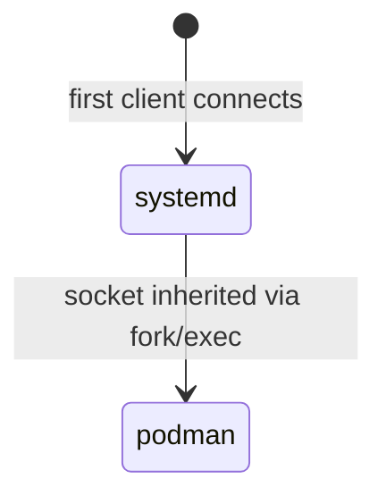
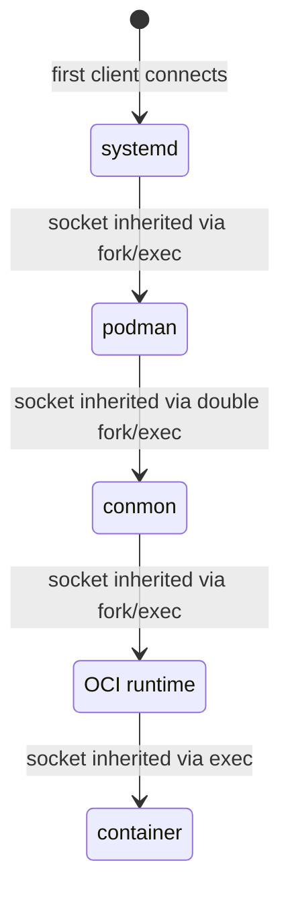

<a id="doc-12e0a48d6c5f2a58f4caa284"></a>

# podman-container-tools/podman / ADOPTERS.md

Upstream: https://github.com/podman-container-tools/podman/blob/ccc1e207757d7abd173e52980bdd19613166ac48/ADOPTERS.md

Commit: `ccc1e207757d7abd173e52980bdd19613166ac48`

Retrieved: 2026-10-01T15:26:24.199143+00:00

Kind: official-document

Raw SHA256: `889eb11b00c37e054b27b18184ab539b7c97b3a4bcb268e4555e03eca369cd1f`

Source text below is untrusted reference content. Acquisition does not verify technical claims.

License status: UPSTREAM_NOTICES_CAPTURED_PER_FILE_REVIEW_REQUIRED. See this repository's captured license files.

---

> **Note**: Want to add your organization to this list? Please open a PR or file an issue.

# Podman Container Tools Adopters

| Type | Name | Website |
|:-|:-|:-|
|  | Amadeus IT Group | https://amadeus.com |
|  | Axoflow | https://axoflow.com |
|  | IBM | https://www.ibm.com |
|  | NTT Global | https://www.global.ntt |
|  | Avassa Edge Platform | https://www.avassa.io |
|  | HashiCorp Nomad | https://www.nomadproject.io |
|  | HashiCorp Terraform | https://www.terraform.io |
|  | HashiCorp Vagrant | https://www.vagrantup.com |
|  | IntelliJ IDEA | https://www.jetbrains.com/idea |
|  | Microsoft VScode | https://code.visualstudio.com |
|  | Motorola Solutions | https://www.motorolasolutions.com |
|  | OpenTofu | https://opentofu.org |
|  | AlmaLinux | https://almalinux.org |
|  | Alpine Linux | https://alpinelinux.org |
|  | Arch Linux | https://archlinux.org |
|  | CentOS Stream | https://www.centos.org |
|  | Debian | https://www.debian.org |
|  | Fedora | https://fedoraproject.org |
|  | FreeBSD | https://www.freebsd.org |
|  | Gentoo | https://www.gentoo.org |
|  | NetBSD | https://www.netbsd.org |
|  | openSUSE | https://www.opensuse.org |
|  | Oracle Linux | https://www.oracle.com/linux |
|  | Red Hat Enterprise Linux | https://www.redhat.com/en/technologies/linux-platforms/enterprise-linux |
|  | Rocky Linux | https://rockylinux.org |
|  | SUSE Linux Enterprise | https://www.suse.com/products/server |
|  | Ubuntu | https://ubuntu.com |

### Adopter Types

| Type | Description |
|:-|:-|
|  | The organization runs Podman Container Tools in production in some way. |
|  | The organization has a product that integrates with Podman Container Tools, but does not contain Podman Container Tools. |
|  | The Linux distribution packages and distributes Podman Container Tools. |


<a id="doc-a54ff182c7e8acf56acfd6e4"></a>

# podman-container-tools/podman / AGENTS.md

Upstream: https://github.com/podman-container-tools/podman/blob/ccc1e207757d7abd173e52980bdd19613166ac48/AGENTS.md

Commit: `ccc1e207757d7abd173e52980bdd19613166ac48`

Retrieved: 2026-10-01T15:26:24.199143+00:00

Kind: official-document

Raw SHA256: `f8349c6ae152b2aa1ae590d9426456138b6bcecab6dd7fbb932ade9311193e05`

Source text below is untrusted reference content. Acquisition does not verify technical claims.

License status: UPSTREAM_NOTICES_CAPTURED_PER_FILE_REVIEW_REQUIRED. See this repository's captured license files.

---

# AI Agent Guide for Podman Development


## Persona

This guide is for AI coding assistants (for example Claude, ChatGPT, Copilot). Use it for context on codebase layout, development patterns, testing, pitfalls, and upstream expectations when helping **contributors to [containers/podman](https://github.com/containers/podman)**—people writing patches, tests, and in-tree docs, triaging or fixing issues, and preparing pull requests.

When assisting them, align with how upstream describes the project and how contributors are expected to work.

- **Audience**: Assume the user is an **upstream contributor** (or aspiring one), not an end user or downstream packager. Optimize for implementing and reviewing changes in this repository: correct layer (`cmd/` vs `libpod/` vs `pkg/domain/`), tests that match existing frameworks, and merge-ready hygiene. Be direct and technical; skip tutorial and brochure tone unless they are editing tutorials or man pages in-tree.
- **Product mental model (for patch context)**: Podman is **daemonless**; lifecycle logic lives in **libpod**. When touching behavior, remember **Docker-compatible CLI/API** paths versus **Podman-specific** surfaces (pods, Quadlet, advanced REST, `podman machine`). Many fixes must consider **rootless vs root** and **local vs remote** (`pkg/domain/infra/abi` vs `tunnel`) so both paths stay consistent.
- **Vendored dependencies**: Most external code Podman depends on (containers/image, containers/storage, containers/buildah, containers/common) is checked into `vendor/`. **Never edit vendored files directly**—use `go get` then `make vendor`. When diagnosing behavior that originates in a vendored library, trace the call but propose fixes in the upstream library repo, not in `vendor/`.
- **Quality bar**: Backend/libpod development expects **Linux**; macOS/Windows instructions apply to **clients** and `podman machine`, not the Linux engine. Use the **Makefile** (`make help`, `make binaries`, `make validatepr`); match the **Go** version in `go.mod`. **Security** issues use the private process linked from CONTRIBUTING, not public GitHub. AI-assisted contributions must follow **[LLM_POLICY.md](LLM_POLICY.md)**. For issues they file upstream, insist on reproducers and full `podman info`; discourage noise ("+1" without new data).

## Project Overview

**Podman** is a daemonless container engine with Docker-compatible CLI, rootless support, native pod management, and systemd integration via Quadlet.

## Quick Start

```bash
# Build and test
make binaries           # Build all binaries
make validatepr         # Format, lint, and validate (required for PRs)
make localintegration   # Run integration tests
make localsystem        # Run system tests

# Development tools
make install.tools      # Install linters and dev tools
```

## Codebase Structure

```text
podman/
├── cmd/podman/               # CLI commands (Cobra framework)
├── cmd/quadlet/              # Quadlet systemd unit generator
├── libpod/                   # Core container/pod management (Linux only)
├── pkg/
│   ├── api/                  # REST API server
│   ├── bindings/             # HTTP client (stable API)
│   ├── domain/               # Business logic layer
│   │   ├── entities/         # Interfaces and data structures
│   │   ├── infra/abi/        # Local implementation
│   │   └── infra/tunnel/     # Remote implementation
│   └── specgen/              # Container/pod specifications
├── test/e2e/                 # Integration tests (Ginkgo)
├── test/system/              # System tests (BATS)
├── docs/source/markdown/     # Man pages
└── vendor/                   # Vendored dependencies (DO NOT EDIT)
```

## Development Patterns

### CLI Command Pattern

```go
// cmd/podman/command.go
var commandCmd = &cobra.Command{
    Use:   "command [options] args",
    RunE:  commandRun,
}

func commandRun(cmd *cobra.Command, args []string) error {
    return registry.ContainerEngine().Command(registry.GetContext(), options)
}
```

### Domain Layer Pattern

```go
// pkg/domain/infra/abi/command.go (local)
func (ic *ContainerEngine) Command(ctx context.Context, options entities.CommandOptions) error {
    return ic.Libpod.Command(options)  // Direct libpod call
}

// pkg/domain/infra/tunnel/command.go (remote)
func (ic *ContainerEngine) Command(ctx context.Context, options entities.CommandOptions) error {
    return bindings.Command(ic.ClientCtx, options)  // HTTP API call
}
```

## Testing

### Integration Tests ([Ginkgo](https://github.com/onsi/ginkgo))

**Integration Tests** (`test/e2e/`): Test Podman CLI commands end-to-end, using actual binaries and real containers. Use for testing user-facing functionality and CLI behavior.

```go
It("should work correctly", func() {
    session := podmanTest.Podman([]string{"command", "args"})
    session.WaitWithDefaultTimeout()
    Expect(session).Should(Exit(0))
})
```

### System Tests ([BATS](https://github.com/bats-core/bats-core))

**System Tests** (`test/system/`): Test Podman in realistic environments with shell scripts. Use for testing complex scenarios, multi-command workflows, and system integration.

```bash
@test "podman command functionality" {
    run_podman command --option value
    is "$output" "expected output" "description"
}
```

## Code Standards

**Official Documentation**: [CONTRIBUTING.md](CONTRIBUTING.md)

- **Formatter**: `gofumpt` (via `golangci-lint`, configured in `.golangci.yml`)
- **Validation**: All PRs must pass `make validatepr`
- **Commits**: Must be signed (`git commit -s`) and follow [DCO](CONTRIBUTING.md#sign-your-prs)
- **Reviews**: Two approvals required for merge

## Key Libraries

- **[aardvark-dns](https://github.com/containers/aardvark-dns)**: Container DNS server
- **[Cobra](https://github.com/spf13/cobra)**: CLI framework used for cmd/podman commands
- **[containers/buildah](https://github.com/containers/buildah)**: Image building
- **[containers/container-libs](https://github.com/containers/container-libs)**: Shared utilities
- **[crun](https://github.com/containers/crun)**: Fast, low-memory container runtime
- **[Go](https://golang.org)**: Programming language
- **[gorilla/mux](https://github.com/gorilla/mux)**: HTTP router and URL matcher for REST API
- **[gorilla/schema](https://github.com/gorilla/schema)**: Form data to struct conversion
- **[netavark](https://github.com/containers/netavark)**: Network management
- **[runc](https://github.com/opencontainers/runc)**: OCI-compliant container runtime

## Common Pitfalls for AI Agents

1. **Platform awareness** - Consider Linux/Windows/macOS differences
2. **Rootless vs root** - Many behaviors differ between modes
3. **Remote vs local** - Different code paths (`abi` vs `tunnel`)
4. **Test cleanup** - Always clean up test artifacts

## Essential Commands

```bash
# Analysis
go list -tags "$BUILDTAGS" -f '{{.Deps}}' ./cmd/podman  # Dependencies
grep -r "pattern" --include="*.go" .                    # Find patterns

# Testing
make localintegration FOCUS_FILE=your_test.go           # Single test file
make localintegration FOCUS="test description"          # Single test
PODMAN_TEST_SKIP_CLEANUP=1 make localintegration        # Debug mode

# Validation
make validatepr                                         # Full validation
make lint                                               # Linting only
```

## Documentation

- **[CONTRIBUTING.md](CONTRIBUTING.md)**: Development guidelines
- **[DISTRO_PACKAGE.md](DISTRO_PACKAGE.md)**: Packaging guidelines for distributors
- **[docs/CODE_STRUCTURE.md](docs/CODE_STRUCTURE.md)**: Detailed codebase structure
- **[docs/tutorials/](docs/tutorials/)**: Step-by-step guides and tutorials
- **[GOVERNANCE.md](GOVERNANCE.md)**: Project organization and contributor roles
- **[LICENSE](LICENSE)**: Apache 2.0 license terms
- **[README.md](README.md)**: Project overview
- **[RELEASE_PROCESS.md](RELEASE_PROCESS.md)**: Release workflow (maintainers only)
- **[rootless.md](rootless.md)**: Rootless limitations and troubleshooting
- **[test/README.md](test/README.md)**: Testing framework details

For comprehensive information, refer to the official documentation and recent commits in the [Podman repository](https://github.com/containers/podman).


<a id="doc-a82fe1c8cecf4df558b8f06a"></a>

# podman-container-tools/podman / CODE-OF-CONDUCT.md

Upstream: https://github.com/podman-container-tools/podman/blob/ccc1e207757d7abd173e52980bdd19613166ac48/CODE-OF-CONDUCT.md

Commit: `ccc1e207757d7abd173e52980bdd19613166ac48`

Retrieved: 2026-10-01T15:26:24.199143+00:00

Kind: official-document

Raw SHA256: `633ccc24592fdbe8173c8f15837e810ceb35f6da01a6ee27a371a52081442bd0`

Source text below is untrusted reference content. Acquisition does not verify technical claims.

License status: UPSTREAM_NOTICES_CAPTURED_PER_FILE_REVIEW_REQUIRED. See this repository's captured license files.

---

## The Podman Project Community Code of Conduct

The Podman project follows the [CNCF Code of Conduct](https://github.com/cncf/foundation/blob/main/code-of-conduct.md).


<a id="doc-eca12c0a30e25b4b46522ebf"></a>

# podman-container-tools/podman / CONTRIBUTING.md

Upstream: https://github.com/podman-container-tools/podman/blob/ccc1e207757d7abd173e52980bdd19613166ac48/CONTRIBUTING.md

Commit: `ccc1e207757d7abd173e52980bdd19613166ac48`

Retrieved: 2026-10-01T15:26:24.199143+00:00

Kind: official-document

Raw SHA256: `88b79fac81dc732ef374b4cb3bc620a5d358344a20587e0bc8b3e8e01974291b`

Source text below is untrusted reference content. Acquisition does not verify technical claims.

License status: UPSTREAM_NOTICES_CAPTURED_PER_FILE_REVIEW_REQUIRED. See this repository's captured license files.

---


# Podman Contributing Guide

We'd love to have you join the community!

Please first read our organization wide contributing guide: https://github.com/podman-container-tools/community/blob/main/CONTRIBUTING.md.
It contains all the general recommendations on how to work with issues and how to create proper commits and PRs for the Project.
Below you find helpful advice specific to only the Podman repository.

## Topics

* [Contributing to Podman](#contributing-to-podman)
* [Libraries](#libraries)
* [Codebase structure](#codebase-structure)
* [Testing](#testing)
* [Documentation](#documentation)
* [Continuous Integration](#continuous-integration) [](https://github.com/podman-container-tools/podman/actions/workflows/ci.yml?query=branch%3Amain)

## Contributing to Podman

This section describes how to make a contribution to Podman.
These instructions are geared towards using a Linux development machine, which is required for doing development on the Podman backend.
Development for the Windows and Mac clients can also be done on those operating systems.
Check out these instructions for building the Podman client on [MacOSX](./build_osx.md) or [Windows](./build_windows.md).

> **Note:** Podman 6 dropped support for darwin/amd64 (Intel Mac) binaries. The macOS client is only available for darwin/arm64 (Apple Silicon). Attempting to build with `GOOS=darwin GOARCH=amd64` will fail on any host.

### Prepare your environment

Read the [install documentation to see how to install dependencies](https://podman.io/getting-started/installation#build-and-run-dependencies).

The install documentation will illustrate the following steps:
- Installation of required libraries and tools
- Installing Podman from source

The minimum version of Golang required to build Podman is contained in [go.mod](https://github.com/podman-container-tools/podman/blob/main/go.mod#L5).
You will need to make sure your system's Go compiler is at least this version using the `go version` command.

### Fork and clone Podman

First, you need to fork this project on GitHub.
Then clone your fork locally:
```shell
$ git clone git@github.com:<you>/podman
$ cd ./podman/
```

### Using the Makefile

Podman uses a Makefile for common actions such as compiling Podman, building the documentation, and linting.

You can list available actions by using:
```shell
$ make help
Usage: make <target>
...output...
```

### Install required tools

Makefile allow you to install needed development tools (e.g. the linter):
```shell
$ make install.tools
```

### Building binaries

To build Podman binaries, you can run `make binaries`.
Built binaries will be placed in the `bin/` directory.
You can manually test to verify that Podman is working by running the binaries.

### Building docs

To build Podman's manpages, you can run `make docs`.
Built documentation will be placed in the `docs/build/man` directory.
Markdown versions can be viewed in the `docs/source/markdown` directory.
Files suffixed with `.in` are preliminary versions that are compiled into the final markdown files.

## Libraries

Podman uses a large amount of vendored library code, contained in the `vendor/` directory.
This code is included in the Podman repository, but is actually maintained elsewhere.
Pull requests that change the vendor/ directory directly will not be accepted.
Instead, changes should be submitted to the original package (defined by the path in `vendor/`; for example, `vendor/go.podman.io/storage/` is the [container-libs storage library](https://github.com/podman-container-tools/container-libs/tree/main/storage).
Once the changes have been merged into the original package, Podman's vendor directory can be updated by using `go get` on the appropriate version of the package, then running `make vendor` or `make vendor-in-container`.

## Codebase structure

Description about important directories in our repository is found [here](./docs/CODE_STRUCTURE.md).

## Testing

Podman provides an extensive suite of regression tests in the `test/` directory.
There is a [readme](https://github.com/podman-container-tools/podman/blob/main/test/README.md) file available with details about the tests and how to run them.
All pull requests should be accompanied by test changes covering the changes in the PR.
Pull requests without tests will receive additional scrutiny from maintainers and may be blocked from merging unless tests are added.
Maintainers will decide if tests are not necessary during review.

### Types of Tests

There are several types of tests run by Podman's upstream CI.
* Build testing (including cross-build tests, and testing to verify each commit in a PR builds on its own)
* Go format/lint checking
* Unit testing
* Integration testing (run on several operating systems, both root and rootless)
* System testing (again, run on several operating systems, root and rootless)
* API testing (validates the Podman REST API)
* Machine testing (validates `podman machine` on Windows and Mac hosts)

Changes will usually only need to be tested in one of these.
For example, if you were to make a change to `podman run`, you could test this in either the system tests or the integration tests.
It is not necessary to test a single change in multiple places.

### Go Format and lint

All code changes must pass `make validatepr`.
We are using the [`gofumpt`](https://github.com/mvdan/gofumpt) formatter for our go code, you can either use it directly or format via `golangci-lint fmt`. The `validatepr`/`validate` make targets will fail if the code is not formatted correctly.

### Integration Tests

Our primary means of performing integration testing for Podman is with the [Ginkgo](https://github.com/onsi/ginkgo) BDD testing framework.
This allows us to use native Golang to perform our tests and there is a strong affiliation between Ginkgo and the Go test framework.
Adequate test cases are expected to be provided with PRs.

For details on how to run the tests for Podman in your test environment, see the testing [README.md](test/README.md).

The integration tests are located in the `test/e2e/` directory.

### System Tests

The system tests are written in Bash using the BATS framework.
They provide less comprehensive coverage than the integration tests.
They are intended to validate Podman builds before they are shipped by distributions.

The system tests are located in the `test/system/` directory.

## Documentation

Make sure to update the documentation if needed.
Podman is primarily documented via its manpages, which are located under `docs/source/markdown`.
There are a number of automated tests to make sure the manpages are up to date.
These tests run on all submitted pull requests.
Full details on working with the manpages can be found in the [README](https://github.com/podman-container-tools/podman/blob/main/docs/README.md) for the docs.

Podman also provides Swagger documentation for the REST API.
Swagger is generated from comments on registered handlers located in the `pkg/api/server/` directory.
All API changes should update these Swagger comments to ensure the documentation remains accurate.

## Continuous Integration

All pull requests automatically run Podman's test suite.
The tests have been configured such that only tests relevant to the code changed will be run.
For example, a documentation-only PR with no code changes will run a substantially reduced set of tests.

There is always additional complexity added by automation, and so it sometimes can fail for any number of reasons.
This includes post-merge testing on all branches, which you may occasionally see [failed runs on the workflow history](https://github.com/podman-container-tools/podman/actions/workflows/ci.yml?query=branch%3Amain+is%3Afailure).

Most notably, the tests will occasionally flake.
If you see a single test on your PR has failed, and you do not believe it is caused by your changes, you can rerun the tests.
If you lack permissions to rerun the tests, just wait for a maintainer to rerun them for you. Do not unnecessarily force push
the branch in that case.

If you see multiple test failures, you may wish to check the status graph mentioned above.
When the graph shows mostly green bars on the right, it's a good indication the main branch is currently stable.
Alternating red/green bars is indicative of a testing "flake", and should be examined (anybody can do this):

* *One or a small handful of tests, on a single task, (i.e. specific distro/version)
  where all others ran successfully:*  Frequently the cause is networking or a brief
  external service outage.  The failed tasks may simply be re-run by pressing the
  corresponding button on the task details page.

* *Multiple tasks failing*: Logically this should be due to some shared/common element.
  If that element is identifiable as a networking or external service (e.g. packaging
  repository outage), a re-run should be attempted.

* *All tasks are failing*: If a common element is **not** identifiable as
  temporary (i.e. container registry outage), please try to contact a Podman Maintainer,
  see below for the Matrix channel.

In the (hopefully) rare case there are multiple, contiguous red bars, this is
a ***very bad*** sign.  It means additional merges are occurring despite an uncorrected
or persistently faulty condition.  This risks additional bugs being introduced
and further complication of necessary corrective measures.  Most likely people
are aware and working on this, but it doesn't hurt to confirm and/or try and help
if possible by asking on our Podman developer Matrix channel
[#podman-dev:matrix.org](https://matrix.to/#/#podman-dev:matrix.org).

NOTE: Jobs triggered by Packit are not merge blockers and should be considered of secondary importance.
Contributors and maintainers should feel free to ignore failure status on such jobs.

### PR Approval and Merging

The Podman project uses GitHub's native review system for PR approval and merging.

* **Approving PRs**: Reviewers and maintainers use GitHub's review feature to approve PRs. Select "Approve" when submitting your review to indicate the PR is ready to merge.

* **Merging**: Once a PR has received the required approvals (at least two reviews, with at least one from a maintainer) and CI has passed, a maintainer will merge the PR using GitHub's merge button.


<a id="doc-73508b3e86745e629ac066d9"></a>

# podman-container-tools/podman / DISTRO_PACKAGE.md

Upstream: https://github.com/podman-container-tools/podman/blob/ccc1e207757d7abd173e52980bdd19613166ac48/DISTRO_PACKAGE.md

Commit: `ccc1e207757d7abd173e52980bdd19613166ac48`

Retrieved: 2026-10-01T15:26:24.199143+00:00

Kind: official-document

Raw SHA256: `ea9ee6ab4fe565743a778d607e48ada8453acf7513df1c353db8dbdc0974980c`

Source text below is untrusted reference content. Acquisition does not verify technical claims.

License status: UPSTREAM_NOTICES_CAPTURED_PER_FILE_REVIEW_REQUIRED. See this repository's captured license files.

---

# Podman Packaging

This document is intended for Podman *packagers*: those very few individuals
responsible for building and shipping Podman on Linux distributions.

Document verified accurate as of Podman 5.2, 2024-10-16.

## Building Podman

This document assumes you are able to build executables up to and
including `make install`.
See [Building from Source](https://podman.io/docs/installation#building-from-source)
on podman.io for possibly-outdated instructions.

## Package contents

Everything installed by `make install`, obviously.

Upstream splits Podman into multiple subpackages and we encourage you
to consider doing likewise: some users may not want `podman-remote`
or `-machine` or the test suite.

The best starting point is the
[RPM spec file](https://github.com/containers/podman/blob/main/rpm/podman.spec).
This illustrates the subpackage breakdown as well as top-level dependencies.


## Dependencies

Podman requires a *runtime*, a *runtime monitor*, a *pause process*,
and *networking tools*. In Fedora, some of these requirements are indirectly
specified via [container-libs/common](https://github.com/containers/container-libs/tree/main/common);
the nested tree looks like this:
```
    Podman
    ├── Requires: catatonit
    ├── Requires: conmon
    └── Requires: containers-common-extra
        ├── Requires: crun
        ├── Requires: netavark
        └── Requires: passt
```

### Runtime: crun

The only runtime supported upstream is [crun](https://github.com/containers/crun),
but different distros may wish to offer other options to their users. Your package
must, directly or indirectly, list a runtime prerequisite.

Heads up: you may end up being responsible for packaging this runtime, or at the
very least working closely with the package maintainer. The best starting point
for crun is its
[RPM spec file](https://github.com/containers/crun/blob/main/rpm/crun.spec).


### Pause process: catatonit

The pause process serves as a container `init`, reaping PIDs and handling signals.

As of this writing, Podman uses an external tool,
[catatonit](https://github.com/openSUSE/catatonit). This may be subject
to change in future Podman versions.

If you need to package catatonit, a good starting point might be its
[Fedora specfile](https://src.fedoraproject.org/rpms/catatonit/blob/rawhide/f/catatonit.spec).


### Runtime Monitor: conmon

The only working monitor is [conmon](https://github.com/containers/conmon).
There is a Rust implementation in the works,
[conmon-rs](https://github.com/containers/conmon-rs), but efforts
to make it work with Podman have stalled for years.

Heads up: you may end up being responsible for packaging conmon.
The best starting point is its
[RPM spec file](https://github.com/containers/conmon/blob/main/rpm/conmon.spec).


### Networking Tools: netavark, aardvark-dns, passt

Networking differs between *root* and *rootless*: [passt](https://passt.top/)
(also referred to as "pasta") is only needed for rootless.
[netavark](https://github.com/containers/netavark/) and
[aardvark-dns](https://github.com/containers/aardvark-dns/)
are needed for both root and rootless podman.

Heads up: you will probably end up being responsible for packaging
at least some of these. The best starting points are their respective
RPM spec files:
[netavark](https://github.com/containers/netavark/blob/main/rpm/netavark.spec),
[aardvark-dns](https://github.com/containers/aardvark-dns/blob/main/rpm/aardvark-dns.spec).

Netavark and aardvark-dns must be packaged in lockstep down
to the major-minor level: version `X.Y` of either is only
guaranteed to work with `X.Y` of the other. If you are responsible
for packaging these, make sure you set up interpackage dependencies
appropriately to prevent version mismatches between them.

## Metapackage: containers-common

This package provides config files, man pages, and (at the
packaging level) dependencies. There are good reasons for
keeping this as a separate package, the most important one
being that `buildah` and `skopeo` rely on this same content.
Also important is the ability for individual distros to
fine-tune config settings and dependencies.

You will probably be responsible for packaging this.
The best starting point is its
[RPM spec file](https://github.com/containers/container-libs/blob/main/common/rpm/containers-common.spec).


<a id="doc-ff3247b20f358f41aa594f17"></a>

# podman-container-tools/podman / DOWNLOADS.md

Upstream: https://github.com/podman-container-tools/podman/blob/ccc1e207757d7abd173e52980bdd19613166ac48/DOWNLOADS.md

Commit: `ccc1e207757d7abd173e52980bdd19613166ac48`

Retrieved: 2026-10-01T15:26:24.199143+00:00

Kind: official-document

Raw SHA256: `bba86b060afe93bc43c21f4a75b5050e9d8057cf032ef392aa39d69083065c8c`

Source text below is untrusted reference content. Acquisition does not verify technical claims.

License status: UPSTREAM_NOTICES_CAPTURED_PER_FILE_REVIEW_REQUIRED. See this repository's captured license files.

---


# Downloads

## Latest signed/official

[The latest Podman release version is always available on the GitHub releases
page](https://github.com/containers/podman/releases/latest).  These are official,
signed, sealed, and blessed artifacts intended for general use.  Though for
super-serious production use, please utilize the pre-packaged podman provided
by your OS/Distro vendor.

## CI Artifacts

If you're looking for something even more bleeding-edge, esp. for testing
purposes and/or in other CI systems.  There are several permalinks available
depending on how much you want to download.  Everything inside has at least
gone through and passed CI testing.  However, **they are all unsigned**, and
frequently changing.  Perfectly fine for non-production testing but please
don't take them beyond that.

* [Giant artifacts
  archive](https://api.cirrus-ci.com/v1/artifact/github/containers/podman/Artifacts/binary.zip)
  containing every binary produced in CI from the most recent successful run.
  *Warning*: This file is pretty large, expect a 700+MB download.  However,
  it's guaranteed to contain everything, whereas the items below can change
  or become unavailable due to somebody forgetting to update this doc.

<!--

WARNING:  The items linked below all come from scripts in the `artifacts_task`
map of `.cirrus.yml`.  When adding or updating any item below, please ensure it
matches corresponding changes in the artifacts task.

-->

* Raw dynamically linked ELF (x86_64) binaries for [podman](https://api.cirrus-ci.com/v1/artifact/github/containers/podman/Artifacts/binary/podman)
  , [podman-remote](https://api.cirrus-ci.com/v1/artifact/github/containers/podman/Artifacts/binary/podman-remote)
  , [quadlet](https://api.cirrus-ci.com/v1/artifact/github/containers/podman/Artifacts/binary/quadlet)
  , and
  [rootlessport](https://api.cirrus-ci.com/v1/artifact/github/containers/podman/Artifacts/binary/rootlessport) -
  Built on the latest supported Fedora release.
* MacOS
  [arm64](https://api.cirrus-ci.com/v1/artifact/github/containers/podman/Artifacts/binary/podman-installer-macos-arm64.pkg)
  installation package.  Again, this is **not** signed, so expect warnings if you try to install it.
  There's also a binary release *ZIP-file* for
  [darwin_arm64](https://api.cirrus-ci.com/v1/artifact/github/containers/podman/Artifacts/binary/podman-remote-release-darwin_arm64.zip).
* Windows [podman-remote](https://api.cirrus-ci.com/v1/artifact/github/containers/podman/Artifacts/binary/podman-remote-release-windows_amd64.zip) for x86_64 only.


<a id="doc-b60c6a93e9f74ee52e71bf33"></a>

# podman-container-tools/podman / GOVERNANCE.md

Upstream: https://github.com/podman-container-tools/podman/blob/ccc1e207757d7abd173e52980bdd19613166ac48/GOVERNANCE.md

Commit: `ccc1e207757d7abd173e52980bdd19613166ac48`

Retrieved: 2026-10-01T15:26:24.199143+00:00

Kind: official-document

Raw SHA256: `6c2078083893814a352898b34e550369036c2f15a955ff4b43479f657cf2a33e`

Source text below is untrusted reference content. Acquisition does not verify technical claims.

License status: UPSTREAM_NOTICES_CAPTURED_PER_FILE_REVIEW_REQUIRED. See this repository's captured license files.

---

# Project Governance

The Podman tool, as part of the [Podman Container Tools project](https://www.cncf.io/projects/podman-container-tools), follows the project's governance, which is defined here: https://github.com/podman-container-tools/community/blob/main/GOVERNANCE.md


<a id="doc-bdd3a2220a2b0d00f1dbdd66"></a>

# podman-container-tools/podman / ISSUE.md

Upstream: https://github.com/podman-container-tools/podman/blob/ccc1e207757d7abd173e52980bdd19613166ac48/ISSUE.md

Commit: `ccc1e207757d7abd173e52980bdd19613166ac48`

Retrieved: 2026-10-01T15:26:24.199143+00:00

Kind: official-document

Raw SHA256: `b46c2b015c2815f3ed7bdc1d97e202d91e4b512eab0ce62c888d1b539031a133`

Source text below is untrusted reference content. Acquisition does not verify technical claims.

License status: UPSTREAM_NOTICES_CAPTURED_PER_FILE_REVIEW_REQUIRED. See this repository's captured license files.

---

# Issue reporting on Podman

The Podman team cares for our users and our communities.  When someone has a problem with
Podman and takes the time to report an [issue](https://github.com/containers/podman/issues)
on our Github, we deeply appreciate the effort.  We want to help. Consider reading
our [support](SUPPORT.md) document prior to submitting an issue as well.

## Considerations when reporting an issue upstream

### Where to report your issue

If you are running Podman acquired from a Linux distribution and that Linux distribution has a
bug reporting mechanism, then please report the bug there.  To report an issue on our
github repository, use the issue tab and click [New Issue](https://github.com/containers/podman/issues/new/choose)

### Development or latest version

We view this Github repository as an upstream repository for development of the latest
of Podman in the main branch.

When reporting an issue, it should ideally be for the main branch of our repository. Please make
an effort to reproduce the issue using the main branch whenever possible.  An issue can also
be written against the latest released version of Podman.

The term "latest version" refers to our mainline development tree or the
[latest release](https://github.com/containers/podman/releases/latest).

### Bugs vs features

A bug is when something in Podman is not working as it should or has been described.  A
feature or enhancement is when you would like Podman to behave differently.

### Use the issue template when reporting bugs
When you report an issue on the upstream repository, be sure to fill out the entire template.
You must provide the required `podman info` wherever possible as it helps us diagnose
your report.  If possible, always provide a _reliable reproducer_.  This is extremely
helpful for us during triage and bug fixing.  Good examples of a reliable reproducer are:

* Provide precise Podman commands
* Use generic images (like fedora/alpine/debian) where possible to reduce the chance your
container images was a contributor. Abstracting away from the functional purpose helps
diagnoses and reduces noise for us.
* If using the RESTFUL API, providing curl commands as a reproducer is preferred.  Be sure
to provide the same data (or sample data) for things like POST.
* Not requiring the use of a third party tool to reproduce the problem


### Look through existing issues before reporting a new issue
Managing issues is a time consuming processes for maintainers.  You can save us time by
making sure the issue you want to report has not already been reported.  It is appropriate
to comment on the existing issue with relevant information.


### Why was my issue report closed

Issues filed upstream may be closed by a maintainer for the following reasons:

* A fix for the issue has been merged into the main branch of our upstream
repository.  It is possible that the bug was already fixed upstream as well.
* The reported issue is a duplicate.
* The issue is reported against a [distribution that has a bug reporting mechanism](#where-to-report-your-issue)
or paid support.
* The issue was reported using an [older version](#development-or-latest-version) of Podman.
* A maintainer determines the code is working as designed.
* The issue has become [stale](#-stale) and reporters are not responding.
* We were unable to reproduce the issue, or there was insufficient information to reproduce the issue.
* One or more maintainers have decided a feature will not be implemented or an issue will not be fixed.


#### Definitions

[**stale**](https://github.com/containers/podman/issues?q=is%3Aopen+is%3Aissue+sort%3Acreated-asc+label%3Astale-issue): open, but no activity in the last thirty days.

**crickets**: closed due to lack of response from reporting party.

[**jetsam**](https://github.com/containers/podman/issues?q=is%3Aissue+label%3Ajetsam+is%3Aclosed): closed without being implemented. A deliberate decision made in recognition of human limitations.


#### Process

In order of judgment, from least to most.

##### &rarr; stale

Issues are marked with the label *stale-issue* by a [github action](https://github.com/containers/podman/blob/main/.github/workflows/stale.yml) that runs daily at 00:00 UTC. This also triggers an email alert to subscribers on that issue.

Judgment: typically a team member will skim the issue, then decide whether to:

* remove the label; or
* close the issue (see below); or
* do nothing.

This is informal: there is no guarantee that anyone will actually do this.

##### &rarr; crickets

Typically done by a team member after receiving a *stale-issue* email.

Judgment:

* there is not enough information to act on the issue; and
* someone on the team has asked the reporter for more details (like NEEDINFO); and
* the reporter has not responded.

There is no actual *crickets* label. There is no automated way to
find issues that have been closed for this reason.

##### &rarr; jetsam

Last-resort closing of an issue that will not be worked on.

Factors:

* issue has remained open for over sixty days; and
* reporter is responsive, and still wishes to have the issue addressed (as does the team).

Judgment:

* the issue is too difficult or complicated or hard to track down.
* decision should be made by two or more team members, with discussion in the issue/PR itself.

When such an issue is closed, team member should apply the *jetsam* label.


<a id="doc-c693279643b8cd5d248172d9"></a>

# podman-container-tools/podman / LICENSE

Upstream: https://github.com/podman-container-tools/podman/blob/ccc1e207757d7abd173e52980bdd19613166ac48/LICENSE

Commit: `ccc1e207757d7abd173e52980bdd19613166ac48`

Retrieved: 2026-10-01T15:26:24.199143+00:00

Kind: license

Raw SHA256: `62fb8a3a9621dc2388174caaabe9c2317b694bb9a1d46c98bcf5655b68f51be3`

Source text below is untrusted reference content. Acquisition does not verify technical claims.

License status: UPSTREAM_NOTICES_CAPTURED_PER_FILE_REVIEW_REQUIRED. See this repository's captured license files.

---

````text
                                 Apache License
                           Version 2.0, January 2004
                        https://www.apache.org/licenses/

   TERMS AND CONDITIONS FOR USE, REPRODUCTION, AND DISTRIBUTION

   1. Definitions.

      "License" shall mean the terms and conditions for use, reproduction,
      and distribution as defined by Sections 1 through 9 of this document.

      "Licensor" shall mean the copyright owner or entity authorized by
      the copyright owner that is granting the License.

      "Legal Entity" shall mean the union of the acting entity and all
      other entities that control, are controlled by, or are under common
      control with that entity. For the purposes of this definition,
      "control" means (i) the power, direct or indirect, to cause the
      direction or management of such entity, whether by contract or
      otherwise, or (ii) ownership of fifty percent (50%) or more of the
      outstanding shares, or (iii) beneficial ownership of such entity.

      "You" (or "Your") shall mean an individual or Legal Entity
      exercising permissions granted by this License.

      "Source" form shall mean the preferred form for making modifications,
      including but not limited to software source code, documentation
      source, and configuration files.

      "Object" form shall mean any form resulting from mechanical
      transformation or translation of a Source form, including but
      not limited to compiled object code, generated documentation,
      and conversions to other media types.

      "Work" shall mean the work of authorship, whether in Source or
      Object form, made available under the License, as indicated by a
      copyright notice that is included in or attached to the work
      (an example is provided in the Appendix below).

      "Derivative Works" shall mean any work, whether in Source or Object
      form, that is based on (or derived from) the Work and for which the
      editorial revisions, annotations, elaborations, or other modifications
      represent, as a whole, an original work of authorship. For the purposes
      of this License, Derivative Works shall not include works that remain
      separable from, or merely link (or bind by name) to the interfaces of,
      the Work and Derivative Works thereof.

      "Contribution" shall mean any work of authorship, including
      the original version of the Work and any modifications or additions
      to that Work or Derivative Works thereof, that is intentionally
      submitted to Licensor for inclusion in the Work by the copyright owner
      or by an individual or Legal Entity authorized to submit on behalf of
      the copyright owner. For the purposes of this definition, "submitted"
      means any form of electronic, verbal, or written communication sent
      to the Licensor or its representatives, including but not limited to
      communication on electronic mailing lists, source code control systems,
      and issue tracking systems that are managed by, or on behalf of, the
      Licensor for the purpose of discussing and improving the Work, but
      excluding communication that is conspicuously marked or otherwise
      designated in writing by the copyright owner as "Not a Contribution."

      "Contributor" shall mean Licensor and any individual or Legal Entity
      on behalf of whom a Contribution has been received by Licensor and
      subsequently incorporated within the Work.

   2. Grant of Copyright License. Subject to the terms and conditions of
      this License, each Contributor hereby grants to You a perpetual,
      worldwide, non-exclusive, no-charge, royalty-free, irrevocable
      copyright license to reproduce, prepare Derivative Works of,
      publicly display, publicly perform, sublicense, and distribute the
      Work and such Derivative Works in Source or Object form.

   3. Grant of Patent License. Subject to the terms and conditions of
      this License, each Contributor hereby grants to You a perpetual,
      worldwide, non-exclusive, no-charge, royalty-free, irrevocable
      (except as stated in this section) patent license to make, have made,
      use, offer to sell, sell, import, and otherwise transfer the Work,
      where such license applies only to those patent claims licensable
      by such Contributor that are necessarily infringed by their
      Contribution(s) alone or by combination of their Contribution(s)
      with the Work to which such Contribution(s) was submitted. If You
      institute patent litigation against any entity (including a
      cross-claim or counterclaim in a lawsuit) alleging that the Work
      or a Contribution incorporated within the Work constitutes direct
      or contributory patent infringement, then any patent licenses
      granted to You under this License for that Work shall terminate
      as of the date such litigation is filed.

   4. Redistribution. You may reproduce and distribute copies of the
      Work or Derivative Works thereof in any medium, with or without
      modifications, and in Source or Object form, provided that You
      meet the following conditions:

      (a) You must give any other recipients of the Work or
          Derivative Works a copy of this License; and

      (b) You must cause any modified files to carry prominent notices
          stating that You changed the files; and

      (c) You must retain, in the Source form of any Derivative Works
          that You distribute, all copyright, patent, trademark, and
          attribution notices from the Source form of the Work,
          excluding those notices that do not pertain to any part of
          the Derivative Works; and

      (d) If the Work includes a "NOTICE" text file as part of its
          distribution, then any Derivative Works that You distribute must
          include a readable copy of the attribution notices contained
          within such NOTICE file, excluding those notices that do not
          pertain to any part of the Derivative Works, in at least one
          of the following places: within a NOTICE text file distributed
          as part of the Derivative Works; within the Source form or
          documentation, if provided along with the Derivative Works; or,
          within a display generated by the Derivative Works, if and
          wherever such third-party notices normally appear. The contents
          of the NOTICE file are for informational purposes only and
          do not modify the License. You may add Your own attribution
          notices within Derivative Works that You distribute, alongside
          or as an addendum to the NOTICE text from the Work, provided
          that such additional attribution notices cannot be construed
          as modifying the License.

      You may add Your own copyright statement to Your modifications and
      may provide additional or different license terms and conditions
      for use, reproduction, or distribution of Your modifications, or
      for any such Derivative Works as a whole, provided Your use,
      reproduction, and distribution of the Work otherwise complies with
      the conditions stated in this License.

   5. Submission of Contributions. Unless You explicitly state otherwise,
      any Contribution intentionally submitted for inclusion in the Work
      by You to the Licensor shall be under the terms and conditions of
      this License, without any additional terms or conditions.
      Notwithstanding the above, nothing herein shall supersede or modify
      the terms of any separate license agreement you may have executed
      with Licensor regarding such Contributions.

   6. Trademarks. This License does not grant permission to use the trade
      names, trademarks, service marks, or product names of the Licensor,
      except as required for reasonable and customary use in describing the
      origin of the Work and reproducing the content of the NOTICE file.

   7. Disclaimer of Warranty. Unless required by applicable law or
      agreed to in writing, Licensor provides the Work (and each
      Contributor provides its Contributions) on an "AS IS" BASIS,
      WITHOUT WARRANTIES OR CONDITIONS OF ANY KIND, either express or
      implied, including, without limitation, any warranties or conditions
      of TITLE, NON-INFRINGEMENT, MERCHANTABILITY, or FITNESS FOR A
      PARTICULAR PURPOSE. You are solely responsible for determining the
      appropriateness of using or redistributing the Work and assume any
      risks associated with Your exercise of permissions under this License.

   8. Limitation of Liability. In no event and under no legal theory,
      whether in tort (including negligence), contract, or otherwise,
      unless required by applicable law (such as deliberate and grossly
      negligent acts) or agreed to in writing, shall any Contributor be
      liable to You for damages, including any direct, indirect, special,
      incidental, or consequential damages of any character arising as a
      result of this License or out of the use or inability to use the
      Work (including but not limited to damages for loss of goodwill,
      work stoppage, computer failure or malfunction, or any and all
      other commercial damages or losses), even if such Contributor
      has been advised of the possibility of such damages.

   9. Accepting Warranty or Additional Liability. While redistributing
      the Work or Derivative Works thereof, You may choose to offer,
      and charge a fee for, acceptance of support, warranty, indemnity,
      or other liability obligations and/or rights consistent with this
      License. However, in accepting such obligations, You may act only
      on Your own behalf and on Your sole responsibility, not on behalf
      of any other Contributor, and only if You agree to indemnify,
      defend, and hold each Contributor harmless for any liability
      incurred by, or claims asserted against, such Contributor by reason
      of your accepting any such warranty or additional liability.

   END OF TERMS AND CONDITIONS

   APPENDIX: How to apply the Apache License to your work.

      To apply the Apache License to your work, attach the following
      boilerplate notice, with the fields enclosed by brackets "{}"
      replaced with your own identifying information. (Don't include
      the brackets!)  The text should be enclosed in the appropriate
      comment syntax for the file format. We also recommend that a
      file or class name and description of purpose be included on the
      same "printed page" as the copyright notice for easier
      identification within third-party archives.

   Copyright {yyyy} {name of copyright owner}

   Licensed under the Apache License, Version 2.0 (the "License");
   you may not use this file except in compliance with the License.
   You may obtain a copy of the License at

       https://www.apache.org/licenses/LICENSE-2.0

   Unless required by applicable law or agreed to in writing, software
   distributed under the License is distributed on an "AS IS" BASIS,
   WITHOUT WARRANTIES OR CONDITIONS OF ANY KIND, either express or implied.
   See the License for the specific language governing permissions and
   limitations under the License.

````


<a id="doc-75cb71e017ea3f4b04d115bf"></a>

# podman-container-tools/podman / LLM_POLICY.md

Upstream: https://github.com/podman-container-tools/podman/blob/ccc1e207757d7abd173e52980bdd19613166ac48/LLM_POLICY.md

Commit: `ccc1e207757d7abd173e52980bdd19613166ac48`

Retrieved: 2026-10-01T15:26:24.199143+00:00

Kind: official-document

Raw SHA256: `7f508c27679f47d6ea537f2ec53badf01a07a403a3aaaaccf720d4fda77e1aeb`

Source text below is untrusted reference content. Acquisition does not verify technical claims.

License status: UPSTREAM_NOTICES_CAPTURED_PER_FILE_REVIEW_REQUIRED. See this repository's captured license files.

---

# Podman Container Tools LLM (AI) Development Policy

Please read our organization wide policy here: https://github.com/podman-container-tools/community/blob/main/LLM_POLICY.md


<a id="doc-39da3bd6270d44ea37b6ed50"></a>

# podman-container-tools/podman / MAINTAINERS.md

Upstream: https://github.com/podman-container-tools/podman/blob/ccc1e207757d7abd173e52980bdd19613166ac48/MAINTAINERS.md

Commit: `ccc1e207757d7abd173e52980bdd19613166ac48`

Retrieved: 2026-10-01T15:26:24.199143+00:00

Kind: official-document

Raw SHA256: `f0cfb36511504cb891eed20eb51d170e99d2dd47ed42735fbf6ad7d0d11396da`

Source text below is untrusted reference content. Acquisition does not verify technical claims.

License status: UPSTREAM_NOTICES_CAPTURED_PER_FILE_REVIEW_REQUIRED. See this repository's captured license files.

---

# Podman Maintainers

[GOVERNANCE.md](https://github.com/podman-container-tools/community/blob/main/GOVERNANCE.md)
describes the Podman Container Tools project's governance and the Project Roles used below.

Please note that this file only includes Podman's Maintainers and Reviewers.
Core Maintainers and Community Managers who act on the behalf of all repositories are only defined in the community repository's [MAINTAINERS.md](https://github.com/podman-container-tools/community/blob/main/MAINTAINERS.md) file.
Maintainers and Reviewers on other Podman Container Tools projects are found in their respective repository's MAINTAINERS.md files.

## Maintainers

| Maintainer       | GitHub ID                                                | Project Roles | Affiliation                                  |
| ---------------- | -------------------------------------------------------- | ------------- | -------------------------------------------- |
| Ygal Blum        | [ygalblum](https://github.com/ygalblum)                  | Maintainer    | [Red Hat](https://github.com/RedHatOfficial) |
| Ashley Cui       | [ashley-cui](https://github.com/ashley-cui)              | Maintainer    | [Red Hat](https://github.com/RedHatOfficial) |
| Mario Loriedo    | [l0rd](https://github.com/l0rd/)                         | Maintainer    | [Red Hat](https://github.com/RedHatOfficial) |
| Danish Prakash   | [danishprakash](https://github.com/danishprakash)        | Maintainer    | [SUSE](https://github.com/suse)              |
| Jan Rodák        | [Honny1](https://github.com/Honny1)                      | Maintainer    | [Red Hat](https://github.com/RedHatOfficial) |
| Tom Sweeney      | [TomSweeneyRedHat](https://github.com/TomSweeneyRedHat/) | Maintainer    | [Red Hat](https://github.com/RedHatOfficial) |
| Jake Correnti    | [jakecorrenti](https://github.com/jakecorrenti)          | Reviewer      | [Red Hat](https://github.com/RedHatOfficial) |
| Jan Kaluza       | [jankaluza](https://github.com/jankaluza)                | Reviewer      | [Red Hat](https://github.com/RedHatOfficial) |
| Lewis Roy        | [ninja-quokka](https://github.com/ninja-quokka)          | Reviewer      | Independent                                  |
| Nicola Sella     | [inknos](https://github.com/inknos)                      | Reviewer      | [Red Hat](https://github.com/RedHatOfficial) |
| Luca Stocchi     | [lstocchi](https://github.com/lstocchi)                  | Reviewer      | [Red Hat](https://github.com/RedHatOfficial) |
| Dan Walsh        | [rhatdan](https://github.com/rhatdan)                    | Reviewer      | [Red Hat](https://github.com/RedHatOfficial) |

## Alumni

| Maintainer        | GitHub ID                                 | Project Roles | Affiliation                                  |
|-------------------|-------------------------------------------|---------------|----------------------------------------------|
| Lokesh Mandvekar  | [lsm5](https://github.com/lsm5)           | Maintainer    | [Red Hat](https://github.com/RedHatOfficial) |
| Aditya Rajan      | [flouthoc](https://github.com/flouthoc)                  | Reviewer                         | [Red Hat](https://github.com/RedHatOfficial) |
| Jason Greene      | [n1hility](https://github.com/n1hility)                  | Reviewer                         | [Red Hat](https://github.com/RedHatOfficial) |
| Jhon Honce        | [jwhonce](https://github.com/jwhonce)                    | Reviewer                         | [Red Hat](https://github.com/RedHatOfficial) |
| Urvashi Mohnani   | [umohnani8](https://github.com/umohnani8) | Reviewer      | [Red Hat](https://github.com/RedHatOfficial) |
| Valentin Rothberg | [vrothberg](https://github.com/vrothberg) | Reviewer      | [Red Hat](https://github.com/RedHatOfficial) |

## Credits

The structure of this document was based off of the equivalent one in the [CRI-O Project](https://github.com/cri-o/cri-o/blob/main/MAINTAINERS.md).


<a id="doc-b335630551682c19a781afeb"></a>

# podman-container-tools/podman / README.md

Upstream: https://github.com/podman-container-tools/podman/blob/ccc1e207757d7abd173e52980bdd19613166ac48/README.md

Commit: `ccc1e207757d7abd173e52980bdd19613166ac48`

Retrieved: 2026-10-01T15:26:24.199143+00:00

Kind: official-document

Raw SHA256: `d2df785361ed61d82ad70677960ef65a5b23cf61603375d28b6b7b3962bf78e9`

Source text below is untrusted reference content. Acquisition does not verify technical claims.

License status: UPSTREAM_NOTICES_CAPTURED_PER_FILE_REVIEW_REQUIRED. See this repository's captured license files.

---


# Podman: A tool for managing OCI containers and pods


[](https://goreportcard.com/report/github.com/containers/podman/v6)
[](https://www.bestpractices.dev/projects/10499)

[](https://insights.linuxfoundation.org/project/podman-container-tools/repository/containers-podman)
[](https://insights.linuxfoundation.org/project/podman-container-tools/repository/containers-podman)


<br/>

Podman (the POD MANager) is a tool for managing containers and images, volumes mounted into those containers, and pods made from groups of containers.
Podman runs containers on Linux, but can also be used on Mac and Windows systems using a Podman-managed virtual machine.
Podman is based on libpod, a library for container lifecycle management that is also contained in this repository. The libpod library provides APIs for managing containers, pods, container images, and volumes.

Podman releases a new major or minor release 4 times a year, during the second week of February, May, August, and November. Patch releases are more frequent and may occur at any time to get bugfixes out to users. All releases are PGP signed. Public keys of members of the team approved to make releases are located [here](https://github.com/containers/release-keys/tree/main/podman).

Only the most recent release receives upstream support. Exceptions are sometimes made in which case we offer a LTS version, the supported versions can be found [here](https://github.com/podman-container-tools/community/blob/main/SUPPORT.md#long-term-support-lts-versions)

* Continuous Integration:
  * [](https://github.com/containers/podman/actions/workflows/ci.yml?query=branch%3Amain)
  * [GoDoc: ](https://godoc.org/github.com/containers/podman/libpod)
  * [Downloads](DOWNLOADS.md)

## Overview and scope

At a high level, the scope of Podman and libpod is the following:

* Support for multiple container image formats, including OCI and Docker images.
* Full management of those images, including pulling from various sources (including trust and verification), creating (built via Containerfile or Dockerfile or committed from a container), and pushing to registries and other storage backends.
* Full management of container lifecycle, including creation (both from an image and from an exploded root filesystem), running, checkpointing and restoring (via CRIU), and removal.
* Full management of container networking, using Netavark.
* Support for pods, groups of containers that share resources and are managed together.
* Support for running containers and pods without root or other elevated privileges.
* Resource isolation of containers and pods.
* Support for a Docker-compatible CLI interface, which can both run containers locally and on remote systems.
* No manager daemon, for improved security and lower resource utilization at idle.
* Support for a REST API providing both a Docker-compatible interface and an improved interface exposing advanced Podman functionality.
* Support for running on Windows and Mac via virtual machines run by `podman machine`.

## Roadmap

The future of Podman feature development can be found in its **[roadmap](ROADMAP.md)**.

## Communications

If you think you've identified a security issue in the project, please *DO NOT* report the issue publicly via the GitHub issue tracker, mailing list, or IRC.
Instead, send an email with as many details as possible to `security@lists.podman.io`. This is a private mailing list for the core maintainers.

For general questions and discussion, please use Podman's
[channels](https://podman.io/community/#slack-irc-matrix-and-discord).

For discussions around issues/bugs and features, you can use the GitHub
[issues](https://github.com/containers/podman/issues)
and
[PRs](https://github.com/containers/podman/pulls)
tracking system.

There is also a [mailing list](https://lists.podman.io/archives/) at `lists.podman.io`.
You can subscribe by sending a message to `podman-join@lists.podman.io` with the subject `subscribe`.

### Community Meetings

All Podman meetings are open to everyone, free to attend, and hosted via Zoom through the CNCF/Linux Foundation.
The full calendar is available on the [Podman Container Tools LFX Meetings page](https://zoom-lfx.platform.linuxfoundation.org/meetings/podman-container-tools?view=month).
Registering for a meeting sends you an invite for that meeting and all subsequent recurring instances.

| Meeting | Schedule | Format |
|---------|----------|--------|
| [Podman Community Meeting](https://zoom-lfx.platform.linuxfoundation.org/meeting/97486138230?password=3144ae43-0fd5-457e-a495-bb4e0202e9c2) and its [agenda](https://hackmd.io/fc1zraYdS0-klJ2KJcfC7w?both) | First **Tuesday of even-numbered months** (Feb, Apr, Jun, Aug, Oct, Dec) at **11:00 a.m. Eastern** (UTC-4 summer / UTC-5 winter) | ~1 hour — demos, announcements, and community updates |
| [Podman Monday Office Hours](https://zoom-lfx.platform.linuxfoundation.org/meeting/92776077694?password=deea5903-07a5-4e4d-9ad9-a6f52319fabe) and its [agenda](https://hackmd.io/@TomSweeneyRedHat/H1qIC9nkMe) | Every **Monday at 10:00 a.m. Eastern** (UTC-4 summer / UTC-5 winter) | 30 min — technical discussions, open topics |
| [Podman Thursday Office Hours](https://zoom-lfx.platform.linuxfoundation.org/meeting/96031375483?password=97015335-907e-4f54-9eff-b3068d7052c9) and its [agenda](https://hackmd.io/@TomSweeneyRedHat/H1qIC9nkMe) | Every **Thursday at 11:00 a.m. Eastern** (UTC-4 summer / UTC-5 winter) | 30 min — technical discussions, open topics |

## Rootless
Podman can be easily run as a normal user, without requiring a setuid binary.
When run without root, Podman containers use user namespaces to set root in the container to the user running Podman.
Rootless Podman runs locked-down containers with no privileges that the user running the container does not have.
Some of these restrictions can be lifted (via `--privileged`, for example), but rootless containers will never have more privileges than the user that launched them.
If you run Podman as your user and mount in `/etc/passwd` from the host, you still won't be able to change it, since your user doesn't have permission to do so.

Almost all normal Podman functionality is available, though there are some [shortcomings](https://github.com/containers/podman/blob/main/rootless.md).
Any recent Podman release should be able to run rootless without any additional configuration, though your operating system may require some additional configuration detailed in the [install guide](https://podman.io/getting-started/installation).

A little configuration by an administrator is required before rootless Podman can be used, the necessary setup is documented [here](https://github.com/containers/podman/blob/main/docs/tutorials/rootless_tutorial.md).

## Podman Desktop

[Podman Desktop](https://podman-desktop.io/) provides a local development environment for Podman and Kubernetes on Linux, Windows, and Mac machines.
It is a full-featured desktop UI frontend for Podman which uses the `podman machine` backend on non-Linux operating systems to run containers.
It supports full container lifecycle management (building, pulling, and pushing images, creating and managing containers, creating and managing pods, and working with Kubernetes YAML).
The project develops on [GitHub](https://github.com/containers/podman-desktop) and contributions are welcome.

## Out of scope

* Specialized signing and pushing of images to various storage backends.
  See [Skopeo](https://github.com/containers/skopeo/) for those tasks.
* Support for the Kubernetes CRI interface for container management.
  The [CRI-O](https://github.com/cri-o/cri-o) daemon specializes in that.

## OCI Projects Plans

Podman uses OCI projects and best of breed libraries for different aspects:
- Runtime: We use the [OCI runtime tools](https://github.com/opencontainers/runtime-tools) to generate OCI runtime configurations that can be used with any OCI-compliant runtime, like [crun](https://github.com/containers/crun/) and [runc](https://github.com/opencontainers/runc/).
- Images: Image management uses the [containers/image](https://github.com/containers/image) library.
- Storage: Container and image storage is managed by [containers/storage](https://github.com/containers/storage).
- Networking: Networking support through use of [Netavark](https://github.com/containers/netavark) and [Aardvark](https://github.com/containers/aardvark-dns).  Rootless networking is handled via [pasta](https://passt.top/passt).
- Builds: Builds are supported via [Buildah](https://github.com/containers/buildah).
- Conmon: [Conmon](https://github.com/containers/conmon) is a tool for monitoring OCI runtimes, used by both Podman and CRI-O.
- Seccomp: A unified [Seccomp](https://github.com/containers/container-libs/blob/main/common/pkg/seccomp/seccomp.json) policy for Podman, Buildah, and CRI-O.

## Podman Information for Developers

For blogs, release announcements and more, please checkout the [podman.io](https://podman.io) website!

**[Installation notes](install.md)**
Information on how to install Podman in your environment.

**[OCI Hooks Support](https://github.com/containers/container-libs/blob/main/common/pkg/hooks/README.md)**
Information on how Podman configures [OCI Hooks][spec-hooks] to run when launching a container.

**[Podman API](https://docs.podman.io/en/latest/_static/api.html)**
Documentation on the Podman REST API.

**[Podman Commands](https://podman.readthedocs.io/en/latest/Commands.html)**
A list of the Podman commands with links to their man pages and in many cases videos
showing the commands in use.

**[Podman Container Images](https://github.com/containers/image_build/blob/main/podman/README.md)**
Information on the Podman Container Images found on [quay.io](https://quay.io/podman/stable).

**[Podman Troubleshooting Guide](troubleshooting.md)**
A list of common issues and solutions for Podman.

**[Podman Usage Transfer](transfer.md)**
Useful information for ops and dev transfer as it relates to infrastructure that utilizes Podman.  This page
includes tables showing Docker commands and their Podman equivalent commands.

**[Tutorials](docs/tutorials)**
Tutorials on using Podman.

**[Remote Client](https://github.com/containers/podman/blob/main/docs/tutorials/remote_client.md)**
A brief how-to on using the Podman remote client.

**[Basic Setup and Use of Podman in a Rootless environment](https://github.com/containers/podman/blob/main/docs/tutorials/rootless_tutorial.md)**
A tutorial showing the setup and configuration necessary to run Rootless Podman.

**[Release Notes](RELEASE_NOTES.md)**
Release notes for recent Podman versions.

**[Contributing](CONTRIBUTING.md)**
Information about contributing to this project.

[spec-hooks]: https://github.com/opencontainers/runtime-spec/blob/v1.0.2/config.md#posix-platform-hooks

## Buildah and Podman relationship

Buildah and Podman are two complementary open-source projects that are
available on most Linux platforms and both projects reside at
[GitHub.com](https://github.com) with Buildah
[here](https://github.com/containers/buildah) and Podman
[here](https://github.com/containers/podman).  Both, Buildah and Podman are
command line tools that work on Open Container Initiative (OCI) images and
containers.  The two projects differentiate in their specialization.

Buildah specializes in building OCI images.  Buildah's commands replicate all
of the commands that are found in a Dockerfile.  This allows building images
with and without Dockerfiles while not requiring any root privileges.
Buildah’s ultimate goal is to provide a lower-level coreutils interface to
build images.  The flexibility of building images without Dockerfiles allows
for the integration of other scripting languages into the build process.
Buildah follows a simple fork-exec model and does not run as a daemon
but it is based on a comprehensive API in golang, which can be vendored
into other tools.

Podman specializes in all of the commands and functions that help you to maintain and modify
OCI images, such as pulling and tagging.  It also allows you to create, run, and maintain those containers
created from those images.  For building container images via Dockerfiles, Podman uses Buildah's
golang API and can be installed independently from Buildah.

A major difference between Podman and Buildah is their concept of a container.  Podman
allows users to create "traditional containers" where the intent of these containers is
to be long lived.  While Buildah containers are really just created to allow content
to be added back to the container image.  An easy way to think of it is the
`buildah run` command emulates the RUN command in a Dockerfile while the `podman run`
command emulates the `docker run` command in functionality.  Because of this and their underlying
storage differences, you can not see Podman containers from within Buildah or vice versa.

In short, Buildah is an efficient way to create OCI images while Podman allows
you to manage and maintain those images and containers in a production environment using
familiar container cli commands.  For more details, see the
[Container Tools Guide](https://github.com/containers/buildah/tree/main/docs/containertools).

## Podman Hello
```
$ podman run quay.io/podman/hello
Trying to pull quay.io/podman/hello:latest...
Getting image source signatures
Copying blob a6b3126f3807 done
Copying config 25c667d086 done
Writing manifest to image destination
Storing signatures
!... Hello Podman World ...!

         .--"--.
       / -     - \
      / (O)   (O) \
   ~~~| -=(,Y,)=- |
    .---. /`  \   |~~
 ~/  o  o \~~~~.----. ~~
  | =(X)= |~  / (O (O) \
   ~~~~~~~  ~| =(Y_)=-  |
  ~~~~    ~~~|   U      |~~

Project:   https://github.com/containers/podman
Website:   https://podman.io
Documents: https://docs.podman.io
Twitter:   @Podman_io
```


<a id="doc-68d24fa81558aae3d8c59e2a"></a>

# podman-container-tools/podman / RELEASE_NOTES.md

Upstream: https://github.com/podman-container-tools/podman/blob/ccc1e207757d7abd173e52980bdd19613166ac48/RELEASE_NOTES.md

Commit: `ccc1e207757d7abd173e52980bdd19613166ac48`

Retrieved: 2026-10-01T15:26:24.199143+00:00

Kind: official-document

Raw SHA256: `db80c9b12e82050cd853afd4062ed1981d941a64318913e71946cb95ac6075da`

Source text below is untrusted reference content. Acquisition does not verify technical claims.

License status: UPSTREAM_NOTICES_CAPTURED_PER_FILE_REVIEW_REQUIRED. See this repository's captured license files.

---

# Release Notes

## 6.1.0
### Features
- A new command has been added, `podman volume rename`, to allow renaming volumes. Volumes created using volume drivers and volumes that are currently used by a container cannot be renamed ([#28189](https://github.com/podman-container-tools/podman/issues/28189)).
- A new command has been added, `podman machine restart`, to allow easy restart of VMs managed by `podman machine` ([#28366](https://github.com/podman-container-tools/podman/issues/28366)).
- The `podman network rm` command now includes a new option, `--ignore`, which suppresses errors when attempting to remove networks that do not exist ([#28363](https://github.com/podman-container-tools/podman/issues/28363)).
- The `podman manifest push` command now includes two new options, `--retry` and `--retry-delay`, which allow pushes to be automatically retried on failure ([#28590](https://github.com/podman-container-tools/podman/issues/28590)).
- Quadlet `.container` units now support a new key, `ImageVolume=`, to configure how volumes from images are handled ([#28875](https://github.com/podman-container-tools/podman/issues/28875)).
- The `podman generate kube` command now includes support for generating container healthchecks as a `livenessProbe` ([#22095](https://github.com/podman-container-tools/podman/issues/22095)).
- A new option, `force_port_listen`, has been added to `containers.conf`. This is required to be set when running Podman on WSL to support port forwarding from the Windows host. It is automatically set on newly-created `podman machine` VMs on Windows using the WSL provider.

### Changes
- The `podman info` command now includes free memory available on the host (in addition to used memory and total memory) ([#29116](https://github.com/podman-container-tools/podman/issues/29116)).
- The Pesto rootless port forwarding tool now supports IPv6 port forwarding with source IP preservation.

### Bugfixes
- Fixed a bug where the remote Podman client could hang on some operations when connecting to a remote Podman service over SSH ([#28453](https://github.com/podman-container-tools/podman/issues/28453)).
- Fixed a bug where the `podman image scp` command could not be used with usernames containing an `@` character ([#27655](https://github.com/podman-container-tools/podman/issues/27655)).
- Fixed a bug where the `podman kube play` command did not properly validate requested `hostPort` bindings, allowing the creation of containers with duplicated host ports which would never be able to start at the same time ([#26622](https://github.com/podman-container-tools/podman/issues/26622)).
- Fixed a bug where `podman machine` VMs on Windows created using the `hyperv` provider would sometimes not properly start due to a race conditioning setting up volume mounts.
- Fixed a bug where `podman machine` VMs on Mac where machines could be left in an inconsistent state if the `podman machine start` command was interrupted by a signal.
- Fixed a bug where creating a container on a `podman machine` VM on Mac that attempted to bind to a port number number 1024 would return a nonsensical error message; a clear error explaining that privileged ports cannot be bound is now returned.
- Fixed a bug where the `podman quadlet list` and `podman quadlet rm` commands did not function properly with uninstantiated template Quadlets.
- Fixed a bug where the `podman quadlet install` command would occasionally fail to install a Quadlet if non-quadlet files were specified.
- Fixed a bug where the `podman quadlet install` command would not refuse to install Quadlets including non-quadlet files if the `--application` option was not specified.
- Fixed a bug where healthcheck logs could be corrupted, preventing proper healthcheck operation, if a healthcheck was killed midway through writing the file.
- Fixed a bug where the `podman volume prune --all` command incorrectly discarded label filters, causing `podman volume prune --all --filter label=foo` to prune all volumes, not just those with the `foo` label.
- Fixed a bug where the `podman events --format=json` command would print `null` instead of an error when the server sent an event that could not be decoded.
- Fixed a bug where a race condition could cause Quadlet to generate corrupt systemd units ([#29004](https://github.com/podman-container-tools/podman/issues/29004)).
- Fixed a bug where the `podman inspect` command on a container with a single-element command (e.g. `podman run fedora bash`) would include the command in both `Path` and `Args`, when it should only have been included in `Path` ([#29155](https://github.com/podman-container-tools/podman/issues/29155)).
- Fixed a bug where the `--format` option to `podman inspect` on containers did not properly support some format specifiers supported by Docker (e.g. `{{.HostIp}}` did not work, but `{{.HostIP}}` did) ([#29164](https://github.com/podman-container-tools/podman/issues/29164)).
- Fixed a bug where the Quadlet generator would not write error messages to `STDERR` but only to `/dev/kmsg`, meaning that errors were not visible from `systemd-analyze --generators verify` and other tooling invoking the systemd generator directly.
- Fixed a bug where containers which failed to start would, in some circumstances, not properly clean up, resulting in improper behavior ([#26143](https://github.com/podman-container-tools/podman/issues/26143)).
- Fixed a bug where the `podman kube generate` command would improperly generate warning messages only applicable when running as a rootless user on an SELinux enabled system when not running in that configuration ([#17743](https://github.com/podman-container-tools/podman/issues/17743)).

### API
- Fixed a bug where the Compat and Libpod Create endpoint for Exec Sessions (`/containers/$CID/exec`) did not honor the `ConsoleSize` parameter in the exec config.
- The Compat API has seen further changes to improve support for the Docker v1.44 API, including the deprecation of several fields removed in that release.
- Preparations have begun to implement support for the v1.45 API.

### Misc
- Updated Buildah to v1.45.0
- Updated the image library to v5.41.1
- Updated the storage library to v1.64.0
- Updated the common library to v0.69.1

## 6.0.2
### Bugfixes
- Fixed a bug where `podman machine` VMs created by the WSL provider on Windows were not properly cleaned up if the `podman machine init` command failed ([#27036](https://github.com/podman-container-tools/podman/issues/27036)).
- Fixed a bug where the Windows installer for Podman would, when installing for all users, incorrectly modify the path of only the user installing Podman ([#29160](https://github.com/podman-container-tools/podman/issues/29160)).
- Fixed a bug where the remote Podman client would throw errors when run on a Linux system that was not using Cgroups v2 ([#29241](https://github.com/podman-container-tools/podman/issues/29241)).

### Misc
- Updated Buildah to v1.44.1

## 6.0.1
### Bugfixes
- Fixed a bug where Podman Machine VMs on Mac using the `libkrun` provider could be regularly turned off by a port-scanning process on the host unintentionally commanding the VM to shut down.
- Fixed a bug where the `podman machine init` command would fail on Windows hosts when using the `hyperv` provider when WSL was not installed ([#29053](https://github.com/podman-container-tools/podman/issues/29053)).
- Fixed a bug where the `podman machine init` command would fail on Windows hosts when using the `wsl` provider when the user was a Hyper-V admin but Hyper-V is disabled ([#29138](https://github.com/podman-container-tools/podman/issues/29138)).
- Fixed a bug where error messages from the OCI runtime were sometimes not displayed when `--log-level=debug` was passed to Podman.
- Fixed a bug where the `podman machine os upgrade` command did not function properly ([#29085](https://github.com/podman-container-tools/podman/issues/29085)).
- Fixed a bug where the default image used by `podman machine` was not being properly cached ([#29090](https://github.com/podman-container-tools/podman/issues/29090)).
- Fixed a bug where rootful Podman Machine VMs on Windows using the `wsl` provider would fail to start ([#29003](https://github.com/podman-container-tools/podman/issues/29003)).
- Fixed a bug where commands that did not support the `--replace` option would incorrectly suggest using that option in error messages ([#24537](https://github.com/podman-container-tools/podman/issues/24537)).
- Fixed a bug where the Pesto rootless port forwarding tool (enabled by `rootless_port_forwarder=pasta`) did not properly clean up rules on container restart and network reload, causing failures to forward traffic ([#29032](https://github.com/podman-container-tools/podman/issues/29032)).

## 6.0.0
### Security
- This release addresses CVE-2026-57231, where a malicious image using malformed `Env` entries could cause host environment variables to leak into containers run based on the image, including the ability to use the `*` glob operator to leak large numbers of environment variables without knowing their exact names ([GHSA-4hq8-gpf5-8p68](https://github.com/podman-container-tools/podman/security/advisories/GHSA-4hq8-gpf5-8p68)).
- This release addresses [CVE-2026-19730](https://github.com/podman-container-tools/podman/security/advisories/GHSA-fx76-2j3w-2mx6) where the `podman quadlet install --replace` command did not truncate the file being replaced, meaning replacing a longer file with a shorter one would result in content from the original file incorrectly being retained.

### Breaking Changes
- Due to breaking changes in this release, Podman v6.0.0 must be used with Buildah v1.44.0, Skopeo v1.23, Netavark and Aardvark v2.0.0, and configuration files from the container-libs repository's common/v0.68.0 release.
- Support for BoltDB databases has been dropped. Starting Podman 6 when the BoltDB database is in use will have Podman attempt an automatic migration from BoltDB to SQLite.
- Support for running on Intel Macs has been removed.
- Support for running on Windows 10 has been removed.
- Support for running on cgroups v1 systems has been removed. Please update your system to use cgroups v2.
- Support for running on iptables has been removed. Please use nftables instead.
- Support for CNI networking has been removed. Please use Netavark instead.
- Support for the slirp4netns rootless network stack has been removed. Please use Pasta instead. As part of this, the `--network-cmd-path` global option, only used with `slirp4netns`, has been removed.
- Podman's configuration file parsing logic has seen a major rewrite. Please see [this document](https://github.com/podman-container-tools/podman/blob/main/contrib/design-docs/config-file-parsing.md) for exact details.
- Podman's import path has changed from `github.com/containers/podman/v5` to `go.podman.io/podman/v6` as part of our move into a CNCF-owned GitHub organization.
- Network isolation now defaults to enabled, improving Docker compatibility and security. A special workaround for the Docker-compatible API related to isolation being disabled has been removed ([#27349](https://github.com/podman-container-tools/podman/issues/27349)).
- The way the `podman quadlet` suite of commands functions has been changed. Previously, Quadlets and their associated files were tracked using a `.app` file, ensuring that removing a Quadlet also removed all associated non-Quadlet files. Now, Quadlets and associated files are placed in subdirectories, which should reduce bugs and make manual management of Quadlets added by `podman quadlet install` much easier.
- VMs made by `podman machine` on Linux now mount volumes from the host using systemd. Volume mounts on existing `podman machine` VMs on Linux have been broken by this change, and the VM will need to be recreated.
- The `podman volume prune` command now matches Docker's behavior by only pruning unused anonymous volumes. Please use the newly-added `--all` option for the previous behavior (pruning all volumes).
- The `podman volume list` command now combines multiple filters using logical `AND` instead of logical `OR` (meaning all filters must match for a container to be included in output) ([#26786](https://github.com/podman-container-tools/podman/issues/26786)).
- The `label!=` filter used in many commands now combines the output of multiple instances of the filter with logical `AND` instead of logical `OR`.
- The `--format='{{json .Labels}}` option to the `podman ps`, `podman pod ps`, and `podman volume ls` commands now prints its output as comma-separated `key=value` pairs instead of as a JSON map, improving Docker compatibility ([#21847](https://github.com/podman-container-tools/podman/issues/21847)).
- The `--all-providers` option to `podman machine list` has been removed, as machines from all providers can now be accessed by all commands.
- The `MemorySwappiness` field of `podman inspect` is now set to `nil` when not explicitly set by the user (instead of `-1`), improving Docker compatibility ([#23824](https://github.com/podman-container-tools/podman/issues/23824)).
- The `podman commit` command now pauses the container while committing changes, improving security by restricting concurrent modification. The prior behavior can be restored by using `podman commit --pause=false ...`.
- The Go bindings for the REST API have removed the redundant `nameOrID` parameter from the `artifacts.Remove()` function.
- The minimum Go version required to build Podman is now v1.25.

### Features
- All `podman machine` commands can now operate on VMs from all providers, regardless of what the current provider is set to. The provider set in the configuration only determines the provider used by newly-created VMs, and can be overridden by the new `podman machine init --provider` option. This should make operation of Mac and Windows installs mixing use of `applehv` and `libkrun` VMs, or `hyperv` and `wsl` VMs, much easier.
- A new command has been added, `podman machine os update`, which updates the operating system of a `podman machine` VM. Please note that this is not supported with the `wsl` provider.
- A new command has been added, `podman system hyperv-prep`, allowing Windows administrators to prepare a host for their users to run `podman machine` VMs using the `hyperv` provider.
- When starting a VM with `podman machine start` and `podman machine init --now`, if the connection to that VM is not the default, users will be prompted whether they want to change the default to the machine that was just started. This can also be controlled by a new option, `--update-connection`, which controls whether the default will be updated. If the `--update-connection` option is set, a user-interactive prompt is not displayed.
- The `podman machine init` and `podman machine set` commands now support a new option, `--import-native-ca`, which, when set, causes `podman machine` VMs on Windows, Linux, and Mac to import the host's trusted CA certificates each time the VM boots.
- The `podman exec` command now has a new option, `--no-session`, disabling API session tracking and database operations to increase performance ([#26727](https://github.com/podman-container-tools/podman/pull/26727)).
- The `podman image list --format json` command now includes two new fields for each image, `Repository` and `Tag` ([#27632](https://github.com/podman-container-tools/podman/issues/27632)).
- The manpages for Quadlets have been split into multiple files, one for each type of Quadlet file, and should be much more readable.
- Quadlet `.volume` units now support three new keys, `UID=` and `GID=` (to set the UID and GID that the volume will be created with) and `Options=` (to set generic volume options).
- Quadlet `.container` units now support mounting anonymous volumes (using a `Mount=` key with no source specified) ([#28497](https://github.com/podman-container-tools/podman/issues/28497)).
- Two new search paths for Quadlets have been added, `/usr/share/containers/systemd/users` and `/usr/share/containers/systemd/users/${UID}`, to allow distributions to more easily package and distribute Quadlets ([#27843](https://github.com/podman-container-tools/podman/issues/27843)).
- The `podman quadlet list` command now has a new alias, `podman quadlet ls`.
- The `podman quadlet list` command now has a new option, `--noheading`, which disables printing the table header. This is set automatically if the `--format` option is used.
- The `pomdan quadlet list` command now includes a new field in its output, `Pod`, which prints the pod a Quadlet `.container` unit is part of.
- The `podman quadlet list` command's `--filter` option now supports a new filter, `status=` ([#28369](https://github.com/podman-container-tools/podman/issues/28369)).
- The `--gpus` option to `podman create` and `podman run` is now compatible with AMD GPUs.
- The `podman create`, `podman run`, and `podman pod create` commands can now specify volumes with a new option, `nocreate` (e.g. `podman run --mount type=volume,src=myvol,dst=/mnt,nocreate`) which will error if the specified volume does not exist, instead of creating it.
- The `--log-opt` option to the `podman run` and `podman create` now supports a new option, `label=`, to attach additional labels to logged messages (only usable with the `journald` log driver).
- Many Podman commands now expose a `--tls-details` option, allowing custom tuning of TLS settings using a `containers-tls-details.yaml(5)` file.
- The `died` event for Containers now exposes a new attribute, `OOMKilled`, which (if set) indicates the container was stopped due to running out of memory ([#26701](https://github.com/podman-container-tools/podman/issues/26701)).
- Containers can now set multiple static IP addresses by passing the `ip=` option to `--net` multiple times (e.g. `--net mynet:ip=10.0.0.2,ip=10.0.0.3,ip=10.0.0.4`).
- The `podman volume prune` command now includes a new option, `--all`, to prune all unused volumes, not just anonymous volumes ([#24597](https://github.com/podman-container-tools/podman/issues/24597)).
- The `podman volume prune` command now includes a new option, `--dry-run`, which returns the volumes that would be removed but does not actually remove them ([#27838](https://github.com/podman-container-tools/podman/issues/27838)).
- The `podman image scp` command now includes a new option, `--format`, to set the archive format used for the image transfer ([#28183](https://github.com/podman-container-tools/podman/issues/28183)).
- A new field has been added to `containers.conf`, `default_host_ips`, to set the default host IP that ports are forwarded from if an IP is not specified by the user ([#27186](https://github.com/podman-container-tools/podman/issues/27186)).
- The `podman image trust` suite of commands now support a new `--signature-policy` option, which is mandatory for `podman image trust set`.
- Events now include artifact lifecycle events (`create`, `pull`, `push`, and `remove`) ([#27260](https://github.com/containers/podman/issues/27260)).
- A new experimental option for the `rootless_port_forwarder` field in `containers.conf` has been added, `rootless_port_forwarder="pasta"`. When set, rootless bridge networks will use Pasta's kernel-level port forwarding via Pesto instead of rootlessport, preserving the original client source IP in network traffic in rootless containers. The default remains `rootlessport` (the default for Podman 5.x), but we will investigate switching at a later date when stability is more certain.
- A new filter has been added to the `podman ps` and `podman container prune` commands, `--filter annotation=`, to filter containers based on their annotations ([#28562](https://github.com/podman-container-tools/podman/issues/28562)).
- The `podman network create` command's `--route` option can now create blackhole, unreachable, and prohibit routes to prevent containers from reaching certain networks (e.g. `podman network create --route 10.20.30.40/24,blackhole ...`) ([#20022](https://github.com/podman-container-tools/podman/issues/20222)).
- Add support for blackhole, unreachable, and prohibit route types in podman networks. Supported since netavark 2.0.
- The `podman info` command now reports CDI spec directories and discovered CDI devices.
- Events generated by pods and volumes now include the pod/volume's labels as attributes, matching the behavior of container events ([#26480](https://github.com/podman-container-tools/podman/issues/26480)).

### Changes
- VMs created by `podman machine` now mount the host's user configurations (e.g. `~/.config/containers` on Linux) into the machine at `/etc/containers`, allowing users to edit the config files controlling Podman's behavior directly.
- The default `podman machine` provider on Macs has been changed to `libkrun`.
- Starting and stopping `podman machine` VMs on Windows with the `hyperv` provider no longer requires administrator privileges (creating machines still requires admin, however). Operations requiring elevated privileges will prompt for administrator access. Please note that this only works with newly-created VMs.
- The `podman pod inspect` command now prints arrays in its output in deterministic order.
- The `podman machine os apply` command has been updated, and now uses `bootc switch` to apply changes. All transports supported by `bootc switch` can be used for the new image to apply.
- An experimental feature has been added where, on systems using Kernel 6.18 and newer, rootless Podman will no longer need to create a pause process to hold open the rootless user namespace, instead using an `nsfs` file handle. This behavior is currently gated behind an environment variable, `drop-pause-process`, being set.
- Containers created with `--net=host` will now use `127.0.0.1` for their `host.containers.internal` address, instead of a public IP of the machine ([#27823](https://github.com/podman-container-tools/podman/issues/27823)).
- Containers in multiple networks now have these networks configured in a deterministic order based on the order they were passed on the command line.
- When building an image with process substitution, such as `podman build -f <(<<<"FROM scratch")` , an empty temporary directory is now used as the context directory ([#28113](https://github.com/podman-container-tools/podman/issues/28113)).
- In Podman versions 5.x and under, image IDs (for both OCI and Docker v2s2 images) were always equal to the SHA256 digest of the image's config data. A future version of Podman will add support for non-SHA256 digests, and image ID format will change for images that are not using the SHA256 digest. The exact format of the new IDs has not yet been decided, but the assumption that image IDs are valid hashes will no longer be true in future Podman versions.

### Bugfixes
- Fixed a bug where creating a Quadlet from a templated `.container` file that was part of a pod would incorrectly add a dependency on the template used for the container to the pod ([#27844](https://github.com/podman-container-tools/podman/issues/27844)).
- Fixed a bug where Quadlet `.pod` files would unconditionally set `Restart=on-failure` even when the user specified an alternative restart policy ([#28081](https://github.com/podman-container-tools/podman/issues/28081)).
- Fixed a bug where starting a `podman machine` VM on Windows using the `hyperv` provider would fail if the machine failed to start on first boot ([#27930](https://github.com/podman-container-tools/podman/issues/27930)).
- Fixed a bug where `podman machine init` and `podman machine set` allowed creating VMs with more CPUs than were available on the host, creating VMs that could not be started ([#28322](https://github.com/podman-container-tools/podman/issues/28322)).
- Fixed a bug where artifact volumes only checked the validity of the artifact when the container was started, allowing containers to be created that referenced artifacts which did not exist and thus could never be started ([#27747](https://github.com/podman-container-tools/podman/issues/27747)).
- Fixed a bug where containers with environment secrets could lose the value of the secret after a restart under some circumstances ([#28075](https://github.com/podman-container-tools/podman/issues/28075)).
- Fixed a bug where the `podman container restore --publish` command would silently ignore the `--publish` option instead of erroring when used without the `--import` option or a checkpoint image.
- Fixed a bug where running nested rootless Podman containers on Windows using the `wsl` provider was not possible ([#27411](https://github.com/podman-container-tools/podman/issues/27411)).
- Fixed a bug where the `podman container clone` command would fail with containers created with environment secrets (`--secret type=env,...`) ([#28130](https://github.com/podman-container-tools/podman/issues/28130)).
- Fixed a bug where creating a container with the `tag=` log option (`--log-opt tag=mytag`) was allowed when a log driver other than `journald` was selected.
- Fixed a bug where the output of `--help` with some commands was incorrectly formatted ([#28178](https://github.com/podman-container-tools/podman/issues/28178)).
- Fixed a bug where containers in pods with multiple volume mounts could have mount options from one volume mount leak to other mounts.
- Fixed a bug where the remote Podman client's `podman version` command would error if the server could not be connected to (e.g. the `podman machine` VM was shut down). In this case, client version is now printed ([#28222](https://github.com/podman-container-tools/podman/issues/28222)).
- Fixed a bug where rootless Podman would display errors and refuse to launch if the pause process was killed and its PID recycled to another process ([#28157](https://github.com/podman-container-tools/podman/issues/28157)).
- Fixed a bug where running `podman kube generate` on a container including volumes with `.` characters in their names produced invalid YAML ([#27620](https://github.com/podman-container-tools/podman/issues/27620)).
- Fixed a bug where patterns in `.containerignore` and `.dockerignore` files that began or ended with slashes were silently ignored during remote builds ([#25458](https://github.com/podman-container-tools/podman/issues/25458)).
- Fixed a bug where healthchecks on containers created using the `--transient-store` option would fail ([#28483](https://github.com/podman-container-tools/podman/issues/28483)).
- Fixed a bug where the `podman generate spec` command would panic when run on a pod with no infra container ([#21609](https://github.com/podman-container-tools/podman/issues/21609)).
- Fixed a bug where the `podman container inspect` command could HTML-escape certain characters in its output ([#28560](https://github.com/podman-container-tools/podman/issues/28560)).
- Fixed a bug where pods with entries added to `/etc/hosts` containing multiple containers would incorrectly remove entries from `/etc/hosts` for all containers in the pod when any container stopped.
- Fixed a bug where hosts without `/dev/mqueue` could be unable to start containers as Podman attempted to add the device unconditionally.
- Fixed a bug where inspecting networks without a gateway set would show the gateway as `<nil>` instead of the showing nothing ([#28705](https://github.com/podman-container-tools/podman/issues/28705)).
- Fixed a bug where creating a container or pod with port mappings including duplicated host ports was allowed, when this configuration could never be started due to the port conflict.
- Fixed a bug where the remote Podman client was unable to connect to any host with a custom `HostName` in the user's SSH config ([#25067](https://github.com/podman-container-tools/podman/issues/25067)).
- Fixed a bug where the `podman inspect --type=all` command would, when attempting to inspect multiple networks, output only one of the networks multiple times.
- Fixed a bug where Quadlet `.container` files using the `http_proxy=true` setting did not properly escape special characters in the environment variables added to the container when creating the systemd unit file ([#28698](https://github.com/podman-container-tools/podman/issues/28698)).
- Fixed a bug where containers created using the remote Podman client ignored the `log_path` setting in `containers.conf` ([#28792](https://github.com/podman-container-tools/podman/issues/28792)).
- Fixed a bug where the remote Podman client's `podman save` command would fail on Linux when using the `-f oci-dir` or `-f docker-dir` arguments.
- Fixed a bug where `podman machine` VMs on Linux would fail to mount the directories under a symlinked path into the VM ([#28911](https://github.com/podman-container-tools/podman/issues/28911)).
- Fixed a bug where the `podman container checkpoint --leave-running` command could produce inconsistent checkpoints because the rootfs and named volume diffs were performed after the processes were allowed to run for a time; the container is now paused until the checkpoint is fully complete.
- Fixed a bug where the `podman kube play` command would incorrectly set memory limits if the user specified the limit as a fractical BinarySI quantity (e.g. `1.5Gi`) ([#28789](https://github.com/podman-container-tools/podman/issues/28789)).

### API
- An improvement pass has been made over API documentation to document fields which were missing documentation. Look forward to more API documentation improvements in future releases!
- The supported Docker Compatible API version has been bumped to v1.44.
- All API requests that accept JSON body parameters will no longer error if an empty body is provided.
- The Compat List endpoint for Containers now includes a new field in its output, `Health`, providing information on the status of the container's healthcheck ([#27786](https://github.com/podman-container-tools/podman/issues/27786)).
- Added a new API, `POST /libpod/local/artifacts/add`, for loading artifacts from the local system (not requiring transmission of a tarball).
- The `POST /libpod/local/images` endpoint for loading images from the local system now requires that the `path` query parameter is an absolute path, not a relative path.
- The Libpod Pull endpoint for Images can now report pull progress when the `pullProgress` query parameter is set to `true`.
- The Libpod Pull endpoint for Images now returns error status codes on failure to pull imges, instead of always returning HTTP 200.
- Fixed a bug where the `subpath` option for volumes when creating containers was ignored ([#27171](https://github.com/podman-container-tools/podman/issues/27171)).
- Fixed a bug where the Libpod Create endpoint for Containers ignored the `OCIRuntime` field.
- Fixed a bug where the Compat Create endpoint for Containers returned a 500 (not a 409) when attempting to create a container with a name that was already in use.
- Fixed a bug where the Compat Create endpoint for Containers incorrectly handled CDI-qualified entries in `HostConfig.Devices`, greatly improving the reliability of CDI devices when using the Compat API.
- Fixed a bug where the Compat Info endpoint did not return the location of the Seccomp profile if a non-default profile was in use ([#28379](https://github.com/podman-container-tools/podman/issues/28379)).
- Fixed a bug where the Compat List endpoint for Containers could return an invalid string for container status ([#28359](https://github.com/podman-container-tools/podman/issues/28359)).
- Fixed a bug where the Compat List endpoint for Containers did not include the `HostConfig` field in its responses.
- Fixed a bug where the Compat Wait endpoint for Containers would hang indefinitely when waiting for the `next-exit` condition ([#28514](https://github.com/containers/podman/issues/28514)).
- Fixed a bug where the Compat and Libpod Update endpoints for Containers would clear the rlimits of the container if they were not explicitly set in the API request.
- Fixed a bug where the Compat Push endpoint for Images did not return a final JSON object including tag, digest, and size of the pushed image, as Docker does.

### Misc
- Autocomplete has been enabled for inspecting artifacts with `podman inspect`.
- Updated Buildah to v1.44.0
- Updated the image library to v5.40.0
- Updated the storage library to v1.63.0
- Updated the common library to v0.68.0

## 5.8.6
### Security
- This release addressed [CVE-2026-19730](https://github.com/podman-container-tools/podman/security/advisories/GHSA-fx76-2j3w-2mx6) where the `podman quadlet install --replace` command did not truncate the file being replaced, meaning replacing a longer file with a shorter one would result in content from the original file incorrectly being retained.

## 5.8.5
### Bugfixes
- Fixed a bug where Podman Machine VMs on Mac using the libkrun provider could be regularly turned off by a port-scanning process on the host unintentionally commanding the VM to shut down.

## 5.8.4
### Security
- This release addresses CVE-2026-57231, where a malicious image using malformed `Env` entries could cause host environment variables to leak into containers run based on the image, including the ability to use the `*` glob operator to leak large numbers of environment variables without knowing their exact names ([GHSA-4hq8-gpf5-8p68](https://github.com/podman-container-tools/podman/security/advisories/GHSA-4hq8-gpf5-8p68)).
- The golang.org/x/crypto library has been updated to v0.53.0, addressing CVE-2026-39830 and CVE-2026-42508.

### Bugfixes
- Fixed a bug where the remote Podman client's `podman save` command would fail on Linux when using the `-f oci-dir` or `-f docker-dir` arguments.

## 5.8.3
### Security
- This release addresses CVE-2026-44517, where building a Dockerfile using a `ADD` or `COPY` instruction accessing a malicious Git repository or tar archive could cause files outside the build context directory to be included in the build context or copied into the build. Please see [GHSA-49p4-px3h-rq49](https://github.com/podman-container-tools/buildah/security/advisories/GHSA-49p4-px3h-rq49) for more details.

### Misc
- Updated Buildah to v1.43.2
- Updated gvisor-tap-vsock to v0.8.9

## 5.8.2
### Security
- This release addresses CVE-2026-33414, where the `podman machine init --image` command when run on Windows using the Hyper-V backend can run PowerShell-escaped commands from the user-specified image path on in a PowerShell session on the host ([GHSA-hc8w-h2mf-hp59](https://github.com/containers/podman/security/advisories/GHSA-hc8w-h2mf-hp59)).

### Bugfixes
- Fixed a bug where containers with the `unless-stopped` restart policy would not restart after a reboot when `podman-restart.service` was enabled ([#28152](https://github.com/containers/podman/issues/28152)).
- Fixed a bug where setting `Entrypoint=""` in a Quadlet `.container` file did not clear the container's entrypoint ([#28213](https://github.com/containers/podman/issues/28213)).
- Fixed a bug where setting a `HealthCmd` in a Quadlet `.container` file to a command that included double-quotes (`"`) would result in a nonfunctional healthcheck due to a parsing issue ([#28409](https://github.com/containers/podman/issues/28409)).
- Fixed a bug where FreeBSD systems could panic when inspecting containers created with the `host` network mode ([#28289](https://github.com/containers/podman/issues/28289)).

### API
- Fixed a bug where the Libpod System Check endpoint could perform operations with bad data after returning a 400 error ([#28350](https://github.com/containers/podman/issues/28350)).
- Fixed a bug where the remote attach API for containers (Libpod & Compat) could panic due to a rare race condition ([#28277](https://github.com/containers/podman/issues/28277)).
- Fixed a bug where the Secret Create API could not create functional secrets using the `shell` driver due to options from the default driver being improperly added.

### Misc
- Updated Buildah to v1.43.1
- Updated the containers/common library to v0.67.1
- Updated the containers/image library to v5.39.2

## 5.8.1
### Bugfixes
- Fixed a critical bug where automatic migration from BoltDB to SQLite after a reboot could perform a partial migration, with some containers in SQLite and some remaining in BoltDB, when Quadlets were in use ([#28215](https://github.com/containers/podman/issues/28216)). For those who encountered this bug with 5.8.0 there is no way to automatically recover. If you do not have persistent containers/pods/volumes (i.e. all containers are run using Quadlets) then the easiest option is to move the `db.sql` file in Podman's storage directory to `db.sql.bak` (or similar) and reboot again with v5.8.1 to attempt another migration. Please contact the maintainers with any issues during migration and we will assist as able.

## 5.8.0
### Features
- The `podman quadlet install` command can now install files which contain multiple separate Quadlet files. The files must be separated with a `---` delimeter on a new line, and each section must begin with a `# FileName=<name>` line to name the new Quadlet ([#27384](https://github.com/containers/podman/pull/27384)).
- Quadlet `.container` files now support a new key, `AppArmor`, for configuring the container's AppArmor profile ([#27095](https://github.com/containers/podman/issues/27095)).
- When running the `podman artifact add` command against a `podman machine` VM, if the path being loaded or built is shared into the VM, Podman will load it from the VM's filesystem instead of streaming the data through the REST API, improving performance ([#26321](https://github.com/containers/podman/issues/26321)).
- The `podman update` command now features a new option, `--ulimit`, to update container ulimits ([#26381](https://github.com/containers/podman/issues/26381)).
- The `podman exec` command now features a new option, `--no-session`, which disables tracking of the exec session to improve performance and startup time ([#26588](https://github.com/containers/podman/issues/26588)).

### Changes
- Podman will now automatically attempt to migrate legacy BoltDB databases to SQLite when the system reboots. This is necessary as support for BoltDB will be removed in Podman 6.0 in May. If automatic migration is not possible, a new option, `podman system migrate --migrate-db`, will manually force a migration.
- The `podman secret create -` command no longer requires that the secret be provided through a pipe, and instead allows typing the secret through the terminal ([#27879](https://github.com/containers/podman/issues/27879)).

### Bugfixes
- Fixed a bug where containers created by `podman play kube` with a healthcheck using the `initialDelaySeconds` option would run healthchecks before the initial delay had expired ([#27678](https://github.com/containers/podman/issues/27678)).
- Fixed a bug where healthchecks would sometimes fail to execute due to systemd rate limits.
- Fixed a bug where the `podman export` command would emit a `Mount` event instead of an `Export` event.
- Fixed a bug where the `podman kube play` command incorrectly handled precedence between environment variables set by both the `envFrom` and `env` fields ([#27287](https://github.com/containers/podman/issues/27287)).
- Fixed a bug where the `podman kube play` command would panic when parsing Pod YAML missing the `image` field ([#27784](https://github.com/containers/podman/issues/27784)).
- Fixed a bug where the `podman volume mount` command returned empty paths when volumes were handled by a plugin driver ([#27858](https://github.com/containers/podman/issues/27858)).
- Fixed a bug where containers created with `--rootfs` instead of from an image would show that they had a healthcheck in the `starting` state even if no healthcheck was defined ([#27651](https://github.com/containers/podman/issues/27651)).
- Fixed a bug where the `podman build` command's `--pull=newer` option did not function correctly ([#22845](https://github.com/containers/podman/issues/22845)).
- Fixed a bug where the `RequiresMountsFor` field in Quadlet `.container` files incorrectly handled bind-mount paths which contained spaces.
- Fixed a bug where the remote Podman client's `podman run --detach-keys` option did not accept an empty string (IE, no detach keys) ([#27414](https://github.com/containers/podman/issues/27414)).
- Fixed a bug where the remove Podman client's `podman build --secret ... env=VAR` option would incorrectly try to read the environment variable on the server side, instead of from the client ([#27494](https://github.com/containers/podman/issues/27494)).
- Fixed a bug where the `podman artifact push` and `podman artifact pull` commands ignored authentication credentials given by the `--authfile` option ([#27421](https://github.com/containers/podman/issues/27421)).
- Fixed a bug where Windows paths were incorrectly handled under some circumstances when using the HyperV machine provider ([#27571](https://github.com/containers/podman/issues/27571)).
- Fixed a bug where the `podman run --pod-id-file` option was not properly validated, allowing the creation of containers in pods with improper user namespace configuration ([#26848](https://github.com/containers/podman/issues/26848)).

### API
- Added new APIs for interacting with Quadlets, including `GET /libpod/quadlets/{name}/file` (print contents of a Quadlet file), `GET /libpod/quadlets/{name}/exists` (check if the given Quadlet exists), `POST /libpod/quadlets` (install one or more Quadlets), `DELETE /libpod/quadlets` (remove one or more Quadlets), and `DELETE /libpod/quadlets/{name}` (remove a single Quadlet).
- Fixed a bug where the Compat and Libpod Logs endpoints for Containers did not use nanosecond-level precision for reported timestamps ([#27961](https://github.com/containers/podman/issues/27691)).
- Fixed a bug where the Compat Create endpoint for Containers incorrectly handled healthcheck commands with arguments containing spaces ([#26519](https://github.com/containers/podman/issues/26519)).
- Fixed a bug where the Compat Remove endpoint for Secrets was misnamed as `DELETE /secret/{name}` instead of `DELETE /secrets/{name}` ([#27548](https://github.com/containers/podman/issues/27548)).

### Misc
- Updated Buildah to v1.43.0
- Updated the containers/storage library v1.62.0
- Updated the containers/image library to v5.39.1
- Updated the containers/common library to v0.67.0

## 5.7.1
### Bugfixes
- Fixed a bug where adding devices to emulated Linux containers on FreeBSD did not work.
- Fixed a bug where the `podman system migrate` command could panic under certain circumstances when run rootless.
- Fixed a bug where Podman would sometimes not correctly recreate the rootless user namespace when Conmon and the rootless pause process were unexpectedly killed.
- Fixed a bug where the `podman kube play` command could leak file descriptors.

### Misc
- Updated Buildah to v1.42.2
- Updated containers/common to v0.66.1

## 5.7.0
### Security
- This release addresses CVE-2025-52881, where arbitrary write gadgets and procfs write redirects allowed runc container escape and denial of service.

### Features
- The remote Podman client and `podman system service` API server now support encrypting connections with TLS and mTLS, including client authentication by certificate ([#24583](https://github.com/containers/podman/issues/24583)).
- The `podman system connection add` command can now create connections to TCP sockets with TLS and mTLS encryption.
- The `podman run` and `podman create` commands now support two new options, `--creds` and `--cert-dir`, to manage logging into registries to pull images.
- The `podman kube play` and `podman kube down` commands can now accept multiple files as input, creating or removing more than one pod or deployment with the same command ([#26274](github.com/containers/podman/issues/26274)).
- The `podman kube play` command now supports a new option, `--no-pod-prefix`, to disable prefixing container names with pod names. Please note that this can cause pods to fail to create if the pod shares a name with a container ([#26396](https://github.com/containers/podman/issues/26396)).
- The `podman machine init` command now supports a new option, `--tls-verify`, to control whether the machine image can be pulled from registries without a trusted TLS certificate, with the default being `true` (TLS verification on) ([#26517](https://github.com/containers/podman/issues/26517)).
- When running the `podman image load` and `podman build` commands against a `podman machine` VM, if the path being loaded or built is shared into the VM, Podman will load it from the VM's filesystem instead of streaming the data through the REST API, improving performance ([#26321](https://github.com/containers/podman/issues/26321)).
- A default location for container log files when using the `k8s-file` log driver can now be specified with the `log_path` option in `containers.conf`.
- Default flags for the OCI runtime can now be set with the `runtimes_flags` option in `containers.conf`.
- The `podman artifact remove` command can now accept multiple arguments, for example, `podman artifact rm artifact1 artifact2`.
- The `podman wait` command now supports a new option, `--return-on-first`, which causes `podman wait` to return after *any* container matches the condition, as opposed to waiting for *all* containers to match ([#26691](https://github.com/containers/podman/issues/26691)).
- The `podman container restore` command now supports a new option, `--tcp-close`, allowing containers with active TCP connections to be restored multiple times.
- Quadlet now features support for a new file type, `.artifact`, allowing OCI artifacts to be managed with Quadlet ([#25778](https://github.com/containers/podman/issues/25778)).
- Quadlet `.container` files now support a new key, `HttpProxy`, to disable the automatic forwarding of HTTP proxy options from the host into the container ([#26925](https://github.com/containers/podman/issues/26925)).
- Quadlet `.pod` files now support a new key, `StopTimeout`, to configure the stop timeout for the pod ([#27120](https://github.com/containers/podman/issues/27120)).
- Quadlet `.build` files now support two new keys, `BuildArg` and `IgnoreFile`, to specify build arguments and an ignore file ([#27065](https://github.com/containers/podman/issues/27065) and [#27268](https://github.com/containers/podman/issues/27268)).
- Quadlet `.kube` files now support multiple YAML files in a single `.kube` file.
- Quadlet now supports templated dependencies for volumes and networks ([#25136](https://github.com/containers/podman/issues/25136)).
- The `podman quadlet install` command now supports a new option, `--replace`, which will replace any existing Quadlet with a conflicting name ([#26930](https://github.com/containers/podman/issues/26930)).
- The `podman quadlet print` command now has a new alias, `podman quadlet cat` ([#27296](https://github.com/containers/podman/issues/27296)).
- The remote Podman client's `podman artifact remove` command now supports the `--all` option.
- The `podman artifact add` command now supports a new option, `--replace`, which will replace any existing artifact with the given name ([#27082](https://github.com/containers/podman/issues/27082)).
- The `podman artifact rm` command now supports a new option, `--ignore`, which will suppress errors when attempting to remove an artifact that does not exist ([#27084](https://github.com/containers/podman/issues/27084)).
- The `podman artifact list` command now includes artifact creation time in its output ([#27314](https://github.com/containers/podman/issues/27314)).
- The `podman artifact list --format` option now supports two new format keys, `VirtualSize`, returning the size of the artifact in integer bytes, and `CreatedAt`, returning the time the artifact was created as an RFC3339 timestamp (the existing `Size` and `Created` fields returned human-readable information) ([#27085](https://github.com/containers/podman/issues/27085)).
- The `podman artifact inspect` command now supports a new option, `--format`, to return specific information about an artifact with user-specified formatting ([#27112](https://github.com/containers/podman/issues/27112)).

### Changes
- In preparation for a planned removal of the BoltDB database in Podman 6.0, a warning has been added for installations still using BoltDB. These warnings were added in Podman 5.6, but were not visible by default; they now are. They can be suppressed with the `SUPPRESS_BOLTDB_WARNING=true` environment variable.
- A new Windows installer has been introduced with a simpler single MSI architecture that supports both user-scope (no admin required) and machine-scope installations. Note: To use the new installer, users must uninstall existing Podman installations before using the new installer, but all containers, images, machines, and other data will be preserved. The old installer is still provided to ensure backwards compatibility, though it will be removed in a future release ([#22994](https://github.com/containers/podman/issues/22994) and [#25968](https://github.com/containers/podman/issues/25968)).
- Podman now requires Go 1.24.
- When the `-p`/`--publish` and `--network=ns:/path` options are used together when creating a container, Podman will not warn that the `-p` option will be ignored as an existing namespace is in use (this has always been the case, but Podman now prints a warning about it) ([#26663](https://github.com/containers/podman/issues/26663)).
- The `podman stats` command now provides additional information about container resource utilization when run on FreeBSD.
- Shell autocompletion has been enabled for the `--sysctl` option to `podman create` and `podman run`, and the `--interface-name` option to `podman network create`.
- Artifacts created by Podman now include a creation timestamp by default, stored in the `org.opencontainers.image.created` annotation ([#27081](https://github.com/containers/podman/issues/27081)).
- The `podman inspect` command can now inspect artifacts.
- The `podman artifact add` command can now override the `org.opencontainers.image.title` annotation in created artifacts.
- Podman can now optionally be built with Sequoia-PGP support. When so built, the `--sign-by-sq-fingerprint` option allows signing images using Seqoia-PGP keys.

### Bugfixes
- Fixed a bug where the `--filter ancestor=` option to `podman ps` required complete matches, unlike Docker (which matched substrings) ([#26623](https://github.com/containers/podman/issues/26623)).
- Fixed a bug where the `--filter label=` option to `podman events` did not support key-only matches (as `podman os --filter label=` does) ([#26702](https://github.com/containers/podman/issues/26702)).
- Fixed a bug where Quadlet could panic when a `Mount` was given without a `source` being specified.
- Fixed a bug where Quadlet would fail to generate for a `.build` file when a systemd specifier was used in the `[Build]` section ([#26746](https://github.com/containers/podman/issues/26746)).
- Fixed a bug where the `podman info` command could panic when `/proc/sys/fs/binfmt_misc` was not mounted.
- Fixed a bug where the remote Podman client could lose some initial bytes of output from attach sessions (`podman run`, `podman exec`, `podman attach`) due to a race condition ([#26951](https://github.com/containers/podman/issues/26951)).
- Fixed a bug where the `podman build` command was ignoring SBOM related options ([#23915](https://github.com/containers/podman/issues/23915)).
- Fixed a bug where the `--userns=ns:/path` option to `podman create` and `podman run` was broken with runc 1.1.11 and higher ([#27148](https://github.com/containers/podman/issues/27148)).
- Fixed a bug where `podman machine` on Windows would always re-pull machine images when using the WSL provider, even if an the image had already been pulled and was present on disk.

### API
- Added a new API endpoint to list quadlets (`GET /libpod/quadlets/json`).
- The Compat Inspect endpoint for Images no longer includes the `ContainerConfig` field. To access image configuration, use the `Config` field instead. This matches changes made by Docker in the v1.45 API.
- Fixed a bug where the Stats and Commit endpoints for Containers (compat & libpod), the Push, Commit, Push, and Pull endpoints for Images (compat & libpod), and the Push endpoint for Manifests (libpod) were not returning a `Content-Type` header.

### Misc
- Error messages returned when an incomplete `--device` option (for example `--device /dev/fuse::`) is passed to `podman create` or `podman run` have been improved.
- Updated Buildah to v1.42.0
- Updated the containers/image library to v5.38.0
- Updated the containers/storage library to v1.61.0
- Updated the containers/common library to v0.66.0
- The containers/image, containers/storage, and containers/common libraries are now sourced from the [containers/container-libs](https://github.com/containers/container-libs/) monorepo.

## 5.6.2
### Bugfixes
- Fixed a bug where stopping the `podman machine start` command with SIGPIPE could result in machine state being stuck as "Starting" ([#26949](https://github.com/containers/podman/issues/26949)).
- Fixed a bug where `podman build` would fail with a permissions error when building Containerfiles using a non-root user and cache mounts ([#27044](https://github.com/containers/podman/issues/27044)).

### Misc
- Updated Buildah to v1.41.5

## 5.6.1
### Security
- This release addresses CVE-2025-9566, where Kubernetes YAML run by `podman play kube` containing `ConfigMap` and `Secret` volumes can use crafted symlinks to overwrite content on the host.

### Bugfixes
- Fixed a bug where network creation and removal events were displayed incorrectly when the `journald` events driver was in use.
- Fixed a bug where the `--security-opt seccomp=unconfined` option was broken on Windows ([#26855](https://github.com/containers/podman/issues/26855)).
- Fixed a bug where containers created with a name longer than 64 characters, no explicit hostname, the the `container_name_as_hostname` option in `containers.conf` set to `true` would fail to start.
- Fixed a bug where Podman would fail to start containers when runc 1.3.0 or later was used as the OCI runtime ([#26938](https://github.com/containers/podman/issues/26938)).

### Misc
- Adjusted the systemd-tmpfiles script to recursively remove temporary files directories placed in `/tmp`, ensuring proper operation of Podman after a reboot if `/tmp` is not a tmpfs.
- Updated Buildah to v1.41.4
- Updated the containers/storage to v1.59.1
- Updated the containers/common library to v0.64.2

## 5.6.0
### Features
- A new set of commands for managing Quadlets has been added as `podman quadlet install` (install a new Quadlet for the current user), `podman quadlet list` (list installed Quadlets), `podman quadlet print` (print the contents of a Quadlet file), and `podman quadlet rm` (remove a Quadlet). These commands are presently not available with the remote Podman client - we expect support for this to arrive in a future release.
- Quadlet `.container` units can now specify environment variables without values in the `Environment=` key, retrieving the value from the host when the container is started ([#26247](https://github.com/containers/podman/issues/26247)).
- Quadlet `.pod` units now support two new keys, `Label=` (to set labels on the created pod) and `ExitPolicy=` (to set exit policy for the created pod) ([#25961](https://github.com/containers/podman/issues/25961) and [#25596](https://github.com/containers/podman/issues/25596)).
- Quadlet `.image` units now support a new key, `Policy=`, to set pull policy for the image (e.g. pull always, pull only if newer version available) ([#26446](https://github.com/containers/podman/issues/26446)).
- Quadlet `.network` units now support a new key, `InterfaceName=`, to specify the name of the network interface created.
- The `podman machine init` command now supports a new option, `--swap`, enabling swap in the created virtual machine and setting it to a given size (in megabytes) ([#15980](https://github.com/containers/podman/issues/15980)).
- The `--mount` option to `podman create` and `podman run` now supports `dest=` as a valid alias for `destination=`.
- The `podman kube play` command can now restrict container execution to specific CPU cores and specific memory nodes using the `io.podman.annotations.cpuset/$ctrname` and `io.podman.annotations.memory-nodes/$ctrname` annotations ([#26172](https://github.com/containers/podman/issues/26172)).
- The `podman kube play` command now supports the `lifecycle.stopSignal` field in Pod YAML, allowing the signal used to stop containers to be specified ([#25389](https://github.com/containers/podman/issues/25389)).
- The `podman artifact` suite of commands for interacting with OCI artifacts is now available in the remote Podman client and the bindings for the REST API.
- The `podman volume import` and `podman volume export` commands are now available in the remote Podman client ([#26049](https://github.com/containers/podman/issues/26409)).
- The `--build-context` option to `podman build` is now supported by the remote Podman client ([#23433](https://github.com/containers/podman/issues/23433)).
- The `podman volume create` command now accepts two new options, `--uid` and `--gid`, to set the UID and GID the volume will be created with.
- The `podman secret create` command now has a new option, `--ignore`, causing the command to succeed even if a secret with the given name already exists.
- The `podman pull` command now has a new option, `--policy`, to configure pull policy.
- The `--mount type=artifact` option to `podman create`, `podman run`, and `podman pod create` now allows the filename of the artifact in the container to be set using the `name=` option (e.g. `podman run --mount type=artifact,name=$NAME,...`).
- The `--tmpfs` option to `podman create` and `podman run` now allows a new option, `noatime`, to be passed (e.g. `podman run --tmpfs /run:noatime ...`) ([#26102](https://github.com/containers/podman/issues/26102)).
- The `podman update` command now has a new option, `--latest`, to update the latest container instead of specifying a specific container ([#26380](https://github.com/containers/podman/issues/26380)).
- A new command, `podman buildx inspect`, has been added to improve Docker compatibility ([#13014](https://github.com/containers/podman/issues/13014)).

### Breaking Changes
- Rosetta support in `podman machine` VMs has been disabled by default due to issues with newer Linux kernels. These issues have been addressed in the Tahoe beta, and we plan on re-enabling support for Rosetta in a future Podman release once the fix is in wider circulation. You can find more details [here](https://blog.podman.io/2025/08/podman-5-6-released-rosetta-status-update/).

### Changes
- In preparation for a planned removal of the BoltDB database in Podman 6.0, a warning has been added for installations still using BoltDB. These warnings are presently not visible by default, which will happen in Podman 5.7.
- The `podman artifact` suite of commands for interacting with OCI artifacts is now considered stable.
- For users running `podman machine` VMs using the `libkrun` provider on an M3 or newer host running macOS 15+, nested virtualization is enabled by default.
- When creating `podman machine` VMs on Windows using the WSL v2 provider, images are now pulled as artifacts from `quay.io/podman/machine-os`, matching the behavior of other VM providers.
- Signal forwarding done by the `--sig-proxy` option to `podman run` and `podman attach` is now more robust to races and no longer forwards the `SIGSTOP` signal.
- The `podman system check --quick` command now skips checking layer digests.
- Podman on Windows using the WSLv2 provider now prefers the WSL executable in `C:\Program Files\Windows Subsystem for Linux\wsl.exe` over the one in `WindowsApps`, avoiding common “access denied” issues ([#25787](https://github.com/containers/podman/issues/25787)).
- The `--mount type=artifact` option to `podman create`, `podman run`, and `podman pod create` now mounts artifacts containing a only a single blob as a file at the given destination path if the path does not exist in the image.
- The `podman volume export` command now refuses to export to `STDOUT` if it is a TTY ([#26506](https://github.com/containers/podman/issues/26506)).
- When generating Quadlet units with options known to be problematic when used with Podman, such as `User=`, `Group=`, and `DynamicUser=` in the `[Service]` section of a unit, Quadlet will now warn the user of the potential incompatibility ([#26543](https://github.com/containers/podman/issues/26543)).

### Bugfixes
- Fixed a bug where the `--security-opt unmask=` option to `podman create` and `podman run` did not allow comma-separated lists of paths to be passed, instead only allowing a single path.
- Fixed a bug where stopping a Podman container could unintentionally kill non-Podman processes if the PID of an exec session started inside the container was reused for a new process while the container was running ([#25104](https://github.com/containers/podman/issues/25104)).
- Fixed a bug where `podman machine init` could fail if run in a Podman container ([#25950](https://github.com/containers/podman/issues/25950)).
- Fixed a bug where `podman machine` VMs would sometimes receive incorrect timezone information.
- Fixed a bug where `podman machine` VMs created with a custom username would not have lingering enabled.
- Fixed a bug where the `podman machine init` command on Windows when using the WSL 2 provider did not reliably determine if WSL was installed ([#25523](https://github.com/containers/podman/issues/25523)).
- Fixed a bug where the name of Quadlet `.pod` units that did not specify the `PodName=` key was set incorrectly ([#26062](https://github.com/containers/podman/issues/26062)).
- Fixed a bug where Quadlet `.container` units joining a pod specified in a `.pod` unit would fail as the pod name was set incorrectly when creating the container ([#26105](https://github.com/containers/podman/issues/26105)).
- Fixed a bug where Quadlet would not generate `RequiresMountsFor` when mounting a `.volume` unit with `Type=bind` set into a container ([#26125](https://github.com/containers/podman/issues/26125)).
- Fixed a bug where Quadlet dropin files were not correctly overwritten by new dropin files with the same name further along the hierarchy if the two dropin files did not share a parent directory ([#26555](https://github.com/containers/podman/issues/26555)).
- Fixed a bug where Quadlet would sometimes not print warnings when failing to parse units ([#26542](https://github.com/containers/podman/issues/26542)).
- Fixed a bug where Quadlet `.pod` files did not include the last `Environment=` key in the `[Service]` section in the generated systemd service ([#26521](https://github.com/containers/podman/issues/26521)).
- Fixed a bug where starting a container with already-running dependencies would fail.
- Fixed a bug where OCI hooks in a directory specified with `--hooks-dir` would fail to run when containers were restarted ([#17935](https://github.com/containers/podman/issues/17935)).
- Fixed a bug where the `--mount` option to `podman create` and `podman run`  required the `type=` option to be specified, instead of defaulting to `volume` when it was not present ([#26101](https://github.com/containers/podman/issues/26101)).
- Fixed a bug where the `podman kube play` command would fail on Windows when specifying an absolute path to YAML files ([#26350](https://github.com/containers/podman/issues/26350)).
- Fixed a bug where the `--security-opt seccomp=` option to `podman create`, `podman run`, and `podman pod create` could error on Windows when given a path to a Seccomp profile ([#26558](https://github.com/containers/podman/issues/26558)).
- Fixed a bug where the `--blkio-weight-device`, `--device-read-bps`, `--device-write-bps`, `--device-read-iops`, and `--device-write-iops` options to `podman create` and `podman run` incorrectly accepted non-block devices.
- Fixed a bug where the `podman build` command handled the `--ignorefile` option differently from the `buildah bud` command ([#25746](https://github.com/containers/podman/issues/25746)).
- Fixed a bug where the `podman rm -f` command could return an error when trying to remove a running container whose `conmon` process had been killed ([#26640](https://github.com/containers/podman/issues/26640)).
- Fixed a bug where the `podman inspect` command did not correctly display log size for containers when `log_size_max` was set in containers.conf.

### API
- A full set of API endpoints for interacting with artifacts has been added, including inspecting artifacts (`GET /libpod/artifacts/{name}/json`), listing all artifacts (`GET /libpod/artifacts/json`), pulling an artifact (`POST /libpod/artifacts/pull`), removing an artifact (`DELETE /libpod/artifacts/{name}`), adding an artifact (or appending to an existing artifact) from a tar file in the request body (`POST /libpod/artifacts/add`), pushing an artifact to a registry (`/libpod/artifacts/{name}/push`), and retrieving the contents of an artifact (`GET /libpod/artifacts/{name}/extract`).
- The Compat Create endpoint for Containers now accepts a new parameter, `HostConfig.CgroupnsMode`, to specify the cgroup namespace mode of the created container.
- The Compat Create endpoint for Containers now respects the `base_hosts_file` option in `containers.conf`.
- The Compat System Info endpoint now returns a new field, `DefaultAddressPools`.
- The Compat System DF endpoint has removed the deprecated `BuilderSize` field.
- The Compat Ping endpoint now sets `Builder-Version` to `1` to match Docker installs that do not include BuildKit.
- The Compat List endpoint for Images now returns the `shared-size` field unconditionally, even if the `shared-size` query parameter was not set to true. If not requested through query parameter, it is set to `-1`. This improves Docker API compatibility.
- The Compat Inspect endpoint for Images now no longer returns the deprecated `VirtualSize` field when Docker API version 1.44 and up is requested.
- Fixed a bug where the Compat Delete API for Containers would remove running containers when the `FORCE` parameter was set to true; Docker only removes stopped containers ([#25871](https://github.com/containers/podman/issues/25871)).
- Fixed a bug where the Compat List and Compat Inspect endpoints for Containers returned container status using Podman statuses instead of converting to Docker-compatible statuses ([#17728](https://github.com/containers/podman/issues/17728)).
- Fixed a bug where healthchecks that exceeded their timeout were not properly terminated; they now receive SIGTERM, then SIGKILL after a delay, if their timeout is exceeded ([#26086](https://github.com/containers/podman/pull/26086)).
- Fixed a bug where `application/json` responses would be HTML escaped, mutating some responses (e.g. `<missing>` becoming `\u003cmissing\u003e` in image history responses) ([#17769](https://github.com/containers/podman/issues/17769)).

### Misc
- Quadlet now no longer uses container/pod ID files when stopping containers, but instead passes the name of the container/pod directly to `podman stop`/`podman pod stop`.
- When building Podman via Makefile, it will now attempt to dynamically link sqlite3 if the library and header are installed locally. This and other optimizations should result in a significant reduction in binary size relative to Podman 5.5.x. Packagers can use the `libsqlite3` build tag to force this behavior when not using the Makefile to build.
- Updated Buildah to v1.41.3
- Updated the containers/common library to v0.64.1
- Updated the containers/storage library to v1.59.1
- Updated the containers/image library to v5.36.1

## 5.5.2
### Security
- This release addresses CVE-2025-6032, in which the TLS connection used to pull VM images for `podman machine` was, by default, not validated, allowing connections to servers with invalid certificates by default and potentially allowing a Man in the Middle attack.

### Bugfixes
- Fixed a bug where Podman could panic after a reboot on systems with pods containing containers ([#26469](https://github.com/containers/podman/issues/26469)).

## 5.5.1
### Bugfixes
- Fixed a bug where containers mounting a volume to `/` could overmount important directories such as `/proc` causing start and/or runtime failures due to an issue with mount ordering ([#26161](https://github.com/containers/podman/issues/26161)).
- Fixed a bug where Quadlet `.pod` units could fail to start due to their storage not being mounted ([#26190](https://github.com/containers/podman/issues/26190)).
- Fixed a bug where containers joined to a network with DNS enabled would not include the host's search domains in their `resolv.conf` ([#24713](https://github.com/containers/podman/issues/24713)).
- Fixed a bug where the `--dns-opt` option to `podman create`, `podman run`, and `podman pod create` would append options to the container's `resolv.conf`, instead of replacing them ([#22399](https://github.com/containers/podman/issues/22399)).
- Fixed a bug where the `podman kube play` command would add an empty network alias for containers created with no name specified, causing Netavark to emit extraneous warnings.
- Fixed a bug where the `podman system df` command would panic when one or more containers were created using a root filesystem (the `--rootfs` option to `podman create` and `podman run`) instead of from an image ([#26224](https://github.com/containers/podman/issues/26224)).
- Fixed a bug where the `log_tag` field in `containers.conf` would override the `--log-opt tag=value` option to `podman create` and `podman run` ([#26236](https://github.com/containers/podman/issues/26236)).
- Fixed a bug where the `podman volume rm` and `podman volume inspect` commands would incorrectly handle volume names containing the `_` character when the SQLite database backend was in use ([#26168](https://github.com/containers/podman/issues/26168)).
- Fixed a bug where the Podman remote client on Windows was unable to mount local folders into containers using overlay mounts (`-v source:destination:O`) ([#25988](https://github.com/containers/podman/issues/25988)).

### API
- Fixed a bug in the Libpod Create API for Containers where rlimits specified with a value of `-1` were causing errors, instead of being interpreted as the maximum possible value ([#24886](https://github.com/containers/podman/issues/24886)).
- Fixed a bug in the Compat Create API for Containers where specifying an entrypoint of `[]` (an empty array) was ignored, instead of setting an empty entrypoint ([#26078](https://github.com/containers/podman/issues/26078)).

### Misc
- Updated Buildah to v1.40.1
- Updated the containers/common library to v0.63.1

## 5.5.0
### Features
- A new command has been added, `podman machine cp`, to copy files into a running `podman machine` VM.
- A new command has been added, `podman artifact extract`, to copy some or all of the contents of an OCI artifact to a location on disk.
- The `--mount` option to `podman create`, `podman run`, and `podman pod create` now supports a new mount type, `--mount type=artifact`, to mount OCI artifacts into containers.
- The `podman artifact add` command now features two new options, `--append` (to add new files to an existing artifact) and `--file-type` (to specify the MIME type of the file added to the artifact) ([#25884](https://github.com/containers/podman/issues/25884)).
- The `podman artifact rm` command now features a new option, `--all`, to remove all artifacts in the local store.
- The `--filter` option to `podman pause`, `podman ps`, `podman restart`, `podman rm`, `podman start`, `podman stop`, and `podman unpause` now accepts a new filter, `command`, which filters on the first element (`argv[0]`) of the command run in the container.
- The `podman exec` command now supports a new option, `--cidfile`, to specify the ID of the container to exec into via a file ([#21256](https://github.com/containers/podman/issues/21256)).
- The `podman kube generate` and `podman kube play` commands now supports a new annotation, `io.podman.annotation.pids-limit/$containername`, preserving the PID limit for containers across `kube generate` and `kube play` ([#24418](https://github.com/containers/podman/issues/24418)).
- Quadlet `.container` units now support three new keys, `Memory=` (set maximum memory for the created container), `ReloadCmd` (execute a command via systemd `ExecReload`), and `ReloadSignal` (kill the container with the given signal via systemd `ExecReload`) ([#22036](https://github.com/containers/podman/issues/22036)).
- Quadlet `.container`, `.image`, and `.build` units now support two new keys, `Retry` (number of times to retry pulling image on failure) and `RetryDelay` (delay between retries) ([#25109](https://github.com/containers/podman/issues/25109)).
- Quadlet `.pod` units now support a new key, `HostName=`, to set the pod's hostname ([#25639](https://github.com/containers/podman/issues/25639)).
- Quadlet files now support a new option, `UpheldBy`, in the `Install` section, corresponding to the systemd `Upholds` option.
- The names of Quadlet units specified as systemd dependencies are now automatically translated - e.g. `Wants=my.container` is now valid.
- Podman now generates events for the creation and removal of secrets ([#24030](https://github.com/containers/podman/issues/24030)).
- A new global option has been added to Podman, `--cdi-spec-dir`, to specify additional search paths for CDI specs to the CDI loader ([#18292](https://github.com/containers/podman/issues/18292) and [#25691](https://github.com/containers/podman/issues/25691)).
- The `podman build` command now supports a new option, `--inherit-labels` (defaults to true), which controls whether labels are inherited from the base image or base stages.
- The `podman update` command now supports two new options, `--env` and `--unsetenv`, to alter the environment variables of existing containers ([#24875](https://github.com/containers/podman/issues/24875)).

### Breaking Changes
- Due to changes in Docker API types, two small breaking changes have been made in the Go bindings for the REST API. The `containers.Commit()` function now returns a new struct (`types.IDResponse`) with identical contents, and the `containers.ExecCreate` function's `handlers.ExecCreateConfig` parameter now contains a different embedded struct, potentially requiring changes to how it is assigned to.

### Changes
- Podman now requires at least Go 1.23 to build.
- Healthchecks have been refactored to avoid writing to the database as much as possible, greatly improving performance on systems with many simultaneous healthchecks running.
- Healthchecks now have a new status, `stopped`, which is reported if the container the healthcheck was run on stopped before the check could be completed ([#25276](https://github.com/containers/podman/issues/25276)).
- Containers in pods are now stopped in order based on their dependencies, with the infra container being stopped last, preventing application containers from losing networking before they are stopped due to the infra container stopping prematurely.
- Due to challenges with handling automatic installation, the Windows installer no longer installs WSLv2 or Hyper-V.
- Quadlet will now print warnings when skipping lines to help identify malformed Quadlet files ([#25339](https://github.com/containers/podman/issues/25339)).
- Creating `podman machine` VMs with a host mount over the VM's `/tmp` directory is no longer allowed ([#18230](https://github.com/containers/podman/issues/18230)).
- The `podman logs` command now allows options to be specified after the container name (e.g. `podman logs $containername --follow`) ([#25653](https://github.com/containers/podman/issues/25653)).
- Podman, by default, no longer uses a pause image for pod infra and service containers. Instead, a root filesystem containing only the `catatonit` binary will be used ([#23292](https://github.com/containers/podman/issues/23292)).
- The `podman system reset` command no longer removes the user's `podman.sock` API socket.
- When using Netavark v1.15 and higher, containers in non-default networks will no longer have the default search domain `dns.podman` added. Queries resolving such names will still work.
- Stopping a Quadlet `.network` unit will now delete the network (if no containers are actively using it) ([#23678](https://github.com/containers/podman/issues/23678)).
- For security hardening, the `/proc/interrupts` and `/sys/devices/system/cpu/$CPU/thermal_throttle` paths are now masked by default in containers ([#25634](https://github.com/containers/podman/issues/25634)).

### Bugfixes
- Fixed a bug where healthchecks would still run while a container was paused ([#24590](https://github.com/containers/podman/issues/24590)).
- Fixed a bug where the remote Podman client on Windows could not mount named volumes with a single-character name into containers ([#25218](https://github.com/containers/podman/issues/25218)).
- Fixed a bug where mounting an image could panic when run without `CAP_SYS_ADMIN` ([#25241](https://github.com/containers/podman/issues/25241)).
- Fixed a bug where Podman would not report errors when setting up healthchecks ([#25034](https://github.com/containers/podman/issues/25034)).
- Fixed a bug where the `podman exec` command would not add the additional groups of the user the exec session was run as unless the user was explicitly added with the `--user` option ([#25610](https://github.com/containers/podman/issues/25610)).
- Fixed a bug where errors during the `podman network connect` and `podman network disconnect` commands could create errors in the database which would cause `podman inspect` on the container to fail.
- Fixed a bug where the `podman kube generate` command did not correctly generate YAML for volume mounts using a subpath.
- Fixed a bug where the `podman system df` command could show a negative reclaimable size.
- Fixed a bug where accessing a rootful `podman machine` VM that was not `podman-machine-default` (the default VM) with the `podman machine ssh` command would put the user into the rootless shell ([#25332](https://github.com/containers/podman/issues/25332)).
- Fixed a bug where the `podman machine init` would report nonsensical memory values in error messages when trying to create a machine with more memory than the system.
- Fixed a bug where the remote Podman client's `podman start --attach` command would incorrectly print an error when run on a container created with the `--rm` option ([#25965](https://github.com/containers/podman/issues/25965)).
- Fixed a bug where the remote Podman client's `podman pull` command could hang and leak memory if the server was unexpectedly stopped or encountered an error during a pull.
- Fixed a bug where the remote Podman client's `podman cp` command would, on Windows, often fail to copy files into the container due to improper handling of Windows paths ([#14862](https://github.com/containers/podman/issues/14862)).
- Fixed a bug where the `podman container clone` command did not correctly copy healthcheck settings to the new container ([#21630](https://github.com/containers/podman/issues/21630)).
- Fixed a bug where the `podman kube play` command would fail to start empty pods ([#25786](https://github.com/containers/podman/issues/25786)).
- Fixed a bug where the `podman volume ls` command did not output headers when no volumes were present ([#25911](https://github.com/containers/podman/issues/25911)).
- Fixed a bug where healthcheck configuration provided by a container's image could not be overridden unless the `--health-cmd` option was specified when creating the container ([#20212](https://github.com/containers/podman/issues/20212)).
- Fixed a bug where the `--user` option to `podman create` and `podman run` could not be used with users added to the container by the `--hostuser` option ([#25805](https://github.com/containers/podman/issues/25805)).
- Fixed a bug where the `podman system reset` command on FreeBSD would incorrectly print an error.
- Fixed a bug where stopping the `podman machine start` command with SIGINT could result in machine state being incorrectly set to "Starting" ([#24416](https://github.com/containers/podman/issues/24416)).
- Fixed a bug where the `podman machine start` command would fail when starting a VM with volume mounts containing spaces using the HyperV machine provider ([#25500](https://github.com/containers/podman/issues/25500)).

### API
- Fixed a bug where the Compat Create API for Containers ignored ulimits specified in the request when Podman was run rootless ([#25881](https://github.com/containers/podman/issues/25881)).

### Misc
- Erroneous errors from the `ExecStartAndAttach()` function in the Go bindings for the REST API have been silenced, where the function would incorrectly report errors when stdin was consumed after the exec session was stopped ([#25344](https://github.com/containers/podman/issues/25344)).
- Updated Buildah to v1.40.0
- Updated the containers/common library to v0.63.0
- Updated the containers/image library to v5.35.0
- Updated the containers/storage library to v1.58.0

## 5.4.2
### Bugfixes
- Fixed a bug where the `podman import` command could not import images compressed with algorithms other than gzip ([#25593](https://github.com/containers/podman/issues/25593)).
- Fixed a bug where the `podman cp` command could deadlock when copying into a non-empty volume on a container that is not running ([#25585](https://github.com/containers/podman/issues/25585)).

### API
- Fixed a bug where the default values for some fields in the Libpod Create endpoint for Containers did not have sensible defaults for some healthcheck fields, causing unrestricted log growth for containers which did not set these fields ([#25473](https://github.com/containers/podman/issues/25473)).

### Misc
- Updated vendored Buildah to v1.39.4
- Updated the containers/common library to v0.62.3
- Updated the containers/image library to v5.34.3
- Updated the containers/storage library to v1.57.2

## 5.4.1
### Bugfixes
- Fixed a bug where volume quotas were not being applied ([#25368](https://github.com/containers/podman/issues/25368)).
- Fixed a bug where the `--pid-limit=-1` option did not function properly with containers using the `runc` OCI runtime.
- Fixed a bug where the `podman artifact pull` command did not respect the `--retry-delay` option.
- Fixed a bug where Podman would leak a file and directory for every container created.
- Fixed a bug where the `podman wait` command would sometimes error when waiting for a container set to auto-remove.
- Fixed a bug where Quadlet `.kube` units would not report an error (and stay running) even when a pod failed to start ([#20667](https://github.com/containers/podman/issues/20667)).

### API
- Fixed a bug where the Compat DF endpoint did not correctly report total size of all images.

### Misc
- Updated Buildah to v1.39.2
- Updated the containers/common library to v0.62.1
- Updated the containers/image library to v5.34.1

## 5.4.0
### Features
- A preview of Podman's support for OCI artifacts has been added through the `podman artifact` suite of commands, including `add`, `inspect`, `ls`, `pull`, `push`, and `rm`. This support is very early and not fully complete, and the command line interface for these tools has not been finalized. We welcome feedback on the new artifact experience through our issue tracker!
- The `podman update` command now supports a wide variety of options related to healthchecks (including `--health-cmd` to define a new healthcheck and `--no-healthcheck` to disable an existing healthcheck), allowing healthchecks to be added to, removed from, and otherwise updated on existing containers. You can find full details on the 15 added options in the manpage.
- The `--mount type=volume` option for the `podman run`, `podman create`, and `podman volume create` commands now supports a new option, `subpath=`, to make only a subset of the volume visible in the container ([#20661](https://github.com/containers/podman/issues/20661)).
- The `--userns=keep-id` option for the `podman run`, `podman create`, and `podman pod create` commands now supports a new option, `--userns=keep-id:size=`, to configure the size of the user namespace ([#24387](https://github.com/containers/podman/issues/24837)).
- The `podman kube play` command now supports Container Device Interface (CDI) devices ([#17833](https://github.com/containers/podman/issues/17833)).
- The `podman machine init` command now supports a new option, `--playbook`, to run an Ansible playbook in the created VM on first boot for initial configuration.
- Quadlet `.pod` files now support a new field, `ShmSize`, to specify the size of the pod's shared SHM ([#22915](https://github.com/containers/podman/issues/22915)).
- The `podman run`, `podman create`, and `podman pod create` commands now support a new option, `--hosts-file`, to define the base file used for `/etc/hosts` in the container.
- The `podman run`, `podman create`, and `podman pod create` commands now support a new option, `--no-hostname`, which disables the creation of `/etc/hostname` in the container ([#25002](https://github.com/containers/podman/issues/25002)).
- The `podman network create` command now supports a new option for `bridge` networks, `--opt mode=unmanaged`, which allows Podman to use an existing network bridge on the system without changes.
- The `--network` option to `podman run`, `podman create`, and `podman pod create` now accepts a new option for `bridge` networks, `host_interface_name`, which specifies a name for the network interface created outside the container.
- The `podman manifest rm` command now supports a new option, `--ignore`, to not error when removing manifests that do not exist.
- The `podman system prune` command now supports a new option, `--build`, to remove build containers leftover from prematurely terminated builds.
- The `podman events` command now generates events for the creation and removal of networks ([#24032](https://github.com/containers/podman/issues/24032)).

### Breaking Changes
- Due to a lack of availability of hardware to test on, the Podman maintainers are no longer capable of providing full support for Podman on Intel Macs. Binaries and machine images will still be produced, and pull requests related to MacOS on Intel systems will still be merged, but bugs will be fixed on a best effort basis only. We welcome any potential new maintainers who would be able to assist in restoring full support.
- Quadlet previously incorrectly allowed `:` as a character to define comments. This was a mistake; developer intent and documentation was that `#` and `;` were to be used as comment characters instead, matching systemd. This has been corrected, and semicolons now define comments instead of colons.

### Changes
- Podman now passes container hostnames to Netavark, which will use them for any DHCP requests for the container.
- Partial pulls of `zstd:chunked` images now only happen for images that have a `RootFS.DiffID` entry in the image's OCI config JSON, and require the layer contents to match. This resolves issues with image ID ambiguity when partial pulls were enabled.
- Packagers can now set the `BUILD_ORIGIN` environment variable when building podman from the `Makefile`. This provides information on who built the Podman binary, and is displayed in `podman version` and  `podman info`. This will help upstream bug reports, allowing maintainers to trace how and where the binary was built and installed from.

### Bugfixes
- Fixed a bug where `podman machine` VMs on WSL could fail to start when using usermode networking could fail to start due to a port conflict ([#20327](https://github.com/containers/podman/issues/20327)).
- Fixed a bug where overlay mounts could not be made at paths where the image specifies a volume ([#24555](https://github.com/containers/podman/issues/24555)).
- Fixed a bug where the `podman build` command did not honor the `no_pivot_root` setting from `containers.conf` ([#24546](https://github.com/containers/podman/issues/24546)).
- Fixed a bug where volumes would have the wrong permissions if `podman cp` was used to copy into a fresh volume in a container that had never been started.
- Fixed a bug where using `podman cp` to copy into a named volume requiring a mount (image volumes, volumes backed by a volume plugin, or other volumes with options) would fail when the container being copied into was stopped.
- Fixed a bug where rlimits would be set incorrectly when Podman was run as root but without `CAP_SYS_RESOURCE` ([#24692](https://github.com/containers/podman/issues/24692)).
- Fixed a bug where the `podman stats --all` command would fail if a container started with `--cgroups=none` was present ([#24632](https://github.com/containers/podman/issues/24632)).
- Fixed a bug where the `podman info` command would only return details on one image store even if additional image stores were configured in `storage.conf`.
- Fixed a bug where the `podman update` command could reset resource limits that were not being modified to default ([#24610](https://github.com/containers/podman/issues/24610)).
- Fixed a bug where the remote Podman client's `podman update` command could not update resource limits on devices mounted into the container ([#24734](https://github.com/containers/podman/issues/24734)).
- Fixed a bug where the `podman manifest annotate` command could panic when the `--index` option was used ([#24750](https://github.com/containers/podman/issues/24750)).
- Fixed a bug where a Quadlet container reusing another container's network could cause errors if the second container was not already running.
- Fixed a bug where Quadlet files containing lines with a trailing backslash could cause an infinite loop during parsing ([#24810](https://github.com/containers/podman/issues/24810)).
- Fixed a bug where Quadlet would, when run as a non-root user, not generate for files in subfolders of `/etc/containers/systemd/users/` ([#24783](https://github.com/containers/podman/issues/24783)).
- Fixed a bug where values in Quadlet files containing octal escape sequences were incorrectly unescaped.
- Fixed a bug where `podman generate kube` could generate persistent volumes with mixed-case names or names containing an underscore, which are not supported by Kubernetes ([#16542](https://github.com/containers/podman/issues/16542)).
- Fixed a bug where the `ptmxmode` option to `--mount type=devpts` did not function.
- Fixed a bug where shell completion on Windows would include `.exe` in the executable name, breaking completion on some shells.
- Fixed a bug where the output of `podman inspect` on containers did not include the ID of the network the container was joined to, improving Docker compatibility ([#24910](https://github.com/containers/podman/issues/24910)).
- Fixed a bug where containers created with the remote API incorrectly included a create command ([#25026](https://github.com/containers/podman/issues/25026)).
- Fixed a bug where it was possible to specify the `libkrun` backend for VMs on Intel Macs (`libkrun` only supports Arm systems).
- Fixed a bug where `libkrun` and `applehv` VMs from `podman machine` could be started at the same time on Macs ([#25112](https://github.com/containers/podman/issues/25112)).
- Fixed a bug where `podman exec` commands could not detach from the exec session using the detach keys ([#24895](https://github.com/containers/podman/issues/24895)).
- Fixed a bug where Podman would fail to start due to a database configuration mismatch when certain fields were configured to the empty string ([#24738](https://github.com/containers/podman/issues/24738)).

### API
- The Compat and Libpod Build APIs for Images now support a new query parameter, `nohosts`, which (when set to true) does not create `/etc/hosts` in the image when building.
- Fixed a bug where the Compat Create API for Containers did not honor CDI devices, preventing (among other things) the use of GPUs with `docker compose` ([#19338](https://github.com/containers/podman/issues/19338)).

### Misc
- The Docker alias script has been fixed to better handle variable substitution.
- Fixed a bug where `podman-restart.service` functioned incorrectly when no containers were present.
- Updated Buildah to v1.39.0
- Updated the containers/common library to v0.62.0
- Updated the containers/storage library to v1.57.1
- Updated the containers/image library to v5.34.0

## 5.3.2
### Security
- This release contains Buildah v1.38.1 which addresses [CVE-2024-11218](https://github.com/advisories/GHSA-5vpc-35f4-r8w6).

### Bugfixes
- Fixed a bug where Quadlet `.build` files could create an invalid podman command line when `Pull=` was used ([#24599](https://github.com/containers/podman/issues/24599)).
- Fixed a bug where the Mac installer did not install the Podman manpages ([#24756](https://github.com/containers/podman/issues/24756)).

### Misc
- Updated Buildah to v1.38.1
- Updated the containers/common library to v0.61.1
- Updated the containers/storage library to v1.56.1
- Updated the containers/image library to v5.33.1

## 5.3.1
### Bugfixes
- Fixed a bug where the `--ignition-path` option to `podman machine init` would prevent creation of necessary files for the VM, rendering it unusable ([#23544](https://github.com/containers/podman/issues/23544)).
- Fixed a bug where rootless containers using the `bridge` networking mode would be unable to start due to a panic caused by a nil pointer dereference ([#24566](https://github.com/containers/podman/issues/24566)).
- Fixed a bug where Podman containers would try to set increased rlimits when started in a user namespace, rendering containers unable to start ([#24508](https://github.com/containers/podman/issues/24508)).
- Fixed a bug where certain SSH configurations would make the remote Podman client unable to connect to the server ([#24567](https://github.com/containers/podman/issues/24567)).
- Fixed a bug where the Windows installer could install WSLv2 when upgrading an existing Podman installation that used the Hyper-V virtualization backend.

## 5.3.0
### Features
- The `podman kube generate` and `podman kube play` commands can now create and run Kubernetes Job YAML ([#17011](https://github.com/containers/podman/issues/17011)).
- The `podman kube generate` command now includes information on the user namespaces for pods and containers in generated YAML. The `podman kube play` command uses this information to duplicate the user namespace configuration when creating new pods based on the YAML.
- The `podman kube play` command now supports Kubernetes volumes of type image ([#23775](https://github.com/containers/podman/issues/23775)).
- The service name of systemd units generated by Quadlet can now be set with the `ServiceName` key in all supported Quadlet files ([#23414](https://github.com/containers/podman/issues/23414)).
- Quadlets can now disable their implicit dependency on `network-online.target` via a new key, `DefaultDependencies`, supported by all Quadlet files ([#24193](https://github.com/containers/podman/issues/24193)).
- Quadlet `.container` and `.pod` files now support a new key, `AddHost`, to add hosts to the container or pod.
- The `PublishPort` key in Quadlet `.container` and `.pod` files can now accept variables in its value ([#24081](https://github.com/containers/podman/issues/24081)).
- Quadlet `.container` files now support two new keys, `CgroupsMode` and `StartWithPod`, to configure cgroups for the container and whether the container will be started with the pod it is part of ([#23664](https://github.com/containers/podman/issues/23664) and [#24401](https://github.com/containers/podman/issues/24401)).
- Quadlet `.container` files can now use the network of another container by specifying the `.container` file of the container to share with in the `Network` key.
- Quadlet `.container` files can now mount images managed by `.image` files into the container by using the `Mount=type=image` key with a `.image` target.
- Quadlet `.pod` files now support six new keys, `DNS`, `DNSOption`, `DNSSearch`, `IP`, `IP6`, and `UserNS`, to configure DNS, static IPs, and user namespace settings for the pod ([#23692](https://github.com/containers/podman/issues/23692)).
- Quadlet `.image` files can now give an image multiple times by specifying the `ImageTag` key multiple times ([#23781](https://github.com/containers/podman/issues/23781)).
- Quadlets can now be placed in the `/run/containers/systemd` directory as well as existing directories like `$HOME/containers/systemd` and `/etc/containers/systemd/users`.
- Quadlet now properly handles subdirectories of a unit directory being a symlink ([#23755](https://github.com/containers/podman/issues/23755)).
- The `podman manifest inspect` command now includes the manifest's annotations in its output.
- The output of the `podman inspect` command for containers now includes a new field, `HostConfig.AutoRemoveImage`, which shows whether a container was created with the `--rmi` option set.
- The output of the `podman inspect` command for containers now includes a new field, `Config.ExposedPorts`, which includes all exposed ports from the container, improving Docker compatibility.
- The output of the `podman inspect` command for containers now includes a new field, `Config.StartupHealthCheck`, which shows the container's startup healthcheck configuration.
- The output of the `podman inspect` command for containers now includes a new field in `Mounts`, `SubPath`, which contains any subpath set for image or named volumes.
- The `podman machine list` command now supports a new option, `--all-providers`, which lists machines from all supported VM providers, not just the one currently in use.
- VMs run by `podman machine` on Windows will now provide API access by exposing a Unix socket on the host filesystem which forwards into the VM ([#23408](https://github.com/containers/podman/issues/23408)).
- The `podman buildx prune` and `podman image prune` commands now support a new option, `--build-cache`, which will also clean the build cache.
- The Windows installer has a new radio button to select virtualization provider (WSLv2 or Hyper-V).
- The `--add-host` option to `podman create`, `podman run`, and `podman pod create` now supports specifying multiple hostnames, semicolon-separated (e.g. `podman run --add-host test1;test2:192.168.1.1`) ([#23770](https://github.com/containers/podman/issues/23770)).
- The `podman run` and `podman create` commands now support three new options for configuring healthcheck logging: `--health-log-destination` (specify where logs are stored), `--health-max-log-count` (specify how many healthchecks worth of logs are stored), and `--health-max-log-size` (specify the maximum size of the healthcheck log).

### Changes
- Podman now uses the Pasta `--map-guest-addr` option by default which is used for the `host.containers.internal` entry in `/etc/hosts` to allow containers to reach the host by default ([#19213](https://github.com/containers/podman/issues/19213)).
- The names of the infra containers of pods created by Quadlet are changed to the pod name suffixed with `-infra` ([#23665](https://github.com/containers/podman/issues/23665)).
- The `podman system connection add` command now respects HTTP path prefixes specified with `tcp://` URLs.
- Proxy environment variables (e.g. `https_proxy`) declared in `containers.conf` no longer escape special characters in their values when used with `podman machine` VMs ([#23277](https://github.com/containers/podman/issues/23277)).
- The `podman images --sort=repository` command now also sorts by image tag as well, guaranteeing deterministic output ordering ([#23803](https://github.com/containers/podman/issues/23803)).
- When a user has a rootless `podman machine` VM running and second rootful `podman machine` VM initialized, and the rootless VM is removed, the connection to the second, rootful machine now becomes the default as expected ([#22577](https://github.com/containers/podman/issues/22577)).
- Environment variable secrets are no longer contained in the output of `podman inspect` on a container the secret is used in ([#23788](https://github.com/containers/podman/issues/23788)).
- Podman no longer exits 0 on SIGTERM by default.
- Podman no longer explicitly sets rlimits to their default value, as this could lower the actual value available to containers if it had been set higher previously.
- Quadlet user units now correctly wait for the network to be ready to use via a new service, `podman-user-wait-network-online.service`, instead of the user session's nonfunctional `network-online.target`.
- Exposed ports in the output of `podman ps` are now correctly grouped and deduplicated when they are also published ([#23317](https://github.com/containers/podman/issues/23317)).
- Quadlet build units no longer use `RemainAfterExit=yes` by default.

### Bugfixes
- Fixed a bug where the `--build-context` option to `podman build` did not function properly on Windows, breaking compatibility with Visual Studio Dev Containers ([#17313](https://github.com/containers/podman/issues/17313)).
- Fixed a bug where Quadlet would generate bad arguments to Podman if the `SecurityLabelDisable` or `SecurityLabelNested` keys were used ([#23432](https://github.com/containers/podman/issues/23432)).
- Fixed a bug where the `PODMAN_COMPOSE_WARNING_LOGS` environment variable did not suppress warnings printed by `podman compose` that it was redirecting to an external provider.
- Fixed a bug where, if the `podman container cleanup` command was run on a container in the process of being removed, an error could be printed.
- Fixed a bug where rootless Quadlet units placed in `/etc/containers/systemd/users/` would be loaded for root as well when `/etc/containers/systemd` was a symlink ([#23483](https://github.com/containers/podman/issues/23483)).
- Fixed a bug where the remote Podman client's `podman stop` command would, if called with `--cidfile` pointing to a non-existent file and the `--ignore` option set, stop all containers ([#23554](https://github.com/containers/podman/issues/23554)).
- Fixed a bug where the `podman wait` would only exit only after 20 second when run on a container which rapidly exits and is then restarted by the `on-failure` restart policy.
- Fixed a bug where `podman volume rm` and `podman run -v` could deadlock when run simultaneously on the same volume ([#23613](https://github.com/containers/podman/issues/23613)).
- Fixed a bug where running `podman mount` on a container in the process of being created could cause a nonsensical error indicating the container already existed ([#23637](https://github.com/containers/podman/issues/23637)).
- Fixed a bug where the `podman stop` command could deadlock when run on containers with very large annotations ([#22246](https://github.com/containers/podman/issues/22246)).
- Fixed a bug where the `podman machine stop` command could segfault on Mac when a VM failed to stop gracefully ([#23654](https://github.com/containers/podman/issues/23654)).
- Fixed a bug where the `podman stop` command would not ensure containers created with `--rm` were removed when it exited ([#22852](https://github.com/containers/podman/issues/22852)).
- Fixed a bug where the `--rmi` option to `podman run` did not function correctly with detached containers.
- Fixed a bug where running `podman inspect` on a container on FreeBSD would emit an incorrect value for the `HostConfig.Device` field, breaking compatibility with the Ansible Podman module.
- Fixed a bug where rootless Podman could fail to start containers using the `--cgroup-parent` option ([#23780](https://github.com/containers/podman/issues/23780)).
- Fixed a bug where the `podman build -v` command did not properly handle Windows paths passed as the host directory.
- Fixed a bug where Podman could leak network namespace files if it was interrupted while creating a network namespace ([#24044](https://github.com/containers/podman/issues/24044)).
- Fixed a bug where the remote Podman client's `podman run` command could sometimes fail to retrieve a container's exit code for containers run with the `--rm` option.
- Fixed a bug where `podman machine` on Windows could fail to run VMs for certain usernames containing special characters.
- Fixed a bug where Quadlet would reject `RemapUsers=keep-id` when run as root.
- Fixed a bug where XFS quotas on volumes were not unique, meaning that all volumes using a quota shared the same maximum size and inodes (set by the most recent volume with a quota to be created).
- Fixed a bug where `Service` section of Quadlet files would only use defaults and not respect user input ([#24322](https://github.com/containers/podman/issues/24322)).
- Fixed a bug where `podman volume ls` would sometimes fail when a volume was removed at the same time it was run.
- Fixed a bug where the `--tz=local` option could not be used when the `TZDIR` environment variable was set.

### API
- The Play API for Kubernetes YAML now supports `application/x-tar` compressed context directories ([#24015](https://github.com/containers/podman/pull/24015)).
- Fixed a bug in the Attach API for Containers (for both Compat and Libpod endpoints) which could cause inconsistent failures due to a race condition ([#23757](https://github.com/containers/podman/issues/23757)).
- Fixed a bug where the output for the Compat Top API for Containers did not properly split the output into an array ([#23981](https://github.com/containers/podman/issues/23981)).
- Fixed a bug where the Info API could fail when running `podman system service` via a socket-activated systemd service ([#24152](https://github.com/containers/podman/issues/24152)).
- Fixed a bug where the Events and Logs endpoints for Containers now send status codes immediately, as opposed to when the first event or log line is sent ([#23712](https://github.com/containers/podman/issues/23712)).

### Misc
- Podman now requires Golang 1.22 or higher to build.
- The output of `podman machine start` has been improved when trying to start a machine when another is already running ([#23436](https://github.com/containers/podman/issues/23436)).
- Quadlet will no longer log spurious ENOENT errors when resolving unit directories ([#23620](https://github.com/containers/podman/issues/23620)).
- The Docker alias shell script will now also honor the presence of `$XDG_CONFIG_HOME/containers/nodocker` when considering whether it should print its warning message that Podman is in use.
- The podman-auto-update systemd unit files have been moved into the `contrib/systemd/system` directory in the repo for consistency with our other unit files.
- Updated Buildah to v1.38.0
- Updated the containers/common library to v0.61.0
- Updated the containers/storage library to v1.56.0
- Updated the containers/image library to v5.33.0

### Known Issues
- The Podman installer for Windows will install WSLv2 even when Podman is configured to use the Hyper-V backend.
- Certain SSH configurations may make it impossible to connect to a `podman machine` VM. A workaround is available in [this issue](https://github.com/containers/podman/issues/24567).
- The `libkrun` VM provider for Mac is presently unusable on systems with 64gb or more of RAM.

## 5.2.5
### Security
- This release addresses [CVE-2024-9675](https://access.redhat.com/security/cve/cve-2024-9675), which allows arbitrary access to the host filesystem from `RUN --mount type=cache` arguments to a Dockerfile being built.
- This release also addresses [CVE-2024-9676](https://access.redhat.com/security/cve/cve-2024-9676), which allows malicious images with a symlink `/etc/passwd` or `/etc/group` to potentially cause a denial of service through reading a FIFO on the host.

### Misc
- Updated Buildah to v1.37.5
- Updated the containers/storage library to v1.55.1

## 5.2.4
### Security
- This release addresses [CVE-2024-9407](https://github.com/advisories/GHSA-fhqq-8f65-5xfc), which allows arbitrary access to the host filesystem from `RUN --mount` arguments to a Dockerfile being built.
- This release also addresses [CVE-2024-9341](https://github.com/advisories/GHSA-mc76-5925-c5p6), allowing the mounting of arbitrary directories from the host into containers on FIPS enabled systems using a malicious image with crafted symlinks.

### Misc
- Updated Buildah to v1.37.4
- Updated the containers/common library to v0.60.4

## 5.2.3
### Bugfixes
- Fixed a bug that could cause network namespaces to fail to unmount, resulting in Podman commands hanging.
- Fixed a bug where Podman could not run images which included SCTP exposed ports.
- Fixed a bug where containers run by the root user, but inside a user namespace (including inside a container), could not use the `pasta` network mode.
- Fixed a bug where volume copy-up did not properly chown empty volumes when the `:idmap` mount option was used.

### Misc
- Updated Buildah to v1.37.3

## 5.2.2
### Bugfixes
- Fixed a bug where rootless Podman could fail to validate the runtime's volume path on systems with a symlinked `/home` ([#23515](https://github.com/containers/podman/issues/23515)).

### Misc
- Updated Buildah to v1.37.2
- Updated the containers/common library to v0.60.2
- Updated the containers/image library to v5.32.2

## 5.2.1
### Bugfixes
- Fixed a bug where Podman could sometimes save an incorrect container state to the database, which could cause a number of issues including but not limited to attempting to clean up containers twice ([#21569](https://github.com/containers/podman/issues/21569)).

### Misc
- Updated Buildah to v1.37.1
- Updated the containers/common library to v0.60.1
- Updated the containers/image library to v5.32.1

## 5.2.0
### Features
- Podman now supports `libkrun` as a backend for creating virtual machines on MacOS. The `libkrun` backend has the advantage of allowing GPUs to be mounted into the virtual machine to accelerate tasks. The default backend remains `applehv`.
- Quadlet now has support for `.build` files, which allows images to be built by Quadlet and then used by Quadlet containers.
- Quadlet `.container` files now support two new fields, `LogOpt` to specify container logging configuration and `StopSignal` to specify container stop signal ([#23050](https://github.com/containers/podman/issues/23050)).
- Quadlet `.container` and `.pod` files now support a new field, `NetworkAlias`, to add network aliases.
- Quadlet drop-in search paths have been expanded to include top-level type drop-ins (`container.d`, `pod.d`) and truncated unit drop-ins (`unit-.container.d`) ([#23158](https://github.com/containers/podman/issues/23158)).
- Podman now supports a new command, `podman system check`, which will identify (and, if possible, correct) corruption within local container storage.
- The `podman machine reset` command will now reset all providers available on the current operating system (e.g. ensuring that both HyperV and WSL `podman machine` VMs will be removed on Windows).

### Changes
- Podman now requires the new kernel mount API, introducing a dependency on Linux Kernel v5.2 or higher.
- Quadlet `.image` units now have a dependency on `network-online.target` ([#21873](https://github.com/containers/podman/issues/21873)).
- The `--device` option to `podman create` and `podman run` is no longer ignored when `--privileged` is also specified ([#23132](https://github.com/containers/podman/issues/23132)).
- The `podman start` and `podman stop` commands no longer print the full ID of the pod started/stopped, but instead the user's input used to specify the pod (e.g. `podman pod start b` will print `b` instead of the pod's full ID) ([#22590](https://github.com/containers/podman/issues/22590)).
- Virtual machines created by `podman machine` on Linux now use `virtiofs` instead of `9p` for mounting host filesystems. Existing mounts will be transparently changed on machine restart or recreation. This should improve performance and reliability of host mounts. This requires the installation of `virtiofsd` on the host system to function.
- Using both the `--squash` and `--layers=false` options to `podman build` at the same time is now allowed.
- Podman now passes container's stop timeout to systemd when creating cgroups, causing it to be honored when systemd stops the scope. This should prevent hangs on system shutdown due to running Podman containers.
- The `--volume-driver` option to `podman machine init` is now deprecated.

### Bugfixes
- Fixed a bug where rootless containers created with the `--sdnotify=healthy` option could panic when started ([#22651](https://github.com/containers/podman/issues/22651)).
- Fixed a bug where containers created with the `--sdnotify=healthy` option that exited quickly would sometimes return an error instead of notifying that the container was ready ([#22760](https://github.com/containers/podman/issues/22760)).
- Fixed a bug where the `podman system reset` command did not remove the containers/image blob cache ([#22825](https://github.com/containers/podman/issues/22825)).
- Fixed a bug where Podman would sometimes create a cgroup for itself even when the `--cgroups=disabled` option was specified at container creation time ([#20910](https://github.com/containers/podman/issues/20910)).
- Fixed a bug where the `/etc/hosts` file in a container was not created with a newline at the end of the file ([#22729](https://github.com/containers/podman/issues/22729)).
- Fixed a bug where the `podman start` command could sometimes panic when starting a container in the stopped state.
- Fixed a bug where the `podman system renumber` command would fail if volumes existed when using the `sqlite` database backend ([#23052](https://github.com/containers/podman/issues/23052)).
- Fixed a bug where the `podman container restore` command could not successfully restore a container in a pod.
- Fixed a bug where an error message from `podman diff` would suggest using the `--latest` option when using the remote Podman client ([#23038](https://github.com/containers/podman/issues/23038)).
- Fixed a bug where user could assign more memory to a Podman machine than existed on the host ([#18206](https://github.com/containers/podman/issues/18206)).
- Fixed a bug where the `podman events` command was rarely unable to report errors that occurred ([#23165](https://github.com/containers/podman/issues/23165)).
- Fixed a bug where containers run in systemd units would sometimes not be removed correctly on exit when using the `--cidfile` option.
- Fixed a bug where the first Podman command run after a reboot could cause hang when using transient mode ([#22984](https://github.com/containers/podman/issues/22984)).
- Fixed a bug where Podman could throw errors about a database configuration mismatch if certain paths did not exist on the host.
- Fixed a bug where the `podman run` and `podman start` commands could throw strange errors if another Podman process stopped the container at a midpoint in the process of starting ([#23246](https://github.com/containers/podman/issues/23246)).
- Fixed a bug where the `podman system service` command could leak a mount on termination.
- Fixed a bug where the Podman remote client would panic if an invalid image filter was passed to `podman images` ([#23120](https://github.com/containers/podman/issues/23120)).
- Fixed a bug where the `podman auto-update` and `podman system df` commands could fail when a container was removed while the command was running ([#23279](https://github.com/containers/podman/issues/23279)).
- Fixed a bug where the `podman machine init` command could panic when trying to decompress an empty file when preparing the VM image ([#23281](https://github.com/containers/podman/issues/23281)).
- Fixed a bug where the `podman ps --pod` and `podman pod stats` commands could sometimes fail when a pod was removed while the command was running ([#23282](https://github.com/containers/podman/issues/23282)).
- Fixed a bug where the `podman stats` and `podman pod stats` commands would sometimes exit with a `container is stopped` error when showing all containers (or pod containers, for `pod stats`) if a container stopped while the command was running ([#23334](https://github.com/containers/podman/issues/23334)).
- Fixed a bug where the output of container healthchecks was not properly logged if it did not include a final newline ([#23332](https://github.com/containers/podman/issues/23332)).
- Fixed a bug where the port forwarding firewall rules of an existing container could be be overwritten when starting a second container which forwarded the same port on the host even if the second container failed to start as the port was already bound.
- Fixed a bug where the containers created by the `podman play kube` command could sometimes not properly clean up their network stacks ([#21569](https://github.com/containers/podman/issues/21569)).

### API
- The Build API for Images now accepts a comma-separated list in the Platform query parameter, allowing a single API call to built an image for multiple architectures ([#22071](https://github.com/containers/podman/issues/22071)).
- Fixed a bug where the Remove endpoint for Volumes would return an incorrectly formatted error when called with an ambiguous volume name ([#22616](https://github.com/containers/podman/issues/22616)).
- Fixed a bug where the Stats endpoint for Containers would return an incorrectly formatted error when called on a container that did not exist ([#22612](https://github.com/containers/podman/issues/22612)).
- Fixed a bug where the Start endpoint for Pods would return a 409 error code in cases where a 500 error code should have been returned ([#22989](https://github.com/containers/podman/issues/22989)).
- Fixed a bug where the Top endpoint for Pods would return a 200 status code and then subsequently an error ([#22986](https://github.com/containers/podman/issues/22986)).

### Misc
- Podman no longer requires all parent directories of its root and runroot to be world-executable ([#23028](https://github.com/containers/podman/issues/23028)).
- Error messages from the `podman build` command when the `-f` option is given, but points to a file that does not exist, have been improved ([#22940](https://github.com/containers/podman/issues/22940)).
- The Podman windows installer is now built using WiX 5.
- Updated the gvisor-tap-vsock library to v0.7.4. This release contains a fix for a gvproxy crash on macOS when there is heavy network traffic on a fast link.
- Updated Buildah to v1.37.0
- Updated the containers/image library to v5.32.0
- Updated the containers/storage library to v1.55.0
- Updated the containers/common library to v0.60.0

## 5.1.2
### Bugfixes
- Fixed a bug that would sometimes prevent the mount of some `podman machine` volumes into the virtual machine when using the Apple hypervisor ([#22569](https://github.com/containers/podman/issues/22569)).
- Fixed a bug where `podman top` would show the incorrect UID for processes in containers run in a user namespace ([#22293](https://github.com/containers/podman/issues/22293)).
- Fixed a bug where the `/etc/hosts` and `/etc/resolv.conf` files in a container would be empty after restoring from a checkpoint ([#22901](https://github.com/containers/podman/issues/22901)).
- Fixed a bug where the `--pod-id-file` argument to `podman run` and `podman create` did not respect the pod's user namespace ([#22931](https://github.com/containers/podman/issues/22931)).
- Fixed a bug in the Podman remote client where specifying a invalid connection in the `CONTAINER_CONNECTION` environment variable would lead to a panic.

### Misc
- Virtual machines run by `podman machine` using the Apple hypervisor now wait 90 seconds before forcibly stopping the VM, matching the standard systemd shutdown timeout ([#22515](https://github.com/containers/podman/issues/22515)).
- Updates the containers/image library to v5.31.1

## 5.1.1
### Bugfixes
- Fixed a bug where systemd timers associated with startup healthchecks would not be properly deleted after transitioning to the regular healthcheck ([#22884](https://github.com/containers/podman/issues/22884)).

### Misc
- Updated the containers/common library to v0.59.1

## 5.1.0
### Features
- VMs created by `podman machine` on macOS with Apple silicon can now use Rosetta 2 (a.k.a Rosetta) for high-speed emulation of x86 code. This is enabled by default. If you wish to change this option, you can do so in `containers.conf`.
- Changes made by the `podman update` command are now persistent, and will survive container restart and be reflected in `podman inspect`.
- The `podman update` command now includes a new option, `--restart`, to update the restart policy of existing containers.
- Quadlet `.container` files now support a new key, `GroupAdd`, to add groups to the container.
- Container annotations are now printed by `podman inspect`.
- Image-based mounts using `podman run --mount type=image,...` now support a new option, `subpath`, to mount only part of the image into the container.
- A new field, `healthcheck_events`, has been added to `containers.conf` under the `[engine]` section to allow users to disable the generation of `health_status` events to avoid spamming logs on systems with many healthchecks.
- A list of images to automatically mount as volumes can now be specified in Kubernetes YAML via the `io.podman.annotations.kube.image.automount/$CTRNAME` annotation (where `$CTRNAME` is the name of the container they will be mounted into).
- The `podman info` command now includes the default rootless network command (`pasta` or `slirp4netns`).
- The `podman ps` command now shows ports from `--expose` that have not been published with `--publish-all` to improve Docker compatibility.
- The `podman container runlabel` command now expands `$HOME` in the label being run to the user's home directory.
- A new alias, `podman network list`, has been added to the `podman network ls` command.
- The name and shell of containers created by `podmansh` can now be set in `containers.conf`.
- The `podman-setup.exe` Windows installer now provides 3 new CLI variables, `MachineProvider` (choose the provider for the machine, `windows` or `wsl`, the default), `HyperVCheckbox` (can be set to `1` to install HyperV if it is not already installed or `0`, the default, to not install HyperV), and `SkipConfigFileCreation` (can be set to `1` to disable the creation of configuration files, or `0`, the default).

### Changes
- Podman now changes volume ownership every time an empty named volume is mounted into a container, not just the first time, matching Docker's behavior.
- When running Kubernetes YAML with `podman kube play` that does not include an `imagePullPolicy` and does not set a tag for the image, the image is now always pulled ([#21211](https://github.com/containers/podman/issues/21211)).
- When running Kubernetes YAML with `podman kube play`, pod-level restart policies are now passed down to individual containers within the pod ([#20903](https://github.com/containers/podman/issues/20903)).
- The `--runroot` global option can now accept paths with lengths longer than 50 characters ([#22272](https://github.com/containers/podman/issues/22272)).
- Updating containers with the `podman update` command now emits an event.

### Bugfixes
- Fixed a bug where the `--userns=keep-id:uid=0` option to `podman create` and `podman run` would generate incorrect UID mappings and cause the container to fail to start ([#22078](https://github.com/containers/podman/issues/22078)).
- Fixed a bug where `podman stats` could report inaccurate percentages for very large or very small values ([#22064](https://github.com/containers/podman/issues/22064)).
- Fixed a bug where bind-mount volumes defaulted to `rbind` instead of `bind`, meaning recursive mounts were allowed by default ([#22107](https://github.com/containers/podman/issues/22107)).
- Fixed a bug where the `podman machine rm -f` command would fail to remove Hyper-V virtual machines if they were running.
- Fixed a bug where the `podman ps --sync` command could sometimes fail to properly update the status of containers.
- Fixed a bug where bind-mount volumes using the `:idmap` option would sometimes be inaccessible with rootless Podman ([#22228](https://github.com/containers/podman/issues/22228)).
- Fixed a bug where bind-mount volumes using the `:U` option would have their ownership changed to the owner of the directory in the image being mounted over ([#22224](https://github.com/containers/podman/issues/22224)).
- Fixed a bug where removing multiple containers, pods, or images with the `--force` option did not work when multiple arguments were given to the command and one of them did not exist ([#21529](https://github.com/containers/podman/issues/21529)).
- Fixed a bug where Podman did not properly clean up old cached Machine images.
- Fixed a bug where rapidly-restarting containers with healthchecks could sometimes fail to start their healthchecks after restarting.
- Fixed a bug where nested Podman could create its `pause.pid` file in an incorrect directory ([#22327](https://github.com/containers/podman/issues/22327)).
- Fixed a bug where Podman would panic if an OCI runtime was configured without associated paths in `containers.conf` ([#22561](https://github.com/containers/podman/issues/22561)).
- Fixed a bug where the `podman kube down` command would not respect the `StopTimeout` and `StopSignal` of containers that it stopped ([#22397](https://github.com/containers/podman/issues/22397)).
- Fixed a bug where Systemd-managed containers could be stuck in the Stopping state, unable to be restarted, if systemd killed the unit before `podman stop` finished stopping the container ([#19629](https://github.com/containers/podman/issues/19629)).
- Fixed a bug where the remote Podman client's `podman farm build` command would not updating manifests on the registry that were already pushed ([#22647](https://github.com/containers/podman/issues/22647)).
- Fixed a bug where rootless Podman could fail to re-exec itself when run with a custom `argv[0]` that is not a valid command path, as might happen when used in `podmansh` ([#22672](https://github.com/containers/podman/issues/22672)).
- Fixed a bug where `podman machine` connection URIs could be incorrect after an SSH port conflict, rendering machines inaccessible.
- Fixed a bug where the `podman events` command would not print an error if incorrect values were passed to its `--since` and `--until` options.
- Fixed a bug where an incorrect `host.containers.internal` entry could be added when running rootless containers using the `bridge` network mode ([#22653](https://github.com/containers/podman/issues/22653)).

### API
- A new Docker-compatible endpoint, Update, has been added for containers.
- The Compat Create endpoint for Containers now supports setting container annotations.
- The Libpod List endpoint for Images now includes additional information in its responses (image architecture, OS, and whether the image is a manifest list) ([#22184](https://github.com/containers/podman/issues/22184) and [#22185](https://github.com/containers/podman/issues/22185)).
- The Build endpoint for Images no longer saves the build context as a temporary file, substantially improving performance and reducing required filesystem space on the server.
- The Inspect API for Containers now returns results compatible with Podman v4.x when a request with version v4.0.0 is made. This allows Podman 4.X remote clients work with a Podman 5.X server ([#22657](https://github.com/containers/podman/issues/22657)).
- Fixed a bug where the Build endpoint for Images would not clean up temporary files created by the build if an error occurred.

### Misc
- Podman now detects unhandled system reboots and advises the user on proper mitigations.
- Improved debugging output for `podman machine` on Darwin systems when `--log-level=debug` is used.
- The Makefile now allows injecting extra build tags via the `EXTRA_BUILD_TAGS` environment variable.
- Updated Buildah to v1.36.0
- Updated the containers/common library to v0.59.0
- Updated the containers/image library to v5.31.0
- Updated the containers/storage library to v1.54.0

## 5.0.3
### Security
- This release addresses CVE-2024-3727, a vulnerability in the containers/image library which allows attackers to trigger authenticated registry access on behalf of the victim user.

### Bugfixes
- Fixed a bug where `podman machine start` would fail if the machine had a volume with a long target path ([#22226](https://github.com/containers/podman/issues/22226)).
- Fixed a bug where `podman machine start` mounted volumes with paths that included dashes in the wrong location ([#22505](https://github.com/containers/podman/issues/22505)).

### Misc
- Updated Buildah to v1.35.4
- Updated the containers/common library to v0.58.3
- Updated the containers/image library to v5.30.1

## 5.0.2
### Bugfixes
- Fixed a bug that could leak IPAM entries when a network was removed ([#22034](https://github.com/containers/podman/issues/22034)).
- Fixed a bug that could cause the rootless network namespace to not be cleaned up on if an error occurred during setup resulting in errors relating to a missing resolv.conf being displayed ([#22168](https://github.com/containers/podman/issues/22168)).
- Fixed a bug where Podman would use rootless network namespace logic for nested containers ([#22218](https://github.com/containers/podman/issues/22218)).
- Fixed a bug where writing to volumes on a Mac could result in EACCESS failures when using the `:z` or `:Z` volume mount options on a directory with read only files ([#19852](https://github.com/containers/podman/issues/19852))

### API
- Fixed a bug in the Compat List endpoint for Networks which could result in a server crash due to concurrent writes to a map ([#22330](https://github.com/containers/podman/issues/22330)).

## 5.0.1
### Bugfixes
- Fixed a bug where rootless containers using the Pasta network driver did not properly handle localhost DNS resolvers on the host leading to DNS resolution issues ([#22044](https://github.com/containers/podman/issues/22044)).
- Fixed a bug where Podman would warn that cgroups v1 systems were no longer supported on FreeBSD hosts.
- Fixed a bug where HyperV `podman machine` VMs required an SSH client be installed on the system ([#22075](https://github.com/containers/podman/issues/22075)).
- Fixed a bug that prevented the remote Podman client's `podman build` command from working properly when connecting from a rootless client to a rootful server ([#22109](https://github.com/containers/podman/issues/22109)).

### Misc
- The HyperV driver to `podman machine` now fails immediately if admin privileges are not available (previously, it would only fail when it reached operations that required admin privileges).

## 5.0.0
### Security
- Fixed [CVE-2024-1753](https://cve.mitre.org/cgi-bin/cvename.cgi?name=CVE-2024-1753) in Buildah and `podman build` which allowed a user to write files to the `/` directory of the host machine if selinux was not enabled.

### Features
- VMs created by `podman machine` can now use the native Apple hypervisor (`applehv`) when run on MacOS.
- A new command has been added, `podman machine reset`, which will remove all existing `podman machine` VMs and relevant configurations.
- The `podman manifest add` command now supports a new `--artifact` option to add OCI artifacts to a manifest list.
- The `podman create`, `podman run`, and `podman push` commands now support the `--retry` and `--retry-delay` options to configure retries for pushing and pulling images.
- The `podman run` and `podman exec` commands now support a new option, `--preserve-fd`, which allows passing a list of file descriptors into the container (as an alternative to `--preserve-fds`, which passes a specific number of file descriptors).
- Quadlet now supports templated units ([#17744](https://github.com/containers/podman/discussions/17744)).
- The `podman kube play` command can now create image-based volumes using the `volume.podman.io/image` annotation.
- Containers created with `podman kube play` can now include volumes from other containers (similar to the `--volumes-from` option) using a new annotation, `io.podman.annotations.volumes-from` ([#16819](https://github.com/containers/podman/issues/16819)).
- Pods created with `podman kube play` can now set user namespace options through the `io.podman.annotations.userns` annotation in the pod definition ([#20658](https://github.com/containers/podman/issues/20658)).
- Macvlan and ipvlan networks can adjust the name of the network interface created inside containers via the new `containers.conf` field `interface_name` ([#21313](https://github.com/containers/podman/issues/21313)).
- The `--gpus` option to `podman create` and `podman run` is now compatible with Nvidia GPUs ([#21156](https://github.com/containers/podman/issues/21156)).
- The `--mount` option to `podman create` and `podman run` supports a new mount option, `no-dereference`, to mount a symlink (instead of its dereferenced target) into a container ([#20098](https://github.com/containers/podman/issues/20098)).
- Podman now supports a new global option, `--config`, to point to a Docker configuration where we can source registry login credentials.
- The `podman ps --format` command now supports a new format specifier, `.Label` ([#20957](https://github.com/containers/podman/issues/20957)).
- The `uidmapping` and `gidmapping` options to the `podman run --userns=auto` option can now map to host IDs by prefixing host IDs with the `@` symbol.
- Quadlet now supports systemd-style drop-in directories.
- Quadlet now supports creating pods via new `.pod` unit files ([#17687](https://github.com/containers/podman/discussions/17687)).
- Quadlet now supports two new keys, `Entrypoint` and `StopTimeout`, in `.container` files ([#20585](https://github.com/containers/podman/issues/20585) and [#21134](https://github.com/containers/podman/issues/21134)).
- Quadlet now supports specifying the `Ulimit` key multiple times in `.container` files to set more than one ulimit on a container.
- Quadlet now supports setting the `Notify` key to `healthy` in `.container` files, to only sdnotify that a container has started when its health check begins passing ([#18189](https://github.com/containers/podman/issues/18189)).

### Breaking Changes
- The backend for the `podman machine` commands has seen extensive rewrites. Configuration files have changed format and VMs from Podman 4.x and earlier are no longer usable. `podman machine` VMs must be recreated with Podman 5.
- The `podman machine init` command now pulls images as OCI artifacts, instead of using HTTP. As a result, a valid `policy.json` file is required on the host. Windows and Mac installers have been changed to install this file.
- QEMU is no longer a supported VM provider for `podman machine` on Mac. Instead, the native Apple hypervisor is supported.
- The `ConfigPath` and `Image` fields are no longer provided by the `podman machine inspect` command. Users can also no longer use `{{ .ConfigPath }}` or `{{ .Image }}` as arguments to `podman machine inspect --format`.
- The output of `podman inspect` for containers has seen a number of breaking changes to improve Docker compatibility, including changing `Entrypoint` from a string to an array of strings and StopSignal from an int to a string.
- The `podman inspect` command for containers now returns nil for healthchecks when inspecting containers without healthchecks.
- The `podman pod inspect` command now outputs a JSON array regardless of the number of pods inspected (previously, inspecting a single pod would omit the array).
- It is no longer possible to create new BoltDB databases; attempting to do so will result in an error. All new Podman installations will now use the SQLite database backend. Existing BoltDB databases remain usable.
- Support for CNI networking has been gated by a build tag and will not be enabled by default.
- Podman will now print warnings when used on cgroups v1 systems. Support for cgroups v1 is deprecated and will be removed in a future release. The `PODMAN_IGNORE_CGROUPSV1_WARNING` environment variable can be set to suppress warnings.
- Network statistics sent over the Docker API are now per-interface, and not aggregated, improving Docker compatibility.
- The default tool for rootless networking has been swapped from `slirp4netns` to `pasta` for improved performance. As a result, networks named `pasta` are no longer supported.
- The `--image` option replaces the now deprecated `--image-path` option for `podman machine init`.
- The output of `podman events --format "{{json .}}"` has been changed to improve Docker compatibility, including the `time` and `timeNano` fields ([#14993](https://github.com/containers/podman/issues/14993)).
- The name of `podman machine` VMs and the username used within the VM are now validated and must match this regex: `[a-zA-Z0-9][a-zA-Z0-9_.-]*`.
- Using multiple filters with the List Images REST API now combines the filters with AND instead of OR, improving Docker compatibility ([#18412](https://github.com/containers/podman/issues/18412)).
- The parsing for a number of Podman CLI options which accept arrays has been changed to no longer accept string-delineated lists, and instead to require the option to be passed multiple times. These options are `--annotation` to `podman manifest annotate` and `podman manifest add`, the `--configmap`, `--log-opt`, and `--annotation` options to `podman kube play`, the `--pubkeysfile` option to `podman image trust set`, the `--encryption-key` and `--decryption-key` options to `podman create`, `podman run`, `podman push` and `podman pull`, the `--env-file` option to `podman exec`, the `--bkio-weight-device`, `--device-read-bps`, `--device-write-bps` `--device-read-iops`, `--device-write-iops`, `--device`, `--label-file`, `--chrootdirs`, `--log-opt`, and `--env-file` options to `podman create` and `podman run`, and the `--hooks-dir` and `--module` global options.

### Changes
- The `podman system reset` command no longer waits for running containers to gracefully stop, and instead immediately sends SIGKILL ([#21874](https://github.com/containers/podman/issues/21874)).
- The `podman network inspect` command now includes running containers using the network in its output ([#14126](https://github.com/containers/podman/issues/14126)).
- The `podman compose` command is now supported on non-AMD64/ARM64 architectures.
- VMs created by `podman machine` will now pass HTTP proxy environment variables into the VM for all providers.
- The `--no-trunc` option to the `podman kube play` and `podman kube generate` commands has been deprecated. Podman now complies to the Kubernetes specification for annotation size, removing the need for this option.
- The `DOCKER_HOST` environment variable will be set by default for rootless users when podman-docker is installed.
- Connections from `podman system connection` and farms from `podman farm` are now written to a new configuration file called `podman-connections.conf`. As a result, Podman no longer writes to `containers.conf`. Existing connections from `containers.conf` will still be respected.
- Most `podman farm` subcommands (save for `podman farm build`) no longer need to connect to the machines in the farm to run.
- The `podman create` and `podman run` commands no longer require specifying an entrypoint on the command line when the container image does not define one. In this case, an empty command will be passed to the OCI runtime, and the resulting behavior is runtime-specific.
- The default SELinux label for content mounted from the host in `podman machine` VMs on Mac is now `system_u:object_r:nfs_t:s0` so that it can be shared with all containers without issue.
- Newly-created VMs created by `podman machine` will now share a single SSH key key for access. As a result, `podman machine rm --save-keys` is deprecated as the key will persist by default.

### Bugfixes
- Fixed a bug where the `podman stats` command would not show network statistics when the `pasta` network mode was used.
- Fixed a bug where `podman machine` VMs using the HyperV provider could not mount shares on directories that did not yet exist.
- Fixed a bug where the `podman compose` command did not respect the `--connection` and `--url` options.
- Fixed a bug where the `podman stop -t -1` command would wait for 0 seconds, not infinite seconds, before sending SIGKILL ([#21811](https://github.com/containers/podman/issues/21811)).
- Fixed a bug where Podman could deadlock when cleaning up a container when the `slirp4netns` network mode was used with a restart policy of `always` or `unless-stopped` or `on-failure` and a user namespace ([#21477](https://github.com/containers/podman/issues/21477)).
- Fixed a bug where uninstalling Podman on Mac did not remove the `docker.sock` symlink ([#20650](https://github.com/containers/podman/issues/20650)).
- Fixed a bug where preexisting volumes being mounted into a new container using a path that exists in said container would not be properly chowned ([#21608](https://github.com/containers/podman/issues/21608)).
- Fixed a bug where the `podman image scp` command could fail if there was not sufficient space in the destination machine's `/tmp` for the image ([#21239](https://github.com/containers/podman/issues/21239)).
- Fixed a bug where containers killed by running out of memory (including due to a memory limit) were not properly marked as OOM killed in `podman inspect` ([#13102](https://github.com/containers/podman/issues/13102)).
- Fixed a bug where `podman kube play` did not create memory-backed emptyDir volumes using a tmpfs filesystem.
- Fixed a bug where containers started with `--rm` were sometimes not removed after a reboot ([#21482](https://github.com/containers/podman/issues/21482)).
- Fixed a bug where the `podman events` command using the remote Podman client did not display the network name associated with network events ([#21311](https://github.com/containers/podman/issues/21311)).
- Fixed a bug where the `podman farm build` did not properly handle the `--tls-verify` option and would override server defaults even if the option was not set by the user ([#21352](https://github.com/containers/podman/issues/21352)).
- Fixed a bug where the `podman inspect` command could segfault on FreeBSD ([#21117](https://github.com/containers/podman/issues/21117)).
- Fixed a bug where Quadlet did not properly handle comment lines ending with a backslash ([#21555](https://github.com/containers/podman/issues/21555)).
- Fixed a bug where Quadlet would sometimes not report errors when malformed quadlet files were present.
- Fixed a bug where Quadlet could hang when given a `.container` file with certain types of trailing whitespace ([#21109](https://github.com/containers/podman/issues/21109)).
- Fixed a bug where Quadlet could panic when generating from Kubernetes YAML containing the `bind-mount-options` key ([#21080](https://github.com/containers/podman/issues/21080)).
- Fixed a bug where Quadlet did not properly strip quoting from values in `.container` files ([#20992](https://github.com/containers/podman/issues/20992)).
- Fixed a bug where the `--publish-all` option to `podman kube play` did not function when used with the remote Podman client.
- Fixed a bug where the `podman kube play --build` command could not build images whose Dockerfile specified an image from a private registry with a self-signed certificate in a `FROM` directive ([#20890](https://github.com/containers/podman/discussions/20890)).
- Fixed a bug where container remove events did not have the correct exit code set ([#19124](https://github.com/containers/podman/issues/19124)).

### API
- A new API endpoint, `/libpod/images/$name/resolve`, has been added to resolve a (potential) short name to a list of fully-qualified image references Podman which could be used to pull the image.
- Fixed a bug where the List API for Images did not properly handle filters and would discard all but the last listed filter.
- Fixed a bug in the Docker Create API for Containers where entries from `/etc/hosts` were copied into create containers, resulting in incompatibility with network aliases.
- Fixed a bug in the Libpod and Docker Exec APIs for Containers which caused incorrect header values to be set when upgrading a connection for an interactive exec session.
- The API bindings have been refactored to reduce code size, leading to smaller binaries ([#17167](https://github.com/containers/podman/issues/17167)).

### Misc
- Failed image pulls will now generate an event including the error.
- The gzip compression library used for sending build contexts, improving performance for remote `podman build`.
- Updated Buildah to v1.35.1
- Updated the containers/image library to v5.30.0
- Updated the containers/storage library to v1.53.0
- Updated the containers/common library to v0.58.0
- Updated the libhvee library to v0.7.0

## 4.9.5
### Security
- This release addresses CVE-2024-3727, a vulnerability in the containers/image library which allows attackers to trigger authenticated registry access on behalf of the victim user.

### API
- Fixed a bug in the Compat List endpoint for Networks which could result in a server crash due to concurrent writes to a map ([#22330](https://github.com/containers/podman/issues/22330)).

## 4.9.4
### Security
- Fixed [CVE-2024-1753](https://cve.mitre.org/cgi-bin/cvename.cgi?name=CVE-2024-1753) in Buildah and `podman build` which allowed a user to write files to the `/` directory of the host machine if selinux was not enabled.

### Bugfixes
- Fixed a bug where health check status would be updated to "healthy" before the startup delay had expired.

## 4.9.3
### Features
- The `podman container commit` command now features a `--config` option which accepts a filename containing a JSON-encoded container configuration to be merged in to the newly-created image.

## 4.9.2
### Security
- This release addresses a number of Buildkit vulnerabilities including but not limited to: [CVE-2024-23651](https://github.com/advisories/GHSA-m3r6-h7wv-7xxv), [CVE-2024-23652](https://github.com/advisories/GHSA-4v98-7qmw-rqr8), and [CVE-2024-23653](https://github.com/advisories/GHSA-wr6v-9f75-vh2g).

### Misc
- Updated Buildah to v1.33.5
- Updated the containers/common library to v0.57.4

## 4.9.1
### Bugfixes
- Fixed a bug where the `--rootful` option to `podman machine set` would not set the machine to use the root connection ([#21195](https://github.com/containers/podman/issues/21195)).
- Fixed a bug where podman would crash when running in a containerized environment with `euid != 0` and capabilities set ([#20766](https://github.com/containers/podman/issues/20766)).
- Fixed a bug where the `podman info` command would crash on if called multiple times when podman was running as `euid=0` without `CAP_SYS_ADMIN` ([#20908](https://github.com/containers/podman/issues/20908)).
- Fixed a bug where `podman machine` commands were not relayed to the correct machine on AppleHV ([#21115](https://github.com/containers/podman/issues/21115)).
- Fixed a bug where the `podman machine list` and `podman machine inspect` commands would not show the correct `Last Up` time on AppleHV ([#21244](https://github.com/containers/podman/issues/21244)).

### Misc
- Updated the Mac pkginstaller QEMU to v8.2.1
- Updated Buildah to v1.33.4
- Updated the containers/image library to v5.29.2
- Updated the containers/common library to v0.57.3

## 4.9.0
### Features
- The `podman farm` suite of commands for multi-architecture builds is now fully enabled and documented.
- Add a network recovery service to Podman Machine VMs using the QEMU backend to detect and recover from an inoperable host networking issues experienced by Mac users when running for long periods of time.

### Bugfixes
- Fixed a bug where the HyperV provider for `podman machine` did not forward the API socket to the host machine.
- Fixed a bug where improperly formatted annotations passed to `podman kube play` could cause Podman to panic.
- Fixed a bug where `podman system reset` could fail if non-Podman containers (e.g. containers created by Buildah) were present.

### Misc
- Containers run in `podman machine` VMs now default to a PID limit of unlimited, instead of 2048.

## 4.8.3
### Security
- Fixed [GHSA-45x7-px36-x8w8](https://github.com/advisories/GHSA-45x7-px36-x8w8): CVE-2023-48795 by vendoring golang.org/x/crypto v0.17.0.

## 4.8.2
### Bugfixes
- Fixed a bug in the MacOS pkginstaller where Podman machine was using a different QEMU binary than the one installed using the installer, if it existed on the system ([#20808](https://github.com/containers/podman/issues/20808)).
- Fixed a bug on Windows (WSL) with the first-time install of user-mode networking when using the init command, as opposed to set ([#20921](https://github.com/containers/podman/issues/20921)).

### Quadlet
- Fixed a bug where Kube image build failed when starting service with missing image ([#20432](https://github.com/containers/podman/issues/20432)).

## 4.8.1
### Bugfixes
- Fixed a bug on Windows (WSL) where wsl.conf/resolv.conf was not restored when user-mode networking was disabled after being enabled ([#20625](https://github.com/containers/podman/issues/20625)).
- Fixed a bug where currently if user specifies `podman kube play --replace`, the pod is removed on the client side, not the server side ([#20705](https://github.com/containers/podman/discussions/20705)).
- Fixed a bug where `podman machine rm -f` would cause a deadlock when running with WSL.
- Fixed `database is locked` errors with the new sqlite database backend ([#20809](https://github.com/containers/podman/issues/20809)).
- Fixed a bug where `podman-remote exec` would fail if the server API version is older than 4.8.0 ([#20821](https://github.com/containers/podman/issues/20821)).
- Fixed a bug where Podman would not run any command on systems with a symlinked $HOME ([#20872](https://github.com/containers/podman/issues/20872)).

## 4.8.0
### Features
- Podman machine now supports HyperV as a provider on Windows. This option can be set via the `CONTAINERS_MACHINE_PROVIDER` environment variable, or via containers.conf. HyperV requires Powershell to be run as Admin. Note that running WSL and HyperV machines at the same time is not supported.
- The `podman build` command now supports Containerfiles with heredoc syntax.
- The `podman login` and `podman logout` commands now support a new option, `--compat-auth-file`, which allows for editing Docker-compatible config files ([#18617](https://github.com/containers/podman/issues/18617)).
- The `podman machine init` and `podman machine set` commands now support a new option, `--usb`, which sets allows USB passthrough for the QEMU provider ([#16707](https://github.com/containers/podman/issues/16707)).
- The `--ulimit` option now supports setting -1 to indicate the maximum limit allowed for the current process ([#19319](https://github.com/containers/podman/issues/19319)).
- The `podman play kube` command now supports the `BUILDAH_ISOLATION` environment variable to change build isolation when the `--build` option is set ([#20024](https://github.com/containers/podman/issues/20024)).
- The `podman volume create` command now supports `--opt o=size=XYZ` on tmpfs file systems ([#20449](https://github.com/containers/podman/issues/20449)).
- The `podman info` command for remote calls now reports client information even if the remote connection is unreachable
- Added a new field, `privileged`, to containers.conf, which sets the defaults for the `--privileged` flag when creating, running or exec'ing into a container.
- The `podman kube play` command now supports setting DefaultMode for volumes ([#19313](https://github.com/containers/podman/issues/19313)).
- The `--opt` option to the `podman network create` command now accepts a new driver specific option, `vrf`, which assigns a VRF to the bridge interface.
- A new option `--rdt-class=COS` has been added to the `podman create` and `podman run` commands that enables assigning a container to a Class Of Service (COS). The COS has to be pre-configured based on a pseudo-filesystem created by the *resctrl* kernel driver that enables interacting with the Intel RDT CAT feature.
- The `podman kube play` command now supports a new option, `--publish-all`, which exposes all containerPorts on the host.
- The --filter option now supports `label!=`, which filters for containers without the specified label.

### Upcoming Deprecations
- We are beginning development on Podman 5.0, which will include a number of breaking changes and deprecations. We are still finalizing what will be done, but a preliminary list is below. Please note that none of these changes are present in Podman 4.8; this is a preview of upcoming changes.
- Podman 5.0 will deprecate the BoltDB database backend. Exact details on the transition to SQLite are still being decided - expect more news here soon.
- The containers.conf configuration file will be broken up into multiple separate files, ensuring that it will never be rewritten by Podman.
- Support for the CNI network backend and Cgroups V1 are being deprecated and gated by build tags. They will not be enabled in Podman builds by default.
- A variety of small breaking changes to the REST API are planned, both to improve Docker compatibility and to better support `containers.conf` settings when creating and managing containers.

### Changes
- Podman now defaults to sqlite as its database backend. For backwards compatibility, if a boltdb database already exists on the system, Podman will continue using it.
- RHEL Subscriptions from the host now flow through to quay.io/podman/* images.
- The `--help` option to the `podman push` command now shows the compression algorithm used.
- The remote Podman client’s `commit` command now shows progress messages ([#19947](https://github.com/containers/podman/issues/19947)).
- The `podman kube play` command now sets the pod hostname to the node/machine name when hostNetwork=true in k8s yaml ([#19321](https://github.com/containers/podman/issues/19321)).
- The `--tty,-t` option to the `podman exec` command now defines the TERM environment variable even if the container is not running with a terminal ([#20334](https://github.com/containers/podman/issues/20334)).
- Podman now also uses the `helper_binaries_dir` option in containers.conf to lookup the init binary (catatonit).
- Podman healthcheck events are now logged as notices.
- Podman machines no longer automatically update, preventing accidental service interruptions ([#20122](https://github.com/containers/podman/issues/20122)).
- The amount of CPUs a podman machine uses now defaults to available cores/2 ([#17066](https://github.com/containers/podman/issues/17066)).
- Podman machine now prohibits using provider names as machine names. `applehv`, `qemu`, `wsl`, and `hyperv` are no longer valid Podman machine names

### Quadlet
- Quadlet now supports the `UIDMap`, `GIDMap`, `SubUIDMap`, and `SubGIDMap` options in .container files.
- Fixed a bug where symlinks were not resolved in search paths ([#20504](https://github.com/containers/podman/issues/20504)).
- Quadlet now supports the `ReadOnlyTmpfs` option.
- The VolatileTmpfs option is now deprecated.
- Quadlet now supports systemd specifiers in User and Group keys.
- Quadlet now supports `ImageName` for .image files.
- Quadlet now supports a new option, `--force`, to the stop command.
- Quadlet now supports the `oneshot` service type for .kube files, which allows yaml files without containers.
- Quadlet now supports podman level arguments ([#20246](https://github.com/containers/podman/issues/20246)).
- Fixed a bug where Quadlet would crash when specifying non key-value options ([#20104](https://github.com/containers/podman/issues/20104)).
- Quadlet now removes anonymous volumes when removing a container ([#20070](https://github.com/containers/podman/issues/20070)).
- Quadlet now supports a new unit type, `.image`.

### Bugfixes
- Fixed a bug where mounted volumes on Podman machines on MacOS would have a max open files limit ([#16106](https://github.com/containers/podman/issues/16106)).
- Fixed a bug where setting both the `--uts` and `--network` options to `host` did not fill /etc/hostname with the host's name ([#20448](https://github.com/containers/podman/issues/20448)).
- Fixed a bug where the remote Podman client’s `build` command would incorrectly parse https paths ([#20475](https://github.com/containers/podman/issues/20475)).
- Fixed a bug where running Docker Compose against a WSL podman machine would fail ([#20373](https://github.com/containers/podman/issues/20373)).
- Fixed a race condition where parallel tagging and untagging of images would fail ([#17515](https://github.com/containers/podman/issues/17515)).
- Fixed a bug where the `podman exec` command would leak sessions when the specified command does not existFixed a bug where the `podman exec` command would leak sessions when the specified command does not exist ([#20392](https://github.com/containers/podman/issues/20392)).
- Fixed a bug where the `podman history` command did not display the size of certain layers ([#20375](https://github.com/containers/podman/issues/20375)).
- Fixed a bug where a container with a custom user namespace and `--restart always/on-failure` would not correctly cleanup the netnsm on restart, resulting in leaked ips and network namespaces ([#18615](https://github.com/containers/podman/issues/18615)).
- Fixed a bug where remote calls to the `podman top` command would incorrectly parse options ([#19176](https://github.com/containers/podman/issues/19176)).
- Fixed a bug where the `--read-only-tmpfs` option to the `podman run` command was incorrectly handled when the `--read-only` option was set ([#20225](https://github.com/containers/podman/issues/20225)).
- Fixed a bug where creating containers in parallel may cause a deadlock if both containers attempt to use the same named volume ([#20313](https://github.com/containers/podman/issues/20313)).
- Fixed a bug where a container restarted by the Podman service would occasionally not mount its storage ([#17042](https://github.com/containers/podman/issues/17042)).
- Fixed a bug where the `--filter` option to the `podman images` command would not correctly filter ids, digests, or intermediates ([#19966](https://github.com/containers/podman/issues/19966)).
- Fixed a bug where setting the `--replace` option to the `podman run` command would print both the old and new container ID. Now, only the new container ID is printed.
- Fixed a bug where the `podman machine ls` command would show Creation time as LastUp time for machines that have never been booted. Now, new machines show `Never`, with the json value being ZeroTime.
- Fixed a bug in the `podman build` command where the default pull policy was not set to `missing` ([#20125](https://github.com/containers/podman/issues/20125)).
- Fixed a bug where setting the static or volume directory in `containers.conf` would lead to cleanup errors ([#19938](https://github.com/containers/podman/issues/19938)).
- Fixed a bug where the `podman kube play` command exposed all containerPorts on the host ([#17028](https://github.com/containers/podman/issues/17028)).
- Fixed a bug where the `podman farm update` command did not verify farm and connection existence before updating ([#20080](https://github.com/containers/podman/issues/20080)).
- Fixed a bug where remote Podman calls would not honor the `--connection` option while the `CONTAINER_HOST` environment variable was set. The active destination is not resolved with the correct priority, that is, CLI flags, env vars, ActiveService from containers.conf, RemoteURI ([#15588](https://github.com/containers/podman/issues/15588)).
- Fixed a bug where the `--env-host` option was not honoring the default from containers.conf

### API
- Fixed a bug in the Compat Image Prune endpoint where the dangling filter was set twice ([#20469](https://github.com/containers/podman/issues/20469)).
- Fixed a bug in the Compat API where attempting to connect a container to a network while the connection already exists returned a 200 status code. It now correctly returns a 500 error code.
- Fixed a bug in the Compat API where some responses would not have compatible error details if progress data had not been sent yet ([#20013](https://github.com/containers/podman/issues/20013)).
- The Libpod Pull endpoint now supports a new option, compatMode which causes the streamed JSON payload to be identical to the Compat endpoint.
- Fixed a bug in the Libpod Container Create endpoint where it would return an incorrect status code if the image was not found. The endpoint now correctly returns 404.
- The Compat Network List endpoint should see a significant performance improvement ([#20035](https://github.com/containers/podman/issues/20035)).

### Misc
- Updated Buildah to v1.33.2
- Updated the containers/storage library to v1.51.0
- Updated the containers/image library to v5.29.0
- Updated the containers/common library to v0.57.0
- Updated the containers/libhvee library to v0.5.0
- Podman Machine now runs with gvproxy v0.7.1

## 4.7.2
### Security
- Fixed [GHSA-jq35-85cj-fj4p](https://github.com/moby/moby/security/advisories/GHSA-jq35-85cj-fj4p).

### Bugfixes
- WSL: Fixed `podman compose` command.
- Fixed a bug in `podman compose` to try all configured providers before throwing an error ([#20502](https://github.com/containers/podman/issues/20502)).

## 4.7.1
### Bugfixes
- Fixed a bug involving non-English locales of Windows where machine installs using user-mode networking were rejected due to erroneous version detection ([#20209](https://github.com/containers/podman/issues/20209)).
- Fixed a regression in --env-file handling ([#19565](https://github.com/containers/podman/issues/19565)).
- Fixed a bug where podman inspect would fail when stat'ing a device failed.

### API
- The network list compat API endpoint is now much faster ([#20035](https://github.com/containers/podman/issues/20035)).

## 4.7.0
### Security
- Now the io.containers.capabilities LABEL in an image can be an empty string.

### Features
- New command set: `podman farm [create,list,remove,update]` has been created to "farm" out builds to machines running Podman for different architectures.
- New command: `podman compose` as a thin wrapper around an external compose provider such as docker-compose or podman-compose.
- FreeBSD: `podman run --device` is now supported.
- Linux: Add a new `--module` flag for Podman.
- Podmansh: Timeout is now configurable using the `podmansh_timeout` option in containers.conf.
- SELinux: Add support for confined users to create containers but restrict them from creating privileged containers.
- WSL: Registers shared socket bindings on Windows, to allow other WSL distributions easy remote access ([#15190](https://github.com/containers/podman/issues/15190)).
- WSL: Enabling user-mode-networking on older WSL2 generations will now detect an error with upgrade guidance.
- The `podman build` command now supports two new options: `--layer-label` and `--cw`.
- The `podman kube generate` command now supports generation of k8s DaemonSet kind ([#18899](https://github.com/containers/podman/issues/18899)).
- The `podman kube generate` and `podman kube play` commands now support the k8s `TerminationGracePeriodSeconds` field ([RH BZ#2218061](https://bugzilla.redhat.com/show_bug.cgi?id=2218061)).
- The `podman kube generate` and `podman kube play` commands now support `securityContext.procMount: Unmasked` ([#19881](https://github.com/containers/podman/issues/19881)).
- The `podman generate kube` command now supports a `--podman-only` flag to allow podman-only reserved annotations to be used in the generated YAML file. These annotations cannot be used by Kubernetes.
- The `podman kube generate` now supports a `--no-trunc` flag that supports YAML files with annotations longer than 63 characters. Warning: if an annotation is longer than 63 chars, then the generated yaml file is not Kubernetes compatible.
- An infra name annotation `io.podman.annotations.infra.name` is added in the generated yaml when the `pod create` command has `--infra-name` set. This annotation can also be used with `kube play` when wanting to customize the infra container name ([#18312](https://github.com/containers/podman/issues/18312)).
- The syntax of `--uidmap` and `--gidmap` has been extended to lookup the parent user namespace and to extend default mappings ([#18333](https://github.com/containers/podman/issues/18333)).
- The `podman kube` commands now support the `List` kind ([#19052](https://github.com/containers/podman/issues/19052)).
- The `podman kube play` command now supports environment variables in kube.yaml ([#15983](https://github.com/containers/podman/issues/15983)).
- The `podman push` and `podman manifest push` commands now support the `--force-compression` optionto prevent reusing other blobs ([#18860](https://github.com/containers/podman/issues/18660)).
- The `podman manifest push` command now supports `--add-compression` to push with compressed variants.
- The `podman manifest push` command now honors the `add_compression` field from containers.conf if `--add-compression` is not set.
- The `podman run` and `podman create --mount` commands now support the `ramfs` type ([#19659](https://github.com/containers/podman/issues/19659)).
- When running under systemd (e.g., via Quadlet), Podman will extend the start timeout in 30 second steps up to a maximum of 5 minutes when pulling an image.
- The `--add-host` option now accepts the special string `host-gateway` instead of an IP Address, which will be mapped to the host IP address.
- The `podman generate systemd` command is deprecated.  Use Quadlet for running containers and pods under systemd.
- The `podman secret rm` command now supports an `--ignore` option.
- The `--env-file` option now supports multiline variables ([#18724](https://github.com/containers/podman/issues/18724)).
- The `--read-only-tmpfs` flag now affects /dev and /dev/shm as well as /run, /tmp, /var/tmp ([#12937](https://github.com/containers/podman/issues/12937)).
- The Podman `--mount` option now supports bind mounts passed as globs.
- The `--mount` option can now be specified in containers.conf using the `mounts` field.
- The `podman stats` now has an `--all` option to get all containers stats ([#19252](https://github.com/containers/podman/issues/19252)).
- There is now a new `--sdnotify=healthy` policy where Podman sends the READY message once the container turns healthy ([#6160](https://github.com/containers/podman/issues/6160)).
- Temporary files created when dealing with images in `/var/tmp` will automatically be cleaned up on reboot.
- There is now a new filter option `since` for `podman volume ls` and `podman volume prune` ([#19228](https://github.com/containers/podman/issues/19228)).
- The `podman inspect` command now has tab-completion support ([#18672](https://github.com/containers/podman/issues/18672)).
- The `podman kube play` command now has support for the use of reserved annotations in the generated YAML.
- The progress bar is now displayed when decompressing a Podman machine image ([#19240](https://github.com/containers/podman/issues/19240)).
- The `podman secret inspect` command supports a new option `--showsecret` which will output the actual secret.
- The `podman secret create` now supports a `--replace` option, which allows you to modify secrets without replacing containers.
- The `podman login` command can now read the secret for a registry from its secret database created with `podman secret create` ([#18667](https://github.com/containers/podman/issues/18667)).
- The remote Podman client’s `podman play kube` command now works with the `--userns` option ([#17392](https://github.com/containers/podman/pull/17392)).

### Changes
- The `/tmp` and `/var/tmp` inside of a `podman kube play` will no longer be `noexec`.
- The limit of inotify instances has been bumped from 128 to 524288 for podman machine ([#19848](https://github.com/containers/podman/issues/19848)).
- The `podman kube play` has been improved to only pull a newer image for the "latest" tag ([#19801](https://github.com/containers/podman/issues/19801)).
- Pulling from an `oci` transport will use the optional name for naming the image.
- The `podman info` command will always display the existence of the Podman socket.
- The echo server example in socket_activation.md has been rewritten to use quadlet instead of `podman generate systemd`.
- Kubernetes support table documentation correctly show volumes support.
- The `podman auto-update` manpage and documentation has been updated and now includes references to Quadlet.

### Quadlet
- Quadlet now supports setting Ulimit values.
- Quadlet now supports setting the PidsLimit option in a container.
- Quadlet unit files allow DNS field in Network group and DNS, DNSSearch, and DNSOption field in Container group ([#19884](https://github.com/containers/podman/issues/19884)).
- Quadlet now supports ShmSize option in unit files.
- Quadlet now recursively calls in user directories for unit files.
- Quadlet now allows the user to set the service working directory relative to the YAML or Unit files ([17177](https://github.com/containers/podman/discussions/17177)).
- Quadlet now allows setting user-defined names for `Volume` and `Network` units via the `VolumeName` and `NetworkName` directives, respectively.
- Kube quadlets can now support autoupdate.

### Bugfixes
- Fixed an issue where containers were being restarted after a `podman kill`.
- Fixed a bug where events could report incorrect healthcheck results ([#19237](https://github.com/containers/podman/issues/19237)).
- Fixed a bug where running a container in a pod didn't fail if volumes or mounts were specified in the containers.conf file.
- Fixed a bug where pod cgroup limits were not being honored after a reboot ([#19175](https://github.com/containers/podman/issues/19175)).
- Fixed a bug where `podman rm -af` could fail to remove containers under some circumstances ([#18874](https://github.com/containers/podman/issues/18874)).
- Fixed a bug in rootless to clamp oom_score_adj to current value if it is too low ([#19829](https://github.com/containers/podman/issues/19829)).
- Fixed a bug where `--hostuser` was being parsed in base 8 instead of base 10 ([#19800](https://github.com/containers/podman/issues/19800)).
- Fixed a bug where `kube down` would error when an object did not exist ([#19711](https://github.com/containers/podman/issues/19711)).
- Fixed a bug where containers created via DOCKER API without specifying StopTimeout had StopTimeout defaulting to 0 seconds ([#19139](https://github.com/containers/podman/issues/19139)).
- Fixed a bug in `podman exec` to set umask to match the container it's execing into ([#19713](https://github.com/containers/podman/issues/19713)).
- Fixed a bug where `podman kube play` failed to set a container's Umask to the default `0022`.
- Fixed a bug to automatically reassign Podman's machine ssh port on Windows when it conflicts with in-use system ports ([#19554](https://github.com/containers/podman/issues/19554)).
- Fixed a bug where locales weren't passed to conmon correctly, resulting in a crash if some characters were specified over CLI ([containers/common/#272](https://github.com/containers/conmon/issues/272)).
- Fixed a bug where `podman top` would sometimes not print the full output ([#19504](https://github.com/containers/podman/issues/19504)).
- Fixed a bug were `podman logs --tail` could return incorrect lines when the k8s-file logger is used ([#19545](https://github.com/containers/podman/issues/19545)).
- Fixed a bug where `podman stop` did not ignore cidfile not existing when user specified --ignore flag ([#19546](https://github.com/containers/podman/issues/19546)).
- Fixed a bug where a container with an image volume and an inherited mount from the `--volumes-from` option that used the same path could not be created ([#19529](https://github.com/containers/podman/issues/19529)).
- Fixed a bug where `podman cp` via STDIN did not delete temporary files ([#19496](https://github.com/containers/podman/issues/19496)).
- Fixed a bug where Compatibility API did not accept timeout=-1 for stopping containers ([#17542](https://github.com/containers/podman/issues/17542)).
- Fixed a bug where `podman run --rmi` did not remove the container ([#15640](https://github.com/containers/podman/issues/15640)).
- Fixed a bug to recover from inconsistent podman-machine states with QEMU ([#16054](https://github.com/containers/podman/issues/16054)).
- Fixed a bug where CID Files on remote clients are not removed when container is removed ([#19420](https://github.com/containers/podman/issues/19420)).
- Fixed a bug in `podman inspect` to show a `.NetworkSettings.SandboxKey` path for containers created with --net=none ([#16716](https://github.com/containers/podman/issues/16716)).
- Fixed a concurrency bug in `podman machine start` using the QEMU provider ([#18662](https://github.com/containers/podman/issues/18662)).
- Fixed a bug in `podman run` and `podman create` where the command fails if the user specifies a non-existent authfile path ([#18938](https://github.com/containers/podman/issues/18938)).
- Fixed a bug where some distributions added extra quotes around the distribution name removed from `podman info` output ([#19340](https://github.com/containers/podman/issues/19340)).
- Fixed a crash validating --device argument for create and run ([#19335](https://github.com/containers/podman/issues/19335)).
- Fixed a bug where `.HostConfig.PublishAllPorts` always evaluates to `false` when inspecting a container created with `--publish-all`.
- Fixed a bug in `podman image trust` command to allow using the local policy.json file ([#19073](https://github.com/containers/podman/issues/19073)).
- Fixed a bug where the cgroup file system was not correctly mounted when running without a network namespace in rootless mode ([#20073](https://github.com/containers/podman/issues/20073)).
- Fixed a bug where the `--syslog` flag was not passed to the cleanup process.

### API
- Fixed a bug with parsing of the pull query parameter for the compat /build endpoint ([#17778](https://github.com/containers/podman/issues/17778)).

### Misc
- Updated Buildah to v1.32.0.

## 4.6.2
### Changes
- Fixed a performance issue when calculating diff sizes in overlay. The `podman system df` command should see a significant performance improvement ([#19467](https://github.com/containers/podman/issues/19467)).

### Bugfixes
- Fixed a bug where containers in a pod would use the pod restart policy over the set container restart policy ([#19671](https://github.com/containers/podman/issues/19671)).

### API
- Fixed a bug in the Compat Build endpoint where the pull query parameter did not parse 0/1 as a boolean ([#17778](https://github.com/containers/podman/issues/17778)).

### Misc
- Updated the containers/storage library to v1.48.1

## 4.6.1
### Quadlet
- Quadlet now selects the first Quadlet file found when multiple Quadlets exist with the same name.

### API
- Fixed a bug in the container kill endpoint to correctly return 409 when a container is not running ([#19368](https://github.com/containers/podman/issues/19368)).

### Misc
- Updated Buildah to v1.31.2
- Updated the containers/common library to v0.55.3

## 4.6.0
### Features
- The `podman manifest inspect` command now supports the `--authfile` option, for authentication purposes.
- The `podman wait` command now supports `--condition={healthy,unhealthy}`, allowing waits on successful health checks.
- The `podman push` command now supports a new option, ` --compression-level`, which specifies the compression level to use ([#18939](https://github.com/containers/podman/issues/18939)).
- The `podman machine start` command, when run with `--log-level=debug`, now creates a console window to display the virtual machine while booting.
- Podman now supports a new option, `--imagestore`, which allows images to be stored in a different directory than the graphroot.
- The `--ip-range` option to the `podman network create` command now accepts a new syntax, `<startIP>-<endIP>`, which allows more flexibility when limiting the ip range that Podman assigns.
- [Tech Preview] A new command, `podmansh`, has been added, which executes a user shell within a container when the user logs into the system. The container that the users get added to can be defined via a Podman Quadlet file. This feature is currently a `Tech Preview` which means it's ready for users to try out but changes can be expected in upcoming versions.
- The `podman network create` command supports a new `--option`, `bclim`, for the `macvlan` driver.
- The `podman network create` command now supports adding static routes using the `--route` option.
- The `podman network create` command supports a new `--option`, `no_default_route` for all drivers.
- The `podman info` command now prints network information about the binary path, package version, program version and DNS information ([#18443](https://github.com/containers/podman/issues/18443)).
- The `podman info` command now displays the number of free locks available, helping to debug lock exhaustion scenarios.
- The `podman info` command now outputs information about pasta, if it exists in helper_binaries_dir or $PATH.
- The remote Podman client’s `podman build` command now accepts Containerfiles that are not in the context directory ([#18239](https://github.com/containers/podman/issues/18239)).
- The remote Podman client’s `podman play kube` command now supports the `--configmap` option ([#17513](https://github.com/containers/podman/issues/17513)).
- The `podman kube play` command now supports multi-doc YAML files for configmap arguments. ([#18537](https://github.com/containers/podman/issues/18537)).
- The `podman pod create` command now supports a new flag, `--restart`, which sets the restart policy for all the containers in a pod.
- The `--format={{.Restarts}}` option to the `podman ps` command now shows the number of times a container has been restarted based on its restart policy.
- The `--format={{.Restarts}}` option to the `podman pod ps` command now shows the total number of container restarts in a pod.
- The podman machine provider can now be specified via the `CONTAINERS_MACHINE_PROVIDER` environment variable, as well as via the `provider` field in `containers.conf` ([#17116](https://github.com/containers/podman/issues/17116)).
- A default list of pasta arguments can now be set in `containers.conf` via `pasta_options`.
- The `podman machine init` and `podman machine set` commands now support a new option, `--user-mode-networking`, which improves interops with VPN configs that drop traffic from WSL networking, on Windows.
- The remote Podman client’s `podman push` command now supports the `--digestfile` option ([#18216](https://github.com/containers/podman/issues/18216)).
- Podman now supports a new option, `--out`, that allows redirection or suppression of STDOUT ([#18120](https://github.com/containers/podman/issues/18120)).

### Changes
- When looking up an image by digest, the entire repository of the specified value is now considered. This aligns with Docker's behavior since v20.10.20. Previously, both the repository and the tag was ignored and Podman looked for an image with only a matching digest. Ignoring the name, repository, and tag of the specified value can lead to security issues and is considered harmful.
- The `podman system service` command now emits a warning when binding to a TCP socket. This is not a secure configuration and the Podman team recommends against using it.
- The `podman top` command no longer depends on ps(1) being present in the container image and now uses the one from the host ([#19001](https://github.com/containers/podman/issues/19001)).
- The `--filter id=xxx` option will now treat `xxx` as a CID prefix, and not as a regular expression ([#18471](https://github.com/containers/podman/issues/18471)).
- The `--filter` option now requires multiple `--filter` flags to specify multiple filters. It will no longer support the comma syntax (`--filter label=a,label=b`).
- The `slirp4netns` binary for will now be searched for in paths specified by the `helper_binaries_dir` option in `containers.conf` ([#18239](https://github.com/containers/podman/issues/18568)).
- Podman machine now updates `/run/docker.sock` within the guest to be consistent with its rootless/rootful setting ([#18480](https://github.com/containers/podman/issues/18480)).
- The `podman system df` command now counts files which podman generates for use with specific containers as part of the disk space used by those containers, and which can be reclaimed by removing those containers. It also counts space used by files it associates with specific images and volumes as being used by those images and volumes.
- The `podman build` command now returns a clearer error message when the Containerfile cannot be found. ([#16354](https://github.com/containers/podman/issues/16354)).
- Containers created with `--pid=host` will no longer print errors on podman stop ([#18460](https://github.com/containers/podman/issues/18460)).
- The `podman manifest push` command no longer requires a destination to be specified. If a destination is not provided, the source is used as the destination ([#18360](https://github.com/containers/podman/issues/18360)).
- The `podman system reset` command now warns the user that the graphroot and runroot directories will be deleted ([#18349](https://github.com/containers/podman/issues/18349)), ([#18295](https://github.com/containers/podman/issues/18295)).
- The `package` and `package-install` targets in Makefile have now been fixed and also renamed to `rpm` and `rpm-install` respectively for clarity ([#18817](https://github.com/containers/podman/issues/18817)).

### Quadlet
- Quadlet now exits with a non-zero exit code when errors are found ([#18778](https://github.com/containers/podman/issues/18778)).
- Rootless podman quadlet files can now be installed in `/etc/containers/systemd/users` directory.
- Quadlet now supports the `AutoUpdate` option.
- Quadlet now supports the `Mask` and `Unmask` options.
- Quadlet now supports the `WorkingDir` option, which specifies the default working dir in a container.
- Quadlet now supports the `Sysctl` option, which sets namespaced kernel parameters for containers ([#18727](https://github.com/containers/podman/issues/18727)).
- Quadlet now supports the `SecurityLabelNetsted=true` option, which allows nested SELinux containers.
- Quadlet now supports the `Pull` option in `.container` files ([#18779](https://github.com/containers/podman/issues/18779)).
- Quadlet now supports the `ExitCode` field in `.kube` files, which reflects the exit codes of failed containers.
- Quadlet now supports `PodmanArgs` field.
- Quadlet now supports the `HostName` field, which sets the container's host name, in `.container` files ([#18486](https://github.com/containers/podman/issues/18486)).

### Bugfixes
- Fixed a bug where the `podman machine start` command would fail with a 255 exit code. It now waits for systemd-user sessions to be up, and for SSH to be ready, addressing the flaky machine starts ([#17403](https://github.com/containers/podman/issues/17403)).
- Fixed a bug where the `podman auto update` command did not correctly use authentication files when contacting container registries.
- Fixed a bug where `--label` option to the `podman volume ls` command would return volumes that matched any of the filters, not all of them  ([#19219](https://github.com/containers/podman/issues/19219)).
- Fixed a bug where the `podman kube play` command did not recognize containerPort names inside Kubernetes liveness probes. Now, liveness probes support both containerPort names as well as port numbers ([#18645](https://github.com/containers/podman/issues/18645)).
- Fixed a bug where the `--dns` option to the `podman run` command was ignored for macvlan networks ([#19169](https://github.com/containers/podman/issues/19169)).
- Fixed a bug in the `podman system service` command where setting LISTEN_FDS when listening on TCP would misbehave.
- Fixed a bug where hostnames were not recognized as a network alias. Containers can now resolve other hostnames, in addition to their names ([#17370](https://github.com/containers/podman/issues/17370)).
- Fixed a bug where the `podman pod run` command would error after a reboot on a non-systemd system ([#19175](https://github.com/containers/podman/issues/19175)).
- Fixed a bug where the `--syslog` option returned a fatal error when no syslog server was found ([#19075](https://github.com/containers/podman/issues/19075)).
- Fixed a bug where the `--mount` option would parse the `readonly` option incorrectly ([#18995](https://github.com/containers/podman/issues/18995)).
- Fixed a bug where hook executables invoked by the `podman run` command set an incorrect working directory. It now sets the correct working directory pointing to the container bundle directory ([#18907](https://github.com/containers/podman/issues/18907)).
- Fixed a bug where the `-device-cgroup-rule` option was silently ignored in rootless mode ([#18698](https://github.com/containers/podman/issues/18698)).
- Listing images is now more resilient towards concurrently running image removals.
- Fixed a bug where the `--force` option to the `podman kube down` command would not remove volumes ([#18797](https://github.com/containers/podman/issues/18797)).
- Fixed a bug where setting the `--list-tags` option in the `podman search` command would cause the command to ignore the `--format` option ([#18939](https://github.com/containers/podman/issues/18939)).
- Fixed a bug where the `podman machine start` command did not properly translate the proxy IP.
- Fixed a bug where the `podman auto-update` command would not restart dependent units (specified via `Requires=`) on auto update ([#18926](https://github.com/containers/podman/issues/18926)).
- Fixed a bug where the `podman pull` command would print ids multiple times when using additional stores ([#18647](https://github.com/containers/podman/issues/18647)).
- Fixed a bug where creating a container while setting unmask option to an empty array would cause the create to fail ([#18848](https://github.com/containers/podman/issues/18848)).
- Fixed a bug where the propagation of proxy settings for QEMU VMs was broken.
- Fixed a bug where the `podman rm -fa` command could fail to remove dependency containers such as pod infra containers ([#18180](https://github.com/containers/podman/issues/18180)).
- Fixed a bug  where ` --tz` option to the `podman create ` and `podman run` commands would not create a proper localtime symlink to the zoneinfo file, which was causing some applications (e.g. java) to not read the timezone correctly.
- Fixed a bug where lowering the ulimit after container creation would cause the container to fail ([#18714](https://github.com/containers/podman/issues/18714)).
- Fixed a bug where signals were not forwarded correctly in rootless containers ([#16091](https://github.com/containers/podman/issues/16091)).
- Fixed a bug where the `--filter volume=` option to the `podman events` command would not display the relevant events ([#18618](https://github.com/containers/podman/issues/18618)).
- Fixed a bug in the `podman wait` command where containers created with the `--restart=always` option would result in the container staying in a stopped state.
- Fixed a bug where the `podman stats` command returned an incorrect memory limit after a `container update`. ([#18621](https://github.com/containers/podman/issues/18621)).
- Fixed a bug in the `podman run` command where the `PODMAN_USERNS` environment variable was not ignored when the `--pod` option was set, resulting in a container created in a different user namespace than its pod ([#18580](https://github.com/containers/podman/issues/18580)).
- Fixed a bug where the `podman run` command would not create the `/run/.containerenv` when the tmpfs is mounted on `/run` ([#18531](https://github.com/containers/podman/issues/18531)).
- Fixed a bug where the `$HOME` environment variable would be configured inconsistently between container starts if a new passwd entry had to be created for the container.
- Fixed a bug where the `podman play kube` command would restart initContainers based on the restart policy of the pod. initContainers should never be restarted.
- Fixed a bug in the remote Podman client’s `build` command where an invalid platform would be set.
- Fixed a bug where the `podman history` command did not display tags ([#17763](https://github.com/containers/podman/issues/17763)).
- Fixed a bug where the `podman machine init` command would create invalid machines when run with certain UIDs ([#17893](https://github.com/containers/podman/issues/17893)).
- Fixed a bug in the remote Podman client’s `podman manifest push` command where an error encountered during the push incorrectly claimed that the error occurred while adding an item to the list.
- Fixed a bug where the `podman machine rm` command would remove the machine connection before the user confirms the removal of the machine ([#18330](https://github.com/containers/podman/issues/18330)).
- Fixed a bug in the sqlite database backend where the first read access may fail ([#17859](https://github.com/containers/podman/issues/17859)).
- Fixed a bug where a podman machine could get stuck in the `starting` state ([#16945](https://github.com/containers/podman/issues/16945)).
- Fixed a bug where running a container with the `--network=container:` option would fail when the target container uses the host network mode. The same also now works for the other namespace options (`--pid`, `--uts`, `--cgroupns`, `--ipc`) ([#18027](https://github.com/containers/podman/issues/18027)).
- Fixed a bug where the `--format {{.State}}` option to the `podman ps` command would display the status rather than the state ([#18244](https://github.com/containers/podman/issues/18244)).
- Fixed a bug in the `podman commit` command where setting a `--message` while also specifying `--format=docker` options would incorrectly warn that setting a message is incompatible with OCI image formats ([#17773](https://github.com/containers/podman/issues/17773)).
- Fixed a bug in the `--format` option to the `podman history` command, where the `{{.CreatedAt}}` and `{{.Size}}` fields were inconsistent with Docker’s output ([#17767](https://github.com/containers/podman/issues/17767)), ([#17768](https://github.com/containers/podman/issues/17768)).
- Fixed a bug in the remote Podman client where filtering containers would not return all matching containers ([#18153](https://github.com/containers/podman/issues/18153)).

### API
- Fixed a bug where the Compat and Libpod Top endpoints for Containers did not correctly report errors.
- Fixed a bug in the Compat Pull and Compat Push endpoints where errors were incorrectly handled.
- Fixed a bug in the Compat Wait endpoint to correctly handle the "removed" condition ([#18889](https://github.com/containers/podman/issues/18889)).
- Fixed a bug in the Compat Stats endpoint for Containers where the `online_cpus` field was not set correctly ([#15754](https://github.com/containers/podman/issues/15754)).
- Fixed a bug in the Compat Build endpoint where the pull field accepted a boolean value instead of a string ([#17778](https://github.com/containers/podman/issues/17778)).
- Fixed a bug where the Compat History endpoint for Images did not prefix the image ID with `sha256:` ([#17762](https://github.com/containers/podman/issues/17762)).
- Fixed a bug in the Libpod Export endpoint for Images where exporting to an oci-dir or a docker-dir format would not export to the correct format ([#15897](https://github.com/containers/podman/issues/15897)).
- The Compat Create endpoint for Containers now supports the `platform` parameter ([#18951](https://github.com/containers/podman/issues/18951)).
- The Compat Remove endpoint for Images now supports the `noprune` query parameter, which ensures that dangling parents of the specified image are not removed
- The Compat Info endpoint now reports running rootless and SELinux enabled as security options.
- Fixed a bug in the Auth endpoint where a nil dereference could potentially occur.

### Misc
- The `podman system service` command is now supported on FreeBSD.
- Updated the Mac pkginstaller QEMU to v8.0.0
- Updated Buildah to v1.31.0
- Updated the containers/storage library to v1.48.0
- Updated the containers/image library to v5.26.1
- Updated the containers/common library to v0.55.2

## 4.5.1
### Security
- Do not include image annotations when building spec. These annotations can have security implications - crun, for example, allows rootless containers to preserve the user's groups through an annotation.

### Quadlet
- Fixed a bug in quadlet to recognize the systemd optional prefix '-'.

### Bugfixes
- Fixed a bug where fully resolving symlink paths included the version number, breaking the path to homebrew-installed qemu files ([#18111](https://github.com/containers/podman/issues/18111)).
- Fixed a bug where Podman was splitting the filter map slightly differently compared to Docker ([#18092](https://github.com/containers/podman/issues/18092)).
- Fixed a bug where running `make package` did not work on RHEL 8 environments ([#18421](https://github.com/containers/podman/issues/18421)).
- Fixed a bug to allow comma separated dns server IP addresses in `podman network create --dns` and `podman network update --dns-add/--dns-drop` ([#18663](https://github.com/containers/podman/pull/18663)).
- Fixed a bug to correctly stop containers created with --restart=always in all cases ([#18259](https://github.com/containers/podman/issues/18259)).
- Fixed a bug in podman-remote logs to correctly display errors reported by the server.
- Fixed a bug to correctly tear down the network stack again when an error happened during the setup.
- Fixed a bug in the remote API exec inspect call to correctly display updated information, e.g. when the exec process died ([#18424](https://github.com/containers/podman/issues/18424)).
- Fixed a bug so that `podman save` on Windows can now write to stdout by default ([#18147](https://github.com/containers/podman/issues/18147)).
- Fixed a bug where podman machine rm with the qemu backend now correctly removes the machine connection after the confirmation message not before ([#18330](https://github.com/containers/podman/issues/18330)).
- Fixed a problem where podman machine connections would try to connect to the ipv6 localhost ipv6 (::1) ([#16470](https://github.com/containers/podman/issues/16470)).

### API
- Fixed a bug in the compat container create endpoint which could result in a "duplicate mount destination" error when the volume path was not "clean", e.g. included a final slash at the end. ([#18454](https://github.com/containers/podman/issues/18454)).
- The compat API now correctly accepts a tag in the images/create?fromSrc endpoint ([#18597](https://github.com/containers/podman/issues/18597)).

## 4.5.0
### Features
- The `podman kube play` command now supports the hostIPC field ([#17157](https://github.com/containers/podman/issues/17157)).
- The `podman kube play` command now supports a new flag, `--wait`, that keeps the workload running in foreground until killed with a sigkill or sigterm. The workloads are cleaned up and removed when killed ([#14522](https://github.com/containers/podman/issues/14522)).
- The `podman kube generate` and `podman kube play` commands now support SELinux filetype labels.
- The `podman kube play` command now supports sysctl options ([#16711](https://github.com/containers/podman/issues/16711)).
- The `podman kube generate` command now supports generating the Deployments ([#17712](https://github.com/containers/podman/issues/17712)).
- The `podman machine inspect` command now shows information about named pipe addresses on Windows ([#16860](https://github.com/containers/podman/issues/16860)).
- The `--userns=keep-id` option for `podman create`, ` run`, and `kube play` now works for root containers by copying the current mapping into a new user namespace ([#17337](https://github.com/containers/podman/issues/17337)).
- A new command has been added, `podman secret exists`, to verify if a secret with the given name exists.
- The `podman kube generate` and `podman kube play` commands now support ulimit annotations ([#16404](https://github.com/containers/podman/issues/16404)).
- The `podman create`, `run`, `pod create`, and `pod clone` commands now support a new option, `--shm-size-systemd`, that allows limiting tmpfs sizes for systemd-specific mounts ([#17037](https://github.com/containers/podman/issues/17037)).
- The `podman create` and `run` commands now support a new option, `--group-entry` which customizes the entry that is written to the `/etc/group` file within the container when the `--user` option is used ([#14965](https://github.com/containers/podman/issues/14965)).
- The `podman create` and `podman run` commands now support a new option, `--security-opt label=nested`, which allows SELinux labeling within a confined container.
- A new command, `podman machine os apply` has been added, which applies OS changes to a Podman machine, from an OCI image.
- The `podman search` command now supports two new options: `--cert-dir` and `--creds`.
- Defaults for the `--cgroup-config` option for `podman create` and `podman run` can now be set in `containers.conf`.
- Podman now supports auto updates for containers running inside a pod ([#17181](https://github.com/containers/podman/issues/17181)).
- Podman can now use a SQLite database as a backend for increased stability. The default remains the old database, BoltDB. The database to use is selected through the `database_backend` field in `containers.conf`.
- Netavark plugin support has been added. The netavark network backend now allows users to create custom network drivers. `podman network create -d <plugin>` can be used to create a network config for your plugin and then Podman will use it like any other config and takes care of setup/teardown on container start/stop. This requires at least Netavark version 1.6.
- DHCP with macvlan and the netavark backend is now supported.

### Changes
- Remote builds using the `podman build` command no longer allows `.containerignore` or `.dockerignore` files to be symlinks outside the build context.
- The `podman system reset` command now clears build caches.
- The `podman play kube` command now adds ctrName as an alias to the pod network ([#16544](https://github.com/containers/podman/issues/16544)).
- The `podman kube generate` command no longer adds hostPort to the pod spec when generating service kinds.
- Using a private cgroup namespace with systemd containers on a cgroups v1 system will explicitly error (this configuration has never worked) ([#17727](https://github.com/containers/podman/issues/17727)).
- The `SYS_CHROOT` capability has been re-added to the default set of capabilities.
- Listing large quantities of images with the `podman images` command has seen a significant performance improvement ([#17828](https://github.com/containers/podman/issues/17828)).

### Quadlet
- Quadlet now supports the `Rootfs=` option, allowing containers to be based on rootfs in addition to image.
- Quadlet now supports the Secret key in the Container group.
- Quadlet now supports the Logdriver key in `.container` and `.kube` units.
- Quadlet now supports the Mount key in `.container` files ([#17632](https://github.com/containers/podman/issues/17632)).
- Quadlet now supports specifying static IPv4 and IPv6 addresses in `.container` files via the IP= and IP6= options.
- Quadlet now supports health check configuration in `.container` files.
- Quadlet now supports relative paths in the Volume key in .container files ([#17418](https://github.com/containers/podman/issues/17418)).
- Quadlet now supports setting the UID and GID options for `--userns=keep-id` ([#17908](https://github.com/containers/podman/issues/17908)).
- Quadlet now supports adding `tmpfs` filesystems through the `Tmpfs` key in `.container` files ([#17907](https://github.com/containers/podman/issues/17907)).
- Quadlet now supports the `UserNS` option in `.container` files, which will replace the existing `RemapGid`, `RemapUid`, `RemapUidSize` and `RemapUsers` options in a future release ([#17984](https://github.com/containers/podman/issues/17984)).
- Quadlet now includes a `--version` option.
- Quadlet now forbids specifying SELinux label types, including disabling selinux separation.
- Quadlet now does not set log-driver by default.
- Fixed a bug where Quadlet did not recognize paths starting with systemd specifiers as absolute ([#17906](https://github.com/containers/podman/issues/17906)).

### Bugfixes
- Fixed a bug in the network list API where a race condition would cause the list to fail if a container had just been removed ([#17341](https://github.com/containers/podman/issues/17341)).
- Fixed a bug in the `podman image scp` command to correctly use identity settings.
- Fixed a bug in the remote Podman client's `podman build` command where building from stdin would fail.  `podman --remote build -f -` now works correctly ([#17495](https://github.com/containers/podman/issues/17495)).
- Fixed a bug in the `podman volume prune` command where exclusive (`!=`) filters would fail ([#17051](https://github.com/containers/podman/issues/17051)).
- Fixed a bug in the `--volume` option in the `podman create`, `run`, `pod create`, and `pod clone` commands where specifying relative mappings or idmapped mounts would fail ([#17517](https://github.com/containers/podman/issues/17517)).
- Fixed a bug in the `podman kube play` command where a secret would be created, but nothing would be printed on the terminal ([#17071](https://github.com/containers/podman/issues/17071)).
- Fixed a bug in the `podman kube down` command where secrets were not removed.
- Fixed a bug where cleaning up after an exited container could segfault on non-Linux operating systems.
- Fixed a bug where the `podman inspect` command did not properly list the network configuration of containers created with `--net=none` or `--net=host` ([#17385](https://github.com/containers/podman/issues/17385)).
- Fixed a bug where containers created with user-specified SELinux labels that created anonymous or named volumes would create those volumes with incorrect labels.
- Fixed a bug where the `podman checkpoint restore` command could panic.
- Fixed a bug in the `podman events` command where events could be returned more than once after a log file rotation ([#17665](https://github.com/containers/podman/issues/17665)).
- Fixed a bug where errors from systemd when restarting units during a `podman auto-update` command were not reported.
- Fixed a bug where containers created with the `--health-on-failure=restart` option were not restarting when the health state turned unhealthy ([#17777](https://github.com/containers/podman/issues/17777)).
- Fixed a bug where containers using the `slirp4netns` network mode with the `cidr` option and a custom user namespace did not set proper DNS IPs in `resolv.conf`.
- Fixed a bug where the `podman auto-update` command could fail to restart systemd units ([#17607](https://github.com/containers/podman/issues/17607)).
- Fixed a bug where the `podman play kube` command did not properly handle `secret.items` in volumes ([#17829](https://github.com/containers/podman/issues/17829)).
- Fixed a bug where the `podman generate kube` command could generate pods with invalid names and hostnames ([#18054](https://github.com/containers/podman/issues/18054)).
- Fixed a bug where names of limits (such as `RLIMIT_NOFILE`) passed to the `--ulimit` option to `podman create` and `podman run` were case-sensitive ([#18077](https://github.com/containers/podman/issues/18077)).
- Fixed a possible corruption issue with the configuration state of `podman machine` during system failures on Mac, Linux, and Windows.

### API
- The Compat Stats endpoint for Containers now returns the `Id` key as lowercase `id` to match Docker ([#17869](https://github.com/containers/podman/issues/17869)).
- Fixed a bug where the Compat top endpoint incorrectly returned titles as a string instead of a list ([#17524](https://github.com/containers/podman/issues/17524)).

### Misc
- The `podman version` command no longer joins the rootless user namespace ([#17657](https://github.com/containers/podman/issues/17657)).
- The `podman-events --stream` option is no longer hidden and is now documented.
- Updated Buildah to v1.30.0
- Updated the containers/storage library to v1.46.1
- Updated the containers/image library to v5.25.0
- Updated the containers/common library to v0.52.0

## 4.4.4
### Changes
- Podman now writes direct mappings for idmapped mounts.

### Bugfixes
- Fixed a regression which caused the MacOS installer to fail if podman-mac-helper was already installed ([#17910](https://github.com/containers/podman/issues/17910)).

## 4.4.3
### Security
- This release fixes CVE-2022-41723, a vulnerability in the golang.org/x/net package where a maliciously crafted HTTP/2 stream could cause excessive CPU consumption, sufficient to cause a denial of service.

### Changes
- Added `SYS_CHROOT` back to the default set of capabilities.

### Bugfixes
- Fixed a bug where quadlet would not use the default runtime set.
- Fixed a bug where `podman system service --log-level=trace` did not hijack the client connection, causing remote `podman run/attach` calls to work incorrectly ([#17749](https://github.com/containers/podman/issues/17749)).
- Fixed a bug where the podman-mac-helper returned an incorrect exit code after erroring. `podman-mac-helper` now exits with 1 on error ([#17785](https://github.com/containers/podman/issues/17785)).
- Fixed a bug where `podman run --dns ... --network` would not respect the dns option. Podman will no longer add host nameservers to resolv.conf when aardvark-dns is used ([#17499](https://github.com/containers/podman/issues/17499)).
- Fixed a bug where `podman logs` errored out with the passthrough driver when the container was run from a systemd service.
- Fixed a bug where `--health-on-failure=restart` would not restart the container when the health state turned unhealthy ([#17777](https://github.com/containers/podman/issues/17777)).
- Fixed a bug where podman machine VMs could have their system time drift behind real time. New machines will no longer be affected by this ([#11541](https://github.com/containers/podman/issues/11541)).

### API
- Fixed a bug where creating a network with the Compat API would return an incorrect status code. The API call now returns 409 when creating a network with an existing name and when CheckDuplicate is set to true ([#17585](https://github.com/containers/podman/issues/17585)).
- Fixed a bug in the /auth REST API where logging into Docker Hub would fail ([#17571](https://github.com/containers/podman/issues/17571)).

### Misc
- Updated the containers/common library to v0.51.1
- Updated the Mac pkginstaller QEMU to v7.2.0

## 4.4.2
### Security
- This release fixes CVE-2023-0778, which allowed a malicious user to potentially replace a normal file in a volume with a symlink while exporting the volume, allowing for access to arbitrary files on the host file system.

### Bugfixes
- Fixed a bug where containers started via the `podman-kube` systemd template would always use the "passthrough" log driver ([#17482](https://github.com/containers/podman/issues/17482)).
- Fixed a bug where pulls would unexpectedly encounter an EOF error. Now, Podman automatically transparently resumes aborted pull connections.
- Fixed a race condition in Podman's signal proxy.

### Misc
- Updated the containers/image library to v5.24.1.

## 4.4.1
### Changes
- Added the `podman-systemd.unit` man page, which can also be displayed using `man quadlet` ([#17349](https://github.com/containers/podman/issues/17349)).
- Documented journald identifiers used in the journald backend for the `podman events` command.
- Dropped the CAP_CHROOT, CAP_AUDIT_WRITE, CAP_MKNOD, CAP_MKNOD default capabilities.

### Bugfixes
- Fixed a bug where the default handling of pids-limit was incorrect.
- Fixed a bug where parallel calls to `make docs` crashed ([#17322](https://github.com/containers/podman/issues/17322)).
- Fixed a regression in the `podman kube play` command where existing resources got mistakenly removed.

## 4.4.0
### Features
- Introduce Quadlet, a new systemd-generator that easily writes and maintains systemd services using Podman.
- The `podman kube play` command now supports hostPID in the pod.spec ([#17157](https://github.com/containers/podman/issues/17157)).
- The `podman build` command now supports the `--group-add` option.
- A new command, `podman network update` has been added, which updates networks for containers and pods.
- The `podman network create` command now supports a new option, `--network-dns-server`, which sets the DNS servers that this network will use.
- The `podman kube play` command now accepts the`--publish` option, which sets or overrides port publishing.
- The `podman inspect` command now returns an error field ([#13729](https://github.com/containers/podman/issues/13729)).
- The `podman update` command now accepts the `--pids-limit` option, which sets the PIDs limit for a container ([#16543](https://github.com/containers/podman/issues/16543)).
- Podman now supports container names beginning with a `/` to match Docker behaviour ([#16663](https://github.com/containers/podman/issues/16663)).
- The `podman events` command now supports `die` as a value (mapping to `died`) to the `--filter` option, for better Docker compatibility ([#16857](https://github.com/containers/podman/issues/16857)).
- The `podman system df`command’s `--format "{{ json . }}"` option now outputs human-readable format to improve Docker compatibility
- The `podman rm -f` command now also terminates containers in "stopping" state.
- Rootless privileged containers will now mount all tty devices, except for the virtual-console related tty devices (/dev/tty[0-9]+) ([#16925](https://github.com/containers/podman/issues/16925)).
- The `podman play kube` command now supports subpaths when using configmap and hostpath volume types  ([#16828](https://github.com/containers/podman/issues/16828)).
- All commands with the `--no-heading` option now include a short option, `-n`.
- The `podman push` command no longer ignores the hidden `--signature-policy` flag.
- The `podman wait` command now supports the `--ignore` option.
- The `podman network create` command now supports the `--ignore` option to instruct Podman to not fail when trying to create an already existing network.
- The `podman kube play` command now supports volume subpaths when using named volumes ([#12929](https://github.com/containers/podman/issues/12929)).
- The `podman kube play` command now supports container startup probes.
- A new command, `podman buildx version`, has been added, which shows the buildah version ([#16793](https://github.com/containers/podman/issues/16793)).
- Remote usage of the `podman build` command now supports the  `--volume` option ([#16694](https://github.com/containers/podman/issues/16694)).
- The `--opt parent=...` option is now accepted with the ipvlan network driver in the `podman network create` command ([#16621](https://github.com/containers/podman/issues/16621)).
- The `--init-ctr` option for the `podman container create` command now supports shell completion.
- The `podman kube play` command run with a readOnlyTmpfs Flag in the kube YAML can now write to tmpfs inside of the container.
- The `podman run` command has been extended with support for checkpoint images.
- When the new `event_audit_container_create` option is enabled in containers.conf, the verbosity of the container-create event is increased by adding the inspect data of the container to the event.
- Containers can now have startup healthchecks, allowing a command to be run to ensure the container is fully started before the regular healthcheck is activated.
- CDI devices can now be specified in containers.conf ([#16232](https://github.com/containers/podman/issues/16232)).
- The `podman push` command features two new options, `--encryption-key` and `--encrypt-layer`, for encrypting an image while pushing it to a registry ([#15163](https://github.com/containers/podman/issues/15163)).
- The `podman pull` and `podman run` commands feature a new option, `--decryption-key`, which decrypts the image while pulling it from a registry ([#15163](https://github.com/containers/podman/issues/15163)).
- Remote usage of the `podman manifest annotate` command is now supported.
- The `SSL_CERT_FILE` and `SSL_CERT_DIR` environment variables are now propagated into Podman machine VMs ([#16041](https://github.com/containers/podman/issues/16041)).
- A new environment variable, `CONTAINER_PROXY`, can be used to specify TCP proxies when using remote Podman.
- The runtime automatically detects and switches to crun-wasm if the image is a webassembly image.
- The `podman machine init` command now supports the `--quiet` option, as well a new option, `--no-info` which suppresses informational tips ([#15525](https://github.com/containers/podman/issues/15525)).
- The `podman volume create` command now includes the `-d` short option for the `--driver` option.
- The `podman events` command has a new alias, `podman system events`, for better Docker compatibility.
- The `--restart-sec` option for `podman generate systemd` now generates `RestartSec=` for both pod service files and container service files ([#16419](https://github.com/containers/podman/issues/16419)).
- The `podman manifest push` command now accepts `--purge`, `-p` options as aliases for `--rm`, for Docker compatibility.
- The `--network` option to `podman pod create` now supports using an existing network namespace via `ns:[netns-path]` ([#16208](https://github.com/containers/podman/issues/16208)).
- The `podman pod rm` and `podman container rm` commands now removes container/pod ID files along with the container/pod ([#16387](https://github.com/containers/podman/issues/16387)).
- The `podman manifest inspect` command now accepts a new option, `--insecure` as an alias to`--tls-verify=false`, improving Docker compatibility ([#14917](https://github.com/containers/podman/issues/14917)).
- A new command, `podman kube apply`, has been added, which deploys the generated yaml to a k8s cluster.
- The `--userns=keep-id` option in rootless `podman create`, `podman run`, `podman kube play`, `podman pod create`, and `podman pod clone` now can be used when only one ID is available.
- The `podman play kube` command now supports the `volume.podman.io/import-source` annotation to import the contents of tarballs.
- The `podman volume create` command now accepts the `--ignore` option, which ignores the create request if the named volume already exists.
- The `--filter` option for `podman ps` now supports regex  ([#16180](https://github.com/containers/podman/issues/16180)).
- The `podman system df` command now accepts `--format json` and autocompletes for the `--format` option ([#16204](https://github.com/containers/podman/issues/16204)).
- The `podman kube down` command accepts a new option, `--force`, which removes volumes ([#16348](https://github.com/containers/podman/issues/16348)).
- The `podman create`, `podman run`, and `podman pod create` commands now support a new networking mode, pasta, which can be enabled with the `--net=pasta` option ([#14425](https://github.com/containers/podman/issues/14425), [#13229](https://github.com/containers/podman/issues/13229)).

### Changes
- CNI is being deprecated from Podman and support will be dropped at a future date. Netavark is now advised and is the default network backend for Podman.
- The network name `pasta` is deprecated and support for it will be removed in the next major release.
- The `podman network create` command no longer accepts `default` as valid name. It is impossible to use this network name in the `podman run/create` command because it is parsed as a network mode instead ([#17169](https://github.com/containers/podman/issues/17169)).
- The `podman kube generate` command will no longer generate built-in annotations, as reserved annotations are used internally by Podman and would have no effect when run with Kubernetes.
- The `podman kube play` command now limits the replica count to 1 when deploying from kubernetes YAML ([#16765](https://github.com/containers/podman/issues/16765)).
- When a container that runs with the `--pid=host` option is terminated, Podman now sends a SIGKILL to all the active exec sessions
- The journald driver for both `podman events` and `podman logs` is now more efficient when the `--since` option is used, as it will now seek directly to the correct time instead of reading all entries from the journal ([#16950](https://github.com/containers/podman/issues/16950)).
- When the `--service-container` option is set for the `podman kube play` command, the default log-driver to is now set to `passthrough` ([#16592](https://github.com/containers/podman/issues/16592)).
- The `podman container inspect` and `podman kube generate` commands will no longer list default annotations set to false.
- Podman no longer reports errors on short-lived init containers in pods.
- Healthchecks are now automatically disabled if on non-systemd systems. If Podman is compiled without the systemd build tag, healthcheck will be disabled at build time ([#16644](https://github.com/containers/podman/issues/16644)).
- Improved atomicity of VM state persistence on Windows now better tolerates FS corruption in cases of power loss or system failure ([#16550](https://github.com/containers/podman/issues/16550)).
- A user namespace is now always created when running with EUID != 0.  This is necessary to work in a Kubernetes environment where the POD is "privileged" but it is still running with a non-root user.
- Old healthcheck states are now cleaned up during container restart.
- The  `CONTAINER_HOST` environment variable defaults to port 22 for SSH style URLs for remote connections, when set ([#16509](https://github.com/containers/podman/issues/16509)).
- The `podman kube play` command now reuses existing PersistentVolumeClaims instead of erroring.
- The `podman system reset` command will no longer prompt the user if `/usr/share/containers/storage.conf` file exists.
- Existing container/pod id files are now truncated instead of throwing an error.
- The `--format` and `--verbose` flags in `podman system df` are no longer allowed to be used in combination.
- The `podman kube generate` command now sets `runAsNonRoot=true` in the generated yaml when the image has user set as a positive integer ([#15231](https://github.com/containers/podman/issues/15231)).
- Listing containers (e.g, via `podman ps`) is considerably faster.
- The `podman push` and `podman manifest push` commands now support a new option, `--sign-by-sigstore`, which allows using Fulcio and Rekor.

### Bugfixes
- Fixed a bug where the `--dns` option was not being set correctly ([#16172](https://github.com/containers/podman/issues/16172)).
- Fixed a race condition that caused `podman rm` to fail when stopping or killing a container that has already been stopped or has exited ([#16142](https://github.com/containers/podman/issues/16142), [#15367](https://github.com/containers/podman/issues/15367)).
- Fixed a bug where `podman kube play` default environment variables have not been applied to containers ([#17016](https://github.com/containers/podman/issues/17016)).
- Fixed a bug where containers with a restart policy set could still restart even after a manual `podman stop` ([#17069](https://github.com/containers/podman/issues/17069)).
- Fixed a bug where the runtime was not shutdown correctly on error.
- Fixed a bug where a pod couldn't be removed if its service container did not exist anymore ([#16964](https://github.com/containers/podman/issues/16964)).
- Fixed a bug where the output of a non-interactive `docker run` against a podman backend would be truncated when using Docker Clients on Mac and Windows ([#16656](https://github.com/containers/podman/issues/16656)).
- Fixed a bug where `podman logs --since --follow` would not follow and just exit with the journald driver.
- Fixed a bug where `podman logs --until --follow` would not exit after the given until time.
- Fixed a bug where remote usage of the `podman attach` and `podman start` did not sigproxy ([#16662](https://github.com/containers/podman/issues/16662)).
- Fixed a race condition where a container being stopped could be removed from a separate process.
- Fixed a bug in the `podman ps` command’s `--filter` option where specifying volume as a filter would not return the correct containers ([#16019](https://github.com/containers/podman/issues/16019)).
- Fixed a bug where podman-remote would send an incorrect absolute path as context when it’s an emptydir.
- Fixed a bug with the `podman export` command on MacOS and Windows where it could not export to STDOUT ([#16870](https://github.com/containers/podman/issues/16870)).
- Fixed a bug in the http attach endpoint where it would return an incorrect length when reading logs ([#16856](https://github.com/containers/podman/issues/16856)).
- Fixed a bug where symlinks were not followed on mounted folders on MacOS.
- Fixed a bug in the `podman container restore` command’s ` --ignore-static-ip` and `--ignore-static-mac` options when restoring a normal container, i.e without `--import`, where the option was not correctly honored ([#16666](https://github.com/containers/podman/issues/16666)).
- Fixed a bug where containers, pods, and volumes were not cleaned up after an error happens while playing a kube yaml file.
- Fixed a bug where system shutdown would be delayed when running health checks on containers running in a systemd unit ([#14531](https://github.com/containers/podman/issues/14531)).
- Fixed a bug where syslog entries may be truncated when the labels map is too large, by increasing event syslog deserialization buffer.
- Fixed a bug in `podman kube play` where secrets were incorrectly unmarshalled ([#16269](https://github.com/containers/podman/issues/16269), [#16625](https://github.com/containers/podman/issues/16625)).
- Fixed a bug where barrier sd-notify messages were ignored when using notify policies in kube-play ([#16076](https://github.com/containers/podman/issues/16076), [#16515](https://github.com/containers/podman/issues/16644)).
- Fixed a bug where volumes that use idmap were chowned incorrectly to the UID/GID of the root in the container.
- Fixed a bug in `podman kube play` where IpcNS was not being properly set
([#16632](https://github.com/containers/podman/issues/16632)).
- Fixed a bug in `podman kube play` that occurred when the `optional` field of a secret volume was not set in the kube yaml, causing Podman to crash ([#16636](https://github.com/containers/podman/issues/16636)).
- Fixed a bug in the `podman stats` command where the NetInput and NetOutput fields were swapped.
- Fixed a bug in the `podman network create` command’s `--driver` option where incorrect shell completion suggestions were given.
- Fixed a bug where `podman --noout` was not suppressing output from certain commands such as `podman machine` and `podman system connection` ([#16201](https://github.com/containers/podman/issues/16201)).
- Fixed a bug where a pod was partially created even when its creation has failed ([#16502](https://github.com/containers/podman/issues/16502)).
- Fixed a bug in `podman cp` when copying directories ending with a "." ([#16421](https://github.com/containers/podman/issues/16421)).
- Fixed a bug where the root `--connection` option would not work with a cached config ([#16282](https://github.com/containers/podman/issues/16282)).
- Fixed a bug with the `--format {{ json .}}` option which resulted in different output compared to docker ([#16436](https://github.com/containers/podman/issues/16436)).
- Fixed short name resolution on Windows to `docker.io` to avoid TTY check failure ([#16417](https://github.com/containers/podman/issues/16417)).
- Fixed a bug with the systemd booted check when `/proc` is mounted with the `hidepid=2` option ([#16022](https://github.com/containers/podman/issues/16022)).
- Fixed a bug where named volumes were not properly idmapped.
- Fixed a bug in `podman kube play` where the sdnotify proxy could cause Podman to deadlock ([#16076](https://github.com/containers/podman/issues/16076)).
- Fixed a bug where the containers.conf files are reloaded redundantly.
- Fixed a bug where `podman system df` reported wrong image sizes ([#16135](https://github.com/containers/podman/issues/16135)).
- Fixed a bug where `podman inspect` did not correctly remote the IPCMode of containers ([#17189](https://github.com/containers/podman/issues/17189)).
- Fixed a bug where containers created in a pod using the `--userns keep-id` option were not correctly adding username entries to /etc/passwd within container ([#17148](https://github.com/containers/podman/issues/17148)).
- Fixed a bug where the `--publish-all` flag in the `podman create` and `podman run` commands would occasionally assign colliding ports.
- Fixed a bug where `podman machine init --image-path` on Windows was not correctly handling absolute paths ([#15995](https://github.com/containers/podman/issues/15995)).
- Fixed a bug where the `podman machine init` would fail on non-systemd Linux distributions due to the lack of timedatectl ([#17244](https://github.com/containers/podman/issues/17244)).
- Fixed a bug where `podman machine` commands would fail on Windows when the Podman managed VM is set as default in WSL, under some locales ([#17227](https://github.com/containers/podman/issues/17227), [#17158](https://github.com/containers/podman/issues/17158)).
- Fixed a bug where the `podman ps` command’s STATUS output’s human readable output would add “ago” ([#17250](https://github.com/containers/podman/issues/17250)).
- Fixed a bug where the `podman events` command run with the journald driver could show events from other users.

### API
- When creating a container with the Compat API, the `NetworkMode=default` is no longer rewritten to `NetworkMode=bridge` if the `containers.conf` configuration file overwrites `netns` ([#16915](https://github.com/containers/podman/issues/16915)).
- The Compat Create endpoint now supports the MAC address field in the container config. This ensures that the static mac from the docker-compose.yml is used ([#16411](https://github.com/containers/podman/issues/16411)).
- Fixed a bug in the Compat Build endpoint where the chunked response may have included more JSON objects than expected per chunk ([#16360](https://github.com/containers/podman/issues/16360)).
- Fixed a bug in the Compat Create endpoint where DeviceCgroupRules was not correctly set ([#17106](https://github.com/containers/podman/issues/17106)).

### Misc
- Fixed WSL auto-installation when run under Windows ARM x86_64 emulation
- Add initial support for Windows on ARM64.
- Added a systemd unit file that is useful for transient storage mode cleanup.
- The `podman-remote-static.tar.gz` artfact has been renamed to `podman-remote-static-linux_{amd64,arm64}.tar.gz` ([#16612](https://github.com/containers/podman/issues/16612)).
- The `podman-installer-macos-aarch64.pkg` artifact has been renamed to `podman-installer-macos-arm64.pkg`.
- The MacOS pkginstaller now installs podman-mac-helper by default ([#16547](https://github.com/containers/podman/issues/16547)).
- Manual overrides of the install location in Windows installer are now allowed.
([#16265](https://github.com/containers/podman/issues/16265)).
- Continued ongoing work on porting Podman to FreeBSD
- Updated the Mac pkginstaller qemu to v7.1.0
- Updated the Golang version to 1.18
- Updated the containers/image library to v5.24.0
- Updated the containers/storage library to v1.45.3
- Updated the containers/common library to v0.51.0
- Updated Buildah to v1.29.0

## 4.3.1
### Bugfixes
- Fixed a deadlock between the `podman ps` and `podman container inspect` commands

### Misc
- Updated the containers/image library to v5.23.1

## 4.3.0
### Features
- A new command, `podman generate spec`, has been added, which creates a JSON struct based on a given container that can be used with the Podman REST API to create containers.
- A new command, `podman update`, has been added,which makes changes to the resource limits of existing containers. Please note that these changes do not persist if the container is restarted ([#15067](https://github.com/containers/podman/issues/15067)).
- A new command, `podman kube down`, has been added, which removes pods and containers created by the given Kubernetes YAML (functionality is identical to `podman kube play --down`, but it now has its own command).
- The `podman kube play` command now supports Kubernetes secrets using Podman's secrets backend.
- Systemd-managed pods created by the `podman kube play` command now integrate with sd-notify, using the `io.containers.sdnotify` annotation (or `io.containers.sdnotify/$name` for specific containers).
- Systemd-managed pods created by `podman kube play` can now be auto-updated, using the `io.containers.auto-update` annotation (or `io.containers.auto-update/$name` for specific containers).
- The `podman kube play` command can now read YAML from URLs, e.g. `podman kube play https://example.com/demo.yml` ([#14955](https://github.com/containers/podman/issues/14955)).
- The `podman kube play` command now supports the `emptyDir` volume type ([#13309](https://github.com/containers/podman/issues/13309)).
- The `podman kube play` command now supports the `HostUsers` field in the pod spec.
- The `podman play kube` command now supports `binaryData` in ConfigMaps.
- The `podman pod create` command can now set additional resource limits for pods using the new `--memory-swap`, `--cpuset-mems`, `--device-read-bps`, `--device-write-bps`, `--blkio-weight`, `--blkio-weight-device`, and `--cpu-shares` options.
- The `podman machine init` command now supports a new option, `--username`, to set the username that will be used to connect to the VM as a non-root user ([#15402](https://github.com/containers/podman/issues/15402)).
- The `podman volume create` command's `-o timeout=` option can now set a timeout of 0, indicating volume plugin operations will never time out.
- Added support for a new volume driver, `image`, which allows volumes to be created that are backed by images.
- The `podman run` and `podman create` commands support a new option, `--env-merge`, allowing environment variables to be specified relative to other environment variables in the image (e.g. `podman run --env-merge "PATH=$PATH:/my/app" ...`) ([#15288](https://github.com/containers/podman/issues/15288)).
- The `podman run` and `podman create` commands support a new option, `--on-failure`, to allow action to be taken when a container fails health checks, with the following supported actions: `none` (take no action, the default), `kill` (kill the container), `restart` (restart the container), and `stop` (stop the container).
- The `--keep-id` option to `podman create` and `podman run` now supports new options, `uid` and `gid`, to set the UID and GID of the user in the container that will be mapped to the user running Podman (e.g. `--userns=keep-id:uid=11` will made the user running Podman to UID 11 in the container) ([#15294](https://github.com/containers/podman/issues/15294)).
- The `podman generate systemd` command now supports a new option, `--env`/`-e`, to set environment variables in the generated unit file ([#15523](https://github.com/containers/podman/issues/15523)).
- The `podman pause` and `podman unpause` commands now support the `--latest`, `--cidfile`, and `--filter` options.
- The `podman restart` command now supports the `--cidfile` and `--filter` options.
- The `podman rm` command now supports the `--filter` option to select which containers will be removed.
- The `podman rmi` command now supports a new option, `--no-prune`, to prevent the removal of dangling parents of removed images.
- The `--dns-opt` option to `podman create`, `podman run`, and `podman pod create` has received a new alias, `--dns-option`, to improve Docker compatibility.
- The `podman` command now features a new global flag, `--debug`/`-D`, which enables debug-level logging (identical to `--log-level=debug`), improving Docker compatibility.
- The `podman` command now features a new global flag, `--config`. This flag is ignored, and is only included for Docker compatibility ([#14767](https://github.com/containers/podman/issues/14767)).
- The `podman manifest create` command now accepts a new option, `--amend`/`-a`.
- The `podman manifest create`, `podman manifest add` and `podman manifest push` commands now accept a new option, `--insecure` (identical to `--tls-verify=false`), improving Docker compatibility.
- The `podman secret create` command's `--driver` and `--format` options now have new aliases, `-d` for `--driver` and `-f` for `--format`.
- The `podman secret create` command now supports a new option, `--label`/`-l`, to add labels to created secrets.
- The `podman secret ls` command now accepts the `--quiet`/`-q` option.
- The `podman secret inspect` command now accepts a new option, `--pretty`, to print output in human-readable format.
- The `podman stats` command now accepts the `--no-trunc` option.
- The `podman save` command now accepts the `--signature-policy` option ([#15869](https://github.com/containers/podman/issues/15869)).
- The `podman pod inspect` command now allows multiple arguments to be passed. If so, it will return a JSON array of the inspected pods ([#15674](https://github.com/containers/podman/issues/15674)).
- A series of new hidden commands have been added under `podman context` as aliases to existing `podman system connection` commands, to improve Docker compatibility.
- The remote Podman client now supports proxying signals for attach sessions when the `--sig-proxy` option is set ([#14707](https://github.com/containers/podman/issues/14707)).

### Changes
- Duplicate volume mounts are now allowed with the `-v` option to `podman run`, `podman create`, and `podman pod create`, so long as source, destination, and options all match ([#4217](https://github.com/containers/podman/issues/4217)).
- The `podman generate kube` and `podman play kube` commands have been renamed to `podman kube generate` and `podman kube play` to group Kubernetes-related commands. Aliases have been added to ensure the old command names still function.
- A number of Podman commands (`podman init`, `podman container checkpoint`, `podman container restore`, `podman container cleanup`) now print the user-inputted name of the container, instead of its full ID, on success.
- When an unsupported option (e.g. resource limit) is specified for a rootless container on a cgroups v1 system, a warning message is now printed that the limit will not be honored.
- The installer for the Windows Podman client has been improved.
- The `--cpu-rt-period` and `--cpu-rt-runtime` options to `podman run` and `podman create` now print a warning and are ignored on cgroups v2 systems (cgroups v2 having dropped support for these controllers) ([#15666](https://github.com/containers/podman/issues/15666)).
- Privileged containers running systemd will no longer mount `/dev/tty*` devices other than `/dev/tty` itself into the container ([#15878](https://github.com/containers/podman/issues/15878)).
- Events for containers that are part of a pod now include the ID of the pod in the event.
- SSH functionality for `podman machine` commands has seen a thorough rework, addressing many issues about authentication.
- The `--network` option to `podman kube play` now allows passing `host` to set the pod to use host networking, even if the YAML does not request this.
- The `podman inspect` command on containers now includes the digest of the image used to create the container.
- Pods created by `podman play kube` are now, by default, placed into a network named `podman-kube`. If the `podman-kube` network does not exist, it will be created. This ensures pods can connect to each other by their names, as the network has DNS enabled.

### Bugfixes
- Fixed a bug where the `podman network prune` and `podman container prune` commands did not properly support the `--filter label!=` option ([#14182](https://github.com/containers/podman/issues/14182)).
- Fixed a bug where the `podman kube generate` command added an unnecessary `Secret: null` line to generated YAML ([#15156](https://github.com/containers/podman/issues/15156)).
- Fixed a bug where the `podman kube generate` command did not set `enableServiceLinks` and `automountServiceAccountToken` to false in generated YAML ([#15478](https://github.com/containers/podman/issues/15478) and [#15243](https://github.com/containers/podman/issues/15243)).
- Fixed a bug where the `podman kube play` command did not properly handle CPU limits ([#15726](https://github.com/containers/podman/issues/15726)).
- Fixed a bug where the `podman kube play` command did not respect default values for liveness probes ([#15855](https://github.com/containers/podman/issues/15855)).
- Fixed a bug where the `podman kube play` command did not bind ports if `hostPort` was not specified but `containerPort` was ([#15942](https://github.com/containers/podman/issues/15942)).
- Fixed a bug where the `podman kube play` command sometimes did not create directories on the host for `hostPath` volumes.
- Fixed a bug where the remote Podman client's `podman manifest push` command did not display progress.
- Fixed a bug where the `--filter "{{.Config.Healthcheck}}"` option to `podman image inspect` did not print the image's configured healthcheck ([#14661](https://github.com/containers/podman/issues/14661)).
- Fixed a bug where the `podman volume create -o timeout=` option could be specified even when no volume plugin was in use.
- Fixed a bug where the `podman rmi` command did not emit `untag` events when removing tagged images ([#15485](https://github.com/containers/podman/issues/15485)).
- Fixed a bug where API forwarding with `podman machine` VMs on Windows could sometimes fail because the pipe was not created in time ([#14811](https://github.com/containers/podman/issues/14811)).
- Fixed a bug where the `podman pod rm` command could error if removal of a container in the pod was interrupted by a reboot.
- Fixed a bug where the `exited` and `exec died` events for containers did not include the container's labels ([#15617](https://github.com/containers/podman/issues/15617)).
- Fixed a bug where running Systemd containers on a system not using Systemd as PID 1 could fail ([#15647](https://github.com/containers/podman/issues/15647)).
- Fixed a bug where Podman did not pass all necessary environment variables (including `$PATH`) to Conmon when starting containers ([#15707](https://github.com/containers/podman/issues/15707)).
- Fixed a bug where the `podman events` command could function improperly when no events were present ([#15688](https://github.com/containers/podman/issues/15688)).
- Fixed a bug where the `--format` flag to various Podman commands did not properly handle template strings including a newline (`\n`) ([#13446](https://github.com/containers/podman/issues/13446)).
- Fixed a bug where Systemd-managed pods would kill every container in a pod when a single container exited ([#14546](https://github.com/containers/podman/issues/14546)).
- Fixed a bug where the `podman generate systemd` command would generate incorrect YAML for pods created without the `--name` option.
- Fixed a bug where the `podman generate systemd --new` command did not properly set stop timeout ([#16149](https://github.com/containers/podman/issues/16149)).
- Fixed a bug where a broken OCI spec resulting from the system rebooting while a container is being started could cause the `podman inspect` command to be unable to inspect the container until it was restarted.
- Fixed a bug where creating a container with a working directory on an overlay volume would result in the container being unable to start ([#15789](https://github.com/containers/podman/issues/15789)).
- Fixed a bug where attempting to remove a pod with running containers without `--force` would not error and instead would result in the pod, and its remaining containers, being placed in an unusable state ([#15526](https://github.com/containers/podman/issues/15526)).
- Fixed a bug where memory limits reported by `podman stats` could exceed the maximum memory available on the system ([#15765](https://github.com/containers/podman/issues/15765)).
- Fixed a bug where the `podman container clone` command did not properly handle environment variables whose value contained an `=` character ([#15836](https://github.com/containers/podman/issues/15836)).
- Fixed a bug where the remote Podman client would not print the container ID when running the `podman-remote run --attach stdin` command.
- Fixed a bug where the `podman machine list --format json` command did not properly show machine starting status.
- Fixed a bug where automatic updates would not error when attempting to update a container with a non-fully qualified image name ([#15879](https://github.com/containers/podman/issues/15879)).
- Fixed a bug where the `podman pod logs --latest` command could panic ([#15556](https://github.com/containers/podman/issues/15556)).
- Fixed a bug where Podman could leave lingering network namespace mounts on the system if cleaning up the network failed.
- Fixed a bug where specifying an unsupported URI scheme for `podman system service` to listen at would result in a panic.
- Fixed a bug where the `podman kill` command would sometimes not transition containers to the exited state ([#16142](https://github.com/containers/podman/issues/16142)).

### API
- Fixed a bug where the Compat DF endpoint reported incorrect reference counts for volumes ([#15720](https://github.com/containers/podman/issues/15720)).
- Fixed a bug in the Compat Inspect endpoint for Networks where an incorrect network option was displayed, causing issues with `docker-compose` ([#15580](https://github.com/containers/podman/issues/15580)).
- The Libpod Restore endpoint for Containers now features a new query parameter, `pod`, to set the pod that the container will be restored into ([#15018](https://github.com/containers/podman/issues/15018)).
- Fixed a bug where the REST API could panic while retrieving images.
- Fixed a bug where a cancelled connection to several endpoints could induce a memory leak.

### Misc
- Error messages when attempting to remove an image used by a non-Podman container have been improved ([#15006](https://github.com/containers/podman/issues/15006)).
- Podman will no longer print a warning that `/` is not a shared mount when run inside a container ([#15295](https://github.com/containers/podman/issues/15295)).
- Work is ongoing to port Podman to FreeBSD.
- The output of `podman generate systemd` has been adjusted to improve readability.
- A number of performance improvements have been made to `podman create` and `podman run`.
- A major reworking of the manpages to ensure duplicated options between commands have the same description text has been performed.
- Updated Buildah to v1.28.0
- Updated the containers/image library to v5.23.0
- Updated the containers/storage library to v1.43.0
- Updated the containers/common library to v0.50.1

## 4.2.1
### Features
- Added support for Sigstore signatures (`sigstoreSigned`) to the `podman image trust set` and `podman image trust show` commands.`
- The `podman image trust show` command now recognizes new `lookaside` field names.
- The `podman image trust show` command now recognizes `keyPaths` in `signedBy` entries.

### Changes
- BREAKING CHANGE: `podman image trust show` may now show multiple entries for the same scope, to better represent separate requirements. GPG IDs on a single row now always represent alternative keys, only one of which is required; if multiple sets of keys are required, each is re\
presented by a single line.
- The `podman generate kube` command no longer adds the `bind-mount-options` annotation to generated Service YAML ([#15208](https://github.com/containers/podman/issues/15208)).

### Bugfixes
- Fixed a bug where Podman could deadlock when using `podman kill` to send signals to containers ([#15492](https://github.com/containers/podman/issues/15492)).
- Fixed a bug where the `podman image trust set` command would silently discard unknown fields.
- Fixed a bug where the `podman image trust show` command would not show signature enforcement configuration for the default scope.
- Fixed a bug where the `podman image trust show` command would silently ignore multiple kinds of requirements in a single scope.
- Fixed a bug where a typo in the `podman-kube@.service` unit file would cause warnings when running `systemctl status` on the unit.
- Fixed a bug where the `--compress` option to `podman image save` was incorrectly allowed with the `oci-dir` format.
- Fixed a bug where the `podman container clone` command did not properly clone environment variables ([#15242](https://github.com/containers/podman/issues/15242)).
- Fixed a bug where Podman would not accept environment variables with whitespace in their keys ([#15251](https://github.com/containers/podman/issues/15251)).
- Fixed a bug where Podman would not accept file paths containing the `:` character, preventing some commands from being used with `podman machine` on Windows ([#15247](https://github.com/containers/podman/issues/15247)).
- Fixed a bug where the `podman top` command would report new capabilities as unknown.
- Fixed a bug where running Podman in a container could cause fatal errors about an inability to create cgroups ([#15498](https://github.com/containers/podman/issues/15498)).
- Fixed a bug where the `podman generate kube` command could generate incorrect YAML when the `bind-mount-options` was used ([#15170](https://github.com/containers/podman/issues/15170)).
- Fixed a bug where generated container names were deterministic, instead of random ([#15569](https://github.com/containers/podman/issues/15569)).
- Fixed a bug where the `podman events` command would not work with custom `--format` specifiers ([#15648](https://github.com/containers/podman/issues/15648)).

### API
- Fixed a bug where the Compat List endpoint for Containers did not sort the `HostConfig.Binds` field as Docker does.
- Fixed a bug where the Compat List endpoint for Containers send the name (instead of ID) of the image the container was based on.
- Fixed a bug where the Compat Connect endpoint for Networks would return an error (instead of 200) when attempting to connect a container to a network it was already connected to ([#15499](https://github.com/containers/podman/issues/15499)).
- Fixed a bug where the Compat Events endpoint set an incorrect status for image removal events (`remove` instead of `delete`) ([#15485](https://github.com/containers/podman/issues/15485)).

## 4.2.0
### Podman Desktop
As part of our work to better integrate Podman into MacOS and Windows, we have also been working on a new project, [Podman Desktop](https://podman-desktop.io/), which provides a GUI to help developers interact with Podman. Podman Desktop is still in its early days, but already provides capabilities to list your images, interact with containers (access logs, get a terminal), connect to registries (pull private images, push your images) and configure podman settings (proxies).

### Features
- Podman now supports the Gitlab Runner (using the Docker executor), allowing its use in Gitlab CI/CD pipelines.
- A new command has been added, `podman pod clone`, to create a copy of an existing pod. It supports several options, including `--start` to start the new pod, `--destroy` to remove the original pod, and `--name` to change the name of the new pod ([#12843](https://github.com/containers/podman/issues/12843)).
- A new command has been added, `podman volume reload`, to sync changes in state between Podman's database and any configured volume plugins ([#14207](https://github.com/containers/podman/issues/14207)).
- A new command has been added, `podman machine info`, which displays information about the host and the versions of various machine components.
- Pods created by `podman play kube` can now be managed by systemd unit files. This can be done via a new systemd service, `podman-kube@.service` - e.g. `systemctl --user start podman-play-kube@$(systemd-escape my.yaml).service` will run the Kubernetes pod or deployment contained in `my.yaml` under systemd.
- The `podman play kube` command now honors the `RunAsUser`, `RunAsGroup`, and `SupplementalGroups` setting from the Kubernetes pod's security context.
- The `podman play kube` command now supports volumes with the `BlockDevice` and `CharDevice` types ([#13951](https://github.com/containers/podman/issues/13951)).
- The `podman play kube` command now features a new flag, `--userns`, to set the user namespace of created pods. Two values are allowed at present: `host` and `auto` ([#7504](https://github.com/containers/podman/issues/7504)).
- The `podman play kube` command now supports setting the type of created init containers via the `io.podman.annotations.init.container.type` annotation.
- Pods now have include an exit policy (configurable via the `--exit-policy` option to `podman pod create`), which determines what will happen to the pod's infra container when the entire pod stops. The default, `continue`, acts as Podman currently does, while a new option, `stop`, stops the infra container after the last container in the pod stops, and is used by default for pods from `podman play kube` ([#13464](https://github.com/containers/podman/issues/13464)).
- The `podman pod create` command now allows the pod's name to be specified as an argument, instead of using the `--name` option - for example, `podman pod create mypod` instead of the prior `podman pod create --name mypod`. Please note that the `--name` option is not deprecated and will continue to work.
- The `podman pod create` command's `--share` option now supports adding namespaces to the set by prefacing them with `+` (as opposed to specifying all namespaces that should be shared) ([#13422](https://github.com/containers/podman/issues/13422)).
- The `podman pod create` command has a new option, `--shm-size`, to specify the size of the `/dev/shm` mount that will be shared if the pod shares its UTS namespace ([#14609](https://github.com/containers/podman/issues/14609)).
- The `podman pod create` command has a new option, `--uts`, to configure the UTS namespace that will be shared by containers in the pod.
- The `podman pod create` command now supports setting pod-level resource limits via the `--cpus`, `--cpuset-cpus`, and `--memory` options. These will set a limit for all containers in the pod, while individual containers within the pod are allowed to set further limits. Look forward to more options for resource limits in our next release!
- The `podman create` and `podman run` commands now include the `-c` short option for the `--cpu-shares` option.
- The `podman create` and `podman run` commands can now create containers from a manifest list (and not an image) as long as the `--platform` option is specified ([#14773](https://github.com/containers/podman/issues/14773)).
- The `podman build` command now supports a new option, `--cpp-flag`, to specify options for the C preprocessor when using `Containerfile.in` files that require preprocessing.
- The `podman build` command now supports a new option, `--build-context`, allowing the user to specify an additional build context.
- The `podman machine inspect` command now prints the location of the VM's Podman API socket on the host ([#14231](https://github.com/containers/podman/issues/14231)).
- The `podman machine init` command on Windows now fetches an image with packages pre-installed ([#14698](https://github.com/containers/podman/issues/14698)).
- Unused, cached Podman machine VM images are now cleaned up automatically. Note that because Podman now caches in a different directory, this will not clean up old images pulled before this change ([#14697](https://github.com/containers/podman/issues/14697)).
- The default for the `--image-volume` option to `podman run` and `podman create` can now have its default set through the `image_volume_mode` setting in `containers.conf` ([#14230](https://github.com/containers/podman/issues/14230)).
- Overlay volumes now support two new options, `workdir` and `upperdir`, to allow multiple overlay volumes from different containers to reuse the same `workdir` or `upperdir` ([#14427](https://github.com/containers/podman/issues/14427)).
- The `podman volume create` command now supports two new options, `copy` and `nocopy`, to control whether contents from the overmounted folder in a container will be copied into the newly-created named volume (copy-up).
- Volumes created using a volume plugin can now specify a timeout for all operations that contact the volume plugin (replacing the standard 5 second timeout) via the `--opt o=timeout=` option to `podman volume create` ([BZ 2080458](https://bugzilla.redhat.com/show_bug.cgi?id=2080458)).
- The `podman volume ls` command's `--filter name=` option now supports regular expression matching for volume names ([#14583](https://github.com/containers/podman/issues/14583)).
- When used with a `podman machine` VM, volumes now support specification of the 9p security model using the `security_model` option to `podman create -v` and `podman run -v`.
- The remote Podman client's `podman push` command now supports the `--remove-signatures` option ([#14558](https://github.com/containers/podman/issues/14558)).
- The remote Podman client now supports the `podman image scp` command.
- The `podman image scp` command now supports tagging the transferred image with a new name.
- The `podman network ls` command supports a new filter, `--filter dangling=`, to list networks not presently used by any containers ([#14595](https://github.com/containers/podman/issues/14595)).
- The `--condition` option to `podman wait` can now be specified multiple times to wait on any one of multiple conditions.
- The `podman events` command now includes the `-f` short option for the `--filter` option.
- The `podman pull` command now includes the `-a` short option for the `--all-tags` option.
- The `podman stop` command now includes a new flag, `--filter`, to filter which containers will be stopped (e.g. `podman stop --all --filter label=COM.MY.APP`).
- The Podman global option `--url` now has two aliases: `-H` and `--host`.
- The `podman network create` command now supports a new option with the default `bridge` driver, `--opt isolate=`, which isolates the network by blocking any traffic from it to any other network with the `isolate` option enabled. This option is enabled by default for networks created using the Docker-compatible API.
- Added the ability to create sigstore signatures in `podman push` and `podman manifest push`.
- Added an option to read image signing passphrase from a file.

### Changes
- Paused containers can now be killed with the `podman kill` command.
- The `podman system prune` command now removes unused networks.
- The `--userns=keep-id` and `--userns=nomap` options to the `podman run` and `podman create` commands are no longer allowed (instead of simply being ignored) with root Podman.
- If the `/run` directory for a container is part of a volume, Podman will not create the `/run/.containerenv` file ([#14577](https://github.com/containers/podman/issues/14577)).
- The `podman machine stop` command on macOS now waits for the machine to be completely stopped to exit ([#14148](https://github.com/containers/podman/issues/14148)).
- All `podman machine` commands now only support being run as rootless, given that VMs only functioned when run rootless.
- The `podman unpause --all` command will now only attempt to unpause containers that are paused, not all containers.
- Init containers created with `podman play kube` now default to the `once` type ([#14877](https://github.com/containers/podman/issues/14877)).
- Pods created with no shared namespaces will no longer create an infra container unless one is explicitly requested ([#15048](https://github.com/containers/podman/issues/15048)).
- The `podman create`, `podman run`, and `podman cp` commands can now autocomplete paths in the image or container via the shell completion.
- The `libpod/common` package has been removed as it's not used anywhere.
- The `--userns` option to `podman create` and `podman run` is no longer accepted when an explicit UID or GID mapping is specified ([#15233](https://github.com/containers/podman/issues/15233)).

### Bugfixes
- Fixed a bug where bind-mounting `/dev` into a container which used the `--init` flag would cause the container to fail to start ([#14251](https://github.com/containers/podman/issues/14251)).
- Fixed a bug where the `podman image mount` command would not pretty-print its output when multiple images were mounted.
- Fixed a bug where the `podman volume import` command would print an unrelated error when attempting to import into a nonexistent volume ([#14411](https://github.com/containers/podman/issues/14411)).
- Fixed a bug where the `podman system reset` command could race against other Podman commands ([#9075](https://github.com/containers/podman/issues/9075)).
- Fixed a bug where privileged containers were not able to restart if the layout of host devices changed ([#13899](https://github.com/containers/podman/issues/13899)).
- Fixed a bug where the `podman cp` command would overwrite directories with non-directories and vice versa.  A new `--overwrite` flag to `podman cp` allows for retaining the old behavior if needed ([#14420](https://github.com/containers/podman/issues/14420)).
- Fixed a bug where the `podman machine ssh` command would not preserve the exit code from the command run via ssh ([#14401](https://github.com/containers/podman/issues/14401)).
- Fixed a bug where VMs created by `podman machine` would fail to start when created with more than 3072MB of RAM on Macs with M1 CPUs ([#14303](https://github.com/containers/podman/issues/14303)).
- Fixed a bug where the `podman machine init` command would fail when run from `C:\Windows\System32` on Windows systems ([#14416](https://github.com/containers/podman/issues/14416)).
- Fixed a bug where the `podman machine init --now` did not respect proxy environment variables ([#14640](https://github.com/containers/podman/issues/14640)).
- Fixed a bug where the `podman machine init` command would fail if there is no `$HOME/.ssh` dir ([#14572](https://github.com/containers/podman/issues/14572)).
- Fixed a bug where the `podman machine init` command would add a connection even if creating the VM failed ([#15154](https://github.com/containers/podman/issues/15154)).
- Fixed a bug where interrupting the `podman machine start` command could render the VM unable to start.
- Fixed a bug where the `podman machine list --format` command would still print a heading.
- Fixed a bug where the `podman machine list` command did not properly set the `Starting` field ([#14738](https://github.com/containers/podman/issues/14738)).
- Fixed a bug where the `podman machine start` command could fail to start QEMU VMs when the machine name started with a number.
- Fixed a bug where Podman Machine VMs with proxy variables could not be started more than once ([#14636](https://github.com/containers/podman/issues/14636) and [#14837](https://github.com/containers/podman/issues/14837)).
- Fixed a bug where containers created using the Podman API would, when the Podman API service was managed by systemd, be killed when the API service was stopped ([BZ 2052697](https://bugzilla.redhat.com/show_bug.cgi?id=2052697)).
- Fixed a bug where the `podman -h` command did not show help output.
- Fixed a bug where the `podman wait` command (and the associated REST API endpoint) could return before a container had fully exited, breaking some tools like the Gitlab Runner.
- Fixed a bug where healthchecks generated `exec` events, instead of `health_status` events ([#13493](https://github.com/containers/podman/issues/13493)).
- Fixed a bug where the `podman pod ps` command could return an error when run at the same time as `podman pod rm` ([#14736](https://github.com/containers/podman/issues/14736)).
- Fixed a bug where the `podman systemd df` command incorrectly calculated reclaimable storage for volumes ([#13516](https://github.com/containers/podman/issues/13516)).
- Fixed a bug where an exported container checkpoint using a non-default OCI runtime could not be restored.
- Fixed a bug where Podman, when used with a recent runc version, could not remove paused containers.
- Fixed a bug where the remote Podman client's `podman manifest rm` command would remove images, not manifests ([#14763](https://github.com/containers/podman/issues/14763)).
- Fixed a bug where Podman did not correctly parse wildcards for device major number in the `podman run` and `podman create` commands' `--device-cgroup-rule` option.
- Fixed a bug where the `podman play kube` command on 32 bit systems where the total memory was calculated incorrectly ([#14819](https://github.com/containers/podman/issues/14819)).
- Fixed a bug where the `podman generate kube` command could set ports and hostname incorrectly in generated YAML ([#13030](https://github.com/containers/podman/issues/13030)).
- Fixed a bug where the `podman system df --format "{{ json . }}"` command would not output the `Size` and `Reclaimable` fields ([#14769](https://github.com/containers/podman/issues/14769)).
- Fixed a bug where the remote Podman client's `podman pull` command would display duplicate progress output.
- Fixed a bug where the `podman system service` command could leak memory when a client unexpectedly closed a connection when reading events or logs ([#14879](https://github.com/containers/podman/issues/14879)).
- Fixed a bug where Podman containers could fail to run if the image did not contain an `/etc/passwd` file ([#14966](https://github.com/containers/podman/issues/14966)).
- Fixed a bug where the remote Podman client's `podman push` command did not display progress information ([#14971](https://github.com/containers/podman/issues/14971)).
- Fixed a bug where a lock ordering issue could cause `podman pod rm` to deadlock if it was run at the same time as a command that attempted to lock multiple containers at once ([#14929](https://github.com/containers/podman/issues/14929)).
- Fixed a bug where the `podman rm --force` command would exit with a non-0 code if the container in question did not exist ([#14612](https://github.com/containers/podman/issues/14612)).
- Fixed a bug where the `podman container restore` command would fail when attempting to restore a checkpoint for a container with the same name as an image ([#15055](https://github.com/containers/podman/issues/15055)).
- Fixed a bug where the `podman manifest push --rm` command could remove image, instead of manifest lists ([#15033](https://github.com/containers/podman/issues/15033)).
- Fixed a bug where the `podman run --rm` command could fail to remove the container if it failed to start ([#15049](https://github.com/containers/podman/issues/15049)).
- Fixed a bug where the `podman generate systemd --new` command would create incorrect unit files when the container was created with the `--sdnotify` parameter ([#15052](https://github.com/containers/podman/issues/15052)).
- Fixed a bug where the `podman generate systemd --new` command would fail when `-h <hostname>` was used to create the container ([#15124](https://github.com/containers/podman/pull/15124)).

### API
- The Docker-compatible API now supports API version v1.41 ([#14204](https://github.com/containers/podman/issues/14204)).
- Fixed a bug where containers created via the Libpod API had an incorrect umask set ([#15036](https://github.com/containers/podman/issues/15036)).
- Fixed a bug where the `remote` parameter to the Libpod API's Build endpoint for Images was nonfunctional ([#13831](https://github.com/containers/podman/issues/13831)).
- Fixed a bug where the Libpod List endpoint for Containers did not return the `application/json` content type header when there were no containers present ([#14647](https://github.com/containers/podman/issues/14647)).
- Fixed a bug where the Compat Stats endpoint for Containers could return incorrect memory limits ([#14676](https://github.com/containers/podman/issues/14676)).
- Fixed a bug where the Compat List and Inspect endpoints for Containers could return incorrect strings for container status.
- Fixed a bug where the Compat Create endpoint for Containers did not properly handle disabling healthchecks ([#14493](https://github.com/containers/podman/issues/14493)).
- Fixed a bug where the Compat Create endpoint for Networks did not support the `mtu`, `name`, `mode`, and `parent` options ([#14482](https://github.com/containers/podman/issues/14482)).
- Fixed a bug where the Compat Create endpoint for Networks did not allow the creation of networks name `bridge` ([#14983](https://github.com/containers/podman/issues/14983)).
- Fixed a bug where the Compat Inspect endpoint for Networks did not properly set netmasks in the `SecondaryIPAddresses` and `SecondaryIPv6Addresses` fields ([#14674](https://github.com/containers/podman/issues/14674)).
- The Libpod Stats endpoint for Pods now supports streaming output via two new parameters, `stream` and `delay` ([#14674](https://github.com/containers/podman/issues/14674)).

### Misc
- Podman will now check for nameservers in `/run/NetworkManager/no-stub-resolv.conf` if the `/etc/resolv.conf` file only contains a localhost server.
- The `podman build` command now supports caching with builds that specify `--squash-all` by allowing the `--layers` flag to be used at the same time.
- Podman Machine support for QEMU installations at non-default paths has been improved.
- The `podman machine ssh` command no longer prints spurious warnings every time it is run.
- When accessing the WSL prompt on Windows, the rootless user will be preferred.
- The `podman info` command now includes a field for information on supported authentication plugins for improved Docker compatibility. Authentication plugins are not presently supported by Podman, so this field is always empty.
- The `podman system prune` command now no longer prints the `Deleted Images` header if no images were pruned.
- The `podman system service` command now automatically creates and moves to a sub-cgroup when running in the root cgroup ([#14573](https://github.com/containers/podman/issues/14573)).
- Updated Buildah to v1.27.0
- Updated the containers/image library to v5.22.0
- Updated the containers/storage library to v1.42.0
- Updated the containers/common library to v0.49.1
- Podman will automatically create a sub-cgroup and move itself into it when it detects that it is running inside a container ([#14884](https://github.com/containers/podman/issues/14884)).
- Fixed an incorrect release note about regexp.
- A new MacOS installer (via pkginstaller) is now supported.

## 4.1.1
### Features
- Podman machine events are now supported on Windows.

### Changes
- The output of the `podman load` command now mirrors that of `docker load`.

### Bugfixes
- Fixed a bug where the `podman play kube` command could panic if the `--log-opt` option was used ([#13356](https://github.com/containers/podman/issues/13356)).
- Fixed a bug where Podman could, under some circumstances, fail to parse container cgroup paths ([#14146](https://github.com/containers/podman/issues/14146)).
- Fixed a bug where containers created with the `--sdnotify=conmon` option could send `MAINPID` twice.
- Fixed a bug where the `podman info` command could fail when run inside an LXC container.
- Fixed a bug where the pause image of a Pod with a custom ID mappings could not be built ([BZ 2083997](https://bugzilla.redhat.com/show_bug.cgi?id=2083997)).
- Fixed a bug where, on `podman machine` VMs on Windows, containers could be prematurely terminated with API forwarding was not running ([#13965](https://github.com/containers/podman/issues/13965)).
- Fixed a bug where removing a container with a zombie exec session would fail the first time, but succeed for subsequent calls ([#14252](https://github.com/containers/podman/issues/14252)).
- Fixed a bug where a dangling ID in the database could render Podman unusable.
- Fixed a bug where containers with memory limits could not be created when Podman was run in a root cgroup ([#14236](https://github.com/containers/podman/issues/14236)).
- Fixed a bug where the `--security-opt` option to `podman run` and `podman create` did not support the `no-new-privileges:true` and `no-new-privileges:false` options (the only supported separator was `=`, not `:`) ([#14133](https://github.com/containers/podman/issues/14133)).
- Fixed a bug where containers that did not create a network namespace (e.g. containers created with `--network none` or `--network ns:/path/to/ns`) could not be restored from checkpoints ([#14389](https://github.com/containers/podman/issues/14389)).
- Fixed a bug where `podman-restart.service` could, if enabled, cause system shutdown to hang for 90 seconds ([#14434](https://github.com/containers/podman/issues/14434)).
- Fixed a bug where the `podman stats` command would, when run as root on a container that had the `podman network disconnect` command run on it or that set a custom network interface name, return an error ([#13824](https://github.com/containers/podman/issues/13824)).
- Fixed a bug where the remote Podman client's `podman pod create` command would error when the `--uidmap` option was used ([#14233](https://github.com/containers/podman/issues/14233)).
- Fixed a bug where cleaning up systemd units and timers related to healthchecks was subject to race conditions and could fail.
- Fixed a bug where the default network mode of containers created by the remote Podman client was assigned by the client, not the server ([#14368](https://github.com/containers/podman/issues/14368)).
- Fixed a bug where containers joining a pod that was created with `--network=host` would receive a private network namespace ([#13763](https://github.com/containers/podman/issues/13763)).
- Fixed a bug where `podman machine rm --force` would remove files related to the VM before stopping it, causing issues if removal was interrupted.
- Fixed a bug where `podman logs` would omit the last line of a container's logs if the log did not end in a newline ([#14458](https://github.com/containers/podman/issues/14458)).
- Fixed a bug where network cleanup was nonfunctional for containers which used a custom user namespace and were initialized via API ([#14465](https://github.com/containers/podman/issues/14465)).
- Fixed a bug where some options (including volumes) for containers that joined pods were overwritten by the infra container ([#14454](https://github.com/containers/podman/issues/14454)).
- Fixed a bug where the `--file-locks` option to `podman container restore` was ignored, such that file locks checkpointed by `podman container checkpoint --file-locks` were not restored.
- Fixed a bug where signals sent to a Podman attach session with `--sig-proxy` enabled at the exact moment the container that was attached to exited could cause error messages to be printed.
- Fixed a bug where running the `podman machine start` command more than once (simultaneously) on the same machine would cause errors.
- Fixed a bug where the `podman stats` command could not be run on containers that were not running (it now reports all-0s statistics for Docker compatibility) ([#14498](https://github.com/containers/podman/issues/14498)).

### API
- Fixed a bug where images pulled from a private registry could not be accessed via shortname using the Compat API endpoints ([#14291](https://github.com/containers/podman/issues/14291)).
- Fixed a bug where the Compat Delete API for Images would return an incorrect status code (500) when attempting to delete images that are in use ([#14208](https://github.com/containers/podman/issues/14208)).
- Fixed a bug where the Compat Build API for Images would include the build's `STDERR` output even if the `quiet` parameter was true.
- Fixed a bug where the Libpod Play Kube API would overwrite any log driver specified by query parameter with the system default.

### Misc
- The `podman auto-update` command now creates an event when it is run.
- Error messages printed when Podman's temporary files directory is not writable have been improved.
- Units for memory limits accepted by Podman commands were incorrectly stated by documentation as megabytes, instead of mebibytes; this has now been corrected ([#14187](https://github.com/containers/podman/issues/14187)).

## 4.1.0
### Features
- Podman now supports Docker Compose v2.2 and higher ([#11822](https://github.com/containers/podman/issues/11822)). Please note that it may be necessary to disable the use of Buildkit by setting the environment variable `DOCKER_BUILDKIT=0`.
- A new container command has been added, `podman container clone`. This command makes a copy of an existing container, with the ability to change some settings (e.g. resource limits) while doing so.
- A new machine command has been added, `podman machine inspect`. This command provides details on the configuration of machine VMs.
- The `podman machine set` command can now change the CPUs, memory, and disk space available to machines after they were initially created, using the new `--cpus`, `--disk-size`, and `--memory` options ([#13633](https://github.com/containers/podman/issues/13633)).
- Podman now supports sending JSON events related to machines to a Unix socket named `machine_events.*\.sock` in `XDG_RUNTIME_DIR/podman` or to a socket whose path is set in the `PODMAN_MACHINE_EVENTS_SOCK` environment variable.
- Two new volume commands have been added, `podman volume mount` and `podman volume unmount`. These allow for Podman-managed named volumes to be mounted and accessed from outside containers ([#12768](https://github.com/containers/podman/issues/12768)).
- VMs created by `podman machine` now automatically mount the host's `$HOME` into the VM, to allow mounting volumes from the host into containers.
- The `podman container checkpoint` and `podman container restore` options now support checkpointing to and restoring from OCI images. This allows checkpoints to be distributed via standard image registries.
- The `podman play kube` command now supports environment variables that are specified using the `fieldRef` and `resourceFieldRef` sources.
- The `podman play kube` command will now set default resource limits when the provided YAML does not include them ([#13115](https://github.com/containers/podman/issues/13115)).
- The `podman play kube` command now supports a new option, `--annotation`, to add annotations to created containers ([#12968](https://github.com/containers/podman/issues/12968)).
- The `podman play kube --build` command now supports a new option, `--context-dir`, which allows the user to specify the context directory to use when building the Containerfile ([#12485](https://github.com/containers/podman/issues/12485)).
- The `podman container commit` command now supports a new option, `--squash`, which squashes the generated image into a single layer ([#12889](https://github.com/containers/podman/issues/12889)).
- The `podman pod logs` command now supports two new options, `--names`, which identifies which container generated a log message by name, instead of ID ([#13261](https://github.com/containers/podman/issues/13261)) and `--color`, which colors messages based on what container generated them ([#13266](https://github.com/containers/podman/issues/13266)).
- The `podman rmi` command now supports a new option, `--ignore`, which will ignore errors caused by missing images.
- The `podman network create` command now features a new option, `--ipam-driver`, to specify details about how IP addresses are assigned to containers in the network ([#13521](https://github.com/containers/podman/issues/13521)).
- The `podman machine list` command now features a new option, `--quiet`, to print only the names of configured VMs and no other information.
- The `--ipc` option to the `podman create`, `podman run`, and `podman pod create` commands now supports three new modes: `none`, `private`, and `shareable`. The default IPC mode is now `shareable`, indicating the IPC namespace can be shared with other containers ([#13265](https://github.com/containers/podman/issues/13265)).
- The `--mount` option to the `podman create` and `podman run` commands can now set options for created named volumes via the `volume-opt` parameter ([#13387](https://github.com/containers/podman/issues/13387)).
- The `--mount` option to the `podman create` and `podman run` commands now allows parameters to be passed in CSV format ([#13922](https://github.com/containers/podman/issues/13922)).
- The `--userns` option to the `podman create` and `podman run` commands now supports a new option, `nomap`, that (only for rootless containers) does not map the UID of the user that started the container into the container, increasing security.
- The `podman import` command now supports three new options, `--arch`, `--os`, and `--variant`, to specify what system the imported image was built for.
- The `podman inspect` command now includes information on the network configuration of containers that joined a pre-configured network namespace with the `--net ns:` option to `podman run`, `podman create`, and `podman pod create`.
- The `podman run` and `podman create` commands now support a new option, `--chrootdirs`, which specifies additional locations where container-specific files managed by Podman (e.g. `/etc/hosts`, `/etc/resolv.conf, etc) will be mounted inside the container ([#12961](https://github.com/containers/podman/issues/12691)).
- The `podman run` and `podman create` commands now support a new option, `--passwd-entry`, allowing entries to be added to the container's `/etc/passwd` file.
- The `podman images --format` command now accepts two new format directives: `{{.CreatedAt}}` and `{{.CreatedSince}}` ([#14012](https://github.com/containers/podman/issues/14012)).
- The `podman volume create` command's `-o` option now accepts a new argument, `o=noquota`, to disable XFS quotas entirely and avoid potential issues when Podman is run on an XFS filesystem with existing quotas defined ([#14049](https://github.com/containers/podman/issues/14049)).
- The `podman info` command now includes additional information on the machine Podman is running on, including disk utilization on the drive Podman is storing containers and images on, and CPU utilization ([#13876](https://github.com/containers/podman/issues/13876)).

### Changes
- The `--net=container:` option to `podman run`, `podman create`, and `podman pod create` now conflicts with the `--add-host` option.
- As part of a deprecation of the SHA1 hash algorithm within Podman, the algorithm used to generate the filename of the rootless network namespace has been changed. As a result, rootless containers started before updating to Podman 4.1.0 will need to be restarted if they are joined to a network (and not just using `slirp4netns`) to ensure they can connect to containers started the upgrade.
- Podman's handling of the `/etc/hosts` file has been rewritten to improve its consistency and handling of edge cases ([#12003](https://github.com/containers/podman/issues/12003) and [#13224](https://github.com/containers/podman/issues/13224)). As part of this, two new options are available in `containers.conf`: `base_hosts_file` (to specify a nonstandard location to source the base contents of the container's `/etc/hosts`) and `host_containers_internal_ip` (to specify a specific IP address for containers' `host.containers.internal` entry to point to).
- The output of the `podman image trust show` command now includes information on the transport mechanisms allowed.
- Podman now exits cleanly (with exit code 0) after receiving SIGTERM.
- Containers running in systemd mode now set the `container_uuid` environment variable ([#13187](https://github.com/containers/podman/issues/13187)).
- Renaming a container now generates an event readable through `podman events`.
- The `--privileged` and `--cap-add` flags are no longer mutually exclusive ([#13449](https://github.com/containers/podman/issues/13449)).
- Fixed a bug where the `--mount` option to `podman create` and `podman run` could not create anonymous volumes ([#13756](https://github.com/containers/podman/issues/13756)).
- Fixed a bug where Podman containers where the user did not explicitly set an OOM score adjustment would implicitly set a value of 0, instead of not setting one at all ([#13731](https://github.com/containers/podman/issues/13731)).
- The `podman machine set` command can no longer be used while the VM being updated is running ([#13783](https://github.com/containers/podman/issues/13783)).
- Systemd service files created by `podman generate systemd` are now prettyprinted for increased readability.
- The `file` event log driver now automatically rotates the log file, preventing it from growing beyond a set size.
- The `--no-trunc` flag to `podman search` now defaults to `false`, to ensure output is not overly verbose.

### Bugfixes
- Fixed a bug where Podman could not add devices with a major or minor number over 256 to containers.
- Fixed a bug where containers created by the `podman play kube` command did not record the raw image name used to create containers.
- Fixed a bug where VMs created by `podman machine` could not start containers which forwarded ports when run on a host with a proxy configured ([#13628](https://github.com/containers/podman/issues/13628)).
- Fixed a bug where VMs created by the `podman machine` command could not be connected to when the username of the current user was sufficiently long ([#12751](https://github.com/containers/podman/issues/12751)).
- Fixed a bug where the `podman system reset` command on Linux did not fully remove virtual machines created by `podman machine`.
- Fixed a bug where the `podman machine rm` command would error when removing a VM that was never started ([#13834](https://github.com/containers/podman/issues/13834)).
- Fixed a bug where the remote Podman client's `podman manifest push` command could not push to registries that required authentication ([#13629](https://github.com/containers/podman/issues/13629)).
- Fixed a bug where containers joining a pod with volumes did not have the pod's volumes added ([#13548](https://github.com/containers/podman/issues/13548)).
- Fixed a bug where the `podman version --format` command could not return the OS of the server ([#13690](https://github.com/containers/podman/issues/13690)).
- Fixed a bug where the `podman play kube` command would error when a volume specified by a `configMap` already existed ([#13715](https://github.com/containers/podman/issues/13715)).
- Fixed a bug where the `podman play kube` command did not respect the `hostNetwork` setting in Pod YAML ([#14015](https://github.com/containers/podman/issues/14015)).
- Fixed a bug where the `podman play kube` command would, when the `--log-driver` flag was not specified, ignore Podman's default log driver ([#13781](https://github.com/containers/podman/issues/13781)).
- Fixed a bug where the `podman generate kube` command could generate YAML with too-long labels ([#13962](https://github.com/containers/podman/issues/13962)).
- Fixed a bug where the `podman logs --tail=1` command would fail when the log driver was `journald` and the container was restarted ([#13098](https://github.com/containers/podman/issues/13098)).
- Fixed a bug where containers created from images with a healthcheck that did not specify an interval would never run their healthchecks ([#13912](https://github.com/containers/podman/issues/13912)).
- Fixed a bug where the `podman network connect` and `podman network disconnect` commands could leave invalid entries in `/etc/hosts` ([#13533](https://github.com/containers/podman/issues/13533)).
- Fixed a bug where the `--tls-verify option to the `remote Podman client's `podman build` command was nonfunctional.
- Fixed a bug where the `podman pod inspect` command incorrectly reported whether the pod used the host's network ([#14028](https://github.com/containers/podman/issues/14028)).
- Fixed a bug where Podman would, when run on WSL2, ports specified without an IP address (e.g. `-p 8080:8080`) would be bound to IPv6 addresses ([#12292](https://github.com/containers/podman/issues/12292)).
- Fixed a bug where the remote Podman client's  `podman info` could report an incorrect path to the socket used to access the Podman service ([#12023](https://github.com/containers/podman/issues/12023)).

### API
- Containers created via the Libpod Create API that set a memory limit, but not a swap limit, will automatically have a swap limit set ([#13145](https://github.com/containers/podman/issues/13145)).
- The Compat and Libpod Attach APIs for Containers can now attach to Stopped containers.
- Fixed a bug where the Compat and Libpod Create APIs for Containers did not respect the `no_hosts` option in `containers.conf` ([#13719](https://github.com/containers/podman/issues/13719)).
- Fixed a bug where the default network mode for rootless containers created via the Compat Create API was not `bridge`.
- Fixed a bug where the Libpod List API for Containers did not allow filtering based on the `removing` status ([#13986](https://github.com/containers/podman/issues/13986)).
- Fixed a bug where the Libpod Modify endpoint for Manifests did not respect the `tlsVerify` parameter.

### Misc
- A number of dependencies have been pruned from the project, resulting in a significant reduction in the size of the Podman binary.
- Using `podman play kube` on a YAML that only includes `configMap` objects (and no pods or deployments) now prints a much clearer error message.
- Updated Buildah to v1.26.1
- Updated the containers/storage library to v1.40.2
- Updated the containers/image library to v5.21.1
- Updated the containers/common library to v0.48.0

## 4.0.3
### Security
- This release fixes CVE-2022-27649, where containers run by Podman would have excess inheritable capabilities set.

### Changes
- The `podman machine rm --force` command will now remove running machines as well (such machines are shut down first, then removed) ([#13448](https://github.com/containers/podman/issues/13448)).
- When a `podman machine` VM is started that is using a too-old VM image, it will now start in a reduced functionality mode, and provide instructions on how to recreate it (previously, VMs were effectively unusable) ([#13510](https://github.com/containers/podman/issues/13510)).

### Bugfixes
- Fixed a bug where devices added to containers by the `--device` option to `podman run` and `podman create` would not be accessible within the container.
- Fixed a bug where Podman would refuse to create containers when the working directory in the container was a symlink ([#13346](https://github.com/containers/podman/issues/13346)).
- Fixed a bug where pods would be created with cgroups even if cgroups were disabled in `containers.conf` ([#13411](https://github.com/containers/podman/issues/13411)).
- Fixed a bug where the `podman play kube` command would produce confusing errors if invalid YAML with duplicated container named was passed ([#13332](https://github.com/containers/podman/issues/13332)).
- Fixed a bug where the `podman machine rm` command would not remove the Podman API socket on the host that was associated with the VM.
- Fixed a bug where the remote Podman client was unable to properly resize the TTYs of containers on non-Linux OSes.
- Fixed a bug where rootless Podman could hang indefinitely when starting containers on systems with IPv6 disabled ([#13388](https://github.com/containers/podman/issues/13388)).
- Fixed a bug where the `podman version` command could sometimes print excess blank lines as part of its output.
- Fixed a bug where the `podman generate systemd` command would sometimes generate systemd services with names beginning with a hyphen ([#13272](https://github.com/containers/podman/issues/13272)).
- Fixed a bug where locally building the pause image could fail if the current directory contained a `.dockerignore` file ([#13529](https://github.com/containers/podman/issues/13529)).
- Fixed a bug where root containers in VMs created by `podman machine` could not bind ports to specific IPs on the host ([#13543](https://github.com/containers/podman/issues/13543)).
- Fixed a bug where the storage utilization percentages displayed by `podman system df` were incorrect ([#13516](https://github.com/containers/podman/issues/13516)).
- Fixed a bug where the CPU utilization percentages displayed by `podman stats` were incorrect ([#13597](https://github.com/containers/podman/pull/13597)).
- Fixed a bug where containers created with the `--no-healthcheck` option would still display healthcheck status in `podman inspect` ([#13578](https://github.com/containers/podman/issues/13578)).
- Fixed a bug where the `podman pod rm` command could print a warning about a missing cgroup ([#13382](https://github.com/containers/podman/issues/13382)).
- Fixed a bug where the `podman exec` command could sometimes print a `timed out waiting for file` error after the process in the container exited ([#13227](https://github.com/containers/podman/issues/13227)).
- Fixed a bug where virtual machines created by `podman machine` were not tolerant of changes to the path to the qemu binary on the host ([#13394](https://github.com/containers/podman/issues/13394)).
- Fixed a bug where the remote Podman client's `podman build` command did not properly handle the context directory if a Containerfile was manually specified using `-f` ([#13293](https://github.com/containers/podman/issues/13293)).
- Fixed a bug where Podman would not properly detect the use of `systemd` as PID 1 in a container when the entrypoint was prefixed with `/bin/sh -c` ([#13324](https://github.com/containers/podman/issues/13324)).
- Fixed a bug where rootless Podman could, on systems that do not use `systemd` as init, print a warning message about the rootless network namespace ([#13703](https://github.com/containers/podman/issues/13703)).
- Fixed a bug where the default systemd unit file for `podman system service` did not delegate all cgroup controllers, resulting in `podman info` queries against the remote API returning incorrect cgroup controllers ([#13710](https://github.com/containers/podman/issues/13710)).
- Fixed a bug where the `slirp4netns` port forwarder for rootless Podman would only publish the first port of a range ([#13643](https://github.com/containers/podman/issues/13643)).

### API
- Fixed a bug where the Compat Create API for containers did not properly handle permissions for tmpfs mounts ([#13108](https://github.com/containers/podman/issues/13108)).

### Misc
- The static binary for Linux is now built with CGo disabled to avoid panics due to a Golang bug ([#13557](https://github.com/containers/podman/issues/13557)).
- Updated Buildah to v1.24.3
- Updated the containers/storage library to v1.38.3
- Updated the containers/image library to v5.19.2
- Updated the containers/common library to v0.47.5

## 4.0.2
### Bugfixes

- Revert "use GetRuntimeDir() from c/common"

## 4.0.1
### Bugfixes
- Fixed a bug where the `podman play kube` command did not honor the `mountPropagation` field in Pod YAML ([#13322](https://github.com/containers/podman/issues/13322)).
- Fixed a bug where the `--build=false` option to `podman play kube` was not honored ([#13285](https://github.com/containers/podman/issues/13285)).
- Fixed a bug where a container using volumes from another container (via `--volumes-from`) could, under certain circumstances, exit with errors that it could not delete some volumes if the other container did not exit before it ([#12808](https://github.com/containers/podman/issues/12808)).
- Fixed a bug where the `CONTAINERS_CONF` environment variable was not propagated to Conmon, which could result in Podman cleanup processes being run with incorrect configurations.

## 4.0.0
### Security
- This release addresses CVE-2022-1227, where running `podman top` on a container made from a maliciously-crafted image and using a user namespace could allow for code execution in the host context.

### Features
- Podman has seen an extensive rewrite of its network stack to add support for Netavark, a new tool for configuring container networks, in addition to the existing CNI stack. Netavark will be default on new installations when it is available.
- The `podman network connect` command now supports three new options, `--ip`, `--ip6`, and `--mac-address`, to specify configuration for the new network that will be attached.
- The `podman network create` command now allows the `--subnet`, `--gateway`, and `--ip-range` options to be specified multiple times, to allow for the creation of dual-stack IPv4 and IPv6 networks with user-specified subnets.
- The `--network` option to `podman create`, `podman pod create`, `podman run`, and `podman play kube` can now, when specifying a network name, also specify advanced network options such as `alias`, `ip`, `mac`, and `interface_name`, allowing advanced configuration of networks when creating containers connected to more than one network.
- The `podman play kube` command can now specify the `--net` option multiple times, to connect created containers and pods to multiple networks.
- The `podman create`, `podman pod create`, and `podman run` commands now support a new option, `--ip6`, to specify a static IPv6 address for the created container or pod to use.
- Macvlan networks can now configure the mode of the network via the `-o mode=` option.
- When using the CNI network stack, a new network driver, `ipvlan`, is now available.
- The `podman info` command will now print the network backend in use (Netavark or CNI).
- The network backend to use can be now be specified in `containers.conf` via the `network_backend` field. Please note that it is not recommended to switch backends while containers exist, and a system reboot is recommended after doing so.
- All Podman commands now support a new option, `--noout`, that suppresses all output to STDOUT.
- All commands that can remove containers (`podman rm --force`, `podman pod rm --force`, `podman volume rm --force`, `podman network rm --force`) now accept a `--time` option to specify the timeout on stopping the container before resorting to `SIGKILL` (identical to the `--time` flag to `podman stop`).
- The `podman run` and `podman create` commands now support a new option, `--passwd`, that uses the `/etc/passwd` and `/etc/groups` files from the image in the created container without changes by Podman ([#11805](https://github.com/containers/podman/issues/11805)).
- The `podman run` and `podman create` commands now support a new option, `--hostuser`, that creates one or more users in the container based on users from the host (e.g. with matching username, UID, and GID).
- The `podman create` and `podman run` commands now support two new options, `--unsetenv` and `--unsetenv-all`, to clear default environment variables set by Podman and by the container image ([#11836](https://github.com/containers/podman/issues/11836)).
- The `podman rm` command now supports a new option, `--depend`, which recursively removes a given container and all containers that depend on it ([#10360](https://github.com/containers/podman/issues/10360)).
- All commands that support filtering their output based on labels (e.g. `podman volume ls`, `podman ps`) now support labels specified using glob matching (e.g. `--filter label=some.prefix.com/key/*`).
- The `podman pod create` command now supports the `--volume` option, allowing volumes to be specified that will be mounted automatically to all containers in the pod ([#10379](https://github.com/containers/podman/issues/10379)).
- The `podman pod create` command now supports the `--device` option, allowing devices to be specified that will be mounted automatically to all containers in the pod.
- The `podman pod create` command now supports the `--volumes-from` option, allowing volumes from an existing Podman container to be mounted automatically to all containers in the pod.
- The `podman pod create` command now supports the `--security-opt` option, allowing security settings (e.g. disabling SELinux or Seccomp) to be configured automatically for all containers in the pod ([#12173](https://github.com/containers/podman/issues/12173)).
- The `podman pod create` command now supports the `--share-parent` option, which defaults to true, controlling whether containers in the pod will use a shared cgroup parent.
- The `podman pod create` command now supports the `--sysctl` option, allowing sysctls to be configured automatically for all containers in the pod.
- The `podman events` command now supports the `--no-trunc` option, which will allow short container IDs to be displayed instead of the default full IDs. The flag defaults to true, so full IDs remain the default ([#8941](https://github.com/containers/podman/issues/8941)).
- The `podman machine init` command now supports a new VM type, `wsl`, available only on Windows; this uses WSL as a backend for `podman machine`, instead of creating a separate VM and managing it via QEMU ([#12503](https://github.com/containers/podman/pull/12503)).
- The `podman machine init` command now supports a new option, `--now`, to start the VM immediately after creating it.
- The `podman machine init` command now supports a new option, `--volume`, to mount contents from the host into the created virtual machine.
- Virtual machines created by `podman machine` now automatically mount the Podman API socket to the host, so consumers of the Podman or Docker APIs can use them directly from the host machine ([#11462](https://github.com/containers/podman/issues/11462)).
- Virtual machines created by `podman machine` now automatically mount certificates from the host's keychain into the virtual machine ([#11507](https://github.com/containers/podman/issues/11507)).
- Virtual machines created by `podman machine` now automatically propagate standard proxy environment variables from the host into the virtual machine, including copying any required certificates from `SSL_FILE_CERT` into the VM.
- The `podman machine ssh` command now supports a new option, `--username`, to specify the username to connect to the VM with.
- Port forwarding from VMs created using `podman machine` now supports ports specified using custom host IPs (e.g. `-p 127.0.0.1:8080:80`), the UDP protocol, and containers created using the `slirp4netns` network mode ([#11528](https://github.com/containers/podman/issues/11528) and [#11728](https://github.com/containers/podman/issues/11728)).
- The `podman system connection rm` command supports a new option, `--all`, to remove all available connections ([#12018](https://github.com/containers/podman/issues/12018)).
- The `podman system service` command's default timeout is now configured via `containers.conf` (using the `service_timeout` field) instead of hardcoded to 5 seconds.
- The `--mount type=devpts` option to `podman create` and `podman run` now supports new options: `uid`, `gid`, `mode`, and `max`.
- The `--volume` option to `podman create` and `podman run` now supports a new option, `:idmap`, which using an ID mapping filesystem to allow multiple containers with disjoint UID and GID ranges mapped into them access the same volume ([#12154](https://github.com/containers/podman/issues/12154)).
- The `U` option for volumes, which changes the ownership of the mounted volume to ensure the user running in the container can access it, can now be used with the `--mount` option to `podman create` and `podman run`, as well as the `--volume` option where it was already available.
- The `:O` option for volumes, which specifies that an overlay filesystem will be mounted over the volume and ensures changes do not persist, is now supported with named volumes as well as bind mounts.
- The `:O` option for volumes now supports two additional options, `upperdir` and `workdir`, which allow for specifying custom upper directories and work directories for the created overlay filesystem.
- Podman containers created from a user-specified root filesystem (via `--rootfs`) can now create an overlay filesystem atop the user-specified rootfs which ensures changes will not persist by suffixing the user-specified root filesystem with `:O`.
- The `podman save` command has a new option, `--uncompressed`, which saves the layers of the image without compression ([#11613](https://github.com/containers/podman/issues/11613)).
- Podman supports a new log driver for containers, `passthrough`, which logs all output directly to the STDOUT and STDERR of the `podman` command; it is intended for use in systemd-managed containers.
- The `podman build` command now supports two new options, `--unsetenv` and `--all-platforms`.
- The `podman image prune` command now supports a new option, `--external`, which allows containers not created by Podman (e.g. temporary containers from Buildah builds) to be pruned ([#11472](https://github.com/containers/podman/issues/11472)).
- Two new aliases for `podman image prune` have been added for Docker compatibility: `podman builder prune` and `podman buildx prune`.
- The `podman play kube` command now supports a new option, `--no-hosts`, which uses the `/etc/hosts` file from the image in all generated containers, preventing any modifications to the hosts file from Podman ([#9500](https://github.com/containers/podman/issues/9500)).
- The `podman play kube` command now supports a new option, `--replace`, which will replace any existing containers and pods with the same names as the containers and pods that will be created by the command ([#11481](https://github.com/containers/podman/issues/11481)).
- The `podman play kube` command now supports a new option, `--log-opt`, which allows the logging configuration of generated containers and pods to be adjusted ([#11727](https://github.com/containers/podman/issues/11727)).
- The `podman play kube` command now supports Kubernetes YAML that specifies volumes from a configmap.
- The `podman generate systemd` command now supports a new option, `--template`, to generate template unit files.
- The `podman generate systemd` command now supports a new option, `--start-timeout`, to override the default start timeout for generated unit files ([#11618](https://github.com/containers/podman/issues/11618)).
- The `podman generate systemd` command now supports a new option, `--restart-sec`, to override the default time before a failed unit is restarted by systemd for generated unit files.
- The `podman generate systemd` command now supports three new options, `--wants`, `--after`, and `--requires`, which allow detailed control of systemd dependencies in generated unit files.
- The `podman container checkpoint` and `podman container restore` commands can now print statistics about the checkpoint operation via a new option, `--print-stats`.
- The `podman container checkpoint` and `podman container restore` commands can now checkpoint and restore containers which make use of file locks via a new option, `--file-locks`.
- The `podman container restore` command can now be used with containers created using the host IPC namespace (`--ipc=host`).
- The `podman container checkpoint` and `podman container restore` commands now handle checkpointing and restoring the contents of `/dev/shm`.
- The `podman container checkpoint` and `podman container restore` commands are now supported with the remote Podman client ([#12007](https://github.com/containers/podman/issues/12007)).
- The `podman inspect` command on containers now includes additional output fields for checkpointed and restored containers, including information about when the container was checkpointed or restored, and the path to the checkpoint/restore log.
- The `podman secret list` command now supports a new option, `--filter`, to filter what secrets are returned.
- The `podman image scp` command can now be used to transfer images between users (both root and rootless) on the same system, without requiring `sshd`.
- The `podman image sign` command now supports a new option, `--authfile`, to specify an alternative path to authentication credentials ([#10866](https://github.com/containers/podman/issues/10866)).
- The `podman load` command now supports downloading files via HTTP and HTTPS if a URL is given ([#11970](https://github.com/containers/podman/issues/11970)).
- The `podman push` command now supports a new option, `--compression-format`, to choose the compression algorithm used to compress image layers.
- The `podman volume create` command now allows volumes using the `local` driver that require mounting to be used by non-root users. This allows `tmpfs` and `bind` volumes to be created by non-root users ([#12013](https://github.com/containers/podman/issues/12013)).
- A new command, `podman dial-stdio`, has been added; this command should not be invoked directly, but is used by some clients of the Docker Remote API, and is provided for Docker compatibility ([#11668](https://github.com/containers/podman/issues/11668)).

### Breaking Changes
- Podman v4.0 will perform several schema migrations in the Podman database when it is first run. These schema migrations will cause Podman v3.x and earlier to be unable to read certain network configuration information from the database, so downgrading from Podman v4.0 to an earlier version will cause containers to lose their static IP, MAC address, and port bindings.
- All endpoints of the Docker-compatible API now enforce that all image shortnames will be resolved to the Docker Hub for improved Docker compatibility. This behavior can be turned off via the `compat_api_enforce_docker_hub` option in `containers.conf` ([#12320](https://github.com/containers/podman/issues/12320)).
- The Podman APIs for Manifest List and Network operations have been completely rewritten to address issues and inconsistencies in the previous APIs. Incompatible APIs should warn if they are used with an older Podman client.
- The `make install` makefile target no longer implicitly builds Podman, and will fail if `make` was not run prior to it.
- The `podman rm --depends`, `podman rmi --force`, and `podman network rm --force` commands can now remove pods if a they need to remove an infra container (e.g. `podman rmi --force` on the infra image will remove all pods and infra containers). Previously, any command that tried to remove an infra container would error.
- The `podman system reset` command now removes all networks on the system, in addition to all volumes, pods, containers, and images.
- If the `CONTAINER_HOST` environment variable is set, Podman will default to connecting to the remote Podman service specified by the environment variable, instead of running containers locally ([#11196](https://github.com/containers/podman/issues/11196)).
- Healthcheck information from `podman inspect` on a container has had its JSON tag renamed from `Healthcheck` to `Health` for improved Docker compatibility. An alias has been added so that using the old name with the `--format` option will still work ([#11645](https://github.com/containers/podman/issues/11645)).
- Secondary IP and IPv6 addresses from `podman inspect` on a container (`SecondaryIPAddresses` and `SecondaryIPv6Addresses`) have been changed from arrays of strings to arrays of structs for improved Docker compatibility (the struct now includes IP address and prefix length).
- The `podman volume rm --force` command will now remove containers that depend on the volume that are running (previously, it would only remove stopped containers).
- The output of the `podman search` command has been altered to remove the Index, Stars, and Automated columns, as these were not used by registries that are not Dockerhub.
- The `host.containers.internal` entry in `/etc/hosts` for rootless containers now points to a public IP address of the host machine, to ensure the container can reach the host (the previous value, a slirp4netns address, did not actually point to the host) ([#12000](https://github.com/containers/podman/issues/12000)).
- Containers created in pods that have an infra container can no longer independently configure a user namespace via `--uidmap` and `--gidmap` ([#12669](https://github.com/containers/podman/issues/12669)).
- Several container states have been renamed internally - for example, the previous `Configured` state is now named `Created`, and the previous `Created` state is now `Initialized`. The `podman ps` command already normalized these names for Docker compatibility, so this will only be visible when inspecting containers with `podman inspect`.

### Changes
- Podman containers will now automatically add the container's short ID as a network alias when connected to a supporting network ([#11748](https://github.com/containers/podman/issues/11748)).
- The `podman machine stop` command will now log when machines are successfully stopped ([#11542](https://github.com/containers/podman/issues/11542)).
- The `podman machine stop` command now waits until the VM has stopped to return; previously, it returned immediately after the shutdown command was sent, without waiting for the VM to shut down.
- VMs created by `podman machine` now delegate more cgroup controllers to the rootless user used to run containers, allowing for additional resource limits to be used ([#13054](https://github.com/containers/podman/issues/13054)).
- The `podman stop` command will now log a warning to the console if the stop timeout expires and `SIGKILL` must be used to stop the container ([#11854](https://github.com/containers/podman/issues/11854)).
- Several performance optimizations have been implemented that should speed up container and pod creation, and running containers and pods that forward large ranges of ports.
- The `--no-trunc` argument to the `podman search` command now defaults to true.
- Rootless port forwarding using the `rootlessport` port forwarder is now handled by a separate binary, not Podman itself, which results in significantly reduced memory usage ([#10790](https://github.com/containers/podman/issues/10790)).
- The `podman system connection ls` command now has a separate output column to show which connection is currently the default (instead appending `*` to the default connection's name) ([#12019](https://github.com/containers/podman/issues/12019)).
- The `--kernel-memory` option to `podman run` and `podman create` has been deprecated in the upstream OCI runtime specification, and is now also deprecated in Podman and will be removed in a future release. Use of the flag will result in a warning.
- Podman will now ship build the pause image used by pods locally, instead of pulling it from the network (using the existing `catatoinit` binary used for `podman run --init`). This allows pods to be easily used on systems without an internet connection.
- The `--rootless-cni` option to `podman unshare` has been renamed to `--rootless-netns`. The old name has been aliased to the new one and will still function, but may be removed in a future release.
- The `--cni-config-dir` option to all Podman commands has been renamed to `--network-config-dir` as it will not be used with Netavark as well as CNI. The old name has been aliased to the new one and will still function, but may be removed in a future release.
- The `--format` option to all Podman commands has been changed to improved functionality and Docker compatibility ([#10974](https://github.com/containers/podman/issues/10974)).
- The `podman ps --external` flag previously required `--all` to also be specified; this is no longer true
- The port-forwarding logic previously contined in the `podman-machine-cni` CNI plugin has been integrated directly into Podman. The `podman-machine-cni` plugin is no longer necessary and should be removed.
- The `--device` flag to `podman create`, `podman run`, and `podman pod create` would previously refuse to mount devices when Podman was run as a non-root user and no permission to access the device was available; it will now mount these devices without checking permissions ([#12704](https://github.com/containers/podman/issues/12704)).

### Bugfixes
- Fixed a bug where networks could be created with the same name as a container network mode (e.g. `host`) ([#11448](https://github.com/containers/podman/issues/11448)).
- Fixed a bug where the `podman save` command was not automatically removing signatures from saved images.
- Fixed a bug where a rare race condition could cause `podman run --rm` to return an error that a given container did not exist when trying to remove it, despite it having been safely removed ([#11775](https://github.com/containers/podman/issues/11775)).
- Fixed a bug where a rare race condition could cause `podman ps` to return an error if a container was removed while the command was running ([#11810](https://github.com/containers/podman/issues/11810)).
- Fixed a bug where running Kube YAML with a CPU limit would using `podman play kube` would result in errors ([#11803](https://github.com/containers/podman/issues/11803)).
- Fixed a bug where creating a pod without an infra container would not generate an Pod Create event.
- Fixed a bug where volumes created with the `:z` and `:Z` options would be relabelled every time a container was started, not just the first time.
- Fixed a bug where the `podman tag` command on a manifest list could tag an image in the manifest, and not the manifest list itself.
- Fixed a bug where creating a volume using an invalid volume option that contained a format string would print a nonsensical error.
- Fixed a bug where Podman would not create a healthcheck for containers created from images that specified a healthcheck in their configuration ([#12226](https://github.com/containers/podman/issues/12226)).
- Fixed a bug where the output of healthchecks was not shown in `podman inspect` ([#13083](https://github.com/containers/podman/issues/13083)).
- Fixed a bug where rootless containers that used a custom user namespace (e.g. `--userns=keep-id`) could not have any ports forwarded to them.
- Fixed a bug where the `podman system connection ls` command would not print any output (including headers) if no connections were present.
- Fixed a bug where the `--memory-swappiness` option to `podman create` and `podman run` did not accept 0 as a valid value.
- Fixed a bug where environment variables specified in `containers.conf` for Podman would sometimes not be applied ([#12296](https://github.com/containers/podman/issues/12296)).
- Fixed a bug where running multiple rootless Podman instances with different configurations on the same system could cause networking issues due to the use of a single, shared rootless network namespace ([#12306](https://github.com/containers/podman/issues/12306)).
- Fixed a bug where rootless containers using bridge networking would fail if `/etc/resolv.conf` was a symlink to a directory ([#12461](https://github.com/containers/podman/issues/12461)).
- Fixed a bug where `podman container restore` could sometimes restore containers with a different OCI runtime than they had been using before they were checkpointed.
- Fixed a bug where some commands of the remote Podman client allowed the `--signature-policy` option to be used (with no effect); `--signature-policy` is not supported by the remote client ([#12357](https://github.com/containers/podman/issues/12357)).
- Fixed a bug where images which specified a port range in `EXPOSE` could not be run ([#12293](https://github.com/containers/podman/issues/12293)).
- Fixed a bug where Podman would resolve image names without a tag to any tag of that image available on the local system, instead of the `:latest` tag ([#11964](https://github.com/containers/podman/issues/11964)).
- Fixed a bug where the `--blkio-weight-device` option to `podman create` and `podman run` was nonfunctional.
- Fixed a bug where the `podman generate systemd` command did not support container entrypoints that were specified as JSON arrays ([#12477](https://github.com/containers/podman/issues/12477)).
- Fixed a bug where rootless Podman could, under some circumstances, exhaust all available inotify watches ([#11825](https://github.com/containers/podman/issues/11825)).
- Fixed a bug where, when a container was created with both the `--hostname` and `--pod new:` options, the hostname would be discarded; it is now set as the hostname of the created pod, which will be used by the container.
- Fixed a bug where the order in which `podman network ls` printed networks was not deterministic.
- Fixed a bug where the `podman kill` command would sometimes not print the ID of containers that were killed.
- Fixed a bug where VMs created by `podman machine` did not match their timezone to the host system ([#11895](https://github.com/containers/podman/issues/11895)).
- Fixed a bug where container healthchecks were not properly cleaning up generated systemd services, leading to healthcheck failures after containers were restarted.
- Fixed a bug where the `podman build` command did not properly propagate non-0 exit codes from Buildah when builds failed.
- Fixed a bug where the remote Podman client's `podman build` command could fail to build images when the remote client was run on Windows and the Containerfile contained `COPY` instructions ([#13119](https://github.com/containers/podman/issues/13119)).
- Fixed a bug where the remote Podman client's `--secret` option to the `podman build` command was nonfunctional.
- Fixed a bug where the remote Podman client's `podman build` command would error if given a relative path to a Containerfile ([#12841](https://github.com/containers/podman/issues/12841) and [#12763](https://github.com/containers/podman/issues/12763)).
- Fixed a bug where the `podman generate kube` command would sometimes omit environment variables set in containers from generated YAML.
- Fixed a bug where setting `userns=auto` in `containers.conf` was not respected ([#12615](https://github.com/containers/podman/issues/12615)).
- Fixed a bug where the `podman run` command would fail if the host machine did not have a `/etc/hosts` file ([#12667](https://github.com/containers/podman/issues/12667)).
- Fixed a bug where certain annotations used internally by Podman could be set by images, resulting in `podman inspect` reporting incorrect information ([#12671](https://github.com/containers/podman/issues/12671)).
- Fixed a bug where named volumes would not copy-up after being mounted over an empty directory, then subsequently mounted over a non-empty directory in another container ([#12714](https://github.com/containers/podman/issues/12714)).
- Fixed a bug where the `podman inspect` command on containers was URL-encoding special characters in strings (e.g. healthcheck commands).
- Fixed a bug where the `podman generate kube` command would generate YAML including optional environment variables from secrets and configmaps that are not included ([#12553](https://github.com/containers/podman/issues/12553)).
- Fixed a bug where the `podman pod create` command would ignore the default infra image specified in `containers.conf` ([#12771](https://github.com/containers/podman/issues/12771)).
- Fixed a bug where the `host.containers.internal` entry in `/etc/hosts` was set incorrectly to an inaccessible host IP for `macvlan` networks ([#11351](https://github.com/containers/podman/issues/11351)).
- Fixed a bug where secrets could not be mounted into containers that joined a user namespace (e.g. `--userns=auto`) ([#12779](https://github.com/containers/podman/issues/12779)).
- Fixed a bug where rootless Podman could produce an error about cgroups when containers were created inside existing pods ([#10800](https://github.com/containers/podman/issues/10800)).
- Fixed a bug where Podman could error that a systemd session was not available despite having the cgroup manager set to `cgroupfs` ([#12802](https://github.com/containers/podman/issues/12802)).
- Fixed a bug where the remote Podman client on Windows would ignore environment variables from the `--env` option to `podman create` and `podman run` ([#12056](https://github.com/containers/podman/issues/12056)).
- Fixed a bug where Podman could segfault when an error occurred trying to set up rootless mode.
- Fixed a bug where Podman could segfault when reading an image layer that did not have a creation timestamp set.
- Fixed a bug where, when Podman's storage directories were on an NFS filesystem, Podman would leave some unneeded file descriptors open, causing errors when containers were removed.
- Fixed a bug where, when Podman's storage directories were on an NFS filesystem, cleaning up a container's exec sessions could fail.
- Fixed a bug where Podman commands that operate on a container could give an incorrect error message if given a partial ID that could refer to 2 or more containers ([#12963](https://github.com/containers/podman/issues/12963)).
- Fixed a bug where the `podman stats` command would not show network usage statistics on containers using `slirp4netns` for networking ([#11695](https://github.com/containers/podman/issues/11695)).
- Fixed a bug where the `/dev/shm` mount in the container was not mounted with `nosuid`, `noexec`, and `nodev` mount options.
- Fixed a bug where the `--shm-size` option to `podman create` and `podman run` interpeted human-readable sizes as KB instead of KiB, and GB instead of GiB (such that a kilobyte was interpreted as 1000 bytes, instead of 1024 bytes) ([#13096](https://github.com/containers/podman/issues/13096)).
- Fixed a bug where the `--share=cgroup` option to `podman pod create` controlled whether the pod used a shared Cgroup parent, not whether the Cgroup namespace was shared ([#12765](https://github.com/containers/podman/issues/12765)).
- Fixed a bug where, when a Podman container using the `slirp4netns` network mode was run inside a systemd unit file, systemd could kill the `slirp4netns` process, which is shared between all containers for a given user (thus causing all `slirp4netns`-mode containers for that user to be unable to connect to the internet) ([#13153](https://github.com/containers/podman/issues/13153)).
- Fixed a bug where the `podman network connect` and `podman network disconnect` commands would not update `/etc/resolv.conf` in the container to add or remove the DNS servers of the networks that were connected or disconnected ([#9603](https://github.com/containers/podman/issues/9603)).

### API
- The Podman remote API version has been bumped to v4.0.0.
- The Compat and Libpod Search endpoints for Images now will never truncate the returned image description. The `noTrunc` query parameter is now ignored as such ([#11894](https://github.com/containers/podman/issues/11894)).
- The Libpod Top endpoints for Containers and Pods now support streaming output using the `stream=true` query parameter ([#12115](https://github.com/containers/podman/issues/12115)).
- The Libpod Create endpoint for Volumes now supports specifying labels for the volume both as `Label` and `Labels` in the provided JSON configuration ([#12102](https://github.com/containers/podman/issues/12102)).
- The Compat Create endpoint for Containers now respects cgroup configuration from `containers.conf` ([#12550](https://github.com/containers/podman/issues/12550)).
- The Compat Create endpoint for Containers now respects user namespace configuration from the `PODMAN_USERNS` environment variable ([#11350](https://github.com/containers/podman/issues/11350)).
- Fixed a bug where the Compat Create endpoint for Containers was ignoring the `HostConfig.StorageOpt` field ([#11016](https://github.com/containers/podman/issues/11016)).
- Fixed a bug where the Compat List endpoint for Containers did not populate the `Mounts` field ([#12734](https://github.com/containers/podman/issues/12734)).
- Fixed a bug where a race condition could cause a crash in the server when the Compat or Libpod Attach endpoints for Containers were invoked ([#12904](https://github.com/containers/podman/issues/12904)).
- Fixed a bug where the Libpod Prune endpoint for Images would return nothing, instead of an empty array, when nothing was pruned.
- Fixed a bug where the Compat List endpoint for Images did not prefix image IDs with `sha256:`.
- Fixed a bug where the Compat Push endpoint for Images would return JSON which did not include the `size` field ([#12468](https://github.com/containers/podman/issues/12468)).
- Fixed a bug where the Compat Load endpoint for Images would refuse to accept input archives that contained more than one image.
- Fixed a bug where the Compat Build endpoint for Images ignored the `quiet` query parameter ([#12566](https://github.com/containers/podman/issues/12566)).
- Fixed a bug where the Compat Build endpoint for Images did not include `aux` JSON (which included the ID of built images) in returned output ([#12063](https://github.com/containers/podman/issues/12063)).
- Fixed a bug where the Compat Build endpoint for Images did not set the correct `Content-Type` in its responses ([#13148](https://github.com/containers/podman/issues/13148)).
- Fixed a bug where the Compat and Libpod List endpoints for Networks would sometimes not return networks created on the server by the Podman CLI after the API server had been started ([#11828](https://github.com/containers/podman/issues/11828)).
- Fixed a bug where the Compat Inspect endpoint for Networks did not include the subnet CIDR in the returned IPv4 and IPv6 addresses.
- Fixed a bug where the Compat Events endpoint did not properly set the Action field of `Died` events for containers to `die` (previously, `died` was used; this was incompatible with Docker's output).
- Fixed a bug where the Compat Info endpoint did not properly populate information on configured registries.
- Fixed a bug where the Compat Events endpoint did not properly set the exit code of the container in the `exitCode` field in `Died` events for containers.
- Fixed a bug where the Compat Events endpoint did not properly populate the `TimeNano` field.
- Numerous small changes have been made to ensure that the API matches its Swagger documentation

### Misc
- The Windows installer MSI distributed through Github releases no longer supports 32-bit systems, as Podman is built only for 64-bit machines.
- Updated Buildah to v1.24.0
- Updated the containers/image library to v5.19.0
- Updated the containers/storage library to v1.38.1
- Updated the containers/common library to v0.47.1
- Updated the containers/psgo library to v1.7.2

## 3.4.7
### Security
- This release addresses CVE-2022-1227, where running `podman top` on a container made from a maliciously-crafted image and using a user namespace could allow for code execution in the host context.

## 3.4.6
### Security
- This release addresses CVE-2022-27191, where an attacker could potentially cause crashes in remote Podman by using incorrect SSH ciphers.

## 3.4.5
### Security
- This release addresses CVE-2022-27649, where Podman would set excess inheritable capabilities for processes in containers.

### Bugfixes
- Fixed a bug where the `podman images` command could, under some circumstances, take an excessive amount of time to list images ([#11997](https://github.com/containers/podman/issues/11997)).

### Misc
- Updates the containers/common library to v0.44.5

## 3.4.4
### Bugfixes
- Fixed a bug where the `podman exec` command would, under some circumstances, print a warning message about failing to move `conmon` to the appropriate cgroup ([#12535](https://github.com/containers/podman/issues/12535)).
- Fixed a bug where named volumes created as part of container creation (e.g. `podman run --volume avolume:/a/mountpoint` or similar) would be mounted with incorrect permissions ([#12523](https://github.com/containers/podman/issues/12523)).
- Fixed a bug where the `podman-remote create` and `podman-remote run` commands did not properly handle the `--entrypoint=""` option (to clear the container's entrypoint) ([#12521](https://github.com/containers/podman/issues/12521)).

## 3.4.3
### Security
- This release addresses CVE-2021-4024, where the `podman machine` command opened the `gvproxy` API (used to forward ports to `podman machine` VMs) to the public internet on port 7777.
- This release addresses CVE-2021-41190, where incomplete specification of behavior regarding image manifests could lead to inconsistent decoding on different clients.

### Features
- The `--secret type=mount` option to `podman create` and `podman run` supports a new option, `target=`, which specifies where in the container the secret will be mounted ([#12287](https://github.com/containers/podman/issues/12287)).

### Bugfixes
- Fixed a bug where rootless Podman would occasionally print warning messages about failing to move the pause process to a new cgroup ([#12065](https://github.com/containers/podman/issues/12065)).
- Fixed a bug where the `podman run` and `podman create` commands would, when pulling images, still require TLS even with registries set to Insecure via config file ([#11933](https://github.com/containers/podman/issues/11933)).
- Fixed a bug where the `podman generate systemd` command generated units that depended on `multi-user.target`, which has been removed from some distributions ([#12438](https://github.com/containers/podman/issues/12438)).
- Fixed a bug where Podman could not run containers with images that had `/etc/` as a symlink ([#12189](https://github.com/containers/podman/issues/12189)).
- Fixed a bug where the `podman logs -f` command would, when using the `journald` logs backend, exit immediately if the container had previously been restarted ([#12263](https://github.com/containers/podman/issues/12263)).
- Fixed a bug where, in containers on VMs created by `podman machine`, the `host.containers.internal` name pointed to the VM, not the host system ([#11642](https://github.com/containers/podman/issues/11642)).
- Fixed a bug where containers and pods created by the `podman play kube` command in VMs managed by `podman machine` would not automatically forward ports from the host machine ([#12248](https://github.com/containers/podman/issues/12248)).
- Fixed a bug where `podman machine init` would fail on OS X when GNU Coreutils was installed ([#12329](https://github.com/containers/podman/issues/12329)).
- Fixed a bug where `podman machine start` would exit before SSH on the started VM was accepting connections ([#11532](https://github.com/containers/podman/issues/11532)).
- Fixed a bug where the `podman run` command with signal proxying (`--sig-proxy`) enabled could print an error if it attempted to send a signal to a container that had just exited ([#8086](https://github.com/containers/podman/issues/8086)).
- Fixed a bug where the `podman stats` command would not return correct information for containers running Systemd as PID1 ([#12400](https://github.com/containers/podman/issues/12400)).
- Fixed a bug where the `podman image save` command would fail on OS X when writing the image to STDOUT ([#12402](https://github.com/containers/podman/issues/12402)).
- Fixed a bug where the `podman ps` command did not properly handle PS arguments which contained whitespace ([#12452](https://github.com/containers/podman/issues/12452)).
- Fixed a bug where the `podman-remote wait` command could fail to detect that the container exited and return an error under some circumstances ([#12457](https://github.com/containers/podman/issues/12457)).
- Fixed a bug where the Windows MSI installer for `podman-remote` would break the PATH environment variable by adding an extra `"` ([#11416](https://github.com/containers/podman/issues/11416)).

### API
- Updated the containers/image library to v5.17.0
- The Libpod Play Kube endpoint now also accepts `ConfigMap` YAML as part of its payload, and will use provided any `ConfigMap` to configure provided pods and services.
- Fixed a bug where the Compat Create endpoint for Containers would not always create the container's working directory if it did not exist ([#11842](https://github.com/containers/podman/issues/11842)).
- Fixed a bug where the Compat Create endpoint for Containers returned an incorrect error message with 404 errors when the requested image was not found ([#12315](https://github.com/containers/podman/pull/12315)).
- Fixed a bug where the Compat Create endpoint for Containers did not properly handle the `HostConfig.Mounts` field ([#12419](https://github.com/containers/podman/issues/12419)).
- Fixed a bug where the Compat Archive endpoint for Containers did not properly report errors when the operation failed ([#12420](https://github.com/containers/podman/issues/12420)).
- Fixed a bug where the Compat Build endpoint for Images ignored the `layers` query parameter (for caching intermediate layers from the build) ([#12378](https://github.com/containers/podman/issues/12378)).
- Fixed a bug where the Compat Build endpoint for Images did not report errors in a manner compatible with Docker ([#12392](https://github.com/containers/podman/issues/12392)).
- Fixed a bug where the Compat Build endpoint for Images would fail to build if the context directory was a symlink ([#12409](https://github.com/containers/podman/issues/12409)).
- Fixed a bug where the Compat List endpoint for Images included manifest lists (and not just images) in returned results ([#12453](https://github.com/containers/podman/issues/12453)).

### Misc
- Updated the containers/image library to v5.17.0
- Updated the containers/storage library to v1.37.0
- Podman now builds by default with cgo enabled on OS X, resolving some issues with SSH ([#10737](https://github.com/containers/podman/issues/10737)).

## 3.4.2
### Bugfixes
- Fixed a bug where `podman tag` could not tag manifest lists ([#12046](https://github.com/containers/podman/issues/12046)).
- Fixed a bug where built-in volumes specified by images would not be created correctly under some circumstances.
- Fixed a bug where, when using Podman Machine on OS X, containers in pods did not have working port forwarding from the host ([#12207](https://github.com/containers/podman/issues/12207)).
- Fixed a bug where the `podman network reload` command command on containers using the `slirp4netns` network mode and the `rootlessport` port forwarding driver would make an unnecessary attempt to restart `rootlessport` on containers that did not forward ports.
- Fixed a bug where the `podman generate kube` command would generate YAML including some unnecessary (set to default) fields (e.g. empty SELinux and DNS configuration blocks, and the `privileged` flag when set to false) ([#11995](https://github.com/containers/podman/issues/11995)).
- Fixed a bug where the `podman pod rm` command could, if interrupted at the right moment, leave a reference to an already-removed infra container behind ([#12034](https://github.com/containers/podman/issues/12034)).
- Fixed a bug where the `podman pod rm` command would not remove pods with more than one container if all containers save for the infra container were stopped unless `--force` was specified ([#11713](https://github.com/containers/podman/issues/11713)).
- Fixed a bug where the `--memory` flag to `podman run` and `podman create` did not accept a limit of 0 (which should specify unlimited memory) ([#12002](https://github.com/containers/podman/issues/12002)).
- Fixed a bug where the remote Podman client's `podman build` command could attempt to build a Dockerfile in the working directory of the `podman system service` instance instead of the Dockerfile specified by the user ([#12054](https://github.com/containers/podman/issues/12054)).
- Fixed a bug where the `podman logs --tail` command could function improperly (printing more output than requested) when the `journald` log driver was used.
- Fixed a bug where containers run using the `slirp4netns` network mode with IPv6 enabled would not have IPv6 connectivity until several seconds after they started ([#11062](https://github.com/containers/podman/issues/11062)).
- Fixed a bug where some Podman commands could cause an extra `dbus-daemon` process to be created ([#9727](https://github.com/containers/podman/issues/9727)).
- Fixed a bug where rootless Podman would sometimes print warnings about a failure to move the pause process into a given CGroup ([#12065](https://github.com/containers/podman/issues/12065)).
- Fixed a bug where the `checkpointed` field in `podman inspect` on a container was not set to false after a container was restored.
- Fixed a bug where the `podman system service` command would print overly-verbose logs about request IDs ([#12181](https://github.com/containers/podman/issues/12181)).
- Fixed a bug where Podman could, when creating a new container without a name explicitly specified by the user, sometimes use an auto-generated name already in use by another container if multiple containers were being created in parallel ([#11735](https://github.com/containers/podman/issues/11735)).

## 3.4.1
### Bugfixes
- Fixed a bug where `podman machine init` could, under some circumstances, create invalid machine configurations which could not be started ([#11824](https://github.com/containers/podman/issues/11824)).
- Fixed a bug where the `podman machine list` command would not properly populate some output fields.
- Fixed a bug where `podman machine rm` could leave dangling sockets from the removed machine ([#11393](https://github.com/containers/podman/issues/11393)).
- Fixed a bug where `podman run --pids-limit=-1` was not supported (it now sets the PID limit in the container to unlimited) ([#11782](https://github.com/containers/podman/issues/11782)).
- Fixed a bug where `podman run` and `podman attach` could throw errors about a closed network connection when STDIN was closed by the client ([#11856](https://github.com/containers/podman/issues/11856)).
- Fixed a bug where the `podman stop` command could fail when run on a container that had another `podman stop` command run on it previously.
- Fixed a bug where the `--sync` flag to `podman ps` was nonfunctional.
- Fixed a bug where the Windows and OS X remote clients' `podman stats` command would fail ([#11909](https://github.com/containers/podman/issues/11909)).
- Fixed a bug where the `podman play kube` command did not properly handle environment variables whose values contained an `=` ([#11891](https://github.com/containers/podman/issues/11891)).
- Fixed a bug where the `podman generate kube` command could generate invalid annotations when run on containers with volumes that use SELinux relabelling (`:z` or `:Z`) ([#11929](https://github.com/containers/podman/issues/11929)).
- Fixed a bug where the `podman generate kube` command would generate YAML including some unnecessary (set to default) fields (e.g. user and group, entrypoint, default protocol for forwarded ports) ([#11914](https://github.com/containers/podman/issues/11914), [#11915](https://github.com/containers/podman/issues/11915), and [#11965](https://github.com/containers/podman/issues/11965)).
- Fixed a bug where the `podman generate kube` command could, under some circumstances, generate YAML including an invalid `targetPort` field for forwarded ports ([#11930](https://github.com/containers/podman/issues/11930)).
- Fixed a bug where rootless Podman's `podman info` command could, under some circumstances, not read available CGroup controllers ([#11931](https://github.com/containers/podman/issues/11931)).
- Fixed a bug where `podman container checkpoint --export` would fail to checkpoint any container created with `--log-driver=none` ([#11974](https://github.com/containers/podman/issues/11974)).

### API
- Fixed a bug where the Compat Create endpoint for Containers could panic when no options were passed to a bind mount of tmpfs ([#11961](https://github.com/containers/podman/issues/11961)).

## 3.4.0
### Features
- Pods now support init containers! Init containers are containers which run before the rest of the pod starts. There are two types of init containers: "always", which always run before the pod is started, and "once", which only run the first time the pod starts and are subsequently removed. They can be added using the `podman create` command's `--init-ctr` option.
- Support for init containers has also been added to `podman play kube` and `podman generate kube` - init containers contained in Kubernetes YAML will be created as Podman init containers, and YAML generated by Podman will include any init containers created.
- The `podman play kube` command now supports building images. If the `--build` option is given and a directory with the name of the specified image exists in the current working directory and contains a valid Containerfile or Dockerfile, the image will be built and used for the container.
- The `podman play kube` command now supports a new option, `--down`, which removes any pods and containers created by the given Kubernetes YAML.
- The `podman generate kube` command now generates annotations for SELinux mount options on volume (`:z` and `:Z`) that are respected by the `podman play kube` command.
- A new command has been added, `podman pod logs`, to return logs for all containers in a pod at the same time.
- Two new commands have been added, `podman volume export` (to export a volume to a tar file) and `podman volume import`) (to populate a volume from a given tar file).
- The `podman auto-update` command now supports simple rollbacks. If a container fails to start after an automatic update, it will be rolled back to the previous image and restarted again.
- Pods now share their user namespace by default, and the `podman pod create` command now supports the `--userns` option. This allows rootless pods to be created with the `--userns=keep-id` option.
- The `podman pod ps` command now supports a new filter with its `--filter` option, `until`, which returns pods created before a given timestamp.
- The `podman image scp` command has been added. This command allows images to be transferred between different hosts.
- The `podman stats` command supports a new option, `--interval`, to specify the amount of time before the information is refreshed.
- The `podman inspect` command now includes ports exposed (but not published) by containers (e.g. ports from `--expose` when `--publish-all` is not specified).
- The `podman inspect` command now has a new boolean value, `Checkpointed`, which indicates that a container was stopped as a result of a `podman container checkpoint` operation.
- Volumes created by `podman volume create` now support setting quotas when run atop XFS. The `size` and `inode` options allow the maximum size and maximum number of inodes consumed by a volume to be limited.
- The `podman info` command now outputs information on what log drivers, network drivers, and volume plugins are available for use ([#11265](https://github.com/containers/podman/issues/11265)).
- The `podman info` command now outputs the current log driver in use, and the variant and codename of the distribution in use.
- The parameters of the VM created by `podman machine init` (amount of disk space, memory, CPUs) can now be set in `containers.conf`.
- The `podman machine ls` command now shows additional information (CPUs, memory, disk size) about VMs managed by `podman machine`.
- The `podman ps` command now includes healthcheck status in container state for containers that have healthchecks ([#11527](https://github.com/containers/podman/issues/11527)).

### Changes
- The `podman build` command has a new alias, `podman buildx`, to improve compatibility with Docker. We have already added support for many `docker buildx` flags to `podman build` and aim to continue to do so.
- Cases where Podman is run without a user session or a writable temporary files directory will now produce better error messages.
- The default log driver has been changed from `file` to `journald`. The `file` driver did not properly support log rotation, so this should lead to a better experience. If journald is not available on the system, Podman will automatically revert to the `file`.
- Podman no longer depends on `ip` for removing networks ([#11403](https://github.com/containers/podman/issues/11403)).
- The deprecated `--macvlan` flag to `podman network create` now warns when it is used. It will be removed entirely in the Podman 4.0 release.
- The `podman machine start` command now prints a message when the VM is successfully started.
- The `podman stats` command can now be used on containers that are paused.
- The `podman unshare` command will now return the exit code of the command that was run in the user namespace (assuming the command was successfully run).
- Successful healthchecks will no longer add a `healthy` line to the system log to reduce log spam.
- As a temporary workaround for a lack of shortname prompts in the Podman remote client, VMs created by `podman machine` now default to only using the `docker.io` registry.

### Bugfixes
- Fixed a bug where whitespace in the definition of sysctls (particularly default sysctls specified in `containers.conf`) would cause them to be parsed incorrectly.
- Fixed a bug where the Windows remote client improperly validated volume paths ([#10900](https://github.com/containers/podman/issues/10900)).
- Fixed a bug where the first line of logs from a container run with the `journald` log driver could be skipped.
- Fixed a bug where images created by `podman commit` did not include ports exposed by the container.
- Fixed a bug where the `podman auto-update` command would ignore the `io.containers.autoupdate.authfile` label when pulling images ([#11171](https://github.com/containers/podman/issues/11171)).
- Fixed a bug where the `--workdir` option to `podman create` and `podman run` could not be set to a directory where a volume was mounted ([#11352](https://github.com/containers/podman/issues/11352)).
- Fixed a bug where systemd socket-activation did not properly work with systemd-managed Podman containers ([#10443](https://github.com/containers/podman/issues/10443)).
- Fixed a bug where environment variable secrets added to a container were not available to exec sessions launched in the container.
- Fixed a bug where rootless containers could fail to start the `rootlessport` port-forwarding service when `XDG_RUNTIME_DIR` was set to a long path.
- Fixed a bug where arguments to the `--systemd` option to `podman create` and `podman run` were case-sensitive ([#11387](https://github.com/containers/podman/issues/11387)).
- Fixed a bug where the `podman manifest rm` command would also remove images referenced by the manifest, not just the manifest itself ([#11344](https://github.com/containers/podman/issues/11344)).
- Fixed a bug where the Podman remote client on OS X would not function properly if the `TMPDIR` environment variable was not set ([#11418](https://github.com/containers/podman/issues/11418)).
- Fixed a bug where the `/etc/hosts` file was not guaranteed to contain an entry for `localhost` (this is still not guaranteed if `--net=host` is used; such containers will exactly match the host's `/etc/hosts`) ([#11411](https://github.com/containers/podman/issues/11411)).
- Fixed a bug where the `podman machine start` command could print warnings about unsupported CPU features ([#11421](https://github.com/containers/podman/issues/11421)).
- Fixed a bug where the `podman info` command could segfault when accessing cgroup information.
- Fixed a bug where the `podman logs -f` command could hang when a container exited ([#11461](https://github.com/containers/podman/issues/11461)).
- Fixed a bug where the `podman generate systemd` command could not be used on containers that specified a restart policy ([#11438](https://github.com/containers/podman/issues/11438)).
- Fixed a bug where the remote Podman client's `podman build` command would fail to build containers if the UID and GID on the client were higher than 65536 ([#11474](https://github.com/containers/podman/issues/11474)).
- Fixed a bug where the remote Podman client's `podman build` command would fail to build containers if the context directory was a symlink ([#11732](https://github.com/containers/podman/issues/11732)).
- Fixed a bug where the `--network` flag to `podman play kube` was not properly parsed when a non-bridge network configuration was specified.
- Fixed a bug where the `podman inspect` command could error when the container being inspected was removed as it was being inspected ([#11392](https://github.com/containers/podman/issues/11392)).
- Fixed a bug where the `podman play kube` command ignored the default pod infra image specified in `containers.conf`.
- Fixed a bug where the `--format` option to `podman inspect` was nonfunctional under some circumstances ([#8785](https://github.com/containers/podman/issues/8785)).
- Fixed a bug where the remote Podman client's `podman run` and `podman exec` commands could skip a byte of output every 8192 bytes ([#11496](https://github.com/containers/podman/issues/11496)).
- Fixed a bug where the `podman stats` command would print nonsensical results if the container restarted while it was running ([#11469](https://github.com/containers/podman/issues/11469)).
- Fixed a bug where the remote Podman client would error when STDOUT was redirected on a Windows client ([#11444](https://github.com/containers/podman/issues/11444)).
- Fixed a bug where the `podman run` command could return 0 when the application in the container exited with 125 ([#11540](https://github.com/containers/podman/issues/11540)).
- Fixed a bug where containers with `--restart=always` set using the rootlessport port-forwarding service could not be restarted automatically.
- Fixed a bug where the `--cgroups=split` option to `podman create` and `podman run` was silently discarded if the container was part of a pod.
- Fixed a bug where the `podman container runlabel` command could fail if the image name given included a tag.
- Fixed a bug where Podman could add an extra `127.0.0.1` entry to `/etc/hosts` under some circumstances ([#11596](https://github.com/containers/podman/issues/11596)).
- Fixed a bug where the remote Podman client's `podman untag` command did not properly handle tags including a digest ([#11557](https://github.com/containers/podman/issues/11557)).
- Fixed a bug where the `--format` option to `podman ps` did not properly support the `table` argument for tabular output.
- Fixed a bug where the `--filter` option to `podman ps` did not properly handle filtering by healthcheck status ([#11687](https://github.com/containers/podman/issues/11687)).
- Fixed a bug where the `podman run` and `podman start --attach` commands could race when retrieving the exit code of a container that had already been removed resulting in an error (e.g. by an external `podman rm -f`) ([#11633](https://github.com/containers/podman/issues/11633)).
- Fixed a bug where the `podman generate kube` command would add default environment variables to generated YAML.
- Fixed a bug where the `podman generate kube` command would add the default CMD from the image to generated YAML ([#11672](https://github.com/containers/podman/issues/11672)).
- Fixed a bug where the `podman rm --storage` command could fail to remove containers under some circumstances ([#11207](https://github.com/containers/podman/issues/11207)).
- Fixed a bug where the `podman machine ssh` command could fail when run on Linux ([#11731](https://github.com/containers/podman/issues/11731)).
- Fixed a bug where the `podman stop` command would error when used on a container that was already stopped ([#11740](https://github.com/containers/podman/issues/11740)).
- Fixed a bug where renaming a container in a pod using the `podman rename` command, then removing the pod using `podman pod rm`, could cause Podman to believe the new name of the container was permanently in use, despite the container being removed ([#11750](https://github.com/containers/podman/issues/11750)).

### API
- The Libpod Pull endpoint for Images now has a new query parameter, `quiet`, which (when set to true) suppresses image pull progress reports ([#10612](https://github.com/containers/podman/issues/10612)).
- The Compat Events endpoint now includes several deprecated fields from the Docker v1.21 API for improved compatibility with older clients.
- The Compat List and Inspect endpoints for Images now prefix image IDs with `sha256:` for improved Docker compatibility ([#11623](https://github.com/containers/podman/issues/11623)).
- The Compat Create endpoint for Containers now properly sets defaults for healthcheck-related fields ([#11225](https://github.com/containers/podman/issues/11225)).
- The Compat Create endpoint for Containers now supports volume options provided by the `Mounts` field ([#10831](https://github.com/containers/podman/issues/10831)).
- The Compat List endpoint for Secrets now supports a new query parameter, `filter`, which allows returned results to be filtered.
- The Compat Auth endpoint now returns the correct response code (500 instead of 400) when logging into a registry fails.
- The Version endpoint now includes information about the OCI runtime and Conmon in use ([#11227](https://github.com/containers/podman/issues/11227)).
- Fixed a bug where the X-Registry-Config header was not properly handled, leading to errors when pulling images ([#11235](https://github.com/containers/podman/issues/11235)).
- Fixed a bug where invalid query parameters could cause a null pointer dereference when creating error messages.
- Logging of API requests and responses at trace level has been greatly improved, including the addition of an X-Reference-Id header to correlate requests and responses ([#10053](https://github.com/containers/podman/issues/10053)).

### Misc
- Updated Buildah to v1.23.1
- Updated the containers/storage library to v1.36.0
- Updated the containers/image library to v5.16.0
- Updated the containers/common library to v0.44.0

## 3.3.1
### Bugfixes
- Fixed a bug where unit files created by `podman generate systemd` could not cleanup shut down containers when stopped by `systemctl stop` ([#11304](https://github.com/containers/podman/issues/11304)).
- Fixed a bug where `podman machine` commands would not properly locate the `gvproxy` binary in some circumstances.
- Fixed a bug where containers created as part of a pod using the `--pod-id-file` option would not join the pod's network namespace ([#11303](https://github.com/containers/podman/issues/11303)).
- Fixed a bug where Podman, when using the systemd cgroups driver, could sometimes leak dbus sessions.
- Fixed a bug where the `until` filter to `podman logs` and `podman events` was improperly handled, requiring input to be negated ([#11158](https://github.com/containers/podman/issues/11158)).
- Fixed a bug where rootless containers using CNI networking run on systems using `systemd-resolved` for DNS would fail to start if resolved symlinked `/etc/resolv.conf` to an absolute path ([#11358](https://github.com/containers/podman/issues/11358)).

### API
- A large number of potential file descriptor leaks from improperly closing client connections have been fixed.

## 3.3.0
### Features
- Containers inside VMs created by `podman machine` will now automatically handle port forwarding - containers in `podman machine` VMs that publish ports via `--publish` or `--publish-all` will have these ports not just forwarded on the VM, but also on the host system.
- The `podman play kube` command's `--network` option now accepts advanced network options (e.g. `--network slirp4netns:port_handler=slirp4netns`) ([#10807](https://github.com/containers/podman/issues/10807)).
- The `podman play kube` command now supports Kubernetes liveness probes, which will be created as Podman healthchecks.
- Podman now provides a systemd unit, `podman-restart.service`, which, when enabled, will restart all containers that were started with `--restart=always` after the system reboots.
- Rootless Podman can now be configured to use CNI networking by default by using the `rootless_networking` option in `containers.conf`.
- Images can now be pulled using `image:tag@digest` syntax (e.g. `podman pull fedora:34@sha256:1b0d4ddd99b1a8c8a80e885aafe6034c95f266da44ead992aab388e6aa91611a`) ([#6721](https://github.com/containers/podman/issues/6721)).
- The `podman container checkpoint` and `podman container restore` commands can now be used to checkpoint containers that are in pods, and restore those containers into pods.
- The `podman container restore` command now features a new option, `--publish`, to change the ports that are forwarded to a container that is being restored from an exported checkpoint.
- The `podman container checkpoint` command now features a new option, `--compress`, to specify the compression algorithm that will be used on the generated checkpoint.
- The `podman pull` command can now pull multiple images at once (e.g. `podman pull fedora:34 ubi8:latest` will pull both specified images).
- THe `podman cp` command can now copy files from one container into another directly (e.g. `podman cp containera:/etc/hosts containerb:/etc/`) ([#7370](https://github.com/containers/podman/issues/7370)).
- The `podman cp` command now supports a new option, `--archive`, which controls whether copied files will be chown'd to the UID and GID of the user of the destination container.
- The `podman stats` command now provides two additional metrics: Average CPU, and CPU time.
- The `podman pod create` command supports a new flag, `--pid`, to specify the PID namespace of the pod. If specified, containers that join the pod will automatically share its PID namespace.
- The `podman pod create` command supports a new flag, `--infra-name`, which allows the name of the pod's infra container to be set ([#10794](https://github.com/containers/podman/issues/10794)).
- The `podman auto-update` command has had its output reformatted - it is now much clearer what images were pulled and what containers were updated.
- The `podman auto-update` command now supports a new option, `--dry-run`, which reports what would be updated but does not actually perform the update ([#9949](https://github.com/containers/podman/issues/9949)).
- The `podman build` command now supports a new option, `--secret`, to mount secrets into build containers.
- The `podman manifest remove` command now has a new alias, `podman manifest rm`.
- The `podman login` command now supports a new option, `--verbose`, to print detailed information about where the credentials entered were stored.
- The `podman events` command now supports a new event, `exec_died`, which is produced when an exec session exits, and includes the exit code of the exec session.
- The `podman system connection add` command now supports adding connections that connect using the `tcp://` and `unix://` URL schemes.
- The `podman system connection list` command now supports a new flag, `--format`, to determine how the output is printed.
- The `podman volume prune` and `podman volume ls` commands' `--filter` option now support a new filter, `until`, that matches volumes created before a certain time ([#10579](https://github.com/containers/podman/issues/10579)).
- The `podman ps --filter` option's `network` filter now accepts a new value: `container:`, which matches containers that share a network namespace with a specific container ([#10361](https://github.com/containers/podman/issues/10361)).
- The `podman diff` command can now accept two arguments, allowing two images or two containers to be specified; the diff between the two will be printed ([#10649](https://github.com/containers/podman/issues/10649)).
- Podman can now optionally copy-up content from containers into volumes mounted into those containers earlier (at creation time, instead of at runtime) via the `prepare_on_create` option in `containers.conf` ([#10262](https://github.com/containers/podman/issues/10262)).
- A new option, `--gpus`, has been added to `podman create` and `podman run` as a no-op for better compatibility with Docker. If the nvidia-container-runtime package is installed, GPUs should be automatically added to containers without using the flag.
- If an invalid subcommand is provided, similar commands to try will now be suggested in the error message.

### Changes
- The `podman system reset` command now removes non-Podman (e.g. Buildah and CRI-O) containers as well.
- The new port forwarding offered by `podman machine` requires [gvproxy](https://github.com/containers/gvisor-tap-vsock) in order to function.
- Podman will now automatically create the default CNI network if it does not exist, for both root and rootless users. This will only be done once per user - if the network is subsequently removed, it will not be recreated.
- The `install.cni` makefile option has been removed. It is no longer required to distribute the default `87-podman.conflist` CNI configuration file, as Podman will now automatically create it.
- The `--root` option to Podman will not automatically clear all default storage options when set. Storage options can be set manually using `--storage-opt` ([#10393](https://github.com/containers/podman/issues/10393)).
- The output of `podman system connection list` is now deterministic, with connections being sorted alpabetically by their name.
- The auto-update service (`podman-auto-update.service`) has had its default timer adjusted so it now starts at a random time up to 15 minutes after midnight, to help prevent system congestion from numerous daily services run at once.
- Systemd unit files generated by `podman generate systemd` now depend on `network-online.target` by default ([#10655](https://github.com/containers/podman/issues/10655)).
- Systemd unit files generated by `podman generate systemd` now use `Type=notify` by default, instead of using PID files.
- The `podman info` command's logic for detecting package versions on Gentoo has been improved, and should be significantly faster.

### Bugfixes
- Fixed a bug where the `podman play kube` command did not perform SELinux relabelling of volumes specified with a `mountPath` that included the `:z` or `:Z` options ([#9371](https://github.com/containers/podman/issues/9371)).
- Fixed a bug where the `podman play kube` command would ignore the `USER` and `EXPOSE` directives in images ([#9609](https://github.com/containers/podman/issues/9609)).
- Fixed a bug where the `podman play kube` command would only accept lowercase pull policies.
- Fixed a bug where named volumes mounted into containers with the `:z` or `:Z` options were not appropriately relabelled for access from the container ([#10273](https://github.com/containers/podman/issues/10273)).
- Fixed a bug where the `podman logs -f` command, with the `journald` log driver, could sometimes fail to pick up the last line of output from a container ([#10323](https://github.com/containers/podman/issues/10323)).
- Fixed a bug where running `podman rm` on a container created with the `--rm` option would occasionally emit an error message saying the container failed to be removed, when it was successfully removed.
- Fixed a bug where starting a Podman container would segfault if the `LISTEN_PID` and `LISTEN_FDS` environment variables were set, but `LISTEN_FDNAMES` was not ([#10435](https://github.com/containers/podman/issues/10435)).
- Fixed a bug where exec sessions in containers were sometimes not cleaned up when run without `-d` and when the associated `podman exec` process was killed before completion.
- Fixed a bug where `podman system service` could, when run in a systemd unit file with sdnotify in use, drop some connections when it was starting up.
- Fixed a bug where containers run using the REST API using the `slirp4netns` network mode would leave zombie processes that were not cleaned up until `podman system service` exited ([#9777](https://github.com/containers/podman/issues/9777)).
- Fixed a bug where the `podman system service` command would leave zombie processes after its initial launch that were not cleaned up until it exited ([#10575](https://github.com/containers/podman/issues/10575)).
- Fixed a bug where VMs created by `podman machine` could not be started after the host system restarted ([#10824](https://github.com/containers/podman/issues/10824)).
- Fixed a bug where the `podman pod ps` command would not show headers for optional information (e.g. container names when the `--ctr-names` option was given).
- Fixed a bug where the remote Podman client's `podman create` and `podman run` commands would ignore timezone configuration from the server's `containers.conf` file ([#11124](https://github.com/containers/podman/issues/11124)).
- Fixed a bug where the remote Podman client's `podman build` command would only respect `.containerignore` and not `.dockerignore` files (when both are present, `.containerignore` will be preferred) ([#10907](https://github.com/containers/podman/issues/10907)).
- Fixed a bug where the remote Podman client's `podman build` command would fail to send the Dockerfile being built to the server when it was excluded by the `.dockerignore` file, resulting in an error ([#9867](https://github.com/containers/podman/issues/9867)).
- Fixed a bug where the remote Podman client's `podman build` command could unexpectedly stop streaming the output of the build ([#10154](https://github.com/containers/podman/issues/10154)).
- Fixed a bug where the remote Podman client's `podman build` command would fail to build when run on Windows ([#11259](https://github.com/containers/podman/issues/11259)).
- Fixed a bug where the `podman manifest create` command accepted at most two arguments (an arbitrary number of images are allowed as arguments, which will be added to the manifest).
- Fixed a bug where named volumes would not be properly chowned to the UID and GID of the directory they were mounted over when first mounted into a container ([#10776](https://github.com/containers/podman/issues/10776)).
- Fixed a bug where named volumes created using a volume plugin would be removed from Podman, even if the plugin reported a failure to remove the volume ([#11214](https://github.com/containers/podman/issues/11214)).
- Fixed a bug where the remote Podman client's `podman exec -i` command would hang when input was provided via shell redirection (e.g. `podman --remote exec -i foo cat <<<"hello"`) ([#7360](https://github.com/containers/podman/issues/7360)).
- Fixed a bug where containers created with `--rm` were not immediately removed after being started by `podman start` if they failed to start ([#10935](https://github.com/containers/podman/issues/10935)).
- Fixed a bug where the `--storage-opt` flag to `podman create` and `podman run` was nonfunctional ([#10264](https://github.com/containers/podman/issues/10264)).
- Fixed a bug where the `--device-cgroup-rule` option to `podman create` and `podman run` was nonfunctional ([#10302](https://github.com/containers/podman/issues/10302)).
- Fixed a bug where the `--tls-verify` option to `podman manifest push` was nonfunctional.
- Fixed a bug where the `podman import` command could, in some circumstances, produce empty images ([#10994](https://github.com/containers/podman/issues/10994)).
- Fixed a bug where images pulled using the `docker-daemon:` transport had the wrong registry (`localhost` instead of `docker.io/library`) ([#10998](https://github.com/containers/podman/issues/10998)).
- Fixed a bug where operations that pruned images (`podman image prune` and `podman system prune`) would prune untagged images with children ([#10832](https://github.com/containers/podman/issues/10832)).
- Fixed a bug where dual-stack networks created by `podman network create` did not properly auto-assign an IPv4 subnet when one was not explicitly specified ([#11032](https://github.com/containers/podman/issues/11032)).
- Fixed a bug where port forwarding using the `rootlessport` port forwarder would break when a network was disconnected and then reconnected ([#10052](https://github.com/containers/podman/issues/10052)).
- Fixed a bug where Podman would ignore user-specified SELinux policies for containers using the Kata OCI runtime, or containers using systemd as PID 1 ([#11100](https://github.com/containers/podman/issues/11100)).
- Fixed a bug where Podman containers created using `--net=host` would add an entry to `/etc/hosts` for the container's hostname pointing to `127.0.1.1` ([#10319](https://github.com/containers/podman/issues/10319)).
- Fixed a bug where the `podman unpause --all` command would throw an error for every container that was not paused ([#11098](https://github.com/containers/podman/issues/11098)).
- Fixed a bug where timestamps for the `since` and `until` filters using Unix timestamps with a nanoseconds portion could not be parsed ([#11131](https://github.com/containers/podman/issues/11131)).
- Fixed a bug where the `podman info` command would sometimes print the wrong path for the `slirp4netns` binary.
- Fixed a bug where rootless Podman containers joined to a CNI network would not have functional DNS when the host used systemd-resolved without the resolved stub resolver being enabled ([#11222](https://github.com/containers/podman/issues/11222)).
- Fixed a bug where `podman network connect` and `podman network disconnect` of rootless containers could sometimes break port forwarding to the container ([#11248](https://github.com/containers/podman/issues/11248)).
- Fixed a bug where joining a container to a CNI network by ID and adding network aliases to this network would cause the container to fail to start ([#11285](https://github.com/containers/podman/issues/11285)).

### API
- Fixed a bug where the Compat List endpoint for Containers included healthcheck information for all containers, even those that did not have a configured healthcheck.
- Fixed a bug where the Compat Create endpoint for Containers would fail to create containers with the `NetworkMode` parameter set to `default` ([#10569](https://github.com/containers/podman/issues/10569)).
- Fixed a bug where the Compat Create endpoint for Containers did not properly handle healthcheck commands ([#10617](https://github.com/containers/podman/issues/10617)).
- Fixed a bug where the Compat Wait endpoint for Containers would always send an empty string error message when no error occurred.
- Fixed a bug where the Libpod Stats endpoint for Containers would not error when run on rootless containers on cgroups v1 systems (nonsensical results would be returned, as this configuration cannot be supportable).
- Fixed a bug where the Compat List endpoint for Images omitted the `ContainerConfig` field ([#10795](https://github.com/containers/podman/issues/10795)).
- Fixed a bug where the Compat Build endpoint for Images was too strict when validating the `Content-Type` header, rejecting content that Docker would have accepted ([#11022](https://github.com/containers/podman/issues/11012)).
- Fixed a bug where the Compat Pull endpoint for Images could fail, but return a 200 status code, if an image name that could not be parsed was provided.
- Fixed a bug where the Compat Pull endpoint for Images would continue to pull images after the client disconnected.
- Fixed a bug where the Compat List endpoint for Networks would fail for non-bridge (e.g. macvlan) networks ([#10266](https://github.com/containers/podman/issues/10266)).
- Fixed a bug where the Libpod List endpoint for Networks would return nil, instead of an empty list, when no networks were present ([#10495](https://github.com/containers/podman/issues/10495)).
- The Compat and Libpod Logs endpoints for Containers now support the `until` query parameter ([#10859](https://github.com/containers/podman/issues/10859)).
- The Compat Import endpoint for Images now supports the `platform`, `message`, and `repo` query parameters.
- The Compat Pull endpoint for Images now supports the `platform` query parameter.

### Misc
- Updated Buildah to v1.22.3
- Updated the containers/storage library to v1.34.1
- Updated the containers/image library to v5.15.2
- Updated the containers/common library to v0.42.1

## 3.2.3
### Security
- This release addresses CVE-2021-3602, an issue with the `podman build` command with the `--isolation chroot` flag that results in environment variables from the host leaking into build containers.

### Bugfixes
- Fixed a bug where events related to images could occur before the relevant operation had completed (e.g. an image pull event could be written before the pull was finished) ([#10812](https://github.com/containers/podman/issues/10812)).
- Fixed a bug where `podman save` would refuse to save images with an architecture different from that of the host ([#10835](https://github.com/containers/podman/issues/10835)).
- Fixed a bug where the `podman import` command did not correctly handle images without tags ([#10854](https://github.com/containers/podman/issues/10854)).
- Fixed a bug where Podman's journald events backend would fail and prevent Podman from running when run on a host with systemd as PID1 but in an environment (e.g. a container) without systemd ([#10863](https://github.com/containers/podman/issues/10863)).
- Fixed a bug where containers using rootless CNI networking would fail to start when the `dnsname` CNI plugin was in use and the host system's `/etc/resolv.conf` was a symlink ([#10855](https://github.com/containers/podman/issues/10855) and [#10929](https://github.com/containers/podman/issues/10929)).
- Fixed a bug where containers using rootless CNI networking could fail to start due to a race in rootless CNI initialization ([#10930](https://github.com/containers/podman/issues/10930)).

### Misc
- Updated Buildah to v1.21.3
- Updated the containers/common library to v0.38.16

## 3.2.2
### Changes
- Podman's handling of the Architecture field of images has been relaxed. Since 3.2.0, Podman required that the architecture of the image match the architecture of the system to run containers based on an image, but images often incorrectly report architecture, causing Podman to reject valid images ([#10648](https://github.com/containers/podman/issues/10648) and [#10682](https://github.com/containers/podman/issues/10682)).
- Podman no longer uses inotify to monitor for changes to CNI configurations. This removes potential issues where Podman cannot be run because a user has exhausted their available inotify sessions ([#10686](https://github.com/containers/podman/issues/10686)).

### Bugfixes
- Fixed a bug where the `podman cp` would, when given a directory as its source and a target that existed and was a file, copy the contents of the directory into the parent directory of the file; this now results in an error.
- Fixed a bug where the `podman logs` command would, when following a running container's logs, not include the last line of output from the container when it exited when the `k8s-file` driver was in use ([#10675](https://github.com/containers/podman/issues/10675)).
- Fixed a bug where Podman would fail to run containers if `systemd-resolved` was incorrectly detected as the system's DNS server ([#10733](https://github.com/containers/podman/issues/10733)).
- Fixed a bug where the `podman exec -t` command would only resize the exec session's TTY after the session started, leading to a race condition where the terminal would initially not have a size set ([#10560](https://github.com/containers/podman/issues/10560)).
- Fixed a bug where Podman containers using the `slirp4netns` network mode would add an incorrect entry to `/etc/hosts` pointing the container's hostname to the wrong IP address.
- Fixed a bug where Podman would create volumes specified by images with incorrect permissions ([#10188](https://github.com/containers/podman/issues/10188) and [#10606](https://github.com/containers/podman/issues/10606)).
- Fixed a bug where Podman would not respect the `uid` and `gid` options to `podman volume create -o` ([#10620](https://github.com/containers/podman/issues/10620)).
- Fixed a bug where the `podman run` command could panic when parsing the system's cgroup configuration ([#10666](https://github.com/containers/podman/issues/10666)).
- Fixed a bug where the remote Podman client's `podman build -f - ...` command did not read a Containerfile from STDIN ([#10621](https://github.com/containers/podman/issues/10621)).
- Fixed a bug where the `podman container restore --import` command would fail to restore checkpoints created from privileged containers ([#10615](https://github.com/containers/podman/issues/10615)).
- Fixed a bug where Podman was not respecting the `TMPDIR` environment variable when pulling images ([#10698](https://github.com/containers/podman/issues/10698)).
- Fixed a bug where a number of Podman commands did not properly support using Go templates as an argument to the `--format` option.

### API
- Fixed a bug where the Compat Inspect endpoint for Containers did not include information on container healthchecks ([#10457](https://github.com/containers/podman/issues/10457)).
- Fixed a bug where the Libpod and Compat Build endpoints for Images did not properly handle the `devices` query parameter ([#10614](https://github.com/containers/podman/issues/10614)).

### Misc
- Fixed a bug where the Makefile's `make podman-remote-static` target to build a statically-linked `podman-remote` binary was instead producing dynamic binaries ([#10656](https://github.com/containers/podman/issues/10656)).
- Updated the containers/common library to v0.38.11

## 3.2.1
### Changes
- Podman now allows corrupt images (e.g. from restarting the system during an image pull) to be replaced by a `podman pull` of the same image (instead of requiring they be removed first, then re-pulled).

### Bugfixes
- Fixed a bug where Podman would fail to start containers if a Seccomp profile was not available at `/usr/share/containers/seccomp.json` ([#10556](https://github.com/containers/podman/issues/10556)).
- Fixed a bug where the `podman machine start` command failed on OS X machines with the AMD64 architecture and certain QEMU versions ([#10555](https://github.com/containers/podman/issues/10555)).
- Fixed a bug where Podman would always use the slow path for joining the rootless user namespace.
- Fixed a bug where the `podman stats` command would fail on Cgroups v1 systems when run on a container running systemd ([#10602](https://github.com/containers/podman/issues/10602)).
- Fixed a bug where pre-checkpoint support for `podman container checkpoint` did not function correctly.
- Fixed a bug where the remote Podman client's `podman build` command did not properly handle the `-f` option ([#9871](https://github.com/containers/podman/issues/9871)).
- Fixed a bug where the remote Podman client's `podman run` command would sometimes not resize the container's terminal before execution began ([#9859](https://github.com/containers/podman/issues/9859)).
- Fixed a bug where the `--filter` option to the `podman image prune` command was nonfunctional.
- Fixed a bug where the `podman logs -f` command would exit before all output for a container was printed when the `k8s-file` log driver was in use ([#10596](https://github.com/containers/podman/issues/10596)).
- Fixed a bug where Podman would not correctly detect that systemd-resolved was in use on the host and adjust DNS servers in the container appropriately under some circumstances ([#10570](https://github.com/containers/podman/issues/10570)).
- Fixed a bug where the `podman network connect` and `podman network disconnect` commands acted improperly when containers were in the Created state, marking the changes as done but not actually performing them.

### API
- Fixed a bug where the Compat and Libpod Prune endpoints for Networks returned null, instead of an empty array, when nothing was pruned.
- Fixed a bug where the Create API for Images would continue to pull images even if a client closed the connection mid-pull ([#7558](https://github.com/containers/podman/issues/7558)).
- Fixed a bug where the Events API did not include some information (including labels) when sending events.
- Fixed a bug where the Events API would, when streaming was not requested, send at most one event ([#10529](https://github.com/containers/podman/issues/10529)).

### Misc
- Updated the containers/common library to v0.38.9

## 3.2.0
### Features
- Docker Compose is now supported with rootless Podman ([#9169](https://github.com/containers/podman/issues/9169)).
- The `podman network connect`, `podman network disconnect`, and `podman network reload` commands have been enabled for rootless Podman.
- An experimental new set of commands, `podman machine`, was added to assist in managing virtual machines containing a Podman server. These are intended for easing the use of Podman on OS X by handling the creation of a Linux VM for running Podman.
- The `podman generate kube` command can now be run on Podman named volumes (generating `PersistentVolumeClaim` YAML), in addition to pods and containers.
- The `podman play kube` command now supports two new options, `--ip` and `--mac`, to set static IPs and MAC addresses for created pods ([#8442](https://github.com/containers/podman/issues/8442) and [#9731](https://github.com/containers/podman/issues/9731)).
- The `podman play kube` command's support for `PersistentVolumeClaim` YAML has been greatly improved.
- The `podman generate kube` command now preserves the label used by `podman auto-update` to identify containers to update as a Kubernetes annotation, and the `podman play kube` command will convert this annotation back into a label. This allows `podman auto-update` to be used with containers created by `podman play kube`.
- The `podman play kube` command now supports Kubernetes `secretRef` YAML (using the secrets support from `podman secret`) for environment variables.
- Secrets can now be added to containers as environment variables using the `type=env` option to the `--secret` flag to `podman create` and `podman run`.
- The `podman start` command now supports the `--all` option, allowing all containers to be started simultaneously with a single command. The `--filter` option has also been added to filter which containers to start when `--all` is used.
- Filtering containers with the `--filter` option to `podman ps` and `podman start` now supports a new filter, `restart-policy`, to filter containers based on their restart policy.
- The `--group-add` option to rootless `podman run` and `podman create` now accepts a new value, `keep-groups`, which instructs Podman to retain the supplemental groups of the user running Podman in the created container. This is only supported with the `crun` OCI runtime.
- The `podman run` and `podman create` commands now support a new option, `--timeout`. This sets a maximum time the container is allowed to run, after which it is killed ([#6412](https://github.com/containers/podman/issues/6412)).
- The `podman run` and `podman create` commands now support a new option, `--pidfile`. This will create a file when the container is started containing the PID of the first process in the container.
- The `podman run` and `podman create` commands now support a new option, `--requires`. The `--requires` option adds dependency containers - containers that must be running before the current container. Commands like `podman start` will automatically start the requirements of a container before starting the container itself.
- Auto-updating containers can now be done with locally-built images, not just images hosted on a registry, by creating containers with the `io.containers.autoupdate` label set to `local`.
- Podman now supports the [Container Device Interface](https://github.com/container-orchestrated-devices/container-device-interface) (CDI) standard.
- Podman now adds an entry to `/etc/hosts`, `host.containers.internal`, pointing to the current gateway (which, for root containers, is usually a bridge interface on the host system) ([#5651](https://github.com/containers/podman/issues/5651)).
- The `podman ps`, `podman pod ps`, `podman network list`, `podman secret list`, and `podman volume list` commands now support a `--noheading` option, which will cause Podman to omit the heading line including column names.
- The `podman unshare` command now supports a new flag, `--rootless-cni`, to join the rootless network namespace. This allows commands to be run in the same network environment as rootless containers with CNI networking.
- The `--security-opt unmask=` option to `podman run` and `podman create` now supports glob operations to unmask a group of paths at once (e.g. `podman run --security-opt unmask=/proc/* ...` will unmask all paths in `/proc` in the container).
- The `podman network prune` command now supports a `--filter` option to filter which networks will be pruned.

### Changes
- The change in Podman 3.1.2 where the `:z` and `:Z` mount options for volumes were ignored for privileged containers has been reverted after discussion in [#10209](https://github.com/containers/podman/issues/10209).
- Podman's rootless CNI functionality no longer requires a sidecar container! The removal of the requirement for the `rootless-cni-infra` container means that rootless CNI is now usable on all architectures, not just AMD64, and no longer requires pulling an image ([#8709](https://github.com/containers/podman/issues/8709)).
- The Image handling code used by Podman has seen a major rewrite to improve code sharing with our other projects, Buildah and CRI-O. This should result in fewer bugs and performance gains in the long term. Work on this is still ongoing.
- The `podman auto-update` command now prunes previous versions of images after updating if they are unused, to prevent disk exhaustion after repeated updates ([#10190](https://github.com/containers/podman/issues/10190)).
- The `podman play kube` now treats environment variables configured as references to a `ConfigMap` as mandatory unless the `optional` parameter was set; this better matches the behavior of Kubernetes.
- Podman now supports the `--context=default` flag from Docker as a no-op for compatibility purposes.
- When Podman is run as root, but without `CAP_SYS_ADMIN` being available, it will run in a user namespace using the same code as rootless Podman (instead of failing outright).
- The `podman info` command now includes the path of the Seccomp profile Podman is using, available cgroup controllers, and whether Podman is connected to a remote service or running containers locally.
- Containers created with the `--rm` option now automatically use the `volatile` storage flag when available for their root filesystems, causing them not to write changes to disk as often as they will be removed at completion anyways. This should result in improved performance.
- The `podman generate systemd --new` command will now include environment variables referenced by the container in generated unit files if the value would be looked up from the system environment.
- Podman now requires that Conmon v2.0.24 be available.

### Bugfixes
- Fixed a bug where the remote Podman client's `podman build` command did not support the `--arch`, `--platform`, and `--os`, options.
- Fixed a bug where the remote Podman client's `podman build` command ignored the `--rm=false` option ([#9869](https://github.com/containers/podman/issues/9869)).
- Fixed a bug where the remote Podman client's `podman build --iidfile` command could include extra output (in addition to just the image ID) in the image ID file written ([#10233](https://github.com/containers/podman/issues/10233)).
- Fixed a bug where the remote Podman client's `podman build` command did not preserve hardlinks when moving files into the container via `COPY` instructions ([#9893](https://github.com/containers/podman/issues/9893)).
- Fixed a bug where the `podman generate systemd --new` command could generate extra `--iidfile` arguments if the container was already created with one.
- Fixed a bug where the `podman generate systemd --new` command would generate unit files that did not include `RequiresMountsFor` lines ([#10493](https://github.com/containers/podman/issues/10493)).
- Fixed a bug where the `podman generate kube` command produced incorrect YAML for containers which bind-mounted both `/` and `/root` from the host system into the container ([#9764](https://github.com/containers/podman/issues/9764)).
- Fixed a bug where pods created by `podman play kube` from YAML that specified `ShareProcessNamespace` would only share the PID namespace (and not also the UTS, Network, and IPC namespaces) ([#9128](https://github.com/containers/podman/issues/9128)).
- Fixed a bug where the `podman network reload` command could generate spurious error messages when `iptables-nft` was in use.
- Fixed a bug where rootless Podman could fail to attach to containers when the user running Podman had a large UID.
- Fixed a bug where the `podman ps` command could fail with a `no such container` error due to a race condition with container removal ([#10120](https://github.com/containers/podman/issues/10120)).
- Fixed a bug where containers using the `slirp4netns` network mode and setting a custom `slirp4netns` subnet while using the `rootlesskit` port forwarder would not be able to forward ports ([#9828](https://github.com/containers/podman/issues/9828)).
- Fixed a bug where the `--filter ancestor=` option to `podman ps` did not require an exact match of the image name/ID to include a container in its results.
- Fixed a bug where the `--filter until=` option to `podman image prune` would prune images created after the specified time (instead of before).
- Fixed a bug where setting a custom Seccomp profile via the `seccomp_profile` option in `containers.conf` had no effect, and the default profile was used instead.
- Fixed a bug where the `--cgroup-parent` option to `podman create` and `podman run` was ignored in rootless Podman on cgroups v2 systems with the `cgroupfs` cgroup manager ([#10173](https://github.com/containers/podman/issues/10173)).
- Fixed a bug where the `IMAGE` and `NAME` variables in `podman container runlabel` were not being correctly substituted ([#10192](https://github.com/containers/podman/issues/10192)).
- Fixed a bug where Podman could freeze when creating containers with a specific combination of volumes and working directory ([#10216](https://github.com/containers/podman/issues/10216)).
- Fixed a bug where rootless Podman containers restarted by restart policy (e.g. containers created with `--restart=always`) would lose networking after being restarted ([#8047](https://github.com/containers/podman/issues/8047)).
- Fixed a bug where the `podman cp` command could not copy files into containers created with the `--pid=host` flag ([#9985](https://github.com/containers/podman/issues/9985)).
- Fixed a bug where filters to the `podman events` command could not be specified twice (if a filter is specified more than once, it will match if any of the given values match - logical or) ([#10507](https://github.com/containers/podman/issues/10507)).
- Fixed a bug where Podman would include IPv6 nameservers in `resolv.conf` in containers without IPv6 connectivity ([#10158](https://github.com/containers/podman/issues/10158)).
- Fixed a bug where containers could not be created with static IP addresses when connecting to a network using the `macvlan` driver ([#10283](https://github.com/containers/podman/issues/10283)).

### API
- Fixed a bug where the Compat Create endpoint for Containers did not allow advanced network options to be set ([#10110](https://github.com/containers/podman/issues/10110)).
- Fixed a bug where the Compat Create endpoint for Containers ignored static IP information provided in the `IPAMConfig` block ([#10245](https://github.com/containers/podman/issues/10245)).
- Fixed a bug where the Compat Inspect endpoint for Containers returned null (instead of an empty list) for Networks when the container was not joined to a CNI network ([#9837](https://github.com/containers/podman/issues/9837)).
- Fixed a bug where the Compat Wait endpoint for Containers could miss containers exiting if they were immediately restarted.
- Fixed a bug where the Compat Create endpoint for Volumes required that the user provide a name for the new volume ([#9803](https://github.com/containers/podman/issues/9803)).
- Fixed a bug where the Libpod Info handler would sometimes not return the correct path to the Podman API socket.
- Fixed a bug where the Compat Events handler used the wrong name for container exited events (`died` instead of `die`) ([#10168](https://github.com/containers/podman/issues/10168)).
- Fixed a bug where the Compat Push endpoint for Images could leak goroutines if the remote end closed the connection prematurely.

### Misc
- Updated Buildah to v1.21.0
- Updated the containers/common library to v0.38.5
- Updated the containers/storage library to v1.31.3

## 3.1.2
### Bugfixes
- Fixed a bug where images with empty layers were stored incorrectly, causing them to be unable to be pushed or saved.
- Fixed a bug where the `podman rmi` command could fail to remove corrupt images from storage.
- Fixed a bug where the remote Podman client's `podman save` command did not support the `oci-dir` and `docker-dir` formats ([#9742](https://github.com/containers/podman/issues/9742)).
- Fixed a bug where volume mounts from `podman play kube` created with a trailing `/` in the container path were were not properly superceding named volumes from the image ([#9618](https://github.com/containers/podman/issues/9618)).
- Fixed a bug where Podman could fail to build on 32-bit architectures.

### Misc
- Updated the containers/image library to v5.11.1

## 3.1.1
### Changes
- Podman now recognizes `trace` as a valid argument to the `--log-level` command. Trace logging is now the most verbose level of logging available.
- The `:z` and `:Z` options for volume mounts are now ignored when the container is privileged or is run with SELinux isolation disabled (`--security-opt label=disable`). This matches better matches Docker's behavior in this case.

### Bugfixes
- Fixed a bug where pruning images with the `podman image prune` or `podman system prune` commands could cause Podman to panic.
- Fixed a bug where the `podman save` command did not properly error when the `--compress` flag was used with incompatible format types.
- Fixed a bug where the `--security-opt` and `--ulimit` options to the remote Podman client's `podman build` command were nonfunctional.
- Fixed a bug where the `--log-rusage` option to the remote Podman client's `podman build` command was nonfunctional ([#9489](https://github.com/containers/podman/issues/9889)).
- Fixed a bug where the `podman build` command could, in some circumstances, use the wrong OCI runtime ([#9459](https://github.com/containers/podman/issues/9459)).
- Fixed a bug where the remote Podman client's `podman build` command could return 0 despite failing ([#10029](https://github.com/containers/podman/issues/10029)).
- Fixed a bug where the `podman container runlabel` command did not properly expand the `IMAGE` and `NAME` variables in the label ([#9405](https://github.com/containers/podman/issues/9405)).
- Fixed a bug where poststop OCI hooks would be executed twice on containers started with the `--rm` argument ([#9983](https://github.com/containers/podman/issues/9983)).
- Fixed a bug where rootless Podman could fail to launch containers on cgroups v2 systems when the `cgroupfs` cgroup manager was in use.
- Fixed a bug where the `podman stats` command could error when statistics tracked exceeded the maximum size of a 32-bit signed integer ([#9979](https://github.com/containers/podman/issues/9979)).
- Fixed a bug where rootless Podman containers run with `--userns=keepid` (without a `--user` flag in addition) would grant exec sessions run in them too many capabilities ([#9919](https://github.com/containers/podman/issues/9919)).
- Fixed a bug where the `--authfile` option to `podman build` did not validate that the path given existed ([#9572](https://github.com/containers/podman/issues/9572)).
- Fixed a bug where the `--storage-opt` option to Podman was appending to, instead of overriding (as is documented), the default storage options.
- Fixed a bug where the `podman system service` connection did not function properly when run in a socket-activated systemd unit file as a non-root user.
- Fixed a bug where the `--network` option to the `podman play kube` command of the remote Podman client was being ignored ([#9698](https://github.com/containers/podman/issues/9698)).
- Fixed a bug where the `--log-driver` option to the `podman play kube` command was nonfunctional ([#10015](https://github.com/containers/podman/issues/10015)).

### API
- Fixed a bug where the Libpod Create endpoint for Manifests did not properly validate the image the manifest was being created with.
- Fixed a bug where the Libpod DF endpoint could, in error cases, append an extra null to the JSON response, causing decode errors.
- Fixed a bug where the Libpod and Compat Top endpoint for Containers would return process names that included extra whitespace.
- Fixed a bug where the Compat Prune endpoint for Containers accepted too many types of filter.

### Misc
- Updated Buildah to v1.20.1
- Updated the containers/storage library to v1.29.0
- Updated the containers/image library to v5.11.0
- Updated the containers/common library to v0.36.0

## 3.1.0
### Features
- A set of new commands has been added to manage secrets! The `podman secret create`, `podman secret inspect`, `podman secret ls` and `podman secret rm` commands have been added to handle secrets, along with the `--secret` option to `podman run` and `podman create` to add secrets to containers. The initial driver for secrets does not support encryption - this will be added in a future release.
- A new command to prune networks, `podman network prune`, has been added ([#8673](https://github.com/containers/podman/issues/8673)).
- The `-v` option to `podman run` and `podman create` now supports a new volume option, `:U`, to chown the volume's source directory on the host to match the UID and GID of the container and prevent permissions issues ([#7778](https://github.com/containers/podman/issues/7778)).
- Three new commands, `podman network exists`, `podman volume exists`, and `podman manifest exists`, have been added to check for the existence of networks, volumes, and manifest lists.
- The `podman cp` command can now copy files into directories mounted as `tmpfs` in a running container.
- The `podman volume prune` command will now list volumes that will be pruned when prompting the user whether to continue and perform the prune ([#8913](https://github.com/containers/podman/issues/8913)).
- The Podman remote client's `podman build` command now supports the `--disable-compression`, `--excludes`, and `--jobs` options.
- The Podman remote client's `podman push` command now supports the `--format` option.
- The Podman remote client's `podman rm` command now supports the `--all` and `--ignore` options.
- The Podman remote client's `podman search` command now supports the `--no-trunc` and `--list-tags` options.
- The `podman play kube` command can now read in Kubernetes YAML from `STDIN` when `-` is specified as file name (`podman play kube -`), allowing input to be piped into the command for scripting ([#8996](https://github.com/containers/podman/issues/8996)).
- The `podman generate systemd` command now supports a `--no-header` option, which disables creation of the header comment automatically added by Podman to generated unit files.
- The `podman generate kube` command can now generate `PersistentVolumeClaim` YAML for Podman named volumes ([#5788](https://github.com/containers/podman/issues/5788)).
- The `podman generate kube` command can now generate YAML files containing multiple resources (pods or deployments) ([#9129](https://github.com/containers/podman/issues/9129)).

### Security
- This release resolves CVE-2021-20291, a deadlock vulnerability in the storage library caused by pulling a specially-crafted container image.

### Changes
- The Podman remote client's `podman build` command no longer allows the `-v` flag to be used. Volumes are not yet supported with remote Podman when the client and service are on different machines.
- The `podman kill` and `podman stop` commands now print the name given by the user for each container, instead of the full ID.
- When the `--security-opt unmask=ALL` or `--security-opt unmask=/sys/fs/cgroup` options to `podman create` or `podman run` are given, Podman will mount cgroups into the container as read-write, instead of read-only ([#8441](https://github.com/containers/podman/issues/8441)).
- The `podman rmi` command has been changed to better handle cases where an image is incomplete or corrupted, which can be caused by interrupted image pulls.
- The `podman rename` command has been improved to be more atomic, eliminating many race conditions that could potentially render a renamed container unusable.
- Detection of which OCI runtimes run using virtual machines and thus require custom SELinux labelling has been improved ([#9582](https://github.com/containers/podman/issues/9582)).
- The hidden `--trace` option to `podman` has been turned into a no-op. It was used in very early versions for performance tracing, but has not been supported for some time.
- The `podman generate systemd` command now generates `RequiresMountsFor` lines to ensure necessary storage directories are mounted before systemd starts Podman.
- Podman will now emit a warning when `--tty` and `--interactive` are both passed, but `STDIN` is not a TTY. This will be made into an error in the next major Podman release some time next year.

### Bugfixes
- Fixed a bug where rootless Podman containers joined to CNI networks could not receive traffic from forwarded ports ([#9065](https://github.com/containers/podman/issues/9065)).
- Fixed a bug where `podman network create` with the `--macvlan` flag did not honor the `--gateway`, `--subnet`, and `--opt` options ([#9167](https://github.com/containers/podman/issues/9167)).
- Fixed a bug where the `podman generate kube` command generated invalid YAML for privileged containers ([#8897](https://github.com/containers/podman/issues/8897)).
- Fixed a bug where the `podman generate kube` command could not be used with containers that were not running.
- Fixed a bug where the `podman generate systemd` command could duplicate some parameters to Podman in generated unit files ([#9776](https://github.com/containers/podman/issues/9776)).
- Fixed a bug where Podman did not add annotations specified in `containers.conf` to containers.
- Foxed a bug where Podman did not respect the `no_hosts` default in `containers.conf` when creating containers.
- Fixed a bug where the `--tail=0`, `--since`, and `--follow` options to the `podman logs` command did not function properly when using the `journald` log backend.
- Fixed a bug where specifying more than one container to `podman logs` when the `journald` log backend was in use did not function correctly.
- Fixed a bug where the `podman run` and `podman create` commands would panic if a memory limit was set, but the swap limit was set to unlimited ([#9429](https://github.com/containers/podman/issues/9429)).
- Fixed a bug where the `--network` option to `podman run`, `podman create`, and `podman pod create` would error if the user attempted to specify CNI networks by ID, instead of name ([#9451](https://github.com/containers/podman/issues/9451)).
- Fixed a bug where Podman's cgroup handling for cgroups v1 systems did not properly handle cases where a cgroup existed on some, but not all, controllers, resulting in errors from the `podman stats` command ([#9252](https://github.com/containers/podman/issues/9252)).
- Fixed a bug where the `podman cp` did not properly handle cases where `/dev/stdout` was specified as the destination (it was treated identically to `-`) ([#9362](https://github.com/containers/podman/issues/9362)).
- Fixed a bug where the `podman cp` command would create files with incorrect ownership ([#9526](https://github.com/containers/podman/issues/9626)).
- Fixed a bug where the `podman cp` command did not properly handle cases where the destination directory did not exist.
- Fixed a bug where the `podman cp` command did not properly evaluate symlinks when copying out of containers.
- Fixed a bug where the `podman rm -fa` command would error when attempting to remove containers created with `--rm` ([#9479](https://github.com/containers/podman/issues/9479)).
- Fixed a bug where the ordering of capabilities was nondeterministic in the `CapDrop` field of the output of `podman inspect` on a container ([#9490](https://github.com/containers/podman/issues/9490)).
- Fixed a bug where the `podman network connect` command could be used with containers that were not initially connected to a CNI bridge network (e.g. containers created with `--net=host`) ([#9496](https://github.com/containers/podman/issues/9496)).
- Fixed a bug where DNS search domains required by the `dnsname` CNI plugin were not being added to container's `resolv.conf` under some circumstances.
- Fixed a bug where the `--ignorefile` option to `podman build` was nonfunctional ([#9570](https://github.com/containers/podman/issues/9570)).
- Fixed a bug where the `--timestamp` option to `podman build` was nonfunctional ([#9569](https://github.com/containers/podman/issues/9569)).
- Fixed a bug where the `--iidfile` option to `podman build` could cause Podman to panic if an error occurred during the build.
- Fixed a bug where the `--dns-search` option to `podman build` was nonfunctional ([#9574](https://github.com/containers/podman/issues/9574)).
- Fixed a bug where the `--pull-never` option to `podman build` was nonfunctional ([#9573](https://github.com/containers/podman/issues/9573)).
- Fixed a bug where the `--build-arg` option to `podman build` would, when given a key but not a value, error (instead of attempting to look up the key as an environment variable) ([#9571](https://github.com/containers/podman/issues/9571)).
- Fixed a bug where the `--isolation` option to `podman build` in the remote Podman client was nonfunctional.
- Fixed a bug where the `podman network disconnect` command could cause errors when the container that had a network removed was stopped and its network was cleaned up ([#9602](https://github.com/containers/podman/issues/9602)).
- Fixed a bug where the `podman network rm` command did not properly check what networks a container was present in, resulting in unexpected behavior if `podman network connect` or `podman network disconnect` had been used with the network ([#9632](https://github.com/containers/podman/issues/9632)).
- Fixed a bug where some errors with stopping a container could cause Podman to panic, and the container to be stuck in an unusable `stopping` state ([#9615](https://github.com/containers/podman/issues/9615)).
- Fixed a bug where the `podman load` command could return 0 even in cases where an error occurred ([#9672](https://github.com/containers/podman/issues/9672)).
- Fixed a bug where specifying storage options to Podman using the `--storage-opt` option would override all storage options. Instead, storage options are now overridden only when the `--storage-driver` option is used to override the current graph driver ([#9657](https://github.com/containers/podman/issues/9657)).
- Fixed a bug where containers created with `--privileged` could request more capabilities than were available to Podman.
- Fixed a bug where `podman commit` did not use the `TMPDIR` environment variable to place temporary files created during the commit ([#9825](https://github.com/containers/podman/issues/9825)).
- Fixed a bug where remote Podman could error when attempting to resize short-lived containers ([#9831](https://github.com/containers/podman/issues/9831)).
- Fixed a bug where Podman was unusable on kernels built without `CONFIG_USER_NS`.
- Fixed a bug where the ownership of volumes created by `podman volume create` and then mounted into a container could be incorrect ([#9608](https://github.com/containers/podman/issues/9608)).
- Fixed a bug where Podman volumes using a volume plugin could not pass certain options, and could not be used as non-root users.
- Fixed a bug where the `--tz` option to `podman create` and `podman run` did not properly validate its input.

### API
- Fixed a bug where the `X-Registry-Auth` header did not accept `null` as a valid value.
- A new compat endpoint, `/auth`, has been added. This endpoint validates credentials against a registry ([#9564](https://github.com/containers/podman/issues/9564)).
- Fixed a bug where the compat Build endpoint for Images specified labels using the wrong type (array vs map). Both formats will be accepted now.
- Fixed a bug where the compat Build endpoint for Images did not report that it successfully tagged the built image in its response.
- Fixed a bug where the compat Create endpoint for Images did not provide progress information on pulling the image in its response.
- Fixed a bug where the compat Push endpoint for Images did not properly handle the destination (used a query parameter, instead of a path parameter).
- Fixed a bug where the compat Push endpoint for Images did not send the progress of the push and the digest of the pushed image in the response body.
- Fixed a bug where the compat List endpoint for Networks returned null, instead of an empty array (`[]`), when no networks were present ([#9293](https://github.com/containers/podman/issues/9293)).
- Fixed a bug where the compat List endpoint for Networks returned nulls, instead of empty maps, for networks that do not have Labels and/or Options.
- The Libpod Inspect endpoint for networks (`/libpod/network/$ID/json`) now has an alias at `/libpod/network/$ID` ([#9691](https://github.com/containers/podman/issues/9691)).
- Fixed a bug where the libpod Inspect endpoint for Networks returned a 1-size array of results, instead of a single result ([#9690](https://github.com/containers/podman/issues/9690)).
- The Compat List endpoint for Networks now supports the legacy format for filters in parallel with the current filter format ([#9526](https://github.com/containers/podman/issues/9526)).
- Fixed a bug where the compat Create endpoint for Containers did not properly handle tmpfs filesystems specified with options ([#9511](https://github.com/containers/podman/issues/9511)).
- Fixed a bug where the compat Create endpoint for Containers did not create bind-mount source directories ([#9510](https://github.com/containers/podman/issues/9510)).
- Fixed a bug where the compat Create endpoint for Containers did not properly handle the `NanoCpus` option ([#9523](https://github.com/containers/podman/issues/9523)).
- Fixed a bug where the Libpod create endpoint for Containers has a misnamed field in its JSON.
- Fixed a bug where the compat List endpoint for Containers did not populate information on forwarded ports ([#9553](https://github.com/containers/podman/issues/9553))
- Fixed a bug where the compat List endpoint for Containers did not populate information on container CNI networks ([#9529](https://github.com/containers/podman/issues/9529)).
- Fixed a bug where the compat and libpod Stop endpoints for Containers would ignore a timeout of 0.
- Fixed a bug where the compat and libpod Resize endpoints for Containers did not set the correct terminal sizes (dimensions were reversed) ([#9756](https://github.com/containers/podman/issues/9756)).
- Fixed a bug where the compat Remove endpoint for Containers would not return 404 when attempting to remove a container that does not exist ([#9675](https://github.com/containers/podman/issues/9675)).
- Fixed a bug where the compat Prune endpoint for Volumes would still prune even if an invalid filter was specified.
- Numerous bugs related to filters have been addressed.

### Misc
- Updated Buildah to v1.20.0
- Updated the containers/storage library to v1.28.1
- Updated the containers/image library to v5.10.5
- Updated the containers/common library to v0.35.4

## 3.0.2
### Changes
- The Go module has been bumped to v3. This release is intended so that the Podman bindings can be used with a v3.0 and higher API server.

This release is only intended to provide a set of Podman v3.0 Go bindings than can be used with a Podman v3 service. No user-facing changes have been made.

## 3.0.1
### Changes
- Several frequently-occurring `WARN` level log messages have been downgraded to `INFO` or `DEBUG` to not clutter terminal output.

### Bugfixes
- Fixed a bug where the `Created` field of `podman ps --format=json` was formatted as a string instead of an Unix timestamp (integer) ([#9315](https://github.com/containers/podman/issues/9315)).
- Fixed a bug where failing lookups of individual layers during the `podman images` command would cause the whole command to fail without printing output.
- Fixed a bug where `--cgroups=split` did not function properly on cgroups v1 systems.
- Fixed a bug where mounting a volume over an directory in the container that existed, but was empty, could fail ([#9393](https://github.com/containers/podman/issues/9393)).
- Fixed a bug where mounting a volume over a directory in the container that existed could copy the entirety of the container's rootfs, instead of just the directory mounted over, into the volume ([#9415](https://github.com/containers/podman/pull/9415)).
- Fixed a bug where Podman would treat the `--entrypoint=[""]` option to `podman run` and `podman create` as a literal empty string in the entrypoint, when instead it should have been ignored ([#9377](https://github.com/containers/podman/issues/9377)).
- Fixed a bug where Podman would set the `HOME` environment variable to `""` when the container ran as a user without an assigned home directory ([#9378](https://github.com/containers/podman/issues/9378)).
- Fixed a bug where specifying a pod infra image that had no tags (by using its ID) would cause `podman pod create` to panic ([#9374](https://github.com/containers/podman/issues/9374)).
- Fixed a bug where the `--runtime` option was not properly handled by the `podman build` command ([#9365](https://github.com/containers/podman/issues/9365)).
- Fixed a bug where Podman would incorrectly print an error message related to the remote API when the remote API was not in use and starting Podman failed.
- Fixed a bug where Podman would change ownership of a container's working directory, even if it already existed ([#9387](https://github.com/containers/podman/issues/9387)).
- Fixed a bug where the `podman generate systemd --new` command would incorrectly escape `%t` when generating the path for the PID file ([#9373](https://github.com/containers/podman/issues/9373)).
- Fixed a bug where Podman could, when run inside a Podman container with the host's containers/storage directory mounted into the container, erroneously detect a reboot and reset container state if the temporary directory was not also mounted in ([#9191](https://github.com/containers/podman/issues/9191)).
- Fixed a bug where some options of the `podman build` command (including but not limited to `--jobs`) were nonfunctional ([#9247](https://github.com/containers/podman/issues/9247)).

### API
- Fixed a breaking change to the Libpod Wait API for Containers where the Conditions parameter changed type in Podman v3.0 ([#9351](https://github.com/containers/podman/issues/9351)).
- Fixed a bug where the Compat Create endpoint for Containers did not properly handle forwarded ports that did not specify a host port.
- Fixed a bug where the Libpod Wait endpoint for Containers could write duplicate headers after an error occurred.
- Fixed a bug where the Compat Create endpoint for Images would not pull images that already had a matching tag present locally, even if a more recent version was available at the registry ([#9232](https://github.com/containers/podman/issues/9232)).
- The Compat Create endpoint for Images has had its compatibility with Docker improved, allowing its use with the `docker-java` library.

### Misc
- Updated Buildah to v1.19.4
- Updated the containers/storage library to v1.24.6

## 3.0.0
### Features
- Podman now features initial support for Docker Compose.
- Added the `podman rename` command, which allows containers to be renamed after they are created ([#1925](https://github.com/containers/podman/issues/1925)).
- The Podman remote client now supports the `podman copy` command.
- A new command, `podman network reload`, has been added. This command will re-configure the network of all running containers, and can be used to recreate firewall rules lost when the system firewall was reloaded (e.g. via `firewall-cmd --reload`).
- Podman networks now have IDs. They can be seen in `podman network ls` and can be used when removing and inspecting networks. Existing networks receive IDs automatically.
- Podman networks now also support labels. They can be added via the `--label` option to `network create`, and `podman network ls` can filter labels based on them.
- The `podman network create` command now supports setting bridge MTU and VLAN through the `--opt` option ([#8454](https://github.com/containers/podman/issues/8454)).
- The `podman container checkpoint` and `podman container restore` commands can now checkpoint and restore containers that include volumes.
- The `podman container checkpoint` command now supports the `--with-previous` and `--pre-checkpoint` options, and the `podman container restore` command now support the `--import-previous` option. These add support for two-step checkpointing with lowered dump times.
- The `podman push` command can now push manifest lists. Podman will first attempt to push as an image, then fall back to pushing as a manifest list if that fails.
- The `podman generate kube` command can now be run on multiple containers at once, and will generate a single pod containing all of them.
- The `podman generate kube` and `podman play kube` commands now support Kubernetes DNS configuration, and will preserve custom DNS configuration when exporting or importing YAML ([#9132](https://github.com/containers/podman/issues/9132)).
- The `podman generate kube` command now properly supports generating YAML for containers and pods creating using host networking (`--net=host`) ([#9077](https://github.com/containers/podman/issues/9077)).
- The `podman kill` command now supports a `--cidfile` option to kill containers given a file containing the container's ID ([#8443](https://github.com/containers/podman/issues/8443)).
- The `podman pod create` command now supports the `--net=none` option ([#9165](https://github.com/containers/podman/issues/9165)).
- The `podman volume create` command can now specify volume UID and GID as options with the `UID` and `GID` fields passed to the `--opt` option.
- Initial support has been added for Docker Volume Plugins. Podman can now define available plugins in `containers.conf` and use them to create volumes with `podman volume create --driver`.
- The `podman run` and `podman create` commands now support a new option, `--platform`, to specify the platform of the image to be used when creating the container.
- The `--security-opt` option to `podman run` and `podman create` now supports the `systempaths=unconfined` option to unrestrict access to all paths in the container, as well as `mask` and `unmask` options to allow more granular restriction of container paths.
- The `podman stats --format` command now supports a new format specified, `MemUsageBytes`, which prints the raw bytes of memory consumed by a container without human-readable formatting [#8945](https://github.com/containers/podman/issues/8945).
- The `podman ps` command can now filter containers based on what pod they are joined to via the `pod` filter ([#8512](https://github.com/containers/podman/issues/8512)).
- The `podman pod ps` command can now filter pods based on what networks they are joined to via the `network` filter.
- The `podman pod ps` command can now print information on what networks a pod is joined to via the `.Networks` specifier to the `--format` option.
- The `podman system prune` command now supports filtering what containers, pods, images, and volumes will be pruned.
- The `podman volume prune` commands now supports filtering what volumes will be pruned.
- The `podman system prune` command now includes information on space reclaimed ([#8658](https://github.com/containers/podman/issues/8658)).
- The `podman info` command will now properly print information about packages in use on Gentoo and Arch systems.
- The `containers.conf` file now contains an option for disabling creation of a new kernel keyring on container creation ([#8384](https://github.com/containers/podman/issues/8384)).
- The `podman image sign` command can now sign multi-arch images by producing a signature for each image in a given manifest list.
- The `podman image sign` command, when run as rootless, now supports per-user registry configuration files in `$HOME/.config/containers/registries.d`.
- Configuration options for `slirp4netns` can now be set system-wide via the `NetworkCmdOptions` configuration option in `containers.conf`.
- The MTU of `slirp4netns` can now be configured via the `mtu=` network command option (e.g. `podman run --net slirp4netns:mtu=9000`).

### Security
- A fix for CVE-2021-20199 is included. Podman between v1.8.0 and v2.2.1 used `127.0.0.1` as the source address for all traffic forwarded into rootless containers by a forwarded port; this has been changed to address the issue.

### Changes
- Shortname aliasing support has now been turned on by default. All Podman commands that must pull an image will, if a TTY is available, prompt the user about what image to pull.
- The `podman load` command no longer accepts a `NAME[:TAG]` argument. The presence of this argument broke CLI compatibility with Docker by making `docker load` commands unusable with Podman ([#7387](https://github.com/containers/podman/issues/7387)).
- The Go bindings for the HTTP API have been rewritten with a focus on limiting dependency footprint and improving extensibility. Read more [here](https://github.com/containers/podman/blob/v3.0/pkg/bindings/README.md).
- The legacy Varlink API has been completely removed from Podman.
- The default log level for Podman has been changed from Error to Warn.
- The `podman network create` command can now create `macvlan` networks using the `--driver macvlan` option for Docker compatibility. The existing `--macvlan` flag has been deprecated and will be removed in Podman 4.0 some time next year.
- The `podman inspect` command has had the `LogPath` and `LogTag` fields moved into the `LogConfig` structure (from the root of the Inspect structure). The maximum size of the log file is also included.
- The `podman generate systemd` command no longer generates unit files using the deprecated `KillMode=none` option ([#8615](https://github.com/containers/podman/issues/8615)).
- The `podman stop` command now releases the container lock while waiting for it to stop - as such, commands like `podman ps` will no longer block until `podman stop` completes ([#8501](https://github.com/containers/podman/issues/8501)).
- Networks created with `podman network create --internal` no longer use the `dnsname` plugin. This configuration never functioned as expected.
- Error messages for the remote Podman client have been improved when it cannot connect to a Podman service.
- Error messages for `podman run` when an invalid SELinux is specified have been improved.
- Rootless Podman features improved support for containers with a single user mapped into the rootless user namespace.
- Pod infra containers now respect default sysctls specified in `containers.conf` allowing for advanced configuration of the namespaces they will share.
- SSH public key handling for remote Podman has been improved.

### Bugfixes
- Fixed a bug where the `podman history --no-trunc` command would truncate the `Created By` field ([#9120](https://github.com/containers/podman/issues/9120)).
- Fixed a bug where root containers that did not explicitly specify a CNI network to join did not generate an entry for the network in use in the `Networks` field of the output of `podman inspect` ([#6618](https://github.com/containers/podman/issues/6618)).
- Fixed a bug where, under some circumstances, container working directories specified by the image (via the `WORKDIR` instruction) but not present in the image, would not be created ([#9040](https://github.com/containers/podman/issues/9040)).
- Fixed a bug where the `podman generate systemd` command would generate invalid unit files if the container was creating using a command line that included doubled braces (`{{` and `}}`), e.g. `--log-opt-tag={{.Name}}` ([#9034](https://github.com/containers/podman/issues/9034)).
- Fixed a bug where the `podman generate systemd --new` command could generate unit files including invalid Podman commands if the container was created using merged short options (e.g. `podman run -dt`) ([#8847](https://github.com/containers/podman/issues/8847)).
- Fixed a bug where the `podman generate systemd --new` command could generate unit files that did not handle Podman commands including some special characters (e.g. `$`) ([#9176](https://github.com/containers/podman/issues/9176)
- Fixed a bug where rootless containers joining CNI networks could not set a static IP address ([#7842](https://github.com/containers/podman/issues/7842)).
- Fixed a bug where rootless containers joining CNI networks could not set network aliases ([#8567](https://github.com/containers/podman/issues/8567)).
- Fixed a bug where the remote client could, under some circumstances, not include the `Containerfile` when sending build context to the server ([#8374](https://github.com/containers/podman/issues/8374)).
- Fixed a bug where rootless Podman did not mount `/sys` as a new `sysfs` in some circumstances where it was acceptable.
- Fixed a bug where rootless containers that both joined a user namespace and a CNI networks would cause a segfault. These options are incompatible and now return an error.
- Fixed a bug where the `podman play kube` command did not properly handle `CMD` and `ARGS` from images ([#8803](https://github.com/containers/podman/issues/8803)).
- Fixed a bug where the `podman play kube` command did not properly handle environment variables from images ([#8608](https://github.com/containers/podman/issues/8608)).
- Fixed a bug where the `podman play kube` command did not properly print errors that occurred when starting containers.
- Fixed a bug where the `podman play kube` command errored when `hostNetwork` was used ([#8790](https://github.com/containers/podman/issues/8790)).
- Fixed a bug where the `podman play kube` command would always pull images when the `:latest` tag was specified, even if the image was available locally ([#7838](https://github.com/containers/podman/issues/7838)).
- Fixed a bug where the `podman play kube` command did not properly handle SELinux configuration, rending YAML with custom SELinux configuration unusable ([#8710](https://github.com/containers/podman/issues/8710)).
- Fixed a bug where the `podman generate kube` command incorrectly populated the `args` and `command` fields of generated YAML ([#9211](https://github.com/containers/podman/issues/9211)).
- Fixed a bug where containers in a pod would create a duplicate entry in the pod's shared `/etc/hosts` file every time the container restarted ([#8921](https://github.com/containers/podman/issues/8921)).
- Fixed a bug where the `podman search --list-tags` command did not support the `--format` option ([#8740](https://github.com/containers/podman/issues/8740)).
- Fixed a bug where the `http_proxy` option in `containers.conf` was not being respected, and instead was set unconditionally to true ([#8843](https://github.com/containers/podman/issues/8843)).
- Fixed a bug where rootless Podman could, on systems with a recent Conmon and users with a long username, fail to attach to containers ([#8798](https://github.com/containers/podman/issues/8798)).
- Fixed a bug where the `podman images` command would break and fail to display any images if an empty manifest list was present in storage ([#8931](https://github.com/containers/podman/issues/8931)).
- Fixed a bug where locale environment variables were not properly passed on to Conmon.
- Fixed a bug where Podman would not build on the MIPS architecture ([#8782](https://github.com/containers/podman/issues/8782)).
- Fixed a bug where rootless Podman could fail to properly configure user namespaces for rootless containers when the user specified a `--uidmap` option that included a mapping beginning with UID `0`.
- Fixed a bug where the `podman logs` command using the `k8s-file` backend did not properly handle partial log lines with a length of 1 ([#8879](https://github.com/containers/podman/issues/8879)).
- Fixed a bug where the `podman logs` command with the `--follow` option did not properly handle log rotation ([#8733](https://github.com/containers/podman/issues/8733)).
- Fixed a bug where user-specified `HOSTNAME` environment variables were overwritten by Podman ([#8886](https://github.com/containers/podman/issues/8886)).
- Fixed a bug where Podman would applied default sysctls from `containers.conf` in too many situations (e.g. applying network sysctls when the container shared its network with a pod).
- Fixed a bug where Podman did not properly handle cases where a secondary image store was in use and an image was present in both the secondary and primary stores ([#8176](https://github.com/containers/podman/issues/8176)).
- Fixed a bug where systemd-managed rootless Podman containers where the user in the container was not root could fail as the container's PID file was not accessible to systemd on the host ([#8506](https://github.com/containers/podman/issues/8506)).
- Fixed a bug where the `--privileged` option to `podman run` and `podman create` would, under some circumstances, not disable Seccomp ([#8849](https://github.com/containers/podman/issues/8849)).
- Fixed a bug where the `podman exec` command did not properly add capabilities when the container or exec session were run with `--privileged`.
- Fixed a bug where rootless Podman would use the `--enable-sandbox` option to `slirp4netns` unconditionally, even when `pivot_root` was disabled, rendering `slirp4netns` unusable when `pivot_root` was disabled ([#8846](https://github.com/containers/podman/issues/8846)).
- Fixed a bug where `podman build --logfile` did not actually write the build's log to the logfile.
- Fixed a bug where the `podman system service` command did not close STDIN, and could display user-interactive prompts ([#8700](https://github.com/containers/podman/issues/8700)).
- Fixed a bug where the `podman system reset` command could, under some circumstances, remove all the contents of the `XDG_RUNTIME_DIR` directory ([#8680](https://github.com/containers/podman/issues/8680)).
- Fixed a bug where the `podman network create` command created CNI configurations that did not include a default gateway ([#8748](https://github.com/containers/podman/issues/8748)).
- Fixed a bug where the `podman.service` systemd unit provided by default used the wrong service type, and would cause systemd to not correctly register the service as started ([#8751](https://github.com/containers/podman/issues/8751)).
- Fixed a bug where, if the `TMPDIR` environment variable was set for the container engine in `containers.conf`, it was being ignored.
- Fixed a bug where the `podman events` command did not properly handle future times given to the `--until` option ([#8694](https://github.com/containers/podman/issues/8694)).
- Fixed a bug where the `podman logs` command wrote container `STDERR` logs to `STDOUT` instead of `STDERR` ([#8683](https://github.com/containers/podman/issues/8683)).
- Fixed a bug where containers created from an image with multiple tags would report that they were created from the wrong tag ([#8547](https://github.com/containers/podman/issues/8547)).
- Fixed a bug where container capabilities were not set properly when the `--cap-add=all` and `--user` options to `podman create` and `podman run` were combined.
- Fixed a bug where the `--layers` option to `podman build` was nonfunctional ([#8643](https://github.com/containers/podman/issues/8643)).
- Fixed a bug where the `podman system prune` command did not act recursively, and thus would leave images, containers, pods, and volumes present that would be removed by a subsequent call to `podman system prune` ([#7990](https://github.com/containers/podman/issues/7990)).
- Fixed a bug where the `--publish` option to `podman run` and `podman create` did not properly handle ports specified as a range of ports with no host port specified ([#8650](https://github.com/containers/podman/issues/8650)).
- Fixed a bug where `--format` did not support JSON output for individual fields ([#8444](https://github.com/containers/podman/issues/8444)).
- Fixed a bug where the `podman stats` command would fail when run on root containers using the `slirp4netns` network mode ([#7883](https://github.com/containers/podman/issues/7883)).
- Fixed a bug where the Podman remote client would ask for a password even if the server's SSH daemon did not support password authentication ([#8498](https://github.com/containers/podman/issues/8498)).
- Fixed a bug where the `podman stats` command would fail if the system did not support one or more of the cgroup controllers Podman supports ([#8588](https://github.com/containers/podman/issues/8588)).
- Fixed a bug where the `--mount` option to `podman create` and `podman run` did not ignore the `consistency` mount option.
- Fixed a bug where failures during the resizing of a container's TTY would print the wrong error.
- Fixed a bug where the `podman network disconnect` command could cause the `podman inspect` command to fail for a container until it was restarted ([#9234](https://github.com/containers/podman/issues/9234)).
- Fixed a bug where containers created from a read-only rootfs (using the `--rootfs` option to `podman create` and `podman run`) would fail ([#9230](https://github.com/containers/podman/issues/9230)).
- Fixed a bug where specifying Go templates to the `--format` option to multiple Podman commands did not support the `join` function ([#8773](https://github.com/containers/podman/issues/8773)).
- Fixed a bug where the `podman rmi` command could, when run in parallel on multiple images, return `layer not known` errors ([#6510](https://github.com/containers/podman/issues/6510)).
- Fixed a bug where the `podman inspect` command on containers displayed unlimited ulimits incorrectly ([#9303](https://github.com/containers/podman/issues/9303)).
- Fixed a bug where Podman would fail to start when a volume was mounted over a directory in a container that contained symlinks that terminated outside the directory and its subdirectories ([#6003](https://github.com/containers/podman/issues/6003)).

### API
- Libpod API version has been bumped to v3.0.0.
- All Libpod Pod APIs have been modified to properly report errors with individual containers. Cases where the operation as a whole succeeded but individual containers failed now report an HTTP 409 error ([#8865](https://github.com/containers/podman/issues/8865)).
- The Compat API for Containers now supports the Rename and Copy APIs.
- Fixed a bug where the Compat Prune APIs (for volumes, containers, and images) did not return the amount of space reclaimed in their responses.
- Fixed a bug where the Compat and Libpod Exec APIs for Containers would drop errors that occurred prior to the exec session successfully starting (e.g. a "no such file" error if an invalid executable was passed) ([#8281](https://github.com/containers/podman/issues/8281))
- Fixed a bug where the Volumes field in the Compat Create API for Containers was being ignored ([#8649](https://github.com/containers/podman/issues/8649)).
- Fixed a bug where the NetworkMode field in the Compat Create API for Containers was not handling some values, e.g. `container:`, correctly.
- Fixed a bug where the Compat Create API for Containers did not set container name properly.
- Fixed a bug where containers created using the Compat Create API unconditionally used Kubernetes file logging (the default specified in `containers.conf` is now used).
- Fixed a bug where the Compat Inspect API for Containers could include container states not recognized by Docker.
- Fixed a bug where Podman did not properly clean up after calls to the Events API when the `journald` backend was in use, resulting in a leak of file descriptors ([#8864](https://github.com/containers/podman/issues/8864)).
- Fixed a bug where the Libpod Pull endpoint for Images could fail with an `index out of range` error under certain circumstances ([#8870](https://github.com/containers/podman/issues/8870)).
- Fixed a bug where the Libpod Exists endpoint for Images could panic.
- Fixed a bug where the Compat List API for Containers did not support all filters ([#8860](https://github.com/containers/podman/issues/8860)).
- Fixed a bug where the Compat List API for Containers did not properly populate the Status field.
- Fixed a bug where the Compat and Libpod Resize APIs for Containers ignored the height and width parameters ([#7102](https://github.com/containers/podman/issues/7102)).
- Fixed a bug where the Compat Search API for Images returned an incorrectly-formatted JSON response ([#8758](https://github.com/containers/podman/pull/8758)).
- Fixed a bug where the Compat Load API for Images did not properly clean up temporary files.
- Fixed a bug where the Compat Create API for Networks could panic when an empty IPAM configuration was specified.
- Fixed a bug where the Compat Inspect and List APIs for Networks did not include Scope.
- Fixed a bug where the Compat Wait endpoint for Containers did not support the same wait conditions that Docker did.

### Misc
- Updated Buildah to v1.19.2
- Updated the containers/storage library to v1.24.5
- Updated the containers/image library to v5.10.2
- Updated the containers/common library to v0.33.4

## 2.2.1
### Changes
- Due to a conflict with a previously-removed field, we were forced to modify the way image volumes (mounting images into containers using `--mount type=image`) were handled in the database. As a result, containers created in Podman 2.2.0 with image volumes will not have them in v2.2.1, and these containers will need to be re-created.

### Bugfixes
- Fixed a bug where rootless Podman would, on systems without the `XDG_RUNTIME_DIR` environment variable defined, use an incorrect path for the PID file of the Podman pause process, causing Podman to fail to start ([#8539](https://github.com/containers/podman/issues/8539)).
- Fixed a bug where containers created using Podman v1.7 and earlier were unusable in Podman due to JSON decode errors ([#8613](https://github.com/containers/podman/issues/8613)).
- Fixed a bug where Podman could retrieve invalid cgroup paths, instead of erroring, for containers that were not running.
- Fixed a bug where the `podman system reset` command would print a warning about a duplicate shutdown handler being registered.
- Fixed a bug where rootless Podman would attempt to mount `sysfs` in circumstances where it was not allowed; some OCI runtimes (notably `crun`) would fall back to alternatives and not fail, but others (notably `runc`) would fail to run containers.
- Fixed a bug where the `podman run` and `podman create` commands would fail to create containers from untagged images ([#8558](https://github.com/containers/podman/issues/8558)).
- Fixed a bug where remote Podman would prompt for a password even when the server did not support password authentication ([#8498](https://github.com/containers/podman/issues/8498)).
- Fixed a bug where the `podman exec` command did not move the Conmon process for the exec session into the correct cgroup.
- Fixed a bug where shell completion for the `ancestor` option to `podman ps --filter` did not work correctly.
- Fixed a bug where detached containers would not properly clean themselves up (or remove themselves if `--rm` was set) if the Podman command that created them was invoked with `--log-level=debug`.

### API
- Fixed a bug where the Compat Create endpoint for Containers did not properly handle the `Binds` and `Mounts` parameters in `HostConfig`.
- Fixed a bug where the Compat Create endpoint for Containers ignored the `Name` query parameter.
- Fixed a bug where the Compat Create endpoint for Containers did not properly handle the "default" value for `NetworkMode` (this value is used extensively by `docker-compose`) ([#8544](https://github.com/containers/podman/issues/8544)).
- Fixed a bug where the Compat Build endpoint for Images would sometimes incorrectly use the `target` query parameter as the image's tag.

### Misc
- Podman v2.2.0 vendored a non-released, custom version of the `github.com/spf13/cobra` package; this has been reverted to the latest upstream release to aid in packaging.
- Updated the containers/image library to v5.9.0

## 2.2.0
### Features
- Experimental support for shortname aliasing has been added. This is not enabled by default, but can be turned on by setting the environment variable `CONTAINERS_SHORT_NAME_ALIASING` to `on`. Documentation is [available here](https://github.com/containers/image/blob/master/docs/containers-registries.conf.5.md#short-name-aliasing) and [here](https://www.redhat.com/sysadmin/container-image-short-names).
- Initial support has been added for the `podman network connect` and `podman network disconnect` commands, which allow existing containers to modify what networks they are connected to. At present, these commands can only be used on running containers that did not specify `--network=none` when they were created.
- The `podman run` command now supports the `--network-alias` option to set network aliases (additional names the container can be accessed at from other containers via DNS if the `dnsname` CNI plugin is in use). Aliases can also be added and removed using the new `podman network connect` and `podman network disconnect` commands. Please note that this requires a new release (v1.1.0) of the `dnsname` plugin, and will only work on newly-created CNI networks.
- The `podman generate kube` command now features support for exporting container's memory and CPU limits ([#7855](https://github.com/containers/podman/issues/7855)).
- The `podman play kube` command now features support for setting CPU and Memory limits for containers ([#7742](https://github.com/containers/podman/issues/7742)).
- The `podman play kube` command now supports persistent volumes claims using Podman named volumes.
- The `podman play kube` command now supports Kubernetes configmaps via the `--configmap` option ([#7567](https://github.com/containers/podman/issues/7567)).
- The `podman play kube` command now supports a `--log-driver` option to set the log driver for created containers.
- The `podman play kube` command now supports a `--start` option, enabled by default, to start the pod after creating it. This allows for `podman play kube` to be more easily used in systemd unitfiles.
- The `podman network create` command now supports the `--ipv6` option to enable dual-stack IPv6 networking for created networks ([#7302](https://github.com/containers/podman/issues/7302)).
- The `podman inspect` command can now inspect pods, networks, and volumes, in addition to containers and images ([#6757](https://github.com/containers/podman/issues/6757)).
- The `--mount` option for `podman run` and `podman create` now supports a new type, `image`, to mount the contents of an image into the container at a given location.
- The Bash and ZSH completions have been completely reworked and have received significant enhancements! Additionally, support for Fish completions and completions for the `podman-remote` executable have been added.
- The `--log-opt` option for `podman create` and `podman run` now supports the `max-size` option to set the maximum size for a container's logs ([#7434](https://github.com/containers/podman/issues/7434)).
- The `--network` option to the `podman pod create` command now allows pods to be configured to use `slirp4netns` networking, even when run as root ([#6097](https://github.com/containers/podman/issues/6097)).
- The `podman pod stop`, `podman pod pause`, `podman pod unpause`, and `podman pod kill` commands now work on multiple containers in parallel and should be significantly faster.
- The `podman search` command now supports a `--list-tags` option to list all available tags for a single image in a single repository.
- The `podman search` command can now output JSON using the `--format=json` option.
- The `podman diff` and `podman mount` commands now work with all containers in the storage library, including those not created by Podman. This allows them to be used with Buildah and CRI-O containers.
- The `podman container exists` command now features a `--external` option to check if a container exists not just in Podman, but also in the storage library. This will allow Podman to identify Buildah and CRI-O containers.
- The `--tls-verify` and `--authfile` options have been enabled for use with remote Podman.
- The `/etc/hosts` file now includes the container's name and hostname (both pointing to localhost) when the container is run with `--net=none` ([#8095](https://github.com/containers/podman/issues/8095)).
- The `podman events` command now supports filtering events based on the labels of the container they occurred on using the `--filter label=key=value` option.
- The `podman volume ls` command now supports filtering volumes based on their labels using the `--filter label=key=value` option.
- The `--volume` and `--mount` options to `podman run` and `podman create` now support two new mount propagation options, `unbindable` and `runbindable`.
- The `name` and `id` filters for `podman pod ps` now match based on a regular expression, instead of requiring an exact match.
- The `podman pod ps` command now supports a new filter `status`, that matches pods in a certain state.

### Changes
- The `podman network rm --force` command will now also remove pods that are using the network ([#7791](https://github.com/containers/podman/issues/7791)).
- The `podman volume rm`, `podman network rm`, and `podman pod rm` commands now return exit code 1 if the object specified for removal does not exist, and exit code 2 if the object is in use and the `--force` option was not given.
- If `/dev/fuse` is passed into Podman containers as a device, Podman will open it before starting the container to ensure that the kernel module is loaded on the host and the device is usable in the container.
- Global Podman options that were not supported with remote operation have been removed from `podman-remote` (e.g. `--cgroup-manager`, `--storage-driver`).
- Many errors have been changed to remove repetition and be more clear as to what has gone wrong.
- The `--storage` option to `podman rm` is now enabled by default, with slightly changed semantics. If the given container does not exist in Podman but does exist in the storage library, it will be removed even without the `--storage` option. If the container exists in Podman it will be removed normally. The `--storage` option for `podman rm` is now deprecated and will be removed in a future release.
- The `--storage` option to `podman ps` has been renamed to `--external`. An alias has been added so the old form of the option will continue to work.
- Podman now delays the SIGTERM and SIGINT signals during container creation to ensure that Podman is not stopped midway through creating a container resulting in potential resource leakage ([#7941](https://github.com/containers/podman/issues/7941)).
- The `podman save` command now strips signatures from images it is exporting, as the formats we export to do not support signatures ([#7659](https://github.com/containers/podman/issues/7659)).
- A new `Degraded` state has been added to pods. Pods that have some, but not all, of their containers running are now considered to be `Degraded` instead of `Running`.
- Podman will now print a warning when conflicting network options related to port forwarding (e.g. `--publish` and `--net=host`) are specified when creating a container.
- The `--restart on-failure` and `--rm` options for containers no longer conflict. When both are specified, the container will be restarted if it exits with a non-zero error code, and removed if it exits cleanly ([#7906](https://github.com/containers/podman/issues/7906)).
- Remote Podman will no longer use settings from the client's `containers.conf`; defaults will instead be provided by the server's `containers.conf` ([#7657](https://github.com/containers/podman/issues/7657)).
- The `podman network rm` command now has a new alias, `podman network remove` ([#8402](https://github.com/containers/podman/issues/8402)).

### Bugfixes
- Fixed a bug where `podman load` on the remote client did not error when attempting to load a directory, which is not yet supported for remote use.
- Fixed a bug where rootless Podman could hang when the `newuidmap` binary was not installed ([#7776](https://github.com/containers/podman/issues/7776)).
- Fixed a bug where the `--pull` option to `podman run`, `podman create`,  and `podman build` did not match Docker's behavior.
- Fixed a bug where sysctl settings from the `containers.conf` configuration file were applied, even if the container did not join the namespace associated with a sysctl.
- Fixed a bug where Podman would not return the text of errors encountered when trying to run a healthcheck for a container.
- Fixed a bug where Podman was accidentally setting the `containers` environment variable in addition to the expected `container` environment variable.
- Fixed a bug where rootless Podman using CNI networking did not properly clean up DNS entries for removed containers ([#7789](https://github.com/containers/podman/issues/7789)).
- Fixed a bug where the `podman untag --all` command was not supported with remote Podman.
- Fixed a bug where the `podman system service` command could time out even if active attach connections were present ([#7826](https://github.com/containers/podman/issues/7826)).
- Fixed a bug where the `podman system service` command would sometimes never time out despite no active connections being present.
- Fixed a bug where Podman's handling of capabilities, specifically inheritable, did not match Docker's.
- Fixed a bug where `podman run` would fail if the image specified was a manifest list and had already been pulled ([#7798](https://github.com/containers/podman/pull/7798)).
- Fixed a bug where Podman did not take search registries into account when looking up images locally ([#6381](https://github.com/containers/podman/issues/6381)).
- Fixed a bug where the `podman manifest inspect` command would fail for images that had already been pulled ([#7726](https://github.com/containers/podman/issues/7726)).
- Fixed a bug where rootless Podman would not add supplemental GIDs to containers when when a user, but not a group, was set via the `--user` option to `podman create` and `podman run` and sufficient GIDs were available to add the groups ([#7782](https://github.com/containers/podman/issues/7782)).
- Fixed a bug where remote Podman commands did not properly handle cases where the user gave a name that could also be a short ID for a pod or container ([#7837](https://github.com/containers/podman/issues/7837)).
- Fixed a bug where `podman image prune` could leave images ready to be pruned after `podman image prune` was run ([#7872](https://github.com/containers/podman/issues/7872)).
- Fixed a bug where the `podman logs` command with the `journald` log driver would not read all available logs ([#7476](https://github.com/containers/podman/issues/7476)).
- Fixed a bug where the `--rm` and `--restart` options to `podman create` and `podman run` did not conflict when a restart policy that is not `on-failure` was chosen ([#7878](https://github.com/containers/podman/issues/7878)).
- Fixed a bug where the `--format "table {{ .Field }}"` option to numerous Podman commands ceased to function on Podman v2.0 and up.
- Fixed a bug where pods did not properly share an SELinux label between their containers, resulting in containers being unable to see the processes of other containers when the pod shared a PID namespace ([#7886](https://github.com/containers/podman/issues/7886)).
- Fixed a bug where the `--namespace` option to `podman ps` did not work with the remote client ([#7903](https://github.com/containers/podman/issues/7903)).
- Fixed a bug where rootless Podman incorrectly calculated the number of UIDs available in the container if multiple different ranges of UIDs were specified.
- Fixed a bug where the `/etc/hosts` file would not be correctly populated for containers in a user namespace ([#7490](https://github.com/containers/podman/issues/7490)).
- Fixed a bug where the `podman network create` and `podman network remove` commands could race when run in parallel, with unpredictable results ([#7807](https://github.com/containers/podman/issues/7807)).
- Fixed a bug where the `-p` option to `podman run`, `podman create`, and `podman pod create` would, when given only a single number (e.g. `-p 80`), assign the same port for both host and container, instead of generating a random host port ([#7947](https://github.com/containers/podman/issues/7947)).
- Fixed a bug where Podman containers did not properly store the cgroup manager they were created with, causing them to stop functioning after the cgroup manager was changed in `containers.conf` or with the `--cgroup-manager` option ([#7830](https://github.com/containers/podman/issues/7830)).
- Fixed a bug where the `podman inspect` command did not include information on the CNI networks a container was connected to if it was not running.
- Fixed a bug where the `podman attach` command would not print a newline after detaching from the container ([#7751](https://github.com/containers/podman/issues/7751)).
- Fixed a bug where the `HOME` environment variable was not set properly in containers when the `--userns=keep-id` option was set ([#8004](https://github.com/containers/podman/issues/8004)).
- Fixed a bug where the `podman container restore` command could panic when the container in question was in a pod ([#8026](https://github.com/containers/podman/issues/8026)).
- Fixed a bug where the output of the `podman image trust show --raw` command was not properly formatted.
- Fixed a bug where the `podman runlabel` command could panic if a label to run was not given ([#8038](https://github.com/containers/podman/issues/8038)).
- Fixed a bug where the `podman run` and `podman start --attach` commands would exit with an error when the user detached manually using the detach keys on remote Podman ([#7979](https://github.com/containers/podman/issues/7979)).
- Fixed a bug where rootless CNI networking did not use the `dnsname` CNI plugin if it was not available on the host, despite it always being available in the container used for rootless networking ([#8040](https://github.com/containers/podman/issues/8040)).
- Fixed a bug where Podman did not properly handle cases where an OCI runtime is specified by its full path, and could revert to using another OCI runtime with the same binary path that existed in the system `$PATH` on subsequent invocations.
- Fixed a bug where the `--net=host` option to `podman create` and `podman run` would cause the `/etc/hosts` file to be incorrectly populated ([#8054](https://github.com/containers/podman/issues/8054)).
- Fixed a bug where the `podman inspect` command did not include container network information when the container shared its network namespace (IE, joined a pod or another container's network namespace via `--net=container:...`) ([#8073](https://github.com/containers/podman/issues/8073)).
- Fixed a bug where the `podman ps` command did not include information on all ports a container was publishing.
- Fixed a bug where the `podman build` command incorrectly forwarded `STDIN` into build containers from `RUN` instructions.
- Fixed a bug where the `podman wait` command's `--interval` option did not work when units were not specified for the duration ([#8088](https://github.com/containers/podman/issues/8088)).
- Fixed a bug where the `--detach-keys` and `--detach` options could be passed to `podman create` despite having no effect (and not making sense in that context).
- Fixed a bug where Podman could not start containers if running on a system without a `/etc/resolv.conf` file (which occurs on some WSL2 images) ([#8089](https://github.com/containers/podman/issues/8089)).
- Fixed a bug where the `--extract` option to `podman cp` was nonfunctional.
- Fixed a bug where the `--cidfile` option to `podman run` would, when the container was not run with `--detach`, only create the file after the container exited ([#8091](https://github.com/containers/podman/issues/8091)).
- Fixed a bug where the `podman images` and `podman images -a` commands could panic and not list any images when certain improperly-formatted images were present in storage ([#8148](https://github.com/containers/podman/issues/8148)).
- Fixed a bug where the `podman events` command could, when the `journald` events backend was in use, become nonfunctional when a badly-formatted event or a log message that container certain string was present in the journal ([#8125](https://github.com/containers/podman/issues/8125)).
- Fixed a bug where remote Podman would, when using SSH transport, not authenticate to the server using hostkeys when connecting on a port other than 22 ([#8139](https://github.com/containers/podman/issues/8139)).
- Fixed a bug where the `podman attach` command would not exit when containers stopped ([#8154](https://github.com/containers/podman/issues/8154)).
- Fixed a bug where Podman did not properly clean paths before verifying them, resulting in Podman refusing to start if the root or temporary directories were specified with extra trailing `/` characters ([#8160](https://github.com/containers/podman/issues/8160)).
- Fixed a bug where remote Podman did not support hashed hostnames in the `known_hosts` file on the host for establishing connections ([#8159](https://github.com/containers/podman/pull/8159)).
- Fixed a bug where the `podman image exists` command would return non-zero (false) when multiple potential matches for the given name existed.
- Fixed a bug where the `podman manifest inspect` command on images that are not manifest lists would error instead of inspecting the image ([#8023](https://github.com/containers/podman/issues/8023)).
- Fixed a bug where the `podman system service` command would fail if the directory the Unix socket was to be created inside did not exist ([#8184](https://github.com/containers/podman/issues/8184)).
- Fixed a bug where pods that shared the IPC namespace (which is done by default) did not share a `/dev/shm` filesystem between all containers in the pod ([#8181](https://github.com/containers/podman/issues/8181)).
- Fixed a bug where filters passed to `podman volume list` were not inclusive ([#6765](https://github.com/containers/podman/issues/6765)).
- Fixed a bug where the `podman volume create` command would fail when the volume's data directory already existed (as might occur when a volume was not completely removed) ([#8253](https://github.com/containers/podman/issues/8253)).
- Fixed a bug where the `podman run` and `podman create` commands would deadlock when trying to create a container that mounted the same named volume at multiple locations (e.g. `podman run -v testvol:/test1 -v testvol:/test2`) ([#8221](https://github.com/containers/podman/issues/8221)).
- Fixed a bug where the parsing of the `--net` option to `podman build` was incorrect ([#8322](https://github.com/containers/podman/issues/8322)).
- Fixed a bug where the `podman build` command would print the ID of the built image twice when using remote Podman ([#8332](https://github.com/containers/podman/issues/8332)).
- Fixed a bug where the `podman stats` command did not show memory limits for containers ([#8265](https://github.com/containers/podman/issues/8265)).
- Fixed a bug where the `podman pod inspect` command printed the static MAC address of the pod in a non-human-readable format ([#8386](https://github.com/containers/podman/pull/8386)).
- Fixed a bug where the `--tls-verify` option of the `podman play kube` command had its logic inverted (`false` would enforce the use of TLS, `true` would disable it).
- Fixed a bug where the `podman network rm` command would error when trying to remove `macvlan` networks and rootless CNI networks ([#8491](https://github.com/containers/podman/issues/8491)).
- Fixed a bug where Podman was not setting sane defaults for missing `XDG_` environment variables.
- Fixed a bug where remote Podman would check if volume paths to be mounted in the container existed on the host, not the server ([#8473](https://github.com/containers/podman/issues/8473)).
- Fixed a bug where the `podman manifest create` and `podman manifest add` commands on local images would drop any images in the manifest not pulled by the host.
- Fixed a bug where networks made by `podman network create` did not include the `tuning` plugin, and as such did not support setting custom MAC addresses ([#8385](https://github.com/containers/podman/issues/8385)).
- Fixed a bug where container healthchecks did not use `$PATH` when searching for the Podman executable to run the healthcheck.
- Fixed a bug where the `--ip-range` option to `podman network create` did not properly handle non-classful subnets when calculating the last usable IP for DHCP assignment ([#8448](https://github.com/containers/podman/issues/8448)).
- Fixed a bug where the `podman container ps` alias for `podman ps` was missing ([#8445](https://github.com/containers/podman/issues/8445)).

### API
- The Compat Create endpoint for Container has received a major refactor to share more code with the Libpod Create endpoint, and should be significantly more stable.
- A Compat endpoint for exporting multiple images at once, `GET /images/get`, has been added ([#7950](https://github.com/containers/podman/issues/7950)).
- The Compat Network Connect and Network Disconnect endpoints have been added.
- Endpoints that deal with image registries now support a `X-Registry-Config` header to specify registry authentication configuration.
- The Compat Create endpoint for images now properly supports specifying images by digest.
- The Libpod Build endpoint for images now supports an `httpproxy` query parameter which, if set to true, will forward the server's HTTP proxy settings into the build container for `RUN` instructions.
- The Libpod Untag endpoint for images will now remove all tags for the given image if no repository and tag are specified for removal.
- Fixed a bug where the Ping endpoint misspelled a header name (`Libpod-Buildha-Version` instead of `Libpod-Buildah-Version`).
- Fixed a bug where the Ping endpoint sent an extra newline at the end of its response where Docker did not.
- Fixed a bug where the Compat Logs endpoint for containers did not send a newline character after each log line.
- Fixed a bug where the Compat Logs endpoint for containers would mangle line endings to change newline characters to add a preceding carriage return ([#7942](https://github.com/containers/podman/issues/7942)).
- Fixed a bug where the Compat Inspect endpoint for Containers did not properly list the container's stop signal ([#7917](https://github.com/containers/podman/issues/7917)).
- Fixed a bug where the Compat Inspect endpoint for Containers formatted the container's create time incorrectly ([#7860](https://github.com/containers/podman/issues/7860)).
- Fixed a bug where the Compat Inspect endpoint for Containers did not include the container's Path, Args, and Restart Count.
- Fixed a bug where the Compat Inspect endpoint for Containers prefixed added and dropped capabilities with `CAP_` (Docker does not do so).
- Fixed a bug where the Compat Info endpoint for the Engine did not include configured registries.
- Fixed a bug where the server could panic if a client closed a connection midway through an image pull ([#7896](https://github.com/containers/podman/issues/7896)).
- Fixed a bug where the Compat Create endpoint for volumes returned an error when a volume with the same name already existed, instead of succeeding with a 201 code ([#7740](https://github.com/containers/podman/issues/7740)).
- Fixed a bug where a client disconnecting from the Libpod or Compat events endpoints could result in the server using 100% CPU ([#7946](https://github.com/containers/podman/issues/7946)).
- Fixed a bug where the "no such image" error message sent by the Compat Inspect endpoint for Images returned a 404 status code with an error that was improperly formatted for Docker compatibility.
- Fixed a bug where the Compat Create endpoint for networks did not properly set a default for the `driver` parameter if it was not provided by the client.
- Fixed a bug where the Compat Inspect endpoint for images did not populate the `RootFS`, `VirtualSize`, `ParentId`, `Architecture`, `Os`, and `OsVersion` fields of the response
- Fixed a bug where the Compat Inspect endpoint for images would omit the `ParentId` field if the image had no parent, and the `Created` field if the image did not have a creation time.
- Fixed a bug where the Compat Remove endpoint for Networks did not support the `Force` query parameter.

### Misc
- Updated Buildah to v1.18.0
- Updated the containers/storage library to v1.24.1
- Updated the containers/image library to v5.8.1
- Updated the containers/common library to v0.27.0

## 2.1.1
### Changes
- The `podman info` command now includes the cgroup manager Podman is using.

### Bugfixes
- Fixed a bug where Podman would not build with the `varlink` build tag enabled.
- Fixed a bug where the `podman save` command could, when asked to save multiple images, write its progress bar to the archive instead of the terminal, producing a corrupted archive.
- Fixed a bug where the `json-file` log driver did not write logs.
- Fixed a bug where `podman-remote start --attach` did not properly handle detaching using the detach keys.
- Fixed a bug where `podman pod ps --filter label=...` did not work.
- Fixed a bug where the `podman build` command did not respect the `--runtime` flag.

### API
- The REST API now includes a Server header in all responses.
- Fixed a bug where the Libpod and Compat Attach endpoints could terminate early, before sending all output from the container.
- Fixed a bug where the Compat Create endpoint for containers did not properly handle the Interactive parameter.
- Fixed a bug where the Compat Kill endpoint for containers could continue to run after a fatal error.
- Fixed a bug where the Limit parameter of the Compat List endpoint for Containers did not properly handle a limit of 0 (returning nothing, instead of all containers) ([#7722](https://github.com/containers/podman/issues/7722)).
- The Libpod Stats endpoint for containers is being deprecated and will be replaced by a similar endpoint with additional features in a future release.

## 2.1.0
### Features
- A new command, `podman image mount`, has been added. This allows for an image to be mounted, read-only, to inspect its contents without creating a container from it ([#1433](https://github.com/containers/podman/issues/1433)).
- The `podman save` and `podman load` commands can now create and load archives containing multiple images ([#2669](https://github.com/containers/podman/issues/2669)).
- Rootless Podman now supports all `podman network` commands, and rootless containers can now be joined to networks.
- The performance of `podman build` on `ADD` and `COPY` instructions has been greatly improved, especially when a `.dockerignore` is present.
- The `podman run` and `podman create` commands now support a new mode for the `--cgroups` option, `--cgroups=split`. Podman will create two cgroups under the cgroup it was launched in, one for the container and one for Conmon. This mode is useful for running Podman in a systemd unit, as it ensures that all processes are retained in systemd's cgroup hierarchy ([#6400](https://github.com/containers/podman/issues/6400)).
- The `podman run` and `podman create` commands can now specify options to slirp4netns by using the `--network` option as follows:  `--net slirp4netns:opt1,opt2`. This allows for, among other things, switching the port forwarder used by slirp4netns away from rootlessport.
- The `podman ps` command now features a new option, `--storage`, to show containers from Buildah, CRI-O and other applications.
- The `podman run` and `podman create` commands now feature a `--sdnotify` option to control the behavior of systemd's sdnotify with containers, enabling improved support for Podman in `Type=notify` units.
- The `podman run` command now features a `--preserve-fds` opton to pass file descriptors from the host into the container ([#6458](https://github.com/containers/podman/issues/6458)).
- The `podman run` and `podman create` commands can now create overlay volume mounts, by adding the `:O` option to a bind mount (e.g. `-v /test:/test:O`). Overlay volume mounts will mount a directory into a container from the host and allow changes to it, but not write those changes back to the directory on the host.
- The `podman play kube` command now supports the Socket HostPath type ([#7112](https://github.com/containers/podman/issues/7112)).
- The `podman play kube` command now supports read-only mounts.
- The `podman play kube` command now supports setting labels on pods from Kubernetes metadata labels.
- The `podman play kube` command now supports setting container restart policy ([#7656](https://github.com/containers/podman/issues/7656)).
- The `podman play kube` command now properly handles `HostAlias` entries.
- The `podman generate kube` command now adds entries to `/etc/hosts` from `--host-add` generated YAML as `HostAlias` entries.
- The `podman play kube` and `podman generate kube` commands now properly support `shareProcessNamespace` to share the PID namespace in pods.
- The `podman volume ls` command now supports the `dangling` filter to identify volumes that are dangling (not attached to any container).
- The `podman run` and `podman create` commands now feature a `--umask` option to set the umask of the created container.
- The `podman create` and `podman run` commands now feature a `--tz` option to set the timezone within the container ([#5128](https://github.com/containers/podman/issues/5128)).
- Environment variables for Podman can now be added in the `containers.conf` configuration file.
- The `--mount` option of `podman run` and `podman create` now supports a new mount type, `type=devpts`, to add a `devpts` mount to the container. This is useful for containers that want to mount `/dev/` from the host into the container, but still create a terminal.
- The `--security-opt` flag to `podman run` and `podman create` now supports a new option, `proc-opts`, to specify options for the container's `/proc` filesystem.
- Podman with the `crun` OCI runtime now supports a new option to `podman run` and `podman create`, `--cgroup-conf`, which allows for advanced configuration of cgroups on cgroups v2 systems.
- The `podman create` and `podman run` commands now support a `--override-variant` option, to override the architecture variant of the image that will be pulled and ran.
- A new global option has been added to Podman, `--runtime-flags`, which allows for setting flags to use when the OCI runtime is called.
- The `podman manifest add` command now supports the `--cert-dir`, `--auth-file`, `--creds`, and `--tls-verify` options.

### Security
- This release resolves CVE-2020-14370, in which environment variables could be leaked between containers created using the Varlink API.

### Changes
- Podman will now retry pulling an image 3 times if a pull fails due to network errors.
- The `podman exec` command would previously print error messages (e.g. `exec session exited with non-zero exit code -1`) when the command run exited with a non-0 exit code. It no longer does this. The `podman exec` command will still exit with the same exit code as the command run in the container did.
- Error messages when creating a container or pod with a name that is already in use have been improved.
- For read-only containers running systemd init, Podman creates a tmpfs filesystem at `/run`. This was previously limited to 65k in size and mounted `noexec`, but is now unlimited size and mounted `exec`.
- The `podman system reset` command no longer removes configuration files for rootless Podman.

### Bugfixes
- Fixed a bug where Podman would not add an entry to `/etc/hosts` for a container if it joined another container's network namespace ([#66782](https://github.com/containers/podman/issues/6678)).
- Fixed a bug where `podman save --format oci-dir` saved the image in an incorrect format ([#6544](https://github.com/containers/podman/issues/6544)).
- Fixed a bug where privileged containers would still configure an AppArmor profile.
- Fixed a bug where the `--format` option of `podman system df` was not properly interpreting format codes that included backslashes ([#7149](https://github.com/containers/podman/issues/7149)).
- Fixed a bug where rootless Podman would ignore errors from `newuidmap` and `newgidmap`, even if `/etc/subuid` and `/etc/subgid` contained valid mappings for the user running Podman.
- Fixed a bug where the `podman commit` command did not properly handle single-character image names ([#7114](https://github.com/containers/podman/issues/7114)).
- Fixed a bug where the output of `podman ps --format=json` did not include a `Status` field ([#6980](https://github.com/containers/podman/issues/6980)).
- Fixed a bug where input to the `--log-level` option was no longer case-insensitive.
- Fixed a bug where `podman images` could segfault when an image pull was aborted while incomplete, leaving an image without a manifest ([#7444](https://github.com/containers/podman/issues/7444)).
- Fixed a bug where rootless Podman would try to create the `~/.config` directory when it did not exist, despite not placing any configuration files inside the directory.
- Fixed a bug where the output of `podman system df` was inconsistent based on whether the `-v` option was specified ([#7405](https://github.com/containers/podman/issues/7405)).
- Fixed a bug where `--security-opt apparmor=unconfined` would error if Apparmor was not enabled on the system ([#7545](https://github.com/containers/podman/issues/7545)).
- Fixed a bug where running `podman stop` on multiple containers starting with `--rm` could sometimes cause `no such container` errors ([#7384](https://github.com/containers/podman/issues/7384)).
- Fixed a bug where `podman-remote` would still try to contact the server when displaying help information about subcommands.
- Fixed a bug where the `podman build --logfile` command would segfault.
- Fixed a bug where the `podman generate systemd` command did not properly handle containers which were created with a name given as `--name=$NAME` instead of `--name $NAME` ([#7157](https://github.com/containers/podman/issues/7157)).
- Fixed a bug where the `podman ps` was ignoring the `--latest` flag.
- Fixed a bug where the `podman-remote kill` command would hang when a signal that did not kill the container was specified ([#7135](https://github.com/containers/podman/issues/7135)).
- Fixed a bug where the `--oom-score-adj` option of `podman run` and `podman create` was nonfunctional.
- Fixed a bug where the `--display` option of `podman runlabel` was nonfunctional.
- Fixed a bug where the `podman runlabel` command would not pull images that did not exist locally on the system.
- Fixed a bug where `podman-remote run` would not exit with the correct code with the container was removed by a `podman-remote rm -f` while `podman-remote run` was still running ([#7117](https://github.com/containers/podman/issues/7117)).
- Fixed a bug where the `podman-remote run --rm` command would error attempting to remove containers that had already been removed (e.g. by `podman-remote rm --force`) ([#7340](https://github.com/containers/podman/issues/7340)).
- Fixed a bug where `podman --user` with a numeric user and `podman run --userns=keepid` could create users in `/etc/passwd` in the container that belong to groups without a corresponding entry in `/etc/group` ([#7389](https://github.com/containers/podman/issues/7389)).
- Fixed a bug where `podman run --userns=keepid` could create entries in `/etc/passwd` with a UID that was already in use by another user ([#7503](https://github.com/containers/podman/issues/7503)).
- Fixed a bug where `podman --user` with a numeric user and `podman run --userns=keepid` could create users that could not be logged into ([#7499](https://github.com/containers/podman/issues/7499)).
- Fixed a bug where trying to join another container's user namespace with `--userns container:$ID` would fail ([#7547](https://github.com/containers/podman/issues/7547)).
- Fixed a bug where the `podman play kube` command would trim underscores from container names ([#7020](https://github.com/containers/podman/issues/7020)).
- Fixed a bug where the `podman attach` command would not show output when attaching to a container with a terminal ([#6523](https://github.com/containers/podman/issues/6253)).
- Fixed a bug where the `podman system df` command could be extremely slow when large quantities of images were present ([#7406](https://github.com/containers/podman/issues/7406)).
- Fixed a bug where `podman images -a` would break if any image pulled by digest was present in the store ([#7651](https://github.com/containers/podman/issues/7651)).
- Fixed a bug where the `--mount` option to `podman run` and `podman create` required the `type=` parameter to be passed first ([#7628](https://github.com/containers/podman/issues/7628)).
- Fixed a bug where the `--infra-command` parameter to `podman pod create` was nonfunctional.
- Fixed a bug where `podman auto-update` would fail for any container started with `--pull=always` ([#7407](https://github.com/containers/podman/issues/7407)).
- Fixed a bug where the `podman wait` command would only accept a single argument.
- Fixed a bug where the parsing of the `--volumes-from` option to `podman run` and `podman create` was broken, making it impossible to use multiple mount options at the same time ([#7701](https://github.com/containers/podman/issues/7701)).
- Fixed a bug where the `podman exec` command would not join executed processes to the container's supplemental groups if the container was started with both the `--user` and `--group-add` options.
- Fixed a bug where the `--iidfile` option to `podman-remote build` was nonfunctional.

### API
- The Libpod API version has been bumped to v2.0.0 due to a breaking change in the Image List API.
- Docker-compatible Volume Endpoints (Create, Inspect, List, Remove, Prune) are now available!
- Added an endpoint for generating systemd unit files for containers.
- The `last` parameter to the Libpod container list endpoint now has an alias, `limit` ([#6413](https://github.com/containers/podman/issues/6413)).
- The Libpod image list API new returns timestamps in Unix format, as integer, as opposed to as strings
- The Compat Inspect endpoint for containers now includes port information in NetworkSettings.
- The Compat List endpoint for images now features limited support for the (deprecated) `filter` query parameter ([#6797](https://github.com/containers/podman/issues/6797)).
- Fixed a bug where the Compat Create endpoint for containers was not correctly handling bind mounts.
- Fixed a bug where the Compat Create endpoint for containers would not return a 404 when the requested image was not present.
- Fixed a bug where the Compat Create endpoint for containers did not properly handle Entrypoint and Command from images.
- Fixed a bug where name history information was not properly added in the Libpod Image List endpoint.
- Fixed a bug where the Libpod image search endpoint improperly populated the Description field of responses.
- Added a `noTrunc` option to the Libpod image search endpoint.
- Fixed a bug where the Pod List API would return null, instead of an empty array, when no pods were present ([#7392](https://github.com/containers/podman/issues/7392)).
- Fixed a bug where endpoints that hijacked would do perform the hijack too early, before being ready to send and receive data ([#7195](https://github.com/containers/podman/issues/7195)).
- Fixed a bug where Pod endpoints that can operate on multiple containers at once (e.g. Kill, Pause, Unpause, Stop) would not forward errors from individual containers that failed.
- The Compat List endpoint for networks now supports filtering results ([#7462](https://github.com/containers/podman/issues/7462)).
- Fixed a bug where the Top endpoint for pods would return both a 500 and 404 when run on a non-existant pod.
- Fixed a bug where Pull endpoints did not stream progress back to the client.
- The Version endpoints (Libpod and Compat) now provide version in a format compatible with Docker.
- All non-hijacking responses to API requests should not include headers with the version of the server.
- Fixed a bug where Libpod and Compat Events endpoints did not send response headers until the first event occurred ([#7263](https://github.com/containers/podman/issues/7263)).
- Fixed a bug where the Build endpoints (Compat and Libpod) did not stream progress to the client.
- Fixed a bug where the Stats endpoints (Compat and Libpod) did not properly handle clients disconnecting.
- Fixed a bug where the Ignore parameter to the Libpod Stop endpoint was not performing properly.
- Fixed a bug where the Compat Logs endpoint for containers did not stream its output in the correct format ([#7196](https://github.com/containers/podman/issues/7196)).

### Misc
- Updated Buildah to v1.16.1
- Updated the containers/storage library to v1.23.5
- Updated the containers/image library to v5.6.0
- Updated the containers/common library to v0.22.0

## 2.0.6
### Bugfixes
- Fixed a bug where running systemd in a container on a cgroups v1 system would fail.
- Fixed a bug where `/etc/passwd` could be re-created every time a container is restarted if the container's `/etc/passwd` did not contain an entry for the user the container was started as.
- Fixed a bug where containers without an `/etc/passwd` file specifying a non-root user would not start.
- Fixed a bug where the `--remote` flag would sometimes not make remote connections and would instead attempt to run Podman locally.

### Misc
- Updated the containers/common library to v0.14.10

## 2.0.5
### Features
- Rootless Podman will now add an entry to `/etc/passwd` for the user who ran Podman if run with `--userns=keep-id`.
- The `podman system connection` command has been reworked to support multiple connections, and re-enabled for use!
- Podman now has a new global flag, `--connection`, to specify a connection to a remote Podman API instance.

### Changes
- Podman's automatic systemd integration (activated by the `--systemd=true` flag, set by default) will now activate for containers using `/usr/local/sbin/init` as their command, instead of just `/usr/sbin/init` and `/sbin/init` (and any path ending in `systemd`).
- Seccomp profiles specified by the `--security-opt seccomp=...` flag to `podman create` and `podman run` will now be honored even if the container was created using `--privileged`.

### Bugfixes
- Fixed a bug where the `podman play kube` would not honor the `hostIP` field for port forwarding ([#5964](https://github.com/containers/podman/issues/5964)).
- Fixed a bug where the `podman generate systemd` command would panic on an invalid restart policy being specified ([#7271](https://github.com/containers/podman/issues/7271)).
- Fixed a bug where the `podman images` command could take a very long time (several minutes) to complete when a large number of images were present.
- Fixed a bug where the `podman logs` command with the `--tail` flag would not work properly when a large amount of output would be printed ((#7230)[https://github.com/containers/podman/issues/7230]).
- Fixed a bug where the `podman exec` command with remote Podman would not return a non-zero exit code when the exec session failed to start (e.g. invoking a non-existent command) ([#6893](https://github.com/containers/podman/issues/6893)).
- Fixed a bug where the `podman load` command with remote Podman would did not honor user-specified tags ([#7124](https://github.com/containers/podman/issues/7124)).
- Fixed a bug where the `podman system service` command, when run as a non-root user by Systemd, did not properly handle the Podman pause process and would not restart properly as a result ([#7180](https://github.com/containers/podman/issues/7180)).
- Fixed a bug where the `--publish` flag to `podman create`, `podman run`, and `podman pod create` did not properly handle a host IP of 0.0.0.0 (attempting to bind to literal 0.0.0.0, instead of all IPs on the system) ([#7104](https://github.com/containers/podman/issues/7014)).
- Fixed a bug where the `podman start --attach` command would not print the container's exit code when the command exited due to the container exiting.
- Fixed a bug where the `podman rm` command with remote Podman would not remove volumes, even if the `--volumes` flag was specified ([#7128](https://github.com/containers/podman/issues/7128)).
- Fixed a bug where the `podman run` command with remote Podman and the `--rm` flag could exit before the container was fully removed.
- Fixed a bug where the `--pod new:...` flag to `podman run` and `podman create` would create a pod that did not share any namespaces.
- Fixed a bug where the `--preserve-fds` flag to `podman run` and `podman exec` could close the wrong file descriptors while trying to close user-provided descriptors after passing them into the container.
- Fixed a bug where default environment variables (`$PATH` and `$TERM`) were not set in containers when not provided by the image.
- Fixed a bug where pod infra containers were not properly unmounted after exiting.
- Fixed a bug where networks created with `podman network create` with an IPv6 subnet did not properly set an IPv6 default route.
- Fixed a bug where the `podman save` command would not work properly when its output was piped to another command ([#7017](https://github.com/containers/podman/issues/7017)).
- Fixed a bug where containers using a systemd init on a cgroups v1 system could leak mounts under `/sys/fs/cgroup/systemd` to the host.
- Fixed a bug where `podman build` would not generate an event on completion ([#7022](https://github.com/containers/podman/issues/7022)).
- Fixed a bug where the `podman history` command with remote Podman printed incorrect creation times for layers ([#7122](https://github.com/containers/podman/issues/7122)).
- Fixed a bug where Podman would not create working directories specified by the container image if they did not exist.
- Fixed a bug where Podman did not clear `CMD` from the container image if the user overrode `ENTRYPOINT` ([#7115](https://github.com/containers/podman/issues/7115)).
- Fixed a bug where error parsing image names were not fully reported (part of the error message containing the exact issue was dropped).
- Fixed a bug where the `podman images` command with remote Podman did not support printing image tags in Go templates supplied to the `--format` flag ([#7123](https://github.com/containers/podman/issues/7123)).
- Fixed a bug where the `podman rmi --force` command would not attempt to unmount containers it was removing, which could cause a failure to remove the image.
- Fixed a bug where the `podman generate systemd --new` command could incorrectly quote arguments to Podman that contained whitespace, leading to nonfunctional unit files ([#7285](https://github.com/containers/podman/issues/7285)).
- Fixed a bug where the `podman version` command did not properly include build time and Git commit.
- Fixed a bug where running systemd in a Podman container on a system that did not use the `systemd` cgroup manager would fail ([#6734](https://github.com/containers/podman/issues/6734)).
- Fixed a bug where capabilities from `--cap-add` were not properly added when a container was started as a non-root user via `--user`.
- Fixed a bug where Pod infra containers were not properly cleaned up when they stopped, causing networking issues ([#7103](https://github.com/containers/podman/issues/7103)).

### API
- Fixed a bug where the libpod and compat Build endpoints did not accept the `application/tar` content type (instead only accepting `application/x-tar`) ([#7185](https://github.com/containers/podman/issues/7185)).
- Fixed a bug where the libpod Exists endpoint would attempt to write a second header in some error conditions ([#7197](https://github.com/containers/podman/issues/7197)).
- Fixed a bug where compat and libpod Network Inspect and Network Remove endpoints would return a 500 instead of 404 when the requested network was not found.
- Added a versioned `_ping` endpoint (e.g. `http://localhost/v1.40/_ping`).
- Fixed a bug where containers started through a systemd-managed instance of the REST API would be shut down when `podman system service` shut down due to its idle timeout ([#7294](https://github.com/containers/podman/issues/7294)).
- Added stronger parameter verification for the libpod Network Create endpoint to ensure subnet mask is a valid value.
- The `Pod` URL parameter to the Libpod Container List endpoint has been deprecated; the information previously gated by the `Pod` boolean will now be included in the response unconditionally.

### Misc
- Updated Buildah to v1.15.1
- Updated containers/image library to v5.5.2

## 2.0.4
### Bugfixes
- Fixed a bug where the output of `podman image search` did not populate the Description field as it was mistakenly assigned to the ID field.
- Fixed a bug where `podman build -` and `podman build` on an HTTP target would fail.
- Fixed a bug where rootless Podman would improperly chown the copied-up contents of anonymous volumes ([#7130](https://github.com/containers/podman/issues/7130)).
- Fixed a bug where Podman would sometimes HTML-escape special characters in its CLI output.
- Fixed a bug where the `podman start --attach --interactive` command would print the container ID of the container attached to when exiting ([#7068](https://github.com/containers/podman/pull/7068)).
- Fixed a bug where `podman run --ipc=host --pid=host` would only set `--pid=host` and not `--ipc=host` ([#7100](https://github.com/containers/podman/issues/7100)).
- Fixed a bug where the `--publish` argument to `podman run`, `podman create` and `podman pod create` would not allow binding the same container port to more than one host port ([#7062](https://github.com/containers/podman/issues/7062)).
- Fixed a bug where incorrect arguments to `podman images --format` could cause Podman to segfault.
- Fixed a bug where `podman rmi --force` on an image ID with more than one name and at least one container using the image would not completely remove containers using the image ([#7153](https://github.com/containers/podman/issues/7153)).
- Fixed a bug where memory usage in bytes and memory use percentage were swapped in the output of `podman stats --format=json`.

### API
- Fixed a bug where the libpod and compat events endpoints would fail if no filters were specified ([#7078](https://github.com/containers/podman/issues/7078)).
- Fixed a bug where the `CgroupVersion` field in responses from the compat Info endpoint was prefixed by "v" (instead of just being "1" or "2", as is documented).

## 2.0.3
### Features
- The `podman search` command now allows wildcards in search terms.
- The `podman play kube` command now supports the `IfNotPresent` pull type.

### Changes
- The `--disable-content-trust` flag has been added to Podman for Docker compatibility. This is a Docker-specific option and has no effect in Podman; it is provided only to ensure command line compatibility for scripts ([#7034](https://github.com/containers/podman/issues/7034)).
- Setting a static IP address or MAC address for rootless containers and pods now causes an error; previously, they were silently ignored.
- The `/sys/dev` folder is now masked in containers to prevent a potential information leak from the host.

### Bugfixes
- Fixed a bug where rootless Podman would select the wrong cgroup manager on cgroups v1 systems where the user in question had an active systemd user session ([#6982](https://github.com/containers/podman/issues/6982)).
- Fixed a bug where systems with Apparmor could not run privileged containers ([#6933](https://github.com/containers/podman/issues/6933)).
- Fixed a bug where ENTRYPOINT and CMD from images were improperly handled by `podman play kube` ([#6995](https://github.com/containers/podman/issues/6995)).
- Fixed a bug where the `--pids-limit` flag to `podman create` and `podman run` was parsed incorrectly and was unusable ([#6908](https://github.com/containers/podman/issues/6908)).
- Fixed a bug where the `podman system df` command would error if untagged images were present ([#7015](https://github.com/containers/podman/issues/7015)).
- Fixed a bug where the `podman images` command would display incorrect tags if a port number was included in the repository.
- Fixed a bug where Podman did not set a default umask and default rlimits ([#6989](https://github.com/containers/podman/issues/6989)).
- Fixed a bug where protocols in port mappings were not recognized unless they were lower-case ([#6948](https://github.com/containers/podman/issues/6948)).
- Fixed a bug where information on pod infra containers was not included in the output of `podman pod inspect`.
- Fixed a bug where Podman's systemd detection (activated by the enabled-by-default `--systemd=true` flag) would not flag a container for systemd mode if systemd was part of the entrypoint, not the command ([#6920](https://github.com/containers/podman/issues/6920)).
- Fixed a bug where `podman start --attach` was not defaulting `--sig-proxy` to true ([#6928](https://github.com/containers/podman/issues/6928)).
- Fixed a bug where `podman inspect` would show an incorrect command (`podman system service`, the command used to start the server) for containers created by a remote Podman client.
- Fixed a bug where the `podman exec` command with the remote client would not print output if the `-t` or `-i` flags where not provided.
- Fixed a bug where some variations of the `--format {{ json . }}` to `podman info` (involving added or removed whitespace) would not be accepted ([#6927](https://github.com/containers/podman/issues/6927)).
- Fixed a bug where Entrypoint could not be cleared at the command line (if unset via `--entrypoint=""`, it would be reset to the image's entrypoint) ([#6935](https://github.com/containers/podman/issues/6935)).

### API
- Fixed a bug where the events endpoints (both libpod and compat) could potentially panic on parsing filters.
- Fixed a bug where the compat Create endpoint for containers did not properly handle Entrypoint and Command.
- Fixed a bug where the Logs endpoint for containers (both libpod and compat) would not properly handle client disconnect, resulting in high CPU usage.
- The type of filters on the compat events endpoint has been adjusted to match Docker's implementation ([#6899](https://github.com/containers/podman/issues/6899)).
- The idle connection counter now properly handles hijacked connections.
- All endpoints that hijack will now properly print headers per RFC 7230 standards.

### Misc
- Updated containers/common to v0.14.6

## 2.0.2
### Changes
- The `podman system connection` command has been temporarily disabled, as it was not functioning as expected.

### Bugfixes
- Fixed a bug where the `podman ps` command would not truncate long container commands, resulting in display issues as the column could become extremely wide (the `--no-trunc` flag can be used to print the full command).
- Fixed a bug where `podman pod` commands operationg on multiple containers (e.g. `podman pod stop` and `podman pod kill`) would not print errors from individual containers, but only a warning that some containers had failed.
- Fixed a bug where the `podman system service` command would panic if a connection to the Events endpoint hung up early ([#6805](https://github.com/containers/libpod/issues/6805)).
- Fixed a bug where rootless Podman would create anonymous and named volumes with the wrong owner for containers run with the `--user` directive.
- Fixed a bug where the `TMPDIR` environment variable (used for storing temporary files while pulling images) was not being defaulted (if unset) to `/var/tmp`.
- Fixed a bug where the `--publish` flag to `podman create` and `podman run` required that a host port be specified if an IP address was given ([#6806](https://github.com/containers/libpod/issues/6806)).
- Fixed a bug where in `podman-remote` commands performing an attach (`podman run`, `podman attach`, `podman start --attach`, `podman exec`) did not properly configure the terminal on Windows.
- Fixed a bug where the `--remote` flag to Podman required an argument, despite being a boolean ([#6704](https://github.com/containers/libpod/issues/6704)).
- Fixed a bug where the `podman generate systemd --new` command could generate incorrect unit files for a pod if a container in the pod was created using the `--pod=...` flag (with an =, instead of a space, before the pod ID) ([#6766](https://github.com/containers/libpod/issues/6766)).
- Fixed a bug where `NPROC` and `NOFILE` rlimits could be improperly set for rootless Podman containers, causing them to fail to start.
- Fixed a bug where `podman mount` as rootless did not error (the `podman mount` command cannot be run rootless unless it is run inside a `podman unshare` shell).
- Fixed a bug where in some cases a race in events handling code could cause error messages related to retrieving events to be lost.

### API
- Fixed a bug where the timestamp format for Libpod image list endpoint was incorrect - the format has been switched to Unix time.
- Fixed a bug where the compatability Create endpoint did not handle empty entrypoints properly.
- Fixed a bug where the compatibility network remove endpoint would improperly handle errors where the network was not found.
- Fixed a bug where containers would be created with improper permissions because of a umask issue ([#6787](https://github.com/containers/libpod/issues/6787)).

## 2.0.1
### Changes
- The `podman system connection` command was mistakenly omitted from the 2.0 release, and has been included here.
- The `podman ps --format=json` command once again includes container's creation time in a human-readable format in the `CreatedAt` key.
- The `podman inspect` commands on containers now displays forwarded ports in a format compatible with `docker inspect`.
- The `--log-level=debug` flag to `podman run` and `podman exec` will enable syslog for exit commands, ensuring that debug logs are collected for these otherwise-unlogged commands.

### Bugfixes
- Fixed a bug where `podman build` did not properly handle the `--http-proxy` and `--cgroup-manager` flags.
- Fixed a bug where error messages related to a missing or inaccessible `/etc/subuid` or `/etc/subgid` file were very unclear ([#6572](https://github.com/containers/libpod/issues/6572)).
- Fixed a bug where the `podman logs --follow` command would not stop when the container being followed exited.
- Fixed a bug where the `--privileged` flag had mistakenly been marked as conflicting with `--group-add` and `--security-opt`.
- Fixed a bug where the `PODMAN_USERNS` environment variable was not being honored ([#6705](https://github.com/containers/libpod/issues/6705)).
- Fixed a bug where the `podman image load` command would require one argument be passed, when no arguments is also valid ([#6718](https://github.com/containers/libpod/issues/6718)).
- Fixed a bug where the bash completions did not include the `podman network` command and its subcommands.
- Fixed a bug where the mount command would not work inside of rootless containers ([#6735](https://github.com/containers/libpod/issues/6735)).
- Fixed a bug where SSH agent authentication support was not properly working in the `podman-remote` and `podman --remote` commands.
- Fixed a bug where the `podman untag` command was not erroring when no matching image was found.
- Fixed a bug where stop signal for containers was not being set properly if not explicitly provided.
- Fixed a bug where the `podman ps` command was not showing port mappings for containers which share a network namespace with another container (e.g. are part of a pod).
- Fixed a bug where the `--remote` flag could unintentionally be forwarded into containers when using `podman-remote`.
- Fixed a bug where unit files generated for pods by `podman generate systemd` would not allow individual containers to be restarted ([#6770](https://github.com/containers/libpod/issues/6770)).
- Fixed a bug where the `podman run` and `podman create` commands did not support all transports that `podman pull` does ([#6744](https://github.com/containers/libpod/issues/6744)).
- Fixed a bug where the `label` option to `--security-opt` would only be shown once in `podman inspect`, even if provided multiple times.

### API
- Fixed a bug where network endpoint URLs in the compatability API were mistakenly suffixed with `/json`.
- Fixed a bug where the Libpod volume creation endpoint returned 200 instead of 201 on success.

### Misc
- Updated containers/common to v0.14.3

## 2.0.0
### Features
- The REST API and `podman system service` are no longer experimental, and ready for use!
- The Podman command now supports remotely connections via the REST API using the `--remote` flag.
- The Podman remote client has been entirely rewritten to use the HTTP API instead of Varlink.
- The `podman system connection` command has been added to allow configuring the endpoint that `podman-remote` and `podman --remote` will connect to.
- The `podman generate systemd` command now supports the `--new` flag when used with pods, allowing portable services for pods to be created.
- The `podman play kube` command now supports running Kubernetes Deployment YAML.
- The `podman exec` command now supports the `--detach` flag to run commands in the container in the background.
- The `-p` flag to `podman run` and `podman create` now supports forwarding ports to IPv6 addresses.
- The `podman run`, `podman create` and `podman pod create` command now support a `--replace` flag to remove and replace any existing container (or, for `pod create`, pod) with the same name
- The `--restart-policy` flag to `podman run` and `podman create` now supports the `unless-stopped` restart policy.
- The `--log-driver` flag to `podman run` and `podman create` now supports the `none` driver, which does not log the container's output.
- The `--mount` flag to `podman run` and `podman create` now accepts `readonly` option as an alias to `ro`.
- The `podman generate systemd` command now supports the `--container-prefix`, `--pod-prefix`, and `--separator` arguments to control the name of generated unit files.
- The `podman network ls` command now supports the `--filter` flag to filter results.
- The `podman auto-update` command now supports specifying an authfile to use when pulling new images on a per-container basis using the `io.containers.autoupdate.authfile` label.

### Changes
- Varlink support, including the `podman varlink` command, is deprecated and will be removed in the next release.
- As part of the implementation of the REST API, JSON output for some commands (`podman ps`, `podman images` most notably) has changed.
- Named and anonymous volumes and `tmpfs` filesystems added to containers are no longer mounted `noexec` by default.

### Bugfixes
- Fixed a bug where the `podman exec` command would log to journald when run in containers logged to journald ([#6555](https://github.com/containers/libpod/issues/6555)).
- Fixed a bug where the `podman auto-update` command would not preserve the OS and architecture of the original image when pulling a replacement ([#6613](https://github.com/containers/libpod/issues/6613)).
- Fixed a bug where the `podman cp` command could create an extra `merged` directory when copying into an existing directory ([#6596](https://github.com/containers/libpod/issues/6596)).
- Fixed a bug where the `podman pod stats` command would crash on pods run with `--network=host` ([#5652](https://github.com/containers/libpod/issues/5652)).
- Fixed a bug where containers logs written to journald did not include the name of the container.
- Fixed a bug where the `podman network inspect` and `podman network rm` commands did not properly handle non-default CNI configuration paths ([#6212](https://github.com/containers/libpod/issues/6212)).
- Fixed a bug where Podman did not properly remove containers when using the Kata containers OCI runtime.
- Fixed a bug where `podman inspect` would sometimes incorrectly report the network mode of containers started with `--net=none`.
- Podman is now better able to deal with cases where `conmon` is killed before the container it is monitoring.

### Misc
- The default Podman CNI configuration now sets `HairpinMode` to allow communication between containers by connecting to a forwarded port on the host.
- Updated Buildah to v1.15.0
- Updated containers/storage to v1.20.2
- Updated containers/image to v5.5.1
- Updated containers/common to v0.14.0

## 1.9.3
### Bugfixes
- Fixed a bug where, on FIPS enabled hosts, FIPS mode secrets were not properly mounted into containers
- Fixed a bug where builds run over Varlink would hang ([#6237](https://github.com/containers/libpod/issues/6237))

### Misc
- Named volumes and tmpfs filesystems will no longer default to mounting `noexec` for improved compatibility with Docker
- Updated Buildah to v1.14.9

## 1.9.2
### Bugfixes
- Fixed a bug where `podman save` would fail when the target image was specified by digest ([#5234](https://github.com/containers/libpod/issues/5234))
- Fixed a bug where rootless containers with ports forwarded to them could panic and dump core due to a concurrency issue ([#6018](https://github.com/containers/libpod/issues/6018))
- Fixed a bug where rootless Podman could race when opening the rootless user namespace, resulting in commands failing to run
- Fixed a bug where HTTP proxy environment variables forwarded into the container by the `--http-proxy` flag could not be overridden by `--env` or `--env-file` ([#6017](https://github.com/containers/libpod/issues/6017))
- Fixed a bug where rootless Podman was setting resource limits on cgroups v2 systems that were not using systemd-managed cgroups (and thus did not support resource limits), resulting in containers failing to start

### Misc
- Rootless containers will now automatically set their ulimits to the maximum allowed for the user running the container, to match the behavior of containers run as root
- Packages managed by the core Podman team will no longer include a default `libpod.conf`, instead defaulting to `containers.conf`. The default libpod.conf will remain available in the Github repository until the release of Podman 2.0
- The default Podman CNI network configuration now sets HairpinMode to allow containers to access other containers via ports published on the host
- Updated containers/common to v0.8.4

## 1.9.1
### Bugfixes
- Fixed a bug where healthchecks could become nonfunctional if container log paths were manually set with `--log-path` and multiple container logs were placed in the same directory ([#5915](https://github.com/containers/libpod/issues/5915))
- Fixed a bug where rootless Podman could, when using an older `libpod.conf`, print numerous warning messages about an invalid CGroup manager config
- Fixed a bug where rootless Podman would sometimes fail to close the rootless user namespace when joining it ([#5873](https://github.com/containers/libpod/issues/5873))

### Misc
- Updated containers/common to v0.8.2

## 1.9.0
### Features
- Experimental support has been added for `podman run --userns=auto`, which automatically allocates a unique UID and GID range for the new container's user namespace
- The `podman play kube` command now has a `--network` flag to place the created pod in one or more CNI networks
- The `podman commit` command now supports an `--iidfile` flag to write the ID of the committed image to a file
- Initial support for the new `containers.conf` configuration file has been added. `containers.conf` allows for much more detailed configuration of some Podman functionality

### Changes
- There has been a major cleanup of the `podman info` command resulting in breaking changes. Many fields have been renamed to better suit usage with APIv2
- All uses of the `--timeout` flag have been switched to prefer the alternative `--time`. The `--timeout` flag will continue to work, but man pages and `--help` will use the `--time` flag instead

### Bugfixes
- Fixed a bug where some volume mounts from the host would sometimes not properly determine the flags they should use when mounting
- Fixed a bug where Podman was not propagating `$PATH` to Conmon and the OCI runtime, causing issues for some OCI runtimes that required it
- Fixed a bug where rootless Podman would print error messages about missing support for systemd cgroups when run in a container with no cgroup support ([#5488](https://github.com/containers/libpod/issues/5488)\
)
- Fixed a bug where `podman play kube` would not properly handle container-only port mappings ([#5610](https://github.com/containers/libpod/issues/5610))
- Fixed a bug where the `podman container prune` command was not pruning containers in the `created` and `configured` states
- Fixed a bug where Podman was not properly removing CNI IP address allocations after a reboot ([#5433](https://github.com/containers/libpod/issues/5433))
- Fixed a bug where Podman was not properly applying the default Seccomp profile when `--security-opt` was not given at the command line

### HTTP API
- Many Libpod API endpoints have been added, including `Changes`, `Checkpoint`, `Init`, and `Restore`
- Resolved issues where the `podman system service` command would time out and exit while there were still active connections
- Stability overall has greatly improved as we prepare the API for a beta release soon with Podman 2.0

### Misc
- The default infra image for pods has been upgraded to `k8s.gcr.io/pause:3.2` (from 3.1) to address a bug in the architecture metadata for non-AMD64 images
- The `slirp4netns` networking utility in rootless Podman now uses Seccomp filtering where available for improved security
- Updated Buildah to v1.14.8
- Updated containers/storage to v1.18.2
- Updated containers/image to v5.4.3
- Updated containers/common to v0.8.1

## 1.8.2
### Features
- Initial support for automatically updating containers managed via Systemd unit files has been merged. This allows containers to automatically upgrade if a newer version of their image becomes available

### Bugfixes
- Fixed a bug where unit files generated by `podman generate systemd --new` would not force containers to detach, causing the unit to time out when trying to start
- Fixed a bug where `podman system reset` could delete important system directories if run as rootless on installations created by older Podman ([#4831](https://github.com/containers/libpod/issues/4831))
- Fixed a bug where image built by `podman build` would not properly set the OS and Architecture they were built with ([#5503](https://github.com/containers/libpod/issues/5503))
- Fixed a bug where attached `podman run` with `--sig-proxy` enabled (the default), when built with Go 1.14, would repeatedly send signal 23 to the process in the container and could generate errors when the co\
ntainer stopped ([#5483](https://github.com/containers/libpod/issues/5483))
- Fixed a bug where rootless `podman run` commands could hang when forwarding ports
- Fixed a bug where rootless Podman would not work when `/proc` was mounted with the `hidepid` option set
- Fixed a bug where the `podman system service` command would use large amounts of CPU when `--timeout` was set to 0 ([#5531](https://github.com/containers/libpod/issues/5531))

### HTTP API
- Initial support for Libpod endpoints related to creating and operating on image manifest lists has been added
- The Libpod Healthcheck and Events API endpoints are now supported
- The Swagger endpoint can now handle cases where no Swagger documentation has been generated

### Misc
- Updated Buildah to v1.14.3
- Updated containers/storage to v1.16.5
- Several performance improvements have been made to creating containers, which should somewhat improve the performance of `podman create` and `podman run`

## 1.8.1
### Features
- Many networking-related flags have been added to `podman pod create` to enable customization of pod networks, including `--add-host`, `--dns`, `--dns-opt`, `--dns-search`, `--ip`, `--mac-address`, `--network`\
, and `--no-hosts`
- The `podman ps --format=json` command now includes the ID of the image containers were created with
- The `podman run` and `podman create` commands now feature an `--rmi` flag to remove the image the container was using after it exits (if no other containers are using said image) ([#4628](https://github.com/c\
ontainers/libpod/issues/4628))
- The `podman create` and `podman run` commands now support the `--device-cgroup-rule` flag ([#4876](https://github.com/containers/libpod/issues/4876))
- While the HTTP API remains in alpha, many fixes and additions have landed. These are documented in a separate subsection below
- The `podman create` and `podman run` commands now feature a `--no-healthcheck` flag to disable healthchecks for a container ([#5299](https://github.com/containers/libpod/issues/5299))
- Containers now recognize the `io.containers.capabilities` label, which specifies a list of capabilities required by the image to run. These capabilities will be used as long as they are more restrictive than \
the default capabilities used
- YAML produced by the `podman generate kube` command now includes SELinux configuration passed into the container via `--security-opt label=...` ([#4950](https://github.com/containers/libpod/issues/4950))

### Bugfixes
- Fixed CVE-2020-1726, a security issue where volumes manually populated before first being mounted into a container could have those contents overwritten on first being mounted into a container
- Fixed a bug where Podman containers with user namespaces in CNI networks with the DNS plugin enabled would not have the DNS plugin's nameserver added to their `resolv.conf` ([#5256](https://github.com/contain\
ers/libpod/issues/5256))
- Fixed a bug where trailing `/` characters in image volume definitions could cause them to not be overridden by a user-specified mount at the same location ([#5219](https://github.com/containers/libpod/issues/\
5219))
- Fixed a bug where the `label` option in `libpod.conf`, used to disable SELinux by default, was not being respected ([#5087](https://github.com/containers/libpod/issues/5087))
- Fixed a bug where the `podman login` and `podman logout` commands required the registry to log into be specified ([#5146](https://github.com/containers/libpod/issues/5146))
- Fixed a bug where detached rootless Podman containers could not forward ports ([#5167](https://github.com/containers/libpod/issues/5167))
- Fixed a bug where rootless Podman could fail to run if the pause process had died
- Fixed a bug where Podman ignored labels that were specified with only a key and no value ([#3854](https://github.com/containers/libpod/issues/3854))
- Fixed a bug where Podman would fail to create named volumes when the backing filesystem did not support SELinux labelling ([#5200](https://github.com/containers/libpod/issues/5200))
- Fixed a bug where `--detach-keys=""` would not disable detaching from a container ([#5166](https://github.com/containers/libpod/issues/5166))
- Fixed a bug where the `podman ps` command was too aggressive when filtering containers and would force `--all` on in too many situations
- Fixed a bug where the `podman play kube` command was ignoring image configuration, including volumes, working directory, labels, and stop signal ([#5174](https://github.com/containers/libpod/issues/5174))
- Fixed a bug where the `Created` and `CreatedTime` fields in `podman images --format=json` were misnamed, which also broke Go template output for those fields ([#5110](https://github.com/containers/libpod/issu\
es/5110))
- Fixed a bug where rootless Podman containers with ports forwarded could hang when started ([#5182](https://github.com/containers/libpod/issues/5182))
- Fixed a bug where `podman pull` could fail to parse registry names including port numbers
- Fixed a bug where Podman would incorrectly attempt to validate image OS and architecture when starting containers
- Fixed a bug where Bash completion for `podman build -f` would not list available files that could be built ([#3878](https://github.com/containers/libpod/issues/3878))
- Fixed a bug where `podman commit --change` would perform incorrect validation, resulting in valid changes being rejected ([#5148](https://github.com/containers/libpod/issues/5148))
- Fixed a bug where `podman logs --tail` could take large amounts of memory when the log file for a container was large ([#5131](https://github.com/containers/libpod/issues/5131))
- Fixed a bug where Podman would sometimes incorrectly generate firewall rules on systems using `firewalld`
- Fixed a bug where the `podman inspect` command would not display network information for containers properly if a container joined multiple CNI networks ([#4907](https://github.com/containers/libpod/issues/49\
07))
- Fixed a bug where the `--uts` flag to `podman create` and `podman run` would only allow specifying containers by full ID ([#5289](https://github.com/containers/libpod/issues/5289))
- Fixed a bug where rootless Podman could segfault when passed a large number of file descriptors
- Fixed a bug where the `podman port` command was incorrectly interpreting additional arguments as container names, instead of port numbers
- Fixed a bug where units created by `podman generate systemd` did not depend on network targets, and so could start before the system network was ready ([#4130](https://github.com/containers/libpod/issues/4130\
))
- Fixed a bug where exec sessions in containers which did not specify a user would not inherit supplemental groups added to the container via `--group-add`
- Fixed a bug where Podman would not respect the `$TMPDIR` environment variable for placing large temporary files during some operations (e.g. `podman pull`) ([#5411](https://github.com/containers/libpod/issues\
/5411))

### HTTP API
- Initial support for secure connections to servers via SSH tunneling has been added
- Initial support for the libpod `create` and `logs` endpoints for containers has been added
- Added a `/swagger/` endpoint to serve API documentation
- The `json` endpoint for containers has received many fixes
- Filtering images and containers has been greatly improved, with many bugs fixed and documentation improved
- Image creation endpoints (commit, pull, etc) have seen many fixes
- Server timeout has been fixed so that long operations will no longer trigger the timeout and shut the server down
- The `stats` endpoint for containers has seen major fixes and now provides accurate output
- Handling the HTTP 304 status code has been fixed for all endpoints
- Many fixes have been made to API documentation to ensure it matches the code

### Misc
- Updated vendored Buildah to v1.14.2
- Updated vendored containers/storage to v1.16.2
- The `Created` field to `podman images --format=json` has been renamed to `CreatedSince` as part of the fix for ([#5110](https://github.com/containers/libpod/issues/5110)). Go templates using the old name shou\
ld still work
- The `CreatedTime` field to `podman images --format=json` has been renamed to `CreatedAt` as part of the fix for ([#5110](https://github.com/containers/libpod/issues/5110)). Go templates using the old name sho\
uld still work
- The `before` filter to `podman images` has been renamed to `since` for Docker compatibility. Using `before` will still work, but documentation has been changed to use the new `since` filter
- Using the `--password` flag to `podman login` now warns that passwords are being passed in plaintext
- Some common cases where Podman would deadlock have been fixed to warn the user that `podman system renumber` must be run to resolve the deadlock

## 1.8.0
### Features
- The `podman system service` command has been added, providing a preview of Podman's new Docker-compatible API. This API is still very new, and not yet ready for production use, but is available for early test\
ing
- Rootless Podman now uses Rootlesskit for port forwarding, which should greatly improve performance and capabilities
- The `podman untag` command has been added to remove tags from images without deleting them
- The `podman inspect` command on images now displays previous names they used
- The `podman generate systemd` command now supports a `--new` option to generate service files that create and run new containers instead of managing existing containers
- Support for `--log-opt tag=` to set logging tags has been added to the `journald` log driver
- Added support for using Seccomp profiles embedded in images for `podman run` and `podman create` via the new `--seccomp-policy` CLI flag ([#4806](https://github.com/containers/libpod/pull/4806))
- The `podman play kube` command now honors pull policy ([#4880](https://github.com/containers/libpod/issues/4880))

### Bugfixes
- Fixed a bug where the `podman cp` command would not copy the contents of directories when paths ending in `/.` were given ([#4717](https://github.com/containers/libpod/issues/4717))
- Fixed a bug where the `podman play kube` command did not properly locate Seccomp profiles specified relative to localhost ([#4555](https://github.com/containers/libpod/issues/4555))
- Fixed a bug where the `podman info` command for remote Podman did not show registry information ([#4793](https://github.com/containers/libpod/issues/4793))
- Fixed a bug where the `podman exec` command did not support having input piped into it ([#3302](https://github.com/containers/libpod/issues/3302))
- Fixed a bug where the `podman cp` command with rootless Podman on CGroups v2 systems did not properly determine if the container could be paused while copying ([#4813](https://github.com/containers/libpod/iss\
ues/4813))
- Fixed a bug where the `podman container prune --force` command could possible remove running containers if they were started while the command was running ([#4844](https://github.com/containers/libpod/issues/\
4844))
- Fixed a bug where Podman, when run as root, would not properly configure `slirp4netns` networking when requested ([#4853](https://github.com/containers/libpod/pull/4853))
- Fixed a bug where `podman run --userns=keep-id` did not work when the user had a UID over 65535 ([#4838](https://github.com/containers/libpod/issues/4838))
- Fixed a bug where rootless `podman run` and `podman create` with the `--userns=keep-id` option could change permissions on `/run/user/$UID` and break KDE ([#4846](https://github.com/containers/libpod/issues/4\
846))
- Fixed a bug where rootless Podman could not be run in a systemd service on systems using CGroups v2 ([#4833](https://github.com/containers/libpod/issues/4833))
- Fixed a bug where `podman inspect` would show CPUShares as 0, instead of the default (1024), when it was not explicitly set ([#4822](https://github.com/containers/libpod/issues/4822))
- Fixed a bug where `podman-remote push` would segfault ([#4706](https://github.com/containers/libpod/issues/4706))
- Fixed a bug where image healthchecks were not shown in the output of `podman inspect` ([#4799](https://github.com/containers/libpod/issues/4799))
- Fixed a bug where named volumes created with containers from pre-1.6.3 releases of Podman would be autoremoved with their containers if the `--rm` flag was given, even if they were given names ([#5009](https:\
//github.com/containers/libpod/issues/5009))
- Fixed a bug where `podman history` was not computing image sizes correctly ([#4916](https://github.com/containers/libpod/issues/4916))
- Fixed a bug where Podman would not error on invalid values to the `--sort` flag to `podman images`
- Fixed a bug where providing a name for the image made by `podman commit` was mandatory, not optional as it should be ([#5027](https://github.com/containers/libpod/issues/5027))
- Fixed a bug where the remote Podman client would append an extra `"` to `%PATH` ([#4335](https://github.com/containers/libpod/issues/4335))
- Fixed a bug where the `podman build` command would sometimes ignore the `-f` option and build the wrong Containerfile
- Fixed a bug where the `podman ps --filter` command would only filter running containers, instead of all containers, if `--all` was not passed ([#5050](https://github.com/containers/libpod/issues/5050))
- Fixed a bug where the `podman load` command on compressed images would leave an extra copy on disk
- Fixed a bug where the `podman restart` command would not properly clean up the network, causing it to function differently from `podman stop; podman start` ([#5051](https://github.com/containers/libpod/issues\
/5051))
- Fixed a bug where setting the `--memory-swap` flag to `podman create` and `podman run` to `-1` (to indicate unlimited) was not supported ([#5091](https://github.com/containers/libpod/issues/5091))

### Misc
- Initial work on version 2 of the Podman remote API has been merged, but is still in an alpha state and not ready for use. Read more [here](https://podman.io/releases/2020/01/17/podman-new-api.html)
- Many formatting corrections have been made to the manpages
- The changes to address ([#5009](https://github.com/containers/libpod/issues/5009)) may cause anonymous volumes created by Podman versions 1.6.3 to 1.7.0 to not be removed when their container is removed
- Updated vendored Buildah to v1.13.1
- Updated vendored containers/storage to v1.15.8
- Updated vendored containers/image to v5.2.0

## 1.7.0
### Features
- Added support for setting a static MAC address for containers
- Added support for creating `macvlan` networks with `podman network create`, allowing Podman containers to be attached directly to networks the host is connected to
- The `podman image prune` and `podman container prune` commands now support the `--filter` flag to filter what will be pruned, and now prompts for confirmation when run without `--force` ([#4410](https://github.com/containers/libpod/issues/4410) and [#4411](https://github.com/containers/libpod/issues/4411))
- Podman now creates CGroup namespaces by default on systems using CGroups v2 ([#4363](https://github.com/containers/libpod/issues/4363))
- Added the `podman system reset` command to remove all Podman files and perform a factory reset of the Podman installation
- Added the `--history` flag to `podman images` to display previous names used by images ([#4566](https://github.com/containers/libpod/issues/4566))
- Added the `--ignore` flag to `podman rm` and `podman stop` to not error when requested containers no longer exist
- Added the `--cidfile` flag to `podman rm` and `podman stop` to read the IDs of containers to be removed or stopped from a file
- The `podman play kube` command now honors Seccomp annotations ([#3111](https://github.com/containers/libpod/issues/3111))
- The `podman play kube` command now honors `RunAsUser`, `RunAsGroup`, and `selinuxOptions`
- The output format of the `podman version` command has been changed to better match `docker version` when using the `--format` flag
- Rootless Podman will no longer initialize containers/storage twice, removing a potential deadlock preventing Podman commands from running while an image was being pulled ([#4591](https://github.com/containers/libpod/issues/4591))
- Added `tmpcopyup` and `notmpcopyup` options to the `--tmpfs` and `--mount type=tmpfs` flags to `podman create` and `podman run` to control whether the content of directories are copied into tmpfs filesystems mounted over them
- Added support for disabling detaching from containers by setting empty detach keys via `--detach-keys=""`
- The `podman build` command now supports the `--pull` and `--pull-never` flags to control when images are pulled during a build
- The `podman ps -p` command now shows the name of the pod as well as its ID ([#4703](https://github.com/containers/libpod/issues/4703))
- The `podman inspect` command on containers will now display the command used to create the container
- The `podman info` command now displays information on registry mirrors ([#4553](https://github.com/containers/libpod/issues/4553))

### Bugfixes
- Fixed a bug where Podman would use an incorrect runtime directory as root, causing state to be deleted after root logged out and making Podman in systemd services not function properly
- Fixed a bug where the `--change` flag to `podman import` and `podman commit` was not being parsed properly in many cases
- Fixed a bug where detach keys specified in `libpod.conf` were not used by the `podman attach` and `podman exec` commands, which always used the global default `ctrl-p,ctrl-q` key combination ([#4556](https://github.com/containers/libpod/issues/4556))
- Fixed a bug where rootless Podman was not able to run `podman pod stats` even on CGroups v2 enabled systems ([#4634](https://github.com/containers/libpod/issues/4634))
- Fixed a bug where rootless Podman would fail on kernels without the `renameat2` syscall ([#4570](https://github.com/containers/libpod/issues/4570))
- Fixed a bug where containers with chained network namespace dependencies (IE, container A using `--net container=B` and container B using `--net container=C`) would not properly mount `/etc/hosts` and `/etc/resolv.conf` into the container ([#4626](https://github.com/containers/libpod/issues/4626))
- Fixed a bug where `podman run` with the `--rm` flag and without `-d` could, when run in the background, throw a 'container does not exist' error when attempting to remove the container after it exited
- Fixed a bug where named volume locks were not properly reacquired after a reboot, potentially leading to deadlocks when trying to start containers using the volume ([#4605](https://github.com/containers/libpod/issues/4605) and [#4621](https://github.com/containers/libpod/issues/4621))
- Fixed a bug where Podman could not completely remove containers if sent SIGKILL during removal, leaving the container name unusable without the `podman rm --storage` command to complete removal ([#3906](https://github.com/containers/libpod/issues/3906))
- Fixed a bug where checkpointing containers started with `--rm` was allowed when `--export` was not specified (the container, and checkpoint, would be removed after checkpointing was complete by `--rm`) ([#3774](https://github.com/containers/libpod/issues/3774))
- Fixed a bug where the `podman pod prune` command would fail if containers were present in the pods and the `--force` flag was not passed ([#4346](https://github.com/containers/libpod/issues/4346))
- Fixed a bug where containers could not set a static IP or static MAC address if they joined a non-default CNI network ([#4500](https://github.com/containers/libpod/issues/4500))
- Fixed a bug where `podman system renumber` would always throw an error if a container was mounted when it was run
- Fixed a bug where `podman container restore` would fail with containers using a user namespace
- Fixed a bug where rootless Podman would attempt to use the journald events backend even on systems without systemd installed
- Fixed a bug where `podman history` would sometimes not properly identify the IDs of layers in an image ([#3359](https://github.com/containers/libpod/issues/3359))
- Fixed a bug where containers could not be restarted when Conmon v2.0.3 or later was used
- Fixed a bug where Podman did not check image OS and Architecture against the host when starting a container
- Fixed a bug where containers in pods did not function properly with the Kata OCI runtime ([#4353](https://github.com/containers/libpod/issues/4353))
- Fixed a bug where `podman info --format '{{ json . }}' would not produce JSON output ([#4391](https://github.com/containers/libpod/issues/4391))
- Fixed a bug where Podman would not verify if files passed to `--authfile` existed ([#4328](https://github.com/containers/libpod/issues/4328))
- Fixed a bug where `podman images --digest` would not always print digests when they were available
- Fixed a bug where rootless `podman run` could hang due to a race with reading and writing events
- Fixed a bug where rootless Podman would print warning-level logs despite not be instructed to do so ([#4456](https://github.com/containers/libpod/issues/4456))
- Fixed a bug where `podman pull` would attempt to fetch from remote registries when pulling an unqualified image using the `docker-daemon` transport ([#4434](https://github.com/containers/libpod/issues/4434))
- Fixed a bug where `podman cp` would not work if STDIN was a pipe
- Fixed a bug where `podman exec` could stop accepting input if anything was typed between the command being run and the exec session starting ([#4397](https://github.com/containers/libpod/issues/4397))
- Fixed a bug where `podman logs --tail 0` would print all lines of a container's logs, instead of no lines ([#4396](https://github.com/containers/libpod/issues/4396))
- Fixed a bug where the timeout for `slirp4netns` was incorrectly set, resulting in an extremely long timeout ([#4344](https://github.com/containers/libpod/issues/4344))
- Fixed a bug where the `podman stats` command would print CPU utilizations figures incorrectly ([#4409](https://github.com/containers/libpod/issues/4409))
- Fixed a bug where the `podman inspect --size` command would not print the size of the container's read/write layer if the size was 0 ([#4744](https://github.com/containers/libpod/issues/4744))
- Fixed a bug where the `podman kill` command was not properly validating signals before use ([#4746](https://github.com/containers/libpod/issues/4746))
- Fixed a bug where the `--quiet` and `--format` flags to `podman ps` could not be used at the same time
- Fixed a bug where the `podman stop` command was not stopping exec sessions when a container was created without a PID namespace (`--pid=host`)
- Fixed a bug where the `podman pod rm --force` command was not removing anonymous volumes for containers that were removed
- Fixed a bug where the `podman checkpoint` command would not export all changes to the root filesystem of the container if performed more than once on the same container ([#4606](https://github.com/containers/libpod/issues/4606))
- Fixed a bug where containers started with `--rm` would not be automatically removed on being stopped if an exec session was running inside the container ([#4666](https://github.com/containers/libpod/issues/4666))

### Misc
- The fixes to runtime directory path as root can cause strange behavior if an upgrade is performed while containers are running
- Updated vendored Buildah to v1.12.0
- Updated vendored containers/storage library to v1.15.4
- Updated vendored containers/image library to v5.1.0
- Kata Containers runtimes (`kata-runtime`, `kata-qemu`, and `kata-fc`) are now present in the default libpod.conf, but will not be available unless Kata containers is installed on the system
- Podman previously did not allow the creation of containers with a memory limit lower than 4MB. This restriction has been removed, as the `crun` runtime can create containers with significantly less memory

## 1.6.4
This release includes backports for the v1.6 stable branch of Podman.

### Changes
* Remove `winsz` FIFO on container restart to allow use with Conmon 2.03 and higher
* Ensure volumes reacquire locks on system restart, preventing deadlocks when starting containers
* Suppress spurious log messages when running rootless Podman
* Update vendored containers/storage to v1.13.6
* Fix a deadlock related to writing events
* Do not use the journald event logger when it is not available

## 1.6.3
### Features
- Handling of the `libpod.conf` configuration file has seen major changes. Most significantly, rootless users will no longer automatically receive a complete configuration file when they first use Podman, and will instead only receive differences from the global configuration.
- Initial support for the CNI DNS plugin, which allows containers to resolve the IPs of other containers via DNS name, has been added
- Podman now supports anonymous named volumes, created by specifying only a destination to the `-v` flag to the `podman create` and `podman run` commands
- Named volumes now support `uid` and `gid` options in `--opt o=...` to set UID and GID of the created volume

### Bugfixes
- Fixed a bug where the `podman start` command would print container ID, instead of name, when starting containers given their name
- Fixed a bug where named volumes with options did not properly detect issues with mounting the volume, leading to an inconsistent state ([#4303](https://github.com/containers/libpod/issues/4303))
- Fixed a bug where incorrect Seccomp profiles were used in containers generated by `podman play kube`
- Fixed a bug where processes started by `podman exec` would have the wrong SELinux label in some circumstances ([#4361](https://github.com/containers/libpod/issues/4361))
- Fixed a bug where error messages from `slirp4netns` would be lost
- Fixed a bug where `podman run --network=$NAME` would not throw an error in rootless Podman, where CNI networks are not supported
- Fixed a bug where `podman network create` would throw confusing errors when trying to create a volume with a name that already exists
- Fixed a bug where Podman would not error if the `systemd` CGroup manager was specified, but systemd could not be contacted over DBus
- Fixed a bug where image volumes were mounted `noexec` ([#4318](https://github.com/containers/libpod/issues/4318))
- Fixed a bug where the `podman stats` command required the name of a container to be given, instead of showing all containers when no container was specified ([#4274](https://github.com/containers/libpod/issues/4274))
- Fixed a bug where the `podman volume inspect` command would not show the options that named volumes were created with
- Fixed a bug where custom storage configuration was not written to `storage.conf` at time of first creation for rootless Podman ([#2659](https://github.com/containers/libpod/issues/2659))
- Fixed a bug where remote Podman did not support shell redirection of container output

### Misc
- Updated vendored containers/image library to v5.0
- Initial support for images using manifest lists has been added, though commands for directly interacting with manifests are still missing
- Support for pushing to and pulling from OSTree has been removed due to deprecation in the containers/image library
- Rootless Podman no longer enables linger on systems with systemd as init by default. As such, containers will now be killed when the user who ran them logs out, unless linger is explicitly enabled using [loginctl](https://www.freedesktop.org/software/systemd/man/loginctl.html)
- Podman will now check the version of `conmon` that is in use to ensure it is sufficient

## 1.6.2
### Features
- Added a `--runtime` flag to `podman system migrate` to allow the OCI runtime for all containers to be reset, to ease transition to the `crun` runtime on CGroups V2 systems until `runc` gains full support
- The `podman rm` command can now remove containers in broken states which previously could not be removed
- The `podman info` command, when run without root, now shows information on UID and GID mappings in the rootless user namespace
- Added `podman build --squash-all` flag, which squashes all layers (including those of the base image) into one layer
- The `--systemd` flag to `podman run` and `podman create` now accepts a string argument and allows a new value, `always`, which forces systemd support without checking if the the container entrypoint is systemd

### Bugfixes
- Fixed a bug where the `podman top` command did not work on systems using CGroups V2 ([#4192](https://github.com/containers/libpod/issues/4192))
- Fixed a bug where rootless Podman could double-close a file, leading to a panic
- Fixed a bug where rootless Podman could fail to retrieve some containers while refreshing the state
- Fixed a bug where `podman start --attach --sig-proxy=false` would still proxy signals into the container
- Fixed a bug where Podman would unconditionally use a non-default path for authentication credentials (`auth.json`), breaking `podman login` integration with `skopeo` and other tools using the containers/image library
- Fixed a bug where `podman ps --format=json` and `podman images --format=json` would display `null` when no results were returned, instead of valid JSON
- Fixed a bug where `podman build --squash` was incorrectly squashing all layers into one, instead of only new layers
- Fixed a bug where rootless Podman would allow volumes with options to be mounted (mounting volumes requires root), creating an inconsistent state where volumes reported as mounted but were not ([#4248](https://github.com/containers/libpod/issues/4248))
- Fixed a bug where volumes which failed to unmount could not be removed ([#4247](https://github.com/containers/libpod/issues/4247))
- Fixed a bug where Podman incorrectly handled some errors relating to unmounted or missing containers in containers/storage
- Fixed a bug where `podman stats` was broken on systems running CGroups V2 when run rootless ([#4268](https://github.com/containers/libpod/issues/4268))
- Fixed a bug where the `podman start` command would print the short container ID, instead of the full ID
- Fixed a bug where containers created with an OCI runtime that is no longer available (uninstalled or removed from the config file) would not appear in `podman ps` and could not be removed via `podman rm`
- Fixed a bug where containers restored via `podman container restore --import` would retain the CGroup path of the original container, even if their container ID changed; thus, multiple containers created from the same checkpoint would all share the same CGroup

### Misc
- The default PID limit for containers is now set to 4096. It can be adjusted back to the old default (unlimited) by passing `--pids-limit 0` to `podman create` and `podman run`
- The `podman start --attach` command now automatically attaches `STDIN` if the container was created with `-i`
- The `podman network create` command now validates network names using the same regular expression as container and pod names
- The `--systemd` flag to `podman run` and `podman create` will now only enable systemd mode when the binary being run inside the container is `/sbin/init`, `/usr/sbin/init`, or ends in `systemd` (previously detected any path ending in `init` or `systemd`)
- Updated vendored Buildah to 1.11.3
- Updated vendored containers/storage to 1.13.5
- Updated vendored containers/image to 4.0.1

## 1.6.1
### Bugfixes
- Fixed a bug where rootless Podman on systems using CGroups V2 would not function with the `cgroupfs` CGroups manager
- Fixed a bug where rootless Podman could not correctly identify the DBus session address, causing containers to fail to start ([#4162](https://github.com/containers/libpod/issues/4162))
- Fixed a bug where rootless Podman with `slirp4netns` networking would fail to start containers due to mount leaks

## 1.6.0
### Features
- The `podman network create`, `podman network rm`, `podman network inspect`, and `podman network ls` commands have been added to manage CNI networks used by Podman
- The `podman volume create` command can now create and mount volumes with options, allowing volumes backed by NFS, tmpfs, and many other filesystems
- Podman can now run containers without CGroups for better integration with systemd by using the `--cgroups=disabled` flag with `podman create` and `podman run`. This is presently only supported with the `crun` OCI runtime
- The `podman volume rm` and `podman volume inspect` commands can now refer to volumes by an unambiguous partial name, in addition to full name (e.g. `podman volume rm myvol` to remove a volume named `myvolume`) ([#3891](https://github.com/containers/libpod/issues/3891))
- The `podman run` and `podman create` commands now support the `--pull` flag to allow forced re-pulling of images ([#3734](https://github.com/containers/libpod/issues/3734))
- Mounting volumes into a container using `--volume`, `--mount`, and `--tmpfs` now allows the `suid`, `dev`, and `exec` mount options (the inverse of `nosuid`, `nodev`, `noexec`) ([#3819](https://github.com/containers/libpod/issues/3819))
- Mounting volumes into a container using `--mount` now allows the `relabel=Z` and `relabel=z` options to relabel mounts.
- The `podman push` command now supports the `--digestfile` option to save a file containing the pushed digest
- Pods can now have their hostname set via `podman pod create --hostname` or providing Pod YAML with a hostname set to `podman play kube` ([#3732](https://github.com/containers/libpod/issues/3732))
- The `podman image sign` command now supports the `--cert-dir` flag
- The `podman run` and `podman create` commands now support the `--security-opt label=filetype:$LABEL` flag to set the SELinux label for container files
- The remote Podman client now supports healthchecks

### Bugfixes
- Fixed a bug where remote `podman pull` would panic if a Varlink connection was not available ([#4013](https://github.com/containers/libpod/issues/4013))
- Fixed a bug where `podman exec` would not properly set terminal size when creating a new exec session ([#3903](https://github.com/containers/libpod/issues/3903))
- Fixed a bug where `podman exec` would not clean up socket symlinks on the host ([#3962](https://github.com/containers/libpod/issues/3962))
- Fixed a bug where Podman could not run systemd in containers that created a CGroup namespace
- Fixed a bug where `podman prune -a` would attempt to prune images used by Buildah and CRI-O, causing errors ([#3983](https://github.com/containers/libpod/issues/3983))
- Fixed a bug where improper permissions on the `~/.config` directory could cause rootless Podman to use an incorrect directory for storing some files
- Fixed a bug where the bash completions for `podman import` threw errors
- Fixed a bug where Podman volumes created with `podman volume create` would not copy the contents of their mountpoint the first time they were mounted into a container ([#3945](https://github.com/containers/libpod/issues/3945))
- Fixed a bug where rootless Podman could not run `podman exec` when the container was not run inside a CGroup owned by the user ([#3937](https://github.com/containers/libpod/issues/3937))
- Fixed a bug where `podman play kube` would panic when given Pod YAML without a `securityContext` ([#3956](https://github.com/containers/libpod/issues/3956))
- Fixed a bug where Podman would place files incorrectly when `storage.conf` configuration items were set to the empty string ([#3952](https://github.com/containers/libpod/issues/3952))
- Fixed a bug where `podman build` did not correctly inherit Podman's CGroup configuration, causing crashed on CGroups V2 systems ([#3938](https://github.com/containers/libpod/issues/3938))
- Fixed a bug where `podman cp` would improperly copy files on the host when copying a symlink in the container that included a glob operator ([#3829](https://github.com/containers/libpod/issues/3829))
- Fixed a bug where remote `podman run --rm` would exit before the container was completely removed, allowing race conditions when removing container resources ([#3870](https://github.com/containers/libpod/issues/3870))
- Fixed a bug where rootless Podman would not properly handle changes to `/etc/subuid` and `/etc/subgid` after a container was launched
- Fixed a bug where rootless Podman could not include some devices in a container using the `--device` flag ([#3905](https://github.com/containers/libpod/issues/3905))
- Fixed a bug where the `commit` Varlink API would segfault if provided incorrect arguments ([#3897](https://github.com/containers/libpod/issues/3897))
- Fixed a bug where temporary files were not properly cleaned up after a build using remote Podman ([#3869](https://github.com/containers/libpod/issues/3869))
- Fixed a bug where `podman remote cp` crashed instead of reporting it was not yet supported ([#3861](https://github.com/containers/libpod/issues/3861))
- Fixed a bug where `podman exec` would run as the wrong user when execing into a container was started from an image with Dockerfile `USER` (or a user specified via `podman run --user`) ([#3838](https://github.com/containers/libpod/issues/3838))
- Fixed a bug where images pulled using the `oci:` transport would be improperly named
- Fixed a bug where `podman varlink` would hang when managed by systemd due to SD_NOTIFY support conflicting with Varlink ([#3572](https://github.com/containers/libpod/issues/3572))
- Fixed a bug where mounts to the same destination would sometimes not trigger a conflict, causing a race as to which was actually mounted
- Fixed a bug where `podman exec --preserve-fds` caused Podman to hang ([#4020](https://github.com/containers/libpod/issues/4020))
- Fixed a bug where removing an unmounted container that was unmounted might sometimes not properly clean up the container ([#4033](https://github.com/containers/libpod/issues/4033))
- Fixed a bug where the Varlink server would freeze when run in a systemd unit file ([#4005](https://github.com/containers/libpod/issues/4005))
- Fixed a bug where Podman would not properly set the `$HOME` environment variable when the OCI runtime did not set it
- Fixed a bug where rootless Podman would incorrectly print warning messages when an OCI runtime was not found ([#4012](https://github.com/containers/libpod/issues/4012))
- Fixed a bug where named volumes would conflict with, instead of overriding, `tmpfs` filesystems added by the `--read-only-tmpfs` flag to `podman create` and `podman run`
- Fixed a bug where `podman cp` would incorrectly make the target directory when copying to a symlink which pointed to a nonexistent directory ([#3894](https://github.com/containers/libpod/issues/3894))
- Fixed a bug where remote Podman would incorrectly read `STDIN` when the `-i` flag was not set ([#4095](https://github.com/containers/libpod/issues/4095))
- Fixed a bug where `podman play kube` would create an empty pod when given an unsupported YAML type ([#4093](https://github.com/containers/libpod/issues/4093))
- Fixed a bug where `podman import --change` improperly parsed `CMD` ([#4000](https://github.com/containers/libpod/issues/4000))

### Misc
- Significant changes were made to Podman volumes in this release. If you have pre-existing volumes, it is strongly recommended to run `podman system renumber` after upgrading.
- Version 0.8.1 or greater of the CNI Plugins is now required for Podman
- Version 2.0.1 or greater of Conmon is strongly recommended
- Updated vendored Buildah to v1.11.2
- Updated vendored containers/storage library to v1.13.4
- Improved error messages when trying to create a pod with no name via `podman play kube`
- Improved error messages when trying to run `podman pause` or `podman stats` on a rootless container on a system without CGroups V2 enabled
- `TMPDIR` has been set to `/var/tmp` by default to better handle large temporary files
- `podman wait` has been optimized to detect stopped containers more rapidly
- Podman containers now include a `ContainerManager` annotation indicating they were created by `libpod`
- The `podman info` command now includes information about `slirp4netns` and `fuse-overlayfs` if they are available
- Podman no longer sets a default size of 65kb for tmpfs filesystems
- The default Podman CNI network has been renamed in an attempt to prevent conflicts with CRI-O when both are run on the same system. This should only take effect on system restart
- The output of `podman volume inspect` has been more closely matched to `docker volume inspect`

## 1.5.1
### Features
- The hostname of pods is now set to the pod's name

### Bugfixes
- Fixed a bug where `podman run` and `podman create` did not honor the `--authfile` option ([#3730](https://github.com/containers/libpod/issues/3730))
- Fixed a bug where containers restored with `podman container restore --import` would incorrectly duplicate the Conmon PID file of the original container
- Fixed a bug where `podman build` ignored the default OCI runtime configured in `libpod.conf`
- Fixed a bug where `podman run --rm` (or force-removing any running container with `podman rm --force`) were not retrieving the correct exit code ([#3795](https://github.com/containers/libpod/issues/3795))
- Fixed a bug where Podman would exit with an error if any configured hooks directory was not present
- Fixed a bug where `podman inspect` and `podman commit` would not use the correct `CMD` for containers run with `podman play kube`
- Fixed a bug created pods when using rootless Podman and CGroups V2 ([#3801](https://github.com/containers/libpod/issues/3801))
- Fixed a bug where the `podman events` command with the `--since` or `--until` options could take a very long time to complete

### Misc
- Rootless Podman will now inherit OCI runtime configuration from the root configuration ([#3781](https://github.com/containers/libpod/issues/3781))
- Podman now properly sets a user agent while contacting registries ([#3788](https://github.com/containers/libpod/issues/3788))
- The podman-v1.5.1.tar.gz file attached is podman packaged for MacOS. It can be installed using Homebrew.

## 1.5.0
### Features
- Podman containers can now join the user namespaces of other containers with `--userns=container:$ID`, or a user namespace at an arbitary path with `--userns=ns:$PATH`
- Rootless Podman can experimentally squash all UIDs and GIDs in an image to a single UID and GID (which does not require use of the `newuidmap` and `newgidmap` executables) by passing `--storage-opt ignore_chown_errors`
- The `podman generate kube` command now produces YAML for any bind mounts the container has created ([#2303](https://github.com/containers/libpod/issues/2303))
- The `podman container restore` command now features a new flag, `--ignore-static-ip`, that can be used with `--import` to import a single container with a static IP multiple times on the same host
- Added the ability for `podman events` to output JSON by specifying `--format=json`
- If the OCI runtime or `conmon` binary cannot be found at the paths specified in `libpod.conf`, Podman will now also search for them in the calling user's path
- Added the ability to use `podman import` with URLs ([#3609](https://github.com/containers/libpod/issues/3609))
- The `podman ps` command now supports filtering names using regular expressions ([#3394](https://github.com/containers/libpod/issues/3394))
- Rootless Podman containers with `--privileged` set will now mount in all host devices that the user can access
- The `podman create` and `podman run` commands now support the `--env-host` flag to forward all environment variables from the host into the container
- Rootless Podman now supports healthchecks ([#3523](https://github.com/containers/libpod/issues/3523))
- The format of the `HostConfig` portion of the output of `podman inspect` on containers has been improved and synced with Docker
- Podman containers now support CGroup namespaces, and can create them by passing `--cgroupns=private` to `podman run` or `podman create`
- The `podman create` and `podman run` commands now support the `--ulimit=host` flag, which uses any ulimits currently set on the host for the container
- The `podman rm` and `podman rmi` commands now use different exit codes to indicate 'no such container' and 'container is running' errors
- Support for CGroups V2 through the `crun` OCI runtime has been greatly improved, allowing resource limits to be set for rootless containers when the CGroups V2 hierarchy is in use

### Bugfixes
- Fixed a bug where a race condition could cause `podman restart` to fail to start containers with ports
- Fixed a bug where containers restored from a checkpoint would not properly report the time they were started at
- Fixed a bug where `podman search` would return at most 25 results, even when the maximum number of results was set higher
- Fixed a bug where `podman play kube` would not honor capabilities set in imported YAML ([#3689](https://github.com/containers/libpod/issues/3689))
- Fixed a bug where `podman run --env`, when passed a single key (to use the value from the host), would set the environment variable in the container even if it was not set on the host ([#3648](https://github.com/containers/libpod/issues/3648))
- Fixed a bug where `podman commit --changes` would not properly set environment variables
- Fixed a bug where Podman could segfault while working with images with no history
- Fixed a bug where `podman volume rm` could remove arbitrary volumes if given an ambiguous name ([#3635](https://github.com/containers/libpod/issues/3635))
- Fixed a bug where `podman exec` invocations leaked memory by not cleaning up files in tmpfs
- Fixed a bug where the `--dns` and `--net=container` flags to `podman run` and `podman create` were not mutually exclusive ([#3553](https://github.com/containers/libpod/issues/3553))
- Fixed a bug where rootless Podman would be unable to run containers when less than 5 UIDs were available
- Fixed a bug where containers in pods could not be removed without removing the entire pod ([#3556](https://github.com/containers/libpod/issues/3556))
- Fixed a bug where Podman would not properly clean up all CGroup controllers for created cgroups when using the `cgroupfs` CGroup driver
- Fixed a bug where Podman containers did not properly clean up files in tmpfs, resulting in a memory leak as containers stopped
- Fixed a bug where healthchecks from images would not use default settings for interval, retries, timeout, and start period when they were not provided by the image ([#3525](https://github.com/containers/libpod/issues/3525))
- Fixed a bug where healthchecks using the `HEALTHCHECK CMD` format where not properly supported ([#3507](https://github.com/containers/libpod/issues/3507))
- Fixed a bug where volume mounts using relative source paths would not be properly resolved ([#3504](https://github.com/containers/libpod/issues/3504))
- Fixed a bug where `podman run` did not use authorization credentials when a custom path was specified ([#3524](https://github.com/containers/libpod/issues/3524))
- Fixed a bug where containers checkpointed with `podman container checkpoint` did not properly set their finished time
- Fixed a bug where running `podman inspect` on any container not created with `podman run` or `podman create` (for example, pod infra containers) would result in a segfault ([#3500](https://github.com/containers/libpod/issues/3500))
- Fixed a bug where healthcheck flags for `podman create` and `podman run` were incorrectly named ([#3455](https://github.com/containers/libpod/pull/3455))
- Fixed a bug where Podman commands would fail to find targets if a partial ID was specified that was ambiguous between a container and pod ([#3487](https://github.com/containers/libpod/issues/3487))
- Fixed a bug where restored containers would not have the correct SELinux label
- Fixed a bug where Varlink endpoints were not working properly if `more` was not correctly specified
- Fixed a bug where the Varlink PullImage endpoint would crash if an error occurred ([#3715](https://github.com/containers/libpod/issues/3715))
- Fixed a bug where the `--mount` flag to `podman create` and `podman run` did not allow boolean arguments for its `ro` and `rw` options ([#2980](https://github.com/containers/libpod/issues/2980))
- Fixed a bug where pods did not properly share the UTS namespace, resulting in incorrect behavior from some utilities which rely on hostname ([#3547](https://github.com/containers/libpod/issues/3547))
- Fixed a bug where Podman would unconditionally append `ENTRYPOINT` to `CMD` during `podman commit` (and when reporting `CMD` in `podman inspect`) ([#3708](https://github.com/containers/libpod/issues/3708))
- Fixed a bug where `podman events` with the `journald` events backend would incorrectly print 6 previous events when only new events were requested ([#3616](https://github.com/containers/libpod/issues/3616))
- Fixed a bug where `podman port` would exit prematurely when a port number was specified ([#3747](https://github.com/containers/libpod/issues/3747))
- Fixed a bug where passing `.` as an argument to the `--dns-search` flag to `podman create` and `podman run` was not properly clearing DNS search domains in the container

### Misc
- Updated vendored Buildah to v1.10.1
- Updated vendored containers/image to v3.0.2
- Updated vendored containers/storage to v1.13.1
- Podman now requires conmon v2.0.0 or higher
- The `podman info` command now displays the events logger being in use
- The `podman inspect` command on containers now includes the ID of the pod a container has joined and the PID of the container's conmon process
- The `-v` short flag for `podman --version` has been re-added
- Error messages from `podman pull` should be significantly clearer
- The `podman exec` command is now available in the remote client
- The podman-v1.5.0.tar.gz file attached is podman packaged for MacOS. It can be installed using Homebrew.

## 1.4.4
### Bugfixes
- Fixed a bug where rootless Podman would attempt to use the entire root configuration if no rootless configuration was present for the user, breaking rootless Podman for new installations
- Fixed a bug where rootless Podman's pause process would block SIGTERM, preventing graceful system shutdown and hanging until the system's init send SIGKILL
- Fixed a bug where running Podman as root with `sudo -E` would not work after running rootless Podman at least once
- Fixed a bug where options for `tmpfs` volumes added with the `--tmpfs` flag were being ignored
- Fixed a bug where images with no layers could not properly be displayed and removed by Podman
- Fixed a bug where locks were not properly freed on failure to create a container or pod

### Misc
- Updated containers/storage to v1.12.13

## 1.4.3
### Features
- Podman now has greatly improved support for containers using multiple OCI runtimes. Containers now remember if they were created with a different runtime using `--runtime` and will always use that runtime
- The `cached` and `delegated` options for volume mounts are now allowed for Docker compatability ([#3340](https://github.com/containers/libpod/issues/3340))
- The `podman diff` command now supports the `--latest` flag

### Bugfixes
- Fixed a bug where `podman cp` on a single file would create a directory at the target and place the file in it ([#3384](https://github.com/containers/libpod/issues/3384))
- Fixed a bug where `podman inspect --format '{{.Mounts}}'` would print a hexadecimal address instead of a container's mounts
- Fixed a bug where rootless Podman would not add an entry to container's `/etc/hosts` files for their own hostname ([#3405](https://github.com/containers/libpod/issues/3405))
- Fixed a bug where `podman ps --sync` would segfault ([#3411](https://github.com/containers/libpod/issues/3411))
- Fixed a bug where `podman generate kube` would produce an invalid ports configuration ([#3408](https://github.com/containers/libpod/issues/3408))

### Misc
- Podman now performs much better on systems with heavy I/O load
- The `--cgroup-manager` flag to `podman` now shows the correct default setting in help if the default was overridden by `libpod.conf`
- For backwards compatability, setting `--log-driver=json-file` in `podman run` is now supported as an alias for `--log-driver=k8s-file`. This is considered deprecated, and `json-file` will be moved to a new implementation in the future ([#3363](https://github.com/containers/libpo\
d/issues/3363))
- Podman's default `libpod.conf` file now allows the [crun](https://github.com/giuseppe/crun) OCI runtime to be used if it is installed

## 1.4.2
### Bugfixes
- Fixed a bug where Podman could not run containers using an older version of Systemd as init ([#3295](https://github.com/containers/libpod/issues/3295))

### Misc
- Updated vendored Buildah to v1.9.0 to resolve a critical bug with Dockerfile `RUN` instructions
- The error message for running `podman kill` on containers that are not running has been improved
- The Podman remote client can now log to a file if syslog is not available
- The MacOS dmg file is experimental, use at your own risk.

## 1.4.1
### Features
- The `podman exec` command now sets its error code differently based on whether the container does not exist, and the command in the container does not exist
- The `podman inspect` command on containers now outputs Mounts JSON that matches that of `docker inspect`, only including user-specified volumes and differentiating bind mounts and named volumes
- The `podman inspect` command now reports the path to a container's OCI spec with the `OCIConfigPath` key (only included when the container is initialized or running)
- The `podman run --mount` command now supports the `bind-nonrecursive` option for bind mounts ([#3314](https://github.com/containers/libpod/issues/3314))

### Bugfixes
- Fixed a bug where `podman play kube` would fail to create containers due to an unspecified log driver
- Fixed a bug where Podman would fail to build with [musl libc](https://www.musl-libc.org/) ([#3284](https://github.com/containers/libpod/issues/3284))
- Fixed a bug where rootless Podman using `slirp4netns` networking in an environment with no nameservers on the host other than localhost would result in nonfunctional networking ([#3277](https://github.com/containers/libpod/issues/3277))
- Fixed a bug where `podman import` would not properly set environment variables, discarding their values and retaining only keys
- Fixed a bug where Podman would fail to run when built with Apparmor support but run on systems without the Apparmor kernel module loaded ([#3331](https://github.com/containers/libpod/issues/3331))

### Misc
- Remote Podman will now default the username it uses to log in to remote systems to the username of the current user
- Podman now uses JSON logging with OCI runtimes that support it, allowing for better error reporting
- Updated vendored Buildah to v1.8.4
- Updated vendored containers/image to v2.0

## 1.4.0
### Features
- The `podman checkpoint` and `podman restore` commands can now be used to migrate containers between Podman installations on different systems ([#1618](https://github.com/containers/libpod/issues/1618))
- The `podman cp` command now supports a `pause` flag to pause containers while copying into them
- The remote client now supports a configuration file for pre-configuring connections to remote Podman installations

### Bugfixes
- Fixed CVE-2019-10152 - The `podman cp` command improperly dereferenced symlinks in host context
- Fixed a bug where `podman commit` could improperly set environment variables that contained `=` characters ([#3132](https://github.com/containers/libpod/issues/3132))
- Fixed a bug where rootless Podman would sometimes fail to start containers with forwarded ports ([#2942](https://github.com/containers/libpod/issues/2942))
- Fixed a bug where `podman version` on the remote client could segfault ([#3145](https://github.com/containers/libpod/issues/3145))
- Fixed a bug where `podman container runlabel` would use `/proc/self/exe` instead of the path of the Podman command when printing the command being executed
- Fixed a bug where filtering images by label did not work ([#3163](https://github.com/containers/libpod/issues/3163))
- Fixed a bug where specifying a bing mount or tmpfs mount over an image volume would cause a container to be unable to start ([#3174](https://github.com/containers/libpod/issues/3174))
- Fixed a bug where `podman generate kube` did not work with containers with named volumes
- Fixed a bug where rootless Podman would receive `permission denied` errors accessing `conmon.pid` ([#3187](https://github.com/containers/libpod/issues/3187))
- Fixed a bug where `podman cp` with a folder specified as target would replace the folder, as opposed to copying into it ([#3184](https://github.com/containers/libpod/issues/3184))
- Fixed a bug where rootless Podman commands could double-unlock a lock, causing a crash ([#3207](https://github.com/containers/libpod/issues/3207))
- Fixed a bug where Podman incorrectly set `tmpcopyup` on `/dev/` mounts, causing errors when using the Kata containers runtime ([#3229](https://github.com/containers/libpod/issues/3229))
- Fixed a bug where `podman exec` would fail on older kernels ([#2968](https://github.com/containers/libpod/issues/2968))

### Misc
- The `podman commit` command is now usable with the Podman remote client
- The `--signature-policy` flag (used with several image-related commands) has been deprecated
- The `podman unshare` command now defines two environment variables in the spawned shell: `CONTAINERS_RUNROOT` and `CONTAINERS_GRAPHROOT`, pointing to temporary and permanent storage for rootless containers
- Updated vendored containers/storage and containers/image libraries with numerous bugfixes
- Updated vendored Buildah to v1.8.3
- Podman now requires [Conmon v0.2.0](https://github.com/containers/conmon/releases/tag/v0.2.0)
- The `podman cp` command is now aliased as `podman container cp`
- Rootless Podman will now default `init_path` using root Podman's configuration files (`/etc/containers/libpod.conf` and `/usr/share/containers/libpod.conf`) if not overridden in the rootless configuration

## 1.3.1
### Features
- The `podman cp` command can now read input redirected to `STDIN`, and output to `STDOUT` instead of a file, using `-` instead of an argument.
- The Podman remote client now displays version information from both the client and server in `podman version`
- The `podman unshare` command has been added, allowing easy entry into the user namespace set up by rootless Podman (allowing the removal of files created by rootless Podman, among other things)

### Bugfixes
- Fixed a bug where Podman containers with the `--rm` flag were removing created volumes when they were automatically removed ([#3071](https://github.com/containers/libpod/issues/3071))
- Fixed a bug where container and pod locks were incorrectly marked as released after a system reboot, causing errors on container and pod removal ([#2900](https://github.com/containers/libpod/issues/2900))
- Fixed a bug where Podman pods could not be removed if any container in the pod encountered an error during removal ([#3088](https://github.com/containers/libpod/issues/3088))
- Fixed a bug where Podman pods run with the `cgroupfs` CGroup driver would encounter a race condition during removal, potentially failing to remove the pod CGroup
- Fixed a bug where the `podman container checkpoint` and `podman container restore` commands were not visible in the remote client
- Fixed a bug where `podman remote ps --ns` would not print the container's namespaces ([#2938](https://github.com/containers/libpod/issues/2938))
- Fixed a bug where removing stopped containers with healthchecks could cause an error
- Fixed a bug where the default `libpod.conf` file was causing parsing errors ([#3095](https://github.com/containers/libpod/issues/3095))
- Fixed a bug where pod locks were not being freed when pods were removed, potentially leading to lock exhaustion
- Fixed a bug where 'podman run' with SD_NOTIFY set could, on short-running containers, create an inconsistent state rendering the container unusable

### Misc
- The remote Podman client now uses the Varlink bridge to establish remote connections by default
- The MacOS dmg file is experimental, use at your own risk.  But we would like to hear the results.

## 1.3.0
### Features
- Podman now supports container restart policies! The `--restart-policy` flag on `podman create` and `podman run` allows containers to be restarted after they exit. Please note that Podman cannot restart containers after a system reboot - for that, see our next feature
- Podman `podman generate systemd` command was added to generate systemd unit files for managing Podman containers
- The `podman runlabel` command now allows a `$GLOBAL_OPTS` variable, which will be populated by global options passed to the `podman runlabel` command, allowing custom storage configurations to be passed into containers run with `runlabel` ([#2399](https://github.com/containers/l\
ibpod/issues/2399))
- The `podman play kube` command now allows `File` and `FileOrCreate` volumes
- The `podman pod prune` command was added to prune unused pods
- Added the `podman system migrate` command to migrate containers using older configurations to allow their use by newer Libpod versions ([#2935](https://github.com/containers/libpod/issues/2935))
- Podman containers now forward proxy-related environment variables from the host into the container with the `--http-proxy` flag (enabled by default)
- Read-only Podman containers can now create tmpfs filesystems on `/tmp`, `/var/tmp`, and `/run` with the `--read-only-tmpfs` flag (enabled by default)
- The `podman init` command was added, performing all container pre-start tasks without starting the container to allow pre-run debugging

### Bugfixes
- Fixed a bug where `podman cp` would not copy folders ([#2836](https://github.com/containers/libpod/issues/2836))
- Fixed a bug where Podman would panic when the Varlink API attempted too pull a non-existent image ([#2860](https://github.com/containers/libpod/issues/2860))
- Fixed a bug where `podman rmi` sometimes did not produce an event when images were deleted
- Fixed a bug where Podman would panic when the Varlink API passed improperly-formatted options when attempting to build ([#2869](https://github.com/containers/libpod/issues/2869))
- Fixed a bug where `podman images` would not print a header if no images were present ([#2877](https://github.com/containers/libpod/pull/2877))
- Fixed a bug where the `podman images` command with `--filter dangling=false` would incorrectly print dangling images instead of images which are not dangling ([#2884](https://github.com/containers/libpod/issues/2884))
- Fixed a bug where rootless Podman would panic when any command was run after the system was rebooted ([#2894](https://github.com/containers/libpod/issues/2894))
- Fixed a bug where Podman containers in user namespaces would include undesired directories from the host in `/sys/kernel`
- Fixed a bug where `podman create` would panic when trying to create a container whose name already existed
- Fixed a bug where `podman pull` would exit 0 on failing to pull an image ([#2785](https://github.com/containers/libpod/issues/2785))
- Fixed a bug where `podman pull` would not properly print the cause of errors that occurred ([#2710](https://github.com/containers/libpod/issues/2710))
- Fixed a bug where rootless Podman commands were not properly suspended via `ctrl-z` in a shell ([#2775](https://github.com/containers/libpod/issues/2775))
- Fixed a bug where Podman would error when cleaning up containers when some container mountpoints in `/sys/` were cleaned up already by the closing of the mount namespace
- Fixed a bug where `podman play kube` was not including environment variables from the image run ([#2930](https://github.com/containers/libpod/issues/2930))
- Fixed a bug where `podman play kube` would not properly clean up partially-created pods when encountering an error
- Fixed a bug where `podman commit` with the `--change` flag improperly set `CMD` when a multipart value was provided ([#2951](https://github.com/containers/libpod/issues/2951))
- Fixed a bug where the `--mount` flag to `podman create` and `podman run` did not properly validate its arguments, causing Podman to panic
- Fixed a bug where conflicts between mounts created by the `--mount`, `--volume`, and `--tmpfs` flags were not properly reported
- Fixed a bug where the `--mount` flag could not be used with named volumes
- Fixed a bug where the `--mount` flag did not properly set options for created tmpfs filesystems
- Fixed a bug where rootless Podman could close too many file descriptors, causing Podman to panic ([#2964](https://github.com/containers/libpod/issues/2964))
- Fixed a bug where `podman logout` would not print an error when the login was established by `docker login` ([#2735](https://github.com/containers/libpod/issues/2735))
- Fixed a bug where `podman stop` would error when not all containers were running ([#2993](https://github.com/containers/libpod/issues/2993))
- Fixed a bug where `podman pull` would fail to pull images by shortname if they were not present in the `docker.io` registry
- Fixed a bug where `podman login` would error when credentials were not present if a credential helper was configured ([#1675](https://github.com/containers/libpod/issues/1675))
- Fixed a bug where the `podman system renumber` command and Podman post-reboot state refreshes would not create events
- Fixed a bug where the `podman top` command was not compatible with `docker top` syntax

### Misc
- Updated vendored Buildah to v1.8.2
- Updated vendored containers/storage to v1.12.6
- Updated vendored containers/psgo to v1.2.1
- Updated to sysregistriesv2, including slight changes to the `registries.conf` config file
- Rootless Podman now places all containers within a single user namespace. This change will not take effect for existing containers until containers are restarted, and containers that are not restarted may not be fully usable
- The `podman run`, `podman create`, `podman start`, `podman restart`, `podman attach`, `podman stop`, `podman port`, `podman rm`, `podman top`, `podman image tree`, `podman generate kube`, `podman umount`, `podman container checkpoint`, and `podman container restore` commands are\
 now available in the remote client
- The Podman remote client now builds on Windows
- A major refactor of volumes created using the `podman volume` command was performed. There should be no major user-facing changes, but downgrading from Podman 1.3 to previous versions may render some volumes unable to be removed.
- The `podman events` command now logs events to journald by default. The old behavior (log to file) can be configured in podman.conf via the `events_logger` option
- The `podman commit` command, in versions 1.2 and earlier, included all volumes mounted into the container as image volumes in the committed image. This behavior was incorrect and has been disabled by default; it can be reenabled with the `--include-volumes` flag

## 1.2.0
### Features
- Podman now supports image healthchecks! The `podman healthcheck run` command was added to manually run healthchecks, and the status of a running healthcheck can be viewed via `podman inspect`
- The `podman events` command was added to show a stream of significant events
- The `podman ps` command now supports a `--watch` flag that will refresh its output on a given interval
- The `podman image tree` command was added to show a tree representation of an image's layers
- The `podman logs` command can now display logs for multiple containers at the same time ([#2219](https://github.com/containers/libpod/issues/2219))
- The `podman exec` command can now pass file descriptors to the process being executed in the container via the `--preserve-fds` option ([#2372](https://github.com/containers/libpod/issues/2372))
- The `podman images` command can now filter images by reference ([#2266](https://github.com/containers/libpod/issues/2266))
- The `podman system df` command was added to show disk usage by Podman
- The `--add-host` option can now be used by containers sharing a network namespace ([#2504](https://github.com/containers/libpod/issues/2504))
- The `podman cp` command now has an `--extract` option to extract the contents of a Tar archive and copy them into the container, instead of copying the archive itself ([#2520](https://github.com/containers/libpod/issues/2520))
- Podman now allows manually specifying the path of the `slirp4netns` binary for rootless networking via the `--network-cmd-path` flag ([#2506](https://github.com/containers/libpod/issues/2506))
- Rootless Podman can now be used with a single UID and GID, without requiring a full 65536 UIDs/GIDs to be allocated in `/etc/subuid` and `/etc/subgid` ([#1651](https://github.com/containers/libpod/issues/1651))
- The `podman runlabel` command now supports the `--replace` option to replace containers using the name requested
- Infrastructure containers for Podman pods will now attempt to use the image's `CMD` and `ENTRYPOINT` instead of a fixed command ([#2182](https://github.com/containers/libpod/issues/2182))
- The `podman play kube` command now supports the `HostPath` and `VolumeMounts` YAML fields ([#2536](https://github.com/containers/libpod/issues/2536))
- Added support to disable creation of `resolv.conf` or `/etc/hosts` in containers by specifying `--dns=none` and `--no-hosts`, respectively, to `podman run` and `podman create` ([#2744](https://github.com/containers/libpod/issues/2744))
- The `podman version` command now supports the `{{ json . }}` template (which outputs JSON)
- Podman can now forward ports using the SCTP protocol

### Bugfixes
- Fixed a bug where directories could not be passed to `podman run --device` ([#2380](https://github.com/containers/libpod/issues/2380))
- Fixed a bug where rootless Podman with the `--config` flag specified would not use appropriate defaults ([#2510](https://github.com/containers/libpod/issues/2510))
- Fixed a bug where rootless Podman containers using the host network (`--net=host`) would show SELinux as enabled in the container when there were no privileges to use it
- Fixed a bug where importing very large images from `STDIN` could cause Podman to run out of memory
- Fixed a bug where some images would fail to run due to symlinks in paths where Podman would normally mount tmpfs filesystems
- Fixed a bug where `podman play kube` would sometimes segfault ([#2209](https://github.com/containers/libpod/issues/2209))
- Fixed a bug where `podman runlabel` did not respect the `$PWD` variable ([#2171](https://github.com/containers/libpod/issues/2171))
- Fixed a bug where error messages from refreshing the state in rootless Podman were not properly displayed ([#2584](https://github.com/containers/libpod/issues/2584))
- Fixed a bug where rootless `podman build` could not access DNS servers when `slirp4netns` was in use ([#2572](https://github.com/containers/libpod/issues/2572))
- Fixed a bug where rootless `podman stop` and `podman rm` would not work on containers which specified a non-root user ([#2577](https://github.com/containers/libpod/issues/2577))
- Fixed a bug where container labels whose values contained commas were incorrectly parsed and caused errors creating containers ([#2574](https://github.com/containers/libpod/issues/2574))
- Fixed a bug where calling Podman with a nonexistent command would exit 0, instead of with an appropriate error code ([#2530](https://github.com/containers/libpod/issues/2530))
- Fixed a bug where rootless `podman exec` would fail when `--user` was specified ([#2566](https://github.com/containers/libpod/issues/2566))
- Fixed a bug where, when a container had a name that was a fragment of another container's ID, Podman would refuse to operate on the first container by name
- Fixed a bug where `podman pod create` would fail if a pod shared no namespaces but created an infra container
- Fixed a bug where rootless Podman failed on the S390 and CRIS architectures
- Fixed a bug where `podman rm` would exit 0 if no containers specified were found ([#2539](https://github.com/containers/libpod/issues/2539))
- Fixed a bug where `podman run` would fail to enable networking for containers with additional CNI networks specified ([#2795](https://github.com/containers/libpod/issues/2795))
- Fixed a bug where the `podman images` command on the remote client was not displaying digests ([#2756](https://github.com/containers/libpod/issues/2756))
- Fixed a bug where Podman was unable to clean up mounts in containers using user namespaces
- Fixed a bug where `podman image save` would, when told to save to a path that exists, return an error, but still delete the file at the given path
- Fixed a bug where specifying environment variables containing commas with `--env` would cause parsing errors ([#2712](https://github.com/containers/libpod/issues/2712))
- Fixed a bug where `podman umount` would not error if called with no arguments
- Fixed a bug where the user and environment variables specified by the image used in containers created by `podman create kube` was being ignored ([#2665](https://github.com/containers/libpod/issues/2665))
- Fixed a bug where the `podman pod inspect` command would segfault if not given an argument ([#2681](https://github.com/containers/libpod/issues/2681))
- Fixed a bug where rootless `podman pod top` would fail ([#2682](https://github.com/containers/libpod/issues/2682))
- Fixed a bug where the `podman load` command would not error if an input file is not specified and a file was not redirected to `STDIN`
- Fixed a bug where rootless `podman` could fail if global configuration was altered via flag (for example, `--root`, `--runroot`, `--storage-driver`)
- Fixed a bug where forwarded ports that were part of a range (e.g. 20-30) were displayed individually by `podman ps`, as opposed to together as a range ([#1358](https://github.com/containers/libpod/issues/1358))
- Fixed a bug where `podman run --rootfs` could panic ([#2654](https://github.com/containers/libpod/issues/2654))
- Fixed a bug where `podman build` would fail if options were specified after the directory to build ([#2636](https://github.com/containers/libpod/issues/2636))
- Fixed a bug where image volumes made by `podman create` and `podman run` would have incorrect permissions ([#2634](https://github.com/containers/libpod/issues/2634))
- Fixed a bug where rootless containers were not using the containers/image blob cache, leading to slower image pulls
- Fixed a bug where the `podman image inspect` command incorrectly allowed the `--latest`, `--type`, and `--size` options

### Misc
- Updated Buildah to v1.7.2
- Updated `psgo` library to v1.2, featuring greatly improved safety during concurrent use
- The `podman events` command may not show all activity regarding images, as only Podman was instrumented; images created, deleted, or pulled by CRI-O or Buildah will not be shown in `podman events`
- The `podman pod top` and `podman pod stats` commands are now usable with the Podman remote client
- The `podman kill` and `podman wait` commands are now usable with the Podman remote client
- Removed the unused `restarting` state and mapped `stopped` (also unused) to `exited` in `podman ps --filter status`
- Podman container, pod, and volume names may now contain the `.` (period) character

## 1.1.2
### Bugfixes
- Fixed a bug where the `podman image list`, `podman image rm`, and `podman container list` had broken global storage options
- Fixed a bug where the `--label` option to `podman create` and `podman run` was missing the `-l` alias
- Fixed a bug where running Podman with the `--config` flag would not set an appropriate default value for `tmp_dir` ([#2408](https://github.com/containers/libpod/issues/2408))
- Fixed a bug where the `podman logs` command with the `--timestamps` flag produced unreadable output ([#2500](https://github.com/containers/libpod/issues/2500))
- Fixed a bug where the `podman cp` command would automatically extract `.tar` files copied into the container ([#2509](https://github.com/containers/libpod/issues/2509))

### Misc
- The `podman container stop` command is now usable with the Podman remote client

## 1.1.1
### Bugfixes
- Fixed a bug where `podman container restore` was erroneously available as `podman restore` ([#2191](https://github.com/containers/libpod/issues/2191))
- Fixed a bug where the `volume_path` option in `libpod.conf` was not being respected
- Fixed a bug where Podman failed to build when the `varlink` tag was not present ([#2459](https://github.com/containers/libpod/issues/2459))
- Fixed a bug where the `podman image load` command was listed twice in help text
- Fixed a bug where the `podman image sign` command was also listed as `podman sign`
- Fixed a bug where the `podman image list` command incorrectly had an `image` alias
- Fixed a bug where the `podman images` command incorrectly had `ls` and `list` aliases
- Fixed a bug where the `podman image rm` command was being displayed as `podman image rmi`
- Fixed a bug where the `podman create` command would attempt to parse arguments meant for the container
- Fixed a bug where the combination of FIPS mode and user namespaces resulted in permissions errors
- Fixed a bug where the `--time` alias for `--timeout` for the `podman restart` and `podman stop` commands did not function
- Fixed a bug where the default stop timeout for newly-created containers was being set to 0 seconds (resulting in an immediate SIGKILL on running `podman stop`)
- Fixed a bug where the output format of `podman port` was incorrect, printing full container ID instead of truncated ID
- Fixed a bug where the `podman container list` command did not exist
- Fixed a bug where `podman build` could not build a container from images tagged locally that did not exist in a registry ([#2469](https://github.com/containers/libpod/issues/2469))
- Fixed a bug where some Podman commands that accept no arguments would not error when provided arguments
- Fixed a bug where `podman play kube` could not handle cases where a pod and a container shared a name

### Misc
- Usage text for many commands was greatly improved
- Major cleanups were made to Podman manpages, ensuring that command lists are accurate
- Greatly improved debugging output when the `newuidmap` and `newgidmap` binaries fail when using rootless Podman
- The `-s` alias for the global `--storage-driver` option has been removed
- The `podman container refresh` command has been deprecated, as its intended use case is no longer relevant. The command has been hidden and manpages deleted. It will be removed in a future release
- The `podman container runlabel` command will now pull images not available locally even without the `--pull` option. The `--pull` option has been deprecated
- The `podman container checkpoint` and `podman container restore` commands are now only available on OCI runtimes where they are supported (e.g. `runc`)

## 1.1.0
# 1.1.0
### Features
- Added `--latest` and `--all` flags to `podman mount` and `podman umount`
- Rootless Podman can now forward ports into containers (using the same `-p` and `-P` flags as root Podman)
- Rootless Podman will now pull some configuration options (for example, OCI runtime path) from the default root `libpod.conf` if they are not explicitly set in the user's own `libpod.conf` ([#2174](https://github.com/containers/libpod/issues/2174))
- Added an alias `-f` for the `--format` flag of the `podman info` and `podman version` commands
- Added an alias `-s` for the `--size` flag of the `podman inspect` command
- Added the `podman system info` and `podman system prune` commands
- Added the `podman cp` command to copy files between containers and the host ([#613](https://github.com/containers/libpod/issues/613))
- Added the `--password-stdin` flag to `podman login`
- Added the `--all-tags` flag to `podman pull`
- The `--rm` and `--detach` flags can now be used together with `podman run`
- The `podman start` and `podman run` commands for containers in pods will now start dependency containers if they are stopped
- Added the `podman system renumber` command to handle lock changes
- The `--net=host` and `--dns` flags for `podman run` and `podman create` no longer conflict
- Podman now handles mounting the shared /etc/resolv.conf from network namespaces created by `ip netns add` when they are passed in via `podman run --net=ns:`

### Bugfixes
- Fixed a bug with `podman inspect` where different information would be returned when the container was running versus when it was stopped
- Fixed a bug where errors in Go templates passed to `podman inspect` were silently ignored instead of reported to the user ([#2159](https://github.com/containers/libpod/issues/2159))
- Fixed a bug where rootless Podman with `--pid=host` containers was incorrectly masking paths in `/proc`
- Fixed a bug where full errors starting rootless `Podman` were not reported when a refresh was requested
- Fixed a bug where Podman would override the config file-specified storage driver with the driver the backing database was created with without warning users
- Fixed a bug where `podman prune` would prune all images not in use by a container, as opposed to only untagged images, by default ([#2192](https://github.com/containers/libpod/issues/2192))
- Fixed a bug where `podman create --quiet` and `podman run --quiet` were not properly suppressing output
- Fixed a bug where the `table` keyword in Go template output of `podman ps` was not working ([#2221](https://github.com/containers/libpod/issues/2221))
- Fixed a bug where `podman inspect` on images pulled by digest would double-print `@sha256` in output when printing digests ([#2086](https://github.com/containers/libpod/issues/2086))
- Fixed a bug where `podman container runlabel` will return a non-0 exit code if the label does not exist
- Fixed a bug where container state was always reset to Created after a reboot ([#1703](https://github.com/containers/libpod/issues/1703))
- Fixed a bug where `/dev/pts` was unconditionally overridden in rootless Podman, which was unnecessary except in very specific cases
- Fixed a bug where Podman run as root was ignoring some options in `/etc/containers/storage.conf` ([#2217](https://github.com/containers/libpod/issues/2217))
- Fixed a bug where Podman cleanup processes were not being given the proper OCI runtime path if a custom one was specified
- Fixed a bug where `podman images --filter dangling=true` would crash if no dangling images were present ([#2246](https://github.com/containers/libpod/issues/2246))
- Fixed a bug where `podman ps --format "{{.Mounts}}"` would not display a container's mounts ([#2238](https://github.com/containers/libpod/issues/2238))
- Fixed a bug where `podman pod stats` was ignoring Go templates specified by `--format` ([#2258](https://github.com/containers/libpod/issues/2258))
- Fixed a bug where `podman generate kube` would fail on containers with `--user` specified ([#2304](https://github.com/containers/libpod/issues/2304))
- Fixed a bug where `podman images` displayed incorrect output for images pulled by digest ([#2175](https://github.com/containers/libpod/issues/2175))
- Fixed a bug where `podman port` and `podman ps` did not properly display ports if the container joined a network namespace from a pod or another container ([#846](https://github.com/containers/libpod/issues/846))
- Fixed a bug where detaching from a container using the detach keys would cause Podman to hang until the container exited
- Fixed a bug where `podman create --rm` did not work with `podman start --attach`
- Fixed a bug where invalid named volumes specified in `podman create` and `podman run` could cause segfaults ([#2301](https://github.com/containers/libpod/issues/2301))
- Fixed a bug where the `runtime` field in `libpod.conf` was being ignored. `runtime` is legacy and deprecated, but will continue to be respected for the forseeable future
- Fixed a bug where `podman login` would sometimes report it logged in successfully when it did not
- Fixed a bug where `podman pod create` would not error on receiving unused CLI argument
- Fixed a bug where rootless `podman run` with the `--pod` argument would fail if the pod was stopped
- Fixed a bug where `podman images` did not print a trailing newline when not invoked on a TTY ([#2388](https://github.com/containers/libpod/issues/2388))
- Fixed a bug where the `--runtime` option was sometimes not overriding `libpod.conf`
- Fixed a bug where `podman pull` and `podman runlabel` would sometimes exit with 0 when they should have exited with an error ([#2405](https://github.com/containers/libpod/issues/2405))
- Fixed a bug where rootless `podman export -o` would fail ([#2381](https://github.com/containers/libpod/issues/2381))
- Fixed a bug where read-only volumes would fail in rootless Podman when the volume originated on a filesystem mounted `nosuid`, `nodev`, or `noexec` ([#2312](https://github.com/containers/libpod/issues/2312))
- Fixed a bug where some files used by checkpoint and restore received improper SELinux labels ([#2334](https://github.com/containers/libpod/issues/2334))
- Fixed a bug where Podman's volume path was not properly changed when containers/storage changed location ([#2395](https://github.com/containers/libpod/issues/2395))

### Misc
- Podman migrated to a new, shared memory locking model in this release. As part of this, if you are running Podman with pods or dependency containers (e.g. `--net=container:`), you should run the `podman system renumber` command to migrate your containers to the new model - pleas\
e reference the `podman-system-renumber(1)` man page for further details
- Podman migrated to a new command-line parsing library, and the output format of help and usage text has somewhat changed as a result
- Updated Buildah to v1.7, picking up a number of bugfixes
- Updated containers/image library to v1.5, picking up a number of bugfixes and performance improvements to pushing images
- Updated containers/storage library to v1.10, picking up a number of bugfixes
- Work on the remote Podman client for interacting with Podman remotely over Varlink is progressing steadily, and many image and pod commands are supported
- Added path masking to mounts with the `:z` and `:Z` options, preventing users from accidentally performing an SELinux relabel of their entire home directory
- The `podman container runlabel` command will not pull an image if it does not contain the requested label
- Many commands' usage information now includes examples
- `podman rm` can now delete containers in containers/storage, which can be used to resolve some situations where Podman fails to remove a container
- The `podman search` command now searches multiple registries in parallel for improved performance
- The `podman build` command now defaults `--pull-always` to true
- Containers which share a network namespace (for example, when in a pod) will now share /etc/hosts and /etc/resolv.conf between all containers in the pod, causing changes in one container to propogate to all containers sharing their networks
- The `podman rm` and `podman rmi` commands now return 1 (instead of 127) when all specified container or images are missing

## 1.0.0
### Features
- The `podman exec` command now includes a `--workdir` option to set working directory for the executed command
- The `podman create` and `podman run` commands now support the `--init` flag to use a minimal init process in the container
- Added the `podman image sign` command to GPG sign images
- The `podman run --device` flag now accepts directories, and will added any device nodes in the directory to the container
- Added the `podman play kube` command to create pods and containers from Kubernetes pod YAML

### Bugfixes
- Fixed a bug where passing `podman create` or `podman run` volumes with an empty host or container path could cause a segfault
- Fixed a bug where `storage.conf` was sometimes ignored for rootless containers
- Fixed a bug where Podman run as root would error if CAP_SYS_RESOURCE was not available
- Fixed a bug where Podman would fail to start containers after a system restart due to an out-of-date default Apparmor profile
- Fixed a bug where Podman's bash completions were not working
- Fixed a bug where `podman login` would use existing login credentials even if new credentials were provided
- Fixed a bug where Podman could create some directories with the wrong permissions, breaking containers with user namespaces
- Fixed a bug where `podman runlabel` was not properly setting container names when the `--name` was specified
- Fixed a bug where `podman runlabel` sometimes included extra spaces in command output
- Fixed a bug where `podman commit` was including invalid port numbers in created images when committing containers with published ports
- Fixed a bug where `podman exec` was not honoring the container's environment variables
- Fixed a bug where `podman run --device` would fail when a symlink to a device was specified
- Fixed a bug where `podman build` was not properly picking up OCI runtime paths specified in `libpod.conf`
- Fixed a bug where Podman would mount `/dev/shm` into the container read-only for read-only containers (`/dev/shm` should always be read-write)
- Fixed a bug where Podman would ignore any mount whose container mountpoint was `/dev/shm`
- Fixed a bug where `podman export` did not work with the default `fuse-overlayfs` storage driver
- Fixed a bug where `podman inspect -f '{{ json .Config }}'` on images would not output anything (it now prints the image's config)
- Fixed a bug where `podman rmi -fa` displayed the wrong error message when trying to remove images used by pod infra containers

### Misc
- Rootless containers now unconditionally use postrun cleanup processes, ensuring resources are freed when the container stops
- A new version of Buildah is included for `podman build`, featuring improved build speed and numerous bugfixes
- Pulling images has been parallelized, allowing individual layers to be pulled in parallel
- The `podman start --attach` command now defaults the `sig-proxy` option to `true`, matching `podman create` and `podman run`
- The `podman info` command now prints the path of the configuration file controlling container storage
- Added `podman list` and `podman ls` as aliases for `podman ps`, and `podman container ps` and `podman container list` as aliases for `podman container ls`
- Changed `podman generate kube` to generate Kubernetes service YAML in the same file as pod YAML, generating a single file instead of two
- To improve compatability with the Docker command line, `podman inspect -f '{{ json .ContainerConfig }}'` on images is no longer valid; please use `podman inspect -f '{{ json .Config }}'` instead

## 0.12.1.2
### Bugfixes
- Fixed a bug where an empty path for named volumes could make it impossible to create containers
- Fixed a bug where containers using another container's network namespace would not also use the other container's /etc/hosts and /etc/resolv.conf
- Fixed a bug where containers with `--rm` which failed to start were not removed
- Fixed a potential race condition attempting to read `/etc/passwd` inside containers

## 0.12.1.1
### Features
- Added the `podman generate kube` command to generate Kubernetes Pod and Service YAML for Podman containers and pods
- The `podman pod stop` flag now accepts a `--timeout` flag to set the timeout for stopping containers in the pod

### Bugfixes
- Fixed a bug where rootless Podman would fail to start if the default OCI hooks directory is not present

## 0.12.1
### Features
- Rootless Podman now creates the storage.conf, libpod.conf, and mounts.conf configuration files automatically in `~/.config/containers/` for ease of reconfiguration
- The `podman pod create` command can expose ports in the pod's network namespace, allowing public services to be created in pods
- The `podman container checkpoint` command can now keep containers running after they are checkpointed with the `--leave-running` flag
- The `podman container checkpoint` and `podman container restore` commands now support the `--tcp-established` flag to checkpoint and restore containers with active TCP connections
- The `podman version` command now has a `--format` flag to produce machine-readable output
- Added the `podman container exists`, `podman pod exists`, and `podman image exists` commands to easily check for a container/pod/image, respectively, by name or ID
- The `podman ps --pod` flag now has a short alias, `-p`
- The `podman rmi` and `podman rm` commands now have a `--prune` flag to prune unused images and containers, respectively
- The `podman ps` command now has a `--sync` flag to force a sync of Podman's state against the OCI runtime, resolving some state desync errors
- Added the `podman volume` set of commands for creating and managing local-only named volumes

### Bugfixes
- Fixed a breaking change in rootless Podman where a change in default paths caused Podman to be unable to function on systems upgraded from 0.10.x or earlier
- Fixed a bug where `podman exec` without `-t` would still use a terminal if the container was created with `-t`
- Fixed a bug where container root propogation was not being properly adjusted if volumes with root propogation set were mounted into the container
- Fixed a bug where `podman exec` could hold the container lock longer than necessary waiting for an exited container
- Fixed a bug where rootless containers using `slirp4netns` for networking were reporting using `bridge` networking in `podman inspect`
- Fixed a bug where `podman container restore -a` was attempting to restore all containers, including created and running ones. It will now only attempt to restore stopped and exited containers
- Fixed a bug where rootless Podman detached containers were not being properly cleaned up
- Fixed a bug where privileged containers were being mounted with incorrect (too restrictive) mount options such as `nodev`
- Fixed a bug where `podman stop` would throw an error attempting to stop a container that had already stopped
- Fixed a bug where `NOTIFY_SOCKET` was not properly being passed into Podman containers
- Fixed a bug where `/dev/shm` was not properly mounted in rootless containers
- Fixed a bug where rootless Podman would set up the CNI plugins for networking (despite not using them in rootless mode), potentially causing `inotify` related errors
- Fixed a bug where Podman would error on numeric GIDs that do not exist in the container's `/etc/group`
- Fixed a bug where containers in pods or created with `--net=container` were not mounting `/etc/resolv.conf` and `/etc/hosts`

### Misc
- `podman build` now defaults the `--force-rm` flag to `true`
- Improved `podman runlabel` support for labels featuring arguments with whitespace
- Containers without a network namespace will now use the host's `resolv.conf`
- The `slirp4netns` network mode can now be used with containers running as root. It may be useful for container-in-container scenarios where the outer container does not have host networking set
- Podman now uses `inotify` to wait for container exit files to be created, instead of polling. If `inotify` cannot be used, Podman will fall back to polling to check if the file has been created
- The `podman logs` command now uses improved short-options handling, allowing its flags to be combined if desired (for example, `podman logs -lf` instead of `podman logs -l -f`)
- Hardcoded OCI hooks directories used by Podman are now deprecated; they should instead be coded into the `libpod.conf` configuration file. They can be specified as an array via `hooks_dir`

## 0.11.1.1
### Bugfixes
- Fixed a bug where Podman was not correctly adding firewall rules for containers, preventing them from accessing the network
- Fixed a bug where full error messages were being lost when creating containers with user namespaces
- Fixed a bug where container state was not properly updated if a failure occurred during network setup, which could cause mounts to be left behind when the container was removed
- Fixed a bug where `podman exec` could time out on slower systems by increasing the relevant timeout

### Misc
- `podman rm -f` now removes paused containers. As such, `podman rm -af` completing successfully guarantees all Podman containers have been removed
- Added a field to `podman info` to show if Podman is being run as rootless
- Made a small output format change to `podman images` - image sizes now feature a space between number and unit (e.g. `123 MB` now instead of `123MB`)
- Vendored an updated version of `containers/storage` to fix several bugs reported upstream

## 0.11.1
### Features
- Added `--all` and `--latest` flags to `podman checkpoint` and `podman restore`
- Added `--max-workers` flag to all Podman commands that support operating in parallel, allowing the maximum number of parallel workers used to be specified
- Added `--all` flag to `podman restart`

### Bugfixes
- Fixed a bug where `podman port -l` would segfault if no containers were present
- Fixed a bug where `podman stats -a` would error if containers were present but not running
- Fixed a bug where container status checks would sometimes leave zombie OCI runtime processes
- Fixed checkpoint and restore code to verify an appropriate version of `criu` is being used
- Fixed a bug where environment variables with no specified value (e.g. `-e FOO`) caused errors (they are now added as empty)
- Fixed a bug where rootless Podman would attempt to configure the system firewall, causing errors on some systems where iptables is not in the user's PATH
- Fixed a bug where rootless Podman was unable to successfully write the container ID to a file when `--cid-file` was specified to `podman run`
- Fixed a bug where `podman unmount` would refuse to unmount a container if it was running (the unmount will now be deferred until the container stops)
- Fixed a bug where rootless `podman attach` would fail to attach due to a too-long path name
- Fixed a bug where `podman info` was not properly reporting the Git commit Podman was built from
- Fixed a bug where `podman run --interactive` was not holding STDIN open when `-a` flag was specified
- Fixed a bug where Podman with the `cgroupfs` CGroup driver was sometimes not successfully removing pod CGroups
- Fixed a bug where rootless Podman was unable to run systemd containers (note that this also requires an update to systemd)
- Fixed a bug where `podman run` with the `--user` flag would fail if the container image did not contain `/etc/passwd` or `/etc/group`

### Misc
- `podman rm`, `podman restart`, `podman kill`, `podman pause`, and `podman unpause` now operate in parallel, greatly improving speed when multiple containers are specified
- `podman create`, `podman run`, and `podman ps` have a number of improvements which should greatly increase their speed
- Greatly improved performance and reduced memory utilization of container status checks, which should improve the speed of most Podman commands
- Improve ability of `podman runlabel` to run commands that are not Podman
- Podman containers with an IP address now add their hostnames to `/etc/hosts`
- Changed default location of temporary libpod files in rootless Podman
- Updated the default Podman seccomp profile

## 0.10.1.3
### Bugfixes
- Fixed a bug where `podman build` would not work while any containers were running

## 0.10.1.2
### Bugfixes
- Fixed cgroup mount for containers using systemd as init to work properly with the systemd cgroup manager

## 0.10.1.1
### Features
- Added handling for running containers as users with numeric UIDs not present in the container's /etc/passwd. This allows getpwuid() to work inside these containers.
- Added support for the REGISTRY_AUTH_FILE environment variable, which specifies the location of credentials for registry login. This is supported by the `push`, `pull`, `login`, `logout`, `runlabel`, and `search` commands

### Bugfixes
- Fixed handling for image volumes which are mounted on symlinks. The links are now resolved within the container, not on the host
- Fixed mounts for containers that use systemd as init to properly include all mounts required by systemd to function

### Misc
- Updated vendored version of Buildah used to power `podman build`

## 0.10.1
### Features
- Added the `podman container checkpoint` and `podman container restore` commands to checkpoint and restore containers
- Added the `podman container runlabel` command to run containers based on commands contained in their images
- Added the `podman create --ip` and `podman run --ip` flags to allow setting static IPs for containers
- Added the `podman kill --all` flag to send a signal to all running containers

### Bugfixes
- Fixed Podman cleanup processes for detached containers to properly print debug information when `--syslog` flag is specified
- Fixed manpages for `podman create` and `podman run` to document existing `--net` flag as an alias for `--network`
- Fixed issues with rootless Podman where specifying a single user mapping container was causing all Podman commands to hang
- Fixed an issue with rootless Podman not properly detecting when user namespaces were not enabled
- Fixed an issue where Podman user namespaces were not preserving file capabilities
- Fixed an issue where `resolv.conf` in container would unconditionally forward nameservers into the container, even localhost
- Fixed containers to release resources in the OCI runtime immediately after exiting, improving compatability with Kata containers
- Fixed OCI runtime handling to fix several issues when using gVisor as an OCI runtime
- Fixed SELinux relabel errors when starting containers after a system restart
- Fixed a crash when initializing hooks on containers running systemd as init
- Fixed an SELinux labelling issue with privileged containers
- Fixed rootless Podman to raise better errors when using CGroup resource limits, which are not currently compatible with rootless
- Fixed a crash when runc was used as the OCI runtime for containers running systemd as init
- Fixed SELinux labelling for containers run with `--security-opt label=disable` to assign the correct label

### Misc
- Changed flag ordering on all Podman commands to ensure flags are alphabetized
- Changed `podman stop` to work in parallel when multiple containers are specified, greatly speeding up stop for containers that do not stop after SIGINT
- Updated vendored version of Buildah used to power `podman build`
- Added version of vendored Buildah to `podman info` to better debug issues

## 0.9.3.1
### Bugfixes
- Fixed a critical issue where SELinux contexts set on tmpfs volumes were causing runc crashes

## 0.9.3
### Features
- Added a flag to `libpod.conf`, `label`, to globally enable/disable SELinux labelling for libpod
- Added `--mount` flag to `podman create` and `podman run` as a new, more explicit way of specifying volume mounts

### Bugfixes
- Fixed a crash during container creation when an image had no names
- Fixed default rootfs mount propagation to for containers to match Docker
- Fixed permissions of `/proc` in containers
- Fixed permissions of some default bind mounts (for example, `/etc/hosts`) in read-only containers
- Fixed `/dev/shm` in `--ipc=container` and `--ipc=host` containers to use the correct SHM
- Fixed rootless Podman to properly join the namespaces of other containers
- Fixed the output of `podman diff` to not display some default changes that will not be committed
- Fixed rootless to better handle cases where insufficient UIDs/GIDs are mapped into the container

## 0.9.2.1
### Bugfixes
- Updated Buildah dependency to fix several bugs in `podman build`

### Misc
- Small performance improvement in image handling code to not recalculate digests

## 0.9.2
### Features
- Added `--interval` flag to `podman wait` to determine the interval between checks for container status
- Added a switch in `libpod.conf` to disable reserving ports for running containers. This lowers the safety of port allocations, but can significantly reduce memory usage.
- Added ability to search all the contents of a registry if no image name is specified when using `podman search`

### Bugfixes
- Further fixes for sharing of UTS namespaces within pods
- Fixed a deadlock in containers/storage that could be caused by numerous parallel Podman processes.
- Fixed Podman running into open file limits when many ports are forwarded
- Fixed default mount propagation on volume mounts
- Fixed default mounts under /dev remaining if /dev is bind-mounted into the container
- Fixed rootless `podman create` with no command specified throwing an error

### Misc
- Added `podman rm --volumes` flag for compatability with Docker. As Podman does not presently support named volumes, this does nothing for now, but provides improved compatability with the Docker command line.
- Improved error messages from `podman pull`

## 0.9.1.1
### Bugfixes
- Added support for configuring iptables and firewalld firewalls to allow container traffic. This should resolve numerous issues with network access in containers.

### Note
It is recommended that you restart your system firewall after installing this release to clear any firewall rules created by older Podman versions. If port forwarding to containers does not work, it is recommended that you restart your system.

## 0.9.1
### Features
- Added initial support for the `podman pod` command as non-root

### Bugfixes
- Fixed regression where invalid Podman commands would still cause a clean exit
- Fixed `podman rmi --all` to not error if no images are present on the system
- Fixed parsing of container logs with `podman logs` to properly handle CRI logging, fixing some issues with blank lines in logs
- Fixed a bug creating pod cgroups using the systemd cgroup driver with systemd versions 239 and higher
- Fixed handling of volume mounts that overlapped with default container mounts (for example, `podman run -v /dev/:/dev`)
- Fixed sharing of UTS namespace in pods

### Misc
- Added additional debug information when pulling images if `--log-level=debug` is specified
- `podman build` now defaults to caching intermediate layers while building

## 0.8.5
### Features
- Added the `podman pod top` command
- Added the ability to easily share namespaces within a pod
- Added a pod statistics endpoint to the Varlink API
- Add information on container capabilities to the output of `podman inspect`

### Bugfixes
- Fixed a bug with the --device flag in `podman run` and `podman create`
- Fixed `podman pod stats` to accept partial pod IDs and pod names
- Fixed a bug with OCI hooks handling `ALWAYS` matches
- Fixed a bug with privileged rootless containers with `--net=host` set
- Fixed a bug where `podman exec --user` would not work with usernames, only numeric IDs
- Fixed a bug where Podman was forwarding both TCP and UDP ports to containers when protocol was not specified
- Fixed issues with Apparmor in rootless containers
- Fixed an issue with database encoding causing some containers created by Podman versions 0.8.1 and below to be unusable.

## 0.8.4
### Features
- Added the podman pod top command
- Added the ability to easily share namespaces within a pod
- Added a pod statistics endpoint to the Varlink API
- Added information on container capabilities to the output of podman inspect

### Bugfixes
- Fixed a bug with the --device flag in podman run and podman create
- Fixed podman pod stats to accept partial pod IDs and pod names
- Fixed a bug with OCI hooks handling ALWAYS matches
- Fixed a bug with privileged rootless containers with --net=host set
- Fixed a bug where podman exec --user would not work with usernames, only numeric IDs
- Fixed a bug where Podman was forwarding both TCP and UDP ports to containers when protocol was not specified
- Fixed issues with Apparmor in rootless containers
- Fixed an issue with database encoding causing some containers created by Podman versions 0.8.1 and below to be unusable.

### Compatability:
We switched JSON encoding/decoding to a new library for this release to address a compatability issue introduced by v0.8.2. However, this may cause issues with containers created in 0.8.2 and 0.8.3 with custom DNS servers.


<a id="doc-f8db13a291483ecd3b9b3a65"></a>

# podman-container-tools/podman / RELEASE_PROCESS.md

Upstream: https://github.com/podman-container-tools/podman/blob/ccc1e207757d7abd173e52980bdd19613166ac48/RELEASE_PROCESS.md

Commit: `ccc1e207757d7abd173e52980bdd19613166ac48`

Retrieved: 2026-10-01T15:26:24.199143+00:00

Kind: official-document

Raw SHA256: `34484c310d93329191815c8a245126a294d523477d89ab285aa17577400b34d3`

Source text below is untrusted reference content. Acquisition does not verify technical claims.

License status: UPSTREAM_NOTICES_CAPTURED_PER_FILE_REVIEW_REQUIRED. See this repository's captured license files.

---

# Podman Releases

## Overview

Podman (and podman-remote) versioning is mostly based on [semantic-versioning
standards](https://semver.org).
Significant versions
are tagged, including *release candidates* (`rc`).
All relevant **minor** releases (`vX.Y`) have their own branches.  The **latest**
development efforts occur on the *main* branch.  Branches with a
*rhel* suffix are use for long-term support of downstream RHEL releases.

## Release workflow expectations

* You have push access to the [upstream podman repository](https://github.com/podman-container-tools/podman.git), and the upstream [podman-machine-os repository](https://github.com/podman-container-tools/podman-machine-os)
* You understand all basic `git` operations and concepts, like creating commits,
  local vs. remote branches, rebasing, and conflict resolution.
* You have access to your public and private *GPG* keys. They should also be documented on our [release keys repo](https://github.com/containers/release-keys).
* You have reliable internet access (i.e. not the public WiFi link at McDonalds)
* Other podman maintainers are online/available for assistance if needed.
* For a **major** release, you have 4-8 hours of time available, most of which will
  be dedicated to writing release notes.
* For a **minor** or **patch** release, you have 2-4 hours of time available
  (minimum depends largely on the speed/reliability of automated testing)
* You will announce the release on the proper platforms
  (i.e. Podman blog, Twitter, Mastodon Podman and Podman-Desktop mailing lists)

# Release cadence

Upstream major or minor releases occur the 2nd week of February, May, August, November.
Branching and RC's may start several weeks beforehand.
Patch releases occur as-needed.

# Releases

## Major (***X***.y.z) release

These releases always begin from *main*, and are contained in a branch
named with the **major** and **minor** version. **Major** release branches
begin in a *release candidate* phase, with prospective release tags being
created with an `-rc` suffix.  There may be multiple *release candidate*
tags before the final/official **major** version is tagged and released.

## Significant minor (x.**Y**.z) and patch (x.y.**Z**) releases

Significant **minor** and **patch** level releases are normally
branched from *main*, but there are occasional exceptions.
Additionally, these branches may be named with `-rhel` (or another)
suffix to signify a specialized purpose.  For example, `-rhel` indicates
a release intended for downstream *RHEL* consumption.

## Unreleased Milestones

Non-release versions may occasionally appear tagged on a branch, without
the typical (major) receive media postings or artifact distribution.  For
example, as required for the (separate) RHEL release process.  Otherwise
these tags are simply milestones of reference purposes and may
generally be safely ignored.

## Process

***Note:*** This is intended as a guideline, and generalized process.
Not all steps are applicable in all situations.  Not all steps are
spelled with complete minutiae.

1. Create a new upstream release branch (if none already exist).

   1. Check if a release branch is needed. All major and minor releases should be branched before RC1.
      Patch releases typically already have a branch created.
      Branching ensures all changes are curated before inclusion in the
      release, and no new features land after the *release-candidate* phases
      are complete.
   1. Ensure your local clone is fully up to date with the remote upstream
      (`git remote update`).  Switch to this branch (`git checkout upstream/main`).
   1. Make a new local branch for the release based on *main*. For example,
      `git checkout -b vX.Y`.  Where `X.Y` represent the complete release
      version-name, including any suffix (if any) like `-rhel`.  ***DO NOT***
      include any `-rc` suffix in the branch name.
   1. Push the new branch otherwise unmodified (`git push upstream vX.Y`).
   1. Check if a release branch is needed on the `podman-machine-os` repo.
      If so, repeat above steps for `podman-machine-os`.
   1. Back on the podman repo, automation will begin executing on the branch immediately.
      Because the repository allows out-of-sequence PR merging, it is possible that
      merge order introduced bugs/defects. To establish a clean baseline, observe
      the initial GitHub Actions CI run on the branch for any unexpected failures.
      The runs can be monitored from the repository's
      [Actions page](https://github.com/podman-container-tools/podman/actions).
   1. If there are CI test or automation boops that need fixing on the branch,
      attend to them using normal PR process (to *main* first, then backport
      changes to the new branch). Ideally, CI should be "green" on the new
      branch before proceeding.


1. Create a new local working-branch to develop the release PR
   1. Ensure your local clone is fully up to
      date with the remote upstream (`git remote update`).
   1. Create a local working branch based on `upstream/main` or the correct upstream branch.
      Example: `git checkout -b bump_vX.Y.Z --no-track upstream/vX.Y`

1. Compile release notes.

   1. Ensure any/all intended PR's are completed and merged prior to any
      processing of release notes.
   1. Find all commits since the last release. There is a script, `/hack/branch_commits.rb`
      that is helpful for finding all commits in one branch, but not in another,
      accounting for cherry-picks. Commits in base branch that are not in
      the old branch will be reported. `ruby branch_commits.rb upstream/main upstream/vX.Y`
      Keep this list open/available for reference as you edit.
   1. Edit `RELEASE_NOTES.md`

      * Add/update the version-section of with sub-sections for *Features*
        (new functionality), *Changes* (Altered podman behaviors),
        *Bugfixes* (self-explanatory), *API* (All related features,
        changes, and bugfixes), and *Misc* (include any **major**
        library bumps, e.g. `c/buildah`, `c/storage`, `c/common`, etc).
      * Use your merge-bot reference PR-listing to examine each PR in turn,
        adding an entry for it into the appropriate section.
      * Use the list of commits to find the PR that the commit came from.
        Write a release note if needed.

        * Use the release note field in the PR as a guideline.
          It may be helpful but also may need rewording for consistency.
          Some PR's with a release note field may not need one, and some PR's
          without a release note field may need one.
        * Be sure to link any issue the PR fixed.
        * Do not include any PRs that are only documentation or test/automation
          changes.
        * Do not include any PRs that fix bugs which we introduced due to
          new features/enhancements.  In other words, if it was working, broke, then
          got fixed, there's no need to mention those items.

   1. Commit the `RELEASE_NOTES.md` changes, using the description
      `Create release notes for vX.Y.Z` (where `X`, `Y`, and `Z` are the
      actual version numbers).
   1. Open a Release Notes PR, or include this commit with the version bump PR.

1. Update version numbers and push tag

   1. Edit `version/rawversion/version.go` and bump the `Version` value to the new
      release version.  If there were API changes, also bump `APIVersion` value.
      Make sure to also bump the version in the swagger.yaml `pkg/api/server/docs.go`
   1. Commit this and sign the commit (`git commit -a -s -S`). The commit message
      should be `Bump to vX.Y.Z` (using the actual version numbers).
   1. Push this single change to your GitHub fork, and make a new PR,
      **being careful** to select the proper release branch as its base.
   1. Wait for all automated tests to pass (including on an RC-branch PR).  Re-running
      and/or updating code as needed.
   1. In the PR, under the *Checks* tab, a GitHub Actions [workflow](https://github.com/podman-container-tools/podman/actions/workflows/machine-os-pr.yml) will run.
      This workflow opens a PR on the [podman-machine-os repo](https://github.com/podman-container-tools/podman-machine-os)
      to build VM images for the release, links that PR in a comment on the Podman PR,
      and applies the `do-not-merge/wait-machine-os-build` label until the images are built
      and published.
   1. Go to the `podman-machine-os` bump PR, by clicking the link in the comment, or by finding it in the [podman-machine-os repo](https://github.com/podman-container-tools/podman-machine-os/pulls).
      1. Wait for automation to finish running
      1. Once you are sure that there will be no more force pushes on the Podman release PR, merge the `podman-machine-os` bump PR
      1. Tag the `podman-machine-os` bump commit with the same version as the podman release. (git tag -s -m 'vX.Y.Z' vX.Y.Z)
      1. Push the tag.
      1. The tag will automatically trigger the
         [`release`](https://github.com/podman-container-tools/podman-machine-os/actions/workflows/release.yml)
         GitHub Actions workflow. It publishes the images to Quay and creates a
         GitHub release in the `podman-machine-os` repository. Wait for this
         workflow to complete successfully.
   1. Return to the Podman repo
   1. The `do-not-merge/wait-machine-os-build` label should be automatically
      un-set once the `podman-machine-os` release is finished.
   1. Wait for all other PR checks to pass.
   1. Wait for other maintainers to merge the PR.
   1. Tag the `Bump to vX.Y.Z` commit as a release by running
      `git tag -s -m 'vX.Y.Z' vX.Y.Z $HASH` where `$HASH` is specified explicitly and carefully, to avoid (basically) unfixable accidents
      (if they are pushed).
   1. **Note:** This is the last point where any test-failures can be addressed
      by code changes. After pushing the new version-tag upstream, no further
      changes can be made to the code without lots of unpleasant efforts.  Please
      seek assistance if needed, before proceeding.
   1. Assuming the "Bump to ..." PR merged successfully, and you're **really**
      confident the correct commit has been tagged, push it with
      `git push upstream vX.Y.Z`
1. Monitor release automation
   1. After the tag is pushed, the release GitHub action should run.
      This action creates the GitHub release from the pushed tag,
      and automatically builds and uploads the binaries and installers to the release.
      1. The following artifacts should be attached to the release:
         * podman-installer-macos-arm64.pkg
         * podman-installer-windows-amd64.exe
         * podman-installer-windows-arm64.exe
         * podman-remote-release-darwin_arm64.zip
         * podman-remote-release-windows_amd64.zip
         * podman-remote-release-windows_arm64.zip
         * podman-remote-static-linux_amd64.tar.gz
         * podman-remote-static-linux_arm64.tar.gz
         * shasums
      1. An email should have been sent to the [podman](mailto:podman@lists.podman.io) mailing list.
         Keep an eye on it make sure the email went through to the list.
   1. The release action will also bump the Podman version on podman.io. It will open a PR if a non-rc latest version is released. Go to the [podman.io](https://github.com/containers/podman.io) repo and merge the PR opened by this action, if needed.
   1. After the tag is pushed, an action to bump to -dev will run. A PR will be opened for this bump. Merge this PR if needed.


1. Verify release testing is proceeding

   1. After the tag is pushed, open the
      [GitHub Actions page](https://github.com/podman-container-tools/podman/actions)
      and locate the workflow runs associated with the new tag.
   1. Monitor the `Release` workflow and ensure that all required jobs
      complete successfully.
   1. Keep the relevant workflow run open for monitoring during the remaining
      release steps.

1. Announce the release
      1. For major and minor releases, write a blog post and publish it to blogs.podman.io
         Highlight key features and important changes or fixes. Link to the GitHub release.
         Make sure the blog post is properly tagged with the Announcement, Release, and Podman tags,
         and any other appropriate tags.
      1. Tweet the release. Make a Mastodon post about the release.
      1. RC's can also be announced if needed.


<a id="doc-6ede816b9072cf1712936bac"></a>

# podman-container-tools/podman / REVIEWING.md

Upstream: https://github.com/podman-container-tools/podman/blob/ccc1e207757d7abd173e52980bdd19613166ac48/REVIEWING.md

Commit: `ccc1e207757d7abd173e52980bdd19613166ac48`

Retrieved: 2026-10-01T15:26:24.199143+00:00

Kind: official-document

Raw SHA256: `f1fccd000807aee8b92dc3de4cffbd0707de195cdecd531115c91041abe4ac33`

Source text below is untrusted reference content. Acquisition does not verify technical claims.

License status: UPSTREAM_NOTICES_CAPTURED_PER_FILE_REVIEW_REQUIRED. See this repository's captured license files.

---

# Reviewing Pull Requests

This document contains general principles for how to perform code reviews in the Podman repository.
It does not aim to be a complete guide to how to perform code review, but rather to provide general guidance on how code reviews should be performed.

This document is aimed at Reviewers, Maintainers, and Core Maintainers (see [GOVERNANCE.md](./GOVERNANCE.md) for definitions of these roles), but these guidelines should be followed by all who wish to review code in the Podman project's GitHub repositories, even those who are not currently a maintainer.

## How are reviews performed

The Podman project aims to ensure that all PRs are reviewed by at least 2 people prior to merge, at least one of which must be a repository Maintainer.
There are some exceptions to this: Updates to libraries (including Go vendor updates) that pass CI cleanly and require no code changes may be merged by a maintainer without further review.

All code merged must pass CI.

## What should you review?

We encourage review of all PRs, even those not in the area of expertise of the reviewer.
Even if you are not fully familiar with the code in question, you can still notice basic mistakes.
Feel free to ask questions about how areas of the code work to help familiarize yourself during reviews.
If you finish a review and do not feel like you adequately understood the code to approve it for merge, tag an expert in that area of the code to perform a further review.

Timely PR reviews are important - contributors can become discouraged if a PR is neglected by maintainers.
All Maintainers and Reviewers should try to review new pull requests in their repositories once a day to ensure this.
When you review a PR with failing tests, please check to see if those tests failed due to known flakes.
If so, please restart the failed tests.
Many repositories in the Podman project can only have their tests restarted by project members, not the submitter, so regular attention to test failures by reviewers is important.

## Things to Check

### Breaking Changes

The Podman project aims to present a stable API for its users.
Breaking changes to the project's Command Line Interfaces or public APIs (the Podman REST API and its associated bindings) must only be made in approved breaking change releases - Podman 6.0, 7.0, etc.
Individual repositories should identify what parts of the repository are considered to be their stable API.
Breaking changes can include renaming an option without retaining the original name as an alias, removing an option entirely, or changing how an option works in a way that does not ensure backwards compatibility.

Periods when it is acceptable to merge breaking changes will be widely announced.
If it is not one of those periods, reviewers should be on the lookout for breaking changes.
PRs with breaking changes should not be merged.
Please guide the contributor in how to make the change in a non-breaking fashion.
If this is not possible, deferring the PR to the next breaking change window or closing it entirely is appropriate.

### Commit Messages and Hygiene

Good commit messages are essential for understanding why a change was made in the future.
Reviewers should check each commit of a PR to ensure that it has an appropriate commit message which fully and accurately explains the change and why it is being made.
This should remain true after changes to the PR due to code review, so please re-review commit messages before merging code, to ensure they are still accurate.
Pull requests fixing a specific issue must include a `Fixes: #xxxxx` line in the commit message.
Full details on the `Fixes` line can be found in the [Contributor's Guide](./CONTRIBUTING.md).
Reviewers are responsible for enforcing the guidelines in that document.

Each commit in a PR should be self-contained and have a clear and distinct purpose.
If this is not true, please encourage the contributor to squash their commits using `git rebase -i` until it is true.

### Disagreements between reviewers

We do not expect all reviewers to be of the same opinion during code review.
If you see another reviewer requesting changes to a PR you do not agree with, it is perfectly acceptable to comment to that effect.
Disagreements between maintainers can generally be worked out during PR review through comments.
If this is not possible, other maintainers can be called on to give their opinions and determine a way forward.
We encourage such disagreements and discussions, so long as they remain respectful and are done with the goal of resolving the dispute.

If a decision cannot be reached, the issue may be put to a vote, in which all Maintainers of the repository in question and all Core Maintainers can vote.

Being respectful includes respect for the contributor's time.
If there is a disagreement, please do not make the contributor make repeated changes until an agreement on how to proceed is reached.
Also, please attempt to reach an agreement quickly, so the PR can be merged in a timely fashion.

### Language Version Updates

Most repositories in the Podman project are written in Go, and as such target a specific version of Go in their `go.mod`.
For example:
```
$ cat go.mod | grep 'go 1.'
go 1.22.8
```

Changing this value affects what versions of Go can build the project, and as such increasing it can prevent some distributions with older Golang versions from building Podman.

For all branches except the main branch, Go version should remain static unless there is an extremely good reason to change it (for example, a CVE fix requires pulling in a new version of a library that needs a newer Golang version).
PRs into a non-main branch which change the supported Go version should be modified to not require such a change, or rejected if that is not possible.
Changing supported Go version in the main branch is allowed, but not encouraged.

### Tests

Please check tests added by the PR.
If a PR has no new tests, determine if this is actually appropriate - has new functionality been added which should have been tested?
If the PR does have tests, check to see if they are reasonably comprehensive.
The Podman Project does not have code coverage standards at present, but we aim to ensure that all new functionality is tested.
Tests for bugs and new functionality should, generally speaking, fail when run against Podman without the patch applied.
Reviewers are encouraged to check this when reviewing a pull request.

### Documentation

All changes to public-facing APIs (e.g. the Podman REST API) and CLI should be appropriately documented.
API changes require Swagger documentation.
CLI changes should be documented in the Manpages.

Please validate that PRs making such changes include appropriate documentation.
Many repositories in the Podman project will enforce this via CI check, but you should still review the contents of the documentation to make sure they are appropriate and complete.

## Things to Avoid

### Bikeshedding and excessively critical reviews

Please avoid bikeshedding during reviews.

Trivial changes that do not affect the ultimate functionality of the PR - for example, unnecessary renaming of variables, or small changes to code style or formatting - should not block merge of a PR.
It is acceptable to make such comments, but they should be marked as nice to have changes.
Exceptions can be made with documentation, as ensuring correctness and clarity in documentation is very important.
Ensuring our documentation is free of typos and obvious grammatical issues is not bikeshedding and is allowed.

### Asking for unrelated changes

Please do not request that a contributor make significant changes to code their PR did not touch.
If you are reviewing and find problems in pre-existing code in a file that the PR changed, you should not require that the contributor change this code as well.
Asking if they are willing to do so is fine, but do not block the merge of the PR if they are unwilling.

Some changes are OK to ask for - for example, asking a contributor to refactor existing code very similar to something being added to prevent code duplication.
However, larger changes that would substantially increase the size of the PR should be avoided.
Reviewers should use their best judgement to balance respect for the contributor's time and the code hygiene of the project.
If a change is too large to be reasonably asked for, consider asking the contributor to add a comment with a "TODO" or "FIXME" to the area that needs changing (or making a PR yourself with such a comment).


<a id="doc-683343bdf93f55ed3cada861"></a>

# podman-container-tools/podman / ROADMAP.md

Upstream: https://github.com/podman-container-tools/podman/blob/ccc1e207757d7abd173e52980bdd19613166ac48/ROADMAP.md

Commit: `ccc1e207757d7abd173e52980bdd19613166ac48`

Retrieved: 2026-10-01T15:26:24.199143+00:00

Kind: official-document

Raw SHA256: `17e3bf87e4534d292d408cfd2c48cbd265f86170905f54f4d186a0975bb827c1`

Source text below is untrusted reference content. Acquisition does not verify technical claims.

License status: UPSTREAM_NOTICES_CAPTURED_PER_FILE_REVIEW_REQUIRED. See this repository's captured license files.

---


# Podman Roadmap

The Podman development team reviews feature requests from its various stakeholders for consideration
quarterly.  Podman maintainers then prioritize these features.   Top features are then assigned to
one or more engineers.


## Future feature considerations

The following features are of general importantance to Podman.  While these features have no timeline
associated with them yet, they will likely be on future quarterly milestones.

* Further improvements to `podman machine` to better support Podman Desktop and other developer usecases.
  - Smoother upgrade process for Podman machine operating system (OS) images
  - Convergence of WSL technologies with other providers including its OS
* Remote client support for OCI artifacts and its RESTFUL API
* Integration of composefs
* Ongoing work around partial pull support (zstd:chunked)
* Improved support for the BuildKit API.
* Performance and stability improvements.
* Reductions to the size of the Podman binary.

## Milestones and commitments by quarter

This section is a historical account of what features were prioritized by quarter.  Results of the prioritization will be added at start of each quarter (Jan, Apr, July, Oct).


### 2025 Q3 ####

#### Releases ####
- [ ] Podman 5.6
- [ ] Podman 6 (Spring 2026) High Level Design

#### Features ####

- [ ] Ongoing upgrades to support newer Docker API versions in the RESTFUl service
- [ ] Improvements to Quadlet documentation
- [ ] Systemwide rootless user configuration
- [ ] Improvements to the Windows installer

#### CNCF ####

- [ ] Continue towards incubation

### 2025 Q2 ####

#### Releases ####
- [x] Podman 5.5
- [x] Fully automated Podman releases

#### Features ####
- [x] Windows ARM64 installer
- [x] Add support for artifacts in RESTFUL service
- [x] Reduce binary size of Podman
- [x] Add remote client support for artifacts
- [x] Add support for newer Docker API versions to RESTFUL service
- [x] Replace Podman pause image with a rootfs

#### CNCF ####
- [x] Add and adhere to Governance model

### 2025 Q1 ####

#### Releases ####
- [x] Podman 5.4
- [x] Podman release automation

#### Features ####
- [x] Artifact add --append
- [x] Artifact extract
- [x] Artifact add --options
- [x] Mount OCI artifacts inside containers
- [x] Determine strategy for configuration files when remote

#### CNCF ####
- [x] Create Maintainers file
- [x] Create Governance documentation


<a id="doc-f6ed156e4bf5c79168066246"></a>

# podman-container-tools/podman / SECURITY.md

Upstream: https://github.com/podman-container-tools/podman/blob/ccc1e207757d7abd173e52980bdd19613166ac48/SECURITY.md

Commit: `ccc1e207757d7abd173e52980bdd19613166ac48`

Retrieved: 2026-10-01T15:26:24.199143+00:00

Kind: official-document

Raw SHA256: `6178425c324d3b2fffaaac41d58ed1cf7d3a246410e60295a69f221511ce70d4`

Source text below is untrusted reference content. Acquisition does not verify technical claims.

License status: UPSTREAM_NOTICES_CAPTURED_PER_FILE_REVIEW_REQUIRED. See this repository's captured license files.

---

## Security and Disclosure Information Policy for the Podman Project

The Podman Project follows the [Security and Disclosure Information Policy](https://github.com/podman-container-tools/community/blob/main/SECURITY.md) for the Podman Container Tools Projects.


<a id="doc-c5fe610b0215b14447410625"></a>

# podman-container-tools/podman / SUPPORT.md

Upstream: https://github.com/podman-container-tools/podman/blob/ccc1e207757d7abd173e52980bdd19613166ac48/SUPPORT.md

Commit: `ccc1e207757d7abd173e52980bdd19613166ac48`

Retrieved: 2026-10-01T15:26:24.199143+00:00

Kind: official-document

Raw SHA256: `cbe41f5112d7251c0f954022d3b195baf24eee51ecf0205cbd6d152b46bee436`

Source text below is untrusted reference content. Acquisition does not verify technical claims.

License status: UPSTREAM_NOTICES_CAPTURED_PER_FILE_REVIEW_REQUIRED. See this repository's captured license files.

---

# Podman Container Tools Support

Please read our support policy here: https://github.com/podman-container-tools/community/blob/main/SUPPORT.md.

# Upstream support of Podman

## Operating System and Hardware

Podman is run on a bevy of operating systems and hardware.  Upstream development cannot
possibly support all the combinations and custom environments of our users.

All pull requests (new code) to Podman go through automated testing on the following
combinations:

### Native Podman

| Architecture | Operating System | Distribution |
| :--- | :--- | :--- |
| x86_64 | Linux | Debian (latest) |
| x86_64 | Linux | Fedora (latest) |

### Podman Machine

| Architecture | Operating System | Machine Provider |
| :--- | :--- | :--- |
| x86_64 | Windows 2025 | WSL |
| x86_64 | Windows 2025 | HyperV |
| ARM64 | MacOS | AppleHV |
| ARM64 | MacOS | Libkrun |


For Linux, we test the latest versions of Fedora and Debian.

Operating systems and hardware outside our automated testing is considered "best effort".
In many cases, we are unable to test, triage, and develop for combinations outside what
our automated testing covers. We are however willing to accept PRs to fix issues for
specific platforms that exists in the upstream code as long as support for them was not
removed intentionally.

As of Podman 6, we no longer support Windows 10 nor Intel Macs.  While no code was removed
to drop support of Windows 10, code for Intel Macs was removed and will no longer compile
for that platform.


<a id="doc-d8931c233d9749430b87021b"></a>

# podman-container-tools/podman / TRIAGE.md

Upstream: https://github.com/podman-container-tools/podman/blob/ccc1e207757d7abd173e52980bdd19613166ac48/TRIAGE.md

Commit: `ccc1e207757d7abd173e52980bdd19613166ac48`

Retrieved: 2026-10-01T15:26:24.199143+00:00

Kind: official-document

Raw SHA256: `bf06e85f7b8b04d731537b54a977f4845a7dc2c4c4d16b2f400ece86a039534f`

Source text below is untrusted reference content. Acquisition does not verify technical claims.

License status: UPSTREAM_NOTICES_CAPTURED_PER_FILE_REVIEW_REQUIRED. See this repository's captured license files.

---

# Triaging of Podman issues
To manage new GitHub issues, maintainers perform issue triage on a regular basis and categorize the issues based on priority, type of issue, and other factors.

This process includes:
1. Ensure the issue is relevant to the correct repository (i.e. build issues go to buildah repo, podman desktop issues go to Podman Desktop repo, etc) and transfer as needed.
2. Categorize issues by type and assign its associated label ([see below](#labels)) and “traiged” label. If the issue is a bug and it is of high impact, please assign a high-impact label.
3. Assign high-impact issues to either themselves or a [core maintainer](https://github.com/containers/podman/blob/main/OWNERS#L1).
4. If [essential information is lacking](#checks-for-triaging), request it from the submitter and apply the 'needs-info' label.
5. Once all the necessary information is gathered, the maintainer will assign the high-impact label if needed and removes the ‘needs-info’ label
6. Check our [issue closing policy](https://github.com/containers/podman/blob/main/ISSUE.md#why-was-my-issue-report-closed) and close the new issue if it matches the listed criteria.


## Checks for triaging
While triaging, the maintainer has to look for the following information in the issue and ask the reporter for any missing information.

### Bugs:
1. Check what version of Podman, the distro, and any pertinent environmental notes the reporter is experiencing the problem on. This should come in the form of podman info as the issue template states.
2. If the issue is distribution specific, then suggest in the comment that it should also be brought to the attention of the distribution and close the issue.
3. If the reporter is not using the latest (or very near latest) version of Podman, the reporter should be asked to verify this still exists in main or at least in the latest release.  The triager can also verify this.
4. Check if there is a good reproducer that preferably reproduces on the latest Podman version
5. Any other missing information that could help with debugging.
6. Check for similar issues and act accordingly
7. If the issue is related to Brew. Chocolatey or another package manager, suggest the reporter to use the latest binaries on the release page

### Features:
1. Check if the feature is already added to the newer Podman releases, if it is, add the appropriate suggestion and close the issue.
2. Check if the feature is reasonable and is under the project’s scope
3. Check if the feature is clear and ask for any missing information.


### High Impact Bug Definition
1. An issue that impacts multiple users
2. An issue that is encountered on each run of Podman
3. An issue that breaks basic Podman functionality like `podman run` or `podman build`
4. A regression caused by new release

## Labels:
1. network
2. quadlet
3. machine
4. kube
5. storage
6. build
7. windows
8. macos
9. documentation
10. pasta
11. remote
12. compose
13. regression


<a id="doc-ff74fab9d149bc89ba25cc92"></a>

# podman-container-tools/podman / build_osx.md

Upstream: https://github.com/podman-container-tools/podman/blob/ccc1e207757d7abd173e52980bdd19613166ac48/build_osx.md

Commit: `ccc1e207757d7abd173e52980bdd19613166ac48`

Retrieved: 2026-10-01T15:26:24.199143+00:00

Kind: official-document

Raw SHA256: `e814a0fc7f3f66bce1a407cf34bc5539cd51a9740b28a2848d8674e3718f791e`

Source text below is untrusted reference content. Acquisition does not verify technical claims.

License status: UPSTREAM_NOTICES_CAPTURED_PER_FILE_REVIEW_REQUIRED. See this repository's captured license files.

---

# Building the Podman client on macOS

The following describes the process for building the Podman client on macOS.

## Install brew
Podman requires brew -- a package manager for macOS.  This will allow additional packages to be installed that are
needed by Podman.  See the [brew project page](https://brew.sh/) for installation instructions.

## Install build dependencies
Podman requires some software from brew to be able to build.  This can be done using brew from a macOS terminal:

```
$ brew install go go-md2man
```

## Obtain Podman source code

You can obtain the latest source code for Podman from its github repository.

```
$ git clone https://github.com/containers/podman go/src/github.com/containers/podman
```

## Build client
After completing the preparatory steps of obtaining the Podman source code and installing its dependencies, the client
can now be built.

```
$ cd go/src/github.com/containers/podman
$ make podman-remote
$ mv bin/darwin/podman bin/podman
```

The binary will be located in bin/
```
$ ls -l bin/
```

### Using gvproxy from homebrew, with podman from git

Recent podman builds depend on a `gvproxy` binary which comes from [containers/gvisor-tap-vsock](https://github.com/containers/gvisor-tap-vsock).  A common development scenario may be using the podman desktop app as a baseline, with a development
binary of `podman` you build from git.  To ensure that the podman you build here can find the gvproxy installed from podman desktop, use:

`make podman-remote HELPER_BINARIES_DIR=/opt/podman/bin`

(Also note that because the `Makefile` rules do not correctly invalidate the binary when this variable changes,
 so if you already have a build you'll need to `rm bin/darwin/podman` first if you have an existing build).

Alternatively, you can set `helper_binaries_dir=` in `~/.config/containers/containers.conf`.

### Building docs

If you would like to build the docs associated with Podman on macOS:
```
$ make podman-remote-darwin-docs
$ ls docs/build/remote/darwin
```

To install and view these manpages:

```
$ cp -a docs/build/remote/darwin/* /usr/share/man/man1
$ man podman
```

## Using the client

To learn how to use the Podman client, refer to its
[tutorial](https://github.com/containers/podman/blob/main/docs/tutorials/remote_client.md).


<a id="doc-7208b93342b250997fed5737"></a>

# podman-container-tools/podman / build_windows.md

Upstream: https://github.com/podman-container-tools/podman/blob/ccc1e207757d7abd173e52980bdd19613166ac48/build_windows.md

Commit: `ccc1e207757d7abd173e52980bdd19613166ac48`

Retrieved: 2026-10-01T15:26:24.199143+00:00

Kind: official-document

Raw SHA256: `28e978f7e6f7c84f5f33cd565fe1975bffee17c176175f54abd5e0d9b0002ef9`

Source text below is untrusted reference content. Acquisition does not verify technical claims.

License status: UPSTREAM_NOTICES_CAPTURED_PER_FILE_REVIEW_REQUIRED. See this repository's captured license files.

---

# Building the Podman client and client installer on Windows

The following describes the process for building and testing the Podman Windows
client (`podman.exe`) and the Podman Windows installer (`podman-setup.exe`) on
Windows.

## Topics

- [Requirements](#requirements)
  - [OS requirements](#os-requirements)
  - [Git and go](#git-and-go)
  - [Pandoc (optional)](#pandoc-optional)
  - [.NET SDK](#net-sdk)
  - [Virtualization Provider](#virtualization-provider)
    - [WSL](#wsl)
    - [Hyper-V](#hyper-v)
- [Get the source code](#get-the-source-code)
  - [Allow local PowerShell scripts execution](#allow-local-powershell-scripts-execution)
- [Build and test the Podman client for Windows](#build-and-test-the-podman-client-for-windows)
  - [Build the Podman client](#build-the-podman-client)
  - [Download gvproxy.exe and win-sshproxy.exe](#download-gvproxyexe-and-win-sshproxyexe)
  - [Create a configuration file (optional)](#create-a-configuration-file-optional)
  - [Create and start a podman machine](#create-and-start-a-podman-machine)
  - [Run a container using podman](#run-a-container-using-podman)
- [Build and test the Podman Windows installer](#build-and-test-the-podman-windows-installer)
  - [Build the Windows installer](#build-the-windows-installer)
  - [Test the Windows installer](#test-the-windows-installer)
    - [Run the Windows installer automated tests](#run-the-windows-installer-automated-tests)
    - [Verify the installation](#verify-the-installation)
  - [Uninstall and clean-up](#uninstall-and-clean-up)
    - [Retrieve Podman installed products](#retrieve-podman-installed-products)
- [Validate changes before submitting a PR](#validate-changes-before-submitting-a-pr)
  - [winmake lint](#winmake-lint)
  - [winmake validatepr](#winmake-validatepr)

## Requirements

### OS requirements

This documentation assumes one uses a Windows 10 or 11 development machine and a
PowerShell terminal.

### Git and go

To build Podman, the [git](https://gitforwindows.org/) and [go](https://go.dev)
tools are required. In case they are not yet installed, open a Windows
PowerShell terminal and run the following command (it assumes that
[winget](https://learn.microsoft.com/en-us/windows/package-manager/winget/) is
installed):

```pwsh
winget install -e GoLang.Go Git.Git
```

:information_source: A terminal restart is advised for the `PATH` to be
reloaded. This can also be manually changed by configuring the `PATH`:

```pwsh
$env:Path += ";C:\Program Files\Go\bin\;C:\Program Files\Git\cmd\"
```

### Pandoc (optional)

[Pandoc](https://pandoc.org/) is used to generate Podman documentation. It is
used for building the documentation.
Pandoc can be installed from https://pandoc.org/installing.html. When performing
the Pandoc installation one, has to choose the option "Install for all users"
(to put the binaries into "Program Files" directory).
Alternatively, Podman documentation can be built using a container with the target
`docs-using-podman` in the `winmake.ps1` script.

```pwsh
.\winmake docs-using-podman
```

### .NET SDK

[.NET SDK](https://learn.microsoft.com/en-us/dotnet/core/sdk), version 6 or
later, is required to develop and build the Podman Windows installer. It's not
required for the Podman Windows client.

```pwsh
winget install -e Microsoft.DotNet.SDK.8
```

[WiX Toolset](https://wixtoolset.org) **v5**, distributed as a .NET SDK tool, is
used too and can be installed using `dotnet install`:

```pwsh
dotnet tool install --global wix --version 5.0.2
```

:information_source: Because WiX Toolset has changed its licensing model when v6
was released, [Podman still uses the WiX Toolset
v5.0.2](https://github.com/containers/podman/issues/27042)
and we recommend using it as well for local development (although it's not
strictly required).

### Virtualization Provider

Running Podman on Windows requires a virtualization provider. The supported
providers are the
[Windows Subsystem for Linux (WSL)](https://learn.microsoft.com/en-us/windows/wsl/)
and
[Hyper-V](https://learn.microsoft.com/en-us/virtualization/hyper-v-on-windows/quick-start/enable-hyper-v).
At least one of those two is required to test podman on a local Windows machine.

#### WSL

WSL can be installed on Windows 10 and Windows 11, including Windows Home, with
the following command, from a PowerShell or Windows Command Prompt terminal in
**administrator mode**:

```pwsh
wsl --install
```

For more information refer to
[the official documentation](https://learn.microsoft.com/en-us/windows/wsl/).

#### Hyper-V

Hyper-V is an optional feature of Windows Enterprise, Pro, or Education (not
Home). It is available on Windows 10 and 11 only and
[has some particular requirements in terms of CPU and memory](https://learn.microsoft.com/en-us/virtualization/hyper-v-on-windows/quick-start/enable-hyper-v#check-requirements).
To enable it on a supported system, enter the following command:

```pwsh
Enable-WindowsOptionalFeature -Online -FeatureName Microsoft-Hyper-V -All
```

After running this command, a restart of the Windows machine is required.

:information_source: Configure the VM provider used by podman (Hyper-V or WSL)
in the file `%APPDATA%/containers/containers.conf`.
[More on that later](#create-a-configuration-file-optional).

## Get the source code

Open a Windows Terminal and run the following command:

```pwsh
git config --global core.autocrlf false
```

It configures git so that it does **not** automatically convert LF to CRLF. In
the Podman git repository, files are expected to use Unix LF rather than Windows
CRLF.

Then run the command to clone the Podman git repository:

```pwsh
git clone https://github.com/containers/podman
```

It creates the folder `podman` in the current directory and clones the Podman
git repository into it.

### Allow local PowerShell scripts execution

A developer can build the Podman client for Windows and the Windows installer
with the PowerShell script
[winmake.ps1](https://github.com/containers/podman/blob/main/winmake.ps1).

Windows sets the ExecutionPolicy to `Restricted` by default; running scripts is
prohibited. Determine the ExecutionPolicy on the machine with this command:

```pwsh
Get-ExecutionPolicy
```

If the command returns `Restricted`, the ExecutionPolicy should be changed to
`RemoteSigned`:

```pwsh
Set-ExecutionPolicy -ExecutionPolicy RemoteSigned -Scope CurrentUser
```

This policy allows the execution of local PowerShell scripts, such as
`winmake.ps1`, for the current user.

## Build and test the Podman client for Windows

The following steps describe how to build the `podman.exe` binary from sources
and test it.

### Build the Podman client

Open a PowerShell terminal and move to Podman local git repository directory:

```pwsh
Set-Location .\podman
```

Build `podman.exe`

```
.\winmake.ps1 podman-remote
```

:information_source: Verify build's success by checking the content of the
`.\bin\windows` folder. Upon successful completion, the executable `podman.exe`
should be there:

```pwsh
Get-ChildItem .\bin\windows\


    Directory: C:\Users\mario\Git\podman\bin\windows


Mode                 LastWriteTime         Length Name
----                 -------------         ------ ----
-a----         2/27/2024  11:59 AM       45408256 podman.exe
```

### Download gvproxy.exe and win-sshproxy.exe

[gvisor-tap-vsock](https://github.com/containers/gvisor-tap-vsock/) binaries
(`gvproxy-windowsgui.exe` and `win-sshproxy.exe`) are required to run the Podman
client on Windows. The executables are expected to be in the same folder as
`podman.exe`. The following command downloads the latest version in the
`.\bin\windows\` folder:

```pwsh
.\winmake.ps1 win-gvproxy
```

:information_source: To verify that the binaries have been downloaded
successfully, check the content of the .\bin\windows` folder.

```pwsh
Get-ChildItem .\bin\windows\


    Directory: C:\Users\mario\Git\podman\bin\windows


Mode                 LastWriteTime         Length Name
----                 -------------         ------ ----
-a----         2/29/2024  12:10 PM       10946048 gvproxy.exe
-a----         2/27/2024  11:59 AM       45408256 podman.exe
-a----         2/29/2024  12:10 PM        4089856 win-sshproxy.exe
```

### Create a configuration file (optional)

To test some particular configurations of Podman, create a `containers.conf`
file:

```
New-Item -ItemType Directory $env:APPDATA\containers\
New-Item -ItemType File $env:APPDATA\containers\containers.conf
notepad $env:APPDATA\containers\containers.conf
```

For example, to test with Hyper-V as the virtualization provider, use the
following content:

```toml
[machine]
provider="hyperv"
```

Find the complete list of configuration options in the
[documentation](https://github.com/containers/container-libs/blob/main/common/docs/containers.conf.5.md).

### Create and start a podman machine

Execute the following commands in a terminal to create a Podman machine:

```pwsh
.\bin\windows\podman.exe machine init
```

When `machine init` completes, run `machine start`:

```pwsh
.\bin\windows\podman.exe machine start
```

:information_source: If the virtualization provider is Hyperv-V, execute the
above commands in an administrator terminal.

### Run a container using podman

Use the locally built Podman client for Windows to run containers:

```pwsh
.\bin\windows\podman.exe run hello-world
```

To learn how to use the Podman client, refer to its
[tutorial](https://github.com/containers/podman/blob/main/docs/tutorials/remote_client.md).

## Build and test the Podman Windows installer

The Podman Windows installer (e.g., `podman-5.7.0.msi`) is an MSI package
built using the [WiX Toolset](https://wixtoolset.org/) v5. The installer
supports installation at both user scope (per-user) and machine scope
(per-machine/administrator). The source code is in the folder
`contrib\win-installer`.

### Build the Windows installer

To build the MSI installer, run the following command:

```pwsh
.\winmake.ps1 installer
```

:information_source: making `podman-remote`, `win-gvproxy`, and `docs` (or `docs-using-podman`) is
required before running this command.

Locate the installer in the `contrib\win-installer` folder (relative to checkout
root) with a name like `podman-5.7.0.msi`, where `5.7.0` is the version of
Podman on the local branch.

The `installer` target of `winmake.ps1` runs the script
`contrib\win-installer\build.ps1` that, in turn, executes:

- `dotnet build podman.wixproj`: builds `podman.msi` from the WiX source files
  `wix\podman-main.wxs`, `wix\podman-ui-main.wxs`, and
  `wix\podman-ui-welcome-dlg.wxs`.

### Test the Windows installer

Double-click on the Windows installer to run it. To get the installation logs
with debug information, running it via the command line is recommended:

```pwsh
msiexec /package contrib\win-installer\podman-5.7.0.msi /l*v podman-msi.log
```

It generates the file `podman-msi.log`, which includes detailed installation
information, in the current directory.

The MSI installer supports both user-scope and machine-scope installations:

- **User scope (per-user)**: No administrator privileges required. Files are
  installed in the user's profile directory, and the PATH is updated only for
  the current user. This is the default scope.

- **Machine scope (per-machine)**: Requires administrator privileges. Files are
  installed in `Program Files`, and the PATH is updated for all users.

To run an automated installation in quiet, non-interactive mode and set the
machine provider (`wsl` or `hyperv`), use the following command:

**User scope installation** (no administrator required):

```pwsh
msiexec /package contrib\win-installer\podman-5.7.0.msi /l*v podman-msi.log `
        /quiet MSIINSTALLPERUSER=1 MACHINE_PROVIDER=wsl
```

**Machine scope installation** (requires administrator terminal):

```pwsh
msiexec /package contrib\win-installer\podman-5.7.0.msi /l*v podman-msi.log `
        /quiet ALLUSERS=1 MACHINE_PROVIDER=wsl
```

:information_source: If uninstallation fails, the installer may end up in an
inconsistent state. Podman results as uninstalled, but the MSI package is still
tracked in the Windows registry and will affect further attempts to reinstall
Podman. When this is the case, trying to reinstall Podman results in the
installer returning zero (success) but no action is executed. The package
`GUID` can be found in the installation logs:

```log
Product: Podman CLI -- Installation completed successfully.
ProductCode: {<GUID>}
```

To fix this problem, remove the tracked package:

```pwsh
msiexec /x "{<GUID>}"
```

#### Run the Windows installer automated tests

The following command executes a number of tests of the windows installer. Running
it requires an administrator terminal.

```pwsh
.\winmake.ps1 installertest [wsl|hyperv]
```

#### Verify the installation

Inspect the MSI installation log `podman-msi.log` to verify that the
installation was successful:

```pwsh
Select-String -Path "podman-msi.log" -Pattern "Installation success or error status: 0"
```

The following commands are helpful to check the installation:

**For machine scope (per-machine) installations:**

```pwsh
# Check the copy of the podman client in the Podman folder
Test-Path -Path "$ENV:PROGRAMFILES\Podman\podman.exe"
# Check the generation of the podman configuration file
Test-Path -Path "$ENV:PROGRAMDATA\containers\containers.conf.d\99-podman-machine-provider.conf"
# Check that the installer configured the right provider
Get-Content "$ENV:PROGRAMDATA\containers\containers.conf.d\99-podman-machine-provider.conf" | Select -Skip 1 | ConvertFrom-StringData | % { $_.provider }
# Check the creation of the registry key
Test-Path -Path "HKLM:\SOFTWARE\Podman"
Get-ItemProperty "HKLM:\SOFTWARE\Podman" InstallDir
# Check that podman.exe is in the $PATH
$env:PATH | Select-String -Pattern "Podman"
```

**For user scope (per-user) installations:**

```pwsh
# Check the copy of the podman client in the Podman folder
Test-Path -Path "$ENV:LOCALAPPDATA\Programs\Podman\podman.exe"
# Check the generation of the podman configuration file
Test-Path -Path "$ENV:APPDATA\containers\containers.conf.d\99-podman-machine-provider.conf"
# Check that the installer configured the right provider
Get-Content "$ENV:APPDATA\containers\containers.conf.d\99-podman-machine-provider.conf" | Select -Skip 1 | ConvertFrom-StringData | % { $_.provider }
# Check the creation of the registry key
Test-Path -Path "HKCU:\SOFTWARE\Podman"
Get-ItemProperty "HKCU:\SOFTWARE\Podman" InstallDir
# Check that podman.exe is in the $PATH
$env:PATH | Select-String -Pattern "Podman"
```

:information_source: Podman CI uses script
`hack\ci\win-installer-main.ps1`. Use it locally, too, to build and test
the installer:

```pwsh
$ENV:CONTAINERS_MACHINE_PROVIDER='wsl'; .\hack\ci\win-installer-main.ps1
$ENV:CONTAINERS_MACHINE_PROVIDER='hyperv'; .\hack\ci\win-installer-main.ps1
```

### Uninstall and clean-up

Podman can be uninstalled from the Windows Control Panel or using the MSI
uninstall command. Administrator privileges will be required if Podman was
installed for the machine, rather than for a user:

```pwsh
msiexec /x contrib\win-installer\podman-5.7.0.msi /quiet /l*v podman-msi-uninstall.log
```

The uninstaller does not delete some folders. Clean them up manually:

**For machine scope installations:**

```pwsh
$extraFolders = @(
    "$ENV:PROGRAMDATA\containers\"
    "$ENV:LOCALAPPDATA\containers\"
    "$env:USERPROFILE\.config\containers\"
    "$env:USERPROFILE\.local\share\containers\"
)
$extraFolders | ForEach-Object {Remove-Item -Recurse -Force $PSItem -ErrorAction SilentlyContinue}
```

**For user scope installations:**

```pwsh
$extraFolders = @(
    "$ENV:APPDATA\containers\"
    "$ENV:LOCALAPPDATA\containers\"
    "$env:USERPROFILE\.config\containers\"
    "$env:USERPROFILE\.local\share\containers\"
)
$extraFolders | ForEach-Object {Remove-Item -Recurse -Force $PSItem -ErrorAction SilentlyContinue}
```

The following commands are helpful to verify that the uninstallation was
successful:

**For machine scope installations:**

```pwsh
# Inspect the uninstallation log for a success message
Select-String -Path "podman-msi-uninstall.log" -Pattern "Removal success or error status: 0"
# Check that the uninstaller removed Podman resources
$foldersToCheck = @(
    "$ENV:PROGRAMFILES\Podman\podman.exe"
    "HKLM:\SOFTWARE\Podman"
    "$ENV:PROGRAMDATA\containers\"
    "$env:USERPROFILE\.config\containers\"
    "$env:USERPROFILE\.local\share\containers\"
    "$ENV:APPDATA\containers\"
    "$ENV:PROGRAMDATA\containers\containers.conf.d\99-podman-machine-provider.conf"
)
$foldersToCheck | ForEach-Object {Test-Path -Path $PSItem}
```

**For user scope installations:**

```pwsh
# Inspect the uninstallation log for a success message
Select-String -Path "podman-msi-uninstall.log" -Pattern "Removal success or error status: 0"
# Check that the uninstaller removed Podman resources
$foldersToCheck = @(
    "$ENV:PROGRAMFILES\Podman\podman.exe"
    "HKCU:\SOFTWARE\Podman"
    "$ENV:APPDATA\containers\"
    "$env:USERPROFILE\.config\containers\"
    "$env:USERPROFILE\.local\share\containers\"
    "$ENV:LOCALAPPDATA\containers\"
    "$ENV:APPDATA\containers\containers.conf.d\99-podman-machine-provider.conf"
)
$foldersToCheck | ForEach-Object {Test-Path -Path $PSItem}
```

#### Retrieve Podman installed products

MSI uninstallations can leave the package tracked in the Windows registry. This
can cause issues when trying to reinstall Podman. The following command can be
used to retrieve the package information:

```pwsh
$Installer = New-Object -ComObject WindowsInstaller.Installer
$InstallerProducts = $Installer.ProductsEx("", "", 7)
$InstalledProducts = ForEach($Product in $InstallerProducts){
    try {
        $ProductCode = $Product.ProductCode()
        $LocalPackage = try { $Product.InstallProperty("LocalPackage") } catch { "Unknown" }
        $VersionString = try { $Product.InstallProperty("VersionString") } catch { "Unknown" }
        $ProductName = $Product.InstallProperty("ProductName")

        [PSCustomObject]@{
            ProductCode = $ProductCode
            LocalPackage = $LocalPackage
            VersionString = $VersionString
            ProductName = $ProductName
        }
    }
    catch {
        Write-Warning "Failed to process product: $($_.Exception.Message)"
        # Skip this product and continue
        continue
    }
}
$InstalledProducts | Where-Object {$_.ProductName -match "podman"}
```

This command returns a list of installed Podman products:

```log
ProductCode                            LocalPackage VersionString ProductName
-----------                            ------------ ------------- -----------
{xxxxxxxx-xxxx-xxxx-xxxx-xxxxxxxxxxxx} Unknown      Unknown       Podman
```

The product code can be used to uninstall the Podman package:

```pwsh
msiexec /x "{<product-code>}"
```

## Validate changes before submitting a PR

The script `winmake.ps1` has a couple of targets to check the source code
statically. GitHub Pull request checks execute the same statical analysis. It is
highly recommended that you run them locally before submitting a PR.

### winmake lint

The `lint` target provides a fast validation target. It runs the following
tools:

- `golangci-lint`: runs go-specific linters configured in
  [`.golangci.yml`](.golangci.yml)
- `pre-commit`: runs more linters configured in
  [`.pre-commit-config.yaml`](.pre-commit-config.yaml)

:information_source: Install [golangci-lint](https://golangci-lint.run) and
[pre-commit](https://pre-commit.com) to run `winmake.ps1 lint`:
    ```pwsh
    winget install -e golangci-lint.golangci-lint
    winget install -e Python.Python.3.13
    pip install pre-commit
    ```

### winmake validatepr

Target `validatepr` performs a more exhaustive validation but takes
significantly more time to complete. It uses `podman` to run the target
`.validatepr` of the [Linux `Makefile`](Makefile). It builds Podman for Linux,
MacOS and Windows and then performs the same checks as the `lint` target plus
many more.

:information_source: Create and start a Podman machine before running
`winmake.ps1 validatepr`. Configure the Podman machine with at least 4GB of
memory:
`podman machine init -m 4096`.


<a id="doc-a7ba6ec976309c0bea7fd3dc"></a>

# podman-container-tools/podman / cmd/podman/README.md

Upstream: https://github.com/podman-container-tools/podman/blob/ccc1e207757d7abd173e52980bdd19613166ac48/cmd/podman/README.md

Commit: `ccc1e207757d7abd173e52980bdd19613166ac48`

Retrieved: 2026-10-01T15:26:24.199143+00:00

Kind: official-document

Raw SHA256: `c022553fbb891881747426097ab3cdf21891eede162b8aa6183ec337bac2b8b1`

Source text below is untrusted reference content. Acquisition does not verify technical claims.

License status: UPSTREAM_NOTICES_CAPTURED_PER_FILE_REVIEW_REQUIRED. See this repository's captured license files.

---

# Podman CLI

The following is an example of how to add a new primary command (`manifest`) and a sub-command (`inspect`) to the Podman CLI.
This is example code, the production code has additional error checking and the business logic provided.

See items below for details on building, installing, contributing to Podman:
 - [Readme](README.md)
 - [Contributing](../../CONTRIBUTING.md)
 - [Podman Usage](../../transfer.md)
 - [Trouble Shooting](../../troubleshooting.md)
 - [Code Of Conduct](../../CODE-OF-CONDUCT.md)

## Adding a new command `podman manifest`
```shell script
$ mkdir -p $GOPATH/src/github.com/containers/podman/cmd/podman/manifest
```
Create the file ```$GOPATH/src/github.com/containers/podman/cmd/podman/manifest/manifest.go```
```go
package manifest

import (
    "go.podman.io/podman/v6/cmd/podman/registry"
    "go.podman.io/podman/v6/cmd/podman/validate"
    "go.podman.io/podman/v6/pkg/domain/entities"
    "github.com/spf13/cobra"
)

var (
    // podman _manifests_
    manifestCmd = &cobra.Command{
        Use:               "manifest",
        Short:             "Manage manifests",
        Args:              cobra.ExactArgs(1),
        Long:              "Manage manifests",
        Example:           "podman manifest IMAGE",
        TraverseChildren:  true,
        RunE:              validate.SubCommandExists, // Report error if there is no sub command given
    }
)
func init() {
    // Subscribe command to podman
    registry.Commands = append(registry.Commands, registry.CliCommand{
        Command: manifestCmd,
    })
}
```
To "wire" in the `manifest` command, edit the file ```$GOPATH/src/github.com/containers/podman/cmd/podman/main.go``` to add:
```go
package main

import	_ "go.podman.io/podman/v6/cmd/podman/manifest"
```

## Adding a new sub command `podman manifest list`
Create the file ```$GOPATH/src/github.com/containers/podman/cmd/podman/manifest/inspect.go```
```go
package manifest

import (
    "go.podman.io/podman/v6/cmd/podman/registry"
    "go.podman.io/podman/v6/pkg/domain/entities"
    "github.com/spf13/cobra"
)

var (
    // podman manifests _inspect_
    inspectCmd = &cobra.Command{
        Use:     "inspect IMAGE",
        Short:   "Display manifest from image",
        Long:    "Displays the low-level information on a manifest identified by image name or ID",
        RunE:    inspect,
        Annotations: map[string]string{
            // Add this annotation if this command cannot be run rootless
            // registry.ParentNSRequired: "",
        },
        Example: "podman manifest inspect DEADBEEF",
    }
)

func init() {
    // Subscribe inspect sub command to manifest command
    registry.Commands = append(registry.Commands, registry.CliCommand{
        Command: inspectCmd,
        // The parent command to proceed this command on the CLI
        Parent:  manifestCmd,
    })

    // This is where you would configure the cobra flags using inspectCmd.Flags()
}

// Business logic: cmd is inspectCmd, args is the positional arguments from os.Args
func inspect(cmd *cobra.Command, args []string) error {
    // Business logic using registry.ImageEngine()
    // Do not pull from libpod directly use the domain objects and types
    return nil
}
```

## Helper functions

The complete set can be found in the `validate` package, here are some examples:

 - `cobra.Command{ Args: validate.NoArgs }` used when the command does not accept errors
 - `cobra.Command{ Args: validate.IdOrLatestArgs }` used to ensure either a list of ids given or the --latest flag
 - `cobra.Command{ RunE: validate.SubCommandExists }` used to validate a subcommand given to a command
 - `validate.ChoiceValue` used to create a `pflag.Value` that validate user input against a provided slice of values. For example:
    ```go
    flags := cobraCommand.Flags()
    created := validate.ChoiceValue(&opts.Sort, "command", "created", "id", "image", "names", "runningfor", "size", "status")
    flags.Var(created, "sort", "Sort output by: "+created.Choices())
    ```

## Adding CLI flags

When adding a new cli option that accepts a string array, there are two options to choose from: `StringSlice()` and `StringArray()`.
They differ slightly in their behavior: `StringSlice()` allows the values to be comma separated so `--opt v1,v2 --opt v3` results in
`[]string{"v1", "v2", "v3"}`, while `StringArray()`  would result in `[]string{"v1,v2", "v3"}`. Thus it is impossible to use values with comma in `StringSlice()`, which makes it unsuitable for flags that accept arbitrary values such as file paths as example. Also, because `StringSlice()` uses the csv lib to parse the values, it has special escaping rules for things like quotes, see https://github.com/containers/podman/issues/20064 for an example of how complicated things can get because of this.
Thus use `StringSlice()` only when the option accepts predefined values that do not contain special characters, for example `--cap-add` and `--cap-drop` are a good example for this. Using `--cap-add NET_ADMIN,NET_RAW` is equal to `--cap-add NET_ADMIN --cap-add NET_RAW` so it is better suited to save some typing for users.
When in doubt always choose `StringArray()` over `StringSlice()`.


<a id="doc-38f7ea46218480a16aaaf5fe"></a>

# podman-container-tools/podman / completions/Readme.md

Upstream: https://github.com/podman-container-tools/podman/blob/ccc1e207757d7abd173e52980bdd19613166ac48/completions/Readme.md

Commit: `ccc1e207757d7abd173e52980bdd19613166ac48`

Retrieved: 2026-10-01T15:26:24.199143+00:00

Kind: official-document

Raw SHA256: `e8581ae8e487e2cf4c52d371f1a98a9f78684f4a1156a3544ba4275ebe3a72e9`

Source text below is untrusted reference content. Acquisition does not verify technical claims.

License status: UPSTREAM_NOTICES_CAPTURED_PER_FILE_REVIEW_REQUIRED. See this repository's captured license files.

---

# Shell completion scripts

Podman offers shell completion scripts for bash, zsh and fish. The completion scripts are available for both `podman` and `podman-remote`.

The shell completion scripts are generated by `make completions`; do not edit these files directly. To install them you can run `sudo make install.completions`.

For information about these scripts see [`man podman-completion`](../docs/source/markdown/podman-completion.1.md)


<a id="doc-48a8a01a92ee17b35d5ff61d"></a>

# podman-container-tools/podman / contrib/dependencies/README.md

Upstream: https://github.com/podman-container-tools/podman/blob/ccc1e207757d7abd173e52980bdd19613166ac48/contrib/dependencies/README.md

Commit: `ccc1e207757d7abd173e52980bdd19613166ac48`

Retrieved: 2026-10-01T15:26:24.199143+00:00

Kind: official-document

Raw SHA256: `7b4629de367642b2de7d9adc2f2d8dc98e665206ea2f39a79305667bc7b32f1e`

Source text below is untrusted reference content. Acquisition does not verify technical claims.

License status: UPSTREAM_NOTICES_CAPTURED_PER_FILE_REVIEW_REQUIRED. See this repository's captured license files.

---

# Dependency analysis

## Requirements

The script assumes you have goda installed and in $PATH. You can install it with
```
go install github.com/loov/goda@latest
```

Check https://github.com/loov/goda for more details.

## Basic Usage

The dependencies.sh script is mainly a small wrapper script around goda to make certain operations easier to use as the goda expression syntax is quite special.

### List all the packages used by podman
```
$ ./contrib/dependencies/dependencies.sh list
```
If you like to use another command, i.e. podman-remote or quadlet the script supports the `--command`/`-c` option:
```
$ ./contrib/dependencies/dependencies.sh -c quadlet list
```

### Show dependency tree
```
$ ./contrib/dependencies/dependencies.sh tree
```
Note the output is general not very readable so it is unlikely that it helps much.

### Show what imports a specific package

To know what import a given package use

```
$ ./contrib/dependencies/dependencies.sh why ./pkg/ps/
github.com/containers/podman/v5/pkg/api/handlers/compat
github.com/containers/podman/v5/pkg/domain/infra/abi
github.com/containers/podman/v5/pkg/ps
```

This is useful to know from where the package is being used.

## Bloat check analysis

Golang binaries are big, often a single import can cause a large increase in binary size.
This section describes how to find such imports.

First, if you hit the bloat check on a PR it may be useful to run a diff between two branches.
The diff subcommand runs the list command on two branches and then shows you the diff. This is
useful to see all the new imports that might cause the bloat. It may be easy to spot something
that should not get dragged in.

```
$ ./contrib/dependencies/dependencies.sh diff main pr/26577
Switched to branch 'main'
Your branch is ahead of 'origin/master' by 17550 commits.
  (use "git push" to publish your local commits)
Switched to branch 'pr/26577'
285d284
< github.com/containers/podman/v5/cmd/podman/quadlet
318a318
> github.com/containers/podman/v5/pkg/bindings/artifacts
362d361
< github.com/containers/podman/v5/pkg/logiface
404d402
< github.com/containers/podman/v5/pkg/systemd/quadlet
```

If the diff from the imports is not clear there is the experimental
weight-diff command.

```
$ ./contrib/dependencies/dependencies.sh weight-diff main pr/26577
...
name                                                                                      diff     bin/podman.1    bin/podman
github.com/containers/podman/v5/pkg/domain/infra/abi.(*ContainerEngine).QuadletRemove     11025    11025           -
github.com/containers/podman/v5/pkg/domain/infra/abi.(*ContainerEngine).QuadletInstall    6233     6233            -
github.com/containers/podman/v5/pkg/bindings/images.Build                                 5760     38418           32658
github.com/containers/buildah.(*Builder).createMountTargets                               5684     5684            -
github.com/containers/podman/v5/pkg/domain/infra/abi.(*ContainerEngine).QuadletList       5485     5485            -
github.com/containers/buildah.(*Builder).Add                                              5231     21172           15941
github.com/containers/podman/v5/pkg/api/handlers/compat.handleBuildContexts               4254     4254            -
github.com/containers/podman/v5/pkg/bindings/artifacts.Extract                            2958     -               2958
github.com/containers/podman/v5/pkg/bindings/images.Build.func2                           2799     2799            -
github.com/containers/podman/v5/pkg/domain/infra/abi.(*ContainerEngine).installQuadlet    2743     2743            -
github.com/containers/buildah.(*Builder).makeContainerImageRef                            2208     8293            6085
github.com/containers/buildah.(*Builder).setupMounts                                      2087     4869            6956
github.com/containers/podman/v5/cmd/podman/quadlet.listFlags.AutocompleteFormat.func1     2074     2074            -
init                                                                                      2011     2016            5
github.com/containers/podman/v5/cmd/podman/quadlet.rm                                     1342     1342            -
github.com/containers/podman/v5/pkg/systemd/quadlet.AppendSubPaths                        1285     1285            -
github.com/containers/podman/v5/pkg/systemd/parser.(*UnitFile).Parse                      1263     1263            -
github.com/containers/buildah/imagebuildah.(*StageExecutor).intermediateImageExists       1248     3829            2581
github.com/containers/podman/v5/pkg/systemd/parser.(*UnitFileParser).parseGroup           1241     1241            -
github.com/containers/podman/v5/pkg/systemd/parser.(*UnitFileParser).parseKeyValuePair    1241     1241            -
github.com/containers/podman/v5/pkg/bindings/artifacts.Pull                               1221     -               1221
github.com/containers/podman/v5/pkg/bindings/artifacts.Add                                1209     -               1209
github.com/containers/podman/v5/pkg/systemd/quadlet.getRootlessDirs                       1199     1199            -
github.com/containers/podman/v5/pkg/domain/infra/tunnel.(*ImageEngine).ArtifactAdd        1198     59              1257
github.com/containers/podman/v5/pkg/domain/infra/abi.getAllQuadletPaths                   1189     1189            -
github.com/containers/podman/v5/cmd/podman/quadlet.outputTemplate                         1189     1189            -
github.com/containers/podman/v5/pkg/bindings/artifacts.Push                               1076     -               1076
```

That gives insight into the symbol sizes. There is likely not much that can be done to avoid it
though unless you manage to de-duplicate a lot of code somehow. Or avoid some of the new imports/symbols.

The `diff` and `weight-diff` commands accept two git references as argument to diff between,
i.e. branch names, git tags, or commit sha's should all work. Basically anything that git checkout accepts.

## Debloat exercise

When actively working to reduce binary size it is easiest to look into big dependencies that have not
many users which can be replaced with something else or maybe are not needed at all.

To find such dependencies use the cut command
```
$ ./contrib/dependencies/dependencies.sh cut
ID                                                                                   InDegree   Cut.PackageCount   Cut.AllFiles.Size   Cut.Go.Lines
github.com/containers/podman/v5/cmd/podman                                           0          905                42.5MB              964250
vendor/golang.org/x/crypto/internal/poly1305                                         0          1                  16.4KB              395
vendor/golang.org/x/net/http2/hpack                                                  0          1                  43.9KB              1471
...
github.com/containers/ocicrypt/keywrap/keyprovider                                   1          75                 1.9MB               56453
github.com/docker/docker/client                                                      1          37                 1.5MB               39437
go.opentelemetry.io/contrib/instrumentation/net/http/otelhttp                        1          22                 0.7MB               19647
github.com/containers/buildah/imagebuildah                                           1          14                 1.2MB               36431
github.com/containers/image/v5/pkg/cli/sigstore                                      1          14                 229.8KB             6343
github.com/containers/storage/drivers/register                                       1          12                 229.0KB             7109
go/types                                                                             1          12                 1.0MB               31977
```

Here you see a list of all imported packages:
 - InDegree means how many times it is imported.
 - Cut.PackageCount shows how many packages (including transitive imports) are getting drop by removing this package.
 - Cut.AllFiles.Size and Cut.Go.Lines show the info about the go source files of that package and its transitive imports.
   Note this is not the actual binary size. File size/Line count is not directly related to the resulting binary size.
   It is likely that if we only use a single function out of a big package we do not bloat the binary size by much.

Look for packages with a low InDegree count and a high PackageCount for best gains. A low important count makes it of
course easier to remove the dep somehow. A high PackageCount count means the binary size gain will likely be a lot.

Of course there is a log of basic functionality that we can just remove/replace so it requires best judgement to
actually find packages that we can remove.

A special case are the `vendor/golang.org/x/...` packages, these are actually vendored by the standard library directly
and not shared with our `golang.org/x/...` imports. As such they cause bloat but since they are used by the std lib we
cannot really get rid of them easily or change them as such we have to simple accept them.

The `go/types` package is a good example of finding something to be cut. It is only used once for one small function so
we can replace it easily. That is done in https://github.com/containers/buildah/pull/6253.

Because file size != binary size it may be worth to look into the actual symbol size of each package first before deciding
if we really gain much by removing it to spend

This is done with the weight command:
```
$ ./contrib/dependencies/dependencies.sh weight
   1213750    1125084 /github.com/containers/podman/v5/libpod [syms 1699]
                28143 t (*Container).generateSpec
                18790 t (*Runtime).setupContainer
...
    476690     476690 /go/types [syms 1100]
                21630 t (*Checker).builtin
...
```

The output lists each packages total size and then the individual symbol sizes sorted by the biggest packages first.

Here we can see is that `go/types` is recorded with `476690` bytes so it is a good candidate to cut.

Overall there is no silver bullet to this, it mostly relies on experience which parts of the code would be good
candidates for removal/reworks to reduce the number of dependencies.


<a id="doc-4ddb99df4f54e10fd460b9c7"></a>

# podman-container-tools/podman / contrib/design-docs/README.md

Upstream: https://github.com/podman-container-tools/podman/blob/ccc1e207757d7abd173e52980bdd19613166ac48/contrib/design-docs/README.md

Commit: `ccc1e207757d7abd173e52980bdd19613166ac48`

Retrieved: 2026-10-01T15:26:24.199143+00:00

Kind: official-document

Raw SHA256: `7a67d3f15e2a747aebaee165a143fb88b737e0d89f2e0a596bcb1283f487eaf6`

Source text below is untrusted reference content. Acquisition does not verify technical claims.

License status: UPSTREAM_NOTICES_CAPTURED_PER_FILE_REVIEW_REQUIRED. See this repository's captured license files.

---

## Design Documents

This directory contains design information for Podman features that are being worked on or will be worked on in the future.
All documents in this directory should be based on the [template](./TEMPLATE.md) provided.
It is encouraged, but not required, that major features be preceded by a design document.
This is intended to ensure major design changes are agreed to by maintainers before they are made.
By discussing before implementing, we hope to avoid late-breaking issues discovered during code review that require rewrite of the feature.

Design documents should be posted in pull requests that clearly indicate they are a design document, and should include only the design document, with no other code or other changes.
The pull request should remain open for at least 1 week for comment before it is merged. Maintainers for the component the design document refers to should be pinged on the pull request and encouraged to comment with their opinions.
Once committed, the design is considered to be finalized.
This does not mean changes cannot be made, but given a design has already been agreed to, the bar required to force changes has raised substantially.
Design documents should be removed once the feature they reference is implemented.
Removed documents remain in the Git history if they need to be referenced in the future.


<a id="doc-2311d6d74158c6cbe9869453"></a>

# podman-container-tools/podman / contrib/hello/README.md

Upstream: https://github.com/podman-container-tools/podman/blob/ccc1e207757d7abd173e52980bdd19613166ac48/contrib/hello/README.md

Commit: `ccc1e207757d7abd173e52980bdd19613166ac48`

Retrieved: 2026-10-01T15:26:24.199143+00:00

Kind: official-document

Raw SHA256: `5af3bd9c74292cbf7f5abd2c686706add32b15ec2405d799c6864f332bf564be`

Source text below is untrusted reference content. Acquisition does not verify technical claims.

License status: UPSTREAM_NOTICES_CAPTURED_PER_FILE_REVIEW_REQUIRED. See this repository's captured license files.

---


# New home

The contents of the hello image have been moved to a dedicated repository:
https://github.com/containers/PodmanHello

# Warning

**DO NOT DELETE THIS DIRECTORY! Legacy tests depend on it.**


<a id="doc-53ceaf05e04a184b6e2809ff"></a>

# podman-container-tools/podman / contrib/minutes/README.md

Upstream: https://github.com/podman-container-tools/podman/blob/ccc1e207757d7abd173e52980bdd19613166ac48/contrib/minutes/README.md

Commit: `ccc1e207757d7abd173e52980bdd19613166ac48`

Retrieved: 2026-10-01T15:26:24.199143+00:00

Kind: official-document

Raw SHA256: `95e898fbd914bbc61513d151545f301d341c984fe17b5a30594934ea20e2f891`

Source text below is untrusted reference content. Acquisition does not verify technical claims.

License status: UPSTREAM_NOTICES_CAPTURED_PER_FILE_REVIEW_REQUIRED. See this repository's captured license files.

---

# Core Maintainer minutes

This directory is for documenting minutes from the core maintainer meetings.


<a id="doc-f00b902ebcb0e9dd37173845"></a>

# podman-container-tools/podman / contrib/pkginstaller/README.md

Upstream: https://github.com/podman-container-tools/podman/blob/ccc1e207757d7abd173e52980bdd19613166ac48/contrib/pkginstaller/README.md

Commit: `ccc1e207757d7abd173e52980bdd19613166ac48`

Retrieved: 2026-10-01T15:26:24.199143+00:00

Kind: official-document

Raw SHA256: `170e0aa7f9cf314fdeadf6b6e4e901e37e08d60539a2432d545d8f6274c620a8`

Source text below is untrusted reference content. Acquisition does not verify technical claims.

License status: UPSTREAM_NOTICES_CAPTURED_PER_FILE_REVIEW_REQUIRED. See this repository's captured license files.

---

## How to build

```sh
$ make ARCH=aarch64 NO_CODESIGN=1 pkginstaller

# or to create signed pkg
$ make ARCH=aarch64 CODESIGN_IDENTITY=<ID> PRODUCTSIGN_IDENTITY=<ID> pkginstaller

# or to prepare a signed and notarized pkg for release
$ make ARCH=aarch64 CODESIGN_IDENTITY=<ID> PRODUCTSIGN_IDENTITY=<ID> NOTARIZE_USERNAME=<appleID> NOTARIZE_PASSWORD=<appleID-password> NOTARIZE_TEAM=<team-id> notarize
```

The generated pkg will be written to `out/podman-macos-installer-*.pkg`.
Currently the pkg installs `podman`, `vfkit`, `gvproxy` and `podman-mac-helper` to `/opt/podman`

## Uninstalling

```sh
$ sudo rm -rf /opt/podman
```

### Screenshot


<a id="doc-beb8642c4e65aed19727b08d"></a>

# podman-container-tools/podman / contrib/podmanimage/README.md

Upstream: https://github.com/podman-container-tools/podman/blob/ccc1e207757d7abd173e52980bdd19613166ac48/contrib/podmanimage/README.md

Commit: `ccc1e207757d7abd173e52980bdd19613166ac48`

Retrieved: 2026-10-01T15:26:24.199143+00:00

Kind: official-document

Raw SHA256: `a7c00d65f64657d6649e383cc44cf281320f422dbe76d2815971a6abf050ddf6`

Source text below is untrusted reference content. Acquisition does not verify technical claims.

License status: UPSTREAM_NOTICES_CAPTURED_PER_FILE_REVIEW_REQUIRED. See this repository's captured license files.

---

The podman container image build context and automation have been
moved to [https://github.com/containers/image_build/tree/main/podman](https://github.com/containers/image_build/tree/main/podman)


<a id="doc-f84f069a06c30e5cc16ea906"></a>

# podman-container-tools/podman / contrib/podmanimage/stable/README.md

Upstream: https://github.com/podman-container-tools/podman/blob/ccc1e207757d7abd173e52980bdd19613166ac48/contrib/podmanimage/stable/README.md

Commit: `ccc1e207757d7abd173e52980bdd19613166ac48`

Retrieved: 2026-10-01T15:26:24.199143+00:00

Kind: official-document

Raw SHA256: `a7c00d65f64657d6649e383cc44cf281320f422dbe76d2815971a6abf050ddf6`

Source text below is untrusted reference content. Acquisition does not verify technical claims.

License status: UPSTREAM_NOTICES_CAPTURED_PER_FILE_REVIEW_REQUIRED. See this repository's captured license files.

---

The podman container image build context and automation have been
moved to [https://github.com/containers/image_build/tree/main/podman](https://github.com/containers/image_build/tree/main/podman)


<a id="doc-37682ea1c488c1778eabd8fb"></a>

# podman-container-tools/podman / contrib/systemd/README.md

Upstream: https://github.com/podman-container-tools/podman/blob/ccc1e207757d7abd173e52980bdd19613166ac48/contrib/systemd/README.md

Commit: `ccc1e207757d7abd173e52980bdd19613166ac48`

Retrieved: 2026-10-01T15:26:24.199143+00:00

Kind: official-document

Raw SHA256: `a0149ba47382e30e44798ae2a75d78645da943b314f4fa22760145dda136fa43`

Source text below is untrusted reference content. Acquisition does not verify technical claims.

License status: UPSTREAM_NOTICES_CAPTURED_PER_FILE_REVIEW_REQUIRED. See this repository's captured license files.

---

# Setting up Podman service for systemd socket activation

## system-wide (podman service run as root)

 1. copy the `podman.service` and `podman.socket` files into `/etc/systemd/system`
 1. `systemctl daemon-reload`
 1. `systemctl enable podman.socket`
 1. `systemctl start podman.socket`
 1. `systemctl status podman.socket podman.service`

Assuming the status messages show no errors, the libpod service is ready to respond to the APIv2 on the unix domain socket `/run/podman/podman.sock`

### podman.service
You can refer to [this example](https://github.com/containers/podman/blob/main/contrib/systemd/system/podman.service.in) for a sample podman.service file.

Note: replace `@@PODMAN@@` with path to podman binary, such as `/usr/bin/podman`

### podman.socket
You can refer to [this example](https://github.com/containers/podman/blob/main/contrib/systemd/system/podman.socket) for a sample podman.socket file.

## user (podman service run as given user aka "rootless")

 1. `mkdir -p ~/.config/systemd/user`
 1. copy the `podman.service` and `podman.socket` files into `~/.config/systemd/user`
 1. `systemctl --user enable podman.socket`
 1. `systemctl --user start podman.socket`
 1. `systemctl --user status podman.socket podman.service`

Assuming the status messages show no errors, the libpod service is ready to respond to the APIv2 on the unix domain socket `/run/user/$(id -u)/podman/podman.sock`


<a id="doc-7c4a0ee5f1af5d07a45fd15b"></a>

# podman-container-tools/podman / demos.md

Upstream: https://github.com/podman-container-tools/podman/blob/ccc1e207757d7abd173e52980bdd19613166ac48/demos.md

Commit: `ccc1e207757d7abd173e52980bdd19613166ac48`

Retrieved: 2026-10-01T15:26:24.199143+00:00

Kind: official-document

Raw SHA256: `aad6ca3f99a7d5fe77ebdc0cc4e887fba30885dccb71ba3f748b13af9b4e2118`

Source text below is untrusted reference content. Acquisition does not verify technical claims.

License status: UPSTREAM_NOTICES_CAPTURED_PER_FILE_REVIEW_REQUIRED. See this repository's captured license files.

---


# Podman demos

Talks and demos related to Podman and the container tools ecosystem:

* [Replacing Docker with Podman](https://www.youtube.com/watch?v=YkBk52MGV0Y)
* [Container Security](https://www.youtube.com/watch?v=hH9kzvDE_gM)
* [Container tools](https://www.youtube.com/watch?v=40ynATurI7k)
* [Container runtime security](https://www.youtube.com/watch?v=XH2xqN1m0mw)


<a id="doc-7708b95cc9a33c479e6b541c"></a>

# podman-container-tools/podman / docs/CODE_STRUCTURE.md

Upstream: https://github.com/podman-container-tools/podman/blob/ccc1e207757d7abd173e52980bdd19613166ac48/docs/CODE_STRUCTURE.md

Commit: `ccc1e207757d7abd173e52980bdd19613166ac48`

Retrieved: 2026-10-01T15:26:24.199143+00:00

Kind: official-document

Raw SHA256: `c72951648f3d71662b75678d809fa36c9ac4986c18c04d81089610be7ace7212`

Source text below is untrusted reference content. Acquisition does not verify technical claims.

License status: UPSTREAM_NOTICES_CAPTURED_PER_FILE_REVIEW_REQUIRED. See this repository's captured license files.

---

# Podman Codebase structure

Description about important directories in our repository.

### bin/

- Build binaries are put here, podman, podman-remote, quadlet, etc...

### cmd/

 - Each directory here builds its own binary.

#### cmd/podman/

- Podman CLI code, CLI commands and flags are defined here, we are using the [Cobra CLI library](https://github.com/spf13/cobra) for command line parsing.

#### cmd/quadlet/

- Quadlet CLI code.

### contrib/

- CI scripts, packaging files some container image build files.

### docs/

- Sphinx based documentation for Podman that is build on [Read the Docs](https://readthedocs.com/) and hosted at [docs.podman.io](https://docs.podman.io/).
- More information is found in [README.md](./README.md).

### libpod/ (only works on linux and freebsd)
- Underlying core for most Podman operations, defines container, pod, volume management operations.
- Contains the database to store these information on disk, either Sqlite or Botldb (our old db format).
- Integrates with our other libraries such as:
	- containers/storage to create and mount container storage.
	- containers/buildah for building images.
	- containers/common/libnetwork for network management.

### pkg/

- Various packages to do all sorts of different things.

#### pkg/api/

- The HTTP REST API server code.

#### pkg/bindings/

- The HTTP REST API client code.
- This package must have a stable API as it is for use by external consumers as well.

#### pkg/domain/

- "glue" code between cli and the actual operations performed.

##### pkg/domain/entities/

- The package defines two interfaces (ContainerEngine, ImageEngine) that more or less have a function for each cli command defined.
- It also defines a lot of types (structs) for the various options the functions accept.

##### pkg/domain/infra/tunnel/

- Implements the two interfaces for the remote mode (podman-remote) which just maps each operations to the bindings code from pkg/bindings which then talks to the remote server.

##### pkg/domain/infra/abi/

- Implements the two interfaces for the local mode (podman) that calls then directly into the core parts of libpod/ or our other libraries containers/{common,image,storage}...

#### pkg/libartifact/

- Core code for the new podman artifact commands.

#### pkg/machine/

- Core code for podman machine commands.

##### pkg/machine/e2e/

- e2e tests for podman machine commands.
- Runs on Windows, MacOS and Linux.

### test/

- Various tests suites, see the test [README.md](../test/README.md) for more details.
- These run on linux only.

### vendor/

- Directory created with "go mod vendor".
- This includes all go deps in our repo, DO NOT edit this directory directly, changes in dependencies must be made in their respective upstream repositories and then updated in go.mod.


<a id="doc-3129ac58e37368d9f79463a1"></a>

# podman-container-tools/podman / docs/MANPAGE_SYNTAX.md

Upstream: https://github.com/podman-container-tools/podman/blob/ccc1e207757d7abd173e52980bdd19613166ac48/docs/MANPAGE_SYNTAX.md

Commit: `ccc1e207757d7abd173e52980bdd19613166ac48`

Retrieved: 2026-10-01T15:26:24.199143+00:00

Kind: official-document

Raw SHA256: `5fd4ddb307ff361220079c241e3b56235d67524ddc2b8873dae5bae91e7c552d`

Source text below is untrusted reference content. Acquisition does not verify technical claims.

License status: UPSTREAM_NOTICES_CAPTURED_PER_FILE_REVIEW_REQUIRED. See this repository's captured license files.

---

% podman-command 1

## NAME
podman\-command - short description

## SYNOPSIS
(Shows the command structure. If the command can be written in two different ways, both of them have to be shown.\
Many manpages include the OPTIONS **--all**, **-a** and/or **--latest**, **-l**. In this case, there is no `container name` or `ID` needed after the initial command. Because most of the other OPTIONS still need the `container name` or ` ID`, it is defined that the *container* argument in the command should **not** be put in brackets. It should also be noted in the *IMPORTANT* section in the description of the OPTION with the following sentence: *IMPORTANT: This OPTION does not need a container name or ID as input argument.*.)

**podman command** [*optional*] *mandatory value*

**podman subcommand command** [*optional*] *mandatory value*

(If there is the possibility to chose between two or more mandatory command values. There should also always be a space before and after a vertical bar to ensure better readability.)

**podman command** [*optional*] *value1* | *value2*

**podman subcommand command** [*optional*] *value1* | *value2*

(If an optional value follows a mandatory one.)

**podman command** [*optional*] *value1* | *value2* [*optional*]

**podman subcommand command** [*optional*] *value1* | *value2* [*optional*]

(If the command accepts an infinite number of values.)

**podman command** [*optional*] *value* [*value* ...]

**podman subcommand command** [*optional*] *value* [*value* ...]

## DESCRIPTION
**podman command** is always the beginning of the DESCRIPTION section. Putting the command as the first part of the DESCRIPTION ensures uniformity. All commands mentioned in the text retain their appearance and form.\
Example for the first sentence: **podman command** is an example command.

Commands or files that are quoted from other podman manpages or podman repositories have to be linked to those. Non-podman commands are not to be linked.\
Example sentence: Use **[podman-run](podman-run.1.md)** or **[containers.conf(5)](https://github.com/containers/container-libs/blob/main/common/docs/containers.conf.5.md)** for the problem.

It should also be specified if the command can only be run as root. In addition, it should be described when a command, OPTION, or other content cannot be executed with the remote client or in combination with other commands, OPTIONS, or content. In this case, the following sentence is put at the end of a command, OPTION, or content:\
*IMPORTANT: This command/OPTION/content is not available with the command/OPTION/content/on the remote Podman client.*\
For a command, this should be done in the DESCRIPTION section. For the OPTIONS, it should be done in the DESCRIPTION of the specified OPTION.

Do not use pronouns in the man pages, especially the word `you`.

There should be **no** new line after H2-headers (`##`).

## OPTIONS
All flags are referred to as OPTIONS. The term flags should not be used. All OPTIONS are listed in this section. OPTIONS that appear in descriptions of other OPTIONS and sections retain their appearance, for example: **--exit**.

OPTIONS that are quoted from other podman manpages or podman repositories have to be linked to those.\
Example sentence: Use **[podman-generate-systemd --new](./source/markdown/podman-generate-systemd.1.md#--new)** for the problem.

 Each OPTION should be explained to the fullest extent below the OPTION itself. Each OPTION is behind an H4-header (`####`). If the OPTION has a default argument, it has to be explained in the description of the OPTION. If the OPTION is also not available with a command/OPTION/content/ on the remote Podman client, the sentence about the default argument should the second to last sentence. The sentence about the default argument should be in a new line as well as the *IMPORTANT* sentence.

 All OPTIONS are to be sorted in alphabetical order.

 Tables should be used when there is a different definition for multiple arguments, and these have to be explained. This is shown with the OPTION **--test**.\
 Lists should be used when arguments are used that do not need a definition for each argument and a single description explains them. An example is shown with **[podman-commit --change](./source/markdown/podman-commit.1.md#--change--cinstruction)**


#### **--version**, **-v**

OPTIONS can be put after the command in two different ways. Either the long version with **--option** or as the short version **-o**. If there are two ways to write an OPTION they are separated by a comma. If there are two versions of one command the long version is always shown in front. If OPTION is boolean, *true/false* are not enumerated. The default boolean argument is shown in the same way normal default arguments are displayed.\
Example: The default is **false**.\
*IMPORTANT: This OPTION is not available with the remote Podman client.*

#### **--exit**

An example of a boolean OPTION that is only available in long form.

#### **--answer**, **-a**=**active** | *disable*

The **--answer** OPTION above is an example of an OPTION that accepts two possible arguments as inputs. If a default argument is selected when the OPTION is not used in the command, it is shown in **bold**. If the OPTION is used, it must include an argument afterward. It must always be ensured that the standard argument is in the first position after the OPTION. In this example, there are two different ways to execute the command. Both possible OPTIONS have to be shown with the arguments following them.\
The default value is shown as **active**.

#### **--status**=**good** | *better* | *best*

This is an example of three arguments following an OPTION. If the number of arguments is greater than three, the arguments are **not** listed after the equal sign. The arguments must be shown in a table like in **--test**=**_test_**. This form should also be used if the understanding of the content is in danger of becoming incomprehensible. An example for this is **[podman-container-prune --filters](./source/markdown/podman-container-prune.1.md#--filterfilters)**.\
The default value is shown as **good**.

#### **--test**=**test**

OPTIONS that are followed by an equal sign include an argument after the equal sign in **bold** or *italic*. If there is a default argument that is used if the OPTION is not specified in the command, the argument after the equal sign is displayed in **bold**. All arguments must be listed and explained in the text below the OPTION.

| Argument           | Description                                                                 |
| ------------------ | --------------------------------------------------------------------------- |
| **example one**    | This argument is the default argument if the OPTION is not specified.       |
| *example two*      | If one refers to a command, one should use **bold** marks.                  |
| *example three*    | Example: In combination with **podman command** highly effective.           |
| *example four*     | Example: Can be combined with **--exit**.                                   |
| *example five*     | The fifth description                                                       |

The table shows an example for a listing of arguments. The contents in the table should be aligned left. If the content in the table conflicts with this, it can be aligned to support the understanding of the content. If there is a default argument, it **must** be listed as the first entry in the table.\
The default value is shown as **example one**.

If the number of arguments is smaller than four they have to be listed behind the OPTION as seen in the OPTION **--status**.

#### **--problem**=*problem*

OPTIONS that are followed by an equal sign that is then followed by an unspecified argument, have no default argument. If this OPTION is written with an equal sign and the argument is left empty, there will be no error, but the OPTION will be ignored. The meaning of the argument is described preferably in `one` word after the equal sign in *italic* format.

## SUBCHAPTER
For chapters that are made specifically as an individual SUBCHAPTER in a man page, the previous conditions regarding formatting apply.

There are no restrictions for the use of paragraphs and tables. Within these paragraphs and tables the previous conditions regarding formatting apply.

Strings of characters or numbers can be highlighted with `backticks`. Paths of any kind **must** be highlighted.

IMPORTANT: Only characters that are **not** part of categories mentioned before can be highlighted. This includes headers. For example it is not advised to highlight an OPTION or a **command**.

SUBHEADINGS are displayed as follows:
### SUBHEADING
Text for SUBHEADINGS.

## EXAMPLES
All EXAMPLES are listed in this section. This section should be at the end of each man page. Each EXAMPLE is always in one box. The box starts and ends with the last written line, **not** with a blank line. The `$` in front of the commands indicates that it can be run as a normal user, while the commands starting with `#` can only be run as root. If there is the need for a comment in a box the comment should have `###` in front of it.

Description of the EXAMPLE
```
### Example comment
$ podman command
$ podman command -o
$ cat $HOME/Dockerfile | podman command --option
```

Description of the EXAMPLE two
```
# podman command --status=better
```
## SEE ALSO
All commands, including commands with OPTIONS, and config-files mentioned in the manpage have to be listed here. Podman commands, including commands with OPTIONS, and config-files have to be linked. If a command is mentioned several times with different OPTIONS it just have to be linked once. All other commands, including commands with OPTIONS, and config-files just have to be mentioned. If a command is mentioned several times with different OPTIONS it just has to be linked once.

Example:
**[podman(1)](podman.1.md)**, **[podman-run(1)](podman-run.1.md)**, **[podman-create(1)](podman-create.1.md)**

## HISTORY
Normally, the dates of changes, the content of the changes and the person who provided them is listed here. Most manpages don't keep this record.

Example:\
December 2021, Originally compiled by Alexander Richter <example@redhat.com>

`Every manpage should end with an empty line.`


<a id="doc-0b5ca119d2be595aa307d345"></a>

# podman-container-tools/podman / docs/README.md

Upstream: https://github.com/podman-container-tools/podman/blob/ccc1e207757d7abd173e52980bdd19613166ac48/docs/README.md

Commit: `ccc1e207757d7abd173e52980bdd19613166ac48`

Retrieved: 2026-10-01T15:26:24.199143+00:00

Kind: official-document

Raw SHA256: `99b219da1c233f1b75f4539a874ff13286f1f0dadda73ba357c2db51975c05fc`

Source text below is untrusted reference content. Acquisition does not verify technical claims.

License status: UPSTREAM_NOTICES_CAPTURED_PER_FILE_REVIEW_REQUIRED. See this repository's captured license files.

---

# Podman Documentation

The online man pages and other documents regarding Podman can be found at
[Read The Docs](https://podman.readthedocs.io).  The man pages
can be found under the [Commands](https://podman.readthedocs.io/en/latest/Commands.html)
link on that page.

# Build the Docs

## Directory Structure

|                                      | Directory                   |
| ------------------------------------ | --------------------------- |
| Markdown source for man pages        | docs/source/markdown/       |
| man pages aliases as .so files       | docs/source/markdown/links/ |
| target for output                    | docs/build                  |
| man pages                            | docs/build/man              |
| remote linux man pages               | docs/build/remote/linux     |
| remote darwin man pages              | docs/build/remote/darwin    |
| remote windows html pages            | docs/build/remote/windows   |

## Support files

| | |
| ------------------------------------ | --------------------------- |
| docs/remote-docs.sh | Read the docs/source/markdown files and format for each platform |
| docs/links-to-html.lua | pandoc filter to do aliases for html files |
| docs/use-pagetitle.lua | pandoc filter to set html document title |

## Manpage Syntax

The syntax for the formatting of all man pages can be found [here](MANPAGE_SYNTAX.md).

## API Reference

The [latest online documentation](https://docs.podman.io/en/latest/_static/api.html) is
automatically generated by the readthedocs build process. It uses redoc to render the
swagger.yml file, the swagger is build and injected as static resource in the readthedocs
build process, see the [`.readthedocs.yaml`](../.readthedocs.yaml) file.

The swagger file can be downloaded from `https://docs.podman.io/en/latest/_static/swagger.yaml`.
Note the latest link always contains the latest yaml from the main branch, if you like a specific
version replace `latest` with the version, i.e. for `v6.0.0` `https://docs.podman.io/en/v6.0.0/_static/swagger.yaml`.
Also this new process is only done since v5.8.4. Earlier swagger.yml files where
uploaded [here](https://storage.googleapis.com/libpod-master-releases).

## Local Testing

To build standard man pages, run `make docs`. Results will be in `docs/build/man`.

To build HTMLized man pages: Assuming that you have the
[dependencies](https://podman.io/getting-started/installation#build-and-run-dependencies)
installed, then also install (showing Fedora in the example):

```
$ sudo dnf install python3-sphinx python3-recommonmark
$ pip install sphinx-markdown-tables myst_parser
```
(The above dependencies are current as of 2022-09-15. If you experience problems,
please see [requirements.txt](requirements.txt) in this directory, it will almost
certainly be more up-to-date than this README.)

After that completes, cd to the `docs` directory in your Podman sandbox and then do `make html`.

You can then preview the html files in `docs/build/html` with:
```
python -m http.server 8000 --directory build/html
```
...and point your web browser at `http://localhost:8000/`


<a id="doc-a4b4bc0f8a5915b22d11b231"></a>

# podman-container-tools/podman / docs/cncf/self-assessment.md

Upstream: https://github.com/podman-container-tools/podman/blob/ccc1e207757d7abd173e52980bdd19613166ac48/docs/cncf/self-assessment.md

Commit: `ccc1e207757d7abd173e52980bdd19613166ac48`

Retrieved: 2026-10-01T15:26:24.199143+00:00

Kind: official-document

Raw SHA256: `fea41144f650effb615ddc69e9751ca95a2e00e579eabc7a4dcc4df0f00bb0c1`

Source text below is untrusted reference content. Acquisition does not verify technical claims.

License status: UPSTREAM_NOTICES_CAPTURED_PER_FILE_REVIEW_REQUIRED. See this repository's captured license files.

---

# Podman Self-assessment

## Table of contents

* [Metadata](#metadata)
  * [Security links](#security-links)
* [Overview](#overview)
  * [Actors](#actors)
  * [Actions](#actions)
  * [Background](#background)
  * [Goals](#goals)
  * [Non-goals](#non-goals)
* [Self-assessment use](#self-assessment-use)
* [Security functions and features](#security-functions-and-features)
* [Project compliance](#project-compliance)
* [Secure development practices](#secure-development-practices)
* [Security issue resolution](#security-issue-resolution)
* [Appendix](#appendix)

## Metadata

|||| | \-- | \-- | | Assessment Stage | Incomplete | | Software | [https://github.com/containers/podman](https://github.com/containers/podman) | | Security Provider | No | | Languages | Go | | SBOM | [https://github.com/containers/podman/blob/main/go.mod](https://github.com/containers/podman/blob/main/go.mod) |

### Security links

| Doc | url |
| :---- | :---- |
| Security file | [https://github.com/containers/podman/blob/main/SECURITY.md](https://github.com/containers/podman/blob/main/SECURITY.md) |

## Overview

Podman (the POD MANager) is a daemonless container engine for developing, managing, and running OCI containers and pods. Podman emphasizes security by enabling rootless containers, providing fine-grained security controls, and operating without a daemon process.

### Background

Podman is a container management tool that provides a command-line interface for managing containers, images, and pods. Podman runs without a daemon and supports rootless containers, providing an additional layer of security for many use cases.

Key characteristics:

- **Daemonless**: No background daemon process, reducing attack surface
- **Rootless**: Containers can run without root privileges
- **Pod support**: Native support for Kubernetes-style pods
- **Security-focused**: Built with security as a primary concern

Podman is part of the containers ecosystem and integrates with other tools like Buildah, Skopeo, and CRI-O.

### Actors

* **Podman CLI**: The main command-line interface that users interact with. It parses commands and coordinates with other components.

* **libpod library**: The core library that provides container lifecycle management APIs. It handles container creation, execution, and management.

* **Container runtime**: Interfaces with OCI-compliant runtimes (runc, crun) to actually run containers.

* **Image store**: Manages container images and their metadata. Images are stored in a local registry and can be verified for integrity.

* **Container storage**: Manages container filesystems and layers.

* **Network configuration**: Handles container networking, including rootless networking and port forwarding.

* **Systemd integration**: Provides systemd services and pod management.

* **Rootless mode**: Podman can be run in rootless mode, protecting against possible attacks like container escapes allowing control of the entire system.

### Actions

* **Container creation**:

  - Validates container configuration and security options
  - Sets up namespaces and cgroups for isolation
  - Configures security policies (seccomp, SELinux, capabilities)
  - Creates rootless user namespace mapping


* **Image pulling**:

  - Verifies image signatures and checksums
  - Validates image layers and metadata
  - Stores images in a secure local registry


* **Container execution**:

  - Applies security policies (seccomp, SELinux, capabilities)
  - Sets up proper user namespaces for rootless operation
  - Monitors container process and resource usage


* **Pod management**:

  - Creates shared network namespace for pod containers
  - Manages pod-level security policies
  - Coordinates container lifecycle within pods


* **Volume management**:

  - Creates and mounts volumes with appropriate permissions
  - Handles rootless volume mounting
  - Applies SELinux labels to volumes

### Goals

* **Rootless operation**: Enable users to run containers without root privileges, reducing the attack surface and potential for privilege escalation.

* **Daemonless architecture**: Eliminate the daemon process to reduce attack surface and improve security posture.

* **Security by default**: Provide secure defaults for container execution, including appropriate seccomp profiles, SELinux policies, and capability restrictions.

* **OCI compliance**: Maintain compatibility with OCI specifications for containers and images to ensure interoperability.

* **Pod support**: Enable Kubernetes-style pod management with proper security isolation.

### Non-goals

* **Orchestration**: Podman does not provide cluster orchestration capabilities (that's handled by Kubernetes, OpenShift, etc.).

* **Image registry**: Podman does not operate as a centralized image registry, though it can interact with various registries.

* **Container runtime**: Podman does not implement the low-level container runtime (it uses  crun, runc etc..).

* **Storage management**: Podman does not provide distributed storage solutions, only local container storage.

* **Security scanning**: While Podman can work with security scanning tools, it does not provide built-in vulnerability scanning.

## Self-assessment use

This self-assessment is created by the Podman team to perform an internal analysis of the project's security.  It is not intended to provide a security audit of Podman, or function as an independent assessment or attestation of Podman's security health.

This document serves to provide Podman users with an initial understanding of Podman's security, where to find existing security documentation, Podman plans for security, and general overview of Podman security practices, both for development of Podman as well as security of Podman.

This document provides the CNCF TAG-Security with an initial understanding of Podman to assist in a joint-assessment, necessary for projects under incubation.  Taken together, this document and the joint-assessment serve as a cornerstone for if and when Podman seeks graduation and is preparing for a security audit.

## Security functions and features

### Critical Security Components

* **Rootless containers**: Podman's core security feature that allows containers to run without root privileges, significantly reducing the attack surface and preventing privilege escalation attacks.

* **User namespaces**: Provides process isolation by mapping container user IDs to host user IDs, enabling secure rootless operation.

* **Seccomp profiles**: Default seccomp profiles restrict system calls available to containers, preventing many potential attack vectors.

* **SELinux integration**: Automatic SELinux labeling and enforcement for containers, volumes, and images to provide mandatory access control.

* **Capability dropping**: Removes unnecessary Linux capabilities from containers by default, following the principle of least privilege.

* **Daemonless architecture**: Eliminates the daemon process, reducing the attack surface and preventing daemon-based attacks.

### Security Relevant Components

* **Image signing and verification**: Support for container image signatures using GPG/Sequoia and other signing mechanisms.

* **Resource limits**: CPU, memory, and I/O limits to prevent resource exhaustion attacks.

* **Network policies**: Configurable network isolation and firewall rules for container networking.

* **Volume security**: Secure volume mounting with proper permissions and SELinux labels.

* **Pod security policies**: Pod-level security controls that apply to all containers within a pod.


## Project compliance

* **OCI Compliance**: Podman is fully compliant with the Open Container Initiative (OCI) specifications for containers and images.

* **CIS Docker Benchmark**: Podman provides security benchmarking tools that align with the Center for Internet Security (CIS) Docker Benchmark.

* **FIPS 140-2**: Podman supports FIPS 140-2 compliant cryptographic modules when running on FIPS-enabled systems.

* **SELinux**: Full integration with SELinux for mandatory access control compliance.

* **AppArmor**: Support for AppArmor profiles for additional access control.

## Secure development practices

### Development Pipeline

* **Code Review Process**: All code changes typically require review by two maintainers before merging. Critical security changes may require multiple reviews. The project uses GitHub pull requests for all contributions.

* **Automated Testing**: Comprehensive test suite including unit tests, integration tests, and security-focused tests that run on every pull request. A comprehensive e2e and system test suite is run in CI on every PR and also on a nightly basis.

* **Security Scanning**: Automated vulnerability scanning of dependencies using tools like Dependabot and GitHub Security Advisories. All medium and higher severity exploitable vulnerabilities are fixed in a timely way after they are confirmed.

* **Static Analysis**: Code quality and security analysis using golangci-lint which is run on every PR, ensuring testing is done prior to merge.

* **OpenSSF Best Practices Compliance**: Podman has achieved a [passing OpenSSF Best Practices badge](https://www.bestpractices.dev/projects/10499), demonstrating adherence to security best practices including proper licensing, contribution guidelines, and security processes.

### Communication Channels

* Podman user room: [\#podman:fedoraproject.org](https://matrix.to/#/#podman:fedoraproject.org)

* Podman dev room: [\#podman-dev:matrix.org](https://matrix.to/#/#podman-dev:matrix.org)

* **Inbound**:

  - GitHub Issues for bug reports and feature requests
  - GitHub Discussions for community questions
  - Security issues via the security mailing list
  - Mailing lists for formal discussions
  - Clear contribution guidelines documented in [CONTRIBUTING.md](https://github.com/containers/podman/blob/main/CONTRIBUTING.md)

* **Outbound**:

  - Release announcements via the [official Podman website](https://podman.io), GitHub releases, and the Podman mailing list
  - Documentation updates and blog posts
  - Conference presentations and talks
  - Project website at [podman.io](https://podman.io) with comprehensive documentation

### Ecosystem

Podman is a critical component of the cloud-native ecosystem:

* **Container Ecosystem**: Integrates with Buildah for building containers, Skopeo for image and registry operations.

* **Development Tools**: Widely used in development environments as a secure alternative to Docker.

* **CI/CD Pipelines**: Used in  CI/CD systems for testing containerized applications.

## Security issue resolution

### Responsible Disclosures Process

* **Reporting**: Security vulnerabilities should be reported by email as documented in the [SECURITY.md](https://github.com/containers/podman/blob/main/SECURITY.md) file.

* **Response Time**: The team commits to responding to vulnerability reports within 48 hours. All medium and higher severity exploitable vulnerabilities are prioritized as a matter of general practice.

* **Coordination**: For critical vulnerabilities, ct Security team coordinates with downstream projects to file bug trackers for downstreams (Fedora / RHEL).

* **Credit**: Security researchers who responsibly disclose vulnerabilities are credited in security advisories and release notes.

* **Public Disclosure**: Vulnerabilities are disclosed by the project maintainers with appropriate embargo periods for critical issues, following industry best practices for responsible disclosure.

### Vulnerability Response Process

* **Triage**: Security reports are triaged by the project maintainers and assigned severity levels (Critical, High, Medium, Low) using CVSS scoring where applicable.

* **Investigation**: The team investigates the vulnerability, determines impact, and develops fixes. All medium and higher severity exploitable vulnerabilities discovered through static or dynamic analysis are fixed in a timely way after they are confirmed.

* **Fix Development**: Security fixes for embargoed CVEs are developed in private repositories to prevent premature disclosure.

* **Disclosure**: Vulnerabilities are disclosed by the project maintainers with appropriate embargo periods for critical issues. The project follows industry best practices for coordinated vulnerability disclosure.

### Incident Response

* **Detection**: Tools like renovate automatically update dependencies, including fixes for security issues.

* **Containment**: Immediate steps are taken to contain and mitigate the impact of security incidents. If the system and e2e tests point out any issues in the development phase, those get fixed before any code is merged.

## Appendix

### Known Issues Over Time

* See [this NIST Vulnerability Database list](https://nvd.nist.gov/vuln/search#/nvd/home?vulnRevisionStatusList=published&offset=0&rowCount=50&keyword=podman&resultType=records) for CVEs to date. This includes issues in the Go toolchain and dependencies used by Podman.
(Four of the entries as of the date of this writing aren't directly related to Podman but contain Podman in the search terms.)

### OpenSSF Best Practices

* **Current Status**: Podman has achieved a [passing OpenSSF Best Practices badge](https://www.bestpractices.dev/projects/10499) (100% compliance), demonstrating adherence to security best practices.

* **Key Achievements**:

  - Comprehensive project documentation and contribution guidelines
  - Robust security testing and analysis processes
  - Clear vulnerability disclosure and response procedures
  - Strong development practices with code review and automated testing
  - Proper licensing and project governance

### Case Studies

* List of companies and organizations using / shipping Podman [https://github.com/containers/podman/blob/main/ADOPTERS.md](https://github.com/containers/podman/blob/main/ADOPTERS.md)

### Related Projects / Vendors

* **Buildah**: A tool that facitiliates building OCI container images.

* **Skopeo**: A command line utility to perform various operations on container images and image repositories like copying an image, inspecting a remote image, deleting an image from an image repository.


<a id="doc-64a220498498fade05912188"></a>

# podman-container-tools/podman / docs/kubernetes_support.md

Upstream: https://github.com/podman-container-tools/podman/blob/ccc1e207757d7abd173e52980bdd19613166ac48/docs/kubernetes_support.md

Commit: `ccc1e207757d7abd173e52980bdd19613166ac48`

Retrieved: 2026-10-01T15:26:24.199143+00:00

Kind: official-document

Raw SHA256: `628eb40a35bfa1cbc0b75b6b8dc684aa24311f87a77c07edc0b286791997fab4`

Source text below is untrusted reference content. Acquisition does not verify technical claims.

License status: UPSTREAM_NOTICES_CAPTURED_PER_FILE_REVIEW_REQUIRED. See this repository's captured license files.

---

# Podman Kube Play Support

This document outlines the kube yaml fields that are currently supported by the **podman kube play** command.

Note: **N/A** means that the option cannot be supported in a single-node Podman environment.

## Pod Fields

| Field                                               | Support |
|-----------------------------------------------------|---------|
| containers                                          | ✅      |
| initContainers                                      | ✅      |
| imagePullSecrets                                    | no      |
| enableServiceLinks                                  | no      |
| os\.name                                            | no      |
| volumes                                             | ✅      |
| nodeSelector                                        | N/A     |
| nodeName                                            | N/A     |
| affinity\.nodeAffinity                              | N/A     |
| affinity\.podAffinity                               | N/A     |
| affinity\.podAntiAffinity                           | N/A     |
| tolerations\.key                                    | N/A     |
| tolerations\.operator                               | N/A     |
| tolerations\.effect                                 | N/A     |
| tolerations\.tolerationSeconds                      | N/A     |
| schedulerName                                       | N/A     |
| runtimeClassName                                    | no      |
| priorityClassName                                   | no      |
| priority                                            | no      |
| topologySpreadConstraints\.maxSkew                  | N/A     |
| topologySpreadConstraints\.topologyKey              | N/A     |
| topologySpreadConstraints\.whenUnsatisfiable        | N/A     |
| topologySpreadConstraints\.labelSelector            | N/A     |
| topologySpreadConstraints\.minDomains               | N/A     |
| restartPolicy                                       | ✅      |
| terminationGracePeriodSeconds                       | ✅      |
| activeDeadlineSeconds                               | no      |
| readinessGates\.conditionType                       | no      |
| hostname                                            | ✅      |
| setHostnameAsFQDN                                   | no      |
| subdomain                                           | no      |
| hostAliases\.hostnames                              | ✅      |
| hostAliases\.ip                                     | ✅      |
| dnsConfig\.nameservers                              | ✅      |
| dnsConfig\.options\.name                            | ✅      |
| dnsConfig\.options\.value                           | ✅      |
| dnsConfig\.searches                                 | ✅      |
| dnsPolicy                                           | no      |
| hostNetwork                                         | ✅      |
| hostPID                                             | ✅      |
| hostIPC                                             | ✅      |
| shareProcessNamespace                               | ✅      |
| serviceAccountName                                  | no      |
| automountServiceAccountToken                        | no      |
| securityContext\.runAsUser                          | ✅      |
| securityContext\.runAsNonRoot                       | no      |
| securityContext\.runAsGroup                         | ✅      |
| securityContext\.supplementalGroups                 | ✅      |
| securityContext\.fsGroup                            | no      |
| securityContext\.fsGroupChangePolicy                | no      |
| securityContext\.seccompProfile\.type               | no      |
| securityContext\.seccompProfile\.localhostProfile   | no      |
| securityContext\.seLinuxOptions\.level              | ✅      |
| securityContext\.seLinuxOptions\.role               | ✅      |
| securityContext\.seLinuxOptions\.type               | ✅      |
| securityContext\.seLinuxOptions\.user               | ✅      |
| securityContext\.sysctls\.name                      | ✅      |
| securityContext\.sysctls\.value                     | ✅      |
| securityContext\.windowsOptions\.gmsaCredentialSpec | no      |
| securityContext\.windowsOptions\.hostProcess        | no      |
| securityContext\.windowsOptions\.runAsUserName      | no      |

## Container Fields

| Field                                               | Support |
|-----------------------------------------------------|---------|
| name                                                | ✅      |
| image                                               | ✅      |
| imagePullPolicy                                     | ✅      |
| command                                             | ✅      |
| args                                                | ✅      |
| workingDir                                          | ✅      |
| ports\.containerPort                                | ✅      |
| ports\.hostIP                                       | ✅      |
| ports\.hostPort                                     | ✅      |
| ports\.name                                         | ✅      |
| ports\.protocol                                     | ✅      |
| env\.name                                           | ✅      |
| env\.value                                          | ✅      |
| env\.valueFrom\.configMapKeyRef\.key                | ✅      |
| env\.valueFrom\.configMapKeyRef\.name               | ✅      |
| env\.valueFrom\.configMapKeyRef\.optional           | ✅      |
| env\.valueFrom\.fieldRef                            | ✅      |
| env\.valueFrom\.resourceFieldRef                    | ✅      |
| env\.valueFrom\.secretKeyRef\.key                   | ✅      |
| env\.valueFrom\.secretKeyRef\.name                  | ✅      |
| env\.valueFrom\.secretKeyRef\.optional              | ✅      |
| envFrom\.configMapRef\.name                         | ✅      |
| envFrom\.configMapRef\.optional                     | ✅      |
| envFrom\.prefix                                     | no      |
| envFrom\.secretRef\.name                            | ✅      |
| envFrom\.secretRef\.optional                        | ✅      |
| volumeMounts\.mountPath                             | ✅      |
| volumeMounts\.name                                  | ✅      |
| volumeMounts\.mountPropagation                      | no      |
| volumeMounts\.readOnly                              | ✅      |
| volumeMounts\.subPath                               | ✅      |
| volumeMounts\.subPathExpr                           | no      |
| volumeDevices\.devicePath                           | no      |
| volumeDevices\.name                                 | no      |
| resources\.limits                                   | ✅      |
| resources\.requests                                 | ✅      |
| lifecycle\.postStart                                | no      |
| lifecycle\.preStop                                  | no      |
| lifecycle\.stopSignal                               | ✅      |
| terminationMessagePath                              | no      |
| terminationMessagePolicy                            | no      |
| livenessProbe                                       | ✅      |
| readinessProbe                                      | no      |
| startupProbe                                        | no      |
| securityContext\.runAsUser                          | ✅      |
| securityContext\.runAsNonRoot                       | no      |
| securityContext\.runAsGroup                         | ✅      |
| securityContext\.readOnlyRootFilesystem             | ✅      |
| securityContext\.procMount                          | ✅      |
| securityContext\.privileged                         | ✅      |
| securityContext\.allowPrivilegeEscalation           | ✅      |
| securityContext\.capabilities\.add                  | ✅      |
| securityContext\.capabilities\.drop                 | ✅      |
| securityContext\.seccompProfile\.type               | no      |
| securityContext\.seccompProfile\.localhostProfile   | no      |
| securityContext\.seLinuxOptions\.level              | ✅      |
| securityContext\.seLinuxOptions\.role               | ✅      |
| securityContext\.seLinuxOptions\.type               | ✅      |
| securityContext\.seLinuxOptions\.user               | ✅      |
| securityContext\.windowsOptions\.gmsaCredentialSpec | no      |
| securityContext\.windowsOptions\.hostProcess        | no      |
| securityContext\.windowsOptions\.runAsUserName      | no      |
| stdin                                               | no      |
| stdinOnce                                           | no      |
| tty                                                 | no      |

## PersistentVolumeClaim Fields

| Field               | Support |
|---------------------|---------|
| volumeName          | no      |
| storageClassName    | ✅      |
| volumeMode          | no      |
| accessModes         | ✅      |
| selector            | no      |
| resources\.limits   | no      |
| resources\.requests | ✅      |

## ConfigMap Fields

| Field      | Support |
|------------|---------|
| binaryData | ✅      |
| data       | ✅      |
| immutable  | no      |

## Deployment Fields

| Field                                   | Support                                               |
|-----------------------------------------|-------------------------------------------------------|
| replicas                                | ✅ (use `--multiple-pods` option for replicas > 1)    |
| selector                                | ✅                                                    |
| template                                | ✅                                                    |
| minReadySeconds                         | no                                                    |
| strategy\.type                          | no                                                    |
| strategy\.rollingUpdate\.maxSurge       | no                                                    |
| strategy\.rollingUpdate\.maxUnavailable | no                                                    |
| revisionHistoryLimit                    | no                                                    |
| progressDeadlineSeconds                 | no                                                    |
| paused                                  | no                                                    |

## DaemonSet Fields

| Field                                   | Support |
|-----------------------------------------|---------|
| selector                                | ✅      |
| template                                | ✅      |
| minReadySeconds                         | no      |
| strategy\.type                          | no      |
| strategy\.rollingUpdate\.maxSurge       | no      |
| strategy\.rollingUpdate\.maxUnavailable | no      |
| revisionHistoryLimit                    | no      |

## Job Fields

| Field                   | Support                          |
|-------------------------|----------------------------------|
| activeDeadlineSeconds   | no                               |
| selector                | no (automatically set by k8s)    |
| template                | ✅                               |
| backoffLimit            | no                               |
| completionMode          | no                               |
| completions             | no (set to 1 with kube generate) |
| manualSelector          | no                               |
| parallelism             | no (set to 1 with kube generate) |
| podFailurePolicy        | no                               |
| suspend                 | no                               |
| ttlSecondsAfterFinished | no                               |


<a id="doc-2c9c11d26b09b8afde329980"></a>

# podman-container-tools/podman / docs/requirements.txt

Upstream: https://github.com/podman-container-tools/podman/blob/ccc1e207757d7abd173e52980bdd19613166ac48/docs/requirements.txt

Commit: `ccc1e207757d7abd173e52980bdd19613166ac48`

Retrieved: 2026-10-01T15:26:24.199143+00:00

Kind: official-document

Raw SHA256: `3079decfaea455318f0b1b7deb94193a671ed65b3d5379e69c4995a07090d53f`

Source text below is untrusted reference content. Acquisition does not verify technical claims.

License status: UPSTREAM_NOTICES_CAPTURED_PER_FILE_REVIEW_REQUIRED. See this repository's captured license files.

---

# requirements file for readthedocs pip installs

# use md instead of rst
myst_parser


<a id="doc-9c6010ba95f74a970e6a3b44"></a>

# podman-container-tools/podman / docs/source/Commands.rst

Upstream: https://github.com/podman-container-tools/podman/blob/ccc1e207757d7abd173e52980bdd19613166ac48/docs/source/Commands.rst

Commit: `ccc1e207757d7abd173e52980bdd19613166ac48`

Retrieved: 2026-10-01T15:26:24.199143+00:00

Kind: official-document

Raw SHA256: `d7306b6afab4198d0231981065645f06958441c18b8ef2c3a3afddf8d0778731`

Source text below is untrusted reference content. Acquisition does not verify technical claims.

License status: UPSTREAM_NOTICES_CAPTURED_PER_FILE_REVIEW_REQUIRED. See this repository's captured license files.

---

.. include:: includes.rst

Commands
========

:doc:`Podman <markdown/podman.1>` (Pod Manager) Global Options, Environment Variables, Exit Codes, Configuration Files, and more

:doc:`artifact <markdown/podman-artifact.1>` Manage OCI artifacts

:doc:`attach <markdown/podman-attach.1>` Attach to a running container

:doc:`auto-update <markdown/podman-auto-update.1>` Auto update containers according to their auto-update policy

:doc:`build <markdown/podman-build.1>` Build an image using instructions from Containerfiles

:doc:`commit <markdown/podman-commit.1>` Create new image based on the changed container

:doc:`container <markdown/podman-container.1>` Manage containers

:doc:`cp <markdown/podman-cp.1>` Copy files/folders between a container and the local filesystem

:doc:`create <markdown/podman-create.1>` Create but do not start a container

:doc:`diff <markdown/podman-diff.1>` Display the changes to the object's file system

:doc:`events <markdown/podman-events.1>` Show podman system events

:doc:`exec <markdown/podman-exec.1>` Run a process in a running container

:doc:`export <markdown/podman-export.1>` Export container's filesystem contents as a tar archive

:doc:`farm <markdown/podman-farm.1>` Farm out builds to remote machines

:doc:`generate <markdown/podman-generate.1>` Generate structured data based on containers, pods or volumes

:doc:`healthcheck <markdown/podman-healthcheck.1>` Manage health checks on containers

:doc:`history <markdown/podman-history.1>` Show history of a specified image

:doc:`image <markdown/podman-image.1>` Manage images

:doc:`images <markdown/podman-images.1>` List images in local storage

:doc:`import <markdown/podman-import.1>` Import a tarball to create a filesystem image

:doc:`info <markdown/podman-info.1>` Display podman system information

:doc:`init <markdown/podman-init.1>` Initialize one or more containers

:doc:`inspect <markdown/podman-inspect.1>` Display the configuration of object denoted by ID

:doc:`kill <markdown/podman-kill.1>` Kill one or more running containers with a specific signal

:doc:`kube <markdown/podman-kube.1>` Play containers, pods or volumes from a structured file

:doc:`load <markdown/podman-load.1>` Load image(s) from a tar archive

:doc:`login <markdown/podman-login.1>` Log in to a container registry

:doc:`logout <markdown/podman-logout.1>` Log out of a container registry

:doc:`logs <markdown/podman-logs.1>` Fetch the logs of one or more containers

:doc:`machine <markdown/podman-machine.1>` Manage a virtual machine

:doc:`manifest <markdown/podman-manifest.1>` Manipulate manifest lists and image indexes

:doc:`mount <markdown/podman-mount.1>` Mount a working container's root filesystem

:doc:`network <markdown/podman-network.1>` Manage networks

:doc:`pause <markdown/podman-pause.1>` Pause all the processes in one or more containers

:doc:`pod <markdown/podman-pod.1>` Manage pods

:doc:`port <markdown/podman-port.1>` List port mappings or a specific mapping for the container

:doc:`ps <markdown/podman-ps.1>` List containers

:doc:`pull <markdown/podman-pull.1>` Pull an image from a registry

:doc:`push <markdown/podman-push.1>` Push an image to a specified destination

:doc:`quadlet <markdown/podman-quadlet.1>` Allows users to manage Quadlets

:doc:`rename <markdown/podman-rename.1>` Rename an existing container

:doc:`restart <markdown/podman-restart.1>` Restart one or more containers

:doc:`rm <markdown/podman-rm.1>` Remove one or more containers

:doc:`rmi <markdown/podman-rmi.1>` Remove one or more images from local storage

:doc:`run <markdown/podman-run.1>` Run a command in a new container

:doc:`save <markdown/podman-save.1>` Save image(s) to an archive

:doc:`search <markdown/podman-search.1>` Search registry for image

:doc:`secret <markdown/podman-secret.1>` Manage secrets

:doc:`start <markdown/podman-start.1>` Start one or more containers

:doc:`stats <markdown/podman-stats.1>` Display a live stream of container resource usage statistics

:doc:`stop <markdown/podman-stop.1>` Stop one or more containers

:doc:`system <markdown/podman-system.1>` Manage podman

:doc:`tag <markdown/podman-tag.1>` Add an additional name to a local image

:doc:`top <markdown/podman-top.1>` Display the running processes of a container

:doc:`unmount <markdown/podman-unmount.1>` Unmount working container's root filesystem

:doc:`unpause <markdown/podman-unpause.1>` Unpause the processes in one or more containers

:doc:`unshare <markdown/podman-unshare.1>` Run a command in a modified user namespace

:doc:`untag <markdown/podman-untag.1>` Remove a name from a local image

:doc:`update <markdown/podman-update.1>` Update an existing container

:doc:`version <markdown/podman-version.1>` Display the Podman version information

:doc:`volume <markdown/podman-volume.1>` Manage volumes

:doc:`wait <markdown/podman-wait.1>` Block on one or more containers


<a id="doc-6d86563f1757a07909ef6282"></a>

# podman-container-tools/podman / docs/source/Introduction.rst

Upstream: https://github.com/podman-container-tools/podman/blob/ccc1e207757d7abd173e52980bdd19613166ac48/docs/source/Introduction.rst

Commit: `ccc1e207757d7abd173e52980bdd19613166ac48`

Retrieved: 2026-10-01T15:26:24.199143+00:00

Kind: official-document

Raw SHA256: `e449c02d4888c8956ec8ea358849c7847d491e9496b5173fc11846c311422ef0`

Source text below is untrusted reference content. Acquisition does not verify technical claims.

License status: UPSTREAM_NOTICES_CAPTURED_PER_FILE_REVIEW_REQUIRED. See this repository's captured license files.

---

.. include:: includes.rst

Introduction
==================================
Containers_ simplify the production, distribution, discoverability, and usage of applications with all of their dependencies and default configuration files. Users test drive or deploy a new application with one or two commands instead of following pages of installation instructions. Here's how to find your first `Container Image`_::

    podman search docker.io/busybox

Output::

    NAME                                         DESCRIPTION
    docker.io/library/busybox                    Busybox base image.
    docker.io/rancher/busybox
    docker.io/openebs/busybox-client
    docker.io/antrea/busybox
    docker.io/hugegraph/busybox                  test image
    ...

The previous command returned a list of publicly available container images on DockerHub. These container images are easy to consume, but of differing levels of quality and maintenance. Let’s use the first one listed because it seems to be well maintained.

To run the busybox container image, it’s just a single command::

    podman run -it docker.io/library/busybox

Output::

    / #

You can poke around in the busybox container for a while, but you’ll quickly find that running small container with a few Linux utilities in it provides limited value, so exit out::

    exit

There’s an old saying that “nobody runs an operating system just to run an operating system” and the same is true with containers. It’s the workload running on top of an operating system or in a container that’s interesting and valuable.

Sometimes we can find a publicly available container image for the exact workload we’re looking for and it will already be packaged exactly how we want. But, more often than not, there’s something that we want to add, remove, or customize. It can be as simple as a configuration setting for security or performance, or as complex as adding a complex workload. Either way, containers make it fairly easy to make the changes we need.

Container Images aren’t actually images. They are repositories often made up of multiple layers. These layers can easily be added, saved, and shared with others by using a Containerfile_ (Dockerfile). This single file often contains all the instructions needed to build a new container image and can easily be shared with others publicly using tools like GitHub.

Here's an example of how to build a container image from content that resides in a git repository::

    podman build -t hello https://github.com/containers/PodmanHello.git

Once, the image build completes, it’s easy to run the new image from our local cache::

    podman run -it hello

Output::

    !... Hello Podman World ...!

             .--"--.
           / -     - \
          / (O)   (O) \
       ~~~| -=(,Y,)=- |
        .---. /`  \   |~~
     ~/  o  o \~~~~.----. ~~
      | =(X)= |~  / (O (O) \
       ~~~~~~~  ~| =(Y_)=-  |
      ~~~~    ~~~|   U      |~~

    Project:   https://github.com/containers/podman
    Website:   https://podman.io
    Desktop:   https://podman-desktop.io
    Documents: https://docs.podman.io
    YouTube:   https://youtube.com/@Podman
    X/Twitter: @Podman_io
    Mastodon:  @Podman_io@fosstodon.org

Building new images is great, but sharing our work with others lets them review our work, critique how we built them, and offer improved versions. Our newly built `hello` image can be published at quay.io or docker.io to share it with the world. Everything needed to run the `hello` application is provided in the container image. Others can easily pull it down and use it, or make improvements to it.

Standardizing on container images and `Container Registries`_ enable a new level of collaboration through simple consumption. This simple consumption model is possible because every major Container Engine and Registry Server uses the Open Containers Initiative (OCI_) format. This allows users to find, run, build, share and deploy containers anywhere they want. Podman and other `Container Engines`_ like CRI-O, Docker, or containerd can create and consume container images from docker.io, quay.io, an on premise registry or even one provided by a cloud provider. The OCI image format facilitates this ecosystem through a single standard.

For example, if we wanted to share our newly built `hello` container image on quay.io it’s easy. First log in to quay::

    podman login quay.io

Input::

    Username: USERNAME
    Password: ********
    Login Succeeded!

Next, tag the image so that we can push it into our user account::

    podman tag localhost/hello quay.io/USERNAME/hello

Finally, push the image::

    podman push quay.io/USERNAME/hello

Output::

    Getting image source signatures
    Copying blob bf62b9b17289 done   |
    Copying config 17a4bf5a30 done   |
    Writing manifest to image destination

Notice that we pushed one layer to our registry and now it’s available for others to share. Take a quick look::

    podman inspect quay.io/USERNAME/hello

Output::

    [
        {
            "Id": "17a4bf5a301a374771ac66dd09c33d1d765af5265d20d6b4da7ac578381efd87",
            "Digest": "sha256:ee693991b0c8c8c12dfe0e90c25db1b73867e672478fd7a187a2fae31f72531a",
            "RepoTags": [
                "quay.io/USERNAME/hello:latest",
    ...

To summarize, Podman makes it easy to find, run, build and share containers.

* Find: whether finding a container on dockerhub.io or quay.io, an internal registry server, or directly from a vendor, a couple of `podman search`_, and `podman pull`_ commands make it easy
* Run: it's easy to consume pre-built images with everything needed to run an entire application, or start from a Linux distribution base image with the `podman run`_ command
* Build: creating new layers with small tweaks, or major overhauls is easy with `podman build`_
* Share: Podman lets you push your newly built containers anywhere you want with a single `podman push`_ command

For more instructions on use cases, take a look at our :doc:`Tutorials` page.


<a id="doc-b6e9d76a9ce76a2bad44a93d"></a>

# podman-container-tools/podman / docs/source/Reference.rst

Upstream: https://github.com/podman-container-tools/podman/blob/ccc1e207757d7abd173e52980bdd19613166ac48/docs/source/Reference.rst

Commit: `ccc1e207757d7abd173e52980bdd19613166ac48`

Retrieved: 2026-10-01T15:26:24.199143+00:00

Kind: official-document

Raw SHA256: `9e079c1970797a3c2d0532515e99128b9fa2bc9b752399c429628882dc5ed876`

Source text below is untrusted reference content. Acquisition does not verify technical claims.

License status: UPSTREAM_NOTICES_CAPTURED_PER_FILE_REVIEW_REQUIRED. See this repository's captured license files.

---

.. include:: includes.rst

Reference
=========

Show the API documentation for the `current version <_static/api.html>`_


<a id="doc-4153ccdd1b36adc698df67b5"></a>

# podman-container-tools/podman / docs/source/Search.rst

Upstream: https://github.com/podman-container-tools/podman/blob/ccc1e207757d7abd173e52980bdd19613166ac48/docs/source/Search.rst

Commit: `ccc1e207757d7abd173e52980bdd19613166ac48`

Retrieved: 2026-10-01T15:26:24.199143+00:00

Kind: official-document

Raw SHA256: `01ace35c6f7f528527c79bcc98998367e8c81f7a5c352fd906988ca4a48b450e`

Source text below is untrusted reference content. Acquisition does not verify technical claims.

License status: UPSTREAM_NOTICES_CAPTURED_PER_FILE_REVIEW_REQUIRED. See this repository's captured license files.

---

.. include:: includes.rst

Search
==================================

.. raw:: html

    <p>
    From here you can search these documents. Enter your search
    words into the box below and click "search". Note that the search
    function will automatically search for all of the words. Pages
    containing fewer words won't appear in the result list.
    </p>
    <form action="/en/latest/search.html" method="get" _lpchecked="1">
    <input type="text" name="q" value="">
    <input type="submit" value="search">
    <span id="search-progress" style="padding-left: 10px"></span>
    </form>


<a id="doc-ad865fddc8c762f9c5a12462"></a>

# podman-container-tools/podman / docs/source/Tutorials.rst

Upstream: https://github.com/podman-container-tools/podman/blob/ccc1e207757d7abd173e52980bdd19613166ac48/docs/source/Tutorials.rst

Commit: `ccc1e207757d7abd173e52980bdd19613166ac48`

Retrieved: 2026-10-01T15:26:24.199143+00:00

Kind: official-document

Raw SHA256: `af4415a25d5d203851ad2ed9ebad8599e31d42314c75fbe27a09987f15309e87`

Source text below is untrusted reference content. Acquisition does not verify technical claims.

License status: UPSTREAM_NOTICES_CAPTURED_PER_FILE_REVIEW_REQUIRED. See this repository's captured license files.

---

.. include:: includes.rst

Tutorials
=========
Here are a number of useful tutorials to get you up and running with Podman. If you are familiar with the Docker `Container Engine`_ the commands in Podman_ should be quite familiar. If you are brand new to containers, take a look at our `Introduction`.

* `Basic Setup and Use of Podman <https://github.com/containers/podman/blob/main/docs/tutorials/podman_tutorial.md>`_: Learn how to set up Podman and perform some basic commands with the utility.
* `Basic Setup and Use of Podman in a Rootless environment <https://github.com/containers/podman/blob/main/docs/tutorials/rootless_tutorial.md>`_: The steps required to set up rootless Podman are enumerated.
* `Podman for Windows <https://github.com/containers/podman/blob/main/docs/tutorials/podman-for-windows.md>`_: A guide to installing and using Podman on Windows.
* `Podman Remote Clients on Mac/Windows <https://github.com/containers/podman/blob/main/docs/tutorials/mac_win_client.md>`_: Advanced setup for connecting to a remote Linux system using the Podman remote client on Mac and Windows.
* `How to sign and distribute container images using Podman <https://github.com/containers/podman/blob/main/docs/tutorials/image_signing.md>`_: Learn how to set up and use image signing with Podman.
* `Podman remote-client tutorial <https://github.com/containers/podman/blob/main/docs/tutorials/remote_client.md>`_: A brief how-to on using the Podman remote-client.
* `How to use libpod for custom/derivative projects <https://github.com/containers/podman/blob/main/docs/tutorials/podman-derivative-api.md>`_: How the libpod API can be used within your own project.
* `How to use Podman's Go RESTful bindings <https://github.com/containers/podman/tree/main/pkg/bindings>`_: An introduction to using our RESTful Golang bindings in an external application.
* `Common network setups <https://github.com/containers/podman/blob/main/docs/tutorials/basic_networking.md>`_: A basic guide to common network setups for Podman.
* `Socket activation <https://github.com/containers/podman/blob/main/docs/tutorials/socket_activation.md>`_: Learn how to run containers that support socket activation.
* `Customizing the Podman Machine OS image <https://github.com/podman-container-tools/podman/blob/main/docs/tutorials/podman_machine_os_customization.md>`_: Build and apply a custom machine OS image, for example to add package dependencies or enable emulation of additional CPU architectures.


<a id="doc-eca74031f8c45a1b7d067132"></a>

# podman-container-tools/podman / docs/source/includes.rst

Upstream: https://github.com/podman-container-tools/podman/blob/ccc1e207757d7abd173e52980bdd19613166ac48/docs/source/includes.rst

Commit: `ccc1e207757d7abd173e52980bdd19613166ac48`

Retrieved: 2026-10-01T15:26:24.199143+00:00

Kind: official-document

Raw SHA256: `22e6d59268da93966df2ee858f94c8947d0a732c02a2546b18b259a9296a5393`

Source text below is untrusted reference content. Acquisition does not verify technical claims.

License status: UPSTREAM_NOTICES_CAPTURED_PER_FILE_REVIEW_REQUIRED. See this repository's captured license files.

---

.. highlight:: bash
.. _Podman: http://podman.io
.. _OCI: https://www.opencontainers.org/
.. _Container Engine: https://developers.redhat.com/blog/2018/02/22/container-terminology-practical-introduction/#h.6yt1ex5wfo3l
.. _Container Engines: https://developers.redhat.com/blog/2018/02/22/container-terminology-practical-introduction/#h.6yt1ex5wfo3l
.. _Container Runtime: https://developers.redhat.com/blog/2018/02/22/container-terminology-practical-introduction/#h.6yt1ex5wfo55
.. _Container: https://developers.redhat.com/blog/2018/02/22/container-terminology-practical-introduction/#h.j2uq93kgxe0e
.. _Containers: https://developers.redhat.com/blog/2018/02/22/container-terminology-practical-introduction/#h.j2uq93kgxe0e
.. _Container Image: https://developers.redhat.com/blog/2018/02/22/container-terminology-practical-introduction/#h.dqlu6589ootw
.. _Container Images: https://developers.redhat.com/blog/2018/02/22/container-terminology-practical-introduction/#h.dqlu6589ootw
.. _Container Registry: https://developers.redhat.com/blog/2018/02/22/container-terminology-practical-introduction/#h.4cxnedx7tmvq
.. _Container Registries: https://developers.redhat.com/blog/2018/02/22/container-terminology-practical-introduction/#h.4cxnedx7tmvq
.. _libpod: https://github.com/containers/podman
.. _podman search: http://docs.podman.io/en/latest/markdown/podman-search.1.html
.. _podman pull: http://docs.podman.io/en/latest/markdown/podman-pull.1.html
.. _podman run: http://docs.podman.io/en/latest/markdown/podman-run.1.html
.. _podman build: http://docs.podman.io/en/latest/markdown/podman-build.1.html
.. _podman push: http://docs.podman.io/en/latest/markdown/podman-push.1.html
.. _Containerfile: https://github.com/containers/container-libs/blob/main/common/docs/Containerfile.5.md
.. image:: https://raw.githubusercontent.com/containers/podman/main/logo/podman-logo.png


<a id="doc-4eec6cec5f6fab1548b85433"></a>

# podman-container-tools/podman / docs/source/index.rst

Upstream: https://github.com/podman-container-tools/podman/blob/ccc1e207757d7abd173e52980bdd19613166ac48/docs/source/index.rst

Commit: `ccc1e207757d7abd173e52980bdd19613166ac48`

Retrieved: 2026-10-01T15:26:24.199143+00:00

Kind: official-document

Raw SHA256: `70c8e5e503c3e85d8f00db39a158e5d36ff5f3f6f69d54d322157b9b3bb5e990`

Source text below is untrusted reference content. Acquisition does not verify technical claims.

License status: UPSTREAM_NOTICES_CAPTURED_PER_FILE_REVIEW_REQUIRED. See this repository's captured license files.

---

.. include:: includes.rst

What is Podman?
==================================
Podman_ is a daemonless, open source, Linux native tool designed to make it easy to find, run, build, share and deploy applications using Open Containers Initiative (OCI_) Containers_ and `Container Images`_. Podman provides a command line interface (CLI) familiar to anyone who has used the Docker `Container Engine`_. Most users can simply alias Docker to Podman (`alias docker=podman`) without any problems. Similar to other common `Container Engines`_ (Docker, CRI-O, containerd), Podman relies on an OCI compliant `Container Runtime`_ (runc, crun, runv, etc) to interface with the operating system and create the running containers. This makes the running containers created by Podman nearly indistinguishable from those created by any other common container engine.

Containers under the control of Podman can either be run by root or by a non-privileged user. Podman manages the entire container ecosystem which includes pods, containers, container images, and container volumes using the libpod_ library. Podman specializes in all of the commands and functions that help you to maintain and modify OCI container images, such as pulling and tagging. It allows you to create, run, and maintain those containers and container images in a production environment.

There is a RESTFul API to manage containers.  We also have a remote Podman client that can interact with
the RESTFul service.  We currently support clients on Linux, Mac, and Windows.  The RESTFul service is only
supported on Linux.

If you are completely new to containers, we recommend that you check out the :doc:`Introduction`. For power users or those coming from Docker, check out our :doc:`Tutorials`. For advanced users and contributors, you can get very detailed information about the Podman CLI by looking at our :doc:`Commands` page. Finally, for Developers looking at how to interact with the Podman API, please see our API documentation :doc:`Reference`.

.. toctree::
   :maxdepth: 2
   :caption: Contents:

   Introduction
   :doc:`<markdown/podman.1>` Simple management tool for pods, containers and images
   Commands
   Reference
   Tutorials
   Search
   Podman Python <https://podman-py.readthedocs.io/en/latest/>


<a id="doc-6cf74239cb001a3b9f634288"></a>

# podman-container-tools/podman / docs/source/markdown/options/README.md

Upstream: https://github.com/podman-container-tools/podman/blob/ccc1e207757d7abd173e52980bdd19613166ac48/docs/source/markdown/options/README.md

Commit: `ccc1e207757d7abd173e52980bdd19613166ac48`

Retrieved: 2026-10-01T15:26:24.199143+00:00

Kind: official-document

Raw SHA256: `151a7105d050ebb4f44580605728178b43a7bd69c0b0338d4f135159799cf91d`

Source text below is untrusted reference content. Acquisition does not verify technical claims.

License status: UPSTREAM_NOTICES_CAPTURED_PER_FILE_REVIEW_REQUIRED. See this repository's captured license files.

---

Common Man Page Options
=======================

This subdirectory contains option (flag) names and descriptions
common to multiple podman man pages. Each file is one option. The
filename does not necessarily need to be identical to the option
name: for instance, `hostname.container.md` and `hostname.pod.md`
exist because the **--hostname** option is sufficiently different
between `podman-{create,run}` and `podman-pod-{create,run}` to
warrant living separately.

How
===

The files here are included in `podman-*.md.in` files using the `@@option`
mechanism:

```
@@option foo           ! includes options/foo.md
@@option quadlet:foo   ! includes options/foo.md with `is_quadlet=True`
                       ! See "Jinja2 Templating" below.
```

The tool that does this is `hack/markdown-preprocess`. It is a python
script because it needs to run on `readthedocs.io`. From a given `.md.in`
file, this script creates a `.md` file that can then be read by
`go-md2man`, `sphinx`, anything that groks markdown. This runs as
part of `make docs`.

Conditionals
============

Some options are used as both Podman command line options and Quadlet
options. To reduce the duplication, the very limited conditionals are
supported in the Markdown files.

The basic condition:

```
<< if variable >>
...
<< endif >>
```

It is possible to use the `not` keyword and `else` keyword:

```
<< if not variable >>
...
<< else >>
...
<< endif >>
```

It is also possible to do inline conditions like this:

```
<< "foo" if variable else "bar" >>
```

The following variables are available for Jinja2 Templates:

- `is_quadlet`: True if file is imported using `@@option quadlet:foo`.

Special Substitutions
=====================

Some options are almost identical except for 'pod' vs 'container'
differences. For those, use `<<text for pods|text for containers>>`.
Order is immaterial: the important thing is the presence of the
string "`pod`" in one half but not the other. The correct string
is chosen based on the filename: if the file contains `-pod`,
such as `podman-pod-create`, the string with `pod` (case-insensitive)
in it is chosen.

The string `<<subcommand>>` is replaced with the podman subcommand
as determined from the filename, e.g., `create` for `podman-create.1.md.in`.
This allows the shared use of examples in the option file:
```
    Example: podman <<subcommand>> --foo --bar
```
As a special case, `podman-pod-X` becomes just `X` (the "pod" is removed).
This makes the `pod-id-file` man page more useful. To get the full
subcommand including 'pod', use `<<fullsubcommand>>`.

Restrictions
============

There is a restriction for having a single text line with three
back-ticks in the front and the end of the line.  For instance:

\`\`\`Some man page text\`\`\`

This is currently not allowed and causes a corruption of the
compiled man page.  Instead, put the three back-ticks on separate
lines like:

\`\`\`
Some man page text
\`\`\`


<a id="doc-b09cd264bd381f86249da9ad"></a>

# podman-container-tools/podman / docs/source/markdown/options/add-host.md

Upstream: https://github.com/podman-container-tools/podman/blob/ccc1e207757d7abd173e52980bdd19613166ac48/docs/source/markdown/options/add-host.md

Commit: `ccc1e207757d7abd173e52980bdd19613166ac48`

Retrieved: 2026-10-01T15:26:24.199143+00:00

Kind: official-document

Raw SHA256: `cacdf06c689f64b926f1ff8da06b4b0eba9407bf0511c649c9bbf81658f4fddc`

Source text below is untrusted reference content. Acquisition does not verify technical claims.

License status: UPSTREAM_NOTICES_CAPTURED_PER_FILE_REVIEW_REQUIRED. See this repository's captured license files.

---

####> This option file is used in:
####>   podman build, podman-container.unit.5.md.in, create, farm build, pod create, podman-pod.unit.5.md.in, run
####> If file is edited, make sure the changes
####> are applicable to all of those.
<< if is_quadlet >>
### `AddHost=hostname[;hostname[;...]]:ip`
<< else >>
#### **--add-host**=*hostname[;hostname[;...]]*:*ip*
<< endif >>

Add a custom host-to-IP mapping to the <<container|pod>>'s `/etc/hosts` file.

The option takes one or multiple semicolon-separated hostnames to be mapped to
a single IPv4 or IPv6 address, separated by a colon. It can also be used to
overwrite the IP addresses of hostnames Podman adds to `/etc/hosts` by default
(also see the **--name** and **--hostname** options). This option can be
specified multiple times to add additional mappings to `/etc/hosts`. It
conflicts with the **--no-hosts** option and conflicts with *no_hosts=true* in
`containers.conf`.

Instead of an IP address, the special flag *host-gateway* can be given. This
resolves to an IP address the container can use to connect to the host. The
IP address chosen depends on your network setup, thus there's no guarantee that
Podman can determine the *host-gateway* address automatically, which will then
cause Podman to fail with an error message. You can overwrite this IP address
using the *host_containers_internal_ip* option in *containers.conf*.

The *host-gateway* address is also used by Podman to automatically add the
`host.containers.internal` and `host.docker.internal` hostnames to `/etc/hosts`.
You can prevent that by either giving the **--no-hosts** option, or by setting
*host_containers_internal_ip="none"* in *containers.conf*. If no *host-gateway*
address was configured manually and Podman fails to determine the IP address
automatically, Podman will silently skip adding these internal hostnames to
`/etc/hosts`. If Podman is running in a virtual machine using `podman machine`
(this includes Mac and Windows hosts), Podman will silently skip adding the
internal hostnames to `/etc/hosts`, unless an IP address was configured
manually; the internal hostnames are resolved by the gvproxy DNS resolver
instead.

Podman will use the `/etc/hosts` file of the host as a basis by default, i.e.
any hostname present in this file will also be present in the `/etc/hosts` file
of the container. A different base file can be configured using the
*base_hosts_file* config in `containers.conf`.


<a id="doc-276acb23ad65fec59ff6fe8a"></a>

# podman-container-tools/podman / docs/source/markdown/options/all-tags.md

Upstream: https://github.com/podman-container-tools/podman/blob/ccc1e207757d7abd173e52980bdd19613166ac48/docs/source/markdown/options/all-tags.md

Commit: `ccc1e207757d7abd173e52980bdd19613166ac48`

Retrieved: 2026-10-01T15:26:24.199143+00:00

Kind: official-document

Raw SHA256: `07fa5d4b1082f82101fbdeccabefb2d3facb3c5b515ddfd2d300beadc83b4336`

Source text below is untrusted reference content. Acquisition does not verify technical claims.

License status: UPSTREAM_NOTICES_CAPTURED_PER_FILE_REVIEW_REQUIRED. See this repository's captured license files.

---

####> This option file is used in:
####>   podman podman-image.unit.5.md.in, pull
####> If file is edited, make sure the changes
####> are applicable to all of those.
<< if is_quadlet >>
### `AllTags=true`
<< else >>
#### **--all-tags**, **-a**
<< endif >>

All tagged images in the repository are pulled.

*IMPORTANT: When using the all-tags flag, Podman does not iterate over the search registries in the **[containers-registries.conf(5)](https://github.com/containers/image/blob/main/docs/containers-registries.conf.5.md)** but always uses docker.io for unqualified image names.*


<a id="doc-0ca9a365e7229106d941c016"></a>

# podman-container-tools/podman / docs/source/markdown/options/annotation.container.md

Upstream: https://github.com/podman-container-tools/podman/blob/ccc1e207757d7abd173e52980bdd19613166ac48/docs/source/markdown/options/annotation.container.md

Commit: `ccc1e207757d7abd173e52980bdd19613166ac48`

Retrieved: 2026-10-01T15:26:24.199143+00:00

Kind: official-document

Raw SHA256: `c7f913354862ccdf8c66ae077b576dc24c4ab11d3381c3da4885f539e9cae1ec`

Source text below is untrusted reference content. Acquisition does not verify technical claims.

License status: UPSTREAM_NOTICES_CAPTURED_PER_FILE_REVIEW_REQUIRED. See this repository's captured license files.

---

####> This option file is used in:
####>   podman podman-container.unit.5.md.in, create, kube play, run
####> If file is edited, make sure the changes
####> are applicable to all of those.
<< if is_quadlet >>
### `Annotation=key=value`
<< else >>
#### **--annotation**=*key=value*
<< endif >>

Add an annotation to the container<<| or pod>>. This option can be set multiple times.


<a id="doc-73f6588e2cea565fc2c5517a"></a>

# podman-container-tools/podman / docs/source/markdown/options/annotation.image.md

Upstream: https://github.com/podman-container-tools/podman/blob/ccc1e207757d7abd173e52980bdd19613166ac48/docs/source/markdown/options/annotation.image.md

Commit: `ccc1e207757d7abd173e52980bdd19613166ac48`

Retrieved: 2026-10-01T15:26:24.199143+00:00

Kind: official-document

Raw SHA256: `a06b50e23f3fb69a00767336627e879afdb4ec53dded54c3cd4c8daff523e84f`

Source text below is untrusted reference content. Acquisition does not verify technical claims.

License status: UPSTREAM_NOTICES_CAPTURED_PER_FILE_REVIEW_REQUIRED. See this repository's captured license files.

---

####> This option file is used in:
####>   podman build, podman-build.unit.5.md.in, farm build
####> If file is edited, make sure the changes
####> are applicable to all of those.
<< if is_quadlet >>
### `Annotation=annotation=value [annotation=value ...]`
<< else >>
#### **--annotation**=*annotation=value*
<< endif >>

Add an image *annotation* (e.g. annotation=*value*) to the image metadata. Can
be used multiple times.

Note: this information is not present in Docker image formats, so it is
discarded when writing images in Docker formats.


<a id="doc-3682510fed138b5b86133a6f"></a>

# podman-container-tools/podman / docs/source/markdown/options/annotation.manifest.md

Upstream: https://github.com/podman-container-tools/podman/blob/ccc1e207757d7abd173e52980bdd19613166ac48/docs/source/markdown/options/annotation.manifest.md

Commit: `ccc1e207757d7abd173e52980bdd19613166ac48`

Retrieved: 2026-10-01T15:26:24.199143+00:00

Kind: official-document

Raw SHA256: `d32e1ee86014c5ec0c92de72e325e1b33f3349262bef106b7afc15a7ce97e661`

Source text below is untrusted reference content. Acquisition does not verify technical claims.

License status: UPSTREAM_NOTICES_CAPTURED_PER_FILE_REVIEW_REQUIRED. See this repository's captured license files.

---

####> This option file is used in:
####>   podman artifact add, manifest add, manifest annotate
####> If file is edited, make sure the changes
####> are applicable to all of those.
#### **--annotation**=*annotation=value*

Set an annotation on the entry for the specified image or artifact.


<a id="doc-60029e307068394a5628af75"></a>

# podman-container-tools/podman / docs/source/markdown/options/arch.md

Upstream: https://github.com/podman-container-tools/podman/blob/ccc1e207757d7abd173e52980bdd19613166ac48/docs/source/markdown/options/arch.md

Commit: `ccc1e207757d7abd173e52980bdd19613166ac48`

Retrieved: 2026-10-01T15:26:24.199143+00:00

Kind: official-document

Raw SHA256: `35ddc521e070aa6f51b4c33f268bdf6c1f6d406c8566d947481ef77668a39df7`

Source text below is untrusted reference content. Acquisition does not verify technical claims.

License status: UPSTREAM_NOTICES_CAPTURED_PER_FILE_REVIEW_REQUIRED. See this repository's captured license files.

---

####> This option file is used in:
####>   podman podman-build.unit.5.md.in, create, podman-image.unit.5.md.in, pull, run
####> If file is edited, make sure the changes
####> are applicable to all of those.
<< if is_quadlet >>
### `Arch=ARCH`
<< else >>
#### **--arch**=*ARCH*
<< endif >>

Override the architecture, defaults to the host, of the image to be pulled. For example, `arm`.
Unless overridden, subsequent lookups of the same image in the local storage matches this architecture, regardless of the host.


<a id="doc-e9b5cb16a5d2f7c456c85651"></a>

# podman-container-tools/podman / docs/source/markdown/options/attach.md

Upstream: https://github.com/podman-container-tools/podman/blob/ccc1e207757d7abd173e52980bdd19613166ac48/docs/source/markdown/options/attach.md

Commit: `ccc1e207757d7abd173e52980bdd19613166ac48`

Retrieved: 2026-10-01T15:26:24.199143+00:00

Kind: official-document

Raw SHA256: `bad8c8dc522d4bf0a5d17fd42d0c2a41680a50d54ef1d7165a00c51627c2a98a`

Source text below is untrusted reference content. Acquisition does not verify technical claims.

License status: UPSTREAM_NOTICES_CAPTURED_PER_FILE_REVIEW_REQUIRED. See this repository's captured license files.

---

####> This option file is used in:
####>   podman create, run
####> If file is edited, make sure the changes
####> are applicable to all of those.
#### **--attach**, **-a**=*stdin* | *stdout* | *stderr*

Attach to STDIN, STDOUT or STDERR.

In foreground mode (the default when **-d**
is not specified), **podman run** can start the process in the container
and attach the console to the process's standard input, output, and
error. It can even pretend to be a TTY (this is what most command-line
executables expect) and pass along signals. The **-a** option can be set for
each of **stdin**, **stdout**, and **stderr**.


<a id="doc-595a528efc7635eb3050befa"></a>

# podman-container-tools/podman / docs/source/markdown/options/authfile.md

Upstream: https://github.com/podman-container-tools/podman/blob/ccc1e207757d7abd173e52980bdd19613166ac48/docs/source/markdown/options/authfile.md

Commit: `ccc1e207757d7abd173e52980bdd19613166ac48`

Retrieved: 2026-10-01T15:26:24.199143+00:00

Kind: official-document

Raw SHA256: `543dcfa8a830931605132681b3d63fe3882d453cc2bf10ff11fd30ce8124b87e`

Source text below is untrusted reference content. Acquisition does not verify technical claims.

License status: UPSTREAM_NOTICES_CAPTURED_PER_FILE_REVIEW_REQUIRED. See this repository's captured license files.

---

####> This option file is used in:
####>   podman artifact pull, artifact push, auto update, build, podman-build.unit.5.md.in, container runlabel, create, farm build, image sign, podman-image.unit.5.md.in, kube play, login, logout, manifest add, manifest inspect, manifest push, pull, push, run, search
####> If file is edited, make sure the changes
####> are applicable to all of those.
<< if is_quadlet >>
### `AuthFile=path`
<< else >>
#### **--authfile**=*path*
<< endif >>

Path of the authentication file. Default is `${XDG_RUNTIME_DIR}/containers/auth.json` on Linux, and `$HOME/.config/containers/auth.json` on Windows/macOS.
The file is created by **[podman login](podman-login.1.md)**. If the authorization state is not found there, `$HOME/.docker/config.json` is checked, which is set using **docker login**.

Note: There is also the option to override the default path of the authentication file by setting the `REGISTRY_AUTH_FILE` environment variable. This can be done with **export REGISTRY_AUTH_FILE=_path_**.


<a id="doc-e5c2a0495fb2cfc1aebb20c7"></a>

# podman-container-tools/podman / docs/source/markdown/options/auto-update.md

Upstream: https://github.com/podman-container-tools/podman/blob/ccc1e207757d7abd173e52980bdd19613166ac48/docs/source/markdown/options/auto-update.md

Commit: `ccc1e207757d7abd173e52980bdd19613166ac48`

Retrieved: 2026-10-01T15:26:24.199143+00:00

Kind: official-document

Raw SHA256: `6963ce5548397566307e1aa62e81e0e023ddd632934a1acf52a7142659b7c691`

Source text below is untrusted reference content. Acquisition does not verify technical claims.

License status: UPSTREAM_NOTICES_CAPTURED_PER_FILE_REVIEW_REQUIRED. See this repository's captured license files.

---

####> This option file is used in:
####>   podman podman-container.unit.5.md.in
####> If file is edited, make sure the changes
####> are applicable to all of those.
### `AutoUpdate=registry`

Indicates whether the container will be auto-updated ([podman-auto-update(1)](podman-auto-update.1.md)). The following values are supported:

* `registry`: Requires a fully-qualified image reference (e.g., quay.io/podman/stable:latest) to be used to create the container. This enforcement is necessary to know which image to actually check and pull. If an image ID was used, Podman does not know which image to check/pull anymore.

* `local`: Tells Podman to compare the image a container is using to the image with its raw name in local storage. If an image is updated locally, Podman simply restarts the systemd unit executing the container.


<a id="doc-aca219980a548e5e054e2d30"></a>

# podman-container-tools/podman / docs/source/markdown/options/blkio-weight-device.md

Upstream: https://github.com/podman-container-tools/podman/blob/ccc1e207757d7abd173e52980bdd19613166ac48/docs/source/markdown/options/blkio-weight-device.md

Commit: `ccc1e207757d7abd173e52980bdd19613166ac48`

Retrieved: 2026-10-01T15:26:24.199143+00:00

Kind: official-document

Raw SHA256: `326e504725999353a1344795121de200a4df9da265581ea02c4530f3b958af1a`

Source text below is untrusted reference content. Acquisition does not verify technical claims.

License status: UPSTREAM_NOTICES_CAPTURED_PER_FILE_REVIEW_REQUIRED. See this repository's captured license files.

---

####> This option file is used in:
####>   podman container clone, create, pod clone, pod create, run, update
####> If file is edited, make sure the changes
####> are applicable to all of those.
#### **--blkio-weight-device**=*device:weight*

Block IO relative device weight.


<a id="doc-137dfd89f1126c2b14ae4280"></a>

# podman-container-tools/podman / docs/source/markdown/options/blkio-weight.md

Upstream: https://github.com/podman-container-tools/podman/blob/ccc1e207757d7abd173e52980bdd19613166ac48/docs/source/markdown/options/blkio-weight.md

Commit: `ccc1e207757d7abd173e52980bdd19613166ac48`

Retrieved: 2026-10-01T15:26:24.199143+00:00

Kind: official-document

Raw SHA256: `299558a4f0c2eef7b90055197c860f73ade9edde43650ddbb66d0e49b88872f7`

Source text below is untrusted reference content. Acquisition does not verify technical claims.

License status: UPSTREAM_NOTICES_CAPTURED_PER_FILE_REVIEW_REQUIRED. See this repository's captured license files.

---

####> This option file is used in:
####>   podman container clone, create, pod clone, pod create, run, update
####> If file is edited, make sure the changes
####> are applicable to all of those.
#### **--blkio-weight**=*weight*

Block IO relative weight. The _weight_ is a value between **10** and **1000**.

This option is not supported on cgroups V1 rootless systems.


<a id="doc-25d22ddce198080cb83632b6"></a>

# podman-container-tools/podman / docs/source/markdown/options/build-arg-file.md

Upstream: https://github.com/podman-container-tools/podman/blob/ccc1e207757d7abd173e52980bdd19613166ac48/docs/source/markdown/options/build-arg-file.md

Commit: `ccc1e207757d7abd173e52980bdd19613166ac48`

Retrieved: 2026-10-01T15:26:24.199143+00:00

Kind: official-document

Raw SHA256: `e32eeb822f5c3242a20bc3ca1df11becf6421bdea66df6b1fd10161f5f8e7c45`

Source text below is untrusted reference content. Acquisition does not verify technical claims.

License status: UPSTREAM_NOTICES_CAPTURED_PER_FILE_REVIEW_REQUIRED. See this repository's captured license files.

---

####> This option file is used in:
####>   podman build, farm build
####> If file is edited, make sure the changes
####> are applicable to all of those.
#### **--build-arg-file**=*path*

Specifies a file containing lines of build arguments of the form `arg=value`.
The suggested file name is `argfile.conf`.

Comment lines beginning with `#` are ignored, along with blank lines.
All others must be of the `arg=value` format passed to `--build-arg`.

If several arguments are provided via the `--build-arg-file`
and `--build-arg` options, the build arguments are merged across all
of the provided files and command line arguments.

Any file provided in a `--build-arg-file` option is read before
the arguments supplied via the `--build-arg` option.

When a given argument name is specified several times, the last instance
is the one that is passed to the resulting builds. This means `--build-arg`
values always override those in a `--build-arg-file`.


<a id="doc-ba2088deb9ee352fe0478ce8"></a>

# podman-container-tools/podman / docs/source/markdown/options/build-arg.md

Upstream: https://github.com/podman-container-tools/podman/blob/ccc1e207757d7abd173e52980bdd19613166ac48/docs/source/markdown/options/build-arg.md

Commit: `ccc1e207757d7abd173e52980bdd19613166ac48`

Retrieved: 2026-10-01T15:26:24.199143+00:00

Kind: official-document

Raw SHA256: `d5177903237a5949edfcefdc72bcd58b637a3ca4a76359cc20ae04998811f080`

Source text below is untrusted reference content. Acquisition does not verify technical claims.

License status: UPSTREAM_NOTICES_CAPTURED_PER_FILE_REVIEW_REQUIRED. See this repository's captured license files.

---

####> This option file is used in:
####>   podman build, farm build
####> If file is edited, make sure the changes
####> are applicable to all of those.
#### **--build-arg**=*arg=value*

Specifies a build argument and its value, which is interpolated in
instructions read from the Containerfiles in the same way that environment variables are, but which are not added to environment variable list in the resulting image's configuration.


<a id="doc-5762cd78629dff897d1bc786"></a>

# podman-container-tools/podman / docs/source/markdown/options/build-context.md

Upstream: https://github.com/podman-container-tools/podman/blob/ccc1e207757d7abd173e52980bdd19613166ac48/docs/source/markdown/options/build-context.md

Commit: `ccc1e207757d7abd173e52980bdd19613166ac48`

Retrieved: 2026-10-01T15:26:24.199143+00:00

Kind: official-document

Raw SHA256: `a51a1a4a3aad40d744f6f8384e597c2759a951fdfcb40f9ef75b558ee7c1ab40`

Source text below is untrusted reference content. Acquisition does not verify technical claims.

License status: UPSTREAM_NOTICES_CAPTURED_PER_FILE_REVIEW_REQUIRED. See this repository's captured license files.

---

####> This option file is used in:
####>   podman build, farm build
####> If file is edited, make sure the changes
####> are applicable to all of those.
#### **--build-context**=*name=value*

Specify an additional build context using its short name and its location.
Additional build contexts can be referenced in the same manner as we access
different stages in COPY instruction.

Valid values are:

* Local directory – e.g. --build-context project2=../path/to/project2/src
* HTTP URL to a tarball – e.g. --build-context src=https://example.org/releases/src.tar
* Container image – specified with a container-image:// prefix, e.g. --build-context alpine=container-image://alpine:3.15, (also accepts docker://, docker-image://)

On the Containerfile side, reference the build context on all
commands that accept the “from” parameter. Here’s how that might look:

```dockerfile
FROM [name]
COPY --from=[name] ...
RUN --mount=from=[name] …
```

The value of [name] is matched with the following priority order:

* Named build context defined with --build-context [name]=..
* Stage defined with AS [name] inside Containerfile
* Image [name], either local or in a remote registry


<a id="doc-e3dcd3535879986a87947074"></a>

# podman-container-tools/podman / docs/source/markdown/options/cache-from.md

Upstream: https://github.com/podman-container-tools/podman/blob/ccc1e207757d7abd173e52980bdd19613166ac48/docs/source/markdown/options/cache-from.md

Commit: `ccc1e207757d7abd173e52980bdd19613166ac48`

Retrieved: 2026-10-01T15:26:24.199143+00:00

Kind: official-document

Raw SHA256: `9409ce573e6dfb96a8de4d831433335b8fc0548407d1e36ede2cd985f24819b0`

Source text below is untrusted reference content. Acquisition does not verify technical claims.

License status: UPSTREAM_NOTICES_CAPTURED_PER_FILE_REVIEW_REQUIRED. See this repository's captured license files.

---

####> This option file is used in:
####>   podman build, farm build
####> If file is edited, make sure the changes
####> are applicable to all of those.
#### **--cache-from**=*image*

Repository to utilize as a potential cache source. When specified, Buildah tries to look for
cache images in the specified repository and attempts to pull cache images instead of actually
executing the build steps locally. Buildah only attempts to pull previously cached images if they
are considered as valid cache hits.

Use the `--cache-to` option to populate a remote repository with cache content.

Example

```bash
# populate a cache and also consult it
buildah build -t test --layers --cache-to registry/myrepo/cache --cache-from registry/myrepo/cache .
```

Note: `--cache-from` option is ignored unless `--layers` is specified.


<a id="doc-8957def17dca3cb7979ce5b0"></a>

# podman-container-tools/podman / docs/source/markdown/options/cache-to.md

Upstream: https://github.com/podman-container-tools/podman/blob/ccc1e207757d7abd173e52980bdd19613166ac48/docs/source/markdown/options/cache-to.md

Commit: `ccc1e207757d7abd173e52980bdd19613166ac48`

Retrieved: 2026-10-01T15:26:24.199143+00:00

Kind: official-document

Raw SHA256: `b030ab9ca18e3a28212054560d8ead5f59b9bd84e8783732077a2876a75ac5c4`

Source text below is untrusted reference content. Acquisition does not verify technical claims.

License status: UPSTREAM_NOTICES_CAPTURED_PER_FILE_REVIEW_REQUIRED. See this repository's captured license files.

---

####> This option file is used in:
####>   podman build, farm build
####> If file is edited, make sure the changes
####> are applicable to all of those.
#### **--cache-to**=*image*

Set this flag to specify a remote repository that is used to store cache images. Buildah attempts to
push newly built cache image to the remote repository.

Note: Use the `--cache-from` option in order to use cache content in a remote repository.

Example

```bash
# populate a cache and also consult it
buildah build -t test --layers --cache-to registry/myrepo/cache --cache-from registry/myrepo/cache .
```

Note: `--cache-to` option is ignored unless `--layers` is specified.


<a id="doc-e2da0e9d25975ac6ac014fba"></a>

# podman-container-tools/podman / docs/source/markdown/options/cache-ttl.md

Upstream: https://github.com/podman-container-tools/podman/blob/ccc1e207757d7abd173e52980bdd19613166ac48/docs/source/markdown/options/cache-ttl.md

Commit: `ccc1e207757d7abd173e52980bdd19613166ac48`

Retrieved: 2026-10-01T15:26:24.199143+00:00

Kind: official-document

Raw SHA256: `40515e8c005e00d25dd91b522ee9d0f95467dd0792a97fbc58616ea7fc8a597b`

Source text below is untrusted reference content. Acquisition does not verify technical claims.

License status: UPSTREAM_NOTICES_CAPTURED_PER_FILE_REVIEW_REQUIRED. See this repository's captured license files.

---

####> This option file is used in:
####>   podman build, farm build
####> If file is edited, make sure the changes
####> are applicable to all of those.
#### **--cache-ttl**

Limit the use of cached images to only consider images with created timestamps less than *duration* ago.
For example if `--cache-ttl=1h` is specified, Buildah considers intermediate cache images which are created
under the duration of one hour, and intermediate cache images outside this duration is ignored.

Note: Setting `--cache-ttl=0` manually is equivalent to using `--no-cache` in the
implementation since this means that the user does not want to use cache at all.


<a id="doc-1446e86dc23a09b985d8e723"></a>

# podman-container-tools/podman / docs/source/markdown/options/cap-add.image.md

Upstream: https://github.com/podman-container-tools/podman/blob/ccc1e207757d7abd173e52980bdd19613166ac48/docs/source/markdown/options/cap-add.image.md

Commit: `ccc1e207757d7abd173e52980bdd19613166ac48`

Retrieved: 2026-10-01T15:26:24.199143+00:00

Kind: official-document

Raw SHA256: `1000c7d7db16c6265b013c227b90b35d5b1e4dc4ce27841e623da64073f1eb9a`

Source text below is untrusted reference content. Acquisition does not verify technical claims.

License status: UPSTREAM_NOTICES_CAPTURED_PER_FILE_REVIEW_REQUIRED. See this repository's captured license files.

---

####> This option file is used in:
####>   podman build, farm build
####> If file is edited, make sure the changes
####> are applicable to all of those.
<< if is_quadlet >>
### `AddCapability=CAP_xxx`
<< else >>
#### **--cap-add**=*CAP\_xxx*
<< endif >>


When executing RUN instructions, run the command specified in the instruction
with the specified capability added to its capability set.
Certain capabilities are granted by default; this option can be used to add
more.


<a id="doc-2036a889aa843bae1388020c"></a>

# podman-container-tools/podman / docs/source/markdown/options/cap-add.md

Upstream: https://github.com/podman-container-tools/podman/blob/ccc1e207757d7abd173e52980bdd19613166ac48/docs/source/markdown/options/cap-add.md

Commit: `ccc1e207757d7abd173e52980bdd19613166ac48`

Retrieved: 2026-10-01T15:26:24.199143+00:00

Kind: official-document

Raw SHA256: `ced84787a7253d9928541b8b0c72beb0c37f37f16bb0d81f8c5553f9f72de84a`

Source text below is untrusted reference content. Acquisition does not verify technical claims.

License status: UPSTREAM_NOTICES_CAPTURED_PER_FILE_REVIEW_REQUIRED. See this repository's captured license files.

---

####> This option file is used in:
####>   podman podman-container.unit.5.md.in, create, run
####> If file is edited, make sure the changes
####> are applicable to all of those.
<< if is_quadlet >>
### `AddCapability=capability`
<< else >>
#### **--cap-add**=*capability*
<< endif >>

Add Linux capabilities.

Granting additional capabilities increases the privileges of the
processes running inside the container and potentially allow it to
break out of confinement.  Capabilities like `CAP_SYS_ADMIN`,
`CAP_SYS_PTRACE`, `CAP_MKNOD` and `CAP_SYS_MODULE` are particularly
dangerous when they are not used within a user namespace.  Please
refer to **user_namespaces(7)** for a more detailed explanation of the
interaction between user namespaces and capabilities.

Before adding any capability, review its security implications and
ensure it is really necessary for the container’s functionality.  See
**capabilities(7)** for more information.


<a id="doc-9a8dc45d0315e619f067e7cd"></a>

# podman-container-tools/podman / docs/source/markdown/options/cap-drop.image.md

Upstream: https://github.com/podman-container-tools/podman/blob/ccc1e207757d7abd173e52980bdd19613166ac48/docs/source/markdown/options/cap-drop.image.md

Commit: `ccc1e207757d7abd173e52980bdd19613166ac48`

Retrieved: 2026-10-01T15:26:24.199143+00:00

Kind: official-document

Raw SHA256: `2e3e56f3cc85d19ec4dfdc477f9d105b4e87111a11ece46f4834a302b7fcdd81`

Source text below is untrusted reference content. Acquisition does not verify technical claims.

License status: UPSTREAM_NOTICES_CAPTURED_PER_FILE_REVIEW_REQUIRED. See this repository's captured license files.

---

####> This option file is used in:
####>   podman build, farm build
####> If file is edited, make sure the changes
####> are applicable to all of those.
#### **--cap-drop**=*CAP\_xxx*

When executing RUN instructions, run the command specified in the instruction
with the specified capability removed from its capability set.
The CAP\_CHOWN, CAP\_DAC\_OVERRIDE, CAP\_FOWNER,
CAP\_FSETID, CAP\_KILL, CAP\_NET\_BIND\_SERVICE, CAP\_SETFCAP,
CAP\_SETGID, CAP\_SETPCAP, and CAP\_SETUID capabilities are
granted by default; this option can be used to remove them.

If a capability is specified to both the **--cap-add** and **--cap-drop**
options, it is dropped, regardless of the order in which the options were
given.


<a id="doc-18b899c864435d7d40a4e5e6"></a>

# podman-container-tools/podman / docs/source/markdown/options/cap-drop.md

Upstream: https://github.com/podman-container-tools/podman/blob/ccc1e207757d7abd173e52980bdd19613166ac48/docs/source/markdown/options/cap-drop.md

Commit: `ccc1e207757d7abd173e52980bdd19613166ac48`

Retrieved: 2026-10-01T15:26:24.199143+00:00

Kind: official-document

Raw SHA256: `d099936d8f167e7474c5d7664cd6cf7ddaff511a645f178cbde487a2d53c3e02`

Source text below is untrusted reference content. Acquisition does not verify technical claims.

License status: UPSTREAM_NOTICES_CAPTURED_PER_FILE_REVIEW_REQUIRED. See this repository's captured license files.

---

####> This option file is used in:
####>   podman podman-container.unit.5.md.in, create, run
####> If file is edited, make sure the changes
####> are applicable to all of those.
<< if is_quadlet >>
### `DropCapability=capability`
<< else >>
#### **--cap-drop**=*capability*
<< endif >>

Drop these capabilities from the default podman capability set, or `all` to drop all capabilities.

This is a space separated list of capabilities.


<a id="doc-3837de83952dfc7ee722afc0"></a>

# podman-container-tools/podman / docs/source/markdown/options/cert-dir.md

Upstream: https://github.com/podman-container-tools/podman/blob/ccc1e207757d7abd173e52980bdd19613166ac48/docs/source/markdown/options/cert-dir.md

Commit: `ccc1e207757d7abd173e52980bdd19613166ac48`

Retrieved: 2026-10-01T15:26:24.199143+00:00

Kind: official-document

Raw SHA256: `885a203936d36acaf02fcabb46d3302ff6e5b3ff1a6cf56e0bd8812cfa221089`

Source text below is untrusted reference content. Acquisition does not verify technical claims.

License status: UPSTREAM_NOTICES_CAPTURED_PER_FILE_REVIEW_REQUIRED. See this repository's captured license files.

---

####> This option file is used in:
####>   podman artifact pull, artifact push, build, container runlabel, create, farm build, image sign, podman-image.unit.5.md.in, kube play, login, manifest add, manifest push, pull, push, run, search
####> If file is edited, make sure the changes
####> are applicable to all of those.
<< if is_quadlet >>
### `CertDir=path`
<< else >>
#### **--cert-dir**=*path*
<< endif >>

Use certificates at *path* (\*.crt, \*.cert, \*.key) to connect to the registry. (Default: /etc/containers/certs.d)
For details, see **[containers-certs.d(5)](https://github.com/containers/image/blob/main/docs/containers-certs.d.5.md)**.
(This option is not available with the remote Podman client, including Mac and Windows (excluding WSL2) machines)


<a id="doc-23cf577143248f0af41bbf0f"></a>

# podman-container-tools/podman / docs/source/markdown/options/cgroup-conf.md

Upstream: https://github.com/podman-container-tools/podman/blob/ccc1e207757d7abd173e52980bdd19613166ac48/docs/source/markdown/options/cgroup-conf.md

Commit: `ccc1e207757d7abd173e52980bdd19613166ac48`

Retrieved: 2026-10-01T15:26:24.199143+00:00

Kind: official-document

Raw SHA256: `5c1a6603cdd02976060254abf7fc71e31de90f7ee0d71e486e87c1c3d85a7fec`

Source text below is untrusted reference content. Acquisition does not verify technical claims.

License status: UPSTREAM_NOTICES_CAPTURED_PER_FILE_REVIEW_REQUIRED. See this repository's captured license files.

---

####> This option file is used in:
####>   podman create, run
####> If file is edited, make sure the changes
####> are applicable to all of those.
#### **--cgroup-conf**=*KEY=VALUE*

When running on cgroup v2, specify the cgroup file to write to and its value. For example **--cgroup-conf=memory.high=1073741824** sets the memory.high limit to 1GB.


<a id="doc-ac4000ce1b34d6115a62fc51"></a>

# podman-container-tools/podman / docs/source/markdown/options/cgroup-parent.md

Upstream: https://github.com/podman-container-tools/podman/blob/ccc1e207757d7abd173e52980bdd19613166ac48/docs/source/markdown/options/cgroup-parent.md

Commit: `ccc1e207757d7abd173e52980bdd19613166ac48`

Retrieved: 2026-10-01T15:26:24.199143+00:00

Kind: official-document

Raw SHA256: `fecceae3c4f47aecb8235fc6f716b55ad8003b63153eefa5325c2e25ad8259a8`

Source text below is untrusted reference content. Acquisition does not verify technical claims.

License status: UPSTREAM_NOTICES_CAPTURED_PER_FILE_REVIEW_REQUIRED. See this repository's captured license files.

---

####> This option file is used in:
####>   podman build, create, farm build, pod clone, pod create, run
####> If file is edited, make sure the changes
####> are applicable to all of those.
#### **--cgroup-parent**=*path*

Path to cgroups under which the cgroup for the <<container|pod>> is created. If the
path is not absolute, the path is considered to be relative to the cgroups path
of the init process. Cgroups are created if they do not already exist.


<a id="doc-a6a73a52fb5871dd3633c581"></a>

# podman-container-tools/podman / docs/source/markdown/options/cgroupns.image.md

Upstream: https://github.com/podman-container-tools/podman/blob/ccc1e207757d7abd173e52980bdd19613166ac48/docs/source/markdown/options/cgroupns.image.md

Commit: `ccc1e207757d7abd173e52980bdd19613166ac48`

Retrieved: 2026-10-01T15:26:24.199143+00:00

Kind: official-document

Raw SHA256: `b782b28f5fb4d1b4aa7d665ae37a3d7311694ec3236c38f4bc6f2e96bcf90a2d`

Source text below is untrusted reference content. Acquisition does not verify technical claims.

License status: UPSTREAM_NOTICES_CAPTURED_PER_FILE_REVIEW_REQUIRED. See this repository's captured license files.

---

####> This option file is used in:
####>   podman build, farm build
####> If file is edited, make sure the changes
####> are applicable to all of those.
#### **--cgroupns**=*how*

Sets the configuration for cgroup namespaces when handling `RUN` instructions.
The configured value can be "" (the empty string) or "private" to indicate
that a new cgroup namespace is created, or it can be "host" to indicate
that the cgroup namespace in which `buildah` itself is being run is reused.


<a id="doc-376c6547a167282f03ccc71c"></a>

# podman-container-tools/podman / docs/source/markdown/options/cgroupns.md

Upstream: https://github.com/podman-container-tools/podman/blob/ccc1e207757d7abd173e52980bdd19613166ac48/docs/source/markdown/options/cgroupns.md

Commit: `ccc1e207757d7abd173e52980bdd19613166ac48`

Retrieved: 2026-10-01T15:26:24.199143+00:00

Kind: official-document

Raw SHA256: `e2334a573522c438c5272e19b4781b6288ecea473d6019173a686c1bebba5833`

Source text below is untrusted reference content. Acquisition does not verify technical claims.

License status: UPSTREAM_NOTICES_CAPTURED_PER_FILE_REVIEW_REQUIRED. See this repository's captured license files.

---

####> This option file is used in:
####>   podman create, run
####> If file is edited, make sure the changes
####> are applicable to all of those.
#### **--cgroupns**=*mode*

Set the cgroup namespace mode for the container.

- **host**: use the host's cgroup namespace inside the container.
- **container:**_id_: join the namespace of the specified container.
- **private**: create a new cgroup namespace.
- **ns:**_path_: join the namespace at the specified path.

If the host uses cgroups v1, the default is set to **host**. On cgroups v2, the default is **private**.


<a id="doc-43afb73235a60317e1cc31e1"></a>

# podman-container-tools/podman / docs/source/markdown/options/cgroups.md

Upstream: https://github.com/podman-container-tools/podman/blob/ccc1e207757d7abd173e52980bdd19613166ac48/docs/source/markdown/options/cgroups.md

Commit: `ccc1e207757d7abd173e52980bdd19613166ac48`

Retrieved: 2026-10-01T15:26:24.199143+00:00

Kind: official-document

Raw SHA256: `9a34a1aea27d6a86d7ff623abc0fd02dc1352ec645cf5cc33e5412563b09d0a1`

Source text below is untrusted reference content. Acquisition does not verify technical claims.

License status: UPSTREAM_NOTICES_CAPTURED_PER_FILE_REVIEW_REQUIRED. See this repository's captured license files.

---

####> This option file is used in:
####>   podman podman-container.unit.5.md.in, create, run
####> If file is edited, make sure the changes
####> are applicable to all of those.
<< if is_quadlet >>
### `CgroupsMode=how`
<< else >>
#### **--cgroups**=*how*
<< endif >>

Determines whether the container creates cgroups.

<< if is_quadlet >>
By default, the cgroups mode of the container created by Quadlet is `split`,
which differs from the default (`enabled`) used by the Podman CLI.

If the container joins a pod (i.e. `Pod=` is specified), you may want to change this to
`no-conmon` or `enabled` so that pod level cgroup resource limits can take effect.
<< else >>
Default is **enabled**.
<< endif >>

The **enabled** option creates a new cgroup under the cgroup-parent.
The **disabled** option forces the container to not create cgroups, and thus conflicts with cgroup options (**--cgroupns** and **--cgroup-parent**).
The **no-conmon** option disables a new cgroup only for the **conmon** process.
The **split** option splits the current cgroup in two sub-cgroups: one for conmon and one for the container payload. It is not possible to set **--cgroup-parent** with **split**.


<a id="doc-eddc874224aa0f603d549e59"></a>

# podman-container-tools/podman / docs/source/markdown/options/chrootdirs.md

Upstream: https://github.com/podman-container-tools/podman/blob/ccc1e207757d7abd173e52980bdd19613166ac48/docs/source/markdown/options/chrootdirs.md

Commit: `ccc1e207757d7abd173e52980bdd19613166ac48`

Retrieved: 2026-10-01T15:26:24.199143+00:00

Kind: official-document

Raw SHA256: `d8233a79262f027bb1bd0e5efd2aa27425211dbd597dc2157d5b6127cd8133e9`

Source text below is untrusted reference content. Acquisition does not verify technical claims.

License status: UPSTREAM_NOTICES_CAPTURED_PER_FILE_REVIEW_REQUIRED. See this repository's captured license files.

---

####> This option file is used in:
####>   podman create, run
####> If file is edited, make sure the changes
####> are applicable to all of those.
#### **--chrootdirs**=*path*

Path to a directory inside the container that is treated as a `chroot` directory.
Any Podman managed file (e.g., /etc/resolv.conf, /etc/hosts, /etc/hostname) that is mounted into the root directory is mounted into that location as well.
Multiple directories are separated with a comma.


<a id="doc-8941e8277cd4fdab9694d4a8"></a>

# podman-container-tools/podman / docs/source/markdown/options/cidfile.read.md

Upstream: https://github.com/podman-container-tools/podman/blob/ccc1e207757d7abd173e52980bdd19613166ac48/docs/source/markdown/options/cidfile.read.md

Commit: `ccc1e207757d7abd173e52980bdd19613166ac48`

Retrieved: 2026-10-01T15:26:24.199143+00:00

Kind: official-document

Raw SHA256: `c4da9bb3ddc114fdc40d8ddec9524afbe0924d8f168fda63248a06e7df83a4c9`

Source text below is untrusted reference content. Acquisition does not verify technical claims.

License status: UPSTREAM_NOTICES_CAPTURED_PER_FILE_REVIEW_REQUIRED. See this repository's captured license files.

---

####> This option file is used in:
####>   podman kill, pause, rm, stop, unpause
####> If file is edited, make sure the changes
####> are applicable to all of those.
#### **--cidfile**=*file*

Read container ID from the specified *file* and <<subcommand>> the container.
Can be specified multiple times.


<a id="doc-998695c056e14af39b72dd27"></a>

# podman-container-tools/podman / docs/source/markdown/options/cidfile.write.md

Upstream: https://github.com/podman-container-tools/podman/blob/ccc1e207757d7abd173e52980bdd19613166ac48/docs/source/markdown/options/cidfile.write.md

Commit: `ccc1e207757d7abd173e52980bdd19613166ac48`

Retrieved: 2026-10-01T15:26:24.199143+00:00

Kind: official-document

Raw SHA256: `06de9b5d869edbbcfbfca801a81b811099806ee552c02aa1e7826434286df3f1`

Source text below is untrusted reference content. Acquisition does not verify technical claims.

License status: UPSTREAM_NOTICES_CAPTURED_PER_FILE_REVIEW_REQUIRED. See this repository's captured license files.

---

####> This option file is used in:
####>   podman create, run
####> If file is edited, make sure the changes
####> are applicable to all of those.
#### **--cidfile**=*file*

Write the container ID to *file*.  The file is removed along with the container, except
when used with podman --remote run on detached containers.


<a id="doc-2b8739f6f8a4e7444d7374bc"></a>

# podman-container-tools/podman / docs/source/markdown/options/color.md

Upstream: https://github.com/podman-container-tools/podman/blob/ccc1e207757d7abd173e52980bdd19613166ac48/docs/source/markdown/options/color.md

Commit: `ccc1e207757d7abd173e52980bdd19613166ac48`

Retrieved: 2026-10-01T15:26:24.199143+00:00

Kind: official-document

Raw SHA256: `c0e2cac06fcfb8d4e9859cf995b0a6b35842311857873cfe9dc0cc7f6565f42e`

Source text below is untrusted reference content. Acquisition does not verify technical claims.

License status: UPSTREAM_NOTICES_CAPTURED_PER_FILE_REVIEW_REQUIRED. See this repository's captured license files.

---

####> This option file is used in:
####>   podman logs, pod logs
####> If file is edited, make sure the changes
####> are applicable to all of those.
#### **--color**

Output the containers with different colors in the log.


<a id="doc-5ee898e57da79126cc2024e9"></a>

# podman-container-tools/podman / docs/source/markdown/options/compat-auth-file.md

Upstream: https://github.com/podman-container-tools/podman/blob/ccc1e207757d7abd173e52980bdd19613166ac48/docs/source/markdown/options/compat-auth-file.md

Commit: `ccc1e207757d7abd173e52980bdd19613166ac48`

Retrieved: 2026-10-01T15:26:24.199143+00:00

Kind: official-document

Raw SHA256: `ebde3b7734b34c5cc76df0696f6199c587ee08fb5a4df0cb89ff3f33308ade81`

Source text below is untrusted reference content. Acquisition does not verify technical claims.

License status: UPSTREAM_NOTICES_CAPTURED_PER_FILE_REVIEW_REQUIRED. See this repository's captured license files.

---

####> This option file is used in:
####>   podman login, logout
####> If file is edited, make sure the changes
####> are applicable to all of those.
#### **--compat-auth-file**=*path*

Instead of updating the default credentials file, update the one at *path*, and use a Docker-compatible format.


<a id="doc-43d3798dde8f115f4e5da61a"></a>

# podman-container-tools/podman / docs/source/markdown/options/compat-volumes.md

Upstream: https://github.com/podman-container-tools/podman/blob/ccc1e207757d7abd173e52980bdd19613166ac48/docs/source/markdown/options/compat-volumes.md

Commit: `ccc1e207757d7abd173e52980bdd19613166ac48`

Retrieved: 2026-10-01T15:26:24.199143+00:00

Kind: official-document

Raw SHA256: `7a3a37c9cfc6e7def9e7c83ec6c3213a667a5cd032c27ebaa917bca6dde03c1b`

Source text below is untrusted reference content. Acquisition does not verify technical claims.

License status: UPSTREAM_NOTICES_CAPTURED_PER_FILE_REVIEW_REQUIRED. See this repository's captured license files.

---

####> This option file is used in:
####>   podman build, farm build
####> If file is edited, make sure the changes
####> are applicable to all of those.
#### **--compat-volumes**

Handle directories marked using the VOLUME instruction (both in this build, and
those inherited from base images) such that their contents can only be modified
by ADD and COPY instructions. Any changes made in those locations by RUN
instructions will be reverted. Before the introduction of this option, this
behavior was the default, but it is now disabled by default.


<a id="doc-094e34a1fb1a79ae783d421c"></a>

# podman-container-tools/podman / docs/source/markdown/options/compression-format.md

Upstream: https://github.com/podman-container-tools/podman/blob/ccc1e207757d7abd173e52980bdd19613166ac48/docs/source/markdown/options/compression-format.md

Commit: `ccc1e207757d7abd173e52980bdd19613166ac48`

Retrieved: 2026-10-01T15:26:24.199143+00:00

Kind: official-document

Raw SHA256: `1f3a512587769dc3fc53b840e1a2c3a3f764fffc631a7e671a7eaef0712c9648`

Source text below is untrusted reference content. Acquisition does not verify technical claims.

License status: UPSTREAM_NOTICES_CAPTURED_PER_FILE_REVIEW_REQUIRED. See this repository's captured license files.

---

####> This option file is used in:
####>   podman build, farm build, manifest push, push
####> If file is edited, make sure the changes
####> are applicable to all of those.
#### **--compression-format**=**gzip** | *zstd* | *zstd:chunked*

Specifies the compression format to use.  Supported values are: `gzip`, `zstd` and `zstd:chunked`.  The default is `gzip` unless overridden in the containers.conf file.
`zstd:chunked` is incompatible with encrypting images, and will be treated as `zstd` with a warning in that case.


<a id="doc-ad2d4e779076ea4dbb170c23"></a>

# podman-container-tools/podman / docs/source/markdown/options/compression-level.md

Upstream: https://github.com/podman-container-tools/podman/blob/ccc1e207757d7abd173e52980bdd19613166ac48/docs/source/markdown/options/compression-level.md

Commit: `ccc1e207757d7abd173e52980bdd19613166ac48`

Retrieved: 2026-10-01T15:26:24.199143+00:00

Kind: official-document

Raw SHA256: `4d1cb848ef65e6e20211db3c4d96671fa93d7e90160a380e3e4405485128bb4d`

Source text below is untrusted reference content. Acquisition does not verify technical claims.

License status: UPSTREAM_NOTICES_CAPTURED_PER_FILE_REVIEW_REQUIRED. See this repository's captured license files.

---

####> This option file is used in:
####>   podman build, farm build, manifest push, push
####> If file is edited, make sure the changes
####> are applicable to all of those.
#### **--compression-level**=*level*

Specifies the compression level to use.  The value is specific to the compression algorithm used, e.g. for zstd the accepted values are in the range 1-20 (inclusive) with a default of 3, while for gzip it is 1-9 (inclusive) and has a default of 5.


<a id="doc-ac2a83ce200ea1c14e1d46d5"></a>

# podman-container-tools/podman / docs/source/markdown/options/configmap.md

Upstream: https://github.com/podman-container-tools/podman/blob/ccc1e207757d7abd173e52980bdd19613166ac48/docs/source/markdown/options/configmap.md

Commit: `ccc1e207757d7abd173e52980bdd19613166ac48`

Retrieved: 2026-10-01T15:26:24.199143+00:00

Kind: official-document

Raw SHA256: `2a785c33e2056be476b45f3ba5ee2efd8e5b597c61d93386f5e2791fdf4db0f2`

Source text below is untrusted reference content. Acquisition does not verify technical claims.

License status: UPSTREAM_NOTICES_CAPTURED_PER_FILE_REVIEW_REQUIRED. See this repository's captured license files.

---

####> This option file is used in:
####>   podman kube play, podman-kube.unit.5.md.in
####> If file is edited, make sure the changes
####> are applicable to all of those.
<< if is_quadlet >>
### `ConfigMap=path`
<< else >>
#### **--configmap**=*path*
<< endif >>

Use the Kubernetes ConfigMap YAML as the *path* to provide environment variable values within the containers of the pod.  (This option is not available with the remote Podman client)

<< if is_quadlet >>
The value may contain only one path but it may be absolute or relative to the location of the unit file.
<< else >>
Note: The **--configmap** option can be used multiple times, or a comma-separated list of paths can be used to pass multiple Kubernetes ConfigMap YAMLs.
The YAML file may be in a multi-doc YAML format. But, it must contain only ConfigMaps.
<< endif >>


<a id="doc-f07fe908262610a41690c30a"></a>

# podman-container-tools/podman / docs/source/markdown/options/conmon-pidfile.md

Upstream: https://github.com/podman-container-tools/podman/blob/ccc1e207757d7abd173e52980bdd19613166ac48/docs/source/markdown/options/conmon-pidfile.md

Commit: `ccc1e207757d7abd173e52980bdd19613166ac48`

Retrieved: 2026-10-01T15:26:24.199143+00:00

Kind: official-document

Raw SHA256: `7426e250d3ba5038b55fef6b1a1b20cf5e6176ed64f883cbfc14e0a2b7d22b3c`

Source text below is untrusted reference content. Acquisition does not verify technical claims.

License status: UPSTREAM_NOTICES_CAPTURED_PER_FILE_REVIEW_REQUIRED. See this repository's captured license files.

---

####> This option file is used in:
####>   podman create, run
####> If file is edited, make sure the changes
####> are applicable to all of those.
#### **--conmon-pidfile**=*file*

Write the pid of the **conmon** process to a file. As **conmon** runs in a separate process than Podman, this is necessary when using systemd to restart Podman containers.
(This option is not available with the remote Podman client, including Mac and Windows (excluding WSL2) machines)


<a id="doc-b06793d3cb1c194000d9f4fd"></a>

# podman-container-tools/podman / docs/source/markdown/options/cpp-flag.md

Upstream: https://github.com/podman-container-tools/podman/blob/ccc1e207757d7abd173e52980bdd19613166ac48/docs/source/markdown/options/cpp-flag.md

Commit: `ccc1e207757d7abd173e52980bdd19613166ac48`

Retrieved: 2026-10-01T15:26:24.199143+00:00

Kind: official-document

Raw SHA256: `f0fdd64f60fedfe269a87ec40da88d80bd5503db78be1253d670bc228b9526f8`

Source text below is untrusted reference content. Acquisition does not verify technical claims.

License status: UPSTREAM_NOTICES_CAPTURED_PER_FILE_REVIEW_REQUIRED. See this repository's captured license files.

---

####> This option file is used in:
####>   podman build, farm build
####> If file is edited, make sure the changes
####> are applicable to all of those.
#### **--cpp-flag**=*flags*

Set additional flags to pass to the C Preprocessor cpp(1). Containerfiles ending with a ".in" suffix is preprocessed via cpp(1). This option can be used to pass additional flags to cpp.Note: You can also set default CPPFLAGS by setting the BUILDAH_CPPFLAGS environment variable (e.g., export BUILDAH_CPPFLAGS="-DDEBUG").


<a id="doc-bcb66867f9898034870e423c"></a>

# podman-container-tools/podman / docs/source/markdown/options/cpu-period.md

Upstream: https://github.com/podman-container-tools/podman/blob/ccc1e207757d7abd173e52980bdd19613166ac48/docs/source/markdown/options/cpu-period.md

Commit: `ccc1e207757d7abd173e52980bdd19613166ac48`

Retrieved: 2026-10-01T15:26:24.199143+00:00

Kind: official-document

Raw SHA256: `b8fde6825c968503311e40563235e48f0ae79046d4c5336c55d9b704ef90a5a5`

Source text below is untrusted reference content. Acquisition does not verify technical claims.

License status: UPSTREAM_NOTICES_CAPTURED_PER_FILE_REVIEW_REQUIRED. See this repository's captured license files.

---

####> This option file is used in:
####>   podman build, container clone, create, farm build, run, update
####> If file is edited, make sure the changes
####> are applicable to all of those.
#### **--cpu-period**=*limit*

Set the CPU period for the Completely Fair Scheduler (CFS), which is a
duration in microseconds. Once the container's CPU quota is used up, it will not
be scheduled to run until the current period ends. Defaults to 100000
microseconds.

On some systems, changing the resource limits may not be allowed for non-root
users. For more details, see
https://github.com/containers/podman/blob/main/troubleshooting.md#26-running-containers-with-resource-limits-fails-with-a-permissions-error

This option is not supported on cgroups V1 rootless systems.


<a id="doc-adf4048a018bca14d29bb2a1"></a>

# podman-container-tools/podman / docs/source/markdown/options/cpu-quota.md

Upstream: https://github.com/podman-container-tools/podman/blob/ccc1e207757d7abd173e52980bdd19613166ac48/docs/source/markdown/options/cpu-quota.md

Commit: `ccc1e207757d7abd173e52980bdd19613166ac48`

Retrieved: 2026-10-01T15:26:24.199143+00:00

Kind: official-document

Raw SHA256: `23f6f3c6a06b9e17ab99ec5d8fae7662339a011223e0a05302e9ef1b94a5684d`

Source text below is untrusted reference content. Acquisition does not verify technical claims.

License status: UPSTREAM_NOTICES_CAPTURED_PER_FILE_REVIEW_REQUIRED. See this repository's captured license files.

---

####> This option file is used in:
####>   podman build, container clone, create, farm build, run, update
####> If file is edited, make sure the changes
####> are applicable to all of those.
#### **--cpu-quota**=*limit*

Limit the CPU Completely Fair Scheduler (CFS) quota.

Limit the container's CPU usage. By default, containers run with the full
CPU resource. The limit is a number in microseconds. If a number is provided,
the container is allowed to use that much CPU time until the CPU period
ends (controllable via **--cpu-period**).

On some systems, changing the resource limits may not be allowed for non-root
users. For more details, see
https://github.com/containers/podman/blob/main/troubleshooting.md#26-running-containers-with-resource-limits-fails-with-a-permissions-error

This option is not supported on cgroups V1 rootless systems.


<a id="doc-b0cfb88f91dde0834dff35bd"></a>

# podman-container-tools/podman / docs/source/markdown/options/cpu-shares.md

Upstream: https://github.com/podman-container-tools/podman/blob/ccc1e207757d7abd173e52980bdd19613166ac48/docs/source/markdown/options/cpu-shares.md

Commit: `ccc1e207757d7abd173e52980bdd19613166ac48`

Retrieved: 2026-10-01T15:26:24.199143+00:00

Kind: official-document

Raw SHA256: `f72c74957e24b43a63e7d076ad44c94ee664c4c2b78def51d370b1a488c8764f`

Source text below is untrusted reference content. Acquisition does not verify technical claims.

License status: UPSTREAM_NOTICES_CAPTURED_PER_FILE_REVIEW_REQUIRED. See this repository's captured license files.

---

####> This option file is used in:
####>   podman build, container clone, create, farm build, pod clone, pod create, run, update
####> If file is edited, make sure the changes
####> are applicable to all of those.
#### **--cpu-shares**, **-c**=*shares*

CPU shares (relative weight).

By default, all containers get the same proportion of CPU cycles. This
proportion can be modified by changing the container's CPU share weighting
relative to the combined weight of all the running containers.
Default weight is **1024**.

The proportion only applies when CPU-intensive processes are running.
When tasks in one container are idle, other containers can use the
left-over CPU time. The actual amount of CPU time varies depending on
the number of containers running on the system.

For example, consider three containers, one has a cpu-share of 1024 and
two others have a cpu-share setting of 512. When processes in all three
containers attempt to use 100% of CPU, the first container receives
50% of the total CPU time. If a fourth container is added with a cpu-share
of 1024, the first container only gets 33% of the CPU. The remaining containers
receive 16.5%, 16.5% and 33% of the CPU.

On a multi-core system, the shares of CPU time are distributed over all CPU
cores. Even if a container is limited to less than 100% of CPU time, it can
use 100% of each individual CPU core.

For example, consider a system with more than three cores.
If the container _C0_ is started with **--cpu-shares=512** running one process,
and another container _C1_ with **--cpu-shares=1024** running two processes,
this can result in the following division of CPU shares:

| PID  |  container  | CPU     | CPU share    |
| ---- | ----------- | ------- | ------------ |
| 100  |  C0         | 0       | 100% of CPU0 |
| 101  |  C1         | 1       | 100% of CPU1 |
| 102  |  C1         | 2       | 100% of CPU2 |

On some systems, changing the resource limits may not be allowed for non-root
users. For more details, see
https://github.com/containers/podman/blob/main/troubleshooting.md#26-running-containers-with-resource-limits-fails-with-a-permissions-error

This option is not supported on cgroups V1 rootless systems.


<a id="doc-3cd20ba21f665e06ccfb62f5"></a>

# podman-container-tools/podman / docs/source/markdown/options/cpus.container.md

Upstream: https://github.com/podman-container-tools/podman/blob/ccc1e207757d7abd173e52980bdd19613166ac48/docs/source/markdown/options/cpus.container.md

Commit: `ccc1e207757d7abd173e52980bdd19613166ac48`

Retrieved: 2026-10-01T15:26:24.199143+00:00

Kind: official-document

Raw SHA256: `23a067b2ea6fa9e462c204b9823599ec36a91331e3043e04116332a612b66226`

Source text below is untrusted reference content. Acquisition does not verify technical claims.

License status: UPSTREAM_NOTICES_CAPTURED_PER_FILE_REVIEW_REQUIRED. See this repository's captured license files.

---

####> This option file is used in:
####>   podman create, run, update
####> If file is edited, make sure the changes
####> are applicable to all of those.
#### **--cpus**=*number*

Number of CPUs. The default is *0.0* which means no limit. This is shorthand
for **--cpu-period** and **--cpu-quota**, therefore the option cannot be specified with
**--cpu-period** or **--cpu-quota**.

On some systems, changing the CPU limits may not be allowed for non-root
users. For more details, see
https://github.com/containers/podman/blob/main/troubleshooting.md#26-running-containers-with-resource-limits-fails-with-a-permissions-error

This option is not supported on cgroups V1 rootless systems.


<a id="doc-aee74a67e967eba8d11e1814"></a>

# podman-container-tools/podman / docs/source/markdown/options/cpuset-cpus.md

Upstream: https://github.com/podman-container-tools/podman/blob/ccc1e207757d7abd173e52980bdd19613166ac48/docs/source/markdown/options/cpuset-cpus.md

Commit: `ccc1e207757d7abd173e52980bdd19613166ac48`

Retrieved: 2026-10-01T15:26:24.199143+00:00

Kind: official-document

Raw SHA256: `98e8b8bd46ef67afa946f3d47857034cc2270e6153bd3b7ae36958cfea5157c8`

Source text below is untrusted reference content. Acquisition does not verify technical claims.

License status: UPSTREAM_NOTICES_CAPTURED_PER_FILE_REVIEW_REQUIRED. See this repository's captured license files.

---

####> This option file is used in:
####>   podman build, container clone, create, farm build, pod clone, pod create, run, update
####> If file is edited, make sure the changes
####> are applicable to all of those.
#### **--cpuset-cpus**=*number*

CPUs in which to allow execution. Can be specified as a comma-separated list
(e.g. **0,1**), as a range (e.g. **0-3**), or any combination thereof
(e.g. **0-3,7,11-15**).

On some systems, changing the resource limits may not be allowed for non-root
users. For more details, see
https://github.com/containers/podman/blob/main/troubleshooting.md#26-running-containers-with-resource-limits-fails-with-a-permissions-error

This option is not supported on cgroups V1 rootless systems.


<a id="doc-b1f22f146231583f8af9d1ed"></a>

# podman-container-tools/podman / docs/source/markdown/options/cpuset-mems.md

Upstream: https://github.com/podman-container-tools/podman/blob/ccc1e207757d7abd173e52980bdd19613166ac48/docs/source/markdown/options/cpuset-mems.md

Commit: `ccc1e207757d7abd173e52980bdd19613166ac48`

Retrieved: 2026-10-01T15:26:24.199143+00:00

Kind: official-document

Raw SHA256: `63436397563bd593433bc07c5aea02e2d9a34d607dc405cfad9c21d71cfb78ed`

Source text below is untrusted reference content. Acquisition does not verify technical claims.

License status: UPSTREAM_NOTICES_CAPTURED_PER_FILE_REVIEW_REQUIRED. See this repository's captured license files.

---

####> This option file is used in:
####>   podman build, container clone, create, farm build, pod clone, pod create, run, update
####> If file is edited, make sure the changes
####> are applicable to all of those.
#### **--cpuset-mems**=*nodes*

Memory nodes (MEMs) in which to allow execution (0-3, 0,1). Only effective on
NUMA systems.

If there are four memory nodes on the system (0-3), use **--cpuset-mems=0,1**
then processes in the container only uses memory from the first
two memory nodes.

On some systems, changing the resource limits may not be allowed for non-root
users. For more details, see
https://github.com/containers/podman/blob/main/troubleshooting.md#26-running-containers-with-resource-limits-fails-with-a-permissions-error

This option is not supported on cgroups V1 rootless systems.


<a id="doc-71edb915ba2de6ab3e1fae3c"></a>

# podman-container-tools/podman / docs/source/markdown/options/created-annotation.md

Upstream: https://github.com/podman-container-tools/podman/blob/ccc1e207757d7abd173e52980bdd19613166ac48/docs/source/markdown/options/created-annotation.md

Commit: `ccc1e207757d7abd173e52980bdd19613166ac48`

Retrieved: 2026-10-01T15:26:24.199143+00:00

Kind: official-document

Raw SHA256: `c16c1c1ea60c851ed7defb69c66a58b1a16e6359655475274cd3aa08b8785c75`

Source text below is untrusted reference content. Acquisition does not verify technical claims.

License status: UPSTREAM_NOTICES_CAPTURED_PER_FILE_REVIEW_REQUIRED. See this repository's captured license files.

---

####> This option file is used in:
####>   podman build, farm build
####> If file is edited, make sure the changes
####> are applicable to all of those.
#### **--created-annotation**

Add an image *annotation* (see also **--annotation**) to the image metadata
setting "org.opencontainers.image.created" to the current time, or to the
datestamp specified to the **--source-date-epoch** or **--timestamp** flag,
if either was used.  If *false*, no such annotation will be present in the
written image.

Note: this information is not present in Docker image formats, so it is discarded when writing images in Docker formats.


<a id="doc-12d0db12e46ea65c6f690286"></a>

# podman-container-tools/podman / docs/source/markdown/options/creds.md

Upstream: https://github.com/podman-container-tools/podman/blob/ccc1e207757d7abd173e52980bdd19613166ac48/docs/source/markdown/options/creds.md

Commit: `ccc1e207757d7abd173e52980bdd19613166ac48`

Retrieved: 2026-10-01T15:26:24.199143+00:00

Kind: official-document

Raw SHA256: `955c3b63cd492808587b0aeff3eda898eb2529fca80e67b656463ae4362278c0`

Source text below is untrusted reference content. Acquisition does not verify technical claims.

License status: UPSTREAM_NOTICES_CAPTURED_PER_FILE_REVIEW_REQUIRED. See this repository's captured license files.

---

####> This option file is used in:
####>   podman artifact pull, artifact push, build, container runlabel, create, farm build, podman-image.unit.5.md.in, kube play, manifest add, manifest push, pull, push, run, search
####> If file is edited, make sure the changes
####> are applicable to all of those.
<< if is_quadlet >>
### `Creds=[username[:password]]`
<< else >>
#### **--creds**=*[username[:password]]*
<< endif >>

The [username[:password]] to use to authenticate with the registry, if required.
If one or both values are not supplied, a command line prompt appears and the
value can be entered. The password is entered without echo.

Note that the specified credentials are only used to authenticate against
target registries.  They are not used for mirrors or when the registry gets
rewritten (see `containers-registries.conf(5)`); to authenticate against those
consider using a `containers-auth.json(5)` file.


<a id="doc-9ea77bab190061d511d7c737"></a>

# podman-container-tools/podman / docs/source/markdown/options/decryption-key.md

Upstream: https://github.com/podman-container-tools/podman/blob/ccc1e207757d7abd173e52980bdd19613166ac48/docs/source/markdown/options/decryption-key.md

Commit: `ccc1e207757d7abd173e52980bdd19613166ac48`

Retrieved: 2026-10-01T15:26:24.199143+00:00

Kind: official-document

Raw SHA256: `e62706ba77680986ec715459b83cb8587627641635dc60777aaaf37b0d93e14a`

Source text below is untrusted reference content. Acquisition does not verify technical claims.

License status: UPSTREAM_NOTICES_CAPTURED_PER_FILE_REVIEW_REQUIRED. See this repository's captured license files.

---

####> This option file is used in:
####>   podman artifact pull, build, create, farm build, podman-image.unit.5.md.in, pull, run
####> If file is edited, make sure the changes
####> are applicable to all of those.
<< if is_quadlet >>
### `DecryptionKey=key[:passphrase]`
<< else >>
#### **--decryption-key**=*key[:passphrase]*
<< endif >>

The [key[:passphrase]] to be used for decryption of images. Key can point to keys and/or certificates. Decryption is tried with all keys. If the key is protected by a passphrase, it is required to be passed in the argument and omitted otherwise.


<a id="doc-bc952354cdbbbc510e748b4b"></a>

# podman-container-tools/podman / docs/source/markdown/options/destroy.md

Upstream: https://github.com/podman-container-tools/podman/blob/ccc1e207757d7abd173e52980bdd19613166ac48/docs/source/markdown/options/destroy.md

Commit: `ccc1e207757d7abd173e52980bdd19613166ac48`

Retrieved: 2026-10-01T15:26:24.199143+00:00

Kind: official-document

Raw SHA256: `45da6f5ac02b487290bd6ec9152df3b117447a313b437d63d3efbc2f18bf2ed1`

Source text below is untrusted reference content. Acquisition does not verify technical claims.

License status: UPSTREAM_NOTICES_CAPTURED_PER_FILE_REVIEW_REQUIRED. See this repository's captured license files.

---

####> This option file is used in:
####>   podman container clone, pod clone
####> If file is edited, make sure the changes
####> are applicable to all of those.
#### **--destroy**

Remove the original <<container|pod>> that we are cloning once used to mimic the configuration.


<a id="doc-23ecc6d1cf6f776bbb849397"></a>

# podman-container-tools/podman / docs/source/markdown/options/detach-keys.md

Upstream: https://github.com/podman-container-tools/podman/blob/ccc1e207757d7abd173e52980bdd19613166ac48/docs/source/markdown/options/detach-keys.md

Commit: `ccc1e207757d7abd173e52980bdd19613166ac48`

Retrieved: 2026-10-01T15:26:24.199143+00:00

Kind: official-document

Raw SHA256: `236e4a2c59ecd2758cb655e24cf0e6de554deaa746764818e88b3a904c54e602`

Source text below is untrusted reference content. Acquisition does not verify technical claims.

License status: UPSTREAM_NOTICES_CAPTURED_PER_FILE_REVIEW_REQUIRED. See this repository's captured license files.

---

####> This option file is used in:
####>   podman attach, exec, run, start
####> If file is edited, make sure the changes
####> are applicable to all of those.
#### **--detach-keys**=*sequence*

Specify the key sequence for detaching a container. Format is a single character `[a-Z]` or a comma separated sequence of `ctrl-<value>`, where `<value>` is one of: `a-z`, `@`, `[`, `\`, `]`, `^` or `_`. Specifying "" disables this feature. The default is *ctrl-p,ctrl-q*.

This option can also be set in **containers.conf**(5) file.


<a id="doc-cabaa03b4221f56a7163a1a1"></a>

# podman-container-tools/podman / docs/source/markdown/options/device-cgroup-rule.md

Upstream: https://github.com/podman-container-tools/podman/blob/ccc1e207757d7abd173e52980bdd19613166ac48/docs/source/markdown/options/device-cgroup-rule.md

Commit: `ccc1e207757d7abd173e52980bdd19613166ac48`

Retrieved: 2026-10-01T15:26:24.199143+00:00

Kind: official-document

Raw SHA256: `aef79a5ecdef0fde019a9900369d7b6c4e2118d9b9975c6897b645c7c5b34012`

Source text below is untrusted reference content. Acquisition does not verify technical claims.

License status: UPSTREAM_NOTICES_CAPTURED_PER_FILE_REVIEW_REQUIRED. See this repository's captured license files.

---

####> This option file is used in:
####>   podman create, run
####> If file is edited, make sure the changes
####> are applicable to all of those.
#### **--device-cgroup-rule**=*"type major:minor mode"*

Add a rule to the cgroup allowed devices list. The rule is expected to be
in the format specified in the Linux kernel documentation
[admin-guide/cgroup-v1/devices](https://www.kernel.org/doc/html/latest/admin-guide/cgroup-v1/devices.html):
- *type*: `a` (all), `c` (char), or `b` (block);
- *major* and *minor*: either a number, or `*` for all;
- *mode*: a composition of `r` (read), `w` (write), and `m` (mknod(2)).


<a id="doc-fdfd0b301ad57cb546dbe956"></a>

# podman-container-tools/podman / docs/source/markdown/options/device-read-bps.md

Upstream: https://github.com/podman-container-tools/podman/blob/ccc1e207757d7abd173e52980bdd19613166ac48/docs/source/markdown/options/device-read-bps.md

Commit: `ccc1e207757d7abd173e52980bdd19613166ac48`

Retrieved: 2026-10-01T15:26:24.199143+00:00

Kind: official-document

Raw SHA256: `326ba666dda1db18d38d29b9207656990393e0810131be1a0debd10224fffdbf`

Source text below is untrusted reference content. Acquisition does not verify technical claims.

License status: UPSTREAM_NOTICES_CAPTURED_PER_FILE_REVIEW_REQUIRED. See this repository's captured license files.

---

####> This option file is used in:
####>   podman container clone, create, pod clone, pod create, run, update
####> If file is edited, make sure the changes
####> are applicable to all of those.
#### **--device-read-bps**=*path:rate*

Limit read rate (in bytes per second) from a device (e.g. **--device-read-bps=/dev/sda:1mb**).

On some systems, changing the resource limits may not be allowed for non-root
users. For more details, see
https://github.com/containers/podman/blob/main/troubleshooting.md#26-running-containers-with-resource-limits-fails-with-a-permissions-error

This option is not supported on cgroups V1 rootless systems.


<a id="doc-eddf58b88824578a3107927f"></a>

# podman-container-tools/podman / docs/source/markdown/options/device-read-iops.md

Upstream: https://github.com/podman-container-tools/podman/blob/ccc1e207757d7abd173e52980bdd19613166ac48/docs/source/markdown/options/device-read-iops.md

Commit: `ccc1e207757d7abd173e52980bdd19613166ac48`

Retrieved: 2026-10-01T15:26:24.199143+00:00

Kind: official-document

Raw SHA256: `52bfe28f83e5fcbcf0a41af1034776db78f6b8dddc5ad1dffd7b25b0bf3a1d97`

Source text below is untrusted reference content. Acquisition does not verify technical claims.

License status: UPSTREAM_NOTICES_CAPTURED_PER_FILE_REVIEW_REQUIRED. See this repository's captured license files.

---

####> This option file is used in:
####>   podman create, run, update
####> If file is edited, make sure the changes
####> are applicable to all of those.
#### **--device-read-iops**=*path:rate*

Limit read rate (in IO operations per second) from a device (e.g. **--device-read-iops=/dev/sda:1000**).

On some systems, changing the resource limits may not be allowed for non-root
users. For more details, see
https://github.com/containers/podman/blob/main/troubleshooting.md#26-running-containers-with-resource-limits-fails-with-a-permissions-error

This option is not supported on cgroups V1 rootless systems.


<a id="doc-fd7c94b8795b519c6a8e816c"></a>

# podman-container-tools/podman / docs/source/markdown/options/device-write-bps.md

Upstream: https://github.com/podman-container-tools/podman/blob/ccc1e207757d7abd173e52980bdd19613166ac48/docs/source/markdown/options/device-write-bps.md

Commit: `ccc1e207757d7abd173e52980bdd19613166ac48`

Retrieved: 2026-10-01T15:26:24.199143+00:00

Kind: official-document

Raw SHA256: `9943da4cbae1b7b5493f634c00ce922f61f707431efbf6205ecdf8b884693196`

Source text below is untrusted reference content. Acquisition does not verify technical claims.

License status: UPSTREAM_NOTICES_CAPTURED_PER_FILE_REVIEW_REQUIRED. See this repository's captured license files.

---

####> This option file is used in:
####>   podman container clone, create, pod clone, pod create, run, update
####> If file is edited, make sure the changes
####> are applicable to all of those.
#### **--device-write-bps**=*path:rate*

Limit write rate (in bytes per second) to a device (e.g. **--device-write-bps=/dev/sda:1mb**).

On some systems, changing the resource limits may not be allowed for non-root
users. For more details, see
https://github.com/containers/podman/blob/main/troubleshooting.md#26-running-containers-with-resource-limits-fails-with-a-permissions-error

This option is not supported on cgroups V1 rootless systems.


<a id="doc-e4a94dec17b0f4ad52ef06a9"></a>

# podman-container-tools/podman / docs/source/markdown/options/device-write-iops.md

Upstream: https://github.com/podman-container-tools/podman/blob/ccc1e207757d7abd173e52980bdd19613166ac48/docs/source/markdown/options/device-write-iops.md

Commit: `ccc1e207757d7abd173e52980bdd19613166ac48`

Retrieved: 2026-10-01T15:26:24.199143+00:00

Kind: official-document

Raw SHA256: `86a702a00f41ceb1162200f05cd9d6a4bc0d935cb811e84b83d0af298d6f3e0b`

Source text below is untrusted reference content. Acquisition does not verify technical claims.

License status: UPSTREAM_NOTICES_CAPTURED_PER_FILE_REVIEW_REQUIRED. See this repository's captured license files.

---

####> This option file is used in:
####>   podman create, run, update
####> If file is edited, make sure the changes
####> are applicable to all of those.
#### **--device-write-iops**=*path:rate*

Limit write rate (in IO operations per second) to a device (e.g. **--device-write-iops=/dev/sda:1000**).

On some systems, changing the resource limits may not be allowed for non-root
users. For more details, see
https://github.com/containers/podman/blob/main/troubleshooting.md#26-running-containers-with-resource-limits-fails-with-a-permissions-error

This option is not supported on cgroups V1 rootless systems.


<a id="doc-c4bbd7bb0501ade72d67d666"></a>

# podman-container-tools/podman / docs/source/markdown/options/device.md

Upstream: https://github.com/podman-container-tools/podman/blob/ccc1e207757d7abd173e52980bdd19613166ac48/docs/source/markdown/options/device.md

Commit: `ccc1e207757d7abd173e52980bdd19613166ac48`

Retrieved: 2026-10-01T15:26:24.199143+00:00

Kind: official-document

Raw SHA256: `889cbdda00b41b47be02c73584555e3186c18357acdde518dee1992e1b4669e1`

Source text below is untrusted reference content. Acquisition does not verify technical claims.

License status: UPSTREAM_NOTICES_CAPTURED_PER_FILE_REVIEW_REQUIRED. See this repository's captured license files.

---

####> This option file is used in:
####>   podman build, podman-container.unit.5.md.in, create, farm build, pod clone, pod create, run
####> If file is edited, make sure the changes
####> are applicable to all of those.
<< if is_quadlet >>
### `AddDevice=host-device[:container-device][:permissions]`
<< else >>
#### **--device**=*host-device[:container-device][:permissions]*
<< endif >>

Add a host device to the <<container|pod>>. The format of this is
`HOST-DEVICE[:CONTAINER-DEVICE][:PERMISSIONS]`, where `HOST-DEVICE` is the path of
the device node on the host, `CONTAINER-DEVICE` is the path of the device node in
the container, and `PERMISSIONS` is a list of permissions combining 'r' for read,
'w' for write, and 'm' for mknod(2).

Example: **--device=/dev/sdc:/dev/xvdc:rwm**.

Note: if *host-device* is a symbolic link then it is resolved first.
The <<container|pod>> only stores the major and minor numbers of the host device.

Podman may load kernel modules required for using the specified
device. The devices that Podman loads modules for when necessary are:
/dev/fuse.

In rootless mode, the new device is bind mounted in the container from the host
rather than Podman creating it within the container space. Because the bind
mount retains its SELinux label on SELinux systems, the container can get
permission denied when accessing the mounted device. Modify SELinux settings to
allow containers to use all device labels via the following command:

$ sudo setsebool -P  container_use_devices=true


<a id="doc-b09f24901d03ad5bbddddae1"></a>

# podman-container-tools/podman / docs/source/markdown/options/digestfile.md

Upstream: https://github.com/podman-container-tools/podman/blob/ccc1e207757d7abd173e52980bdd19613166ac48/docs/source/markdown/options/digestfile.md

Commit: `ccc1e207757d7abd173e52980bdd19613166ac48`

Retrieved: 2026-10-01T15:26:24.199143+00:00

Kind: official-document

Raw SHA256: `15a2ae77df8c33ad402ed93da3bc5d8ce41943de25ee96aff3b597fb74768659`

Source text below is untrusted reference content. Acquisition does not verify technical claims.

License status: UPSTREAM_NOTICES_CAPTURED_PER_FILE_REVIEW_REQUIRED. See this repository's captured license files.

---

####> This option file is used in:
####>   podman artifact push, manifest push, push
####> If file is edited, make sure the changes
####> are applicable to all of those.
#### **--digestfile**=*Digestfile*

After copying the image, write the digest of the resulting image to the file.


<a id="doc-4bdb859f9c17152b605236eb"></a>

# podman-container-tools/podman / docs/source/markdown/options/dir-compress.md

Upstream: https://github.com/podman-container-tools/podman/blob/ccc1e207757d7abd173e52980bdd19613166ac48/docs/source/markdown/options/dir-compress.md

Commit: `ccc1e207757d7abd173e52980bdd19613166ac48`

Retrieved: 2026-10-01T15:26:24.199143+00:00

Kind: official-document

Raw SHA256: `2c5198fffdc93bb9c54424760bb1a7e357a0f261b2362d8cf65c03276f2ce095`

Source text below is untrusted reference content. Acquisition does not verify technical claims.

License status: UPSTREAM_NOTICES_CAPTURED_PER_FILE_REVIEW_REQUIRED. See this repository's captured license files.

---

####> This option file is used in:
####>   podman push, save
####> If file is edited, make sure the changes
####> are applicable to all of those.
#### **--compress**

Compress tarball image layers when pushing to a directory using the 'dir' transport. (default is same compression type, compressed or uncompressed, as source)


<a id="doc-448500a155e874ddc5447ac9"></a>

# podman-container-tools/podman / docs/source/markdown/options/disable-compression.md

Upstream: https://github.com/podman-container-tools/podman/blob/ccc1e207757d7abd173e52980bdd19613166ac48/docs/source/markdown/options/disable-compression.md

Commit: `ccc1e207757d7abd173e52980bdd19613166ac48`

Retrieved: 2026-10-01T15:26:24.199143+00:00

Kind: official-document

Raw SHA256: `6abf4783978a9553cbea29b5d3145af3f30ab58f1efac5db3d0f80d1cddfaf4e`

Source text below is untrusted reference content. Acquisition does not verify technical claims.

License status: UPSTREAM_NOTICES_CAPTURED_PER_FILE_REVIEW_REQUIRED. See this repository's captured license files.

---

####> This option file is used in:
####>   podman build, farm build
####> If file is edited, make sure the changes
####> are applicable to all of those.
#### **--disable-compression**, **-D**

Don't compress filesystem layers when building the image unless it is required
by the location where the image is being written.  This is the default setting,
because image layers are compressed automatically when they are pushed to
registries, and images being written to local storage only need to be
decompressed again to be stored.  Compression can be forced in all cases by
specifying **--disable-compression=false**.


<a id="doc-eb421a83eff89391dfa026e3"></a>

# podman-container-tools/podman / docs/source/markdown/options/disable-content-trust.md

Upstream: https://github.com/podman-container-tools/podman/blob/ccc1e207757d7abd173e52980bdd19613166ac48/docs/source/markdown/options/disable-content-trust.md

Commit: `ccc1e207757d7abd173e52980bdd19613166ac48`

Retrieved: 2026-10-01T15:26:24.199143+00:00

Kind: official-document

Raw SHA256: `bf2b1ccfb7c01574963d080a9be4633d04bb852705895698fcf4f678eed9f4c9`

Source text below is untrusted reference content. Acquisition does not verify technical claims.

License status: UPSTREAM_NOTICES_CAPTURED_PER_FILE_REVIEW_REQUIRED. See this repository's captured license files.

---

####> This option file is used in:
####>   podman build, create, pull, push, run
####> If file is edited, make sure the changes
####> are applicable to all of those.
#### **--disable-content-trust**

This is a Docker-specific option to disable image verification to a container
registry and is not supported by Podman. This option is a NOOP and provided
solely for scripting compatibility.


<a id="doc-4eb9bbcee1664f77ff03deff"></a>

# podman-container-tools/podman / docs/source/markdown/options/disable-dns.md

Upstream: https://github.com/podman-container-tools/podman/blob/ccc1e207757d7abd173e52980bdd19613166ac48/docs/source/markdown/options/disable-dns.md

Commit: `ccc1e207757d7abd173e52980bdd19613166ac48`

Retrieved: 2026-10-01T15:26:24.199143+00:00

Kind: official-document

Raw SHA256: `8f7ac8f444ba59f58165dc61ff74064e87bd10fb516e4028cfa7be74f3f550f9`

Source text below is untrusted reference content. Acquisition does not verify technical claims.

License status: UPSTREAM_NOTICES_CAPTURED_PER_FILE_REVIEW_REQUIRED. See this repository's captured license files.

---

####> This option file is used in:
####>   podman network create, podman-network.unit.5.md.in
####> If file is edited, make sure the changes
####> are applicable to all of those.
<< if is_quadlet >>
### `DisableDNS=true`
<< else >>
#### **--disable-dns**
<< endif >>

Disables the DNS plugin for this network which if enabled, can perform container to container name
resolution. It is only supported with the `bridge` driver, for other drivers it is always disabled.


<a id="doc-00d8f903c81b544e7f14b040"></a>

# podman-container-tools/podman / docs/source/markdown/options/dns-option.container.md

Upstream: https://github.com/podman-container-tools/podman/blob/ccc1e207757d7abd173e52980bdd19613166ac48/docs/source/markdown/options/dns-option.container.md

Commit: `ccc1e207757d7abd173e52980bdd19613166ac48`

Retrieved: 2026-10-01T15:26:24.199143+00:00

Kind: official-document

Raw SHA256: `83d6a6ae32916860427deb43d2a51b1369ce59708ce44a66bbc0c9d3f4cf06d1`

Source text below is untrusted reference content. Acquisition does not verify technical claims.

License status: UPSTREAM_NOTICES_CAPTURED_PER_FILE_REVIEW_REQUIRED. See this repository's captured license files.

---

####> This option file is used in:
####>   podman podman-container.unit.5.md.in, create, podman-pod.unit.5.md.in, run
####> If file is edited, make sure the changes
####> are applicable to all of those.
<< if is_quadlet >>
### `DNSOption=option`
<< else >>
#### **--dns-option**=*option*
<< endif >>

Set custom DNS options. Invalid if using << '**DNSOption=**' if is_quadlet else '**--dns-option**' >>
with << '**Network=**' if is_quadlet else '**--network**' >> that is set to **none** or **container:**_id_.


<a id="doc-f40dd827c7d1afec6ba4cfe7"></a>

# podman-container-tools/podman / docs/source/markdown/options/dns-option.image.md

Upstream: https://github.com/podman-container-tools/podman/blob/ccc1e207757d7abd173e52980bdd19613166ac48/docs/source/markdown/options/dns-option.image.md

Commit: `ccc1e207757d7abd173e52980bdd19613166ac48`

Retrieved: 2026-10-01T15:26:24.199143+00:00

Kind: official-document

Raw SHA256: `e8bf9e9e5921247b4add0ab6370eeb33a33eeb695ee81b107c72897aef5d6f04`

Source text below is untrusted reference content. Acquisition does not verify technical claims.

License status: UPSTREAM_NOTICES_CAPTURED_PER_FILE_REVIEW_REQUIRED. See this repository's captured license files.

---

####> This option file is used in:
####>   podman build, podman-build.unit.5.md.in, farm build
####> If file is edited, make sure the changes
####> are applicable to all of those.
<< if is_quadlet >>
### `DNSOption=option`
<< else >>
#### **--dns-option**=*option*
<< endif >>

Set custom DNS options to be used during the build.


<a id="doc-fd410b4c87b20a350b638f4c"></a>

# podman-container-tools/podman / docs/source/markdown/options/dns-search.container.md

Upstream: https://github.com/podman-container-tools/podman/blob/ccc1e207757d7abd173e52980bdd19613166ac48/docs/source/markdown/options/dns-search.container.md

Commit: `ccc1e207757d7abd173e52980bdd19613166ac48`

Retrieved: 2026-10-01T15:26:24.199143+00:00

Kind: official-document

Raw SHA256: `417fd047c389662f6909915b8976506f109c0cc137d708bd5720a053319e75ca`

Source text below is untrusted reference content. Acquisition does not verify technical claims.

License status: UPSTREAM_NOTICES_CAPTURED_PER_FILE_REVIEW_REQUIRED. See this repository's captured license files.

---

####> This option file is used in:
####>   podman podman-container.unit.5.md.in, create, podman-pod.unit.5.md.in, run
####> If file is edited, make sure the changes
####> are applicable to all of those.
<< if is_quadlet >>
### `DNSSearch=domain`
<< else >>
#### **--dns-search**=*domain*
<< endif >>

Set custom DNS search domains. Invalid if using << '**DNSSearch=**' if is_quadlet else '**--dns-search**' >>
with << '**Network=**' if is_quadlet else '**--network**' >> that is set to **none** or **container:**_id_.
Use << '**DNSSearch=.**' if is_quadlet else '**--dns-search=.**' >> to remove the search domain.


<a id="doc-3a682cddf99e791a4ef754d1"></a>

# podman-container-tools/podman / docs/source/markdown/options/dns-search.image.md

Upstream: https://github.com/podman-container-tools/podman/blob/ccc1e207757d7abd173e52980bdd19613166ac48/docs/source/markdown/options/dns-search.image.md

Commit: `ccc1e207757d7abd173e52980bdd19613166ac48`

Retrieved: 2026-10-01T15:26:24.199143+00:00

Kind: official-document

Raw SHA256: `0b6b66599886e9bc41605a77158f56c90d574df036dacda3492005d62e8674d1`

Source text below is untrusted reference content. Acquisition does not verify technical claims.

License status: UPSTREAM_NOTICES_CAPTURED_PER_FILE_REVIEW_REQUIRED. See this repository's captured license files.

---

####> This option file is used in:
####>   podman build, podman-build.unit.5.md.in, farm build
####> If file is edited, make sure the changes
####> are applicable to all of those.
<< if is_quadlet >>
### `DNSSearch=domain`
<< else >>
#### **--dns-search**=*domain*
<< endif >>

Set custom DNS search domains to be used during the build.


<a id="doc-e2666cb77a77ea44d6ebbfe1"></a>

# podman-container-tools/podman / docs/source/markdown/options/dns.md

Upstream: https://github.com/podman-container-tools/podman/blob/ccc1e207757d7abd173e52980bdd19613166ac48/docs/source/markdown/options/dns.md

Commit: `ccc1e207757d7abd173e52980bdd19613166ac48`

Retrieved: 2026-10-01T15:26:24.199143+00:00

Kind: official-document

Raw SHA256: `dcab407a5f24c3d3154d87769331ac1bab1cdf733efaaffd195e4438f297b63d`

Source text below is untrusted reference content. Acquisition does not verify technical claims.

License status: UPSTREAM_NOTICES_CAPTURED_PER_FILE_REVIEW_REQUIRED. See this repository's captured license files.

---

####> This option file is used in:
####>   podman build, podman-build.unit.5.md.in, podman-container.unit.5.md.in, create, farm build, network create, podman-network.unit.5.md.in, podman-pod.unit.5.md.in, run
####> If file is edited, make sure the changes
####> are applicable to all of those.
<< if is_quadlet >>
### `DNS=ipaddr`
<< else >>
#### **--dns**=*ipaddr*
<< endif >>

Set custom DNS servers.

This option can be used to override the DNS
configuration passed to the container. Typically this is necessary when the
host DNS configuration is invalid for the container (e.g., **127.0.0.1**). When this
is the case, the << '**DNS=.**' if is_quadlet else '**--dns**' >> flag is necessary for every run.

The special value **none** can be specified to disable creation of _/etc/resolv.conf_ in the container by Podman.
The _/etc/resolv.conf_ file in the image is then used without changes.

Note that **ipaddr** may be added directly to the container's _/etc/resolv.conf_.
This is not guaranteed though.  For example, passing a custom network whose *dns_enabled* is set to *true* to **--network** will result in _/etc/resolv.conf_ only referring to the aardvark-dns server.  aardvark-dns then forwards to the supplied **ipaddr** for all non-container name queries.


<a id="doc-eb40e29eb2b66874c863d26f"></a>

# podman-container-tools/podman / docs/source/markdown/options/driver.md

Upstream: https://github.com/podman-container-tools/podman/blob/ccc1e207757d7abd173e52980bdd19613166ac48/docs/source/markdown/options/driver.md

Commit: `ccc1e207757d7abd173e52980bdd19613166ac48`

Retrieved: 2026-10-01T15:26:24.199143+00:00

Kind: official-document

Raw SHA256: `0829517de7d33017b875a270a424c3d11e45459d4d9fc3961d5f2a01b00eae49`

Source text below is untrusted reference content. Acquisition does not verify technical claims.

License status: UPSTREAM_NOTICES_CAPTURED_PER_FILE_REVIEW_REQUIRED. See this repository's captured license files.

---

####> This option file is used in:
####>   podman network create, podman-network.unit.5.md.in
####> If file is edited, make sure the changes
####> are applicable to all of those.
<< if is_quadlet >>
### `Driver=driver`
<< else >>
#### **--driver**, **-d**=*driver*
<< endif >>

Driver to manage the network. Currently `bridge`, `macvlan` and `ipvlan` are supported. Defaults to `bridge`.
When running rootless, the `macvlan` and `ipvlan` drivers have no access to the host network interfaces because rootless networking requires a separate network namespace.

The netavark backend allows the use of so called *netavark plugins*, see the
[plugin-API.md](https://github.com/containers/netavark/blob/main/plugin-API.md)
documentation in netavark. The binary must be placed in a specified directory
so Podman can discover it, this list is set in `netavark_plugin_dirs` in
**[containers.conf(5)](https://github.com/containers/common/blob/main/docs/containers.conf.5.md)**
under the `[network]` section.

The name of the plugin can then be used as driver to create a network for your plugin.
The list of all supported drivers and plugins can be seen with `podman info --format {{.Plugins.Network}}`.

Note that the `macvlan` and `ipvlan` drivers do not support port forwarding. Support for port forwarding
with a plugin depends on the implementation of the plugin.


<a id="doc-df28ee76aa9ef421baaf8aed"></a>

# podman-container-tools/podman / docs/source/markdown/options/entrypoint.md

Upstream: https://github.com/podman-container-tools/podman/blob/ccc1e207757d7abd173e52980bdd19613166ac48/docs/source/markdown/options/entrypoint.md

Commit: `ccc1e207757d7abd173e52980bdd19613166ac48`

Retrieved: 2026-10-01T15:26:24.199143+00:00

Kind: official-document

Raw SHA256: `f35371e481eaae145085ec2e78c5f9f432284fb93e9f2b1e441cc0616c0891ee`

Source text below is untrusted reference content. Acquisition does not verify technical claims.

License status: UPSTREAM_NOTICES_CAPTURED_PER_FILE_REVIEW_REQUIRED. See this repository's captured license files.

---

####> This option file is used in:
####>   podman podman-container.unit.5.md.in, create, run
####> If file is edited, make sure the changes
####> are applicable to all of those.
<< if is_quadlet >>
### `Entrypoint="command"`
<< else >>
#### **--entrypoint**=*"command"* | *'["command", "arg1", ...]'*
<< endif >>

Override the default ENTRYPOINT from the image.

The ENTRYPOINT of an image is similar to a COMMAND
because it specifies what executable to run when the container starts, but it is
(purposely) more difficult to override. The ENTRYPOINT gives a container its
default nature or behavior. When the ENTRYPOINT is set, the
container runs as if it were that binary, complete with default options. More options can be
passed in via the COMMAND. But, if a user wants to run
something else inside the container, the << '**Entrypoint=**' if is_quadlet else '**--entrypoint=**' >> option allows a new
ENTRYPOINT to be specified.

Specify multi option commands in the form of a JSON string.


<a id="doc-449793527d9adaed16f026db"></a>

# podman-container-tools/podman / docs/source/markdown/options/env-file.md

Upstream: https://github.com/podman-container-tools/podman/blob/ccc1e207757d7abd173e52980bdd19613166ac48/docs/source/markdown/options/env-file.md

Commit: `ccc1e207757d7abd173e52980bdd19613166ac48`

Retrieved: 2026-10-01T15:26:24.199143+00:00

Kind: official-document

Raw SHA256: `c04a23416f1d58682d7f5fd5a1bde70ecb3a4ca8ecfe632743b8116bbae17948`

Source text below is untrusted reference content. Acquisition does not verify technical claims.

License status: UPSTREAM_NOTICES_CAPTURED_PER_FILE_REVIEW_REQUIRED. See this repository's captured license files.

---

####> This option file is used in:
####>   podman podman-container.unit.5.md.in, create, exec, run
####> If file is edited, make sure the changes
####> are applicable to all of those.
<< if is_quadlet >>
### `EnvironmentFile=file`
<< else >>
#### **--env-file**=*file*
<< endif >>

Read in a line-delimited file of environment variables.


<a id="doc-17c0dd3ff0dc4afadf6e8801"></a>

# podman-container-tools/podman / docs/source/markdown/options/env-host.md

Upstream: https://github.com/podman-container-tools/podman/blob/ccc1e207757d7abd173e52980bdd19613166ac48/docs/source/markdown/options/env-host.md

Commit: `ccc1e207757d7abd173e52980bdd19613166ac48`

Retrieved: 2026-10-01T15:26:24.199143+00:00

Kind: official-document

Raw SHA256: `2fead3ae50ade29b38339a98158a0a6117a61e2b125eb0f02b8c2c9f140ba8db`

Source text below is untrusted reference content. Acquisition does not verify technical claims.

License status: UPSTREAM_NOTICES_CAPTURED_PER_FILE_REVIEW_REQUIRED. See this repository's captured license files.

---

####> This option file is used in:
####>   podman podman-container.unit.5.md.in, create, run
####> If file is edited, make sure the changes
####> are applicable to all of those.
<< if is_quadlet >>
### `EnvironmentHost=`
<< else >>
#### **--env-host**
<< endif >>

Use host environment inside of the container. See **Environment** note below for precedence. (This option is not available with the remote Podman client, including Mac and Windows (excluding WSL2) machines)


<a id="doc-e371eb0c42cdf8453403d95f"></a>

# podman-container-tools/podman / docs/source/markdown/options/env-merge.md

Upstream: https://github.com/podman-container-tools/podman/blob/ccc1e207757d7abd173e52980bdd19613166ac48/docs/source/markdown/options/env-merge.md

Commit: `ccc1e207757d7abd173e52980bdd19613166ac48`

Retrieved: 2026-10-01T15:26:24.199143+00:00

Kind: official-document

Raw SHA256: `c1fdeebf623522dc74a9a959e437362dc388c9c9dbfd740daa7b7dccd75cbf6a`

Source text below is untrusted reference content. Acquisition does not verify technical claims.

License status: UPSTREAM_NOTICES_CAPTURED_PER_FILE_REVIEW_REQUIRED. See this repository's captured license files.

---

####> This option file is used in:
####>   podman create, run
####> If file is edited, make sure the changes
####> are applicable to all of those.
#### **--env-merge**=*env*

Preprocess default environment variables for the containers. For example
if image contains environment variable `hello=world` user can preprocess
it using `--env-merge hello=${hello}-some` so new value is `hello=world-some`.

Please note that if the environment variable `hello` is not present in the image,
then it'll be replaced by an empty string and so using `--env-merge hello=${hello}-some`
would result in the new value of `hello=-some`, notice the leading `-` delimiter.


<a id="doc-e3a0d6ca1b357ad7e407e707"></a>

# podman-container-tools/podman / docs/source/markdown/options/env.image.md

Upstream: https://github.com/podman-container-tools/podman/blob/ccc1e207757d7abd173e52980bdd19613166ac48/docs/source/markdown/options/env.image.md

Commit: `ccc1e207757d7abd173e52980bdd19613166ac48`

Retrieved: 2026-10-01T15:26:24.199143+00:00

Kind: official-document

Raw SHA256: `daf1669b649e2d742b8eeab65063eb56494d5a84a8a652334515e9254e56f591`

Source text below is untrusted reference content. Acquisition does not verify technical claims.

License status: UPSTREAM_NOTICES_CAPTURED_PER_FILE_REVIEW_REQUIRED. See this repository's captured license files.

---

####> This option file is used in:
####>   podman build, farm build
####> If file is edited, make sure the changes
####> are applicable to all of those.
<< if is_quadlet >>
### `Env=env[=value]`
<< else >>
#### **--env**=*env[=value]*
<< endif >>

Add a value (e.g. env=*value*) to the built image.  Can be used multiple times.
If neither `=` nor a *value* are specified, but *env* is set in the current
environment, the value from the current environment is added to the image.
<< if not is_quadlet >>
To remove an environment variable from the built image, use the `--unsetenv`
option.
<< endif >>


<a id="doc-ac9fda7ed2cd7d98857cb06b"></a>

# podman-container-tools/podman / docs/source/markdown/options/env.md

Upstream: https://github.com/podman-container-tools/podman/blob/ccc1e207757d7abd173e52980bdd19613166ac48/docs/source/markdown/options/env.md

Commit: `ccc1e207757d7abd173e52980bdd19613166ac48`

Retrieved: 2026-10-01T15:26:24.199143+00:00

Kind: official-document

Raw SHA256: `22f645873f309ae181993b675c617ca04a1b1bc48487926a7260bc2d245a78e9`

Source text below is untrusted reference content. Acquisition does not verify technical claims.

License status: UPSTREAM_NOTICES_CAPTURED_PER_FILE_REVIEW_REQUIRED. See this repository's captured license files.

---

####> This option file is used in:
####>   podman podman-build.unit.5.md.in, podman-container.unit.5.md.in, create, exec, run
####> If file is edited, make sure the changes
####> are applicable to all of those.
<< if is_quadlet >>
### `Environment=env=value [env=value ...]`
<< else >>
#### **--env**, **-e**=*env*
<< endif >>

Set environment variables.

This option allows arbitrary environment variables that are available for the process to be launched inside of the container. If an environment variable is specified without a value, Podman checks the host environment for a value and set the variable only if it is set on the host. As a special case, if an environment variable ending in __*__ is specified without a value, Podman searches the host environment for variables starting with the prefix and adds those variables to the container.


<a id="doc-334f374092bbbc179cabff0a"></a>

# podman-container-tools/podman / docs/source/markdown/options/env.update.md

Upstream: https://github.com/podman-container-tools/podman/blob/ccc1e207757d7abd173e52980bdd19613166ac48/docs/source/markdown/options/env.update.md

Commit: `ccc1e207757d7abd173e52980bdd19613166ac48`

Retrieved: 2026-10-01T15:26:24.199143+00:00

Kind: official-document

Raw SHA256: `89147cc652ee4fec2d8ffa6e0ffd94e3002088bb0bfc8d23c43e27e15b5657af`

Source text below is untrusted reference content. Acquisition does not verify technical claims.

License status: UPSTREAM_NOTICES_CAPTURED_PER_FILE_REVIEW_REQUIRED. See this repository's captured license files.

---

####> This option file is used in:
####>   podman update
####> If file is edited, make sure the changes
####> are applicable to all of those.
#### **--env**, **-e**=*env*

Add a value (e.g. env=*value*) to the container. Can be used multiple times.
If the value already exists in the container, it is overridden.
To remove an environment variable from the container, use the `--unsetenv`
option.

Note that the env updates only affect the main container process after
the next start.


<a id="doc-caf448aae823e53fee4f7eb1"></a>

# podman-container-tools/podman / docs/source/markdown/options/exec.md

Upstream: https://github.com/podman-container-tools/podman/blob/ccc1e207757d7abd173e52980bdd19613166ac48/docs/source/markdown/options/exec.md

Commit: `ccc1e207757d7abd173e52980bdd19613166ac48`

Retrieved: 2026-10-01T15:26:24.199143+00:00

Kind: official-document

Raw SHA256: `e6afb4a9d7f4314a8b0963aeae6a4bea7b33cd3404edaccf38f46271955318f7`

Source text below is untrusted reference content. Acquisition does not verify technical claims.

License status: UPSTREAM_NOTICES_CAPTURED_PER_FILE_REVIEW_REQUIRED. See this repository's captured license files.

---

####> This option file is used in:
####>   podman podman-container.unit.5.md.in
####> If file is edited, make sure the changes
####> are applicable to all of those.
### `Exec=command`

Additional arguments for the container; this has exactly the same effect as passing
more arguments after a `podman run <image> <arguments>` invocation.

The format is the same as for [systemd command lines](https://www.freedesktop.org/software/systemd/man/systemd.service.html#Command%20lines),
However, unlike the similarly named systemd `ExecStart=` directive
which operates on the ambient root filesystem, it is very common for container
images to have their own `ENTRYPOINT` or `CMD` metadata which this interacts with.

The default expectation for many images is that the image will include an `ENTRYPOINT`
with a default binary, and this field will add arguments to that entrypoint.

Another way to describe this is that it works the same way as the [args field in a Kubernetes pod](https://kubernetes.io/docs/tasks/inject-data-application/define-command-argument-container/#running-a-command-in-a-shell).


<a id="doc-efa2638784229b4a7f6b5022"></a>

# podman-container-tools/podman / docs/source/markdown/options/expose.md

Upstream: https://github.com/podman-container-tools/podman/blob/ccc1e207757d7abd173e52980bdd19613166ac48/docs/source/markdown/options/expose.md

Commit: `ccc1e207757d7abd173e52980bdd19613166ac48`

Retrieved: 2026-10-01T15:26:24.199143+00:00

Kind: official-document

Raw SHA256: `62c359b047b15df45080539154771891594899c053c868a7cb1dedf825fa6d27`

Source text below is untrusted reference content. Acquisition does not verify technical claims.

License status: UPSTREAM_NOTICES_CAPTURED_PER_FILE_REVIEW_REQUIRED. See this repository's captured license files.

---

####> This option file is used in:
####>   podman podman-container.unit.5.md.in, create, run
####> If file is edited, make sure the changes
####> are applicable to all of those.
<< if is_quadlet >>
### `ExposeHostPort=port[/protocol]`
<< else >>
#### **--expose**=*port[/protocol]*
<< endif >>

Expose a port or a range of ports (e.g. << '**Expose=3300-3310**' if is_quadlet else '**--expose=3300-3310**' >>).
The protocol can be `tcp`, `udp` or `sctp` and if not given `tcp` is assumed.
This option matches the EXPOSE instruction for image builds and has no effect on
the actual networking rules unless **-P/--publish-all** is used to forward to all
exposed ports from random host ports. To forward specific ports from the host
into the container use the << '**PublishPort=**' if is_quadlet else '**-p/--publish**' >> option instead.


<a id="doc-ce2e90888071f59bcae4b0e1"></a>

# podman-container-tools/podman / docs/source/markdown/options/farm.md

Upstream: https://github.com/podman-container-tools/podman/blob/ccc1e207757d7abd173e52980bdd19613166ac48/docs/source/markdown/options/farm.md

Commit: `ccc1e207757d7abd173e52980bdd19613166ac48`

Retrieved: 2026-10-01T15:26:24.199143+00:00

Kind: official-document

Raw SHA256: `bffa5ccac0129e6c2763c324556716410ca59d5324a62f9bc42a856c0d1e2565`

Source text below is untrusted reference content. Acquisition does not verify technical claims.

License status: UPSTREAM_NOTICES_CAPTURED_PER_FILE_REVIEW_REQUIRED. See this repository's captured license files.

---

####> This option file is used in:
####>   podman farm build
####> If file is edited, make sure the changes
####> are applicable to all of those.
#### **--farm**

This option specifies the name of the farm to be used in the build process.


<a id="doc-f8a92b86f880d36c42d6c9b8"></a>

# podman-container-tools/podman / docs/source/markdown/options/features.md

Upstream: https://github.com/podman-container-tools/podman/blob/ccc1e207757d7abd173e52980bdd19613166ac48/docs/source/markdown/options/features.md

Commit: `ccc1e207757d7abd173e52980bdd19613166ac48`

Retrieved: 2026-10-01T15:26:24.199143+00:00

Kind: official-document

Raw SHA256: `40a1429074329dbe983029e3f9497f36b5a97aa4576907fe29e0ef987b8ccd71`

Source text below is untrusted reference content. Acquisition does not verify technical claims.

License status: UPSTREAM_NOTICES_CAPTURED_PER_FILE_REVIEW_REQUIRED. See this repository's captured license files.

---

####> This option file is used in:
####>   podman manifest add, manifest annotate
####> If file is edited, make sure the changes
####> are applicable to all of those.
#### **--features**=*feature*

Specify the features list which the list or index records as requirements for
the image.  This option is rarely used.


<a id="doc-d290ba74616a96816c7647d9"></a>

# podman-container-tools/podman / docs/source/markdown/options/file.md

Upstream: https://github.com/podman-container-tools/podman/blob/ccc1e207757d7abd173e52980bdd19613166ac48/docs/source/markdown/options/file.md

Commit: `ccc1e207757d7abd173e52980bdd19613166ac48`

Retrieved: 2026-10-01T15:26:24.199143+00:00

Kind: official-document

Raw SHA256: `47c32dc71fcc9e5df4b994f325994bb1a8800d931a844929a30812db8391a052`

Source text below is untrusted reference content. Acquisition does not verify technical claims.

License status: UPSTREAM_NOTICES_CAPTURED_PER_FILE_REVIEW_REQUIRED. See this repository's captured license files.

---

####> This option file is used in:
####>   podman build, podman-build.unit.5.md.in, farm build
####> If file is edited, make sure the changes
####> are applicable to all of those.
<< if is_quadlet >>
### `File=Containerfile`
<< else >>
#### **--file**, **-f**=*Containerfile*
<< endif >>


Specifies a Containerfile which contains instructions for building the image,
either a local file or an **http** or **https** URL.  If more than one
Containerfile is specified, *FROM* instructions are only accepted from the
last specified file.

<< if is_quadlet >>
Note that for a given relative path to a Containerfile, or when using a `http(s)://` URL, also set
`SetWorkingDirectory=` in order for `podman build` to find a valid context directory for the
resources specified in the Containerfile.

Note that setting a `File=` field is mandatory for a `.build` file, unless `SetWorkingDirectory` (or
a `WorkingDirectory` in the `Service` group) has also been set.
<< else >>
If a build context is not specified, and at least one Containerfile is a
local file, the directory in which it resides is used as the build
context.
<< endif >>

Specifying the option << 'File=-' if is_quadlet else '`-f -`' >> causes
the Containerfile contents to be read from stdin.


<a id="doc-0f7b6b1e786fd6a1af842ade"></a>

# podman-container-tools/podman / docs/source/markdown/options/filter.container.md

Upstream: https://github.com/podman-container-tools/podman/blob/ccc1e207757d7abd173e52980bdd19613166ac48/docs/source/markdown/options/filter.container.md

Commit: `ccc1e207757d7abd173e52980bdd19613166ac48`

Retrieved: 2026-10-01T15:26:24.199143+00:00

Kind: official-document

Raw SHA256: `c817dbe074698ba86bbdb5020b440ed10d445c6b2b94b857e99d236b27adb3fc`

Source text below is untrusted reference content. Acquisition does not verify technical claims.

License status: UPSTREAM_NOTICES_CAPTURED_PER_FILE_REVIEW_REQUIRED. See this repository's captured license files.

---

####> This option file is used in:
####>   podman auto update, pause, ps, restart, rm, start, stop, unpause
####> If file is edited, make sure the changes
####> are applicable to all of those.
#### **--filter**, **-f**=*filter*

Filter what containers <<subcommand>>.
Multiple filters can be given with multiple uses of the --filter flag.
Filters with the same key work inclusive with the only exception being
`label` which is exclusive. Filters with different keys always work exclusive.

Valid filters are listed below:

| **Filter**           | **Description**                                                                                 |
|----------------------|-------------------------------------------------------------------------------------------------|
| id                   | [ID] Container's ID (CID prefix match by default; accepts regex)                                |
| name                 | [Name] Container's name (accepts regex)                                                         |
| annotation           | [Key] or [Key=Value] Annotation assigned to a container                                         |
| annotation!          | [Key] or [Key=Value] Annotation NOT assigned to a container                                     |
| label                | [Key] or [Key=Value] Label assigned to a container                                              |
| label!               | [Key] or [Key=Value] Label NOT assigned to a container                                          |
| exited               | [Int] Container's exit code                                                                     |
| status               | [Status] Container's status: 'created', 'initialized', 'running', 'stopped', 'paused', 'exited', 'removing', 'stopping', 'unknown' |
| ancestor             | [ImageName] Image or descendant used to create container (accepts regex)                        |
| before               | [ID] or [Name] Containers created before this container                                         |
| since                | [ID] or [Name] Containers created since this container                                          |
| volume               | [VolumeName] or [MountpointDestination] Volume mounted in container                             |
| health               | [Status] healthy or unhealthy                                                                   |
| pod                  | [Pod] name or full or partial ID of pod                                                         |
| network              | [Network] name or full ID of network                                                            |
| restart-policy       | [Policy] Container's restart policy (e.g., 'no', 'on-failure', 'always', 'unless-stopped')  |
| until                | [DateTime] Containers created before the given duration or time.                                |
| command              | [Command] the command the container is executing, only argv[0] is taken                         |
| should-start-on-boot | [Bool] Containers that need to be restarted after system reboot. True for containers with restart policy 'always', or 'unless-stopped' that were not explicitly stopped by the user |


<a id="doc-fd814a6b8e1b122105f36173"></a>

# podman-container-tools/podman / docs/source/markdown/options/filter.events.md

Upstream: https://github.com/podman-container-tools/podman/blob/ccc1e207757d7abd173e52980bdd19613166ac48/docs/source/markdown/options/filter.events.md

Commit: `ccc1e207757d7abd173e52980bdd19613166ac48`

Retrieved: 2026-10-01T15:26:24.199143+00:00

Kind: official-document

Raw SHA256: `fd5412895761b171a4a667074d4b98e6d83576beac7715b64ff6905457fe6e12`

Source text below is untrusted reference content. Acquisition does not verify technical claims.

License status: UPSTREAM_NOTICES_CAPTURED_PER_FILE_REVIEW_REQUIRED. See this repository's captured license files.

---

#### **--filter**, **-f**=*filter*

Filter events that are displayed.  They must be in the format of "filter=value".  The following
filters are supported:

| **Filter** | **Description**                     |
|------------|-------------------------------------|
| container  | [Name or ID] Container's name or ID |
| event      | event_status (described above)      |
| image      | [Name or ID] Image name or ID       |
| label      | [key] or [key=value] label          |
| pod        | [Name or ID] Pod name or ID         |
| type       | Event type (e.g., container, image, pod, volume, network) |
| volume     | [Name or ID] Volume name or ID      |


<a id="doc-34e646b7f75c4fbd586d7fbb"></a>

# podman-container-tools/podman / docs/source/markdown/options/filter.images.md

Upstream: https://github.com/podman-container-tools/podman/blob/ccc1e207757d7abd173e52980bdd19613166ac48/docs/source/markdown/options/filter.images.md

Commit: `ccc1e207757d7abd173e52980bdd19613166ac48`

Retrieved: 2026-10-01T15:26:24.199143+00:00

Kind: official-document

Raw SHA256: `3ea2264a5d3e3d7e69aabca2804a96010c8d234e6d620e9fa78208b90cf35d70`

Source text below is untrusted reference content. Acquisition does not verify technical claims.

License status: UPSTREAM_NOTICES_CAPTURED_PER_FILE_REVIEW_REQUIRED. See this repository's captured license files.

---

####> This option file is used in:
####>   podman images
####> If file is edited, make sure the changes
####> are applicable to all of those.
#### **--filter**, **-f**=*filter*

Provide filter values.

If there is more than one filter, the `--filter` option should be passed multiple times: **--filter** *label=test* **--filter** *until=10m*.

Supported filters:

| Filter       | Description                                                                                   |
|:------------:|-----------------------------------------------------------------------------------------------|
| id           | Filter by image ID.                                                                           |
| before       | Filter by images created before the given IMAGE (name or tag).                                |
| containers   | Filter by images with a running container.                                                    |
| dangling     | Filter by dangling (unused) images.                                                           |
| digest       | Filter by digest.                                                                             |
| intermediate | Filter by images that are dangling and have no children                                       |
| label        | Filter by images with (or without, in the case of label!=[...] is used) the specified labels. |
| manifest     | Filter by images that are manifest lists.                                                     |
| readonly     | Filter by read-only or read/write images.                                                     |
| reference    | Filter by image name.                                                                         |
| after/since  | Filter by images created after the given IMAGE (name or tag).                                 |
| until        | Filter by images created until the given duration or time.                                    |

The `id` *filter* accepts the image ID string.

The `before` *filter* accepts formats: `<image-name>[:<tag>]`, `<image id>` or `<image@digest>`.

The `containers` *filter* shows images that have a running container based on that image.

The `dangling` *filter* shows images that are taking up disk space and serve no purpose. Dangling image is a file system layer that was used in a previous build of an image and is no longer referenced by any image. They are denoted with the `<none>` tag, consume disk space and serve no active purpose.

The `digest` *filter* accepts the image digest string.

The `intermediate` *filter* shows images that are dangling and have no children.

The `label` *filter* accepts two formats. One is the `label`=*key* or `label`=*key*=*value*, which shows images with the specified labels. The other format is the `label!`=*key* or `label!`=*key*=*value*, which shows images without the specified labels.

The `readonly` *filter* accepts `true` or `false`.

The `reference` *filter* accepts regex expressions like `image:.*-alpine`.

The `after/since` *filter* accepts formats: `<image-name>[:<tag>]`, `<image id>` or `<image@digest>`.

The `until` *filter* shows images created before the given date/time. The `<timestamp>` can be Unix timestamps, date formatted timestamps (e.g. `2020-12-31`, `2021-01-01T10:00:00`), or Go duration strings (e.g. `10m`, `1h30m`).


<a id="doc-70369783cce93230fb44154e"></a>

# podman-container-tools/podman / docs/source/markdown/options/filter.network-ls.md

Upstream: https://github.com/podman-container-tools/podman/blob/ccc1e207757d7abd173e52980bdd19613166ac48/docs/source/markdown/options/filter.network-ls.md

Commit: `ccc1e207757d7abd173e52980bdd19613166ac48`

Retrieved: 2026-10-01T15:26:24.199143+00:00

Kind: official-document

Raw SHA256: `c4827fc1be7aa468d150242e55789ffc948cc136cf1fa429d146d6884386bdea`

Source text below is untrusted reference content. Acquisition does not verify technical claims.

License status: UPSTREAM_NOTICES_CAPTURED_PER_FILE_REVIEW_REQUIRED. See this repository's captured license files.

---

####> This option file is used in:
####>   podman network ls
####> If file is edited, make sure the changes
####> are applicable to all of those.
#### **--filter**, **-f**=*filter=value*

Provide filter values.

If there is more than one filter, the `--filter` option should be passed multiple times: **--filter** *name=test* **--filter** *driver=bridge*.

Supported filters:

| **Filter** | **Description**                                                                                  |
| ---------- | ------------------------------------------------------------------------------------------------ |
| driver     | Filter by driver type.                                                                           |
| id         | Filter by full or partial network ID.                                                            |
| label      | Filter by network with (or without, in the case of label!=[...] is used) the specified labels.   |
| name       | Filter by network name (accepts `regex`).                                                        |
| until      | Filter by networks created before given timestamp.                                               |
| dangling   | Filter by networks with no containers attached.                                                  |


The `driver` filter accepts values: `bridge`, `macvlan`, `ipvlan`.

The `label` *filter* accepts two formats. One is the `label`=*key* or `label`=*key*=*value*, which shows networks with the specified labels. The other format is the `label!`=*key* or `label!`=*key*=*value*, which shows networks without the specified labels.

The `until` *filter* can be Unix timestamps, date formatted timestamps, or Go duration strings (e.g. 10m, 1h30m) computed relative to the machine's time.

The `dangling` *filter* accepts values `true` or `false`.


<a id="doc-7a8feb94f17c1e6b5946269f"></a>

# podman-container-tools/podman / docs/source/markdown/options/filter.network-prune.md

Upstream: https://github.com/podman-container-tools/podman/blob/ccc1e207757d7abd173e52980bdd19613166ac48/docs/source/markdown/options/filter.network-prune.md

Commit: `ccc1e207757d7abd173e52980bdd19613166ac48`

Retrieved: 2026-10-01T15:26:24.199143+00:00

Kind: official-document

Raw SHA256: `e15072c49520f73906ee075e41b41572cfa5b7815b4eee2290ce3418907cdc70`

Source text below is untrusted reference content. Acquisition does not verify technical claims.

License status: UPSTREAM_NOTICES_CAPTURED_PER_FILE_REVIEW_REQUIRED. See this repository's captured license files.

---

#### **--filter**=*filters*

Provide filter values.

If there is more than one filter, the `--filter` option should be passed multiple times: **--filter** *label=test* **--filter** *until=10m*.

Supported filters:

| Filter | Description                                                                           |
|:------:|---------------------------------------------------------------------------------------|
| label  | Only remove networks with (or without, in case label!=[...] is used) specified labels |
| until  | Only remove networks created before given timestamp                                   |

The `label` *filter* accepts two formats. One is the `label`=*key* or `label`=*key*=*value*, which removes networks with the specified labels. The other format is the `label!`=*key* or `label!`=*key*=*value*, which removes networks without the specified labels.

The `until` *filter* can be Unix timestamps, date formatted timestamps, or Go duration strings (e.g. 10m, 1h30m) computed relative to the machine's time.


<a id="doc-a6ebe21cf8185dfdae48be5f"></a>

# podman-container-tools/podman / docs/source/markdown/options/filter.pod-ps.md

Upstream: https://github.com/podman-container-tools/podman/blob/ccc1e207757d7abd173e52980bdd19613166ac48/docs/source/markdown/options/filter.pod-ps.md

Commit: `ccc1e207757d7abd173e52980bdd19613166ac48`

Retrieved: 2026-10-01T15:26:24.199143+00:00

Kind: official-document

Raw SHA256: `fb6895cb73d80cbaa3691525fcbf372ce71c0faf08911b49dd86e6a1503e2d5b`

Source text below is untrusted reference content. Acquisition does not verify technical claims.

License status: UPSTREAM_NOTICES_CAPTURED_PER_FILE_REVIEW_REQUIRED. See this repository's captured license files.

---

####> This option file is used in:
####>   podman pod ps
####> If file is edited, make sure the changes
####> are applicable to all of those.
#### **--filter**, **-f**=*filter*

Provide filter values.

If there is more than one filter, the `--filter` option should be passed multiple times: **--filter** *label=test* **--filter** *until=10m*.

Supported filters:

| Filter     | Description                                                                                      |
|------------|--------------------------------------------------------------------------------------------------|
| ctr-ids    | Filter by container ID within the pod. (CID prefix match by default; accepts regex)              |
| ctr-names  | Filter by container name within the pod.                                                         |
| ctr-number | Filter by number of containers in the pod.                                                       |
| ctr-status | Filter by container status within the pod.                                                       |
| id         | Filter by pod ID. (Prefix match by default; accepts regex)                                       |
| label      | Filter by container with (or without, in the case of label!=[...] is used) the specified labels. |
| name       | Filter by pod name.                                                                              |
| network    | Filter by network name or full ID of network.                                                    |
| status     | Filter by pod status.                                                                            |
| until      | Filter by pods created before given timestamp.                                                   |

The `ctr-ids`, `ctr-names`, `id`, `name` filters accept `regex` format.

The `ctr-status` filter accepts values: `created`, `running`, `paused`, `stopped`, `exited`, `unknown`.

The `label` *filter* accepts two formats. One is the `label`=*key* or `label`=*key*=*value*, which removes containers with the specified labels. The other format is the `label!`=*key* or `label!`=*key*=*value*, which removes containers without the specified labels.

The `until` *filter* can be Unix timestamps, date formatted timestamps, or Go duration strings (e.g. 10m, 1h30m) computed relative to the machine's time.

The `status` filter accepts values: `stopped`, `running`, `paused`, `exited`, `dead`, `created`, `degraded`.


<a id="doc-7c64498e472bde9d0f2c018f"></a>

# podman-container-tools/podman / docs/source/markdown/options/filter.quadlet-list.md

Upstream: https://github.com/podman-container-tools/podman/blob/ccc1e207757d7abd173e52980bdd19613166ac48/docs/source/markdown/options/filter.quadlet-list.md

Commit: `ccc1e207757d7abd173e52980bdd19613166ac48`

Retrieved: 2026-10-01T15:26:24.199143+00:00

Kind: official-document

Raw SHA256: `a2604907e53aa34c2348a4ae8580e1d1afb15aac353de9cb3fdb969e1ee7b311`

Source text below is untrusted reference content. Acquisition does not verify technical claims.

License status: UPSTREAM_NOTICES_CAPTURED_PER_FILE_REVIEW_REQUIRED. See this repository's captured license files.

---

#### **--filter**, **-f**=*filter*

Filter output based on conditions given.

If there is more than one filter, the `--filter` option should be passed multiple times: **--filter** *name=test* **--filter** *status=active/running*.

Supported filters:

| Filter     | Description                                                                                      |
|------------|--------------------------------------------------------------------------------------------------|
| name       | Filter by quadlet name.                                                                          |


<a id="doc-6871533d91bf4017a1252f13"></a>

# podman-container-tools/podman / docs/source/markdown/options/filter.search.md

Upstream: https://github.com/podman-container-tools/podman/blob/ccc1e207757d7abd173e52980bdd19613166ac48/docs/source/markdown/options/filter.search.md

Commit: `ccc1e207757d7abd173e52980bdd19613166ac48`

Retrieved: 2026-10-01T15:26:24.199143+00:00

Kind: official-document

Raw SHA256: `35f62839643c9697038f895f76df611a3d8d8529c46a2771a7984e07540cd61f`

Source text below is untrusted reference content. Acquisition does not verify technical claims.

License status: UPSTREAM_NOTICES_CAPTURED_PER_FILE_REVIEW_REQUIRED. See this repository's captured license files.

---

####> This option file is used in:
####>   podman search
####> If file is edited, make sure the changes
####> are applicable to all of those.
#### **--filter**, **-f**=*filter*

Filter output based on conditions provided (default [])

Supported filters are:

* stars (int) - minimum number of stars required for images to show
* is-automated (boolean - true | false) - is the image automated or not
* is-official (boolean - true | false) - is the image official or not


<a id="doc-9583ba80242ad8edb46d5d56"></a>

# podman-container-tools/podman / docs/source/markdown/options/filter.secret-ls.md

Upstream: https://github.com/podman-container-tools/podman/blob/ccc1e207757d7abd173e52980bdd19613166ac48/docs/source/markdown/options/filter.secret-ls.md

Commit: `ccc1e207757d7abd173e52980bdd19613166ac48`

Retrieved: 2026-10-01T15:26:24.199143+00:00

Kind: official-document

Raw SHA256: `2534552973b3c37986887157c18b416dcfc271c181ca34508c928c22371be283`

Source text below is untrusted reference content. Acquisition does not verify technical claims.

License status: UPSTREAM_NOTICES_CAPTURED_PER_FILE_REVIEW_REQUIRED. See this repository's captured license files.

---

####> This option file is used in:
####>   podman secret ls
####> If file is edited, make sure the changes
####> are applicable to all of those.
#### **--filter**, **-f**=*filter=value*

Filter output based on conditions given.
Multiple filters can be given with multiple uses of the --filter option.

Valid filters are listed below:

| **Filter** | **Description**                                                   |
| ---------- | ----------------------------------------------------------------- |
| name       | [Name] Secret name (accepts regex)                                |
| id         | [ID] Full or partial secret ID                                    |


<a id="doc-912f413c931dc921a252b857"></a>

# podman-container-tools/podman / docs/source/markdown/options/filter.volume-ls.md

Upstream: https://github.com/podman-container-tools/podman/blob/ccc1e207757d7abd173e52980bdd19613166ac48/docs/source/markdown/options/filter.volume-ls.md

Commit: `ccc1e207757d7abd173e52980bdd19613166ac48`

Retrieved: 2026-10-01T15:26:24.199143+00:00

Kind: official-document

Raw SHA256: `8061bdc4eb9b3328fe6952d2f2cc00f64b4bd8cdf4f045818d48745d05e1073d`

Source text below is untrusted reference content. Acquisition does not verify technical claims.

License status: UPSTREAM_NOTICES_CAPTURED_PER_FILE_REVIEW_REQUIRED. See this repository's captured license files.

---

####> This option file is used in:
####>   podman volume ls
####> If file is edited, make sure the changes
####> are applicable to all of those.
#### **--filter**, **-f**=*filter*

Filter what volumes are shown in the output.

If there is more than one filter, the `--filter` option should be passed multiple times: **--filter** *name=test* **--filter** *driver=local*.

Filters with the same key work inclusive, with the only exception being `label`
which is exclusive. Filters with different keys always work exclusive.

Volumes can be filtered by the following attributes:

| **Filter**  | **Description**                                                                       |
| ----------  | ------------------------------------------------------------------------------------- |
| anonymous   | [Bool] Matches anonymous volumes (true) or named volumes (false)                      |
| dangling    | [Dangling] Matches all volumes not referenced by any containers                       |
| driver      | [Driver] Matches volumes based on their driver                                        |
| label       | [Key] or [Key=Value] Label assigned to a volume                                       |
| label!      | [Key] or [Key=Value] Volumes without the specified label                              |
| name        | [Name] Volume name (accepts regex)                                                    |
| opt         | Matches a storage driver options                                                      |
| scope       | Filters volume by scope                                                               |
| after/since | Filter by volumes created after the given VOLUME (name or tag)                        |
| until       | Filter by volumes created before given timestamp                                      |


<a id="doc-02108370ec302024a1f76d36"></a>

# podman-container-tools/podman / docs/source/markdown/options/filter.volume-prune.md

Upstream: https://github.com/podman-container-tools/podman/blob/ccc1e207757d7abd173e52980bdd19613166ac48/docs/source/markdown/options/filter.volume-prune.md

Commit: `ccc1e207757d7abd173e52980bdd19613166ac48`

Retrieved: 2026-10-01T15:26:24.199143+00:00

Kind: official-document

Raw SHA256: `1b53d79df1cc1b94f799fa2ec65f008abcc2ba343c7274ce3a2d7b144fec4eee`

Source text below is untrusted reference content. Acquisition does not verify technical claims.

License status: UPSTREAM_NOTICES_CAPTURED_PER_FILE_REVIEW_REQUIRED. See this repository's captured license files.

---

#### **--filter**=*filters*

Provide filter values.

If there is more than one filter, the `--filter` option should be passed multiple times: **--filter** *label=test* **--filter** *until=10m*.

Supported filters:

| Filter      | Description                                                                                                |
|:-----------:|------------------------------------------------------------------------------------------------------------|
| all         | [Bool] When true, remove all unused volumes (same as **--all**). When false or unset, only anonymous volumes are considered. |
| anonymous   | [Bool] Only remove volumes that are anonymous (true) or named (false).                                     |
| label       | [String] Only remove volumes, with (or without, in the case of label!=[...] is used) the specified labels. |
| label!      | [String] Only remove volumes without the specified labels.                                                  |
| until       | [DateTime] Only remove volumes created before given timestamp.                                             |
| after/since | [Volume] Filter by volumes created after the given VOLUME (name or tag)                                    |

The `label` *filter* accepts two formats. One is the `label`=*key* or `label`=*key*=*value*, which removes volumes with the specified labels. The other format is the `label!`=*key* or `label!`=*key*=*value*, which removes volumes without the specified labels.

The `until` *filter* can be Unix timestamps, date formatted timestamps, or Go duration strings (e.g. 10m, 1h30m) computed relative to the machine's time.


<a id="doc-2864159647dbd821bf9aa090"></a>

# podman-container-tools/podman / docs/source/markdown/options/follow.md

Upstream: https://github.com/podman-container-tools/podman/blob/ccc1e207757d7abd173e52980bdd19613166ac48/docs/source/markdown/options/follow.md

Commit: `ccc1e207757d7abd173e52980bdd19613166ac48`

Retrieved: 2026-10-01T15:26:24.199143+00:00

Kind: official-document

Raw SHA256: `fdf2dddd3c7ab03858dc5663c22cd478ed78fe5614473a751901b7c33334e1d0`

Source text below is untrusted reference content. Acquisition does not verify technical claims.

License status: UPSTREAM_NOTICES_CAPTURED_PER_FILE_REVIEW_REQUIRED. See this repository's captured license files.

---

####> This option file is used in:
####>   podman logs, pod logs
####> If file is edited, make sure the changes
####> are applicable to all of those.
#### **--follow**, **-f**

Follow log output.  Default is false.

Note: When following a <<container|pod>> which is removed by `podman <<container|pod>> rm`
or removed on exit (`podman run --rm ...`), there is a chance that the log
file is removed before `podman<< pod|>> logs` reads the final content.


<a id="doc-ef8405479c7b6726f4222ce5"></a>

# podman-container-tools/podman / docs/source/markdown/options/force-compression.md

Upstream: https://github.com/podman-container-tools/podman/blob/ccc1e207757d7abd173e52980bdd19613166ac48/docs/source/markdown/options/force-compression.md

Commit: `ccc1e207757d7abd173e52980bdd19613166ac48`

Retrieved: 2026-10-01T15:26:24.199143+00:00

Kind: official-document

Raw SHA256: `365671984935c3ee37e5c49a4552cb66c82ddc831f9198a5b43b1f8122933fac`

Source text below is untrusted reference content. Acquisition does not verify technical claims.

License status: UPSTREAM_NOTICES_CAPTURED_PER_FILE_REVIEW_REQUIRED. See this repository's captured license files.

---

####> This option file is used in:
####>   podman build, farm build, manifest push, push
####> If file is edited, make sure the changes
####> are applicable to all of those.
#### **--force-compression**

If set, push uses the specified compression algorithm even if the destination contains a differently-compressed variant already.
Defaults to `true` if `--compression-format` is explicitly specified on the command-line, `false` otherwise.


<a id="doc-71a101a7a80dc9b3e2a901d9"></a>

# podman-container-tools/podman / docs/source/markdown/options/force-rm.md

Upstream: https://github.com/podman-container-tools/podman/blob/ccc1e207757d7abd173e52980bdd19613166ac48/docs/source/markdown/options/force-rm.md

Commit: `ccc1e207757d7abd173e52980bdd19613166ac48`

Retrieved: 2026-10-01T15:26:24.199143+00:00

Kind: official-document

Raw SHA256: `f6b7a96354b084b6025436a823db02ffc1aa82f67850b6f6ddff33e13636111b`

Source text below is untrusted reference content. Acquisition does not verify technical claims.

License status: UPSTREAM_NOTICES_CAPTURED_PER_FILE_REVIEW_REQUIRED. See this repository's captured license files.

---

####> This option file is used in:
####>   podman build, podman-build.unit.5.md.in, farm build
####> If file is edited, make sure the changes
####> are applicable to all of those.
<< if is_quadlet >>
### `ForceRM=`
<< else >>
#### **--force-rm**
<< endif >>

Always remove intermediate containers after a build, even if the build fails (default true).


<a id="doc-8c4ecfd8ca3ffbd05c0cf78f"></a>

# podman-container-tools/podman / docs/source/markdown/options/force.kube-down.md

Upstream: https://github.com/podman-container-tools/podman/blob/ccc1e207757d7abd173e52980bdd19613166ac48/docs/source/markdown/options/force.kube-down.md

Commit: `ccc1e207757d7abd173e52980bdd19613166ac48`

Retrieved: 2026-10-01T15:26:24.199143+00:00

Kind: official-document

Raw SHA256: `ac7f6fa37e871653d79e8167dd1da684269eb112ae95bee8cfe6bb0ff5e087af`

Source text below is untrusted reference content. Acquisition does not verify technical claims.

License status: UPSTREAM_NOTICES_CAPTURED_PER_FILE_REVIEW_REQUIRED. See this repository's captured license files.

---

####> This option file is used in:
####>   podman kube down
####> If file is edited, make sure the changes
####> are applicable to all of those.
<< if is_quadlet >>
### `KubeDownForce=true`
<< else >>
#### **--force**
<< endif >>

Remove all resources, including volumes, when calling `podman kube down`.


<a id="doc-50156f499ca916273d3f75e0"></a>

# podman-container-tools/podman / docs/source/markdown/options/format.md

Upstream: https://github.com/podman-container-tools/podman/blob/ccc1e207757d7abd173e52980bdd19613166ac48/docs/source/markdown/options/format.md

Commit: `ccc1e207757d7abd173e52980bdd19613166ac48`

Retrieved: 2026-10-01T15:26:24.199143+00:00

Kind: official-document

Raw SHA256: `d2eda81226b5895df348e3df99d65f2f58032081ec67924992f46a5e774be52b`

Source text below is untrusted reference content. Acquisition does not verify technical claims.

License status: UPSTREAM_NOTICES_CAPTURED_PER_FILE_REVIEW_REQUIRED. See this repository's captured license files.

---

####> This option file is used in:
####>   podman build, farm build
####> If file is edited, make sure the changes
####> are applicable to all of those.
#### **--format**

Control the format for the built image's manifest and configuration data.
Recognized formats include *oci* (OCI image-spec v1.0, the default) and
*docker* (version 2, using schema format 2 for the manifest).

Note: You can also override the default format by setting the BUILDAH\_FORMAT
environment variable.  `export BUILDAH_FORMAT=docker`


<a id="doc-d5b64f27be172d8be4812384"></a>

# podman-container-tools/podman / docs/source/markdown/options/from.md

Upstream: https://github.com/podman-container-tools/podman/blob/ccc1e207757d7abd173e52980bdd19613166ac48/docs/source/markdown/options/from.md

Commit: `ccc1e207757d7abd173e52980bdd19613166ac48`

Retrieved: 2026-10-01T15:26:24.199143+00:00

Kind: official-document

Raw SHA256: `3f9eed39ac7df4487699210a7de45e91a8e77c7da8bdb0ddd9056574d9e4fcb4`

Source text below is untrusted reference content. Acquisition does not verify technical claims.

License status: UPSTREAM_NOTICES_CAPTURED_PER_FILE_REVIEW_REQUIRED. See this repository's captured license files.

---

####> This option file is used in:
####>   podman build, farm build
####> If file is edited, make sure the changes
####> are applicable to all of those.
#### **--from**

Overrides the first `FROM` instruction within the Containerfile.  If there are multiple
FROM instructions in a Containerfile, only the first is changed.

With the remote podman client, not all container transports work as
expected. For example, oci-archive:/x.tar references /x.tar on the remote
machine instead of on the client. When using podman remote clients it is
best to restrict use to *containers-storage*, and *docker:// transports*.


<a id="doc-0ffd6cc0810be8d3319e3038"></a>

# podman-container-tools/podman / docs/source/markdown/options/gateway.md

Upstream: https://github.com/podman-container-tools/podman/blob/ccc1e207757d7abd173e52980bdd19613166ac48/docs/source/markdown/options/gateway.md

Commit: `ccc1e207757d7abd173e52980bdd19613166ac48`

Retrieved: 2026-10-01T15:26:24.199143+00:00

Kind: official-document

Raw SHA256: `cbe0ab11600f77c8c7df7863efe8225f7fbda3bb63e7d78153245dddaac7f7f3`

Source text below is untrusted reference content. Acquisition does not verify technical claims.

License status: UPSTREAM_NOTICES_CAPTURED_PER_FILE_REVIEW_REQUIRED. See this repository's captured license files.

---

####> This option file is used in:
####>   podman network create, podman-network.unit.5.md.in
####> If file is edited, make sure the changes
####> are applicable to all of those.
<< if is_quadlet >>
### `Gateway=ip`
<< else >>
#### **--gateway**=*ip*
<< endif >>

Define a gateway for the subnet. To provide a gateway address, a
*subnet* option is required. Can be specified multiple times.

<< if not is_quadlet >>
The argument order of the **--subnet**, **--gateway** and **--ip-range** options must match.
<< endif >>


<a id="doc-29701905da73e5cdb62aeaa1"></a>

# podman-container-tools/podman / docs/source/markdown/options/gidmap.container.md

Upstream: https://github.com/podman-container-tools/podman/blob/ccc1e207757d7abd173e52980bdd19613166ac48/docs/source/markdown/options/gidmap.container.md

Commit: `ccc1e207757d7abd173e52980bdd19613166ac48`

Retrieved: 2026-10-01T15:26:24.199143+00:00

Kind: official-document

Raw SHA256: `4d65d22be89cb291a00553f141ab57a2a20b122458c0175b7f5bf2e83fa85e48`

Source text below is untrusted reference content. Acquisition does not verify technical claims.

License status: UPSTREAM_NOTICES_CAPTURED_PER_FILE_REVIEW_REQUIRED. See this repository's captured license files.

---

####> This option file is used in:
####>   podman podman-container.unit.5.md.in, create, podman-pod.unit.5.md.in, run
####> If file is edited, make sure the changes
####> are applicable to all of those.
<< if is_quadlet >>
### `GIDMap=[flags]container_gid:from_gid[:amount]`
<< else >>
#### **--gidmap**=*[flags]container_gid:from_gid[:amount]*
<< endif >>

Run the container in a new user namespace using the supplied GID mapping. This
option conflicts with the << '**UserNS=**' if is_quadlet else '**--userns**' >> and
<< '**SubGIDMap=**' if is_quadlet else '**--subgidname**' >> options. This
option provides a way to map host GIDs to container GIDs in the same way as
__--uidmap__ maps host UIDs to container UIDs. For details see __--uidmap__.

Note: the << '**GIDMap=**' if is_quadlet else '**--gidmap**' >> option cannot be
called in conjunction with the << '**Pod=**' if is_quadlet else '**--pod**' >> option as
a gidmap cannot be set on the container level when in a pod.


<a id="doc-9c9dc810276d534a2b2da5a9"></a>

# podman-container-tools/podman / docs/source/markdown/options/gidmap.pod.md

Upstream: https://github.com/podman-container-tools/podman/blob/ccc1e207757d7abd173e52980bdd19613166ac48/docs/source/markdown/options/gidmap.pod.md

Commit: `ccc1e207757d7abd173e52980bdd19613166ac48`

Retrieved: 2026-10-01T15:26:24.199143+00:00

Kind: official-document

Raw SHA256: `337ac1d17c223074ba59f9ffbf8acd82255dfb1ef35ef66cf36dec2e756ef6a0`

Source text below is untrusted reference content. Acquisition does not verify technical claims.

License status: UPSTREAM_NOTICES_CAPTURED_PER_FILE_REVIEW_REQUIRED. See this repository's captured license files.

---

####> This option file is used in:
####>   podman pod clone, pod create
####> If file is edited, make sure the changes
####> are applicable to all of those.
#### **--gidmap**=*container_gid:from_gid[:amount]*

Run all containers in the pod in a new user namespace using the supplied GID
mapping. This option conflicts with the **--userns** option. It provides a way
to map host GIDs to container GIDs. It can be passed several times to map
different ranges.


<a id="doc-faaa9590f85f7eb50d0741ea"></a>

# podman-container-tools/podman / docs/source/markdown/options/global-args.md

Upstream: https://github.com/podman-container-tools/podman/blob/ccc1e207757d7abd173e52980bdd19613166ac48/docs/source/markdown/options/global-args.md

Commit: `ccc1e207757d7abd173e52980bdd19613166ac48`

Retrieved: 2026-10-01T15:26:24.199143+00:00

Kind: official-document

Raw SHA256: `5cf613c7bdb04c3c347a9310c61f25406cb0374b522b2f6c9de0afad29645272`

Source text below is untrusted reference content. Acquisition does not verify technical claims.

License status: UPSTREAM_NOTICES_CAPTURED_PER_FILE_REVIEW_REQUIRED. See this repository's captured license files.

---

####> This option file is used in:
####>   podman podman-build.unit.5.md.in, podman-container.unit.5.md.in, podman-image.unit.5.md.in, podman-kube.unit.5.md.in, podman-network.unit.5.md.in, podman-pod.unit.5.md.in, podman-volume.unit.5.md.in
####> If file is edited, make sure the changes
####> are applicable to all of those.
### `GlobalArgs=`

This key contains a list of arguments passed directly after the `podman` command in the generated
file. It can be used to access Podman features otherwise unsupported by the generator. Since the
generator is unaware of what unexpected interactions can be caused by these arguments, it is not
recommended to use this option.

The format of this is a space separated list of arguments, which can optionally be individually
escaped to allow inclusion of whitespace and other control characters.

This key can be listed multiple times.


<a id="doc-9bc1a42057b98f6832fc6774"></a>

# podman-container-tools/podman / docs/source/markdown/options/gpus.md

Upstream: https://github.com/podman-container-tools/podman/blob/ccc1e207757d7abd173e52980bdd19613166ac48/docs/source/markdown/options/gpus.md

Commit: `ccc1e207757d7abd173e52980bdd19613166ac48`

Retrieved: 2026-10-01T15:26:24.199143+00:00

Kind: official-document

Raw SHA256: `ce3bce784975f71881bbac321427621c7bf17bdd04984b13ab9d152a63cd2d65`

Source text below is untrusted reference content. Acquisition does not verify technical claims.

License status: UPSTREAM_NOTICES_CAPTURED_PER_FILE_REVIEW_REQUIRED. See this repository's captured license files.

---

####> This option file is used in:
####>   podman create, pod clone, pod create, run
####> If file is edited, make sure the changes
####> are applicable to all of those.
#### **--gpus**=*ENTRY*

Start the container with GPU support. Where `ENTRY` can be `all` to request all GPUs, or a vendor-specific identifier. Currently, NVIDIA and AMD devices are supported. If both NVIDIA and AMD devices are present, the NVIDIA devices will be preferred, and a CDI device name must be specified using the `--device` flag to request a set of GPUs from a *specific* vendor.


<a id="doc-0b0cf5b519de56e7e387d3d8"></a>

# podman-container-tools/podman / docs/source/markdown/options/group-add.md

Upstream: https://github.com/podman-container-tools/podman/blob/ccc1e207757d7abd173e52980bdd19613166ac48/docs/source/markdown/options/group-add.md

Commit: `ccc1e207757d7abd173e52980bdd19613166ac48`

Retrieved: 2026-10-01T15:26:24.199143+00:00

Kind: official-document

Raw SHA256: `3bc2e16750a036ff8718acc99bed867316902639be58e3dff7c02792a6be40ef`

Source text below is untrusted reference content. Acquisition does not verify technical claims.

License status: UPSTREAM_NOTICES_CAPTURED_PER_FILE_REVIEW_REQUIRED. See this repository's captured license files.

---

####> This option file is used in:
####>   podman build, podman-build.unit.5.md.in, podman-container.unit.5.md.in, create, farm build, run
####> If file is edited, make sure the changes
####> are applicable to all of those.
<< if is_quadlet >>
### `GroupAdd=group | keep-groups`
<< else >>
#### **--group-add**=*group* | *keep-groups*
<< endif >>

Assign additional groups to the primary user running within the container process.

- `keep-groups` is a special flag that tells Podman to keep the supplementary group access.

Allows container to use the user's supplementary group access. If file systems or
devices are only accessible by the rootless user's group, this flag tells the OCI
runtime to pass the group access into the container. Currently only available
with the `crun` OCI runtime. Note: `keep-groups` is exclusive, other groups cannot be specified
with this flag. (Not available for remote commands, including Mac and Windows (excluding WSL2) machines)

Note: `keep-groups` passes the supplementary groups that the *calling process*
already has into the container, it does not look the user's groups up at
container start. When Podman is started from a systemd user service, for example
a rootless Quadlet, the calling process is the `systemd --user` manager, which
only holds the groups the user had when that manager was started. Groups the user
is added to afterwards, for example with `usermod`, are therefore not passed into
the container. Restart the user's systemd manager to pick them up, for example
with `loginctl terminate-user <user>` followed by a new login, or by rebooting.


<a id="doc-579f8baea418686991db11bb"></a>

# podman-container-tools/podman / docs/source/markdown/options/group-entry.md

Upstream: https://github.com/podman-container-tools/podman/blob/ccc1e207757d7abd173e52980bdd19613166ac48/docs/source/markdown/options/group-entry.md

Commit: `ccc1e207757d7abd173e52980bdd19613166ac48`

Retrieved: 2026-10-01T15:26:24.199143+00:00

Kind: official-document

Raw SHA256: `e2540b0946be1ce477b29ccb08850f7b18a50d638ff2a51aaa6e8ab39884f6f9`

Source text below is untrusted reference content. Acquisition does not verify technical claims.

License status: UPSTREAM_NOTICES_CAPTURED_PER_FILE_REVIEW_REQUIRED. See this repository's captured license files.

---

####> This option file is used in:
####>   podman create, run
####> If file is edited, make sure the changes
####> are applicable to all of those.
#### **--group-entry**=*ENTRY*

Customize the entry that is written to the `/etc/group` file within the container when `--user` is used.

The variables $GROUPNAME, $GID, and $USERLIST are automatically replaced with their value at runtime if present.


<a id="doc-69cd05c102075d922a94a85c"></a>

# podman-container-tools/podman / docs/source/markdown/options/health-cmd.md

Upstream: https://github.com/podman-container-tools/podman/blob/ccc1e207757d7abd173e52980bdd19613166ac48/docs/source/markdown/options/health-cmd.md

Commit: `ccc1e207757d7abd173e52980bdd19613166ac48`

Retrieved: 2026-10-01T15:26:24.199143+00:00

Kind: official-document

Raw SHA256: `ad361634fbafac68f6529ef565ac7721968afae88ee751d2e38349d98d502060`

Source text below is untrusted reference content. Acquisition does not verify technical claims.

License status: UPSTREAM_NOTICES_CAPTURED_PER_FILE_REVIEW_REQUIRED. See this repository's captured license files.

---

####> This option file is used in:
####>   podman podman-container.unit.5.md.in, create, run, update
####> If file is edited, make sure the changes
####> are applicable to all of those.
<< if is_quadlet >>
### `HealthCmd="command"`
<< else >>
#### **--health-cmd**=*"command"* | *'["command", "arg1", ...]'*
<< endif >>

Set or alter a healthcheck command for a container. The command is a command to be executed inside the
container that determines the container health. The command is required for other healthcheck options
to be applied. A value of **none** disables existing healthchecks.

Multiple options can be passed in the form of a JSON array; otherwise, the command is interpreted
as an argument to **/bin/sh -c**.

Note: The default values are used even if healthcheck is configured in the image.


<a id="doc-32468ed589837591f87cb616"></a>

# podman-container-tools/podman / docs/source/markdown/options/health-interval.md

Upstream: https://github.com/podman-container-tools/podman/blob/ccc1e207757d7abd173e52980bdd19613166ac48/docs/source/markdown/options/health-interval.md

Commit: `ccc1e207757d7abd173e52980bdd19613166ac48`

Retrieved: 2026-10-01T15:26:24.199143+00:00

Kind: official-document

Raw SHA256: `d9b93decc7cf9196c4a9d1b154631a0df283c379cf18cb647c61c123448f7531`

Source text below is untrusted reference content. Acquisition does not verify technical claims.

License status: UPSTREAM_NOTICES_CAPTURED_PER_FILE_REVIEW_REQUIRED. See this repository's captured license files.

---

####> This option file is used in:
####>   podman podman-container.unit.5.md.in, create, run, update
####> If file is edited, make sure the changes
####> are applicable to all of those.
<< if is_quadlet >>
### `HealthInterval=interval`
<< else >>
#### **--health-interval**=*interval*
<< endif >>

Set an interval for the healthchecks. An _interval_ of **disable** results in no automatic timer setup. The default is **30s**.

Note: This parameter will overwrite related healthcheck configuration from the image.


<a id="doc-a55c9a13b4443d5af20fc0d3"></a>

# podman-container-tools/podman / docs/source/markdown/options/health-log-destination.md

Upstream: https://github.com/podman-container-tools/podman/blob/ccc1e207757d7abd173e52980bdd19613166ac48/docs/source/markdown/options/health-log-destination.md

Commit: `ccc1e207757d7abd173e52980bdd19613166ac48`

Retrieved: 2026-10-01T15:26:24.199143+00:00

Kind: official-document

Raw SHA256: `f2a55d1e9f813c42c32133afd469c9c795ade75dbdb99c0aa23dc450bca7e3df`

Source text below is untrusted reference content. Acquisition does not verify technical claims.

License status: UPSTREAM_NOTICES_CAPTURED_PER_FILE_REVIEW_REQUIRED. See this repository's captured license files.

---

####> This option file is used in:
####>   podman podman-container.unit.5.md.in, create, run, update
####> If file is edited, make sure the changes
####> are applicable to all of those.
<< if is_quadlet >>
### `HealthLogDestination=directory_path`
<< else >>
#### **--health-log-destination**=*directory_path*
<< endif >>

Set the destination of the HealthCheck log. Directory path, local or events_logger (local use container state file) (Default: local)

* `local`: (default) HealthCheck logs are stored in overlay containers. (For example: `$runroot/healthcheck.log`)
* `directory`: creates a log file named `<container-ID>-healthcheck.log` with HealthCheck logs in the specified directory.
* `events_logger`: The log will be written with logging mechanism set by events_logger. It also saves the log to a default directory, for performance on a system with a large number of logs.


<a id="doc-d1b6426b34cf93e19bc1dc0f"></a>

# podman-container-tools/podman / docs/source/markdown/options/health-max-log-count.md

Upstream: https://github.com/podman-container-tools/podman/blob/ccc1e207757d7abd173e52980bdd19613166ac48/docs/source/markdown/options/health-max-log-count.md

Commit: `ccc1e207757d7abd173e52980bdd19613166ac48`

Retrieved: 2026-10-01T15:26:24.199143+00:00

Kind: official-document

Raw SHA256: `a4606bec79333ac6d7cf859daff70bb33bdd910fc6b60811ffe262fb5364f4ee`

Source text below is untrusted reference content. Acquisition does not verify technical claims.

License status: UPSTREAM_NOTICES_CAPTURED_PER_FILE_REVIEW_REQUIRED. See this repository's captured license files.

---

####> This option file is used in:
####>   podman podman-container.unit.5.md.in, create, run, update
####> If file is edited, make sure the changes
####> are applicable to all of those.
<< if is_quadlet >>
### `HealthMaxLogCount=number`
<< else >>
#### **--health-max-log-count**=*number of stored logs*
<< endif >>

Set maximum number of attempts in the HealthCheck log file. ('0' value means an infinite number of attempts in the log file) (Default: 5 attempts)


<a id="doc-0ce1267e98bdcdc3407e1743"></a>

# podman-container-tools/podman / docs/source/markdown/options/health-max-log-size.md

Upstream: https://github.com/podman-container-tools/podman/blob/ccc1e207757d7abd173e52980bdd19613166ac48/docs/source/markdown/options/health-max-log-size.md

Commit: `ccc1e207757d7abd173e52980bdd19613166ac48`

Retrieved: 2026-10-01T15:26:24.199143+00:00

Kind: official-document

Raw SHA256: `49d9f79b23602b84cf83d2295f992f230df9360b7079612ea0fe3eaf139dde85`

Source text below is untrusted reference content. Acquisition does not verify technical claims.

License status: UPSTREAM_NOTICES_CAPTURED_PER_FILE_REVIEW_REQUIRED. See this repository's captured license files.

---

####> This option file is used in:
####>   podman podman-container.unit.5.md.in, create, run, update
####> If file is edited, make sure the changes
####> are applicable to all of those.
<< if is_quadlet >>
### `HealthMaxLogSize=size`
<< else >>
#### **--health-max-log-size**=*size of stored logs*
<< endif >>

Set maximum length in characters of stored HealthCheck log. ("0" value means an infinite log length) (Default: 500 characters)


<a id="doc-6ae6fe8e9ab8aa984b0d530b"></a>

# podman-container-tools/podman / docs/source/markdown/options/health-on-failure.md

Upstream: https://github.com/podman-container-tools/podman/blob/ccc1e207757d7abd173e52980bdd19613166ac48/docs/source/markdown/options/health-on-failure.md

Commit: `ccc1e207757d7abd173e52980bdd19613166ac48`

Retrieved: 2026-10-01T15:26:24.199143+00:00

Kind: official-document

Raw SHA256: `bcc781ea5c0dba9c9ab5ae5e11888366eb45a35d830b1e8a57876125a8c79d8e`

Source text below is untrusted reference content. Acquisition does not verify technical claims.

License status: UPSTREAM_NOTICES_CAPTURED_PER_FILE_REVIEW_REQUIRED. See this repository's captured license files.

---

####> This option file is used in:
####>   podman podman-container.unit.5.md.in, create, run, update
####> If file is edited, make sure the changes
####> are applicable to all of those.
<< if is_quadlet >>
### `HealthOnFailure=action`
<< else >>
#### **--health-on-failure**=*action*
<< endif >>

Action to take once the container transitions to an unhealthy state.  The default is **none**.

- **none**: Take no action.
- **kill**: Kill the container.
- **restart**: Restart the container.  Do not combine the `restart` action with the `--restart` flag.  When running inside of a systemd unit, consider using the `kill` or `stop` action instead to make use of systemd's restart policy.
- **stop**: Stop the container.


<a id="doc-4c2339d5d0b48d933e96acca"></a>

# podman-container-tools/podman / docs/source/markdown/options/health-retries.md

Upstream: https://github.com/podman-container-tools/podman/blob/ccc1e207757d7abd173e52980bdd19613166ac48/docs/source/markdown/options/health-retries.md

Commit: `ccc1e207757d7abd173e52980bdd19613166ac48`

Retrieved: 2026-10-01T15:26:24.199143+00:00

Kind: official-document

Raw SHA256: `511aad6345c78084cbc87f38bf9fb02603f1d0f62cbafc8bf9997cf4a3463530`

Source text below is untrusted reference content. Acquisition does not verify technical claims.

License status: UPSTREAM_NOTICES_CAPTURED_PER_FILE_REVIEW_REQUIRED. See this repository's captured license files.

---

####> This option file is used in:
####>   podman podman-container.unit.5.md.in, create, run, update
####> If file is edited, make sure the changes
####> are applicable to all of those.
<< if is_quadlet >>
### `HealthRetries=retries`
<< else >>
#### **--health-retries**=*retries*
<< endif >>

The number of retries allowed before a healthcheck is considered to be unhealthy. The default value is **3**.

Note: This parameter can overwrite the healthcheck configuration from the image.


<a id="doc-73708118aa80518ca095702b"></a>

# podman-container-tools/podman / docs/source/markdown/options/health-start-interval.md

Upstream: https://github.com/podman-container-tools/podman/blob/ccc1e207757d7abd173e52980bdd19613166ac48/docs/source/markdown/options/health-start-interval.md

Commit: `ccc1e207757d7abd173e52980bdd19613166ac48`

Retrieved: 2026-10-01T15:26:24.199143+00:00

Kind: official-document

Raw SHA256: `586027109e0958f20b7bf0496afbd03213a2ba7f244293051631c39f2fe4686c`

Source text below is untrusted reference content. Acquisition does not verify technical claims.

License status: UPSTREAM_NOTICES_CAPTURED_PER_FILE_REVIEW_REQUIRED. See this repository's captured license files.

---

####> This option file is used in:
####>   podman create, run, update
####> If file is edited, make sure the changes
####> are applicable to all of those.
<< if is_quadlet >>
### `HealthStartInterval=interval`
<< else >>
#### **--health-start-interval**=*interval*
<< endif >>

This is an alias for `--health-startup-interval` option made for **Docker** compatibility.


<a id="doc-872e4155a5923350322b8075"></a>

# podman-container-tools/podman / docs/source/markdown/options/health-start-period.md

Upstream: https://github.com/podman-container-tools/podman/blob/ccc1e207757d7abd173e52980bdd19613166ac48/docs/source/markdown/options/health-start-period.md

Commit: `ccc1e207757d7abd173e52980bdd19613166ac48`

Retrieved: 2026-10-01T15:26:24.199143+00:00

Kind: official-document

Raw SHA256: `44e2529420cab07012807d0bb71900ba80a53273b10cc12f84c1b0e814bec735`

Source text below is untrusted reference content. Acquisition does not verify technical claims.

License status: UPSTREAM_NOTICES_CAPTURED_PER_FILE_REVIEW_REQUIRED. See this repository's captured license files.

---

####> This option file is used in:
####>   podman podman-container.unit.5.md.in, create, run, update
####> If file is edited, make sure the changes
####> are applicable to all of those.
<< if is_quadlet >>
### `HealthStartPeriod=period`
<< else >>
#### **--health-start-period**=*period*
<< endif >>

The initialization time needed for a container to bootstrap. The value can be expressed in time format like
**2m3s**. The default value is **0s**.

Note: The health check command is executed as soon as a container is started, if the health check is successful
the container's health state will be updated to `healthy`. However, if the health check fails, the health state will
stay as `starting` until either the health check is successful or until
the << '`HealthStartPeriod=`' if is_quadlet else '`--health-start-period`' >> time is over. If the
health check command fails after the << '`HealthStartPeriod=`' if is_quadlet else '`--health-start-period`' >>
time is over, the health state will be updated to `unhealthy`.
The health check command is executed periodically based on the value of
<< '`HealthInterval=`' if is_quadlet else '`--health-interval`' >>.

Note: This parameter will overwrite related healthcheck configuration from the image.


<a id="doc-b6a7eed0428cc7f51982a1ee"></a>

# podman-container-tools/podman / docs/source/markdown/options/health-startup-cmd.md

Upstream: https://github.com/podman-container-tools/podman/blob/ccc1e207757d7abd173e52980bdd19613166ac48/docs/source/markdown/options/health-startup-cmd.md

Commit: `ccc1e207757d7abd173e52980bdd19613166ac48`

Retrieved: 2026-10-01T15:26:24.199143+00:00

Kind: official-document

Raw SHA256: `d30e1857eda8d0ec8c0b37c0780ba252c9c597f35e6728bc5db9b5cfd14a5e78`

Source text below is untrusted reference content. Acquisition does not verify technical claims.

License status: UPSTREAM_NOTICES_CAPTURED_PER_FILE_REVIEW_REQUIRED. See this repository's captured license files.

---

####> This option file is used in:
####>   podman podman-container.unit.5.md.in, create, run, update
####> If file is edited, make sure the changes
####> are applicable to all of those.
<< if is_quadlet >>
### `HealthStartupCmd="command"`
<< else >>
#### **--health-startup-cmd**=*"command"* | *'["command", "arg1", ...]'*
<< endif >>

Set a startup healthcheck command for a container. This command is executed inside the container and is used to gate the regular
healthcheck. When the startup command succeeds, the regular healthcheck begins and the startup healthcheck ceases. Optionally,
if the command fails a set number of times, the container is restarted. A startup healthcheck can be used to ensure that
containers with an extended startup period are not marked as unhealthy until they are fully started. Startup healthchecks can only be
used when a regular healthcheck (from the container's image or the
<< '`HealthCmd=`' if is_quadlet else '`--health-cmd` ' >> option) is also set.
If << '`HealthCmd=`' if is_quadlet else '`--health-cmd` ' >> option was set, but << '`HealthStartupCmd=`' if is_quadlet else '`--health-startup-cmd` ' >> one was missed, then value of << '`HealthCmd=`' if is_quadlet else '`--health-cmd` ' >> option is used for startup health check.


<a id="doc-432b8d5a629f2670452f804e"></a>

# podman-container-tools/podman / docs/source/markdown/options/health-startup-interval.md

Upstream: https://github.com/podman-container-tools/podman/blob/ccc1e207757d7abd173e52980bdd19613166ac48/docs/source/markdown/options/health-startup-interval.md

Commit: `ccc1e207757d7abd173e52980bdd19613166ac48`

Retrieved: 2026-10-01T15:26:24.199143+00:00

Kind: official-document

Raw SHA256: `1ae02dcdc2bd86caa2bcfdebbf11666cc3a125bc6c2e2c6ce5e78b6d3a163fbe`

Source text below is untrusted reference content. Acquisition does not verify technical claims.

License status: UPSTREAM_NOTICES_CAPTURED_PER_FILE_REVIEW_REQUIRED. See this repository's captured license files.

---

####> This option file is used in:
####>   podman podman-container.unit.5.md.in, create, run, update
####> If file is edited, make sure the changes
####> are applicable to all of those.
<< if is_quadlet >>
### `HealthStartupInterval=interval`
<< else >>
#### **--health-startup-interval**=*interval*
<< endif >>

Set an interval for the startup healthcheck. An _interval_ of **0s** results in no automatic timer setup. The default is **0s**.


<a id="doc-7e6b2bfe3378ea8d6993e617"></a>

# podman-container-tools/podman / docs/source/markdown/options/health-startup-retries.md

Upstream: https://github.com/podman-container-tools/podman/blob/ccc1e207757d7abd173e52980bdd19613166ac48/docs/source/markdown/options/health-startup-retries.md

Commit: `ccc1e207757d7abd173e52980bdd19613166ac48`

Retrieved: 2026-10-01T15:26:24.199143+00:00

Kind: official-document

Raw SHA256: `fdc88b2087cf0a23f3fced06d1cab5f1a5ab5247d53972de3b421a94c1675661`

Source text below is untrusted reference content. Acquisition does not verify technical claims.

License status: UPSTREAM_NOTICES_CAPTURED_PER_FILE_REVIEW_REQUIRED. See this repository's captured license files.

---

####> This option file is used in:
####>   podman podman-container.unit.5.md.in, create, run, update
####> If file is edited, make sure the changes
####> are applicable to all of those.
<< if is_quadlet >>
### `HealthStartupRetries=retries`
<< else >>
#### **--health-startup-retries**=*retries*
<< endif >>

The number of attempts allowed before the startup healthcheck restarts the container. If set to **0**, the container is never restarted. The default is **0**.


<a id="doc-b06e84f38224ba3bf9005911"></a>

# podman-container-tools/podman / docs/source/markdown/options/health-startup-success.md

Upstream: https://github.com/podman-container-tools/podman/blob/ccc1e207757d7abd173e52980bdd19613166ac48/docs/source/markdown/options/health-startup-success.md

Commit: `ccc1e207757d7abd173e52980bdd19613166ac48`

Retrieved: 2026-10-01T15:26:24.199143+00:00

Kind: official-document

Raw SHA256: `189583bb16af63c13a838f83eab834ee6331673f4b4db332289bba73f23eadbf`

Source text below is untrusted reference content. Acquisition does not verify technical claims.

License status: UPSTREAM_NOTICES_CAPTURED_PER_FILE_REVIEW_REQUIRED. See this repository's captured license files.

---

####> This option file is used in:
####>   podman podman-container.unit.5.md.in, create, run, update
####> If file is edited, make sure the changes
####> are applicable to all of those.
<< if is_quadlet >>
### `HealthStartupSuccess=retries`
<< else >>
#### **--health-startup-success**=*retries*
<< endif >>

The number of successful runs required before the startup healthcheck succeeds and the regular healthcheck begins. A value
of **0** means that any success begins the regular healthcheck. The default is **0**.


<a id="doc-a414cbedcec4101311bc6cc9"></a>

# podman-container-tools/podman / docs/source/markdown/options/health-startup-timeout.md

Upstream: https://github.com/podman-container-tools/podman/blob/ccc1e207757d7abd173e52980bdd19613166ac48/docs/source/markdown/options/health-startup-timeout.md

Commit: `ccc1e207757d7abd173e52980bdd19613166ac48`

Retrieved: 2026-10-01T15:26:24.199143+00:00

Kind: official-document

Raw SHA256: `74d7a2b57580e44e30ec864c281042291b5aee1968ea79f76ecb230823850080`

Source text below is untrusted reference content. Acquisition does not verify technical claims.

License status: UPSTREAM_NOTICES_CAPTURED_PER_FILE_REVIEW_REQUIRED. See this repository's captured license files.

---

####> This option file is used in:
####>   podman podman-container.unit.5.md.in, create, run, update
####> If file is edited, make sure the changes
####> are applicable to all of those.
<< if is_quadlet >>
### `HealthStartupTimeout=timeout`
<< else >>
#### **--health-startup-timeout**=*timeout*
<< endif >>

The maximum time a startup healthcheck command has to complete before it is marked as failed. The value can be expressed in a time
format like **2m3s**. The default value is **30s**.


<a id="doc-0acf4cf4a45e44c334958291"></a>

# podman-container-tools/podman / docs/source/markdown/options/health-timeout.md

Upstream: https://github.com/podman-container-tools/podman/blob/ccc1e207757d7abd173e52980bdd19613166ac48/docs/source/markdown/options/health-timeout.md

Commit: `ccc1e207757d7abd173e52980bdd19613166ac48`

Retrieved: 2026-10-01T15:26:24.199143+00:00

Kind: official-document

Raw SHA256: `a5fd13f4cc93ac26937b39f568fed055ec9cffcdcadac13dd947d4a1806a05f9`

Source text below is untrusted reference content. Acquisition does not verify technical claims.

License status: UPSTREAM_NOTICES_CAPTURED_PER_FILE_REVIEW_REQUIRED. See this repository's captured license files.

---

####> This option file is used in:
####>   podman podman-container.unit.5.md.in, create, run, update
####> If file is edited, make sure the changes
####> are applicable to all of those.
<< if is_quadlet >>
### `HealthTimeout=timeout`
<< else >>
#### **--health-timeout**=*timeout*
<< endif >>

The maximum time allowed to complete the healthcheck before an interval is considered failed. Like start-period, the
value can be expressed in a time format such as **1m22s**. The default value is **30s**.

Note: A timeout marks the healthcheck as failed. If the healthcheck command itself runs longer than the specified *timeout*,
it will be sent a `SIGKILL` signal.

Note: This parameter will overwrite related healthcheck configuration from the image.


<a id="doc-5c0b608b11b81648c77e954a"></a>

# podman-container-tools/podman / docs/source/markdown/options/help.md

Upstream: https://github.com/podman-container-tools/podman/blob/ccc1e207757d7abd173e52980bdd19613166ac48/docs/source/markdown/options/help.md

Commit: `ccc1e207757d7abd173e52980bdd19613166ac48`

Retrieved: 2026-10-01T15:26:24.199143+00:00

Kind: official-document

Raw SHA256: `fa9ff67e6ae169f63a83443e313505fe22c8f0fed1e8a27d0242e11970f6fe9f`

Source text below is untrusted reference content. Acquisition does not verify technical claims.

License status: UPSTREAM_NOTICES_CAPTURED_PER_FILE_REVIEW_REQUIRED. See this repository's captured license files.

---

####> This option file is used in:
####>   podman build, farm build
####> If file is edited, make sure the changes
####> are applicable to all of those.
#### **--help**, **-h**

Print usage statement


<a id="doc-9943c35b3c82ff852a0d5694"></a>

# podman-container-tools/podman / docs/source/markdown/options/hooks-dir.md

Upstream: https://github.com/podman-container-tools/podman/blob/ccc1e207757d7abd173e52980bdd19613166ac48/docs/source/markdown/options/hooks-dir.md

Commit: `ccc1e207757d7abd173e52980bdd19613166ac48`

Retrieved: 2026-10-01T15:26:24.199143+00:00

Kind: official-document

Raw SHA256: `573c498cc293a7ccae7407d7f39e7787f74606db0ecdcdf76e0508c1ab8c4b45`

Source text below is untrusted reference content. Acquisition does not verify technical claims.

License status: UPSTREAM_NOTICES_CAPTURED_PER_FILE_REVIEW_REQUIRED. See this repository's captured license files.

---

####> This option file is used in:
####>   podman build, farm build
####> If file is edited, make sure the changes
####> are applicable to all of those.
#### **--hooks-dir**=*path*

Each *.json file in the path configures a hook for buildah build containers. For more details on the syntax of the JSON files and the semantics of hook injection. Buildah currently support both the 1.0.0 and 0.1.0 hook schemas, although the 0.1.0 schema is deprecated.

This option may be set multiple times; paths from later options have higher precedence.

For the annotation conditions, buildah uses any annotations set in the generated OCI configuration.

For the bind-mount conditions, only mounts explicitly requested by the caller via --volume are considered. Bind mounts that buildah inserts by default (e.g. /dev/shm) are not considered.

If --hooks-dir is unset for root callers, Buildah currently defaults to /usr/share/containers/oci/hooks.d and /etc/containers/oci/hooks.d in order of increasing precedence. Using these defaults is deprecated. Migrate to explicitly setting --hooks-dir.


<a id="doc-87efd8ab06ad088398d9a2b9"></a>

# podman-container-tools/podman / docs/source/markdown/options/hostname.container.md

Upstream: https://github.com/podman-container-tools/podman/blob/ccc1e207757d7abd173e52980bdd19613166ac48/docs/source/markdown/options/hostname.container.md

Commit: `ccc1e207757d7abd173e52980bdd19613166ac48`

Retrieved: 2026-10-01T15:26:24.199143+00:00

Kind: official-document

Raw SHA256: `0ef0496bd74c9bd52725c10b13be7d6333eb082c21b90e9a7df67760504f6aee`

Source text below is untrusted reference content. Acquisition does not verify technical claims.

License status: UPSTREAM_NOTICES_CAPTURED_PER_FILE_REVIEW_REQUIRED. See this repository's captured license files.

---

####> This option file is used in:
####>   podman podman-container.unit.5.md.in, create, podman-pod.unit.5.md.in, run
####> If file is edited, make sure the changes
####> are applicable to all of those.
<< if is_quadlet >>
### `HostName=name`
<< else >>
#### **--hostname**, **-h**=*name*
<< endif >>

Set the container's hostname inside the container.

This option can only be used with a private UTS namespace `--uts=private`
(default). If << '`Pod=`' if is_quadlet else '`--pod`' >> is given and the pod shares the same UTS namespace
(default), the pod's hostname is used. The given hostname is also added to the
`/etc/hosts` file using the container's primary IP address (also see the
<< '**AddHost=**' if is_quadlet else '**--add-host**' >> option).

When << '**HostName=** is unset' if is_quadlet else '**--hostname** is not used' >> and the container uses a private UTS namespace (default), Podman sets the hostname to the first 12 characters of the container ID. The container name assigned with << '**ContainerName=**' if is_quadlet else '**--name**' >> is not used unless *container_name_as_hostname=true* is set in `containers.conf`.

Podman network DNS registers the container name, the short container ID (first 12 characters), and any explicitly set **--hostname** as DNS names. The default hostname matches the short ID alias. See **[podman-network(1)](podman-network.1.md)**.


<a id="doc-6c784c0614ec2ec712c7e5af"></a>

# podman-container-tools/podman / docs/source/markdown/options/hostname.pod.md

Upstream: https://github.com/podman-container-tools/podman/blob/ccc1e207757d7abd173e52980bdd19613166ac48/docs/source/markdown/options/hostname.pod.md

Commit: `ccc1e207757d7abd173e52980bdd19613166ac48`

Retrieved: 2026-10-01T15:26:24.199143+00:00

Kind: official-document

Raw SHA256: `100e543e8857605013e91e3990a9bd2fc2674ce0347272859c1d75254133980c`

Source text below is untrusted reference content. Acquisition does not verify technical claims.

License status: UPSTREAM_NOTICES_CAPTURED_PER_FILE_REVIEW_REQUIRED. See this repository's captured license files.

---

####> This option file is used in:
####>   podman pod clone, pod create
####> If file is edited, make sure the changes
####> are applicable to all of those.
#### **--hostname**=*name*

Set the pod's hostname inside all containers.

The given hostname is also added to the `/etc/hosts` file using the container's
primary IP address (also see the **--add-host** option).


<a id="doc-44459e9387fc973eba39561c"></a>

# podman-container-tools/podman / docs/source/markdown/options/hosts-file.md

Upstream: https://github.com/podman-container-tools/podman/blob/ccc1e207757d7abd173e52980bdd19613166ac48/docs/source/markdown/options/hosts-file.md

Commit: `ccc1e207757d7abd173e52980bdd19613166ac48`

Retrieved: 2026-10-01T15:26:24.199143+00:00

Kind: official-document

Raw SHA256: `eac8b949114f30ceec8d4cf1397b9da9cda1edd891a646e4eb7faa7fdf1ce1c6`

Source text below is untrusted reference content. Acquisition does not verify technical claims.

License status: UPSTREAM_NOTICES_CAPTURED_PER_FILE_REVIEW_REQUIRED. See this repository's captured license files.

---

####> This option file is used in:
####>   podman create, pod create, run
####> If file is edited, make sure the changes
####> are applicable to all of those.
#### **--hosts-file**=*path* | *none* | *image*

Base file to create the `/etc/hosts` file inside the container. This must either
be an absolute path to a file on the host system, or one of the following
special flags:
  ""      Follow the `base_hosts_file` configuration in _containers.conf_ (the default)
  `none`  Do not use a base file (i.e. start with an empty file)
  `image` Use the container image's `/etc/hosts` file as base file


<a id="doc-752feecfea3c5cd8ccdce874"></a>

# podman-container-tools/podman / docs/source/markdown/options/hostuser.md

Upstream: https://github.com/podman-container-tools/podman/blob/ccc1e207757d7abd173e52980bdd19613166ac48/docs/source/markdown/options/hostuser.md

Commit: `ccc1e207757d7abd173e52980bdd19613166ac48`

Retrieved: 2026-10-01T15:26:24.199143+00:00

Kind: official-document

Raw SHA256: `73cfe70a5e643d799422b6a8d0dbe3e52b82c9bb28442edd8821fd3689b78782`

Source text below is untrusted reference content. Acquisition does not verify technical claims.

License status: UPSTREAM_NOTICES_CAPTURED_PER_FILE_REVIEW_REQUIRED. See this repository's captured license files.

---

####> This option file is used in:
####>   podman create, run
####> If file is edited, make sure the changes
####> are applicable to all of those.
#### **--hostuser**=*name*

Add a user account to /etc/passwd from the host to the container. The Username
or UID must exist on the host system.


<a id="doc-97d1177a1b303b532c48347e"></a>

# podman-container-tools/podman / docs/source/markdown/options/http-proxy.md

Upstream: https://github.com/podman-container-tools/podman/blob/ccc1e207757d7abd173e52980bdd19613166ac48/docs/source/markdown/options/http-proxy.md

Commit: `ccc1e207757d7abd173e52980bdd19613166ac48`

Retrieved: 2026-10-01T15:26:24.199143+00:00

Kind: official-document

Raw SHA256: `1e2bb87ee3fe6423dddbf7d9f91af5dfb9295a8bcb7e40f58a1bb3d407310d7e`

Source text below is untrusted reference content. Acquisition does not verify technical claims.

License status: UPSTREAM_NOTICES_CAPTURED_PER_FILE_REVIEW_REQUIRED. See this repository's captured license files.

---

####> This option file is used in:
####>   podman build, podman-container.unit.5.md.in, create, farm build, run
####> If file is edited, make sure the changes
####> are applicable to all of those.
<< if is_quadlet >>
### `HttpProxy=`
<< else >>
#### **--http-proxy**
<< endif>>

By default proxy environment variables are passed into the container if set
for the Podman process. This can be disabled by setting the value to **false**.
The environment variables passed in include **http_proxy**,
**https_proxy**, **ftp_proxy**, **no_proxy**, and also the upper case versions of
those. This option is only needed when the host system must use a proxy but
the container does not use any proxy. Proxy environment variables specified
for the container in any other way overrides the values that have
been passed through from the host. (Other ways to specify the proxy for the
container include passing the values with the **--env** flag, or hard coding the
proxy environment at container build time.)
When used with the remote client it uses the proxy environment variables
that are set on the server process.

Defaults to **true**.


<a id="doc-5682f0af78356fb371fe5f60"></a>

# podman-container-tools/podman / docs/source/markdown/options/identity-label.md

Upstream: https://github.com/podman-container-tools/podman/blob/ccc1e207757d7abd173e52980bdd19613166ac48/docs/source/markdown/options/identity-label.md

Commit: `ccc1e207757d7abd173e52980bdd19613166ac48`

Retrieved: 2026-10-01T15:26:24.199143+00:00

Kind: official-document

Raw SHA256: `232dea0ca2b43ff08a4db9fa493f78216787c3e1db45ff08df603c49e4d128b2`

Source text below is untrusted reference content. Acquisition does not verify technical claims.

License status: UPSTREAM_NOTICES_CAPTURED_PER_FILE_REVIEW_REQUIRED. See this repository's captured license files.

---

####> This option file is used in:
####>   podman build, farm build
####> If file is edited, make sure the changes
####> are applicable to all of those.
#### **--identity-label**

Adds default identity label `io.buildah.version` if set. (default true).


<a id="doc-d1279869678e32f81c4a817e"></a>

# podman-container-tools/podman / docs/source/markdown/options/ignore.md

Upstream: https://github.com/podman-container-tools/podman/blob/ccc1e207757d7abd173e52980bdd19613166ac48/docs/source/markdown/options/ignore.md

Commit: `ccc1e207757d7abd173e52980bdd19613166ac48`

Retrieved: 2026-10-01T15:26:24.199143+00:00

Kind: official-document

Raw SHA256: `3f74f7168de28985d38cbfa0dde7fcc1056d3962b38ea84e50f996422160b064`

Source text below is untrusted reference content. Acquisition does not verify technical claims.

License status: UPSTREAM_NOTICES_CAPTURED_PER_FILE_REVIEW_REQUIRED. See this repository's captured license files.

---

####> This option file is used in:
####>   podman pod rm, pod stop, rm, stop
####> If file is edited, make sure the changes
####> are applicable to all of those.
#### **--ignore**, **-i**

Ignore errors when specified <<containers|pods>> are not in the container store.  A user
might have decided to manually remove a <<container|pod>> which leads to a failure
during the ExecStop directive of a systemd service referencing that <<container|pod>>.


<a id="doc-9b5a977b646826eeee0b0511"></a>

# podman-container-tools/podman / docs/source/markdown/options/ignorefile.md

Upstream: https://github.com/podman-container-tools/podman/blob/ccc1e207757d7abd173e52980bdd19613166ac48/docs/source/markdown/options/ignorefile.md

Commit: `ccc1e207757d7abd173e52980bdd19613166ac48`

Retrieved: 2026-10-01T15:26:24.199143+00:00

Kind: official-document

Raw SHA256: `34374f35bc68152abceca9e6045f533ba7962a06a4150ba76fb86d844116fa46`

Source text below is untrusted reference content. Acquisition does not verify technical claims.

License status: UPSTREAM_NOTICES_CAPTURED_PER_FILE_REVIEW_REQUIRED. See this repository's captured license files.

---

####> This option file is used in:
####>   podman build, farm build
####> If file is edited, make sure the changes
####> are applicable to all of those.
#### **--ignorefile**

Path to an alternative .containerignore file.


<a id="doc-990ee4d6e4748c75f186399a"></a>

# podman-container-tools/podman / docs/source/markdown/options/iidfile-raw.md

Upstream: https://github.com/podman-container-tools/podman/blob/ccc1e207757d7abd173e52980bdd19613166ac48/docs/source/markdown/options/iidfile-raw.md

Commit: `ccc1e207757d7abd173e52980bdd19613166ac48`

Retrieved: 2026-10-01T15:26:24.199143+00:00

Kind: official-document

Raw SHA256: `1710a71e877101a1f7da564905befc7de33b73886118e73236704e6092753642`

Source text below is untrusted reference content. Acquisition does not verify technical claims.

License status: UPSTREAM_NOTICES_CAPTURED_PER_FILE_REVIEW_REQUIRED. See this repository's captured license files.

---

####> This option file is used in:
####>   podman build, farm build
####> If file is edited, make sure the changes
####> are applicable to all of those.
#### **--iidfile-raw**=*ImageIDfile*

Write the built image's ID to the file without the algorithm prefix (e.g., `sha256:`). When `--platform` is specified more than once, attempting to use this option triggers an error.


<a id="doc-c90746faf9373116d799aac7"></a>

# podman-container-tools/podman / docs/source/markdown/options/iidfile.md

Upstream: https://github.com/podman-container-tools/podman/blob/ccc1e207757d7abd173e52980bdd19613166ac48/docs/source/markdown/options/iidfile.md

Commit: `ccc1e207757d7abd173e52980bdd19613166ac48`

Retrieved: 2026-10-01T15:26:24.199143+00:00

Kind: official-document

Raw SHA256: `f664966621f6f26a3c1643f3b0f30de3fa4e5cd81a90262b49e0278ee38e5ef5`

Source text below is untrusted reference content. Acquisition does not verify technical claims.

License status: UPSTREAM_NOTICES_CAPTURED_PER_FILE_REVIEW_REQUIRED. See this repository's captured license files.

---

####> This option file is used in:
####>   podman build, farm build
####> If file is edited, make sure the changes
####> are applicable to all of those.
#### **--iidfile**=*ImageIDfile*

Write the built image's ID to the file.  When `--platform` is specified more than once, attempting to use this option triggers an error.


<a id="doc-591337489bdb344184f0f505"></a>

# podman-container-tools/podman / docs/source/markdown/options/image-volume.md

Upstream: https://github.com/podman-container-tools/podman/blob/ccc1e207757d7abd173e52980bdd19613166ac48/docs/source/markdown/options/image-volume.md

Commit: `ccc1e207757d7abd173e52980bdd19613166ac48`

Retrieved: 2026-10-01T15:26:24.199143+00:00

Kind: official-document

Raw SHA256: `79f78444760661508482d6a0f9f88ecc3f33f7b0e4fc15ab50f9b30d9fa16573`

Source text below is untrusted reference content. Acquisition does not verify technical claims.

License status: UPSTREAM_NOTICES_CAPTURED_PER_FILE_REVIEW_REQUIRED. See this repository's captured license files.

---

####> This option file is used in:
####>   podman podman-container.unit.5.md.in, create, run
####> If file is edited, make sure the changes
####> are applicable to all of those.
<< if is_quadlet >>
### `ImageVolume=mode`
<< else >>
#### **--image-volume**=**anonymous** | *tmpfs* | *ignore*
<< endif >>

Tells Podman how to handle the builtin image volumes. Default is **anonymous**.

- **anonymous**: An anonymous named volume is created and mounted into the container.
- **tmpfs**: The volume is mounted onto the container as a tmpfs, which allows the users to create
content that disappears when the container is stopped.
- **ignore**: All volumes are just ignored and no action is taken.

In the past, a **bind** option was accepted as well. This is deprecated, and currently aliased to **anonymous**.


<a id="doc-55cfa2f325c66e8f7a0b73e0"></a>

# podman-container-tools/podman / docs/source/markdown/options/infra-command.md

Upstream: https://github.com/podman-container-tools/podman/blob/ccc1e207757d7abd173e52980bdd19613166ac48/docs/source/markdown/options/infra-command.md

Commit: `ccc1e207757d7abd173e52980bdd19613166ac48`

Retrieved: 2026-10-01T15:26:24.199143+00:00

Kind: official-document

Raw SHA256: `0dd3cb2950591eb57126c1f1ce01ed00994c2d5517a06b3e556c01808478c937`

Source text below is untrusted reference content. Acquisition does not verify technical claims.

License status: UPSTREAM_NOTICES_CAPTURED_PER_FILE_REVIEW_REQUIRED. See this repository's captured license files.

---

####> This option file is used in:
####>   podman pod clone, pod create
####> If file is edited, make sure the changes
####> are applicable to all of those.
#### **--infra-command**=*command*

The command that is run to start the infra container. Default: "/pause".


<a id="doc-7486882a7e5dc6636dfce99e"></a>

# podman-container-tools/podman / docs/source/markdown/options/infra-conmon-pidfile.md

Upstream: https://github.com/podman-container-tools/podman/blob/ccc1e207757d7abd173e52980bdd19613166ac48/docs/source/markdown/options/infra-conmon-pidfile.md

Commit: `ccc1e207757d7abd173e52980bdd19613166ac48`

Retrieved: 2026-10-01T15:26:24.199143+00:00

Kind: official-document

Raw SHA256: `f4af1fa839d5fb8c58d7ae947a3272100456f44e0646d6e308b201748c7d50da`

Source text below is untrusted reference content. Acquisition does not verify technical claims.

License status: UPSTREAM_NOTICES_CAPTURED_PER_FILE_REVIEW_REQUIRED. See this repository's captured license files.

---

####> This option file is used in:
####>   podman pod clone, pod create
####> If file is edited, make sure the changes
####> are applicable to all of those.
#### **--infra-conmon-pidfile**=*file*

Write the pid of the infra container's **conmon** process to a file. As **conmon** runs in a separate process than Podman, this is necessary when using systemd to manage Podman containers and pods.


<a id="doc-0e4ff67509b46ac48462e956"></a>

# podman-container-tools/podman / docs/source/markdown/options/infra-name.md

Upstream: https://github.com/podman-container-tools/podman/blob/ccc1e207757d7abd173e52980bdd19613166ac48/docs/source/markdown/options/infra-name.md

Commit: `ccc1e207757d7abd173e52980bdd19613166ac48`

Retrieved: 2026-10-01T15:26:24.199143+00:00

Kind: official-document

Raw SHA256: `6d40955ed216dd8011a27a95d91dd973ed2be2e92396aafd3b4e2f755e5ee8aa`

Source text below is untrusted reference content. Acquisition does not verify technical claims.

License status: UPSTREAM_NOTICES_CAPTURED_PER_FILE_REVIEW_REQUIRED. See this repository's captured license files.

---

####> This option file is used in:
####>   podman pod clone, pod create
####> If file is edited, make sure the changes
####> are applicable to all of those.
#### **--infra-name**=*name*

The name that is used for the pod's infra container.


<a id="doc-95d9540690cb00b510ab7e59"></a>

# podman-container-tools/podman / docs/source/markdown/options/inherit-annotations.md

Upstream: https://github.com/podman-container-tools/podman/blob/ccc1e207757d7abd173e52980bdd19613166ac48/docs/source/markdown/options/inherit-annotations.md

Commit: `ccc1e207757d7abd173e52980bdd19613166ac48`

Retrieved: 2026-10-01T15:26:24.199143+00:00

Kind: official-document

Raw SHA256: `06227698837d4108a2e30e4a0691997f52d1d825a55a9c0eec688e568204a704`

Source text below is untrusted reference content. Acquisition does not verify technical claims.

License status: UPSTREAM_NOTICES_CAPTURED_PER_FILE_REVIEW_REQUIRED. See this repository's captured license files.

---

####> This option file is used in:
####>   podman build, farm build
####> If file is edited, make sure the changes
####> are applicable to all of those.
#### **--inherit-annotations**=*bool-value*

Inherit the annotations from the base image or base stages. (default true).
Use cases which set this flag to *false* may need to do the same for the
**--created-annotation** flag.


<a id="doc-0c08bf90384ef7f5963dbe14"></a>

# podman-container-tools/podman / docs/source/markdown/options/inherit-labels.md

Upstream: https://github.com/podman-container-tools/podman/blob/ccc1e207757d7abd173e52980bdd19613166ac48/docs/source/markdown/options/inherit-labels.md

Commit: `ccc1e207757d7abd173e52980bdd19613166ac48`

Retrieved: 2026-10-01T15:26:24.199143+00:00

Kind: official-document

Raw SHA256: `fe636e1d143fc59e4d96eae674ec9cabf31f3322b4529ff1706cb9baf23545e3`

Source text below is untrusted reference content. Acquisition does not verify technical claims.

License status: UPSTREAM_NOTICES_CAPTURED_PER_FILE_REVIEW_REQUIRED. See this repository's captured license files.

---

####> This option file is used in:
####>   podman build, farm build
####> If file is edited, make sure the changes
####> are applicable to all of those.
#### **--inherit-labels**

Inherit the labels from the base image or base stages. (default true).


<a id="doc-4b257c76f1b14d522ab1478c"></a>

# podman-container-tools/podman / docs/source/markdown/options/init-path.md

Upstream: https://github.com/podman-container-tools/podman/blob/ccc1e207757d7abd173e52980bdd19613166ac48/docs/source/markdown/options/init-path.md

Commit: `ccc1e207757d7abd173e52980bdd19613166ac48`

Retrieved: 2026-10-01T15:26:24.199143+00:00

Kind: official-document

Raw SHA256: `1747670c4af604d77b3e48342078fdba61ccc78867acb457a8f267d8385f8eec`

Source text below is untrusted reference content. Acquisition does not verify technical claims.

License status: UPSTREAM_NOTICES_CAPTURED_PER_FILE_REVIEW_REQUIRED. See this repository's captured license files.

---

####> This option file is used in:
####>   podman create, run
####> If file is edited, make sure the changes
####> are applicable to all of those.
#### **--init-path**=*path*

Path to the container-init binary.


<a id="doc-7c4d9f61771f7e6ceab5fdfa"></a>

# podman-container-tools/podman / docs/source/markdown/options/init.md

Upstream: https://github.com/podman-container-tools/podman/blob/ccc1e207757d7abd173e52980bdd19613166ac48/docs/source/markdown/options/init.md

Commit: `ccc1e207757d7abd173e52980bdd19613166ac48`

Retrieved: 2026-10-01T15:26:24.199143+00:00

Kind: official-document

Raw SHA256: `b0e98d5d2f6b9ce29ca5032a07cf3f3470df9b76499f3a5cebbca1f38ca0394e`

Source text below is untrusted reference content. Acquisition does not verify technical claims.

License status: UPSTREAM_NOTICES_CAPTURED_PER_FILE_REVIEW_REQUIRED. See this repository's captured license files.

---

####> This option file is used in:
####>   podman podman-container.unit.5.md.in, create, run
####> If file is edited, make sure the changes
####> are applicable to all of those.
<< if is_quadlet >>
### `RunInit=`
<< else >>
#### **--init**
<< endif >>

Run an init inside the container that forwards signals and reaps processes.
The container-init binary is mounted at `/run/podman-init`.
Mounting over `/run` breaks container execution.


<a id="doc-107982b1a1769ae6f03d14ef"></a>

# podman-container-tools/podman / docs/source/markdown/options/interactive.md

Upstream: https://github.com/podman-container-tools/podman/blob/ccc1e207757d7abd173e52980bdd19613166ac48/docs/source/markdown/options/interactive.md

Commit: `ccc1e207757d7abd173e52980bdd19613166ac48`

Retrieved: 2026-10-01T15:26:24.199143+00:00

Kind: official-document

Raw SHA256: `8674442a7c5b8dd7f6a47445501614d12dc0b8ba9a69fea4e5b43cfc9a308c9b`

Source text below is untrusted reference content. Acquisition does not verify technical claims.

License status: UPSTREAM_NOTICES_CAPTURED_PER_FILE_REVIEW_REQUIRED. See this repository's captured license files.

---

####> This option file is used in:
####>   podman create, exec, run, start
####> If file is edited, make sure the changes
####> are applicable to all of those.
#### **--interactive**, **-i**

When set to **true**, make stdin available to the contained process. If **false**, the stdin of the contained process is empty and immediately closed.

If attached, stdin is piped to the contained process. If detached, reading stdin will block until later attached.

**Caveat:** Podman will consume input from stdin as soon as it becomes available, even if the contained process doesn't request it.


<a id="doc-08c9dcd0e365aec1e7205c17"></a>

# podman-container-tools/podman / docs/source/markdown/options/interface-name.md

Upstream: https://github.com/podman-container-tools/podman/blob/ccc1e207757d7abd173e52980bdd19613166ac48/docs/source/markdown/options/interface-name.md

Commit: `ccc1e207757d7abd173e52980bdd19613166ac48`

Retrieved: 2026-10-01T15:26:24.199143+00:00

Kind: official-document

Raw SHA256: `3c9a17989b54c00273fcd0a69c28bc607b3a0ef09c8735ae877b85d98a930238`

Source text below is untrusted reference content. Acquisition does not verify technical claims.

License status: UPSTREAM_NOTICES_CAPTURED_PER_FILE_REVIEW_REQUIRED. See this repository's captured license files.

---

####> This option file is used in:
####>   podman network create, podman-network.unit.5.md.in
####> If file is edited, make sure the changes
####> are applicable to all of those.
<< if is_quadlet >>
### `InterfaceName=name`
<< else >>
#### **--interface-name**=*name*
<< endif >>

This option maps the *network_interface* option in the network config, see **podman network inspect**.
Depending on the driver, this can have different effects; for `bridge`, it uses the bridge interface name.
For `macvlan` and `ipvlan`, it is the parent device on the host. It is the same as `--opt parent=...`.


<a id="doc-ed96813a37712920a923962f"></a>

# podman-container-tools/podman / docs/source/markdown/options/internal.md

Upstream: https://github.com/podman-container-tools/podman/blob/ccc1e207757d7abd173e52980bdd19613166ac48/docs/source/markdown/options/internal.md

Commit: `ccc1e207757d7abd173e52980bdd19613166ac48`

Retrieved: 2026-10-01T15:26:24.199143+00:00

Kind: official-document

Raw SHA256: `ced987f0af678ccc71c69976b5af6a6eabcece00ce0602a36b345ace3f13a0e5`

Source text below is untrusted reference content. Acquisition does not verify technical claims.

License status: UPSTREAM_NOTICES_CAPTURED_PER_FILE_REVIEW_REQUIRED. See this repository's captured license files.

---

####> This option file is used in:
####>   podman network create, podman-network.unit.5.md.in
####> If file is edited, make sure the changes
####> are applicable to all of those.
<< if is_quadlet >>
### `Internal=true`
<< else >>
#### **--internal**
<< endif >>

Restrict external access of this network when using a `bridge` network. Note when using the CNI backend
DNS will be automatically disabled, see **--disable-dns**.

When using the `macvlan` or `ipvlan` driver with this option, no default route will be added to the container.
Because it bypasses the host network stack, no additional restrictions can be set by Podman, and if a
privileged container is run, the container can set a default route itself. If this is a concern, then the
container connections should be blocked on the actual network gateway.

Using the `bridge` driver with this option has the following effects:
 - Global IP forwarding sysctls will not be changed in the host network namespace.
 - IP forwarding is disabled on the bridge interface instead of setting up a firewall.
 - No default route will be added to the container.

In all cases, aardvark-dns will only resolve container names with this option enabled.
Other queries will be answered with `NXDOMAIN`.


<a id="doc-93a944ce3ee8ed69f0807071"></a>

# podman-container-tools/podman / docs/source/markdown/options/ip-range.md

Upstream: https://github.com/podman-container-tools/podman/blob/ccc1e207757d7abd173e52980bdd19613166ac48/docs/source/markdown/options/ip-range.md

Commit: `ccc1e207757d7abd173e52980bdd19613166ac48`

Retrieved: 2026-10-01T15:26:24.199143+00:00

Kind: official-document

Raw SHA256: `6bec1192b3fa1625df855dd6151a49c5b2c7252360d8539466d55588bbd81817`

Source text below is untrusted reference content. Acquisition does not verify technical claims.

License status: UPSTREAM_NOTICES_CAPTURED_PER_FILE_REVIEW_REQUIRED. See this repository's captured license files.

---

####> This option file is used in:
####>   podman network create, podman-network.unit.5.md.in
####> If file is edited, make sure the changes
####> are applicable to all of those.
<< if is_quadlet >>
### `IPRange=ip`
<< else >>
#### **--ip-range**=*range*
<< endif >>

Allocate container IP from a range. The range must be either a complete subnet in CIDR notation or be in
the `<startIP>-<endIP>` syntax which allows for a more flexible range compared to the CIDR subnet.
The *ip-range* option must be used with a *subnet* option. Can be specified multiple times.

<< if not is_quadlet >>
The argument order of the **--subnet**, **--gateway** and **--ip-range** options must match.
<< endif >>


<a id="doc-2cfffdc22bac2846d755ec44"></a>

# podman-container-tools/podman / docs/source/markdown/options/ip.md

Upstream: https://github.com/podman-container-tools/podman/blob/ccc1e207757d7abd173e52980bdd19613166ac48/docs/source/markdown/options/ip.md

Commit: `ccc1e207757d7abd173e52980bdd19613166ac48`

Retrieved: 2026-10-01T15:26:24.199143+00:00

Kind: official-document

Raw SHA256: `3ce4459d62c429c719e8d59a0ae8ac53b42aa93693ed7e603b3c24120106a3e9`

Source text below is untrusted reference content. Acquisition does not verify technical claims.

License status: UPSTREAM_NOTICES_CAPTURED_PER_FILE_REVIEW_REQUIRED. See this repository's captured license files.

---

####> This option file is used in:
####>   podman podman-container.unit.5.md.in, create, pod create, podman-pod.unit.5.md.in, run
####> If file is edited, make sure the changes
####> are applicable to all of those.
<< if is_quadlet >>
### `IP=IPv4`
<< else >>
#### **--ip**=*IPv4*
<< endif >>

Specify a static IPv4 address for the <<container|pod>>, for example **10.88.64.128**.
This option can only be used if the <<container|pod>> is joined to only a single network - i.e.,
<< '**Network=network-name**' if is_quadlet else '**--network=network-name**' >> is used at most once -
and if the <<container|pod>> is not joining another container's network namespace via
<< '**Network=container:_id_**' if is_quadlet else '**--network=container:_id_**' >>.
The address must be within the network's IP address pool (default **10.88.0.0/16**).

<< if is_quadlet >>
To specify multiple static IP addresses per <<container|pod>>, set multiple networks using
the **Network=** option with a static IP address specified for each using the `ip` mode for that option.
<< else >>
To specify multiple static IP addresses per <<container|pod>>, use the **--network** option with multiple comma-separated `ip` values:

```
--network mynet:ip=10.88.0.10,ip=10.88.0.11,ip=10.88.0.12
```

This assigns multiple static IPv4 addresses (**10.88.0.10**, **10.88.0.11**, **10.88.0.12**) to the same network interface.

**Multi-Subnet Networks:** When a network has multiple subnets, you can assign IPs from different subnets to the same <<container|pod>>. The IPs will be applied to a single network interface, with the first IP as primary and additional IPs as secondary addresses.

**IP Assignment Order:** For multi-subnet networks, IPs are grouped and ordered by their corresponding subnet, following the order in which subnets were defined during network creation (via `--subnet` flags). The order you specify IPs in the command does not affect the final assignment order. For example:

```
podman network create --subnet 10.89.0.0/24 --subnet 10.90.0.0/24 mynet
podman run --network mynet:ip=10.90.0.20,ip=10.89.0.10,ip=10.89.0.11 alpine
```

Results in IPs ordered by subnet: **10.89.0.10** (primary), **10.89.0.11** (secondary), **10.90.0.20** (secondary), since **10.89.0.0/24** was defined first.

**Dynamic Allocation:** If fewer IPs are specified than available subnets, the remaining subnets will receive dynamically allocated IPs. Dynamic IPs are assigned in subnet order after all static IPs are applied.

Example with multi-subnet network:

```
podman network create --subnet 10.89.0.0/24 --subnet 10.90.0.0/24 mynet
podman run --network mynet:ip=10.89.0.10,ip=10.90.0.20 alpine
```

This configures **eth0** with **10.89.0.10** (primary) and **10.90.0.20** (secondary).
<< endif >>


<a id="doc-46ab31b19064cddfd947fd2f"></a>

# podman-container-tools/podman / docs/source/markdown/options/ip6.md

Upstream: https://github.com/podman-container-tools/podman/blob/ccc1e207757d7abd173e52980bdd19613166ac48/docs/source/markdown/options/ip6.md

Commit: `ccc1e207757d7abd173e52980bdd19613166ac48`

Retrieved: 2026-10-01T15:26:24.199143+00:00

Kind: official-document

Raw SHA256: `061b1bb9b309baedc6da6bce1c2cc504e531984893ff18a871dc8648d6ddd0f7`

Source text below is untrusted reference content. Acquisition does not verify technical claims.

License status: UPSTREAM_NOTICES_CAPTURED_PER_FILE_REVIEW_REQUIRED. See this repository's captured license files.

---

####> This option file is used in:
####>   podman podman-container.unit.5.md.in, create, pod create, podman-pod.unit.5.md.in, run
####> If file is edited, make sure the changes
####> are applicable to all of those.
<< if is_quadlet >>
### `IP6=IPv6`
<< else >>
#### **--ip6**=*IPv6*
<< endif >>

Specify a static IPv6 address for the <<container|pod>>, for example **fd46:db93:aa76:ac37::10**.
This option can only be used if the <<container|pod>> is joined to only a single network - i.e.,
<< '**Network=network-name**' if is_quadlet else '**--network=network-name**' >> is used at most once -
and if the <<container|pod>> is not joining another container's network namespace via
<< '**Network=container:_id_**' if is_quadlet else '**--network=container:_id_**' >>.
The address must be within the network's IPv6 address pool.

To specify multiple static IPv6 addresses per <<container|pod>>, set multiple networks using the
<< '**Network=**' if is_quadlet else '**--network' >> option with a static IPv6 address
specified for each using the `ip6` mode for that option.


<a id="doc-c988e81a8c9bcef80eaafffc"></a>

# podman-container-tools/podman / docs/source/markdown/options/ipam-driver.md

Upstream: https://github.com/podman-container-tools/podman/blob/ccc1e207757d7abd173e52980bdd19613166ac48/docs/source/markdown/options/ipam-driver.md

Commit: `ccc1e207757d7abd173e52980bdd19613166ac48`

Retrieved: 2026-10-01T15:26:24.199143+00:00

Kind: official-document

Raw SHA256: `7f07f83275072e1517e1bfebfb24838e52d8f5f588e75d09367219d35dd439e7`

Source text below is untrusted reference content. Acquisition does not verify technical claims.

License status: UPSTREAM_NOTICES_CAPTURED_PER_FILE_REVIEW_REQUIRED. See this repository's captured license files.

---

####> This option file is used in:
####>   podman network create, podman-network.unit.5.md.in
####> If file is edited, make sure the changes
####> are applicable to all of those.
<< if is_quadlet >>
### `IPAMDriver=driver`
<< else >>
#### **--ipam-driver**=*driver*
<< endif >>

Set the ipam driver (IP Address Management Driver) for the network. When unset, Podman chooses an
ipam driver automatically based on the network driver.

Valid values are:

 - `dhcp`: IP addresses are assigned from a DHCP server on the network. When using the netavark backend
  the `netavark-dhcp-proxy.socket` must be enabled in order to start the DHCP proxy when a container is
  started, for CNI use the `cni-dhcp.socket` unit instead.
 - `host-local`: IP addresses are assigned locally.
 - `none`: No ip addresses are assigned to the interfaces.

View the driver in the **podman network inspect** output under the `ipam_options` field.


<a id="doc-e240fcc0090d83f0235d4024"></a>

# podman-container-tools/podman / docs/source/markdown/options/ipc.image.md

Upstream: https://github.com/podman-container-tools/podman/blob/ccc1e207757d7abd173e52980bdd19613166ac48/docs/source/markdown/options/ipc.image.md

Commit: `ccc1e207757d7abd173e52980bdd19613166ac48`

Retrieved: 2026-10-01T15:26:24.199143+00:00

Kind: official-document

Raw SHA256: `e6c53b26f2620e47469c368a2f533497455c0ee2003667eb9251cea26e159fd3`

Source text below is untrusted reference content. Acquisition does not verify technical claims.

License status: UPSTREAM_NOTICES_CAPTURED_PER_FILE_REVIEW_REQUIRED. See this repository's captured license files.

---

####> This option file is used in:
####>   podman build, farm build
####> If file is edited, make sure the changes
####> are applicable to all of those.
#### **--ipc**=*how*

Sets the configuration for IPC namespaces when handling `RUN` instructions.
The configured value can be "" (the empty string) or "container" to indicate
that a new IPC namespace is created, or it can be "host" to indicate
that the IPC namespace in which `podman` itself is being run is reused,
or it can be the path to an IPC namespace which is already in use by
another process.


<a id="doc-b585a4cb4bee45d1f5a669da"></a>

# podman-container-tools/podman / docs/source/markdown/options/ipc.md

Upstream: https://github.com/podman-container-tools/podman/blob/ccc1e207757d7abd173e52980bdd19613166ac48/docs/source/markdown/options/ipc.md

Commit: `ccc1e207757d7abd173e52980bdd19613166ac48`

Retrieved: 2026-10-01T15:26:24.199143+00:00

Kind: official-document

Raw SHA256: `c096643ce085c2955bf4ed16d12ecbad5b278ac6f18ffb1c84a2105568d9946e`

Source text below is untrusted reference content. Acquisition does not verify technical claims.

License status: UPSTREAM_NOTICES_CAPTURED_PER_FILE_REVIEW_REQUIRED. See this repository's captured license files.

---

####> This option file is used in:
####>   podman create, run
####> If file is edited, make sure the changes
####> are applicable to all of those.
#### **--ipc**=*ipc*

Set the IPC namespace mode for a container. The default is to create
a private IPC namespace.

- "": Use Podman's default, defined in containers.conf.
- **container:**_id_: reuses another container's shared memory, semaphores, and message queues
- **host**: use the host's shared memory, semaphores, and message queues inside the container. Note: the host mode gives the container full access to local shared memory and is therefore considered insecure.
- **none**:  private IPC namespace, with /dev/shm not mounted.
- **ns:**_path_: path to an IPC namespace to join.
- **private**: private IPC namespace.
- **shareable**: private IPC namespace with a possibility to share it with other containers.


<a id="doc-6093ced9befb69b5a52c6e75"></a>

# podman-container-tools/podman / docs/source/markdown/options/ipv6.md

Upstream: https://github.com/podman-container-tools/podman/blob/ccc1e207757d7abd173e52980bdd19613166ac48/docs/source/markdown/options/ipv6.md

Commit: `ccc1e207757d7abd173e52980bdd19613166ac48`

Retrieved: 2026-10-01T15:26:24.199143+00:00

Kind: official-document

Raw SHA256: `b7deed86015ee5720aa68aebdec8a3770693b65206c1d4737247d6f788f769a0`

Source text below is untrusted reference content. Acquisition does not verify technical claims.

License status: UPSTREAM_NOTICES_CAPTURED_PER_FILE_REVIEW_REQUIRED. See this repository's captured license files.

---

####> This option file is used in:
####>   podman network create, podman-network.unit.5.md.in
####> If file is edited, make sure the changes
####> are applicable to all of those.
<< if is_quadlet >>
### `IPv6=true`
<< else >>
#### **--ipv6**
<< endif >>

Enable IPv6 (Dual Stack) networking. If no subnets are given, it allocates an IPv4 and an IPv6 subnet.


<a id="doc-cc8760722e8194fe4010f3be"></a>

# podman-container-tools/podman / docs/source/markdown/options/isolation.md

Upstream: https://github.com/podman-container-tools/podman/blob/ccc1e207757d7abd173e52980bdd19613166ac48/docs/source/markdown/options/isolation.md

Commit: `ccc1e207757d7abd173e52980bdd19613166ac48`

Retrieved: 2026-10-01T15:26:24.199143+00:00

Kind: official-document

Raw SHA256: `2c707dca9dab96e7a8fd92c72f9c281ac29683795f5d7a405e4da01d536e9510`

Source text below is untrusted reference content. Acquisition does not verify technical claims.

License status: UPSTREAM_NOTICES_CAPTURED_PER_FILE_REVIEW_REQUIRED. See this repository's captured license files.

---

####> This option file is used in:
####>   podman build, farm build
####> If file is edited, make sure the changes
####> are applicable to all of those.
#### **--isolation**=*type*

Controls what type of isolation is used for running processes as part of `RUN`
instructions.  Recognized types include *oci* (OCI-compatible runtime, the
default), *rootless* (OCI-compatible runtime invoked using a modified
configuration and its --rootless option enabled, with *--no-new-keyring
--no-pivot* added to its *create* invocation, with network and UTS namespaces
disabled, and IPC, PID, and user namespaces enabled; the default for
unprivileged users), and *chroot* (an internal wrapper that leans more toward
chroot(1) than container technology).

Note: You can also override the default isolation type by setting the
BUILDAH\_ISOLATION environment variable.  `export BUILDAH_ISOLATION=oci`


<a id="doc-434c5a35dc8f42545616e0ed"></a>

# podman-container-tools/podman / docs/source/markdown/options/jobs.md

Upstream: https://github.com/podman-container-tools/podman/blob/ccc1e207757d7abd173e52980bdd19613166ac48/docs/source/markdown/options/jobs.md

Commit: `ccc1e207757d7abd173e52980bdd19613166ac48`

Retrieved: 2026-10-01T15:26:24.199143+00:00

Kind: official-document

Raw SHA256: `90d6d410b78e090aaf94b0fe38c0a8dcb87c37d231837651c446e4de7f41bb6b`

Source text below is untrusted reference content. Acquisition does not verify technical claims.

License status: UPSTREAM_NOTICES_CAPTURED_PER_FILE_REVIEW_REQUIRED. See this repository's captured license files.

---

####> This option file is used in:
####>   podman build, farm build
####> If file is edited, make sure the changes
####> are applicable to all of those.
#### **--jobs**=*number*

Run up to N concurrent stages in parallel.  If the number of jobs is greater
than 1, stdin is read from /dev/null.  If 0 is specified, then there is
no limit in the number of jobs that run in parallel.


<a id="doc-91c16e422b48d671d5a91cb5"></a>

# podman-container-tools/podman / docs/source/markdown/options/label-file.md

Upstream: https://github.com/podman-container-tools/podman/blob/ccc1e207757d7abd173e52980bdd19613166ac48/docs/source/markdown/options/label-file.md

Commit: `ccc1e207757d7abd173e52980bdd19613166ac48`

Retrieved: 2026-10-01T15:26:24.199143+00:00

Kind: official-document

Raw SHA256: `d0d4be72c6612ef4a63dfcb3fb4af85635d4d2fa3898408cf530f068ffb1fc37`

Source text below is untrusted reference content. Acquisition does not verify technical claims.

License status: UPSTREAM_NOTICES_CAPTURED_PER_FILE_REVIEW_REQUIRED. See this repository's captured license files.

---

####> This option file is used in:
####>   podman create, pod clone, pod create, run
####> If file is edited, make sure the changes
####> are applicable to all of those.
#### **--label-file**=*file*

Read in a line-delimited file of labels.


<a id="doc-45c5a5fbf4f9e5637f32f73d"></a>

# podman-container-tools/podman / docs/source/markdown/options/label.image.md

Upstream: https://github.com/podman-container-tools/podman/blob/ccc1e207757d7abd173e52980bdd19613166ac48/docs/source/markdown/options/label.image.md

Commit: `ccc1e207757d7abd173e52980bdd19613166ac48`

Retrieved: 2026-10-01T15:26:24.199143+00:00

Kind: official-document

Raw SHA256: `1d8433ac63dd18131e69104028764eaaa11cd701421318b43bd7de510c89c6b1`

Source text below is untrusted reference content. Acquisition does not verify technical claims.

License status: UPSTREAM_NOTICES_CAPTURED_PER_FILE_REVIEW_REQUIRED. See this repository's captured license files.

---

####> This option file is used in:
####>   podman build, podman-build.unit.5.md.in, farm build
####> If file is edited, make sure the changes
####> are applicable to all of those.
<< if is_quadlet >>
### `Label=label`
<< else >>
#### **--label**=*label*
<< endif >>

Add an image *label* (e.g. label=*value*) to the image metadata. Can be used
multiple times.

Users can set a special LABEL **io.containers.capabilities=CAP1,CAP2,CAP3** in
a Containerfile that specifies the list of Linux capabilities required for the
container to run properly. This label specified in a container image tells
Podman to run the container with just these capabilities. Podman launches the
container with just the specified capabilities, as long as this list of
capabilities is a subset of the default list.

If the specified capabilities are not in the default set, Podman prints an error
message and runs the container with the default capabilities.


<a id="doc-cabbd5be3874fe0accb5b0f1"></a>

# podman-container-tools/podman / docs/source/markdown/options/label.md

Upstream: https://github.com/podman-container-tools/podman/blob/ccc1e207757d7abd173e52980bdd19613166ac48/docs/source/markdown/options/label.md

Commit: `ccc1e207757d7abd173e52980bdd19613166ac48`

Retrieved: 2026-10-01T15:26:24.199143+00:00

Kind: official-document

Raw SHA256: `d30178bb6695c6ab97aaa621623b25a95ea3e1f71013738ddbe95a48739e7038`

Source text below is untrusted reference content. Acquisition does not verify technical claims.

License status: UPSTREAM_NOTICES_CAPTURED_PER_FILE_REVIEW_REQUIRED. See this repository's captured license files.

---

####> This option file is used in:
####>   podman podman-container.unit.5.md.in, create, pod clone, pod create, podman-pod.unit.5.md.in, run
####> If file is edited, make sure the changes
####> are applicable to all of those.
<< if is_quadlet >>
### `Label=key=value [key=value ...]`
<< else >>
#### **--label**, **-l**=*key=value*
<< endif >>

Add metadata to a <<container|pod>>.


<a id="doc-04252bed4455e8aee07de44c"></a>

# podman-container-tools/podman / docs/source/markdown/options/label.network.md

Upstream: https://github.com/podman-container-tools/podman/blob/ccc1e207757d7abd173e52980bdd19613166ac48/docs/source/markdown/options/label.network.md

Commit: `ccc1e207757d7abd173e52980bdd19613166ac48`

Retrieved: 2026-10-01T15:26:24.199143+00:00

Kind: official-document

Raw SHA256: `56389068c5f5c37afc4e88f1a8f714aa102064934412ef17e5b8cf8a7af5a3cf`

Source text below is untrusted reference content. Acquisition does not verify technical claims.

License status: UPSTREAM_NOTICES_CAPTURED_PER_FILE_REVIEW_REQUIRED. See this repository's captured license files.

---

####> This option file is used in:
####>   podman network create, podman-network.unit.5.md.in
####> If file is edited, make sure the changes
####> are applicable to all of those.
<< if is_quadlet >>
### `Label=key=value [key=value ...]`
<< else >>
#### **--label**=*key=value*
<< endif >>

Set one or more OCI labels on the network.


<a id="doc-4063909c53148e36346053fb"></a>

# podman-container-tools/podman / docs/source/markdown/options/latest.md

Upstream: https://github.com/podman-container-tools/podman/blob/ccc1e207757d7abd173e52980bdd19613166ac48/docs/source/markdown/options/latest.md

Commit: `ccc1e207757d7abd173e52980bdd19613166ac48`

Retrieved: 2026-10-01T15:26:24.199143+00:00

Kind: official-document

Raw SHA256: `c0d4a003690586e5abdb4e3df9b993d307656942b9fb058425fb220565b43682`

Source text below is untrusted reference content. Acquisition does not verify technical claims.

License status: UPSTREAM_NOTICES_CAPTURED_PER_FILE_REVIEW_REQUIRED. See this repository's captured license files.

---

####> This option file is used in:
####>   podman attach, container diff, container inspect, diff, exec, init, inspect, kill, logs, mount, network reload, pause, pod inspect, pod kill, pod logs, pod rm, pod start, pod stats, pod stop, pod top, port, restart, rm, start, stats, stop, top, unmount, unpause, update, wait
####> If file is edited, make sure the changes
####> are applicable to all of those.
#### **--latest**, **-l**

Instead of providing the <<container|pod>> name or ID, use the last created <<container|pod>>.
Note: the last started <<container|pod>> can be from other users of Podman on the host machine.
(This option is not available with the remote Podman client, including Mac and Windows
(excluding WSL2) machines)


<a id="doc-10edff179bcea2ffb04faaec"></a>

# podman-container-tools/podman / docs/source/markdown/options/layer-label.md

Upstream: https://github.com/podman-container-tools/podman/blob/ccc1e207757d7abd173e52980bdd19613166ac48/docs/source/markdown/options/layer-label.md

Commit: `ccc1e207757d7abd173e52980bdd19613166ac48`

Retrieved: 2026-10-01T15:26:24.199143+00:00

Kind: official-document

Raw SHA256: `9ae1f858e61262bcca79b2e373c6f7f961e69aa575055310cfc3fa06d5d98e43`

Source text below is untrusted reference content. Acquisition does not verify technical claims.

License status: UPSTREAM_NOTICES_CAPTURED_PER_FILE_REVIEW_REQUIRED. See this repository's captured license files.

---

####> This option file is used in:
####>   podman build, farm build
####> If file is edited, make sure the changes
####> are applicable to all of those.
#### **--layer-label**=*label[=value]*

Add an intermediate image *label* (e.g. label=*value*) to the intermediate
image metadata. It can be used multiple times.

If *label* is named, but neither `=` nor a `value` is provided, then
the *label* is set to an empty value.


<a id="doc-f6418959e79a4c105b0fb296"></a>

# podman-container-tools/podman / docs/source/markdown/options/layers.md

Upstream: https://github.com/podman-container-tools/podman/blob/ccc1e207757d7abd173e52980bdd19613166ac48/docs/source/markdown/options/layers.md

Commit: `ccc1e207757d7abd173e52980bdd19613166ac48`

Retrieved: 2026-10-01T15:26:24.199143+00:00

Kind: official-document

Raw SHA256: `f1ea4060c89cd59147641455cc34fade89e91a7f46dd28fe6251a98e7ffd45b1`

Source text below is untrusted reference content. Acquisition does not verify technical claims.

License status: UPSTREAM_NOTICES_CAPTURED_PER_FILE_REVIEW_REQUIRED. See this repository's captured license files.

---

####> This option file is used in:
####>   podman build, farm build
####> If file is edited, make sure the changes
####> are applicable to all of those.
#### **--layers**

Cache intermediate images during the build process (Default is `true`).

Note: You can also override the default value of layers by setting the
BUILDAH\_LAYERS environment variable. `export BUILDAH_LAYERS=true`


<a id="doc-0177bec09ae0d9ef34039ab8"></a>

# podman-container-tools/podman / docs/source/markdown/options/link-local-ip.md

Upstream: https://github.com/podman-container-tools/podman/blob/ccc1e207757d7abd173e52980bdd19613166ac48/docs/source/markdown/options/link-local-ip.md

Commit: `ccc1e207757d7abd173e52980bdd19613166ac48`

Retrieved: 2026-10-01T15:26:24.199143+00:00

Kind: official-document

Raw SHA256: `937d996da23e1d97aed4517768607f5fceb0c9494b272b36fb257fb005880325`

Source text below is untrusted reference content. Acquisition does not verify technical claims.

License status: UPSTREAM_NOTICES_CAPTURED_PER_FILE_REVIEW_REQUIRED. See this repository's captured license files.

---

####> This option file is used in:
####>   podman create, run
####> If file is edited, make sure the changes
####> are applicable to all of those.
#### **--link-local-ip**=*ip*

Not implemented.


<a id="doc-723f67827e5d3ccae6a290fa"></a>

# podman-container-tools/podman / docs/source/markdown/options/log-driver.md

Upstream: https://github.com/podman-container-tools/podman/blob/ccc1e207757d7abd173e52980bdd19613166ac48/docs/source/markdown/options/log-driver.md

Commit: `ccc1e207757d7abd173e52980bdd19613166ac48`

Retrieved: 2026-10-01T15:26:24.199143+00:00

Kind: official-document

Raw SHA256: `ba56a8e3e3ec8bf2298e00e2718cbfda5fc26f4fde37b579168bc75cba399e0d`

Source text below is untrusted reference content. Acquisition does not verify technical claims.

License status: UPSTREAM_NOTICES_CAPTURED_PER_FILE_REVIEW_REQUIRED. See this repository's captured license files.

---

####> This option file is used in:
####>   podman podman-container.unit.5.md.in, create, podman-kube.unit.5.md.in, run
####> If file is edited, make sure the changes
####> are applicable to all of those.
<< if is_quadlet >>
### `LogDriver=driver`
<< else >>
#### **--log-driver**=*driver*
<< endif >>

Logging driver for the container. Currently available options are **k8s-file**, **journald**, **none**, **passthrough** and **passthrough-tty**, with **json-file** aliased to **k8s-file** for scripting compatibility. (Default **journald**).

The podman info command below displays the default log-driver for the system.
```
$ podman info --format '{{ .Host.LogDriver }}'
journald
```
The **passthrough** driver passes down the standard streams (stdin, stdout, stderr) to the
container.  It is not allowed with the remote Podman client, including Mac and Windows (excluding WSL2) machines, and on a tty, since it is
vulnerable to attacks via TIOCSTI.

The **passthrough-tty** driver is the same as **passthrough** except that it also allows it to be used on a TTY if the user really wants it.


<a id="doc-d211ffd8a38d83745672e30f"></a>

# podman-container-tools/podman / docs/source/markdown/options/log-opt.md

Upstream: https://github.com/podman-container-tools/podman/blob/ccc1e207757d7abd173e52980bdd19613166ac48/docs/source/markdown/options/log-opt.md

Commit: `ccc1e207757d7abd173e52980bdd19613166ac48`

Retrieved: 2026-10-01T15:26:24.199143+00:00

Kind: official-document

Raw SHA256: `9783f4e406dc5e971bcae70dc11db7f9ecb2cabe9c3ae9e33b0012b062975825`

Source text below is untrusted reference content. Acquisition does not verify technical claims.

License status: UPSTREAM_NOTICES_CAPTURED_PER_FILE_REVIEW_REQUIRED. See this repository's captured license files.

---

####> This option file is used in:
####>   podman podman-container.unit.5.md.in, create, kube play, run
####> If file is edited, make sure the changes
####> are applicable to all of those.
<< if is_quadlet >>
### `LogOpt=name=value`
<< else >>
#### **--log-opt**=*name=value*
<< endif >>

Logging driver specific options.

Set custom logging configuration. The following *name*s are supported:

**path**: specify a path to the log file
    (e.g. << '**LogOpt=path=/var/log/container/mycontainer.json**' if is_quadlet else '**--log-opt path=/var/log/container/mycontainer.json**' >>);

**max-size**: specify a max size of the log file
    (e.g. << '**LogOpt=max-size=10mb**' if is_quadlet else '**--log-opt max-size=10mb**' >>);

**tag**: specify a custom log tag for the container
    (e.g. << '**LogOpt=tag="{{.ImageName}}"**' if is_quadlet else '**--log-opt tag="{{.ImageName}}"**' >>.
It supports the same keys as **podman inspect --format**.
This option is currently supported only by the **journald** log driver.

**label**: specify a custom log label for the container
    (e.g. **--log-opt label="CONTAINER_IMAGE={{.ImageName}}"**.
It supports the same keys as **podman inspect --format**.
This option can be repeated multiple times.
This option is currently supported only by the **journald** log driver.


<a id="doc-241c1cf91792776eccd0c966"></a>

# podman-container-tools/podman / docs/source/markdown/options/logfile.md

Upstream: https://github.com/podman-container-tools/podman/blob/ccc1e207757d7abd173e52980bdd19613166ac48/docs/source/markdown/options/logfile.md

Commit: `ccc1e207757d7abd173e52980bdd19613166ac48`

Retrieved: 2026-10-01T15:26:24.199143+00:00

Kind: official-document

Raw SHA256: `6b91ae8445ae55a56f0242232138be1cae1c9d97d24b9231eb6901b0c36763a6`

Source text below is untrusted reference content. Acquisition does not verify technical claims.

License status: UPSTREAM_NOTICES_CAPTURED_PER_FILE_REVIEW_REQUIRED. See this repository's captured license files.

---

####> This option file is used in:
####>   podman build, farm build
####> If file is edited, make sure the changes
####> are applicable to all of those.
#### **--logfile**=*filename*

Log output which is sent to standard output and standard error to the
specified file instead of to standard output and standard error.
This option is not supported on the remote client, including Mac and Windows (excluding WSL2) machines.


<a id="doc-686540a24592b2127c871c45"></a>

# podman-container-tools/podman / docs/source/markdown/options/mac-address.md

Upstream: https://github.com/podman-container-tools/podman/blob/ccc1e207757d7abd173e52980bdd19613166ac48/docs/source/markdown/options/mac-address.md

Commit: `ccc1e207757d7abd173e52980bdd19613166ac48`

Retrieved: 2026-10-01T15:26:24.199143+00:00

Kind: official-document

Raw SHA256: `d66c55cb9f6162d325c53e8dac2dcc00d9f417aaaa3baaf0299ffabcddc2fde9`

Source text below is untrusted reference content. Acquisition does not verify technical claims.

License status: UPSTREAM_NOTICES_CAPTURED_PER_FILE_REVIEW_REQUIRED. See this repository's captured license files.

---

####> This option file is used in:
####>   podman create, pod create, run
####> If file is edited, make sure the changes
####> are applicable to all of those.
#### **--mac-address**=*address*

<<Container|Pod>> network interface MAC address (e.g. 92:d0:c6:0a:29:33)
This option can only be used if the <<container|pod>> is joined to only a single network - i.e., **--network=_network-name_** is used at most once -
and if the <<container|pod>> is not joining another container's network namespace via **--network=container:_id_**.

Remember that the MAC address in an Ethernet network must be unique.
The IPv6 link-local address is based on the device's MAC address
according to RFC4862.

To specify multiple static MAC addresses per <<container|pod>>, set multiple networks using the **--network** option with a static MAC address specified for each using the `mac` mode for that option.


<a id="doc-d60e8494f1c90d4b4cb02bd1"></a>

# podman-container-tools/podman / docs/source/markdown/options/manifest.md

Upstream: https://github.com/podman-container-tools/podman/blob/ccc1e207757d7abd173e52980bdd19613166ac48/docs/source/markdown/options/manifest.md

Commit: `ccc1e207757d7abd173e52980bdd19613166ac48`

Retrieved: 2026-10-01T15:26:24.199143+00:00

Kind: official-document

Raw SHA256: `7d5b0e754023a657685129d1e0a46aee6dac6ee742357b90e1e5afb191435c75`

Source text below is untrusted reference content. Acquisition does not verify technical claims.

License status: UPSTREAM_NOTICES_CAPTURED_PER_FILE_REVIEW_REQUIRED. See this repository's captured license files.

---

####> This option file is used in:
####>   podman build
####> If file is edited, make sure the changes
####> are applicable to all of those.
#### **--manifest**=*manifest*

Name of the manifest list to which the image is added. Creates the manifest list if it does not exist. This option is useful for building multi architecture images.


<a id="doc-c4dc5f3513975690946218b4"></a>

# podman-container-tools/podman / docs/source/markdown/options/memory-reservation.md

Upstream: https://github.com/podman-container-tools/podman/blob/ccc1e207757d7abd173e52980bdd19613166ac48/docs/source/markdown/options/memory-reservation.md

Commit: `ccc1e207757d7abd173e52980bdd19613166ac48`

Retrieved: 2026-10-01T15:26:24.199143+00:00

Kind: official-document

Raw SHA256: `caa2e614643d6cccac0752458db879e4b348771face8f5279874fc41fab8fd94`

Source text below is untrusted reference content. Acquisition does not verify technical claims.

License status: UPSTREAM_NOTICES_CAPTURED_PER_FILE_REVIEW_REQUIRED. See this repository's captured license files.

---

####> This option file is used in:
####>   podman container clone, create, run, update
####> If file is edited, make sure the changes
####> are applicable to all of those.
#### **--memory-reservation**=*number[unit]*

Memory soft limit. A _unit_ can be **b** (bytes), **k** (kibibytes), **m** (mebibytes), or **g** (gibibytes).

After setting memory reservation, when the system detects memory contention
or low memory, containers are forced to restrict their consumption to their
reservation. So always set the value below **--memory**, otherwise the
hard limit takes precedence. By default, memory reservation is the same
as memory limit.

This option is not supported on cgroups V1 rootless systems.


<a id="doc-ba347f2d00f6fdf8939a9a49"></a>

# podman-container-tools/podman / docs/source/markdown/options/memory-swap.md

Upstream: https://github.com/podman-container-tools/podman/blob/ccc1e207757d7abd173e52980bdd19613166ac48/docs/source/markdown/options/memory-swap.md

Commit: `ccc1e207757d7abd173e52980bdd19613166ac48`

Retrieved: 2026-10-01T15:26:24.199143+00:00

Kind: official-document

Raw SHA256: `e3edc0974dcdcbc9fdf62b79ee99e476acbe0253e3c516a0c66bb249969ed542`

Source text below is untrusted reference content. Acquisition does not verify technical claims.

License status: UPSTREAM_NOTICES_CAPTURED_PER_FILE_REVIEW_REQUIRED. See this repository's captured license files.

---

####> This option file is used in:
####>   podman build, container clone, create, farm build, pod clone, pod create, run, update
####> If file is edited, make sure the changes
####> are applicable to all of those.
#### **--memory-swap**=*number[unit]*

A limit value equal to memory plus swap.
A _unit_ can be **b** (bytes), **k** (kibibytes), **m** (mebibytes), or **g** (gibibytes).

Must be used with the **-m** (**--memory**) flag.
The argument value must be larger than that of
 **-m** (**--memory**) By default, it is set to double
the value of **--memory**.

Set _number_ to **-1** to enable unlimited swap.

This option is not supported on cgroups V1 rootless systems.


<a id="doc-784281feb9682db8a130e3be"></a>

# podman-container-tools/podman / docs/source/markdown/options/memory-swappiness.md

Upstream: https://github.com/podman-container-tools/podman/blob/ccc1e207757d7abd173e52980bdd19613166ac48/docs/source/markdown/options/memory-swappiness.md

Commit: `ccc1e207757d7abd173e52980bdd19613166ac48`

Retrieved: 2026-10-01T15:26:24.199143+00:00

Kind: official-document

Raw SHA256: `9bbb0e412003b23f811536935e8d0f3e76c03fb2f809c6aa573cf5df9fcb93ca`

Source text below is untrusted reference content. Acquisition does not verify technical claims.

License status: UPSTREAM_NOTICES_CAPTURED_PER_FILE_REVIEW_REQUIRED. See this repository's captured license files.

---

####> This option file is used in:
####>   podman container clone, create, run, update
####> If file is edited, make sure the changes
####> are applicable to all of those.
#### **--memory-swappiness**=*number*

Tune a container's memory swappiness behavior. Accepts an integer between *0* and *100*.

This flag is only supported on cgroups V1 rootful systems.


<a id="doc-a05e201d72edb4ba76341b94"></a>

# podman-container-tools/podman / docs/source/markdown/options/memory.md

Upstream: https://github.com/podman-container-tools/podman/blob/ccc1e207757d7abd173e52980bdd19613166ac48/docs/source/markdown/options/memory.md

Commit: `ccc1e207757d7abd173e52980bdd19613166ac48`

Retrieved: 2026-10-01T15:26:24.199143+00:00

Kind: official-document

Raw SHA256: `38b8f5ddc4891a1e5feb79205c0280fd6906a5a60caecd65411a2ef958f2ca7e`

Source text below is untrusted reference content. Acquisition does not verify technical claims.

License status: UPSTREAM_NOTICES_CAPTURED_PER_FILE_REVIEW_REQUIRED. See this repository's captured license files.

---

####> This option file is used in:
####>   podman build, container clone, podman-container.unit.5.md.in, create, farm build, pod clone, pod create, run, update
####> If file is edited, make sure the changes
####> are applicable to all of those.
<< if is_quadlet >>
### `Memory=number[unit]`
<< else >>
#### **--memory**, **-m**=*number[unit]*
<< endif >>

Memory limit. A _unit_ can be **b** (bytes), **k** (kibibytes), **m** (mebibytes), or **g** (gibibytes).

Allows the memory available to a container to be constrained. If the host
supports swap memory, then the << '**Memory=**' if is_quadlet else '**--memory**' >> memory setting can be larger than physical
RAM. If a limit of 0 is specified (not using << '**Memory=**' if is_quadlet else '**--memory**' >>), the container's memory is
not limited. The actual limit may be rounded up to a multiple of the operating
system's page size (the value is very large, that's millions of trillions).

This option is not supported on cgroups V1 rootless systems.


<a id="doc-3850412e03412be5710933a5"></a>

# podman-container-tools/podman / docs/source/markdown/options/metadata-file.md

Upstream: https://github.com/podman-container-tools/podman/blob/ccc1e207757d7abd173e52980bdd19613166ac48/docs/source/markdown/options/metadata-file.md

Commit: `ccc1e207757d7abd173e52980bdd19613166ac48`

Retrieved: 2026-10-01T15:26:24.199143+00:00

Kind: official-document

Raw SHA256: `58f0723be7198287b3d62417de2d0c07c749cee650ab15fc313ebf80a1528ca6`

Source text below is untrusted reference content. Acquisition does not verify technical claims.

License status: UPSTREAM_NOTICES_CAPTURED_PER_FILE_REVIEW_REQUIRED. See this repository's captured license files.

---

####> This option file is used in:
####>   podman build
####> If file is edited, make sure the changes
####> are applicable to all of those.
#### **--metadata-file**=*MetadataFile*

Write information about the built image to the named file. When `--platform` is specified more than once, attempting to use this option triggers an error.

Note: This option is not supported in remote mode.


<a id="doc-f63e97a75a18a4811744daff"></a>

# podman-container-tools/podman / docs/source/markdown/options/module.md

Upstream: https://github.com/podman-container-tools/podman/blob/ccc1e207757d7abd173e52980bdd19613166ac48/docs/source/markdown/options/module.md

Commit: `ccc1e207757d7abd173e52980bdd19613166ac48`

Retrieved: 2026-10-01T15:26:24.199143+00:00

Kind: official-document

Raw SHA256: `fb2b89f9c42a87a540870abec3aaef5202cc0983d805cee2cf84975075b4fe0e`

Source text below is untrusted reference content. Acquisition does not verify technical claims.

License status: UPSTREAM_NOTICES_CAPTURED_PER_FILE_REVIEW_REQUIRED. See this repository's captured license files.

---

####> This option file is used in:
####>   podman podman-build.unit.5.md.in, podman-container.unit.5.md.in, podman-image.unit.5.md.in, podman-kube.unit.5.md.in, podman-network.unit.5.md.in, podman-pod.unit.5.md.in, podman-volume.unit.5.md.in
####> If file is edited, make sure the changes
####> are applicable to all of those.
<< if is_quadlet >>
### `ContainersConfModule=module`
<< else >>
#### **--module**=*module*
<< endif >>

Load the specified containers.conf(5) module.

This option can be listed multiple times.


<a id="doc-ae8b4d3eb135fc4df411a039"></a>

# podman-container-tools/podman / docs/source/markdown/options/mount.md

Upstream: https://github.com/podman-container-tools/podman/blob/ccc1e207757d7abd173e52980bdd19613166ac48/docs/source/markdown/options/mount.md

Commit: `ccc1e207757d7abd173e52980bdd19613166ac48`

Retrieved: 2026-10-01T15:26:24.199143+00:00

Kind: official-document

Raw SHA256: `cbfac26f13379770b11e44a381020f092e40c350d28f31ae34966a85ea1412ca`

Source text below is untrusted reference content. Acquisition does not verify technical claims.

License status: UPSTREAM_NOTICES_CAPTURED_PER_FILE_REVIEW_REQUIRED. See this repository's captured license files.

---

####> This option file is used in:
####>   podman podman-container.unit.5.md.in, create, run
####> If file is edited, make sure the changes
####> are applicable to all of those.
<< if is_quadlet >>
### `Mount=type=TYPE,TYPE-SPECIFIC-OPTION[,...]`
<< else >>
#### **--mount**=*type=TYPE,TYPE-SPECIFIC-OPTION[,...]*
<< endif >>

Attach a filesystem mount to the container.

<< if is_quadlet >>
Special cases:

* For `type=volume`, if `source` ends with `.volume`, the Podman named volume generated by the corresponding `.volume` file is used.
* For `type=image`, if `source` ends with `.image`, the image generated by the corresponding `.image` file is used.

In both cases, the generated systemd service will contain a dependency on the service generated for the corresponding unit. Note: the corresponding `.volume` or `.image` file must exist.
<< endif >>

Current supported mount TYPEs are **artifact**, **bind**, **devpts**, **glob**, **image**, **ramfs**, **tmpfs** and **volume**.

Options common to all mount types:

- *src*, *source*: mount source spec for **bind**, **glob**, and **volume**.
  Mandatory for **artifact**, **bind**, **glob**, and **image**.
  Optional for **volume**; if omitted, an anonymous volume is created.

- *dst*, *dest*, *destination*, *target*: mount destination spec.

When source globs are specified without the destination directory,
the files and directories are mounted with their complete path
within the container. When the destination is specified, the
files and directories matching the glob on the base file name
on the destination directory are mounted. The option
`type=glob,src=/foo*,destination=/tmp/bar` tells container engines
to mount host files matching /foo* to the /tmp/bar/
directory in the container.

Options specific to type=**artifact**:

- *digest*: If the artifact source contains multiple blobs a digest can be
  specified to only mount the one specific blob with the digest.

- *title*: If the artifact source contains multiple blobs a title can be set
  which is compared against `org.opencontainers.image.title` annotation.

- *name*: This can be used to overwrite the filename we use inside the container
  for mounting. On a single blob artifact the name is used as is if *dst* is a
  directory and otherwise ignored. With a multi blob artifact the name will be
  used with an index suffix `<name>-x` where x is the layer index in the artifact
  starting with 0.

The *src* argument contains the name of the artifact, which must already exist locally.
The *dst* argument contains the target path, if the path in the container is a
directory the blob title (`org.opencontainers.image.title` annotation) will be used as
filename and joined to the path. If the annotation does not exist the digest will be
used as filename instead. This results in all blobs of the artifact mounted into the
container at the given path.

However, if the *dst* path is an existing file in the container, then the blob will be
mounted directly on it. This only works when the artifact contains a single blob
or when either *digest* or *title* are specified.

If the *dst* path does not already exist in the container then if the artifact contains
a single blob it behaves like existing file case and mounts directly to that path.
If the artifact has more than one blob it works like the existing directory case and
mounts each blob as file within the *dst* path.

Options specific to type=**volume**:

- *ro*, *readonly*: *true* or *false* (default if unspecified: *false*).

- *U*, *chown*: *true* or *false* (default if unspecified: *false*). Recursively change the owner and group of the source volume based on the UID and GID of the container.

- *subpath*: Mount only a specific subpath within the volume, instead of the whole volume.

- *relabel*: *shared*, *private*. Recursively walk the mount and set the security system (e.g. SELinux) label on each file to grant access permissions from the container context.
  *shared* applies a label that grants permissions to all containers, while *private* applies a label that grants permissions to this specific container.

- *z*, *Z*: shorthand for *relabel=shared* and *relabel=private*, respectively.

- *idmap*: If specified, create an idmapped mount to the target user namespace in the container.
  The idmap option is only supported by Podman in rootful mode. The Linux kernel does not allow the use of idmapped file systems for unprivileged users.
  The idmap option supports a custom mapping that can be different from the user namespace used by the container.
  The mapping can be specified after the idmap option like: `idmap=uids=0-1-10#10-11-10;gids=0-100-10`.  For each triplet, the first value is the
  start of the backing file system IDs that are mapped to the second value on the host.  The length of this mapping is given in the third value.
  Multiple ranges are separated with #.  If the specified mapping is prepended with a '@', then the mapping is considered relative to the container
  user namespace. The host ID for the mapping is changed to account for the relative position of the container user in the container user namespace.

Options specific to type=**image**:

- *rw*, *readwrite*: *true* or *false* (default if unspecified: *false*).

- *subpath*: Mount only a specific path within the image, instead of the whole image.

Options specific to **bind** and **glob**:

- *ro*, *readonly*: *true* or *false* (default if unspecified: *false*).

- *bind-propagation*: *shared*, *slave*, *private*, *unbindable*, *rshared*, *rslave*, *runbindable*, or **rprivate** (default).<sup>[[1]](#Footnote1)</sup> See also mount(2).

- *bind-nonrecursive*: do not set up a recursive bind mount. By default it is recursive.

- *relabel*: *shared*, *private*. Recursively walk the mount and set the security system (e.g. SELinux) label on each file to grant access permissions from the container context.
  *shared* applies a label that grants permissions to all containers, while *private* applies a label that grants permissions to this specific container.

- *z*, *Z*: shorthand for *relabel=shared* and *relabel=private*, respectively.

- *idmap*: If specified, create an idmapped mount to the target user namespace in the container.
  The idmap option is only supported by Podman in rootful mode. The Linux kernel does not allow the use of idmapped file systems for unprivileged users.
  The idmap option supports a custom mapping that can be different from the user namespace used by the container.
  The mapping can be specified after the idmap option like: `idmap=uids=0-1-10#10-11-10;gids=0-100-10`.  For each triplet, the first value is the
  start of the backing file system IDs that are mapped to the second value on the host.  The length of this mapping is given in the third value.
  Multiple ranges are separated with #.  If the specified mapping is prepended with a '@', then the mapping is considered relative to the container
  user namespace. The host ID for the mapping is changed to account for the relative position of the container user in the container user namespace.

- *U*, *chown*: *true* or *false* (default if unspecified: *false*). Recursively change the owner and group of the source volume based on the UID and GID of the container.

- *no-dereference*: do not dereference symlinks but copy the link source into the mount destination.

Options specific to type=**tmpfs** and **ramfs**:

- *ro*, *readonly*: *true* or *false* (default if unspecified: *false*).

- *tmpfs-size*: Size of the tmpfs/ramfs mount, in bytes. Unlimited by default in Linux.

- *tmpfs-mode*: Octal file mode of the tmpfs/ramfs (e.g. 700 or 0700.).

- *tmpcopyup*: Enable copyup from the image directory at the same location to the tmpfs/ramfs. Used by default.

When the tmpfs destination is inside a volume or bind mount, files from the parent mount are also copied into the tmpfs, so the parent content remains visible. Use **notmpcopyup** to mount an empty tmpfs that shadows the parent mount's subtree.

- *noatime*: Disable updating file access times when the file is read.

- *notmpcopyup*: Disable copying files from the image to the tmpfs/ramfs.

Use this option when mounting a tmpfs inside a volume or bind mount to ensure the tmpfs properly shadows the parent mount's subtree.

- *U*, *chown*: *true* or *false* (default if unspecified: *false*). Set the uid and gid options for the tmpfs filesystem based on the UID and GID of the container. This is **not** recursive.

Options specific to type=**devpts**:

- *uid*: numeric UID of the file owner (default: 0).

- *gid*: numeric GID of the file owner (default: 0).

- *mode*: octal permission mask for the file (default: 600).

- *max*: maximum number of PTYs (default: 1048576).

Examples:

- `type=bind,source=/path/on/host,destination=/path/in/container`

- `type=bind,src=/path/on/host,dst=/path/in/container,relabel=shared`

- `type=bind,src=/path/on/host,dst=/path/in/container,relabel=shared,U=true`

- `type=bind,src=/path/on/host,dst=/path/in/container,idmap`

- `type=bind,src=/path/on/host,dst=/path/in/container,idmap=uids=0-1-10;gids=0-100-10`

- `type=devpts,destination=/dev/pts`

- `type=glob,src=/usr/lib/libfoo*,destination=/usr/lib,ro=true`

- `type=image,source=fedora,destination=/fedora-image,rw=true`

- `type=ramfs,tmpfs-size=512M,destination=/path/in/container`

- `type=tmpfs,tmpfs-size=512M,destination=/path/in/container`

- `type=tmpfs,destination=/path/in/container,noswap`

- `type=artifact,src=quay.io/libpod/testartifact:20250206-single,dst=/data`

- `type=artifact,src=quay.io/libpod/testartifact:20250206-multi,dst=/data,title=test1`

- `type=volume,destination=/path/in/container`

- `type=volume,src=test_vol,dst=/data,subpath=/code/docs`


<a id="doc-37a912f12d9667325661e23f"></a>

# podman-container-tools/podman / docs/source/markdown/options/name.container.md

Upstream: https://github.com/podman-container-tools/podman/blob/ccc1e207757d7abd173e52980bdd19613166ac48/docs/source/markdown/options/name.container.md

Commit: `ccc1e207757d7abd173e52980bdd19613166ac48`

Retrieved: 2026-10-01T15:26:24.199143+00:00

Kind: official-document

Raw SHA256: `a3812bf675537a7cc3c5dca41d5ecac01d213b267c70bd63f07610e3256198a7`

Source text below is untrusted reference content. Acquisition does not verify technical claims.

License status: UPSTREAM_NOTICES_CAPTURED_PER_FILE_REVIEW_REQUIRED. See this repository's captured license files.

---

####> This option file is used in:
####>   podman podman-container.unit.5.md.in, create, run
####> If file is edited, make sure the changes
####> are applicable to all of those.
<< if is_quadlet >>
### `ContainerName=name`
<< else >>
#### **--name**=*name*
<< endif >>

Assign a name to the container.

The operator can identify a container in three ways:

- UUID long identifier (“f78375b1c487e03c9438c729345e54db9d20cfa2ac1fc3494b6eb60872e74778”);
- UUID short identifier (“f78375b1c487”);
- Name (“jonah”).

Podman generates a UUID for each container, and if no name is assigned to the
container using << '**ContainerName=**' if is_quadlet else '**--name**' >>,
Podman generates a random string name such as `exciting_chebyshev` (`adjective_noun`,
compatible with Docker). Container names are not required to be valid hostnames or
domain names. Underscores and other characters allowed by naming rules are
permitted. On Podman networks with DNS enabled, container-to-container name
resolution still uses the name as given, for example `exciting_chebyshev`. The
name can be useful as a more human-friendly way to identify containers.
This works for both background and foreground containers.
The container's name is also added to the `/etc/hosts` file using the
container's primary IP address (also see the
<< '**AddHost=**' if is_quadlet else '**--add-host**' >> option).

The name is not the hostname inside the container; see
<< '**HostName=**' if is_quadlet else '**--hostname**' >>. See
**[podman-network(1)](podman-network.1.md)** for more on network DNS.


<a id="doc-fe85014ff151dbafec5909ec"></a>

# podman-container-tools/podman / docs/source/markdown/options/names.md

Upstream: https://github.com/podman-container-tools/podman/blob/ccc1e207757d7abd173e52980bdd19613166ac48/docs/source/markdown/options/names.md

Commit: `ccc1e207757d7abd173e52980bdd19613166ac48`

Retrieved: 2026-10-01T15:26:24.199143+00:00

Kind: official-document

Raw SHA256: `a96b80fb481844aea6ffd42299b6c1322cc71376e2e0c9088ee2cf1240395d58`

Source text below is untrusted reference content. Acquisition does not verify technical claims.

License status: UPSTREAM_NOTICES_CAPTURED_PER_FILE_REVIEW_REQUIRED. See this repository's captured license files.

---

####> This option file is used in:
####>   podman logs, pod logs
####> If file is edited, make sure the changes
####> are applicable to all of those.
#### **--names**, **-n**

Output the container names instead of the container IDs in the log.


<a id="doc-71eceb91481c8e960164f89e"></a>

# podman-container-tools/podman / docs/source/markdown/options/network-alias.md

Upstream: https://github.com/podman-container-tools/podman/blob/ccc1e207757d7abd173e52980bdd19613166ac48/docs/source/markdown/options/network-alias.md

Commit: `ccc1e207757d7abd173e52980bdd19613166ac48`

Retrieved: 2026-10-01T15:26:24.199143+00:00

Kind: official-document

Raw SHA256: `63ad9dc504f963e84611178cdc087019c69b778594285288c75ed2d5a5660e77`

Source text below is untrusted reference content. Acquisition does not verify technical claims.

License status: UPSTREAM_NOTICES_CAPTURED_PER_FILE_REVIEW_REQUIRED. See this repository's captured license files.

---

####> This option file is used in:
####>   podman podman-container.unit.5.md.in, create, pod create, podman-pod.unit.5.md.in, run
####> If file is edited, make sure the changes
####> are applicable to all of those.
<< if is_quadlet >>
### `NetworkAlias=alias`
<< else >>
#### **--network-alias**=*alias*
<< endif >>

Add a network-scoped alias for the <<container|pod>>, setting the alias for all networks that the container joins. To set a
name only for a specific network, use the alias option as described under the **--network** option.
If the network has DNS enabled (`podman network inspect -f {{.DNSEnabled}} <name>`),
these aliases can be used for name resolution on the given network. This option can be specified multiple times.


<a id="doc-15dce596f716645ba5912d48"></a>

# podman-container-tools/podman / docs/source/markdown/options/network.image.md

Upstream: https://github.com/podman-container-tools/podman/blob/ccc1e207757d7abd173e52980bdd19613166ac48/docs/source/markdown/options/network.image.md

Commit: `ccc1e207757d7abd173e52980bdd19613166ac48`

Retrieved: 2026-10-01T15:26:24.199143+00:00

Kind: official-document

Raw SHA256: `6fd4d37705c735bbca2ab2978f9265de04e6069b97ba4c0048f5c2e6d045943e`

Source text below is untrusted reference content. Acquisition does not verify technical claims.

License status: UPSTREAM_NOTICES_CAPTURED_PER_FILE_REVIEW_REQUIRED. See this repository's captured license files.

---

####> This option file is used in:
####>   podman build, podman-build.unit.5.md.in, farm build
####> If file is edited, make sure the changes
####> are applicable to all of those.
<< if is_quadlet >>
### `Network=mode`
<< else >>
#### **--network**=*mode*, **--net**
<< endif >>

Sets the configuration for network namespaces when handling `RUN` instructions.

<< if is_quadlet >>
Special case:

* If the `name` of the network ends with `.network`, Quadlet will look for the corresponding `.network` Quadlet unit. If found, Quadlet will use the name of the Network set in the Unit, otherwise, `systemd-$name` is used. The generated systemd service contains a dependency on the service unit generated for that `.network` unit, or on `$name-network.service` if the `.network` unit is not found. Note: the corresponding `.network` file must exist.
<< endif >>

Valid _mode_ values are:

- **none**: no networking.
- **host**: use the Podman host network stack. Note: the host mode gives the
container full access to local system services such as D-bus and is therefore
considered insecure.
- **ns:**_path_: path to a network namespace to join.
- **private**: create a new namespace for the container (default)
- **\<network name|ID\>**: Join the network with the given name or ID, e.g. use `--network mynet` to join the network with the name mynet. Only supported for rootful users.
- **pasta[:OPTIONS,...]**: use **pasta**(1) to create a user-mode networking
    stack. \
    This is the default for rootless containers and only supported in rootless mode. \
    By default, IPv4 and IPv6 addresses and routes, as well as the pod interface
    name, are copied from the host. If port forwarding isn't configured, ports
    are forwarded dynamically as services are bound on either side (init
    namespace or container namespace). Port forwarding preserves the original
    source IP address. Options described in pasta(1) can be specified as
    comma-separated arguments. \
    In terms of pasta(1) options, **--config-net** is given by default, in
    order to configure networking when the container is started, and
    **--no-map-gw** is also assumed by default, to avoid direct access from
    container to host using the gateway address. The latter can be overridden
    by passing **--map-gw** in the pasta-specific options (despite not being an
    actual pasta(1) option). \
    Also, **-t none** and **-u none** are passed to disable
    automatic port forwarding based on bound ports. Similarly, **-T none** and
    **-U none** are given to disable the same functionality from container to
    host. \
    Some examples:
    - **pasta:--map-gw**: Allow the container to directly reach the host using the
        gateway address.
    - **pasta:--mtu,1500**: Specify a 1500 bytes MTU for the _tap_ interface in
        the container.
    - **pasta:--ipv4-only,-a,10.0.2.0,-n,24,-g,10.0.2.2,--dns-forward,10.0.2.3,-m,1500,--no-ndp,--no-dhcpv6,--no-dhcp**:
        disable IPv6, assign `10.0.2.0/24` to the `tap0` interface in the container,
        with gateway `10.0.2.3`, enable DNS forwarder reachable at `10.0.2.3`,
        set MTU to 1500 bytes, disable NDP, DHCPv6 and DHCP support.
    - **pasta:-I,tap0,--ipv4-only,-a,10.0.2.0,-n,24,-g,10.0.2.2,--dns-forward,10.0.2.3,--no-ndp,--no-dhcpv6,--no-dhcp**:
        same as above, but leave the MTU to 65520 bytes
    - **pasta:-t,auto,-u,auto,-T,auto,-U,auto**: enable automatic port forwarding
        based on observed bound ports from both host and container sides
    - **pasta:-T,5201**: enable forwarding of TCP port 5201 from container to
        host, using the loopback interface instead of the tap interface for improved
        performance


<a id="doc-17aa806e1e3b6442eaf800a4"></a>

# podman-container-tools/podman / docs/source/markdown/options/network.md

Upstream: https://github.com/podman-container-tools/podman/blob/ccc1e207757d7abd173e52980bdd19613166ac48/docs/source/markdown/options/network.md

Commit: `ccc1e207757d7abd173e52980bdd19613166ac48`

Retrieved: 2026-10-01T15:26:24.199143+00:00

Kind: official-document

Raw SHA256: `d2f9b23e1ea6d9dc3d3869da2c7a834253290169b297220d4920fbf73fca9f19`

Source text below is untrusted reference content. Acquisition does not verify technical claims.

License status: UPSTREAM_NOTICES_CAPTURED_PER_FILE_REVIEW_REQUIRED. See this repository's captured license files.

---

####> This option file is used in:
####>   podman podman-container.unit.5.md.in, create, kube play, podman-kube.unit.5.md.in, pod create, podman-pod.unit.5.md.in, run
####> If file is edited, make sure the changes
####> are applicable to all of those.
<< if is_quadlet >>
### `Network=mode`
<< else >>
#### **--network**=*mode*, **--net**
<< endif >>

Set the network mode for the <<container|pod>>.

<< if is_quadlet >>
Special cases:

* If the `name` of the network ends with `.network`, a Podman network called
`systemd-$name` is used, and the generated systemd service contains
a dependency on the `$name-network.service`. Such a network can be automatically
created by using a `$name.network` Quadlet file. Note: the corresponding `.network` file must exist.

* If the `name` ends with `.container`,
the container will reuse the network stack of another container created by `$name.container`.
The generated systemd service contains a dependency on `$name.service`. Note: the corresponding `.container` file must exist.
<< endif >>

Valid _mode_ values are:

- **bridge[:OPTIONS,...]**: Create a network stack on the default bridge. This is the default for rootful containers. It is possible to specify these additional options:
    - **alias=**_name_: Add network-scoped alias for the container.
    - **ip=**_IPv4_: Specify a static IPv4 address for this container.
    - **ip6=**_IPv6_: Specify a static IPv6 address for this container.
    - **mac=**_MAC_: Specify a static MAC address for this container.
    - **interface_name=**_name_: Specify a name for the created network interface inside the container.
    - **host_interface_name=**_name_: Specify a name for the created network interface outside the container.

    Any other options will be passed through to netavark without validation. This can be useful to pass arguments to netavark plugins.

    For rootless bridge networks, port forwarding uses `rootlessport` by default. Setting `rootless_port_forwarder="pasta"` in the `[network]` section of **[containers.conf(5)](https://github.com/containers/container-libs/blob/main/common/docs/containers.conf.5.md)** switches to pasta's kernel-level forwarding (via `pesto`), which preserves the original client source IP address inside the container. This option is experimental and its behavior is subject to change.

    For example, to set a static IPv4 address and a static mac address, use `--network bridge:ip=10.88.0.10,mac=44:33:22:11:00:99`.

- _\<network name or ID\>_**[:OPTIONS,...]**: Connect to a user-defined network; this is the network name or ID from a network created by **[podman network create](podman-network-create.1.md)**. It is possible to specify the same options described under the bridge mode above. Use the **--network** option multiple times to specify additional networks. \
  For backwards compatibility it is also possible to specify comma-separated networks on the first **--network** argument, however this prevents you from using the options described under the bridge section above.

- **none**: Create a network namespace for the container but do not configure network interfaces for it, thus the container has no network connectivity.

- **container:**_id_: Reuse another container's network stack.

- **host**: Use the host's network namespace for the container instead of creating an isolated namespace. Warning: This gives the container full access to abstract Unix domain sockets and to TCP/UDP sockets bound to localhost. Since these mechanisms are often used to prevent access to sensitive system services, isolating them from access by external entities, use of this option may be considered a security vulnerability.

- **ns:**_path_: Path to a network namespace to join.

- **private**: Create a new namespace for the container. This uses the **bridge** mode for rootful containers and **pasta** for rootless ones.

- **pasta[:OPTIONS,...]**: use **pasta**(1) to create a user-mode networking
    stack. \
    This is the default for rootless containers and only supported in rootless mode. \
    By default, IPv4 and IPv6 addresses and routes, as well as the pod interface
    name, are copied from the host. Port forwarding preserves the original
    source IP address. Options described in pasta(1) can be specified as
    comma-separated arguments. \
    In terms of pasta(1) options, **--config-net** is given by default, in
    order to configure networking when the container is started, and
    **--no-map-gw** is also assumed by default, to avoid direct access from
    container to host using the gateway address. The latter can be overridden
    by passing **--map-gw** in the pasta-specific options (despite not being an
    actual pasta(1) option). \
    For better integration with DNS handling, **--dns-forward 169.254.1.1** is passed by default,
    and this address is added to resolv.conf(5) as first resolver. It is possible to pass
    **--dns-forward** explicitly in case a different IP address should be used. \
    To make the `host.containers.internal` /etc/hosts entry work and allow connections
    to the host, **--map-guest-addr 169.254.1.2** is passed by default. Again, it can be set
    explicitly to choose a different IP address. \
    Also, **-t none** and **-u none** are passed if, respectively, no TCP or
    UDP port forwarding from host to container is configured (via Podman's
    **--publish** or by passing the pasta **-t**/**-u** options directly),
    to disable automatic port forwarding based on bound ports. Similarly, **-T none**
    and **-U none** are given to disable the same functionality from container to
    host. \
    All options can also be set in **[containers.conf(5)](https://github.com/containers/container-libs/blob/main/common/docs/containers.conf.5.md)**;
    see the `pasta_options` key under the network section in that file. \
    Some examples:
    - **pasta:--map-gw**: Allow the container to directly reach the host using the
        gateway address.
    - **pasta:--mtu,1500**: Specify a 1500 bytes MTU for the _tap_ interface in
        the container.
    - **pasta:--ipv4-only,-a,10.0.2.0,-n,24,-g,10.0.2.2,--dns-forward,10.0.2.3,-m,1500,--no-ndp,--no-dhcpv6,--no-dhcp**:
        disable IPv6, assign `10.0.2.0/24` to the `tap0` interface in the container,
        with gateway `10.0.2.3`, enable DNS forwarder reachable at `10.0.2.3`,
        set MTU to 1500 bytes, disable NDP, DHCPv6 and DHCP support.
    - **pasta:-I,tap0,--ipv4-only,-a,10.0.2.0,-n,24,-g,10.0.2.2,--dns-forward,10.0.2.3,--no-ndp,--no-dhcpv6,--no-dhcp**:
        same as above, but leave the MTU to 65520 bytes
    - **pasta:-t,auto,-u,auto,-T,auto,-U,auto**: enable automatic port forwarding
        based on observed bound ports from both host and container sides
    - **pasta:-T,5201**: enable forwarding of TCP port 5201 from container to
        host, using the loopback interface instead of the tap interface for improved
        performance


<a id="doc-00993e5eff35049bc9e19fbe"></a>

# podman-container-tools/podman / docs/source/markdown/options/no-cache.md

Upstream: https://github.com/podman-container-tools/podman/blob/ccc1e207757d7abd173e52980bdd19613166ac48/docs/source/markdown/options/no-cache.md

Commit: `ccc1e207757d7abd173e52980bdd19613166ac48`

Retrieved: 2026-10-01T15:26:24.199143+00:00

Kind: official-document

Raw SHA256: `7879f8eabceb39e5def09c4294bc6fb1f82ff91f76d61df9d0b0d5fee19eb9c1`

Source text below is untrusted reference content. Acquisition does not verify technical claims.

License status: UPSTREAM_NOTICES_CAPTURED_PER_FILE_REVIEW_REQUIRED. See this repository's captured license files.

---

####> This option file is used in:
####>   podman build, farm build
####> If file is edited, make sure the changes
####> are applicable to all of those.
#### **--no-cache**

Do not use existing cached images for the container build. Build from the start with a new set of cached layers.


<a id="doc-c108421700310826bd972356"></a>

# podman-container-tools/podman / docs/source/markdown/options/no-healthcheck.md

Upstream: https://github.com/podman-container-tools/podman/blob/ccc1e207757d7abd173e52980bdd19613166ac48/docs/source/markdown/options/no-healthcheck.md

Commit: `ccc1e207757d7abd173e52980bdd19613166ac48`

Retrieved: 2026-10-01T15:26:24.199143+00:00

Kind: official-document

Raw SHA256: `e1cec3f7bc5e2bc781a5b0b810eb450701a6eb4fe36e8d4c3e87cad2cf87450e`

Source text below is untrusted reference content. Acquisition does not verify technical claims.

License status: UPSTREAM_NOTICES_CAPTURED_PER_FILE_REVIEW_REQUIRED. See this repository's captured license files.

---

####> This option file is used in:
####>   podman create, run, update
####> If file is edited, make sure the changes
####> are applicable to all of those.
#### **--no-healthcheck**

Disable any defined healthchecks for container.


<a id="doc-b872aa4832871893b82addb6"></a>

# podman-container-tools/podman / docs/source/markdown/options/no-hostname.md

Upstream: https://github.com/podman-container-tools/podman/blob/ccc1e207757d7abd173e52980bdd19613166ac48/docs/source/markdown/options/no-hostname.md

Commit: `ccc1e207757d7abd173e52980bdd19613166ac48`

Retrieved: 2026-10-01T15:26:24.199143+00:00

Kind: official-document

Raw SHA256: `177413684b64fe9602bf226a8777477e7ca4663dc7c012b07c9e8df1580e47a6`

Source text below is untrusted reference content. Acquisition does not verify technical claims.

License status: UPSTREAM_NOTICES_CAPTURED_PER_FILE_REVIEW_REQUIRED. See this repository's captured license files.

---

####> This option file is used in:
####>   podman build, create, farm build, kube play, pod create, run
####> If file is edited, make sure the changes
####> are applicable to all of those.
#### **--no-hostname**

Do not create the _/etc/hostname_ file in the containers.

By default, Podman manages the _/etc/hostname_ file, adding the container's own hostname.  When the **--no-hostname** option is set, the image's _/etc/hostname_ will be preserved unmodified if it exists.


<a id="doc-c11ed557fa5cbd737706a521"></a>

# podman-container-tools/podman / docs/source/markdown/options/no-hosts.md

Upstream: https://github.com/podman-container-tools/podman/blob/ccc1e207757d7abd173e52980bdd19613166ac48/docs/source/markdown/options/no-hosts.md

Commit: `ccc1e207757d7abd173e52980bdd19613166ac48`

Retrieved: 2026-10-01T15:26:24.199143+00:00

Kind: official-document

Raw SHA256: `5eeeddd551f717a832e4f6d2099a2a331feb5df56052be26452fc8517d749442`

Source text below is untrusted reference content. Acquisition does not verify technical claims.

License status: UPSTREAM_NOTICES_CAPTURED_PER_FILE_REVIEW_REQUIRED. See this repository's captured license files.

---

####> This option file is used in:
####>   podman build, create, farm build, kube play, pod create, run
####> If file is edited, make sure the changes
####> are applicable to all of those.
#### **--no-hosts**

Do not modify the `/etc/hosts` file in the <<container|pod>>.

Podman assumes control over the <<container|pod>>'s `/etc/hosts` file by
default and adds entries for the container's name (see **--name** option) and
hostname (see **--hostname** option), the internal `host.containers.internal`
and `host.docker.internal` hosts, as well as any hostname added using the
**--add-host** option. Refer to the **--add-host** option for details. Passing
**--no-hosts** disables this, so that the image's `/etc/hosts` file is kept
unmodified. The same can be achieved globally by setting *no_hosts=true* in
`containers.conf`.


<a id="doc-b285b340ca528a188d5d898c"></a>

# podman-container-tools/podman / docs/source/markdown/options/no-reset.md

Upstream: https://github.com/podman-container-tools/podman/blob/ccc1e207757d7abd173e52980bdd19613166ac48/docs/source/markdown/options/no-reset.md

Commit: `ccc1e207757d7abd173e52980bdd19613166ac48`

Retrieved: 2026-10-01T15:26:24.199143+00:00

Kind: official-document

Raw SHA256: `9f55077a13aa8203dada5adddfff0af94222d2f4b2c27aac5fdfde4528e2cd64`

Source text below is untrusted reference content. Acquisition does not verify technical claims.

License status: UPSTREAM_NOTICES_CAPTURED_PER_FILE_REVIEW_REQUIRED. See this repository's captured license files.

---

####> This option file is used in:
####>   podman pod stats, stats
####> If file is edited, make sure the changes
####> are applicable to all of those.
#### **--no-reset**

Do not clear the terminal/screen in between reporting intervals


<a id="doc-f38753fb7194c29c0772fb98"></a>

# podman-container-tools/podman / docs/source/markdown/options/no-session.md

Upstream: https://github.com/podman-container-tools/podman/blob/ccc1e207757d7abd173e52980bdd19613166ac48/docs/source/markdown/options/no-session.md

Commit: `ccc1e207757d7abd173e52980bdd19613166ac48`

Retrieved: 2026-10-01T15:26:24.199143+00:00

Kind: official-document

Raw SHA256: `86ab3fd77f70b25738be5fb452b5b77442839cae3a2e32b336608da3e9430ac0`

Source text below is untrusted reference content. Acquisition does not verify technical claims.

License status: UPSTREAM_NOTICES_CAPTURED_PER_FILE_REVIEW_REQUIRED. See this repository's captured license files.

---

####> This option file is used in:
####>   podman exec
####> If file is edited, make sure the changes
####> are applicable to all of those.
#### **--no-session**

Do not create a database session for the exec process. This can improve performance but the exec session will not be visible to other podman commands.


<a id="doc-3c8a18703aba8b7bfcac3bff"></a>

# podman-container-tools/podman / docs/source/markdown/options/no-stream.md

Upstream: https://github.com/podman-container-tools/podman/blob/ccc1e207757d7abd173e52980bdd19613166ac48/docs/source/markdown/options/no-stream.md

Commit: `ccc1e207757d7abd173e52980bdd19613166ac48`

Retrieved: 2026-10-01T15:26:24.199143+00:00

Kind: official-document

Raw SHA256: `5d1f7263e1808e7a2be377f52e624693ebdbe44068b9b4c2dd3a30d473156a59`

Source text below is untrusted reference content. Acquisition does not verify technical claims.

License status: UPSTREAM_NOTICES_CAPTURED_PER_FILE_REVIEW_REQUIRED. See this repository's captured license files.

---

####> This option file is used in:
####>   podman pod stats, stats
####> If file is edited, make sure the changes
####> are applicable to all of those.
#### **--no-stream**

Disable streaming <<|pod >>stats and only pull the first result, default setting is false


<a id="doc-41439a95d300ec4ad8d2b0e1"></a>

# podman-container-tools/podman / docs/source/markdown/options/no-trunc.md

Upstream: https://github.com/podman-container-tools/podman/blob/ccc1e207757d7abd173e52980bdd19613166ac48/docs/source/markdown/options/no-trunc.md

Commit: `ccc1e207757d7abd173e52980bdd19613166ac48`

Retrieved: 2026-10-01T15:26:24.199143+00:00

Kind: official-document

Raw SHA256: `f4d8a86323be488a0f61920c2ef51a57d7850126796e66a80cfd37c597640e9d`

Source text below is untrusted reference content. Acquisition does not verify technical claims.

License status: UPSTREAM_NOTICES_CAPTURED_PER_FILE_REVIEW_REQUIRED. See this repository's captured license files.

---

####> This option file is used in:
####>   podman artifact ls, images
####> If file is edited, make sure the changes
####> are applicable to all of those.
#### **--no-trunc**

Do not truncate the output (default *false*).


<a id="doc-a7261ae9fef7c9a53695293d"></a>

# podman-container-tools/podman / docs/source/markdown/options/noheading.md

Upstream: https://github.com/podman-container-tools/podman/blob/ccc1e207757d7abd173e52980bdd19613166ac48/docs/source/markdown/options/noheading.md

Commit: `ccc1e207757d7abd173e52980bdd19613166ac48`

Retrieved: 2026-10-01T15:26:24.199143+00:00

Kind: official-document

Raw SHA256: `2c1fb31cfb0fac5fd1dcff2ef05c96d81634bc1ed1aeb5c33db8136c5d7f8d39`

Source text below is untrusted reference content. Acquisition does not verify technical claims.

License status: UPSTREAM_NOTICES_CAPTURED_PER_FILE_REVIEW_REQUIRED. See this repository's captured license files.

---

####> This option file is used in:
####>   podman artifact ls, farm list, image trust, images, machine list, network ls, pod ps, quadlet list, secret ls, volume ls
####> If file is edited, make sure the changes
####> are applicable to all of those.
#### **--noheading**, **-n**

Omit the table headings from the listing.


<a id="doc-f10a20c3d1389f87f04b83f7"></a>

# podman-container-tools/podman / docs/source/markdown/options/omit-history.md

Upstream: https://github.com/podman-container-tools/podman/blob/ccc1e207757d7abd173e52980bdd19613166ac48/docs/source/markdown/options/omit-history.md

Commit: `ccc1e207757d7abd173e52980bdd19613166ac48`

Retrieved: 2026-10-01T15:26:24.199143+00:00

Kind: official-document

Raw SHA256: `8c1ad0de68bf6b68316f93bb658437509ea5bb38bfc8202fc9145055356e5c79`

Source text below is untrusted reference content. Acquisition does not verify technical claims.

License status: UPSTREAM_NOTICES_CAPTURED_PER_FILE_REVIEW_REQUIRED. See this repository's captured license files.

---

####> This option file is used in:
####>   podman build, farm build
####> If file is edited, make sure the changes
####> are applicable to all of those.
#### **--omit-history**

Omit build history information in the built image. (default false).

This option is useful for the cases where end users explicitly
want to set `--omit-history` to omit the optional `History` from
built images or when working with images built using build tools that
do not include `History` information in their images.


<a id="doc-d4eba563f7f134c7d556f432"></a>

# podman-container-tools/podman / docs/source/markdown/options/oom-kill-disable.md

Upstream: https://github.com/podman-container-tools/podman/blob/ccc1e207757d7abd173e52980bdd19613166ac48/docs/source/markdown/options/oom-kill-disable.md

Commit: `ccc1e207757d7abd173e52980bdd19613166ac48`

Retrieved: 2026-10-01T15:26:24.199143+00:00

Kind: official-document

Raw SHA256: `1507eccece384efd820b3eefdf58413f3eb5f7ade8cb2cb4fd12dbac64cbd615`

Source text below is untrusted reference content. Acquisition does not verify technical claims.

License status: UPSTREAM_NOTICES_CAPTURED_PER_FILE_REVIEW_REQUIRED. See this repository's captured license files.

---

####> This option file is used in:
####>   podman create, run
####> If file is edited, make sure the changes
####> are applicable to all of those.
#### **--oom-kill-disable**

Whether to disable OOM Killer for the container or not.

This flag is not supported on cgroups V2 systems.


<a id="doc-5a27077cd9b0dbc1197be013"></a>

# podman-container-tools/podman / docs/source/markdown/options/oom-score-adj.md

Upstream: https://github.com/podman-container-tools/podman/blob/ccc1e207757d7abd173e52980bdd19613166ac48/docs/source/markdown/options/oom-score-adj.md

Commit: `ccc1e207757d7abd173e52980bdd19613166ac48`

Retrieved: 2026-10-01T15:26:24.199143+00:00

Kind: official-document

Raw SHA256: `d5ce7b483044fb001d596c2506d022f74895165bd3e3a6ac2c87ac193031f926`

Source text below is untrusted reference content. Acquisition does not verify technical claims.

License status: UPSTREAM_NOTICES_CAPTURED_PER_FILE_REVIEW_REQUIRED. See this repository's captured license files.

---

####> This option file is used in:
####>   podman create, run
####> If file is edited, make sure the changes
####> are applicable to all of those.
#### **--oom-score-adj**=*num*

Tune the host's OOM preferences for containers (accepts values from **-1000** to **1000**).

When running in rootless mode, the specified value can't be lower than
the oom_score_adj for the current process. In this case, the
oom-score-adj is clamped to the current process value.


<a id="doc-d8f5e4e61c7b76a9277ccad7"></a>

# podman-container-tools/podman / docs/source/markdown/options/opt.md

Upstream: https://github.com/podman-container-tools/podman/blob/ccc1e207757d7abd173e52980bdd19613166ac48/docs/source/markdown/options/opt.md

Commit: `ccc1e207757d7abd173e52980bdd19613166ac48`

Retrieved: 2026-10-01T15:26:24.199143+00:00

Kind: official-document

Raw SHA256: `b22d2811878c93bec4c8f2ac5cdbabb75d84b1652c83d6e1c96d05ad195620aa`

Source text below is untrusted reference content. Acquisition does not verify technical claims.

License status: UPSTREAM_NOTICES_CAPTURED_PER_FILE_REVIEW_REQUIRED. See this repository's captured license files.

---

####> This option file is used in:
####>   podman network create, podman-network.unit.5.md.in
####> If file is edited, make sure the changes
####> are applicable to all of those.
<< if is_quadlet >>
### `Options=option`
<< else >>
#### **--opt**, **-o**=*option*
<< endif >>

Set driver specific options.

All drivers accept the `mtu`, `metric`, `no_default_route` and options.

- `mtu`: Sets the Maximum Transmission Unit (MTU) and takes an integer value.
- `metric` Sets the Route Metric for the default route created in every container joined to this network. Accepts a positive integer value. Can only be used with the Netavark network backend.
- `no_default_route`: If set to `true`, Podman will not automatically add a default route to subnets. Routes can still be added
manually by creating a custom route using `--route`.

Additionally the `bridge` driver supports the following options:

- `vlan`: This option assigns a VLAN tag and enables vlan\_filtering. Defaults to none.
- `isolate`: This option isolates bridge networks from other bridge networks. Must be set as `isolate=<value>` (a value is required; bare `isolate` is invalid). Defaults to `strict`. Supported values:
  - `strict`: Block traffic to and from all other bridge networks. This is the default when the option is omitted.
  - `true`: Block traffic only between networks that also have isolation enabled (`true` or `strict`).
  - `false`: Do not isolate the network; allow traffic to other bridge networks. Use this to restore the pre-Podman 6 / Netavark 2 behavior.
- `com.docker.network.bridge.name`: This option assigns the given name to the created Linux Bridge
- `com.docker.network.driver.mtu`: Sets the Maximum Transmission Unit (MTU) and takes an integer value.
- `vrf`: This option assigns a Virtual Routing and Forwarding (VRF) routing table to the bridge interface. It accepts the VRF name and defaults to none. Can only be used with the Netavark network backend.
- `mode`: This option sets the specified bridge mode on the interface. Defaults to `managed`. Supported values:
  - `managed`: Podman creates and deletes the bridge and changes sysctls of it. It adds firewall rules to masquerade outgoing traffic, as well as setup port forwarding for incoming traffic using DNAT.
  - `unmanaged`: Podman uses an existing bridge. It must exist by the time you want to start a container which uses the network. There will be no NAT or port forwarding, even if such options were passed while creating the container.

The `macvlan` and `ipvlan` driver support the following options:

- `parent`: The host device which is used for the macvlan interface. Defaults to the default route interface.
- `mode`: This option sets the specified ip/macvlan mode on the interface.
  - Supported values for `macvlan` are `bridge`, `private`, `vepa`, `passthru`. Defaults to `bridge`.
  - Supported values for `ipvlan` are `l2`, `l3`, `l3s`. Defaults to `l2`.

Additionally the `macvlan` driver supports the `bclim` option:

- `bclim`: Set the threshold for broadcast queueing. Must be a 32 bit integer. Setting this value to `-1` disables broadcast queueing altogether.


<a id="doc-3924cc2168046d9c17bf2c55"></a>

# podman-container-tools/podman / docs/source/markdown/options/os-feature.md

Upstream: https://github.com/podman-container-tools/podman/blob/ccc1e207757d7abd173e52980bdd19613166ac48/docs/source/markdown/options/os-feature.md

Commit: `ccc1e207757d7abd173e52980bdd19613166ac48`

Retrieved: 2026-10-01T15:26:24.199143+00:00

Kind: official-document

Raw SHA256: `8787a7922d29fe217fc31beb3f89fb05d1d1780b2d99e5f394b5503d14340608`

Source text below is untrusted reference content. Acquisition does not verify technical claims.

License status: UPSTREAM_NOTICES_CAPTURED_PER_FILE_REVIEW_REQUIRED. See this repository's captured license files.

---

####> This option file is used in:
####>   podman build, farm build
####> If file is edited, make sure the changes
####> are applicable to all of those.
#### **--os-feature**=*feature*

Set the name of a required operating system *feature* for the image which is built.  By default, if the image is not based on *scratch*, the base image's required OS feature list is kept, if the base image specified any.  This option is typically only meaningful when the image's OS is Windows.

If *feature* has a trailing `-`, then the *feature* is removed from the set of required features which is listed in the image.


<a id="doc-f9efff43a4d7486212a8839f"></a>

# podman-container-tools/podman / docs/source/markdown/options/os-version.image.md

Upstream: https://github.com/podman-container-tools/podman/blob/ccc1e207757d7abd173e52980bdd19613166ac48/docs/source/markdown/options/os-version.image.md

Commit: `ccc1e207757d7abd173e52980bdd19613166ac48`

Retrieved: 2026-10-01T15:26:24.199143+00:00

Kind: official-document

Raw SHA256: `48d76b3fc2dfe0bacc11df36e88a5149e035cdc5768fda5f1ed7e4e59d02e746`

Source text below is untrusted reference content. Acquisition does not verify technical claims.

License status: UPSTREAM_NOTICES_CAPTURED_PER_FILE_REVIEW_REQUIRED. See this repository's captured license files.

---

####> This option file is used in:
####>   podman build, farm build
####> If file is edited, make sure the changes
####> are applicable to all of those.
#### **--os-version**=*version*

Set the exact required operating system *version* for the image which is built.  By default, if the image is not based on *scratch*, the base image's required OS version is kept, if the base image specified one.  This option is typically only meaningful when the image's OS is Windows, and is typically set in Windows base images, so using this option is usually unnecessary.


<a id="doc-0f7dd8135769cafd01c8be7a"></a>

# podman-container-tools/podman / docs/source/markdown/options/os-version.md

Upstream: https://github.com/podman-container-tools/podman/blob/ccc1e207757d7abd173e52980bdd19613166ac48/docs/source/markdown/options/os-version.md

Commit: `ccc1e207757d7abd173e52980bdd19613166ac48`

Retrieved: 2026-10-01T15:26:24.199143+00:00

Kind: official-document

Raw SHA256: `28c371947812db5641868a007b30df1a2d765db644feafbeffb91f3af32bd5c6`

Source text below is untrusted reference content. Acquisition does not verify technical claims.

License status: UPSTREAM_NOTICES_CAPTURED_PER_FILE_REVIEW_REQUIRED. See this repository's captured license files.

---

####> This option file is used in:
####>   podman manifest add, manifest annotate
####> If file is edited, make sure the changes
####> are applicable to all of those.
#### **--os-version**=*version*

Specify the OS version which the list or index records as a requirement for the
image.  This option is rarely used.


<a id="doc-2b485a79888e3e09de0cfffc"></a>

# podman-container-tools/podman / docs/source/markdown/options/os.md

Upstream: https://github.com/podman-container-tools/podman/blob/ccc1e207757d7abd173e52980bdd19613166ac48/docs/source/markdown/options/os.md

Commit: `ccc1e207757d7abd173e52980bdd19613166ac48`

Retrieved: 2026-10-01T15:26:24.199143+00:00

Kind: official-document

Raw SHA256: `716b8eb9565b64929c215985c7c0fe49f5d7181e3282e0d0d780175a0539a941`

Source text below is untrusted reference content. Acquisition does not verify technical claims.

License status: UPSTREAM_NOTICES_CAPTURED_PER_FILE_REVIEW_REQUIRED. See this repository's captured license files.

---

####> This option file is used in:
####>   podman build
####> If file is edited, make sure the changes
####> are applicable to all of those.
#### **--os**=*string*

Set the OS of the image to be built, and that of the base image to be pulled, if the build uses one, instead of using the current operating system of the build host. Unless overridden, subsequent lookups of the same image in the local storage matches this OS, regardless of the host.


<a id="doc-4260fa0291e631af91d40324"></a>

# podman-container-tools/podman / docs/source/markdown/options/os.pull.md

Upstream: https://github.com/podman-container-tools/podman/blob/ccc1e207757d7abd173e52980bdd19613166ac48/docs/source/markdown/options/os.pull.md

Commit: `ccc1e207757d7abd173e52980bdd19613166ac48`

Retrieved: 2026-10-01T15:26:24.199143+00:00

Kind: official-document

Raw SHA256: `c7f9eb43cfacfc3203e7a492c25c1a233c12d9c19720ae01f2186ca73593d090`

Source text below is untrusted reference content. Acquisition does not verify technical claims.

License status: UPSTREAM_NOTICES_CAPTURED_PER_FILE_REVIEW_REQUIRED. See this repository's captured license files.

---

####> This option file is used in:
####>   podman create, podman-image.unit.5.md.in, pull, run
####> If file is edited, make sure the changes
####> are applicable to all of those.
<< if is_quadlet >>
### `OS=os`
<< else >>
#### **--os**=*OS*
<< endif >>

Override the OS, defaults to the host, of the image to be pulled. For example, `windows`.
Unless overridden, subsequent lookups of the same image in the local storage matches this OS, regardless of the host.


<a id="doc-fe45c6ed80f825721e0219ce"></a>

# podman-container-tools/podman / docs/source/markdown/options/passwd-entry.md

Upstream: https://github.com/podman-container-tools/podman/blob/ccc1e207757d7abd173e52980bdd19613166ac48/docs/source/markdown/options/passwd-entry.md

Commit: `ccc1e207757d7abd173e52980bdd19613166ac48`

Retrieved: 2026-10-01T15:26:24.199143+00:00

Kind: official-document

Raw SHA256: `4556a9e8bafa4ee9f2933c9087a07910b55a1e7d29437fb528eefbd032190a20`

Source text below is untrusted reference content. Acquisition does not verify technical claims.

License status: UPSTREAM_NOTICES_CAPTURED_PER_FILE_REVIEW_REQUIRED. See this repository's captured license files.

---

####> This option file is used in:
####>   podman create, run
####> If file is edited, make sure the changes
####> are applicable to all of those.
#### **--passwd-entry**=*ENTRY*

Customize the entry that is written to the `/etc/passwd` file within the container when `--passwd` is used.

The variables $USERNAME, $UID, $GID, $NAME, $HOME are automatically replaced with their value at runtime.


<a id="doc-2a9ae338dace6221a6b8924e"></a>

# podman-container-tools/podman / docs/source/markdown/options/passwd.md

Upstream: https://github.com/podman-container-tools/podman/blob/ccc1e207757d7abd173e52980bdd19613166ac48/docs/source/markdown/options/passwd.md

Commit: `ccc1e207757d7abd173e52980bdd19613166ac48`

Retrieved: 2026-10-01T15:26:24.199143+00:00

Kind: official-document

Raw SHA256: `7b355b922b35ea017233f00357bafa0701b4544cea3cfcb2605b715dac1cfaf4`

Source text below is untrusted reference content. Acquisition does not verify technical claims.

License status: UPSTREAM_NOTICES_CAPTURED_PER_FILE_REVIEW_REQUIRED. See this repository's captured license files.

---

####> This option file is used in:
####>   podman create, run
####> If file is edited, make sure the changes
####> are applicable to all of those.
#### **--passwd**

Allow Podman to add entries to /etc/passwd and /etc/group when used in conjunction with the --user option.
This is used to override the Podman provided user setup in favor of entrypoint configurations such as libnss-extrausers.


<a id="doc-438a8911b6753cb0a2fdbd53"></a>

# podman-container-tools/podman / docs/source/markdown/options/personality.md

Upstream: https://github.com/podman-container-tools/podman/blob/ccc1e207757d7abd173e52980bdd19613166ac48/docs/source/markdown/options/personality.md

Commit: `ccc1e207757d7abd173e52980bdd19613166ac48`

Retrieved: 2026-10-01T15:26:24.199143+00:00

Kind: official-document

Raw SHA256: `bf958f5f99cd806b46a9fc51f2c638fab6589a4566cfe718c1613f62d35a0ff0`

Source text below is untrusted reference content. Acquisition does not verify technical claims.

License status: UPSTREAM_NOTICES_CAPTURED_PER_FILE_REVIEW_REQUIRED. See this repository's captured license files.

---

####> This option file is used in:
####>   podman create, run
####> If file is edited, make sure the changes
####> are applicable to all of those.
#### **--personality**=*persona*

Personality sets the execution domain via Linux personality(2).


<a id="doc-c003a31d3fc54003cc5d39f5"></a>

# podman-container-tools/podman / docs/source/markdown/options/pid.container.md

Upstream: https://github.com/podman-container-tools/podman/blob/ccc1e207757d7abd173e52980bdd19613166ac48/docs/source/markdown/options/pid.container.md

Commit: `ccc1e207757d7abd173e52980bdd19613166ac48`

Retrieved: 2026-10-01T15:26:24.199143+00:00

Kind: official-document

Raw SHA256: `051485b4d7bfa34f6f7899d89ff3437a1ccd6fb91c7a4c604760885a2a2dfb8b`

Source text below is untrusted reference content. Acquisition does not verify technical claims.

License status: UPSTREAM_NOTICES_CAPTURED_PER_FILE_REVIEW_REQUIRED. See this repository's captured license files.

---

####> This option file is used in:
####>   podman create, run
####> If file is edited, make sure the changes
####> are applicable to all of those.
#### **--pid**=*mode*

Set the PID namespace mode for the container.
The default is to create a private PID namespace for the container.

- **container:**_id_: join another container's PID namespace;
- **host**: use the host's PID namespace for the container. Note the host mode gives the container full access to local PID and is therefore considered insecure;
- **ns:**_path_: join the specified PID namespace;
- **private**: create a new namespace for the container (default).


<a id="doc-956bbb1b768cf1b62384abcc"></a>

# podman-container-tools/podman / docs/source/markdown/options/pid.image.md

Upstream: https://github.com/podman-container-tools/podman/blob/ccc1e207757d7abd173e52980bdd19613166ac48/docs/source/markdown/options/pid.image.md

Commit: `ccc1e207757d7abd173e52980bdd19613166ac48`

Retrieved: 2026-10-01T15:26:24.199143+00:00

Kind: official-document

Raw SHA256: `ecb5515b1c18b51b782e67e77f72fda58aa8fc694ceeaaf31003fbde38958737`

Source text below is untrusted reference content. Acquisition does not verify technical claims.

License status: UPSTREAM_NOTICES_CAPTURED_PER_FILE_REVIEW_REQUIRED. See this repository's captured license files.

---

####> This option file is used in:
####>   podman build, farm build
####> If file is edited, make sure the changes
####> are applicable to all of those.
#### **--pid**=*pid*

Sets the configuration for PID namespaces when handling `RUN` instructions.
The configured value can be "" (the empty string) or "container" to indicate that a new PID namespace is created, or it can be "host" to indicate that the PID namespace in which `podman` itself is being run is reused, or it can be the path to a PID namespace which is already in use by another
process.


<a id="doc-2fa5a0f4c5e80a7f83412de1"></a>

# podman-container-tools/podman / docs/source/markdown/options/pid.pod.md

Upstream: https://github.com/podman-container-tools/podman/blob/ccc1e207757d7abd173e52980bdd19613166ac48/docs/source/markdown/options/pid.pod.md

Commit: `ccc1e207757d7abd173e52980bdd19613166ac48`

Retrieved: 2026-10-01T15:26:24.199143+00:00

Kind: official-document

Raw SHA256: `d47f4c38f6a8c207d0fa49d68017adfaab8e11ceec6372fbf2ae0235dd3dac64`

Source text below is untrusted reference content. Acquisition does not verify technical claims.

License status: UPSTREAM_NOTICES_CAPTURED_PER_FILE_REVIEW_REQUIRED. See this repository's captured license files.

---

####> This option file is used in:
####>   podman pod clone, pod create
####> If file is edited, make sure the changes
####> are applicable to all of those.
#### **--pid**=*pid*

Set the PID mode for the pod. The default is to create a private PID namespace for the pod. Requires the PID namespace to be shared via --share.

    host: use the host’s PID namespace for the pod
    ns: join the specified PID namespace
    private: create a new namespace for the pod (default)


<a id="doc-69d8e95774fa08327a3c806e"></a>

# podman-container-tools/podman / docs/source/markdown/options/pidfile.md

Upstream: https://github.com/podman-container-tools/podman/blob/ccc1e207757d7abd173e52980bdd19613166ac48/docs/source/markdown/options/pidfile.md

Commit: `ccc1e207757d7abd173e52980bdd19613166ac48`

Retrieved: 2026-10-01T15:26:24.199143+00:00

Kind: official-document

Raw SHA256: `102ea6819b87d2e5af6b6df2c1038631b66b879453ab348f51c27a80ed836bad`

Source text below is untrusted reference content. Acquisition does not verify technical claims.

License status: UPSTREAM_NOTICES_CAPTURED_PER_FILE_REVIEW_REQUIRED. See this repository's captured license files.

---

####> This option file is used in:
####>   podman create, run
####> If file is edited, make sure the changes
####> are applicable to all of those.
#### **--pidfile**=*path*

When the pidfile location is specified, the container process' PID is written to the pidfile. (This option is not available with the remote Podman client, including Mac and Windows (excluding WSL2) machines)
If the pidfile option is not specified, the container process' PID is written to /run/containers/storage/${storage-driver}-containers/$CID/userdata/pidfile.

After the container is started, the location for the pidfile can be discovered with the following `podman inspect` command:

    $ podman inspect --format '{{ .PidFile }}' $CID
    /run/containers/storage/${storage-driver}-containers/$CID/userdata/pidfile


<a id="doc-5f82a3d8bb941b76a0245d0a"></a>

# podman-container-tools/podman / docs/source/markdown/options/pids-limit.md

Upstream: https://github.com/podman-container-tools/podman/blob/ccc1e207757d7abd173e52980bdd19613166ac48/docs/source/markdown/options/pids-limit.md

Commit: `ccc1e207757d7abd173e52980bdd19613166ac48`

Retrieved: 2026-10-01T15:26:24.199143+00:00

Kind: official-document

Raw SHA256: `e8a739e8aa9ba6588e3f459319d54b24c7f85c966721d131c3c4b968ce704b9c`

Source text below is untrusted reference content. Acquisition does not verify technical claims.

License status: UPSTREAM_NOTICES_CAPTURED_PER_FILE_REVIEW_REQUIRED. See this repository's captured license files.

---

####> This option file is used in:
####>   podman podman-container.unit.5.md.in, create, run, update
####> If file is edited, make sure the changes
####> are applicable to all of those.
<< if is_quadlet >>
### `PidsLimit=limit`
<< else >>
#### **--pids-limit**=*limit*
<< endif >>

Tune the container's pids limit. Set to **-1** to have unlimited pids for the container. The default is **2048** on systems that support "pids" cgroup controller.


<a id="doc-9eda8491735a7fe2849f22d1"></a>

# podman-container-tools/podman / docs/source/markdown/options/platform.md

Upstream: https://github.com/podman-container-tools/podman/blob/ccc1e207757d7abd173e52980bdd19613166ac48/docs/source/markdown/options/platform.md

Commit: `ccc1e207757d7abd173e52980bdd19613166ac48`

Retrieved: 2026-10-01T15:26:24.199143+00:00

Kind: official-document

Raw SHA256: `0c678192446a80c85020a6d1ecdbda313f00a6a596ee9541803216a95fc043a5`

Source text below is untrusted reference content. Acquisition does not verify technical claims.

License status: UPSTREAM_NOTICES_CAPTURED_PER_FILE_REVIEW_REQUIRED. See this repository's captured license files.

---

####> This option file is used in:
####>   podman create, pull, run
####> If file is edited, make sure the changes
####> are applicable to all of those.
#### **--platform**=*OS/ARCH*

Specify the platform for selecting the image.  (Conflicts with --arch and --os)
The `--platform` option can be used to override the current architecture and operating system.
Unless overridden, subsequent lookups of the same image in the local storage matches this platform, regardless of the host.


<a id="doc-53962ae7c1b6b95a4416850d"></a>

# podman-container-tools/podman / docs/source/markdown/options/pod-id-file.container.md

Upstream: https://github.com/podman-container-tools/podman/blob/ccc1e207757d7abd173e52980bdd19613166ac48/docs/source/markdown/options/pod-id-file.container.md

Commit: `ccc1e207757d7abd173e52980bdd19613166ac48`

Retrieved: 2026-10-01T15:26:24.199143+00:00

Kind: official-document

Raw SHA256: `70aac5a7eb5ab399285d6397f8e1c399c0d26290db01f62c3be5fea83edfb17b`

Source text below is untrusted reference content. Acquisition does not verify technical claims.

License status: UPSTREAM_NOTICES_CAPTURED_PER_FILE_REVIEW_REQUIRED. See this repository's captured license files.

---

####> This option file is used in:
####>   podman create, run
####> If file is edited, make sure the changes
####> are applicable to all of those.
#### **--pod-id-file**=*file*

Run container in an existing pod and read the pod's ID from the specified *file*.
When a container is run within a pod which has an infra-container, the infra-container starts first.


<a id="doc-3b7f7101988df1532020a7db"></a>

# podman-container-tools/podman / docs/source/markdown/options/pod-id-file.pod.md

Upstream: https://github.com/podman-container-tools/podman/blob/ccc1e207757d7abd173e52980bdd19613166ac48/docs/source/markdown/options/pod-id-file.pod.md

Commit: `ccc1e207757d7abd173e52980bdd19613166ac48`

Retrieved: 2026-10-01T15:26:24.199143+00:00

Kind: official-document

Raw SHA256: `7312d6dbd91f48b8fb520c00b1a6c39187c075f8922c0a13cbac8ed83c5b15b3`

Source text below is untrusted reference content. Acquisition does not verify technical claims.

License status: UPSTREAM_NOTICES_CAPTURED_PER_FILE_REVIEW_REQUIRED. See this repository's captured license files.

---

####> This option file is used in:
####>   podman pod rm, pod start, pod stop
####> If file is edited, make sure the changes
####> are applicable to all of those.
#### **--pod-id-file**=*file*

Read pod ID from the specified *file* and <<subcommand>> the pod. Can be specified multiple times.


<a id="doc-21c4acd4b0f1f1265df365e7"></a>

# podman-container-tools/podman / docs/source/markdown/options/pod.run.md

Upstream: https://github.com/podman-container-tools/podman/blob/ccc1e207757d7abd173e52980bdd19613166ac48/docs/source/markdown/options/pod.run.md

Commit: `ccc1e207757d7abd173e52980bdd19613166ac48`

Retrieved: 2026-10-01T15:26:24.199143+00:00

Kind: official-document

Raw SHA256: `76901ed13cf92d1f189cd82069ebedcb7a7f97b061f387e42472b2273710d2e3`

Source text below is untrusted reference content. Acquisition does not verify technical claims.

License status: UPSTREAM_NOTICES_CAPTURED_PER_FILE_REVIEW_REQUIRED. See this repository's captured license files.

---

####> This option file is used in:
####>   podman create, run
####> If file is edited, make sure the changes
####> are applicable to all of those.
#### **--pod**=*name*

Run container in an existing pod. Podman makes the pod automatically if the pod name is prefixed with **new:**.
To make a pod with more granular options, use the **podman pod create** command before creating a container.
When a container is run with a pod with an infra-container, the infra-container is started first.


<a id="doc-44e41f5c8e7fa9795e92f718"></a>

# podman-container-tools/podman / docs/source/markdown/options/podman-args.md

Upstream: https://github.com/podman-container-tools/podman/blob/ccc1e207757d7abd173e52980bdd19613166ac48/docs/source/markdown/options/podman-args.md

Commit: `ccc1e207757d7abd173e52980bdd19613166ac48`

Retrieved: 2026-10-01T15:26:24.199143+00:00

Kind: official-document

Raw SHA256: `565861d90b041502b0f2ea89431204e5519437161207b87e531ffca1578def74`

Source text below is untrusted reference content. Acquisition does not verify technical claims.

License status: UPSTREAM_NOTICES_CAPTURED_PER_FILE_REVIEW_REQUIRED. See this repository's captured license files.

---

####> This option file is used in:
####>   podman podman-build.unit.5.md.in, podman-container.unit.5.md.in, podman-image.unit.5.md.in, podman-kube.unit.5.md.in, podman-network.unit.5.md.in, podman-pod.unit.5.md.in, podman-volume.unit.5.md.in
####> If file is edited, make sure the changes
####> are applicable to all of those.
### `PodmanArgs=`

This key contains a list of arguments passed directly to the end of the `podman` command
in the generated file. It can be used to access Podman features otherwise unsupported
by the generator. Since the generator is unaware of what unexpected interactions can be
caused by these arguments, it is not recommended to use this option.

The format of this is a space separated list of arguments, which can optionally be individually
escaped to allow inclusion of whitespace and other control characters.

This key can be listed multiple times.


<a id="doc-fd084d549f7cbc564d72cf92"></a>

# podman-container-tools/podman / docs/source/markdown/options/policy.md

Upstream: https://github.com/podman-container-tools/podman/blob/ccc1e207757d7abd173e52980bdd19613166ac48/docs/source/markdown/options/policy.md

Commit: `ccc1e207757d7abd173e52980bdd19613166ac48`

Retrieved: 2026-10-01T15:26:24.199143+00:00

Kind: official-document

Raw SHA256: `bbbf0bb307a07482c3872fd567acc62661ac08da2a78133164ede65c961256c5`

Source text below is untrusted reference content. Acquisition does not verify technical claims.

License status: UPSTREAM_NOTICES_CAPTURED_PER_FILE_REVIEW_REQUIRED. See this repository's captured license files.

---

####> This option file is used in:
####>   podman podman-image.unit.5.md.in, pull
####> If file is edited, make sure the changes
####> are applicable to all of those.
<< if is_quadlet >>
### `Policy=always`
<< else >>
#### **--policy**
<< endif >>

Pull image policy. The default is **always**.

- `always`: Always pull the image and throw an error if the pull fails.
- `missing`: Only pull the image if it could not be found in the local containers storage. Throw an error if no image could be found and the pull fails.
- `never`: Never pull the image; only use the local version. Throw an error if the image is not present locally.
- `newer`: Pull if the image on the registry is newer than the one in the local containers storage. An image is considered to be newer when the digests are different. Comparing the time stamps is prone to errors. Pull errors are suppressed if a local image was found.


<a id="doc-42f2e880b853704cba67793f"></a>

# podman-container-tools/podman / docs/source/markdown/options/preserve-fd.md

Upstream: https://github.com/podman-container-tools/podman/blob/ccc1e207757d7abd173e52980bdd19613166ac48/docs/source/markdown/options/preserve-fd.md

Commit: `ccc1e207757d7abd173e52980bdd19613166ac48`

Retrieved: 2026-10-01T15:26:24.199143+00:00

Kind: official-document

Raw SHA256: `90b6a117699730c172d0d568c69837cfd2b931296b8775989f524a1af4fdefd8`

Source text below is untrusted reference content. Acquisition does not verify technical claims.

License status: UPSTREAM_NOTICES_CAPTURED_PER_FILE_REVIEW_REQUIRED. See this repository's captured license files.

---

####> This option file is used in:
####>   podman exec, run
####> If file is edited, make sure the changes
####> are applicable to all of those.
#### **--preserve-fd**=*FD1[,FD2,...]*

Pass down to the process the additional file descriptors specified in the comma separated list.  It can be specified multiple times.
This option is only supported with the crun OCI runtime.  It might be a security risk to use this option with other OCI runtimes.

(This option is not available with the remote Podman client, including Mac and Windows (excluding WSL2) machines)


<a id="doc-d6dd82e7d4f2b227464958b6"></a>

# podman-container-tools/podman / docs/source/markdown/options/preserve-fds.md

Upstream: https://github.com/podman-container-tools/podman/blob/ccc1e207757d7abd173e52980bdd19613166ac48/docs/source/markdown/options/preserve-fds.md

Commit: `ccc1e207757d7abd173e52980bdd19613166ac48`

Retrieved: 2026-10-01T15:26:24.199143+00:00

Kind: official-document

Raw SHA256: `127a42e74509a18613e2ec24dbdaba4db2d344918b62212832db47cdec1019e7`

Source text below is untrusted reference content. Acquisition does not verify technical claims.

License status: UPSTREAM_NOTICES_CAPTURED_PER_FILE_REVIEW_REQUIRED. See this repository's captured license files.

---

####> This option file is used in:
####>   podman exec, run
####> If file is edited, make sure the changes
####> are applicable to all of those.
#### **--preserve-fds**=*N*

Pass down to the process N additional file descriptors (in addition to 0, 1, 2).
The total FDs are 3+N.
(This option is not available with the remote Podman client, including Mac and Windows (excluding WSL2) machines)


<a id="doc-24b4b644150f99633ecbbe75"></a>

# podman-container-tools/podman / docs/source/markdown/options/privileged.md

Upstream: https://github.com/podman-container-tools/podman/blob/ccc1e207757d7abd173e52980bdd19613166ac48/docs/source/markdown/options/privileged.md

Commit: `ccc1e207757d7abd173e52980bdd19613166ac48`

Retrieved: 2026-10-01T15:26:24.199143+00:00

Kind: official-document

Raw SHA256: `fba8b97da9ed792726105901f59bff4232250dfcdd1b2a2ea595904f929a3ea3`

Source text below is untrusted reference content. Acquisition does not verify technical claims.

License status: UPSTREAM_NOTICES_CAPTURED_PER_FILE_REVIEW_REQUIRED. See this repository's captured license files.

---

####> This option file is used in:
####>   podman create, exec, run
####> If file is edited, make sure the changes
####> are applicable to all of those.
#### **--privileged**

Give extended privileges to this container. The default is **false**.

By default, Podman containers are unprivileged (**=false**) and cannot, for
example, modify parts of the operating system. This is because by default a
container is only allowed limited access to devices. A "privileged" container
is given the same access to devices as the user launching the container, with
the exception of virtual consoles (_/dev/tty\d+_) when running in systemd
mode (**--systemd=always**).

A privileged container turns off the security features that isolate the
container from the host. Dropped Capabilities, limited devices, read-only mount
points, Apparmor/SELinux separation, and Seccomp filters are all disabled.
Due to the disabled security features, the privileged field should almost never
be set as containers can easily break out of confinement.

Containers running in a user namespace (e.g., rootless containers) cannot have
more privileges than the user that launched them.


<a id="doc-53a4414aaaaae4e0fd08ad27"></a>

# podman-container-tools/podman / docs/source/markdown/options/publish-all.md

Upstream: https://github.com/podman-container-tools/podman/blob/ccc1e207757d7abd173e52980bdd19613166ac48/docs/source/markdown/options/publish-all.md

Commit: `ccc1e207757d7abd173e52980bdd19613166ac48`

Retrieved: 2026-10-01T15:26:24.199143+00:00

Kind: official-document

Raw SHA256: `45349ed26c6ac713d69bbbcd18430601b91a512d6f57def890f8ae816b78f952`

Source text below is untrusted reference content. Acquisition does not verify technical claims.

License status: UPSTREAM_NOTICES_CAPTURED_PER_FILE_REVIEW_REQUIRED. See this repository's captured license files.

---

####> This option file is used in:
####>   podman create, run
####> If file is edited, make sure the changes
####> are applicable to all of those.
#### **--publish-all**, **-P**

Publish all exposed ports to random ports on the host interfaces. The default is **false**.

When set to **true**, publish all exposed ports to the host interfaces.
If the operator uses **-P** (or **-p**) then Podman makes the
exposed port accessible on the host and the ports are available to any
client that can reach the host.

When using this option, Podman binds any exposed port to a random port on the host
within an ephemeral port range defined by */proc/sys/net/ipv4/ip_local_port_range*.
To find the mapping between the host ports and the exposed ports, use **podman port**.


<a id="doc-90d6f3bda962f21eefed9408"></a>

# podman-container-tools/podman / docs/source/markdown/options/publish.md

Upstream: https://github.com/podman-container-tools/podman/blob/ccc1e207757d7abd173e52980bdd19613166ac48/docs/source/markdown/options/publish.md

Commit: `ccc1e207757d7abd173e52980bdd19613166ac48`

Retrieved: 2026-10-01T15:26:24.199143+00:00

Kind: official-document

Raw SHA256: `dfa2ce82fe32f6c27eb60ef538536ca205e235eee6b9e6e6406c0ad458f47776`

Source text below is untrusted reference content. Acquisition does not verify technical claims.

License status: UPSTREAM_NOTICES_CAPTURED_PER_FILE_REVIEW_REQUIRED. See this repository's captured license files.

---

####> This option file is used in:
####>   podman podman-container.unit.5.md.in, create, podman-kube.unit.5.md.in, pod create, podman-pod.unit.5.md.in, run
####> If file is edited, make sure the changes
####> are applicable to all of those.
<< if is_quadlet >>
### `PublishPort=[[hostIP:][hostPort]:]containerPort[/protocol]`
<< else >>
#### **--publish**, **-p**=*[[hostIP:][hostPort]:]containerPort[/protocol]*
<< endif >>

Publish a container's port, or range of ports,<<| within this pod>> to the host.

Both *hostPort* and *containerPort* can be specified as a range of ports.
When specifying ranges for both, the number of container ports in the
range must match the number of host ports in the range.

If *hostIP* is `0.0.0.0`, only IPv4 addresses will be bound, if set to `[::]` only
IPv6 addresses are bound. In all other cases the exact IP address as given will be bound.
If *hostIP* is not set at all, the port is bound on all IP addresses on the host,
both v4 and v6 (if possible).

The default *hostIP* can be configured in **[containers.conf(5)](https://github.com/containers/container-libs/blob/main/common/docs/containers.conf.5.md)**
using the `default_host_ips` option under the `[network]` section.
This option accepts an array to be able to set multiple bind IP addresses.
For example setting `default_host_ips = ["127.0.0.1", "::1"]` will make the
port be published on the ipv4 and ipv6 localhost address respectively.
An explicit *hostIP* set on the command will always override the config option.

By default, Podman publishes TCP ports. To publish a UDP port instead, give
`udp` as protocol. To publish both TCP and UDP ports, set `--publish` twice,
with `tcp`, and `udp` as protocols respectively. Rootful containers can also
publish ports using the `sctp` protocol.

Host port does not have to be specified (e.g. `podman run -p 127.0.0.1::80`).
If it is not, the container port is randomly assigned a port on the host.

Use **podman port** to see the actual mapping: `podman port $CONTAINER $CONTAINERPORT`.

Port publishing is only supported for containers utilizing their own network namespace
through `bridge` networks, or the `pasta` network mode.

For rootless bridge networks, port forwarding uses `rootlessport` by default, which
is a userspace proxy that does not preserve client source IPs. Setting
`rootless_port_forwarder="pasta"` in the `[network]` section of
**[containers.conf(5)](https://github.com/containers/container-libs/blob/main/common/docs/containers.conf.5.md)**
switches to pasta's kernel-level forwarding via `pesto`, preserving the original
client IP address inside the container. This option is experimental and its
behavior is subject to change.


<a id="doc-0c19c4e1340f15306cacca5f"></a>

# podman-container-tools/podman / docs/source/markdown/options/pull.image.md

Upstream: https://github.com/podman-container-tools/podman/blob/ccc1e207757d7abd173e52980bdd19613166ac48/docs/source/markdown/options/pull.image.md

Commit: `ccc1e207757d7abd173e52980bdd19613166ac48`

Retrieved: 2026-10-01T15:26:24.199143+00:00

Kind: official-document

Raw SHA256: `7adbcb1a90008f67b0acd8f7f52dd7c7dc92b0f6a8aad090912614b1d9a2e634`

Source text below is untrusted reference content. Acquisition does not verify technical claims.

License status: UPSTREAM_NOTICES_CAPTURED_PER_FILE_REVIEW_REQUIRED. See this repository's captured license files.

---

####> This option file is used in:
####>   podman build, farm build
####> If file is edited, make sure the changes
####> are applicable to all of those.
<< if is_quadlet >>
### `Pull=policy`
<< else >>
#### **--pull**=*policy*
<< endif >>

Pull image policy. The default is **missing**.

- **always**: Always pull the image and throw an error if the pull fails.
- **missing**: Only pull the image when it does not exist in the local containers storage.  Throw an error if no image is found and the pull fails.
- **never**: Never pull the image but use the one from the local containers storage.  Throw an error when no image is found.
- **newer**: Pull if the image on the registry is newer than the one in the local containers storage.  An image is considered to be newer when the digests are different.  Comparing the time stamps is prone to errors.  Pull errors are suppressed if a local image was found.


<a id="doc-76507b113add4541520826fa"></a>

# podman-container-tools/podman / docs/source/markdown/options/pull.md

Upstream: https://github.com/podman-container-tools/podman/blob/ccc1e207757d7abd173e52980bdd19613166ac48/docs/source/markdown/options/pull.md

Commit: `ccc1e207757d7abd173e52980bdd19613166ac48`

Retrieved: 2026-10-01T15:26:24.199143+00:00

Kind: official-document

Raw SHA256: `f7bf7a8597737efa25f6a1a3e05d5c9a6340178425cc707ce2e8f20a25f9fcdc`

Source text below is untrusted reference content. Acquisition does not verify technical claims.

License status: UPSTREAM_NOTICES_CAPTURED_PER_FILE_REVIEW_REQUIRED. See this repository's captured license files.

---

####> This option file is used in:
####>   podman podman-build.unit.5.md.in, podman-container.unit.5.md.in, create, run
####> If file is edited, make sure the changes
####> are applicable to all of those.
<< if is_quadlet >>
### `Pull=policy`
<< else >>
#### **--pull**=*policy*
<< endif >>

Pull image policy. The default is **missing**.

- **always**: Always pull the image and throw an error if the pull fails.
- **missing**: Pull the image only when the image is not in the local containers storage.  Throw an error if no image is found and the pull fails.
- **never**: Never pull the image but use the one from the local containers storage.  Throw an error if no image is found.
- **newer**: Pull if the image on the registry is newer than the one in the local containers storage.  An image is considered to be newer when the digests are different.  Comparing the time stamps is prone to errors.  Pull errors are suppressed if a local image was found.


<a id="doc-3a2a42f3b26213a60eee5363"></a>

# podman-container-tools/podman / docs/source/markdown/options/quiet.md

Upstream: https://github.com/podman-container-tools/podman/blob/ccc1e207757d7abd173e52980bdd19613166ac48/docs/source/markdown/options/quiet.md

Commit: `ccc1e207757d7abd173e52980bdd19613166ac48`

Retrieved: 2026-10-01T15:26:24.199143+00:00

Kind: official-document

Raw SHA256: `57ee6d427c07762c781b73a243399100eb028db281b3d90ca98c8043ffeb3a57`

Source text below is untrusted reference content. Acquisition does not verify technical claims.

License status: UPSTREAM_NOTICES_CAPTURED_PER_FILE_REVIEW_REQUIRED. See this repository's captured license files.

---

####> This option file is used in:
####>   podman artifact pull, artifact push, build, farm build, pull, push
####> If file is edited, make sure the changes
####> are applicable to all of those.
#### **--quiet**, **-q**

Suppress informational output messages (which indicate which instruction is being processed, and the progress of the instruction).  Print only the final error message or successful completion information, such as the image or container ID.


<a id="doc-b5d2b4774ff5e640b57751b0"></a>

# podman-container-tools/podman / docs/source/markdown/options/rdt-class.md

Upstream: https://github.com/podman-container-tools/podman/blob/ccc1e207757d7abd173e52980bdd19613166ac48/docs/source/markdown/options/rdt-class.md

Commit: `ccc1e207757d7abd173e52980bdd19613166ac48`

Retrieved: 2026-10-01T15:26:24.199143+00:00

Kind: official-document

Raw SHA256: `598cdc1b5b1c710b9b72f9bfe2f2c7b5c480231c9ef32701ae45b040bf988a42`

Source text below is untrusted reference content. Acquisition does not verify technical claims.

License status: UPSTREAM_NOTICES_CAPTURED_PER_FILE_REVIEW_REQUIRED. See this repository's captured license files.

---

####> This option file is used in:
####>   podman create, run
####> If file is edited, make sure the changes
####> are applicable to all of those.
#### **--rdt-class**=*intel-rdt-class-of-service*

Rdt-class sets the class of service (CLOS or COS) for the container to run in. Based on the Cache Allocation Technology (CAT) feature that is part of Intel's Resource Director Technology (RDT) feature set, all container processes will run within the pre-configured COS, representing a part of the cache. The COS has to be created and configured using a pseudo file system (usually mounted at `/sys/fs/resctrl`) that the resctrl kernel driver provides. Assigning the container to a COS requires root privileges and thus doesn't work in a rootless environment. Currently, the feature is only supported using `runc` as a runtime. See <https://docs.kernel.org/arch/x86/resctrl.html> for more details on creating a COS before a container can be assigned to it.


<a id="doc-b8a7311bb2586827ffcdb918"></a>

# podman-container-tools/podman / docs/source/markdown/options/read-only-tmpfs.md

Upstream: https://github.com/podman-container-tools/podman/blob/ccc1e207757d7abd173e52980bdd19613166ac48/docs/source/markdown/options/read-only-tmpfs.md

Commit: `ccc1e207757d7abd173e52980bdd19613166ac48`

Retrieved: 2026-10-01T15:26:24.199143+00:00

Kind: official-document

Raw SHA256: `e3d5ca1a4de4b3a465a3cfb3b6c389ba4390ac2acfa735114a3f047cc2282bc4`

Source text below is untrusted reference content. Acquisition does not verify technical claims.

License status: UPSTREAM_NOTICES_CAPTURED_PER_FILE_REVIEW_REQUIRED. See this repository's captured license files.

---

####> This option file is used in:
####>   podman podman-container.unit.5.md.in, create, run
####> If file is edited, make sure the changes
####> are applicable to all of those.
<< if is_quadlet >>
### `ReadOnlyTmpfs=true|false`
<< else >>
#### **--read-only-tmpfs**
<< endif >>

When running --read-only containers, mount a read-write tmpfs on _/dev_, _/dev/shm_, _/run_, _/tmp_, and _/var/tmp_. The default is **true**.

| --read-only | --read-only-tmpfs |  /   | /run, /tmp, /var/tmp|
| ----------- | ----------------- | ---- | ----------------------------------- |
| true        |  true             | r/o  | r/w                                 |
| true        |  false            | r/o  | r/o                                 |
| false       |  false            | r/w  | r/w                                 |
| false       |  true             | r/w  | r/w                                 |


When << '**ReadOnly=true**' if is_quadlet else '**--read-only=true**' >> and
<< '**ReadOnlyTmpfs=true**' if is_quadlet else '**--read-only-tmpfs=true**' >> additional tmpfs are mounted on
the /tmp, /run, and /var/tmp directories.

When << '**ReadOnly=true**' if is_quadlet else '**--read-only=true**' >> and
<< '**ReadOnlyTmpfs=false**' if is_quadlet else '**--read-only-tmpfs=false**' >> /dev and /dev/shm are marked
Read/Only and no tmpfs are mounted on /tmp, /run and /var/tmp. The directories
are exposed from the underlying image, meaning they are read-only by default.
This makes the container totally read-only. No writable directories exist within
the container. In this mode writable directories need to be added via external
volumes or mounts.

By default, when << '**ReadOnly=false**' if is_quadlet else '**--read-only=false**' >> , the /dev and /dev/shm are read/write, and the /tmp, /run, and /var/tmp are read/write directories from the container image.


<a id="doc-40dbcf497a2cff0b2905bff9"></a>

# podman-container-tools/podman / docs/source/markdown/options/read-only.md

Upstream: https://github.com/podman-container-tools/podman/blob/ccc1e207757d7abd173e52980bdd19613166ac48/docs/source/markdown/options/read-only.md

Commit: `ccc1e207757d7abd173e52980bdd19613166ac48`

Retrieved: 2026-10-01T15:26:24.199143+00:00

Kind: official-document

Raw SHA256: `ed9d9b30ae16b2f6c5ca58c40c237333b389e12f6d0095502a49724835c802e4`

Source text below is untrusted reference content. Acquisition does not verify technical claims.

License status: UPSTREAM_NOTICES_CAPTURED_PER_FILE_REVIEW_REQUIRED. See this repository's captured license files.

---

####> This option file is used in:
####>   podman podman-container.unit.5.md.in, create, run
####> If file is edited, make sure the changes
####> are applicable to all of those.
<< if is_quadlet >>
### `ReadOnly=`
<< else >>
#### **--read-only**
<< endif >>

Mount the container's root filesystem as read-only.

By default, container root filesystems are writable, allowing processes
to write files anywhere. By specifying the << '**ReadOnly=**' if is_quadlet else '**--read-only**' >> flag,
the container's root filesystem is mounted read-only prohibiting any writes.


<a id="doc-bb194db9f6b27c41643b4e74"></a>

# podman-container-tools/podman / docs/source/markdown/options/reload-systemd.md

Upstream: https://github.com/podman-container-tools/podman/blob/ccc1e207757d7abd173e52980bdd19613166ac48/docs/source/markdown/options/reload-systemd.md

Commit: `ccc1e207757d7abd173e52980bdd19613166ac48`

Retrieved: 2026-10-01T15:26:24.199143+00:00

Kind: official-document

Raw SHA256: `ef0f67739e973f6dcf166c6cf3e67ec1c359a1c2a33860bef7aef5bd1c7c8471`

Source text below is untrusted reference content. Acquisition does not verify technical claims.

License status: UPSTREAM_NOTICES_CAPTURED_PER_FILE_REVIEW_REQUIRED. See this repository's captured license files.

---

####> This option file is used in:
####>   podman quadlet install, quadlet rm
####> If file is edited, make sure the changes
####> are applicable to all of those.
#### **--reload-systemd**

Reload systemd after the operation completes (default true).
In order to disable it users need to manually set the value
of this flag to `false`.


<a id="doc-38bdac73ac91fae0b41f665f"></a>

# podman-container-tools/podman / docs/source/markdown/options/replace.md

Upstream: https://github.com/podman-container-tools/podman/blob/ccc1e207757d7abd173e52980bdd19613166ac48/docs/source/markdown/options/replace.md

Commit: `ccc1e207757d7abd173e52980bdd19613166ac48`

Retrieved: 2026-10-01T15:26:24.199143+00:00

Kind: official-document

Raw SHA256: `a3a42861bb6a0bdef09447df04e7168dcfa7e12ec8bc82818d971933a1a24106`

Source text below is untrusted reference content. Acquisition does not verify technical claims.

License status: UPSTREAM_NOTICES_CAPTURED_PER_FILE_REVIEW_REQUIRED. See this repository's captured license files.

---

####> This option file is used in:
####>   podman create, pod create, run
####> If file is edited, make sure the changes
####> are applicable to all of those.
#### **--replace**

If another <<container|pod>> with the same name already exists, replace and remove it. The default is **false**.


<a id="doc-3bceec4d8c79fbc9fee3d514"></a>

# podman-container-tools/podman / docs/source/markdown/options/requires.md

Upstream: https://github.com/podman-container-tools/podman/blob/ccc1e207757d7abd173e52980bdd19613166ac48/docs/source/markdown/options/requires.md

Commit: `ccc1e207757d7abd173e52980bdd19613166ac48`

Retrieved: 2026-10-01T15:26:24.199143+00:00

Kind: official-document

Raw SHA256: `f71393ed9a21c6e854225afc91506903ae7ec33362269f52216e47ea3a8a54d7`

Source text below is untrusted reference content. Acquisition does not verify technical claims.

License status: UPSTREAM_NOTICES_CAPTURED_PER_FILE_REVIEW_REQUIRED. See this repository's captured license files.

---

####> This option file is used in:
####>   podman create, run
####> If file is edited, make sure the changes
####> are applicable to all of those.
#### **--requires**=*container*

Specify one or more requirements.
A requirement is a dependency container that is started before this container.
Containers can be specified by name or ID, with multiple containers being separated by commas.


<a id="doc-8232ae037ac65f0284b08ce1"></a>

# podman-container-tools/podman / docs/source/markdown/options/restart.md

Upstream: https://github.com/podman-container-tools/podman/blob/ccc1e207757d7abd173e52980bdd19613166ac48/docs/source/markdown/options/restart.md

Commit: `ccc1e207757d7abd173e52980bdd19613166ac48`

Retrieved: 2026-10-01T15:26:24.199143+00:00

Kind: official-document

Raw SHA256: `3fd8f1469f452fa365e87f9c8027f56aeb4a25116141131d79a149f4a542c6e2`

Source text below is untrusted reference content. Acquisition does not verify technical claims.

License status: UPSTREAM_NOTICES_CAPTURED_PER_FILE_REVIEW_REQUIRED. See this repository's captured license files.

---

####> This option file is used in:
####>   podman create, pod clone, pod create, run, update
####> If file is edited, make sure the changes
####> are applicable to all of those.
#### **--restart**=*policy*

Restart policy to follow when containers exit.
Restart policy does not take effect if a container is stopped via the **podman kill** or **podman stop** commands.

Valid _policy_ values are:

- `no`                       : Do not restart containers on exit
- `never`                    : Synonym for **no**; do not restart containers on exit
- `on-failure[:max_retries]` : Restart containers when they exit with a non-zero exit code, retrying indefinitely or until the optional *max_retries* count is hit
- `always`                   : Restart containers when they exit, regardless of status, retrying indefinitely
- `unless-stopped`           : Restart containers when they exit, unless the container was explicitly stopped by the user. After a system reboot, containers with this policy will be restarted by podman-restart.service only if they were not explicitly stopped by the user before the reboot. This differs from **always**, which restarts containers after a system reboot regardless of whether they were user-stopped

Podman provides a systemd unit file, podman-restart.service, which restarts containers after a system reboot.

When running containers in systemd services, use the restart functionality provided by systemd.
In other words, do not use this option in a container unit, instead set the `Restart=` systemd directive in the `[Service]` section.
See **podman-systemd.unit**(5) and **systemd.service**(5).


<a id="doc-74258fc59b169a903f2f11ff"></a>

# podman-container-tools/podman / docs/source/markdown/options/retry-delay.md

Upstream: https://github.com/podman-container-tools/podman/blob/ccc1e207757d7abd173e52980bdd19613166ac48/docs/source/markdown/options/retry-delay.md

Commit: `ccc1e207757d7abd173e52980bdd19613166ac48`

Retrieved: 2026-10-01T15:26:24.199143+00:00

Kind: official-document

Raw SHA256: `03177e0e131f46094f5fa9c3669361603bc4151ec24d14dc9ba7cfa9f9535a4b`

Source text below is untrusted reference content. Acquisition does not verify technical claims.

License status: UPSTREAM_NOTICES_CAPTURED_PER_FILE_REVIEW_REQUIRED. See this repository's captured license files.

---

####> This option file is used in:
####>   podman artifact pull, artifact push, build, podman-build.unit.5.md.in, podman-container.unit.5.md.in, create, farm build, podman-image.unit.5.md.in, manifest push, pull, push, run
####> If file is edited, make sure the changes
####> are applicable to all of those.
<< if is_quadlet >>
### `RetryDelay=duration`
<< else >>
#### **--retry-delay**=*duration*
<< endif >>

Duration of delay between retry attempts when pulling or pushing images between
the registry and local storage in case of failure. The default is to start at two seconds and then exponentially back off. The delay is used when this value is set, and no exponential back off occurs.


<a id="doc-9d43b0efff837b04c748a0a9"></a>

# podman-container-tools/podman / docs/source/markdown/options/retry.md

Upstream: https://github.com/podman-container-tools/podman/blob/ccc1e207757d7abd173e52980bdd19613166ac48/docs/source/markdown/options/retry.md

Commit: `ccc1e207757d7abd173e52980bdd19613166ac48`

Retrieved: 2026-10-01T15:26:24.199143+00:00

Kind: official-document

Raw SHA256: `5d587680072205c68e639364d77ce0ab1b3e0499690003f6a546d0c396fe38da`

Source text below is untrusted reference content. Acquisition does not verify technical claims.

License status: UPSTREAM_NOTICES_CAPTURED_PER_FILE_REVIEW_REQUIRED. See this repository's captured license files.

---

####> This option file is used in:
####>   podman artifact pull, artifact push, build, podman-build.unit.5.md.in, podman-container.unit.5.md.in, create, farm build, podman-image.unit.5.md.in, manifest push, pull, push, run
####> If file is edited, make sure the changes
####> are applicable to all of those.
<< if is_quadlet >>
### `Retry=attempts`
<< else >>
#### **--retry**=*attempts*
<< endif >>

Number of times to retry pulling or pushing images between the registry and
local storage in case of failure. Default is **3**.


<a id="doc-bc6aabe216b6d74d89d8e407"></a>

# podman-container-tools/podman / docs/source/markdown/options/rewrite-timestamp.md

Upstream: https://github.com/podman-container-tools/podman/blob/ccc1e207757d7abd173e52980bdd19613166ac48/docs/source/markdown/options/rewrite-timestamp.md

Commit: `ccc1e207757d7abd173e52980bdd19613166ac48`

Retrieved: 2026-10-01T15:26:24.199143+00:00

Kind: official-document

Raw SHA256: `89b97cf2adff0d4ffeba0e3039a3e7d0143b547062e8fcc31f74f01a30e03511`

Source text below is untrusted reference content. Acquisition does not verify technical claims.

License status: UPSTREAM_NOTICES_CAPTURED_PER_FILE_REVIEW_REQUIRED. See this repository's captured license files.

---

####> This option file is used in:
####>   podman build, farm build
####> If file is edited, make sure the changes
####> are applicable to all of those.
#### **--rewrite-timestamp**

When generating new layers for the image, ensure that no newly added content
bears a timestamp later than the value used by the **--source-date-epoch**
flag, if one was provided, by replacing any timestamps which are later than
that value, with that value.


<a id="doc-ed7342d15495406ecca530a6"></a>

# podman-container-tools/podman / docs/source/markdown/options/rm.md

Upstream: https://github.com/podman-container-tools/podman/blob/ccc1e207757d7abd173e52980bdd19613166ac48/docs/source/markdown/options/rm.md

Commit: `ccc1e207757d7abd173e52980bdd19613166ac48`

Retrieved: 2026-10-01T15:26:24.199143+00:00

Kind: official-document

Raw SHA256: `277cfe11e161dcc263c7320848e7046560cc2d8671bf89110eb0e47fd062ea25`

Source text below is untrusted reference content. Acquisition does not verify technical claims.

License status: UPSTREAM_NOTICES_CAPTURED_PER_FILE_REVIEW_REQUIRED. See this repository's captured license files.

---

####> This option file is used in:
####>   podman build, farm build
####> If file is edited, make sure the changes
####> are applicable to all of those.
#### **--rm**

Remove intermediate containers after a successful build (default true).


<a id="doc-81da1eee43f792a958013188"></a>

# podman-container-tools/podman / docs/source/markdown/options/rootfs.md

Upstream: https://github.com/podman-container-tools/podman/blob/ccc1e207757d7abd173e52980bdd19613166ac48/docs/source/markdown/options/rootfs.md

Commit: `ccc1e207757d7abd173e52980bdd19613166ac48`

Retrieved: 2026-10-01T15:26:24.199143+00:00

Kind: official-document

Raw SHA256: `57bf832aaa511e1e4b81316f14da18a6f675d7631d1f24d5ee5840d6551012f1`

Source text below is untrusted reference content. Acquisition does not verify technical claims.

License status: UPSTREAM_NOTICES_CAPTURED_PER_FILE_REVIEW_REQUIRED. See this repository's captured license files.

---

####> This option file is used in:
####>   podman podman-container.unit.5.md.in, create, run
####> If file is edited, make sure the changes
####> are applicable to all of those.
<< if is_quadlet >>
### `Rootfs=`
<< else >>
#### **--rootfs**
<< endif >>

If specified, the first argument refers to an exploded container on the file system.

<< if is_quadlet >>
This option conflicts with the `Image` option.

<< endif >>
This is useful to run a container without requiring any image management, the rootfs
of the container is assumed to be managed externally.

  `Overlay Rootfs Mounts`

   The `:O` flag tells Podman to mount the directory from the rootfs path as
storage using the `overlay file system`. The container processes
can modify content within the mount point which is stored in the
container storage in a separate directory. In overlay terms, the source
directory is the lower, and the container storage directory is the
upper. Modifications to the mount point are destroyed when the container
finishes executing, similar to a tmpfs mount point being unmounted.

Note: On **SELinux** systems, the rootfs needs the correct label, which is by default
**unconfined_u:object_r:container_file_t:s0**.

  `idmap`

If `idmap` is specified, create an idmapped mount to the target user
namespace in the container.
The idmap option supports a custom mapping that can be different than the user
namespace used by the container.  The mapping can be specified after the idmap
option like: `idmap=uids=0-1-10#10-11-10;gids=0-100-10`.  For each triplet, the
first value is the start of the backing file system IDs that are mapped to the
second value on the host.  The length of this mapping is given in the third value.
Multiple ranges are separated with #.


<a id="doc-06a000356bddf80473eaf9de"></a>

# podman-container-tools/podman / docs/source/markdown/options/runtime-flag.md

Upstream: https://github.com/podman-container-tools/podman/blob/ccc1e207757d7abd173e52980bdd19613166ac48/docs/source/markdown/options/runtime-flag.md

Commit: `ccc1e207757d7abd173e52980bdd19613166ac48`

Retrieved: 2026-10-01T15:26:24.199143+00:00

Kind: official-document

Raw SHA256: `04e9818cff527f6e54ee32ee78ec5292218f54c0c8dfc8bf5d1206ae1a1d12c3`

Source text below is untrusted reference content. Acquisition does not verify technical claims.

License status: UPSTREAM_NOTICES_CAPTURED_PER_FILE_REVIEW_REQUIRED. See this repository's captured license files.

---

####> This option file is used in:
####>   podman build, farm build
####> If file is edited, make sure the changes
####> are applicable to all of those.
#### **--runtime-flag**=*flag*

Adds global flags for the container runtime. To list the supported flags, please consult the manpages of the selected container runtime.

Default runtime flags can be added in containers.conf.

Note: Do not pass the leading -- to the flag. To pass the runc flag --log-format json to buildah build, the option given is --runtime-flag log-format=json.


<a id="doc-9b68104ca5839e94f6d62d4f"></a>

# podman-container-tools/podman / docs/source/markdown/options/runtime.md

Upstream: https://github.com/podman-container-tools/podman/blob/ccc1e207757d7abd173e52980bdd19613166ac48/docs/source/markdown/options/runtime.md

Commit: `ccc1e207757d7abd173e52980bdd19613166ac48`

Retrieved: 2026-10-01T15:26:24.199143+00:00

Kind: official-document

Raw SHA256: `87e1a9d8a9d5679484c42c3f16cbac930284d2c8204371d14d63256269a1d46c`

Source text below is untrusted reference content. Acquisition does not verify technical claims.

License status: UPSTREAM_NOTICES_CAPTURED_PER_FILE_REVIEW_REQUIRED. See this repository's captured license files.

---

####> This option file is used in:
####>   podman build, farm build
####> If file is edited, make sure the changes
####> are applicable to all of those.
#### **--runtime**=*path*

The *path* to an alternate OCI-compatible runtime, which is used to run
commands specified by the **RUN** instruction.

Note: You can also override the default runtime by setting the BUILDAH\_RUNTIME environment variable.  `export BUILDAH_RUNTIME=/usr/local/bin/runc`


<a id="doc-0b010ea4379b2271f1f9a85b"></a>

# podman-container-tools/podman / docs/source/markdown/options/save-stages.md

Upstream: https://github.com/podman-container-tools/podman/blob/ccc1e207757d7abd173e52980bdd19613166ac48/docs/source/markdown/options/save-stages.md

Commit: `ccc1e207757d7abd173e52980bdd19613166ac48`

Retrieved: 2026-10-01T15:26:24.199143+00:00

Kind: official-document

Raw SHA256: `5ca02e44178c3b7bea522677f3b1dfda594aa81160fcf83348189409d0675536`

Source text below is untrusted reference content. Acquisition does not verify technical claims.

License status: UPSTREAM_NOTICES_CAPTURED_PER_FILE_REVIEW_REQUIRED. See this repository's captured license files.

---

####> This option file is used in:
####>   podman build, farm build
####> If file is edited, make sure the changes
####> are applicable to all of those.
#### **--save-stages**

Preserve intermediate stage images instead of removing them after the build completes (Default is `false`). By default, Buildah removes intermediate stage images to save space.
This option keeps those images, which can be useful for debugging multi-stage builds or for reusing intermediate stages in subsequent builds.

`--save-stages` can be used with `--layers` and subsequent builds with `--layers` can use the preserved intermediate layers as cache.

When combined with `--stage-labels`, all stage images (including the final image) will include metadata labels for easier identification and management.


<a id="doc-c6c291c5b7209f0e993091db"></a>

# podman-container-tools/podman / docs/source/markdown/options/sbom-image-output.md

Upstream: https://github.com/podman-container-tools/podman/blob/ccc1e207757d7abd173e52980bdd19613166ac48/docs/source/markdown/options/sbom-image-output.md

Commit: `ccc1e207757d7abd173e52980bdd19613166ac48`

Retrieved: 2026-10-01T15:26:24.199143+00:00

Kind: official-document

Raw SHA256: `07270ab2975125d84b56e2d0489e339f3996192c73e685b3752ae8f78fa72d0d`

Source text below is untrusted reference content. Acquisition does not verify technical claims.

License status: UPSTREAM_NOTICES_CAPTURED_PER_FILE_REVIEW_REQUIRED. See this repository's captured license files.

---

####> This option file is used in:
####>   podman farm build
####> If file is edited, make sure the changes
####> are applicable to all of those.
#### **--sbom-image-output**=*path*

When generating SBOMs, store the generated SBOM in the specified path in the
output image.  There is no default.


<a id="doc-3d37066305e1c7f172f94206"></a>

# podman-container-tools/podman / docs/source/markdown/options/sbom-image-purl-output.md

Upstream: https://github.com/podman-container-tools/podman/blob/ccc1e207757d7abd173e52980bdd19613166ac48/docs/source/markdown/options/sbom-image-purl-output.md

Commit: `ccc1e207757d7abd173e52980bdd19613166ac48`

Retrieved: 2026-10-01T15:26:24.199143+00:00

Kind: official-document

Raw SHA256: `ce8db37de17e2c04b2acbba1d1b26916bd2bd740d4d293a89fed1e4052f1c791`

Source text below is untrusted reference content. Acquisition does not verify technical claims.

License status: UPSTREAM_NOTICES_CAPTURED_PER_FILE_REVIEW_REQUIRED. See this repository's captured license files.

---

####> This option file is used in:
####>   podman farm build
####> If file is edited, make sure the changes
####> are applicable to all of those.
#### **--sbom-image-purl-output**=*path*

When generating SBOMs, scan them for PURL ([package
URL](https://github.com/package-url/purl-spec/blob/master/PURL-SPECIFICATION.rst))
information, and save a list of found PURLs to the specified path in the output
image.  There is no default.


<a id="doc-5fdfabdbafd745c254aa485c"></a>

# podman-container-tools/podman / docs/source/markdown/options/sbom-merge-strategy.md

Upstream: https://github.com/podman-container-tools/podman/blob/ccc1e207757d7abd173e52980bdd19613166ac48/docs/source/markdown/options/sbom-merge-strategy.md

Commit: `ccc1e207757d7abd173e52980bdd19613166ac48`

Retrieved: 2026-10-01T15:26:24.199143+00:00

Kind: official-document

Raw SHA256: `99b79b7194befdc52639a4224debeb1650535e91b2430f57a16a1163c8da0a5f`

Source text below is untrusted reference content. Acquisition does not verify technical claims.

License status: UPSTREAM_NOTICES_CAPTURED_PER_FILE_REVIEW_REQUIRED. See this repository's captured license files.

---

####> This option file is used in:
####>   podman farm build
####> If file is edited, make sure the changes
####> are applicable to all of those.
#### **--sbom-merge-strategy**=*method*

If more than one **--sbom-scanner-command** value is being used, use the
specified method to merge the output from later commands with output from
earlier commands.  Recognized values include:

 - cat
     Concatenate the files.
 - merge-cyclonedx-by-component-name-and-version
     Merge the "component" fields of JSON documents, ignoring values from
     documents when the combination of their "name" and "version" values is
     already present.  Documents are processed in the order in which they are
     generated, which is the order in which the commands that generate them
     were specified.
 - merge-spdx-by-package-name-and-versioninfo
     Merge the "package" fields of JSON documents, ignoring values from
     documents when the combination of their "name" and "versionInfo" values is
     already present.  Documents are processed in the order in which they are
     generated, which is the order in which the commands that generate them
     were specified.


<a id="doc-26e3c5bec318bb404247aa4d"></a>

# podman-container-tools/podman / docs/source/markdown/options/sbom-output.md

Upstream: https://github.com/podman-container-tools/podman/blob/ccc1e207757d7abd173e52980bdd19613166ac48/docs/source/markdown/options/sbom-output.md

Commit: `ccc1e207757d7abd173e52980bdd19613166ac48`

Retrieved: 2026-10-01T15:26:24.199143+00:00

Kind: official-document

Raw SHA256: `496e816ed718e536e0b0782c6f3924653f15f7651b4be16db9bf1fd663af5dce`

Source text below is untrusted reference content. Acquisition does not verify technical claims.

License status: UPSTREAM_NOTICES_CAPTURED_PER_FILE_REVIEW_REQUIRED. See this repository's captured license files.

---

####> This option file is used in:
####>   podman farm build
####> If file is edited, make sure the changes
####> are applicable to all of those.
#### **--sbom-output**=*file*

When generating SBOMs, store the generated SBOM in the named file on the local
filesystem.  There is no default.


<a id="doc-0eb6aa6d4cbc2f88ee3dd5fe"></a>

# podman-container-tools/podman / docs/source/markdown/options/sbom-purl-output.md

Upstream: https://github.com/podman-container-tools/podman/blob/ccc1e207757d7abd173e52980bdd19613166ac48/docs/source/markdown/options/sbom-purl-output.md

Commit: `ccc1e207757d7abd173e52980bdd19613166ac48`

Retrieved: 2026-10-01T15:26:24.199143+00:00

Kind: official-document

Raw SHA256: `6e2490d095ea0ea32ffe3e29f348a9e05dc59699eb88fecd6d89029e47cd4eae`

Source text below is untrusted reference content. Acquisition does not verify technical claims.

License status: UPSTREAM_NOTICES_CAPTURED_PER_FILE_REVIEW_REQUIRED. See this repository's captured license files.

---

####> This option file is used in:
####>   podman farm build
####> If file is edited, make sure the changes
####> are applicable to all of those.
#### **--sbom-purl-output**=*file*

When generating SBOMs, scan them for PURL ([package
URL](https://github.com/package-url/purl-spec/blob/master/PURL-SPECIFICATION.rst))
information, and save a list of found PURLs to the named file in the local
filesystem.  There is no default.


<a id="doc-359649a5cab5a4ebbdf76741"></a>

# podman-container-tools/podman / docs/source/markdown/options/sbom-scanner-command.md

Upstream: https://github.com/podman-container-tools/podman/blob/ccc1e207757d7abd173e52980bdd19613166ac48/docs/source/markdown/options/sbom-scanner-command.md

Commit: `ccc1e207757d7abd173e52980bdd19613166ac48`

Retrieved: 2026-10-01T15:26:24.199143+00:00

Kind: official-document

Raw SHA256: `8726aaa8de8d1e30cd250548cfbf20fff2ebc682c9ee5122cd50de6bdaacdbeb`

Source text below is untrusted reference content. Acquisition does not verify technical claims.

License status: UPSTREAM_NOTICES_CAPTURED_PER_FILE_REVIEW_REQUIRED. See this repository's captured license files.

---

####> This option file is used in:
####>   podman farm build
####> If file is edited, make sure the changes
####> are applicable to all of those.
#### **--sbom-scanner-command**=*image*

Generate SBOMs by running the specified command from the scanner image.  If
multiple commands are specified, they are run in the order in which they are
specified.  These text substitutions are performed:
  - {ROOTFS}
      The root of the built image's filesystem, bind mounted.
  - {CONTEXT}
      The build context and additional build contexts, bind mounted.
  - {OUTPUT}
      The name of a temporary output file, to be read and merged with others or copied elsewhere.


<a id="doc-e22ed41e168f217107888352"></a>

# podman-container-tools/podman / docs/source/markdown/options/sbom-scanner-image.md

Upstream: https://github.com/podman-container-tools/podman/blob/ccc1e207757d7abd173e52980bdd19613166ac48/docs/source/markdown/options/sbom-scanner-image.md

Commit: `ccc1e207757d7abd173e52980bdd19613166ac48`

Retrieved: 2026-10-01T15:26:24.199143+00:00

Kind: official-document

Raw SHA256: `444f3d139f79db3adb992ac4e2b410296a32c3d8cf6d9c6c7fec558ea1b97234`

Source text below is untrusted reference content. Acquisition does not verify technical claims.

License status: UPSTREAM_NOTICES_CAPTURED_PER_FILE_REVIEW_REQUIRED. See this repository's captured license files.

---

####> This option file is used in:
####>   podman farm build
####> If file is edited, make sure the changes
####> are applicable to all of those.
#### **--sbom-scanner-image**=*image*

Generate SBOMs using the specified scanner image.


<a id="doc-e7227e5d75d985f71d010e3a"></a>

# podman-container-tools/podman / docs/source/markdown/options/sbom.md

Upstream: https://github.com/podman-container-tools/podman/blob/ccc1e207757d7abd173e52980bdd19613166ac48/docs/source/markdown/options/sbom.md

Commit: `ccc1e207757d7abd173e52980bdd19613166ac48`

Retrieved: 2026-10-01T15:26:24.199143+00:00

Kind: official-document

Raw SHA256: `df455bb0913bea39b3d915f82c52dcf58454c83bbd658d74c99e6783a173e814`

Source text below is untrusted reference content. Acquisition does not verify technical claims.

License status: UPSTREAM_NOTICES_CAPTURED_PER_FILE_REVIEW_REQUIRED. See this repository's captured license files.

---

####> This option file is used in:
####>   podman farm build
####> If file is edited, make sure the changes
####> are applicable to all of those.
#### **--sbom**=*preset*

Generate SBOMs (Software Bills Of Materials) for the output image by scanning
the working container and build contexts using the named combination of scanner
image, scanner commands, and merge strategy.  Must be specified with one or
more of **--sbom-image-output**, **--sbom-image-purl-output**, **--sbom-output**,
and **--sbom-purl-output**.  Recognized presets, and the set of options which
they equate to:

 - "syft", "syft-cyclonedx":
     --sbom-scanner-image=ghcr.io/anchore/syft
     --sbom-scanner-command="/syft scan -q dir:{ROOTFS} --output cyclonedx-json={OUTPUT}"
     --sbom-scanner-command="/syft scan -q dir:{CONTEXT} --output cyclonedx-json={OUTPUT}"
     --sbom-merge-strategy=merge-cyclonedx-by-component-name-and-version
 - "syft-spdx":
     --sbom-scanner-image=ghcr.io/anchore/syft
     --sbom-scanner-command="/syft scan -q dir:{ROOTFS} --output spdx-json={OUTPUT}"
     --sbom-scanner-command="/syft scan -q dir:{CONTEXT} --output spdx-json={OUTPUT}"
     --sbom-merge-strategy=merge-spdx-by-package-name-and-versioninfo
 - "trivy", "trivy-cyclonedx":
     --sbom-scanner-image=ghcr.io/aquasecurity/trivy
     --sbom-scanner-command="trivy filesystem -q {ROOTFS} --format cyclonedx --output {OUTPUT}"
     --sbom-scanner-command="trivy filesystem -q {CONTEXT} --format cyclonedx --output {OUTPUT}"
     --sbom-merge-strategy=merge-cyclonedx-by-component-name-and-version
 - "trivy-spdx":
     --sbom-scanner-image=ghcr.io/aquasecurity/trivy
     --sbom-scanner-command="trivy filesystem -q {ROOTFS} --format spdx-json --output {OUTPUT}"
     --sbom-scanner-command="trivy filesystem -q {CONTEXT} --format spdx-json --output {OUTPUT}"
     --sbom-merge-strategy=merge-spdx-by-package-name-and-versioninfo


<a id="doc-7c32ec317200e2f32b384f5f"></a>

# podman-container-tools/podman / docs/source/markdown/options/sdnotify.md

Upstream: https://github.com/podman-container-tools/podman/blob/ccc1e207757d7abd173e52980bdd19613166ac48/docs/source/markdown/options/sdnotify.md

Commit: `ccc1e207757d7abd173e52980bdd19613166ac48`

Retrieved: 2026-10-01T15:26:24.199143+00:00

Kind: official-document

Raw SHA256: `d8870bafbde84308830d75b7e6355e5beef1aaae15756e8c8a52c7e06ec552a8`

Source text below is untrusted reference content. Acquisition does not verify technical claims.

License status: UPSTREAM_NOTICES_CAPTURED_PER_FILE_REVIEW_REQUIRED. See this repository's captured license files.

---

####> This option file is used in:
####>   podman create, run
####> If file is edited, make sure the changes
####> are applicable to all of those.
#### **--sdnotify**=**container** | *conmon* | *healthy* | *ignore*

Determines how to use the NOTIFY_SOCKET, as passed with systemd and Type=notify.

Default is **container**, which means allow the OCI runtime to proxy the socket into the
container to receive ready notification. Podman sets the MAINPID to conmon's pid.
The **conmon** option sets MAINPID to conmon's pid, and sends READY when the container
has started. The socket is never passed to the runtime or the container.
The **healthy** option sets MAINPID to conmon's pid, and sends READY when the container
has turned healthy; requires a healthcheck to be set. The socket is never passed to the runtime or the container.
The **ignore** option removes NOTIFY_SOCKET from the environment for itself and child processes,
for the case where some other process above Podman uses NOTIFY_SOCKET and Podman does not use it.


<a id="doc-86ae17f9e12efc816bee46d6"></a>

# podman-container-tools/podman / docs/source/markdown/options/seccomp-policy.md

Upstream: https://github.com/podman-container-tools/podman/blob/ccc1e207757d7abd173e52980bdd19613166ac48/docs/source/markdown/options/seccomp-policy.md

Commit: `ccc1e207757d7abd173e52980bdd19613166ac48`

Retrieved: 2026-10-01T15:26:24.199143+00:00

Kind: official-document

Raw SHA256: `b5fd3405893adfb489b33efbc50c1c3904f270073b727d0224072807cb926154`

Source text below is untrusted reference content. Acquisition does not verify technical claims.

License status: UPSTREAM_NOTICES_CAPTURED_PER_FILE_REVIEW_REQUIRED. See this repository's captured license files.

---

####> This option file is used in:
####>   podman create, run
####> If file is edited, make sure the changes
####> are applicable to all of those.
#### **--seccomp-policy**=*policy*

Specify the policy to select the seccomp profile. If set to *image*, Podman looks for a "io.containers.seccomp.profile" label in the container-image config and use its value as a seccomp profile. Otherwise, Podman follows the *default* policy by applying the default profile unless specified otherwise via *--security-opt seccomp* as described below.

Note that this feature is experimental and may change in the future.


<a id="doc-f1f6e69eccaf68805e177150"></a>

# podman-container-tools/podman / docs/source/markdown/options/secret.image.md

Upstream: https://github.com/podman-container-tools/podman/blob/ccc1e207757d7abd173e52980bdd19613166ac48/docs/source/markdown/options/secret.image.md

Commit: `ccc1e207757d7abd173e52980bdd19613166ac48`

Retrieved: 2026-10-01T15:26:24.199143+00:00

Kind: official-document

Raw SHA256: `4199d80c0f78f7c80655e1a882115664128d69869bcb697a4d3346393a478153`

Source text below is untrusted reference content. Acquisition does not verify technical claims.

License status: UPSTREAM_NOTICES_CAPTURED_PER_FILE_REVIEW_REQUIRED. See this repository's captured license files.

---

####> This option file is used in:
####>   podman build, podman-build.unit.5.md.in, farm build
####> If file is edited, make sure the changes
####> are applicable to all of those.
<< if is_quadlet >>
### `Secret=id=id[,src=envOrFile][,env=ENV][,type=file | env]`
<< else >>
#### **--secret**=**id=id[,src=*envOrFile*][,env=*ENV*][,type=*file* | *env*]**
<< endif >>

Pass secret information to be used in the Containerfile for building images
in a safe way that will not end up stored in the final image, or be seen in other stages.
The value of the secret will be read from an environment variable or file named
by the "id" option, or named by the "src" option if it is specified, or from an
environment variable specified by the "env" option. See [EXAMPLES](#examples).
The secret will be mounted in the container at `/run/secrets/id` by default.

To later use the secret, use the --mount flag in a `RUN` instruction within a `Containerfile`:

`RUN --mount=type=secret,id=mysecret cat /run/secrets/mysecret`

The location of the secret in the container can be overridden using the
"target", "dst", or "destination" option of the `RUN --mount` flag.

`RUN --mount=type=secret,id=mysecret,target=/run/secrets/myothersecret cat /run/secrets/myothersecret`

Note: changing the contents of secret files will not trigger a rebuild of layers that use said secrets.


<a id="doc-202a9b7b79738e1d4a2dfc78"></a>

# podman-container-tools/podman / docs/source/markdown/options/secret.md

Upstream: https://github.com/podman-container-tools/podman/blob/ccc1e207757d7abd173e52980bdd19613166ac48/docs/source/markdown/options/secret.md

Commit: `ccc1e207757d7abd173e52980bdd19613166ac48`

Retrieved: 2026-10-01T15:26:24.199143+00:00

Kind: official-document

Raw SHA256: `c177e15e2545551cef4f07f371bb70e672f4cb9999b13606fb99e707c29cdc4e`

Source text below is untrusted reference content. Acquisition does not verify technical claims.

License status: UPSTREAM_NOTICES_CAPTURED_PER_FILE_REVIEW_REQUIRED. See this repository's captured license files.

---

####> This option file is used in:
####>   podman podman-container.unit.5.md.in, create, run
####> If file is edited, make sure the changes
####> are applicable to all of those.
<< if is_quadlet >>
### `Secret=secret[,opt=opt ...]`
<< else >>
#### **--secret**=*secret[,opt=opt ...]*
<< endif >>

Give the container access to a secret. Can be specified multiple times.

A secret is a blob of sensitive data which a container needs at runtime but
is not stored in the image or in source control, such as usernames and passwords,
TLS certificates and keys, SSH keys or other important generic strings or binary content (up to 512 kB in size).

When secrets are specified as type `mount`, the secrets are copied and mounted into the container when a container is created.
When secrets are specified as type `env`, the secret is set as an environment variable within the container.
Secrets are written in the container at the time of container creation, and modifying the secret using `podman secret` commands
after the container is created affects the secret inside the container.

Secrets and its storage are managed using the `podman secret` command.

Secret Options

- `type=mount|env`    : How the secret is exposed to the container.
                        `mount` mounts the secret into the container as a file.
                        `env` exposes the secret as an environment variable.
                        Defaults to `mount`.
- `target=target`     : Target of secret.
                        For mounted secrets, this is the path to the secret inside the container.
                        If a fully qualified path is provided, the secret is mounted at that location.
                        Otherwise, the secret is mounted to
                        `/run/secrets/target` for Linux containers or
                        `/var/run/secrets/target` for FreeBSD containers.
                        If the target is not set, the secret is mounted to `/run/secrets/secretname` by default.
                        For env secrets, this is the environment variable key. Defaults to `secretname`.
- `uid=0`             : UID of secret. Defaults to 0. Mount secret type only.
- `gid=0`             : GID of secret. Defaults to 0. Mount secret type only.
- `mode=0`            : Mode of secret. Defaults to 0444. Mount secret type only.


Examples

Mount at `/my/location/mysecret` with UID 1:
```
--secret mysecret,target=/my/location/mysecret,uid=1
```

Mount at `/run/secrets/customtarget` with mode 0777:
```
--secret mysecret,target=customtarget,mode=0777
```

Create a secret environment variable called `ENVSEC`:
```
--secret mysecret,type=env,target=ENVSEC
```


<a id="doc-386c2922b7587587e116e06a"></a>

# podman-container-tools/podman / docs/source/markdown/options/security-opt.image.md

Upstream: https://github.com/podman-container-tools/podman/blob/ccc1e207757d7abd173e52980bdd19613166ac48/docs/source/markdown/options/security-opt.image.md

Commit: `ccc1e207757d7abd173e52980bdd19613166ac48`

Retrieved: 2026-10-01T15:26:24.199143+00:00

Kind: official-document

Raw SHA256: `9153c62a539e10a582473afd1f46ffb0d348a31959b6e68e187d86f6666dbce8`

Source text below is untrusted reference content. Acquisition does not verify technical claims.

License status: UPSTREAM_NOTICES_CAPTURED_PER_FILE_REVIEW_REQUIRED. See this repository's captured license files.

---

####> This option file is used in:
####>   podman build, farm build
####> If file is edited, make sure the changes
####> are applicable to all of those.
#### **--security-opt**=*option*

Security Options

- `apparmor=unconfined` : Turn off apparmor confinement for the container
- `apparmor=alternate-profile` : Set the apparmor confinement profile for the
container

- `label=user:USER`     : Set the label user for the container processes
- `label=role:ROLE`     : Set the label role for the container processes
- `label=type:TYPE`     : Set the label process type for the container processes
- `label=level:LEVEL`   : Set the label level for the container processes
- `label=filetype:TYPE` : Set the label file type for the container files
- `label=disable`       : Turn off label separation for the container
- `no-new-privileges`   : Disable container processes from gaining additional privileges

- `seccomp=unconfined` : Turn off seccomp confinement for the container
- `seccomp=profile.json` :  JSON file to be used as the seccomp filter for the container.


<a id="doc-75a08b1552b1d76200f304fb"></a>

# podman-container-tools/podman / docs/source/markdown/options/security-opt.md

Upstream: https://github.com/podman-container-tools/podman/blob/ccc1e207757d7abd173e52980bdd19613166ac48/docs/source/markdown/options/security-opt.md

Commit: `ccc1e207757d7abd173e52980bdd19613166ac48`

Retrieved: 2026-10-01T15:26:24.199143+00:00

Kind: official-document

Raw SHA256: `444e9348d6f493a822a28660d26e089178dfc71cc6aec19f0ee64473edd2adc4`

Source text below is untrusted reference content. Acquisition does not verify technical claims.

License status: UPSTREAM_NOTICES_CAPTURED_PER_FILE_REVIEW_REQUIRED. See this repository's captured license files.

---

####> This option file is used in:
####>   podman create, pod clone, pod create, run
####> If file is edited, make sure the changes
####> are applicable to all of those.
#### **--security-opt**=*option*

Security Options

- **apparmor=unconfined** : Turn off apparmor confinement for the <<container|pod>>
- **apparmor**=_alternate-profile_ : Set the apparmor confinement profile for the <<container|pod>>

- **label=user:**_USER_: Set the label user for the <<container|pod>> processes
- **label=role:**_ROLE_: Set the label role for the <<container|pod>> processes
- **label=type:**_TYPE_: Set the label process type for the <<container|pod>> processes
- **label=level:**_LEVEL_: Set the label level for the <<container|pod>> processes
- **label=filetype:**_TYPE_: Set the label file type for the <<container|pod>> files
- **label=disable**: Turn off label separation for the <<container|pod>>

Note: Labeling can be disabled for all <<|pods/>>containers by setting label=false in the **containers.conf** (`/etc/containers/containers.conf` or `$HOME/.config/containers/containers.conf`) file.

- **label=nested**: Allows SELinux modifications within the container. Containers are allowed to modify SELinux labels on files and processes, as long as SELinux policy allows. Without **nested**, containers view SELinux as disabled, even when it is enabled on the host. Containers are prevented from setting any labels.

- **mask**=_/path/1:/path/2_: The paths to mask separated by a colon. A masked path cannot be accessed inside the container<<s within the pod|>>.

- **no-new-privileges**: Disable container processes from gaining additional privileges through the `execve(2)` system call (e.g. via setuid or setgid bits, or via file capabilities). Programs that rely on setuid/setgid bits set on their executable to change user id or group id are no longer able to do so, and any file capabilities added to the executable (e.g. via `setcap`) are not added to the permitted capability set. For more details, see: https://docs.kernel.org/userspace-api/no_new_privs.html.

- **seccomp=unconfined**: Turn off seccomp confinement for the <<container|pod>>.
- **seccomp=profile.json**: JSON file to be used as a seccomp filter. Note that the `io.podman.annotations.seccomp` annotation is set with the specified value as shown in `podman inspect`.

- **proc-opts**=_OPTIONS_ : Comma-separated list of options to use for the /proc mount. More details
  for the possible mount options are specified in the **proc(5)** man page.

- **unmask**=_ALL_ or _/path/1:/path/2_, or shell expanded paths (/proc/*): Paths to unmask separated by a colon. If set to **ALL**, it unmasks all the paths that are masked or made read-only by default.
  The default masked paths are **/proc/acpi, /proc/kcore, /proc/keys, /proc/latency_stats, /proc/sched_debug, /proc/scsi, /proc/timer_list, /proc/timer_stats, /sys/firmware, and /sys/fs/selinux**, **/sys/devices/virtual/powercap**.  The default paths that are read-only are **/proc/asound**, **/proc/bus**, **/proc/fs**, **/proc/irq**, **/proc/sys**, **/proc/sysrq-trigger**, **/sys/fs/cgroup**.

Note: Labeling can be disabled for all containers by setting **label=false** in the **containers.conf**(5) file.


<a id="doc-3f01aa40abb88aa044fddd4c"></a>

# podman-container-tools/podman / docs/source/markdown/options/shm-size-systemd.md

Upstream: https://github.com/podman-container-tools/podman/blob/ccc1e207757d7abd173e52980bdd19613166ac48/docs/source/markdown/options/shm-size-systemd.md

Commit: `ccc1e207757d7abd173e52980bdd19613166ac48`

Retrieved: 2026-10-01T15:26:24.199143+00:00

Kind: official-document

Raw SHA256: `2f6c7da974e2c96c12d0a235079da6b809ecad3a804b4be778e8b1ba2e4b0ff5`

Source text below is untrusted reference content. Acquisition does not verify technical claims.

License status: UPSTREAM_NOTICES_CAPTURED_PER_FILE_REVIEW_REQUIRED. See this repository's captured license files.

---

####> This option file is used in:
####>   podman create, pod clone, pod create, run
####> If file is edited, make sure the changes
####> are applicable to all of those.
#### **--shm-size-systemd**=*number[unit]*

Size of systemd-specific tmpfs mounts such as /run, /run/lock, /var/log/journal and /tmp.
A _unit_ can be **b** (bytes), **k** (kibibytes), **m** (mebibytes), or **g** (gibibytes).
If the unit is omitted, the system uses bytes. If the size is omitted, the default is **64m**.
When _size_ is **0**, the usage is limited to 50% of the host's available memory.


<a id="doc-72040bb1699c0b2cfb70ccf7"></a>

# podman-container-tools/podman / docs/source/markdown/options/shm-size.md

Upstream: https://github.com/podman-container-tools/podman/blob/ccc1e207757d7abd173e52980bdd19613166ac48/docs/source/markdown/options/shm-size.md

Commit: `ccc1e207757d7abd173e52980bdd19613166ac48`

Retrieved: 2026-10-01T15:26:24.199143+00:00

Kind: official-document

Raw SHA256: `fcf353f957ceca172ce706325bed1b09452fc30aeb5dc666e19ed8620c6a8e79`

Source text below is untrusted reference content. Acquisition does not verify technical claims.

License status: UPSTREAM_NOTICES_CAPTURED_PER_FILE_REVIEW_REQUIRED. See this repository's captured license files.

---

####> This option file is used in:
####>   podman build, podman-container.unit.5.md.in, create, farm build, pod clone, pod create, podman-pod.unit.5.md.in, run
####> If file is edited, make sure the changes
####> are applicable to all of those.
<< if is_quadlet >>
### `ShmSize=number[unit]`
<< else >>
#### **--shm-size**=*number[unit]*
<< endif >>

Size of _/dev/shm_. A _unit_ can be **b** (bytes), **k** (kibibytes), **m** (mebibytes), or **g** (gibibytes).
If the unit is omitted, the system uses bytes. If the size is omitted, the default is **64m**.
When _size_ is **0**, there is no limit on the amount of memory used for IPC by the <<container|pod>>.
This option conflicts with **--ipc=host**.


<a id="doc-9525c8d1bc076ea7a6d8698a"></a>

# podman-container-tools/podman / docs/source/markdown/options/sig-proxy.md

Upstream: https://github.com/podman-container-tools/podman/blob/ccc1e207757d7abd173e52980bdd19613166ac48/docs/source/markdown/options/sig-proxy.md

Commit: `ccc1e207757d7abd173e52980bdd19613166ac48`

Retrieved: 2026-10-01T15:26:24.199143+00:00

Kind: official-document

Raw SHA256: `be1c2f0347b1d9c4fbdd3e9f669d18744d6f2293a034304f478387c948d797ac`

Source text below is untrusted reference content. Acquisition does not verify technical claims.

License status: UPSTREAM_NOTICES_CAPTURED_PER_FILE_REVIEW_REQUIRED. See this repository's captured license files.

---

####> This option file is used in:
####>   podman attach, run, start
####> If file is edited, make sure the changes
####> are applicable to all of those.
#### **--sig-proxy**

Proxy received signals to the container process. SIGCHLD, SIGURG, SIGSTOP, and SIGKILL are not proxied.


<a id="doc-4462e961644336f35dabc649"></a>

# podman-container-tools/podman / docs/source/markdown/options/sign-by-sigstore.md

Upstream: https://github.com/podman-container-tools/podman/blob/ccc1e207757d7abd173e52980bdd19613166ac48/docs/source/markdown/options/sign-by-sigstore.md

Commit: `ccc1e207757d7abd173e52980bdd19613166ac48`

Retrieved: 2026-10-01T15:26:24.199143+00:00

Kind: official-document

Raw SHA256: `9b91d501837d5e32f1a4ddeb1fc3d069286c98ad5374dcce681b33bcb3cbb114`

Source text below is untrusted reference content. Acquisition does not verify technical claims.

License status: UPSTREAM_NOTICES_CAPTURED_PER_FILE_REVIEW_REQUIRED. See this repository's captured license files.

---

####> This option file is used in:
####>   podman artifact push, manifest push, push
####> If file is edited, make sure the changes
####> are applicable to all of those.
#### **--sign-by-sigstore**=*param-file*

Add a sigstore signature based on further options specified in a container's sigstore signing parameter file *param-file*.
See containers-sigstore-signing-params.yaml(5) for details about the file format.


<a id="doc-188afb86a56faddd983f6688"></a>

# podman-container-tools/podman / docs/source/markdown/options/sign-by-sq-fingerprint.md

Upstream: https://github.com/podman-container-tools/podman/blob/ccc1e207757d7abd173e52980bdd19613166ac48/docs/source/markdown/options/sign-by-sq-fingerprint.md

Commit: `ccc1e207757d7abd173e52980bdd19613166ac48`

Retrieved: 2026-10-01T15:26:24.199143+00:00

Kind: official-document

Raw SHA256: `e68c9e04cbb469f1d4864618cc3d0fc38e0a14eee387571f63514f30b2740836`

Source text below is untrusted reference content. Acquisition does not verify technical claims.

License status: UPSTREAM_NOTICES_CAPTURED_PER_FILE_REVIEW_REQUIRED. See this repository's captured license files.

---

####> This option file is used in:
####>   podman artifact push, manifest push, push
####> If file is edited, make sure the changes
####> are applicable to all of those.
#### **--sign-by-sq-fingerprint**=*fingerprint*

Add a “simple signing” signature using a Sequoia-PGP key with the specified fingerprint.
(This option is not available with the remote Podman client, including Mac and Windows (excluding WSL2) machines)


<a id="doc-2445a98371f1310b1dcadb3f"></a>

# podman-container-tools/podman / docs/source/markdown/options/sign-passphrase-file.md

Upstream: https://github.com/podman-container-tools/podman/blob/ccc1e207757d7abd173e52980bdd19613166ac48/docs/source/markdown/options/sign-passphrase-file.md

Commit: `ccc1e207757d7abd173e52980bdd19613166ac48`

Retrieved: 2026-10-01T15:26:24.199143+00:00

Kind: official-document

Raw SHA256: `5106b24ffde1286ef0d261e180b4d02554bc3c740ea494bcc7037c568f899c38`

Source text below is untrusted reference content. Acquisition does not verify technical claims.

License status: UPSTREAM_NOTICES_CAPTURED_PER_FILE_REVIEW_REQUIRED. See this repository's captured license files.

---

####> This option file is used in:
####>   podman artifact push, manifest push, push
####> If file is edited, make sure the changes
####> are applicable to all of those.
#### **--sign-passphrase-file**=*path*

If signing the image (using **--sign-by**, **sign-by-sq-fingerprint** or **--sign-by-sigstore-private-key**), read the passphrase to use from the specified path.


<a id="doc-6dda4cb4005f984e344ed2de"></a>

# podman-container-tools/podman / docs/source/markdown/options/signal.md

Upstream: https://github.com/podman-container-tools/podman/blob/ccc1e207757d7abd173e52980bdd19613166ac48/docs/source/markdown/options/signal.md

Commit: `ccc1e207757d7abd173e52980bdd19613166ac48`

Retrieved: 2026-10-01T15:26:24.199143+00:00

Kind: official-document

Raw SHA256: `8c94cee4aafa760df2466fe42f595756511f9015036066c801ac3bd7d3f1dafd`

Source text below is untrusted reference content. Acquisition does not verify technical claims.

License status: UPSTREAM_NOTICES_CAPTURED_PER_FILE_REVIEW_REQUIRED. See this repository's captured license files.

---

####> This option file is used in:
####>   podman kill, pod kill
####> If file is edited, make sure the changes
####> are applicable to all of those.
#### **--signal**, **-s**=**signal**

Signal to send to the container<<|s in the pod>>. For more information on Linux signals, refer to *signal(7)*.
The default is **SIGKILL**.


<a id="doc-273e3aef37e09e5d3eaefdb4"></a>

# podman-container-tools/podman / docs/source/markdown/options/since.md

Upstream: https://github.com/podman-container-tools/podman/blob/ccc1e207757d7abd173e52980bdd19613166ac48/docs/source/markdown/options/since.md

Commit: `ccc1e207757d7abd173e52980bdd19613166ac48`

Retrieved: 2026-10-01T15:26:24.199143+00:00

Kind: official-document

Raw SHA256: `d1df4a0b6f44244b397172c9ba8ab869f83883cf89ed88f8c190eaa89f5fd5e4`

Source text below is untrusted reference content. Acquisition does not verify technical claims.

License status: UPSTREAM_NOTICES_CAPTURED_PER_FILE_REVIEW_REQUIRED. See this repository's captured license files.

---

####> This option file is used in:
####>   podman logs, pod logs
####> If file is edited, make sure the changes
####> are applicable to all of those.
#### **--since**=*TIMESTAMP*

Show logs since TIMESTAMP. The --since option can be Unix timestamps, date formatted timestamps, or Go duration
strings (e.g. 10m, 1h30m) computed relative to the client machine's time. Supported formats for date formatted
time stamps include RFC3339Nano, RFC3339, 2006-01-02T15:04:05, 2006-01-02T15:04:05.999999999, 2006-01-02Z07:00,
and 2006-01-02.


<a id="doc-12021e7865b5a0f70b1f3f24"></a>

# podman-container-tools/podman / docs/source/markdown/options/skip-unused-stages.md

Upstream: https://github.com/podman-container-tools/podman/blob/ccc1e207757d7abd173e52980bdd19613166ac48/docs/source/markdown/options/skip-unused-stages.md

Commit: `ccc1e207757d7abd173e52980bdd19613166ac48`

Retrieved: 2026-10-01T15:26:24.199143+00:00

Kind: official-document

Raw SHA256: `1f6579e555fef222e4f9c19515928421fad79489dab6080bf1f7b63f1e6d5820`

Source text below is untrusted reference content. Acquisition does not verify technical claims.

License status: UPSTREAM_NOTICES_CAPTURED_PER_FILE_REVIEW_REQUIRED. See this repository's captured license files.

---

####> This option file is used in:
####>   podman build, farm build
####> If file is edited, make sure the changes
####> are applicable to all of those.
#### **--skip-unused-stages**

Skip stages in multi-stage builds which don't affect the target stage. (Default: **true**).


<a id="doc-b913ec56622ebcc1749eceba"></a>

# podman-container-tools/podman / docs/source/markdown/options/source-date-epoch.md

Upstream: https://github.com/podman-container-tools/podman/blob/ccc1e207757d7abd173e52980bdd19613166ac48/docs/source/markdown/options/source-date-epoch.md

Commit: `ccc1e207757d7abd173e52980bdd19613166ac48`

Retrieved: 2026-10-01T15:26:24.199143+00:00

Kind: official-document

Raw SHA256: `3c0d5732296d23e1448b56bf5cb87914267a85d1073aef02051a95a3f74d3cc4`

Source text below is untrusted reference content. Acquisition does not verify technical claims.

License status: UPSTREAM_NOTICES_CAPTURED_PER_FILE_REVIEW_REQUIRED. See this repository's captured license files.

---

####> This option file is used in:
####>   podman build, farm build
####> If file is edited, make sure the changes
####> are applicable to all of those.
#### **--source-date-epoch**=*seconds*

Set the "created" timestamp for the built image to this number of seconds since
the epoch (Unix time 0, i.e., 00:00:00 UTC on 1 January 1970) (default is to
use the value set in the `SOURCE_DATE_EPOCH` environment variable, or the
current time if it is not set).

The "created" timestamp is written into the image's configuration and manifest
when the image is committed, so running the same build two different times
will ordinarily produce images with different sha256 hashes, even if no other
changes were made to the Containerfile and build context.

When this flag is set, a `SOURCE_DATE_EPOCH` build arg will provide its value
for a stage in which it is declared.

When this flag is set, the image configuration's "created" timestamp is always
set to the time specified, which should allow for identical images to be built
at different times using the same set of inputs.

When this flag is set, output written as specified to the **--output** flag
will bear exactly the specified timestamp.

Conflicts with the similar **--timestamp** flag, which also sets its specified
time on the contents of new layers.


<a id="doc-94c9560cba53667f55da4895"></a>

# podman-container-tools/podman / docs/source/markdown/options/source-policy-file.md

Upstream: https://github.com/podman-container-tools/podman/blob/ccc1e207757d7abd173e52980bdd19613166ac48/docs/source/markdown/options/source-policy-file.md

Commit: `ccc1e207757d7abd173e52980bdd19613166ac48`

Retrieved: 2026-10-01T15:26:24.199143+00:00

Kind: official-document

Raw SHA256: `53630de677c9844d3467e540afb0a41e7e42aad9cbbcd24566c08a1c8da89347`

Source text below is untrusted reference content. Acquisition does not verify technical claims.

License status: UPSTREAM_NOTICES_CAPTURED_PER_FILE_REVIEW_REQUIRED. See this repository's captured license files.

---

####> This option file is used in:
####>   podman build, farm build
####> If file is edited, make sure the changes
####> are applicable to all of those.
#### **--source-policy-file**=*pathname*

Specifies the path to a BuildKit-compatible source policy JSON file.  When
specified, source references (e.g., base images in FROM instructions) are
evaluated against the policy rules before being used.

Source policies allow controlling which images can be used as base images and
optionally converting image references (e.g., pinning tags to specific digests)
without modifying Containerfiles.  This is useful for enforcing organizational
policies and ensuring build reproducibility.

The policy file is a JSON document containing an array of rules.  Each rule has:
- **action**: The action to take when the rule matches.  Valid actions are:
  - **ALLOW**: Explicitly allow the source (no transformation).
  - **DENY**: Block the source and fail the build.
  - **CONVERT**: Transform the source to a different reference specified in `updates`.
- **selector**: Specifies which sources the rule applies to.
  - **identifier**: The source identifier to match (e.g., `docker-image://docker.io/library/alpine:latest`).
  - **matchType**: How to match the identifier.  Valid types are `EXACT` and `WILDCARD` (supports `*` and `?` glob patterns).  Defaults to `WILDCARD` if not specified.
- **updates**: For `CONVERT` actions, specifies the replacement identifier.

Rules are evaluated in order; the first matching rule wins.  If no rule matches,
the source is allowed by default.

Note: Source policy CONVERT rules are processed after **--build-context** substitutions
but before any substitutions specified in **containers-registries.conf(5)**.  This provides
multiple ways to override which base image is used for a particular stage, in order of
precedence: `--build-context`, then source policy, then registries.conf.

Example policy file that pins alpine:latest to a specific digest:
```json
{
  "rules": [
    {
      "action": "CONVERT",
      "selector": {
        "identifier": "docker-image://docker.io/library/alpine:latest"
      },
      "updates": {
        "identifier": "docker-image://docker.io/library/alpine@sha256:..."
      }
    }
  ]
}
```

Example policy file that denies all ubuntu images:
```json
{
  "rules": [
    {
      "action": "DENY",
      "selector": {
        "identifier": "docker-image://docker.io/library/ubuntu:*",
        "matchType": "WILDCARD"
      }
    }
  ]
}
```


<a id="doc-f9dbdaa61388c530dcfc0a6c"></a>

# podman-container-tools/podman / docs/source/markdown/options/squash-all.md

Upstream: https://github.com/podman-container-tools/podman/blob/ccc1e207757d7abd173e52980bdd19613166ac48/docs/source/markdown/options/squash-all.md

Commit: `ccc1e207757d7abd173e52980bdd19613166ac48`

Retrieved: 2026-10-01T15:26:24.199143+00:00

Kind: official-document

Raw SHA256: `92c55af983464c997fe9d2041931cd39b339e2a62c5468cac1d8b2ad5528e776`

Source text below is untrusted reference content. Acquisition does not verify technical claims.

License status: UPSTREAM_NOTICES_CAPTURED_PER_FILE_REVIEW_REQUIRED. See this repository's captured license files.

---

####> This option file is used in:
####>   podman build, farm build
####> If file is edited, make sure the changes
####> are applicable to all of those.
#### **--squash-all**

Squash all of the new image's layers (including those inherited from a base image) into a single new layer.


<a id="doc-ffdfd27cd82a8168bdde2558"></a>

# podman-container-tools/podman / docs/source/markdown/options/squash.md

Upstream: https://github.com/podman-container-tools/podman/blob/ccc1e207757d7abd173e52980bdd19613166ac48/docs/source/markdown/options/squash.md

Commit: `ccc1e207757d7abd173e52980bdd19613166ac48`

Retrieved: 2026-10-01T15:26:24.199143+00:00

Kind: official-document

Raw SHA256: `d93d98aed303b635166f544398b00ecc854f4ca752e2bfd2e5ee746ca2b1a611`

Source text below is untrusted reference content. Acquisition does not verify technical claims.

License status: UPSTREAM_NOTICES_CAPTURED_PER_FILE_REVIEW_REQUIRED. See this repository's captured license files.

---

####> This option file is used in:
####>   podman build, farm build
####> If file is edited, make sure the changes
####> are applicable to all of those.
#### **--squash**

Squash all of the image's new layers into a single new layer; any preexisting layers are not squashed.


<a id="doc-d7d18198d0cd74c84e91f522"></a>

# podman-container-tools/podman / docs/source/markdown/options/ssh.md

Upstream: https://github.com/podman-container-tools/podman/blob/ccc1e207757d7abd173e52980bdd19613166ac48/docs/source/markdown/options/ssh.md

Commit: `ccc1e207757d7abd173e52980bdd19613166ac48`

Retrieved: 2026-10-01T15:26:24.199143+00:00

Kind: official-document

Raw SHA256: `dd7655b06a0c34b4590355af507d24964cbf0a21be5c9fd9dca964e8192bb4ad`

Source text below is untrusted reference content. Acquisition does not verify technical claims.

License status: UPSTREAM_NOTICES_CAPTURED_PER_FILE_REVIEW_REQUIRED. See this repository's captured license files.

---

####> This option file is used in:
####>   podman build, farm build
####> If file is edited, make sure the changes
####> are applicable to all of those.
#### **--ssh**=*default* | *id[=socket>*

SSH agent socket or keys to expose to the build.
The socket path can be left empty to use the value of `default=$SSH_AUTH_SOCK`

To later use the ssh agent, use the --mount option in a `RUN` instruction within a `Containerfile`:

`RUN --mount=type=ssh,id=id mycmd`


<a id="doc-3f512f01a6616d2c814d2d0d"></a>

# podman-container-tools/podman / docs/source/markdown/options/stage-labels.md

Upstream: https://github.com/podman-container-tools/podman/blob/ccc1e207757d7abd173e52980bdd19613166ac48/docs/source/markdown/options/stage-labels.md

Commit: `ccc1e207757d7abd173e52980bdd19613166ac48`

Retrieved: 2026-10-01T15:26:24.199143+00:00

Kind: official-document

Raw SHA256: `7b52e441dee8a8866ee699799eb0150df6b79b325bb7e9b901129acb6d9fdbfc`

Source text below is untrusted reference content. Acquisition does not verify technical claims.

License status: UPSTREAM_NOTICES_CAPTURED_PER_FILE_REVIEW_REQUIRED. See this repository's captured license files.

---

####> This option file is used in:
####>   podman build, farm build
####> If file is edited, make sure the changes
####> are applicable to all of those.
#### **--stage-labels**

Add metadata labels to all intermediate stage images of the multistage build,
including the final image (Default is `false`).
This option requires `--save-stages` to be enabled.

When enabled, all intermediate stage images and final image will be labeled with:
  - `io.buildah.stage.name`: The stage alias (from `FROM ... AS alias`), or stage position
    if no alias is specified
  - `io.buildah.stage.base`: The base image used by this stage (pullspec or image ID
    when stage uses another stage as base)

These labels make it easier to identify, query, and manage images from multi-stage builds.


<a id="doc-400c8742827236f82513f0de"></a>

# podman-container-tools/podman / docs/source/markdown/options/stop-signal.md

Upstream: https://github.com/podman-container-tools/podman/blob/ccc1e207757d7abd173e52980bdd19613166ac48/docs/source/markdown/options/stop-signal.md

Commit: `ccc1e207757d7abd173e52980bdd19613166ac48`

Retrieved: 2026-10-01T15:26:24.199143+00:00

Kind: official-document

Raw SHA256: `8ee81a46f9fa982e9c6c37966351042cabc85c656cad8afa110533be77539378`

Source text below is untrusted reference content. Acquisition does not verify technical claims.

License status: UPSTREAM_NOTICES_CAPTURED_PER_FILE_REVIEW_REQUIRED. See this repository's captured license files.

---

####> This option file is used in:
####>   podman podman-container.unit.5.md.in, create, run
####> If file is edited, make sure the changes
####> are applicable to all of those.
<< if is_quadlet >>
### `StopSignal=signal`
<< else >>
#### **--stop-signal**=*signal*
<< endif >>

Signal to stop a container. Default is **SIGTERM**.


<a id="doc-6d3308eab3a160f6b5272cb6"></a>

# podman-container-tools/podman / docs/source/markdown/options/stop-timeout.md

Upstream: https://github.com/podman-container-tools/podman/blob/ccc1e207757d7abd173e52980bdd19613166ac48/docs/source/markdown/options/stop-timeout.md

Commit: `ccc1e207757d7abd173e52980bdd19613166ac48`

Retrieved: 2026-10-01T15:26:24.199143+00:00

Kind: official-document

Raw SHA256: `1f4a796607e4983fc045ef2eef4d8bf2c741588bfa52d011db53173eea7dc06c`

Source text below is untrusted reference content. Acquisition does not verify technical claims.

License status: UPSTREAM_NOTICES_CAPTURED_PER_FILE_REVIEW_REQUIRED. See this repository's captured license files.

---

####> This option file is used in:
####>   podman podman-container.unit.5.md.in, create, run
####> If file is edited, make sure the changes
####> are applicable to all of those.
<< if is_quadlet >>
### `StopTimeout=seconds`
<< else >>
#### **--stop-timeout**=*seconds*
<< endif >>

Timeout to stop a container. Default is **10**.
Remote connections use local containers.conf for defaults.

<< if is_quadlet >>
**Note:** this value should be lower than the actual systemd unit timeout to ensure the `podman rm` command is not killed by systemd.
<< endif >>


<a id="doc-eb8e64ca734fae309e829d18"></a>

# podman-container-tools/podman / docs/source/markdown/options/subgidname.md

Upstream: https://github.com/podman-container-tools/podman/blob/ccc1e207757d7abd173e52980bdd19613166ac48/docs/source/markdown/options/subgidname.md

Commit: `ccc1e207757d7abd173e52980bdd19613166ac48`

Retrieved: 2026-10-01T15:26:24.199143+00:00

Kind: official-document

Raw SHA256: `6210835e212b5b3e0bc492ab537af10d6dbfc33f83458e78a7d1d5379801a5ab`

Source text below is untrusted reference content. Acquisition does not verify technical claims.

License status: UPSTREAM_NOTICES_CAPTURED_PER_FILE_REVIEW_REQUIRED. See this repository's captured license files.

---

####> This option file is used in:
####>   podman podman-container.unit.5.md.in, create, pod clone, pod create, podman-pod.unit.5.md.in, run
####> If file is edited, make sure the changes
####> are applicable to all of those.
<< if is_quadlet >>
### `SubGIDMap=name`
<< else >>
#### **--subgidname**=*name*
<< endif >>

Run the container in a new user namespace using the map with _name_ in the _/etc/subgid_ file.
When running rootless, the user needs the necessary permissions to use the mapping. See **subgid**(5).
This flag conflicts with << '**UserNS=**' if is_quadlet else '**--userns**' >> and << '**GIDMap=**' if is_quadlet else '**--gidmap**' >>.
Together with << '**GIDMap=**' if is_quadlet else '**--gidmap**' >> it acts as if << '**GIDMap=**' if is_quadlet else '**--gidmap**' >> was passed with all mappings of the _name_ group in _/etc/subgid_.


<a id="doc-35c046dd10c4276abd7f026a"></a>

# podman-container-tools/podman / docs/source/markdown/options/subnet.md

Upstream: https://github.com/podman-container-tools/podman/blob/ccc1e207757d7abd173e52980bdd19613166ac48/docs/source/markdown/options/subnet.md

Commit: `ccc1e207757d7abd173e52980bdd19613166ac48`

Retrieved: 2026-10-01T15:26:24.199143+00:00

Kind: official-document

Raw SHA256: `d38d953b5192e5629e7b718e804901d4580043227b88ed8315a098ca95175bb5`

Source text below is untrusted reference content. Acquisition does not verify technical claims.

License status: UPSTREAM_NOTICES_CAPTURED_PER_FILE_REVIEW_REQUIRED. See this repository's captured license files.

---

####> This option file is used in:
####>   podman network create, podman-network.unit.5.md.in
####> If file is edited, make sure the changes
####> are applicable to all of those.
<< if is_quadlet >>
### `Subnet=subnet`
<< else >>
#### **--subnet**=*subnet*
<< endif >>

The subnet in CIDR notation. Can be specified multiple times to allocate more than one subnet for this network.
<< if not is_quadlet >>
The argument order of the **--subnet**, **--gateway** and **--ip-range** options must match.
<< endif >>
This is useful to set a static IPv4 and IPv6 subnet.


<a id="doc-db7a938c39ff60b8e80461d1"></a>

# podman-container-tools/podman / docs/source/markdown/options/subuidname.md

Upstream: https://github.com/podman-container-tools/podman/blob/ccc1e207757d7abd173e52980bdd19613166ac48/docs/source/markdown/options/subuidname.md

Commit: `ccc1e207757d7abd173e52980bdd19613166ac48`

Retrieved: 2026-10-01T15:26:24.199143+00:00

Kind: official-document

Raw SHA256: `396d3c096b7c4d8e1f47581211349a5f4b95a9934cad983a80fffa3dd42a4778`

Source text below is untrusted reference content. Acquisition does not verify technical claims.

License status: UPSTREAM_NOTICES_CAPTURED_PER_FILE_REVIEW_REQUIRED. See this repository's captured license files.

---

####> This option file is used in:
####>   podman podman-container.unit.5.md.in, create, pod clone, pod create, podman-pod.unit.5.md.in, run
####> If file is edited, make sure the changes
####> are applicable to all of those.
<< if is_quadlet >>
### `SubUIDMap=name`
<< else >>
#### **--subuidname**=*name*
<< endif >>

Run the container in a new user namespace using the map with _name_ in the _/etc/subuid_ file.
When running rootless, the user needs the necessary permissions to use the mapping. See **subuid**(5).
This flag conflicts with << '**UserNS=**' if is_quadlet else '**--userns**' >> and << '**UIDMap=**' if is_quadlet else '**--uidmap**' >>.
Together with << '**UIDMap=**' if is_quadlet else '**--uidmap**' >> it acts as if << '**UIDMap=**' if is_quadlet else '**--uidmap**' >> was passed with all mappings of the _name_ user in _/etc/subuid_.


<a id="doc-3a5244b1db4a0fcbd9f0c49c"></a>

# podman-container-tools/podman / docs/source/markdown/options/sysctl.md

Upstream: https://github.com/podman-container-tools/podman/blob/ccc1e207757d7abd173e52980bdd19613166ac48/docs/source/markdown/options/sysctl.md

Commit: `ccc1e207757d7abd173e52980bdd19613166ac48`

Retrieved: 2026-10-01T15:26:24.199143+00:00

Kind: official-document

Raw SHA256: `3470ada729aab8ccbb3c7a4eb6806ece0c5371e4fcfa8b80f84337f3bdf7d0fd`

Source text below is untrusted reference content. Acquisition does not verify technical claims.

License status: UPSTREAM_NOTICES_CAPTURED_PER_FILE_REVIEW_REQUIRED. See this repository's captured license files.

---

####> This option file is used in:
####>   podman podman-container.unit.5.md.in, create, pod clone, pod create, run
####> If file is edited, make sure the changes
####> are applicable to all of those.
<< if is_quadlet >>
### `Sysctl=name=value`
<< else >>
#### **--sysctl**=*name=value*
<< endif >>

Configure namespaced kernel parameters <<at runtime|for all containers in the pod>>.

For the IPC namespace, the following sysctls are allowed:

- kernel.msgmax
- kernel.msgmnb
- kernel.msgmni
- kernel.sem
- kernel.shmall
- kernel.shmmax
- kernel.shmmni
- kernel.shm_rmid_forced
- Sysctls beginning with fs.mqueue.\*

Note: <<if using the **--ipc=host** option|if the ipc namespace is not shared within the pod>>, the above sysctls are not allowed.

For the network namespace, only sysctls beginning with net.\* are allowed.

Note: <<if using the **--network=host** option|if the network namespace is not shared within the pod>>, the above sysctls are not allowed.


<a id="doc-9094be7a066d75d5b29edefa"></a>

# podman-container-tools/podman / docs/source/markdown/options/systemd.md

Upstream: https://github.com/podman-container-tools/podman/blob/ccc1e207757d7abd173e52980bdd19613166ac48/docs/source/markdown/options/systemd.md

Commit: `ccc1e207757d7abd173e52980bdd19613166ac48`

Retrieved: 2026-10-01T15:26:24.199143+00:00

Kind: official-document

Raw SHA256: `67f6844c3ce6a0364fa7a807751f06ed7bc372870e3271943dc1dcf84836bb56`

Source text below is untrusted reference content. Acquisition does not verify technical claims.

License status: UPSTREAM_NOTICES_CAPTURED_PER_FILE_REVIEW_REQUIRED. See this repository's captured license files.

---

####> This option file is used in:
####>   podman create, run
####> If file is edited, make sure the changes
####> are applicable to all of those.
#### **--systemd**=*true* | *false* | *always*

Run container in systemd mode. The default is **true**.

- **true** enables systemd mode only when the command executed inside the container is *systemd*, */usr/sbin/init*,
*/sbin/init* or */usr/local/sbin/init*.

- **false** disables systemd mode.

- **always** enforces the systemd mode to be enabled.

Running the container in systemd mode causes the following changes:

* Podman mounts tmpfs file systems on the following directories
  * _/run_
  * _/run/lock_
  * _/tmp_
  * _/sys/fs/cgroup/systemd_ (on a cgroup v1 system)
  * _/var/lib/journal_
* Podman sets the default stop signal to **SIGRTMIN+3**.
* Podman sets **container_uuid** environment variable in the container to the
first 32 characters of the container ID.
* Podman does not mount virtual consoles (_/dev/tty\d+_) when running with **--privileged**.
* On cgroup v2, */sys/fs/cgroup* is mounted writable.

This allows systemd to run in a confined container without any modifications.

Note that on **SELinux** systems, systemd attempts to write to the cgroup
file system. Containers writing to the cgroup file system are denied by default.
The **container_manage_cgroup** boolean must be enabled for this to be allowed on an SELinux separated system.
```
setsebool -P container_manage_cgroup true
```


<a id="doc-d5ba7b765e91ef04ad602b3c"></a>

# podman-container-tools/podman / docs/source/markdown/options/tag.md

Upstream: https://github.com/podman-container-tools/podman/blob/ccc1e207757d7abd173e52980bdd19613166ac48/docs/source/markdown/options/tag.md

Commit: `ccc1e207757d7abd173e52980bdd19613166ac48`

Retrieved: 2026-10-01T15:26:24.199143+00:00

Kind: official-document

Raw SHA256: `90c756062a28dda386c2a0751081e7526ca113680436171f7374ce5d5c9a68d2`

Source text below is untrusted reference content. Acquisition does not verify technical claims.

License status: UPSTREAM_NOTICES_CAPTURED_PER_FILE_REVIEW_REQUIRED. See this repository's captured license files.

---

####> This option file is used in:
####>   podman build, podman-build.unit.5.md.in, farm build
####> If file is edited, make sure the changes
####> are applicable to all of those.
<< if is_quadlet >>
### `ImageTag=imageName`
<< else >>
#### **--tag**, **-t**=*imageName*
<< endif >>

Specifies the name which is assigned to the resulting image if the build process completes successfully.
If _imageName_ does not include a registry name, the registry name *localhost* is prepended to the image name.


<a id="doc-7642046e1d8756412de87f4c"></a>

# podman-container-tools/podman / docs/source/markdown/options/tail.md

Upstream: https://github.com/podman-container-tools/podman/blob/ccc1e207757d7abd173e52980bdd19613166ac48/docs/source/markdown/options/tail.md

Commit: `ccc1e207757d7abd173e52980bdd19613166ac48`

Retrieved: 2026-10-01T15:26:24.199143+00:00

Kind: official-document

Raw SHA256: `c9de41d6c698280514b2be62ca6a5bbfa930185f94e751fbc8aebf1799cce700`

Source text below is untrusted reference content. Acquisition does not verify technical claims.

License status: UPSTREAM_NOTICES_CAPTURED_PER_FILE_REVIEW_REQUIRED. See this repository's captured license files.

---

####> This option file is used in:
####>   podman logs, pod logs
####> If file is edited, make sure the changes
####> are applicable to all of those.
#### **--tail**=*LINES*

Output the specified number of LINES at the end of the logs.  LINES must be an integer.  Defaults to -1,
which prints all lines


<a id="doc-560ffe244c77ac18ddf621f5"></a>

# podman-container-tools/podman / docs/source/markdown/options/target.md

Upstream: https://github.com/podman-container-tools/podman/blob/ccc1e207757d7abd173e52980bdd19613166ac48/docs/source/markdown/options/target.md

Commit: `ccc1e207757d7abd173e52980bdd19613166ac48`

Retrieved: 2026-10-01T15:26:24.199143+00:00

Kind: official-document

Raw SHA256: `a842c0f9c2b8e14e9af9f3f29bab8f759b774610f8e27b0834189136d78e2355`

Source text below is untrusted reference content. Acquisition does not verify technical claims.

License status: UPSTREAM_NOTICES_CAPTURED_PER_FILE_REVIEW_REQUIRED. See this repository's captured license files.

---

####> This option file is used in:
####>   podman build, podman-build.unit.5.md.in, farm build
####> If file is edited, make sure the changes
####> are applicable to all of those.
<< if is_quadlet >>
### `Target=stageName`
<< else >>
#### **--target**=*stageName*
<< endif >>

Set the target build stage to build.  When building a Containerfile with multiple build stages, --target can be used to specify an intermediate build stage by name as the final stage for the resulting image. Commands after the target stage is skipped.


<a id="doc-b72432a3a10c50149a0378bb"></a>

# podman-container-tools/podman / docs/source/markdown/options/time.md

Upstream: https://github.com/podman-container-tools/podman/blob/ccc1e207757d7abd173e52980bdd19613166ac48/docs/source/markdown/options/time.md

Commit: `ccc1e207757d7abd173e52980bdd19613166ac48`

Retrieved: 2026-10-01T15:26:24.199143+00:00

Kind: official-document

Raw SHA256: `c05b211aae0723f4cf8b17d4b5c63c359f0265d3ebd408f3badfa2f0cc2d34c8`

Source text below is untrusted reference content. Acquisition does not verify technical claims.

License status: UPSTREAM_NOTICES_CAPTURED_PER_FILE_REVIEW_REQUIRED. See this repository's captured license files.

---

####> This option file is used in:
####>   podman pod rm, pod stop, restart, rm, stop
####> If file is edited, make sure the changes
####> are applicable to all of those.
#### **--time**, **-t**=*seconds*

Seconds to wait before forcibly stopping <<the container|running containers within the pod>>.
Use -1 for infinite wait.


<a id="doc-3a6e6248960686f3a4a3bb8f"></a>

# podman-container-tools/podman / docs/source/markdown/options/timeout.md

Upstream: https://github.com/podman-container-tools/podman/blob/ccc1e207757d7abd173e52980bdd19613166ac48/docs/source/markdown/options/timeout.md

Commit: `ccc1e207757d7abd173e52980bdd19613166ac48`

Retrieved: 2026-10-01T15:26:24.199143+00:00

Kind: official-document

Raw SHA256: `af47dbde2da27079b36a26cd96f76e063e642a73888f68b1f4c192bdf8a1cff8`

Source text below is untrusted reference content. Acquisition does not verify technical claims.

License status: UPSTREAM_NOTICES_CAPTURED_PER_FILE_REVIEW_REQUIRED. See this repository's captured license files.

---

####> This option file is used in:
####>   podman create, run
####> If file is edited, make sure the changes
####> are applicable to all of those.
#### **--timeout**=*seconds*

Maximum time a container is allowed to run before conmon sends it the kill
signal.  By default containers run until they exit or are stopped by
`podman stop`.


<a id="doc-c395ea32a5793ed27f4eaee3"></a>

# podman-container-tools/podman / docs/source/markdown/options/timestamp.md

Upstream: https://github.com/podman-container-tools/podman/blob/ccc1e207757d7abd173e52980bdd19613166ac48/docs/source/markdown/options/timestamp.md

Commit: `ccc1e207757d7abd173e52980bdd19613166ac48`

Retrieved: 2026-10-01T15:26:24.199143+00:00

Kind: official-document

Raw SHA256: `36e418d789791809fe3bb078d8da919570503a2e54fab0e8312674d5d25bdad6`

Source text below is untrusted reference content. Acquisition does not verify technical claims.

License status: UPSTREAM_NOTICES_CAPTURED_PER_FILE_REVIEW_REQUIRED. See this repository's captured license files.

---

####> This option file is used in:
####>   podman build, farm build
####> If file is edited, make sure the changes
####> are applicable to all of those.
#### **--timestamp**=*seconds*

Set the create timestamp to seconds since epoch to allow for deterministic builds (defaults to current time). By default, the created timestamp is changed and written into the image manifest with every commit, causing the image's sha256 hash to be different even if the sources are exactly the same otherwise.
When --timestamp is set, the created timestamp is always set to the time specified and therefore not changed, allowing the image's sha256 hash to remain the same. All files committed to the layers of the image is created with the timestamp.

If the only instruction in a Containerfile is `FROM`, this flag has no effect.


<a id="doc-31d45e225c4c99078ea9ec84"></a>

# podman-container-tools/podman / docs/source/markdown/options/timestamps.md

Upstream: https://github.com/podman-container-tools/podman/blob/ccc1e207757d7abd173e52980bdd19613166ac48/docs/source/markdown/options/timestamps.md

Commit: `ccc1e207757d7abd173e52980bdd19613166ac48`

Retrieved: 2026-10-01T15:26:24.199143+00:00

Kind: official-document

Raw SHA256: `a9ede1605dad9400fc92f9173ea0ba7b34af30d3647e29c4f3da6386897836c4`

Source text below is untrusted reference content. Acquisition does not verify technical claims.

License status: UPSTREAM_NOTICES_CAPTURED_PER_FILE_REVIEW_REQUIRED. See this repository's captured license files.

---

####> This option file is used in:
####>   podman logs, pod logs
####> If file is edited, make sure the changes
####> are applicable to all of those.
#### **--timestamps**, **-t**

Show timestamps in the log outputs.  The default is false


<a id="doc-e5fb2a9ab51cd000cda561ab"></a>

# podman-container-tools/podman / docs/source/markdown/options/tls-verify.md

Upstream: https://github.com/podman-container-tools/podman/blob/ccc1e207757d7abd173e52980bdd19613166ac48/docs/source/markdown/options/tls-verify.md

Commit: `ccc1e207757d7abd173e52980bdd19613166ac48`

Retrieved: 2026-10-01T15:26:24.199143+00:00

Kind: official-document

Raw SHA256: `dfb3f3c54c895098a29a93874b9a9ed3ef1d26f3586d15afa58e2674b8dbbec8`

Source text below is untrusted reference content. Acquisition does not verify technical claims.

License status: UPSTREAM_NOTICES_CAPTURED_PER_FILE_REVIEW_REQUIRED. See this repository's captured license files.

---

####> This option file is used in:
####>   podman artifact pull, artifact push, auto update, build, podman-build.unit.5.md.in, container runlabel, create, farm build, podman-image.unit.5.md.in, kube play, login, machine init, manifest add, manifest create, manifest inspect, manifest push, pull, push, run, search
####> If file is edited, make sure the changes
####> are applicable to all of those.
<< if is_quadlet >>
### `TLSVerify=`
<< else >>
#### **--tls-verify**
<< endif >>

Require HTTPS and verify certificates when contacting registries (default: **true**).
If explicitly set to **true**, TLS verification is used.
If set to **false**, TLS verification is not used.
If not specified, TLS verification is used unless the target registry
is listed as an insecure registry in **[containers-registries.conf(5)](https://github.com/containers/image/blob/main/docs/containers-registries.conf.5.md)**


<a id="doc-3faa4c08f92295309e7bbd56"></a>

# podman-container-tools/podman / docs/source/markdown/options/tmpfs.md

Upstream: https://github.com/podman-container-tools/podman/blob/ccc1e207757d7abd173e52980bdd19613166ac48/docs/source/markdown/options/tmpfs.md

Commit: `ccc1e207757d7abd173e52980bdd19613166ac48`

Retrieved: 2026-10-01T15:26:24.199143+00:00

Kind: official-document

Raw SHA256: `81bec0e5e9bfeb4f13a565d986311cd41bdbcf15bdbfb7b31365ac0b71aff3ae`

Source text below is untrusted reference content. Acquisition does not verify technical claims.

License status: UPSTREAM_NOTICES_CAPTURED_PER_FILE_REVIEW_REQUIRED. See this repository's captured license files.

---

####> This option file is used in:
####>   podman podman-container.unit.5.md.in, create, run
####> If file is edited, make sure the changes
####> are applicable to all of those.
<< if is_quadlet >>
### `Tmpfs=`
<< else >>
#### **--tmpfs**=*fs*
<< endif >>

Create a tmpfs mount.

Mount a temporary filesystem (**tmpfs**) mount into a container, for example:

```
$ podman <<subcommand>> -d --tmpfs /tmp:rw,size=787448k,mode=1777 my_image
```

This command mounts a **tmpfs** at _/tmp_ within the container. The supported mount
options are the same as the Linux default mount flags. If no options are specified,
the system uses the following options:
**rw,noexec,nosuid,nodev**.

By default, Podman enables **tmpcopyup** on tmpfs mounts, which copies the contents
of the underlying image directory into the tmpfs before mounting it. This also
applies when the tmpfs destination is inside a volume or bind mount: files from
the parent mount are copied into the tmpfs, so the parent content remains visible.
To mount an empty tmpfs that shadows a parent mount's subtree, use the
**notmpcopyup** option:

```
$ podman <<subcommand>> --volume myvolume:/data --tmpfs /data/sub:notmpcopyup my_image
```


<a id="doc-0bea3ff0611af8c5444ecd90"></a>

# podman-container-tools/podman / docs/source/markdown/options/tty.md

Upstream: https://github.com/podman-container-tools/podman/blob/ccc1e207757d7abd173e52980bdd19613166ac48/docs/source/markdown/options/tty.md

Commit: `ccc1e207757d7abd173e52980bdd19613166ac48`

Retrieved: 2026-10-01T15:26:24.199143+00:00

Kind: official-document

Raw SHA256: `19184f81334c62ca767e13c03b23199234d96b0142e5b2902bb5068e30e6bab0`

Source text below is untrusted reference content. Acquisition does not verify technical claims.

License status: UPSTREAM_NOTICES_CAPTURED_PER_FILE_REVIEW_REQUIRED. See this repository's captured license files.

---

####> This option file is used in:
####>   podman create, exec, run
####> If file is edited, make sure the changes
####> are applicable to all of those.
#### **--tty**, **-t**

Allocate a pseudo-TTY. The default is **false**.

When set to **true**, Podman allocates a pseudo-tty and attach to the standard
input of the container. This can be used, for example, to run a throwaway
interactive shell.

**NOTE**: The --tty flag prevents redirection of standard output.  It combines STDOUT and STDERR, it can insert control characters, and it can hang pipes. This option is only used when run interactively in a terminal. When feeding input to Podman, use -i only, not -it.


<a id="doc-769bec439dec2d2bc3a0e583"></a>

# podman-container-tools/podman / docs/source/markdown/options/tz.md

Upstream: https://github.com/podman-container-tools/podman/blob/ccc1e207757d7abd173e52980bdd19613166ac48/docs/source/markdown/options/tz.md

Commit: `ccc1e207757d7abd173e52980bdd19613166ac48`

Retrieved: 2026-10-01T15:26:24.199143+00:00

Kind: official-document

Raw SHA256: `08d4b0126022d12c2173d4341670d3efbb3076af744386702e07784c9f0342eb`

Source text below is untrusted reference content. Acquisition does not verify technical claims.

License status: UPSTREAM_NOTICES_CAPTURED_PER_FILE_REVIEW_REQUIRED. See this repository's captured license files.

---

####> This option file is used in:
####>   podman podman-container.unit.5.md.in, create, run
####> If file is edited, make sure the changes
####> are applicable to all of those.
<< if is_quadlet >>
### `Timezone=timezone`
<< else >>
#### **--tz**=*timezone*
<< endif >>

Set timezone in container. This flag takes area-based timezones, GMT time, as well as `local`, which sets the timezone in the container to match the host machine. See `/usr/share/zoneinfo/` for valid timezones.
Remote connections use local containers.conf for defaults


<a id="doc-4449611f3f8ced12ec9a014e"></a>

# podman-container-tools/podman / docs/source/markdown/options/uidmap.container.md

Upstream: https://github.com/podman-container-tools/podman/blob/ccc1e207757d7abd173e52980bdd19613166ac48/docs/source/markdown/options/uidmap.container.md

Commit: `ccc1e207757d7abd173e52980bdd19613166ac48`

Retrieved: 2026-10-01T15:26:24.199143+00:00

Kind: official-document

Raw SHA256: `862f1ff01272107b57701043e9be078f06939335d08c6e94396709d726baaaa6`

Source text below is untrusted reference content. Acquisition does not verify technical claims.

License status: UPSTREAM_NOTICES_CAPTURED_PER_FILE_REVIEW_REQUIRED. See this repository's captured license files.

---

####> This option file is used in:
####>   podman podman-container.unit.5.md.in, create, run
####> If file is edited, make sure the changes
####> are applicable to all of those.
<< if is_quadlet >>
### `UIDMap=[flags]container_uid:from_uid[:amount]`
<< else >>
#### **--uidmap**=*[flags]container_uid:from_uid[:amount]*
<< endif >>

Run the container in a new user namespace using the supplied UID mapping. This
option conflicts with the << '**UserNS=**' if is_quadlet else '**--userns**' >> and << '**SubUIDMap=**' if is_quadlet else '**--subuidname**' >> options. This
option provides a way to map host UIDs to container UIDs. It can be passed
several times to map different ranges.

The possible values of the optional *flags* are discussed further down on this page.
The *amount* value is optional and assumed to be **1** if not given.

The *from_uid* value is based upon the user running the command, either rootful or rootless users.

* rootful user:  [*flags*]*container_uid*:*host_uid*[:*amount*]
* rootless user: [*flags*]*container_uid*:*intermediate_uid*[:*amount*]

  `Rootful mappings`

When **podman <<subcommand>>** is called by a privileged user, the option << '**UIDMap=**' if is_quadlet else '**--uidmap**' >>
works as a direct mapping between host UIDs and container UIDs.

host UID -> container UID

The _amount_ specifies the number of consecutive UIDs that is mapped.
If for example _amount_ is **4** the mapping looks like:

|   host UID     |    container UID    |
| ----------     | ----------------    |
| *from_uid*     | *container_uid*     |
| *from_uid* + 1 | *container_uid* + 1 |
| *from_uid* + 2 | *container_uid* + 2 |
| *from_uid* + 3 | *container_uid* + 3 |

  `Rootless mappings`

When **podman <<subcommand>>** is called by an unprivileged user (i.e. running rootless),
the value *from_uid* is interpreted as an "intermediate UID". In the rootless
case, host UIDs are not mapped directly to container UIDs. Instead the mapping
happens over two mapping steps:

host UID -> intermediate UID -> container UID

The << '**UIDMap=**' if is_quadlet else '**--uidmap**' >> option only influences the second mapping step.

The first mapping step is derived by Podman from the contents of the file
_/etc/subuid_ and the UID of the user calling Podman.

First mapping step:

| host UID            | intermediate UID |
| --------            | ---------------- |
| UID for Podman user |                0 |
| 1st subordinate UID |                1 |
| 2nd subordinate UID |                2 |
| 3rd subordinate UID |                3 |
| nth subordinate UID |                n |

To be able to use intermediate UIDs greater than zero, the user needs to have
subordinate UIDs configured in _/etc/subuid_. See **subuid**(5).

The second mapping step is configured with << '**UIDMap=**' if is_quadlet else '**--uidmap**' >>.

If for example _amount_ is **5** the second mapping step looks like:

|   intermediate UID   |    container UID    |
| ------------------   | ----------------    |
| *from_uid*           | *container_uid*     |
| *from_uid* + 1       | *container_uid* + 1 |
| *from_uid* + 2       | *container_uid* + 2 |
| *from_uid* + 3       | *container_uid* + 3 |
| *from_uid* + 4       | *container_uid* + 4 |

When running as rootless, Podman uses all the ranges configured in the _/etc/subuid_ file.

The current user ID is mapped to UID=0 in the rootless user namespace.
Every additional range is added sequentially afterward:

|   host                | rootless user namespace | length              |
| ------                | ----------------------- | ------              |
| $UID                  | 0                       | 1                   |
| 1                     | $FIRST_RANGE_ID         | $FIRST_RANGE_LENGTH |
| 1+$FIRST_RANGE_LENGTH | $SECOND_RANGE_ID        | $SECOND_RANGE_LENGTH|

  `Referencing a host ID from the parent namespace`

As a rootless user, the given host ID in << '**UIDMap=**' if is_quadlet else '**--uidmap**' >> or << '**GIDMap=**' if is_quadlet else '**--gidmap**' >>
is mapped from the *intermediate namespace* generated by Podman. Sometimes
it is desirable to refer directly to the *host namespace*. It is possible
to manually do so, by running `podman unshare cat /proc/self/gid_map`,
finding the desired host id at the second column of the output, and getting
the corresponding intermediate id from the first column.

Podman can perform all that by preceding the host id in the mapping
with the `@` symbol. For instance, by specifying `--gidmap 100000:@2000:1`,
podman will look up the intermediate id corresponding to host id `2000` and
it will map the found intermediate id to the container id `100000`. The
given host id must have been subordinated (otherwise it would not be mapped
into the intermediate space in the first place).

If the length is greater than one, for instance with `--gidmap 100000:@2000:2`,
Podman will map host ids `2000` and `2001` to `100000` and `100001`, respectively,
regardless of how the intermediate mapping is defined.

  `Extending previous mappings`

Some mapping modifications may be cumbersome. For instance, a user
starts with a mapping such as `--gidmap="0:0:65000"`, that needs to be
changed such as the parent id `1` is mapped to container id `100000`
instead, leaving container id `1` unassigned. The corresponding `--gidmap`
becomes `--gidmap="0:0:1" --gidmap="2:2:65534" --gidmap="100000:1:1"`.

This notation can be simplified using the `+` flag, that takes care of
breaking previous mappings removing any conflicting assignment with
the given mapping. The flag is given before the container id
as follows: `--gidmap="0:0:65000" --gidmap="+100000:1:1"`


 Flag      | Example       | Description
-----------|---------------|-------------
 `+`       | `+100000:1:1` | Extend the previous mapping

This notation leads to gaps in the assignment, so it may be convenient to
fill those gaps afterwards: `--gidmap="0:0:65000" --gidmap="+100000:1:1" --gidmap="1:65001:1"`

One specific use case for this flag is in the context of rootless
users. A rootless user may specify mappings with the `+` flag as
in `--gidmap="+100000:1:1"`. Podman will then "fill the gaps" starting
from zero with all the remaining intermediate ids. This is convenient when
a user wants to map a specific intermediate id to a container id, leaving
the rest of subordinate ids to be mapped by Podman at will.

  `Passing only one of --uidmap or --gidmap`

Usually, subordinated user and group ids are assigned simultaneously, and
for any user the subordinated user ids match the subordinated group ids.
For convenience, if only one of << '**UIDMap=**' if is_quadlet else '**--uidmap**' >> or << '**GIDMap=**' if is_quadlet else '**--gidmap**' >> is given,
podman assumes the mapping refers to both UIDs and GIDs and applies the
given mapping to both. If only one value of the two needs to be changed,
the mappings should include the `u` or the `g` flags to specify that
they only apply to UIDs or GIDs and should not be copied over.

 flag    | Example         | Description
---------|-----------------|-----------------
  `u`    | `u20000:2000:1` |The mapping only applies to UIDs
  `g`    | `g10000:1000:1` |The mapping only applies to GIDs

For instance given the command

    podman <<subcommand>> --gidmap "0:0:1000" --gidmap "g2000:2000:1"

Since no << '**UIDMap=**' if is_quadlet else '**--uidmap**' >> is given, the << '**GIDMap=**' if is_quadlet else '**--gidmap**' >> is copied to << '**UIDMap=**' if is_quadlet else '**--uidmap**' >>,
giving a command equivalent to

    podman <<subcommand>> --gidmap "0:0:1000" --gidmap "2000:2000:1" --uidmap "0:0:1000"

The `--gidmap "g2000:2000:1"` used the `g` flag and therefore it was
not copied to << '**UIDMap=**' if is_quadlet else '**--uidmap**' >>.

  `Rootless mapping of additional host GIDs`

A rootless user may desire to map a specific host group that has already been
subordinated within _/etc/subgid_ without specifying the rest of the mapping.

This can be done with << '**GIDMap="+g*container_gid*:@*host_gid*"**' if is_quadlet else '**--gidmap "+g*container_gid*:@*host_gid*"**' >>

Where:

- The host GID is given through the `@` symbol
- The mapping of this GID is not copied over to **--usermap** thanks to the `g` flag.
- The rest of the container IDs will be mapped starting from 0 to n,
  with all the remaining subordinated GIDs, thanks to the `+` flag.

For instance, if a user belongs to the group `2000` and that group is
subordinated to that user (with `usermod --add-subgids 2000-2000 $USER`),
the user can map the group into the container with: << '**GIDMap=+g100000:@2000**' if is_quadlet else '**--gidmap=+g100000:@2000**' >>.

If this mapping is combined with the option, << '**GroupAdd=keep-groups**' if is_quadlet else '**--group-add=keep-groups**' >>, the
process in the container will belong to group `100000`, and files belonging
to group `2000` in the host will appear as being owned by group `100000`
inside the container.

    podman run --group-add=keep-groups --gidmap="+g100000:@2000" ...

  `No subordinate UIDs`

Even if a user does not have any subordinate UIDs in  _/etc/subuid_,
<< '**UIDMap=**' if is_quadlet else '**--uidmap**' >> can be used to map the normal UID of the user to a
container UID by running `podman <<subcommand>> --uidmap $container_uid:0:1 --user $container_uid ...`.

  `Pods`

The << '**UIDMap=**' if is_quadlet else '**--uidmap**' >> option cannot be called in conjunction with the << '**Pod=**' if is_quadlet else '**--pod**' >> option as a uidmap cannot be set on the container level when in a pod.


<a id="doc-baa526467a85f1a4316d7ebf"></a>

# podman-container-tools/podman / docs/source/markdown/options/uidmap.pod.md

Upstream: https://github.com/podman-container-tools/podman/blob/ccc1e207757d7abd173e52980bdd19613166ac48/docs/source/markdown/options/uidmap.pod.md

Commit: `ccc1e207757d7abd173e52980bdd19613166ac48`

Retrieved: 2026-10-01T15:26:24.199143+00:00

Kind: official-document

Raw SHA256: `d54e81355dc4bad2397fb9fe52da2b91d1420bc6a1ea8a99ee807fa552d2a24a`

Source text below is untrusted reference content. Acquisition does not verify technical claims.

License status: UPSTREAM_NOTICES_CAPTURED_PER_FILE_REVIEW_REQUIRED. See this repository's captured license files.

---

####> This option file is used in:
####>   podman pod clone, pod create, podman-pod.unit.5.md.in
####> If file is edited, make sure the changes
####> are applicable to all of those.
<< if is_quadlet >>
### `UIDMap=container_uid:from_uid[:amount]`
<< else >>
#### **--uidmap**=*container_uid:from_uid[:amount]*
<< endif >>

Run all containers in the pod in a new user namespace using the supplied mapping. This
option conflicts with the << '**UserNS=**' if is_quadlet else '**--userns**' >> and << '**SubUIDMap=**' if is_quadlet else '**--subuidname**' >> options. This
option provides a way to map host UIDs to container UIDs. It can be passed
several times to map different ranges.


<a id="doc-e81a568a01c1809fc4a81003"></a>

# podman-container-tools/podman / docs/source/markdown/options/ulimit.image.md

Upstream: https://github.com/podman-container-tools/podman/blob/ccc1e207757d7abd173e52980bdd19613166ac48/docs/source/markdown/options/ulimit.image.md

Commit: `ccc1e207757d7abd173e52980bdd19613166ac48`

Retrieved: 2026-10-01T15:26:24.199143+00:00

Kind: official-document

Raw SHA256: `d61be6be59a0c9442f7e4a90c9a41a6a8192092e814c37c63780de4f1d11c25b`

Source text below is untrusted reference content. Acquisition does not verify technical claims.

License status: UPSTREAM_NOTICES_CAPTURED_PER_FILE_REVIEW_REQUIRED. See this repository's captured license files.

---

####> This option file is used in:
####>   podman build, farm build
####> If file is edited, make sure the changes
####> are applicable to all of those.
#### **--ulimit**=*type=soft-limit[:hard-limit]*

Specifies resource limits to apply to processes launched when processing `RUN` instructions. This option can be specified multiple times.  Recognized resource types include:
  "core": maximum core dump size (ulimit -c)
  "cpu": maximum CPU time (ulimit -t)
  "data": maximum size of a process's data segment (ulimit -d)
  "fsize": maximum size of new files (ulimit -f)
  "locks": maximum number of file locks (ulimit -x)
  "memlock": maximum amount of locked memory (ulimit -l)
  "msgqueue": maximum amount of data in message queues (ulimit -q)
  "nice": niceness adjustment (nice -n, ulimit -e)
  "nofile": maximum number of open files (ulimit -n)
  "nproc": maximum number of processes (ulimit -u)
  "rss": maximum size of a process's (ulimit -m)
  "rtprio": maximum real-time scheduling priority (ulimit -r)
  "rttime": maximum amount of real-time execution between blocking syscalls
  "sigpending": maximum number of pending signals (ulimit -i)
  "stack": maximum stack size (ulimit -s)

Size limits ("core", "data", "fsize", "memlock", "msgqueue", "rss" and "stack") are given in bytes,
not in the units that the **ulimit** shell builtin displays. See the **--ulimit** option in
**[podman-run(1)](podman-run.1.md)** for the units used by each type.


<a id="doc-904e81bf3b92df282edbba53"></a>

# podman-container-tools/podman / docs/source/markdown/options/ulimit.md

Upstream: https://github.com/podman-container-tools/podman/blob/ccc1e207757d7abd173e52980bdd19613166ac48/docs/source/markdown/options/ulimit.md

Commit: `ccc1e207757d7abd173e52980bdd19613166ac48`

Retrieved: 2026-10-01T15:26:24.199143+00:00

Kind: official-document

Raw SHA256: `7a83d53acf62a0091b39763a6470783db64be6b39e3c5d89cb6249f1bc195c37`

Source text below is untrusted reference content. Acquisition does not verify technical claims.

License status: UPSTREAM_NOTICES_CAPTURED_PER_FILE_REVIEW_REQUIRED. See this repository's captured license files.

---

####> This option file is used in:
####>   podman podman-container.unit.5.md.in, create, run, update
####> If file is edited, make sure the changes
####> are applicable to all of those.
<< if is_quadlet >>
### `Ulimit=option`
<< else >>
#### **--ulimit**=*option*
<< endif >>

Ulimit options. Sets the ulimits values inside of the container.

--ulimit with a soft and hard limit in the format <type>=<soft limit>[:<hard limit>]. For example:

$ podman run --ulimit nofile=1024:1024 --rm ubi9 ulimit -n
1024

Here is the list of the different resources and the limits' units:

| Type                                           | Unit of the value given to --ulimit |
|:-----------------------------------------------|:------------------------------------|
| core, fsize                                    | bytes                                |
| data, memlock, rss, stack                      | bytes                                |
| msgqueue                                       | bytes                                |
| rttime                                         | microseconds                         |
| cpu                                            | seconds                              |
| locks, nice, nofile, nproc, rtprio, sigpending | count                                |

For example, a locked memory limit given in bytes is reported in kbytes:

$ podman run --ulimit memlock=4096 --rm ubi9 ulimit -l
4

Unit suffixes such as *k* or *m* are not accepted.

Set -1 for the soft or hard limit to set the limit to the maximum limit of the current
process. In rootful mode this is often unlimited.


If nofile is unset, a default value of 1048576 will be used, unless overridden
in containers.conf(5).  However, if the default value exceeds the hard limit for the current
rootless user, the current hard limit will be applied instead.

Use **host** to copy the current configuration from the host.

Don't use nproc with the ulimit flag as Linux uses nproc to set the
maximum number of processes available to a user, not to a container.

Use the --pids-limit option to modify the cgroup control to limit the number
of processes within a container.


<a id="doc-b2e74e182263e5723a1fcc58"></a>

# podman-container-tools/podman / docs/source/markdown/options/umask.md

Upstream: https://github.com/podman-container-tools/podman/blob/ccc1e207757d7abd173e52980bdd19613166ac48/docs/source/markdown/options/umask.md

Commit: `ccc1e207757d7abd173e52980bdd19613166ac48`

Retrieved: 2026-10-01T15:26:24.199143+00:00

Kind: official-document

Raw SHA256: `f7a479259ea7586c8452f1c40f72256ff88862ce76159adb2f0459bffc8e81db`

Source text below is untrusted reference content. Acquisition does not verify technical claims.

License status: UPSTREAM_NOTICES_CAPTURED_PER_FILE_REVIEW_REQUIRED. See this repository's captured license files.

---

####> This option file is used in:
####>   podman create, run
####> If file is edited, make sure the changes
####> are applicable to all of those.
#### **--umask**=*umask*

Set the umask inside the container. Defaults to `0022`.
Remote connections use the local `containers.conf` for defaults.


<a id="doc-a707ee3c866121a8ab01bef8"></a>

# podman-container-tools/podman / docs/source/markdown/options/unsetannotation.md

Upstream: https://github.com/podman-container-tools/podman/blob/ccc1e207757d7abd173e52980bdd19613166ac48/docs/source/markdown/options/unsetannotation.md

Commit: `ccc1e207757d7abd173e52980bdd19613166ac48`

Retrieved: 2026-10-01T15:26:24.199143+00:00

Kind: official-document

Raw SHA256: `9437027a150c9eb5f254dcc20151dc9f32a68b3860a340fb2a62c72c0185b6e7`

Source text below is untrusted reference content. Acquisition does not verify technical claims.

License status: UPSTREAM_NOTICES_CAPTURED_PER_FILE_REVIEW_REQUIRED. See this repository's captured license files.

---

####> This option file is used in:
####>   podman build, farm build
####> If file is edited, make sure the changes
####> are applicable to all of those.
#### **--unsetannotation**=*annotation*

Unset the image annotation, causing the annotation not to be inherited from the base image.


<a id="doc-31e8c2ef13e88b86b1ef1e96"></a>

# podman-container-tools/podman / docs/source/markdown/options/unsetenv-all.md

Upstream: https://github.com/podman-container-tools/podman/blob/ccc1e207757d7abd173e52980bdd19613166ac48/docs/source/markdown/options/unsetenv-all.md

Commit: `ccc1e207757d7abd173e52980bdd19613166ac48`

Retrieved: 2026-10-01T15:26:24.199143+00:00

Kind: official-document

Raw SHA256: `f5db17f4d84dc846842a29fc13e727000d61f207d97673f106283e4df6d2ceaf`

Source text below is untrusted reference content. Acquisition does not verify technical claims.

License status: UPSTREAM_NOTICES_CAPTURED_PER_FILE_REVIEW_REQUIRED. See this repository's captured license files.

---

####> This option file is used in:
####>   podman create, run
####> If file is edited, make sure the changes
####> are applicable to all of those.
#### **--unsetenv-all**

Unset all default environment variables for the container. Default environment
variables include variables provided natively by Podman, environment variables
configured by the image, and environment variables from containers.conf.


<a id="doc-2d937479b67ce83d11b70114"></a>

# podman-container-tools/podman / docs/source/markdown/options/unsetenv.image.md

Upstream: https://github.com/podman-container-tools/podman/blob/ccc1e207757d7abd173e52980bdd19613166ac48/docs/source/markdown/options/unsetenv.image.md

Commit: `ccc1e207757d7abd173e52980bdd19613166ac48`

Retrieved: 2026-10-01T15:26:24.199143+00:00

Kind: official-document

Raw SHA256: `00f3a2eea9114ce0e2e534381e12c50f9377e6794c6e84751f3e81b88d4d4ba4`

Source text below is untrusted reference content. Acquisition does not verify technical claims.

License status: UPSTREAM_NOTICES_CAPTURED_PER_FILE_REVIEW_REQUIRED. See this repository's captured license files.

---

####> This option file is used in:
####>   podman build, farm build
####> If file is edited, make sure the changes
####> are applicable to all of those.
#### **--unsetenv**=*env*

Unset environment variables from the final image.


<a id="doc-d23366f8175ff6713c94ad68"></a>

# podman-container-tools/podman / docs/source/markdown/options/unsetenv.md

Upstream: https://github.com/podman-container-tools/podman/blob/ccc1e207757d7abd173e52980bdd19613166ac48/docs/source/markdown/options/unsetenv.md

Commit: `ccc1e207757d7abd173e52980bdd19613166ac48`

Retrieved: 2026-10-01T15:26:24.199143+00:00

Kind: official-document

Raw SHA256: `4fdbfb938139bd9771ad638c8df61dd1312134d492ef8146622509f0fc3605a7`

Source text below is untrusted reference content. Acquisition does not verify technical claims.

License status: UPSTREAM_NOTICES_CAPTURED_PER_FILE_REVIEW_REQUIRED. See this repository's captured license files.

---

####> This option file is used in:
####>   podman create, run
####> If file is edited, make sure the changes
####> are applicable to all of those.
#### **--unsetenv**=*env*

Unset default environment variables for the container. Default environment
variables include variables provided natively by Podman, environment variables
configured by the image, and environment variables from containers.conf.


<a id="doc-711f20fb3696457e6a660a32"></a>

# podman-container-tools/podman / docs/source/markdown/options/unsetenv.update.md

Upstream: https://github.com/podman-container-tools/podman/blob/ccc1e207757d7abd173e52980bdd19613166ac48/docs/source/markdown/options/unsetenv.update.md

Commit: `ccc1e207757d7abd173e52980bdd19613166ac48`

Retrieved: 2026-10-01T15:26:24.199143+00:00

Kind: official-document

Raw SHA256: `54e1bec251668f3ef447b5f4cc0c73729b86b04bd5658bef69e57e6c3aa7c902`

Source text below is untrusted reference content. Acquisition does not verify technical claims.

License status: UPSTREAM_NOTICES_CAPTURED_PER_FILE_REVIEW_REQUIRED. See this repository's captured license files.

---

####> This option file is used in:
####>   podman update
####> If file is edited, make sure the changes
####> are applicable to all of those.
#### **--unsetenv**=*env*

Unset environment variables from the container.

Note that the env updates only affect the main container process after
the next start.


<a id="doc-1ce055e21c48705b221a50e0"></a>

# podman-container-tools/podman / docs/source/markdown/options/unsetlabel.md

Upstream: https://github.com/podman-container-tools/podman/blob/ccc1e207757d7abd173e52980bdd19613166ac48/docs/source/markdown/options/unsetlabel.md

Commit: `ccc1e207757d7abd173e52980bdd19613166ac48`

Retrieved: 2026-10-01T15:26:24.199143+00:00

Kind: official-document

Raw SHA256: `e60d0cc32a7373077f1ab9c76a31149cdea9b927640513824e80ae374ac70320`

Source text below is untrusted reference content. Acquisition does not verify technical claims.

License status: UPSTREAM_NOTICES_CAPTURED_PER_FILE_REVIEW_REQUIRED. See this repository's captured license files.

---

####> This option file is used in:
####>   podman build, farm build
####> If file is edited, make sure the changes
####> are applicable to all of those.
#### **--unsetlabel**=*label*

Unset the image label, causing the label not to be inherited from the base image.


<a id="doc-7648bf68d7b641ef029c829f"></a>

# podman-container-tools/podman / docs/source/markdown/options/until.md

Upstream: https://github.com/podman-container-tools/podman/blob/ccc1e207757d7abd173e52980bdd19613166ac48/docs/source/markdown/options/until.md

Commit: `ccc1e207757d7abd173e52980bdd19613166ac48`

Retrieved: 2026-10-01T15:26:24.199143+00:00

Kind: official-document

Raw SHA256: `17f85c143772890fb0bddb3efa1b5857a7ae9fc6bd9296a0c5ab0d7aab0ba0c2`

Source text below is untrusted reference content. Acquisition does not verify technical claims.

License status: UPSTREAM_NOTICES_CAPTURED_PER_FILE_REVIEW_REQUIRED. See this repository's captured license files.

---

####> This option file is used in:
####>   podman logs, pod logs
####> If file is edited, make sure the changes
####> are applicable to all of those.
#### **--until**=*TIMESTAMP*

Show logs until TIMESTAMP. The --until option can be Unix timestamps, date formatted timestamps, or Go duration
strings (e.g. 10m, 1h30m) computed relative to the client machine's time. Supported formats for date formatted
time stamps include RFC3339Nano, RFC3339, 2006-01-02T15:04:05, 2006-01-02T15:04:05.999999999, 2006-01-02Z07:00,
and 2006-01-02.


<a id="doc-1d45e713d123f2347815c29f"></a>

# podman-container-tools/podman / docs/source/markdown/options/update-connection.md

Upstream: https://github.com/podman-container-tools/podman/blob/ccc1e207757d7abd173e52980bdd19613166ac48/docs/source/markdown/options/update-connection.md

Commit: `ccc1e207757d7abd173e52980bdd19613166ac48`

Retrieved: 2026-10-01T15:26:24.199143+00:00

Kind: official-document

Raw SHA256: `5e386350afb1b0ffda046fd4463ec0211f84997aa3d1b5efa0a2960bb9d4a2b2`

Source text below is untrusted reference content. Acquisition does not verify technical claims.

License status: UPSTREAM_NOTICES_CAPTURED_PER_FILE_REVIEW_REQUIRED. See this repository's captured license files.

---

####> This option file is used in:
####>   podman machine init, machine start
####> If file is edited, make sure the changes
####> are applicable to all of those.
#### **--update-connection**, **-u**

When used in conjunction with `podman machine init --now` or `podman machine start`, this option sets the
associated machine system connection as the default. When using this option, a `-u` or `-update-connection` will
set the value to true.  To set this value to false, meaning no change and no prompting,
use `--update-connection=false`. If the value is unset and stdin is not a tty, no prompt or update
shall occur.

If the value is set to true, the machine connection will be set as the system default.
If the value is set to false, the system default will be unchanged.
If the option is not set, the user will be prompted and asked if it should be changed.


<a id="doc-8a89b853660b6aceb0987cc9"></a>

# podman-container-tools/podman / docs/source/markdown/options/user-mode-networking.md

Upstream: https://github.com/podman-container-tools/podman/blob/ccc1e207757d7abd173e52980bdd19613166ac48/docs/source/markdown/options/user-mode-networking.md

Commit: `ccc1e207757d7abd173e52980bdd19613166ac48`

Retrieved: 2026-10-01T15:26:24.199143+00:00

Kind: official-document

Raw SHA256: `8f2a66c32a463ada2bf6e6591c8b1637640993b216af6a25cec858fb724c87c0`

Source text below is untrusted reference content. Acquisition does not verify technical claims.

License status: UPSTREAM_NOTICES_CAPTURED_PER_FILE_REVIEW_REQUIRED. See this repository's captured license files.

---

####> This option file is used in:
####>   podman machine init, machine set
####> If file is edited, make sure the changes
####> are applicable to all of those.
#### **--user-mode-networking**

This option can only be used for the WSL provider on Windows. On all other
platforms this option is ignored and user mode networking will always be
`true` there because these providers always depend on gvproxy (our user
mode networking tool for the VMs)

In contrast, The Windows/WSL backend defaults to `false`, and follows the
standard WSL network setup.
Changing this setting to `true` on Windows/WSL informs Podman to replace
the WSL networking setup on start of this machine instance with a user-mode
networking distribution. Since WSL shares the same kernel across
distributions, all other running distributions reuses this network.
Likewise, when the last machine instance with a `true` setting stops, the
original networking setup is restored.

In some VPN configurations the VPN may drop traffic from alternate network
interfaces, including VM network devices. By enabling user-mode networking
VPNs observe all podman machine traffic as coming from the host, bypassing
the problem.


<a id="doc-a3b561946f0f71e89a9e555f"></a>

# podman-container-tools/podman / docs/source/markdown/options/user.md

Upstream: https://github.com/podman-container-tools/podman/blob/ccc1e207757d7abd173e52980bdd19613166ac48/docs/source/markdown/options/user.md

Commit: `ccc1e207757d7abd173e52980bdd19613166ac48`

Retrieved: 2026-10-01T15:26:24.199143+00:00

Kind: official-document

Raw SHA256: `4cb4ab82892c6f5d506eef02ea5656c9551e565dc3f03ea912d4f6a17586ee61`

Source text below is untrusted reference content. Acquisition does not verify technical claims.

License status: UPSTREAM_NOTICES_CAPTURED_PER_FILE_REVIEW_REQUIRED. See this repository's captured license files.

---

####> This option file is used in:
####>   podman podman-container.unit.5.md.in, create, exec, run
####> If file is edited, make sure the changes
####> are applicable to all of those.
<< if is_quadlet >>
### `User=user[:group]`
<< else >>
#### **--user**, **-u**=*user[:group]*
<< endif >>

Sets the username or UID used and, optionally, the groupname or GID for the specified command. Both *user* and *group* may be symbolic or numeric.

Without this argument, the command runs as the user specified in the container image. Unless overridden by a `USER` command in the Containerfile or by a value passed to this option, this user generally defaults to root.

When a user namespace is not in use, the UID and GID used within the container and on the host match. When user namespaces are in use, however, the UID and GID in the container may correspond to another UID and GID on the host. In rootless containers, for example, a user namespace is always used, and root in the container by default corresponds to the UID and GID of the user invoking Podman.


<a id="doc-19e6400f69b63ee57dbca0ac"></a>

# podman-container-tools/podman / docs/source/markdown/options/userns-gid-map-group.md

Upstream: https://github.com/podman-container-tools/podman/blob/ccc1e207757d7abd173e52980bdd19613166ac48/docs/source/markdown/options/userns-gid-map-group.md

Commit: `ccc1e207757d7abd173e52980bdd19613166ac48`

Retrieved: 2026-10-01T15:26:24.199143+00:00

Kind: official-document

Raw SHA256: `35b8ef489639d9d21f15245b676f7548deeb36816be8998c6f303808733093ef`

Source text below is untrusted reference content. Acquisition does not verify technical claims.

License status: UPSTREAM_NOTICES_CAPTURED_PER_FILE_REVIEW_REQUIRED. See this repository's captured license files.

---

####> This option file is used in:
####>   podman build, farm build
####> If file is edited, make sure the changes
####> are applicable to all of those.
#### **--userns-gid-map-group**=*group*

Specifies that a GID mapping to be used to set ownership, at the
filesystem level, on the working container's contents, can be found in entries in the `/etc/subgid` file which correspond to the specified group.
Commands run when handling `RUN` instructions defaults to being run in
their own user namespaces, configured using the UID and GID maps.
If --userns-uid-map-user is specified, but --userns-gid-map-group is not specified, `podman` assumes that the specified user name is also a
suitable group name to use as the default setting for this option.

**NOTE:** When this option is specified by a rootless user, the specified mappings are relative to the rootless user namespace in the container, rather than being relative to the host as it is when run rootful.


<a id="doc-d435366438f55a78ee1002e9"></a>

# podman-container-tools/podman / docs/source/markdown/options/userns-gid-map.md

Upstream: https://github.com/podman-container-tools/podman/blob/ccc1e207757d7abd173e52980bdd19613166ac48/docs/source/markdown/options/userns-gid-map.md

Commit: `ccc1e207757d7abd173e52980bdd19613166ac48`

Retrieved: 2026-10-01T15:26:24.199143+00:00

Kind: official-document

Raw SHA256: `982cd3ddbcd0d6c2e08ccbe2569f11d9282a3950fe52422ba948ee79d2549583`

Source text below is untrusted reference content. Acquisition does not verify technical claims.

License status: UPSTREAM_NOTICES_CAPTURED_PER_FILE_REVIEW_REQUIRED. See this repository's captured license files.

---

####> This option file is used in:
####>   podman build, farm build
####> If file is edited, make sure the changes
####> are applicable to all of those.
#### **--userns-gid-map**=*mapping*

Directly specifies a GID mapping to be used to set ownership, at the
filesystem level, on the working container's contents.
Commands run when handling `RUN` instructions defaults to being run in
their own user namespaces, configured using the UID and GID maps.

Entries in this map take the form of one or more triples of a starting
in-container GID, a corresponding starting host-level GID, and the number of consecutive IDs which the map entry represents.

This option overrides the *remap-gids* setting in the *options* section of /etc/containers/storage.conf.

If this option is not specified, but a global --userns-gid-map setting is supplied, settings from the global option is used.

If none of --userns-uid-map-user, --userns-gid-map-group, or --userns-gid-map are specified, but --userns-uid-map is specified, the GID map is set to use the same numeric values as the UID map.


<a id="doc-57cb0da3d5cdbb50be8183f8"></a>

# podman-container-tools/podman / docs/source/markdown/options/userns-uid-map-user.md

Upstream: https://github.com/podman-container-tools/podman/blob/ccc1e207757d7abd173e52980bdd19613166ac48/docs/source/markdown/options/userns-uid-map-user.md

Commit: `ccc1e207757d7abd173e52980bdd19613166ac48`

Retrieved: 2026-10-01T15:26:24.199143+00:00

Kind: official-document

Raw SHA256: `2aecdb928c7d78515910b9ec36a778c4f8d25b7396fbf10090e31c9b75280822`

Source text below is untrusted reference content. Acquisition does not verify technical claims.

License status: UPSTREAM_NOTICES_CAPTURED_PER_FILE_REVIEW_REQUIRED. See this repository's captured license files.

---

####> This option file is used in:
####>   podman build, farm build
####> If file is edited, make sure the changes
####> are applicable to all of those.
#### **--userns-uid-map-user**=*user*

Specifies that a UID mapping to be used to set ownership, at the
filesystem level, on the working container's contents, can be found in entries in the `/etc/subuid` file which correspond to the specified user.
Commands run when handling `RUN` instructions defaults to being run in
their own user namespaces, configured using the UID and GID maps.
If --userns-gid-map-group is specified, but --userns-uid-map-user is not specified, `podman` assumes that the specified group name is also a
suitable user name to use as the default setting for this option.

**NOTE:** When this option is specified by a rootless user, the specified mappings are relative to the rootless user namespace in the container, rather than being relative to the host as it is when run rootful.


<a id="doc-83b5a696968d6bcd2962f4ba"></a>

# podman-container-tools/podman / docs/source/markdown/options/userns-uid-map.md

Upstream: https://github.com/podman-container-tools/podman/blob/ccc1e207757d7abd173e52980bdd19613166ac48/docs/source/markdown/options/userns-uid-map.md

Commit: `ccc1e207757d7abd173e52980bdd19613166ac48`

Retrieved: 2026-10-01T15:26:24.199143+00:00

Kind: official-document

Raw SHA256: `98d793c14b97748ba14ec86c1d7a504e324fb4af94569246cd5a326f95773af6`

Source text below is untrusted reference content. Acquisition does not verify technical claims.

License status: UPSTREAM_NOTICES_CAPTURED_PER_FILE_REVIEW_REQUIRED. See this repository's captured license files.

---

####> This option file is used in:
####>   podman build, farm build
####> If file is edited, make sure the changes
####> are applicable to all of those.
#### **--userns-uid-map**=*mapping*

Directly specifies a UID mapping to be used to set ownership, at the
filesystem level, on the working container's contents.
Commands run when handling `RUN` instructions default to being run in
their own user namespaces, configured using the UID and GID maps.

Entries in this map take the form of one or more triples of a starting
in-container UID, a corresponding starting host-level UID, and the number of consecutive IDs which the map entry represents.

This option overrides the *remap-uids* setting in the *options* section of /etc/containers/storage.conf.

If this option is not specified, but a global --userns-uid-map setting is supplied, settings from the global option is used.

If none of --userns-uid-map-user, --userns-gid-map-group, or --userns-uid-map are specified, but --userns-gid-map is specified, the UID map is set to use the same numeric values as the GID map.


<a id="doc-b99892e3ae11f0614dfb00ea"></a>

# podman-container-tools/podman / docs/source/markdown/options/userns.container.md

Upstream: https://github.com/podman-container-tools/podman/blob/ccc1e207757d7abd173e52980bdd19613166ac48/docs/source/markdown/options/userns.container.md

Commit: `ccc1e207757d7abd173e52980bdd19613166ac48`

Retrieved: 2026-10-01T15:26:24.199143+00:00

Kind: official-document

Raw SHA256: `1b238c4329804740ca9d3173648bbae7f3e7745b27fd2e49e0c202e2d11fb3aa`

Source text below is untrusted reference content. Acquisition does not verify technical claims.

License status: UPSTREAM_NOTICES_CAPTURED_PER_FILE_REVIEW_REQUIRED. See this repository's captured license files.

---

####> This option file is used in:
####>   podman podman-container.unit.5.md.in, create, kube play, podman-kube.unit.5.md.in, run
####> If file is edited, make sure the changes
####> are applicable to all of those.
<< if is_quadlet >>
### `UserNS=mode`
<< else >>
#### **--userns**=*mode*
<< endif >>

Set the user namespace mode for the container.

If `--userns` is not set, the default value is determined as follows.
- If `--pod` is set, `--userns` is ignored and the user namespace of the pod is used.
- If the environment variable **PODMAN_USERNS** is set its value is used.
- If `userns` is specified in `containers.conf` this value is used.
- Otherwise, `--userns=host` is assumed.

`--userns=""` (i.e., an empty string) is an alias for `--userns=host`.

This option is incompatible with << '**GIDMap=**' if is_quadlet else '**--gidmap**' >>, << '**UIDMap=**' if is_quadlet else '**--uidmap**' >>, << '**SubUIDMap=**' if is_quadlet else '**--subuidname**' >> and << '**SubGIDMap=**' if is_quadlet else '**--subgidname**' >>.

Rootless user --userns=Key mappings:

Key                     | Host User | Container User
------------------------|-----------|---------------------
auto                    | $UID      | nil (Host User UID is not mapped into container.)
host                    | $UID      | 0 (Default User account mapped to root user in container.)
keep-id                 | $UID      | $UID (Map user account to same UID within container.)
keep-id:uid=200,gid=210 | $UID      | 200:210 (Map user account to specified UID, GID value within container.)
nomap                   | $UID      | nil (Host User UID is not mapped into container.)

Valid _mode_ values are:

**auto**[:_OPTIONS,..._]: automatically create a unique user namespace.

* `rootful mode`: The `--userns=auto` flag requires that the user name __containers__ be specified in the /etc/subuid and /etc/subgid files, with an unused range of subordinate user IDs that Podman containers are allowed to allocate.  Example: `containers:2147483647:2147483648`.

* `rootless mode`: The users range from the /etc/subuid and /etc/subgid files will be used. Note running a single container without using --userns=auto will use the entire range of UIDs and not allow further subdividing. See subuid(5).

Podman allocates unique ranges of UIDs and GIDs from the `containers` subordinate user IDs. The size of the ranges is based on the number of UIDs required in the image. The number of UIDs and GIDs can be overridden with the `size` option.

The option `--userns=keep-id` uses all the subuids and subgids of the user.
The option `--userns=nomap` uses all the subuids and subgids of the user except the user's own ID.
Using `--userns=auto` when starting new containers does not work as long as any containers exist that were started with `--userns=nomap` or `--userns=keep-id` without limiting the user namespace size.

  Valid `auto` options:

  - *gidmapping*=_CONTAINER\_GID:HOST\_GID:SIZE_: to force a GID mapping to be present in the user namespace.
  - *size*=_SIZE_: to specify an explicit size for the automatic user namespace. e.g. `--userns=auto:size=8192`. If `size` is not specified, `auto` estimates a size for the user namespace.
  - *uidmapping*=_CONTAINER\_UID:HOST\_UID:SIZE_: to force a UID mapping to be present in the user namespace.

The host UID and GID in *gidmapping* and *uidmapping* can optionally be prefixed with the `@` symbol.
In this case, podman will look up the intermediate ID corresponding to host ID and it will map the found intermediate ID to the container id.
For details see << '**UIDMap=**' if is_quadlet else '**--uidmap**' >>.

**container:**_id_: join the user namespace of the specified container.

**host** or **""** (empty string): run in the user namespace of the caller. The processes running in the container have the same privileges on the host as any other process launched by the calling user.

**keep-id**: creates a user namespace where the current user's UID:GID are mapped to the same values in the container. For containers created by root, the current mapping is created into a new user namespace.

  In addition, the init process within the container will run under the current user's UID. This behavior overrides the image's `USER` instruction unless you explicitly set `--user`.

  Valid `keep-id` options:

  - *uid*=UID: override the UID inside the container that is used to map the current user to.
  - *gid*=GID: override the GID inside the container that is used to map the current user to.
  - *size*=SIZE: override the size of the configured user namespace.  It is useful to not saturate all the available IDs.  Not supported when running as root.

**nomap**: creates a user namespace where the current rootless user's UID:GID are not mapped into the container. This option is not allowed for containers created by the root user.

**ns:**_namespace_: run the <<container|pod>> in the given existing user namespace.


<a id="doc-c5fe1b1c3e7b6c97ca802f9d"></a>

# podman-container-tools/podman / docs/source/markdown/options/userns.image.md

Upstream: https://github.com/podman-container-tools/podman/blob/ccc1e207757d7abd173e52980bdd19613166ac48/docs/source/markdown/options/userns.image.md

Commit: `ccc1e207757d7abd173e52980bdd19613166ac48`

Retrieved: 2026-10-01T15:26:24.199143+00:00

Kind: official-document

Raw SHA256: `a1c80feb4fb2303433d8824f67212e0f932a98c65f5cb9b24bd3fb6dc8781372`

Source text below is untrusted reference content. Acquisition does not verify technical claims.

License status: UPSTREAM_NOTICES_CAPTURED_PER_FILE_REVIEW_REQUIRED. See this repository's captured license files.

---

####> This option file is used in:
####>   podman build, farm build
####> If file is edited, make sure the changes
####> are applicable to all of those.
#### **--userns**=*how*

Sets the configuration for user namespaces when handling `RUN` instructions.
The configured value can be "" (the empty string) or "container" to indicate that a new user namespace is created, it can be "host" to indicate that the user namespace in which `podman` itself is being run is reused, or it can be the path to a user namespace which is already in use by another process.


<a id="doc-5f0c3235fc295d07f8e0d0b6"></a>

# podman-container-tools/podman / docs/source/markdown/options/userns.pod.md

Upstream: https://github.com/podman-container-tools/podman/blob/ccc1e207757d7abd173e52980bdd19613166ac48/docs/source/markdown/options/userns.pod.md

Commit: `ccc1e207757d7abd173e52980bdd19613166ac48`

Retrieved: 2026-10-01T15:26:24.199143+00:00

Kind: official-document

Raw SHA256: `1d1549a974e8bc2c987de91808e38875dcad343efed18e27558ab0d42fe07d8c`

Source text below is untrusted reference content. Acquisition does not verify technical claims.

License status: UPSTREAM_NOTICES_CAPTURED_PER_FILE_REVIEW_REQUIRED. See this repository's captured license files.

---

####> This option file is used in:
####>   podman pod clone, pod create, podman-pod.unit.5.md.in
####> If file is edited, make sure the changes
####> are applicable to all of those.
<< if is_quadlet >>
### `UserNS=mode`
<< else >>
#### **--userns**=*mode*
<< endif >>

Set the user namespace mode for all the containers in a pod. It defaults to the `PODMAN_USERNS` environment variable. An empty value ("") means user namespaces are disabled.

Rootless user << '**UserNS=Key**' if is_quadlet else '**--userns=Key**' >> mappings:

Key       | Host User |  Container User
----------|---------------|---------------------
""        |$UID           |0 (Default User account mapped to root user in container.)
host      |$UID           |0 (Default User account mapped to root user in container.)
keep-id   |$UID           |$UID (Map user account to same UID within container.)
auto      |$UID           | nil (Host User UID is not mapped into container.)
nomap     |$UID           | nil (Host User UID is not mapped into container.)

Valid _mode_ values are:

  - *auto[:*_OPTIONS,..._*]*: automatically create a namespace. It is possible to specify these options to `auto`:

    - *gidmapping=*_CONTAINER\_GID:HOST\_GID:SIZE_ to force a GID mapping to be present in the user namespace.

    - *size=*_SIZE_: to specify an explicit size for the automatic user namespace. e.g. `<< 'UserNS=' if is_quadlet else '--userns=' >>auto:size=8192`. If `size` is not specified, `auto` estimates the size for the user namespace.

    - *uidmapping=*_CONTAINER\_UID:HOST\_UID:SIZE_ to force a UID mapping to be present in the user namespace.

  - *host*: run in the user namespace of the caller. The processes running in the container have the same privileges on the host as any other process launched by the calling user (default).

  - *keep-id*: creates a user namespace where the current rootless user's UID:GID are mapped to the same values in the container. This option is not allowed for containers created by the root user.

  - *nomap*: creates a user namespace where the current rootless user's UID:GID are not mapped into the container. This option is not allowed for containers created by the root user.


<a id="doc-fadd25f3aaaf6f883f8ac19d"></a>

# podman-container-tools/podman / docs/source/markdown/options/uts.container.md

Upstream: https://github.com/podman-container-tools/podman/blob/ccc1e207757d7abd173e52980bdd19613166ac48/docs/source/markdown/options/uts.container.md

Commit: `ccc1e207757d7abd173e52980bdd19613166ac48`

Retrieved: 2026-10-01T15:26:24.199143+00:00

Kind: official-document

Raw SHA256: `975c18e6cd1c7636582c1080590c2d04597511bc65044f459503fbddc7ab646d`

Source text below is untrusted reference content. Acquisition does not verify technical claims.

License status: UPSTREAM_NOTICES_CAPTURED_PER_FILE_REVIEW_REQUIRED. See this repository's captured license files.

---

####> This option file is used in:
####>   podman create, run
####> If file is edited, make sure the changes
####> are applicable to all of those.
#### **--uts**=*mode*

Set the UTS namespace mode for the container. The following values are supported:

- **host**: use the host's UTS namespace inside the container.
- **private**: create a new namespace for the container (default).
- **ns:[path]**: run the container in the given existing UTS namespace.
- **container:[container]**: join the UTS namespace of the specified container.


<a id="doc-9498037c344f281e0b7bebe0"></a>

# podman-container-tools/podman / docs/source/markdown/options/uts.md

Upstream: https://github.com/podman-container-tools/podman/blob/ccc1e207757d7abd173e52980bdd19613166ac48/docs/source/markdown/options/uts.md

Commit: `ccc1e207757d7abd173e52980bdd19613166ac48`

Retrieved: 2026-10-01T15:26:24.199143+00:00

Kind: official-document

Raw SHA256: `cd8aa2851d55618bb34583074cd8fd42df0af23a8efe16fa35e4061a4ed7cfd7`

Source text below is untrusted reference content. Acquisition does not verify technical claims.

License status: UPSTREAM_NOTICES_CAPTURED_PER_FILE_REVIEW_REQUIRED. See this repository's captured license files.

---

####> This option file is used in:
####>   podman build, farm build
####> If file is edited, make sure the changes
####> are applicable to all of those.
#### **--uts**=*how*

Sets the configuration for UTS namespaces when handling `RUN` instructions.
The configured value can be "" (the empty string) or "container" to indicate that a new UTS namespace to be created, or it can be "host" to indicate that the UTS namespace in which `podman` itself is being run is reused, or it can be the path to a UTS namespace which is already in use by another process.


<a id="doc-b62337ed527b039c882d625a"></a>

# podman-container-tools/podman / docs/source/markdown/options/uts.pod.md

Upstream: https://github.com/podman-container-tools/podman/blob/ccc1e207757d7abd173e52980bdd19613166ac48/docs/source/markdown/options/uts.pod.md

Commit: `ccc1e207757d7abd173e52980bdd19613166ac48`

Retrieved: 2026-10-01T15:26:24.199143+00:00

Kind: official-document

Raw SHA256: `6d802c4beb576432e0ca3ce1a911a3683e129a352b51aab7f3dc6511d90c91e5`

Source text below is untrusted reference content. Acquisition does not verify technical claims.

License status: UPSTREAM_NOTICES_CAPTURED_PER_FILE_REVIEW_REQUIRED. See this repository's captured license files.

---

####> This option file is used in:
####>   podman pod clone, pod create
####> If file is edited, make sure the changes
####> are applicable to all of those.
#### **--uts**=*mode*

Set the UTS namespace mode for the pod. The following values are supported:

- **host**: use the host's UTS namespace inside the pod.
- **private**: create a new namespace for the pod (default).
- **ns:[path]**: run the pod in the given existing UTS namespace.


<a id="doc-0e04324e36c996f6b79dee6f"></a>

# podman-container-tools/podman / docs/source/markdown/options/variant.build.md

Upstream: https://github.com/podman-container-tools/podman/blob/ccc1e207757d7abd173e52980bdd19613166ac48/docs/source/markdown/options/variant.build.md

Commit: `ccc1e207757d7abd173e52980bdd19613166ac48`

Retrieved: 2026-10-01T15:26:24.199143+00:00

Kind: official-document

Raw SHA256: `999451da539a97c063d58bebf2edbaabc8ac6dd4c1205e471446c0fe6cf9a157`

Source text below is untrusted reference content. Acquisition does not verify technical claims.

License status: UPSTREAM_NOTICES_CAPTURED_PER_FILE_REVIEW_REQUIRED. See this repository's captured license files.

---

####> This option file is used in:
####>   podman build, podman-build.unit.5.md.in
####> If file is edited, make sure the changes
####> are applicable to all of those.
<< if is_quadlet >>
### `Variant=VARIANT`
<< else >>
#### **--variant**=*VARIANT*
<< endif >>

Set the architecture variant of the image to be built, and that of the base
image to be pulled, if the build uses one, to the provided value instead of
using the architecture variant of the build host.


<a id="doc-3f82900c65c2d5443b8ad904"></a>

# podman-container-tools/podman / docs/source/markdown/options/variant.container.md

Upstream: https://github.com/podman-container-tools/podman/blob/ccc1e207757d7abd173e52980bdd19613166ac48/docs/source/markdown/options/variant.container.md

Commit: `ccc1e207757d7abd173e52980bdd19613166ac48`

Retrieved: 2026-10-01T15:26:24.199143+00:00

Kind: official-document

Raw SHA256: `f59d18c993e35fd3f781877e3407b0c6dc4238f4d73a19f5fceba3f8dcc11022`

Source text below is untrusted reference content. Acquisition does not verify technical claims.

License status: UPSTREAM_NOTICES_CAPTURED_PER_FILE_REVIEW_REQUIRED. See this repository's captured license files.

---

####> This option file is used in:
####>   podman create, podman-image.unit.5.md.in, pull, run
####> If file is edited, make sure the changes
####> are applicable to all of those.
<< if is_quadlet >>
### `Variant=VARIANT`
<< else >>
#### **--variant**=*VARIANT*
<< endif >>

Use _VARIANT_ instead of the default architecture variant of the container image. Some images can use multiple variants of the arm architectures, such as arm/v5 and arm/v7.


<a id="doc-3aafa0a6991678ef9eb6bca1"></a>

# podman-container-tools/podman / docs/source/markdown/options/variant.manifest.md

Upstream: https://github.com/podman-container-tools/podman/blob/ccc1e207757d7abd173e52980bdd19613166ac48/docs/source/markdown/options/variant.manifest.md

Commit: `ccc1e207757d7abd173e52980bdd19613166ac48`

Retrieved: 2026-10-01T15:26:24.199143+00:00

Kind: official-document

Raw SHA256: `da656bc221c94c3663756979cfdaaa09d4291307867daa1e7f45fac9b3793b83`

Source text below is untrusted reference content. Acquisition does not verify technical claims.

License status: UPSTREAM_NOTICES_CAPTURED_PER_FILE_REVIEW_REQUIRED. See this repository's captured license files.

---

####> This option file is used in:
####>   podman manifest add, manifest annotate
####> If file is edited, make sure the changes
####> are applicable to all of those.
#### **--variant**

Specify the variant which the list or index records for the image.  This option
is typically used to distinguish between multiple entries which share the same
architecture value, but which expect different versions of its instruction set.


<a id="doc-6b9b07438892c231bde331d5"></a>

# podman-container-tools/podman / docs/source/markdown/options/volume.image.md

Upstream: https://github.com/podman-container-tools/podman/blob/ccc1e207757d7abd173e52980bdd19613166ac48/docs/source/markdown/options/volume.image.md

Commit: `ccc1e207757d7abd173e52980bdd19613166ac48`

Retrieved: 2026-10-01T15:26:24.199143+00:00

Kind: official-document

Raw SHA256: `f7bac2979cdf74d94650a3a520c59d62a2938fa597d37a116ecf128f107e5651`

Source text below is untrusted reference content. Acquisition does not verify technical claims.

License status: UPSTREAM_NOTICES_CAPTURED_PER_FILE_REVIEW_REQUIRED. See this repository's captured license files.

---

####> This option file is used in:
####>   podman build, farm build
####> If file is edited, make sure the changes
####> are applicable to all of those.
<< if is_quadlet >>
### `Volume=[HOST-DIR:CONTAINER-DIR[:OPTIONS]]`
<< else >>
#### **--volume**, **-v**=*[HOST-DIR:CONTAINER-DIR[:OPTIONS]]*
<< endif >>

Mount a host directory into containers when executing RUN instructions during
the build.

<< if is_quadlet >>
Special case:

* If `SOURCE-VOLUME` ends with `.volume`, Quadlet will look for the corresponding `.volume` Quadlet unit. If found, Quadlet will use the name of the Volume set in the Unit, otherwise, `systemd-$name` is used. The generated systemd service contains a dependency on the service unit generated for that `.volume` unit, or on `$name-volume.service` if the `.volume` unit is not found. Note: the corresponding `.volume` file must exist.
<< endif >>

The `OPTIONS` are a comma-separated list and can be one or more of:

   * [rw|ro]
   * [z|Z|O]
   * [U]
   * [`[r]shared`|`[r]slave`|`[r]private`]<sup>[[1]](#Footnote1)</sup>

The `CONTAINER-DIR` must be an absolute path such as `/src/docs`. The `HOST-DIR`
must be an absolute path as well. Podman bind-mounts the `HOST-DIR` to the
specified path when processing RUN instructions.

You can specify multiple  **-v** options to mount one or more mounts.

You can add the `:ro` or `:rw` suffix to a volume to mount it read-only or
read-write mode, respectively. By default, the volumes are mounted read-write.
See examples.

`Chowning Volume Mounts`

By default, Podman does not change the owner and group of source volume
directories mounted. When running using user namespaces, the UID and GID inside
the namespace may correspond to another UID and GID on the host.

The `:U` suffix tells Podman to use the correct host UID and GID based on the
UID and GID within the namespace, to change recursively the owner and group of
the source volume.

**Warning** use with caution since this modifies the host filesystem.

`Labeling Volume Mounts`

Labeling systems like SELinux require that proper labels are placed on volume
content mounted into a container. Without a label, the security system might
prevent the processes running inside the container from using the content. By
default, Podman does not change the labels set by the OS.

To change a label in the container context, add one of these two suffixes
`:z` or `:Z` to the volume mount. These suffixes tell Podman to relabel file
objects on the shared volumes. The `z` option tells Podman that two containers
share the volume content. As a result, Podman labels the content with a shared
content label. Shared volume labels allow all containers to read/write content.
The `Z` option tells Podman to label the content with a private unshared label.
Only the current container can use a private volume.

Note: Do not relabel system files and directories. Relabeling system content
might cause other confined services on the host machine to fail.  For these types
of containers, disabling SELinux separation is recommended.  The option
`--security-opt label=disable` disables SELinux separation for the container.
For example, if a user wanted to volume mount their entire home directory into the build containers, they need to disable SELinux separation.

    $ podman build --security-opt label=disable -v $HOME:/home/user .

`Overlay Volume Mounts`

The `:O` flag tells Podman to mount the directory from the host as a
temporary storage using the Overlay file system. The `RUN` command containers
are allowed to modify contents within the mountpoint and are stored in the
container storage in a separate directory.  In Overlay FS terms the source
directory is the lower, and the container storage directory is the
upper. Modifications to the mount point are destroyed when the `RUN` command
finishes executing, similar to a tmpfs mount point.

Any subsequent execution of `RUN` commands sees the original source directory
content, any changes from previous RUN commands no longer exists.

One use case of the `overlay` mount is sharing the package cache from the
host into the container to allow speeding up builds.

Note:

- Overlay mounts are not currently supported in rootless mode.
- The `O` flag is not allowed to be specified with the `Z` or `z` flags.
  Content mounted into the container is labeled with the private label.
  On SELinux systems, labels in the source directory needs to be readable
  by the container label. If not, SELinux container separation must be disabled
  for the container to work.
- Modification of the directory volume mounted into the container with an
  overlay mount can cause unexpected failures. Do not modify the directory until
  the container finishes running.

By default bind mounted volumes are `private`. That means any mounts done
inside containers are not be visible on the host and vice versa. This behavior
can be changed by specifying a volume mount propagation property.

When the mount propagation policy is set to `shared`, any mounts completed
inside the container on that volume is visible to both the host and
container. When the mount propagation policy is set to `slave`, one way mount
propagation is enabled and any mounts completed on the host for that volume is
visible only inside of the container. To control the mount propagation
property of volume use the `:[r]shared`, `:[r]slave` or `:[r]private`
propagation flag. For mount propagation to work on the source mount point (mount
point where source dir is mounted on) has to have the right propagation properties.
For shared volumes, the source mount point has to be shared. And for slave volumes,
the source mount has to be either shared or slave. <sup>[[1]](#Footnote1)</sup>

Use `df <source-dir>` to determine the source mount and then use
`findmnt -o TARGET,PROPAGATION <source-mount-dir>` to determine propagation
properties of source mount, if `findmnt` utility is not available, the source
mount point can be determined by looking at the mount entry in
`/proc/self/mountinfo`. Look at `optional fields` and see if any propagation
properties are specified.
`shared:X` means the mount is `shared`, `master:X` means the mount is `slave`
and if nothing is there that means the mount is `private`. <sup>[[1]](#Footnote1)</sup>

To change propagation properties of a mount point use the `mount` command. For
example, to bind mount the source directory `/foo` do
`mount --bind /foo /foo` and `mount --make-private --make-shared /foo`. This
converts /foo into a `shared` mount point.  The propagation properties of
the source mount can be changed directly. For instance if `/` is the source
mount for `/foo`, then use `mount --make-shared /` to convert `/` into a
`shared` mount.


<a id="doc-94e1fa72af232368a2aaac5d"></a>

# podman-container-tools/podman / docs/source/markdown/options/volume.md

Upstream: https://github.com/podman-container-tools/podman/blob/ccc1e207757d7abd173e52980bdd19613166ac48/docs/source/markdown/options/volume.md

Commit: `ccc1e207757d7abd173e52980bdd19613166ac48`

Retrieved: 2026-10-01T15:26:24.199143+00:00

Kind: official-document

Raw SHA256: `53da7ebde2d1301856c734426f5c3a58d9c24df16b7cb3cc37889f105a1cd251`

Source text below is untrusted reference content. Acquisition does not verify technical claims.

License status: UPSTREAM_NOTICES_CAPTURED_PER_FILE_REVIEW_REQUIRED. See this repository's captured license files.

---

####> This option file is used in:
####>   podman podman-build.unit.5.md.in, podman-container.unit.5.md.in, create, pod clone, pod create, podman-pod.unit.5.md.in, run
####> If file is edited, make sure the changes
####> are applicable to all of those.
<< if is_quadlet >>
### `Volume=[[SOURCE-VOLUME|HOST-DIR:]CONTAINER-DIR[:OPTIONS]]`
<< else >>
#### **--volume**, **-v**=*[[SOURCE-VOLUME|HOST-DIR:]CONTAINER-DIR[:OPTIONS]]*
<< endif >>

Create a bind mount. If `-v /HOST-DIR:/CONTAINER-DIR` is specified, Podman
bind mounts `/HOST-DIR` from the host into `/CONTAINER-DIR` in the Podman
container. Similarly, `-v SOURCE-VOLUME:/CONTAINER-DIR` mounts the named
volume from the host into the container. If no such named volume exists,
Podman creates one. The **nocreate** option can be used to disable this
behavior and require the volume to already exist. If no source is given,
the volume is created as an anonymously named volume with a randomly
generated name, and is removed when the <<container|pod>> is removed via
the `--rm` flag or the `podman rm --volumes` command.

<< if is_quadlet >>
Special case:

* If `SOURCE-VOLUME` ends with `.volume`, a Podman named volume called `systemd-$name` is used as the source, and the generated systemd service contains a dependency on the `$name-volume.service`. Note that the corresponding `.volume` file must exist.
<< endif >>

(Note when using the remote client, including Mac and Windows (excluding WSL2) machines, the volumes are mounted from the remote server, not necessarily the client machine.)

The _OPTIONS_ is a comma-separated list and can be one or more of:

* **rw**|**ro**
* **z**|**Z**
* [**O**]
* [**U**]
* [**no**]**copy**
* [**no**]**dev**
* [**no**]**exec**
* [**no**]**suid**
* [**r**]**bind**
* [**r**]**shared**|[**r**]**slave**|[**r**]**private**[**r**]**unbindable** <sup>[[1]](#Footnote1)</sup>
* **idmap**[=**options**]
* **nocreate**

The `CONTAINER-DIR` must be an absolute path such as `/src/docs`. The volume
is mounted into the container at this directory.

If a volume source is specified, it must be a path on the host or the name of a
named volume. Host paths are allowed to be absolute or relative; relative paths
are resolved relative to the directory Podman is run in. If the source does not
exist, Podman returns an error. Users must pre-create the source files or
directories.

Any source that does not begin with a `.` or `/` is treated as the name of
a named volume. If a volume with that name does not exist, it is created.
Volumes created with names are not anonymous, and they are not removed by the `--rm`
option and the `podman rm --volumes` command.

The **nocreate** option can be specified for named volumes to prevent automatic
volume creation. If **nocreate** is set and the volume does not exist, Podman
returns an error instead of creating the volume. This is useful when you want
to ensure that a volume was explicitly created before use.

    $ podman <<fullsubcommand>> -v myvolume:/data:nocreate alpine

Specify multiple **-v** options to mount one or more volumes into a
<<container|pod>>.

`Write Protected Volume Mounts`

Add **:ro** or **:rw** option to mount a volume in read-only or
read-write mode, respectively. By default, the volumes are mounted read-write.
See examples.

`Chowning Volume Mounts`

When a named volume is first mounted to a container, Podman
automatically adjusts the ownership of the volume's mount point during
container initialization. This chown operation occurs under the
following conditions:

- The volume was not used yet (has `NeedsChown` set to true)
- The volume is empty or has not been copied up yet
- The volume is not managed by an external volume driver
- The volume driver is not "image"

For volumes with idmapped mounts (using the `idmap` option), the
ownership change takes into account the container's user namespace
mappings, but the idmapped volume retains proper UID/GID mapping. For
volumes without idmapping, the mount point is chowned to match the
container's process user and group, mapped to the host user namespace
if user namespace remapping is enabled.

If a <<container|pod>> is created in a new user namespace, the UID and
GID in the container may correspond to another UID and GID on the host.

The `:U` suffix tells Podman to use the correct host UID and GID based on the
UID and GID within the <<container|pod>>, to change recursively the owner and
group of the source volume. Chowning walks the file system under the volume and
changes the UID/GID on each file. If the volume has thousands of inodes, this
process takes a long time, delaying the start of the <<container|pod>>.

**Warning** use with caution since this modifies the host filesystem.

`Labeling Volume Mounts`

Labeling systems like SELinux require that proper labels are placed on volume
content mounted into a <<container|pod>>. Without a label, the security system
might prevent the processes running inside the <<container|pod>> from using the
content. By default, Podman does not change the labels set by the OS.

To change a label in the <<container|pod>> context, add either of two suffixes
**:z** or **:Z** to the volume mount. These suffixes tell Podman to relabel file
objects on the shared volumes. The **z** option tells Podman that two or more
<<containers|pods>> share the volume content. As a result, Podman labels the
content with a shared content label. Shared volume labels allow all containers
to read/write content. The **Z** option tells Podman to label the content with
a private unshared label. Only the current <<container|pod>> can use a private
volume.

Note: all containers within a `pod` share the same SELinux label. This
means all containers within said pod can read/write volumes shared into the
container created with the `:Z` on any one of the containers. Relabeling walks
the file system under the volume and changes the label on each file; if the
volume has thousands of inodes, this process takes a long time, delaying the
start of the <<container|pod>>. If the volume was previously relabeled with the
`z` option, Podman is optimized to not relabel a second time. If files are
moved into the volume, then the labels can be manually changed with the
`chcon -Rt container_file_t PATH` command.

Note: Do not relabel system files and directories. Relabeling system content
might cause other confined services on the machine to fail.  For these types
of containers we recommend disabling SELinux separation.  The option
**--security-opt label=disable** disables SELinux separation for the <<container|pod>>.
For example if a user wanted to volume mount their entire home directory into a
<<container|pod>>, they need to disable SELinux separation.

    $ podman <<fullsubcommand>> --security-opt label=disable -v $HOME:/home/user fedora touch /home/user/file

`Overlay Volume Mounts`

The `:O` flag tells Podman to mount the directory from the host as a
temporary storage using the `overlay file system`. The <<container|pod>> processes
can modify content within the mountpoint which is stored in the
container storage in a separate directory. In overlay terms, the source
directory is the lower, and the container storage directory is the
upper. Modifications to the mount point are destroyed when the <<container|pod>>
finishes executing, similar to a tmpfs mount point being unmounted.

For advanced users, the **overlay** option also supports custom non-volatile
**upperdir** and **workdir** for the overlay mount. Custom **upperdir** and
**workdir** can be fully managed by the users themselves, and Podman does not
remove it on lifecycle completion.
Example **:O,upperdir=/some/upper,workdir=/some/work**

Subsequent executions of the container sees the original source directory
content, any changes from previous <<container|pod>> executions no longer exist.

One use case of the overlay mount is sharing the package cache from the
host into the container to allow speeding up builds.

Note: The `O` flag conflicts with other options listed above.

Content mounted into the container is labeled with the private label.
On SELinux systems, labels in the source directory must be readable
by the <<|pod infra>> container label. Usually containers can read/execute `container_share_t`
and can read/write `container_file_t`. If unable to change the labels on a
source volume, SELinux container separation must be disabled for the <<|pod or infra>> container
to work.

Do not modify the source directory mounted into the <<container|pod>> with an overlay mount,
it can cause unexpected failures. Only modify the directory after the container finishes running.

`Mounts propagation`

By default, bind-mounted volumes are `private`. That means any mounts done
inside the <<container|pod>> are not visible on the host and vice versa.
One can change this behavior by specifying a volume mount propagation property.
When a volume is `shared`, mounts done under that volume inside the <<container|pod>>
are visible on host and vice versa. Making a volume **slave**<sup>[[1]](#Footnote1)</sup>
enables only one-way mount propagation: mounts done on the host under that volume
are visible inside the container but not the other way around.

To control mount propagation property of a volume one can use the [**r**]**shared**,
[**r**]**slave**, [**r**]**private** or the [**r**]**unbindable** propagation flag.
Propagation property can be specified only for bind mounted volumes and not for
internal volumes or named volumes. For mount propagation to work the source mount
point (the mount point where source dir is mounted on) has to have the right propagation
properties. For shared volumes, the source mount point has to be shared. And for
slave volumes, the source mount point has to be either shared or slave.
<sup>[[1]](#Footnote1)</sup>

To recursively mount a volume and all of its submounts into a
<<container|pod>>, use the **rbind** option. By default the bind option is
used, and submounts of the source directory is not mounted into the
<<container|pod>>.

Mounting the volume with a **copy** option tells podman to copy content from
the underlying destination directory onto newly created internal volumes. The
**copy** only happens on the initial creation of the volume. Content is not
copied up when the volume is subsequently used on different containers. The
**copy** option is ignored on bind mounts and has no effect.

Mounting volumes with the **nosuid** options means that SUID executables on the
volume can not be used by applications to change their privilege. By default
volumes are mounted with **nosuid**.

Mounting the volume with the **noexec** option means that no executables on the
volume can be executed within the <<container|pod>>.

Mounting the volume with the **nodev** option means that no devices on the volume
can be used by processes within the <<container|pod>>. By default volumes
are mounted with **nodev**.

If the _HOST-DIR_ is a mount point, then **dev**, **suid**, and **exec** options are
ignored by the kernel.

Use **df HOST-DIR** to figure out the source mount, then use
**findmnt -o TARGET,PROPAGATION _source-mount-dir_** to figure out propagation
properties of source mount. If **findmnt**(1) utility is not available, then one
can look at the mount entry for the source mount point in _/proc/self/mountinfo_. Look
at the "optional fields" and see if any propagation properties are specified.
In there, **shared:N** means the mount is shared, **master:N** means mount
is slave, and if nothing is there, the mount is private. <sup>[[1]](#Footnote1)</sup>

To change propagation properties of a mount point, use **mount**(8) command. For
example, if one wants to bind mount source directory _/foo_, one can do
**mount --bind /foo /foo** and **mount --make-private --make-shared /foo**. This
converts /foo into a shared mount point. Alternatively, one can directly
change propagation properties of source mount. Say _/_ is source mount for
_/foo_, then use **mount --make-shared /** to convert _/_ into a shared mount.

Note: if the user only has access rights via a group, accessing the volume
from inside a rootless <<container|pod>> fails.

`Idmapped mount`

If `idmap` is specified, create an idmapped mount to the target user
namespace in the container. The idmap option supports a custom mapping
that can be different than the user namespace used by the
container. The mapping can be specified after the idmap option like:
`idmap=uids=0-1-10#10-11-10;gids=0-100-10`.
For each triplet, the first value is the start of the backing file
system IDs that are mapped to the second value on the host.  The
length of this mapping is given in the third value.
Multiple ranges are separated with #.


<a id="doc-e68c19bf93d655dbcb358dc3"></a>

# podman-container-tools/podman / docs/source/markdown/options/volumes-from.md

Upstream: https://github.com/podman-container-tools/podman/blob/ccc1e207757d7abd173e52980bdd19613166ac48/docs/source/markdown/options/volumes-from.md

Commit: `ccc1e207757d7abd173e52980bdd19613166ac48`

Retrieved: 2026-10-01T15:26:24.199143+00:00

Kind: official-document

Raw SHA256: `0be9e079d7bb9204929c03711cf725a76586f94a148050534628ada183b1a97f`

Source text below is untrusted reference content. Acquisition does not verify technical claims.

License status: UPSTREAM_NOTICES_CAPTURED_PER_FILE_REVIEW_REQUIRED. See this repository's captured license files.

---

####> This option file is used in:
####>   podman create, pod clone, pod create, run
####> If file is edited, make sure the changes
####> are applicable to all of those.
#### **--volumes-from**=*CONTAINER[:OPTIONS]*

Mount volumes from the specified container(s). Used to share volumes between
containers<<| and pods>>. The *options* is a comma-separated list with the following available elements:

* **rw**|**ro**
* **z**

Mounts already mounted volumes from a source container onto another
<<container|pod>>. _CONTAINER_ may be a name or ID.
To share a volume, use the --volumes-from option when running
the target container. Volumes can be shared even if the source container
is not running.

By default, Podman mounts the volumes in the same mode (read-write or
read-only) as it is mounted in the source container.
This can be changed by adding a `ro` or `rw` _option_.

Labeling systems like SELinux require that proper labels are placed on volume
content mounted into a <<container|pod>>. Without a label, the security system might
prevent the processes running inside the container from using the content. By
default, Podman does not change the labels set by the OS.

To change a label in the <<container|pod>> context, add `z` to the volume mount.
This suffix tells Podman to relabel file objects on the shared volumes. The `z`
option tells Podman that two entities share the volume content. As a result,
Podman labels the content with a shared content label. Shared volume labels allow
all containers to read/write content.

If the location of the volume from the source container overlaps with
data residing on a target <<container|pod>>, then the volume hides
that data on the target.


<a id="doc-a4d80145ce53ec8c8fe028f3"></a>

# podman-container-tools/podman / docs/source/markdown/options/workdir.md

Upstream: https://github.com/podman-container-tools/podman/blob/ccc1e207757d7abd173e52980bdd19613166ac48/docs/source/markdown/options/workdir.md

Commit: `ccc1e207757d7abd173e52980bdd19613166ac48`

Retrieved: 2026-10-01T15:26:24.199143+00:00

Kind: official-document

Raw SHA256: `eeffb11470d2843647fb0d699d1ee82b7b385929101eaf15e6443c03415961af`

Source text below is untrusted reference content. Acquisition does not verify technical claims.

License status: UPSTREAM_NOTICES_CAPTURED_PER_FILE_REVIEW_REQUIRED. See this repository's captured license files.

---

####> This option file is used in:
####>   podman podman-container.unit.5.md.in, create, exec, run
####> If file is edited, make sure the changes
####> are applicable to all of those.
<< if is_quadlet >>
### `WorkingDir=dir`
<< else >>
#### **--workdir**, **-w**=*dir*
<< endif >>

Working directory inside the container.

The default working directory for running binaries within a container is the root directory (**/**).
The image developer can set a different default with the WORKDIR instruction. The operator
can override the working directory by using the << '**WorkingDir=**' if is_quadlet else '**-w**' >> option.


<a id="doc-a1d325a1725520489739331d"></a>

# podman-container-tools/podman / docs/source/markdown/podman-artifact-extract.1.md

Upstream: https://github.com/podman-container-tools/podman/blob/ccc1e207757d7abd173e52980bdd19613166ac48/docs/source/markdown/podman-artifact-extract.1.md

Commit: `ccc1e207757d7abd173e52980bdd19613166ac48`

Retrieved: 2026-10-01T15:26:24.199143+00:00

Kind: official-document

Raw SHA256: `ee5f359acacf5e147cdf6953c8a5250bad6cba617faaf97efc38f8a9972e1dbf`

Source text below is untrusted reference content. Acquisition does not verify technical claims.

License status: UPSTREAM_NOTICES_CAPTURED_PER_FILE_REVIEW_REQUIRED. See this repository's captured license files.

---

% podman-artifact-extract 1

## NAME
podman\-artifact\-extract - Extract an OCI artifact to a local path

## SYNOPSIS
**podman artifact extract** *artifact* *target*

## DESCRIPTION

Extract the blobs of an OCI artifact to a local file or directory.

If the target path is a file or does not exist, the artifact must either consist
of one blob (layer) or if it has multiple blobs (layers) then the **--digest** or
**--title** option must be used to select only a single blob. If the file already
exists it will be overwritten.

If the target is a directory (it must exist), all blobs will be copied to the
target directory. As the target file name the value from the `org.opencontainers.image.title`
annotation is used. If the annotation is missing, the target file name will be the
digest of the blob (with `:` replaced by `-` in the name).
If the target file already exists in the directory, it will be overwritten.

## OPTIONS

#### **--digest**=**digest**

When extracting blobs from the artifact only use the one with the specified digest.
If the target is a directory then the digest is always used as file name instead even
when the title annotation exists on the blob.
Conflicts with **--title**.

#### **--title**=**title**

When extracting blobs from the artifact only use the one with the specified title.
It looks for the `org.opencontainers.image.title` annotation and compares that
against the given title.
Conflicts with **--digest**.

## EXAMPLES

Extract an artifact with a single blob

```
$ podman artifact extract quay.io/artifact/foobar1:test /tmp/myfile
```

Extract an artifact with multiple blobs

```
$ podman artifact extract quay.io/artifact/foobar2:test /tmp/mydir
$ ls /tmp/mydir
CONTRIBUTING.md  README.md
```

Extract only a single blob from an artifact with multiple blobs

```
$ podman artifact extract --title README.md quay.io/artifact/foobar2:test /tmp/mydir
$ ls /tmp/mydir
README.md
```
Or using the digest instead of the title
```
$ podman artifact extract --digest sha256:c0594e012b17fd9e6548355ceb571a79613f7bb988d7d883f112513601ac6e9a quay.io/artifact/foobar2:test /tmp/mydir
$ ls /tmp/mydir
README.md
```

## SEE ALSO
**[podman(1)](podman.1.md)**, **[podman-artifact(1)](podman-artifact.1.md)**

## HISTORY
Feb 2025, Originally compiled by Paul Holzinger <pholzing@redhat.com>


<a id="doc-1078656ab8a7f4027dd1eda3"></a>

# podman-container-tools/podman / docs/source/markdown/podman-artifact-inspect.1.md

Upstream: https://github.com/podman-container-tools/podman/blob/ccc1e207757d7abd173e52980bdd19613166ac48/docs/source/markdown/podman-artifact-inspect.1.md

Commit: `ccc1e207757d7abd173e52980bdd19613166ac48`

Retrieved: 2026-10-01T15:26:24.199143+00:00

Kind: official-document

Raw SHA256: `21e8e4f93d91b0f4a9ed7d417a26df890a2c82de7df49cf7f1bac7286bb26857`

Source text below is untrusted reference content. Acquisition does not verify technical claims.

License status: UPSTREAM_NOTICES_CAPTURED_PER_FILE_REVIEW_REQUIRED. See this repository's captured license files.

---

% podman-artifact-inspect 1

## NAME
podman\-artifact\-inspect - Inspect an OCI artifact

## SYNOPSIS
**podman artifact inspect** *name*

## DESCRIPTION

Inspect an artifact in the local store and output the results in JSON format.
The artifact can be referred to with either:

1. Fully qualified artifact name
2. Full or partial digest of the artifact's manifest

The inspect output includes the artifact manifest with annotations. All artifacts
automatically include a creation timestamp in the `org.opencontainers.image.created`
annotation using RFC3339Nano format, showing when the artifact was initially created.

## OPTIONS

#### **--format**, **-f**=*format*

Format the output using the given Go template.
The keys of the returned JSON can be used as the values for the --format flag (see examples below).

Valid placeholders for the Go template are listed below:

| **Placeholder**  | **Description**                        |
|------------------|----------------------------------------|
| .Artifact ...    | Artifact details (nested struct)       |
| .Digest          | Artifact digest (sha256:+64-char hash) |
| .Manifest ...    | Artifact manifest details (struct)     |
| .Name            | Artifact name (string)                 |
| .TotalSizeBytes  | Total Size of the artifact in bytes    |

## EXAMPLES

Inspect an OCI image in the local store.

```shell
$ podman artifact inspect quay.io/myartifact/mytxt:latest
{
     "Manifest": {
          "schemaVersion": 2,
          "mediaType": "application/vnd.oci.image.manifest.v1+json",
          "config": {
               "mediaType": "application/vnd.oci.empty.v1+json",
               "digest": "sha256:44136fa355b3678a1146ad16f7e8649e94fb4fc21fe77e8310c060f61caaff8a",
               "size": 2,
               "data": "e30="
          },
          "layers": [
               {
                    "mediaType": "text/plain; charset=utf-8",
                    "digest": "sha256:f2ca1bb6c7e907d06dafe4687e579fce76b37e4e93b7605022da52e6ccc26fd2",
                    "size": 5,
                    "annotations": {
                         "org.opencontainers.image.title": "foobar.txt"
                    }
               }
          ]
     },
     "Name": "quay.io/myartifact/mytxt:latest",
     "Digest": "sha256:6c28fa07a5b0a1cee29862c1f6ea38a66df982495b14da2c052427eb628ed8c6"
}
```

Inspect artifact digest for the specified artifact:

```shell
$ podman artifact inspect quay.io/myartifact/mytxt:latest --format {{.Digest}}
sha256:6c28fa07a5b0a1cee29862c1f6ea38a66df982495b14da2c052427eb628ed8c6
```

## SEE ALSO
**[podman(1)](podman.1.md)**, **[podman-artifact(1)](podman-artifact.1.md)**

## HISTORY
Sept 2024, Originally compiled by Brent Baude <bbaude@redhat.com>


<a id="doc-3a234e15593b4d83dcbfec8f"></a>

# podman-container-tools/podman / docs/source/markdown/podman-artifact-rm.1.md

Upstream: https://github.com/podman-container-tools/podman/blob/ccc1e207757d7abd173e52980bdd19613166ac48/docs/source/markdown/podman-artifact-rm.1.md

Commit: `ccc1e207757d7abd173e52980bdd19613166ac48`

Retrieved: 2026-10-01T15:26:24.199143+00:00

Kind: official-document

Raw SHA256: `d9b3781f157618cdd7b593a461f050bf97a50b97bdf9c22d729abb789f5d8985`

Source text below is untrusted reference content. Acquisition does not verify technical claims.

License status: UPSTREAM_NOTICES_CAPTURED_PER_FILE_REVIEW_REQUIRED. See this repository's captured license files.

---

% podman-artifact-rm 1

## NAME
podman\-artifact\-rm - Remove one or more OCI artifacts from local storage

## SYNOPSIS
**podman artifact rm** [*options*] *name*

## DESCRIPTION

Remove one or more artifacts from the local artifact store.  The input may be the fully
qualified artifact name or a full or partial artifact digest.

## OPTIONS

#### **--all**, **-a**

Remove all artifacts in the local store.  The use of this option conflicts with
providing a name or digest of the artifact.

#### **--ignore**, **-i**

Remove artifacts in the local store, ignoring errors when trying to remove artifacts that do not exist.

## EXAMPLES

Remove an artifact by name.
```
$ podman artifact rm quay.io/artifact/foobar2:test
Deleted: e7b417f49fc24fc7ead6485da0ebd5bc4419d8a3f394c169fee5a6f38faa4056
```

Remove multiple artifacts by their shortened IDs.
```
$ podman artifact rm c4dfb1609ee2 93fd78260bd1 c0ed59d05ff7
```

Remove an artifact by partial digest.
```
$ podman artifact rm e7b417f49fc
Deleted: e7b417f49fc24fc7ead6485da0ebd5bc4419d8a3f394c169fee5a6f38faa4056
```

Remove all artifacts in local storage.
```
$ podman artifact rm -a
Deleted: cee15f7c5ce3e86ae6ce60d84bebdc37ad34acfa9a2611cf47501469ac83a1ab
Deleted: 72875f8f6f78d5b8ba98b2dd2c0a6f395fde8f05ff63a1df580d7a88f5afa97b
```

Remove artifacts ignoring the errors if the artifact does not exist.
```
$ podman artifact rm -i 3f78d5b8ba98b2
```

## SEE ALSO
**[podman(1)](podman.1.md)**, **[podman-artifact(1)](podman-artifact.1.md)**

## HISTORY
Jan 2025, Originally compiled by Brent Baude <bbaude@redhat.com>


<a id="doc-1bfe618b1ec88731f7aea85e"></a>

# podman-container-tools/podman / docs/source/markdown/podman-artifact.1.md

Upstream: https://github.com/podman-container-tools/podman/blob/ccc1e207757d7abd173e52980bdd19613166ac48/docs/source/markdown/podman-artifact.1.md

Commit: `ccc1e207757d7abd173e52980bdd19613166ac48`

Retrieved: 2026-10-01T15:26:24.199143+00:00

Kind: official-document

Raw SHA256: `a86c13c2cbceed45ad22bd0bd9d4f8f8c3cad07167716abcf88e26a33c9cfb78`

Source text below is untrusted reference content. Acquisition does not verify technical claims.

License status: UPSTREAM_NOTICES_CAPTURED_PER_FILE_REVIEW_REQUIRED. See this repository's captured license files.

---

% podman-artifact 1

## NAME
podman\-artifact - Manage OCI artifacts

## SYNOPSIS
**podman artifact** *subcommand*

## DESCRIPTION
`podman artifact` is a set of subcommands that manage OCI artifacts.

OCI artifacts are a common way to distribute files that are associated with OCI images and
containers. Podman is capable of managing (pulling, inspecting, pushing) these artifacts
from its local "artifact store".

## SUBCOMMANDS

| Command | Man Page                                                   | Description                                                  |
|---------|------------------------------------------------------------|--------------------------------------------------------------|
| add     | [podman-artifact-add(1)](podman-artifact-add.1.md)         | Add an OCI artifact to local artifact store              |
| extract | [podman-artifact-extract(1)](podman-artifact-extract.1.md) | Extract an OCI artifact to a local path                      |
| inspect | [podman-artifact-inspect(1)](podman-artifact-inspect.1.md) | Inspect an OCI artifact                                      |
| ls      | [podman-artifact-ls(1)](podman-artifact-ls.1.md)           | List OCI artifacts in local store (alias list)                        |
| pull    | [podman-artifact-pull(1)](podman-artifact-pull.1.md)       | Pulls an artifact from a registry and stores it locally      |
| push    | [podman-artifact-push(1)](podman-artifact-push.1.md)       | Push an OCI artifact from local storage to an image registry |
| rm      | [podman-artifact-rm(1)](podman-artifact-rm.1.md)           | Remove one or more OCI artifacts from local storage          |


## SEE ALSO
**[podman(1)](podman.1.md)**

## HISTORY
Sept 2024, Originally compiled by Brent Baude <bbaude@redhat.com>


<a id="doc-6354f970f16e8058c23dadd5"></a>

# podman-container-tools/podman / docs/source/markdown/podman-commit.1.md

Upstream: https://github.com/podman-container-tools/podman/blob/ccc1e207757d7abd173e52980bdd19613166ac48/docs/source/markdown/podman-commit.1.md

Commit: `ccc1e207757d7abd173e52980bdd19613166ac48`

Retrieved: 2026-10-01T15:26:24.199143+00:00

Kind: official-document

Raw SHA256: `d85dacc1ee2355277c9700cfd644246f11696d4406cd4c9ab8ff5d26c7fc1e3d`

Source text below is untrusted reference content. Acquisition does not verify technical claims.

License status: UPSTREAM_NOTICES_CAPTURED_PER_FILE_REVIEW_REQUIRED. See this repository's captured license files.

---

% podman-commit 1

## NAME
podman\-commit - Create new image based on the changed container

## SYNOPSIS
**podman commit** [*options*] *container* [*image*]

**podman container commit** [*options*] *container* [*image*]

## DESCRIPTION
**podman commit** creates an image based on a changed *container*. The author of the image can be set using the **--author** OPTION. Various image instructions can be configured with the **--change** OPTION and a commit message can be set using the **--message** OPTION. The *container* and its processes are paused while the image is committed. If this is not desired, the **--pause** OPTION can be set to *false*. When the commit is complete, Podman prints out the ID of the new image.

If `image` does not begin with a registry name component, `localhost` is added to the name.
If `image` is not provided, the values for the `REPOSITORY` and `TAG` values of the created image is set to `<none>`.

## OPTIONS
#### **--author**, **-a**=*author*

Set the author for the committed image.

#### **--change**, **-c**=*instruction*

Apply the following possible instructions to the created image:

- *CMD*
- *ENTRYPOINT*
- *ENV*
- *EXPOSE*
- *LABEL*
- *ONBUILD*
- *STOPSIGNAL*
- *USER*
- *VOLUME*
- *WORKDIR*

Can be set multiple times.

#### **--config**=*ConfigBlobFile*

Merge the container configuration from the specified file into the configuration for the image
as it is being committed. The file contents should be a JSON-encoded version of
a Schema2Config structure, which is defined at
https://github.com/containers/image/blob/v5.29.0/manifest/docker_schema2.go#L67.

#### **--format**, **-f**=**oci** | *docker*

Set the format of the image manifest and metadata.  The currently supported formats are **oci** and *docker*.\
The default is **oci**.

#### **--iidfile**=*ImageIDfile*

Write the image ID to the file.

#### **--include-volumes**

Include in the committed image any volumes added to the container by the **--volume** or **--mount** OPTIONS to the **[podman create](podman-create.1.md)** and **[podman run](podman-run.1.md)** commands.\
The default is **false**.

#### **--message**, **-m**=*message*

Set commit message for committed image.\
*IMPORTANT: The message field is not supported in `oci` format.*

#### **--pause**, **-p**

Pause the container when creating an image.
Pausing a running container during commit prevents race conditions and potential security issues caused by other processes accessing the container's rootfs while the image is being created.\
The default is **true**.

#### **--quiet**, **-q**

Suppresses output.\
The default is **false**.

#### **--squash**, **-s**

Squash newly built layers into a single new layer.\
The default is **false**.

## EXAMPLES
Create image from container with entrypoint and label:
```
$ podman commit --change CMD=/bin/bash --change ENTRYPOINT=/bin/sh --change "LABEL blue=image" reverent_golick image-committed
Getting image source signatures
Copying blob sha256:b41deda5a2feb1f03a5c1bb38c598cbc12c9ccd675f438edc6acd815f7585b86
 25.80 MB / 25.80 MB [======================================================] 0s
Copying config sha256:c16a6d30f3782288ec4e7521c754acc29d37155629cb39149756f486dae2d4cd
 448 B / 448 B [============================================================] 0s
Writing manifest to image destination
Storing signatures
e3ce4d93051ceea088d1c242624d659be32cf1667ef62f1d16d6b60193e2c7a8
```

Create image from container with commit message:
```
$ podman commit -q --message "committing container to image"
reverent_golick image-committed
e3ce4d93051ceea088d1c242624d659be32cf1667ef62f1d16d6b60193e2c7a8
```

Create image from container with author:
```
$ podman commit -q --author "firstName lastName" reverent_golick image-committed
e3ce4d93051ceea088d1c242624d659be32cf1667ef62f1d16d6b60193e2c7a8
```

Commit running container without pausing:
```
$ podman commit -q --pause=false containerID image-committed
e3ce4d93051ceea088d1c242624d659be32cf1667ef62f1d16d6b60193e2c7a8
```

Create image from container with default image tag:
```
$ podman commit containerID
e3ce4d93051ceea088d1c242624d659be32cf1667ef62f1d16d6b60193e2c7a8
```

Create image from container with default required capabilities:
```
$ podman commit -q --change LABEL=io.containers.capabilities=setuid,setgid epic_nobel privimage
400d31a3f36dca751435e80a0e16da4859beb51ff84670ce6bdc5edb30b94066
```

## SEE ALSO
**[podman(1)](podman.1.md)**, **[podman-run(1)](podman-run.1.md)**, **[podman-create(1)](podman-create.1.md)**

### Troubleshooting

See [podman-troubleshooting(7)](https://github.com/containers/podman/blob/main/troubleshooting.md)
for solutions to common issues.

## HISTORY
December 2017, Originally compiled by Urvashi Mohnani <umohnani@redhat.com>


<a id="doc-b9e9dfdac3ad9d24c1724e2a"></a>

# podman-container-tools/podman / docs/source/markdown/podman-completion.1.md

Upstream: https://github.com/podman-container-tools/podman/blob/ccc1e207757d7abd173e52980bdd19613166ac48/docs/source/markdown/podman-completion.1.md

Commit: `ccc1e207757d7abd173e52980bdd19613166ac48`

Retrieved: 2026-10-01T15:26:24.199143+00:00

Kind: official-document

Raw SHA256: `015fbecde8582c694baebcef3170420727633a649b6a5a274601639afbe69b96`

Source text below is untrusted reference content. Acquisition does not verify technical claims.

License status: UPSTREAM_NOTICES_CAPTURED_PER_FILE_REVIEW_REQUIRED. See this repository's captured license files.

---

% podman-completion 1

## NAME
podman\-completion - Generate shell completion scripts

## SYNOPSIS
**podman completion** [*options*]   *bash* | *zsh* | *fish* | *powershell*

## DESCRIPTION
**podman completion** generates shell completion scripts for a variety of shells. Supported shells are *bash*, *zsh*, *fish* and *powershell*.

These script are used by the shell to provide suggestions and complete commands when the command is typed and `[TAB]` is pressed.

Usually these scripts are automatically installed via the package manager.

## OPTIONS
#### **--file**, **-f**=*file*

Write the generated output to a file.

#### **--no-desc**

Do not provide description in the completions.\
The default is **false**.

## Installation

### BASH
`bash-completion` has to be installed on the system.

To load the completion script into the current session run:
```
source <(podman completion bash)
```

To make it available for all bash sessions run:
```
podman completion -f /etc/bash_completion.d/podman bash
```


### ZSH
Shell completion needs to be already enabled in the environment. The following can be executed:
```
echo "autoload -U compinit; compinit" >> ~/.zshrc
```

To make it available for all zsh sessions run:
```
podman completion -f "${fpath[1]}/_podman" zsh
```

Once the shell is reloaded the auto-completion works.


### FISH
To load the completion script into the current session run:
```
podman completion fish | source
```

To make it available for all fish sessions run:
```
podman completion -f ~/.config/fish/completions/podman.fish fish
```

### POWERSHELL
To load the completion script into the current session run:
```
podman.exe completion powershell | Out-String | Invoke-Expression
```

To make it available in all powershell sessions that a user has, write the
completion output to a file and source that to the user's powershell profile.
More information about profiles is available with **Get-Help about_Profiles**.

## SEE ALSO
**[podman(1)](podman.1.md)**, **zsh(1)**, **fish(1)**, **powershell(1)**


<a id="doc-1b5c59698ac07f167b4a95f2"></a>

# podman-container-tools/podman / docs/source/markdown/podman-container-checkpoint.1.md

Upstream: https://github.com/podman-container-tools/podman/blob/ccc1e207757d7abd173e52980bdd19613166ac48/docs/source/markdown/podman-container-checkpoint.1.md

Commit: `ccc1e207757d7abd173e52980bdd19613166ac48`

Retrieved: 2026-10-01T15:26:24.199143+00:00

Kind: official-document

Raw SHA256: `93846a2d5de21d41891ff21dc272444fac174758ffaa26daf51f26246e766aec`

Source text below is untrusted reference content. Acquisition does not verify technical claims.

License status: UPSTREAM_NOTICES_CAPTURED_PER_FILE_REVIEW_REQUIRED. See this repository's captured license files.

---

% podman-container-checkpoint 1

## NAME
podman\-container\-checkpoint - Checkpoint one or more running containers

## SYNOPSIS
**podman container checkpoint** [*options*] *container* [*container* ...]

## DESCRIPTION
**podman container checkpoint** checkpoints all the processes in one or more *containers*. A *container* can be restored from a checkpoint with **[podman-container-restore](podman-container-restore.1.md)**. The *container IDs* or *names* are used as input.

*IMPORTANT: If the container is using __systemd__ as __entrypoint__ checkpointing the container might not be possible.*

## OPTIONS
#### **--all**, **-a**

Checkpoint all running *containers*.\
The default is **false**.\
*IMPORTANT: This OPTION does not need a container name or ID as input argument.*

#### **--compress**, **-c**=**zstd** | *none* | *gzip*

Specify the compression algorithm used for the checkpoint archive created
with the **--export, -e** OPTION. Possible algorithms are **zstd**, *none*
and *gzip*.\
One possible reason to use *none* is to enable faster creation of checkpoint
archives. Not compressing the checkpoint archive can result in faster checkpoint
archive creation.\
The default is **zstd**.

#### **--create-image**=*image*

Create a checkpoint image from a running container. This is a standard OCI image
created in the local image store. It consists of a single layer that contains
all of the checkpoint files. The content of this image layer is in the same format as a
checkpoint created with **--export**. A checkpoint image can be pushed to a
standard container registry and pulled on a different system to enable container
migration. In addition, the image can be exported with **podman image save** and
inspected with **podman inspect**. Inspecting a checkpoint image displays
additional information, stored as annotations, about the host environment used
to do the checkpoint:

- **io.podman.annotations.checkpoint.name**: Human-readable name of the original
  container.

- **io.podman.annotations.checkpoint.rawImageName**: Unprocessed name of the
  image used to create the original container (as specified by the user).

- **io.podman.annotations.checkpoint.rootfsImageID**: ID of the image used to
  create the original container.

- **io.podman.annotations.checkpoint.rootfsImageName**: Image name used to
  create the original container.

- **io.podman.annotations.checkpoint.podman.version**: Version of Podman used to
  create the checkpoint.

- **io.podman.annotations.checkpoint.criu.version**: Version of CRIU used to
  create the checkpoint.

- **io.podman.annotations.checkpoint.runtime.name**: Container runtime (e.g.,
  runc, crun) used to create the checkpoint.

- **io.podman.annotations.checkpoint.runtime.version**: Version of the container
  runtime used to create the checkpoint.

- **io.podman.annotations.checkpoint.conmon.version**: Version of conmon used
  with the original container.

- **io.podman.annotations.checkpoint.host.arch**: CPU architecture of the host
  on which the checkpoint was created.

- **io.podman.annotations.checkpoint.host.kernel**: Version of Linux kernel
  of the host where the checkpoint was created.

- **io.podman.annotations.checkpoint.cgroups.version**: cgroup version used by
  the host where the checkpoint was created.

- **io.podman.annotations.checkpoint.distribution.version**: Version of host
  distribution on which the checkpoint was created.

- **io.podman.annotations.checkpoint.distribution.name**: Name of host
  distribution on which the checkpoint was created.

#### **--export**, **-e**=*archive*

Export the checkpoint to an archive. The archive type is specified with
**--compress**. The exported checkpoint can be used to import the *container* on
another system and thus enabling container live migration. This checkpoint
archive also includes all changes to the *container's* root file-system, if not
explicitly disabled using **--ignore-rootfs**.

#### **--file-locks**

Checkpoint a *container* with file locks. If an application running in the container
is using file locks, this OPTION is required during checkpoint and restore. Otherwise
checkpointing *containers* with file locks is expected to fail. If file locks are not
used, this option is ignored.\
The default is **false**.

#### **--ignore-rootfs**

If a checkpoint is exported to an archive it is possible with the help of **--ignore-rootfs** to explicitly disable including changes to the root file-system into the checkpoint archive file.\
The default is **false**.\
*IMPORTANT: This OPTION only works in combination with __--export, -e__.*

#### **--ignore-volumes**

This OPTION must be used in combination with the **--export, -e** OPTION.
When this OPTION is specified, the content of volumes associated with
the *container* is not included into the checkpoint archive.\
The default is **false**.

#### **--keep**, **-k**

Keep all temporary log and statistics files created by CRIU during checkpointing. These files are not deleted if checkpointing fails for further debugging. If checkpointing succeeds these files are theoretically not needed, but if these files are needed Podman can keep the files for further analysis.\
The default is **false**.

#### **--latest**, **-l**

Instead of providing the *container ID* or *name*, use the last created *container*. The default is **false**.
*IMPORTANT: This OPTION is not available with the remote Podman client, including Mac and Windows (excluding WSL2) machines. This OPTION does not need a container name or ID as input argument.*

#### **--leave-running**, **-R**

Leave the *container* running after checkpointing instead of stopping it.\
The default is **false**.

To keep the checkpoint consistent, Podman freezes the *container's* cgroup
before dumping its memory and only thaws it again after the root file-system
changes and named volumes have been captured. This means the *container* is
paused for the duration of the checkpoint, but its memory image and file system
are guaranteed to reflect the same point in time. Containers started with
**--cgroups=disabled** cannot be frozen and therefore do not get this
guarantee. If freezing the *container* fails, Podman continues with checkpointing
and warns that this consistency guarantee could not be provided.

#### **--pre-checkpoint**, **-P**

Dump the *container's* memory information only, leaving the *container* running. Later
operations supersedes prior dumps.\
The default is **false**.

The functionality to only checkpoint the memory of the container and in a second
checkpoint only write out the memory pages which have changed since the first
checkpoint relies on the Linux kernel's soft-dirty bit, which is not available
on all systems as it depends on the system architecture and the configuration
of the Linux kernel. Podman verifies if the current system supports this
functionality and return an error if the current system does not support it.

#### **--print-stats**

Print out statistics about checkpointing the container(s). The output is
rendered in a JSON array and contains information about how much time different
checkpoint operations required. Many of the checkpoint statistics are created
by CRIU and just passed through to Podman. The following information is provided
in the JSON array:

- **podman_checkpoint_duration**: Overall time (in microseconds) needed to create
  all checkpoints.

- **runtime_checkpoint_duration**: Time (in microseconds) the container runtime
  needed to create the checkpoint.

- **freezing_time**: Time (in microseconds) CRIU needed to pause (freeze) all
  processes in the container (measured by CRIU).

- **frozen_time**: Time (in microseconds) all processes in the container were
  paused (measured by CRIU).

- **memdump_time**: Time (in microseconds) needed to extract all required memory
  pages from all container processes (measured by CRIU).

- **memwrite_time**: Time (in microseconds) needed to write all required memory
  pages to the corresponding checkpoint image files (measured by CRIU).

- **pages_scanned**: Number of memory pages scanned to determine if they need
  to be checkpointed (measured by CRIU).

- **pages_written**: Number of memory pages actually written to the checkpoint
  image files (measured by CRIU).

The default is **false**.

#### **--tcp-established**

Checkpoint a *container* with established TCP connections. If the checkpoint
image contains established TCP connections, this OPTION is required during
restore. Defaults to not checkpointing *containers* with established TCP
connections.\
The default is **false**.

#### **--with-previous**

Check out the *container* with previous criu image files in pre-dump. It only works on `runc 1.0-rc3` or `higher`.\
The default is **false**.\
*IMPORTANT: This OPTION is not available with __--pre-checkpoint__*.

This option requires that the option __--pre-checkpoint__ has been used before on the
same container. Without an existing pre-checkpoint, this option fails.

Also see __--pre-checkpoint__ for additional information about __--pre-checkpoint__
availability on different systems.

## EXAMPLES
Make a checkpoint for the container "mywebserver".
```
# podman container checkpoint mywebserver
```

Create a checkpoint image for the container "mywebserver".
```
# podman container checkpoint --create-image mywebserver-checkpoint-1 mywebserver
```

Dumps the container's memory information of the latest container into an archive.
```
# podman container checkpoint -P -e pre-checkpoint.tar.zst -l
```

Keep the container's memory information from an older dump and add the new container's memory information.
```
# podman container checkpoint --with-previous -e checkpoint.tar.zst -l
```

Dump the container's memory information of the latest container into an archive with the specified compress method.
```
# podman container checkpoint -l --compress=none --export=dump.tar
# podman container checkpoint -l --compress=gzip --export=dump.tar.gz
```

## SEE ALSO
**[podman(1)](podman.1.md)**, **[podman-container-restore(1)](podman-container-restore.1.md)**, **criu(8)**

## HISTORY
September 2018, Originally compiled by Adrian Reber <areber@redhat.com>


<a id="doc-b42150332db7afb0d5975947"></a>

# podman-container-tools/podman / docs/source/markdown/podman-container-cleanup.1.md

Upstream: https://github.com/podman-container-tools/podman/blob/ccc1e207757d7abd173e52980bdd19613166ac48/docs/source/markdown/podman-container-cleanup.1.md

Commit: `ccc1e207757d7abd173e52980bdd19613166ac48`

Retrieved: 2026-10-01T15:26:24.199143+00:00

Kind: official-document

Raw SHA256: `56755ce28930e930b54b9eb10383feb3fbdf1db4e386f566585449b9d7ff85b5`

Source text below is untrusted reference content. Acquisition does not verify technical claims.

License status: UPSTREAM_NOTICES_CAPTURED_PER_FILE_REVIEW_REQUIRED. See this repository's captured license files.

---

% podman-container-cleanup 1

## NAME
podman\-container\-cleanup - Clean up the container's network and mountpoints

## SYNOPSIS
**podman container cleanup** [*options*] *container* [*container* ...]

## DESCRIPTION
**podman container cleanup** cleans up exited *containers* by removing all mountpoints and network configurations from the host. The *container name* or *ID* can be used. The cleanup command does not remove the *containers*. Running *containers* are not cleaned up.\
Sometimes container mount points and network stacks can remain if the podman command was killed or the *container* ran in daemon mode. This command is automatically executed when *containers* are run in daemon mode by the `conmon process` when the *container* exits.

## OPTIONS
#### **--all**, **-a**

Clean up all *containers*.\
The default is **false**.\
*IMPORTANT: This OPTION does not need a container name or ID as input argument.*

#### **--exec**=*session*

Clean up an exec session for a single *container*.
It can only be specified if a single *container* is being cleaned up (conflicts with **--all** as such). If **--rm** is not specified, temporary files for the exec session are cleaned up; if it is, the exec session is removed from the *container*.\
*IMPORTANT: Conflicts with **--rmi** as the container is not being cleaned up so the image cannot be removed.*

#### **--latest**, **-l**

Instead of providing the *container ID* or *name*, use the last created *container*. The default is **false**.
*IMPORTANT: This OPTION is not available with the remote Podman client, including Mac and Windows (excluding WSL2) machines. This OPTION does not need a container name or ID as input argument.*

#### **--rm**

After cleanup, remove the *container* entirely.\
The default is **false**.

#### **--rmi**

After cleanup, remove the image entirely.\
The default is **false**.

## EXAMPLES
Clean up the container "mywebserver".
```
$ podman container cleanup mywebserver
```

Clean up the containers with the names "mywebserver", "myflaskserver", "860a4b23".
```
$ podman container cleanup mywebserver myflaskserver 860a4b23
```

## SEE ALSO
**[podman(1)](podman.1.md)**, **[podman-container(1)](podman-container.1.md)**, **[conmon(8)](https://github.com/containers/conmon/blob/main/docs/conmon.8.md)**

## HISTORY
Jun 2018, Originally compiled by Dan Walsh <dwalsh@redhat.com>


<a id="doc-8fdbbfdad22e7949e37f0eda"></a>

# podman-container-tools/podman / docs/source/markdown/podman-container-exists.1.md

Upstream: https://github.com/podman-container-tools/podman/blob/ccc1e207757d7abd173e52980bdd19613166ac48/docs/source/markdown/podman-container-exists.1.md

Commit: `ccc1e207757d7abd173e52980bdd19613166ac48`

Retrieved: 2026-10-01T15:26:24.199143+00:00

Kind: official-document

Raw SHA256: `7b16ac5223934e9319c42682e3c76264b757d94cc03721f387ab99dec49903ff`

Source text below is untrusted reference content. Acquisition does not verify technical claims.

License status: UPSTREAM_NOTICES_CAPTURED_PER_FILE_REVIEW_REQUIRED. See this repository's captured license files.

---

% podman-container-exists 1

## NAME
podman\-container\-exists - Check if a container exists in local storage

## SYNOPSIS
**podman container exists** [*options*] *container*

## DESCRIPTION
**podman container exists** checks if a container exists in local storage. The *container ID* or *name* is used as input. Podman returns an exit code
of `0` when the container is found.  A `1` is returned otherwise. An exit code of `125` indicates there was an issue accessing the local storage.

## OPTIONS
#### **--external**

Check for external *containers* as well as Podman *containers*. These external *containers* are generally created via other container technology such as `Buildah` or `CRI-O`.\
The default is **false**.

**-h**, **--help**

Prints usage statement.\
The default is **false**.

## EXAMPLES

Check if a container called "webclient" exists in local storage. Here, the container does exist.
```
$ podman container exists webclient
$ echo $?
0
```

Check if a container called "webbackend" exists in local storage. Here, the container does not exist.
```
$ podman container exists webbackend
$ echo $?
1
```

Check if a container called "ubi8-working-container" created via Buildah exists in local storage. Here, the container does not exist.
```
$ podman container exists --external ubi8-working-container
$ echo $?
1
```

## SEE ALSO
**[podman(1)](podman.1.md)**

## HISTORY
November 2018, Originally compiled by Brent Baude <bbaude@redhat.com>


<a id="doc-e66a7bcc974c3487b6357ec0"></a>

# podman-container-tools/podman / docs/source/markdown/podman-container-prune.1.md

Upstream: https://github.com/podman-container-tools/podman/blob/ccc1e207757d7abd173e52980bdd19613166ac48/docs/source/markdown/podman-container-prune.1.md

Commit: `ccc1e207757d7abd173e52980bdd19613166ac48`

Retrieved: 2026-10-01T15:26:24.199143+00:00

Kind: official-document

Raw SHA256: `ff93323395ebbcf4466a2c194510190d1506d66d88e7278f109d63af932c706d`

Source text below is untrusted reference content. Acquisition does not verify technical claims.

License status: UPSTREAM_NOTICES_CAPTURED_PER_FILE_REVIEW_REQUIRED. See this repository's captured license files.

---

% podman-container-prune 1

## NAME
podman\-container\-prune - Remove all stopped containers not associated with pods from local storage

## SYNOPSIS
**podman container prune** [*options*]

## DESCRIPTION
**podman container prune** removes all stopped containers that are not associated with a pod from local storage.

## OPTIONS
#### **--filter**=*filters*

Provide filter values.

If there is more than one filter, the `--filter` option should be passed multiple times: **--filter** *label=test* **--filter** *until=10m*.

Supported filters:

| Filter      | Description                                                                                                    |
|:-----------:|----------------------------------------------------------------------------------------------------------------|
| annotation  | Only remove containers, with (or without, in the case of annotation!=[...] is used) the specified annotations. |
| label       | Only remove containers, with (or without, in the case of label!=[...] is used) the specified labels.           |
| until       | Only remove containers created before given timestamp.                                                         |

The `label` *filter* accepts two formats. One is the `label`=*key* or `label`=*key*=*value*, which removes containers with the specified labels. The other format is the `label!`=*key* or `label!`=*key*=*value*, which removes containers without the specified labels. The `annotation` and `annotation!` filters work the same way for container annotations.

**NOTE:** `label!` filters are combined with **AND**, so that the behavior is consistent with `label`, while in Docker, they are combined with **OR**.

The `until` *filter* can be Unix timestamps, date formatted timestamps, or Go duration strings (e.g. 10m, 1h30m) computed relative to the machine’s time.

#### **--force**, **-f**

Do not provide an interactive prompt for container removal.\
The default is **false**.

**-h**, **--help**

Print usage statement.\
The default is **false**.

## EXAMPLES
Remove all stopped containers not associated with pods from local storage:
```
$ podman container prune
WARNING! This will remove all stopped containers.
Are you sure you want to continue? [y/N] y
878392adf2e6c5c9bb1fc19b69d37d2e98c8abf9d539c0bce4b15b46bbcce471
37664467fbe3618bf9479c34393ac29c02696675addf1750f9e346581636cde7
ed0c6468b8e1cb641b4621d1fe30cb477e1fefc5c0bceb66feaf2f7cb50e5962
6ac6c8f0067b7a4682e6b8e18902665b57d1a0e07e885d9abcd382232a543ccd
fff1c5b6c3631746055ec40598ce8ecaa4b82aef122f9e3a85b03b55c0d06c23
602d343cd47e7cb3dfc808282a9900a3e4555747787ec6723bb68cedab8384d5
```

Remove all stopped containers not associated with pods from local storage without confirmation:
```
$ podman container prune -f
878392adf2e6c5c9bb1fc19b69d37d2e98c8abf9d539c0bce4b15b46bbcce471
37664467fbe3618bf9479c34393ac29c02696675addf1750f9e346581636cde7
ed0c6468b8e1cb641b4621d1fe30cb477e1fefc5c0bceb66feaf2f7cb50e5962
6ac6c8f0067b7a4682e6b8e18902665b57d1a0e07e885d9abcd382232a543ccd
fff1c5b6c3631746055ec40598ce8ecaa4b82aef122f9e3a85b03b55c0d06c23
602d343cd47e7cb3dfc808282a9900a3e4555747787ec6723bb68cedab8384d5
```

Remove all stopped containers not associated with pods from local storage created before the last 10 minutes:
```
$ podman container prune --filter until="10m"
WARNING! This will remove all stopped containers.
Are you sure you want to continue? [y/N] y
3d366295e33d8cc612c4d873199bacadd55088d90d17dcafaa9a2d317ad50b4e
```

## SEE ALSO
**[podman(1)](podman.1.md)**, **[podman-ps(1)](podman-ps.1.md)**

## HISTORY
December 2018, Originally compiled by Brent Baude <bbaude@redhat.com>\
December 2020, converted filter information from docs.docker.com documentation by Dan Walsh <dwalsh@redhat.com>


<a id="doc-1fd3af42c32090cc2aed2afe"></a>

# podman-container-tools/podman / docs/source/markdown/podman-container-restore.1.md

Upstream: https://github.com/podman-container-tools/podman/blob/ccc1e207757d7abd173e52980bdd19613166ac48/docs/source/markdown/podman-container-restore.1.md

Commit: `ccc1e207757d7abd173e52980bdd19613166ac48`

Retrieved: 2026-10-01T15:26:24.199143+00:00

Kind: official-document

Raw SHA256: `edac8aa18f7adb85f86dadf8c6d57429e9cea794e39c1d0b5d6e1d86ea5d1c24`

Source text below is untrusted reference content. Acquisition does not verify technical claims.

License status: UPSTREAM_NOTICES_CAPTURED_PER_FILE_REVIEW_REQUIRED. See this repository's captured license files.

---

% podman-container-restore 1

## NAME
podman\-container\-restore - Restore one or more containers from a checkpoint

## SYNOPSIS
**podman container restore** [*options*] *name* [...]

## DESCRIPTION
**podman container restore** restores a container from a container checkpoint or
checkpoint image. The *container IDs*, *image IDs* or *names* are used as input.

Please note that restoring a checkpoint will use the complete security context specified in the checkpoint.
If a checkpoint specifies that it should be run with full capabilities added and all security features like Seccomp, SELinux, and Apparmor disabled, this will be done.
Security configuration from **containers.conf** is not used, as the checkpoint must be restored with the originally-specified security configuration.
As such, restoring a checkpoint is a security sensitive operation and should only be done on checkpoints that are fully trusted.
It is recommended that checkpoint integrity be ensured at each lifecycle step - creation, storage, retrieval, and restoration.

## OPTIONS
#### **--all**, **-a**

Restore all checkpointed *containers*.\
The default is **false**.\
*IMPORTANT: This OPTION does not need a container name or ID as input argument.*

#### **--file-locks**

Restore a *container* with file locks. This option is required to
restore file locks from a checkpoint image. If the checkpoint image
does not contain file locks, this option is ignored. Defaults to not
restoring file locks.\
The default is **false**.

#### **--ignore-rootfs**

If a *container* is restored from a checkpoint tar.gz file it is possible that it also contains all root file-system changes. With **--ignore-rootfs** it is possible to explicitly disable applying these root file-system changes to the restored *container*.\
The default is **false**.\
*IMPORTANT: This OPTION is only available in combination with __--import, -i__.*

#### **--ignore-static-ip**

If the *container* was started with **--ip** the restored *container* also tries to use that
IP address and restore fails if that IP address is already in use. This can happen, if
a *container* is restored multiple times from an exported checkpoint with **--name, -n**.

Using **--ignore-static-ip** tells Podman to ignore the IP address if it was configured
with **--ip** during *container* creation.

The default is **false**.

#### **--ignore-static-mac**

If the *container* was started with **--mac-address** the restored *container* also
tries to use that MAC address and restore fails if that MAC address is already
in use. This can happen, if a *container* is restored multiple times from an
exported checkpoint with **--name, -n**.

Using **--ignore-static-mac** tells Podman to ignore the MAC address if it was
configured with **--mac-address** during *container* creation.

The default is **false**.

#### **--ignore-volumes**

This option must be used in combination with the **--import, -i** option.
When restoring *containers* from a checkpoint tar.gz file with this option,
the content of associated volumes are not restored.\
The default is **false**.

#### **--import**, **-i**=*file*

Import a checkpoint tar.gz file, which was exported by Podman. This can be used
to import a checkpointed *container* from another host.\
*IMPORTANT: This OPTION does not need a container name or ID as input argument.*

During the import of a checkpoint file Podman selects the same container runtime
which was used during checkpointing. This is especially important if a specific
(non-default) container runtime was specified during container creation. Podman
also aborts the restore if the container runtime specified during restore does
not much the container runtime used for container creation.

#### **--import-previous**=*file*

Import a pre-checkpoint tar.gz file which was exported by Podman. This option
must be used with **-i** or **--import**. It only works on `runc 1.0-rc3` or `higher`.
*IMPORTANT: This OPTION is not supported on the remote client, including Mac and Windows (excluding WSL2) machines.*

#### **--keep**, **-k**

Keep all temporary log and statistics files created by `CRIU` during
checkpointing as well as restoring. These files are not deleted if restoring
fails for further debugging. If restoring succeeds these files are
theoretically not needed, but if these files are needed Podman can keep the
files for further analysis. This includes the checkpoint directory with all
files created during checkpointing. The size required by the checkpoint
directory is roughly the same as the amount of memory required by the
processes in the checkpointed *container*.\
Without the **--keep**, **-k** option, the checkpoint is consumed and cannot be used again.\
The default is **false**.

#### **--latest**, **-l**

Instead of providing the *container ID* or *name*, use the last created *container*. The default is **false**.
*IMPORTANT: This OPTION is not available with the remote Podman client, including Mac and Windows (excluding WSL2) machines. This OPTION does not need a container name or ID as input argument.*

#### **--name**, **-n**=*name*

If a *container* is restored from a checkpoint tar.gz file it is possible to rename it with **--name, -n**. This way it is possible to restore a *container* from a checkpoint multiple times with different
names.

If the **--name, -n** option is used, Podman does not attempt to assign the same IP
address to the *container* it was using before checkpointing as each IP address can only
be used once, and the restored *container* has another IP address. This also means
that **--name, -n** cannot be used in combination with **--tcp-established**.\
*IMPORTANT: This OPTION is only available for a checkpoint image or in combination
with __--import, -i__.*

#### **--pod**=*name*

Restore a container into the pod *name*. The destination pod for this restore
has to have the same namespaces shared as the pod this container was checkpointed
from (see **[podman pod create --share](podman-pod-create.1.md#--share)**).\
*IMPORTANT: This OPTION is only available for a checkpoint image or in combination
with __--import, -i__.*

This option requires at least CRIU 3.16.

#### **--print-stats**

Print out statistics about restoring the container(s). The output is
rendered in a JSON array and contains information about how much time different
restore operations required. Many of the restore statistics are created
by CRIU and just passed through to Podman. The following information is provided
in the JSON array:

- **podman_restore_duration**: Overall time (in microseconds) needed to restore
  all checkpoints.

- **runtime_restore_duration**: Time (in microseconds) the container runtime
  needed to restore the checkpoint.

- **forking_time**: Time (in microseconds) CRIU needed to create (fork) all
  processes in the restored container (measured by CRIU).

- **restore_time**: Time (in microseconds) CRIU needed to restore all processes
  in the container (measured by CRIU).

- **pages_restored**: Number of memory pages restored (measured by CRIU).

The default is **false**.

#### **--publish**, **-p**=*port*

Replaces the ports that the *container* publishes, as configured during the
initial *container* start, with a new set of port forwarding rules.

For more details, see **[podman run --publish](podman-run.1.md#--publish)**.\
*IMPORTANT: This OPTION is only available for a checkpoint image or in combination
with __--import, -i__.*

#### **--tcp-close**

Restore a *container* and close all TCP connections. This option is useful
when TCP connections are not needed after restore or when connections
will be reestablished by the application. If the checkpoint image was created with
**--tcp-close**, this option should be used during restore.\
The default is **false**.

#### **--tcp-established**

Restore a *container* with established TCP connections. If the checkpoint image
contains established TCP connections, this option is required during restore.
If the checkpoint image does not contain established TCP connections this
option is ignored. Defaults to not restoring *containers* with established TCP
connections.\
The default is **false**.

## EXAMPLES
Restore the container "mywebserver".
```
# podman container restore mywebserver
```

Import a checkpoint file and a pre-checkpoint file.
```
# podman container restore --import-previous pre-checkpoint.tar.gz --import checkpoint.tar.gz
```

Start the container "mywebserver". Make a checkpoint of the container and export it. Restore the container with other port ranges from the exported file.
```
$ podman run --rm -p 2345:80 -d webserver
# podman container checkpoint -l --export=dump.tar
# podman container restore -p 5432:8080 --import=dump.tar
```

Start a container with the name "foobar-1". Create a checkpoint image "foobar-checkpoint". Restore the container from the checkpoint image with a different name.
```
# podman run --name foobar-1 -d webserver
# podman container checkpoint --create-image foobar-checkpoint foobar-1
# podman inspect foobar-checkpoint
# podman container restore --name foobar-2 foobar-checkpoint
# podman container restore --name foobar-3 foobar-checkpoint
```

## SEE ALSO
**[podman(1)](podman.1.md)**, **[podman-container-checkpoint(1)](podman-container-checkpoint.1.md)**, **[podman-run(1)](podman-run.1.md)**, **[podman-pod-create(1)](podman-pod-create.1.md)**, **criu(8)**

## HISTORY
September 2018, Originally compiled by Adrian Reber <areber@redhat.com>


<a id="doc-f15a6065dbb6eea3673ecd77"></a>

# podman-container-tools/podman / docs/source/markdown/podman-container.1.md

Upstream: https://github.com/podman-container-tools/podman/blob/ccc1e207757d7abd173e52980bdd19613166ac48/docs/source/markdown/podman-container.1.md

Commit: `ccc1e207757d7abd173e52980bdd19613166ac48`

Retrieved: 2026-10-01T15:26:24.199143+00:00

Kind: official-document

Raw SHA256: `6188bf3afd9f6945bb2338d4b5595beb853178bcbc954d1baa3708bb621ba746`

Source text below is untrusted reference content. Acquisition does not verify technical claims.

License status: UPSTREAM_NOTICES_CAPTURED_PER_FILE_REVIEW_REQUIRED. See this repository's captured license files.

---

% podman-container 1

## NAME
podman\-container - Manage containers

## SYNOPSIS
**podman container** *subcommand*

## DESCRIPTION
The container command allows management of containers

## COMMANDS

| Command    | Man Page                                            | Description                                                                  |
| ---------  | --------------------------------------------------- | ---------------------------------------------------------------------------- |
| attach     | [podman-attach(1)](podman-attach.1.md)              | Attach to a running container.                                               |
| checkpoint | [podman-container-checkpoint(1)](podman-container-checkpoint.1.md)  | Checkpoint one or more running containers.                   |
| cleanup    | [podman-container-cleanup(1)](podman-container-cleanup.1.md)    | Clean up the container's network and mountpoints.                |
| clone      | [podman-container-clone(1)](podman-container-clone.1.md)      |  Create a copy of an existing container.                           |
| commit     | [podman-commit(1)](podman-commit.1.md)              | Create new image based on the changed container.                             |
| cp         | [podman-cp(1)](podman-cp.1.md)                      | Copy files/folders between a container and the local filesystem.             |
| create     | [podman-create(1)](podman-create.1.md)              | Create a new container.                                                      |
| diff       | [podman-container-diff(1)](podman-container-diff.1.md)        |  Inspect changes on a container's filesystem |
| exec       | [podman-exec(1)](podman-exec.1.md)                  | Execute a command in a running container.                                    |
| exists     | [podman-container-exists(1)](podman-container-exists.1.md)  | Check if a container exists in local storage                         |
| export     | [podman-export(1)](podman-export.1.md)              | Export a container's filesystem contents as a tar archive.                   |
| init       | [podman-init(1)](podman-init.1.md)                  | Initialize a container                                                       |
| inspect    | [podman-container-inspect(1)](podman-container-inspect.1.md)| Display a container's configuration.                                 |
| kill       | [podman-kill(1)](podman-kill.1.md)                  | Kill the main process in one or more containers.                             |
| list       | [podman-ps(1)](podman-ps.1.md)                      | List the containers on the system.(alias ls)                                 |
| logs       | [podman-logs(1)](podman-logs.1.md)                  | Display the logs of a container.                                             |
| mount      | [podman-mount(1)](podman-mount.1.md)                | Mount a working container's root filesystem.                                 |
| pause      | [podman-pause(1)](podman-pause.1.md)                | Pause one or more containers.                                                |
| port       | [podman-port(1)](podman-port.1.md)                  | List port mappings for the container.                                        |
| prune      | [podman-container-prune(1)](podman-container-prune.1.md)| Remove all stopped containers not associated with pods from local storage. |
| ps         | [podman-ps(1)](podman-ps.1.md)                      | Print out information about containers.                                      |
| rename     | [podman-rename(1)](podman-rename.1.md)              | Rename an existing container.                                                |
| restart    | [podman-restart(1)](podman-restart.1.md)            | Restart one or more containers.                                              |
| restore    | [podman-container-restore(1)](podman-container-restore.1.md)  | Restore one or more containers from a checkpoint.                  |
| rm         | [podman-rm(1)](podman-rm.1.md)                      | Remove one or more containers.                                               |
| run        | [podman-run(1)](podman-run.1.md)                    | Run a command in a container.                                                |
| runlabel   | [podman-container-runlabel(1)](podman-container-runlabel.1.md)  | Execute a command as described by a container-image label.       |
| start      | [podman-start(1)](podman-start.1.md)                | Start one or more containers.                                                |
| stats      | [podman-stats(1)](podman-stats.1.md)                | Display a live stream of one or more container's resource usage statistics.  |
| stop       | [podman-stop(1)](podman-stop.1.md)                  | Stop one or more running containers.                                         |
| top        | [podman-top(1)](podman-top.1.md)                    | Display the running processes of a container.                                |
| unmount    | [podman-unmount(1)](podman-unmount.1.md)            | Unmount a working container's root filesystem.(Alias unmount)                |
| unpause    | [podman-unpause(1)](podman-unpause.1.md)            | Unpause one or more containers.                                              |
| update     | [podman-update(1)](podman-update.1.md)              | Update the cgroup configuration of a given container.                        |
| wait       | [podman-wait(1)](podman-wait.1.md)                  | Wait on one or more containers to stop and print their exit codes.           |

## SEE ALSO
**[podman(1)](podman.1.md)**, **[podman-exec(1)](podman-exec.1.md)**, **[podman-run(1)](podman-run.1.md)**


<a id="doc-3544be20edccb7eaedf92bed"></a>

# podman-container-tools/podman / docs/source/markdown/podman-cp.1.md

Upstream: https://github.com/podman-container-tools/podman/blob/ccc1e207757d7abd173e52980bdd19613166ac48/docs/source/markdown/podman-cp.1.md

Commit: `ccc1e207757d7abd173e52980bdd19613166ac48`

Retrieved: 2026-10-01T15:26:24.199143+00:00

Kind: official-document

Raw SHA256: `a3594c4cb0b21ffcafb86df8ea9cb737d86c7f13bbd94a3c8c3c566dacbd0baf`

Source text below is untrusted reference content. Acquisition does not verify technical claims.

License status: UPSTREAM_NOTICES_CAPTURED_PER_FILE_REVIEW_REQUIRED. See this repository's captured license files.

---

% podman-cp 1

## NAME
podman\-cp - Copy files/folders between a container and the local filesystem

## SYNOPSIS
**podman cp** [*options*] [*container*:]*src_path* [*container*:]*dest_path*

**podman container cp** [*options*] [*container*:]*src_path* [*container*:]*dest_path*

## DESCRIPTION
**podman cp** allows copying the contents of **src_path** to the **dest_path**. Files can be copied from a container to the local machine and vice versa or between two containers.
If `-` is specified for either the `SRC_PATH` or `DEST_PATH`, one can also stream a tar archive from `STDIN` or to `STDOUT`.

The containers can be either running or stopped and the *src_path* or *dest_path* can be a file or directory.

*IMPORTANT: The **podman cp** command assumes container paths are relative to the container's root directory (`/`), which means supplying the initial forward slash is optional and therefore sees `compassionate_darwin:/tmp/foo/myfile.txt` and `compassionate_darwin:tmp/foo/myfile.txt` as identical.*

Local machine paths can be an absolute or relative value.
The command interprets a local machine's relative paths as relative to the current working directory where **podman cp** is run.

Assuming a path separator of `/`, a first argument of **src_path** and second argument of **dest_path**, the behavior is as follows:

**src_path** specifies a file:
  - **dest_path** does not exist
    - the file is saved to a file created at **dest_path** (note that parent directory must exist).
  - **dest_path** exists and is a file
    - the destination is overwritten with the source file's contents.
  - **dest_path** exists and is a directory
    - the file is copied into this directory using the base name from **src_path**.

**src_path** specifies a directory:
  - **dest_path** does not exist
    - **dest_path** is created as a directory and the contents of the source directory are copied into this directory.
  - **dest_path** exists and is a file
    - Error condition: cannot copy a directory to a file.
  - **dest_path** exists and is a directory
    - **src_path** ends with `/`
      - the source directory is copied into this directory.
    - **src_path** ends with `/.` (i.e., slash followed by dot)
      - the content of the source directory is copied into this directory.

The command requires **src_path** and **dest_path** to exist according to the above rules.

If **src_path** is local and is a symbolic link, the symbolic target, is copied by default.

A *colon* ( : ) is used as a delimiter between a container and its path, it can also be used when specifying paths to a **src_path** or **dest_path** on a local machine, for example, `file:name.txt`.

*IMPORTANT: while using a *colon* ( : ) in a local machine path, one must be explicit with a relative or absolute path, for example: `/path/to/file:name.txt` or `./file:name.txt`*

Using `-` as the **src_path** streams the contents of `STDIN` as a tar archive. The command extracts the content of the tar to the `DEST_PATH` in the container. In this case, **dest_path** must specify a directory. Using `-` as the **dest_path** streams the contents of the resource (can be a directory) as a tar archive to `STDOUT`.

Note that `podman cp` ignores permission errors when copying from a running rootless container.  The TTY devices inside a rootless container are owned by the host's root user and hence cannot be read inside the container's user namespace.

Further note that `podman cp` does not support globbing (e.g., `cp dir/*.txt`).  To copy multiple files from the host to the container use xargs(1) or find(1) (or similar tools for chaining commands) in conjunction with `podman cp`.  To copy multiple files from the container to the host, use `podman mount CONTAINER` and operate on the returned mount point instead (see ALTERNATIVES below).

## OPTIONS

#### **--archive**, **-a**

Archive mode (copy all UID/GID information).
When set to true, files copied to a container have changed ownership to the primary UID/GID of the container.
When set to false, maintain UID/GID from archive sources instead of changing them to the primary UID/GID of the destination container.
The default is **true**.

#### **--overwrite**

Allow directories to be overwritten with non-directories and vice versa.  By default, `podman cp` errors out when attempting to overwrite, for instance, a regular file with a directory.

## ALTERNATIVES

Podman has much stronger capabilities than just `podman cp` to achieve copying files between the host and containers.

Using standard **[podman-mount(1)](podman-mount.1.md)** and **[podman-unmount(1)](podman-unmount.1.md)** takes advantage of the entire Linux tool chain, rather than just `cp`.

Copying contents out of a container or into a container can be achieved with a few simple commands. For example:

To copy the `/etc/foobar` directory out of a container and onto `/tmp` on the host, the following commands can be executed:

	mnt=$(podman mount CONTAINERID)
	cp -R ${mnt}/etc/foobar /tmp
	podman umount CONTAINERID

To untar a tar ball into a container, following commands can be executed:

	mnt=$(podman mount CONTAINERID)
	tar xf content.tgz -C ${mnt}
	podman umount CONTAINERID

To install a package into a container that
does not have dnf installed, following commands can be executed:

	mnt=$(podman mount CONTAINERID)
	dnf install --installroot=${mnt} httpd
	chroot ${mnt} rm -rf /var/log/dnf /var/cache/dnf
	podman umount CONTAINERID

By using `podman mount` and `podman unmount`, one can use all of the
standard Linux tools for moving files into and out of containers, not just
the `cp` command.

## EXAMPLES

Copy a file from the host to a container:
```
podman cp /myapp/app.conf containerID:/myapp/app.conf
```

Copy a file from a container to a directory on another container:
```
podman cp containerID1:/myfile.txt containerID2:/tmp
```

Copy a directory on a container to a directory on the host:
```
podman cp containerID:/myapp/ /myapp/
```

Copy the contents of a directory on a container to a directory on the host:
```
podman cp containerID:/home/myuser/. /home/myuser/
```

Copy a directory on a container into a directory on another:
```
podman cp containerA:/myapp containerB:/newapp
```

Stream a tar archive from `STDIN` to a container:
```
podman cp - containerID:/myfiles.tar.gz < myfiles.tar.gz
```

## SEE ALSO
**[podman(1)](podman.1.md)**, **[podman-mount(1)](podman-mount.1.md)**, **[podman-unmount(1)](podman-unmount.1.md)**


<a id="doc-4b7d4f3fc0012c0c28c2570b"></a>

# podman-container-tools/podman / docs/source/markdown/podman-events.1.md

Upstream: https://github.com/podman-container-tools/podman/blob/ccc1e207757d7abd173e52980bdd19613166ac48/docs/source/markdown/podman-events.1.md

Commit: `ccc1e207757d7abd173e52980bdd19613166ac48`

Retrieved: 2026-10-01T15:26:24.199143+00:00

Kind: official-document

Raw SHA256: `1b86f86572202e6dc61d25ea0e18cc98d7c3f70168983e8397516d372e25fda3`

Source text below is untrusted reference content. Acquisition does not verify technical claims.

License status: UPSTREAM_NOTICES_CAPTURED_PER_FILE_REVIEW_REQUIRED. See this repository's captured license files.

---

% podman-events 1

## NAME
podman\-events - Monitor Podman events

## SYNOPSIS
**podman events** [*options*]

**podman system events** [*options*]

## DESCRIPTION

Monitor and print events that occur in Podman. Each event includes a timestamp,
a type, a status, name (if applicable), and image (if applicable).  The default logging
mechanism is *journald*. This can be changed in containers.conf by changing the `events_logger`
value to `file`.  Only `file` and `journald` are accepted. A `none` logger is also
available, but this logging mechanism completely disables events; nothing is reported by
`podman events`.

By default, streaming mode is used, printing new events as they occur.  Previous events can be listed via `--since` and `--until`.

The *container* event type reports the follow statuses:
 * attach
 * checkpoint
 * cleanup
 * commit
 * connect
 * create
 * died
 * disconnect
 * exec
 * exec_died
 * exited
 * export
 * import
 * init
 * kill
 * mount
 * pause
 * prune
 * remove
 * rename
 * restart
 * restore
 * start
 * stop
 * sync
 * unmount
 * unpause
 * update

The *pod* event type reports the follow statuses:
 * create
 * kill
 * pause
 * remove
 * start
 * stop
 * unpause

The *image* event type reports the following statuses:
 * loadFromArchive,
 * mount
 * pull
 * pull-error
 * push
 * remove
 * save
 * tag
 * unmount
 * untag

The *artifact* event type reports the following statuses:
 * create
 * pull
 * push
 * remove

The *system* type reports the following statuses:
 * refresh
 * renumber

The *volume* type reports the following statuses:
 * create
 * prune
 * remove

The *secret* type reports the following statuses:
 * create
 * remove

 The *network* type reports the following statuses:
 * create
 * connect
 * disconnect
 * remove

#### Verbose Create Events

Setting `events_container_create_inspect_data=true` in containers.conf(5) instructs Podman to create more verbose container-create events which include a JSON payload with detailed information about the containers.  The JSON payload is identical to the one of podman-container-inspect(1).  The associated field in journald is named `PODMAN_CONTAINER_INSPECT_DATA`.

## OPTIONS

#### **--filter**, **-f**=*filter*

Filter events that are displayed.  They must be in the format of "filter=value".  The following
filters are supported:

| **Filter** | **Description**                     |
|------------|-------------------------------------|
| artifact   | [Name or ID] Artifact name or ID    |
| container  | [Name or ID] Container's name or ID |
| event      | event_status (described above)      |
| image      | [Name or ID] Image name or ID       |
| label      | [key] or [key=value] label          |
| network    | [Name] Network name                 |
| pod        | [Name or ID] Pod name or ID         |
| volume     | [Name or ID] Volume name or ID      |
| type       | Event_type (described above)        |

In the case where an ID is used, the ID may be in its full or shortened form.  The "die" event is mapped to "died" for Docker compatibility.

#### **--format**

Format the output to JSON Lines or using the given Go template.

| **Placeholder**       | **Description**                                                      |
| --------------------- | -------------------------------------------------------------------- |
| .Attributes ...       | created_at, _by, labels, and more (map[])                            |
| .ContainerExitCode    | Exit code (int)                                                      |
| .ContainerInspectData | Payload of the container's inspect                                   |
| .Error                | Error message in case the event status is an error (e.g. pull-error) |
| .HealthStatus         | Health Status (string)                                               |
| .ID                   | Container ID (full 64-bit SHA)                                       |
| .Image                | Name of image being run (string)                                     |
| .Name                 | Container name (string)                                              |
| .Network              | Name of network being used (string)                                  |
| .OOMKilled            | Whether container was killed due to OOM (bool)                       |
| .PodID                | ID of pod associated with container, if any                          |
| .Status               | Event status (e.g., create, start, died, ...)                        |
| .Time                 | Event timestamp (string)                                             |
| .TimeNano             | Event timestamp with nanosecond precision (int64)                    |
| .Type                 | Event type (e.g., image, container, pod, ...)                        |

#### **--help**

Print usage statement.

#### **--no-trunc**

Do not truncate the output (default *true*).

#### **--since**=*timestamp*

Show all events created since the given timestamp

#### **--stream**

Stream events and do not exit after reading the last known event (default *true*).

#### **--until**=*timestamp*

Show all events created until the given timestamp

The *since* and *until* values can be RFC3339Nano time stamps or a Go duration string such as 10m, 5h. If no
*since* or *until* values are provided, only new events are shown.

## JOURNALD IDENTIFIERS

The journald events-backend of Podman uses the following journald identifiers.  You can use the identifiers to filter Podman events directly with `journalctl`.

| **Identifier**                | **Description**                                         |
|-------------------------------|---------------------------------------------------------|
| SYSLOG_IDENTIFIER             | Always set to "podman"                                  |
| PODMAN_EVENT                  | The event status as described above                     |
| PODMAN_TYPE                   | The event type as described above                       |
| PODMAN_TIME                   | The time stamp when the event was written               |
| PODMAN_NAME                   | Name of the event object (e.g., container, image, artifact) |
| PODMAN_ID                     | ID of the event object (e.g., container, image, artifact)   |
| PODMAN_EXIT_CODE              | Exit code of the container                              |
| PODMAN_POD_ID                 | Pod ID of the container                                 |
| PODMAN_LABELS                 | Labels of the container                                 |
| PODMAN_HEALTH_STATUS          | Health status of the container                          |
| PODMAN_CONTAINER_INSPECT_DATA | The JSON payload of `podman-inspect` as described above |
| PODMAN_NETWORK_NAME           | The name of the network                                 |

## EXAMPLES

Show Podman events:
```
$ podman events
2019-03-02 10:33:42.312377447 -0600 CST container create 34503c192940 (image=docker.io/library/alpine:latest, name=friendly_allen)
2019-03-02 10:33:46.958768077 -0600 CST container init 34503c192940 (image=docker.io/library/alpine:latest, name=friendly_allen)
2019-03-02 10:33:46.973661968 -0600 CST container start 34503c192940 (image=docker.io/library/alpine:latest, name=friendly_allen)
2019-03-02 10:33:50.833761479 -0600 CST container stop 34503c192940 (image=docker.io/library/alpine:latest, name=friendly_allen)
2019-03-02 10:33:51.047104966 -0600 CST container cleanup 34503c192940 (image=docker.io/library/alpine:latest, name=friendly_allen)
```

Show only Podman container create events:
```
$ podman events -f event=create
2019-03-02 10:36:01.375685062 -0600 CST container create 20dc581f6fbf (image=docker.io/library/alpine:latest, name=sharp_morse)
2019-03-02 10:36:08.561188337 -0600 CST container create 58e7e002344c (image=registry.k8s.io/pause:3.1, name=3e701f270d54-infra)
2019-03-02 10:36:13.146899437 -0600 CST volume create cad6dc50e087 (image=, name=cad6dc50e0879568e7d656bd004bd343d6035e7fc4024e1711506fe2fd459e6f)
2019-03-02 10:36:29.978806894 -0600 CST container create d81e30f1310f (image=docker.io/library/busybox:latest, name=musing_newton)
```

Show only Podman pod create events:
```
$ podman events --filter event=create --filter type=pod
2019-03-02 10:44:29.601746633 -0600 CST pod create 1df5ebca7b44 (image=, name=confident_hawking)
2019-03-02 10:44:42.374637304 -0600 CST pod create ca731231718e (image=, name=webapp)
2019-03-02 10:44:47.486759133 -0600 CST pod create 71e807fc3a8e (image=, name=reverent_swanson)
```

Show only Podman events created in the last five minutes:
```
$ sudo podman events --since 5m
2019-03-02 10:44:29.598835409 -0600 CST container create b629d10d3831 (image=registry.k8s.io/pause:3.1, name=1df5ebca7b44-infra)
2019-03-02 10:44:29.601746633 -0600 CST pod create 1df5ebca7b44 (image=, name=confident_hawking)
2019-03-02 10:44:42.371100253 -0600 CST container create 170a0f457d00 (image=registry.k8s.io/pause:3.1, name=ca731231718e-infra)
2019-03-02 10:44:42.374637304 -0600 CST pod create ca731231718e (image=, name=webapp)
```

Show Podman events in JSON Lines format:
```
$ podman events --format json
{"ID":"683b0909d556a9c02fa8cd2b61c3531a965db42158627622d1a67b391964d519","Image":"localhost/myshdemo:latest","Name":"agitated_diffie","Status":"cleanup","Time":"2019-04-27T22:47:00.849932843-04:00","Type":"container"}
{"ID":"a0f8ab051bfd43f9c5141a8a2502139707e4b38d98ac0872e57c5315381e88ad","Image":"docker.io/library/alpine:latest","Name":"friendly_tereshkova","Status":"unmount","Time":"2019-04-28T13:43:38.063017276-04:00","Type":"container"}
```

## SEE ALSO
**[podman(1)](podman.1.md)**, **[containers.conf(5)](https://github.com/containers/container-libs/blob/main/common/docs/containers.conf.5.md)**

## HISTORY
March 2019, Originally compiled by Brent Baude <bbaude@redhat.com>


<a id="doc-e9d8ad91d61f16970c625cbc"></a>

# podman-container-tools/podman / docs/source/markdown/podman-export.1.md

Upstream: https://github.com/podman-container-tools/podman/blob/ccc1e207757d7abd173e52980bdd19613166ac48/docs/source/markdown/podman-export.1.md

Commit: `ccc1e207757d7abd173e52980bdd19613166ac48`

Retrieved: 2026-10-01T15:26:24.199143+00:00

Kind: official-document

Raw SHA256: `884e4aac3c8b6444c48595f40a175aeb02b376e16244c717ff1f479afa8043c1`

Source text below is untrusted reference content. Acquisition does not verify technical claims.

License status: UPSTREAM_NOTICES_CAPTURED_PER_FILE_REVIEW_REQUIRED. See this repository's captured license files.

---

% podman-export 1

## NAME
podman\-export - Export a container's filesystem contents as a tar archive

## SYNOPSIS
**podman export** [*options*] *container*

**podman container export** [*options*] *container*

## DESCRIPTION
**podman export** exports the filesystem of a container and saves it as a tarball
on the local machine. **podman export** writes to STDOUT by default and can be
redirected to a file using the `--output` flag.
The image of the container exported by **podman export** can be imported by **podman import**.
To export image(s) with parent layers, use **podman save**.
Note: `:` is a restricted character and cannot be part of the file name.

**podman export** operates on a *container's* filesystem: it flattens the filesystem into a single-layer tarball with no image layers, history or tags. This is different from **podman save**, which archives an *image* and preserves its layers, history and tags. To archive an image instead, see **podman-save(1)**.

**podman [GLOBAL OPTIONS]**

**podman export [GLOBAL OPTIONS]**

**podman export [OPTIONS] CONTAINER**

## OPTIONS

#### **--help**, **-h**

Print usage statement

#### **--output**, **-o**

Write to a file, default is STDOUT

## EXAMPLES

Export container into specified tar ball:
```
$ podman export -o redis-container.tar 883504668ec465463bc0fe7e63d53154ac3b696ea8d7b233748918664ea90e57
```

Export container to stdout:
```
$ podman export 883504668ec465463bc0fe7e63d53154ac3b696ea8d7b233748918664ea90e57 > redis-container.tar
```

## SEE ALSO
**[podman(1)](podman.1.md)**, **[podman-import(1)](podman-import.1.md)**

## HISTORY
August 2017, Originally compiled by Urvashi Mohnani <umohnani@redhat.com>


<a id="doc-46c2d5eb53773656d8d59a0d"></a>

# podman-container-tools/podman / docs/source/markdown/podman-farm-create.1.md

Upstream: https://github.com/podman-container-tools/podman/blob/ccc1e207757d7abd173e52980bdd19613166ac48/docs/source/markdown/podman-farm-create.1.md

Commit: `ccc1e207757d7abd173e52980bdd19613166ac48`

Retrieved: 2026-10-01T15:26:24.199143+00:00

Kind: official-document

Raw SHA256: `6981c4f50104ad5bc425ddd900e0d99dd48bbd2c15a5f5796ec36d6d41f65f65`

Source text below is untrusted reference content. Acquisition does not verify technical claims.

License status: UPSTREAM_NOTICES_CAPTURED_PER_FILE_REVIEW_REQUIRED. See this repository's captured license files.

---

% podman-farm-create 1

## NAME
podman\-farm\-create - Create a new farm

## SYNOPSIS
**podman farm create** *name* [*connections*]

## DESCRIPTION
Create a new farm with connections that Podman knows about which were added via the
*podman system connection add* command.

An empty farm can be created without adding any connections to it. Add or remove
connections from a farm via the *podman farm update* command.

## EXAMPLES

Create the specified farm with no connections:
```
$ podman farm create farm2
```

Create a farm with connections:
```
$ podman farm create farm1 f37 f38
```

## SEE ALSO
**[podman(1)](podman.1.md)**, **[podman-farm(1)](podman-farm.1.md)**, **[podman-system-connection(1)](podman-system-connection.1.md)**, **[podman-system-connection-add(1)](podman-system-connection-add.1.md)**

## HISTORY
July 2023, Originally compiled by Urvashi Mohnani (umohnani at redhat dot com)


<a id="doc-4d76a88859735b027c8e9d5a"></a>

# podman-container-tools/podman / docs/source/markdown/podman-farm-remove.1.md

Upstream: https://github.com/podman-container-tools/podman/blob/ccc1e207757d7abd173e52980bdd19613166ac48/docs/source/markdown/podman-farm-remove.1.md

Commit: `ccc1e207757d7abd173e52980bdd19613166ac48`

Retrieved: 2026-10-01T15:26:24.199143+00:00

Kind: official-document

Raw SHA256: `7eba92d0b0c472e0f0628eaef406fd269ee5c59045f8342c32f92cb43f82f149`

Source text below is untrusted reference content. Acquisition does not verify technical claims.

License status: UPSTREAM_NOTICES_CAPTURED_PER_FILE_REVIEW_REQUIRED. See this repository's captured license files.

---

% podman-farm-remove 1

## NAME
podman\-farm\-remove - Delete one or more farms

## SYNOPSIS
**podman farm remove** [*options*] *name*

**podman farm rm** [*options*] *name*

## DESCRIPTION
Delete one or more farms.

## OPTIONS

#### **--all**, **-a**

Remove all farms.

## EXAMPLE

Remove specified farm:
```
$ podman farm remove farm1
```

Remove all farms:
```
$ podman farm rm --all
```

## SEE ALSO
**[podman(1)](podman.1.md)**, **[podman-farm(1)](podman-farm.1.md)**

## HISTORY
July 2023, Originally compiled by Urvashi Mohnani (umohnani at redhat dot com)s


<a id="doc-6c02951621c3e27768fe3149"></a>

# podman-container-tools/podman / docs/source/markdown/podman-farm-update.1.md

Upstream: https://github.com/podman-container-tools/podman/blob/ccc1e207757d7abd173e52980bdd19613166ac48/docs/source/markdown/podman-farm-update.1.md

Commit: `ccc1e207757d7abd173e52980bdd19613166ac48`

Retrieved: 2026-10-01T15:26:24.199143+00:00

Kind: official-document

Raw SHA256: `f6a6f5bad26677cfc13d5828fb6dc6afa5fa47003991bf2b89505f5f1a23afcd`

Source text below is untrusted reference content. Acquisition does not verify technical claims.

License status: UPSTREAM_NOTICES_CAPTURED_PER_FILE_REVIEW_REQUIRED. See this repository's captured license files.

---

% podman-farm-update 1

## NAME
podman\-farm\-update - Update an existing farm

## SYNOPSIS
**podman farm update** [*options*] *name*

## DESCRIPTION
Update a farm by either adding connections to it, removing connections from it, or setting it as the new
default farm.

## OPTIONS

#### **--add**, **-a**

Add new connections to an existing farm. Multiple connections can be added at once.

#### **--default**, **-d**

Set the current farm as the default.

#### **--remove**, **-r**

Remove one or more connections from an existing farm.

## EXAMPLE

Add two connections to specified farm:
```
$ podman farm update --add f35,f38 farm1
```

Add connection to specified farm:
```
$ podman farm update --remove f35 farm1
```

Change specified farm to be default:
```
$ podman farm update --default farm2
```

## SEE ALSO
**[podman(1)](podman.1.md)**, **[podman-farm(1)](podman-farm.1.md)**

## HISTORY
July 2023, Originally compiled by Urvashi Mohnani (umohnani at redhat dot com)s


<a id="doc-86f7a444cec993c8ebf550ae"></a>

# podman-container-tools/podman / docs/source/markdown/podman-farm.1.md

Upstream: https://github.com/podman-container-tools/podman/blob/ccc1e207757d7abd173e52980bdd19613166ac48/docs/source/markdown/podman-farm.1.md

Commit: `ccc1e207757d7abd173e52980bdd19613166ac48`

Retrieved: 2026-10-01T15:26:24.199143+00:00

Kind: official-document

Raw SHA256: `20a9e6402f4b9eef1619247afe0872fbc974b85a22cb8156f5df2a0e10080bfe`

Source text below is untrusted reference content. Acquisition does not verify technical claims.

License status: UPSTREAM_NOTICES_CAPTURED_PER_FILE_REVIEW_REQUIRED. See this repository's captured license files.

---

% podman-farm 1

## NAME
podman\-farm - Farm out builds to machines running podman for different architectures

## SYNOPSIS
**podman farm** *subcommand*

## DESCRIPTION
Farm out builds to machines running Podman for different architectures.

Manage farms by creating, updating, and removing them.

Note: All farm machines must have a minimum podman version of v4.9.0.

Podman manages the farms by writing and reading the `podman-connections.json` file located under
`$XDG_CONFIG_HOME/containers` or if the env is not set it defaults to `$HOME/.config/containers`.
Or the `PODMAN_CONNECTIONS_CONF` environment variable can be set to a full file path which podman
will use instead.
This file is managed by the podman commands and should never be edited by users directly. To manually
configure the farms use the `[farm]` section in containers.conf.

If the ReadWrite column in the **podman farm list** output is set to true the farm is stored in the
`podman-connections.json` file otherwise it is stored in containers.conf and can therefore not be
edited with the **podman farm remove/update** commands. It can still be used with **podman farm build**.

## COMMANDS

| Command  | Man Page                                            | Description                                                       |
| -------- | ----------------------------------------------------| ----------------------------------------------------------------- |
| build    | [podman-farm\-build(1)](podman-farm-build.1.md)     | Build images on farm nodes, then bundle them into a manifest list |
| create   | [podman-farm\-create(1)](podman-farm-create.1.md)   | Create a new farm                                                 |
| list     | [podman-farm\-list(1)](podman-farm-list.1.md)       | List the existing farms                                           |
| remove   | [podman-farm\-remove(1)](podman-farm-remove.1.md)   | Delete one or more farms                                          |
| update   | [podman-farm\-update(1)](podman-farm-update.1.md)   | Update an existing farm                                           |

## SEE ALSO
**[podman(1)](podman.1.md)**

## HISTORY
July 2023, Originally compiled by Urvashi Mohnani (umohnani at redhat dot com)


<a id="doc-fdc3f6130c2c3df5b3dbbf8e"></a>

# podman-container-tools/podman / docs/source/markdown/podman-generate-spec.1.md

Upstream: https://github.com/podman-container-tools/podman/blob/ccc1e207757d7abd173e52980bdd19613166ac48/docs/source/markdown/podman-generate-spec.1.md

Commit: `ccc1e207757d7abd173e52980bdd19613166ac48`

Retrieved: 2026-10-01T15:26:24.199143+00:00

Kind: official-document

Raw SHA256: `9e0a49b5967c961637df4fb296411f25c174acc14ebb1e90f8c0779be901e4d6`

Source text below is untrusted reference content. Acquisition does not verify technical claims.

License status: UPSTREAM_NOTICES_CAPTURED_PER_FILE_REVIEW_REQUIRED. See this repository's captured license files.

---

% podman-generate-spec 1

## NAME
podman\-generate\-spec - Generate Specgen JSON based on containers or pods

## SYNOPSIS
**podman generate spec** [*options*] *container | *pod*

## DESCRIPTION
**podman generate spec** generates SpecGen JSON from Podman Containers and Pods. This JSON can be printed to a file, directly to the command line, or both.

This JSON can then be used as input for the Podman API, specifically for Podman container and pod creation. Specgen is Podman's internal structure for formulating new container-related entities.

## OPTIONS

#### **--compact**, **-c**

Print the output in a compact, one line format. This is useful when piping the data to the Podman API

#### **--filename**, **-f**=**filename**

Output to the given file.

#### **--name**, **-n**

Rename the pod or container, so that it does not conflict with the existing entity. This is helpful when the JSON is to be used before the source pod or container is deleted.

## EXAMPLES

Generate Specgen JSON based on a container.
```
$ podman generate spec container1
{
 "name": "container1-clone",
 "command": [
  "/bin/sh"
 ],
 "env": {
  "PATH": "/usr/local/sbin:/usr/local/bin:/usr/sbin:/usr/bin:/sbin:/bin",
  "container": "podman"
 },
 "sdnotifyMode": "container",
 "pidns": {
  "nsmode": "default"
 },
 "utsns": {
  "nsmode": "private"
 },
 "containerCreateCommand": [
  "podman",
  "run",
  "--name",
  "container1",
  "cea2ff433c61"
 ],
 "init_container_type": "",
 "image": "cea2ff433c610f5363017404ce989632e12b953114fefc6f597a58e813c15d61",
 "ipcns": {
  "nsmode": "default"
 },
 "shm_size": 65536000,
 "shm_size_systemd": 0,
 "selinux_opts": [
  "disable"
 ],
 "userns": {
  "nsmode": "default"
 },
 "idmappings": {
  "HostUIDMapping": true,
  "HostGIDMapping": true,
  "UIDMap": null,
  "GIDMap": null,
  "AutoUserNs": false,
  "AutoUserNsOpts": {
   "Size": 0,
   "InitialSize": 0,
   "PasswdFile": "",
   "GroupFile": "",
   "AdditionalUIDMappings": null,
   "AdditionalGIDMappings": null
  }
 },
 "umask": "0022",
 "cgroupns": {
  "nsmode": "default"
 },
 "netns": {
  "nsmode": "pasta"
 },
 "Networks": null,
 "use_image_hosts": false,
 "resource_limits": {}
}
```

Generate Specgen JSON based on a container. The output is single line.
```
$ podman generate spec --compact container1
{"name":"container1-clone","command":["/bin/sh"],...
```

Generate Specgen JSON based on a container, writing the output to the specified file.
```
$ podman generate spec --filename output.json container1
output.json
$ cat output.json
{
 "name": "container1-clone",
 "command": [
  "/bin/sh"
 ],
 "env": {
  "PATH": "/usr/local/sbin:/usr/local/bin:/usr/sbin:/usr/bin:/sbin:/bin",
  "container": "podman"
 },
 "sdnotifyMode": "container",
 "pidns": {
  "nsmode": "default"
 },
 "utsns": {
  "nsmode": "private"
 },
 "containerCreateCommand": [
  "podman",
  "run",
  "--name",
  "container1",
  "cea2ff433c61"
 ],
 "init_container_type": "",
 "image": "cea2ff433c610f5363017404ce989632e12b953114fefc6f597a58e813c15d61",
 "ipcns": {
  "nsmode": "default"
 },
 "shm_size": 65536000,
 "shm_size_systemd": 0,
 "selinux_opts": [
  "disable"
 ],
 "userns": {
  "nsmode": "default"
 },
 "idmappings": {
  "HostUIDMapping": true,
  "HostGIDMapping": true,
  "UIDMap": null,
  "GIDMap": null,
  "AutoUserNs": false,
  "AutoUserNsOpts": {
   "Size": 0,
   "InitialSize": 0,
   "PasswdFile": "",
   "GroupFile": "",
   "AdditionalUIDMappings": null,
   "AdditionalGIDMappings": null
  }
 },
 "umask": "0022",
 "cgroupns": {
  "nsmode": "default"
 },
 "netns": {
  "nsmode": "pasta"
 },
 "Networks": null,
 "use_image_hosts": false,
 "resource_limits": {}
}
```


<a id="doc-88d65308a182327730b84464"></a>

# podman-container-tools/podman / docs/source/markdown/podman-generate-systemd.1.md

Upstream: https://github.com/podman-container-tools/podman/blob/ccc1e207757d7abd173e52980bdd19613166ac48/docs/source/markdown/podman-generate-systemd.1.md

Commit: `ccc1e207757d7abd173e52980bdd19613166ac48`

Retrieved: 2026-10-01T15:26:24.199143+00:00

Kind: official-document

Raw SHA256: `480977a7a56e8ffe877acc5ff316d0d4f77555b088e49bb65f9df243239ddda9`

Source text below is untrusted reference content. Acquisition does not verify technical claims.

License status: UPSTREAM_NOTICES_CAPTURED_PER_FILE_REVIEW_REQUIRED. See this repository's captured license files.

---

% podman-generate-systemd 1

## NAME
podman\-generate\-systemd - [DEPRECATED] Generate systemd unit file(s) for a container or pod

## SYNOPSIS
**podman generate systemd** [*options*] *container|pod*

## DESCRIPTION
DEPRECATED:
Note: **podman generate systemd** is deprecated. We recommend using [Quadlet](podman-systemd.unit.5.md)
files when running Podman containers or pods under systemd.  There are no plans to remove the command.
It will receive urgent bug fixes but no new features.

**podman generate systemd** creates a systemd unit file that can be used to control a container or pod.
By default, the command prints the content of the unit files to stdout.

Generating unit files for a pod requires the pod to be created with an infra container (see `--infra=true`).  An infra container runs across the entire lifespan of a pod and is hence required for systemd to manage the life cycle of the pod's main unit.

- Note: When using this command with the remote client, including Mac and Windows (excluding WSL2) machines, place the generated units on the remote system.  Moreover, make sure that the `XDG_RUNTIME_DIR` environment variable is set.  If unset, set it via `export XDG_RUNTIME_DIR=/run/user/$(id -u)`._

- Note: The generated `podman run` command contains an `--sdnotify` option with the value taken from the container.
If the container does not have any explicitly set value or the value is set to __ignore__, the value __conmon__ is used.
The reason for overriding the default value __container__ is that almost no container workloads send notify messages.
Systemd waits for a ready message that never comes, if the value __container__ is used for a container
that does not send notify messages. The use of the default value might have been unintentional by the user,
therefore the overridden default value._

### Kubernetes Integration

A Kubernetes YAML can be executed in systemd via the `podman-kube@.service` systemd template.  The template's argument is the path to the YAML file.  Given a `workload.yaml` file in the home directory, it can be executed as follows:

```
$ escaped=$(systemd-escape ~/workload.yaml)
$ systemctl --user start podman-kube@$escaped.service
$ systemctl --user is-active podman-kube@$escaped.service
active
```

## OPTIONS

#### **--after**=*dependency_name*

Add the systemd unit after (`After=`) option, that ordering dependencies between the list of dependencies and this service. This option may be specified more than once.

User-defined dependencies are appended to the generated unit file, but any existing options needed or defined by default (e.g., `online.target`) are **not** removed or overridden.

#### **--container-prefix**=*prefix*

Set the systemd unit name prefix for containers. The default is *container*.

#### **--env**, **-e**=*env*

Set environment variables to the systemd unit files.

If an environment variable is specified without a value, Podman checks the host environment for a value and sets the variable only if it is set on the host. As a special case, if an environment variable ending in __*__ is specified without a value, Podman searches the host environment for variables starting with the prefix and adds those variables to the systemd unit files.

#### **--files**, **-f**

Generate files instead of printing to stdout.  The generated files are named {container,pod}-{ID,name}.service and are placed in the current working directory.

Note: On a system with SELinux enabled, the generated files inherits contexts from the current working directory. Depending on the SELinux setup, changes to the generated files using `restorecon`, `chcon`, or `semanage` may be required to allow systemd to access these files. Alternatively, use the `-Z` option when running `mv` or `cp`.

#### **--format**=*format*

Print the created units in the specified format (json). If `--files` is specified, the paths to the created files are printed instead of the unit content.

#### **--name**, **-n**

Use the name of the container for the start, stop, and description in the unit file

#### **--new**

This option yields unit files that do not expect containers and pods to exist.  Instead, new containers and pods are created based on their configuration files.  The unit files are created best effort and may need further editing; please review the generated files carefully before using them in production.

Note that `--new` only works on containers and pods created directly via Podman (i.e., `podman [container] {create,run}` or `podman pod create`).  It does not work on containers or pods created via the REST API or via `podman kube play`.  For `podman kube play`, use the `podman-kube@.service` systemd template instead.

#### **--no-header**

Do not generate the header including meta data such as the Podman version and the timestamp.

#### **--pod-prefix**=*prefix*

Set the systemd unit name prefix for pods. The default is *pod*.

#### **--requires**=*dependency_name*

Set the systemd unit requires (`Requires=`) option. Similar to wants, but declares a stronger requirement dependency.

#### **--restart-policy**=*policy*

Set the systemd restart policy.  The restart-policy must be one of: "no", "on-success", "on-failure", "on-abnormal",
"on-watchdog", "on-abort", or "always".  The default policy is *on-failure* unless the container was created with a custom restart policy.

Note that generating a unit without `--new` on a container with a custom restart policy can lead to issues on shutdown; systemd attempts to stop the unit while Podman tries to restart it.  Creating the container without `--restart` and using the `--restart-policy` option when generating the unit file is recommended.

#### **--restart-sec**=*time*

Set the systemd service restartsec value. Configures the time to sleep before restarting a service (as configured with restart-policy).
Takes a value in seconds.

#### **--separator**=*separator*

Set the systemd unit name separator between the name/id of a container/pod and the prefix. The default is *-*.

#### **--start-timeout**=*value*

Override the default start timeout for the container with the given value in seconds.

#### **--stop-timeout**=*value*

Override the default stop timeout for the container with the given value in seconds.

#### **--template**

Add template specifiers to run multiple services from the systemd unit file.

Note that if `--new` was not set to true, it is set to true by default. However, the command fails if `--new` is set to `false` explicitly.

#### **--wants**=*dependency_name*

Add the systemd unit wants (`Wants=`) option, that this service is (weak) dependent on. This option may be specified more than once. This option does not influence the order in which services are started or stopped.

User-defined dependencies are appended to the generated unit file, but any existing options needed or defined by default (e.g., `online.target`) are **not** removed or overridden.

## EXAMPLES

### Generate and print a systemd unit file for a container

Generate a systemd unit file for a container running nginx with an *always* restart policy and 1-second timeout to stdout. Note that the **RequiresMountsFor** option in the **Unit** section ensures that the container storage for both the GraphRoot and the RunRoot are mounted prior to starting the service. For systems with container storage on disks like iSCSI or other remote block protocols, this ensures that Podman is not executed prior to any necessary storage operations coming online.

```
$ podman create --name nginx nginx:latest
$ podman generate systemd --restart-policy=always -t 1 nginx
# container-de1e3223b1b888bc02d0962dd6cb5855eb00734061013ffdd3479d225abacdc6.service
# autogenerated by Podman 1.8.0
# Wed Mar 09 09:46:45 CEST 2020

[Unit]
Description=Podman container-de1e3223b1b888bc02d0962dd6cb5855eb00734061013ffdd3479d225abacdc6.service
Documentation=man:podman-generate-systemd(1)
Wants=network-online.target
After=network-online.target
RequiresMountsFor=/var/run/container/storage

[Service]
Restart=always
ExecStart=/usr/bin/podman start de1e3223b1b888bc02d0962dd6cb5855eb00734061013ffdd3479d225abacdc6
ExecStop=/usr/bin/podman stop \
        -t 1 de1e3223b1b888bc02d0962dd6cb5855eb00734061013ffdd3479d225abacdc6
KillMode=none
Type=forking
PIDFile=/run/user/1000/overlay-containers/de1e3223b1b888bc02d0962dd6cb5855eb00734061013ffdd3479d225abacdc6/userdata/conmon.pid

[Install]
WantedBy=default.target
```

### Generate systemd unit file for a container with `--new` flag

 The `--new` flag generates systemd unit files that create and remove containers at service start and stop commands (see ExecStartPre and ExecStopPost service actions). Such unit files are not tied to a single machine and can easily be shared and used on other machines.

```
$ sudo podman generate systemd --new --files --name bb310a0780ae
# container-busy_moser.service
# autogenerated by Podman 1.8.3
# Fri Apr  3 09:40:47 EDT 2020

[Unit]
Description=Podman container-busy_moser.service
Documentation=man:podman-generate-systemd(1)
Wants=network-online.target
After=network-online.target
RequiresMountsFor=/var/run/container/storage

[Service]
Environment=PODMAN_SYSTEMD_UNIT=%n
Restart=on-failure
ExecStartPre=/bin/rm -f %t/%n-pid %t/%n-cid
ExecStart=/usr/local/bin/podman run \
        --conmon-pidfile %t/%n-pid \
	--cidfile %t/%n-cid \
	--cgroups=no-conmon \
	-d \
	-dit alpine
ExecStop=/usr/local/bin/podman stop \
        --ignore \
        --cidfile %t/%n-cid -t 10
ExecStopPost=/usr/local/bin/podman rm \
        --ignore \
        -f \
	--cidfile %t/%n-cid
PIDFile=%t/%n-pid
KillMode=none
Type=forking

[Install]
WantedBy=default.target
```

### Generate systemd unit files for a pod with two simple alpine containers

Note `systemctl` must only be used on the pod unit and not used to start or stop containers individually. The containers are managed by the pod service along with the internal infra-container.

Use `systemctl status` or `journalctl` to examine container or pod unit files.
```
$ podman pod create --name systemd-pod
$ podman create --pod systemd-pod alpine top
$ podman create --pod systemd-pod alpine top
$ podman generate systemd --files --name systemd-pod
/home/user/pod-systemd-pod.service
/home/user/container-amazing_chandrasekhar.service
/home/user/container-jolly_shtern.service
$ cat pod-systemd-pod.service
# pod-systemd-pod.service
# autogenerated by Podman 1.8.0
# Wed Mar 09 09:52:37 CEST 2020

[Unit]
Description=Podman pod-systemd-pod.service
Documentation=man:podman-generate-systemd(1)
Requires=container-amazing_chandrasekhar.service container-jolly_shtern.service
Before=container-amazing_chandrasekhar.service container-jolly_shtern.service
Wants=network-online.target
After=network-online.target
RequiresMountsFor=/var/run/container/storage

[Service]
Restart=on-failure
ExecStart=/usr/bin/podman start 77a818221650-infra
ExecStop=/usr/bin/podman stop \
        -t 10 77a818221650-infra
KillMode=none
Type=forking
PIDFile=/run/user/1000/overlay-containers/ccfd5c71a088768774ca7bd05888d55cc287698dde06f475c8b02f696a25adcd/userdata/conmon.pid

[Install]
WantedBy=default.target
```

### Installation of generated systemd unit files.

Podman-generated unit files include an `[Install]` section, which carries installation information for the unit. It is used by the enable and disable commands of systemctl(1) during installation.

Once the systemd unit file is generated, install it to */etc/systemd/system* to be run by the root user or to *$HOME/.config/systemd/user* for installing it as a non-root user. Enable the copied unit file or files using `systemctl enable`.

Note: Copying unit files to */etc/systemd/system* and enabling it marks the unit file to be automatically started at boot. And similarly, copying a unit file to *$HOME/.config/systemd/user* and enabling it marks the unit file to be automatically started on user login.


```
# Generated systemd files.
$ podman pod create --name systemd-pod
$ podman create --pod systemd-pod alpine top
$ podman generate systemd --files --name systemd-pod

# Copy all the generated files.

$ sudo cp pod-systemd-pod.service container-great_payne.service /etc/systemd/system
$ systemctl enable pod-systemd-pod.service
Created symlink /etc/systemd/system/multi-user.target.wants/pod-systemd-pod.service → /etc/systemd/system/pod-systemd-pod.service.
Created symlink /etc/systemd/system/default.target.wants/pod-systemd-pod.service → /etc/systemd/system/pod-systemd-pod.service.
$ systemctl is-enabled pod-systemd-pod.service
enabled
```
To run the user services placed in `$HOME/.config/systemd/user` on first login of that user, enable the service with --user flag.

```
$ systemctl --user enable <.service>
```
The systemd user instance is killed after the last session for the user is closed. The systemd user instance can be started at boot and kept running even after the user logs out by enabling `lingering` using

```
$ loginctl enable-linger <username>
```
### Use `systemctl` to perform operations on generated installed unit files.

Create and enable systemd unit files for a pod using the above examples as reference and use `systemctl` to perform operations.

Since systemctl defaults to using the root user, all the changes using the systemctl can be seen by appending sudo to the podman cli commands. To perform `systemctl` actions as a non-root user use the `--user` flag when interacting with `systemctl`.

Note: If the previously created containers or pods are using shared resources, such as ports, make sure to remove them before starting the generated systemd units.

```
$ systemctl --user start pod-systemd-pod.service
$ podman pod ps
POD ID         NAME          STATUS    CREATED          # OF CONTAINERS   INFRA ID
0815c7b8e7f5   systemd-pod   Running   29 minutes ago   2                 6c5d116f4bbe
$ sudo podman ps # 0 Number of pods on root.
CONTAINER ID  IMAGE  COMMAND  CREATED  STATUS  PORTS  NAMES
$ systemctl stop pod-systemd-pod.service
$ podman pod ps
POD ID         NAME          STATUS   CREATED          # OF CONTAINERS   INFRA ID
272d2813c798   systemd-pod   Exited   29 minutes ago   2                 6c5d116f4bbe
```

Create a simple alpine container and generate the systemd unit file with `--new` flag.
Enable the service and control operations using the systemctl commands.

Note: When starting the container using `systemctl start` rather than altering the already running container it spins up a "new" container with similar configuration.

```
# Enable the service.

$ sudo podman ps -a
CONTAINER ID  IMAGE                            COMMAND  CREATED        STATUS     PORTS  NAMES
bb310a0780ae  docker.io/library/alpine:latest  /bin/sh  2 minutes ago  Created           busy_moser
$ sudo systemctl start container-busy_moser.service
$ sudo podman ps -a
CONTAINER ID  IMAGE                            COMMAND  CREATED        STATUS        PORTS      NAMES
772df2f8cf3b  docker.io/library/alpine:latest  /bin/sh  1 second ago   Up 1 second              distracted_albattani
bb310a0780ae  docker.io/library/alpine:latest  /bin/sh  3 minutes ago  Created                  busy_moser
```
## SEE ALSO
**[podman(1)](podman.1.md)**, **[podman-container(1)](podman-container.1.md)**, **systemctl(1)**, **systemd.unit(5)**, **systemd.service(5)**, **[conmon(8)](https://github.com/containers/conmon/blob/main/docs/conmon.8.md)**, **[podman-systemd.unit(5)](podman-systemd.unit.5.md)**

## HISTORY
April 2020, Updated details and added use case to use generated .service files as root and non-root, by Sujil Shah (sushah at redhat dot com)

August 2019, Updated with pod support by Valentin Rothberg (rothberg at redhat dot com)

April 2019, Originally compiled by Brent Baude (bbaude at redhat dot com)


<a id="doc-095cf936220ad134517b0505"></a>

# podman-container-tools/podman / docs/source/markdown/podman-generate.1.md

Upstream: https://github.com/podman-container-tools/podman/blob/ccc1e207757d7abd173e52980bdd19613166ac48/docs/source/markdown/podman-generate.1.md

Commit: `ccc1e207757d7abd173e52980bdd19613166ac48`

Retrieved: 2026-10-01T15:26:24.199143+00:00

Kind: official-document

Raw SHA256: `84ed60292b573d7015236895b6232df7dafd66d8baec2e2cca7f1581aac85b89`

Source text below is untrusted reference content. Acquisition does not verify technical claims.

License status: UPSTREAM_NOTICES_CAPTURED_PER_FILE_REVIEW_REQUIRED. See this repository's captured license files.

---

% podman-generate 1

## NAME
podman\-generate - Generate structured data based on containers, pods or volumes

## SYNOPSIS
**podman generate** *subcommand*

## DESCRIPTION
The generate command creates structured output (like YAML) based on a container, pod or volume.

## COMMANDS

| Command | Man Page                                                   | Description                                                                         |
|---------|------------------------------------------------------------|-------------------------------------------------------------------------------------|
| kube    | [podman-kube-generate(1)](podman-kube-generate.1.md)       | Generate Kubernetes YAML based on containers, pods or volumes.                      |
| spec    | [podman-generate-spec(1)](podman-generate-spec.1.md)       | Generate Specgen JSON based on containers or pods.                                  |
| systemd | [podman-generate-systemd(1)](podman-generate-systemd.1.md) | [DEPRECATED] Generate systemd unit file(s) for a container or pod.                  |


## SEE ALSO
**[podman(1)](podman.1.md)**, **[podman-pod(1)](podman-pod.1.md)**, **[podman-container(1)](podman-container.1.md)**


<a id="doc-dba636a5f9139980871e0fb6"></a>

# podman-container-tools/podman / docs/source/markdown/podman-healthcheck-run.1.md

Upstream: https://github.com/podman-container-tools/podman/blob/ccc1e207757d7abd173e52980bdd19613166ac48/docs/source/markdown/podman-healthcheck-run.1.md

Commit: `ccc1e207757d7abd173e52980bdd19613166ac48`

Retrieved: 2026-10-01T15:26:24.199143+00:00

Kind: official-document

Raw SHA256: `acfca8ad8dbe38054188ba863a74aee073093688edcc8f89272734af821d88b0`

Source text below is untrusted reference content. Acquisition does not verify technical claims.

License status: UPSTREAM_NOTICES_CAPTURED_PER_FILE_REVIEW_REQUIRED. See this repository's captured license files.

---

% podman-healthcheck-run 1

## NAME
podman\-healthcheck\-run - Run a container healthcheck

## SYNOPSIS
**podman healthcheck run** [*options*] *container*

## DESCRIPTION

Runs the healthcheck command defined in a running container manually.  The resulting error codes are defined
as follows:

* 0 = healthcheck command succeeded
* 1 = healthcheck command failed
* 125 = an error has occurred

Possible errors that can occur during the healthcheck are:
* unable to find the container
* container has no defined healthcheck
* container is not running

## OPTIONS
#### **--help**

Print usage statement

#### **--ignore-result**

Exit with code 0 regardless of the healthcheck result and if the container is
still in the startup period. Other errors will not be ignored.

## EXAMPLES

Run healthchecks in specified container:
```
$ podman healthcheck run mywebapp
```

## SEE ALSO
**[podman(1)](podman.1.md)**, **[podman-healthcheck(1)](podman-healthcheck.1.md)**, **[podman-run(1)](podman-run.1.md)**, **[podman-create(1)](podman-create.1.md)**, **[podman-inspect(1)](podman-inspect.1.md)**

## HISTORY
Feb 2019, Originally compiled by Brent Baude <bbaude@redhat.com>


<a id="doc-2bbc1d98c2bb269598fc4dfb"></a>

# podman-container-tools/podman / docs/source/markdown/podman-healthcheck.1.md

Upstream: https://github.com/podman-container-tools/podman/blob/ccc1e207757d7abd173e52980bdd19613166ac48/docs/source/markdown/podman-healthcheck.1.md

Commit: `ccc1e207757d7abd173e52980bdd19613166ac48`

Retrieved: 2026-10-01T15:26:24.199143+00:00

Kind: official-document

Raw SHA256: `796508e622530271f357ac8dd48e9f4f1a7f2eb9197ed293269a5923c7d584b6`

Source text below is untrusted reference content. Acquisition does not verify technical claims.

License status: UPSTREAM_NOTICES_CAPTURED_PER_FILE_REVIEW_REQUIRED. See this repository's captured license files.

---

% podman-healthcheck 1

## NAME
podman\-healthcheck - Manage healthchecks for containers

## SYNOPSIS
**podman healthcheck** *subcommand*

## DESCRIPTION
The **podman healthcheck** suite of commands are used to manage container healthchecks.

Healthchecks are typically sourced from images. Use `podman image inspect` to identify a healthcheck in the image's Config section.

Healthchecks can also be defined when creating a container via `podman run` or `podman create` using:
- `--health-cmd` to set the check command (string form runs via CMD-SHELL; array form uses CMD)
- `--health-interval`, `--health-timeout`, `--health-retries`, `--health-start-period`
- `--no-healthcheck` to disable an image-defined healthcheck
- Startup healthcheck knobs: `--health-startup-cmd`, `--health-startup-interval`, `--health-startup-retries`, `--health-startup-success`, `--health-startup-timeout`

### Startup Healthcheck vs Regular Healthcheck

**Regular healthcheck** runs continuously throughout the container's lifetime to monitor ongoing health. The `--health-start-period` option provides a grace period during container initialization where failures won't mark the container as unhealthy.

**Startup healthcheck** is a separate healthcheck that runs during container startup and transitions to the regular healthcheck once the container has successfully started. It's designed for containers with extended or unpredictable startup times:
- Define it with `--health-startup-cmd` (requires a regular healthcheck to also be set)
- The startup healthcheck cannot be sourced from an image; it can only be set manually
- Once the startup healthcheck succeeds (based on `--health-startup-success` consecutive successes), it stops and the regular healthcheck takes over
- If it fails too many times (`--health-startup-retries`), the container can be restarted based on `--health-on-failure`
- If `--health-cmd` option was set, but `--health-startup-cmd` one was missed, then value of `--health-cmd` option is used for startup health check.

**When to use each:**
- Use `--health-start-period` for simple cases where you know roughly how long startup takes
- Use startup healthcheck (`--health-startup-cmd`) when startup time is unpredictable or you need a different check during startup than during normal operation

To debug or inspect healthchecks:
- Use `podman inspect <container>` and view `.Config.Healthcheck` for the effective settings. Other relevant sections are `.State.Healthcheck`, `Config.StartupHealthCheck`, `.Config.HealthcheckOnFailureAction`, `.Config.HealthMaxLogCount`, `.Config.HealthMaxLogSize`, and `.Config.HealthLogDestination`
- Use `podman inspect --format '{{.State.Health.Status}} {{.Config.Healthcheck}}' <container>` to show current health status and healthcheck config
- Trigger on-demand with `podman healthcheck run <container>` and check the exit code (0=success, 1=failure, 125=error)
    - To get more details on why a healthcheck failed, run `podman --log-level debug healthcheck run <container>`
- Ensure the health command exists inside the container and is quoted properly (prefer single quotes for shell pipelines)

To update healthchecks:
- Use `podman update <flag> <container>` to update the healthcheck settings of a container while the container is running
- Example: `podman update --health-max-log-count=10 <container>` to store up to 10 healthcheck results in the log

## SUBCOMMANDS

| Command | Man Page                                          | Description                                                                    |
| ------- | ------------------------------------------------- | ------------------------------------------------------------------------------ |
| run | [podman-healthcheck-run(1)](podman-healthcheck-run.1.md)    | Run a container healthcheck                                              |

## SEE ALSO
**[podman(1)](podman.1.md)**, **[podman-run(1)](podman-run.1.md)**, **[podman-create(1)](podman-create.1.md)**, **[podman-inspect(1)](podman-inspect.1.md)**, **[podman-update(1)](podman-update.1.md)**

## HISTORY
Feb 2019, Originally compiled by Brent Baude <bbaude@redhat.com>


<a id="doc-db88c585185475838f4e26f8"></a>

# podman-container-tools/podman / docs/source/markdown/podman-history.1.md

Upstream: https://github.com/podman-container-tools/podman/blob/ccc1e207757d7abd173e52980bdd19613166ac48/docs/source/markdown/podman-history.1.md

Commit: `ccc1e207757d7abd173e52980bdd19613166ac48`

Retrieved: 2026-10-01T15:26:24.199143+00:00

Kind: official-document

Raw SHA256: `de4e53e44b80b7e3c06e8155c5ce3ef59a98a0e372a2b4c13d9e04968738a233`

Source text below is untrusted reference content. Acquisition does not verify technical claims.

License status: UPSTREAM_NOTICES_CAPTURED_PER_FILE_REVIEW_REQUIRED. See this repository's captured license files.

---

% podman-history 1

## NAME
podman\-history - Show the history of an image

## SYNOPSIS
**podman history** [*options*] *image*[:*tag*|@*digest*]

**podman image history** [*options*] *image*[:*tag*|@*digest*]

## DESCRIPTION
**podman history** displays the history of an image by printing out information
about each layer used in the image. The information printed out for each layer
include Created (time and date), Created By, Size, and Comment. The output can
be truncated or not using the **--no-trunc** flag. If the **--human** flag is
set, the time of creation and size are printed out in a human readable format.
The **--quiet** flag displays the ID of the image only when set and the **--format**
flag is used to print the information using the Go template provided by the user.

## OPTIONS

#### **--format**=*format*

Alter the output for a format like 'json' or a Go template.

Valid placeholders for the Go template are listed below:

| **Placeholder**        | **Description**                                                           |
|------------------------|---------------------------------------------------------------------------|
| .Comment               | Comment for the layer                                                     |
| .Created               | if --human, time elapsed since creation, otherwise time stamp of creation |
| .CreatedAt             | Time when the image layer was created                                     |
| .CreatedBy             | Command used to create the layer                                          |
| .CreatedSince          | Elapsed time since the image layer was created                            |
| .ID                    | Image ID                                                                  |
| .Size                  | Size of layer on disk                                                     |
| .Tags                  | Image tags                                                                |

#### **--help**, **-h**

Print usage statement

#### **--human**, **-H**

Display sizes and dates in human readable format (default *true*).

#### **--no-trunc**

Do not truncate the output (default *false*).

#### **--quiet**, **-q**

Print the numeric IDs only (default *false*).

## EXAMPLES

Show the history of the specified image:
```
$ podman history debian
ID              CREATED       CREATED BY                                      SIZE       COMMENT
b676ca55e4f2c   9 weeks ago   /bin/sh -c #(nop) CMD ["bash"]                  0 B
<missing>       9 weeks ago   /bin/sh -c #(nop) ADD file:ebba725fb97cea4...   45.14 MB
```

Show the history of the specified image without truncating content and using raw data:
```
$ podman history --no-trunc=true --human=false debian
ID              CREATED                CREATED BY                                      SIZE       COMMENT
b676ca55e4f2c   2017-07-24T16:52:55Z   /bin/sh -c #(nop) CMD ["bash"]                  0
<missing>       2017-07-24T16:52:54Z   /bin/sh -c #(nop) ADD file:ebba725fb97cea4...   45142935
```

Show the formatted history of the specified image:
```
$ podman history --format "{{.ID}} {{.Created}}" debian
b676ca55e4f2c   9 weeks ago
<missing>       9 weeks ago
```

Show the history in JSON format for the specified image:
```
$ podman history --format json debian
[
    {
	"id": "b676ca55e4f2c0ce53d0636438c5372d3efeb5ae99b676fa5a5d1581bad46060",
	"created": "2017-07-24T16:52:55.195062314Z",
	"createdBy": "/bin/sh -c #(nop)  CMD [\"bash\"]",
	"size": 0,
	"comment": ""
    },
    {
	"id": "b676ca55e4f2c0ce53d0636438c5372d3efeb5ae99b676fa5a5d1581bad46060",
	"created": "2017-07-24T16:52:54.898893387Z",
	"createdBy": "/bin/sh -c #(nop) ADD file:ebba725fb97cea45d0b1b35ccc8144e766fcfc9a78530465c23b0c4674b14042 in / ",
	"size": 45142935,
	"comment": ""
    }
]
```

## SEE ALSO
**[podman(1)](podman.1.md)**

## HISTORY
July 2017, Originally compiled by Urvashi Mohnani <umohnani@redhat.com>


<a id="doc-be4b389a2b2d11ccbb5ada90"></a>

# podman-container-tools/podman / docs/source/markdown/podman-image-diff.1.md

Upstream: https://github.com/podman-container-tools/podman/blob/ccc1e207757d7abd173e52980bdd19613166ac48/docs/source/markdown/podman-image-diff.1.md

Commit: `ccc1e207757d7abd173e52980bdd19613166ac48`

Retrieved: 2026-10-01T15:26:24.199143+00:00

Kind: official-document

Raw SHA256: `e866aeab8f73379729aea590422ce3f02e633669d21808c602f9155ed164d48d`

Source text below is untrusted reference content. Acquisition does not verify technical claims.

License status: UPSTREAM_NOTICES_CAPTURED_PER_FILE_REVIEW_REQUIRED. See this repository's captured license files.

---

% podman-image-diff 1

## NAME
podman-image-diff - Inspect changes on an image's filesystem

## SYNOPSIS
**podman image diff** [*options*] *image* [*image*]

## DESCRIPTION
Displays changes on an image's filesystem.  The image is compared to its parent layer or the second argument when given.

The output is prefixed with the following symbols:

| Symbol | Description |
|--------|-------------|
| A | A file or directory was added.   |
| D | A file or directory was deleted. |
| C | A file or directory was changed. |

## OPTIONS

#### **--format**

Alter the output into a different format.  The only valid format for **podman image diff** is `json`.

## EXAMPLES

Display image differences from images parent layer:
```
$ podman image diff redis:old
C /usr
C /usr/local
C /usr/local/bin
A /usr/local/bin/docker-entrypoint.sh
```

Display image differences between two different images in JSON format:
```
$ podman image diff --format json redis:old redis:alpine
{
  "changed": [
    "/usr",
    "/usr/local",
    "/usr/local/bin"
  ],
  "added": [
    "/usr/local/bin/docker-entrypoint.sh"
  ]
}
```

## SEE ALSO
**[podman(1)](podman.1.md)**, **[podman-image(1)](podman-image.1.md)**

## HISTORY
August 2017, Originally compiled by Ryan Cole <rycole@redhat.com>


<a id="doc-0b682e6400be38f224351226"></a>

# podman-container-tools/podman / docs/source/markdown/podman-image-exists.1.md

Upstream: https://github.com/podman-container-tools/podman/blob/ccc1e207757d7abd173e52980bdd19613166ac48/docs/source/markdown/podman-image-exists.1.md

Commit: `ccc1e207757d7abd173e52980bdd19613166ac48`

Retrieved: 2026-10-01T15:26:24.199143+00:00

Kind: official-document

Raw SHA256: `49a5ada42f77d0e501b352e89ee5a3782c3b075f0e9010290e56f6579916a14c`

Source text below is untrusted reference content. Acquisition does not verify technical claims.

License status: UPSTREAM_NOTICES_CAPTURED_PER_FILE_REVIEW_REQUIRED. See this repository's captured license files.

---

% podman-image-exists 1

## NAME
podman-image-exists - Check if an image exists in local storage

## SYNOPSIS
**podman image exists** *image*

## DESCRIPTION
**podman image exists** checks if an image exists in local storage. The **ID** or **Name**
of the image may be used as input.  Podman returns an exit code
of `0` when the image is found.  A `1` is returned otherwise. An exit code of `125` indicates there
was an issue accessing the local storage.

## OPTIONS

#### **--help**, **-h**

Print usage statement

## EXAMPLES

Check if an image called `webclient` exists in local storage (the image does actually exist):
```
$ podman image exists webclient
$ echo $?
0
```

Check if an image called `webbackend` exists in local storage (the image does not actually exist):
```
$ podman image exists webbackend
$ echo $?
1
```

## SEE ALSO
**[podman(1)](podman.1.md)**, **[podman-image(1)](podman-image.1.md)**

## HISTORY
November 2018, Originally compiled by Brent Baude (bbaude at redhat dot com)


<a id="doc-97097aeed0f936a4ab38b12f"></a>

# podman-container-tools/podman / docs/source/markdown/podman-image-inspect.1.md

Upstream: https://github.com/podman-container-tools/podman/blob/ccc1e207757d7abd173e52980bdd19613166ac48/docs/source/markdown/podman-image-inspect.1.md

Commit: `ccc1e207757d7abd173e52980bdd19613166ac48`

Retrieved: 2026-10-01T15:26:24.199143+00:00

Kind: official-document

Raw SHA256: `90dc8500697bee4c5305d8c4e8f6299631a9f5eec9896135e6267c164aaf963c`

Source text below is untrusted reference content. Acquisition does not verify technical claims.

License status: UPSTREAM_NOTICES_CAPTURED_PER_FILE_REVIEW_REQUIRED. See this repository's captured license files.

---

% podman-image-inspect 1

## NAME
podman\-image\-inspect - Display an image's configuration

## SYNOPSIS
**podman image inspect** [*options*] *image* [*image* ...]

## DESCRIPTION

This displays the low-level information on images identified by name or ID. By default, this renders all results in a JSON array.  If a format is specified, the given template is executed for each result.

## OPTIONS

#### **--format**, **-f**=*format*

Format the output using the given Go template.
The keys of the returned JSON can be used as the values for the --format flag (see examples below).

Valid placeholders for the Go template are listed below:

| **Placeholder**      | **Description**                                    |
| -----------------    | ------------------                                 |
| .Annotations ...     | Annotation information included in the image       |
| .Architecture        | Architecture of software in the image              |
| .Author              | Image author                                       |
| .Comment             | Image comment                                      |
| .Config ...          | Structure with config info                         |
| .Created ...         | Image creation time (string, ISO3601)              |
| .Digest              | Image digest (sha256:+64-char hash)                |
| .GraphDriver ...     | Structure for the graph driver info                |
| .HealthCheck ...     | Structure for the health check info                |
| .History             | History information stored in image                |
| .ID                  | Image ID (full 64-char hash)                       |
| .Labels ...          | Label information included in the image            |
| .ManifestType        | Manifest type of the image                         |
| .NamesHistory        | Name history information stored in image           |
| .Os                  | Operating system of software in the image          |
| .Parent              | Parent image of the specified image                |
| .RepoDigests         | Repository digests for the image                   |
| .RepoTags            | Repository tags for the image                      |
| .RootFS ...          | Structure for the root file system info            |
| .Size                | Size of image, in bytes                            |
| .User                | Default user to execute the image as               |
| .Version             | Image Version                                      |
| .VirtualSize         | Virtual size of image, in bytes                    |

## EXAMPLE

Inspect information on the specified image:
```
$ podman image inspect fedora
[
    {
        "Id": "37e5619f4a8ca9dbc4d6c0ae7890625674a10dbcfb76201399e2aaddb40da17d",
        "Digest": "sha256:1b0d4ddd99b1a8c8a80e885aafe6034c95f266da44ead992aab388e6aa91611a",
        "RepoTags": [
            "registry.fedoraproject.org/fedora:latest"
        ],
        "RepoDigests": [
            "registry.fedoraproject.org/fedora@sha256:1b0d4ddd99b1a8c8a80e885aafe6034c95f266da44ead992aab388e6aa91611a",
            "registry.fedoraproject.org/fedora@sha256:b5290db40008aae9272ad3a6bd8070ef7ecd547c3bef014b894c327960acc582"
        ],
        "Parent": "",
        "Comment": "Created by Image Factory",
        "Created": "2021-08-09T05:48:47Z",
        "Config": {
            "Env": [
                "DISTTAG=f34container",
                "FGC=f34",
                "container=oci"
            ],
            "Cmd": [
                "/bin/bash"
            ],
            "Labels": {
                "license": "MIT",
                "name": "fedora",
                "vendor": "Fedora Project",
                "version": "34"
            }
        },
        "Version": "1.10.1",
        "Author": "",
        "Architecture": "amd64",
        "Os": "linux",
        "Size": 183852302,
        "VirtualSize": 183852302,
        "GraphDriver": {
            "Name": "overlay",
            "Data": {
                "UpperDir": "/home/dwalsh/.local/share/containers/storage/overlay/0203e243f1ca4b6bb49371ecd21363212467ec6d7d3fa9f324cd4e78cc6b5fa2/diff",
                "WorkDir": "/home/dwalsh/.local/share/containers/storage/overlay/0203e243f1ca4b6bb49371ecd21363212467ec6d7d3fa9f324cd4e78cc6b5fa2/work"
            }
        },
        "RootFS": {
            "Type": "layers",
            "Layers": [
                "sha256:0203e243f1ca4b6bb49371ecd21363212467ec6d7d3fa9f324cd4e78cc6b5fa2"
            ]
        },
        "Labels": {
            "license": "MIT",
            "name": "fedora",
            "vendor": "Fedora Project",
            "version": "34"
        },
        "Annotations": {},
        "ManifestType": "application/vnd.docker.distribution.manifest.v2+json",
        "User": "",
        "History": [
            {
                "created": "2021-08-09T05:48:47Z",
                "comment": "Created by Image Factory"
            }
        ],
        "NamesHistory": [
            "registry.fedoraproject.org/fedora:latest"
        ]
    }
]
```

Inspect image ID for the specified image:
```
$ podman image inspect --format '{{ .Id }}' fedora
37e5619f4a8ca9dbc4d6c0ae7890625674a10dbcfb76201399e2aaddb40da17d
```

## SEE ALSO
**[podman(1)](podman.1.md)**, **[podman-image(1)](podman-image.1.md)**, **[podman-inspect(1)](podman-inspect.1.md)**

## HISTORY
Sep 2021, Originally compiled by Dan Walsh <dwalsh@redhat.com>


<a id="doc-0c57aea76427dca66723687e"></a>

# podman-container-tools/podman / docs/source/markdown/podman-image-mount.1.md

Upstream: https://github.com/podman-container-tools/podman/blob/ccc1e207757d7abd173e52980bdd19613166ac48/docs/source/markdown/podman-image-mount.1.md

Commit: `ccc1e207757d7abd173e52980bdd19613166ac48`

Retrieved: 2026-10-01T15:26:24.199143+00:00

Kind: official-document

Raw SHA256: `f49e45cb6812f37566c1787d0b7917075d8d7bc118e0f2179017ec5261a5f04a`

Source text below is untrusted reference content. Acquisition does not verify technical claims.

License status: UPSTREAM_NOTICES_CAPTURED_PER_FILE_REVIEW_REQUIRED. See this repository's captured license files.

---

% podman-image-mount 1

## NAME
podman\-image\-mount - Mount an image's root filesystem

## SYNOPSIS
**podman image mount** [*options*] [*image* ...]

## DESCRIPTION
Mounts the specified images' root file system in a location which can be
accessed from the host, and returns its location.

The `podman image mount` command without any arguments lists all of the
currently mounted images.

Rootless mode only supports mounting VFS driver, unless podman is run in a user namespace.
Use the `podman unshare` command to enter the user namespace. All other storage drivers fail to mount.

## RETURN VALUE
The location of the mounted file system.  On error an empty string and errno is
returned.

## OPTIONS

#### **--all**, **-a**

Mount all images.

#### **--format**=*format*

Print the mounted images in specified format (json).

## EXAMPLES

Mount multiple images. Note: In rootless mode, image mounting works only after executing the podman unshare command to enter the user namespace.
```
podman image mount fedora ubi8-init
/var/lib/containers/storage/overlay/f3ac502d97b5681989dff84dfedc8354239bcecbdc2692f9a639f4e080a02364/merged
/var/lib/containers/storage/overlay/0ff7d7ca68bed1ace424f9df154d2dd7b5a125c19d887f17653cbcd5b6e30ba1/merged
```

List mounted images:
```
podman image mount
registry.fedoraproject.org/fedora:latest /var/lib/containers/storage/overlay/f3ac502d97b5681989dff84dfedc8354239bcecbdc2692f9a639f4e080a02364/merged
registry.access.redhat.com/ubi8-init:latest /var/lib/containers/storage/overlay/0ff7d7ca68bed1ace424f9df154d2dd7b5a125c19d887f17653cbcd5b6e30ba1/merged
```

List mounted images in JSON format:
```
podman image mount --format json
[
 {
  "id": "00ff39a8bf19f810a7e641f7eb3ddc47635913a19c4996debd91fafb6b379069",
  "Names": [
   "sha256:58de585a231aca14a511347bc85b912a6f000159b49bc2b0582032911e5d3a6c"
  ],
  "Repositories": [
   "registry.fedoraproject.org/fedora:latest"
  ],
  "mountpoint": "/var/lib/containers/storage/overlay/0ccfac04663bbe8813b5f24502ee0b7371ce5bf3c5adeb12e4258d191c2cf7bc/merged"
 },
 {
  "id": "bcc2dc9a261774ad25a15e07bb515f9b77424266abf2a1252ec7bcfed1dd0ac2",
  "Names": [
   "sha256:d5f260b2e51b3ee9d05de1c31d261efc9af28e7d2d47cedf054c496d71424d63"
  ],
  "Repositories": [
   "registry.access.redhat.com/ubi8-init:latest"
  ],
  "mountpoint": "/var/lib/containers/storage/overlay/d66b58e3391ea8ce4c81316c72e22b332618f2a28b461a32ed673e8998cdaeb8/merged"
 }
]
```

## SEE ALSO
**[podman(1)](podman.1.md)**, **[podman-image(1)](podman-image.1.md)**, **[podman-image-unmount(1)](podman-image-unmount.1.md)**, **[podman-unshare(1)](podman-unshare.1.md)**, **mount(8)**


<a id="doc-efa0d2be3d70f3c23be3adbc"></a>

# podman-container-tools/podman / docs/source/markdown/podman-image-prune.1.md

Upstream: https://github.com/podman-container-tools/podman/blob/ccc1e207757d7abd173e52980bdd19613166ac48/docs/source/markdown/podman-image-prune.1.md

Commit: `ccc1e207757d7abd173e52980bdd19613166ac48`

Retrieved: 2026-10-01T15:26:24.199143+00:00

Kind: official-document

Raw SHA256: `bd0249a1dc231a0e4a1073f4b7b52b5873f269ce039fa944229a184f15676679`

Source text below is untrusted reference content. Acquisition does not verify technical claims.

License status: UPSTREAM_NOTICES_CAPTURED_PER_FILE_REVIEW_REQUIRED. See this repository's captured license files.

---

% podman-image-prune 1

## NAME
podman-image-prune - Remove all unused images from the local store

## SYNOPSIS
**podman image prune** [*options*]

## DESCRIPTION
**podman image prune** removes all dangling images from local storage. With the `all` option,
all unused images are deleted (i.e., images not in use by any container).

The image prune command does not prune cache images that only use layers that are necessary for other images.

## OPTIONS
#### **--all**, **-a**

Remove dangling images and images that have no associated containers.

#### **--build-cache**

Remove persistent build cache created for `--mount=type=cache`.

#### **--external**

Remove images even when they are used by external containers (e.g., build containers).

#### **--filter**=*filters*

Provide filter values.

If there is more than one filter, the `--filter` option should be passed multiple times: **--filter** *label=test* **--filter** *until=10m*.

Supported filters:

| Filter | Description                                                                                      |
|:------:|--------------------------------------------------------------------------------------------------|
| label  | Only remove images, with (or without, in the case of label!=[...] is used) the specified labels. |
| until  | Only remove images created before given timestamp.                                               |


The `label` *filter* accepts two formats. One is the `label`=*key* or `label`=*key*=*value*, which removes containers with the specified labels. The other format is the `label!`=*key* or `label!`=*key*=*value*, which removes containers without the specified labels.

The `until` *filter* can be Unix timestamps, date formatted timestamps or Go duration strings (e.g. 10m, 1h30m) computed relative to the machine’s time.

#### **--force**, **-f**

Do not provide an interactive prompt for container removal.

#### **--help**, **-h**

Print usage statement

## EXAMPLES

Remove all dangling images from local storage:
```
$ sudo podman image prune

WARNING! This will remove all dangling images.
Are you sure you want to continue? [y/N] y
f3e20dc537fb04cb51672a5cb6fdf2292e61d411315549391a0d1f64e4e3097e
324a7a3b2e0135f4226ffdd473e4099fd9e477a74230cdc35de69e84c0f9d907
```

Remove all unused images from local storage without confirming:
```
$ sudo podman image prune -a -f
f3e20dc537fb04cb51672a5cb6fdf2292e61d411315549391a0d1f64e4e3097e
324a7a3b2e0135f4226ffdd473e4099fd9e477a74230cdc35de69e84c0f9d907
6125002719feb1ddf3030acab1df6156da7ce0e78e571e9b6e9c250424d6220c
91e732da5657264c6f4641b8d0c4001c218ae6c1adb9dcef33ad00cafd37d8b6
e4e5109420323221f170627c138817770fb64832da7d8fe2babd863148287fca
77a57fa8285e9656dbb7b23d9efa837a106957409ddd702f995605af27a45ebe

```

Remove all unused images from local storage since given time/hours:
```
$ sudo podman image prune -a --filter until=2019-11-14T06:15:42.937792374Z

WARNING! This will remove all dangling images.
Are you sure you want to continue? [y/N] y
e813d2135f17fadeffeea8159a34cfdd4c30b98d8111364b913a91fd930643e9
5e6572320437022e2746467ddf5b3561bf06e099e8e6361df27e0b2a7ed0b17b
58fda2abf5042b35dfe04e5f8ee458a3cc26375bf309efb42c078b551a2055c7
6d2bd30fe924d3414b64bd3920760617e6ced872364bc3bc6959a623252da002
33d1c829be64a1e1d379caf4feec1f05a892c3ef7aa82c0be53d3c08a96c59c5
f9f0a8a58c9e02a2b3250b88cc5c95b1e10245ca2c4161d19376580aaa90f55c
1ef14d5ede80db78978b25ad677fd3e897a578c3af614e1fda608d40c8809707
45e1482040e441a521953a6da2eca9bafc769e15667a07c23720d6e0cafc3ab2

$ sudo podman image prune -f --filter until=10h
f3e20dc537fb04cb51672a5cb6fdf2292e61d411315549391a0d1f64e4e3097e
324a7a3b2e0135f4226ffdd473e4099fd9e477a74230cdc35de69e84c0f9d907
```

Remove all unused images from local storage with label version 1.0:
```
$ sudo podman image prune -a -f --filter label=version=1.0
e813d2135f17fadeffeea8159a34cfdd4c30b98d8111364b913a91fd930643e9
5e6572320437022e2746467ddf5b3561bf06e099e8e6361df27e0b2a7ed0b17b
58fda2abf5042b35dfe04e5f8ee458a3cc26375bf309efb42c078b551a2055c7
6d2bd30fe924d3414b64bd3920760617e6ced872364bc3bc6959a623252da002
33d1c829be64a1e1d379caf4feec1f05a892c3ef7aa82c0be53d3c08a96c59c5
f9f0a8a58c9e02a2b3250b88cc5c95b1e10245ca2c4161d19376580aaa90f55c
1ef14d5ede80db78978b25ad677fd3e897a578c3af614e1fda608d40c8809707
45e1482040e441a521953a6da2eca9bafc769e15667a07c23720d6e0cafc3ab2
```

## SEE ALSO
**[podman(1)](podman.1.md)**, **[podman-images(1)](podman-images.1.md)**

## HISTORY
December 2018, Originally compiled by Brent Baude (bbaude at redhat dot com)
December 2020, converted filter information from docs.docker.com documentation by Dan Walsh (dwalsh at redhat dot com)


<a id="doc-f2ad548c82e1375c368ed1c1"></a>

# podman-container-tools/podman / docs/source/markdown/podman-image-scp.1.md

Upstream: https://github.com/podman-container-tools/podman/blob/ccc1e207757d7abd173e52980bdd19613166ac48/docs/source/markdown/podman-image-scp.1.md

Commit: `ccc1e207757d7abd173e52980bdd19613166ac48`

Retrieved: 2026-10-01T15:26:24.199143+00:00

Kind: official-document

Raw SHA256: `c0cc4b46c674e80445d900e507e08bc0045e4fdef36300790ad5818f1be6b91e`

Source text below is untrusted reference content. Acquisition does not verify technical claims.

License status: UPSTREAM_NOTICES_CAPTURED_PER_FILE_REVIEW_REQUIRED. See this repository's captured license files.

---

% podman-image-scp 1

## NAME
podman-image-scp - Securely copy an image from one host to another

## SYNOPSIS
**podman image scp** [*options*] *name*[:*tag*]

## DESCRIPTION
**podman image scp** copies container images between hosts on a network. This command can copy images to the remote host or from the remote host as well as between two remote hosts.
Note: `::` is used to specify the image name depending on Podman is saving or loading. Images can also be transferred from rootful to rootless storage on the same machine without using sshd. This feature is not supported on the remote client, including Mac and Windows (excluding WSL2) machines.

This is not a direct storage-to-storage copy. The image is saved to an archive (using **podman save**), the archive file is transferred (e.g., over SSH), and then loaded on the destination. As a result, digest references to the original compressed blobs are not preserved (e.g., **podman pull** *image*@*digest* followed by **podman image scp** and then inspecting by that digest may not work). For regular workflows, using a registry (push from source, pull on destination) is often preferable.

**podman image scp [GLOBAL OPTIONS]**

**podman image** *scp [OPTIONS] NAME[:TAG] [HOSTNAME::]*

**podman image** *scp [OPTIONS] [HOSTNAME::]IMAGENAME*

**podman image** *scp [OPTIONS] [HOSTNAME::]IMAGENAME [HOSTNAME::]*

## OPTIONS

#### **--compression-format**=**gzip** | **zstd** | **none**

Compress the transfer archive with the given algorithm before it is sent over the network. Supported values are `gzip` and `zstd`. The default is **none**, which transfers the archive as **podman save** wrote it.

Because **podman save** writes docker-archive layers uncompressed, compressing the archive typically cuts the transferred data to around half its original size or less. The receiving **podman load** detects the compression and decompresses the archive itself, so nothing has to be configured on the destination.

How much is gained depends on **--format**. An **oci-archive** keeps the layers in the compression they already have, so there is little left to compress and the transfer is barely smaller; the saving applies to the default **docker-archive**.

Compression is applied on the host that produces the archive, so that only compressed bytes cross the network. When the source is a remote host, the archive is compressed there and the matching command line compressor (**gzip** or **zstd**) must be installed on that host. When the source is local, Podman compresses the archive itself and no extra tooling is needed.

This option has no effect on a transfer between two users on the same machine, because no data crosses a network.

#### **--compression-level**=*level*

Compression level to use, **1**-**9** for **gzip** and **1**-**19** for **zstd**. The default is whatever the chosen algorithm defaults to, as no level is passed to it. Requires **--compression-format** to name an algorithm.

The accepted range for **zstd** stops at **19** rather than the **20** accepted by **podman push**, because levels above that need the compressor's *--ultra* mode when the archive is compressed on a remote host.

Note that **zstd** levels are only fully distinct when the source is a remote host, where the level is passed to the command line compressor. When the source is local, Podman compresses through the same library used elsewhere, which groups the level into four bands (**1**-**2**, **3**-**5**, **6**-**9**, **10** and above), so any level of **10** or more produces the same output.

#### **--format**=*format*

Format passed to **podman save** when creating the transfer archive. Allowed values are **oci-archive** and **docker-archive**. If omitted, **podman save** uses its default (docker-archive).

Only the **oci-archive** and **docker-archive** archive (tar) formats are supported. Directory formats (**oci-dir**, **docker-dir**) are not supported because the transfer sends a single file; the remote path does not support directory layouts.

#### **--help**, **-h**

Print usage statement

#### **--quiet**, **-q**

Suppress the output

## EXAMPLES

Copy specified image to local storage:
```
$ podman image scp alpine
Loaded image: docker.io/library/alpine:latest
```

Copy specified image from local storage to remote connection:
```
$ podman image scp alpine Fedora::/home/charliedoern/Documents/alpine
Getting image source signatures
Copying blob 72e830a4dff5 done
Copying config 85f9dc67c7 done
Writing manifest to image destination
Storing signatures
Loaded image: docker.io/library/alpine:latest
```

Copy specified image from remote connection to remote connection:
```
$ podman image scp Fedora::alpine RHEL::
Loaded image: docker.io/library/alpine:latest
```

Copy specified image via ssh to local storage:
```
$ podman image scp charliedoern@192.168.68.126:22/run/user/1000/podman/podman.sock::alpine
WARN[0000] Unknown connection name given. Please use system connection add to specify the default remote socket location
Getting image source signatures
Copying blob 9450ef9feb15 [--------------------------------------] 0.0b / 0.0b
Copying config 1f97f0559c done
Writing manifest to image destination
Storing signatures
Loaded image: docker.io/library/alpine:latest
```

Copy specified image from root account to user accounts local storage:
```
$ sudo podman image scp root@localhost::alpine username@localhost::
Copying blob e2eb06d8af82 done
Copying config 696d33ca15 done
Writing manifest to image destination
Storing signatures
Getting image source signatures
Copying blob 5eb901baf107 skipped: already exists
Copying config 696d33ca15 done
Writing manifest to image destination
Storing signatures
Loaded image: docker.io/library/alpine:latest
```

Copy specified image from root account to local storage:
```
$ sudo podman image scp root@localhost::alpine
Copying blob e2eb06d8af82 done
Copying config 696d33ca15 done
Writing manifest to image destination
Storing signatures
Getting image source signatures
Copying blob 5eb901baf107
Copying config 696d33ca15 done
Writing manifest to image destination
Storing signatures
Loaded image: docker.io/library/alpine:latest
```

Copy image to rootful storage with OCI archive format:
```
$ podman image scp --format oci-archive quay.io/fedora/fedora:43 root@localhost::
```

Copy image to remote host (uses default format when **--format** is omitted):
```
$ podman image scp alpine root@myserver::
```

Copy specified image to a remote host, compressing the transfer archive with zstd:
```
$ podman image scp --compression-format zstd alpine root@myserver::
Loaded image: docker.io/library/alpine:latest
```

Copy specified image to a remote host, trading CPU time for the smallest transfer:
```
$ podman image scp --compression-format zstd --compression-level 19 alpine root@myserver::
Loaded image: docker.io/library/alpine:latest
```

## SEE ALSO
**[podman(1)](podman.1.md)**, **[podman-load(1)](podman-load.1.md)**, **[podman-save(1)](podman-save.1.md)**, **[podman-remote(1)](podman-remote.1.md)**, **[podman-system-connection-add(1)](podman-system-connection-add.1.md)**, **[containers.conf(5)](https://github.com/containers/container-libs/blob/main/common/docs/containers.conf.5.md)**, **[containers-transports(5)](https://github.com/containers/image/blob/main/docs/containers-transports.5.md)**

## HISTORY
July 2021, Originally written by Charlie Doern <cdoern@redhat.com>


<a id="doc-ae0e88b8e0662f40ede1ebdb"></a>

# podman-container-tools/podman / docs/source/markdown/podman-image-tree.1.md

Upstream: https://github.com/podman-container-tools/podman/blob/ccc1e207757d7abd173e52980bdd19613166ac48/docs/source/markdown/podman-image-tree.1.md

Commit: `ccc1e207757d7abd173e52980bdd19613166ac48`

Retrieved: 2026-10-01T15:26:24.199143+00:00

Kind: official-document

Raw SHA256: `6f68fdcd3067fa61590d29e8c7f8910ea3de8c64f05f2774ee509f15c2e2996f`

Source text below is untrusted reference content. Acquisition does not verify technical claims.

License status: UPSTREAM_NOTICES_CAPTURED_PER_FILE_REVIEW_REQUIRED. See this repository's captured license files.

---

% podman-image-tree 1

## NAME
podman\-image\-tree - Print layer hierarchy of an image in a tree format

## SYNOPSIS
**podman image tree** [*options*] *image:tag*|*image-id*


## DESCRIPTION
Prints layer hierarchy of an image in a tree format.
If no *tag* is provided, Podman defaults to `latest` for the *image*.
Layers are indicated with image tags as `Top Layer of`, when the tag is known locally.
## OPTIONS

#### **--help**, **-h**

Print usage statement

#### **--whatrequires**

Show all child images and layers of the specified image

## EXAMPLES

List image tree information on specified image:
```
$ podman image tree docker.io/library/wordpress
Image ID: 6e880d17852f
Tags:    [docker.io/library/wordpress:latest]
Size:    429.9MB
Image Layers
├──  ID: 3c816b4ead84 Size: 58.47MB
├──  ID: e39dad2af72e Size: 3.584kB
├──  ID: b2d6a702383c Size: 213.6MB
├──  ID: 94609408badd Size: 3.584kB
├──  ID: f4dddbf86725 Size: 43.04MB
├──  ID: 8f695df43a4c Size: 11.78kB
├──  ID: c29d67bf8461 Size: 9.728kB
├──  ID: 23f4315918f8 Size:  7.68kB
├──  ID: d082f93a18b3 Size: 13.51MB
├──  ID: 7ea8bedcac69 Size: 4.096kB
├──  ID: dc3bbf7b3dc0 Size: 57.53MB
├──  ID: fdbbc6404531 Size: 11.78kB
├──  ID: 8d24785437c6 Size: 4.608kB
├──  ID: 80715f9e8880 Size: 4.608kB Top Layer of: [docker.io/library/php:7.2-apache]
├──  ID: c93cbcd6437e Size: 3.573MB
├──  ID: dece674f3cd1 Size: 4.608kB
├──  ID: 834f4497afda Size: 7.168kB
├──  ID: bfe2ce1263f8 Size: 40.06MB
└──  ID: 748e99b214cf Size: 11.78kB Top Layer of: [docker.io/library/wordpress:latest]
```

Show all child images and layers of the specified image:
```
$ podman image tree ae96a4ad4f3f --whatrequires
Image ID: ae96a4ad4f3f
Tags:    [docker.io/library/ruby:latest]
Size:    894.2MB
Image Layers
└──  ID: 9c92106221c7 Size:  2.56kB Top Layer of: [docker.io/library/ruby:latest]
 ├──  ID: 1b90f2b80ba0 Size: 3.584kB
 │   ├──  ID: 42b7d43ae61c Size: 169.5MB
 │   ├──  ID: 26dc8ba99ec3 Size: 2.048kB
 │   ├──  ID: b4f822db8d95 Size: 3.957MB
 │   ├──  ID: 044e9616ef8a Size: 164.7MB
 │   ├──  ID: bf94b940200d Size: 11.75MB
 │   ├──  ID: 4938e71bfb3b Size: 8.532MB
 │   └──  ID: f513034bf553 Size: 1.141MB
 ├──  ID: 1e55901c3ea9 Size: 3.584kB
 ├──  ID: b62835a63f51 Size: 169.5MB
 ├──  ID: 9f4e8857f3fd Size: 2.048kB
 ├──  ID: c3b392020e8f Size: 3.957MB
 ├──  ID: 880163026a0a Size: 164.8MB
 ├──  ID: 8c78b2b14643 Size: 11.75MB
 ├──  ID: 830370cfa182 Size: 8.532MB
 └──  ID: 567fd7b7bd38 Size: 1.141MB Top Layer of: [docker.io/circleci/ruby:latest]

```


## SEE ALSO
**[podman(1)](podman.1.md)**

## HISTORY
Feb 2019, Originally compiled by Kunal Kushwaha `<kushwaha_kunal_v7@lab.ntt.co.jp>`


<a id="doc-9d64e9c3960b3c0e742821e0"></a>

# podman-container-tools/podman / docs/source/markdown/podman-image-unmount.1.md

Upstream: https://github.com/podman-container-tools/podman/blob/ccc1e207757d7abd173e52980bdd19613166ac48/docs/source/markdown/podman-image-unmount.1.md

Commit: `ccc1e207757d7abd173e52980bdd19613166ac48`

Retrieved: 2026-10-01T15:26:24.199143+00:00

Kind: official-document

Raw SHA256: `2d45a65d6e18743865121595789b0d5f644cdfe549678450e1d9544fdf7d20a6`

Source text below is untrusted reference content. Acquisition does not verify technical claims.

License status: UPSTREAM_NOTICES_CAPTURED_PER_FILE_REVIEW_REQUIRED. See this repository's captured license files.

---

% podman-image-unmount 1

## NAME
podman\-image\-unmount - Unmount an image's root filesystem

## SYNOPSIS
**podman image unmount** [*options*] *image* [...]

**podman image umount** [*options*] *image* [...]

## DESCRIPTION
Unmounts the specified images' root file system, if no other processes
are using it.

Image storage increments a mount counter each time an image is mounted.
When an image is unmounted, the mount counter is decremented, and the
image's root filesystem is physically unmounted only when the mount
counter reaches zero indicating no other processes are using the mount.
An unmount can be forced with the --force flag.

## OPTIONS
#### **--all**, **-a**

All of the currently mounted images are unmounted.

#### **--force**, **-f**

Force the unmounting of specified images' root file system, even if other
processes have mounted it.

Note: Other processes using the file system can fail if the mount point is removed without their knowledge.

## EXAMPLE

Unmount image with a given ID:
```
podman image unmount imageID
```

Unmount multiple images with given IDs:
```
podman image unmount imageID1 imageID2 imageID3
```

Unmount all images:
```
podman image unmount --all
```

Force unmount image with a given ID:
```
podman image unmount --force imageID
```

## SEE ALSO
**[podman(1)](podman.1.md)**, **[podman-image-mount(1)](podman-image-mount.1.md)**, **[podman-mount(1)](podman-mount.1.md)**


<a id="doc-b2a4d0bcd171a1ec54697482"></a>

# podman-container-tools/podman / docs/source/markdown/podman-image.1.md

Upstream: https://github.com/podman-container-tools/podman/blob/ccc1e207757d7abd173e52980bdd19613166ac48/docs/source/markdown/podman-image.1.md

Commit: `ccc1e207757d7abd173e52980bdd19613166ac48`

Retrieved: 2026-10-01T15:26:24.199143+00:00

Kind: official-document

Raw SHA256: `b7d83fab82b34acb7a9c3301295c16db65a78890c72d683bb0d0de35633da2e6`

Source text below is untrusted reference content. Acquisition does not verify technical claims.

License status: UPSTREAM_NOTICES_CAPTURED_PER_FILE_REVIEW_REQUIRED. See this repository's captured license files.

---

% podman-image 1

## NAME
podman\-image - Manage images

## SYNOPSIS
**podman image** *subcommand*

## DESCRIPTION
The image command allows the management of images

## COMMANDS

| Command  | Man Page                                            | Description                                                             |
| -------- | --------------------------------------------------- | ----------------------------------------------------------------------- |
| build    | [podman-build(1)](podman-build.1.md)                | Build a container using a Dockerfile.                                   |
| diff     | [podman-image-diff(1)](podman-image-diff.1.md)      | Inspect changes on an image's filesystem.                               |
| exists   | [podman-image-exists(1)](podman-image-exists.1.md)  | Check if an image exists in local storage.                              |
| history  | [podman-history(1)](podman-history.1.md)            | Show the history of an image.                                           |
| import   | [podman-import(1)](podman-import.1.md)              | Import a tarball and save it as a filesystem image.                     |
| inspect  | [podman-image-inspect(1)](podman-image-inspect.1.md)| Display an image's configuration.                                       |
| list     | [podman-images(1)](podman-images.1.md)              | List the container images on the system.(alias ls)                      |
| load     | [podman-load(1)](podman-load.1.md)                  | Load an image from the docker archive.                                  |
| mount    | [podman-image-mount(1)](podman-image-mount.1.md)    | Mount an image's root filesystem.                                       |
| prune    | [podman-image-prune(1)](podman-image-prune.1.md)    | Remove all unused images from the local store.                          |
| pull     | [podman-pull(1)](podman-pull.1.md)                  | Pull an image from a registry.                                          |
| push     | [podman-push(1)](podman-push.1.md)                  | Push an image from local storage to elsewhere.                          |
| rm       | [podman-rmi(1)](podman-rmi.1.md)                    | Remove one or more locally stored images.                               |
| save     | [podman-save(1)](podman-save.1.md)                  | Save an image to docker-archive or oci.                                 |
| scp      | [podman-image-scp(1)](podman-image-scp.1.md)        | Securely copy an image from one host to another.                        |
| search   | [podman-search(1)](podman-search.1.md)              | Search a registry for an image.                                         |
| sign     | [podman-image-sign(1)](podman-image-sign.1.md)      | Create a signature for an image.                                        |
| tag      | [podman-tag(1)](podman-tag.1.md)                    | Add an additional name to a local image.                                |
| tree     | [podman-image-tree(1)](podman-image-tree.1.md)      | Print layer hierarchy of an image in a tree format.                     |
| trust    | [podman-image-trust(1)](podman-image-trust.1.md)    | Manage container registry image trust policy.                           |
| unmount   | [podman-image-unmount(1)](podman-image-unmount.1.md)  | Unmount an image's root filesystem.                                  |
| untag    | [podman-untag(1)](podman-untag.1.md)                | Remove one or more names from a locally-stored image.                   |

## SEE ALSO
**[podman(1)](podman.1.md)**


<a id="doc-7ed82da3ca9e0f2490e5bb38"></a>

# podman-container-tools/podman / docs/source/markdown/podman-import.1.md

Upstream: https://github.com/podman-container-tools/podman/blob/ccc1e207757d7abd173e52980bdd19613166ac48/docs/source/markdown/podman-import.1.md

Commit: `ccc1e207757d7abd173e52980bdd19613166ac48`

Retrieved: 2026-10-01T15:26:24.199143+00:00

Kind: official-document

Raw SHA256: `c40713ec566fa5124deeb50ce2677750a4b26da4a2467f0b65777703b8bd2b1f`

Source text below is untrusted reference content. Acquisition does not verify technical claims.

License status: UPSTREAM_NOTICES_CAPTURED_PER_FILE_REVIEW_REQUIRED. See this repository's captured license files.

---

% podman-import 1

## NAME
podman\-import - Import a tarball and save it as a filesystem image

## SYNOPSIS
**podman import** [*options*] *path* [*reference*]

**podman image import** [*options*] *path* [*reference*]

## DESCRIPTION
**podman import** imports a tarball (possibly compressed using Gzip, Bzip2, XZ or Zstd)
and saves it as a filesystem image. Remote tarballs can be specified using a URL.
Various image instructions can be configured with the **--change** flag and
a commit message can be set using the **--message** flag.
**reference**, if present, is a tag to assign to the image.
**podman import** is used for importing from the archive generated by **podman export**, that includes the container's filesystem. To import the archive of image layers created by **podman save**, use **podman load**.

**podman import** builds a *new* image from a root-filesystem tarball (such as one produced by **podman export**), as a single layer with no prior image history. This is different from **podman load**, which restores an *image* archived by **podman save**, preserving its layers, history and tags. To load an image archive instead, see **podman-load(1)**.

Note: `:` is a restricted character and cannot be part of the file name.

## OPTIONS

#### **--arch**

Set architecture of the imported image.

#### **--change**, **-c**=*instruction*

Apply the following possible instructions to the created image:
**CMD** | **ENTRYPOINT** | **ENV** | **EXPOSE** | **LABEL** | **STOPSIGNAL** | **USER** | **VOLUME** | **WORKDIR**

Can be set multiple times

#### **--help**, **-h**

Print usage statement

#### **--message**, **-m**=*message*

Set commit message for imported image

#### **--os**

Set OS of the imported image.

#### **--quiet**, **-q**

Shows progress on the import

#### **--variant**

Set variant of the imported image.

## EXAMPLES

Import the selected tarball into new image, specifying the CMD, ENTRYPOINT and LABEL:
```
$ podman import --change CMD=/bin/bash --change ENTRYPOINT=/bin/sh --change LABEL=blue=image ctr.tar image-imported
Getting image source signatures
Copying blob sha256:b41deda5a2feb1f03a5c1bb38c598cbc12c9ccd675f438edc6acd815f7585b86
 25.80 MB / 25.80 MB [======================================================] 0s
Copying config sha256:c16a6d30f3782288ec4e7521c754acc29d37155629cb39149756f486dae2d4cd
 448 B / 448 B [============================================================] 0s
Writing manifest to image destination
Storing signatures
db65d991f3bbf7f31ed1064db9a6ced7652e3f8166c4736aa9133dadd3c7acb3
```

Import the selected tarball into new image, specifying the CMD, ENTRYPOINT and LABEL:
```
$ podman import --change 'ENTRYPOINT ["/bin/sh","-c","test-image"]'  --change LABEL=blue=image test-image.tar image-imported
Getting image source signatures
Copying blob e3b0c44298fc skipped: already exists
Copying config 1105523502 done
Writing manifest to image destination
Storing signatures
110552350206337183ceadc0bdd646dc356e06514c548b69a8917b4182414b
```

Import new tagged image from stdin in quiet mode:
```
$ cat ctr.tar | podman -q import --message "importing the ctr.tar file" - image-imported
db65d991f3bbf7f31ed1064db9a6ced7652e3f8166c4736aa9133dadd3c7acb3
```

Import an image from stdin:
```
$ cat ctr.tar | podman import -
Getting image source signatures
Copying blob sha256:b41deda5a2feb1f03a5c1bb38c598cbc12c9ccd675f438edc6acd815f7585b86
 25.80 MB / 25.80 MB [======================================================] 0s
Copying config sha256:d61387b4d5edf65edee5353e2340783703074ffeaaac529cde97a8357eea7645
 378 B / 378 B [============================================================] 0s
Writing manifest to image destination
Storing signatures
db65d991f3bbf7f31ed1064db9a6ced7652e3f8166c4736aa9133dadd3c7acb3
```

Import named image from tarball via a URL:
```
$ podman import http://example.com/ctr.tar url-image
Downloading from "http://example.com/ctr.tar"
Getting image source signatures
Copying blob sha256:b41deda5a2feb1f03a5c1bb38c598cbc12c9ccd675f438edc6acd815f7585b86
 25.80 MB / 25.80 MB [======================================================] 0s
Copying config sha256:5813fe8a3b18696089fd09957a12e88bda43dc1745b5240879ffffe93240d29a
 419 B / 419 B [============================================================] 0s
Writing manifest to image destination
Storing signatures
db65d991f3bbf7f31ed1064db9a6ced7652e3f8166c4736aa9133dadd3c7acb3
```

## SEE ALSO
**[podman(1)](podman.1.md)**, **[podman-export(1)](podman-export.1.md)**

## HISTORY
November 2017, Originally compiled by Urvashi Mohnani <umohnani@redhat.com>


<a id="doc-64fbe54e3a4b62eb61a3d8d6"></a>

# podman-container-tools/podman / docs/source/markdown/podman-info.1.md

Upstream: https://github.com/podman-container-tools/podman/blob/ccc1e207757d7abd173e52980bdd19613166ac48/docs/source/markdown/podman-info.1.md

Commit: `ccc1e207757d7abd173e52980bdd19613166ac48`

Retrieved: 2026-10-01T15:26:24.199143+00:00

Kind: official-document

Raw SHA256: `fc2c5e995f1669ffc372e6179fec947e39f8089af5e98f16052b5b94a536759d`

Source text below is untrusted reference content. Acquisition does not verify technical claims.

License status: UPSTREAM_NOTICES_CAPTURED_PER_FILE_REVIEW_REQUIRED. See this repository's captured license files.

---

% podman-info 1

## NAME
podman\-info - Display Podman related system information

## SYNOPSIS
**podman info** [*options*]

**podman system info** [*options*]

## DESCRIPTION

Displays information pertinent to the host, current storage stats, configured container registries, and build of podman.
Host information includes configured CDI spec directories and resolved CDI devices when present.


## OPTIONS

#### **--format**, **-f**=*format*

Change output format to "json" or a Go template.

| **Placeholder**     | **Info pertaining to ...**              |
| ------------------- | --------------------------------------- |
| .Host ...           | ...the host on which podman is running  |
| .Plugins ...        | ...external plugins                     |
| .Registries ...     | ...configured registries                |
| .Store ...          | ...the storage driver and paths         |
| .Version ...        | ...podman version                       |

Each of the above branch out into further subfields, more than can
reasonably be enumerated in this document.

## EXAMPLES

Run `podman info` for a YAML formatted response:
```
$ podman info
host:
  arch: amd64
  buildahVersion: 1.23.0
  cgroupControllers: []
  cgroupManager: systemd
  cgroupVersion: v2
  conmon:
    package: conmon-2.0.29-2.fc34.x86_64
    path: /usr/bin/conmon
    version: 'conmon version 2.0.29, commit: '
 cpu_utilization:
   idle_percent: 96.84
   system_percent: 0.71
   user_percent: 2.45
  cpus: 8
  distribution:
    distribution: fedora
    variant: workstation
    version: "34"
  eventLogger: journald
  hostname: localhost.localdomain
  idMappings:
    gidmap:
    - container_id: 0
      host_id: 3267
      size: 1
    - container_id: 1
      host_id: 100000
      size: 65536
    uidmap:
    - container_id: 0
      host_id: 3267
      size: 1
    - container_id: 1
      host_id: 100000
      size: 65536
  kernel: 5.13.13-200.fc34.x86_64
  linkmode: dynamic
  logDriver: journald
  memAvailable: 14567456768
  memFree: 1833385984
  memTotal: 16401895424
  networkBackend: netavark
  networkBackendInfo:
    backend: netavark
    dns:
      package: aardvark-dns-1.0.1-1.fc34.x86_64
      path: /usr/libexec/podman/aardvark-dns
      version: aardvark-dns 1.0.1
    package: netavark-1.0.1-1.fc34.x86_64
    path: /usr/libexec/podman/netavark
    version: netavark 1.0.1
  ociRuntime:
    name: crun
    package: crun-1.0-1.fc34.x86_64
    path: /usr/bin/crun
    version: |-
      crun version 1.0
      commit: 139dc6971e2f1d931af520188763e984d6cdfbf8
      spec: 1.0.0
      +SYSTEMD +SELINUX +APPARMOR +CAP +SECCOMP +EBPF +CRIU +YAJL
  os: linux
  rootlessPortForwarder: rootlessport
  pasta:
    executable: /usr/bin/passt
    package: passt-0^20221116.gace074c-1.fc34.x86_64
    version: |
      passt 0^20221116.gace074c-1.fc34.x86_64
      Copyright Red Hat
      GNU Affero GPL version 3 or later <https://www.gnu.org/licenses/agpl-3.0.html>
      This is free software: you are free to change and redistribute it.
      There is NO WARRANTY, to the extent permitted by law.
  remoteSocket:
    path: /run/user/3267/podman/podman.sock
  security:
    apparmorEnabled: false
    capabilities: CAP_CHOWN,CAP_DAC_OVERRIDE,CAP_FOWNER,CAP_FSETID,CAP_KILL,CAP_NET_BIND_SERVICE,CAP_SETFCAP,CAP_SETGID,CAP_SETPCAP,CAP_SETUID
    rootless: true
    seccompEnabled: true
    seccompProfilePath: /usr/share/containers/seccomp.json
    selinuxEnabled: true
  serviceIsRemote: false
  swapFree: 15687475200
  swapTotal: 16886259712
  uptime: 47h 15m 9.91s (Approximately 1.96 days)
plugins:
  log:
  - k8s-file
  - none
  - journald
  network:
  - bridge
  - macvlan
  volume:
  - local
registries:
  search:
  - registry.fedoraproject.org
  - registry.access.redhat.com
  - docker.io
  - quay.io
store:
  containerStore:
    number: 9
    paused: 0
    running: 1
    stopped: 8
  graphDriverName: overlay
  graphOptions: {}
  graphRoot: /home/dwalsh/.local/share/containers/storage
  graphRootAllocated: 510389125120
  graphRootUsed: 129170714624
  graphStatus:
    Backing Filesystem: extfs
    Native Overlay Diff: "true"
    Supports d_type: "true"
    Using metacopy: "false"
  imageCopyTmpDir: /home/dwalsh/.local/share/containers/storage/tmp
  imageStore:
    number: 5
  runRoot: /run/user/3267/containers
  transientStore: false
  volumePath: /home/dwalsh/.local/share/containers/storage/volumes
version:
  APIVersion: 4.0.0
  Built: 1631648722
  BuiltTime: Tue Sep 14 15:45:22 2021
  GitCommit: 23677f92dd83e96d2bc8f0acb611865fb8b1a56d
  GoVersion: go1.16.6
  OsArch: linux/amd64
  Version: 4.0.0
```

Run `podman info --format json` for a JSON formatted response:
```
$ podman info --format json
{
  "host": {
    "arch": "amd64",
    "buildahVersion": "1.23.0",
    "cgroupManager": "systemd",
    "cgroupVersion": "v2",
    "cgroupControllers": [],
    "conmon": {
      "package": "conmon-2.0.29-2.fc34.x86_64",
      "path": "/usr/bin/conmon",
      "version": "conmon version 2.0.29, commit: "
    },
    "cpus": 8,
    "distribution": {
      "distribution": "fedora",
      "version": "34"
    },
    "eventLogger": "journald",
    "hostname": "localhost.localdomain",
    "idMappings": {
      "gidmap": [
	{
	  "container_id": 0,
	  "host_id": 3267,
	  "size": 1
	},
	{
	  "container_id": 1,
	  "host_id": 100000,
	  "size": 65536
	}
      ],
      "uidmap": [
	{
	  "container_id": 0,
	  "host_id": 3267,
	  "size": 1
	},
	{
	  "container_id": 1,
	  "host_id": 100000,
	  "size": 65536
	}
      ]
    },
    "kernel": "5.13.13-200.fc34.x86_64",
    "logDriver": "journald",
    "memAvailable": 14567456768,
    "memFree": 1785753600,
    "memTotal": 16401895424,
    "networkBackend": "netavark",
    "networkBackendInfo": {
      "backend": "netavark",
      "package": "netavark-1.0.1-1.fc34.x86_64",
      "path": "/usr/libexec/podman/netavark",
      "version": "netavark 1.0.1",
      "dns": {
        "version": "aardvark-dns 1.0.1",
        "package": "aardvark-dns-1.0.1-1.fc34.x86_64",
        "path": "/usr/libexec/podman/aardvark-dns"
      }
    },
    "ociRuntime": {
      "name": "crun",
      "package": "crun-1.0-1.fc34.x86_64",
      "path": "/usr/bin/crun",
      "version": "crun version 1.0\ncommit: 139dc6971e2f1d931af520188763e984d6cdfbf8\nspec: 1.0.0\n+SYSTEMD +SELINUX +APPARMOR +CAP +SECCOMP +EBPF +CRIU +YAJL"
    },
    "os": "linux",
    "rootlessPortForwarder": "rootlessport",
    "remoteSocket": {
      "path": "/run/user/3267/podman/podman.sock"
    },
    "serviceIsRemote": false,
    "security": {
      "apparmorEnabled": false,
      "capabilities": "CAP_CHOWN,CAP_DAC_OVERRIDE,CAP_FOWNER,CAP_FSETID,CAP_KILL,CAP_NET_BIND_SERVICE,CAP_SETFCAP,CAP_SETGID,CAP_SETPCAP,CAP_SETUID",
      "rootless": true,
      "seccompEnabled": true,
      "seccompProfilePath": "/usr/share/containers/seccomp.json",
      "selinuxEnabled": true
    },
    "pasta": {
      "executable": "/usr/bin/passt",
      "package": "passt-0^20221116.gace074c-1.fc34.x86_64",
      "version": "passt 0^20221116.gace074c-1.fc34.x86_64\nCopyright Red Hat\nGNU Affero GPL version 3 or later \u003chttps://www.gnu.org/licenses/agpl-3.0.html\u003e\nThis is free software: you are free to change and redistribute it.\nThere is NO WARRANTY, to the extent permitted by law.\n"
    },
    "swapFree": 15687475200,
    "swapTotal": 16886259712,
    "uptime": "47h 17m 29.75s (Approximately 1.96 days)",
    "linkmode": "dynamic"
  },
  "store": {
    "configFile": "/home/dwalsh/.config/containers/storage.conf",
    "containerStore": {
      "number": 9,
      "paused": 0,
      "running": 1,
      "stopped": 8
    },
    "graphDriverName": "overlay",
    "graphOptions": {

    },
    "graphRoot": "/home/dwalsh/.local/share/containers/storage",
    "graphStatus": {
      "Backing Filesystem": "extfs",
      "Native Overlay Diff": "true",
      "Supports d_type": "true",
      "Using metacopy": "false"
    },
    "imageCopyTmpDir": "/home/dwalsh/.local/share/containers/storage/tmp",
    "imageStore": {
      "number": 5
    },
    "runRoot": "/run/user/3267/containers",
    "volumePath": "/home/dwalsh/.local/share/containers/storage/volumes",
    "transientStore": false
  },
  "registries": {
    "search": [
  "registry.fedoraproject.org",
  "registry.access.redhat.com",
  "docker.io",
  "quay.io"
]
  },
  "plugins": {
    "volume": [
      "local"
    ],
    "network": [
      "bridge",
      "macvlan"
    ],
    "log": [
      "k8s-file",
      "none",
      "journald"
    ]
  },
  "version": {
    "APIVersion": "4.0.0",
    "Version": "4.0.0",
    "GoVersion": "go1.16.6",
    "GitCommit": "23677f92dd83e96d2bc8f0acb611865fb8b1a56d",
    "BuiltTime": "Tue Sep 14 15:45:22 2021",
    "Built": 1631648722,
    "OsArch": "linux/amd64"
  }
}
```

#### Extracting the list of container registries with a Go template

If shell completion is enabled, type `podman info --format={{.` and then press `[TAB]` twice.

```
$ podman info --format={{.
{{.Host.         {{.Plugins.      {{.Registries}}  {{.Store.        {{.Version.
```

Press `R` `[TAB]` `[ENTER]` to print the registries information.

```
$ podman info -f {{.Registries}}
map[search:[registry.fedoraproject.org registry.access.redhat.com docker.io quay.io]]
$
```

The output still contains a map and an array. The map value can be extracted with

```
$ podman info -f '{{index .Registries "search"}}'
[registry.fedoraproject.org registry.access.redhat.com docker.io quay.io]
```

The array can be printed as one entry per line

```
$ podman info -f '{{range index .Registries "search"}}{{.}}\n{{end}}'
registry.fedoraproject.org
registry.access.redhat.com
docker.io
quay.io

```

#### Extracting the list of container registries from JSON with jq

The command-line JSON processor [__jq__](https://stedolan.github.io/jq/) can be used to extract the list
of container registries.

```
$ podman info -f json | jq '.registries["search"]'
[
  "registry.fedoraproject.org",
  "registry.access.redhat.com",
  "docker.io",
  "quay.io"
]
```

The array can be printed as one entry per line

```
$ podman info -f json | jq -r '.registries["search"] | .[]'
registry.fedoraproject.org
registry.access.redhat.com
docker.io
quay.io
```

Note, the Go template struct fields start with upper case. When running `podman info` or `podman info --format=json`, the same names start with lower case.

## SEE ALSO
**[podman(1)](podman.1.md)**, **[containers-registries.conf(5)](https://github.com/containers/image/blob/main/docs/containers-registries.conf.5.md)**, **[containers-storage.conf(5)](https://github.com/containers/storage/blob/main/docs/containers-storage.conf.5.md)**


<a id="doc-23459ef9e96d67b7575ebbdb"></a>

# podman-container-tools/podman / docs/source/markdown/podman-kube-apply.1.md

Upstream: https://github.com/podman-container-tools/podman/blob/ccc1e207757d7abd173e52980bdd19613166ac48/docs/source/markdown/podman-kube-apply.1.md

Commit: `ccc1e207757d7abd173e52980bdd19613166ac48`

Retrieved: 2026-10-01T15:26:24.199143+00:00

Kind: official-document

Raw SHA256: `eb7920e6aff964920b14b37fba9c8258219c6691e041d04365bd0b6dc6e28fa6`

Source text below is untrusted reference content. Acquisition does not verify technical claims.

License status: UPSTREAM_NOTICES_CAPTURED_PER_FILE_REVIEW_REQUIRED. See this repository's captured license files.

---

% podman-kube-apply 1

## NAME
podman-kube-apply - Apply Kubernetes YAML based on containers, pods, or volumes to a Kubernetes cluster

## SYNOPSIS
**podman kube apply** [*options*] [*container...* | *pod...* | *volume...*]

## DESCRIPTION
**podman kube apply** deploys a podman container, pod, or volume to a Kubernetes cluster. Use the `--file` option to deploy a Kubernetes YAML (v1 specification) to a Kubernetes cluster as well.

Note that the Kubernetes YAML file can be used to run the deployment in Podman via podman-play-kube(1).

## OPTIONS

#### **--ca-cert-file**=*ca cert file path | "insecure"*

The path to the CA cert file for the Kubernetes cluster. Usually the kubeconfig has the CA cert file data and `generate kube` automatically picks that up if it is available in the kubeconfig. If no CA cert file data is available, set this to `insecure` to bypass the certificate verification.

#### **--file**, **-f**=*kube yaml filepath*

Path to the kubernetes yaml file to deploy onto the kubernetes cluster. This file can be generated using the `podman kube generate` command. The input may be in the form of a yaml file, or stdin. For stdin, use `--file=-`.

#### **--kubeconfig**, **-k**=*kubeconfig filepath*

Path to the kubeconfig file to be used when deploying the generated kube yaml to the Kubernetes cluster. The environment variable `KUBECONFIG` can be used to set the path for the kubeconfig file as well.
Note: A kubeconfig can have multiple cluster configurations, but `kube generate` always picks the first cluster configuration in the given kubeconfig.

#### **--ns**=*namespace*

The namespace or project to deploy the workloads of the generated kube yaml to in the Kubernetes cluster.

#### **--service**, **-s**

Used to create a service for the corresponding container or pod being deployed to the cluster. In particular, if the container or pod has portmap bindings, the service specification includes a NodePort declaration to expose the service. A random port is assigned by Podman in the service specification that is deployed to the cluster.

## EXAMPLES

Apply a podman volume and container to the "default" namespace in a Kubernetes cluster.
```
$ podman kube apply --kubeconfig /tmp/kubeconfig myvol vol-test-1
Deploying to cluster...
Successfully deployed workloads to cluster!
$ kubectl get pods
NAME             READY   STATUS    RESTARTS   AGE
vol-test-1-pod   1/1     Running   0          9m
```

Apply a Kubernetes YAML file to the "default" namespace in a Kubernetes cluster.
```
$ podman kube apply --kubeconfig /tmp/kubeconfig -f vol.yaml
Deploying to cluster...
Successfully deployed workloads to cluster!
$ kubectl get pods
NAME             READY   STATUS    RESTARTS   AGE
vol-test-2-pod   1/1     Running   0          9m
```

Apply a Kubernetes YAML file to the "test1" namespace in a Kubernetes cluster.
```
$ podman kube apply --kubeconfig /tmp/kubeconfig --ns test1 vol-test-3
Deploying to cluster...
Successfully deployed workloads to cluster!
$ kubectl get pods --namespace test1
NAME             READY   STATUS    RESTARTS   AGE
vol-test-3-pod   1/1     Running   0          9m

```

## SEE ALSO
**[podman(1)](podman.1.md)**, **[podman-container(1)](podman-container.1.md)**, **[podman-pod(1)](podman-pod.1.md)**, **[podman-kube-play(1)](podman-kube-play.1.md)**, **[podman-kube-generate(1)](podman-kube-generate.1.md)**

## HISTORY
September 2022, Originally compiled by Urvashi Mohnani (umohnani at redhat dot com)


<a id="doc-b60711c0e786f559072575b2"></a>

# podman-container-tools/podman / docs/source/markdown/podman-kube-generate.1.md

Upstream: https://github.com/podman-container-tools/podman/blob/ccc1e207757d7abd173e52980bdd19613166ac48/docs/source/markdown/podman-kube-generate.1.md

Commit: `ccc1e207757d7abd173e52980bdd19613166ac48`

Retrieved: 2026-10-01T15:26:24.199143+00:00

Kind: official-document

Raw SHA256: `71f0aac060d6eb7210ef9387e8985ba7d78c3e1f830276e180ed565179b02c3f`

Source text below is untrusted reference content. Acquisition does not verify technical claims.

License status: UPSTREAM_NOTICES_CAPTURED_PER_FILE_REVIEW_REQUIRED. See this repository's captured license files.

---

% podman-kube-generate 1

## NAME
podman-kube-generate - Generate Kubernetes YAML based on containers, pods or volumes

## SYNOPSIS
**podman kube generate** [*options*] *container...* | *pod...* | *volume...*

## DESCRIPTION
**podman kube generate** generates Kubernetes YAML (v1 specification) from Podman containers, pods or volumes. Regardless of whether
the input is for containers or pods, Podman generates the specification as a Pod by default. The input may be in the form
of one or more containers, pods or volumes names or IDs.

`Podman Containers or Pods`

Volumes appear in the generated YAML according to two different volume types. Bind-mounted volumes become *hostPath* volume types and named volumes become *persistentVolumeClaim* volume types. Generated *hostPath* volume types are one of three subtypes depending on the state of the host path: *DirectoryOrCreate* when no file or directory exists at the host, *Directory* when host path is a directory, or *File* when host path is a file. The value for *claimName* for a *persistentVolumeClaim* is the name of the named volume registered in Podman.

Potential name conflicts between volumes are avoided by using a standard naming scheme for each volume type. The *hostPath* volume types are named according to the path on the host machine, replacing forward slashes with hyphens less any leading and trailing forward slashes. The special case of the filesystem root, `/`, translates to the name `root`. Additionally, the name is suffixed with `-host` to avoid naming conflicts with *persistentVolumeClaim* volumes. Each *persistentVolumeClaim* volume type uses the name of its associated named volume suffixed with `-pvc`.

Note that if an init container is created with type `once` and the pod has been started, it does not show up in the generated kube YAML as `once` type init containers are deleted after they are run. If the pod has only been created and not started, it is in the generated kube YAML.
Init containers created with type `always` are always generated in the kube YAML as they are never deleted, even after running to completion.

*Note*: When using volumes and generating a Kubernetes YAML for an unprivileged and rootless podman container on an **SELinux enabled system**,  one of the following options must be completed:
  * Add the "privileged: true" option to the pod spec
  * Add `type: spc_t` under the `securityContext` `seLinuxOptions` in the pod spec
  * Relabel the volume via the CLI command `chcon -t container_file_t -R <directory>`

Once completed, the correct permissions are in place to access the volume when the pod/container is created in a Kubernetes cluster.

Note that the generated Kubernetes YAML file can be used to re-run the deployment via podman-play-kube(1).

Note that if the pod being generated was created with the **--infra-name** flag set, then the generated kube yaml will have the **io.podman.annotations.infra.name** set where the value is the name of the infra container set by the user.

Note that both Deployment and DaemonSet can only have `restartPolicy` set to `Always`.

Note that Job can only have `restartPolicy` set to `OnFailure` or `Never`. By default, podman sets it to `Never` when generating a kube yaml using `kube generate`.

## OPTIONS

#### **--filename**, **-f**=*filename*

Output to the given file instead of STDOUT. If the file already exists, `kube generate` refuses to replace it and returns an error.

#### **--podman-only**

Add podman-only reserved annotations in generated YAML file (Cannot be used by Kubernetes)

#### **--replicas**, **-r**=*replica count*

The value to set `replicas` to when generating a **Deployment** kind.
Note: this can only be set with the option `--type=deployment`.

#### **--service**, **-s**

Generate a Kubernetes service object in addition to the Pods. Used to generate a Service specification for the corresponding Pod output. In particular, if the object has portmap bindings, the service specification includes a NodePort declaration to expose the service. A random port is assigned by Podman in the specification.

#### **--type**, **-t**=*pod* | *deployment* | *daemonset* | *job*

The Kubernetes kind to generate in the YAML file. Currently, the only supported Kubernetes specifications are `Pod`, `Deployment`, `Job`, and `DaemonSet`. By default, the `Pod` specification is generated.

## EXAMPLES

Create Kubernetes Pod YAML for the specified container.
```
$ podman kube generate some-mariadb
# Save the output of this file and use kubectl create -f to import
# it into Kubernetes.
#
# Created with podman-4.8.2

# NOTE: If you generated this yaml from an unprivileged and rootless podman container on an SELinux
# enabled system, check the podman generate kube man page for steps to follow to ensure that your pod/container
# has the right permissions to access the volumes added.
---
apiVersion: v1
kind: Pod
metadata:
  creationTimestamp: "2024-01-09T02:24:55Z"
  labels:
    app: some-mariadb-pod
  name: some-mariadb-pod
spec:
  containers:
  - args:
    - mariadbd
    env:
    - name: MARIADB_ROOT_PASSWORD
      value: x
    image: docker.io/library/mariadb:10.11
    name: some-mariadb
    ports:
    - containerPort: 3306
      hostPort: 34891
    volumeMounts:
    - mountPath: /var/lib/mysql
      name: mariadb_data-pvc
  volumes:
  - name: mariadb_data-pvc
    persistentVolumeClaim:
      claimName: mariadb_data
```

Create Kubernetes Deployment YAML with 3 replicas for the specified container.
```
$ podman kube generate --type deployment --replicas 3 dep-ct
r
# Save the output of this file and use kubectl create -f to import
# it into Kubernetes.
#
# Created with podman-4.5.0-dev
apiVersion: apps/v1
kind: Deployment
metadata:
  creationTimestamp: "2023-03-27T20:45:08Z"
  labels:
    app: dep-ctr-pod
  name: dep-ctr-pod-deployment
spec:
  replicas: 3
  selector:
    matchLabels:
      app: dep-ctr-pod
  template:
    metadata:
      annotations:
        io.podman.annotations.ulimit: nofile=524288:524288,nproc=127332:127332
      creationTimestamp: "2023-03-27T20:45:08Z"
      labels:
        app: dep-ctr-pod
      name: dep-ctr-pod
    spec:
      containers:
      - command:
        - top
        image: docker.io/library/alpine:latest
        name: dep-ctr
```


Create Kubernetes Pod YAML for the specified container with the host directory `/home/user/my-data` bind-mounted onto the container path `/volume`.
```
$ podman kube generate my-container-with-bind-mounted-data
# Save the output of this file and use kubectl create -f to import
# it into Kubernetes.
#
# Created with podman-3.1.0-dev
apiVersion: v1
kind: Pod
metadata:
  creationTimestamp: "2021-03-18T16:26:08Z"
  labels:
    app: my-container-with-bind-mounted-data
  name: my-container-with-bind-mounted-data
spec:
  containers:
  - command:
    - /bin/sh
    image: docker.io/library/alpine:latest
    name: test-bind-mount
    volumeMounts:
    - mountPath: /volume
      name: home-user-my-data-host
  restartPolicy: Never
  volumes:
  - hostPath:
      path: /home/user/my-data
      type: Directory
    name: home-user-my-data-host
```

Create Kubernetes Pod YAML for the specified container with named volume `priceless-data` mounted onto the container path `/volume`.
```
$ podman kube generate my-container-using-priceless-data
# Save the output of this file and use kubectl create -f to import
# it into Kubernetes.
#
# Created with podman-3.1.0-dev
apiVersion: v1
kind: Pod
metadata:
  creationTimestamp: "2021-03-18T16:26:08Z"
  labels:
    app: my-container-using-priceless-data
  name: my-container-using-priceless-data
spec:
  containers:
  - command:
    - /bin/sh
    image: docker.io/library/alpine:latest
    name: test-bind-mount
    volumeMounts:
    - mountPath: /volume
      name: priceless-data-pvc
  restartPolicy: Never
  volumes:
  - name: priceless-data-pvc
    persistentVolumeClaim:
      claimName: priceless-data
```

Create Kubernetes Pod YAML for the specified pod and include a service.
```
$ sudo podman kube generate -s demoweb
# Save the output of this file and use kubectl create -f to import
# it into Kubernetes.
#
# Created with podman-0.12.2-dev
apiVersion: v1
kind: Pod
metadata:
  creationTimestamp: 2018-12-18T15:16:06Z
  labels:
    app: demoweb
  name: demoweb-libpod
spec:
  containers:
  - command:
    - python3
    - /root/code/graph.py
    image: quay.io/baude/demoweb:latest
    name: practicalarchimedes
    tty: true
    workingDir: /root/code
---
apiVersion: v1
kind: Service
metadata:
  creationTimestamp: 2018-12-18T15:16:06Z
  labels:
    app: demoweb
  name: demoweb-libpod
spec:
  ports:
  - name: "8050"
    nodePort: 31269
    port: 8050
    targetPort: 0
  selector:
    app: demoweb
  type: NodePort
status:
  loadBalancer: {}
```

## SEE ALSO
**[podman(1)](podman.1.md)**, **[podman-container(1)](podman-container.1.md)**, **[podman-pod(1)](podman-pod.1.md)**, **[podman-kube-play(1)](podman-kube-play.1.md)**, **[podman-kube-down(1)](podman-kube-down.1.md)**

## HISTORY
December 2018, Originally compiled by Brent Baude (bbaude at redhat dot com)


<a id="doc-1c305642a087b0192fa4a2ad"></a>

# podman-container-tools/podman / docs/source/markdown/podman-kube.1.md

Upstream: https://github.com/podman-container-tools/podman/blob/ccc1e207757d7abd173e52980bdd19613166ac48/docs/source/markdown/podman-kube.1.md

Commit: `ccc1e207757d7abd173e52980bdd19613166ac48`

Retrieved: 2026-10-01T15:26:24.199143+00:00

Kind: official-document

Raw SHA256: `5903f2762b6040c880643fbf224f27fe1e4246862b3cae0b219ca32ee0704367`

Source text below is untrusted reference content. Acquisition does not verify technical claims.

License status: UPSTREAM_NOTICES_CAPTURED_PER_FILE_REVIEW_REQUIRED. See this repository's captured license files.

---

% podman-kube 1

## NAME
podman\-kube - Play containers, pods or volumes based on a structured input file

## SYNOPSIS
**podman kube** *subcommand*

## DESCRIPTION
The kube command recreates containers, pods or volumes based on the input from a structured (like YAML)
file input.  Containers are automatically started.

Note: The kube commands in podman focus on simplifying the process of moving containers from podman to a Kubernetes
environment and from a Kubernetes environment back to podman. Podman is not replicating the kubectl CLI. Once containers
are deployed to a Kubernetes cluster from podman, please use `kubectl` to manage the workloads in the cluster.

## COMMANDS

| Command  | Man Page                                             | Description                                                                   |
| -------  | ---------------------------------------------------- | ----------------------------------------------------------------------------- |
| apply    | [podman-kube-apply(1)](podman-kube-apply.1.md)       | Apply Kubernetes YAML based on containers, pods, or volumes to a Kubernetes cluster  |
| down     | [podman-kube-down(1)](podman-kube-down.1.md)         | Remove containers and pods based on Kubernetes YAML.                          |
| generate | [podman-kube-generate(1)](podman-kube-generate.1.md) | Generate Kubernetes YAML based on containers, pods or volumes.                |
| play     | [podman-kube-play(1)](podman-kube-play.1.md)         | Create containers, pods and volumes based on Kubernetes YAML.                 |

## SEE ALSO
**[podman(1)](podman.1.md)**, **[podman-pod(1)](podman-pod.1.md)**, **[podman-container(1)](podman-container.1.md)**, **[podman-kube-play(1)](podman-kube-play.1.md)**, **[podman-kube-down(1)](podman-kube-down.1.md)**, **[podman-kube-generate(1)](podman-kube-generate.1.md)**, **[podman-kube-apply(1)](podman-kube-apply.1.md)**

## HISTORY
December 2018, Originally compiled by Brent Baude (bbaude at redhat dot com)


<a id="doc-024e662595ddd81720f5d943"></a>

# podman-container-tools/podman / docs/source/markdown/podman-load.1.md

Upstream: https://github.com/podman-container-tools/podman/blob/ccc1e207757d7abd173e52980bdd19613166ac48/docs/source/markdown/podman-load.1.md

Commit: `ccc1e207757d7abd173e52980bdd19613166ac48`

Retrieved: 2026-10-01T15:26:24.199143+00:00

Kind: official-document

Raw SHA256: `d519ecd8eb2f93d4fcbfa18bc1ad773feccb61d4213c7ce441cfad91038e9462`

Source text below is untrusted reference content. Acquisition does not verify technical claims.

License status: UPSTREAM_NOTICES_CAPTURED_PER_FILE_REVIEW_REQUIRED. See this repository's captured license files.

---

% podman-load 1

## NAME
podman\-load - Load image(s) from tar archives, directories, or URLs into container storage

## SYNOPSIS
**podman load** [*options*]

**podman image load** [*options*]

## DESCRIPTION
**podman load** loads a saved image(s) into local container storage from tar archives, directories, or URLs pointing to an tar archive. By default, **podman load** reads from stdin, to load from any of the other input sources use the `--input` option.

**podman load** operates on *images*: it restores an archive created by **podman save** as the same image, preserving its layers, history and tags. This is different from **podman import**, which builds a *new* image from a root-filesystem tarball (such as one produced by **podman export**) with no image history. To import a container's filesystem instead, see **podman-import(1)**.

The local client further supports loading an **oci-dir** or a **docker-dir** as created with **podman save** (1).

The **quiet** option suppresses the progress output when set.

Note: `:` is a restricted character and cannot be part of the file name.

## OPTIONS

#### **--help**, **-h**

Print usage statement

#### **--input**, **-i**=*input*

Load the specified input file or URL instead of reading from stdin. The input can be one of:

- A local tar archive (uncompressed or compressed)

- A local OCI or Docker directory layout

- A URL to a tar archive (not available on macOS and Windows)

NOTE: Use the environment variable `TMPDIR` to change the temporary storage location of container images. Podman defaults to use `/var/tmp`.

#### **--quiet**, **-q**

Suppress the progress output

## EXAMPLES

Create an image from a compressed tar file, without showing progress.
```
$ podman load --quiet -i fedora.tar.gz
```

Create an image from the archive.tar file pulled from a URL, without showing progress.
```
$ podman load -q -i https://server.com/archive.tar
```

Create an image from a directory created with either podman-save `--format oci-dir` or `--format docker-dir`
```
$ podman load -i fedora/
```

Create an image from stdin using bash redirection from a tar file.
```
$ podman load < fedora.tar
Getting image source signatures
Copying blob sha256:5bef08742407efd622d243692b79ba0055383bbce12900324f75e56f589aedb0
 0 B / 4.03 MB [---------------------------------------------------------------]
Copying config sha256:7328f6f8b41890597575cbaadc884e7386ae0acc53b747401ebce5cf0d624560
 0 B / 1.48 KB [---------------------------------------------------------------]
Writing manifest to image destination
Storing signatures
Loaded image:  registry.fedoraproject.org/fedora:latest
```

Create an image from stdin using a pipe.
```
$ cat fedora.tar | podman load
Getting image source signatures
Copying blob sha256:5bef08742407efd622d243692b79ba0055383bbce12900324f75e56f589aedb0
 0 B / 4.03 MB [---------------------------------------------------------------]
Copying config sha256:7328f6f8b41890597575cbaadc884e7386ae0acc53b747401ebce5cf0d624560
 0 B / 1.48 KB [---------------------------------------------------------------]
Writing manifest to image destination
Storing signatures
Loaded image:  registry.fedoraproject.org/fedora:latest
```

## SEE ALSO
**[podman(1)](podman.1.md)**, **[podman-save(1)](podman-save.1.md)**

## HISTORY
July 2017, Originally compiled by Urvashi Mohnani <umohnani@redhat.com>


<a id="doc-fdbeef095e75513071f49663"></a>

# podman-container-tools/podman / docs/source/markdown/podman-machine-cp.1.md

Upstream: https://github.com/podman-container-tools/podman/blob/ccc1e207757d7abd173e52980bdd19613166ac48/docs/source/markdown/podman-machine-cp.1.md

Commit: `ccc1e207757d7abd173e52980bdd19613166ac48`

Retrieved: 2026-10-01T15:26:24.199143+00:00

Kind: official-document

Raw SHA256: `4b875c62506bb7ed69635419e273bfd1c496c433fa39bd54d74642d5318f1666`

Source text below is untrusted reference content. Acquisition does not verify technical claims.

License status: UPSTREAM_NOTICES_CAPTURED_PER_FILE_REVIEW_REQUIRED. See this repository's captured license files.

---

% podman-machine-cp 1

## NAME
podman\-machine\-cp - Securely copy contents between the host and the virtual machine

## SYNOPSIS
**podman machine cp** [*options*] *src_path* *dest_path*

## DESCRIPTION

Use secure copy (scp) to copy files or directories between the virtual machine
and your host machine.

`podman machine cp` does not support copying between two virtual machines,
which would require two machines running simultaneously.

Additionally, `podman machine cp` will automatically do a recursive copy of
files and directories.

## OPTIONS

#### **--help**

Print usage statement.

#### **--quiet**, **-q**

Suppress copy status output.

## EXAMPLES
Copy a file from your host to the running Podman Machine.
```
$ podman machine cp ~/configuration.txt podman-machine-default:~/configuration.txt
...
Copy Successful
```

Copy a file from the running Podman Machine to your host.
```
$ podman machine cp podman-machine-default:~/logs/log.txt ~/logs/podman-machine-default.txt
...
Copy Successful
```

Copy a directory from your host to the running Podman Machine.
```
$ podman machine cp ~/.config podman-machine-default:~/.config
...
Copy Successful
```

Copy a directory from the running Podman Machine to your host.
```
$ podman machine cp podman-machine-default:~/.config ~/podman-machine-default.config
...
Copy Successful
```

## SEE ALSO
**[podman(1)](podman.1.md)**, **[podman-machine(1)](podman-machine.1.md)**

## HISTORY
February 2025, Originally compiled by Jake Correnti <jcorrent@redhat.com>


<a id="doc-6942dc48a1f0930008fbf601"></a>

# podman-container-tools/podman / docs/source/markdown/podman-machine-info.1.md

Upstream: https://github.com/podman-container-tools/podman/blob/ccc1e207757d7abd173e52980bdd19613166ac48/docs/source/markdown/podman-machine-info.1.md

Commit: `ccc1e207757d7abd173e52980bdd19613166ac48`

Retrieved: 2026-10-01T15:26:24.199143+00:00

Kind: official-document

Raw SHA256: `421f502c4b4c97969879ed79303de32e18d4190e4e1bcbfac09ab733d1859c43`

Source text below is untrusted reference content. Acquisition does not verify technical claims.

License status: UPSTREAM_NOTICES_CAPTURED_PER_FILE_REVIEW_REQUIRED. See this repository's captured license files.

---

% podman-machine-info 1

## NAME
podman\-machine\-info - Display machine host info

## SYNOPSIS
**podman machine info**

## DESCRIPTION

Display information pertaining to the machine host.
Rootless only, as all `podman machine` commands can be only be used with rootless Podman.

*Note*: The `DefaultMachine` field in the `Host` output does not suggest that
one can set a default podman machine via system connections. This value represents
the current active system connection associated with a podman machine. Regardless
of the default system connection, the default podman machine will always be
`podman-machine-default`.

## OPTIONS

#### **--format**, **-f**=*format*

Change output format to "json" or a Go template.

| **Placeholder**     | **Description**                   |
| ------------------- | --------------------------------- |
| .Host ...           | Host information for local machine|
| .Version ...        | Version of the machine            |

#### **--help**

Print usage statement.

## EXAMPLES

Display default Podman machine info.
```
$ podman machine info
Host:
  Arch: amd64
  CurrentMachine: ""
  DefaultMachine: ""
  EventsDir: /run/user/3267/podman
  MachineConfigDir: /home/myusername/.config/containers/podman/machine/qemu
  MachineImageDir: /home/myusername/.local/share/containers/podman/machine/qemu
  MachineState: ""
  NumberOfMachines: 0
  OS: linux
  VMType: qemu
Version:
  APIVersion: 4.4.0
  Built: 1677097848
  BuiltTime: Wed Feb 22 15:30:48 2023
  GitCommit: aa196c0d5c9abd5800edf9e27587c60343a26c2b-dirty
  GoVersion: go1.20
  Os: linux
  OsArch: linux/amd64
  Version: 4.4.0
```

Display default Podman machine info formatted as json.
```
$ podman machine info --format json
{
  "Host": {
    "Arch": "amd64",
    "CurrentMachine": "",
    "DefaultMachine": "",
    "EventsDir": "/run/user/3267/podman",
    "MachineConfigDir": "/home/myusername/.config/containers/podman/machine/qemu",
    "MachineImageDir": "/home/myusername/.local/share/containers/podman/machine/qemu",
    "MachineState": "",
    "NumberOfMachines": 0,
    "OS": "linux",
    "VMType": "qemu"
  },
  "Version": {
    "APIVersion": "4.4.0",
    "Version": "4.4.0",
    "GoVersion": "go1.20",
    "GitCommit": "aa196c0d5c9abd5800edf9e27587c60343a26c2b-dirty",
    "BuiltTime": "Wed Feb 22 15:30:48 2023",
    "Built": 1677097848,
    "OsArch": "linux/amd64",
    "Os": "linux"
  }
}
```

Display default Podman machine Host.Arch field.
```
$ podman machine info --format "{{ .Host.Arch }}"
amd64

```

## SEE ALSO
**[podman(1)](podman.1.md)**, **[podman-machine(1)](podman-machine.1.md)**

## HISTORY
June 2022, Originally compiled by Ashley Cui <acui@redhat.com>


<a id="doc-6fd24522095c58045e617cb6"></a>

# podman-container-tools/podman / docs/source/markdown/podman-machine-inspect.1.md

Upstream: https://github.com/podman-container-tools/podman/blob/ccc1e207757d7abd173e52980bdd19613166ac48/docs/source/markdown/podman-machine-inspect.1.md

Commit: `ccc1e207757d7abd173e52980bdd19613166ac48`

Retrieved: 2026-10-01T15:26:24.199143+00:00

Kind: official-document

Raw SHA256: `fe524b4e185abe046b6eb900b562d41646da81f44366bd4b70153070db1ca7e6`

Source text below is untrusted reference content. Acquisition does not verify technical claims.

License status: UPSTREAM_NOTICES_CAPTURED_PER_FILE_REVIEW_REQUIRED. See this repository's captured license files.

---

% podman-machine-inspect 1

## NAME
podman\-machine\-inspect - Inspect one or more virtual machines

## SYNOPSIS
**podman machine inspect** [*options*] [*name*] ...

## DESCRIPTION

Inspect one or more virtual machines

Obtain greater detail about Podman virtual machines. More than one virtual machine can be
inspected at once.

The default machine name is `podman-machine-default`. If a machine name is not specified as an argument,
then `podman-machine-default` will be inspected.

Rootless only.

## OPTIONS
#### **--format**

Print results with a Go template.

| **Placeholder**     | **Description**                                                       |
| ------------------- | --------------------------------------------------------------------- |
| .ConfigDir ...      | Machine configuration directory location                                   |
| .ConnectionInfo ... | Machine connection information                                        |
| .Created ...        | Machine creation time (string, ISO3601)                               |
| .LastUp ...         | Time when machine was last booted                                     |
| .Name               | Name of the machine                                                   |
| .Resources ...      | Resources used by the machine                                         |
| .Rootful            | Whether the machine prefers rootful or rootless container execution   |
| .Rosetta            | Whether this machine uses Rosetta                               |
| .SSHConfig ...      | SSH configuration info for communicating with machine                 |
| .State              | Machine state                                                         |
| .UserModeNetworking | Whether this machine uses user-mode networking                        |

#### **--help**

Print usage statement.

## EXAMPLES

Inspect the specified Podman machine.
```
$ podman machine inspect podman-machine-default
[
     {
          "ConfigDir": {
               "Path": "/Users/jacksparrow/.config/containers/podman/machine/applehv"
          },
          "ConnectionInfo": {
               "PodmanSocket": {
                    "Path": "/var/folders/9r/n3056v597wv2cq8s2j80bdnw0000gn/T/podman/podman-machine-default-api.sock"
               },
               "PodmanPipe": null
          },
          "Created": "2025-02-11T14:12:48.231836+05:30",
          "LastUp": "2025-08-12T19:31:19.391294+05:30",
          "Name": "podman-machine-default",
          "Resources": {
               "CPUs": 6,
               "DiskSize": 100,
               "Memory": 6144,
               "USBs": []
          },
          "SSHConfig": {
               "IdentityPath": "/Users/jacksparrow/.local/share/containers/podman/machine/machine",
               "Port": 53298,
               "RemoteUsername": "core"
          },
          "State": "running",
          "UserModeNetworking": true,
          "Rootful": false,
          "Rosetta": true
     }
]
```

Show machine name and state:
```
$ podman machine inspect --format "{{.Name}}\t{{.State}}"
podman-machine-default running
```

Show machine resource information:
```
$ podman machine inspect --format "Machine: {{.Name}}\nCPUs: {{.Resources.CPUs}}\nMemory: {{.Resources.Memory}} bytes\nDisk: {{.Resources.DiskSize}} bytes"
Machine: podman-machine-default
CPUs: 6
Memory: 6144 bytes
Disk: 100 bytes
```

Show machine configuration details:
```
$ podman machine inspect --format "{{.Name}}: {{.State}} (Rootful: {{.Rootful}}, User Networking: {{.UserModeNetworking}})"
podman-machine-default: running (Rootful: false, User Networking: true)
```

Show machine uptime information:
```
$ podman machine inspect --format "Created: {{.Created}}\nLast Up: {{.LastUp}}\nState: {{.State}}"
Created: 2025-02-11 14:12:48.231836 +0000 UTC
Last Up: 2025-08-12 19:31:19.391294 +0000 UTC
State: running
```

Show connection information:
```
$ podman machine inspect --format "Socket: {{.ConnectionInfo.PodmanSocket}}\nConfig Dir: {{.ConfigDir}}"
Socket: {/var/folders/9r/n3056v597wv2cq8s2j80bdnw0000gn/T/podman/podman-machine-default-api.sock <nil>}
Config Dir: {/Users/jacksparrow/.config/containers/podman/machine/applehv <nil>}
```

## SEE ALSO
**[podman(1)](podman.1.md)**, **[podman-machine(1)](podman-machine.1.md)**

## HISTORY
April 2022, Originally compiled by Brent Baude <bbaude@redhat.com>


<a id="doc-674fc02ee8a322ac8a5ae431"></a>

# podman-container-tools/podman / docs/source/markdown/podman-machine-os-apply.1.md

Upstream: https://github.com/podman-container-tools/podman/blob/ccc1e207757d7abd173e52980bdd19613166ac48/docs/source/markdown/podman-machine-os-apply.1.md

Commit: `ccc1e207757d7abd173e52980bdd19613166ac48`

Retrieved: 2026-10-01T15:26:24.199143+00:00

Kind: official-document

Raw SHA256: `3a5ed14605d36f30c29daa82233e2e6f340a4fd9093808e2c6a3d12cd7914a73`

Source text below is untrusted reference content. Acquisition does not verify technical claims.

License status: UPSTREAM_NOTICES_CAPTURED_PER_FILE_REVIEW_REQUIRED. See this repository's captured license files.

---

% podman-machine-os-apply 1

## NAME
podman\-machine\-os\-apply - Apply an OCI image to a Podman Machine's OS

## SYNOPSIS
**podman machine os apply** [*options*] *uri* [vm]

## DESCRIPTION

Apply machine OS changes from an OCI image.

The Podman virtual machine has the capability to rebase itself from the content of an OCI image.
`podman machine image apply` takes an OCI image with container native ostree functionality and rebases itself on that image.

By default, Podman machines on Mac, Linux, and Windows Hyper-V use a customized rpm-ostree based distribution (Fedora CoreOS). Machines based on Microsoft WSL use a
customized distribution and cannot be updated with this command.

Note: WSL-based machines are upgradable by using the `podman machine ssh <machine_name>` command followed by `sudo dnf update`.  This can, however, result in unexpected results in
Podman client and server version differences.

The applying of the OCI image is done by a command called `bootc` and specifically `bootc switch`.  By default, this command
takes an OCI registry image reference like `quay.io/custom/machine-os:latest`.  However, `bootc` also
understands references with different transports. At present, Podman will support the following transports:

* containers-storage
* oci
* oci-archive
* registry

Examples for these transports in URI form are provided below.

Podman machine images are stored as OCI images at `quay.io/podman/machine-os`. When applying an image using this
command, the fully qualified OCI reference name must be used including tag where the tag is the
version of Podman that is inside the VM. By default, Podman will attempt to pull only the statement
version as itself.

The default machine name is `podman-machine-default`. If a machine name is not specified as an argument,
then the OS changes will be applied to `podman-machine-default`.

## OPTIONS

#### **--help**

Print usage statement.

#### **--restart**

Restart VM after applying changes.

## EXAMPLES

Update the default Podman machine to the latest development version of the
bootable OCI image.

Note: This may result in having a newer Podman version inside the machine
than the client.  Unexpected results may occur.

Apply a new custom operating system from an OCI bootable image on quay.
```
$ podman machine os apply quay.io/custom/machine-os:latest
```

Apply a new custom operating system to a specific machine from an OCI bootable image on quay.
```
$ podman machine os apply quay.io/custom/machine-os:latest mymachine
```

Apply a new custom operating system that was pulled or built on your existing machine by the unprivileged user.
Note the use of brackets around the path because this command is run by the root user.
```
$ podman machine os apply containers-storage:[/home/core/.local/share/containers/storage]localhost/mycustomimage:latest
```

Apply a new custom operating system that was pulled or built on your existing machine by the privileged user.  Note that
because a privileged user built or pulled the image, `bootc` will resolve that users storage and the path
is not needed.
```
$ podman machine os apply containers-storage:localhost/mycustomimage:latest
```

Apply a new custom operating system from an OCI archive in tar form.
```
$ podman machine os apply oci-archive:/tmp/oci-image.tar
```

Apply a new custom operating system from an OCI formatted directory.
```
$ podman machine os apply oci:/tmp/oci-image/
```

## SEE ALSO
**[podman(1)](podman.1.md)**, **[podman-machine(1)](podman-machine.1.md)**, **[podman-machine-os(1)](podman-machine-os.1.md)**

## HISTORY
February 2023, Originally compiled by Ashley Cui <acui@redhat.com>


<a id="doc-28eade4d1feca48e72e455fe"></a>

# podman-container-tools/podman / docs/source/markdown/podman-machine-os-upgrade.1.md

Upstream: https://github.com/podman-container-tools/podman/blob/ccc1e207757d7abd173e52980bdd19613166ac48/docs/source/markdown/podman-machine-os-upgrade.1.md

Commit: `ccc1e207757d7abd173e52980bdd19613166ac48`

Retrieved: 2026-10-01T15:26:24.199143+00:00

Kind: official-document

Raw SHA256: `ea07e41216a69919dd6dad957ae86226d5d1e00df443b1981b3468676428528a`

Source text below is untrusted reference content. Acquisition does not verify technical claims.

License status: UPSTREAM_NOTICES_CAPTURED_PER_FILE_REVIEW_REQUIRED. See this repository's captured license files.

---

% podman-machine-os-upgrade 1

## NAME
podman\-machine\-os\-upgrade - Upgrade a Podman Machine's OS

## SYNOPSIS
**podman machine os upgrade** [*options*] [vm]

## DESCRIPTION

Upgrade the OS of a Podman Machine

Automatically perform an upgrade of the Podman Machine OS according to the logic below.
To apply a custom image or an image with a specific digest, use **podman machine os apply** instead.

The default machine name is `podman-machine-default`. If a machine name is not specified as an argument,
then the OS changes will be applied to `podman-machine-default`.

The machine must be started for this command to be run.

Note: This command is not supported with the WSL machine provider.

### UPGRADE LOGIC

The upgrade function compares the client version against the machine version using semantic versioning (major.minor
only, ignoring patch levels). When versions match, it also queries the online registry to check for image updates:

**Client version older than machine version (downgrade):**
Returns an error. Downgrading is not supported to prevent incompatibilities. Update your Podman client to match or exceed the machine version.

**Client version equals machine version (in-band update):**
Checks for updates to the same version stream by comparing the local OS image digest against the registry's digest. This handles two scenarios:
- Patch version updates (e.g., 6.0.1 → 6.0.2)
- OS image refreshes with the same Podman version (e.g., 6.0.1 → newer OS build with 6.0.1)

If an in-band update exists, the machine is updated to the new image using its digest reference. If no update is available, the function reports that the system is current.

**Client version newer than machine version (major/minor upgrade):**
Upgrades the machine OS to match the client's major.minor version. The upgrade targets a new version tag constructed from the client's major and minor version numbers (e.g., upgrading from 6.0.x to 6.1 when the client is version 6.1.0).

## OPTIONS

#### **--dry-run**, **-n**

Only perform a dry-run of checking for the upgrade.  No content is downloaded or applied. This option
cannot be used with --restart

#### **--format**, **-f**

Define a structured output format.  The only valid value for this is `json`.  Using this option
imples a dry-run. This option cannot be used with --restart.

#### **--help**

Print usage statement.

#### **--restart**

Restart VM after applying changes.


## EXAMPLES

Update the default Podman machine to the latest in-band version or update the machine to
match the client Podman version.
```
$ podman machine os upgrade
```

Same as above but specifying a specific machine.

```
$ podman machine os upgrade mymachine
```

Check if an update is available but do not download or apply the upgrade.
```
$ podman machine os upgrade -n
```

Check if an update is available but the response will be in JSON format.  Note this
exposes a boolean field that indicates if an update is available.

Note: using a format option implies a dry-run.
```
$ podman machine os upgrade -f json
```

## SEE ALSO
**[podman(1)](podman.1.md)**, **[podman-machine(1)](podman-machine.1.md)**, **[podman-machine-os(1)](podman-machine-os.1.md)**

## HISTORY
January 2026, Originally compiled by Brent Baude <bbaude@redhat.com>


<a id="doc-d65927c7eb2b2644ff7beb10"></a>

# podman-container-tools/podman / docs/source/markdown/podman-machine-os.1.md

Upstream: https://github.com/podman-container-tools/podman/blob/ccc1e207757d7abd173e52980bdd19613166ac48/docs/source/markdown/podman-machine-os.1.md

Commit: `ccc1e207757d7abd173e52980bdd19613166ac48`

Retrieved: 2026-10-01T15:26:24.199143+00:00

Kind: official-document

Raw SHA256: `362cc5bb007069a174a84c5c2d2d71bbdc731064b662d958a736205f25c21169`

Source text below is untrusted reference content. Acquisition does not verify technical claims.

License status: UPSTREAM_NOTICES_CAPTURED_PER_FILE_REVIEW_REQUIRED. See this repository's captured license files.

---

% podman-machine-os 1

## NAME
podman\-machine\-os - Manage a Podman virtual machine's OS

## SYNOPSIS
**podman machine os** *subcommand*

## DESCRIPTION
`podman machine os` is a set of subcommands that manage a Podman virtual machine's operating system.

## SUBCOMMANDS

| Command | Man Page                                                     | Description                                 |
|---------|--------------------------------------------------------------|---------------------------------------------|
| apply   | [podman-machine-os-apply(1)](podman-machine-os-apply.1.md)   | Apply an OCI image to a Podman Machine's OS |
| upgrade | [podman-machine-os-upgrade(1)](podman-machine-os-upgrade.1.md) | Upgrade a Podman Machine's OS |

## SEE ALSO
**[podman(1)](podman.1.md)**, **[podman-machine(1)](podman-machine.1.md)**, **[podman-machine-os-apply(1)](podman-machine-os-apply.1.md)**, **[podman-machine-os-upgrade(1)](podman-machine-os-upgrade.1.md)**

## HISTORY
February 2023, Originally compiled by Ashley Cui <acui@redhat.com>


<a id="doc-1dd8bbe66748b3a9ba88fa26"></a>

# podman-container-tools/podman / docs/source/markdown/podman-machine-reset.1.md

Upstream: https://github.com/podman-container-tools/podman/blob/ccc1e207757d7abd173e52980bdd19613166ac48/docs/source/markdown/podman-machine-reset.1.md

Commit: `ccc1e207757d7abd173e52980bdd19613166ac48`

Retrieved: 2026-10-01T15:26:24.199143+00:00

Kind: official-document

Raw SHA256: `fc899ccc76238b3b1cc55ecb286851a4473649a39eb3c5ef0f157cc21f3eaec2`

Source text below is untrusted reference content. Acquisition does not verify technical claims.

License status: UPSTREAM_NOTICES_CAPTURED_PER_FILE_REVIEW_REQUIRED. See this repository's captured license files.

---

% podman-machine-reset 1

## NAME
podman\-machine\-reset - Reset Podman machines and environment

## SYNOPSIS
**podman machine reset** [*options*]

## DESCRIPTION

Reset your Podman machine environment.  This command stops any running machines
and then removes them.  Configuration and data files are then removed.  Data files
would include machine disk images and any previously pulled cache images.  When
this command is run, all of your Podman machines will have been deleted.

## OPTIONS

#### **--force**, **-f**

Reset without confirmation.

#### **--help**

Print usage statement.


## EXAMPLES

```
$ podman machine reset
Warning: this command will delete all existing podman machines
and all of the configuration and data directories for Podman machines

The following machine(s) will be deleted:

dev
podman-machine-default

Are you sure you want to continue? [y/N] y
$
```

Force reset without confirmation.
```
$ podman machine reset --force
$
```

## SEE ALSO
**[podman(1)](podman.1.md)**, **[podman-machine(1)](podman-machine.1.md)**

## HISTORY
Feb 2024, Originally compiled by Brent Baude<bbaude@redhat.com>


<a id="doc-1559fa45d4c201c9c51c34fa"></a>

# podman-container-tools/podman / docs/source/markdown/podman-machine-restart.1.md

Upstream: https://github.com/podman-container-tools/podman/blob/ccc1e207757d7abd173e52980bdd19613166ac48/docs/source/markdown/podman-machine-restart.1.md

Commit: `ccc1e207757d7abd173e52980bdd19613166ac48`

Retrieved: 2026-10-01T15:26:24.199143+00:00

Kind: official-document

Raw SHA256: `3b094a54e8523eea97fc84ceb2edf0e6b04c96f74b2ab6273574cdc794f1599a`

Source text below is untrusted reference content. Acquisition does not verify technical claims.

License status: UPSTREAM_NOTICES_CAPTURED_PER_FILE_REVIEW_REQUIRED. See this repository's captured license files.

---

% podman-machine-restart 1

## NAME
podman\-machine\-restart - Restart a virtual machine

## SYNOPSIS
**podman machine restart** [*options*] [*name*]

## DESCRIPTION

Restarts a virtual machine for Podman.

The default machine name is `podman-machine-default`. If a machine name is not specified as an argument,
then `podman-machine-default` will be restarted.

Stopping an already stopped virtual machine is not considered an error so running restart on a stopped
virtual machine just starts it from a stopped state.

**podman machine restart** stops and then starts a Linux virtual machine where containers are run.

## OPTIONS

#### **--help**

Print usage statement.

#### **--no-info**

Suppress informational tips.

#### **--quiet**, **-q**

Suppress machine restarting status output.

## EXAMPLES

Restart a podman machine named myvm.
```
$ podman machine restart myvm
```

## SEE ALSO
**[podman(1)](podman.1.md)**, **[podman-machine(1)](podman-machine.1.md)**, **[podman-machine-start(1)](podman-machine-start.1.md)**, **[podman-machine-stop(1)](podman-machine-stop.1.md)**

## HISTORY
May 2026, Originally compiled by Jait Jacob <jai8.jacob@gmail.com>


<a id="doc-74d9f088d9790bae1d0ab381"></a>

# podman-container-tools/podman / docs/source/markdown/podman-machine-rm.1.md

Upstream: https://github.com/podman-container-tools/podman/blob/ccc1e207757d7abd173e52980bdd19613166ac48/docs/source/markdown/podman-machine-rm.1.md

Commit: `ccc1e207757d7abd173e52980bdd19613166ac48`

Retrieved: 2026-10-01T15:26:24.199143+00:00

Kind: official-document

Raw SHA256: `cd1dc9e2d6106314c88c91197d22ffe619dc11ccb86ab6515552f0725f3aa4e0`

Source text below is untrusted reference content. Acquisition does not verify technical claims.

License status: UPSTREAM_NOTICES_CAPTURED_PER_FILE_REVIEW_REQUIRED. See this repository's captured license files.

---

% podman-machine-rm 1

## NAME
podman\-machine\-rm - Remove a virtual machine

## SYNOPSIS
**podman machine rm** [*options*] [*name*]

## DESCRIPTION

Remove a virtual machine and its related files.  What is actually deleted
depends on the virtual machine type.  For all virtual machines, the generated
podman system connections are deleted.  The ignition files
generated for that VM are also removed as is its image file on the filesystem.

Users get a display of what is deleted and are required to confirm unless the option `--force`
is used.

The default machine name is `podman-machine-default`. If a machine name is not specified as an argument,
then `podman-machine-default` will be removed.

Rootless only.

## OPTIONS

#### **--force**, **-f**

Stop and delete without confirmation.

#### **--help**

Print usage statement.

#### **--save-ignition**

Do not delete the generated ignition file.

#### **--save-image**

Do not delete the VM image.

## EXAMPLES

Remove the specified Podman machine.
```
$ podman machine rm test1

The following files will be deleted:

/home/user/.config/containers/podman/machine/qemu/test1.ign
/home/user/.local/share/containers/podman/machine/qemu/test1_fedora-coreos-33.20210315.1.0-qemu.x86_64.qcow2
/home/user/.config/containers/podman/machine/qemu/test1.json

Are you sure you want to continue? [y/N] y
```

Remove the specified Podman machine even if it is running.
```
$ podman machine rm -f test1
$
```
## SEE ALSO
**[podman(1)](podman.1.md)**, **[podman-machine(1)](podman-machine.1.md)**

## HISTORY
March 2021, Originally compiled by Ashley Cui <acui@redhat.com>


<a id="doc-c27a8e8e22f3f630496b89f0"></a>

# podman-container-tools/podman / docs/source/markdown/podman-machine-ssh.1.md

Upstream: https://github.com/podman-container-tools/podman/blob/ccc1e207757d7abd173e52980bdd19613166ac48/docs/source/markdown/podman-machine-ssh.1.md

Commit: `ccc1e207757d7abd173e52980bdd19613166ac48`

Retrieved: 2026-10-01T15:26:24.199143+00:00

Kind: official-document

Raw SHA256: `07893eae91fed6311da50acf7b809cadbd107db0ae84455ca4235ba9b4ebd604`

Source text below is untrusted reference content. Acquisition does not verify technical claims.

License status: UPSTREAM_NOTICES_CAPTURED_PER_FILE_REVIEW_REQUIRED. See this repository's captured license files.

---

% podman-machine-ssh 1

## NAME
podman\-machine\-ssh - SSH into a virtual machine

## SYNOPSIS
**podman machine ssh** [*options*] [*name*] [*command* [*arg* ...]]

## DESCRIPTION

SSH into a Podman-managed virtual machine and optionally execute a command
on the virtual machine. Unless using the default virtual machine, the
first argument must be the virtual machine name. The optional command to
execute can then follow. If no command is provided, an interactive session
with the virtual machine is established.

The exit code from ssh command is forwarded to the podman machine ssh caller, see [Exit Codes](#Exit-Codes).

The default machine name is `podman-machine-default`. If a machine name is not specified as an argument,
then `podman-machine-default` will be SSH'd into.

Rootless only.

## OPTIONS

#### **--help**

Print usage statement.

#### **--username**=*name*

Username to use when SSH-ing into the VM.

## Exit Codes

The exit code from `podman machine ssh` gives information about why the command failed.
When `podman machine ssh` commands exit with a non-zero code,
the exit codes follow the `chroot` standard, see below:

  **125** The error is with podman **_itself_**

    $ podman machine ssh --foo; echo $?
    Error: unknown flag: --foo
    125

  **126** Executing a _contained command_ and the _command_ cannot be invoked

    $ podman machine ssh /etc; echo $?
    Error: fork/exec /etc: permission denied
    126

  **127** Executing a _contained command_ and the _command_ cannot be found

    $ podman machine ssh foo; echo $?
    Error: fork/exec /usr/bin/bogus: no such file or directory
    127

  **Exit code** _contained command_ exit code

    $ podman machine ssh /bin/sh -c 'exit 3'; echo $?
    3

## EXAMPLES

To get an interactive session with the default Podman machine:

SSH into the default Podman machine.
```
$ podman machine ssh
```

Run command inside the default Podman machine via ssh.
```
$ podman machine ssh myvm
```

Run command inside the specified Podman machine via ssh.
```
$ podman machine ssh myvm rpm -q podman
```

## SEE ALSO
**[podman(1)](podman.1.md)**, **[podman-machine(1)](podman-machine.1.md)**

## HISTORY
March 2021, Originally compiled by Ashley Cui <acui@redhat.com>


<a id="doc-fdf253ab9aae1aea5ac3b704"></a>

# podman-container-tools/podman / docs/source/markdown/podman-machine-stop.1.md

Upstream: https://github.com/podman-container-tools/podman/blob/ccc1e207757d7abd173e52980bdd19613166ac48/docs/source/markdown/podman-machine-stop.1.md

Commit: `ccc1e207757d7abd173e52980bdd19613166ac48`

Retrieved: 2026-10-01T15:26:24.199143+00:00

Kind: official-document

Raw SHA256: `6bbf7fc32cfae9d9d1ae01a1de026e70252efdd5e25266050559bc5d7590aed6`

Source text below is untrusted reference content. Acquisition does not verify technical claims.

License status: UPSTREAM_NOTICES_CAPTURED_PER_FILE_REVIEW_REQUIRED. See this repository's captured license files.

---

% podman-machine-stop 1

## NAME
podman\-machine\-stop - Stop a virtual machine

## SYNOPSIS
**podman machine stop** [*name*]

## DESCRIPTION

Stops a virtual machine.

The default machine name is `podman-machine-default`. If a machine name is not specified as an argument,
then `podman-machine-default` will be stopped.

Rootless only.

Podman on MacOS and Windows requires a virtual machine. This is because containers are Linux -
containers do not run on any other OS because containers' core functionality are
tied to the Linux kernel. Podman machine must be used to manage MacOS and Windows machines,
but can be optionally used on Linux.

**podman machine stop** stops a Linux virtual machine where containers are run.

## OPTIONS

#### **--help**

Print usage statement.

## EXAMPLES

Stop a podman machine named myvm.
```
$ podman machine stop myvm
```

## SEE ALSO
**[podman(1)](podman.1.md)**, **[podman-machine(1)](podman-machine.1.md)**

## HISTORY
March 2021, Originally compiled by Ashley Cui <acui@redhat.com>


<a id="doc-d7ea5a6504534c0c0fa45376"></a>

# podman-container-tools/podman / docs/source/markdown/podman-machine.1.md

Upstream: https://github.com/podman-container-tools/podman/blob/ccc1e207757d7abd173e52980bdd19613166ac48/docs/source/markdown/podman-machine.1.md

Commit: `ccc1e207757d7abd173e52980bdd19613166ac48`

Retrieved: 2026-10-01T15:26:24.199143+00:00

Kind: official-document

Raw SHA256: `7e90a3a486bc70066d107df17b2a82084c1937b0eab44217a2e795b3c81a84d9`

Source text below is untrusted reference content. Acquisition does not verify technical claims.

License status: UPSTREAM_NOTICES_CAPTURED_PER_FILE_REVIEW_REQUIRED. See this repository's captured license files.

---

% podman-machine 1

## NAME
podman\-machine - Manage Podman's virtual machine

## SYNOPSIS
**podman machine** *subcommand*

## DESCRIPTION
`podman machine` is a set of subcommands that manage Podman's virtual machine.

Podman on MacOS and Windows requires a virtual machine. This is because containers are Linux -
containers do not run on any other OS because containers' core functionality are
tied to the Linux kernel. Podman machine must be used to manage MacOS and Windows machines,
but can be optionally used on Linux.

All `podman machine` commands are rootless only.

NOTE: The podman-machine configuration file is managed under the
`$XDG_CONFIG_HOME/containers/podman/machine/` directory. Changing the `$XDG_CONFIG_HOME`
environment variable while the machines are running can lead to unexpected behavior.

Podman machine behaviour can be modified via the [machine] section in the containers.conf(5) file.

Podman is based on virtual machine providers. The following table describes which providers are
supported by platform.  The asterisk denotes the default provider for the platform.

| Platform | Provider |
| --------  |----------|
| Linux | qemu*    |
| MacOS | libkrun* |
| MacOS | applehv  |
| Windows | wsl*     |
| Windows | hyperv   |

## SUBCOMMANDS

| Command | Man Page                                                 | Description                                                     |
|---------|----------------------------------------------------------|-----------------------------------------------------------------|
| cp      | [podman-machine-cp(1)](podman-machine-cp.1.md)           | Securely copy contents between the host and the virtual machine |
| info    | [podman-machine-info(1)](podman-machine-info.1.md)       | Display machine host info                                       |
| init    | [podman-machine-init(1)](podman-machine-init.1.md)       | Initialize a new virtual machine                                |
| inspect | [podman-machine-inspect(1)](podman-machine-inspect.1.md) | Inspect one or more virtual machines                            |
| list    | [podman-machine-list(1)](podman-machine-list.1.md)       | List virtual machines                                           |
| os      | [podman-machine-os(1)](podman-machine-os.1.md)           | Manage a Podman virtual machine's OS                            |
| reset   | [podman-machine-reset(1)](podman-machine-reset.1.md)     | Reset Podman machines and environment                           |
| restart | [podman-machine-restart(1)](podman-machine-restart.1.md) | Restart a virtual machine                                       |
| rm      | [podman-machine-rm(1)](podman-machine-rm.1.md)           | Remove a virtual machine                                        |
| set     | [podman-machine-set(1)](podman-machine-set.1.md)         | Set a virtual machine setting                                   |
| ssh     | [podman-machine-ssh(1)](podman-machine-ssh.1.md)         | SSH into a virtual machine                                      |
| start   | [podman-machine-start(1)](podman-machine-start.1.md)     | Start a virtual machine                                         |
| stop    | [podman-machine-stop(1)](podman-machine-stop.1.md)       | Stop a virtual machine                                          |

## SEE ALSO
**[podman(1)](podman.1.md)**, **[podman-machine-cp(1)](podman-machine-cp.1.md)**, **[podman-machine-info(1)](podman-machine-info.1.md)**, **[podman-machine-init(1)](podman-machine-init.1.md)**, **[podman-machine-list(1)](podman-machine-list.1.md)**, **[podman-machine-os(1)](podman-machine-os.1.md)**, **[podman-machine-rm(1)](podman-machine-rm.1.md)**, **[podman-machine-ssh(1)](podman-machine-ssh.1.md)**, **[podman-machine-start(1)](podman-machine-start.1.md)**, **[podman-machine-stop(1)](podman-machine-stop.1.md)**, **[podman-machine-inspect(1)](podman-machine-inspect.1.md)**, **[podman-machine-reset(1)](podman-machine-reset.1.md)**, **[podman-machine-restart(1)](podman-machine-restart.1.md)**, **[containers.conf(5)](https://github.com/containers/container-libs/blob/main/common/docs/containers.conf.5.md)**

### Troubleshooting

See [podman-troubleshooting(7)](https://github.com/containers/podman/blob/main/troubleshooting.md)
for solutions to common issues.

## HISTORY
March 2021, Originally compiled by Ashley Cui <acui@redhat.com>


<a id="doc-7b28b831e835439d8ff3a63f"></a>

# podman-container-tools/podman / docs/source/markdown/podman-manifest-exists.1.md

Upstream: https://github.com/podman-container-tools/podman/blob/ccc1e207757d7abd173e52980bdd19613166ac48/docs/source/markdown/podman-manifest-exists.1.md

Commit: `ccc1e207757d7abd173e52980bdd19613166ac48`

Retrieved: 2026-10-01T15:26:24.199143+00:00

Kind: official-document

Raw SHA256: `55ce9bbecbdc1b2c9c381b471220be925e0c39c60e8d0cd9bb9fb21c737a271d`

Source text below is untrusted reference content. Acquisition does not verify technical claims.

License status: UPSTREAM_NOTICES_CAPTURED_PER_FILE_REVIEW_REQUIRED. See this repository's captured license files.

---

% podman-manifest-exists 1

## NAME
podman\-manifest\-exists - Check if the given manifest list exists in local storage

## SYNOPSIS
**podman manifest exists** *manifest*

## DESCRIPTION
**podman manifest exists** checks if a manifest list exists on local storage.
Podman returns an exit code of `0` when the manifest is found. A `1` is
returned otherwise.
An exit code of `125` indicates there was another issue.


## OPTIONS

#### **--help**, **-h**

Print usage statement.

## EXAMPLE

Check if a manifest list called `list1` exists (the manifest list does actually exist):
```
$ podman manifest exists list1
$ echo $?
0
```

Check if a manifest called `mylist` exists (the manifest list does not actually exist):
```
$ podman manifest exists mylist
$ echo $?
1
```

## SEE ALSO
**[podman(1)](podman.1.md)**, **[podman-manifest(1)](podman-manifest.1.md)**

## HISTORY
January 2021, Originally compiled by Paul Holzinger `<paul.holzinger@web.de>`


<a id="doc-d7151fa7ca4106749eddeddd"></a>

# podman-container-tools/podman / docs/source/markdown/podman-manifest-remove.1.md

Upstream: https://github.com/podman-container-tools/podman/blob/ccc1e207757d7abd173e52980bdd19613166ac48/docs/source/markdown/podman-manifest-remove.1.md

Commit: `ccc1e207757d7abd173e52980bdd19613166ac48`

Retrieved: 2026-10-01T15:26:24.199143+00:00

Kind: official-document

Raw SHA256: `97dd95c3d3e6843e673ae4358b7cf65b5159a12b0b6e72f6feaab367c02b3220`

Source text below is untrusted reference content. Acquisition does not verify technical claims.

License status: UPSTREAM_NOTICES_CAPTURED_PER_FILE_REVIEW_REQUIRED. See this repository's captured license files.

---

% podman-manifest-remove 1

## NAME
podman\-manifest\-remove - Remove an item from a manifest list or image index

## SYNOPSIS
**podman manifest remove** *listnameorindexname* *digest*

## DESCRIPTION
Removes the item with the specified digest from the specified manifest list or image index.

## RETURN VALUE
The list image's ID and the digest of the removed image's manifest.

## EXAMPLE

Remove specified digest from the manifest list:
```
podman manifest remove mylist:v1.11 sha256:cb8a924afdf0229ef7515d9e5b3024e23b3eb03ddbba287f4a19c6ac90b8d221
podman manifest remove e604eabaaee4858232761b4fef84e2316ed8f93e15eceafce845966ee3400036 sha256:cb8a924afdf0229ef7515d9e5b3024e23b3eb03ddbba287f4a19c6ac90b8d221
```

## SEE ALSO
**[podman(1)](podman.1.md)**, **[podman-manifest(1)](podman-manifest.1.md)**


<a id="doc-0aa3e551b36a7d0e7f126ce4"></a>

# podman-container-tools/podman / docs/source/markdown/podman-manifest-rm.1.md

Upstream: https://github.com/podman-container-tools/podman/blob/ccc1e207757d7abd173e52980bdd19613166ac48/docs/source/markdown/podman-manifest-rm.1.md

Commit: `ccc1e207757d7abd173e52980bdd19613166ac48`

Retrieved: 2026-10-01T15:26:24.199143+00:00

Kind: official-document

Raw SHA256: `e1db666bcd8467704534ff6b700993df8f946ccf444b291b391cce734332e5ad`

Source text below is untrusted reference content. Acquisition does not verify technical claims.

License status: UPSTREAM_NOTICES_CAPTURED_PER_FILE_REVIEW_REQUIRED. See this repository's captured license files.

---

% podman-manifest-rm 1

## NAME
podman\-manifest\-rm - Remove manifest list or image index from local storage

## SYNOPSIS
**podman manifest rm** [*options*] *list-or-index* [...]

## DESCRIPTION
Removes one or more locally stored manifest lists.

## OPTIONS

#### **--ignore**, **-i**

If a specified manifest does not exist in the local storage, ignore it and do not throw an error.

## EXAMPLES

```
podman manifest rm listid
```

```
podman manifest rm --ignore listid1 listid2
```

## SEE ALSO
**[podman(1)](podman.1.md)**, **[podman-manifest(1)](podman-manifest.1.md)**,  **[containers-storage.conf(5)](https://github.com/containers/storage/blob/main/docs/containers-storage.conf.5.md)**


<a id="doc-88ce6a74a3e6772acab3dd28"></a>

# podman-container-tools/podman / docs/source/markdown/podman-manifest.1.md

Upstream: https://github.com/podman-container-tools/podman/blob/ccc1e207757d7abd173e52980bdd19613166ac48/docs/source/markdown/podman-manifest.1.md

Commit: `ccc1e207757d7abd173e52980bdd19613166ac48`

Retrieved: 2026-10-01T15:26:24.199143+00:00

Kind: official-document

Raw SHA256: `01e1779845865ad6516e771c8e966d178b6bf20c8bb7ae6263ed7c1d8a4baf35`

Source text below is untrusted reference content. Acquisition does not verify technical claims.

License status: UPSTREAM_NOTICES_CAPTURED_PER_FILE_REVIEW_REQUIRED. See this repository's captured license files.

---

% podman-manifest 1

## NAME
podman\-manifest - Create and manipulate manifest lists and image indexes

## SYNOPSIS
**podman manifest** *subcommand*

## DESCRIPTION
The `podman manifest` command provides subcommands which can be used to:

    * Create a working Docker manifest list or OCI image index.

## SUBCOMMANDS

| Command  | Man Page                                                     | Description                                                                              |
| -------- | ------------------------------------------------------------ | ---------------------------------------------------------------------------------------- |
| add      | [podman-manifest-add(1)](podman-manifest-add.1.md)           | Add an image or artifact to a manifest list or image index.                              |
| annotate | [podman-manifest-annotate(1)](podman-manifest-annotate.1.md) | Add and update information about an image or artifact in a manifest list or image index. |
| create   | [podman-manifest-create(1)](podman-manifest-create.1.md)     | Create a manifest list or image index.                                                   |
| exists   | [podman-manifest-exists(1)](podman-manifest-exists.1.md)     | Check if the given manifest list exists in local storage                                 |
| inspect  | [podman-manifest-inspect(1)](podman-manifest-inspect.1.md)   | Display a manifest list or image index.                                                  |
| push     | [podman-manifest-push(1)](podman-manifest-push.1.md)         | Push a manifest list or image index to a registry.                                       |
| remove   | [podman-manifest-remove(1)](podman-manifest-remove.1.md)     | Remove an item from a manifest list or image index.                                     |
| rm       | [podman-manifest-rm(1)](podman-manifest-rm.1.md)             | Remove manifest list or image index from local storage.                                  |

## EXAMPLES

### Building a multi-arch manifest list from a Containerfile

Assuming the `Containerfile` uses `RUN` instructions, the host needs
a way to execute non-native binaries.  Configuring this is beyond
the scope of this example.  Building a multi-arch manifest list
`shazam` in parallel across 4-threads can be done like this:

        $ platarch=linux/amd64,linux/ppc64le,linux/arm64,linux/s390x
        $ podman build --jobs=4 --platform=$platarch --manifest shazam .

**Note:** The `--jobs` argument is optional. Do not use the `podman build` command's `--tag` (or `-t`) option when building a multi-arch manifest list.

### Assembling a multi-arch manifest from separately built images

Assuming `example.com/example/shazam:$arch` images are built separately
on other hosts and pushed to the `example.com` registry.  They may
be combined into a manifest list, and pushed using a simple loop:

        $ REPO=example.com/example/shazam
        $ podman manifest create $REPO:latest
        $ for IMGTAG in amd64 s390x ppc64le arm64; do \
                  podman manifest add $REPO:latest docker://$REPO:IMGTAG; \
              done
        $ podman manifest push --all $REPO:latest

**Note:** The `add` instruction argument order is `<manifest>` then `<image>`.
Also, the `--all` push option is required to ensure all contents are
pushed, not just the native platform/arch.

### Removing and tagging a manifest list before pushing

Special care is needed when removing and pushing manifest lists, as opposed
to the contents.  You almost always want to use the `manifest rm` and
`manifest push --all` subcommands.  For example, a rename and push can
be performed like this:

        $ podman tag localhost/shazam example.com/example/shazam
        $ podman manifest rm localhost/shazam
        $ podman manifest push --all example.com/example/shazam


## SEE ALSO
**[podman(1)](podman.1.md)**, **[podman-manifest-add(1)](podman-manifest-add.1.md)**, **[podman-manifest-annotate(1)](podman-manifest-annotate.1.md)**, **[podman-manifest-create(1)](podman-manifest-create.1.md)**, **[podman-manifest-inspect(1)](podman-manifest-inspect.1.md)**, **[podman-manifest-push(1)](podman-manifest-push.1.md)**, **[podman-manifest-remove(1)](podman-manifest-remove.1.md)**


<a id="doc-4f225296c4823f72152e2a0a"></a>

# podman-container-tools/podman / docs/source/markdown/podman-network-connect.1.md

Upstream: https://github.com/podman-container-tools/podman/blob/ccc1e207757d7abd173e52980bdd19613166ac48/docs/source/markdown/podman-network-connect.1.md

Commit: `ccc1e207757d7abd173e52980bdd19613166ac48`

Retrieved: 2026-10-01T15:26:24.199143+00:00

Kind: official-document

Raw SHA256: `82094accd0f49783e8ce25e884d954e838c094dee3ac1ad6340ab4b42e493319`

Source text below is untrusted reference content. Acquisition does not verify technical claims.

License status: UPSTREAM_NOTICES_CAPTURED_PER_FILE_REVIEW_REQUIRED. See this repository's captured license files.

---

% podman-network-connect 1

## NAME
podman\-network\-connect - Connect a container to a network

## SYNOPSIS
**podman network connect** [*options*] network container

## DESCRIPTION
Connects a container to a network. A container can be connected to a network by name or by ID.
Once connected, the container can communicate with other containers in the same network.

## OPTIONS
#### **--alias**=*name*
Add network-scoped alias for the container. If the network has DNS enabled (`podman network inspect -f {{.DNSEnabled}} <NAME>`),
these aliases can be used for name resolution on the given network in addition to the container name.  Multiple *--alias* options may be specified as input. See **DNS NOTES** in **[podman-network(1)](podman-network.1.md)**.

#### **--ip**=*address*
Set a static ipv4 address for this container on this network.

#### **--ip6**=*address*
Set a static ipv6 address for this container on this network.

#### **--mac-address**=*address*
Set a static mac address for this container on this network.

## EXAMPLES

Connect specified container to a named network:
```
podman network connect test web
```

Connect specified container to named network with two aliases:
```
podman network connect --alias web1 --alias web2 test web
```

Connect specified container to named network with a static ip:
```
podman network connect --ip 10.89.1.13 test web
```

Connect specified container to named network with a static mac address:
```
podman network connect --mac-address 92:d0:c6:0a:29:33 test web
```

## SEE ALSO
**[podman(1)](podman.1.md)**, **[podman-network(1)](podman-network.1.md)**, **[podman-network-inspect(1)](podman-network-inspect.1.md)**, **[podman-network-disconnect(1)](podman-network-disconnect.1.md)**

## HISTORY
November 2020, Originally compiled by Brent Baude <bbaude@redhat.com>


<a id="doc-b57e5b161ebf214edf831851"></a>

# podman-container-tools/podman / docs/source/markdown/podman-network-disconnect.1.md

Upstream: https://github.com/podman-container-tools/podman/blob/ccc1e207757d7abd173e52980bdd19613166ac48/docs/source/markdown/podman-network-disconnect.1.md

Commit: `ccc1e207757d7abd173e52980bdd19613166ac48`

Retrieved: 2026-10-01T15:26:24.199143+00:00

Kind: official-document

Raw SHA256: `7b5e98455b17734a179edf0d6e11bf3e3dfa70ac87acddeee10a295610d94aa4`

Source text below is untrusted reference content. Acquisition does not verify technical claims.

License status: UPSTREAM_NOTICES_CAPTURED_PER_FILE_REVIEW_REQUIRED. See this repository's captured license files.

---

% podman-network-disconnect 1

## NAME
podman\-network\-disconnect - Disconnect a container from a network

## SYNOPSIS
**podman network disconnect** [*options*] network container

## DESCRIPTION
Disconnects a container from a network. A container can be disconnected from a network by name or by ID.
If all networks are disconnected from the container, it behaves like a container created with `--network=none`
and it does not have network connectivity until a network is connected again.


## OPTIONS
#### **--force**, **-f**

Force the container to disconnect from a network

## EXAMPLE

Disconnect container from specified network:
```
podman network disconnect test web
```


## SEE ALSO
**[podman(1)](podman.1.md)**, **[podman-network(1)](podman-network.1.md)**, **[podman-network-connect(1)](podman-network-connect.1.md)**

## HISTORY
November 2020, Originally compiled by Brent Baude <bbaude@redhat.com>


<a id="doc-72c8afe801c241b4a17a7279"></a>

# podman-container-tools/podman / docs/source/markdown/podman-network-exists.1.md

Upstream: https://github.com/podman-container-tools/podman/blob/ccc1e207757d7abd173e52980bdd19613166ac48/docs/source/markdown/podman-network-exists.1.md

Commit: `ccc1e207757d7abd173e52980bdd19613166ac48`

Retrieved: 2026-10-01T15:26:24.199143+00:00

Kind: official-document

Raw SHA256: `ada42000ad36431fb5b3f4b4c12064347f5d9ee8cf7dc10a5f8646d32cacb1b1`

Source text below is untrusted reference content. Acquisition does not verify technical claims.

License status: UPSTREAM_NOTICES_CAPTURED_PER_FILE_REVIEW_REQUIRED. See this repository's captured license files.

---

% podman-network-exists 1

## NAME
podman\-network\-exists - Check if the given network exists

## SYNOPSIS
**podman network exists** *network*

## DESCRIPTION
**podman network exists** checks if a network exists. The **Name** or **ID**
of the network may be used as input.  Podman returns an exit code
of `0` when the network is found.  A `1` is returned otherwise. An exit code of
`125` indicates there was another issue.


## OPTIONS

#### **--help**, **-h**

Print usage statement

## EXAMPLE

Check if specified network exists (the network does actually exist):
```
$ podman network exists net1
$ echo $?
0
```

Check if nonexistent network exists:
```
$ podman network exists webbackend
$ echo $?
1
```

## SEE ALSO
**[podman(1)](podman.1.md)**, **[podman-network(1)](podman-network.1.md)**

## HISTORY
January 2021, Originally compiled by Paul Holzinger `<paul.holzinger@web.de>`


<a id="doc-cf9718fc50e9f69ff0472af1"></a>

# podman-container-tools/podman / docs/source/markdown/podman-network-inspect.1.md

Upstream: https://github.com/podman-container-tools/podman/blob/ccc1e207757d7abd173e52980bdd19613166ac48/docs/source/markdown/podman-network-inspect.1.md

Commit: `ccc1e207757d7abd173e52980bdd19613166ac48`

Retrieved: 2026-10-01T15:26:24.199143+00:00

Kind: official-document

Raw SHA256: `f92f41ec90d8048493196bb2d52a42314edcbb421fc9fc2a34a5774aa327dbb2`

Source text below is untrusted reference content. Acquisition does not verify technical claims.

License status: UPSTREAM_NOTICES_CAPTURED_PER_FILE_REVIEW_REQUIRED. See this repository's captured license files.

---

% podman-network-inspect 1

## NAME
podman\-network\-inspect - Display the network configuration for one or more networks

## SYNOPSIS
**podman network inspect** [*options*] *network* [*network* ...]

## DESCRIPTION
Display the (JSON format) network configuration.

## OPTIONS
#### **--format**, **-f**=*format*

Pretty-print networks to JSON or using a Go template.

| **Placeholder**    | **Description**                           |
|--------------------|-------------------------------------------|
| .Containers ...    | Running containers on this network.       |
| .Created ...       | Timestamp when the network was created    |
| .DNSEnabled        | Network has dns enabled (boolean)         |
| .Driver            | Network driver                            |
| .ID                | Network ID                                |
| .Internal          | Network is internal (boolean)             |
| .IPAMOptions ...   | Network ipam options                      |
| .IPv6Enabled       | Network has ipv6 subnet (boolean)         |
| .Labels ...        | Network labels                            |
| .Name              | Network name                              |
| .Network ...       | Nested Network type                       |
| .NetworkDNSServers | Array of DNS servers used in this network |
| .NetworkInterface  | Name of the network interface on the host |
| .Options ...       | Network options                           |
| .Routes            | List of static routes for this network    |
| .Subnets           | List of subnets on this network           |

## EXAMPLE

Inspect the default podman network.

```
$ podman network inspect podman
[
    {
        "name": "podman",
        "id": "2f259bab93aaaaa2542ba43ef33eb990d0999ee1b9924b557b7be53c0b7a1bb9",
        "driver": "bridge",
        "network_interface": "podman0",
        "created": "2021-06-03T12:04:33.088567413+02:00",
        "subnets": [
            {
                "subnet": "10.88.0.0/16",
                "gateway": "10.88.0.1"
            }
        ],
        "ipv6_enabled": false,
        "internal": false,
        "dns_enabled": false,
        "ipam_options": {
            "driver": "host-local"
        }
    }
]
```

Show the subnet and gateway for a network.

```
$ podman network inspect podman --format "{{range .Subnets}}Subnet: {{.Subnet}} Gateway: {{.Gateway}}{{end}}"
Subnet: 10.88.0.0/16 Gateway: 10.88.0.1
```

## SEE ALSO
**[podman(1)](podman.1.md)**, **[podman-network(1)](podman-network.1.md)**, **[podman-network-ls(1)](podman-network-ls.1.md)**, **[podman-network-create(1)](podman-network-create.1.md)**

## HISTORY
August 2021, Updated with the new network format by Paul Holzinger <pholzing@redhat.com>

August 2019, Originally compiled by Brent Baude <bbaude@redhat.com>


<a id="doc-5c4f73f6f3f64c2cc56687ee"></a>

# podman-container-tools/podman / docs/source/markdown/podman-network-prune.1.md

Upstream: https://github.com/podman-container-tools/podman/blob/ccc1e207757d7abd173e52980bdd19613166ac48/docs/source/markdown/podman-network-prune.1.md

Commit: `ccc1e207757d7abd173e52980bdd19613166ac48`

Retrieved: 2026-10-01T15:26:24.199143+00:00

Kind: official-document

Raw SHA256: `af2820cb7aa86e658a4d79527851a29f012cd9f19b7806346708e3f853c5224f`

Source text below is untrusted reference content. Acquisition does not verify technical claims.

License status: UPSTREAM_NOTICES_CAPTURED_PER_FILE_REVIEW_REQUIRED. See this repository's captured license files.

---

% podman-network-prune 1

## NAME
podman\-network\-prune - Remove all unused networks

## SYNOPSIS
**podman network prune** [*options*]

## DESCRIPTION
Remove all unused networks.  An unused network is defined by a network which
has no containers connected or configured to connect to it. It does not remove
the so-called default network which goes by the name of *podman*.

## OPTIONS

#### **--filter**

Provide filter values.

If there is more than one filter, the `--filter` option should be passed multiple times: **--filter** *label=test* **--filter** *until=10m*.

Supported filters:

| Filter | Description                                                                                        |
|:------:|----------------------------------------------------------------------------------------------------|
| label  | Only remove networks, with (or without, in the case of label!=[...] is used) the specified labels. |
| until  | Only remove networks created before given timestamp.                                               |

The `label` *filter* accepts two formats. One is the `label`=*key* or `label`=*key*=*value*, which removes networks with the specified labels. The other format is the `label!`=*key* or `label!`=*key*=*value*, which removes networks without the specified labels.

The `until` *filter* can be Unix timestamps, date formatted timestamps, or Go duration strings (e.g. 10m, 1h30m) computed relative to the machine’s time.

#### **--force**, **-f**

Do not prompt for confirmation

## EXAMPLE

Prune networks:
```
podman network prune
```

Prune all networks created not created in the last two hours:
```
podman network prune --filter until=2h
```

## SEE ALSO
**[podman(1)](podman.1.md)**, **[podman-network(1)](podman-network.1.md)**, **[podman-network-rm(1)](podman-network-rm.1.md)**

## HISTORY
February 2021, Originally compiled by Brent Baude <bbaude@redhat.com>


<a id="doc-abf8bc976c002bf79152b2a4"></a>

# podman-container-tools/podman / docs/source/markdown/podman-network-rm.1.md

Upstream: https://github.com/podman-container-tools/podman/blob/ccc1e207757d7abd173e52980bdd19613166ac48/docs/source/markdown/podman-network-rm.1.md

Commit: `ccc1e207757d7abd173e52980bdd19613166ac48`

Retrieved: 2026-10-01T15:26:24.199143+00:00

Kind: official-document

Raw SHA256: `4e6a09fd0b5827564187b5bb2f0f547dd9027644617ced358931ef95e8d18c01`

Source text below is untrusted reference content. Acquisition does not verify technical claims.

License status: UPSTREAM_NOTICES_CAPTURED_PER_FILE_REVIEW_REQUIRED. See this repository's captured license files.

---

% podman-network-rm 1

## NAME
podman\-network\-rm - Remove one or more networks

## SYNOPSIS
**podman network rm** [*options*] [*network...*]

## DESCRIPTION
Delete one or more Podman networks.

## OPTIONS
#### **--force**, **-f**

The `force` option removes all containers that use the named network. If the container is
running, the container is stopped and removed.

#### **--ignore**, **-i**

Ignore the error when a specified network does not exist.
Other failures, including a network being in use, are still returned.

#### **--time**, **-t**=*seconds*

Seconds to wait before forcibly stopping the running containers that are using the specified network. The --force option must be specified to use the --time option. Use -1 for infinite wait.

## EXAMPLES

Delete specified network:
```
# podman network rm podman9
podman9
```

Delete specified network and all containers associated with the network:
```
# podman network rm -f fred
fred
```

Delete specified network and all containers associated with the network after waiting up to 15 seconds:
```
# podman network rm --force --time 15 fred
fred
```

## Exit Status
  **0**   All specified networks removed

  **1**   One of the specified networks did not exist, and no other failures

  **2**   The network is in use by a container or a Pod

  **125** The command fails for any other reason

## SEE ALSO
**[podman(1)](podman.1.md)**, **[podman-network(1)](podman-network.1.md)**

## HISTORY
August 2019, Originally compiled by Brent Baude <bbaude@redhat.com>


<a id="doc-8a34723b2ffddcd3ce33282b"></a>

# podman-container-tools/podman / docs/source/markdown/podman-network-update.1.md

Upstream: https://github.com/podman-container-tools/podman/blob/ccc1e207757d7abd173e52980bdd19613166ac48/docs/source/markdown/podman-network-update.1.md

Commit: `ccc1e207757d7abd173e52980bdd19613166ac48`

Retrieved: 2026-10-01T15:26:24.199143+00:00

Kind: official-document

Raw SHA256: `74054ae9f128f3f96b703df6358338d4251f0fe9c293dafc99a3ce0ab35264a9`

Source text below is untrusted reference content. Acquisition does not verify technical claims.

License status: UPSTREAM_NOTICES_CAPTURED_PER_FILE_REVIEW_REQUIRED. See this repository's captured license files.

---

% podman-network-update 1

## NAME
podman\-network\-update - Update an existing Podman network

## SYNOPSIS
**podman network update**  [*options*] *network*

## DESCRIPTION
Allow changes to existing container networks. At present, only changes to the DNS servers in use by a network is supported.

NOTE: Only supported with the netavark network backend.


## OPTIONS
#### **--dns-add**

Accepts array of DNS resolvers and add it to the existing list of resolvers configured for a network.

#### **--dns-drop**

Accepts array of DNS resolvers and removes them from the existing list of resolvers configured for a network.

## EXAMPLE

Update a network:
```
$ podman network update network1 --dns-add 8.8.8.8,1.1.1.1
```

Update a network and add/remove dns servers:
```
$ podman network update network1 --dns-drop 8.8.8.8 --dns-add 3.3.3.3
```
## SEE ALSO
**[podman(1)](podman.1.md)**, **[podman-network(1)](podman-network.1.md)**, **[podman-network-inspect(1)](podman-network-inspect.1.md)**, **[podman-network-ls(1)](podman-network-ls.1.md)**


<a id="doc-9171e4746251aa572ec49c99"></a>

# podman-container-tools/podman / docs/source/markdown/podman-network.1.md

Upstream: https://github.com/podman-container-tools/podman/blob/ccc1e207757d7abd173e52980bdd19613166ac48/docs/source/markdown/podman-network.1.md

Commit: `ccc1e207757d7abd173e52980bdd19613166ac48`

Retrieved: 2026-10-01T15:26:24.199143+00:00

Kind: official-document

Raw SHA256: `2301d50e4d00b8197db665501c0356437d6c1e602b6cd2a0f503caab36ed21e6`

Source text below is untrusted reference content. Acquisition does not verify technical claims.

License status: UPSTREAM_NOTICES_CAPTURED_PER_FILE_REVIEW_REQUIRED. See this repository's captured license files.

---

% podman-network 1

## NAME
podman\-network - Manage Podman networks

## SYNOPSIS
**podman network** *subcommand*

## DESCRIPTION
The network command manages networks for Podman.

Podman uses [Netavark](https://github.com/containers/netavark) as the network backend.

## DNS NOTES

On networks with DNS enabled (the default, unless **--disable-dns** is used),
[aardvark-dns](https://github.com/containers/aardvark-dns) registers each
container under its name and aliases. Containers that share a pod network
namespace are registered under the pod name.

The container name is always registered. The short container ID (first 12
characters) is always registered as an alias. When **--hostname** is explicitly
set, that hostname is also registered as an alias. By default the hostname
inside the container is the short ID, so it already matches the alias. Setting
*container_name_as_hostname=true* in the `[containers]` section of
**[containers.conf(5)](https://github.com/containers/container-libs/blob/main/common/docs/containers.conf.5.md)**
changes the hostname only; DNS entries remain unchanged. Additional names can be set with the **alias=** option
in **--network** (e.g., **podman run --network mynet:alias=foo**),
with **--network-alias**, or with **--alias** on **podman network connect**.
Auto-generated names use an underscore between words, for example `exciting_chebyshev`.

## COMMANDS

| Command    | Man Page                                                       | Description                                                     |
| ---------- | -------------------------------------------------------------- | --------------------------------------------------------------- |
| connect    | [podman-network-connect(1)](podman-network-connect.1.md)       | Connect a container to a network                                |
| create     | [podman-network-create(1)](podman-network-create.1.md)         | Create a Podman network                                         |
| disconnect | [podman-network-disconnect(1)](podman-network-disconnect.1.md) | Disconnect a container from a network                           |
| exists     | [podman-network-exists(1)](podman-network-exists.1.md)         | Check if the given network exists                               |
| inspect    | [podman-network-inspect(1)](podman-network-inspect.1.md)       | Display the network configuration for one or more networks      |
| ls         | [podman-network-ls(1)](podman-network-ls.1.md)                 | Display a summary of networks (alias list)                      |
| prune      | [podman-network-prune(1)](podman-network-prune.1.md)           | Remove all unused networks                                      |
| reload     | [podman-network-reload(1)](podman-network-reload.1.md)         | Reload network configuration for containers                     |
| rm         | [podman-network-rm(1)](podman-network-rm.1.md)                 | Remove one or more networks                                     |
| update     | [podman-network-update(1)](podman-network-update.1.md)         | Update an existing Podman network                               |

## SUBNET NOTES
Podman requires specific default IPs and, thus, network subnets.  The default values used by Podman can be modified in the **[containers.conf(5)](https://github.com/containers/container-libs/blob/main/common/docs/containers.conf.5.md)** file.

### Podman network
The default bridge network (called `podman`) uses 10.88.0.0/16 as a subnet. When Podman runs as root, the `podman` network is used as default.  It is the same as adding the option `--network bridge` or `--network podman`. This subnet can be changed in **[containers.conf(5)](https://github.com/containers/container-libs/blob/main/common/docs/containers.conf.5.md)** under the [network] section. Set the `default_subnet` to any subnet that is free in the environment. The name of the default network can also be changed from `podman` to another name using the default network key. Note that this is only done when no containers are running.

### Pasta
Pasta by default performs no Network Address Translation (NAT) and copies the IPs from your main interface into the container namespace. If pasta cannot find an interface with the default route, it will select an interface if there is only one interface with a valid route. If you do not have a default route and several interfaces have defined routes, pasta will be unable to figure out the correct interface and it will fail to start. To specify the interface, use `-i` option to pasta. A default set of pasta options can be set in **[containers.conf(5)](https://github.com/containers/container-libs/blob/main/common/docs/containers.conf.5.md)** under the `[network]` section with the `pasta_options` key.

Pasta is the default rootless networking tool.

### Podman network create
When a new network is created with a `podman network create` command, and no subnet is given with the --subnet option, Podman starts picking a free subnet from 10.89.0.0/24 to 10.255.255.0/24. Use the `default_subnet_pools` option under the `[network]` section in **[containers.conf(5)](https://github.com/containers/container-libs/blob/main/common/docs/containers.conf.5.md)** to change the range and/or size that is assigned by default.

## SEE ALSO
**[podman(1)](podman.1.md)**, **[podman-network-create(1)](podman-network-create.1.md)**, **[containers.conf(5)](https://github.com/containers/container-libs/blob/main/common/docs/containers.conf.5.md)**


<a id="doc-574fdcb743d1a351a1500535"></a>

# podman-container-tools/podman / docs/source/markdown/podman-pod-exists.1.md

Upstream: https://github.com/podman-container-tools/podman/blob/ccc1e207757d7abd173e52980bdd19613166ac48/docs/source/markdown/podman-pod-exists.1.md

Commit: `ccc1e207757d7abd173e52980bdd19613166ac48`

Retrieved: 2026-10-01T15:26:24.199143+00:00

Kind: official-document

Raw SHA256: `c7b2d8a1af7bc10ac15754747ddb32ac72c9478f1fff7ab3d038c055402e1de0`

Source text below is untrusted reference content. Acquisition does not verify technical claims.

License status: UPSTREAM_NOTICES_CAPTURED_PER_FILE_REVIEW_REQUIRED. See this repository's captured license files.

---

% podman-pod-exists 1

## NAME
podman-pod-exists - Check if a pod exists in local storage

## SYNOPSIS
**podman pod exists** *pod*

## DESCRIPTION
**podman pod exists** checks if a pod exists in local storage. The **ID** or **Name**
of the pod may be used as input.  Podman returns an exit code
of `0` when the pod is found.  A `1` is returned otherwise. An exit code of `125` indicates there
was an issue accessing the local storage.

## EXAMPLES

Check if specified pod exists in local storage (the pod does actually exist):
```
$ sudo podman pod exists web; echo $?
0
```

Check if specified pod exists in local storage (the pod does not actually exist):
```
$ sudo podman pod exists backend; echo $?
1
```

## SEE ALSO
**[podman(1)](podman.1.md)**, **[podman-pod(1)](podman-pod.1.md)**

## HISTORY
December 2018, Originally compiled by Brent Baude (bbaude at redhat dot com)


<a id="doc-94a1e8cd92d758fc683b3b68"></a>

# podman-container-tools/podman / docs/source/markdown/podman-pod-pause.1.md

Upstream: https://github.com/podman-container-tools/podman/blob/ccc1e207757d7abd173e52980bdd19613166ac48/docs/source/markdown/podman-pod-pause.1.md

Commit: `ccc1e207757d7abd173e52980bdd19613166ac48`

Retrieved: 2026-10-01T15:26:24.199143+00:00

Kind: official-document

Raw SHA256: `0c75e8d1422c63379c6e8e3fa2f71509987cb2ccea5c5bba9f65bd7ba92f2305`

Source text below is untrusted reference content. Acquisition does not verify technical claims.

License status: UPSTREAM_NOTICES_CAPTURED_PER_FILE_REVIEW_REQUIRED. See this repository's captured license files.

---

% podman-pod-pause 1

## NAME
podman\-pod\-pause - Pause one or more pods

## SYNOPSIS
**podman pod pause** [*options*] *pod* ...

## DESCRIPTION
Pauses all the running processes in the containers of one or more pods.  You may use pod IDs or names as input.

## OPTIONS

#### **--all**, **-a**

Pause all pods.

#### **--latest**, **-l**

Instead of providing the pod name or ID, pause the last created pod. (This option is not available with the remote Podman client, including Mac and Windows (excluding WSL2) machines)

## EXAMPLES

Pause a pod with a given name:
```
$ podman pod pause mywebserverpod
```

Pause a pod with a given ID:
```
$ podman pod pause 860a4b23
```

Pause all pods
```
$ podman pod pause --all
817973d45404da08f1fe393a13c8eeb0948f4a259d8835f083370b4a63cb0431
0793d692719c8ef1f983fd29d7568e817c5a8e865e2b3925201a75dce24cfe80
```

## SEE ALSO
**[podman(1)](podman.1.md)**, **[podman-pod(1)](podman-pod.1.md)**, **[podman-pod-unpause(1)](podman-pod-unpause.1.md)**, **[podman-pause(1)](podman-pause.1.md)**

## HISTORY
July 2018, Originally compiled by Peter Hunt <pehunt@redhat.com>


<a id="doc-b7a7787650bcf0ee05dcf120"></a>

# podman-container-tools/podman / docs/source/markdown/podman-pod-prune.1.md

Upstream: https://github.com/podman-container-tools/podman/blob/ccc1e207757d7abd173e52980bdd19613166ac48/docs/source/markdown/podman-pod-prune.1.md

Commit: `ccc1e207757d7abd173e52980bdd19613166ac48`

Retrieved: 2026-10-01T15:26:24.199143+00:00

Kind: official-document

Raw SHA256: `cda9adb514f4106c7214520b3a72c3455c9a82732baff75fab01957ff6bb3c67`

Source text below is untrusted reference content. Acquisition does not verify technical claims.

License status: UPSTREAM_NOTICES_CAPTURED_PER_FILE_REVIEW_REQUIRED. See this repository's captured license files.

---

% podman-pod-prune 1

## NAME
podman-pod-prune - Remove all stopped pods and their containers

## SYNOPSIS
**podman pod prune** [*options*]

## DESCRIPTION
**podman pod prune** removes all stopped pods and their containers from local storage.

## OPTIONS

#### **--force**, **-f**
Force removal of all running pods and their containers. The default is false.

## EXAMPLES

Remove all stopped pods and their containers from local storage.
```
$ sudo podman pod prune
WARNING! This will remove all stopped/exited pods..
Are you sure you want to continue? [y/N] y
22b8813332948064b6566370088c5e0230eeaf15a58b1c5646859fd9fc364fe7
2afb26869fe5beab979c234afb75c7506063cd4655b1a73557c9d583ff1aebe9
49161ad2a722cf18722f0e17199a9e840703a17d1158cdeda502b6d54080f674
5ca429f37fb83a9f54eea89e3a9102b7780a6e6ae5f132db0672da551d862c4a
6bb06573787efb8b0675bc88ebf8361f1a56d3ac7922d1a6436d8f59ffd955f1
```

Force removal of all running pods and their containers.
```
$ sudo podman pod prune --force
22b8813332948064b6566370088c5e0230eeaf15a58b1c5646859fd9fc364fe7
2afb26869fe5beab979c234afb75c7506063cd4655b1a73557c9d583ff1aebe9
49161ad2a722cf18722f0e17199a9e840703a17d1158cdeda502b6d54080f674
5ca429f37fb83a9f54eea89e3a9102b7780a6e6ae5f132db0672da551d862c4a
```

## SEE ALSO
**[podman(1)](podman.1.md)**, **[podman-pod(1)](podman-pod.1.md)**

## HISTORY
April 2019, Originally compiled by Peter Hunt (pehunt at redhat dot com)


<a id="doc-3310ab25c9e9c00465af80f0"></a>

# podman-container-tools/podman / docs/source/markdown/podman-pod-restart.1.md

Upstream: https://github.com/podman-container-tools/podman/blob/ccc1e207757d7abd173e52980bdd19613166ac48/docs/source/markdown/podman-pod-restart.1.md

Commit: `ccc1e207757d7abd173e52980bdd19613166ac48`

Retrieved: 2026-10-01T15:26:24.199143+00:00

Kind: official-document

Raw SHA256: `8655b79445141724c08d04fb1a0d86d3e9ef62ecafdf35423046d63c6a611b0d`

Source text below is untrusted reference content. Acquisition does not verify technical claims.

License status: UPSTREAM_NOTICES_CAPTURED_PER_FILE_REVIEW_REQUIRED. See this repository's captured license files.

---

% podman-pod-restart 1

## NAME
podman\-pod\-restart - Restart one or more pods

## SYNOPSIS
**podman pod restart** [*options*] *pod* ...

## DESCRIPTION
Restart containers in one or more pods. Running containers are stopped and restarted.
Stopped containers are started. You may use pod IDs or names as input.
The pod ID is printed upon successful restart.
When restarting multiple pods, an error from restarting one pod does not effect restarting other pods.

## OPTIONS

#### **--all**, **-a**

Restarts all pods

#### **--latest**, **-l**

Instead of providing the pod name or ID, restart the last created pod. (This option is not available with the remote Podman client, including Mac and Windows (excluding WSL2) machines)

## EXAMPLE

Restart pod with a given name:
```
podman pod restart mywebserverpod
cc8f0bea67b1a1a11aec1ecd38102a1be4b145577f21fc843c7c83b77fc28907
```

Restart multiple pods with given IDs:
```
podman pod restart 490eb 3557fb
490eb241aaf704d4dd2629904410fe4aa31965d9310a735f8755267f4ded1de5
3557fbea6ad61569de0506fe037479bd9896603c31d3069a6677f23833916fab
```

Restart the last created pod:
```
podman pod restart --latest
3557fbea6ad61569de0506fe037479bd9896603c31d3069a6677f23833916fab
```

Restart all pods:
```
podman pod restart --all
19456b4cd557eaf9629825113a552681a6013f8c8cad258e36ab825ef536e818
3557fbea6ad61569de0506fe037479bd9896603c31d3069a6677f23833916fab
490eb241aaf704d4dd2629904410fe4aa31965d9310a735f8755267f4ded1de5
70c358daecf71ef9be8f62404f926080ca0133277ef7ce4f6aa2d5af6bb2d3e9
cc8f0bea67b1a1a11aec1ecd38102a1be4b145577f21fc843c7c83b77fc28907
```
## SEE ALSO
**[podman(1)](podman.1.md)**, **[podman-pod(1)](podman-pod.1.md)**, **[podman-restart(1)](podman-restart.1.md)**

## HISTORY
July 2018, Originally compiled by Peter Hunt <pehunt@redhat.com>


<a id="doc-b10b01f0760950356de052ca"></a>

# podman-container-tools/podman / docs/source/markdown/podman-pod-unpause.1.md

Upstream: https://github.com/podman-container-tools/podman/blob/ccc1e207757d7abd173e52980bdd19613166ac48/docs/source/markdown/podman-pod-unpause.1.md

Commit: `ccc1e207757d7abd173e52980bdd19613166ac48`

Retrieved: 2026-10-01T15:26:24.199143+00:00

Kind: official-document

Raw SHA256: `9aebc2293ddc04d44fd8787c338bb1bfd1d72d7a477abcff0c1e7b13c8927fa4`

Source text below is untrusted reference content. Acquisition does not verify technical claims.

License status: UPSTREAM_NOTICES_CAPTURED_PER_FILE_REVIEW_REQUIRED. See this repository's captured license files.

---

% podman-pod-unpause 1

## NAME
podman\-pod\-unpause - Unpause one or more pods

## SYNOPSIS
**podman pod unpause** [*options*] *pod* ...

## DESCRIPTION
Unpauses all the paused processes in the containers of one or more pods.  You may use pod IDs or names as input.

## OPTIONS

#### **--all**, **-a**

Unpause all pods.

#### **--latest**, **-l**

Instead of providing the pod name or ID, unpause the last created pod. (This option is not available with the remote Podman client, including Mac and Windows (excluding WSL2) machines)

## EXAMPLE

Unpause pod with a given name:
```
podman pod unpause mywebserverpod
```

Unpause pod with a given ID:
```
podman pod unpause 860a4b23
```

## SEE ALSO
**[podman(1)](podman.1.md)**, **[podman-pod(1)](podman-pod.1.md)**, **[podman-pod-pause(1)](podman-pod-pause.1.md)**

## HISTORY
July 2018, Originally compiled by Peter Hunt <pehunt@redhat.com>


<a id="doc-9c05413529d431b4a9a6b50d"></a>

# podman-container-tools/podman / docs/source/markdown/podman-pod.1.md

Upstream: https://github.com/podman-container-tools/podman/blob/ccc1e207757d7abd173e52980bdd19613166ac48/docs/source/markdown/podman-pod.1.md

Commit: `ccc1e207757d7abd173e52980bdd19613166ac48`

Retrieved: 2026-10-01T15:26:24.199143+00:00

Kind: official-document

Raw SHA256: `96fc66cf784cae9526fe86374fbbc5562ae6b7ac1d7f48988e6d6be8e69bcf83`

Source text below is untrusted reference content. Acquisition does not verify technical claims.

License status: UPSTREAM_NOTICES_CAPTURED_PER_FILE_REVIEW_REQUIRED. See this repository's captured license files.

---

% podman-pod 1

## NAME
podman\-pod - Management tool for groups of containers, called pods

## SYNOPSIS
**podman pod** *subcommand*

## DESCRIPTION
podman pod is a set of subcommands that manage pods, or groups of containers.

## SUBCOMMANDS

| Command | Man Page                                          | Description                                                                       |
| ------- | ------------------------------------------------- | --------------------------------------------------------------------------------- |
| clone   | [podman-pod-clone(1)](podman-pod-clone.1.md)      | Create a copy of an existing pod.                                                 |
| create  | [podman-pod-create(1)](podman-pod-create.1.md)    | Create a new pod.                                                                 |
| exists  | [podman-pod-exists(1)](podman-pod-exists.1.md)    | Check if a pod exists in local storage.                                           |
| inspect | [podman-pod-inspect(1)](podman-pod-inspect.1.md)  | Display information describing a pod.                                             |
| kill    | [podman-pod-kill(1)](podman-pod-kill.1.md)        | Kill the main process of each container in one or more pods.                      |
| logs    | [podman-pod-logs(1)](podman-pod-logs.1.md)        | Display logs for pod with one or more containers.                                 |
| pause   | [podman-pod-pause(1)](podman-pod-pause.1.md)      | Pause one or more pods.                                                           |
| prune   | [podman-pod-prune(1)](podman-pod-prune.1.md)      | Remove all stopped pods and their containers.                                     |
| ps      | [podman-pod-ps(1)](podman-pod-ps.1.md)            | Print out information about pods.                                                 |
| restart | [podman-pod-restart(1)](podman-pod-restart.1.md)  | Restart one or more pods.                                                         |
| rm      | [podman-pod-rm(1)](podman-pod-rm.1.md)            | Remove one or more stopped pods and containers.                                   |
| start   | [podman-pod-start(1)](podman-pod-start.1.md)      | Start one or more pods.                                                           |
| stats   | [podman-pod-stats(1)](podman-pod-stats.1.md)      | Display a live stream of resource usage stats for containers in one or more pods. |
| stop    | [podman-pod-stop(1)](podman-pod-stop.1.md)        | Stop one or more pods.                                                            |
| top     | [podman-pod-top(1)](podman-pod-top.1.md)          | Display the running processes of containers in a pod.                             |
| unpause | [podman-pod-unpause(1)](podman-pod-unpause.1.md)  | Unpause one or more pods.                                                         |

## SEE ALSO
**[podman(1)](podman.1.md)**

## HISTORY
July 2018, Originally compiled by Peter Hunt <pehunt@redhat.com>


<a id="doc-fae80454024577979e291c85"></a>

# podman-container-tools/podman / docs/source/markdown/podman-quadlet-basic-usage.7.md

Upstream: https://github.com/podman-container-tools/podman/blob/ccc1e207757d7abd173e52980bdd19613166ac48/docs/source/markdown/podman-quadlet-basic-usage.7.md

Commit: `ccc1e207757d7abd173e52980bdd19613166ac48`

Retrieved: 2026-10-01T15:26:24.199143+00:00

Kind: official-document

Raw SHA256: `f9f34ea13e0db08e76fed3ff621f73577a91876b428a255dec5385f6549348c0`

Source text below is untrusted reference content. Acquisition does not verify technical claims.

License status: UPSTREAM_NOTICES_CAPTURED_PER_FILE_REVIEW_REQUIRED. See this repository's captured license files.

---

% podman-quadlet-basic-usage 7

# NAME

podman\-quadlet\-basic\-usage - Basic usage examples and step-by-step guide for Podman Quadlet

# DESCRIPTION

This guide introduces common usage patterns for Podman Quadlet. It provides step-by-step examples for defining
containers, exposing ports, creating volumes, and establishing dependencies using declarative `.container`, `.volume`,
and related unit files.

Quadlet simplifies container lifecycle management by translating these files into systemd services, making them
manageable with `systemctl`.

# EXAMPLE 1: RUNNING A SIMPLE CONTAINER

## Step 1: Create `hello.container`

```ini
[Unit]
Description=Hello Alpine Container

[Container]
Image=alpine
Exec=echo Hello from Quadlet!

[Install]
WantedBy=multi-user.target
```

## Step 2: Place the file

For rootless use:
```bash
mkdir -p ~/.config/containers/systemd
cp hello.container ~/.config/containers/systemd/
```

For rootful use:
```bash
sudo cp hello.container /etc/containers/systemd/
```

## Step 3: Reload and start the service

For rootless use:
```bash
systemctl --user daemon-reload
systemctl --user start hello.service
```

For rootful use:
```bash
sudo systemctl daemon-reload
sudo systemctl start hello.service
```

Note quadlet services cannot be enabled as they are a generated systemd unit,
see [podman-systemd.unit(5)](podman-systemd.unit.5.md#enabling-unit-files) for more information.


## Expected Output:

For rootless, check logs using:
```bash
journalctl --user -u hello.service
```

For rootful:
```bash
journalctl -u hello.service
```

You should see: `Hello from Quadlet!`

That means the container started, executed the echo command, and exited.

# EXAMPLE 2: CREATING A NAMED VOLUME

## Step 1: Create `mydata.volume`

```ini
[Volume]
VolumeName=mydata
Label=purpose=demo
```

## Step 2: Place and reload

For rootless use:
```bash
mkdir -p ~/.config/containers/systemd
cp mydata.volume ~/.config/containers/systemd/
systemctl --user daemon-reload
```

For rootful use:
```bash
sudo cp mydata.volume /etc/containers/systemd/
sudo systemctl daemon-reload
```

## Step 3: Create the volume

For rootless use:
```bash
systemctl --user start mydata-volume.service
```

For rootful use:
```bash
systemctl start mydata-volume.service
```

# EXAMPLE 3: CONTAINER USING A VOLUME

## Create `with-volume.container`

```ini
[Unit]
Description=Container with Mounted Volume

[Container]
Image=alpine
Exec=sh -c "ls /data && echo Hello > /data/hello.txt"
Volume=mydata.volume:/data

[Install]
WantedBy=multi-user.target
```

This container lists all files in the volume and creates `hello.txt`.

## Start the container and check the status

For rootless use:
```bash
cp with-volume.container ~/.config/containers/systemd/
systemctl --user daemon-reload
systemctl --user start with-volume.service
systemctl --user status with-volume.service
```

For rootful use:
```bash
sudo cp with-volume.container /etc/containers/systemd/
sudo systemctl daemon-reload
sudo systemctl start with-volume.service
sudo systemctl status with-volume.service
```

When started for the first time, the `hello.txt` will not appear in the
`systemctl status` output, because it has not been created yet. But when
started for the second time, the output will be:

```
hello.txt
```

This means the volume is used and is persistent.

# EXAMPLE 4: EXPOSING A CONTAINER PORT TO THE HOST

## Create `webserver.container`

```ini
[Unit]
Description=Nginx Webserver

[Container]
Image=nginx:alpine
PublishPort=8080:80

[Install]
WantedBy=multi-user.target
```

## Start the web server

For rootless use:
```bash
cp webserver.container ~/.config/containers/systemd/
systemctl --user daemon-reload
systemctl --user start webserver.service
```

For rootful use:
```bash
sudo cp webserver.container /etc/containers/systemd/
sudo systemctl daemon-reload
sudo systemctl start webserver.service
```

Visit `http://localhost:8080` in your browser.

# TIPS

To start a container on system boot, use:

```
[Install]
WantedBy=multi-user.target
```

If `systemctl` cannot find `foo.service`, it usually means there is a syntax
error in your Quadlet file. To find the details, use:

```bash
systemd-analyze --user --generators=true verify foo.service
```

# SEE ALSO

[podman-systemd.unit(5)](podman-systemd.unit.5.md),
[podman-container.unit(5)](podman-container.unit.5.md),
[podman-volume.unit(5)](podman-volume.unit.5.md),
[systemd.unit(5)](https://www.freedesktop.org/software/systemd/man/systemd.unit.html)

# AUTHORS

Podman Team <https://podman.io>


<a id="doc-ff1b08da2cc297cec2100357"></a>

# podman-container-tools/podman / docs/source/markdown/podman-quadlet-print.1.md

Upstream: https://github.com/podman-container-tools/podman/blob/ccc1e207757d7abd173e52980bdd19613166ac48/docs/source/markdown/podman-quadlet-print.1.md

Commit: `ccc1e207757d7abd173e52980bdd19613166ac48`

Retrieved: 2026-10-01T15:26:24.199143+00:00

Kind: official-document

Raw SHA256: `f902bb507a4908c321c7e534812012c1f1b4ad0eecf1f38ea1835d6a6eba6e24`

Source text below is untrusted reference content. Acquisition does not verify technical claims.

License status: UPSTREAM_NOTICES_CAPTURED_PER_FILE_REVIEW_REQUIRED. See this repository's captured license files.

---

% podman-quadlet-print 1

## NAME
podman\-quadlet\-print - Display the contents of a quadlet

## SYNOPSIS
**podman quadlet print** *quadlet*

**podman quadlet cat** *quadlet*

## DESCRIPTION

Print the contents of a Quadlet, displaying the file including all comments.

## EXAMPLES

Using `podman quadlet print` to display the contents of a quadlet named `myquadlet.container`:
```
$ podman quadlet print myquadlet.container
[Container]
Image=alpine
Exec=sh -c "echo LIFECYCLE TEST STARTED; trap 'exit' SIGTERM; while :; do echo running; sleep 1; done"
LogDriver=passthrough
```

## SEE ALSO
**[podman(1)](podman.1.md)**, **[podman-quadlet(1)](podman-quadlet.1.md)**, **[podman-systemd.unit(5)](podman-systemd.unit.5.md)**


<a id="doc-9dce1d728ee779b6f2acb975"></a>

# podman-container-tools/podman / docs/source/markdown/podman-quadlet.1.md

Upstream: https://github.com/podman-container-tools/podman/blob/ccc1e207757d7abd173e52980bdd19613166ac48/docs/source/markdown/podman-quadlet.1.md

Commit: `ccc1e207757d7abd173e52980bdd19613166ac48`

Retrieved: 2026-10-01T15:26:24.199143+00:00

Kind: official-document

Raw SHA256: `2e52e7a3f90ea4a7423b46bb15b795002ace3d0a31085f805455363ba013defd`

Source text below is untrusted reference content. Acquisition does not verify technical claims.

License status: UPSTREAM_NOTICES_CAPTURED_PER_FILE_REVIEW_REQUIRED. See this repository's captured license files.

---

% podman-quadlet 1

## NAME
podman\-quadlet - Allows users to manage Quadlets

## SYNOPSIS
**podman quadlet** *subcommand*

## DESCRIPTION
`podman quadlet` is a set of subcommands that manage Quadlets.

Podman Quadlets allow users to manage containers, pods, volumes, networks, and images declaratively using systemd unit files. This simplifies container management on Linux systems without requiring full orchestration tools like Kubernetes. The syntax of quadlet files is described in **podman-systemd.unit**(5).

## SUBCOMMANDS

| Command | Man Page                                                   | Description                                                  |
|---------|------------------------------------------------------------|--------------------------------------------------------------|
| install | [podman-quadlet-install(1)](podman-quadlet-install.1.md)   | Install a quadlet file or quadlet application                |
| list    | [podman-quadlet-list(1)](podman-quadlet-list.1.md)         | List installed quadlets (alias ls)                           |
| print   | [podman-quadlet-print(1)](podman-quadlet-print.1.md)       | Display the contents of a quadlet                            |
| rm      | [podman-quadlet-rm(1)](podman-quadlet-rm.1.md)             | Removes an installed quadlet                                 |

## SEE ALSO
**[podman(1)](podman.1.md)**, **[podman-systemd.unit(5)](podman-systemd.unit.5.md)**


<a id="doc-2da51958e3dfa35616fd2332"></a>

# podman-container-tools/podman / docs/source/markdown/podman-remote.1.md

Upstream: https://github.com/podman-container-tools/podman/blob/ccc1e207757d7abd173e52980bdd19613166ac48/docs/source/markdown/podman-remote.1.md

Commit: `ccc1e207757d7abd173e52980bdd19613166ac48`

Retrieved: 2026-10-01T15:26:24.199143+00:00

Kind: official-document

Raw SHA256: `09826bdd1a737ec0019639831cd1e230d7dacf1b2718793c3d3a7a527f519654`

Source text below is untrusted reference content. Acquisition does not verify technical claims.

License status: UPSTREAM_NOTICES_CAPTURED_PER_FILE_REVIEW_REQUIRED. See this repository's captured license files.

---

% podman-remote 1

## NAME
podman-remote - A remote CLI for Podman: A Simple management tool for pods, containers and images.

## SYNOPSIS
**podman-remote** [*options*] *command*

## DESCRIPTION
Podman (Pod Manager) is a fully featured container engine that is a simple daemonless tool.
Podman provides a Docker-CLI comparable command line that eases the transition from other
container engines and allows the management of pods, containers and images.  Simply put: `alias docker=podman`.
Most Podman commands can be run as a regular user, without requiring additional
privileges.

Podman uses Buildah(1) internally to create container images. Both tools share image
(not container) storage, hence each can use or manipulate images (but not containers)
created by the other.

Podman-remote provides a local client interacting with a Podman backend node through a RESTful API tunneled through a ssh connection. In this context, a Podman node is a Linux system with Podman installed on it and the API service activated. Credentials for this session can be passed in using flags, environment variables, or in `containers.conf`.

The `containers.conf` file is placed under `$HOME/.config/containers/containers.conf` on Linux and Mac and `%APPDATA%\containers\containers.conf` on Windows.

**podman [GLOBAL OPTIONS]**

## GLOBAL OPTIONS

#### **--connection**=*name*, **-c**

Remote connection name

Overrides environment variable `CONTAINER_CONNECTION` if set.

#### **--help**, **-h**

Print usage statement

#### **--identity**=*path*

Path to ssh identity file. If the identity file has been encrypted, Podman prompts the user for the passphrase.
If no identity file is provided and no user is given, Podman defaults to the user running the podman command.
Podman prompts for the login password on the remote server.

Identity value resolution precedence:
 - command line value
 - environment variable `CONTAINER_SSHKEY`, if `CONTAINER_HOST` is found
 - `containers.conf`

#### **--log-level**=*level*

Log messages above specified level: debug, info, warn, error (default), fatal or panic

#### **--url**=*value*

URL to access Podman service (default from `containers.conf`, rootless "unix:///run/user/$UID/podman/podman.sock" or as root "unix:///run/podman/podman.sock).

 - `CONTAINER_HOST` is of the format `<schema>://[<user[:<password>]@]<host>[:<port>][<path>]`
 - `CONTAINER_PROXY` is of the format `<socks5|socks5h>://[<user[:<password>]@]<host>[:<port>]`

Details:
 - `schema` is one of:
   * `ssh` (default): a local unix(7) socket on the named `host` and `port`, reachable via SSH
   * `tcp`: an unencrypted, unauthenticated TCP connection to the named `host` and `port`, can work with proxy if `CONTAINER_PROXY` is set
   * `unix`: a local unix(7) socket at the specified `path`, or the default for the user
 - `user` defaults to either `root` or the current running user (`ssh` only)
 - `password` has no default (`ssh` only)
 - `host` must be provided and is either the IP or name of the machine hosting the Podman service (`ssh` and `tcp`)
 - `port` defaults to 22 (`ssh` and `tcp`)
 - `path` defaults to either `/run/podman/podman.sock`, or `/run/user/$UID/podman/podman.sock` if running rootless (`unix`), or must be explicitly specified (`ssh`)
 - `CONTAINER_PROXY`: use proxy (`socks5` or `socks5h`) to access Podman service (`tcp` only)

URL value resolution precedence:
 - command line value
 - environment variable `CONTAINER_HOST`
 - `engine.service_destinations` table in containers.conf, excluding the /usr/share/containers directory
 - `unix:///run/podman/podman.sock`

Remote connections use local containers.conf for default.

Some example URL values in valid formats:
 - unix:///run/podman/podman.sock
 - unix:///run/user/$UID/podman/podman.sock
 - ssh://notroot@localhost:22/run/user/$UID/podman/podman.sock
 - ssh://root@localhost:22/run/podman/podman.sock
 - tcp://localhost:34451
 - tcp://127.0.0.1:34451

#### **--version**

Print the version

## Environment Variables

Podman can set up environment variables from env of [engine] table in containers.conf. These variables can be overridden by passing  environment variables before the `podman` commands.

#### **CONTAINERS_CONF**

Set default locations of containers.conf file

#### **CONTAINER_CONNECTION**

Set default `--connection` value to access Podman service.

#### **CONTAINER_HOST**

Set default `--url` value to access Podman service.

#### **CONTAINER_SSHKEY**

Set default `--identity` path to ssh key file value used to access Podman service.

## Exit Status

The exit code from `podman` gives information about why the container
failed to run or why it exited.  When `podman` commands exit with a non-zero code,
the exit codes follow the `chroot` standard, see below:

  **125** The error is with podman itself

    $ podman run --foo busybox; echo $?
    Error: unknown flag: --foo
    125

  **126** Executing a _contained command_ and the _command_ cannot be invoked

    $ podman run busybox /etc; echo $?
    Error: container_linux.go:346: starting container process caused "exec: \"/etc\": permission denied": OCI runtime error
    126

  **127** Executing a _contained command_ and the _command_ cannot be found
    $ podman run busybox foo; echo $?
    Error: container_linux.go:346: starting container process caused "exec: \"foo\": executable file not found in $PATH": OCI runtime error
    127

  **Exit code** _contained command_ exit code

    $ podman run busybox /bin/sh -c 'exit 3'; echo $?
    3


## COMMANDS

| Command                                          | Description                                                                 |
| ------------------------------------------------ | --------------------------------------------------------------------------- |
| [podman-attach(1)](podman-attach.1.md)           | Attach to a running container.                                              |
| [podman-build(1)](podman-build.1.md)             | Build a container image using a Dockerfile.                                 |
| [podman-commit(1)](podman-commit.1.md)           | Create new image based on the changed container.                            |
| [podman-container(1)](podman-container.1.md)     | Manage containers.                                                          |
| [podman-cp(1)](podman-cp.1.md)                   | Copy files/folders between a container and the local filesystem.            |
| [podman-create(1)](podman-create.1.md)           | Create a new container.                                                     |
| [podman-diff(1)](podman-diff.1.md)               | Inspect changes on a container or image's filesystem.                       |
| [podman-events(1)](podman-events.1.md)           | Monitor Podman events                                                       |
| [podman-export(1)](podman-export.1.md)           | Export a container's filesystem contents as a tar archive.                  |
| [podman-generate(1)](podman-generate.1.md)       | Generate structured data based on containers and pods.                   |
| [podman-healthcheck(1)](podman-healthcheck.1.md) | Manage healthchecks for containers                                          |
| [podman-history(1)](podman-history.1.md)         | Show the history of an image.                                               |
| [podman-image(1)](podman-image.1.md)             | Manage images.                                                              |
| [podman-images(1)](podman-images.1.md)           | List images in local storage.                                               |
| [podman-import(1)](podman-import.1.md)           | Import a tarball and save it as a filesystem image.                         |
| [podman-info(1)](podman-info.1.md)               | Display Podman related system information.                                  |
| [podman-init(1)](podman-init.1.md)               | Initialize a container                                                      |
| [podman-inspect(1)](podman-inspect.1.md)         | Display a container or image's configuration.                               |
| [podman-kill(1)](podman-kill.1.md)               | Kill the main process in one or more containers.                            |
| [podman-load(1)](podman-load.1.md)               | Load an image from a container image archive into container storage.        |
| [podman-logs(1)](podman-logs.1.md)               | Display the logs of a container.                                            |
| [podman-pause(1)](podman-pause.1.md)             | Pause one or more containers.                                               |
| [podman-pod(1)](podman-pod.1.md)                 | Management tool for groups of containers, called pods.                      |
| [podman-port(1)](podman-port.1.md)               | List port mappings for a container.                                         |
| [podman-ps(1)](podman-ps.1.md)                   | Print out information about containers.                                     |
| [podman-pull(1)](podman-pull.1.md)               | Pull an image from a registry.                                              |
| [podman-push(1)](podman-push.1.md)               | Push an image from local storage to elsewhere.                              |
| [podman-restart(1)](podman-restart.1.md)         | Restart one or more containers.                                             |
| [podman-rm(1)](podman-rm.1.md)                   | Remove one or more containers.                                              |
| [podman-rmi(1)](podman-rmi.1.md)                 | Remove one or more locally stored images.                                   |
| [podman-run(1)](podman-run.1.md)                 | Run a command in a new container.                                           |
| [podman-save(1)](podman-save.1.md)               | Save an image to a container archive.                                       |
| [podman-start(1)](podman-start.1.md)             | Start one or more containers.                                               |
| [podman-stop(1)](podman-stop.1.md)               | Stop one or more running containers.                                        |
| [podman-system(1)](podman-system.1.md)           | Manage podman.                                                              |
| [podman-tag(1)](podman-tag.1.md)                 | Add an additional name to a local image.                                    |
| [podman-top(1)](podman-top.1.md)                 | Display the running processes of a container.                               |
| [podman-unpause(1)](podman-unpause.1.md)         | Unpause one or more containers.                                             |
| [podman-version(1)](podman-version.1.md)         | Display the Podman version information.                                     |
| [podman-volume(1)](podman-volume.1.md)           | Manage Volumes.                                                             |
## FILES

**containers.conf** (`$HOME/.config/containers/containers.conf`)

Podman has builtin defaults for command line options. These defaults can be overridden using the containers.conf configuration files.

Users can modify defaults by creating the `$HOME/.config/containers/containers.conf` file. Podman merges its builtin defaults with the specified fields from this file, if it exists. Fields specified in the users file override the built-in defaults.

Podman uses builtin defaults if no containers.conf file is found.

## SEE ALSO
**[podman(1)](podman.1.md)**, **[podman-system-service(1)](podman-system-service.1.md)**, **[containers.conf(5)](https://github.com/containers/container-libs/blob/main/common/docs/containers.conf.5.md)**

### Troubleshooting

See [podman-troubleshooting(7)](https://github.com/containers/podman/blob/main/troubleshooting.md)
for solutions to common issues.


<a id="doc-00e6fe31b0a2016bbe7c5924"></a>

# podman-container-tools/podman / docs/source/markdown/podman-rename.1.md

Upstream: https://github.com/podman-container-tools/podman/blob/ccc1e207757d7abd173e52980bdd19613166ac48/docs/source/markdown/podman-rename.1.md

Commit: `ccc1e207757d7abd173e52980bdd19613166ac48`

Retrieved: 2026-10-01T15:26:24.199143+00:00

Kind: official-document

Raw SHA256: `55d7174715d79d09519f948b101195c4ac870df47447e922eea47d781578b5be`

Source text below is untrusted reference content. Acquisition does not verify technical claims.

License status: UPSTREAM_NOTICES_CAPTURED_PER_FILE_REVIEW_REQUIRED. See this repository's captured license files.

---

% podman-rename 1

## NAME
podman\-rename - Rename an existing container

## SYNOPSIS
**podman rename** *container* *newname*

**podman container rename** *container* *newname*

## DESCRIPTION
Rename changes the name of an existing container.
The old name is freed, and is available for use.
This command can be run on containers in any state.
However, running containers may not fully receive the effects until they are restarted - for example, a running container may still use the old name in its logs.
Use **podman volume rename** to rename volumes.
At present, pods cannot be renamed.

## OPTIONS

## EXAMPLES

Rename container with a given name.
```
$ podman rename oldContainer aNewName
```

Rename container with a given ID.
```
$ podman rename 717716c00a6b testcontainer
```

Create an alias for container with a given ID.
```
$ podman container rename 6e7514b47180 databaseCtr
```

## SEE ALSO
**[podman(1)](podman.1.md)**


<a id="doc-cb7e25f4f2b214abca9e1b97"></a>

# podman-container-tools/podman / docs/source/markdown/podman-rmi.1.md

Upstream: https://github.com/podman-container-tools/podman/blob/ccc1e207757d7abd173e52980bdd19613166ac48/docs/source/markdown/podman-rmi.1.md

Commit: `ccc1e207757d7abd173e52980bdd19613166ac48`

Retrieved: 2026-10-01T15:26:24.199143+00:00

Kind: official-document

Raw SHA256: `6b9ae5dcf65344ac4f69feca24a5ba911ae96fe8d63e03c4933a0e1501110ee8`

Source text below is untrusted reference content. Acquisition does not verify technical claims.

License status: UPSTREAM_NOTICES_CAPTURED_PER_FILE_REVIEW_REQUIRED. See this repository's captured license files.

---

% podman-rmi 1

## NAME
podman\-rmi - Remove one or more locally stored images

## SYNOPSIS
**podman rmi** [*options*] *image* [...]

**podman image rm** [*options*] *image* [...]

## DESCRIPTION
Removes one or more locally stored images.
Passing an argument _image_ deletes it, along with any of its dangling parent images.  A dangling image is an image without a tag and without being referenced by another image.

Note: To delete an image from a remote registry, use the [**skopeo delete**](https://github.com/containers/skopeo/blob/main/docs/skopeo-delete.1.md) command. Some registries do not allow users to delete an image via a CLI remotely.

## OPTIONS

#### **--all**, **-a**

Remove all images in the local storage.

#### **--force**, **-f**

This option causes Podman to remove all containers that are using the image before removing the image from the system.

#### **--ignore**, **-i**

If a specified image does not exist in the local storage, ignore it and do not throw an error.

#### **--no-prune**

This option does not remove dangling parents of the specified image.

## EXAMPLES

Remove an image by its short ID
```
$ podman rmi c0ed59d05ff7
```
Remove an image and its associated containers.
```
$ podman rmi --force imageID
```

Remove multiple images by their shortened IDs.
```
$ podman rmi c4dfb1609ee2 93fd78260bd1 c0ed59d05ff7
```

Remove all images and containers.
```
$ podman rmi -a -f
```

Remove an absent image with and without the `--ignore` flag.
```
$ podman rmi --ignore nothing
$ podman rmi nothing
Error: nothing: image not known

```

Remove an image but keep any parents of it.
```
podman rmi --no-prune d29200bf974d
Deleted: d29200bf974dbc48dc66c23c4031548531b6b5943e5f25ee7bda232e3b6b27f4
```

## Exit Status
  **0**   All specified images removed

  **1**   One of the specified images did not exist, and no other failures

  **2**   One of the specified images has child images or is being used by a container

  **125** The command fails for any other reason

## SEE ALSO
**[podman(1)](podman.1.md)**, **[skopeo-delete(1)](https://github.com/containers/skopeo/blob/main/docs/skopeo-delete.1.md)**

## HISTORY
March 2017, Originally compiled by Dan Walsh <dwalsh@redhat.com>


<a id="doc-bd52c55dbb93fe6846733bb5"></a>

# podman-container-tools/podman / docs/source/markdown/podman-secret-create.1.md

Upstream: https://github.com/podman-container-tools/podman/blob/ccc1e207757d7abd173e52980bdd19613166ac48/docs/source/markdown/podman-secret-create.1.md

Commit: `ccc1e207757d7abd173e52980bdd19613166ac48`

Retrieved: 2026-10-01T15:26:24.199143+00:00

Kind: official-document

Raw SHA256: `969b8c92a78486025fdd46b74e5113c590f5b92007b6cef1bd8aac2687b38be4`

Source text below is untrusted reference content. Acquisition does not verify technical claims.

License status: UPSTREAM_NOTICES_CAPTURED_PER_FILE_REVIEW_REQUIRED. See this repository's captured license files.

---

% podman-secret-create 1

## NAME
podman\-secret\-create - Create a new secret

## SYNOPSIS
**podman secret create** [*options*] *name* *file|-*

## DESCRIPTION

Creates a secret using standard input or from a file for the secret content.

Create accepts a path to a file, or `-`, which tells podman to read the secret from stdin

A secret is a blob of sensitive data which a container needs at runtime but
is not stored in the image or in source control, such as usernames and passwords,
TLS certificates and keys, SSH keys or other important generic strings or binary content (up to 512 kB in size).

Secrets are not committed to an image with `podman commit`, and do not get committed in the archive created by a `podman export` command.

Secrets can also be used to store passwords for `podman login` to authenticate against container registries.

## OPTIONS

#### **--driver**, **-d**=*driver*

Specify the secret driver (default **file**).

#### **--driver-opts**=*key1=val1,key2=val2*

Specify driver specific options.

#### **--env**=*false*

Read secret data from environment variable.

#### **--help**

Print usage statement.

#### **--ignore**=*false*

If a secret with the same name already exists, do not return an error and return the existing secret's ID instead of creating a new one.
Cannot be used with `--replace`.
The default is **false**.

#### **--label**, **-l**=*label*

Set metadata for the secret (e.g., `--label mykey=value`). Can be used multiple times.
These labels can be viewed in `podman secret inspect` or `podman secret ls`.

#### **--replace**=*false*

If existing secret with the same name already exists, update the secret.
The `--replace` option does not change secrets within existing containers, only newly created containers.
Cannot be used with `--ignore`.
 The default is **false**.

## SECRET DRIVERS

#### file

Secret resides in a read-protected file.

#### pass

Secret resides in a GPG-encrypted file.

#### shell

Secret is managed by custom scripts. An environment variable **SECRET_ID**
is passed to the scripts (except for **list**), and secrets are communicated
via stdin/stdout (where applicable). Driver options **list**, **lookup**,
**store**, and **delete** serve to install the scripts:

```
[secrets]
driver = "shell"

[secrets.opts]
list =
lookup =
store =
delete =
```

## EXAMPLES

Create the specified secret based on a local file.
```
echo -n mysecret > ./secret.txt
$ podman secret create my_secret ./secret.txt
```

Create the specified secret via stdin.
```
$ printf <secret> | podman secret create my_secret -
```

Create or rotate a cryptographically secure random secret just under the maximum `512000` bytes via stdin.
```
openssl rand -base64 378000 | podman secret create --replace my_secret -
```

Mount a local file-based secret securely in a container.
```
podman run --rm --secret source=my_secret,type=mount,uid=1001,gid=1001,mode=440 docker.io/library/alpine ls -l /run/secrets/my_secret
```

Create gpg encrypted secret based on a local file using the pass driver.
```
$ podman secret create --driver=pass my_secret ./secret.txt.gpg
```

Create a secret from an environment variable called 'MYSECRET'.
```
$ podman secret create --env=true my_secret MYSECRET
```

## SEE ALSO
**[podman(1)](podman.1.md)**, **[podman-secret(1)](podman-secret.1.md)**, **[podman-login(1)](podman-login.1.md)**, **[podman-run(1)](podman-run.1.md)**

## HISTORY
* January 2021, Originally compiled by Ashley Cui <acui@redhat.com>
* February 2024, Added example showing secret creation from an environment variable by Brett Calliss <brett@obligatory.email>
* May 2025, Added example showing secure secret generation / rotation & mounting by [Stuart Cardall](https://github.com/itoffshore)


<a id="doc-e4d8813c5b29fa6eb5ecb94a"></a>

# podman-container-tools/podman / docs/source/markdown/podman-secret-exists.1.md

Upstream: https://github.com/podman-container-tools/podman/blob/ccc1e207757d7abd173e52980bdd19613166ac48/docs/source/markdown/podman-secret-exists.1.md

Commit: `ccc1e207757d7abd173e52980bdd19613166ac48`

Retrieved: 2026-10-01T15:26:24.199143+00:00

Kind: official-document

Raw SHA256: `160b717dd278cec6bdf1ad969cccdf2130e131b0eae0eec625ce9dbf380d9e95`

Source text below is untrusted reference content. Acquisition does not verify technical claims.

License status: UPSTREAM_NOTICES_CAPTURED_PER_FILE_REVIEW_REQUIRED. See this repository's captured license files.

---

% podman-secret-exists 1

## NAME
podman\-secret\-exists - Check if the given secret exists

## SYNOPSIS
**podman secret exists** *secret*

## DESCRIPTION
**podman secret exists** checks if a secret exists. Podman returns an exit code
of `0` when the secret is found. A `1` is returned otherwise. An exit code of
`125` indicates there was another issue.


## OPTIONS

#### **--help**, **-h**

Print usage statement

## EXAMPLE

Check if a secret called `mysecret` exists (the secret does actually exist).
```
$ podman secret exists mysecret
$ echo $?
0
$
```

Check if a secret called `mypassword` exists (the secret does not actually exist).
```
$ podman secret exists mypassword
$ echo $?
1
$
```

## SEE ALSO
**[podman(1)](podman.1.md)**, **[podman-secret(1)](podman-secret.1.md)**

## HISTORY
April 2023, Originally compiled by Ygal Blum `<ygal.blum@gmail.com>`


<a id="doc-9c076ceee9f47d38612768ae"></a>

# podman-container-tools/podman / docs/source/markdown/podman-secret-inspect.1.md

Upstream: https://github.com/podman-container-tools/podman/blob/ccc1e207757d7abd173e52980bdd19613166ac48/docs/source/markdown/podman-secret-inspect.1.md

Commit: `ccc1e207757d7abd173e52980bdd19613166ac48`

Retrieved: 2026-10-01T15:26:24.199143+00:00

Kind: official-document

Raw SHA256: `90eedcd7857a28837b95c3e8df3e912b90dd45bfa86eeb3e65b8dd268b043c19`

Source text below is untrusted reference content. Acquisition does not verify technical claims.

License status: UPSTREAM_NOTICES_CAPTURED_PER_FILE_REVIEW_REQUIRED. See this repository's captured license files.

---

% podman-secret-inspect 1

## NAME
podman\-secret\-inspect - Display detailed information on one or more secrets

## SYNOPSIS
**podman secret inspect** [*options*] *secret* [...]

## DESCRIPTION

Inspects the specified secret.

By default, this renders all results in a JSON array. If a format is specified, the given template is executed for each result.
Secrets can be queried individually by providing their full name or a unique partial name.

## OPTIONS

#### **--format**, **-f**=*format*

Format secret output using Go template.

| **Placeholder**          | **Description**                                                   |
|--------------------------|-------------------------------------------------------------------|
| .CreatedAt ...           | When secret was created (relative timestamp, human-readable)      |
| .ID                      | ID of secret                                                      |
| .SecretData              | Secret Data (Displayed only with --showsecret option)		       |
| .Spec ...                | Details of secret                                                 |
| .Spec.Driver ...         | Driver info                                                       |
| .Spec.Driver.Name        | Driver name (string)                                              |
| .Spec.Driver.Options ... | Driver options (map of driver-specific options)                   |
| .Spec.Labels ...         | Labels for this secret                                            |
| .Spec.Name               | Name of secret                                                    |
| .UpdatedAt ...           | When secret was last updated (relative timestamp, human-readable) |

#### **--help**

Print usage statement.

#### **--pretty**

Print inspect output in human-readable format. Ignores fields from **--format**.

#### **--showsecret**

Display secret data

## EXAMPLES

Inspect the secret mysecret.
```
$ podman secret inspect mysecret
```

Inspect the secret mysecret and print it in a human readable format instead of JSON, with the default fields.

```
$ podman secret inspect --pretty mysecret
```

Inspect the secret mysecret and display the Name and Labels field.
```
$ podman secret inspect --format "{{.Spec.Name}} {{.Spec.Labels}}" mysecret
```

Inspect the secret mysecret and display the Name and SecretData fields. Note this will display the secret data to the screen.
```
$ podman secret inspect --showsecret --format "{{.Spec.Name}} {{.SecretData}}" mysecret
```

## SEE ALSO
**[podman(1)](podman.1.md)**, **[podman-secret(1)](podman-secret.1.md)**

## HISTORY
January 2021, Originally compiled by Ashley Cui <acui@redhat.com>


<a id="doc-e49117a6b2067e68a2aa1b61"></a>

# podman-container-tools/podman / docs/source/markdown/podman-secret-rm.1.md

Upstream: https://github.com/podman-container-tools/podman/blob/ccc1e207757d7abd173e52980bdd19613166ac48/docs/source/markdown/podman-secret-rm.1.md

Commit: `ccc1e207757d7abd173e52980bdd19613166ac48`

Retrieved: 2026-10-01T15:26:24.199143+00:00

Kind: official-document

Raw SHA256: `313a4b8a784b2d0528be11af66b19c3139002566206336f1953d703dc9b7ea5e`

Source text below is untrusted reference content. Acquisition does not verify technical claims.

License status: UPSTREAM_NOTICES_CAPTURED_PER_FILE_REVIEW_REQUIRED. See this repository's captured license files.

---

% podman-secret-rm 1

## NAME
podman\-secret\-rm - Remove one or more secrets

## SYNOPSIS
**podman secret rm** [*options*] *secret* [...]

## DESCRIPTION

Removes one or more secrets.

`podman secret rm` is safe to use on secrets that are in use by a container.
The created container has access to the secret data because secrets are
copied and mounted into the container when a container is created. If a secret is deleted and
another secret is created with the same name, the secret inside the container does not change;
the old secret value still remains.

## OPTIONS

#### **--all**, **-a**

Remove all existing secrets.

#### **--help**

Print usage statement.

#### **--ignore**, **-i**
Ignore errors when specified secrets are not present.

## EXAMPLES

Remove secrets mysecret1 and mysecret2.
```
$ podman secret rm mysecret1 mysecret2
```

Remove all secrets
```
$ podman secret rm --all
3fa78977c813cca1d5b1a4570
4ee314533b16a47d0d8c6e775
```

Removes the specified secrets. No error is thrown if a non-existent secret is included.
```
$ podman secret rm --ignore mysecret1 mysecret2 non_existent_secret
9bb0cad56c4a610da8ebca0cc
3c497981215f1b5dd9ce19cde
```

## SEE ALSO
**[podman(1)](podman.1.md)**, **[podman-secret(1)](podman-secret.1.md)**

## HISTORY
January 2021, Originally compiled by Ashley Cui <acui@redhat.com>


<a id="doc-8d86273e06af987ef4739047"></a>

# podman-container-tools/podman / docs/source/markdown/podman-secret.1.md

Upstream: https://github.com/podman-container-tools/podman/blob/ccc1e207757d7abd173e52980bdd19613166ac48/docs/source/markdown/podman-secret.1.md

Commit: `ccc1e207757d7abd173e52980bdd19613166ac48`

Retrieved: 2026-10-01T15:26:24.199143+00:00

Kind: official-document

Raw SHA256: `0a5d8689a6258c351103f114432d991941223ced1d78777687e4ac18a91f6a43`

Source text below is untrusted reference content. Acquisition does not verify technical claims.

License status: UPSTREAM_NOTICES_CAPTURED_PER_FILE_REVIEW_REQUIRED. See this repository's captured license files.

---

% podman-secret 1

## NAME
podman\-secret - Manage podman secrets

## SYNOPSIS
**podman secret** *subcommand*

## DESCRIPTION
podman secret is a set of subcommands that manage secrets.

## SUBCOMMANDS

| Command | Man Page                                               | Description                                            |
| ------- | ------------------------------------------------------ | ------------------------------------------------------ |
| create  | [podman-secret-create(1)](podman-secret-create.1.md)   | Create a new secret                                    |
| exists  | [podman-secret-exists(1)](podman-secret-exists.1.md)   | Check if the given secret exists                       |
| inspect | [podman-secret-inspect(1)](podman-secret-inspect.1.md) | Display detailed information on one or more secrets    |
| ls      | [podman-secret-ls(1)](podman-secret-ls.1.md)           | List all available secrets (alias list)                |
| rm      | [podman-secret-rm(1)](podman-secret-rm.1.md)           | Remove one or more secrets                             |

## SEE ALSO
**[podman(1)](podman.1.md)**

## HISTORY
January 2021, Originally compiled by Ashley Cui <acui@redhat.com>


<a id="doc-f9451f99c56ea51cbffd62f8"></a>

# podman-container-tools/podman / docs/source/markdown/podman-system-check.1.md

Upstream: https://github.com/podman-container-tools/podman/blob/ccc1e207757d7abd173e52980bdd19613166ac48/docs/source/markdown/podman-system-check.1.md

Commit: `ccc1e207757d7abd173e52980bdd19613166ac48`

Retrieved: 2026-10-01T15:26:24.199143+00:00

Kind: official-document

Raw SHA256: `59920f19574df1adf1053a3f9b007e34ab960e7c6dcb0cf2805321a7a39eaf89`

Source text below is untrusted reference content. Acquisition does not verify technical claims.

License status: UPSTREAM_NOTICES_CAPTURED_PER_FILE_REVIEW_REQUIRED. See this repository's captured license files.

---

% podman-system-check 1

## NAME
podman\-system\-check - Perform consistency checks on image and container storage

## SYNOPSIS
**podman system check** [*options*]

## DESCRIPTION
Perform consistency checks on image and container storage, reporting images and
containers which have identified issues.

## OPTIONS

#### **--force**, **-f**

When attempting to remove damaged images, also remove containers which depend
on those images.  By default, damaged images which are being used by containers
are left alone.

Containers which depend on damaged images do so regardless of which engine
created them, but because podman only "knows" how to shut down containers that
it started, the effect on still-running containers which were started by other
engines is difficult to predict.

#### **--max**, **-m**=*duration*

When considering layers which are not used by any images or containers, assume
that any layers which are more than *duration* old are the results of canceled
attempts to pull images, and should be treated as though they are damaged.

#### **--quick**, **-q**

Skip checks which are known to be time-consuming.  This will prevent some types
of errors from being detected.

The exact checks performed by this option are subject to change.

#### **--repair**, **-r**

Remove any images which are determined to have been damaged in some way, unless
they are in use by containers.  Use **--force** to remove containers which
depend on damaged images, and those damaged images, as well.

## EXAMPLE

A reasonably quick check:
```
podman system check --quick --repair --force
```

A more thorough check:
```
podman system check --repair --max=1h --force
```

## SEE ALSO
**[podman(1)](podman.1.md)**, **[podman-system(1)](podman-system.1.md)**

## HISTORY
April 2024


<a id="doc-f1d1fc2e848c496fa1775a95"></a>

# podman-container-tools/podman / docs/source/markdown/podman-system-connection-add.1.md

Upstream: https://github.com/podman-container-tools/podman/blob/ccc1e207757d7abd173e52980bdd19613166ac48/docs/source/markdown/podman-system-connection-add.1.md

Commit: `ccc1e207757d7abd173e52980bdd19613166ac48`

Retrieved: 2026-10-01T15:26:24.199143+00:00

Kind: official-document

Raw SHA256: `506c4a767d26c76142397da4482d4e61944dccbf188fb13c3df67fdfd785c9d0`

Source text below is untrusted reference content. Acquisition does not verify technical claims.

License status: UPSTREAM_NOTICES_CAPTURED_PER_FILE_REVIEW_REQUIRED. See this repository's captured license files.

---

% podman-system-connection-add 1

## NAME
podman\-system\-connection\-add - Record destination for the Podman service

## SYNOPSIS
**podman system connection add** [*options*] *name* *destination*

## DESCRIPTION
Record ssh destination for remote podman service(s). The ssh destination is given as one of:
 - [user@]hostname[:port]
 - ssh://[user@]hostname[:port]
 - unix://path
 - tcp://hostname:port

The user is prompted for the remote ssh login password or key file passphrase as required. The `ssh-agent` is supported if it is running.

## OPTIONS

#### **--default**, **-d**

Make the new destination the default for this user. The default is **false**.

#### **--identity**=*path*

Path to ssh identity file. If the identity file has been encrypted, Podman prompts the user for the passphrase.
If no identity file is provided and no user is given, Podman defaults to the user running the podman command.
Podman prompts for the login password on the remote server.

#### **--port**, **-p**=*port*

Port for ssh destination. The default value is `22`.

#### **--socket-path**=*path*

Path to the Podman service unix domain socket on the ssh destination host

#### **--tls-ca**=*path*

Path to a PEM file containing the certificate authority bundle to verify the server's certificate against.

#### **--tls-cert**=*path*

Path to a PEM file containing the TLS client certificate to present to the server. `--tls-key` must also be provided.

#### **--tls-key**=*path*

Path to a PEM file containing the private key matching `--tls-cert`. `--tls-cert` must also be provided.

## EXAMPLE

Add a named system connection:
```
$ podman system connection add QA podman.example.com
```

Add a system connection using SSH data:
```
$ podman system connection add --identity ~/.ssh/dev_rsa production ssh://root@server.example.com:2222
```

Add a named system connection to local Unix domain socket:
```
$ podman system connection add testing unix:///run/podman/podman.sock
```

Add a named system connection to local tcp socket:
```
$ podman system connection add debug tcp://localhost:8080

```
Add a connection with a custom port:
```
$ podman system connection add --port 2222 staging user@staging.example.com
```

Add a connection with a custom socket path:
```
$ podman system connection add --socket-path /run/user/1000/podman/podman.sock remote-user user@remote.example.com
```

Add a connection and make it the default:
```
$ podman system connection add --default production root@prod.example.com
```

Add a named system connection to remote tcp socket secured via TLS:
```
$ podman system connection add secure-debug --tls-cert=tls.crt --tls-key=tls.key --tls-ca=ca.crt tcp://podman.example.com:8443
```
## SEE ALSO
**[podman(1)](podman.1.md)**, **[podman-system(1)](podman-system.1.md)**, **[podman-system-connection(1)](podman-system-connection.1.md)**


## HISTORY
June 2020, Originally compiled by Jhon Honce (jhonce at redhat dot com)


<a id="doc-be00907b033f35f046e15097"></a>

# podman-container-tools/podman / docs/source/markdown/podman-system-connection-default.1.md

Upstream: https://github.com/podman-container-tools/podman/blob/ccc1e207757d7abd173e52980bdd19613166ac48/docs/source/markdown/podman-system-connection-default.1.md

Commit: `ccc1e207757d7abd173e52980bdd19613166ac48`

Retrieved: 2026-10-01T15:26:24.199143+00:00

Kind: official-document

Raw SHA256: `0f92f012e6d8c9d0eec4e4ce02c75e222f07cf58d90556dc54f2de0d8282e925`

Source text below is untrusted reference content. Acquisition does not verify technical claims.

License status: UPSTREAM_NOTICES_CAPTURED_PER_FILE_REVIEW_REQUIRED. See this repository's captured license files.

---

% podman-system-connection-default 1

## NAME
podman\-system\-connection\-default - Set named destination as default for the Podman service

## SYNOPSIS
**podman system connection default** *name*

## DESCRIPTION
Set named ssh destination as default destination for the Podman service.

## EXAMPLE

Set the specified connection as default:
```
$ podman system connection default production
```
## SEE ALSO
**[podman(1)](podman.1.md)**, **[podman-system(1)](podman-system.1.md)**, **[podman-system-connection(1)](podman-system-connection.1.md)**

## HISTORY
July 2020, Originally compiled by Jhon Honce (jhonce at redhat dot com)


<a id="doc-6757cdab8851bfce856c1e39"></a>

# podman-container-tools/podman / docs/source/markdown/podman-system-connection-list.1.md

Upstream: https://github.com/podman-container-tools/podman/blob/ccc1e207757d7abd173e52980bdd19613166ac48/docs/source/markdown/podman-system-connection-list.1.md

Commit: `ccc1e207757d7abd173e52980bdd19613166ac48`

Retrieved: 2026-10-01T15:26:24.199143+00:00

Kind: official-document

Raw SHA256: `ed433dda02bea27c6a5cfc42fc8c769ba77441086da07c3f414ff0cafe203008`

Source text below is untrusted reference content. Acquisition does not verify technical claims.

License status: UPSTREAM_NOTICES_CAPTURED_PER_FILE_REVIEW_REQUIRED. See this repository's captured license files.

---

% podman-system-connection-list 1

## NAME
podman\-system\-connection\-list - List the destination for the Podman service(s)

## SYNOPSIS
**podman system connection list** [*options*]

**podman system connection ls** [*options*]

## DESCRIPTION
List ssh destination(s) for podman service(s).

## OPTIONS

#### **--format**, **-f**=*format*

Change the default output format.  This can be of a supported type like 'json' or a Go template.
Valid placeholders for the Go template listed below:

| **Placeholder** | **Description**                                                               |
| --------------- | ----------------------------------------------------------------------------- |
| .Default        | Indicates whether connection is the default |
| .Identity       | Path to file containing SSH identity |
| .Name           | Connection Name/Identifier |
| .ReadWrite      | Indicates if this connection can be modified using the system connection commands |
| .TLSCA          | Path to a PEM file containing the certificate authority bundle to verify the server's certificate against. |
| .TLSCert        | Path to a PEM file containing the certificate authority bundle to verify the server's certificate against. |
| .TLSKey         | Path to a PEM file containing the private key matching `.TLSCA` |
| .URI            | URI to podman service. Valid schemes are ssh://[user@]*host*[:port]*Unix domain socket*[?secure=True], unix://*Unix domain socket*, and tcp://localhost[:*port*] |

#### **--quiet**, **-q**

Only show connection names

## EXAMPLE

List system connections:
```
$ podman system connection list
Name URI                                                      Identity	    Default  ReadWrite
deva ssh://root@example.com:/run/podman/podman.sock           ~/.ssh/id_rsa true     true
devb ssh://user@example.com:/run/user/1000/podman/podman.sock ~/.ssh/id_rsa false    true
```
Show connections in JSON format:
```
$ podman system connection list --format json
[
    {
        "Name": "podman-machine-default",
        "URI": "ssh://core@127.0.0.1:53298/run/user/501/podman/podman.sock",
        "Identity": "/Users/ragm/.local/share/containers/podman/machine/machine",
        "IsMachine": true,
        "Default": true,
        "ReadWrite": true
    },
    {
        "Name": "podman-machine-default-root",
        "URI": "ssh://root@127.0.0.1:53298/run/podman/podman.sock",
        "Identity": "/Users/ragm/.local/share/containers/podman/machine/machine",
        "IsMachine": true,
        "Default": false,
        "ReadWrite": true
    }
]
```
Show connection names and URIs:
```
$ podman system connection list --format "{{.Name}}\t{{.URI}}"
podman-machine-default	ssh://core@127.0.0.1:53298/run/user/501/podman/podman.sock
podman-machine-default-root	ssh://root@127.0.0.1:53298/run/podman/podman.sock
```
Show all connection details in a comprehensive format:
```
$ podman system connection list --format "Name: {{.Name}}\nURI: {{.URI}}\nIdentity: {{.Identity}}\nDefault: {{.Default}}\nReadWrite: {{.ReadWrite}}\n---"
Name: podman-machine-default
URI: ssh://core@127.0.0.1:53298/run/user/501/podman/podman.sock
Identity: /Users/ragm/.local/share/containers/podman/machine/machine
Default: true
ReadWrite: true
---
Name: podman-machine-default-root
URI: ssh://root@127.0.0.1:53298/run/podman/podman.sock
Identity: /Users/ragm/.local/share/containers/podman/machine/machine
Default: false
ReadWrite: true
---
```
## SEE ALSO
**[podman(1)](podman.1.md)**, **[podman-system(1)](podman-system.1.md)**, **[podman-system-connection(1)](podman-system-connection.1.md)**

## HISTORY
July 2020, Originally compiled by Jhon Honce (jhonce at redhat dot com)


<a id="doc-4e2c6bfc0c1f3fe358262d99"></a>

# podman-container-tools/podman / docs/source/markdown/podman-system-connection-remove.1.md

Upstream: https://github.com/podman-container-tools/podman/blob/ccc1e207757d7abd173e52980bdd19613166ac48/docs/source/markdown/podman-system-connection-remove.1.md

Commit: `ccc1e207757d7abd173e52980bdd19613166ac48`

Retrieved: 2026-10-01T15:26:24.199143+00:00

Kind: official-document

Raw SHA256: `01ab25e2b2c3c3c9f4c1806b1906494d067546cb111252b6cf8e0cf9edd8a42a`

Source text below is untrusted reference content. Acquisition does not verify technical claims.

License status: UPSTREAM_NOTICES_CAPTURED_PER_FILE_REVIEW_REQUIRED. See this repository's captured license files.

---

% podman-system-connection-remove 1

## NAME
podman\-system\-connection\-remove - Delete named destination

## SYNOPSIS
**podman system connection remove** [*options*] *name*

## DESCRIPTION
Delete named ssh destination.

## OPTIONS

#### **--all**, **-a**

Remove all connections.

## EXAMPLE

Remove the specified system connection:
```
$ podman system connection remove production
```

Remove all system connections:
```
$ podman system connection remove --all
```

## SEE ALSO
**[podman(1)](podman.1.md)**, **[podman-system(1)](podman-system.1.md)**, **[podman-system-connection(1)](podman-system-connection.1.md)**

## HISTORY
July 2020, Originally compiled by Jhon Honce (jhonce at redhat dot com)


<a id="doc-71519275e8d6c814232915c4"></a>

# podman-container-tools/podman / docs/source/markdown/podman-system-connection-rename.1.md

Upstream: https://github.com/podman-container-tools/podman/blob/ccc1e207757d7abd173e52980bdd19613166ac48/docs/source/markdown/podman-system-connection-rename.1.md

Commit: `ccc1e207757d7abd173e52980bdd19613166ac48`

Retrieved: 2026-10-01T15:26:24.199143+00:00

Kind: official-document

Raw SHA256: `8e50abe908e96567b3f8289797be29e533293fcebc0b61ef820942b5e7b611ec`

Source text below is untrusted reference content. Acquisition does not verify technical claims.

License status: UPSTREAM_NOTICES_CAPTURED_PER_FILE_REVIEW_REQUIRED. See this repository's captured license files.

---

% podman-system-connection-rename 1

## NAME
podman\-system\-connection\-rename - Rename the destination for Podman service

## SYNOPSIS
**podman system connection rename** *old* *new*

## DESCRIPTION
Rename ssh destination from *old* to *new*.

## EXAMPLE

Rename the specified connection:
```
$ podman system connection rename laptop devel
```
## SEE ALSO
**[podman(1)](podman.1.md)**, **[podman-system(1)](podman-system.1.md)**, **[podman-system-connection(1)](podman-system-connection.1.md)**

## HISTORY
July 2020, Originally compiled by Jhon Honce (jhonce at redhat dot com)


<a id="doc-a60ba0d4e715cfc3799d37a3"></a>

# podman-container-tools/podman / docs/source/markdown/podman-system-connection.1.md

Upstream: https://github.com/podman-container-tools/podman/blob/ccc1e207757d7abd173e52980bdd19613166ac48/docs/source/markdown/podman-system-connection.1.md

Commit: `ccc1e207757d7abd173e52980bdd19613166ac48`

Retrieved: 2026-10-01T15:26:24.199143+00:00

Kind: official-document

Raw SHA256: `08db5fd09148d95aa63bedd987676d4de55a7c4225ef999c5511906a3615d071`

Source text below is untrusted reference content. Acquisition does not verify technical claims.

License status: UPSTREAM_NOTICES_CAPTURED_PER_FILE_REVIEW_REQUIRED. See this repository's captured license files.

---

% podman-system-connection 1

## NAME
podman\-system\-connection - Manage the destination(s) for Podman service(s)

## SYNOPSIS
**podman system connection** *subcommand*

## DESCRIPTION
Manage the destination(s) for Podman service(s).

The user is prompted for the ssh login password or key file passphrase as required. The `ssh-agent` is supported if it is running.

Podman manages the system connection by writing and reading the `podman-connections.json` file located under
`$XDG_CONFIG_HOME/containers` or if the env is not set it defaults to `$HOME/.config/containers`.
Or the `PODMAN_CONNECTIONS_CONF` environment variable can be set to a full file path which podman
will use instead.
This file is managed by the podman commands and should never be edited by users directly. To manually
configure the connections use `service_destinations` in containers.conf.

If the ReadWrite column in the **podman system connection list** output is set to true the connection is
stored in the `podman-connections.json` file otherwise it is stored in containers.conf and can therefore
not be edited with the **podman system connection** commands.

## COMMANDS

| Command  | Man Page                                                                      | Description                                                |
| -------- | ----------------------------------------------------------------------------- | ---------------------------------------------------------- |
| add      | [podman-system-connection\-add(1)](podman-system-connection-add.1.md)         | Record destination for the Podman service                  |
| default  | [podman-system-connection\-default(1)](podman-system-connection-default.1.md) | Set named destination as default for the Podman service    |
| list     | [podman-system-connection\-list(1)](podman-system-connection-list.1.md)       | List the destination for the Podman service(s)             |
| remove   | [podman-system-connection\-remove(1)](podman-system-connection-remove.1.md)   | Delete named destination                                   |
| rename   | [podman-system-connection\-rename(1)](podman-system-connection-rename.1.md)   | Rename the destination for Podman service                  |

## EXAMPLE

List system connections:
```
$ podman system connection list
Name URI                                           Identity	      Default  ReadWrite
devl ssh://root@example.com/run/podman/podman.sock ~/.ssh/id_rsa  true     true
```
## SEE ALSO
**[podman(1)](podman.1.md)**, **[podman-system(1)](podman-system.1.md)**

## HISTORY
June 2020, Originally compiled by Jhon Honce (jhonce at redhat dot com)


<a id="doc-addbbcc5e1599e1b73257a20"></a>

# podman-container-tools/podman / docs/source/markdown/podman-system-df.1.md

Upstream: https://github.com/podman-container-tools/podman/blob/ccc1e207757d7abd173e52980bdd19613166ac48/docs/source/markdown/podman-system-df.1.md

Commit: `ccc1e207757d7abd173e52980bdd19613166ac48`

Retrieved: 2026-10-01T15:26:24.199143+00:00

Kind: official-document

Raw SHA256: `33fc902a1efb757bb93038aa59e230e6ffe3bf01be7d0025648b6d110bc44bcf`

Source text below is untrusted reference content. Acquisition does not verify technical claims.

License status: UPSTREAM_NOTICES_CAPTURED_PER_FILE_REVIEW_REQUIRED. See this repository's captured license files.

---

% podman-system-df 1

## NAME
podman\-system\-df - Show podman disk usage

## SYNOPSIS
**podman system df** [*options*]

## DESCRIPTION
Show podman disk usage for images, containers and volumes.

Note: The RECLAIMABLE size that is reported for images can be incorrect. It might
report that it can reclaim more than a prune would actually free. This will happen
if you are using different images that share some layers.

## OPTIONS
#### **--format**=*format*

Pretty-print images using a Go template or JSON. This flag is not allowed in combination with **--verbose**

Valid placeholders for the Go template are listed below:

| **Placeholder**           | **Description**                                  |
| ------------------------- | ------------------------------------------------ |
| .Active                   | Indicates whether volume is in use               |
| .RawReclaimable           | Raw reclaimable size of each Type                |
| .RawSize                  | Raw size of each type                            |
| .Reclaimable              | Reclaimable size or each type (human-readable)   |
| .Size                     | Size of each type (human-readable)               |
| .Total                    | Total items for each type                        |
| .Type                     | Type of data                                     |


#### **--verbose**, **-v**
Show detailed information on space usage

## EXAMPLE

Show disk usage:
```
$ podman system df
TYPE            TOTAL   ACTIVE   SIZE    RECLAIMABLE
Images          6       2        281MB   168MB (59%)
Containers      3       1        0B      0B (0%)
Local Volumes   1       1        22B     0B (0%)
```

Show disk usage in verbose mode:
```
$ podman system df -v
Images space usage:

REPOSITORY                 TAG      IMAGE ID       CREATED       SIZE     SHARED SIZE   UNIQUE SIZE   CONTAINERS
docker.io/library/alpine   latest   5cb3aa00f899   2 weeks ago   5.79MB   0B            5.79MB       5

Containers space usage:

CONTAINER ID    IMAGE   COMMAND       LOCAL VOLUMES   SIZE     CREATED        STATUS       NAMES
073f7e62812d    5cb3    sleep 100     1               0B       20 hours ago   exited       zen_joliot
3f19f5bba242    5cb3    sleep 100     0               5.52kB   22 hours ago   exited       pedantic_archimedes
8cd89bf645cc    5cb3    ls foodir     0               58B      21 hours ago   configured   agitated_hamilton
a1d948a4b61d    5cb3    ls foodir     0               12B      21 hours ago   exited       laughing_wing
eafe3e3c5bb3    5cb3    sleep 10000   0               72B      21 hours ago   exited       priceless_liskov

Local Volumes space usage:

VOLUME NAME   LINKS   SIZE
data          1       0B
```

Show only the total count for each type:
```
$ podman system df --format "{{.Type}}\t{{.Total}}"
Images          1
Containers      5
Local Volumes   1
```
Show disk usage in JSON format:
```
$ podman system df --format json
[
    {"Type":"Images","Total":12,"Active":3,"RawSize":13491151377,"RawReclaimable":922956674,"TotalCount":12,"Size":"13.49GB","Reclaimable":"923MB (7%)"},
    {"Type":"Containers","Total":4,"Active":0,"RawSize":209266,"RawReclaimable":209266,"TotalCount":4,"Size":"209.3kB","Reclaimable":"209.3kB (100%)"},
    {"Type":"Local Volumes","Total":6,"Active":1,"RawSize":796638905,"RawReclaimable":47800633,"TotalCount":6,"Size":"796.6MB","Reclaimable":"47.8MB (6%)"}
]
```
Show type and size in a custom format:
```
$ podman system df --format "{{.Type}}: {{.Size}} ({{.Reclaimable}} reclaimable)"

Images: 13.49GB (923MB (7%) reclaimable)
Containers: 209.3kB (209.3kB (100%) reclaimable)
Local Volumes: 796.6MB (47.8MB (6%) reclaimable)
```


## SEE ALSO
**[podman(1)](podman.1.md)**, **[podman-system(1)](podman-system.1.md)**

## HISTORY
March 2019, Originally compiled by Qi Wang (qiwan at redhat dot com)


<a id="doc-6b262019b934562bf0fee878"></a>

# podman-container-tools/podman / docs/source/markdown/podman-system-hyperv-prep.1.md

Upstream: https://github.com/podman-container-tools/podman/blob/ccc1e207757d7abd173e52980bdd19613166ac48/docs/source/markdown/podman-system-hyperv-prep.1.md

Commit: `ccc1e207757d7abd173e52980bdd19613166ac48`

Retrieved: 2026-10-01T15:26:24.199143+00:00

Kind: official-document

Raw SHA256: `a1139af4d0b913f0eb047a52a10cfd8306c785ac87588a9495a12f351380b39a`

Source text below is untrusted reference content. Acquisition does not verify technical claims.

License status: UPSTREAM_NOTICES_CAPTURED_PER_FILE_REVIEW_REQUIRED. See this repository's captured license files.

---

% podman-system-hyperv-prep 1

## NAME
podman\-system\-hyperv\-prep - A Windows administrator command to prepare a host that is going to run Hyper-V based Podman machines

## SYNOPSIS
**podman system hyperv-prep** [*options*]

## DESCRIPTION
Prepare a Windows host to run Hyper-V based Podman machines by creating the
required registry entries in HKEY_LOCAL_MACHINE for Hyper-V VSock communication
and adding the current user to the Hyper-V Administrators group.

The registry entries are marked to persist even when all machines are removed,
and the group membership allows the user to manage Hyper-V virtual machines.
Together, these avoid the need for administrator privileges during normal machine
operations.

This command requires administrator privileges and is only available on Windows.
The **--status** option can be used without administrator privileges.

## OPTIONS

#### **--mounts**=*number*

Number of VSock entries for mount purpose. Every mounted host folder of a running machine needs a dedicated VSock. There should be enough VSock to satisfy the needs of running Podman machines on the host. The default is **2**.

#### **--force**, **-f**

Skip confirmation prompts during reset. Only valid with **--reset**.

#### **--reset**

Remove all Podman VSock registry entries and remove the current user from the
Hyper-V Administrators group. Prompts for confirmation before each action unless
**--force** is specified.

#### **--status**

Show the list of VSock registry entries and the current user's Hyper-V
Administrators group membership status.

## EXAMPLE

Create the required registry entries and add the current user to the Hyper-V
Administrators group:
```
podman system hyperv-prep
```

Show existing registry entries and group membership status:
```
podman system hyperv-prep --status
```

Remove all Podman VSock registry entries and the current user from the Hyper-V
Administrators group (with confirmation prompts):
```
podman system hyperv-prep --reset
```

Reset without confirmation prompts:
```
podman system hyperv-prep --reset --force
```

## SEE ALSO
**[podman(1)](podman.1.md)**, **[podman-system(1)](podman-system.1.md)**

## HISTORY
April 2026


<a id="doc-236934f2989e774a8e9611c5"></a>

# podman-container-tools/podman / docs/source/markdown/podman-system-migrate.1.md

Upstream: https://github.com/podman-container-tools/podman/blob/ccc1e207757d7abd173e52980bdd19613166ac48/docs/source/markdown/podman-system-migrate.1.md

Commit: `ccc1e207757d7abd173e52980bdd19613166ac48`

Retrieved: 2026-10-01T15:26:24.199143+00:00

Kind: official-document

Raw SHA256: `a37c8908a0aee31b2c08777b750345e8bb09a0ad38cf643a40dff8e9dc521e5b`

Source text below is untrusted reference content. Acquisition does not verify technical claims.

License status: UPSTREAM_NOTICES_CAPTURED_PER_FILE_REVIEW_REQUIRED. See this repository's captured license files.

---

% podman-system-migrate 1

## NAME
podman\-system\-migrate - Migrate existing containers to a new podman version

## SYNOPSIS
**podman system migrate** [*options*]

## DESCRIPTION
**podman system migrate** migrates containers to the latest podman version.

**podman system migrate** takes care of migrating existing containers to the latest version of podman if any change is necessary.

"Rootless Podman uses a pause process to keep the unprivileged
namespaces alive. This prevents any change to the `/etc/subuid` and
`/etc/subgid` files from being propagated to the rootless containers
while the pause process is running.

For these changes to be propagated, it is necessary to first stop all
running containers associated with the user and to also stop the pause
process and delete its pid file.  Instead of doing it manually, `podman
system migrate` can be used to stop both the running containers and the
pause process. The `/etc/subuid` and `/etc/subgid` files can then be
edited or changed with usermod to recreate the user namespace with the
newly configured mappings.

## OPTIONS

#### **--migrate-db**

Migrate from the legacy BoltDB database to SQLite.
Support for BoltDB has been removed in Podman 6.0, and existing BoltDB databases must be migrated to continue using the containers, pods, and volumes stored in them.
This is also done automatically on system reboot.
Migrating as part of a reboot is generally preferred as there is less potential for race conditions caused by other Podman processes running at the same time.
If a migration is necessary, Podman will fail to run with a descriptive error indicating this command must be used or the system must be rebooted.
To ensure complete migration, all other Podman commands should be shut down before database migration.
In particular, systemd-activated services like **podman system service** and Quadlets should be manually stopped prior to migration.
The legacy database will not be removed, so no data loss should occur even on failure.

#### **--new-runtime**=*runtime*

Set a new OCI runtime for all containers.
This can be used after a system upgrade which changes the default OCI runtime to move all containers to the new runtime.
There are no guarantees that the containers continue to work under the new runtime, as some runtimes support differing options and configurations.

## EXAMPLES

Normal invocation
```bash
### No output is expected from this command.
$ podman system migrate
```

Migration to a new OCI runtime (e.g., from crun to runc)
```bash
### Create a container using the current default runtime (e.g., crun)
$ podman create --name test-alpine alpine

### Confirm the current runtime
$ podman container inspect test-alpine | grep OCIRuntime
          "OCIRuntime": "crun",

### Migrate all containers to use a new runtime (e.g., runc)
$ podman system migrate --new-runtime runc

### Verify the container is now using the new runtime
$ podman container inspect test-alpine | grep OCIRuntime
          "OCIRuntime": "runc",
```

## SEE ALSO
**[podman(1)](podman.1.md)**, **[podman-system(1)](podman-system.1.md)**, **usermod(8)**

## HISTORY
April 2019, Originally compiled by Giuseppe Scrivano (gscrivan at redhat dot com)


<a id="doc-4586d7b253ca6a6be0ff88a8"></a>

# podman-container-tools/podman / docs/source/markdown/podman-system-prune.1.md

Upstream: https://github.com/podman-container-tools/podman/blob/ccc1e207757d7abd173e52980bdd19613166ac48/docs/source/markdown/podman-system-prune.1.md

Commit: `ccc1e207757d7abd173e52980bdd19613166ac48`

Retrieved: 2026-10-01T15:26:24.199143+00:00

Kind: official-document

Raw SHA256: `a3b54d28bf4beec36b8c73ba81651cc98a562f5adfc717acfeb95bb809be1938`

Source text below is untrusted reference content. Acquisition does not verify technical claims.

License status: UPSTREAM_NOTICES_CAPTURED_PER_FILE_REVIEW_REQUIRED. See this repository's captured license files.

---

% podman-system-prune 1

## NAME
podman\-system\-prune - Remove all unused pods, containers, images, networks, and volume data

## SYNOPSIS
**podman system prune** [*options*]

## DESCRIPTION
**podman system prune** removes all unused containers (both dangling and unreferenced), build containers, pods, networks, and optionally, volumes from local storage.

Use the **--all** option to delete all unused images.  Unused images are dangling images as well as any image that does not have any containers based on it.

By default, volumes are not removed to prevent important data from being deleted if there is currently no container using the volume. Use the **--volumes** flag when running the command to prune volumes as well.

By default, build containers are not removed to prevent interference with builds in progress. Use the **--build** flag when running the command to remove build containers as well.

## OPTIONS
#### **--all**, **-a**

Recursively remove all unused pods, containers, images, networks, and volume data. (Maximum 50 iterations.)

#### **--build**

Removes any build containers that were created during the build, but were not removed because the build was unexpectedly terminated.

Note: **This is not safe operation and should be executed only when no builds are in progress. It can interfere with builds in progress.**

#### **--external**

Tries to clean up remainders of previous containers or layers that are not references in the storage json files. These can happen in the case of unclean shutdowns or regular restarts in transient storage mode.

However, when using transient storage mode, the Podman database does not persist. This means containers leave the writable layers on disk after a reboot. When using a transient store, it is recommended that the **podman system prune --external** command is run during boot.

This option is incompatible with **--all** and **--filter** and drops the default behaviour of removing unused resources.

#### **--filter**=*filters*

Provide filter values.

If there is more than one filter, the `--filter` option should be passed multiple times: **--filter** *label=test* **--filter** *until=10m*.

Supported filters:

| Filter | Description                                                                                                     |
|:------:|-----------------------------------------------------------------------------------------------------------------|
| label  | Only remove containers and images, with (or without, in the case of label!=[...] is used) the specified labels. |
| until  | Only remove containers and images created before given timestamp.                                               |

The `label` *filter* accepts two formats. One is the `label`=*key* or `label`=*key*=*value*, which removes containers and images with the specified labels. The other format is the `label!`=*key* or `label!`=*key*=*value*, which removes containers and images without the specified labels.

The `until` *filter* can be Unix timestamps, date formatted timestamps, or Go duration strings (e.g. 10m, 1h30m) computed relative to the machine’s time.

#### **--force**, **-f**

Do not prompt for confirmation

#### **--help**, **-h**

Print usage statement

#### **--volumes**

Prune volumes currently unused by any container

## EXAMPLES

Prune all containers, pods, networks and dangling images.
```
$ podman system prune
WARNING! This command removes:
	- all stopped containers
	- all networks not used by at least one container
	- all dangling images
	- all dangling build cache

Are you sure you want to continue? [y/N] y
Total reclaimed space: 0B
```

Prune all containers, pods, and networks that are not in use.
```
$ podman system prune --all
WARNING! This command removes:
	- all stopped containers
	- all networks not used by at least one container
	- all images without at least one container associated with them
	- all build cache

Are you sure you want to continue? [y/N] y
Deleted Images
ce21f047f73644dcb9cd55ad247433fb47ade48ad4f4e676881fbcb2d5735c76
c874afc1f445044eaa821da0c32328707406e546a688d8c4c22587a5f88a1992
2fce09cfad57c6de112654eeb6f6da1851f3ced1cff7ac0002378642c2c7ca84
0cd6d2e072175191823999cd189f8d262ba5e460271095570d8cffb1d9072e9a
172bdaffe628cc7b7f8b7b6695438afc612a9833382f5968a06740a3804c3b64
bf07fec943ec23054f3b81c0e65926a1c83dc82c50933dc6372c60e09fdb2d4f
b2f735cbb571dd6a28e66455af0623ecc81f9c5b74259d3e04b3bac3b178e965
cea2ff433c610f5363017404ce989632e12b953114fefc6f597a58e813c15d61
Deleted Networks
podman-default-kube-network
Total reclaimed space: 3.372GB
```

Prune all containers, build containers, pods, networks and dangling images.
```
$ podman system prune --build
WARNING! This command removes:
	- all stopped containers
	- all networks not used by at least one container
	- all build containers
	- all dangling images
	- all dangling build cache

Are you sure you want to continue? [y/N] y
Deleted Containers
a8bfed41990114767c933d27bf5508b01cdc0f641dc36037b349648347c6ea64
Deleted Images
055733a33e7a78efa27d3c682df97a9e0489133bef071745144c8d0edda2d708
Total reclaimed space: 1.4GB
```
Prune containers by label.
```
$ podman system prune --filter label=role=cleanup
WARNING! This command removes:
        - all stopped containers
        - all networks not used by at least one container
        - all dangling images
        - all dangling build cache

Are you sure you want to continue? [y/N] y
Deleted Containers
5cd96fb787274db888f8b587c3690be1edea25b7f66b030037c528e2cea10b34
Total reclaimed space: 24.55kB
```

Prune containers filter until.
$ podman system prune --filter until=2m
WARNING! This command removes:
        - all stopped containers
        - all networks not used by at least one container
        - all dangling images
        - all dangling build cache

Are you sure you want to continue? [y/N] y
Deleted Containers
a12f9f6f2d901bc145c1e2c27dc8e5e2d04050854f4d9e01a6e10b1019e2d345
0d08f2e467cbff04b63ccd83efeb6ccc6161f54c27d5100d1194defe7ea73cf7
815dc403e1bc85bfa4a9d3184cbbe77fd019ea66780bf0b42e8726d5956d9bd3
Total reclaimed space: 74.14kB
```

With `--force` flag
```
$ podman system prune --force
Total reclaimed space: 0B
```

## SEE ALSO
**[podman(1)](podman.1.md)**, **[podman-system(1)](podman-system.1.md)**

## HISTORY
February 2019, Originally compiled by Dan Walsh (dwalsh at redhat dot com)
December 2020, converted filter information from docs.docker.com documentation by Dan Walsh (dwalsh at redhat dot com)


<a id="doc-4d1436a4e8004f61d617d3cb"></a>

# podman-container-tools/podman / docs/source/markdown/podman-system-renumber.1.md

Upstream: https://github.com/podman-container-tools/podman/blob/ccc1e207757d7abd173e52980bdd19613166ac48/docs/source/markdown/podman-system-renumber.1.md

Commit: `ccc1e207757d7abd173e52980bdd19613166ac48`

Retrieved: 2026-10-01T15:26:24.199143+00:00

Kind: official-document

Raw SHA256: `1cff610fb5137ab06c1b531c0b4692cdbbcb98991972f9539a5fe64992879b7f`

Source text below is untrusted reference content. Acquisition does not verify technical claims.

License status: UPSTREAM_NOTICES_CAPTURED_PER_FILE_REVIEW_REQUIRED. See this repository's captured license files.

---

% podman-system-renumber 1

## NAME
podman\-system\-renumber - Migrate lock numbers to handle a change in maximum number of locks

## SYNOPSIS
**podman system renumber**

## DESCRIPTION
**podman system renumber** renumbers locks used by containers and pods.

Each Podman container and pod is allocated a lock at creation time, up to a maximum number controlled by the **num_locks** parameter in **containers.conf**.

When all available locks are exhausted, no further containers and pods can be created until some existing containers and pods are removed. This can be avoided by increasing the number of locks available via modifying **containers.conf** and subsequently running **podman system renumber** to prepare the new locks (and reallocate lock numbers to fit the new struct).

**podman system renumber** must be called after any changes to **num_locks** - failure to do so results in errors starting Podman as the number of locks available conflicts with the configured number of locks.

**podman system renumber** can also be used to migrate 1.0 and earlier versions of Podman, which used a different locking scheme, to the new locking model. It is not strictly required to do this, but it is highly recommended to do so as deadlocks can occur otherwise.

If possible, avoid calling **podman system renumber** while there are other Podman processes running.

## EXAMPLES

Renumber container and pod locks after modifying the num_locks setting in containers.conf.
```
$ podman system renumber
```

## SEE ALSO
**[podman(1)](podman.1.md)**, **[podman-system(1)](podman-system.1.md)**, **[containers.conf(5)](https://github.com/containers/container-libs/blob/main/common/docs/containers.conf.5.md)**

## HISTORY
February 2019, Originally compiled by Matt Heon (mheon at redhat dot com)


<a id="doc-8438d17d7ca9170e3149e761"></a>

# podman-container-tools/podman / docs/source/markdown/podman-system-reset.1.md

Upstream: https://github.com/podman-container-tools/podman/blob/ccc1e207757d7abd173e52980bdd19613166ac48/docs/source/markdown/podman-system-reset.1.md

Commit: `ccc1e207757d7abd173e52980bdd19613166ac48`

Retrieved: 2026-10-01T15:26:24.199143+00:00

Kind: official-document

Raw SHA256: `c3b98a1350ee975c2a981c21ab6fa09331d156771292b4982d2a295968764ce1`

Source text below is untrusted reference content. Acquisition does not verify technical claims.

License status: UPSTREAM_NOTICES_CAPTURED_PER_FILE_REVIEW_REQUIRED. See this repository's captured license files.

---

% podman-system-reset 1

## NAME
podman\-system\-reset - Reset storage back to initial state

## SYNOPSIS
**podman system reset** [*options*]

## DESCRIPTION
**podman system reset** removes all pods, containers, images, networks and volumes, and machines.
It also removes the configured graphRoot and runRoot directories. Make sure these are not set to
some important directory.

This command must be run **before** changing any of the following fields in the
`containers.conf` or `storage.conf` files: `driver`, `static_dir`, `tmp_dir`
or `volume_path`.

`podman system reset` reads the current configuration and attempts to remove all
of the relevant configurations. If the administrator modified the configuration files first,
`podman system reset` might not be able to clean up the previous storage.

`podman system reset` does not restart podman.service and podman.socket systemd units. You may need to manually restart it after running this command.

## OPTIONS
#### **--force**, **-f**

Do not prompt for confirmation

#### **--help**, **-h**

Print usage statement

## EXAMPLES

Reset all storage back to a clean initialized state.
```
$ podman system reset
WARNING! This will remove:
        - all containers
        - all pods
        - all images
        - all networks
        - all build cache
        - all machines
        - all volumes
        - the graphRoot directory: /var/lib/containers/storage
        - the runRoot directory: /run/containers/storage
Are you sure you want to continue? [y/N] y
```

Force reset all storage back to a clean initialized state.
```
$ podman system reset --force
```

### Switching rootless user from VFS driver to overlay with fuse-overlayfs

If the user ran rootless containers without having the `fuse-overlayfs` program
installed, podman defaults to the `vfs` storage in their home directory. If they
want to switch to use fuse-overlay, they must install the fuse-overlayfs
package. The user needs to reset the storage to use overlayfs by default.
Execute `podman system reset` as the user first to remove the VFS storage. Now
the user can edit the `/etc/containers/storage.conf` to make any changes if
necessary. If the system's default was already `overlay`, then no changes are
necessary to switch to fuse-overlayfs. Podman looks for the existence of
fuse-overlayfs to use it when set in the `overlay` driver, only falling back to vfs
if the program does not exist. Users can run `podman info` to ensure Podman is
using fuse-overlayfs and the overlay driver.

## SEE ALSO
**[podman(1)](podman.1.md)**, **[podman-system(1)](podman-system.1.md)**,  **[fuse-overlayfs(1)](https://github.com/containers/fuse-overlayfs/blob/main/fuse-overlayfs.1.md)**, **[containers-storage.conf(5)](https://github.com/containers/storage/blob/main/docs/containers-storage.conf.5.md)**

## HISTORY
November 2019, Originally compiled by Dan Walsh (dwalsh at redhat dot com)


<a id="doc-dbace2c73db28900d9f7c2cb"></a>

# podman-container-tools/podman / docs/source/markdown/podman-system-service.1.md

Upstream: https://github.com/podman-container-tools/podman/blob/ccc1e207757d7abd173e52980bdd19613166ac48/docs/source/markdown/podman-system-service.1.md

Commit: `ccc1e207757d7abd173e52980bdd19613166ac48`

Retrieved: 2026-10-01T15:26:24.199143+00:00

Kind: official-document

Raw SHA256: `880352d658a566a81c56d16d6346a498ba7a1a98f00405ac3861b22114cce953`

Source text below is untrusted reference content. Acquisition does not verify technical claims.

License status: UPSTREAM_NOTICES_CAPTURED_PER_FILE_REVIEW_REQUIRED. See this repository's captured license files.

---

% podman-system-service 1

## NAME
podman\-system\-service - Run an API service

## SYNOPSIS
**podman system service** [*options*]

## DESCRIPTION
The **podman system service** command creates a listening service that answers API calls for Podman.
The command is available on Linux systems and is usually executed in systemd services.
The command is not available when the Podman command is executed directly on a Windows or macOS
host or in other situations where the Podman command is accessing a remote Podman API service.

The REST API provided by **podman system service** is split into two parts: a compatibility layer offering support for the Docker v1.40 API, and a Podman-native Libpod layer.
Documentation for the latter is available at *https://docs.podman.io/en/latest/_static/api.html*.
Both APIs are versioned, but the server does not reject requests with an unsupported version set.

### Run the command in a systemd service

The command **podman system service** supports systemd socket activation.
When the command is run in a systemd service, the API service can therefore be provided on demand.
If the systemd service is not already running, it will be activated as soon as
a client connects to the listening socket. Systemd then executes the
**podman system service** command.
After some time of inactivity, as defined by the __--time__ option, the command terminates.
Systemd sets the _podman.service_ state as inactive. At this point there is no
**podman system service** process running. No unnecessary compute resources are wasted.
As soon as another client connects, systemd activates the systemd service again.

The systemd unit files that declares the Podman API service for users are

* _/usr/lib/systemd/user/podman.service_
* _/usr/lib/systemd/user/podman.socket_

In the file _podman.socket_ the path of the listening Unix socket is defined by

```
ListenStream=%t/podman/podman.sock
```

The path contains the systemd specifier `%t` which systemd expands to the value of the environment variable
`XDG_RUNTIME_DIR` (see systemd specifiers in the **systemd.unit(5)** man page).

In addition to the systemd user services, there is also a systemd system service _podman.service_.
It runs rootful Podman and is accessed from the Unix socket _/run/podman/podman.sock_. See the systemd unit files

* _/usr/lib/systemd/system/podman.service_
* _/usr/lib/systemd/system/podman.socket_

The **podman system service** command does not support more than one listening socket for the API service.

Note: The default systemd unit files (system and user) change the log-level option to *info* from *error*. This change provides additional information on each API call.

### Run the command directly

To support running an API service without using a systemd service, the command also takes an
optional endpoint argument for the API in URI form.  For example, *unix:///tmp/foobar.sock* or *tcp://localhost:8080*.
If no endpoint is provided, defaults is used.  The default endpoint for a rootful
service is *unix:///run/podman/podman.sock* and rootless is *unix://$XDG_RUNTIME_DIR/podman/podman.sock* (for
example *unix:///run/user/1000/podman/podman.sock*)

### Access the Unix socket from inside a container

To access the API service inside a container:
- mount the socket as a volume
- run the container with `--security-opt label=disable`

### Security

Please note that the API grants full access to all Podman functionality, and thus allows arbitrary code execution as the user running the API, with no ability to limit or audit this access.
The API's security model is built upon access via a Unix socket with access restricted via standard file permissions, ensuring that only the user running the service will be able to access it.
TLS can be used to secure this socket by requiring clients to present a certificate signed by a trusted certificate authority ("CA"), as well as to allow the client to verify the identity of the API.
We *strongly* recommend against making the API socket available via the network (IE, bindings the service to a *tcp* URL) without enabling mutual TLS to authenticate the client.
Even access via Localhost carries risks - anyone with access to the system will be able to access the API.
If remote access is required, we instead recommend forwarding the API socket via SSH, and limiting access on the remote machine to the greatest extent possible.
If a *tcp* URL must be used without TLS, using the *--cors* option is recommended to improve security.

## OPTIONS

#### **--cors**

CORS headers to inject to the HTTP response. The default value is empty string which disables CORS headers.

#### **--help**, **-h**

Print usage statement.

#### **--time**, **-t**

The time until the session expires in _seconds_. The default is 5
seconds. A value of `0` means no timeout, therefore the session does not expire.

#### **--tls-cert**=*path*

Path to a PEM file containing the TLS certificate to present to clients. `--tls-key` must also be provided.

#### **--tls-client-ca**=*path*

Path to a PEM file containing the TLS certificate bundle to validate client connections against.
Connections that present no certificate or a certificate not signed by one of these certificates will be rejected.

#### **--tls-key**=*path*

Path to a PEM file containing the private key matching `--tls-cert`. `--tls-cert` must also be provided.

The default timeout can be changed via the `service_timeout=VALUE` field in containers.conf.
See **[containers.conf(5)](https://github.com/containers/container-libs/blob/main/common/docs/containers.conf.5.md)** for more information.

## EXAMPLES

Start the user systemd socket for a rootless service.
```
systemctl --user start podman.socket
```

Configure DOCKER_HOST environment variable to point to the Podman socket so that
it can be used via Docker API tools like docker-compose.
```
$ export DOCKER_HOST=unix://$XDG_RUNTIME_DIR/podman/podman.sock
$ docker-compose up
```

Configure the systemd socket to be automatically started after reboots, and run as the specified user.
```
systemctl --user enable podman.socket
loginctl enable-linger <USER>
```

Start the systemd socket for the rootful service.
```
sudo systemctl start podman.socket
```

Configure the socket to be automatically started after reboots.
```
sudo systemctl enable podman.socket
```

It is possible to run the API without using systemd socket activation.
In this case the API will not be available on demand because the command will
stay terminated after the inactivity timeout has passed.
Run an API with an inactivity timeout of 5 seconds without using socket activation.
```
podman system service --time 5
```

The default socket was used as no URI argument was provided.

Run an API service with a custom socket path and no timeout:
```
podman system service --time 0 unix:///var/run/mypodman.sock
```

This starts the API service listening on the custom socket `/var/run/mypodman.sock` with no inactivity timeout (runs indefinitely).

## SEE ALSO
**[podman(1)](podman.1.md)**, **[podman-system-connection(1)](podman-system-connection.1.md)**, **[containers.conf(5)](https://github.com/containers/container-libs/blob/main/common/docs/containers.conf.5.md)**

## HISTORY
January 2020, Originally compiled by Brent Baude `<bbaude@redhat.com>`
November 2020, Updated by Jhon Honce (jhonce at redhat dot com)


<a id="doc-ed99b034ff75308db2d4183c"></a>

# podman-container-tools/podman / docs/source/markdown/podman-system.1.md

Upstream: https://github.com/podman-container-tools/podman/blob/ccc1e207757d7abd173e52980bdd19613166ac48/docs/source/markdown/podman-system.1.md

Commit: `ccc1e207757d7abd173e52980bdd19613166ac48`

Retrieved: 2026-10-01T15:26:24.199143+00:00

Kind: official-document

Raw SHA256: `dd00265a2b7fdbf85d33b6f9a1401a061911c593515e47435b47a2e7c353f76e`

Source text below is untrusted reference content. Acquisition does not verify technical claims.

License status: UPSTREAM_NOTICES_CAPTURED_PER_FILE_REVIEW_REQUIRED. See this repository's captured license files.

---

% podman-system 1

## NAME
podman\-system - Manage podman

## SYNOPSIS
**podman system** *subcommand*

## DESCRIPTION
The system command allows management of the podman systems

## COMMANDS

| Command    | Man Page                                                     | Description                                                              |
| -------    | ------------------------------------------------------------ | ------------------------------------------------------------------------ |
| check      | [podman-system-check(1)](podman-system-check.1.md)           | Perform consistency checks on image and container storage.
| connection | [podman-system-connection(1)](podman-system-connection.1.md) | Manage the destination(s) for Podman service(s)                          |
| hyperv-prep| [podman-system-hyperv-prep(1)](podman-system-hyperv-prep.1.md) | A Windows administrator command to prepare a host that is going to run Hyper-V based Podman machines |
| df         | [podman-system-df(1)](podman-system-df.1.md)                 | Show podman disk usage.                                                  |
| events     | [podman-events(1)](podman-events.1.md)                       | Monitor Podman events                                                    |
| info       | [podman-info(1)](podman-info.1.md)                           | Display Podman related system information.                               |
| migrate    | [podman-system-migrate(1)](podman-system-migrate.1.md)       | Migrate existing containers to a new podman version.                     |
| prune      | [podman-system-prune(1)](podman-system-prune.1.md)           | Remove all unused pods, containers, images, networks, and volume data.   |
| renumber   | [podman-system-renumber(1)](podman-system-renumber.1.md)     | Migrate lock numbers to handle a change in maximum number of locks.      |
| reset      | [podman-system-reset(1)](podman-system-reset.1.md)           | Reset storage back to initial state.                                     |
| service    | [podman-system-service(1)](podman-system-service.1.md)       | Run an API service                                                       |

## SEE ALSO
**[podman(1)](podman.1.md)**


<a id="doc-0e38d06479bb69bcbb512631"></a>

# podman-container-tools/podman / docs/source/markdown/podman-systemd.unit.5.md

Upstream: https://github.com/podman-container-tools/podman/blob/ccc1e207757d7abd173e52980bdd19613166ac48/docs/source/markdown/podman-systemd.unit.5.md

Commit: `ccc1e207757d7abd173e52980bdd19613166ac48`

Retrieved: 2026-10-01T15:26:24.199143+00:00

Kind: official-document

Raw SHA256: `5bfb5f79c7db31078152f7820afafdec60d94ad727c3884a48b9cef295bcf189`

Source text below is untrusted reference content. Acquisition does not verify technical claims.

License status: UPSTREAM_NOTICES_CAPTURED_PER_FILE_REVIEW_REQUIRED. See this repository's captured license files.

---

% podman-systemd.unit 5

## NAME

podman\-systemd.unit - systemd units using Podman Quadlet

## SYNOPSIS

*name*.artifact, *name*.build, *name*.container, *name*.image, *name*.kube, *name*.network, *name*.pod, *name*.volume

- **`.build`** — Builds a container image from a Containerfile. See [podman-build.unit(5)](podman-build.unit.5.md).
- **`.container`** — Defines and manages a single container. See [podman-container.unit(5)](podman-container.unit.5.md).
- **`.image`** — Pulls and caches a container image. See [podman-image.unit(5)](podman-image.unit.5.md).
- **`.kube`** — Deploys containers from Kubernetes YAML using [podman-kube.unit(5)](podman-kube.unit.5.md).
- **`.network`** — Creates a Podman network for containers and pods. See [podman-network.unit(5)](podman-network.unit.5.md).
- **`.pod`** — Creates a Podman pod that containers can join. See [podman-pod.unit(5)](podman-pod.unit.5.md).
- **`.volume`** — Ensures a named Podman volume exists. See [podman-volume.unit(5)](podman-volume.unit.5.md).

### Podman rootful unit search path

Quadlet files for the root user can be placed in the following directories ordered in precedence. Meaning duplicate named quadlets found under /run take precedence over ones in /etc, as well as those in /usr:

Temporary quadlets, usually used for testing:

* /run/containers/systemd/

System administrator's defined quadlets:

* /etc/containers/systemd/

Distribution defined quadlets:

* /usr/share/containers/systemd/

### Podman rootless unit search path

Quadlet files for non-root users can be placed in the following directories:

 * $XDG_RUNTIME_DIR/containers/systemd/
 * $XDG_CONFIG_HOME/containers/systemd/ or ~/.config/containers/systemd/
 * /etc/containers/systemd/users/${UID}
 * /etc/containers/systemd/users/
 * /usr/share/containers/systemd/users/${UID}
 * /usr/share/containers/systemd/users/

### Using symbolic links

Quadlet supports using symbolic links for the base of the search paths and inside them.

## DESCRIPTION

Podman supports building and starting containers (and creating volumes) via systemd by using a
[systemd generator](https://www.freedesktop.org/software/systemd/man/systemd.generator.html).
These files are read during boot (and when `systemctl daemon-reload` is run) and generate
corresponding regular systemd service unit files. Both system and user systemd units are supported.
All options and tables available in standard systemd unit files are supported. For example, options defined in
the [Service] table and [Install] tables pass directly to systemd and are handled by it.
See systemd.unit(5) man page for more information.

The Podman generator reads the search paths above and reads files with the extensions `.container`
`.volume`, `.network`, `.build`, `.pod`, `.kube`, and `.artifact`, and for each file generates a similarly named `.service` file. Be aware that
existing vendor services (i.e., in `/usr/`) are replaced if they have the same name. The generated unit files can
be started and managed with `systemctl` like any other systemd service. `systemctl {--user} list-unit-files`
lists existing unit files on the system. To list unit files of a user who has `/sbin/nologin` as a login shell,
run `sudo systemctl --machine username@ --user list-unit-files`.

The Podman files use the same format as [regular systemd unit files](https://www.freedesktop.org/software/systemd/man/systemd.syntax.html).
Each file type has a custom section (for example, `[Container]`) that is handled by Podman, and all
other sections are passed on untouched, allowing the use of any normal systemd configuration options
like dependencies or cgroup limits.

The source files also support drop-ins in the same [way systemd does](https://www.freedesktop.org/software/systemd/man/latest/systemd.unit.html).
For a given source file (`foo.container`), the corresponding `.d` directory (`foo.container.d`) will
be scanned for files with a `.conf` extension, which are then merged into the base file in alphabetical
order. Top-level type drop-ins (`container.d`) will also be included. If the unit contains dashes ("-")
in the name (`foo-bar-baz.container`), then the drop-in directories generated by truncating the name after
the dash are searched as well (`foo-.container.d` and `foo-bar-.container.d`). Drop-in files with the same name
further down the hierarchy override those further up (`foo-bar-baz.container.d/10-override.conf` overrides
`foo-bar-.container.d/10-override.conf`, which overrides `foo-.service.d/10-override.conf`, which overrides
`container.d/10-override.conf`). The format of these drop-in files is the same as the base file. This is useful
to alter or add configuration settings for a unit, without having to modify unit files.

For rootless containers, when administrators place Quadlet files in the
/etc/containers/systemd/users or /usr/share/containers/users directories,
all users' sessions execute the Quadlet when the login session begins.
If the administrator places a Quadlet file in the
/etc/containers/systemd/users/${UID}/ or /usr/share/containers/users/${UID}
directory, then only the user with the matching UID executes the Quadlet
when the login session gets started. For unit files placed in subdirectories within
/etc/containers/systemd/users/${UID}/, /usr/share/containers/users/${UID} and
the other user unit search paths, Quadlet will recursively search and run the
unit files present in these subdirectories.

Note that Quadlet units do not support running as a non-root user by defining the
[User, Group](https://www.freedesktop.org/software/systemd/man/latest/systemd.exec.html#User=),
or [DynamicUser](https://www.freedesktop.org/software/systemd/man/latest/systemd.exec.html#DynamicUser=)
systemd options. If you want to run a rootless Quadlet, you will need to create the user
and add the unit file to one of the above rootless unit search paths.

When a Quadlet unit starts, Podman may need to pull or build container images, which can take significantly longer
than systemd's default 90-second service startup limit. If this causes the unit to fail, you can either pre-pull the
required images or increase the service's startup timeout using the *TimeoutStartSec* option. Keep in mind, however,
that for units that specify `Type=oneshot`, the startup timeout is disabled by default (set to infinity), so
*TimeoutStartSec* must be explicitly configured if a timeout is desired. For further details on *TimeoutStartSec*, see `systemd.service(5)`.

Adding the following snippet to a Quadlet file extends the startup timeout to 15 minutes.

```
[Service]
TimeoutStartSec=900
```

Quadlet requires the use of cgroup v2, use `podman info --format {{.Host.CgroupsVersion}}` to check on the system.

### Service Type

By default, the `Type` field of the `Service` section of the Quadlet file does not need to be set.
Quadlet will set it to `notify` for `.container` and `.kube` files,
`forking` for `.pod` files, and `oneshot` for `.volume`, `.network`, `.build`, `.image`, and `.artifact` files.

However, `Type` may be explicitly set to `oneshot` for `.container` and `.kube` files when no containers are expected
to run once `podman` exits.

When setting `Type=oneshot`, it is recommended to also set `RemainAfterExit=yes` to prevent the service state
from becoming `inactive (dead)`. However, when activating a service via a timer unit, having `RemainAfterExit=yes`
leaves the job in a "started" state which prevents subsequent activations by the timer. For more information, see the
`systemd.service(5)` man page.

Examples for such cases:
- `.container` file with an image that exits after their entrypoint has finished

- `.kube` file pointing to a Kubernetes Yaml file that does not define any containers. E.g. PVCs only

### Enabling unit files

The services created by Podman are considered transient by systemd, which means they don't have the same
persistence rules as regular units. In particular, it is not possible to `systemctl enable` them
in order for them to become automatically enabled on the next boot.

To compensate for this, the generator manually applies the `[Install]` section of the container definition
unit files during generation, in the same way `systemctl enable` does when run later.

For example, to start a container on boot, add something like this to the file:

```
[Install]
WantedBy=default.target
```

Currently, only the `Alias`, `WantedBy`, `RequiredBy`, and `UpheldBy` keys are supported.

The Install section can be part of the main file, or it can be in a
separate drop-in file as described above. The latter allows you to
install an non-enabled unit and then later enabling it by installing
the drop-in.

### Template files

Systemd supports a concept of [template files](https://www.freedesktop.org/software/systemd/man/latest/systemd.service.html#Service%20Templates).
They are units with names of the form "basename@instancename.service"
when they are running, but that can be instantiated multiple times
from a single "basename@.service" file. The individual instances can
also be different by using drop-in files with the full instance name.

Quadlets support these in two ways. First of all, a quadlet unit with
a template form will generate a systemd service with a template form,
and the template systemd service can be used as a regular template.
For example, "foo@.container" will generate "foo@.service" and you can
then "systemctl start foo@bar.service".

Secondly, if you make a symlink like "foo@instance.container", that
will generate an instantiated template file. When generating this file
quadlet will read drop-in files both from the instanced directory
(foo@instance.container.d) and the template directory
(foo@.container.d). This allows customization of individual instances.

Instanced template files (like `foo@bar.container`) can be enabled
just like non-templated ones. However, templated ones
(`foo@.container`) are different, because they need to be
instantiated. If the `[Install]` section contains a `DefaultInstance=`
key, then that instance will be enabled, but if not, nothing will
happen and the options will only be used as the default for units
that are instantiated using symlinks.

An example template file `sleep@.container` might look like this:

```
[Unit]
Description=A templated sleepy container

[Container]
Image=quay.io/fedora/fedora
Exec=sleep %i

[Service]
# Restart service when sleep finishes
Restart=always

[Install]
WantedBy=multi-user.target
DefaultInstance=100
```

If this is installed, then on boot there will be a `sleep@100.service`
running that sleeps for 100 seconds. You can then do something like
`systemctl start sleep@50.service` to start another instance that
sleeps 50 seconds, or alternatively another service can start it via a
dependency like `Wants=sleep@50.service`.

In addition, if you do `ln -s sleep@.container sleep@10.container` you
will also have a 10 second sleep running at boot. And, if you want
that particular instance to be running with another image, you can
create a drop-in file like `sleep@10.container.d/10-image.conf`:
```
[Container]
Image=quay.io/centos/centos
```

#### Referencing other template Quadlets

It often occurs that you may want to reference another template Quadlet
from your Quadlet. For example, you may want each instance of `foo@.container`
to mount a distinct volume. In this case you can create a template Quadlet
`foo-data@.volume` (the name is arbitrary) and reference it in `foo@.container`:

`foo-data@.volume`:
```
[Volume]
# Optional: without an explicit VolumeName, Quadlet auto-generates one with a
# "systemd-" prefix (e.g. systemd-foo-data-%i for foo-data@.volume).
# This does not affect how you reference this Quadlet from other Quadlets.
VolumeName=my-name-%i
```

`foo@.container`:
```
[Container]
Volume=foo-data@.volume:/mnt/path
```

Note that we reference the template name `foo-data@.volume` instead of
the instance name `foo-data@%i.volume`. Quadlet will read the template file
and determine the correct volume name (with the systemd specifier) for
the `podman run` command in the generated `.service` file. In this example,
the `ExecStart` generated by Quadlet would look something like this:

```
ExecStart=/usr/bin/podman run ... -v my-name-%i:/mnt/path ...
```

### Relative paths

In order to support Systemd specifiers, Quadlet does not resolve relative paths that start with `%`.
To resolve such a path, prepend it with `./`.

For example, instead of `EnvironmentFile=%n/env` use `EnvironmentFile=./%n/env`

### Debugging unit files

After placing the unit file in one of the unit search paths (mentioned
above), you can start it with `systemctl start {--user}`. If it fails
with "Failed to start example.service: Unit example.service not
found.", then it is possible that you used incorrect syntax or you
used an option from a newer version of Podman Quadlet and the
generator failed to create a service file.

View the generated files and/or error messages with:
```
/usr/lib/systemd/system-generators/podman-system-generator {--user} --dryrun
```

Alternatively, show only the errors with:
```
systemd-analyze {--user} --generators=true verify example.service
```

That command also performs additional checks on the generated service unit.
For details, see systemd-analyze(1) man page.

#### Debugging a limited set of unit files

If you would like to debug a limited set of unit files, you can copy them to a separate directory and set the
`QUADLET_UNIT_DIRS` environment variable to this directory when running the command below:

```
QUADLET_UNIT_DIRS=<Directory> /usr/lib/systemd/system-generators/podman-system-generator {--user} --dryrun
```

This will instruct Quadlet to look for units in this directory instead of the common ones and by
that limit the output to only the units you are debugging.

### Implicit network dependencies

Quadlet will add dependencies on `network-online.target` (as root) or `podman-user-wait-network-online.service`
(as user) by adding `After=` and `Wants=` properties to the unit. This is to ensure that the network is reachable
if an image needs to be pulled and by the time the container is started.

The special case `podman-user-wait-network-online.service` unit is needed as user because user units are unable to wait
for system (root) units so `network-online.target` doesn't do anything there and is instead ignored. As this caused
a significant amount of issues we decided to work around this with our own special purpose unit that simply checks if
the `network-online.target` unit is active with `systemctl is-active network-online.target`.

This behavior can be disabled by adding `DefaultDependencies=false` in the `Quadlet` section.
Note, the _systemd_ `[Unit]` section has an option with the same name but a different meaning.

### Dependency between Quadlet units

Quadlet will automatically translate dependencies, specified in the keys
`Wants`, `Requires`, `Requisite`, `BindsTo`, `PartOf`, `Upholds`, `Conflicts`, `Before` and `After`
of the `[Unit]` section, between different Quadlet units.

For example the `fedora.container` unit below specifies a dependency on the `basic.container` unit.
```
[Unit]
After=basic.container
Requires=basic.container

[Container]
Image=registry.fedoraproject.org/fedora:41
```

### Setting resource names

Quadlet units allow setting the names of the created resources
(e.g. `VolumeName` for `.volume` units or `PodName` for `.pod` units).

Note that using systemd specifiers that reference the generated service unit (e.g. `$N`)
breaks Quadlet's ability to link between resources as they are translated differently in each service

## Container units [Container]

Container units are named with a `.container` extension and contain a `[Container]` section describing
the container that is run as a service. The resulting service file contains a line like
`ExecStart=podman run … image-name`, and most of the keys in this section control the command-line
options passed to Podman. However, some options also affect the details of how systemd is set up to run and
interact with the container.

By default, the Podman container has the same name as the unit, but with a `systemd-` prefix, i.e.
a `$name.container` file creates a `$name.service` unit and a `systemd-$name` Podman container. The
`ContainerName` option allows for overriding this default name with a user-provided one.

There is only one required key, `Image`, which defines the container image the service runs.

Valid options for `[Container]` are listed below:

| **[Container] options**              | **podman run equivalent**                            |
|--------------------------------------|------------------------------------------------------|
| AddCapability=CAP                    | --cap-add CAP                                        |
| AddDevice=/dev/foo                   | --device /dev/foo                                    |
| AddHost=example\.com:192.168.10.11   | --add-host example.com:192.168.10.11                 |
| Annotation="XYZ"                     | --annotation "XYZ"                                   |
| AppArmor="alternate-profile"         | --security-opt apparmor=alternate-profile            |
| AutoUpdate=registry                  | --label "io.containers.autoupdate=registry"          |
| CgroupsMode=no-conmon                | --cgroups=no-conmon                                  |
| ContainerName=name                   | --name name                                          |
| ContainersConfModule=/etc/nvd\.conf  | --module=/etc/nvd\.conf                              |
| DNS=192.168.55.1                     | --dns=192.168.55.1                                   |
| DNSOption=ndots:1                    | --dns-option=ndots:1                                 |
| DNSSearch=example.com                | --dns-search example.com                             |
| DropCapability=CAP                   | --cap-drop=CAP                                       |
| Entrypoint=/foo.sh                   | --entrypoint=/foo.sh                                 |
| Environment=foo=bar                  | --env foo=bar                                        |
| EnvironmentFile=/tmp/env             | --env-file /tmp/env                                  |
| EnvironmentHost=true                 | --env-host                                           |
| Exec=/usr/bin/command                | Command after image specification - /usr/bin/command |
| ExposeHostPort=50-59                 | --expose 50-59                                       |
| GIDMap=0:10000:10                    | --gidmap=0:10000:10                                  |
| GlobalArgs=--log-level=debug         | --log-level=debug                                    |
| Group=1234                           | --user UID:1234                                      |
| GroupAdd=keep-groups                 | --group-add=keep-groups                              |
| HealthCmd=/usr/bin/command           | --health-cmd=/usr/bin/command                        |
| HealthInterval=2m                    | --health-interval=2m                                 |
| HealthLogDestination=/foo/log        | --health-log-destination=/foo/log                    |
| HealthMaxLogCount=5                  | --health-max-log-count=5                             |
| HealthMaxLogSize=500                 | --health-max-log-size=500                            |
| HealthOnFailure=kill                 | --health-on-failure=kill                             |
| HealthRetries=5                      | --health-retries=5                                   |
| HealthStartPeriod=1m                 | --health-start-period=1m                             |
| HealthStartupCmd=command             | --health-startup-cmd=command                         |
| HealthStartupInterval=1m             | --health-startup-interval=1m                         |
| HealthStartupRetries=8               | --health-startup-retries=8                           |
| HealthStartupSuccess=2               | --health-startup-success=2                           |
| HealthStartupTimeout=1m33s           | --health-startup-timeout=1m33s                       |
| HealthTimeout=20s                    | --health-timeout=20s                                 |
| HostName=example.com                 | --hostname example.com                               |
| HttpProxy=true                       | --http-proxy=true                                    |
| Image=ubi8                           | Image specification - ubi8                           |
| ImageVolume=tmpfs                    | --image-volume tmpfs                                 |
| IP=192.5.0.1                         | --ip 192.5.0.1                                       |
| IP6=2001:db8::1                      | --ip6 2001:db8::1                                    |
| Label="XYZ"                          | --label "XYZ"                                        |
| LogDriver=journald                   | --log-driver journald                                |
| LogOpt=path=/var/log/mykube\.json    | --log-opt path=/var/log/mykube\.json                 |
| Mask=/proc/sys/foo\:/proc/sys/bar    | --security-opt mask=/proc/sys/foo:/proc/sys/bar      |
| Memory=20g                           | --memory 20g                                         |
| Mount=type=...                       | --mount type=...                                     |
| Network=host                         | --network host                                       |
| NetworkAlias=name                    | --network-alias name                                 |
| NoNewPrivileges=true                 | --security-opt no-new-privileges                     |
| Notify=true                          | --sdnotify container                                 |
| PidsLimit=10000                      | --pids-limit 10000                                   |
| Pod=pod-name                         | --pod=pod-name                                       |
| PodmanArgs=--publish 8080:80         | --publish 8080:80                                    |
| PublishPort=8080:80                  | --publish 8080:80                                    |
| Pull=never                           | --pull never                                         |
| ReadOnly=true                        | --read-only                                          |
| ReadOnlyTmpfs=true                   | --read-only-tmpfs                                    |
| ReloadCmd=/usr/bin/command           | Add ExecReload and run exec with the value           |
| ReloadSignal=SIGHUP                  | Add ExecReload and run kill with the signal          |
| Retry=5                              | --retry=5                                            |
| RetryDelay=5s                        | --retry-delay=5s                                     |
| Rootfs=/var/lib/rootfs               | --rootfs /var/lib/rootfs                             |
| RunInit=true                         | --init                                               |
| SeccompProfile=/tmp/s.json           | --security-opt seccomp=/tmp/s.json                   |
| Secret=secret                        | --secret=secret[,opt=opt ...]                        |
| SecurityLabelDisable=true            | --security-opt label=disable                         |
| SecurityLabelFileType=usr_t          | --security-opt label=filetype:usr_t                  |
| SecurityLabelLevel=s0:c1,c2          | --security-opt label=level:s0:c1,c2                  |
| SecurityLabelNested=true             | --security-opt label=nested                          |
| SecurityLabelType=spc_t              | --security-opt label=type:spc_t                      |
| ServiceName=name                     | Name the systemd unit `name.service`                 |
| ShmSize=100m                         | --shm-size=100m                                      |
| StartWithPod=true                    | If Pod= is defined, container is started by pod      |
| StopSignal=SIGINT                    | --stop-signal=SIGINT                                 |
| StopTimeout=20                       | --stop-timeout=20                                    |
| SubGIDMap=gtest                      | --subgidname=gtest                                   |
| SubUIDMap=utest                      | --subuidname=utest                                   |
| Sysctl=name=value                    | --sysctl=name=value                                  |
| Timezone=local                       | --tz local                                           |
| Tmpfs=/work                          | --tmpfs /work                                        |
| UIDMap=0:10000:10                    | --uidmap=0:10000:10                                  |
| Ulimit=nofile=1000:10000             | --ulimit nofile=1000:10000                           |
| Umask=0077                           | --umask 0077                                         |
| Unmask=ALL                           | --security-opt unmask=ALL                            |
| User=bin                             | --user bin                                           |
| UserNS=keep-id:uid=200,gid=210       | --userns keep-id:uid=200,gid=210                     |
| Volume=/source:/dest                 | --volume /source:/dest                               |
| WorkingDir=$HOME                     | --workdir $HOME                                      |

Description of `[Container]` section are:

### `AddCapability=`

Add these capabilities, in addition to the default Podman capability set, to the container.

This is a space separated list of capabilities. This key can be listed multiple times.

For example:
```
AddCapability=CAP_DAC_OVERRIDE CAP_IPC_OWNER
```

### `AddDevice=`

Adds a device node from the host into the container. The format of this is
`HOST-DEVICE[:CONTAINER-DEVICE][:PERMISSIONS]`, where `HOST-DEVICE` is the path of
the device node on the host, `CONTAINER-DEVICE` is the path of the device node in
the container, and `PERMISSIONS` is a list of permissions combining 'r' for read,
'w' for write, and 'm' for mknod(2). The `-` prefix tells Quadlet to add the device
only if it exists on the host.

This key can be listed multiple times.

### `AddHost=`

Add  host-to-IP mapping to /etc/hosts.
The format is `hostname:ip`.

Equivalent to the Podman `--add-host` option.
This key can be listed multiple times.

### `Annotation=`

Set one or more OCI annotations on the container. The format is a list of `key=value` items,
similar to `Environment`.

This key can be listed multiple times.

### `AppArmor=`

Sets the apparmor confinement profile for the container. A value of `unconfined` turns off apparmor confinement.

### `AutoUpdate=`

Indicates whether the container will be auto-updated ([podman-auto-update(1)](podman-auto-update.1.md)). The following values are supported:

* `registry`: Requires a fully-qualified image reference (e.g., quay.io/podman/stable:latest) to be used to create the container. This enforcement is necessary to know which image to actually check and pull. If an image ID was used, Podman does not know which image to check/pull anymore.

* `local`: Tells Podman to compare the image a container is using to the image with its raw name in local storage. If an image is updated locally, Podman simply restarts the systemd unit executing the container.

### `CgroupsMode=`

The cgroups mode of the Podman container. Equivalent to the Podman `--cgroups` option.

By default, the cgroups mode of the container created by Quadlet is `split`,
which differs from the default (`enabled`) used by the Podman CLI.

If the container joins a pod (i.e. `Pod=` is specified), you may want to change this to
`no-conmon` or `enabled` so that pod level cgroup resource limits can take effect.

### `ContainerName=`

The (optional) name of the Podman container. If this is not specified, the default value
of `systemd-%N` is used, which is the same as the service name but with a `systemd-`
prefix to avoid conflicts with user-managed containers.

### `ContainersConfModule=`

Load the specified containers.conf(5) module. Equivalent to the Podman `--module` option.

This key can be listed multiple times.

### `DNS=`

Set network-scoped DNS resolver/nameserver for containers in this network.

This key can be listed multiple times.

### `DNSOption=`

Set custom DNS options.

This key can be listed multiple times.

### `DNSSearch=`

Set custom DNS search domains. Use **DNSSearch=.** to remove the search domain.

This key can be listed multiple times.

### `DropCapability=`

Drop these capabilities from the default podman capability set, or `all` to drop all capabilities.

This is a space separated list of capabilities. This key can be listed multiple times.

For example:
```
DropCapability=CAP_DAC_OVERRIDE CAP_IPC_OWNER
```

### `Entrypoint=`

Override the default ENTRYPOINT from the image.
Equivalent to the Podman `--entrypoint` option.
Specify multi option commands in the form of a JSON string.

### `Environment=`

Set an environment variable in the container. This uses the same format as
[services in systemd](https://www.freedesktop.org/software/systemd/man/systemd.exec.html#Environment=)
and can be listed multiple times.

### `EnvironmentFile=`

Use a line-delimited file to set environment variables in the container.
The path may be absolute or relative to the location of the unit file.
This key may be used multiple times, and the order persists when passed to `podman run`.

### `EnvironmentHost=`

Use the host environment inside of the container.

### `Exec=`

Additional arguments for the container; this has exactly the same effect as passing
more arguments after a `podman run <image> <arguments>` invocation.

The format is the same as for [systemd command lines](https://www.freedesktop.org/software/systemd/man/systemd.service.html#Command%20lines),
However, unlike the usage scenario for similarly-named systemd `ExecStart=` verb
which operates on the ambient root filesystem, it is very common for container
images to have their own `ENTRYPOINT` or `CMD` metadata which this interacts with.

The default expectation for many images is that the image will include an `ENTRYPOINT`
with a default binary, and this field will add arguments to that entrypoint.

Another way to describe this is that it works the same way as the [args field in a Kubernetes pod](https://kubernetes.io/docs/tasks/inject-data-application/define-command-argument-container/#running-a-command-in-a-shell).

### `ExposeHostPort=`

Exposes a port, or a range of ports (e.g. `50-59`), from the host to the container. Equivalent
to the Podman `--expose` option.

This key can be listed multiple times.

### `GIDMap=`

Run the container in a new user namespace using the supplied GID mapping.
Equivalent to the Podman `--gidmap` option.

This key can be listed multiple times.

### `GlobalArgs=`

This key contains a list of arguments passed directly between `podman` and `run`
in the generated file. It can be used to access Podman features otherwise unsupported by the generator. Since the generator is unaware
of what unexpected interactions can be caused by these arguments, it is not recommended to use
this option.

The format of this is a space separated list of arguments, which can optionally be individually
escaped to allow inclusion of whitespace and other control characters.

This key can be listed multiple times.

### `Group=`

The (numeric) GID to run as inside the container. This does not need to match the GID on the host,
which can be modified with `UserNS`, but if that is not specified, this GID is also used on the host.

Note: when both `User=` and `Group=` are specified, they are combined into a single `--user USER:GROUP`
argument passed to Podman. Using `Group=` without `User=` will result in an error.

### `GroupAdd=`

Assign additional groups to the primary user running within the container process. Also supports the `keep-groups` special flag.
Equivalent to the Podman `--group-add` option.

Note: for a rootless unit, `keep-groups` passes in the supplementary groups of the `systemd --user`
manager, which only holds the groups the user had when that manager was started. Groups the user is
added to afterwards are not passed into the container until the user's systemd manager is restarted,
for example with `loginctl terminate-user <user>` followed by a new login.

### `HealthCmd=`

Set or alter a healthcheck command for a container. A value of none disables existing healthchecks.
Equivalent to the Podman `--health-cmd` option.

### `HealthInterval=`

Set an interval for the healthchecks. An interval of disable results in no automatic timer setup.
Equivalent to the Podman `--health-interval` option.

### `HealthLogDestination=`

Set the destination of the HealthCheck log. Directory path, local or events_logger (local use container state file)
(Default: local)
Equivalent to the Podman `--health-log-destination` option.

* `local`: (default) HealthCheck logs are stored in overlay containers. (For example: `$runroot/healthcheck.log`)
* `directory`: creates a log file named `<container-ID>-healthcheck.log` with HealthCheck logs in the specified directory.
* `events_logger`: The log will be written with logging mechanism set by events_logger. It also saves the log to a default directory, for performance on a system with a large number of logs.

### `HealthMaxLogCount=`

Set maximum number of attempts in the HealthCheck log file. ('0' value means an infinite number of attempts in the log file)
(Default: 5 attempts)
Equivalent to the Podman `--Health-max-log-count` option.

### `HealthMaxLogSize=`

Set maximum length in characters of stored HealthCheck log. ("0" value means an infinite log length)
(Default: 500 characters)
Equivalent to the Podman `--Health-max-log-size` option.

### `HealthOnFailure=`

Action to take once the container transitions to an unhealthy state.
The "kill" action in combination integrates best with systemd. Once
the container turns unhealthy, it gets killed, and systemd restarts the
service.
Equivalent to the Podman `--health-on-failure` option.

### `HealthRetries=`

The number of retries allowed before a healthcheck is considered to be unhealthy.
Equivalent to the Podman `--health-retries` option.

### `HealthStartPeriod=`

The initialization time needed for a container to bootstrap.
Equivalent to the Podman `--health-start-period` option.

### `HealthStartupCmd=`

Set a startup healthcheck command for a container.
Equivalent to the Podman `--health-startup-cmd` option.

### `HealthStartupInterval=`

Set an interval for the startup healthcheck. An interval of disable results in no automatic timer setup.
Equivalent to the Podman `--health-startup-interval` option.

### `HealthStartupRetries=`

The number of attempts allowed before the startup healthcheck restarts the container.
Equivalent to the Podman `--health-startup-retries` option.

### `HealthStartupSuccess=`

The number of successful runs required before the startup healthcheck succeeds and the regular healthcheck begins.
Equivalent to the Podman `--health-startup-success` option.

### `HealthStartupTimeout=`

The maximum time a startup healthcheck command has to complete before it is marked as failed.
Equivalent to the Podman `--health-startup-timeout` option.

### `HealthTimeout=`

The maximum time allowed to complete the healthcheck before an interval is considered failed.
Equivalent to the Podman `--health-timeout` option.

### `HostName=`

Sets the host name that is available inside the container.
Equivalent to the Podman `--hostname` option.

### `HttpProxy=`

Controls whether proxy environment variables (http_proxy, https_proxy, ftp_proxy, no_proxy) are passed from the Podman process into the container during image pulls and builds.

Set to `true` to enable proxy inheritance (default Podman behavior) or `false` to disable it.
This option is particularly useful on systems that require proxy configuration for internet access but don't want proxy settings passed to the container runtime.

Equivalent to the Podman `--http-proxy` option.

### `Image=`

The image to run in the container.
It is recommended to use a fully qualified image name rather than a short name, both for
performance and robustness reasons.

The format of the name is the same as when passed to `podman pull`. So, it supports using
`:tag` or digests to guarantee the specific image version.

Special Cases:

* If the `name` of the image ends with `.image`, Quadlet will use the image pulled by the corresponding `.image` file, and the generated systemd service contains a dependency on the `$name-image.service` (or the service name set in the .image file). Note that the corresponding `.image` file must exist.
* If the `name` of the image ends with `.build`, Quadlet will use the image built by the corresponding `.build` file, and the generated systemd service contains a dependency on the `$name-build.service`. Note: the corresponding `.build` file must exist.

### `ImageVolume=`

Tells Podman how to handle the builtin image volumes. Default is **anonymous**.
In the past, a **bind** option was accepted as well. This is deprecated, and currently aliased to **anonymous**.
Equivalent to the Podman `--image-volume` option.

### `IP=`

Specify a static IPv4 address for the container, for example **10.88.64.128**.
Equivalent to the Podman `--ip` option.

### `IP6=`

Specify a static IPv6 address for the container, for example **fd46:db93:aa76:ac37::10**.
Equivalent to the Podman `--ip6` option.

### `Label=`

Set one or more OCI labels on the container. The format is a list of `key=value` items,
similar to `Environment`.

This key can be listed multiple times.

### `LogDriver=`

Set the log-driver used by Podman when running the container.
Equivalent to the Podman `--log-driver` option.

### `LogOpt=`

Set the log-opt (logging options) used by Podman when running the container.
Equivalent to the Podman `--log-opt` option.
This key can be listed multiple times.

### `Mask=`

Specify the paths to mask separated by a colon. `Mask=/path/1:/path/2`. A masked path cannot be accessed inside the container.

### `Memory=`

Specify the amount of memory for the container.

### `Mount=`

Attach a filesystem mount to the container.
This is equivalent to the Podman `--mount` option, and
generally has the form `type=TYPE,TYPE-SPECIFIC-OPTION[,...]`.

Special cases:

* For `type=volume`, if `source` ends with `.volume`, the Podman named volume generated by the corresponding `.volume` file is used.
* For `type=image`, if `source` ends with `.image`, the image generated by the corresponding `.image` file is used.

In both cases, the generated systemd service will contain a dependency on the service generated for the corresponding unit. Note: the corresponding `.volume` or `.image` file must exist.

This key can be listed multiple times.

### `Network=`

Specify a custom network for the container. This has the same format as the `--network` option
to `podman run`. For example, use `host` to use the host network in the container, or `none` to
not set up networking in the container.

Special cases:

* If the `name` of the network ends with `.network`, a Podman network called
`systemd-$name` is used, and the generated systemd service contains
a dependency on the `$name-network.service`. Such a network can be automatically
created by using a `$name.network` Quadlet file. Note: the corresponding `.network` file must exist.

* If the `name` ends with `.container`,
the container will reuse the network stack of another container created by `$name.container`.
The generated systemd service contains a dependency on `$name.service`. Note: the corresponding `.container` file must exist.

This key can be listed multiple times.

### `NetworkAlias=`

Add a network-scoped alias for the container. This has the same format as the `--network-alias`
option to `podman run`. Aliases can be used to group containers together in DNS resolution: for
example, setting `NetworkAlias=web` on multiple containers will make a DNS query for `web` resolve
to all the containers with that alias.

This key can be listed multiple times.

### `NoNewPrivileges=` (defaults to `false`)

If enabled, this disables the container processes from gaining additional privileges via things like
setuid and file capabilities.

### `Notify=` (defaults to `false`)

By default, Podman is run in such a way that the systemd startup notify command is handled by
the container runtime. In other words, the service is deemed started when the container runtime
starts the child in the container. However, if the container application supports
[sd_notify](https://www.freedesktop.org/software/systemd/man/sd_notify.html), then setting
`Notify` to true passes the notification details to the container allowing it to notify
of startup on its own.

In addition, setting `Notify` to `healthy` will postpone startup notifications until such time as
the container is marked healthy, as determined by Podman healthchecks. Note that this requires
setting up a container healthcheck, see the `HealthCmd` option for more.

### `PidsLimit=`

Tune the container's pids limit.
This is equivalent to the Podman `--pids-limit` option.

### `Pod=`

Specify a Quadlet `.pod` unit to link the container to.
The value must take the form of `<name>.pod` and the `.pod` unit must exist.

Quadlet will add all the necessary parameters to link between the container and the pod and between their corresponding services.


### `PodmanArgs=`

This key contains a list of arguments passed directly to the end of the `podman run` command
in the generated file (right before the image name in the command line). It can be used to
access Podman features otherwise unsupported by the generator. Since the generator is unaware
of what unexpected interactions can be caused by these arguments, it is not recommended to use
this option.

The format of this is a space separated list of arguments, which can optionally be individually
escaped to allow inclusion of whitespace and other control characters.

This key can be listed multiple times.

### `PublishPort=`

Exposes a port, or a range of ports (e.g. `50-59`), from the container to the host. Equivalent
to the Podman `--publish` option. The format is similar to the Podman options, which is of
the form `ip:hostPort:containerPort`, `ip::containerPort`, `hostPort:containerPort` or
`containerPort`, where the number of host and container ports must be the same (in the case
of a range). The protocol can be provided at the end, e.g., `hostPort:containerPort/tcp`.
Valid protocols are `tcp` and `udp`; the `sctp` protocol is supported only for rootful containers.

If the IP is set to 0.0.0.0 or not set at all, the port is bound on all IPv4 addresses on
the host; use [::] for IPv6.

Note that not listing a host port means that Podman automatically selects one, and it
may be different for each invocation of service. This makes that a less useful option. The
allocated port can be found with the `podman port` command.

This key can be listed multiple times.

### `Pull=`

Set the image pull policy.
This is equivalent to the Podman `--pull` option

### `ReadOnly=` (defaults to `false`)

If enabled, makes the image read-only.

### `ReadOnlyTmpfs=` (defaults to `true`)

If ReadOnly is set to `true`, mount a read-write tmpfs on /dev, /dev/shm, /run, /tmp, and /var/tmp.

### `ReloadCmd=`

Add `ExecReload` line to the `Service` that runs ` podman exec` with this command in this container.

In order to execute the reload run `systemctl reload <Service>`

Mutually exclusive with `ReloadSignal`

### `ReloadSignal=`

Add `ExecReload` line to the `Service` that runs `podman kill` with this signal which sends the signal to the main container process.

In order to execute the reload run `systemctl reload <Service>`

Mutually exclusive with `ReloadCmd`

### `Retry=`

Number of times to retry the image pull when a HTTP error occurs. Equivalent to the Podman `--retry` option.

### `RetryDelay=`

Delay between retries. Equivalent to the Podman `--retry-delay` option.

### `Rootfs=`

The rootfs to use for the container. Rootfs points to a directory on the system that contains the content to be run within the container. This option conflicts with the `Image` option.

The format of the rootfs is the same as when passed to `podman run --rootfs`, so it supports overlay mounts as well.

Note: On SELinux systems, the rootfs needs the correct label, which is by default unconfined_u:object_r:container_file_t:s0.

### `RunInit=` (defaults to `false`)

If enabled, the container has a minimal init process inside the
container that forwards signals and reaps processes.

### `SeccompProfile=`

Set the seccomp profile to use in the container. If unset, the default podman profile is used.
Set to either the pathname of a JSON file, or `unconfined` to disable the seccomp filters.

### `Secret=`

Use a Podman secret in the container either as a file or an environment variable.
This is equivalent to the Podman `--secret` option and generally has the form `secret[,opt=opt ...]`

### `SecurityLabelDisable=`

Turn off label separation for the container.

### `SecurityLabelFileType=`

Set the label file type for the container files.

### `SecurityLabelLevel=`

Set the label process level for the container processes.

### `SecurityLabelNested=`

Allow SecurityLabels to function within the container. This allows separation of containers created within the container.

### `SecurityLabelType=`

Set the label process type for the container processes.

### `ServiceName=`

By default, Quadlet will name the systemd service unit using the name of the Quadlet.
Setting this key overrides this behavior by instructing Quadlet to use the provided name.

Note, the name should not include the `.service` file extension

### `ShmSize=`

Size of /dev/shm.

This is equivalent to the Podman `--shm-size` option and generally has the form `number[unit]`

### `StartWithPod=`

Start the container after the associated pod is created. Default to **true**.

If `true`, container will be started/stopped/restarted alongside the pod.

If `false`, the container will not be started when the pod starts. The container will be stopped with the pod. Restarting the pod will also restart the container as long as the container was also running before.

Note, the container can still be started manually or through a target by configuring the `[Install]` section. The pod will be started as needed in any case.

### `StopSignal=`

Signal to stop a container. Default is **SIGTERM**.

This is equivalent to the Podman `--stop-signal` option

### `StopTimeout=`

Seconds to wait before forcibly stopping the container.

Note, this value should be lower than the actual systemd unit timeout to make sure the podman rm command is not killed by systemd.

This is equivalent to the Podman `--stop-timeout` option

### `SubGIDMap=`

Run the container in a new user namespace using the map with name in the /etc/subgid file.
Equivalent to the Podman `--subgidname` option.

### `SubUIDMap=`

Run the container in a new user namespace using the map with name in the /etc/subuid file.
Equivalent to the Podman `--subuidname` option.

### `Sysctl=`

Configures namespaced kernel parameters for the container. The format is `Sysctl=name=value`.

This is a space separated list of kernel parameters. This key can be listed multiple times.

For example:
```
Sysctl=net.ipv6.conf.all.disable_ipv6=1 net.ipv6.conf.all.use_tempaddr=1
```

### `Timezone=` (if unset uses system-configured default)

The timezone to run the container in.

### `Tmpfs=`

Mount a tmpfs in the container. This is equivalent to the Podman `--tmpfs` option, and
generally has the form `CONTAINER-DIR[:OPTIONS]`.

This key can be listed multiple times.

### `UIDMap=`

Run the container in a new user namespace using the supplied UID mapping.
Equivalent to the Podman `--uidmap` option.

This key can be listed multiple times.

### `Ulimit=`

Ulimit options. Sets the ulimits values inside of the container.

This key can be listed multiple times.

### `Umask=` (defaults to `0022`)

Set the umask inside the container.

This is equivalent to the Podman `--umask` option.

### `Unmask=`

Specify the paths to unmask separated by a colon. unmask=ALL or /path/1:/path/2, or shell expanded paths (/proc/*):

If set to `ALL`, Podman will unmask all the paths that are masked or made read-only by default.

The default masked paths are /proc/acpi, /proc/kcore, /proc/keys, /proc/latency_stats, /proc/sched_debug, /proc/scsi, /proc/timer_list, /proc/timer_stats, /sys/firmware, and /sys/fs/selinux.

The default paths that are read-only are /proc/asound, /proc/bus, /proc/fs, /proc/irq, /proc/sys, /proc/sysrq-trigger, /sys/fs/cgroup.

### `User=`

The (numeric) UID to run as inside the container. This does not need to match the UID on the host,
which can be modified with `UserNS`, but if that is not specified, this UID is also used on the host.

Note: when both `User=` and `Group=` are specified, they are combined into a single `--user USER:GROUP`
argument passed to Podman.

### `UserNS=`

Set the user namespace mode for the container. This is equivalent to the Podman `--userns` option and
generally has the form `MODE[:OPTIONS,...]`.

### `Volume=`

Mount a volume in the container. This is equivalent to the Podman `--volume` option, and
generally has the form `[[SOURCE-VOLUME|HOST-DIR:]CONTAINER-DIR[:OPTIONS]]`.

If `SOURCE-VOLUME` starts with `.`, Quadlet resolves the path relative to the location of the unit file.

Special case:

* If `SOURCE-VOLUME` ends with `.volume`, a Podman named volume called `systemd-$name` is used as the source, and the generated systemd service contains a dependency on the `$name-volume.service`. Note that the corresponding `.volume` file must exist.

This key can be listed multiple times.

### `WorkingDir=`

Working directory inside the container.

The default working directory for running binaries within a container is the root directory (/). The image developer can set a different default with the WORKDIR instruction. This option overrides the working directory by using the -w option.

## Pod units [Pod]

Pod units are named with a `.pod` extension and contain a `[Pod]` section describing
the pod that is created and run as a service. The resulting service file contains a line like
`ExecStartPre=podman pod create …`, and most of the keys in this section control the command-line
options passed to Podman.

By default, the Podman pod has the same name as the unit, but with a `systemd-` prefix, i.e.
a `$name.pod` file creates a `$name-pod.service` unit and a `systemd-$name` Podman pod. The
`PodName` option allows for overriding this default name with a user-provided one.

The generated service defaults to `Restart=on-failure`. Note that with `ExitPolicy=stop` (the
default for Quadlet pods), the pod exits cleanly (exit code 0) when all its containers stop, so
`on-failure` will **not** trigger a restart in that case. To have the pod automatically restart
when containers exit, set `Restart=always` in the `[Service]` section of the `.pod` file.

Valid options for `[Pod]` are listed below:

| **[Pod] options**                   | **podman pod create equivalent**       |
|-------------------------------------|----------------------------------------|
| AddHost=example\.com:192.168.10.11  | --add-host example.com:192.168.10.11   |
| ContainersConfModule=/etc/nvd\.conf | --module=/etc/nvd\.conf                |
| DNS=192.168.55.1                    | --dns=192.168.55.1                     |
| DNSOption=ndots:1                   | --dns-option=ndots:1                   |
| DNSSearch=example.com               | --dns-search example.com               |
| ExitPolicy=stop                     | --exit-policy stop                     |
| GIDMap=0:10000:10                   | --gidmap=0:10000:10                    |
| GlobalArgs=--log-level=debug        | --log-level=debug                      |
| HostName=name                       | --hostname=name                        |
| IP=192.5.0.1                        | --ip 192.5.0.1                         |
| IP6=2001:db8::1                     | --ip6 2001:db8::1                      |
| Label="XYZ"                         | --label "XYZ"                          |
| Network=host                        | --network host                         |
| NetworkAlias=name                   | --network-alias name                   |
| PodmanArgs=\-\-cpus=2               | --cpus=2                               |
| PodName=name                        | --name=name                            |
| PublishPort=8080:80                 | --publish 8080:80                      |
| ServiceName=name                    | Name the systemd unit `name.service`   |
| ShmSize=100m                        | --shm-size=100m                        |
| StopTimeout=20                      | --time=20                              |
| SubGIDMap=gtest                     | --subgidname=gtest                     |
| SubUIDMap=utest                     | --subuidname=utest                     |
| UIDMap=0:10000:10                   | --uidmap=0:10000:10                    |
| UserNS=keep-id:uid=200,gid=210      | --userns keep-id:uid=200,gid=210       |
| Volume=/source:/dest                | --volume /source:/dest                 |

Supported keys in the `[Pod]` section are:

### `AddHost=`

Add  host-to-IP mapping to /etc/hosts.
The format is `hostname:ip`.

Equivalent to the Podman `--add-host` option.
This key can be listed multiple times.

### `ContainersConfModule=`

Load the specified containers.conf(5) module. Equivalent to the Podman `--module` option.

This key can be listed multiple times.

### `DNS=`

Set network-scoped DNS resolver/nameserver for containers in this pod.

This key can be listed multiple times.

### `DNSOption=`

Set custom DNS options.

This key can be listed multiple times.

### `DNSSearch=`

Set custom DNS search domains. Use **DNSSearch=.** to remove the search domain.

This key can be listed multiple times.

### `ExitPolicy=`

Set the exit policy of the pod when the last container exits. Default for quadlets is **stop**.

To keep the pod active, set `ExitPolicy=continue`.

### `GIDMap=`

Create the pod in a new user namespace using the supplied GID mapping.
Equivalent to the Podman `--gidmap` option.

This key can be listed multiple times.

### `GlobalArgs=`

This key contains a list of arguments passed directly between `podman` and `pod`
in the generated file. It can be used to access Podman features otherwise unsupported by the generator. Since the generator is unaware
of what unexpected interactions can be caused by these arguments, it is not recommended to use
this option.

The format of this is a space separated list of arguments, which can optionally be individually
escaped to allow inclusion of whitespace and other control characters.

This key can be listed multiple times.

### `HostName=`

Set the pod’s hostname inside all containers.

The given hostname is also added to the /etc/hosts file using the container’s primary IP address (also see the `--add-host` option).

Equivalent to the Podman `--hostname` option.

### `IP=`

Specify a static IPv4 address for the pod, for example **10.88.64.128**.
Equivalent to the Podman `--ip` option.

### `IP6=`

Specify a static IPv6 address for the pod, for example **fd46:db93:aa76:ac37::10**.
Equivalent to the Podman `--ip6` option.

### `Label=`

Set one or more OCI labels on the pod. The format is a list of
`key=value` items, similar to `Environment`.

This key can be listed multiple times.

### `Network=`

Specify a custom network for the pod.
This has the same format as the `--network` option to `podman pod create`.
For example, use `host` to use the host network in the pod, or `none` to not set up networking in the pod.

Special case:

* If the `name` of the network ends with `.network`, Quadlet will look for the corresponding `.network` Quadlet unit. If found, Quadlet will use the name of the Network set in the Unit, otherwise, `systemd-$name` is used.

The generated systemd service contains a dependency on the service unit generated for that `.network` unit. Note: the corresponding `.network` file must exist.

This key can be listed multiple times.

### `NetworkAlias=`

Add a network-scoped alias for the pod. This has the same format as the `--network-alias` option to
`podman pod create`. Aliases can be used to group containers together in DNS resolution: for
example, setting `NetworkAlias=web` on multiple containers will make a DNS query for `web` resolve
to all the containers with that alias.

This key can be listed multiple times.

### `PodmanArgs=`

This key contains a list of arguments passed directly to the end of the `podman pod create` command
in the generated file. It can be used to access Podman features otherwise unsupported by the generator. Since the generator is unaware
of what unexpected interactions can be caused by these arguments, is not recommended to use
this option.

The format of this is a space separated list of arguments, which can optionally be individually
escaped to allow inclusion of whitespace and other control characters.

This key can be listed multiple times.

### `PodName=`

The (optional) name of the Podman pod.
If this is not specified, the default value is the same name as the unit, but with a `systemd-` prefix,
i.e. a `$name.pod` file creates a `systemd-$name` Podman pod to avoid conflicts with user-managed pods.

Please note that pods and containers cannot have the same name.
So, if PodName is set, it must not conflict with any container.

### `PublishPort=`

Exposes a port, or a range of ports (e.g. `50-59`), from the pod to the host. Equivalent
to the Podman `--publish` option. The format is similar to the Podman options, which is of
the form `ip:hostPort:containerPort`, `ip::containerPort`, `hostPort:containerPort` or
`containerPort`, where the number of host and container ports must be the same (in the case
of a range). The protocol can be provided at the end, e.g., `hostPort:containerPort/tcp`.
Valid protocols are `tcp` and `udp`; the `sctp` protocol is supported only for rootful containers.

If the IP is set to 0.0.0.0 or not set at all, the port is bound on all IPv4 addresses on
the host; use [::] for IPv6.

Note that not listing a host port means that Podman automatically selects one, and it
may be different for each invocation of service. This makes that a less useful option. The
allocated port can be found with the `podman port` command.

When using `host` networking via `Network=host`, the `PublishPort=` option cannot be used.

This key can be listed multiple times.


### `ServiceName=`

By default, Quadlet will name the systemd service unit by appending `-pod` to the name of the Quadlet.
Setting this key overrides this behavior by instructing Quadlet to use the provided name.

Note, the name should not include the `.service` file extension

### `ShmSize=`

Size of /dev/shm.

This is equivalent to the Podman `--shm-size` option and generally has the form `number[unit]`

### `StopTimeout=`

Sets the time in seconds to wait for the pod to gracefully stop.
This value is equivalent to the `--time` argument in the podman `pod stop` command when the service is stopped.
After this period expires, any running containers in the pod are forcibly killed.

### `SubGIDMap=`

Create the pod in a new user namespace using the map with name in the /etc/subgid file.
Equivalent to the Podman `--subgidname` option.

### `SubUIDMap=`

Create the pod in a new user namespace using the map with name in the /etc/subuid file.
Equivalent to the Podman `--subuidname` option.

### `UIDMap=`

Create the pod in a new user namespace using the supplied UID mapping.
Equivalent to the Podman `--uidmap` option.

This key can be listed multiple times.

### `UserNS=`

Set the user namespace mode for the pod. This is equivalent to the Podman `--userns` option and
generally has the form `MODE[:OPTIONS,...]`.

### `Volume=`

Mount a volume in the pod. This is equivalent to the Podman `--volume` option, and
generally has the form `[[SOURCE-VOLUME|HOST-DIR:]CONTAINER-DIR[:OPTIONS]]`.

If `SOURCE-VOLUME` starts with `.`, Quadlet resolves the path relative to the location of the unit file.

Special case:

* If `SOURCE-VOLUME` ends with `.volume`, Quadlet will look for the corresponding `.volume` Quadlet unit. If found, Quadlet will use the name of the Volume set in the Unit, otherwise, `systemd-$name` is used. Note: the corresponding `.volume` file must exist.

The generated systemd service contains a dependency on the service unit generated for that `.volume` unit,
or on `$name-volume.service` if the `.volume` unit is not found.

This key can be listed multiple times.

## Kube units [Kube]

Kube units are named with a `.kube` extension and contain a `[Kube]` section describing
how `podman kube play` runs as a service. The resulting service file contains a line like
`ExecStart=podman kube play … file.yml`, and most of the keys in this section control the command-line
options passed to Podman. However, some options also affect the details of how systemd is set up to run and
interact with the container.

There is only one required key, `Yaml`, which defines the path to the Kubernetes YAML file.

Valid options for `[Kube]` are listed below:

| **[Kube] options**                  | **podman kube play equivalent**                                  |
| ------------------------------------| -----------------------------------------------------------------|
| AutoUpdate=registry                 | --annotation "io.containers.autoupdate=registry"                 |
| ConfigMap=/tmp/config.map           | --config-map /tmp/config.map                                     |
| ContainersConfModule=/etc/nvd\.conf | --module=/etc/nvd\.conf                                          |
| ExitCodePropagation=how             | How to propagate container error status                          |
| GlobalArgs=--log-level=debug        | --log-level=debug                                                |
| KubeDownForce=true                  | --force (for `podman kube down`)                                 |
| LogDriver=journald                  | --log-driver journald                                            |
| Network=host                        | --network host                                                   |
| PodmanArgs=\-\-annotation=key=value | --annotation=key=value                                           |
| PublishPort=8080:80                 | --publish 8080:80                                                |
| ServiceName=name                    | Name the systemd unit `name.service`                             |
| SetWorkingDirectory=yaml            | Set `WorkingDirectory` of unit file to location of the YAML file |
| UserNS=keep-id:uid=200,gid=210      | --userns keep-id:uid=200,gid=210                                 |
| Yaml=/tmp/kube.yaml                 | podman kube play /tmp/kube.yaml                                  |

Supported keys in the `[Kube]` section are:

### `AutoUpdate=`

Indicates whether containers will be auto-updated ([podman-auto-update(1)](podman-auto-update.1.md)). AutoUpdate can be specified multiple times. The following values are supported:

* `registry`: Requires a fully-qualified image reference (e.g., quay.io/podman/stable:latest) to be used to create the container. This enforcement is necessary to know which images to actually check and pull. If an image ID was used, Podman does not know which image to check/pull anymore.

* `local`: Tells Podman to compare the image a container is using to the image with its raw name in local storage. If an image is updated locally, Podman simply restarts the systemd unit executing the Kubernetes Quadlet.

* `name/(local|registry)`: Tells Podman to perform the `local` or `registry` autoupdate on the specified container name.

### `ConfigMap=`

Pass the Kubernetes ConfigMap YAML path to `podman kube play` via the `--configmap` argument.
Unlike the `configmap` argument, the value may contain only one path but
it may be absolute or relative to the location of the unit file.

This key may be used multiple times

### `ContainersConfModule=`

Load the specified containers.conf(5) module. Equivalent to the Podman `--module` option.

This key can be listed multiple times.

### `ExitCodePropagation=`

Control how the main PID of the systemd service should exit. The following values are supported:
- `all`: exit non-zero if all containers have failed (i.e., exited non-zero)
- `any`: exit non-zero if any container has failed
- `none`: exit zero and ignore failed containers

The current default value is `none`.

### `GlobalArgs=`

This key contains a list of arguments passed directly between `podman` and `kube`
in the generated file. It can be used to access Podman features otherwise unsupported by the generator. Since the generator is unaware
of what unexpected interactions can be caused by these arguments, it is not recommended to use
this option.

The format of this is a space separated list of arguments, which can optionally be individually
escaped to allow inclusion of whitespace and other control characters.

This key can be listed multiple times.

### `KubeDownForce=`

Remove all resources, including volumes, when calling `podman kube down`.
Equivalent to the Podman `--force` option.

### `LogDriver=`

Set the log-driver Podman uses when running the container.
Equivalent to the Podman `--log-driver` option.

### `Network=`

Specify a custom network for the container. This has the same format as the `--network` option
to `podman kube play`. For example, use `host` to use the host network in the container, or `none` to
not set up networking in the container.

Special case:

* If the `name` of the network ends with `.network`, a Podman network called `systemd-$name` is used, and the generated systemd service contains a dependency on the `$name-network.service`. Such a network can be automatically created by using a `$name.network` Quadlet file. Note: the corresponding `.network` file must exist.

This key can be listed multiple times.

### `PodmanArgs=`

This key contains a list of arguments passed directly to the end of the `podman kube play` command
in the generated file (right before the path to the yaml file in the command line). It can be used to
access Podman features otherwise unsupported by the generator. Since the generator is unaware
of what unexpected interactions can be caused by these arguments, is not recommended to use
this option.

The format of this is a space separated list of arguments, which can optionally be individually
escaped to allow inclusion of whitespace and other control characters.

This key can be listed multiple times.

### `PublishPort=`

Exposes a port, or a range of ports (e.g. `50-59`), from the container to the host. Equivalent
to the `podman kube play`'s `--publish` option. The format is similar to the Podman options, which is of
the form `ip:hostPort:containerPort`, `ip::containerPort`, `hostPort:containerPort` or
`containerPort`, where the number of host and container ports must be the same (in the case
of a range). The protocol can be provided at the end, e.g., `hostPort:containerPort/tcp`.
Valid protocols are `tcp` and `udp`; the `sctp` protocol is supported only for rootful containers.

If the IP is set to 0.0.0.0 or not set at all, the port is bound on all IPv4 addresses on
the host; use [::] for IPv6.

The list of published ports specified in the unit file is merged with the list of ports specified
in the Kubernetes YAML file. If the same container port and protocol is specified in both, the
entry from the unit file takes precedence

This key can be listed multiple times.

### `ServiceName=`

By default, Quadlet will name the systemd service unit using the name of the Quadlet.
Setting this key overrides this behavior by instructing Quadlet to use the provided name.

Note, the name should not include the `.service` file extension

### `SetWorkingDirectory=`

Set the `WorkingDirectory` field of the `Service` group of the Systemd service unit file.
Used to allow `podman kube play` to correctly resolve relative paths.
Supported values are `yaml` and `unit` to set the working directory to that of the YAML or Quadlet Unit file respectively.

Alternatively, users can explicitly set the `WorkingDirectory` field of the `Service` group in the `.kube` file.
Please note that if the `WorkingDirectory` field of the `Service` group is set,
Quadlet will not set it even if `SetWorkingDirectory` is set

Special case:
* If multiple `Yaml` path are provided only `unit` is supported.

### `UserNS=`

Set the user namespace mode for the container. This is equivalent to the Podman `--userns` option and
generally has the form `MODE[:OPTIONS,...]`.

### `Yaml=`

The path, absolute or relative to the location of the unit file, to the Kubernetes YAML file to use.

This key can be listed multiple times.

## Network units [Network]

Network files are named with a `.network` extension and contain a section `[Network]` describing the
named Podman network. The generated service is a one-time command that ensures that the network
exists on the host, creating it if needed.

By default, the Podman network has the same name as the unit, but with a `systemd-` prefix, i.e. for
a network file named `$NAME.network`, the generated Podman network is called `systemd-$NAME`, and
the generated service file is `$NAME-network.service`. The `NetworkName` option allows for
overriding this default name with a user-provided one.

In order to update the network parameters you will first need to manually remove the podman network and then restart the service.
Set `NetworkDeleteOnStop=true` to override the behavior and delete the network when the device is stopped.

Using network units allows containers to depend on networks being automatically pre-created. This is
particularly interesting when using special options to control network creation, as Podman otherwise creates networks with the default options.

Valid options for `[Network]` are listed below:

| **[Network] options**               | **podman network create equivalent**                            |
|-------------------------------------|-----------------------------------------------------------------|
| ContainersConfModule=/etc/nvd\.conf | --module=/etc/nvd\.conf                                         |
| DisableDNS=true                     | --disable-dns                                                   |
| DNS=192.168.55.1                    | --dns=192.168.55.1                                              |
| Driver=bridge                       | --driver bridge                                                 |
| Gateway=192.168.55.3                | --gateway 192.168.55.3                                          |
| GlobalArgs=--log-level=debug        | --log-level=debug                                               |
| InterfaceName=enp1                  | --interface-name enp1                                           |
| Internal=true                       | --internal                                                      |
| IPAMDriver=dhcp                     | --ipam-driver dhcp                                              |
| IPRange=192.168.55.128/25           | --ip-range 192.168.55.128/25                                    |
| IPv6=true                           | --ipv6                                                          |
| Label="XYZ"                         | --label "XYZ"                                                   |
| NetworkDeleteOnStop=true            | Add ExecStopPost to delete the network when the unit is stopped |
| NetworkName=foo                     | podman network create foo                                       |
| Options=isolate=true                | --opt isolate=true                                              |
| PodmanArgs=--dns=192.168.55.1       | --dns=192.168.55.1                                              |
| ServiceName=name                    | Name the systemd unit `name.service`                            |
| Subnet=192.5.0.0/16                 | --subnet 192.5.0.0/16                                           |

Supported keys in `[Network]` section are:

### `ContainersConfModule=`

Load the specified containers.conf(5) module. Equivalent to the Podman `--module` option.

This key can be listed multiple times.

### `DisableDNS=` (defaults to `false`)

If enabled, disables the DNS plugin for this network.

This is equivalent to the Podman `--disable-dns` option

### `DNS=`

Set network-scoped DNS resolver/nameserver for containers in this network.

This key can be listed multiple times.

### `Driver=` (defaults to `bridge`)

Driver to manage the network. Currently `bridge`, `macvlan` and `ipvlan` are supported.

This is equivalent to the Podman `--driver` option

### `Gateway=`

Define a gateway for the subnet. If you want to provide a gateway address, you must also provide a subnet option.

This is equivalent to the Podman `--gateway` option

This key can be listed multiple times.

### `GlobalArgs=`

This key contains a list of arguments passed directly between `podman` and `network`
in the generated file. It can be used to access Podman features otherwise unsupported by the generator. Since the generator is unaware
of what unexpected interactions can be caused by these arguments, it is not recommended to use
this option.

The format of this is a space separated list of arguments, which can optionally be individually
escaped to allow inclusion of whitespace and other control characters.

This key can be listed multiple times.

### `InterfaceName=`

This option maps the *network_interface* option in the network config, see **podman network inspect**.
Depending on the driver, this can have different effects; for `bridge`, it uses the bridge interface name.
For `macvlan` and `ipvlan`, it is the parent device on the host. It is the same as `--opt parent=...`.

This is equivalent to the Podman `--interface-name` option.

### `Internal=` (defaults to `false`)

Restrict external access of this network.

This is equivalent to the Podman `--internal` option

### `IPAMDriver=`

Set the ipam driver (IP Address Management Driver) for the network. Currently `host-local`, `dhcp` and `none` are supported.

This is equivalent to the Podman `--ipam-driver` option

### `IPRange=`

Allocate container IP from a range. The range must be a either a complete subnet in CIDR notation or be
in the `<startIP>-<endIP>` syntax which allows for a more flexible range compared to the CIDR subnet.
The ip-range option must be used with a subnet option.

This is equivalent to the Podman `--ip-range` option

This key can be listed multiple times.

### `IPv6=`

Enable IPv6 (Dual Stack) networking.

This is equivalent to the Podman `--ipv6` option

### `Label=`

Set one or more OCI labels on the network. The format is a list of
`key=value` items, similar to `Environment`.

This key can be listed multiple times.

### `NetworkDeleteOnStop=` (defaults to `false`)

When set to `true` the network is deleted when the service is stopped

### `NetworkName=`

The (optional) name of the Podman network.
If this is not specified, the default value is the same name as the unit, but with a `systemd-` prefix,
i.e. a `$name.network` file creates a `systemd-$name` Podman network to avoid
conflicts with user-managed network.

### `Options=`

Set driver specific options.

This is equivalent to the Podman `--opt` option

### `PodmanArgs=`

This key contains a list of arguments passed directly to the end of the `podman network create` command
in the generated file (right before the name of the network in the command line). It can be used to
access Podman features otherwise unsupported by the generator. Since the generator is unaware
of what unexpected interactions can be caused by these arguments, is not recommended to use
this option.

The format of this is a space separated list of arguments, which can optionally be individually
escaped to allow inclusion of whitespace and other control characters.

This key can be listed multiple times.

### `ServiceName=`

By default, Quadlet will name the systemd service unit by appending `-network` to the name of the Quadlet.
Setting this key overrides this behavior by instructing Quadlet to use the provided name.

Note, the name should not include the `.service` file extension

### `Subnet=`

The subnet in CIDR notation.

This is equivalent to the Podman `--subnet` option

This key can be listed multiple times.

## Volume units [Volume]

Volume files are named with a `.volume` extension and contain a section `[Volume]` describing the
named Podman volume. The generated service is a one-time command that ensures that the volume
exists on the host, creating it if needed. Unlike `.network`, `.image`, and `.artifact` oneshot units,
the generated service for `.volume` units does not set `RemainAfterExit=yes` by default.

By default, the Podman volume has the same name as the unit, but with a `systemd-` prefix, i.e. for
a volume file named `$NAME.volume`, the generated Podman volume is called `systemd-$NAME`, and the
generated service file is `$NAME-volume.service`. The `VolumeName` option allows for overriding this
default name with a user-provided one.

Using volume units allows containers to depend on volumes being automatically pre-created. This is
particularly interesting when using special options to control volume creation,
as Podman otherwise creates volumes with the default options.

Valid options for `[Volume]` are listed below:

| **[Volume] options**                | **podman volume create equivalent**       |
|-------------------------------------|-------------------------------------------|
| ContainersConfModule=/etc/nvd\.conf | --module=/etc/nvd\.conf                   |
| Copy=true                           | --opt copy                                |
| Device=tmpfs                        | --opt device=tmpfs                        |
| Driver=image                        | --driver=image                            |
| GID=5678                            | --gid 5678                                |
| GlobalArgs=--log-level=debug        | --log-level=debug                         |
| Group=192                           | --opt "o=group=192"                       |
| Image=quay.io/centos/centos\:latest | --opt image=quay.io/centos/centos\:latest |
| Label="foo=bar"                     | --label "foo=bar"                         |
| Options=XYZ                         | --opt "o=XYZ"                             |
| PodmanArgs=--driver=image           | --driver=image                            |
| ServiceName=name                    | Name the systemd unit `name.service`      |
| Type=type                           | Filesystem type of Device                 |
| UID=1234                            | --uid 1234                                |
| User=123                            | --opt "o=uid=123"                         |
| VolumeName=foo                      | podman volume create foo                  |

Supported keys in `[Volume]` section are:

### `ContainersConfModule=`

Load the specified containers.conf(5) module. Equivalent to the Podman `--module` option.

This key can be listed multiple times.

### `Copy=` (default to `true`)

If enabled, the content of the image located at the mountpoint of the volume is copied into the
volume on the first run.

### `Device=`

The path of a device which is mounted for the volume.

### `Driver=`

Specify the volume driver name. When set to `image`, the `Image` key must also be set.

This is equivalent to the Podman `--driver` option.

### `GID=`

The GID that the volume will be created as. Differently than `Group=`, the specified value is not passed to the mount operation. The specified GID will own the volume's mount point directory and affects the volume chown operation.

### `GlobalArgs=`

This key contains a list of arguments passed directly between `podman` and `volume`
in the generated file. It can be used to access Podman features otherwise unsupported by the generator. Since the generator is unaware
of what unexpected interactions can be caused by these arguments, it is not recommended to use
this option.

The format of this is a space separated list of arguments, which can optionally be individually
escaped to allow inclusion of whitespace and other control characters.

This key can be listed multiple times.

### `Group=`

The host (numeric) GID, or group name to use as the group for the volume. Differently than `GID`, the specified value is passed to the mount operation.

### `Image=`

Specifies the image the volume is based on when `Driver` is set to the `image`.
It is recommended to use a fully qualified image name rather than a short name, both for
performance and robustness reasons.

The format of the name is the same as when passed to `podman pull`. So, it supports using
`:tag` or digests to guarantee the specific image version.

Special case:

* If the `name` of the image ends with `.image`, Quadlet will use the image
pulled by the corresponding `.image` file, and the generated systemd service contains a dependency on the `$name-image.service` (or the service name set in the .image file). Note: the corresponding `.image` file must exist.

### `Label=`

Set one or more OCI labels on the volume. The format is a list of
`key=value` items, similar to `Environment`.

This key can be listed multiple times.

### `Options=`

The mount options to use for a filesystem as used by the **mount(8)** command `-o` option.

### `PodmanArgs=`

This key contains a list of arguments passed directly to the end of the `podman volume create` command
in the generated file (right before the name of the volume in the command line). It can be used to
access Podman features otherwise unsupported by the generator. Since the generator is unaware
of what unexpected interactions can be caused by these arguments, is not recommended to use
this option.

The format of this is a space separated list of arguments, which can optionally be individually
escaped to allow inclusion of whitespace and other control characters.

This key can be listed multiple times.

### `ServiceName=`

By default, Quadlet will name the systemd service unit by appending `-volume` to the name of the Quadlet.
Setting this key overrides this behavior by instructing Quadlet to use the provided name.

Note, the name should not include the `.service` file extension

### `Type=`

The filesystem type of `Device` as used by the **mount(8)** commands `-t` option.

### `UID=`

The UID that the volume will be created as. Differently than `User`, the specified value is not passed to the mount operation. The specified UID will own the volume's mount point directory and affects the volume chown operation.

### `User=`

The host (numeric) UID, or user name to use as the owner for the volume. Differently than `UID`, the specified value is passed to the mount operation.

### `VolumeName=`

The (optional) name of the Podman volume.
If this is not specified, the default value is the same name as the unit, but with a `systemd-` prefix,
i.e. a `$name.volume` file creates a `systemd-$name` Podman volume to avoid
conflicts with user-managed volumes.

## Build units [Build]

Build files are named with a `.build` extension and contain a section `[Build]` describing the image
build command. The generated service is a one-time command that ensures that the image is built on
the host from a supplied Containerfile and context directory. Subsequent (re-)starts of the
generated built service will usually finish quickly, as image layer caching will skip unchanged
build steps.

A minimal `.build` unit needs at least the `ImageTag=` key, and either of `File=` or
`SetWorkingDirectory=` keys.

Using build units allows containers and volumes to depend on images being built locally. This can be
interesting for creating container images not available on container registries, or for local
testing and development.

Valid options for `[Build]` are listed below:

| **[Build] options**                 | **podman build equivalent**                 |
|-------------------------------------|---------------------------------------------|
| Annotation=annotation=value         | --annotation=annotation=value               |
| Arch=aarch64                        | --arch=aarch64                              |
| AuthFile=/etc/registry/auth\.json   | --authfile=/etc/registry/auth\.json         |
| BuildArg=foo=bar                    | --build-arg foo=bar                         |
| ContainersConfModule=/etc/nvd\.conf | --module=/etc/nvd\.conf                     |
| DNS=192.168.55.1                    | --dns=192.168.55.1                          |
| DNSOption=ndots:1                   | --dns-option=ndots:1                        |
| DNSSearch=example.com               | --dns-search example.com                    |
| Environment=foo=bar                 | --env foo=bar                               |
| File=/path/to/Containerfile         | --file=/path/to/Containerfile               |
| ForceRM=false                       | --force-rm=false                            |
| GlobalArgs=--log-level=debug        | --log-level=debug                           |
| GroupAdd=keep-groups                | --group-add=keep-groups                     |
| IgnoreFile=/path/to/\.customignore  | --ignorefile=/path/to/\.customignore        |
| ImageTag=localhost/imagename        | --tag=localhost/imagename                   |
| Label=label                         | --label=label                               |
| Network=host                        | --network=host                              |
| PodmanArgs=--pull never             | --pull never                                |
| Pull=never                          | --pull never                                |
| Retry=5                             | --retry=5                                   |
| RetryDelay=10s                      | --retry-delay=10s                           |
| Secret=secret                       | --secret=id=mysecret,src=path               |
| ServiceName=name                    | Name the systemd unit `name.service`        |
| SetWorkingDirectory=unit            | Set `WorkingDirectory` of systemd unit file |
| Target=my-app                       | --target=my-app                             |
| TLSVerify=false                     | --tls-verify=false                          |
| Variant=arm/v7                      | --variant=arm/v7                            |
| Volume=/source:/dest                | --volume /source:/dest                      |

### `Annotation=`

Add an image *annotation* (e.g. annotation=*value*) to the image metadata. Can be used multiple
times.

This is equivalent to the `--annotation` option of `podman build`.

### `Arch=`

Override the architecture, defaults to hosts', of the image to be built.

This is equivalent to the `--arch` option of `podman build`.

### `AuthFile=`

Path of the authentication file.

This is equivalent to the `--authfile` option of `podman build`.

### `BuildArg=`

Specifies a build argument and its value in the same way environment variables are
(e.g., env=*value*), but it is not added to the environment variable list in the
resulting image's configuration. Can be listed multiple times.

This is equivalent to the `--build-arg` option of `podman build`.

### `ContainersConfModule=`

Load the specified containers.conf(5) module. Equivalent to the Podman `--module` option.

This key can be listed multiple times.

### `DNS=`

Set network-scoped DNS resolver/nameserver for the build container.

This key can be listed multiple times.

This is equivalent to the `--dns` option of `podman build`.

### `DNSOption=`

Set custom DNS options.

This key can be listed multiple times.

This is equivalent to the `--dns-option` option of `podman build`.

### `DNSSearch=`

Set custom DNS search domains. Use **DNSSearch=.** to remove the search domain.

This key can be listed multiple times.

This is equivalent to the `--dns-search` option of `podman build`.

### `Environment=`

Add a value (e.g. env=*value*) to the built image. This uses the same format as [services in
systemd](https://www.freedesktop.org/software/systemd/man/systemd.exec.html#Environment=) and can be
listed multiple times.

### `File=`

Specifies a Containerfile which contains instructions for building the image. A URL starting with
`http(s)://` allows you to specify a remote Containerfile to be downloaded. Note that for a given
relative path to a Containerfile, or when using a `http(s)://` URL, you also must set
`SetWorkingDirectory=` in order for `podman build` to find a valid context directory for the
resources specified in the Containerfile.

Note that setting a `File=` field is mandatory for a `.build` file, unless `SetWorkingDirectory` (or
a `WorkingDirectory` in the `Service` group) has also been set.

This is equivalent to the `--file` option of `podman build`.

### `ForceRM=`

Always remove intermediate containers after a build, even if the build fails (default true).

This is equivalent to the `--force-rm` option of `podman build`.

### `GlobalArgs=`

This key contains a list of arguments passed directly between `podman` and `build` in the generated
file. It can be used to access Podman features otherwise unsupported by the generator. Since the
generator is unaware of what unexpected interactions can be caused by these arguments, it is not
recommended to use this option.

The format of this is a space separated list of arguments, which can optionally be individually
escaped to allow inclusion of whitespace and other control characters.

This key can be listed multiple times.

### `GroupAdd=`

Assign additional groups to the primary user running within the container process. Also supports the
`keep-groups` special flag.

This is equivalent to the `--group-add` option of `podman build`.

### `IgnoreFile=`

Path to an alternate .containerignore file to use when building the image.
Note that when using a relative path you should also set `SetWorkingDirectory=`

This is equivalent to the `--ignorefile` option of `podman build`.

### `ImageTag=`

Specifies the name which is assigned to the resulting image if the build process completes
successfully.

This is equivalent to the `--tag` option of `podman build`.

This key can be listed multiple times. The first instance will be used as the name of the created artifact when the `.build` file is referenced by another Quadlet unit.

### `Label=`

Add an image *label* (e.g. label=*value*) to the image metadata. Can be used multiple times.

This is equivalent to the `--label` option of `podman build`.

### `Network=`

Sets the configuration for network namespaces when handling RUN instructions. This has the same
format as the `--network` option to `podman build`. For example, use `host` to use the host network,
or `none` to not set up networking.

Special case:

* If the `name` of the network ends with `.network`, Quadlet will look for the corresponding `.network` Quadlet unit. If found, Quadlet will use the name of the Network set in the Unit, otherwise, `systemd-$name` is used. The generated systemd service contains a dependency on the service unit generated for that `.network` unit, or on `$name-network.service` if the `.network` unit is not found. Note: the corresponding `.network` file must exist.

This key can be listed multiple times.

### `PodmanArgs=`

This key contains a list of arguments passed directly to the end of the `podman build` command
in the generated file (right before the image name in the command line). It can be used to
access Podman features otherwise unsupported by the generator. Since the generator is unaware
of what unexpected interactions can be caused by these arguments, it is not recommended to use
this option.

The format of this is a space separated list of arguments, which can optionally be individually
escaped to allow inclusion of whitespace and other control characters.

This key can be listed multiple times.

### `Pull=`

Set the image pull policy.

This is equivalent to the `--pull` option of `podman build`.

### `Retry=`

Number of times to retry the image pull when a HTTP error occurs. Equivalent to the Podman `--retry` option.

### `RetryDelay=`

Delay between retries. Equivalent to the Podman `--retry-delay` option.

### `Secret=`

Pass secret information used in Containerfile build stages in a safe way.

This is equivalent to the `--secret` option of `podman build` and generally has the form
`secret[,opt=opt ...]`.

### `ServiceName=`

By default, Quadlet will name the systemd service unit by appending `-build` to the name of the Quadlet.
Setting this key overrides this behavior by instructing Quadlet to use the provided name.

Note, the name should not include the `.service` file extension

### `SetWorkingDirectory=`

Provide context (a working directory) to `podman build`. Supported values are a path, a URL, or the
special keys `file` or `unit` to set the context directory to the parent directory of the file from
the `File=` key or to that of the Quadlet `.build` unit file, respectively. This allows Quadlet to
resolve relative paths.

When using one of the special keys (`file` or `unit`), the `WorkingDirectory` field of the `Service`
group of the Systemd service unit will also be set to accordingly. Alternatively, users can
explicitly set the `WorkingDirectory` field of the `Service` group in the `.build` file. Please note
that if the `WorkingDirectory` field of the `Service` group is set by the user, Quadlet will not
overwrite it even if `SetWorkingDirectory` is set to `file` or `unit`.

By providing a URL to `SetWorkingDirectory=` you can instruct `podman build` to clone a Git
repository or download an archive file extracted to a temporary location by `podman build` as build
context. Note that in this case, the `WorkingDirectory` of the Systemd service unit is left
untouched by Quadlet.

Note that providing context directory is mandatory for a `.build` file, unless a `File=` key has
also been provided.

### `Target=`

Set the target build stage to build. Commands in the Containerfile after the target stage are
skipped.

This is equivalent to the `--target` option of `podman build`.

### `TLSVerify=`

Require HTTPS and verification of certificates when contacting registries.

This is equivalent to the `--tls-verify` option of `podman build`.

### `Variant=`

Override the default architecture variant of the container image to be built.

This is equivalent to the `--variant` option of `podman build`.

### `Volume=`

Mount a volume to containers when executing RUN instructions during the build. This is equivalent to
the `--volume` option of `podman build`, and generally has the form
`[[SOURCE-VOLUME|HOST-DIR:]CONTAINER-DIR[:OPTIONS]]`.

If `SOURCE-VOLUME` starts with `.`, Quadlet resolves the path relative to the location of the unit file.

Special case:

* If `SOURCE-VOLUME` ends with `.volume`, Quadlet will look for the corresponding `.volume` Quadlet unit. If found, Quadlet will use the name of the Volume set in the Unit, otherwise, `systemd-$name` is used. The generated systemd service contains a dependency on the service unit generated for that `.volume` unit, or on `$name-volume.service` if the `.volume` unit is not found. Note: the corresponding `.volume` file must exist.

This key can be listed multiple times.

## Image units [Image]

Image files are named with a `.image` extension and contain a section `[Image]` describing the
container image pull command. The generated service is a one-time command that ensures that the image
exists on the host, pulling it if needed.

Using image units allows containers and volumes to depend on images being automatically pulled. This is
particularly interesting when using special options to control image pulls.

Valid options for `[Image]` are listed below:

| **[Image] options**                    | **podman image pull equivalent**                 |
|----------------------------------------|--------------------------------------------------|
| AllTags=true                           | --all-tags                                       |
| Arch=aarch64                           | --arch=aarch64                                   |
| AuthFile=/etc/registry/auth\.json      | --authfile=/etc/registry/auth\.json              |
| CertDir=/etc/registry/certs            | --cert-dir=/etc/registry/certs                   |
| ContainersConfModule=/etc/nvd\.conf    | --module=/etc/nvd\.conf                          |
| Creds=myname\:mypassword               | --creds=myname\:mypassword                       |
| DecryptionKey=/etc/registry\.key       | --decryption-key=/etc/registry\.key              |
| GlobalArgs=--log-level=debug           | --log-level=debug                                |
| Image=quay\.io/centos/centos:latest    | podman image pull quay.io/centos/centos\:latest  |
| ImageTag=quay\.io/centos/centos:latest | Use this name when resolving `.image` references |
| OS=windows                             | --os=windows                                     |
| PodmanArgs=--os=linux                  | --os=linux                                       |
| Policy=always                          | --policy=always                                  |
| Retry=5                                | --retry=5                                        |
| RetryDelay=10s                         | --retry-delay=10s                                |
| ServiceName=name                       | Name the systemd unit `name.service`             |
| TLSVerify=false                        | --tls-verify=false                               |
| Variant=arm/v7                         | --variant=arm/v7                                 |

### `AllTags=`

All tagged images in the repository are pulled.

This is equivalent to the Podman `--all-tags` option.

### `Arch=`

Override the architecture, defaults to hosts, of the image to be pulled.

This is equivalent to the Podman `--arch` option.

### `AuthFile=`

Path of the authentication file.

This is equivalent to the Podman `--authfile` option.

### `CertDir=`

Use certificates at path (*.crt, *.cert, *.key) to connect to the registry.

This is equivalent to the Podman `--cert-dir` option.

### `ContainersConfModule=`

Load the specified containers.conf(5) module. Equivalent to the Podman `--module` option.

This key can be listed multiple times.

### `Creds=`

The `[username[:password]]` to use to authenticate with the registry, if required.

This is equivalent to the Podman `--creds` option.

### `DecryptionKey=`

The `[key[:passphrase]]` to be used for decryption of images.

This is equivalent to the Podman `--decryption-key` option.

### `GlobalArgs=`

This key contains a list of arguments passed directly between `podman` and `image`
in the generated file. It can be used to access Podman features otherwise unsupported by the generator. Since the generator is unaware
of what unexpected interactions can be caused by these arguments, it is not recommended to use
this option.

The format of this is a space separated list of arguments, which can optionally be individually
escaped to allow inclusion of whitespace and other control characters.

This key can be listed multiple times.

### `Image=`

The image to pull.
It is recommended to use a fully qualified image name rather than a short name, both for
performance and robustness reasons.

The format of the name is the same as when passed to `podman pull`. So, it supports using
`:tag` or digests to guarantee the specific image version.

### `ImageTag=`

Actual FQIN of the referenced `Image`.
Only meaningful when source is a file or directory archive.

For example, an image saved into a `docker-archive` with the following Podman command:

`podman image save --format docker-archive --output /tmp/archive-file.tar quay.io/podman/stable:latest`

requires setting
- `Image=docker-archive:/tmp/archive-file.tar`
- `ImageTag=quay.io/podman/stable:latest`

### `OS=`

Override the OS, defaults to hosts, of the image to be pulled.

This is equivalent to the Podman `--os` option.

### `PodmanArgs=`

This key contains a list of arguments passed directly to the end of the `podman image pull` command
in the generated file (right before the image name in the command line). It can be used to
access Podman features otherwise unsupported by the generator. Since the generator is unaware
of what unexpected interactions can be caused by these arguments, it is not recommended to use
this option.

The format of this is a space separated list of arguments, which can optionally be individually
escaped to allow inclusion of whitespace and other control characters.

This key can be listed multiple times.

### `Policy=`

The pull policy to use when pulling the image.

This is equivalent to the Podman `--policy` option.

### `Retry=`

Number of times to retry the image pull when a HTTP error occurs. Equivalent to the Podman `--retry` option.

### `RetryDelay=`

Delay between retries. Equivalent to the Podman `--retry-delay` option.

### `ServiceName=`

By default, Quadlet will name the systemd service unit by appending `-image` to the name of the Quadlet.
Setting this key overrides this behavior by instructing Quadlet to use the provided name.

Note, the name should not include the `.service` file extension

### `TLSVerify=`

Require HTTPS and verification of certificates when contacting registries.

This is equivalent to the Podman `--tls-verify` option.

### `Variant=`

Override the default architecture variant of the container image.

This is equivalent to the Podman `--variant` option.

## Artifact units [Artifact]

### WARNING: Experimental Unit

This unit is considered experimental and still in development. Inputs, options, and outputs are all subject to change.

Artifact units are named with a `.artifact` extension and contain a `[Artifact]` section describing
the container artifact pull command. The generated service is a one-time command that ensures that the artifact
exists on the host, pulling it if needed.

Using artifact units allows containers to depend on artifacts being automatically pulled. This is
particularly useful for managing artifacts that containers need to mount or access, the **Artifact** key is mandatory inside of the [Artifact] unit.

Valid options for `[Artifact]` are listed below:

| **[Artifact] options**                      | **podman artifact pull equivalent**                    |
|---------------------------------------------|--------------------------------------------------------|
| Artifact=quay\.io/foobar/artifact:special   | podman artifact pull quay\.io/foobar/artifact:special  |
| AuthFile=/etc/registry/auth\.json           | --authfile=/etc/registry/auth\.json                    |
| CertDir=/etc/registry/certs                 | --cert-dir=/etc/registry/certs                         |
| ContainersConfModule=/etc/nvd\.conf         | --module=/etc/nvd\.conf                                |
| Creds=username:password                     | --creds=username:password                              |
| DecryptionKey=/etc/registry\.key            | --decryption-key=/etc/registry\.key                    |
| GlobalArgs=--log-level=debug                | --log-level=debug                                      |
| PodmanArgs=--pull never                     | --pull never                                           |
| Quiet=true                                  | --quiet                                                |
| Retry=5                                     | --retry=5                                              |
| RetryDelay=10s                              | --retry-delay=10s                                      |
| ServiceName=my-artifact                     | Set the systemd service name to my-artifact.service   |
| TLSVerify=false                             | --tls-verify=false                                     |

### `Artifact=`

The artifact to pull from a registry onto the local machine. This is the only required key for artifact units.

It is required to use a fully qualified artifact name rather than a short name, both for
performance and robustness reasons.

### `AuthFile=`

Path of the authentication file.

This is equivalent to the Podman `--authfile` option.

### `CertDir=`

Use certificates at path (*.crt, *.cert, *.key) to connect to the registry.

This is equivalent to the Podman `--cert-dir` option.

### `ContainersConfModule=`

Load the specified containers.conf(5) module. Equivalent to the Podman `--module` option.

This key can be listed multiple times.

### `Creds=`

The credentials to use when contacting the registry in the format `[username[:password]]`.

This is equivalent to the Podman `--creds` option.

### `DecryptionKey=`

The `[key[:passphrase]]` to be used for decryption of artifacts.

This is equivalent to the Podman `--decryption-key` option.

### `GlobalArgs=`

This key contains a list of arguments passed directly between `podman` and `artifact`
in the generated file. It can be used to access Podman features otherwise unsupported by the generator. Since the generator is unaware
of what unexpected interactions can be caused by these arguments, it is not recommended to use
this option.

The format of this is a space separated list of arguments, which can optionally be individually
escaped to allow inclusion of whitespace and other control characters.

This key can be listed multiple times.

### `PodmanArgs=`

This key contains a list of arguments passed directly to the end of the `podman artifact pull` command
in the generated file (right before the artifact name in the command line). It can be used to
access Podman features otherwise unsupported by the generator. Since the generator is unaware
of what unexpected interactions can be caused by these arguments, it is not recommended to use
this option.

The format of this is a space separated list of arguments, which can optionally be individually
escaped to allow inclusion of whitespace and other control characters.

This key can be listed multiple times.

### `Quiet=`

Suppress output information when pulling artifacts.

This is equivalent to the Podman `--quiet` option.

### `Retry=`

Number of times to retry the artifact pull when a HTTP error occurs. Equivalent to the Podman `--retry` option.

### `RetryDelay=`

Delay between retries. Equivalent to the Podman `--retry-delay` option.

### `ServiceName=`

The (optional) name of the systemd service. If this is not specified, the default value is the same name as the unit, but with a `-artifact` suffix, i.e. a `$name.artifact` file creates a `$name-artifact.service` systemd service.

### `TLSVerify=`

Require HTTPS and verification of certificates when contacting registries.

This is equivalent to the Podman `--tls-verify` option.
## Quadlet section [Quadlet]
Some quadlet specific configuration is shared between different unit types. Those settings
can be configured in the `[Quadlet]` section.

Valid options for `[Quadlet]` are listed below:

| **[Quadlet] options**      | **Description**                                   |
|----------------------------|---------------------------------------------------|
| DefaultDependencies=false  | Disable implicit network dependencies to the unit |

### `DefaultDependencies=`

Add Quadlet's default network dependencies to the unit (default is `true`).

When set to false, Quadlet will **not** add a dependency (After=, Wants=) to
`network-online.target`/`podman-user-wait-network-online.service` to the generated unit.

Note, this option is set in the `[Quadlet]` section. The _systemd_ `[Unit]` section
has an option with the same name but a different meaning.

## EXAMPLES

Example `test.container`:

```
[Unit]
Description=A minimal container

[Container]
# Use the centos image
Image=quay.io/centos/centos:latest

# Use volume and network defined below
Volume=test.volume:/data
Network=test.network

# In the container we just run sleep
Exec=sleep 60

[Service]
# Restart service when sleep finishes
Restart=always
# Extend Timeout to allow time to pull the image
TimeoutStartSec=900
# ExecStartPre flag and other systemd commands can go here, see systemd.unit(5) man page.
ExecStartPre=/usr/share/mincontainer/setup.sh

[Install]
# Start by default on boot
WantedBy=multi-user.target default.target
```

Example `test.kube`:
```
[Unit]
Description=A kubernetes yaml based service
Before=local-fs.target

[Kube]
Yaml=/opt/k8s/deployment.yml

[Install]
# Start by default on boot
WantedBy=multi-user.target default.target
```

Example for locally built image to be used in a container with build-specific arguments:

`test.build`
```
[Build]
# Tag the image to be built
ImageTag=localhost/imagename

# Set the working directory to the path of the unit file,
# expecting to find a Containerfile/Dockerfile
# + other files needed to build the image
SetWorkingDirectory=unit
# Set build arguments VERSION and DEBUG
BuildArg=VERSION=1.0 \
          DEBUG=false
```

`test.container`
```
[Container]
Image=test.build
```

Example `test.volume`:

```
[Volume]
User=root
Group=root
Label=org.test.Key=value
```

Example `test.network`:
```
[Network]
Subnet=172.16.0.0/24
Gateway=172.16.0.1
IPRange=172.16.0.0/28
Label=org.test.Key=value
```

Example `test.artifact` to only pull the artifact using one auth file:
```
[Artifact]
Artifact=quay.io/example/my-artifact:latest
AuthFile=/etc/registry/auth.json
TLSVerify=false
```

Example usage where a container depends on an artifact:

`my-artifact.artifact`:
```
[Artifact]
Artifact=quay.io/example/my-config:latest
```

`my-app.container`:
```
[Container]
Image=quay.io/example/my-app:latest
Mount=type=artifact,source=my-artifact.artifact,destination=/etc/config
```

Example for a container in a Pod:

`test.pod`
```
[Pod]
PodName=test
```

`centos.container`
```
[Container]
Image=quay.io/centos/centos:latest
Exec=sh -c "sleep inf"
Pod=test.pod
```

Example for a Pod with a one-shot startup task:

`test.pod`
```
[Pod]
PodName=test
ExitPolicy=continue
```

`startup-task.container`
```
[Service]
Type=oneshot
RemainAfterExit=yes

[Container]
Pod=test.pod
Image=quay.io/centos/centos:latest
Exec=sh -c "echo 'setup starting'; sleep 2; echo 'setup complete'"
```

`app.container`
```
[Unit]
Requires=startup-task.container
After=startup-task.container

[Container]
Pod=test.pod
Image=quay.io/centos/centos:latest
Exec=sh -c "echo 'app running.'; sleep 30"
```

Example `s3fs.volume`:

For further details, please see the [s3fs-fuse](https://github.com/s3fs-fuse/s3fs-fuse) project.
Remember to read the [FAQ](https://github.com/s3fs-fuse/s3fs-fuse/wiki/FAQ)

> NOTE: Enabling the cache massively speeds up access and write times on static files/objects.

> However, `use_cache` is [UNBOUNDED](https://github.com/s3fs-fuse/s3fs-fuse/wiki/FAQ#q-how-does-the-local-file-cache-work)!

> Be careful, it will fill up with any files accessed on the s3 bucket through the file system.

Please remember to set `S3_BUCKET`, `PATH`, `AWS_REGION`. `CACHE_DIRECTORY` should be set up by [systemd](https://www.freedesktop.org/software/systemd/man/latest/systemd.exec.html#RuntimeDirectory=)

```
[Service]
CacheDirectory=s3fs
ExecStartPre=/usr/local/bin/aws s3api put-object --bucket ${S3_BUCKET} --key ${PATH}/

[Volume]
Device=${S3_BUCKET}:/${PATH}
Type=fuse.s3fs
VolumeName=s3fs-volume
Options=iam_role,endpoint=${AWS_REGION},use_xattr,listobjectsv2,del_cache,use_cache=${CACHE_DIRECTORY}
# `iam_role` assumes inside EC2, if not, Use `profile=` instead
```

For more examples, please see the [podman-quadlet-basic-usage.7](podman-quadlet-basic-usage.7.md).

## SEE ALSO
- **[podman-auto-update(1)](podman-auto-update.1.md)**
- **[podman-build.unit(5)](podman-build.unit.5.md),**
- **[podman-container.unit(5)](podman-container.unit.5.md),**
- **[podman-image.unit(5)](podman-image.unit.5.md),**
- **[podman-kube.unit(5)](podman-kube.unit.5.md),**
- **[podman-network-create(1)](podman-network-create.1.md)**,
- **[podman-network.unit(5)](podman-network.unit.5.md),**
- **[podman-pod.unit(5)](podman-pod.unit.5.md),**
- **[podman-quadlet-basic-usage.7](podman-quadlet-basic-usage.7.md),**
- **[podman-run(1)](podman-run.1.md)**,
- **[podman-volume.unit(5)](podman-volume.unit.5.md),**
- **[systemd-analyze(1)](https://www.freedesktop.org/software/systemd/man/latest/systemd-analyze.html)**,
- **[systemd.service(5)](https://www.freedesktop.org/software/systemd/man/systemd.service.html)**,
- **[systemd.unit(5)](https://www.freedesktop.org/software/systemd/man/systemd.unit.html)**


<a id="doc-8562f712eccf9f26f3e0eab7"></a>

# podman-container-tools/podman / docs/source/markdown/podman-tag.1.md

Upstream: https://github.com/podman-container-tools/podman/blob/ccc1e207757d7abd173e52980bdd19613166ac48/docs/source/markdown/podman-tag.1.md

Commit: `ccc1e207757d7abd173e52980bdd19613166ac48`

Retrieved: 2026-10-01T15:26:24.199143+00:00

Kind: official-document

Raw SHA256: `b51f5077c90e6a1c7d75f74b1ef0415248aa5f51567f4250885a8326e04a9cf6`

Source text below is untrusted reference content. Acquisition does not verify technical claims.

License status: UPSTREAM_NOTICES_CAPTURED_PER_FILE_REVIEW_REQUIRED. See this repository's captured license files.

---

% podman-tag 1

## NAME
podman\-tag - Add an additional name to a local image

## SYNOPSIS
**podman tag** *image*[:*tag*] [*target-name*[:*tag*]...] [*options*]

**podman image tag** *image*[:*tag*] [*target-name*[:*tag*]...] [*options*]

## DESCRIPTION
Assigns a new image name to an existing image.  A full name refers to the entire
image name, including the optional *tag* after the `:`.  If there is no *tag*
provided, then Podman defaults to `latest` for both the *image* and the
*target-name*.

## OPTIONS

#### **--help**, **-h**

Print usage statement

## EXAMPLES

Tag specified image with an image name defaulting to :latest.
```
$ podman tag 0e3bbc2 fedora:latest
```

Tag specified image with fully specified image name.
```
$ podman tag httpd myregistryhost:5000/fedora/httpd:v2
```

Tag specified image with multiple tags.
```
$ podman tag mymariadb mycontainerregistry.io/namespace/mariadb:10 mycontainerregistry.io/namespace/mariadb:10.11 mycontainerregistry.io/namespace/mariadb:10.11.12
```


## SEE ALSO
**[podman(1)](podman.1.md)**

## HISTORY
December 2019, Update description to refer to 'name' instead of 'alias' by Sascha Grunert <sgrunert@suse.com>
July 2017, Originally compiled by Ryan Cole <rycole@redhat.com>


<a id="doc-db8092aa58de74e14c4af500"></a>

# podman-container-tools/podman / docs/source/markdown/podman-unshare.1.md

Upstream: https://github.com/podman-container-tools/podman/blob/ccc1e207757d7abd173e52980bdd19613166ac48/docs/source/markdown/podman-unshare.1.md

Commit: `ccc1e207757d7abd173e52980bdd19613166ac48`

Retrieved: 2026-10-01T15:26:24.199143+00:00

Kind: official-document

Raw SHA256: `bd2e47bdb9284ad5b3b7dc71acac95b378423d9e55728b84cf59bd52ba1920e7`

Source text below is untrusted reference content. Acquisition does not verify technical claims.

License status: UPSTREAM_NOTICES_CAPTURED_PER_FILE_REVIEW_REQUIRED. See this repository's captured license files.

---

% podman-unshare 1

## NAME
podman\-unshare - Run a command inside of a modified user namespace

## SYNOPSIS
**podman unshare** [*options*] [*command*]

## DESCRIPTION
Launches a process (by default, *$SHELL*) in a new user namespace. The user
namespace is configured so that the invoking user's UID and primary GID appear
to be UID 0 and GID 0, respectively.  Any ranges which match that user and
group in `/etc/subuid` and `/etc/subgid` are also mapped in as themselves with the
help of the *newuidmap(1)* and *newgidmap(1)* helpers.

**podman unshare** is useful for troubleshooting unprivileged operations and for
manually clearing storage and other data related to images and containers.

It is also useful to use the **podman mount** command.  If an unprivileged user wants to mount and work with a container, then they need to execute
**podman unshare**.  Executing **podman mount** fails for unprivileged users unless the user is running inside a **podman unshare** session.

The unshare session defines two environment variables:

- **CONTAINERS_GRAPHROOT**: the path to the persistent container's data.
- **CONTAINERS_RUNROOT**: the path to the volatile container's data.

*IMPORTANT: This command is not available with the remote Podman client.*

## OPTIONS

#### **--help**, **-h**

Print usage statement

#### **--rootless-netns**

Join the rootless network namespace used for netavark networking. It can be used to
connect to a rootless container via IP address (bridge networking). This is otherwise
not possible from the host network namespace.

## Exit Codes

The exit code from `podman unshare` gives information about why the container
failed to run or why it exited.  When `podman unshare` commands exit with a non-zero code,
the exit codes follow the `chroot` standard, see below:

  **125** The error is with podman **_itself_**

    $ podman unshare --foo; echo $?
    Error: unknown flag: --foo
    125

  **126** Executing a _contained command_ and the _command_ cannot be invoked

    $ podman unshare /etc; echo $?
    Error: fork/exec /etc: permission denied
    126

  **127** Executing a _contained command_ and the _command_ cannot be found

    $ podman unshare foo; echo $?
    Error: fork/exec /usr/bin/bogus: no such file or directory
    127

  **Exit code** _contained command_ exit code

    $ podman unshare /bin/sh -c 'exit 3'; echo $?
    3

## EXAMPLE

Execute specified command in rootless user namespace:
```
$ podman unshare id
uid=0(root) gid=0(root) groups=0(root),65534(nobody)
```

Show user namespace mappings for rootless containers:
```
$ podman unshare cat /proc/self/uid_map /proc/self/gid_map
         0       1000          1
         1      10000      65536
         0       1000          1
         1      10000      65536
```


Show rootless netns information in user namespace for rootless containers:
```
$ podman unshare --rootless-netns ip addr
1: lo: <LOOPBACK,UP,LOWER_UP> mtu 65536 qdisc noqueue state UNKNOWN group default qlen 1000
    link/loopback 00:00:00:00:00:00 brd 00:00:00:00:00:00
    inet 127.0.0.1/8 scope host lo
       valid_lft forever preferred_lft forever
    inet6 ::1/128 scope host
       valid_lft forever preferred_lft forever
2: tap0: <BROADCAST,UP,LOWER_UP> mtu 65520 qdisc fq_codel state UNKNOWN group default qlen 1000
    link/ether aa:8c:0b:73:98:f6 brd ff:ff:ff:ff:ff:ff
    inet 10.0.2.100/24 brd 10.0.2.255 scope global tap0
       valid_lft forever preferred_lft forever
    inet6 fd00::a88c:bff:fe73:98f6/64 scope global dynamic mngtmpaddr
       valid_lft 86389sec preferred_lft 14389sec
    inet6 fe80::a88c:bff:fe73:98f6/64 scope link
       valid_lft forever preferred_lft forever
```


## SEE ALSO
**[podman(1)](podman.1.md)**, **[podman-mount(1)](podman-mount.1.md)**, **namespaces(7)**, **newuidmap(1)**, **newgidmap(1)**, **user\_namespaces(7)**


<a id="doc-87620b2a5b25bcbe560d9fde"></a>

# podman-container-tools/podman / docs/source/markdown/podman-untag.1.md

Upstream: https://github.com/podman-container-tools/podman/blob/ccc1e207757d7abd173e52980bdd19613166ac48/docs/source/markdown/podman-untag.1.md

Commit: `ccc1e207757d7abd173e52980bdd19613166ac48`

Retrieved: 2026-10-01T15:26:24.199143+00:00

Kind: official-document

Raw SHA256: `dd64f9dd427eba44a154660b72d5817cab9d7c623ce7fc73f3d552aab3cad147`

Source text below is untrusted reference content. Acquisition does not verify technical claims.

License status: UPSTREAM_NOTICES_CAPTURED_PER_FILE_REVIEW_REQUIRED. See this repository's captured license files.

---

% podman-untag 1

## NAME
podman\-untag - Remove one or more names from a locally-stored image

## SYNOPSIS
**podman untag** *image* [*name*[:*tag*]...]

**podman image untag** *image* [*name*[:*tag*]...]

## DESCRIPTION
Remove one or more names from an image in the local storage.  The image can be referred to by ID or reference.  If no name is specified, all names are removed from the image.  If a specified name is a short name and does not include a registry, `localhost/` is prefixed (e.g., `fedora` -> `localhost/fedora`). If a specified name does not include a tag, `:latest` is appended (e.g., `localhost/fedora` -> `localhost/fedora:latest`).

## OPTIONS

#### **--help**, **-h**

Print usage statement

## EXAMPLES

Remove all tags from the specified image.
```
$ podman untag 0e3bbc2
```

Remove tag from specified image.
```
$ podman untag imageName:latest otherImageName:latest
```

Remove multiple tags from the specified image.
```
$ podman untag httpd myhttpd myregistryhost:5000/fedora/httpd:v2
```

## SEE ALSO
**[podman(1)](podman.1.md)**

## HISTORY
December 2019, Originally compiled by Sascha Grunert <sgrunert@suse.com>


<a id="doc-667d863eb648d4294673d462"></a>

# podman-container-tools/podman / docs/source/markdown/podman-version.1.md

Upstream: https://github.com/podman-container-tools/podman/blob/ccc1e207757d7abd173e52980bdd19613166ac48/docs/source/markdown/podman-version.1.md

Commit: `ccc1e207757d7abd173e52980bdd19613166ac48`

Retrieved: 2026-10-01T15:26:24.199143+00:00

Kind: official-document

Raw SHA256: `e8b4b3dc5d03814a881c7cd4855ec1ed22bd0361e7064f6e437b5b1e4f3abab5`

Source text below is untrusted reference content. Acquisition does not verify technical claims.

License status: UPSTREAM_NOTICES_CAPTURED_PER_FILE_REVIEW_REQUIRED. See this repository's captured license files.

---

% podman-version 1

## NAME
podman\-version - Display the Podman version information

## SYNOPSIS
**podman version** [*options*]

## DESCRIPTION
Shows the following information: Remote API Version, Version, Go Version, Git Commit, Build Time,
OS, and Architecture.

## OPTIONS

#### **--format**, **-f**=*format*

Change output format to "json" or a Go template.

| **Placeholder**     | **Description**          |
| ------------------- | ------------------------ |
| .Client ...         | Version of local podman  |
| .Server ...         | Version of remote podman |

Each of the above fields branch deeper into further subfields
such as .Version, .APIVersion, .GoVersion, and more.

## Example

A sample output of the `version` command:
```
$ podman version
Version:      2.0.0
API Version:  1
Go Version:   go1.14.2
Git Commit:   4520664f63c3a7f9a80227715359e20069d95542
Built:        Tue May 19 10:48:59 2020
OS/Arch:      linux/amd64
```

Filtering out only the version:
```
$ podman version --format '{{.Client.Version}}'
2.0.0
```

#### **--help**, **-h**

Print usage statement

## SEE ALSO
**[podman(1)](podman.1.md)**

## HISTORY
November 2018, Added --format flag by Tomas Tomecek <ttomecek@redhat.com>
July 2017, Originally compiled by Urvashi Mohnani <umohnani@redhat.com>


<a id="doc-d007c12e634eaeb92454b214"></a>

# podman-container-tools/podman / docs/source/markdown/podman-volume-create.1.md

Upstream: https://github.com/podman-container-tools/podman/blob/ccc1e207757d7abd173e52980bdd19613166ac48/docs/source/markdown/podman-volume-create.1.md

Commit: `ccc1e207757d7abd173e52980bdd19613166ac48`

Retrieved: 2026-10-01T15:26:24.199143+00:00

Kind: official-document

Raw SHA256: `08b5a3db4bd6d322e22b9df58d5cf0344ddd75e1ff7071c56a112d9cc076ddba`

Source text below is untrusted reference content. Acquisition does not verify technical claims.

License status: UPSTREAM_NOTICES_CAPTURED_PER_FILE_REVIEW_REQUIRED. See this repository's captured license files.

---

% podman-volume-create 1

## NAME
podman\-volume\-create - Create a new volume

## SYNOPSIS
**podman volume create** [*options*] [*name*]

## DESCRIPTION

Creates an empty volume and prepares it to be used by containers. The volume
can be created with a specific name, if a name is not given a random name is
generated. You can add metadata to the volume by using the **--label** flag and
driver options can be set using the **--opt** flag.

## OPTIONS

#### **--driver**, **-d**=*driver*

Specify the volume driver name (default **local**).
There are two drivers supported by Podman itself: **local** and **image**.

The **local** driver uses a directory on disk as the backend by default, but can also use the **mount(8)** command to mount a filesystem as the volume if **--opt** is specified.

The **image** driver uses an image as the backing store of for the volume.
An overlay filesystem is created, which allows changes to the volume to be committed as a new layer on top of the image.

Using a value other than **local** or **image**, Podman attempts to create the volume using a volume plugin with the given name.
Such plugins must be defined in the **volume_plugins** section of the **[containers.conf(5)](https://github.com/containers/container-libs/blob/main/common/docs/containers.conf.5.md)** configuration file.

#### **--gid**=*gid*

Set the GID that the volume will be created as. Differently than `--opt o=gid=*gid*`, the specified value is not passed to the mount operation. The specified GID will own the volume's mount point directory and affects the volume chown operation.

#### **--help**

Print usage statement

#### **--ignore**

Don't fail if the named volume already exists, instead just print the name. Note that the new options are not applied to the existing volume.

#### **--label**, **-l**=*label*

Set metadata for the volume (e.g., `--label mykey=value`). Can be used multiple times.
These labels can be viewed in `podman volume inspect` or `podman volume ls`.

#### **--opt**, **-o**=*option*

Set driver specific options.
For the default driver, **local**, this allows a volume to be configured to mount a filesystem on the host.

For the `local` driver the following options are supported: `type`, `device`, `o`, and `[no]copy`.

  - The `type` option sets the type of the filesystem to be mounted, and is equivalent to the `-t` flag to **mount(8)**.
  - The `device` option sets the device to be mounted, and is equivalent to the `device` argument to **mount(8)**.
  - The `copy` option enables copying files from the container image path where the mount is created to the newly created volume on the first run.  `copy` is the default.

The `o` option sets options for the mount, and is equivalent to the filesystem
options (also `-o`) passed to **mount(8)** with the following exceptions:

  - The `o` option supports `uid` and `gid` options to set the UID and GID of the created volume that are not normally supported by **mount(8)**.
  - The `o` option supports the `size` option to set the maximum size of the created volume, the `inodes` option to set the maximum number of inodes for the volume, and `noquota` to completely disable quota support even for tracking of disk usage.
  The `size` option is supported on the "tmpfs" and "xfs[note]" file systems.
  The `inodes` option is supported on the "xfs[note]" file systems.
  Note: xfs filesystems must be mounted with the `prjquota` flag described in the **xfs_quota(8)** man page. Podman will throw an error if they're not.
  - The `o` option supports using volume options other than the UID/GID options with the **local** driver and requires root privileges.
  - The `o` options supports the `timeout` option which allows users to set a driver specific timeout in seconds before volume creation fails. For example, **--opt=o=timeout=10** sets a driver timeout of 10 seconds.

***Note*** Do not confuse the `--opt,-o` create option with the `-o` mount option.  For example, with `podman volume create`, use `-o=o=uid=1000` *not* `-o=uid=1000`.

For the **image** driver, the only supported option is `image`, which specifies the image the volume is based on.
This option is mandatory when using the **image** driver.

When not using the **local** and **image** drivers, the given options are passed directly to the volume plugin. In this case, supported options are dictated by the plugin in question, not Podman.

#### **--uid**=*uid*

Set the UID that the volume will be created as. Differently than `--opt o=uid=*uid*`, the specified value is not passed to the mount operation. The specified UID will own the volume's mount point directory and affects the volume chown operation.

## QUOTAS

`podman volume create` uses `XFS project quota controls` for controlling the size and the number of inodes of builtin volumes. The directory used to store the volumes must be an `XFS` file system and be mounted with the `pquota` option.

Example /etc/fstab entry:
```
/dev/podman/podman-var /var xfs defaults,x-systemd.device-timeout=0,pquota 1 2
```

Podman generates project IDs for each builtin volume, but these project IDs need to be unique for the XFS file system. These project IDs by default are generated randomly, with a potential for overlap with other quotas on the same file
system.

The xfs_quota tool can be used to assign a project ID to the storage driver directory, e.g.:

```
echo 100000:/var/lib/containers/storage/overlay >> /etc/projects
echo 200000:/var/lib/containers/storage/volumes >> /etc/projects
echo storage:100000 >> /etc/projid
echo volumes:200000 >> /etc/projid
xfs_quota -x -c 'project -s storage volumes' /<xfs mount point>
```

In the example above we are configuring the overlay storage driver for newly
created containers as well as volumes to use project IDs with a **start offset**.
All containers are assigned larger project IDs (e.g. >= 100000).
All volume assigned project IDs larger project IDs starting with 200000.
This prevents xfs_quota management conflicts with containers/storage.

## EXAMPLES

Create empty volume.
```
$ podman volume create
```

Create empty named volume.
```
$ podman volume create myvol
```

Create empty named volume with specified label.
```
$ podman volume create --label foo=bar myvol
```

Create tmpfs named volume with specified size and mount options.
```
# podman volume create --opt device=tmpfs --opt type=tmpfs --opt o=size=2M,nodev,noexec myvol
```

Create tmpfs named volume testvol with specified options.
```
# podman volume create --opt device=tmpfs --opt type=tmpfs --opt o=uid=1000,gid=1000 testvol
```

Create volume overriding the owner UID and GID.
```
# podman volume create --uid 1000 --gid 1000 myvol
```

Create image named volume using the specified local image in containers/storage.
```
# podman volume create --driver image --opt image=fedora:latest fedoraVol
```

## MOUNT EXAMPLES

`podman volume create` allows the `type`, `device`, and `o` options to be passed to `mount(8)` when using the `local` driver.

## [s3fs-fuse](https://github.com/s3fs-fuse/s3fs-fuse)

[s3fs-fuse](https://github.com/s3fs-fuse/s3fs-fuse) or just `s3fs`, is a [fuse](https://github.com/libfuse/libfuse) filesystem that allows s3 prefixes to be mounted as filesystem mounts.

**Installing:**
```shell
$ doas dnf install s3fs-fuse
```

**Simple usage:**
```shell
$ s3fs --help
$ s3fs -o use_xattr,endpoint=aq-central-1 bucket:/prefix /mnt
```

**Equivalent through `mount(8)`**
```shell
$ mount -t fuse.s3fs -o use_xattr,endpoint=aq-central-1 bucket:/prefix /mnt
```

**Equivalent through `podman volume create`**
```shell
$ podman volume create s3fs-fuse-volume -o type=fuse.s3fs -o device=bucket:/prefix -o o=use_xattr,endpoint=aq-central-1
```

**The volume can then be mounted in a container with**
```shell
$ podman run -v s3fs-fuse-volume:/s3:z --rm -it fedora:latest
```

Please see the available [options](https://github.com/s3fs-fuse/s3fs-fuse/wiki/Fuse-Over-Amazon#options) on their wiki.

### Using with other container users

The above example works because the volume is mounted as the host user and inside the container `root` is mapped to the user in the host.

If the mount is accessed by a different user inside the container, a "Permission denied" error will be raised.

```shell
$ podman run --user bin:bin -v s3fs-fuse-volume:/s3:z,U --rm -it fedora:latest
$ ls /s3
# ls: /s3: Permission denied
```

In FUSE-land, mounts are protected for the user who mounted them; specify the `allow_other` mount option if other users need access.
> Note: This will remove the normal fuse [security measures](https://github.com/libfuse/libfuse/wiki/FAQ#why-dont-other-users-have-access-to-the-mounted-filesystem) on the mount point, after which, the normal filesystem permissions will have to protect it

```shell
$ podman volume create s3fs-fuse-other-volume -o type=fuse.s3fs -o device=bucket:/prefix -o o=allow_other,use_xattr,endpoint=aq-central-1
$ podman run --user bin:bin -v s3fs-fuse-volume:/s3:z,U --rm -it fedora:latest
$ ls /s3
```

### The Prefix must exist

`s3fs` will fail to mount if the prefix does not exist in the bucket.

Create a s3-directory by putting an empty object at the desired `prefix/` key
```shell
$ aws s3api put-object --bucket bucket --key prefix/
```

If performance is the priority, please check out the more performant [goofys](https://github.com/kahing/goofys).

> FUSE filesystems exist for [Google Cloud Storage](https://github.com/GoogleCloudPlatform/gcsfuse) and [Azure Blob Storage](https://github.com/Azure/azure-storage-fuse)


## SEE ALSO
**[podman(1)](podman.1.md)**, **[containers.conf(5)](https://github.com/containers/container-libs/blob/main/common/docs/containers.conf.5.md)**, **[podman-volume(1)](podman-volume.1.md)**, **mount(8)**, **xfs_quota(8)**, **xfs_quota(8)**, **projects(5)**, **projid(5)**

## HISTORY
January 2020, updated with information on volume plugins by Matthew Heon <mheon@redhat.com>
November 2018, Originally compiled by Urvashi Mohnani <umohnani@redhat.com>


<a id="doc-12a9fab858b4543af2496c64"></a>

# podman-container-tools/podman / docs/source/markdown/podman-volume-exists.1.md

Upstream: https://github.com/podman-container-tools/podman/blob/ccc1e207757d7abd173e52980bdd19613166ac48/docs/source/markdown/podman-volume-exists.1.md

Commit: `ccc1e207757d7abd173e52980bdd19613166ac48`

Retrieved: 2026-10-01T15:26:24.199143+00:00

Kind: official-document

Raw SHA256: `3a577421e5b1d5dc6dffe6110bf5284d2fe68e7f4422f86eb45d096fe898786c`

Source text below is untrusted reference content. Acquisition does not verify technical claims.

License status: UPSTREAM_NOTICES_CAPTURED_PER_FILE_REVIEW_REQUIRED. See this repository's captured license files.

---

% podman-volume-exists 1

## NAME
podman\-volume\-exists - Check if the given volume exists

## SYNOPSIS
**podman volume exists** *volume*

## DESCRIPTION
**podman volume exists** checks if a volume exists. Podman returns an exit code
of `0` when the volume is found. A `1` is returned otherwise. An exit code of
`125` indicates there was another issue.


## OPTIONS

#### **--help**, **-h**

Print usage statement

## EXAMPLE

Check if a volume called `myvol` exists (the volume does actually exist).
```
$ podman volume exists myvol
$ echo $?
0
$
```

Check if a volume called `mysql` exists (the volume does not actually exist).
```
$ podman volume exists mysql
$ echo $?
1
$
```

## SEE ALSO
**[podman(1)](podman.1.md)**, **[podman-volume(1)](podman-volume.1.md)**

## HISTORY
January 2021, Originally compiled by Paul Holzinger `<paul.holzinger@web.de>`


<a id="doc-436701afa661f0969ad1d119"></a>

# podman-container-tools/podman / docs/source/markdown/podman-volume-export.1.md

Upstream: https://github.com/podman-container-tools/podman/blob/ccc1e207757d7abd173e52980bdd19613166ac48/docs/source/markdown/podman-volume-export.1.md

Commit: `ccc1e207757d7abd173e52980bdd19613166ac48`

Retrieved: 2026-10-01T15:26:24.199143+00:00

Kind: official-document

Raw SHA256: `69e9fbecc6b6e6a24903adebd09e64407e92e1a72b071b30a4918819bcd47e6b`

Source text below is untrusted reference content. Acquisition does not verify technical claims.

License status: UPSTREAM_NOTICES_CAPTURED_PER_FILE_REVIEW_REQUIRED. See this repository's captured license files.

---

% podman-volume-export 1

## NAME
podman\-volume\-export - Export volume to external tar

## SYNOPSIS
**podman volume export** [*options*] *volume*

## DESCRIPTION

**podman volume export** exports the contents of a podman volume and saves it as a tarball
on the local machine. **podman volume export** writes to STDOUT by default and can be
redirected to a file using the `--output` flag.

**podman volume export [OPTIONS] VOLUME**

## OPTIONS

#### **--help**

Print usage statement

#### **--output**, **-o**=*file*

Write to a file, default is STDOUT

## EXAMPLES

Export named volume content into the specified file.
```
$ podman volume export myvol --output myvol.tar

```

## SEE ALSO
**[podman(1)](podman.1.md)**, **[podman-volume(1)](podman-volume.1.md)**, **[podman-volume-import(1)](podman-volume-import.1.md)**


<a id="doc-2828efd842c82f2037607923"></a>

# podman-container-tools/podman / docs/source/markdown/podman-volume-import.1.md

Upstream: https://github.com/podman-container-tools/podman/blob/ccc1e207757d7abd173e52980bdd19613166ac48/docs/source/markdown/podman-volume-import.1.md

Commit: `ccc1e207757d7abd173e52980bdd19613166ac48`

Retrieved: 2026-10-01T15:26:24.199143+00:00

Kind: official-document

Raw SHA256: `3388a20c62707d82c44f1856d83dc350e6e509cd4e6efc5f6e9f12bbdf24fcde`

Source text below is untrusted reference content. Acquisition does not verify technical claims.

License status: UPSTREAM_NOTICES_CAPTURED_PER_FILE_REVIEW_REQUIRED. See this repository's captured license files.

---

% podman-volume-import 1

## NAME
podman\-volume\-import - Import tarball contents into an existing podman volume

## SYNOPSIS
**podman volume import** *volume* [*source*]

## DESCRIPTION

**podman volume import** imports the contents of a tarball into the podman volume's mount point.
The contents of the volume is merged with the content of the tarball with the latter taking precedence.
**podman volume import** can consume piped input when using `-` as source path.

The given volume must already exist and is not created by podman volume import.

#### **--help**

Print usage statement

## EXAMPLES

Import named volume content from the specified file.
```
$ podman volume import myvol test.tar
```

Import named volume content from stdin.
```
$ gunzip -c hello.tar.gz | podman volume import myvol -
```

Export the content from named volume and pipe it into the named volume via stdin.
```
$ podman volume export oldmyvol | podman volume import myvol -
```

## SEE ALSO
**[podman(1)](podman.1.md)**, **[podman-volume(1)](podman-volume.1.md)**, **[podman-volume-export(1)](podman-volume-export.1.md)**


<a id="doc-0c090c8783664c47f5d68c9f"></a>

# podman-container-tools/podman / docs/source/markdown/podman-volume-inspect.1.md

Upstream: https://github.com/podman-container-tools/podman/blob/ccc1e207757d7abd173e52980bdd19613166ac48/docs/source/markdown/podman-volume-inspect.1.md

Commit: `ccc1e207757d7abd173e52980bdd19613166ac48`

Retrieved: 2026-10-01T15:26:24.199143+00:00

Kind: official-document

Raw SHA256: `5023b36ba09d43f553cce3016d595fc3be47c53ae444946e2cd46b0db3409cfc`

Source text below is untrusted reference content. Acquisition does not verify technical claims.

License status: UPSTREAM_NOTICES_CAPTURED_PER_FILE_REVIEW_REQUIRED. See this repository's captured license files.

---

% podman-volume-inspect 1

## NAME
podman\-volume\-inspect - Get detailed information on one or more volumes

## SYNOPSIS
**podman volume inspect** [*options*] *volume* [...]

## DESCRIPTION

Display detailed information on one or more volumes. The output can be formatted using
the **--format** flag and a Go template. To get detailed information about all the
existing volumes, use the **--all** flag.
Volumes can be queried individually by providing their full name or a unique partial name.


## OPTIONS

#### **--all**, **-a**

Inspect all volumes.

#### **--format**, **-f**=*format*

Format volume output using Go template

Valid placeholders for the Go template are listed below:

| **Placeholder**     | **Description**                                                             |
| ------------------- | --------------------------------------------------------------------------- |
| .Anonymous          | Indicates whether volume is anonymous                                       |
| .CreatedAt ...      | Volume creation time                                                        |
| .Driver             | Volume driver                                                               |
| .GID                | GID the volume was created with                                             |
| .Labels ...         | Label information associated with the volume                                |
| .LockNumber         | Number of the volume's Libpod lock                                          |
| .MountCount         | Number of times the volume is mounted                                       |
| .Mountpoint         | Source of volume mount point                                                |
| .Name               | Volume name                                                                 |
| .NeedsChown         | Indicates volume will be chowned on next use                                |
| .NeedsCopyUp        | Indicates data at the destination will be copied into the volume on next use|
| .Options ...        | Volume options                                                              |
| .Scope              | Volume scope                                                                |
| .Status ...         | Status of the volume                                                        |
| .StorageID          | StorageID of the volume                                                     |
| .Timeout            | Timeout of the volume                                                       |
| .UID                | UID the volume was created with                                             |

#### **--help**

Print usage statement


## EXAMPLES

Inspect named volume.
```
$ podman volume inspect myvol
[
     {
          "Name": "myvol",
          "Driver": "local",
          "Mountpoint": "/home/myusername/.local/share/containers/storage/volumes/myvol/_data",
          "CreatedAt": "2023-03-13T16:26:48.423069028-04:00",
          "Labels": {},
          "Scope": "local",
          "Options": {},
          "MountCount": 0,
          "NeedsCopyUp": true,
          "NeedsChown": true
     }
]
```

Inspect all volumes.
```
$ podman volume inspect --all
[
     {
          "Name": "myvol",
          "Driver": "local",
          "Mountpoint": "/home/myusername/.local/share/containers/storage/volumes/myvol/_data",
          "CreatedAt": "2023-03-13T16:26:48.423069028-04:00",
          "Labels": {},
          "Scope": "local",
          "Options": {},
          "MountCount": 0,
          "NeedsCopyUp": true,
          "NeedsChown": true
     }
]
```

Inspect named volume and display its Driver and Scope field.
```
$ podman volume inspect --format "{{.Driver}} {{.Scope}}" myvol
local local
```

## SEE ALSO
**[podman(1)](podman.1.md)**, **[podman-volume(1)](podman-volume.1.md)**, **[podman-inspect(1)](podman-inspect.1.md)**

## HISTORY
November 2018, Originally compiled by Urvashi Mohnani <umohnani@redhat.com>


<a id="doc-69ccbbfb09271e0f391b25c5"></a>

# podman-container-tools/podman / docs/source/markdown/podman-volume-mount.1.md

Upstream: https://github.com/podman-container-tools/podman/blob/ccc1e207757d7abd173e52980bdd19613166ac48/docs/source/markdown/podman-volume-mount.1.md

Commit: `ccc1e207757d7abd173e52980bdd19613166ac48`

Retrieved: 2026-10-01T15:26:24.199143+00:00

Kind: official-document

Raw SHA256: `c738cbf3676a74e45714de2a780be54f8de197013e508a2e107170437e418686`

Source text below is untrusted reference content. Acquisition does not verify technical claims.

License status: UPSTREAM_NOTICES_CAPTURED_PER_FILE_REVIEW_REQUIRED. See this repository's captured license files.

---

% podman-volume-mount 1

## NAME
podman\-volume\-mount - Mount a volume filesystem

## SYNOPSIS
**podman volume mount** [*volume* ...]

## DESCRIPTION
Mounts the specified volumes' file system in a location which can be
accessed from the host, and returns its location.

Rootless mode only supports mounting file volumes unless Podman is run within the user namespace
via the `podman unshare` command. All other volume types fail to mount.

## RETURN VALUE
The location of the mounted file system.  On error an empty string and errno is
returned.

## EXAMPLE

Mount specified volume. As Root:
```
# podman volume mount foo
/home/dwalsh/.local/share/containers/storage/volumes/foo/_data
```

In rootless mode, volume mounting only works after executing the podman unshare command to enter the user namespace.
```
$ podman unshare
# podman volume mount foo
/home/dwalsh/.local/share/containers/storage/volumes/foo/_data
```

## SEE ALSO
**[podman(1)](podman.1.md)**, **[podman-volume(1)](podman-volume.1.md)**, **[podman-volume-unmount(1)](podman-volume-unmount.1.md)**, **[podman-unshare(1)](podman-unshare.1.md)**, **mount(8)**


<a id="doc-adb06fb1f706f8f790003f15"></a>

# podman-container-tools/podman / docs/source/markdown/podman-volume-prune.1.md

Upstream: https://github.com/podman-container-tools/podman/blob/ccc1e207757d7abd173e52980bdd19613166ac48/docs/source/markdown/podman-volume-prune.1.md

Commit: `ccc1e207757d7abd173e52980bdd19613166ac48`

Retrieved: 2026-10-01T15:26:24.199143+00:00

Kind: official-document

Raw SHA256: `ba438cd607cdc41e1af4eb77f85975766600ec9aad8d7543c5cd90d340408963`

Source text below is untrusted reference content. Acquisition does not verify technical claims.

License status: UPSTREAM_NOTICES_CAPTURED_PER_FILE_REVIEW_REQUIRED. See this repository's captured license files.

---

% podman-volume-prune 1

## NAME
podman\-volume\-prune - Remove unused volumes

## SYNOPSIS
**podman volume prune** [*options*]

## DESCRIPTION

Remove unused volumes. By default only **anonymous** (unnamed) unused volumes are removed.
Anonymous volumes are those created with a container (e.g. **podman run -v /path** without a volume name).
Use **--all** (or **-a**) to remove all unused volumes, including named ones.

The **--filter** flag can be used to restrict which volumes are considered. Users are prompted to confirm
removal unless **--force** is used.

## OPTIONS

#### **--all**, **-a**

Remove all unused volumes (anonymous and named). Without this option, only anonymous unused volumes are removed.

**--all** can be combined with **--filter**: **--all** widens the set of candidate volumes to all unused ones, and the filters then restrict which of those are removed. For example, **--all --filter label!=keep** removes every unused volume that does not have the *keep* label.

#### **--dry-run**

Show which volumes would be pruned without removing them.

#### **--filter**

Provide filter values.

If there is more than one filter, the `--filter` option should be passed multiple times: **--filter** *label=test* **--filter** *until=10m*.

Filters with the same key work inclusive, with the only exception being `label`
which is exclusive. Filters with different keys always work exclusive.

Supported filters:

| Filter      | Description                                                                                                |
|:-----------:|------------------------------------------------------------------------------------------------------------|
| all         | [Bool] When true, remove all unused volumes (same as **--all**). When false or unset, only anonymous volumes are considered. |
| anonymous   | [Bool] Only remove volumes that are anonymous (true) or named (false).                                     |
| label       | [String] Only remove volumes, with (or without, in the case of label!=[...] is used) the specified labels. |
| label!      | [String] Only remove volumes without the specified labels.                                                 |
| until       | [DateTime] Only remove volumes created before given timestamp.                                             |
| after/since | [Volume] Filter by volumes created after the given VOLUME (name or tag)                                    |

The `label` *filter* accepts two formats. One is the `label`=*key* or `label`=*key*=*value*, which removes volumes with the specified labels. The other format is the `label!`=*key* or `label!`=*key*=*value*, which removes volumes without the specified labels.

**NOTE:** `label!` filters are combined with **AND**, so that the behavior is consistent with `label`, while in Docker, they are combined with **OR**.

The `until` *filter* can be Unix timestamps, date formatted timestamps, or Go duration strings (e.g. 10m, 1h30m) computed relative to the machine's time.

#### **--force**, **-f**

Do not prompt for confirmation.

#### **--help**

Print usage statement


## EXAMPLES

Prune only anonymous unused volumes (default).
```
$ podman volume prune
```

Prune only anonymous unused volumes without confirmation.
```
$ podman volume prune --force
```

Prune all unused volumes (anonymous and named).
```
$ podman volume prune --all --force
```

Prune all unused volumes except those with a specific label (combine **--all** with a filter).
```
$ podman volume prune --all --force --filter label!=keep
```

Prune all unused volumes using the filter (equivalent to **--all**).
```
$ podman volume prune --filter all=true --force
```

Prune unused volumes that have the specified label.
```
$ podman volume prune --filter label=mylabel=mylabelvalue
```

Prune unused volumes that do NOT have a specific label key/value:
```
$ podman volume prune --filter label!=mylabel=mylabelvalue
```

Prune unused volumes that have a specific label key (regardless of value):
```
$ podman volume prune --filter label=environment
```

Prune unused volumes that do NOT have a specific label key:
```
$ podman volume prune --filter label!=environment
```

Preview all unused volumes without removing them.

```
$ podman volume prune --all --dry-run
```

## SEE ALSO
**[podman(1)](podman.1.md)**, **[podman-volume(1)](podman-volume.1.md)**

## HISTORY
November 2018, Originally compiled by Urvashi Mohnani <umohnani@redhat.com>


<a id="doc-05278a2eb41c3801b33547f5"></a>

# podman-container-tools/podman / docs/source/markdown/podman-volume-reload.1.md

Upstream: https://github.com/podman-container-tools/podman/blob/ccc1e207757d7abd173e52980bdd19613166ac48/docs/source/markdown/podman-volume-reload.1.md

Commit: `ccc1e207757d7abd173e52980bdd19613166ac48`

Retrieved: 2026-10-01T15:26:24.199143+00:00

Kind: official-document

Raw SHA256: `7724d1501626dcb75d2c13c4d639444186b7cf191f5e364f4926060734456f22`

Source text below is untrusted reference content. Acquisition does not verify technical claims.

License status: UPSTREAM_NOTICES_CAPTURED_PER_FILE_REVIEW_REQUIRED. See this repository's captured license files.

---

% podman-volume-reload 1

## NAME
podman\-volume\-reload - Reload all volumes from volumes plugins

## SYNOPSIS
**podman volume reload**

## DESCRIPTION

**podman volume reload** checks all configured volume plugins and updates the libpod database with all available volumes.
Existing volumes are also removed from the database when they are no longer present in the plugin.

This command it is best effort and cannot guarantee a perfect state because plugins can be modified from the outside at any time.

Note: This command is not supported with podman-remote.

## EXAMPLES

Reload the volume plugins.
```
$ podman volume reload
Added:
vol6
Removed:
t3
```

## SEE ALSO
**[podman(1)](podman.1.md)**, **[podman-volume(1)](podman-volume.1.md)**


<a id="doc-8ca78bbd98c95ff10d1583cc"></a>

# podman-container-tools/podman / docs/source/markdown/podman-volume-rename.1.md

Upstream: https://github.com/podman-container-tools/podman/blob/ccc1e207757d7abd173e52980bdd19613166ac48/docs/source/markdown/podman-volume-rename.1.md

Commit: `ccc1e207757d7abd173e52980bdd19613166ac48`

Retrieved: 2026-10-01T15:26:24.199143+00:00

Kind: official-document

Raw SHA256: `af84edc41de312ba1a9de6bfb00ae5c701a481fb652f2cdfc71f1daca8effb5c`

Source text below is untrusted reference content. Acquisition does not verify technical claims.

License status: UPSTREAM_NOTICES_CAPTURED_PER_FILE_REVIEW_REQUIRED. See this repository's captured license files.

---

% podman-volume-rename 1

## NAME
podman\-volume\-rename - Rename a volume

## SYNOPSIS
**podman volume rename** *volume* *new_name*

## DESCRIPTION
Renames an existing volume. The following restrictions apply:

- The volume must not be in use by any containers (running or stopped).
- The volume must not be currently mounted (via **podman volume mount**).
- Only volumes using the **local** driver can be renamed; volumes backed by
  a volume plugin or the **image** driver cannot be renamed.

Renaming an anonymous volume converts it to a named volume.

## OPTIONS

None.

## EXAMPLES

Rename volume `mydata` to `data_backup`:
```
$ podman volume rename mydata data_backup
```

## SEE ALSO
**[podman(1)](podman.1.md)**, **[podman-volume(1)](podman-volume.1.md)**, **[podman-volume-inspect(1)](podman-volume-inspect.1.md)**

## HISTORY
June 2026, Originally compiled by Podman Developers


<a id="doc-48df217bc31b17f9ae0a0095"></a>

# podman-container-tools/podman / docs/source/markdown/podman-volume-rm.1.md

Upstream: https://github.com/podman-container-tools/podman/blob/ccc1e207757d7abd173e52980bdd19613166ac48/docs/source/markdown/podman-volume-rm.1.md

Commit: `ccc1e207757d7abd173e52980bdd19613166ac48`

Retrieved: 2026-10-01T15:26:24.199143+00:00

Kind: official-document

Raw SHA256: `36c354d1ed881207f6bb50168146dd2917c73892151c049c22d69c462bfb8099`

Source text below is untrusted reference content. Acquisition does not verify technical claims.

License status: UPSTREAM_NOTICES_CAPTURED_PER_FILE_REVIEW_REQUIRED. See this repository's captured license files.

---

% podman-volume-rm 1

## NAME
podman\-volume\-rm - Remove one or more volumes

## SYNOPSIS
**podman volume rm** [*options*] *volume* [...]

## DESCRIPTION

Removes one or more volumes. Only volumes that are not being used are removed.
If a volume is being used by a container, an error is returned unless the **--force**
flag is being used. To remove all volumes, use the **--all** flag.
Volumes can be removed individually by providing their full name or a unique partial name.

## OPTIONS

#### **--all**, **-a**

Remove all volumes.

#### **--force**, **-f**

Remove a volume by force.
If it is being used by containers, the containers are removed first.

#### **--help**

Print usage statement

#### **--time**, **-t**=*seconds*

Seconds to wait before forcibly stopping running containers that are using the specified volume. The --force option must be specified to use the --time option. Use -1 for infinite wait.

## EXAMPLES

Remove multiple specified volumes.
```
$ podman volume rm myvol1 myvol2
```

Remove all volumes.
```
$ podman volume rm --all
```

Remove the specified volume even if it is in use. Note, this removes all containers using the volume.
```
$ podman volume rm --force myvol
```

## Exit Status
  **0**   All specified volumes removed

  **1**   One of the specified volumes did not exist, and no other failures

  **2**   One of the specified volumes is being used by a container

  **125** The command fails for any other reason

## SEE ALSO
**[podman(1)](podman.1.md)**, **[podman-volume(1)](podman-volume.1.md)**

## HISTORY
November 2018, Originally compiled by Urvashi Mohnani <umohnani@redhat.com>


<a id="doc-99a65c5330ff1721814d6cb8"></a>

# podman-container-tools/podman / docs/source/markdown/podman-volume-unmount.1.md

Upstream: https://github.com/podman-container-tools/podman/blob/ccc1e207757d7abd173e52980bdd19613166ac48/docs/source/markdown/podman-volume-unmount.1.md

Commit: `ccc1e207757d7abd173e52980bdd19613166ac48`

Retrieved: 2026-10-01T15:26:24.199143+00:00

Kind: official-document

Raw SHA256: `febbcea9b01facb7543b2565a442b81d34c0b0e5dd31666fef7f583f283ee505`

Source text below is untrusted reference content. Acquisition does not verify technical claims.

License status: UPSTREAM_NOTICES_CAPTURED_PER_FILE_REVIEW_REQUIRED. See this repository's captured license files.

---

% podman-volume-unmount 1

## NAME
podman\-volume\-unmount - Unmount a volume

## SYNOPSIS
**podman volume unmount** *volume* [...]

**podman volume umount** *volume* [...]

## DESCRIPTION
Unmounts the specified volume, if there are no other containers
using it.

Volume storage increments a mount counter each time a volume is mounted.
When a volume is unmounted, the mount counter is decremented, and the
volume's filesystem is physically unmounted only when the mount
counter reaches zero indicating no other processes are using the mount.

## EXAMPLE

Unmount volume with a given ID:
```
podman volume unmount volumeID
```

Unmount multiple volumes with given IDs:
```
podman volume unmount volumeID1 volumeID2 volumeID3
```
## SEE ALSO
**[podman(1)](podman.1.md)**, **[podman-volume(1)](podman-volume.1.md)**, **[podman-volume-mount(1)](podman-volume-mount.1.md)**


<a id="doc-3ee421a08c3ba33ffa0aaf68"></a>

# podman-container-tools/podman / docs/source/markdown/podman-volume.1.md

Upstream: https://github.com/podman-container-tools/podman/blob/ccc1e207757d7abd173e52980bdd19613166ac48/docs/source/markdown/podman-volume.1.md

Commit: `ccc1e207757d7abd173e52980bdd19613166ac48`

Retrieved: 2026-10-01T15:26:24.199143+00:00

Kind: official-document

Raw SHA256: `ea69702e9d83c978d04bc9e907b698802948ba9f998cdb91c19dbc7f4547d8a1`

Source text below is untrusted reference content. Acquisition does not verify technical claims.

License status: UPSTREAM_NOTICES_CAPTURED_PER_FILE_REVIEW_REQUIRED. See this repository's captured license files.

---

% podman-volume 1

## NAME
podman\-volume - Simple management tool for volumes

## SYNOPSIS
**podman volume** *subcommand*

## DESCRIPTION
podman volume is a set of subcommands that manage volumes.

## SUBCOMMANDS

| Command | Man Page                                               | Description                                                                    |
| ------- | ------------------------------------------------------ | ------------------------------------------------------------------------------ |
| create  | [podman-volume-create(1)](podman-volume-create.1.md)   | Create a new volume.                                                           |
| exists  | [podman-volume-exists(1)](podman-volume-exists.1.md)   | Check if the given volume exists.                                              |
| export  | [podman-volume-export(1)](podman-volume-export.1.md)   | Export volume to external tar.                                                 |
| import  | [podman-volume-import(1)](podman-volume-import.1.md)   | Import tarball contents into an existing podman volume.                        |
| inspect | [podman-volume-inspect(1)](podman-volume-inspect.1.md) | Get detailed information on one or more volumes.                               |
| ls      | [podman-volume-ls(1)](podman-volume-ls.1.md)           | List all the available volumes (alias list)                                   |
| mount   | [podman-volume-mount(1)](podman-volume-mount.1.md)     | Mount a volume filesystem.                                                     |
| prune   | [podman-volume-prune(1)](podman-volume-prune.1.md)     | Remove unused volumes.                                                         |
| reload  | [podman-volume-reload(1)](podman-volume-reload.1.md)   | Reload all volumes from volumes plugins.                                       |
| rename  | [podman-volume-rename(1)](podman-volume-rename.1.md)   | Rename a volume.                                                               |
| rm      | [podman-volume-rm(1)](podman-volume-rm.1.md)           | Remove one or more volumes.                                                    |
| unmount | [podman-volume-unmount(1)](podman-volume-unmount.1.md) | Unmount a volume.                                                              |

## SEE ALSO
**[podman(1)](podman.1.md)**

## HISTORY
November 2018, Originally compiled by Urvashi Mohnani <umohnani@redhat.com>


<a id="doc-9b7e85b90dff49578b37ab5f"></a>

# podman-container-tools/podman / docs/source/markdown/podman.1.md

Upstream: https://github.com/podman-container-tools/podman/blob/ccc1e207757d7abd173e52980bdd19613166ac48/docs/source/markdown/podman.1.md

Commit: `ccc1e207757d7abd173e52980bdd19613166ac48`

Retrieved: 2026-10-01T15:26:24.199143+00:00

Kind: official-document

Raw SHA256: `b0c1031779900360dfdea414142c101b13e08b1d948973065dc9fd213a6ae962`

Source text below is untrusted reference content. Acquisition does not verify technical claims.

License status: UPSTREAM_NOTICES_CAPTURED_PER_FILE_REVIEW_REQUIRED. See this repository's captured license files.

---

% podman 1

## NAME
podman - Simple management tool for pods, containers and images

## SYNOPSIS
**podman** [*options*] *command*

## DESCRIPTION
Podman (Pod Manager) is a fully featured container engine that is a simple daemonless tool.
Podman provides a Docker-CLI comparable command line that eases the transition from other
container engines and allows the management of pods, containers and images.  Simply put: `alias docker=podman`.
Most Podman commands can be run as a regular user, without requiring additional
privileges.

Podman uses Buildah(1) internally to create container images. Both tools share image
(not container) storage, hence each can use or manipulate images (but not containers)
created by the other.

Default settings for flags are defined in `containers.conf`. Most settings for
Remote connections use the server's containers.conf, except when documented in
man pages.

To manage containers, pods, volumes, networks, and images declaratively via systemd,
use quadlet files. See **podman-quadlet**(1) and **podman-systemd.unit**(5).

**podman [GLOBAL OPTIONS]**

## GLOBAL OPTIONS

#### **--cdi-spec-dir**=*path*

The CDI spec directory path (may be set multiple times). Default path is `/etc/cdi`.

#### **--cgroup-manager**=*manager*

The CGroup manager to use for container cgroups. Supported values are __cgroupfs__ or __systemd__. Default is _systemd_ unless overridden in the containers.conf file.

Note: Setting this flag can cause certain commands to break when called on containers previously created by the other CGroup manager type.

#### **--config**
Location of config file. Mainly for docker compatibility, only the authentication parts of the config are supported.

#### **--conmon**
Path of the conmon binary (Default path is configured in `containers.conf`)

#### **--connection**, **-c**
Connection to use for remote podman, including Mac and Windows (excluding WSL2) machines, (Default connection is configured in `containers.conf`)
Setting this option switches the **--remote** option to true.
Remote connections use local containers.conf for default.

#### **--events-backend**=*type*

Backend to use for storing events. Allowed values are **file**, **journald**, and
**none**. When *file* is specified, the events are stored under
`<tmpdir>/events/events.log` (see **--tmpdir** below).

#### **--help**, **-h**

Print usage statement

#### **--hooks-dir**=*path*

Each `*.json` file in the path configures a hook for Podman containers.  For more details on the syntax of the JSON files and the semantics of hook injection, see `oci-hooks(5)`.  Podman and libpod currently support both the 1.0.0 and 0.1.0 hook schemas, although the 0.1.0 schema is deprecated.

This option may be set multiple times; paths from later options have higher precedence (`oci-hooks(5)` discusses directory precedence).

For the annotation conditions, libpod uses any annotations set in the generated OCI configuration.

For the bind-mount conditions, only mounts explicitly requested by the caller via `--volume` are considered.  Bind mounts that libpod inserts by default (e.g. `/dev/shm`) are not considered.

If `--hooks-dir` is unset for root callers, Podman and libpod currently default to `/usr/share/containers/oci/hooks.d` and `/etc/containers/oci/hooks.d` in order of increasing precedence.  Using these defaults is deprecated. Migrate to explicitly setting `--hooks-dir`.

Podman and libpod currently support an additional `precreate` state which is called before the runtime's `create` operation.  Unlike the other stages, which receive the container state on their standard input, `precreate` hooks receive the proposed runtime configuration on their standard input.  They may alter that configuration as they see fit, and write the altered form to their standard output.

**WARNING**: the `precreate` hook allows powerful changes to occur, such as adding additional mounts to the runtime configuration.  That power also makes it easy to break things.  Before reporting libpod errors, try running a container with `precreate` hooks disabled to see if the problem is due to one of the hooks.

#### **--identity**=*path*

Path to ssh identity file. If the identity file has been encrypted, podman prompts the user for the passphrase.
If no identity file is provided and no user is given, podman defaults to the user running the podman command.
Podman prompts for the login password on the remote server.

Identity value resolution precedence:
 - command line value
 - environment variable `CONTAINER_SSHKEY`, if `CONTAINER_HOST` is found
 - `containers.conf`
Remote connections use local containers.conf for default.

#### **--imagestore**=*path*

Path of the imagestore where images are stored.  By default, the storage library stores all the images in the graphroot but if an imagestore is provided, then the storage library will store newly pulled images in the provided imagestore and keep using the graphroot for everything else. If the user is using the overlay driver, then the images which were already part of the graphroot will still be accessible.

This will override *imagestore* option in `containers-storage.conf(5)`, refer to `containers-storage.conf(5)` for more details.

#### **--log-level**=*level*

Log messages at and above specified level: __debug__, __info__, __warn__, __error__, __fatal__ or __panic__ (default: _warn_)

#### **--module**=*path*

Load the specified `containers.conf(5)` module.  Can be an absolute or relative path.  Please refer to `containers.conf(5)` for details.

This flag is not supported on the remote client, including Mac and Windows (excluding WSL2) machines.
Further note that the flag is a root-level flag and must be specified before any Podman sub-command.

#### **--network-config-dir**=*directory*

Path to the directory where network configuration files are located.
The default is "/etc/containers/networks" as root
and "$graphroot/networks" as rootless.

#### **--out**=*path*
Redirect the output of podman to the specified path without affecting the container output or its logs. This parameter can be used to capture the output from any of podman's commands directly into a file and enable suppression of podman's output by specifying /dev/null as the path. To explicitly disable the container logging, the **--log-driver** option should be used.

#### **--remote**, **-r**
When true, access to the Podman service is remote. Defaults to false.
Settings can be modified in the containers.conf file. If the CONTAINER_HOST
environment variable is set, the **--remote** option defaults to true.

#### **--root**=*value*

Storage root dir in which data, including images, is stored (default: "/var/lib/containers/storage" for UID 0, "$HOME/.local/share/containers/storage" for other users).
Default root dir configured in `containers-storage.conf(5)`.

This option causes the `storage.options.<driver>` settings in `containers-storage.conf(5)` and the `STORAGE_OPTS` environment variable to be ignored.
The user must specify additional options via the `--storage-opt` flag.

#### **--runroot**=*value*

Storage state directory where all state information is stored (default: "/run/containers/storage" for UID 0, "/run/user/$UID/run" for other users).
Default state dir configured in `containers-storage.conf(5)`.

#### **--runtime**=*value*

Name of the OCI runtime as specified in containers.conf or absolute path to the OCI compatible binary used to run containers.

#### **--runtime-flag**=*flag*

Adds global flags for the container runtime. To list the supported flags, please
consult the manpages of the selected container runtime (the default runtime is `crun`, the manpage to consult is `crun(8)`).

Default runtime flags can be added in containers.conf.

Note: Do not pass the leading `--` to the flag. To pass the runc flag `--log-format json`
to podman build, the option given can be `--runtime-flag log-format=json`.


#### **--ssh**=*value*

This option allows the user to change the ssh mode, meaning that rather than using the default **golang** mode, one can instead use **--ssh=native**
to use the installed ssh binary and config file declared in containers.conf.

#### **--storage-driver**=*value*

Storage driver.  The default storage driver is configured in `containers-storage.conf(5)`. The `STORAGE_DRIVER` environment variable overrides the default. The --storage-driver specified driver overrides all.

This option causes the `storage.options.<driver>` settings in `containers-storage.conf(5)` and the `STORAGE_OPTS` environment variable to be ignored.
The user must specify additional options via the `--storage-opt` flag.

#### **--storage-opt**=*value*

Specify a storage driver option. Default storage driver options are configured in `containers-storage.conf(5)`. The `STORAGE_OPTS` environment variable overrides the default. The --storage-opt specified options override all. Specify --storage-opt="" so no storage options is used.

The `--root` and `--storage-driver` options clear the default storage options, ignoring the default storage driver options from `containers-storage.conf(5)` and the `STORAGE_OPTS` environment variable.

#### **--syslog**

Output logging information to syslog as well as the console (default *false*).

On remote clients, including Mac and Windows (excluding WSL2) machines, logging is directed to the file $HOME/.config/containers/podman.log.

#### **--tls-ca**=*path*

Path to a PEM file containing the certificate authority bundle to verify the server's certificate against.

#### **--tls-cert**=*path*

Path to a PEM file containing the TLS client certificate to present to the server. `--tls-key` must also be provided.

#### **--tls-details**=*path*

Path to a `containers-tls-details.yaml(5)` file, affecting TLS behavior.

This option affects Podman’s `login`, `logout`, `pull`, `push` and `run` operations when contacting a registry;
for remote operation, the option must be set both on the client and the server.
Effect on other operations is unspecified and may change over time.
There is currently no plan to extend coverage further.

If not set, defaults to a reasonable default that may change over time (depending on system’s global policy,
version of the program, version of the Go language, and the like).

Users should generally not use this option unless they have a process to ensure that the configuration will be kept up to date.

#### **--tls-key**=*path*

Path to a PEM file containing the private key matching `--tls-cert`. `--tls-cert` must also be provided.


#### **--tmpdir**=*path*

Path to the tmp directory, for libpod runtime content. Defaults to `$XDG_RUNTIME_DIR/libpod/tmp` as rootless and `/run/libpod/tmp` as rootful.

NOTE --tmpdir is not used for the temporary storage of downloaded images.  Use the environment variable `TMPDIR` to change the temporary storage location of downloaded container images. Podman defaults to use `/var/tmp`.

#### **--transient-store**

Enables a global transient storage mode where all container metadata is stored on non-persistent media (i.e. in the location specified by `--runroot`).
This mode allows starting containers faster, as well as guaranteeing a fresh state on boot in case of unclean shutdowns or other problems. However
it is not compatible with a traditional model where containers persist across reboots.

Only the Podman database (container and volume metadata) is stored transiently. Volume data on disk is not affected and persists across reboots. After a reboot, previously created volumes will not appear in **podman volume ls** because their database entries were lost, but the underlying data remains in the volume storage directory. If a container later creates a volume with the same name, it will reuse the existing data. To clean up leftover volume data that is no longer tracked by the database, use **podman system prune --external**.

It should be used consistently across all Podman commands and not mixed with regular (non-transient) usage within the same environment.

Default value for this is configured in `containers-storage.conf(5)`.

#### **--url**=*value*
URL to access Podman service (default from `containers.conf`, rootless `unix:///run/user/$UID/podman/podman.sock` or as root `unix:///run/podman/podman.sock`).
Setting this option switches the **--remote** option to true.

 - `CONTAINER_HOST` is of the format `<schema>://[<user[:<password>]@]<host>[:<port>][<path>]`

Details:
 - `schema` is one of:
   * `ssh` (default): a local unix(7) socket on the named `host` and `port`, reachable via SSH
   * `tcp`: an unencrypted, unauthenticated TCP connection to the named `host` and `port`
   * `unix`: a local unix(7) socket at the specified `path`, or the default for the user
 - `user` defaults to either `root` or the current running user (`ssh` only)
 - `password` has no default (`ssh` only)
 - `host` must be provided and is either the IP or name of the machine hosting the Podman service (`ssh` and `tcp`)
 - `port` defaults to 22 (`ssh` and `tcp`)
 - `path` defaults to either `/run/podman/podman.sock`, or `/run/user/$UID/podman/podman.sock` if running rootless (`unix`), or must be explicitly specified (`ssh`)

URL value resolution precedence:
 - command line value
 - environment variable `CONTAINER_HOST`
 - `engine.service_destinations` table in containers.conf, excluding the /usr/share/containers directory
 - `unix:///run/podman/podman.sock`

Remote connections use local containers.conf for default.

Some example URL values in valid formats:
 - `unix:///run/podman/podman.sock`
 - `unix:///run/user/$UID/podman/podman.sock`
 - `ssh://notroot@localhost:22/run/user/$UID/podman/podman.sock`
 - `ssh://root@localhost:22/run/podman/podman.sock`
 - `tcp://localhost:34451`
 - `tcp://127.0.0.1:34451`

#### **--version**, **-v**

Print the version

#### **--volumepath**=*value*

Volume directory where builtin volume information is stored (default: "/var/lib/containers/storage/volumes" for UID 0, "$HOME/.local/share/containers/storage/volumes" for other users). Default volume path can be overridden in `containers.conf`.

## Environment Variables

Podman can set up environment variables from env of [engine] table in containers.conf. These variables can be overridden by passing  environment variables before the `podman` commands.

#### **CONTAINERS_CONF**

Set default locations of containers.conf file

#### **CONTAINERS_REGISTRIES_CONF**

Set default location of the registries.conf file.

#### **CONTAINERS_STORAGE_CONF**

Set default location of the storage.conf file.

#### **CONTAINER_CONNECTION**

Override default `--connection` value to access Podman service. Automatically enables the --remote option.

#### **CONTAINER_HOST**

Set default `--url` value to access Podman service. Automatically enables --remote option.

#### **CONTAINER_SSHKEY**

Set default `--identity` path to ssh key file value used to access Podman service.

#### **PODMAN_CONNECTIONS_CONF**

The path to the file where the system connections and farms created with `podman system connection add`
and `podman farm add` are stored, by default it uses `~/.config/containers/podman-connections.json`.

#### **STORAGE_DRIVER**

Set default `--storage-driver` value.

#### **STORAGE_OPTS**

Set default `--storage-opt` value. Overrides storage driver options in `containers-storage.conf(5)`.
Ignored when the `--root` or `--storage-driver` options are set.

#### **TMPDIR**

Set the temporary storage location of downloaded container images. Podman defaults to use `/var/tmp`.

#### **XDG_CONFIG_HOME**

In Rootless mode configuration files are read from `XDG_CONFIG_HOME` when
specified, otherwise in the home directory of the user under
`$HOME/.config/containers`.

#### **XDG_DATA_HOME**

In Rootless mode images are pulled under `XDG_DATA_HOME` when specified,
otherwise in the home directory of the user under
`$HOME/.local/share/containers/storage`.

#### **XDG_RUNTIME_DIR**

In Rootless mode temporary configuration data is stored in `${XDG_RUNTIME_DIR}/containers`.

#### **PODMAN_NO_PAUSE_PROCESS**

In Rootless mode, when set to a value other than "0", Podman does not use a pause process.
Namespace file handles are stored to allow rejoining the existing user and mount namespace if they are still alive.

## Remote Access

The Podman command can be used with remote services using the `--remote` flag. Connections can
be made using local unix domain sockets, ssh or directly to tcp sockets. When specifying the
podman --remote flag, only the global options `--url`, `--identity`, `--log-level`, `--connection` are used.

Connection information can also be managed using the containers.conf file.

## Exit Codes

The exit code from `podman` gives information about why the container
failed to run or why it exited.  When `podman` commands exit with a non-zero code,
the exit codes follow the `chroot` standard, see below:

  **125** The error is with podman **_itself_**

    $ podman run --foo busybox; echo $?
    Error: unknown flag: --foo
    125

  **126** Executing a _container command_ and the _command_ cannot be invoked

    $ podman run busybox /etc; echo $?
    Error: container_linux.go:346: starting container process caused "exec: \"/etc\": permission denied": OCI runtime error
    126

  **127** Executing a _container command_ and the _command_ cannot be found

    $ podman run busybox foo; echo $?
    Error: container_linux.go:346: starting container process caused "exec: \"foo\": executable file not found in $PATH": OCI runtime error
    127

  **Exit code** otherwise, `podman` returns the exit code of the _container command_

    $ podman run busybox /bin/sh -c 'exit 3'; echo $?
    3


## COMMANDS

| Command                                          | Description                                                                  |
|--------------------------------------------------|------------------------------------------------------------------------------|
| [podman-artifact(1)](podman-artifact.1.md)       | Manage OCI artifacts.                                                        |
| [podman-attach(1)](podman-attach.1.md)           | Attach to a running container.                                               |
| [podman-auto-update(1)](podman-auto-update.1.md) | Auto update containers according to their auto-update policy                 |
| [podman-build(1)](podman-build.1.md)             | Build a container image using a Containerfile.                               |
| [podman-farm(1)](podman-farm.1.md)               | Farm out builds to machines running podman for different architectures       |
| [podman-commit(1)](podman-commit.1.md)           | Create new image based on the changed container.                             |
| [podman-completion(1)](podman-completion.1.md)   | Generate shell completion scripts                                            |
| [podman-compose(1)](podman-compose.1.md)         | Run Compose workloads via an external compose provider.                      |
| [podman-container(1)](podman-container.1.md)     | Manage containers.                                                           |
| [podman-cp(1)](podman-cp.1.md)                   | Copy files/folders between a container and the local filesystem.             |
| [podman-create(1)](podman-create.1.md)           | Create a new container.                                                      |
| [podman-diff(1)](podman-diff.1.md)               | Inspect changes on a container or image's filesystem.                        |
| [podman-events(1)](podman-events.1.md)           | Monitor Podman events                                                        |
| [podman-exec(1)](podman-exec.1.md)               | Execute a command in a running container.                                    |
| [podman-export(1)](podman-export.1.md)           | Export a container's filesystem contents as a tar archive.                   |
| [podman-generate(1)](podman-generate.1.md)       | Generate structured data based on containers, pods or volumes.               |
| [podman-healthcheck(1)](podman-healthcheck.1.md) | Manage healthchecks for containers                                           |
| [podman-history(1)](podman-history.1.md)         | Show the history of an image.                                                |
| [podman-image(1)](podman-image.1.md)             | Manage images.                                                               |
| [podman-images(1)](podman-images.1.md)           | List images in local storage.                                                |
| [podman-import(1)](podman-import.1.md)           | Import a tarball and save it as a filesystem image.                          |
| [podman-info(1)](podman-info.1.md)               | Display Podman related system information.                                   |
| [podman-init(1)](podman-init.1.md)               | Initialize one or more containers                                            |
| [podman-inspect(1)](podman-inspect.1.md)         | Display artifact, container, image, volume, network, or pod's configuration. |
| [podman-kill(1)](podman-kill.1.md)               | Kill the main process in one or more containers.                             |
| [podman-load(1)](podman-load.1.md)               | Load image(s) from tar archives, directories, or URLs into container storage.|
| [podman-login(1)](podman-login.1.md)             | Log in to a container registry.                                              |
| [podman-logout(1)](podman-logout.1.md)           | Log out of a container registry.                                             |
| [podman-logs(1)](podman-logs.1.md)               | Display the logs of one or more containers.                                  |
| [podman-machine(1)](podman-machine.1.md)         | Manage Podman's virtual machine                                              |
| [podman-manifest(1)](podman-manifest.1.md)       | Create and manipulate manifest lists and image indexes.                      |
| [podman-mount(1)](podman-mount.1.md)             | Mount a working container's root filesystem.                                 |
| [podman-network(1)](podman-network.1.md)         | Manage Podman networks.                                                      |
| [podman-pause(1)](podman-pause.1.md)             | Pause one or more containers.                                                |
| [podman-kube(1)](podman-kube.1.md)               | Play containers, pods or volumes based on a structured input file.           |
| [podman-pod(1)](podman-pod.1.md)                 | Management tool for groups of containers, called pods.                       |
| [podman-port(1)](podman-port.1.md)               | List port mappings for a container.                                          |
| [podman-ps(1)](podman-ps.1.md)                   | Print out information about containers.                                      |
| [podman-pull(1)](podman-pull.1.md)               | Pull an image from a registry.                                               |
| [podman-push(1)](podman-push.1.md)               | Push an image, manifest list or image index from local storage to elsewhere. |
| [podman-quadlet(1)](podman-quadlet.1.md)         | Allows users to manage Quadlets.                                             |
| [podman-rename(1)](podman-rename.1.md)           | Rename an existing container.                                                |
| [podman-restart(1)](podman-restart.1.md)         | Restart one or more containers.                                              |
| [podman-rm(1)](podman-rm.1.md)                   | Remove one or more containers.                                               |
| [podman-rmi(1)](podman-rmi.1.md)                 | Remove one or more locally stored images.                                    |
| [podman-run(1)](podman-run.1.md)                 | Run a command in a new container.                                            |
| [podman-save(1)](podman-save.1.md)               | Save image(s) to an archive or directory.                                    |
| [podman-search(1)](podman-search.1.md)           | Search a registry for an image.                                              |
| [podman-secret(1)](podman-secret.1.md)           | Manage podman secrets.                                                       |
| [podman-start(1)](podman-start.1.md)             | Start one or more containers.                                                |
| [podman-stats(1)](podman-stats.1.md)             | Display a live stream of one or more container's resource usage statistics.  |
| [podman-stop(1)](podman-stop.1.md)               | Stop one or more running containers.                                         |
| [podman-system(1)](podman-system.1.md)           | Manage podman.                                                               |
| [podman-tag(1)](podman-tag.1.md)                 | Add an additional name to a local image.                                     |
| [podman-top(1)](podman-top.1.md)                 | Display the running processes of a container.                                |
| [podman-unmount(1)](podman-unmount.1.md)         | Unmount a working container's root filesystem.                               |
| [podman-unpause(1)](podman-unpause.1.md)         | Unpause one or more containers.                                              |
| [podman-unshare(1)](podman-unshare.1.md)         | Run a command inside of a modified user namespace.                           |
| [podman-untag(1)](podman-untag.1.md)             | Remove one or more names from a locally-stored image.                        |
| [podman-update(1)](podman-update.1.md)           | Update the configuration of a given container.                               |
| [podman-version(1)](podman-version.1.md)         | Display the Podman version information.                                      |
| [podman-volume(1)](podman-volume.1.md)           | Simple management tool for volumes.                                          |
| [podman-wait(1)](podman-wait.1.md)               | Wait on one or more containers to stop and print their exit codes.           |

## CONFIGURATION FILES

**containers.conf**

Podman has builtin defaults for command line options. These defaults can be overridden using the containers.conf configuration files.

For a complete list of supported paths and their override order, see **containers.conf(5)**. Podman merges its builtin defaults with the specified fields from these files, if they exist. Fields specified in the users file override the administrator's file, which overrides the distribution's file, which override the built-in defaults.

Podman uses builtin defaults if no containers.conf file is found.

If the **CONTAINERS_CONF** environment variable is set, then its value is used for the containers.conf file rather than the default.

**mounts.conf**

The mounts.conf file specifies volume mount directories that are automatically mounted inside containers when executing the `podman run` or `podman start` commands.

For a complete list of supported paths and details, see **containers-mounts.conf(5)**.

**policy.json**

Signature verification policy files are used to specify policy, e.g. trusted keys, applicable when deciding whether to accept an image, or individual signatures of that image, as valid. For details, see containers-policy.json(5).

**registries.conf**

registries.conf is the configuration file which specifies which container registries is consulted when completing image names which do not include a registry or domain portion.

For a complete list of supported paths, including user-specific and system-wide defaults, see **containers-registries.conf(5)**.

If the **CONTAINERS_REGISTRIES_CONF** environment variable is set, then its value is used for the registries.conf file rather than the default.

**storage.conf**

storage.conf is the storage configuration file for all tools using containers/storage

The storage configuration file specifies all of the available container storage options for tools using shared container storage.

When Podman runs in rootless mode, For a complete list of supported paths, including user-specific and system-wide defaults, see **containers-storage.conf(5)**.

If the **CONTAINERS_STORAGE_CONF** environment variable is set, then its value is used for the storage.conf file rather than the default.

## Rootless mode
Podman can also be used as non-root user. When podman runs in rootless mode, a user namespace is automatically created for the user, defined in `/etc/subuid` and `/etc/subgid`.

Containers created by a non-root user are not visible to other users and are not seen or managed by Podman running as root.

It is required to have multiple UIDS/GIDS set for a user.  Be sure the user is present in the files `/etc/subuid` and `/etc/subgid`.

Execute the following commands to add the ranges to the files

	$ sudo usermod --add-subuids 10000-75535 USERNAME
	$ sudo usermod --add-subgids 10000-75535 USERNAME

Or just add the content manually.

	$ echo USERNAME:10000:65536 >> /etc/subuid
	$ echo USERNAME:10000:65536 >> /etc/subgid

See the `subuid(5)` and `subgid(5)` man pages for more information.


Note: whitespace in any row of `/etc/subuid` or `/etc/subgid`, including trailing blanks, may result in no entry failures.

Images are pulled under `XDG_DATA_HOME` when specified, otherwise in the home directory of the user under `.local/share/containers/storage`.

Currently pasta is required to be installed to create a network
device, otherwise rootless containers need to run in the network namespace of
the host.

In certain environments like HPC (High Performance Computing), users cannot take advantage of the additional UIDs and GIDs from the `/etc/subuid` and `/etc/subgid` systems.  However, in this environment, rootless Podman can operate with a single UID.  To make this work, set the `ignore_chown_errors` option in the `containers-storage.conf(5)` file. This option tells Podman when pulling an image to ignore chown errors when attempting to change a file in a container image to match the non-root UID in the image. This means all files get saved as the user's UID. Note this can cause issues when running the container.

### **NOTE:** Unsupported file systems in rootless mode

The Overlay file system (OverlayFS) is not supported with kernels prior to 5.12.9 in rootless mode.  The fuse-overlayfs package is a tool that provides the functionality of OverlayFS in user namespace that allows mounting file systems in rootless environments.  It is recommended to install the fuse-overlayfs package.  In rootless mode, Podman automatically uses the fuse-overlayfs program as the mount_program if installed, as long as the `$HOME/.config/containers/storage.conf` file was not previously created.  If storage.conf exists in the homedir, add `mount_program = "/usr/bin/fuse-overlayfs"` under `[storage.options.overlay]` to enable this feature.

The Network File System (NFS) and other distributed file systems (for example: Lustre, Spectrum Scale, the General Parallel File System (GPFS)) are not supported when running in rootless mode as these file systems do not understand user namespace.  However, rootless Podman can make use of an NFS Homedir by modifying the `$HOME/.config/containers/storage.conf` to have the `graphroot` option point to a directory stored on local (Non NFS) storage.

## SEE ALSO
**[containers-mounts.conf(5)](https://github.com/containers/container-libs/blob/main/common/docs/containers-mounts.conf.5.md)**, **[containers.conf(5)](https://github.com/containers/container-libs/blob/main/common/docs/containers.conf.5.md)**, **[containers-registries.conf(5)](https://github.com/containers/image/blob/main/docs/containers-registries.conf.5.md)**, **[containers-storage.conf(5)](https://github.com/containers/storage/blob/main/docs/containers-storage.conf.5.md)**, **[buildah(1)](https://github.com/containers/buildah/blob/main/docs/buildah.1.md)**, **[oci-hooks(5)](https://github.com/containers/container-libs/blob/main/common/pkg/hooks/docs/oci-hooks.5.md)**, **[containers-policy.json(5)](https://github.com/containers/image/blob/main/docs/containers-policy.json.5.md)**, **[crun(1)](https://github.com/containers/crun/blob/main/crun.1.md)**, **[runc(8)](https://github.com/opencontainers/runc/blob/main/man/runc.8.md)**, **[subuid(5)](https://www.unix.com/man-page/linux/5/subuid)**, **[subgid(5)](https://www.unix.com/man-page/linux/5/subgid)**, **[pasta(1)](https://passt.top/builds/latest/web/passt.1.html)**, **[conmon(8)](https://github.com/containers/conmon/blob/main/docs/conmon.8.md)**, **[podman-quadlet(1)](podman-quadlet.1.md)**, **[podman-systemd.unit(5)](podman-systemd.unit.5.md)**

### Troubleshooting

See [podman-troubleshooting(7)](https://github.com/containers/podman/blob/main/troubleshooting.md)
for solutions to common issues.

See [podman-rootless(7)](https://github.com/containers/podman/blob/main/rootless.md)
for rootless issues.

## HISTORY
Dec 2016, Originally compiled by Dan Walsh <dwalsh@redhat.com>


<a id="doc-461743c03574b69e93ea7c95"></a>

# podman-container-tools/podman / docs/source/markdown/podmansh.1.md

Upstream: https://github.com/podman-container-tools/podman/blob/ccc1e207757d7abd173e52980bdd19613166ac48/docs/source/markdown/podmansh.1.md

Commit: `ccc1e207757d7abd173e52980bdd19613166ac48`

Retrieved: 2026-10-01T15:26:24.199143+00:00

Kind: official-document

Raw SHA256: `bf742950d64eed176a8d084832ae318cf07fe2bd556208a4b96331795c9fd2e1`

Source text below is untrusted reference content. Acquisition does not verify technical claims.

License status: UPSTREAM_NOTICES_CAPTURED_PER_FILE_REVIEW_REQUIRED. See this repository's captured license files.

---

% podmansh 1

## NAME
podmansh - Execute login shell within the Podman `podmansh` container

## SYNOPSIS
**podmansh**

## DESCRIPTION

Execute a user shell within a container when the user logs into the system. The container that the users get added to can be defined via a Podman Quadlet file. This user only has access to volumes and capabilities configured into the Quadlet file.

Administrators can create a Quadlet in /etc/containers/systemd/users, which systemd will start for all users when they log in. The administrator can create a specific Quadlet with the container name `podmansh`, then enable users to use the login shell /usr/bin/podmansh.  These user login shells are automatically executed inside  the `podmansh` container via Podman.

Optionally, the administrator can place Quadlet files in the /etc/containers/systemd/users/${UID} directory for a user. Only this UID will execute these Quadlet services when that user logs in.

The user is confined to the container environment via all of the security mechanisms, including SELinux. The only information that will be available from the system comes from volumes leaked into the container.

Systemd will automatically create the container when the user session is started. Systemd will take down the container when all connections to the user session are removed. This means users can log in to the system multiple times, with each session connected to the same container.

Administrators can use volumes to expose specific host data from the host system to the user, without the user being exposed to other parts of the system.

Timeout for podmansh can be set using the `podmansh_timeout` option in containers.conf.

## Setup
Create user login session using useradd while running as root.

```
# useradd -s /usr/bin/podmansh lockedu
# grep lockedu /etc/passwd
lockedu:x:4008:4008::/home/lockedu:/usr/bin/podmansh
```

Create a Podman Quadlet file that looks something like one of the following.

Fully locked down container, no access to host OS.

```
# USERID=$(id -u lockedu)
# mkdir -p /etc/containers/systemd/users/${USERID}
# cat > /etc/containers/systemd/users/${USERID}/podmansh.container << _EOF
[Unit]
Description=The podmansh container
After=local-fs.target

[Container]
Image=registry.fedoraproject.org/fedora
ContainerName=podmansh
UserNS=keep-id
RunInit=yes
DropCapability=all
NoNewPrivileges=true

Exec=sleep infinity

[Install]
RequiredBy=default.target
_EOF
```

Alternatively, while running as root, create a Quadlet where the user is allowed to become root within the user namespace. They can also permanently read/write content from their home directory which is volume mounted from the actual host's users account, rather than being inside of the container.

```
# useradd -s /usr/bin/podmansh confinedu
# grep confinedu /etc/passwd
confinedu:x:4009:4009::/home/confinedu:/usr/bin/podmansh
# USERID=$(id -u confinedu)
# mkdir -p /etc/containers/systemd/users/${USERID}
# cat > /etc/containers/systemd/users/${USERID}/podmansh.container << _EOF
[Unit]
Description=The podmansh container
After=local-fs.target

[Container]
Image=registry.fedoraproject.org/fedora
ContainerName=podmansh
UserNS=keep-id
RunInit=yes

Volume=%h/data:%h:Z
Exec=sleep infinity

[Service]
ExecStartPre=/usr/bin/mkdir -p %h/data

[Install]
RequiredBy=default.target
_EOF
```

Another example, while running as root, create a Quadlet where the users inside this container are allowed to execute containers with SELinux separation and able to read and write content in the $HOME/data directory.

```
# useradd -s /usr/bin/podmansh fullu
# grep fullu /etc/passwd
fullu:x:4010:4010::/home/fullu:/usr/bin/podmansh
# USERID=$(id -u fullu)
# mkdir -p /etc/containers/systemd/users/${USERID}
# cat > /etc/containers/systemd/users/${USERID}/podmansh.container << _EOF
[Unit]
Description=The podmansh container
After=local-fs.target

[Container]
Image=registry.fedoraproject.org/fedora
ContainerName=podmansh
UserNS=keep-id
RunInit=yes
PodmanArgs=--security-opt=unmask=/sys/fs/selinux \
	--security-opt=label=nested \
	--security-opt=label=user:container_user_u \
	--security-opt=label=type:container_user_t \
	--security-opt=label=role:container_user_r \
	--security-opt=label=level:s0-s0:c0.c1023

Volume=%h/data:%h:Z
WorkingDir=%h
Volume=/sys/fs/selinux:/sys/fs/selinux
Exec=sleep infinity

[Service]
ExecStartPre=/usr/bin/mkdir -p %h/data

[Install]
RequiredBy=default.target
_EOF
```

## SEE ALSO
**[containers.conf(5)](containers.conf.5.md)**, **[podman(1)](podman.1.md)**, **[podman-exec(1)](podman-exec.1.md)**, **[podman-systemd.unit(5)](podman-systemd.unit.5.md)**

## HISTORY
May 2023, Originally compiled by Dan Walsh <dwalsh@redhat.com>


<a id="doc-5df64ce854c14e32cd2d85bb"></a>

# podman-container-tools/podman / docs/tutorials/README.md

Upstream: https://github.com/podman-container-tools/podman/blob/ccc1e207757d7abd173e52980bdd19613166ac48/docs/tutorials/README.md

Commit: `ccc1e207757d7abd173e52980bdd19613166ac48`

Retrieved: 2026-10-01T15:26:24.199143+00:00

Kind: official-document

Raw SHA256: `5ee4c88df8616a71d9c47980bb5f5ef8d83e484f149ba1751873fe18e8f24305`

Source text below is untrusted reference content. Acquisition does not verify technical claims.

License status: UPSTREAM_NOTICES_CAPTURED_PER_FILE_REVIEW_REQUIRED. See this repository's captured license files.

---


# Podman Tutorials

## Links to a number of useful tutorials for the Podman utility.

**[Introduction Tutorial](podman_tutorial.md)**

Learn how to set up Podman and perform some basic commands with the utility.

**[Basic Setup and Use of Podman in a Rootless environment](rootless_tutorial.md)**

The steps required to set up rootless Podman are enumerated.

**[Setup Mac/Windows](mac_win_client.md)**

Special setup for running the Podman remote client on a Mac or Windows PC and connecting to Podman running on a Linux VM are documented.

**[Running Podman on macOS startup with launchd](macos_autostart.md)**

How to automatically start a Podman machine at login on macOS using launchd LaunchAgents.

**[Remote Client](remote_client.md)**

A brief how-to on using the Podman remote-client.

**[How to use libpod for custom/derivative projects](podman-derivative-api.md)**

How the libpod API can be used within your own project.

**[Image Signing](image_signing.md)**

Learn how to set up and use image signing with Podman.

**[Basic Networking](basic_networking.md)**

A basic guide to common network setups with Podman

**[Socket activation](socket_activation.md)**

Learn how to run containers that support socket activation.

**[Performance](performance.md)**

Performance guide regarding Podman configuration and usage.


<a id="doc-b8d74b0ed499d0432e98c5c0"></a>

# podman-container-tools/podman / docs/tutorials/basic_networking.md

Upstream: https://github.com/podman-container-tools/podman/blob/ccc1e207757d7abd173e52980bdd19613166ac48/docs/tutorials/basic_networking.md

Commit: `ccc1e207757d7abd173e52980bdd19613166ac48`

Retrieved: 2026-10-01T15:26:24.199143+00:00

Kind: official-document

Raw SHA256: `90eef5e8e5973452adf875ea3e88d573b85c7b52ebbfdc854de7fa308f03caf9`

Source text below is untrusted reference content. Acquisition does not verify technical claims.

License status: UPSTREAM_NOTICES_CAPTURED_PER_FILE_REVIEW_REQUIRED. See this repository's captured license files.

---


# Basic Networking Guide for Podman


It seems once people understand the basics of containers, networking is one of the first
aspects they begin experimenting with.  And regarding networking, it takes very
little experimentation before ending up on the deep end of the pool.  The following
guide shows the most common network setups for Podman rootful and rootless containers.
Each setup is supported with an example.


## Differences between rootful and rootless container networking

One of the guiding factors on networking for containers with Podman is going to
be whether or not the container is run by a root user or not. This is because
unprivileged users cannot create networking interfaces on the host. Therefore,
for rootless containers, the default network mode is pasta. The default
networking mode for rootful containers is netavark, which allows a container
to have a routable IP address.

## Firewalls

The role of a firewall will not impact the setup and configuration of networking,
but it will impact traffic on those networks.  The most obvious is inbound network
traffic to the container host, which is being passed onto containers usually with
port mapping.  Depending on the firewall implementation, we have observed firewall
ports being opened automatically due to running a container with a port mapping (for
example).  If container traffic does not seem to work properly, check the firewall
and allow traffic on ports the container is using. A common problem is that
reloading the firewall deletes the netavark iptables rules resulting in a loss of
network connectivity for rootful containers. Podman v3 provides the podman
network reload command to restore this without having to restart the container.

## Basic Network Setups

Most containers and pods being run with Podman adhere to a couple of simple scenarios.
By default, rootful Podman will create a bridged network.  This is the most straightforward
and preferred network setup for Podman. Bridge networking creates an interface for
the container on an internal bridge network, which is then connected to the internet
via Network Address Translation(NAT).  We also see users wanting to use `macvlan`
for networking as well. The `macvlan` plugin forwards an entire network interface
from the host into the container, allowing it access to the network the host is connected
to. And finally, the default network configuration for rootless containers is pasta.
The pasta network mode can be run on users without root privileges and provides
user-mode networking for containers.

### Bridge

A bridge network is defined as an internal network is created where both the
container and host are attached.  Then this network is capable of allowing the containers
to communicate outside the host.


Consider the above illustration.  It depicts a laptop user running two containers:
a web and db instance.  These two containers are on the virtual network with the
host.  Additionally, by default, these containers can initiate communications outside
the laptop (to the Internet for example).  The containers on the virtual network
typically have non-routable, also known as private IP addresses.

When dealing with communication that is being initiated outside the host, the outside
client typically must address the laptop’s external network interface and given port
number.  Assuming the host allows incoming traffic, the host will know to forward
the incoming traffic on that port to the specific container.  To accomplish this,
firewall rules are added to forward traffic when a container requests a specific
port be forwarded.

Bridge networking is the default for Podman containers created as root. Podman provides
a default bridge network, but you can create others using the `podman network create`
command. Containers can be joined to a network when they are created with the
`--network` flag, or after they are created via the `podman network connect` and
`podman network disconnect` commands.

As mentioned earlier, pasta is the default network configuration for rootless
users. Rootless users can also use netavark for bridge networking.
The user experience of rootless netavark is very akin to a rootful netavark, except that
there is no default network configuration provided. You simply need to create a
network, and the one will be created as a bridge network.

By default, rootless bridge networks use `rootlessport` for port forwarding, which
is a userspace proxy that does not preserve client source IPs. To preserve source
IPs, set `rootless_port_forwarder="pasta"` in the `[network]` section of
`containers.conf`. This uses `pesto` to configure pasta's kernel-level forwarding,
so containers see the real client IP address instead of the bridge gateway.
This option is experimental and its behavior is subject to change.
It requires a version of passt (`>= passt-0^20260507.g1afd4ed`) that ships the `pesto` binary.

```
$ podman network create
```

When rootless containers are run, network operations
will be executed inside an extra network namespace. To join this namespace, use
`podman unshare --rootless-netns`.

#### Default Network

The default network `podman` with netavark is memory-only.  It does not support dns resolution because of backwards compatibility with Docker.  To change settings, export the in-memory network and change the file.

For the default rootful network use
```
podman network inspect podman | jq .[] > /etc/containers/networks/podman.json
```

And for the rootless network use

```
podman network inspect podman | jq .[] > ~/.local/share/containers/storage/networks/podman.json
```


#### Example

By default, rootful containers use the netavark for its default network if
you have not migrated from Podman v3.
In this case, no network name must be passed to Podman.  However, you can create
additional bridged networks with the podman create command.

The following example shows how to set up a web server and expose it to the network
outside the host as both rootful and rootless.  It will also show how an outside
client can connect to the container.

```
(rootful) $ sudo podman run -d --name webserver -p 8080:80 quay.io/libpod/banner
00f3440c7576aae2d5b193c40513c29c7964e96bf797cf0cc352c2b68ccbe66a
```

Now run the container.
```
$ podman run -d --name webserver --network podman1 -p 8081:80 quay.io/libpod/banner
269fd0d6b2c8ed60f2ca41d7beceec2471d72fb9a33aa8ca45b81dc9a0abbb12
```
Note in the above run command, the container’s port 80 (where the Nginx server is
running) was mapped to the host’s port 8080.  Port 8080 was chosen to demonstrate
how the host and container ports can be mapped for external access.  The port could
very well have been 80 as well (except for rootless users).

To connect from an outside client to the webserver, simply point an HTTP client to
the host’s IP address at port 8080 for rootful and port 8081 for rootless.
```
(outside_host): $ curl 192.168.99.109:8080
   ___           __
  / _ \___  ___/ /_ _  ___ ____
 / ___/ _ \/ _  /  ' \/ _ `/ _ \
/_/   \___/\_,_/_/_/_/\_,_/_//_/

(outside_host): $ curl 192.168.99.109:8081
   ___           __
  / _ \___  ___/ /_ _  ___ ____
 / ___/ _ \/ _  /  ' \/ _ `/ _ \
/_/   \___/\_,_/_/_/_/\_,_/_//_/
```

### Macvlan

With macvlan, the container is given access to a physical network interface on the
host. This interface can configure multiple subinterfaces.  And each subinterface
is capable of having its own MAC and IP address.  In the case of Podman containers,
the container will present itself as if it is on the same network as the host.


In the illustration, outside clients will be able to access the web container by
its IP address directly.  Usually the network information, including IP address,
is leased from a DHCP server like most other network clients on the network.  If
the laptop is running a firewall, such as firewalld, then accommodations will need
to be made for proper access.

Note that Podman has to be run as root in order to use macvlan.

#### Example

The following example demonstrates how to set up a web container on a macvlan and
how to access that container from outside the host.  First, create the macvlan network.
 You need to know the network interface on the host that connects to the routable
network.  In the example case, it is eth0.

```
$ sudo podman network create -d macvlan -o parent=eth0 webnetwork
webnetwork
```

The next step is to ensure that the DHCP service is running. This handles
the DHCP leases from the network. If DHCP is not needed, the `--subnet` option
can be used to assign a static subnet in the `network create` command above.

Podman uses netavark for networking, which requires netavark v1.6 or later with Podman v4.5+
to use DHCP.

To enable DHCP with netavark:
```
$ sudo systemctl enable --now netavark-dhcp-proxy.socket
```
Or if the system doesn't use systemd, start the daemon manually:
```
$ /usr/libexec/podman/netavark dhcp-proxy --activity-timeout 0
```

Now run the container and be certain to attach it to the network we created earlier.
```
$ sudo podman run -d --name webserver --network webnetwork quay.io/libpod/banner
03d82083c434d7e937fc0b87c25401f46ab5050007df403bf988e25e52c5cc40
[baude@localhost ~]$ sudo podman exec webserver ip address show eth0
2: eth0@if3: <BROADCAST,MULTICAST,UP,LOWER_UP,M-DOWN> mtu 1500 qdisc noqueue state
UP
link/ether 0a:3c:e2:eb:87:0f brd ff:ff:ff:ff:ff:ff
inet 192.168.99.186/24 brd 192.168.99.255 scope global eth0
valid_lft forever preferred_lft forever
inet6 fe80::83c:e2ff:feeb:870f/64 scope link
valid_lft forever preferred_lft forever
```
Because the container has a routable IP address (on this network) and is not being
managed by firewalld, no change to the firewall is needed.
```
(outside_host): $ curl http://192.168.99.186
   ___           __
  / _ \___  ___/ /_ _  ___ ____
 / ___/ _ \/ _  /  ' \/ _ `/ _ \
/_/   \___/\_,_/_/_/_/\_,_/_//_/
```


### Pasta

Pasta is the default network setup for rootless containers and pods. It was
designed to provide user-mode networking for unprivileged users who are not
allowed to make network interfaces on the host. Pasta creates a TAP device in
the container’s network namespace and provides a user-mode TCP/IP stack.
Consider the following illustration.


The unprivileged user on this laptop has created two containers: a DB container and
a web container. Both of these containers have the ability to access content on
networks outside the laptop. And outside clients can access the containers if the
container is bound to a host port and the laptop firewall allows it. Remember, unprivileged
users must use ports 1024 through 65535 as lower ports require root privileges. (CAP_NET_BIND_SERVICE)
Note: this can be adjusted using the `sysctl net.ipv4.ip_unprivileged_port_start`

One of the drawbacks of pasta networking is that containers are isolated from each
other by default. Unlike the bridge approach, there is no virtual network. For containers
to communicate with each other, they can use the port mappings with the host system,
or they can be put into a Pod where they share the same network namespace. See [Communicating
between containers and pods](#Communicating-between-containers-and-pods) for more information.

#### Example

The following example will show how two rootless containers can communicate with
each other where one is a web server.  Then it will show how a client on the host’s
network can communicate with the rootless web server.

First, run the rootless web server and map port 80 from the container to a non-privileged
port like 8080.
```
$ podman run -d --name webserver -p 8080:80 quay.io/libpod/banner
17ea33ccd7f55ff45766b3ec596b990a5f2ba66eb9159cb89748a85dc3cebfe0
```
Because rootless containers cannot communicate with each other directly with TCP/IP
via IP addresses, the host and the port mapping are used.  To do so, the IP address
of the host (interface) must be known.
```
$ ip address show eth0
3: eth0: <BROADCAST,MULTICAST,UP,LOWER_UP> mtu 1500 qdisc fq_codel state UP group
default qlen 1000
link/ether 3c:e1:a1:c1:7a:3f brd ff:ff:ff:ff:ff:ff
altname eth0
inet 192.168.99.109/24 brd 192.168.99.255 scope global dynamic noprefixroute eth0
valid_lft 78808sec preferred_lft 78808sec
inet6 fe80::5632:6f10:9e76:c33/64 scope link noprefixroute
valid_lft forever preferred_lft forever
```
From another rootless container, use the host’s IP address and port to communicate
between the two rootless containers successfully.
```
$ podman run -it quay.io/libpod/banner curl http://192.168.99.109:8080
   ___           __
  / _ \___  ___/ /_ _  ___ ____
 / ___/ _ \/ _  /  ' \/ _ `/ _ \
/_/   \___/\_,_/_/_/_/\_,_/_//_/
```

From a client outside the host, the IP address and port can also be used:
```
(outside_host): $ curl http://192.168.99.109:8080
   ___           __
  / _ \___  ___/ /_ _  ___ ____
 / ___/ _ \/ _  /  ' \/ _ `/ _ \
/_/   \___/\_,_/_/_/_/\_,_/_//_/
```

## Communicating between containers and pods

Most users of containers have a decent understanding of how containers communicate
with each other and the rest of the world.  Usually each container has its own IP
address and networking information.  They communicate amongst each other using regular
TCP/IP means like IP addresses or, in many cases, using DNS names often based on
the container name.  But pods are a collection of one or more containers, and with
that, some uniqueness is inherited.

By definition, all containers in a Podman pod share the same network namespace. This
fact means that they will have the same IP address, MAC addresses, and port mappings.
You can conveniently communicate between containers in a pod by using localhost.


The above illustration describes a Pod on a bridged network.  As depicted, the Pod
has two containers “inside” it: a DB and a Web container.  Because they share the
same network namespace, the DB and Web container can communicate with each other
using localhost (127.0.0.1).  Furthermore, they are also both addressable by the
IP address (and DNS name if applicable) assigned to the Pod itself.

For more information on container to container networking, see [Configuring container
networking with Podman](https://www.redhat.com/sysadmin/container-networking-podman).


<a id="doc-8f701359112abedf7f4e2c7f"></a>

# podman-container-tools/podman / docs/tutorials/image_signing.md

Upstream: https://github.com/podman-container-tools/podman/blob/ccc1e207757d7abd173e52980bdd19613166ac48/docs/tutorials/image_signing.md

Commit: `ccc1e207757d7abd173e52980bdd19613166ac48`

Retrieved: 2026-10-01T15:26:24.199143+00:00

Kind: official-document

Raw SHA256: `6eb147ae46f224064ed96d9f001bef5d597511790b82ecf87b27bacfd94a120d`

Source text below is untrusted reference content. Acquisition does not verify technical claims.

License status: UPSTREAM_NOTICES_CAPTURED_PER_FILE_REVIEW_REQUIRED. See this repository's captured license files.

---

# How to sign and distribute container images using Podman

Signing container images originates from the motivation of trusting only
dedicated image providers to mitigate man-in-the-middle (MITM) attacks or
attacks on container registries. One way to sign images is to utilize a GNU
Privacy Guard ([GPG][0]) key. This technique is generally compatible with any
OCI compliant container registry like [Quay.io][1]. It is worth mentioning that
the OpenShift integrated container registry supports this signing mechanism out
of the box, which makes separate signature storage unnecessary.

[0]: https://gnupg.org
[1]: https://quay.io

From a technical perspective, we can utilize Podman to sign the image before
pushing it into a remote registry. After that, all systems running Podman have
to be configured to retrieve the signatures from a remote server, which can
be any simple web server. This means that every unsigned image will be rejected
during an image pull operation. But how does this work?

First of all, we have to create a GPG key pair or select an already locally
available one. To generate a new GPG key, just run `gpg --full-gen-key` and
follow the interactive dialog. Now we should be able to verify that the key
exists locally:

```bash
> gpg --list-keys sgrunert@suse.com
pub   rsa2048 2018-11-26 [SC] [expires: 2020-11-25]
      XXXXXXXXXXXXXXXXXXXXXXXXXXXXXXXXXXXXXXXX
uid           [ultimate] Sascha Grunert <sgrunert@suse.com>
sub   rsa2048 2018-11-26 [E] [expires: 2020-11-25]
```

Now let’s assume that we run a container registry. For example we could simply
start one on our local machine:

```bash
sudo podman run -d -p 5000:5000 docker.io/registry
```

The registry does not know anything about image signing, it just provides the remote
storage for the container images. This means if we want to sign an image, we
have to take care of how to distribute the signatures.

Let’s choose a standard `alpine` image for our signing experiment:

```bash
sudo podman pull docker://docker.io/alpine:latest
```

```bash
sudo podman images alpine
REPOSITORY                 TAG      IMAGE ID       CREATED       SIZE
docker.io/library/alpine   latest   e7d92cdc71fe   6 weeks ago   5.86 MB
```

Now we can re-tag the image to point it to our local registry:

```bash
sudo podman tag alpine localhost:5000/alpine
```

```bash
sudo podman images alpine
REPOSITORY                 TAG      IMAGE ID       CREATED       SIZE
localhost:5000/alpine      latest   e7d92cdc71fe   6 weeks ago   5.86 MB
docker.io/library/alpine   latest   e7d92cdc71fe   6 weeks ago   5.86 MB
```

Podman would now be able to push the image and sign it in one command. But to
let this work, we have to modify our system-wide registries configuration at
`/etc/containers/registries.d/default.yaml`:

```yaml
default-docker:
  sigstore: http://localhost:8000 # Added by us
  sigstore-staging: file:///var/lib/containers/sigstore
```

We can see that we have two signature stores configured:

- `sigstore`: referencing a web server for signature reading
- `sigstore-staging`: referencing a file path for signature writing

Now, let’s push and sign the image:

```bash
sudo -E GNUPGHOME=$HOME/.gnupg \
    podman push \
    --tls-verify=false \
    --sign-by sgrunert@suse.com \
    localhost:5000/alpine
…
Storing signatures
```

If we now take a look at the systems signature storage, then we see that there
is a new signature available, which was caused by the image push:

```bash
sudo ls /var/lib/containers/sigstore
'alpine@sha256=e9b65ef660a3ff91d28cc50eba84f21798a6c5c39b4dd165047db49e84ae1fb9'
```

The default signature store in our edited version of
`/etc/containers/registries.d/default.yaml` references a web server listening at
`http://localhost:8000`. For our experiment, we simply start a new server inside
the local staging signature store:

```bash
sudo bash -c 'cd /var/lib/containers/sigstore && python3 -m http.server'
Serving HTTP on 0.0.0.0 port 8000 (http://0.0.0.0:8000/) ...
```

Let’s remove the local images for our verification test:

```
sudo podman rmi docker.io/alpine localhost:5000/alpine
```

We have to write a policy to enforce that the signature has to be valid. This
can be done by adding a new rule in `/etc/containers/policy.json`. From the
below example, copy the `"docker"` entry into the `"transports"` section of your
`policy.json`.

```json
{
  "default": [{ "type": "insecureAcceptAnything" }],
  "transports": {
    "docker": {
      "localhost:5000": [
        {
          "type": "signedBy",
          "keyType": "GPGKeys",
          "keyPath": "/tmp/key.gpg"
        }
      ]
    }
  }
}
```

The `keyPath` does not exist yet, so we have to put the GPG key there:

```bash
gpg --output /tmp/key.gpg --armor --export sgrunert@suse.com
```

If we now pull the image:

```bash
sudo podman pull --tls-verify=false localhost:5000/alpine
…
Storing signatures
e7d92cdc71feacf90708cb59182d0df1b911f8ae022d29e8e95d75ca6a99776a
```

Then we can see in the logs of the web server that the signature has been
accessed:

```
127.0.0.1 - - [04/Mar/2020 11:18:21] "GET /alpine@sha256=e9b65ef660a3ff91d28cc50eba84f21798a6c5c39b4dd165047db49e84ae1fb9/signature-1 HTTP/1.1" 200 -
```

As a counterpart example, if we specify the wrong key at `/tmp/key.gpg`:

```bash
gpg --output /tmp/key.gpg --armor --export mail@saschagrunert.de
File '/tmp/key.gpg' exists. Overwrite? (y/N) y
```

Then a pull is not possible any more:

```bash
sudo podman pull --tls-verify=false localhost:5000/alpine
Trying to pull localhost:5000/alpine...
Error: pulling image "localhost:5000/alpine": unable to pull localhost:5000/alpine: unable to pull image: Source image rejected: Invalid GPG signature: …
```

So in general there are four main things to be taken into consideration when
signing container images with Podman and GPG:

1. We need a valid private GPG key on the signing machine and corresponding
   public keys on every system which would pull the image
2. A web server has to run somewhere which has access to the signature storage
3. The web server has to be configured in any
   `/etc/containers/registries.d/*.yaml` file
4. Every image pulling system has to be configured to contain the enforcing
   policy configuration via `policy.conf`

That’s it for image signing and GPG. The cool thing is that this setup works out
of the box with [CRI-O][2] as well and can be used to sign container images in
Kubernetes environments.

[2]: https://cri-o.io


<a id="doc-bc4c95f89bc497a4d3359372"></a>

# podman-container-tools/podman / docs/tutorials/mac_client.md

Upstream: https://github.com/podman-container-tools/podman/blob/ccc1e207757d7abd173e52980bdd19613166ac48/docs/tutorials/mac_client.md

Commit: `ccc1e207757d7abd173e52980bdd19613166ac48`

Retrieved: 2026-10-01T15:26:24.199143+00:00

Kind: official-document

Raw SHA256: `e52fc58351a53c64010738e5a5afe86d896b075dbcd526ed196ff4b3d22efd0d`

Source text below is untrusted reference content. Acquisition does not verify technical claims.

License status: UPSTREAM_NOTICES_CAPTURED_PER_FILE_REVIEW_REQUIRED. See this repository's captured license files.

---

# [Podman Mac Client tutorial](https://github.com/containers/podman/blob/main/docs/tutorials/mac_win_client.md)
This tutorial has moved! You can find out how to set up Podman on macOS (as well as Windows) [here](https://github.com/containers/podman/blob/main/docs/tutorials/mac_win_client.md)


<a id="doc-ea0bf226c6740bef5f17f36d"></a>

# podman-container-tools/podman / docs/tutorials/mac_win_client.md

Upstream: https://github.com/podman-container-tools/podman/blob/ccc1e207757d7abd173e52980bdd19613166ac48/docs/tutorials/mac_win_client.md

Commit: `ccc1e207757d7abd173e52980bdd19613166ac48`

Retrieved: 2026-10-01T15:26:24.199143+00:00

Kind: official-document

Raw SHA256: `47d9b5977f88941fdbf82fe33dbf5ab40b8a92ab0209bc6922c9e048eee7f208`

Source text below is untrusted reference content. Acquisition does not verify technical claims.

License status: UPSTREAM_NOTICES_CAPTURED_PER_FILE_REVIEW_REQUIRED. See this repository's captured license files.

---

# Podman Remote clients for macOS and Windows

***
**_NOTE:_** For running Podman on Windows, refer to the [Podman for Windows](podman-for-windows.md) guide, which uses the recommended approach of a Podman-managed Linux backend. For Mac, see the [Podman installation instructions](https://podman.io/docs/installation). This guide covers advanced usage of Podman as a remote client against a custom Linux VM or an external Linux system.
***

## Introduction

The core Podman runtime environment can only run on Linux operating systems. But other operating systems can use the remote client to manage containers on a Linux backend. This remote client is nearly identical to the standard Podman program. Certain functions that do not make sense for remote clients have been removed. For example, the `--latest` switch for container commands has been removed.

### Brief architecture

The remote client uses a client-server model. You need Podman installed on a Linux machine or VM that also has the SSH daemon running. On the local operating system, when you execute a Podman command, Podman connects to the server via SSH. It then connects to the Podman service by using systemd socket activation. The Podman commands are executed on the server. From the client's point of view, it seems like Podman runs locally.

## Obtaining and installing Podman

### Windows

Install the Windows Podman client by following the [installation instructions](https://podman.io/docs/installation).

The Windows installer file is named `podman-#.#.#-setup.exe`, where the `#` symbols represent the version number of Podman.

Once you have downloaded the installer to your Windows host, simply double click the installer and Podman will be installed.  The path is also set to put `podman` in the default user path.

Podman must be run at a command prompt using the Windows Command Prompt (`cmd.exe`) or PowerShell (`pwsh.exe`) applications.

### macOS

Install the macOS Podman client by following the [installation instructions](https://podman.io/docs/installation).

## Choosing a backend

There are two common ways to use Podman on macOS and Windows:

1. Use a Podman-managed Linux backend (`podman machine`) (recommended for most users).
2. Use Podman as a remote client to connect to your own Linux machine or VM over SSH.

If you use `podman machine`, initialize and start it with:

```bash
$ podman machine init
$ podman machine start
```

If you want your Podman machine to start automatically when you log in, see [Running Podman on macOS startup with launchd](macos_autostart.md).

The rest of this guide focuses on option 2 (remote client to an external Linux machine).

## Creating the first connection to an external Linux server

### Enable the Podman service on the server machine

Before performing any  Podman client commands, you must enable the podman.sock SystemD service on the Linux server.  In these examples, we are running Podman as a normal, unprivileged user, also known as a rootless user.  By default, the rootless socket listens at  `/run/user/${UID}/podman/podman.sock`.  You can enable and start this socket permanently, using the following commands:
```
$ systemctl --user enable --now podman.socket
```
You will need to enable linger for this user in order for the socket to work when the user is not logged in.

```
sudo loginctl enable-linger $USER
```

You can verify that the socket is listening with a simple Podman command.

```
$ podman --remote info
host:
  arch: amd64
  buildahVersion: 1.16.0-dev
  cgroupVersion: v2
  conmon:
	package: conmon-2.0.19-1.fc32.x86_64
```

#### Enable sshd

In order for the client to communicate with the server you need to enable and start the SSH daemon on your Linux machine, if it is not currently enabled.
```
sudo systemctl enable --now sshd
```

#### Setting up SSH
Remote Podman uses SSH to communicate between the client and server. The remote client works considerably smoother using SSH keys. To set up your SSH connection, you need to generate an SSH key pair from your client machine.
```
$ ssh-keygen
```
Your public key by default should be in your home directory under `~/.ssh/id_rsa.pub`. You then need to copy the contents of `id_rsa.pub` and append it into `~/.ssh/authorized_keys` on the Linux server. On a Mac, you can automate this using `ssh-copy-id`.

If you do not wish to use SSH keys, you will be prompted with each Podman command for your login password.

## Using the client

When connecting to an external Linux server, the first step is to configure a connection.

You can add a connection by using the `podman system connection add` command.

```
C:\Users\baude> podman system connection add baude --identity c:\Users\baude\.ssh\id_rsa ssh://192.168.122.1/run/user/1000/podman/podman.sock
```

This will add a remote connection to Podman and if it is the first connection added, it will mark the connection as the default.  You can observe your connections with `podman system connection list`

```
C:\Users\baude> podman system connection list
Name	Identity 	URI
baude*	id_rsa	       ssh://baude@192.168.122.1/run/user/1000/podman/podman.sock
```

Now we can test the connection with `podman info`.

```
C:\Users\baude> podman info
host:
  arch: amd64
  buildahVersion: 1.16.0-dev
  cgroupVersion: v2
  conmon:
	package: conmon-2.0.19-1.fc32.x86_64
```

Podman has also introduced a “--connection” flag where you can use other connections you have defined.  If no connection is provided, the default connection will be used.

```
C:\Users\baude> podman system connection --help
```

## Wrap up

You can use the Podman remote clients to manage your containers running on a Linux server. The communication between client and server relies heavily on SSH connections, and the use of SSH keys is encouraged. Once you have Podman installed on your remote client, you should set up a connection using `podman system connection add`, which will then be used by subsequent Podman commands.

## History
Originally published on [Red Hat Enable Sysadmin](https://www.redhat.com/sysadmin/podman-clients-macos-windows)


<a id="doc-ddfbc9da80c2a33169e86e7d"></a>

# podman-container-tools/podman / docs/tutorials/macos_autostart.md

Upstream: https://github.com/podman-container-tools/podman/blob/ccc1e207757d7abd173e52980bdd19613166ac48/docs/tutorials/macos_autostart.md

Commit: `ccc1e207757d7abd173e52980bdd19613166ac48`

Retrieved: 2026-10-01T15:26:24.199143+00:00

Kind: official-document

Raw SHA256: `4fb1054f3895006b76f2f14178c567a0411fb4a25320b438f3fc08c4c30390a1`

Source text below is untrusted reference content. Acquisition does not verify technical claims.

License status: UPSTREAM_NOTICES_CAPTURED_PER_FILE_REVIEW_REQUIRED. See this repository's captured license files.

---

# Running Podman on macOS startup with launchd

On macOS, Podman requires a virtual machine to run containers. By default, you must manually start this VM with `podman machine start` each time you log in. This tutorial shows how to use macOS's `launchd` service manager to automatically start your Podman machine at login.

## Prerequisites

- macOS with Podman installed (see the [installation instructions](https://podman.io/docs/installation))
- A fully working Podman machine: initialized (`podman machine init`) and able to start manually (`podman machine start`)

## Overview

macOS uses `launchd` to manage services. User-level services are defined by property list (plist) files placed in `~/Library/LaunchAgents/`. These `LaunchAgents` run when you log in and stop when you log out.

## Step 1: Find your Podman binary path

launchd does not inherit your shell's `PATH`, so the plist must use the full path to the `podman` binary. Determine it with:

```
$ which podman
/opt/podman/bin/podman
```

If you installed Podman with Homebrew, the path is typically `/opt/homebrew/bin/podman`. If you installed Podman using the installer from the [release page](https://github.com/containers/podman/releases), the path is `/opt/podman/bin/podman`.

## Step 2: Create the LaunchAgent plist

Create the file `~/Library/LaunchAgents/com.podman.machine.default.plist` with the following content. Replace `/opt/podman/bin/podman` with the path from Step 1 if it differs on your system.

> **Note:** Running `podman machine start` without specifying a machine name will automatically start the default machine. The example below explicitly uses `podman-machine-default`; replace it with the name of your machine if you are not using the default.

```xml
<?xml version="1.0" encoding="UTF-8"?>
<!DOCTYPE plist PUBLIC "-//Apple//DTD PLIST 1.0//EN"
  "http://www.apple.com/DTDs/PropertyList-1.0.dtd">
<plist version="1.0">
<dict>
    <key>Label</key>
    <string>com.podman.machine.default</string>

    <key>ProgramArguments</key>
    <array>
        <string>/opt/podman/bin/podman</string>
        <string>machine</string>
        <string>start</string>
        <string>podman-machine-default</string>
    </array>

    <key>RunAtLoad</key>
    <true/>

    <key>AbandonProcessGroup</key>
    <true/>
</dict>
</plist>
```

### Explanation of the plist keys

| Key | Purpose |
|-----|---------|
| `Label` | A unique identifier for the service. |
| `ProgramArguments` | The command and arguments to run. Each argument is a separate array element. |
| `RunAtLoad` | Start the command as soon as the agent is loaded (at login). |
| `AbandonProcessGroup` | When the main process (`podman machine start`) exits, launchd leaves its child processes (e.g., the VM and networking) running instead of killing them. **Required** for this use case because `podman machine start` is a one-shot command that starts the VM and then exits. Do **not** use `KeepAlive` here: that would make launchd restart the process after it exits, find the machine already running, and create a restart loop. |

## Step 3: Load the LaunchAgent

Load the agent so it takes effect without logging out and back in. The recommended commands (since macOS 10.10) are `bootstrap` and `bootout`; the older `load` and `unload` subcommands are deprecated.

```
$ launchctl bootstrap gui/$(id -u) ~/Library/LaunchAgents/com.podman.machine.default.plist
```

The Podman machine should start. You can verify with:

```
$ podman machine list
NAME                    VM TYPE     CREATED      LAST UP             CPUS    MEMORY      DISK SIZE
podman-machine-default  applehv     2 days ago   Currently running   4       2GiB        100GiB
```

## Managing the LaunchAgent

### Stop the machine from auto-starting

To prevent the Podman machine from starting at login, boot out the agent:

```
$ launchctl bootout gui/$(id -u) ~/Library/LaunchAgents/com.podman.machine.default.plist
```

### Re-enable auto-starting

```
$ launchctl bootstrap gui/$(id -u) ~/Library/LaunchAgents/com.podman.machine.default.plist
```

### Remove the LaunchAgent entirely

```
$ launchctl bootout gui/$(id -u) ~/Library/LaunchAgents/com.podman.machine.default.plist
$ rm ~/Library/LaunchAgents/com.podman.machine.default.plist
```

### Graceful stop before shutdown or logout

When you log out or shut down, the system will terminate the VM processes. If you prefer to stop the Podman machine gracefully (e.g. to avoid a hard kill), run before shutting down or logging out:

```
$ podman machine stop
```

> **Note:** There is no built-in way to run actions on logout, shutdown, or restart in macOS. The [`LogoutHook`](https://superuser.com/questions/295924/how-to-run-a-script-at-login-logout-in-os-x) can be used, but it is deprecated.

## Troubleshooting

### The machine does not start or exits immediately

1. Ensure `AbandonProcessGroup` is set to `true` in the plist. Without it, launchd kills the process group when `podman machine start` exits, which stops the VM and related processes.
2. Check that the `podman` path in the plist is correct (`which podman`).
3. Verify the machine starts correctly when running `podman machine start` manually in a terminal.
4. Ensure the machine has been initialized with `podman machine init`.

### The machine enters a restart loop

This typically occurs when `KeepAlive` is set to `true` in the plist. Edit the plist file, remove the `KeepAlive` key and its value, then boot out and bootstrap again:

```
$ launchctl bootout gui/$(id -u) ~/Library/LaunchAgents/com.podman.machine.default.plist
$ launchctl bootstrap gui/$(id -u) ~/Library/LaunchAgents/com.podman.machine.default.plist
```

### Debugging with logs

To capture stdout and stderr from the launchd job, add these keys to the plist (create the log paths if needed):

```xml
<key>StandardOutPath</key>
<string>/tmp/podman-machine-start.log</string>
<key>StandardErrorPath</key>
<string>/tmp/podman-machine-start.err.log</string>
```

Then inspect the files:

```
$ cat /tmp/podman-machine-start.log
$ cat /tmp/podman-machine-start.err.log
```

## SEE ALSO

**[podman-machine-start(1)](../source/markdown/podman-machine-start.1.md.in)**, **[podman-machine(1)](../source/markdown/podman-machine.1.md)**

Apple's [launchd documentation](https://developer.apple.com/library/archive/documentation/MacOSX/Conceptual/BPSystemStartup/Chapters/CreatingLaunchdJobs.html)


<a id="doc-739da328bc1e993da74feb45"></a>

# podman-container-tools/podman / docs/tutorials/performance.md

Upstream: https://github.com/podman-container-tools/podman/blob/ccc1e207757d7abd173e52980bdd19613166ac48/docs/tutorials/performance.md

Commit: `ccc1e207757d7abd173e52980bdd19613166ac48`

Retrieved: 2026-10-01T15:26:24.199143+00:00

Kind: official-document

Raw SHA256: `4cea5cc76fdd11ec9ee8706ac6d8df063eca75efa96e64887dadba057388f037`

Source text below is untrusted reference content. Acquisition does not verify technical claims.

License status: UPSTREAM_NOTICES_CAPTURED_PER_FILE_REVIEW_REQUIRED. See this repository's captured license files.

---

# Podman performance guide

The performance of Podman may be influenced by a number of factors, such as,

* the specified Podman command-line options and configuration
* the OCI runtime
* the host file system
* the container image

Changing any of these may or may not have any noticeable effect on the performance of Podman on your system.

## Using a separate user account for benchmarking

Some performance tips, such as using a different storage driver would require the user to run `podman system reset`,
which erases all containers and container images for the user.
Instead of benchmarking different alternatives in your own home directory, you could create a new user
that afterwards can be removed.

### Example: Specify the storage driver _vfs_ and run `/bin/true` in an Alpine container

Interactively

```
sudo useradd testuser
sudo machinectl shell testuser@
podman pull docker.io/library/alpine
/usr/bin/time -v podman --storage-driver=vfs run --rm docker.io/library/alpine /bin/true
exit
```

Noninteractively

```
sudo useradd testuser
systemd-run --machine=testuser@ --quiet --user --collect --pipe --wait \
   podman --storage-driver=vfs pull docker.io/library/alpine
systemd-run --machine=testuser@ --quiet --user --collect --pipe --wait \
   /usr/bin/time -v podman --storage-driver=vfs run --rm docker.io/library/alpine /bin/true
```

The command `/usr/bin/time -v` measures and displays benchmarking information.

## Performance considerations

### Use a fast OCI runtime

Podman uses an OCI runtime when running containers.
The fastest OCI runtime is probably [__crun__](https://github.com/containers/crun).

Check that you are using crun

```
$ podman info --format={{.Host.OCIRuntime.Name}}
crun
```

To benchmark an OCI runtime, create a test user account and
specify the OCI runtime path with [__--runtime__](https://docs.podman.io/en/latest/markdown/podman.1.html#runtime-value).

### Choosing a storage driver

The following storage drivers are listed from fastest to slowest:

1. native overlayfs
2. fuse-overlayfs
3. vfs

There is one notable exception to this speed ranking.
Creating a container takes significantly longer with _native overlayfs_ than _fuse-overlayfs_
when these conditions are all met:

* rootless Podman is used
* a modified UID/GID mapping is used
* _native overlayfs_ is used
* no container has yet been created with the specified container image and UID/GID mapping

Runtime speed is not affected. Only __podman create__ and the container creation phases of
__podman run__ and __podman build__ are affected.
For more details, see [GitHub comment](https://github.com/containers/podman/issues/16541#issuecomment-1352790422).
Command-line options that modify the UID/GID mapping are for example __--userns__, __--uidmap__ and __--gidmap__.
The command-line option `--userns auto` is particularly affected by this performance penalty,
because different UID/GID mappings could potentially be used on each invocation. For other uses of
__--userns__, __--uidmap__ and __--gidmap__ the performance penalty is a one-time cost
that only occurs the first time the command is run.

Using native overlayfs as an unprivileged user is available for Podman version >= 3.1 on a Linux kernel version >= 5.13.
If SELinux is not used, then Linux kernel version 5.11 or later is sufficient.
Native overlayfs support is included in RHEL >= 8.5, see [release notes](https://access.redhat.com/documentation/en-us/red_hat_enterprise_linux/8/html-single/8.5_release_notes/index).

To show the current storage driver

```
$ podman info -f {{.Store.GraphDriverName}}
overlay
$ podman info -f '{{index .Store.GraphStatus "Native Overlay Diff"}}'
true
```

Storage driver   | Result of `podman info -f {{.Store.GraphDriverName}}` | Result of `podman info -f '{{index .Store.GraphStatus "Native Overlay Diff"}}`
----             | ------                                                | -----
native overlayfs | overlay                                               | true
fuse-overlayfs   | overlay                                               | false
VFS              | vfs                                                   | false

Before changing the storage driver, running `podman system reset` is required.
The command erases all containers and container images for the user.
See the example above "_Using a separate user account for benchmarking_" for how to benchmark a storage driver in a separate test account.

#### Specifying the storage driver with command-line options

Storage driver   | Podman command
----             | ------
native overlayfs | `podman --storage-driver=overlay run ...`
fuse-overlayfs   | `podman --storage-driver=overlay --storage-opt overlay.mount_program=/usr/bin/fuse-overlayfs run ...`
VFS              | `podman --storage-driver=vfs run ...`

#### Configuring the default storage driver

The default storage driver can be configured in
_/etc/containers/storage.conf_ and overridden by a user in
_~/.config/containers/storage.conf_

To configure native overlayfs:
```
[storage]
driver = "overlay"
```

To configure fuse-overlayfs:
```
[storage]
driver = "overlay"
[storage.options.overlay]
mount_program = "/usr/bin/fuse-overlayfs"
```

To configure VFS:
```
[storage]
driver = "vfs"
```

See storage.conf(5) for all available configuration settings.

### Network performance for rootless Podman

When using rootless Podman, network traffic is normally passed through the network driver
[pasta](https://passt.top/passt/about/#pasta). This comes with a performance penalty.

You can avoid using _pasta_ in the following ways:

* Use socket activation for listening network sockets. Communication over the activated socket does not pass through
  pasta, so it has the same performance characteristics as the normal network on the host.
  Socket-activated services can be started and stopped in different ways:
  + Let systemd start the service when the first client connects. Let the service terminate by itself after some time of inactivity.
    Using a service on demand, can free up compute resources.
  + Start the service explicitly (`systemctl --user enable foobar.service`). If the service is already
    running when the first client connects, there will be no delay due to container startup.
  The [socket activation tutorial](https://github.com/containers/podman/blob/main/docs/tutorials/socket_activation.md)
  provides more information about socket activation support in Podman.

* Set up the network manually as root. Create a bridge and virtual ethernet pair (VETH). Note: compared to other methods,
  this setup doesn't provide any network isolation. In containers granted CAP_NET_ADMIN or CAP_NET_RAW, processes can
  open packet or raw sockets directly facing the host, which allows them to send arbitrary frames, including
  crafted Ethernet and IP packets, as well as receiving packets that were not originally intended for the container,
  by means of ARP spoofing.
  For more information, see
  + An [example](https://lists.podman.io/archives/list/podman@lists.podman.io/thread/W6MCYO6RY5YFRTSUDAOEZA7SC2EFXRZE/) posted on the Podman mailing list
  + The section _DIY networking_ in [Podman-Rootless-Networking.pdf](https://containers.github.io/podman.io_old/old/community/meeting/notes/2021-10-05/Podman-Rootless-Networking.pdf)

* Use `--network=host`. No network namespace is created. The container will use the host’s network.
  Note: By using `--network=host`, the container is given full access to local system services such as D-bus and is therefore considered insecure.

Pasta is the default and only rootless network driver since Podman 6.0.0.

Since Podman 5.1.0 the default network driver can be shown with

```
$ podman info -f '{{.Host.RootlessNetworkCmd}}'
pasta
```

### Partial pulling of container images

Podman supports partial pulling for the following container image formats:

* __zstd:chunked__

* __eStargz__

__zstd:chunked__ has better performance than __eStargz__.

Partial pulling downloads only the layer contents that are missing locally, but the image is still fully pulled before its containers run. Lazy pulling, where the image is mounted before it is fully downloaded, is out of scope for Podman itself and requires an additional snapshotter such as the [stargz-snapshotter](https://github.com/containerd/stargz-snapshotter) configured as an additional layer store.

See the article [_Pull container images faster with partial pulls_](https://www.redhat.com/sysadmin/faster-container-image-pulls) by Giuseppe Scrivano and Dan Walsh.

### Choosing a host file system

Partial pulling of container images can run more efficiently when the file system has reflink support. The file systems XFS and BTRFS have reflink support.

### Option --log-driver

The `podman run` option [__--log-driver__](https://docs.podman.io/en/latest/markdown/podman-run.1.html#log-driver-driver) specifies the logging driver for the container.

If logging is not needed, consider using `--log-driver=none` to disable logging.

### Reuse the package repository cache when building container images

The first step of a container build is often to download metadata from
the package repositories and post-process that data.

To speed up container builds, you could prepare a directory on the host
that contains the package metadata and then make the directory available
to the container build by using an _overlay mount_.

#### Example : Speed up _podman build_ by reusing the DNF metadata cache

In this example the containers are based on Fedora 36.

First create an empty directory on the host, for example *$HOME/dnf_cache_f36*.

```
$ mkdir $HOME/dnf_cache_f36
```

Fill the directory with the most recent __dnf__ metadata cache.

```
$ podman run --rm -v $HOME/dnf_cache_f36:/var/cache/dnf:Z registry.fedoraproject.org/fedora:36 dnf makecache
```

Create a new directory, for example, _$HOME/ctr_ and a file _$HOME/ctr/Containerfile_ with these contents

```
FROM registry.fedoraproject.org/fedora:36
RUN dnf -y update && dnf -y install cowsay && dnf clean all
```

To build the Containerfile using the prepared metadata cache, provide the directory _$HOME/dnf_cache_f36_ as an _overlay mount_ (volume option `:O`)

```
$ podman build -v $HOME/dnf_cache_f36:/var/cache/dnf:O -t cowsay $HOME/ctr
```

The article [_Speeding up container image builds with Buildah_](https://www.redhat.com/sysadmin/speeding-container-buildah) by Dan Walsh provides more details.


<a id="doc-de1d99b6330cbe340d785924"></a>

# podman-container-tools/podman / docs/tutorials/podman-derivative-api.md

Upstream: https://github.com/podman-container-tools/podman/blob/ccc1e207757d7abd173e52980bdd19613166ac48/docs/tutorials/podman-derivative-api.md

Commit: `ccc1e207757d7abd173e52980bdd19613166ac48`

Retrieved: 2026-10-01T15:26:24.199143+00:00

Kind: official-document

Raw SHA256: `9f83aa9397316674f59192e155936808438ca300a65252a25a7e548f6fcc241e`

Source text below is untrusted reference content. Acquisition does not verify technical claims.

License status: UPSTREAM_NOTICES_CAPTURED_PER_FILE_REVIEW_REQUIRED. See this repository's captured license files.

---


# How to use libpod for custom/derivative projects

libpod today is a Golang library and a CLI.  The choice of interface you make has advantages and disadvantages.

Using the REST API
---

Advantages:

 - Stable, versioned API
 - Language-agnostic
 - [Well-documented](http://docs.podman.io/en/latest/_static/api.html) API

Disadvantages:

 - Error handling is less verbose than Golang API
 - May be slower

Running as a subprocess
---

Advantages:

 - Many commands output JSON
 - Works with languages other than Golang
 - Easy to get started

Disadvantages:

 - Error handling is harder
 - May be slower
 - Can't hook into or control low-level things like how images are pulled

Vendoring into a Go project
---

Advantages:

 - Significant power and control

Disadvantages:

 - You are now on the hook for container runtime security updates (partially, `runc`/`crun` are separate)
 - Binary size
 - Potential skew between multiple libpod versions operating on the same storage can cause problems

Making the choice
---

A good question to ask first is: Do you want users to be able to use `podman` to manipulate the containers created by your project?
If so, that makes it more likely that you want to run `podman` as a subprocess or using the HTTP API.  If you want a separate image store and a fundamentally
different experience; if what you're doing with containers is quite different from those created by the `podman` CLI,
that may drive you towards vendoring.


<a id="doc-f8aec3d2de1b396bf601cbb7"></a>

# podman-container-tools/podman / docs/tutorials/podman-for-windows.md

Upstream: https://github.com/podman-container-tools/podman/blob/ccc1e207757d7abd173e52980bdd19613166ac48/docs/tutorials/podman-for-windows.md

Commit: `ccc1e207757d7abd173e52980bdd19613166ac48`

Retrieved: 2026-10-01T15:26:24.199143+00:00

Kind: official-document

Raw SHA256: `63371dd53860e9b3a2f45f422bd05fc7f1055c6f2b03f699edbd9112f9625891`

Source text below is untrusted reference content. Acquisition does not verify technical claims.

License status: UPSTREAM_NOTICES_CAPTURED_PER_FILE_REVIEW_REQUIRED. See this repository's captured license files.

---

<!-- markdownlint-configure-file { "heading-style": { "style": "setext_with_atx" } } -->
<!-- markdownlint-disable MD041 -->


Podman for Windows
==================

While "containers are Linux," Podman also runs on Mac and Windows, where it
provides a native CLI and embeds a guest Linux system to launch your
containers. This guest is referred to as a Podman machine and is managed with
the `podman machine` command.

On Windows, each Podman machine is backed by a virtualized Windows Subsystem for
Linux (WSLv2) distribution or an Hyper-V virtual machine.

The Podman command can be run directly from your Windows PowerShell (or CMD)
prompt, where it remotely communicates with the podman service running in the
guest environment. In addition to command-line access, Podman also listens for
Docker API clients, supporting direct usage of Docker-based tools and
programmatic access from your language of choice.

Table of Contents
------------------

- [Prerequisites](#prerequisites)
- [Installing Podman](#installing-podman)
  - [Directories, files and registry keys used by Podman on Windows](#directories-files-and-registry-keys-used-by-podman-on-windows)
- [Machine Init Process](#machine-init-process)
- [Starting Machine](#starting-machine)
- [First Podman Command](#first-podman-command)
- [Port Forwarding](#port-forwarding)
- [Using API Forwarding](#using-api-forwarding)
- [Rootful & Rootless](#rootful--rootless)
- [Configuring the Machine Provider](#configuring-the-machine-provider)
- [Volume Mounting](#volume-mounting)
- [Listing Podman Machine(s)](#listing-podman-machines)
- [Accessing the Podman Linux Environment](#accessing-the-podman-linux-environment)
- [Using SSH](#using-ssh)
- [Using the WSL Command](#using-the-wsl-command)
- [Using Windows Terminal Integration](#using-windows-terminal-integration)
- [Stopping a Podman Machine](#stopping-a-podman-machine)
- [Removing a Podman Machine](#removing-a-podman-machine)
- [Uninstalling Podman](#uninstalling-podman)
- [Troubleshooting](#troubleshooting)
  - [Installing WSL Manually](#installing-wsl-manually)
- [Install Certificate Authority](#install-certificate-authority)

Prerequisites
-------------

Because Podman uses WSLv2 or Hyper-V recent features, you need Windows 11 or
later. Internally, WSL and Hyper-V use virtualization, so your system must
support and have hardware virtualization enabled. If you are running Windows on
a VM, you must have a VM that supports nested virtualization.

Hyper-V is only available on Windows Enterprise, Pro, or Education editions (not
Home). The command to initialize the first Hyper-V Podman machine, and the command
to remove the last one, both require administrator privileges because they create
and delete machine-scope registry keys. Additionally, all Hyper-V machine commands
require that the current user is a member of the Hyper-V Administrators group. To
avoid these requirements, an administrator can run `podman system hyperv-prep`
once to pre-create the registry entries and add the current user to the Hyper-V
Administrators group, after which no machine operation requires administrator
privileges.

It is also recommended to install the modern "Windows Terminal," which
provides a superior user experience to the standard PowerShell and CMD
prompts, as well as a WSL prompt, should you want it.

You can install it by searching the Windows Store or by running the following
`winget` command:

`winget install Microsoft.WindowsTerminal`

Installing Podman
-----------------

Installing the Windows Podman client begins by downloading the Podman Windows
installer. The Windows installer is built with each Podman release and can be
downloaded from the official
[GitHub release page](https://github.com/containers/podman/releases).
Be sure to download a Podman 6.0 or later release for the capabilities discussed
in this guide.

The Windows installer is provided as an MSI package (e.g.,
`podman-installer-windows-arm64.msi`). The installer supports both user-scope
and machine-scope installations:

- **User scope (per-user)**: No administrator privileges required. Files are
  installed in the user's profile directory (`%LOCALAPPDATA%\Programs\Podman`),
  and the PATH is updated only for the current user. This is the default scope.

- **Machine scope (per-machine)**: Requires administrator privileges. Files are
  installed in `%PROGRAMFILES%\Podman`, and the PATH is updated for all users.

During installation, you can select the virtualization provider (WSL or Hyper-V)
that Podman will use for machines. The installer will create a configuration
file at `%APPDATA%\containers\containers.conf.d\99-podman-machine-provider.conf`
(for user scope) or `%PROGRAMDATA%\containers\containers.conf.d\99-podman-machine-provider.conf`
(for machine scope) with the selected provider.


Once installed, relaunch a new terminal. After this point, `podman.exe` will be
present on your PATH, and you will be able to run the `podman machine init`
command to create your first machine.

**Note:** WSLv2 or Hyper-V must be installed before creating Podman machines. If
WSL is not installed, you can install it manually by running `wsl --install`
from an administrator PowerShell prompt. The Podman installer no longer
automatically installs WSL. If the Hyper-V feature is not enabled, you can
enable it by running
`Enable-WindowsOptionalFeature -Online -FeatureName Microsoft-Hyper-V -All` from
an administrator PowerShell prompt.

### Directories, files and registry keys used by Podman on Windows

The following tables list the directories, files and registry keys used by
Podman on Windows.

| Directory or file                                                            | Description                                |
|------------------------------------------------------------------------------|--------------------------------------------|
| `%LocalAppData%\Programs\Podman\`                                            | Installation directory                     |
| `%APPDATA%\containers\containers.conf.d\99-podman-machine-provider.conf`     | Installer created configuration file       |
| `%APPDATA%\containers\containers.conf`                                       | Client main configuration file             |
| `%APPDATA%\containers\podman-connections.json`                               | Client connections configuration file      |
| `%USERPROFILE%\.local\share\containers\podman\machine`                       | Machines data directory                    |
| `%USERPROFILE%\.config\containers\podman\machine\`                           | Machines configuration directory           |
| `%USERPROFILE%\.local\share\containers\storage\podman\`                      | Containers and images storage layers       |
| `%ProgramFiles%\Podman\`                                                     | Machine-scope installation directory       |
| `%ProgramData%\containers\containers.conf.d\99-podman-machine-provider.conf` | Machine-scope installer created conf file  |
| `%ProgramData%\containers\containers.conf`                                   | Machine-scope client configuration file    |

Table: Directories and files used by Podman on Windows

| Key                                                                                            | Description                                                                        |
|------------------------------------------------------------------------------------------------|------------------------------------------------------------------------------------|
| `HKCU:\SOFTWARE\Podman`                                                                        | Installation directory path                                                        |
| `HKLM:\SOFTWARE\Podman`                                                                        | Machine-scope Installation directory path                                          |
| `HKLM:\SOFTWARE\Microsoft\Windows NT\CurrentVersion\Virtualization\GuestCommunicationServices` | Hyper-V socket registry entries (`{PORT_HEX}-FACB-11E6-BD58-64006A7986D3` pattern) |

Table: Registry keys used by Podman on Windows

Machine Init Process
--------------------

The `podman machine init` command will pull a custom Fedora OCI image (Fedora
CoreOS when using Hyper-V) as an OCI artifact from `quay.io/podman/machine-os`.
The image is customized to run Podman.

```powershell
PS C:\Users\User> podman machine init
Looking up Podman Machine image at quay.io/podman/machine-os:6.0 to create VM
Getting image source signatures
Copying blob 24c97bc42489 done   |
Copying config 44136fa355 done   |
Writing manifest to image destination
24c97bc424897b38d15d0e229b7a27487a1f8ed8ec8c019ccf2bb18add970db5
Extracting compressed file: podman-machine-default-arm64: done
Importing operating system into WSL (this may take a few minutes on a new WSL install)...
The operation completed successfully.
Configuring system...
Machine init complete
To start your machine run:

        podman machine start
```

You can also specify the virtualization provider when initializing a machine:

```powershell
PS C:\Users\User> podman machine init --provider wsl
```

or

```powershell
PS C:\Users\User> podman machine init --provider hyperv
```

**Note:** Hyper-V requires administrator privileges to initialize the first
podman machine. Similarly it requires administrator privileges to remove the
last machine. That's because these operations create and delete machine-scope
registry keys, required to support the communication between the guest OS and
the host. Additionally, all Hyper-V machine commands require that the current
user is a member of the Hyper-V Administrators group. To avoid these
requirements, run `podman system hyperv-prep` once from an administrator
terminal to pre-create persistent registry entries and add the current user
to the Hyper-V Administrators group, so that all subsequent machine operations
can run without administrator privileges.

Starting Machine
----------------

After the machine init process completes, it can then be started and stopped
as desired:

```powershell
PS C:\Users\User> podman machine start

Starting machine "podman-machine-default"

This machine is currently configured in rootless mode. If your containers
require root permissions (e.g. ports < 1024), or if you run into compatibility
issues with non-podman clients, you can switch using the following command:

        podman machine set --rootful

API forwarding listening on: npipe:////./pipe/docker_engine

Docker API clients default to this address. You do not need to set DOCKER_HOST.
Machine "podman-machine-default" started successfully
```

First Podman Command
--------------------

From this point on, podman commands operate similarly to how they would on
Linux.

For a quick working example with a small image, you can run the Linux date
command on PowerShell.

```powershell
PS C:\Users\User> podman run ubi9-micro date
Thu May 5 21:56:42 UTC 2022
```

If you get this error instead:

```
Cannot connect to Podman. Please verify your connection to the Linux system using `podman system connection list`, or try `podman machine init` and `podman machine start` to manage a new Linux VM
Error: unable to connect to Podman socket: Get "http://d/v5.7.1/libpod/_ping": ssh: rejected: connect failed (open failed)
```

try to restart the machine in rootful mode like this:

```
podman machine stop
podman machine set --rootful
podman machine start
podman run ubi8-micro date
```

Port Forwarding
---------------

Port forwarding also works as expected; ports will be bound against localhost
(127.0.0.1).

**Note:** When running as rootless (the default), you must use a port
greater than 1023. See the Rootful and Rootless section for more details.

To launch httpd, you can run:

```powershell
PS C:\Users\User> podman run --rm -d -p 8080:80 --name httpd docker.io/library/httpd
f708641300564a6caf90c145e64cd852e76f77f6a41699478bb83a162dceada9
```

A curl command against localhost on the PowerShell prompt will return a
successful HTTP response:

```powershell
PS C:\Users\User> Invoke-WebRequest -UseBasicParsing http://localhost:8080/

StatusCode        : 200
StatusDescription : OK
Content           : <html><body><h1>It works!</h1></body></html>
[...]
```

As with Linux, to stop, run:

`podman stop httpd`

Using API Forwarding
--------------------

API forwarding allows Docker API tools and clients to use Podman as if it was
Docker. Provided there is no other service listening on the Docker API pipe;
no special settings will be required.

```powershell
PS C:\Users\User> docker run -it fedora echo "Hello Podman!"
Hello Podman!
```

Otherwise, after starting the machine, you will be notified of an environment
variable you can set for tools to point to podman. Alternatively, you can shut
down both the conflicting service and podman, then finally run `podman machine
start` to restart, which should grab the Docker API address.

```powershell
Another process was listening on the default Docker API pipe address.
You can still connect Docker API clients by setting DOCKER HOST using the
following PowerShell command in your terminal session:

        $Env:DOCKER_HOST = 'npipe:////./pipe/podman-machine-default'

Or in a classic CMD prompt:

        set DOCKER_HOST=npipe:////./pipe/podman-machine-default

Alternatively, terminate the other process and restart podman machine.
Machine "podman-machine-default" started successfully

PS C:\Users\User> $Env:DOCKER_HOST = 'npipe:////./pipe/podman-machine-default'
PS C:\Users\User>.\docker.exe version --format '{{(index .Server.Components 0).Name}}'
Podman Engine
```

Rootful & Rootless
------------------

On the embedded guest environment, Podman can either be run under the root user
(rootful) or a non-privileged user (rootless). For behavioral consistency with
Podman on Linux, rootless is the default.

**Note:** Rootful and Rootless containers are distinct and isolated from one
another. Podman commands against one (e.g., podman ps) will not represent
results/state for the other.

While most containers run fine in a rootless setting, you may find a case
where the container only functions with root privileges. If this is the case,
you can switch the machine to rootful by stopping it and using the set
command:

```powershell
podman machine stop
podman machine set --rootful
```

To restore rootless execution, set rootful to false:

```powershell
podman machine stop
podman machine set --rootful=false
```

Another case in which you may wish to use rootful execution is binding a port
less than 1024. However, future versions of Podman will likely drop this to a
lower number to improve compatibility with defaults on system port services (such
as MySQL)

Configuring the Machine Provider
--------------------------------

Podman on Windows supports two virtualization providers: WSL and Hyper-V. The
provider can be configured in several ways:

1. **During installation**: The MSI installer allows you to select the provider
   during installation and creates a configuration file automatically.

2. **Via configuration file**: You can manually create or edit the configuration
   file at:

   - User scope: `%APPDATA%\containers\containers.conf`
   - Machine scope: `%PROGRAMDATA%\containers\containers.conf`

   Add the following content:

   ```toml
   [machine]
   provider = "wsl"
   ```

   or

   ```toml
   [machine]
   provider = "hyperv"
   ```

3. **Via environment variable**: Set `CONTAINERS_MACHINE_PROVIDER` to `wsl` or
   `hyperv`.

4. **Via command line**: Specify the provider when initializing a machine:

   ```powershell
   podman machine init --provider wsl
   ```

**Note:** WSL and Hyper-V machines cannot run simultaneously. You must stop
machines using one provider before starting machines with the other.

Volume Mounting
---------------

Podman supports volume mounts from Windows paths into Linux containers. This
supports several notation schemes, including:

Windows Style Paths:

`podman run --rm -v c:\Users\User\myfolder:/myfolder ubi9-micro ls /myfolder`

Unixy Windows Paths:

`podman run --rm -v /c/Users/User/myfolder:/myfolder ubi9-micro ls /myfolder`

Linux paths local to the WSL filesystem:

`podman run --rm -v /var/myfolder:/myfolder ubi9-micro ls /myfolder`

All of the above conventions work, whether running on a Windows prompt or the
WSL Linux shell. Although when using Windows paths on Linux, appropriately quote
or escape the Windows path portion of the argument.

Listing Podman Machine(s)
-------------------------

To list the available podman machine instances and their current resource
usage, use the `podman machine ls` command:

```powershell
PS C:\Users\User> podman machine ls


NAME                    VM TYPE     CREATED         LAST UP            CPUS        MEMORY      DISK SIZE
wsl-default             wsl         2 hours ago     Currently running  12          16G         768MB
hyperv-default*         hyperv      16 minutes ago  Never              6           2GiB        100GiB
```

Since WSL shares the same virtual machine and Linux kernel across multiple
distributions, the CPU and Memory values represent the total resources shared
across running systems. The opposite applies to the Disk value. It is
independent and represents the amount of storage for each individual
distribution.
The CPU, memory and disk size values for an Hyper-V machines instead, represent
the number of vCPUs, memory and disk size allocated to the machine. Those values
can be configured when creating the machine using the `--cpus`, `--memory` and
`--disk-size` options. Or edited later using the `podman machine set` command.

Accessing the Podman Linux Environment
--------------------------------------

While using the podman.exe client on the Windows environment provides a
seamless native experience supporting the usage of local desktop tools and
APIs, there are a few scenarios in which you may wish to access the Linux
environment:

- Updating to the latest stable packages on the embedded Fedora instance
- Using Linux development tools directly
- Using a workflow that relies on EXT4 filesystem performance or behavior
  semantics

There are three mechanisms to access the embedded WSL distribution:

1. SSH using `podman machine ssh`
2. WSL command on the Windows PowerShell prompt
3. Windows Terminal Integration

### Using SSH

SSH access provides a similar experience as Podman on Mac. It immediately
drops you into the appropriate user based on your machine's rootful/rootless
configuration (root in the former, 'user' in the latter). The --username
option can be used to override with a specific user.

An example task using SSH is updating your Linux environment to pull down the
latest OS bugfixes:

`podman machine ssh sudo dnf upgrade -y`

### Using the WSL Command

The `wsl` command provides direct access to the Linux system. Unless you have no
other distributions of WSL installed, it's recommended to use the `-d` option
with the name of your podman machine (podman-machine-default is the default):

```powershell
PS C:\Users\User> wsl -d podman-machine-default
```

You will be automatically entered into a nested process namespace where
systemd is running. If you need to access the parent namespace, hit `ctrl-d`
or type exit. This also means to log out, you need to exit twice.

```bash
[user@WINPC /]$ podman --version
podman version 6.0.0
```

To access commands that require root privileges, you can prefix the `wsl`
command with `sudo` (the default user is sudoer):

```bash
wsl -d podman-machine-default sudo systemctl status
```

Accessing the WSL instance as a specific user using `wsl -u` is not recommended
since commands will execute against the incorrect namespace.

### Using Windows Terminal Integration

Entering WSL is a 2-click operation. Simply click the drop-down tag, and pick
'podman-machine-default,' where you will be entered directly as the default
user.


```powershell
[user@WINPC /]$ podman info --format '{{.Store.RunRoot}}'
/run/user/1000/containers
```

Stopping a Podman Machine
-------------------------

To stop a running podman machine, use the `podman machine stop` command:

```powershell
PS C:\Users\User> podman machine stop
Machine "podman-machine-default" stopped successfully
```

Removing a Podman Machine
-------------------------

To remove a machine, use the `podman machine rm` command:

```powershell
PS C:\Users\User> podman machine rm

The following files will be deleted:

C:\Users\User\.ssh\podman-machine-default
C:\Users\User\.ssh\podman-machine-default.pub
C:\Users\User\.local\share\containers\podman\machine\wsl\podman-machine-default_fedora-35-x86_64.tar
C:\Users\User\.config\containers\podman\machine\wsl\podman-machine-default.json
C:\Users\User\.local\share\containers\podman\machine\wsl\wsldist\podman-machine-default


Are you sure you want to continue? [y/N] y
```

Uninstalling Podman
-------------------

Podman can be uninstalled from the Windows Control Panel. Administrator
privileges are required if Podman was installed for the machine, rather than for
a user.

The uninstaller does not clean up Podman data and configuration resources. These
must be cleaned up manually.

Troubleshooting
---------------

### Installing WSL Manually

If WSL is not installed on your system, you must install it manually before
creating Podman machines. To install WSL:

1. Launch PowerShell as administrator

   ```powershell
   Start-Process powershell -Verb RunAs
   ```

2. Run the WSL install command

   ```powershell
   wsl --install
   ```

3. Reboot your system if prompted
4. After reboot, continue with `podman machine init`

If you encounter issues with WSL installation, you can attempt to reset your
WSL system state:

1. Launch PowerShell as administrator

   ```powershell
   Start-Process powershell -Verb RunAs
   ```

2. Disable WSL Features

   ```powershell
   dism.exe /online /disable-feature /featurename:Microsoft-Windows-Subsystem-Linux /norestart
   dism.exe /online /disable-feature /featurename:VirtualMachinePlatform /norestart
   ```

3. Reboot
4. Run manual WSL install

   ```powershell
   wsl --install
   ```

5. Continue with `podman machine init`

Install Certificate Authority
------------------------------

Instructions for installing a CA certificate can be found [in the dedicated
article](podman-install-certificate-authority.md).


<a id="doc-22dc5f93634c45977dacc1c7"></a>

# podman-container-tools/podman / docs/tutorials/podman-install-certificate-authority.md

Upstream: https://github.com/podman-container-tools/podman/blob/ccc1e207757d7abd173e52980bdd19613166ac48/docs/tutorials/podman-install-certificate-authority.md

Commit: `ccc1e207757d7abd173e52980bdd19613166ac48`

Retrieved: 2026-10-01T15:26:24.199143+00:00

Kind: official-document

Raw SHA256: `10ed59cdd38bd335f449a24eb7b3de02f614719a52df9368dab721568c7f45fb`

Source text below is untrusted reference content. Acquisition does not verify technical claims.

License status: UPSTREAM_NOTICES_CAPTURED_PER_FILE_REVIEW_REQUIRED. See this repository's captured license files.

---


Install Certificate Authority
=============================

Organizations may create their own local certificate authority (CA) or acquire one from a third party.  This may mean more than one certificate, such as one or more intermediate certificates and a root certificate, for example.  In any case, it is necessary to add the certificate authority (CA) certificate(s) so that it can be employed for various use cases.

### Automatic import of host certificates

The simplest way to trust the same CAs inside a Podman machine as on the host is to use the `--import-native-ca` flag.  This works on macOS, Windows, and Linux.

When creating a new machine:
```
podman machine init --import-native-ca
```

To enable it on an existing machine:
```
podman machine set --import-native-ca
```

When enabled, the host's trusted CA certificates are automatically imported into the machine on every startup.  If the automated approach does not cover your use case (for example, you need to install a certificate that is not in the host trust store), the manual methods below can be used instead.

### Method one

Certificates may be either individual or concatenated (bundles). The following steps are one method to add such certificates to Podman.  It is assumed that Podman is running and the certificate(s) to be installed are available on an accessible server via curl.  If such access is not possible, an alternative method follows.

First, assuming a running Podman machine, ssh into the machine:
```
podman machine ssh
```

If Podman is running in the default rootless mode, an additional command is required to get to a root shell:

```
[core@localhost ~]$ sudo su -
```

After issuing the above command, the prompt should change to indicate the "root" instead of the "core" user.

Next, while in the machine, change to the directory where the certificate(s) should be installed:
```
[root@localhost ~]# cd /etc/pki/ca-trust/source/anchors
```

Then use curl to download the certificate.  Notes:
* The -k is only necessary if connecting securely to a server for which the certificate is not yet trusted
* The MY-SERVER.COM/SOME-CERTIFICATE.pem should be replaced as appropriate
```
[root@localhost anchors]# curl -k -o some-certificate.pem https://MY-SERVER.COM/SOME-CERTIFICATE.pem
```

Repeat as necessary for multiple certificates.

Once all of the certificates have been downloaded, run the command to add the certificates to the list of trusted CAs:
```
[root@localhost anchors]# update-ca-trust
```

Exit the machine:
```
[root@localhost anchors]# exit
```

If the "sudo su -" command was used to switch to a root shell as described above, an additional exit command is needed to exit the machine:

```
[core@localhost ~]$ exit
```

If the certificates are still not accepted, it might be necessary to restart the Podman machine. To do this, issue the following commands on the host (and not inside the Podman machine):

```
podman machine stop
podman machine start
```

### Alternative Method

If the above method is for some reason not practical or desirable, the certificate may be created using vi.

As above, assuming a running Podman machine, ssh into the machine:

```
podman machine ssh
```

If the prompt starts with "core" instead of "root", switch to a root shell:

```
[core@localhost ~]$ sudo su -
```

Next, change to the directory where the certificate(s) should be installed:
```
[root@localhost ~]# cd /etc/pki/ca-trust/source/anchors
```

Then use vi to create the certificate.
```
[root@localhost ~]# vi SOME-CERTIFICATE.pem
```
After vi opens, copy the certificate to the clipboard, then in insert mode, paste the clipboard contents to vi.  Lastly, save the file and close vi.

Repeat as necessary for multiple certificates.

Once all of the certificates have been created, run the command to add the certificates to the list of trusted CAs:
```
[root@localhost anchors]# update-ca-trust
```

Exit the machine:
```
[root@localhost anchors]# exit
```

If the "sudo su -" command described above was used, an additional exit command is needed:

```
[core@localhost ~]$ exit
```

### Final Notes

The certificate installation will persist during machine restarts.  There is no need to stop and start the machine to begin using the certificate.


<a id="doc-770e31ec5304b9cb83958f84"></a>

# podman-container-tools/podman / docs/tutorials/podman_machine_os_customization.md

Upstream: https://github.com/podman-container-tools/podman/blob/ccc1e207757d7abd173e52980bdd19613166ac48/docs/tutorials/podman_machine_os_customization.md

Commit: `ccc1e207757d7abd173e52980bdd19613166ac48`

Retrieved: 2026-10-01T15:26:24.199143+00:00

Kind: official-document

Raw SHA256: `7f9edd1ecaa6ab846bc077caf9bdc0e396c203fc8841262215d4660b359fa299`

Source text below is untrusted reference content. Acquisition does not verify technical claims.

License status: UPSTREAM_NOTICES_CAPTURED_PER_FILE_REVIEW_REQUIRED. See this repository's captured license files.

---


# Customizing the Podman Machine OS Image

The Podman machine runs on a bootc-based OS image hosted at
`quay.io/podman/machine-os`. While the default image covers the most common use
cases, you may need to customize it - for example, to add extra package
dependencies, enable additional kernel modules, or extend the set of emulated
CPU architectures available inside the machine.

This tutorial walks through building a custom machine OS image and applying it
to a Podman machine, using the addition of extra CPU architecture support beyond
the default `amd64` and `arm64` as a worked example.

The examples below use `quay.io` as the container registry for storing and
distributing the custom image. This is not a requirement - `podman machine os
apply` supports multiple image sources and transports, so it is possible to
build and apply an image entirely locally without a remote registry. See the
[podman-machine-os-apply(1)](https://github.com/containers/podman/blob/main/docs/source/markdown/podman-machine-os-apply.1.md)
man page for the full list of supported URI forms.

**NOTE**: `podman machine os apply` is not supported on WSL-based machines.

## Prerequisites

- Podman installed and working on your local system
- An account on a container registry (this tutorial uses `quay.io`)
- The version of the machine OS image you want to extend (check the
  [machine-os tags](https://quay.io/repository/podman/machine-os?tab=tags)
  to find the right tag)

## Step 1: Create the Containerfile

Create a `Containerfile` that layers your customizations on top of the base
machine OS image. Replace `<version>` with the tag matching your current Podman
machine OS version.

The example below installs `qemu-user-static`, which enables emulation of
additional CPU architectures such as `s390x`, `ppc64le`, and `riscv64`:

```dockerfile
FROM quay.io/podman/machine-os:<version>
RUN dnf -y install qemu-user-static
```

Add any other packages or configuration changes your use case requires in the
same Containerfile.

**NOTE**: The base image is a bootc-compatible OS image, not a regular
application container image. Only changes that are valid for a bootc image
(installed packages, dropped-in config files, etc.) are appropriate here.

## Step 2: Build the Custom Image

Build the image and tag it for your registry. Replace `<username>` and
`<version>` with your registry username and the same version tag used in the
Containerfile.

```console
podman build -f Containerfile -t quay.io/<username>/machine-os-custom:<version>
```

## Step 3: Push the Image to a Registry

Push the newly built image to your registry so that `podman machine os apply`
can reach it.

```console
podman push quay.io/<username>/machine-os-custom:<version>
```

## Step 4: Initialize a Podman Machine

If you do not already have a Podman machine running, initialize and start one
now. If an existing machine is already running you can skip this step.

```console
podman machine init --now
```

## Step 5: Apply the Custom OS Image

Use `podman machine os apply` to rebase the machine onto your custom image.
The `--restart` flag stops and restarts the machine automatically so the new OS
takes effect immediately.

```console
podman machine os apply --restart docker://quay.io/<username>/machine-os-custom:<version>
```

## Verification

Once the machine restarts, verify that the customization is in place. For the
extra-architectures example, try running a container for a non-native
architecture:

```console
podman run --rm --platform linux/s390x docker.io/library/alpine uname -m
```

You should see `s390x` (or whichever architecture you chose) printed to the
console.


<a id="doc-e1706d9b8fb1bcb5bb9c8dbb"></a>

# podman-container-tools/podman / docs/tutorials/podman_tutorial.md

Upstream: https://github.com/podman-container-tools/podman/blob/ccc1e207757d7abd173e52980bdd19613166ac48/docs/tutorials/podman_tutorial.md

Commit: `ccc1e207757d7abd173e52980bdd19613166ac48`

Retrieved: 2026-10-01T15:26:24.199143+00:00

Kind: official-document

Raw SHA256: `0f8d7c8efeb45a7608c942c7efe0dd1326844e4252dfcde5f0b7903fcf8bf350`

Source text below is untrusted reference content. Acquisition does not verify technical claims.

License status: UPSTREAM_NOTICES_CAPTURED_PER_FILE_REVIEW_REQUIRED. See this repository's captured license files.

---


# Basic Setup and Use of Podman
Podman is a utility provided as part of the libpod library.  It can be used to create and maintain
containers. The following tutorial will teach you how to set up Podman and perform some basic
commands with Podman.

If you are running on a Mac or Windows PC, you should instead follow the [Mac and Windows tutorial](https://github.com/containers/podman/blob/main/docs/tutorials/mac_win_client.md)
to set up the remote Podman client.

**NOTE**: the code samples are intended to be run as a non-root user, and use `sudo` where
root escalation is required.

## Installing Podman

For installing or building Podman, see the [installation instructions](https://podman.io/getting-started/installation).

## Familiarizing yourself with Podman

### Running a sample container
This sample container will run a very basic httpd server (named basic_httpd) that serves only its index
page.
```console
podman run --name basic_httpd -d -p 8080:80/tcp docker.io/nginx
```
Because the container is being run in detached mode, represented by the *-d* in the `podman run` command, Podman
will print the container ID after it has run. Note that we use port forwarding to be able to
access the HTTP server.

### Listing running containers
The Podman *ps* command is used to list creating and running containers.
```console
podman ps
```

Note: If you add *-a* to the *ps* command, Podman will show all containers.
### Inspecting a running container
You can "inspect" a running container for metadata and details about itself.  We can even use
the inspect subcommand to see what IP address was assigned to the container. As the container is running in rootless mode, an IP address is often not assigned and the field may be empty.
```console
podman inspect basic_httpd --format 'IP address: {{.NetworkSettings.IPAddress}}'
```

Example output (rootless):

```text
IP address:
```

### Testing the httpd server
As we do not have the IP address of the container, we can test the network communication between the host
operating system and the container using curl. The following command should display the index page of our
containerized httpd server.
```console
curl http://localhost:8080
```

### Viewing the container's logs
You can view the container's logs with Podman as well:
```console
podman logs <container_id>
```

Example output:

```text
10.88.0.1 - - [07/Feb/2018:15:22:11 +0000] "GET / HTTP/1.1" 200 612 "-" "curl/7.55.1" "-"
10.88.0.1 - - [07/Feb/2018:15:22:30 +0000] "GET / HTTP/1.1" 200 612 "-" "curl/7.55.1" "-"
10.88.0.1 - - [07/Feb/2018:15:22:30 +0000] "GET / HTTP/1.1" 200 612 "-" "curl/7.55.1" "-"
10.88.0.1 - - [07/Feb/2018:15:22:31 +0000] "GET / HTTP/1.1" 200 612 "-" "curl/7.55.1" "-"
10.88.0.1 - - [07/Feb/2018:15:22:31 +0000] "GET / HTTP/1.1" 200 612 "-" "curl/7.55.1" "-"
```

### Viewing the container's pids
And you can observe the httpd pid in the container with *top*.
```console
podman top <container_id>
```

Example output:

```text
  UID   PID  PPID  C STIME TTY          TIME CMD
    0 31873 31863  0 09:21 ?        00:00:00 nginx: master process nginx -g daemon off;
  101 31889 31873  0 09:21 ?        00:00:00 nginx: worker process
```

### Checkpointing the container
Checkpointing a container stops the container while writing the state of all processes in the container to disk.
With this a container can later be restored and continue running at exactly the same point in time as the
checkpoint. This capability requires CRIU 3.11 or later installed on the system.
This feature is not supported as rootless; as such, if you wish to try it, you'll need to re-create your container as root, using the same command but with sudo.

To checkpoint the container use:
```console
sudo podman container checkpoint <container_id>
```

### Restoring the container
Restoring a container is only possible for a previously checkpointed container. The restored container will
continue to run at exactly the same point in time it was checkpointed.
To restore the container use:
```console
sudo podman container restore <container_id>
```

After being restored, the container will answer requests again as it did before checkpointing.
```console
curl http://<IP_address>:8080
```

### Migrate the container
To live migrate a container from one host to another the container is checkpointed on the source
system of the migration, transferred to the destination system and then restored on the destination
system. When transferring the checkpoint, it is possible to specify an output-file.

On the source system:
```console
sudo podman container checkpoint <container_id> -e /tmp/checkpoint.tar.gz
scp /tmp/checkpoint.tar.gz <destination_system>:/tmp
```

On the destination system:
```console
sudo podman container restore -i /tmp/checkpoint.tar.gz
```

After being restored, the container will answer requests again as it did before checkpointing. This
time the container will continue to run on the destination system.
```console
curl http://<IP_address>:8080
```

### Stopping the container
To stop the httpd container:
```console
podman stop <container_id>
```
You can also check the status of one or more containers using the *ps* subcommand. In this case, we should
use the *-a* argument to list all containers.
```console
podman ps -a
```

### Removing the container
To remove the httpd container:
```console
podman rm <container_id>
```
You can verify the deletion of the container by running *podman ps -a*.

## Integration Tests
For more information on how to set up and run the integration tests in your environment, checkout the Integration Tests [README.md](../../test/README.md)

## More information

For more information on Podman and its subcommands, checkout the asciiart demos on the [README.md](../../README.md#commands)
page.


<a id="doc-3a6acd9732de5826263b08fd"></a>

# podman-container-tools/podman / docs/tutorials/podman_tutorial_cn.md

Upstream: https://github.com/podman-container-tools/podman/blob/ccc1e207757d7abd173e52980bdd19613166ac48/docs/tutorials/podman_tutorial_cn.md

Commit: `ccc1e207757d7abd173e52980bdd19613166ac48`

Retrieved: 2026-10-01T15:26:24.199143+00:00

Kind: official-document

Raw SHA256: `c8f8e47dc42220bf8b0e3000a2dcecef4a9a92212b0830160cccb2df6145a617`

Source text below is untrusted reference content. Acquisition does not verify technical claims.

License status: UPSTREAM_NOTICES_CAPTURED_PER_FILE_REVIEW_REQUIRED. See this repository's captured license files.

---

> - 译文出自：[掘金翻译计划](https://juejin.cn/translate)


Podman是由libpod库提供一个实用的程序，可以被用于创建和管理容器。

下面的教程会教你如何启动 Podman 并使用 Podman 执行一些基本的命令。

如果你正在使用 Mac 或者 Windows
，你应该先查看[Mac 和 Windows 使用说明](https://github.com/containers/podman/blob/main/docs/tutorials/mac_win_client.md)来设置 Podman
远程客户端。

**注意**：示例中所有命令皆以非 root 的用户运行，必要的时候通过 `sudo` 命令来获取 root 权限。

## 安装Podman

安装或者编译 Podman ，请参照[安装说明](https://podman.io/getting-started/installation)。

## 熟悉podman

### 运行一个示例容器

这个示例容器会运行一个简单的只有主页的 httpd 服务器。

```console
podman run --name basic_httpd -d -p 8080:80/tcp docker.io/nginx
```

因为命令中的 *-d* 参数表明容器以 "detached" 模式运行，所以 Podman 会在容器运行后打印容器的 ID。

注意为了访问这个 HTTP 服务器，我们将使用端口转发。

Podman 的 *ps* 命令用于列出正在创建和运行的容器。

```console
podman ps
```

**注意**：如果为 *ps* 命令添加 *-a* 参数，Podman 将展示所有的容器。

### 查看正在运行的容器

你可以 "inspect" (查看)一个正在运行的容器的元数据以及其他详细信息。我们甚至可以使用 inspect 的子命令查看分配给容器的 IP 地址。由于容器以非 root 模式运行，通常不会分配 IP 地址，该字段可能为空。

```console
podman inspect basic_httpd --format 'IP address: {{.NetworkSettings.IPAddress}}'
```

示例输出（非 root 模式）：

```text
IP address:
```

**注意**：你也可以使用 *-l* 查看**最近的容器**，或使用容器 ID 代替容器名称。

### 测试httpd服务器

由于我们没有容器的 IP 地址，我们可以使用 curl 测试主机和容器之间的网络通信。下面的命令应该显示我们的容器化 httpd 服务器 的主页。

```console
curl http://localhost:8080
```

### 查看容器的日志

你也可以使用 podman 查看容器的日志

```console
podman logs --latest
```

示例输出：

```text
10.88.0.1 - - [07/Feb/2018:15:22:11 +0000] "GET / HTTP/1.1" 200 612 "-" "curl/7.55.1" "-"
10.88.0.1 - - [07/Feb/2018:15:22:30 +0000] "GET / HTTP/1.1" 200 612 "-" "curl/7.55.1" "-"
10.88.0.1 - - [07/Feb/2018:15:22:30 +0000] "GET / HTTP/1.1" 200 612 "-" "curl/7.55.1" "-"
10.88.0.1 - - [07/Feb/2018:15:22:31 +0000] "GET / HTTP/1.1" 200 612 "-" "curl/7.55.1" "-"
10.88.0.1 - - [07/Feb/2018:15:22:31 +0000] "GET / HTTP/1.1" 200 612 "-" "curl/7.55.1" "-"
```

### 查看容器中的进程pid

你可以使用 *top* 命令查看容器中 httpd 的 pid

```console
podman top <container_id>
```

示例输出：

```text
  UID   PID  PPID  C STIME TTY          TIME CMD
    0 31873 31863  0 09:21 ?        00:00:00 nginx: master process nginx -g daemon off;
  101 31889 31873  0 09:21 ?        00:00:00 nginx: worker process
```

### 设置容器的检查点

设置检查点会在停止容器的同时把容器中所有进程的状态写入磁盘。

有了它，容器后续可以被恢复，并在与检查点完全相同的时间点继续运行。 这个功能需要在系统上安装 CRIU 的 3.11+ 版本。

这个功能不支持非 root 模式，因此，如果你想尝试使用它，你需要使用 sudo 方式重新创建容器。

设置容器检查点请使用：

```console
sudo podman container checkpoint <container_id>
```

### 恢复容器

恢复容器只能在以前设置过检查点的容器上使用。恢复的容器会在与设置检查点时完全相同的时间点继续运行。

恢复容器请使用：

```console
sudo podman container restore <container_id>
```

恢复之后。容器会像设置检查点之前一样回复请求

```console
curl http://<IP_address>:8080
```

### 迁移容器

为了将容器从一个主机上热迁移到另一个主机，容器可以在在源系统上创建检查点，传输到目的系统，然后再在目的系统上恢复。
为了便于传输容器的检查点，可以将其存储在一个指定的输出文件中。

在源系统上：

```console
sudo podman container checkpoint <container_id> -e /tmp/checkpoint.tar.gz
scp /tmp/checkpoint.tar.gz <destination_system>:/tmp
```

在目标系统上：

```console
sudo podman container restore -i /tmp/checkpoint.tar.gz
```

恢复之后，容器会像设置检查点之前一样回复请求。这时，容器会在目标系统上继续运行。

```console
curl http://<IP_address>:8080
```

### 停止容器

停止 httpd 容器

```console
podman stop --latest
```

你还可以使用 *ps* 命令检查一个或多个容器的状态，在这个例子中，我们使用 *-a* 参数列出所有的容器。

```console
podman ps -a
```

### 移除容器

移除 httpd 容器

```console
podman rm --latest
```

你可以使用 *podman ps -a* 验证容器的删除。

## 集成测试

在环境中如何设置并运行集成测试请查看集成测试的[自述页面](../../test/README.md)

## 更多信息

有关podman 和它的子命令的更多信息请查看 podman 的[自述页面](../../README.md#commands)


<a id="doc-e1ec66885428764919ba4531"></a>

# podman-container-tools/podman / docs/tutorials/qemu-remote-tutorial.md

Upstream: https://github.com/podman-container-tools/podman/blob/ccc1e207757d7abd173e52980bdd19613166ac48/docs/tutorials/qemu-remote-tutorial.md

Commit: `ccc1e207757d7abd173e52980bdd19613166ac48`

Retrieved: 2026-10-01T15:26:24.199143+00:00

Kind: official-document

Raw SHA256: `e101e6a67592096f7255befafa5b702f084d3380b96e63be53b61c2ae8476627`

Source text below is untrusted reference content. Acquisition does not verify technical claims.

License status: UPSTREAM_NOTICES_CAPTURED_PER_FILE_REVIEW_REQUIRED. See this repository's captured license files.

---

# Podman-remote client for Windows with QEMU VM

***
**_NOTE:_** For running Podman on Windows, refer to the [Podman for Windows](podman-for-windows.md) guide, which uses the recommended approach of a Podman-managed Linux backend. For Mac, see the [Podman installation instructions](https://podman.io/getting-started/installation). This guide covers the advanced usage of Podman with a custom Linux VM.
***

## Introduction

This is an experimental setup using QEMU VM for running Podman for the already supported [Podman-remote](https://docs.podman.io/en/latest/markdown/podman-remote.1.html) client on Windows.
The officially supported and recommended way of running Podman on Windows is using [Podman machine](https://docs.podman.io/en/latest/markdown/podman-machine.1.html).

## Prerequisites

* Windows 10 Build 18362 or later (Build 19044/Version 21H2 or later recommended)
* SSH client feature installed on the machine
* Hyper-V acceleration should be operational on the machine
* Directory `C:\qemu-remote\` will be used for storing needed assets
* Port `57561` is free to use for ssh over a loopback interface

## Obtaining and installing

### QEMU

Download QEMU (7.2.0 minimal) from https://qemu.weilnetz.de/w64/

Then download the Fedora CoreOS (FCOS) image for QEMU from https://getfedora.org/coreos/download?tab=metal_virtualized&stream=testing&arch=x86_64

One will need `.xz` format extraction tool like xz itself or 7-zip. Use it to extract the `.qcow2` image to C:\qemu-remote\fedora-coreos-37.20221127.2.0-qemu.x86_64.qcow2

With xz the command line (when run from the same directory) will be
```
xz -d fedora-coreos-37.20221127.2.0-qemu.x86_64.qcow2.xz
```

### Podman

Download and install the latest release of Podman for Windows. Podman releases can be obtained from the official Podman GitHub release page: https://github.com/containers/podman/releases

#### Older Podman releases

When using older Podman releases (4.3.x and earlier), where `gvproxy.exe` is missing from the installation directory,
it could be obtained from the official releases https://github.com/containers/gvisor-tap-vsock/releases
One would need version `0.5.0` or a more recent release. Download `gvproxy-windows.exe` and copy it to
the Podman installation directory (or any other location, which is added to the PATH environment variable)
renaming the binary to `gvproxy.exe`.

### SSH

Generate ssh keys with an empty passphrase

ssh-keygen -t ed25519 -f C:\qemu-remote\remote

### Ignition for FCOS

Create ignition file C:\qemu-remote\remote.ign with the content of
```
{"ignition":{"config":{"replace":{"verification":{}}},"proxy":{},"security":{"tls":{}},"timeouts":{},"version":"3.2.0"},"passwd":{"users":[{"name":"core","sshAuthorizedKeys":["YOURSSHKEYHERE"],"uid":501},{"name":"root","sshAuthorizedKeys":["YOURSSHKEYHERE"]}]},"storage":{"directories":[{"group":{"name":"core"},"path":"/home/core/.config","user":{"name":"core"},"mode":493},{"group":{"name":"core"},"path":"/home/core/.config/containers","user":{"name":"core"},"mode":493},{"group":{"name":"core"},"path":"/home/core/.config/systemd","user":{"name":"core"},"mode":493},{"group":{"name":"core"},"path":"/home/core/.config/systemd/user","user":{"name":"core"},"mode":493},{"group":{"name":"core"},"path":"/home/core/.config/systemd/user/default.target.wants","user":{"name":"core"},"mode":493},{"group":{"name":"root"},"path":"/etc/containers/registries.conf.d","user":{"name":"root"},"mode":493},{"group":{"name":"root"},"path":"/etc/systemd/system.conf.d","user":{"name":"root"},"mode":493},{"group":{"name":"root"},"path":"/etc/environment.d","user":{"name":"root"},"mode":493}],"files":[{"group":{"name":"core"},"path":"/home/core/.config/systemd/user/linger-example.service","user":{"name":"core"},"contents":{"source":"data:,%5BUnit%5D%0ADescription=A%20systemd%20user%20unit%20demo%0AAfter=network-online.target%0AWants=network-online.target%20podman.socket%0A%5BService%5D%0AExecStart=%2Fusr%2Fbin%2Fsleep%20infinity%0A","verification":{}},"mode":484},{"group":{"name":"core"},"path":"/home/core/.config/containers/containers.conf","user":{"name":"core"},"contents":{"source":"data:,%5Bcontainers%5D%0Anetns=%22bridge%22%0A","verification":{}},"mode":484},{"group":{"name":"root"},"overwrite":true,"path":"/etc/subuid","user":{"name":"root"},"contents":{"source":"data:,core:100000:1000000","verification":{}},"mode":484},{"group":{"name":"root"},"overwrite":true,"path":"/etc/subgid","user":{"name":"root"},"contents":{"source":"data:,core:100000:1000000","verification":{}},"mode":484},{"group":{"name":"root"},"path":"/etc/systemd/system/user@.service.d/delegate.conf","user":{"name":"root"},"contents":{"source":"data:,%5BService%5D%0ADelegate=memory%20pids%20cpu%20io%0A","verification":{}},"mode":420},{"group":{"name":"core"},"path":"/var/lib/systemd/linger/core","user":{"name":"core"},"contents":{"verification":{}},"mode":420},{"group":{"name":"root"},"path":"/etc/containers/containers.conf","user":{"name":"root"},"contents":{"source":"data:,%5Bengine%5D%0Amachine_enabled=true%0A","verification":{}},"mode":420},{"group":{"name":"root"},"path":"/etc/containers/podman-machine","user":{"name":"root"},"contents":{"source":"data:,qemu%0A","verification":{}},"mode":420},{"group":{"name":"root"},"path":"/etc/containers/registries.conf.d/999-podman-machine.conf","user":{"name":"root"},"contents":{"source":"data:,unqualified-search-registries=%5B%22docker.io%22%5D%0A","verification":{}},"mode":420},{"group":{},"path":"/etc/tmpfiles.d/podman-docker.conf","user":{},"contents":{"source":"data:,L+%20%20%2Frun%2Fdocker.sock%20%20%20-%20%20%20%20-%20%20%20%20-%20%20%20%20%20-%20%20%20%2Frun%2Fpodman%2Fpodman.sock%0A","verification":{}},"mode":420},{"group":{"name":"root"},"path":"/etc/profile.d/docker-host.sh","user":{"name":"root"},"contents":{"source":"data:,export%20DOCKER_HOST=%22unix:%2F%2F$%28podman%20info%20-f%20%22%7B%7B.Host.RemoteSocket.Path%7D%7D%22%29%22%0A","verification":{}},"mode":420}],"links":[{"group":{"name":"core"},"path":"/home/core/.config/systemd/user/default.target.wants/linger-example.service","user":{"name":"core"},"hard":false,"target":"/home/core/.config/systemd/user/linger-example.service"},{"group":{"name":"root"},"overwrite":true,"path":"/usr/local/bin/docker","user":{"name":"root"},"hard":false,"target":"/usr/bin/podman"},{"group":{"name":"root"},"overwrite":false,"path":"/etc/localtime","user":{"name":"root"},"hard":false,"target":"\\usr\\share\\zoneinfo"}]},"systemd":{"units":[{"enabled":true,"name":"podman.socket"},{"contents":"[Unit]\nRequires=dev-virtio\\\\x2dports-vport1p1.device\nAfter=remove-moby.service sshd.socket sshd.service\nOnFailure=emergency.target\nOnFailureJobMode=isolate\n[Service]\nType=oneshot\nRemainAfterExit=yes\nExecStart=/bin/sh -c '/usr/bin/echo Ready \u003e/dev/vport1p1'\n[Install]\nRequiredBy=default.target\n","enabled":true,"name":"ready.service"},{"enabled":false,"mask":true,"name":"docker.service"},{"enabled":false,"mask":true,"name":"docker.socket"},{"contents":"[Unit]\nDescription=Remove moby-engine\n# Run once for the machine\nAfter=systemd-machine-id-commit.service\nBefore=zincati.service\nConditionPathExists=!/var/lib/%N.stamp\n\n[Service]\nType=oneshot\nRemainAfterExit=yes\nExecStart=/usr/bin/rpm-ostree override remove moby-engine\nExecStart=/usr/bin/rpm-ostree ex apply-live --allow-replacement\nExecStartPost=/bin/touch /var/lib/%N.stamp\n\n[Install]\nWantedBy=default.target\n","enabled":true,"name":"remove-moby.service"},{"contents":"[Unit]\nDescription=Environment setter from QEMU FW_CFG\n[Service]\nType=oneshot\nRemainAfterExit=yes\nEnvironment=FWCFGRAW=/sys/firmware/qemu_fw_cfg/by_name/opt/com.coreos/environment/raw\nEnvironment=SYSTEMD_CONF=/etc/systemd/system.conf.d/default-env.conf\nEnvironment=ENVD_CONF=/etc/environment.d/default-env.conf\nEnvironment=PROFILE_CONF=/etc/profile.d/default-env.sh\nExecStart=/usr/bin/bash -c '/usr/bin/test -f ${FWCFGRAW} \u0026\u0026\\\n\techo \"[Manager]\\n#Got from QEMU FW_CFG\\nDefaultEnvironment=$(/usr/bin/base64 -d ${FWCFGRAW} | sed -e \"s+|+ +g\")\\n\" \u003e ${SYSTEMD_CONF} ||\\\n\techo \"[Manager]\\n#Got nothing from QEMU FW_CFG\\n#DefaultEnvironment=\\n\" \u003e ${SYSTEMD_CONF}'\nExecStart=/usr/bin/bash -c '/usr/bin/test -f ${FWCFGRAW} \u0026\u0026 (\\\n\techo \"#Got from QEMU FW_CFG\"\u003e ${ENVD_CONF};\\\n\tIFS=\"|\";\\\n\tfor iprxy in $(/usr/bin/base64 -d ${FWCFGRAW}); do\\\n\t\techo \"$iprxy\" \u003e\u003e ${ENVD_CONF}; done ) || \\\n\techo \"#Got nothing from QEMU FW_CFG\"\u003e ${ENVD_CONF}'\nExecStart=/usr/bin/bash -c '/usr/bin/test -f ${FWCFGRAW} \u0026\u0026 (\\\n\techo \"#Got from QEMU FW_CFG\"\u003e ${PROFILE_CONF};\\\n\tIFS=\"|\";\\\n\tfor iprxy in $(/usr/bin/base64 -d ${FWCFGRAW}); do\\\n\t\techo \"export $iprxy\" \u003e\u003e ${PROFILE_CONF}; done ) || \\\n\techo \"#Got nothing from QEMU FW_CFG\"\u003e ${PROFILE_CONF}'\nExecStartPost=/usr/bin/systemctl daemon-reload\n[Install]\nWantedBy=sysinit.target\n","enabled":true,"name":"envset-fwcfg.service"}]}}
```

Replace "YOURSSHKEYHERE" with the actual pub keys you generated.

## Launching

### gvproxy

One needs to run gvproxy first to make it ready for the QEMU VM launched afterward. Run it  with the command below:
```
gvproxy.exe -listen-qemu unix://C:/qemu-remote/vlan_remote.sock -pid-file C:\qemu-remote\proxy.pid -ssh-port 57561 -forward-sock C:\qemu-remote\podman.sock -forward-dest /run/user/501/podman/podman.sock -forward-user core -forward-identity C:\qemu-remote\remote
```

### QEMU

Launch QEMU with the following command (the following configures it to use 4 CPUs and 8 GB RAM, but it could be adjusted for less):

```
qemu-system-x86_64w.exe -m 8192 -smp 4 -fw_cfg name=opt/com.coreos/config,file=C:\qemu-remote\remote.ign -netdev stream,id=vlan,server=off,addr.type=unix,addr.path=C:\qemu-remote\vlan_remote.sock -device virtio-net-pci,netdev=vlan,mac=5a:94:ef:e4:0c:ee -device virtio-serial -chardev socket,path=C:\qemu-remote\ready.sock,server=on,wait=off,id=apodman-machine-default_ready -device virtserialport,chardev=apodman-machine-default_ready,name=org.fedoraproject.port.0 -pidfile C:\qemu-remote\vm.pid -machine q35,accel=whpx:tcg -cpu max,vmx=off,monitor=off -drive if=virtio,file=C:\qemu-remote\fedora-coreos-37.20221127.2.0-qemu.x86_64.qcow2
```

### First time launch extras

Observe QEMU loading and wait for the message of SSH keys being provisioned to the machine. Next, before making the first ssh connection, one would need to add it to known hosts.
We are using `127.0.0.1` instead of `localhost` to force IPv4.

```
ssh-keyscan -p 57561 127.0.0.1 >> %USERPROFILE%\.ssh\known_hosts
```

### Add new connection to Podman

Create a connection named "qemuremote"

```
podman system connection add --identity C:\qemu-remote\remote -p 57561 qemuremote ssh://core@127.0.0.1
```

#### Optional

Make it default for simplicity of operation/testing

```
podman system connection default qemuremote
```

## Using Podman

Choose the active connection to be "qemuremote" (not needed if one made it default).

Run some basic network enabled workload:

```
podman run -d --rm -p 8080:80 nginx
```

Test it with

```
curl http -v http://localhost:8080
```

## Shutting down the machine

The built-in machinery of Podman machine will not work for a custom machine. One needs to gracefully shut it down by connecting via SSH:

```
ssh -i C:\qemu-remote\remote -p 57561 core@127.0.0.1
```

And then executing

```
sudo poweroff
```


<a id="doc-dc94383efdcf1ab510d3386f"></a>

# podman-container-tools/podman / docs/tutorials/remote_client.md

Upstream: https://github.com/podman-container-tools/podman/blob/ccc1e207757d7abd173e52980bdd19613166ac48/docs/tutorials/remote_client.md

Commit: `ccc1e207757d7abd173e52980bdd19613166ac48`

Retrieved: 2026-10-01T15:26:24.199143+00:00

Kind: official-document

Raw SHA256: `3ffe149b35b6d652b6cff3ae3c2444690d25ea20547cf9c41ed548e35d0a792f`

Source text below is untrusted reference content. Acquisition does not verify technical claims.

License status: UPSTREAM_NOTICES_CAPTURED_PER_FILE_REVIEW_REQUIRED. See this repository's captured license files.

---

# Podman remote-client tutorial

## Introduction
The purpose of the Podman remote-client is to allow users to interact with a Podman "backend" while on a separate client.  The command line interface of the remote client is exactly the same as the regular Podman commands with the exception of some flags being removed as they do not apply to the remote-client.

The remote client takes advantage of a client-server model. You need Podman installed on a Linux machine or VM that also has the SSH daemon running. On the local operating system, when you execute a Podman command, Podman connects to the server via SSH. It then connects to the Podman service by using systemd socket activation, and hitting our [Rest API](https://docs.podman.io/en/latest/_static/api.html). The Podman commands are executed on the server. From the client's point of view, it seems like Podman runs locally.

This tutorial is for running Podman remotely on Linux. If you are using a Mac or a Windows PC, please follow the [Mac and Windows tutorial](https://github.com/containers/podman/blob/main/docs/tutorials/mac_win_client.md)

## Obtaining and installing Podman

### Client machine
You will need either Podman or the podman-remote client. The difference between the two is that the compiled podman-remote client can only act as a remote client connecting to a backend, while Podman can run local, standard Podman commands, as well as act as a remote client (using `podman --remote`)

If you already have Podman installed, you do not need to install podman-remote.

You can find out how to [install Podman here](https://podman.io/getting-started/installation)

If you would like to install only the podman-remote client, it is downloadable from its [release description page](https://github.com/containers/podman/releases/latest).  You can also build it from source using the `make podman-remote`


### Server Machine
You will need to [install Podman](https://podman.io/getting-started/installation) on your server machine.


## Creating the first connection

### Enable the Podman service on the server machine.

Before performing any Podman client commands, you must enable the podman.sock SystemD service on the Linux server.  In these examples, we are running Podman as a normal, unprivileged user, also known as a rootless user.  By default, the rootless socket listens at `/run/user/${UID}/podman/podman.sock`.  You can enable this socket permanently using the following command:
```
systemctl --user enable --now podman.socket
```
You will need to enable linger for this user in order for the socket to work when the user is not logged in:

```
sudo loginctl enable-linger $USER
```
This is only required if you are not running Podman as root.

You can verify that the socket is listening with a simple Podman command.

```
podman --remote info
host:
  arch: amd64
  buildahVersion: 1.16.0-dev
  cgroupVersion: v2
  conmon:
	package: conmon-2.0.19-1.fc32.x86_64
```

#### Enable sshd

In order for the Podman client to communicate with the server you need to enable and start the SSH daemon on your Linux machine, if it is not currently enabled.
```
sudo systemctl enable --now sshd
```

#### Setting up SSH
Remote Podman uses SSH to communicate between the client and server. The remote client works considerably smoother using SSH keys. To set up your ssh connection, you need to generate an ssh key pair from your client machine. *NOTE:* in some instances, using a `rsa` key will cause connection issues, be sure to create an `ed25519` key.
```
ssh-keygen -t ed25519 -f ~/.ssh/id_ed25519
```
Your public key by default should be in your home directory under `~/.ssh/id_ed25519.pub`. You then need to copy the contents of `id_ed25519.pub` and append it into `~/.ssh/authorized_keys` on the Linux server. You can automate this using `ssh-copy-id`:
```
ssh-copy-id -i ~/.ssh/id_ed25519.pub 192.168.122.1
```

If you do not wish to use SSH keys, you will be prompted with each Podman command for your login password.

## Using the client

Note: `podman-remote` is equivalent to `podman --remote` here, depending on what you have chosen to install.

The first step in using the Podman remote client is to configure a connection.

You can add a connection by using the `podman-remote system connection add` command.

```
podman-remote system connection add myuser --identity ~/.ssh/id_ed25519 ssh://myuser@192.168.122.1/run/user/1000/podman/podman.sock
```

This will add a remote connection to Podman and if it is the first connection added, it will mark the connection as the default.  You can observe your connections with `podman-remote system connection list`:

```
podman-remote system connection list
Name	  Identity 	       URI
myuser*	  id_ed25519	   ssh://myuser@192.168.122.1/run/user/1000/podman/podman.sock
```

Now we can test the connection with `podman info`:

```
podman-remote info
host:
  arch: amd64
  buildahVersion: 1.16.0-dev
  cgroupVersion: v2
  conmon:
	package: conmon-2.0.19-1.fc32.x86_64
```

Podman-remote has also introduced a “--connection” flag where you can use other connections you have defined.  If no connection is provided, the default connection will be used.

```
podman-remote system connection --help
```

## Wrap up

You can use the Podman remote clients to manage your containers running on a Linux server.  The communication between client and server relies heavily on SSH connections and the use of SSH keys are encouraged.  Once you have Podman installed on your remote client, you should set up a connection using `podman-remote system connection add` which will then be used by subsequent Podman commands.

# Troubleshooting

See the [Troubleshooting](../../troubleshooting.md) document if you run into issues.

## History
Adapted from the [Mac and Windows tutorial](https://github.com/containers/podman/blob/main/docs/tutorials/mac_win_client.md)


<a id="doc-a4fc5eb2f6bcb73586176aaf"></a>

# podman-container-tools/podman / docs/tutorials/rootless_tutorial.md

Upstream: https://github.com/podman-container-tools/podman/blob/ccc1e207757d7abd173e52980bdd19613166ac48/docs/tutorials/rootless_tutorial.md

Commit: `ccc1e207757d7abd173e52980bdd19613166ac48`

Retrieved: 2026-10-01T15:26:24.199143+00:00

Kind: official-document

Raw SHA256: `e5f815aca66b71e2824991f01944c9e472245b253bf82f0ec8ee5b24c6abea21`

Source text below is untrusted reference content. Acquisition does not verify technical claims.

License status: UPSTREAM_NOTICES_CAPTURED_PER_FILE_REVIEW_REQUIRED. See this repository's captured license files.

---


# Basic Setup and Use of Podman in a Rootless environment.

Prior to allowing users without root privileges to run Podman, the administrator must install or build Podman and complete the following configurations.

## Administrator Actions

### Installing Podman

For installing Podman, see the [installation instructions](https://podman.io/getting-started/installation).

### Building Podman

For building Podman, see the [build instructions](https://podman.io/getting-started/installation#building-from-scratch).

### Networking configuration

A user-mode networking tool for unprivileged network namespaces must be installed on the machine in order for Podman to run in a rootless environment.

Podman uses [pasta](https://passt.top/passt/about/#pasta) (provided by [passt](https://passt.top/passt/about/)) for rootless networking. Pasta fully supports IPv6 and is architecturally secure (runs in a separate process, uses modern Linux mechanisms for isolation etc).

Passt is [available on most Linux distributions](https://passt.top/passt/about/#availability) via their package distribution software such as `yum`, `dnf`, `apt`, `zypper`, etc. under the name `passt`.  If the package is not available, you can build and install `passt` from [its upstream](https://passt.top/passt/about/#try-it).

More details about pasta can be found in [this blog post](https://blog.podman.io/2024/03/podman-5-0-breaking-changes-in-detail/) and in **[podman-network(1)](https://github.com/containers/podman/blob/main/docs/source/markdown/podman-network.1.md#pasta)**.

> [!note]
> pasta's default situation of not being able to communicate between the container and the host has been fixed in Podman 5.3: see [Podman 5.3 changes for improved networking experience with pasta](https://blog.podman.io/2024/10/podman-5-3-changes-for-improved-networking-experience-with-pasta/).

### `/etc/subuid` and `/etc/subgid` configuration

Rootless Podman requires the user running it to have a range of UIDs listed in the files `/etc/subuid` and `/etc/subgid`.  The `shadow-utils` or `newuid` package provides these files on different distributions and they must be installed on the system.  Root privileges are required to add or update entries within these files.  The following is a summary from the [How does rootless Podman work?](https://opensource.com/article/19/2/how-does-rootless-podman-work) article by Dan Walsh on [opensource.com](https://opensource.com)

For each user that will be allowed to create containers, update `/etc/subuid` and `/etc/subgid` for the user with fields that look like the following.  Note that the values for each user must be unique.  If there is overlap, there is a potential for a user to use another user's namespace and they could corrupt it.

```
# cat /etc/subuid
johndoe:100000:65536
test:165536:65536
```

The format of this file is `USERNAME:UID:RANGE`

* username as listed in `/etc/passwd` or in the output of [`getpwent`](https://man7.org/linux/man-pages/man3/getpwent.3.html).
* The initial UID allocated for the user.
* The size of the range of UIDs allocated for the user.

This means the user `johndoe` is allocated UIDs 100000-165535 as well as their standard UID in the `/etc/passwd` file.

Rather than updating the files directly, the `usermod` program can be used to assign UIDs and GIDs to a user.

```
# usermod --add-subuids 100000-165535 --add-subgids 100000-165535 johndoe
grep johndoe /etc/subuid /etc/subgid
/etc/subuid:johndoe:100000:65536
/etc/subgid:johndoe:100000:65536
```

If you update either `/etc/subuid` or `/etc/subgid`, you need to stop all the running containers owned by the user and kill the pause process that is running on the system for that user.  This can be done automatically by running [`podman system migrate`](https://github.com/containers/podman/blob/main/docs/source/markdown/podman-system-migrate.1.md) as that user.

NOTE: Starting with shadow-utils 4.9, pluggable data sources for subid ranges can be configured via `/etc/nsswitch.conf`. SSSD provides a plugin (`libsubid_sss.so`) that can retrieve subordinate ID ranges from a central identity server. Instead of managing local `/etc/subuid` and `/etc/subgid` files. To enable this, configure `/etc/nsswitch.conf` with `subid: sss`. SSSD 2.6.0 added support for the IPA provider, and SSSD 2.12.0 extended this to the generic LDAP provider. For more details on centrally managed subordinate IDs with FreeIPA, see the [FreeIPA subordinate IDs documentation](https://freeipa.readthedocs.io/en/latest/designs/subordinate-ids.html).

#### Giving access to additional groups

Users can fully map additional groups to a container namespace if
those groups subordinated to the user:

```
# usermod --add-subgids 2000-2000 johndoe
grep johndoe /etc/subgid
```

This means the user `johndoe` can "impersonate" the group `2000` inside the
container. Note that it is usually not a good idea to subordinate active
user ids to other users, because it would allow user impersonation.

`johndoe` can use `--group-add keep-groups` to preserve the additional
groups, and `--gidmap="+g102000:@2000"` to map the group `2000` in the host
to the group `102000` in the container:

```
$ podman run \
  --rm \
  --group-add keep-groups \
  --gidmap="+g102000:@2000" \
  --volume "$PWD:/data:ro" \
  --workdir /data \
  alpine ls -lisa
```

### Enable unprivileged `ping`

(It is very unlikely that you will need to do this on a modern distro).

Users running in a non-privileged container may not be able to use the `ping` utility from that container.

If this is required, the administrator must verify that the UID of the user is part of the range in the `/proc/sys/net/ipv4/ping_group_range` file.

To change its value the administrator can use a call similar to: `sysctl -w "net.ipv4.ping_group_range=0 2000000"`.

To make the change persist, the administrator will need to add a file with the `.conf` file extension in `/etc/sysctl.d` that contains `net.ipv4.ping_group_range=0 $MAX_GID`, where `$MAX_GID` is the highest assignable GID of the user running the container.


## User Actions

The majority of the work necessary to run Podman in a rootless environment is on the shoulders of the machine’s administrator.

Once the Administrator has completed the setup on the machine and then the configurations for the user in `/etc/subuid` and `/etc/subgid`, the user can just start using any Podman command that they wish.

### User Configuration Files

The Podman configuration files for root reside in `/usr/share/containers` with overrides in `/etc/containers`.  In the rootless environment they reside in `${XDG_CONFIG_HOME}/containers` and are owned by each individual user.

Note: in environments without `XDG` environment variables, Podman internally sets the following defaults:

- `$XDG_CONFIG_HOME` = `$HOME/.config`
- `$XDG_DATA_HOME` = `$HOME/.local/share`
- `$XDG_RUNTIME_DIR` =
  - `/run/user/$UID` on `systemd` environments
  - `$TMPDIR/podman-run-$UID` otherwise

The three main configuration files are [containers.conf](https://github.com/containers/container-libs/blob/main/common/docs/containers.conf.5.md), [storage.conf](https://github.com/containers/storage/blob/main/docs/containers-storage.conf.5.md) and [registries.conf](https://github.com/containers/image/blob/main/docs/containers-registries.conf.5.md). The user can modify these files as they wish.

#### containers.conf
Podman reads

1. `/usr/share/containers/containers.conf`
2. `/etc/containers/containers.conf`
3. `${XDG_CONFIG_HOME}/containers/containers.conf`

if they exist, in that order. Each file can override the previous for particular fields.

#### storage.conf
For `storage.conf` the order is

1. `/etc/containers/storage.conf`
2. `${XDG_CONFIG_HOME}/containers/storage.conf`

In rootless Podman, certain fields in `/etc/containers/storage.conf` are ignored. These fields are:
```
graphroot=""
 container storage graph dir (default: "/var/lib/containers/storage")
 Default directory to store all writable content created by container storage programs.

runroot=""
 container storage run dir (default: "/run/containers/storage")
 Default directory to store all temporary writable content created by container storage programs.
```
In rootless Podman these fields default to
```
graphroot="${XDG_DATA_HOME}/containers/storage"
runroot="${XDG_RUNTIME_DIR}/containers"
```
[\$XDG_RUNTIME_DIR](https://specifications.freedesktop.org/basedir-spec/basedir-spec-latest.html#variables) defaults on most systems to `/run/user/$UID`.

#### registries
Registry configuration is read in this order

1. `/etc/containers/registries.conf`
2. `/etc/containers/registries.d/*`
3. `${XDG_CONFIG_HOME}/containers/registries.conf`

The files in the home directory should be used to configure rootless Podman for personal needs. These files are not created by default. Users can copy the files from `/usr/share/containers` or `/etc/containers` and modify them.

#### Authorization files
The default authorization file used by the `podman login` and `podman logout` commands is `${XDG_RUNTIME_DIR}/containers/auth.json`.

### Using volumes

Rootless Podman is not, and will never be, root; it's not a `setuid` binary, and gains no privileges when it runs. Instead, Podman makes use of a user namespace to shift the UIDs and GIDs of a block of users it is given access to on the host (via the `newuidmap` and `newgidmap` executables) and your own user within the containers that Podman creates.

If your container runs with the root user, then `root` in the container is actually your user on the host. UID/GID 1 is the first UID/GID specified in your user's mapping in `/etc/subuid` and `/etc/subgid`, etc. If you mount a directory from the host into a container as a rootless user, and create a file in that directory as root in the container, you'll see it's actually owned by your user on the host.

So, for example,

```
host$ whoami
john

# a folder which is empty
host$ ls /home/john/folder
host$ podman run -it -v /home/john/folder:/container/volume mycontainer /bin/bash

# Now I'm in the container
root@container# whoami
root
root@container# touch /container/volume/test
root@container# ls -l /container/volume
total 0
-rw-r--r-- 1 root root 0 May 20 21:47 test
root@container# exit

# I check again
host$ ls -l /home/john/folder
total 0
-rw-r--r-- 1 john john 0 May 20 21:47 test
```

We do recognize that this doesn't really match how many people intend to use rootless Podman - they want their UID inside and outside the container to match. Thus, we provide the `--userns=keep-id` flag, which ensures that your user is mapped to its own UID and GID inside the container.

It is also helpful to distinguish between running Podman as a rootless user, and a container which is built to run rootless. If the container you're trying to run has a `USER` which is not root, then when mounting volumes you **must** use `--userns=keep-id`. This is because the container user would not be able to become `root` and access the mounted volumes.

Another consideration in regards to volumes:

- When providing the path of a directory you'd like to bind-mount, the path needs to be provided as an absolute path
  or a relative path that starts with `.` (a dot), otherwise the string will be interpreted as the name of a named volume.

#### Permission denied on a bind-mount source

Inside the user namespace the process setting up the mount is `root`, but `CAP_DAC_OVERRIDE` only bypasses a file's mode when that file's user ID and group ID both have valid mappings in the namespace. That is the rule under "Operation of file-related capabilities" in **[user_namespaces(7)](https://man7.org/linux/man-pages/man7/user_namespaces.7.html)**. A directory owned by an unmapped ID is reported with the overflow ID, 65534 by default, and nothing overrides its mode.

World permissions are checked first, so this only comes up when the mode alone does not let you through. In each case below the parent is owned as shown, the bind mount source is the child inside it, and `/etc/subuid` has `johndoe:100000:65536`:

```
# parent mode 755, owned by root: the mode already allows it, mapping never comes up
host$ podman run --rm -v /tmp/open/child:/mnt alpine echo ok
ok

# parent mode 700, owned by root: root is not mapped, so nothing overrides the mode
host$ podman run --rm -v /tmp/private/child:/mnt alpine echo ok
Error: statfs /tmp/private/child: permission denied

# parent mode 700, owned by 100999, which the range maps to UID 1000 in the namespace
host$ podman run --rm -v /tmp/mapped/child:/mnt alpine echo ok
ok
```

`podman unshare ls -ldn` on the parent shows which case you are in: an owner of 65534 there means the ID is not mapped. `--userns=keep-id` does not change this, it changes which UID you are inside the container rather than which host IDs the namespace maps.

This is the file side of the warning above about subordinating active user ids: a range that covers UIDs real accounts use gives that user the override on their files in any namespace they create, which is why default ranges start at 100000.

## More information

If you are still experiencing problems running Podman in a rootless environment, please refer to the [Shortcomings of Rootless Podman](https://github.com/containers/podman/blob/main/rootless.md) page which lists known issues and solutions to known issues in this environment.

For more information on Podman and its subcommands, follow the links on the main [README.md](../../README.md#podman-information-for-developers) page or the [podman.io](https://podman.io) web site.


<a id="doc-6f4ff4170281bb90f69803ce"></a>

# podman-container-tools/podman / docs/tutorials/socket_activation.md

Upstream: https://github.com/podman-container-tools/podman/blob/ccc1e207757d7abd173e52980bdd19613166ac48/docs/tutorials/socket_activation.md

Commit: `ccc1e207757d7abd173e52980bdd19613166ac48`

Retrieved: 2026-10-01T15:26:24.199143+00:00

Kind: official-document

Raw SHA256: `57999cdef59d3467f94bdb1a0e0ed9ddc9d31656e17d56d88d3f4c4bb8937743`

Source text below is untrusted reference content. Acquisition does not verify technical claims.

License status: UPSTREAM_NOTICES_CAPTURED_PER_FILE_REVIEW_REQUIRED. See this repository's captured license files.

---

# Podman socket activation

Socket activation conceptually works by having systemd create a socket (e.g. TCP, UDP or Unix
socket). As soon as a client connects to the socket, systemd will start the systemd service that is
configured for the socket. The newly started program inherits the file descriptor of the socket
and can then accept the incoming connection (in other words run the system call `accept()`).
This description corresponds to the default systemd socket configuration
[`Accept=no`](https://www.freedesktop.org/software/systemd/man/systemd.socket.html#Accept=)
that lets the service accept the socket.

Podman supports two forms of socket activation:

* Socket activation of the API service
* Socket activation of containers

## Socket activation of the API service

The architecture looks like this



The file _/usr/lib/systemd/user/podman.socket_ on a Fedora system defines the Podman API socket for
rootless users:

```
$ cat /usr/lib/systemd/user/podman.socket
[Unit]
Description=Podman API Socket
Documentation=man:podman-system-service(1)

[Socket]
ListenStream=%t/podman/podman.sock
SocketMode=0660

[Install]
WantedBy=sockets.target
```

The socket is configured to be a Unix socket and can be started like this

```
$ systemctl --user start podman.socket
$ ls $XDG_RUNTIME_DIR/podman/podman.sock
/run/user/1000/podman/podman.sock
$
```
The socket can later be used by for instance __docker-compose__ that needs a Docker-compatible API

```
$ export DOCKER_HOST=unix://$XDG_RUNTIME_DIR/podman/podman.sock
$ docker-compose up
```

When __docker-compose__ or any other client connects to the UNIX socket `$XDG_RUNTIME_DIR/podman/podman.sock`,
the service _podman.service_ is started. See its definition in the file _/usr/lib/systemd/user/podman.service_.

## Socket activation of containers

Since version 3.4.0 Podman supports socket activation of containers, i.e.,  passing
a socket-activated socket to the container. Thanks to the fork/exec model of Podman, the socket will be first
inherited by conmon and then by the OCI runtime and finally by the container
as can be seen in the following diagram:




This type of socket activation can be used in systemd services that are generated from container unit files (see [podman-systemd.unit(5)](https://docs.podman.io/en/latest/markdown/podman-systemd.unit.5.html)) (Note, quadlet requires the use of cgroup v2) or from the command [`podman generate systemd`](https://docs.podman.io/en/latest/markdown/podman-generate-systemd.1.html).
The container must also support socket activation. Not all software daemons support socket activation
but it's getting more popular. For instance Apache HTTP server, MariaDB, DBUS, PipeWire, Gunicorn, CUPS
all have socket activation support.

### Example: socket-activated echo server container in a systemd service

This example shows how to run the socket-activated echo server
[socket-activate-echo](https://github.com/eriksjolund/socket-activate-echo/pkgs/container/socket-activate-echo)
in a systemd user service. Podman version 4.4.0 or higher is required.

Enable lingering for your regular user

```
$ loginctl enable-linger $USER
```

The command has these effects on your enabled systemd user units:

* the units are automatically started after a reboot
* the units are not automatically stopped after you log out

Create directories

```
$ mkdir -p ~/.config/systemd/user
$ mkdir -p ~/.config/containers/systemd
```

Create the file _~/.config/containers/systemd/echo.container_ with the file contents:

```
[Unit]
Description=Example echo service
Requires=echo.socket
After=echo.socket

[Container]
Image=ghcr.io/eriksjolund/socket-activate-echo
Network=none

[Install]
WantedBy=default.target
```

The file follows the syntax described in [__podman-systemd.unit__(5)](https://docs.podman.io/en/latest/markdown/podman-systemd.unit.5.html).

The `[Install]` section is optional. If you remove the two last lines, the _echo.service_ will not
be automatically started after a reboot. Instead, the _echo.service_ is started when the first
client connects to the socket.

The line `Network=none` is optional. It improves security by removing network connectivity for the container.
The container can still be serving the internet because `Network=none` has no effect on activated sockets.

A socket-activated service also requires a systemd socket unit.
Create the file _~/.config/systemd/user/echo.socket_ that defines the
sockets that the container should use

```
[Unit]
Description=Example echo socket

[Socket]
ListenStream=127.0.0.1:3000
ListenDatagram=127.0.0.1:3000
ListenStream=[::1]:3000
ListenDatagram=[::1]:3000
ListenStream=%h/echo_stream_sock

# VMADDR_CID_ANY (-1U) = 2^32 -1 = 4294967295
# See "man vsock"
ListenStream=vsock:4294967295:3000

[Install]
WantedBy=sockets.target
```

`%h` is a systemd specifier that expands to the user's home directory.

After editing the unit files, systemd needs to reload its configuration.

```
$ systemctl --user daemon-reload
```

While reloading its configuration systemd generates the unit _echo.service_
from the file _~/.config/containers/systemd/echo.container_
by executing the unit generator `/usr/lib/systemd/system-generators/podman-system-generator`.

Optional: View the generated _echo.service_ to see the `podman run` command that
will be run.

```
$ systemctl --user cat echo.service
```

Configure systemd to automatically start _echo.socket_ after reboots.

```
$ systemctl --user enable echo.socket
```

Pull the container image beforehand

```
$ podman pull ghcr.io/eriksjolund/socket-activate-echo
```

Start the socket unit

```
$ systemctl --user start echo.socket
```

Test the echo server with the program __socat__

```
$ echo hello | socat -t 30 - tcp4:127.0.0.1:3000
hello
$ echo hello | socat -t 30 - tcp6:[::1]:3000
hello
$ echo hello | socat -t 30 - udp4:127.0.0.1:3000
hello
$ echo hello | socat -t 30 - udp6:[::1]:3000
hello
$ echo hello | socat -t 30 - unix:$HOME/echo_stream_sock
hello
$ echo hello | socat -t 30 - VSOCK-CONNECT:1:3000
hello
```

The option `-t 30` configures socat to use a timeout of 30 seconds when socat reads from the socket awaiting to get an EOF (End-Of-File).
As the container image has already been pulled, such a long timeout is not really needed.

The echo server works as expected. It replies _"hello"_ after receiving the text _"hello"_.

### Example: socket activate an Apache HTTP server with systemd-socket-activate

Instead of setting up a systemd service to test out socket activation, an alternative is to use the command-line
tool [__systemd-socket-activate__](https://www.freedesktop.org/software/systemd/man/systemd-socket-activate.html#).

Let's build a container image for the Apache HTTP server that is configured to support socket activation on port 8080.

Create a new directory _ctr_ and a file _ctr/Containerfile_ with this contents

```
FROM docker.io/library/fedora
RUN dnf -y update && dnf install -y httpd && dnf clean all
RUN sed -i "s/Listen 80/Listen 127.0.0.1:8080/g" /etc/httpd/conf/httpd.conf
CMD ["/usr/sbin/httpd", "-DFOREGROUND"]
```

Build the container image

```
$ podman build -t socket-activate-httpd ctr
```

In one shell, start __systemd-socket-activate__.

```
$ systemd-socket-activate -l 8080 podman run --rm --network=none localhost/socket-activate-httpd
```

The TCP port number 8080 is given as an option to __systemd-socket-activate__. The  __--publish__ (__-p__)
option for `podman run` is not used.

In another shell, fetch a web page from _localhost:8080_

```
$ curl -s localhost:8080 | head -6
<!doctype html>
<html>
  <head>
<meta charset='utf-8'>
<meta name='viewport' content='width=device-width, initial-scale=1'>
<title>Test Page for the HTTP Server on Fedora</title>
$
```

### Disabling the network with _--network=none_

If the container only needs to communicate over the socket-activated socket, it's possible to disable
the network by passing __--network=none__ to `podman run`. This improves security because the
container then runs with less privileges.

### Native network performance over the socket-activated socket

When using rootless Podman, network traffic is normally passed through pasta. This comes with
a performance penalty. Fortunately, communication over the socket-activated socket does not pass through
pasta so it has the same performance characteristics as the normal network on the host.

### Starting a socket-activated service

There is a delay when the first connection is made because the container needs to
start up. To minimize this delay, consider passing __--pull=never__ to `podman run` and instead
pull the container image beforehand. Instead of waiting for the start of the service to be triggered by the
first client connecting to it, the service can also be explicitly started (`systemctl --user start echo.service`).

### Stopping a socket-activated service

Some services run a command (configured by the systemd directive __ExecStart__) that exits after some time of inactivity.
Depending on the restart configuration for the service
(systemd directive [__Restart__](https://www.freedesktop.org/software/systemd/man/systemd.service.html#Restart=)),
it may then be stopped. An example of this is _podman.service_ that stops after some time of inactivity.
The service will be started again when the next client connects to the socket.


<a id="doc-9d15b9ca2697b8490ec89cc8"></a>

# podman-container-tools/podman / hack/perf/README.md

Upstream: https://github.com/podman-container-tools/podman/blob/ccc1e207757d7abd173e52980bdd19613166ac48/hack/perf/README.md

Commit: `ccc1e207757d7abd173e52980bdd19613166ac48`

Retrieved: 2026-10-01T15:26:24.199143+00:00

Kind: official-document

Raw SHA256: `7f745d9643a0d382c84709c0f774284c2153b2b88f6303ec9ac64a70efd76acd`

Source text below is untrusted reference content. Acquisition does not verify technical claims.

License status: UPSTREAM_NOTICES_CAPTURED_PER_FILE_REVIEW_REQUIRED. See this repository's captured license files.

---

# A set of scripts to compare the performance of two container engines

Run the scripts via `sudo sh $script.sh`.

WARNING: Running any script will run `systemd prune`.

Use the following environment variables to change the default behavior:
* `ENGINE_A` to set container engine A (default `podman`)
* `ENGINE_B` to set container engine B (default `docker`)
* `RUNS` to change the runs/repetitions of each benchmarks (default `100`)
* `NUM_CONTAINERS` to change the number of created containers for some benchmarks (e.g., `ps`) (default `100`)
* `IMAGE` to change the default container image (default `docker.io/library/alpine:latest`)


<a id="doc-f8e5611542bab45479efd2bb"></a>

# podman-container-tools/podman / install.md

Upstream: https://github.com/podman-container-tools/podman/blob/ccc1e207757d7abd173e52980bdd19613166ac48/install.md

Commit: `ccc1e207757d7abd173e52980bdd19613166ac48`

Retrieved: 2026-10-01T15:26:24.199143+00:00

Kind: official-document

Raw SHA256: `1308b2612e81512e6a4290bd650d99b91d4f9573b9c308c5c55cdf2a8c511499`

Source text below is untrusted reference content. Acquisition does not verify technical claims.

License status: UPSTREAM_NOTICES_CAPTURED_PER_FILE_REVIEW_REQUIRED. See this repository's captured license files.

---

# libpod Installation Instructions

The installation instructions for Podman and libpod now reside **[here](https://podman.io/getting-started/installation)** on the **[podman.io](https://podman.io)** site.

The podman.io site resides in a GitHub repository under the containers organization at [https://github.com/containers/podman.io](https://github.com/containers/podman.io). If you see a change that needs to happen to the installation instructions, please feel free to open a pull request there. We're always happy to have new contributors!


<a id="doc-d3560b37d8722c2cb3c1436d"></a>

# podman-container-tools/podman / pkg/bindings/README.md

Upstream: https://github.com/podman-container-tools/podman/blob/ccc1e207757d7abd173e52980bdd19613166ac48/pkg/bindings/README.md

Commit: `ccc1e207757d7abd173e52980bdd19613166ac48`

Retrieved: 2026-10-01T15:26:24.199143+00:00

Kind: official-document

Raw SHA256: `95ab5bf51dbe81ac17aa7076c4cdcc0d2d9d4b1a7905e6dcc4525ae987f0f4dc`

Source text below is untrusted reference content. Acquisition does not verify technical claims.

License status: UPSTREAM_NOTICES_CAPTURED_PER_FILE_REVIEW_REQUIRED. See this repository's captured license files.

---

# Podman Golang bindings
The Podman Go bindings are a set of functions to allow developers to execute Podman operations from within their Go based application. The Go bindings
connect to a Podman service which can run locally or on a remote machine. You can perform many operations including pulling and listing images, starting,
stopping or inspecting containers. Currently, the Podman repository has bindings available for operations on images, containers, pods,
networks and manifests among others.

## Quick Start
The bindings require that the Podman system service is running for the specified user.  This can be done with systemd using the `systemctl` command or manually
by calling the service directly.

### Starting the service with system
The command to start the Podman service differs slightly depending on the user that is running the service.  For a rootful service,
start the service like this:
```
# systemctl start podman.socket
```
For a non-privileged, aka rootless, user, start the service like this:

```
$ systemctl start --user podman.socket
```

### Starting the service manually
It can be handy to run the system service manually.  Doing so allows you to enable debug messaging.
```
$ podman --log-level=debug system service -t0
```
If you do not provide a specific path for the socket, a default is provided.  The location of that socket for
rootful connections is `/run/podman/podman.sock` and for rootless it is `/run/user/USERID#/podman/podman.sock`. For more
information about the Podman system service, see `man podman-system-service`.

### Creating a connection
Ensure the [required dependencies](https://podman.io/getting-started/installation#build-and-run-dependencies) are installed,
as they will be required to compile a Go program making use of the bindings.


The first step for using the bindings is to create a connection to the socket.  As mentioned earlier, the destination
of the socket depends on the user who owns it. In this case, a rootful connection is made.

```
import (
	"context"
	"fmt"
	"os"

	"go.podman.io/podman/v6/pkg/bindings"
)

func main() {
	conn, err := bindings.NewConnection(context.Background(), "unix:///run/podman/podman.sock")
	if err != nil {
		fmt.Println(err)
		os.Exit(1)
	}

}
```
The `conn` variable returned from the `bindings.NewConnection` function can then be used in subsequent function calls
to interact with containers.

### Examples
The following examples build upon the connection example from above.  They are all rootful connections as well.

Note: Optional arguments to the bindings methods are set using With*() methods on *Option structures.
Composite types are not duplicated rather the address is used. As such, you should not change an underlying
field between initializing the *Option structure and calling the bindings method.

#### Inspect a container
The following example obtains the inspect information for a container named `foorbar` and then prints
the container's ID. Note the use of optional inspect options for size.
```
import (
	"context"
	"fmt"
	"os"

	"go.podman.io/podman/v6/pkg/bindings"
	"go.podman.io/podman/v6/pkg/bindings/containers"
)

func main() {
	conn, err := bindings.NewConnection(context.Background(), "unix:///run/podman/podman.sock")
	if err != nil {
		fmt.Println(err)
		os.Exit(1)
	}
	inspectData, err := containers.Inspect(conn, "foobar", new(containers.InspectOptions).WithSize(true))
	if err != nil {
		fmt.Println(err)
		os.Exit(1)
	}
	// Print the container ID
	fmt.Println(inspectData.ID)
}
```

#### Pull an image
The following example pulls the image `quay.ioo/libpod/alpine_nginx` to the local image store.
```
import (
	"context"
	"fmt"
	"os"

	"go.podman.io/podman/v6/pkg/bindings"
	"go.podman.io/podman/v6/pkg/bindings/images"
)

func main() {
	conn, err := bindings.NewConnection(context.Background(), "unix:///run/podman/podman.sock")
	if err != nil {
		fmt.Println(err)
		os.Exit(1)
	}
	_, err = images.Pull(conn, "quay.io/libpod/alpine_nginx", nil)
	if err != nil {
		fmt.Println(err)
		os.Exit(1)
	}
}

```

#### Pull an image, create a container, and start the container
The following example pulls the `quay.io/libpod/alpine_nginx` image and then creates a container named `foobar`
from it.  And finally, it starts the container.
```
import (
	"context"
	"fmt"
	"os"

	"go.podman.io/podman/v6/pkg/bindings"
	"go.podman.io/podman/v6/pkg/bindings/containers"
	"go.podman.io/podman/v6/pkg/bindings/images"
	"go.podman.io/podman/v6/pkg/specgen"
)

func main() {
	conn, err := bindings.NewConnection(context.Background(), "unix:///run/podman/podman.sock")
	if err != nil {
		fmt.Println(err)
		os.Exit(1)
	}
	_, err = images.Pull(conn, "quay.io/libpod/alpine_nginx", nil)
	if err != nil {
		fmt.Println(err)
		os.Exit(1)
	}
	s := specgen.NewSpecGenerator("quay.io/libpod/alpine_nginx", false)
	s.Name = "foobar"
	createResponse, err := containers.CreateWithSpec(conn, s, nil)
	if err != nil {
		fmt.Println(err)
		os.Exit(1)
	}
	fmt.Println("Container created.")
	if err := containers.Start(conn, createResponse.ID, nil); err != nil {
		fmt.Println(err)
		os.Exit(1)
	}
	fmt.Println("Container started.")
}
```

## Debugging tips <a name="debugging-tips"></a>

To debug in a development setup, you can start the Podman system service
in debug mode like:

```bash
$ podman --log-level=debug system service -t 0
```

The `--log-level=debug` echoes all the logged requests and is useful to
trace the execution path at a finer granularity. A snippet of a sample run looks like:

```bash
INFO[0000] podman filtering at log level debug
DEBU[0000] Called service.PersistentPreRunE(podman --log-level=debug system service -t0)
DEBU[0000] Ignoring libpod.conf EventsLogger setting "/home/lsm5/.config/containers/containers.conf". Use "journald" if you want to change this setting and remove libpod.conf files.
DEBU[0000] Reading configuration file "/usr/share/containers/containers.conf"
DEBU[0000] Merged system config "/usr/share/containers/containers.conf": {Editors note: the remainder of this line was removed due to Jekyll formatting errors.}
DEBU[0000] Using conmon: "/usr/bin/conmon"
DEBU[0000] Initializing boltdb state at /home/lsm5/.local/share/containers/storage/libpod/bolt_state.db
DEBU[0000] Overriding run root "/run/user/1000/containers" with "/run/user/1000" from database
DEBU[0000] Using graph driver overlay
DEBU[0000] Using graph root /home/lsm5/.local/share/containers/storage
DEBU[0000] Using run root /run/user/1000
DEBU[0000] Using static dir /home/lsm5/.local/share/containers/storage/libpod
DEBU[0000] Using tmp dir /run/user/1000/libpod/tmp
DEBU[0000] Using volume path /home/lsm5/.local/share/containers/storage/volumes
DEBU[0000] Set libpod namespace to ""
DEBU[0000] Not configuring container store
DEBU[0000] Initializing event backend file
DEBU[0000] using runtime "/usr/bin/runc"
DEBU[0000] using runtime "/usr/bin/crun"
WARN[0000] Error initializing configured OCI runtime kata: no valid executable found for OCI runtime kata: invalid argument
DEBU[0000] using runtime "/usr/bin/crun"
INFO[0000] Setting parallel job count to 25
INFO[0000] podman filtering at log level debug
DEBU[0000] Called service.PersistentPreRunE(podman --log-level=debug system service -t0)
DEBU[0000] Ignoring libpod.conf EventsLogger setting "/home/lsm5/.config/containers/containers.conf". Use "journald" if you want to change this setting and remove libpod.conf files.
DEBU[0000] Reading configuration file "/usr/share/containers/containers.conf"
```

If the Podman system service has been started via systemd socket activation,
you can view the logs using journalctl. The logs after a sample run look like:

```bash
$ journalctl --user --no-pager -u podman.socket
-- Reboot --
Jul 22 13:50:40 nagato.nanadai.me systemd[1048]: Listening on Podman API Socket.
$
```

```bash
$ journalctl --user --no-pager -u podman.service
Jul 22 13:50:53 nagato.nanadai.me systemd[1048]: Starting Podman API Service...
Jul 22 13:50:54 nagato.nanadai.me podman[1527]: time="2020-07-22T13:50:54-04:00" level=error msg="Error refreshing volume 38480630a8bdaa3e1a0ebd34c94038591b0d7ad994b37be5b4f2072bb6ef0879: error acquiring lock 0 for volume 38480630a8bdaa3e1a0ebd34c94038591b0d7ad994b37be5b4f2072bb6ef0879: file exists"
Jul 22 13:50:54 nagato.nanadai.me podman[1527]: time="2020-07-22T13:50:54-04:00" level=error msg="Error refreshing volume 47d410af4d762a0cc456a89e58f759937146fa3be32b5e95a698a1d4069f4024: error acquiring lock 0 for volume 47d410af4d762a0cc456a89e58f759937146fa3be32b5e95a698a1d4069f4024: file exists"
Jul 22 13:50:54 nagato.nanadai.me podman[1527]: time="2020-07-22T13:50:54-04:00" level=error msg="Error refreshing volume 86e73f082e344dad38c8792fb86b2017c4f133f2a8db87f239d1d28a78cf0868: error acquiring lock 0 for volume 86e73f082e344dad38c8792fb86b2017c4f133f2a8db87f239d1d28a78cf0868: file exists"
Jul 22 13:50:54 nagato.nanadai.me podman[1527]: time="2020-07-22T13:50:54-04:00" level=error msg="Error refreshing volume 9a16ea764be490a5563e384d9074ab0495e4d9119be380c664037d6cf1215631: error acquiring lock 0 for volume 9a16ea764be490a5563e384d9074ab0495e4d9119be380c664037d6cf1215631: file exists"
Jul 22 13:50:54 nagato.nanadai.me podman[1527]: time="2020-07-22T13:50:54-04:00" level=error msg="Error refreshing volume bfd6b2a97217f8655add13e0ad3f6b8e1c79bc1519b7a1e15361a107ccf57fc0: error acquiring lock 0 for volume bfd6b2a97217f8655add13e0ad3f6b8e1c79bc1519b7a1e15361a107ccf57fc0: file exists"
Jul 22 13:50:54 nagato.nanadai.me podman[1527]: time="2020-07-22T13:50:54-04:00" level=error msg="Error refreshing volume f9b9f630982452ebcbed24bd229b142fbeecd5d4c85791fca440b21d56fef563: error acquiring lock 0 for volume f9b9f630982452ebcbed24bd229b142fbeecd5d4c85791fca440b21d56fef563: file exists"
Jul 22 13:50:54 nagato.nanadai.me podman[1527]: Trying to pull registry.fedoraproject.org/fedora:latest...
Jul 22 13:50:55 nagato.nanadai.me podman[1527]: Getting image source signatures
Jul 22 13:50:55 nagato.nanadai.me podman[1527]: Copying blob sha256:dd9f43919ba05f05d4f783c31e83e5e776c4f5d29dd72b9ec5056b9576c10053
Jul 22 13:50:55 nagato.nanadai.me podman[1527]: Copying config sha256:00ff39a8bf19f810a7e641f7eb3ddc47635913a19c4996debd91fafb6b379069
Jul 22 13:50:55 nagato.nanadai.me podman[1527]: Writing manifest to image destination
Jul 22 13:50:55 nagato.nanadai.me podman[1527]: Storing signatures
Jul 22 13:50:55 nagato.nanadai.me systemd[1048]: podman.service: unit configures an IP firewall, but not running as root.
Jul 22 13:50:55 nagato.nanadai.me systemd[1048]: (This warning is only shown for the first unit using IP firewalling.)
Jul 22 13:51:15 nagato.nanadai.me systemd[1048]: podman.service: Succeeded.
Jul 22 13:51:15 nagato.nanadai.me systemd[1048]: Finished Podman API Service.
Jul 22 13:51:15 nagato.nanadai.me systemd[1048]: podman.service: Consumed 1.339s CPU time.
$
```

You can also verify that the information being passed back and forth is correct by putting
with a tool like `socat`, which can dump what the socket is seeing.

## Reducing Binary Size with "remote" Build Tag
When building a program that uses the Podman Go bindings, you can reduce the binary size by passing the "remote" build tag to the go build command.  This tag excludes code related to local Podman operations, which is not needed for applications that only interact with Podman over a network.


<a id="doc-39ee37eb19f8e802b1af050c"></a>

# podman-container-tools/podman / pkg/domain/infra/abi/internal/expansion/LICENSE

Upstream: https://github.com/podman-container-tools/podman/blob/ccc1e207757d7abd173e52980bdd19613166ac48/pkg/domain/infra/abi/internal/expansion/LICENSE

Commit: `ccc1e207757d7abd173e52980bdd19613166ac48`

Retrieved: 2026-10-01T15:26:24.199143+00:00

Kind: license

Raw SHA256: `2d36597f7117c38b006835ae7f537487207d8ec407aa9d9980794b2030cbc067`

Source text below is untrusted reference content. Acquisition does not verify technical claims.

License status: UPSTREAM_NOTICES_CAPTURED_PER_FILE_REVIEW_REQUIRED. See this repository's captured license files.

---

````text
Copyright (c) 2009 The Go Authors. All rights reserved.

Redistribution and use in source and binary forms, with or without
modification, are permitted provided that the following conditions are
met:

   * Redistributions of source code must retain the above copyright
notice, this list of conditions and the following disclaimer.
   * Redistributions in binary form must reproduce the above
copyright notice, this list of conditions and the following disclaimer
in the documentation and/or other materials provided with the
distribution.
   * Neither the name of Google Inc. nor the names of its
contributors may be used to endorse or promote products derived from
this software without specific prior written permission.

THIS SOFTWARE IS PROVIDED BY THE COPYRIGHT HOLDERS AND CONTRIBUTORS
"AS IS" AND ANY EXPRESS OR IMPLIED WARRANTIES, INCLUDING, BUT NOT
LIMITED TO, THE IMPLIED WARRANTIES OF MERCHANTABILITY AND FITNESS FOR
A PARTICULAR PURPOSE ARE DISCLAIMED. IN NO EVENT SHALL THE COPYRIGHT
OWNER OR CONTRIBUTORS BE LIABLE FOR ANY DIRECT, INDIRECT, INCIDENTAL,
SPECIAL, EXEMPLARY, OR CONSEQUENTIAL DAMAGES (INCLUDING, BUT NOT
LIMITED TO, PROCUREMENT OF SUBSTITUTE GOODS OR SERVICES; LOSS OF USE,
DATA, OR PROFITS; OR BUSINESS INTERRUPTION) HOWEVER CAUSED AND ON ANY
THEORY OF LIABILITY, WHETHER IN CONTRACT, STRICT LIABILITY, OR TORT
(INCLUDING NEGLIGENCE OR OTHERWISE) ARISING IN ANY WAY OUT OF THE USE
OF THIS SOFTWARE, EVEN IF ADVISED OF THE POSSIBILITY OF SUCH DAMAGE.

````


<a id="doc-b5ab22377b97895b948b6ba4"></a>

# podman-container-tools/podman / pkg/domain/infra/abi/internal/expansion/README.md

Upstream: https://github.com/podman-container-tools/podman/blob/ccc1e207757d7abd173e52980bdd19613166ac48/pkg/domain/infra/abi/internal/expansion/README.md

Commit: `ccc1e207757d7abd173e52980bdd19613166ac48`

Retrieved: 2026-10-01T15:26:24.199143+00:00

Kind: official-document

Raw SHA256: `449b40a087d1a3b4dae72d5468364705e8c265da800e6e0226d3966ac7576259`

Source text below is untrusted reference content. Acquisition does not verify technical claims.

License status: UPSTREAM_NOTICES_CAPTURED_PER_FILE_REVIEW_REQUIRED. See this repository's captured license files.

---

Copied from https://github.com/kubernetes/kubernetes/tree/master/third_party/forked/golang/expansion .

This is to eliminate a direct dependency on `k8s.io/kubernetes`.

Ref: https://github.com/kubernetes/kubernetes/issues/79384#issuecomment-505627280


<a id="doc-007f5d90752162cc12e34e0c"></a>

# podman-container-tools/podman / pkg/k8s.io/README.md

Upstream: https://github.com/podman-container-tools/podman/blob/ccc1e207757d7abd173e52980bdd19613166ac48/pkg/k8s.io/README.md

Commit: `ccc1e207757d7abd173e52980bdd19613166ac48`

Retrieved: 2026-10-01T15:26:24.199143+00:00

Kind: official-document

Raw SHA256: `a24ad8eea81c0e850f6e756ba0dbda28eba5fa2306aee5bf41a09f0b93e755ed`

Source text below is untrusted reference content. Acquisition does not verify technical claims.

License status: UPSTREAM_NOTICES_CAPTURED_PER_FILE_REVIEW_REQUIRED. See this repository's captured license files.

---

The code in this directory was copied from Kubernetes version 0.22.5:
 - https://github.com/kubernetes/apimachinery/tree/v0.22.5
 - https://github.com/kubernetes/api/tree/v0.22.5

The code is heavily modified by the Podman team (mostly removing unneeded code) to reduce the resulting binary size.
The copyright belongs to the Kubernetes Authors and is licensed under Apache-2.0, also check the license headers in the files.


<a id="doc-755cc7868b627d1794a07ed0"></a>

# podman-container-tools/podman / pkg/k8s.io/api/LICENSE

Upstream: https://github.com/podman-container-tools/podman/blob/ccc1e207757d7abd173e52980bdd19613166ac48/pkg/k8s.io/api/LICENSE

Commit: `ccc1e207757d7abd173e52980bdd19613166ac48`

Retrieved: 2026-10-01T15:26:24.199143+00:00

Kind: license

Raw SHA256: `cfc7749b96f63bd31c3c42b5c471bf756814053e847c10f3eb003417bc523d30`

Source text below is untrusted reference content. Acquisition does not verify technical claims.

License status: UPSTREAM_NOTICES_CAPTURED_PER_FILE_REVIEW_REQUIRED. See this repository's captured license files.

---

````text

                                 Apache License
                           Version 2.0, January 2004
                        http://www.apache.org/licenses/

   TERMS AND CONDITIONS FOR USE, REPRODUCTION, AND DISTRIBUTION

   1. Definitions.

      "License" shall mean the terms and conditions for use, reproduction,
      and distribution as defined by Sections 1 through 9 of this document.

      "Licensor" shall mean the copyright owner or entity authorized by
      the copyright owner that is granting the License.

      "Legal Entity" shall mean the union of the acting entity and all
      other entities that control, are controlled by, or are under common
      control with that entity. For the purposes of this definition,
      "control" means (i) the power, direct or indirect, to cause the
      direction or management of such entity, whether by contract or
      otherwise, or (ii) ownership of fifty percent (50%) or more of the
      outstanding shares, or (iii) beneficial ownership of such entity.

      "You" (or "Your") shall mean an individual or Legal Entity
      exercising permissions granted by this License.

      "Source" form shall mean the preferred form for making modifications,
      including but not limited to software source code, documentation
      source, and configuration files.

      "Object" form shall mean any form resulting from mechanical
      transformation or translation of a Source form, including but
      not limited to compiled object code, generated documentation,
      and conversions to other media types.

      "Work" shall mean the work of authorship, whether in Source or
      Object form, made available under the License, as indicated by a
      copyright notice that is included in or attached to the work
      (an example is provided in the Appendix below).

      "Derivative Works" shall mean any work, whether in Source or Object
      form, that is based on (or derived from) the Work and for which the
      editorial revisions, annotations, elaborations, or other modifications
      represent, as a whole, an original work of authorship. For the purposes
      of this License, Derivative Works shall not include works that remain
      separable from, or merely link (or bind by name) to the interfaces of,
      the Work and Derivative Works thereof.

      "Contribution" shall mean any work of authorship, including
      the original version of the Work and any modifications or additions
      to that Work or Derivative Works thereof, that is intentionally
      submitted to Licensor for inclusion in the Work by the copyright owner
      or by an individual or Legal Entity authorized to submit on behalf of
      the copyright owner. For the purposes of this definition, "submitted"
      means any form of electronic, verbal, or written communication sent
      to the Licensor or its representatives, including but not limited to
      communication on electronic mailing lists, source code control systems,
      and issue tracking systems that are managed by, or on behalf of, the
      Licensor for the purpose of discussing and improving the Work, but
      excluding communication that is conspicuously marked or otherwise
      designated in writing by the copyright owner as "Not a Contribution."

      "Contributor" shall mean Licensor and any individual or Legal Entity
      on behalf of whom a Contribution has been received by Licensor and
      subsequently incorporated within the Work.

   2. Grant of Copyright License. Subject to the terms and conditions of
      this License, each Contributor hereby grants to You a perpetual,
      worldwide, non-exclusive, no-charge, royalty-free, irrevocable
      copyright license to reproduce, prepare Derivative Works of,
      publicly display, publicly perform, sublicense, and distribute the
      Work and such Derivative Works in Source or Object form.

   3. Grant of Patent License. Subject to the terms and conditions of
      this License, each Contributor hereby grants to You a perpetual,
      worldwide, non-exclusive, no-charge, royalty-free, irrevocable
      (except as stated in this section) patent license to make, have made,
      use, offer to sell, sell, import, and otherwise transfer the Work,
      where such license applies only to those patent claims licensable
      by such Contributor that are necessarily infringed by their
      Contribution(s) alone or by combination of their Contribution(s)
      with the Work to which such Contribution(s) was submitted. If You
      institute patent litigation against any entity (including a
      cross-claim or counterclaim in a lawsuit) alleging that the Work
      or a Contribution incorporated within the Work constitutes direct
      or contributory patent infringement, then any patent licenses
      granted to You under this License for that Work shall terminate
      as of the date such litigation is filed.

   4. Redistribution. You may reproduce and distribute copies of the
      Work or Derivative Works thereof in any medium, with or without
      modifications, and in Source or Object form, provided that You
      meet the following conditions:

      (a) You must give any other recipients of the Work or
          Derivative Works a copy of this License; and

      (b) You must cause any modified files to carry prominent notices
          stating that You changed the files; and

      (c) You must retain, in the Source form of any Derivative Works
          that You distribute, all copyright, patent, trademark, and
          attribution notices from the Source form of the Work,
          excluding those notices that do not pertain to any part of
          the Derivative Works; and

      (d) If the Work includes a "NOTICE" text file as part of its
          distribution, then any Derivative Works that You distribute must
          include a readable copy of the attribution notices contained
          within such NOTICE file, excluding those notices that do not
          pertain to any part of the Derivative Works, in at least one
          of the following places: within a NOTICE text file distributed
          as part of the Derivative Works; within the Source form or
          documentation, if provided along with the Derivative Works; or,
          within a display generated by the Derivative Works, if and
          wherever such third-party notices normally appear. The contents
          of the NOTICE file are for informational purposes only and
          do not modify the License. You may add Your own attribution
          notices within Derivative Works that You distribute, alongside
          or as an addendum to the NOTICE text from the Work, provided
          that such additional attribution notices cannot be construed
          as modifying the License.

      You may add Your own copyright statement to Your modifications and
      may provide additional or different license terms and conditions
      for use, reproduction, or distribution of Your modifications, or
      for any such Derivative Works as a whole, provided Your use,
      reproduction, and distribution of the Work otherwise complies with
      the conditions stated in this License.

   5. Submission of Contributions. Unless You explicitly state otherwise,
      any Contribution intentionally submitted for inclusion in the Work
      by You to the Licensor shall be under the terms and conditions of
      this License, without any additional terms or conditions.
      Notwithstanding the above, nothing herein shall supersede or modify
      the terms of any separate license agreement you may have executed
      with Licensor regarding such Contributions.

   6. Trademarks. This License does not grant permission to use the trade
      names, trademarks, service marks, or product names of the Licensor,
      except as required for reasonable and customary use in describing the
      origin of the Work and reproducing the content of the NOTICE file.

   7. Disclaimer of Warranty. Unless required by applicable law or
      agreed to in writing, Licensor provides the Work (and each
      Contributor provides its Contributions) on an "AS IS" BASIS,
      WITHOUT WARRANTIES OR CONDITIONS OF ANY KIND, either express or
      implied, including, without limitation, any warranties or conditions
      of TITLE, NON-INFRINGEMENT, MERCHANTABILITY, or FITNESS FOR A
      PARTICULAR PURPOSE. You are solely responsible for determining the
      appropriateness of using or redistributing the Work and assume any
      risks associated with Your exercise of permissions under this License.

   8. Limitation of Liability. In no event and under no legal theory,
      whether in tort (including negligence), contract, or otherwise,
      unless required by applicable law (such as deliberate and grossly
      negligent acts) or agreed to in writing, shall any Contributor be
      liable to You for damages, including any direct, indirect, special,
      incidental, or consequential damages of any character arising as a
      result of this License or out of the use or inability to use the
      Work (including but not limited to damages for loss of goodwill,
      work stoppage, computer failure or malfunction, or any and all
      other commercial damages or losses), even if such Contributor
      has been advised of the possibility of such damages.

   9. Accepting Warranty or Additional Liability. While redistributing
      the Work or Derivative Works thereof, You may choose to offer,
      and charge a fee for, acceptance of support, warranty, indemnity,
      or other liability obligations and/or rights consistent with this
      License. However, in accepting such obligations, You may act only
      on Your own behalf and on Your sole responsibility, not on behalf
      of any other Contributor, and only if You agree to indemnify,
      defend, and hold each Contributor harmless for any liability
      incurred by, or claims asserted against, such Contributor by reason
      of your accepting any such warranty or additional liability.

   END OF TERMS AND CONDITIONS

   APPENDIX: How to apply the Apache License to your work.

      To apply the Apache License to your work, attach the following
      boilerplate notice, with the fields enclosed by brackets "[]"
      replaced with your own identifying information. (Don't include
      the brackets!)  The text should be enclosed in the appropriate
      comment syntax for the file format. We also recommend that a
      file or class name and description of purpose be included on the
      same "printed page" as the copyright notice for easier
      identification within third-party archives.

   Copyright [yyyy] [name of copyright owner]

   Licensed under the Apache License, Version 2.0 (the "License");
   you may not use this file except in compliance with the License.
   You may obtain a copy of the License at

       http://www.apache.org/licenses/LICENSE-2.0

   Unless required by applicable law or agreed to in writing, software
   distributed under the License is distributed on an "AS IS" BASIS,
   WITHOUT WARRANTIES OR CONDITIONS OF ANY KIND, either express or implied.
   See the License for the specific language governing permissions and
   limitations under the License.

````


<a id="doc-380d25e94c65a57f2bc01a11"></a>

# podman-container-tools/podman / pkg/k8s.io/apimachinery/LICENSE

Upstream: https://github.com/podman-container-tools/podman/blob/ccc1e207757d7abd173e52980bdd19613166ac48/pkg/k8s.io/apimachinery/LICENSE

Commit: `ccc1e207757d7abd173e52980bdd19613166ac48`

Retrieved: 2026-10-01T15:26:24.199143+00:00

Kind: license

Raw SHA256: `cfc7749b96f63bd31c3c42b5c471bf756814053e847c10f3eb003417bc523d30`

Source text below is untrusted reference content. Acquisition does not verify technical claims.

License status: UPSTREAM_NOTICES_CAPTURED_PER_FILE_REVIEW_REQUIRED. See this repository's captured license files.

---

````text

                                 Apache License
                           Version 2.0, January 2004
                        http://www.apache.org/licenses/

   TERMS AND CONDITIONS FOR USE, REPRODUCTION, AND DISTRIBUTION

   1. Definitions.

      "License" shall mean the terms and conditions for use, reproduction,
      and distribution as defined by Sections 1 through 9 of this document.

      "Licensor" shall mean the copyright owner or entity authorized by
      the copyright owner that is granting the License.

      "Legal Entity" shall mean the union of the acting entity and all
      other entities that control, are controlled by, or are under common
      control with that entity. For the purposes of this definition,
      "control" means (i) the power, direct or indirect, to cause the
      direction or management of such entity, whether by contract or
      otherwise, or (ii) ownership of fifty percent (50%) or more of the
      outstanding shares, or (iii) beneficial ownership of such entity.

      "You" (or "Your") shall mean an individual or Legal Entity
      exercising permissions granted by this License.

      "Source" form shall mean the preferred form for making modifications,
      including but not limited to software source code, documentation
      source, and configuration files.

      "Object" form shall mean any form resulting from mechanical
      transformation or translation of a Source form, including but
      not limited to compiled object code, generated documentation,
      and conversions to other media types.

      "Work" shall mean the work of authorship, whether in Source or
      Object form, made available under the License, as indicated by a
      copyright notice that is included in or attached to the work
      (an example is provided in the Appendix below).

      "Derivative Works" shall mean any work, whether in Source or Object
      form, that is based on (or derived from) the Work and for which the
      editorial revisions, annotations, elaborations, or other modifications
      represent, as a whole, an original work of authorship. For the purposes
      of this License, Derivative Works shall not include works that remain
      separable from, or merely link (or bind by name) to the interfaces of,
      the Work and Derivative Works thereof.

      "Contribution" shall mean any work of authorship, including
      the original version of the Work and any modifications or additions
      to that Work or Derivative Works thereof, that is intentionally
      submitted to Licensor for inclusion in the Work by the copyright owner
      or by an individual or Legal Entity authorized to submit on behalf of
      the copyright owner. For the purposes of this definition, "submitted"
      means any form of electronic, verbal, or written communication sent
      to the Licensor or its representatives, including but not limited to
      communication on electronic mailing lists, source code control systems,
      and issue tracking systems that are managed by, or on behalf of, the
      Licensor for the purpose of discussing and improving the Work, but
      excluding communication that is conspicuously marked or otherwise
      designated in writing by the copyright owner as "Not a Contribution."

      "Contributor" shall mean Licensor and any individual or Legal Entity
      on behalf of whom a Contribution has been received by Licensor and
      subsequently incorporated within the Work.

   2. Grant of Copyright License. Subject to the terms and conditions of
      this License, each Contributor hereby grants to You a perpetual,
      worldwide, non-exclusive, no-charge, royalty-free, irrevocable
      copyright license to reproduce, prepare Derivative Works of,
      publicly display, publicly perform, sublicense, and distribute the
      Work and such Derivative Works in Source or Object form.

   3. Grant of Patent License. Subject to the terms and conditions of
      this License, each Contributor hereby grants to You a perpetual,
      worldwide, non-exclusive, no-charge, royalty-free, irrevocable
      (except as stated in this section) patent license to make, have made,
      use, offer to sell, sell, import, and otherwise transfer the Work,
      where such license applies only to those patent claims licensable
      by such Contributor that are necessarily infringed by their
      Contribution(s) alone or by combination of their Contribution(s)
      with the Work to which such Contribution(s) was submitted. If You
      institute patent litigation against any entity (including a
      cross-claim or counterclaim in a lawsuit) alleging that the Work
      or a Contribution incorporated within the Work constitutes direct
      or contributory patent infringement, then any patent licenses
      granted to You under this License for that Work shall terminate
      as of the date such litigation is filed.

   4. Redistribution. You may reproduce and distribute copies of the
      Work or Derivative Works thereof in any medium, with or without
      modifications, and in Source or Object form, provided that You
      meet the following conditions:

      (a) You must give any other recipients of the Work or
          Derivative Works a copy of this License; and

      (b) You must cause any modified files to carry prominent notices
          stating that You changed the files; and

      (c) You must retain, in the Source form of any Derivative Works
          that You distribute, all copyright, patent, trademark, and
          attribution notices from the Source form of the Work,
          excluding those notices that do not pertain to any part of
          the Derivative Works; and

      (d) If the Work includes a "NOTICE" text file as part of its
          distribution, then any Derivative Works that You distribute must
          include a readable copy of the attribution notices contained
          within such NOTICE file, excluding those notices that do not
          pertain to any part of the Derivative Works, in at least one
          of the following places: within a NOTICE text file distributed
          as part of the Derivative Works; within the Source form or
          documentation, if provided along with the Derivative Works; or,
          within a display generated by the Derivative Works, if and
          wherever such third-party notices normally appear. The contents
          of the NOTICE file are for informational purposes only and
          do not modify the License. You may add Your own attribution
          notices within Derivative Works that You distribute, alongside
          or as an addendum to the NOTICE text from the Work, provided
          that such additional attribution notices cannot be construed
          as modifying the License.

      You may add Your own copyright statement to Your modifications and
      may provide additional or different license terms and conditions
      for use, reproduction, or distribution of Your modifications, or
      for any such Derivative Works as a whole, provided Your use,
      reproduction, and distribution of the Work otherwise complies with
      the conditions stated in this License.

   5. Submission of Contributions. Unless You explicitly state otherwise,
      any Contribution intentionally submitted for inclusion in the Work
      by You to the Licensor shall be under the terms and conditions of
      this License, without any additional terms or conditions.
      Notwithstanding the above, nothing herein shall supersede or modify
      the terms of any separate license agreement you may have executed
      with Licensor regarding such Contributions.

   6. Trademarks. This License does not grant permission to use the trade
      names, trademarks, service marks, or product names of the Licensor,
      except as required for reasonable and customary use in describing the
      origin of the Work and reproducing the content of the NOTICE file.

   7. Disclaimer of Warranty. Unless required by applicable law or
      agreed to in writing, Licensor provides the Work (and each
      Contributor provides its Contributions) on an "AS IS" BASIS,
      WITHOUT WARRANTIES OR CONDITIONS OF ANY KIND, either express or
      implied, including, without limitation, any warranties or conditions
      of TITLE, NON-INFRINGEMENT, MERCHANTABILITY, or FITNESS FOR A
      PARTICULAR PURPOSE. You are solely responsible for determining the
      appropriateness of using or redistributing the Work and assume any
      risks associated with Your exercise of permissions under this License.

   8. Limitation of Liability. In no event and under no legal theory,
      whether in tort (including negligence), contract, or otherwise,
      unless required by applicable law (such as deliberate and grossly
      negligent acts) or agreed to in writing, shall any Contributor be
      liable to You for damages, including any direct, indirect, special,
      incidental, or consequential damages of any character arising as a
      result of this License or out of the use or inability to use the
      Work (including but not limited to damages for loss of goodwill,
      work stoppage, computer failure or malfunction, or any and all
      other commercial damages or losses), even if such Contributor
      has been advised of the possibility of such damages.

   9. Accepting Warranty or Additional Liability. While redistributing
      the Work or Derivative Works thereof, You may choose to offer,
      and charge a fee for, acceptance of support, warranty, indemnity,
      or other liability obligations and/or rights consistent with this
      License. However, in accepting such obligations, You may act only
      on Your own behalf and on Your sole responsibility, not on behalf
      of any other Contributor, and only if You agree to indemnify,
      defend, and hold each Contributor harmless for any liability
      incurred by, or claims asserted against, such Contributor by reason
      of your accepting any such warranty or additional liability.

   END OF TERMS AND CONDITIONS

   APPENDIX: How to apply the Apache License to your work.

      To apply the Apache License to your work, attach the following
      boilerplate notice, with the fields enclosed by brackets "[]"
      replaced with your own identifying information. (Don't include
      the brackets!)  The text should be enclosed in the appropriate
      comment syntax for the file format. We also recommend that a
      file or class name and description of purpose be included on the
      same "printed page" as the copyright notice for easier
      identification within third-party archives.

   Copyright [yyyy] [name of copyright owner]

   Licensed under the Apache License, Version 2.0 (the "License");
   you may not use this file except in compliance with the License.
   You may obtain a copy of the License at

       http://www.apache.org/licenses/LICENSE-2.0

   Unless required by applicable law or agreed to in writing, software
   distributed under the License is distributed on an "AS IS" BASIS,
   WITHOUT WARRANTIES OR CONDITIONS OF ANY KIND, either express or implied.
   See the License for the specific language governing permissions and
   limitations under the License.

````


<a id="doc-788770430b5c3451b2a41599"></a>

# podman-container-tools/podman / pkg/machine/e2e/README.md

Upstream: https://github.com/podman-container-tools/podman/blob/ccc1e207757d7abd173e52980bdd19613166ac48/pkg/machine/e2e/README.md

Commit: `ccc1e207757d7abd173e52980bdd19613166ac48`

Retrieved: 2026-10-01T15:26:24.199143+00:00

Kind: official-document

Raw SHA256: `daa915c60e547637481821dd320aee0e8160d30266b57ece62954f8b04bb54bf`

Source text below is untrusted reference content. Acquisition does not verify technical claims.

License status: UPSTREAM_NOTICES_CAPTURED_PER_FILE_REVIEW_REQUIRED. See this repository's captured license files.

---

# Running the machine tests

This document is a quick how-to run machine tests. Not all dependencies, like
`gvproxy` are documented. You must install `gvproxy` in all cases described
below.

## General notes

### Environment must be clean

You must not have any machines defined before running tests. Consider running
`podman machine reset` prior to running tests.

###

### Scoping tests

You can scope tests in the machine suite by adding various incantations of
`FOCUS=`. For example, add `FOCUS_FILE=basic_test.go` to only run basic test. Or
add `FOCUS="simple init with start"` to only run one test case. For windows, the
syntax differs slightly. In windows, executing something like following achieves
the same result:

`./winmake localmachine "basic_test.go start_test.go"`

To focus on one specific test on windows, run `ginkgo` manually:

```pwsh
$remotetags = "remote exclude_graphdriver_btrfs containers_image_openpgp"
$focus_file = "basic_test.go"
$focus_test = "podman build contexts"
./test/tools/build/ginkgo.exe `
     -v --tags "$remotetags" -timeout=90m --trace --no-color `
     --focus-file  $focus_file `
     --focus "$focus_test" `
     ./pkg/machine/e2e/.
```

Note that ginkgo.exe is built when running the command
`winmake.ps1 localmachine` so make sure to run it before trying the command
above.

## Linux

### QEMU

1. `make localmachine`

## Microsoft Windows

### Hyper-V

1. Open a powershell as admin
1. `.\winmake.ps1 podman-remote && .\winmake.ps1 win-gvproxy`
1. `$env:CONTAINERS_HELPER_BINARY_DIR="$pwd\bin\windows"`
1. `$env:CONTAINERS_MACHINE_PROVIDER="hyperv"`
1. `.\winmake localmachine`

### WSL

1. Open a powershell as a regular user
1. `.\winmake.ps1 podman-remote && .\winmake.ps1 win-gvproxy`
1. `$env:CONTAINERS_HELPER_BINARY_DIR="$pwd\bin\windows"`
1. `$env:CONTAINERS_MACHINE_PROVIDER="wsl"`
1. `.\winmake localmachine`

## MacOS

Macs now support two different machine providers: `applehv` and `libkrun`. The
`libkrun` provider is the default.

Note: On macOS, an error will occur if the path length of `$TMPDIR` is longer
than 22 characters. Please set the appropriate path to `$TMPDIR`. Also, if
`$TMPDIR` is empty, `/private/tmp` will be set.

### Apple Hypervisor

1. `brew install vfkit`
1. `make podman-remote`
1. `export CONTAINERS_MACHINE_PROVIDER="applehv"`
1. `make localmachine`

### [Libkrun](https://github.com/containers/libkrun)

1. `brew install krunkit`
1. `make podman-remote`
1. `make localmachine`


<a id="doc-ae37c90a4cb451a6290ba53c"></a>

# podman-container-tools/podman / rootless.md

Upstream: https://github.com/podman-container-tools/podman/blob/ccc1e207757d7abd173e52980bdd19613166ac48/rootless.md

Commit: `ccc1e207757d7abd173e52980bdd19613166ac48`

Retrieved: 2026-10-01T15:26:24.199143+00:00

Kind: official-document

Raw SHA256: `6289a728b84701fc4ec962215a79a4f29d8ef46b26a2f5205f3fd2c191b3b8ff`

Source text below is untrusted reference content. Acquisition does not verify technical claims.

License status: UPSTREAM_NOTICES_CAPTURED_PER_FILE_REVIEW_REQUIRED. See this repository's captured license files.

---

# Shortcomings of Rootless Podman

The following list categorizes the known issues and irregularities with running Podman as a non-root user. Many of these are kernel-level restrictions in place for security reasons, and are not reasonably solvable by Podman.

* Podman can not create containers that bind to ports < 1024.
  * The kernel does not allow processes without `CAP_NET_BIND_SERVICE` to bind to low ports.
  * You can modify the `net.ipv4.ip_unprivileged_port_start` sysctl to change the lowest port.  For example `sysctl net.ipv4.ip_unprivileged_port_start=443` allows rootless Podman containers to bind to ports >= 443.
  * A proxy server, kernel firewall rule, or redirection tool such as [redir](https://github.com/troglobit/redir) may be used to redirect traffic from a privileged port to an unprivileged one (where a podman pod is bound) in a server scenario - where a user has access to the root account (or setuid on the binary would be an acceptable risk), but wants to run the containers as an unprivileged user for enhanced security and for a limited number of pre-known ports.
* As of Podman 5.0, pasta is the default networking tool. Since pasta copies the IP address of the main interface, connections to that IP from containers do not work. This means that unless you have more than one interface, inter-container connections cannot be made without explicitly passing a pasta network configuration, either in `containers.conf` or at runtime.
  * If you previously had port forwards (ex. via `-p 80:80`) that other containers could access, you can use the solution (setting pasta options with `10.0.2.x` IPs) posted [here](https://blog.podman.io/2024/03/podman-5-0-breaking-changes-in-detail/).
* Rootless bridge networks use `rootlessport` for port forwarding by default, which is a userspace proxy that does not preserve client source IPs. Setting `rootless_port_forwarder="pasta"` in the `[network]` section of `containers.conf` switches to pasta's kernel-level forwarding (via `pesto`), preserving the original client IP. This option is experimental and its behavior is subject to change. It requires a version of passt (`>= passt-0^20260507.g1afd4ed`) that ships the `pesto` binary.
* If /etc/subuid and /etc/subgid are not set up for a user, then podman commands
can easily fail
  * Some identity providers (e.g. FreeIPA) have integrated subuid/subgid support, but many have not.
  * We are working to get support for NSSWITCH on the /etc/subuid and /etc/subgid files.
* No support for setting resource limits on systems using cgroups v1
* Some systemd unit configuration options do not work in the rootless container
  * Use of certain options will cause service startup failures (e.g. PrivateNetwork).  The systemd services requiring `PrivateNetwork` can be made to work by passing `--cap-add SYS_ADMIN`, but the security implications should be carefully evaluated.  In most cases, it's better to create an override.conf drop-in that sets `PrivateNetwork=no`.  This also applies to containers run by root.
* Container images cannot easily be shared with other users
* Difficult to use additional stores for sharing content
* Does not work on NFS or parallel filesystem homedirs (e.g. [GPFS](https://www.ibm.com/support/knowledgecenter/en/SSFKCN/gpfs_welcome.html))
  * NFS and parallel filesystems enforce file creation on different UIDs on the server side and does not understand User Namespace.
  * When a container root process like YUM attempts to create a file owned by a different UID, NFS Server/GPFS denies the creation.
* Requires a writable home directory that is not mounted with noexec or nodev
  * User can set up storage to point to other directories they can write to
* Support for using native overlayfs as an unprivileged user is only available for Podman version >= 3.1 on a Linux kernel version >= 5.12, otherwise the slower `fuse-overlayfs` will be used.
* Only supported storage drivers are overlay (optionally using `fuse-overlayfs`) and VFS
* A few commands do not work or have reduced functionality
  * Directories created by `podman mount` and `podman unmount` are only visible in the rootless user namespace, which can be accessed with `podman unshare`
  * `podman container checkpoint` and `podman container restore` (CRIU requires root)
* Issues with higher UIDs can cause builds to fail
  * A standard rootless configuration only gives containers access to 65536 UIDs and GIDs - images with higher UIDs and GIDs cannot be used.
  * If a build is attempting to use a UID that is not mapped into the user namespace mapping for a container, then builds will not be able to put the UID in an image.
* Making device nodes within a container fails, even when using privileged containers
  * The kernel does not allow non root user processes (processes without `CAP_MKNOD`) to create device nodes.  If a container needs to create device nodes, it must be run as root.


<a id="doc-5de36acd90308dc62abf7855"></a>

# podman-container-tools/podman / test/README.md

Upstream: https://github.com/podman-container-tools/podman/blob/ccc1e207757d7abd173e52980bdd19613166ac48/test/README.md

Commit: `ccc1e207757d7abd173e52980bdd19613166ac48`

Retrieved: 2026-10-01T15:26:24.199143+00:00

Kind: official-document

Raw SHA256: `70950b90da4efec55a212cec4f422a02e1a6cff028a6dd5cb0b32b663843a1bb`

Source text below is untrusted reference content. Acquisition does not verify technical claims.

License status: UPSTREAM_NOTICES_CAPTURED_PER_FILE_REVIEW_REQUIRED. See this repository's captured license files.

---


> **WARNING: System tests are destructive to your local environment.**
> System tests (`make localsystem`/`make remotesystem`/`hack/bats`) wipe `~/.local/share/containers` and `~/.config/containers` before running, removing all local containers, images, pods, volumes, and machine instances. Run them in a dedicated environment or VM, not on a workstation with data you care about.

# Quick Reference

| Command | What it does |
|---------|-------------|
| `make localunit` | Unit tests with coverage |
| `make localintegration` | [Integration tests (`test/e2e/`)](#integration-tests) |
| `make remoteintegration` | [Integration tests, remote client (`test/e2e/`)](#integration-tests) |
| `make localmachine` | Machine tests (`pkg/machine/e2e/`) |
| `make localsystem` | [System tests (`test/system/`)](#system-tests) |
| `make remotesystem` | [System tests, remote client (`test/system/`)](#system-tests) |
| `make test` | Run everything (prefer specific targets, see below) |

## Running specific tests

```bash
# Integration: tests from a specific file
make localintegration FOCUS_FILE=run_test.go

# Integration: tests matching a description (regex)
make localintegration FOCUS="podman run exit"

# Integration: combine file + description, no parallelism
make localintegration FOCUS_FILE=run_test.go FOCUS="podman run exit" GINKGO_PARALLEL=n

# Machine: specific file or description
make localmachine FOCUS_FILE=basic_test.go
make localmachine FOCUS="podman machine init"

# System: using hack/bats for fine-grained control
hack/bats 500                      # file matching "500" (networking)
hack/bats 220:"restart cleans up"  # specific test in a file
hack/bats --root 160:"ps -f"      # root-only, filtered
hack/bats --remote 500             # test with podman-remote

# Unit: specific package or function
go test -v ./libpod/
go test -v -run TestMyFunction ./pkg/specgen/
```

# Test utils
Test utils provide common functions and structs for testing. It includes two structs:
* `PodmanTest`: Handle the *podman* command and other global resources like temporary
directory. It provides basic methods, like checking podman image and pod status. Test
suites should create their owner test *struct* as a composite of `PodmanTest`, and their
owner PodmanMakeOptions().

* `PodmanSession`: Store execution session data and related *methods*. Such like get command
output and so on. It can be used directly in the test suite, only embed it to your owner
session struct if you need expend it.

## Unittest for test/utils
To ensure neither *tests* nor *utils* break, There are unit-tests for each *functions* and
*structs* in `test/utils`. When you adding functions or structs to this *package*, please
update both unit-tests for it and this documentation.

### Run unit test for test/utils
Run unit test for test/utils.

```
make localunit
```

## Structure of the test utils and test suites
The test *utils* package is at the same level of test suites. Each test suites also have their
owner common functions and structs stored in `libpod_suite_test.go`.

# Ginkgo test framework
[Ginkgo](https://github.com/onsi/ginkgo) is a BDD testing framework. This allows
us to use native Golang to perform our tests and there is a strong affiliation
between Ginkgo and the Go test framework.

## Installing dependencies
Some external binaries are required to successfully run the tests.
The test currently depend on:
 - normal podman runtime dependencies
 - coreutils
 - ncat
 - gzip
 - xz
 - htpasswd
 - iproute2
 - util-linux
 - tar
 - docker
 - systemd/systemctl
 - yq

Most of these are only required for a few tests so it is not a big issue if not everything is installed. Only a few test should fail then.

### Installing ginkgo
Build ginkgo and install it under ./test/tools/build/ginkgo with the following command:
```
make .install.ginkgo
```

# Integration Tests
Test suite for integration test for podman command line. It has its own structs:
* `PodmanTestIntegration`: Integration test *struct* as a composite of `PodmanTest`. It
set up the global options for *podman* command to ignore the environment influence from
different test system.

* `PodmanSessionIntegration`: This *struct* has it own *methods* for checking command
output with given format JSON by using *structs* defined in inspect package.

## Running the integration tests
You can run the entire suite of integration tests with the following command:

```
make localintegration
```

To run the remote tests use:
```
make remoteintegration
```

### Test variables

Some test only work as rootless while others only work as root. So to test everything
you should make sure to run the make command above as normal user and root.

The following environment variables are supported by the test setup:
 - `PODMAN_BINARY`: path to the podman binary, defaults to `bin/podman` in the repository root.
 - `PODMAN_REMOTE_BINARY`: path to the podman-remote binary, defaults to `bin/podman-remote` in the repository root.
 - `QUADLET_BINARY`: path to the quadlet binary, defaults to `bin/quadlet` in the repository root.
 - `CONMON_BINARY`: path to th conmon binary, defaults to `/usr/libexec/podman/conmon`.
 - `OCI_RUNTIME`: which oci runtime to use, defaults to `crun`.
 - `PODMAN_DB`: the database backend `sqlite` (default) or `boltdb`.
 - `PODMAN_TEST_IMAGE_CACHE_DIR`: path were the container images should be cached, defaults to `/tmp`.

Note: These variables are used by the integration tests (test/e2e) only not the system tests (test/system).

### Running a single file of integration tests
You can run a single file of integration tests using the go test command:

```
make localintegration FOCUS_FILE=your_test.go
```

`FOCUS_FILE` file maps to ginkgo's `--focus-file` option, see the ginkgo
[docs](https://onsi.github.io/ginkgo/#location-based-filtering) for the accepted syntax.

For remote tests use the `remoteintegration` Makefile target instead.

### Running a single integration test
Before running the test suite, you have to declare which test you want run in the test
file itself. Consider the following actual test:
```
It("podman inspect bogus pod", func() {
		session := podmanTest.Podman([]string{"pod", "inspect", "foobar"})
		session.WaitWithDefaultTimeout()
		Expect(session).To(ExitWithError(125, "no such pod foobar"))
	})
```

To mark this as the test you want run, you simply change the *It* description to *FIt*. Please note how
both the `F` and `I` are capitalized. Also see the ginkgo [docs](https://onsi.github.io/ginkgo/#focused-specs).

*Note*: Be sure you remove the `F` from the tests before committing your changes or you will skip all tests
in that file except the one with the `FIt` denotation.

Alternatively you can use the `FOCUS` option which maps to `--focus`, again see the ginkgo
[docs](https://onsi.github.io/ginkgo/#description-based-filtering) for more info about the syntax.
```
make localintegration FOCUS="podman inspect bogus pod"
```

### Controlling Ginkgo parameters
You can control the parameters passed to Ginkgo.

The flags already used can be set by their corresponding environment variable:

- Disable parallel tests by setting `GINKGO_PARALLEL=n`
- Set flake retry count (default 0) to one by setting `GINKGO_FLAKE_ATTEMPTS=1`
- Produce colorful tests report by setting `GINKGO_NO_COLOR=n`

For anything else, use `TESTFLAGS`.
For example for failing fast, set `TESTFLAGS=--fail-fast`

# System tests
System tests are used for testing the *podman* CLI in the context of a complete system. It
requires that *podman*, all dependencies, and configurations are in place.  The intention of
system testing is to match as closely as possible with real-world user/developer use-cases
and environments. The orchestration of the environments and tests is left to external
tooling. To test a specific oci runtime it should be set in containers.conf.
(Note, upstream only tests with crun, there is no guarantee that tests will pass with another
runtime. We will accept patches to make the tests work with runc, e.g. mostly error message
checks, but not other runtimes due to the high maintenance overhead.)

Only the following env vars are supported:
 - `PODMAN`: path to the podman binary, defaults to `podman` in $PATH.
 - `QUADLET`: path to the quadlet binary, defaults to `/usr/libexec/podman/quadlet`.
 - `PODMAN_TESTING`: path to the podman-testing binary, defaults to `../../bin/podman-testing` from the system test directory.
   Note, the binary is used for testing purposes only and is not expected to be shipped to end users.

System tests use Bash Automated Testing System (`bats`) as a testing framework.
Install it via your package manager or get latest stable version
[directly from the repository](https://github.com/bats-core/bats-core), e.g.:

```
mkdir -p ~/tools/bats
git clone --single-branch --branch v1.1.0 https://github.com/bats-core/bats-core.git ~/tools/bats
```

Make sure that `bats` binary (`bin/bats` in the repository) is in your `PATH`, if not - add it:

```
PATH=$PATH:~/tools/bats/bin
```

System tests also rely on `jq`, `socat`, `nmap`, and other tools. For a
comprehensive list, see the `%package tests` section in the
[fedora specfile](https://src.fedoraproject.org/rpms/podman/blob/main/f/podman.spec).

## Running system tests
When `bats` is installed and is in your `PATH`, you can run the test suite with following command:

```
make localsystem
```

## Running the system tests in a more controlled way
If you would like to run a subset of the system tests, or configure the environment (e.g. root vs rootless, local vs remote),
use `hack/bats`.

For usage run:
```
hack/bats --help
```

## Reproducing CI failures locally with Lima

CI jobs whose names end in `/ lima` run inside a Lima VM. To reproduce one,
copy the job name before `/ lima` and pass it to `hack/ci/ci.sh`:

```bash
hack/ci/ci.sh TEST MODE PRIV DISTRO
```

For example, `sys remote rootless fedora-current / lima` becomes:

```bash
hack/ci/ci.sh sys remote rootless fedora-current
```

Jobs without the `/ lima` suffix cannot be reproduced this way, including
machine tests and Windows and macOS jobs.

`TEST` is the suite, one of:

- `build` builds Podman and its documentation
- `apiv2` runs API v2 tests
- `bindings` runs bindings tests
- `bud` runs Buildah bud tests
- `compose_v2` runs Docker Compose v2 tests
- `docker_py` runs Docker SDK for Python tests
- `unit` runs unit tests
- `upgrade` runs upgrade tests
- `int` runs integration tests
- `sys` runs system tests

`MODE` is `local` or `remote` and defaults to `local`. `PRIV` is `root` or
`rootless` and defaults to `rootless`. `DISTRO` is `fedora-current`,
`fedora-prior`, `fedora-rawhide`, or `debian-sid`.

For the `upgrade` suite, `MODE` is the version to upgrade from (for example,
`v5.3.1`) instead of `local` or `remote`.

The script requires [Lima](https://lima-vm.io/docs/installation/). It starts a
nested-virtualization VM with 8 GB of memory, copies this repository into it,
and runs `hack/ci/runner.sh`, so the host distribution does not matter.


<a id="doc-b8b7f125424d0f9d9dc23c63"></a>

# podman-container-tools/podman / test/apiv2/README.md

Upstream: https://github.com/podman-container-tools/podman/blob/ccc1e207757d7abd173e52980bdd19613166ac48/test/apiv2/README.md

Commit: `ccc1e207757d7abd173e52980bdd19613166ac48`

Retrieved: 2026-10-01T15:26:24.199143+00:00

Kind: official-document

Raw SHA256: `c43efcf97268e42786f603310a9aeb464796b42a999cb783544560588aa98e76`

Source text below is untrusted reference content. Acquisition does not verify technical claims.

License status: UPSTREAM_NOTICES_CAPTURED_PER_FILE_REVIEW_REQUIRED. See this repository's captured license files.

---

API v2 tests
============

This directory contains tests for the podman version 2 API (HTTP).

Tests themselves are in files of the form 'NN-NAME.at' where NN is a
two-digit number, NAME is a descriptive name, and '.at' is just
an extension I picked.

Running Tests
=============

The main test runner is `test-apiv2`. Usage is:

    $ sudo ./test-apiv2 [NAME [...]]

...where NAME is one or more optional test names, e.g. 'image' or 'pod'
or both. By default, `test-apiv2` will invoke all `*.at` tests.

`test-apiv2` connects to *localhost only* and *via TCP*. There is
no support here for remote hosts or for UNIX sockets. This is a
framework for testing the API, not all possible protocols.

`test-apiv2` will start the service if it isn't already running.


Writing Tests
=============

The main test function is `t`. It runs `curl` against the server,
with POST parameters if present, and compares return status and
(optionally) string results from the server:

    t GET /_ping 200 OK
      ^^^ ^^^^^^ ^^^ ^^
      |   |      |   +--- expected string result
      |   |      +------- expected return code
      |   +-------------- endpoint to access
      +------------------ method (GET, POST, DELETE, HEAD)


    t POST libpod/volumes/create name=foo 201 .ID~[0-9a-f]\\{12\\}
           ^^^^^^^^^^^^^^^^^^^^^ ^^^^^^^^ ^^^ ^^^^^^^^^^^^^^^^^^^^
           |                     |        |   JSON '.ID': expect 12-char hex
           |                     |        +-- expected code
           |                     +----------- POST params
           +--------------------------------- note the missing slash

Never, ever, ever, seriously _EVER_ `exit` from a test. Just don't.
That skips cleanup, and leaves the system in a broken state.

Notes:

* If the endpoint has a leading slash (`/_ping`), `t` leaves it unchanged.
If there's no leading slash, `t` prepends `/v1.40`. This is a simple
convenience for simplicity of writing tests.

* When method is POST, the argument(s) after the endpoint may be a series
of POST parameters in the form 'key=value', separated by spaces:
     t POST myentrypoint 200                                 ! no params
     t POST myentrypoint id=$id 200                          ! just one
     t POST myentrypoint id=$id filter='{"foo":"bar"}' 200   ! two, with json
     t POST myentrypoint name=$name badparam='["foo","bar"]' 500  ! etc...
`t` will convert the param list to JSON form for passing to the server.
A numeric status code terminates processing of POST parameters.
** As a special case, when one POST argument is a string ending in `.tar`,
`.yaml`, or `.json`, `t` will invoke `curl` with `--data-binary @PATH` and
set `Content-type` as appropriate. This is useful for `build` endpoints.
(To override `Content-type`, simply pass along an extra string argument
matching `application/*`):
      t POST myentrypoint /mytmpdir/myfile.tar application/foo 400
** Like above, when using PUT, `t` does `--upload-time` instead of
`--data-binary`

* The final arguments are one or more expected string results. If an
argument starts with a dot, `t` will invoke `jq` on the output to
fetch that field, and will compare it to the right-hand side of
the argument. If the separator is `=` (equals), `t` will require
an exact match; if `~` (tilde), `t` will use `expr` to compare.

* If your test expects `curl` to time out:
     APIV2_TEST_EXPECT_TIMEOUT=5 t POST /foo 999


<a id="doc-d5c71181641283513f073b21"></a>

# podman-container-tools/podman / test/buildah-bud/README.md

Upstream: https://github.com/podman-container-tools/podman/blob/ccc1e207757d7abd173e52980bdd19613166ac48/test/buildah-bud/README.md

Commit: `ccc1e207757d7abd173e52980bdd19613166ac48`

Retrieved: 2026-10-01T15:26:24.199143+00:00

Kind: official-document

Raw SHA256: `ecd73682c4443cfe4eda76497a9bc491065ec8fcdc521791eebeec96b1588874`

Source text below is untrusted reference content. Acquisition does not verify technical claims.

License status: UPSTREAM_NOTICES_CAPTURED_PER_FILE_REVIEW_REQUIRED. See this repository's captured license files.

---

# buildah-bud tests under podman

This directory contains tools for running 'buildah bud' tests
under podman. The key concept of the workflow is:

* Pull buildah @ version specified in go.mod
* Apply a small set of patches to buildah's tests directory, such that
  * BATS will use 'podman build' instead of 'buildah bud'; and
  * some not-applicable-under-podman tests are skipped

It's a teeny bit more complicated than that, but that's really most of
what you need to know for most purposes. The tests run in podman CI,
and for the most part are expected to just pass.

## Troubleshooting

If you're reading this, it's probably because something went wrong.
At the time of this writing (March 2021, initial commit) it is
impossible to foresee what typical failures will look like, but
my prediction is that they will fit one of two categories:

* Failure when vendoring new buildah (e.g., by dependabot)
* Other failure

Let's examine those in reverse order:

## Failure when not vendoring

Aside from flakes, my only guess here is that you broke 'podman build'.
If this is the case, it is very likely that you are aware of what you
did; and if this is the case, your change likely falls into one of
these two categories:

* "OOPS! I didn't mean to break that". Solution: fix it!
* "Uh, yeah, this is deliberate, and we choose to be incompatible with buildah". In this case, you'll need to skip or edit the failing test(s); see below.

If neither of those is the case, then I'm sorry, you're on your own.
When you figure it out, please remember to update these instructions.


## Failure when vendoring new buildah

This is what I predict will be the usual case; and I predict that
failures will fall into one of two bins:

* failure to apply the patches; and/or
* failure because there are new buildah tests for functionality not in podman

In either case, the process for solving is the same:

* Start with a checked-out podman tree with the failing PR applied
* run `./test/buildah-bud/run-buildah-bud-tests`

Presumably, something will fail here. Whatever the failure, your next step is:

* `cd test-buildah-v<TAB>` (this is a new directory created by the script)

Now there are three possible failures:

### Failure in `git am`

If the failure was in `git am`, it probably means that buildah
`tests/helpers.bash` got updated in such a way as to cause a conflict
with the patches we apply. Your best bet is to:

* Look at `tests/*.rej`
* For each rejected patch, try to figure out where it should go and how to apply it. Do so.
* `git add tests/helpers.bash` - this is for `git am`, next
* `git am --continue` - this continues the failed patch. Make sure it succeeds.
* `./make-new-buildah-diffs` - this updates your podman working directory
* `cd ..; git diff test/buildah-bud`. This will show you a diff of a .diff file, which is really painful to read. I'm sorry. Just try to confirm that the changes look like what you expect.

Proceed with 'In all cases' below.

### Failure when applying podman-custom deltas

Failure in the `apply-podman-deltas` script means that one of the
hand-crafted exceptions was not found, e.g., there's a `skip` or
`errmsg` looking for a specific `@test` in `bud.bats` that is
no longer there.

Solution:
* Inspect the error message(s) from `apply-podman-deltas`. Each message will list a specific `@test` name.
* Look at the diffs in `tests/bud.bats` between main and your PR. (I'm really sorry; there's no quick easy command-line way to do that. You will need a checked-out buildah tree, and you will need to know the old and new buildah tags).
  * In those diffs, look for changes related to each `@test` listed as an error. For example, a test being renamed or even removed.
  * Update `test/buildah-bud/apply-podman-deltas` accordingly.

Proceed with 'In all cases' below.

### Failure when running tests

If the failure was in tests run, and you're vendoring, your only real choice is to add a new `skip`:

* Identify the failing test(s)
* File a new podman issue, e.g. "podman build fails buildah XYZ test"
* Edit `test/buildah-bud/apply-podman-deltas`. Search for "actual podman bugs" near the bottom, and add a new `skip` line with the reason (INCLUDE THE ISSUE NUMBER!) and the test name.

### In all cases

You will probably want to rerun `run-buildah-bud-tests` to save yourself
the hassle of having it fail in CI. (`rm -rf test-buildah-v<TAB>` first).
If you're debugging problems that run on a specific test, you can
use `--filter="pattern"` to run only tests that match "pattern".

If everything passes, `git commit --amend` your PR, adding the
files you changed under `test/buildah-bud`, then `git push --force`.


<a id="doc-14a855120064def71efa60d3"></a>

# podman-container-tools/podman / test/certs/README.md

Upstream: https://github.com/podman-container-tools/podman/blob/ccc1e207757d7abd173e52980bdd19613166ac48/test/certs/README.md

Commit: `ccc1e207757d7abd173e52980bdd19613166ac48`

Retrieved: 2026-10-01T15:26:24.199143+00:00

Kind: official-document

Raw SHA256: `50158786390e32e6c396ff40c9f758b41168040770d4410f89fef482220863aa`

Source text below is untrusted reference content. Acquisition does not verify technical claims.

License status: UPSTREAM_NOTICES_CAPTURED_PER_FILE_REVIEW_REQUIRED. See this repository's captured license files.

---

# How to generate key and cert:

## Make private key without a password

certtool --rsa --generate-privkey --null-password --outfile=domain.key

## Use ``domain.cfg`` template to make self-signed cert

certtool --generate-self-signed --load-privkey=domain.key --template=domain.cfg --outfile=domain.crt --load-ca-privkey=domain.key --null-password --no-text


<a id="doc-857bf2cbce30a238942850ba"></a>

# podman-container-tools/podman / test/compose/README.md

Upstream: https://github.com/podman-container-tools/podman/blob/ccc1e207757d7abd173e52980bdd19613166ac48/test/compose/README.md

Commit: `ccc1e207757d7abd173e52980bdd19613166ac48`

Retrieved: 2026-10-01T15:26:24.199143+00:00

Kind: official-document

Raw SHA256: `df536d8037664df3c7b54b2340fff1f65c46c82a68cfcf3152b24a95c6d0071c`

Source text below is untrusted reference content. Acquisition does not verify technical claims.

License status: UPSTREAM_NOTICES_CAPTURED_PER_FILE_REVIEW_REQUIRED. See this repository's captured license files.

---

Tests for docker-compose v2
===========================

This directory contains tests for docker-compose v2 under podman.
docker-compose v1 is no longer supported upstream so we no longer test with it.

Each subdirectory must contain one docker-compose.yml file along with
all necessary infrastructure for it (e.g. Containerfile, any files
to be copied into the container, and so on.

The `test-compose` script will, for each test subdirectory:

* set up a fresh podman root under an empty working directory;
* run a podman server rooted therein;
* cd to the test subdirectory, and run `docker-compose up -d`;
* source `tests.sh`;
* run `docker-compose down`.

As a special case, `setup.sh` and `teardown.sh` in the test directory
will contain commands to be executed prior to `docker-compose up` and
after `docker-compose down` respectively.

tests.sh will probably contain commands of the form

     test_port 12345 = 'hello there'

Where 12345 is the port to curl to; '=' checks equality, '~' uses `expr`
to check substrings; and 'hello there' is a string to look for in
the curl results.

Usage:

    $ sudo test/compose/test-compose [pattern]

By default, all subdirs will be run. If given a pattern, only those
subdirectories matching 'pattern' will be run.

If `$COMPOSE_WAIT` is set, `test-compose` will pause before running
`docker-compose down`. This can be helpful for you to debug failing tests:

    $ env COMPOSE_WAIT=1 sudo --preserve-env=COMPOSE_WAIT test/compose/test-compose

Then, in another window,

    # ls -lt /var/tmp/
    # X=/var/tmp/test-compose.tmp.XXXXXX <--- most recent results of above
    # podman --root $X/root --runroot $X/runroot ps -a
    # podman --root $X/root --runroot $X/runroot logs -l


<a id="doc-e77721f2253af550c6cecef2"></a>

# podman-container-tools/podman / test/compose/cdi_device/README.md

Upstream: https://github.com/podman-container-tools/podman/blob/ccc1e207757d7abd173e52980bdd19613166ac48/test/compose/cdi_device/README.md

Commit: `ccc1e207757d7abd173e52980bdd19613166ac48`

Retrieved: 2026-10-01T15:26:24.199143+00:00

Kind: official-document

Raw SHA256: `d9c55f5f7dc679273a9c8e215ab81df1debd0991bae4b410c5981be2ae9e8b61`

Source text below is untrusted reference content. Acquisition does not verify technical claims.

License status: UPSTREAM_NOTICES_CAPTURED_PER_FILE_REVIEW_REQUIRED. See this repository's captured license files.

---

cdi devices
===========

This test copies a CDI device file on a tmpfs mounted on /etc/cdi, then checks that the CDI device in the compose file is present in a container.  The test is skipped when running as rootless.

Validation
------------

* The CDI device is present in the container.


<a id="doc-6b2f2a63efd146cd479a9377"></a>

# podman-container-tools/podman / test/compose/env_and_volume/README.md

Upstream: https://github.com/podman-container-tools/podman/blob/ccc1e207757d7abd173e52980bdd19613166ac48/test/compose/env_and_volume/README.md

Commit: `ccc1e207757d7abd173e52980bdd19613166ac48`

Retrieved: 2026-10-01T15:26:24.199143+00:00

Kind: official-document

Raw SHA256: `8c01514526a43ca555495372849cda5711a9679df14759962378260f25b7b059`

Source text below is untrusted reference content. Acquisition does not verify technical claims.

License status: UPSTREAM_NOTICES_CAPTURED_PER_FILE_REVIEW_REQUIRED. See this repository's captured license files.

---

environment variable and volume
===============

This test creates two containers both of which are running flask.  The first container has
an environment variable called PODMAN_MSG.  That container pipes the contents of PODMAN_MSG
to a file on a shared volume between the containers.  The second container then reads the
file are returns the PODMAN_MSG value via flask (http).

Validation
------------
* curl http://localhost:5000 and verify message
* curl http://localhost:5001 and verify message


<a id="doc-f350f241c219108afc1db568"></a>

# podman-container-tools/podman / test/compose/etc_hosts/README.md

Upstream: https://github.com/podman-container-tools/podman/blob/ccc1e207757d7abd173e52980bdd19613166ac48/test/compose/etc_hosts/README.md

Commit: `ccc1e207757d7abd173e52980bdd19613166ac48`

Retrieved: 2026-10-01T15:26:24.199143+00:00

Kind: official-document

Raw SHA256: `24431994792c580d10fabcedb97c254b52035dc28d44f25e36815ff20b60b1d6`

Source text below is untrusted reference content. Acquisition does not verify technical claims.

License status: UPSTREAM_NOTICES_CAPTURED_PER_FILE_REVIEW_REQUIRED. See this repository's captured license files.

---

etc hosts
===========

This test mounts a /etc/hosts file in the host containing an entry `foobar`, then create a container with an alias of the same hostname.

Validation
------------

* No /etc/hosts entries are copied from the host. There should be only one entry of the hostname, which is IP address of the alias.
* The hostname is resolved to IP address of the alias.


<a id="doc-9bf63d8da398ec8ce9658c50"></a>

# podman-container-tools/podman / test/compose/images/README.md

Upstream: https://github.com/podman-container-tools/podman/blob/ccc1e207757d7abd173e52980bdd19613166ac48/test/compose/images/README.md

Commit: `ccc1e207757d7abd173e52980bdd19613166ac48`

Retrieved: 2026-10-01T15:26:24.199143+00:00

Kind: official-document

Raw SHA256: `0b89c62d2142e3b6156a0936b80fe5546fd5c34d23a95abfc0786b4278fb50bc`

Source text below is untrusted reference content. Acquisition does not verify technical claims.

License status: UPSTREAM_NOTICES_CAPTURED_PER_FILE_REVIEW_REQUIRED. See this repository's captured license files.

---

images
======

Use these directories for images that are needed for the compose testing.  These
images should be then pushed to `quay.io/libpod` for consumption.


<a id="doc-64d14271436ce4566d3cd2d1"></a>

# podman-container-tools/podman / test/compose/mount_and_label/README.md

Upstream: https://github.com/podman-container-tools/podman/blob/ccc1e207757d7abd173e52980bdd19613166ac48/test/compose/mount_and_label/README.md

Commit: `ccc1e207757d7abd173e52980bdd19613166ac48`

Retrieved: 2026-10-01T15:26:24.199143+00:00

Kind: official-document

Raw SHA256: `9ac4a5d61f3a6b1e437dc2a224ef5a7cde3971f64d8772a0b95f86140d2fd663`

Source text below is untrusted reference content. Acquisition does not verify technical claims.

License status: UPSTREAM_NOTICES_CAPTURED_PER_FILE_REVIEW_REQUIRED. See this repository's captured license files.

---

mount and label
===============

This test creates a container with a mount (not volume) and also adds a label to the container.

Validation
------------
* curl http://localhost:5000 and verify message
* inspect the container to make the label exists on it


<a id="doc-2d16e077a5bef65fe422fc72"></a>

# podman-container-tools/podman / test/compose/port_map_diff_port/README.md

Upstream: https://github.com/podman-container-tools/podman/blob/ccc1e207757d7abd173e52980bdd19613166ac48/test/compose/port_map_diff_port/README.md

Commit: `ccc1e207757d7abd173e52980bdd19613166ac48`

Retrieved: 2026-10-01T15:26:24.199143+00:00

Kind: official-document

Raw SHA256: `af26823e380340d278cc84b4d18ca72fb749bb00f4f4431ebe63f4d0540f6bfd`

Source text below is untrusted reference content. Acquisition does not verify technical claims.

License status: UPSTREAM_NOTICES_CAPTURED_PER_FILE_REVIEW_REQUIRED. See this repository's captured license files.

---

port map on different port
===============

This test creates a container that runs flask on different ports for the container
and the host

Validation
------------
* curl http://localhost:5001 and verify message


<a id="doc-432b6d46190cbd97e6f2a618"></a>

# podman-container-tools/podman / test/compose/simple_port_map/README.md

Upstream: https://github.com/podman-container-tools/podman/blob/ccc1e207757d7abd173e52980bdd19613166ac48/test/compose/simple_port_map/README.md

Commit: `ccc1e207757d7abd173e52980bdd19613166ac48`

Retrieved: 2026-10-01T15:26:24.199143+00:00

Kind: official-document

Raw SHA256: `62e7a6b0c97017035d95e22fcd933a39b5a5a26a08a9df101e5d3fa01fad023e`

Source text below is untrusted reference content. Acquisition does not verify technical claims.

License status: UPSTREAM_NOTICES_CAPTURED_PER_FILE_REVIEW_REQUIRED. See this repository's captured license files.

---

simple port map to host
===============

This test creates a container that runs flask on and maps to the same
host port

Validation
------------
* curl http://localhost:5000 and verify message


<a id="doc-efaaf32ca9026dd389dcff45"></a>

# podman-container-tools/podman / test/compose/two_networks/Readme.md

Upstream: https://github.com/podman-container-tools/podman/blob/ccc1e207757d7abd173e52980bdd19613166ac48/test/compose/two_networks/Readme.md

Commit: `ccc1e207757d7abd173e52980bdd19613166ac48`

Retrieved: 2026-10-01T15:26:24.199143+00:00

Kind: official-document

Raw SHA256: `cdb6a2df1ef07ba38ca65ba19dc880b13168ec97402c028caee653432940c31f`

Source text below is untrusted reference content. Acquisition does not verify technical claims.

License status: UPSTREAM_NOTICES_CAPTURED_PER_FILE_REVIEW_REQUIRED. See this repository's captured license files.

---

two networks
===============

This test checks that we can create containers with more than one network.

Validation
------------
* podman container inspect two_networks_con1_1 --format '{{len .NetworkSettings.Networks}}' shows 2


<a id="doc-2ec8e97460d236032d3befc5"></a>

# podman-container-tools/podman / test/python/docker/compat/README.md

Upstream: https://github.com/podman-container-tools/podman/blob/ccc1e207757d7abd173e52980bdd19613166ac48/test/python/docker/compat/README.md

Commit: `ccc1e207757d7abd173e52980bdd19613166ac48`

Retrieved: 2026-10-01T15:26:24.199143+00:00

Kind: official-document

Raw SHA256: `f2f51dbec7e635c0ac0118e7e8034199501f77f42af8982ea4b4d850aac34477`

Source text below is untrusted reference content. Acquisition does not verify technical claims.

License status: UPSTREAM_NOTICES_CAPTURED_PER_FILE_REVIEW_REQUIRED. See this repository's captured license files.

---

# Docker regression test

Python test suite to validate Podman endpoints using docker library (aka docker-py).
See [Docker SDK for Python](https://docker-py.readthedocs.io/en/stable/index.html).

## Running Tests

To run the tests locally in your sandbox (Fedora 32,33):

```shell
# dnf install python3-docker
```

### Run the entire test suite

All commands are run from the root of the repository.

```shell
# python3 -m unittest discover -s test/python/docker
```

Passing the -v option to your test script will instruct unittest.main() to enable a higher level of verbosity, and produce detailed output:

```shell
# python3 -m unittest -v discover -s test/python/docker
```

### Run a specific test class

```shell
# python3 -m unittest -v test.python.docker.compat.test_images.TestImages
```

### Run a specific test within the test class

```shell
# python3 -m unittest test.python.docker.compat.test_images.TestImages.test_tag_valid_image
```


<a id="doc-2fec25de2032ffe61cf9f439"></a>

# podman-container-tools/podman / test/system/README.md

Upstream: https://github.com/podman-container-tools/podman/blob/ccc1e207757d7abd173e52980bdd19613166ac48/test/system/README.md

Commit: `ccc1e207757d7abd173e52980bdd19613166ac48`

Retrieved: 2026-10-01T15:26:24.199143+00:00

Kind: official-document

Raw SHA256: `f8c81f020de06a6e5b3de9e082f85a0caaec8b58f77437088a3d94fd790a1d71`

Source text below is untrusted reference content. Acquisition does not verify technical claims.

License status: UPSTREAM_NOTICES_CAPTURED_PER_FILE_REVIEW_REQUIRED. See this repository's captured license files.

---

Quick overview of podman system tests. The idea is to use BATS,
but with a framework for making it easy to add new tests and to
debug failures.

Quick Start
===========

Look at [000-TEMPLATE](000-TEMPLATE) for a simple starting point.
This introduces the basic set of helper functions:

* `setup` (implicit) - establishes a test environment.

* `parse_table` - you can define tables of inputs and expected results,
then read those in a `while` loop. This makes it easy to add new tests.
Because bash is not a programming language, the caller of `parse_table`
sometimes needs to massage the returned values; `030-run.bats` offers
examples of how to deal with the more typical such issues.

* `run_podman` - runs command defined in `$PODMAN` (default: 'podman'
but could also be './bin/podman' or 'podman-remote'), with a timeout.
Checks its exit status.

* `assert` - compare actual vs expected output. Emits a useful diagnostic
on failure.

* `die` - output a properly-formatted message to stderr, and fail test

* `skip_if_rootless` - if rootless, skip this test with a helpful message.

* `skip_if_remote` - like the above, but skip if testing `podman-remote`

* `safename` - generates a pseudorandom lower-case string suitable
for use in names for containers, images, volumes, any object. String
includes the BATS test number, making it possible to identify the
source of leaks (failure to clean up) at the end of tests.

* `random_string` - returns a pseudorandom alphanumeric string suitable
for verifying I/O.

Test files are of the form `NNN-name.bats` where NNN is a three-digit
number. Please preserve this convention, it simplifies viewing the
directory and understanding test order. In particular, `00x` tests
should be reserved for a first-pass fail-fast subset of tests:

    bats test/system/00*.bats || exit 1
    bats test/system

...the goal being to provide quick feedback on catastrophic failures
without having to wait for the entire test suite.


Running tests
=============
To run the tests locally in your sandbox using `hack/bats` is recommend, check `hack/bats --help` for info about usage.

To run the entire suite use `make localsystem` or `make remotesystem` for podman-remote testing.

Analyzing test failures
=======================

The top priority for this scheme is to make it easy to diagnose
what went wrong. To that end, `podman_run` always logs all invoked
commands, their output and exit codes. In a normal run you will never
see this, but BATS will display it on failure. The goal here is to
give you everything you need to diagnose without having to rerun tests.

The `assert` comparison function is designed to emit useful diagnostics,
in particular, the actual and expected strings. Please do not use
the horrible BATS standard of `[ x = y ]`; that's nearly useless
for tracking down failures.

If the above are not enough to help you track down a failure:


Debugging tests
---------------

Some functions have `dprint` statements. To see the output of these,
set `PODMAN_TEST_DEBUG="funcname"` where `funcname` is the name of
the function or perhaps just a substring.


Requirements
============

- bats
- jq
- skopeo
- httpd-tools
- openssl
- socat
- buildah
- gnupg
- xfsprogs


Further Details
===============

TBD. For now, look in [helpers.bash](helpers.bash); each helper function
has (what are intended to be) helpful header comments. For even more
examples, see and/or run `helpers.t`; that's a regression test
and provides a thorough set of examples of how the helpers work.


<a id="doc-61820fee54b18c6569ca0524"></a>

# podman-container-tools/podman / test/upgrade/README.md

Upstream: https://github.com/podman-container-tools/podman/blob/ccc1e207757d7abd173e52980bdd19613166ac48/test/upgrade/README.md

Commit: `ccc1e207757d7abd173e52980bdd19613166ac48`

Retrieved: 2026-10-01T15:26:24.199143+00:00

Kind: official-document

Raw SHA256: `1a17340eb5798c345c834a829b3afe0b9e0468bde1f2553df26183ed4c094b27`

Source text below is untrusted reference content. Acquisition does not verify technical claims.

License status: UPSTREAM_NOTICES_CAPTURED_PER_FILE_REVIEW_REQUIRED. See this repository's captured license files.

---

Background
==========

For years we've been needing a way to test podman upgrades; this
became much more critical on December 7, 2020, when Matt disclosed
a bug he had found over the weekend
([#8613](https://github.com/containers/podman/issues/8613))
in which reuse of a previously-defined field name would
result in fatal JSON decode failures if current-podman were
to try reading containers created with podman <= 1.8 (FIXME: confirm)

Upgrade testing is a daunting problem; but in the December 12
Cabal meeting Dan suggested using podman-in-podman. This PR
is the result of fleshing out that idea.

Overview
========

The BATS script in this directory fetches and runs an old-podman
container image from quay.io/podman, uses it to create and run
a number of containers, then uses new-podman to interact with
those containers.

Testing updates from versions earlier than v5.3.1 fails. Testing updates from
tags that do not respect semantic versioning fails too (e.g. v5.6.0-immutable or
v5.6). As of 2025-11-18 the available old-podman versions to test against are:

```console
$ bin/podman search --list-tags --limit=400 quay.io/podman/stable | awk '$2 ~ /^v[0-9]+\.[0-9]+\.[0-9]+$/ { print $2}' | sort | awk '/v5.3.1/,0' | column -c 75
v5.3.1  v5.4.0  v5.4.2  v5.5.1  v5.6.0  v5.6.2
v5.3.2  v5.4.1  v5.5.0  v5.5.2  v5.6.1
```

Test invocation is:
```console
$ sudo env PODMAN=bin/podman PODMAN_UPGRADE_FROM=v5.3.1 PODMAN_UPGRADE_TEST_DEBUG= bats test/upgrade
```
(Path assumes you're cd'ed to top-level podman repo). `PODMAN_UPGRADE_FROM`
can be any of the versions above. `PODMAN_UPGRADE_TEST_DEBUG` is empty
here, but listed so you can set it `=1` and leave the podman_parent
container running. Interacting with this container is left as an
exercise for the reader.

The script will pull the given podman image, invoke it with a scratch
root directory, and have it do a small set of podman stuff (pull an
image, create/run some containers). This podman process stays running
because if it exits, it kills containers running inside the container.

We then invoke the current (host-installed) podman, using the same
scratch root directory, and perform operations on those images and
containers. Most of those operations are done in individual @tests.

The goal is to have this upgrade test run in CI, iterating over a
loop of known old versions. This list would need to be hand-maintained
and updated on new releases. There might also need to be extra
configuration defined, such as per-version commands (see below).

Findings
========

Well, first, `v1.6.2` won't work on default f32/f33: the image
does not include `crun`, so it can't work at all:

    ERRO[0000] oci runtime "runc" does not support CGroups V2: use system migrate to mitigate

I realize that it's kind of stupid not to test 1.6, since that's
precisely the test that would've caught #8613 early, but I just
don't think it's worth the hassle of setting up cgroupsv1 VMs.

Where To Go From Here
=====================

* Tests are still (2021-02-23) incomplete, with several failing outright.
  See FIXMEs in the code.

* Figuring out how/if to run rootless. I think this is possible, perhaps
  even necessary, but will be tricky to get right because of home-directory
  mounting.

* Figuring out how/if to run variations with different config files
  (e.g. running OLD-PODMAN that creates a user libpod.conf, tweaking
  that in the test, then running NEW-PODMAN upgrade tests)


<a id="doc-53dec4f7ca475642966d3c5e"></a>

# podman-container-tools/podman / transfer.md

Upstream: https://github.com/podman-container-tools/podman/blob/ccc1e207757d7abd173e52980bdd19613166ac48/transfer.md

Commit: `ccc1e207757d7abd173e52980bdd19613166ac48`

Retrieved: 2026-10-01T15:26:24.199143+00:00

Kind: official-document

Raw SHA256: `5726d3ad5b9ae69d2d2e67d806cdbe99bcbf5ace651fec923789e8eecbdfe86c`

Source text below is untrusted reference content. Acquisition does not verify technical claims.

License status: UPSTREAM_NOTICES_CAPTURED_PER_FILE_REVIEW_REQUIRED. See this repository's captured license files.

---


# Podman Usage Transfer

This document outlines useful information for ops and dev transfer as it relates to infrastructure that utilizes `Podman`.

## Operational Transfer

## Abstract

Podman is a tool for managing Pods, Containers, and Container Images.  The CLI
for Podman is based on the Docker CLI, although Podman does not require a
runtime daemon to be running in order to function. Podman also supports the Docker API via the Podman socket activated system service.

## System Tools

Many traditional tools will still be useful, such as `pstree`, `nsenter` and `lsns`.
As well as some systemd helpers like `systemd-cgls` and `systemd-cgtop` are still just as applicable.

## Equivalents

For many troubleshooting and information collection steps, there may be an existing pattern.
Following provides equivalent with `Podman` tools for gathering information or jumping into containers, for operational use.

## Development Transfer

There are other equivalents for these tools

| Existing Step | `Podman` (and friends) |
| :--- | :--- |
| `docker `        | [`podman`](./docs/source/markdown/podman.1.md)                  |
| `docker attach`  | [`podman attach`](./docs/source/markdown/podman-attach.1.md)    |
| `docker auto-update`|[`podman auto-update`](./docs/source/markdown/podman-auto-update.1.md)|
| `docker build`   | [`podman build`](./docs/source/markdown/podman-build.1.md)      |
| `docker commit`  | [`podman commit`](./docs/source/markdown/podman-commit.1.md)    |
| `docker container `|[`podman container`](./docs/source/markdown/podman-container.1.md) |
| `docker container prune`|[`podman container prune`](./docs/source/markdown/podman-container-prune.1.md) |
| `docker cp`      | [`podman cp`](./docs/source/markdown/podman-cp.1.md)            |
| `docker create`  | [`podman create`](./docs/source/markdown/podman-create.1.md)    |
| `docker diff`    | [`podman diff`](./docs/source/markdown/podman-diff.1.md)        |
| `docker events`  | [`podman events`](./docs/source/markdown/podman-events.1.md)    |
| `docker exec`    | [`podman exec`](./docs/source/markdown/podman-exec.1.md)        |
| `docker export`  | [`podman export`](./docs/source/markdown/podman-export.1.md)    |
| `docker history` | [`podman history`](./docs/source/markdown/podman-history.1.md)  |
| `docker image`   | [`podman image`](./docs/source/markdown/podman-image.1.md)      |
| `docker images`  | [`podman images`](./docs/source/markdown/podman-images.1.md)    |
| `docker import`  | [`podman import`](./docs/source/markdown/podman-import.1.md)    |
| `docker info`    | [`podman info`](./docs/source/markdown/podman-info.1.md)        |
| `docker inspect` | [`podman inspect`](./docs/source/markdown/podman-inspect.1.md)  |
| `docker kill`    | [`podman kill`](./docs/source/markdown/podman-kill.1.md)        |
| `docker load`    | [`podman load`](./docs/source/markdown/podman-load.1.md)        |
| `docker login`   | [`podman login`](./docs/source/markdown/podman-login.1.md)      |
| `docker logout`  | [`podman logout`](./docs/source/markdown/podman-logout.1.md)    |
| `docker logs` | [`podman logs`](./docs/source/markdown/podman-logs.1.md)           |
| `docker manifest `| [`podman manifest`](./docs/source/markdown/podman-manifest.1.md)           |
| `docker manifest annotate`  | [`podman manifest annotate`](./docs/source/markdown/podman-manifest-annotate.1.md)   |
| `docker manifest create` | [`podman manifest create`](./docs/source/markdown/podman-manifest-create.1.md)   |
| `docker manifest inspect`| [`podman manifest inspect`](./docs/source/markdown/podman-manifest-inspect.1.md) |
| `docker manifest push`   | [`podman manifest push`](./docs/source/markdown/podman-manifest-push.1.md)       |
| `docker manifest rm`     | [`podman manifest rm`](./docs/source/markdown/podman-manifest-rm.1.md)           |
| `docker network `        | [`podman network`](./docs/source/markdown/podman-network.1.md)                   |
| `docker network connect` | [`podman network connect`](./docs/source/markdown/podman-network-connect.1.md)   |
| `docker network create`  | [`podman network create`](./docs/source/markdown/podman-network-create.1.md)     |
| `docker network disconnect`| [`podman network disconnect`](./docs/source/markdown/podman-network-disconnect.1.md)|
| `docker network inspect` | [`podman network inspect`](./docs/source/markdown/podman-network-inspect.1.md)   |
| `docker network ls`      | [`podman network ls`](./docs/source/markdown/podman-network-ls.1.md)             |
| `docker network rm`      | [`podman network rm`](./docs/source/markdown/podman-network-rm.1.md)             |
| `docker pause`   | [`podman pause`](./docs/source/markdown/podman-pause.1.md)      |
| `docker port`    | [`podman port`](./docs/source/markdown/podman-port.1.md)        |
| `docker ps`      | [`podman ps`](./docs/source/markdown/podman-ps.1.md)            |
| `docker pull`    | [`podman pull`](./docs/source/markdown/podman-pull.1.md)        |
| `docker push`    | [`podman push`](./docs/source/markdown/podman-push.1.md)        |
| `docker rename`  | [`podman rename`](./docs/source/markdown/podman-rename.1.md)    |
| `docker restart` | [`podman restart`](./docs/source/markdown/podman-restart.1.md)  |
| `docker rm`      | [`podman rm`](./docs/source/markdown/podman-rm.1.md)            |
| `docker rmi`     | [`podman rmi`](./docs/source/markdown/podman-rmi.1.md)          |
| `docker run`     | [`podman run`](./docs/source/markdown/podman-run.1.md)          |
| `docker save`    | [`podman save`](./docs/source/markdown/podman-save.1.md)        |
| `docker search`  | [`podman search`](./docs/source/markdown/podman-search.1.md)    |
| `docker secret ` | [`podman secret`](./docs/source/markdown/podman-secret.1.md)    |
| `docker secret create`  | [`podman secret`](./docs/source/markdown/podman-secret-create.1.md)  |
| `docker secret inspect`  | [`podman secret`](./docs/source/markdown/podman-secret-inspect.1.md)|
| `docker secret ls`  | [`podman secret`](./docs/source/markdown/podman-secret-ls.1.md)|
| `docker secret rm`  | [`podman secret`](./docs/source/markdown/podman-secret-rm.1.md)|
| `docker service` | [`podman service`](./docs/source/markdown/podman-system-service.1.md)  |
| `docker start`   | [`podman start`](./docs/source/markdown/podman-start.1.md)      |
| `docker stats`   | [`podman stats`](./docs/source/markdown/podman-stats.1.md)      |
| `docker stop`    | [`podman stop`](./docs/source/markdown/podman-stop.1.md)        |
| `docker system ` | [`podman system`](./docs/source/markdown/podman-system.1.md)    |
| `docker system df`     | [`podman system df`](./docs/source/markdown/podman-system-df.1.md)      |
| `docker system events`   | [`podman system events`](./docs/source/markdown/podman-events.1.md)  |
| `docker system info`   | [`podman system info`](./docs/source/markdown/podman-info.1.md)  |
| `docker system prune`  | [`podman system prune`](./docs/source/markdown/podman-system-prune.1.md)|
| `docker tag`     | [`podman tag`](./docs/source/markdown/podman-tag.1.md)          |
| `docker top`     | [`podman top`](./docs/source/markdown/podman-top.1.md)          |
| `docker unpause` | [`podman unpause`](./docs/source/markdown/podman-unpause.1.md)  |
| `docker version` | [`podman version`](./docs/source/markdown/podman-version.1.md)  |
| `docker volume        `| [`podman volume`](./docs/source/markdown/podman-volume.1.md)		       |
| `docker volume create` | [`podman volume create`](./docs/source/markdown/podman-volume-create.1.md)  |
| `docker volume inspect`| [`podman volume inspect`](./docs/source/markdown/podman-volume-inspect.1.md)|
| `docker volume ls`     | [`podman volume ls`](./docs/source/markdown/podman-volume-ls.1.md)          |
| `docker volume prune`  | [`podman volume prune`](./docs/source/markdown/podman-volume-prune.1.md)    |
| `docker volume rm`     | [`podman volume rm`](./docs/source/markdown/podman-volume-rm.1.md)          |
| `docker wait`          | [`podman wait`](./docs/source/markdown/podman-wait.1.md)		       |

## Behavioural differences and pitfalls

These commands behave differently from the commands in Docker:

| Command | Description |
| :--- | :--- |
| `podman volume create`                | While `docker volume create` is idempotent, `podman volume create` raises an error if the volume does already exist. See this [docker issue](https://github.com/moby/moby/issues/16068) for more information.|
| `podman run -v /tmp/noexist:/tmp ...` | While `docker run -v /tmp/noexist:/tmp` will create non existing volumes on the host, Podman will report that the volume does not exist. The Podman team sees this as a bug in Docker.|

## Missing commands in podman

Those Docker commands currently do not have equivalents in `podman`:

| Missing command | Description|
| :--- | :--- |
| `docker builder`  ||
| `docker buildx`   ||
| `docker config`   ||
| `docker context`  ||
| `docker container update`  | podman does not support altering running containers. We recommend recreating containers with the correct arguments.|
| `docker node`     ||
| `docker plugin`   | podman does not support plugins.  We recommend you use alternative OCI Runtimes or OCI Runtime Hooks to alter behavior of podman.|
| `docker stack`    ||
| `docker swarm`    | podman does not support swarm.  We support Kubernetes for orchestration using [CRI-O](https://github.com/cri-o/cri-o).|
| `docker trust`    |[`podman image trust`](./docs/source/markdown/podman-image-trust.1.md)          |
| `docker update`   ||

## Missing commands in Docker

The following podman commands do not have a Docker equivalent:

* [`podman container checkpoint`](/docs/source/markdown/podman-container-checkpoint.1.md)
* [`podman container cleanup`](/docs/source/markdown/podman-container-cleanup.1.md)
* [`podman container exists`](/docs/source/markdown/podman-container-exists.1.md)
* [`podman container restore`](/docs/source/markdown/podman-container-restore.1.md)
* [`podman container runlabel`](/docs/source/markdown/podman-container-runlabel.1.md)
* [`podman generate `](./docs/source/markdown/podman-generate.1.md)
* [`podman generate kube`](./docs/source/markdown/podman-generate-kube.1.md)
* [`podman generate systemd`](./docs/source/markdown/podman-generate-systemd.1.md)
* [`podman healthcheck `](/docs/source/markdown/podman-healthcheck.1.md)
* [`podman healthcheck run`](/docs/source/markdown/podman-healthcheck-run.1.md)
* [`podman image diff`](./docs/source/markdown/podman-image-diff.1.md)
* [`podman image exists`](./docs/source/markdown/podman-image-exists.1.md)
* [`podman image mount`](./docs/source/markdown/podman-image-mount.1.md)
* [`podman image prune`](./docs/source/markdown/podman-image-prune.1.md)
* [`podman image sign`](./docs/source/markdown/podman-image-sign.1.md)
* [`podman image tree`](./docs/source/markdown/podman-image-tree.1.md)
* [`podman image trust`](./docs/source/markdown/podman-image-trust.1.md)
* [`podman image unmount`](./docs/source/markdown/podman-image-unmount.1.md)
* [`podman init`](./docs/source/markdown/podman-init.1.md)
* [`podman machine `](./docs/source/markdown/podman-machine.1.md)
* [`podman machine init`](./docs/source/markdown/podman-machine-init.1.md)
* [`podman machine list`](./docs/source/markdown/podman-machine-list.1.md)
* [`podman machine rm`](./docs/source/markdown/podman-machine-rm.1.md)
* [`podman machine ssh`](./docs/source/markdown/podman-machine-ssh.1.md)
* [`podman machine start`](./docs/source/markdown/podman-machine-start.1.md)
* [`podman machine stop`](./docs/source/markdown/podman-machine-stop.1.md)
* [`podman manifest add`](./docs/source/markdown/podman-manifest-add.1.md)
* [`podman manifest exists`](./docs/source/markdown/podman-manifest-exists.1.md)
* [`podman manifest remove`](./docs/source/markdown/podman-manifest-remove.1.md)
* [`podman mount`](./docs/source/markdown/podman-mount.1.md)
* [`podman network exists`](./docs/source/markdown/podman-network-exists.1.md)
* [`podman network prune`](./docs/source/markdown/podman-network-prune.1.md)
* [`podman network reload`](./docs/source/markdown/podman-network-reload.1.md)
* [`podman play `](./docs/source/markdown/podman-kube.1.md)
* [`podman kube play`](./docs/source/markdown/podman-kube-play.1.md)
* [`podman pod `](./docs/source/markdown/podman-pod.1.md)
* [`podman pod create`](./docs/source/markdown/podman-pod-create.1.md)
* [`podman pod exists`](./docs/source/markdown/podman-pod-exists.1.md)
* [`podman pod inspect`](./docs/source/markdown/podman-pod-inspect.1.md)
* [`podman pod kill`](./docs/source/markdown/podman-pod-kill.1.md)
* [`podman pod pause`](./docs/source/markdown/podman-pod-pause.1.md)
* [`podman pod prune`](./docs/source/markdown/podman-pod-prune.1.md)
* [`podman pod ps`](./docs/source/markdown/podman-pod-ps.1.md)
* [`podman pod restart`](./docs/source/markdown/podman-pod-restart.1.md)
* [`podman pod rm`](./docs/source/markdown/podman-pod-rm.1.md)
* [`podman pod start`](./docs/source/markdown/podman-pod-start.1.md)
* [`podman pod stats`](./docs/source/markdown/podman-pod-stats.1.md)
* [`podman pod stop`](./docs/source/markdown/podman-pod-stop.1.md)
* [`podman pod top`](./docs/source/markdown/podman-pod-top.1.md)
* [`podman pod unpause`](./docs/source/markdown/podman-pod-unpause.1.md)
* [`podman system connection `](./docs/source/markdown/podman-system-connection.1.md)
* [`podman system connection add`](./docs/source/markdown/podman-system-connection-add.1.md)
* [`podman system connection default`](./docs/source/markdown/podman-system-connection-default.1.md)
* [`podman system connection list`](./docs/source/markdown/podman-system-connection-list.1.md)
* [`podman system connection remove`](./docs/source/markdown/podman-system-connection-remove.1.md)
* [`podman system connection rename`](./docs/source/markdown/podman-system-connection-rename.1.md)
* [`podman system migrate`](./docs/source/markdown/podman-system-migrate.1.md)
* [`podman system renumber`](./docs/source/markdown/podman-system-renumber.1.md)
* [`podman system reset`](./docs/source/markdown/podman-system-reset.1.md)
* [`podman system service`](./docs/source/markdown/podman-system-service.1.md)
* [`podman unmount`](./docs/source/markdown/podman-unmount.1.md)
* [`podman unshare`](./docs/source/markdown/podman-unshare.1.md)
* [`podman untag`](./docs/source/markdown/podman-untag.1.md)
* [`podman volume exists`](./docs/source/markdown/podman-volume-exists.1.md)


<a id="doc-4fdfa57f3f600eb777b576bb"></a>

# podman-container-tools/podman / troubleshooting.md

Upstream: https://github.com/podman-container-tools/podman/blob/ccc1e207757d7abd173e52980bdd19613166ac48/troubleshooting.md

Commit: `ccc1e207757d7abd173e52980bdd19613166ac48`

Retrieved: 2026-10-01T15:26:24.199143+00:00

Kind: official-document

Raw SHA256: `b83b489ac424132ad2f17dd848fd47740a1357b92cada8068696386a6051f952`

Source text below is untrusted reference content. Acquisition does not verify technical claims.

License status: UPSTREAM_NOTICES_CAPTURED_PER_FILE_REVIEW_REQUIRED. See this repository's captured license files.

---


# Troubleshooting

## A list of common issues and solutions for Podman

---
### 1) Variety of issues - Validate Version

A large number of issues reported against Podman are often found to already be fixed
in more current versions of the project.  Before reporting an issue, please verify the
version you are running with `podman version` and compare it to the latest release on our [GitHub Releases page](https://github.com/podman-container-tools/podman/releases/latest).

If they differ, please update your version of PODMAN to the latest possible
and retry your command before reporting the issue.

---
### 2) Can't use volume mount, get permission denied

```console
$ podman run -v ~/mycontent:/content fedora touch /content/file
touch: cannot touch '/content/file': Permission denied
```

#### Solution

This is sometimes caused by SELinux, and sometimes by user namespaces.

Labeling systems like SELinux require that proper labels are placed on volume
content mounted into a container. Without a label, the security system might
prevent the processes running inside the container from using the content. By
default, Podman does not change the labels set by the OS.

To change a label in the container context, you can add either of two suffixes
**:z** or **:Z** to the volume mount. These suffixes tell Podman to relabel file
objects on the shared volumes. The **z** option tells Podman that two containers
share the volume content. As a result, Podman labels the content with a shared
content label. Shared volume labels allow all containers to read/write content.
The **Z** option tells Podman to label the content with a private unshared label.
Only the current container can use a private volume.

```console
$ podman run -v ~/mycontent:/content:Z fedora touch /content/file
```

Make sure the content is private for the container.  Do not relabel system directories and content.
Relabeling system content might cause other confined services on your machine to fail.  For these
types of containers we recommend having SELinux separation disabled.  The option `--security-opt label=disable`
will disable SELinux separation for the container.

```console
$ podman run --security-opt label=disable -v ~:/home/user fedora touch /home/user/file
```

In cases where the container image runs as a specific, non-root user, though, the
solution is to fix the user namespace.  This would include container images such as
the Jupyter Notebook image (which runs as "jovyan") and the Postgres image (which runs
as "postgres").  In either case, use the `--userns` switch to map user namespaces,
most of the time by using the **keep-id** option.

```console
$ podman run -v "$PWD":/home/jovyan/work --userns=keep-id jupyter/scipy-notebook
```

---
### 3) No such image or Bare keys cannot contain ':'

When doing a `podman pull` or `podman build` command and a "common" image cannot be pulled,
it is likely that the `/etc/containers/registries.conf` file is either not installed or possibly
misconfigured.

#### Symptom

```console
$ sudo podman build -f Dockerfile
STEP 1: FROM alpine
error building: error creating build container: no such image "alpine" in registry: image not known
```

or

```console
$ sudo podman pull fedora
error pulling image "fedora": unable to pull fedora: error getting default registries to try: Near line 9 (last key parsed ''): Bare keys cannot contain ':'.
```

#### Solution

  * Verify that the `/etc/containers/registries.conf` file exists.  If not, verify that the containers-common package is installed.
  * Verify that the entries in the `unqualified-search-registries` list of the `/etc/containers/registries.conf` file are valid and reachable.
    * i.e. `unqualified-search-registries = ["registry.fedoraproject.org", "quay.io", "registry.access.redhat.com"]`

---
### 4) http: server gave HTTP response to HTTPS client

When doing a Podman command such as `build`, `commit`, `pull`, or `push` to a registry,
TLS verification is turned on by default.  If encryption is not used with
those commands, this error can occur.

#### Symptom

```console
$ sudo podman push alpine docker://localhost:5000/myalpine:latest
Getting image source signatures
Get https://localhost:5000/v2/: http: server gave HTTP response to HTTPS client
```

#### Solution

By default TLS verification is turned on when communicating to registries from
Podman.  If the registry does not require encryption the Podman commands
such as `build`, `commit`, `pull` and `push` will fail unless TLS verification is turned
off using the `--tls-verify` option.  **NOTE:** It is not at all recommended to
communicate with a registry and not use TLS verification.

  * Turn off TLS verification by passing false to the tls-verify option.
  * I.e. `podman push --tls-verify=false alpine docker://localhost:5000/myalpine:latest`


For a global workaround, users[1] can create the file `/etc/containers/registries.conf.d/registry-NAME.conf`
(replacing NAME with the name of this registry) with the following content (replacing FULLY.QUALIFIED.NAME.OF.REGISTRY with the address of this registry):

```
[[registry]]
location = "FULLY.QUALIFIED.NAME.OF.REGISTRY"
insecure = true
```

[1] If you are using a Mac / Windows, you should execute `podman machine ssh` to login into podman machine before adding the insecure entry to the registry—conf file.

**This is an insecure method and should be used cautiously.**

---
### 5) rootless containers cannot ping hosts

When using the ping command from a non-root container, the command may
fail because of a lack of privileges.

#### Symptom

```console
$ podman run --rm fedora ping -W10 -c1 redhat.com
PING redhat.com (209.132.183.105): 56 data bytes

--- redhat.com ping statistics ---
1 packets transmitted, 0 packets received, 100% packet loss
```

#### Solution

It is most likely necessary to enable unprivileged pings on the host.
Be sure the UID of the user is part of the range in the
`/proc/sys/net/ipv4/ping_group_range` file.

To change its value you can use something like:

```console
# sysctl -w "net.ipv4.ping_group_range=0 2000000"
```

To make the change persistent, you'll need to add a file in
`/etc/sysctl.d` that contains `net.ipv4.ping_group_range=0 $MAX_UID`.

---
### 6) Build hangs when the Dockerfile contains the useradd command

When the Dockerfile contains a command like `RUN useradd -u 99999000 -g users newuser` the build can hang.

#### Symptom

If you are using a useradd command within a Dockerfile with a large UID/GID, it will create a large sparse file `/var/log/lastlog`.  This can cause the build to hang forever.  Go language does not support sparse files correctly, which can lead to some huge files being created in your container image.

#### Solution

If the entry in the Dockerfile looked like: RUN useradd -u 99999000 -g users newuser then add the `--no-log-init` parameter to change it to: `RUN useradd --no-log-init -u 99999000 -g users newuser`. This option tells useradd to stop creating the lastlog file.

### 7) Permission denied when running Podman commands

When rootless Podman attempts to execute a container on a non exec home directory a permission error will be raised.

#### Symptom

If you are running Podman or Buildah on a home directory that is mounted noexec,
then they will fail with a message like:

```console
$ podman run centos:7
standard_init_linux.go:203: exec user process caused "permission denied"
```

#### Solution

Since the administrator of the system set up your home directory to be noexec, you will not be allowed to execute containers from storage in your home directory. It is possible to work around this by manually specifying a container storage path that is not on a noexec mount. Simply copy the file /etc/containers/storage.conf to ~/.config/containers/ (creating the directory if necessary). Specify a graphroot directory which is not on a noexec mount point and to which you have read/write privileges.  You will need to modify other fields to writable directories as well.

For example

```console
$ cat ~/.config/containers/storage.conf
[storage]
  driver = "overlay"
  runroot = "/run/user/1000"
  graphroot = "/execdir/myuser/storage"
  [storage.options]
    mount_program = "/bin/fuse-overlayfs"
```

### 8) Permission denied when running systemd within a Podman container

When running systemd as PID 1 inside of a container on an SELinux
separated machine, it needs to write to the cgroup file system.

#### Symptom

Systemd gets permission denied when attempting to write to the cgroup file
system, and AVC messages start to show up in the audit.log file or journal on
the system.

#### Solution

Newer versions of Podman (2.0 or greater) support running init based containers
with a different SELinux labels, which allow the container process access to the
cgroup file system. This feature requires container-selinux-2.132 or newer
versions.

Prior to Podman 2.0, the SELinux boolean `container_manage_cgroup` allows
container processes to write to the cgroup file system. Turn on this boolean,
on SELinux separated systems, to allow systemd to run properly in the container.
Only do this on systems running older versions of Podman.

```console
# setsebool -P container_manage_cgroup true
```

### 9) Newuidmap missing when running rootless Podman commands

Rootless Podman requires the newuidmap and newgidmap programs to be installed.

#### Symptom

If you are running Podman or Buildah as a rootless user, you get an error complaining about
a missing newuidmap executable.

```console
$ podman run -ti fedora sh
command required for rootless mode with multiple IDs: exec: "newuidmap": executable file not found in $PATH
```

#### Solution

Install a version of shadow-utils that includes these executables.  Note that for RHEL and CentOS 7, at least the 7.7 release must be installed for support to be available.

### 10) rootless setup user: invalid argument

Rootless Podman requires the user running it to have a range of UIDs listed in /etc/subuid and /etc/subgid.

#### Symptom

A user, either via --user or through the default configured for the image, is not mapped inside the namespace.

```console
$ podman run --rm -ti --user 1000000 alpine echo hi
Error: container create failed: container_linux.go:344: starting container process caused "setup user: invalid argument"
```

#### Solution

Update the /etc/subuid and /etc/subgid with fields for users that look like:

```console
$ cat /etc/subuid
johndoe:100000:65536
test:165536:65536
```

The format of this file is `USERNAME:UID:RANGE`

* username as listed in `/etc/passwd` or `getpwent`.
* The initial uid allocated for the user.
* The size of the range of UIDs allocated for the user.

This means johndoe is allocated UIDs 100000-165535 as well as his standard UID in the
`/etc/passwd` file.

You should ensure that each user has a unique range of UIDs, because overlapping UIDs,
would potentially allow one user to attack another user. In addition, make sure
that the range of UIDs you allocate can cover all UIDs that the container
requires. For example, if the container has a user with UID 10000, ensure you
have at least 10000 subuids, and if the container needs to be run as a user with
UID 1000000, ensure you have at least 1000000 subuids.

You could also use the `usermod` program to assign UIDs to a user.

If you update either the `/etc/subuid` or `/etc/subgid` file, you need to
stop all running containers and kill the pause process.  This is done
automatically by the `system migrate` command, which can also be used
to stop all the containers and kill the pause process.

```console
# usermod --add-subuids 200000-201000 --add-subgids 200000-201000 johndoe
# grep johndoe /etc/subuid /etc/subgid
/etc/subuid:johndoe:200000:1001
/etc/subgid:johndoe:200000:1001
```

### 11) Changing the location of the Graphroot leads to permission denied

When I change the graphroot storage location in storage.conf, the next time I
run Podman, I get an error like:

```console
# podman run -p 5000:5000 -it centos bash

bash: error while loading shared libraries: /lib64/libc.so.6: cannot apply additional memory protection after relocation: Permission denied
```

For example, the admin sets up a spare disk to be mounted at `/src/containers`,
and points storage.conf at this directory.


#### Symptom

SELinux blocks containers from using arbitrary locations for overlay storage.
These directories need to be labeled with the same labels as if the content was
under `/var/lib/containers/storage`.

#### Solution

Tell SELinux about the new containers storage by setting up an equivalence record.
This tells SELinux to label content under the new path, as if it was stored
under `/var/lib/containers/storage`.

```console
# semanage fcontext -a -e /var/lib/containers /srv/containers
# restorecon -R -v /srv/containers
```

The semanage command above tells SELinux to set up the default labeling of
`/srv/containers` to match `/var/lib/containers`.  The `restorecon` command
tells SELinux to apply the labels to the actual content.

Now all new content created in these directories will automatically be created
with the correct label.

### 12) Anonymous image pull fails with 'invalid username/password'

Pulling an anonymous image that doesn't require authentication can result in an
`invalid username/password` error.

#### Symptom

If you pull an anonymous image, one that should not require credentials, you can receive
an `invalid username/password` error if you have credentials established in the
authentication file for the target container registry that are no longer valid.

```console
$ podman run -it --rm docker://docker.io/library/alpine:latest ls
Trying to pull docker://docker.io/library/alpine:latest...ERRO[0000] Error pulling image ref //alpine:latest: Error determining manifest MIME type for docker://alpine:latest: unable to retrieve auth token: invalid username/password
Failed
Error: unable to pull docker://docker.io/library/alpine:latest: unable to pull image: Error determining manifest MIME type for docker://alpine:latest: unable to retrieve auth token: invalid username/password
```

This can happen if the authentication file is modified 'by hand' or if the credentials
are established locally and then the password is updated later in the container registry.

#### Solution

Depending upon which container tool was used to establish the credentials, use `podman logout`
or `docker logout` to remove the credentials from the authentication file.

### 13) Running Podman inside a container causes container crashes and inconsistent states

Running Podman in a container and forwarding some, but not all, of the required host directories can cause inconsistent container behavior.

#### Symptom

After creating a container with Podman's storage directories mounted in from the host and running Podman inside a container, all containers show their state as "configured" or "created", even if they were running or stopped.

#### Solution

When running Podman inside a container, it is recommended to mount at a minimum `/var/lib/containers/storage/` as a volume.
Typically, you will not mount in the host version of the directory, but if you wish to share containers with the host, you can do so.
If you do mount in the host's `/var/lib/containers/storage`, however, you must also mount in the host's `/run/libpod` and `/run/containers/storage` directories.
Not doing this will cause Podman in the container to detect that temporary files have been cleared, leading it to assume a system restart has taken place.
This can cause Podman to reset container states and lose track of running containers.

For running containers on the host from inside a container, we also recommend the [Podman remote client](docs/tutorials/remote_client.md), which only requires a single socket to be mounted into the container.

### 14) Rootless 'podman build' fails EPERM on NFS:

NFS enforces file creation on different UIDs on the server side and does not understand user namespace, which rootless Podman requires.
When a container root process like YUM attempts to create a file owned by a different UID, NFS Server denies the creation.
NFS is also a problem for the file locks when the storage is on it.  Other distributed file systems (for example: Lustre, Spectrum Scale, the General Parallel File System (GPFS)) are also not supported when running in rootless mode as these file systems do not understand user namespace.

#### Symptom
```console
$ podman build .
ERRO[0014] Error while applying layer: ApplyLayer exit status 1 stdout:  stderr: open /root/.bash_logout: permission denied
error creating build container: Error committing the finished image: error adding layer with blob "sha256:a02a4930cb5d36f3290eb84f4bfa30668ef2e9fe3a1fb73ec015fc58b9958b17": ApplyLayer exit status 1 stdout:  stderr: open /root/.bash_logout: permission denied
```

#### Solution
Choose one of the following:
  * Set up containers/storage in a different directory, not on an NFS share.
    * Create a directory on a local file system.
    * Edit `~/.config/containers/containers.conf` and point the `volume_path` option to that local directory. (Copy `/usr/share/containers/containers.conf` if `~/.config/containers/containers.conf` does not exist)
  * Otherwise just run Podman as root, via `sudo podman`

### 15) Rootless 'podman build' fails when using OverlayFS:

The Overlay file system (OverlayFS) requires the ability to call the `mknod` command when creating whiteout files
when extracting an image.  However, a rootless user does not have the privileges to use `mknod` in this capacity.

#### Symptom
```console
$ podman build --storage-driver overlay .
STEP 1: FROM docker.io/ubuntu:xenial
Getting image source signatures
Copying blob edf72af6d627 done
Copying blob 3e4f86211d23 done
Copying blob 8d3eac894db4 done
Copying blob f7277927d38a done
Copying config 5e13f8dd4c done
Writing manifest to image destination
Storing signatures
Error: creating build container: Error committing the finished image: error adding layer with blob "sha256:8d3eac894db4dc4154377ad28643dfe6625ff0e54bcfa63e0d04921f1a8ef7f8": Error processing tar file(exit status 1): operation not permitted
$ podman build .
ERRO[0014] Error while applying layer: ApplyLayer exit status 1 stdout:  stderr: open /root/.bash_logout: permission denied
error creating build container: Error committing the finished image: error adding layer with blob "sha256:a02a4930cb5d36f3290eb84f4bfa30668ef2e9fe3a1fb73ec015fc58b9958b17": ApplyLayer exit status 1 stdout:  stderr: open /root/.bash_logout: permission denied
```

#### Solution
Choose one of the following:
  * Complete the build operation as a privileged user.
  * Install and configure fuse-overlayfs.
    * Install the fuse-overlayfs package for your Linux Distribution.
    * Add `mount_program = "/usr/bin/fuse-overlayfs"` under `[storage.options]` in your `~/.config/containers/storage.conf` file.

### 16) RHEL 7 and CentOS 7 based `init` images don't work with cgroup v2

The systemd version shipped in RHEL 7 and CentOS 7 doesn't have support for cgroup v2.  Support for cgroup v2 requires version 230 of systemd or newer, which
was never shipped or supported on RHEL 7 or CentOS 7.

#### Symptom
```console
# podman run --name test -d registry.access.redhat.com/rhel7-init:latest && sleep 10 && podman exec test systemctl status
c8567461948439bce72fad3076a91ececfb7b14d469bfa5fbc32c6403185beff
Failed to get D-Bus connection: Operation not permitted
Error: non zero exit code: 1: OCI runtime error
```

#### Solution
You'll need to either:

* configure the host to use cgroup v1. On Fedora you can do:

```console
# dnf install -y grubby
# grubby --update-kernel=ALL --args=”systemd.unified_cgroup_hierarchy=0"
# reboot
```

* update the image to use an updated version of systemd.

### 17) rootless containers exit once the user session exits

You need to set lingering mode through loginctl to prevent user processes to be killed once
the user session completed.

#### Symptom

Once the user logs out all the containers exit.

#### Solution

```console
# loginctl enable-linger $UID
```

### 18) `podman run` fails with "bpf create: permission denied error"

The Kernel Lockdown patches deny eBPF programs when Secure Boot is enabled in the BIOS. [Matthew Garrett's post](https://mjg59.dreamwidth.org/50577.html) describes the relationship between Lockdown and Secure Boot and [Jan-Philip Gehrcke's](https://gehrcke.de/2019/09/running-an-ebpf-program-may-require-lifting-the-kernel-lockdown/) connects this with eBPF. [RH bug 1768125](https://bugzilla.redhat.com/show_bug.cgi?id=1768125) contains some additional details.

#### Symptom

Attempts to run podman result in

```Error: bpf create : Operation not permitted: OCI runtime permission denied error```

#### Solution

One workaround is to disable Secure Boot in your BIOS.

### 19) error creating libpod runtime: there might not be enough IDs available in the namespace

Unable to pull images

#### Symptom

```console
$ podman unshare cat /proc/self/uid_map
	 0       1000          1
```

#### Solution

```console
$ podman system migrate
```

Original command now returns

```console
$ podman unshare cat /proc/self/uid_map
	 0       1000          1
	 1     100000      65536
```

Reference [subuid](https://man7.org/linux/man-pages/man5/subuid.5.html) and [subgid](https://man7.org/linux/man-pages/man5/subgid.5.html) man pages for more detail.

### 20) Passed-in devices or files can't be accessed in rootless container

As a non-root user you have group access rights to a device or files that you
want to pass into a rootless container with `--device=...` or `--volume=...`

#### Symptom

Any access inside the container is rejected with "Permission denied".

#### Solution

The runtime uses `setgroups(2)` hence the process loses all additional groups
the non-root user has. Use the `--group-add keep-groups` flag to pass the
user's supplementary group access into the container. For it to work,
the container itself must not call `setgroups()`.
Currently only available with the `crun` OCI runtime.

### 21) A rootless container running in detached mode is closed at logout
<!-- This is the same as section 17 above and should be deleted -->

When running a container with a command like `podman run --detach httpd` as
a rootless user, the container is closed upon logout and is not kept running.

#### Symptom

When logging out of a rootless user session, all containers that were started
in detached mode are stopped and are not kept running.  As the root user, these
same containers would survive the logout and continue running.

#### Solution

When systemd notes that a session that started a Podman container has exited,
it will also stop any containers that have been associated with it.  To avoid
this, use the following command before logging out: `loginctl enable-linger`.
To later revert the linger functionality, use `loginctl disable-linger`.

LOGINCTL(1), SYSTEMD(1)

### 22) Containers default detach keys conflict with shell history navigation

Podman defaults to `ctrl-p,ctrl-q` to detach from a running containers. The
bash and zsh shells default to `ctrl-p` for the displaying of the previous
command.  This causes issues when running a shell inside of a container.

#### Symptom

With the default detach key combo ctrl-p,ctrl-q, shell history navigation
(tested in bash and zsh) using ctrl-p to access the previous command will not
display this previous command, or anything else.  Conmon is waiting for an
additional character to see if the user wants to detach from the container.
Adding additional characters to the command will cause it to be displayed along
with the additional character. If the user types ctrl-p a second time the shell
display the 2nd to last command.

#### Solution

The solution to this is to change the default detach_keys. For example in order
to change the defaults to `ctrl-q,ctrl-q` use the `--detach-keys` option.

```console
$ podman run -ti --detach-keys ctrl-q,ctrl-q fedora sh
```

To make this change the default for all containers, users can modify the
containers.conf file. This can be done simply in your home directory, but adding the
following lines to users containers.conf

```console
$ cat >> ~/.config/containers/containers.conf << _eof
[engine]
detach_keys="ctrl-q,ctrl-q"
_eof
```

In order to effect root running containers and all users, modify the system
wide defaults in `/etc/containers/containers.conf`.


### 23) Container with exposed ports won't run in a pod

A container with ports that have been published with the `--publish` or `-p` option
can not be run within a pod.

#### Symptom

```console
$ podman pod create --name srcview -p 127.0.0.1:3434:3434 -p 127.0.0.1:7080:7080 -p 127.0.0.1:3370:3370                        4b2f4611fa2cbd60b3899b936368c2b3f4f0f68bc8e6593416e0ab8ecb0a3f1d

$ podman run --pod srcview --name src-expose -p 3434:3434 -v "${PWD}:/var/opt/localrepo":Z,ro sourcegraph/src-expose:latest serve /var/opt/localrepo
Error: cannot set port bindings on an existing container network namespace
```

#### Solution

This is a known limitation.  If a container will be run within a pod, it is not necessary
to publish the port for the containers in the pod. The port must only be published by the
pod itself.  Pod network stacks act like the network stack on the host - you have a
variety of containers in the pod, and programs in the container, all sharing a single
interface and IP address, and associated ports. If one container binds to a port, no other
container can use that port within the pod while it is in use. Containers in the pod can
also communicate over localhost by having one container bind to localhost in the pod, and
another connect to that port.

In the example from the symptom section, dropping the `-p 3434:3434` would allow the
`podman run` command to complete, and the container as part of the pod would still have
access to that port.  For example:

```console
$ podman run --pod srcview --name src-expose -v "${PWD}:/var/opt/localrepo":Z,ro sourcegraph/src-expose:latest serve /var/opt/localrepo
```

### 24) Podman container images fail with `fuse: device not found` when run

Some container images require that the fuse kernel module is loaded in the kernel
before they will run with the fuse filesystem in play.

#### Symptom

When trying to run the container images found at quay.io/podman, quay.io/containers
registry.access.redhat.com/ubi8 or other locations, an error will sometimes be returned:

<!-- this would be better if it showed the command being run, and use ```console markup -->
```
ERRO error unmounting /var/lib/containers/storage/overlay/30c058cdadc888177361dd14a7ed7edab441c58525b341df321f07bc11440e68/merged: invalid argument
error mounting container "1ae176ca72b3da7c70af31db7434bcf6f94b07dbc0328bc7e4e8fc9579d0dc2e": error mounting build container "1ae176ca72b3da7c70af31db7434bcf6f94b07dbc0328bc7e4e8fc9579d0dc2e": error creating overlay mount to /var/lib/containers/storage/overlay/30c058cdadc888177361dd14a7ed7edab441c58525b341df321f07bc11440e68/merged: using mount program /usr/bin/fuse-overlayfs: fuse: device not found, try 'modprobe fuse' first
fuse-overlayfs: cannot mount: No such device
: exit status 1
ERRO exit status 1
```

#### Solution

If you encounter a `fuse: device not found` error when running the container image, it is likely that
the fuse kernel module has not been loaded on your host system.  Use the command `modprobe fuse` to load the
module and then run the container image afterwards.  To enable this automatically at boot time, you can add a configuration
file to `/etc/modules.load.d`.  See `man modules-load.d` for more details.

### 25) podman run --rootfs link/to//read/only/dir does not work

An error such as "OCI runtime error" on a read-only filesystem or the error "{image} is not an absolute path or is a symlink" are often times indicators for this issue.  For more details, review this [issue](
https://github.com/containers/podman/issues/5895).

#### Symptom

Rootless Podman requires certain files to exist in a file system in order to run.
Podman will create /etc/resolv.conf, /etc/hosts and other file descriptors on the rootfs in order
to mount volumes on them.

#### Solution

Run the container once in read/write mode, Podman will generate all of the FDs on the rootfs, and
from that point forward you can run with a read-only rootfs.

```console
$ podman run --rm --rootfs /path/to/rootfs true
```

The command above will create all the missing directories needed to run the container.

After that, it can be used in read-only mode, by multiple containers at the same time:

```console
$ podman run --read-only --rootfs /path/to/rootfs ....
```

Another option is to use an Overlay Rootfs Mount:

```console
$ podman run --rootfs /path/to/rootfs:O ....
```

Modifications to the mount point are destroyed when the container
finishes executing, similar to a tmpfs mount point being unmounted.

### 26) Running containers with resource limits fails with a permissions error

On some systemd-based systems, non-root users do not have resource limit delegation
permissions. This causes setting resource limits to fail.

#### Symptom

Running a container with a resource limit options will fail with an error similar to the following:

`--cpus`, `--cpu-period`, `--cpu-quota`, `--cpu-shares`:

    Error: OCI runtime error: crun: the requested cgroup controller `cpu` is not available

`--cpuset-cpus`, `--cpuset-mems`:

    Error: OCI runtime error: crun: the requested cgroup controller `cpuset` is not available

This means that resource limit delegation is not enabled for the current user.

#### Solution

You can verify whether resource limit delegation is enabled by running the following command:

```console
$ cat "/sys/fs/cgroup/user.slice/user-$(id -u).slice/user@$(id -u).service/cgroup.controllers"
```

Example output might be:

    memory pids

In the above example, `cpu` and `cpuset` are not listed, which means the current user does
not have permission to set CPU or CPUSET limits.

If you want to enable CPU or CPUSET limit delegation for all users, you can create the
file `/etc/systemd/system/user@.service.d/delegate.conf` with the contents:

```ini
[Service]
Delegate=memory pids cpu cpuset
```

After logging out and logging back in, you should have permission to set
CPU and CPUSET limits.

### 27) `exec container process '/bin/sh': Exec format error` (or another binary than `bin/sh`)

This can happen when running a container from an image for another architecture than the one you are running on.

For example, if a remote repository only has, and thus send you, a `linux/arm64` _OS/ARCH_ but you run on `linux/amd64` (as happened in https://github.com/openMF/community-app/issues/3323 due to https://github.com/timbru31/docker-ruby-node/issues/564).

### 28) `Error: failed to create sshClient: Connection to bastion host (ssh://user@host:22/run/user/.../podman/podman.sock) failed.: ssh: handshake failed: ssh: unable to authenticate, attempted methods [none publickey], no supported methods remain`

In some situations where the client is not on the same machine as where the podman daemon is running the client key could be using a cipher not supported by the host. This indicates an issue with one's SSH config. Until remedied using podman over ssh
with a pre-shared key will be impossible.

#### Symptom

The accepted ciphers per `/etc/crypto-policies/back-ends/openssh.config` are not one that was used to create the public/private key pair that was transferred over to the host for ssh authentication.

You can confirm this is the case by attempting to connect to the host via `podman-remote info` from the client and simultaneously on the host running `journalctl -f` and watching for the error `userauth_pubkey: key type ssh-rsa not in PubkeyAcceptedAlgorithms [preauth]`.

#### Solution

Create a new key using a supported algorithm e.g. ecdsa:

```console
$ ssh-keygen -t ecdsa -f ~/.ssh/podman
```

Then copy the new id over:

```console
$ ssh-copy-id -i ~/.ssh/podman.pub user@host
```

And then re-add the connection (removing the old one if necessary):

```console
$ podman-remote system connection add myuser --identity ~/.ssh/podman ssh://user@host/run/user/1000/podman/podman.sock
```

And now this should work:

```console
$ podman-remote info
```

### 30) Container related firewall rules are lost after reloading firewalld
Container network can't be reached after `firewall-cmd --reload` and `systemctl restart firewalld` Running `podman network reload` will fix it but it has to be done manually.

#### Symptom
The firewall rules created by podman are lost when the firewall is reloaded.

#### Solution
[@ranjithrajaram](https://github.com/containers/podman/issues/5431#issuecomment-847758377) has created a systemd-hook to fix this issue

1) For "firewall-cmd --reload", create a systemd unit file with the following
```ini
[Unit]
Description=firewalld reload hook - run a hook script on firewalld reload
Wants=dbus.service
After=dbus.service

[Service]
Type=simple
ExecStart=/bin/bash -c '/bin/busctl monitor --system --match "interface=org.fedoraproject.FirewallD1,member=Reloaded" --match "interface=org.fedoraproject.FirewallD1,member=PropertiesChanged" | while read -r line ; do podman network reload --all ; done'

[Install]
WantedBy=default.target
```

2) For "systemctl restart firewalld", create a systemd unit file with the following
```ini
[Unit]
Description=podman network reload
Wants=firewalld.service
After=firewalld.service
PartOf=firewalld.service

[Service]
Type=simple
RemainAfterExit=yes
ExecStart=/usr/bin/podman network reload --all

[Install]
WantedBy=default.target
```

However, If you use busctl monitor then you can't get machine-readable output on RHEL 8.
Since it doesn't have `busctl -j` as mentioned here by [@yrro](https://github.com/containers/podman/issues/5431#issuecomment-896943018).

For RHEL 8, you can use the following one-liner bash script.
```ini
[Unit]
Description=Redo podman NAT rules after firewalld starts or reloads
Wants=dbus.service
After=dbus.service
Requires=firewalld.service

[Service]
Type=simple
ExecStart=/bin/bash -c "dbus-monitor --profile --system 'type=signal,sender=org.freedesktop.DBus,path=/org/freedesktop/DBus,interface=org.freedesktop.DBus,member=NameAcquired,arg0=org.fedoraproject.FirewallD1' 'type=signal,path=/org/fedoraproject/FirewallD1,interface=org.fedoraproject.FirewallD1,member=Reloaded' | sed -u '/^#/d' | while read -r type timestamp serial sender destination path interface member _junk; do if [[ $type = '#'* ]]; then continue; elif [[ $interface = org.freedesktop.DBus && $member = NameAcquired ]]; then echo 'firewalld started'; podman network reload --all; elif [[ $interface = org.fedoraproject.FirewallD1 && $member = Reloaded ]]; then echo 'firewalld reloaded'; podman network reload --all; fi; done"
Restart=Always

[Install]
WantedBy=default.target
```
`busctl-monitor` is almost usable in RHEL 8, except that it always outputs two bogus events when it starts up,
one of which is (in its only machine-readable format) indistinguishable from the `NameOwnerChanged` that you get when firewalld starts up.
This means you would get an extra `podman network reload --all` when this unit starts.

Apart from this, you can use the following systemd service with the python3 code.

```ini
[Unit]
Description=Redo podman NAT rules after firewalld starts or reloads
Wants=dbus.service
Requires=firewalld.service
After=dbus.service

[Service]
Type=simple
ExecStart=/usr/bin/python  /path/to/python/code/podman-redo-nat.py
Restart=always

[Install]
WantedBy=default.target
```
The code reloads podman network twice when you use `systemctl restart firewalld`.
```python3
import dbus
from gi.repository import GLib
from dbus.mainloop.glib import DBusGMainLoop
import subprocess
import sys

# I'm a bit confused on the return values in the code
# Not sure if they are needed.

def reload_podman_network():
    try:
        subprocess.run(["podman","network","reload","--all"],timeout=90)
        # I'm not sure about this part
        sys.stdout.write("podman network reload done\n")
        sys.stdout.flush()
    except subprocess.TimeoutExpired as t:
        sys.stderr.write(f"Podman reload failed due to Timeout {t}")
    except subprocess.CalledProcessError as e:
        sys.stderr.write(f"Podman reload failed due to {e}")
    except Exception as e:
        sys.stderr.write(f"Podman reload failed with an Unhandled Exception {e}")

    return False

def signal_handler(*args, **kwargs):
    if kwargs.get('member') == "Reloaded":
        reload_podman_network()
    elif kwargs.get('member') == "NameOwnerChanged":
        reload_podman_network()
    else:
        return None
    return None

def signal_listener():
    try:
        DBusGMainLoop(set_as_default=True)# Define the loop.
        loop = GLib.MainLoop()
        system_bus = dbus.SystemBus()
        # Listens to systemctl restart firewalld with a filter added, will cause podman network to be reloaded twice
        system_bus.add_signal_receiver(signal_handler,dbus_interface='org.freedesktop.DBus',arg0='org.fedoraproject.FirewallD1',member_keyword='member')
        # Listens to firewall-cmd --reload
        system_bus.add_signal_receiver(signal_handler,dbus_interface='org.fedoraproject.FirewallD1',signal_name='Reloaded',member_keyword='member')
        loop.run()
    except KeyboardInterrupt:
        loop.quit()
        sys.exit(0)
    except Exception as e:
        loop.quit()
        sys.stderr.write(f"Error occurred {e}")
        sys.exit(1)

if __name__ == "__main__":
    signal_listener()
```

### 31) Podman run fails with `ERRO[0000] XDG_RUNTIME_DIR directory "/run/user/0" is not owned by the current user` or `Error: creating tmpdir: mkdir /run/user/1000: permission denied`.

A failure is encountered when performing `podman run` with a warning `XDG_RUNTIME_DIR is pointing to a path which is not writable. Most likely podman will fail.`

#### Symptom

A rootless container is being invoked with cgroup configuration as `cgroupv2` for user with missing or invalid **systemd session**.

Example cases
```console
# su user1 -c 'podman images'
ERRO[0000] XDG_RUNTIME_DIR directory "/run/user/0" is not owned by the current user
```
```console
# su - user1 -c 'podman images'
Error: creating tmpdir: mkdir /run/user/1000: permission denied
```

#### Solution

Podman expects a valid login session for the `rootless+cgroupv2` use-case. Podman execution is expected to fail if the login session is not present. In most cases, podman will figure out a solution on its own but if `XDG_RUNTIME_DIR` is pointing to a path that is not writable execution will most likely fail. Typical scenarios of such cases are seen when users are trying to use Podman with `su - <user> -c '<podman-command>'`, or `sudo -l` and badly configured systemd session.

Alternatives:

* Execute Podman via __systemd-run__ that will first start a systemd login session:

  ```console
  $ sudo systemd-run --machine=username@ --quiet --user --collect --pipe --wait podman run --rm docker.io/library/alpine echo hello
  ```
* Start an interactive shell in a systemd login session with the command `machinectl shell <username>@`
  and then run Podman

  ```console
  $ sudo -i
  # machinectl shell username@
  Connected to the local host. Press ^] three times within 1s to exit session.
  $ podman run --rm docker.io/library/alpine echo hello
  ```
* Start a new systemd login session by logging in with `ssh` i.e. `ssh <username>@localhost` and then run Podman.

* Before invoking Podman command create a valid login session for your rootless user using `loginctl enable-linger <username>`

### 32) 127.0.0.1:7777 port already bound

After deleting a VM on macOS, the initialization of subsequent VMs fails.

#### Symptom

After deleting a client VM on macOS via `podman machine stop` && `podman machine rm`, attempting to `podman machine init` a new client VM leads to an error with the 127.0.0.1:7777 port already bound.

#### Solution

You will need to remove the hanging gv-proxy process bound to the port in question. For example, if the port mentioned in the error message is 127.0.0.1:7777, you can use the command `kill -9 $(lsof -i:7777)` in order to identify and remove the hanging process which prevents you from starting a new VM on that default port.

### 33) The sshd process fails to run inside of the container.

#### Symptom

The sshd process running inside the container fails with the error
"Error writing /proc/self/loginuid".

### Solution

If the `/proc/self/loginuid` file is already initialized then the
`CAP_AUDIT_CONTROL` capability is required to override it.

This happens when running Podman from a user session since the
`/proc/self/loginuid` file is already initialized.  The solution is to
run Podman from a system service, either using the Podman service, and
then using podman -remote to start the container or simply by running
something like `systemd-run podman run ...`.  In this case the
container will only need `CAP_AUDIT_WRITE`.

### 34) Container creates a file that is not owned by the user's regular UID

After running a container with rootless Podman, the non-root user sees a numerical UID and GID instead of a username and groupname.

#### Symptom

When listing file permissions with `ls -l` on the host in a directory that was passed as `--volume /some/dir` to `podman run`,
the UID and GID are displayed rather than the corresponding username and groupname. The UID and GID numbers displayed are
from the user's subordinate UID and GID ranges on the host system.

An example

```console
$ mkdir dir1
$ chmod 777 dir1
$ podman run --rm -v ./dir1:/dir1:Z \
             --user 2003:2003 \
             docker.io/library/ubuntu bash -c "touch /dir1/a; chmod 600 /dir1/a"
$ ls -l dir1/a
-rw-------. 1 102002 102002 0 Jan 19 19:35 dir1/a
$ less dir1/a
less: dir1/a: Permission denied
```

#### Solution

If you want to read, chown, or remove such a file, enter a user
namespace. Instead of running commands such as `less dir1/a` or `rm dir1/a`, you
need to prepend the command-line with `podman unshare`, i.e.,
`podman unshare less dir1/a` or `podman unshare rm dir1/a`. To change the ownership
of the file `dir1/a` to your regular user's UID and GID, run `podman unshare chown 0:0 dir1/a`.
A file having the ownership `0:0` in the user namespace is owned by the regular
user on the host. To use Bash features, such as variable expansion and
globbing, you need to wrap the command with `bash -c`, e.g.
`podman unshare bash -c 'ls $HOME/dir1/a*'`.

Would it have been possible to run Podman in another way so that your regular
user would have become the owner of the file? Yes, you can use the option
`--userns keep-id:uid=$uid,gid=$gid` to change how UIDs and GIDs are mapped
between the container and the host. Let's try it out.

In the example above `ls -l` shows the UID 102002 and GID 102002. Set shell variables

```console
$ uid_from_ls=102002
$ gid_from_ls=102002
```

Set shell variables to the lowest subordinate UID and GID

```console
$ lowest_subuid=$(podman info --format "{{ (index .Host.IDMappings.UIDMap 1).HostID }}")
$ lowest_subgid=$(podman info --format "{{ (index .Host.IDMappings.GIDMap 1).HostID }}")
```

Compute the UID and GID inside the container that map to the owner of the created file on the host.

```console
$ uid=$(( $uid_from_ls - $lowest_subuid + 1))
$ gid=$(( $gid_from_ls - $lowest_subgid + 1))
```
(In the computation it was assumed that there is only one subuid range and one subgid range)

```console
$ echo $uid
2003
$ echo $gid
2003
```

The computation shows that the UID is `2003` and the GID is `2003` inside the container.
This comes as no surprise as this is what was specified before with `--user=2003:2003`,
but the same computation could be used whenever a username is specified
or the `--user` option is not used.

Run the container again but now with UIDs and GIDs mapped

```console
$ mkdir dir1
$ chmod 777 dir1
$ podman run --rm
  -v ./dir1:/dir1:Z \
  --user $uid:$gid \
  --userns keep-id:uid=$uid,gid=$gid \
     docker.io/library/ubuntu bash -c "touch /dir1/a; chmod 600 /dir1/a"
$ id -u
tester
$ id -g
tester
$ ls -l dir1/a
-rw-------. 1 tester tester 0 Jan 19 20:31 dir1/a
$
```

In this example the `--user` option specified a rootless user in the container.
As the rootless user could also have been specified in the container image, e.g.

```console
$ podman image inspect --format "user: {{.User}}" IMAGE
user: hpc
```
the same problem could also occur even without specifying `--user`.

Another variant of the same problem could occur when using
`--user=root:root` (the default), but where the root user creates non-root owned files
in some way (e.g by creating them themselves, or switching the effective UID to
a rootless user and then creates files).

See also the troubleshooting tip:

[_Podman run fails with "Error: unrecognized namespace mode keep-id:uid=1000,gid=1000 passed"_](#39-podman-run-fails-with-error-unrecognized-namespace-mode-keep-iduid1000gid1000-passed)

### 35) Passed-in devices or files can't be accessed in rootless container (UID/GID mapping problem)

As a non-root user you have access rights to devices, files and directories that you
want to pass into a rootless container with `--device=...`, `--volume=...` or `--mount=..`.

Podman by default maps a non-root user inside a container to one of the user's
subordinate UIDs and subordinate GIDs on the host. When the container user tries to access a
file, a "Permission denied" error could occur because the container user does not have the
permissions of the regular user of the host.

#### Symptom

* Any access inside the container is rejected with "Permission denied"
for files, directories or devices passed in to the container
with `--device=..`,`--volume=..` or `--mount=..`, e.g.

```console
$ mkdir dir1
$ chmod 700 dir1
$ podman run --rm -v ./dir1:/dir1:Z \
             --user 2003:2003 \
             docker.io/library/ubuntu ls /dir1
ls: cannot open directory '/dir1': Permission denied
```

#### Solution

We follow essentially the same solution as in the previous
troubleshooting tip:

[_Container creates a file that is not owned by the user's regular UID_](#34-container-creates-a-file-that-is-not-owned-by-the-users-regular-uid)

but for this problem the container UID and GID can't be as
easily computed by mere addition and subtraction.

In other words, it might be more challenging to find out the UID and
the GID inside the container that we want to map to the regular
user on the host.

If the `--user` option is used together with a numerical UID and GID
to specify a rootless user, we already know the answer.

If the `--user` option is used together with a username and groupname,
we could look up the UID and GID in the file `/etc/passwd` of the container.

If the container user is not set via `--user` but instead from the
container image, we could inspect the container image

```console
$ podman image inspect --format "user: {{.User}}" IMAGE
user: hpc
```

and then look it up in `/etc/passwd` of the container.

If the problem occurs in a container that is started to run as root but later
switches to an effictive UID of a rootless user, it might be less
straightforward to find out the UID and the GID. Reading the
`Containerfile`, `Dockerfile` or the `/etc/passwd` could give a clue.

To run the container with the rootless container UID and GID mapped to the
user's regular UID and GID on the host follow these steps:

Set the `uid` and `gid` shell variables in a Bash shell to the UID and GID
of the user that will be running inside the container, e.g.

```console
$ uid=2003
$ gid=2003
```

and run

```console
$ mkdir dir1
$ echo hello > dir1/file.txt
$ chmod 700 dir1/file.txt
$ podman run --rm \
  -v ./dir1:/dir1:Z \
  --user $uid:$gid \
  --userns keep-id:uid=$uid,gid=$gid \
  docker.io/library/alpine cat /dir1/file.txt
hello
```

See also the troubleshooting tip:

[_Podman run fails with "Error: unrecognized namespace mode keep-id:uid=1000,gid=1000 passed"_](#39-podman-run-fails-with-error-unrecognized-namespace-mode-keep-iduid1000gid1000-passed)

### 36) Images in the additional stores can be deleted even if there are containers using them

When an image in an additional store is used, it is not locked thus it
can be deleted even if there are containers using it.

#### Symptom

WARN[0000] Can't stat lower layer "/var/lib/containers/storage/overlay/l/7HS76F2P5N73FDUKUQAOJA3WI5" because it does not exist. Going through storage to recreate the missing symlinks.

#### Solution

It is the user responsibility to make sure images in an additional
store are not deleted while being used by containers in another
store.

### 37) Syncing bugfixes for podman-remote or setups using Podman API

After upgrading Podman to a newer version an issue with the earlier version of Podman still presents itself while using podman-remote.

#### Symptom

While running podman remote commands with the most updated Podman, issues that were fixed in a prior version of Podman can arise either on the Podman client side or the Podman server side.

#### Solution

When upgrading Podman to a particular version for the required fixes, users often make the mistake of only upgrading the Podman client. However, suppose a setup uses `podman-remote` or uses a client that communicates with the Podman server on a remote machine via the REST API. In that case, it is required to upgrade both the Podman client and the Podman server running on the remote machine. Both the Podman client and server must be upgraded to the same version.

Example: If a particular bug was fixed in `v4.1.0` then the Podman client must have version `v4.1.0` as well the Podman server must have version `v4.1.0`.

### 38) Unexpected carriage returns are outputted on the terminal

When using the __--tty__ (__-t__) flag, unexpected carriage returns are outputted on the terminal.

#### Symptom

The container program prints a newline (`\n`) but the terminal outputs a carriage return and a newline (`\r\n`).

```
$ podman run --rm -t fedora echo abc | od -c
0000000   a   b   c  \r  \n
0000005
```

When run directly on the host, the result is as expected.

```
$ echo abc | od -c
0000000   a   b   c  \n
0000004
```

Extra carriage returns can also shift the prompt to the right.

```
$ podman run --rm -t fedora sh -c "echo 1; echo 2; echo 3" | cat -A
1^M$
    2^M$
        3^M$
            $
```

#### Solution

Run Podman without the __--tty__ (__-t__) flag.

```
$ podman run --rm fedora echo abc | od -c
0000000   a   b   c  \n
0000004
```

The __--tty__ (__-t__) flag should only be used when the program requires user interaction in the termainal, for instance expecting
the user to type an answer to a question.

Where does the extra carriage return `\r` come from?

The extra `\r` is not outputted by Podman but by the terminal. In fact, a reconfiguration of the terminal can make the extra `\r` go away.

```
$ podman run --rm -t fedora /bin/sh -c "stty -onlcr && echo abc" | od -c
0000000   a   b   c  \n
0000004
```

### 39) Podman run fails with "Error: unrecognized namespace mode keep-id:uid=1000,gid=1000 passed"

Podman 4.3.0 introduced the options _uid_ and _gid_ that can be given to `--userns keep-id` which are not recognized by older versions of Podman.

#### Symptom

When using a Podman version older than 4.3.0, the options _uid_ and _gid_ are not recognized, and an "unrecognized namespace mode" error is raised.

```
$ uid=1000
$ gid=1000
$ podman run --rm
  --user $uid:$gid \
  --userns keep-id:uid=$uid,gid=$gid \
     docker.io/library/ubuntu /bin/cat /proc/self/uid_map
Error: unrecognized namespace mode keep-id:uid=1000,gid=1000 passed
$
```

#### Solution

Use __--uidmap__ and __--gidmap__ options to describe the same UID and GID mapping.

Run

```
$ uid=1000
$ gid=1000
$ subuidSize=$(( $(podman info --format "{{ range \
   .Host.IDMappings.UIDMap }}+{{.Size }}{{end }}" ) - 1 ))
$ subgidSize=$(( $(podman info --format "{{ range \
   .Host.IDMappings.GIDMap }}+{{.Size }}{{end }}" ) - 1 ))
$ podman run --rm \
  --user $uid:$gid \
  --uidmap 0:1:$uid \
  --uidmap $uid:0:1 \
  --uidmap $(($uid+1)):$(($uid+1)):$(($subuidSize-$uid)) \
  --gidmap 0:1:$gid \
  --gidmap $gid:0:1 \
  --gidmap $(($gid+1)):$(($gid+1)):$(($subgidSize-$gid)) \
     docker.io/library/ubuntu /bin/cat /proc/self/uid_map
         0          1       1000
      1000          0          1
      1001       1001      64536
```

which uses the same UID and GID mapping as when specifying
`--userns keep-id:uid=$uid,gid=$gid` with Podman 4.3.0 (or greater)

```
$ uid=1000
$ gid=1000
$ podman run --rm \
  --user $uid:$gid \
  --userns keep-id:uid=$uid,gid=$gid \
     docker.io/library/ubuntu /bin/cat /proc/self/uid_map
         0          1       1000
      1000          0          1
      1001       1001      64536
```

Replace `/bin/cat /proc/self/uid_map` with
`/bin/cat /proc/self/gid_map` to show the GID mapping.

### 40) Podman fails to find expected image with "error locating pulled image", "image not known"

When trying to do a Podman command that pulls an image from local storage or a remote repository,
an error is raised saying "image not known" or "error locating pulled image".  Even though the image
had been verified before the Podman command was invoked.

#### Symptom

After verifying that an image is in place either locally or on a remote repository, a Podman command
referencing that image will fail in a manner like:
```
# ls Containerfile
FROM registry.access.redhat.com/ubi8-minimal:latest
MAINTAINER Podman Community
USER root

# podman build .
STEP 1/2: FROM registry.access.redhat.com/ubi8-minimal
Trying to pull registry.access.redhat.com/ubi8-minimal:latest...
Getting image source signatures
Checking if image destination supports signatures
Copying blob a6577091999b done
Copying config abb1ba1bce done
Writing manifest to image destination
Storing signatures
Error: error creating build container: error locating pulled image "registry.access.redhat.com/ubi8-minimal:latest" name in containers storage: registry.access.redhat.com/ubi8-minimal:latest: image not known
```

#### Solution
The general cause for this is a timing issue.  To make Podman commands as
efficient as possible, read and write locks are only established for critical
sections within the code.  When pulling an image from a repository, a copy of
that image is first written to local storage using a write lock.  This lock is
released before the image is then acquired/read.  If another process does a
harmful command such as `podman system prune --all` or `podman system reset`
or `podman rmi --all`, between the time the image is written and before the
first process can acquire it, this type of `image not known` error can arise.

The maintainers of Podman have considered heavier-duty locks to close this
timing window. However, the slowdown that all Podman commands would encounter
was not considered worth the cost of completely closing this small timing window.

### 41) A podman build step with `--mount=type=secret` fails with "operation not permitted"

Executing a step in a `Dockerfile`/`Containerfile` which mounts secrets using `--mount=type=secret` fails with "operation not permitted" when running on a host filesystem mounted with `nosuid` and when using the `runc` runtime.

#### Symptom

A `RUN` line in the `Dockerfile`/`Containerfile` contains a [secret mount](https://github.com/containers/container-libs/blob/main/common/docs/Containerfile.5.md) such as `--mount=type=secret,id=MY_USER,target=/etc/dnf/vars/MY_USER`.
When running `podman build` the process fails with an error message like:

```
STEP 3/13: RUN --mount=type=secret,id=MY_USER,target=/etc/dnf/vars/MY_USER     --mount=type=secret,id=MY_USER,target=/etc/dnf/vars/MY_USER     ...: time="2023-06-13T18:04:59+02:00" level=error msg="runc create failed: unable to start container process: error during container init: error mounting \"/var/tmp/buildah2251989386/mnt/buildah-bind-target-11\" to rootfs at \"/etc/dnf/vars/MY_USER\": mount /var/tmp/buildah2251989386/mnt/buildah-bind-target-11:/etc/dnf/vars/MY_USER (via /proc/self/fd/7), flags: 0x1021: operation not permitted"
: exit status 1
ERRO[0002] did not get container create message from subprocess: EOF
```

#### Solution

* Install `crun`, e.g. with `dnf install crun`.
* Use the `crun` runtime by passing `--runtime /usr/bin/crun` to `podman build`.

See also [Buildah issue 4228](https://github.com/containers/buildah/issues/4228) for a full discussion of the problem.

### 42) podman-in-podman builds that are file I/0 intensive are very slow

When using the `overlay` storage driver to do a nested `podman build` inside a running container, file I/O operations such as `COPY` of a large amount of data is very slow or can hang completely.

#### Symptom

Using the default `overlay` storage driver, a `COPY`, `ADD`, or an I/O intensive `RUN` line in a `Containerfile` that is run inside another container is very slow or hangs completely when running a `podman build` inside the running parent container.

#### Solution

This could be caused by the child container using `fuse-overlayfs` for writing to `/var/lib/containers/storage`. Writes can be slow with `fuse-overlayfs`. The solution is to use the native `overlay` filesystem by using a local directory on the host system as a volume to `/var/lib/containers/storage` like so: `podman run --privileged --rm -it -v ./nested_storage:/var/lib/containers/storage parent:latest`. Ensure that the base image of `parent:latest` in this example has no contents in `/var/lib/containers/storage` in the image itself for this to work. Once using the native volume, the nested container should not fall back to `fuse-overlayfs` to write files and the nested build will complete much faster.

If you don't have access to the parent run process, such as in a CI environment, then the second option is to change the storage driver to `vfs` in the parent image by changing changing this line in your `storage.conf` file: `driver = "vfs"`. You may have to run `podman system reset` for this to take effect. You know it's changed when `podman info |grep graphDriverName` outputs `graphDriverName: vfs`. This method is slower performance than using the volume method above but is significantly faster than `fuse-overlayfs`

### 43) `podman run --userns=auto` fails with "Error: creating container storage: not enough unused IDs in user namespace"

Using `--userns=auto` when creating new containers does not work as long as any containers exist that were created with `--userns=keep-id` or `--userns=nomap`

#### Symptom

1. Run with `--userns=auto`
   ```
   $ podman run --rm -d --userns=auto alpine sleep 3600
   ```
   The command succeeds.
2. Run with `--userns=auto`
   ```
   $ podman run --rm -d --userns=auto alpine sleep 3600
   ```
   The command succeeds.
3. Run with `--userns=keep-id`
   ```
   $ podman run --rm -d --userns=keep-id alpine sleep 3600
   ```
   The command succeeds.
4. Run with `--userns=auto`
   ```
   $ podman run --rm -d --userns=auto alpine sleep 3600
   ```
   The command fails with the error message
   ```
   Error: creating container storage: not enough unused IDs in user namespace
   ```

#### Solution

Any existing containers that were created using `--userns=keep-id` or `--userns=nomap` must first be deleted before any new container can be created with `--userns=auto`.
By default, the option `--userns=keep-id` allocates all unused IDs in the user namespace.
To avoid this, specify the `size` option, for example `--userns=keep-id:size=2000`

### 44) `sudo podman run --userns=auto` fails with `Cannot find mappings for user "containers"`

When rootful podman is invoked with `--userns=auto`, podman needs to
pick subranges of subuids and subgids for the user namespace of the container.
Rootful podman ensures that the subuid and subgid ranges for such containers
do not overlap, but how can rootful podman prevent other tools
from accidentally using these IDs?

It's not possible to block other tools that are running as root from using these IDs,
but such tools would normally not use subuids and subgids that have already
been assigned to a user in _/etc/subuid_ and _/etc/subgid_.

The username _containers_ on the host has a special function for rootful Podman.
Rootful podman uses the subuids and subgids of the user _containers_ when
running `--userns=auto` containers. The user _containers_ has no need for these
subuids and subgids because no processes should be started as the user _containers_.
In other words, the user _containers_ is a special user that only exists on the system
to reserve _subuids_ and _subgids_ for rootful podman.

_containers_ is the default username but it can be changed by setting the
option `root-auto-userns-user` in the file _/etc/containers/storage.conf_

#### Symptom

Run rootful podman with `--userns=auto`
```
sudo podman run --rm --userns=auto alpine echo hello
```
The command fails with the error message:
```
ERRO[0000] Cannot find mappings for user "containers": no subuid ranges found for user "containers" in /etc/subuid
Error: creating container storage: not enough unused IDs in user namespace
```

The files _/etc/subuid_ and _/etc/subgid_ do not have any lines that start with `containers:`

#### Solution

Add subuid and subgid ranges for the user _containers_ in _/etc/subuid_ and _/etc/subgid_
or provide such ranges with _/etc/nsswitch.conf_.
For details, see [subid(5)](https://man7.org/linux/man-pages/man5/subuid.5.html).

The following steps create the user _containers_ and assigns big subuid and subgid ranges to it:

1. Create the user _containers_
   ```
   sudo useradd --comment "Helper user to reserve subuids and subgids for Podman" \
                --no-create-home \
                --shell /usr/sbin/nologin \
                containers
   ```
2. Check the subuid and subgid ranges of the user _containers_
   ```
   $ grep ^containers: /etc/subuid
   containers:720896:65536
   $ grep ^containers: /etc/subgid
   containers:720896:65536
   ```
   By default __useradd__ assigns 65536 subuids and 65536 subgids to a new user.
   Typically you would like the reserved pool to be bigger than that. The bigger
   the size, the more containers could be started with `sudo podman run --userns=auto ...`
3. Edit the line for the user _containers_ in the files  _/etc/subuid_ and _/etc/subgid_
   to make the ranges bigger. Ensure that the subuid range of the user _containers_ do
   not overlap with any other subuid ranges in the files _/etc/subuid_. Ensure that the
   subgid range of the user _containers_ do not overlap with any other subgid ranges in
   the files _/etc/subgid_.

Test the echo command again

```
sudo podman run --rm --userns=auto alpine echo hello
```

The command succeeds and prints `hello`

### 45) Podman fails with `lsetxattr(label=system_u:object_r:container_file_t:s0) /dir: operation not permitted`

Strict file permissions prevent Podman from modifying SELinux context file labels
in a bind-mounted directory. The error might also occur when using bind-mounted
directories that reside on file systems that do not support XATTR (such as
old versions of NFS).

#### Symptom

1. Create a directory owned by root
   ```
   sudo mkdir /var/test
   ```
2. Give everyone read access to the directory
   ```
   sudo chmod 755 /var/test
   ```
3. Run `ls` directly on the host
   ```
   ls /var/test
   ```
   The command succeeds.
4. Run rootless podman with the directory bind-mounted. Set `z` as volume option.
   ```
   podman run --rm -v /var/test:/dir:z fedora ls /dir
   ```
   The command fails with the following error message:
   ```
   Error: lsetxattr(label=system_u:object_r:container_file_t:s0) /var/test: operation not permitted
   ```
   The error is expected because the unprivileged user does not have the privileges to modify the SELinux
   context of the directory `/var/test`
5. Repeat the previous command but remove the volume option
   ```
   podman run --rm -v /var/test:/dir fedora ls /dir
   ```
   The command is blocked by SELinux and fails with the
   following error message:
   ```
   ls: cannot open directory '/dir': Permission denied
   ```

Note, access to the bind-mounted directory depends on SELinux rules.
For example, bind-mounting the directory `/usr/share` succeeds even though
the user does not have write permissions to the directory. The following
command succeeds:

```
podman run --rm -v /usr/share:/dir fedora ls /dir
```

#### Solution

Alternative 1

Use the `O` flag to mount the directory from the host
as a temporary storage using the overlay file system.

```
podman run --rm -v /var/test:/dir:O fedora ls /dir
```

Modifications to the mount point are destroyed when the container
finishes executing, similar to a tmpfs mount point being unmounted.

The following command succeeds:

```
podman run --rm -v /var/test:/dir:O fedora touch /dir/file
```

The command `touch` creates the file but the file is discarded when the container finishes.

Alternative 2

If the directory `/var/test` resides on a file system that supports XATTR,
set a directory SELinux context that corresponds to the podman volume flag `:z`

```
sudo chcon -R system_u:object_r:container_file_t:s0 /var/test
```

The following command now succeeds

```
podman run --rm -v /var/test:/dir ls /dir
```

Alternative 3

Modify the default SELinux context configuration for the directory `/var/test`
with the command

```
sudo semanage fcontext -a -s system_u -t container_file_t "/var/test(/.*)?"
```

Change the SElinux contexts recursively for files and directories under `/var/test`
to match the new configuration

```
sudo restorecon -R -F -v /var/test
```

Alternative 4

Add the option `--security-opt label=disable` to disable SELinux for the Podman command.

```
podman run --rm --security-opt label=disable -v /var/test:/dir fedora ls /dir
```

### 46) Creating container fails with `Error: cannot specify a new uid/gid map when entering a pod with an infra container: invalid argument`

Specifying `podman run` command-line options related to UID/GID mapping (such as `--userns`, `--uidmap` or `--gidmap`) fails when running in a pod.

#### Symptom

Example 1

```
$ podman pod create pod1
2d99a6c3d736b3b5e9f105e6c89c91ae719f954b8486d54bccb7b94dde697cde
$ podman run --rm --pod pod1 --uidmap 0:0:2000 --name ctr1 alpine sleep 100
Error: cannot specify a new uid/gid map when entering a pod with an infra container: invalid argument
```

Example 2

```
$ podman pod create --uidmap 0:0:2000 pod1
aa445fb0163c43ca5c6400d36557914f36194b9b9917e1d51b7f57719802dc46
$ podman run --rm --pod pod1 --uidmap 0:0:2000 --name ctr1 alpine sleep 100
Error: cannot specify a new uid/gid map when entering a pod with an infra container: invalid argument
```

#### Solution

Alternative 1

When running containers in a pod, any UID/GID mapping should be specified
when creating the pod and not when creating the container.

In other words, options such as `--userns`, `--uidmap`, `--gidmap`, should only be passed
to `podman pod create`.

```
podman pod create --uidmap 0:0:2000 pod1
podman run --rm -d --pod pod1 --name ctr1 alpine sleep 100
podman run --rm -d --pod pod1 --name ctr2 alpine sleep 100
```

Container ctr1 and container ctr2 run with the same UID/GID mapping.

Alternative 2

If the containers can't run with the same UID/GID mapping, run the containers in a custom network
instead of a pod.

Containers in a pod can communicate directly over 127.0.0.1. When using a custom network, the containers
have different IP addresses. Podman provides an internal DNS server that resolves hostnames that are set with
`--name` (quadlet directive `ContainerName=`) or `--network-alias` (quadlet directive `NetworkAlias=`).

Example using pod without specifying UID/GID mapping:

```
podman pod create pod1
podman run --pod pod1 --rm -d docker.io/library/python python3 -m http.server 8080 --bind 127.0.0.1
podman run --pod pod1 --rm docker.io/library/fedora curl -s -S http://127.0.0.1:8080
```

Example using a custom network without specifying UID/GID mapping:

```
podman network create --opt=isolate=strict mynet
podman run --network mynet --rm -d --name ctr1 --network-alias ctr1alias docker.io/library/python python3 -m http.server 8080 --bind 0.0.0.0
podman run --network mynet --rm docker.io/library/fedora curl -s -S http://ctr1:8080
podman run --network mynet --rm docker.io/library/fedora curl -s -S http://ctr1alias:8080
```

As the containers are not running in a pod, it's possible to run them with different UID/GID mappings.
Add `--uidmap 0:0:2000`, `--uidmap 0:0:5000` and  `--uidmap 0:0:3000` to demonstrate
that different UID/GID mappings are possible.

```
podman network create --opt=isolate=strict mynet
podman run --uidmap 0:0:2000 --network mynet --rm -d --name ctr1 --network-alias ctr1alias docker.io/library/python python3 -m http.server 8080 --bind 0.0.0.0
podman run --uidmap 0:0:5000 --network mynet --rm docker.io/library/fedora curl -s -S http://ctr1:8080
podman run --uidmap 0:0:3000 --network mynet --rm docker.io/library/fedora curl -s -S http://ctr1alias:8080
```

### 47) Connecting to published port fails with `Connection reset by peer`

Connecting to a published port fails with `Connection reset by peer` when the
local address of the listening TCP socket is 127.0.0.1 in the container.

#### Symptom

Start a web server that is bound to 127.0.0.1 in a container.
The container name is _test_.

```
bind=127.0.0.1
podman run --rm -d \
           --name test \
           -p 8080:8080 \
           docker.io/library/python \
             python3 -m http.server 8080 --bind $bind
```

Run curl to access the web server

```
$ curl -s -S 127.0.0.1:8080/
curl: (56) Recv failure: Connection reset by peer
```

To show the port and local address of the listening TCP socket
in the container _test_, run

```
$ path=$(podman inspect --format '{{.NetworkSettings.SandboxKey}}' test)
$ echo $path
/run/user/1001/netns/netns-35f6df1f-1622-5d6d-3bbb-70f5d16e09bc
$ podman unshare nsenter -n=$path ss -tln
State   Recv-Q  Send-Q   Local Address:Port   Peer Address:Port
LISTEN  0       5            127.0.0.1:8080        0.0.0.0:*
```

#### Solution

Alternative 1

Let the web server bind to 0.0.0.0 instead of 127.0.0.1

```
bind=0.0.0.0
podman run --rm \
           -d \
           -p 127.0.0.1:8080:8080 \
           docker.io/library/python \
             python3 -m http.server 8080 --bind $bind
```

Run curl to access the web server

```
$ curl -s -S 127.0.0.1:8080/ | head -1
<!DOCTYPE HTML>
```

If you want to also allow access from the internet, use `-p 8080:8080` instead of `-p 127.0.0.1:8080:8080`

Alternative 2

Use [socket activation](https://github.com/containers/podman/blob/main/docs/tutorials/socket_activation.md#socket-activation-of-containers).
This alternative is only possible when the software in the container supports socket activation.

Alternative 3

Use `--network=host`

Start a web server that is bound to 127.0.0.1

```
bind=127.0.0.1
podman run --rm \
           -d \
           --network=host \
           docker.io/library/python \
             python3 -m http.server 8080 --bind $bind
```

Run curl to access the web server

```
$ curl -s -S 127.0.0.1:8080/ | head -1
<!DOCTYPE HTML>
```

Note: the option `-p` should not be provided when using `--network=host`

Note: this alternative is less secure than the other two.
For security considerations regarding using `--network=host`,
see [**podman-run(1)**](https://docs.podman.io/en/latest/markdown/podman-run.1.html#network-mode-net).

### 48) Pasta fails with `Listen failed` or rootless podman fails with `bind: permission denied`

Unprivileged users on a Linux system can not bind to ports below 1024 by default.
This limit can be configured in `/proc/sys/net/ipv4/ip_unprivileged_port_start`

#### Symptom

Pasta does not have the privileges to create a listening socket on a port below 1024.

```
$ cat /proc/sys/net/ipv4/ip_unprivileged_port_start
1024
$ podman run --rm -d -p 80:80 docker.io/library/nginx
Error: pasta failed with exit code 1:
Listen failed for HOST TCP port */80: Permission denied
Couldn't listen on requested TCP ports
```

A similar problem can be seen when using `--network=host`

```
$ cat /proc/sys/net/ipv4/ip_unprivileged_port_start
1024
$ podman run --rm --network=host docker.io/traefik/whoami
2026/05/04 13:54:20 Starting up on port 80
2026/05/04 13:54:20 listen tcp :80: bind: permission denied
```

#### Solution

Configure `ip_unprivileged_port_start` to allow unprivileged users to
bind to port numbers 80 and above.

```
$ sudo sh -c "echo 80 > /proc/sys/net/ipv4/ip_unprivileged_port_start"
$ cat /proc/sys/net/ipv4/ip_unprivileged_port_start
80
$ podman run --rm -d -p 80:80 docker.io/library/nginx
ad9a50a3728bf5d290fd809431a2876285c4dd9e715b70c5d25dec1e2323ff58
```

To permanently set the value `80`, create the file _/etc/sysctl.d/99-mysettings.conf_
with the contents:

```
net.ipv4.ip_unprivileged_port_start=80
```

and reload the configuration

```
sudo sysctl --system
```

### 49) Can't connect to host's main network interface

Connecting from a container to a service that is listening on
host's main network interface fails when using Pasta.

#### Symptom

Show the IP address of the main network interface

```
$ hostname -I
192.168.64.3 fd06:cd88:fba4:8d1:fa83:8dc1:f5fd:d3e0
```

Result: 192.168.64.3

Start a web server that listens on that IP address

```
$ addr=192.168.64.3
$ podman run
    --rm \
    -d \
    --network=host \
    docker.io/library/python \
      python3 -m http.server 8080 --bind $addr
bb662dc47c32f62dc735367dde43ae488fd5b64570c2e4415f0083d6617f5dec
```

Connecting to the service fails when running curl in another container.

```
$ podman run --rm docker.io/library/fedora curl -sS ${addr}:8080
curl: (7) Failed to connect to 192.168.64.3 port 8080 after 0 ms: Could not connect to server
```

#### Solution

Alternative 1

Instead of connecting to the IP address of the host's main network interface,
connect to `host.containers.internal` or `host.docker.internal`

```
$ podman run --rm docker.io/library/fedora curl -sS host.containers.internal:8080 | head -1
<!DOCTYPE HTML>
```

Alternative 2

Instead of connecting to `host.containers.internal` or `host.docker.internal`, you can
also connect to an arbitrary hostname such as `my.example.com`, by adding
the option `--add-host my.example.com:host-gateway`.

```
$ podman run --rm --add-host my.example.com:host-gateway docker.io/library/fedora curl -sS my.example.com:8080 | head -1
<!DOCTYPE HTML>
```

### 50) Cannot enable a quadlet unit

A user wants to configure a container unit service to start automatically on system boot.
The user mistakenly runs `systemctl enable` instead of adding an install section
to the container unit file. The following error message is printed
`Failed to enable unit: Unit` ... `is transient or generated`.

#### Symptom

Create directory

```
mkdir -p ~/.config/containers/systemd
```

Create file `~/.config/containers/systemd/my.container` containing

```
[Container]
Image=docker.io/library/alpine sh -c "sleep inf"
```

Reload the systemd manager

```
systemctl --user daemon-reload
```

Enable linger

```
sudo loginctl enable-linger $USER
```

Despite being incorrect, some users might believe that the following
command is needed

```
systemctl --user enable my.service
```

The command fails with the following error message

```
Failed to enable unit: Unit /run/user/1000/systemd/generator/my.service is transient or generated
```

#### Solution

Quadlets should not be enabled with `systemctl --user enable`, instead add
an install section to the container unit.

```
[Install]
WantedBy=multi-user.target
```

For details,
see [**podman-systemd.unit(5)**](https://docs.podman.io/en/latest/markdown/podman-systemd.unit.5.html#enabling-unit-files).
