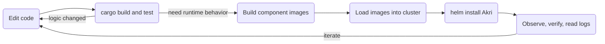

<a id="doc-12e0a48d6c5f2a58f4caa284"></a>

# project-akri/akri / ADOPTERS.md

Upstream: https://github.com/project-akri/akri/blob/41e13a85a949856ef3d5702d8f133ef17cde7a47/ADOPTERS.md

Commit: `41e13a85a949856ef3d5702d8f133ef17cde7a47`

Retrieved: 2026-10-01T15:26:36.086783+00:00

Kind: official-document

Raw SHA256: `ac1e7548e3c0de158e52c07902e740071ad9a26dc2271f577b01dbe56eb422b0`

Source text below is untrusted reference content. Acquisition does not verify technical claims.

License status: UPSTREAM_NOTICES_CAPTURED_PER_FILE_REVIEW_REQUIRED. See this repository's captured license files.

---

# Adopters

This document lists the people and organizations that are using Akri in production or in a significant deployment capacity.
Thank you to all that have adopted Akri and are willing to be listed as adopters!

This is a small contribution that helps the project gain momentum and support.

| **Organization**                   | **Reference or Description of Usage**                                                               |
| ---------------------------------- | --------------------------------------------------------------------------------------------------- |

## Adding Your Organization

To add yourself or your organization, please send a pull request to this file.
People and organizations are listed in alphabetical order.

### Requirements

- You must be using Akri in production or have a significant deployment
- You must represent the listed person or organization
- Information provided must be publicly shareable
- A production deployment includes:
  - Enterprise/company usage
  - Cloud service provider offering
  - Significant home lab/personal deployment

### Template

Use this template in the [Adopters List](#adopters-list) section:

```markdown
### Organization Name

- **Description**: Brief description of your organization
- **Usage**: How you use Akri (components, scale, etc.)
- **Links**:
  - [Website](https://example.com)
  - [Docs](https://docs.example.com)
- **Contacts**: (optional)
  - GitHub: @username
  - Kubernetes Slack: @slackhandle
```

## Notes

- Organizations are listed alphabetically
- Contact information is optional but encouraged for community building
- Links should be publicly accessible
- If you have questions about your deployment and this list, please reach out via the [Kubernetes Slack Akri Channel](https://kubernetes.slack.com/archives/C01D9L7QE8Z) or via [GitHub discussions](https://github.com/project-akri/akri/discussions/new/choose).

## Adopters List


<a id="doc-06572a96a58dc510037d5efa"></a>

# project-akri/akri / CHANGELOG.md

Upstream: https://github.com/project-akri/akri/blob/41e13a85a949856ef3d5702d8f133ef17cde7a47/CHANGELOG.md

Commit: `41e13a85a949856ef3d5702d8f133ef17cde7a47`

Retrieved: 2026-10-01T15:26:36.086783+00:00

Kind: official-document

Raw SHA256: `95351d75e62b2e7300b575a49c7deebf5ee84cf15c0cd485d35a896b142e7aa7`

Source text below is untrusted reference content. Acquisition does not verify technical claims.

License status: UPSTREAM_NOTICES_CAPTURED_PER_FILE_REVIEW_REQUIRED. See this repository's captured license files.

---

# v0.14.0

## Announcing Akri v0.14.0!

Akri v0.14.0 is a pre-release of Akri, and the first release since v0.13.8. It is a large modernization release: the Kubernetes and Rust stacks are brought current (`kube-rs` 1.0, `tonic` 0.13, Rust 1.88), the supported Kubernetes baseline moves to **≥ 1.33**, several RUSTSEC advisories are cleared, and the sample brokers/apps have moved to the [`project-akri/examples`](https://github.com/project-akri/examples) repository.

To find out more about Akri, check out our [documentation](https://docs.akri.sh/) and start
[contributing](https://docs.akri.sh/community/contributing) today!

## New Features

The v0.14.0 release contains the following changes:

**Features**

- feat: Toleration support for agent, controller, and webhook (https://github.com/project-akri/akri/pull/742)
- feat: Device-plugin ENV variables (https://github.com/project-akri/akri/pull/788)
- feat: Accept YAML `udev` `discoveryDetails` in the validating webhook (https://github.com/project-akri/akri/pull/802)
- feat: Device mount-permission check in the webhook (https://github.com/project-akri/akri/pull/753)
- feat: Configurable device mount permissions in the udev handler (https://github.com/project-akri/akri/pull/737)
- feat: Improved device-plugin registration error messages (https://github.com/project-akri/akri/pull/754)

**Dependencies & toolchain**

- `kube-rs` 0.91 → 1.0 (https://github.com/project-akri/akri/pull/815, https://github.com/project-akri/akri/pull/777); `tonic` 0.10 → 0.13 (https://github.com/project-akri/akri/pull/823); `prost` 0.12 → 0.13; `hyper` 0.14 → 1.0; `rustls` 0.21 → 0.23
- `prometheus` 0.13.4 → 0.14.0 (https://github.com/project-akri/akri/pull/822); removed `async-std` (https://github.com/project-akri/akri/pull/824) and `humantime` (https://github.com/project-akri/akri/pull/756)
- Rust toolchain 1.82 → 1.88 (https://github.com/project-akri/akri/pull/763, https://github.com/project-akri/akri/pull/777)
- Bumped `hyper-http-proxy` → 1.2.0 to drop the unmaintained `rustls-pemfile` (https://github.com/project-akri/akri/pull/840)
- Refreshed the pinned `h2` patch, now pinned by commit (https://github.com/project-akri/akri/pull/827)

**Security**

- Cleared RUSTSEC-2024-0437 (https://github.com/project-akri/akri/pull/822), RUSTSEC-2026-0098 / -0099 / -0104 (https://github.com/project-akri/akri/pull/823), RUSTSEC-2025-0052 (https://github.com/project-akri/akri/pull/824), and RUSTSEC-2025-0134 (https://github.com/project-akri/akri/pull/840)

**Bug fixes**

- fix: correct the `kube::runtime` import path (https://github.com/project-akri/akri/pull/782)
- fix: use the right platform in the container build (https://github.com/project-akri/akri/pull/781)

**Platform & CRDs**

- CI matrix advanced to Kubernetes 1.33 / 1.34 / 1.36 (https://github.com/project-akri/akri/pull/817, https://github.com/project-akri/akri/pull/716)
- CRDs now appear in `kubectl get all` (https://github.com/project-akri/akri/pull/800, https://github.com/project-akri/akri/pull/816)
- ArgoCD-safe CRD sync: strip null values (https://github.com/project-akri/akri/pull/766), preserve `name` / `namespace` (https://github.com/project-akri/akri/pull/761)

**Helm / packaging**

- Fix `brokerJob` `image.tag` typo (https://github.com/project-akri/akri/pull/769), webhook `nodeSelector` indentation (https://github.com/project-akri/akri/pull/749), and `imagePullPolicy` for broker pods (https://github.com/project-akri/akri/pull/752)

**Repository & CI**

- Sample brokers/apps moved to `project-akri/examples` (https://github.com/project-akri/akri/pull/790, https://github.com/project-akri/akri/pull/832, https://github.com/project-akri/akri/pull/792)
- `update-versions` no longer overwrites a PR's `version.sh` (https://github.com/project-akri/akri/pull/819); versioning / check-script hardening (https://github.com/project-akri/akri/pull/784)
- GitHub Actions in CI bumped to latest (https://github.com/project-akri/akri/pull/751)
- Maintainer updates (https://github.com/project-akri/akri/pull/774, https://github.com/project-akri/akri/pull/729, https://github.com/project-akri/akri/pull/741, https://github.com/project-akri/akri/pull/759); CoC contact (https://github.com/project-akri/akri/pull/789)
- Docs: developer guide (https://github.com/project-akri/akri/pull/833), refreshed badges/supported versions/handler list (https://github.com/project-akri/akri/pull/825),
  community-call time (https://github.com/project-akri/akri/pull/828), adopters list (https://github.com/project-akri/akri/pull/798, https://github.com/project-akri/akri/pull/820), repo-wide typo fixes (https://github.com/project-akri/akri/pull/773)

View the [full change log](https://github.com/project-akri/akri/compare/v0.13.8...v0.14.0).

## Breaking Changes

- **Kubernetes baseline raised from ≥ 1.16 to ≥ 1.33** (`k8s-openapi` pinned to `v1_33`); validated on 1.33 / 1.34 / 1.36.
- **Embedder / API surface updated**: `kube-rs` 1.0, `tonic` 0.13, `prost` 0.13, `hyper` 1.0, `rustls` 0.23 — projects embedding Akri crates must update accordingly.
- **MSRV raised to Rust 1.88.**
- **Sample brokers/apps moved to `project-akri/examples`**: pinned `ghcr.io/project-akri/akri/<sample>:latest-dev` image references no longer resolve — switch to the examples-repo images/paths.

## Known Issues

- `RUSTSEC-2024-0421` (`idna`) and `RUSTSEC-2024-0388` (`derivative`) remain — both are pulled solely via the frozen `opcua` 0.12 crate. Deferred to a later release and tracked in [#841](https://github.com/project-akri/akri/issues/841) (`opcua` → `async-opcua` migration).
- `RUSTSEC-2026-0258` (`h2` unbounded empty DATA frames) is present via the pinned `h2` patch fork; awaiting an upstream fix.

## Validated With

| Distribution | Version       |
| ------------ | ------------- |
| Kubernetes   | 1.36.1        |
| Kubernetes   | 1.34.8        |
| Kubernetes   | 1.33.12       |
| K3s          | v1.36.1+k3s1  |
| K3s          | v1.34.8+k3s1  |
| K3s          | v1.33.12+k3s1 |
| MicroK8s     | 1.36/stable   |
| MicroK8s     | 1.34/stable   |
| MicroK8s     | 1.33/stable   |

## What's next?

Check out our [roadmap](https://docs.akri.sh/community/roadmap) to see the features we are looking forward to!

## Thanks 👏

Thank you everyone in the community who helped Akri get to this release! Your interest and contributions help Akri
prosper.

**⭐ Contributors to v0.14.0 ⭐**

- @gauravgahlot
- @kate-goldenring
- @yujinkim-msft
- @ananos
- @diconico07
- @koendelaat
- @twz123
- @lilustga
- @pavanvishnusai
- @dineshbodala
- @revanthkoganti
- @AkashKumar7902
- @erickuiper
- @jackliu2024
- @fwmarcel
- @bindsi

# v0.13.8

## Announcing Akri v0.13.8!

Akri v0.13.8 is a pre-release of Akri.

To find out more about Akri, check out our [documentation](https://docs.akri.sh/) and start
[contributing](https://docs.akri.sh/community/contributing) today!

## New Features

The v0.13.8 release contains the following changes:

**Fixes, features, and optimizations**

- feat: Refactor the agent (https://github.com/project-akri/akri/pull/684)
- fix: Add proto build flag to allow option proto fields (https://github.com/project-akri/akri/pull/698)
- opt: Refactor agent followup (https://github.com/project-akri/akri/pull/700)
- opt: Update to use rust 1.79 and apply clippy cleanups (https://github.com/project-akri/akri/pull/703)
- fix: Upgrade serde_yaml (https://github.com/project-akri/akri/pull/701)
- fix: Only add device ID to broker env vars suffix (https://github.com/project-akri/akri/pull/709)
- feat: Add duplicate envs without instance suffix (https://github.com/project-akri/akri/pull/710)
- fix: brokerJob specs to use imagePullPolicy and image tag from values.yaml (https://github.com/project-akri/akri/pull/715)
- fix: Add Helm pre-delete hook to remove configurations before Akri chart cleanup (https://github.com/project-akri/akri/pull/717)

View the [full change log](https://github.com/project-akri/akri/compare/v0.12.20...v.0.13.8)

## Breaking Changes

- Agent refactoring: this release comes with many new improvements to the Akri agent!
  - In order to prevent deletion of existing Instances on Configuration update, the agent now only looks for updates to the capacity and broker capacities.
  - Agent no longer needs access to the CRI socket for slot reconciliation.
  - Added a finalizer to ensure clean-up of resources.
- Update to the Instance CRD to better handle upgrades.

## Known Issues

## Validated With

| Distribution | Version       |
| ------------ | ------------- |
| Kubernetes   | v1.31.2       |
| Kubernetes   | v1.30.6       |
| Kubernetes   | v1.29.10      |
| K3s          | v1.31.2+k3s1  |
| K3s          | v1.30.6+k3s1  |
| K3s          | v1.29.10+k3s1 |
| MicroK8s     | 1.31/stable   |
| MicroK8s     | 1.30/stable   |
| MicroK8s     | 1.29/stable   |

## What's next?

Check out our [roadmap](https://docs.akri.sh/community/roadmap) to see the features we are looking forward to!

## Thanks 👏

Thank you everyone in the community who helped Akri get to this release! Your interest and contributions help Akri
prosper.

**⭐ Contributors to v0.13.8 ⭐**

- @CeerDecy
- @melinda-mytra
- @diconico07
- @kate-goldenring
- @yujinkim-msft

(Please send us (`@Yu Jin Kim`) a direct message on
[Slack](https://kubernetes.slack.com/messages/akri) if we left you out!)

## Installation

Akri is packaged as a Helm chart. Check out our [installation doc](https://docs.akri.sh/user-guide/getting-started) on
how to install Akri.

```
helm repo add akri-helm-charts https://project-akri.github.io/akri/
helm install akri akri-helm-charts/akri --version 0.13.8 \
    # additional configuration
```

## Release history

See [CHANGELOG.md](https://github.com/project-akri/akri/blob/v0.13.8/CHANGELOG.md) for more information on what changed
in this and previous releases.

# Previous Releases:

# v0.12.20

## Announcing Akri v0.12.20!

Akri v0.12.20 is a pre-release of Akri.

To find out more about Akri, check out our [documentation](https://docs.akri.sh/) and start
[contributing](https://docs.akri.sh/community/contributing) today!

## New Features

The v0.12.20 release contains the following changes:

**Fixes, features, and optimizations**

- opt: Upgrade tonic and prost (https://github.com/project-akri/akri/pull/593)
- opt: Bump to rust toolchain 1.73 (https://github.com/project-akri/akri/pull/679)
- fix: Fix build tags (https://github.com/project-akri/akri/pull/680)
- fix: Fix build issues (https://github.com/project-akri/akri/pull/676)
- fix: Remove duplicate nodeSelector from the udev discovery manifest (https://github.com/project-akri/akri/pull/675)
- fix: Revamp build system to overcome Cross issues (https://github.com/project-akri/akri/pull/670)
- fix: Fix typo in Agent build status badge (https://github.com/project-akri/akri/pull/673)
- fix: Use valid format for dummy uris connect through UDS channel (https://github.com/project-akri/akri/pull/668)
- opt: Update anomaly detection app dependencies (https://github.com/project-akri/akri/pull/672)
- feat: Add discovery response metrics to Agent (https://github.com/project-akri/akri/pull/665)
- fix: Update warp dependency to fix security alerts (https://github.com/project-akri/akri/pull/666)
- opt: Add securityContext to controller helm chart (https://github.com/project-akri/akri/pull/664)

View the [full change log](https://github.com/project-akri/akri/compare/v0.12.9...v0.12.20)

## Breaking Changes

None

## Known Issues

- If you are using an older version of Ubuntu (version < 23.04), you will need to install the new protobuf compiler manually.

## Validated With

| Distribution | Version       |
| ------------ | ------------- |
| Kubernetes   | v1.28.1       |
| Kubernetes   | v1.27.5       |
| Kubernetes   | v1.26.8       |
| Kubernetes   | v1.25.13      |
| K3s          | v1.28.1+k3s1  |
| K3s          | v1.27.5+k3s1  |
| K3s          | v1.26.8+k3s1  |
| K3s          | v1.25.13+k3s1 |
| MicroK8s     | 1.28/stable   |
| MicroK8s     | 1.27/stable   |
| MicroK8s     | 1.26/stable   |
| MicroK8s     | 1.25/stable   |

## What's next?

Check out our [roadmap](https://docs.akri.sh/community/roadmap) to see the features we are looking forward to!

## Thanks 👏

Thank you everyone in the community who helped Akri get to this release! Your interest and contributions help Akri
prosper.

**⭐ Contributors to v0.12.20 ⭐**

- @johnsonshih
- @diconico07
- @ammmze
- @kate-goldenring
- @jbpaux
- @bfjelds

(Please send us (`@Kate Goldenring` or `@Yu Jin Kim`) a direct message on
[Slack](https://kubernetes.slack.com/messages/akri) if we left you out!)

## Installation

Akri is packaged as a Helm chart. Check out our [installation doc](https://docs.akri.sh/user-guide/getting-started) on
how to install Akri.

```
helm repo add akri-helm-charts https://project-akri.github.io/akri/
helm install akri akri-helm-charts/akri --version 0.12.20 \
    # additional configuration
```

## Release history

See [CHANGELOG.md](https://github.com/project-akri/akri/blob/v0.12.20/CHANGELOG.md) for more information on what changed
in this and previous releases.

# v0.12.9

## Announcing Akri v0.12.9!

Akri v0.12.9 is a pre-release of Akri.

To find out more about Akri, check out our [documentation](https://docs.akri.sh/) and start
[contributing](https://docs.akri.sh/community/contributing) today!

## New Features

The v0.12.9 release contains the following changes:

1. **Configuration-level resource support** (https://github.com/project-akri/akri/pull/627). This implements the [proposal](https://github.com/project-akri/akri-docs/blob/main/proposals/configuration-level-resources.md#configuration-level-resources) of exposing resources at the Configuration level. This allows users to select resources to use at the configuration-level without having know the instance ID beforehand.
2. **Support discoveryProperties in the Configuration** (https://github.com/project-akri/akri/pull/619). This implements the [proposal](https://github.com/project-akri/akri-docs/pull/61) for allowing users to specify credential data through the discoveryProperties section in the configuration. The Agent can read these properties and pass them to the discovery handlers for discovering authenticated devices. This provides a native K8s experience by supporting K8s Secrets and K8s configMaps.
3. **Enable ONVIF discovery handler and broker to discover and access authenticated devices** (https://github.com/project-akri/akri/pull/638, https://github.com/project-akri/akri/pull/646). This allows the ONVIF discovery handler to discover IP cameras and other ONVIF devices that require authentication. Once authenticated devices are discovered using the credential data passed through, the broker can also access the data from these devices using the device UUID to look up credentials from the credential directories and authenticate the device.

**Fixes, features, and optimizations**

- opt: Improve udev testability and tests (https://github.com/project-akri/akri/pull/582)
- opt: Generate a self-signed certificate for webhook if none given in Helm (https://github.com/project-akri/akri/pull/588)
- fix: Update env_logger and clap to fix RUSTSEC-2021-0145 (https://github.com/project-akri/akri/pull/590)
- opt: Add protobuf-compiler to crossbuild intermediate containers (https://github.com/project-akri/akri/pull/594)
- opt: Add K8s 1.27 to test cases and remove 1.23 (https://github.com/project-akri/akri/pull/595)
- fix: Fix intermediate dotnet openCV image build (https://github.com/project-akri/akri/pull/596)
- opt: Force all Akri components to use the Linux node selector (https://github.com/project-akri/akri/pull/599)
- fix: Fix possible crash when modifying Configuration (https://github.com/project-akri/akri/pull/602)
- fix: Upgrade Docker images from Debian Buster to Bullseye (https://github.com/project-akri/akri/issues/606, https://github.com/project-akri/akri/pull/607, https://github.com/project-akri/akri/pull/609)
- fix: Fix discovery channels being stopped when Configurations are modified or deleted (https://github.com/project-akri/akri/pull/612)
- fix: Stop the controller from panicking when unable to create pod and output log instead (https://github.com/project-akri/akri/pull/615)
- fix: Correct ONVIF filtering (IP address, MAC address, scopes) (https://github.com/project-akri/akri/pull/622)
- opt: Revamp E2E test suite (https://github.com/project-akri/akri/pull/623)
- feat: Add udev E2E tests (https://github.com/project-akri/akri/pull/637)
- fix: Return discovered devices that fails to get IP/MAC address if IP/MAC filters are not used (https://github.com/project-akri/akri/pull/640)
- feat: Add UUID filter to ONVIF discovery handler (https://github.com/project-akri/akri/pull/641)
- opt: Remove unused Rust dependencies (https://github.com/project-akri/akri/pull/653)
- fix: Correct Agent's behavior on Instance deletion (https://github.com/project-akri/akri/pull/654)
- fix: Update dependencies of sample applications to fix security vulnerability (https://github.com/project-akri/akri/pull/660)

View the [full change log](https://github.com/project-akri/akri/compare/v0.10.4...v.0.12.9)

## Breaking Changes

1. With [the ONVIF discovery handler using UUID_serviceUrl as the device ID](https://github.com/project-akri/akri/pull/630) this changes the hash ID in the Akri instance of the discovered camera. Now, the ONVIF discovery handler always exposes the device UUID in device properties.
2. With [the IP/MAC address filtering in device properties becoming optional](https://github.com/project-akri/akri/pull/640), the ONVIF discovery handler only expose the IP/MAC addresses when it is able to get them from the device. Retrieving the IP/MAC address requires credentials, so if none are provided, the discovery handler reports the devices without exposing the IP/MAC addresses in properties.

## Known Issues

N/A

## Validated With

| Distribution | Version       |
| ------------ | ------------- |
| Kubernetes   | v1.28.1       |
| Kubernetes   | v1.27.5       |
| Kubernetes   | v1.26.8       |
| Kubernetes   | v1.25.13      |
| K3s          | v1.28.1+k3s1  |
| K3s          | v1.27.5+k3s1  |
| K3s          | v1.26.8+k3s1  |
| K3s          | v1.25.13+k3s1 |
| MicroK8s     | 1.28/stable   |
| MicroK8s     | 1.27/stable   |
| MicroK8s     | 1.26/stable   |
| MicroK8s     | 1.25/stable   |

## What's next?

Check out our [roadmap](https://docs.akri.sh/community/roadmap) to see the features we are looking forward to!

## Thanks 👏

Thank you everyone in the community who helped Akri get to this release! Your interest and contributions help Akri
prosper.

**⭐ Contributors to v0.12.9 ⭐**

- @johnsonshih
- @diconico07
- @jbpaux
- @kate-goldenring
- @bfjelds
- @yujinkim-msft
- @gauravgahlot
- @ag17sep

(Please send us (`@Kate Goldenring` or `@Yu Jin Kim`) a direct message on
[Slack](https://kubernetes.slack.com/messages/akri) if we left you out!)

## Installation

Akri is packaged as a Helm chart. Check out our [installation doc](https://docs.akri.sh/user-guide/getting-started) on
how to install Akri.

```
helm repo add akri-helm-charts https://project-akri.github.io/akri/
helm install akri akri-helm-charts/akri --version 0.12.9 \
    # additional configuration
```

## Release history

See [CHANGELOG.md](https://github.com/project-akri/akri/blob/v0.12.9/CHANGELOG.md) for more information on what changed
in this and previous releases.

# v0.10.4

## Announcing Akri v0.10.4!

Akri v0.10.4 is a pre-release of Akri.

To find out more about Akri, check out our [documentation](https://docs.akri.sh/) and start
[contributing](https://docs.akri.sh/community/contributing) today!

## New Features

The v0.10.4 release contains the following changes:

1. **Enable mounting connectivity information for multiple devices/instances in a Pod** (https://github.com/project-akri/akri/pull/560 , https://github.com/project-akri/akri/pull/561). Previously, Akri could only mount one device property per discovery handler to a Pod as all devices of the same discovery handler had the same environment variable name. This release fixes this issue by appending the instance hash to the environment variable name and slot ID to the annotation key name. This is a **breaking change** as it changes the way brokers look up properties.
2. **Enable udev discovery handler to discover multiple node devices** (https://github.com/project-akri/akri/pull/564). Akri now allows udev discovery handler to group devices that share a parent/child relation.
3. **Mount udev devpath in Akri brokers** (https://github.com/project-akri/akri/pull/534). This enables discovering udev devices without a devnode by using devpath instead. This is a **breaking change** in the udev discovery handler as it changes the way Akri creates instance ids for udev devices.
4. **Mount udev devices through DeviceSpec instead of Mounts** (https://github.com/project-akri/akri/pull/576). This switches from using Mounts to using DeviceSpec for device nodes, and exposes the desired permissions to non privileged containers.

**Fixes, features, and optimizations**

- feat: Add nodeSelectors for Akri agent (https://github.com/project-akri/akri/pull/536)
- fix: Fix wrong indentation on udev-configuration.yaml for securityContext (https://github.com/project-akri/akri/pull/538)
- fix: ListAndWatch only sends device if the list has changed (https://github.com/project-akri/akri/pull/540)
- fix: Use tokio::sync::RwLock instead of tokio::sync::Mutex (https://github.com/project-akri/akri/pull/541)
- opt: Upgrade Ubuntu agent version (https://github.com/project-akri/akri/pull/546)
- opt: Added more securityContext to ensure Helm templates use the most restrictive setting (https://github.com/project-akri/akri/pull/547)
- opt: Update nodejs actions to node16 (https://github.com/project-akri/akri/pull/548)
- fix: Set pre_start_required to false in get_device_plugin_options (https://github.com/project-akri/akri/pull/554)
- fix: Modify Agent to reduce frequency of Pods getting UnexpectedAdmissionError (https://github.com/project-akri/akri/pull/556)
- fix: Specify crictl container runtime in e2e test workflow (https://github.com/project-akri/akri/pull/559)
- fix: Suffix usage slot to annotation key name (https://github.com/project-akri/akri/pull/560)
- fix: Added udev devnode to device mounts instead of devpath (https://github.com/project-akri/akri/pull/562)
- fix: Fixed watch crash API unreachable (https://github.com/project-akri/akri/pull/568)
- fix: Verify DiscoveryURL from OPC Server is resolvable (https://github.com/project-akri/akri/pull/570)
- opt: Update kubernetes versions in e2e test (https://github.com/project-akri/akri/pull/573)
- opt: Update rust to 1.68.1 and tarpaulin to 0.25.1 (https://github.com/project-akri/akri/pull/574)
- opt: Upgrade Rust CI actions to maintained ones (https://github.com/project-akri/akri/pull/581)
- opt: Update warp dependency to fix RUSTSEC-2023-0028 (https://github.com/project-akri/akri/pull/585)

View the [full change log](https://github.com/project-akri/akri/compare/v0.8.23...v0.10.4)

## Breaking Changes

1. With [enable mounting connectivity information for multiple devices/instances in a Pod](https://github.com/project-akri/akri/pull/561), Akri now changes the name of the device properties from `DEVICE_DESCRIPTION` to `DEVICE_DESCRIPTION_INSTANCE_HASH` to allow multiple device properties of the same discovery handler to be injected to the same broker. For example, a broker can look up the Akri instance `akri-debug-echo-foo-8120fe` by the environment variable `DEBUG_ECHO_DESCRIPTION_8120FE` instead of `DEBUG_ECHO_DESCRIPTION`.
2. With [Mount udev devpath in Akri broker](https://github.com/project-akri/akri/pull/534), Akri changes the way it creates udev Akri instance id from using the **hash of devnode** to using the **hash of devpath**

## Known Issues

N/A

## Validated With

| Distribution | Version       |
| ------------ | ------------- |
| Kubernetes   | v1.26.3       |
| Kubernetes   | v1.25.8       |
| Kubernetes   | v1.24.12      |
| Kubernetes   | v1.23.15      |
| K3s          | v1.26.3+k3s1  |
| K3s          | v1.25.8+k3s1  |
| K3s          | v1.24.12+k3s1 |
| K3s          | v1.23.15+k3s1 |
| MicroK8s     | 1.26/stable   |
| MicroK8s     | 1.25/stable   |
| MicroK8s     | 1.24/stable   |
| MicroK8s     | 1.23/stable   |

## What's next?

Check out our [roadmap](https://docs.akri.sh/community/roadmap) to see the features we are looking forward to!

## Thanks 👏

Thank you everyone in the community who helped Akri get to this release! Your interest and contributions help Akri
prosper.

**⭐ Contributors to v0.10.4 ⭐**

- @harrison-tin
- @adithyaj
- @kate-goldenring
- @johnsonshih
- @diconico07
- @jbpaux
- @yujinkim-msft
- @koutselakismanos

(Please send us (`@Kate Goldenring` or `@Adithya J`) a direct message on
[Slack](https://kubernetes.slack.com/messages/akri) if we left you out!)

## Installation

Akri is packaged as a Helm chart. Check out our [installation doc](https://docs.akri.sh/user-guide/getting-started) on
how to install Akri.

```
helm repo add akri-helm-charts https://project-akri.github.io/akri/
helm install akri akri-helm-charts/akri --version 0.10.4 \
    # additional configuration
```

## Release history

See [CHANGELOG.md](https://github.com/project-akri/akri/blob/v0.10.4/CHANGELOG.md) for more information on what changed
in this and previous releases.

# v0.8.23

## Announcing Akri v0.8.23!

Akri v0.8.23 is a pre-release of Akri.

To find out more about Akri, check out our [documentation](https://docs.akri.sh/) and start
[contributing](https://docs.akri.sh/community/contributing) today!

## New Features

The v0.8.23 release contains the following changes:

1. Akri uses containerd as the default container runtime.
2. Enables secrets, configMaps, and volumes to be mounted with helm templates.
3. Support for latest kubernetes versions.

**Fixes, features, and optimizations**

- opt: Update OPCUA to 0.11.0 to remove vulnerabilities (https://github.com/project-akri/akri/pull/528)
- feat: GitHub Action to auto-version update (https://github.com/project-akri/akri/pull/510)
- fix: Fixed Kubernetes tests to run on active branches (https://github.com/project-akri/akri/pull/513)
- fix: Fix uds gRPC client implementation with C based gRPC (https://github.com/project-akri/akri/pull/498)
- opt: Removed unmaintained ansi_term dependency (https://github.com/project-akri/akri/pull/506)
- opt: Rust toolchain updates (https://github.com/project-akri/akri/pull/482)(https://github.com/project-akri/akri/pull/507)
- feat: Enable secrets in helm templates (https://github.com/project-akri/akri/pull/478)

View the [full change log](https://github.com/project-akri/akri/compare/v0.8.4...v0.8.23)

## Breaking Changes

N/A

## Known Issues

N/A

## Validated With

| Distribution | Version       |
| ------------ | ------------- |
| Kubernetes   | v1.25.1       |
| Kubernetes   | v1.24.5       |
| Kubernetes   | v1.23.11      |
| Kubernetes   | v1.22.14      |
| Kubernetes   | v1.21.14      |
| K3s          | v1.25.2+k3s1  |
| K3s          | v1.24.6+k3s1  |
| K3s          | v1.23.12+k3s1 |
| K3s          | v1.22.6+k3s1  |
| K3s          | v1.21.5+k3s1  |
| MicroK8s     | 1.24/stable   |
| MicroK8s     | 1.23/stable   |
| MicroK8s     | 1.22/stable   |
| MicroK8s     | 1.21/stable   |

## What's next?

Check out our [roadmap](https://docs.akri.sh/community/roadmap) to see the features we are looking forward to!

## Thanks 👏

Thank you everyone in the community who helped Akri get to this release! Your interest and contributions help Akri
prosper.

**⭐ Contributors to v0.8.4 ⭐**

- @adithyaj
- @bfjelds
- @bitmeal
- @karok2m
- @kate-goldenring
- @Ragnyll
- @Rishit-dagli
- @romoh

(Please send us (`@Kate Goldenring` or `@Adithya J`) a direct message on
[Slack](https://kubernetes.slack.com/messages/akri) if we left you out!)

## Installation

Akri is packaged as a Helm chart. Check out our [installation doc](https://docs.akri.sh/user-guide/getting-started) on
how to install Akri.

```
helm repo add akri-helm-charts https://project-akri.github.io/akri/
helm install akri akri-helm-charts/akri --version 0.8.23 \
    # additional configuration
```

## Release history

See [CHANGELOG.md](https://github.com/project-akri/akri/blob/v0.8.23/CHANGELOG.md) for more information on what changed
in this and previous releases.

## Previous Releases:

# v0.8.4

## Announcing Akri v0.8.4!

Akri v0.8.4 is a pre-release of Akri.

To find out more about Akri, check out our [documentation](https://docs.akri.sh/) and start
[contributing](https://docs.akri.sh/community/contributing) today!

## New Features

The v0.8.4 release contains the following major changes:

1. **Support for Kubernetes Job brokers** (https://github.com/project-akri/akri/pull/437). Now Akri has support for deploying Jobs to devices discovered by the Akri Agent. Previously, Akri only supported deploying Pods that were not intended to terminate (and would be restarted if they did). Adding Jobs enables more device use scenarios. More background can be found in the [Jobs proposal](https://github.com/project-akri/akri-docs/blob/main/proposals/job-brokers.md). This is a **breaking change** as it required changes to Akri's Configuration CRD.
2. Fix to re-enable **applying multiple Configurations that use the same Discovery Handler** (https://github.com/project-akri/akri/pull/432). This adds back functionality that was removed in `v0.6.5` when enabling Akri's new extensibility model.
3. Akri depends on `crictl` to track whether Pods deployed by the Akri Controller are still running. This release adds new functionality (https://github.com/project-akri/akri/pull/418) such that **crictl is pre-installed in the Agent container** so that it does not need to be installed on each node.

**Fixes, features, and optimizations**

- fix: Make debug echo capacity configurable (https://github.com/project-akri/akri/pull/419)
- fix: Return okay if get 404 when trying to delete an Instance (https://github.com/project-akri/akri/pull/420)
- opt: Update .NET dependencies, removing vulnerabilities and reducing size (https://github.com/project-akri/akri/pull/422)
- feat: Execute test workloads based on labels instead of flags in PR titles (https://github.com/project-akri/akri/pull/426)
- opt: Set K8s distribution with Helm to simplify choosing container runtime socket (https://github.com/project-akri/akri/pull/427)
- fix: Fix all clippy errors and update dependency versions (https://github.com/project-akri/akri/pull/442)

View the [full change log](https://github.com/project-akri/akri/compare/v0.7.0...v0.8.4)

## Breaking Changes

Akri's Configuration CRD has been updated to support Job brokers. If Akri has previously been installed on a cluster, delete the previous Configuration CRD before installing the latest version of Akri:

```sh
kubectl delete crd configurations.akri.sh
```

## Known Issues

N/A

## Validated With

| Distribution | Version       |
| ------------ | ------------- |
| Kubernetes   | v1.21.0       |
| Kubernetes   | v1.20.1       |
| Kubernetes   | v1.19.4       |
| Kubernetes   | v1.18.12      |
| Kubernetes   | v1.17.14      |
| Kubernetes   | v1.16.15      |
| K3s          | v1.22.6+k3s1  |
| K3s          | v1.21.5+k3s1  |
| K3s          | v1.20.6+k3s1  |
| K3s          | v1.19.10+k3s1 |
| K3s          | v1.18.9+k3s1  |
| K3s          | v1.17.17+k3s1 |
| K3s          | v1.16.14+k3s1 |
| MicroK8s     | 1.23/stable   |
| MicroK8s     | 1.22/stable   |
| MicroK8s     | 1.21/stable   |
| MicroK8s     | 1.20/stable   |
| MicroK8s     | 1.19/stable   |
| MicroK8s     | 1.18/stable   |
| MicroK8s     | 1.17/stable   |
| MicroK8s     | 1.16/stable   |

## What's next?

Check out our [roadmap](https://docs.akri.sh/community/roadmap) to see the features we are looking forward to!

## Thanks 👏

Thank you everyone in the community who helped Akri get to this release! Your interest and contributions help Akri
prosper.

**⭐ Contributors to v0.8.4 ⭐**

- @bfjelds
- @kate-goldenring
- @romoh
- @vincepnguyen
- @Ragnyll
- (Please send us (`@Kate Goldenring` or `@Edrick Wong`) a direct message on
  [Slack](https://kubernetes.slack.com/messages/akri) if we left you out!)

## Installation

Akri is packaged as a Helm chart. Check out our [installation doc](https://docs.akri.sh/user-guide/getting-started) on
how to install Akri.

```
helm repo add akri-helm-charts https://project-akri.github.io/akri/
helm install akri akri-helm-charts/akri --version 0.8.4 \
    # additional configuration
```

## Release history

See [CHANGELOG.md](https://github.com/project-akri/akri/blob/v0.8.4/CHANGELOG.md) for more information on what changed
in this and previous releases.

# v0.7.0

## Announcing Akri v0.7.0!

Akri v0.7.0 is a pre-release of Akri.

To find out more about Akri, check out our [documentation](https://docs.akri.sh/) and start
[contributing](https://docs.akri.sh/community/contributing) today!

## New Features

The v0.7.0 release marks the first release of Akri in a new `project-akri` GitHub organization. While no
breaking changes were introduced, Akri's minor version was bumped to clearly mark this transition of Akri to a [Cloud
Native Computing Foundation (CNCF) Sandbox project](https://www.cncf.io/sandbox-projects/).

This release also introduces:

- [Open governance](https://github.com/opengovernance/opengovernance.dev)
  [documentation](https://github.com/project-akri/akri/blob/v0.7.0/GOVERNANCE.md)
- The switch from MIT to Apache 2 license (https://github.com/project-akri/akri/pull/401)
- The introduction of the Linux Foundation (LF) Core Infrastructure Initiative (CII) Best Practices badge on Akri's
  README (https://github.com/project-akri/akri/pull/403)
- The enablement of a [Developer Certificate of Origin (DCO)](https://github.com/apps/dco) of pull requests, which
  requires requires all commit messages to contain the Signed-off-by line with an email address that matches the commit
  author.

View the [full change log](https://github.com/project-akri/akri/compare/v0.6.19...v0.7.0)

## Breaking Changes

N/A

## Known Issues

A [Rust security issue](https://github.com/project-akri/akri/issues/398) was raised on the `time` crate, which is used
ultimately by Akri's `k8s-openapi`, `kube-rs` and `opcua-client` dependencies via `chrono`. It appears that the version
of `time` that `chrono` is using is [not
vulnerable](https://github.com/kube-rs/kube-rs/issues/650#issuecomment-940435726). This
[issue](https://github.com/project-akri/akri/issues/398) tracks the progress on `chrono` and Akri's dependencies.

## Validated With

| Distribution | Version       |
| ------------ | ------------- |
| Kubernetes   | v1.21.0       |
| Kubernetes   | v1.20.1       |
| Kubernetes   | v1.19.4       |
| Kubernetes   | v1.18.12      |
| Kubernetes   | v1.17.14      |
| Kubernetes   | v1.16.15      |
| K3s          | v1.21.5+k3s1  |
| K3s          | v1.20.6+k3s1  |
| K3s          | v1.19.10+k3s1 |
| K3s          | v1.18.9+k3s1  |
| K3s          | v1.17.17+k3s1 |
| K3s          | v1.16.14+k3s1 |
| MicroK8s     | 1.21/stable   |
| MicroK8s     | 1.20/stable   |
| MicroK8s     | 1.19/stable   |
| MicroK8s     | 1.18/stable   |
| MicroK8s     | 1.17/stable   |
| MicroK8s     | 1.16/stable   |

## What's next?

Check out our [roadmap](https://docs.akri.sh/community/roadmap) to see the features we are looking forward to!

## Thanks

Thank you everyone in the community who helped Akri get to this release! You're interest and contributions help Akri
prosper.

**Contributors to v0.7.0**

- @bfjelds
- @kate-goldenring
- @romoh
- @edrickwong
- (Please send us (`@Kate Goldenring` or `@Edrick Wong`) a direct message on
  [Slack](https://kubernetes.slack.com/messages/akri) if we left you out!)

## Installation

Akri is packaged as a Helm chart. Check out our [installation doc](https://docs.akri.sh/user-guide/getting-started) on
how to install Akri.

```
helm repo add akri-helm-charts https://project-akri.github.io/akri/
helm install akri akri-helm-charts/akri --version 0.7.0 \
    # additional configuration
```

## Release history

See [CHANGELOG.md](https://github.com/project-akri/akri/blob/v0.7.0/CHANGELOG.md) for more information on what changed
in this and previous releases.

# v0.6.19

## Announcing Akri v0.6.19!

Akri v0.6.19 is a pre-release of Akri.

To find out more about Akri, check out our [documentation](https://docs.akri.sh/) and start [contributing](https://docs.akri.sh/community/contributing) today!

## New Features

The v0.6.19 release features **ONVIF Discovery Handler and broker optimizations**, long-awaited runtime and Kubernetes **dependency updates**, and moves Akri's documentation to a [**docs repository**](https://github.com/project-akri/akri-docs).

**Fixes, features, and optimizations**

- opt: Updated Akri's runtime (`tokio`) and Kubernetes dependencies (`kube-rs` and `k8s-openapi`), along with the major versions of all other dependencies where possible. (https://github.com/project-akri/akri/pull/361)
- opt: ONVIF Discovery handler optimized to be more performant (https://github.com/project-akri/akri/pull/351)
- opt: Reduced size of ONVIF broker by decreasing size of OpenCV container (https://github.com/project-akri/akri/pull/353)
- feat: Removed documentation from repository (https://github.com/project-akri/akri/pull/360) and placed in [`project-akri/akri-docs`](https://github.com/project-akri/akri-docs). Created documentation [site](https://docs.akri.sh/) that points to documentation repository.
- feat: Workflow to mark inactive issues/PRs as stale and eventually close them (https://github.com/project-akri/akri/pull/363)
- fix: Make Discovery Handlers check channel health each discovery loop (https://github.com/project-akri/akri/pull/385)
- fix: Handle multicast response duplicates in ONVIF Discovery Handler (https://github.com/project-akri/akri/pull/393)
- fix: Use `kube-rs` resource `watcher` instead of `Api::watch` (https://github.com/project-akri/akri/pull/378)
- fix: Prevent re-creation instances when only Configuration metadata or status changes (https://github.com/project-akri/akri/pull/373)
- feat: Enable configuring Prometheus metrics port for local runs (https://github.com/project-akri/akri/pull/377)

View the [full change log](https://github.com/project-akri/akri/compare/v0.6.5...v0.6.19)

## Breaking Changes

N/A

## Known Issues

ONVIF discovery does not work in development versions `v0.6.17` and `v0.6.18` due to (https://github.com/project-akri/akri/pull/382). Issue was resolved for `v0.6.19` and beyond in (https://github.com/project-akri/akri/pull/393).

## Validated With

| Distribution | Version       |
| ------------ | ------------- |
| Kubernetes   | v1.21.0       |
| Kubernetes   | v1.20.1       |
| Kubernetes   | v1.19.4       |
| Kubernetes   | v1.18.12      |
| Kubernetes   | v1.17.14      |
| Kubernetes   | v1.16.15      |
| K3s          | v1.21.5+k3s1  |
| K3s          | v1.20.6+k3s1  |
| K3s          | v1.19.10+k3s1 |
| K3s          | v1.18.9+k3s1  |
| K3s          | v1.17.17+k3s1 |
| K3s          | v1.16.14+k3s1 |
| MicroK8s     | 1.21/stable   |
| MicroK8s     | 1.20/stable   |
| MicroK8s     | 1.19/stable   |
| MicroK8s     | 1.18/stable   |
| MicroK8s     | 1.17/stable   |
| MicroK8s     | 1.16/stable   |

## What's next?

Check out our [roadmap](https://docs.akri.sh/community/roadmap) to see the features we are looking forward to!

## Thanks

Thank you everyone in the community who helped Akri get to this release! You're interest and contributions help Akri prosper.

**Contributors to v0.6.19**

- @ammmze
- @bfjelds
- @kate-goldenring
- @romoh
- @shantanoo-desai
- (Please let us know via [Slack](https://kubernetes.slack.com/messages/akri) if we left you out!)

## Installation

Akri is packaged as a Helm chart. Check out our [installation doc](https://docs.akri.sh/user-guide/getting-started) on how to install Akri.

```
helm repo add akri-helm-charts https://project-akri.github.io/akri/
helm install akri akri-helm-charts/akri --version 0.6.19 \
    # additional configuration
```

## Release history

See [CHANGELOG.md](https://github.com/project-akri/akri/blob/v0.6.19/CHANGELOG.md) for more information on what changed in this and previous releases.

# v0.6.5

## Announcing Akri v0.6.5!

Akri v0.6.5 is a pre-release of Akri.

To find out more about Akri, check out our [README](https://github.com/project-akri/akri/blob/v0.6.5/README.md) and start [contributing](https://github.com/project-akri/akri/blob/v0.6.5/docs/contributing.md) today!

## New Features

The v0.6.5 release introduces Akri's Logo, new features such as a new extensibility model for Discovery Handlers and a Configuration validating webhook, DevOps improvements, and more.

**New Discovery Handler extensibility model**

- feat: Discovery Handlers now live behind a [gRPC interface](https://github.com/project-akri/akri/blob/v0.6.5/discovery-utils/proto/discovery.proto) (https://github.com/project-akri/akri/pull/252), so Discovery Handlers can be written in any language without forking Akri and working within its code. See the [Discovery Handler development document] to get started creating a Discovery Handler.
- feat: Support of both default "slim" and old "full" Agent images (https://github.com/project-akri/akri/pull/279). Prior to this release, the Agent contained udev, ONVIF, and OPC UA Discovery Handlers. As of this release, Akri is moving towards a default of having no embedded Discovery Handlers in the Agent; rather, the desired Discovery Handlers can be deployed separately using Akri's Helm chart. This decreases the attack surface of the Agent and will keep it from exponential growth as new Discovery Handlers are continually supported. Discovery Handlers written in Rust can be conditionally compiled into the Agent -- reference [the development documentation for more details](https://github.com/project-akri/akri/blob/v0.6.5/docs/development.md#local-builds-and-tests). For the time being, Akri will continue to support a an Agent image with udev, ONVIF, and OPC UA Discovery Handlers. It will be used if `agent.full=true` is set when installing Akri's Helm chart.
- feat: Updates to Akri's Helm charts with templates for Akri's Discovery Handlers and renaming of values to better fit the new model.

DevOps improvements

- feat: Workflow to auto-update dependencies (https://github.com/project-akri/akri/pull/224)
- feat: Security audit workflow (https://github.com/project-akri/akri/pull/264)
- feat: Workflow for canceling previously running workflows on PRs, reducing environmental footprint and queuing of GitHub Actions (https://github.com/project-akri/akri/pull/284)
- feat: Build all rust components in one workflow instead of previous strategy for a workflow for each build (https://github.com/project-akri/akri/pull/270)
- fix: More exhaustive linting of Akri Helm charts (https://github.com/project-akri/akri/pull/306)

Other enhancements

- feat: [**Webhook for validating Configurations**](https://github.com/project-akri/akri/blob/v0.6.5/webhooks/validating/configuration/README.md) (https://github.com/project-akri/akri/pull/206)
- feat: Support for Akri monitoring via Prometheus (https://github.com/project-akri/akri/pull/190)

Misc

- feat: **Akri Logo** (https://github.com/project-akri/akri/pull/149)
- fix: Allow overwriting Controller's `nodeSelectors` (https://github.com/project-akri/akri/pull/194)
- fix: Updated `mockall` version (https://github.com/project-akri/akri/pull/214)
- fix: Changed default image `PullPolicy` from `Always` to Kubernetes default (`IfNotPresent`) (https://github.com/project-akri/akri/pull/207)
- fix: Improved video streaming application (for udev demo) that polls for new service creation (https://github.com/project-akri/akri/pull/173)
- fix: Patched anomaly detection application (for OPC UA demo) to show values from all brokers (https://github.com/project-akri/akri/pull/229)
- feat: Timestamped labels for local container builds (https://github.com/project-akri/akri/pull/234)
- fix: Removed udev directory mount from Agent DaemonSet (https://github.com/project-akri/akri/pull/304)
- fix: Modified Debug Echo Discovery Handler to specify `Device.properties` and added check to e2e tests (https://github.com/project-akri/akri/pull/288)
- feat: Support for specifying environment variables broker Pods via a Configuration's `brokerProperties`.
- fix: Default memory and CPU resource requests and limits for Akri containers (https://github.com/project-akri/akri/pull/305)

View the [full change log](https://github.com/project-akri/akri/compare/v0.1.5...v0.6.5)

## Breaking Changes

Akri's Configuration and Instance CRDs were modified. The old version of the CRDs should be deleted with `kubectl delete instances.akri.sh configurations.akri.sh`, and the new ones will be applied with a new Akri Helm installation.

- Akri's Configuration CRD's `protocol` field was replaced with `discoveryHandler` in order to fit Akri's new Discovery Handler extensibility model and make the Configuration no longer strongly tied to Discovery Handlers. It's unused `units` field was removed and `properties` was renamed `brokerProperties` to be more descriptive.
- Akri's Instance CRD's unused `rbac` field was removed and `metadate` was renamed `brokerProperties` to be more descriptive and aligned with the Configuration CRD.

Significant changes were made to Akri's Helm chart. Consult the latest user guide and Configurations documentation.

By default, the Agent contains no Discovery Handlers. To deploy Discovery Handlers, they must be explicitly enabled in Akri's Helm chart.

## Known Issues

N/A

## Validated With

| Distribution | Version       |
| ------------ | ------------- |
| Kubernetes   | v1.21.0       |
| Kubernetes   | v1.20.1       |
| Kubernetes   | v1.19.4       |
| Kubernetes   | v1.18.12      |
| Kubernetes   | v1.17.14      |
| Kubernetes   | v1.16.15      |
| K3s          | v1.20.6+k3s1  |
| K3s          | v1.19.10+k3s1 |
| K3s          | v1.18.9+k3s1  |
| K3s          | v1.17.17+k3s1 |
| K3s          | v1.16.14+k3s1 |
| MicroK8s     | 1.21/stable   |
| MicroK8s     | 1.20/stable   |
| MicroK8s     | 1.19/stable   |
| MicroK8s     | 1.18/stable   |
| MicroK8s     | 1.17/stable   |
| MicroK8s     | 1.16/stable   |

## What's next?

Check out our [roadmap](https://github.com/project-akri/akri/blob/v0.6.5/docs/roadmap.md) to see the features we are looking forward to!

## Release history

See [CHANGELOG.md](https://github.com/project-akri/akri/blob/v0.6.5/CHANGELOG.md) for more information on what changed in this and previous releases.

# v0.1.5

## Announcing Akri v0.1.5!

Akri v0.1.5 is a pre-release of Akri.

To find out more about Akri, check out our [README](https://github.com/project-akri/akri/blob/v0.1.5/README.md) and start [contributing](https://github.com/project-akri/akri/blob/v0.1.5/docs/contributing.md) today!

## New Features

The v0.1.5 release introduces support for OPC UA discovery along with:

- End to end demo for discovering and utilizing OPC UA servers
- Sample anomaly detection application for OPC UA demo
- Sample OPC UA broker
- OPC UA certificate generator

View the [full change log](https://github.com/project-akri/akri/compare/v0.0.44...v0.1.5)

## Breaking Changes

N/A

## Known Issues

N/A

## Validated With

| Distribution | Version      |
| ------------ | ------------ |
| Kubernetes   | v1.20.1      |
| Kubernetes   | v1.19.4      |
| Kubernetes   | v1.18.12     |
| Kubernetes   | v1.17.14     |
| Kubernetes   | v1.16.15     |
| K3s          | v1.20.0+k3s2 |
| K3s          | v1.19.4+k3s1 |
| K3s          | v1.18.9+k3s1 |
| MicroK8s     | 1.20/stable  |
| MicroK8s     | 1.19/stable  |
| MicroK8s     | 1.18/stable  |

## What's next?

Check out our [roadmap](https://github.com/project-akri/akri/blob/v0.1.5/docs/roadmap.md) to see the features we are looking forward to!

## Release history

See [CHANGELOG.md](https://github.com/project-akri/akri/blob/v0.1.5/CHANGELOG.md) for more information on what changed in this and previous releases.

# v0.0.44

## Announcing Akri v0.0.44!

Akri v0.0.44 is a pre-release of Akri.

To find out more about Akri, check out our [README](https://github.com/project-akri/akri/blob/v0.0.44/README.md) and start [contributing](https://github.com/project-akri/akri/blob/v0.0.44/docs/contributing.md) today!

## New Features

The v0.0.44 release introduces a number of significant improvements!

- Enable Akri for armv7
- Create separate Helm charts for releases (akri) and merges (akri-dev)
- Parameterize Helm for udev beyond simple video scenario
- Expand udev discovery by supporting filtering by udev rules that look up the device hierarchy such as SUBSYSTEMS, ATTRIBUTES, DRIVERS, KERNELS, and TAGS
- Parameterize Helm for udev to allow security context
- Remove requirement for agent to execute in privileged container

View the [full change log](https://github.com/project-akri/akri/compare/v0.0.35...v0.0.44)

## Breaking Changes

N/A

## Known Issues

- Documented Helm settings are not currently compatible with K3s v1.19.4+k3s1

## Validated With

| Distribution | Version      |
| ------------ | ------------ |
| Kubernetes   | v1.19.4      |
| K3s          | v1.18.9+k3s1 |
| MicroK8s     | 1.18/stable  |

## What's next?

Check out our [roadmap](https://github.com/project-akri/akri/blob/v0.0.44/docs/roadmap.md) to see the features we are looking forward to!

## Release history

See [CHANGELOG.md](https://github.com/project-akri/akri/blob/v0.0.44/CHANGELOG.md) for more information on what changed in this and previous releases.

# v0.0.35

## Announcing the Akri v0.0.35 pre-release!

Akri v0.0.35 is the first pre-release of Akri.

To find out more about Akri, check out our [README](https://github.com/project-akri/akri/blob/main/README.md) and start [contributing](https://github.com/project-akri/akri/blob/main/docs/contributing.md) today!

## New Features

The v0.0.35 release introduces a number of significant features!

- CRDs to allow the discovery and utilization of leaf devices
- An agent and controller to find, advertise, and utilize leaf devices
- Discovery for IP cameras using the ONVIF protocol
- An ONVIF broker to serve the camera frames
- Discovery for leaf devices exposed through udev
- A udev camera broker to serve the camera frames
- A Helm chart to simplify Akri deployment

View the [full change log](https://github.com/project-akri/akri/commits/v0.0.35)

## Breaking Changes

N/A

## Known Issues

N/A

## What's next?

Check out our [roadmap](https://github.com/project-akri/akri/blob/main/docs/roadmap.md) to see the features we are looking forward to!

## Release history

See [CHANGELOG.md](https://github.com/project-akri/akri/blob/v0.0.35/CHANGELOG.md) for more information on what changed in this and previous releases.


<a id="doc-ffdbe3a1e7ee93cacfc080b6"></a>

# project-akri/akri / CODE_OF_CONDUCT.md

Upstream: https://github.com/project-akri/akri/blob/41e13a85a949856ef3d5702d8f133ef17cde7a47/CODE_OF_CONDUCT.md

Commit: `41e13a85a949856ef3d5702d8f133ef17cde7a47`

Retrieved: 2026-10-01T15:26:36.086783+00:00

Kind: official-document

Raw SHA256: `b6777e389441b4ecf65bffeeded38033859e9c2b06b97134cdbe4928e0b0026b`

Source text below is untrusted reference content. Acquisition does not verify technical claims.

License status: UPSTREAM_NOTICES_CAPTURED_PER_FILE_REVIEW_REQUIRED. See this repository's captured license files.

---

# Akri Community Code of Conduct

## Our Pledge

We as members, contributors, and leaders pledge to make participation in our
community a harassment-free experience for everyone, regardless of age, body
size, visible or invisible disability, ethnicity, sex characteristics, gender
identity and expression, level of experience, education, socio-economic status,
nationality, personal appearance, race, caste, color, religion, or sexual identity
and orientation.

We pledge to act and interact in ways that contribute to an open, welcoming,
diverse, inclusive, and healthy community.

## Our Standards

Examples of behavior that contributes to a positive environment for our
community include:

- Demonstrating empathy and kindness toward other people
- Being respectful of differing opinions, viewpoints, and experiences
- Giving and gracefully accepting constructive feedback
- Accepting responsibility and apologizing to those affected by our mistakes,
  and learning from the experience
- Focusing on what is best not just for us as individuals, but for the
  overall community

Examples of unacceptable behavior include:

- The use of sexualized language or imagery, and sexual attention or
  advances of any kind
- Trolling, insulting or derogatory comments, and personal or political attacks
- Public or private harassment
- Publishing others' private information, such as a physical or email
  address, without their explicit permission
- Other conduct which could reasonably be considered inappropriate in a
  professional setting

## Enforcement Responsibilities

Community leaders are responsible for clarifying and enforcing our standards of
acceptable behavior and will take appropriate and fair corrective action in
response to any behavior that they deem inappropriate, threatening, offensive,
or harmful.

Community leaders have the right and responsibility to remove, edit, or reject
comments, commits, code, wiki edits, issues, and other contributions that are
not aligned to this Code of Conduct, and will communicate reasons for moderation
decisions when appropriate.

## Scope

This Code of Conduct applies within all community spaces, and also applies when
an individual is officially representing the community in public spaces.
Examples of representing our community include using an official e-mail address,
posting via an official social media account, or acting as an appointed
representative at an online or offline event.

## Enforcement

Instances of abusive, harassing, or otherwise unacceptable behavior may be
reported to the community leaders responsible for enforcement. Please reach out
to Gaurav Gahlot (`@Gaurav`), Lior Lustgarten (`@Lior Lustgarten`) or any of
the [project maintainers](.github/CODEOWNERS) via direct message in the [Kubernetes
Slack](https://kubernetes.slack.com/messages/akri). All complaints will be
reviewed and investigated promptly and fairly.

All community leaders are obligated to respect the privacy and security of the
reporter of any incident.

## Enforcement Guidelines

Community leaders will follow these Community Impact Guidelines in determining
the consequences for any action they deem in violation of this Code of Conduct:

### 1. Correction

**Community Impact**: Use of inappropriate language or other behavior deemed
unprofessional or unwelcome in the community.

**Consequence**: A private, written warning from community leaders, providing
clarity around the nature of the violation and an explanation of why the
behavior was inappropriate. A public apology may be requested.

### 2. Warning

**Community Impact**: A violation through a single incident or series
of actions.

**Consequence**: A warning with consequences for continued behavior. No
interaction with the people involved, including unsolicited interaction with
those enforcing the Code of Conduct, for a specified period of time. This
includes avoiding interactions in community spaces as well as external channels
like social media. Violating these terms may lead to a temporary or
permanent ban.

### 3. Temporary Ban

**Community Impact**: A serious violation of community standards, including
sustained inappropriate behavior.

**Consequence**: A temporary ban from any sort of interaction or public
communication with the community for a specified period of time. No public or
private interaction with the people involved, including unsolicited interaction
with those enforcing the Code of Conduct, is allowed during this period.
Violating these terms may lead to a permanent ban.

### 4. Permanent Ban

**Community Impact**: Demonstrating a pattern of violation of community
standards, including sustained inappropriate behavior, harassment of an
individual, or aggression toward or disparagement of classes of individuals.

**Consequence**: A permanent ban from any sort of public interaction within
the community.

## Attribution

This Code of Conduct is adapted from the [Contributor Covenant][homepage],
version 2.1, available at
[https://www.contributor-covenant.org/version/2/1/code_of_conduct.html][v2.1].

Community Impact Guidelines were inspired by
[Mozilla's code of conduct enforcement ladder][Mozilla CoC].

For answers to common questions about this code of conduct, see the FAQ at
[https://www.contributor-covenant.org/faq][FAQ]. Translations are available
at [https://www.contributor-covenant.org/translations][translations].

[homepage]: https://www.contributor-covenant.org
[v2.1]: https://www.contributor-covenant.org/version/2/1/code_of_conduct.html
[Mozilla CoC]: https://github.com/mozilla/diversity
[FAQ]: https://www.contributor-covenant.org/faq
[translations]: https://www.contributor-covenant.org/translations


<a id="doc-b60c6a93e9f74ee52e71bf33"></a>

# project-akri/akri / GOVERNANCE.md

Upstream: https://github.com/project-akri/akri/blob/41e13a85a949856ef3d5702d8f133ef17cde7a47/GOVERNANCE.md

Commit: `41e13a85a949856ef3d5702d8f133ef17cde7a47`

Retrieved: 2026-10-01T15:26:36.086783+00:00

Kind: official-document

Raw SHA256: `dced345ead978465431d0e4a1a600f74c9e4867913aff4509b94ba229b9fec21`

Source text below is untrusted reference content. Acquisition does not verify technical claims.

License status: UPSTREAM_NOTICES_CAPTURED_PER_FILE_REVIEW_REQUIRED. See this repository's captured license files.

---

# Akri Project Governance

This document outlines how the Akri project governs itself. The Akri project
consists of all of the repositories in the https://github.com/project-akri/
organization. 

Everyone who interacts with the project must abide by our [Code of Conduct](./CODE_OF_CONDUCT.md). 

## Legal

The Akri project is in the [CNCF Sandbox](https://www.cncf.io/sandbox-projects/). ⛱

## Roles

Akri has defined three roles that community members can fill. This section
defines the expectations and responsibilities of each role and describes how to
graduate from one role to another.
* Community member
* Maintainer
* Admin

### Community member
Anyone can be a member of the Akri community! :two_hearts: Here are some ways
you can actively engage
- Add context to an issue 
- Submit a pull request to fix an issue
- Submit a pull request to add a new feature to Akri such as a new Discovery
  Handler. See our [contributor
  guide](https://docs.akri.sh/community/contributing) to get started.
- Report a bug
- Create a pull request with a
  [proposal](https://github.com/project-akri/akri-docs/tree/main/proposals) of a way
  you'd like to extend, modify, or enhance Akri
- Join our [monthly community call](https://hackmd.io/@akri/S1GKJidJd)
- Join the conversation in our
  [Slack](https://kubernetes.slack.com/messages/akri)

### Maintainer
Maintainers can review and merge pull requests. The [CODEOWNERS](.github/CODEOWNERS)
file defines the current maintainers of the project.

Beyond maintaining Akri's code, maintainers also:
- Help drive the [road map](https://docs.akri.sh/community/roadmap) for Akri
- Organize and lead Akri's monthly [community
  meetings](https://hackmd.io/@akri/S1GKJidJd)
- Help foster a safe and inclusive environment for all community members and
  enforce Akri's [Code of Conduct](CODE_OF_CONDUCT.md).
- Triage issues (add labels, promote discussions, close issues)

Regular contributors can **become a maintainer of Akri**. If you frequently find
yourself doing any combination of commenting on issues, adding thoughts to PRs,
contributing PRs, writing proposals, attending community meetings, promoting
discussion on Slack, and so on, you may be a great candidate to become a
maintainer! Please reach out to one or more [maintainers](.github/CODEOWNERS) -- we
may even ask you first!

#### Emeritus Maintainers
Akri has a list of emeritus maintainers for maintainers that have contributed to Akri in the past but are no longer actively maintaining the project. 
- If a **maintainer is no longer interested** or cannot perform the maintainer duties
listed above, they can volunteer to be moved to emeritus status. 
- If a **maintainer has not been involved in their maintainer duties for 6 months or longer**, they will automatically be moved to emeritus status. However, should they choose to become involved again, they can be moved back into the active maintainer status. 

### Admin
Admins are maintainers with the added ability manage and create new repositories
in the `project-akri` organization.

## Release Process

Maintainers create the next release when a set of new features and fixes have
been completed and the main branch is stable. Akri does not have a fixed release
cadence; however, we prefer to release smaller batches of work more often.
Akri's [documentation
repository](https://github.com/project-akri/akri-docs/tree/main/proposals) creates
releases to match Akri's main repository (starting at `v0.6.19`).

<a id="doc-c693279643b8cd5d248172d9"></a>

# project-akri/akri / LICENSE

Upstream: https://github.com/project-akri/akri/blob/41e13a85a949856ef3d5702d8f133ef17cde7a47/LICENSE

Commit: `41e13a85a949856ef3d5702d8f133ef17cde7a47`

Retrieved: 2026-10-01T15:26:36.086783+00:00

Kind: license

Raw SHA256: `f96c58d7831e9fcb95bc91f7a477bfbf0b413539c3391b2e175f4087324084fc`

Source text below is untrusted reference content. Acquisition does not verify technical claims.

License status: UPSTREAM_NOTICES_CAPTURED_PER_FILE_REVIEW_REQUIRED. See this repository's captured license files.

---

````text
                                 Apache License
                           Version 2.0, January 2004
                        http://www.apache.org/licenses/

   TERMS AND CONDITIONS FOR USE, REPRODUCTION, AND DISTRIBUTION

   1. Definitions.

      "License" shall mean the terms and conditions for use, reproduction,
      and distribution as defined by Sections 1 through 9 of this document.

      "Licensor" shall mean the copyright owner or entity authorized by
      the copyright owner that is granting the License.

      "Legal Entity" shall mean the union of the acting entity and all
      other entities that control, are controlled by, or are under common
      control with that entity. For the purposes of this definition,
      "control" means (i) the power, direct or indirect, to cause the
      direction or management of such entity, whether by contract or
      otherwise, or (ii) ownership of fifty percent (50%) or more of the
      outstanding shares, or (iii) beneficial ownership of such entity.

      "You" (or "Your") shall mean an individual or Legal Entity
      exercising permissions granted by this License.

      "Source" form shall mean the preferred form for making modifications,
      including but not limited to software source code, documentation
      source, and configuration files.

      "Object" form shall mean any form resulting from mechanical
      transformation or translation of a Source form, including but
      not limited to compiled object code, generated documentation,
      and conversions to other media types.

      "Work" shall mean the work of authorship, whether in Source or
      Object form, made available under the License, as indicated by a
      copyright notice that is included in or attached to the work
      (an example is provided in the Appendix below).

      "Derivative Works" shall mean any work, whether in Source or Object
      form, that is based on (or derived from) the Work and for which the
      editorial revisions, annotations, elaborations, or other modifications
      represent, as a whole, an original work of authorship. For the purposes
      of this License, Derivative Works shall not include works that remain
      separable from, or merely link (or bind by name) to the interfaces of,
      the Work and Derivative Works thereof.

      "Contribution" shall mean any work of authorship, including
      the original version of the Work and any modifications or additions
      to that Work or Derivative Works thereof, that is intentionally
      submitted to Licensor for inclusion in the Work by the copyright owner
      or by an individual or Legal Entity authorized to submit on behalf of
      the copyright owner. For the purposes of this definition, "submitted"
      means any form of electronic, verbal, or written communication sent
      to the Licensor or its representatives, including but not limited to
      communication on electronic mailing lists, source code control systems,
      and issue tracking systems that are managed by, or on behalf of, the
      Licensor for the purpose of discussing and improving the Work, but
      excluding communication that is conspicuously marked or otherwise
      designated in writing by the copyright owner as "Not a Contribution."

      "Contributor" shall mean Licensor and any individual or Legal Entity
      on behalf of whom a Contribution has been received by Licensor and
      subsequently incorporated within the Work.

   2. Grant of Copyright License. Subject to the terms and conditions of
      this License, each Contributor hereby grants to You a perpetual,
      worldwide, non-exclusive, no-charge, royalty-free, irrevocable
      copyright license to reproduce, prepare Derivative Works of,
      publicly display, publicly perform, sublicense, and distribute the
      Work and such Derivative Works in Source or Object form.

   3. Grant of Patent License. Subject to the terms and conditions of
      this License, each Contributor hereby grants to You a perpetual,
      worldwide, non-exclusive, no-charge, royalty-free, irrevocable
      (except as stated in this section) patent license to make, have made,
      use, offer to sell, sell, import, and otherwise transfer the Work,
      where such license applies only to those patent claims licensable
      by such Contributor that are necessarily infringed by their
      Contribution(s) alone or by combination of their Contribution(s)
      with the Work to which such Contribution(s) was submitted. If You
      institute patent litigation against any entity (including a
      cross-claim or counterclaim in a lawsuit) alleging that the Work
      or a Contribution incorporated within the Work constitutes direct
      or contributory patent infringement, then any patent licenses
      granted to You under this License for that Work shall terminate
      as of the date such litigation is filed.

   4. Redistribution. You may reproduce and distribute copies of the
      Work or Derivative Works thereof in any medium, with or without
      modifications, and in Source or Object form, provided that You
      meet the following conditions:

      (a) You must give any other recipients of the Work or
          Derivative Works a copy of this License; and

      (b) You must cause any modified files to carry prominent notices
          stating that You changed the files; and

      (c) You must retain, in the Source form of any Derivative Works
          that You distribute, all copyright, patent, trademark, and
          attribution notices from the Source form of the Work,
          excluding those notices that do not pertain to any part of
          the Derivative Works; and

      (d) If the Work includes a "NOTICE" text file as part of its
          distribution, then any Derivative Works that You distribute must
          include a readable copy of the attribution notices contained
          within such NOTICE file, excluding those notices that do not
          pertain to any part of the Derivative Works, in at least one
          of the following places: within a NOTICE text file distributed
          as part of the Derivative Works; within the Source form or
          documentation, if provided along with the Derivative Works; or,
          within a display generated by the Derivative Works, if and
          wherever such third-party notices normally appear. The contents
          of the NOTICE file are for informational purposes only and
          do not modify the License. You may add Your own attribution
          notices within Derivative Works that You distribute, alongside
          or as an addendum to the NOTICE text from the Work, provided
          that such additional attribution notices cannot be construed
          as modifying the License.

      You may add Your own copyright statement to Your modifications and
      may provide additional or different license terms and conditions
      for use, reproduction, or distribution of Your modifications, or
      for any such Derivative Works as a whole, provided Your use,
      reproduction, and distribution of the Work otherwise complies with
      the conditions stated in this License.

   5. Submission of Contributions. Unless You explicitly state otherwise,
      any Contribution intentionally submitted for inclusion in the Work
      by You to the Licensor shall be under the terms and conditions of
      this License, without any additional terms or conditions.
      Notwithstanding the above, nothing herein shall supersede or modify
      the terms of any separate license agreement you may have executed
      with Licensor regarding such Contributions.

   6. Trademarks. This License does not grant permission to use the trade
      names, trademarks, service marks, or product names of the Licensor,
      except as required for reasonable and customary use in describing the
      origin of the Work and reproducing the content of the NOTICE file.

   7. Disclaimer of Warranty. Unless required by applicable law or
      agreed to in writing, Licensor provides the Work (and each
      Contributor provides its Contributions) on an "AS IS" BASIS,
      WITHOUT WARRANTIES OR CONDITIONS OF ANY KIND, either express or
      implied, including, without limitation, any warranties or conditions
      of TITLE, NON-INFRINGEMENT, MERCHANTABILITY, or FITNESS FOR A
      PARTICULAR PURPOSE. You are solely responsible for determining the
      appropriateness of using or redistributing the Work and assume any
      risks associated with Your exercise of permissions under this License.

   8. Limitation of Liability. In no event and under no legal theory,
      whether in tort (including negligence), contract, or otherwise,
      unless required by applicable law (such as deliberate and grossly
      negligent acts) or agreed to in writing, shall any Contributor be
      liable to You for damages, including any direct, indirect, special,
      incidental, or consequential damages of any character arising as a
      result of this License or out of the use or inability to use the
      Work (including but not limited to damages for loss of goodwill,
      work stoppage, computer failure or malfunction, or any and all
      other commercial damages or losses), even if such Contributor
      has been advised of the possibility of such damages.

   9. Accepting Warranty or Additional Liability. While redistributing
      the Work or Derivative Works thereof, You may choose to offer,
      and charge a fee for, acceptance of support, warranty, indemnity,
      or other liability obligations and/or rights consistent with this
      License. However, in accepting such obligations, You may act only
      on Your own behalf and on Your sole responsibility, not on behalf
      of any other Contributor, and only if You agree to indemnify,
      defend, and hold each Contributor harmless for any liability
      incurred by, or claims asserted against, such Contributor by reason
      of your accepting any such warranty or additional liability.

   END OF TERMS AND CONDITIONS

   APPENDIX: How to apply the Apache License to your work.

      To apply the Apache License to your work, attach the following
      boilerplate notice, with the fields enclosed by brackets "[]"
      replaced with your own identifying information. (Don't include
      the brackets!)  The text should be enclosed in the appropriate
      comment syntax for the file format. We also recommend that a
      file or class name and description of purpose be included on the
      same "printed page" as the copyright notice for easier
      identification within third-party archives.

   Copyright 2021 Akri Authors

   Licensed under the Apache License, Version 2.0 (the "License");
   you may not use this file except in compliance with the License.
   You may obtain a copy of the License at

       http://www.apache.org/licenses/LICENSE-2.0

   Unless required by applicable law or agreed to in writing, software
   distributed under the License is distributed on an "AS IS" BASIS,
   WITHOUT WARRANTIES OR CONDITIONS OF ANY KIND, either express or implied.
   See the License for the specific language governing permissions and
   limitations under the License.

````


<a id="doc-b810ebe4ffda4293c79d2920"></a>

# project-akri/akri / NOTICE.txt

Upstream: https://github.com/project-akri/akri/blob/41e13a85a949856ef3d5702d8f133ef17cde7a47/NOTICE.txt

Commit: `41e13a85a949856ef3d5702d8f133ef17cde7a47`

Retrieved: 2026-10-01T15:26:36.086783+00:00

Kind: license

Raw SHA256: `6fad2b40b27f26015d30cbff0c3ce5e427a3ddbbf3abdd90d09ab3942e843728`

Source text below is untrusted reference content. Acquisition does not verify technical claims.

License status: UPSTREAM_NOTICES_CAPTURED_PER_FILE_REVIEW_REQUIRED. See this repository's captured license files.

---

````text
NOTICES

This repository incorporates material as listed below or described in the code. 

flask-video-streaming

https://github.com/miguelgrinberg/flask-video-streaming

The MIT License (MIT)

Copyright (c) 2014 Miguel Grinberg

Permission is hereby granted, free of charge, to any person obtaining a copy
of this software and associated documentation files (the "Software"), to deal
in the Software without restriction, including without limitation the rights
to use, copy, modify, merge, publish, distribute, sublicense, and/or sell
copies of the Software, and to permit persons to whom the Software is
furnished to do so, subject to the following conditions:

The above copyright notice and this permission notice shall be included in all
copies or substantial portions of the Software.

THE SOFTWARE IS PROVIDED "AS IS", WITHOUT WARRANTY OF ANY KIND, EXPRESS OR
IMPLIED, INCLUDING BUT NOT LIMITED TO THE WARRANTIES OF MERCHANTABILITY,
FITNESS FOR A PARTICULAR PURPOSE AND NONINFRINGEMENT. IN NO EVENT SHALL THE
AUTHORS OR COPYRIGHT HOLDERS BE LIABLE FOR ANY CLAIM, DAMAGES OR OTHER
LIABILITY, WHETHER IN AN ACTION OF CONTRACT, TORT OR OTHERWISE, ARISING FROM,
OUT OF OR IN CONNECTION WITH THE SOFTWARE OR THE USE OR OTHER DEALINGS IN THE
SOFTWARE.

````


<a id="doc-b335630551682c19a781afeb"></a>

# project-akri/akri / README.md

Upstream: https://github.com/project-akri/akri/blob/41e13a85a949856ef3d5702d8f133ef17cde7a47/README.md

Commit: `41e13a85a949856ef3d5702d8f133ef17cde7a47`

Retrieved: 2026-10-01T15:26:36.086783+00:00

Kind: official-document

Raw SHA256: `e5b4f48064c094f397db5fdb4aadd41086ccc24d93a6d185f11f6a1c19d855ae`

Source text below is untrusted reference content. Acquisition does not verify technical claims.

License status: UPSTREAM_NOTICES_CAPTURED_PER_FILE_REVIEW_REQUIRED. See this repository's captured license files.

---

<p align="center"></p>

[](https://kubernetes.slack.com/messages/akri)
[](https://blog.rust-lang.org/2025/06/26/Rust-1.88.0/)
[](https://kubernetes.io/)
[](https://codecov.io/gh/project-akri/akri)
[](https://bestpractices.coreinfrastructure.org/projects/5339)

[](https://github.com/project-akri/akri/actions?query=workflow%3A%22Check+Rust%22)
[](https://github.com/project-akri/akri/actions?query=workflow%3A%22Tarpaulin+Code+Coverage%22)
[](https://github.com/project-akri/akri/actions?query=workflow%3A%22Test+K3s%2C+Kubernetes%2C+and+MicroK8s%22)

---

Akri is a [Cloud Native Computing Foundation (CNCF) Sandbox project](https://www.cncf.io/sandbox-projects/).

Akri lets you easily expose heterogeneous leaf devices (such as IP cameras and USB devices) as resources in a Kubernetes cluster, while also supporting the exposure of embedded hardware resources such as GPUs and FPGAs.
Akri continually detects nodes that have access to these devices and schedules workloads based on them.

Simply put: you name it, Akri finds it, you use it.

---

## Why Akri

At the edge, there are a variety of sensors, controllers, and MCU class devices that are producing data and performing actions.
For Kubernetes to be a viable edge computing solution, these heterogeneous “leaf devices” need to be easily utilized by Kubernetes clusters.
However, many of these leaf devices are too small to run Kubernetes themselves. Akri is an open source project that exposes these leaf devices as resources in a Kubernetes cluster.
It leverages and extends the Kubernetes [device plugin framework](https://kubernetes.io/docs/concepts/extend-kubernetes/compute-storage-net/device-plugins/), which was created with the cloud in mind and focuses on advertising static resources such as GPUs and other system hardware.
Akri took this framework and applied it to the edge, where there is a diverse set of leaf devices with unique communication protocols and intermittent availability.

Akri is made for the edge, **handling the dynamic appearance and disappearance of leaf devices**.
Akri provides an abstraction layer similar to [CNI](https://github.com/containernetworking/cni), but instead of abstracting the underlying network details, it is removing the work of finding, utilizing, and monitoring the availability of the leaf device.
An operator simply has to apply a Akri Configuration to a cluster, specifying the Discovery Handler (say ONVIF) that should be used to discover the devices and the Pod that should be deployed upon discovery (say a video frame server).
Then, Akri does the rest.
An operator can also allow multiple nodes to utilize a leaf device, thereby **providing high availability** in the case where a node goes offline.
Furthermore, Akri will automatically create a Kubernetes service for each type of leaf device (or Akri Configuration), removing the need for an application to track the state of pods or nodes.

Most importantly, Akri **was built to be extensible**.
Akri currently ships ONVIF, udev, OPC UA, and debug-echo Discovery Handlers, but more can be easily added by community members like you.
The more protocols Akri can support, the wider an array of leaf devices Akri can discover.
We are excited to work with you to build a more connected edge.

## How Akri Works

Akri’s architecture is made up of five key components: two custom resources, Discovery Handlers, an Agent (device plugin implementation), and a custom Controller.
The first custom resource, the Akri Configuration, is where **you name it**.
This tells Akri what kind of device it should look for.
At this point, **Akri finds it**! Akri's Discovery Handlers look for the device and inform the Agent of discovered devices.
The Agent then creates Akri's second custom resource, the Akri Instance, to track the availability and usage of the device.
Having found your device, the Akri Controller helps **you use it**.
It sees each Akri Instance (which represents a leaf device) and deploys a ("broker") Pod that knows how to connect to the resource and utilize it.


## Quick Start with a Demo

Try the [end to end demo](https://docs.akri.sh/demos/usb-camera-demo) of Akri to see Akri discover mock video cameras and a streaming app display the footage from those cameras.
It includes instructions on K8s cluster setup.
If you would like to perform the demo on a cluster of Raspberry Pi 4's, see the [Raspberry Pi 4 demo](https://docs.akri.sh/demos/usb-camera-demo-rpi4).

## Documentation

See Akri's [documentation site](https://docs.akri.sh/), which includes:

- [User guide for deploying Akri using Helm](https://docs.akri.sh/user-guide/getting-started)
- [Akri architecture](https://docs.akri.sh/architecture/architecture-overview)
- [How to build Akri](https://docs.akri.sh/development/building)
- [How to extend Akri for protocols that haven't been supported yet](https://docs.akri.sh/development/handler-development).
- [How to create a broker to leverage discovered devices](https://docs.akri.sh/development/broker-development).

To contribute to Akri's documentation, visit Akri's [docs repository](https://github.com/project-akri/akri-docs).

## Roadmap

Akri is built to be extensible.
We currently have ONVIF, udev, OPC UA, and debug-echo Discovery Handlers, but as a community, we hope to continuously support more protocols.
We have created a [Discovery Handler implementation roadmap](https://docs.akri.sh/community/roadmap#implement-additional-discovery-handlers) in order to prioritize development of Discovery Handlers.
If there is a protocol you feel we should prioritize, please [create an issue](https://github.com/project-akri/akri/issues/new/choose), or better yet, contribute the implementation!

To see what else is in store for Akri, reference our [roadmap](https://docs.akri.sh/community/roadmap).

## Community, Contributing, and Support

You can reach the Akri community via the [#akri](https://kubernetes.slack.com/messages/akri) channel in [Kubernetes Slack](https://kubernetes.slack.com) and/or join our [community calls](https://hackmd.io/@akri/S1GKJidJd) on the first Tuesday of the month from 8:00 AM to 9:00 AM PT.

Akri welcomes contributions, whether by [creating new issues](https://github.com/project-akri/akri/issues/new/choose) or pull requests.
See our [contributing document](https://docs.akri.sh/community/contributing) on how to get started!

## Licensing

This project is released under the [Apache 2.0 license](./LICENSE).


<a id="doc-2b1b69303b927a484e02c7fa"></a>

# project-akri/akri / RELEASE.md

Upstream: https://github.com/project-akri/akri/blob/41e13a85a949856ef3d5702d8f133ef17cde7a47/RELEASE.md

Commit: `41e13a85a949856ef3d5702d8f133ef17cde7a47`

Retrieved: 2026-10-01T15:26:36.086783+00:00

Kind: official-document

Raw SHA256: `541b06c9794a0ef25d71e1d1dbc7315ed2ff63c3f5171d980afc2a2124c0af14`

Source text below is untrusted reference content. Acquisition does not verify technical claims.

License status: UPSTREAM_NOTICES_CAPTURED_PER_FILE_REVIEW_REQUIRED. See this repository's captured license files.

---

# Releasing Akri

The canonical runbook for cutting an Akri release. It covers `project-akri/akri` and the
repositories a release depends on: `project-akri/examples`, the chart index published from the
`gh-pages` branch, and `project-akri/akri-docs`.

Replace `X.Y.Z` with the release version throughout. Tags are `vX.Y.Z`; file contents are `X.Y.Z`.

---

## 0. Decide the version

Bump the **minor** version when any of the following changed since the last release:

- the supported Kubernetes baseline or the CI test matrix,
- the public API surface (`kube-rs`, `tonic`, `prost`, `hyper`, `rustls`) — this breaks downstream embedders,
- the MSRV,
- image paths or Helm value names.

Otherwise a patch bump is enough.

## 1. Release order

The repositories are coupled, so release in this order — each step publishes artifacts the next one references:

1. **`project-akri/examples`** — broker and sample-app images
2. **`project-akri/akri`** — core images and the Helm chart
3. **`project-akri/akri-docs`** — documentation referencing the published image tags

Documentation must land **after** the examples release. It pins
`ghcr.io/project-akri/examples/*:vX.Y.Z`, which does not exist until that release is published.

---

## 2. `project-akri/examples`

- [ ] Bump `version.txt` to `X.Y.Z` and merge.
- [ ] Confirm the four build workflows publish `vX.Y.Z-dev` images.
- [ ] Create a GitHub Release tagged `vX.Y.Z`.
- [ ] Confirm each of the five images — `udev-video-broker`, `onvif-video-broker`,
      `opcua-monitoring-broker`, `video-streaming-app`, `anomaly-detection-app` — published
      `vX.Y.Z`, `vX.Y` and `latest`. The package pages under the repository's _Packages_ tab
      list the tags.

> Pull-request CI in `examples` is build-only; it never pushes. The publish and manifest steps
> run on `push` to `main` and on `release`. A green PR check does **not** prove the publish path
> works, so verify the tags after the release rather than trusting CI.

---

## 3. `project-akri/akri` — pre-release

- [ ] Confirm `main` is green: `check-rust`, `check-versioning`, `run-helm`,
      `build-rust-containers`, and the full nine-job `run-test-cases` matrix.
- [ ] Review `cargo audit`. Any advisory not fixed in this release must be listed under
      **Known Issues** in `CHANGELOG.md`.
- [ ] Confirm the core image repositories in `deployment/helm/values.yaml` still point at
      `ghcr.io/project-akri/akri/`.

> `run-test-cases` sleeps for 80 minutes before running the suite on **every** `push` to `main`,
> not only on a release. `main` therefore goes green roughly 85 minutes after any merge. Budget
> for that wait here, and again after the version bump lands.

### Version bump

Write the new version into `version.txt`, then run `./version.sh -u -s` to propagate it to
`Cargo.toml`, `deployment/helm/Chart.yaml`, the CRDs and `values.yaml`. Refresh the workspace
crate versions in `Cargo.lock` with `cargo update --workspace`. Finally run `./version.sh -c -s`,
which must exit zero — this is the same check the `check-versioning` workflow runs.

Confirm before opening the PR:

- `version.txt`, the `[workspace.package]` version in `Cargo.toml`, and both `version` and
  `appVersion` in `deployment/helm/Chart.yaml` are all `X.Y.Z`.
- The `Cargo.lock` diff touches **only** version lines. Third-party dependency churn is
  unrelated to the release and should be dropped.
- The CRD `API_VERSION` in `shared/src/akri/mod.rs` is **unchanged**. It tracks the CRD API
  version, not the release version.
- No per-crate edits were needed — every workspace member inherits the version from the
  workspace, so the root `Cargo.toml` is the only declaration point.

### Changelog

Add a `# vX.Y.Z` section at the top of `CHANGELOG.md` containing: the announcement, new features
(grouped by area), breaking changes, known issues, the validated distributions, what's next, and
contributors.

Verify it against the repository rather than by eye:

- Every referenced pull request exists and is merged.
- Every pull request merged since the previous release is either represented or deliberately
  omitted — compare against the commit log for that range.
- The contributor list equals the set of authors of those merged pull requests.
- **Known Issues** matches the current `cargo audit` output.
- **Validated With** matches the matrix in `.github/workflows/run-test-cases.yml`.

> Pull requests that do not change `version.txt` need the **`same version`** label, or
> `check-versioning` will fail.

---

## 4. `project-akri/akri` — release execution

- [ ] Merge the version bump pull request.
- [ ] Tag `vX.Y.Z` on `main` and publish the GitHub Release, using the changelog section as the
      release notes.

Publishing the release triggers `build-rust-containers`, `run-helm`, `run-test-cases` and
`check-versioning`. Images are tagged `vX.Y.Z`, `vX.Y` and `latest`.

### Release notes and flags

- The body comes from the `# vX.Y.Z` section of `CHANGELOG.md`. If this release is stable, check
  that the announcement sentence does not still describe it as a pre-release — the changelog is
  the source for the body, so a stale sentence ships with it.
- Set the **pre-release** and **latest release** flags deliberately, and make them agree with that
  sentence. Confirm afterwards that `releases/latest` resolves to the new tag.
- Delete stale draft releases before publishing, so the wrong one cannot be picked by mistake.
- _Generate release notes_ compares from the nearest **tag**, not the last **release**. A stray tag
  with no release attached silently shortens the diff, so check the tag list for orphans first and
  set the previous tag explicitly when generating. Remove any orphan tags afterwards.
- The container `latest` tag is independent of the pre-release flag. `docker/metadata-action` runs
  with `latest=auto` and no `flavor:` override, so `latest` moves on any non-prerelease semver tag
  regardless of how the GitHub release is marked.

- [ ] Confirm all eight core images published `vX.Y.Z`: `agent`, `agent-full`, `controller`,
      `webhook-configuration`, `debug-echo-discovery`, `udev-discovery`, `opcua-discovery` and
      `onvif-discovery`. The published name is the workflow's component label with `-handler`
      stripped, so the discovery handlers do **not** appear under their label.

> Verifying tags from the command line needs `read:packages` on the token
> (`gh auth refresh -s read:packages`). The registry's tag listing is paginated and ordered by
> creation, so a first-page check will not show freshly pushed tags — follow the `Link` header to
> the last page before concluding a tag is missing.

- [ ] Confirm `run-helm` published the chart and merged it into the chart index on `gh-pages`.
- [ ] Smoke-test a clean install from the published chart at `--version X.Y.Z` on a fresh
      cluster, using the debug-echo discovery handler, and confirm Configurations, Instances and
      broker Pods appear.

> `run-test-cases` deliberately waits 80 minutes before running the suite, on both `push` and
> `release` events, so the chart and containers have time to publish first. Each run occupies nine
> runners for roughly 85 minutes — avoid scheduling other repositories' CI against it, and expect
> the same wait after merging the version bump above.

---

## 5. `project-akri/akri-docs`

- [ ] Repoint every `ghcr.io/project-akri/examples/` reference to `vX.Y.Z`.
- [ ] Wherever a Helm command sets a broker `image.repository`, make sure it also sets
      `image.tag`. The chart defaults broker tags to `latest`, so a repository-only override
      silently resolves to a tag that may not exist.
- [ ] Refresh the supported Kubernetes versions, the Rust toolchain version, and any sample
      command output that shows a version.

---

## 6. Post-release

- [ ] Confirm the monthly dependency-update workflow is healthy. It runs `./version.sh -u -p`
      whenever it finds updates, so the next patch bump arrives on its own — there is nothing
      to reset by hand. `version.txt` never carries a `-dev` suffix; the build appends that to
      non-release image tags.
- [ ] Move any still-open advisories into a follow-up tracking issue.
- [ ] Close the release tracking issue.

---

## Troubleshooting

**A workflow never gets a runner.** Check whether another repository in the organisation is
holding them — a release `run-test-cases` occupies nine runners for about 85 minutes. Then check
the organisation's Actions spending limit and its fork pull-request approval policy.

**An image is missing from the registry.** If the package has untagged versions but no tagged
ones, the per-architecture images were pushed by digest and the manifest step then failed. Look
at the tagging step, not the build.

**`check-versioning` fails on a pull request.** Either bump `version.txt` or add the
`same version` label.


<a id="doc-f6ed156e4bf5c79168066246"></a>

# project-akri/akri / SECURITY.md

Upstream: https://github.com/project-akri/akri/blob/41e13a85a949856ef3d5702d8f133ef17cde7a47/SECURITY.md

Commit: `41e13a85a949856ef3d5702d8f133ef17cde7a47`

Retrieved: 2026-10-01T15:26:36.086783+00:00

Kind: official-document

Raw SHA256: `3969e2bfdc9791f183dbdd9c7ed737b4a624118e0d37db484690addaed2a217b`

Source text below is untrusted reference content. Acquisition does not verify technical claims.

License status: UPSTREAM_NOTICES_CAPTURED_PER_FILE_REVIEW_REQUIRED. See this repository's captured license files.

---

# Security

## Reporting a Vulnerability

The Akri team and community take security vulnerabilities very seriously. If you find a security-related issue with Akri, we kindly ask you send a report privately to cncf-akri-security@lists.cncf.io and to give us an appropriate time to address and mitigate the vulnerability. All reports will be thoroughly investigated by the Akri maintainers.

## Disclosure

We will disclose any security vulnerabilities in our [Security Advisories](https://github.com/project-akri/akri/security/advisories).

All vulnerabilities and associated information will be treated with full confidentiality. We are thankful for your efforts in keeping Akri secure and we will publicly acknowledge your contributions if you wish.

<a id="doc-927132d37d406f802d111f09"></a>

# project-akri/akri / agent/README.md

Upstream: https://github.com/project-akri/akri/blob/41e13a85a949856ef3d5702d8f133ef17cde7a47/agent/README.md

Commit: `41e13a85a949856ef3d5702d8f133ef17cde7a47`

Retrieved: 2026-10-01T15:26:36.086783+00:00

Kind: official-document

Raw SHA256: `3a00b5c00534ae366d700928318eb0a726ec458885073f9a7797c7088b956daf`

Source text below is untrusted reference content. Acquisition does not verify technical claims.

License status: UPSTREAM_NOTICES_CAPTURED_PER_FILE_REVIEW_REQUIRED. See this repository's captured license files.

---

# Introduction 
This is the Akri Agent project.  It is an implementation of a [Kubernetes device plugin](https://kubernetes.io/docs/concepts/extend-kubernetes/compute-storage-net/device-plugins/). 

# Design

## Traits

### Public
* **DiscoveryHandler** - This provides an abstraction to allow protocol specific code to handle discovery and provide details for Instance creation. The trait is defined by Akri's [discovery API](../discovery-utils/proto/discovery.proto). Implementations of this trait can be found in the [discovery handlers directory](../discovery-handlers).
```Rust
#[async_trait]
pub trait DiscoveryHandler {
    async fn discover(
            &self,
            request: tonic::Request<akri_discovery_utils::discovery::v0::DiscoverRequest>,
        ) -> Result<tonic::Response<akri_discovery_utils::discovery::v0::DiscoverStream>, tonic::Status>;
}
```

### Private
* **EnvVarQuery** - This provides a mockable way to query for `get_discovery_handler` to query environment variables.
```Rust
trait EnvVarQuery {
    fn get_env_var(&self, name: &'static str) -> Result<String, VarError>;
}
```


<a id="doc-8291268a3654bd4a17b9de2e"></a>

# project-akri/akri / agent/proto/README.md

Upstream: https://github.com/project-akri/akri/blob/41e13a85a949856ef3d5702d8f133ef17cde7a47/agent/proto/README.md

Commit: `41e13a85a949856ef3d5702d8f133ef17cde7a47`

Retrieved: 2026-10-01T15:26:36.086783+00:00

Kind: official-document

Raw SHA256: `8a02247f08414bef8dc9611578b7d78a275d37002d4907e0146c3f60206abe5d`

Source text below is untrusted reference content. Acquisition does not verify technical claims.

License status: UPSTREAM_NOTICES_CAPTURED_PER_FILE_REVIEW_REQUIRED. See this repository's captured license files.

---

## pluginapi.proto

**Purpose:** Upon building, this protocol file auto-generates `../v1beta1.rs`, which contains structures and implementations for Device Plugin messages, client, and server.

**Versioning:** This file is kubernetes Device Plugin protocol/API version **v1beta1** from kubernetes version **1.15**. Device Plugins declare their protocol version to kubelet when registering with it, as kubelet's Registration server and Device Plugin client should be built against the same version. Check for newer versions of v1beta1 protocol [here](https://github.com/kubernetes/kubernetes/blob/master/staging/src/k8s.io/kubelet/pkg/apis/deviceplugin/v1beta1/api.proto); however, all versions of v1beta1 after 1.15 include Device Plugin Integration with Topology Manager via an additional `TopologyInfo` field in the `Device` struct. Topology support is not needed for this project and kubelet does not require it when registering a device.

<a id="doc-8e9c1354875e7b4eaf5b4056"></a>

# project-akri/akri / docs/developer-guide.md

Upstream: https://github.com/project-akri/akri/blob/41e13a85a949856ef3d5702d8f133ef17cde7a47/docs/developer-guide.md

Commit: `41e13a85a949856ef3d5702d8f133ef17cde7a47`

Retrieved: 2026-10-01T15:26:36.086783+00:00

Kind: official-document

Raw SHA256: `ca7cd1075603d42a43feb7456d1f7bf67de2b98d685194296385dd67b41e28c9`

Source text below is untrusted reference content. Acquisition does not verify technical claims.

License status: UPSTREAM_NOTICES_CAPTURED_PER_FILE_REVIEW_REQUIRED. See this repository's captured license files.

---

# Developer Guide: Building and Testing Akri Locally

So you've made a change to Akri and you want to see it actually work. This guide walks you
from a fresh checkout to watching Akri discover a device and stand up a broker for it on a
real cluster — all on your own machine.

The thing to understand up front is that testing Akri is a layered activity, and most of
the time you don't need the whole stack. A change to discovery logic or a controller
reconcile path is usually proven fastest with `cargo` alone. You only reach for container
images and a cluster when you need to watch the Agent, Controller, and Discovery Handlers
behave together at runtime. The guide follows that same order — cheapest and fastest first,
heaviest last — so you can stop at whatever layer answers your question.



We'll cover two worked examples once the machinery is in place. **debug-echo** is a
synthetic discovery handler that invents devices out of thin air, so it needs no hardware
and is the quickest way to confirm the whole discovery-to-broker pipeline is alive. The
**udev webcam** example is the real thing: discovering `/dev/video*` devices and serving
their frames over gRPC, with a little web app to watch the video.

## What you'll need

You'll want a Rust toolchain matching the workspace's `rust-version` in the root
`Cargo.toml` (currently **1.88**). There's no `rust-toolchain.toml` in the repo, so nothing
pins it automatically — make sure your default toolchain is at least that, e.g.
`rustup default 1.88` or newer. For the cluster work you'll need Docker with the `buildx`
plugin, plus `kubectl` and Helm v3. The `LOAD=1` image builds in this guide are
single-architecture and work with the stock buildx setup; you'd only need a dedicated
`docker-container` builder (`docker buildx create --use`) for multi-arch builds, which we
don't do here.

The cluster itself deserves a moment of thought. Any single-node Kubernetes will do, but
for the udev example it matters *which* kind: the Discovery Handler enumerates devices
through libudev and `/sys`, so the kubelet has to see the host's real `/dev`. A
host-level distribution like K3s, MicroK8s, or kubeadm gives you that. **kind and k3d run
the kubelet inside a container**, where it can't see your host's `/dev/video*` reliably —
they're perfectly fine for debug-echo, but reach for a host-level cluster when real
devices are involved.

## The fastest loop: cargo, no cluster

Before building anything, lean on the compiler and the test suite. Run `cargo` from the
workspace root — don't `cd` into a sub-crate; scope with `-p` instead.

```bash
cargo build --workspace
cargo test  --workspace          # or narrow it: cargo test -p agent
cargo clippy --workspace --all-targets
cargo fmt --all -- --check
```

This catches more than you might expect. The `akri-discovery-utils` tests stand up real
Unix-domain-socket gRPC servers and clients, so anything you've touched in the
control-plane plumbing gets exercised here — long before a cluster is involved. If your
change is self-contained, you may well be done at this layer.

## Building the component images

When you do need runtime behavior, the next step is turning your code into container
images. Akri's image builds live in `build/akri-containers.mk` (pulled in by the root
`Makefile`), and each one compiles the workspace inside `build/containers/Dockerfile.rust`
and tags an image. There's a target per component:

```bash
make akri-agent
make akri-controller
make akri-udev-discovery-handler
make akri-debug-echo-discovery-handler
# ...and onvif/opcua handlers, the webhook, and so on — see build/akri-containers.mk:7
```

By default these targets build for several architectures and expect to push to a registry,
which isn't what you want locally. Three variables fix that. Setting `LOAD=1` loads the
result straight into your local Docker daemon (and, since you can only load one
architecture at a time, pins the build to your host's). `PREFIX` replaces the registry
prefix with a name of your choosing, and `LABEL_PREFIX` sets the tag — worth pinning to
something stable like `dev`, because the default is a timestamped string that changes every
build and would force you to keep editing your Helm values. If you'd rather trade an
optimized build for a faster one while iterating, add `BUILD_RELEASE_FLAG=` (empty) to skip
`--release`.

Putting that together, here's a single command that builds everything the two examples need:

```bash
LOAD=1 PREFIX=akri LABEL_PREFIX=dev \
  make akri-agent akri-controller akri-udev-discovery-handler akri-debug-echo-discovery-handler
```

The resulting image names follow a simple rule — `PREFIX/component:LABEL_PREFIX`, with the
`-handler` suffix dropped — so the command above gives you:

| Target | Image |
| --- | --- |
| `akri-agent` | `akri/agent:dev` |
| `akri-controller` | `akri/controller:dev` |
| `akri-udev-discovery-handler` | `akri/udev-discovery:dev` |
| `akri-debug-echo-discovery-handler` | `akri/debug-echo-discovery:dev` |

One note on the Agent: by default it's "slim" and embeds no discovery handlers, which is
why you deploy handlers as separate DaemonSets (you'll see `<handler>.discovery.enabled`
below). If you'd rather embed the handlers in the Agent itself, that's the separate
*agent-full* build — run `AGENT_FEATURES="agent-full onvif-feat opcua-feat udev-feat" make
akri-agent-full`, which produces its own `PREFIX/agent-full:LABEL` image. To *deploy* that
image, flip the chart's dedicated toggle rather than overriding the ordinary repository:
`--set agent.full=true` makes the template select `agent.image.fullRepository` instead of
`agent.image.repository`, and also gives the DaemonSet the `hostNetwork` that embedded ONVIF
discovery needs — so point `agent.image.fullRepository` (not `agent.image.repository`) at
your `…/agent-full` image. Watch out: plain `make akri-agent` always builds the slim Agent
regardless of `AGENT_FEATURES` — the generic `akri-%` rule in `build/akri-containers.mk` never
passes the feature flags, so the full image comes only from the dedicated `akri-agent-full`
target.

## A cluster to run on

If you don't already have a local cluster, K3s is the quickest to stand up. The one option
worth adding is `--write-kubeconfig-mode 644`, which makes K3s's kubeconfig readable by your
user so you don't need `sudo` for every `kubectl` call:

```bash
curl -sfL https://get.k3s.io | INSTALL_K3S_EXEC="--write-kubeconfig-mode 644" sh -
export KUBECONFIG=/etc/rancher/k3s/k3s.yaml
```

That `export` only affects the current shell. Example B has you open a second terminal for
the camera streams, and `kubectl` there will silently fall back to `~/.kube/config` unless
you re-export `KUBECONFIG` (or add it to your shell profile) — so set it again in any new
terminal.

Before you install anything, take ten seconds to confirm you're pointed at the right
cluster. This sounds pedantic, but if you have remote clusters in your kubeconfig, an
unqualified `kubectl` or `helm` command will happily target whichever context is current —
and "I deployed my test build to a remote cluster" is not a fun afternoon.

```bash
kubectl config current-context   # is this your LOCAL cluster?
kubectl get nodes
```

## Getting your images into the cluster

Here's a subtlety that trips people up: `LOAD=1` put your images in the *Docker* daemon, but
K3s doesn't use Docker — it has its own containerd image store. The two don't share images,
so you have to hand them over explicitly:

```bash
docker save akri/agent:dev akri/controller:dev \
            akri/udev-discovery:dev akri/debug-echo-discovery:dev \
  | sudo k3s ctr images import -
```

(On MicroK8s it's `microk8s ctr image import`; on kind, `kind load docker-image`.) Because
these images live only on the node and not in any registry, you'll tell Helm to use them
with `pullPolicy=Never` — otherwise the kubelet tries to pull from a registry and fails.

## Installing Akri with your images

Akri ships a Helm chart in `deployment/helm`, and installing your local build is a matter of
overlaying that chart's defaults with your image names. The keys all come from
`deployment/helm/values.yaml`. Here's the common base; each example below adds a few flags
for its discovery handler:

```bash
helm install akri ./deployment/helm \
  --set agent.image.repository=akri/agent \
  --set agent.image.tag=dev \
  --set agent.image.pullPolicy=Never \
  --set controller.image.repository=akri/controller \
  --set controller.image.tag=dev \
  --set controller.image.pullPolicy=Never \
  --set webhookConfiguration.enabled=false
```

That last line turns off the validating webhook, which is on by default and would otherwise
pull a published image you haven't built. Leave it off unless the webhook is the thing
you're testing — in which case build it (`make akri-webhook-configuration`) and point its
`webhookConfiguration.image.*` keys at your local copy too.

## Example A — debug-echo, no hardware required

Start here even if your goal is the webcam, because debug-echo proves the whole pipeline
works without any device to muddy the picture. It conjures two fake devices, `foo0` and
`foo1`, and in doing so exercises exactly the gRPC-over-Unix-socket paths between the Agent,
the Discovery Handler, and the kubelet that most discovery changes touch.

```bash
helm install akri ./deployment/helm \
  --set agent.image.repository=akri/agent --set agent.image.tag=dev --set agent.image.pullPolicy=Never \
  --set controller.image.repository=akri/controller --set controller.image.tag=dev --set controller.image.pullPolicy=Never \
  --set webhookConfiguration.enabled=false \
  --set agent.allowDebugEcho=true \
  --set debugEcho.discovery.enabled=true \
  --set debugEcho.discovery.image.repository=akri/debug-echo-discovery \
  --set debugEcho.discovery.image.tag=dev \
  --set debugEcho.discovery.image.pullPolicy=Never \
  --set debugEcho.configuration.enabled=true
```

A word on `agent.allowDebugEcho=true`: it's here for parity with the upstream demo, but it's
worth knowing what it actually does. It only gates the *embedded* debug-echo handler in an
`agent-full` build (by setting the `ENABLE_DEBUG_ECHO` env var). In this slim-Agent setup,
discovery is driven entirely by the standalone handler you turned on with
`debugEcho.discovery.enabled=true`, so the flag is effectively a no-op here — harmless to
leave in, but not what makes this work. The default Configuration is named `akri-debug-echo`
with a capacity of two and descriptions `foo0` and `foo1`, so the moment everything connects
you should see two Instances appear.

Watch it happen:

```bash
watch kubectl get pods,akric,akrii -o wide
```

You're looking for the Agent, Controller, and debug-echo Discovery Handler pods all
`Running`, a single Configuration from `kubectl get akric`, and — the payoff — **two**
Instances from `kubectl get akrii`. If they're there, discovery works end to end. It's
always worth a glance at the logs to confirm the Discovery Handler registered cleanly and
nothing is quietly erroring in a loop:

```bash
kubectl logs -l app.kubernetes.io/name=akri-agent --tail=100
kubectl logs -l app.kubernetes.io/name=akri-controller --tail=100
kubectl logs -l app.kubernetes.io/name=akri-debug-echo-discovery --tail=100
```

(The Discovery Handler runs as its own DaemonSet; in Example B below its label is
`app.kubernetes.io/name=akri-udev-discovery`.)

## Example B — the udev webcam

Now for the real thing. This example discovers video devices on the node and deploys a
broker that reads frames from each one and serves them over gRPC.

If you ran Example A, uninstall it first — both examples use the Helm release name `akri`,
and Helm won't let you install a second release with the same name. `helm uninstall akri`
clears it (its pre-delete hook removes the debug-echo Configuration for you).

First you need cameras. If you have real ones, `ls /dev/video*` and you're set. If not, you
can fake them convincingly with the `v4l2loopback` kernel module and feed each a GStreamer
test pattern (you'll want `gstreamer1.0-tools` and its plugins installed):

```bash
sudo modprobe v4l2loopback exclusive_caps=1 video_nr=1,2
sudo gst-launch-1.0 -v videotestsrc pattern=ball ! \
  "video/x-raw,width=640,height=480,framerate=10/1" ! avenc_mjpeg ! v4l2sink device=/dev/video1 &
sudo gst-launch-1.0 -v videotestsrc pattern=smpte horizontal-speed=1 ! \
  "video/x-raw,width=640,height=480,framerate=10/1" ! avenc_mjpeg ! v4l2sink device=/dev/video2 &
```

With cameras in place, install Akri pointed at the udev handler, and this time give it a
broker image so it does something with what it finds:

```bash
helm install akri ./deployment/helm \
  --set agent.image.repository=akri/agent --set agent.image.tag=dev --set agent.image.pullPolicy=Never \
  --set controller.image.repository=akri/controller --set controller.image.tag=dev --set controller.image.pullPolicy=Never \
  --set webhookConfiguration.enabled=false \
  --set udev.discovery.enabled=true \
  --set udev.discovery.image.repository=akri/udev-discovery \
  --set udev.discovery.image.tag=dev \
  --set udev.discovery.image.pullPolicy=Never \
  --set udev.configuration.enabled=true \
  --set udev.configuration.name=akri-udev-video \
  --set 'udev.configuration.discoveryDetails.udevRules[0]=KERNEL=="video[0-9]*"' \
  --set udev.configuration.brokerPod.image.repository="ghcr.io/project-akri/examples/udev-video-broker" \
  --set udev.configuration.brokerPod.image.tag="v0.13.21-dev"
```

A few things are worth knowing here. The broker image lives in the **examples** repository:
the broker and sample-app sources, their deployment manifests, and the images they publish
all come from [`project-akri/examples`](https://github.com/project-akri/examples) rather than
the core repo. Notice the explicit `brokerPod.image.tag`: the chart defaults the broker tag
to `latest`,
but the examples registry only publishes versioned tags, so without it the broker pod would
fail to pull. Use a tag that exists — `v0.13.21-dev` at the time of writing; check
`ghcr.io/project-akri/examples/udev-video-broker` for the current one.

Note the single quotes around the whole `udevRules[0]=...` argument: the rule contains `[`
and `*`, which `zsh` (and bash with `nullglob`) will try to expand as filename globs and
error on. Quoting the entire `--set` expression passes it through to Helm untouched — do the
same for any narrowed rule below.

The rule `KERNEL=="video[0-9]*"` matches every video node, which is handy for a demo. With
real cameras you'd usually narrow it, for instance
`KERNEL=="video[0-9]*"\, ENV{ID_V4L_CAPABILITIES}==":capture:"` — but note that
`ID_V4L_CAPABILITIES` is populated by the host's udev rules and may be absent on the
`v4l2loopback` virtual devices from the mock setup above, so save that narrowing for real
hardware. And because the broker needs direct access to the device, it runs privileged — on
MicroK8s you'll need to enable privileged pods first.

As before, watch the resources settle:

```bash
watch kubectl get pods,akric,akrii,services -o wide
```

You should see one Instance per matched device, and a broker pod for each reaching
`Running`. That last part is more meaningful than it looks: a broker pod only starts once
the kubelet has successfully allocated the device through Akri's device plugin, so a
`Running` broker is direct proof the allocation path worked. Akri also creates a service
for the Configuration as a whole and one per Instance. If you want to confirm which device
each Instance represents, look at its `brokerProperties`:

```bash
kubectl get akrii -o yaml      # brokerProperties shows the /dev/videoN behind each Instance
```

To actually *see* the video, deploy the sample streaming app and forward its port to your
machine. The examples repo ships a ready-to-apply manifest that already targets the
`akri-udev-video` Configuration you created:

```bash
kubectl apply -f https://raw.githubusercontent.com/project-akri/examples/main/apps/video-streaming-app/deployment.yaml
kubectl port-forward service/akri-video-streaming-app 8080:80
# open http://localhost:8080/
```

The large feed is the Configuration-level service showing all cameras; the smaller feeds
below are the per-Instance services, one per camera.

## Cleaning up

When you're done, delete the Configuration first and watch its Instances, broker pods, and
services disappear with it — then uninstall the chart and remove the CRDs:

```bash
kubectl delete akric akri-udev-video     # or akri-debug-echo
helm uninstall akri
kubectl delete crd instances.akri.sh configurations.akri.sh
```

That first delete is optional — `helm uninstall` runs a pre-delete hook that removes
Configurations for you — but doing it explicitly lets you watch the teardown cascade. The
CRD delete, by contrast, is necessary: Helm never removes the CRDs under the chart's `crds/`
directory on uninstall, so they linger until you delete them by hand.

If you set up mock cameras, stop the GStreamer streams and unload the module:

```bash
sudo pkill -9 gst-launch-1.0 2>/dev/null
sudo modprobe -r v4l2loopback
```

## A note on testing patched dependencies

Sooner or later you'll need to test a change to a crate that Akri patches through
`[patch.crates-io]` in the root `Cargo.toml` — `h2` is the standing example. There's a trap
here that's worth knowing about before it costs you an afternoon.

A *path* patch is the obvious move, and it works fine for `cargo build` and `cargo test`:

```toml
[patch.crates-io]
h2 = { path = "../h2/" }
```

But it quietly breaks the **container** build. The image build runs `docker buildx build`
with the repository root as its context (`build/akri-containers.mk`), and the Dockerfile
copies that context in with `COPY . /app`. A path like `../h2` lives *outside* the repo
root, so it never makes it into the build context — the in-container `cargo` can't find it,
and the build fails. The symptom is confusing precisely because everything worked on your
host.

The fix is to use a *git* patch for anything that has to build into an image. Push your
dependency change to a branch and point the patch at it:

```toml
[patch.crates-io]
h2 = { git = "https://github.com/project-akri/h2", branch = "my-branch" }
```

Run `cargo update -p h2`, confirm `Cargo.lock` pins the commit you expect, and now the
dependency is fetched inside the container build like any other git source. One last habit
worth keeping: if you validate against a staging branch, promote those exact commits to the
canonical branch and re-run `cargo update` before opening your PR, so the SHA you ship is
the SHA you tested.

## When things don't work

A few failure modes come up often enough to call out.

If an Akri pod is stuck in `ImagePullBackOff`, the cluster can't find your image. Either it
was never imported into the cluster's store (re-run the `k3s ctr images import` step) or
Helm is still trying to pull it — double-check every component has `pullPolicy=Never` and
that the `image.repository`/`image.tag` you passed to Helm exactly match the tag you built
(`PREFIX/component:LABEL_PREFIX`, remembering the `-handler` suffix is stripped).

If your commands seem to affect the wrong cluster, or nothing you deploy shows up where you
expect, check `kubectl config current-context` and `KUBECONFIG` — you're probably pointed at
a remote cluster.

If debug-echo discovers nothing, check that both `debugEcho.discovery.enabled=true` (the
DaemonSet that does the discovering) and `debugEcho.configuration.enabled=true` (the
Configuration that asks for it) actually made it into your install — those two, not
`allowDebugEcho`, are what drive discovery here. If *udev* discovers nothing, suspect the
cluster type first (kind/k3d can't see host `/dev` — use a host-level distro), then check
that your udev rule actually matches and that a camera is really streaming.

And if you see `malformed authority` or other h2 protocol errors in the logs, that's a sign
a change to the gRPC/HTTP-2 stack — or to the patched `h2` dependency — has regressed the
Unix-socket authority handling; the patched-dependency section above is the place to start.

When in doubt, remember the cheapest reproduction of a control-plane (gRPC-over-socket) issue
isn't a cluster at all — it's `cargo test -p akri-discovery-utils`, which runs a real socket
server and client in seconds.


<a id="doc-7d9a55ec9712c1ccc931efe1"></a>

# project-akri/akri / test/e2e/README.md

Upstream: https://github.com/project-akri/akri/blob/41e13a85a949856ef3d5702d8f133ef17cde7a47/test/e2e/README.md

Commit: `41e13a85a949856ef3d5702d8f133ef17cde7a47`

Retrieved: 2026-10-01T15:26:36.086783+00:00

Kind: official-document

Raw SHA256: `9b0929a2135c92e3e532450ca7f36faa790f1c25e8fef3b3edbab7b1fda92596`

Source text below is untrusted reference content. Acquisition does not verify technical claims.

License status: UPSTREAM_NOTICES_CAPTURED_PER_FILE_REVIEW_REQUIRED. See this repository's captured license files.

---

# Running E2E Tests Locally

Reference the [Akri developer guide](https://docs.akri.sh/development/test-cases-workflow#run-the-tests-locally) for details on running locally.

## Displaying Output
By default, pytest captures output. If you always want to disable output capturing when running pytest through poetry, you can set the `PYTEST_ADDOPTS` environment variable:

```sh
PYTEST_ADDOPTS="-s" poetry run pytest -v | tee output.log
```

## Running a Specific Test
A specific test can be executed by specifying its file and name like so:
```
poetry run pytest  test_core.py::test_device_offline -vvv
```

<a id="doc-9be4d9c3bb9ce43da171cbe8"></a>

# project-akri/akri / webhooks/validating/configuration/README.md

Upstream: https://github.com/project-akri/akri/blob/41e13a85a949856ef3d5702d8f133ef17cde7a47/webhooks/validating/configuration/README.md

Commit: `41e13a85a949856ef3d5702d8f133ef17cde7a47`

Retrieved: 2026-10-01T15:26:36.086783+00:00

Kind: official-document

Raw SHA256: `9c12442a966207b99f77dfa7ab7c0bb45ed1c179774b1db4da09a1c5378fa2e5`

Source text below is untrusted reference content. Acquisition does not verify technical claims.

License status: UPSTREAM_NOTICES_CAPTURED_PER_FILE_REVIEW_REQUIRED. See this repository's captured license files.

---

# Akri Admission Controller (Webhook) for validating Akri Configurations

This Admission Controller (Webhook) validates Akri Configuration files.

The HTTP service that implements the Webhook must be configured to use TLS. The Webhook expects its TLS certificate and private key to be stored within a Kubernetes [Secret](https://kubernetes.io/docs/concepts/configuration/secret/#tls-secrets).

It is recommended to use [`cert-manager`](https://cert-manager.io) in Kubernetes. `cert-manager` makes it easy to generate TLS certificates and private keys and, because it's a Kubernetes-native app, `cert-manager` stores these in Kubernetes Secrets. You may use a self-signed (!) CA with `cert-manager` and certificates signed by this CA will work with the Webhook.

If you wish to install the Webhook, before installing the Helm Chart for Akri, you will need to have PEM-encoded versions of CA certificate, Webhook certificate and private key. The Webhook handler expects a Secret, with the same name (!), containing its certificate and private key, to exist in the Namespace where it will be deployed.

If you're using `cert-manager` and have an `Issuer` called `ca`, you may generate a Secret for a Webhook called `${WEBHOOK}` in Namespace `${NAMESPACE}` with the following commands:

```bash
WEBHOOK="akri-webhook-configuration" # Default name if not provided
NAMESPACE="default"

echo "
apiVersion: cert-manager.io/v1
kind: Certificate
metadata:
  name: ${WEBHOOK}
  namespace: ${NAMESPACE}
spec:
  secretName: ${WEBHOOK}
  duration: 8760h
  renewBefore: 720h
  isCA: false
  privateKey:
    algorithm: RSA
    encoding: PKCS1
    size: 2048
  usages:
    - server auth
  dnsNames:
  - ${WEBHOOK}.${NAMESPACE}.svc
  - ${WEBHOOK}.${NAMESPACE}.svc.cluster.local
  issuerRef:
    name: ca
    kind: Issuer
    group: cert-manager.io
" | kubectl apply --filename=-
```

> **NOTE** You must provide the above with a `${NAMESPACE}` even if the value is `default` so that it may construct qualified DNS for the Webhook Service.

When Kubernetes is configured to use the Webhook, it requires the base64-encoded PEM certificate of the CA. The CA certificate may be obtained from the Webhook's certificate using:

```bash
CABUNDLE=$(\
  kubectl get secret/${WEBHOOK} \
  --namespace=${NAMESPACE} \
  --output=jsonpath="{.data.ca\.crt}") && echo ${CABUNDLE}
```

Now you may proceed to install the Helm Chart for Akri, enabling the Webhook and providing the `CABUNDLE`:

```bash
WEBHOOK=...
NAMESPACE=...
CABUNDLE=...

helm install webhook akri-helm-charts/akri \
--namespace=${DEFAULT} \
--set=webhookConfiguration.enabled=true \
--set=webhookConfiguration.name=${WEBHOOK} \
--set=webhookConfiguration.caBundle=${CABUNDLE} \
--set=webhookConfiguration.image.repository=ghcr.io/project-akri/akri/webhook-configuration \
--set=webhookConfiguration.image.tag=v1
```
