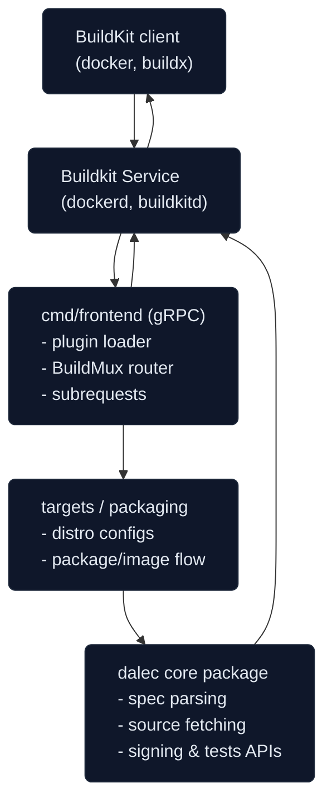

<a id="doc-8f6366fd8e7a5fa30f7f0587"></a>

# project-dalec/dalec / ARCHITECTURE.md

Upstream: https://github.com/project-dalec/dalec/blob/3ea589a04760d0a636e365e2b7225e83f17fca22/ARCHITECTURE.md

Commit: `3ea589a04760d0a636e365e2b7225e83f17fca22`

Retrieved: 2026-10-01T15:26:39.241471+00:00

Kind: official-document

Raw SHA256: `f17da88423725179dd23702d1492b2922916c573a7d05d957893ef8041510d6e`

Source text below is untrusted reference content. Acquisition does not verify technical claims.

License status: UPSTREAM_NOTICES_CAPTURED_PER_FILE_REVIEW_REQUIRED. See this repository's captured license files.

---

website/docs/architecture.md

<a id="doc-ffdbe3a1e7ee93cacfc080b6"></a>

# project-dalec/dalec / CODE_OF_CONDUCT.md

Upstream: https://github.com/project-dalec/dalec/blob/3ea589a04760d0a636e365e2b7225e83f17fca22/CODE_OF_CONDUCT.md

Commit: `3ea589a04760d0a636e365e2b7225e83f17fca22`

Retrieved: 2026-10-01T15:26:39.241471+00:00

Kind: official-document

Raw SHA256: `49037309e44c6217264adb498c182c3de998918865c7d582fbec5d809958a485`

Source text below is untrusted reference content. Acquisition does not verify technical claims.

License status: UPSTREAM_NOTICES_CAPTURED_PER_FILE_REVIEW_REQUIRED. See this repository's captured license files.

---

# Dalec Community Code of Conduct

Dalec follows the [CNCF Code of Conduct](https://github.com/cncf/foundation/blob/main/code-of-conduct.md).


<a id="doc-eca12c0a30e25b4b46522ebf"></a>

# project-dalec/dalec / CONTRIBUTING.md

Upstream: https://github.com/project-dalec/dalec/blob/3ea589a04760d0a636e365e2b7225e83f17fca22/CONTRIBUTING.md

Commit: `3ea589a04760d0a636e365e2b7225e83f17fca22`

Retrieved: 2026-10-01T15:26:39.241471+00:00

Kind: official-document

Raw SHA256: `10ad270030a8174b73e55baa5146f5fbfd1dd871c60eba86a63176ebd64eac84`

Source text below is untrusted reference content. Acquisition does not verify technical claims.

License status: UPSTREAM_NOTICES_CAPTURED_PER_FILE_REVIEW_REQUIRED. See this repository's captured license files.

---

# Contributing

Dalec welcomes contributions and suggestions!

## For Developers

If you're looking to contribute code to Dalec, please see the [Developer Guide](https://project-dalec.github.io/dalec/developers) for detailed information about:

- Setting up your development environment
- Recommended dev/test workflows
- Running tests and validation
- Using the Makefile for common tasks

## Terms

## Code of Conduct

Dalec has adopted the CNCF Code of Conduct. Refer to our [Community Code of Conduct](CODE_OF_CONDUCT.md) for details.  For more information see the Code of Conduct FAQ or contact opencode@microsoft.com with any additional questions or comments.

## Contributing a patch

1. Submit an issue describing your proposed change to the repository in question. The repository owners will respond to your issue promptly.
2. Fork the desired repository, then develop and test your code changes.
3. Submit a pull request.

When you submit a pull request all commits must include a [DCO signed-off](https://wiki.linuxfoundation.org/dco).
The CNCF-operated `dco-2` GitHub App enforces this policy on every branch, blocking merges until the status check passes.

## Issue and pull request management

Anyone can comment on issues and submit reviews for pull requests. In order to be assigned an issue or pull request, you can leave a `/assign <your Github ID>` comment on the issue or pull request.


<a id="doc-653bc99dc2e48c5310ac6167"></a>

# project-dalec/dalec / CONTRIBUTOR_LADDER.md

Upstream: https://github.com/project-dalec/dalec/blob/3ea589a04760d0a636e365e2b7225e83f17fca22/CONTRIBUTOR_LADDER.md

Commit: `3ea589a04760d0a636e365e2b7225e83f17fca22`

Retrieved: 2026-10-01T15:26:39.241471+00:00

Kind: official-document

Raw SHA256: `d17ceac40b073a50ec5c2dd7bfbfdab8c3b1bd5a942cb6ace3a90eeb4107d553`

Source text below is untrusted reference content. Acquisition does not verify technical claims.

License status: UPSTREAM_NOTICES_CAPTURED_PER_FILE_REVIEW_REQUIRED. See this repository's captured license files.

---

Hello! We are excited that you want to learn more about our project contributor ladder! This contributor ladder outlines the different contributor roles within the project, along with the responsibilities and privileges that come with them. Community members generally start at the first levels of the "ladder" and advance up it as their involvement in the project grows. Our project members are happy to help you advance along the contributor ladder.

Each of the contributor roles below is organized into lists of three types of things. "Responsibilities" are things that a contributor is expected to do. "Requirements" are qualifications a person needs to meet to be in that role, and "Privileges" are things contributors on that level are entitled to.

## Contributor

Description: A Contributor contributes directly to the project and adds value to it. Contributions don't only mean code contributions. Other types of contributions are valid, such as documentation improvements or community involvement as an example. People at the Contributor level may be new contributors, or they may only contribute occasionally.

- Responsibilities include:
  - Follow the CNCF CoC
  - Follow the project contributing guide
- Requirements (one or several of the below):
  - Report and sometimes resolve issues
  - Occasionally submit PRs
  - Contribute to the documentation
  - Show up at meetings, takes notes
  - Answer questions from other community members
  - Submit feedback on issues and PRs
  - Test releases and patches and submit reviews
  - Run or helps run events
  - Promote the project in public
  - Help run the project infrastructure
- Privileges:
  - Invitations to contributor events
  - Shout outs in the project newsletter and milestone blog post announcements
  - Eligible to become a Reviewer

## Reviewer

Description: A Reviewer has responsibility for specific code, documentation, test, or other project areas. They are collectively responsible, with other Reviewers, for reviewing all changes to those areas and indicating whether those changes are ready to merge. They have a track record of contribution and review in the project.

Reviewers are responsible for a "specific area." This can be a specific code directory, driver, chapter of the docs, test job, event, or other clearly-defined project component that is smaller than an entire repository or subproject. Most often it is one or a set of directories in one or more Git repositories. The "specific area" below refers to this area of responsibility.

Reviewers have all the rights and responsibilities of an Organization Member, plus:

- Responsibilities include:
  - Following the [reviewing guide](REVIEWING.md)
  - Reviewing most Pull Requests against their specific areas of responsibility
  - Helping other contributors become reviewers
- Requirements:
  - Has demonstrated an in-depth knowledge of the specific area
  - Commits to being responsible for that specific area
  - Is supportive of new and occasional contributors and helps get useful PRs in shape to commit
- Additional privileges:
  - Invited to become an organization member
  - Has GitHub or CI/CD rights to approve pull requests in specific directories
  - Can recommend and review other contributors to become Reviewers

The process of becoming a Reviewer is:

1. The contributor is nominated by opening a PR against the appropriate repository, which adds their GitHub username to the OWNERS file for one or more directories.
2. At least two members of the team that owns that repository or main directory, who are already Maintainers, approve the PR.

## Maintainer

Description: Maintainers are very established contributors who are responsible for the entire project. As such, they have the ability to approve PRs against any area of the project, and are expected to participate in making decisions about the strategy and priorities of the project.

A Maintainer must meet the responsibilities and requirements of a Reviewer, plus:

- Responsibilities include:
  - Mentoring new Reviewers
  - Writing refactoring PRs
  - Participating in CNCF maintainer activities
  - Determining strategy and policy for the project
  - Participating in, and leading, community meetings
- Requirements
  - Demonstrates a broad knowledge of the project across multiple areas
  - Is able to exercise judgment for the good of the project, independent of their employer, friends, or team
  - Mentors other contributors
- Additional privileges:
  - Approve PRs to any area of the project
  - Represent the project in public as a Maintainer
  - Communicate with the CNCF on behalf of the project
  - Have a vote in Maintainer decision-making meetings

Process of becoming a maintainer:

1. Any current Maintainer may nominate a current Reviewer to become a new Maintainer, by opening a PR against the root of the repository adding the nominee to the (MAINTAINERS) file.
2. The nominee will add a comment to the PR testifying that they agree to all requirements of becoming a Maintainer.
3. A majority of the current Maintainers must then approve the PR.

## Involuntary Removal or Demotion

Involuntary removal/demotion of a contributor happens when responsibilities and requirements aren't being met. This may include repeated patterns of inactivity, extended period of inactivity, a period of failing to meet the requirements of your role, and/or a violation of the Code of Conduct. This process is important because it protects the community and its deliverables while also opens up opportunities for new contributors to step in.

Involuntary removal or demotion is handled through a vote by a majority of the current Maintainers.

## Stepping Down/Emeritus Process

If and when contributors' commitment levels change, contributors can consider stepping down (moving down the contributor ladder) vs moving to emeritus status (completely stepping away from the project).

Contact the Maintainers about changing to Emeritus status, or reducing your contributor level.

## Contact

- For inquiries, please reach out to a maintainer on Dalec channel in [Slack](https://cloud-native.slack.com): @Jeremy Rickard, @Sertac Ozercan, or @Brian Goff


<a id="doc-b60c6a93e9f74ee52e71bf33"></a>

# project-dalec/dalec / GOVERNANCE.md

Upstream: https://github.com/project-dalec/dalec/blob/3ea589a04760d0a636e365e2b7225e83f17fca22/GOVERNANCE.md

Commit: `3ea589a04760d0a636e365e2b7225e83f17fca22`

Retrieved: 2026-10-01T15:26:39.241471+00:00

Kind: official-document

Raw SHA256: `cd409b7435dfc4135773743586910e76fa6a7ae6be739b4afbfba6d1e94fc69a`

Source text below is untrusted reference content. Acquisition does not verify technical claims.

License status: UPSTREAM_NOTICES_CAPTURED_PER_FILE_REVIEW_REQUIRED. See this repository's captured license files.

---

# Dalec Project Governance

The Dalec project is dedicated to creating a community of individuals interested in software build systems. 

This governance explains how the project is run.

- [Values](#values)
- [Maintainers](#maintainers)
- [Becoming a Maintainer](#becoming-a-maintainer)
- [Meetings](#meetings)
- [CNCF Resources](#cncf-resources)
- [Security Response Team](#security-response-team)
- [Voting](#voting)
- [Modifications](#modifying-this-charter)

## Values

The Dalec project and its leadership embrace the following values:

* Openness: Communication and decision-making happens in the open and is discoverable for future
  reference. As much as possible, all discussions and work take place in public
  forums and open repositories.

* Fairness: All stakeholders have the opportunity to provide feedback and submit
  contributions, which will be considered on their merits.

* Community over Product or Company: Sustaining and growing our community takes
  priority over shipping code or sponsors' organizational goals.  Each
  contributor participates in the project as an individual.

* Inclusivity: We innovate through different perspectives and skill sets, which
  can only be accomplished in a welcoming and respectful environment.

* Participation: Responsibilities within the project are earned through
  participation, and there is a clear path up the contributor ladder into leadership
  positions.

## Maintainers

Dalec Maintainers have write access to the [project GitHub repository](https://github.com/project-dalec/dalec).
They can merge their own patches or patches from others. The current maintainers
can be found in [MAINTAINERS.md](./MAINTAINERS.md).  Maintainers collectively manage the project's
resources and contributors.

This privilege is granted with some expectation of responsibility: maintainers
are people who care about the Dalec project and want to help it grow and
improve. A maintainer is not just someone who can make changes, but someone who
has demonstrated their ability to collaborate with the team, get the most
knowledgeable people to review code and docs, contribute high-quality code, and
follow through to fix issues (in code or tests).

A maintainer is a contributor to the project's success and a citizen helping
the project succeed.

The collective team of all Maintainers is known as the Maintainer Council, which
is the governing body for the project.

Maintainer responsibilities and other role descriptions can be found in the [contributor ladder](./CONTRIBUTOR_LADDER.md).

## Code Changes
All code changes should go through the Pull Request (PR) process. PRs should only be merged after receiving approval (via GitHub) from at least one other maintainer.
We do not vote formally on every code change, but we do expect that every code change merged has the same community support as if the change were approved by a formal vote. When a merge occurs without sufficient community support, the change should be reverted until the dispute is resolved through discussion. Any team member who feels that a technical decision cannot be reached can call for a formal vote following the rules outlined below in either the PR or a separate issue.

## Branch Protection

Repository settings in GitHub enforce protection on the `main` branch. Required rules include the `dco-2` status check and at least one approval from a maintainer who is not the author before merge. Force pushes are disabled, ensuring traceable, reviewable history for every release.

## Meetings

Maintainers will have ad-hoc closed meetings in order to discuss security reports
or Code of Conduct violations. Such meetings should be scheduled by any
Maintainer on receipt of a security issue or CoC report. All current Maintainers
must be invited to such closed meetings, except for any Maintainer who is
accused of a CoC violation.

## CNCF Resources

Any Maintainer may suggest a request for CNCF resources, either in the
[mailing list](https://groups.google.com/g/project-dalec), or during a
meeting.  A simple majority of Maintainers approves the request.  


## Security Response Team

The Maintainers will serve as a Security Response Team to handle security reports. The Security Response Team is responsible for handling all reports of security
holes and breaches according to the [security policy](./SECURITY.md).

## Voting

While most business in Project Dalec is conducted by "[lazy consensus](https://community.apache.org/committers/lazyConsensus.html)", 
periodically the Maintainers may need to vote on specific actions or changes.
A vote can be taken on [the developer mailing list](https://groups.google.com/g/project-dalec) or
the private Maintainer mailing list for security or conduct matters.  
Votes may also be taken at community meetings or through Github Issues.  Any Maintainer may
demand a vote be taken.

Most votes require a simple majority of all Maintainers to succeed, except where
otherwise noted.  Two-thirds majority votes mean at least two-thirds of all 
existing maintainers.

## Modifying this Charter

Changes to this Governance and its supporting documents may be approved by 
a 2/3 vote of the Maintainers.


<a id="doc-c693279643b8cd5d248172d9"></a>

# project-dalec/dalec / LICENSE

Upstream: https://github.com/project-dalec/dalec/blob/3ea589a04760d0a636e365e2b7225e83f17fca22/LICENSE

Commit: `3ea589a04760d0a636e365e2b7225e83f17fca22`

Retrieved: 2026-10-01T15:26:39.241471+00:00

Kind: license

Raw SHA256: `f957892e0fdb33ec63c6b242749a3851768d7cd010b5fb65599aeb14852911ae`

Source text below is untrusted reference content. Acquisition does not verify technical claims.

License status: UPSTREAM_NOTICES_CAPTURED_PER_FILE_REVIEW_REQUIRED. See this repository's captured license files.

---

````text

                                 Apache License
                           Version 2.0, January 2004
                        https://www.apache.org/licenses/

   TERMS AND CONDITIONS FOR USE, REPRODUCTION, AND DISTRIBUTION

   1. Definitions.

      "License" shall mean the terms and conditions for use, reproduction,
      and distribution as defined by Sections 1 through 9 of this document.

      "Licensor" shall mean the copyright owner or entity authorized by
      the copyright owner that is granting the License.

      "Legal Entity" shall mean the union of the acting entity and all
      other entities that control, are controlled by, or are under common
      control with that entity. For the purposes of this definition,
      "control" means (i) the power, direct or indirect, to cause the
      direction or management of such entity, whether by contract or
      otherwise, or (ii) ownership of fifty percent (50%) or more of the
      outstanding shares, or (iii) beneficial ownership of such entity.

      "You" (or "Your") shall mean an individual or Legal Entity
      exercising permissions granted by this License.

      "Source" form shall mean the preferred form for making modifications,
      including but not limited to software source code, documentation
      source, and configuration files.

      "Object" form shall mean any form resulting from mechanical
      transformation or translation of a Source form, including but
      not limited to compiled object code, generated documentation,
      and conversions to other media types.

      "Work" shall mean the work of authorship, whether in Source or
      Object form, made available under the License, as indicated by a
      copyright notice that is included in or attached to the work
      (an example is provided in the Appendix below).

      "Derivative Works" shall mean any work, whether in Source or Object
      form, that is based on (or derived from) the Work and for which the
      editorial revisions, annotations, elaborations, or other modifications
      represent, as a whole, an original work of authorship. For the purposes
      of this License, Derivative Works shall not include works that remain
      separable from, or merely link (or bind by name) to the interfaces of,
      the Work and Derivative Works thereof.

      "Contribution" shall mean any work of authorship, including
      the original version of the Work and any modifications or additions
      to that Work or Derivative Works thereof, that is intentionally
      submitted to Licensor for inclusion in the Work by the copyright owner
      or by an individual or Legal Entity authorized to submit on behalf of
      the copyright owner. For the purposes of this definition, "submitted"
      means any form of electronic, verbal, or written communication sent
      to the Licensor or its representatives, including but not limited to
      communication on electronic mailing lists, source code control systems,
      and issue tracking systems that are managed by, or on behalf of, the
      Licensor for the purpose of discussing and improving the Work, but
      excluding communication that is conspicuously marked or otherwise
      designated in writing by the copyright owner as "Not a Contribution."

      "Contributor" shall mean Licensor and any individual or Legal Entity
      on behalf of whom a Contribution has been received by Licensor and
      subsequently incorporated within the Work.

   2. Grant of Copyright License. Subject to the terms and conditions of
      this License, each Contributor hereby grants to You a perpetual,
      worldwide, non-exclusive, no-charge, royalty-free, irrevocable
      copyright license to reproduce, prepare Derivative Works of,
      publicly display, publicly perform, sublicense, and distribute the
      Work and such Derivative Works in Source or Object form.

   3. Grant of Patent License. Subject to the terms and conditions of
      this License, each Contributor hereby grants to You a perpetual,
      worldwide, non-exclusive, no-charge, royalty-free, irrevocable
      (except as stated in this section) patent license to make, have made,
      use, offer to sell, sell, import, and otherwise transfer the Work,
      where such license applies only to those patent claims licensable
      by such Contributor that are necessarily infringed by their
      Contribution(s) alone or by combination of their Contribution(s)
      with the Work to which such Contribution(s) was submitted. If You
      institute patent litigation against any entity (including a
      cross-claim or counterclaim in a lawsuit) alleging that the Work
      or a Contribution incorporated within the Work constitutes direct
      or contributory patent infringement, then any patent licenses
      granted to You under this License for that Work shall terminate
      as of the date such litigation is filed.

   4. Redistribution. You may reproduce and distribute copies of the
      Work or Derivative Works thereof in any medium, with or without
      modifications, and in Source or Object form, provided that You
      meet the following conditions:

      (a) You must give any other recipients of the Work or
          Derivative Works a copy of this License; and

      (b) You must cause any modified files to carry prominent notices
          stating that You changed the files; and

      (c) You must retain, in the Source form of any Derivative Works
          that You distribute, all copyright, patent, trademark, and
          attribution notices from the Source form of the Work,
          excluding those notices that do not pertain to any part of
          the Derivative Works; and

      (d) If the Work includes a "NOTICE" text file as part of its
          distribution, then any Derivative Works that You distribute must
          include a readable copy of the attribution notices contained
          within such NOTICE file, excluding those notices that do not
          pertain to any part of the Derivative Works, in at least one
          of the following places: within a NOTICE text file distributed
          as part of the Derivative Works; within the Source form or
          documentation, if provided along with the Derivative Works; or,
          within a display generated by the Derivative Works, if and
          wherever such third-party notices normally appear. The contents
          of the NOTICE file are for informational purposes only and
          do not modify the License. You may add Your own attribution
          notices within Derivative Works that You distribute, alongside
          or as an addendum to the NOTICE text from the Work, provided
          that such additional attribution notices cannot be construed
          as modifying the License.

      You may add Your own copyright statement to Your modifications and
      may provide additional or different license terms and conditions
      for use, reproduction, or distribution of Your modifications, or
      for any such Derivative Works as a whole, provided Your use,
      reproduction, and distribution of the Work otherwise complies with
      the conditions stated in this License.

   5. Submission of Contributions. Unless You explicitly state otherwise,
      any Contribution intentionally submitted for inclusion in the Work
      by You to the Licensor shall be under the terms and conditions of
      this License, without any additional terms or conditions.
      Notwithstanding the above, nothing herein shall supersede or modify
      the terms of any separate license agreement you may have executed
      with Licensor regarding such Contributions.

   6. Trademarks. This License does not grant permission to use the trade
      names, trademarks, service marks, or product names of the Licensor,
      except as required for reasonable and customary use in describing the
      origin of the Work and reproducing the content of the NOTICE file.

   7. Disclaimer of Warranty. Unless required by applicable law or
      agreed to in writing, Licensor provides the Work (and each
      Contributor provides its Contributions) on an "AS IS" BASIS,
      WITHOUT WARRANTIES OR CONDITIONS OF ANY KIND, either express or
      implied, including, without limitation, any warranties or conditions
      of TITLE, NON-INFRINGEMENT, MERCHANTABILITY, or FITNESS FOR A
      PARTICULAR PURPOSE. You are solely responsible for determining the
      appropriateness of using or redistributing the Work and assume any
      risks associated with Your exercise of permissions under this License.

   8. Limitation of Liability. In no event and under no legal theory,
      whether in tort (including negligence), contract, or otherwise,
      unless required by applicable law (such as deliberate and grossly
      negligent acts) or agreed to in writing, shall any Contributor be
      liable to You for damages, including any direct, indirect, special,
      incidental, or consequential damages of any character arising as a
      result of this License or out of the use or inability to use the
      Work (including but not limited to damages for loss of goodwill,
      work stoppage, computer failure or malfunction, or any and all
      other commercial damages or losses), even if such Contributor
      has been advised of the possibility of such damages.

   9. Accepting Warranty or Additional Liability. While redistributing
      the Work or Derivative Works thereof, You may choose to offer,
      and charge a fee for, acceptance of support, warranty, indemnity,
      or other liability obligations and/or rights consistent with this
      License. However, in accepting such obligations, You may act only
      on Your own behalf and on Your sole responsibility, not on behalf
      of any other Contributor, and only if You agree to indemnify,
      defend, and hold each Contributor harmless for any liability
      incurred by, or claims asserted against, such Contributor by reason
      of your accepting any such warranty or additional liability.

   END OF TERMS AND CONDITIONS

   Copyright The Project Dalec Authors

   Licensed under the Apache License, Version 2.0 (the "License");
   you may not use this file except in compliance with the License.
   You may obtain a copy of the License at

       https://www.apache.org/licenses/LICENSE-2.0

   Unless required by applicable law or agreed to in writing, software
   distributed under the License is distributed on an "AS IS" BASIS,
   WITHOUT WARRANTIES OR CONDITIONS OF ANY KIND, either express or implied.
   See the License for the specific language governing permissions and
   limitations under the License.

````


<a id="doc-39da3bd6270d44ea37b6ed50"></a>

# project-dalec/dalec / MAINTAINERS.md

Upstream: https://github.com/project-dalec/dalec/blob/3ea589a04760d0a636e365e2b7225e83f17fca22/MAINTAINERS.md

Commit: `3ea589a04760d0a636e365e2b7225e83f17fca22`

Retrieved: 2026-10-01T15:26:39.241471+00:00

Kind: official-document

Raw SHA256: `2901727a91c88fe0cd59a95ee4d42947c0f8bd666ca29e6e861722ac8786a0aa`

Source text below is untrusted reference content. Acquisition does not verify technical claims.

License status: UPSTREAM_NOTICES_CAPTURED_PER_FILE_REVIEW_REQUIRED. See this repository's captured license files.

---

# Project Dalec Maintainers

| Maintainer      | Organization | GitHub Username                                  |
|-----------------|--------------|--------------------------------------------------|
| Brian Goff      | Microsoft    | [@cpuguy83](https://github.com/cpuguy83)         |
| Jeremy Rickard  | Microsoft    | [@jrrickard](https://github.com/jrrickard)       |
| Peter Engelbert | Microsoft    | [@pmengelbert](https://github.com/pmengelbert)   |

## Emeritus Maintainers

| Maintainer     | Organization | GitHub Username                          | Term                       |
|----------------|--------------|------------------------------------------|----------------------------|
| Sertac Ozercan | Microsoft    | [@sozercan](https://github.com/sozercan) | 2025-07-16 - 2026-02-04 |

## Reviewers

| Reviewer       | Organization | GitHub Username                                |
|----------------|--------------|------------------------------------------------|
| Danny Brito    | Microsoft    | [@DannyBrito](https://github.com/DannyBrito)   |
| Brian Chuo     | Microsoft    | [@bchuo](https://github.com/bchuo)             |
| Mateusz Gozdek | Microsoft    | [@invidian](https://github.com/invidian)       |
| Jeremy Morris  | Microsoft    | [@MorrisLaw](https://github.com/MorrisLaw)     |


<a id="doc-b335630551682c19a781afeb"></a>

# project-dalec/dalec / README.md

Upstream: https://github.com/project-dalec/dalec/blob/3ea589a04760d0a636e365e2b7225e83f17fca22/README.md

Commit: `3ea589a04760d0a636e365e2b7225e83f17fca22`

Retrieved: 2026-10-01T15:26:39.241471+00:00

Kind: official-document

Raw SHA256: `e285c0335d9d7b71072025eb0767b233de2628b14a5d88919921b248f3afdf30`

Source text below is untrusted reference content. Acquisition does not verify technical claims.

License status: UPSTREAM_NOTICES_CAPTURED_PER_FILE_REVIEW_REQUIRED. See this repository's captured license files.

---

# Dalec

Dalec is a project aimed at providing a declarative format for building system packages and containers from those packages.

Our goal is to provide a secure way to build packages and containers, with a focus on supply chain security.

## Features

- 🐳 No additional tools are needed except for [Docker](https://docs.docker.com/engine/install/)!
- 🚀 Easy to use declarative configuration
- 📦 Build packages and/or containers for a number of different [targets](https://project-dalec.github.io/dalec/targets)
  - DEB-based: Debian, and Ubuntu
  - RPM-based: Azure Linux, Rocky Linux, and Alma Linux
  - Windows containers (cross compilation only)
- 🔌 Pluggable support for other operating systems
- 🤏 Minimal image size, resulting in less vulnerabilities and smaller attack surface
- 🪟 Support for Windows containers
- ✍️ Support for signed packages
- 🔐 Ensure supply chain security with build time SBOMs, and Provenance attestations

👉 To get started, please see [Dalec documentation](https://project-dalec.github.io/dalec/)!

## Contributing

This project welcomes contributions and suggestions. Dalec uses the [Developer Certificate of Origin (DCO)](https://wiki.linuxfoundation.org/dco) to confirm authorship and licensing intent.
Each commit must include a Signed-off-by line; run `git commit -s` to add it automatically.
The CNCF-operated `dco-2` GitHub App enforces this requirement on every pull request.
See [CONTRIBUTING.md](https://github.com/project-dalec/dalec/blob/main/CONTRIBUTING.md#contributing-a-patch) for additional guidance.

Dalec has adopted the CNCF Code of Conduct. Refer to our [Community Code of Conduct](https://github.com/project-dalec/dalec/blob/main/CODE_OF_CONDUCT.md) for details.
For more information, see the [CNCF Code of Conduct FAQ](https://github.com/cncf/foundation/blob/main/code-of-conduct-faq.md) or contact conduct@cncf.io with any additional questions or comments.

### Badges

[](https://www.bestpractices.dev/projects/11346)
[](https://scorecard.dev/viewer/?uri=github.com/project-dalec/dalec)

Copyright Contributors to Dalec, established as Dalec a Series of LF Projects, LLC.


<a id="doc-f6ed156e4bf5c79168066246"></a>

# project-dalec/dalec / SECURITY.md

Upstream: https://github.com/project-dalec/dalec/blob/3ea589a04760d0a636e365e2b7225e83f17fca22/SECURITY.md

Commit: `3ea589a04760d0a636e365e2b7225e83f17fca22`

Retrieved: 2026-10-01T15:26:39.241471+00:00

Kind: official-document

Raw SHA256: `d01381e11659793d9a729a2e04d59358c743c394143de143d750147fc58dbd59`

Source text below is untrusted reference content. Acquisition does not verify technical claims.

License status: UPSTREAM_NOTICES_CAPTURED_PER_FILE_REVIEW_REQUIRED. See this repository's captured license files.

---

# Security Policy

## Supported Versions

Dalec remains in the process of getting to a stable v1.0 release, and as such does not currently provide a long-term supported version.
We make a good faith effort to respond to security issues in a timely manner and will release version updates as needed to address them.
Users should expect to upgrade to the latest release version to stay current on security updates.

## Communication

We will publish known vulnerabilities through a [GitHub Security Advisory](https://github.com/project-dalec/dalec/security/advisories) once they have been addressed to inform the community of their potential scope, impact, and mitigation.

## Reporting Security Issues

Project Dalec and its maintainers take the security of the project seriously, and we appreciate your efforts to responsibly disclose your findings to us.

> **Please do not report security vulnerabilities through public GitHub issues.**

Instead, please report them through our [private vulnerability reporting](https://github.com/project-dalec/dalec/security/advisories/new) form.

Please include the requested information listed below (as much as you can provide) to help us better understand the nature and scope of the possible issue:

* Type of issue (e.g. buffer overflow, SQL injection, cross-site scripting, etc.)
* Full paths of source file(s) related to the manifestation of the issue
* The location of the affected source code (tag/branch/commit or direct URL)
* Any special configuration required to reproduce the issue
* Step-by-step instructions to reproduce the issue
* Proof-of-concept or exploit code (if possible)
* Impact of the issue, including how an attacker might exploit the issue

This information will help us triage your report more quickly.

We believe in [Coordinated Vulnerability Disclosure (CVD)](https://en.wikipedia.org/wiki/Coordinated_vulnerability_disclosure) and will work with you through the private advisory report.

## Preferred Languages

We prefer all communications to be in English.

## Maintainer Authentication

All members of the Project Dalec GitHub organization must authenticate using secure multi-factor mechanisms (for example, FIDO2 hardware security keys such as YubiKey devices). GitHub enforces this policy at the organization level and disallows SMS or email-based second factors for members; accounts without a compliant hardware or app-based (TOTP, WebAuthn) factor cannot access project resources.

## Dependency Monitoring

Automated scanners in GitHub monitor direct and transitive dependencies. Dependabot continuously proposes security updates based on `dependabot.yml`, and each pull request it opens is reviewed and merged by a maintainer once tests pass. The GitHub Dependency Review workflow annotates contributor pull requests with vulnerability findings so reviewers can block risky upgrades before merge. The Snyk GitHub App integration scans release branches and raises alerts in the repository security dashboard, where maintainers triage and remediate advisories.

## Secret Management

The project does not maintain long-lived shared secrets in source control or CI. Workflow automation relies only on the GitHub-provided `GITHUB_TOKEN`, which GitHub scopes automatically: in `ci.yml` it has minimal read/package permissions for pull-request and branch builds, and in release workflows it receives package-publish access only when a signed tag triggers the job. Maintainers monitor the default token permissions and avoid storing additional credentials in repository settings.


<a id="doc-c5fe610b0215b14447410625"></a>

# project-dalec/dalec / SUPPORT.md

Upstream: https://github.com/project-dalec/dalec/blob/3ea589a04760d0a636e365e2b7225e83f17fca22/SUPPORT.md

Commit: `3ea589a04760d0a636e365e2b7225e83f17fca22`

Retrieved: 2026-10-01T15:26:39.241471+00:00

Kind: official-document

Raw SHA256: `34eca791c0762c02365e4323670faed80567e93f722fb03cf1a53f88573be91c`

Source text below is untrusted reference content. Acquisition does not verify technical claims.

License status: UPSTREAM_NOTICES_CAPTURED_PER_FILE_REVIEW_REQUIRED. See this repository's captured license files.

---

# Support

## How to file issues and get help

This project uses GitHub Issues to track bugs and feature requests. Please search the existing
issues before filing new issues to avoid duplicates.  For new issues, file your bug or
feature request as a new Issue.

For help and questions about using this project, please use Github Discussions.


<a id="doc-24dab1d6d254c0c528c51cf4"></a>

# project-dalec/dalec / contrib/traces/README.md

Upstream: https://github.com/project-dalec/dalec/blob/3ea589a04760d0a636e365e2b7225e83f17fca22/contrib/traces/README.md

Commit: `3ea589a04760d0a636e365e2b7225e83f17fca22`

Retrieved: 2026-10-01T15:26:39.241471+00:00

Kind: official-document

Raw SHA256: `65710dabec85bf7815d280e1d7dc482e42bc28b543f6c4163fdec250b3e501a9`

Source text below is untrusted reference content. Acquisition does not verify technical claims.

License status: UPSTREAM_NOTICES_CAPTURED_PER_FILE_REVIEW_REQUIRED. See this repository's captured license files.

---

# Trace Replay Setup

This directory contains a Docker Compose setup to replay CI trace files locally
using Jaeger UI.

## Usage

Assumption: All below commands and run from the directory that the docker-compose yaml file is in.

1. Download the trace artifact from a CI run (e.g., `integration-test-reports-<suite>`)
2. Extract any/all `.jsonl` files to be processed under the `traces/` dir (which may not exist).
3. Run:
   ```bash
   docker compose up
   ```
4. Open Jaeger UI at http://localhost:16686

The otel-collector will read the `.jsonl` file and export traces to Jaeger. The
Jaeger UI can then be used to browse and analyze the traces.

Traces can be quite large so may take some time to process.

To customize the port that Jaeger UI listens on, you can set `JAEGER_UI_PORT`

## Files

- [docker-compose.yaml](./docker-compose.yaml) - Orchestrates Jaeger and OTEL Collector
- [otel-collector-config.yaml](./otel-collector-config.yaml) - Collector config for reading JSON files and exporting to Jaeger
- [jaeger-config.yaml](./jaeger-config.yaml) - Jaeger v2 configuration with memory storage
- [jaeger-ui-config.json](./jaeger-ui-config.json) - Jaeger UI configuration


<a id="doc-c2e8bcee8391d82c5f4e9c19"></a>

# project-dalec/dalec / docs/assurance-case.md

Upstream: https://github.com/project-dalec/dalec/blob/3ea589a04760d0a636e365e2b7225e83f17fca22/docs/assurance-case.md

Commit: `3ea589a04760d0a636e365e2b7225e83f17fca22`

Retrieved: 2026-10-01T15:26:39.241471+00:00

Kind: official-document

Raw SHA256: `c97767566105525410250d452db73a5db3799c1fe38ee7fca4c6ead7b6b55481`

Source text below is untrusted reference content. Acquisition does not verify technical claims.

License status: UPSTREAM_NOTICES_CAPTURED_PER_FILE_REVIEW_REQUIRED. See this repository's captured license files.

---

# Dalec Assurance Case

## Purpose
- Provide the structured argument required for OpenSSF Best Practices **Silver**, demonstrating that Dalec's release process mitigates material supply-chain risks.
- Map high-level claims to stable evidence maintained in the repository and organizational policies.

## Scope and Context
- **System under consideration:** The Dalec BuildKit frontend, supporting targets, packaging assets, and tooling described in ARCHITECTURE.md#runtime-components and ARCHITECTURE.md#build-orchestration-flow.
- **Operational context:** Releases are produced from the `main` branch by GitHub Actions workflows executed by maintainers using the documented development workflow.
- **Audience:** Dalec maintainers, release engineers, CNCF reviewers, and downstream consumers evaluating the project's security posture.
- **Assumptions:** Upstream dependencies (Docker, BuildKit, Go toolchain, GitHub) maintain their security guarantees and the organization applies the documented policies.

## Threat Model
- **Assets:** Dalec’s BuildKit frontend runtime, target plugins, packaging templates, optional SBOM and provenance generation features, and the packages or container images created when users build with Dalec.
- **Actors:** Dalec maintainers and trusted contributors; potentially malicious or compromised spec authors; adversaries controlling remote source origins; threat actors attempting to exploit vulnerabilities in Dalec’s runtime or generated artifacts.
- **Attack vectors:** Injection of hostile build steps or packaging metadata through Dalec specs, compromise of external source artifacts fetched during builds, tampering with SBOM/provenance metadata when generated, misuse of plugin extension points to bypass sandboxing, and exploitation of defects in the frontend, packaging logic, or integration with BuildKit.
- **Mitigations:** Declarative spec validation, BuildKit’s sandboxed execution with clearly defined mounts, optional signed-package/SBOM features available to spec authors, tests defined in specs and executed via the Dalec test runner, and ongoing dependency/static analysis to surface exploitable defects. Official release artifacts also ship with signatures and SBOM/provenance outputs.

## Top-Level Claim (G0)
> Dalec governance, development, build, and release practices provide sufficient assurance that released artifacts maintain expected security characteristics.

The remainder of this document decomposes G0 into supporting strategies, claims, and evidence.

### Strategy S1 – Community Governance Provides Accountable Oversight
- **Claim C1.1:** Maintainer-led governance enforces openness, fairness, and participation.  
  *Evidence:* [GOVERNANCE.md#values](../GOVERNANCE.md#values), [CONTRIBUTOR_LADDER.md](../CONTRIBUTOR_LADDER.md).
- **Claim C1.2:** Maintainers collectively own security response responsibilities.  
  *Evidence:* [GOVERNANCE.md#security-response-team](../GOVERNANCE.md#security-response-team).

### Strategy S2 – Secure Development Lifecycle Controls Prevent Unauthorized Changes
- **Claim C2.1:** Authorship attestation is required before code is accepted via DCO sign-off.  
  *Evidence:* [README.md#contributing](../README.md#contributing) (DCO requirement), [CONTRIBUTING.md#contributing-a-patch](../CONTRIBUTING.md#contributing-a-patch) (CNCF `dco-2` status check).
- **Claim C2.2:** Branch protection rules enforce at least one independent maintainer approval and block merges without passing required checks.  
  *Evidence:* [GOVERNANCE.md#branch-protection](../GOVERNANCE.md#branch-protection), [GOVERNANCE.md#code-changes](../GOVERNANCE.md#code-changes).
- **Claim C2.3:** All organization members authenticate with secure multi-factor credentials (hardware FIDO2 keys or app-based TOTP/WebAuthn; SMS and email factors are not permitted).  
  *Evidence:* [SECURITY.md#maintainer-authentication](../SECURITY.md#maintainer-authentication).
- **Claim C2.4:** Continuous integration runs mandatory static analysis and linting before merge.  
  *Evidence:* [.github/workflows/ci.yml](../.github/workflows/ci.yml) (golangci-lint, custom linters, generated file validation), [.github/workflows/codeql.yml](../.github/workflows/codeql.yml) (GitHub CodeQL analysis).
- **Claim C2.5:** Architecture and extension points are documented to guide safe contributions.  
  *Evidence:* [ARCHITECTURE.md#runtime-components](../ARCHITECTURE.md#runtime-components), [ARCHITECTURE.md#specification](../ARCHITECTURE.md#specification), [ARCHITECTURE.md#build-orchestration-flow](../ARCHITECTURE.md#build-orchestration-flow).
- **Claim C2.6:** Secrets and credentials are managed outside source control: CI and release workflows rely solely on GitHub’s scoped `GITHUB_TOKEN`, and build-time secrets for signing flows are supplied through BuildKit secret mounts as documented for spec authors.  
  *Evidence:* [SECURITY.md#secret-management](../SECURITY.md#secret-management), [Signing secrets guide](https://project-dalec.github.io/dalec/signing#secrets).

### Strategy S3 – Build and Release Pipeline Preserves Artifact Integrity
- **Claim C3.1:** Build orchestration is declaratively defined and executed via BuildKit using configuration checked into the repository, and the automated release workflow applies the same configuration when publishing official images.  
  *Evidence:* [ARCHITECTURE.md#build-orchestration-flow](../ARCHITECTURE.md#build-orchestration-flow), [ARCHITECTURE.md#runtime-components](../ARCHITECTURE.md#runtime-components), [.github/workflows/release.yml](../.github/workflows/release.yml).
- **Claim C3.2:** Generated assets and schemas are validated before merge by running `go generate ./...` in CI and failing if diffs appear.  
  *Evidence:* [.github/workflows/ci.yml](../.github/workflows/ci.yml), [spec.go](../spec.go) (Go generate directive for schema regeneration).
- **Claim C3.3:** The release workflow builds and pushes frontend images to GHCR via GitHub Actions using BuildKit; while signatures and SBOM/provenance publication are not yet enabled, the consistent pipeline and protected branches mitigate tampering risk and the gap is tracked for remediation.  
  *Evidence:* [.github/workflows/release.yml](../.github/workflows/release.yml), [.github/workflows/frontend-image.yml](../.github/workflows/frontend-image.yml), [GOVERNANCE.md#branch-protection](../GOVERNANCE.md#branch-protection).
- **Claim C3.4:** Dependency risks are continuously monitored and triaged: Dependabot opens update pull requests that maintainers review and merge after verification, the GitHub Dependency Review workflow flags vulnerable changes during code review, and the Snyk GitHub App surfaces new advisories in the security dashboard for maintainer remediation.  
  *Evidence:* [.github/dependabot.yml](../.github/dependabot.yml), [.github/workflows/dependency-review.yml](../.github/workflows/dependency-review.yml), [SECURITY.md#dependency-monitoring](../SECURITY.md#dependency-monitoring) (Dependabot and Snyk coverage).

### Strategy S4 – Vulnerability Management and Incident Response Contain Risk
- **Claim C4.1:** Researchers have a private disclosure channel with clear guidance.  
  *Evidence:* [SECURITY.md#reporting-security-issues](../SECURITY.md#reporting-security-issues).
- **Claim C4.2:** Maintainers publish advisories after remediation to inform users about impact and mitigation steps.  
  *Evidence:* [SECURITY.md#communication](../SECURITY.md#communication).
- **Claim C4.3:** Security response activities are coordinated by the maintainer council.  
  *Evidence:* [GOVERNANCE.md#security-response-team](../GOVERNANCE.md#security-response-team).

### Strategy S5 – Transparency and Continuous Improvement Enable External Assurance
- **Claim C5.1:** Public documentation and examples clarify expected usage and configurations.  
  *Evidence:* [Project site](https://project-dalec.github.io/dalec/), [Examples gallery](https://project-dalec.github.io/dalec/examples).
- **Claim C5.2:** External scorecards and best-practice badges track adherence to industry standards.  
  *Evidence:* [README.md#badges](../README.md#badges).
- **Claim C5.3:** Updates to this assurance case and other governance documents follow the public pull-request workflow.  
  *Evidence:* [GOVERNANCE.md#values](../GOVERNANCE.md#values), [GOVERNANCE.md#code-changes](../GOVERNANCE.md#code-changes) (open decision making and PR approval requirements).

## Evidence Summary
| ID | Claim | Evidence Reference |
| --- | --- | --- |
| C1.1 | Governance values | [GOVERNANCE.md#values](../GOVERNANCE.md#values), [CONTRIBUTOR_LADDER.md](../CONTRIBUTOR_LADDER.md) |
| C1.2 | Security response ownership | [GOVERNANCE.md#security-response-team](../GOVERNANCE.md#security-response-team) |
| C2.1 | CLA & DCO enforcement | [README.md#contributing](../README.md#contributing), [CONTRIBUTING.md#contributing-a-patch](../CONTRIBUTING.md#contributing-a-patch) |
| C2.2 | Branch protections | [GOVERNANCE.md#branch-protection](../GOVERNANCE.md#branch-protection), [GOVERNANCE.md#code-changes](../GOVERNANCE.md#code-changes) |
| C2.3 | Secure MFA enforcement | [SECURITY.md#maintainer-authentication](../SECURITY.md#maintainer-authentication) |
| C2.4 | Static analysis in CI | [.github/workflows/ci.yml](../.github/workflows/ci.yml), [.github/workflows/codeql.yml](../.github/workflows/codeql.yml) |
| C2.5 | Architectural documentation | [ARCHITECTURE.md](../ARCHITECTURE.md) |
| C2.6 | Secret management practices | [SECURITY.md#secret-management](../SECURITY.md#secret-management), [Signing secrets guide](https://project-dalec.github.io/dalec/signing#secrets) |
| C3.1 | Declarative BuildKit orchestration | [ARCHITECTURE.md#build-orchestration-flow](../ARCHITECTURE.md#build-orchestration-flow), [ARCHITECTURE.md#runtime-components](../ARCHITECTURE.md#runtime-components), [.github/workflows/release.yml](../.github/workflows/release.yml) |
| C3.2 | Generation validation controls | [.github/workflows/ci.yml](../.github/workflows/ci.yml), [spec.go](../spec.go) |
| C3.3 | Release pipeline controls | [.github/workflows/release.yml](../.github/workflows/release.yml), [.github/workflows/frontend-image.yml](../.github/workflows/frontend-image.yml), [GOVERNANCE.md#branch-protection](../GOVERNANCE.md#branch-protection) |
| C3.4 | Dependency monitoring | [.github/dependabot.yml](../.github/dependabot.yml), [.github/workflows/dependency-review.yml](../.github/workflows/dependency-review.yml), [SECURITY.md#dependency-monitoring](../SECURITY.md#dependency-monitoring) |
| C4.1 | Private disclosure process | [SECURITY.md#reporting-security-issues](../SECURITY.md#reporting-security-issues) |
| C4.2 | Post-remediation advisories | [SECURITY.md#communication](../SECURITY.md#communication) |
| C4.3 | Maintainer-led incident response | [GOVERNANCE.md#security-response-team](../GOVERNANCE.md#security-response-team) |
| C5.1 | Public docs & examples | [Project site](https://project-dalec.github.io/dalec/), [Examples gallery](https://project-dalec.github.io/dalec/examples) |
| C5.2 | External assurance signals | [README.md#badges](../README.md#badges) |
| C5.3 | Open change management | [GOVERNANCE.md#values](../GOVERNANCE.md#values), [GOVERNANCE.md#code-changes](../GOVERNANCE.md#code-changes) |

## Maintenance and Review
- **Update cadence:** Review and refresh this assurance case at least once per release cycle or quarterly, whichever comes first.
- **Responsibility:** [Dalec Maintainers](../MAINTAINERS.md#project-dalec-maintainers), using the standard pull-request workflow.
- **Change tracking:** Each edit must reference any new evidence (workflow changes or policy updates) to preserve traceability.


<a id="doc-0eb684c3ea7be1b3de6b0b15"></a>

# project-dalec/dalec / website/README.md

Upstream: https://github.com/project-dalec/dalec/blob/3ea589a04760d0a636e365e2b7225e83f17fca22/website/README.md

Commit: `3ea589a04760d0a636e365e2b7225e83f17fca22`

Retrieved: 2026-10-01T15:26:39.241471+00:00

Kind: official-document

Raw SHA256: `f75c1929e665c608bc5441f01f498745019771cc7aaa2bda3503ca0985306eef`

Source text below is untrusted reference content. Acquisition does not verify technical claims.

License status: UPSTREAM_NOTICES_CAPTURED_PER_FILE_REVIEW_REQUIRED. See this repository's captured license files.

---

# Website

The Dalec documentation site is built with [Hugo](https://gohugo.io/) and the
[Hextra](https://github.com/imfing/hextra) theme.

## Theme dependency

Hugo uses Go modules as a package manager for themes, even though those themes
do not need to contain Go code. `website/go.mod` pins the Hextra version and
`website/go.sum` verifies the downloaded module. Hextra ships its templates,
CSS, JavaScript, FlexSearch implementation, and other assets inside that single
module, so it does not add transitive Go dependencies.

The website is a separate Go module because the Go command cannot see imports
declared in `hugo.yaml`. Keeping that module separate prevents routine
root-level `go mod tidy` commands from removing the Hextra requirement. Use
Hugo's module command when cleaning its metadata:

```console
$ cd website
$ hugo mod tidy
```

Do not run `go mod tidy` from `website`; the Go command cannot see imports from
`hugo.yaml` and may remove the Hextra requirement. Running `go mod tidy` from
the repository root only operates on Dalec's main module.

## Local preview

The repository's Go preview command builds the site with the pinned image in
`website/Dockerfile` and serves it through BuildKit at
`http://localhost:3000/dalec/`. Using the production base path locally catches
path handling problems before deployment:

```console
$ go run ./cmd/website
```

Use `--addr` to select another address:

```console
$ go run ./cmd/website --addr 127.0.0.1:3001
```

For live reload, install the Hugo Extended version pinned in
`website/Dockerfile` or later and run:

```console
$ hugo server --source website
```

## Production build

```console
$ hugo --source website --gc --minify
```

The generated site is written to `website/public`. The deploy workflow publishes
that directory to GitHub Pages. CI builds with `website/Dockerfile`, so
Dependabot updates the Hugo version used by both CI and the BuildKit preview.

## Netlify deploy previews

The root-level `netlify.toml` builds from `website`. GitHub Pages remains the
production site, using the base URL in `hugo.yaml`. Netlify supplies its
deployment URL to Hugo only for branch deploys and pull request previews, which
keeps their links and canonical URLs inside each preview.

The file overrides only the matching base directory, build command, and publish
directory from the Netlify dashboard. Other site settings remain unchanged.
Clear the obsolete package directory and functions directory in the dashboard;
the site does not use either setting. The old Yarn build command and
`website/build` publish directory can also be cleared because the repository
configuration now owns those values.


<a id="doc-75e85ab30124c0a3bd6f5b98"></a>

# project-dalec/dalec / website/content/architecture.md

Upstream: https://github.com/project-dalec/dalec/blob/3ea589a04760d0a636e365e2b7225e83f17fca22/website/content/architecture.md

Commit: `3ea589a04760d0a636e365e2b7225e83f17fca22`

Retrieved: 2026-10-01T15:26:39.241471+00:00

Kind: official-document

Raw SHA256: `575af59f4c51b29f9b0d45279ba4aabebb3026d9c8e55a53eda742c765240cb2`

Source text below is untrusted reference content. Acquisition does not verify technical claims.

License status: UPSTREAM_NOTICES_CAPTURED_PER_FILE_REVIEW_REQUIRED. See this repository's captured license files.

---

---
title: Dalec Architecture
weight: 41
---

## Goals and Scope
Dalec provides a declarative workflow for building operating system packages and container images from a single spec. The repository couples a custom [BuildKit](https://github.com/moby/buildkit) frontend with distro-specific build logic, packaging templates, signing, and test automation. This document sketches the high-level architecture so maintainers and contributors understand how the moving parts fit together.


This document is a work in progress.
If you see a mistake or missing information please open an issue or ping us on [Slack](https://cloud-native.slack.com/archives/C09MHVDGMAB).


## System View


## Build Orchestration Flow
- **Entry point:** BuildKit clients invoke the Dalec frontend using the registered BuildKit syntax. Requests arrive in `cmd/frontend/main.go`, which wires up the gRPC service via `grpcclient.RunFromEnvironment`.
- **Routing:** `frontend/` initializes the `BuildMux` router. Targets register handlers that receive the request segments for their distro/platform, providing an HTTP-router-like dispatch pattern.
- **Execution:** Target handlers under `targets/` and `packaging/` construct LLB graphs that assemble distro packages, derivative container images, optional sysext bundles, and invoke signing/test helpers when configured.
- **Feedback:** The frontend streams status through BuildKit’s UI channels, persists intermediate artifacts with cache keys derived from the declarative spec, and surfaces test/signing results back to the client.

Detailed sequence:
1. **BuildKit invokes the frontend** with a build context containing a Dalec spec (the spec is the effective `Dockerfile` for the custom frontend).
2. **`BuildMux` resolves the target**: exact match, default handler, or prefix routing (e.g. `azlinux3/container`). The matched handler sees the shortened target and a `dalec.target` build option that identifies the active spec target stanza.
3. **Specs load once per build** through `LoadSpec`, which reads the spec from the Docker build context, merges build-arg substitutions (including derived platform arguments), and returns a `*dalec.Spec`.
4. **`BuildWithPlatform` fans out per platform** requested by the client, invoking a target handler for each architecture. Handler closures return an image reference and optional `dalec.DockerImageSpec` metadata.
5. **Handlers construct LLB graphs** using helpers from the `dalec` package to fetch sources, apply patches, run build steps, and generate artifacts (packages, root filesystems, signatures).
6. **Results finalize** via BuildKit: container images are pushed or exported, packages and auxiliary files are returned as BuildKit outputs, and metadata is attached for the client.

## Runtime Components
- **BuildKit frontend (`cmd/frontend/main.go`)**  
  Runs inside BuildKit, exposes a gRPC service via `grpcclient.RunFromEnvironment`, and handles build requests. Subcommands handle credential helper and test utilities reused in integration flows.

- **Frontend orchestration (`frontend/`)**  
  Implements spec loading (`build.go`), request routing (`mux.go`), BuildKit UI integration, signing hooks, and test execution. `BuildMux` acts like an HTTP router: targets register handlers which later receive trimmed build target prefixes.

- **Target plugins (`targets/`, `packaging/`)**  
  Target-specific packages (Debian, Ubuntu, RPM variants, Windows) register `gwclient.BuildFunc` handlers via a lightweight plugin framework (`internal/plugins`). Each handler knows how to build distro packages, assemble container images, and, where relevant, system extensions.

- **Tooling commands (`cmd/*`)**  
  Helper binaries provide linting, schema generation, BuildKit worker matrices, registry retagging, and log conversion for CI. These commands run outside BuildKit.

- **Shared libraries (`dalec`, `internal`, `sessionutil`, `pkg`)**  
  The root Go module exposes the spec model, source handling, cache helpers, packaging utilities, and test support. Internal packages hide pluggable subsystems (`internal/plugins`, `internal/testrunner`) from external consumers.

## Specification
- **Spec model (`spec.go`)**  
  Defines the declarative schema for packages: metadata, sources, patches, build steps, artifacts, target overrides, signing, tests, caching, image configuration, and changelog entries. YAML/JSON tags drive linting (`cmd/lint`) and schema generation (`cmd/gen-jsonschema`).

- **Sources (`source.go` & `source_*.go`)**  
  Support multiple backing stores (context tarball, Git, HTTP archives, Docker images, inline content, nested builds). `SourceOpts` bundles the BuildKit resolver, credential helpers, and context readers. Generators (Go modules, Cargo, Pip) allow producing dependency caches from source trees.

- **Artifacts (`artifacts.go`, `packaging/linux/*`)**  
  Represent build outputs such as OS packages, tarballs, and runtime sysext bundles. Targets interpret the spec’s `Artifacts`, `PackageConfig`, and `Image` sections to decide which packaging templates to apply.

- **Caches & accelerators (`cache.go`)**  
  Provide declarative cache mounts for generic directories, Go build caches, Rust `sccache`, and Bazel caches. Options propagate platform and distro context into cache keys.

- **Signing (`request.go`, `package_config.go`)**  
  `MaybeSign` stitches signing configuration pulled from spec or build context, optionally forwarding to external signing frontends. Build args such as `DALEC_SKIP_SIGNING` and `DALEC_SIGNING_CONFIG_PATH` control behavior.


## Target Implementations and Packaging
- **Plugin discovery (`cmd/frontend/plugin.go`)**  
  Auto-loads targets registered through `targets/plugin/init.go` using the containerd `plugin` graph. Only `build-target` plugins are forwarded to the mux.

- **Distro contracts (`targets/linux/distro_handler.go`)**  
  Each distro implements a `DistroConfig` interface covering validation, worker image selection, package build, package extraction, container assembly, and test execution. Common helper flows build packages once and reuse artifacts across container and sysext outputs.

- **Packaging templates (`packaging/linux/*`)**  
  Go templated assets render control files (Debian `control`, RPM spec fragments, post-install scripts) using spec data. Generated scripts run inside BuildKit worker containers to produce `.deb`, `.rpm`, or sysext tarballs.

- **Windows support (`targets/windows`)**  
  Cross-compilation support builds Windows container images and packages while running on Linux workers, handling platform-specific artifact layout.

- **Caching and reuse (`targets/cache.go`)**  
  Targets detect pre-built packages supplied via BuildKit inputs and skip rebuilds when available, reducing rebuild cost in multi-stage workflows.

## Testing and Verification
- **Declarative tests (`Spec.Tests`)**  
  Tests attach to specs or per-target overrides. Steps describe commands, expected output, mounts, and file assertions.

- **Execution engine (`frontend/test_runner.go`)**  
  Orchestrates containerized test runs using BuildKit’s LLB API, collects output in an embedded virtual filesystem (`frontend/pkg/bkfs`), and reports structured errors with source mapping.

- **Reusable helpers (`internal/testrunner`)**  
  Implements subcommands invoked by the frontend (`testrunner.StepRunnerCmdName`, `testrunner.CheckFilesCmdName`) and Go helpers used in unit tests. This keeps test logic identical between spec execution and CLI tooling.

- **Linting and schema checks (`cmd/lint`, `cmd/gen-jsonschema`)**  
  Enforce consistent YAML/JSON field usage, tag coverage, and schema drift between docs and code. CI runs these tools alongside `go test`.

## Tooling and Generated Assets
- **Generation commands**  
  - `cmd/gen-jsonschema`: emits the public JSON schema used by docs.  
  - `cmd/gen-source-variants`: maintains the `Source` union struct.  
- **Utility commands**  
  - `cmd/retagger`: retags container images (used for publishing).  
  - `cmd/test2json2gha`: converts Go test JSON to GitHub Actions annotations.  

Generated files live under `_output/` (local builds) or `docs/` (published schema & docs). Always run `go generate ./...` after touching schema-affecting files.

## Extensibility Paths
- **Add a new target**  
  Create a package under `targets/<platform>/<distro>`, implement `DistroConfig`, and register it in `targets/plugin/init.go`. Expose worker images, packaging steps, and tests tailored to the new distro.

- **Introduce a new source type or generator**  
  Extend the `Source` type with a new field with type name that starts with `Source` add the implementation under `source_<type>.go`, and regenerate `source_generated.go` (`go generate ./...).

- **Build-time integrations**  
  BuildKit subrequests handled in `frontend/mux.go` (`frontend.dalec.resolve`, `frontend.dalec.defaultPlatform`) illustrate how to add new metadata endpoints consumable via `docker buildx --print`.

## Repository Layout Reference
- `cmd/` – entrypoints for the BuildKit frontend and tooling.  
- `frontend/` – build routing, spec resolution, test runner, request helpers.  
- `targets/` – distro-specific build logic and plugin registration.  
- `packaging/` – template assets and helpers for OS package formats.  
- `dalec` root files (`*.go`) – shared spec, sources, cache, artifact logic.  
- `internal/` – plugin wiring and test runner internals not exported publicly.  
- `sessionutil/` – helpers for BuildKit client sessions.  
- `docs/`, `website/` – published documentation and static site source.  
- `test/` – integration suites exercising full BuildKit builds.

---

This document is intentionally high-level; detailed API references live alongside code in package comments and GoDoc. Use it as a map when navigating the repository or planning new features.
