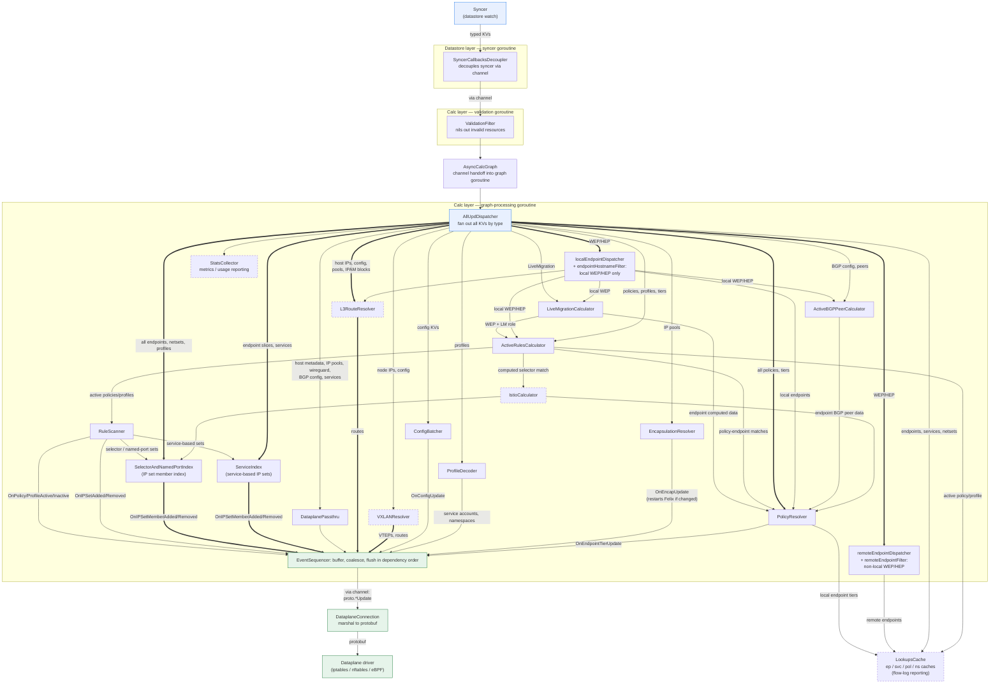

<a id="doc-c4118531cff59758d9fc721d"></a>

# projectcalico/calico / .argoci/README.md

Upstream: https://github.com/projectcalico/calico/blob/9c202d751c11c48d97473bc5383d1cbfb3b42e41/.argoci/README.md

Commit: `9c202d751c11c48d97473bc5383d1cbfb3b42e41`

Retrieved: 2026-10-01T15:40:53.828138+00:00

Kind: official-document

Raw SHA256: `836b50b4f9c7b2395c1e914e7e8153f6a0dc03ea6bee1f4363cc697e38acfe58`

Source text below is untrusted reference content. Acquisition does not verify technical claims.

License status: UPSTREAM_NOTICES_CAPTURED_PER_FILE_REVIEW_REQUIRED. See this repository's captured license files.

---

# .argoci — OSS Calico e2e on ArgoCI

This directory carries everything ArgoCI needs to run the OSS Calico e2e suites,
migrated off Semaphore's scheduled e2e builds.

## Contents

- `scripts/` — the e2e lifecycle, originally ported from the Semaphore e2e
  scripts (since deleted) and adapted for ArgoCI (secrets via
  `createLocalSecret`, `CI_*` vars,
  `RELEASE_STREAM` from the checked-out branch, GCS artifacts; `bz` + cloud
  CLIs come from the runner image). `global_prologue.sh` → `body_standard.sh`
  (dispatches to `phases/*`) → `global_epilogue.sh`.
- `cron/*.yaml` — one condensed ArgoCI workflow per e2e suite, each carrying the
  jobs and schedule of the Semaphore pipeline it replaced.
  `cc-argoci-handler` expands each into a full CronWorkflow (checkout,
  secret loading, node placement, dind, exit handler, notifications, labels,
  metrics), picked up automatically on merge to the default branch. The one
  exception to the mirroring is `cron/e2e-openstack.yaml` (the weekly
  Calico-for-OpenStack e2e tests), which is new here rather than migrated
  from one of this repo's Semaphore pipelines.

- `ciworkflow.yaml` + `config.yaml` — the per-PR lane: a gcp-kubeadm run that
  tests the binary built from the PR, rather than the published hashrelease
  images the crons test. `config.yaml` decides when it fires.

These crons and scripts are maintained **by hand** going forward: edit the
YAML (or the scripts) directly to change a suite's jobs, env, or schedule.

## Layout is flat (no `end-to-end/` subdir)

Semaphore kept e2e under its own `end-to-end/` subdir; here it lives at the top
of `.argoci/`. ArgoCI's handler separates workflows by **file role**, not
directory: scheduled e2e is `cron/*.yaml`, per-PR CI is `ciworkflow.yaml` +
`config.yaml`, and the two coexist here without a subdir. The
handler also reads crons from a fixed `.argoci/cron/` path, so nesting would
require a handler change for no gain. Scope ownership with path-specific
`CODEOWNERS` entries (e.g. `.argoci/cron/`) rather than directories.

## CI-account env must be set here, not left to banzai-core

banzai-core's `Taskvars` defaults point at the **tigera-dev developer** account.
The CI IAM user can't use them, so any variable whose default names an account
resource has to be exported by this prologue — Semaphore did the same in its
own prologue, and a missing one fails at provision time, not at startup:

| Variable | banzai-core default | Needed by CI |
|---|---|---|
| `KOPS_STATE_STORE_NAME` | `kops-tigera-dev` (403) | `kops-tigera-dev-ci` |
| `KOPS_AWS_DNS_ZONE` | `kops.crc.aws.eng.tigera.net` (no zone) | `kops.ci.aws.eng.tigera.net` |
| `OPENSHIFT_BASE_DOMAIN` | `openshift.crc.aws.eng.tigera.net` (no zone) | `openshift.ci.aws.eng.tigera.net` |
| `AZ_PROJECT` (a subscription *name*) | `tigera-dev` | `tigera-dev-ci` |

Semaphore vars deliberately **not** ported, so the next audit doesn't re-add
them: `KOPS_VERSION`/`RKE_VERSION` (banzai-core resolves or pins these, and
Semaphore's GitHub-API lookup is rate-limit-prone); `DOCKER_EE_*` /
`DOCKER_UCP_VERSION` (superseded by banzai-core's newer `MKE_VERSION`);
`AZ_LOCATION`, `ENABLE_ALP` (defaults already match); `NUM_INFRA_NODES`,
`TEST_TYPE`, `GOOGLE_REGION`, `GOOGLE_ZONE` (set per-job by the crons);
`BZ_*`, `BANZAI_CORE_BRANCH`, `SEMAPHORE_*` (Semaphore-runner specific — the
ArgoCI equivalents are `BZ_HOME`/`BZ_LOCAL_DIR`/`BZ_GLOBAL_BIN`).

## Cron naming (branchless)

Cron filenames and their `generateName` carry **no branch** —
`e2e-nftables.yaml`, `generateName: e2e-nftables-`. `cc-argoci-handler`
appends the **deploy branch** to the CronWorkflow's `metadata.name` when it
expands the file:

| Branch the file is on | Deployed CronWorkflow name |
|---|---|
| `master` | `e2e-nftables-master` |
| `release-v3.33` | `e2e-nftables-release-v3-33` (`.` → `-`) |

All crons share the single `argoci` namespace and are applied upsert-by-name,
so the branch qualifier is what stops `master` and a release branch's copy of
the same file from colliding. Deriving the branch at deploy time (not baking it
into the filename) means a file carried onto a release branch by a cut is
correct with no rename. Keep `generateName` branchless — a baked-in branch
would double up (`…-master-master`).


<a id="doc-77cb35e143685fcd4bad0bc4"></a>

# projectcalico/calico / AI_POLICY.md

Upstream: https://github.com/projectcalico/calico/blob/9c202d751c11c48d97473bc5383d1cbfb3b42e41/AI_POLICY.md

Commit: `9c202d751c11c48d97473bc5383d1cbfb3b42e41`

Retrieved: 2026-10-01T15:40:53.828138+00:00

Kind: official-document

Raw SHA256: `4678ce0508c4787bf25ec96d9f41ad0a2fc431cc300e204883a6120407dce97b`

Source text below is untrusted reference content. Acquisition does not verify technical claims.

License status: UPSTREAM_NOTICES_CAPTURED_PER_FILE_REVIEW_REQUIRED. See this repository's captured license files.

---

# Using AI tools to contribute to Calico

AI tools are welcome here. Plenty of us use them. This policy sets the floor for using them on contributions to this repository - code, docs, issues, and reviews alike. It is deliberately short, and it borrows heavily from the Kubernetes project's [approach to the same problem](https://kubernetes.io/blog/2026/06/26/open-source-maintainership-in-the-age-of-ai/).

## You are responsible for your change

The person who opens a pull request owns every line in it, whether they typed it or an agent did. "That's what the AI generated" is not an answer to review feedback.

## Say when AI helped

Note it in the PR description. One line is enough:

> This PR was written in part with the assistance of generative AI.

Don't credit AI tools as commit co-authors (`Co-Authored-By:`, `Assisted-By:`, and similar trailers). Our CLA is an agreement between humans, and a co-author who can't sign it will block your PR.

## Reviews happen between humans

Reviewers are here to talk to you, not to your agent. You need to be able to explain what your change does and why, in your own words. If you can't, expect the reviewer to close the PR.

Using an agent to help draft a reply is fine. Handing over the review thread to one is not.

## Understand it before you push

Working code isn't the bar - understood code is. Before you open the PR:

- read the whole diff yourself, including the parts you didn't write
- run the tests that cover the change, and add tests for new behavior
- confirm generated files came out of `make generate` rather than being hand-edited
- check that the change fits the design docs for the components it touches, and update them if it doesn't

Agents are especially prone to inventing plausible-looking tests that assert nothing, and to "fixing" a test by loosening its assertion. Read your test diffs closely.

## Automated review bots

Comments from review bots are advisory. A human maintainer still approves and merges, and you're free to disagree with a bot and say why.


<a id="doc-784f358cf224418379ac8bdb"></a>

# projectcalico/calico / AUTHORS.md

Upstream: https://github.com/projectcalico/calico/blob/9c202d751c11c48d97473bc5383d1cbfb3b42e41/AUTHORS.md

Commit: `9c202d751c11c48d97473bc5383d1cbfb3b42e41`

Retrieved: 2026-10-01T15:40:53.828138+00:00

Kind: official-document

Raw SHA256: `ee0e13b36f370bd8326fb88f9e3d027997f274ef97aedf27a4aac4c921b2caae`

Source text below is untrusted reference content. Acquisition does not verify technical claims.

License status: UPSTREAM_NOTICES_CAPTURED_PER_FILE_REVIEW_REQUIRED. See this repository's captured license files.

---

# Calico authors

This file is auto-generated based on contribution records reported
by GitHub for the core repositories within the projectcalico/ organization. It is ordered alphabetically.

| Name   | Email  |
|--------|--------|
| Aalaesar                                 | aalaesar@gmail.com  |
| Aaron Roydhouse                          | aaron@roydhouse.com  |
| Abhijeet Kasurde                         | akasurde@redhat.com  |
| Abhinav Dahiya                           | abhinav.dahiya@coreos.com  |
| Abhishek Jaisingh                        | abhi2254015@gmail.com  |
| Adam Hoheisel                            | adam.hoheisel99@gmail.com  |
| Adam Leskis                              | leskis@gmail.com  |
| Adam Szecówka                            | adam.szecowka@sap.com  |
| ahrkrak                                  | andrew.randall@gmail.com  |
| Alan                                     | zg.zhu@daocloud.io  |
| Alban Crequy                             | alban@kinvolk.io  |
| Albert Vaca                              | albertvaka@gmail.com  |
| Alejo Carballude                         | alejocarballude@gmail.com  |
| Aleksandr Didenko                        | adidenko@mirantis.com  |
| Aleksandr Dubinsky                       | almson@users.noreply.github.com  |
| Alessandro Rossi                         | 4215912+kubealex@users.noreply.github.com  |
| Alex Altair                              | alexanderaltair@gmail.com  |
| Alex Chan                                | github@alexwlchan.fastmail.co.uk  |
| Alex Hersh                               | alexander.hersh@metaswitch.com  |
| Alex Nauda                               | alex@alexnauda.com  |
| Alex O Regan                             | alexsoregan@gmail.com  |
| Alex Pollitt                             | lxpollitt@users.noreply.github.com  |
| Alex Rowley                              | rowleyaj@gmail.com  |
| Alexander Brand                          | alexbrand09@gmail.com  |
| Alexander Gama Espinosa                  | algamaes@microsoft.com  |
| Alexander Golovko                        | alexandro@ankalagon.ru  |
| Alexander Saprykin                       | asaprykin@mirantis.com  |
| Alexander Varshavsky                     | alex.varshavsky@tigera.io  |
| Alexey Magdich                           | itechart.aliaksei.mahdzich@tigera.io  |
| Alexey Makhov                            | makhov.alex@gmail.com  |
| Alexey Medvedchikov                      | alexey.medvedchikov@gmail.com  |
| alexeymagdich-tigera                     | 56426143+alexeymagdich-tigera@users.noreply.github.com  |
| alexhersh                                | hersh.a@husky.neu.edu  |
| Alina Militaru                           | alina@tigera.io  |
| Aloys Augustin                           | aloaugus@cisco.com  |
| Aloÿs                                    | aloys.augustin@polytechnique.org  |
| Amim Knabben                             | amim.knabben@gmail.com  |
| amq                                      | amq@users.noreply.github.com  |
| Anatoly Popov                            | aensidhe@users.noreply.github.com  |
| Anders Janmyr                            | anders@janmyr.com  |
| Andreas Jaeger                           | aj@suse.com  |
| Andrei Nistor                            | andrei_nistor@smart-x.net  |
| Andrew Donald Kennedy                    | andrew.international@gmail.com  |
| Andrew Gaffney                           | andrew@agaffney.org  |
| Andy Randall                             | andy@tigera.io  |
| Anthony ARNAUD                           | aarnaud@eidosmontreal.com  |
| Anthony BESCOND                          | anthony.bescond@kiln.fi  |
| Anthony T                                | 25327116+anthonytwh@users.noreply.github.com  |
| Anton Antonov                            | anton.synd.antonov@gmail.com  |
| Anton Klokau                             | anton.klokau@gmail.com  |
| anton-klokau                             | 54411589+anton-klokau@users.noreply.github.com  |
| Antony Guinard                           | antony@tigera.io  |
| Aram Alipoor                             | aram.alipoor@gmail.com  |
| arikachen                                | eaglesora@gmail.com  |
| Armon Dadgar                             | armon.dadgar@gmail.com  |
| Artem Panchenko                          | apanchenko@mirantis.com  |
| Artem Roma                               | aroma@mirantis.com  |
| Artem Rymarchik                          | artemrymarchik@gmail.com  |
| Artyom Rymarchik                         | artsiom.rymarchyk@itechart-group.com  |
| Arundhati Surpur                         | arundhati@nectechnologies.in  |
| Ashley Reese                             | ashley@victorianfox.com  |
| asincu                                   | alinamilitaru@Alinas-MacBook-Pro.local  |
| Atkins                                   | atkinschang@gmail.com  |
| Avi Deitcher                             | avi@deitcher.net  |
| Ayoub Elhamdani                          | a.elhamdani90@gmail.com  |
| Barbara McKercher                        | barbara@tigera.io  |
| bartek-lopatka                           | 54111388+bartek-lopatka@users.noreply.github.com  |
| Bassam Tabbara                           | bassam@symform.com  |
| Behnam Shobiri                           | behnam.shobeiri@gmail.com  |
| Behnam-Shobiri                           | Behnam.shobeiri@gmail.com  |
| Ben Schwartz                             | benschw@gmail.com  |
| Benjamin                                 | info@diffus.org  |
| Benjamin S. Allen                        | bsallen@alcf.anl.gov  |
| Bertrand Lallau                          | bertrand.lallau@gmail.com  |
| Bill Hathaway                            | bill.hathaway@gmail.com  |
| Bill Maxwell                             | bill@rancher.com  |
| Billie Cleek                             | bcleek@monsooncommerce.com  |
| bingshen.wbs                             | bingshen.wbs@alibaba-inc.com  |
| bjhaid                                   | abejideayodele@gmail.com  |
| Blake Covarrubias                        | blake.covarrubias@gmail.com  |
| Blucher                                  | yfg44fox@126.com  |
| bmckercher123                            | 48458529+bmckercher123@users.noreply.github.com  |
| Bogdan Dobrelya                          | bdobrelia@mirantis.com  |
| Brad Beam                                | brad.beam@b-rad.info  |
| Brad Behle                               | behle@us.ibm.com  |
| Brendan Creane                           | brendan@tigera.io  |
| Brian Ketelsen                           | bketelsen@gmail.com  |
| Brian Kim                                | brian@tigera.io  |
| Brian McMahon                            | brianmcmahon135@gmail.com  |
| briansan                                 | bkimstunnaboss@gmail.com  |
| Brook-Roberts                            | brook.roberts@metaswitch.com  |
| Bryan Reese                              | bryan.mreese@gmail.com  |
| Cao Shufeng                              | caosf.fnst@cn.fujitsu.com  |
| Cao Xuan Hoang                           | hoangcx@vn.fujitsu.com  |
| Carlos Alberto                           | euprogramador@gmail.com  |
| Casey D                                  | casey.davenport@metaswitch.com  |
| Casey Davenport                          | davenport.cas@gmail.com  |
| Cezar Sa Espinola                        | cezarsa@gmail.com  |
| Chakravarthy Gopi                        | cgopi@us.ibm.com  |
| Chance Zibolski                          | chance.zibolski@gmail.com  |
| Chen Donghui                             | chendh521@gmail.com  |
| Chengwei Yang                            | yangchengwei@qiyi.com  |
| chenqijun                                | chenqijun@corp.netease.com  |
| Chris Armstrong                          | chris@opdemand.com  |
| Chris Church                             | chris.church@gmail.com  |
| Chris Hoge                               | chris@hogepodge.com  |
| Chris McNabb                             | raizyr@gmail.com  |
| Chris Tomkins                            | chris.tomkins@tigera.io  |
| Christian Klauser                        | christianklauser@outlook.com  |
| Christian Simon                          | simon@swine.de  |
| Christopher                              | chris.tauchen@tigera.io  |
| Christopher Grim                         | christopher.grim@gmail.com  |
| Christopher LIJLENSTOLPE                 | github@cdl.asgaard.org  |
| Christopher LILJENSTOLPE                 | cdl@asgaard.org  |
| cinience                                 | cinience@qq.com  |
| Ciprian Hacman                           | ciprian@hakman.dev  |
| Clement Laforet                          | sheepkiller@cotds.org  |
| Cody McCain                              | cody@tigera.io  |
| Cookie                                   | luckymrwang@163.com  |
| Cory Benfield                            | lukasaoz@gmail.com  |
| crandl201                                | christopher_randles@cable.comcast.com  |
| Cristian Vrabie                          | cristian.vrabie@gmail.com  |
| Cyclinder                                | qifeng.guo@daocloud.io  |
| Dalton Hubble                            | dghubble@gmail.com  |
| Dan                                      | djosborne@users.noreply.github.com  |
| Dan (Turk)                               | dan@projectcalico.org  |
| Dan Bond                                 | pm@danbond.io  |
| Dan O'Brien                              | dobrien.nj@gmail.com  |
| Dan Osborne                              | djosborne10@gmail.com  |
| Daniel Hoherd                            | daniel.hoherd@gmail.com  |
| Daniel Megyesi                           | daniel.megyesi@liligo.com  |
| Dario Nieuwenhuis                        | dirbaio@dirbaio.net  |
| Darren Chin                              | dc@darrench.in  |
| Dave Hay                                 | david_hay@uk.ibm.com  |
| Dave Langridge                           | dave@calico.com  |
| David Haupt                              | dhaupt@redhat.com  |
| David Igou                               | igou.david@gmail.com  |
| David J. Wilder                          | wilder@us.ibm.com  |
| David Tesar                              | david.tesar@microsoft.com  |
| Denis Iskandarov                         | d.iskandarov@gmail.com  |
| depay                                    | depay19@163.com  |
| derek mcquay                             | derek@tigera.io  |
| Derk Muenchhausen                        | derk@muenchhausen.de  |
| Didier Durand                            | durand.didier@gmail.com  |
| Dominic DeMarco                          | ddemarc@us.ibm.com  |
| Doug Collier                             | doug@tigera.io  |
| Doug Davis                               | duglin@users.noreply.github.com  |
| Doug Hellmann                            | doug@doughellmann.com  |
| Doug Wiegley                             | dwiegley@salesforce.com  |
| Dries Harnie                             | dries+github@harnie.be  |
| du                                       | du@njtech.edu.cn  |
| Duan Jiong                               | djduanjiong@gmail.com  |
| Duong Ha-Quang                           | duonghq@vn.fujitsu.com  |
| Dylan Pindur                             | dylanpindur@gmail.com  |
| Ed Harrison                              | eepyaich@users.noreply.github.com  |
| Edbert                                   | ecandra@protonmail.com  |
| Elson Rodriguez                          | elson.rodriguez@gmail.com  |
| emanic                                   | emily@tigera.io  |
| Emma Gordon                              | emma@projectcalico.org  |
| EmmEff                                   | mikef17@gmail.com  |
| Eran Reshef                              | eran.reshef@arm.com  |
| Eric Anderson                            | anderson@stackengine.com  |
| Eric Barch                               | ericb@ericbarch.com  |
| Eric Hoffmann                            | 31017077+2ffs2nns@users.noreply.github.com  |
| Erik Stidham                             | estidham@gmail.com  |
| Ernest Wong                              | chuwon@microsoft.com  |
| Ernesto Jiménez                         | me@ernesto-jimenez.com  |
| Ethan Chu                                | xychu2008@gmail.com  |
| Eugen Mayer                              | 136934+EugenMayer@users.noreply.github.com  |
| F41gh7                                   | info@fght.net  |
| Fabian Ruff                              | fabian@progra.de  |
| Fahad Arshad                             | fahadaliarshad@gmail.com  |
| fcuello-fudo                             | 51087976+fcuello-fudo@users.noreply.github.com  |
| Feilong Wang                             | flwang@catalyst.net.nz  |
| fen4o                                    | martin.vladev@gmail.com  |
| Fernando Alvarez                         | methadato@gmail.com  |
| Fernando Cainelli                        | fernando.cainelli@gmail.com  |
| Fionera                                  | fionera@fionera.de  |
| Flavio Percoco                           | flaper87@gmail.com  |
| Foivos Filippopoulos                     | foivosfilip@gmail.com  |
| frank                                    | frank@tigera.io  |
| Frank Greco Jr                           | frankgreco@northwesternmutual.com  |
| François PICOT                           | fpicot@users.noreply.github.com  |
| Fredrik Steen                            | stone4x4@gmail.com  |
| freecaykes                               | edbert@tigera.io  |
| frnkdny                                  | frank.danyo@gmail.com  |
| fumihiko kakuma                          | kakuma@valinux.co.jp  |
| Gabriel Monroy                           | gabriel@opdemand.com  |
| Gaurav                                   | 48036489+realgaurav@users.noreply.github.com  |
| Gaurav Khatri                            | gaurav@tigera.io  |
| Gaurav Sinha                             | gaurav.sinha@tigera.io  |
| Gautam K                                 | gautam.nitheesh@gmail.com  |
| gdziwoki                                 | gdziwoki@gmail.com  |
| gengchc2                                 | geng.changcai2@zte.com.cn  |
| Gerard Hickey                            | hickey@kinetic-compute.com  |
| Giancarlo Rubio                          | gianrubio@gmail.com  |
| Gianluca                                 | 52940363+gianlucam76@users.noreply.github.com  |
| Gianluca Mardente                        | gianluca@tigera.io  |
| Gobinath Krishnamoorthy                  | gobinath@tigera.io  |
| Guang Ya Liu                             | gyliu513@gmail.com  |
| Guangming Wang                           | guangming.wang@daocloud.io  |
| Guillaume LECERF                         | glecerf@gmail.com  |
| guirish                                  | guirish  |
| gunboe                                   | guntherboeckmann@gmail.com  |
| Gunjan "Grass-fed Rabbit" Patel          | patelgunjan5@gmail.com  |
| GuyTempleton                             | guy.templeton@skyscanner.net  |
| Hagen Kuehn                              | hagen.kuehn@quater.io  |
| halfcrazy                                | hackzhuyan@gmail.com  |
| Hanamantagoud                            | hanamantagoud.v.kandagal@est.tech  |
| hanamantagoudvk                          | 68010010+hanamantagoudvk@users.noreply.github.com  |
| hedi bouattour                           | hbouatto@cisco.com  |
| Helen Chang                              | c6h3un@gmail.com  |
| Henry Gessau                             | gessau@gmail.com  |
| huang.zhiping                            | huang.zhiping@99cloud.net  |
| Huanle Han                               | hanhuanle@caicloud.io  |
| Hui Kang                                 | kangh@us.ibm.com  |
| Huo Qi Feng                              | huoqif@cn.ibm.com  |
| Iago López Galeiras                      | iago@kinvolk.io  |
| ialidzhikov                              | i.alidjikov@gmail.com  |
| Ian Wienand                              | iwienand@redhat.com  |
| Icarus9913                               | icaruswu66@qq.com  |
| Igor Kapkov                              | igasgeek@me.com  |
| Ihar Hrachyshka                          | ihrachys@redhat.com  |
| ijumps                                   | “bigerjump@gmail.com”  |
| ISHIDA Wataru                            | ishida.wataru@lab.ntt.co.jp  |
| Ivar Larsson                             | ivar@bloglovin.com  |
| IWAMOTO Toshihiro                        | iwamoto@valinux.co.jp  |
| J. Grizzard                              | jgrizzard@box.com  |
| Jack Kleeman                             | jackkleeman@gmail.com  |
| Jacob Hayes                              | jacob.r.hayes@gmail.com  |
| Jade Chunnananda                         | jade.jch@gmail.com  |
| Jak                                      | 44370243+jak-sdk@users.noreply.github.com  |
| James E. Blair                           | jeblair@redhat.com  |
| James Lucktaylor                         | jlucktay@users.noreply.github.com  |
| James Pollard                            | james@leapyear.io  |
| James Sturtevant                         | jsturtevant@gmail.com  |
| Jamie                                    | 91jme@users.noreply.github.com  |
| Jan Brauer                               | jan@jimdo.com  |
| Jan Ivar Beddari                         | code@beddari.net  |
| janonymous                               | janonymous.codevulture@gmail.com  |
| jay vyas                                 | jvyas@vmware.com  |
| Jean-Sebastien Mouret                    | js.mouret@gmail.com  |
| Jeff Schroeder                           | jeffschroeder@computer.org  |
| Jenkins                                  | jenkins@review.openstack.org  |
| Jens Henrik Hertz                        | jens@treatwell.nl  |
| Jesper Dangaard Brouer                   | brouer@redhat.com  |
| Jiawei Huang                             | jiawei@tigera.io  |
| Jimmy McCrory                            | jimmy.mccrory@gmail.com  |
| jinglinax@163.com                        | jinglinax@163.com  |
| jmjoy                                    | 918734043@qq.com  |
| Joanna Solmon                            | joanna.solmon@gmail.com  |
| Joel Bastos                              | kintoandar@users.noreply.github.com  |
| Johan Fleury                             | jfleury+github@arcaik.net  |
| Johannes M. Scheuermann                  | joh.scheuer@gmail.com  |
| Johannes Scheerer                        | johannes.scheerer@sap.com  |
| johanneswuerbach                         | johannes.wuerbach@googlemail.com  |
| John Engelman                            | john.r.engelman@gmail.com  |
| jolestar                                 | jolestar@gmail.com  |
| Jonah Back                               | jonah@jonahback.com  |
| Jonathan Boulle                          | jonathanboulle@gmail.com  |
| Jonathan M. Wilbur                       | jonathan@wilbur.space  |
| Jonathan Palardy                         | jonathan.palardy@gmail.com  |
| Jonathan Sabo                            | jonathan@sabo.io  |
| Jonathan Sokolowski                      | jonathan.sokolowski@gmail.com  |
| jose-bigio                               | jose.bigio@docker.com  |
| Joseph Gu                                | aceralon@outlook.com  |
| Josh Conant                              | deathbeforedishes@gmail.com  |
| Josh Lucas                               | josh.lucas@tigera.io  |
| joshti                                   | 56737865+joshti@users.noreply.github.com  |
| Joshua Allard                            | josh@tigera.io  |
| joshuactm                                | joshua.colvin@ticketmaster.com  |
| Julien Dehee                             | PrFalken@users.noreply.github.com  |
| Jussi Nummelin                           | jussi.nummelin@digia.com  |
| Justin                                   | justin@tigera.io  |
| Justin Burnham                           | justin@jburnham.net  |
| Justin Cattle                            | j@ocado.com  |
| Justin Nauman                            | justin.r.nauman+github@gmail.com  |
| Justin Pacheco                           | jpacheco39@bloomberg.net  |
| Justin Sievenpiper                       | justin@sievenpiper.co  |
| JW Bell                                  | bjwbell@gmail.com  |
| Kamil Madac                              | kamil.madac@gmail.com  |
| Karl Matthias                            | karl.matthias@gonitro.com  |
| Karthik Gaekwad                          | karthik.gaekwad@gmail.com  |
| Karthik Krishnan Ramasubramanian         | mail@karthikkrishnan.me  |
| Kashif Saadat                            | kashifsaadat@gmail.com  |
| Kelsey Hightower                         | kelsey.hightower@gmail.com  |
| Ketan Kulkarni                           | ketkulka@gmail.com  |
| Kevin Benton                             | blak111@gmail.com  |
| Kevin Lynch                              | klynch@gmail.com  |
| Kiran Divekar                            | calsoft.kiran.divekar@tigera.io  |
| Kirill Buev                              | kirill.buev@pm.me  |
| Kris Gambirazzi                          | kris.gambirazzi@transferwise.com  |
| Krzesimir Nowak                          | krzesimir@kinvolk.io  |
| Krzysztof Cieplucha                      | krisiasty@users.noreply.github.com  |
| l1b0k                                    | libokang.dev@gmail.com  |
| Lance Robson                             | lancelot.robson@gmail.com  |
| Lancelot Robson                          | lancelot.robson@metaswitch.com  |
| Lars Ekman                               | lars.g.ekman@est.tech  |
| Laurence Man                             | laurence@tigera.io  |
| Le Hou                                   | houl7@chinaunicom.cn  |
| Lee Briggs                               | lbriggs@apptio.com  |
| Leo Ochoa                                | leo8a@users.noreply.github.com  |
| Li-zhigang                               | li.zhigang3@zte.com.cn  |
| libby kent                               | viskcode@gmail.com  |
| lilintan                                 | lintan.li@easystack.cn  |
| LinYushen                                | linyushen@qiniu.com  |
| lippertmarkus                            | lippertmarkus@gmx.de  |
| LittleBoy18                              | 2283985296@qq.com  |
| liubog2008                               | liubog2008@gmail.com  |
| Liz Rice                                 | liz@lizrice.com  |
| llr                                      | nightmeng@gmail.com  |
| Logan Davis                              | 38335829+logand22@users.noreply.github.com  |
| Logan V                                  | logan2211@gmail.com  |
| lou-lan                                  | loulan@loulan.me  |
| Luiz Filho                               | luizbafilho@gmail.com  |
| Luke Mino-Altherr                        | luke.mino-altherr@metaswitch.com  |
| luobily                                  | luobily@gmail.com  |
| Luthfi Anandra                           | luthfi.anandra@gmail.com  |
| Lv Jiawei                                | lvjiawei@cmss.chinamobile.com  |
| maao                                     | maao@cmss.chinamobile.com  |
| Manjunath A Kumatagi                     | mkumatag@in.ibm.com  |
| Manuel Buil                              | mbuil@suse.com  |
| Marga Millet                             | marga.sfo@gmail.com  |
| Marius Grigaitis                         | marius.grigaitis@home24.de  |
| Mark Fermor                              | markfermor@holidayextras.com  |
| Mark Petrovic                            | mspetrovic@gmail.com  |
| markruler                                | csu0414@gmail.com  |
| Marlin Cremers                           | marlinc@marlinc.nl  |
| Marshall Ford                            | inbox@marshallford.me  |
| Martijn Koster                           | mak-github@greenhills.co.uk  |
| Martin Evgeniev                          | suizman@users.noreply.github.com  |
| marvin-tigera                            | marvin-tigera@users.noreply.github.com  |
| Mat Meredith                             | matthew.meredith@metaswitch.net  |
| Mateusz Gozdek                           | mgozdek@microsoft.com  |
| Mathias Lafeldt                          | mathias.lafeldt@gmail.com  |
| Matt                                     | matt@projectcalico.org  |
| Matt Boersma                             | matt@opdemand.com  |
| Matt Dupre                               | matthewdupre@users.noreply.github.com  |
| Matt Kelly                               | Matthew.Joseph.Kelly@gmail.com  |
| Matt Leung                               | mleung975@gmail.com  |
| Matthew                                  | mfisher@engineyard.com  |
| Matthew Fenwick                          | mfenwick100@gmail.com  |
| Matthew Fisher                           | matthewf@opdemand.com  |
| Max Kudosh                               | max_kudosh@hotmail.com  |
| Max S                                    | maxstr@users.noreply.github.com  |
| Max Stritzinger                          | mstritzinger@bloomberg.net  |
| Maxim Ivanov                             | ivanov.maxim@gmail.com  |
| Maximilian Bischoff                      | maximilian.bischoff@inovex.de  |
| Mayo                                     | mayocream39@yahoo.co.jp  |
| Mazdak Nasab                             | mazdak@tigera.io  |
| mchtech                                  | michu_an@126.com  |
| meeee                                    | michael+git@frister.net  |
| meijin                                   | meijin@tiduyun.com  |
| melissaml                                | ma.lei@99cloud.net  |
| Michael Dong                             | michael.dong@vrviu.com  |
| Michael Stowe                            | me@mikestowe.com  |
| Michael Vierling                         | michael@tigera.io  |
| Micheal Waltz                            | ecliptik@gmail.com  |
| Mikalai Kastsevich                       | kostevich-kolya@mail.ru  |
| Mike Kostersitz                          | mikek@microsoft.com  |
| Mike Palmer                              | mike@mikepalmer.net  |
| Mike Scherbakov                          | mihgen@gmail.com  |
| Mike Spreitzer                           | mspreitz@us.ibm.com  |
| Mike Stephen                             | mike.stephen@tigera.io  |
| Mike Stowe                               | mikestowe@Mikes-MBP.sfo.tigera.io  |
| mikev                                    | mvierling@gmail.com  |
| Miouge1                                  | Miouge1@users.noreply.github.com  |
| ml                                       | 6209465+ml-@users.noreply.github.com  |
| mlbarrow                                 | michael@barrow.me  |
| MofeLee                                  | mofe@me.com  |
| Mohamed                                  | mohamed.elzarei@motius.de  |
| Molnigt                                  | jan.munkhammar@safespring.com  |
| Monty Taylor                             | mordred@inaugust.com  |
| Mridul Gain                              | mridulgain@gmail.com  |
| Muhammad Saghir                          | msagheer92@gmail.com  |
| Muhammet Arslan                          | muhammet.arsln@gmail.com  |
| Murali Paluru                            | leodotcloud@gmail.com  |
| Mészáros Mihály                          | misi@majd.eu  |
| Nate Taylor                              | ntaylor1781@gmail.com  |
| Nathan Fritz                             | fritzy@netflint.net  |
| Nathan Skrzypczak                        | nathan.skrzypczak@gmail.com  |
| Nathan Wouda                             | nwouda@users.noreply.github.com  |
| Neil Jerram                              | nj@metaswitch.com  |
| Nic Doye                                 | nic@worldofnic.org  |
| Nick Bartos                              | nick@pistoncloud.com  |
| Nick Wood                                | nwood@microsoft.com  |
| Nikkau                                   | nikkau@nikkau.net  |
| Nirman Narang                            | narang@us.ibm.com  |
| njuptlzf                                 | njuptlzf@163.com  |
| Noah Treuhaft                            | noah.treuhaft@docker.com  |
| nohajc                                   | nohajc@gmail.com  |
| nuczzz                                   | 33566732+nuczzz@users.noreply.github.com  |
| nuxeric                                  | 48699932+nuxeric@users.noreply.github.com  |
| Oded Lazar                               | odedlaz@gmail.com  |
| oldtree2k                                | oldtree2k@users.noreply.github.com  |
| Olivier Bourdon                          | obourdon@mirantis.com  |
| Onong Tayeng                             | onong.tayeng@gmail.com  |
| OpenDev Sysadmins                        | openstack-infra@lists.openstack.org  |
| Otto Sulin                               | otto.sulin@gmail.com  |
| Owen Tuz                                 | owen@segfault.re  |
| pasanw                                   | pasanweerasinghe@gmail.com  |
| Patrick Marques                          | pmarques@users.noreply.github.com  |
| Patrik Lundin                            | patrik@sigterm.se  |
| Paul Tiplady                             | symmetricone@gmail.com  |
| Pavel Khusainov                          | pkhusainov@mz.com  |
| Pedro Coutinho                           | pedro@tigera.io  |
| Penkey Suresh                            | penkeysuresh@users.noreply.github.com  |
| penkeysuresh                             | penkeysuresh@gmail.com  |
| peter                                    | peterkellyonline@gmail.com  |
| Peter Kelly                              | 659713+petercork@users.noreply.github.com  |
| Peter Nordquist                          | peter.nordquist@pnnl.gov  |
| Peter Salanki                            | peter@salanki.st  |
| Peter White                              | peter.white@metaswitch.com  |
| Phil Kates                               | me@philkates.com  |
| Philip Southam                           | philip.southam@jpl.nasa.gov  |
| Phu Kieu                                 | pkieu@jpl.nasa.gov  |
| Pierre Grimaud                           | grimaud.pierre@gmail.com  |
| Pike.SZ.fish                             | pikeszfish@gmail.com  |
| Prayag Verma                             | prayag.verma@gmail.com  |
| Pushkar Joglekar                         | pjoglekar@vmware.com  |
| PythonSyntax1                            | 51872355+PythonSyntax1@users.noreply.github.com  |
| Qiu Yu                                   | qiuyu@ebaysf.com  |
| Rafael                                   | rafael@tigera.io  |
| Rafal Borczuch                           | rafalq.b+github@gmail.com  |
| Rafe Colton                              | r.colton@modcloth.com  |
| Rahul Krishna Upadhyaya                  | rakrup@gmail.com  |
| rao yunkun                               | yunkunrao@gmail.com  |
| Renan Gonçalves                          | renan.saddam@gmail.com  |
| Rene Dekker                              | rene@tigera.io  |
| Rene Kaufmann                            | kaufmann.r@gmail.com  |
| Reza R                                   | 54559947+frozenprocess@users.noreply.github.com  |
| Ricardo Katz                             | rikatz@users.noreply.github.com  |
| Ricardo Pchevuzinske Katz                | ricardo.katz@serpro.gov.br  |
| Richard Kovacs                           | kovacsricsi@gmail.com  |
| Richard Laughlin                         | richardwlaughlin@gmail.com  |
| Richard Marshall                         | richard.marshall@ask.com  |
| Ripta Pasay                              | ripta@users.noreply.github.com  |
| Rob Brockbank                            | robbrockbank@gmail.com  |
| Rob Terhaar                              | robbyt@robbyt.net  |
| Robert Brockbank                         | rob.brockbank@metswitch.com  |
| Robert Coleman                           | github@robert.net.nz  |
| Roberto Alcantara                        | roberto@eletronica.org  |
| Robin Müller                             | robin.mueller@outlook.de  |
| Rodrigo Barbieri                         | rodrigo.barbieri2010@gmail.com  |
| Roman Danko                              | elcomtik@users.noreply.github.com  |
| Roman Sokolkov                           | roman@giantswarm.io  |
| Ronnie P. Thomas                         | rpthms@users.noreply.github.com  |
| Roshani Rathi                            | rrroshani227@gmail.com  |
| roshanirathi                             | 42164609+roshanirathi@users.noreply.github.com  |
| Rui Chen                                 | rchen@meetup.com  |
| rushtehrani                              | r@inven.io  |
| Rustam Zagirov                           | stammru@gmail.com  |
| Ryan Zhang                               | ryan.zhang@docker.com  |
| rymarchikbot                             | 43807162+rymarchikbot@users.noreply.github.com  |
| Saeid Askari                             | askari.saeed@gmail.com  |
| Satish Matti                             | smatti@google.com  |
| Satoru Takeuchi                          | sat@cybozu.co.jp  |
| Saurabh Mohan                            | saurabh@tigera.io  |
| Sean Kilgore                             | logikal@users.noreply.github.com  |
| Sedef                                    | ssavas@vmware.com  |
| Semaphore Automatic Update               | tom@tigera.io  |
| Sergey Kulanov                           | skulanov@mirantis.com  |
| Sergey Melnik                            | sergey.melnik@commercetools.de  |
| Seth                                     | sethpmccombs@gmail.com  |
| Seth Malaki                              | seth@tigera.io  |
| Shatrugna Sadhu                          | shatrugna.sadhu@gmail.com  |
| Shaun Crampton                           | smc@metaswitch.com  |
| shouheng.lei                             | shouheng.lei@easystack.cn  |
| Simão Reis                              | smnrsti@gmail.com  |
| SONG JIANG                               | song@tigera.io  |
| SongmingYan                              | yan.songming@zte.com.cn  |
| spdfnet                                  | 32593931+spdfnet@users.noreply.github.com  |
| Spike Curtis                             | spike@tigera.io  |
| squ94wk                                  | squ94wk@googlemail.com  |
| sridhar                                  | sridhar@tigera.io  |
| sridhartigera                            | 63839878+sridhartigera@users.noreply.github.com  |
| Sriram Yagnaraman                        | sriram.yagnaraman@est.tech  |
| Stanislav Yotov                          | 29090864+svyotov@users.noreply.github.com  |
| Stanislav-Galchynski                     | Stanislav.Galchynski@itechart-group.com  |
| Stefan Breunig                           | stefan.breunig@xing.com  |
| Stefan Bueringer                         | sbueringer@gmail.com  |
| Stephen Schlie                           | schlie@tigera.io  |
| Steve Gao                                | steve@tigera.io  |
| Stéphane Cottin                          | stephane.cottin@vixns.com  |
| Suraiya Hameed                           | 22776421+Suraiya-Hameed@users.noreply.github.com  |
| Suraj Narwade                            | surajnarwade353@gmail.com  |
| svInfra17                                | vinayak@infracloud.io  |
| Szymon Pyżalski                          | spyzalski@mirantis.com  |
| TAKAHASHI Shuuji                         | shuuji3@gmail.com  |
| Tamal Saha                               | tamal@appscode.com  |
| Tathagata Chowdhury                      | calsoft.tathagata.chowdhury@tigera.io  |
| tathagatachowdhury                       | tathagata.chowdhury@calsoftinc.com  |
| Teller-Ulam                              | 2749404+Teller-Ulam@users.noreply.github.com  |
| Thijs Scheepers                          | tscheepers@users.noreply.github.com  |
| Thilo Fromm                              | thilo@kinvolk.io  |
| Thomas Lohner                            | tl@scale.sc  |
| Tim Bart                                 | tim@pims.me  |
| Tim Briggs                               | timothydbriggs@gmail.com  |
| Timo Beckers                             | timo.beckers@klarrio.com  |
| Todd Nine                                | tnine@apigee.com  |
| Tom Denham                               | tom@tomdee.co.uk  |
| Tom Pointon                              | tom@teepeestudios.net  |
| Tomas Hruby                              | tomas@tigera.io  |
| Tomas Mazak                              | tomas@valec.net  |
| Tommaso Pozzetti                         | tommypozzetti@hotmail.it  |
| tonic                                    | tonicbupt@gmail.com  |
| ToroNZ                                   | tomasmaggio@gmail.com  |
| Trapier Marshall                         | trapier.marshall@docker.com  |
| Trevor Tao                               | trevor.tao@arm.com  |
| Trond Hasle Amundsen                     | t.h.amundsen@usit.uio.no  |
| turekt                                   | 32360115+turekt@users.noreply.github.com  |
| tuti                                     | tuti@tigera.io  |
| Tyler Stachecki                          | tstachecki@bloomberg.net  |
| Uwe Dauernheim                           | uwe@dauernheim.net  |
| Uwe Krueger                              | uwe.krueger@sap.com  |
| vagrant                                  | vagrant@mesos.vm  |
| Valentin Ouvrard                         | valentin.ouvrard@nautile.sarl  |
| Viacheslav Vasilyev                      | avoidik@gmail.com  |
| Vieri                                    | 15050873171@163.com  |
| Vincent Schwarzer                        | vincent.schwarzer@yahoo.de  |
| Vivek Thrivikraman                       | vivek.thrivikraman@est.tech  |
| wangwengang                              | wangwengang@inspur.com  |
| Wei Kin Huang                            | weikin.huang04@gmail.com  |
| Wei.ZHAO                                 | zhaowei@qiyi.com  |
| weizhouBlue                              | 45163302+weizhouBlue@users.noreply.github.com  |
| Wietse Muizelaar                         | wmuizelaar@bol.com  |
| Will Rouesnel                            | w.rouesnel@gmail.com  |
| Wouter Schoot                            | wouter@schoot.org  |
| wuranbo                                  | wuranbo@gmail.com  |
| wwgfhf                                   | 51694849+wwgfhf@users.noreply.github.com  |
| Xiang Dai                                | 764524258@qq.com  |
| Xiang Liu                                | lx1036@126.com  |
| xieyanker                                | xjsisnice@gmail.com  |
| Xin He                                   | he_xinworld@126.com  |
| YAMAMOTO Takashi                         | yamamoto@midokura.com  |
| Yan Zhu                                  | yanzhu@alauda.io  |
| yang59324                                | yang59324@163.com  |
| yanyan8566                               | 62531742+yanyan8566@users.noreply.github.com  |
| yassan                                   | yassan0627@gmail.com  |
| Yecheng Fu                               | cofyc.jackson@gmail.com  |
| Yi He                                    | yi.he@arm.com  |
| Yi Tao                                   | yitao@qiniu.com  |
| ymyang                                   | yangym9@lenovo.com  |
| Yongkun Gui                              | ygui@google.com  |
| Yuji Azama                               | yuji.azama@gmail.com  |
| zealic                                   | zealic@gmail.com  |
| zhangjie                                 | zhangjie0619@yeah.net  |
| zhouxinyong                              | zhouxinyong@inspur.com  |
| Zopanix                                  | zopanix@gmail.com  |
| Zuul                                     | zuul@review.openstack.org  |


<a id="doc-eca12c0a30e25b4b46522ebf"></a>

# projectcalico/calico / CONTRIBUTING.md

Upstream: https://github.com/projectcalico/calico/blob/9c202d751c11c48d97473bc5383d1cbfb3b42e41/CONTRIBUTING.md

Commit: `9c202d751c11c48d97473bc5383d1cbfb3b42e41`

Retrieved: 2026-10-01T15:40:53.828138+00:00

Kind: official-document

Raw SHA256: `010f1fea3f694ea9cba6e7fa2ecc47249a91de9745f4907761f4fad465cc240a`

Source text below is untrusted reference content. Acquisition does not verify technical claims.

License status: UPSTREAM_NOTICES_CAPTURED_PER_FILE_REVIEW_REQUIRED. See this repository's captured license files.

---

# Contributing to the Calico Codebase

Thanks for considering contributing to Calico! This document outlines the canonical procedure for contributing new features
and bugfixes to Calico. Following these steps will help ensure that your contribution gets merged quickly and
efficiently.

## Overview

### Is this a new feature?

If you'd like to add a new feature to Calico, please first open an issue describing the desired functionality. A Calico
maintainer will work with you to come up with the correct design for the new feature. Once you've agreed on a design, you can then
start contributing code to the relevant Calico repositories using the development process described below.

Remember, agreeing on a design in advance will greatly increase the chance that your PR will be accepted, and minimize the amount of time required
for both you and your reviewer!

### Is this a simple bug fix?

Simple bug fixes can just be raised as a pull request. Make sure you describe the bug in the pull request description,
and please try to reproduce the bug in a unit test. This will help ensure the bug stays fixed!

### Did AI tools help write it?

That's fine, and it doesn't change the process below. It does mean you should read [AI_POLICY.md](AI_POLICY.md) first: you are responsible for every line you submit, you need to disclose the assistance in the PR description, and you need to be able to explain the change yourself during review.

### Writing, testing, and building the code

For more detailed information on the development process for Calico, see the [developer guide](DEVELOPER_GUIDE.md).

### PR process

Once you've agreed on a design for your bugfix or new feature, development against the Calico codebase should be done using the following steps:

1. [Create a personal fork][fork] of the repository.
1. Pull the latest code from the **master** branch and create a feature branch off of this in your fork.
1. Implement your feature. Commits are cheap in Git; try to split up your code into many. It makes reviewing easier as well as for saner merging.
1. Make sure that existing tests are passing, and that you've written new tests for any new functionality. Each directory has its own suite of tests.
1. Push your feature branch to your fork on GitHub.
1. [Create a pull request][pulls] using GitHub, from your fork and branch to projectcalico `master`.
    1. If you haven't already done so, you will need to agree to our contributor agreement. See [below](#contributor-agreements).
    1. Opening a pull request will automatically run your changes through our CI. Make sure all pre-submit tests pass so that a maintainer can merge your contribution.
1. Await review from a maintainer.
1. When you receive feedback:
    1. Address code review issues on your feature branch.
    1. Push the changes to your fork's feature branch on GitHub _in a new commit - do not squash!_ This automatically updates the pull request.
    1. If necessary, make a top-level comment along the lines of “Please re-review”, notifying your reviewer, and repeat the above.
    1. Once all the requested changes have been made, your reviewer may ask you to squash your commits. If so, combine the commits into one with a single descriptive message.
    1. Once your PR has been approved and the commits have been squashed, your reviewer will merge the PR. If you have the necessary permissions, you may merge the PR yourself.

#### Patching an older release

If your contribution is intended for an older release, the change will need to be cherry-picked into the appropriate release branch after it has been reviewed
and merged into master.

When picking changes to a release branch, you must cherry-pick the change to all release branches semantically after the target release as well. This ensures that if a user upgrades their cluster, they do not "lose" features that existed in a prior release.

To create the cherry-pick PR, use `hack/cherry-pick-pull`:
```
<ENV_SETTINGS> ./hack/cherry-pick-pull origin/release-vX.YY <PR_NUMBER>
```
where `release-vX.YY` is the branch you are picking to.  In `<ENV_SETTINGS>` you may need (if you don't already have them in your environment):
- `CHERRY_PICK=1`, to tell the script to use `git cherry-pick` instead of a sequence of individual commit patches
- `GITHUB_TOKEN=<your GitHub token>`
- `GITHUB_USER=<your GitHub user name>`
- `FORK_REMOTE=<the remote name for the fork in which to create the PR branch>`.

Then:
- Make sure the pull request is in the correct GitHub milestone for the next vX.Y.Z release.
- Get the pick PR approved, likely by asking the reviewer of the original PR, and merged.

### Release notes and documentation

Most PRs warrant release notes - any bug fixes or new features that users may be interested in. If you are unsure if your PR warrants
a release note in the description, ask your reviewer.

You or your reviewer should make sure that your PR has the correct labels and milestone set.

Every PR needs one `docs-*` label.

- `docs-pr-required`: This change requires a change to the documentation that has not been completed yet.
- `docs-completed`: This change has all necessary documentation completed.
- `docs-not-required`: This change has no user-facing impact and requires no docs.

Every PR needs one `release-note-*` label.

- `release-note-required`: This PR has user-facing changes. Most PRs should have this label.
- `release-note-not-required`: This PR has no user-facing changes.

Other optional labels:

- `needs-operator-pr`: This PR is related to install and requires a corresponding change to the operator.

## Contributor Agreements

We need you to sign our Contributor License Agreement before we can accept your
contribution. You will be prompted to do this as part of the PR process
on GitHub.

[fork]: https://help.github.com/articles/fork-a-repo/
[pulls]: https://help.github.com/articles/creating-a-pull-request/


<a id="doc-fbfd050a7e761f9cb21d8832"></a>

# projectcalico/calico / CONTRIBUTING_DOCS.md

Upstream: https://github.com/projectcalico/calico/blob/9c202d751c11c48d97473bc5383d1cbfb3b42e41/CONTRIBUTING_DOCS.md

Commit: `9c202d751c11c48d97473bc5383d1cbfb3b42e41`

Retrieved: 2026-10-01T15:40:53.828138+00:00

Kind: official-document

Raw SHA256: `8d30377df0d18b1b6961b5d6d2aed235031da804bdf0d84530ba07677129019f`

Source text below is untrusted reference content. Acquisition does not verify technical claims.

License status: UPSTREAM_NOTICES_CAPTURED_PER_FILE_REVIEW_REQUIRED. See this repository's captured license files.

---

# Contributing to Calico documentation

We moved the Calico docs site to [a new docs repository](https://github.com/tigera/docs).


<a id="doc-3dc5dd454e080eb849ee5efa"></a>

# projectcalico/calico / DESIGN.md

Upstream: https://github.com/projectcalico/calico/blob/9c202d751c11c48d97473bc5383d1cbfb3b42e41/DESIGN.md

Commit: `9c202d751c11c48d97473bc5383d1cbfb3b42e41`

Retrieved: 2026-10-01T15:40:53.828138+00:00

Kind: official-document

Raw SHA256: `658db56ea36e81fdcef102bf47c250351979dfadcbc012b0b1ffccff8138fa49`

Source text below is untrusted reference content. Acquisition does not verify technical claims.

License status: UPSTREAM_NOTICES_CAPTURED_PER_FILE_REVIEW_REQUIRED. See this repository's captured license files.

---

# Calico — Architecture

This file is the repo-wide architecture index. Per-component
architecture, invariants, and review criteria live in each
component's `DESIGN.md` (linked below). Operational guidance —
build commands, test invocation, debugging, in-repo conventions
— lives in [`.claude/CLAUDE.md`](.claude/CLAUDE.md) at the root
and in each component's `CLAUDE.md` (or `AGENTS.md`).

If you're looking for *how* to do something in this repo, look in
`CLAUDE.md`. If you're looking for *what the code promises*, look
here or in the matching component's `DESIGN.md`.

## 1. Calico in one paragraph

Project Calico is a container networking and security platform
for Kubernetes. A typical deployment programs the per-node
dataplane (eBPF, iptables, nftables, or Windows) to enforce
network policy, route traffic, and report on flows; a small set
of cluster-wide controllers and a fan-out proxy coordinate the
nodes against the Kubernetes API or an etcd datastore. Optional
add-ons cover flow-log aggregation, UI, management-cluster
tunnelling, application-layer policy, and other Enterprise
features.

## 2. Components

### Core components (dependency order)

```
api/              - Calico API definitions (CRDs, protobuf), separate go.mod
libcalico-go/     - Core Go client library and data model
typha/            - Datastore fan-out proxy for scaling (reduces etcd load)
felix/            - Core per-host networking agent (eBPF/iptables/nftables dataplane)
node/             - Node initialization container (includes Felix, confd, BIRD, startup scripts)
calicoctl/        - CLI tool for Calico management
kube-controllers/ - Kubernetes-specific controllers (namespace, pod, node, serviceaccount)
cni-plugin/       - Kubernetes CNI integration
confd/            - Configuration management daemon
app-policy/       - Application layer policy (L7)
apiserver/        - Kubernetes API aggregation layer
```

### Additional components

```
goldmane/             - Log aggregation and flow log storage
guardian/             - Secure tunnel proxy for management cluster connections
pod2daemon/           - Flex volume driver for injecting credentials into pods
key-cert-provisioner/ - TLS certificate provisioner for Calico components
whisker/              - Flow log UI (TypeScript/React frontend)
whisker-backend/      - Backend for whisker flow log UI
e2e/                  - End-to-end test suites
release/              - Release tooling and automation
lib/std/              - Internal shared Go library (separate go.mod)
lib/httpmachinery/    - Internal HTTP utility library (separate go.mod)
```

### Per-component design

Components with their own design doc:

| Component | Design doc |
|---|---|
| Felix | [`felix/DESIGN.md`](felix/DESIGN.md) — index with topic sub-designs under [`felix/design/`](felix/design/) |
| Goldmane | [`goldmane/DESIGN.md`](goldmane/DESIGN.md) |
| Typha | [`typha/DESIGN.md`](typha/DESIGN.md) |
| Node container | [`node/DESIGN.md`](node/DESIGN.md) |
| Operator | [`operator/DESIGN.md`](operator/DESIGN.md) |

Components without a `DESIGN.md` inherit constraints from the
code and from this top-level overview. Adding a `DESIGN.md` when
a component's invariants warrant one is encouraged — see
[`felix/DESIGN.md`](felix/DESIGN.md) §5 for the shape to follow.

## 3. Cross-cutting patterns

### Combined `calico` binary

Most component daemons are registered as subcommands of a single
`calico` binary rather than shipping as independent binaries —
felix, confd, kube-controllers, goldmane, guardian,
whisker-backend, key-cert-provisioner, typha, dikastes, csi,
flexvol, and webhooks all dispatch through
`calico component <name>`. Inside the node container, runit
services exec the subcommand directly (see
`node/filesystem/etc/service/available/<name>/run`).

**Adding a new component:**

1. Expose a `NewCommand() *cobra.Command` from the component's
   package.
2. Register it in `cmd/calico/component.go` under
   `newComponentCommand`.
3. If the component runs in the node container, add a runit
   service at `node/filesystem/etc/service/available/<name>/run`
   whose body is `exec calico component <name>`.
4. The component's `Run` handler should call
   `logutils.ConfigureFormatter("<name>")` so log lines carry a
   consistent component prefix.

**Restart-on-config-change (exit 129):** A component can request
an in-place restart on a live config change by exiting with
`cmdwrapper.RestartReturnCode` (129) — currently felix and
kube-controllers do. The exit code only has an effect if *some*
outer supervisor re-launches the process on it, and the codebase
has three such supervisors depending on how the component is run:

- **runit**, in the node container, restarts a service when its
  `run` script's process exits. Felix runs this way:
  `node/filesystem/etc/service/available/felix/run` ends in
  `exec calico component felix`, and runit re-runs it on exit.
- **`felix/docker-image/calico-felix-wrapper`**, a bash loop that
  re-runs `calico component felix` whenever it exits 129. Used for
  the standalone felix image and FV, where runit isn't present.
- **`cmdwrapper.WrapSelf(innerEnvVar, fn)`** (`pkg/cmdwrapper`),
  an in-process self-re-exec for components that run with no
  external supervisor — currently only kube-controllers, whose
  container entrypoint is `calico component kube-controllers`
  directly. The outer invocation re-execs itself (setting
  `innerEnvVar=1`) on exit 129; the inner runs the daemon body.

When adding a component that wants exit-129 reload semantics, make
sure one of these supervisors covers it — a bare
`exec calico component <name>` with no supervising parent gives no
restart.

Notes specific to `cmdwrapper.WrapSelf` (the kube-controllers
path; see `kube-controllers/pkg/kubecontrollers/command.go`):

- Pick a unique `innerEnvVar` per component (e.g.
  `CALICO_KUBE_CONTROLLERS_INNER`). `WrapSelf` strips any
  pre-existing value before re-execing.
- The caller configures logrus before calling `WrapSelf`; `fn`
  is the inner daemon body.
- Don't change the log line format in `cmdwrapper` — integration
  tests grep stdout for `"Received exit status N, restarting"`.

### Health reporting

Components expose liveness/readiness through the shared
aggregator in `libcalico-go/lib/health`.

1. Construct once per component:
   `ha := health.NewHealthAggregator()`.
2. For each independent health source, register a named reporter
   declaring what it will report:
   `ha.RegisterReporter("Startup", &health.HealthReport{Live: true, Ready: true}, timeout)`.
   A non-zero timeout means reports must refresh before expiry
   or the aggregator treats that reporter as unhealthy — use
   this for long-running loops where silent stalls matter.
3. Call `ha.Report(name, &health.HealthReport{...})` at startup
   and as state changes inside running goroutines.
4. Serve the endpoints with `ha.ServeHTTP(enabled, host, port)`
   — this exposes `/readiness` and `/liveness` on the given
   port.

For Kubernetes probes, use the generic
`calico health --port=<port> --type=readiness|liveness` exec
command (`cmd/calico/health.go`) rather than adding a
per-component healthcheck binary or a bare `httpGet` probe. It
does the HTTP GET and exits 0 on 2xx/3xx — the standard for pods
running the combined image.

Examples worth copying from:
`kube-controllers/pkg/kubecontrollers/run.go` (Startup /
CalicoDatastore / KubeAPIServer reporters, no timeout) and
`felix/daemon/daemon.go` (lifecycle reporter plus per-subsystem
reporters with timeouts).

## 4. Go module structure

- Root `go.mod` (`github.com/projectcalico/calico`) is the
  primary module for most components.
- `api/go.mod` (`github.com/projectcalico/api`) is separate (API
  exported as an independent repo).
- `lib/std/go.mod` and `lib/httpmachinery/go.mod` are internal
  libraries with their own modules.
- When adding Go dependencies:
  `cd <component> && go mod tidy && cd .. && make check-go-mod`.

## 5. Entry points

| Path | Role |
|---|---|
| `cmd/calico/component.go` | Dispatcher for `calico component <name>` |
| `felix/daemon/daemon.go` | Felix main entry point |
| `felix/calc/` | Felix calculation graph (policy processing brain) |
| `felix/dataplane/` | Dataplane implementations (eBPF, iptables, nftables) |
| `node/pkg/lifecycle/startup/startup.go` | Node initialization |
| `calicoctl/calicoctl/calicoctl.go` | CLI entry point |
| `libcalico-go/lib/health/` | Shared health aggregator |
| `pkg/cmdwrapper/` | Exit-129 restart-on-config-change wrapper |

For deeper architecture (data flow, calculation-graph internals,
dataplane backends, BPF specifics), see the per-component design
docs above — Felix in particular has a fleshed-out family of
sub-designs under [`felix/design/`](felix/design/).


<a id="doc-d5555724c2ebca1b1f9be92a"></a>

# projectcalico/calico / DEVELOPER_GUIDE.md

Upstream: https://github.com/projectcalico/calico/blob/9c202d751c11c48d97473bc5383d1cbfb3b42e41/DEVELOPER_GUIDE.md

Commit: `9c202d751c11c48d97473bc5383d1cbfb3b42e41`

Retrieved: 2026-10-01T15:40:53.828138+00:00

Kind: official-document

Raw SHA256: `267bc76fcb4ef70542e6e79aba358dc36567f8923f26c112d32c3e83b37ef686`

Source text below is untrusted reference content. Acquisition does not verify technical claims.

License status: UPSTREAM_NOTICES_CAPTURED_PER_FILE_REVIEW_REQUIRED. See this repository's captured license files.

---

# Developer guide

This document describes how to set up a development environment for Calico, as well as how to build and test development code.

Additional developer docs can be found in [hack/docs](hack/docs).

## Prerequisites:

These build instructions assume you have a Linux build environment with:

-  Docker
-  git
-  make

## Building Calico

### Building all of Calico

To build all of Calico, run the following command from the root of the repository.

```
make image
```

This will produce several container images and may take some time, so you likely want to build the specific image / images that you are working on instead.

The build uses the go package cache and local vendor caching to increase build speed. To perform a clean build, use the `clean` target.

```
make clean image
```

### Build a specific image

To build just one image, you can run the same command in a particular sub-directory.

For example, to build `calico/node`, run the following:

```
make -C node image
```

### Building a specific architecture

By default, images will be produced for the build machine's architecture. To cross-compile, pass the `ARCH` environment variable. For example, to
build for arm64, run the following:

```
make image ARCH=arm64
```

### Building with an alternative base image

Many Calico components (e.g. Typha) depend on `calico/base` as a base image.
It is possible to override this image via its Makefile variable:

```
make image CALICO_BASE=some/image
```


The chosen base image must be suitably similar to the default (which is based on Red Hat UBI at the time of writing) for the build to succeed. Note that by building your own images, you will miss out on the regression testing done by the Calico team for the images that we ship, and support from the Calico team will be on a best-effort basis.


### Updating Calico helm chart and manifests

The Calico helm charts can be found in the `charts/` directory. After making changes to the templates in the chart,
make sure to run `make gen-manifests` to update the `manifests/` directory, which is largely auto-generated based on the helm chart.

### Makefile target reference

The following are the standard `Makefile` targets that are in every project directory.

* `make build`: build the binary for the current architecture. Normally will be in `bin/` or `dist/` and named `NAME-ARCH`, e.g. `felix-arm64` or `typha-amd64`. If there are multiple OSes available, then named `NAME-OS-ARCH`, e.g. `calicoctl-darwin-amd64`.
* `make build ARCH=<ARCH>`: build the binary for the given `ARCH`. Output binary will be in `bin/` or `dist/` and follows the naming convention listed above.
* `make build-all`: build binaries for all supported architectures. Output binaries will be in `bin/` or `dist/` and follow the naming convention listed above.
* `make image`: create a docker image for the current architecture. It will be named `NAME:latest-ARCH`, e.g. `calico/felix:latest-amd64` or `calico/typha:latest-s390x`. If multiple operating systems are available, will be named `NAME:latest-OS-ARCH`, e.g. `calico/ctl:latest-linux-ppc64le`
* `make image ARCH=<ARCH>`: create a docker image for the given `ARCH`. Images will be named according to the convention listed above.
* `make image-all`: create docker images for all supported architectures. Images will be named according to the convention listed above in `make image`.
* `make test`: run all tests
* `make ci`: run all CI steps for build and test, likely other targets. **WARNING:** It is **not** recommended to run `make ci` locally, as the actions it takes may be destructive.
* `make cd`: run all CD steps, normally pushing images out to registries. **WARNING:** It is **not** recommended to run `make cd` locally, as the actions it takes may be destructive, e.g. pushing out images. For your safety, it only will work if you run `make cd CONFIRM=true`, which only should be run by the proper CI system.

## Running automated tests

### Running the unit tests

Each directory has its own set of automated tests that live in-tree and can be run without the need to deploy an end-to-end Kubernetes system. The easiest
way to run the tests is to submit a PR with your changes, which will trigger a build on the CI system.

If you'd like to run them locally we recommend running each directory's test suite individually,
since running the tests for the entire codebase can take a _very_ long time. Use the `test` target in a particular directory to run that
directory's tests.

```
make test
```

For information on how to run a subset of a directory's tests, refer to the documentation and Makefile in that directory.


<a id="doc-4673a3aba01813b595de187a"></a>

# projectcalico/calico / LICENSE.md

Upstream: https://github.com/projectcalico/calico/blob/9c202d751c11c48d97473bc5383d1cbfb3b42e41/LICENSE.md

Commit: `9c202d751c11c48d97473bc5383d1cbfb3b42e41`

Retrieved: 2026-10-01T15:40:53.828138+00:00

Kind: license

Raw SHA256: `a6144479dad9ef50ace32255c853780fc14399ec11650910a7d61ec1e73efdb6`

Source text below is untrusted reference content. Acquisition does not verify technical claims.

License status: UPSTREAM_NOTICES_CAPTURED_PER_FILE_REVIEW_REQUIRED. See this repository's captured license files.

---

````text
Apache License
Version 2.0, January 2004
http://www.apache.org/licenses/

TERMS AND CONDITIONS FOR USE, REPRODUCTION, AND DISTRIBUTION

1. Definitions.

   "License" shall mean the terms and conditions for use, reproduction,
   and distribution as defined by Sections 1 through 9 of this document.

   "Licensor" shall mean the copyright owner or entity authorized by
   the copyright owner that is granting the License.

   "Legal Entity" shall mean the union of the acting entity and all
   other entities that control, are controlled by, or are under common
   control with that entity. For the purposes of this definition,
   "control" means (i) the power, direct or indirect, to cause the
   direction or management of such entity, whether by contract or
   otherwise, or (ii) ownership of fifty percent (50%) or more of the
   outstanding shares, or (iii) beneficial ownership of such entity.

   "You" (or "Your") shall mean an individual or Legal Entity
   exercising permissions granted by this License.

   "Source" form shall mean the preferred form for making modifications,
   including but not limited to software source code, documentation
   source, and configuration files.

   "Object" form shall mean any form resulting from mechanical
   transformation or translation of a Source form, including but
   not limited to compiled object code, generated documentation,
   and conversions to other media types.

   "Work" shall mean the work of authorship, whether in Source or
   Object form, made available under the License, as indicated by a
   copyright notice that is included in or attached to the work
   (an example is provided in the Appendix below).

   "Derivative Works" shall mean any work, whether in Source or Object
   form, that is based on (or derived from) the Work and for which the
   editorial revisions, annotations, elaborations, or other modifications
   represent, as a whole, an original work of authorship. For the purposes
   of this License, Derivative Works shall not include works that remain
   separable from, or merely link (or bind by name) to the interfaces of,
   the Work and Derivative Works thereof.

   "Contribution" shall mean any work of authorship, including
   the original version of the Work and any modifications or additions
   to that Work or Derivative Works thereof, that is intentionally
   submitted to Licensor for inclusion in the Work by the copyright owner
   or by an individual or Legal Entity authorized to submit on behalf of
   the copyright owner. For the purposes of this definition, "submitted"
   means any form of electronic, verbal, or written communication sent
   to the Licensor or its representatives, including but not limited to
   communication on electronic mailing lists, source code control systems,
   and issue tracking systems that are managed by, or on behalf of, the
   Licensor for the purpose of discussing and improving the Work, but
   excluding communication that is conspicuously marked or otherwise
   designated in writing by the copyright owner as "Not a Contribution."

   "Contributor" shall mean Licensor and any individual or Legal Entity
   on behalf of whom a Contribution has been received by Licensor and
   subsequently incorporated within the Work.

2. Grant of Copyright License. Subject to the terms and conditions of
   this License, each Contributor hereby grants to You a perpetual,
   worldwide, non-exclusive, no-charge, royalty-free, irrevocable
   copyright license to reproduce, prepare Derivative Works of,
   publicly display, publicly perform, sublicense, and distribute the
   Work and such Derivative Works in Source or Object form.

3. Grant of Patent License. Subject to the terms and conditions of
   this License, each Contributor hereby grants to You a perpetual,
   worldwide, non-exclusive, no-charge, royalty-free, irrevocable
   (except as stated in this section) patent license to make, have made,
   use, offer to sell, sell, import, and otherwise transfer the Work,
   where such license applies only to those patent claims licensable
   by such Contributor that are necessarily infringed by their
   Contribution(s) alone or by combination of their Contribution(s)
   with the Work to which such Contribution(s) was submitted. If You
   institute patent litigation against any entity (including a
   cross-claim or counterclaim in a lawsuit) alleging that the Work
   or a Contribution incorporated within the Work constitutes direct
   or contributory patent infringement, then any patent licenses
   granted to You under this License for that Work shall terminate
   as of the date such litigation is filed.

4. Redistribution. You may reproduce and distribute copies of the
   Work or Derivative Works thereof in any medium, with or without
   modifications, and in Source or Object form, provided that You
   meet the following conditions:

   (a) You must give any other recipients of the Work or
   Derivative Works a copy of this License; and

   (b) You must cause any modified files to carry prominent notices
   stating that You changed the files; and

   (c) You must retain, in the Source form of any Derivative Works
   that You distribute, all copyright, patent, trademark, and
   attribution notices from the Source form of the Work,
   excluding those notices that do not pertain to any part of
   the Derivative Works; and

   (d) If the Work includes a "NOTICE" text file as part of its
   distribution, then any Derivative Works that You distribute must
   include a readable copy of the attribution notices contained
   within such NOTICE file, excluding those notices that do not
   pertain to any part of the Derivative Works, in at least one
   of the following places: within a NOTICE text file distributed
   as part of the Derivative Works; within the Source form or
   documentation, if provided along with the Derivative Works; or,
   within a display generated by the Derivative Works, if and
   wherever such third-party notices normally appear. The contents
   of the NOTICE file are for informational purposes only and
   do not modify the License. You may add Your own attribution
   notices within Derivative Works that You distribute, alongside
   or as an addendum to the NOTICE text from the Work, provided
   that such additional attribution notices cannot be construed
   as modifying the License.

   You may add Your own copyright statement to Your modifications and
   may provide additional or different license terms and conditions
   for use, reproduction, or distribution of Your modifications, or
   for any such Derivative Works as a whole, provided Your use,
   reproduction, and distribution of the Work otherwise complies with
   the conditions stated in this License.

5. Submission of Contributions. Unless You explicitly state otherwise,
   any Contribution intentionally submitted for inclusion in the Work
   by You to the Licensor shall be under the terms and conditions of
   this License, without any additional terms or conditions.
   Notwithstanding the above, nothing herein shall supersede or modify
   the terms of any separate license agreement you may have executed
   with Licensor regarding such Contributions.

6. Trademarks. This License does not grant permission to use the trade
   names, trademarks, service marks, or product names of the Licensor,
   except as required for reasonable and customary use in describing the
   origin of the Work and reproducing the content of the NOTICE file.

7. Disclaimer of Warranty. Unless required by applicable law or
   agreed to in writing, Licensor provides the Work (and each
   Contributor provides its Contributions) on an "AS IS" BASIS,
   WITHOUT WARRANTIES OR CONDITIONS OF ANY KIND, either express or
   implied, including, without limitation, any warranties or conditions
   of TITLE, NON-INFRINGEMENT, MERCHANTABILITY, or FITNESS FOR A
   PARTICULAR PURPOSE. You are solely responsible for determining the
   appropriateness of using or redistributing the Work and assume any
   risks associated with Your exercise of permissions under this License.

8. Limitation of Liability. In no event and under no legal theory,
   whether in tort (including negligence), contract, or otherwise,
   unless required by applicable law (such as deliberate and grossly
   negligent acts) or agreed to in writing, shall any Contributor be
   liable to You for damages, including any direct, indirect, special,
   incidental, or consequential damages of any character arising as a
   result of this License or out of the use or inability to use the
   Work (including but not limited to damages for loss of goodwill,
   work stoppage, computer failure or malfunction, or any and all
   other commercial damages or losses), even if such Contributor
   has been advised of the possibility of such damages.

9. Accepting Warranty or Additional Liability. While redistributing
   the Work or Derivative Works thereof, You may choose to offer,
   and charge a fee for, acceptance of support, warranty, indemnity,
   or other liability obligations and/or rights consistent with this
   License. However, in accepting such obligations, You may act only
   on Your own behalf and on Your sole responsibility, not on behalf
   of any other Contributor, and only if You agree to indemnify,
   defend, and hold each Contributor harmless for any liability
   incurred by, or claims asserted against, such Contributor by reason
   of your accepting any such warranty or additional liability.

END OF TERMS AND CONDITIONS

APPENDIX: How to apply the Apache License to your work.

      To apply the Apache License to your work, attach the following
      boilerplate notice, with the fields enclosed by brackets "{}"
      replaced with your own identifying information. (Don't include
      the brackets!)  The text should be enclosed in the appropriate
      comment syntax for the file format. We also recommend that a
      file or class name and description of purpose be included on the
      same "printed page" as the copyright notice for easier
      identification within third-party archives.

Copyright 2016 The Kubernetes Authors

Licensed under the Apache License, Version 2.0 (the "License");
you may not use this file except in compliance with the License.
You may obtain a copy of the License at

       http://www.apache.org/licenses/LICENSE-2.0

Unless required by applicable law or agreed to in writing, software
distributed under the License is distributed on an "AS IS" BASIS,
WITHOUT WARRANTIES OR CONDITIONS OF ANY KIND, either express or implied.
See the License for the specific language governing permissions and
limitations under the License.

````


<a id="doc-b335630551682c19a781afeb"></a>

# projectcalico/calico / README.md

Upstream: https://github.com/projectcalico/calico/blob/9c202d751c11c48d97473bc5383d1cbfb3b42e41/README.md

Commit: `9c202d751c11c48d97473bc5383d1cbfb3b42e41`

Retrieved: 2026-10-01T15:40:53.828138+00:00

Kind: official-document

Raw SHA256: `bbc2cb0c047e281dc87adeac5d11bb6991856142c9d9820714b4447ebaa4c5ab`

Source text below is untrusted reference content. Acquisition does not verify technical claims.

License status: UPSTREAM_NOTICES_CAPTURED_PER_FILE_REVIEW_REQUIRED. See this repository's captured license files.

---

[](https://goreportcard.com/report/github.com/projectcalico/calico)
[](https://artifacthub.io/packages/helm/projectcalico/tigera-operator)
[](calico/LICENSE)
[](https://pkg.go.dev/github.com/projectcalico/api)
[](https://bestpractices.coreinfrastructure.org/projects/6064)

<div align=center>
<h1>Calico</h1>
<h2>
<a href="https://projectcalico.docs.tigera.io/getting-started/kubernetes/quickstart">Quickstart</a> |
<a href="https://projectcalico.docs.tigera.io">Docs</a> |
<a href="CONTRIBUTING.md">Contribute</a> |
<a href="https://slack.projectcalico.org">Slack</a> |
<a href="https://github.com/projectcalico/calico/releases">Releases</a>
</h2>
</div>

## 🐾 Welcome to Project Calico!

Project Calico, created and maintained by [Tigera][tigera], is an open-source project with an active development and user community. Calico Open Source has grown to be the most widely adopted solution for container networking and security, powering 8M+ nodes daily across 166 countries.

## 🌟 Why use Calico?

- **Data Plane Choice**: eBPF, standard Linux, Windows, and VPP — versatility in network solutions.
- **Interoperability**: Works across multiple distros, multiple clouds, bare metal, and VMs.
- **Optimized Performance**: Engineered for high speed and low CPU usage, maximizing your cluster investments.
- **Scalable Architecture**: Grows seamlessly with your Kubernetes clusters without sacrificing performance.
- **Advanced Security**: Get granular access controls and WireGuard encryption.
- **Kubernetes Networking Policy Support**: Continually defining excellence in Kubernetes network policy standards and support.
- **Vibrant Contributor Community**: Over 200 contributors from a wide array of global companies.
- **Flexible networking**: An array of networking tools at your disposal, including BGP, VXLAN, service advertisement, and more.

<div align=center>

</div>

## 🤝 Join the Calico Community

- [Calico Big Cats][big-cats]: Become an ambassador and share your journey
- [Community Meetings][community-meetings]: Engage and contribute
- [Contribute on GitHub][first-issues]: Start with 'good first issues'
- [Connect on Slack][slack]: Join the conversation with fellow contributors and our developers

## 💡 Contributing to Project Calico

- [Get Started with Project Calico][get-started]
- [Repositories][repos]
- [Contribute to our docs][docs-contrib]
- Documentation: [Dive into our training and resources][resources]
- [Make Calico better][issues]

## 🛠️ Projects We Maintain

- [Calico Golang API][api]
- [Calico operator][operator]
- [VPP dataplane][vpp]
- [Calico BIRD][bird]

## 📢 Stay Connected

- Subscribe: [Join our newsletter][news]
- [YouTube channel for updates & tutorials][youtube]
- [Technical Blog][blog]
- [Careers][join]: Passionate about open source? Join our team.

[tigera]: https://www.tigera.io/
[big-cats]: https://www.tigera.io/project-calico/calico-big-cats-ambassador-program/#meet-calico-big-cats
[community-meetings]: https://calendar.google.com/calendar/u/0/embed?src=tigera.io_uunmavdev5ndovf0hc4frtl0i0@group.calendar.google.com
[first-issues]: https://github.com/projectcalico/calico/labels/good%20first%20issue
[slack]: https://slack.projectcalico.org/
[get-started]: https://docs.tigera.io/calico/latest/about
[repos]: https://github.com/orgs/projectcalico/repositories
[docs-contrib]: https://github.com/projectcalico/calico/blob/master/CONTRIBUTING_DOCS.md
[resources]: https://docs.tigera.io/calico/latest/about/training-resources
[issues]: https://github.com/projectcalico/calico/issues
[api]: https://github.com/projectcalico/api
[operator]: https://github.com/projectcalico/calico/tree/master/operator
[vpp]: https://github.com/projectcalico/vpp-dataplane
[news]: https://www.tigera.io/project-calico/#:~:text=Join%20Calico%20Open%20Source%20community%20newsletter
[youtube]: https://www.youtube.com/channel/UCFpTnXDNcBoXI4gqCDmegFA
[blog]: https://www.tigera.io/blog/?_sft_category=technical-blog
[join]: https://www.tigera.io/careers/
[bird]: https://github.com/projectcalico/bird


<a id="doc-f6ed156e4bf5c79168066246"></a>

# projectcalico/calico / SECURITY.md

Upstream: https://github.com/projectcalico/calico/blob/9c202d751c11c48d97473bc5383d1cbfb3b42e41/SECURITY.md

Commit: `9c202d751c11c48d97473bc5383d1cbfb3b42e41`

Retrieved: 2026-10-01T15:40:53.828138+00:00

Kind: official-document

Raw SHA256: `98470ac09e7c6cc4e88b479a3f692072ab48b22c70f88a19713b32491d5f2dfa`

Source text below is untrusted reference content. Acquisition does not verify technical claims.

License status: UPSTREAM_NOTICES_CAPTURED_PER_FILE_REVIEW_REQUIRED. See this repository's captured license files.

---

# Security Policy

## Supported Versions

The Tigera team generally support the most recent two minor versions
of Project Calico on a rolling basis.  Support for older versions is on a 
case-by-case basis.  For example, at the time of writing, 
Calico v3.26.x and v3.25.x are supported.  When v3.27.0 is released,
automatic support for v3.25.x is dropped.

## Reporting a Vulnerability

Please follow responsible disclosure best practices and [Tigera's Vulnerability Disclosure Policy](https://www.tigera.io/vulnerability-disclosure/) when submitting
security vulnerabilities.  **Do not** create a GitHub issue or pull 
request because those are immediately public. Instead:

*  Email [psirt@projectcalico.org](psirt@projectcalico.org).
*  Report a private [security advisory](https://github.com/projectcalico/calico/security/advisories)
  through the GitHub interface.

Please include as much information as possible, including the
affected version(s) and steps to reproduce.

## Third Party Vulnerabilities

When using automated security scanning tools (e.g., Trivy, Grype, Docker Scout), CVEs may be flagged in Calico container images due to vulnerabilities in third-party dependencies. Before submitting any reports related to these findings, check the [Tigera VEX repository](https://github.com/tigera/vex).
The repository provides analysis of third-party CVEs that may appear in Calico images, including whether they are exploitable or applicable to our supported versions. Reviewing this information helps avoid duplicate reports and offers context for scanner-detected issues.

<a id="doc-c7b1c23e00a1fd0378f6ea41"></a>

# projectcalico/calico / api/README.md

Upstream: https://github.com/projectcalico/calico/blob/9c202d751c11c48d97473bc5383d1cbfb3b42e41/api/README.md

Commit: `9c202d751c11c48d97473bc5383d1cbfb3b42e41`

Retrieved: 2026-10-01T15:40:53.828138+00:00

Kind: official-document

Raw SHA256: `01de6c20d3f5bc3e8dc2d542e0c93c81a6f6a045664566947d83f0fed91031bb`

Source text below is untrusted reference content. Acquisition does not verify technical claims.

License status: UPSTREAM_NOTICES_CAPTURED_PER_FILE_REVIEW_REQUIRED. See this repository's captured license files.

---

# projectcalico/api

This is canonical source for API definitions of Projectcalico.

## How to use

One way is to import the clientset directly and use it. See [examples/list-gnp/main.go](examples/list-gnp/main.go) for some example code.

## Adding new APIs
1. Create a .go file which contains the new type to `pkg/apis/<apigroup>/<version>`

1. Add the new type to `pkg/apis/<apigroup>/<version>/register.go`

1. Update generated code, including clients, informers, etc.

   ```
   make build
   ```


<a id="doc-a6663b1894a42f513bd32bdd"></a>

# projectcalico/calico / api/examples/list-gnp/main.go

Upstream: https://github.com/projectcalico/calico/blob/9c202d751c11c48d97473bc5383d1cbfb3b42e41/api/examples/list-gnp/main.go

Commit: `9c202d751c11c48d97473bc5383d1cbfb3b42e41`

Retrieved: 2026-10-01T15:40:53.828138+00:00

Kind: upstream-example-code

Raw SHA256: `5f48732a2bc019df0811d650397854ae3ea4ab641a5435c3b131e80bbf8fc427`

Source text below is untrusted reference content. Acquisition does not verify technical claims.

License status: UPSTREAM_NOTICES_CAPTURED_PER_FILE_REVIEW_REQUIRED. See this repository's captured license files.

---

````text
// Copyright (c) 2021 Tigera, Inc. All rights reserved.

// Licensed under the Apache License, Version 2.0 (the "License");
// you may not use this file except in compliance with the License.
// You may obtain a copy of the License at
//
//     http://www.apache.org/licenses/LICENSE-2.0
//
// Unless required by applicable law or agreed to in writing, software
// distributed under the License is distributed on an "AS IS" BASIS,
// WITHOUT WARRANTIES OR CONDITIONS OF ANY KIND, either express or implied.
// See the License for the specific language governing permissions and
// limitations under the License.

package main

import (
	"context"
	"flag"
	"fmt"

	"github.com/projectcalico/api/pkg/client/clientset_generated/clientset"
	v1 "k8s.io/apimachinery/pkg/apis/meta/v1"
	"k8s.io/client-go/tools/clientcmd"
)

func main() {
	// Create a new config based on kubeconfig file.
	kubeconfig := flag.String("kubeconfig", "", "absolute path to the kubeconfig file")
	flag.Parse()
	config, err := clientcmd.BuildConfigFromFlags("", *kubeconfig)
	if err != nil {
		panic(err.Error())
	}

	// Build a clientset based on the provided kubeconfig file.
	cs, err := clientset.NewForConfig(config)
	if err != nil {
		panic(err)
	}

	// List global network policies.
	list, err := cs.ProjectcalicoV3().GlobalNetworkPolicies().List(context.Background(), v1.ListOptions{})
	if err != nil {
		panic(err)
	}
	for _, gnp := range list.Items {
		fmt.Printf("%#v\n", gnp)
	}
}

````


<a id="doc-d41faaea553222c799000aae"></a>

# projectcalico/calico / apiserver/README.md

Upstream: https://github.com/projectcalico/calico/blob/9c202d751c11c48d97473bc5383d1cbfb3b42e41/apiserver/README.md

Commit: `9c202d751c11c48d97473bc5383d1cbfb3b42e41`

Retrieved: 2026-10-01T15:40:53.828138+00:00

Kind: official-document

Raw SHA256: `33e8fc72cb0a299c383b1b62c5bac5fc16535e8f68a79b64a3feaa33bff09bda`

Source text below is untrusted reference content. Acquisition does not verify technical claims.

License status: UPSTREAM_NOTICES_CAPTURED_PER_FILE_REVIEW_REQUIRED. See this repository's captured license files.

---

[](https://slack.projectcalico.org)

# Calico API server

<blockquote>
Note that the documentation in this repo is targeted at Calico contributors.
<h1>Documentation for Calico users is here:<br><a href="http://docs.projectcalico.org">http://docs.projectcalico.org</a></h1>
</blockquote>

This repository contains the Project Calico API server for Kubernetes.

## Building the plugins and running tests

To build the code into a docker image:

```
make image
```

To run the tests:

```
make test
```

To update generated code:

```
make gen-files
```

## License

Calico binaries are licensed under the [Apache v2.0 license](LICENSE), with the exception of some [GPL licensed eBPF programs](https://github.com/projectcalico/felix/tree/master/bpf-gpl).


<a id="doc-fb6b789e94b6eab908ce57ab"></a>

# projectcalico/calico / app-policy/README.md

Upstream: https://github.com/projectcalico/calico/blob/9c202d751c11c48d97473bc5383d1cbfb3b42e41/app-policy/README.md

Commit: `9c202d751c11c48d97473bc5383d1cbfb3b42e41`

Retrieved: 2026-10-01T15:40:53.828138+00:00

Kind: official-document

Raw SHA256: `24473b2964c2e01386d879387cfef0698a4ef029176a189a7f2943a05a52cbf4`

Source text below is untrusted reference content. Acquisition does not verify technical claims.

License status: UPSTREAM_NOTICES_CAPTURED_PER_FILE_REVIEW_REQUIRED. See this repository's captured license files.

---

# Application Layer Policy

Application Layer Policy for [Project Calico][calico] enforces network and
application layer authorization policies using [Istio].


Istio mints and distributes cryptographic identities and uses them to establish mutually authenticated TLS connections
between pods.  Calico enforces authorization policy on this communication integrating cryptographic identities and 
network layer attributes.

The `envoy.ext_authz` filter inserted into the proxy, which calls out to Dikastes when service requests are
processed.  We compute policy based on a global store which is distributed to Dikastes by its local Felix.
 
## Getting Started

Application Layer Policy is described in the [Project Calico docs][docs].

 - [Enabling Application Layer Policy](https://docs.projectcalico.org/master/security/app-layer-policy)

 [calico]: https://projectcalico.org
 [istio]: https://istio.io
 [docs]: https://docs.projectcalico.org/latest
 


<a id="doc-5a29585724989df6ca819b69"></a>

# projectcalico/calico / calico/README.md

Upstream: https://github.com/projectcalico/calico/blob/9c202d751c11c48d97473bc5383d1cbfb3b42e41/calico/README.md

Commit: `9c202d751c11c48d97473bc5383d1cbfb3b42e41`

Retrieved: 2026-10-01T15:40:53.828138+00:00

Kind: official-document

Raw SHA256: `9c4f4ad6668d6e2fe73f87f9dbdbdd7da29c5f1a79b790f6e919830616dde3fd`

Source text below is untrusted reference content. Acquisition does not verify technical claims.

License status: UPSTREAM_NOTICES_CAPTURED_PER_FILE_REVIEW_REQUIRED. See this repository's captured license files.

---

# README

Looking for docs?
[We moved them](https://github.com/tigera/docs).

<a id="doc-a991d9f71c19ff3564a2aa5c"></a>

# projectcalico/calico / calicoctl/README.md

Upstream: https://github.com/projectcalico/calico/blob/9c202d751c11c48d97473bc5383d1cbfb3b42e41/calicoctl/README.md

Commit: `9c202d751c11c48d97473bc5383d1cbfb3b42e41`

Retrieved: 2026-10-01T15:40:53.828138+00:00

Kind: official-document

Raw SHA256: `faf58335fa17a18044dd89a4dc53fb66ba9928d8f4c4649ed463a380f4c607b5`

Source text below is untrusted reference content. Acquisition does not verify technical claims.

License status: UPSTREAM_NOTICES_CAPTURED_PER_FILE_REVIEW_REQUIRED. See this repository's captured license files.

---

[](https://semaphoreci.com/calico/calicoctl)
[](https://circleci.com/gh/projectcalico/calicoctl/tree/master)

[](https://slack.projectcalico.org)
[](https://kiwiirc.com/client/irc.freenode.net/#calico)

# calicoctl

This repository is the home of `calicoctl`.

<blockquote>
Note that the documentation in this repo is targeted at Calico contributors.
<h1>Documentation for Calico users is here:<br><a href="https://docs.tigera.io/calico">https://docs.tigera.io/calico</a></h1>
</blockquote>

For information on `calicoctl` usage, see the [calicoctl reference information](https://docs.tigera.io/calico/latest/reference/calicoctl/)

### Install

Binary downloads of `calicoctl` can be found on the [Releases page].

Unpack the `calicoctl` binary and add it to your PATH and you are good to go!

If you want to use a package manager:

- [Homebrew] users can use `brew install calicoctl`.

More detailed installation instructions, including are available in the
[online documentation][detailed install instructions].

[Releases page]: https://github.com/projectcalico/calicoctl/releases
[Homebrew]: https://brew.sh/
[detailed install instructions]: https://docs.tigera.io/calico/latest/operations/calicoctl/install

### Developing

Print useful actions with `make help`.

### Building `calicoctl`

For simplicity, `calicoctl` can be built in a Docker container, eliminating
the need for any dependencies in your host developer environment, using the following command:

```
make build
```

The binary will be put in `./bin/` and named `calicoctl-<os>-<arch>`, e.g.:

```
$ ls -1 ./bin/
calicoctl-linux-amd64
calicoctl-linux-arm64
calicoctl-linux-ppc64le
calicoctl-linux-s390x
calicoctl-darwin-amd64
calicoctl-darwin-arm64
calicoctl-windows-amd64.exe
```

To build for a different OS or ARCH, simply define it as a var to `make`, e.g.:

```
$ make build ARCH=arm64
$ make build OS=darwin ARCH=amd64
```

To list all possible targets, run `make help`.

## Tests

Tests can be run in a container to ensure all build dependencies are met.

To run the tests
```
make test
```

**Note:** Tests depend on the test image `calico/test`, which is available only on `amd64`. The actual image used as set by the make variable `TEST_CONTAINER_NAME`. If you have a local build of that image or one for a different architecture, you can override it by setting the variable, e.g.:

```
$ make test TEST_CONTAINER_NAME=some/container:tag
```


<a id="doc-443ffa453d7fe08cb514dc7f"></a>

# projectcalico/calico / calicoctl/debian/copyright

Upstream: https://github.com/projectcalico/calico/blob/9c202d751c11c48d97473bc5383d1cbfb3b42e41/calicoctl/debian/copyright

Commit: `9c202d751c11c48d97473bc5383d1cbfb3b42e41`

Retrieved: 2026-10-01T15:40:53.828138+00:00

Kind: license

Raw SHA256: `f0b3984f884b3b19302b46954de9e972b925211a462d883d12508611f4c70a37`

Source text below is untrusted reference content. Acquisition does not verify technical claims.

License status: UPSTREAM_NOTICES_CAPTURED_PER_FILE_REVIEW_REQUIRED. See this repository's captured license files.

---

````text
Format: http://dep.debian.net/deps/dep5
Upstream-Name: calico
Source: http://github.com/projectcalico/calico

Files: *
Copyright: 2014-2026 Tigera, Inc
License: Apache-2
 Licensed under the Apache License, Version 2.0 (the "License");
 you may not use this file except in compliance with the License.
 You may obtain a copy of the License at
 .
    http://www.apache.org/licenses/LICENSE-2.0
 .
 Unless required by applicable law or agreed to in writing, software
 distributed under the License is distributed on an "AS IS" BASIS,
 WITHOUT WARRANTIES OR CONDITIONS OF ANY KIND, either express or implied.
 See the License for the specific language governing permissions and
 limitations under the License.
 .
 On Debian-based systems the full text of the Apache version 2.0 license
 can be found in `/usr/share/common-licenses/Apache-2.0'

````


<a id="doc-e80d59b19881d771ad0e942c"></a>

# projectcalico/calico / charts/calico/README.md

Upstream: https://github.com/projectcalico/calico/blob/9c202d751c11c48d97473bc5383d1cbfb3b42e41/charts/calico/README.md

Commit: `9c202d751c11c48d97473bc5383d1cbfb3b42e41`

Retrieved: 2026-10-01T15:40:53.828138+00:00

Kind: official-document

Raw SHA256: `adbd51405ef1fa34544b2512231e7831062fd1a2ed2ac3fba537a2948a1d102f`

Source text below is untrusted reference content. Acquisition does not verify technical claims.

License status: UPSTREAM_NOTICES_CAPTURED_PER_FILE_REVIEW_REQUIRED. See this repository's captured license files.

---

# About

This is **not a supported helm chart for installing Calico**. 

If you would like to install Calico via helm, instead see [the supported Calico Helm chart](../tigera-operator).

The templates in this directory are used for generating the contents of the [manifests/](../../manifests) directory, and are not intended
to be used directly as a Helm chart for installing Calico.


<a id="doc-cf6b8b647ca12cf60940fd58"></a>

# projectcalico/calico / charts/crd.projectcalico.org.v1/README.md

Upstream: https://github.com/projectcalico/calico/blob/9c202d751c11c48d97473bc5383d1cbfb3b42e41/charts/crd.projectcalico.org.v1/README.md

Commit: `9c202d751c11c48d97473bc5383d1cbfb3b42e41`

Retrieved: 2026-10-01T15:40:53.828138+00:00

Kind: official-document

Raw SHA256: `6a9fb93b931472559fb9057ff95d79a31edd464e64155e0fb0687dfeec063e8e`

Source text below is untrusted reference content. Acquisition does not verify technical claims.

License status: UPSTREAM_NOTICES_CAPTURED_PER_FILE_REVIEW_REQUIRED. See this repository's captured license files.

---

# Calico CRDs

This chart contains the Calico Custom Resource Definitions (CRDs), required for the tigera-operator helm chart to function properly:

- `crd.projectcalico.org/v1` API group
- `operator.tigera.io/v1` API group

The CRDs live in their own chart because Helm does not upgrade or delete CRDs bundled in a chart's `crds/` directory. See [Helm's CRD best practices](https://helm.sh/docs/chart_best_practices/custom_resource_definitions/).

# Installing

Install or upgrade the CRDs before installing or upgrading the `tigera-operator` chart:

```
helm repo add projectcalico https://docs.tigera.io/calico/charts
helm template calico-crds projectcalico/crd.projectcalico.org.v1 | kubectl apply --server-side -f -
```

`helm template | kubectl apply --server-side` is used rather than `helm install` because some Calico CRDs exceed the size limit for client-side apply.


<a id="doc-15ced9f241dcebf7309c4048"></a>

# projectcalico/calico / charts/projectcalico.org.v3/README.md

Upstream: https://github.com/projectcalico/calico/blob/9c202d751c11c48d97473bc5383d1cbfb3b42e41/charts/projectcalico.org.v3/README.md

Commit: `9c202d751c11c48d97473bc5383d1cbfb3b42e41`

Retrieved: 2026-10-01T15:40:53.828138+00:00

Kind: official-document

Raw SHA256: `89b7289339aaeb17579cc7798a98adfbb410eaefd97a83f0deaf2b5d9bf7c48c`

Source text below is untrusted reference content. Acquisition does not verify technical claims.

License status: UPSTREAM_NOTICES_CAPTURED_PER_FILE_REVIEW_REQUIRED. See this repository's captured license files.

---

# Calico CRDs

This chart contains the following Calico Custom Resource Definitions (CRDs), required for the tigera-operator helm chart to function properly:

- projectalico.org/v3 API group
- operator.tigera.io/v1 API group


<a id="doc-d8533d3f13054d7d442ef458"></a>

# projectcalico/calico / charts/tigera-operator/README.md

Upstream: https://github.com/projectcalico/calico/blob/9c202d751c11c48d97473bc5383d1cbfb3b42e41/charts/tigera-operator/README.md

Commit: `9c202d751c11c48d97473bc5383d1cbfb3b42e41`

Retrieved: 2026-10-01T15:40:53.828138+00:00

Kind: official-document

Raw SHA256: `c8fc4f886a5e38682dfe6662e92d6dc59e0860fe5fb791f4c2f7bb9f8ac4c057`

Source text below is untrusted reference content. Acquisition does not verify technical claims.

License status: UPSTREAM_NOTICES_CAPTURED_PER_FILE_REVIEW_REQUIRED. See this repository's captured license files.

---

# Calico

Calico is a widely adopted, battle-tested open source networking and network security solution for Kubernetes, virtual machines, and bare-metal workloads.
Calico provides two major services for Cloud Native applications:

- Network connectivity between workloads.
- Network security policy enforcement between workloads.

Calico’s flexible architecture supports a wide range of deployment options, using modular components and technologies, including:

- Choice of data plane technology, whether it be [eBPF](https://docs.tigera.io/calico/latest/operations/ebpf/use-cases-ebpf), standard Linux, [Windows HNS](https://docs.microsoft.com/en-us/virtualization/windowscontainers/container-networking/architecture) or [VPP](https://github.com/projectcalico/vpp-dataplane)
- Enforcement of the full set of Kubernetes network policy features, plus for those needing a richer set of policy features, Calico network policies.
- An optimized Kubernetes Service implementation using eBPF.
- Kubernetes [apiserver integration](./apiserver), for managing Calico configuration and Calico network policies.
- Both non-overlay and [overlay (via IPIP or VXLAN)](https://docs.tigera.io/calico/latest/networking/configuring/vxlan-ipip) networking options in either public cloud or on-prem deployments.
- [CNI plugins](https://docs.tigera.io/calico/latest/networking/determine-best-networking#calico-compatible-cni-plugins-and-cloud-provider-integrations) for Kubernetes to provide highly efficient pod networking and IP Address Management (IPAM).
- A [BGP routing stack](https://docs.tigera.io/calico/latest/networking/configuring/bgp) that can advertise routes for workload and service IP addresses to physical network infrastructure.

# Installing

Install so any Calico resources you care about (for example a
`FelixConfiguration`) exist before the operator starts reconciling:

1. Add the projectcalico helm repository.

   ```
   helm repo add projectcalico https://docs.tigera.io/calico/charts
   ```

1. Install the Calico CRDs. As of Calico v3.32, CRDs are no longer bundled in this chart and must be installed separately from the `crd.projectcalico.org.v1` chart. See [Custom Resource Definitions](#custom-resource-definitions) below for why.

   ```
   helm template calico-crds projectcalico/crd.projectcalico.org.v1 | kubectl apply --server-side -f -
   ```

1. (Optional) Apply any Calico custom resources you want in place before the
   operator runs. Helm sorts unknown kinds last, so resources created by this
   chart can land after the operator Deployment is already up. Applying them
   yourself here guarantees order. Example:

   ```
   kubectl apply -f - <<EOF
   apiVersion: projectcalico.org/v3
   kind: FelixConfiguration
   metadata:
     name: default
   spec:
     usageReportingEnabled: false
   EOF
   ```

   Use `projectcalico.org/v3` when the v3 API is available (for example after
   installing the Calico API server); otherwise use the CRD group
   `crd.projectcalico.org/v1`.

1. Create the tigera-operator namespace.

   ```
   kubectl create namespace tigera-operator
   ```

1. Install the helm chart into the `tigera-operator` namespace.

   ```
   helm install calico projectcalico/tigera-operator --namespace tigera-operator
   ```

> **Note:** `defaultFelixConfiguration` in `values.yaml` is deprecated. Prefer
> applying a `FelixConfiguration` in step 3 above. The chart field remains for a
> deprecation window so existing values files keep working.

# Custom Resource Definitions

This chart does not install the Calico CRDs (the `crd.projectcalico.org` and `operator.tigera.io` API groups). Helm does not upgrade or delete CRDs that live in a chart's `crds/` directory, which makes CRD lifecycle management awkward over the life of a cluster. Following [Helm's CRD best practices](https://helm.sh/docs/chart_best_practices/custom_resource_definitions/), the CRDs are shipped in a separate `crd.projectcalico.org.v1` chart that you install and upgrade yourself.

To install or upgrade the CRDs:

```
helm template calico-crds projectcalico/crd.projectcalico.org.v1 | kubectl apply --server-side -f -
```

`helm template | kubectl apply --server-side` is used rather than `helm install` because some Calico CRDs exceed the size limit for client-side apply.

# Upgrading

Prior to release v3.23, the Calico helm chart itself deployed the `tigera-operator` namespace and required that the helm release was
installed in the `default` namespace. Newer releases properly defer creation of the `tigera-operator` namespace to the user and allow installation
of the chart into the `tigera-operator` namespace.

When upgrading from a version of Calico v3.22 or lower to a version of Calico v3.23 or greater, you must complete the following steps to migrate
ownership of the helm resources to the new chart location.

## Upgrade OwnerReferences

If you do not use OwnerReferences on resources in the projectcalico.org/v3 API group, you can skip this section.

Starting in Calico v3.28, a change in the way UIDs are generated for projectcalico.org/v3 resources requires that you update any OwnerReferences that refer to projectcalico.org/v3 resources as an owner. After upgrade, the UID for all projectcalico.org/v3 resources will be changed, resulting in any owned resources being garbage collected by Kubernetes.

1. Remove any OwnerReferences from resources in your cluster that have apiGroup: projectcalico.org/v3.
2. Perform the upgrade normally.
3. Add new OwnerReferences to your resources referencing the new UID.

## Upgrade from Calico versions prior to v3.23.0

1. Patch existing resources so that the new chart can assume ownership.

   ```
   kubectl patch installation default --type=merge -p '{"metadata": {"annotations": {"meta.helm.sh/release-namespace": "tigera-operator"}}}'
   kubectl patch apiserver default --type=merge -p '{"metadata": {"annotations": {"meta.helm.sh/release-namespace": "tigera-operator"}}}'
   kubectl patch podsecuritypolicy tigera-operator --type=merge -p '{"metadata": {"annotations": {"meta.helm.sh/release-namespace": "tigera-operator"}}}'
   kubectl patch -n tigera-operator deployment tigera-operator --type=merge -p '{"metadata": {"annotations": {"meta.helm.sh/release-namespace": "tigera-operator"}}}'
   kubectl patch -n tigera-operator serviceaccount tigera-operator --type=merge -p '{"metadata": {"annotations": {"meta.helm.sh/release-namespace": "tigera-operator"}}}'
   kubectl patch clusterrole tigera-operator --type=merge -p '{"metadata": {"annotations": {"meta.helm.sh/release-namespace": "tigera-operator"}}}'
   kubectl patch clusterrolebinding tigera-operator tigera-operator --type=merge -p '{"metadata": {"annotations": {"meta.helm.sh/release-namespace": "tigera-operator"}}}'
   ```

1. Install the helm chart in the `tigera-operator` namespace.

   ```
   helm install {{site.prodname | downcase}} projectcalico/tigera-operator --version {{site.data.versions[0].title}} --namespace tigera-operator
   ```

1. Once the install has succeeded, you can delete any old releases in the `default` namespace.

   ```
   kubectl delete secret -n default -l name=calico,owner=helm --dry-run
   ```

> **Note:** The above command uses --dry-run to avoid making changes to your cluster. We recommend reviewing
> the output and then re-running the command without --dry-run to commit to the changes.

## All other upgrades

1. Update the Calico CRDs. Helm will not do this for you (see [Custom Resource Definitions](#custom-resource-definitions)), so apply them before upgrading the operator chart.

   ```bash
   helm template calico-crds projectcalico/crd.projectcalico.org.v1 | kubectl apply --server-side -f -
   ```

1. Run the helm upgrade:

   ```bash
   helm upgrade {{site.prodname | downcase}} projectcalico/tigera-operator
   ```

# Values reference

The default values.yaml should be suitable for most basic deployments.

```
# imagePullSecrets is a special helm field which, when specified, creates a secret
# containing the pull secret which is used to pull all images deployed by this helm chart and the resulting operator.
# this field is a map where the key is the desired secret name and the value is the contents of the imagePullSecret.
#
# Example: --set-file imagePullSecrets.gcr=./pull-secret.json
imagePullSecrets: {}

# Configures general installation parameters for Calico. Schema is based
# on the operator.tigera.io/Installation API documented
# here: https://docs.tigera.io/calico/latest/reference/installation/api#installationspec
installation:
  enabled: true
  kubernetesProvider: ""

  # imagePullSecrets are configured on all images deployed by the tigera-operator.
  # secrets specified here must exist in the tigera-operator namespace; they won't be created by the operator or helm.
  # imagePullSecrets are a slice of LocalObjectReferences, which is the same format they appear as on deployments.
  #
  # Example: --set installation.imagePullSecrets[0].name=my-existing-secret
  imagePullSecrets: []

  # Configure the kubelet volume plugin path used by the CSI driver.
  # Set to "None" to disable the CSI driver. If this field is left unset, /var/lib/kubelet is used and CSI is enabled.
  kubeletVolumePluginPath: "None"

# Configures general installation parameters for Calico. Schema is based
# on the operator.tigera.io/Installation API documented
# here: https://docs.tigera.io/calico/latest/reference/installation/api#operator.tigera.io/v1.APIServerSpec
apiServer:
  enabled: true

# Certificates for communications between calico/node and calico/typha.
# If left blank, will be automatically provisioned.
certs:
  node:
    key:
    cert:
    commonName:
  typha:
    key:
    cert:
    commonName:
    caBundle:

# Resources for the tigera/operator pod itself.
# By default, no resource requests or limits are specified.
resources: {}

# Tolerations for the tigera/operator pod itself.
# By default, will schedule on nodes that are not yet ready, but not on cordoned nodes.
tolerations:
- key: CriticalAddonsOnly
  operator: Exists
- key: node-role.kubernetes.io/master
  operator: Exists
  effect: NoSchedule
- key: node-role.kubernetes.io/control-plane
  operator: Exists
  effect: NoSchedule
- key: node.kubernetes.io/not-ready
  operator: Exists
  effect: NoSchedule
- key: node.kubernetes.io/network-unavailable
  operator: Exists
  effect: NoSchedule
- key: node.cloudprovider.kubernetes.io/uninitialized
  operator: Exists
  effect: NoSchedule

# NodeSelector for the tigera/operator pod itself.
nodeSelector:
  kubernetes.io/os: linux

# Custom annotations for the tigera/operator pod itself
podAnnotations: {}

# Custom labels for the tigera/operator pod itself
podLabels: {}

# Security context applied to all containers in the tigera-operator deployment.
# By default no security context is set; override to harden the operator pod.
# Example hardened config:
#   containerSecurityContext:
#     allowPrivilegeEscalation: false
#     runAsNonRoot: true
#     runAsUser: 10000
#     runAsGroup: 10000
#     readOnlyRootFilesystem: true
containerSecurityContext: {}

# Configuration for the tigera operator images to deploy.
tigeraOperator:
  image: calico/operator
  registry: quay.io
calicoctl:
  image: quay.io/calico/calico

# Optionally configure the host and port used to access the Kubernetes API server.
kubernetesServiceEndpoint:
  host: ""
  port: "6443"
```


<a id="doc-fb95a33b2e8478e5d8441e71"></a>

# projectcalico/calico / cni-plugin/README.md

Upstream: https://github.com/projectcalico/calico/blob/9c202d751c11c48d97473bc5383d1cbfb3b42e41/cni-plugin/README.md

Commit: `9c202d751c11c48d97473bc5383d1cbfb3b42e41`

Retrieved: 2026-10-01T15:40:53.828138+00:00

Kind: official-document

Raw SHA256: `fd058b2edd965a107ac69f6d7d0349dfc3fe0f244bbe62e5d04ebe26f7839b64`

Source text below is untrusted reference content. Acquisition does not verify technical claims.

License status: UPSTREAM_NOTICES_CAPTURED_PER_FILE_REVIEW_REQUIRED. See this repository's captured license files.

---

[](https://semaphoreci.com/calico/cni-plugin)
[](https://slack.projectcalico.org)
[](https://kiwiirc.com/client/irc.freenode.net/#calico)

# Calico Networking for CNI

<blockquote>
Note that the documentation in this repo is targeted at Calico contributors.
<h1>Documentation for Calico users is here:<br><a href="http://docs.projectcalico.org">http://docs.projectcalico.org</a></h1>
</blockquote>

This repository contains the Project Calico network plugin for CNI.  This plugin allows you to use Calico networking for
any orchestrator which makes use of the [CNI networking specification][cni specification].

This repository includes a top-level CNI networking plugin, as well as a CNI IPAM plugin which makes use of Calico IPAM.

To learn more about CNI, visit the [containernetworking/cni][cni] repo.

## Building the plugins and running tests
To build the Calico Networking Plugin for CNI locally, clone this repository and run `make`.  This will build both CNI plugin binaries and run the tests. This requires a recent version of Docker.

- To just build the binaries, with no tests, run `make build`. This will produce `bin/$ARCH/calico` and `bin/$ARCH/calico-ipam`.
- To only run the tests, simply run `make test`.
- To run a non-containerized build (i.e. not inside a docker container) you need to have Go 1.7+ and glide installed.

[cni]: https://github.com/containernetworking/cni
[cni specification]: https://github.com/containernetworking/cni/blob/master/SPEC.md
[](https://github.com/igrigorik/ga-beacon)

## License

Calico binaries are licensed under the [Apache v2.0 license](LICENSE), with the exception of some [GPL licensed eBPF programs](https://github.com/projectcalico/felix/tree/master/bpf-gpl).

Calico imports packages with a number of apache-compatible licenses. For more information, see [licenses](/licenses). In addition, the base container image contains
pre-packaged software with a variety of licenses.


<a id="doc-3a97af5c4449bb2df8445553"></a>

# projectcalico/calico / cni-plugin/pkg/ipamplugin/DESIGN.md

Upstream: https://github.com/projectcalico/calico/blob/9c202d751c11c48d97473bc5383d1cbfb3b42e41/cni-plugin/pkg/ipamplugin/DESIGN.md

Commit: `9c202d751c11c48d97473bc5383d1cbfb3b42e41`

Retrieved: 2026-10-01T15:40:53.828138+00:00

Kind: official-document

Raw SHA256: `f824121c538543d493ad8e71d8bca94b19fdcb61494eadd57167549d9a038691`

Source text below is untrusted reference content. Acquisition does not verify technical claims.

License status: UPSTREAM_NOTICES_CAPTURED_PER_FILE_REVIEW_REQUIRED. See this repository's captured license files.

---

<!--
Copyright (c) 2026 Tigera, Inc. All rights reserved.

Licensed under the Apache License, Version 2.0 (the "License");
you may not use this file except in compliance with the License.
You may obtain a copy of the License at

    http://www.apache.org/licenses/LICENSE-2.0
-->

# Calico IPAM CNI plugin

This directory is the canonical home of the Calico IPAM CNI
plugin binary entry point, IPAM lock acquisition, and annotation
handling.

Architecture, invariants, and review criteria live in the
cross-component IPAM design:

- Index: [`design/ipam/DESIGN.md`](../../../design/ipam/DESIGN.md)
- CNI plugin: [`design/ipam/ipam-cni.md`](../../../design/ipam/ipam-cni.md)
- Core library: [`design/ipam/ipam-core-library.md`](../../../design/ipam/ipam-core-library.md)

Update the design under `design/ipam/`, not this file. This
file is a discoverability pointer.


<a id="doc-493c0e06409eeaa491c98c8d"></a>

# projectcalico/calico / confd/DESIGN.md

Upstream: https://github.com/projectcalico/calico/blob/9c202d751c11c48d97473bc5383d1cbfb3b42e41/confd/DESIGN.md

Commit: `9c202d751c11c48d97473bc5383d1cbfb3b42e41`

Retrieved: 2026-10-01T15:40:53.828138+00:00

Kind: official-document

Raw SHA256: `795f7ce9ac3bfe24b2e524d231cc94210324681f4fa62bdd751081dd669c25de`

Source text below is untrusted reference content. Acquisition does not verify technical claims.

License status: UPSTREAM_NOTICES_CAPTURED_PER_FILE_REVIEW_REQUIRED. See this repository's captured license files.

---

<!--
Copyright (c) 2026 Tigera, Inc. All rights reserved.

Licensed under the Apache License, Version 2.0 (the "License");
you may not use this file except in compliance with the License.
You may obtain a copy of the License at

    http://www.apache.org/licenses/LICENSE-2.0
-->

# confd

confd watches the Calico datastore and renders BIRD's
configuration from the templates under
[`node/filesystem/etc/calico/confd/templates/`](../node/filesystem/etc/calico/confd/templates/).
It runs as a runit service inside the node container alongside
Felix and BIRD; see [`node/DESIGN.md`](../node/DESIGN.md).

This component does not yet have a design doc of its own.  The one
area that is written up is the split of route-programming
responsibility between confd/BIRD and Felix, which is
cross-component and lives at the repo level:

- [`design/cluster-route-programming/DESIGN.md`](../design/cluster-route-programming/DESIGN.md)
  — which component programs the routes to workloads on other
  nodes, per encapsulation type; the `programClusterRoutes` fields
  on `BGPConfiguration` and `FelixConfiguration`; the deprecation
  of BIRD-programmed IPIP cluster routes and of the `krt_tunnel`
  BIRD fork.

Operational guidance (flags, logging, no-op mode, BIRD config
examples) is under [`confd/docs/`](./docs/).

Update the design under `design/`, not this file.  This file is a
discoverability pointer.


<a id="doc-c40569a60f1cd1a26134223d"></a>

# projectcalico/calico / confd/LICENSE

Upstream: https://github.com/projectcalico/calico/blob/9c202d751c11c48d97473bc5383d1cbfb3b42e41/confd/LICENSE

Commit: `9c202d751c11c48d97473bc5383d1cbfb3b42e41`

Retrieved: 2026-10-01T15:40:53.828138+00:00

Kind: license

Raw SHA256: `5304237e73ac941851a245641c9e4d791e7294faec8ee334059a0b902229d231`

Source text below is untrusted reference content. Acquisition does not verify technical claims.

License status: UPSTREAM_NOTICES_CAPTURED_PER_FILE_REVIEW_REQUIRED. See this repository's captured license files.

---

````text
Copyright (c) 2013 Kelsey Hightower

Permission is hereby granted, free of charge, to any person obtaining a copy of
this software and associated documentation files (the "Software"), to deal in
the Software without restriction, including without limitation the rights to
use, copy, modify, merge, publish, distribute, sublicense, and/or sell copies
of the Software, and to permit persons to whom the Software is furnished to do
so, subject to the following conditions:

The above copyright notice and this permission notice shall be included in all
copies or substantial portions of the Software.

THE SOFTWARE IS PROVIDED "AS IS", WITHOUT WARRANTY OF ANY KIND, EXPRESS OR
IMPLIED, INCLUDING BUT NOT LIMITED TO THE WARRANTIES OF MERCHANTABILITY,
FITNESS FOR A PARTICULAR PURPOSE AND NONINFRINGEMENT. IN NO EVENT SHALL THE
AUTHORS OR COPYRIGHT HOLDERS BE LIABLE FOR ANY CLAIM, DAMAGES OR OTHER
LIABILITY, WHETHER IN AN ACTION OF CONTRACT, TORT OR OTHERWISE, ARISING FROM,
OUT OF OR IN CONNECTION WITH THE SOFTWARE OR THE USE OR OTHER DEALINGS IN THE
SOFTWARE.

````


<a id="doc-d2c14d64c838fcf8d9b1edcb"></a>

# projectcalico/calico / confd/README.md

Upstream: https://github.com/projectcalico/calico/blob/9c202d751c11c48d97473bc5383d1cbfb3b42e41/confd/README.md

Commit: `9c202d751c11c48d97473bc5383d1cbfb3b42e41`

Retrieved: 2026-10-01T15:40:53.828138+00:00

Kind: official-document

Raw SHA256: `fdce05d8fb253c7f4b4cfac5d8d93881d9f7b576819c443a30a1d812ace2be99`

Source text below is untrusted reference content. Acquisition does not verify technical claims.

License status: UPSTREAM_NOTICES_CAPTURED_PER_FILE_REVIEW_REQUIRED. See this repository's captured license files.

---

[](https://semaphoreci.com/calico/confd) [](https://slack.projectcalico.org) [](https://kiwiirc.com/client/irc.freenode.net/#calico) [](http://godoc.org/github.com/projectcalico/confd)

# confd

This is a Calico-specific version of confd.  It is heavily modified from the original and only
supports a single backend type - namely a Calico datastore.  It has a single purpose which is
to monitor Calico BGP configuration and to autogenerate bird BGP templates from that config.

For details on the original implementation, see:

https://github.com/kelseyhightower/confd.git


<a id="doc-e904d7df8283e51080122cee"></a>

# projectcalico/calico / confd/docs/bgpfilter-bird-config-examples.md

Upstream: https://github.com/projectcalico/calico/blob/9c202d751c11c48d97473bc5383d1cbfb3b42e41/confd/docs/bgpfilter-bird-config-examples.md

Commit: `9c202d751c11c48d97473bc5383d1cbfb3b42e41`

Retrieved: 2026-10-01T15:40:53.828138+00:00

Kind: official-document

Raw SHA256: `f7fc056cf601a7c54466b42945dc146b34d3745df2919e33b9dc7c63592ec216`

Source text below is untrusted reference content. Acquisition does not verify technical claims.

License status: UPSTREAM_NOTICES_CAPTURED_PER_FILE_REVIEW_REQUIRED. See this repository's captured license files.

---

# BGPFilter Enhancement - Rendered BIRD Config Examples

This file shows how a BGPFilter resource with all possible match criteria and
operations gets rendered into the final BIRD config file. Two examples are
provided:

- **Example A**: A filter using ALL match criteria and ALL operations
- **Example B**: A minimal filter with no PeerType (for comparison)

---

## Example A: Full-featured BGPFilter with all match/operation fields

### BGPFilter YAML

```yaml
apiVersion: projectcalico.org/v3
kind: BGPFilter
metadata:
  name: full-example
spec:
  importV4:
    # Rule 1: iBGP import — match on CIDR+prefix, community, AS path, priority,
    #         interface, peer type; then set priority + add community + prepend AS path.
    - cidr: 10.244.0.0/16
      matchOperator: In
      prefixLength:
        min: 24
        max: 28
      peerType: iBGP
      communities:
        values: ["65000:100"]
      asPathPrefix: [65000]
      priority: 512
      interface: "eth0"
      action: Accept
      operations:
        - setPriority:
            value: 256
        - addCommunity:
            value: "65000:200"
        - prependASPath:
            prefix: [65001, 65002]

    # Rule 2: eBGP import — match everything, different operations.
    - cidr: 10.244.0.0/16
      matchOperator: In
      peerType: eBGP
      communities:
        values: ["65000:100:999"]          # large community match
      asPathPrefix: [65000, 65001]         # multi-ASN prefix match
      priority: 100
      action: Accept
      operations:
        - setPriority:
            value: 1024

    # Rule 3: Unconditional reject (no PeerType, no match criteria).
    - action: Reject

  exportV4:
    # Rule 1: eBGP export — CIDR, source, interface, AS path, priority, peer type,
    #         community match; add a large community + prepend AS path.
    #         Community matching on export checks communities already attached to
    #         the route (e.g. added by a prior import filter or earlier rule).
    - cidr: 192.168.0.0/16
      matchOperator: In
      source: RemotePeers
      interface: "eth1"
      peerType: eBGP
      communities:
        values: ["65000:42"]               # match routes carrying this community
      asPathPrefix: [65000, 65001]
      priority: 100
      action: Accept
      operations:
        - addCommunity:
            value: "65000:300:400"         # large community
        - prependASPath:
            prefix: [64999]

    # Rule 2: iBGP export — simple accept for a CIDR.
    - cidr: 10.0.0.0/8
      matchOperator: Equal
      peerType: iBGP
      action: Accept
```

### Step 1: BGPFilterBIRDFuncs generates BIRD function definitions

`BGPFilterBIRDFuncs` in `template_funcs.go` generates these functions. They
appear in the "BGP Filters" section of `bird.cfg`, shared by all peers.

```bird
# v4 BGPFilter full-example
function 'bgp_full-example_importFilterV4'(bool is_same_as) {
  if (is_same_as) then { if ((net ~ [ 10.244.0.0/16{24,28} ])&&((defined(ifname))&&(ifname ~ "eth0"))&&((65000, 100) ~ bgp_community)&&(bgp_path ~ [= 65000 * =])&&(krt_metric = 512)) then { krt_metric = 256; bgp_community.add((65000, 200)); bgp_path.prepend(65002); bgp_path.prepend(65001); accept; } }
  if (!is_same_as) then { if ((net ~ 10.244.0.0/16)&&((65000, 100, 999) ~ bgp_large_community)&&(bgp_path ~ [= 65000 65001 * =])&&(krt_metric = 100)) then { krt_metric = 1024; accept; } }
  reject;
}
function 'bgp_full-example_exportFilterV4'(bool is_same_as) {
  if (!is_same_as) then { if ((net ~ 192.168.0.0/16)&&((defined(source))&&(source ~ [ RTS_BGP ]))&&((defined(ifname))&&(ifname ~ "eth1"))&&((65000, 42) ~ bgp_community)&&(bgp_path ~ [= 65000 65001 * =])&&(krt_metric = 100)) then { bgp_large_community.add((65000, 300, 400)); bgp_path.prepend(64999); accept; } }
  if (is_same_as) then { if ((net = 10.0.0.0/8)) then { accept; } }
}
```

#### How each line is built (import function)

**Rule 1** (iBGP, Accept + operations):

Match conditions (AND-ed):

| Condition | BIRD expression | Go function |
|---|---|---|
| CIDR+PrefixLength | `(net ~ [ 10.244.0.0/16{24,28} ])` | `filterMatchCIDR` + `filterMatchPrefixLength` |
| Interface | `((defined(ifname))&&(ifname ~ "eth0"))` | `filterMatchInterface` |
| Communities | `((65000, 100) ~ bgp_community)` | `filterMatchCommunity` (standard) |
| ASPathPrefix | `(bgp_path ~ [= 65000 * =])` | `filterMatchASPathPrefix` |
| Priority | `(krt_metric = 512)` | `filterMatchPriority` |

Operations (in order):

| Operation | BIRD statement |
|---|---|
| SetPriority(256) | `krt_metric = 256;` |
| AddCommunity("65000:200") | `bgp_community.add((65000, 200));` |
| PrependASPath([65001, 65002]) | `bgp_path.prepend(65002); bgp_path.prepend(65001);` |

> PrependASPath iterates in reverse so 65001 ends up first in the path.

Combined body:

```
{ krt_metric = 256; bgp_community.add((65000, 200)); bgp_path.prepend(65002); bgp_path.prepend(65001); accept; }
```

PeerType=iBGP wrapping by `emitFilterRules`:

```
if (is_same_as) then { <the entire if-then statement> }
```

**Rule 2** (eBGP, Accept + operations):

Match conditions:

| Condition | BIRD expression | Notes |
|---|---|---|
| CIDR | `(net ~ 10.244.0.0/16)` | no PrefixLength this time |
| Communities | `((65000, 100, 999) ~ bgp_large_community)` | large community |
| ASPathPrefix | `(bgp_path ~ [= 65000 65001 * =])` | multi-ASN prefix match |
| Priority | `(krt_metric = 100)` | |

Operations:

| Operation | BIRD statement |
|---|---|
| SetPriority(1024) | `krt_metric = 1024;` |

PeerType=eBGP wrapping: `if (!is_same_as) then { ... }`

**Rule 3** (no PeerType, Reject, no match criteria):

- No conditions -> bare action: `reject;`
- No PeerType -> emitted unconditionally (no `is_same_as` guard)

#### How each line is built (export function)

**Rule 1** (eBGP):

- Match conditions: CIDR + Source + Interface + Communities + ASPathPrefix + Priority
- Community match on export checks communities already attached to the route.
- PeerType=eBGP -> `if (!is_same_as) then { ... }`

**Rule 2** (iBGP):

- Match: CIDR only (Equal operator -> exact match)
- PeerType=iBGP -> `if (is_same_as) then { ... }`

### Step 2: Per-peer filter calls (bgp_processor.go)

`buildImportFilter` / `buildExportFilter` in `bgp_processor.go` generate
per-peer filter calls that invoke the shared functions above.
`filterHasPeerType()` returns true for both directions, so the bool
argument is passed.

**For an iBGP peer** (peer AS 65001, node AS 65001, sameAS=true):

```
ImportFilter =
  'bgp_full-example_importFilterV4'(true);
  accept; # Prior to introduction of BGP Filters we used "import all" ...

ExportFilter =
  'bgp_full-example_exportFilterV4'(true);
  calico_export_to_bgp_peers(true);
  reject;
```

**For an eBGP peer** (peer AS 65002, node AS 65001, sameAS=false):

```
ImportFilter =
  'bgp_full-example_importFilterV4'(false);
  accept; # Prior to introduction of BGP Filters we used "import all" ...

ExportFilter =
  'bgp_full-example_exportFilterV4'(false);
  calico_export_to_bgp_peers(false);
  reject;
```

### Step 3: Final rendered BIRD config

Relevant excerpts only -- boilerplate like router id, kernel protocol, etc. omitted.

```bird
# -------------- BGP Filters ------------------
# v4 BGPFilter full-example
function 'bgp_full-example_importFilterV4'(bool is_same_as) {
  if (is_same_as) then { if ((net ~ [ 10.244.0.0/16{24,28} ])&&((defined(ifname))&&(ifname ~ "eth0"))&&((65000, 100) ~ bgp_community)&&(bgp_path ~ [= 65000 * =])&&(krt_metric = 512)) then { krt_metric = 256; bgp_community.add((65000, 200)); bgp_path.prepend(65002); bgp_path.prepend(65001); accept; } }
  if (!is_same_as) then { if ((net ~ 10.244.0.0/16)&&((65000, 100, 999) ~ bgp_large_community)&&(bgp_path ~ [= 65000 65001 * =])&&(krt_metric = 100)) then { krt_metric = 1024; accept; } }
  reject;
}
function 'bgp_full-example_exportFilterV4'(bool is_same_as) {
  if (!is_same_as) then { if ((net ~ 192.168.0.0/16)&&((defined(source))&&(source ~ [ RTS_BGP ]))&&((defined(ifname))&&(ifname ~ "eth1"))&&((65000, 42) ~ bgp_community)&&(bgp_path ~ [= 65000 65001 * =])&&(krt_metric = 100)) then { bgp_large_community.add((65000, 300, 400)); bgp_path.prepend(64999); accept; } }
  if (is_same_as) then { if ((net = 10.0.0.0/8)) then { accept; } }
}

# -------------- iBGP Peer --------------------
protocol bgp Mesh_10_0_0_2 from bgp_template {
  ttl security off;
  multihop;
  neighbor 10.0.0.2 as 65001;
  source address 10.0.0.1;
  import filter {
    'bgp_full-example_importFilterV4'(true);
    accept; # Prior to introduction of BGP Filters we used "import all" ...
  };
  export filter {
    'bgp_full-example_exportFilterV4'(true);
    calico_export_to_bgp_peers(true);
    reject;
  };
  passive on;
}

# -------------- eBGP Peer --------------------
protocol bgp Global_172_16_0_1 from bgp_template {
  ttl security off;
  multihop;
  neighbor 172.16.0.1 as 65002;
  source address 10.0.0.1;
  import filter {
    'bgp_full-example_importFilterV4'(false);
    accept; # Prior to introduction of BGP Filters we used "import all" ...
  };
  export filter {
    'bgp_full-example_exportFilterV4'(false);
    calico_export_to_bgp_peers(false);
    reject;
  };
}
```

### What happens at runtime

**iBGP peer imports a route** `10.244.5.0/24` with community `65000:100`,
AS path `[65000 ...]`, and `krt_metric=512`:

1. `'bgp_full-example_importFilterV4'(true)` is called
2. `is_same_as=true`, so Rule 1 fires:
   - All conditions match (CIDR in range, prefix /24 within {24,28}, interface
     eth0, community present, AS path starts with 65000, krt_metric=512)
   - Operations execute:
     1. krt_metric set to 256
     2. community 65000:200 added
     3. AS path prepended with 65001, 65002
   - Route accepted with modifications
3. Rule 2 is skipped (`is_same_as=true`, but rule is guarded by `!is_same_as`)

**eBGP peer imports the same route:**

1. `'bgp_full-example_importFilterV4'(false)` is called
2. `is_same_as=false`, so Rule 1 is skipped
3. Rule 2 fires (if conditions match):
   - If route has large community `65000:100:999`, AS path starts with
     `[65000, 65001]`, and `krt_metric=100` -> krt_metric set to 1024,
     route accepted
   - Otherwise falls through to Rule 3: reject

---

## Example B: Simple BGPFilter without PeerType (backward-compatible)

### BGPFilter YAML

```yaml
apiVersion: projectcalico.org/v3
kind: BGPFilter
metadata:
  name: simple-filter
spec:
  importV4:
    - cidr: 10.0.0.0/8
      matchOperator: In
      action: Reject
  exportV4:
    - cidr: 192.168.0.0/16
      matchOperator: Equal
      action: Accept
```

### Generated BIRD functions

No parameter -- backward compatible:

```bird
# v4 BGPFilter simple-filter
function 'bgp_simple-filter_importFilterV4'() {
  if ((net ~ 10.0.0.0/8)) then { reject; }
}
function 'bgp_simple-filter_exportFilterV4'() {
  if ((net = 192.168.0.0/16)) then { accept; }
}
```

### Per-peer filter calls

No argument -- `filterHasPeerType` returns false:

```bird
import filter {
  'bgp_simple-filter_importFilterV4'();
  accept; # Prior to introduction of BGP Filters we used "import all" ...
};
export filter {
  'bgp_simple-filter_exportFilterV4'();
  calico_export_to_bgp_peers(true);
  reject;
};
```

> The function signature and call site are identical to the pre-enhancement
> behavior. Existing BGPFilter resources that don't use PeerType are completely
> unaffected.

---

## Reference: Match criteria -> BIRD syntax

| Match Field | BIRD Syntax | Notes |
|---|---|---|
| CIDR (In) | `(net ~ 10.0.0.0/8)` | |
| CIDR (Equal) | `(net = 10.0.0.0/8)` | |
| CIDR (NotIn) | `(net !~ 10.0.0.0/8)` | |
| CIDR (NotEqual) | `(net != 10.0.0.0/8)` | |
| PrefixLength | `(net ~ [ 10.0.0.0/8{16,24} ])` | |
| Source | `((defined(source))&&(source ~ [ RTS_BGP ]))` | |
| Interface | `((defined(ifname))&&(ifname ~ "eth0"))` | |
| Communities (standard) | `((65000, 100) ~ bgp_community)` | |
| Communities (large) | `((65000, 100, 200) ~ bgp_large_community)` | |
| ASPathPrefix | `(bgp_path ~ [= 65000 * =])` | single ASN |
| ASPathPrefix | `(bgp_path ~ [= 65000 65001 * =])` | multi ASN |
| Priority | `(krt_metric = 512)` | |
| PeerType=iBGP | `if (is_same_as) then { <rule> }` | function-level guard |
| PeerType=eBGP | `if (!is_same_as) then { <rule> }` | function-level guard |

## Reference: Operations -> BIRD syntax

| Operation | BIRD Syntax | Notes |
|---|---|---|
| AddCommunity (standard) | `bgp_community.add((65000, 100));` | |
| AddCommunity (large) | `bgp_large_community.add((65000, 100, 200));` | |
| PrependASPath | `bgp_path.prepend(65001);` | per ASN, reversed order |
| SetPriority | `krt_metric = 256;` | |


<a id="doc-26fdf8bff3a0b9cbf0361988"></a>

# projectcalico/calico / confd/docs/command-line-flags.md

Upstream: https://github.com/projectcalico/calico/blob/9c202d751c11c48d97473bc5383d1cbfb3b42e41/confd/docs/command-line-flags.md

Commit: `9c202d751c11c48d97473bc5383d1cbfb3b42e41`

Retrieved: 2026-10-01T15:40:53.828138+00:00

Kind: official-document

Raw SHA256: `d2bc899476e1548b185cc0dacacceadec0de0bc377be63e2b1b049de8158e7fc`

Source text below is untrusted reference content. Acquisition does not verify technical claims.

License status: UPSTREAM_NOTICES_CAPTURED_PER_FILE_REVIEW_REQUIRED. See this repository's captured license files.

---

# Command Line Flags

Command line flags override the confd [configuration file](configuration-guide.md).

```
confd -h
```

```Text
Usage of confd:
  -app-id string
      Vault app-id to use with the app-id backend (only used with -backend=vault and auth-type=app-id)
  -auth-token string
      Auth bearer token to use
  -auth-type string
      Vault auth backend type to use (only used with -backend=vault)
  -backend string
      backend to use (default "etcd")
  -basic-auth
      Use Basic Auth to authenticate (only used with -backend=etcd)
  -client-ca-keys string
      client ca keys
  -client-cert string
      the client cert
  -client-key string
      the client key
  -confdir string
      confd conf directory (default "/etc/confd")
  -config-file string
      the confd config file
  -interval int
      backend polling interval (default 600)
  -keep-stage-file
      keep staged files
  -log-level string
      level which confd should log messages
  -node value
      list of backend nodes (default [])
  -noop
      only show pending changes
  -onetime
      run once and exit
  -password string
      the password to authenticate with (only used with vault and etcd backends)
  -prefix string
      key path prefix (default "/")
  -scheme string
      the backend URI scheme for nodes retrieved from DNS SRV records (http or https) (default "http")
  -srv-domain string
      the name of the resource record
  -srv-record string
      the SRV record to search for backends nodes. Example: _etcd-client._tcp.example.com
  -sync-only
      sync without check_cmd and reload_cmd
  -table string
      the name of the DynamoDB table (only used with -backend=dynamodb)
  -user-id string
      Vault user-id to use with the app-id backend (only used with -backend=value and auth-type=app-id)
  -username string
      the username to authenticate as (only used with vault and etcd backends)
  -version
      print version and exit
  -watch
      enable watch support

```

> The -scheme flag is only used to set the URL scheme for nodes retrieved from DNS SRV records.


<a id="doc-07f198431f71121c2d9fa023"></a>

# projectcalico/calico / confd/docs/configuration-guide.md

Upstream: https://github.com/projectcalico/calico/blob/9c202d751c11c48d97473bc5383d1cbfb3b42e41/confd/docs/configuration-guide.md

Commit: `9c202d751c11c48d97473bc5383d1cbfb3b42e41`

Retrieved: 2026-10-01T15:40:53.828138+00:00

Kind: official-document

Raw SHA256: `183ffa2822169e463674212d31de238785ecc4e2d3fb769fc634c2fd2330c32c`

Source text below is untrusted reference content. Acquisition does not verify technical claims.

License status: UPSTREAM_NOTICES_CAPTURED_PER_FILE_REVIEW_REQUIRED. See this repository's captured license files.

---

# Configuration Guide

The confd configuration file is written in [TOML](https://github.com/mojombo/toml)
and loaded from `/etc/confd/confd.toml` by default. You can specify the config file via the `-config-file` command line flag.

> Note: You can use confd without a configuration file. See [Command Line Flags](https://github.com/kelseyhightower/confd/blob/master/docs/command-line-flags.md).

Optional:

* `backend` (string) - The backend to use. ("etcd")
* `client_cakeys` (string) - The client CA key file.
* `client_cert` (string) - The client cert file.
* `client_key` (string) - The client key file.
* `confdir` (string) - The path to confd configs. ("/etc/confd")
* `interval` (int) - The backend polling interval in seconds. (600)
* `log-level` (string) - level which confd should log messages ("info")
* `nodes` (array of strings) - List of backend nodes. (["http://127.0.0.1:4001"])
* `noop` (bool) - Enable noop mode. Process all template resources; skip target update.
* `prefix` (string) - The string to prefix to keys. ("/")
* `scheme` (string) - The backend URI scheme. ("http" or "https")
* `srv_domain` (string) - The name of the resource record.
* `srv_record` (string) - The SRV record to search for backends nodes.
* `sync-only` (bool) - sync without check_cmd and reload_cmd.
* `watch` (bool) - Enable watch support.

Example:

```TOML
backend = "etcd"
client_cert = "/etc/confd/ssl/client.crt"
client_key = "/etc/confd/ssl/client.key"
confdir = "/etc/confd"
log-level = "debug"
interval = 600
nodes = [
  "http://127.0.0.1:4001",
]
noop = false
prefix = "/production"
scheme = "https"
srv_domain = "etcd.example.com"
```


<a id="doc-73ea2430d14c50f180376454"></a>

# projectcalico/calico / confd/docs/dns-srv-records.md

Upstream: https://github.com/projectcalico/calico/blob/9c202d751c11c48d97473bc5383d1cbfb3b42e41/confd/docs/dns-srv-records.md

Commit: `9c202d751c11c48d97473bc5383d1cbfb3b42e41`

Retrieved: 2026-10-01T15:40:53.828138+00:00

Kind: official-document

Raw SHA256: `0dd1fc267f908fbebb8e9a3950e739e91a805bf84ff41bef983223be121b6563`

Source text below is untrusted reference content. Acquisition does not verify technical claims.

License status: UPSTREAM_NOTICES_CAPTURED_PER_FILE_REVIEW_REQUIRED. See this repository's captured license files.

---

# DNS SRV Records

SRV records can be used to declare the backend nodes; just use the `-srv-domain` flag.

## Examples

### etcd

```
dig SRV _etcd._tcp.confd.io
```

```
...
;; ANSWER SECTION:
_etcd._tcp.confd.io.	300	IN	SRV	1 100 4001 etcd.confd.io.
```

-

```
confd -backend etcd -srv-domain confd.io
```

### consul

```
dig SRV _consul._tcp.confd.io
```

```
...
;; ANSWER SECTION:
_consul._tcp.confd.io.	300	IN	SRV	1 100 8500 consul.confd.io.
```

-

```
confd -backend consul -srv-domain confd.io
```

## The backend scheme

By default the `scheme` is set to http; change it with the `-scheme` flag.

```
confd -scheme https -srv-domain confd.io
```

Both the SRV domain and scheme can be configured in the confd configuration file. See the [Configuration Guide](configuration-guide.md) for more details.


<a id="doc-a7bd8a91691919b0d41c7a63"></a>

# projectcalico/calico / confd/docs/installation.md

Upstream: https://github.com/projectcalico/calico/blob/9c202d751c11c48d97473bc5383d1cbfb3b42e41/confd/docs/installation.md

Commit: `9c202d751c11c48d97473bc5383d1cbfb3b42e41`

Retrieved: 2026-10-01T15:40:53.828138+00:00

Kind: official-document

Raw SHA256: `783fa90ac97b471da950e5ed2766303908281f42193ea68990bd24a6c7a2ad6b`

Source text below is untrusted reference content. Acquisition does not verify technical claims.

License status: UPSTREAM_NOTICES_CAPTURED_PER_FILE_REVIEW_REQUIRED. See this repository's captured license files.

---

# Installation

### Binary Download

Currently confd ships binaries for OS X and Linux 64bit systems. You can download the latest release from [GitHub](https://github.com/bacongobbler/confd/releases)

#### OS X

```
$ wget https://github.com/bacongobbler/confd/releases/download/v0.12.1/confd-0.12.1-darwin-amd64
```

#### Linux

```
$ wget https://github.com/bacongobbler/confd/releases/download/v0.12.1/confd-0.12.1-linux-amd64
```

#### Building from Source

```
$ ./build
$ sudo ./install
```

#### Building from Source for Alpine Linux

Since many people are using Alpine Linux as their base images for Docker there's support to build Alpine package also. Naturally by using Docker itself. :)

```
$ docker build -t confd_builder -f Dockerfile.build.alpine .
$ docker run -ti --rm -v $(pwd):/app confd_builder ./build
```
The above docker commands will produce binary in the local bin directory.

### Next Steps

Get up and running with the [Quick Start Guide](quick-start-guide.md).


<a id="doc-56adaaadd7bcd19693eedf38"></a>

# projectcalico/calico / confd/docs/logging.md

Upstream: https://github.com/projectcalico/calico/blob/9c202d751c11c48d97473bc5383d1cbfb3b42e41/confd/docs/logging.md

Commit: `9c202d751c11c48d97473bc5383d1cbfb3b42e41`

Retrieved: 2026-10-01T15:40:53.828138+00:00

Kind: official-document

Raw SHA256: `3b3ac894cfa548502abb8545b5a3f0ff390aa3eebaed242c3e31a25dfaca418e`

Source text below is untrusted reference content. Acquisition does not verify technical claims.

License status: UPSTREAM_NOTICES_CAPTURED_PER_FILE_REVIEW_REQUIRED. See this repository's captured license files.

---

# Logging

confd logs everything to stdout. You can control the types of messages that get printed by using the `-log-level` flag and corresponding configuration file settings. See the [Configuration Guide](configuration-guide.md) for more details.

Example log messages:

```Bash
2013-11-03T19:04:53-08:00 confd[21356]: INFO SRV domain set to confd.io
2013-11-03T19:04:53-08:00 confd[21356]: INFO Starting confd
2013-11-03T19:04:53-08:00 confd[21356]: INFO etcd nodes set to http://etcd0.confd.io:4001, http://etcd1.confd.io:4001
2013-11-03T19:04:54-08:00 confd[21356]: INFO /tmp/myconf2.conf has md5sum ae5c061f41de8895b6ef70803de9a455 should be 50d4ce679e1cf13e10cd9de90d258996
2013-11-03T19:04:54-08:00 confd[21356]: INFO Target config /tmp/myconf2.conf out of sync
2013-11-03T19:04:54-08:00 confd[21356]: INFO Target config /tmp/myconf2.conf has been updated
```


<a id="doc-d7696430dd11c6d98d43ea3b"></a>

# projectcalico/calico / confd/docs/noop-mode.md

Upstream: https://github.com/projectcalico/calico/blob/9c202d751c11c48d97473bc5383d1cbfb3b42e41/confd/docs/noop-mode.md

Commit: `9c202d751c11c48d97473bc5383d1cbfb3b42e41`

Retrieved: 2026-10-01T15:40:53.828138+00:00

Kind: official-document

Raw SHA256: `ff823bb3a7dac4ba53caccbcb12246de3e2a5918e89d183d4d2b220c35784cf9`

Source text below is untrusted reference content. Acquisition does not verify technical claims.

License status: UPSTREAM_NOTICES_CAPTURED_PER_FILE_REVIEW_REQUIRED. See this repository's captured license files.

---

# Noop Mode

When in noop mode target configuration files will not be modified.

## Usage

### commandline flag

```
confd -noop
```

### configuration file

```
noop = true
```

### Example

```
confd -onetime -noop
```

-

```
2014-07-08T22:30:10-07:00 confd[16397]: INFO /tmp/myconfig.conf has md5sum c1924fc5c5f2698e2019080b7c043b7a should be 8e76340b541b8ee29023c001a5e4da18
2014-07-08T22:30:10-07:00 confd[16397]: WARNING Noop mode enabled /tmp/myconfig.conf will not be modified
```


<a id="doc-ef71c37b63cf2ffeb3a9d29f"></a>

# projectcalico/calico / confd/docs/quick-start-guide.md

Upstream: https://github.com/projectcalico/calico/blob/9c202d751c11c48d97473bc5383d1cbfb3b42e41/confd/docs/quick-start-guide.md

Commit: `9c202d751c11c48d97473bc5383d1cbfb3b42e41`

Retrieved: 2026-10-01T15:40:53.828138+00:00

Kind: official-document

Raw SHA256: `c5131b8ab7af71aed7d151822ba5b841f1c0e6e8887a4c4abd290b263b055535`

Source text below is untrusted reference content. Acquisition does not verify technical claims.

License status: UPSTREAM_NOTICES_CAPTURED_PER_FILE_REVIEW_REQUIRED. See this repository's captured license files.

---

# Quick Start Guide

Before we begin be sure to [download and install confd](installation.md).

## Select a backend

confd supports the following backends:

* etcd
* consul
* vault
* environment variables
* redis
* zookeeper
* dynamodb
* stackengine
* rancher
* metad

### Add keys

This guide assumes you have a working [etcd](https://github.com/coreos/etcd#getting-started), or [consul](http://www.consul.io/intro/getting-started/install.html) server up and running and the ability to add new keys.

#### etcd

```
etcdctl set /myapp/database/url db.example.com
etcdctl set /myapp/database/user rob
```

#### consul

```
curl -X PUT -d 'db.example.com' http://localhost:8500/v1/kv/myapp/database/url
curl -X PUT -d 'rob' http://localhost:8500/v1/kv/myapp/database/user
```

####vault
```
vault mount -path myapp generic
vault write myapp/database url=db.example.com user=rob
```

#### environment variables

```
export MYAPP_DATABASE_URL=db.example.com
export MYAPP_DATABASE_USER=rob
```

#### redis

```
redis-cli set /myapp/database/url db.example.com
redis-cli set /myapp/database/user rob
```

#### zookeeper

```
[zk: localhost:2181(CONNECTED) 1] create /myapp ""
[zk: localhost:2181(CONNECTED) 2] create /myapp/database ""
[zk: localhost:2181(CONNECTED) 3] create /myapp/database/url "db.example.com"
[zk: localhost:2181(CONNECTED) 4] create /myapp/database/user "rob"
```

#### dynamodb

First create a table with the following schema:

```
aws dynamodb create-table \
    --region <YOUR_REGION> --table-name <YOUR_TABLE> \
    --attribute-definitions AttributeName=key,AttributeType=S \
    --key-schema AttributeName=key,KeyType=HASH \
    --provisioned-throughput ReadCapacityUnits=1,WriteCapacityUnits=1
```

Now create the items. The attribute value `value` must be of type [string](http://docs.aws.amazon.com/amazondynamodb/latest/APIReference/API_AttributeValue.html):

```
aws dynamodb put-item --table-name <YOUR_TABLE> --region <YOUR_REGION> \
    --item '{ "key": { "S": "/myapp/database/url" }, "value": {"S": "db.example.com"}}'
aws dynamodb put-item --table-name <YOUR_TABLE> --region <YOUR_REGION> \
    --item '{ "key": { "S": "/myapp/database/user" }, "value": {"S": "rob"}}'
```
#### StackEngine
```
curl -k -X PUT -d 'value' https://mesh-01:8443/api/kv/key --header "Authorization: Bearer stackengine_api_key"
```

#### Rancher

This backend consumes the [Rancher](https://www.rancher.com) metadata service. For available keys, see the [Rancher Metadata Service docs](http://docs.rancher.com/rancher/rancher-services/metadata-service/).

#### Metad
```
curl http://127.0.0.1:9611/v1/data -X PUT -d '{"myapp":{"database":{"url":"db.example.com","user":"rob"}}}'
```

### Create the confdir

The confdir is where template resource configs and source templates are stored.

```
sudo mkdir -p /etc/confd/{conf.d,templates}
```

### Create a template resource config

Template resources are defined in [TOML](https://github.com/mojombo/toml) config files under the `confdir`.

/etc/confd/conf.d/myconfig.toml
```
[template]
src = "myconfig.conf.tmpl"
dest = "/tmp/myconfig.conf"
keys = [
    "/myapp/database/url",
    "/myapp/database/user",
]
```

### Create the source template

Source templates are [Golang text templates](http://golang.org/pkg/text/template/#pkg-overview).

/etc/confd/templates/myconfig.conf.tmpl
```
[myconfig]
database_url = {{getv "/myapp/database/url"}}
database_user = {{getv "/myapp/database/user"}}
```

### Process the template

confd supports two modes of operation daemon and onetime. In daemon mode confd polls a backend for changes and updates destination configuration files if necessary.

#### etcd

```
confd -onetime -backend etcd -node http://127.0.0.1:4001
```

#### consul

```
confd -onetime -backend consul -node 127.0.0.1:8500
```

#### vault
```
ROOT_TOKEN=$(vault read -field id auth/token/lookup-self)

confd -onetime -backend vault -node http://127.0.0.1:8200 \
      -auth-type token -auth-token $ROOT_TOKEN
```

#### dynamodb

```
confd -onetime -backend dynamodb -table <YOUR_TABLE>
```

#### env

```
confd -onetime -backend env
```

#### StackEngine

```
confd -onetime -backend stackengine -auth-token stackengine_api_key -node 192.168.255.210:8443 -scheme https
```

#### redis

```
confd -onetime -backend redis -node 192.168.255.210:6379
```

#### rancher

```
confd -onetime -backend rancher -prefix /2015-07-25
```

#### metad

```
confd --onetime --backend metad --node 127.0.0.1:80 --watch
```
=======

*Note*: The metadata api prefix can be defined on the cli, or as part of your keys in the template toml file.

Output:
```
2014-07-08T20:38:36-07:00 confd[16252]: INFO Target config /tmp/myconfig.conf out of sync
2014-07-08T20:38:36-07:00 confd[16252]: INFO Target config /tmp/myconfig.conf has been updated
```

The `dest` configuration file should now be in sync.

```
cat /tmp/myconfig.conf
```

Output:
```
# This a comment
[myconfig]
database_url = db.example.com
database_user = rob
```

## Advanced Example

In this example we will use confd to manage two nginx config files using a single template.

### Add keys

#### etcd

```
etcdctl set /myapp/subdomain myapp
etcdctl set /myapp/upstream/app2 "10.0.1.100:80"
etcdctl set /myapp/upstream/app1 "10.0.1.101:80"
etcdctl set /yourapp/subdomain yourapp
etcdctl set /yourapp/upstream/app2 "10.0.1.102:80"
etcdctl set /yourapp/upstream/app1 "10.0.1.103:80"
```

#### consul

```
curl -X PUT -d 'myapp' http://localhost:8500/v1/kv/myapp/subdomain
curl -X PUT -d '10.0.1.100:80' http://localhost:8500/v1/kv/myapp/upstream/app1
curl -X PUT -d '10.0.1.101:80' http://localhost:8500/v1/kv/myapp/upstream/app2
curl -X PUT -d 'yourapp' http://localhost:8500/v1/kv/yourapp/subdomain
curl -X PUT -d '10.0.1.102:80' http://localhost:8500/v1/kv/yourapp/upstream/app1
curl -X PUT -d '10.0.1.103:80' http://localhost:8500/v1/kv/yourapp/upstream/app2
```

### Create template resources

/etc/confd/conf.d/myapp-nginx.toml

```
[template]
prefix = "/myapp"
src = "nginx.tmpl"
dest = "/tmp/myapp.conf"
owner = "nginx"
mode = "0644"
keys = [
  "/subdomain",
  "/upstream",
]
check_cmd = "/usr/sbin/nginx -t -c {{.src}}"
reload_cmd = "/usr/sbin/service nginx reload"
```

/etc/confd/conf.d/yourapp-nginx.toml

```
[template]
prefix = "/yourapp"
src = "nginx.tmpl"
dest = "/tmp/yourapp.conf"
owner = "nginx"
mode = "0644"
keys = [
  "/subdomain",
  "/upstream",
]
check_cmd = "/usr/sbin/nginx -t -c {{.src}}"
reload_cmd = "/usr/sbin/service nginx reload"
```

### Create the source template

/etc/confd/templates/nginx.tmpl
```
upstream {{getv "/subdomain"}} {
{{range getvs "/upstream/*"}}
    server {{.}};
{{end}}
}

server {
    server_name  {{getv "/subdomain"}}.example.com;
    location / {
        proxy_pass        http://{{getv "/subdomain"}};
        proxy_redirect    off;
        proxy_set_header  Host             $host;
        proxy_set_header  X-Real-IP        $remote_addr;
        proxy_set_header  X-Forwarded-For  $proxy_add_x_forwarded_for;
   }
}
```


<a id="doc-249a555ac516373b5cfeebaf"></a>

# projectcalico/calico / confd/docs/release-checklist.md

Upstream: https://github.com/projectcalico/calico/blob/9c202d751c11c48d97473bc5383d1cbfb3b42e41/confd/docs/release-checklist.md

Commit: `9c202d751c11c48d97473bc5383d1cbfb3b42e41`

Retrieved: 2026-10-01T15:40:53.828138+00:00

Kind: official-document

Raw SHA256: `e6bd7bcaa7c085086df64a6cf3f561638ee7014a0f9dd4ab5156427f3f67f865`

Source text below is untrusted reference content. Acquisition does not verify technical claims.

License status: UPSTREAM_NOTICES_CAPTURED_PER_FILE_REVIEW_REQUIRED. See this repository's captured license files.

---

# Release Checklist

In order to cut a new release, a few things must be done:

1. auto-generate the CHANGELOG using the provided script
2. bump version.go and docs/installation.md to the new release
3. push a tag for the new release
4. draft a [new release](https://github.com/kelseyhightower/confd/releases/new)
5. bump version.go to the next release, appending `-dev`

For the former, you can use the following script:

    $ echo -e "$(./contrib/generate-changelog.sh v$LATEST_RELEASE)\n" | cat - CHANGELOG | sponge CHANGELOG

You can find `sponge` in the `moreutils` package on Ubuntu.

This script will generate all merged changes since $LATEST_RELEASE and append it to the top of the CHANGELOG. However, this will show up as "HEAD" at the top:

    $ ./contrib/generate-changelog.sh v$LATEST_RELEASE
    ### HEAD

    abc123 Some merged PR summary
    ...

You'll need to manually modify "HEAD" to show up as the latest release.

When drafting a new release, you must make sure that a `darwin` and `linux` build of confd have
been uploaded. If you have cross-compile support, you can use the following command to generate
those binaries:

    $ CONFD_CROSSPLATFORMS="darwin/amd64 linux/amd64" NEW_RELEASE="x.y.z"
    $ for platform in $CONFD_CROSSPLATFORMS; do \
        GOOS=${platform%/*} GOARCH=${platform##*/} ./build; \
        mv bin/confd bin/confd-$NEW_RELEASE-${platform%/*}-${platform##*/}; \
    done

You can then drag and drop these binaries into the release draft.


<a id="doc-518142d6a432694ed070e5f1"></a>

# projectcalico/calico / confd/docs/template-resources.md

Upstream: https://github.com/projectcalico/calico/blob/9c202d751c11c48d97473bc5383d1cbfb3b42e41/confd/docs/template-resources.md

Commit: `9c202d751c11c48d97473bc5383d1cbfb3b42e41`

Retrieved: 2026-10-01T15:40:53.828138+00:00

Kind: official-document

Raw SHA256: `7858beed4e77f9b1473f4439585fe30f125dad2c584d69d70355f792ed2f4a41`

Source text below is untrusted reference content. Acquisition does not verify technical claims.

License status: UPSTREAM_NOTICES_CAPTURED_PER_FILE_REVIEW_REQUIRED. See this repository's captured license files.

---

# Template Resources

Template resources are written in TOML and define a single template resource.
Template resources are stored under the `/etc/confd/conf.d` directory by default.

### Required

* `dest` (string) - The target file.
* `keys` (array of strings) - An array of keys.
* `src` (string) - The relative path of a [configuration template](templates.md).

### Optional

* `gid` (int) - The gid that should own the file. Defaults to the effective gid.
* `mode` (string) - The permission mode of the file.
* `uid` (int) - The uid that should own the file. Defaults to the effective uid.
* `reload_cmd` (string) - The command to reload config.
* `check_cmd` (string) - The command to check config. Use `{{.src}}` to reference the rendered source template.
* `prefix` (string) - The string to prefix to keys.

### Notes

When using the `reload_cmd` feature it's important that the command exits on its own. The reload
command is not managed by confd, and will block the configuration run until it exits.

## Example

```TOML
[template]
src = "nginx.conf.tmpl"
dest = "/etc/nginx/nginx.conf"
uid = 0
gid = 0
mode = "0644"
keys = [
  "/nginx",
]
check_cmd = "/usr/sbin/nginx -t -c {{.src}}"
reload_cmd = "/usr/sbin/service nginx restart"
```


<a id="doc-63e503ccc70572a043ba0c02"></a>

# projectcalico/calico / confd/docs/templates.md

Upstream: https://github.com/projectcalico/calico/blob/9c202d751c11c48d97473bc5383d1cbfb3b42e41/confd/docs/templates.md

Commit: `9c202d751c11c48d97473bc5383d1cbfb3b42e41`

Retrieved: 2026-10-01T15:40:53.828138+00:00

Kind: official-document

Raw SHA256: `e5d827d1cf0d087e90a87133ad4d32938995f4665dbe74cf3f7c54177a85afd8`

Source text below is untrusted reference content. Acquisition does not verify technical claims.

License status: UPSTREAM_NOTICES_CAPTURED_PER_FILE_REVIEW_REQUIRED. See this repository's captured license files.

---

# Templates

Templates define a single application configuration template.
Templates are stored under the `/etc/confd/templates` directory by default.

Templates are written in Go's [`text/template`](http://golang.org/pkg/text/template/).

## Template Functions

### map

creates a key-value map of string -> interface{}

```
{{$endpoint := map "name" "elasticsearch" "private_port" 9200 "public_port" 443}}

name: {{index $endpoint "name"}}
private-port: {{index $endpoint "private_port"}}
public-port: {{index $endpoint "public_port"}}
```

specifically useful if you a sub-template and you want to pass multiple values to it.

### base

Alias for the [path.Base](https://golang.org/pkg/path/#Base) function.

```
{{with get "/key"}}
    key: {{base .Key}}
    value: {{.Value}}
{{end}}
```

### exists

Checks if the key exists. Return false if key is not found.

```
{{if exists "/key"}}
    value: {{getv "/key"}}
{{end}}
```

### get

Returns the KVPair where key matches its argument. Returns an error if key is not found.

```
{{with get "/key"}}
    key: {{.Key}}
    value: {{.Value}}
{{end}}
```

### gets

Returns all KVPair, []KVPair, where key matches its argument. Returns an error if key is not found.

```
{{range gets "/*"}}
    key: {{.Key}}
    value: {{.Value}}
{{end}}
```

### getv

Returns the value as a string where key matches its argument or an optional default value.
Returns an error if key is not found and no default value given.

```
value: {{getv "/key"}}
```

#### With a default value

```
value: {{getv "/key" "default_value"}}
```

### getvs

Returns all values, []string, where key matches its argument. Returns an error if key is not found.

```
{{range getvs "/*"}}
    value: {{.}}
{{end}}
```

### getenv

Wrapper for [os.Getenv](https://golang.org/pkg/os/#Getenv). Retrieves the value of the environment variable named by the key. It returns the value, which will be empty if the variable is not present. Optionally, you can give a default value that will be returned if the key is not present.

```
export HOSTNAME=`hostname`
```

```
hostname: {{getenv "HOSTNAME"}}
```

#### With a default value

```
ipaddr: {{getenv "HOST_IP" "127.0.0.1"}}
```

### datetime

Alias for [time.Now](https://golang.org/pkg/time/#Now)

```
# Generated by confd {{datetime}}
```

Outputs:

```
# Generated by confd 2015-01-23 13:34:56.093250283 -0800 PST
```

```
# Generated by confd {{datetime.Format "Jan 2, 2006 at 3:04pm (MST)"}}
```

Outputs:

```
# Generated by confd Jan 23, 2015 at 1:34pm (EST)
```

See the time package for more usage: http://golang.org/pkg/time/

### split

Wrapper for [strings.Split](http://golang.org/pkg/strings/#Split). Splits the input string on the separating string and returns a slice of substrings.

```
{{ $url := split (getv "/deis/service") ":" }}
    host: {{index $url 0}}
    port: {{index $url 1}}
```

### toUpper

Alias for [strings.ToUpper](http://golang.org/pkg/strings/#ToUpper) Returns uppercased string.

```
key: {{toUpper "value"}}
```

### toLower

Alias for [strings.ToLower](http://golang.org/pkg/strings/#ToLower). Returns lowercased string.

```
key: {{toLower "Value"}}
```

### json

Returns an map[string]interface{} of the json value.

### lookupSRV

Wrapper for [net.LookupSRV](https://golang.org/pkg/net/#LookupSRV). The wrapper also sorts the SRV records alphabetically by combining all the fields of the net.SRV struct to reduce unnecessary config reloads.

```
{{range lookupSRV "mail" "tcp" "example.com"}}
  target: {{.Target}}
  port: {{.Port}}
  priority: {{.Priority}}
  weight: {{.Weight}}
{{end}}
```

### base64Encode

Returns a base64 encoded string of the value.

```
key: {{base64Encode "Value"}}
```

### base64Decode

Returns the string representing the decoded base64 value.

```
key: {{base64Decode "VmFsdWU="}}
```

#### Add keys to etcd

```
etcdctl set /services/zookeeper/host1 '{"Id":"host1", "IP":"192.168.10.11"}'
etcdctl set /services/zookeeper/host2 '{"Id":"host2", "IP":"192.168.10.12"}'
```

#### Create the template resource

```
[template]
src = "services.conf.tmpl"
dest = "/tmp/services.conf"
keys = [
  "/services/zookeeper/"
]
```

#### Create the template

```
{{range gets "/services/zookeeper/*"}}
{{$data := json .Value}}
  id: {{$data.Id}}
  ip: {{$data.IP}}
{{end}}
```

#### Advanced Map Traversals

Once you have parsed the JSON, it is possible to traverse it with normal Go
template functions such as `index`.

A more advanced structure, like this:

```
{
  "animals": [
    {"type": "dog", "name": "Fido"},
    {"type": "cat", "name": "Misse"}
  ]
}
```

It can be traversed like this:

```
{{$data := json (getv "/test/data/")}}
type: {{ (index $data.animals 1).type }}
name: {{ (index $data.animals 1).name }}
{{range $data.animals}}
{{.name}}
{{end}}
```

### jsonArray

Returns a []interface{} from a json array such as `["a", "b", "c"]`.

```
{{range jsonArray (getv "/services/data/")}}
val: {{.}}
{{end}}
```

### ls

Returns all subkeys, []string, where path matches its argument. Returns an empty list if path is not found.

```
{{range ls "/deis/services"}}
   value: {{.}}
{{end}}
```

### lsdir

Returns all subkeys, []string, where path matches its argument. It only returns subkeys that also have subkeys. Returns an empty list if path is not found.

```
{{range lsdir "/deis/services"}}
   value: {{.}}
{{end}}
```

### dir

Returns the parent directory of a given key.
```
{{with dir "/services/data/url"}}
dir: {{.}}
{{end}}
```

### join

Alias for the [strings.Join](https://golang.org/pkg/strings/#Join) function.

```
{{$services := getvs "/services/elasticsearch/*"}}
services: {{join $services ","}}
```

### replace

Alias for the [strings.Replace](https://golang.org/pkg/strings/#Replace) function.

```
{{$backend := getv "/services/backend/nginx"}}
backend = {{replace $backend "-" "_" -1}}
```

### lookupIP

Wrapper for [net.LookupIP](https://golang.org/pkg/net/#LookupIP) function. The wrapper also sorts (alphabetically) the IP addresses. This is crucial since in dynamic environments DNS servers typically shuffle the addresses linked to domain name. And that would cause unnecessary config reloads.

```
{{range lookupIP "some.host.local"}}
    server {{.}};
{{end}}
```

## Example Usage

```Bash
etcdctl set /nginx/domain 'example.com'
etcdctl set /nginx/root '/var/www/example_dotcom'
etcdctl set /nginx/worker_processes '2'
etcdctl set /app/upstream/app1 "10.0.1.100:80"
etcdctl set /app/upstream/app2 "10.0.1.101:80"
```

`/etc/confd/templates/nginx.conf.tmpl`

```Text
worker_processes {{getv "/nginx/worker_processes"}};

upstream app {
{{range getvs "/app/upstream/*"}}
    server {{.}};
{{end}}
}

server {
    listen 80;
    server_name www.{{getv "/nginx/domain"}};
    access_log /var/log/nginx/{{getv "/nginx/domain"}}.access.log;
    error_log /var/log/nginx/{{getv "/nginx/domain"}}.log;

    location / {
        root              {{getv "/nginx/root"}};
        index             index.html index.htm;
		proxy_pass        http://app;
        proxy_redirect    off;
        proxy_set_header  Host             $host;
        proxy_set_header  X-Real-IP        $remote_addr;
        proxy_set_header  X-Forwarded-For  $proxy_add_x_forwarded_for;
    }
}
```

Output: `/etc/nginx/nginx.conf`

```Text
worker_processes 2;

upstream app {
    server 10.0.1.100:80;
    server 10.0.1.101:80;
}

server {
    listen 80;
    server_name www.example.com;
    access_log /var/log/nginx/example.com.access.log;
    error_log /var/log/nginx/example.com.error.log;

    location / {
        root              /var/www/example_dotcom;
        index             index.html index.htm;
        proxy_pass        http://app;
        proxy_redirect    off;
        proxy_set_header  Host             $host;
        proxy_set_header  X-Real-IP        $remote_addr;
        proxy_set_header  X-Forwarded-For  $proxy_add_x_forwarded_for;
    }
}
```

### Complex example

This examples show how to use a combination of the templates functions to do nested iteration.

#### Add keys to etcd

```
etcdctl mkdir /services/web/cust1/
etcdctl mkdir /services/web/cust2/
etcdctl set /services/web/cust1/2 '{"IP": "10.0.0.2"}'
etcdctl set /services/web/cust2/2 '{"IP": "10.0.0.4"}'
etcdctl set /services/web/cust2/1 '{"IP": "10.0.0.3"}'
etcdctl set /services/web/cust1/1 '{"IP": "10.0.0.1"}'
```

#### Create the template resource

```
[template]
src = "services.conf.tmpl"
dest = "/tmp/services.conf"
keys = [
  "/services/web"
]
```

#### Create the template

```
{{range $dir := lsdir "/services/web"}}
upstream {{base $dir}} {
    {{$custdir := printf "/services/web/%s/*" $dir}}{{range gets $custdir}}
    server {{$data := json .Value}}{{$data.IP}}:80;
    {{end}}
}

server {
    server_name {{base $dir}}.example.com;
    location / {
        proxy_pass {{base $dir}};
    }
}
{{end}}
```

Output:`/tmp/services.conf`

```Text
upstream cust1 {
    server 10.0.0.1:80;
    server 10.0.0.2:80;
}

server {
    server_name cust1.example.com;
    location / {
        proxy_pass cust1;
    }
}

upstream cust2 {
    server 10.0.0.3:80;
    server 10.0.0.4:80;
}

server {
    server_name cust2.example.com;
    location / {
        proxy_pass cust2;
    }
}
```

Go's [`text/template`](http://golang.org/pkg/text/template/) package is very powerful. For more details on it's capabilities see its [documentation.](http://golang.org/pkg/text/template/)


<a id="doc-f4276d44282af14ec5a15470"></a>

# projectcalico/calico / confd/docs/tomcat-sample.md

Upstream: https://github.com/projectcalico/calico/blob/9c202d751c11c48d97473bc5383d1cbfb3b42e41/confd/docs/tomcat-sample.md

Commit: `9c202d751c11c48d97473bc5383d1cbfb3b42e41`

Retrieved: 2026-10-01T15:40:53.828138+00:00

Kind: official-document

Raw SHA256: `64229237f31021be10377a2a8ad3e83b41f564995dd0d4efc2032867c1c12cc5`

Source text below is untrusted reference content. Acquisition does not verify technical claims.

License status: UPSTREAM_NOTICES_CAPTURED_PER_FILE_REVIEW_REQUIRED. See this repository's captured license files.

---

# confd for Apache Tomcat
If you administrate an [Apache Tomcat](http://tomcat.apache.org/) you usually need to edit multiple config files and set some environment variables. 
[confd](https://github.com/kelseyhightower/confd) can help here especially if you have multiple Tomcats in a cluster. Configuring Tomcat is an interesting sample, because it needs multiple config files and some environment variables.

Important configuration files of Tomcat are 
- server.xml: e.g. configure here jvmRoute for load balancing, ports etc.
- tomcat-users.xml: configure access rights for manager webapp

A frequently used environment variable is CATALINA_OPTS: Here you can define memory settings

## server.xml
In this case we simply want to use the hostname for jvmRoute. Because it is not possible to execute a Unix command within a toml template, we use an environment variable "HOSTNAME" instead.

Copy the file conf/server.xml from your Tomcat installation to /etc/confd/templates/server.xml.tmpl and edit "Engine tag" and add jvmRoute
```
<Engine name="Catalina" defaultHost="localhost" jvmRoute="{{getenv "HOSTNAME"}}">
```

Create /etc/confd/conf.d/server.xml.toml
```
[template]
src = "server.xml.tmpl"
dest = "/usr/local/tomcat/conf/server.xml"

check_cmd = "/usr/local/tomcat/bin/catalina.sh configtest"
reload_cmd = "/usr/local/tomcat/bin/catalina.sh stop -force && /usr/local/tomcat/bin/catalina.sh start"
```

## tomcat-users.xml
We want to get the Tomcat-manager's credentials from a central configuration repository. 
Copy the file conf/tomcat-users.xml from your Tomcat installation to /etc/confd/templates/tomcat-users.xml.tmpl
Add the following lines:
```
<role rolename="tomcat"/>
<role rolename="manager-gui"/>
<user username="{{getv "/user"}}" password="{{getv "/password"}}" roles="tomcat,manager-gui"/>
```

Create a /etc/confd/conf.d/tomcat-users.xml.toml
```
[template]
prefix = "tomcat"
keys = [
  "user",
  "password"
]

src = "tomcat-users.xml.tmpl"
dest = "/usr/local/tomcat/conf/tomcat-users.xml"

reload_cmd = "/usr/local/tomcat/bin/catalina.sh stop -force && /usr/local/tomcat/bin/catalina.sh start"
```

## catalina.sh
File catalina.sh is the startscript for Tomcat. If confd should set memory settings like Xmx or Xms, we could either create a catalina.sh.tmpl and proceed like above or we can try to use environment variables and leave catalina.sh untouched. Leaving catalina.sh untouched is preferred here. Because it is not possible to use environment variables within toml files, we need to write a minimal shell script that passes CATALINA_OPTS variable.

Create the file /etc/confd/conf.d/catalina_start.sh.toml
```
#!/bin/sh
CATALINA_OPTS="-Xms{{getv "/Xms"}} -Xmx{{getv "/Xmx"}}" /usr/local/tomcat/bin/catalina.sh start
```

Create the file /etc/confd/conf.d/catalina_start.sh.toml
```
[template]
prefix = "tomcat"
keys = [
  "Xmx",
  "Xms"
]

src = "catalina_start.sh.tmpl"
dest = "/usr/local/tomcat/bin/catalina_start.sh"
mode = "0775"

reload_cmd = "/usr/local/tomcat/bin/catalina.sh stop -force && /usr/local/tomcat/bin/catalina_start.sh start"
```

Finally we need to replace in all above templates ```catalina.sh start``` by ```catalina_start.sh start```

## test it
Follow conf documentation and test it calling ```confd -onetime``` or you try the complete sample in a Docker and/or Vagrant environment [here](https://github.com/muenchhausen/tomcat-confd)


<a id="doc-829d892b2ddc823c58d06983"></a>

# projectcalico/calico / confd/report/README.txt

Upstream: https://github.com/projectcalico/calico/blob/9c202d751c11c48d97473bc5383d1cbfb3b42e41/confd/report/README.txt

Commit: `9c202d751c11c48d97473bc5383d1cbfb3b42e41`

Retrieved: 2026-10-01T15:40:53.828138+00:00

Kind: official-document

Raw SHA256: `bb8be65b794ad4725cc7e69750a71cbd223bfce1f9d64874ced926c06c61ac0d`

Source text below is untrusted reference content. Acquisition does not verify technical claims.

License status: UPSTREAM_NOTICES_CAPTURED_PER_FILE_REVIEW_REQUIRED. See this repository's captured license files.

---

// This directory is intended to hold the junit XML reports generated by fv and unit tests.


<a id="doc-adfc5629565161667cf00d52"></a>

# projectcalico/calico / confd/tests/README.md

Upstream: https://github.com/projectcalico/calico/blob/9c202d751c11c48d97473bc5383d1cbfb3b42e41/confd/tests/README.md

Commit: `9c202d751c11c48d97473bc5383d1cbfb3b42e41`

Retrieved: 2026-10-01T15:40:53.828138+00:00

Kind: official-document

Raw SHA256: `8df3b8f64f66a64ddea1935ca97cff391fd08cc394b5d59d6b421dd9b23df369`

Source text below is untrusted reference content. Acquisition does not verify technical claims.

License status: UPSTREAM_NOTICES_CAPTURED_PER_FILE_REVIEW_REQUIRED. See this repository's captured license files.

---

# confd BIRD template testing

These tests verify that confd's BIRD template rendering produces the correct output for both the etcd and KDD (Kubernetes) backends.

Tests run in-process using envtest (KDD) and a standalone etcd process, with no Docker or external binaries required beyond the envtest assets.

To run: `make -C confd fv`

## Test Structure

- `helpers_test.go` — shared test infrastructure (backend setup, resource helpers, confd/Typha lifecycle)
- `*_test.go` — test files organized by feature (mesh, explicit peering, BGP filters, etc.)
- `mock_data/calicoctl/` — YAML input fixtures applied via the Calico client
- `compiled_templates/` — golden files for expected BIRD config output

## Mock Data

The mock data and compiled templates were originally generated in a cluster with three nodes:

- kube-master (10.192.0.2/16)
- kube-node-1 (10.192.0.3/16)
- kube-node-2 (10.192.0.4/16)

## Compiled Templates

Golden files live in `compiled_templates/`. For small changes, edit them by hand. For large template changes, run with `UPDATE_EXPECTED_DATA=true` to automatically overwrite the golden files with the actual rendered output:

```bash
make -C confd fv UPDATE_EXPECTED_DATA=true
```

When a test fails without this flag, the diff output shows the expected vs actual content and the paths to both files on disk.


<a id="doc-3f3898e02fa11698d98c5633"></a>

# projectcalico/calico / confd/windows-packaging/README-confd.txt

Upstream: https://github.com/projectcalico/calico/blob/9c202d751c11c48d97473bc5383d1cbfb3b42e41/confd/windows-packaging/README-confd.txt

Commit: `9c202d751c11c48d97473bc5383d1cbfb3b42e41`

Retrieved: 2026-10-01T15:40:53.828138+00:00

Kind: official-document

Raw SHA256: `6f3336b872a55711bdf6e8a4cec8d7bfa095f00f4d6a323a49497ac32b183b1e`

Source text below is untrusted reference content. Acquisition does not verify technical claims.

License status: UPSTREAM_NOTICES_CAPTURED_PER_FILE_REVIEW_REQUIRED. See this repository's captured license files.

---

Calico for Windows BGP configuration daemon, confd.

This package contains the Windows version of Calico's BGP configuration daemon, confd.

For installation instructions, please refer to the Calico document for Windows Installation Guide.


<a id="doc-f7a4c5bb1df344909cd123f6"></a>

# projectcalico/calico / design/cluster-route-programming/DESIGN.md

Upstream: https://github.com/projectcalico/calico/blob/9c202d751c11c48d97473bc5383d1cbfb3b42e41/design/cluster-route-programming/DESIGN.md

Commit: `9c202d751c11c48d97473bc5383d1cbfb3b42e41`

Retrieved: 2026-10-01T15:40:53.828138+00:00

Kind: official-document

Raw SHA256: `58228efd04b1eff823c1a4fbc0909989b476c9c16b912196ffceeda496249875`

Source text below is untrusted reference content. Acquisition does not verify technical claims.

License status: UPSTREAM_NOTICES_CAPTURED_PER_FILE_REVIEW_REQUIRED. See this repository's captured license files.

---

<!--
Copyright (c) 2026 Tigera, Inc. All rights reserved.

Licensed under the Apache License, Version 2.0 (the "License");
you may not use this file except in compliance with the License.
You may obtain a copy of the License at

    http://www.apache.org/licenses/LICENSE-2.0
-->

# Cluster route programming — Architecture & Design

A **cluster route** is the route that one node needs in order to reach a workload running on a
different node.  It is often a route to a remote node's IPAM block, rather than to an individual
workload, and in that case the route exists on every node except the one that owns the block.  But
for OpenStack, which doesn't have node-affine blocks, and in Kubernetes when a workload IP is
borrowed from another node's block, a cluster route can also be to the specific /32 or /128 workload
IP.

Two components in the product can program cluster routes, and which one does is
configurable per encapsulation type:

- **Felix** computes them in its calculation graph and programs them through its
  route tables, alongside all the other routes it owns.
- **confd + BIRD** learn them over BGP and let BIRD write them to the kernel.

This design lives here, rather than under `felix/` or `confd/`, because the
choice is a single decision split across two components, two API resources, and
the node container's BIRD templates.  Getting either half wrong leaves a cluster
with no cluster routes, or with two components fighting over the same ones.

## 1. The ownership matrix

There are three classes of non-VXLAN, non-WireGuard IP Pool, and the owner of
each class is determined as follows.

| IP Pool                                               | Owner                   | Configurable?     |
|-------------------------------------------------------|-------------------------|-------------------|
| `vxlanMode: Always` or `CrossSubnet`                  | Felix                   | No — always Felix |
| `ipipMode: Always` or `CrossSubnet`                   | Felix by default        | Yes               |
| `ipipMode: Never` and `vxlanMode: Never` ("no-encap") | confd + BIRD by default | Yes               |

WireGuard is a further overlay on top of the above rather than a pool mode: when
the local node and a peer both run WireGuard, Felix routes to that peer over the
WireGuard device and confd emits a BIRD kernel-filter reject for it
(`processWireguardPeerFilter` in `confd/pkg/backends/calico/bgp_processor.go`).

### The two configuration fields

The choice is expressed twice, once per component, because Felix and confd read
different resources:

- `FelixConfiguration.spec.programClusterRoutes` — which classes **Felix**
  programs.  Default `EnabledIPIPOnly`.
- `BGPConfiguration.spec.programClusterRoutes` — which classes **BIRD**
  programs.  Default `EnabledNoEncapOnly`.

Both fields take the same four values, and each value names the set of classes
that component is responsible for:

| Value                | IPIP pools | No-encap pools |
|----------------------|------------|----------------|
| `Disabled`           | no         | no             |
| `EnabledIPIPOnly`    | yes        | no             |
| `EnabledNoEncapOnly` | no         | yes            |
| `Enabled`            | yes        | yes            |

The two fields are independent, so the operator (human or `tigera/operator`) is
responsible for keeping them complementary.  The supported combinations are:

| FelixConfiguration   | BGPConfiguration     | Result                                                                                             |
|----------------------|----------------------|----------------------------------------------------------------------------------------------------|
| `EnabledIPIPOnly`    | `EnabledNoEncapOnly` | **The default from v3.33.** Felix owns IPIP, BIRD owns no-encap.                                   |
| `Enabled`            | `Disabled`           | Felix owns everything; BIRD programs no cluster routes.                                            |
| `Disabled`           | `Enabled`            | The pre-v3.33 default.  BIRD owns everything.  Deprecated in v3.33 when IPIP pools are configured. |
| `EnabledNoEncapOnly` | `EnabledIPIPOnly`    | Felix owns no-encap, BIRD owns IPIP.  Deprecated in v3.33.                                         |

Any other pairing either double-programs a class (both components fight over the
same CIDRs, and the route flaps) or leaves a class unprogrammed (no cluster
connectivity for pods in those pools).  Nothing in the product detects or
rejects an inconsistent pair; see the review notes below.

### Who sets the fields

In a manifest-installed cluster the defaults above are what a cluster gets,
because nothing writes the fields.

In an operator-installed cluster, `tigera/operator` derives both fields from
`Installation.spec.calicoNetwork.clusterRoutingMode` — but only when that field
is set.  When it is unset, which is the common case, the operator writes neither
field, so the defaults above are what the cluster gets.  Changing a default here
therefore reaches operator-installed clusters too, and does so on upgrade.

`clusterRoutingMode` was a single `BIRD` / `Felix` choice, which cannot express
the split; tigera/operator#5150 adds a `FelixIPIPOnly` value that maps onto the
complementary pair in the table above.  A change to either field's default or
enum needs a matching `tigera/operator` PR and the `needs-operator-pr` label.

### Review notes — §1

- A change to either enum must change both, and must keep the values meaning
  the same thing on both sides.  The symmetry is the only thing that makes the
  combination table above readable.
- Do not add a `+kubebuilder:default` marker to either field.  A CRD default is
  materialised into the stored object on write, which would pin the value and
  stop a future release from moving the default again — and the default *is*
  expected to move again (see §5).  The etcd datastore has no CRD defaulting at
  all, so the code-level default in each component is load-bearing regardless.
- Both components must default the same way when the field is absent *and* when
  it holds a value they do not recognise, so that a cluster mid-upgrade, or one
  whose CRDs are newer than its binaries, does not end up with two components
  that disagree.

## 2. Code map

### Felix

| Location                                 | Role                                                                                                                                                                                                                                                              |
|------------------------------------------|-------------------------------------------------------------------------------------------------------------------------------------------------------------------------------------------------------------------------------------------------------------------|
| `felix/config/config_params.go`          | `ProgramClusterRoutes` param (`oneof`, default `EnabledIPIPOnly`) and the `ProgramIPIPClusterRoutes()` / `ProgramNoEncapClusterRoutes()` accessors.  Nothing outside config should compare the raw string.                                                        |
| `felix/calc/encapsulation_resolver.go`   | `NoEncapNeeded()` incorporates `ProgramNoEncapClusterRoutes()`: it means "there are unencapsulated pools *and* Felix owns their cluster routes".  `IPIPEnabled()` does **not** fold ownership in, because the IPIP tunnel device is Felix's to manage either way. |
| `felix/calc/calc_graph.go`               | Gates construction of the `L3RouteResolver` on there being some encapsulation whose routes Felix owns.                                                                                                                                                            |
| `felix/dataplane/driver.go`              | Copies the two booleans into the dataplane `Config`.                                                                                                                                                                                                              |
| `felix/dataplane/linux/int_dataplane.go` | `ProgramIPIPClusterRoutes` / `ProgramNoEncapClusterRoutes`; the no-encap managers are only created when Felix owns no-encap.                                                                                                                                      |
| `felix/dataplane/linux/ipip_mgr.go`      | The IPIP manager always runs (it owns `tunl0`), but only feeds its route manager when Felix owns IPIP cluster routes.                                                                                                                                             |

The asymmetry between IPIP and no-encap in Felix is deliberate and worth
restating: `noEncapManager` exists *only* to program cluster routes, so it is
not created at all when BIRD owns them; `ipipManager` also configures and
monitors the tunnel device, so it always exists and instead gates its route
programming internally.

### confd + BIRD

| Location                                                            | Role                                                                                                                                                                                                          |
|---------------------------------------------------------------------|---------------------------------------------------------------------------------------------------------------------------------------------------------------------------------------------------------------|
| `confd/pkg/backends/calico/bgp_processor.go`                        | `clusterRoutePolicy` and `clusterRoutePolicyFromBGPConfig` parse the BGPConfiguration field; `processIPPool` decides, per pool, whether BIRD's kernel-programming filter accepts or rejects that pool's CIDR. |
| `node/filesystem/etc/calico/confd/templates/bird_ipam.cfg.template` | Renders `filter calico_kernel_programming` from those statements, plus `calico_export_to_bgp_peers`.                                                                                                          |

The kernel-programming filter is not the only one that varies with ownership.
`calico_export_to_bgp_peers` varies too: BIRD's kernel protocol runs with
`learn`, so once Felix owns the IPIP cluster routes BIRD picks them up as its
own, and a kernel-learned route is not subject to the iBGP
no-re-advertisement rule.  `processIPPools` therefore adds `tunl0` to the
tunnel-route reject (`IBGPExportFilterForTunnelRoutes`) exactly when Felix is
the owner.  The `*.cali` / `*.calico` arms of that reject are unconditional,
because Felix always owns VXLAN and WireGuard routes.

What does *not* vary is the rest of the export path: whether this node should
advertise a prefix it owns is a separate question from who writes the route to
this node's kernel.  `TestFelixClusterRoutesNotReadvertised`
(`node/tests/k8st/tests/cluster_routes_test.go`) is what holds the `tunl0` arm
in place — it asserts that no node exports another node's block once Felix is
programming the route to it.

For an IPIP pool that BIRD owns, the filter statement also sets BIRD's
`krt_tunnel` variable, which tells the kernel protocol to send the route out
`tunl0`.  `krt_tunnel` does not exist in upstream BIRD — it is the reason
Calico ships a BIRD fork (`projectcalico/bird`, pinned as `BIRD_VERSION` in
`metadata.mk`).  Retiring BIRD-programmed IPIP cluster routes is therefore also
what retires the fork.

### Review notes — §2

- Felix must never compare `config.ProgramClusterRoutes` directly outside
  `felix/config`; use the two accessors, so that adding a value later is a
  one-file change.
- `NoEncapNeeded` conflating "pools exist" with "Felix owns them" is a trap
  for new code.  If you need "unencapsulated pools exist" irrespective of
  ownership, add a separate accessor rather than un-conflating this one — the
  encap summary is compared field-by-field to decide whether Felix must restart
  (`encapsulation_resolver.go`), and changing what a field means changes when
  Felix restarts.
- confd renders both the IPv4 and IPv6 templates from the same policy.  IPIP is
  IPv4-only in practice, but `processIPPool` must not assume that: it keys off
  the pool's `ipipMode`, not the IP version.
- Any test that disables BGP and then expects cross-node connectivity to break
  is implicitly asserting that BIRD owns the routes.  Felix derives its routes
  from the datastore, so they outlive the BGP session and the assertion fails.
  Such a lane must pin the mode — in CI, via the
  `hack/test/kind/infra/values-bird-routing.yaml` overlay — rather than rely on
  the default, which no longer means BIRD for IPIP.  The `bgp` e2e suite guards
  this itself in `requireBGPIsSoleRoutingMechanism`.

## 3. Deprecation of BIRD-programmed IPIP cluster routes

As of **v3.33**, having BIRD program the cluster routes for IPIP pools is
deprecated.  Concretely, the deprecated configurations are
`BGPConfiguration.programClusterRoutes` = `Enabled` or `EnabledIPIPOnly`, and
equivalently `FelixConfiguration.programClusterRoutes` = `Disabled` or
`EnabledNoEncapOnly`, in a cluster that has IPIP pools.

The intent is to remove the ability entirely in **v3.35**, at which point:

- `krt_tunnel` support can be dropped from the BIRD config templates, and the
  `projectcalico/bird` fork can be retired in favour of upstream BIRD.
- The `EnabledIPIPOnly` value of `BGPConfiguration.programClusterRoutes`, and
  the `Disabled` / `EnabledNoEncapOnly` values' effect on IPIP, become
  no-ops or are removed.

Users on the deprecated path are told at runtime: confd logs a warning on every
render in which BIRD is configured to program the cluster routes of at least one
IPIP pool.

Neither API field is itself deprecated — it is a *configuration* that is going
away, not a field.  That is why the field doc comments say "Note:" rather than
"Deprecated:": the latter is a Go convention that marks the whole symbol, and
would make staticcheck flag every read of the field.

This deprecation sits inside a wider decision not to do further work on IPIP for
new features — in particular, IPIP is not expected to gain support for KubeVirt
live migration.  That is why the IPIP default is being moved on its own, ahead
of no-encap.

### Review notes — §3

- The deprecation warning is per-render, not per-node-lifetime.  Do not
  "improve" it into a once-only log: users grep for it, and confd re-renders
  rarely enough that the volume is not a problem.
- Do not extend the deprecation to no-encap.  BIRD-programmed no-encap cluster
  routes remain fully supported, and are still required for the dual-ToR
  topology (§5).

## 4. Transitioning a running cluster

A cluster moves between BIRD-programmed and Felix-programmed IPIP cluster routes
in one of two ways, and they do not behave the same.

**Upgrading the code.**  On upgrade to v3.33, a cluster with IPIP pools and no
explicit configuration changes owner without anything in the datastore changing
at all: both `programClusterRoutes` fields are unset before and after, and what
moves is the *default* each component derives from unset.  The calico-node pod
is replaced, so:

1. The old BIRD exits.  Its kernel protocol is configured with `persist`, so it
   deliberately leaves its routes in the kernel instead of withdrawing them.
2. The new pod's confd renders `bird_ipam.cfg` so that
   `calico_kernel_programming` rejects the IPIP pools' CIDRs, and Felix starts
   programming those CIDRs with its own route protocol (`DeviceRouteProtocol`,
   default 80).
3. If BGP is still enabled, the new BIRD starts with `-R`, holds the routes it
   found through its graceful-restart recovery period, and then reconciles.  By
   then Felix has taken over the destinations it wants, so to BIRD those are
   alien routes that it learns rather than removes; what is left to reconcile is
   whatever Felix did not want.

There is no window in which a destination Felix wants has no route.  When Felix
wants a route to exist, it atomically replaces any previous route for the same
prefix, regardless of whether that previous route was within its logical
ownership — it programs with `RouteReplace` (`felix/routetable/route_table.go`).
That is long-standing behaviour and does not depend on the ownership rule
described below.

**Changing the configuration on a running cluster.**  Setting either
`programClusterRoutes` field explicitly is picked up live: confd re-renders and
BIRD reconfigures in place.  That BIRD knows it exported those routes, so it
withdraws them itself.  Felix restarts on the config change and starts
programming the same CIDRs.

The two paths differ in whether there is a gap, and not in the direction one
might expect.  Replacing the pod has none, as above.  Changing the configuration
on a running cluster does: BIRD withdraws promptly, while Felix *restarts*
because its configuration changed, and only programs the destinations once it is
back.  The gap is therefore about the length of a Felix restart, and it is
unmeasured.  A cluster that cannot tolerate any cross-node packet loss should
prefer the upgrade path, or make the change during a maintenance window.

Once Felix has re-programmed a destination, BIRD can no longer withdraw it out
from under Felix: the kernel matches on route protocol when the delete specifies
one, so a delete carrying `RTPROT_BIRD` does not match a route that is now
Felix's proto 80.  (Verified against the kernel; it assumes BIRD sets the
protocol on its delete messages, which its kernel protocol does.)

**Where BIRD does not come back.**  Step 3 is what removes BIRD's persisted
routes in the ordinary upgrade, and it does not happen if BGP is disabled as
part of the same migration, if BIRD is not run because the cluster has no BGP
peers, or if BIRD never completes recovery.  Nothing else would remove them:
they are not Felix's by protocol, and BIRD is not there to reconcile them.  So
Felix's route-ownership policy claims routes via the IPIP device that carry
BIRD's protocol, whenever Felix is the configured owner of the IPIP cluster
routes (`OwnBIRDIPIPRoutes`, `felix/routetable/ownershippol`), so that
reconciliation removes them.

Note what this does and does not cover.  Destinations Felix *does* want were
already handled, by the atomic replace above; the rule adds nothing there.  What
it adds is the removal of BIRD's routes to destinations Felix does **not** want
— a block released while the node was down, a node that has left the cluster, a
pool that has been deleted.  Those have no desired route to overwrite them, so
without the rule, and without a BIRD to reconcile them, they would stay in the
kernel indefinitely.

### Review notes — §4

- Any change to the handover must keep the property that *both* components
  reach the same conclusion from the same datastore state.  The only reason the
  window is short is that confd and Felix are reacting to the same change at the
  same time; introducing a staged or operator-driven migration would need the
  intermediate state to be explicitly representable in the API, not implied.
- The ownership rule is deliberately not time-bounded, and not conditional on
  having recently upgraded.  Felix has no notion of "we just upgraded", and a
  bounded window would fail precisely the cases the rule exists for: a node down
  across the window, a rolling upgrade slower than it, or BGP being switched off
  weeks after the version moved.
- Do not widen the rule to every protocol on `tunl0`.  Felix's own routes there
  are already claimed by protocol, whoever the configured owner is, so widening
  it would only take in routes belonging to neither Felix nor BIRD.  It is also
  deliberately not scoped by destination; see the field comment for why.

## 5. Known gaps

These are recorded so that a future change does not mistake them for solved
problems.

**Felix-programmed no-encap cluster routes and BGP re-advertisement.**  BIRD's
kernel protocol is configured with `learn`, so it learns alien kernel routes —
including the cluster routes Felix programs.  `calico_export_to_bgp_peers`
rejects the ones that leave via a Calico tunnel device: `*.cali` / `*.calico`
(VXLAN, WireGuard) and, since the IPIP default moved, `tunl0`.  Felix-programmed
*no-encap* routes leave via an ordinary NIC, so they are still not caught, and a
node can end up advertising other nodes' blocks to its iBGP peers.  Whether that
actually misadvertises anything for no-encap is not established; it is tracked,
with the history of this filter, in CORE-13346.

The scope of the reject is deliberate on one axis and a proxy on the other:

- **External peers are out of scope by decision, not by omission.**  The reject
  is applied only to internal peers, so a node does go on advertising these
  routes to its eBGP peers.  That is intended: some deployments peer to their
  external BGP infrastructure from only a *subset* of cluster nodes, so an
  external peer may never hear from the node that programs a workload's local
  route, and has to learn that workload's block from another node's remote
  route instead.  Suppressing the advertisement would break those deployments.
  An operator who does want it suppressed can express that with a BGPFilter
  `interface` rule, which is what that field exists for.  Any remaining work
  here is therefore about the iBGP case only.
- Matching on interface name is a proxy for the property we actually want, which
  is "a route this node owns" versus "a route this node learned or synthesised".
  A route protocol test (`krt_source` against Felix's `DeviceRouteProtocol`)
  combined with "has a next hop" would express that directly and cover every
  encapsulation at once; doing it in the kernel protocol's *import* filter would
  keep the routes out of BIRD's table entirely.  Note that BIRD learning Felix's
  *local* workload routes is load-bearing — `calico_aggr()` reads their
  `krt_metric` to advertise the elevated-priority /32 during live migration — so
  any such filter must exclude only the remote ones.

**KubeVirt live migration.**  Route-priority propagation for live migration was
designed and tested for confd/BIRD-programmed routes.  Whether the elevated
priority is programmed correctly when *Felix* programs the remote routes has not
been verified.  For IPIP this is out of scope by decision (no new-feature work
on IPIP); for no-encap and VXLAN it is the blocker that must be cleared before
the no-encap default can move.

**Dual ToR.**  In the dual-ToR topology, no-encap pod-to-pod routes inherit
their "dual-ness" from the node-to-node routes that BGP computes, so BIRD must
keep programming them.  This is a reason the no-encap default cannot simply
follow IPIP's; if it does move, dual-ToR clusters will need either documentation
telling them to pin the old value, or an `Auto` value that detects the topology.

**External BGP infrastructure.**  Clusters where an external BGP fabric already
programs the cluster routes (a common OpenStack deployment shape) may need
`FelixConfiguration.programClusterRoutes: Disabled` to keep Felix out of the
way.  This is a documentation and release-note obligation, not a code one.

### Review notes — §5

- Closing any of these gaps means editing this section, not appending a new
  one.  A gap list that only grows stops being read.

## 6. Related designs

- [`felix/design/dataplane.md`](../../felix/design/dataplane.md) — the manager
  and route-table architecture that `ipipManager` and `noEncapManager` sit in.
- [`felix/design/calc-graph.md`](../../felix/design/calc-graph.md) —
  `L3RouteResolver` and `EncapsulationResolver`.
- [`node/DESIGN.md`](../../node/DESIGN.md) — the node container that runs Felix,
  confd and BIRD side by side.


<a id="doc-b3e5f4990c05d4f48f06aef8"></a>

# projectcalico/calico / design/ipam/DESIGN.md

Upstream: https://github.com/projectcalico/calico/blob/9c202d751c11c48d97473bc5383d1cbfb3b42e41/design/ipam/DESIGN.md

Commit: `9c202d751c11c48d97473bc5383d1cbfb3b42e41`

Retrieved: 2026-10-01T15:40:53.828138+00:00

Kind: official-document

Raw SHA256: `1c19c899753df8b2d3d746a9f25611901b010f53544249143af1c2b2646e2493`

Source text below is untrusted reference content. Acquisition does not verify technical claims.

License status: UPSTREAM_NOTICES_CAPTURED_PER_FILE_REVIEW_REQUIRED. See this repository's captured license files.

---

<!--
Copyright (c) 2026 Tigera, Inc. All rights reserved.

Licensed under the Apache License, Version 2.0 (the "License");
you may not use this file except in compliance with the License.
You may obtain a copy of the License at

    http://www.apache.org/licenses/LICENSE-2.0
-->

# IPAM - Architecture & Design Index

Calico's IPAM is the subsystem that allocates pod, tunnel, and LoadBalancer IPs out of configured IP pools. It is not owned by any single component: the core library lives in
`libcalico-go/lib/ipam`, but it's invoked from `cni-plugin`, `kube-controllers`, `node`, `calicoctl`, and (read-only) from Felix. The design lives at `design/ipam/` rather
than under any one component for the same reason.

## 1. Architecture overview

### Data model

IPAM state is stored as four CRDs, plus `IPReservation` for carve-outs:

| Resource | Role |
|---|---|
| `IPAMBlock` | Contiguous slice of a pool (default /26 IPv4, /122 IPv6). Holds the ordinal bitmap, per-allocation attributes, and per-ordinal sequence numbers. |
| `BlockAffinity` | Per-host (or per-virtual-owner) claim on a block. State machine: `pending` -> `confirmed` -> `pendingDeletion`. |
| `IPAMHandle` | Secondary index keyed by handle ID, so `ReleaseByHandle` doesn't scan blocks. Also enforces per-handle allocation caps (KubeVirt VM persistence). |
| `IPAMConfig` / `IPAMConfiguration` | Singleton. Holds `StrictAffinity`, `MaxBlocksPerHost`, `AutoAllocateBlocks`, `KubeVirtVMAddressPersistence`, `IPCooldownSeconds`. The v1 name is `IPAMConfig`; the v3 name is `IPAMConfiguration`. |
| `IPReservation` | Carve-outs from the pool (tunnel addresses, externally-managed IPs). Filtered at block-skip and ordinal-skip granularity. |

The IPAM CRDs exist on both `crd.projectcalico.org/v1` and `projectcalico.org/v3`. The two groups are not symmetric - they differ in field shape, naming (`IPAMConfig` vs
`IPAMConfiguration`), and which clients write through each. A separate design doc covering the CRD-group layout is owed; until it lands, treat any cross-group assumption as
something to verify in code rather than infer from this doc. The promotion history is https://github.com/projectcalico/calico/issues/6412.

### Why blocks, and why per-host affinity

**Blocks** exist to amortize the datastore round-trip cost. Allocating one IP per pod against a cluster-wide bitmap would put every pod creation on the same CAS contention point. A
block batches a /26 of ordinals into a single object, so most allocations are CAS on one object owned by one node. Blocks also let the dataplane advertise one route per block, not
one per pod.

**Per-host affinity** turns cluster-wide CAS thrash into per-node CAS. A node owns its blocks; allocations are local writes. When a node runs out of affine blocks it can borrow
ordinals from another node's block, unless `StrictAffinity=true`. Strict affinity is the mode for clusters where downstream routing is per-node and borrowing would strand traffic
(Windows forces this; see [ipam-cni](./ipam-cni.md#platform-differences)).

### The three primary consumers

| Consumer | Path | Role |
|---|---|---|
| CNI plugin | `cni-plugin/pkg/ipamplugin/`, `node/cmd/calico-ipam/` | Pod ADD/DEL. Hot path; latency-sensitive. |
| Garbage collector | `kube-controllers/pkg/controllers/node/` | Leak detection, handle reconciliation, empty-block release. |
| Tunnel-address allocator | `node/pkg/allocateip/` | IPIP / VXLAN / WireGuard node tunnel addresses. |

The IPAM GC lives in the *node* controller (`kube-controllers/pkg/controllers/node`), not in `pkg/controllers/ipam`. Confusing, but historical and not worth moving.

### Repo split

- `projectcalico/calico` (OSS) - all the IPAM code described here.
- `tigera/operator` - reconciles `IPAMConfig` / `IPAMConfiguration` against user-facing operator config and provisions RBAC for the IPAM CRDs. End users can also edit the config CR
  directly (name varies by API group); operator is one writer, not the only one.

## 2. Sub-design index

Per-topic design docs in this directory. A PR that touches files across multiple `applies to` scopes must load every matching sub-design.

| Topic | Applies to | Status |
|---|---|---|
| [ipam-core-library](./ipam-core-library.md) | `libcalico-go/lib/ipam/**` (excluding `vmipam/`) | ✅ exists |
| [ipam-datastore](./ipam-datastore.md) | `libcalico-go/lib/backend/**/ipam*`, `libcalico-go/lib/backend/**/block_affinity*`, `libcalico-go/lib/backend/model/block.go` | ✅ exists |
| [ipam-cni](./ipam-cni.md) | `cni-plugin/pkg/ipamplugin/**`, `cni-plugin/pkg/k8s/**`, `node/cmd/calico-ipam/**` | ✅ exists |
| [ipam-gc](./ipam-gc.md) | `kube-controllers/pkg/controllers/node/ipam*.go`, `kube-controllers/pkg/controllers/node/pool_manager.go`, `kube-controllers/pkg/controllers/node/ipam_allocation.go` | ✅ exists |
| [ipam-other-callers](./ipam-other-callers.md) | `node/pkg/allocateip/**`, `calicoctl/calicoctl/commands/ipam/**`, `calicoctl/calicoctl/commands/datastore/migrate/**`, `kube-controllers/pkg/controllers/loadbalancer/**`, `kube-controllers/pkg/controllers/flannelmigration/**`, `libcalico-go/lib/ipam/vmipam/**`, Felix IPAM read paths | ✅ exists |

A missing sub-design means the area's invariants have not been written down yet - not that the area has no constraints. Treat absence as "read the code and ask"; don't assume
anything goes.

## 3. For coding agents and reviewers

- **Follow links.** Sub-designs reference sibling sub-designs, `.github/instructions/*.instructions.md` files, code, and external references. Load them.
- **Load what applies - by path or by topic.** The `applies to` globs above are the path-based trigger: a PR that touches both the core library and CNI plugin code needs both
  sub-designs. The topic of the change matters too - a PR described as "fix the GC leak handler" should pull `ipam-gc.md` even if the edit happens to land in a shared helper that
  the glob doesn't list narrowly. When in doubt, pull the topic-relevant sub-design.
- **Review notes are the checklist.** Each sub-design embeds per-section review notes describing the invariants a PR must respect. At write-time, respect them; at review-time,
  apply them.
- **Update rule.** A warranted edit goes in the sub-design covering the area; this index is edited when the sub-design table, an `applies to` scope, or §1's architecture
  overview changes. The path-scoped [`.github/instructions/ipam.instructions.md`](../../.github/instructions/ipam.instructions.md) file wires the rule into Copilot's automated
  review.

## 4. Cross-cutting review rubric

The questions below are the ones that have caught real regressions across the IPAM subsystem. A reviewer (or an agent opening a PR) should be able to answer "yes" or "n/a" to each.
"Didn't check" is a request for changes.

1. **Sequence-number protection on every release path.** Does the change plumb `ReleaseOptions.SequenceNumber` through any new release code? Dropping it reopens the
   pod-reuse-between-scan-and-release window. See [ipam-core-library §CAS retry and sequence numbers](./ipam-core-library.md#cas-retry-and-sequence-numbers).
2. **kube-controllers state-map updates touch every map.** `allBlocks`, `allocationsByBlock`, `allocationState`, `handleTracker`, `confirmedLeaks`, `nodesByBlock`, `blocksByNode`,
   `emptyBlocks`. A new mutation path that updates one but not the others is the v3.32 memory-leak pattern. See [ipam-gc §Testing](./ipam-gc.md#testing-the-gc).
3. **All-or-none per handle on release.** If one IP on a handle is still valid, the entire handle is skipped. Auxiliary-state reconcilers must respect this too. See [ipam-gc
   §Handle reconciliation](./ipam-gc.md#handle-reconciliation).
4. **KDD lookups go through labels, not client-side filters.** A new "list X for host Y" query needs the hashed-hostname label stamped by `UpgradeHost()`. See [ipam-datastore
   §Host-scoped lookups](./ipam-datastore.md#host-scoped-lookups).
5. **In-memory block consistent with what's persisted.** A change that mutates the `*model.AllocationBlock` KVPair before `updateBlock` returns success can persist partial state
   via the retry loop. See [ipam-core-library §CAS retry and sequence numbers](./ipam-core-library.md#cas-retry-and-sequence-numbers).
6. **Handle-format change updated everywhere it's parsed.** Tunnel handle prefixes are parsed by `calicoctl datastore migrate` (which rewrites them on node rename) - and its prefix
   list is v4-only today, so it already misses the `*-v6-tunnel-addr-` handles. The GC and `calicoctl ipam check` don't parse the prefix: the GC classifies by `AttributeType`, and
   `ipam check` reads tunnel IPs off the `Node` spec. A new tunnel handle type therefore needs both an `AttributeType` and a migrate-prefix entry. See [ipam-core-library §Handle
   IDs](./ipam-core-library.md#handle-ids).
7. **Operator-side change for new CRDs or RBAC verbs.** A new IPAM CRD or a new verb on an existing one needs a paired `tigera/operator` PR or GC paths fail closed. See
   [ipam-datastore §crd.projectcalico.org/v1 vs projectcalico.org/v3](./ipam-datastore.md#crdprojectcalicoorgv1-vs-projectcalicoorgv3).
8. **Upgrade path for pre-existing data.** Existing rows may lack a new field (`AffinityType`, per-ordinal sequence number, tunnel handle prefix). Code that assumes the field is
   present must instead default + heal-forward.

A PR that answers "no" to any of these without a written reason should not merge.

## 5. Adding a new sub-design

When a new IPAM topic earns its own doc:

1. Create `design/ipam/<topic>.md`. Follow the shape of an existing sub-design: narrative prose, architecture, per-section review notes at the end of each section, and a "keep
   this in sync" tail.
2. Update the sub-design index above with a row giving the link, the `applies to` glob, and the ✅ exists marker.
3. Move any orientation content that belongs to the new sub-design out of this file into the new doc (most of §1 is cross-cutting and stays here).
4. Create a matching `.github/instructions/ipam-<topic>.instructions.md` with the `applyTo` globs from the table above plus a pointer to the new design doc. Keep it thin.


<a id="doc-d9770bfbd9e3f53581cb5603"></a>

# projectcalico/calico / e2e/README.md

Upstream: https://github.com/projectcalico/calico/blob/9c202d751c11c48d97473bc5383d1cbfb3b42e41/e2e/README.md

Commit: `9c202d751c11c48d97473bc5383d1cbfb3b42e41`

Retrieved: 2026-10-01T15:40:53.828138+00:00

Kind: official-document

Raw SHA256: `36a86e7c7743a7c84e6f3ec0c823a0b818449f27e475a449f3dffec62757e08d`

Source text below is untrusted reference content. Acquisition does not verify technical claims.

License status: UPSTREAM_NOTICES_CAPTURED_PER_FILE_REVIEW_REQUIRED. See this repository's captured license files.

---

# Calico e2e testing

This package contains end-to-end tests for Calico. It produces a test binary that also imports relevant upstream Kubernetes e2e tests (e.g., the networking conformance tests).

To build:

```
make build
```

## Versioning

Each build of the tests is intended for a particular build and version of the code - namely, the same version as the tests. New tests can be safely added to `master` without worry for supporting older versions. Relevant tests or test fixes may be backported to older branches following normal cherry-pick process.

## Conformance testing

A subset of tests within this package are marked as "Conformance" tests using `framework.ConformanceIt`. These tests are intended to function as mainline function verification for any given installation of Calico, and are run as part of CI against a `kind` cluster.

To be marked as `[Conformance]`, a test must typically:

- Run on any platform, and not rely on additional configuration or external resources.
- Be fast (i.e., 15s or less).
- Pass reliably.

It is worth noting that **all** tests should also strive to meet these criteria! But, as the `[Conformance]` suite is run as part of pre-commit CI, keeping this particular suite small, fast, and reliable increases their value.

To run Calico conformance tests against your cluster:

```
KUBECONFIG=<path to kubconfig> ./bin/k8s/e2e.test --ginkgo.focus="sig-calico.*Conformance"
```


<a id="doc-3c2bc708bdae779b0e4e4ab4"></a>

# projectcalico/calico / e2e/images/rapidclient/DESIGN.md

Upstream: https://github.com/projectcalico/calico/blob/9c202d751c11c48d97473bc5383d1cbfb3b42e41/e2e/images/rapidclient/DESIGN.md

Commit: `9c202d751c11c48d97473bc5383d1cbfb3b42e41`

Retrieved: 2026-10-01T15:40:53.828138+00:00

Kind: official-document

Raw SHA256: `cfd1a8c492d5270afdf6117f97dec3cebdcfeadf841c03c3c0237d3a474c013a`

Source text below is untrusted reference content. Acquisition does not verify technical claims.

License status: UPSTREAM_NOTICES_CAPTURED_PER_FILE_REVIEW_REQUIRED. See this repository's captured license files.

---

# Design: multi-mode `rapidclient` e2e utility binary

## Goal

`rapidclient` is a multi-mode Go binary for e2e tests, dispatched by a `MODE`
environment variable. It hosts two modes:

- `client` — a minimal HTTP client that forces source-port reuse (used by the
  maglev consistent-hashing tests).
- `server` — the datapath test server (HTTP length/echo endpoints + UDP echo)
  used by the `Packet Size Verification` suite.

The image is built as a **multi-arch manifest list** (`amd64` + `arm64`) and
published to `quay.io/tigeradev/rapidclient`.

Motivations:

1. **arm64 coverage.** The `server` mode replaces the external
   `calico/k8s-e2e-dataplane-server:stable` image, which is published amd64-only.
   On arm64 clusters (e.g. the azr-aks ARM lane) the amd64 server binary crashes
   on start (exitCode 255) and every `Packet Size Verification` spec fails. An
   in-repo Go binary built via Calico's `buildx` is multi-arch by construction.
2. **No external dependency.** The datapath server source lives in-repo rather
   than in `tigera/k8s-e2e` behind a floating `:stable` tag, so it is covered by
   the same review/build/multi-arch guarantees as the rest of the code.
3. **A reusable pattern.** Mode dispatch lets future e2e helpers be added as new
   modes of one image instead of new external images.

## Non-goals

- Re-implementing third-party upstream test images (agnhost, test-webserver,
  iperf3, socat, netshoot). They remain upstream references in `images.go`;
  they are already multi-arch and not Calico-owned.
- Altering `Packet Size Verification` test logic or assertions. `server` mode is
  a like-for-like replacement of the flask server.
- Altering the maglev client invocation. The `docker run … -url … -port …` call
  in `maglev.go` is unchanged except for its image ref (now `images.RapidClient`).
- Digest-pinning the published image. The PR lanes load their own build over the
  same tag (see *Image delivery to test nodes*); pinning the published `:latest`
  to an immutable digest is separate future hardening.
- Deleting `tigera/k8s-e2e/images/flask`. This binary stops *referencing* the
  flask image; retiring it there is a follow-up.

## Design

### Mode dispatch

`main.go` reads `MODE` and dispatches through a small registry:

- `MODE` unset/empty → `client` (backward-compatible default; the maglev
  invocation and the old flag interface work unchanged).
- `MODE=server` → `server`, set by the packet-size pod customizer.
- Unknown `MODE` → exit non-zero with an error listing the registered modes.

Each mode owns its own `flag.FlagSet` parsed from `os.Args[1:]`, so modes have
independent flag/arg surfaces. The framework is deliberately minimal — a registry
plus a `Mode` interface, with only `client` and `server` implemented. A new mode
is one `registerMode` call in an `init()`.

```go
type Mode interface {
    Name() string
    // Run parses its own flags from args and executes. main() maps a non-nil
    // return to a non-zero exit.
    Run(args []string) error
}

func registerMode(m Mode)
func lookupMode(name string) (Mode, bool)
func modeNames() []string   // for the unknown-mode error
```

```go
// main()
mode := os.Getenv("MODE")
if mode == "" { mode = "client" }
m, ok := lookupMode(mode)
if !ok { fatalf("unknown MODE %q; known modes: %v", mode, modeNames()) }
if err := m.Run(os.Args[1:]); err != nil { log.Fatal(err) }
```

### Package layout

```
main.go        # dispatch: read MODE (default "client"), look up mode, run
mode.go        # Mode interface + registry (registerMode / lookupMode / modeNames)
client.go      # client mode, registered via init()
server.go      # server mode: HTTP /length//post/ + UDP echo, registered via init()
server_test.go # unit tests for server endpoints + UDP echo
Dockerfile     # FROM scratch; TARGETARCH selects the per-arch binary
Makefile       # multi-arch manifest build/publish + ut/ci
README.md      # documents the modes
```

The image name, directory, quay repo, and the `change_in('/e2e/images/rapidclient/*.go')`
CI trigger are unchanged.

### One image, two modes (`images.go`)

Both consumers use the same image, so a single reference serves both:

```go
RapidClient = "quay.io/tigeradev/rapidclient:latest"
```

Consumers:

- `packet_size.go` — `withPacketSizeServer` sets the server pod's image, clears
  `Args`, adds `MODE=server`, and sets the readiness path to `/length/1`. `PORT`
  is left unset, so the server defaults to 5000 (matching the base conncheck
  server pod's container port).
- `maglev.go` — runs `client` mode on the external node via
  `sudo docker run … -url … -port …`. `MODE` is unset, so it defaults to `client`
  and the flags parse as before; only the image ref changes.

### `server` mode contract

Listens on `PORT` (env, default 5000), serving TCP HTTP and UDP echo on the
**same port number**. `PORT` is the only port knob — the `-p=`/`--port=` CLI
override the old flask wrapper accepted is intentionally not replicated (no
consumer passes it; `withPacketSizeServer` clears `Args`). A non-numeric or
out-of-range `PORT` logs and exits non-zero immediately (visible pod `Failed`,
not a silent hang).

**Dual-stack (single socket).** Each listener binds the unspecified address
(`net.Listen("tcp", ":"+port)`, `net.ListenPacket("udp", ":"+port)`). On Linux
this serves both IPv4 and v4-mapped IPv6 from one socket (`IPV6_V6ONLY=0`),
matching flask's `host="::"`, which is all the suite needs (it connects via IPv4
pod IP / ClusterIP / NodePort, plus IPv6 in dual-stack configs). There is
deliberately no two-socket fallback; if a concrete CI failure ever proves one
socket insufficient, the fix is two listeners (`0.0.0.0` + `[::]` with
`IPV6_V6ONLY=1`).

HTTP endpoints (must satisfy what `packet_size.go` drives):

| Route | Method | Response | Status |
|---|---|---|---|
| `/` | GET | static non-empty string (sanity) | 200 |
| `/length/{N}` | GET | exactly **N whitespace-free bytes** (N≥1) | 200 |
| `/length/{N}` | GET | empty body when `N==0` | 200 |
| `/length/{N}` | GET | `N` non-integer or `<0` | 400 |
| `/post` | POST | received body's byte count, as a decimal string | 200 |
| `/post` | GET | static help string (flask parity) | 200 |
| anything else | any | not found | 404 |

- **`/length/{N}` charset.** N bytes are emitted by repeating the fixed 36-byte
  alphabet `abcdefghijklmnopqrstuvwxyz0123456789` and truncating. It is
  whitespace-free, so the suite's `len(strings.TrimSpace(body)) == N` holds. The
  full N bytes are written with `Content-Length` set (no chunked framing). Pinning
  the charset keeps the unit test exact and makes any future content-sensitive
  test a deliberate change.
- **`/post`.** The body is streamed with `io.Copy(io.Discard, r.Body)` and the
  count returned via `strconv.FormatInt`, so a 10 000-byte body is never buffered
  and the reported count is the exact bytes received.
- **UDP echo.** A single read→write loop: `n, addr, _ := pc.ReadFrom(buf)` then
  `pc.WriteTo(buf[:n], addr)`, echoing exactly the `n` bytes read from a
  65535-byte buffer (full UDP payload space; test payloads are `< MTU`). One
  goroutine is correct for any number of peers — each datagram is echoed to its
  own source `addr`, replies leave from the bound port (what NodePort/ClusterIP
  conntrack keys on), and the reused buffer is race-free because one goroutine
  reads then writes sequentially. `fork`-style per-peer parallelism (as in socat)
  is unnecessary for echo correctness.
  - *Concurrency caveat (documented at `serveUDP`):* the suite fires probes
    serially and wraps the UDP check in `Eventually`. If it is ever parallelised,
    a single goroutine can drain `SO_RCVBUF` slower than a concurrent burst
    arrives and silently drop datagrams. The remedy then is
    `SetReadBuffer(...)` plus goroutine-per-datagram echo that **copies `buf[:n]`
    first** (the shared buffer is reused on the next `ReadFrom`).

Readiness/liveness, port, and `restartPolicy: Never` are inherited from the base
conncheck server pod; the customizer overrides only image, args, the `MODE=server`
env, and the readiness path.

### `client` mode contract

Flags: `-url` (required), `-port` (default 12345), `-timeout` (30s), `-v`. It
performs a single GET from a fixed source port with `SO_REUSEADDR` and keep-alives
disabled, and prints the response body. The only consumer is `maglev.go`, which
runs it on the external node; `MODE` is unset there so `client` is selected. The
`/shell?cmd=hostname` URL in that invocation is an endpoint on the maglev backend
being load-balanced, not on `server` mode — `client` is a generic HTTP GET tool.

### Multi-arch image build

`Dockerfile` is `FROM scratch` with `ARG TARGETARCH` /
`COPY bin/rapidclient-${TARGETARCH} /rapidclient`, so one Dockerfile produces
every platform. Per-arch static binaries are built with `CGO_ENABLED=0` and
`GOARCH=$*` (clean cross-compilation, correct for `FROM scratch`).

- `ARCHES := amd64 arm64` — assigned unconditionally because `lib.Makefile`
  already sets a four-arch default; `?=` would leave `publish` building
  `ppc64le`/`s390x` too. amd64-only is the bug this image fixes.
- `publish` builds all `ARCHES` into a single manifest list and `--push`es it
  (a multi-platform build cannot `--load`). A post-publish guard inspects the
  pushed tag and fails unless it is a manifest list covering every arch in
  `ARCHES` — this is what stops a silent regression to single-arch. On `master`
  the tag is retagged to `:latest` via `buildx imagetools create`.
- `image` builds a single-arch image locally (`--load`) for development.
- Unit tests run via `ut` (repo convention; `lib.Makefile`'s `test: ut fv st`
  aggregates it, and `fv`/`st` are no-ops for this image) and `ci`. They execute
  in CI through the dedicated **"E2E images"** Semaphore block
  (`.semaphore/semaphore.yml.d/blocks/20-e2e-images.yml`).

Publishing to quay is done by the existing `.semaphore/push-images/e2e-test.yml`
job (authenticated via the `quay-tigeradev-hashrelease` secret), triggered by the
`change_in('/e2e/images/rapidclient/*.go')` rule.

### Image delivery to test nodes

Pods use `ImagePullPolicy: IfNotPresent`, so the image is pulled from quay unless
it is already on the node. Fork PR builds have no registry push credential, so a
lane that wants to exercise the image *as built from the PR under test* builds it
locally under the same `:latest` tag and loads it onto its nodes, where
`IfNotPresent` uses it as-is.

- **gcp-kubeadm** (`.argoci/scripts/phases/load_images.sh`): builds
  the image, `docker save`s it once, `ctr -n k8s.io images import`s it onto every
  cluster and infra node's containerd, and `docker load`s it onto the external
  node. Runs only when `RUN_LOCAL_TESTS` and `PROVISIONER=gcp-kubeadm` (it depends
  on the CRC terraform outputs + SSH key); otherwise it no-ops. A failed import
  aborts the job, so the PR's build is never silently swapped for the published
  one.
- **kind** (`e2e-test-bpf`, the sig-calico BPF lane that runs packet-size): builds
  the image, `kind load docker-image`s it into the kind nodes, and `docker load`s
  it into the external node's inner docker daemon (a `dind` container). The non-BPF
  `e2e-test` lane (`kind/conformance.yaml` focus `Conformance && sig-calico`) does
  not run packet-size, and the CNP lane uses a separate test binary, so only
  `e2e-test-bpf` is wired.

Every other lane — other providers, scheduled hashrelease runs, local dev — pulls
the published image. The tag is named in three places (`images.go`, the root
`Makefile`, and `load_images.sh`); `TestRapidClientImageIsConsistent` fails if they
drift apart.

## Edge cases & failure modes

- **Whitespace in `/length` output** breaks the GET length assertion. Mitigated by
  the whitespace-free charset; the unit test asserts `len(TrimSpace(body)) == N`
  for N ∈ {1, 10, 1400, 10000}.
- **`/length/0` or non-integer `{N}`.** `N==0` returns an empty 200; a parse
  failure returns 400 (flask would 500). The suite never sends these; the server
  is defensive.
- **Large GET (10 000 bytes)** is written in full — no default write-limit
  truncation.
- **UDP datagram larger than the 65535-byte buffer** would truncate the echo.
  Out of range for the suite; documented as the cap.
- **Bind failure / port in use** logs and exits non-zero so the pod goes `Failed`
  visibly rather than hanging.
- **`MODE=server` with stray args** is tolerated (server mode ignores args); the
  dropped `-p=`/`--port=` override is by design.
- **Manifest-list regression** is caught by the post-publish guard asserting the
  tag covers every arch in `ARCHES`.
- **Missing node load on a PR lane** aborts the job in `load_images.sh` under
  `set -eo pipefail`, rather than letting the pods fall back to the published
  image and test the wrong build.

## Testing

- **Unit (`server_test.go`, plain `go test`):** `GET /length/{N}` returns N bytes
  with `len(TrimSpace(body)) == N` for N ∈ {1, 10, 1400, 10000}; `POST /post` with
  K `X`s returns `"K"`; UDP echo returns the exact datagram; dispatch tests cover
  unknown `MODE` (error) and empty `MODE` (client selected). Run in CI via the
  "E2E images" block.
- **Integration:** the existing `Packet Size Verification` suite is the real
  proof — it must stay green on amd64 (gcp-kubeadm / aws-kubeadm, kind BPF) and
  newly pass on arm64 (azr-aks ARM). No new e2e test is added.

## Rollout & follow-ups

- The multi-mode binary, multi-arch publish, `images.RapidClient` switch, and the
  per-lane image loads land together so the packet-size suite runs against the
  PR-built server atomically, without a registry push.
- **Follow-up — retire the flask image.** Once packet-size is green on arm64, drop
  `images/flask` from `tigera/k8s-e2e` (it becomes unreferenced).
- **Follow-up — digest-pin the published image.** Non-gcp-kubeadm and scheduled
  runs still consume the floating published `:latest`; pinning it to an immutable
  digest with a documented bump process is worthwhile hardening.


<a id="doc-12e5d1265aaad8aab4095c77"></a>

# projectcalico/calico / e2e/images/rapidclient/README.md

Upstream: https://github.com/projectcalico/calico/blob/9c202d751c11c48d97473bc5383d1cbfb3b42e41/e2e/images/rapidclient/README.md

Commit: `9c202d751c11c48d97473bc5383d1cbfb3b42e41`

Retrieved: 2026-10-01T15:40:53.828138+00:00

Kind: official-document

Raw SHA256: `789a089872ffe9d713287a1809e5daedc2b5e0845f7b86cfff4700a12f294f4a`

Source text below is untrusted reference content. Acquisition does not verify technical claims.

License status: UPSTREAM_NOTICES_CAPTURED_PER_FILE_REVIEW_REQUIRED. See this repository's captured license files.

---

# rapidclient

A multi-mode e2e test utility image. The mode is selected by the `MODE`
environment variable; an unset `MODE` defaults to `client` (the original
behaviour). See [DESIGN.md](DESIGN.md) for the full contract and rationale.

## Modes

| `MODE` | Purpose |
|---|---|
| `client` (default) | HTTP client that forces source-port reuse — for Maglev / load-balancer tests. Configured via flags (below). |
| `server` | HTTP + UDP "dataplane server" for packet-size tests (ports the former `k8s-e2e-dataplane-server` flask image). Configured via the `PORT` env (default 5000). |

### `server` mode

Listens for TCP HTTP and UDP echo on the same port (`PORT`, default 5000),
dual-stack:

- `GET /length/{N}` — response body of exactly `N` whitespace-free bytes.
- `POST /post` — returns the number of bytes received (GET returns help text).
- `GET /` — static sanity string.
- UDP — echoes each datagram back verbatim.

```bash
docker run --rm -e MODE=server -p 5000:5000 quay.io/tigeradev/rapidclient
```

## `client` mode

A simple HTTP client tool that forces source port reuse by bypassing TIME_WAIT state, designed for testing Maglev consistent hashing and load balancer behavior.

## Features

- **Source Port Reuse**: Forces connections to use a specific source port, bypassing TIME_WAIT
- **New TCP Connection**: Each call establishes a fresh TCP connection (no connection reuse)
- **Socket Options**: Sets SO_REUSEADDR for rapid port reuse
- **Simple Output**: Sends a single request and prints the raw response
- **Configurable**: Command-line options for URL, source port, and timeout

## Usage

### Docker Run
```bash
# Basic Docker usage with host networking
docker run --rm --network host rapidclient:latest -url "http://10.103.218.83:8080/shell?cmd=hostname"

# With verbose output
docker run --rm --network host rapidclient:latest -url "http://10.103.218.83:8080/shell?cmd=hostname" -v

# With custom source port
docker run --rm --network host rapidclient:latest -url "http://10.103.218.83:8080/shell?cmd=hostname" -port 54321

# With custom timeout
docker run --rm --network host rapidclient:latest -url "http://10.103.218.83:8080/shell?cmd=hostname" -timeout 10s
```

### Basic Usage
```bash
# Send a single request to a service
./rapidclient -url "http://10.96.0.1:8080/shell?cmd=hostname"

# Use a specific source port
./rapidclient -url "http://10.96.0.1:8080/shell?cmd=hostname" -port 12345

# Verbose output with status information
./rapidclient -url "http://10.96.0.1:8080/shell?cmd=hostname" -v
```

### Command Line Options

- `-url string`: Target URL to send request to (required)
- `-port int`: Source port to use for connection (default: 12345)
- `-timeout duration`: Request timeout (default: 30s)
- `-v`: Verbose logging (shows status and debug info)

### Examples

```bash
# Test Maglev load balancing with consistent source port
./rapidclient -url "http://service-ip:8080/shell?cmd=hostname" -port 12345

# Test with custom timeout
./rapidclient -url "http://service-ip:8080/api/health" -timeout 10s

# Verbose mode for debugging
./rapidclient -url "http://service-ip:8080/shell?cmd=hostname" -port 12345 -v
```

## Technical Details

- Uses `SO_REUSEADDR` socket option to allow rapid port reuse
- Disables HTTP keep-alive to force new connections
- Custom dialer with specific source port binding
- Handles both IPv4 and IPv6 connections

## Output

### Normal Mode
```bash
$ ./rapidclient -url "http://10.96.0.1:8080/shell?cmd=hostname"
{"output":"backend-pod-5\n"}
```

### Verbose Mode
```bash
$ ./rapidclient -url "http://10.96.0.1:8080/shell?cmd=hostname" -v
2025/09/04 10:30:00 Sending request to: http://10.96.0.1:8080/shell?cmd=hostname
2025/09/04 10:30:00 Using source port: 12345
2025/09/04 10:30:00 Timeout: 30s
Status: 200 OK
Response: {"output":"backend-pod-5\n"}
```

## How the e2e tests get this image

The tests reference the image via `images.RapidClient`
(`e2e/pkg/utils/images/images.go`), which is a single pinned reference:
`quay.io/tigeradev/rapidclient:latest`. Pods use `ImagePullPolicy: IfNotPresent`,
so a copy already on the node wins over a pull.

- **PR CI on gcp-kubeadm and the kind BPF lane:** PR builds have no registry push
  credential, so `.argoci/scripts/phases/load_images.sh` (and
  `make kind-load-rapidclient`) build this image from the PR source under the same
  tag and load it onto the nodes. The pods then run your build.
- **Everything else** (other providers, scheduled runs, local dev): the published
  image is pulled. If you change this image and want such a run to use your build,
  publish it through the post-merge `push-images/e2e-test.yml` promotion.

## Integration with Tests

This tool can replace curl commands in tests for better reliability:

```bash
# Instead of:
curl --local-port 12345 -s http://service:8080/shell?cmd=hostname

# Use:
./rapidclient -url "http://service:8080/shell?cmd=hostname" -port 12345
```


<a id="doc-35710e9123c16429e3be840c"></a>

# projectcalico/calico / e2e/testsets/README.md

Upstream: https://github.com/projectcalico/calico/blob/9c202d751c11c48d97473bc5383d1cbfb3b42e41/e2e/testsets/README.md

Commit: `9c202d751c11c48d97473bc5383d1cbfb3b42e41`

Retrieved: 2026-10-01T15:40:53.828138+00:00

Kind: official-document

Raw SHA256: `1a27e71ad76f70beebaa8cc6e8cf5dbf7120e7a0f300efb68a1e6f210e534f22`

Source text below is untrusted reference content. Acquisition does not verify technical claims.

License status: UPSTREAM_NOTICES_CAPTURED_PER_FILE_REVIEW_REQUIRED. See this repository's captured license files.

---

# Test sets

Generated. Run `make -C e2e gen-test-set` and commit the result; CI fails the diff otherwise.

`index.txt` lists every CI lane in `.argoci/cron/` and `.semaphore/semaphore.yml.d/blocks/`, the test set it resolves to, and how many specs that set selects. `sets/` holds one file per distinct selection, listing the spec names a run would execute.

The point is review. A change to a config under `e2e/config/`, or to a spec's name or labels, shows up here as the specs it added or removed, so the effect on CI coverage is visible in the PR rather than in the next cron run.

Set names come from the config, not the lane. `e2e/config/vpp/eks-vpp-encap-extnode-aws.yaml` becomes `sets/vpp/eks-vpp-encap-extnode-aws.txt`, and lanes sharing a config share one set, including counterpart lanes in the two CI systems.

A job that runs the suite more than once resolves to one lane per run. The flannel migration script is the only one today: it runs a single connectivity spec before migrating, recorded as a `[pre-migration]` lane, then the whole suite with the job's own config.

An empty set is a lane running no specs at all. The generator prints `EMPTY` rather than failing, but a config that selects nothing is a bug worth chasing.


<a id="doc-242841ed45b4946a227a2c52"></a>

# projectcalico/calico / felix/DESIGN.md

Upstream: https://github.com/projectcalico/calico/blob/9c202d751c11c48d97473bc5383d1cbfb3b42e41/felix/DESIGN.md

Commit: `9c202d751c11c48d97473bc5383d1cbfb3b42e41`

Retrieved: 2026-10-01T15:40:53.828138+00:00

Kind: official-document

Raw SHA256: `849fd95aa385535a0c6d0c3fef03ea5dd82298f5f75a8b23be514e56b7f66506`

Source text below is untrusted reference content. Acquisition does not verify technical claims.

License status: UPSTREAM_NOTICES_CAPTURED_PER_FILE_REVIEW_REQUIRED. See this repository's captured license files.

---

<!--
Copyright (c) 2026 Tigera, Inc. All rights reserved.

Licensed under the Apache License, Version 2.0 (the "License");
you may not use this file except in compliance with the License.
You may obtain a copy of the License at

    http://www.apache.org/licenses/LICENSE-2.0
-->

# Felix — Architecture & Design Index

Felix is Calico's per-node agent. It watches the datastore for
configuration, computes per-endpoint state through its calculation
graph, and programs one or more dataplanes (BPF, iptables,
nftables, Windows) to enforce policy and route traffic.

This document has two parts:

1. **Architecture overview** — the shape of Felix as a whole. Read
   this first; it sets the context every sub-design depends on.
2. **Sub-design index** — pointers to per-topic design docs under
   [`felix/design/`](./design/) with a path-to-doc mapping.
   Invariants and review criteria live in the sub-designs, not
   here.

Operational guidance (how to build, test, debug, use tooling) is
separate and lives in [`felix/CLAUDE.md`](./CLAUDE.md).

## 1. Architecture overview

### Data flow

```
Datastore syncer
   → AsyncCalcGraph
   → CalcGraph (dispatcher + calculation nodes)
   → EventSequencer
   → InternalDataplane
   → dataplane-specific managers → kernel objects
```

1. **Datastore syncer** receives updates from the Calico datastore
   (Kubernetes CRDs or etcd).
2. **`CalcGraph`** processes them through a graph of calculation
   nodes — policy resolution, route resolution, IP set indexing,
   service-endpoint synthesis, VTEP calculation, encapsulation mode.
3. **`EventSequencer`** buffers and coalesces the outputs and flushes
   them in dependency-safe order (e.g. IP sets before the policies
   that reference them).
4. The **dataplane driver** (`dataplane/driver.go`) selects a
   dataplane implementation based on configuration.
5. **`InternalDataplane`** (Linux; `dataplane/linux/int_dataplane.go`)
   or the Windows equivalent (`dataplane/windows/win_dataplane.go`)
   fans updates out to **managers**, each owning a slice of
   dataplane state.

Key orientation files: `daemon/daemon.go`, `calc/calc_graph.go`,
`dataplane/linux/int_dataplane.go`, `dataplane/driver.go`.

### Calculation graph (the "brain")

The calc graph in `felix/calc/` is an event-processing pipeline
that transforms raw datastore updates into dataplane-ready
instructions. Key calculation nodes:

| Node | Role |
|---|---|
| `AllUpdDispatcher` | Fans out datastore updates by resource type to downstream nodes |
| `ActiveRulesCalculator` | Tracks which policies/profiles are active based on endpoint labels |
| `RuleScanner` | Scans rules for selector references; feeds the IP-set index |
| `PolicyResolver` | Resolves per-endpoint policy ordering (tiers, priorities) |
| `L3RouteResolver` | Computes routes from IP pools, workload endpoints, and host IPs |
| `VXLANResolver` | Computes VTEP (VXLAN tunnel endpoint) entries |
| `EncapsulationResolver` | Determines encapsulation mode from IP-pool config |
| `IstioCalculator` | Marks WEPs in the Istio ambient mesh (see [bpf-observability "Istio ambient mode integration"](./design/bpf-observability.md#istio-ambient-mode-integration)) |

`PipelineCallbacks` (`calc/calc_graph.go`) is the composite
interface the graph emits through. `EventSequencer`
(`calc/event_sequencer.go`) is the primary implementation —
it buffers updates in `pending*` maps/sets and flushes via
`Flush()` in dependency-safe order, coalescing rapid updates so
the dataplane only sees the final state.

Full invariants and per-node review notes — the node contract,
the upstream syncer contract, inter-node ordering, the label
indexes, the `EventSequencer` flush order, and the calc-graph FV
testing framework — are in
[`calc-graph.md`](./design/calc-graph.md).

### Dataplane: managers and drivers

The Linux dataplane is a **single codebase** (`InternalDataplane`,
`dataplane/linux/`) switched between iptables, nftables and eBPF
modes; all three share the layering, event loop and
restart-and-resync doctrine sketched here. Windows
(`dataplane/windows/`) is a separate dataplane of the same overall
shape.

The dataplane is split into two layers:

- **Managers** (`dataplane/linux/*_mgr.go`) take the calc graph's
  Calico-internal desired state (local WEPs, abstract policy rules,
  resolved IP sets) and **convert it into this dataplane's terms** —
  iptables/nftables rules, IP-set contents and routes; BPF map
  entries; or Windows HNS policy. This conversion is the manager
  layer's defining job.
- **Drivers** (`iptables/`, `nftables/`, `ipsets/`, `routetable/`,
  `routerule/`, `vxlanfdb/`) **bring actual kernel state into sync
  with the desired state** — read back what's there, compute a
  minimal delta, apply it. Some managers reconcile directly; others
  delegate to a driver and stay declarative.

Beyond convert and reconcile, the dataplane also **reacts to expected
kernel changes** (interfaces coming and going, via `ifacemonitor/`),
**detects unexpected drift** (periodic full resyncs), and **reports
programming status** back to the datastore and to the CNI plugin.

Each manager implements a two-method `Manager` interface — `OnUpdate`
to receive desired state cheaply, `CompleteDeferredWork` to program
the kernel during a throttled `apply()` cycle. Key managers:

| Manager | Handles |
|---|---|
| `endpointManager` / `bpfEndpointManager` | Workload/host endpoint programming |
| `policyManager` / `rawEgressPolicyManager` | Policy chain/rule generation |
| `ipsetsManager` | IP-set synchronisation |
| `noEncapManager` / `vxlanManager` | Route management for encap modes |
| `ipipManager` | IPIP tunnel interfaces |
| `wireguardManager` | WireGuard tunnel setup |
| `masqManager` | IP masquerade rules |
| `hostIPManager` | Host-IP tracking |
| `floatingIPManager` | Floating-IP NAT |
| `dscpManager` | DSCP marking |
| `serviceLoopManager` | Service-loop prevention |
| `failsafeMgr` | BPF failsafe port programming |

IPv4 and IPv6 each get their own manager instances;
`dataplane/driver.go` is the factory that constructs and wires the
dataplane.

The `Manager` contract and extended interfaces, the `apply()`
ordering, the restart/resync (mark-and-sweep) doctrine, the `*tables`
Table abstraction, IP sets, and the calc-graph→dataplane proto
contract are all detailed in [`dataplane.md`](./design/dataplane.md).
eBPF mode reuses this architecture; its mode-specific managers, maps
and packet path are in the [`bpf-*` family](./design/bpf-overview.md).

### Dataplane backends

Felix runs against one dataplane at a time (selected by
`BPFEnabled` and `NFTablesMode` config):

- **BPF** — eBPF programs on TC and cgroup hooks, BPF maps for
  NAT / conntrack / policy. See the `bpf-*` sub-designs under
  [`design/`](./design/), starting with
  [`bpf-overview.md`](./design/bpf-overview.md).
- **iptables** — legacy netfilter via `iptables-restore`. Code
  in `felix/iptables/`.
- **nftables** — modern netfilter via the nftables API. Code in
  `felix/nftables/`.
- **Windows** (HNS/HCN) — separate dataplane in
  `dataplane/windows/`.

`NFTablesMode=Auto` resolves by following the detected kube-proxy
mode: an nftables-mode kube-proxy selects the nftables dataplane.
That signal is about coexistence — Felix must use the same
netfilter generation as kube-proxy — not host capability, so it
must not be replaced by a capability probe on cluster hosts. See
`nftables.Enabled()`, which the daemon calls at startup and
records in `Config.NFTablesEnabled`; everything that varies by
dataplane keys off that resolved bool rather than the
`NFTablesMode` string, so `Auto` behaves like the mode it
resolved to. The per-host escape hatch is
`NFTablesMode=Disabled`/`Enabled` set locally (env var or config
file), which overrides any datastore-inherited value.

The `iptables` and `nftables` backends share a common rule-
generation layer in `felix/rules/` and a common table-abstraction
interface in `felix/generictables/`. Backend-neutral rule
generation: `dispatch.go` (per-endpoint dispatch chains),
`policy.go` (policy chain generation), `endpoints.go` (endpoint
chain setup), `static.go` (boilerplate filter/NAT/mangle chains),
`nat.go`. A PR adding policy semantics usually touches
`felix/rules/` and needs matching changes on both backends.

The nftables backend is two packages.
`felix/nftables/nftrender/` holds the rule-rendering primitives —
the match builder, the action types, the naming helpers.
`felix/nftables/` holds the driver that programs tables, sets and
maps through `sigs.k8s.io/knftables`.

They are separate because Felix also builds for Windows.
`felix/rules/` needs the nftables primitives to render rules, so it
must build everywhere; the driver cannot, because knftables reaches
Linux-only netlink code. Hence the invariant: **code that builds
for Windows imports `nftrender`, never `felix/nftables`.** Nothing
local flags a violation — `go build` and the unit tests are Linux —
so it surfaces as a cross-compile failure in the "Felix: Build
Windows binaries" and node Windows-image jobs, reported against
`github.com/google/nftables` rather than the offending import. The
iptables backend needs no equivalent split; it shells out to
`iptables-restore` instead of linking a netlink library.

### Shared networking subsystems

Used by more than one dataplane:

| Package | Purpose |
|---|---|
| `routetable/` | Linux route-table management via netlink |
| `routerule/` | Policy-based routing rules |
| `vxlanfdb/` | VXLAN forwarding-database management |
| `wireguard/` | WireGuard tunnel setup and key management |
| `ifacemonitor/` | Interface state monitoring (link up/down, address changes) |
| `nfnetlink/` | Conntrack and nflog via netfilter netlink |
| `netlinkshim/` | Netlink abstraction layer for testing and portability |

The route-sync drivers (`routetable/`, `routerule/`, `vxlanfdb/`)
fit the dataplane manager/driver architecture and resync doctrine
covered in [`dataplane.md`](./design/dataplane.md); their deeper
netlink-level design (resync grace periods, conntrack cleanup on
IP moves) is reserved for a future `route-sync.md` sub-design.
`flow-logs-collector.md` is likewise still to be written.

### Cross-component designs Felix takes part in

Some subsystems are split between Felix and another component, so
their design lives at the repo level rather than under
`felix/design/`:

| Design | What it covers in Felix |
|---|---|
| [`design/cluster-route-programming/DESIGN.md`](../design/cluster-route-programming/DESIGN.md) | Whether Felix or confd/BIRD programs the routes to workloads on other nodes, per encapsulation type. Covers `ipipManager`, `noEncapManager`, `EncapsulationResolver.NoEncapNeeded`, and the `ProgramClusterRoutes` config parameter. |
| [`design/ipam/DESIGN.md`](../design/ipam/DESIGN.md) | Felix is a read-only consumer of IPAM state (IPAM blocks feed the `L3RouteResolver`). |

## 2. Sub-design index

Per-topic design docs under [`felix/design/`](./design/). Each is
the authoritative source for its area's architecture, invariants,
and review notes.

A PR that touches files across multiple "applies to" scopes must
load **every** matching sub-design before acting. The `applies to`
column is the authoritative mapping from source path to design
doc.

The `bpf-*` rows form a single sub-design family for the BPF
dataplane, deliberately split so a PR touching one area pulls
only the relevant knowledge. The `bpf-overview` umbrella row is
the always-pulled foundation (packet-path mental model, fast-path
cost rule, cross-cutting review notes); the others have tight
`applyTo` globs scoped to their topic. **Load each of them either
when you touch a matched file or when you're working on the
related topic** — the globs cover the common cases, but a change
in a central file (e.g. `tc.c`, `cali_bpf.h`) may legitimately need a
sub-design even if the immediate edit site doesn't match its glob
narrowly, and conversely a PR description that says "this fixes
the conntrack scanner" should pull `bpf-conntrack-flowstate.md`
even if the edit happens to land in code paths the glob doesn't
list. Other sub-designs should split the same way once they grow
large enough to bloat AI-tool context.

| Topic | Applies to | Status |
|---|---|---|
| [bpf-overview](./design/bpf-overview.md) | `felix/bpf/**`, `felix/bpf-gpl/**`, `felix/dataplane/linux/bpf_*.go`, `felix/dataplane/linux/vxlan_mgr.go` (umbrella — pulled by every BPF change) | ✅ exists |
| [bpf-tc-programs](./design/bpf-tc-programs.md) | `felix/bpf-gpl/tc.c`, `tc_preamble.c`, `xdp_preamble.c`, `jump.h`, `cali_bpf.h`, `globals.h`, `types.h`, `felix/bpf/hook/**`, `felix/bpf/tc/**`, `felix/bpf/jump/**`, `felix/bpf/ifstate/**` | ✅ exists |
| [bpf-xdp](./design/bpf-xdp.md) | `felix/bpf-gpl/xdp.c`, `xdp_preamble.c`, `metadata.h`, `felix/bpf/xdp/**` | ✅ exists |
| [bpf-services](./design/bpf-services.md) | `felix/bpf/proxy/**`, `felix/bpf/nat/**`, `felix/bpf/consistenthash/**`, `felix/bpf-gpl/connect*.{c,h}`, `nat*.h`, `nat_lookup.h`, `maglev.h`, `ctlb*.h`, `sendrecv.h`, `felix/dataplane/linux/bpf_ep_mgr.go` | ✅ exists |
| [bpf-host-networking](./design/bpf-host-networking.md) | `felix/dataplane/linux/bpf_ep_mgr.go`, `dataplanedefs/dataplane_defs.go`, `felix/bpf-gpl/fib_co_re.h` | ✅ exists |
| [bpf-conntrack-flowstate](./design/bpf-conntrack-flowstate.md) | `felix/bpf/conntrack/**`, `felix/bpf-gpl/conntrack*.{c,h}`, `rpf.h`, `felix/bpf/allowsources/**`, `felix/rules/static.go` | ✅ exists |
| [bpf-encap-fragments-icmp](./design/bpf-encap-fragments-icmp.md) | `felix/bpf/ipfrags/**`, `felix/bpf-gpl/ip_v4_fragment.h`, `tc_ip_frag.c`, `icmp*.h`, `fib*.h`, `felix/bpf/routes/**`, `felix/dataplane/linux/vxlan_mgr.go` | ✅ exists |
| [bpf-observability](./design/bpf-observability.md) | `felix/bpf/filter/**`, `events/**`, `ringbuf/**`, `qos/**`, `felix/bpf-gpl/log.h`, `events*.h`, `qos.h`, `ringbuf.h` | ✅ exists |
| [bpf-tests](./design/bpf-tests.md) | `felix/bpf/ut/**`, `felix/fv/bpf_*_test.go` | ✅ exists |
| [dataplane](./design/dataplane.md) | `felix/dataplane/linux/**` (the shared loop/manager/resync architecture, all modes — BPF-specific files here are *also* matched by the `bpf-*` rows, intentionally), `felix/iptables/**`, `felix/nftables/**`, `felix/generictables/**`, `felix/ipsets/**`, `felix/markbits/**`, `felix/rules/**`; also the manager/driver architecture & resync doctrine for `felix/routetable/**`, `felix/routerule/**`, `felix/vxlanfdb/**` | ✅ exists |
| [calc-graph](./design/calc-graph.md) | `felix/calc/**`, `felix/labelindex/**`, `felix/dispatcher/**` | ✅ exists |
| [neighbour-discovery](./design/neighbour-discovery.md) | `felix/dataplane/linux/proxy_neigh_mgr.go`; the proxy-ARP sysctl and live-migration ARP-suppression parts of `felix/dataplane/linux/endpoint_mgr.go` (that file's manager architecture is [dataplane](./design/dataplane.md)'s). Depends on, and is invalidated by changes to, `cni-plugin/pkg/dataplane/linux/dataplane_linux.go` and `networking-calico/networking_calico/agent/linux/dhcp.py` | ✅ exists |
| route-sync (deep netlink design only) | `felix/routetable/**`, `felix/routerule/**`, `felix/vxlanfdb/**` — *architecture covered by [dataplane.md](./design/dataplane.md); this row reserved for the deeper netlink-level resync design* | *not yet written* |
| flow-logs-collector | `felix/collector/**` | *not yet written* |
| config-engine | `felix/config/**` | *not yet written* |
| windows-dataplane | `felix/dataplane/windows/**` | *not yet written* |

A missing sub-design means the area's invariants have not been
written down yet — not that the area has no constraints. Treat
absence as "read the code and ask"; do not assume anything goes.

## 3. For coding agents and reviewers

- **Follow links.** Every sub-design may reference sibling
  sub-designs, `.github/instructions/*.instructions.md` files,
  code, or external references. Load them. A design is a graph,
  not a single node.
- **Load what applies — by path or by topic.** The `applies to`
  globs above are the path-based trigger: if a PR touches both
  BPF and route-sync code, both sub-designs are needed. The
  topic of the change matters too — a PR described as "fixing
  the conntrack scanner" should pull
  `bpf-conntrack-flowstate.md` even if the edit happens to land
  only in a central file the glob covers under a broader
  umbrella. When in doubt, pull the topic-relevant sub-design.
- **Review notes are the checklist.** Each sub-design embeds
  per-section review notes describing the invariants a PR must
  respect. At write-time, respect them; at review-time, apply
  them.
- **Update rule.** A warranted edit goes in the sub-design covering
  the area; this index is edited when the sub-design table, an
  `applies to` scope, or §1's architecture overview changes. The
  path-scoped
  [`.github/instructions/*.instructions.md`](../.github/instructions/)
  files wire the rule into Copilot's automated review.

## 4. Adding a new sub-design

When a topic above graduates from *not yet written* to a real
doc:

1. Create `felix/design/<topic>.md`. Follow the shape of an
   existing sub-design (e.g. the BPF family): narrative prose,
   architecture, per-section review notes at the end of each
   section, and a "keep this in sync" tail.
2. Update the sub-design index above: replace *not yet written*
   with a link to the new file and the ✅ exists marker.
3. Move any orientation content that belongs to the new
   sub-design out of this file into the new doc (most of the
   §1 architecture overview is cross-cutting and stays here).
4. Create a matching
   `.github/instructions/<topic>.instructions.md` with the
   `applyTo` globs from the table above plus a pointer to the
   new design doc. Keep it thin — see any of the
   `bpf-*.instructions.md` files as the template.

### When a sub-design grows too big, split it

A single sub-design that grows large enough to bloat AI-tool
context for narrow PRs (in practice: ~2000+ lines, ~25k+ tokens)
should split into **a family of focused files** the way the BPF
dataplane did:

- A short always-pulled `<topic>-overview.md` containing the
  mental model, the cost / discipline rules, and cross-cutting
  review notes.
- Per-area files (`<topic>-<area>.md`) covering specific feature
  groupings, each with a tight `applyTo` glob in its own
  `.github/instructions/<topic>-<area>.instructions.md`.

The multi-file family appears in this index as multiple rows,
all sharing the topic prefix. A PR touching multiple areas
matches multiple instruction files; only the union of the
matched sub-designs loads, not the whole family.


<a id="doc-6b3413883f55f61555477c3b"></a>

# projectcalico/calico / felix/README.md

Upstream: https://github.com/projectcalico/calico/blob/9c202d751c11c48d97473bc5383d1cbfb3b42e41/felix/README.md

Commit: `9c202d751c11c48d97473bc5383d1cbfb3b42e41`

Retrieved: 2026-10-01T15:40:53.828138+00:00

Kind: official-document

Raw SHA256: `1cc72e8871f8cffb16a732b34f1d9819167cd5db375f2815b62b5c9479244a36`

Source text below is untrusted reference content. Acquisition does not verify technical claims.

License status: UPSTREAM_NOTICES_CAPTURED_PER_FILE_REVIEW_REQUIRED. See this repository's captured license files.

---


[](https://slack.projectcalico.org)
[](https://goreportcard.com/report/github.com/projectcalico/felix)
# Project Calico

<blockquote>
Note that the documentation in this repo is targeted at Calico contributors.
<h1>Documentation for Calico users is here:<br><a href="http://docs.projectcalico.org">http://docs.projectcalico.org</a></h1>
</blockquote>

This repository contains the source code for Project Calico's per-host
daemon, Felix.

## Licensing

Felix itself, along with most of Calico, is licensed under the Apache v2.0 license.  The BPF programs
in the bpf-gpl directory are licensed under the GPL v2.0 for compatibility with Linux kernel helper 
functions. 

## How can I get support for contributing to Project Calico?

The best place to ask a question or get help from the community is the
[calico-users #slack](https://slack.projectcalico.org).  We also have
[an IRC channel](https://kiwiirc.com/client/irc.freenode.net/#calico).

## Who is behind Project Calico?

[Tigera, Inc.](https://www.tigera.io/) is the company behind Project Calico
and is responsible for the ongoing management of the project. However, it
is open to any members of the community – individuals or organizations –
to get involved and contribute code.

## Contributing

Thanks for thinking about contributing to Project Calico! The success of an
open source project is entirely down to the efforts of its contributors, so we
do genuinely want to thank you for even thinking of contributing.

Before you do so, you should check out our contributing guidelines in the
`CONTRIBUTING.md` file, to make sure it's as easy as possible for us to accept
your contribution.

## How do I build Felix?

Felix mostly uses Docker for builds.  We develop on Ubuntu 24.04 but other
Linux distributions should work (there are known `Makefile` issues that prevent building on OS X).  
To build Felix, you will need:

- A suitable linux box.
- To check out the code into your GOPATH.
- Docker >=1.12
- GNU make.
- Plenty of disk space (since the builds use some heavyweight
  full-OS containers in order to build debs and RPMs).

Then, as a one-off, run
```
make update-tools
```
which will install a couple more go tools that we haven't yet containerised.

Then, to build the calico-felix binary:
```
make build
```
or, the `calico/felix` docker image:
```
make image
```

### Other architectures
When you run `make build` or `make image`, it creates the felix binary or docker image for linux on your architecture. The outputs are as follows:

* Binary: `bin/calico-felix-${ARCH}`, e.g. `bin/calico-felix-amd64` or `bin/calico-felix-arm64`
* Image: `calico/felix:${TAG}-${ARCH}`, e.g. `calico/felix:3.0.0-amd64` or `calico/felix:latest-ppc64le`

When you are running on `amd64`, you can build the binaries and images for other platforms by setting the `ARCH` variable. For example:

```
$ make build ARCH=arm64 # OR
$ make image ARCH=ppc64le
```

If you wish to make **all** of the binaries or images, use the standard calico project targets `build-all` and `image-all`:

```
$ make build-all # OR
$ make image-all
```

Note that the `image` and `image-all` targets have the `build` targets as a dependency.

## How can I run Felix's unit tests?

To run all the UTs:
```
make ut
```

To start a `ginkgo watch`, which will re-run the relevant UTs as you update files:
```
make ut-watch
```

To get coverage stats:
```
make cover-report
```
or
```
make cover-browser
```

## How can I run a subset of the go unit tests?

If you want to be able to run unit tests for specific packages for more iterative
development, you'll need to install

- GNU make
- go >=1.10

then run `make update-tools` to install ginkgo, which is the test tool used to
run Felix's unit tests.

There are several ways to run ginkgo.  One option is to change directory to the
package you want to test, then run `ginkgo`.  Another is to use ginkgo's
watch feature to monitor files for changes:
```
cd go
ginkgo watch -r
```
Ginkgo will re-run tests as files are modified and saved.

## How can I debug the Felix FV tests using Goland IDE?

- Create Goland **GO TEST** runtime configuration

  - Launch GoLand on your system.

  - Open your **calico** project.

  - Go to the **Run menu** in the top toolbar.

  - Select `Edit Configurations...` from the dropdown.

  - Click the `"+"` button at the top left of the **Run/Debug Configurations** window and select `Go Test` from the available options.

    - **Name:** Provide a meaningful name for the configuration, e.g., Debug Felix FV Tests.

    - **Test kind:** `package`

    - **Package Path:** set to `github.com/projectcalico/calico/felix/fv`

    - **Working Directory:** Set the working directory to: `/{path to the project root}/felix/fv`

    - **Program arguments:** `-ginkgo.v`

    - Add **Before Launch** instructions
      - Scroll down to the **Before launch** section.
      - Click on the **+ (Add)** button.
      - Select **Run External Tool** > External Tools.
      - Click on **+ (Add)** to create a new external tool.
      - In the **Name** field, enter: `Build and Prepare Felix`
      - In the **Program** field, enter: `/bin/bash`
      - In the **Arguments** field, enter: `-lc "cd $ProjectFileDir$/felix && make build-fv-env"`
      - In the **Working directory** field, enter: `$ProjectFileDir$`
      - Click **OK** to save.
      - Ensure the newly created **Build and Prepare Felix** external tool is added to the **Before launch** list.

    - Click **Apply** and then click **OK**
- If you want to run specific test(s) add **F** letter to the test(s) or test(s) context names, or you can add `-ginkgo.focus="{name of the test}"` attribute to the *Program Arguments* in the IDE Runtime configuration    
- Click **Debug** button next to the IDE Test configuration that you created before

## How can I debug the Felix FV tests using VS Code?

- Create a **Launch Configuration** in VS Code.

  - Open **VS Code** on your system.

  - Open your **calico** project.

  - Ensure you have the **Go extension** installed in VS Code.

  - Create `.vscode/launch.json` file (if not already created).

  - Modify the `.vscode/launch.json` file to include the following configuration:

    ```json
    {
      "version": "0.2.0",
      "configurations": [
          {
              "name": "Debug Felix FV Tests",
              "type": "go",
              "request": "launch",
              "mode": "test",
              "program": "${workspaceFolder}/felix/fv",
              "args": [
                  "-test.v",
                  "-ginkgo.v"
              ],
              "cwd": "${workspaceFolder}/felix/fv",
              "preLaunchTask": "Build and Prepare Felix",
              "console": "integratedTerminal"
          }
      ]
    }
    ```

  - Save the `launch.json` file.

  - Add a **PreLaunch Task** to build and prepare Felix.

    - Open the `.vscode/tasks.json` file (create one if it does not exist).

      - Add the following task:

        ```json
        {
          "version": "2.0.0",
          "tasks": [
              {
                  "label": "Build and Prepare Felix",
                  "type": "shell",
                  "command": "/bin/bash",
                  "args": [
                      "-lc",
                      "cd ${workspaceFolder}/felix && make build-fv-env"
                  ],
                  "group": {
                      "kind": "build",
                      "isDefault": true
                  }
              }
          ]
        }
        ```

    - Save the `tasks.json` file.

- If you want to run specific test(s), add the **F** letter to the test(s) or test(s) context names, or use the `-ginkgo.focus="{name of the test}"` argument in the **args** section of the `launch.json` configuration.

- Start Debugging:
  - Set breakpoints in your code where needed.
  - Go to the **Run and Debug** panel.
  - Select **Debug Felix FV Tests** from the dropdown.
  - Click **Start Debugging** (`F5`).

This setup allows you to debug the Felix FV tests using VS Code with Ginkgo and Go tool configurations.

## How do I build packages/run Felix?

### Docker

After building the docker image (see above), you can run Felix and log to screen
with, for example:

```
docker run --privileged \
           --net=host \
           -v /run:/run \
           -e FELIX_LOGSEVERITYSCREEN=INFO \
           calico/felix
```

Notes:

- `--privileged` is required because Felix needs to execute iptables and other privileged commands.
- `--net=host` is required so that Felix can manipulate the routes and iptables tables in the host
  namespace (outside its container).
- `-v /run:/run` is required so that Felix shares the global iptables file lock with other
  processes; this allows Felix and other daemons that manipulate iptables to avoid clobbering each
  other's updates.
- `-e FELIX_LOGSEVERITYSCREEN=INFO` tells Felix to log at info level to stderr.

### Debs and RPMs

The `Makefile` has targets for building debs and RPMs for different platforms.
By using docker, the build does not need to be run on the target platform.
```
make deb
make rpm
```
The packages (and source packages) are output to the dist directory.


<a id="doc-11c5451c6b4697690ede3d2c"></a>

# projectcalico/calico / felix/bpf-gpl/LICENSE.Apache

Upstream: https://github.com/projectcalico/calico/blob/9c202d751c11c48d97473bc5383d1cbfb3b42e41/felix/bpf-gpl/LICENSE.Apache

Commit: `9c202d751c11c48d97473bc5383d1cbfb3b42e41`

Retrieved: 2026-10-01T15:40:53.828138+00:00

Kind: license

Raw SHA256: `5df2a0d87d6c562f0ea11c688ac52532aa28d744cabc7994ff0537f64b3b3320`

Source text below is untrusted reference content. Acquisition does not verify technical claims.

License status: UPSTREAM_NOTICES_CAPTURED_PER_FILE_REVIEW_REQUIRED. See this repository's captured license files.

---

````text

                                 Apache License
                           Version 2.0, January 2004
                        http://www.apache.org/licenses/

   TERMS AND CONDITIONS FOR USE, REPRODUCTION, AND DISTRIBUTION

   1. Definitions.

      "License" shall mean the terms and conditions for use, reproduction,
      and distribution as defined by Sections 1 through 9 of this document.

      "Licensor" shall mean the copyright owner or entity authorized by
      the copyright owner that is granting the License.

      "Legal Entity" shall mean the union of the acting entity and all
      other entities that control, are controlled by, or are under common
      control with that entity. For the purposes of this definition,
      "control" means (i) the power, direct or indirect, to cause the
      direction or management of such entity, whether by contract or
      otherwise, or (ii) ownership of fifty percent (50%) or more of the
      outstanding shares, or (iii) beneficial ownership of such entity.

      "You" (or "Your") shall mean an individual or Legal Entity
      exercising permissions granted by this License.

      "Source" form shall mean the preferred form for making modifications,
      including but not limited to software source code, documentation
      source, and configuration files.

      "Object" form shall mean any form resulting from mechanical
      transformation or translation of a Source form, including but
      not limited to compiled object code, generated documentation,
      and conversions to other media types.

      "Work" shall mean the work of authorship, whether in Source or
      Object form, made available under the License, as indicated by a
      copyright notice that is included in or attached to the work
      (an example is provided in the Appendix below).

      "Derivative Works" shall mean any work, whether in Source or Object
      form, that is based on (or derived from) the Work and for which the
      editorial revisions, annotations, elaborations, or other modifications
      represent, as a whole, an original work of authorship. For the purposes
      of this License, Derivative Works shall not include works that remain
      separable from, or merely link (or bind by name) to the interfaces of,
      the Work and Derivative Works thereof.

      "Contribution" shall mean any work of authorship, including
      the original version of the Work and any modifications or additions
      to that Work or Derivative Works thereof, that is intentionally
      submitted to Licensor for inclusion in the Work by the copyright owner
      or by an individual or Legal Entity authorized to submit on behalf of
      the copyright owner. For the purposes of this definition, "submitted"
      means any form of electronic, verbal, or written communication sent
      to the Licensor or its representatives, including but not limited to
      communication on electronic mailing lists, source code control systems,
      and issue tracking systems that are managed by, or on behalf of, the
      Licensor for the purpose of discussing and improving the Work, but
      excluding communication that is conspicuously marked or otherwise
      designated in writing by the copyright owner as "Not a Contribution."

      "Contributor" shall mean Licensor and any individual or Legal Entity
      on behalf of whom a Contribution has been received by Licensor and
      subsequently incorporated within the Work.

   2. Grant of Copyright License. Subject to the terms and conditions of
      this License, each Contributor hereby grants to You a perpetual,
      worldwide, non-exclusive, no-charge, royalty-free, irrevocable
      copyright license to reproduce, prepare Derivative Works of,
      publicly display, publicly perform, sublicense, and distribute the
      Work and such Derivative Works in Source or Object form.

   3. Grant of Patent License. Subject to the terms and conditions of
      this License, each Contributor hereby grants to You a perpetual,
      worldwide, non-exclusive, no-charge, royalty-free, irrevocable
      (except as stated in this section) patent license to make, have made,
      use, offer to sell, sell, import, and otherwise transfer the Work,
      where such license applies only to those patent claims licensable
      by such Contributor that are necessarily infringed by their
      Contribution(s) alone or by combination of their Contribution(s)
      with the Work to which such Contribution(s) was submitted. If You
      institute patent litigation against any entity (including a
      cross-claim or counterclaim in a lawsuit) alleging that the Work
      or a Contribution incorporated within the Work constitutes direct
      or contributory patent infringement, then any patent licenses
      granted to You under this License for that Work shall terminate
      as of the date such litigation is filed.

   4. Redistribution. You may reproduce and distribute copies of the
      Work or Derivative Works thereof in any medium, with or without
      modifications, and in Source or Object form, provided that You
      meet the following conditions:

      (a) You must give any other recipients of the Work or
          Derivative Works a copy of this License; and

      (b) You must cause any modified files to carry prominent notices
          stating that You changed the files; and

      (c) You must retain, in the Source form of any Derivative Works
          that You distribute, all copyright, patent, trademark, and
          attribution notices from the Source form of the Work,
          excluding those notices that do not pertain to any part of
          the Derivative Works; and

      (d) If the Work includes a "NOTICE" text file as part of its
          distribution, then any Derivative Works that You distribute must
          include a readable copy of the attribution notices contained
          within such NOTICE file, excluding those notices that do not
          pertain to any part of the Derivative Works, in at least one
          of the following places: within a NOTICE text file distributed
          as part of the Derivative Works; within the Source form or
          documentation, if provided along with the Derivative Works; or,
          within a display generated by the Derivative Works, if and
          wherever such third-party notices normally appear. The contents
          of the NOTICE file are for informational purposes only and
          do not modify the License. You may add Your own attribution
          notices within Derivative Works that You distribute, alongside
          or as an addendum to the NOTICE text from the Work, provided
          that such additional attribution notices cannot be construed
          as modifying the License.

      You may add Your own copyright statement to Your modifications and
      may provide additional or different license terms and conditions
      for use, reproduction, or distribution of Your modifications, or
      for any such Derivative Works as a whole, provided Your use,
      reproduction, and distribution of the Work otherwise complies with
      the conditions stated in this License.

   5. Submission of Contributions. Unless You explicitly state otherwise,
      any Contribution intentionally submitted for inclusion in the Work
      by You to the Licensor shall be under the terms and conditions of
      this License, without any additional terms or conditions.
      Notwithstanding the above, nothing herein shall supersede or modify
      the terms of any separate license agreement you may have executed
      with Licensor regarding such Contributions.

   6. Trademarks. This License does not grant permission to use the trade
      names, trademarks, service marks, or product names of the Licensor,
      except as required for reasonable and customary use in describing the
      origin of the Work and reproducing the content of the NOTICE file.

   7. Disclaimer of Warranty. Unless required by applicable law or
      agreed to in writing, Licensor provides the Work (and each
      Contributor provides its Contributions) on an "AS IS" BASIS,
      WITHOUT WARRANTIES OR CONDITIONS OF ANY KIND, either express or
      implied, including, without limitation, any warranties or conditions
      of TITLE, NON-INFRINGEMENT, MERCHANTABILITY, or FITNESS FOR A
      PARTICULAR PURPOSE. You are solely responsible for determining the
      appropriateness of using or redistributing the Work and assume any
      risks associated with Your exercise of permissions under this License.

   8. Limitation of Liability. In no event and under no legal theory,
      whether in tort (including negligence), contract, or otherwise,
      unless required by applicable law (such as deliberate and grossly
      negligent acts) or agreed to in writing, shall any Contributor be
      liable to You for damages, including any direct, indirect, special,
      incidental, or consequential damages of any character arising as a
      result of this License or out of the use or inability to use the
      Work (including but not limited to damages for loss of goodwill,
      work stoppage, computer failure or malfunction, or any and all
      other commercial damages or losses), even if such Contributor
      has been advised of the possibility of such damages.

   9. Accepting Warranty or Additional Liability. While redistributing
      the Work or Derivative Works thereof, You may choose to offer,
      and charge a fee for, acceptance of support, warranty, indemnity,
      or other liability obligations and/or rights consistent with this
      License. However, in accepting such obligations, You may act only
      on Your own behalf and on Your sole responsibility, not on behalf
      of any other Contributor, and only if You agree to indemnify,
      defend, and hold each Contributor harmless for any liability
      incurred by, or claims asserted against, such Contributor by reason
      of your accepting any such warranty or additional liability.


````


<a id="doc-72441e171bc2a19587b6d19c"></a>

# projectcalico/calico / felix/bpf-gpl/LICENSE.GPLv2

Upstream: https://github.com/projectcalico/calico/blob/9c202d751c11c48d97473bc5383d1cbfb3b42e41/felix/bpf-gpl/LICENSE.GPLv2

Commit: `9c202d751c11c48d97473bc5383d1cbfb3b42e41`

Retrieved: 2026-10-01T15:40:53.828138+00:00

Kind: license

Raw SHA256: `8177f97513213526df2cf6184d8ff986c675afb514d4e68a404010521b880643`

Source text below is untrusted reference content. Acquisition does not verify technical claims.

License status: UPSTREAM_NOTICES_CAPTURED_PER_FILE_REVIEW_REQUIRED. See this repository's captured license files.

---

````text
                    GNU GENERAL PUBLIC LICENSE
                       Version 2, June 1991

 Copyright (C) 1989, 1991 Free Software Foundation, Inc.,
 51 Franklin Street, Fifth Floor, Boston, MA 02110-1301 USA
 Everyone is permitted to copy and distribute verbatim copies
 of this license document, but changing it is not allowed.

                            Preamble

  The licenses for most software are designed to take away your
freedom to share and change it.  By contrast, the GNU General Public
License is intended to guarantee your freedom to share and change free
software--to make sure the software is free for all its users.  This
General Public License applies to most of the Free Software
Foundation's software and to any other program whose authors commit to
using it.  (Some other Free Software Foundation software is covered by
the GNU Lesser General Public License instead.)  You can apply it to
your programs, too.

  When we speak of free software, we are referring to freedom, not
price.  Our General Public Licenses are designed to make sure that you
have the freedom to distribute copies of free software (and charge for
this service if you wish), that you receive source code or can get it
if you want it, that you can change the software or use pieces of it
in new free programs; and that you know you can do these things.

  To protect your rights, we need to make restrictions that forbid
anyone to deny you these rights or to ask you to surrender the rights.
These restrictions translate to certain responsibilities for you if you
distribute copies of the software, or if you modify it.

  For example, if you distribute copies of such a program, whether
gratis or for a fee, you must give the recipients all the rights that
you have.  You must make sure that they, too, receive or can get the
source code.  And you must show them these terms so they know their
rights.

  We protect your rights with two steps: (1) copyright the software, and
(2) offer you this license which gives you legal permission to copy,
distribute and/or modify the software.

  Also, for each author's protection and ours, we want to make certain
that everyone understands that there is no warranty for this free
software.  If the software is modified by someone else and passed on, we
want its recipients to know that what they have is not the original, so
that any problems introduced by others will not reflect on the original
authors' reputations.

  Finally, any free program is threatened constantly by software
patents.  We wish to avoid the danger that redistributors of a free
program will individually obtain patent licenses, in effect making the
program proprietary.  To prevent this, we have made it clear that any
patent must be licensed for everyone's free use or not licensed at all.

  The precise terms and conditions for copying, distribution and
modification follow.

                    GNU GENERAL PUBLIC LICENSE
   TERMS AND CONDITIONS FOR COPYING, DISTRIBUTION AND MODIFICATION

  0. This License applies to any program or other work which contains
a notice placed by the copyright holder saying it may be distributed
under the terms of this General Public License.  The "Program", below,
refers to any such program or work, and a "work based on the Program"
means either the Program or any derivative work under copyright law:
that is to say, a work containing the Program or a portion of it,
either verbatim or with modifications and/or translated into another
language.  (Hereinafter, translation is included without limitation in
the term "modification".)  Each licensee is addressed as "you".

Activities other than copying, distribution and modification are not
covered by this License; they are outside its scope.  The act of
running the Program is not restricted, and the output from the Program
is covered only if its contents constitute a work based on the
Program (independent of having been made by running the Program).
Whether that is true depends on what the Program does.

  1. You may copy and distribute verbatim copies of the Program's
source code as you receive it, in any medium, provided that you
conspicuously and appropriately publish on each copy an appropriate
copyright notice and disclaimer of warranty; keep intact all the
notices that refer to this License and to the absence of any warranty;
and give any other recipients of the Program a copy of this License
along with the Program.

You may charge a fee for the physical act of transferring a copy, and
you may at your option offer warranty protection in exchange for a fee.

  2. You may modify your copy or copies of the Program or any portion
of it, thus forming a work based on the Program, and copy and
distribute such modifications or work under the terms of Section 1
above, provided that you also meet all of these conditions:

    a) You must cause the modified files to carry prominent notices
    stating that you changed the files and the date of any change.

    b) You must cause any work that you distribute or publish, that in
    whole or in part contains or is derived from the Program or any
    part thereof, to be licensed as a whole at no charge to all third
    parties under the terms of this License.

    c) If the modified program normally reads commands interactively
    when run, you must cause it, when started running for such
    interactive use in the most ordinary way, to print or display an
    announcement including an appropriate copyright notice and a
    notice that there is no warranty (or else, saying that you provide
    a warranty) and that users may redistribute the program under
    these conditions, and telling the user how to view a copy of this
    License.  (Exception: if the Program itself is interactive but
    does not normally print such an announcement, your work based on
    the Program is not required to print an announcement.)

These requirements apply to the modified work as a whole.  If
identifiable sections of that work are not derived from the Program,
and can be reasonably considered independent and separate works in
themselves, then this License, and its terms, do not apply to those
sections when you distribute them as separate works.  But when you
distribute the same sections as part of a whole which is a work based
on the Program, the distribution of the whole must be on the terms of
this License, whose permissions for other licensees extend to the
entire whole, and thus to each and every part regardless of who wrote it.

Thus, it is not the intent of this section to claim rights or contest
your rights to work written entirely by you; rather, the intent is to
exercise the right to control the distribution of derivative or
collective works based on the Program.

In addition, mere aggregation of another work not based on the Program
with the Program (or with a work based on the Program) on a volume of
a storage or distribution medium does not bring the other work under
the scope of this License.

  3. You may copy and distribute the Program (or a work based on it,
under Section 2) in object code or executable form under the terms of
Sections 1 and 2 above provided that you also do one of the following:

    a) Accompany it with the complete corresponding machine-readable
    source code, which must be distributed under the terms of Sections
    1 and 2 above on a medium customarily used for software interchange; or,

    b) Accompany it with a written offer, valid for at least three
    years, to give any third party, for a charge no more than your
    cost of physically performing source distribution, a complete
    machine-readable copy of the corresponding source code, to be
    distributed under the terms of Sections 1 and 2 above on a medium
    customarily used for software interchange; or,

    c) Accompany it with the information you received as to the offer
    to distribute corresponding source code.  (This alternative is
    allowed only for noncommercial distribution and only if you
    received the program in object code or executable form with such
    an offer, in accord with Subsection b above.)

The source code for a work means the preferred form of the work for
making modifications to it.  For an executable work, complete source
code means all the source code for all modules it contains, plus any
associated interface definition files, plus the scripts used to
control compilation and installation of the executable.  However, as a
special exception, the source code distributed need not include
anything that is normally distributed (in either source or binary
form) with the major components (compiler, kernel, and so on) of the
operating system on which the executable runs, unless that component
itself accompanies the executable.

If distribution of executable or object code is made by offering
access to copy from a designated place, then offering equivalent
access to copy the source code from the same place counts as
distribution of the source code, even though third parties are not
compelled to copy the source along with the object code.

  4. You may not copy, modify, sublicense, or distribute the Program
except as expressly provided under this License.  Any attempt
otherwise to copy, modify, sublicense or distribute the Program is
void, and will automatically terminate your rights under this License.
However, parties who have received copies, or rights, from you under
this License will not have their licenses terminated so long as such
parties remain in full compliance.

  5. You are not required to accept this License, since you have not
signed it.  However, nothing else grants you permission to modify or
distribute the Program or its derivative works.  These actions are
prohibited by law if you do not accept this License.  Therefore, by
modifying or distributing the Program (or any work based on the
Program), you indicate your acceptance of this License to do so, and
all its terms and conditions for copying, distributing or modifying
the Program or works based on it.

  6. Each time you redistribute the Program (or any work based on the
Program), the recipient automatically receives a license from the
original licensor to copy, distribute or modify the Program subject to
these terms and conditions.  You may not impose any further
restrictions on the recipients' exercise of the rights granted herein.
You are not responsible for enforcing compliance by third parties to
this License.

  7. If, as a consequence of a court judgment or allegation of patent
infringement or for any other reason (not limited to patent issues),
conditions are imposed on you (whether by court order, agreement or
otherwise) that contradict the conditions of this License, they do not
excuse you from the conditions of this License.  If you cannot
distribute so as to satisfy simultaneously your obligations under this
License and any other pertinent obligations, then as a consequence you
may not distribute the Program at all.  For example, if a patent
license would not permit royalty-free redistribution of the Program by
all those who receive copies directly or indirectly through you, then
the only way you could satisfy both it and this License would be to
refrain entirely from distribution of the Program.

If any portion of this section is held invalid or unenforceable under
any particular circumstance, the balance of the section is intended to
apply and the section as a whole is intended to apply in other
circumstances.

It is not the purpose of this section to induce you to infringe any
patents or other property right claims or to contest validity of any
such claims; this section has the sole purpose of protecting the
integrity of the free software distribution system, which is
implemented by public license practices.  Many people have made
generous contributions to the wide range of software distributed
through that system in reliance on consistent application of that
system; it is up to the author/donor to decide if he or she is willing
to distribute software through any other system and a licensee cannot
impose that choice.

This section is intended to make thoroughly clear what is believed to
be a consequence of the rest of this License.

  8. If the distribution and/or use of the Program is restricted in
certain countries either by patents or by copyrighted interfaces, the
original copyright holder who places the Program under this License
may add an explicit geographical distribution limitation excluding
those countries, so that distribution is permitted only in or among
countries not thus excluded.  In such case, this License incorporates
the limitation as if written in the body of this License.

  9. The Free Software Foundation may publish revised and/or new versions
of the General Public License from time to time.  Such new versions will
be similar in spirit to the present version, but may differ in detail to
address new problems or concerns.

Each version is given a distinguishing version number.  If the Program
specifies a version number of this License which applies to it and "any
later version", you have the option of following the terms and conditions
either of that version or of any later version published by the Free
Software Foundation.  If the Program does not specify a version number of
this License, you may choose any version ever published by the Free Software
Foundation.

  10. If you wish to incorporate parts of the Program into other free
programs whose distribution conditions are different, write to the author
to ask for permission.  For software which is copyrighted by the Free
Software Foundation, write to the Free Software Foundation; we sometimes
make exceptions for this.  Our decision will be guided by the two goals
of preserving the free status of all derivatives of our free software and
of promoting the sharing and reuse of software generally.

                            NO WARRANTY

  11. BECAUSE THE PROGRAM IS LICENSED FREE OF CHARGE, THERE IS NO WARRANTY
FOR THE PROGRAM, TO THE EXTENT PERMITTED BY APPLICABLE LAW.  EXCEPT WHEN
OTHERWISE STATED IN WRITING THE COPYRIGHT HOLDERS AND/OR OTHER PARTIES
PROVIDE THE PROGRAM "AS IS" WITHOUT WARRANTY OF ANY KIND, EITHER EXPRESSED
OR IMPLIED, INCLUDING, BUT NOT LIMITED TO, THE IMPLIED WARRANTIES OF
MERCHANTABILITY AND FITNESS FOR A PARTICULAR PURPOSE.  THE ENTIRE RISK AS
TO THE QUALITY AND PERFORMANCE OF THE PROGRAM IS WITH YOU.  SHOULD THE
PROGRAM PROVE DEFECTIVE, YOU ASSUME THE COST OF ALL NECESSARY SERVICING,
REPAIR OR CORRECTION.

  12. IN NO EVENT UNLESS REQUIRED BY APPLICABLE LAW OR AGREED TO IN WRITING
WILL ANY COPYRIGHT HOLDER, OR ANY OTHER PARTY WHO MAY MODIFY AND/OR
REDISTRIBUTE THE PROGRAM AS PERMITTED ABOVE, BE LIABLE TO YOU FOR DAMAGES,
INCLUDING ANY GENERAL, SPECIAL, INCIDENTAL OR CONSEQUENTIAL DAMAGES ARISING
OUT OF THE USE OR INABILITY TO USE THE PROGRAM (INCLUDING BUT NOT LIMITED
TO LOSS OF DATA OR DATA BEING RENDERED INACCURATE OR LOSSES SUSTAINED BY
YOU OR THIRD PARTIES OR A FAILURE OF THE PROGRAM TO OPERATE WITH ANY OTHER
PROGRAMS), EVEN IF SUCH HOLDER OR OTHER PARTY HAS BEEN ADVISED OF THE
POSSIBILITY OF SUCH DAMAGES.

                     END OF TERMS AND CONDITIONS

            How to Apply These Terms to Your New Programs

  If you develop a new program, and you want it to be of the greatest
possible use to the public, the best way to achieve this is to make it
free software which everyone can redistribute and change under these terms.

  To do so, attach the following notices to the program.  It is safest
to attach them to the start of each source file to most effectively
convey the exclusion of warranty; and each file should have at least
the "copyright" line and a pointer to where the full notice is found.

    <one line to give the program's name and a brief idea of what it does.>
    Copyright (C) <year>  <name of author>

    This program is free software; you can redistribute it and/or modify
    it under the terms of the GNU General Public License as published by
    the Free Software Foundation; either version 2 of the License, or
    (at your option) any later version.

    This program is distributed in the hope that it will be useful,
    but WITHOUT ANY WARRANTY; without even the implied warranty of
    MERCHANTABILITY or FITNESS FOR A PARTICULAR PURPOSE.  See the
    GNU General Public License for more details.

    You should have received a copy of the GNU General Public License along
    with this program; if not, write to the Free Software Foundation, Inc.,
    51 Franklin Street, Fifth Floor, Boston, MA 02110-1301 USA.

Also add information on how to contact you by electronic and paper mail.

If the program is interactive, make it output a short notice like this
when it starts in an interactive mode:

    Gnomovision version 69, Copyright (C) year name of author
    Gnomovision comes with ABSOLUTELY NO WARRANTY; for details type `show w'.
    This is free software, and you are welcome to redistribute it
    under certain conditions; type `show c' for details.

The hypothetical commands `show w' and `show c' should show the appropriate
parts of the General Public License.  Of course, the commands you use may
be called something other than `show w' and `show c'; they could even be
mouse-clicks or menu items--whatever suits your program.

You should also get your employer (if you work as a programmer) or your
school, if any, to sign a "copyright disclaimer" for the program, if
necessary.  Here is a sample; alter the names:

  Yoyodyne, Inc., hereby disclaims all copyright interest in the program
  `Gnomovision' (which makes passes at compilers) written by James Hacker.

  <signature of Ty Coon>, 1 April 1989
  Ty Coon, President of Vice

This General Public License does not permit incorporating your program into
proprietary programs.  If your program is a subroutine library, you may
consider it more useful to permit linking proprietary applications with the
library.  If this is what you want to do, use the GNU Lesser General
Public License instead of this License.

````


<a id="doc-7486ead9dc232a63cec21fa3"></a>

# projectcalico/calico / felix/debian/copyright

Upstream: https://github.com/projectcalico/calico/blob/9c202d751c11c48d97473bc5383d1cbfb3b42e41/felix/debian/copyright

Commit: `9c202d751c11c48d97473bc5383d1cbfb3b42e41`

Retrieved: 2026-10-01T15:40:53.828138+00:00

Kind: license

Raw SHA256: `7c7e2bf06546d58443beee88794772f9d0894615ef2d9a46ce0e8af882235746`

Source text below is untrusted reference content. Acquisition does not verify technical claims.

License status: UPSTREAM_NOTICES_CAPTURED_PER_FILE_REVIEW_REQUIRED. See this repository's captured license files.

---

````text
Format: http://dep.debian.net/deps/dep5
Upstream-Name: calico
Source: http://github.com/projectcalico/felix

Files: *
Copyright: 2014-2020 Tigera, Inc
License: Apache-2
 Licensed under the Apache License, Version 2.0 (the "License");
 you may not use this file except in compliance with the License.
 You may obtain a copy of the License at
 .
    http://www.apache.org/licenses/LICENSE-2.0
 .
 Unless required by applicable law or agreed to in writing, software
 distributed under the License is distributed on an "AS IS" BASIS,
 WITHOUT WARRANTIES OR CONDITIONS OF ANY KIND, either express or implied.
 See the License for the specific language governing permissions and
 limitations under the License.
 .
 On Debian-based systems the full text of the Apache version 2.0 license
 can be found in `/usr/share/common-licenses/Apache-2.0'

Files: bpf-gpl/*
Copyright: 2020 Tigera, Inc
License: GPL-2
 This program is free software; you can redistribute it and/or modify
 it under the terms of the GNU General Public License as published by
 the Free Software Foundation; either version 2 of the License, or
 (at your option) any later version.
 .
 This program is distributed in the hope that it will be useful,
 but WITHOUT ANY WARRANTY; without even the implied warranty of
 MERCHANTABILITY or FITNESS FOR A PARTICULAR PURPOSE.  See the
 GNU General Public License for more details.
 .
 You should have received a copy of the GNU General Public License along
 with this program; if not, write to the Free Software Foundation, Inc.,
 51 Franklin Street, Fifth Floor, Boston, MA 02110-1301 USA.
 .
 On Debian-based systems the full text of the GPL version 2.0 license
 can be found in `/usr/share/common-licenses/GPL-2'


````


<a id="doc-c8213afb5a28595f717336da"></a>

# projectcalico/calico / felix/docs/calc-graph-diagram.md

Upstream: https://github.com/projectcalico/calico/blob/9c202d751c11c48d97473bc5383d1cbfb3b42e41/felix/docs/calc-graph-diagram.md

Commit: `9c202d751c11c48d97473bc5383d1cbfb3b42e41`

Retrieved: 2026-10-01T15:40:53.828138+00:00

Kind: official-document

Raw SHA256: `9b4144ae2107eb127e583f6930896dce513e795b209ff5bd70bc6326b92b0ae7`

Source text below is untrusted reference content. Acquisition does not verify technical claims.

License status: UPSTREAM_NOTICES_CAPTURED_PER_FILE_REVIEW_REQUIRED. See this repository's captured license files.

---

<!--
Copyright (c) 2026 Tigera, Inc. All rights reserved.

Licensed under the Apache License, Version 2.0 (the "License");
you may not use this file except in compliance with the License.
You may obtain a copy of the License at

    http://www.apache.org/licenses/LICENSE-2.0

Unless required by applicable law or agreed to in writing, software
distributed under the License is distributed on an "AS IS" BASIS,
WITHOUT WARRANTIES OR CONDITIONS OF ANY KIND, either express or implied.
See the License for the specific language governing permissions and
limitations under the License.
-->

# Felix calculation graph — node overview

Hand-maintained overview of the calc-graph nodes and how they are wired,
assembled in [`felix/calc/calc_graph.go`](../calc/calc_graph.go)
(`NewCalculationGraph`). Update it when you add or rewire a node.

For the design rationale, invariants and review criteria, see
[`felix/design/calc-graph.md`](../design/calc-graph.md). For the output
contract (the protobuf messages emitted to the dataplane) see
[`dataplane.md` → The dataplane API](../design/dataplane.md#the-dataplane-api-calc-graph--dataplane-contract).

Nodes drawn with a dashed border are created conditionally (encap mode,
BPF, Istio ambient, lookup cache, etc.). Edge labels name the resource
types or callbacks that flow along each edge; they are illustrative, not
exhaustive.




<a id="doc-785ee9c8d4ed583b98905aca"></a>

# projectcalico/calico / felix/docs/config-params.md

Upstream: https://github.com/projectcalico/calico/blob/9c202d751c11c48d97473bc5383d1cbfb3b42e41/felix/docs/config-params.md

Commit: `9c202d751c11c48d97473bc5383d1cbfb3b42e41`

Retrieved: 2026-10-01T15:40:53.828138+00:00

Kind: official-document

Raw SHA256: `28ed0d974d30ac7dac10f7a76f5dd0d8ca2645fe4a8c8bc77c323e9793cc8f8c`

Source text below is untrusted reference content. Acquisition does not verify technical claims.

License status: UPSTREAM_NOTICES_CAPTURED_PER_FILE_REVIEW_REQUIRED. See this repository's captured license files.

---

This file was generated by `calico-felix-docgen`. Do not edit directly.

## Sections
* [Datastore connection](#datastore-connection)
* [Process: Feature detection/overrides](#process-feature-detectionoverrides)
* [Process: Go runtime](#process-go-runtime)
* [Process: Health port and timeouts](#process-health-port-and-timeouts)
* [Process: Logging](#process-logging)
* [Process: Prometheus metrics](#process-prometheus-metrics)
* [Dataplane: Common](#dataplane-common)
* [Dataplane: iptables](#dataplane-iptables)
* [Dataplane: nftables](#dataplane-nftables)
* [Dataplane: eBPF](#dataplane-ebpf)
* [Dataplane: Windows](#dataplane-windows)
* [Dataplane: OpenStack support](#dataplane-openstack-support)
* [Dataplane: XDP acceleration for iptables dataplane](#dataplane-xdp-acceleration-for-iptables-dataplane)
* [Overlay: VXLAN overlay](#overlay-vxlan-overlay)
* [Overlay: IP-in-IP](#overlay-ip-in-ip)
* [Overlay: Wireguard](#overlay-wireguard)
* [Flow logs: file reports](#flow-logs-file-reports)
* [AWS integration](#aws-integration)
* [Debug/test-only (generally unsupported)](#debugtest-only-generally-unsupported)
* [Usage reporting](#usage-reporting)

## <a id="datastore-connection">Datastore connection

### `DatastoreType` (config file / env var only)

Controls which datastore driver Felix will use. Typically, this is detected from the environment
and it does not need to be set manually. (For example, if `KUBECONFIG` is set, the kubernetes datastore driver
will be used by default).

| Detail |   |
| --- | --- |
| Environment variable | `FELIX_DatastoreType` |
| Encoding (env var/config file) | One of: <code>etcdv3</code>, <code>kubernetes</code> |
| Default value (above encoding) | `etcdv3` |
| Notes | Required, config file / env var only, Felix will exit if the value is invalid. | 

### `EtcdAddr` (config file / env var only)

When using the `etcdv3` datastore driver, the etcd server and port to connect to. If EtcdEndpoints
is also specified, it takes precedence.

| Detail |   |
| --- | --- |
| Environment variable | `FELIX_EtcdAddr` |
| Encoding (env var/config file) | String matching regex <code>^[^:/]+:\d+$</code> |
| Default value (above encoding) | `127.0.0.1:2379` |
| Notes | Config file / env var only. | 

### `EtcdCaFile` (config file / env var only)

When using the `etcdv3` datastore driver, path to TLS CA file to use when connecting to
etcd. If the CA file is specified, the other TLS parameters are mandatory.

| Detail |   |
| --- | --- |
| Environment variable | `FELIX_EtcdCaFile` |
| Encoding (env var/config file) | Path to file, which must exist |
| Default value (above encoding) | none |
| Notes | Config file / env var only. | 

### `EtcdCertFile` (config file / env var only)

When using the `etcdv3` datastore driver, path to TLS certificate file to use when connecting to
etcd. If the certificate file is specified, the other TLS parameters are mandatory.

| Detail |   |
| --- | --- |
| Environment variable | `FELIX_EtcdCertFile` |
| Encoding (env var/config file) | Path to file, which must exist |
| Default value (above encoding) | none |
| Notes | Config file / env var only. | 

### `EtcdEndpoints` (config file / env var only)

When using the `etcdv3` datastore driver, comma-delimited list of etcd endpoints to connect to,
replaces EtcdAddr and EtcdScheme.

| Detail |   |
| --- | --- |
| Environment variable | `FELIX_EtcdEndpoints` |
| Encoding (env var/config file) | List of HTTP endpoints: comma-delimited list of <code>http(s)://hostname:port</code> |
| Default value (above encoding) | none |
| Notes | Config file / env var only. | 

### `EtcdKeyFile` (config file / env var only)

When using the `etcdv3` datastore driver, path to TLS private key file to use when connecting to
etcd. If the key file is specified, the other TLS parameters are mandatory.

| Detail |   |
| --- | --- |
| Environment variable | `FELIX_EtcdKeyFile` |
| Encoding (env var/config file) | Path to file, which must exist |
| Default value (above encoding) | none |
| Notes | Config file / env var only. | 

### `EtcdScheme` (config file / env var only)

EtcdAddr: when using the `etcdv3` datastore driver, the URL scheme to use. If EtcdEndpoints
is also specified, it takes precedence.

| Detail |   |
| --- | --- |
| Environment variable | `FELIX_EtcdScheme` |
| Encoding (env var/config file) | One of: <code>http</code>, <code>https</code> |
| Default value (above encoding) | `http` |
| Notes | Config file / env var only. | 

### `FelixHostname` (config file / env var only)

The name of this node, used to identify resources in the datastore that belong to this node.
Auto-detected from the node's hostname if not provided.

| Detail |   |
| --- | --- |
| Environment variable | `FELIX_FelixHostname` |
| Encoding (env var/config file) | String matching regex <code>^[a-zA-Z0-9_.-]+$</code> |
| Default value (above encoding) | none |
| Notes | Required, config file / env var only. | 

### `TyphaAddr` (config file / env var only)

If set, tells Felix to connect to Typha at the given address and port. Overrides TyphaK8sServiceName.

| Detail |   |
| --- | --- |
| Environment variable | `FELIX_TyphaAddr` |
| Encoding (env var/config file) | String matching regex <code>^[^:/]+:\d+$</code> |
| Default value (above encoding) | none |
| Notes | Config file / env var only. | 

### `TyphaCAFile` (config file / env var only)

Path to the TLS CA file to use when communicating with Typha. If this parameter is specified,
the other TLS parameters must also be specified.

| Detail |   |
| --- | --- |
| Environment variable | `FELIX_TyphaCAFile` |
| Encoding (env var/config file) | Path to file, which must exist |
| Default value (above encoding) | none |
| Notes | Config file / env var only. | 

### `TyphaCN` (config file / env var only)

Common name to use when authenticating to Typha over TLS. If any TLS parameters are specified then one of
TyphaCN and TyphaURISAN must be set.

| Detail |   |
| --- | --- |
| Environment variable | `FELIX_TyphaCN` |
| Encoding (env var/config file) | String |
| Default value (above encoding) | none |
| Notes | Config file / env var only. | 

### `TyphaCertFile` (config file / env var only)

Path to the TLS certificate to use when communicating with Typha. If this parameter is specified,
the other TLS parameters must also be specified.

| Detail |   |
| --- | --- |
| Environment variable | `FELIX_TyphaCertFile` |
| Encoding (env var/config file) | Path to file, which must exist |
| Default value (above encoding) | none |
| Notes | Config file / env var only. | 

### `TyphaK8sNamespace` (config file / env var only)

Namespace to look in when looking for Typha's service (see TyphaK8sServiceName).

| Detail |   |
| --- | --- |
| Environment variable | `FELIX_TyphaK8sNamespace` |
| Encoding (env var/config file) | String |
| Default value (above encoding) | `kube-system` |
| Notes | Required, config file / env var only. | 

### `TyphaK8sServiceName` (config file / env var only)

If set, tells Felix to connect to Typha by looking up the Endpoints of the given Kubernetes
Service in namespace specified by TyphaK8sNamespace.

| Detail |   |
| --- | --- |
| Environment variable | `FELIX_TyphaK8sServiceName` |
| Encoding (env var/config file) | String |
| Default value (above encoding) | none |
| Notes | Config file / env var only. | 

### `TyphaKeyFile` (config file / env var only)

Path to the TLS private key to use when communicating with Typha. If this parameter is specified,
the other TLS parameters must also be specified.

| Detail |   |
| --- | --- |
| Environment variable | `FELIX_TyphaKeyFile` |
| Encoding (env var/config file) | Path to file, which must exist |
| Default value (above encoding) | none |
| Notes | Config file / env var only. | 

### `TyphaReadTimeout` (config file / env var only)

Read timeout when reading from the Typha connection. If typha sends no data for this long,
Felix will exit and restart. (Note that Typha sends regular pings so traffic is always expected.)

| Detail |   |
| --- | --- |
| Environment variable | `FELIX_TyphaReadTimeout` |
| Encoding (env var/config file) | Seconds (floating point) |
| Default value (above encoding) | `30` (30s) |
| Notes | Config file / env var only. | 

### `TyphaURISAN` (config file / env var only)

URI SAN to use when authenticating to Typha over TLS. If any TLS parameters are specified then one of
TyphaCN and TyphaURISAN must be set.

| Detail |   |
| --- | --- |
| Environment variable | `FELIX_TyphaURISAN` |
| Encoding (env var/config file) | String |
| Default value (above encoding) | none |
| Notes | Config file / env var only. | 

### `TyphaWriteTimeout` (config file / env var only)

Write timeout when writing data to Typha.

| Detail |   |
| --- | --- |
| Environment variable | `FELIX_TyphaWriteTimeout` |
| Encoding (env var/config file) | Seconds (floating point) |
| Default value (above encoding) | `10` (10s) |
| Notes | Config file / env var only. | 

## <a id="process-feature-detectionoverrides">Process: Feature detection/overrides

### `FeatureDetectOverride` (config file) / `featureDetectOverride` (YAML)

Used to override feature detection based on auto-detected platform
capabilities. Values are specified in a comma separated list with no spaces, example;
"SNATFullyRandom=true,MASQFullyRandom=false,RestoreSupportsLock=". A value of "true" or "false" will
force enable/disable feature, empty or omitted values fall back to auto-detection.

| Detail |   |
| --- | --- |
| Environment variable | `FELIX_FeatureDetectOverride` |
| Encoding (env var/config file) | Comma-delimited list of key=value pairs |
| Default value (above encoding) | none |
| `FelixConfiguration` field | `featureDetectOverride` (YAML) `FeatureDetectOverride` (Go API) |
| `FelixConfiguration` schema | String matching the regular expression <code>^([a-zA-Z0-9-_]+=(true\|false\|),)*([a-zA-Z0-9-_]+=(true\|false\|))?$</code>. |
| Default value (YAML) | none |

### `FeatureGates` (config file) / `featureGates` (YAML)

Used to enable or disable tech-preview Calico features.
Values are specified in a comma separated list with no spaces, example;
"BPFConnectTimeLoadBalancingWorkaround=enabled,XyZ=false". This is
used to enable features that are not fully production ready.

| Detail |   |
| --- | --- |
| Environment variable | `FELIX_FeatureGates` |
| Encoding (env var/config file) | Comma-delimited list of key=value pairs |
| Default value (above encoding) | none |
| `FelixConfiguration` field | `featureGates` (YAML) `FeatureGates` (Go API) |
| `FelixConfiguration` schema | String matching the regular expression <code>^([a-zA-Z0-9-_]+=([^=]+),)*([a-zA-Z0-9-_]+=([^=]+))?$</code>. |
| Default value (YAML) | none |

## <a id="process-go-runtime">Process: Go runtime

### `GoGCThreshold` (config file) / `goGCThreshold` (YAML)

Sets the Go runtime's garbage collection threshold. I.e. the percentage that the heap is
allowed to grow before garbage collection is triggered. In general, doubling the value halves the CPU time
spent doing GC, but it also doubles peak GC memory overhead. A special value of -1 can be used
to disable GC entirely; this should only be used in conjunction with the GoMemoryLimitMB setting.

This setting is overridden by the GOGC environment variable.

| Detail |   |
| --- | --- |
| Environment variable | `FELIX_GoGCThreshold` |
| Encoding (env var/config file) | Integer: [-1,2<sup>63</sup>-1] |
| Default value (above encoding) | `40` |
| `FelixConfiguration` field | `goGCThreshold` (YAML) `GoGCThreshold` (Go API) |
| `FelixConfiguration` schema | Integer: [-1,2<sup>63</sup>-1] |
| Default value (YAML) | `40` |

### `GoMaxProcs` (config file) / `goMaxProcs` (YAML)

Sets the maximum number of CPUs that the Go runtime will use concurrently. A value of -1 means
"use the system default"; typically the number of real CPUs on the system.

this setting is overridden by the GOMAXPROCS environment variable.

| Detail |   |
| --- | --- |
| Environment variable | `FELIX_GoMaxProcs` |
| Encoding (env var/config file) | Integer: [-1,2<sup>63</sup>-1] |
| Default value (above encoding) | `-1` |
| `FelixConfiguration` field | `goMaxProcs` (YAML) `GoMaxProcs` (Go API) |
| `FelixConfiguration` schema | Integer: [-1,2<sup>63</sup>-1] |
| Default value (YAML) | `-1` |

### `GoMemoryLimitMB` (config file) / `goMemoryLimitMB` (YAML)

Sets a (soft) memory limit for the Go runtime in MB. The Go runtime will try to keep its memory
usage under the limit by triggering GC as needed. To avoid thrashing, it will exceed the limit if GC starts to
take more than 50% of the process's CPU time. A value of -1 disables the memory limit.

Note that the memory limit, if used, must be considerably less than any hard resource limit set at the container
or pod level. This is because felix is not the only process that must run in the container or pod.

This setting is overridden by the GOMEMLIMIT environment variable.

| Detail |   |
| --- | --- |
| Environment variable | `FELIX_GoMemoryLimitMB` |
| Encoding (env var/config file) | Integer: [-1,2<sup>63</sup>-1] |
| Default value (above encoding) | `-1` |
| `FelixConfiguration` field | `goMemoryLimitMB` (YAML) `GoMemoryLimitMB` (Go API) |
| `FelixConfiguration` schema | Integer: [-1,2<sup>63</sup>-1] |
| Default value (YAML) | `-1` |

## <a id="process-health-port-and-timeouts">Process: Health port and timeouts

### `HealthEnabled` (config file) / `healthEnabled` (YAML)

If set to true, enables Felix's health port, which provides readiness and liveness endpoints.

| Detail |   |
| --- | --- |
| Environment variable | `FELIX_HealthEnabled` |
| Encoding (env var/config file) | Boolean: <code>true</code>, <code>1</code>, <code>yes</code>, <code>y</code>, <code>t</code> accepted as True; <code>false</code>, <code>0</code>, <code>no</code>, <code>n</code>, <code>f</code> accepted (case insensitively) as False. |
| Default value (above encoding) | `false` |
| `FelixConfiguration` field | `healthEnabled` (YAML) `HealthEnabled` (Go API) |
| `FelixConfiguration` schema | Boolean. |
| Default value (YAML) | `false` |

### `HealthHost` (config file) / `healthHost` (YAML)

The host that the health server should bind to.

| Detail |   |
| --- | --- |
| Environment variable | `FELIX_HealthHost` |
| Encoding (env var/config file) | String matching regex <code>^[a-zA-Z0-9:._+-]{1,64}$</code> |
| Default value (above encoding) | `localhost` |
| `FelixConfiguration` field | `healthHost` (YAML) `HealthHost` (Go API) |
| `FelixConfiguration` schema | String. |
| Default value (YAML) | `localhost` |

### `HealthPort` (config file) / `healthPort` (YAML)

The TCP port that the health server should bind to.

| Detail |   |
| --- | --- |
| Environment variable | `FELIX_HealthPort` |
| Encoding (env var/config file) | Integer: [0,65535] |
| Default value (above encoding) | `9099` |
| `FelixConfiguration` field | `healthPort` (YAML) `HealthPort` (Go API) |
| `FelixConfiguration` schema | Integer: [0,65535] |
| Default value (YAML) | `9099` |

### `HealthTimeoutOverrides` (config file) / `healthTimeoutOverrides` (YAML)

Allows the internal watchdog timeouts of individual subcomponents to be
overridden. This is useful for working around "false positive" liveness timeouts that can occur
in particularly stressful workloads or if CPU is constrained. For a list of active
subcomponents, see Felix's logs.

| Detail |   |
| --- | --- |
| Environment variable | `FELIX_HealthTimeoutOverrides` |
| Encoding (env var/config file) | Comma-delimited list of <code>&lt;key&gt;=&lt;duration&gt;</code> pairs, where durations use Go's standard format (e.g. 1s, 1m, 1h3m2s) |
| Default value (above encoding) | none |
| `FelixConfiguration` field | `healthTimeoutOverrides` (YAML) `HealthTimeoutOverrides` (Go API) |
| `FelixConfiguration` schema | List of health timeout overrides: <code>[{name: "&lt;name&gt;", timeout: "&lt;duration&gt;"}, ...]</code> where <code>&lt;duration&gt;</code> is in the Go duration format, for example <code>1m30s</code>. |
| Default value (YAML) | none |

## <a id="process-logging">Process: Logging

### `LogActionRateLimit` (config file) / `logActionRateLimit` (YAML)

Sets the rate of hitting a Log action. The value must be in the format "N/unit",
where N is a number and unit is one of: second, minute, hour, or day. For example: "10/second" or "100/hour".
When LogConnectionTransitions is enabled, this also bounds the follow-up logs: a connection whose
initial log was suppressed by this rate limit gets no follow-up log either.

| Detail |   |
| --- | --- |
| Environment variable | `FELIX_LogActionRateLimit` |
| Encoding (env var/config file) | String matching regex <code>^([1-9]\d{0,3}/(?:second\|minute\|hour\|day))?$</code> |
| Default value (above encoding) | none |
| `FelixConfiguration` field | `logActionRateLimit` (YAML) `LogActionRateLimit` (Go API) |
| `FelixConfiguration` schema | String matching the regular expression <code>^[1-9]\d{0,3}/(?:second\|minute\|hour\|day)$</code>. |
| Default value (YAML) | none |

### `LogActionRateLimitBurst` (config file) / `logActionRateLimitBurst` (YAML)

Sets the rate limit burst of hitting a Log action when LogActionRateLimit is enabled.

| Detail |   |
| --- | --- |
| Environment variable | `FELIX_LogActionRateLimitBurst` |
| Encoding (env var/config file) | Integer: [0,2<sup>63</sup>-1], [9999,2<sup>63</sup>-1] |
| Default value (above encoding) | `5` |
| `FelixConfiguration` field | `logActionRateLimitBurst` (YAML) `LogActionRateLimitBurst` (Go API) |
| `FelixConfiguration` schema | Integer: [0,2<sup>63</sup>-1], [9999,2<sup>63</sup>-1] |
| Default value (YAML) | `5` |

### `LogConnectionTransitions` (config file) / `logConnectionTransitions` (YAML)

Controls whether Felix emits an additional kernel log recording the
first observed response for each connection that matched a policy rule with a Log action.
When set to FirstResponseAfterLog, each connection whose initial log was emitted gets one
follow-up log, prefixed with LogConnectionTransitionsPrefix plus a suffix identifying the
transition: "-est" when the first reply packet is seen, "-rst" when the response is a TCP
RST (connection refused), or "-icmp-err" when the response is a related ICMP error (e.g.
port unreachable). The log body is the standard kernel packet log of the response packet.
For "-est" and "-rst" its 5-tuple is the original policy Log line's with source and
destination swapped; for "-icmp-err" the bracketed inner header carries the original
5-tuple unswapped. A logged connection with no follow-up log never received a response.
Connections whose initial log was suppressed by LogActionRateLimit get no follow-up log
either, so every follow-up log pairs with an initial one. Enabling this consumes one bit
from the Iptables/NftablesMarkMask space. Not supported in eBPF mode.

| Detail |   |
| --- | --- |
| Environment variable | `FELIX_LogConnectionTransitions` |
| Encoding (env var/config file) | One of: <code>Disabled</code>, <code>FirstResponseAfterLog</code> |
| Default value (above encoding) | `Disabled` |
| `FelixConfiguration` field | `logConnectionTransitions` (YAML) `LogConnectionTransitions` (Go API) |
| `FelixConfiguration` schema | One of: <code>"Disabled"</code>, <code>"FirstResponseAfterLog"</code>. |
| Default value (YAML) | `Disabled` |

### `LogConnectionTransitionsPrefix` (config file) / `logConnectionTransitionsPrefix` (YAML)

The log prefix used for the logs emitted when
LogConnectionTransitions is enabled; the transition suffix ("-est", "-rst" or "-icmp-err")
is appended to it. Unlike LogPrefix, it does not support %-specifiers (such as %p): the
rules that emit these logs are shared by all policies, so per-policy values cannot be
substituted and any %-specifiers are rendered literally.

| Detail |   |
| --- | --- |
| Environment variable | `FELIX_LogConnectionTransitionsPrefix` |
| Encoding (env var/config file) | String matching regex <code>^[a-zA-Z0-9%: /_-]*$</code> |
| Default value (above encoding) | `calico-response` |
| `FelixConfiguration` field | `logConnectionTransitionsPrefix` (YAML) `LogConnectionTransitionsPrefix` (Go API) |
| `FelixConfiguration` schema | String matching the regular expression <code>^([a-zA-Z0-9%: /_-])*$</code>. |
| Default value (YAML) | `calico-response` |

### `LogDebugFilenameRegex` (config file) / `logDebugFilenameRegex` (YAML)

Controls which source code files have their Debug log output included in the logs.
Only logs from files with names that match the given regular expression are included. The filter only applies
to Debug level logs.

| Detail |   |
| --- | --- |
| Environment variable | `FELIX_LogDebugFilenameRegex` |
| Encoding (env var/config file) | Regular expression |
| Default value (above encoding) | none |
| `FelixConfiguration` field | `logDebugFilenameRegex` (YAML) `LogDebugFilenameRegex` (Go API) |
| `FelixConfiguration` schema | String. |
| Default value (YAML) | none |

### `LogFilePath` (config file) / `logFilePath` (YAML)

The full path to the Felix log. Set to none to disable file logging.

| Detail |   |
| --- | --- |
| Environment variable | `FELIX_LogFilePath` |
| Encoding (env var/config file) | Path to file |
| Default value (above encoding) | `/var/log/calico/felix.log` |
| `FelixConfiguration` field | `logFilePath` (YAML) `LogFilePath` (Go API) |
| `FelixConfiguration` schema | String. |
| Default value (YAML) | `/var/log/calico/felix.log` |
| Notes | Felix will exit if the value is invalid. | 

### `LogPrefix` (config file) / `logPrefix` (YAML)

The log prefix that Felix uses when rendering LOG rules. It is possible to use the following specifiers
to include extra information in the log prefix.
- %t: Tier name.
- %k: Kind (short names).
- %n: Policy or profile name.
- %p: Policy or profile name (namespace/name for namespaced kinds or just name for non namespaced kinds).
Calico includes ": " characters at the end of the generated log prefix.
Note that iptables shows up to 29 characters for the log prefix and nftables up to 127 characters. Extra characters are truncated.

| Detail |   |
| --- | --- |
| Environment variable | `FELIX_LogPrefix` |
| Encoding (env var/config file) | String |
| Default value (above encoding) | `calico-packet` |
| `FelixConfiguration` field | `logPrefix` (YAML) `LogPrefix` (Go API) |
| `FelixConfiguration` schema | String matching the regular expression <code>^([a-zA-Z0-9%: /_-])*$</code>. |
| Default value (YAML) | `calico-packet` |

### `LogSeverityFile` (config file) / `logSeverityFile` (YAML)

The log severity above which logs are sent to the log file.

| Detail |   |
| --- | --- |
| Environment variable | `FELIX_LogSeverityFile` |
| Encoding (env var/config file) | One of: <code>DEBUG</code>, <code>ERROR</code>, <code>FATAL</code>, <code>INFO</code>, <code>TRACE</code>, <code>WARNING</code> |
| Default value (above encoding) | `INFO` |
| `FelixConfiguration` field | `logSeverityFile` (YAML) `LogSeverityFile` (Go API) |
| `FelixConfiguration` schema | One of: <code>Debug</code>, <code>Error</code>, <code>Fatal</code>, <code>Info</code>, <code>Trace</code>, <code>Warning</code>. |
| Default value (YAML) | `Info` |

### `LogSeverityScreen` (config file) / `logSeverityScreen` (YAML)

The log severity above which logs are sent to the stdout.

| Detail |   |
| --- | --- |
| Environment variable | `FELIX_LogSeverityScreen` |
| Encoding (env var/config file) | One of: <code>DEBUG</code>, <code>ERROR</code>, <code>FATAL</code>, <code>INFO</code>, <code>TRACE</code>, <code>WARNING</code> |
| Default value (above encoding) | `INFO` |
| `FelixConfiguration` field | `logSeverityScreen` (YAML) `LogSeverityScreen` (Go API) |
| `FelixConfiguration` schema | One of: <code>Debug</code>, <code>Error</code>, <code>Fatal</code>, <code>Info</code>, <code>Trace</code>, <code>Warning</code>. |
| Default value (YAML) | `Info` |

### `LogSeveritySys` (config file) / `logSeveritySys` (YAML)

The log severity above which logs are sent to the syslog. Set to None for no logging to syslog.

| Detail |   |
| --- | --- |
| Environment variable | `FELIX_LogSeveritySys` |
| Encoding (env var/config file) | One of: <code>DEBUG</code>, <code>ERROR</code>, <code>FATAL</code>, <code>INFO</code>, <code>TRACE</code>, <code>WARNING</code> |
| Default value (above encoding) | `INFO` |
| `FelixConfiguration` field | `logSeveritySys` (YAML) `LogSeveritySys` (Go API) |
| `FelixConfiguration` schema | One of: <code>Debug</code>, <code>Error</code>, <code>Fatal</code>, <code>Info</code>, <code>Trace</code>, <code>Warning</code>. |
| Default value (YAML) | `Info` |

## <a id="process-prometheus-metrics">Process: Prometheus metrics

### `PrometheusGoMetricsEnabled` (config file) / `prometheusGoMetricsEnabled` (YAML)

Disables Go runtime metrics collection, which the Prometheus client does by default, when
set to false. This reduces the number of metrics reported, reducing Prometheus load.

| Detail |   |
| --- | --- |
| Environment variable | `FELIX_PrometheusGoMetricsEnabled` |
| Encoding (env var/config file) | Boolean: <code>true</code>, <code>1</code>, <code>yes</code>, <code>y</code>, <code>t</code> accepted as True; <code>false</code>, <code>0</code>, <code>no</code>, <code>n</code>, <code>f</code> accepted (case insensitively) as False. |
| Default value (above encoding) | `true` |
| `FelixConfiguration` field | `prometheusGoMetricsEnabled` (YAML) `PrometheusGoMetricsEnabled` (Go API) |
| `FelixConfiguration` schema | Boolean. |
| Default value (YAML) | `true` |

### `PrometheusMetricsCAFile` (config file) / `prometheusMetricsCAFile` (YAML)

Defines the absolute path to the TLS CA certificate file used for securing the /metrics endpoint.
This certificate must be valid and accessible by the calico-node process.

| Detail |   |
| --- | --- |
| Environment variable | `FELIX_PrometheusMetricsCAFile` |
| Encoding (env var/config file) | String |
| Default value (above encoding) | none |
| `FelixConfiguration` field | `prometheusMetricsCAFile` (YAML) `PrometheusMetricsCAFile` (Go API) |
| `FelixConfiguration` schema | String. |
| Default value (YAML) | none |

### `PrometheusMetricsCertFile` (config file) / `prometheusMetricsCertFile` (YAML)

Defines the absolute path to the TLS certificate file used for securing the /metrics endpoint.
This certificate must be valid and accessible by the calico-node process.

| Detail |   |
| --- | --- |
| Environment variable | `FELIX_PrometheusMetricsCertFile` |
| Encoding (env var/config file) | String |
| Default value (above encoding) | none |
| `FelixConfiguration` field | `prometheusMetricsCertFile` (YAML) `PrometheusMetricsCertFile` (Go API) |
| `FelixConfiguration` schema | String. |
| Default value (YAML) | none |

### `PrometheusMetricsClientAuth` (config file) / `prometheusMetricsClientAuth` (YAML)

Specifies the client authentication type for the /metrics endpoint.
This determines how the server validates client certificates. Default is "NoClientCert".

| Detail |   |
| --- | --- |
| Environment variable | `FELIX_PrometheusMetricsClientAuth` |
| Encoding (env var/config file) | One of: <code>NoClientCert</code>, <code>RequireAndVerifyClientCert</code>, <code>RequireAnyClientCert</code>, <code>VerifyClientCertIfGiven</code> |
| Default value (above encoding) | `NoClientCert` |
| `FelixConfiguration` field | `prometheusMetricsClientAuth` (YAML) `PrometheusMetricsClientAuth` (Go API) |
| `FelixConfiguration` schema | One of: <code>"NoClientCert"</code>, <code>"RequireAndVerifyClientCert"</code>, <code>"RequireAnyClientCert"</code>, <code>"VerifyClientCertIfGiven"</code>. |
| Default value (YAML) | `NoClientCert` |

### `PrometheusMetricsEnabled` (config file) / `prometheusMetricsEnabled` (YAML)

Enables the Prometheus metrics server in Felix if set to true.

| Detail |   |
| --- | --- |
| Environment variable | `FELIX_PrometheusMetricsEnabled` |
| Encoding (env var/config file) | Boolean: <code>true</code>, <code>1</code>, <code>yes</code>, <code>y</code>, <code>t</code> accepted as True; <code>false</code>, <code>0</code>, <code>no</code>, <code>n</code>, <code>f</code> accepted (case insensitively) as False. |
| Default value (above encoding) | `false` |
| `FelixConfiguration` field | `prometheusMetricsEnabled` (YAML) `PrometheusMetricsEnabled` (Go API) |
| `FelixConfiguration` schema | Boolean. |
| Default value (YAML) | `false` |

### `PrometheusMetricsHost` (config file) / `prometheusMetricsHost` (YAML)

The host that the Prometheus metrics server should bind to.

| Detail |   |
| --- | --- |
| Environment variable | `FELIX_PrometheusMetricsHost` |
| Encoding (env var/config file) | String matching regex <code>^[a-zA-Z0-9:._+-]{1,64}$</code> |
| Default value (above encoding) | none |
| `FelixConfiguration` field | `prometheusMetricsHost` (YAML) `PrometheusMetricsHost` (Go API) |
| `FelixConfiguration` schema | String. |
| Default value (YAML) | none |

### `PrometheusMetricsKeyFile` (config file) / `prometheusMetricsKeyFile` (YAML)

Defines the absolute path to the private key file corresponding to the TLS certificate
used for securing the /metrics endpoint. The private key must be valid and accessible by the calico-node process.

| Detail |   |
| --- | --- |
| Environment variable | `FELIX_PrometheusMetricsKeyFile` |
| Encoding (env var/config file) | String |
| Default value (above encoding) | none |
| `FelixConfiguration` field | `prometheusMetricsKeyFile` (YAML) `PrometheusMetricsKeyFile` (Go API) |
| `FelixConfiguration` schema | String. |
| Default value (YAML) | none |

### `PrometheusMetricsPort` (config file) / `prometheusMetricsPort` (YAML)

The TCP port that the Prometheus metrics server should bind to.

| Detail |   |
| --- | --- |
| Environment variable | `FELIX_PrometheusMetricsPort` |
| Encoding (env var/config file) | Integer: [0,65535] |
| Default value (above encoding) | `9091` |
| `FelixConfiguration` field | `prometheusMetricsPort` (YAML) `PrometheusMetricsPort` (Go API) |
| `FelixConfiguration` schema | Integer: [0,65535] |
| Default value (YAML) | `9091` |

### `PrometheusProcessMetricsEnabled` (config file) / `prometheusProcessMetricsEnabled` (YAML)

Disables process metrics collection, which the Prometheus client does by default, when
set to false. This reduces the number of metrics reported, reducing Prometheus load.

| Detail |   |
| --- | --- |
| Environment variable | `FELIX_PrometheusProcessMetricsEnabled` |
| Encoding (env var/config file) | Boolean: <code>true</code>, <code>1</code>, <code>yes</code>, <code>y</code>, <code>t</code> accepted as True; <code>false</code>, <code>0</code>, <code>no</code>, <code>n</code>, <code>f</code> accepted (case insensitively) as False. |
| Default value (above encoding) | `true` |
| `FelixConfiguration` field | `prometheusProcessMetricsEnabled` (YAML) `PrometheusProcessMetricsEnabled` (Go API) |
| `FelixConfiguration` schema | Boolean. |
| Default value (YAML) | `true` |

### `PrometheusWireGuardMetricsEnabled` (config file) / `prometheusWireGuardMetricsEnabled` (YAML)

Disables wireguard metrics collection, which the Prometheus client does by default, when
set to false. This reduces the number of metrics reported, reducing Prometheus load.

| Detail |   |
| --- | --- |
| Environment variable | `FELIX_PrometheusWireGuardMetricsEnabled` |
| Encoding (env var/config file) | Boolean: <code>true</code>, <code>1</code>, <code>yes</code>, <code>y</code>, <code>t</code> accepted as True; <code>false</code>, <code>0</code>, <code>no</code>, <code>n</code>, <code>f</code> accepted (case insensitively) as False. |
| Default value (above encoding) | `true` |
| `FelixConfiguration` field | `prometheusWireGuardMetricsEnabled` (YAML) `PrometheusWireGuardMetricsEnabled` (Go API) |
| `FelixConfiguration` schema | Boolean. |
| Default value (YAML) | `true` |

## <a id="dataplane-common">Dataplane: Common

### `AllowIPIPPacketsFromWorkloads` (config file) / `allowIPIPPacketsFromWorkloads` (YAML)

Controls whether Felix will add a rule to drop IPIP encapsulated traffic
from workloads.

| Detail |   |
| --- | --- |
| Environment variable | `FELIX_AllowIPIPPacketsFromWorkloads` |
| Encoding (env var/config file) | Boolean: <code>true</code>, <code>1</code>, <code>yes</code>, <code>y</code>, <code>t</code> accepted as True; <code>false</code>, <code>0</code>, <code>no</code>, <code>n</code>, <code>f</code> accepted (case insensitively) as False. |
| Default value (above encoding) | `false` |
| `FelixConfiguration` field | `allowIPIPPacketsFromWorkloads` (YAML) `AllowIPIPPacketsFromWorkloads` (Go API) |
| `FelixConfiguration` schema | Boolean. |
| Default value (YAML) | `false` |

### `AllowVXLANPacketsFromWorkloads` (config file) / `allowVXLANPacketsFromWorkloads` (YAML)

Controls whether Felix will add a rule to drop VXLAN encapsulated traffic
from workloads.

| Detail |   |
| --- | --- |
| Environment variable | `FELIX_AllowVXLANPacketsFromWorkloads` |
| Encoding (env var/config file) | Boolean: <code>true</code>, <code>1</code>, <code>yes</code>, <code>y</code>, <code>t</code> accepted as True; <code>false</code>, <code>0</code>, <code>no</code>, <code>n</code>, <code>f</code> accepted (case insensitively) as False. |
| Default value (above encoding) | `false` |
| `FelixConfiguration` field | `allowVXLANPacketsFromWorkloads` (YAML) `AllowVXLANPacketsFromWorkloads` (Go API) |
| `FelixConfiguration` schema | Boolean. |
| Default value (YAML) | `false` |

### `CgroupV2Path` (config file) / `cgroupV2Path` (YAML)

Overrides the default location where to find the cgroup hierarchy.

| Detail |   |
| --- | --- |
| Environment variable | `FELIX_CgroupV2Path` |
| Encoding (env var/config file) | String |
| Default value (above encoding) | none |
| `FelixConfiguration` field | `cgroupV2Path` (YAML) `CgroupV2Path` (Go API) |
| `FelixConfiguration` schema | String. |
| Default value (YAML) | none |

### `ChainInsertMode` (config file) / `chainInsertMode` (YAML)

Controls whether Felix hooks the kernel's top-level iptables chains by inserting a rule
at the top of the chain or by appending a rule at the bottom. insert is the safe default since it prevents
Calico's rules from being bypassed. If you switch to append mode, be sure that the other rules in the chains
signal acceptance by falling through to the Calico rules, otherwise the Calico policy will be bypassed.

| Detail |   |
| --- | --- |
| Environment variable | `FELIX_ChainInsertMode` |
| Encoding (env var/config file) | One of: <code>append</code>, <code>insert</code> |
| Default value (above encoding) | `insert` |
| `FelixConfiguration` field | `chainInsertMode` (YAML) `ChainInsertMode` (Go API) |
| `FelixConfiguration` schema | One of: <code>Append</code>, <code>Insert</code>. |
| Default value (YAML) | `Insert` |
| Notes | Required, Felix will exit if the value is invalid. | 

### `DataplaneDriver` (config file) / `dataplaneDriver` (YAML)

Filename of the external dataplane driver to use. Only used if UseInternalDataplaneDriver
is set to false.

| Detail |   |
| --- | --- |
| Environment variable | `FELIX_DataplaneDriver` |
| Encoding (env var/config file) | Path to executable, which must exist. If not an absolute path, the directory containing this binary and the system path will be searched. |
| Default value (above encoding) | `calico-iptables-plugin` |
| `FelixConfiguration` field | `dataplaneDriver` (YAML) `DataplaneDriver` (Go API) |
| `FelixConfiguration` schema | String. |
| Default value (YAML) | `calico-iptables-plugin` |
| Notes | Required, Felix will exit if the value is invalid. | 

### `DataplaneWatchdogTimeout` (config file) / `dataplaneWatchdogTimeout` (YAML)

The readiness/liveness timeout used for Felix's (internal) dataplane driver.
Deprecated: replaced by the generic HealthTimeoutOverrides.

| Detail |   |
| --- | --- |
| Environment variable | `FELIX_DataplaneWatchdogTimeout` |
| Encoding (env var/config file) | Seconds (floating point) |
| Default value (above encoding) | `90` (1m30s) |
| `FelixConfiguration` field | `dataplaneWatchdogTimeout` (YAML) `DataplaneWatchdogTimeout` (Go API) |
| `FelixConfiguration` schema | Duration string, for example <code>1m30s123ms</code> or <code>1h5m</code>. |
| Default value (YAML) | `1m30s` |

### `DefaultEndpointToHostAction` (config file) / `defaultEndpointToHostAction` (YAML)

Controls what happens to traffic that goes from a workload endpoint to the host
itself (after the endpoint's egress policy is applied). By default, Calico blocks traffic from workload
endpoints to the host itself with an iptables "DROP" action. If you want to allow some or all traffic from
endpoint to host, set this parameter to RETURN or ACCEPT. Use RETURN if you have your own rules in the iptables
"INPUT" chain; Calico will insert its rules at the top of that chain, then "RETURN" packets to the "INPUT" chain
once it has completed processing workload endpoint egress policy. Use ACCEPT to unconditionally accept packets
from workloads after processing workload endpoint egress policy.

| Detail |   |
| --- | --- |
| Environment variable | `FELIX_DefaultEndpointToHostAction` |
| Encoding (env var/config file) | One of: <code>ACCEPT</code>, <code>DROP</code>, <code>RETURN</code> |
| Default value (above encoding) | `DROP` |
| `FelixConfiguration` field | `defaultEndpointToHostAction` (YAML) `DefaultEndpointToHostAction` (Go API) |
| `FelixConfiguration` schema | One of: <code>Accept</code>, <code>Drop</code>, <code>Return</code>. |
| Default value (YAML) | `Drop` |
| Notes | Required, Felix will exit if the value is invalid. | 

### `DeviceRouteProtocol` (config file) / `deviceRouteProtocol` (YAML)

Controls the protocol to set on routes programmed by Felix. The protocol is an 8-bit label
used to identify the owner of the route.

| Detail |   |
| --- | --- |
| Environment variable | `FELIX_DeviceRouteProtocol` |
| Encoding (env var/config file) | Integer |
| Default value (above encoding) | `3` |
| `FelixConfiguration` field | `deviceRouteProtocol` (YAML) `DeviceRouteProtocol` (Go API) |
| `FelixConfiguration` schema | Integer |
| Default value (YAML) | `3` |

### `DeviceRouteSourceAddress` (config file) / `deviceRouteSourceAddress` (YAML)

IPv4 address to set as the source hint for routes programmed by Felix. When not set
the source address for local traffic from host to workload will be determined by the kernel.

| Detail |   |
| --- | --- |
| Environment variable | `FELIX_DeviceRouteSourceAddress` |
| Encoding (env var/config file) | IPv4 address |
| Default value (above encoding) | none |
| `FelixConfiguration` field | `deviceRouteSourceAddress` (YAML) `DeviceRouteSourceAddress` (Go API) |
| `FelixConfiguration` schema | String. |
| Default value (YAML) | none |

### `DeviceRouteSourceAddressIPv6` (config file) / `deviceRouteSourceAddressIPv6` (YAML)

IPv6 address to set as the source hint for routes programmed by Felix. When not set
the source address for local traffic from host to workload will be determined by the kernel.

| Detail |   |
| --- | --- |
| Environment variable | `FELIX_DeviceRouteSourceAddressIPv6` |
| Encoding (env var/config file) | IPv6 address |
| Default value (above encoding) | none |
| `FelixConfiguration` field | `deviceRouteSourceAddressIPv6` (YAML) `DeviceRouteSourceAddressIPv6` (Go API) |
| `FelixConfiguration` schema | String. |
| Default value (YAML) | none |

### `DisableConntrackInvalidCheck` (config file) / `disableConntrackInvalidCheck` (YAML)

Disables the check for invalid connections in conntrack. While the conntrack
invalid check helps to detect malicious traffic, it can also cause issues with certain multi-NIC scenarios.

| Detail |   |
| --- | --- |
| Environment variable | `FELIX_DisableConntrackInvalidCheck` |
| Encoding (env var/config file) | Boolean: <code>true</code>, <code>1</code>, <code>yes</code>, <code>y</code>, <code>t</code> accepted as True; <code>false</code>, <code>0</code>, <code>no</code>, <code>n</code>, <code>f</code> accepted (case insensitively) as False. |
| Default value (above encoding) | `false` |
| `FelixConfiguration` field | `disableConntrackInvalidCheck` (YAML) `DisableConntrackInvalidCheck` (Go API) |
| `FelixConfiguration` schema | Boolean. |
| Default value (YAML) | `false` |

### `EndpointStatusPathPrefix` (config file) / `endpointStatusPathPrefix` (YAML)

The path to the directory where endpoint status will be written. Endpoint status
file reporting is disabled if field is left empty.

Chosen directory should match the directory used by the CNI plugin for PodStartupDelay.

| Detail |   |
| --- | --- |
| Environment variable | `FELIX_EndpointStatusPathPrefix` |
| Encoding (env var/config file) | Path to file |
| Default value (above encoding) | `/var/run/calico` |
| `FelixConfiguration` field | `endpointStatusPathPrefix` (YAML) `EndpointStatusPathPrefix` (Go API) |
| `FelixConfiguration` schema | String. |
| Default value (YAML) | `/var/run/calico` |

### `ExternalNodesCIDRList` (config file) / `externalNodesList` (YAML)

A list of CIDR's of external, non-Calico nodes from which VXLAN/IPIP overlay traffic
will be allowed. By default, external tunneled traffic is blocked to reduce attack surface.

| Detail |   |
| --- | --- |
| Environment variable | `FELIX_ExternalNodesCIDRList` |
| Encoding (env var/config file) | Comma-delimited list of CIDRs |
| Default value (above encoding) | none |
| `FelixConfiguration` field | `externalNodesList` (YAML) `ExternalNodesCIDRList` (Go API) |
| `FelixConfiguration` schema | List of strings: <code>["&lt;string&gt;", ...]</code>. |
| Default value (YAML) | none |
| Notes | Felix will exit if the value is invalid. | 

### `FailsafeInboundHostPorts` (config file) / `failsafeInboundHostPorts` (YAML)

A list of ProtoPort struct objects including UDP/TCP/SCTP ports and CIDRs that Felix will
allow incoming traffic to host endpoints on irrespective of the security policy. This is useful to avoid accidentally
cutting off a host with incorrect configuration. For backwards compatibility, if the protocol is not specified,
it defaults to "tcp". If a CIDR is not specified, it will allow traffic from all addresses. To disable all inbound host ports,
use the value "[]". The default value allows ssh access, DHCP, BGP, etcd and the Kubernetes API.

| Detail |   |
| --- | --- |
| Environment variable | `FELIX_FailsafeInboundHostPorts` |
| Encoding (env var/config file) | Comma-delimited list of numeric ports with optional protocol and CIDR:<code>(tcp\|udp):&lt;cidr&gt;:&lt;port&gt;</code>, <code>(tcp\|udp):&lt;port&gt;</code> or <code>&lt;port&gt;</code>. IPv6 CIDRs must be enclosed in square brackets. |
| Default value (above encoding) | `tcp:22,udp:68,tcp:179,tcp:2379,tcp:2380,tcp:5473,tcp:6443,tcp:6666,tcp:6667` |
| `FelixConfiguration` field | `failsafeInboundHostPorts` (YAML) `FailsafeInboundHostPorts` (Go API) |
| `FelixConfiguration` schema | List of protocol/port objects with optional CIDR match: <code>[{protocol: "TCP\|UDP", port: &lt;port&gt;, net: "&lt;cidr&gt;"}, ...]</code>. |
| Default value (YAML) | `[{"protocol":"tcp","port":22},{"protocol":"udp","port":68},{"protocol":"tcp","port":179},{"protocol":"tcp","port":2379},{"protocol":"tcp","port":2380},{"protocol":"tcp","port":5473},{"protocol":"tcp","port":6443},{"protocol":"tcp","port":6666},{"protocol":"tcp","port":6667}]` |
| Notes | Felix will exit if the value is invalid. | 

### `FailsafeOutboundHostPorts` (config file) / `failsafeOutboundHostPorts` (YAML)

A list of PortProto struct objects including UDP/TCP/SCTP ports and CIDRs that Felix
will allow outgoing traffic from host endpoints to irrespective of the security policy. This is useful to avoid accidentally
cutting off a host with incorrect configuration. For backwards compatibility, if the protocol is not specified, it defaults
to "tcp". If a CIDR is not specified, it will allow traffic from all addresses. To disable all outbound host ports,
use the value "[]". The default value opens etcd's standard ports to ensure that Felix does not get cut off from etcd
as well as allowing DHCP, DNS, BGP and the Kubernetes API.

| Detail |   |
| --- | --- |
| Environment variable | `FELIX_FailsafeOutboundHostPorts` |
| Encoding (env var/config file) | Comma-delimited list of numeric ports with optional protocol and CIDR:<code>(tcp\|udp):&lt;cidr&gt;:&lt;port&gt;</code>, <code>(tcp\|udp):&lt;port&gt;</code> or <code>&lt;port&gt;</code>. IPv6 CIDRs must be enclosed in square brackets. |
| Default value (above encoding) | `udp:53,udp:67,tcp:179,tcp:2379,tcp:2380,tcp:5473,tcp:6443,tcp:6666,tcp:6667` |
| `FelixConfiguration` field | `failsafeOutboundHostPorts` (YAML) `FailsafeOutboundHostPorts` (Go API) |
| `FelixConfiguration` schema | List of protocol/port objects with optional CIDR match: <code>[{protocol: "TCP\|UDP", port: &lt;port&gt;, net: "&lt;cidr&gt;"}, ...]</code>. |
| Default value (YAML) | `[{"protocol":"udp","port":53},{"protocol":"udp","port":67},{"protocol":"tcp","port":179},{"protocol":"tcp","port":2379},{"protocol":"tcp","port":2380},{"protocol":"tcp","port":5473},{"protocol":"tcp","port":6443},{"protocol":"tcp","port":6666},{"protocol":"tcp","port":6667}]` |
| Notes | Felix will exit if the value is invalid. | 

### `FloatingIPs` (config file) / `floatingIPs` (YAML)

Configures whether or not Felix will program non-OpenStack floating IP addresses. (OpenStack-derived
floating IPs are always programmed, regardless of this setting.)

| Detail |   |
| --- | --- |
| Environment variable | `FELIX_FloatingIPs` |
| Encoding (env var/config file) | One of: <code>Disabled</code>, <code>Enabled</code> |
| Default value (above encoding) | `Disabled` |
| `FelixConfiguration` field | `floatingIPs` (YAML) `FloatingIPs` (Go API) |
| `FelixConfiguration` schema | One of: <code>"Disabled"</code>, <code>"Enabled"</code>. |
| Default value (YAML) | `Disabled` |

### `IPForwarding` (config file) / `ipForwarding` (YAML)

Controls whether Felix sets the host sysctls to enable IP forwarding. IP forwarding is required
when using Calico for workload networking. This should be disabled only on hosts where Calico is used solely for
host protection. In BPF mode, due to a kernel interaction, either IPForwarding must be enabled or BPFEnforceRPF
must be disabled.

| Detail |   |
| --- | --- |
| Environment variable | `FELIX_IPForwarding` |
| Encoding (env var/config file) | One of: <code>Disabled</code>, <code>Enabled</code> |
| Default value (above encoding) | `Enabled` |
| `FelixConfiguration` field | `ipForwarding` (YAML) `IPForwarding` (Go API) |
| `FelixConfiguration` schema | One of: <code>"Disabled"</code>, <code>"Enabled"</code>. |
| Default value (YAML) | `Enabled` |

### `IPv4ElevatedRoutePriority` (config file) / `ipv4ElevatedRoutePriority` (YAML)

Route Priority value for an elevated priority Calico-programmed IPv4 route. Note, higher
values mean lower priority. Elevated priority is used during VM live migration, and for
optimal behaviour IPv4ElevatedRoutePriority must be less than IPv4NormalRoutePriority.

| Detail |   |
| --- | --- |
| Environment variable | `FELIX_IPv4ElevatedRoutePriority` |
| Encoding (env var/config file) | Integer: [1,2147483646] |
| Default value (above encoding) | `512` |
| `FelixConfiguration` field | `ipv4ElevatedRoutePriority` (YAML) `IPv4ElevatedRoutePriority` (Go API) |
| `FelixConfiguration` schema | Integer: [1,2147483646] |
| Default value (YAML) | `512` |

### `IPv4NormalRoutePriority` (config file) / `ipv4NormalRoutePriority` (YAML)

Route Priority value for a normal priority Calico-programmed IPv4 route. Note, higher
values mean lower priority.

| Detail |   |
| --- | --- |
| Environment variable | `FELIX_IPv4NormalRoutePriority` |
| Encoding (env var/config file) | Integer: [1,2147483646] |
| Default value (above encoding) | `1024` |
| `FelixConfiguration` field | `ipv4NormalRoutePriority` (YAML) `IPv4NormalRoutePriority` (Go API) |
| `FelixConfiguration` schema | Integer: [1,2147483646] |
| Default value (YAML) | `1024` |

### `IPv6ElevatedRoutePriority` (config file) / `ipv6ElevatedRoutePriority` (YAML)

Route Priority value for an elevated priority Calico-programmed IPv6 route. Note, higher
values mean lower priority. Elevated priority is used during VM live migration, and for
optimal behaviour IPv6ElevatedRoutePriority must be less than IPv6NormalRoutePriority.

| Detail |   |
| --- | --- |
| Environment variable | `FELIX_IPv6ElevatedRoutePriority` |
| Encoding (env var/config file) | Integer: [1,2147483646] |
| Default value (above encoding) | `512` |
| `FelixConfiguration` field | `ipv6ElevatedRoutePriority` (YAML) `IPv6ElevatedRoutePriority` (Go API) |
| `FelixConfiguration` schema | Integer: [1,2147483646] |
| Default value (YAML) | `512` |

### `IPv6NormalRoutePriority` (config file) / `ipv6NormalRoutePriority` (YAML)

Route Priority value for a normal priority Calico-programmed IPv6 route. Note, higher
values mean lower priority.

| Detail |   |
| --- | --- |
| Environment variable | `FELIX_IPv6NormalRoutePriority` |
| Encoding (env var/config file) | Integer: [1,2147483646] |
| Default value (above encoding) | `1024` |
| `FelixConfiguration` field | `ipv6NormalRoutePriority` (YAML) `IPv6NormalRoutePriority` (Go API) |
| `FelixConfiguration` schema | Integer: [1,2147483646] |
| Default value (YAML) | `1024` |

### `InterfaceExclude` (config file) / `interfaceExclude` (YAML)

A comma-separated list of interface names that should be excluded when Felix is resolving
host endpoints. The default value ensures that Felix ignores Kubernetes' internal `kube-ipvs0` device. If you
want to exclude multiple interface names using a single value, the list supports regular expressions. For
regular expressions you must wrap the value with `/`. For example having values `/^kube/,veth1` will exclude
all interfaces that begin with `kube` and also the interface `veth1`.

| Detail |   |
| --- | --- |
| Environment variable | `FELIX_InterfaceExclude` |
| Encoding (env var/config file) | Comma-delimited list of Linux interface names/regex patterns. Regex patterns must start/end with <code>/</code>. |
| Default value (above encoding) | `kube-ipvs0` |
| `FelixConfiguration` field | `interfaceExclude` (YAML) `InterfaceExclude` (Go API) |
| `FelixConfiguration` schema | String. |
| Default value (YAML) | `kube-ipvs0` |

### `InterfacePrefix` (config file) / `interfacePrefix` (YAML)

The interface name prefix that identifies workload endpoints and so distinguishes
them from host endpoint interfaces. Note: in environments other than bare metal, the orchestrators
configure this appropriately. For example our Kubernetes and Docker integrations set the 'cali' value,
and our OpenStack integration sets the 'tap' value.

| Detail |   |
| --- | --- |
| Environment variable | `FELIX_InterfacePrefix` |
| Encoding (env var/config file) | String matching regex <code>^[a-zA-Z0-9_-]{1,15}(,[a-zA-Z0-9_-]{1,15})*$</code> |
| Default value (above encoding) | `cali` |
| `FelixConfiguration` field | `interfacePrefix` (YAML) `InterfacePrefix` (Go API) |
| `FelixConfiguration` schema | String. |
| Default value (YAML) | `cali` |
| Notes | Required, Felix will exit if the value is invalid. | 

### `InterfaceRefreshInterval` (config file) / `interfaceRefreshInterval` (YAML)

The period at which Felix rescans local interfaces to verify their state.
The rescan can be disabled by setting the interval to 0.

| Detail |   |
| --- | --- |
| Environment variable | `FELIX_InterfaceRefreshInterval` |
| Encoding (env var/config file) | Seconds (floating point) |
| Default value (above encoding) | `90` (1m30s) |
| `FelixConfiguration` field | `interfaceRefreshInterval` (YAML) `InterfaceRefreshInterval` (Go API) |
| `FelixConfiguration` schema | Duration string, for example <code>1m30s123ms</code> or <code>1h5m</code>. |
| Default value (YAML) | `1m30s` |

### `Ipv6Support` (config file) / `ipv6Support` (YAML)

Controls whether Felix enables support for IPv6 (if supported by the in-use dataplane).

| Detail |   |
| --- | --- |
| Environment variable | `FELIX_Ipv6Support` |
| Encoding (env var/config file) | Boolean: <code>true</code>, <code>1</code>, <code>yes</code>, <code>y</code>, <code>t</code> accepted as True; <code>false</code>, <code>0</code>, <code>no</code>, <code>n</code>, <code>f</code> accepted (case insensitively) as False. |
| Default value (above encoding) | `true` |
| `FelixConfiguration` field | `ipv6Support` (YAML) `IPv6Support` (Go API) |
| `FelixConfiguration` schema | Boolean. |
| Default value (YAML) | `true` |

### `IstioAmbientMode` (config file) / `istioAmbientMode` (YAML)

Configures Felix to work together with Tigera's Istio distribution.

| Detail |   |
| --- | --- |
| Environment variable | `FELIX_IstioAmbientMode` |
| Encoding (env var/config file) | One of: <code>Disabled</code>, <code>Enabled</code> |
| Default value (above encoding) | `Disabled` |
| `FelixConfiguration` field | `istioAmbientMode` (YAML) `IstioAmbientMode` (Go API) |
| `FelixConfiguration` schema | One of: <code>"Disabled"</code>, <code>"Enabled"</code>. |
| Default value (YAML) | `Disabled` |

### `IstioDSCPMark` (config file) / `istioDSCPMark` (YAML)

Sets the value to use when directing traffic to Istio ZTunnel, when Istio is enabled. The mark is set only on
SYN packets at the final hop to avoid interference with other protocols. This value is reserved by Calico and must not be used
with other Istio installation.

| Detail |   |
| --- | --- |
| Environment variable | `FELIX_IstioDSCPMark` |
| Encoding (env var/config file) | Numeric value: An integer from 0 to 63, representing the 6-bit DSCP code directly; Named value: A case-insensitive string corresponding to a standardized DSCP name (e.g., "CS0", "AF11", "AF21", "EF", etc.) as defined in the IANA registry for Differentiated Services Field Codepoints. |
| Default value (above encoding) | `23` |
| `FelixConfiguration` field | `istioDSCPMark` (YAML) `IstioDSCPMark` (Go API) |
| `FelixConfiguration` schema | String. |
| Default value (YAML) | none |

### `LiveMigrationRouteConvergenceTime` (config file) / `liveMigrationRouteConvergenceTime` (YAML)

The time to keep elevated route priority after a
VM live migration completes. This allows routes to converge across the cluster before
reverting to normal priority.

| Detail |   |
| --- | --- |
| Environment variable | `FELIX_LiveMigrationRouteConvergenceTime` |
| Encoding (env var/config file) | Seconds (floating point) |
| Default value (above encoding) | `30` (30s) |
| `FelixConfiguration` field | `liveMigrationRouteConvergenceTime` (YAML) `LiveMigrationRouteConvergenceTime` (Go API) |
| `FelixConfiguration` schema | Duration string, for example <code>1m30s123ms</code> or <code>1h5m</code>. |
| Default value (YAML) | `30s` |

### `LocalSubnetL2Reachability` (config file) / `localSubnetL2Reachability` (YAML)

Controls whether Felix automatically responds to
ARP (IPv4) and NDP (IPv6) requests on host interfaces for local pod IPs and
selected LoadBalancer VIPs that fall within the same subnet as the host
interface. When set to PodsAndLoadBalancers, pods and LB VIPs on the host
subnet are reachable from the local L2 segment without BGP.

| Detail |   |
| --- | --- |
| Environment variable | `FELIX_LocalSubnetL2Reachability` |
| Encoding (env var/config file) | One of: <code>Disabled</code>, <code>PodsAndLoadBalancers</code> |
| Default value (above encoding) | `Disabled` |
| `FelixConfiguration` field | `localSubnetL2Reachability` (YAML) `LocalSubnetL2Reachability` (Go API) |
| `FelixConfiguration` schema | One of: <code>"Disabled"</code>, <code>"PodsAndLoadBalancers"</code>. |
| Default value (YAML) | `Disabled` |

### `LocalSubnetL2ReachabilityRefreshInterval` (config file) / `localSubnetL2ReachabilityRefreshInterval` (YAML)

Controls how often Felix re-announces
(gratuitous ARP / unsolicited NA) every IP it proxies ARP/NDP for when
LocalSubnetL2Reachability is enabled, keeping neighbor caches and switch
forwarding tables warm even when the set of proxied IPs is unchanged. Set to 0
to disable periodic re-announcement, leaving only the one-shot announce when an
IP is added.

| Detail |   |
| --- | --- |
| Environment variable | `FELIX_LocalSubnetL2ReachabilityRefreshInterval` |
| Encoding (env var/config file) | Seconds (floating point) |
| Default value (above encoding) | `120` (2m0s) |
| `FelixConfiguration` field | `localSubnetL2ReachabilityRefreshInterval` (YAML) `LocalSubnetL2ReachabilityRefreshInterval` (Go API) |
| `FelixConfiguration` schema | Duration string, for example <code>1m30s123ms</code> or <code>1h5m</code>. |
| Default value (YAML) | `2m0s` |

### `MTUIfacePattern` (config file) / `mtuIfacePattern` (YAML)

A regular expression that controls which interfaces Felix should scan in order
to calculate the host's MTU.
This should not match workload interfaces (usually named cali...).

| Detail |   |
| --- | --- |
| Environment variable | `FELIX_MTUIfacePattern` |
| Encoding (env var/config file) | Regular expression |
| Default value (above encoding) | `^((en\|wl\|ww\|sl\|ib)[Pcopsvx].*\|(eth\|wlan\|wwan).*)` |
| `FelixConfiguration` field | `mtuIfacePattern` (YAML) `MTUIfacePattern` (Go API) |
| `FelixConfiguration` schema | String. |
| Default value (YAML) | `^((en\|wl\|ww\|sl\|ib)[Pcopsvx].*\|(eth\|wlan\|wwan).*)` |

### `NATOutgoingAddress` (config file) / `natOutgoingAddress` (YAML)

Specifies an address to use when performing source NAT for traffic in a natOutgoing pool that
is leaving the network. By default the address used is an address on the interface the traffic is leaving on
(i.e. it uses the iptables MASQUERADE target).

| Detail |   |
| --- | --- |
| Environment variable | `FELIX_NATOutgoingAddress` |
| Encoding (env var/config file) | IPv4 address |
| Default value (above encoding) | none |
| `FelixConfiguration` field | `natOutgoingAddress` (YAML) `NATOutgoingAddress` (Go API) |
| `FelixConfiguration` schema | String. |
| Default value (YAML) | none |

### `NATOutgoingExclusions` (config file) / `natOutgoingExclusions` (YAML)

When a IP pool setting `natOutgoing` is true, packets sent from Calico networked containers in this IP pool to destinations will be masqueraded.
Configure which type of destinations is excluded from being masqueraded.
- IPPoolsOnly: destinations outside of this IP pool will be masqueraded.
- IPPoolsAndHostIPs: destinations outside of this IP pool and all hosts will be masqueraded.

| Detail |   |
| --- | --- |
| Environment variable | `FELIX_NATOutgoingExclusions` |
| Encoding (env var/config file) | One of: <code>IPPoolsAndHostIPs</code>, <code>IPPoolsOnly</code> |
| Default value (above encoding) | `IPPoolsOnly` |
| `FelixConfiguration` field | `natOutgoingExclusions` (YAML) `NATOutgoingExclusions` (Go API) |
| `FelixConfiguration` schema | One of: <code>"IPPoolsAndHostIPs"</code>, <code>"IPPoolsOnly"</code>. |
| Default value (YAML) | `IPPoolsOnly` |

### `NATPortRange` (config file) / `natPortRange` (YAML)

Specifies the range of ports that is used for port mapping when doing outgoing NAT. When unset the default behavior of the
network stack is used.

| Detail |   |
| --- | --- |
| Environment variable | `FELIX_NATPortRange` |
| Encoding (env var/config file) | Port range: either a single number in [0,65535] or a range of numbers <code>n:m</code> |
| Default value (above encoding) | none |
| `FelixConfiguration` field | `natPortRange` (YAML) `NATPortRange` (Go API) |
| `FelixConfiguration` schema | Port range: either an integer in [0,65535] or a string, representing a range, in format <code>n:m</code> |
| Default value (YAML) | `0` |

### `NFTablesFlowTableDataIfacePattern` (config file) / `nftablesFlowTableDataIfacePattern` (YAML)

A regular expression that controls which host
interfaces are added to the nftables flowtable, so that traffic forwarded between those
interfaces and local workloads is offloaded to the flowtable fast path. Leave empty to
offload only workload-to-workload traffic. Only takes effect when NFTablesFlowTableOffload
is not Disabled.

| Detail |   |
| --- | --- |
| Environment variable | `FELIX_NFTablesFlowTableDataIfacePattern` |
| Encoding (env var/config file) | Regular expression |
| Default value (above encoding) | none |
| `FelixConfiguration` field | `nftablesFlowTableDataIfacePattern` (YAML) `NFTablesFlowTableDataIfacePattern` (Go API) |
| `FelixConfiguration` schema | String. |
| Default value (YAML) | none |

### `NFTablesFlowTableOffload` (config file) / `nftablesFlowTableOffload` (YAML)

Controls which traffic nftables flowtable offload is enabled for,
for improved forwarding performance. When set to "All", established connections accepted by
Calico policy are offloaded to the kernel's flowtable fast path. Only applies when
nftables mode is active.

| Detail |   |
| --- | --- |
| Environment variable | `FELIX_NFTablesFlowTableOffload` |
| Encoding (env var/config file) | One of: <code>All</code>, <code>Disabled</code> |
| Default value (above encoding) | `Disabled` |
| `FelixConfiguration` field | `nftablesFlowTableOffload` (YAML) `NFTablesFlowTableOffload` (Go API) |
| `FelixConfiguration` schema | One of: <code>"All"</code>, <code>"Disabled"</code>. |
| Default value (YAML) | `Disabled` |

### `NFTablesMode` (config file) / `nftablesMode` (YAML)

Configures nftables support in Felix. In Auto mode, Felix uses the
nftables dataplane if kube-proxy is detected to be running in nftables mode.

| Detail |   |
| --- | --- |
| Environment variable | `FELIX_NFTablesMode` |
| Encoding (env var/config file) | One of: <code>Auto</code>, <code>Disabled</code>, <code>Enabled</code> |
| Default value (above encoding) | `Auto` |
| `FelixConfiguration` field | `nftablesMode` (YAML) `NFTablesMode` (Go API) |
| `FelixConfiguration` schema | One of: <code>"Auto"</code>, <code>"Disabled"</code>, <code>"Enabled"</code>. |
| Default value (YAML) | `Auto` |

### `NetlinkTimeoutSecs` (config file) / `netlinkTimeout` (YAML)

The timeout when talking to the kernel over the netlink protocol, used for programming
routes, rules, and other kernel objects.

| Detail |   |
| --- | --- |
| Environment variable | `FELIX_NetlinkTimeoutSecs` |
| Encoding (env var/config file) | Seconds (floating point) |
| Default value (above encoding) | `10` (10s) |
| `FelixConfiguration` field | `netlinkTimeout` (YAML) `NetlinkTimeout` (Go API) |
| `FelixConfiguration` schema | Duration string, for example <code>1m30s123ms</code> or <code>1h5m</code>. |
| Default value (YAML) | `10s` |

### `PolicySyncPathPrefix` (config file) / `policySyncPathPrefix` (YAML)

Used to by Felix to communicate policy changes to external services,
like Application layer policy.

| Detail |   |
| --- | --- |
| Environment variable | `FELIX_PolicySyncPathPrefix` |
| Encoding (env var/config file) | Path to file |
| Default value (above encoding) | none |
| `FelixConfiguration` field | `policySyncPathPrefix` (YAML) `PolicySyncPathPrefix` (Go API) |
| `FelixConfiguration` schema | String. |
| Default value (YAML) | none |

### `ProgramClusterRoutes` (config file) / `programClusterRoutes` (YAML)

Controls which "cluster routes" Felix programs, i.e. the routes that
a node needs in order to reach workloads on other nodes. It only applies to IP Pools
with vxlanMode: Never; Felix always programs the cluster routes for IP Pools with
vxlanMode: Always or vxlanMode: CrossSubnet. The routes that Felix does not program here
are expected to be programmed by Calico's BGP stack instead. Below, an IPIP IP Pool is
one with ipipMode: Always or CrossSubnet, and an unencapsulated one has ipipMode and
vxlanMode both Never.

- Disabled: Felix programs no cluster routes.
- EnabledIPIPOnly: Felix programs them for IPIP IP Pools.
- EnabledNoEncapOnly: Felix programs them for unencapsulated IP Pools.
- Enabled: Felix programs them for both.

This field must be kept consistent with BGPConfiguration.ProgramClusterRoutes, which
makes the same choice from BIRD's side. If both Felix and BIRD are enabled for the same
kind of IP Pool they will fight over the routes; if neither is, there will be no cluster
routes at all.

Note: leaving the IPIP cluster routes to BGP, which the Disabled and EnabledNoEncapOnly
values do, is deprecated as of v3.33 and will be removed in v3.35.

| Detail |   |
| --- | --- |
| Environment variable | `FELIX_ProgramClusterRoutes` |
| Encoding (env var/config file) | One of: <code>Disabled</code>, <code>EnabledIPIPOnly</code>, <code>EnabledNoEncapOnly</code>, <code>Enabled</code> |
| Default value (above encoding) | `EnabledIPIPOnly` |
| `FelixConfiguration` field | `programClusterRoutes` (YAML) `ProgramClusterRoutes` (Go API) |
| `FelixConfiguration` schema | One of: <code>"Disabled"</code>, <code>"Enabled"</code>, <code>"EnabledIPIPOnly"</code>, <code>"EnabledNoEncapOnly"</code>. |
| Default value (YAML) | `EnabledIPIPOnly` |

### `RemoveExternalRoutes` (config file) / `removeExternalRoutes` (YAML)

Controls whether Felix will remove unexpected routes to workload interfaces. Felix will
always clean up expected routes that use the configured DeviceRouteProtocol. To add your own routes, you must
use a distinct protocol (in addition to setting this field to false).

| Detail |   |
| --- | --- |
| Environment variable | `FELIX_RemoveExternalRoutes` |
| Encoding (env var/config file) | Boolean: <code>true</code>, <code>1</code>, <code>yes</code>, <code>y</code>, <code>t</code> accepted as True; <code>false</code>, <code>0</code>, <code>no</code>, <code>n</code>, <code>f</code> accepted (case insensitively) as False. |
| Default value (above encoding) | `true` |
| `FelixConfiguration` field | `removeExternalRoutes` (YAML) `RemoveExternalRoutes` (Go API) |
| `FelixConfiguration` schema | Boolean. |
| Default value (YAML) | `true` |

### `RequireMTUFile` (config file) / `requireMTUFile` (YAML)

Specifies whether mtu file is required to start the felix.
Optional as to keep the same as previous behavior.

| Detail |   |
| --- | --- |
| Environment variable | `FELIX_RequireMTUFile` |
| Encoding (env var/config file) | Boolean: <code>true</code>, <code>1</code>, <code>yes</code>, <code>y</code>, <code>t</code> accepted as True; <code>false</code>, <code>0</code>, <code>no</code>, <code>n</code>, <code>f</code> accepted (case insensitively) as False. |
| Default value (above encoding) | `false` |
| `FelixConfiguration` field | `requireMTUFile` (YAML) `RequireMTUFile` (Go API) |
| `FelixConfiguration` schema | Boolean. |
| Default value (YAML) | `false` |

### `RouteRefreshInterval` (config file) / `routeRefreshInterval` (YAML)

The period at which Felix re-checks the routes
in the dataplane to ensure that no other process has accidentally broken Calico's rules.
Set to 0 to disable route refresh.

| Detail |   |
| --- | --- |
| Environment variable | `FELIX_RouteRefreshInterval` |
| Encoding (env var/config file) | Seconds (floating point) |
| Default value (above encoding) | `90` (1m30s) |
| `FelixConfiguration` field | `routeRefreshInterval` (YAML) `RouteRefreshInterval` (Go API) |
| `FelixConfiguration` schema | Duration string, for example <code>1m30s123ms</code> or <code>1h5m</code>. |
| Default value (YAML) | `1m30s` |

### `RouteSource` (config file) / `routeSource` (YAML)

Configures where Felix gets its routing information.
- WorkloadIPs: use workload endpoints to construct routes.
- CalicoIPAM: the default - use IPAM data to construct routes.

| Detail |   |
| --- | --- |
| Environment variable | `FELIX_RouteSource` |
| Encoding (env var/config file) | One of: <code>CalicoIPAM</code>, <code>WorkloadIPs</code> |
| Default value (above encoding) | `CalicoIPAM` |
| `FelixConfiguration` field | `routeSource` (YAML) `RouteSource` (Go API) |
| `FelixConfiguration` schema | One of: <code>CalicoIPAM</code>, <code>WorkloadIPs</code>. |
| Default value (YAML) | `CalicoIPAM` |

### `RouteSyncDisabled` (config file) / `routeSyncDisabled` (YAML)

Will disable all operations performed on the route table. Set to true to
run in network-policy mode only.

| Detail |   |
| --- | --- |
| Environment variable | `FELIX_RouteSyncDisabled` |
| Encoding (env var/config file) | Boolean: <code>true</code>, <code>1</code>, <code>yes</code>, <code>y</code>, <code>t</code> accepted as True; <code>false</code>, <code>0</code>, <code>no</code>, <code>n</code>, <code>f</code> accepted (case insensitively) as False. |
| Default value (above encoding) | `false` |
| `FelixConfiguration` field | `routeSyncDisabled` (YAML) `RouteSyncDisabled` (Go API) |
| `FelixConfiguration` schema | Boolean. |
| Default value (YAML) | `false` |

### `RouteTableRange` (config file) / `routeTableRange` (YAML)

Deprecated in favor of RouteTableRanges.
Calico programs additional Linux route tables for various purposes.
RouteTableRange specifies the indices of the route tables that Calico should use.

| Detail |   |
| --- | --- |
| Environment variable | `FELIX_RouteTableRange` |
| Encoding (env var/config file) | Range of route table indices <code>n-m</code>, where <code>n</code> and <code>m</code> are integers in [0,250]. |
| Default value (above encoding) | none |
| `FelixConfiguration` field | `routeTableRange` (YAML) `RouteTableRange` (Go API) |
| `FelixConfiguration` schema | Route table range: <code>{min:&lt;n&gt;, max&lt;m&gt;}</code>. |
| Default value (YAML) | none |
| Notes | Felix will exit if the value is invalid. | 

### `RouteTableRanges` (config file) / `routeTableRanges` (YAML)

Calico programs additional Linux route tables for various purposes.
RouteTableRanges specifies a set of table index ranges that Calico should use.
Deprecates`RouteTableRange`, overrides `RouteTableRange`.

| Detail |   |
| --- | --- |
| Environment variable | `FELIX_RouteTableRanges` |
| Encoding (env var/config file) | Comma or space-delimited list of route table ranges of the form <code>n-m</code> where <code>n</code> and <code>m</code> are integers in [0,4294967295]. The sum of the sizes of all ranges may not exceed 65535. |
| Default value (above encoding) | none |
| `FelixConfiguration` field | `routeTableRanges` (YAML) `RouteTableRanges` (Go API) |
| `FelixConfiguration` schema | List of route table ranges: <code>[{min:&lt;n&gt;, max&lt;m&gt;}, ...]</code>. |
| Default value (YAML) | none |
| Notes | Felix will exit if the value is invalid. | 

### `ServiceLoopPrevention` (config file) / `serviceLoopPrevention` (YAML)

When service IP advertisement is enabled, prevent routing loops to service IPs that are
not in use, by dropping or rejecting packets that do not get DNAT'd by kube-proxy.
Unless set to "Disabled", in which case such routing loops continue to be allowed.

| Detail |   |
| --- | --- |
| Environment variable | `FELIX_ServiceLoopPrevention` |
| Encoding (env var/config file) | One of: <code>Disabled</code>, <code>Drop</code>, <code>Reject</code> |
| Default value (above encoding) | `Drop` |
| `FelixConfiguration` field | `serviceLoopPrevention` (YAML) `ServiceLoopPrevention` (Go API) |
| `FelixConfiguration` schema | One of: <code>Disabled</code>, <code>Drop</code>, <code>Reject</code>. |
| Default value (YAML) | `Drop` |

### `SidecarAccelerationEnabled` (config file) / `sidecarAccelerationEnabled` (YAML)

Enables experimental sidecar acceleration.

| Detail |   |
| --- | --- |
| Environment variable | `FELIX_SidecarAccelerationEnabled` |
| Encoding (env var/config file) | Boolean: <code>true</code>, <code>1</code>, <code>yes</code>, <code>y</code>, <code>t</code> accepted as True; <code>false</code>, <code>0</code>, <code>no</code>, <code>n</code>, <code>f</code> accepted (case insensitively) as False. |
| Default value (above encoding) | `false` |
| `FelixConfiguration` field | `sidecarAccelerationEnabled` (YAML) `SidecarAccelerationEnabled` (Go API) |
| `FelixConfiguration` schema | Boolean. |
| Default value (YAML) | `false` |

### `UseInternalDataplaneDriver` (config file) / `useInternalDataplaneDriver` (YAML)

If true, Felix will use its internal dataplane programming logic. If false, it
will launch an external dataplane driver and communicate with it over protobuf.

| Detail |   |
| --- | --- |
| Environment variable | `FELIX_UseInternalDataplaneDriver` |
| Encoding (env var/config file) | Boolean: <code>true</code>, <code>1</code>, <code>yes</code>, <code>y</code>, <code>t</code> accepted as True; <code>false</code>, <code>0</code>, <code>no</code>, <code>n</code>, <code>f</code> accepted (case insensitively) as False. |
| Default value (above encoding) | `true` |
| `FelixConfiguration` field | `useInternalDataplaneDriver` (YAML) `UseInternalDataplaneDriver` (Go API) |
| `FelixConfiguration` schema | Boolean. |
| Default value (YAML) | `true` |

### `WorkloadSourceSpoofing` (config file) / `workloadSourceSpoofing` (YAML)

Controls whether pods can use the allowedSourcePrefixes annotation to send traffic with a source IP
address that is not theirs. This is disabled by default. When set to "Any", pods can request any prefix.

| Detail |   |
| --- | --- |
| Environment variable | `FELIX_WorkloadSourceSpoofing` |
| Encoding (env var/config file) | One of: <code>Any</code>, <code>Disabled</code> |
| Default value (above encoding) | `Disabled` |
| `FelixConfiguration` field | `workloadSourceSpoofing` (YAML) `WorkloadSourceSpoofing` (Go API) |
| `FelixConfiguration` schema | One of: <code>Any</code>, <code>Disabled</code>. |
| Default value (YAML) | `Disabled` |

## <a id="dataplane-iptables">Dataplane: iptables

### `IpsetsRefreshInterval` (config file) / `ipsetsRefreshInterval` (YAML)

Controls the period at which Felix re-checks all IP sets to look for discrepancies.
Set to 0 to disable the periodic refresh.

| Detail |   |
| --- | --- |
| Environment variable | `FELIX_IpsetsRefreshInterval` |
| Encoding (env var/config file) | Seconds (floating point) |
| Default value (above encoding) | `90` (1m30s) |
| `FelixConfiguration` field | `ipsetsRefreshInterval` (YAML) `IpsetsRefreshInterval` (Go API) |
| `FelixConfiguration` schema | Duration string, for example <code>1m30s123ms</code> or <code>1h5m</code>. |
| Default value (YAML) | `1m30s` |

### `IptablesBackend` (config file) / `iptablesBackend` (YAML)

Controls which backend of iptables will be used. The default is `Auto`.

Warning: changing this on a running system can leave "orphaned" rules in the "other" backend. These
should be cleaned up to avoid confusing interactions.

| Detail |   |
| --- | --- |
| Environment variable | `FELIX_IptablesBackend` |
| Encoding (env var/config file) | One of: <code>auto</code>, <code>legacy</code>, <code>nft</code> |
| Default value (above encoding) | `auto` |
| `FelixConfiguration` field | `iptablesBackend` (YAML) `IptablesBackend` (Go API) |
| `FelixConfiguration` schema | One of: <code>"Auto"</code>, <code>"Legacy"</code>, <code>"NFT"</code>. |
| Default value (YAML) | `auto` |

### `IptablesFilterAllowAction` (config file) / `iptablesFilterAllowAction` (YAML)

Controls what happens to traffic that is accepted by a Felix policy chain in the
iptables filter table (which is used for "normal" policy). The default will immediately `Accept` the traffic. Use
`Return` to send the traffic back up to the system chains for further processing.

| Detail |   |
| --- | --- |
| Environment variable | `FELIX_IptablesFilterAllowAction` |
| Encoding (env var/config file) | One of: <code>ACCEPT</code>, <code>RETURN</code> |
| Default value (above encoding) | `ACCEPT` |
| `FelixConfiguration` field | `iptablesFilterAllowAction` (YAML) `IptablesFilterAllowAction` (Go API) |
| `FelixConfiguration` schema | One of: <code>Accept</code>, <code>Return</code>. |
| Default value (YAML) | `Accept` |
| Notes | Required, Felix will exit if the value is invalid. | 

### `IptablesFilterDenyAction` (config file) / `iptablesFilterDenyAction` (YAML)

Controls what happens to traffic that is denied by network policy. By default Calico blocks traffic
with an iptables "DROP" action. If you want to use "REJECT" action instead you can configure it in here.

| Detail |   |
| --- | --- |
| Environment variable | `FELIX_IptablesFilterDenyAction` |
| Encoding (env var/config file) | One of: <code>DROP</code>, <code>REJECT</code> |
| Default value (above encoding) | `DROP` |
| `FelixConfiguration` field | `iptablesFilterDenyAction` (YAML) `IptablesFilterDenyAction` (Go API) |
| `FelixConfiguration` schema | One of: <code>Drop</code>, <code>Reject</code>. |
| Default value (YAML) | `Drop` |
| Notes | Required, Felix will exit if the value is invalid. | 

### `IptablesLockProbeIntervalMillis` (config file) / `iptablesLockProbeInterval` (YAML)

Configures the interval between attempts to claim
the xtables lock. Shorter intervals are more responsive but use more CPU.

| Detail |   |
| --- | --- |
| Environment variable | `FELIX_IptablesLockProbeIntervalMillis` |
| Encoding (env var/config file) | Milliseconds (floating point) |
| Default value (above encoding) | `50` (50ms) |
| `FelixConfiguration` field | `iptablesLockProbeInterval` (YAML) `IptablesLockProbeInterval` (Go API) |
| `FelixConfiguration` schema | Duration string, for example <code>1m30s123ms</code> or <code>1h5m</code>. |
| Default value (YAML) | `50ms` |

### `IptablesMangleAllowAction` (config file) / `iptablesMangleAllowAction` (YAML)

Controls what happens to traffic that is accepted by a Felix policy chain in the
iptables mangle table (which is used for "pre-DNAT" policy). The default will immediately `Accept` the traffic.
Use `Return` to send the traffic back up to the system chains for further processing.

| Detail |   |
| --- | --- |
| Environment variable | `FELIX_IptablesMangleAllowAction` |
| Encoding (env var/config file) | One of: <code>ACCEPT</code>, <code>RETURN</code> |
| Default value (above encoding) | `ACCEPT` |
| `FelixConfiguration` field | `iptablesMangleAllowAction` (YAML) `IptablesMangleAllowAction` (Go API) |
| `FelixConfiguration` schema | One of: <code>Accept</code>, <code>Return</code>. |
| Default value (YAML) | `Accept` |
| Notes | Required, Felix will exit if the value is invalid. | 

### `IptablesMarkMask` (config file) / `iptablesMarkMask` (YAML)

The mask that Felix selects its IPTables Mark bits from. Should be a 32 bit hexadecimal
number with at least 8 bits set, none of which clash with any other mark bits in use on the system.

| Detail |   |
| --- | --- |
| Environment variable | `FELIX_IptablesMarkMask` |
| Encoding (env var/config file) | 32-bit bitmask (hex or deccimal allowed) with at least 2 bits set, example: <code>0xffff0000</code> |
| Default value (above encoding) | `0xffff0000` |
| `FelixConfiguration` field | `iptablesMarkMask` (YAML) `IptablesMarkMask` (Go API) |
| `FelixConfiguration` schema | `integer` |
| Default value (YAML) | `0xffff0000` |
| Notes | Required, Felix will exit if the value is invalid. | 

### `IptablesNATOutgoingInterfaceFilter` (config file) / `iptablesNATOutgoingInterfaceFilter` (YAML)

This parameter can be used to limit the host interfaces on which Calico will apply SNAT to traffic leaving a
Calico IPAM pool with "NAT outgoing" enabled. This can be useful if you have a main data interface, where
traffic should be SNATted and a secondary device (such as the docker bridge) which is local to the host and
doesn't require SNAT. This parameter uses the iptables interface matching syntax, which allows + as a
wildcard. Most users will not need to set this. Example: if your data interfaces are eth0 and eth1 and you
want to exclude the docker bridge, you could set this to eth+.

| Detail |   |
| --- | --- |
| Environment variable | `FELIX_IptablesNATOutgoingInterfaceFilter` |
| Encoding (env var/config file) | String matching regex <code>^[a-zA-Z0-9:._+-]{1,15}$</code> |
| Default value (above encoding) | none |
| `FelixConfiguration` field | `iptablesNATOutgoingInterfaceFilter` (YAML) `IptablesNATOutgoingInterfaceFilter` (Go API) |
| `FelixConfiguration` schema | String. |
| Default value (YAML) | none |

### `IptablesPostWriteCheckIntervalSecs` (config file) / `iptablesPostWriteCheckInterval` (YAML)

The period after Felix has done a write
to the dataplane that it schedules an extra read back in order to check the write was not
clobbered by another process. This should only occur if another application on the system
doesn't respect the iptables lock.

| Detail |   |
| --- | --- |
| Environment variable | `FELIX_IptablesPostWriteCheckIntervalSecs` |
| Encoding (env var/config file) | Seconds (floating point) |
| Default value (above encoding) | `5` (5s) |
| `FelixConfiguration` field | `iptablesPostWriteCheckInterval` (YAML) `IptablesPostWriteCheckInterval` (Go API) |
| `FelixConfiguration` schema | Duration string, for example <code>1m30s123ms</code> or <code>1h5m</code>. |
| Default value (YAML) | `5s` |

### `IptablesRefreshInterval` (config file) / `iptablesRefreshInterval` (YAML)

The period at which Felix re-checks the IP sets
in the dataplane to ensure that no other process has accidentally broken Calico's rules.
Set to 0 to disable IP sets refresh. Note: the default for this value is lower than the
other refresh intervals as a workaround for a Linux kernel bug that was fixed in kernel
version 4.11. If you are using v4.11 or greater you may want to set this to, a higher value
to reduce Felix CPU usage.

| Detail |   |
| --- | --- |
| Environment variable | `FELIX_IptablesRefreshInterval` |
| Encoding (env var/config file) | Seconds (floating point) |
| Default value (above encoding) | `180` (3m0s) |
| `FelixConfiguration` field | `iptablesRefreshInterval` (YAML) `IptablesRefreshInterval` (Go API) |
| `FelixConfiguration` schema | Duration string, for example <code>1m30s123ms</code> or <code>1h5m</code>. |
| Default value (YAML) | `3m0s` |

### `KubeNodePortRanges` (config file) / `kubeNodePortRanges` (YAML)

Holds list of port ranges used for service node ports. Only used if felix detects kube-proxy running in ipvs mode.
Felix uses these ranges to separate host and workload traffic. .

| Detail |   |
| --- | --- |
| Environment variable | `FELIX_KubeNodePortRanges` |
| Encoding (env var/config file) | List of port ranges: comma-delimited list of either single numbers in range [0,65535] or a ranges of numbers <code>n:m</code> |
| Default value (above encoding) | `30000:32767` |
| `FelixConfiguration` field | `kubeNodePortRanges` (YAML) `KubeNodePortRanges` (Go API) |
| `FelixConfiguration` schema | List of ports: <code>[&lt;port&gt;, ...]</code> where <code>&lt;port&gt;</code> is a port number (integer) or range (string), for example <code>80</code>, <code>8080:8089</code>. |
| Default value (YAML) | `["30000:32767"]` |

### `MaxIpsetSize` (config file) / `maxIpsetSize` (YAML)

The maximum number of IP addresses that can be stored in an IP set. Not applicable
if using the nftables backend.

| Detail |   |
| --- | --- |
| Environment variable | `FELIX_MaxIpsetSize` |
| Encoding (env var/config file) | Integer |
| Default value (above encoding) | `1048576` |
| `FelixConfiguration` field | `maxIpsetSize` (YAML) `MaxIpsetSize` (Go API) |
| `FelixConfiguration` schema | Integer |
| Default value (YAML) | `1048576` |
| Notes | Required. | 

## <a id="dataplane-nftables">Dataplane: nftables

### `NftablesFilterAllowAction` (config file) / `nftablesFilterAllowAction` (YAML)

Controls the nftables action that Felix uses to represent the "allow" policy verdict
in the filter table. The default is to `ACCEPT` the traffic, which is a terminal action. Alternatively,
`RETURN` can be used to return the traffic back to the top-level chain for further processing by your rules.

| Detail |   |
| --- | --- |
| Environment variable | `FELIX_NftablesFilterAllowAction` |
| Encoding (env var/config file) | One of: <code>ACCEPT</code>, <code>RETURN</code> |
| Default value (above encoding) | `ACCEPT` |
| `FelixConfiguration` field | `nftablesFilterAllowAction` (YAML) `NftablesFilterAllowAction` (Go API) |
| `FelixConfiguration` schema | One of: <code>Accept</code>, <code>Return</code>. |
| Default value (YAML) | `Accept` |
| Notes | Required, Felix will exit if the value is invalid. | 

### `NftablesFilterDenyAction` (config file) / `nftablesFilterDenyAction` (YAML)

Controls what happens to traffic that is denied by network policy. By default, Calico
blocks traffic with a "drop" action. If you want to use a "reject" action instead you can configure it here.

| Detail |   |
| --- | --- |
| Environment variable | `FELIX_NftablesFilterDenyAction` |
| Encoding (env var/config file) | One of: <code>DROP</code>, <code>REJECT</code> |
| Default value (above encoding) | `DROP` |
| `FelixConfiguration` field | `nftablesFilterDenyAction` (YAML) `NftablesFilterDenyAction` (Go API) |
| `FelixConfiguration` schema | One of: <code>Drop</code>, <code>Reject</code>. |
| Default value (YAML) | `Drop` |
| Notes | Required, Felix will exit if the value is invalid. | 

### `NftablesMangleAllowAction` (config file) / `nftablesMangleAllowAction` (YAML)

Controls the nftables action that Felix uses to represent the "allow" policy verdict
in the mangle table. The default is to `ACCEPT` the traffic, which is a terminal action. Alternatively,
`RETURN` can be used to return the traffic back to the top-level chain for further processing by your rules.

| Detail |   |
| --- | --- |
| Environment variable | `FELIX_NftablesMangleAllowAction` |
| Encoding (env var/config file) | One of: <code>ACCEPT</code>, <code>RETURN</code> |
| Default value (above encoding) | `ACCEPT` |
| `FelixConfiguration` field | `nftablesMangleAllowAction` (YAML) `NftablesMangleAllowAction` (Go API) |
| `FelixConfiguration` schema | One of: <code>Accept</code>, <code>Return</code>. |
| Default value (YAML) | `Accept` |
| Notes | Required, Felix will exit if the value is invalid. | 

### `NftablesMarkMask` (config file) / `nftablesMarkMask` (YAML)

The mask that Felix selects its nftables Mark bits from. Should be a 32 bit hexadecimal
number with at least 8 bits set, none of which clash with any other mark bits in use on the system.

| Detail |   |
| --- | --- |
| Environment variable | `FELIX_NftablesMarkMask` |
| Encoding (env var/config file) | 32-bit bitmask (hex or deccimal allowed) with at least 2 bits set, example: <code>0xffff0000</code> |
| Default value (above encoding) | `0xffff0000` |
| `FelixConfiguration` field | `nftablesMarkMask` (YAML) `NftablesMarkMask` (Go API) |
| `FelixConfiguration` schema | `integer` |
| Default value (YAML) | `0xffff0000` |
| Notes | Required, Felix will exit if the value is invalid. | 

### `NftablesRefreshInterval` (config file) / `nftablesRefreshInterval` (YAML)

Controls the interval at which Felix periodically refreshes the nftables rules.

| Detail |   |
| --- | --- |
| Environment variable | `FELIX_NftablesRefreshInterval` |
| Encoding (env var/config file) | Seconds (floating point) |
| Default value (above encoding) | `180` (3m0s) |
| `FelixConfiguration` field | `nftablesRefreshInterval` (YAML) `NftablesRefreshInterval` (Go API) |
| `FelixConfiguration` schema | Duration string, for example <code>1m30s123ms</code> or <code>1h5m</code>. |
| Default value (YAML) | `3m0s` |

## <a id="dataplane-ebpf">Dataplane: eBPF

### `BPFAttachType` (config file) / `bpfAttachType` (YAML)

Controls how are the BPF programs at the network interfaces attached.
By default `Netkit` is used, which attaches via the netkit API on workload interfaces that are
netkit devices and via `TCX` on every other interface. `TCX` is used where available to enable
easier coexistence with 3rd party programs. `TC` can force the legacy method of attaching via a
qdisc. `TCX` falls back to `TC` if `TCX` is not available.
Setting this to `TCX` or `TC` also makes Felix drive existing netkit devices with that mechanism
instead of the netkit API, which is required before downgrading to a release without netkit
support.

| Detail |   |
| --- | --- |
| Environment variable | `FELIX_BPFAttachType` |
| Encoding (env var/config file) | One of: <code>Netkit</code>, <code>TCX</code>, <code>TC</code> |
| Default value (above encoding) | `Netkit` |
| `FelixConfiguration` field | `bpfAttachType` (YAML) `BPFAttachType` (Go API) |
| `FelixConfiguration` schema | One of: <code>"Netkit"</code>, <code>"TC"</code>, <code>"TCX"</code>. |
| Default value (YAML) | `Netkit` |
| Notes | Required. | 

### `BPFCTLBLogFilter` (config file) / `bpfCTLBLogFilter` (YAML)

Specifies, what is logged by connect time load balancer when BPFLogLevel is
debug. Currently has to be specified as 'all' when BPFLogFilters is set
to see CTLB logs.

| Detail |   |
| --- | --- |
| Environment variable | `FELIX_BPFCTLBLogFilter` |
| Encoding (env var/config file) | One of: <code>all</code> |
| Default value (above encoding) | none |
| `FelixConfiguration` field | `bpfCTLBLogFilter` (YAML) `BPFCTLBLogFilter` (Go API) |
| `FelixConfiguration` schema | String. |
| Default value (YAML) | none |

### `BPFConnectTimeLoadBalancing` (config file) / `bpfConnectTimeLoadBalancing` (YAML)

When in BPF mode, controls whether Felix installs the connect-time load
balancer. The connect-time load balancer is required for the host to be able to reach Kubernetes services
and it improves the performance of pod-to-service connections.When set to TCP, connect time load balancing
is available only for services with TCP ports.

| Detail |   |
| --- | --- |
| Environment variable | `FELIX_BPFConnectTimeLoadBalancing` |
| Encoding (env var/config file) | One of: <code>Disabled</code>, <code>Enabled</code>, <code>TCP</code> |
| Default value (above encoding) | `TCP` |
| `FelixConfiguration` field | `bpfConnectTimeLoadBalancing` (YAML) `BPFConnectTimeLoadBalancing` (Go API) |
| `FelixConfiguration` schema | One of: <code>"Disabled"</code>, <code>"Enabled"</code>, <code>"TCP"</code>. |
| Default value (YAML) | `TCP` |
| Notes | Required. | 

### `BPFConnectTimeLoadBalancingEnabled` (config file) / `bpfConnectTimeLoadBalancingEnabled` (YAML)

When in BPF mode, controls whether Felix installs the connection-time load
balancer. The connect-time load balancer is required for the host to be able to reach Kubernetes services
and it improves the performance of pod-to-service connections. The only reason to disable it is for debugging
purposes.

Deprecated: Use BPFConnectTimeLoadBalancing.

| Detail |   |
| --- | --- |
| Environment variable | `FELIX_BPFConnectTimeLoadBalancingEnabled` |
| Encoding (env var/config file) | Boolean: <code>true</code>, <code>1</code>, <code>yes</code>, <code>y</code>, <code>t</code> accepted as True; <code>false</code>, <code>0</code>, <code>no</code>, <code>n</code>, <code>f</code> accepted (case insensitively) as False. |
| Default value (above encoding) | none |
| `FelixConfiguration` field | `bpfConnectTimeLoadBalancingEnabled` (YAML) `BPFConnectTimeLoadBalancingEnabled` (Go API) |
| `FelixConfiguration` schema | Boolean. |
| Default value (YAML) | none |

### `BPFConntrackCleanupMode` (config file) / `bpfConntrackMode` (YAML)

Controls how BPF conntrack entries are cleaned up. `Auto` will use a BPF program if supported,
falling back to userspace if not. `Userspace` will always use the userspace cleanup code. `BPFProgram` will
always use the BPF program (failing if not supported).

/To be deprecated in future versions as conntrack map type changed to
lru_hash and userspace cleanup is the only mode that is supported.

| Detail |   |
| --- | --- |
| Environment variable | `FELIX_BPFConntrackCleanupMode` |
| Encoding (env var/config file) | One of: <code>Auto</code>, <code>BPFProgram</code>, <code>Userspace</code> |
| Default value (above encoding) | `Auto` |
| `FelixConfiguration` field | `bpfConntrackMode` (YAML) `BPFConntrackCleanupMode` (Go API) |
| `FelixConfiguration` schema | One of: <code>"Auto"</code>, <code>"BPFProgram"</code>, <code>"Userspace"</code>. |
| Default value (YAML) | `Auto` |

### `BPFConntrackLogLevel` (config file) / `bpfConntrackLogLevel` (YAML)

Controls the log level of the BPF conntrack cleanup program, which runs periodically
to clean up expired BPF conntrack entries.
.

| Detail |   |
| --- | --- |
| Environment variable | `FELIX_BPFConntrackLogLevel` |
| Encoding (env var/config file) | One of: <code>debug</code>, <code>off</code> |
| Default value (above encoding) | `off` |
| `FelixConfiguration` field | `bpfConntrackLogLevel` (YAML) `BPFConntrackLogLevel` (Go API) |
| `FelixConfiguration` schema | One of: <code>"Debug"</code>, <code>"Off"</code>. |
| Default value (YAML) | `off` |
| Notes | Required. | 

### `BPFConntrackTimeouts` (config file) / `bpfConntrackTimeouts` (YAML)

BPFConntrackTimers overrides the default values for the specified conntrack timer if
set. Each value can be either a duration or `Auto` to pick the value from
a Linux conntrack timeout.

Configurable timers are: CreationGracePeriod, TCPSynSent,
TCPEstablished, TCPFinsSeen, TCPResetSeen, UDPTimeout, GenericTimeout,
ICMPTimeout.

Unset values are replaced by the default values with a warning log for
incorrect values.

| Detail |   |
| --- | --- |
| Environment variable | `FELIX_BPFConntrackTimeouts` |
| Encoding (env var/config file) | Comma-delimited list of key=value pairs |
| Default value (above encoding) | `CreationGracePeriod=10s,TCPSynSent=20s,TCPEstablished=1h,TCPFinsSeen=Auto,TCPResetSeen=40s,UDPTimeout=60s,GenericTimeout=10m,ICMPTimeout=5s` |
| `FelixConfiguration` field | `bpfConntrackTimeouts` (YAML) `BPFConntrackTimeouts` (Go API) |
| `FelixConfiguration` schema | `object` |
| Default value (YAML) | none |

### `BPFDSROptoutCIDRs` (config file) / `bpfDSROptoutCIDRs` (YAML)

A list of CIDRs which are excluded from DSR. That is, clients
in those CIDRs will access service node ports as if BPFExternalServiceMode was set to
Tunnel.

| Detail |   |
| --- | --- |
| Environment variable | `FELIX_BPFDSROptoutCIDRs` |
| Encoding (env var/config file) | Comma-delimited list of CIDRs |
| Default value (above encoding) | none |
| `FelixConfiguration` field | `bpfDSROptoutCIDRs` (YAML) `BPFDSROptoutCIDRs` (Go API) |
| `FelixConfiguration` schema | List of CIDRs: <code>["&lt;cidr&gt;", ...]</code>. |
| Default value (YAML) | none |

### `BPFDataIfacePattern` (config file) / `bpfDataIfacePattern` (YAML)

A regular expression that controls which interfaces Felix should attach BPF programs to
in order to catch traffic to/from the network. This needs to match the interfaces that Calico workload traffic
flows over as well as any interfaces that handle incoming traffic to nodeports and services from outside the
cluster. It should not match the workload interfaces (usually named cali...) or any other special device managed
by Calico itself (e.g., tunnels).

| Detail |   |
| --- | --- |
| Environment variable | `FELIX_BPFDataIfacePattern` |
| Encoding (env var/config file) | Regular expression |
| Default value (above encoding) | `^((en\|wl\|ww\|sl\|ib)[Popsx].*\|(eth\|wlan\|wwan\|bond).*)` |
| `FelixConfiguration` field | `bpfDataIfacePattern` (YAML) `BPFDataIfacePattern` (Go API) |
| `FelixConfiguration` schema | String. |
| Default value (YAML) | `^((en\|wl\|ww\|sl\|ib)[Popsx].*\|(eth\|wlan\|wwan\|bond).*)` |

### `BPFDisableGROForIfaces` (config file) / `bpfDisableGROForIfaces` (YAML)

A regular expression that controls which interfaces Felix should disable the
Generic Receive Offload [GRO] option. It should not match the workload interfaces (usually named cali...).

| Detail |   |
| --- | --- |
| Environment variable | `FELIX_BPFDisableGROForIfaces` |
| Encoding (env var/config file) | Regular expression |
| Default value (above encoding) | none |
| `FelixConfiguration` field | `bpfDisableGROForIfaces` (YAML) `BPFDisableGROForIfaces` (Go API) |
| `FelixConfiguration` schema | String. |
| Default value (YAML) | none |

### `BPFDisableUnprivileged` (config file) / `bpfDisableUnprivileged` (YAML)

If enabled, Felix sets the kernel.unprivileged_bpf_disabled sysctl to disable
unprivileged use of BPF. This ensures that unprivileged users cannot access Calico's BPF maps and
cannot insert their own BPF programs to interfere with Calico's.

| Detail |   |
| --- | --- |
| Environment variable | `FELIX_BPFDisableUnprivileged` |
| Encoding (env var/config file) | Boolean: <code>true</code>, <code>1</code>, <code>yes</code>, <code>y</code>, <code>t</code> accepted as True; <code>false</code>, <code>0</code>, <code>no</code>, <code>n</code>, <code>f</code> accepted (case insensitively) as False. |
| Default value (above encoding) | `true` |
| `FelixConfiguration` field | `bpfDisableUnprivileged` (YAML) `BPFDisableUnprivileged` (Go API) |
| `FelixConfiguration` schema | Boolean. |
| Default value (YAML) | `true` |

### `BPFEnabled` (config file) / `bpfEnabled` (YAML)

If enabled Felix will use the BPF dataplane.

| Detail |   |
| --- | --- |
| Environment variable | `FELIX_BPFEnabled` |
| Encoding (env var/config file) | Boolean: <code>true</code>, <code>1</code>, <code>yes</code>, <code>y</code>, <code>t</code> accepted as True; <code>false</code>, <code>0</code>, <code>no</code>, <code>n</code>, <code>f</code> accepted (case insensitively) as False. |
| Default value (above encoding) | `false` |
| `FelixConfiguration` field | `bpfEnabled` (YAML) `BPFEnabled` (Go API) |
| `FelixConfiguration` schema | Boolean. |
| Default value (YAML) | `false` |

### `BPFEnforceRPF` (config file) / `bpfEnforceRPF` (YAML)

Enforce strict RPF on all host interfaces with BPF programs regardless of
what is the per-interfaces or global setting. Possible values are Disabled, Strict
or Loose.

| Detail |   |
| --- | --- |
| Environment variable | `FELIX_BPFEnforceRPF` |
| Encoding (env var/config file) | One of: <code>Disabled</code>, <code>Loose</code>, <code>Strict</code> |
| Default value (above encoding) | `Loose` |
| `FelixConfiguration` field | `bpfEnforceRPF` (YAML) `BPFEnforceRPF` (Go API) |
| `FelixConfiguration` schema | One of: <code>Disabled</code>, <code>Loose</code>, <code>Strict</code>. |
| Default value (YAML) | `Loose` |
| Notes | Required. | 

### `BPFExcludeCIDRsFromNAT` (config file) / `bpfExcludeCIDRsFromNAT` (YAML)

A list of CIDRs that are to be excluded from NAT
resolution so that host can handle them. A typical usecase is node local
DNS cache.

| Detail |   |
| --- | --- |
| Environment variable | `FELIX_BPFExcludeCIDRsFromNAT` |
| Encoding (env var/config file) | Comma-delimited list of CIDRs |
| Default value (above encoding) | none |
| `FelixConfiguration` field | `bpfExcludeCIDRsFromNAT` (YAML) `BPFExcludeCIDRsFromNAT` (Go API) |
| `FelixConfiguration` schema | List of CIDRs: <code>["&lt;cidr&gt;", ...]</code>. |
| Default value (YAML) | none |

### `BPFExportBufferSizeMB` (config file) / `bpfExportBufferSizeMB` (YAML)

In BPF mode, controls the buffer size used for sending BPF events to felix.

| Detail |   |
| --- | --- |
| Environment variable | `FELIX_BPFExportBufferSizeMB` |
| Encoding (env var/config file) | Integer |
| Default value (above encoding) | `1` |
| `FelixConfiguration` field | `bpfExportBufferSizeMB` (YAML) `BPFExportBufferSizeMB` (Go API) |
| `FelixConfiguration` schema | Integer |
| Default value (YAML) | `1` |
| Notes | Required. | 

### `BPFExtToServiceConnmark` (config file) / `bpfExtToServiceConnmark` (YAML)

In BPF mode, controls a 32bit mark that is set on connections from an
external client to a local service. This mark allows us to control how packets of that
connection are routed within the host and how is routing interpreted by RPF check.

| Detail |   |
| --- | --- |
| Environment variable | `FELIX_BPFExtToServiceConnmark` |
| Encoding (env var/config file) | Integer |
| Default value (above encoding) | `0` |
| `FelixConfiguration` field | `bpfExtToServiceConnmark` (YAML) `BPFExtToServiceConnmark` (Go API) |
| `FelixConfiguration` schema | Integer |
| Default value (YAML) | `0` |

### `BPFExternalServiceMode` (config file) / `bpfExternalServiceMode` (YAML)

In BPF mode, controls how connections from outside the cluster to services (node ports
and cluster IPs) are forwarded to remote workloads. If set to "Tunnel" then both request and response traffic
is tunneled to the remote node. If set to "DSR", the request traffic is tunneled but the response traffic
is sent directly from the remote node. In "DSR" mode, the remote node appears to use the IP of the ingress
node; this requires a permissive L2 network.

| Detail |   |
| --- | --- |
| Environment variable | `FELIX_BPFExternalServiceMode` |
| Encoding (env var/config file) | One of: <code>dsr</code>, <code>tunnel</code> |
| Default value (above encoding) | `tunnel` |
| `FelixConfiguration` field | `bpfExternalServiceMode` (YAML) `BPFExternalServiceMode` (Go API) |
| `FelixConfiguration` schema | One of: <code>DSR</code>, <code>Tunnel</code>. |
| Default value (YAML) | `Tunnel` |
| Notes | Required. | 

### `BPFForceTrackPacketsFromIfaces` (config file) / `bpfForceTrackPacketsFromIfaces` (YAML)

In BPF mode, forces traffic from these interfaces
to skip Calico's iptables NOTRACK rule, allowing traffic from those interfaces to be
tracked by Linux conntrack. Should only be used for interfaces that are not used for
the Calico fabric. For example, a docker bridge device for non-Calico-networked
containers.

| Detail |   |
| --- | --- |
| Environment variable | `FELIX_BPFForceTrackPacketsFromIfaces` |
| Encoding (env var/config file) | Comma-delimited list of strings, each matching the regex <code>^[a-zA-Z0-9:._+-]{1,15}$</code> |
| Default value (above encoding) | `docker+` |
| `FelixConfiguration` field | `bpfForceTrackPacketsFromIfaces` (YAML) `BPFForceTrackPacketsFromIfaces` (Go API) |
| `FelixConfiguration` schema | List of interface names (may use <code>+</code> as a wildcard: <code>["&lt;name&gt;", ...]</code>. |
| Default value (YAML) | `["docker+"]` |

### `BPFHostConntrackBypass` (config file) / `bpfHostConntrackBypass` (YAML)

Controls whether to bypass Linux conntrack in BPF mode for
workloads and services.

| Detail |   |
| --- | --- |
| Environment variable | `FELIX_BPFHostConntrackBypass` |
| Encoding (env var/config file) | Boolean: <code>true</code>, <code>1</code>, <code>yes</code>, <code>y</code>, <code>t</code> accepted as True; <code>false</code>, <code>0</code>, <code>no</code>, <code>n</code>, <code>f</code> accepted (case insensitively) as False. |
| Default value (above encoding) | `false` |
| `FelixConfiguration` field | `bpfHostConntrackBypass` (YAML) `BPFHostConntrackBypass` (Go API) |
| `FelixConfiguration` schema | Boolean. |
| Default value (YAML) | `false` |

### `BPFHostNetworkedNATWithoutCTLB` (config file) / `bpfHostNetworkedNATWithoutCTLB` (YAML)

When in BPF mode, controls whether Felix does a NAT without CTLB. This along with BPFConnectTimeLoadBalancing
determines the CTLB behavior.

| Detail |   |
| --- | --- |
| Environment variable | `FELIX_BPFHostNetworkedNATWithoutCTLB` |
| Encoding (env var/config file) | One of: <code>Disabled</code>, <code>Enabled</code> |
| Default value (above encoding) | `Enabled` |
| `FelixConfiguration` field | `bpfHostNetworkedNATWithoutCTLB` (YAML) `BPFHostNetworkedNATWithoutCTLB` (Go API) |
| `FelixConfiguration` schema | One of: <code>"Disabled"</code>, <code>"Enabled"</code>. |
| Default value (YAML) | `Enabled` |
| Notes | Required. | 

### `BPFIPFragTimeout` (config file) / `bpfIPFragTimeout` (YAML)

In BPF mode, controls the timeout for IP fragment reassembly.
This is the maximum time that the BPF dataplane will wait for all fragments of a
fragmented IP packet to arrive before discarding them. If left unset, the value
is read from the Linux kernel sysctl net.ipv4.ipfrag_time (which defaults to 30
seconds).

| Detail |   |
| --- | --- |
| Environment variable | `FELIX_BPFIPFragTimeout` |
| Encoding (env var/config file) | Seconds (floating point) |
| Default value (above encoding) | `0` (0s) |
| `FelixConfiguration` field | `bpfIPFragTimeout` (YAML) `BPFIPFragTimeout` (Go API) |
| `FelixConfiguration` schema | Duration string, for example <code>1m30s123ms</code> or <code>1h5m</code>. |
| Default value (YAML) | `0s` |

### `BPFIPFragmentReassemblyEnabled` (config file) / `bpfIPFragmentReassemblyEnabled` (YAML)

Controls whether Felix loads the BPF program that
reassembles out-of-order IP fragments from external networks. This program requires
a kernel newer than 5.10. When enabled (the default) and the program fails to load,
Felix reports not-ready until the user sets this to false. When false, fragmented
packets from external sources are dropped.

| Detail |   |
| --- | --- |
| Environment variable | `FELIX_BPFIPFragmentReassemblyEnabled` |
| Encoding (env var/config file) | Boolean: <code>true</code>, <code>1</code>, <code>yes</code>, <code>y</code>, <code>t</code> accepted as True; <code>false</code>, <code>0</code>, <code>no</code>, <code>n</code>, <code>f</code> accepted (case insensitively) as False. |
| Default value (above encoding) | `true` |
| `FelixConfiguration` field | `bpfIPFragmentReassemblyEnabled` (YAML) `BPFIPFragmentReassemblyEnabled` (Go API) |
| `FelixConfiguration` schema | Boolean. |
| Default value (YAML) | `true` |

### `BPFJITHardening` (config file) / `bpfJITHardening` (YAML)

Controls BPF JIT hardening. When set to "Auto", Felix will set JIT hardening to 1
if it detects the current value is 2 (strict mode that hurts performance). When set to "Strict",
Felix will not modify the JIT hardening setting.

| Detail |   |
| --- | --- |
| Environment variable | `FELIX_BPFJITHardening` |
| Encoding (env var/config file) | One of: <code>Auto</code>, <code>Strict</code> |
| Default value (above encoding) | `Auto` |
| `FelixConfiguration` field | `bpfJITHardening` (YAML) `BPFJITHardening` (Go API) |
| `FelixConfiguration` schema | One of: <code>"Auto"</code>, <code>"Strict"</code>. |
| Default value (YAML) | `Auto` |
| Notes | Required. | 

### `BPFKubeProxyHealthzPort` (config file) / `bpfKubeProxyHealthzPort` (YAML)

In BPF mode, controls the port that Felix's embedded kube-proxy health check server binds to.
The health check server is used by external load balancers to determine if this node should receive traffic.
Set to 0 to disable the health check server.

| Detail |   |
| --- | --- |
| Environment variable | `FELIX_BPFKubeProxyHealthzPort` |
| Encoding (env var/config file) | Integer |
| Default value (above encoding) | `10256` |
| `FelixConfiguration` field | `bpfKubeProxyHealthzPort` (YAML) `BPFKubeProxyHealthzPort` (Go API) |
| `FelixConfiguration` schema | Integer |
| Default value (YAML) | `10256` |

### `BPFKubeProxyIptablesCleanupEnabled` (config file) / `bpfKubeProxyIptablesCleanupEnabled` (YAML)

If enabled in BPF mode, Felix will proactively clean up the upstream
Kubernetes kube-proxy's iptables chains. Should only be enabled if kube-proxy is not running.

| Detail |   |
| --- | --- |
| Environment variable | `FELIX_BPFKubeProxyIptablesCleanupEnabled` |
| Encoding (env var/config file) | Boolean: <code>true</code>, <code>1</code>, <code>yes</code>, <code>y</code>, <code>t</code> accepted as True; <code>false</code>, <code>0</code>, <code>no</code>, <code>n</code>, <code>f</code> accepted (case insensitively) as False. |
| Default value (above encoding) | `true` |
| `FelixConfiguration` field | `bpfKubeProxyIptablesCleanupEnabled` (YAML) `BPFKubeProxyIptablesCleanupEnabled` (Go API) |
| `FelixConfiguration` schema | Boolean. |
| Default value (YAML) | `true` |

### `BPFKubeProxyMinSyncPeriod` (config file) / `bpfKubeProxyMinSyncPeriod` (YAML)

In BPF mode, controls the minimum time between updates to the dataplane for Felix's
embedded kube-proxy. Lower values give reduced set-up latency. Higher values reduce Felix CPU usage by
batching up more work.

| Detail |   |
| --- | --- |
| Environment variable | `FELIX_BPFKubeProxyMinSyncPeriod` |
| Encoding (env var/config file) | Seconds (floating point) |
| Default value (above encoding) | `1` (1s) |
| `FelixConfiguration` field | `bpfKubeProxyMinSyncPeriod` (YAML) `BPFKubeProxyMinSyncPeriod` (Go API) |
| `FelixConfiguration` schema | Duration string, for example <code>1m30s123ms</code> or <code>1h5m</code>. |
| Default value (YAML) | `1s` |

### `BPFL3IfacePattern` (config file) / `bpfL3IfacePattern` (YAML)

A regular expression that allows to list tunnel devices like wireguard or vxlan (i.e., L3 devices)
in addition to BPFDataIfacePattern. That is, tunnel interfaces not created by Calico, that Calico workload traffic flows
over as well as any interfaces that handle incoming traffic to nodeports and services from outside the cluster.

| Detail |   |
| --- | --- |
| Environment variable | `FELIX_BPFL3IfacePattern` |
| Encoding (env var/config file) | Regular expression |
| Default value (above encoding) | none |
| `FelixConfiguration` field | `bpfL3IfacePattern` (YAML) `BPFL3IfacePattern` (Go API) |
| `FelixConfiguration` schema | String. |
| Default value (YAML) | none |

### `BPFLogFilters` (config file) / `bpfLogFilters` (YAML)

A map of key=values where the value is
a pcap filter expression and the key is an interface name with 'all'
denoting all interfaces, 'weps' all workload endpoints and 'heps' all host
endpoints.

When specified as an env var, it accepts a comma-separated list of
key=values.

| Detail |   |
| --- | --- |
| Environment variable | `FELIX_BPFLogFilters` |
| Encoding (env var/config file) | Comma-delimited list of key=value pairs |
| Default value (above encoding) | none |
| `FelixConfiguration` field | `bpfLogFilters` (YAML) `BPFLogFilters` (Go API) |
| `FelixConfiguration` schema | `object` |
| Default value (YAML) | none |

### `BPFLogLevel` (config file) / `bpfLogLevel` (YAML)

Controls the log level of the BPF programs when in BPF dataplane mode. One of "Off", "Info", or
"Debug". The logs are emitted to the BPF trace pipe, accessible with the command `tc exec bpf debug`.
.

| Detail |   |
| --- | --- |
| Environment variable | `FELIX_BPFLogLevel` |
| Encoding (env var/config file) | One of: <code>debug</code>, <code>info</code>, <code>off</code> |
| Default value (above encoding) | `off` |
| `FelixConfiguration` field | `bpfLogLevel` (YAML) `BPFLogLevel` (Go API) |
| `FelixConfiguration` schema | One of: <code>Debug</code>, <code>Info</code>, <code>Off</code>. |
| Default value (YAML) | `Off` |
| Notes | Required. | 

### `BPFMaglevMaxEndpointsPerService` (config file) / `bpfMaglevMaxEndpointsPerService` (YAML)

The maximum number of endpoints
expected to be part of a single Maglev-enabled service.

Influences the size of the per-service Maglev lookup-tables generated by Felix
and thus the amount of memory reserved.

| Detail |   |
| --- | --- |
| Environment variable | `FELIX_BPFMaglevMaxEndpointsPerService` |
| Encoding (env var/config file) | Integer: [1,3000] |
| Default value (above encoding) | `100` |
| `FelixConfiguration` field | `bpfMaglevMaxEndpointsPerService` (YAML) `BPFMaglevMaxEndpointsPerService` (Go API) |
| `FelixConfiguration` schema | Integer: [1,3000] |
| Default value (YAML) | `100` |

### `BPFMaglevMaxServices` (config file) / `bpfMaglevMaxServices` (YAML)

The maximum number of expected Maglev-enabled
services that Felix will allocate lookup-tables for.

| Detail |   |
| --- | --- |
| Environment variable | `FELIX_BPFMaglevMaxServices` |
| Encoding (env var/config file) | Integer: [1,3000] |
| Default value (above encoding) | `100` |
| `FelixConfiguration` field | `bpfMaglevMaxServices` (YAML) `BPFMaglevMaxServices` (Go API) |
| `FelixConfiguration` schema | Integer: [1,3000] |
| Default value (YAML) | `100` |

### `BPFMapSizeConntrack` (config file) / `bpfMapSizeConntrack` (YAML)

Sets the size for the conntrack map. This map must be large enough to hold
an entry for each active connection. Warning: changing the size of the conntrack map can cause disruption.

| Detail |   |
| --- | --- |
| Environment variable | `FELIX_BPFMapSizeConntrack` |
| Encoding (env var/config file) | Integer |
| Default value (above encoding) | `512000` |
| `FelixConfiguration` field | `bpfMapSizeConntrack` (YAML) `BPFMapSizeConntrack` (Go API) |
| `FelixConfiguration` schema | Integer |
| Default value (YAML) | `512000` |
| Notes | Required. | 

### `BPFMapSizeConntrackCleanupQueue` (config file) / `bpfMapSizeConntrackCleanupQueue` (YAML)

Sets the size for the map used to hold NAT conntrack entries that are queued
for cleanup. This should be big enough to hold all the NAT entries that expire within one cleanup interval.

| Detail |   |
| --- | --- |
| Environment variable | `FELIX_BPFMapSizeConntrackCleanupQueue` |
| Encoding (env var/config file) | Integer |
| Default value (above encoding) | `100000` |
| `FelixConfiguration` field | `bpfMapSizeConntrackCleanupQueue` (YAML) `BPFMapSizeConntrackCleanupQueue` (Go API) |
| `FelixConfiguration` schema | Integer |
| Default value (YAML) | `100000` |
| Notes | Required. | 

### `BPFMapSizeConntrackScaling` (config file) / `bpfMapSizeConntrackScaling` (YAML)

Controls whether and how we scale the conntrack map size depending
on its usage. 'Disabled' make the size stay at the default or whatever is set by
BPFMapSizeConntrack*. 'DoubleIfFull' doubles the size when the map is pretty much full even
after cleanups.

| Detail |   |
| --- | --- |
| Environment variable | `FELIX_BPFMapSizeConntrackScaling` |
| Encoding (env var/config file) | One of: <code>Disabled</code>, <code>DoubleIfFull</code> |
| Default value (above encoding) | `DoubleIfFull` |
| `FelixConfiguration` field | `bpfMapSizeConntrackScaling` (YAML) `BPFMapSizeConntrackScaling` (Go API) |
| `FelixConfiguration` schema | One of: <code>Disabled</code>, <code>DoubleIfFull</code>. |
| Default value (YAML) | `DoubleIfFull` |
| Notes | Required. | 

### `BPFMapSizeIPSets` (config file) / `bpfMapSizeIPSets` (YAML)

Sets the size for ipsets map. The IP sets map must be large enough to hold an entry
for each endpoint matched by every selector in the source/destination matches in network policy. Selectors
such as "all()" can result in large numbers of entries (one entry per endpoint in that case).

| Detail |   |
| --- | --- |
| Environment variable | `FELIX_BPFMapSizeIPSets` |
| Encoding (env var/config file) | Integer |
| Default value (above encoding) | `1048576` |
| `FelixConfiguration` field | `bpfMapSizeIPSets` (YAML) `BPFMapSizeIPSets` (Go API) |
| `FelixConfiguration` schema | Integer |
| Default value (YAML) | `1048576` |
| Notes | Required. | 

### `BPFMapSizeIfState` (config file) / `bpfMapSizeIfState` (YAML)

Sets the size for ifstate map. The ifstate map must be large enough to hold an entry
for each device (host + workloads) on a host.

| Detail |   |
| --- | --- |
| Environment variable | `FELIX_BPFMapSizeIfState` |
| Encoding (env var/config file) | Integer |
| Default value (above encoding) | `1000` |
| `FelixConfiguration` field | `bpfMapSizeIfState` (YAML) `BPFMapSizeIfState` (Go API) |
| `FelixConfiguration` schema | Integer |
| Default value (YAML) | `1000` |
| Notes | Required. | 

### `BPFMapSizeNATAffinity` (config file) / `bpfMapSizeNATAffinity` (YAML)

Sets the size of the BPF map that stores the affinity of a connection (for services that
enable that feature.

| Detail |   |
| --- | --- |
| Environment variable | `FELIX_BPFMapSizeNATAffinity` |
| Encoding (env var/config file) | Integer |
| Default value (above encoding) | `65536` |
| `FelixConfiguration` field | `bpfMapSizeNATAffinity` (YAML) `BPFMapSizeNATAffinity` (Go API) |
| `FelixConfiguration` schema | Integer |
| Default value (YAML) | `65536` |
| Notes | Required. | 

### `BPFMapSizeNATBackend` (config file) / `bpfMapSizeNATBackend` (YAML)

Sets the size for NAT back end map.
This is the total number of endpoints. This is mostly
more than the size of the number of services.

| Detail |   |
| --- | --- |
| Environment variable | `FELIX_BPFMapSizeNATBackend` |
| Encoding (env var/config file) | Integer |
| Default value (above encoding) | `262144` |
| `FelixConfiguration` field | `bpfMapSizeNATBackend` (YAML) `BPFMapSizeNATBackend` (Go API) |
| `FelixConfiguration` schema | Integer |
| Default value (YAML) | `262144` |
| Notes | Required. | 

### `BPFMapSizeNATFrontend` (config file) / `bpfMapSizeNATFrontend` (YAML)

Sets the size for NAT front end map.
FrontendMap should be large enough to hold an entry for each nodeport,
external IP and each port in each service.

| Detail |   |
| --- | --- |
| Environment variable | `FELIX_BPFMapSizeNATFrontend` |
| Encoding (env var/config file) | Integer |
| Default value (above encoding) | `65536` |
| `FelixConfiguration` field | `bpfMapSizeNATFrontend` (YAML) `BPFMapSizeNATFrontend` (Go API) |
| `FelixConfiguration` schema | Integer |
| Default value (YAML) | `65536` |
| Notes | Required. | 

### `BPFMapSizePerCPUConntrack` (config file) / `bpfMapSizePerCpuConntrack` (YAML)

Determines the size of conntrack map based on the number of CPUs. If set to a
non-zero value, overrides BPFMapSizeConntrack with `BPFMapSizePerCPUConntrack * (Number of CPUs)`.
This map must be large enough to hold an entry for each active connection. Warning: changing the size of the
conntrack map can cause disruption.

| Detail |   |
| --- | --- |
| Environment variable | `FELIX_BPFMapSizePerCPUConntrack` |
| Encoding (env var/config file) | Integer |
| Default value (above encoding) | `0` |
| `FelixConfiguration` field | `bpfMapSizePerCpuConntrack` (YAML) `BPFMapSizePerCPUConntrack` (Go API) |
| `FelixConfiguration` schema | Integer |
| Default value (YAML) | `0` |

### `BPFMapSizeRoute` (config file) / `bpfMapSizeRoute` (YAML)

Sets the size for the routes map. The routes map should be large enough
to hold one entry per workload and a handful of entries per host (enough to cover its own IPs and
tunnel IPs).

| Detail |   |
| --- | --- |
| Environment variable | `FELIX_BPFMapSizeRoute` |
| Encoding (env var/config file) | Integer |
| Default value (above encoding) | `262144` |
| `FelixConfiguration` field | `bpfMapSizeRoute` (YAML) `BPFMapSizeRoute` (Go API) |
| `FelixConfiguration` schema | Integer |
| Default value (YAML) | `262144` |
| Notes | Required. | 

### `BPFOverlayHostSourceIP` (config file) / `bpfOverlayHostSourceIP` (YAML)

Controls the source IP that Felix uses in BPF mode for host-networked
(node-originated) traffic egressing over an IPIP/VXLAN overlay tunnel. "TunnelAddress" (the default)
assigns an IP address to the overlay tunnel device and uses it as the source, preserving the behaviour
of clusters upgraded from earlier releases. "HostAddress" uses the node's own IP directly and does not
assign a tunnel device IP. This option has no effect on WireGuard tunnels, which always use a tunnel
device IP.

| Detail |   |
| --- | --- |
| Environment variable | `FELIX_BPFOverlayHostSourceIP` |
| Encoding (env var/config file) | One of: <code>HostAddress</code>, <code>TunnelAddress</code> |
| Default value (above encoding) | `TunnelAddress` |
| `FelixConfiguration` field | `bpfOverlayHostSourceIP` (YAML) `BPFOverlayHostSourceIP` (Go API) |
| `FelixConfiguration` schema | One of: <code>"HostAddress"</code>, <code>"TunnelAddress"</code>. |
| Default value (YAML) | `TunnelAddress` |
| Notes | Required. | 

### `BPFPSNATPorts` (config file) / `bpfPSNATPorts` (YAML)

Sets the range from which we randomly pick a port if there is a source port
collision. This should be within the ephemeral range as defined by RFC 6056 (1024–65535) and
preferably outside the ephemeral ranges used by common operating systems. Linux uses
32768–60999, while others mostly use the IANA defined range 49152–65535. It is not necessarily
a problem if this range overlaps with the operating systems. Both ends of the range are
inclusive.

| Detail |   |
| --- | --- |
| Environment variable | `FELIX_BPFPSNATPorts` |
| Encoding (env var/config file) | Port range: either a single number in [0,65535] or a range of numbers <code>n:m</code> |
| Default value (above encoding) | `20000:29999` |
| `FelixConfiguration` field | `bpfPSNATPorts` (YAML) `BPFPSNATPorts` (Go API) |
| `FelixConfiguration` schema | Port range: either an integer in [0,65535] or a string, representing a range, in format <code>n:m</code> |
| Default value (YAML) | `20000:29999` |

### `BPFPolicyDebugEnabled` (config file) / `bpfPolicyDebugEnabled` (YAML)

When true, Felix records detailed information
about the BPF policy programs, which can be examined with the calico-bpf command-line tool.

| Detail |   |
| --- | --- |
| Environment variable | `FELIX_BPFPolicyDebugEnabled` |
| Encoding (env var/config file) | Boolean: <code>true</code>, <code>1</code>, <code>yes</code>, <code>y</code>, <code>t</code> accepted as True; <code>false</code>, <code>0</code>, <code>no</code>, <code>n</code>, <code>f</code> accepted (case insensitively) as False. |
| Default value (above encoding) | `true` |
| `FelixConfiguration` field | `bpfPolicyDebugEnabled` (YAML) `BPFPolicyDebugEnabled` (Go API) |
| `FelixConfiguration` schema | Boolean. |
| Default value (YAML) | `true` |

### `BPFProfiling` (config file) / `bpfProfiling` (YAML)

Controls profiling of BPF programs. At the monent, it can be
Disabled or Enabled.

| Detail |   |
| --- | --- |
| Environment variable | `FELIX_BPFProfiling` |
| Encoding (env var/config file) | One of: <code>Disabled</code>, <code>Enabled</code> |
| Default value (above encoding) | `Disabled` |
| `FelixConfiguration` field | `bpfProfiling` (YAML) `BPFProfiling` (Go API) |
| `FelixConfiguration` schema | One of: <code>"Disabled"</code>, <code>"Enabled"</code>. |
| Default value (YAML) | `Disabled` |
| Notes | Required. | 

### `BPFRedirectToPeer` (config file) / `bpfRedirectToPeer` (YAML)

Controls whether traffic may be forwarded directly to the peer side of a workload’s device.
Note that the legacy "L2Only" option is now deprecated and if set it is treated like "Enabled".
Setting this option to "Enabled" allows direct redirection (including from L3 host devices such as IPIP tunnels or WireGuard),
which can improve redirection performance but causes the redirected packets to bypass the host‑side ingress path.
As a result, packet‑capture tools on the host side of the workload device (for example, tcpdump) will not see that traffic.

| Detail |   |
| --- | --- |
| Environment variable | `FELIX_BPFRedirectToPeer` |
| Encoding (env var/config file) | One of: <code>Disabled</code>, <code>Enabled</code>, <code>L2Only</code> |
| Default value (above encoding) | `Enabled` |
| `FelixConfiguration` field | `bpfRedirectToPeer` (YAML) `BPFRedirectToPeer` (Go API) |
| `FelixConfiguration` schema | One of: <code>"Disabled"</code>, <code>"Enabled"</code>. |
| Default value (YAML) | `Enabled` |
| Notes | Required. | 

## <a id="dataplane-windows">Dataplane: Windows

### `WindowsManageFirewallRules` (config file) / `windowsManageFirewallRules` (YAML)

Configures whether or not Felix will program Windows Firewall rules (to allow inbound access to its own metrics ports).

| Detail |   |
| --- | --- |
| Environment variable | `FELIX_WindowsManageFirewallRules` |
| Encoding (env var/config file) | One of: <code>Disabled</code>, <code>Enabled</code> |
| Default value (above encoding) | `Disabled` |
| `FelixConfiguration` field | `windowsManageFirewallRules` (YAML) `WindowsManageFirewallRules` (Go API) |
| `FelixConfiguration` schema | One of: <code>"Disabled"</code>, <code>"Enabled"</code>. |
| Default value (YAML) | `Disabled` |

## <a id="dataplane-openstack-support">Dataplane: OpenStack support

### `EndpointReportingDelaySecs` (config file) / `endpointReportingDelay` (YAML)

The delay before Felix reports endpoint status to the datastore. This is only used
by the OpenStack integration.

| Detail |   |
| --- | --- |
| Environment variable | `FELIX_EndpointReportingDelaySecs` |
| Encoding (env var/config file) | Seconds (floating point) |
| Default value (above encoding) | `1` (1s) |
| `FelixConfiguration` field | `endpointReportingDelay` (YAML) `EndpointReportingDelay` (Go API) |
| `FelixConfiguration` schema | Duration string, for example <code>1m30s123ms</code> or <code>1h5m</code>. |
| Default value (YAML) | `1s` |

### `EndpointReportingEnabled` (config file) / `endpointReportingEnabled` (YAML)

Controls whether Felix reports endpoint status to the datastore. This is only used
by the OpenStack integration.

| Detail |   |
| --- | --- |
| Environment variable | `FELIX_EndpointReportingEnabled` |
| Encoding (env var/config file) | Boolean: <code>true</code>, <code>1</code>, <code>yes</code>, <code>y</code>, <code>t</code> accepted as True; <code>false</code>, <code>0</code>, <code>no</code>, <code>n</code>, <code>f</code> accepted (case insensitively) as False. |
| Default value (above encoding) | `false` |
| `FelixConfiguration` field | `endpointReportingEnabled` (YAML) `EndpointReportingEnabled` (Go API) |
| `FelixConfiguration` schema | Boolean. |
| Default value (YAML) | `false` |

### `MetadataAddr` (config file) / `metadataAddr` (YAML)

The IP address or domain name of the server that can answer VM queries for
cloud-init metadata. In OpenStack, this corresponds to the machine running nova-api (or in
Ubuntu, nova-api-metadata). A value of none (case-insensitive) means that Felix should not
set up any NAT rule for the metadata path.

| Detail |   |
| --- | --- |
| Environment variable | `FELIX_MetadataAddr` |
| Encoding (env var/config file) | String matching regex <code>^[a-zA-Z0-9_.-]+$</code> |
| Default value (above encoding) | `127.0.0.1` |
| `FelixConfiguration` field | `metadataAddr` (YAML) `MetadataAddr` (Go API) |
| `FelixConfiguration` schema | String. |
| Default value (YAML) | `127.0.0.1` |
| Notes | Felix will exit if the value is invalid. | 

### `MetadataPort` (config file) / `metadataPort` (YAML)

The port of the metadata server. This, combined with global.MetadataAddr (if
not 'None'), is used to set up a NAT rule, from 169.254.169.254:80 to MetadataAddr:MetadataPort.
In most cases this should not need to be changed .

| Detail |   |
| --- | --- |
| Environment variable | `FELIX_MetadataPort` |
| Encoding (env var/config file) | Integer: [0,65535] |
| Default value (above encoding) | `8775` |
| `FelixConfiguration` field | `metadataPort` (YAML) `MetadataPort` (Go API) |
| `FelixConfiguration` schema | Integer: [0,65535] |
| Default value (YAML) | `8775` |
| Notes | Felix will exit if the value is invalid. | 

### `OpenstackRegion` (config file) / `openstackRegion` (YAML)

The name of the region that a particular Felix belongs to. In a multi-region
Calico/OpenStack deployment, this must be configured somehow for each Felix (here in the datamodel,
or in felix.cfg or the environment on each compute node), and must match the [calico]
openstack_region value configured in neutron.conf on each node.

| Detail |   |
| --- | --- |
| Environment variable | `FELIX_OpenstackRegion` |
| Encoding (env var/config file) | OpenStack region name (must be a valid DNS label) |
| Default value (above encoding) | none |
| `FelixConfiguration` field | `openstackRegion` (YAML) `OpenstackRegion` (Go API) |
| `FelixConfiguration` schema | String. |
| Default value (YAML) | none |
| Notes | Felix will exit if the value is invalid. | 

### `ReportingIntervalSecs` (config file) / `reportingInterval` (YAML)

The interval at which Felix reports its status into the datastore or 0 to disable.
Must be non-zero in OpenStack deployments.

| Detail |   |
| --- | --- |
| Environment variable | `FELIX_ReportingIntervalSecs` |
| Encoding (env var/config file) | Seconds (floating point) |
| Default value (above encoding) | `30` (30s) |
| `FelixConfiguration` field | `reportingInterval` (YAML) `ReportingInterval` (Go API) |
| `FelixConfiguration` schema | Duration string, for example <code>1m30s123ms</code> or <code>1h5m</code>. |
| Default value (YAML) | `30s` |

### `ReportingTTLSecs` (config file) / `reportingTTL` (YAML)

The time-to-live setting for process-wide status reports.

| Detail |   |
| --- | --- |
| Environment variable | `FELIX_ReportingTTLSecs` |
| Encoding (env var/config file) | Seconds (floating point) |
| Default value (above encoding) | `90` (1m30s) |
| `FelixConfiguration` field | `reportingTTL` (YAML) `ReportingTTL` (Go API) |
| `FelixConfiguration` schema | Duration string, for example <code>1m30s123ms</code> or <code>1h5m</code>. |
| Default value (YAML) | `1m30s` |

## <a id="dataplane-xdp-acceleration-for-iptables-dataplane">Dataplane: XDP acceleration for iptables dataplane

### `GenericXDPEnabled` (config file) / `genericXDPEnabled` (YAML)

Enables Generic XDP so network cards that don't support XDP offload or driver
modes can use XDP. This is not recommended since it doesn't provide better performance than
iptables.

| Detail |   |
| --- | --- |
| Environment variable | `FELIX_GenericXDPEnabled` |
| Encoding (env var/config file) | Boolean: <code>true</code>, <code>1</code>, <code>yes</code>, <code>y</code>, <code>t</code> accepted as True; <code>false</code>, <code>0</code>, <code>no</code>, <code>n</code>, <code>f</code> accepted (case insensitively) as False. |
| Default value (above encoding) | `false` |
| `FelixConfiguration` field | `genericXDPEnabled` (YAML) `GenericXDPEnabled` (Go API) |
| `FelixConfiguration` schema | Boolean. |
| Default value (YAML) | `false` |

### `XDPEnabled` (config file) / `xdpEnabled` (YAML)

Enables XDP acceleration for suitable untracked incoming deny rules.

| Detail |   |
| --- | --- |
| Environment variable | `FELIX_XDPEnabled` |
| Encoding (env var/config file) | Boolean: <code>true</code>, <code>1</code>, <code>yes</code>, <code>y</code>, <code>t</code> accepted as True; <code>false</code>, <code>0</code>, <code>no</code>, <code>n</code>, <code>f</code> accepted (case insensitively) as False. |
| Default value (above encoding) | `true` |
| `FelixConfiguration` field | `xdpEnabled` (YAML) `XDPEnabled` (Go API) |
| `FelixConfiguration` schema | Boolean. |
| Default value (YAML) | `true` |

### `XDPRefreshInterval` (config file) / `xdpRefreshInterval` (YAML)

The period at which Felix re-checks all XDP state to ensure that no
other process has accidentally broken Calico's BPF maps or attached programs. Set to 0 to
disable XDP refresh.

| Detail |   |
| --- | --- |
| Environment variable | `FELIX_XDPRefreshInterval` |
| Encoding (env var/config file) | Seconds (floating point) |
| Default value (above encoding) | `90` (1m30s) |
| `FelixConfiguration` field | `xdpRefreshInterval` (YAML) `XDPRefreshInterval` (Go API) |
| `FelixConfiguration` schema | Duration string, for example <code>1m30s123ms</code> or <code>1h5m</code>. |
| Default value (YAML) | `1m30s` |

## <a id="overlay-vxlan-overlay">Overlay: VXLAN overlay

### `VXLANEnabled` (config file) / `vxlanEnabled` (YAML)

Overrides whether Felix should create the VXLAN tunnel device for IPv4 VXLAN networking.
Optional as Felix determines this based on the existing IP pools.

| Detail |   |
| --- | --- |
| Environment variable | `FELIX_VXLANEnabled` |
| Encoding (env var/config file) | Boolean: <code>true</code>, <code>1</code>, <code>yes</code>, <code>y</code>, <code>t</code> accepted as True; <code>false</code>, <code>0</code>, <code>no</code>, <code>n</code>, <code>f</code> accepted (case insensitively) as False. |
| Default value (above encoding) | none |
| `FelixConfiguration` field | `vxlanEnabled` (YAML) `VXLANEnabled` (Go API) |
| `FelixConfiguration` schema | Boolean. |
| Default value (YAML) | none |

### `VXLANMTU` (config file) / `vxlanMTU` (YAML)

The MTU to set on the IPv4 VXLAN tunnel device. Optional as Felix auto-detects the MTU based on the
MTU of the host's interfaces.

| Detail |   |
| --- | --- |
| Environment variable | `FELIX_VXLANMTU` |
| Encoding (env var/config file) | Integer |
| Default value (above encoding) | `0` |
| `FelixConfiguration` field | `vxlanMTU` (YAML) `VXLANMTU` (Go API) |
| `FelixConfiguration` schema | Integer |
| Default value (YAML) | `0` |

### `VXLANMTUV6` (config file) / `vxlanMTUV6` (YAML)

The MTU to set on the IPv6 VXLAN tunnel device. Optional as Felix auto-detects the MTU based on the
MTU of the host's interfaces.

| Detail |   |
| --- | --- |
| Environment variable | `FELIX_VXLANMTUV6` |
| Encoding (env var/config file) | Integer |
| Default value (above encoding) | `0` |
| `FelixConfiguration` field | `vxlanMTUV6` (YAML) `VXLANMTUV6` (Go API) |
| `FelixConfiguration` schema | Integer |
| Default value (YAML) | `0` |

### `VXLANPort` (config file) / `vxlanPort` (YAML)

The UDP port number to use for VXLAN traffic.

| Detail |   |
| --- | --- |
| Environment variable | `FELIX_VXLANPort` |
| Encoding (env var/config file) | Integer |
| Default value (above encoding) | `4789` |
| `FelixConfiguration` field | `vxlanPort` (YAML) `VXLANPort` (Go API) |
| `FelixConfiguration` schema | Integer |
| Default value (YAML) | `4789` |

### `VXLANVNI` (config file) / `vxlanVNI` (YAML)

The VXLAN VNI to use for VXLAN traffic. You may need to change this if the default value is
in use on your system.

| Detail |   |
| --- | --- |
| Environment variable | `FELIX_VXLANVNI` |
| Encoding (env var/config file) | Integer |
| Default value (above encoding) | `4096` |
| `FelixConfiguration` field | `vxlanVNI` (YAML) `VXLANVNI` (Go API) |
| `FelixConfiguration` schema | Integer |
| Default value (YAML) | `4096` |

## <a id="overlay-ip-in-ip">Overlay: IP-in-IP

### `IpInIpEnabled` (config file) / `ipipEnabled` (YAML)

Overrides whether Felix should configure an IPIP interface on the host. Optional as Felix
determines this based on the existing IP pools.

| Detail |   |
| --- | --- |
| Environment variable | `FELIX_IpInIpEnabled` |
| Encoding (env var/config file) | Boolean: <code>true</code>, <code>1</code>, <code>yes</code>, <code>y</code>, <code>t</code> accepted as True; <code>false</code>, <code>0</code>, <code>no</code>, <code>n</code>, <code>f</code> accepted (case insensitively) as False. |
| Default value (above encoding) | none |
| `FelixConfiguration` field | `ipipEnabled` (YAML) `IPIPEnabled` (Go API) |
| `FelixConfiguration` schema | Boolean. |
| Default value (YAML) | none |

### `IpInIpMtu` (config file) / `ipipMTU` (YAML)

Controls the MTU to set on the IPIP tunnel device. Optional as Felix auto-detects the MTU based on the
MTU of the host's interfaces.

| Detail |   |
| --- | --- |
| Environment variable | `FELIX_IpInIpMtu` |
| Encoding (env var/config file) | Integer |
| Default value (above encoding) | `0` |
| `FelixConfiguration` field | `ipipMTU` (YAML) `IPIPMTU` (Go API) |
| `FelixConfiguration` schema | Integer |
| Default value (YAML) | `0` |

## <a id="overlay-wireguard">Overlay: Wireguard

### `WireguardEnabled` (config file) / `wireguardEnabled` (YAML)

Controls whether Wireguard is enabled for IPv4 (encapsulating IPv4 traffic over an IPv4 underlay network).

| Detail |   |
| --- | --- |
| Environment variable | `FELIX_WireguardEnabled` |
| Encoding (env var/config file) | Boolean: <code>true</code>, <code>1</code>, <code>yes</code>, <code>y</code>, <code>t</code> accepted as True; <code>false</code>, <code>0</code>, <code>no</code>, <code>n</code>, <code>f</code> accepted (case insensitively) as False. |
| Default value (above encoding) | `false` |
| `FelixConfiguration` field | `wireguardEnabled` (YAML) `WireguardEnabled` (Go API) |
| `FelixConfiguration` schema | Boolean. |
| Default value (YAML) | `false` |

### `WireguardEnabledV6` (config file) / `wireguardEnabledV6` (YAML)

Controls whether Wireguard is enabled for IPv6 (encapsulating IPv6 traffic over an IPv6 underlay network).

| Detail |   |
| --- | --- |
| Environment variable | `FELIX_WireguardEnabledV6` |
| Encoding (env var/config file) | Boolean: <code>true</code>, <code>1</code>, <code>yes</code>, <code>y</code>, <code>t</code> accepted as True; <code>false</code>, <code>0</code>, <code>no</code>, <code>n</code>, <code>f</code> accepted (case insensitively) as False. |
| Default value (above encoding) | `false` |
| `FelixConfiguration` field | `wireguardEnabledV6` (YAML) `WireguardEnabledV6` (Go API) |
| `FelixConfiguration` schema | Boolean. |
| Default value (YAML) | `false` |

### `WireguardHostEncryptionEnabled` (config file) / `wireguardHostEncryptionEnabled` (YAML)

Controls whether Wireguard host-to-host encryption is enabled.

| Detail |   |
| --- | --- |
| Environment variable | `FELIX_WireguardHostEncryptionEnabled` |
| Encoding (env var/config file) | Boolean: <code>true</code>, <code>1</code>, <code>yes</code>, <code>y</code>, <code>t</code> accepted as True; <code>false</code>, <code>0</code>, <code>no</code>, <code>n</code>, <code>f</code> accepted (case insensitively) as False. |
| Default value (above encoding) | `false` |
| `FelixConfiguration` field | `wireguardHostEncryptionEnabled` (YAML) `WireguardHostEncryptionEnabled` (Go API) |
| `FelixConfiguration` schema | Boolean. |
| Default value (YAML) | `false` |

### `WireguardInterfaceName` (config file) / `wireguardInterfaceName` (YAML)

Specifies the name to use for the IPv4 Wireguard interface.

| Detail |   |
| --- | --- |
| Environment variable | `FELIX_WireguardInterfaceName` |
| Encoding (env var/config file) | String matching regex <code>^[a-zA-Z0-9:._+-]{1,15}$</code> |
| Default value (above encoding) | `wireguard.cali` |
| `FelixConfiguration` field | `wireguardInterfaceName` (YAML) `WireguardInterfaceName` (Go API) |
| `FelixConfiguration` schema | String. |
| Default value (YAML) | `wireguard.cali` |
| Notes | Required. | 

### `WireguardInterfaceNameV6` (config file) / `wireguardInterfaceNameV6` (YAML)

Specifies the name to use for the IPv6 Wireguard interface.

| Detail |   |
| --- | --- |
| Environment variable | `FELIX_WireguardInterfaceNameV6` |
| Encoding (env var/config file) | String matching regex <code>^[a-zA-Z0-9:._+-]{1,15}$</code> |
| Default value (above encoding) | `wg-v6.cali` |
| `FelixConfiguration` field | `wireguardInterfaceNameV6` (YAML) `WireguardInterfaceNameV6` (Go API) |
| `FelixConfiguration` schema | String. |
| Default value (YAML) | `wg-v6.cali` |
| Notes | Required. | 

### `WireguardListeningPort` (config file) / `wireguardListeningPort` (YAML)

Controls the listening port used by IPv4 Wireguard.

| Detail |   |
| --- | --- |
| Environment variable | `FELIX_WireguardListeningPort` |
| Encoding (env var/config file) | Integer |
| Default value (above encoding) | `51820` |
| `FelixConfiguration` field | `wireguardListeningPort` (YAML) `WireguardListeningPort` (Go API) |
| `FelixConfiguration` schema | Integer |
| Default value (YAML) | `51820` |

### `WireguardListeningPortV6` (config file) / `wireguardListeningPortV6` (YAML)

Controls the listening port used by IPv6 Wireguard.

| Detail |   |
| --- | --- |
| Environment variable | `FELIX_WireguardListeningPortV6` |
| Encoding (env var/config file) | Integer |
| Default value (above encoding) | `51821` |
| `FelixConfiguration` field | `wireguardListeningPortV6` (YAML) `WireguardListeningPortV6` (Go API) |
| `FelixConfiguration` schema | Integer |
| Default value (YAML) | `51821` |

### `WireguardMTU` (config file) / `wireguardMTU` (YAML)

Controls the MTU on the IPv4 Wireguard interface. See Configuring MTU.

| Detail |   |
| --- | --- |
| Environment variable | `FELIX_WireguardMTU` |
| Encoding (env var/config file) | Integer |
| Default value (above encoding) | `0` |
| `FelixConfiguration` field | `wireguardMTU` (YAML) `WireguardMTU` (Go API) |
| `FelixConfiguration` schema | Integer |
| Default value (YAML) | `0` |

### `WireguardMTUV6` (config file) / `wireguardMTUV6` (YAML)

Controls the MTU on the IPv6 Wireguard interface. See Configuring MTU.

| Detail |   |
| --- | --- |
| Environment variable | `FELIX_WireguardMTUV6` |
| Encoding (env var/config file) | Integer |
| Default value (above encoding) | `0` |
| `FelixConfiguration` field | `wireguardMTUV6` (YAML) `WireguardMTUV6` (Go API) |
| `FelixConfiguration` schema | Integer |
| Default value (YAML) | `0` |

### `WireguardPersistentKeepAlive` (config file) / `wireguardKeepAlive` (YAML)

Controls Wireguard PersistentKeepalive option. Set 0 to disable.

| Detail |   |
| --- | --- |
| Environment variable | `FELIX_WireguardPersistentKeepAlive` |
| Encoding (env var/config file) | Seconds (floating point) |
| Default value (above encoding) | `0` (0s) |
| `FelixConfiguration` field | `wireguardKeepAlive` (YAML) `WireguardPersistentKeepAlive` (Go API) |
| `FelixConfiguration` schema | Duration string, for example <code>1m30s123ms</code> or <code>1h5m</code>. |
| Default value (YAML) | `0s` |

### `WireguardRoutingRulePriority` (config file) / `wireguardRoutingRulePriority` (YAML)

Controls the priority value to use for the Wireguard routing rule.

| Detail |   |
| --- | --- |
| Environment variable | `FELIX_WireguardRoutingRulePriority` |
| Encoding (env var/config file) | Integer |
| Default value (above encoding) | `99` |
| `FelixConfiguration` field | `wireguardRoutingRulePriority` (YAML) `WireguardRoutingRulePriority` (Go API) |
| `FelixConfiguration` schema | Integer |
| Default value (YAML) | `99` |

### `WireguardThreadingEnabled` (config file) / `wireguardThreadingEnabled` (YAML)

Controls whether Wireguard has Threaded NAPI enabled. 
This increases the maximum number of packets a Wireguard interface can process.
Consider threaded NAPI only if you have high packets per second workloads that are causing dropping packets due to a saturated `softirq` CPU core.
There is a [known issue](https://lore.kernel.org/netdev/CALrw=nEoT2emQ0OAYCjM1d_6Xe_kNLSZ6dhjb5FxrLFYh4kozA@mail.gmail.com/T/) with this setting
that may cause NAPI to get stuck holding the global `rtnl_mutex` when a peer is removed.
Workaround: Make sure your Linux kernel [includes this patch](https://github.com/torvalds/linux/commit/56364c910691f6d10ba88c964c9041b9ab777bd6) to unwedge NAPI.

| Detail |   |
| --- | --- |
| Environment variable | `FELIX_WireguardThreadingEnabled` |
| Encoding (env var/config file) | Boolean: <code>true</code>, <code>1</code>, <code>yes</code>, <code>y</code>, <code>t</code> accepted as True; <code>false</code>, <code>0</code>, <code>no</code>, <code>n</code>, <code>f</code> accepted (case insensitively) as False. |
| Default value (above encoding) | `false` |
| `FelixConfiguration` field | `wireguardThreadingEnabled` (YAML) `WireguardThreadingEnabled` (Go API) |
| `FelixConfiguration` schema | Boolean. |
| Default value (YAML) | `false` |

## <a id="flow-logs-file-reports">Flow logs: file reports

### `FlowLogsCollectorDebugTrace` (config file) / `flowLogsCollectorDebugTrace` (YAML)

When FlowLogsCollectorDebugTrace is set to true, enables the logs in the collector to be
printed in their entirety.

| Detail |   |
| --- | --- |
| Environment variable | `FELIX_FlowLogsCollectorDebugTrace` |
| Encoding (env var/config file) | Boolean: <code>true</code>, <code>1</code>, <code>yes</code>, <code>y</code>, <code>t</code> accepted as True; <code>false</code>, <code>0</code>, <code>no</code>, <code>n</code>, <code>f</code> accepted (case insensitively) as False. |
| Default value (above encoding) | `false` |
| `FelixConfiguration` field | `flowLogsCollectorDebugTrace` (YAML) `FlowLogsCollectorDebugTrace` (Go API) |
| `FelixConfiguration` schema | Boolean. |
| Default value (YAML) | `false` |

### `FlowLogsFlushInterval` (config file) / `flowLogsFlushInterval` (YAML)

Configures the interval at which Felix exports flow logs.

| Detail |   |
| --- | --- |
| Environment variable | `FELIX_FlowLogsFlushInterval` |
| Encoding (env var/config file) | Seconds (floating point) |
| Default value (above encoding) | `300` (5m0s) |
| `FelixConfiguration` field | `flowLogsFlushInterval` (YAML) `FlowLogsFlushInterval` (Go API) |
| `FelixConfiguration` schema | Duration string, for example <code>1m30s123ms</code> or <code>1h5m</code>. |
| Default value (YAML) | `5m0s` |

### `FlowLogsGoldmaneServer` (config file) / `flowLogsGoldmaneServer` (YAML)

FlowLogGoldmaneServer is the flow server endpoint to which flow data should be published.

| Detail |   |
| --- | --- |
| Environment variable | `FELIX_FlowLogsGoldmaneServer` |
| Encoding (env var/config file) | String |
| Default value (above encoding) | none |
| `FelixConfiguration` field | `flowLogsGoldmaneServer` (YAML) `FlowLogsGoldmaneServer` (Go API) |
| `FelixConfiguration` schema | String. |
| Default value (YAML) | none |

### `FlowLogsLocalReporter` (config file) / `flowLogsLocalReporter` (YAML)

Configures local unix socket for reporting flow data from each node.

| Detail |   |
| --- | --- |
| Environment variable | `FELIX_FlowLogsLocalReporter` |
| Encoding (env var/config file) | One of: <code>Disabled</code>, <code>Enabled</code> |
| Default value (above encoding) | `Disabled` |
| `FelixConfiguration` field | `flowLogsLocalReporter` (YAML) `FlowLogsLocalReporter` (Go API) |
| `FelixConfiguration` schema | One of: <code>"Disabled"</code>, <code>"Enabled"</code>. |
| Default value (YAML) | `Disabled` |

### `FlowLogsPolicyEvaluationMode` (config file) / `flowLogsPolicyEvaluationMode` (YAML)

Continuous - Felix evaluates active flows on a regular basis to determine the rule
traces in the flow logs. Any policy updates that impact a flow will be reflected in the
pending_policies field, offering a near-real-time view of policy changes across flows.
None - Felix stops evaluating pending traces.

| Detail |   |
| --- | --- |
| Environment variable | `FELIX_FlowLogsPolicyEvaluationMode` |
| Encoding (env var/config file) | One of: <code>Continuous</code>, <code>None</code> |
| Default value (above encoding) | `Continuous` |
| `FelixConfiguration` field | `flowLogsPolicyEvaluationMode` (YAML) `FlowLogsPolicyEvaluationMode` (Go API) |
| `FelixConfiguration` schema | One of: <code>"Continuous"</code>, <code>"None"</code>. |
| Default value (YAML) | `Continuous` |

## <a id="aws-integration">AWS integration

### `AWSSrcDstCheck` (config file) / `awsSrcDstCheck` (YAML)

Controls whether Felix will try to change the "source/dest check" setting on the EC2 instance
on which it is running. A value of "Disable" will try to disable the source/dest check. Disabling the check
allows for sending workload traffic without encapsulation within the same AWS subnet.

| Detail |   |
| --- | --- |
| Environment variable | `FELIX_AWSSrcDstCheck` |
| Encoding (env var/config file) | One of: <code>Disable</code>, <code>DoNothing</code>, <code>Enable</code> |
| Default value (above encoding) | `DoNothing` |
| `FelixConfiguration` field | `awsSrcDstCheck` (YAML) `AWSSrcDstCheck` (Go API) |
| `FelixConfiguration` schema | One of: <code>"Disable"</code>, <code>"DoNothing"</code>, <code>"Enable"</code>. |
| Default value (YAML) | `DoNothing` |
| Notes | Required. | 

## <a id="debugtest-only-generally-unsupported">Debug/test-only (generally unsupported)

### `DebugBPFCgroupV2` (config file / env var only)

Controls the cgroup v2 path that we apply the connect-time load balancer to. Most distros
are configured for cgroup v1, which prevents all but the root cgroup v2 from working so this is only useful
for development right now.

| Detail |   |
| --- | --- |
| Environment variable | `FELIX_DebugBPFCgroupV2` |
| Encoding (env var/config file) | String |
| Default value (above encoding) | none |
| Notes | Config file / env var only. | 

### `DebugCPUProfilePath` (config file / env var only)

Unsupported diagnostic setting, used when testing Felix.  Not exposed in `FelixConfiguration`.

| Detail |   |
| --- | --- |
| Environment variable | `FELIX_DebugCPUProfilePath` |
| Encoding (env var/config file) | Path to file |
| Default value (above encoding) | `/tmp/felix-cpu-<timestamp>.pprof` |

### `DebugDisableLogDropping` (config file) / `debugDisableLogDropping` (YAML)

Disables the dropping of log messages when the log buffer is full. This can
significantly impact performance if log write-out is a bottleneck.

| Detail |   |
| --- | --- |
| Environment variable | `FELIX_DebugDisableLogDropping` |
| Encoding (env var/config file) | Boolean: <code>true</code>, <code>1</code>, <code>yes</code>, <code>y</code>, <code>t</code> accepted as True; <code>false</code>, <code>0</code>, <code>no</code>, <code>n</code>, <code>f</code> accepted (case insensitively) as False. |
| Default value (above encoding) | `false` |
| `FelixConfiguration` field | `debugDisableLogDropping` (YAML) `DebugDisableLogDropping` (Go API) |
| `FelixConfiguration` schema | Boolean. |
| Default value (YAML) | `false` |

### `DebugHost` (config file) / `debugHost` (YAML)

The host IP or hostname to bind the debug port to. Only used
if DebugPort is set.

| Detail |   |
| --- | --- |
| Environment variable | `FELIX_DebugHost` |
| Encoding (env var/config file) | String matching regex <code>^[a-zA-Z0-9:._+-]{1,64}$</code> |
| Default value (above encoding) | `localhost` |
| `FelixConfiguration` field | `debugHost` (YAML) `DebugHost` (Go API) |
| `FelixConfiguration` schema | String. |
| Default value (YAML) | `localhost` |

### `DebugMemoryProfilePath` (config file) / `debugMemoryProfilePath` (YAML)

The path to write the memory profile to when triggered by signal.

| Detail |   |
| --- | --- |
| Environment variable | `FELIX_DebugMemoryProfilePath` |
| Encoding (env var/config file) | Path to file |
| Default value (above encoding) | none |
| `FelixConfiguration` field | `debugMemoryProfilePath` (YAML) `DebugMemoryProfilePath` (Go API) |
| `FelixConfiguration` schema | String. |
| Default value (YAML) | none |

### `DebugPanicAfter` (config file / env var only)

Unsupported diagnostic setting, used when testing Felix.  Not exposed in `FelixConfiguration`.

| Detail |   |
| --- | --- |
| Environment variable | `FELIX_DebugPanicAfter` |
| Encoding (env var/config file) | Seconds (floating point) |
| Default value (above encoding) | `0` (0s) |

### `DebugPort` (config file) / `debugPort` (YAML)

If set, enables Felix's debug HTTP port, which allows memory and CPU profiles
to be retrieved. The debug port is not secure, it should not be exposed to the internet.

| Detail |   |
| --- | --- |
| Environment variable | `FELIX_DebugPort` |
| Encoding (env var/config file) | Integer: [0,65535] |
| Default value (above encoding) | none |
| `FelixConfiguration` field | `debugPort` (YAML) `DebugPort` (Go API) |
| `FelixConfiguration` schema | Integer: [0,65535] |
| Default value (YAML) | none |

### `DebugSimulateCalcGraphHangAfter` (config file) / `debugSimulateCalcGraphHangAfter` (YAML)

Used to simulate a hang in the calculation graph after the specified duration.
This is useful in tests of the watchdog system only!

| Detail |   |
| --- | --- |
| Environment variable | `FELIX_DebugSimulateCalcGraphHangAfter` |
| Encoding (env var/config file) | Seconds (floating point) |
| Default value (above encoding) | `0` (0s) |
| `FelixConfiguration` field | `debugSimulateCalcGraphHangAfter` (YAML) `DebugSimulateCalcGraphHangAfter` (Go API) |
| `FelixConfiguration` schema | Duration string, for example <code>1m30s123ms</code> or <code>1h5m</code>. |
| Default value (YAML) | `0s` |

### `DebugSimulateDataRace` (config file / env var only)

Unsupported diagnostic setting, used when testing Felix.  Not exposed in `FelixConfiguration`.

| Detail |   |
| --- | --- |
| Environment variable | `FELIX_DebugSimulateDataRace` |
| Encoding (env var/config file) | Boolean: <code>true</code>, <code>1</code>, <code>yes</code>, <code>y</code>, <code>t</code> accepted as True; <code>false</code>, <code>0</code>, <code>no</code>, <code>n</code>, <code>f</code> accepted (case insensitively) as False. |
| Default value (above encoding) | `false` |

### `DebugSimulateDataplaneApplyDelay` (config file) / `debugSimulateDataplaneApplyDelay` (YAML)

Adds an artificial delay to every dataplane operation. This is useful for
simulating a heavily loaded system for test purposes only.

| Detail |   |
| --- | --- |
| Environment variable | `FELIX_DebugSimulateDataplaneApplyDelay` |
| Encoding (env var/config file) | Seconds (floating point) |
| Default value (above encoding) | `0` (0s) |
| `FelixConfiguration` field | `debugSimulateDataplaneApplyDelay` (YAML) `DebugSimulateDataplaneApplyDelay` (Go API) |
| `FelixConfiguration` schema | Duration string, for example <code>1m30s123ms</code> or <code>1h5m</code>. |
| Default value (YAML) | `0s` |

### `DebugSimulateDataplaneHangAfter` (config file) / `debugSimulateDataplaneHangAfter` (YAML)

Used to simulate a hang in the dataplane after the specified duration.
This is useful in tests of the watchdog system only!

| Detail |   |
| --- | --- |
| Environment variable | `FELIX_DebugSimulateDataplaneHangAfter` |
| Encoding (env var/config file) | Seconds (floating point) |
| Default value (above encoding) | `0` (0s) |
| `FelixConfiguration` field | `debugSimulateDataplaneHangAfter` (YAML) `DebugSimulateDataplaneHangAfter` (Go API) |
| `FelixConfiguration` schema | Duration string, for example <code>1m30s123ms</code> or <code>1h5m</code>. |
| Default value (YAML) | `0s` |

## <a id="usage-reporting">Usage reporting

### `UsageReportingEnabled` (config file) / `usageReportingEnabled` (YAML)

Reports anonymous Calico version number and cluster size to projectcalico.org. Logs warnings returned by the usage
server. For example, if a significant security vulnerability has been discovered in the version of Calico being used.

| Detail |   |
| --- | --- |
| Environment variable | `FELIX_UsageReportingEnabled` |
| Encoding (env var/config file) | Boolean: <code>true</code>, <code>1</code>, <code>yes</code>, <code>y</code>, <code>t</code> accepted as True; <code>false</code>, <code>0</code>, <code>no</code>, <code>n</code>, <code>f</code> accepted (case insensitively) as False. |
| Default value (above encoding) | `true` |
| `FelixConfiguration` field | `usageReportingEnabled` (YAML) `UsageReportingEnabled` (Go API) |
| `FelixConfiguration` schema | Boolean. |
| Default value (YAML) | `true` |

### `UsageReportingInitialDelaySecs` (config file) / `usageReportingInitialDelay` (YAML)

Controls the minimum delay before Felix makes a report.

| Detail |   |
| --- | --- |
| Environment variable | `FELIX_UsageReportingInitialDelaySecs` |
| Encoding (env var/config file) | Seconds (floating point) |
| Default value (above encoding) | `300` (5m0s) |
| `FelixConfiguration` field | `usageReportingInitialDelay` (YAML) `UsageReportingInitialDelay` (Go API) |
| `FelixConfiguration` schema | Duration string, for example <code>1m30s123ms</code> or <code>1h5m</code>. |
| Default value (YAML) | `5m0s` |

### `UsageReportingIntervalSecs` (config file) / `usageReportingInterval` (YAML)

Controls the interval at which Felix makes reports.

| Detail |   |
| --- | --- |
| Environment variable | `FELIX_UsageReportingIntervalSecs` |
| Encoding (env var/config file) | Seconds (floating point) |
| Default value (above encoding) | `86400` (24h0m0s) |
| `FelixConfiguration` field | `usageReportingInterval` (YAML) `UsageReportingInterval` (Go API) |
| `FelixConfiguration` schema | Duration string, for example <code>1m30s123ms</code> or <code>1h5m</code>. |
| Default value (YAML) | `24h0m0s` |


<a id="doc-4ac46c661d5cd29ca890de29"></a>

# projectcalico/calico / felix/etc/bird/COPYING-v3

Upstream: https://github.com/projectcalico/calico/blob/9c202d751c11c48d97473bc5383d1cbfb3b42e41/felix/etc/bird/COPYING-v3

Commit: `9c202d751c11c48d97473bc5383d1cbfb3b42e41`

Retrieved: 2026-10-01T15:40:53.828138+00:00

Kind: license

Raw SHA256: `8ceb4b9ee5adedde47b31e975c1d90c73ad27b6b165a1dcd80c7c545eb65b903`

Source text below is untrusted reference content. Acquisition does not verify technical claims.

License status: UPSTREAM_NOTICES_CAPTURED_PER_FILE_REVIEW_REQUIRED. See this repository's captured license files.

---

````text
                    GNU GENERAL PUBLIC LICENSE
                       Version 3, 29 June 2007

 Copyright (C) 2007 Free Software Foundation, Inc. <http://fsf.org/>
 Everyone is permitted to copy and distribute verbatim copies
 of this license document, but changing it is not allowed.

                            Preamble

  The GNU General Public License is a free, copyleft license for
software and other kinds of works.

  The licenses for most software and other practical works are designed
to take away your freedom to share and change the works.  By contrast,
the GNU General Public License is intended to guarantee your freedom to
share and change all versions of a program--to make sure it remains free
software for all its users.  We, the Free Software Foundation, use the
GNU General Public License for most of our software; it applies also to
any other work released this way by its authors.  You can apply it to
your programs, too.

  When we speak of free software, we are referring to freedom, not
price.  Our General Public Licenses are designed to make sure that you
have the freedom to distribute copies of free software (and charge for
them if you wish), that you receive source code or can get it if you
want it, that you can change the software or use pieces of it in new
free programs, and that you know you can do these things.

  To protect your rights, we need to prevent others from denying you
these rights or asking you to surrender the rights.  Therefore, you have
certain responsibilities if you distribute copies of the software, or if
you modify it: responsibilities to respect the freedom of others.

  For example, if you distribute copies of such a program, whether
gratis or for a fee, you must pass on to the recipients the same
freedoms that you received.  You must make sure that they, too, receive
or can get the source code.  And you must show them these terms so they
know their rights.

  Developers that use the GNU GPL protect your rights with two steps:
(1) assert copyright on the software, and (2) offer you this License
giving you legal permission to copy, distribute and/or modify it.

  For the developers' and authors' protection, the GPL clearly explains
that there is no warranty for this free software.  For both users' and
authors' sake, the GPL requires that modified versions be marked as
changed, so that their problems will not be attributed erroneously to
authors of previous versions.

  Some devices are designed to deny users access to install or run
modified versions of the software inside them, although the manufacturer
can do so.  This is fundamentally incompatible with the aim of
protecting users' freedom to change the software.  The systematic
pattern of such abuse occurs in the area of products for individuals to
use, which is precisely where it is most unacceptable.  Therefore, we
have designed this version of the GPL to prohibit the practice for those
products.  If such problems arise substantially in other domains, we
stand ready to extend this provision to those domains in future versions
of the GPL, as needed to protect the freedom of users.

  Finally, every program is threatened constantly by software patents.
States should not allow patents to restrict development and use of
software on general-purpose computers, but in those that do, we wish to
avoid the special danger that patents applied to a free program could
make it effectively proprietary.  To prevent this, the GPL assures that
patents cannot be used to render the program non-free.

  The precise terms and conditions for copying, distribution and
modification follow.

                       TERMS AND CONDITIONS

  0. Definitions.

  "This License" refers to version 3 of the GNU General Public License.

  "Copyright" also means copyright-like laws that apply to other kinds of
works, such as semiconductor masks.

  "The Program" refers to any copyrightable work licensed under this
License.  Each licensee is addressed as "you".  "Licensees" and
"recipients" may be individuals or organizations.

  To "modify" a work means to copy from or adapt all or part of the work
in a fashion requiring copyright permission, other than the making of an
exact copy.  The resulting work is called a "modified version" of the
earlier work or a work "based on" the earlier work.

  A "covered work" means either the unmodified Program or a work based
on the Program.

  To "propagate" a work means to do anything with it that, without
permission, would make you directly or secondarily liable for
infringement under applicable copyright law, except executing it on a
computer or modifying a private copy.  Propagation includes copying,
distribution (with or without modification), making available to the
public, and in some countries other activities as well.

  To "convey" a work means any kind of propagation that enables other
parties to make or receive copies.  Mere interaction with a user through
a computer network, with no transfer of a copy, is not conveying.

  An interactive user interface displays "Appropriate Legal Notices"
to the extent that it includes a convenient and prominently visible
feature that (1) displays an appropriate copyright notice, and (2)
tells the user that there is no warranty for the work (except to the
extent that warranties are provided), that licensees may convey the
work under this License, and how to view a copy of this License.  If
the interface presents a list of user commands or options, such as a
menu, a prominent item in the list meets this criterion.

  1. Source Code.

  The "source code" for a work means the preferred form of the work
for making modifications to it.  "Object code" means any non-source
form of a work.

  A "Standard Interface" means an interface that either is an official
standard defined by a recognized standards body, or, in the case of
interfaces specified for a particular programming language, one that
is widely used among developers working in that language.

  The "System Libraries" of an executable work include anything, other
than the work as a whole, that (a) is included in the normal form of
packaging a Major Component, but which is not part of that Major
Component, and (b) serves only to enable use of the work with that
Major Component, or to implement a Standard Interface for which an
implementation is available to the public in source code form.  A
"Major Component", in this context, means a major essential component
(kernel, window system, and so on) of the specific operating system
(if any) on which the executable work runs, or a compiler used to
produce the work, or an object code interpreter used to run it.

  The "Corresponding Source" for a work in object code form means all
the source code needed to generate, install, and (for an executable
work) run the object code and to modify the work, including scripts to
control those activities.  However, it does not include the work's
System Libraries, or general-purpose tools or generally available free
programs which are used unmodified in performing those activities but
which are not part of the work.  For example, Corresponding Source
includes interface definition files associated with source files for
the work, and the source code for shared libraries and dynamically
linked subprograms that the work is specifically designed to require,
such as by intimate data communication or control flow between those
subprograms and other parts of the work.

  The Corresponding Source need not include anything that users
can regenerate automatically from other parts of the Corresponding
Source.

  The Corresponding Source for a work in source code form is that
same work.

  2. Basic Permissions.

  All rights granted under this License are granted for the term of
copyright on the Program, and are irrevocable provided the stated
conditions are met.  This License explicitly affirms your unlimited
permission to run the unmodified Program.  The output from running a
covered work is covered by this License only if the output, given its
content, constitutes a covered work.  This License acknowledges your
rights of fair use or other equivalent, as provided by copyright law.

  You may make, run and propagate covered works that you do not
convey, without conditions so long as your license otherwise remains
in force.  You may convey covered works to others for the sole purpose
of having them make modifications exclusively for you, or provide you
with facilities for running those works, provided that you comply with
the terms of this License in conveying all material for which you do
not control copyright.  Those thus making or running the covered works
for you must do so exclusively on your behalf, under your direction
and control, on terms that prohibit them from making any copies of
your copyrighted material outside their relationship with you.

  Conveying under any other circumstances is permitted solely under
the conditions stated below.  Sublicensing is not allowed; section 10
makes it unnecessary.

  3. Protecting Users' Legal Rights From Anti-Circumvention Law.

  No covered work shall be deemed part of an effective technological
measure under any applicable law fulfilling obligations under article
11 of the WIPO copyright treaty adopted on 20 December 1996, or
similar laws prohibiting or restricting circumvention of such
measures.

  When you convey a covered work, you waive any legal power to forbid
circumvention of technological measures to the extent such circumvention
is effected by exercising rights under this License with respect to
the covered work, and you disclaim any intention to limit operation or
modification of the work as a means of enforcing, against the work's
users, your or third parties' legal rights to forbid circumvention of
technological measures.

  4. Conveying Verbatim Copies.

  You may convey verbatim copies of the Program's source code as you
receive it, in any medium, provided that you conspicuously and
appropriately publish on each copy an appropriate copyright notice;
keep intact all notices stating that this License and any
non-permissive terms added in accord with section 7 apply to the code;
keep intact all notices of the absence of any warranty; and give all
recipients a copy of this License along with the Program.

  You may charge any price or no price for each copy that you convey,
and you may offer support or warranty protection for a fee.

  5. Conveying Modified Source Versions.

  You may convey a work based on the Program, or the modifications to
produce it from the Program, in the form of source code under the
terms of section 4, provided that you also meet all of these conditions:

    a) The work must carry prominent notices stating that you modified
    it, and giving a relevant date.

    b) The work must carry prominent notices stating that it is
    released under this License and any conditions added under section
    7.  This requirement modifies the requirement in section 4 to
    "keep intact all notices".

    c) You must license the entire work, as a whole, under this
    License to anyone who comes into possession of a copy.  This
    License will therefore apply, along with any applicable section 7
    additional terms, to the whole of the work, and all its parts,
    regardless of how they are packaged.  This License gives no
    permission to license the work in any other way, but it does not
    invalidate such permission if you have separately received it.

    d) If the work has interactive user interfaces, each must display
    Appropriate Legal Notices; however, if the Program has interactive
    interfaces that do not display Appropriate Legal Notices, your
    work need not make them do so.

  A compilation of a covered work with other separate and independent
works, which are not by their nature extensions of the covered work,
and which are not combined with it such as to form a larger program,
in or on a volume of a storage or distribution medium, is called an
"aggregate" if the compilation and its resulting copyright are not
used to limit the access or legal rights of the compilation's users
beyond what the individual works permit.  Inclusion of a covered work
in an aggregate does not cause this License to apply to the other
parts of the aggregate.

  6. Conveying Non-Source Forms.

  You may convey a covered work in object code form under the terms
of sections 4 and 5, provided that you also convey the
machine-readable Corresponding Source under the terms of this License,
in one of these ways:

    a) Convey the object code in, or embodied in, a physical product
    (including a physical distribution medium), accompanied by the
    Corresponding Source fixed on a durable physical medium
    customarily used for software interchange.

    b) Convey the object code in, or embodied in, a physical product
    (including a physical distribution medium), accompanied by a
    written offer, valid for at least three years and valid for as
    long as you offer spare parts or customer support for that product
    model, to give anyone who possesses the object code either (1) a
    copy of the Corresponding Source for all the software in the
    product that is covered by this License, on a durable physical
    medium customarily used for software interchange, for a price no
    more than your reasonable cost of physically performing this
    conveying of source, or (2) access to copy the
    Corresponding Source from a network server at no charge.

    c) Convey individual copies of the object code with a copy of the
    written offer to provide the Corresponding Source.  This
    alternative is allowed only occasionally and noncommercially, and
    only if you received the object code with such an offer, in accord
    with subsection 6b.

    d) Convey the object code by offering access from a designated
    place (gratis or for a charge), and offer equivalent access to the
    Corresponding Source in the same way through the same place at no
    further charge.  You need not require recipients to copy the
    Corresponding Source along with the object code.  If the place to
    copy the object code is a network server, the Corresponding Source
    may be on a different server (operated by you or a third party)
    that supports equivalent copying facilities, provided you maintain
    clear directions next to the object code saying where to find the
    Corresponding Source.  Regardless of what server hosts the
    Corresponding Source, you remain obligated to ensure that it is
    available for as long as needed to satisfy these requirements.

    e) Convey the object code using peer-to-peer transmission, provided
    you inform other peers where the object code and Corresponding
    Source of the work are being offered to the general public at no
    charge under subsection 6d.

  A separable portion of the object code, whose source code is excluded
from the Corresponding Source as a System Library, need not be
included in conveying the object code work.

  A "User Product" is either (1) a "consumer product", which means any
tangible personal property which is normally used for personal, family,
or household purposes, or (2) anything designed or sold for incorporation
into a dwelling.  In determining whether a product is a consumer product,
doubtful cases shall be resolved in favor of coverage.  For a particular
product received by a particular user, "normally used" refers to a
typical or common use of that class of product, regardless of the status
of the particular user or of the way in which the particular user
actually uses, or expects or is expected to use, the product.  A product
is a consumer product regardless of whether the product has substantial
commercial, industrial or non-consumer uses, unless such uses represent
the only significant mode of use of the product.

  "Installation Information" for a User Product means any methods,
procedures, authorization keys, or other information required to install
and execute modified versions of a covered work in that User Product from
a modified version of its Corresponding Source.  The information must
suffice to ensure that the continued functioning of the modified object
code is in no case prevented or interfered with solely because
modification has been made.

  If you convey an object code work under this section in, or with, or
specifically for use in, a User Product, and the conveying occurs as
part of a transaction in which the right of possession and use of the
User Product is transferred to the recipient in perpetuity or for a
fixed term (regardless of how the transaction is characterized), the
Corresponding Source conveyed under this section must be accompanied
by the Installation Information.  But this requirement does not apply
if neither you nor any third party retains the ability to install
modified object code on the User Product (for example, the work has
been installed in ROM).

  The requirement to provide Installation Information does not include a
requirement to continue to provide support service, warranty, or updates
for a work that has been modified or installed by the recipient, or for
the User Product in which it has been modified or installed.  Access to a
network may be denied when the modification itself materially and
adversely affects the operation of the network or violates the rules and
protocols for communication across the network.

  Corresponding Source conveyed, and Installation Information provided,
in accord with this section must be in a format that is publicly
documented (and with an implementation available to the public in
source code form), and must require no special password or key for
unpacking, reading or copying.

  7. Additional Terms.

  "Additional permissions" are terms that supplement the terms of this
License by making exceptions from one or more of its conditions.
Additional permissions that are applicable to the entire Program shall
be treated as though they were included in this License, to the extent
that they are valid under applicable law.  If additional permissions
apply only to part of the Program, that part may be used separately
under those permissions, but the entire Program remains governed by
this License without regard to the additional permissions.

  When you convey a copy of a covered work, you may at your option
remove any additional permissions from that copy, or from any part of
it.  (Additional permissions may be written to require their own
removal in certain cases when you modify the work.)  You may place
additional permissions on material, added by you to a covered work,
for which you have or can give appropriate copyright permission.

  Notwithstanding any other provision of this License, for material you
add to a covered work, you may (if authorized by the copyright holders of
that material) supplement the terms of this License with terms:

    a) Disclaiming warranty or limiting liability differently from the
    terms of sections 15 and 16 of this License; or

    b) Requiring preservation of specified reasonable legal notices or
    author attributions in that material or in the Appropriate Legal
    Notices displayed by works containing it; or

    c) Prohibiting misrepresentation of the origin of that material, or
    requiring that modified versions of such material be marked in
    reasonable ways as different from the original version; or

    d) Limiting the use for publicity purposes of names of licensors or
    authors of the material; or

    e) Declining to grant rights under trademark law for use of some
    trade names, trademarks, or service marks; or

    f) Requiring indemnification of licensors and authors of that
    material by anyone who conveys the material (or modified versions of
    it) with contractual assumptions of liability to the recipient, for
    any liability that these contractual assumptions directly impose on
    those licensors and authors.

  All other non-permissive additional terms are considered "further
restrictions" within the meaning of section 10.  If the Program as you
received it, or any part of it, contains a notice stating that it is
governed by this License along with a term that is a further
restriction, you may remove that term.  If a license document contains
a further restriction but permits relicensing or conveying under this
License, you may add to a covered work material governed by the terms
of that license document, provided that the further restriction does
not survive such relicensing or conveying.

  If you add terms to a covered work in accord with this section, you
must place, in the relevant source files, a statement of the
additional terms that apply to those files, or a notice indicating
where to find the applicable terms.

  Additional terms, permissive or non-permissive, may be stated in the
form of a separately written license, or stated as exceptions;
the above requirements apply either way.

  8. Termination.

  You may not propagate or modify a covered work except as expressly
provided under this License.  Any attempt otherwise to propagate or
modify it is void, and will automatically terminate your rights under
this License (including any patent licenses granted under the third
paragraph of section 11).

  However, if you cease all violation of this License, then your
license from a particular copyright holder is reinstated (a)
provisionally, unless and until the copyright holder explicitly and
finally terminates your license, and (b) permanently, if the copyright
holder fails to notify you of the violation by some reasonable means
prior to 60 days after the cessation.

  Moreover, your license from a particular copyright holder is
reinstated permanently if the copyright holder notifies you of the
violation by some reasonable means, this is the first time you have
received notice of violation of this License (for any work) from that
copyright holder, and you cure the violation prior to 30 days after
your receipt of the notice.

  Termination of your rights under this section does not terminate the
licenses of parties who have received copies or rights from you under
this License.  If your rights have been terminated and not permanently
reinstated, you do not qualify to receive new licenses for the same
material under section 10.

  9. Acceptance Not Required for Having Copies.

  You are not required to accept this License in order to receive or
run a copy of the Program.  Ancillary propagation of a covered work
occurring solely as a consequence of using peer-to-peer transmission
to receive a copy likewise does not require acceptance.  However,
nothing other than this License grants you permission to propagate or
modify any covered work.  These actions infringe copyright if you do
not accept this License.  Therefore, by modifying or propagating a
covered work, you indicate your acceptance of this License to do so.

  10. Automatic Licensing of Downstream Recipients.

  Each time you convey a covered work, the recipient automatically
receives a license from the original licensors, to run, modify and
propagate that work, subject to this License.  You are not responsible
for enforcing compliance by third parties with this License.

  An "entity transaction" is a transaction transferring control of an
organization, or substantially all assets of one, or subdividing an
organization, or merging organizations.  If propagation of a covered
work results from an entity transaction, each party to that
transaction who receives a copy of the work also receives whatever
licenses to the work the party's predecessor in interest had or could
give under the previous paragraph, plus a right to possession of the
Corresponding Source of the work from the predecessor in interest, if
the predecessor has it or can get it with reasonable efforts.

  You may not impose any further restrictions on the exercise of the
rights granted or affirmed under this License.  For example, you may
not impose a license fee, royalty, or other charge for exercise of
rights granted under this License, and you may not initiate litigation
(including a cross-claim or counterclaim in a lawsuit) alleging that
any patent claim is infringed by making, using, selling, offering for
sale, or importing the Program or any portion of it.

  11. Patents.

  A "contributor" is a copyright holder who authorizes use under this
License of the Program or a work on which the Program is based.  The
work thus licensed is called the contributor's "contributor version".

  A contributor's "essential patent claims" are all patent claims
owned or controlled by the contributor, whether already acquired or
hereafter acquired, that would be infringed by some manner, permitted
by this License, of making, using, or selling its contributor version,
but do not include claims that would be infringed only as a
consequence of further modification of the contributor version.  For
purposes of this definition, "control" includes the right to grant
patent sublicenses in a manner consistent with the requirements of
this License.

  Each contributor grants you a non-exclusive, worldwide, royalty-free
patent license under the contributor's essential patent claims, to
make, use, sell, offer for sale, import and otherwise run, modify and
propagate the contents of its contributor version.

  In the following three paragraphs, a "patent license" is any express
agreement or commitment, however denominated, not to enforce a patent
(such as an express permission to practice a patent or covenant not to
sue for patent infringement).  To "grant" such a patent license to a
party means to make such an agreement or commitment not to enforce a
patent against the party.

  If you convey a covered work, knowingly relying on a patent license,
and the Corresponding Source of the work is not available for anyone
to copy, free of charge and under the terms of this License, through a
publicly available network server or other readily accessible means,
then you must either (1) cause the Corresponding Source to be so
available, or (2) arrange to deprive yourself of the benefit of the
patent license for this particular work, or (3) arrange, in a manner
consistent with the requirements of this License, to extend the patent
license to downstream recipients.  "Knowingly relying" means you have
actual knowledge that, but for the patent license, your conveying the
covered work in a country, or your recipient's use of the covered work
in a country, would infringe one or more identifiable patents in that
country that you have reason to believe are valid.

  If, pursuant to or in connection with a single transaction or
arrangement, you convey, or propagate by procuring conveyance of, a
covered work, and grant a patent license to some of the parties
receiving the covered work authorizing them to use, propagate, modify
or convey a specific copy of the covered work, then the patent license
you grant is automatically extended to all recipients of the covered
work and works based on it.

  A patent license is "discriminatory" if it does not include within
the scope of its coverage, prohibits the exercise of, or is
conditioned on the non-exercise of one or more of the rights that are
specifically granted under this License.  You may not convey a covered
work if you are a party to an arrangement with a third party that is
in the business of distributing software, under which you make payment
to the third party based on the extent of your activity of conveying
the work, and under which the third party grants, to any of the
parties who would receive the covered work from you, a discriminatory
patent license (a) in connection with copies of the covered work
conveyed by you (or copies made from those copies), or (b) primarily
for and in connection with specific products or compilations that
contain the covered work, unless you entered into that arrangement,
or that patent license was granted, prior to 28 March 2007.

  Nothing in this License shall be construed as excluding or limiting
any implied license or other defenses to infringement that may
otherwise be available to you under applicable patent law.

  12. No Surrender of Others' Freedom.

  If conditions are imposed on you (whether by court order, agreement or
otherwise) that contradict the conditions of this License, they do not
excuse you from the conditions of this License.  If you cannot convey a
covered work so as to satisfy simultaneously your obligations under this
License and any other pertinent obligations, then as a consequence you may
not convey it at all.  For example, if you agree to terms that obligate you
to collect a royalty for further conveying from those to whom you convey
the Program, the only way you could satisfy both those terms and this
License would be to refrain entirely from conveying the Program.

  13. Use with the GNU Affero General Public License.

  Notwithstanding any other provision of this License, you have
permission to link or combine any covered work with a work licensed
under version 3 of the GNU Affero General Public License into a single
combined work, and to convey the resulting work.  The terms of this
License will continue to apply to the part which is the covered work,
but the special requirements of the GNU Affero General Public License,
section 13, concerning interaction through a network will apply to the
combination as such.

  14. Revised Versions of this License.

  The Free Software Foundation may publish revised and/or new versions of
the GNU General Public License from time to time.  Such new versions will
be similar in spirit to the present version, but may differ in detail to
address new problems or concerns.

  Each version is given a distinguishing version number.  If the
Program specifies that a certain numbered version of the GNU General
Public License "or any later version" applies to it, you have the
option of following the terms and conditions either of that numbered
version or of any later version published by the Free Software
Foundation.  If the Program does not specify a version number of the
GNU General Public License, you may choose any version ever published
by the Free Software Foundation.

  If the Program specifies that a proxy can decide which future
versions of the GNU General Public License can be used, that proxy's
public statement of acceptance of a version permanently authorizes you
to choose that version for the Program.

  Later license versions may give you additional or different
permissions.  However, no additional obligations are imposed on any
author or copyright holder as a result of your choosing to follow a
later version.

  15. Disclaimer of Warranty.

  THERE IS NO WARRANTY FOR THE PROGRAM, TO THE EXTENT PERMITTED BY
APPLICABLE LAW.  EXCEPT WHEN OTHERWISE STATED IN WRITING THE COPYRIGHT
HOLDERS AND/OR OTHER PARTIES PROVIDE THE PROGRAM "AS IS" WITHOUT WARRANTY
OF ANY KIND, EITHER EXPRESSED OR IMPLIED, INCLUDING, BUT NOT LIMITED TO,
THE IMPLIED WARRANTIES OF MERCHANTABILITY AND FITNESS FOR A PARTICULAR
PURPOSE.  THE ENTIRE RISK AS TO THE QUALITY AND PERFORMANCE OF THE PROGRAM
IS WITH YOU.  SHOULD THE PROGRAM PROVE DEFECTIVE, YOU ASSUME THE COST OF
ALL NECESSARY SERVICING, REPAIR OR CORRECTION.

  16. Limitation of Liability.

  IN NO EVENT UNLESS REQUIRED BY APPLICABLE LAW OR AGREED TO IN WRITING
WILL ANY COPYRIGHT HOLDER, OR ANY OTHER PARTY WHO MODIFIES AND/OR CONVEYS
THE PROGRAM AS PERMITTED ABOVE, BE LIABLE TO YOU FOR DAMAGES, INCLUDING ANY
GENERAL, SPECIAL, INCIDENTAL OR CONSEQUENTIAL DAMAGES ARISING OUT OF THE
USE OR INABILITY TO USE THE PROGRAM (INCLUDING BUT NOT LIMITED TO LOSS OF
DATA OR DATA BEING RENDERED INACCURATE OR LOSSES SUSTAINED BY YOU OR THIRD
PARTIES OR A FAILURE OF THE PROGRAM TO OPERATE WITH ANY OTHER PROGRAMS),
EVEN IF SUCH HOLDER OR OTHER PARTY HAS BEEN ADVISED OF THE POSSIBILITY OF
SUCH DAMAGES.

  17. Interpretation of Sections 15 and 16.

  If the disclaimer of warranty and limitation of liability provided
above cannot be given local legal effect according to their terms,
reviewing courts shall apply local law that most closely approximates
an absolute waiver of all civil liability in connection with the
Program, unless a warranty or assumption of liability accompanies a
copy of the Program in return for a fee.

                     END OF TERMS AND CONDITIONS

            How to Apply These Terms to Your New Programs

  If you develop a new program, and you want it to be of the greatest
possible use to the public, the best way to achieve this is to make it
free software which everyone can redistribute and change under these terms.

  To do so, attach the following notices to the program.  It is safest
to attach them to the start of each source file to most effectively
state the exclusion of warranty; and each file should have at least
the "copyright" line and a pointer to where the full notice is found.

    <one line to give the program's name and a brief idea of what it does.>
    Copyright (C) <year>  <name of author>

    This program is free software: you can redistribute it and/or modify
    it under the terms of the GNU General Public License as published by
    the Free Software Foundation, either version 3 of the License, or
    (at your option) any later version.

    This program is distributed in the hope that it will be useful,
    but WITHOUT ANY WARRANTY; without even the implied warranty of
    MERCHANTABILITY or FITNESS FOR A PARTICULAR PURPOSE.  See the
    GNU General Public License for more details.

    You should have received a copy of the GNU General Public License
    along with this program.  If not, see <http://www.gnu.org/licenses/>.

Also add information on how to contact you by electronic and paper mail.

  If the program does terminal interaction, make it output a short
notice like this when it starts in an interactive mode:

    <program>  Copyright (C) <year>  <name of author>
    This program comes with ABSOLUTELY NO WARRANTY; for details type `show w'.
    This is free software, and you are welcome to redistribute it
    under certain conditions; type `show c' for details.

The hypothetical commands `show w' and `show c' should show the appropriate
parts of the General Public License.  Of course, your program's commands
might be different; for a GUI interface, you would use an "about box".

  You should also get your employer (if you work as a programmer) or school,
if any, to sign a "copyright disclaimer" for the program, if necessary.
For more information on this, and how to apply and follow the GNU GPL, see
<http://www.gnu.org/licenses/>.

  The GNU General Public License does not permit incorporating your program
into proprietary programs.  If your program is a subroutine library, you
may consider it more useful to permit linking proprietary applications with
the library.  If this is what you want to do, use the GNU Lesser General
Public License instead of this License.  But first, please read
<http://www.gnu.org/philosophy/why-not-lgpl.html>.

````


<a id="doc-5cd01abff128fa9c0607e12d"></a>

# projectcalico/calico / felix/etc/bird/LICENSE.txt

Upstream: https://github.com/projectcalico/calico/blob/9c202d751c11c48d97473bc5383d1cbfb3b42e41/felix/etc/bird/LICENSE.txt

Commit: `9c202d751c11c48d97473bc5383d1cbfb3b42e41`

Retrieved: 2026-10-01T15:40:53.828138+00:00

Kind: license

Raw SHA256: `d8e3bb9c2b51d108757eeb360b3da59609681d7495e390a7ea1992d02ad92bc7`

Source text below is untrusted reference content. Acquisition does not verify technical claims.

License status: UPSTREAM_NOTICES_CAPTURED_PER_FILE_REVIEW_REQUIRED. See this repository's captured license files.

---

````text
The sample BIRD configuration in this directory is distributed under
GPLv3.  See the file COPYING-v3 for details.

````


<a id="doc-dfbe94d9f78f40094b636a6b"></a>

# projectcalico/calico / felix/k8sfv/README.md

Upstream: https://github.com/projectcalico/calico/blob/9c202d751c11c48d97473bc5383d1cbfb3b42e41/felix/k8sfv/README.md

Commit: `9c202d751c11c48d97473bc5383d1cbfb3b42e41`

Retrieved: 2026-10-01T15:40:53.828138+00:00

Kind: official-document

Raw SHA256: `af81e8d2cbc5e98742a1955da9c555ca1f5e4ad5896d88e4db95c70650a31e54`

Source text below is untrusted reference content. Acquisition does not verify technical claims.

License status: UPSTREAM_NOTICES_CAPTURED_PER_FILE_REVIEW_REQUIRED. See this repository's captured license files.

---


# Felix FV testing

The tests in this directory test the Felix process as a whole, by running it in
a container, configured to use the Kubernetes datastore driver; driving it by
configuring various resources (pods, policies etc.) in the Kubernetes API; and
verifying or measuring the observable effects.

The test driver is a separate Go program, `k8sfv.test`, that uses the k8s go
client libraries to create, update and delete k8s resources.  It also uses
ginkgo - as our unit tests do - to organize its test cases and specify the
effects to test or measure.  That means, for example, that ginkgo's 'focussing'
can be used to run just a particular test or group of tests.

(In principle we could equally do all this with the etcd datastore, using
either `calicoctl` or `libcalico-go` to populate the etcd datastore, but we
haven't done that yet.)

## Objectives

High-level objectives of this testing are:

- to provide reproducible measurements of Felix's occupancy, when handling
  certain load patterns

- to simulate patterns of Felix load that occur in our system testing,
  especially where the observed performance in handling that load has not been
  initially satisfactory

- to test the scalability of the Felix calculation graph - on which more below.

The calculation graph is the dataplane-independent part of Felix whose input is
the whole Calico data model, and whose output is everything that Felix needs to
program on the local host, comprising:

- the set of active local endpoints, both workload and host, including the
  ordered profile and policy IDs that need to be applied for each of those
  endpoints (WorkloadEndpointUpdate, WorkloadEndpointRemove,
  HostEndpointUpdate, HostEndpointRemove)

- the definition of each locally needed profile and policy, using IP set IDs to
  represent arbitrary sets of IP addresses, where a profile or policy
  (implicitly) uses those (ActivePolicyUpdate, ActivePolicyRemove,
  ActiveProfileUpdate, ActiveProfileRemove)

- the definition of the current set of IP addresses for each IP set ID
  (IPSetDeltaUpdate, IPSetUpdate, IPSetRemove)

- where IP-in-IP routes are needed to reach other compute hosts
  (HostMetadataUpdate, HostMetadataRemove)

- where IP masquerading is needed for outgoing endpoint data (IPAMPoolUpdate,
  IPAMPoolRemove).

(The names in brackets here are those of the protobuf messages that carry the
corresponding information from the calculation graph to the dataplane.)

## Design for Felix calculation graph testing

When using the Kubernetes datastore, the possible inputs into the calculation
graph are narrowed to the endpoint-related state that can be fed into Felix
through the Kubernetes API server.  This means that the interesting inputs
become:

- k8s namespaces (each of which gets mapped to a Calico profile and a policy)

- k8s pods (which get mapped to Calico workload endpoints)

- k8s network policies (which get mapped to Calico policies)

The interesting outputs are correspondingly streamlined, to:

- the set of active local workload endpoints, including the policy and profile
  IDs for each endpoint (WorkloadEndpointUpdate, WorkloadEndpointRemove)

- active policy, i.e. the definition of each locally needed profile ID and
  policy ID (ActivePolicyUpdate, ActivePolicyRemove, ActiveProfileUpdate,
  ActiveProfileRemove)

- active IP sets, i.e. the definition of the IP addresses for each IP set ID
  that is referenced by the active policy (IPSetDeltaUpdate, IPSetUpdate,
  IPSetRemove).

Let's consider what inputs can cause each of those outputs to change, and the
complexity of the calculation graph processing involved.

- The set of active local workload endpoints changes when a pod on the local
  host is created, updated or deleted, or when a pod is moved to or from the
  local host.  The processing complexity and effect on the set are 1:1 with the
  k8s pod input.

- The active policy set can change: if a pod is added to this host (if its
  labels match a policy that previously didn't match any other local
  endpoints); or if a pod is deleted from this host (if its labels were the
  only local match for a particular policy); or if a local pod's labels are
  changed such that it matches different policy; or if a local pod's
  namespace's labels are changed such that it matches different policy; or if
  the default deny/allow setting of a local pod's namespace changes; or if the
  content of an active network policy changes; or if the selector of a network
  policy changes so that it changes between active and inactive.

- The active IP sets can change: if an active network policy's rules are
  changed to use different selectors; or if a pod (on any host) is updated and
  has/had labels matching a source selector of an active network policy; or if
  a namespace is updated such that its pods has/had labels matching a source
  selector of an active network policy.

So the possible distinct inputs, are their effects on the outputs, are as
follows.

- Pod added to local host (inc move from remote to local)
  - O(1) WorkloadEndpointUpdate New active local workload endpoint
  - O(`<num defined policies>`) ActivePolicyUpdate If pod labels match policies
    not previously used on this host

- Pod deleted from local host (inc move from local to remote)
  - O(1) WorkloadEndpointRemove Removed active local workload endpoint
  - O(1 or `<num defined policies>`) ActivePolicyRemove If pod labels matched
    policies that are otherwise not needed

- Pod on local host updated (inc changing its namespace name)
  - O(1) WorkloadEndpointUpdate Update content (addrs, policy/profile IDs) for
    local workload endpoint
  - O(`<num defined policies>`) ActivePolicyUpdate If new pod labels match
    policies not previously used on this host
  - O(1 or `<num defined policies>`) ActivePolicyRemove If old pod labels
    matched policies that are otherwise not needed

- Pod on any host is created or deleted, or has its labels updated
  - O(`<num active policies>` * `<num source selectors in each policy>`)
    IPSetUpdate/DeltaUpdate/Remove to create/update/delete IP sets, if pod
    labels changing.

- Namespace labels updated
  - O(`<num local pods defined in that namespace>`) `<Pod on local host
    updated>`
  - O(`<num pods in namespace>` * `<num active policies>` * `<num source
    selectors in each policy>`) IPSetUpdate/DeltaUpdate/Remove to
    create/update/delete IP sets, if pod labels changing.

- Namespace default deny/allow changed
  - O(`<num local pods defined in that namespace>`) ActivePolicyUpdate to
    change the default for the namespace-policy.

- Network policy selector changed
  - O(`<num active local endpoints>`) WorkloadEndpointUpdate if policy now
    applies, and before didn't, or vice versa.
  - O(`<num active local endpoints>`) `<Active network policy rules changed>`
    if policy didn't apply at all, but now does.
  - O(`<num active local endpoints>`) ActivePolicyRemove if policy now doesn't
    apply at all, but previously did.
  - O(`<num active local endpoints>` + `<num source selectors in policy>`)
    IPSetRemove if policy now doesn't apply at all, but previously did.

- Active network policy rules changed
  - O(1) ActivePolicyUpdate with new rules
  - O(`<num changed source selectors in policy>`)
    IPSetUpdate/DeltaUpdate/Remove to create/update/delete IP sets.

So, some possible tests:

	50 hosts (1 local + 49 remote)
	20 namespaces
	 area=area1/2/3/4/5
	 maturity=production/test/staging/experimental/out-of-service
	50 pods per namespace
	 role=role1/2/3/4/5
	 instance=instance1/2/3/4/5
	 ha=active/backup

    Rotate maturity labels on the namespace, e.g. change all 'production' to
    'out-of-service', then all 'staging' to 'production'.

    Churn pods, i.e. delete and recreate (with same properties), in a ring.

	Create and delete network policies, each with:
	 selector = random set of labels to work on, random ops and values
	 between 1 and 10 rules, each with random source selector (as above) and ports
	Create say 10 of those, then churn by deleting the oldest, making a new one, etc.

## Test design notes

The test architecture involves:

- an etcd container, as backing store for the k8s API server

- a k8s API server container (generally via calico/go-build)

- a full Felix executable:
  - running in a container, so as to have its own network namespace
  - configured to use KDD
  - other miscellaneous config for logging, prometheus, no usage reporting,
    memory dumps etc.

Each of those containers has its own IP address, and they are all bridged
together on the default 'docker0' bridge.

Then there is a separate test program executable, `k8sfv.test`.  This:

- is run (with docker-exec) in the Felix container, so that it can create
  workload interfaces in Felix's network namespace

- has various test cases, organized in the Ginkgo way

- acts as a k8s client, creating, updating and deleting k8s API resources
  (Node, Namespace, Pod etc.)

- thereby drives Felix, via the KDD backend.


<a id="doc-176c6ef6c53ef3ddd35f9fda"></a>

# projectcalico/calico / felix/nfnetlink/README.md

Upstream: https://github.com/projectcalico/calico/blob/9c202d751c11c48d97473bc5383d1cbfb3b42e41/felix/nfnetlink/README.md

Commit: `9c202d751c11c48d97473bc5383d1cbfb3b42e41`

Retrieved: 2026-10-01T15:40:53.828138+00:00

Kind: official-document

Raw SHA256: `bdd257ada6538b9ed2e2cb945a156cb6b5bba70d33273350ae9fde7866c5279d`

Source text below is untrusted reference content. Acquisition does not verify technical claims.

License status: UPSTREAM_NOTICES_CAPTURED_PER_FILE_REVIEW_REQUIRED. See this repository's captured license files.

---

# nfnetlink

Package that supports some features from some Netfilter netlink subsystems
* Conntrack (list/dump)
* NFLog (Subscribe to group)

### Example

Dump all conntrack entries to screen

```go
package main

import (
        "fmt"

        "github.com/tigera/nfnetlink"
)

type Handler struct {
        count int
}

func (h *Handler) HandleConntrackEntry(cte nfnetlink.CtEntry) {
        fmt.Printf("%+v\n", cte)
        h.count++
}

func ctdump() {
        handler := &Handler{}
        err := nfnetlink.ConntrackList(handler.HandleConntrackEntry)
        if err != nil {
                fmt.Println("Error: ", err)
        }
        fmt.Printf("Num entries returned %+v\n", handler.count)
}

func main() {
        fmt.Println("Running")
        ctdump()
}
```

Listen to a nflog-group and print received packet and metadata to screen

```go
package main

import (
	"fmt"

	"github.com/tigera/nfnetlink"
)

const GroupNum = 20

func nflog() {
	ch := make(chan nfnetlink.NflogPacket)
	done := make(chan struct{})
	defer close(done)
	err := nfnetlink.NflogSubscribe(GroupNum, ch, done)
	if err != nil {
		fmt.Println("Error: ", err)
	}
	for {
		nflogData := <-ch
		fmt.Printf("--- %+v\n", nflogData)
	}
}

func main() {
	fmt.Println("Running")
	nflog()
}
```


<a id="doc-f75daaf8e58191f92f7e9b12"></a>

# projectcalico/calico / felix/report/README.txt

Upstream: https://github.com/projectcalico/calico/blob/9c202d751c11c48d97473bc5383d1cbfb3b42e41/felix/report/README.txt

Commit: `9c202d751c11c48d97473bc5383d1cbfb3b42e41`

Retrieved: 2026-10-01T15:40:53.828138+00:00

Kind: official-document

Raw SHA256: `bb8be65b794ad4725cc7e69750a71cbd223bfce1f9d64874ced926c06c61ac0d`

Source text below is untrusted reference content. Acquisition does not verify technical claims.

License status: UPSTREAM_NOTICES_CAPTURED_PER_FILE_REVIEW_REQUIRED. See this repository's captured license files.

---

// This directory is intended to hold the junit XML reports generated by fv and unit tests.


<a id="doc-0a793eb0f030856b1fb4a48e"></a>

# projectcalico/calico / goldmane/DESIGN.md

Upstream: https://github.com/projectcalico/calico/blob/9c202d751c11c48d97473bc5383d1cbfb3b42e41/goldmane/DESIGN.md

Commit: `9c202d751c11c48d97473bc5383d1cbfb3b42e41`

Retrieved: 2026-10-01T15:40:53.828138+00:00

Kind: official-document

Raw SHA256: `609b14597160b9fc516968c1df0747dca22d8da304713bf8f249dcb8abddc89c`

Source text below is untrusted reference content. Acquisition does not verify technical claims.

License status: UPSTREAM_NOTICES_CAPTURED_PER_FILE_REVIEW_REQUIRED. See this repository's captured license files.

---

<!--
Copyright (c) 2026 Tigera, Inc. All rights reserved.

Licensed under the Apache License, Version 2.0 (the "License");
you may not use this file except in compliance with the License.
You may obtain a copy of the License at

    http://www.apache.org/licenses/LICENSE-2.0
-->

# Goldmane — Design

Goldmane is a flow aggregation service that provides a central,
aggregated view of network flows in a Kubernetes cluster. It
receives per-node flow data from Felix via gRPC, aggregates flows
across nodes and time, and optionally emits them to an upstream
HTTP endpoint. It also serves queries for the Whisker UI.

Operational guidance (build, test, debug recipes) lives in
[`goldmane/CLAUDE.md`](./CLAUDE.md). This document is for
architecture, invariants, and the daemon's external surface.

## gRPC services

Defined in `proto/api.proto`. Goldmane exposes three services on a
single TLS-enabled port (default `443`, typically accessed via
Kubernetes Service on port `7443`):

- **`FlowCollector`** — receives streaming flow updates from Felix
  on each node (`Connect` RPC, bidirectional streaming). Tags each
  flow with the reporting node, taken from the peer IP, which
  survives a reconnect.
- **`Flows`** — serves flow queries to consumers (Whisker UI,
  debugging tools). Supports `List` (paginated), `Stream` (live
  updates), and `FilterHints` (autocomplete-style filter
  discovery).
- **`Statistics`** — serves per-policy/per-rule statistics with
  optional time-series data.

## Core components

| Package | Description |
|---|---|
| `cmd/` | Main entrypoint — calls `daemon.Run()` with env-based config |
| `cmd/stream/` | Debug CLI tool that connects to Goldmane and prints streamed flows |
| `cmd/flowgen/` | Test tool that generates fake flow data |
| `cmd/health/` | Health check binary |
| `pkg/daemon/` | Daemon setup — gRPC server, TLS, health, emitter, sink management |
| `pkg/goldmane/` | Core aggregation engine — single main loop serializing all operations (flow ingestion, rollover, queries, stream backfill, sink changes) |
| `pkg/storage/` | `BucketRing` (ring buffer of time-bucketed flow data), `DiachronicFlow` (per-flow-key time series), indices for sorting/filtering |
| `pkg/server/` | gRPC service implementations wrapping the Goldmane engine |
| `pkg/client/` | Go client wrappers for the gRPC services |
| `pkg/emitter/` | Pushes aggregated flows to an upstream HTTP endpoint via a rate-limited workqueue |
| `pkg/stream/` | Stream management for live flow subscriptions |
| `pkg/types/` | Internal flow types (minified from proto) and filter logic |
| `pkg/internal/` | Flow cache (the client's replay cache) and file-watching utilities |
| `proto/` | Protobuf definitions and generated code |
| `fv/` | Functional verification tests (vanilla `go test`, not Ginkgo) |

## Data flow

```
Felix (per-node) --gRPC--> FlowCollector --> Goldmane main loop --> BucketRing
                                                    |                    |
                                                    |                    +--> Flows/Statistics gRPC queries
                                                    |                    +--> Stream subscriptions
                                                    |
                                                    +--> (on rollover) --> Emitter --> upstream HTTP endpoint
```

## Key concepts

- **`BucketRing`** — ring buffer of `AggregationBucket`s. Each
  bucket covers a fixed time interval (default 15 s). On
  rollover, the oldest bucket is recycled. Keeps ~1 hour of
  history (242 buckets).
- **`DiachronicFlow`** — tracks a single flow key's statistics
  across all time buckets.
- **Emission claims** — each bucket records which flows every node
  has already reported into it, keyed by flow, start and end time,
  and node. A client replays up to five minutes of flows whenever
  its connection resets, and the stats accumulate, so a claim is
  what stops the replay counting twice. Rollover expires the
  claims once a bucket sits further back than a client can
  replay.
- **Rollover** — every `AggregationWindow` (15 s), the main loop
  advances the ring. On rollover, old buckets are emitted to the
  sink (if configured) and streams receive updates.
- **Sink** — optional downstream consumer of aggregated flows (the
  emitter). Can be enabled/disabled at runtime via a file watch
  (`FileConfigPath`).
- **Emitter** — batches aggregated flows and pushes them to an
  upstream endpoint over HTTPS with mTLS. Tracks progress in a
  `ConfigMap` (`flow-emitter-state` in `calico-system`).

### Review notes

- A change to any of the five concepts above — bucket layout,
  rollover cadence, emit semantics, sink reload protocol — is a
  protocol-level change. Callers (Felix's flow reporter, Whisker,
  the emitter's upstream consumer) will notice. Update this
  document and bump proto compatibility if the wire format
  changes.
- The main loop serialises all operations. Adding a new operation
  that must not block the loop (e.g. a long-running query) needs
  an explicit design — do not just `go` it.
- A change to `BucketRing`'s sizing or `AggregationWindow`
  default affects memory footprint; benchmark before changing.

## Configuration (env vars)

All config via environment variables (see `pkg/daemon/daemon.go`
`Config` struct). Adding a new env var is a design change: it
extends the daemon's external contract.

| Env var | Default | Description |
|---|---|---|
| `LOG_LEVEL` | `info` | Log level |
| `PORT` | `443` | gRPC listen port |
| `PUSH_URL` | (empty) | HTTP endpoint for flow emission |
| `AGGREGATION_WINDOW` | `15s` | Bucket duration |
| `EMIT_AFTER_SECONDS` | `30` | Delay before emitting (completeness vs latency) |
| `EMITTER_AGGREGATION_WINDOW` | `5m` | Time window aggregated per emission |
| `SERVER_CERT_PATH` / `SERVER_KEY_PATH` | (empty) | Server TLS for gRPC |
| `CLIENT_CERT_PATH` / `CLIENT_KEY_PATH` / `CA_CERT_PATH` | (empty) | Client mTLS for upstream HTTP endpoint |
| `HEALTH_PORT` | `8080` | Health check port |
| `PROFILE_PORT` | `0` (disabled) | pprof port |
| `PROMETHEUS_PORT` | `0` (disabled) | Prometheus metrics port |

### Review notes

- A new env var needs a default that preserves existing
  behaviour (opt-in or no-op by default).
- Changing a default for an existing var is an observable
  behaviour change — treat it as a semver-minor at least.
- TLS-related vars (`*_CERT_PATH` / `*_KEY_PATH`) interact with
  the operator's secret mounts; coordinate with the operator
  CR when changing defaults or adding new cert inputs.

## Prometheus metrics

Goldmane's observable surface. Adding/renaming/removing a metric
is a contract change for dashboards and alerting; record it here.

**Aggregator metrics** (`goldmane_aggr_*`):
- `goldmane_aggr_received_flows_total` — total flows ingested
  into the aggregator.
- `goldmane_aggr_dropped_flows_total` — flows dropped due to
  full buffer.
- `goldmane_aggr_duplicate_flows_total` — flows skipped because
  the reporting node had already sent them into that bucket.
- `goldmane_aggr_num_unique_flows` — current number of unique
  flow keys.
- `goldmane_aggr_flow_index_buffer_size` — current ingestion
  buffer depth.
- `goldmane_aggr_flow_index_batch_size` — number of flows
  processed per batch.
- `goldmane_aggr_flow_index_latency_ms` — time to index a single
  flow.
- `goldmane_aggr_rollover_duration_ms` — time spent performing
  bucket rollover.
- `goldmane_aggr_rollover_latency_ms` — time between rollovers
  (should be ~15 s).
- `goldmane_aggr_backfill_latency_ms` — time to backfill a new
  stream with historical data.

**Collector metrics** (`goldmane_collector_*`):
- `goldmane_collector_received_flows` (label: `source`) — flows
  received per Felix node.
- `goldmane_collector_flow_process_latency` (label: `source`) —
  ingestion latency histogram per node.
- `goldmane_collector_num_clients` — number of connected Felix
  clients (should match node count).

**Stream metrics:**
- `goldmane_num_streams` — number of active gRPC stream
  subscriptions.

### Review notes

- A new metric needs a name in the documented namespace
  (`goldmane_*`, `goldmane_aggr_*`, or `goldmane_collector_*`)
  and an entry in this table.
- Dropping a metric is a dashboard-breaking change — record the
  reason and migration path in the removal commit.
- Label cardinality matters: per-node labels (`source`) are fine
  up to cluster size; per-flow-key labels would be unbounded and
  are forbidden.

## Cross-cutting review notes

- Operational recipes (build, test, debug) do not belong here —
  they live in [`goldmane/CLAUDE.md`](./CLAUDE.md).


<a id="doc-7df715655e6462b77f39f207"></a>

# projectcalico/calico / goldmane/README.md

Upstream: https://github.com/projectcalico/calico/blob/9c202d751c11c48d97473bc5383d1cbfb3b42e41/goldmane/README.md

Commit: `9c202d751c11c48d97473bc5383d1cbfb3b42e41`

Retrieved: 2026-10-01T15:40:53.828138+00:00

Kind: official-document

Raw SHA256: `682b75231096561dcc254ab7c0ba9880870754a352e20e4b30d53d0e7585907c`

Source text below is untrusted reference content. Acquisition does not verify technical claims.

License status: UPSTREAM_NOTICES_CAPTURED_PER_FILE_REVIEW_REQUIRED. See this repository's captured license files.

---

## Goldmane

Goldmane is a flow aggregation service. It provides a central, aggregated view of network flows in a Kubernetes cluster.

Some key packages:

- **proto/** defines the Flow structure and gRPC services provided by Goldmane.
- **pkg/aggregator/** collects flow information from across the cluster and aggregates those flows across all nodes, building a cluster-wide view of network activity.
- **pkg/client/** contains Golang wrappers for the Goldmane gRPC client code.
- **pkg/server/** contains Golang wrappers for the Goldmane gRPC server code.
- **pkg/emitter/** periodically emits time-aggregated flow information to a configured endpoint.
- **pkg/types/** contains types used by Goldmane.

### Connecting to Goldmane

The following provides an example of how to interact with Goldmane APIs on a Calico cluster from your local machine.

To connect to the Goldmane gRPC API in a production Calico cluster, you will need a few things:

- **Client certificate and key** - Goldmane mandates mTLS with clients.
- **CA certificate** to verify server TLS.

You can fetch these from a typical Calico cluster, for example the following commands collect calico/node client credentials for use:

```
kubectl get secret -n calico-system node-certs --template='{{index .data "tls.key"}}' | base64 -d > tls.key
kubectl get secret -n calico-system node-certs --template='{{index .data "tls.crt"}}' | base64 -d > tls.crt
kubectl get secret -n calico-system goldmane-key-pair --template='{{index .data "tls.crt"}}' | base64 -d > ca.crt
```

Goldmane itself is accessible via port-forwarding:

```
kubectl port-forward -n calico-system svc/goldmane 7443:7443
```

You can now write code using the API defined in [proto/api.proto](proto/api.proto), and access Goldmane APIs directly at `localhost:7443`. It may be useful to use the existing client code at [pkg/client/flowservice.go](pkg/client/flowservice.go) as a starting point.


<a id="doc-906f96d64825270eec8ba0d8"></a>

# projectcalico/calico / hack/cmd/ipam-hammer/README.md

Upstream: https://github.com/projectcalico/calico/blob/9c202d751c11c48d97473bc5383d1cbfb3b42e41/hack/cmd/ipam-hammer/README.md

Commit: `9c202d751c11c48d97473bc5383d1cbfb3b42e41`

Retrieved: 2026-10-01T15:40:53.828138+00:00

Kind: official-document

Raw SHA256: `a115fda025ad12187c361c502d8355ab747b597014f71ba21b84779b523a65a8`

Source text below is untrusted reference content. Acquisition does not verify technical claims.

License status: UPSTREAM_NOTICES_CAPTURED_PER_FILE_REVIEW_REQUIRED. See this repository's captured license files.

---

# IPAM Hammer

This is a simple tool to run against a cluster to stress test the IPAM garbage collection logic in the face of a large number of Node deletions.

The tool:

- Creates a configurable amount of Nodes.
- Assigns IP addresses to each of the nodes.
- Deletes all of the nodes.

This should trigger the IPAM GC logic in kube-controllers.


<a id="doc-5d8e9509937bd686ac2b7f28"></a>

# projectcalico/calico / hack/copyright.template

Upstream: https://github.com/projectcalico/calico/blob/9c202d751c11c48d97473bc5383d1cbfb3b42e41/hack/copyright.template

Commit: `9c202d751c11c48d97473bc5383d1cbfb3b42e41`

Retrieved: 2026-10-01T15:40:53.828138+00:00

Kind: license

Raw SHA256: `638cc4833b628126790ec2f86a5fbef8ab083184ef7b793819ca7ec698397274`

Source text below is untrusted reference content. Acquisition does not verify technical claims.

License status: UPSTREAM_NOTICES_CAPTURED_PER_FILE_REVIEW_REQUIRED. See this repository's captured license files.

---

````text
// Copyright (c) YEAR Tigera, Inc. All rights reserved.
//
// Licensed under the Apache License, Version 2.0 (the "License");
// you may not use this file except in compliance with the License.
// You may obtain a copy of the License at
//
//  http://www.apache.org/licenses/LICENSE-2.0
//
// Unless required by applicable law or agreed to in writing, software
// distributed under the License is distributed on an "AS IS" BASIS,
// WITHOUT WARRANTIES OR CONDITIONS OF ANY KIND, either express or implied.
// See the License for the specific language governing permissions and
// limitations under the License.

````


<a id="doc-ec08ba5e6f5f2e464771b101"></a>

# projectcalico/calico / hack/docs/adding-an-api.md

Upstream: https://github.com/projectcalico/calico/blob/9c202d751c11c48d97473bc5383d1cbfb3b42e41/hack/docs/adding-an-api.md

Commit: `9c202d751c11c48d97473bc5383d1cbfb3b42e41`

Retrieved: 2026-10-01T15:40:53.828138+00:00

Kind: official-document

Raw SHA256: `87babbcc4821a05460d177c0cd17afb694c91c21a6fcde4fc68be0ddea6426be`

Source text below is untrusted reference content. Acquisition does not verify technical claims.

License status: UPSTREAM_NOTICES_CAPTURED_PER_FILE_REVIEW_REQUIRED. See this repository's captured license files.

---

# How to add an API to Calico

Calico uses Kubernetes style APIs. To add a new API to Calico, or to add a new field to an existing API, use the following steps.

## Adding a new API field

For most cases, a new API field on an existing API is all that is needed. To add a new API field:

1. Update the structures in the [v3 API][v3]

1. Run `make generate` to update generated code and CRDs.

1. Add the new logic for your field, including [validation][validation].

1. Add unit tests for your field.

## Designing a new Calico API

1. Start by opening a GitHub issue or design document to design the feature. Consider the following:

   - What component(s) need to know about this resource?
   - What is the correct abstraction for this feature? 
   - Is there an existing API that makes sense for this feature instead?

1. Agree on a design for the new API. Read and follow the [Kubernetes API conventions][api-conventions] for new APIs.

1. Get your proposed API reviewed.

## Coding a new Calico API

1. Add the new structure to the [api/pkg/apis/projectcalico/v3][v3] in its own go file.

   - Include kubebuilder [validation and defaulting][kubebuilder] where appropriate.

1. Run code and CRD generation - `make generate`

1. Add client code to libcalico-go for the new API, using existing resources as a template.

   - https://github.com/projectcalico/calico/tree/master/libcalico-go/lib/clientv3
   - https://github.com/projectcalico/calico/blob/master/libcalico-go/lib/backend/k8s/k8s.go

1. Add unit tests for the API, using existing ones as a template.

1. Add CRUD commands and tests to calicoctl using existing ones as a template.

1. If felix or confd needs the new resource, add it to either the [felixsyncer][felixsyncer] or [bgpsyncer][bgpsyncer] respectively.

[api-conventions]: https://github.com/kubernetes/community/blob/master/contributors/devel/sig-architecture/api-conventions.md
[felixsyncer]: https://github.com/projectcalico/calico/blob/master/libcalico-go/lib/backend/syncersv1/felixsyncer/felixsyncerv1.go
[bgpsyncer]: https://github.com/projectcalico/calico/blob/master/libcalico-go/lib/backend/syncersv1/bgpsyncer/bgpsyncer.go
[v3]: https://github.com/projectcalico/calico/tree/master/api/pkg/apis/projectcalico/v3
[validation]: https://github.com/projectcalico/calico/tree/master/libcalico-go/lib/validator/v3
[kubebuilder]: https://book.kubebuilder.io/reference/markers/crd-validation.html


<a id="doc-9d15b9ca2697b8490ec89cc8"></a>

# projectcalico/calico / hack/perf/README.md

Upstream: https://github.com/projectcalico/calico/blob/9c202d751c11c48d97473bc5383d1cbfb3b42e41/hack/perf/README.md

Commit: `9c202d751c11c48d97473bc5383d1cbfb3b42e41`

Retrieved: 2026-10-01T15:40:53.828138+00:00

Kind: official-document

Raw SHA256: `6587ad7c8a26423f4968fc253c8c4e02176a6d3ce5ead2ba6d487c9b13457b28`

Source text below is untrusted reference content. Acquisition does not verify technical claims.

License status: UPSTREAM_NOTICES_CAPTURED_PER_FILE_REVIEW_REQUIRED. See this repository's captured license files.

---

# Cross-monorepo performance-result publishing

This directory is the canonical home for plumbing that gets perf-test
measurements into the Lens Elasticsearch cluster, where they can be tracked
over time.

## Why this exists

The monorepo has a growing collection of perf tests -- tiger-bench,
`felix/k8sfv`, OpenStack Neutron→etcd resync timings, and others -- but
historically their results have been ephemeral: printed to a CI log, then lost
when the log rotates.  That makes it impossible to answer questions like "did
this PR slow down endpoint programming?" or "has Felix memory occupancy been
creeping up over the last quarter?"

The Lens ES/Kibana stack at `banzai-lens.dev-tools.tigera.net` gives us a
place to land structured perf data and visualise it over time.  This README
covers how to wire a new test into it.  Tiger-bench's
`pkg/elasticsearch/elasticsearch.go` is prior art and worth reading if you're
curious about the lower-level ES client side; this directory abstracts that
away behind a producer-side "write JSON files" contract.

This is **not** about per-PR perf gating (synchronous, blocks merges).  It's
about long-term trend visibility: spotting gradual regressions, validating
performance work, and comparing dataplanes/branches over time.

## The Lens store

- **ES + Kibana**: <https://banzai-lens.dev-tools.tigera.net>
- **Existing dashboards**: tiger-bench results live at
  `/app/dashboards#/view/856d49ee-c097-4c58-a6e7-1433475698fc`.
- **Credentials and endpoint**: ask in `#banzai` (or whoever owns the Lens
  cluster) for the ES endpoint URL (set as `ELASTICSEARCH_URL` -- typically
  on port 9200, distinct from the Kibana URL above) plus *one* of:
  - `ELASTICSEARCH_USER` + `ELASTICSEARCH_TOKEN` (basic auth), or
  - `ELASTICSEARCH_KEY` (API key -- preferred).
- **In CI**: wire these as Semaphore secrets attached to the pipeline that
  runs your test.
- **Locally**: same env vars work, but see [Operational hygiene](#operational-hygiene)
  -- don't pollute trend data with dev runs.

## What lives here

```
hack/perf/
├── cmd/send-perf-results/main.go     The tool that pushes JSON docs to ES.
├── index-templates/<family>.json     One ES index template per family.
└── README.md                         (this file)
```

## How a test publishes a measurement

A test producing perf data does **two** things:

1. Write one JSON file per measurement to
   `artifacts/perf/<index_family>/<descriptive_name>.json`.  Each file is a
   single ES document containing **only the scenario-specific scalars** --
   scale dimensions, metrics, test_name, and so on.  CI metadata
   (`git_commit`, `ci_run_id`, etc.) is NOT the producer's job.  See
   [Schema](#schema-what-makes-a-good-datapoint) below for what counts as
   scenario-specific.

2. Arrange for `send-perf-results` to run once at the end of the producing
   Semaphore job.  The simplest pattern is to add a line near the end of the
   job's commands:

   ```sh
   go run ./hack/perf/cmd/send-perf-results --dir artifacts/perf
   ```

   (or invoke a pre-built binary).  Calling it exactly once per job is the
   only operational discipline required -- see [Idempotency](#idempotency).

`artifacts/perf/` lives under the existing `artifacts/` upload, so the
per-measurement JSON files are also automatically captured as Semaphore
artifacts -- useful for post-mortem when a number looks off.

## What `send-perf-results` does

On each invocation, in order:

1. **Apply index templates.**  For every `hack/perf/index-templates/<family>.json`,
   PUT it to `/_index_template/<family>` in ES.  Idempotent upsert -- see
   [When does the PUT have effect?](#when-does-the-put-have-effect) for what
   this is and isn't buying.
2. **Walk `artifacts/perf/<family>/*.json`** for every `<family>` subdirectory.
3. **Augment each doc** with CI metadata (`@timestamp`, `git_commit`,
   `git_branch`, `code_version`, `ci_run_id`, `pr_number`, `env`) unless the
   producer already supplied that field -- producer values win.  Picked up
   from the CI system's own variables -- `SEMAPHORE_*` under Semaphore,
   `CI_GIT_*` / `CI_JOB_ID` under ArgoCI.
4. **POST to `<family>_<UTC year>/_doc`.**  The year suffix is computed at
   send time; producer side stays date-free.  ES auto-creates the dated
   index on first write using the template applied in step 1.
5. Exit 0.

"Lens is observability, not a critical path": the tool only returns non-zero
in genuinely unrecoverable cases.  Missing credentials, unreachable ES,
malformed JSON, mapping conflicts -- all log a warning and continue.  A
`--require-publication` flag flips that default for a caller whose whole
purpose is publishing: absent credentials, a document that failed to send, and
finding nothing to send at all all become hard failures.
Index-template PUTs stay warnings even then -- a stale template costs new
fields their mapping, which is a Kibana inconvenience rather than data loss.
The weekly OpenStack resync scale run is the one caller that sets it.

### When does the PUT have effect?

Index templates in Elasticsearch apply at *index-creation* time, not to live
indices.  Once `benchmark_data_<family>_2026` exists, its mapping is fixed;
PUTing the template again does not modify that index.  So the PUT-every-time
behaviour is meaningful in four narrow cases:

1. **First-ever run for a family** -- creates the template before the first
   doc lands, so the first auto-created index gets pinned types instead of
   ES's dynamic inference.
2. **Year rollover** -- the next `benchmark_data_<family>_<YYYY>` is
   auto-created on the first write of the new year, using whatever template
   is in cluster state at that moment.
3. **Cluster rebuild or migration** -- equivalent to case (1).
4. **Defensive replay** -- if anything ever deletes the template (master
   failover edge cases have been known to lose entries), the next run puts
   it back.

In normal steady-state operation -- template already in place, mid-year --
the PUT is a no-op.  We do it on every run anyway because (a) it's a single
HTTP per family per CI job, effectively free, and (b) the self-heal property
in case (4) is worth more than the cost.

Mid-year template *edits* (adding/removing/renaming a field, changing a type)
do not affect the live index.  An added field gets dynamic-mapping inference
on first sight; a removed field still appears in old docs' `_source` and the
live index's mapping; a type change risks a write rejection (mapping
conflict) until the next year's index rolls over with the new template.  For
type changes that need to take effect mid-year, reindex into a renamed index
(`_2026_v2`) rather than fighting the existing mapping.

## Schema: what makes a good datapoint

**One measurement = one document.**  Don't push your test's whole raw output
as a single deeply-nested doc; decompose it into individual scalar
measurements first.

**Flat scalars only.**  Every field should be a scalar (string, number,
boolean) or a flat array of scalars.  Avoid:

- **Nested objects** (e.g. `cold.phases.endpoints.compare_ms`).  They
  technically work, but they're harder to discover in Kibana and they make
  visualisations clunkier than they need to be.
- **Arrays of objects** (e.g. `steady: [{phases: ...}, {phases: ...}]`).
  ES's default mapping flattens these into parallel arrays-of-scalars,
  losing per-element correlation.  Lens can't chart them; the proper fix
  (mapping the field as `nested` type) makes them queryable but Lens *still*
  won't chart them -- you'd have to drop down to TSVB or Vega.

If your test produces multiple sub-measurements (e.g. a "cold" run plus
three "steady" iterations), explode them into separate documents
distinguished by `phase` / `iter` / `test_step` fields.  See
[Patterns for tricky cases](#patterns-for-tricky-cases).

### Producer-supplied fields

Scenario-specific scalars are the producer's responsibility:

- **`test_name`** -- a stable string identifying the scenario family,
  distinct from the index name (e.g. `neutron_resync`).
- **Scale parameters** -- e.g. `scale_endpoints: 10000`, `scale_policies:
  100`, `scale_hosts: 10`.  Field names should be specific to your scenario,
  but consistent within a test.
- **The measured metrics**, flattened (e.g. `endpoints_total_ms`, not
  `endpoints.total_ms`).
- **`phase` / `iter` / `test_step` keywords** if the doc is one of several
  related sub-measurements.
- **`ok: bool`** and optional **`error: string`** if the test can partially
  succeed.
- **Scenario context** when applicable: `dataplane` (`iptables`,
  `nftables`, `ebpf`), `encap` (`vxlan`, `ipip`, `none`), `k8s_version`,
  `cloud` (`gcp`, `aws`, `azure`, `kind`), `node_type`, `node_count`.

### Tool-injected fields (don't set these)

`send-perf-results` adds these from the CI environment unless the producer
already supplied a value (producer wins):

- **`@timestamp`** -- ISO-8601 UTC; Kibana's time field.
- **`git_commit`** -- from `SEMAPHORE_GIT_SHA` or `CI_GIT_SHA`.
- **`git_branch`** -- from `SEMAPHORE_GIT_BRANCH` or `CI_GIT_BRANCH`.
- **`code_version`** -- short SHA derived from `git_commit`.
- **`ci_run_id`** -- from `SEMAPHORE_JOB_ID`, `CI_JOB_ID` or
  `CI_WORKFLOW_NAME`.
- **`pr_number`** -- from `SEMAPHORE_GIT_PR_NUMBER` or `CI_GIT_PR_NUMBER`, if
  set.
- **`env`** -- `ci` if any of those run IDs is set, else `dev`; override with
  `PERF_ENV`.  Filter dashboards to `env != dev` to keep dev runs out of trend
  data.

  Each CI system's own variables are read, so a test that moves between them
  keeps landing complete documents instead of blank provenance and `env: dev`.
  Semaphore's values win where both are present.

  Scheduled runs should set `PERF_ENV` to something of their own (the weekly
  OpenStack resync scale run uses `weekly`).  They may execute on different
  machine types from the per-PR runs, so their timings are not comparable and
  a dashboard should be able to separate them.

### `phase` vs `iter` vs `test_step`

- **`iter`** *(integer)*: index of a repeated whole-test iteration
  (e.g. `0` for cold, `1..N` for steady runs).
- **`phase`** *(keyword)*: tag for distinct phases of a test (`cold`,
  `steady`, `setup`, `teardown`).  Use alongside `iter` when each phase is
  run multiple times.
- **`test_step`** *(keyword)*: label for snapshots *within* a single test
  run (e.g. `snap_0`, `snap_1`, ... in `felix/k8sfv`'s memory-leak
  scenario).  Use this for in-test time series; use `iter` for repeated
  whole-test runs.  All three can coexist: a test running three steady
  iterations of twenty heap snapshots would have `iter ∈ {1,2,3}`,
  `phase = "steady"`, `test_step ∈ {"snap_0", ..., "snap_19"}`.

## Index naming convention

Indices are named `<family>_<period-suffix>`, where:

- **`<family>`** is `benchmark_data_<test>` (e.g. `benchmark_data_neutron_resync`).
- **`<period-suffix>`** is either `YYYY` (yearly) or `YYYY-MM` (monthly).
  **Don't use daily.**

`send-perf-results` writes to a yearly suffix.  For most monorepo perf
tests, **yearly is the right default** -- it minimises shard count, keeps
cluster-state overhead lowest, and the data volumes leave plenty of
headroom.  Pick monthly only if:

- **High document volume.**  A year's worth could plausibly exceed 10 GB in
  a single index.  ES wants primary shards in the 10–50 GB range; at ~500
  bytes per doc a yearly index can fit ~20M docs comfortably.  None of our
  current tests come close.
- **Sub-yearly retention.**  Yearly forces you to wait until the year rolls
  over before shedding any data.
- **Frequent schema evolution.**  Monthly gives you a natural reset point.

In Kibana, create a single index pattern per family with a wildcard
(`benchmark_data_<test>_*`).  That picks up both yearly and monthly so you
can switch granularity later without losing continuity.

**Why not daily?**  Daily indices over-fragment intrinsically low-volume
perf data: hundreds of nearly-empty shards waste heap, cluster state
balloons, query fan-out gets expensive, and dynamic mapping inference (see
[ES schema gotchas](#es-schema-gotchas)) gets 365 chances per year to drift
instead of 1.  Tiger-bench's existing indices predate this convention and
can stay where they are; new test families should follow it.

## Adding a new index family

1. Pick a family name following `benchmark_data_<test>`.
2. Add `hack/perf/index-templates/<family>.json` covering at least the
   metadata fields plus your scenario-specific numeric metrics.  See the
   [starter template](#starter-index-template) below.
3. Have your test write to `artifacts/perf/<family>/*.json`.
4. Add a `send-perf-results` invocation to the end of the producing
   Semaphore job (if not already there from a previous family).
5. After the first CI run, [verify the data landed](#verifying-data-landed).

### Starter index template

A minimal template covering the metadata fields and a `total_ms` metric.
Drop it at `hack/perf/index-templates/benchmark_data_<test>.json` and add
your scenario-specific numeric fields alongside `total_ms`:

```json
{
  "index_patterns": ["benchmark_data_<test>_*"],
  "template": {
    "mappings": {
      "properties": {
        "@timestamp":   {"type": "date"},
        "git_commit":   {"type": "keyword"},
        "git_branch":   {"type": "keyword"},
        "ci_run_id":    {"type": "keyword"},
        "code_version": {"type": "keyword"},
        "pr_number":    {"type": "keyword"},
        "test_name":    {"type": "keyword"},
        "dataplane":    {"type": "keyword"},
        "encap":        {"type": "keyword"},
        "k8s_version":  {"type": "keyword"},
        "cloud":        {"type": "keyword"},
        "node_type":    {"type": "keyword"},
        "env":          {"type": "keyword"},
        "phase":        {"type": "keyword"},
        "test_step":    {"type": "keyword"},
        "iter":         {"type": "integer"},
        "ok":           {"type": "boolean"},
        "error":        {"type": "keyword"},
        "total_ms":     {"type": "double"}
      }
    }
  }
}
```

Replace `<test>` in `index_patterns` with your family suffix.  Pin every
numeric metric you care about as `double` if there's any chance it'll go
fractional (see "Numeric type widening" below).

## ES schema gotchas

- **Dynamic mapping inference.**  ES infers field types from the *first*
  document indexed into each new index.  If the first doc in one period
  has `error: null` and the first doc in the next has `error: "timeout"`,
  you get mapping inconsistency across the index pattern and Kibana shows
  "conflict" warnings.  **Fix:** rely on the index template
  (`send-perf-results` applies them on every invocation, so a template
  change auto-propagates).  Even pinning a handful of known fields
  prevents most surprises.
- **`text` vs `keyword`.**  ES's default dynamic mapping maps strings as
  `text` (full-text searchable, **not aggregatable**) with a `.keyword`
  subfield.  To filter or group by `git_branch` in Kibana, you'd then have
  to use `git_branch.keyword`.  Less awkward to pin string fields as
  `keyword` in the template.
- **Field count limit.**  ES caps an index at 1000 fields by default.  You
  won't hit this with a flat doc; you can hit it surprisingly fast with a
  deeply-nested one.
- **Numeric type widening.**  If your first doc has `total_ms: 100` (mapped
  as `long`) and a later doc has `total_ms: 100.5`, the later push fails
  the mapping.  Pin numeric metrics as `double` in the template if there's
  any chance they'll go fractional.

## Kibana visualisation gotchas

- **Lens, the default visualiser, doesn't chart `nested`-typed fields.**
  TSVB and Vega can, but you'd rather not be writing Vega.  Avoid nested
  fields.
- **Time field required.**  Kibana index patterns need a date field to
  enable time-series views.  Use `@timestamp`.
- **Index pattern wildcards.**  One per test family:
  `benchmark_data_neutron_resync_*` covers yearly and monthly suffixes.

## Patterns for tricky cases

### Multiple iterations per run (cold + N steady)

Push one document per iteration.  Distinguish via `phase` and `iter`:

```
{ phase: "cold",   iter: 0, total_ms: 6798, ... }
{ phase: "steady", iter: 1, total_ms: 4769, ... }
{ phase: "steady", iter: 2, total_ms: 4730, ... }
{ phase: "steady", iter: 3, total_ms: 4672, ... }
```

In Kibana, chart median of `total_ms` filtered by `phase: "steady"`, or
compare cold vs steady side-by-side.

### Time-series within a single run

For tests like `felix/k8sfv`'s memory-leak scenario -- heap snapshots
throughout a long-running test -- push one doc per snapshot with a
`test_step` label:

```
{ test_step: "snap_0",  heap_alloc_bytes: 12345678, ... }
{ test_step: "snap_1",  heap_alloc_bytes: 13456789, ... }
...
{ test_step: "snap_19", heap_alloc_bytes: 25678901, ... }
```

Each doc still gets the full metadata (commit, branch, ci_run_id) -- those
are repeated across docs in the run.  ES handles this fine and Kibana lets
you chart `heap_alloc_bytes` over `test_step`, with `git_commit` as a
series breakdown for cross-run comparison.

### Pass/fail alongside continuous metrics

Just include `ok: true|false` (and optional `error: "<message>"`) on the
same doc as the timing.  Kibana can chart failure rate per scenario as a
separate visualisation in the same dashboard.

### Test failure or partial results

If your test crashes partway through:

- **Partial metrics available**: write the file you have with `ok: false`
  and `error: "<reason>"`.  A "test failed at scale=1000" data point is
  itself useful trend information.
- **Nothing usable** (e.g. infra failed before the test started): don't
  write a file.  A doc with `null` everywhere just creates noise -- use
  the CI log for the failure record instead.

## Operational hygiene

- **Don't push from local dev runs.**  Most developers won't have Lens
  creds anyway -- `send-perf-results` already skips silently when
  `ELASTICSEARCH_URL` is unset.  If you *do* push locally (e.g. for
  testing the tool itself), the injected `env: dev` lets dashboards
  filter dev runs out.
- **Index retention.**  Check with the Lens cluster owners whether ILM
  (Index Lifecycle Management) is configured for `benchmark_data_*`.  If
  not, indices accumulate forever.  Worth setting up an ILM policy that
  rolls older indices to a cheaper tier.
- **Schema evolution.**  If you need to change the *meaning* of a field,
  don't try to patch the existing family in place -- start a new one
  (`benchmark_data_neutron_resync_v2_*`) and update dashboards.  Fighting
  type drift across periods is more pain than starting fresh.

## Verifying data landed

After your first CI run, confirm the doc made it into ES before going
further.  From Kibana → **Dev Tools**:

```
GET benchmark_data_<test>_*/_search
{
  "size": 5,
  "sort": [{"@timestamp": "desc"}]
}
```

You should see your most recent docs with the expected fields and types.
If a field shows up as `text` when you wanted `keyword`, your index
template didn't take effect -- check that the template's `index_patterns`
matches your actual index name.

From the shell:

```bash
curl -s "$ELASTICSEARCH_URL/benchmark_data_<test>_*/_search?size=5&sort=@timestamp:desc" \
  -H "Authorization: ApiKey $ELASTICSEARCH_KEY" | jq '.hits.hits'
```

To see the inferred mapping for a specific index:

```
GET benchmark_data_<test>_2026/_mapping
```

## Next steps once you've pushed data

1. **Create a Kibana index pattern.**  Stack Management → Index Patterns →
   Create.  Pattern: `benchmark_data_<your_test>_*`.  Time field: `@timestamp`.
2. **Build a starter Lens visualisation.**  Drag your primary metric onto
   Y, `@timestamp` onto X.  Break out by `dataplane` or `git_branch` as a
   series.
3. **Save it to a dashboard.**  Add filters for `env: ci` and any baseline
   scenario settings.
4. **Share the dashboard URL.**  Add it next to your test's documentation
   so others can see how the test has trended.

## Local development

To test the tool itself against a local files-only flow:

```sh
go run ./hack/perf/cmd/send-perf-results --dry-run --dir /tmp/some/perf
```

`--dry-run` prints what would be POSTed without contacting ES.


<a id="doc-c7f4f68647e9d503e4a1e476"></a>

# projectcalico/calico / hack/rpms/nftables/README.md

Upstream: https://github.com/projectcalico/calico/blob/9c202d751c11c48d97473bc5383d1cbfb3b42e41/hack/rpms/nftables/README.md

Commit: `9c202d751c11c48d97473bc5383d1cbfb3b42e41`

Retrieved: 2026-10-01T15:40:53.828138+00:00

Kind: official-document

Raw SHA256: `cc175ec0f44340bc25105f11e8148ef11de2afa9642b81a9019596be885596b9`

Source text below is untrusted reference content. Acquisition does not verify technical claims.

License status: UPSTREAM_NOTICES_CAPTURED_PER_FILE_REVIEW_REQUIRED. See this repository's captured license files.

---

# nftables / libnftnl RPMs

This directory builds the `calico/nftables-rpms` image consumed by the calico/node and istio install-cni image builds. It rebuilds two upstream packages as RPMs:

- **nftables** (GPL-2.0-only), pinned at 1.1.1 (see [#11750](https://github.com/projectcalico/calico/issues/11750)), with a single patch backported from upstream commit [be737a1](https://git.netfilter.org/nftables/commit/?id=be737a1986bfee0ddea4bee7863dca0123a2bcbc) ("src: netlink: fix crash when ops doesn't support udata"). See `patches/`.
- **libnftnl** (GPL-2.0-or-later), rebuilt from unpatched upstream source.

## Source availability

Both packages are built entirely from the pinned upstream release tarballs (versions and SHAs in `metadata.mk` at the repo root) plus the spec files and patches in this directory, which together are the complete corresponding source. The producer image stashes the upstream tarballs, our patches, and the spec files under `/src`; calico/node and the istio install-cni image copy that into `/included-source`, so the corresponding source for the GPL binaries ships in the image alongside them (next to the BIRD and Felix GPL source). The upstream license text also ships via the RPMs' `%license` tag.


<a id="doc-ef4b087123b5ff440b3c9639"></a>

# projectcalico/calico / hack/test/certs/README.md

Upstream: https://github.com/projectcalico/calico/blob/9c202d751c11c48d97473bc5383d1cbfb3b42e41/hack/test/certs/README.md

Commit: `9c202d751c11c48d97473bc5383d1cbfb3b42e41`

Retrieved: 2026-10-01T15:40:53.828138+00:00

Kind: official-document

Raw SHA256: `7f96d771dab18911880731b4c3fbebaa7f1d33561ff01eed490b92d0c774d9c2`

Source text below is untrusted reference content. Acquisition does not verify technical claims.

License status: UPSTREAM_NOTICES_CAPTURED_PER_FILE_REVIEW_REQUIRED. See this repository's captured license files.

---

# FV certificates

The files in this directory are used only in the FV tests in this repository, and were generated according to the steps in [Kubernetes the hard
way](https://github.com/kelseyhightower/kubernetes-the-hard-way).

To regenerate them, run ./regenerate.sh.  This completely deletes and recreates all the keys and certificates, including the root CA.


<a id="doc-5768bff8bc4ee1282db81174"></a>

# projectcalico/calico / key-cert-provisioner/README.md

Upstream: https://github.com/projectcalico/calico/blob/9c202d751c11c48d97473bc5383d1cbfb3b42e41/key-cert-provisioner/README.md

Commit: `9c202d751c11c48d97473bc5383d1cbfb3b42e41`

Retrieved: 2026-10-01T15:40:53.828138+00:00

Kind: official-document

Raw SHA256: `f8a63dcb945a2aec8006ec766d3f46793cd46b00c8a06bf5321cc8ded3a08700`

Source text below is untrusted reference content. Acquisition does not verify technical claims.

License status: UPSTREAM_NOTICES_CAPTURED_PER_FILE_REVIEW_REQUIRED. See this repository's captured license files.

---

# key-cert-provisioner

Key-cert-provisioner can be used as an init container to issue a K8s CSR for a certificate.


<a id="doc-f70c86a649eb1804d3767a12"></a>

# projectcalico/calico / key-cert-provisioner/test-signer/README.md

Upstream: https://github.com/projectcalico/calico/blob/9c202d751c11c48d97473bc5383d1cbfb3b42e41/key-cert-provisioner/test-signer/README.md

Commit: `9c202d751c11c48d97473bc5383d1cbfb3b42e41`

Retrieved: 2026-10-01T15:40:53.828138+00:00

Kind: official-document

Raw SHA256: `0e501da384e56798350d9fc685437925132686dfa03657e29104dbd587d72bb5`

Source text below is untrusted reference content. Acquisition does not verify technical claims.

License status: UPSTREAM_NOTICES_CAPTURED_PER_FILE_REVIEW_REQUIRED. See this repository's captured license files.

---

# test-signer

This is a test signer that approves and signs any CSR for a given signer name. It is not suitable for production systems.

To use it:

```bash
kubectl apply -f test-signer/test-signer.yaml 
kubectl create secret generic test-signer-ca --from-file=tls.crt=<tls.crt> --from-file=tls.key=<tls.key> -n test-signer
```


<a id="doc-cdb6ea6d53ecba75f571c091"></a>

# projectcalico/calico / kube-controllers/README.md

Upstream: https://github.com/projectcalico/calico/blob/9c202d751c11c48d97473bc5383d1cbfb3b42e41/kube-controllers/README.md

Commit: `9c202d751c11c48d97473bc5383d1cbfb3b42e41`

Retrieved: 2026-10-01T15:40:53.828138+00:00

Kind: official-document

Raw SHA256: `3ecb6180f8c50abd25afe06d2198d2890ec2b7c344ef39d32361040f893ab486`

Source text below is untrusted reference content. Acquisition does not verify technical claims.

License status: UPSTREAM_NOTICES_CAPTURED_PER_FILE_REVIEW_REQUIRED. See this repository's captured license files.

---

# Calico Controllers for Kubernetes


This repository contains a collection of kubernetes controllers for Calico. There are several controllers, each of which monitors
the resources in the Kubernetes API and performs a specific job in response to events. The source for each controller can be found
in the [pkg/controllers][controllers-src] directory.

For more information on what each does, see [the Calico documentation][calico-docs].

## Get Started Using Calico

For users who want to learn more about the project or get started with Calico, see the documentation on [docs.projectcalico.org](https://docs.projectcalico.org).

## Get Started Developing Calico

### Dependencies

The entire build can be run within a container, which means the only dependencies you'll need are a [functioning Docker installation](https://docs.docker.com/engine/installation/).

If you'd like to run the build and tests locally outside of a container, you'll need the following dependencies:

- [go v1.8+](https://golang.org/doc/install)
- [glide](https://github.com/Masterminds/glide/)

### Building

Contributions to this code are welcome!  The code in this repository can be built and tested using the Makefile.

- `make image` will produce a docker image containing the artifacts suitable for deploying to kubernetes.
- `make build` will build just the controller binary so it can be run locally.

For more information, see `make help`.

[controllers-src]: https://github.com/projectcalico/calico/tree/master/kube-controllers/pkg/controllers
[calico-docs]: https://docs.projectcalico.org/latest/reference/kube-controllers/configuration


<a id="doc-8932ee5033f42e471254d794"></a>

# projectcalico/calico / kube-controllers/pkg/controllers/node/DESIGN.md

Upstream: https://github.com/projectcalico/calico/blob/9c202d751c11c48d97473bc5383d1cbfb3b42e41/kube-controllers/pkg/controllers/node/DESIGN.md

Commit: `9c202d751c11c48d97473bc5383d1cbfb3b42e41`

Retrieved: 2026-10-01T15:40:53.828138+00:00

Kind: official-document

Raw SHA256: `a5dcaf8f572c4def0220134648fa8b9fa7560f0014c5aeb165fec86797106638`

Source text below is untrusted reference content. Acquisition does not verify technical claims.

License status: UPSTREAM_NOTICES_CAPTURED_PER_FILE_REVIEW_REQUIRED. See this repository's captured license files.

---

<!--
Copyright (c) 2026 Tigera, Inc. All rights reserved.

Licensed under the Apache License, Version 2.0 (the "License");
you may not use this file except in compliance with the License.
You may obtain a copy of the License at

    http://www.apache.org/licenses/LICENSE-2.0
-->

# kube-controllers IPAM garbage collection

The IPAM garbage collector lives **here**, not under
`pkg/controllers/ipam/`. This directory also hosts the node
lifecycle controllers; this design pointer is specifically for
the IPAM GC subset (the files that reconcile IPAM state against
live pods, nodes, and block affinities and clean up leaked
allocations and empty blocks).

Architecture, invariants, and review criteria live in the
cross-component IPAM design:

- Index: [`design/ipam/DESIGN.md`](../../../../design/ipam/DESIGN.md)
- GC controller: [`design/ipam/ipam-gc.md`](../../../../design/ipam/ipam-gc.md)
- Datastore (paired): [`design/ipam/ipam-datastore.md`](../../../../design/ipam/ipam-datastore.md)

Update the design under `design/ipam/`, not this file. This
file is a discoverability pointer.


<a id="doc-9fdeb7ee9f3292665120b3ae"></a>

# projectcalico/calico / kube-controllers/report/README.txt

Upstream: https://github.com/projectcalico/calico/blob/9c202d751c11c48d97473bc5383d1cbfb3b42e41/kube-controllers/report/README.txt

Commit: `9c202d751c11c48d97473bc5383d1cbfb3b42e41`

Retrieved: 2026-10-01T15:40:53.828138+00:00

Kind: official-document

Raw SHA256: `bb8be65b794ad4725cc7e69750a71cbd223bfce1f9d64874ced926c06c61ac0d`

Source text below is untrusted reference content. Acquisition does not verify technical claims.

License status: UPSTREAM_NOTICES_CAPTURED_PER_FILE_REVIEW_REQUIRED. See this repository's captured license files.

---

// This directory is intended to hold the junit XML reports generated by fv and unit tests.


<a id="doc-e76217af0f6166b62420740c"></a>

# projectcalico/calico / lib/README.md

Upstream: https://github.com/projectcalico/calico/blob/9c202d751c11c48d97473bc5383d1cbfb3b42e41/lib/README.md

Commit: `9c202d751c11c48d97473bc5383d1cbfb3b42e41`

Retrieved: 2026-10-01T15:40:53.828138+00:00

Kind: official-document

Raw SHA256: `23b6e3fc32c0def13056dfc5c0f2ab01ee794b729354c4ea561840fa6bb4073c`

Source text below is untrusted reference content. Acquisition does not verify technical claims.

License status: UPSTREAM_NOTICES_CAPTURED_PER_FILE_REVIEW_REQUIRED. See this repository's captured license files.

---

This folder contains importable, self-contained, library modules. These are usable within this project and exportable
to others.

There is an emphasis on restricting the dependencies for these modules, and adding more dependencies should be done
with careful consideration. This statement isn't to completely dissuade any developer from adding dependencies as needed
to a module, but instead to ensure that proper thought is given to whether or not the functionality being added to a module
belongs in that module when new dependencies are required.

As an example, there is a `httpmachinery` module to provide tooling for creating http servers / apis. If k8s or grpc
dependencies were imported for a feature that would be sign that maybe the feature doesn't belong in this module. Either
k8s or grpc modules should be created, or a more generic rethought of the feature being added to the `httpmachinery`
module needs to be done.

<a id="doc-8a00d9cb9a3ccd96542b6a13"></a>

# projectcalico/calico / libcalico-go/README.md

Upstream: https://github.com/projectcalico/calico/blob/9c202d751c11c48d97473bc5383d1cbfb3b42e41/libcalico-go/README.md

Commit: `9c202d751c11c48d97473bc5383d1cbfb3b42e41`

Retrieved: 2026-10-01T15:40:53.828138+00:00

Kind: official-document

Raw SHA256: `b1dac06169a5f01d2f70a23738463107707a19dcf53346eb6571c3ad714dbfd8`

Source text below is untrusted reference content. Acquisition does not verify technical claims.

License status: UPSTREAM_NOTICES_CAPTURED_PER_FILE_REVIEW_REQUIRED. See this repository's captured license files.

---

[](https://semaphoreci.com/calico/libcalico-go)
[](https://slack.projectcalico.org)
[](https://kiwiirc.com/client/irc.freenode.net/#calico) [
](http://godoc.org/github.com/projectcalico/libcalico-go)
[](https://goreportcard.com/report/github.com/projectcalico/libcalico-go)

# libcalico-go


**Note: This library is intended for internal use only. See [github.com/projectcalico/api](https://github.com/projectcalico/api) for the officially supported API
definition and golang clients.**

This repository contains the internal library for interacting with the Calico data store as well as common source code used across Calico components. Note that the APIs defined in this library are not guaranteed to be forwards or backwards compatible and may change at any time without notice.

Calico is a Tigera open source project, and is primarily maintained by the Tigera team. However any members of the community – individuals or organizations – are welcome to get involved and contribute to the project.

## Get Started Using Calico

For users who want to learn more about the project or get started with Calico, see the documentation on [docs.projectcalico.org](https://docs.projectcalico.org).

## Get Started Developing Calico

### Making changes to libcalico-go

Contributions to this code are welcome!  The code in this repository can be built and tested using the Makefile.

To run the fast set of unit tests within a containerized environment (requires a [functioning Docker installation](https://docs.docker.com/engine/installation/)):

    make ut

For more information on available targets, see `make help`.

### Developing against libcalico-go

If you wish to use libcalico for integrating with Calico networking and
policy, the main entry point to managing Calico configuration is through
the client.

-  Documentation for the client is in [lib/client GoDoc](https://godoc.org/github.com/projectcalico/libcalico-go/lib/client).
-  The resource structure definitions are defined in [lib/apis](https://godoc.org/github.com/projectcalico/libcalico-go/lib/apis), this
   includes detailed per-resource and per-field level descriptions.


<a id="doc-323079780160cc791b0350be"></a>

# projectcalico/calico / libcalico-go/docs/boilerplate.go.txt

Upstream: https://github.com/projectcalico/calico/blob/9c202d751c11c48d97473bc5383d1cbfb3b42e41/libcalico-go/docs/boilerplate.go.txt

Commit: `9c202d751c11c48d97473bc5383d1cbfb3b42e41`

Retrieved: 2026-10-01T15:40:53.828138+00:00

Kind: official-document

Raw SHA256: `104263664dc2d7c0aa345b99dd7c3c8c2f60e4a6d35d5512f888393324f7d21e`

Source text below is untrusted reference content. Acquisition does not verify technical claims.

License status: UPSTREAM_NOTICES_CAPTURED_PER_FILE_REVIEW_REQUIRED. See this repository's captured license files.

---

// Copyright (c) 2016-2021 Tigera, Inc. All rights reserved.

// Licensed under the Apache License, Version 2.0 (the "License");
// you may not use this file except in compliance with the License.
// You may obtain a copy of the License at
//
//     http://www.apache.org/licenses/LICENSE-2.0
//
// Unless required by applicable law or agreed to in writing, software
// distributed under the License is distributed on an "AS IS" BASIS,
// WITHOUT WARRANTIES OR CONDITIONS OF ANY KIND, either express or implied.
// See the License for the specific language governing permissions and
// limitations under the License.


<a id="doc-898c83f1052882f14b4a649e"></a>

# projectcalico/calico / libcalico-go/docs/data-model.md

Upstream: https://github.com/projectcalico/calico/blob/9c202d751c11c48d97473bc5383d1cbfb3b42e41/libcalico-go/docs/data-model.md

Commit: `9c202d751c11c48d97473bc5383d1cbfb3b42e41`

Retrieved: 2026-10-01T15:40:53.828138+00:00

Kind: official-document

Raw SHA256: `365f2c1d48a55e3e5db58f62d518cc99a1fdf5a75a9f17ea9f89de4b6b2cb6d5`

Source text below is untrusted reference content. Acquisition does not verify technical claims.

License status: UPSTREAM_NOTICES_CAPTURED_PER_FILE_REVIEW_REQUIRED. See this repository's captured license files.

---

# Calico etcd Data Model

This document describes the internal representation of Calico's 
datamodel in etcd.  As the Calico team are working to support pluggable
backends, this API should be considered internal and unsupported.
To manipulate Calico's datamodel, you should use the libcalico API 
bindings.

The following illustrates the directory structure calico uses in etcd.
    
    +--calico  # root namespace
       |
       |--v1
       |  |--config
       |  |  |--LogFilePath       # the file path for the felix log file.
       |  |  |--IpInIpEnabled     # whether IPIP is enabled
       |  |  |--LogSeverityScreen # the log severity for logs written to stdout/stderr
       |  |  |--InterfacePrefix   # the prefix for Calico interface names
       |  |  |--LogSeverityFile   # Log severity level for writing to file e.g. "DEBUG"
       |  |  `-- ... # Other Felix options are available, and many of these options
       |  |          # can be specified as host-specific.   
       |  |--host
       |  |  `--<hostname>      # one for each Docker host in the cluster
       |  |     |--config       # Host level config
       |  |     |  |--...
       |  |     |  `--marker 
       |  |     |--workload
       |  |     |  `--<orchestrator-id>  # E.g. docker, openstack, k8s
       |  |     |     `--<container-id>  # one for each container on the Docker Host
       |  |     |        `--endpoint
       |  |     |           `--<endpoint-id>  # JSON endpoint config (see below)
       |  |     `--endpoint
       |  |        `--<endpoint-id> # Host endpoint
       |  |--policy
       |  |  `--profile
       |  |     `--<profile-id>  # Unique string name
       |  |        |--tags  # JSON list of tags
       |  |        `--rules  # JSON rules config (see below)
       |  `--ipam  # IP Pool configuration
       |     |--v4
       |     |   `--pool
       |     |      `--<CIDR>  # One per pool, key is CIDR with '/' replaced
       |     |                 # by '-', value is JSON IP Pool object (see below)
       |     `--v6
       |         `--pool
       |            `--<CIDR>  # One per pool, key is CIDR with '/' replaced
       |                       # by '-', value is JSON IP Pool object (see below)
       |--ipam/v2 # IPAM configuration and assignment data
       |  |--assignment
       |  |  |--ipv4
       |  |  |  `--block
       |  |  |      `--<CIDR>  # One per block, key is CIDR with '/' replaced
       |  |  |                 # by '-', value is JSON Allocation Block object (see below)
       |  |  `--ipv6  
       |  |     `--block
       |  |         `--<CIDR>  # One per block, key is CIDR with '/' replaced
       |  |                    # by '-', value is JSON Allocation Block object (see below)
       |  |--handle
       |  |  `--<Handle ID>    # One per handle, value is JSON Allocation Handle
       |  |                    # object (see below)
       |  |--host
       |  |  `--<hostname>
       |  |     |--ipv4
       |  |     |  `--block
       |  |     |     `--<CIDR>   # CIDR matching the Allocation Block with this host
       |  |     |                 # affinity.  No value stored.
       |  |     `--ipv6  
       |  |     |  `--block
       |  |     |     `--<CIDR>   # CIDR matching the Allocation Block with this host
       |  |     |                 # affinity.  No value stored.
       `--bgp/v1  # BGP Configuration
          |--global
          |  |--as_num    # the default BGP AS number for the nodes
          |  |--node_mesh # JSON node-to-node mesh configuration (see below)
          |  |--peer_v4   # Global IPv4 BGP peers (all nodes peer with)
          |  |  `--<BGP peer IPv4 address>  # JSON BGP peer configuration (see below)
          |  `--peer_v6   # Global IPv6 BGP peers (all nodes peer with)
          |     `--<BGP peer IPv6 address>  # JSON BGP peer configuration (see below)
          `--host
             `--<hostname>  # one for each Docker host in the cluster
                |--ip_addr_v4 # the IP address BIRD listens on
                |--ip_addr_v6 # the IP address BIRD6 listens on
                |--as_num     # the AS number for this host
                |--peer_v4    # Host specific IPv4 BGP peers
                |  `--<BGP peer IPv4 address>  # JSON BGP peer configuration (see below)
                `--peer_v6  # Host specific IPv6 BGP peers
                   `--<BGP peer IPv6 address>  # JSON BGP peer configuration (see below)

## Objects

Calico focuses on the following major object types, stored in etcd:

#### endpoints

An endpoint object represents a single source+sink of data in a
Calico network; for example, the virtual NIC of a VM or a host's
Linux interface. A single virtual machine, container or host may own
multiple endpoints (e.g. if it has multiple vNICs). See
[endpoints](#endpoints) for more.

#### security profiles

A security profile encapsulates a specific set of security rules to
apply to an endpoint. Each endpoint can reference one or more
[security profiles](#security-profiles).

#### security policies

Similarly, a security policy contains a set of security rules to apply.
Security policies allow a rich, ordered security model, which can override
the security profiles directly referenced by an endpoint.

Each security policy has a selector predicate, such as
`type == 'webserver' && role == 'frontend'`, that picks out the endpoints
it should apply to, and an ordering number that specifies the policy's
priority. For each endpoint, Calico applies the security policies that
apply to it, in priority order, and then that endpoint's security profiles.

See [Security policy](#selector-based-security-policy) for more.

The structure of all of this information can be found below.

### Endpoints

The Calico datamodel supports two types of endpoint:

-   Workload endpoints refer to interfaces attached to workloads such as
    VMs or containers, which are running on the host that is running
    Calico's agent, Felix. Calico identifies such interfaces by a name
    prefix; for example OpenStack VM interfaces always start
    with "tap...". By default, Calico blocks all traffic to and from
    workload interfaces.

    Each workload endpoint is stored in an etcd key that matches the
    following pattern:

        /calico/v1/host/<hostname>/workload/<orchestrator_id>/<workload_id>/endpoint/<endpoint_id>

-   Host endpoints refer to the "bare-metal" interfaces attached to the
    host that is running Calico's agent, Felix. By default, Calico
    doesn't apply any policy to such interfaces.

    Each host endpoint is stored in an etcd key that matches the
    following pattern:

        /calico/v1/host/<hostname>/endpoint/<endpoint_id>

The parameters in the paths have the following meanings:

`hostname`: the hostname of the compute server

`orchestrator_id`: for workload endpoints only, the name of the orchestrator that owns the endpoint, e.g. `"docker"` or `"openstack"`.

`workload_id`:   for workload endpoints only, an identifier provided 
by the orchestrator to relate multiple endpoints that belong to the same
workload (e.g. a single VM).

`endpoint_id` an (opaque) identifier for a specific endpoint

### Workload endpoints

For workload endpoints, the object stored is a JSON blob with the
following structure:

```
{
  "state": "active|inactive",
  "name": "<name of linux interface>",
  "mac": "<MAC of the interface>",
  "profile_ids": ["<profile_id>", ...],
  "ipv4_nat": [
    {"int_ip": "198.51.100.17", "ext_ip": "192.168.0.1"},
    ...
  ],
  "ipv4_nets": [
    "198.51.100.17/32",
    ...
  ],
  "ipv6_nat": [
    {"int_ip": "2001:db8::19", "ext_ip": "2001::2"},
    ...
  ],
  "ipv6_nets": [
    "2001:db8::19/128",
    ...
  ],
  "ipv4_gateway": "<IP address>",
  "ipv6_gateway": "<IP address>",
  "labels": {
    "<key>": "<value>",
    "<key>": "<value>",
    ...
  }
}
```

The various properties in this object have the following meanings:

`state`: one of "active" or "inactive". If "active", the endpoint should be
able to send and receive traffic: if inactive, it should not.

`name`: the name of the Linux interface on the host: for example, `tap80`.

`mac`: the MAC address of the endpoint interface.

`profile_ids`: a list of identifiers of [security profiles](#selector-based-security-policy) 
objects that apply to this endpoint. Each profile is applied to packets 
in the order that they appear in this list.

`ipv4_nat`: a list of 1:1 NAT mappings to apply to the endpoint. Inbound
connections to ext_ip will be forwarded to int_ip. Connections
initiated from int_ip will not have their source address changed,
except when an endpoint attempts to connect one of its own ext_ips.
Each int_ip must be associated with the same endpoint
via ipv4_nets.

`ipv4_nets`: a list of IPv4 subnets allocated to this endpoint. IPv4 packets will
only be allowed to leave this interface if they come from an address
in one of these subnets.

> **NOTE**
>
> Currently only /32 subnets are supported.

`ipv6_nat`: a list of 1:1 NAT mappings to apply to the endpoint. Inbound
connections to ext_ip will be forwarded to int_ip. Connections
initiated from int_ip will not have their source address changed,
except when an endpoint attempts to connect one of its own ext_ips.
Each int_ip must be associated with the same endpoint
via ipv6_nets.

`ipv6_nets`: a list of IPv6 subnets allocated to this endpoint. IPv6 packets will
only be allowed to leave this interface if they come from an address
in one of these subnets.

> **NOTE**
>
> Currently only /128 subnets are supported.

`ipv4_gateway`: the gateway IPv4 address for traffic from the VM.

`ipv6_gateway`: the gateway IPv6 address for traffic from the VM.

`labels`: An optional dict of string key-value pairs. Labels are used to
attach useful identifying information to endpoints. It is expected
that many endpoints share the same labels. For example, they could
be used to label all "production" workloads with "deployment=prod"
so that security policy can be applied to production workloads.

If `labels` is missing, it is treated as if there was an empty dict.

### Host endpoints

For host endpoints, the object stored is a JSON blob of the following
form; the fields are described below:

```
{
  "name": "<name of linux interface>",

  "expected_ipv4_addrs": ["10.0.0.0", ...],
  "expected_ipv6_addrs": ["2201:db8::19", ...],

  "profile_ids": ["<profile_id>", ...],

  "labels": {
    "<key>": "<value>",
    "<key>": "<value>",
    ...
  }
}
```

The various properties in this object have the following meanings:

`name` Required if none of the `expected_ipvX_addrs` fields are present:
the name of the interface to apply policy to; for example "eth0". If
"name" is not present then at least one expected IP must
be specified.

`expected_ipv4_addrs` and `expected_ipv6_addrs`: At least one required 
if `name` is not present: the expected local IP address of the 
endpoint. If `name` is not present, Calico will look for an interface 
matching *any* of the IPs in the list and apply policy to that.

`profile_ids`: a list of identifiers of [security profile](#selector-based-security-policy)
objects that apply to this endpoint. Each profile is applied to packets
in the order that they appear in this list.

`labels`: An optional dict of string key-value pairs. Labels are used to
attach useful identifying information to endpoints. It is expected
that many endpoints share the same labels. For example, they could
be used to label all "production" workloads with "deployment=prod"
so that security policy can be applied to production workloads.

    If `labels` is missing, it is treated as if there was an empty dict.

> **NOTE**
>
> When using the `src_selector|tag` or `dst_selector|tag` match
> criteria in a firewall rule, Calico converts the selector into
> a set of IP addresses. For host endpoints, the
> `expected_ipvX_addrs` fields are used for that purpose. (If
> only the interface name is specified, Calico does not learn
> the IP of the interface for use in match criteria.)
>

### Security Profiles

Each security profile is split up into three bits of data: 'rules',
'tags' and 'labels'.

The 'rules' are an ordered list of ACLs, specifying what should be done
with specific kinds of IP traffic. Traffic that matches a set of rule
criteria will be accepted or dropped, depending on the rule.

The 'tags' are a list of classifiers that apply to each endpoint that
references the profile. The purpose of the tags is to allow for rules in
other profiles/policies to refer to profiles by name, rather than by
membership.

Finally, labels contains a JSON dict with a set of key/value labels (as
described above). The labels on a profile are inherited by all the
endpoints that directly reference that profile and they can be used in
selectors as if they were directly applied to the endpoint. 'labels' is
optional.

For each profile, the rules, tags and labels objects are stored in
different keys, of the form:

    /calico/v1/policy/profile/<profile_id>/rules
    /calico/v1/policy/profile/<profile_id>/tags
    /calico/v1/policy/profile/<profile_id>/labels

### Selector-based security policy

In addition to directly-referenced security profiles, Calico supports an
even richer security model that we call "policies". The richer model 
consists of a series of explicitly ordered "policies".  Each policy has 
a Boolean selector expression that decides whether it applies to a 
given endpoint. Selector expressions match against an endpoint's labels.

Each policy must do one of the following:

-   Match the packet and apply an "allow" action; this immediately
    accepts the packet, skipping all further policies. 
-   Match the packet and apply a "deny" action; this drops the packet
    immediately, skipping all further policies.
-   Fail to match the packet; in which case the packet proceeds to the
    next policy. If there are no more policies then the packet is 
    dropped.

> **NOTE**
>
> If no policies match an endpoint then the packet skips 
> selector-based policy. The "default deny" behavior described above
> only applies once one of the policies matches an endpoint.
>

Calico renders the security policy for each endpoint individually and
only the policies that have matching selectors are rendered.  This ensures
that the number of rules that actually need to be inserted into the kernel is
proportional to the number of local endpoints rather than the total amount of
policy.

Selector-based security policies are stored in etcd in the keys of the form:

    /calico/v1/policy/tier/default/policy/<policy_id>

The security policy itself is very similar to the `rules` JSON dict that
is used for policy, with the addition of a selector and order of its
own:

    {
        "selector": "<selector-expression>",
        "order": <number>|"default",
        "inbound_rules": [{<rule>}, ...],
        "outbound_rules": [{<rule>}, ...]
        "untracked": <boolean>
    }

> **NOTE**
>
> Security policies do not have an associated `labels` or `tags`
> object.
>

Policies with lower values for "order" are applied first.

Selector expressions follow this syntax:

    label == "string_literal"  ->  comparison, e.g. my_label == "foo bar"
    label != "string_literal"   ->  not equal; also matches if label is not present
    label in { "a", "b", "c", ... }  ->  true if the value of label X is one of "a", "b", "c"
    label not in { "a", "b", "c", ... }  ->  true if the value of label X is not one of "a", "b", "c"
    has(label_name)  -> True if that label is present
    ! expr -> negation of expr
    expr && expr  -> Short-circuit and
    expr || expr  -> Short-circuit or
    ( expr ) -> parens for grouping
    all() or the empty selector -> matches all endpoints.

Label names are allowed to contain alphanumerics, `-`, `_` and `/`.
String literals are more permissive but they do not support escape
characters.

Examples (with made-up labels):

    type == "webserver" && deployment == "prod"
    type in {"frontend", "backend"}
    deployment != "dev"
    ! has(label_name)

### Rules

The 'rules' key contains the following JSON-encoded data:

```
{
  "inbound_rules": [{<rule>}, ...],
  "outbound_rules": [{<rule>}, ...]
}
```

Two lists of rules objects, one applying to traffic destined for that
endpoint (`inbound_rules`), one applying to traffic emitted by that
endpoint (`outbound_rules`).

Each rule sub-object has the following JSON-encoded structure:

```
{
  # Positive protocol match: required if matching (even negatively
  # on ports).
  "protocol": "tcp|udp|icmp|icmpv6|<number>",
  
  # Positive matches:
  "src_tag": "<tag_name>",
  "src_selector": "<selector expression>",
  "src_net": "<CIDR>",
  "src_ports": [1234, "2048:4000"],
  "dst_tag": "<tag_name>",
  "dst_net": "<CIDR>",
  "dst_ports": [1234, "2048:4000"],
  "icmp_type": <int>, "icmp_code": <int>,  # Treated together, see below.

  # Negated matches:
  "!protocol": ...,
  "!src_tag": ...,
  "!src_selector": ...,
  "!src_net": ...,
  "!src_ports": ...,
  "!dst_tag": ...,
  "!dst_net": ...,
  "!dst_ports": ...,
  "!icmp_type": ..., "!icmp_code": ...,  # Treated together, see below.

  # If present, "log_prefix" causes the matched packet to be logged
  # with the given prefix.
  "log_prefix": "<log-prefix>",

  "action": "deny | allow",
}
```

Each positive match criteria has a negated version, prefixed with "!".
All the match criteria within a rule must be satisfied for a packet to
match. A single rule can contain the positive and negative version of a
match and both must be satisfied for the rule to match.

All of these properties are optional but some have dependencies (such as
requiring the protocol to be specified):

`protocol`: if present, restricts the rule to only apply to traffic of a
specific IP protocol. Required if `*_ports` is used (because ports
only apply to certain protocols).

    Must be one of these string values: `"tcp"`, `"udp"`, `"icmp"`,
    `"icmpv6"`, `"sctp"`, `"udplite"` or an integer in the range 1-255.

`src_tag` if present, restricts the rule to only apply to traffic that
originates from endpoints that have profiles with the given tag
in them.

`src_net`: if present, restricts the rule to only apply to traffic that
originates from IP addresses in the given subnet.

`src_selector`: if present, contains a selector expression as described
in [Selector-based security policy](#selector-based-security-policy). Only traffic
that originates from endpoints matching the selector will be matched.

> **WARNING**
>
> In addition to the negative version of "src_selector" (which
> is "!src_selector") the selector expression syntax itself
> supports negation. The two types of negation are
> subtly different. One negates the set of matched endpoints,
> the other negates the whole match:
>
> `"src_selector": !has(my_label)` matches packets that are from
> other Calico-controlled endpoints that **do not** have the
> label "my_label".
>
> `"!src_selector": has(my_label)` matches packets that are not from
> Calico-controlled endpoints that **do** have the
> label "my_label".
>
> The effect is that the latter will accept packets from non-Calico
> sources whereas the former is limited to packets from
> Calico-controlled endpoints.

`src_ports`: if present, restricts the rule to only apply to traffic that has a
source port that matches one of these ranges/values. This value is a
list of integers or strings that represent ranges of ports.

Since only some protocols have ports, requires the (positive)
`protocol` match to be set to `"tcp"` or `"udp"` (even for a
negative match).

`dst_tag`: if present, restricts the rule to only apply to traffic that is
destined for endpoints that have profiles with the given tag
in them.

`dst_selector`: if present, contains a selector expression as described
in [Selector-based security policy](#selector-based-security-policy). Only traffic
that is destined for endpoints matching the selector will be matched.

> **WARNING**
>
> The subtlety described above around negating `"src_selector"`
> also applies to `"dst_selector"`.
>

`dst_net`: if present, restricts the rule to only apply to traffic that is
destined for IP addresses in the given subnet.

`dst_ports`: if present, restricts the rule to only apply to traffic that is
destined for a port that matches one of these ranges/values. This
value is a list of integers or strings that represent ranges
of ports.

Since only some protocols have ports, requires the (positive)
`protocol` match to be set to `"tcp"` or `"udp"` (even for a
negative match).

`icmp_type` and `icmp_code`: if present, restricts the rule to apply 
to a specific type and code of ICMP traffic (e.g. `"icmp_type8": 8` 
would correspond to ICMP Echo Request, better known as ping traffic). 
May only be present if the (positive) `protocol` match is set to 
`"icmp"` or `"icmpv6"`.

If `icmp_code` is specified then `icmp_type` is required. This is a
technical limitation imposed by the kernel's iptables firewall,
which Calico uses to enforce the rule.

> **WARNING**
>
> Due to the same kernel limitation, the negated versions of the
> ICMP matches are treated together as a single match. A rule
> that uses `!icmp_type` and `!icmp_code` together will match
> all ICMP traffic apart from traffic that matches **both** type
> and code.
>
    
`log_prefix`: if present, in addition to doing the configured action, 
Calico will log the packet with this prefix. The current implementation 
uses iptables LOG action, which results in a log to syslog.

For iptables compatibility, Calico will truncate the prefix to 27 
characters and limit the character set.
  
`action`: what action to take when traffic matches this rule. One of `deny`,
which drops the packet immediately, `allow`, which accepts the
packet unconditionally and `log`, which logs the packet (to syslog
and continues processing more rules.

### Tags

The value of the tag key is a JSON list of tag strings, as shown below:

```
["A", "B", "C", ...]
```

Each tag in this list applies to every endpoint that is associated with
this policy. These tags can be referred to by rules, as shown above.

A single tag may be associated with multiple security profiles, in which
case it expands to reference all endpoints in all of those profiles.

### IP pool configuration

The IP pool configuration stored at

    /calico/v1/ipam/v4/pool/<CIDR> and
    /calico/v1/ipam/v6/pool/<CIDR>

is a JSON blob in this form:

    {
      "cidr": "<CIDR of pool - eg. 192.168.0.0/16 or fd80:24e2:f998:72d6::/64>",
      "ipip": "<IPIP device name if IPIP configured for the pool - usually tunl0>",
      "masquerade": true|false
    }

The ipip field is only included if IPIP is enabled for this pool.  IPIP is only supported on IPv4 pools.  

The masquerade field enables NAT for outbound traffic.  If omitted, masquerade defaults to false.

### Allocation Block configuration

The Allocation Block configuration stored at

    ipam/v2/assignment/ipv4/block/<CIDR> and
    ipam/v2/assignment/ipv6/block/<CIDR> and

is a JSON blob in this form:

    {
        "cidr": "192.168.0.0/24",
        "affinity": "host:calico-host-01",
        "allocations": [0, 0, 0, 1, 2, 2, nil, nil, nil, nil, ...],
        "attributes": [
            {
                "primary": "0cd47986-24ad-4c00-b9d3-5db9e5c02028",
                "secondary": {
                    "container-id": "ba11f1de-fc4d-46fd-9f15-424f4ef05a3a",
                    "email": "spike@projectcalico.org"
                }
            },
            {
                "primary": "3465987ac-8975-987qr8789725875-98275",
                "secondary": {
                    "container-name": "sandy_sabin",
                    "email": "spike@projectcalico.org"
                }
            },
            {
                "primary": "adf4589-11ab-c519-af11-098fade2190798",
                "secondary": {
                    "rack": "01"
                }
            }
        ] 
    }

where

-  *cidr* - The block prefix in CIDR format.
-  *affinity* - The host with affinity to this block.
-  *allocations* - A fixed length array with one entry for every address in the
   block.  Nil means unallocated.  A non-negative integer indicates the address
   is allocated, and is the index into the attributes array for the attributes
   assigned to the allocation.
-  *attributes* - List of dictionaries of attributes for allocations.
   
### JSON Allocation Handles configuration

The Allocation Handle configuration stored at

    ipam/v2/assignment/handle/<Handle ID>

is a JSON blob in this form:

    {
        "id": <string handle ID>,
        "block": {
            "192.168.10.0/24": 4,
            "2001:abcd:def0::/120": 3
        }
    }

where

-  *id* - The handle ID
-  *block* - A dictionary mapping Allocation Block CIDRs with the count of
   allocations within that block associated with this handle.

### JSON node-to-node mesh configuration

The configuration controlling whether a full node-to-node BGP mesh is set up
automatically.

The node-to-node mesh configuration stored at

    /calico/v1/config/bgp_node_mesh

is a JSON blob in this form:

    {
      "enabled": true|false
    }

If the key is missing from etcd, the node-to-node mesh is enabled by default.

### JSON BGP Peer configuration

Explicit BGP peers are configurable globally (all hosts peer with these), or
for a specific host.

The full set of peers for a specific host comprises all other hosts (if the
node-to-node mesh is enabled), the set of global peers and the set of peers
specific to the host.

The configuration for the global BGP peers is stored at

    /calico/v1/config/bgp_peer_v4/<BGP peer IPv4 address>

and

    /calico/v1/config/bgp_peer_v6/<BGP peer IPv6 address>

The configuration for the host node specific BGP peers is stored at

    /calico/v1/host/<hostname>/bgp_peer_v4/<BGP peer IPv4 address>

and

    /calico/v1/host/<hostname>/bgp_peer_v6/<BGP peer IPv6 address>

In all cases, the data is a JSON blob in the form:

    {
      "ip": "IP address of BGP Peer",
      "as_num": "The AS Number of the peer"
    }


<a id="doc-37aeb862dd3f203cc02ae104"></a>

# projectcalico/calico / libcalico-go/lib/apis/crd.projectcalico.org/v1/README.md

Upstream: https://github.com/projectcalico/calico/blob/9c202d751c11c48d97473bc5383d1cbfb3b42e41/libcalico-go/lib/apis/crd.projectcalico.org/v1/README.md

Commit: `9c202d751c11c48d97473bc5383d1cbfb3b42e41`

Retrieved: 2026-10-01T15:40:53.828138+00:00

Kind: official-document

Raw SHA256: `c12c7d54a4f531feabc47ff36d4ec111b5a31589b6aafb5f06184e6b2537c007`

Source text below is untrusted reference content. Acquisition does not verify technical claims.

License status: UPSTREAM_NOTICES_CAPTURED_PER_FILE_REVIEW_REQUIRED. See this repository's captured license files.

---

# libcalico-go/lib/apis/crd.projectcalico.org/v1

Kubernetes CRD type definitions for the `crd.projectcalico.org` API group. These are the
kubebuilder-annotated structs that define the actual CRD schemas stored in the Kubernetes API server.

Covers both user-facing resources (NetworkPolicy, GlobalNetworkPolicy, BGPPeer, IPPool, Tier,
FelixConfiguration, etc.) and internal IPAM resources (IPAMBlock, IPAMHandle, IPAMConfig,
BlockAffinity). The IPAM types embed their specs from the `internalapi` package.

Used by the Kubernetes backend (`libcalico-go/lib/backend/k8s`) and its raw CRD client for
direct CRD operations.

## Generating CRDs

Calico APIs that are backed using CRDs should be added here so that auto-generation picks up
the API. See other structs in this directory as an example.

Once added, run `make gen-crds` in the root of this repository to update the custom resource
definition YAMLs.


<a id="doc-be2f0b495ee1f9fa1ce255ab"></a>

# projectcalico/calico / libcalico-go/lib/apis/internalapi/README.md

Upstream: https://github.com/projectcalico/calico/blob/9c202d751c11c48d97473bc5383d1cbfb3b42e41/libcalico-go/lib/apis/internalapi/README.md

Commit: `9c202d751c11c48d97473bc5383d1cbfb3b42e41`

Retrieved: 2026-10-01T15:40:53.828138+00:00

Kind: official-document

Raw SHA256: `caab50471190e52154913a7b1efd80150b7cbf599e50d94e8b3b2a3c287b75e5`

Source text below is untrusted reference content. Acquisition does not verify technical claims.

License status: UPSTREAM_NOTICES_CAPTURED_PER_FILE_REVIEW_REQUIRED. See this repository's captured license files.

---

# libcalico-go/lib/apis/internalapi

Internal Calico resource types that are not part of the public API (`api/pkg/apis/projectcalico/v3`).

Contains types that are either stored in Kubernetes CRDs but not exposed to end users, and/or types that are used internally
by Calico but are not backed by CRDs (i.e., WorkloadEndpoint which is stored in etcd mode, but backed by a Kubernetes Pod when using
the Kubernetes API for storage).

- **Node** / **WorkloadEndpoint** -- internal representations backed by Kubernetes objects in KDD mode.
- **IPAMBlock**, **IPAMHandle**, **IPAMConfig**, **BlockAffinity** -- IPAM implementation details stored as CRDs but managed exclusively by Calico's IPAM subsystem.


<a id="doc-beba9c419d1d430a9fa4fe66"></a>

# projectcalico/calico / libcalico-go/lib/apis/v1/README.md

Upstream: https://github.com/projectcalico/calico/blob/9c202d751c11c48d97473bc5383d1cbfb3b42e41/libcalico-go/lib/apis/v1/README.md

Commit: `9c202d751c11c48d97473bc5383d1cbfb3b42e41`

Retrieved: 2026-10-01T15:40:53.828138+00:00

Kind: official-document

Raw SHA256: `0d0743caa00a9eaa53d33e69478a1c44408eafa8a3ec332c94d340b350c0054a`

Source text below is untrusted reference content. Acquisition does not verify technical claims.

License status: UPSTREAM_NOTICES_CAPTURED_PER_FILE_REVIEW_REQUIRED. See this repository's captured license files.

---

# libcalico-go/lib/apis/v1

Legacy v1 API type definitions for the original Calico northbound client API.

Defines resource structs (BGPPeer, HostEndpoint, Policy, IPPool, Profile, Node, WorkloadEndpoint, Tier)
and the `CalicoAPIConfig` for datastore connection configuration. Used by the v1 validator
(`libcalico-go/lib/validator/v1`), the etcd backend, calicoctl's resource loader, and test utilities.

This is not the current API. The public Calico API is defined in `api/pkg/apis/projectcalico/v3/`.


<a id="doc-20e5baf2616e3fcc65eb3cfc"></a>

# projectcalico/calico / libcalico-go/lib/ipam/DESIGN.md

Upstream: https://github.com/projectcalico/calico/blob/9c202d751c11c48d97473bc5383d1cbfb3b42e41/libcalico-go/lib/ipam/DESIGN.md

Commit: `9c202d751c11c48d97473bc5383d1cbfb3b42e41`

Retrieved: 2026-10-01T15:40:53.828138+00:00

Kind: official-document

Raw SHA256: `5998adf3ca67d5c03ccca2f23983a98dc3ee217002340acb9053ba66dde7a3de`

Source text below is untrusted reference content. Acquisition does not verify technical claims.

License status: UPSTREAM_NOTICES_CAPTURED_PER_FILE_REVIEW_REQUIRED. See this repository's captured license files.

---

<!--
Copyright (c) 2026 Tigera, Inc. All rights reserved.

Licensed under the Apache License, Version 2.0 (the "License");
you may not use this file except in compliance with the License.
You may obtain a copy of the License at

    http://www.apache.org/licenses/LICENSE-2.0
-->

# libcalico-go IPAM core library

This directory is the canonical home of Calico's IPAM core
library: the public API, the `AutoAssign` allocator, the CAS
retry loop, the handle ID convention, and the `IPAMConfig`
resolver.

Architecture, invariants, and review criteria live in the
cross-component IPAM design:

- Index: [`design/ipam/DESIGN.md`](../../../design/ipam/DESIGN.md)
- Core library: [`design/ipam/ipam-core-library.md`](../../../design/ipam/ipam-core-library.md)
- Datastore (paired): [`design/ipam/ipam-datastore.md`](../../../design/ipam/ipam-datastore.md)

Update the design under `design/ipam/`, not this file. This
file is a discoverability pointer.


<a id="doc-2c40b2851284b7125c9451dd"></a>

# projectcalico/calico / libcalico-go/report/README.txt

Upstream: https://github.com/projectcalico/calico/blob/9c202d751c11c48d97473bc5383d1cbfb3b42e41/libcalico-go/report/README.txt

Commit: `9c202d751c11c48d97473bc5383d1cbfb3b42e41`

Retrieved: 2026-10-01T15:40:53.828138+00:00

Kind: official-document

Raw SHA256: `bb8be65b794ad4725cc7e69750a71cbd223bfce1f9d64874ced926c06c61ac0d`

Source text below is untrusted reference content. Acquisition does not verify technical claims.

License status: UPSTREAM_NOTICES_CAPTURED_PER_FILE_REVIEW_REQUIRED. See this repository's captured license files.

---

// This directory is intended to hold the junit XML reports generated by fv and unit tests.


<a id="doc-f240387672bbbe54306b6630"></a>

# projectcalico/calico / libcalico-go/test/README.md

Upstream: https://github.com/projectcalico/calico/blob/9c202d751c11c48d97473bc5383d1cbfb3b42e41/libcalico-go/test/README.md

Commit: `9c202d751c11c48d97473bc5383d1cbfb3b42e41`

Retrieved: 2026-10-01T15:40:53.828138+00:00

Kind: official-document

Raw SHA256: `5766829d200818613fc4c85072457e8c90e248ebb3a233aa5afc3a91a26035e9`

Source text below is untrusted reference content. Acquisition does not verify technical claims.

License status: UPSTREAM_NOTICES_CAPTURED_PER_FILE_REVIEW_REQUIRED. See this repository's captured license files.

---


## Create Custom Resource Definitions

crds.yaml is applied before running the tests to initialize CRDs (CustomResourceDefinitions)
for the Kubernetes backend.
This manifest is applied in the Makefile once kubernetes API server is running.
crds.yaml creates the following CRDs:
  - FelixConfig
  - BGPPeer
  - BGPConfig
  - IPPool
  - GlobalNetworkPolicy
  - ClusterInfo
  - NetworkPolicy

These CRDs must be created in advance for any Calico deployment with Kubernetes backend,
typically as part of the same manifest used to setup Calico.

## Create Mock Nodes

mock-node.yaml creates mock node object for the tests.

## Create Namespaces

`NetworkPolicy` CRD is a Namespace scoped resource and requires some Kubernetes Namespaces
to exists before it can be used so.


<a id="doc-01d3e5c2cf43dabf9f5bb491"></a>

# projectcalico/calico / licenses/Apache-2.0

Upstream: https://github.com/projectcalico/calico/blob/9c202d751c11c48d97473bc5383d1cbfb3b42e41/licenses/Apache-2.0

Commit: `9c202d751c11c48d97473bc5383d1cbfb3b42e41`

Retrieved: 2026-10-01T15:40:53.828138+00:00

Kind: license

Raw SHA256: `27ea4477e61235ff9fe1795c06ccab24bcabe8e914d710c0fa34df8cc92600a6`

Source text below is untrusted reference content. Acquisition does not verify technical claims.

License status: UPSTREAM_NOTICES_CAPTURED_PER_FILE_REVIEW_REQUIRED. See this repository's captured license files.

---

````text
                                 Apache License
                           Version 2.0, January 2004
                        http://www.apache.org/licenses/

   TERMS AND CONDITIONS FOR USE, REPRODUCTION, AND DISTRIBUTION

   1. Definitions.

      "License" shall mean the terms and conditions for use, reproduction,
      and distribution as defined by Sections 1 through 9 of this document.

      "Licensor" shall mean the copyright owner or entity authorized by
      the copyright owner that is granting the License.

      "Legal Entity" shall mean the union of the acting entity and all
      other entities that control, are controlled by, or are under common
      control with that entity. For the purposes of this definition,
      "control" means (i) the power, direct or indirect, to cause the
      direction or management of such entity, whether by contract or
      otherwise, or (ii) ownership of fifty percent (50%) or more of the
      outstanding shares, or (iii) beneficial ownership of such entity.

      "You" (or "Your") shall mean an individual or Legal Entity
      exercising permissions granted by this License.

      "Source" form shall mean the preferred form for making modifications,
      including but not limited to software source code, documentation
      source, and configuration files.

      "Object" form shall mean any form resulting from mechanical
      transformation or translation of a Source form, including but
      not limited to compiled object code, generated documentation,
      and conversions to other media types.

      "Work" shall mean the work of authorship, whether in Source or
      Object form, made available under the License, as indicated by a
      copyright notice that is included in or attached to the work
      (an example is provided in the Appendix below).

      "Derivative Works" shall mean any work, whether in Source or Object
      form, that is based on (or derived from) the Work and for which the
      editorial revisions, annotations, elaborations, or other modifications
      represent, as a whole, an original work of authorship. For the purposes
      of this License, Derivative Works shall not include works that remain
      separable from, or merely link (or bind by name) to the interfaces of,
      the Work and Derivative Works thereof.

      "Contribution" shall mean any work of authorship, including
      the original version of the Work and any modifications or additions
      to that Work or Derivative Works thereof, that is intentionally
      submitted to Licensor for inclusion in the Work by the copyright owner
      or by an individual or Legal Entity authorized to submit on behalf of
      the copyright owner. For the purposes of this definition, "submitted"
      means any form of electronic, verbal, or written communication sent
      to the Licensor or its representatives, including but not limited to
      communication on electronic mailing lists, source code control systems,
      and issue tracking systems that are managed by, or on behalf of, the
      Licensor for the purpose of discussing and improving the Work, but
      excluding communication that is conspicuously marked or otherwise
      designated in writing by the copyright owner as "Not a Contribution."

      "Contributor" shall mean Licensor and any individual or Legal Entity
      on behalf of whom a Contribution has been received by Licensor and
      subsequently incorporated within the Work.

   2. Grant of Copyright License. Subject to the terms and conditions of
      this License, each Contributor hereby grants to You a perpetual,
      worldwide, non-exclusive, no-charge, royalty-free, irrevocable
      copyright license to reproduce, prepare Derivative Works of,
      publicly display, publicly perform, sublicense, and distribute the
      Work and such Derivative Works in Source or Object form.

   3. Grant of Patent License. Subject to the terms and conditions of
      this License, each Contributor hereby grants to You a perpetual,
      worldwide, non-exclusive, no-charge, royalty-free, irrevocable
      (except as stated in this section) patent license to make, have made,
      use, offer to sell, sell, import, and otherwise transfer the Work,
      where such license applies only to those patent claims licensable
      by such Contributor that are necessarily infringed by their
      Contribution(s) alone or by combination of their Contribution(s)
      with the Work to which such Contribution(s) was submitted. If You
      institute patent litigation against any entity (including a
      cross-claim or counterclaim in a lawsuit) alleging that the Work
      or a Contribution incorporated within the Work constitutes direct
      or contributory patent infringement, then any patent licenses
      granted to You under this License for that Work shall terminate
      as of the date such litigation is filed.

   4. Redistribution. You may reproduce and distribute copies of the
      Work or Derivative Works thereof in any medium, with or without
      modifications, and in Source or Object form, provided that You
      meet the following conditions:

      (a) You must give any other recipients of the Work or
          Derivative Works a copy of this License; and

      (b) You must cause any modified files to carry prominent notices
          stating that You changed the files; and

      (c) You must retain, in the Source form of any Derivative Works
          that You distribute, all copyright, patent, trademark, and
          attribution notices from the Source form of the Work,
          excluding those notices that do not pertain to any part of
          the Derivative Works; and

      (d) If the Work includes a "NOTICE" text file as part of its
          distribution, then any Derivative Works that You distribute must
          include a readable copy of the attribution notices contained
          within such NOTICE file, excluding those notices that do not
          pertain to any part of the Derivative Works, in at least one
          of the following places: within a NOTICE text file distributed
          as part of the Derivative Works; within the Source form or
          documentation, if provided along with the Derivative Works; or,
          within a display generated by the Derivative Works, if and
          wherever such third-party notices normally appear. The contents
          of the NOTICE file are for informational purposes only and
          do not modify the License. You may add Your own attribution
          notices within Derivative Works that You distribute, alongside
          or as an addendum to the NOTICE text from the Work, provided
          that such additional attribution notices cannot be construed
          as modifying the License.

      You may add Your own copyright statement to Your modifications and
      may provide additional or different license terms and conditions
      for use, reproduction, or distribution of Your modifications, or
      for any such Derivative Works as a whole, provided Your use,
      reproduction, and distribution of the Work otherwise complies with
      the conditions stated in this License.

   5. Submission of Contributions. Unless You explicitly state otherwise,
      any Contribution intentionally submitted for inclusion in the Work
      by You to the Licensor shall be under the terms and conditions of
      this License, without any additional terms or conditions.
      Notwithstanding the above, nothing herein shall supersede or modify
      the terms of any separate license agreement you may have executed
      with Licensor regarding such Contributions.

   6. Trademarks. This License does not grant permission to use the trade
      names, trademarks, service marks, or product names of the Licensor,
      except as required for reasonable and customary use in describing the
      origin of the Work and reproducing the content of the NOTICE file.

   7. Disclaimer of Warranty. Unless required by applicable law or
      agreed to in writing, Licensor provides the Work (and each
      Contributor provides its Contributions) on an "AS IS" BASIS,
      WITHOUT WARRANTIES OR CONDITIONS OF ANY KIND, either express or
      implied, including, without limitation, any warranties or conditions
      of TITLE, NON-INFRINGEMENT, MERCHANTABILITY, or FITNESS FOR A
      PARTICULAR PURPOSE. You are solely responsible for determining the
      appropriateness of using or redistributing the Work and assume any
      risks associated with Your exercise of permissions under this License.

   8. Limitation of Liability. In no event and under no legal theory,
      whether in tort (including negligence), contract, or otherwise,
      unless required by applicable law (such as deliberate and grossly
      negligent acts) or agreed to in writing, shall any Contributor be
      liable to You for damages, including any direct, indirect, special,
      incidental, or consequential damages of any character arising as a
      result of this License or out of the use or inability to use the
      Work (including but not limited to damages for loss of goodwill,
      work stoppage, computer failure or malfunction, or any and all
      other commercial damages or losses), even if such Contributor
      has been advised of the possibility of such damages.

   9. Accepting Warranty or Additional Liability. While redistributing
      the Work or Derivative Works thereof, You may choose to offer,
      and charge a fee for, acceptance of support, warranty, indemnity,
      or other liability obligations and/or rights consistent with this
      License. However, in accepting such obligations, You may act only
      on Your own behalf and on Your sole responsibility, not on behalf
      of any other Contributor, and only if You agree to indemnify,
      defend, and hold each Contributor harmless for any liability
      incurred by, or claims asserted against, such Contributor by reason
      of your accepting any such warranty or additional liability.

   END OF TERMS AND CONDITIONS

   APPENDIX: How to apply the Apache License to your work.

      To apply the Apache License to your work, attach the following
      boilerplate notice, with the fields enclosed by brackets "{}"
      replaced with your own identifying information. (Don't include
      the brackets!)  The text should be enclosed in the appropriate
      comment syntax for the file format. We also recommend that a
      file or class name and description of purpose be included on the
      same "printed page" as the copyright notice for easier
      identification within third-party archives.

   Copyright {yyyy} {name of copyright owner}

   Licensed under the Apache License, Version 2.0 (the "License");
   you may not use this file except in compliance with the License.
   You may obtain a copy of the License at

       http://www.apache.org/licenses/LICENSE-2.0

   Unless required by applicable law or agreed to in writing, software
   distributed under the License is distributed on an "AS IS" BASIS,
   WITHOUT WARRANTIES OR CONDITIONS OF ANY KIND, either express or implied.
   See the License for the specific language governing permissions and
   limitations under the License.

===================================================================================================

Apache License
                           Version 2.0, January 2004
                        http://www.apache.org/licenses/

   TERMS AND CONDITIONS FOR USE, REPRODUCTION, AND DISTRIBUTION

   1. Definitions.

      "License" shall mean the terms and conditions for use, reproduction,
      and distribution as defined by Sections 1 through 9 of this document.

      "Licensor" shall mean the copyright owner or entity authorized by
      the copyright owner that is granting the License.

      "Legal Entity" shall mean the union of the acting entity and all
      other entities that control, are controlled by, or are under common
      control with that entity. For the purposes of this definition,
      "control" means (i) the power, direct or indirect, to cause the
      direction or management of such entity, whether by contract or
      otherwise, or (ii) ownership of fifty percent (50%) or more of the
      outstanding shares, or (iii) beneficial ownership of such entity.

      "You" (or "Your") shall mean an individual or Legal Entity
      exercising permissions granted by this License.

      "Source" form shall mean the preferred form for making modifications,
      including but not limited to software source code, documentation
      source, and configuration files.

      "Object" form shall mean any form resulting from mechanical
      transformation or translation of a Source form, including but
      not limited to compiled object code, generated documentation,
      and conversions to other media types.

      "Work" shall mean the work of authorship, whether in Source or
      Object form, made available under the License, as indicated by a
      copyright notice that is included in or attached to the work
      (an example is provided in the Appendix below).

      "Derivative Works" shall mean any work, whether in Source or Object
      form, that is based on (or derived from) the Work and for which the
      editorial revisions, annotations, elaborations, or other modifications
      represent, as a whole, an original work of authorship. For the purposes
      of this License, Derivative Works shall not include works that remain
      separable from, or merely link (or bind by name) to the interfaces of,
      the Work and Derivative Works thereof.

      "Contribution" shall mean any work of authorship, including
      the original version of the Work and any modifications or additions
      to that Work or Derivative Works thereof, that is intentionally
      submitted to Licensor for inclusion in the Work by the copyright owner
      or by an individual or Legal Entity authorized to submit on behalf of
      the copyright owner. For the purposes of this definition, "submitted"
      means any form of electronic, verbal, or written communication sent
      to the Licensor or its representatives, including but not limited to
      communication on electronic mailing lists, source code control systems,
      and issue tracking systems that are managed by, or on behalf of, the
      Licensor for the purpose of discussing and improving the Work, but
      excluding communication that is conspicuously marked or otherwise
      designated in writing by the copyright owner as "Not a Contribution."

      "Contributor" shall mean Licensor and any individual or Legal Entity
      on behalf of whom a Contribution has been received by Licensor and
      subsequently incorporated within the Work.

   2. Grant of Copyright License. Subject to the terms and conditions of
      this License, each Contributor hereby grants to You a perpetual,
      worldwide, non-exclusive, no-charge, royalty-free, irrevocable
      copyright license to reproduce, prepare Derivative Works of,
      publicly display, publicly perform, sublicense, and distribute the
      Work and such Derivative Works in Source or Object form.

   3. Grant of Patent License. Subject to the terms and conditions of
      this License, each Contributor hereby grants to You a perpetual,
      worldwide, non-exclusive, no-charge, royalty-free, irrevocable
      (except as stated in this section) patent license to make, have made,
      use, offer to sell, sell, import, and otherwise transfer the Work,
      where such license applies only to those patent claims licensable
      by such Contributor that are necessarily infringed by their
      Contribution(s) alone or by combination of their Contribution(s)
      with the Work to which such Contribution(s) was submitted. If You
      institute patent litigation against any entity (including a
      cross-claim or counterclaim in a lawsuit) alleging that the Work
      or a Contribution incorporated within the Work constitutes direct
      or contributory patent infringement, then any patent licenses
      granted to You under this License for that Work shall terminate
      as of the date such litigation is filed.

   4. Redistribution. You may reproduce and distribute copies of the
      Work or Derivative Works thereof in any medium, with or without
      modifications, and in Source or Object form, provided that You
      meet the following conditions:

      (a) You must give any other recipients of the Work or
          Derivative Works a copy of this License; and

      (b) You must cause any modified files to carry prominent notices
          stating that You changed the files; and

      (c) You must retain, in the Source form of any Derivative Works
          that You distribute, all copyright, patent, trademark, and
          attribution notices from the Source form of the Work,
          excluding those notices that do not pertain to any part of
          the Derivative Works; and

      (d) If the Work includes a "NOTICE" text file as part of its
          distribution, then any Derivative Works that You distribute must
          include a readable copy of the attribution notices contained
          within such NOTICE file, excluding those notices that do not
          pertain to any part of the Derivative Works, in at least one
          of the following places: within a NOTICE text file distributed
          as part of the Derivative Works; within the Source form or
          documentation, if provided along with the Derivative Works; or,
          within a display generated by the Derivative Works, if and
          wherever such third-party notices normally appear. The contents
          of the NOTICE file are for informational purposes only and
          do not modify the License. You may add Your own attribution
          notices within Derivative Works that You distribute, alongside
          or as an addendum to the NOTICE text from the Work, provided
          that such additional attribution notices cannot be construed
          as modifying the License.

      You may add Your own copyright statement to Your modifications and
      may provide additional or different license terms and conditions
      for use, reproduction, or distribution of Your modifications, or
      for any such Derivative Works as a whole, provided Your use,
      reproduction, and distribution of the Work otherwise complies with
      the conditions stated in this License.

   5. Submission of Contributions. Unless You explicitly state otherwise,
      any Contribution intentionally submitted for inclusion in the Work
      by You to the Licensor shall be under the terms and conditions of
      this License, without any additional terms or conditions.
      Notwithstanding the above, nothing herein shall supersede or modify
      the terms of any separate license agreement you may have executed
      with Licensor regarding such Contributions.

   6. Trademarks. This License does not grant permission to use the trade
      names, trademarks, service marks, or product names of the Licensor,
      except as required for reasonable and customary use in describing the
      origin of the Work and reproducing the content of the NOTICE file.

   7. Disclaimer of Warranty. Unless required by applicable law or
      agreed to in writing, Licensor provides the Work (and each
      Contributor provides its Contributions) on an "AS IS" BASIS,
      WITHOUT WARRANTIES OR CONDITIONS OF ANY KIND, either express or
      implied, including, without limitation, any warranties or conditions
      of TITLE, NON-INFRINGEMENT, MERCHANTABILITY, or FITNESS FOR A
      PARTICULAR PURPOSE. You are solely responsible for determining the
      appropriateness of using or redistributing the Work and assume any
      risks associated with Your exercise of permissions under this License.

   8. Limitation of Liability. In no event and under no legal theory,
      whether in tort (including negligence), contract, or otherwise,
      unless required by applicable law (such as deliberate and grossly
      negligent acts) or agreed to in writing, shall any Contributor be
      liable to You for damages, including any direct, indirect, special,
      incidental, or consequential damages of any character arising as a
      result of this License or out of the use or inability to use the
      Work (including but not limited to damages for loss of goodwill,
      work stoppage, computer failure or malfunction, or any and all
      other commercial damages or losses), even if such Contributor
      has been advised of the possibility of such damages.

   9. Accepting Warranty or Additional Liability. While redistributing
      the Work or Derivative Works thereof, You may choose to offer,
      and charge a fee for, acceptance of support, warranty, indemnity,
      or other liability obligations and/or rights consistent with this
      License. However, in accepting such obligations, You may act only
      on Your own behalf and on Your sole responsibility, not on behalf
      of any other Contributor, and only if You agree to indemnify,
      defend, and hold each Contributor harmless for any liability
      incurred by, or claims asserted against, such Contributor by reason
      of your accepting any such warranty or additional liability.

   END OF TERMS AND CONDITIONS

   APPENDIX: How to apply the Apache License to your work.

      To apply the Apache License to your work, attach the following
      boilerplate notice, with the fields enclosed by brackets "{}"
      replaced with your own identifying information. (Don't include
      the brackets!)  The text should be enclosed in the appropriate
      comment syntax for the file format. We also recommend that a
      file or class name and description of purpose be included on the
      same "printed page" as the copyright notice for easier
      identification within third-party archives.

   Copyright 2016 The Kubernetes Authors

   Licensed under the Apache License, Version 2.0 (the "License");
   you may not use this file except in compliance with the License.
   You may obtain a copy of the License at

       http://www.apache.org/licenses/LICENSE-2.0

   Unless required by applicable law or agreed to in writing, software
   distributed under the License is distributed on an "AS IS" BASIS,
   WITHOUT WARRANTIES OR CONDITIONS OF ANY KIND, either express or implied.
   See the License for the specific language governing permissions and
   limitations under the License.

===================================================================================================


````


<a id="doc-4448f5487005eb7b300512b6"></a>

# projectcalico/calico / licenses/BSD

Upstream: https://github.com/projectcalico/calico/blob/9c202d751c11c48d97473bc5383d1cbfb3b42e41/licenses/BSD

Commit: `9c202d751c11c48d97473bc5383d1cbfb3b42e41`

Retrieved: 2026-10-01T15:40:53.828138+00:00

Kind: license

Raw SHA256: `906ec2a9916995e86e47ae618ffcc7cb3ed165bc3b4f2f5843bffe6f67eaf00c`

Source text below is untrusted reference content. Acquisition does not verify technical claims.

License status: UPSTREAM_NOTICES_CAPTURED_PER_FILE_REVIEW_REQUIRED. See this repository's captured license files.

---

````text
Copyright (c) 2017 The Go Authors. All rights reserved.

Redistribution and use in source and binary forms, with or without
modification, are permitted provided that the following conditions are
met:

   * Redistributions of source code must retain the above copyright
notice, this list of conditions and the following disclaimer.
   * Redistributions in binary form must reproduce the above
copyright notice, this list of conditions and the following disclaimer
in the documentation and/or other materials provided with the
distribution.
   * Neither the name of Google Inc. nor the names of its
contributors may be used to endorse or promote products derived from
this software without specific prior written permission.

THIS SOFTWARE IS PROVIDED BY THE COPYRIGHT HOLDERS AND CONTRIBUTORS
"AS IS" AND ANY EXPRESS OR IMPLIED WARRANTIES, INCLUDING, BUT NOT
LIMITED TO, THE IMPLIED WARRANTIES OF MERCHANTABILITY AND FITNESS FOR
A PARTICULAR PURPOSE ARE DISCLAIMED. IN NO EVENT SHALL THE COPYRIGHT
OWNER OR CONTRIBUTORS BE LIABLE FOR ANY DIRECT, INDIRECT, INCIDENTAL,
SPECIAL, EXEMPLARY, OR CONSEQUENTIAL DAMAGES (INCLUDING, BUT NOT
LIMITED TO, PROCUREMENT OF SUBSTITUTE GOODS OR SERVICES; LOSS OF USE,
DATA, OR PROFITS; OR BUSINESS INTERRUPTION) HOWEVER CAUSED AND ON ANY
THEORY OF LIABILITY, WHETHER IN CONTRACT, STRICT LIABILITY, OR TORT
(INCLUDING NEGLIGENCE OR OTHERWISE) ARISING IN ANY WAY OUT OF THE USE
OF THIS SOFTWARE, EVEN IF ADVISED OF THE POSSIBILITY OF SUCH DAMAGE.

====================================================================

Copyright (c) 2009,2014 Google Inc. All rights reserved.

Redistribution and use in source and binary forms, with or without
modification, are permitted provided that the following conditions are
met:

   * Redistributions of source code must retain the above copyright
notice, this list of conditions and the following disclaimer.
   * Redistributions in binary form must reproduce the above
copyright notice, this list of conditions and the following disclaimer
in the documentation and/or other materials provided with the
distribution.
   * Neither the name of Google Inc. nor the names of its
contributors may be used to endorse or promote products derived from
this software without specific prior written permission.

THIS SOFTWARE IS PROVIDED BY THE COPYRIGHT HOLDERS AND CONTRIBUTORS
"AS IS" AND ANY EXPRESS OR IMPLIED WARRANTIES, INCLUDING, BUT NOT
LIMITED TO, THE IMPLIED WARRANTIES OF MERCHANTABILITY AND FITNESS FOR
A PARTICULAR PURPOSE ARE DISCLAIMED. IN NO EVENT SHALL THE COPYRIGHT
OWNER OR CONTRIBUTORS BE LIABLE FOR ANY DIRECT, INDIRECT, INCIDENTAL,
SPECIAL, EXEMPLARY, OR CONSEQUENTIAL DAMAGES (INCLUDING, BUT NOT
LIMITED TO, PROCUREMENT OF SUBSTITUTE GOODS OR SERVICES; LOSS OF USE,
DATA, OR PROFITS; OR BUSINESS INTERRUPTION) HOWEVER CAUSED AND ON ANY
THEORY OF LIABILITY, WHETHER IN CONTRACT, STRICT LIABILITY, OR TORT
(INCLUDING NEGLIGENCE OR OTHERWISE) ARISING IN ANY WAY OUT OF THE USE
OF THIS SOFTWARE, EVEN IF ADVISED OF THE POSSIBILITY OF SUCH DAMAGE.

====================================================================

Copyright (c) 2013 Dario Castañé. All rights reserved.
Copyright (c) 2012 The Go Authors. All rights reserved.

Redistribution and use in source and binary forms, with or without
modification, are permitted provided that the following conditions are
met:

   * Redistributions of source code must retain the above copyright
notice, this list of conditions and the following disclaimer.
   * Redistributions in binary form must reproduce the above
copyright notice, this list of conditions and the following disclaimer
in the documentation and/or other materials provided with the
distribution.
   * Neither the name of Google Inc. nor the names of its
contributors may be used to endorse or promote products derived from
this software without specific prior written permission.

THIS SOFTWARE IS PROVIDED BY THE COPYRIGHT HOLDERS AND CONTRIBUTORS
"AS IS" AND ANY EXPRESS OR IMPLIED WARRANTIES, INCLUDING, BUT NOT
LIMITED TO, THE IMPLIED WARRANTIES OF MERCHANTABILITY AND FITNESS FOR
A PARTICULAR PURPOSE ARE DISCLAIMED. IN NO EVENT SHALL THE COPYRIGHT
OWNER OR CONTRIBUTORS BE LIABLE FOR ANY DIRECT, INDIRECT, INCIDENTAL,
SPECIAL, EXEMPLARY, OR CONSEQUENTIAL DAMAGES (INCLUDING, BUT NOT
LIMITED TO, PROCUREMENT OF SUBSTITUTE GOODS OR SERVICES; LOSS OF USE,
DATA, OR PROFITS; OR BUSINESS INTERRUPTION) HOWEVER CAUSED AND ON ANY
THEORY OF LIABILITY, WHETHER IN CONTRACT, STRICT LIABILITY, OR TORT
(INCLUDING NEGLIGENCE OR OTHERWISE) ARISING IN ANY WAY OUT OF THE USE
OF THIS SOFTWARE, EVEN IF ADVISED OF THE POSSIBILITY OF SUCH DAMAGE.

====================================================================

Copyright (c) 2015, Dave Cheney <dave@cheney.net>
All rights reserved.

Redistribution and use in source and binary forms, with or without
modification, are permitted provided that the following conditions are met:

* Redistributions of source code must retain the above copyright notice, this
  list of conditions and the following disclaimer.

* Redistributions in binary form must reproduce the above copyright notice,
  this list of conditions and the following disclaimer in the documentation
  and/or other materials provided with the distribution.

THIS SOFTWARE IS PROVIDED BY THE COPYRIGHT HOLDERS AND CONTRIBUTORS "AS IS"
AND ANY EXPRESS OR IMPLIED WARRANTIES, INCLUDING, BUT NOT LIMITED TO, THE
IMPLIED WARRANTIES OF MERCHANTABILITY AND FITNESS FOR A PARTICULAR PURPOSE ARE
DISCLAIMED. IN NO EVENT SHALL THE COPYRIGHT HOLDER OR CONTRIBUTORS BE LIABLE
FOR ANY DIRECT, INDIRECT, INCIDENTAL, SPECIAL, EXEMPLARY, OR CONSEQUENTIAL
DAMAGES (INCLUDING, BUT NOT LIMITED TO, PROCUREMENT OF SUBSTITUTE GOODS OR
SERVICES; LOSS OF USE, DATA, OR PROFITS; OR BUSINESS INTERRUPTION) HOWEVER
CAUSED AND ON ANY THEORY OF LIABILITY, WHETHER IN CONTRACT, STRICT LIABILITY,
OR TORT (INCLUDING NEGLIGENCE OR OTHERWISE) ARISING IN ANY WAY OUT OF THE USE
OF THIS SOFTWARE, EVEN IF ADVISED OF THE POSSIBILITY OF SUCH DAMAGE.

====================================================================

Copyright (c) 2012 Alex Ogier. All rights reserved.
Copyright (c) 2012 The Go Authors. All rights reserved.

Redistribution and use in source and binary forms, with or without
modification, are permitted provided that the following conditions are
met:

   * Redistributions of source code must retain the above copyright
notice, this list of conditions and the following disclaimer.
   * Redistributions in binary form must reproduce the above
copyright notice, this list of conditions and the following disclaimer
in the documentation and/or other materials provided with the
distribution.
   * Neither the name of Google Inc. nor the names of its
contributors may be used to endorse or promote products derived from
this software without specific prior written permission.

THIS SOFTWARE IS PROVIDED BY THE COPYRIGHT HOLDERS AND CONTRIBUTORS
"AS IS" AND ANY EXPRESS OR IMPLIED WARRANTIES, INCLUDING, BUT NOT
LIMITED TO, THE IMPLIED WARRANTIES OF MERCHANTABILITY AND FITNESS FOR
A PARTICULAR PURPOSE ARE DISCLAIMED. IN NO EVENT SHALL THE COPYRIGHT
OWNER OR CONTRIBUTORS BE LIABLE FOR ANY DIRECT, INDIRECT, INCIDENTAL,
SPECIAL, EXEMPLARY, OR CONSEQUENTIAL DAMAGES (INCLUDING, BUT NOT
LIMITED TO, PROCUREMENT OF SUBSTITUTE GOODS OR SERVICES; LOSS OF USE,
DATA, OR PROFITS; OR BUSINESS INTERRUPTION) HOWEVER CAUSED AND ON ANY
THEORY OF LIABILITY, WHETHER IN CONTRACT, STRICT LIABILITY, OR TORT
(INCLUDING NEGLIGENCE OR OTHERWISE) ARISING IN ANY WAY OUT OF THE USE
OF THIS SOFTWARE, EVEN IF ADVISED OF THE POSSIBILITY OF SUCH DAMAGE.

====================================================================


````


<a id="doc-1cfae25cc26cbc9f35a53cb4"></a>

# projectcalico/calico / licenses/GPLv2

Upstream: https://github.com/projectcalico/calico/blob/9c202d751c11c48d97473bc5383d1cbfb3b42e41/licenses/GPLv2

Commit: `9c202d751c11c48d97473bc5383d1cbfb3b42e41`

Retrieved: 2026-10-01T15:40:53.828138+00:00

Kind: license

Raw SHA256: `8177f97513213526df2cf6184d8ff986c675afb514d4e68a404010521b880643`

Source text below is untrusted reference content. Acquisition does not verify technical claims.

License status: UPSTREAM_NOTICES_CAPTURED_PER_FILE_REVIEW_REQUIRED. See this repository's captured license files.

---

````text
                    GNU GENERAL PUBLIC LICENSE
                       Version 2, June 1991

 Copyright (C) 1989, 1991 Free Software Foundation, Inc.,
 51 Franklin Street, Fifth Floor, Boston, MA 02110-1301 USA
 Everyone is permitted to copy and distribute verbatim copies
 of this license document, but changing it is not allowed.

                            Preamble

  The licenses for most software are designed to take away your
freedom to share and change it.  By contrast, the GNU General Public
License is intended to guarantee your freedom to share and change free
software--to make sure the software is free for all its users.  This
General Public License applies to most of the Free Software
Foundation's software and to any other program whose authors commit to
using it.  (Some other Free Software Foundation software is covered by
the GNU Lesser General Public License instead.)  You can apply it to
your programs, too.

  When we speak of free software, we are referring to freedom, not
price.  Our General Public Licenses are designed to make sure that you
have the freedom to distribute copies of free software (and charge for
this service if you wish), that you receive source code or can get it
if you want it, that you can change the software or use pieces of it
in new free programs; and that you know you can do these things.

  To protect your rights, we need to make restrictions that forbid
anyone to deny you these rights or to ask you to surrender the rights.
These restrictions translate to certain responsibilities for you if you
distribute copies of the software, or if you modify it.

  For example, if you distribute copies of such a program, whether
gratis or for a fee, you must give the recipients all the rights that
you have.  You must make sure that they, too, receive or can get the
source code.  And you must show them these terms so they know their
rights.

  We protect your rights with two steps: (1) copyright the software, and
(2) offer you this license which gives you legal permission to copy,
distribute and/or modify the software.

  Also, for each author's protection and ours, we want to make certain
that everyone understands that there is no warranty for this free
software.  If the software is modified by someone else and passed on, we
want its recipients to know that what they have is not the original, so
that any problems introduced by others will not reflect on the original
authors' reputations.

  Finally, any free program is threatened constantly by software
patents.  We wish to avoid the danger that redistributors of a free
program will individually obtain patent licenses, in effect making the
program proprietary.  To prevent this, we have made it clear that any
patent must be licensed for everyone's free use or not licensed at all.

  The precise terms and conditions for copying, distribution and
modification follow.

                    GNU GENERAL PUBLIC LICENSE
   TERMS AND CONDITIONS FOR COPYING, DISTRIBUTION AND MODIFICATION

  0. This License applies to any program or other work which contains
a notice placed by the copyright holder saying it may be distributed
under the terms of this General Public License.  The "Program", below,
refers to any such program or work, and a "work based on the Program"
means either the Program or any derivative work under copyright law:
that is to say, a work containing the Program or a portion of it,
either verbatim or with modifications and/or translated into another
language.  (Hereinafter, translation is included without limitation in
the term "modification".)  Each licensee is addressed as "you".

Activities other than copying, distribution and modification are not
covered by this License; they are outside its scope.  The act of
running the Program is not restricted, and the output from the Program
is covered only if its contents constitute a work based on the
Program (independent of having been made by running the Program).
Whether that is true depends on what the Program does.

  1. You may copy and distribute verbatim copies of the Program's
source code as you receive it, in any medium, provided that you
conspicuously and appropriately publish on each copy an appropriate
copyright notice and disclaimer of warranty; keep intact all the
notices that refer to this License and to the absence of any warranty;
and give any other recipients of the Program a copy of this License
along with the Program.

You may charge a fee for the physical act of transferring a copy, and
you may at your option offer warranty protection in exchange for a fee.

  2. You may modify your copy or copies of the Program or any portion
of it, thus forming a work based on the Program, and copy and
distribute such modifications or work under the terms of Section 1
above, provided that you also meet all of these conditions:

    a) You must cause the modified files to carry prominent notices
    stating that you changed the files and the date of any change.

    b) You must cause any work that you distribute or publish, that in
    whole or in part contains or is derived from the Program or any
    part thereof, to be licensed as a whole at no charge to all third
    parties under the terms of this License.

    c) If the modified program normally reads commands interactively
    when run, you must cause it, when started running for such
    interactive use in the most ordinary way, to print or display an
    announcement including an appropriate copyright notice and a
    notice that there is no warranty (or else, saying that you provide
    a warranty) and that users may redistribute the program under
    these conditions, and telling the user how to view a copy of this
    License.  (Exception: if the Program itself is interactive but
    does not normally print such an announcement, your work based on
    the Program is not required to print an announcement.)

These requirements apply to the modified work as a whole.  If
identifiable sections of that work are not derived from the Program,
and can be reasonably considered independent and separate works in
themselves, then this License, and its terms, do not apply to those
sections when you distribute them as separate works.  But when you
distribute the same sections as part of a whole which is a work based
on the Program, the distribution of the whole must be on the terms of
this License, whose permissions for other licensees extend to the
entire whole, and thus to each and every part regardless of who wrote it.

Thus, it is not the intent of this section to claim rights or contest
your rights to work written entirely by you; rather, the intent is to
exercise the right to control the distribution of derivative or
collective works based on the Program.

In addition, mere aggregation of another work not based on the Program
with the Program (or with a work based on the Program) on a volume of
a storage or distribution medium does not bring the other work under
the scope of this License.

  3. You may copy and distribute the Program (or a work based on it,
under Section 2) in object code or executable form under the terms of
Sections 1 and 2 above provided that you also do one of the following:

    a) Accompany it with the complete corresponding machine-readable
    source code, which must be distributed under the terms of Sections
    1 and 2 above on a medium customarily used for software interchange; or,

    b) Accompany it with a written offer, valid for at least three
    years, to give any third party, for a charge no more than your
    cost of physically performing source distribution, a complete
    machine-readable copy of the corresponding source code, to be
    distributed under the terms of Sections 1 and 2 above on a medium
    customarily used for software interchange; or,

    c) Accompany it with the information you received as to the offer
    to distribute corresponding source code.  (This alternative is
    allowed only for noncommercial distribution and only if you
    received the program in object code or executable form with such
    an offer, in accord with Subsection b above.)

The source code for a work means the preferred form of the work for
making modifications to it.  For an executable work, complete source
code means all the source code for all modules it contains, plus any
associated interface definition files, plus the scripts used to
control compilation and installation of the executable.  However, as a
special exception, the source code distributed need not include
anything that is normally distributed (in either source or binary
form) with the major components (compiler, kernel, and so on) of the
operating system on which the executable runs, unless that component
itself accompanies the executable.

If distribution of executable or object code is made by offering
access to copy from a designated place, then offering equivalent
access to copy the source code from the same place counts as
distribution of the source code, even though third parties are not
compelled to copy the source along with the object code.

  4. You may not copy, modify, sublicense, or distribute the Program
except as expressly provided under this License.  Any attempt
otherwise to copy, modify, sublicense or distribute the Program is
void, and will automatically terminate your rights under this License.
However, parties who have received copies, or rights, from you under
this License will not have their licenses terminated so long as such
parties remain in full compliance.

  5. You are not required to accept this License, since you have not
signed it.  However, nothing else grants you permission to modify or
distribute the Program or its derivative works.  These actions are
prohibited by law if you do not accept this License.  Therefore, by
modifying or distributing the Program (or any work based on the
Program), you indicate your acceptance of this License to do so, and
all its terms and conditions for copying, distributing or modifying
the Program or works based on it.

  6. Each time you redistribute the Program (or any work based on the
Program), the recipient automatically receives a license from the
original licensor to copy, distribute or modify the Program subject to
these terms and conditions.  You may not impose any further
restrictions on the recipients' exercise of the rights granted herein.
You are not responsible for enforcing compliance by third parties to
this License.

  7. If, as a consequence of a court judgment or allegation of patent
infringement or for any other reason (not limited to patent issues),
conditions are imposed on you (whether by court order, agreement or
otherwise) that contradict the conditions of this License, they do not
excuse you from the conditions of this License.  If you cannot
distribute so as to satisfy simultaneously your obligations under this
License and any other pertinent obligations, then as a consequence you
may not distribute the Program at all.  For example, if a patent
license would not permit royalty-free redistribution of the Program by
all those who receive copies directly or indirectly through you, then
the only way you could satisfy both it and this License would be to
refrain entirely from distribution of the Program.

If any portion of this section is held invalid or unenforceable under
any particular circumstance, the balance of the section is intended to
apply and the section as a whole is intended to apply in other
circumstances.

It is not the purpose of this section to induce you to infringe any
patents or other property right claims or to contest validity of any
such claims; this section has the sole purpose of protecting the
integrity of the free software distribution system, which is
implemented by public license practices.  Many people have made
generous contributions to the wide range of software distributed
through that system in reliance on consistent application of that
system; it is up to the author/donor to decide if he or she is willing
to distribute software through any other system and a licensee cannot
impose that choice.

This section is intended to make thoroughly clear what is believed to
be a consequence of the rest of this License.

  8. If the distribution and/or use of the Program is restricted in
certain countries either by patents or by copyrighted interfaces, the
original copyright holder who places the Program under this License
may add an explicit geographical distribution limitation excluding
those countries, so that distribution is permitted only in or among
countries not thus excluded.  In such case, this License incorporates
the limitation as if written in the body of this License.

  9. The Free Software Foundation may publish revised and/or new versions
of the General Public License from time to time.  Such new versions will
be similar in spirit to the present version, but may differ in detail to
address new problems or concerns.

Each version is given a distinguishing version number.  If the Program
specifies a version number of this License which applies to it and "any
later version", you have the option of following the terms and conditions
either of that version or of any later version published by the Free
Software Foundation.  If the Program does not specify a version number of
this License, you may choose any version ever published by the Free Software
Foundation.

  10. If you wish to incorporate parts of the Program into other free
programs whose distribution conditions are different, write to the author
to ask for permission.  For software which is copyrighted by the Free
Software Foundation, write to the Free Software Foundation; we sometimes
make exceptions for this.  Our decision will be guided by the two goals
of preserving the free status of all derivatives of our free software and
of promoting the sharing and reuse of software generally.

                            NO WARRANTY

  11. BECAUSE THE PROGRAM IS LICENSED FREE OF CHARGE, THERE IS NO WARRANTY
FOR THE PROGRAM, TO THE EXTENT PERMITTED BY APPLICABLE LAW.  EXCEPT WHEN
OTHERWISE STATED IN WRITING THE COPYRIGHT HOLDERS AND/OR OTHER PARTIES
PROVIDE THE PROGRAM "AS IS" WITHOUT WARRANTY OF ANY KIND, EITHER EXPRESSED
OR IMPLIED, INCLUDING, BUT NOT LIMITED TO, THE IMPLIED WARRANTIES OF
MERCHANTABILITY AND FITNESS FOR A PARTICULAR PURPOSE.  THE ENTIRE RISK AS
TO THE QUALITY AND PERFORMANCE OF THE PROGRAM IS WITH YOU.  SHOULD THE
PROGRAM PROVE DEFECTIVE, YOU ASSUME THE COST OF ALL NECESSARY SERVICING,
REPAIR OR CORRECTION.

  12. IN NO EVENT UNLESS REQUIRED BY APPLICABLE LAW OR AGREED TO IN WRITING
WILL ANY COPYRIGHT HOLDER, OR ANY OTHER PARTY WHO MAY MODIFY AND/OR
REDISTRIBUTE THE PROGRAM AS PERMITTED ABOVE, BE LIABLE TO YOU FOR DAMAGES,
INCLUDING ANY GENERAL, SPECIAL, INCIDENTAL OR CONSEQUENTIAL DAMAGES ARISING
OUT OF THE USE OR INABILITY TO USE THE PROGRAM (INCLUDING BUT NOT LIMITED
TO LOSS OF DATA OR DATA BEING RENDERED INACCURATE OR LOSSES SUSTAINED BY
YOU OR THIRD PARTIES OR A FAILURE OF THE PROGRAM TO OPERATE WITH ANY OTHER
PROGRAMS), EVEN IF SUCH HOLDER OR OTHER PARTY HAS BEEN ADVISED OF THE
POSSIBILITY OF SUCH DAMAGES.

                     END OF TERMS AND CONDITIONS

            How to Apply These Terms to Your New Programs

  If you develop a new program, and you want it to be of the greatest
possible use to the public, the best way to achieve this is to make it
free software which everyone can redistribute and change under these terms.

  To do so, attach the following notices to the program.  It is safest
to attach them to the start of each source file to most effectively
convey the exclusion of warranty; and each file should have at least
the "copyright" line and a pointer to where the full notice is found.

    <one line to give the program's name and a brief idea of what it does.>
    Copyright (C) <year>  <name of author>

    This program is free software; you can redistribute it and/or modify
    it under the terms of the GNU General Public License as published by
    the Free Software Foundation; either version 2 of the License, or
    (at your option) any later version.

    This program is distributed in the hope that it will be useful,
    but WITHOUT ANY WARRANTY; without even the implied warranty of
    MERCHANTABILITY or FITNESS FOR A PARTICULAR PURPOSE.  See the
    GNU General Public License for more details.

    You should have received a copy of the GNU General Public License along
    with this program; if not, write to the Free Software Foundation, Inc.,
    51 Franklin Street, Fifth Floor, Boston, MA 02110-1301 USA.

Also add information on how to contact you by electronic and paper mail.

If the program is interactive, make it output a short notice like this
when it starts in an interactive mode:

    Gnomovision version 69, Copyright (C) year name of author
    Gnomovision comes with ABSOLUTELY NO WARRANTY; for details type `show w'.
    This is free software, and you are welcome to redistribute it
    under certain conditions; type `show c' for details.

The hypothetical commands `show w' and `show c' should show the appropriate
parts of the General Public License.  Of course, the commands you use may
be called something other than `show w' and `show c'; they could even be
mouse-clicks or menu items--whatever suits your program.

You should also get your employer (if you work as a programmer) or your
school, if any, to sign a "copyright disclaimer" for the program, if
necessary.  Here is a sample; alter the names:

  Yoyodyne, Inc., hereby disclaims all copyright interest in the program
  `Gnomovision' (which makes passes at compilers) written by James Hacker.

  <signature of Ty Coon>, 1 April 1989
  Ty Coon, President of Vice

This General Public License does not permit incorporating your program into
proprietary programs.  If your program is a subroutine library, you may
consider it more useful to permit linking proprietary applications with the
library.  If this is what you want to do, use the GNU Lesser General
Public License instead of this License.

````


<a id="doc-0b92e2b2e2f272134cd32a4b"></a>

# projectcalico/calico / licenses/ISC

Upstream: https://github.com/projectcalico/calico/blob/9c202d751c11c48d97473bc5383d1cbfb3b42e41/licenses/ISC

Commit: `9c202d751c11c48d97473bc5383d1cbfb3b42e41`

Retrieved: 2026-10-01T15:40:53.828138+00:00

Kind: license

Raw SHA256: `dccb79e563badabaa540658d623cc62fdc6c5a7d679ec885cb14dc74865ea013`

Source text below is untrusted reference content. Acquisition does not verify technical claims.

License status: UPSTREAM_NOTICES_CAPTURED_PER_FILE_REVIEW_REQUIRED. See this repository's captured license files.

---

````text
ISC License

Copyright (c) 2012-2016 Dave Collins <dave@davec.name>

Permission to use, copy, modify, and/or distribute this software for any
purpose with or without fee is hereby granted, provided that the above
copyright notice and this permission notice appear in all copies.

THE SOFTWARE IS PROVIDED "AS IS" AND THE AUTHOR DISCLAIMS ALL WARRANTIES
WITH REGARD TO THIS SOFTWARE INCLUDING ALL IMPLIED WARRANTIES OF
MERCHANTABILITY AND FITNESS. IN NO EVENT SHALL THE AUTHOR BE LIABLE FOR
ANY SPECIAL, DIRECT, INDIRECT, OR CONSEQUENTIAL DAMAGES OR ANY DAMAGES
WHATSOEVER RESULTING FROM LOSS OF USE, DATA OR PROFITS, WHETHER IN AN
ACTION OF CONTRACT, NEGLIGENCE OR OTHER TORTIOUS ACTION, ARISING OUT OF
OR IN CONNECTION WITH THE USE OR PERFORMANCE OF THIS SOFTWARE.

====================================================================


````


<a id="doc-d38ab24845b639c0a16b3388"></a>

# projectcalico/calico / licenses/MIT

Upstream: https://github.com/projectcalico/calico/blob/9c202d751c11c48d97473bc5383d1cbfb3b42e41/licenses/MIT

Commit: `9c202d751c11c48d97473bc5383d1cbfb3b42e41`

Retrieved: 2026-10-01T15:40:53.828138+00:00

Kind: license

Raw SHA256: `a3b5e289dcd204e2163691acc92527ee231d967da6d6fcdf91fbfcbe22520cc8`

Source text below is untrusted reference content. Acquisition does not verify technical claims.

License status: UPSTREAM_NOTICES_CAPTURED_PER_FILE_REVIEW_REQUIRED. See this repository's captured license files.

---

````text
The MIT License

Copyright (c) 2010-2017 Alex Flint.

Permission is hereby granted, free of charge, to any person obtaining a copy
of this software and associated documentation files (the "Software"), to deal
in the Software without restriction, including without limitation the rights
to use, copy, modify, merge, publish, distribute, sublicense, and/or sell
copies of the Software, and to permit persons to whom the Software is
furnished to do so, subject to the following conditions:

The above copyright notice and this permission notice shall be included in
all copies or substantial portions of the Software.

THE SOFTWARE IS PROVIDED "AS IS", WITHOUT WARRANTY OF ANY KIND, EXPRESS OR
IMPLIED, INCLUDING BUT NOT LIMITED TO THE WARRANTIES OF MERCHANTABILITY,
FITNESS FOR A PARTICULAR PURPOSE AND NONINFRINGEMENT. IN NO EVENT SHALL THE
AUTHORS OR COPYRIGHT HOLDERS BE LIABLE FOR ANY CLAIM, DAMAGES OR OTHER
LIABILITY, WHETHER IN AN ACTION OF CONTRACT, TORT OR OTHERWISE, ARISING FROM,
OUT OF OR IN CONNECTION WITH THE SOFTWARE OR THE USE OR OTHER DEALINGS IN
THE SOFTWARE.

====================================================================

Copyright (C) 2013 Blake Mizerany

Permission is hereby granted, free of charge, to any person obtaining
a copy of this software and associated documentation files (the
"Software"), to deal in the Software without restriction, including
without limitation the rights to use, copy, modify, merge, publish,
distribute, sublicense, and/or sell copies of the Software, and to
permit persons to whom the Software is furnished to do so, subject to
the following conditions:

The above copyright notice and this permission notice shall be
included in all copies or substantial portions of the Software.

THE SOFTWARE IS PROVIDED "AS IS", WITHOUT WARRANTY OF ANY KIND,
EXPRESS OR IMPLIED, INCLUDING BUT NOT LIMITED TO THE WARRANTIES OF
MERCHANTABILITY, FITNESS FOR A PARTICULAR PURPOSE AND
NONINFRINGEMENT. IN NO EVENT SHALL THE AUTHORS OR COPYRIGHT HOLDERS BE
LIABLE FOR ANY CLAIM, DAMAGES OR OTHER LIABILITY, WHETHER IN AN ACTION
OF CONTRACT, TORT OR OTHERWISE, ARISING FROM, OUT OF OR IN CONNECTION
WITH THE SOFTWARE OR THE USE OR OTHER DEALINGS IN THE SOFTWARE.

====================================================================

Copyright (c) 2012 Dave Grijalva

Permission is hereby granted, free of charge, to any person obtaining a copy of this software and associated documentation files (the "Software"), to deal in the Software without restriction, including without limitation the rights to use, copy, modify, merge, publish, distribute, sublicense, and/or sell copies of the Software, and to permit persons to whom the Software is furnished to do so, subject to the following conditions:

The above copyright notice and this permission notice shall be included in all copies or substantial portions of the Software.

THE SOFTWARE IS PROVIDED "AS IS", WITHOUT WARRANTY OF ANY KIND, EXPRESS OR IMPLIED, INCLUDING BUT NOT LIMITED TO THE WARRANTIES OF MERCHANTABILITY, FITNESS FOR A PARTICULAR PURPOSE AND NONINFRINGEMENT. IN NO EVENT SHALL THE AUTHORS OR COPYRIGHT HOLDERS BE LIABLE FOR ANY CLAIM, DAMAGES OR OTHER LIABILITY, WHETHER IN AN ACTION OF CONTRACT, TORT OR OTHERWISE, ARISING FROM, OUT OF OR IN CONNECTION WITH THE SOFTWARE OR THE USE OR OTHER DEALINGS IN THE SOFTWARE.


====================================================================

Copyright (c) 2012 Caleb Doxsey

Permission is hereby granted, free of charge, to any person obtaining
a copy of this software and associated documentation files (the
"Software"), to deal in the Software without restriction, including
without limitation the rights to use, copy, modify, merge, publish,
distribute, sublicense, and/or sell copies of the Software, and to
permit persons to whom the Software is furnished to do so, subject to
the following conditions:

The above copyright notice and this permission notice shall be included
in all copies or substantial portions of the Software.

THE SOFTWARE IS PROVIDED "AS IS", WITHOUT WARRANTY OF ANY KIND,
EXPRESS OR IMPLIED, INCLUDING BUT NOT LIMITED TO THE WARRANTIES OF
MERCHANTABILITY, FITNESS FOR A PARTICULAR PURPOSE AND NONINFRINGEMENT.
IN NO EVENT SHALL THE AUTHORS OR COPYRIGHT HOLDERS BE LIABLE FOR ANY
CLAIM, DAMAGES OR OTHER LIABILITY, WHETHER IN AN ACTION OF CONTRACT,
TORT OR OTHERWISE, ARISING FROM, OUT OF OR IN CONNECTION WITH THE
SOFTWARE OR THE USE OR OTHER DEALINGS IN THE SOFTWARE.
====================================================================

The MIT License (MIT)

Copyright (c) 2016 Go Playground

Permission is hereby granted, free of charge, to any person obtaining a copy
of this software and associated documentation files (the "Software"), to deal
in the Software without restriction, including without limitation the rights
to use, copy, modify, merge, publish, distribute, sublicense, and/or sell
copies of the Software, and to permit persons to whom the Software is
furnished to do so, subject to the following conditions:

The above copyright notice and this permission notice shall be included in all
copies or substantial portions of the Software.

THE SOFTWARE IS PROVIDED "AS IS", WITHOUT WARRANTY OF ANY KIND, EXPRESS OR
IMPLIED, INCLUDING BUT NOT LIMITED TO THE WARRANTIES OF MERCHANTABILITY,
FITNESS FOR A PARTICULAR PURPOSE AND NONINFRINGEMENT. IN NO EVENT SHALL THE
AUTHORS OR COPYRIGHT HOLDERS BE LIABLE FOR ANY CLAIM, DAMAGES OR OTHER
LIABILITY, WHETHER IN AN ACTION OF CONTRACT, TORT OR OTHERWISE, ARISING FROM,
OUT OF OR IN CONNECTION WITH THE SOFTWARE OR THE USE OR OTHER DEALINGS IN THE
SOFTWARE.
====================================================================

MIT License

Copyright (c) 2016 json-iterator

Permission is hereby granted, free of charge, to any person obtaining a copy
of this software and associated documentation files (the "Software"), to deal
in the Software without restriction, including without limitation the rights
to use, copy, modify, merge, publish, distribute, sublicense, and/or sell
copies of the Software, and to permit persons to whom the Software is
furnished to do so, subject to the following conditions:

The above copyright notice and this permission notice shall be included in all
copies or substantial portions of the Software.

THE SOFTWARE IS PROVIDED "AS IS", WITHOUT WARRANTY OF ANY KIND, EXPRESS OR
IMPLIED, INCLUDING BUT NOT LIMITED TO THE WARRANTIES OF MERCHANTABILITY,
FITNESS FOR A PARTICULAR PURPOSE AND NONINFRINGEMENT. IN NO EVENT SHALL THE
AUTHORS OR COPYRIGHT HOLDERS BE LIABLE FOR ANY CLAIM, DAMAGES OR OTHER
LIABILITY, WHETHER IN AN ACTION OF CONTRACT, TORT OR OTHERWISE, ARISING FROM,
OUT OF OR IN CONNECTION WITH THE SOFTWARE OR THE USE OR OTHER DEALINGS IN THE
SOFTWARE.

====================================================================

Copyright (c) 2014 Kelsey Hightower

Permission is hereby granted, free of charge, to any person obtaining a copy of
this software and associated documentation files (the "Software"), to deal in
the Software without restriction, including without limitation the rights to
use, copy, modify, merge, publish, distribute, sublicense, and/or sell copies
of the Software, and to permit persons to whom the Software is furnished to do
so, subject to the following conditions:

The above copyright notice and this permission notice shall be included in all
copies or substantial portions of the Software.

THE SOFTWARE IS PROVIDED "AS IS", WITHOUT WARRANTY OF ANY KIND, EXPRESS OR
IMPLIED, INCLUDING BUT NOT LIMITED TO THE WARRANTIES OF MERCHANTABILITY,
FITNESS FOR A PARTICULAR PURPOSE AND NONINFRINGEMENT. IN NO EVENT SHALL THE
AUTHORS OR COPYRIGHT HOLDERS BE LIABLE FOR ANY CLAIM, DAMAGES OR OTHER
LIABILITY, WHETHER IN AN ACTION OF CONTRACT, TORT OR OTHERWISE, ARISING FROM,
OUT OF OR IN CONNECTION WITH THE SOFTWARE OR THE USE OR OTHER DEALINGS IN THE
SOFTWARE.

====================================================================

(The MIT License)

Copyright (c) 2017 marvin + konsorten GmbH (open-source@konsorten.de)

Permission is hereby granted, free of charge, to any person obtaining a copy of this software and associated documentation files (the 'Software'), to deal in the Software without restriction, including without limitation the rights to use, copy, modify, merge, publish, distribute, sublicense, and/or sell copies of the Software, and to permit persons to whom the Software is furnished to do so, subject to the following conditions:

The above copyright notice and this permission notice shall be included in all copies or substantial portions of the Software.

THE SOFTWARE IS PROVIDED 'AS IS', WITHOUT WARRANTY OF ANY KIND, EXPRESS OR IMPLIED, INCLUDING BUT NOT LIMITED TO THE WARRANTIES OF MERCHANTABILITY, FITNESS FOR A PARTICULAR PURPOSE AND NONINFRINGEMENT. IN NO EVENT SHALL THE AUTHORS OR COPYRIGHT HOLDERS BE LIABLE FOR ANY CLAIM, DAMAGES OR OTHER LIABILITY, WHETHER IN AN ACTION OF CONTRACT, TORT OR OTHERWISE, ARISING FROM, OUT OF OR IN CONNECTION WITH THE SOFTWARE OR THE USE OR OTHER DEALINGS IN THE SOFTWARE.

====================================================================

The MIT License (MIT)

Copyright (c) 2018 Peter Lithammer

Permission is hereby granted, free of charge, to any person obtaining a copy
of this software and associated documentation files (the "Software"), to deal
in the Software without restriction, including without limitation the rights
to use, copy, modify, merge, publish, distribute, sublicense, and/or sell
copies of the Software, and to permit persons to whom the Software is
furnished to do so, subject to the following conditions:

The above copyright notice and this permission notice shall be included in
all copies or substantial portions of the Software.

THE SOFTWARE IS PROVIDED "AS IS", WITHOUT WARRANTY OF ANY KIND, EXPRESS OR
IMPLIED, INCLUDING BUT NOT LIMITED TO THE WARRANTIES OF MERCHANTABILITY,
FITNESS FOR A PARTICULAR PURPOSE AND NONINFRINGEMENT. IN NO EVENT SHALL THE
AUTHORS OR COPYRIGHT HOLDERS BE LIABLE FOR ANY CLAIM, DAMAGES OR OTHER
LIABILITY, WHETHER IN AN ACTION OF CONTRACT, TORT OR OTHERWISE, ARISING FROM,
OUT OF OR IN CONNECTION WITH THE SOFTWARE OR THE USE OR OTHER DEALINGS IN
THE SOFTWARE.

====================================================================

Copyright (c) 2013-2014 Onsi Fakhouri

Permission is hereby granted, free of charge, to any person obtaining
a copy of this software and associated documentation files (the
"Software"), to deal in the Software without restriction, including
without limitation the rights to use, copy, modify, merge, publish,
distribute, sublicense, and/or sell copies of the Software, and to
permit persons to whom the Software is furnished to do so, subject to
the following conditions:

The above copyright notice and this permission notice shall be
included in all copies or substantial portions of the Software.

THE SOFTWARE IS PROVIDED "AS IS", WITHOUT WARRANTY OF ANY KIND,
EXPRESS OR IMPLIED, INCLUDING BUT NOT LIMITED TO THE WARRANTIES OF
MERCHANTABILITY, FITNESS FOR A PARTICULAR PURPOSE AND
NONINFRINGEMENT. IN NO EVENT SHALL THE AUTHORS OR COPYRIGHT HOLDERS BE
LIABLE FOR ANY CLAIM, DAMAGES OR OTHER LIABILITY, WHETHER IN AN ACTION
OF CONTRACT, TORT OR OTHERWISE, ARISING FROM, OUT OF OR IN CONNECTION
WITH THE SOFTWARE OR THE USE OR OTHER DEALINGS IN THE SOFTWARE.

====================================================================

Copyright (C) 2013-2018 by Maxim Bublis <b@codemonkey.ru>

Permission is hereby granted, free of charge, to any person obtaining
a copy of this software and associated documentation files (the
"Software"), to deal in the Software without restriction, including
without limitation the rights to use, copy, modify, merge, publish,
distribute, sublicense, and/or sell copies of the Software, and to
permit persons to whom the Software is furnished to do so, subject to
the following conditions:

The above copyright notice and this permission notice shall be
included in all copies or substantial portions of the Software.

THE SOFTWARE IS PROVIDED "AS IS", WITHOUT WARRANTY OF ANY KIND,
EXPRESS OR IMPLIED, INCLUDING BUT NOT LIMITED TO THE WARRANTIES OF
MERCHANTABILITY, FITNESS FOR A PARTICULAR PURPOSE AND
NONINFRINGEMENT. IN NO EVENT SHALL THE AUTHORS OR COPYRIGHT HOLDERS BE
LIABLE FOR ANY CLAIM, DAMAGES OR OTHER LIABILITY, WHETHER IN AN ACTION
OF CONTRACT, TORT OR OTHERWISE, ARISING FROM, OUT OF OR IN CONNECTION
WITH THE SOFTWARE OR THE USE OR OTHER DEALINGS IN THE SOFTWARE.

====================================================================

The MIT License (MIT)

Copyright (c) 2014 Simon Eskildsen

Permission is hereby granted, free of charge, to any person obtaining a copy
of this software and associated documentation files (the "Software"), to deal
in the Software without restriction, including without limitation the rights
to use, copy, modify, merge, publish, distribute, sublicense, and/or sell
copies of the Software, and to permit persons to whom the Software is
furnished to do so, subject to the following conditions:

The above copyright notice and this permission notice shall be included in
all copies or substantial portions of the Software.

THE SOFTWARE IS PROVIDED "AS IS", WITHOUT WARRANTY OF ANY KIND, EXPRESS OR
IMPLIED, INCLUDING BUT NOT LIMITED TO THE WARRANTIES OF MERCHANTABILITY,
FITNESS FOR A PARTICULAR PURPOSE AND NONINFRINGEMENT. IN NO EVENT SHALL THE
AUTHORS OR COPYRIGHT HOLDERS BE LIABLE FOR ANY CLAIM, DAMAGES OR OTHER
LIABILITY, WHETHER IN AN ACTION OF CONTRACT, TORT OR OTHERWISE, ARISING FROM,
OUT OF OR IN CONNECTION WITH THE SOFTWARE OR THE USE OR OTHER DEALINGS IN
THE SOFTWARE.

====================================================================

The MIT License (MIT)

Copyright (c) 2014 Sam Ghods

Permission is hereby granted, free of charge, to any person obtaining a copy
of this software and associated documentation files (the "Software"), to deal
in the Software without restriction, including without limitation the rights
to use, copy, modify, merge, publish, distribute, sublicense, and/or sell
copies of the Software, and to permit persons to whom the Software is
furnished to do so, subject to the following conditions:

The above copyright notice and this permission notice shall be included in all
copies or substantial portions of the Software.

THE SOFTWARE IS PROVIDED "AS IS", WITHOUT WARRANTY OF ANY KIND, EXPRESS OR
IMPLIED, INCLUDING BUT NOT LIMITED TO THE WARRANTIES OF MERCHANTABILITY,
FITNESS FOR A PARTICULAR PURPOSE AND NONINFRINGEMENT. IN NO EVENT SHALL THE
AUTHORS OR COPYRIGHT HOLDERS BE LIABLE FOR ANY CLAIM, DAMAGES OR OTHER
LIABILITY, WHETHER IN AN ACTION OF CONTRACT, TORT OR OTHERWISE, ARISING FROM,
OUT OF OR IN CONNECTION WITH THE SOFTWARE OR THE USE OR OTHER DEALINGS IN THE
SOFTWARE.


Copyright (c) 2012 The Go Authors. All rights reserved.

Redistribution and use in source and binary forms, with or without
modification, are permitted provided that the following conditions are
met:

   * Redistributions of source code must retain the above copyright
notice, this list of conditions and the following disclaimer.
   * Redistributions in binary form must reproduce the above
copyright notice, this list of conditions and the following disclaimer
in the documentation and/or other materials provided with the
distribution.
   * Neither the name of Google Inc. nor the names of its
contributors may be used to endorse or promote products derived from
this software without specific prior written permission.

THIS SOFTWARE IS PROVIDED BY THE COPYRIGHT HOLDERS AND CONTRIBUTORS
"AS IS" AND ANY EXPRESS OR IMPLIED WARRANTIES, INCLUDING, BUT NOT
LIMITED TO, THE IMPLIED WARRANTIES OF MERCHANTABILITY AND FITNESS FOR
A PARTICULAR PURPOSE ARE DISCLAIMED. IN NO EVENT SHALL THE COPYRIGHT
OWNER OR CONTRIBUTORS BE LIABLE FOR ANY DIRECT, INDIRECT, INCIDENTAL,
SPECIAL, EXEMPLARY, OR CONSEQUENTIAL DAMAGES (INCLUDING, BUT NOT
LIMITED TO, PROCUREMENT OF SUBSTITUTE GOODS OR SERVICES; LOSS OF USE,
DATA, OR PROFITS; OR BUSINESS INTERRUPTION) HOWEVER CAUSED AND ON ANY
THEORY OF LIABILITY, WHETHER IN CONTRACT, STRICT LIABILITY, OR TORT
(INCLUDING NEGLIGENCE OR OTHERWISE) ARISING IN ANY WAY OUT OF THE USE
OF THIS SOFTWARE, EVEN IF ADVISED OF THE POSSIBILITY OF SUCH DAMAGE.

====================================================================


````


<a id="doc-0cdac84b87d15d4f7483a28c"></a>

# projectcalico/calico / licenses/Mozilla-public

Upstream: https://github.com/projectcalico/calico/blob/9c202d751c11c48d97473bc5383d1cbfb3b42e41/licenses/Mozilla-public

Commit: `9c202d751c11c48d97473bc5383d1cbfb3b42e41`

Retrieved: 2026-10-01T15:40:53.828138+00:00

Kind: license

Raw SHA256: `a830016911a348a54e89bd54f2f8b0d8fffdeac20aecfba8e36ebbf38a03f5ff`

Source text below is untrusted reference content. Acquisition does not verify technical claims.

License status: UPSTREAM_NOTICES_CAPTURED_PER_FILE_REVIEW_REQUIRED. See this repository's captured license files.

---

````text
Mozilla Public License, version 2.0

1. Definitions

1.1. “Contributor”

     means each individual or legal entity that creates, contributes to the
     creation of, or owns Covered Software.

1.2. “Contributor Version”

     means the combination of the Contributions of others (if any) used by a
     Contributor and that particular Contributor’s Contribution.

1.3. “Contribution”

     means Covered Software of a particular Contributor.

1.4. “Covered Software”

     means Source Code Form to which the initial Contributor has attached the
     notice in Exhibit A, the Executable Form of such Source Code Form, and
     Modifications of such Source Code Form, in each case including portions
     thereof.

1.5. “Incompatible With Secondary Licenses”
     means

     a. that the initial Contributor has attached the notice described in
        Exhibit B to the Covered Software; or

     b. that the Covered Software was made available under the terms of version
        1.1 or earlier of the License, but not also under the terms of a
        Secondary License.

1.6. “Executable Form”

     means any form of the work other than Source Code Form.

1.7. “Larger Work”

     means a work that combines Covered Software with other material, in a separate
     file or files, that is not Covered Software.

1.8. “License”

     means this document.

1.9. “Licensable”

     means having the right to grant, to the maximum extent possible, whether at the
     time of the initial grant or subsequently, any and all of the rights conveyed by
     this License.

1.10. “Modifications”

     means any of the following:

     a. any file in Source Code Form that results from an addition to, deletion
        from, or modification of the contents of Covered Software; or

     b. any new file in Source Code Form that contains any Covered Software.

1.11. “Patent Claims” of a Contributor

      means any patent claim(s), including without limitation, method, process,
      and apparatus claims, in any patent Licensable by such Contributor that
      would be infringed, but for the grant of the License, by the making,
      using, selling, offering for sale, having made, import, or transfer of
      either its Contributions or its Contributor Version.

1.12. “Secondary License”

      means either the GNU General Public License, Version 2.0, the GNU Lesser
      General Public License, Version 2.1, the GNU Affero General Public
      License, Version 3.0, or any later versions of those licenses.

1.13. “Source Code Form”

      means the form of the work preferred for making modifications.

1.14. “You” (or “Your”)

      means an individual or a legal entity exercising rights under this
      License. For legal entities, “You” includes any entity that controls, is
      controlled by, or is under common control with You. For purposes of this
      definition, “control” means (a) the power, direct or indirect, to cause
      the direction or management of such entity, whether by contract or
      otherwise, or (b) ownership of more than fifty percent (50%) of the
      outstanding shares or beneficial ownership of such entity.


2. License Grants and Conditions

2.1. Grants

     Each Contributor hereby grants You a world-wide, royalty-free,
     non-exclusive license:

     a. under intellectual property rights (other than patent or trademark)
        Licensable by such Contributor to use, reproduce, make available,
        modify, display, perform, distribute, and otherwise exploit its
        Contributions, either on an unmodified basis, with Modifications, or as
        part of a Larger Work; and

     b. under Patent Claims of such Contributor to make, use, sell, offer for
        sale, have made, import, and otherwise transfer either its Contributions
        or its Contributor Version.

2.2. Effective Date

     The licenses granted in Section 2.1 with respect to any Contribution become
     effective for each Contribution on the date the Contributor first distributes
     such Contribution.

2.3. Limitations on Grant Scope

     The licenses granted in this Section 2 are the only rights granted under this
     License. No additional rights or licenses will be implied from the distribution
     or licensing of Covered Software under this License. Notwithstanding Section
     2.1(b) above, no patent license is granted by a Contributor:

     a. for any code that a Contributor has removed from Covered Software; or

     b. for infringements caused by: (i) Your and any other third party’s
        modifications of Covered Software, or (ii) the combination of its
        Contributions with other software (except as part of its Contributor
        Version); or

     c. under Patent Claims infringed by Covered Software in the absence of its
        Contributions.

     This License does not grant any rights in the trademarks, service marks, or
     logos of any Contributor (except as may be necessary to comply with the
     notice requirements in Section 3.4).

2.4. Subsequent Licenses

     No Contributor makes additional grants as a result of Your choice to
     distribute the Covered Software under a subsequent version of this License
     (see Section 10.2) or under the terms of a Secondary License (if permitted
     under the terms of Section 3.3).

2.5. Representation

     Each Contributor represents that the Contributor believes its Contributions
     are its original creation(s) or it has sufficient rights to grant the
     rights to its Contributions conveyed by this License.

2.6. Fair Use

     This License is not intended to limit any rights You have under applicable
     copyright doctrines of fair use, fair dealing, or other equivalents.

2.7. Conditions

     Sections 3.1, 3.2, 3.3, and 3.4 are conditions of the licenses granted in
     Section 2.1.


3. Responsibilities

3.1. Distribution of Source Form

     All distribution of Covered Software in Source Code Form, including any
     Modifications that You create or to which You contribute, must be under the
     terms of this License. You must inform recipients that the Source Code Form
     of the Covered Software is governed by the terms of this License, and how
     they can obtain a copy of this License. You may not attempt to alter or
     restrict the recipients’ rights in the Source Code Form.

3.2. Distribution of Executable Form

     If You distribute Covered Software in Executable Form then:

     a. such Covered Software must also be made available in Source Code Form,
        as described in Section 3.1, and You must inform recipients of the
        Executable Form how they can obtain a copy of such Source Code Form by
        reasonable means in a timely manner, at a charge no more than the cost
        of distribution to the recipient; and

     b. You may distribute such Executable Form under the terms of this License,
        or sublicense it under different terms, provided that the license for
        the Executable Form does not attempt to limit or alter the recipients’
        rights in the Source Code Form under this License.

3.3. Distribution of a Larger Work

     You may create and distribute a Larger Work under terms of Your choice,
     provided that You also comply with the requirements of this License for the
     Covered Software. If the Larger Work is a combination of Covered Software
     with a work governed by one or more Secondary Licenses, and the Covered
     Software is not Incompatible With Secondary Licenses, this License permits
     You to additionally distribute such Covered Software under the terms of
     such Secondary License(s), so that the recipient of the Larger Work may, at
     their option, further distribute the Covered Software under the terms of
     either this License or such Secondary License(s).

3.4. Notices

     You may not remove or alter the substance of any license notices (including
     copyright notices, patent notices, disclaimers of warranty, or limitations
     of liability) contained within the Source Code Form of the Covered
     Software, except that You may alter any license notices to the extent
     required to remedy known factual inaccuracies.

3.5. Application of Additional Terms

     You may choose to offer, and to charge a fee for, warranty, support,
     indemnity or liability obligations to one or more recipients of Covered
     Software. However, You may do so only on Your own behalf, and not on behalf
     of any Contributor. You must make it absolutely clear that any such
     warranty, support, indemnity, or liability obligation is offered by You
     alone, and You hereby agree to indemnify every Contributor for any
     liability incurred by such Contributor as a result of warranty, support,
     indemnity or liability terms You offer. You may include additional
     disclaimers of warranty and limitations of liability specific to any
     jurisdiction.

4. Inability to Comply Due to Statute or Regulation

   If it is impossible for You to comply with any of the terms of this License
   with respect to some or all of the Covered Software due to statute, judicial
   order, or regulation then You must: (a) comply with the terms of this License
   to the maximum extent possible; and (b) describe the limitations and the code
   they affect. Such description must be placed in a text file included with all
   distributions of the Covered Software under this License. Except to the
   extent prohibited by statute or regulation, such description must be
   sufficiently detailed for a recipient of ordinary skill to be able to
   understand it.

5. Termination

5.1. The rights granted under this License will terminate automatically if You
     fail to comply with any of its terms. However, if You become compliant,
     then the rights granted under this License from a particular Contributor
     are reinstated (a) provisionally, unless and until such Contributor
     explicitly and finally terminates Your grants, and (b) on an ongoing basis,
     if such Contributor fails to notify You of the non-compliance by some
     reasonable means prior to 60 days after You have come back into compliance.
     Moreover, Your grants from a particular Contributor are reinstated on an
     ongoing basis if such Contributor notifies You of the non-compliance by
     some reasonable means, this is the first time You have received notice of
     non-compliance with this License from such Contributor, and You become
     compliant prior to 30 days after Your receipt of the notice.

5.2. If You initiate litigation against any entity by asserting a patent
     infringement claim (excluding declaratory judgment actions, counter-claims,
     and cross-claims) alleging that a Contributor Version directly or
     indirectly infringes any patent, then the rights granted to You by any and
     all Contributors for the Covered Software under Section 2.1 of this License
     shall terminate.

5.3. In the event of termination under Sections 5.1 or 5.2 above, all end user
     license agreements (excluding distributors and resellers) which have been
     validly granted by You or Your distributors under this License prior to
     termination shall survive termination.

6. Disclaimer of Warranty

   Covered Software is provided under this License on an “as is” basis, without
   warranty of any kind, either expressed, implied, or statutory, including,
   without limitation, warranties that the Covered Software is free of defects,
   merchantable, fit for a particular purpose or non-infringing. The entire
   risk as to the quality and performance of the Covered Software is with You.
   Should any Covered Software prove defective in any respect, You (not any
   Contributor) assume the cost of any necessary servicing, repair, or
   correction. This disclaimer of warranty constitutes an essential part of this
   License. No use of  any Covered Software is authorized under this License
   except under this disclaimer.

7. Limitation of Liability

   Under no circumstances and under no legal theory, whether tort (including
   negligence), contract, or otherwise, shall any Contributor, or anyone who
   distributes Covered Software as permitted above, be liable to You for any
   direct, indirect, special, incidental, or consequential damages of any
   character including, without limitation, damages for lost profits, loss of
   goodwill, work stoppage, computer failure or malfunction, or any and all
   other commercial damages or losses, even if such party shall have been
   informed of the possibility of such damages. This limitation of liability
   shall not apply to liability for death or personal injury resulting from such
   party’s negligence to the extent applicable law prohibits such limitation.
   Some jurisdictions do not allow the exclusion or limitation of incidental or
   consequential damages, so this exclusion and limitation may not apply to You.

8. Litigation

   Any litigation relating to this License may be brought only in the courts of
   a jurisdiction where the defendant maintains its principal place of business
   and such litigation shall be governed by laws of that jurisdiction, without
   reference to its conflict-of-law provisions. Nothing in this Section shall
   prevent a party’s ability to bring cross-claims or counter-claims.

9. Miscellaneous

   This License represents the complete agreement concerning the subject matter
   hereof. If any provision of this License is held to be unenforceable, such
   provision shall be reformed only to the extent necessary to make it
   enforceable. Any law or regulation which provides that the language of a
   contract shall be construed against the drafter shall not be used to construe
   this License against a Contributor.


10. Versions of the License

10.1. New Versions

      Mozilla Foundation is the license steward. Except as provided in Section
      10.3, no one other than the license steward has the right to modify or
      publish new versions of this License. Each version will be given a
      distinguishing version number.

10.2. Effect of New Versions

      You may distribute the Covered Software under the terms of the version of
      the License under which You originally received the Covered Software, or
      under the terms of any subsequent version published by the license
      steward.

10.3. Modified Versions

      If you create software not governed by this License, and you want to
      create a new license for such software, you may create and use a modified
      version of this License if you rename the license and remove any
      references to the name of the license steward (except to note that such
      modified license differs from this License).

10.4. Distributing Source Code Form that is Incompatible With Secondary Licenses
      If You choose to distribute Source Code Form that is Incompatible With
      Secondary Licenses under the terms of this version of the License, the
      notice described in Exhibit B of this License must be attached.

Exhibit A - Source Code Form License Notice

      This Source Code Form is subject to the
      terms of the Mozilla Public License, v.
      2.0. If a copy of the MPL was not
      distributed with this file, You can
      obtain one at
      http://mozilla.org/MPL/2.0/.

If it is not possible or desirable to put the notice in a particular file, then
You may include the notice in a location (such as a LICENSE file in a relevant
directory) where a recipient would be likely to look for such a notice.

You may add additional accurate notices of copyright ownership.

Exhibit B - “Incompatible With Secondary Licenses” Notice

      This Source Code Form is “Incompatible
      With Secondary Licenses”, as defined by
      the Mozilla Public License, v. 2.0.

````


<a id="doc-9fbbb1eca37392968a41f26d"></a>

# projectcalico/calico / manifests/README.md

Upstream: https://github.com/projectcalico/calico/blob/9c202d751c11c48d97473bc5383d1cbfb3b42e41/manifests/README.md

Commit: `9c202d751c11c48d97473bc5383d1cbfb3b42e41`

Retrieved: 2026-10-01T15:40:53.828138+00:00

Kind: official-document

Raw SHA256: `8ae12c7cc91960e041ec39531d958f637ff05a39d28b619692d78129f5ec6ff0`

Source text below is untrusted reference content. Acquisition does not verify technical claims.

License status: UPSTREAM_NOTICES_CAPTURED_PER_FILE_REVIEW_REQUIRED. See this repository's captured license files.

---

# Calico manifests

This directory contains manifests for installing Calico on Kubernetes in various ways.

The majority of the manifests in this directory are automatically generated from the helm charts
in the `charts/` directory of this repository, and can be updated by running `make gen-manifests`
in the repository root.

To make changes to the auto-generated manifests:

1. Modify the source content in either `charts/tigera-operator/` or `charts/calico`

2. Re-run code generation from the top level of this repository

   ```
   make gen-manifests
   ```

One manifest is generated, but not from `charts/`:

- `migration.projectcalico.org_datastoremigrations.yaml` is copied from
  `kube-controllers/pkg/apis/migration/v1/crd/`, which is controller-gen output. Edit the Go
  types in `kube-controllers/pkg/apis/migration/v1/types.go` and run
  `make -C kube-controllers gen-files`, then `make gen-manifests`.

  It's not in the charts because it isn't part of a Calico install. The DatastoreMigration API
  drives a one-time migration of stored resources from the v1 CRDs to the v3 CRDs, so a user only
  installs the CRD if and when they run that migration.

Some of these manifests are not automatically generated. To edit these, modify the manifests directly and
commit your changes. **The following manifests are not auto generated:**

- alp/istio-inject-configmap-X.yaml
- apiserver.yaml
- calicoctl-etcd.yaml
- calicoctl.yaml
- canal-etcd.yaml
- canal.yaml
- csi-driver.yaml
- custom-resources.yaml
- flannel-migration/migration-job.yaml
- grafana-dashboards.yaml
- ocp/00-namespace-tigera-operator.yaml
- ocp/01-cr-apiserver.yaml
- ocp/01-cr-installation.yaml
- ocp-tigera-operator-no-resource-loading.yaml


<a id="doc-3455a83e2e2354ea92565fbe"></a>

# projectcalico/calico / networking-calico/README.md

Upstream: https://github.com/projectcalico/calico/blob/9c202d751c11c48d97473bc5383d1cbfb3b42e41/networking-calico/README.md

Commit: `9c202d751c11c48d97473bc5383d1cbfb3b42e41`

Retrieved: 2026-10-01T15:40:53.828138+00:00

Kind: official-document

Raw SHA256: `e3e55d551891fdb3a3df0b63c52aebaec3eee6356e2827543d0c20a6c15e5166`

Source text below is untrusted reference content. Acquisition does not verify technical claims.

License status: UPSTREAM_NOTICES_CAPTURED_PER_FILE_REVIEW_REQUIRED. See this repository's captured license files.

---

This repo contains code for integrating Project Calico's networking into
OpenStack/Neutron.

Calico is an open source solution for virtual networking in cloud data centers,
developed principally by Tigera and released under the Apache 2.0 License.

For general documentation about Calico, including how to get started with a
Calico/OpenStack installation, and how to use various OpenStack/Neutron
features with Calico, please see http://docs.projectcalico.org/master.

* Free software: Apache license
* Documentation: http://docs.projectcalico.org/master
* Source: https://github.com/projectcalico/networking-calico
* Bugs: https://github.com/projectcalico/networking-calico/issues and
  (legacy) http://bugs.launchpad.net/networking-calico

# Version skew

Calico for OpenStack is tested against one or two recent LTS OpenStack versions, as [defined by
Canonical](https://canonical-openstack.readthedocs-hosted.com/en/latest/reference/release-cycle-and-supported-versions/).
For recent Calico versions the corresponding versions of OpenStack are as follows.

| Calico version | OpenStack versions |
| -------------- | ------------------ |
| master         | Caracal            |
| v3.30          | Yoga, Caracal      |


<a id="doc-df41c048155ca4f8fb6734e9"></a>

# projectcalico/calico / networking-calico/debian/copyright

Upstream: https://github.com/projectcalico/calico/blob/9c202d751c11c48d97473bc5383d1cbfb3b42e41/networking-calico/debian/copyright

Commit: `9c202d751c11c48d97473bc5383d1cbfb3b42e41`

Retrieved: 2026-10-01T15:40:53.828138+00:00

Kind: license

Raw SHA256: `f304de6d3e427f57bb0be8d46aba0d0f078eb55e1f1e754504e8ea6c91e58826`

Source text below is untrusted reference content. Acquisition does not verify technical claims.

License status: UPSTREAM_NOTICES_CAPTURED_PER_FILE_REVIEW_REQUIRED. See this repository's captured license files.

---

````text
Format: http://dep.debian.net/deps/dep5
Upstream-Name: networking-calico
Source: https://github.com/projectcalico/networking-calico/

Files: *
Copyright: 2020 Tigera, Inc.
License: Apache-2
 Licensed under the Apache License, Version 2.0 (the "License");
 you may not use this file except in compliance with the License.
 You may obtain a copy of the License at
 .
    http://www.apache.org/licenses/LICENSE-2.0
 .
 Unless required by applicable law or agreed to in writing, software
 distributed under the License is distributed on an "AS IS" BASIS,
 WITHOUT WARRANTIES OR CONDITIONS OF ANY KIND, either express or implied.
 See the License for the specific language governing permissions and
 limitations under the License.
 .
 On Debian-based systems the full text of the Apache version 2.0 license
 can be found in `/usr/share/common-licenses/Apache-2.0'

````


<a id="doc-c141e42b596365b80e7828c0"></a>

# projectcalico/calico / networking-calico/devstack/README.rst

Upstream: https://github.com/projectcalico/calico/blob/9c202d751c11c48d97473bc5383d1cbfb3b42e41/networking-calico/devstack/README.rst

Commit: `9c202d751c11c48d97473bc5383d1cbfb3b42e41`

Retrieved: 2026-10-01T15:40:53.828138+00:00

Kind: official-document

Raw SHA256: `dcc33fa3262692c7eadbcf29d0d3c72c352760c524d8f7bc15c3ef0c41540aa8`

Source text below is untrusted reference content. Acquisition does not verify technical claims.

License status: UPSTREAM_NOTICES_CAPTURED_PER_FILE_REVIEW_REQUIRED. See this repository's captured license files.

---

==========================
DevStack plugin for Calico
==========================

Welcome to Calico's DevStack plugin!  For how to use this, please
see
http://docs.projectcalico.org/master/getting-started/openstack/installation/devstack.


<a id="doc-19f8fec008c9a570eab0b962"></a>

# projectcalico/calico / networking-calico/doc/source/dhcp-agent.rst

Upstream: https://github.com/projectcalico/calico/blob/9c202d751c11c48d97473bc5383d1cbfb3b42e41/networking-calico/doc/source/dhcp-agent.rst

Commit: `9c202d751c11c48d97473bc5383d1cbfb3b42e41`

Retrieved: 2026-10-01T15:40:53.828138+00:00

Kind: official-document

Raw SHA256: `aa373ce5d572c40ba718a598724465ad9717a0cd1b85276161da28e8582799dc`

Source text below is untrusted reference content. Acquisition does not verify technical claims.

License status: UPSTREAM_NOTICES_CAPTURED_PER_FILE_REVIEW_REQUIRED. See this repository's captured license files.

---


Calico DHCP agent
=================

Design
------

The Calico DHCP agent is implemented in a way that reuses much of the existing
Neutron DHCP agent architecture – including for example its use of Dnsmasq –
but avoids the parts of this that cause excessive load on the Neutron server
when there are more than a few hundred DHCP agents running.  The Neutron DHCP
agent architecture looks like this:

.. figure:: _static/neutron-dhcp-agent.png
   :alt: Neutron DHCP agent architecture

Key

- The ellipse is the top level executable script for the agent.  The rectangles
  are all Python classes, with stacks indicating inheritance.

- Named arrows indicate where config settings can refer to a Calico-specific
  implementation class, and hence cause Calico-specific code to be involved.

- Orange indicates a class provided by networking-calico.  All the others are
  Neutron; orange hashing indicates places where we've had patches upstreamed
  to enable Calico behaviour.

Functional areas

- The Dnsmasq stack is responsible for configuring and running Dnsmasq, and
  keeping its configuration up to date.

- The DeviceManager and InterfaceDriver stacks are responsible for the Linux
  interface that is associated with the subnets for which DHCP addressing is
  being done.  In the Calico case (RoutedInterfaceDriver) this is an unbridged
  Linux dummy interface, and has the gateway IP for each DHCP-enabled subnet.

The Calico DHCP agent replaces just the top level script and Python class, so
the architecture changes to this:

.. figure:: _static/calico-dhcp-agent.png
   :alt: Calico DHCP agent architecture

The key parts of this, that eliminate the Neutron server load problem, are:

- Removal of DhcpAgentWithStateReport – which was what told the Neutron server
  of this agent's existence, and so caused the server to fan out port updates
  to it.

- CalicoDhcpAgent replaces DhcpAgent's run() method.  DhcpAgent.run() would ask
  the Neutron server for port information at start of day, and periodically
  thereafter, so CalicoDhcpAgent's replacement stops this from happening.

Instead, CalicoDhcpAgent watches the /calico/v1/host/<hostname>/workload
subtree, for the local <hostname>, in etcd, and processes any endpoint data
changes for endpoints on <hostname>.  The ‘dhcp_driver' API expects information
about subnets and ports in a particular format (‘NetworkCache'), so
CalicoDhcpAgent's processing just converts the current endpoint data set into
that format, and passes it to the dhcp_driver.

etcd data model changes
-----------------------

In order to provision the Calico DHCP agent from information in etcd, we have
made the following additions to the etcd data model, beyond the information
that was already present and consumed by Felix (the main Calico agent).

- /calico/dhcp/v1: new sub-tree for information needed by the DHCP agent.

- /calico/dhcp/v1/subnet: new directory for subnet information.

- /calico/dhcp/v1/subnet/<subnet-id>: etcd entry with JSON dict content:

::

    {
      'cidr': <cidr>,
      # Mandatory.  For example: “192.168.1.0/24”.

      'gateway_ip': <gateway IP>,
      # Mandatory.  For example: “192.168.1.1”.

      'dns_servers': [ <ip1>, <ip2>, ... ]
      # Optional.  For example: [ '172.18.10.55', '172.18.10.74' ]
    }

- New fields in the JSON dict for each endpoint:

::

    {
      'ipv4_subnet_ids': [ <subnet-id>, ... ]
      # Subnet IDs for each corresponding IPv4 address in 'ipv4_nets'.

      'ipv6_subnet_ids': [ <subnet-id>, ... ]
      # Subnet IDs for each corresponding IPv6 address in 'ipv6_nets'.

      'fqdn': <fdqn>
      # Optional.  E.g. 'calico-vm17.datcon.co.uk'
    }

Note - Subnet prefix lengths
~~~~~~~~~~~~~~~~~~~~~~~~~~~~

The DHCP agent needs correct subnet prefix lengths because:

- for each subnet, the gateway IP and prefix length are defined on the Linux
  interface that Dnsmasq listens on, as 'ifconfig <device> <gateway IP>/<prefix
  length>'

- Dnsmasq will only hand out IP addresses within the subnets defined on the
  associated Linux interface.

Note - VM hostnames
~~~~~~~~~~~~~~~~~~~

Neutron is currently implementing changes to allow a VM's hostname to be the
same as the name chosen for it by the user. This involves two new port fields,
dns_name and dns_assignment, being passed from the Neutron server to the DHCP
agent.

- ‎dns_name is a simple name, like 'calico-vm17'. It is a writable port field,
  and gets combined with a dns_domain that is specified elsewhere.

- dns_assignment is a server-generated read-only field‎, holding a list of dicts
  like {'hostname': 'calico-vm17', 'ip_address': '10.65.0.4', 'fqdn':
  'calico-vm17.datcon.co.uk'}.

- The hostname and fqdn fields are both passed by the DHCP agent to the
  dhcp_driver, which includes them in the Dnsmasq config that it generates.

There isn't actually any requirement for the dns_assignment fields being
per-IP-address, rather than per-host; it was done this way for consistency with
the Dnsmasq config, which also specifies a hostname and fqdn for each IP
address
(http://lists.openstack.org/pipermail/openstack-dev/2015-November/078799.html).

In the Calico model, a single 'fqdn' field is added to endpoint data, e.g.

::

    'fqdn': 'calico-vm17.datcon.co.uk'

and hostname is derived from that by splitting at the first '.'.

Invocation
~~~~~~~~~~

DHCP agent can be invoked in the same way as neutron DHCP agent, using the
neutron configuration file. Note, however, that
calico DHCP agent in addition consumes specific settings (e.g. etcd cluster
connection information) which are provided under option group (in terms of
oslo config) with name 'calico'.

With that said, user who wants to tune the agent to his/her needs may supply
additional configuration files (or modify the neutron one) with the mentioned
option group. As a side effect of this, configuration file for calico ml2
plugin might be used as a such source as it already contains
all sufficient settings.

Here is one of the examples of invocation:

::

    calico-dhcp-agent --config-file /etc/neutron/neutron.conf --config-file /etc/neutron/plugins/ml2/ml2_conf.ini


<a id="doc-87a32336f2d8c571a0a0b45c"></a>

# projectcalico/calico / networking-calico/doc/source/implementation-notes.rst

Upstream: https://github.com/projectcalico/calico/blob/9c202d751c11c48d97473bc5383d1cbfb3b42e41/networking-calico/doc/source/implementation-notes.rst

Commit: `9c202d751c11c48d97473bc5383d1cbfb3b42e41`

Retrieved: 2026-10-01T15:40:53.828138+00:00

Kind: official-document

Raw SHA256: `df9107f0bbb80d82b9781e10cfc3b8493051959a488eb7532bc1f411d615885d`

Source text below is untrusted reference content. Acquisition does not verify technical claims.

License status: UPSTREAM_NOTICES_CAPTURED_PER_FILE_REVIEW_REQUIRED. See this repository's captured license files.

---

.. _implementation-notes:

====================
Implementation notes
====================

The following notes explain, for an audience that is already familiar with
OpenStack and Neutron, some details of how Calico is implemented.

Connectivity between IP addresses in the default address scope
--------------------------------------------------------------

Each compute host uses Linux to route the data to and from its VMs.  For an
endpoint in the default address scope, everything happens in the default
namespace of its compute hosts.  Standard Linux routing routes VM data, with
iptables used to implement the configured security policy.

A VM is 'plugged' with a TAP device on the host that connects to the VM's
network stack.  The host end of the TAP is left unbridged and without any IP
addresses (except for link-local IPv6).  The host is configured to respond to
any ARP or NDP requests, through that TAP, with its own MAC address; hence data
arriving through the TAP is always addressed at L2 to the host, and is passed
to the Linux routing layer.

For each local VM, the host programs a route to that VM's IP address(es)
through the relevant TAP device.  The host also runs a BGP client (BIRD) so as
to export those routes to other compute hosts.  The routing table on a compute
host might therefore look like this:

.. code::

 user@host02:~$ route -n
 Kernel IP routing table
 Destination     Gateway         Genmask         Flags Metric Ref    Use Iface
 0.0.0.0         172.18.203.1    0.0.0.0         UG    0      0        0 eth0
 10.65.0.21      172.18.203.126  255.255.255.255 UGH   0      0        0 eth0
 10.65.0.22      172.18.203.129  255.255.255.255 UGH   0      0        0 eth0
 10.65.0.23      172.18.203.129  255.255.255.255 UGH   0      0        0 eth0
 10.65.0.24      0.0.0.0         255.255.255.255 UH    0      0        0 tapa429fb36-04
 172.18.203.0    0.0.0.0         255.255.255.0   U     0      0        0 eth0

This shows one local VM on this host with IP address 10.65.0.24, accessed via a
TAP named tapa429fb36-04; and three VMs, with the .21, .22 and .23 addresses,
on two other hosts (172.18.203.126 and .129), and hence with routes via those
compute host addresses.

DHCP
----

DHCP service is provided by a DHCP agent that runs on each compute host, that
invokes Dnsmasq using its --bridge-interface option.  The effect of this option
is that Dnsmasq treats all the TAP interfaces as aliases of the ns-XXX
interface where Dnsmasq's DHCP 'context' is defined, in the senses that:

- if a DHCP (v4 or v6) or Router Solicit packet is received on one of the TAP
  interfaces, Dnsmasq processes it as though received on the ns-XXX interface,
  and then sends the response on the relevant TAP

- when Dnsmasq would normally send an unsolicited Router Advertisement on the
  ns-XXX interface, it instead sends it on all of the TAP interfaces.

The DHCP agent is run with a Calico-specific interface driver that creates
ns-XXX as a Linux dummy interface, and that uses the subnet gateway IP as
ns-XXX's IP address, instead of allocating a unique IP address from Neutron.

Patches to allow this behavior were merged into Dnsmasq before its 2.73
release, and into Neutron before its Liberty release.


<a id="doc-9859e8bcfddcd20c75f51459"></a>

# projectcalico/calico / networking-calico/doc/source/index.rst

Upstream: https://github.com/projectcalico/calico/blob/9c202d751c11c48d97473bc5383d1cbfb3b42e41/networking-calico/doc/source/index.rst

Commit: `9c202d751c11c48d97473bc5383d1cbfb3b42e41`

Retrieved: 2026-10-01T15:40:53.828138+00:00

Kind: official-document

Raw SHA256: `1ea5766a4eeb6dd6929cfdd69d234075918fb3e36a27baecf6083141a568926b`

Source text below is untrusted reference content. Acquisition does not verify technical claims.

License status: UPSTREAM_NOTICES_CAPTURED_PER_FILE_REVIEW_REQUIRED. See this repository's captured license files.

---

.. networking-calico documentation master file, created by
   sphinx-quickstart on Tue Jul  9 22:26:36 2013.
   You can adapt this file completely to your liking, but it should at least
   contain the root `toctree` directive.

networking-calico
=================

networking-calico is the Calico sub-project that provides 'Calico' connectivity
and security in an OpenStack/Neutron cloud.  It provides the extra pieces that
are needed to integrate Calico into OpenStack, namely a Neutron server driver
or plugin, and a modified DHCP agent.

Calico (http://www.projectcalico.org/) uses IP routing to provide
connectivity - in the form of a flat IP network - between the workloads in a
data center that provide or use IP-based services - whether VMs, containers or
bare metal appliances; and iptables, to impose any desired fine-grained
security policy between those workloads.  Calico thus differs from most other
Neutron backends, which use bridging and tunneling to simulate L2-level
connectivity between the VMs attached to a Neutron network.

Using Calico implies and requires some restrictions on the full generality of
what can theoretically be expressed by the Neutron API and data model.
Specifically:

- Calico only supports IP addresses in a single, flat IP address space.
  Therefore it does not support overlapping IP ranges, or "bring your own
  addressing."  In Neutron API terms, all Calico network subnets must belong to
  the same address scope.

- Calico does not provide layer 2 adjacency even on the same Neutron subnet, so
  raw layer 2 protocols and broadcast do not work with Calico.  In Neutron API
  terms, all Calico networks are :code:`l2_adjacency False`.

- Calico provides connectivity between different networks by default, and
  relies on security group configuration and policy to implement whatever
  network isolation and finer-grained security restrictions are desired.  In
  Neutron API terms, this means that Calico networks must either be external
  provider networks, or be tenant networks that are connected through a Neutron
  router to an external network.

Documentation for installing and using networking-calico can be found at
http://docs.projectcalico.org/master.  Here we maintain docs that may be of
interest about networking-calico's design and implementation.

.. toctree::
   :maxdepth: 2

   implementation-notes
   dhcp-agent

Indices and tables
==================

* :ref:`genindex`
* :ref:`modindex`
* :ref:`search`


<a id="doc-d88266d4ce90549171251122"></a>

# projectcalico/calico / node/DESIGN.md

Upstream: https://github.com/projectcalico/calico/blob/9c202d751c11c48d97473bc5383d1cbfb3b42e41/node/DESIGN.md

Commit: `9c202d751c11c48d97473bc5383d1cbfb3b42e41`

Retrieved: 2026-10-01T15:40:53.828138+00:00

Kind: official-document

Raw SHA256: `5af935abf50b23b180e4c72df910cae394aacc886c51187bec440a61099bfa8d`

Source text below is untrusted reference content. Acquisition does not verify technical claims.

License status: UPSTREAM_NOTICES_CAPTURED_PER_FILE_REVIEW_REQUIRED. See this repository's captured license files.

---

# Node — Architecture

The node container orchestrates Calico's per-node lifecycle: it
bootstraps the node, installs the CNI plugin, and runs the
per-node daemons (Felix, confd, BIRD) under runit inside a
single container.

- **Role.** A single multi-process container deployed as a
  DaemonSet on every cluster node. It is the entry point for
  Calico on the node — kubelet starts it, and it owns
  everything from CNI plugin installation through dataplane
  programming.
- **Contents.** Runs Felix (dataplane agent), confd
  (configuration templater), and BIRD (BGP daemon). Each lives
  as a runit service under
  `node/filesystem/etc/service/available/<name>/run` and is
  dispatched via the combined `calico` binary (see root
  [`DESIGN.md`](../DESIGN.md) → Combined `calico` binary).
- **Startup.** `node/pkg/lifecycle/startup/startup.go` is the
  startup entry point — it provisions the node's resources in
  the datastore (Node resource, BGP peers, etc.) before the
  per-node daemons take over.
- **CNI plugin installation.** The node container drops the
  CNI plugin binary and configuration into the host's CNI
  directories so kubelet can invoke it for pod-network setup.

## Cross-cutting

- Combined `calico` binary, restart-on-config-change, health
  reporting, build system: see the root
  [`DESIGN.md`](../DESIGN.md).
- Dataplane details (eBPF / iptables / nftables / Windows)
  live in [`felix/DESIGN.md`](../felix/DESIGN.md) and the
  per-topic sub-designs under [`felix/design/`](../felix/design/).
- Which component programs the routes to workloads on other
  nodes — Felix, or confd and BIRD via the templates under
  `node/filesystem/etc/calico/confd/templates/` — is a
  cross-component decision documented in
  [`design/cluster-route-programming/DESIGN.md`](../design/cluster-route-programming/DESIGN.md).

## Gaps

This doc is currently a stub. Sections to flesh out as the
content grows: startup flow detail (datastore-side resource
provisioning, lock semantics), runit service supervision and
restart semantics, CNI plugin installation and upgrade flow,
BGP integration via BIRD/confd.


<a id="doc-95adbe91db0012126446d6fb"></a>

# projectcalico/calico / node/README.md

Upstream: https://github.com/projectcalico/calico/blob/9c202d751c11c48d97473bc5383d1cbfb3b42e41/node/README.md

Commit: `9c202d751c11c48d97473bc5383d1cbfb3b42e41`

Retrieved: 2026-10-01T15:40:53.828138+00:00

Kind: official-document

Raw SHA256: `52b53aa916b29919b9d414f52f1633110d5b44fc842a02ca4856594dbbb66b45`

Source text below is untrusted reference content. Acquisition does not verify technical claims.

License status: UPSTREAM_NOTICES_CAPTURED_PER_FILE_REVIEW_REQUIRED. See this repository's captured license files.

---

[](https://goreportcard.com/report/github.com/projectcalico/node)

# calico/node


This repository contains the source for the `calico/node` container.

## Get Started Using Calico

For users who want to learn more about the project or get started with Calico, see the documentation on [docs.projectcalico.org](https://docs.projectcalico.org).

## Get Started Developing Calico

Contributions to this code are welcome! Before starting, make sure you've read [the Calico contributor guide][contrib].

### Dependencies

The entire build can be run within a container, which means the only dependencies you'll need are a [functioning Docker installation](https://docs.docker.com/engine/installation/).

### Building

The code in this repository can be built and tested using the Makefile.

- `make calico/node` will produce the `calico/node` docker image.

For more information, see `make help`.

[contrib]: https://github.com/projectcalico/calico/blob/master/CONTRIBUTING.md

## How can I run tests?

Tests for this repo are divided into the following categories:
- `fv`: Package scoped tests
- `st`: System integration tests
- `k8s-test`: Kubernetes integration tests

Assuming you have installed the necessary dependencies (see below for details), you can run any of the above categories using:

```
make <target>
```
Where `target` is one of `fv`, `st`, or `k8s-test`. You can also use `test`, which aggregates `fv` and `st`.

### Dependencies for running tests

If you want to be able to run tests locally, you will need to install:
- GNU make

For `st` system integration tests, node uses:
- Python (>= 2.7 ???)
- [Nose](https://nose.readthedocs.io/en/latest/)

For `fv` packaged scoped tests, node uses:
- Golang (>=1.7)
- [Ginkgo](https://github.com/onsi/ginkgo)

You will also need to install Ginkgo explicitly:
```
go get -u github.com/Masterminds/glide
go get -u github.com/onsi/ginkgo/ginkgo
```

For `k8s-test` Kubernetes tests, you will need to have `kubectl` setup on your machine. Go here for [instructions on setting up `kubectl` for your environment](https://kubernetes.io/docs/tasks/tools/install-kubectl/).

## How can I run a subset of the tests?

If you want to run tests for a specific package for more iterative development, you can filter down into a subset of tests using the following parameters:
- For filtering `st` tests, use `ST_TO_RUN`
- For filtering `k8s-test` tests, use `K8ST_TO_RUN`

For example, the following only runs tests within the `bgp` subfolder of the `st` category:
```
make st ST_TO_RUN="tests/st/bgp/"
```

To only run tests from a single file (e.g. `test_bgp.py`), use the following:
```
make st ST_TO_RUN="tests/st/bgp/test_bgp.py"
```

To only run a single test within a test file use the below syntax:
```
make st ST_TO_RUN="tests/st/bgp/test_bgp.py:TestReadiness.test_readiness_multihost"
```

The above examples should apply in the same fashion if you are using `K8ST_TO_RUN` instead for the `k8s-test` category.

## How do I debug tests?
There are a number of possible avenues you can use to debug failing tests.

1. Review the diagnostic logs after the tests finish running
- These only show for failed tests
- Be warned the logs are quite verbose
2. Use the parameter `DEBUG_FAILURES` with the Makefile
```
make st DEBUG_FAILURES=true
```
- This only applies to `st` tests
- A subset of the `st` are wrapped by `debug_failures(fn)` function found in `./tests/st/utils/utils.py`
- You should be able to wrap whatever test you want
- Uses Python's `pdb.set_trace()` library function, allows you to halt executing and step into the containers involved in the test for debugging
3. Use manual breakpoints
- A more primitive approach is just to add your own breakpoints (using something like `time.sleep(x)`)
- You should know where to add these after reviewing the diagnostic logs for failed tests (by looking at the stacktraces)

## Linux Dependencies
Below is a listing of userspace tools packaged into the node container. The list is not exhaustive, but highlights some of the key dependencies required for node to operate correctly.

- [`/usr/sbin/arp`](http://man7.org/linux/man-pages/man8/arp.8.html)
    - Manipulate the system ARP cache
    - Package: `net-tools`
- [`/usr/sbin/conntrack`](http://man7.org/linux/man-pages/man8/arp.8.html)
    - Netfilter connection tracking
    - Package: `conntrack`
- [`/bin/ip`](https://linux.die.net/man/8/ip)
    - Show / manipulate routing, devices, policy routing and tunnels
    - Package: `iproute2`
- [`/usr/sbin/iptables`](https://linux.die.net/man/8/iptables)
    - Admin tool for IPv4 packet filtering and NAT
    - Note, we're using the legacy version `iptables-legacy → xtables-legacy-multi` (divergence introduced in `iptables v1.8.2`)
    - Package: `iptables`
- [`/usr/sbin/iptables-restore`](https://linux.die.net/man/8/iptables-restore)
    - Note, we're using the legacy version `iptables-legacy-restore → xtables-legacy-multi` (divergence introduced in `iptables v1.8.2`)
    - Package: `iptables`
- [`/usr/sbin/iptables-save`](https://linux.die.net/man/8/iptables-save)
    - Note, we're using the legacy version `iptables-legacy-save → xtables-legacy-multi` (divergence introduced in `iptables v1.8.2`)
    - Package: `iptables`
- [`/usr/sbin/ip6tables`](https://linux.die.net/man/8/ip6tables)
    - Admin tool for IPv6 packet filtering and NAT
    - Note, we're using the legacy version `ip6tables-legacy → xtables-legacy-multi` (divergence introduced in `iptables v1.8.2`)
    - Package: `iptables`
- `/usr/sbin/ip6tables-restore`
    - Note, we using the legacy version `ip6tables-legacy-restore → xtables-legacy-multi` (divergence introduced in `iptables v1.8.2`)
    - Package: `iptables`
- `/usr/sbin/ip6tables-save`
    - Note, we using the legacy version `ip6tables-legacy-save → xtables-legacy-multi` (divergence introduced in `iptables v1.8.2`)
    - Package: `iptables`
- [`/bin/ps`](https://linux.die.net/man/1/ps)
    - Snapshot of the current processes
    - Package: `procps`
- [`/bin/kmod`](http://man7.org/linux/man-pages/man8/kmod.8.html)
    - Manage Linux Kernel modules
    - soft link for `depmod`, `insmod`, `lsmod`, `modinfo`, `modprobe`, `rmmo`
    - Package: `kmod`
- [`/sbin/runit`](http://smarden.org/runit/)
    - Init scheme with service supervision
    - Package: `runit`
- [`/usr/sbin/runsvchdir`](http://smarden.org/runit/runsvdir.8.html)
    - Starts and monitors a collection of runsv processes
    - Package: `runit`

### License

Calico binaries are licensed under the [Apache v2.0 license](LICENSE), with the exception of some [GPL licensed eBPF programs](https://github.com/projectcalico/felix/tree/master/bpf-gpl).

Calico imports packages with a number of apache-compatible licenses. For more information, see [licenses](/licenses). In addition, the base container image contains
pre-packaged software with a variety of licenses.


<a id="doc-1e072d32ee71508fe12b9478"></a>

# projectcalico/calico / node/filesystem/etc/calico/confd/templates/README.md

Upstream: https://github.com/projectcalico/calico/blob/9c202d751c11c48d97473bc5383d1cbfb3b42e41/node/filesystem/etc/calico/confd/templates/README.md

Commit: `9c202d751c11c48d97473bc5383d1cbfb3b42e41`

Retrieved: 2026-10-01T15:40:53.828138+00:00

Kind: official-document

Raw SHA256: `727579dcbda0b233c00fbc797ec94a8f0a198c484acf703acbc44b27081f9226`

Source text below is untrusted reference content. Acquisition does not verify technical claims.

License status: UPSTREAM_NOTICES_CAPTURED_PER_FILE_REVIEW_REQUIRED. See this repository's captured license files.

---

The following is a summary of the templates defined in this directory:

### bird_ipam.cfg.template / bird6_ipam.cfg.template

Referenced by bird_ipam.toml and bird6_ipam.toml.

These templates write out the route filters based on IPAM configuration.  This
is inherited by the main BIRD configuration file.

### bird.cfg.template / bird6.cfg.template

Referenced by the confd-generated bird.toml and bird6.toml files.

These templates write out the main BIRD configuration when the full 
node-to-node mesh is enabled.

[](https://github.com/igrigorik/ga-beacon)


<a id="doc-99bedb2801e7b0e24db63355"></a>

# projectcalico/calico / node/windows-packaging/CalicoWindows/README.txt

Upstream: https://github.com/projectcalico/calico/blob/9c202d751c11c48d97473bc5383d1cbfb3b42e41/node/windows-packaging/CalicoWindows/README.txt

Commit: `9c202d751c11c48d97473bc5383d1cbfb3b42e41`

Retrieved: 2026-10-01T15:40:53.828138+00:00

Kind: official-document

Raw SHA256: `1c4a3574f84a347ed6826093f9b7c5215fc05ded6c38aecff002798b63559d3d`

Source text below is untrusted reference content. Acquisition does not verify technical claims.

License status: UPSTREAM_NOTICES_CAPTURED_PER_FILE_REVIEW_REQUIRED. See this repository's captured license files.

---

Calico for Windows

This package contains:

- Calico's per-host daemon, Felix, which applies ACL policy.
- Startup scripts and installers, used to install Calico as a set of Windows 
  services.

For installation instructions, please refer to docs.projectcalico.org 


<a id="doc-fd0c739d1242c60b9ac3dfd5"></a>

# projectcalico/calico / operator/DESIGN.md

Upstream: https://github.com/projectcalico/calico/blob/9c202d751c11c48d97473bc5383d1cbfb3b42e41/operator/DESIGN.md

Commit: `9c202d751c11c48d97473bc5383d1cbfb3b42e41`

Retrieved: 2026-10-01T15:40:53.828138+00:00

Kind: official-document

Raw SHA256: `1059a64013fa8bf2c2490640bf087632905abd3437d8626abcb2b559ccc31067`

Source text below is untrusted reference content. Acquisition does not verify technical claims.

License status: UPSTREAM_NOTICES_CAPTURED_PER_FILE_REVIEW_REQUIRED. See this repository's captured license files.

---

# Operator — Architecture

The operator manages the lifecycle of a Calico or Calico Enterprise installation: it owns the `operator.tigera.io` CRDs, renders the Kubernetes resources for each component, and reports their state through the TigeraStatus API. This document is the architecture and the invariants; operational guidance (build, test, debug recipes) lives in [`operator/CLAUDE.md`](./CLAUDE.md).

## Cross-cutting

- Repo-wide architecture, the component inventory, and Go module structure: see the root [`DESIGN.md`](../DESIGN.md).

## API Design

API design principles and the Go/kubebuilder coding conventions for `api/v1` CRD types have their own guide: see [`docs/api_design.md`](docs/api_design.md).

## Respect User Input

- **Never overwrite user-specified fields.** If a user sets a value on a resource, the operator must not silently replace it with a default or computed value.
- **Never delete user-created resources.** Secrets, ConfigMaps, and other resources created by the user are theirs. The operator should not remove them.
- **`operator.tigera.io` resources are user input too.** The operator must not delete its own CRs, not even the ones its controllers act on. If a resource can't be supported (a Goldmane CR on an Enterprise installation, say), set degraded with a message naming the resource and let the user delete it.
- **Error on inconsistent input, don't guess.** If a user provides configuration that is contradictory or ambiguous, surface a clear error rather than assuming intent. Guessing leads to subtle, hard-to-debug behavior.
- **Track field ownership on shared resources.** Where possible, write fields to APIs like FelixConfiguration, BGPConfiguration, etc. Use an annotation to track which fields the operator originally set. Never update or remove a field that wasn't set by the operator — that would overwrite user intent. If fields on these objects conflict with `operator.tigera.io` API configuration, surface an error.
- **Copy user-provided resources downstream, never modify them.** Users provide input (custom certs, ConfigMaps, pull secrets, etc.) in the `tigera-operator` namespace. The operator copies and reconciles those objects into the downstream namespaces that need them, but must never edit, update, or delete the originals.

## Component Isolation

- **New components default to `calico-system`.** Historically, each component got its own namespace for RBAC, NetworkPolicy, and resource cleanup isolation. In practice this increases cluster footprint significantly. Modern practice is to place new components in `calico-system` and only use a separate namespace when circumstances specifically call for it (e.g., strict multi-tenant isolation requirements).
- **One CRD per component.** Each component has its own CRD, controller, and status manager. Controllers interact through the Kubernetes API, not by calling each other directly.

## Controller Design

- **Watch, reconcile, render, apply.** Controllers follow a consistent pattern:
  1. Watch the primary CRD and dependent resources.
  2. Read current state from the Kubernetes API.
  3. Call into `pkg/render` to generate desired resources.
  4. Apply via `CreateOrUpdateOrDelete`.
  5. Report status via the TigeraStatus API.
- **Render packages are pure.** The `pkg/render` package generates Kubernetes manifests from inputs. It should not make API calls or have side effects — that's the controller's job.
- **Status messages are for users, not developers.** TigeraStatus conditions should be actionable and user-facing. Don't surface internal error strings or stack traces.

## Variants

- **Core code is variant-blind.** Controllers and render packages outside `pkg/enterprise` must not name a variant, in code or in comments. Behavior a single variant needs registers through `pkg/extensions`.
- **A controller only one variant runs lives in `pkg/enterprise/controller`, and its render code in `pkg/enterprise/render`.** Both mirror the core tree they came from. The controller is contributed through the controller list on `ControllerOptions` rather than named by `AddToManager`, so it carries no variant check of its own.

## Component Versions and Publishing

- **The versions the operator deploys are build inputs, not source.** `CALICO_VERSION`, `CALICO_REGISTRY` and `CALICO_IMAGE_PATH`, and `OPERATOR_IMAGE_REGISTRY` and `OPERATOR_IMAGE_PATH` for the operator's own image, are stamped into `pkg/components` at link time. Nothing in the tree records the tag a build resolves, so a component list must never grow a version literal alongside its image names.
- **The operator ships as a Calico component image.** It publishes as `calico/operator` to the same registries as the rest, on the Calico version stream, and a Calico release builds it rather than retagging one built for a different set of component versions.
- **A release names the version it deploys.** The operator's own tag and the versions it resolves are separate inputs. An operator-only release carries its own tag while still deploying the components of the release it patches, so a release that leaves `CALICO_VERSION` unset is refused rather than defaulted.
- **A build that names no version resolves the branch tag.** Development and release-branch builds fall back to the tag CI publishes for the branch, so an operator built from a checkout deploys images that exist.

## Security

- **Component-to-component communication must be authenticated and encrypted.** Use mTLS or TLS + token-based authentication for all internal communication between operator-managed components.

## Resource Ownership

- **Operator-created resources use OwnerReferences.** Objects created by the operator should have OwnerReferences so they get cleaned up automatically. Exceptions exist for resources where cascading deletion would be catastrophic (e.g., CRDs).
- **User-provided resources must NOT have OwnerReferences.** This is how the operator distinguishes user-provided from operator-managed resources. They may be copied to other namespaces (with OwnerReferences on the copies), but the originals must not be claimed.

<a id="doc-877dd4b55ed020309c24589c"></a>

# projectcalico/calico / operator/README.md

Upstream: https://github.com/projectcalico/calico/blob/9c202d751c11c48d97473bc5383d1cbfb3b42e41/operator/README.md

Commit: `9c202d751c11c48d97473bc5383d1cbfb3b42e41`

Retrieved: 2026-10-01T15:40:53.828138+00:00

Kind: official-document

Raw SHA256: `a4f24f065e21230111df78bd007e93ebe02cf6a95880aaeaeade13dc056e413d`

Source text below is untrusted reference content. Acquisition does not verify technical claims.

License status: UPSTREAM_NOTICES_CAPTURED_PER_FILE_REVIEW_REQUIRED. See this repository's captured license files.

---

# Calico Operator

This directory contains the Kubernetes operator that manages the lifecycle of a Calico or Calico Enterprise installation on Kubernetes and OpenShift. Each part of an installation gets its own CRD in the `operator.tigera.io` API group, along with a controller that renders the Kubernetes resources for that part, reconciles them, and reports progress through a TigeraStatus.

The operator is built with the [operator-sdk](https://github.com/operator-framework/operator-sdk) and controller-runtime, so it is worth being familiar with those before making changes here.

## Documentation

- [DESIGN.md](DESIGN.md) - the operator's architecture and the reasoning behind it.
- [docs/api_design.md](docs/api_design.md) - conventions for the CRD types in `api/v1`.
- [docs/common_tasks.md](docs/common_tasks.md) - running the operator against a local cluster, testing, and debugging.

Installation and configuration documentation for users lives at [https://docs.tigera.io/](https://docs.tigera.io/).

## Building and testing

Builds and tests run through the Makefile in this directory:

```
make build
make test
make image
```

Run `make help` for the full list of targets.


<a id="doc-8bf5f1dbd836f569a31389c1"></a>

# projectcalico/calico / operator/deploy/README.md

Upstream: https://github.com/projectcalico/calico/blob/9c202d751c11c48d97473bc5383d1cbfb3b42e41/operator/deploy/README.md

Commit: `9c202d751c11c48d97473bc5383d1cbfb3b42e41`

Retrieved: 2026-10-01T15:40:53.828138+00:00

Kind: official-document

Raw SHA256: `fda5a75be2e7ab5b0d66d1b7da72492ae2ba5652703ac2da1f9de792fdbc99e3`

Source text below is untrusted reference content. Acquisition does not verify technical claims.

License status: UPSTREAM_NOTICES_CAPTURED_PER_FILE_REVIEW_REQUIRED. See this repository's captured license files.

---

# Deploy CRDs and scripts for tests

This directory contains crds and scripts for tests.

For release versions of CRDs and operator manifests (deployment, RBAC, etc.), see the Calico [Kubernetes](https://docs.projectcalico.org/getting-started/kubernetes/quickstart) or [OpenShift](https://docs.projectcalico.org/getting-started/openshift/installation) installation instructions.


<a id="doc-c0d941dd8d5c36709982aa15"></a>

# projectcalico/calico / operator/docs/api_design.md

Upstream: https://github.com/projectcalico/calico/blob/9c202d751c11c48d97473bc5383d1cbfb3b42e41/operator/docs/api_design.md

Commit: `9c202d751c11c48d97473bc5383d1cbfb3b42e41`

Retrieved: 2026-10-01T15:40:53.828138+00:00

Kind: official-document

Raw SHA256: `41f9ffbc1dba086c1385adf9ab914fc2af9bc426676d457e505a3f93ba3e497d`

Source text below is untrusted reference content. Acquisition does not verify technical claims.

License status: UPSTREAM_NOTICES_CAPTURED_PER_FILE_REVIEW_REQUIRED. See this repository's captured license files.

---

# API Design

Design principles and the concrete Go/kubebuilder coding conventions for CRD
types under `api/v1/`. The post-change workflow (code generation, validation)
is under [After every API change](#after-every-api-change).

When adding or changing a CRD field, follow these and finish with the
[checklist](#checklist-for-a-new-field). APIs follow the
[Kubernetes API conventions](https://github.com/kubernetes/community/blob/master/contributors/devel/sig-architecture/api-conventions.md);
when in doubt, mirror the upstream Kubernetes type you're configuring, and match
a recent similar `*_types.go` file (e.g. `whisker_types.go`,
`whisker_deployment_types.go`).

## Design principles

- **APIs are declarative.** The final state of the system should depend only on
  the current desired state, not on the order of transitions that got there.
- **Minimal API surface.** Prefer auto-detection over configuration. Every new
  field is a maintenance burden and a potential source of user confusion — only
  add fields when there's a clear, concrete need.
- **Prefer `projectcalico.org/v3` over `crd.projectcalico.org/v1`.** The v3 API
  group is the standard going forward.
- **Every container needs overrides.** Resource requirements/requests,
  scheduling, topology, and similar configuration must be overridable for every
  container. Use the overrides mechanism, and model the API after the upstream
  Kubernetes API being configured (see [the override pattern](#deployment--container-override-pattern)).
- **Prefer kubebuilder defaulting and validation.** Use kubebuilder markers and
  CEL expressions wherever possible. Fall back to reconcile-loop logic only when
  kubebuilder can't express it (e.g. cross-resource validation, dynamic defaults
  based on cluster state).
- **Validation must be bounded.** Fields used in CEL `XValidation` expressions
  require `MaxLength` / `MaxItems` bounds (details under
  [Validation markers](#validation-and-defaulting-markers)).

## Optional vs. required fields

Optional fields — the overwhelming default — are a pointer + `omitempty` + an
`// +optional` marker, with a doc comment:

```go
// Notifications enables calls to an external API for banner text in the Whisker UI.
// +optional
Notifications *NotificationMode `json:"notifications,omitempty"`
```

Use a pointer whenever "unset" must be distinguishable from the zero value
(almost always for optional scalars/bools/ints). Required fields omit the
pointer and `omitempty` and carry `// +required`.

## On/off toggles

Use a named string type with `Enabled`/`Disabled` constants and an Enum marker —
**not** a `*bool`. This is the established repo idiom:

```go
type NotificationMode string

const (
    Disabled NotificationMode = "Disabled"
    Enabled  NotificationMode = "Enabled"
)
// +kubebuilder:validation:Enum=Enabled;Disabled
```

## Validation and defaulting markers

- Any closed set of string values gets `// +kubebuilder:validation:Enum=A;B;C`.
- Numeric fields get `// +kubebuilder:validation:Minimum=`/`Maximum=`.
- **CEL `XValidation`**: any field referenced in a CEL rule **must** have a
  `MaxLength` (strings) or `MaxItems` (lists) bound, or the apiserver rejects the
  CRD. Use `size(self.field) == 0` rather than `self.field == ''` — goimports
  corrupts single quotes in CEL expressions.

## Top-level Kind types

Carry the standard marker block, embed `TypeMeta`/`ObjectMeta`, and add a
`<Kind>List` type plus `SchemeBuilder.Register` in `init()`:

```go
// +kubebuilder:object:root=true
// +kubebuilder:subresource:status
// +kubebuilder:resource:scope=Cluster
type Whisker struct {
    metav1.TypeMeta   `json:",inline"`
    metav1.ObjectMeta `json:"metadata,omitempty"`
    Spec   WhiskerSpec   `json:"spec,omitempty"`
    Status WhiskerStatus `json:"status,omitempty"`
}
```

Singleton CRDs pin the name to `default` via an `XValidation` rule
(`self.metadata.name == 'default'`). Status uses `[]metav1.Condition`
(Ready/Progressing/Degraded); status messages are user-facing and actionable —
never internal errors or stack traces.

Every file starts with the `Copyright (c) <years> Tigera, Inc.` Apache-2.0
header — copy it from a neighbouring file.

## Reuse shared types

Don't redefine: `Metadata` (`common_types.go`), `ProbeOverride`
(`probe_types.go`), and `corev1`/`appsv1` types (`Affinity`, `Toleration`,
`ResourceRequirements`, `TopologySpreadConstraint`, `RollingUpdateDeployment`).

## Deployment / container override pattern

Every container's resources, scheduling, tolerations, topology, and probe timing
must be overridable. When a component runs a Deployment/DaemonSet that needs to be
customizable, follow the established nesting (see `whisker_deployment_types.go`):
`<Comp>Deployment` → `Metadata` + `Spec` (`<Comp>DeploymentSpec`) → `Template`
(`...PodTemplateSpec`) → `Metadata` + `Spec` (`...PodSpec`) →
`Containers []<Comp>DeploymentContainer`. The container type pins `Name` with an
Enum and exposes `Resources` and `ReadinessProbe`/`LivenessProbe` (as
`*ProbeOverride`), plus `StartupProbe` when the container renders one. Mirror
upstream Kubernetes field names and semantics.

## After every API change

The commands live in [`../CLAUDE.md`](../CLAUDE.md). In short:

1. `make gen-files` — regenerates CRD manifests, `zz_generated.deepcopy.go`, and
   client sets. Never hand-edit generated files.
2. Verify cluster-scoped resources weren't flipped to `Namespaced`.
3. If the new config is settable during a manifest-based Calico OSS → operator
   migration, update [`pkg/controller/migration/convert`](../pkg/controller/migration/convert).
4. Add cross-field/code-level checks to `pkg/common/validation/` if needed.
5. `make ut UT_DIR=./api/...` (and relevant render/controller packages), then
   `make dirty-check` to confirm generated output is committed.

## Checklist for a new field

- [ ] Genuinely needed (auto-detection isn't enough)?
- [ ] `*T` + `omitempty` + `// +optional` + doc comment (or `// +required`)?
- [ ] Enum/Minimum/Maximum/Pattern markers where the value is constrained?
- [ ] If used in a CEL rule: `MaxLength`/`MaxItems` bound set, no single quotes?
- [ ] On/off toggle modeled as an `Enabled`/`Disabled` enum, not `*bool`?
- [ ] Reuses shared types rather than redefining them?
- [ ] Backward-compatible (additive; doesn't change an existing field's meaning)?
- [ ] `make gen-files` run, scope unchanged, `make dirty-check` clean?
- [ ] `convert` package updated if migration-relevant?


<a id="doc-38547ae8752d31a32bd6fcf4"></a>

# projectcalico/calico / operator/docs/common_tasks.md

Upstream: https://github.com/projectcalico/calico/blob/9c202d751c11c48d97473bc5383d1cbfb3b42e41/operator/docs/common_tasks.md

Commit: `9c202d751c11c48d97473bc5383d1cbfb3b42e41`

Retrieved: 2026-10-01T15:40:53.828138+00:00

Kind: official-document

Raw SHA256: `00e0a85e15dd6180c26e60e557c3814f0af1e29d38f2875255f35c1709882ba2`

Source text below is untrusted reference content. Acquisition does not verify technical claims.

License status: UPSTREAM_NOTICES_CAPTURED_PER_FILE_REVIEW_REQUIRED. See this repository's captured license files.

---

# Common Tasks

Day-to-day development procedures for the operator. All `make` targets below run
from `operator/`. For the architecture and its invariants, see
[../DESIGN.md](../DESIGN.md); for code-generation rules, see
[api_design.md](api_design.md).

## Adding a new CRD

New APIs are added using the `operator-sdk` tool.

```
operator-sdk create api --group=operator.tigera.io --version=v1 --kind=<Kind> --resource --namespaced=false
```

When modifying or adding CRDs, you will need to run `make gen-files` to update the auto-generated files. The tool
might change the scope of existing resources to "Namespaced", so make sure to set them back to their desired state.

See this demo pull request for more detail on adding both a controller and CRD: https://github.com/tigera/operator/pull/3587

## Adding a new controller

New controllers are also added using the `operator-sdk` tool.

```
operator-sdk create api --group=operator.tigera.io --version=v1 --kind=<Kind> --controller
```

New controllers will be created in the newer format so it should be considered if it is desirable to keep the
current format that calls to a controller in `pkg/controller` or add the controller only in `controllers`.

## Running it locally

Create a local kind cluster with the Makefile:

	make kind-cluster-create

Export the kubeconfig it writes:

	export KUBECONFIG=../hack/test/kind/kind-kubeconfig.yaml

Create the tigera-operator namespace:

	kubectl create ns tigera-operator

Then, run the operator against the local cluster:

	# enable-leader-election is necessary since you'll be running the operator outside of a cluster
	go run ./cmd/main.go --enable-leader-election=false

To launch Calico, install the default custom resource:

	kubectl create -f ./config/samples/operator_v1_installation.yaml

To tear down the cluster:

	make kind-cluster-destroy

### Running a custom image in your existing Calico (Enterprise) cluster

These steps assume that you already have installed the operator in a Calico (Enterprise) cluster after following either
docs.projectcalico.org or docs.tigera.io. To verify, run `kubectl get deployment -n tigera-operator tigera-operator`.
You should see an existing deployment.
The steps also assume that you have setup your docker such that you can push to a registry.

These are the steps:
1. Make your own code changes to the operator.
2. Create the binaries and a docker image.
   ```bash
   make image
   ```
   The output will show you the docker tag that was just created. (For example: `Successfully tagged operator:latest-amd64`.)
3. Re-tag the image and push it to a registry of your choice.
   ```
   export IMAGE=myregistry.com/user/operator:my-tag
   docker tag operator:latest $IMAGE
   docker push $IMAGE
   ```
4. Change your deployment to use the image.
   ```
   kubectl set image deploy  -n tigera-operator tigera-operator  tigera-operator=$IMAGE
   ```
   _If your image is in a private registry, you also need to add [imagePullSecrets](https://kubernetes.io/docs/concepts/containers/images/) to the deployment._

### Set breakpoints in Goland IDE and run the code against your existing Calico (Enterprise) cluster

These steps assume that you already have installed the operator in a Calico (Enterprise) cluster after following either
https://docs.projectcalico.org or https://docs.tigera.io. To verify, run `kubectl get deployment -n tigera-operator tigera-operator`.
You should see an existing deployment. Install [kubefwd](https://kubefwd.com/).

1. Scale down the operator, so it does not interfere with your own:
```bash
kubectl scale deploy -n tigera-operator tigera-operator --replicas=0
```
2. Run kubefwd in a separate terminal, so pods and service names are accessible from your local computer.
```bash
kubefwd svc -n calico-system -n tigera-kibana -n tigera-manager -n tigera-dex -n tigera-elasticsearch -n tigera-prometheus -c $KUBECONFIG
```
3. Open a code file in your editor and set a breakpoint.
4. Create a debug configuration by right-clicking `cmd/main.go` and select `modify run configuration`.
   1. Under Run kind, select `Package`
   2. Under Environment, add `KUBECONFIG=/path/to/config`
   3. In Program arguments, add `--enable-leader-election=false`
5. Save the configuration. You can now run it in debug mode.

## Using Calico Enterprise

To install Calico Enterprise instead of Calico, you need to install an image pull secret,
as well as modify the Installation CR.

Create the pull secret in the tigera-operator namespace:

```
kubectl create secret -n tigera-operator generic tigera-pull-secret \
    --from-file=.dockerconfigjson=<PATH/TO/PULL/SECRET> \
    --type=kubernetes.io/dockerconfigjson
```

Then, modify the installation CR (e.g., with `kubectl edit installations`) to include the following:

```
spec:
  variant: CalicoEnterprise
  imagePullSecrets:
  - name: tigera-pull-secret
```

You can then install additional Calico Enterprise components by creating their CRs from within
the `./deploy/crds/` directory.

## Running unit tests

To run the unit tests, run:

	make ut

`UT_DIR` defaults to `./pkg`; pass `UT_DIR=.` to cover every package in the operator. To run a
specific test or set of tests, narrow `UT_DIR` to the Ginkgo suites you want and focus within them.
Packages that do not use Ginkgo reject the focus flag, so `UT_DIR` is required here.

	make ut UT_DIR=./pkg/render GINKGO_FOCUS="component function tests"

## Making temporary changes to components the operator manages

The operator creates and manages resources and will reconcile them to be in the desired state. Due to the
reconciliation it does, if a user makes direct changes to a resource the operator will revert those changes.
To enable the user to make temporary changes, an annotation can be added to any resource directly managed by
the operator which will cause the operator to no longer update the resource.
Adding the following as an annotation to any resource will prevent the operator from making any future updates to the annotated resource:

  *Do not use this unless you are a developer working on the operator. If you add this annotation,
  you must remove it before the operator can manage the resource again.*

  ```
  unsupported.operator.tigera.io/ignore: "true"
  ```

### Example update to calico-node DaemonSet

Notice that the annotation is added in the top level metadata (not in the spec.template.metadata).
(note the below is not a valid manifest but just an example)
```
kind: DaemonSet
apiVersion: apps/v1
metadata:
  name: calico-node
  namespace: calico-system
  labels:
    k8s-app: calico-node
  annotations:
    # You should NOT use this unless you want to block the operator from doing its job managing this resource.
    unsupported.operator.tigera.io/ignore: "true"
spec:
  template:
    metadata:
      labels:
        k8s-app: calico-node
      annotations:
        scheduler.alpha.kubernetes.io/critical-pod: ''
    spec:
      containers:
        - name: calico-node
          image: calico/node:my-special-tag
```

## Updating the bundled version of Envoy Gateway

1. In the repo root `go.mod`, update `github.com/envoyproxy/gateway`, and `sigs.k8s.io/gateway-api` (plus `/conformance`) to the version that Envoy Gateway release requires. Run `make mod-tidy`. If the new version needs a newer Go than `GO_BUILD_VER` in `metadata.mk` provides, that has to move first.

1. In `operator/Makefile`, update `ENVOY_GATEWAY_VERSION`.

1. Delete `operator/pkg/render/gatewayapi/gateway-helm.tgz`. It is gitignored and only downloaded when absent, so a stale chart is otherwise reused silently.

1. Run `make -C operator build` and `make -C operator ut`, and address any issues. The chart is embedded in the binary and rendered at runtime using the Helm SDK.

1. Identify the matching `proxy` and `ratelimit` images. Read them from `charts/gateway-helm/values.tmpl.yaml` in the envoyproxy/gateway repo at the exact tag you are moving to; the [compatibility matrix](https://gateway.envoyproxy.io/news/releases/matrix/) can lag behind patch releases.

1. Update `third_party/` at the repo root to build those images:

   - `third_party/envoy-gateway/Makefile`: `ENVOY_GATEWAY_VERSION`.

   - `third_party/envoy-ratelimit/Makefile`: `ENVOY_RATELIMIT_VERSION`, as a full commit SHA.

   - `third_party/envoy-proxy/Makefile`: `ENVOYBINARY_IMAGE`. This is built from tigera/envoybinary, so a new Envoy version must be merged and published there first.

   - Review each component's `patches/01-custom-patches/` and drop any patch that landed upstream. Do not hand-edit `patches/02-auto-gen-patches/`; run `make -C third_party/<component> regen-dep-patches` and commit whatever it produces.

1. If the Gateway API bundle adds CRDs, add them to the operator's RBAC in `charts/tigera-operator/templates/tigera-operator/02-role-tigera-operator.yaml` and run `make gen-manifests`. Check `envoyGatewayCuratedSet` in `e2e/cmd/gateway/e2e_test.go` against the new tag's `test/conformance/suite.go`.

1. Run `make gen-deps-files`.

1. Commit everything and post as a single PR.

1. Review, address issues, merge, monitor hashrelease builds, address any further issues, etc.


<a id="doc-60cd3bd2bbc2f0a6bf2d8a99"></a>

# projectcalico/calico / pod2daemon/README.md

Upstream: https://github.com/projectcalico/calico/blob/9c202d751c11c48d97473bc5383d1cbfb3b42e41/pod2daemon/README.md

Commit: `9c202d751c11c48d97473bc5383d1cbfb3b42e41`

Retrieved: 2026-10-01T15:40:53.828138+00:00

Kind: official-document

Raw SHA256: `e536a21981a9506339286bb379da28612653a6d1e6546fbf9ca22eb01278c770`

Source text below is untrusted reference content. Acquisition does not verify technical claims.

License status: UPSTREAM_NOTICES_CAPTURED_PER_FILE_REVIEW_REQUIRED. See this repository's captured license files.

---

# pod2daemon
pod2daemon enables secure communication between a Kubernetes pod and a daemon (e.g. created with a DaemonSet) running on the host. It creates a Kubernetes [FlexVolume Driver](https://github.com/kubernetes/community/blob/release-1.6/contributors/devel/flexvolume.md) type `nodeagent/uds` to enable [Nodeagent](https://docs.google.com/document/d/1J67aol2phtZdBwbfuyk36fqLzRHn8c7k_2rAxwGslCk/edit#heading=h.x9snb54sjlu9) to verify the identity of a workload.
A Flexvolume driver type `nodeagent/uds` is added to each workload and when such a workload is created, with the volume type mounted, the Nodeagent is notified by the Flexvolume driver. The `workloadhandler` creates a Unix Domain Socket (UDS) per workload and then initializes the workloadAPI Grpc Server (see below). The workloadAPI Grpc server can get the credentials of the workload from the workload handler.

The code here was tested with Kubernetes version v1.22.

# What is in this repo
 ## Flexvolume driver:
 This is the flex volume driver that should be copied to /usr/libexec/kubernetes/kubelet-plugins/volume/exec/nodeagent~uds/uds
 Or you can use the provided initcontainer that copies the binary to the specified location on the node.
 See `nodeagent/nodeagent.yaml`
 
# How to build

## FlexVolume Binary

    make build

Outputs to `bin/flexvol-<arch>`

## Docker image

    make image

# How to setup the FlexVolume driver
See `nodeagent/nodeagent.yaml` initContainer to see how the FlexVolume driver is setup.

The `nodeagent.yaml` also shows how the nodeagent volumes need to be setup.

# How to setup the Workload
See `flexvol/udsver-mount.yaml` for a sample of how a workload will setup the flexvolume.
```yaml
...snip
     containers:
        volumeMounts:
        - mountPath: /tmp/udsver
          name: test-volume
      volumes:
        - name: test-volume
          flexVolume:
            driver: nodeagent/uds
```


<a id="doc-2cdfba71fb8b22f96049cb40"></a>

# projectcalico/calico / process/testing/aso/README.md

Upstream: https://github.com/projectcalico/calico/blob/9c202d751c11c48d97473bc5383d1cbfb3b42e41/process/testing/aso/README.md

Commit: `9c202d751c11c48d97473bc5383d1cbfb3b42e41`

Retrieved: 2026-10-01T15:40:53.828138+00:00

Kind: official-document

Raw SHA256: `9ee506dcb47a70989d07b4b447e7842f87f7ba32cb8cb3c3ea02c61869ab1b59`

Source text below is untrusted reference content. Acquisition does not verify technical claims.

License status: UPSTREAM_NOTICES_CAPTURED_PER_FILE_REVIEW_REQUIRED. See this repository's captured license files.

---

## Windows FV Infrastructure

This directory contains scripts and manifests to set up a Windows kubeadm infrastructure on Azure using Azure Service Operator. It creates three Linux nodes and two Windows nodes by default.

### Prerequisites

- Azure CLI must be installed
- Required Azure environment variables must be set (see Step 1)

### Steps

1. Set the required environment variables in `export-env.sh`.

2. Run `make setup-kubeadm` to create the kubeadm cluster.

3. Run `make install-calico` to install Calico on the cluster.

4. Export `KUBECONFIG=./kubeconfig` to access the cluster.

### Access Linux or Windows Nodes

Helper scripts will be generated to SSH or SCP into each node. See the individual scripts for details.

For example:
```bash
# Usage: ./ssh-node-windows.sh [node_index] [command]
# Examples:
#   ./ssh-node-windows.sh 0 "Get-Process"     # SSH to first Windows node (index 0)
#   ./ssh-node-windows.sh 1 "ipconfig /all"   # SSH to second Windows node (index 1)
#   ./ssh-node-windows.sh "Get-Process"       # SSH to first node (default, backward compatible)
```

### Cleanup

Run `make dist-clean`.


<a id="doc-a7349f9403f01775a18ae245"></a>

# projectcalico/calico / process/testing/win-connections/README.md

Upstream: https://github.com/projectcalico/calico/blob/9c202d751c11c48d97473bc5383d1cbfb3b42e41/process/testing/win-connections/README.md

Commit: `9c202d751c11c48d97473bc5383d1cbfb3b42e41`

Retrieved: 2026-10-01T15:40:53.828138+00:00

Kind: official-document

Raw SHA256: `14518605b3e743c44d69a4880aaf7e40a8aa3a9f6efbd9d517356ca945913122`

Source text below is untrusted reference content. Acquisition does not verify technical claims.

License status: UPSTREAM_NOTICES_CAPTURED_PER_FILE_REVIEW_REQUIRED. See this repository's captured license files.

---

# Windows Connectivity Tests

This directory contains test resources and scripts for validating network connectivity between Linux and Windows nodes in a Kubernetes cluster with Calico CNI.

## Prerequisites

- A Kubernetes cluster with both Linux and Windows nodes
- Calico CNI installed and configured for Windows (see `../aso/` for setup)
- `kubeconfig` file available at `../aso/kubeconfig`

## Test Components

| Component | Platform | Description |
|-----------|----------|-------------|
| `nginx` | Linux | Nginx web server pod and service |
| `porter` | Windows | Porter web server pod and service |
| `client` | Linux | Busybox pod for testing connectivity |

## Usage

```bash
./run-tests.sh
```

The script will:
1. Create the `demo` namespace
2. Deploy nginx, porter, and client pods
3. Wait for all pods to be ready (Windows pods may take up to 10 minutes)
4. Run connectivity tests:
   - **Test 1**: Linux client pod → Windows porter service (via DNS)
   - **Test 2**: Windows porter pod → Linux nginx service (via DNS)

## Test Topology

```
┌─────────────────┐         ┌─────────────────┐
│   Linux Node    │         │  Windows Node   │
│                 │         │                 │
│  ┌───────────┐  │         │  ┌───────────┐  │
│  │  client   │──┼────────►│  │  porter   │  │
│  └───────────┘  │  Test 1 │  └───────────┘  │
│                 │         │        │        │
│  ┌───────────┐  │         │        │        │
│  │   nginx   │◄─┼─────────┼────────┘        │
│  └───────────┘  │  Test 2 │                 │
└─────────────────┘         └─────────────────┘
```

## Expected Output

On success:
```
All connectivity tests passed!
```

On failure, the script will output which test failed and exit with code 1.


<a id="doc-117e4d23e1c4e40eddf25227"></a>

# projectcalico/calico / release/README.md

Upstream: https://github.com/projectcalico/calico/blob/9c202d751c11c48d97473bc5383d1cbfb3b42e41/release/README.md

Commit: `9c202d751c11c48d97473bc5383d1cbfb3b42e41`

Retrieved: 2026-10-01T15:40:53.828138+00:00

Kind: official-document

Raw SHA256: `d1b278491a754ddeec9650672803daff727e63a8b68532786efb9fdd480aa1e7`

Source text below is untrusted reference content. Acquisition does not verify technical claims.

License status: UPSTREAM_NOTICES_CAPTURED_PER_FILE_REVIEW_REQUIRED. See this repository's captured license files.

---

# Release

This is a tool using for building Calico components for internal and external releases.

## Getting started

```sh
make clean
make build
```

## Usage

```sh
./bin/release --help
```

## Developer Guide

### Building and publishing a test release

This section describes how to build a test release using the locally checked out code, and publish that release to your own GitHub repository and container registry.

### Building a local release

Build the release, providing your own registry to use for the images. For example:

```
ARCHS=amd64 ./bin/release hashrelease build --no-validation --images --dev-registry <YOUR REGISTRY>
```

This may take some time, but will produce a full set of release images as well as an operator image based on the locally checked out commit. Artifacts can be found
in `_output/hashrelease`.

### Publishing the release

This section outlines how to publish a test release to your own image registry.

TODO


<a id="doc-0013d0cf11a86570c37c0a7d"></a>

# projectcalico/calico / release/internal/outputs/releasenotes_test.TestOutputReleaseNotes.approved.txt

Upstream: https://github.com/projectcalico/calico/blob/9c202d751c11c48d97473bc5383d1cbfb3b42e41/release/internal/outputs/releasenotes_test.TestOutputReleaseNotes.approved.txt

Commit: `9c202d751c11c48d97473bc5383d1cbfb3b42e41`

Retrieved: 2026-10-01T15:40:53.828138+00:00

Kind: official-document

Raw SHA256: `e6f201396cc7f274b58d0952adb0447e81f0c1f8e0ea35b1200f95e0f7f1c036`

Source text below is untrusted reference content. Acquisition does not verify technical claims.

License status: UPSTREAM_NOTICES_CAPTURED_PER_FILE_REVIEW_REQUIRED. See this repository's captured license files.

---

[Date]

#### Headline feature 1

#### Headline feature 2

#### Bug fixes

#### Other changes

- This is a test release note. [calico 123](https://github.com/projectcalico/calico/pull/123) (@)
- Another test release note. [calico 456](https://github.com/projectcalico/calico/pull/456) (@)


<a id="doc-e9fc2c507e388df6b4802c82"></a>

# projectcalico/calico / release/packaging/README.md

Upstream: https://github.com/projectcalico/calico/blob/9c202d751c11c48d97473bc5383d1cbfb3b42e41/release/packaging/README.md

Commit: `9c202d751c11c48d97473bc5383d1cbfb3b42e41`

Retrieved: 2026-10-01T15:40:53.828138+00:00

Kind: official-document

Raw SHA256: `3ad2104e94771c8dc9e8b951df08cba402545c4706ee127c891e5b32877a2045`

Source text below is untrusted reference content. Acquisition does not verify technical claims.

License status: UPSTREAM_NOTICES_CAPTURED_PER_FILE_REVIEW_REQUIRED. See this repository's captured license files.

---


# Calico packaging

This repo automates and documents every step needed to build and
publish Calico packages, for use [with
OpenStack](https://docs.projectcalico.org/master/getting-started/openstack/installation/)
or [on bare metal
hosts](https://docs.projectcalico.org/master/getting-started/bare-metal/installation/).

A single

    make release-publish

command will build and publish a set of packages corresponding to
current Calico master code, to our PPA and RPM repo named "master";
similarly,

    make release-publish VERSION=vX.Y.Z

will build and publish a set of packages for version X.Y.Z, to our PPA
and RPM repo named "calico-X.Y".

This file documents everything needed to understand how our packaging
works, what components we package, and why.

## Usage

`make release-publish`, with the following required environment
variables.

-  `HOST` and `GCLOUD_ARGS` set to indicate the GCP name of the RPM
   host, and a GCP identity that permits logging into that host.

-  `SECRET_KEY` set to a file containing the GPG secret key for a
   member of the [Project Calico team on
   Launchpad](https://launchpad.net/~project-calico).

Supported, optional environment variables:

-  `VERSION`: specify the Calico version to build packages for.
   Default is `master`.

-  `REPO_NAME`: override the PPA and RPM repo name to publish to.
   Default is automatically derived from `VERSION`.

-  `STEPS`: override the parts of the process to execute.  Default is
   all of the following:

   -  `bld_images`: Build required container images for building
      packages for each target platform.

   -  `net_cal`: Build networking-calico packages.

   -  `felix`: Build Felix packages.

   -  `calicoctl`: Build calicoctl packages.

   -  `etcd3gw`: Build etcd3gw packages (RPM only).

   -  `dnsmasq`: Build dnsmasq packages.

   -  `pub_debs`: Publish all Debian packages.

   -  `pub_rpms`: Publish all RPMs.

Note that `pub_debs` means uploading Debian source packages to
Launchpad, and it can still take a long time for Launchpad to build
and publish binary Debian packages.  Usually about an hour, but
occasionally many hours.  A package is only really ready for use when
its line on the PPA package details page ([for
example](https://launchpad.net/~project-calico/+archive/ubuntu/master/+packages))
has a green tick in the Build Status column and a date in the
Published column.

(RPMs, on the other hand, are ready immediately after the `pub_rpms` step.)

## Packaging platforms

We build and publish packages for these platforms:

-  Ubuntu 20.04 (Focal) and 22.04 (Jammy). The hosting for these
   packages is in PPAs at https://launchpad.net/~project-calico.

-  CentOS 7 or RHEL 7.  The hosting for these packages is in RPM repos
   at binaries.projectcalico.org (for example
   http://binaries.projectcalico.org/rpm/calico-3.8/).

## Public PPAs and RPM repositories

There is a PPA and RPM repo, named `calico-X.Y`, for each Calico X.Y
release series.  Packages are updated through the cycle for an X.Y
series (X.Y.0, X.Y.1 etc.), so the repo always provides our latest
packages for that series.

There is also a PPA and RPM repo named `master`, with packages that
are built every night from our latest development code.

## Packaged components

The components that we package and host are:

-  networking-calico - for all platforms.

-  Felix - for all platforms.

-  calicoctl - for all platforms.  This packages the same standalone
   CLI binary that is also published on the GitHub release page, as a
   convenience for hosts that are already installing Calico from these
   repositories.

-  etcd3gw - for CentOS/RHEL 7 only.

   Note: for Ubuntu there is no packaging for etcd3gw, and we instead
   [document](https://docs.projectcalico.org/master/getting-started/openstack/installation/ubuntu)
   that the installer must do `pip install etcd3gw`.

-  dnsmasq - see below.

For OpenStack and bare metal installs we don't currently need any
other Calico components.

## Dnsmasq

We have contributed various patches to Dnsmasq since 2014; all of
these have been accepted
[upstream](http://www.thekelleys.org.uk/dnsmasq/doc.html).  The
timeline of those patches and how they interleave with Dnsmasq
releases is as follows.

-  v2.71
-  2014-06-11 Allow wildcard aliases in --bridge-interface option
-  v2.72
-  2015-03-19 DHCPv4 with --bridge-interface broken by 3rd party - but
   not realized by us until a year later
-  2015-06-10 Fix logging of unknown interface in
   --bridge-interface...
-  2015-06-10 Extend --bridge-interface aliasing to DHCPv6.
-  2015-06-10 Allow router advertisements to have the "off-link"...
-  2015-06-10 Apply --bridge-interface aliasing to solicited router...
-  2015-06-10 Apply --bridge-interfaces to unsolicited router
   advertisements.
-  2015-06-10 Documentation updates for --bridge-interface and "off...
-  v2.73
-  v2.74
-  v2.75
-  2016-05-03 Fix for DHCP in transmission interface when --bridge...
-  v2.76
-  v2.77
-  2017-09-26 CVE-2017-1449[123456] (see also
   https://github.com/projectcalico/calico/issues/1169)
-  v2.78
-  2018-01-18 Remove limit of 67 on the number of VMs per compute node
-  v2.79

To get all of these patches requires Dnsmasq v2.79 or later.  Our Ubuntu
platforms have that, but not CentOS/RHEL 7, so for CentOS/RHEL we build
and host v2.79 packages ourselves.  The source for that comes from the
following tags in [our Dnsmasq
fork](https://github.com/projectcalico/calico-dnsmasq).

-  For CentOS/RHEL 7, `rpm_2.79`.


<a id="doc-7e4a1190ac3d6434f800288b"></a>

# projectcalico/calico / typha/DESIGN.md

Upstream: https://github.com/projectcalico/calico/blob/9c202d751c11c48d97473bc5383d1cbfb3b42e41/typha/DESIGN.md

Commit: `9c202d751c11c48d97473bc5383d1cbfb3b42e41`

Retrieved: 2026-10-01T15:40:53.828138+00:00

Kind: official-document

Raw SHA256: `b5bc4c90104f708728c1928fe82396883de676a2ff5d160bb06edc9c4278b765`

Source text below is untrusted reference content. Acquisition does not verify technical claims.

License status: UPSTREAM_NOTICES_CAPTURED_PER_FILE_REVIEW_REQUIRED. See this repository's captured license files.

---

# Typha — Architecture

Typha is a fan-out proxy between Felix instances and the
datastore. It exists so that large clusters (typically >50
nodes) can scale without each Felix opening its own datastore
connection.

- **Role.** Sits between Felix instances and the datastore
  (etcd or the Kubernetes API). Connects once upstream, caches,
  and fans the stream out to many downstream Felix instances.
- **Effect.** Reduces datastore load and the number of upstream
  watchers. Datastore latency to Felix becomes
  Typha-amortised rather than per-Felix.
- **Deployment.** Optional but recommended for clusters above
  ~50 nodes. The typical operator-managed deployment runs
  Typha as a DaemonSet or Deployment in front of the datastore.

## Cross-cutting

- Combined `calico` binary, restart-on-config-change, health
  reporting, build system: see the root
  [`DESIGN.md`](../DESIGN.md).
- Felix's view of Typha (the consumer side) is documented in
  [`felix/DESIGN.md`](../felix/DESIGN.md) §1 under the data
  flow / lifecycle sections.

## Gaps

This doc is currently a stub. Sections to flesh out as the
content grows: fan-out architecture and connection management,
the snapshot+delta protocol Felix consumes, scaling
characteristics, configuration surface.


<a id="doc-e7475025052838b7337b6afd"></a>

# projectcalico/calico / typha/README.md

Upstream: https://github.com/projectcalico/calico/blob/9c202d751c11c48d97473bc5383d1cbfb3b42e41/typha/README.md

Commit: `9c202d751c11c48d97473bc5383d1cbfb3b42e41`

Retrieved: 2026-10-01T15:40:53.828138+00:00

Kind: official-document

Raw SHA256: `ca5d2cbf464f221b7503c289980fc6137f197de8a2986569a16e770ed6772f37`

Source text below is untrusted reference content. Acquisition does not verify technical claims.

License status: UPSTREAM_NOTICES_CAPTURED_PER_FILE_REVIEW_REQUIRED. See this repository's captured license files.

---

# Typha

This repository contains the source code for Project Calico's optional Typha daemon.  An instance of Typha sits
between the datastore (such as the Kubernetes API server) and many instances of Felix.


This has many advantages:

- Since one Typha instance can support hundreds of Felix instances, it reduces the load on the datastore
  by a large factor.

- Since Typha can filter out updates that are not relevant to Felix, it also reduces Felix's
  CPU usage.  In a high-scale (100+ node) Kubernetes cluster, this is _essential_ because the
  number of updates generated by the API server scales with the number of nodes.

## When should I use Typha?

We recommend always using Typha when you are using the Kubernetes API datastore.
However, Typha is strictly necessary when you are using the Kubernetes API datastore
with a cluster greater than 50 nodes.

Typha is generally not required for Calico deployments using an etcdv3 datastore directly.

## How can I start using Typha?

Follow the "more than 50 nodes" section in the
[Calico for Kubernetes getting started guide](https://docs.projectcalico.org/getting-started/kubernetes/self-managed-onprem/onpremises).

## How can I get support for contributing to Project Calico?

The best place to ask a question or get help from the community is the
[calico-users #slack](https://slack.projectcalico.org).  We also have
[an IRC channel](https://kiwiirc.com/client/irc.freenode.net/#calico).

## Who is behind Project Calico?

[Tigera, Inc.](https://www.tigera.io/) is the company behind Project Calico
and is responsible for the ongoing management of the project. However, it
is open to any members of the community – individuals or organizations –
to get involved and contribute code.

## Contributing

Thanks for thinking about contributing to Project Calico! The success of an
open source project is entirely down to the efforts of its contributors, so we
do genuinely want to thank you for even thinking of contributing.

Before you do so, you should check out our contributing guidelines in the
`CONTRIBUTING.md` file, to make sure it's as easy as possible for us to accept
your contribution.

## How do I build Typha?

Typha mostly uses Docker for builds.  We develop on Ubuntu 24.04 but other
Linux distributions should work (there are known Makefile that prevent building on OS X).
To build Typha, you will need:

- A suitable linux box.
- To check out the code into your GOPATH.
- Docker >=1.12
- GNU make.

Then, as a one-off, run

```bash
make update-tools
```

which will install a couple more go tools that we haven't yet containerized.

Then, to build the calico-typha binary:

```bash
make build
```

or, the `calico/typha` docker image:

```bash
make image
```

## How can I run Typha's unit tests?

To run all the UTs:

```bash
make ut
```

To start a `ginkgo watch`, which will re-run the relevant UTs as you update files:

```bash
make ut-watch
```

To get coverage stats:

```bash
make cover-report
```

or

```bash
make cover-browser
```

## How can I run a subset of the Go unit tests?

If you want to be able to run unit tests for specific packages for more iterative
development, you'll need to install

- GNU make
- go >=1.7

then run `make update-tools` to install ginkgo, which is the test tool used to
run Typha's unit tests.

There are several ways to run ginkgo.  One option is to change directory to the
package you want to test, then run `ginkgo`.  Another is to use ginkgo's
watch feature to monitor files for changes:

```bash
cd go
ginkgo watch -r
```

Ginkgo will re-run tests as files are modified and saved.

## How do I build packages/run Typha?

### Docker

After building the docker image (see above), you can run Typha and log to screen
with, for example:

```bash
docker run --privileged --net=host -e TYPHA_LOGSEVERITYSCREEN=INFO calico/typha
```

## License

Calico binaries are licensed under the [Apache v2.0 license](LICENSE), with the exception of some [GPL licensed eBPF programs](https://github.com/projectcalico/felix/tree/master/bpf-gpl).

Calico imports packages with a number of apache-compatible licenses. For more information, see [licenses](/licenses).
In addition, the base container image contains pre-packaged software with a variety of licenses.


<a id="doc-c34d66610b0608299b40549b"></a>

# projectcalico/calico / typha/report/README.txt

Upstream: https://github.com/projectcalico/calico/blob/9c202d751c11c48d97473bc5383d1cbfb3b42e41/typha/report/README.txt

Commit: `9c202d751c11c48d97473bc5383d1cbfb3b42e41`

Retrieved: 2026-10-01T15:40:53.828138+00:00

Kind: official-document

Raw SHA256: `bb8be65b794ad4725cc7e69750a71cbd223bfce1f9d64874ced926c06c61ac0d`

Source text below is untrusted reference content. Acquisition does not verify technical claims.

License status: UPSTREAM_NOTICES_CAPTURED_PER_FILE_REVIEW_REQUIRED. See this repository's captured license files.

---

// This directory is intended to hold the junit XML reports generated by fv and unit tests.


<a id="doc-85f6aba173044c547ed104da"></a>

# projectcalico/calico / whisker/README.md

Upstream: https://github.com/projectcalico/calico/blob/9c202d751c11c48d97473bc5383d1cbfb3b42e41/whisker/README.md

Commit: `9c202d751c11c48d97473bc5383d1cbfb3b42e41`

Retrieved: 2026-10-01T15:40:53.828138+00:00

Kind: official-document

Raw SHA256: `f2131294a2185ace82d8a9eb8f810ddbacef3a24acbb43c4e6486de98aaa042d`

Source text below is untrusted reference content. Acquisition does not verify technical claims.

License status: UPSTREAM_NOTICES_CAPTURED_PER_FILE_REVIEW_REQUIRED. See this repository's captured license files.

---

# Tigera OSS-UI

## Set node version

Run `nvm use` or `nvm install`

## Install dependencies

Run `yarn`

## Start a development server

Run `yarn start`

Go to `http://localhost:3000` using chrome with disabled web security

To proxy to cluster backend run `kubectl -n calico-system port-forward pod/$(kubectl get pods -l k8s-app=whisker -n calico-system -o jsonpath='{.items[0].metadata.name}') 3002:3002`

## Build

Run `yarn build`
Run `yarn build:local` to build with a config that works locally when serving.

## Testing

Run `yarn test` or `yarn test:cov` to update coverage

## Formatting

Run `yarn format` or `yarn format:fix` to fix formatting issues

## Linting

Run `yarn lint` or `yarn lint:fix` to fix linting issues

## Pre commit

Run `yarn verify` to run all of the previous commands and avoid CI failures

Run `yarn patch` or `yarn minor`

# VS Code settings

```settings.json
{
    // Enable aliased imports with intellisense
    "typescript.preferences.importModuleSpecifier": "shortest",
}
```
