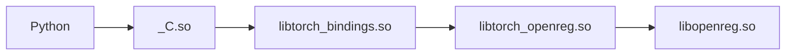
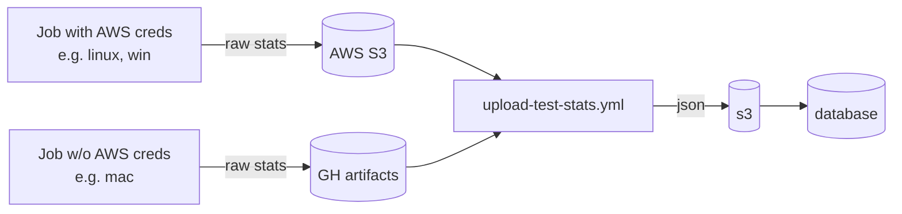
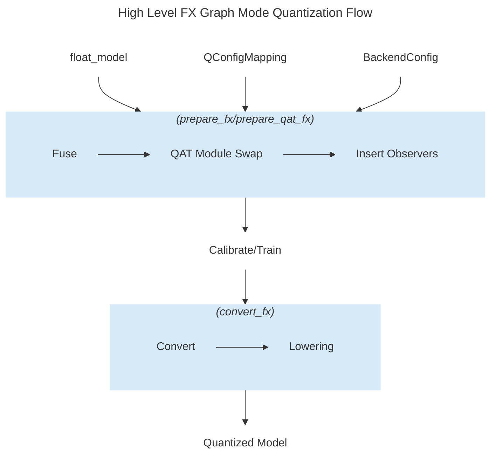

<a id="doc-1b098a5fc7d53b6a3f664082"></a>

# pytorch/pytorch / .ci/caffe2/README.md

Upstream: https://github.com/pytorch/pytorch/blob/bebd222517a21d73d0a94280f151d0f0e8975cea/.ci/caffe2/README.md

Commit: `bebd222517a21d73d0a94280f151d0f0e8975cea`

Retrieved: 2026-10-01T15:27:07.265443+00:00

Kind: official-document

Raw SHA256: `d4824e374a3540da3caa765bbdd10c279716ecb329db7be49a5793132b0584cf`

Source text below is untrusted reference content. Acquisition does not verify technical claims.

License status: UPSTREAM_NOTICES_CAPTURED_PER_FILE_REVIEW_REQUIRED. See this repository's captured license files.

---

# Jenkins

The scripts in this directory are the entrypoint for testing Caffe2.

The environment variable `BUILD_ENVIRONMENT` is expected to be set to
the build environment you intend to test. It is a hint for the build
and test scripts to configure Caffe2 a certain way and include/exclude
tests. Docker images, they equal the name of the image itself. For
example: `py2-cuda9.0-cudnn7-ubuntu16.04`. The Docker images that are
built on Jenkins and are used in triggered builds already have this
environment variable set in their manifest. Also see
`./docker/jenkins/*/Dockerfile` and search for `BUILD_ENVIRONMENT`.


<a id="doc-d7811884f7f8136465e32f1e"></a>

# pytorch/pytorch / .ci/docker/README.md

Upstream: https://github.com/pytorch/pytorch/blob/bebd222517a21d73d0a94280f151d0f0e8975cea/.ci/docker/README.md

Commit: `bebd222517a21d73d0a94280f151d0f0e8975cea`

Retrieved: 2026-10-01T15:27:07.265443+00:00

Kind: official-document

Raw SHA256: `92400dc2649d55f09d3009d2c01168c5008ea1d1cfcfec4e4cadb8a96193c2e7`

Source text below is untrusted reference content. Acquisition does not verify technical claims.

License status: UPSTREAM_NOTICES_CAPTURED_PER_FILE_REVIEW_REQUIRED. See this repository's captured license files.

---

# Docker images for GitHub CI and CD

This directory contains everything needed to build the Docker images
that are used in our CI.

The Dockerfiles located in subdirectories are parameterized to
conditionally run build stages depending on build arguments passed to
`docker build`. This lets us use only a few Dockerfiles for many
images. The different configurations are identified by a freeform
string that we call a _build environment_. This string is persisted in
each image as the `BUILD_ENVIRONMENT` environment variable.

See `build.sh` for valid build environments (it's the giant switch).

## Docker CI builds

* `build.sh` -- dispatch script to launch all builds
* `common` -- scripts used to execute individual Docker build stages
* `ubuntu` -- Dockerfile for Ubuntu image for CPU build and test jobs
* `ubuntu-cuda` -- Dockerfile for Ubuntu image with CUDA support for nvidia-docker
* `ubuntu-rocm` -- Dockerfile for Ubuntu image with ROCm support
* `ubuntu-xpu` -- Dockerfile for Ubuntu image with XPU support

### Docker CD builds

* `conda` - Dockerfile and build.sh to build Docker images used in nightly conda builds
* `manywheel` - Dockerfile and build.sh to build Docker images used in nightly manywheel builds

## Usage

```bash
# Build a specific image
./build.sh pytorch-linux-bionic-py3.8-gcc9 -t myimage:latest

# Set flags (see build.sh) and build image
sudo bash -c 'TRITON=1 ./build.sh pytorch-linux-bionic-py3.8-gcc9 -t myimage:latest'
```

## [Guidance] Adding a New Base Docker Image

### Background

The base Docker images in directory `.ci/docker/` are built by the `docker-builds.yml` workflow. Those images are used throughout the PyTorch CI/CD pipeline. You should only create or modify a base Docker image if you need specific environment changes or dependencies before building PyTorch on CI.

1. **Automatic Rebuilding**:
   - The Docker image building process is triggered automatically when changes are made to files in the `.ci/docker/*` directory
   - This ensures all images stay up-to-date with the latest dependencies and configurations

2. **Image Reuse in PyTorch Build Workflows** (example: linux-build):
   - The images generated by `docker-builds.yml` are reused in `_linux-build.yml` through the `calculate-docker-image` step
   - The `_linux-build.yml` workflow:
     - Pulls the Docker image determined by the `calculate-docker-image` step
     - Runs a Docker container with that image
     - Executes `.ci/pytorch/build.sh` inside the container to build PyTorch

3. **Usage in Test Workflows** (example: linux-test):
   - The same Docker images are also used in `_linux-test.yml` for running tests
   - The `_linux-test.yml` workflow follows a similar pattern:
     - It uses the `calculate-docker-image` step to determine which Docker image to use
     - It pulls the Docker image and runs a container with that image
     - It installs the wheels from the artifacts generated by PyTorch build jobs
     - It executes test scripts (like `.ci/pytorch/test.sh` or `.ci/pytorch/multigpu-test.sh`) inside the container

### Understanding File Purposes

#### `.ci/docker/build.sh` vs `.ci/pytorch/build.sh`
- **`.ci/docker/build.sh`**:
  - Used for building base Docker images
  - Executed by the `docker-builds.yml` workflow to pre-build Docker images for CI
  - Contains configurations for different Docker build environments

- **`.ci/pytorch/build.sh`**:
  - Used for building PyTorch inside a Docker container
  - Called by workflows like `_linux-build.yml` after the Docker container is started
  - Builds PyTorch wheels and other artifacts

#### `.ci/docker/ci_commit_pins/` vs `.github/ci_commit_pins`
- **`.ci/docker/ci_commit_pins/`**:
  - Used for pinning dependency versions during base Docker image building
  - Ensures consistent environments for building PyTorch
  - Changes here trigger base Docker image rebuilds

- **`.github/ci_commit_pins`**:
  - Used for pinning dependency versions during PyTorch building and tests
  - Ensures consistent dependencies for PyTorch across different builds
  - Used by build scripts running inside Docker containers

### Step-by-Step Guide for Adding a New Base Docker Image

#### 1. Add Pinned Commits (If Applicable)

We use pinned commits for build stability. The `nightly.yml` workflow checks and updates pinned commits for certain repository dependencies daily.

If your new Docker image needs a library installed from a specific pinned commit or built from source:

1. Add the repository you want to track in `nightly.yml` and `merge-rules.yml`
2. Add the initial pinned commit in `.ci/docker/ci_commit_pins/`. The text filename should match the one defined in step 1

#### 2. Configure the Base Docker Image
1. **Add new Base Docker image configuration** (if applicable):

   Add the configuration in `.ci/docker/build.sh`. For example:
   ```bash
   pytorch-linux-jammy-cuda12.8-cudnn9-py3.12-gcc11-new1)
     CUDA_VERSION=12.8.1
     ANACONDA_PYTHON_VERSION=3.12
     GCC_VERSION=11
     VISION=yes
     KATEX=yes
     TRITON=yes
     NEW_ARG_1=yes
     ;;
   ```

2. **Add build arguments to Docker build command**:

   If you're introducing a new argument to the Docker build, make sure to add it in the Docker build step in `.ci/docker/build.sh`:
   ```bash
   docker build \
     ....
     --build-arg "NEW_ARG_1=${NEW_ARG_1}"
   ```

3. **Update Dockerfile logic**:

   Update the Dockerfile to use the new argument. For example, in `ubuntu/Dockerfile`:
   ```dockerfile
   ARG NEW_ARG_1
   # Set up environment for NEW_ARG_1
   RUN if [ -n "${NEW_ARG_1}" ]; then bash ./do_something.sh; fi
   ```

4. **Add the Docker configuration** in `.github/workflows/docker-builds.yml`:

   The `docker-builds.yml` workflow pre-builds the Docker images whenever changes occur in the `.ci/docker/` directory. This includes the
   pinned commit updates.


<a id="doc-11b28d1e0e9c1f3bc7e7eb12"></a>

# pytorch/pytorch / .ci/lumen_cli/README.md

Upstream: https://github.com/pytorch/pytorch/blob/bebd222517a21d73d0a94280f151d0f0e8975cea/.ci/lumen_cli/README.md

Commit: `bebd222517a21d73d0a94280f151d0f0e8975cea`

Retrieved: 2026-10-01T15:27:07.265443+00:00

Kind: official-document

Raw SHA256: `870d4a812416a98859ce0d7f833547e3600047776e25217b4aaa6fca7743edd0`

Source text below is untrusted reference content. Acquisition does not verify technical claims.

License status: UPSTREAM_NOTICES_CAPTURED_PER_FILE_REVIEW_REQUIRED. See this repository's captured license files.

---

# 🔧 Lumen_cli
A Python CLI tool for building and testing PyTorch-based components, using a YAML configuration file for structured, repeatable workflows.


## Features
- **Build**
    - external projects (e.g. vLLM)

## 📦 Installation
at the root of the pytorch repo
```bash
pip install -e .ci/lumen_cli
```

## Run the cli tool
The cli tool must be used at root of pytorch repo, as example to run build external vllm:
```bash
python -m cli.run build external vllm
```
this will run the build steps with default behaviour for vllm project.

to see help messages, run
```bash
python3 -m cli.run --help
```

## Add customized external build logics
To add a new external build, for instance, add a new external build logics:
1. create the build function in cli/lib folder
2. register your target and the main build function at  EXTERNAL_BUILD_TARGET_DISPATCH in `cli/build_cli/register_build.py`
3. [optional] create your ci config file in .github/ci_configs/${EXTERNAL_PACKAGE_NAME}.yaml


<a id="doc-8ddd6a40f4ee8f13d0bac35d"></a>

# pytorch/pytorch / .ci/magma/README.md

Upstream: https://github.com/pytorch/pytorch/blob/bebd222517a21d73d0a94280f151d0f0e8975cea/.ci/magma/README.md

Commit: `bebd222517a21d73d0a94280f151d0f0e8975cea`

Retrieved: 2026-10-01T15:27:07.265443+00:00

Kind: official-document

Raw SHA256: `04f10ca30d7e579f0598238b8b900c260e5920bcba38154351ee1288df21efaa`

Source text below is untrusted reference content. Acquisition does not verify technical claims.

License status: UPSTREAM_NOTICES_CAPTURED_PER_FILE_REVIEW_REQUIRED. See this repository's captured license files.

---

# Magma

This folder contains the scripts and configurations to build magma, statically linked for various versions of CUDA.

## Building

Look in the `Makefile` for available targets to build. To build any target, for example `magma-cuda118`, run

```
# Using `docker`
make magma-cuda118

# Using `podman`
DOCKER_CMD=podman make magma-cuda118
```

This spawns a `pytorch/manylinux-cuda<version>` docker image, which has the required `devtoolset` and CUDA versions installed.
Within the docker image, it runs `build_magma.sh` with the correct environment variables set, which package the necessary files
into a tarball, with the following structure:

```
.
├── include       # header files
├── lib           # libmagma.a
├── info
│   ├── licenses  # license file
│   └── recipe    # build script and patches
```

More specifically, `build_magma.sh` copies over the relevant files from the `package_files` directory depending on the CUDA version.
Outputted binaries should be in the `output` folder.


## Pushing

Packages can be uploaded to an S3 bucket using:

```
aws s3 cp output/*/magma-cuda*.bz2 <bucket-with-path>
```

If you do not have upload permissions, please ping @seemethere or @soumith to gain access

## New versions

New CUDA versions can be added by creating a new make target with the next desired version. For CUDA version NN.n, the target should be named `magma-cudaNNn`.

Make sure to edit the appropriate environment variables (e.g., DESIRED_CUDA, CUDA_ARCH_LIST) in the `Makefile` accordingly. Remember also to check `build_magma.sh` to ensure the logic for copying over the files remains correct.

New patches can be added by editing `Makefile` and`build_magma.sh` the same way `getrf_nbparam.patch` is implemented.


<a id="doc-f6a1280af8e8b79ce1378369"></a>

# pytorch/pytorch / .ci/pytorch/README.md

Upstream: https://github.com/pytorch/pytorch/blob/bebd222517a21d73d0a94280f151d0f0e8975cea/.ci/pytorch/README.md

Commit: `bebd222517a21d73d0a94280f151d0f0e8975cea`

Retrieved: 2026-10-01T15:27:07.265443+00:00

Kind: official-document

Raw SHA256: `3e9cdad758df32f48c460c1b66b85e6df5e4d51be658732d88e4bc519999f0be`

Source text below is untrusted reference content. Acquisition does not verify technical claims.

License status: UPSTREAM_NOTICES_CAPTURED_PER_FILE_REVIEW_REQUIRED. See this repository's captured license files.

---

This directory contains scripts for our continuous integration.


<a id="doc-dd021d7d7b57ca067431b7cb"></a>

# pytorch/pytorch / .ci/wheel/README.md

Upstream: https://github.com/pytorch/pytorch/blob/bebd222517a21d73d0a94280f151d0f0e8975cea/.ci/wheel/README.md

Commit: `bebd222517a21d73d0a94280f151d0f0e8975cea`

Retrieved: 2026-10-01T15:27:07.265443+00:00

Kind: official-document

Raw SHA256: `b10bdab8339315598d4bb821b75ec0efb3b2a18bcbe1f7d3c5af22c688d90651`

Source text below is untrusted reference content. Acquisition does not verify technical claims.

License status: UPSTREAM_NOTICES_CAPTURED_PER_FILE_REVIEW_REQUIRED. See this repository's captured license files.

---

# CD wheel build pipelines

Python-driven pipelines that build the nightly / release PyTorch **wheels**
for the three CD platforms. Each platform has its own subdirectory; the
per-stage scripts are small and orchestration-free, and the cross-platform
helpers live in a single `_common.py`.

```
.ci/wheel/
  _common.py     shared helpers (see "Shared code")
  linux/         manylinux (x86_64, aarch64) -- patchelf repair
  mac/           macOS arm64 -- delocate repair
  windows/       Windows (amd64) -- no repair (DLLs resolved via PATH)
```

## Stage sequence

Every platform runs the same ordered stages, bar one Linux-CUDA-only step.
A shell orchestrator drives them and threads environment forward through an
`--env-out` file that each Python stage writes and the orchestrator
`source`s before the next stage:

1. `set_desired_python.sh` -- select/install the requested interpreter
   (`DESIRED_PYTHON`, e.g. `3.13` or the free-threaded `3.13t`) and expose it
   to the later stages.
2. `build_env_setup.py --env-out F` -- compute the build-flag / toolchain
   environment (USE_CUDA, USE_DISTRIBUTED, vcvars, CUDA/XPU, ...) and write
   `export` lines to `F`.
3. `build_install_deps.py` -- install build-time pip dependencies (the
   `numpy` pin, `requirements-build.txt`, `requirements.txt`) plus any
   platform bits (libomp on macOS, libuv on Windows), then run `spin clean`.
4. `build_wheel.py RAW_DIR` -- run
   `python -m build --wheel --no-isolation --outdir RAW_DIR`
   (scikit-build-core reads the repo-root `pyproject.toml`).
5. Linux CUDA only: native-AOT stage 2 (`tools/native_aot/build_stage2.py
   --wheel`), inline in `linux/build.sh`. Installs the raw wheel, exports the
   AOT kernels, relinks `libtorch_cuda`, and patches it back into the raw
   wheel so the repair below bundles the relinked library.
6. `repair_wheel.py RAW_DIR FINAL_DIR` -- bundle the external shared
   libraries into the wheel (patchelf on Linux, delocate on macOS). Windows
   has no repair stage.

## Per-platform orchestration

| Platform | Entry point | Topology | Repair |
|----------|-------------|----------|--------|
| Linux   | `linux/build_all.sh` -> `linux/build.sh` | one runner loops over `DESIRED_PYTHONS`; `libtorch_cpu` is reused across Pythons via `SKIP_SETUP_CLEAN` | patchelf |
| macOS   | `mac/build_all_macos_wheels.sh` -> `mac/build.sh` | one runner loops (`uv python install`), a venv per Python | delocate |
| Windows | `.ci/pytorch/binary_windows_build.sh` (**outside this tree**) | CI matrix -- one Python per job, no loop | none |

`build.sh` also routes on `GPU_ARCH_TYPE` (cpu / cuda / rocm / xpu).

## Shared code -- `_common.py`

Imported by every stage via
`sys.path.insert(0, str(Path(__file__).resolve().parents[1]))`:

- `install_numpy()` / `NUMPY_PINS` -- the single build-time numpy pin table
  (oldest wheel-bearing numpy *minor* per Python, at the newest vetted
  *patch*). Every Python in the CD matrix has an entry. A Python with no
  entry -- a newly added one, before its pin lands -- builds against a numpy
  the CI image pre-provisioned, and fails loudly when there is none, rather
  than silently picking a stale default.
- `retry()`, `pip_install()` -- retrying command / pip wrappers.
- `write_env_exports()`, `shell_quote()` -- serialize env for the
  `--env-out` hand-off (POSIX PATH conversion + bash-identifier filtering).
- `download()` -- streaming download with backoff.

## Dependencies outside `.ci/wheel/`

- **CI wiring.** The workflows are generated, not hand-written. Edit
  `.github/templates/{linux,windows,macos}_binary_build_workflow.yml.j2`
  (and `.github/scripts/generate_binary_build_matrix.py`, which also
  references `linux/build_env_setup.py`), then regenerate with
  `python .github/scripts/generate_ci_workflows.py`. The generated
  `.github/workflows/generated-*-binary-*-nightly.yml` files are the callers.
- **Windows workspace `.ci/pytorch/windows/`.** The Windows pipeline is
  launched by `.ci/pytorch/binary_windows_build.sh` and treats
  `.ci/pytorch/windows/` as its runtime workspace (`WIN_CI_DIR`): the Python
  install, `tmp_bin/`, magma, libuv, and the shared `internal/*.bat`
  installers (`cuda_install`, `xpu_install`, `vc_install_helper`,
  `install_python`, ...) live there, as does the separate `arm64/` build
  path. These stay outside this tree because non-CD Windows CI shares them.
- **Repo root.** `pyproject.toml` (the actual scikit-build-core build),
  `requirements-build.txt` + `requirements.txt` (build-time deps),
  `tools/amd_build/build_amd.py` (Linux ROCm hipify), and `spin` /
  `tools/clean.py` (the `spin clean` step).
- **libtorch.** There is no separate libtorch build: the nightly libtorch
  zips are extracted from the wheels built here by
  `.ci/libtorch/extract_libtorch_from_wheel.py` in a follow-on workflow job.
  `PACKAGE_TYPE` (`manywheel` / `wheel` / `libtorch`) is a semantic label
  consumed by the env-population, test, and upload scripts -- it is never
  resolved as a directory.


<a id="doc-094ccf519e483df9b9c21c15"></a>

# pytorch/pytorch / .ci/wheel/linux/LICENSE

Upstream: https://github.com/pytorch/pytorch/blob/bebd222517a21d73d0a94280f151d0f0e8975cea/.ci/wheel/linux/LICENSE

Commit: `bebd222517a21d73d0a94280f151d0f0e8975cea`

Retrieved: 2026-10-01T15:27:07.265443+00:00

Kind: license

Raw SHA256: `ccfa95da478e5e0a9f9a09a29974ccac13997d864699eee22175db1eace1a73d`

Source text below is untrusted reference content. Acquisition does not verify technical claims.

License status: UPSTREAM_NOTICES_CAPTURED_PER_FILE_REVIEW_REQUIRED. See this repository's captured license files.

---

````text
The MIT License (MIT)

Copyright (c) 2016 manylinux

Permission is hereby granted, free of charge, to any person obtaining a copy
of this software and associated documentation files (the "Software"), to deal
in the Software without restriction, including without limitation the rights
to use, copy, modify, merge, publish, distribute, sublicense, and/or sell
copies of the Software, and to permit persons to whom the Software is
furnished to do so, subject to the following conditions:

The above copyright notice and this permission notice shall be included in all
copies or substantial portions of the Software.

THE SOFTWARE IS PROVIDED "AS IS", WITHOUT WARRANTY OF ANY KIND, EXPRESS OR
IMPLIED, INCLUDING BUT NOT LIMITED TO THE WARRANTIES OF MERCHANTABILITY,
FITNESS FOR A PARTICULAR PURPOSE AND NONINFRINGEMENT. IN NO EVENT SHALL THE
AUTHORS OR COPYRIGHT HOLDERS BE LIABLE FOR ANY CLAIM, DAMAGES OR OTHER
LIABILITY, WHETHER IN AN ACTION OF CONTRACT, TORT OR OTHERWISE, ARISING FROM,
OUT OF OR IN CONNECTION WITH THE SOFTWARE OR THE USE OR OTHER DEALINGS IN THE
SOFTWARE.

````


<a id="doc-4dc9d2b760d55b508c633a5e"></a>

# pytorch/pytorch / .claude/skills/triaging-issues/README.md

Upstream: https://github.com/pytorch/pytorch/blob/bebd222517a21d73d0a94280f151d0f0e8975cea/.claude/skills/triaging-issues/README.md

Commit: `bebd222517a21d73d0a94280f151d0f0e8975cea`

Retrieved: 2026-10-01T15:27:07.265443+00:00

Kind: official-document

Raw SHA256: `34ac7408c4deeaf6c52809e50e07cd7b1e49455cffd8e16833c770aba8a17b32`

Source text below is untrusted reference content. Acquisition does not verify technical claims.

License status: UPSTREAM_NOTICES_CAPTURED_PER_FILE_REVIEW_REQUIRED. See this repository's captured license files.

---

## Summary

This is a skill for auto-triaging issues. This is the human side of things :)
There are 4 pieces to this skill;

1. `SKILL.md` this is the main description of what to do/ directions to follow. If you notice a weird anti pattern in triaging
this is the file you should update. The basic workflow is that there is a static list of labels in `labels.json` that the agent will read w/ their descriptions in order to make decisions. *NOTE* This is static and if new labels are added to `pytorch/pytorch` we should
bump this list w/ their description. I made this static because the full set of labels is too big/quite stale. And I wanted to add more color to certain descriptions. The mechanics for actually interacting w/ gh issues is through the official mcp server. For V1, we always apply
`bot-triaged` whenever any triage action is taken; you can filter those decisions here: https://fburl.com/pt-bot-triaged
2. `templates.json`: This is basically where we want to put canned responses. It includes `redirect_to_forum` (for usage questions) and
`request_more_info` (when classification is unclear). There are likely others we should add here as we notice more patterns.
3. There are hooks in `/scripts`: a target pre-hook (`validate_issue_target.py`) that blocks mutations outside the repository and issue selected by the workflow, a label pre-hook (`validate_labels.py`) that filters out labels we never want the bot to add, and a post-hook (`add_bot_triaged.py`) that automatically applies `bot-triaged` after any issue mutation.
4. The gh action uses a **two-stage workflow** to support issues opened by OSS users:
   - **Stage 1** (`.github/workflows/claude-issue-triage.yml`): Triggers on `issues: opened`, captures the issue number, and uploads it as an artifact. This stage has no protected environment, so OSS actors can run it.
   - **Stage 2** (`.github/workflows/claude-issue-triage-run.yml`): Triggers on `workflow_run` completion of Stage 1. Runs in the protected `bedrock` environment with AWS/Bedrock access. Downloads the artifact, reads the issue number, and runs the actual triage.

   **Why two stages?** GitHub environment protection blocks jobs before they start if the triggering actor isn't authorized. By using `workflow_run`, Stage 2 is triggered by GitHub itself (trusted context), allowing it to enter the protected environment regardless of who opened the issue.  We use sonnet-4.5, since from testing it is much cheaper and appears to do a more than adequate job at triaging.
5. To disable the flow, disable the GitHub Actions workflow in the repo settings or remove/disable `.github/workflows/claude-issue-triage.yml`.
6. If you would like to test updates before committing them upstream to pytorch, you can do that here: https://github.com/pytorch/ciforge @lint-ignore

<a id="doc-0f9548cbce10dbdef0b86d78"></a>

# pytorch/pytorch / .devcontainer/README.md

Upstream: https://github.com/pytorch/pytorch/blob/bebd222517a21d73d0a94280f151d0f0e8975cea/.devcontainer/README.md

Commit: `bebd222517a21d73d0a94280f151d0f0e8975cea`

Retrieved: 2026-10-01T15:27:07.265443+00:00

Kind: official-document

Raw SHA256: `acd5684aa3b92c6e2c4d4c9a49a5c13f8d98096a61ab38d379d6a363f236d3e2`

Source text below is untrusted reference content. Acquisition does not verify technical claims.

License status: UPSTREAM_NOTICES_CAPTURED_PER_FILE_REVIEW_REQUIRED. See this repository's captured license files.

---

# Step by step guide on using PyTorch's DevContainer

Using PyTorch's DevContainer environment involves a series of steps that will help you set up a development environment that is isolated and replicable. Below, we'll guide you through each step to make this process as smooth as possible:

## Step 1: Install VSCode

1. Navigate to the [Visual Studio Code website](https://code.visualstudio.com/).
2. Download the appropriate installer for your operating system (Windows, Linux, or macOS).
3. Run the installer and follow the on-screen instructions to install VSCode on your system.
4. After installation, launch VSCode.

## Step 2: Install DevContainer Extension

1. In VSCode, go to the Extensions view by clicking on the Extensions icon in the Activity Bar on the side of the window.
2. Search for "Dev Containers" in the Extensions view search bar.
3. Find the "Dev Containers" extension in the search results and click on the install button to install it.

You can also go to the extension's [homepage](https://marketplace.visualstudio.com/items?itemName=ms-vscode-remote.remote-containers) and [documentation page](https://code.visualstudio.com/docs/devcontainers/containers) to find more details.

## Step 3: Install Docker and Add Current Login User to Docker Group

1. Follow the [official guide](https://docs.docker.com/get-docker/) to install Docker. Don't forget the [post installation steps](https://docs.docker.com/engine/install/linux-postinstall/).

If you are using [Visual Studio Code Remote - SSH](https://code.visualstudio.com/docs/remote/ssh), then you only need to install Docker in the remote host, not your local computer. And the following steps should be run in the remote host.

## Step 4 (Optional): Install NVIDIA Container Toolkit for GPU Usage

1. If you intend to use GPU resources, first ensure you have NVIDIA drivers installed on your system. Check if `nvidia-smi` works to verify your GPU setup.
2. Follow the [official guide](https://docs.nvidia.com/datacenter/cloud-native/container-toolkit/latest/install-guide.html#docker) to install the NVIDIA Container Toolkit.
3. After installation, verify that the toolkit is installed correctly by running:
   ```
   docker run --rm --runtime=nvidia --gpus all nvidia/cuda:11.6.2-base-ubuntu20.04 nvidia-smi
   ```

## Step 5: Clone PyTorch

1. Open a terminal or command prompt.
2. Use the following command to clone the PyTorch repository:
   ```
   git clone https://github.com/pytorch/pytorch
   ```
3. Navigate to the cloned directory:
   ```
   cd pytorch
   ```

## Step 6: Open in DevContainer

1. In VSCode, use the Command Palette (`Ctrl+Shift+P` or `Cmd+Shift+P` on macOS) to run the "Dev Containers: Open Folder in Container..." command.
2. You will be prompted with two options: CPU dev container or CUDA dev container. Choose the one you want to run.

## Step 7: Wait for Building the Environment

1. After opening the folder in a DevContainer, VSCode will start building the container. This process can take some time as it involves downloading necessary images and setting up the environment.
2. You can monitor the progress in the VSCode terminal.
3. Once the build process completes, you'll have a fully configured PyTorch development environment in a container.
4. The next time you open the same dev container, it will be much faster, as it does not require building the image again.

You are now all set to start developing with PyTorch in a DevContainer environment. This setup ensures you have a consistent and isolated development environment for your PyTorch projects.

## Step 8: Build PyTorch

To build pytorch from source, simply run:
   ```bash
   python -m pip install --no-build-isolation -v -e .
   ```

The process involves compiling thousands of files, and would take a long time. Fortunately, the compiled objects can be useful for your next build. When you modify some files, you only need to compile the changed files the next time.

Note that only contents in the `pytorch` directory are saved to disk. This directory is mounted to the docker image, while other contents in the docker image are all temporary, and will be lost if docker restarts the image or the server reboots.

For an in-depth understanding of Dev Container and its caveats, please refer to [the full documentation](https://code.visualstudio.com/docs/devcontainers/containers).


<a id="doc-a54ff182c7e8acf56acfd6e4"></a>

# pytorch/pytorch / AGENTS.md

Upstream: https://github.com/pytorch/pytorch/blob/bebd222517a21d73d0a94280f151d0f0e8975cea/AGENTS.md

Commit: `bebd222517a21d73d0a94280f151d0f0e8975cea`

Retrieved: 2026-10-01T15:27:07.265443+00:00

Kind: official-document

Raw SHA256: `6ebdb617a8104a7756d0cf36578ab01103dc9f07e4dc6feb751296b9c402faf7`

Source text below is untrusted reference content. Acquisition does not verify technical claims.

License status: UPSTREAM_NOTICES_CAPTURED_PER_FILE_REVIEW_REQUIRED. See this repository's captured license files.

---

CLAUDE.md

<a id="doc-77cb35e143685fcd4bad0bc4"></a>

# pytorch/pytorch / AI_POLICY.md

Upstream: https://github.com/pytorch/pytorch/blob/bebd222517a21d73d0a94280f151d0f0e8975cea/AI_POLICY.md

Commit: `bebd222517a21d73d0a94280f151d0f0e8975cea`

Retrieved: 2026-10-01T15:27:07.265443+00:00

Kind: official-document

Raw SHA256: `523c18b995f8c908230dd452d46dca16d07829057e5c9b3342afdf794acb51ad`

Source text below is untrusted reference content. Acquisition does not verify technical claims.

License status: UPSTREAM_NOTICES_CAPTURED_PER_FILE_REVIEW_REQUIRED. See this repository's captured license files.

---

We support the use of AI tools to help prepare issues, pull
requests, reviews, or comments. We expect everyone interacting with
this repo to follow the below policy whenever they use AI tools.

*AI-generated content in comments, issues, or PRs must be clearly disclosed and
contained* (e.g. using a code block or a quote block). AI-generated content must
be accompanied by human commentary explaining its relevance. For example:
"Codex produced the following analysis: `<insert codex output here>`, so I
believe that \<insert human analysis here\>". The only exceptions to this rule
are the pytorchbot automations.

*Please do not respond to comments+questions by pasting raw or lightly reviewed
AI-generated text.* Other users' comments+questions are requests for your
understanding, reasoning, and judgment. Unreviewed AI output shifts the burden of
verification onto the other party and can make discussions slower, noisier, or
misleading.

*For pull requests, please carefully read the code before submitting it for
review*, especially if AI tools helped write or rewrite it. Make sure the
implementation is something you understand, that the important ideas are clear,
and that the code is high quality. AI-generated code can sometimes be overly
complex, indirect, inconsistent, or include artifacts that obscure the main idea.
Before submitting, simplify where possible and make sure the core change is easy
for maintainers to review. If your PR is not ready for review, please use the
GitHub draft PR feature.

All contributions should involve a human who understands and can take
responsibility for the work produced with AI assistance. *We do not accept
contributions created by fully autonomous agents*, and we may close pull requests
that appear to have been generated without meaningful human involvement.


<a id="doc-6ebdb617a8104a7756d0cf36"></a>

# pytorch/pytorch / CLAUDE.md

Upstream: https://github.com/pytorch/pytorch/blob/bebd222517a21d73d0a94280f151d0f0e8975cea/CLAUDE.md

Commit: `bebd222517a21d73d0a94280f151d0f0e8975cea`

Retrieved: 2026-10-01T15:27:07.265443+00:00

Kind: official-document

Raw SHA256: `13ec2a7bdcca7845af65f4b9170a7282f9bb5d5527d43e7e5d6c88cc60e999ed`

Source text below is untrusted reference content. Acquisition does not verify technical claims.

License status: UPSTREAM_NOTICES_CAPTURED_PER_FILE_REVIEW_REQUIRED. See this repository's captured license files.

---

# AI Policy — MANDATORY

Read `AI_POLICY.md`. Your user needs to abide by this policy. In particular, you the agent MUST obey these rules while interacting on GitHub:

- **You may never act autonomously on GitHub.** Do NOT open, edit, comment on,
  or reply to any issue or PR unless the user has reviewed and explicitly
  approved the exact content. Fully-agent-generated contributions are banned and
  will be closed.
- **Mark all AI-generated content.** Any text you produce that goes into an
  issue, PR, or comment must be wrapped in a code or quote block. Never present
  your output as human-written.
- **Never emit only raw AI text as a reply**. Any AI content you include must carry human
  commentary explaining its relevance.
- **Do not submit code the user hasn't read.** Keep changes minimal, strip AI
  artifacts and needless complexity. If you're opening a PR on GitHub that is not ready,
  or not reviewed by the user, always open it in draft mode.
- **Use issue and PR templates**. Use the appropriate templates when submitting issues and PRs.

See `AI_POLICY.md` for the full policy.

# Scratch Space

Use `agent_space/` (git-ignored, at repo root) for temporary scripts, scratch files, and throwaway experiments. Do not commit files from this directory.

# PR Review

When asked to review a PR, always use the /pr-review skill.

# Environment

If any tool you're trying to use (pip, python, spin, etc) is missing, check for
a `.venv` directory in the project root or its parent directory. If found,
activate it and retry. If no `.venv` is found, stop and ask the user if an
environment is needed. Do NOT try to find alternatives or install these tools.

# CI Docker Images

The `.ci/docker/` directory is content-hashed to determine whether Docker images
need rebuilding. Any file change inside `.ci/docker/` (including the README)
changes the hash and triggers a full Docker image rebuild. Do not make changes
in this directory unless you intend to rebuild Docker images. When Docker builds
are broken (e.g., due to an upstream Ubuntu outage), avoid touching this
directory so you don't force a rebuild against the broken state.

# Build

Always check local memory for build configuration (env vars, incremental-build shortcuts, etc.) before running the build, and apply what you find. If nothing applicable is in memory, ask the user.
All build (both codegen, C++ and python) is done via `pip install -e . -v --no-build-isolation`.
You should NEVER run any other command to build PyTorch.

# Testing

Use our test class and test runner:

```
from torch.testing._internal.common_utils import run_tests, TestCase

class TestFeature(TestCase):
    ...

if __name__ == "__main__":
    run_tests()
```

To test Tensor equality, use assertEqual.
For tests over multiple inputs, use the `@parametrize` decorator.
For any test that checks numerics of the on-device implementation, use `instantiate_device_type_tests` to write device-generic tests.

# Type Stubs

Many `.pyi` files are generated from corresponding `.pyi.in` templates. Always
edit the `.pyi.in` file, not the generated `.pyi`.

# Linting

Only use commands provided via `spin` for linting.
Use `spin help` to list available commands.
Generally, use `spin lint` as to run the lint and `spin fixlint` to apply automatic fixes.

When the user asks you to commit or amend, run `lintrunner -a` before creating
the commit. Fix any lint errors it reports, then commit.

## Never silence S101 with a noqa

Ruff's S101 (`Use of assert detected`) must be fixed by rewriting the assert,
never by adding `# noqa: S101`. The lint message itself suggests the noqa; ignore
that suggestion. Plain `assert` is stripped by `python -O`, so a suppressed
assert is a check that silently does nothing in an optimized run.

```python
# Bad - silences the rule; the check disappears under `python -O`
assert isinstance(x, Foo)  # noqa: S101

# Good
if not isinstance(x, Foo):
    raise AssertionError(f"expected Foo, got {type(x)}")
```

Preserve the original message when there is one (`assert cond, msg` ->
`if not cond: raise AssertionError(msg)`); otherwise synthesize a short one that
names what was expected and shows the actual value. Invert the condition rather
than wrapping it in `not (...)` when there is a clean inverse (`is not None` ->
`is None`, `in` -> `not in`, `==` -> `!=`). Do not invert `<`/`>`/`<=`/`>=` on
floats: `not (a < b)` is not `a >= b` when a value is NaN, so keep those as
`if not (a < b)`.

# Git

This refines the Bash tool's `# Git` guidance to "branch first" when on the
default branch:

- If HEAD is detached, that is intentional (the ghstack workflow). Do NOT
  create a new branch; commit directly onto the current detached HEAD.
- If you are on an actual branch (including `main`), follow the default
  guidance and branch first before committing.
- **Pulling CI status.** A PR has hundreds of check-runs, so a single
  `check-runs?per_page=100` call silently truncates and makes red look green.
  Use `gh pr checks <PR> --json name,state,workflow,link,bucket,completedAt`
  (already head-only, no paging).

# Commit messages

Don't commit unless the user explicitly asks you to.

When writing a commit message, don't make a bullet list of the individual
changes. Instead, if the PR is large, explain the order to review changes
(e.g., the logical progression), or if it's short just omit the bullet list
entirely.

The commit message should be clear, informative, and have a Test Plan section
that describes how you tested the change. If you are fixing a bug, the commit
message must explain the root cause of the bug and how the fix works.
If there were multiple potential paths you could have taken, please call them
out succinctly and justify the one you took.

When describing the testing strategy in a commit message, include the literal
commands that were run in fenced Markdown code blocks.

Disclose that the PR was authored with an AI assistant.

When the user asks you to amend a commit, check whether the commit message
still accurately describes the changes. If it doesn't and the commit is not a
ghstack commit, update the message. For ghstack commits, amending the message
is a no-op, so just remind the user to update the PR description if needed.

If a commit message contains `ghstack-source-id` or `Pull-Request` trailers,
you MUST preserve them when rewriting or splitting commit messages. ghstack
will update the source id automatically when needed.

# ghstack Workflow

ghstack commits follow a different workflow than the conventional GitHub branch
and PR workflow. First identify whether you're on a ghstack commit:

- If HEAD is a detached commit, you are almost certainly in a ghstack flow.
- If the commit message contains a `ghstack-source-id` trailer, it is an
  existing ghstack commit.
- If the commit is associated with a remote branch like `origin/gh/USERNAME/N`,
  it is likely a ghstack commit (imperfect signal: local amends without a push
  can desync this).

Rules for working with ghstack:

- **Don't amend unless asked.** If the user asks you to work on a ghstack
  commit, leave changes uncommitted so the user can review with `git diff`.
  Only amend into the commit if the user explicitly asks you to amend or to
  submit it directly.
- **Submitting.** Run `ghstack` to submit. When only working on a single
  commit, use `ghstack --no-stack` to avoid updating the rest of the stack and
  burning unnecessary CI. Use a full `ghstack` when you're intentionally
  updating CI for the whole stack.
- **Preserve metadata trailers.** When editing a commit message, never delete
  `Pull-Request:` or `ghstack-source-id:` trailers. Always re-read them from
  HEAD each time you compose an amend — never reuse a saved/cached message
  body, since `ghstack` rewrites `ghstack-source-id` on every push and a
  stale trailer will clobber HEAD's current one. If you modified the commit
  message, run `ghstack -u` afterwards to push the updated PR description.
- **Never push directly.** Do not `git push` to branches, and never directly
  modify the `gh/USERNAME/N` branches — ghstack manages those.
- **Finding the PR.** If the user asks to pull CI results or code review for a
  ghstack commit, get the PR URL from the `Pull-Request` trailer in the commit
  message. Use `gh` CLI to fetch status/comments from there.
- **Editing earlier commits / splitting.** Treat it like a normal stack of
  commits (use `git rebase`, etc.). Commits that keep their metadata trailers
  stay associated with their existing PRs; commits without trailers will get a
  fresh PR on submit. A full `ghstack` run is usually appropriate here.

# Coding Style Guidelines

Follow these rules for all code changes in this repository:

- Minimize comments; be concise; code should be self-explanatory and self-documenting.
- Comments should be useful, for example, comments that remind the reader about
  some global context that is non-obvious and can't be inferred locally.
- Don't make trivial (1-2 LOC) helper functions that are only used once unless
  it significantly improves code readability.
- Prefer clear abstractions. State management should be explicit.
  For example, if managing state in a Python class: there should be a clear
  class definition that has all of the members: don't dynamically `setattr`
  a field on an object and then dynamically `getattr` the field on the object.
- Match existing code style and architectural patterns.
- Assume the reader has familiarity with PyTorch. They may not be the expert
  on the code that is being read, but they should have some experience in the
  area.
- Splitting code across multiple lines (due to ruff’s column limit rule) is less
  readable than having code on a single line. When the linter splits your
  code across multiple lines, please try to put it back on a single line by
  changing variable names or by using helper local variables. For tests that assert
  against a golden string, keep just the golden string on one line instead of
  splitting it across multiple lines and opt-out of the ruff column limit rule
  via `noqa: B950`.
- ASCII only in newly added code comments. Do not introduce Unicode characters
  (e.g., smart quotes, em dashes, arrows, non-ASCII letters) in new comments.
  Leave preexisting Unicode in untouched comments alone; only enforce this for
  comments you are adding or rewriting.

If uncertain, choose the simpler, more concise implementation.

# cuda.bindings Error Checking

Use `torch.cuda._utils._check_cuda_bindings` to error-check `cuda.bindings`
runtime calls. Do not write inline error-checking helpers.

# cuda.bindings Raw Handles

`cuda.bindings` runtime functions accept a raw handle passed as a Python `int`
directly as their handle argument. Whenever you already have an int handle --
from `CUDAGraph.raw_cuda_graph()` / `raw_cuda_graph_exec()`, a stream's
`.cuda_stream`, `int(node)`, or any other source -- pass it straight in. Do NOT
construct a typed wrapper (`cudaGraph_t(init_value=...)`,
`cudaGraphExec_t(init_value=...)`, `cudaStream_t(init_value=...)`, etc.) just to
hand an int you already have to a bindings call. For example
`_cuda_runtime.cudaGraphGetId(g.raw_cuda_graph())`, not
`cudaGraphGetId(cudaGraph_t(init_value=g.raw_cuda_graph()))`. Only build the
typed object when you genuinely need it as a value in its own right.

# Dynamo Config

Use `torch._dynamo.config.patch` for temporarily changing config. It can be used as a decorator on test methods or as a context manager:

```python
# Good - use patch as decorator on test method
@torch._dynamo.config.patch(force_compile_during_fx_trace=True)
def test_my_feature(self):
    # test code here
    pass

# Good - use patch as context manager
with torch._dynamo.config.patch(force_compile_during_fx_trace=True):
    # test code here
    pass

# Bad - manual save/restore
orig = torch._dynamo.config.force_compile_during_fx_trace
try:
    torch._dynamo.config.force_compile_during_fx_trace = True
    # test code here
finally:
    torch._dynamo.config.force_compile_during_fx_trace = orig
```

# Fixing B950 line too long in multi-line string blocks

If B950 line too long triggers on a multi-line string block, you cannot fix it by
putting # noqa: B950 on that line directly, as that would change the meaning of the
string, nor can you fix it by line breaking the string (since you need the string
to stay the same).  Instead, put # noqa: B950 on the same line as the terminating
triple quote.

Example:

```
    self.assertExpectedInline(
        foo(),
        """
this line is too long...
""",  # noqa: B950
    )
```

# Logging and Structured Tracing

When adding debug logging for errors or diagnostic info, consider two user personas:

1. **Local development**: Users run locally and can access files on disk
2. **Production jobs**: Users can only access logs via `tlparse` from structured traces

For production debugging, use `trace_structured` to log artifacts:

```python
from torch._logging import trace_structured

# Log an artifact (graph, edge list, etc.)
trace_structured(
    "artifact",
    metadata_fn=lambda: {
        "name": "my_debug_artifact",
        "encoding": "string",
    },
    payload_fn=lambda: my_content_string,
)
```

To check if structured tracing is enabled (for conditional messaging):

```python
from torch._logging._internal import trace_log

if trace_log.handlers:
    # Structured tracing is enabled, suggest tlparse in error messages
    msg += "[Use tlparse to extract debug artifacts]"
```

**Best practices for error diagnostics:**

- Always log to `trace_structured` for production (no runtime cost if disabled)
- If you're dumping debug info in the event of a true internal compiler exception,
  you can also consider writing to local files for local debugging convenience
- In error messages, tell users about both options:
  - Local files: "FX graph dump: min_cut_failed_graph.txt"
  - Production: "Use tlparse to extract artifacts" (only if tracing enabled)
- Use `_get_unique_path()` pattern to avoid overwriting existing debug files

# cuda::ptx

When using `<cuda/ptx>` typed wrappers for PTX instructions:

- **Namespace**: Inside `namespace at::native`, unqualified `cuda::ptx` resolves
  to the sibling `at::cuda` namespace. Always use `::cuda::ptx` or alias it:
  `namespace ptx = ::cuda::ptx;`
- **Include conflicts**: The monolithic `<cuda/ptx>` header can fail when included
  alongside heavy PyTorch headers (e.g. `Loops.cuh`) due to CCCL bugs in
  transitive headers like `cp_async_bulk_tensor.h`. Workaround: put kernels using
  `<cuda/ptx>` in a separate `.cu` file with minimal includes.
- **mbarrier_try_wait_parity is non-blocking**: `ptx::mbarrier_try_wait_parity()`
  returns `bool` (tries once). You must wrap it in a spin loop:
  `while (!ptx::mbarrier_try_wait_parity(mbar, parity)) {}`
- **Half/BFloat16 types**: `cuda::ptx` overloads use CUDA native types (`__half`,
  `__nv_bfloat16`), not PyTorch wrappers (`c10::Half`, `c10::BFloat16`).
  Use `reinterpret_cast` at the call site.
- **cp_async_bulk_wait_group**: Takes a compile-time constant via
  `ptx::n32_t<N>{}`, not a runtime integer.
- **Mbarrier smem**: Mbarrier memory must never alias with data targeted by TMA
  operations. Place mbarriers in a separate smem region from data buffers.

# Distributed changes

Before changing `torch/distributed/`, `torch/csrc/distributed/`, or
`test/distributed/`, read and follow `torch/distributed/AGENTS.md`.


<a id="doc-ffdbe3a1e7ee93cacfc080b6"></a>

# pytorch/pytorch / CODE_OF_CONDUCT.md

Upstream: https://github.com/pytorch/pytorch/blob/bebd222517a21d73d0a94280f151d0f0e8975cea/CODE_OF_CONDUCT.md

Commit: `bebd222517a21d73d0a94280f151d0f0e8975cea`

Retrieved: 2026-10-01T15:27:07.265443+00:00

Kind: official-document

Raw SHA256: `cdad793297c8bee6f1760684b82f00f8c50cb510d264958983b84f1f055ffc29`

Source text below is untrusted reference content. Acquisition does not verify technical claims.

License status: UPSTREAM_NOTICES_CAPTURED_PER_FILE_REVIEW_REQUIRED. See this repository's captured license files.

---

# Code of Conduct

## Our Pledge

In the interest of fostering an open and welcoming environment, we as
contributors and maintainers pledge to make participation in our project and
our community a harassment-free experience for everyone, regardless of age, body
size, disability, ethnicity, sex characteristics, gender identity and expression,
level of experience, education, socio-economic status, nationality, personal
appearance, race, religion, or sexual identity and orientation.

## Our Standards

Examples of behavior that contributes to creating a positive environment
include:

* Using welcoming and inclusive language
* Being respectful of differing viewpoints and experiences
* Gracefully accepting constructive criticism
* Focusing on what is best for the community
* Showing empathy towards other community members

Examples of unacceptable behavior by participants include:

* The use of sexualized language or imagery and unwelcome sexual attention or
advances
* Trolling, insulting/derogatory comments, and personal or political attacks
* Public or private harassment
* Publishing others' private information, such as a physical or electronic
address, without explicit permission
* Other conduct which could reasonably be considered inappropriate in a
professional setting

## Our Responsibilities

Project maintainers are responsible for clarifying the standards of acceptable
behavior and are expected to take appropriate and fair corrective action in
response to any instances of unacceptable behavior.

Project maintainers have the right and responsibility to remove, edit, or
reject comments, commits, code, wiki edits, issues, and other contributions
that are not aligned to this Code of Conduct, or to ban temporarily or
permanently any contributor for other behaviors that they deem inappropriate,
threatening, offensive, or harmful.

## Scope

This Code of Conduct applies within all project spaces, and it also applies when
an individual is representing the project or its community in public spaces.
Examples of representing a project or community include using an official
project e-mail address, posting via an official social media account, or acting
as an appointed representative at an online or offline event. Representation of
a project may be further defined and clarified by project maintainers.

## Enforcement

Instances of abusive, harassing, or otherwise unacceptable behavior may be
reported by contacting the project team at <conduct@pytorch.org>. All
complaints will be reviewed and investigated and will result in a response that
is deemed necessary and appropriate to the circumstances. The project team is
obligated to maintain confidentiality with regard to the reporter of an incident.
Further details of specific enforcement policies may be posted separately.

Project maintainers who do not follow or enforce the Code of Conduct in good
faith may face temporary or permanent repercussions as determined by other
members of the project's leadership.

## Attribution

This Code of Conduct is adapted from the [Contributor Covenant][homepage], version 1.4,
available at https://www.contributor-covenant.org/version/1/4/code-of-conduct.html

[homepage]: https://www.contributor-covenant.org

For answers to common questions about this code of conduct, see
https://www.contributor-covenant.org/faq


<a id="doc-eca12c0a30e25b4b46522ebf"></a>

# pytorch/pytorch / CONTRIBUTING.md

Upstream: https://github.com/pytorch/pytorch/blob/bebd222517a21d73d0a94280f151d0f0e8975cea/CONTRIBUTING.md

Commit: `bebd222517a21d73d0a94280f151d0f0e8975cea`

Retrieved: 2026-10-01T15:27:07.265443+00:00

Kind: official-document

Raw SHA256: `1d1559b0d8f2c65b9c21237fc0fc1202ce2ebab19623f7bf8eb6c648a1b58139`

Source text below is untrusted reference content. Acquisition does not verify technical claims.

License status: UPSTREAM_NOTICES_CAPTURED_PER_FILE_REVIEW_REQUIRED. See this repository's captured license files.

---

Thank you for your interest in contributing to PyTorch!
If you're a new contributor, please first take a read through our
[Contributing Guide](https://github.com/pytorch/pytorch/wiki/The-Ultimate-Guide-to-PyTorch-Contributions), specifically the [Submitting a Change](https://github.com/pytorch/pytorch/wiki/The-Ultimate-Guide-to-PyTorch-Contributions#submitting-a-change) section
that walks through the process of contributing a change to PyTorch.

The rest of this document (CONTRIBUTING.md) covers some of the more technical
aspects of contributing to PyTorch.

# Table of Contents

<!-- toc -->

- [Developing PyTorch](#developing-pytorch)
  - [Tips and Debugging](#tips-and-debugging)
- [Nightly Checkout & Pull](#nightly-checkout--pull)
- [Codebase structure](#codebase-structure)
- [AI-Assisted Development](#ai-assisted-development)
- [Spin](#spin)
  - [Building](#building)
  - [Linting](#linting)
    - [default lint](#default-lint)
  - [Testing](#testing)
  - [Regenerating](#regenerating)
- [Unit testing](#unit-testing)
  - [Python Unit Testing](#python-unit-testing)
  - [Better local unit tests with `pytest`](#better-local-unit-tests-with-pytest)
  - [Local linting](#local-linting)
    - [Running `pyrefly`](#running-pyrefly)
  - [C++ Unit Testing](#c-unit-testing)
  - [Run Specific CI Jobs](#run-specific-ci-jobs)
  - [Skip CI while iterating](#skip-ci-while-iterating)
- [Merging your Change](#merging-your-change)
- [GreenLight](#greenlight)
- [Writing documentation](#writing-documentation)
  - [Docstring type formatting](#docstring-type-formatting)
  - [Building documentation](#building-documentation)
    - [Tips](#tips)
    - [Building C++ Documentation](#building-c-documentation)
  - [Previewing changes locally](#previewing-changes-locally)
  - [Previewing documentation on PRs](#previewing-documentation-on-prs)
  - [Adding documentation tests](#adding-documentation-tests)
- [Profiling with `py-spy`](#profiling-with-py-spy)
- [Managing multiple build trees](#managing-multiple-build-trees)
- [C++ development tips](#c-development-tips)
  - [Build only what you need](#build-only-what-you-need)
  - [Profile build time](#profile-build-time)
  - [Code completion and IDE support](#code-completion-and-ide-support)
  - [Make no-op build fast](#make-no-op-build-fast)
    - [Use Ninja](#use-ninja)
    - [Use CCache](#use-ccache)
    - [Use a faster linker](#use-a-faster-linker)
    - [Use pre-compiled headers](#use-pre-compiled-headers)
    - [Workaround for header dependency bug in nvcc](#workaround-for-header-dependency-bug-in-nvcc)
  - [Rebuild few files with debug information](#rebuild-few-files-with-debug-information)
  - [C++ frontend development tips](#c-frontend-development-tips)
  - [GDB integration](#gdb-integration)
  - [C++ stacktraces](#c-stacktraces)
- [CUDA development tips](#cuda-development-tips)
- [Windows development tips](#windows-development-tips)
  - [Known MSVC (and MSVC with NVCC) bugs](#known-msvc-and-msvc-with-nvcc-bugs)
  - [Building on legacy code and CUDA](#building-on-legacy-code-and-cuda)
- [Linting before committing](#linting-before-committing)
- [Building PyTorch with ASAN](#building-pytorch-with-asan)
  - [Getting `ccache` to work](#getting-ccache-to-work)
  - [Why this stuff with `LD_PRELOAD` and `LIBASAN_RT`?](#why-this-stuff-with-ld_preload-and-libasan_rt)
  - [Why LD_PRELOAD in the build function?](#why-ld_preload-in-the-build-function)
  - [Why no leak detection?](#why-no-leak-detection)
- [Caffe2 notes](#caffe2-notes)
- [CI failure tips](#ci-failure-tips)
  - [Which commit is used in CI?](#which-commit-is-used-in-ci)
- [Dev Infra Office Hours](#dev-infra-office-hours)

<!-- tocstop -->

## Developing PyTorch

Follow the instructions for [installing PyTorch from source](https://github.com/pytorch/pytorch#from-source). If you get stuck when developing PyTorch on your machine, check out the [tips and debugging](#tips-and-debugging) section below for common solutions.

### Tips and Debugging

* If you want to have no-op incremental rebuilds (which are fast), see [Make no-op build fast](#make-no-op-build-fast) below.

* When installing with `python -m pip install -e . -v --no-build-isolation` (in contrast to `python -m pip install . -v --no-build-isolation`) Python runtime will use
  the current local source-tree when importing `torch` package. (This is done by installing an import hook in the `site-packages` folder that redirects `torch`'s Python modules to the source tree; compiled output is not redirected.)
  This way you do not need to repeatedly install after modifying Python files (`.py`).
  However, you would need to reinstall if you modify Python interface (`.pyi`, `.pyi.in`) or non-Python files (`.cpp`, `.cc`, `.cu`, `.h`, ...).


  One way to avoid running `python -m pip install -e . -v --no-build-isolation` every time one makes a change to C++/CUDA/ObjectiveC files on Linux/Mac,
  is to create a symbolic link from `build` folder to `torch/lib`, for example, by issuing following:
  ```bash
  pushd torch/lib; sh -c "ln -sf ../../build/lib/libtorch_cpu.* ."; popd
  ```
  Afterwards rebuilding a library (for example to rebuild `libtorch_cpu.so` issue `ninja torch_cpu` from `build` folder),
  would be sufficient to make change visible in `torch` package.

  Alternatively, scikit-build-core's editable install can rebuild the project
  automatically on the first `import torch` in a process. This is off by default
  (a plain editable install does not rebuild on import); opt in at install time
  by setting the `SKBUILD_EDITABLE_REBUILD` environment variable:
  ```bash
  SKBUILD_EDITABLE_REBUILD=true spin develop
  ```
  (equivalently, via config-settings with a raw pip install:
  `python -m pip install -e . -v --no-build-isolation -C editable.rebuild=true`).
  With this enabled, editing a source file and re-importing `torch` runs
  `cmake --build & --install` before the import proceeds, so changes are picked
  up without an explicit reinstall. Set `SKBUILD_EDITABLE_VERBOSE=1` to see the
  build output, or `=0` to silence it.


  To reinstall, first uninstall all existing PyTorch installs. You may need to run `pip
  uninstall torch` multiple times. You'll know `torch` is fully
  uninstalled when you see `WARNING: Skipping torch as it is not
  installed`. (You should only have to `pip uninstall` a few times, but
  you can always `uninstall` with `timeout` or in a loop if you're feeling
  lazy.)

  ```bash
  pip uninstall torch
  ```

  Next run `spin clean`. After that, you can install in editable mode again.

* If you run into errors when running `python -m pip install -e . -v --no-build-isolation`, here are some debugging steps:
  1. Run `printf '#include <stdio.h>\nint main() { printf("Hello World");}'|clang -x c -; ./a.out` to make sure
  your CMake works and can compile this simple Hello World program without errors.
  2. Nuke your `build` directory. The build compiles binaries into the `build` folder and caches many
  details along the way, which saves time the next time you build. If you're running into issues, you can always
  `rm -rf build` from the toplevel `pytorch` directory and start over.
  3. If you have made edits to the PyTorch repo, commit any change you'd like to keep and clean the repo with the
  following commands (note that clean _really_ removes all untracked files and changes.):
      ```bash
      git submodule deinit -f .
      git clean -xdf
      spin clean
      git submodule update --init --recursive
      python -m pip install --group dev
      python -m pip install --no-build-isolation -v -e .
      ```
  4. The main step within `python -m pip install -e . -v --no-build-isolation` is the CMake build in the
    `build` directory (`ninja` by default). If you want to experiment with some environment variables, you
    can pass them into the command (see
    [`cmake/EnvVarForwarding.cmake`](./cmake/EnvVarForwarding.cmake) for the environment variables the build forwards):
      ```bash
      ENV_KEY1=ENV_VAL1[, ENV_KEY2=ENV_VAL2]* python -m pip install --no-build-isolation -v -e .
      ```
  5. Try installing PyTorch without build isolation by adding `--no-build-isolation` to the `pip install` command.
  This will use the current environment's packages instead of creating a new isolated environment for the build.
      ```bash
      python -m pip install --no-build-isolation -v -e .
      ```


* If you run into an issue running `git submodule update --init --recursive`, please try the following:
  - If you encounter an error such as
    ```
    error: Submodule 'third_party/pybind11' could not be updated
    ```
    check whether your Git local or global config file contains any `submodule.*` settings. If yes, remove them and try again.
    (please reference [this doc](https://git-scm.com/docs/git-config#Documentation/git-config.txt-submoduleltnamegturl) for more info).

  - If you encounter an error such as
    ```
    fatal: unable to access 'https://github.com/pybind/pybind11.git': could not load PEM client certificate ...
    ```
    it is likely that you are using HTTP proxying and the certificate expired. To check if the certificate is valid, run
    `git config --global --list` and search for config like `http.proxysslcert=<cert_file>`. Then check certificate validity dates by running
    ```bash
    openssl x509 -noout -in <cert_file> -dates
    ```

  - If you encounter an error that some third_party modules are not checked out correctly, such as
    ```
    Could not find .../pytorch/third_party/pybind11/CMakeLists.txt
    ```
    remove any `submodule.*` settings in your local git config (`.git/config` of your pytorch repo) and try again.
* If you're a Windows contributor, please check out [Best Practices](https://github.com/pytorch/pytorch/wiki/Best-Practices-to-Edit-and-Compile-Pytorch-Source-Code-On-Windows).
* For help with any part of the contributing process, please don’t hesitate to utilize our Zoom office hours! See details [here](https://github.com/pytorch/pytorch/wiki/Dev-Infra-Office-Hours)

## Nightly Checkout & Pull

The `tools/nightly.py` script is provided to ease pure Python development of
PyTorch. This uses `venv` and `git` to check out the nightly development
version of PyTorch and installs pre-built binaries into the current repository.
This is like a development or editable install, but without needing the ability
to compile any C++ code.

You can use this script to check out a new nightly branch with the following:

```bash
./tools/nightly.py checkout -b my-nightly-branch
source venv/bin/activate  # or `. .\venv\Scripts\activate` on Windows
```

To install the nightly binaries built with CUDA, you can pass in the flag `--cuda`:

```bash
./tools/nightly.py checkout -b my-nightly-branch --cuda
source venv/bin/activate  # or `. .\venv\Scripts\activate` on Windows
```

To install the nightly binaries built with ROCm, you can pass in the flag `--rocm`:

```bash
./tools/nightly.py checkout -b my-nightly-branch --rocm
source venv/bin/activate  # or `. .\venv\Scripts\activate` on Windows
```

You can also use this tool to pull the nightly commits into the current branch:

```bash
./tools/nightly.py pull
source venv/bin/activate  # or `. .\venv\Scripts\activate` on Windows
```

To create the virtual environment with a specific Python interpreter, you can
pass in the `--python` argument:

```bash
./tools/nightly.py --python /path/to/python3.12
source venv/bin/activate  # or `. .\venv\Scripts\activate` on Windows
```

Pulling will recreate a fresh virtual environment and reinstall the development
dependencies as well as the nightly binaries into the repo directory.

## Codebase structure

* [c10](c10) - Core library files that work everywhere, both server
  and mobile. We are slowly moving pieces from [ATen/core](aten/src/ATen/core)
  here. This library is intended only to contain essential functionality,
  and appropriate to use in settings where binary size matters. (But
  you'll have a lot of missing functionality if you try to use it
  directly.)
* [aten](aten) - C++ tensor library for PyTorch (no autograd support)
  * [src](aten/src) - [README](aten/src/README.md)
    * [ATen](aten/src/ATen)
      * [core](aten/src/ATen/core) - Core functionality of ATen. This
        is migrating to top-level c10 folder.
      * [native](aten/src/ATen/native) - Modern implementations of
        operators. If you want to write a new operator, here is where
        it should go. Most CPU operators go in the top level directory,
        except for operators which need to be compiled specially; see
        cpu below.
        * [cpu](aten/src/ATen/native/cpu) - Not actually CPU
          implementations of operators, but specifically implementations
          which are compiled with processor-specific instructions, like
          AVX. See the [README](aten/src/ATen/native/cpu/README.md) for more
          details.
        * [cuda](aten/src/ATen/native/cuda) - CUDA implementations of
          operators.
        * [mps](aten/src/ATen/native/mps) - MPS implementations of
          operators for Apple's Metal GPU family.
        * [sparse](aten/src/ATen/native/sparse) - CPU and CUDA
          implementations of COO sparse tensor operations
        * [mkl](aten/src/ATen/native/mkl) [mkldnn](aten/src/ATen/native/mkldnn)
          [miopen](aten/src/ATen/native/miopen) [cudnn](aten/src/ATen/native/cudnn)
          - implementations of operators which simply bind to some
            backend library.
        * [quantized](aten/src/ATen/native/quantized/) - Quantized tensor (i.e. QTensor) operation implementations. [README](aten/src/ATen/native/quantized/README.md) contains details including how to implement native quantized operations.
* [torch](torch) - The actual PyTorch library. Everything that is not
  in [csrc](torch/csrc) is a Python module, following the PyTorch Python
  frontend module structure.
  * [csrc](torch/csrc) - C++ files composing the PyTorch library. Files
    in this directory tree are a mix of Python binding code
    (conventionally prefixed with `python_`) and C++ heavy lifting.
    [README](torch/csrc/README.md)
    * [jit](torch/csrc/jit) - Compiler and frontend for TorchScript JIT
      frontend. [README](torch/csrc/jit/README.md)
    * [autograd](torch/csrc/autograd) - Implementation of reverse-mode automatic differentiation. [README](torch/csrc/autograd/README.md)
    * [api](torch/csrc/api) - The PyTorch C++ frontend.
    * [distributed](torch/csrc/distributed) - Distributed training
      support for PyTorch.
* [tools](tools) - Code generation scripts for the PyTorch library.
  See [README](tools/README.md) of this directory for more details.
* [torchgen](torchgen) - contains the logic and tooling for generating PyTorch's low-level C++ and Python bindings from operator definitions, typically specified in native_functions.yaml
* [test](test) - Python unit tests for PyTorch Python frontend.
  * [test_torch.py](test/test_torch.py) - Basic tests for PyTorch
    functionality.
  * [test_autograd.py](test/test_autograd.py) - Tests for non-NN
    automatic differentiation support.
  * [test_nn.py](test/test_nn.py) - Tests for NN operators and
    their automatic differentiation.
  * [test_jit.py](test/test_jit.py) - Tests for the JIT compiler
    and TorchScript.
  * ...
  * [cpp](test/cpp) - C++ unit tests for PyTorch C++ frontend.
    * [api](test/cpp/api) - [README](test/cpp/api/README.md)
    * [jit](test/cpp/jit) - [README](test/cpp/jit/README.md)
  * [expect](test/expect) - Automatically generated "expect" files
    which are used to compare against expected output.
  * [onnx](test/onnx) - Tests for ONNX export functionality,
    using both PyTorch and Caffe2.
* [caffe2](caffe2) - The Caffe2 library.
  * [core](caffe2/core) - Core files of Caffe2, e.g., tensor, workspace,
    blobs, etc.
  * ...

## AI-Assisted Development

Please see PyTorch's detailed [AI Policy here](AI_POLICY.md).

All the details on how to contribute (with or without AI assistance) are in the [Ultimate Guide to PyTorch Contributions](https://github.com/pytorch/pytorch/wiki/The-Ultimate-Guide-to-PyTorch-Contributions).
A couple reminders here though:

- **You are personally responsible for what you send**: If the comments, issues or PRs you send are low quality or consistently overly verbose compared to what is expected, your contributions will not be accepted anymore. You are responsible for reviewing, ensuring the accuracy and the quality of everything you send.
- **PRs must have an associated "actionable" Issue**: Generally, as a new contributor, you should never send a PR that doesn't have a corresponding issue with the "actionable" label. If you just opened the issue, you must wait for a maintainer to review it and mark it actionable before preparing and sending a PR for it.
- **New features, utility functions, or core extensions**: Create a short and to the point issue about the problem you're encountering. You should NEVER include AI-generated explanation of how to solve the problem (this will be discussed later once it's decided the feature should be implemented).

## Spin

[Spin](https://github.com/scientific-python/spin) is a developer cli tool that
helps running common tasks.
You can either install it in your dev environment with `pip install spin` or as a global uv tool in your system with `uv tool install spin --with=packaging,pyyaml,typing_extensions`.

To list the available tasks, run `spin --help`.
Currently, we support the following tasks with Spin:

### Building

To support building and general development, the following commands exist.
Both `develop` and `install` prefer `uv pip` when available and fall back to
regular pip. Build configuration comes from the environment as usual, e.g.
`BUILD_CONFIG spin develop`.

|command||
|-|-|
|`develop` / `editable`|editable install (also known as develop or `-e` install)|
|`install`|non-editable install|
|`clean`|clean, that is remove files and directories listed in .gitignore before the NOT-CLEAN-FILES marker|

### Linting

Spin helps with linting by making sure that lintrunner is installed correctly
and by isolating the lintrunner environment from the general development
environment using uv.
You can pass additional arguments to lintrunner by adding them after a
separating double dash (`--`), for example `spin quicklint -- --take CLANGTIDY`.

|command||
|-|-|
|`lint`|perform default lint (see below)|
|`quicklint`|perform lint on all files changed in the latest commit and the working directory|
|`quickfix`|autofix issues on all files changed in the latest commit and the working directory|

#### default lint

Since some linters take a long time to run, we categorize all linters as either
fast or slow. In the default lint, only the fast linters are run on all files;
the slow linters are run on the changed files only.

### Testing

|command||
|-|-|
|`test`|run tests with pytest; all arguments are forwarded, e.g. `spin test test/test_nn.py -k Linear`. `spin test --ci ARGS` forwards to `test/run_test.py`, the orchestrator CI uses, instead|

### Regenerating

PyTorch makes use of a number of code generations, which range from the version
information in `torch/version.py` over type stubs and other linter support to
github workflows.
With Spin, we offer a unified interface to these tasks.

|command||
|-|-|
|`regenerate-version`|regenerate `torch/version.py`|
|`regenerate-type-stubs`|regenerates type stubs for use by static type checkers|
|`regenerate-clangtidy-files`|regenerates clang related files needed for linting|
|`regenerate-github-workflows`|regenerates github workflows from jinja templates|

## Unit testing

### Python Unit Testing

**Prerequisites**:
The following packages should be installed with `pip`:
- `expecttest` and `hypothesis` - required to run tests
- `pyrefly` - recommended for type checking. [Pyrefly](https://pyrefly.org/)
- `pytest` - recommended to run tests more selectively
Running
```
pip install --group dev
```
will install these dependencies for you.

All PyTorch test suites are located in the `test` folder and start with
`test_`. Run the entire test
suite with

```bash
python test/run_test.py
```

(`spin test --ci ARGS` forwards `ARGS` to the same runner), or run individual
test suites using the command `python test/FILENAME.py`,
where `FILENAME` represents the file containing the test suite you wish
to run.

For example, to run all the TorchScript JIT tests (located at
`test/test_jit.py`), you would run:

```bash
python test/test_jit.py
```

You can narrow down what you're testing even further by specifying the
name of an individual test with `TESTCLASSNAME.TESTNAME`. Here,
`TESTNAME` is the name of the test you want to run, and `TESTCLASSNAME`
is the name of the class in which it is defined.

Going off the above example, let's say you want to run
`test_Sequential`, which is defined as part of the `TestJit` class
in `test/test_jit.py`. Your command would be:

```bash
python test/test_jit.py TestJit.test_Sequential
```

**Weird note:** In our CI (Continuous Integration) jobs, we actually run the tests from the `test` folder and **not** the root of the repo, since there are various dependencies we set up for CI that expects the tests to be run from the test folder. As such, there may be some inconsistencies between local testing and CI testing--if you observe an inconsistency, please [file an issue](https://github.com/pytorch/pytorch/issues/new/choose).

### Better local unit tests with `pytest`

We don't officially support `pytest`, but it works well with our
`unittest` tests and offers a number of useful features for local
developing. Install it via `pip install pytest` (`pip install --group dev`
includes it). `spin test ARGS` runs `pytest ARGS` with the same interpreter
that has torch installed, editable or not.

If you want to just run tests that contain a specific substring, you can
use the `-k` flag:

```bash
pytest test/test_nn.py -k Loss -v
```

The above is an example of testing a change to all Loss functions: this
command runs tests such as `TestNN.test_BCELoss` and
`TestNN.test_MSELoss` and can be useful to save keystrokes.

### Local linting

You can run the same linting steps that are used in CI locally via `make`:

```bash
make lint
```

Learn more about the linter on the [lintrunner wiki page](https://github.com/pytorch/pytorch/wiki/lintrunner)

#### Running `pyrefly`

[Pyrefly](https://pyrefly.org/) is a high-performance static type checker for Python. It provides fast type checking along with IDE features like autocomplete and instant error feedback.

PyTorch uses Pyrefly for type checking across the codebase. The configuration is managed in `pyrefly.toml` at the root of the repository.

**Getting Started with Pyrefly:**

To run type checking on the PyTorch codebase:
```bash
pyrefly check
```

For more detailed error information with summaries:
```bash
pyrefly check --summarize-errors
```

**Learn More:**
- [Pyrefly Configuration](https://pyrefly.org/en/docs/configuration/) - Detailed configuration options
- [Pyrefly IDE Features](https://pyrefly.org/en/docs/IDE-features/) - Set up Pyrefly in your editor for real-time type checking
- [Python Typing Tutorial](https://pyrefly.org/en/docs/typing-for-python-developers/) - Learn about Python type annotations

See [Guide for adding type annotations to
PyTorch](https://github.com/pytorch/pytorch/wiki/Guide-for-adding-type-annotations-to-PyTorch)
for PyTorch-specific guidance on how to set up `pyrefly` and tackle type annotation tasks in this codebase.

### C++ Unit Testing

PyTorch offers a series of tests located in the `test/cpp` folder.
These tests are written in C++ and use the Google Test testing framework.
After compiling PyTorch from source, the test runner binaries will be
written to the `build/bin` folder. The command to run one of these tests
is `./build/bin/FILENAME --gtest_filter=TESTSUITE.TESTNAME`, where
`TESTNAME` is the name of the test you'd like to run and `TESTSUITE` is
the suite that test is defined in.

For example, if you wanted to run the test `MayContainAlias`, which
is part of the test suite `ContainerAliasingTest` in the file
`test/cpp/jit/test_alias_analysis.cpp`, the command would be:

```bash
./build/bin/test_jit --gtest_filter=ContainerAliasingTest.MayContainAlias
```


### Run Specific CI Jobs

You can generate a commit that limits the CI to only run a specific job by using
`tools/testing/explicit_ci_jobs.py` like so:

```bash
# --filter-gha: keep only the github actions workflow files matching this glob
#               (all other workflow files are deleted)
# --make-commit: commit the CI changes to git with a message explaining the change
python tools/testing/explicit_ci_jobs.py --filter-gha '*pull*' --make-commit

# Make your changes

ghstack submit
```

**NB**: It is not recommended to use this workflow unless you are also using
[`ghstack`](https://github.com/ezyang/ghstack). It creates a large commit that is
of very low signal to reviewers.

### Skip CI while iterating

Prefix your PR title with `[no-ci]` to disable CI while iterating, for example
`[no-ci] Add a new operator`. The prefix is checked on PR runs and on runs
triggered by `ciflow/*` labels, including when those labels trigger CI again
after a push. A check in the runner selector, or a separate `check-ci` job,
fails with an explanation before the build, test, and lint jobs start. This
failure keeps the PR from being merged without CI. PR administration, such
as CLA and mergeability checks, still runs. If GitHub cannot return the PR
title after retries, CI runs normally.

The prefix must be in the title when the run starts; adding it does not cancel
CI that is already running. To enable CI, remove the prefix and push a new
commit. You can also rerun the failed workflows: the check reads the current
PR title each time. Branch CI, such as `main` and nightly runs, is unaffected.

With `ghstack`, the initial PR title comes from your commit subject. Once the
PR exists, you can edit its title on GitHub, and normal `ghstack` updates
preserve it, so you do not need to repeat the prefix on each update.
`ghstack -u` replaces the PR title from the commit subject, so keep the prefix
there too if you use that option. This is separate from GitHub's `[no ci]`
commit-message directive, which applies only to the commit that contains it.

## Merging your Change
If you know the right people or team that should approve your PR (and you have the required permissions to do so), add them to the Reviewers list.

If not, leave the Reviewers section empty. Our triage squad will review your PR, add a module label, and assign it to the appropriate reviewer in a couple business days.  The reviewer will then look at your PR and respond.

Occasionally, things might fall through the cracks (sorry!). In case your PR either doesn't get assigned to a reviewer or doesn't get any response from the reviewer for 4 business days, please leave comment on the PR (mentioning the reviewer if one has been assigned). That'll get it nudged back onto people's radar.

If that still doesn't help, come see us during [our office hours](https://github.com/pytorch/pytorch/wiki/Dev-Infra-Office-Hours)

Once your PR is approved, you can merge it in by entering a comment with the content `@pytorchmergebot merge` ([what's this bot?](https://github.com/pytorch/pytorch/wiki/Bot-commands))

## GreenLight

GreenLight is an automated reviewer for pull requests. **It is experimental and at an early stage**: we are still working out both the experience of using it and the policy it applies, so expect what is described here to be at risk of changing.

The rollout is phased. GreenLight will eventually review pull requests from every username listed in [`.github/merge_rules.yaml`](.github/merge_rules.yaml); for now it reviews a [smaller set](https://github.com/pytorch/test-infra/blob/main/greenlight/src/greenlight/review.py), which we widen as our confidence grows.

GreenLight reads the changes and decides whether they are safe to land as-is; when they are, it approves the PR, and that approval alone satisfies a merge rule. The criteria it applies are in [its review skill](https://github.com/pytorch/test-infra/tree/main/.claude/skills/greenlight-review). There is nothing to opt into; a scan picks up open PRs from eligible authors every few minutes.

The outcome appears as a `GREEN LIGHT` section in the Dr. CI comment on your PR (pytorchbot comment), with a short explanation and a link to the job that decided it. Once a review finishes it reads `PR approved to be merged without human review` or `PR requires human review`, and while one is running, `Green Light review in progress`. A verdict reached on an earlier commit is prefixed `OUTDATED (earlier commit)`; it does not authorize landing the current head. An approval is an ordinary GitHub approving review from `pytorchgreenlight` (shown on the PR as `pytorchgreenlight[bot]`) that satisfies the `Greenlight Review Bot` rule in [`.github/merge_rules.yaml`](.github/merge_rules.yaml). It adds no label and no CI check.

You still land the change yourself with `@pytorchmergebot merge`. When GreenLight's approval is the only thing authorizing the merge, the merge waits until GreenLight has approved the exact commit being landed, retrying for up to 60 minutes and commenting once on the PR to say so; on a ghstack merge every PR in the stack is checked, so one PR without a current approval holds up the whole stack. Pushing during that window gets the new commit reviewed but ends the merge command, so re-issue it afterwards. A force merge does not wait: in that situation `@pytorchmergebot merge -f` is refused outright. Merges that a human approval already authorizes are unaffected by all of this.

`PR requires human review` is not a block, but merging while it stands is refused immediately rather than waiting. Either push a commit so GreenLight reviews the new content, or get an approval from a human reviewer with merge rights for the files you touched and merge as usual.

GreenLight does not review drafts, PRs with unresolved requested changes, PRs already approved by someone listed in `merge_rules.yaml`, or PRs that have not been updated in the last 24 hours, and a diff over 2000 lines is declined automatically as too large to review. It also skips PRs labeled `Stale` and does not re-scan them; pushing does not help while the label is set, so remove it to bring the PR back into scope. If a PR is reverted, GreenLight dismisses its approval and does not review that PR again, so re-landing it always needs a human approval.

To propose a change to what GreenLight reviews or how it decides, open an issue in [pytorch/test-infra](https://github.com/pytorch/test-infra/issues) with the prefix on the title `[Greenlight Policy Triage]`; those are triaged on the [GreenLight Policies Reviews](https://github.com/orgs/pytorch/projects/177/views/1) board.

## Writing documentation

So you want to write some documentation and don't know where to start?
PyTorch has two main types of documentation:
- **User facing documentation**:
These are the docs that you see over at [our docs website](https://pytorch.org/docs).
- **Developer facing documentation**:
Developer facing documentation is spread around our READMEs in our codebase and in
the [PyTorch Developer Wiki](https://github.com/pytorch/pytorch/wiki).
If you're interested in adding new developer docs, please read this [page on the wiki](https://github.com/pytorch/pytorch/wiki/Where-or-how-should-I-add-documentation) on our best practices for where to put it.

The rest of this section is about user-facing documentation.

PyTorch uses [Google style](https://www.sphinx-doc.org/en/master/usage/extensions/example_google.html)
for formatting docstrings. Each line inside a docstrings block must be limited to 80 characters so that it fits into Jupyter documentation popups.


### Docstring type formatting

In addition to the standard Google Style docstring formatting rules, the following guidelines should be followed for docstring types (docstring types are the type information contained in the round brackets after the variable name):

* The "`Callable`", "`Any`", "`Iterable`", "`Iterator`", "`Generator`" types should have their first letter capitalized.

* The "`list`" and "`tuple`" types should be completely lowercase.

* Types should not be made plural. For example: `tuple of int` should be used instead of `tuple of ints`.

* The only acceptable delimiter words for types are `or` and `of`. No other non-type words should be used other than `optional`.

* The word `optional` should only be used after the types, and it is only used if the user does not have to specify a value for the variable. Default values are listed after the variable description. Example:

    ```
    my_var (int, optional): Variable description. Default: 1
    ```

* Basic Python types should match their type name so that the [Intersphinx](https://www.sphinx-doc.org/en/master/usage/extensions/intersphinx.html) extension can correctly identify them. For example:
    * Use `str` instead of `string`.
    * Use `bool` instead of `boolean`.
    * Use `dict` instead of `dictionary`.

* Square brackets should be used for the dictionary type. For example:

    ```
    my_var (dict[str, int]): Variable description.
    ```

* If a variable has two different possible types, then the word `or` should be used without a comma. Otherwise variables with 3 or more types should use commas to separate the types. Example:

    ```
    x (type1 or type2): Variable description.
    y (type1, type2, or type3): Variable description.
    ```


### Building documentation

Note that the docs will only build with Python versions <3.13. To build the documentation:

1. Build and install PyTorch

2. Install the prerequisites

```bash
cd docs
pip install -r requirements.txt
# `katex` must also be available in your PATH.
# You can either install katex globally if you have properly configured npm:
# npm install -g katex
# Or if you prefer an uncontaminated global executable environment or do not want to go through the node configuration:
# npm install katex && export PATH="$PATH:$(pwd)/node_modules/.bin"
```
> Note: if you installed `nodejs` with a different package manager then `npm` will probably install a version of `katex` that is not
compatible with your version of `nodejs` and doc builds will fail.
A combination of versions that is known to work is `node@22` (current LTS) and
`katex@0.16.10`. To install the latter with `npm` you can run
```npm install -g katex@0.16.10```


> Note that if you are a Facebook employee using a devserver, yarn may be more convenient to install katex:

```bash
yarn global add katex
```
> If a specific version is required you can use for example `yarn global add katex@0.16.10`.

3. Generate the documentation HTML files. The generated files will be in `docs/build/html`.

```bash
make html
```

#### Tips

The `.rst` source files live in [docs/source](docs/source). Some of the `.rst`
files pull in docstrings from PyTorch Python code (for example, via
the `autofunction` or `autoclass` directives). To vastly shorten doc build times,
it is helpful to remove the files you are not working on, only keeping the base
`index.rst` file and the files you are editing. The Sphinx build will produce
missing file warnings but will still complete. For example, to work on `jit.rst`:

```bash
cd docs/source
find . -type f | grep rst | grep -v index | grep -v jit | xargs rm

# Make your changes, build the docs, etc.

# Don't commit the deletions!
git add index.rst jit.rst
...
```

#### Building C++ Documentation

For C++ documentation (https://pytorch.org/cppdocs), we use
[Doxygen](http://www.doxygen.nl/) and then convert it to
[Sphinx](http://www.sphinx-doc.org/) via
[Breathe](https://github.com/michaeljones/breathe) and
[Exhale](https://github.com/svenevs/exhale). Check the [Doxygen
reference](https://www.doxygen.nl/manual/) for more
information on the documentation syntax.

We run Doxygen in CI to verify that you do not use invalid Doxygen
commands. To run this check locally, run `./check-doxygen.sh` from inside
`docs/cpp/source`.

To build the documentation, follow the same steps as above, but run them from
`docs/cpp` instead of `docs`.

### Previewing changes locally

To view HTML files locally, you can open the files in your web browser. For example,
navigate to `file:///your_pytorch_folder/docs/build/html/index.html` in a web
browser.

If you are developing on a remote machine, you can set up an SSH tunnel so that
you can access the HTTP server on the remote machine from your local machine. To map
remote port 8000 to local port 8000, use either of the following commands.

```bash
# For SSH
ssh my_machine -L 8000:my_machine:8000

# For Eternal Terminal
et my_machine -t="8000:8000"
```

Then navigate to `localhost:8000` in your web browser.

**Tip:**
You can start a lightweight HTTP server on the remote machine with:

```bash
python -m http.server 8000 <path_to_html_output>
```

Alternatively, you can run `rsync` on your local machine to copy the files from
your remote machine:

```bash
mkdir -p build cpp/build
rsync -az me@my_machine:/path/to/pytorch/docs/build/html build
rsync -az me@my_machine:/path/to/pytorch/docs/cpp/build/html cpp/build
```

### Previewing documentation on PRs

PyTorch will host documentation previews at `https://docs-preview.pytorch.org/pytorch/pytorch/<pr number>/index.html` once the docs GitHub Actions job has completed on your PR. You can find its link in the automated pytorchbot comment on your PR or go to the URL
directly.

### Adding documentation tests

It is easy for code snippets in docstrings and `.rst` files to get out of date. The docs
build includes the [Sphinx Doctest Extension](https://www.sphinx-doc.org/en/master/usage/extensions/doctest.html),
which can run code in documentation as a unit test. To use the extension, use
the `.. testcode::` directive in your `.rst` and docstrings.

To manually run these tests, follow steps 1 and 2 above, then run:

```bash
cd docs
make doctest
```

## Profiling with `py-spy`

Evaluating the performance impact of code changes in PyTorch can be complicated,
particularly if code changes happen in compiled code. One simple way to profile
both Python and C++ code in PyTorch is to use
[`py-spy`](https://github.com/benfred/py-spy), a sampling profiler for Python
that has the ability to profile native code and Python code in the same session.

`py-spy` can be installed via `pip`:

```bash
pip install py-spy
```

To use `py-spy`, first write a Python test script that exercises the
functionality you would like to profile. For example, this script profiles
`torch.add`:

```python
import torch

t1 = torch.tensor([[1, 1], [1, 1.]])
t2 = torch.tensor([[0, 0], [0, 0.]])

for _ in range(1000000):
    torch.add(t1, t2)
```

Since the `torch.add` operation happens in microseconds, we repeat it a large
number of times to get good statistics. The most straightforward way to use
`py-spy` with such a script is to generate a [flame
graph](http://www.brendangregg.com/flamegraphs.html):

```bash
py-spy record -o profile.svg --native -- python test_tensor_tensor_add.py
```

This will output a file named `profile.svg` containing a flame graph you can
view in a web browser or SVG viewer. Individual stack frame entries in the graph
can be selected interactively with your mouse to zoom in on a particular part of
the program execution timeline. The `--native` command-line option tells
`py-spy` to record stack frame entries for PyTorch C++ code. To get line numbers
for C++ code it may be necessary to compile PyTorch in debug mode by prepending
your `python -m pip install -e . -v --no-build-isolation` call to compile
PyTorch with `DEBUG=1`. Depending on your operating system it may also be
necessary to run `py-spy` with root privileges.

`py-spy` can also work in an `htop`-like "live profiling" mode and can be
tweaked to adjust the stack sampling rate, see the `py-spy` readme for more
details.

## Managing multiple build trees

One downside to using `python -m pip install -e . -v --no-build-isolation` is
that your development version of PyTorch will be installed globally on your
account (e.g., if you run `import torch` anywhere else, the development version
will be used).

If you want to manage multiple builds of PyTorch, you can make use of
[venv environments](https://docs.python.org/3/library/venv.html) to maintain
separate Python package environments, each of which can be tied to a
specific build of PyTorch. To set one up:

```bash
python -m venv pytorch-myfeature
source pytorch-myfeature/bin/activate  # or `& .\pytorch-myfeature\Scripts\Activate.ps1` on Windows
# if you run python now, torch will NOT be installed
python -m pip install --no-build-isolation -v -e .
```

## C++ development tips

If you are working on the C++ code, there are a few important things that you
will want to keep in mind:

1. How to rebuild only the code you are working on.
2. How to make rebuilds in the absence of changes go faster.

### Build only what you need

`spin develop` will build everything by default, but sometimes you are
only interested in a specific component.

- Working on a test binary? Run `(cd build && ninja bin/test_binary_name)` to
  rebuild only that test binary (without rerunning cmake). (Replace `ninja` with
  `make` if you don't have ninja installed).

On the initial build, you can also speed things up by disabling the features you don't need. Common ones to know about are

- `DEBUG=1` will enable debug builds (this should rarely be used) (-g -O0)
- `REL_WITH_DEB_INFO=1` will enable debug symbols with optimizations (-g -O3)
- `USE_DISTRIBUTED=0` will disable distributed (c10d, gloo, mpi, etc.) build.
- `USE_MKLDNN=0` will disable using MKL-DNN.
- `USE_CUDA=0` will disable compiling CUDA.
- `BUILD_TEST=0` will disable building C++ test binaries.
- `USE_FBGEMM=0` will disable using FBGEMM (quantized 8-bit server operators).
- `USE_NNPACK=0` will disable compiling with NNPACK.
- `USE_XNNPACK=0` will disable compiling with XNNPACK.
- `USE_FLASH_ATTENTION=0` and `USE_MEM_EFF_ATTENTION=0` will disable compiling flash attention and memory efficient kernels respectively.
- `BUILD_LAZY_TS_BACKEND=0` will disable the lazy TorchScript backend (Lazy Tensor Core).
- `USE_PYTORCH_QNNPACK=0` will disable PyTorch's internal QNNPACK quantized kernels.
- `USE_CPU_VECTORIZATION=0` will disable building vectorized CPU kernel variants (AVX2, AVX512, VSX, ZVECTOR, SVE). Only the scalar DEFAULT kernels are built. Fine for correctness/dispatch work; not for CPU benchmarking.
- `USE_COLORIZE_OUTPUT=1` will colorize compiler output for easier reading.
- `TORCH_NATIVE_AOT=0` will disable the native-AOT stage-2 step (exporting the DSL kernels and embedding them into `libtorch_cuda`; see `tools/native_aot/build_stage2.py`, whose module docstring lists these in the order they are checked). Stage 2 already skips itself when the platform is not Linux, when the built torch does not import or was built without CUDA, when no toolchain targets this backend, when CUDA is older than 13 or cannot be determined, when the interpreter has no published DSL wheel and none is installed, when `BUILD_SHARED_LIBS=OFF` leaves a static `torch_cuda` that cannot take the version script, when nothing declares kernels, and when no supported arch is targeted -- note that with `TORCH_CUDA_ARCH_LIST` unset it exports for whatever GPU is present, so a machine with a supported GPU does not hit that last one. Once it decides it *will* export, a missing DSL wheel is a hard error rather than a skip, so this is the switch to use when you want a build without the DSL toolchain installed.

The full list of build environment variables, what each one does, and how it reaches CMake is
documented at the top of [`cmake/EnvVarForwarding.cmake`](./cmake/EnvVarForwarding.cmake).

For example, a good default for the most minimal build is to add to your bashrc is:
```bash
alias BUILD_CONFIG='CMAKE_GENERATOR=Ninja USE_DISTRIBUTED=0 USE_FLASH_ATTENTION=0 USE_MEM_EFF_ATTENTION=0 USE_MKLDNN=0 USE_CUDA=0 BUILD_TEST=0 USE_FBGEMM=0 USE_NNPACK=0 USE_XNNPACK=0 BUILD_LAZY_TS_BACKEND=0 USE_PYTORCH_QNNPACK=0 USE_CPU_VECTORIZATION=0 USE_COLORIZE_OUTPUT=1'
```

You can then re-enable features selectively
```bash
# Minimal cpu build
BUILD_CONFIG pip install --no-build-isolation -v -e .

# Minimal cuda build
BUILD_CONFIG USE_CUDA=1 pip install --no-build-isolation -v -e .

# Minimal cuda distributed build
BUILD_CONFIG USE_CUDA=1 USE_DISTRIBUTED=1 pip install --no-build-isolation -v -e .
```

For subsequent builds (i.e., when `build/CMakeCache.txt` exists), the build
options passed for the first time will persist; please run `ccmake build/`, run
`cmake-gui build/`, or directly edit `build/CMakeCache.txt` to adapt build
options.

### Profile build time

With CMake 4.3 or newer, you can collect timing information for compile, link,
and custom build commands by enabling CMake instrumentation:

```bash
USE_CMAKE_INSTRUMENTATION=1 pip install --no-build-isolation -v -e .
```

The build prints a timing summary and the path to a trace that can be loaded in
[Perfetto](https://ui.perfetto.dev/) for further analysis.

### Code completion and IDE support

When using `python -m pip install -e . -v --no-build-isolation`, PyTorch will generate
a `compile_commands.json` file that can be used by many editors
to provide command completion and error highlighting for PyTorch's
C++ code. You need to `pip install ninja` to generate accurate
information for the code in `torch/csrc`. More information at:
- https://sarcasm.github.io/notes/dev/compilation-database.html

### Make no-op build fast

#### Use Ninja

By default, cmake will use its Makefile generator to generate your build
system.  You can get faster builds if you install the ninja build system
with `pip install ninja`.  If PyTorch was already built, you will need
to run `spin clean` once after installing ninja for builds to
succeed.

Note: Make sure to use a machine with a larger number of CPU cores;this will significantly reduce your build times.

#### Use CCache

Even when dependencies are tracked with file modification, there are many
situations where files get rebuilt when a previous compilation was exactly the
same. Using ccache in a situation like this is a real time-saver.

Before building PyTorch, install ccache from your package manager of choice:

```bash
sudo apt install ccache
sudo yum install ccache
brew install ccache
```

You may also find the default cache size in ccache is too small to be useful.
The cache sizes can be increased from the command line:

```bash
# config: cache dir is ~/.ccache, conf file ~/.ccache/ccache.conf
# max size of cache
ccache -M 25Gi  # -M 0 for unlimited
# unlimited number of files
ccache -F 0
```

To check this is working, do two clean builds of PyTorch in a row. The second
build should be substantially and noticeably faster than the first build. If
this doesn't seem to be the case, check the `CMAKE_<LANG>_COMPILER_LAUNCHER`
rules in `build/CMakeCache.txt`, where `<LANG>` is `C`, `CXX` and `CUDA`.
Each of these 3 variables should contain ccache, e.g.

```
//CXX compiler launcher
CMAKE_CXX_COMPILER_LAUNCHER:STRING=/usr/bin/ccache
```

If not, you can define these variables on the command line before building.

```bash
export CMAKE_C_COMPILER_LAUNCHER=ccache
export CMAKE_CXX_COMPILER_LAUNCHER=ccache
export CMAKE_CUDA_COMPILER_LAUNCHER=ccache
python -m pip install --no-build-isolation -v -e .
```

#### Use a faster linker

If you are editing a single file and rebuilding in a tight loop, the time spent linking will dominate. The system linker available in most Linux distributions (GNU `ld`) is quite slow. To improve build times, consider using a faster linker such as [mold](https://github.com/rui314/mold) or [lld](https://lld.llvm.org/).

- **mold**: A modern, high-performance linker that significantly reduces linking time. It is typically available via package managers like `apt` or `yum`. Note that `mold` requires GCC version 12 or higher.
- **lld**: A fast linker from the LLVM project. The easiest way to get `lld` is from a [LLVM release](https://releases.llvm.org/download.html).

Starting with CMake 3.29, you can specify the linker type using the [`CMAKE_LINKER_TYPE`](https://cmake.org/cmake/help/latest/variable/CMAKE_LINKER_TYPE.html) variable. For example, with `mold` installed:

```sh
CMAKE_LINKER_TYPE=MOLD python -m pip install --no-build-isolation -v -e .
```

#### Use pre-compiled headers

Sometimes there's no way of getting around rebuilding lots of files, for example
editing `native_functions.yaml` usually means 1000+ files being rebuilt. If
you're using CMake newer than 3.16, you can enable pre-compiled headers by
setting `USE_PRECOMPILED_HEADERS=1` either on first setup, or in the
`CMakeCache.txt` file.

```sh
USE_PRECOMPILED_HEADERS=1 python -m pip install --no-build-isolation -v -e .
```

This adds a build step where the compiler takes `<ATen/ATen.h>` and essentially
dumps its internal AST to a file so the compiler can avoid repeating itself for
every `.cpp` file.

One caveat is that when enabled, this header gets included in every file by default,
which may change what code is legal, for example:
- internal functions can never alias existing names in `<ATen/ATen.h>`
- names in `<ATen/ATen.h>` will work even if you don't explicitly include it.

#### Workaround for header dependency bug in nvcc
If re-building without modifying any files results in several CUDA files being
re-compiled, you may be running into an `nvcc` bug where header dependencies are
not converted to absolute paths before reporting it to the build system. This
makes `ninja` think one of the header files has been deleted, so it runs the
build again.

A compiler-wrapper to fix this is provided in `tools/nvcc_fix_deps.py`. You can use
this as a compiler launcher, similar to `ccache`
```bash
export CMAKE_CUDA_COMPILER_LAUNCHER="python;`pwd`/tools/nvcc_fix_deps.py;ccache"
python -m pip install --no-build-isolation -v -e .
```

### Rebuild few files with debug information

While debugging a problem, one often has to maintain a debug build in a separate folder.
But often only a few files need to be rebuilt with debug info to get a symbolicated backtrace or enable source debugging.
One can easily solve this with the help of `tools/build_with_debinfo.py`

For example, suppose one wants to debug what is going on while a tensor index is selected, which can be achieved by setting a breakpoint at `applySelect` function:
```
% lldb -o "b applySelect" -o "process launch" -- python3 -c "import torch;print(torch.rand(5)[3])"
(lldb) target create "python"
Current executable set to '/usr/bin/python3' (arm64).
(lldb) settings set -- target.run-args  "-c" "import torch;print(torch.rand(5)[3])"
(lldb) b applySelect
Breakpoint 1: no locations (pending).
WARNING:  Unable to resolve breakpoint to any actual locations.
(lldb) process launch
2 locations added to breakpoint 1
Process 87729 stopped
* thread #1, queue = 'com.apple.main-thread', stop reason = breakpoint 1.1
    frame #0: 0x00000001023d55a8 libtorch_python.dylib`at::indexing::impl::applySelect(at::Tensor const&, long long, c10::SymInt, long long, c10::Device const&, std::__1::optional<c10::ArrayRef<c10::SymInt>> const&)
libtorch_python.dylib`at::indexing::impl::applySelect:
->  0x1023d55a8 <+0>:  sub    sp, sp, #0xd0
    0x1023d55ac <+4>:  stp    x24, x23, [sp, #0x90]
    0x1023d55b0 <+8>:  stp    x22, x21, [sp, #0xa0]
    0x1023d55b4 <+12>: stp    x20, x19, [sp, #0xb0]
Target 0: (python) stopped.
Process 87729 launched: '/usr/bin/python' (arm64)
```
This is not very informative, but can be easily remedied by rebuilding `python_variable_indexing.cpp` with debug information.
```
% ./tools/build_with_debinfo.py torch/csrc/autograd/python_variable_indexing.cpp
[1 / 2] Building caffe2/torch/CMakeFiles/torch_python.dir/csrc/autograd/python_variable_indexing.cpp.o
[2 / 2] Building lib/libtorch_python.dylib
```
And afterwards:
```
% lldb -o "b applySelect" -o "process launch" -- python3 -c "import torch;print(torch.rand(5)[3])"
(lldb) target create "python"
Current executable set to '/usr/bin/python3' (arm64).
(lldb) settings set -- target.run-args  "-c" "import torch;print(torch.rand(5)[3])"
(lldb) b applySelect
Breakpoint 1: no locations (pending).
WARNING:  Unable to resolve breakpoint to any actual locations.
(lldb) process launch
2 locations added to breakpoint 1
Process 87741 stopped
* thread #1, queue = 'com.apple.main-thread', stop reason = breakpoint 1.1
    frame #0: 0x00000001024e2628 libtorch_python.dylib`at::indexing::impl::applySelect(self=0x00000001004ee8a8, dim=0, index=(data_ = 3), real_dim=0, (null)=0x000000016fdfe535, self_sizes= Has Value=true ) at TensorIndexing.h:239:7
   236         const at::Device& /*self_device*/,
   237         const std::optional<SymIntArrayRef>& self_sizes) {
   238       // See NOTE [nested tensor size for indexing]
-> 239       if (self_sizes.has_value()) {
   240         auto maybe_index = index.maybe_as_int();
   241         if (maybe_index.has_value()) {
   242           TORCH_CHECK_INDEX(
Target 0: (python) stopped.
Process 87741 launched: '/usr/bin/python3' (arm64)
```
This is much more useful, isn't it?

### C++ frontend development tips

We have very extensive tests in the [test/cpp/api](test/cpp/api) folder. The
tests are a great way to see how certain components are intended to be used.
When compiling PyTorch from source, the test runner binary will be written to
`build/bin/test_api`. The tests use the [GoogleTest](https://github.com/google/googletest/blob/master/googletest)
framework, which you can read up about to learn how to configure the test runner. When
submitting a new feature, we care very much that you write appropriate tests.
Please follow the lead of the other tests to see how to write a new test case.

### GDB integration

If you are debugging PyTorch inside GDB, you might be interested in
[pytorch-gdb](tools/gdb/pytorch-gdb.py). This script introduces some
PyTorch-specific commands which you can use from the GDB prompt. In
particular, `torch-tensor-repr` prints a human-readable representation of an at::Tensor
object. Example of usage:

```
$ gdb python
GNU gdb (GDB) 9.2
[...]
(gdb) # insert a breakpoint when we call .neg()
(gdb) break at::Tensor::neg
Function "at::Tensor::neg" not defined.
Make breakpoint pending on future shared library load? (y or [n]) y
Breakpoint 1 (at::Tensor::neg) pending.

(gdb) run
[...]
>>> import torch
>>> t = torch.tensor([1, 2, 3, 4], dtype=torch.float64)
>>> t
tensor([1., 2., 3., 4.], dtype=torch.float64)
>>> t.neg()

Thread 1 "python" hit Breakpoint 1, at::Tensor::neg (this=0x7ffb118a9c88) at aten/src/ATen/core/TensorBody.h:3295
3295    inline at::Tensor Tensor::neg() const {
(gdb) # the default repr of 'this' is not very useful
(gdb) p this
$1 = (const at::Tensor * const) 0x7ffb118a9c88
(gdb) p *this
$2 = {impl_ = {target_ = 0x55629b5cd330}}
(gdb) torch-tensor-repr *this
Python-level repr of *this:
tensor([1., 2., 3., 4.], dtype=torch.float64)
```

GDB tries to automatically load `pytorch-gdb` thanks to the
[.gdbinit](.gdbinit) at the root of the PyTorch repository. However, auto-loading is disabled by default, because of security reasons:

```bash
$ gdb
warning: File "/path/to/pytorch/.gdbinit" auto-loading has been declined by your `auto-load safe-path' set to "$debugdir:$datadir/auto-load".
To enable execution of this file add
        add-auto-load-safe-path /path/to/pytorch/.gdbinit
line to your configuration file "/home/YOUR-USERNAME/.gdbinit".
To completely disable this security protection add
        set auto-load safe-path /
line to your configuration file "/home/YOUR-USERNAME/.gdbinit".
For more information about this security protection see the
"Auto-loading safe path" section in the GDB manual.  E.g., run from the shell:
        info "(gdb)Auto-loading safe path"
(gdb)
```

As gdb itself suggests, the best way to enable auto-loading of `pytorch-gdb`
is to add the following line to your `~/.gdbinit` (i.e., the `.gdbinit` file
which is in your home directory, **not** `/path/to/pytorch/.gdbinit`):

```bash
add-auto-load-safe-path /path/to/pytorch/.gdbinit
```

### C++ stacktraces
Set `TORCH_SHOW_CPP_STACKTRACES=1` to get the C++ stacktrace when an error occurs in Python.

## CUDA development tips

If you are working on the CUDA code, here are some useful CUDA debugging tips:

1. `CUDA_DEVICE_DEBUG` will enable CUDA device function debug symbols (`-g -G`).
    This will be particularly helpful in debugging device code. However, it will
    slow down the build process for about 50% (compared to only `DEBUG=1`), so use wisely.
    Unlike `DEBUG`, it is read as a CMake variable rather than forwarded from the environment, so
    pass it at install time (it has no effect on MSVC builds):
      ```bash
      python -m pip install -e . -v --no-build-isolation -C cmake.define.CUDA_DEVICE_DEBUG=1
      ```
2. `cuda-gdb` and `compute-sanitizer` are your best CUDA debugging friends. Unlike`gdb`,
   `cuda-gdb` can display actual values in a CUDA tensor (rather than all zeros).
3. CUDA supports a lot of C++17/20 features, which include `std::numeric_limits`, `std::nextafter`,
   `if constexpr` etc. in device code. Many of such features are possible because of the
   [--expt-relaxed-constexpr](https://docs.nvidia.com/cuda/cuda-c-programming-guide/index.html#constexpr-functions)
   nvcc flag. There is a known [issue](https://github.com/ROCm/hip/issues/374)
   that ROCm errors out on device code, which uses such STL functions.
4. A good performance metric for a CUDA kernel is the
   [Effective Memory Bandwidth](https://developer.nvidia.com/blog/how-implement-performance-metrics-cuda-cc/#effective_bandwidth).
   It is useful for you to measure this metric whenever you are writing/optimizing a CUDA
   kernel. Following script shows how we can measure the effective bandwidth of CUDA `uniform_`
   kernel.
   ```python
   import torch
   from torch.utils.benchmark import Timer
   size = 128*512
   nrep = 100
   nbytes_read_write = 4 # this is number of bytes read + written by a kernel. Change this to fit your kernel.

   for i in range(10):
       a=torch.empty(size).cuda().uniform_()
       torch.cuda.synchronize()
       out = a.uniform_()
       torch.cuda.synchronize()
       t = Timer(stmt="a.uniform_()", globals=globals())
       res = t.blocked_autorange()
       timec = res.median
       print("uniform, size, elements", size, "forward", timec, "bandwidth (GB/s)", size*(nbytes_read_write)*1e-9/timec)
       size *=2
   ```

  See more cuda development tips [here](https://github.com/pytorch/pytorch/wiki/CUDA-basics)

## Windows development tips

For building from source on Windows, consult
[our documentation](https://pytorch.org/docs/stable/notes/windows.html) on it.

Occasionally, you will write a patch which works on Linux, but fails CI on Windows.
There are a few aspects in which MSVC (the Windows compiler toolchain we use) is stricter
than Linux, which are worth keeping in mind when fixing these problems.

1. Symbols are NOT exported by default on Windows; instead, you have to explicitly
   mark a symbol as exported/imported in a header file with `__declspec(dllexport)` /
   `__declspec(dllimport)`. We have codified this pattern into a set of macros
   which follow the convention `*_API`, e.g., `TORCH_API` inside Caffe2, Aten and Torch.
   (Every separate shared library needs a unique macro name, because symbol visibility
   is on a per shared library basis. See c10/macros/Macros.h for more details.)

   The upshot is if you see an "unresolved external" error in your Windows build, this
   is probably because you forgot to mark a function with `*_API`. However, there is
   one important counterexample to this principle: if you want a *templated* function
   to be instantiated at the call site, do NOT mark it with `*_API` (if you do mark it,
   you'll have to explicitly instantiate all of the specializations used by the call
   sites.)

2. If you link against a library, this does not make its dependencies transitively
   visible. You must explicitly specify a link dependency against every library whose
   symbols you use. (This is different from Linux where in most environments,
   transitive dependencies can be used to fulfill unresolved symbols.)

3. If you have a Windows box (we have a few on EC2 which you can request access to) and
   you want to run the build, the easiest way is to just run `.ci/pytorch/win-build.sh`.
   If you need to rebuild, run `REBUILD=1 .ci/pytorch/win-build.sh`.

Even if you don't know anything about MSVC, you can use cmake to build simple programs on
Windows; this can be helpful if you want to learn more about some peculiar linking behavior
by reproducing it on a small example. Here's a simple example cmake file that defines
two dynamic libraries, one linking with the other:

```CMake
project(myproject CXX)
set(CMAKE_CXX_STANDARD 20)
add_library(foo SHARED foo.cpp)
add_library(bar SHARED bar.cpp)
# NB: don't forget to __declspec(dllexport) at least one symbol from foo,
# otherwise foo.lib will not be created.
target_link_libraries(bar PUBLIC foo)
```

You can build it with:

```bash
mkdir build
cd build
cmake ..
cmake --build .
```

### Known MSVC (and MSVC with NVCC) bugs

The PyTorch codebase sometimes likes to use exciting C++ features, and
these exciting features lead to exciting bugs in Windows compilers.
To add insult to injury, the error messages will often not tell you
which line of code actually induced the erroring template instantiation.

We've found the most effective way to debug these problems is to
carefully read over diffs, keeping in mind known bugs in MSVC/NVCC.
Here are a few well known pitfalls and workarounds:

* This is not actually a bug per se, but in general, code generated by MSVC
  is more sensitive to memory errors; you may have written some code
  that does a use-after-free or stack overflows; on Linux the code
  might work, but on Windows your program will crash. ASAN may not
  catch all of these problems: stay vigilant to the possibility that
  your crash is due to a real memory problem.

* `constexpr` generally works less well on MSVC.

  * The idiom `static_assert(f() == f())` to test if `f` is constexpr
    does not work; you'll get "error C2131: expression did not evaluate
    to a constant". Don't use these asserts on Windows.
    (Example: `c10/util/intrusive_ptr.h`)

* (NVCC) Code you access inside a `static_assert` will eagerly be
  evaluated as if it were device code, and so you might get an error
  that the code is "not accessible".

```cpp
class A {
  static A singleton_;
  static constexpr inline A* singleton() {
    return &singleton_;
  }
};
static_assert(std::is_same(A*, decltype(A::singleton()))::value, "hmm");
```

* The compiler will run out of heap space if you attempt to compile files that
  are too large. Splitting such files into separate files helps. This is why
  the codegen shards large generated files (e.g. `VariableType.cpp` and
  `RegisterCPU.cpp`); see Note [Sharded File] for details.

* MSVC's preprocessor (but not the standard compiler) has a bug
  where it incorrectly tokenizes raw string literals, ending when it sees a `"`.
  This causes preprocessor tokens inside the literal like an`#endif`  to be incorrectly
  treated as preprocessor directives. See https://godbolt.org/z/eVTIJq as an example.

* Either MSVC or the Windows headers have a PURE macro defined and will replace
  any occurrences of the PURE token in code with an empty string. This is why
  we have AliasAnalysisKind::PURE_FUNCTION and not AliasAnalysisKind::PURE.
  The same is likely true for other identifiers that we just didn't try to use yet.

### Building on legacy code and CUDA

CUDA, MSVC, and PyTorch versions are interdependent; please install matching versions. Current
PyTorch requires CUDA 12.8+ and Visual Studio 2022 (17.X). Building PyTorch requires a C++20
capable toolchain (GCC 11.3+, Clang 16+, or MSVC 2022).

## Linting before committing

All linting (clang-tidy, flake8, formatting, and more) is run through
[`lintrunner`](https://github.com/pytorch/pytorch/wiki/lintrunner). The
easiest way to run it is via `spin`:

  ```bash
  spin lint        # run the default lint
  spin quicklint   # lint only files changed in the latest commit and working tree
  spin quickfix    # autofix issues on those changed files
  ```

You can also invoke `lintrunner` directly. With no arguments it lints the files
changed relative to the merge-base, so just run:

  ```bash
  lintrunner          # lint changed files
  lintrunner -a       # lint changed files and apply autofixes
  ```

Fix the code so that no errors are reported when you re-run the above check again,
and then commit the fix.

## Building PyTorch with ASAN

[ASAN](https://github.com/google/sanitizers/wiki/AddressSanitizer) is very
useful for debugging memory errors in C++. We run it in CI, but here's how to
get the same thing to run on your local machine.

First, install LLVM (our ASAN CI currently uses clang 18). The easiest way is to get [prebuilt
binaries](https://releases.llvm.org/download.html) and extract them to a
folder (later called `$LLVM_ROOT`).

Then set up the appropriate scripts. You can put this in your `.bashrc`:

```bash
LLVM_ROOT=<wherever your llvm install is>
PYTORCH_ROOT=<wherever your pytorch checkout is>

LIBASAN_RT="$LLVM_ROOT/lib/clang/18/lib/linux/libclang_rt.asan-x86_64.so"
build_with_asan()
{
  LD_PRELOAD=${LIBASAN_RT} \
  CC="$LLVM_ROOT/bin/clang" \
  CXX="$LLVM_ROOT/bin/clang++" \
  LDSHARED="clang --shared" \
  LDFLAGS="-stdlib=libstdc++" \
  CFLAGS="-fsanitize=address -fno-sanitize-recover=all -shared-libasan -pthread" \
  CXX_FLAGS="-pthread" \
  USE_CUDA=0 USE_OPENMP=0 USE_DISTRIBUTED=0 DEBUG=1 \
  python -m pip install --no-build-isolation -v -e .
}

run_with_asan()
{
  LD_PRELOAD=${LIBASAN_RT} $@
}

# you can look at build-asan.sh to find the latest options the CI uses
export ASAN_OPTIONS=detect_leaks=0:symbolize=1:strict_init_order=true
export UBSAN_OPTIONS=print_stacktrace=1:suppressions=$PYTORCH_ROOT/ubsan.supp
export ASAN_SYMBOLIZER_PATH=$LLVM_ROOT/bin/llvm-symbolizer
```

Then you can use the scripts like:

```
suo-devfair ~/pytorch ❯ build_with_asan
suo-devfair ~/pytorch ❯ run_with_asan python test/test_jit.py
```

### Getting `ccache` to work

The scripts above specify the `clang` and `clang++` binaries directly, which
bypasses `ccache`. Here's how to get `ccache` to work:

1. Make sure the ccache symlinks for `clang` and `clang++` are set up (see
   CONTRIBUTING.md)
2. Make sure `$LLVM_ROOT/bin` is available on your `$PATH`.
3. Change the `CC` and `CXX` variables in `build_with_asan()` to point
   directly to `clang` and `clang++`.

### Why this stuff with `LD_PRELOAD` and `LIBASAN_RT`?

The “standard” workflow for ASAN assumes you have a standalone binary:

1. Recompile your binary with `-fsanitize=address`.
2. Run the binary, and ASAN will report whatever errors it find.

Unfortunately, PyTorch is a distributed as a shared library that is loaded by
a third-party executable (Python). It’s too much of a hassle to recompile all
of Python every time we want to use ASAN. Luckily, the ASAN folks have a
workaround for cases like this:

1. Recompile your library with `-fsanitize=address -shared-libasan`. The
   extra `-shared-libasan` tells the compiler to ask for the shared ASAN
   runtime library.
2. Use `LD_PRELOAD` to tell the dynamic linker to load the ASAN runtime
   library before anything else.

More information can be found
[here](https://github.com/google/sanitizers/wiki/AddressSanitizerAsDso).

### Why LD_PRELOAD in the build function?

We need `LD_PRELOAD` because there is a cmake check that ensures that a
simple program builds and runs. If we are building with ASAN as a shared
library, we need to use `LD_PRELOAD` to load the runtime library, otherwise there will be
dynamic linker errors and the check will fail.

We don’t actually need either of these if we fix the cmake checks.

### Why no leak detection?

Python leaks a lot of memory. Possibly we could configure a suppression file,
but we haven’t gotten around to it.

## Caffe2 notes

In 2018, we merged Caffe2 into the PyTorch source repository. While the
steady state aspiration is that Caffe2 and PyTorch share code freely,
in the meantime there will be some separation.

There are a few "unusual" directories which, for historical reasons,
are Caffe2/PyTorch specific. Here they are:

- `CMakeLists.txt`, `Makefile`, `binaries`, `cmake`, `modules`,
  `scripts` are Caffe2-specific. Don't put PyTorch code in them without
  extra coordination.

- `mypy*`, `requirements.txt`, `pyproject.toml`, `test`, `tools` are
  PyTorch-specific. Don't put Caffe2 code in them without extra
  coordination.

## CI failure tips

Once you submit a PR or push a new commit to a branch that is in
an active PR, CI jobs will be run automatically. Some of these may
fail and you will need to find out why, by looking at the logs.

Fairly often, a CI failure might be unrelated to your changes. You can
confirm by going to our [HUD](https://hud.pytorch.org) and seeing if the CI job
is failing upstream already. In this case, you
can usually ignore the failure. See [the following
subsection](#which-commit-is-used-in-ci) for more details.

Some failures might be related to specific hardware or environment
configurations. In this case, if you're a Meta employee, you can ssh into
the job's session to perform manual debugging following the instructions in
our [CI wiki](https://github.com/pytorch/pytorch/wiki/Debugging-using-with-ssh-for-Github-Actions).


### Which commit is used in CI?

For CI run on `main`, this repository is checked out for a given `main`
commit, and CI is run on that commit (there isn't really any other choice).

For PRs, however, it's a bit more complicated. Consider this commit graph, where
`main` is at commit `A`, and the branch for PR #42 (just a placeholder) is at
commit `B`:

```
       o---o---B (refs/pull/42/head)
      /         \
     /           C (refs/pull/42/merge)
    /           /
---o---o---o---A (merge-destination) - usually main
```

There are two possible choices for which commit to use:

1. Checkout commit `B`, the head of the PR (manually committed by the PR
   author).
2. Checkout commit `C`, the hypothetical result of what would happen if the PR
   were merged into its destination (usually `main`).

For all practical purposes, most people can think of the commit being used as
commit `B` (choice **1**).

However, if workflow files (which govern CI behavior) were modified (either by your PR or since dev branch was created) there's
a nuance to know about:
The workflow files themselves get taken from checkpoint `C`, the merger of your
PR and the `main` branch. But only the workflow files get taken from that merged
checkpoint. Everything else (tests, code, etc) all get taken directly from your
PR's commit (commit `B`). Please note, this scenario would never affect PRs authored by `ghstack` as they would not automatically ingest the updates from default branch.


## Dev Infra Office Hours
[Dev Infra Office Hours](https://github.com/pytorch/pytorch/wiki/Dev-Infra-Office-Hours) are hosted every Friday to answer any questions regarding developer experience, Green HUD, and CI.


<a id="doc-e76bd6f4d59f7e55fe3ce2f0"></a>

# pytorch/pytorch / GLOSSARY.md

Upstream: https://github.com/pytorch/pytorch/blob/bebd222517a21d73d0a94280f151d0f0e8975cea/GLOSSARY.md

Commit: `bebd222517a21d73d0a94280f151d0f0e8975cea`

Retrieved: 2026-10-01T15:27:07.265443+00:00

Kind: official-document

Raw SHA256: `e12124b8b7df06058774e0eac7790f99d12f1b466d72e6d9a9950a9bdc4c8aca`

Source text below is untrusted reference content. Acquisition does not verify technical claims.

License status: UPSTREAM_NOTICES_CAPTURED_PER_FILE_REVIEW_REQUIRED. See this repository's captured license files.

---

# PyTorch Glossary

<!-- toc -->

- [Operation and Kernel](#operation-and-kernel)
  - [ATen](#aten)
  - [Operation](#operation)
  - [Native Operation](#native-operation)
  - [Custom Operation](#custom-operation)
  - [Kernel](#kernel)
  - [Compound Operation](#compound-operation)
  - [Composite Operation](#composite-operation)
  - [Non-Leaf Operation](#non-leaf-operation)
  - [Leaf Operation](#leaf-operation)
  - [Device Kernel](#device-kernel)
  - [Compound Kernel](#compound-kernel)
- [JIT Compilation](#jit-compilation)
  - [JIT](#jit)
  - [TorchScript](#torchscript)
  - [Tracing](#tracing)
  - [Scripting](#scripting)

<!-- tocstop -->

# Operation and Kernel

## ATen
Short for "A Tensor Library". The foundational tensor and mathematical
operation library on which all else is built.

## Operation
A unit of work. For example, the work of matrix multiplication is an operation
called aten::matmul.

## Native Operation
An operation that comes natively with PyTorch ATen, for example aten::matmul.

## Custom Operation
An Operation that is defined by users and is usually a Compound Operation.
For example, this
[tutorial](https://pytorch.org/docs/stable/notes/extending.html) details how
to create Custom Operations.

## Kernel
Implementation of a PyTorch operation, specifying what should be done when an
operation executes.

## Compound Operation
A Compound Operation is composed of other operations. Its kernel is usually
device-agnostic. Normally it doesn't have its own derivative functions defined.
Instead, AutoGrad automatically computes its derivative based on operations it
uses.

## Composite Operation
Same as Compound Operation.

## Non-Leaf Operation
Same as Compound Operation.

## Leaf Operation
An operation that's considered a basic operation, as opposed to a Compound
Operation. Leaf Operation always has dispatch functions defined, usually has a
derivative function defined as well.

## Device Kernel
Device-specific kernel of a leaf operation.

## Compound Kernel
Opposed to Device Kernels, Compound kernels are usually device-agnostic and belong to Compound Operations.

# JIT Compilation

## JIT
Just-In-Time Compilation.

## TorchScript
An interface to the TorchScript JIT compiler and interpreter.

## Tracing
Using `torch.jit.trace` on a function to get an executable that can be optimized
using just-in-time compilation.

## Scripting
Using `torch.jit.script` on a function to inspect source code and compile it as
TorchScript code.


<a id="doc-c693279643b8cd5d248172d9"></a>

# pytorch/pytorch / LICENSE

Upstream: https://github.com/pytorch/pytorch/blob/bebd222517a21d73d0a94280f151d0f0e8975cea/LICENSE

Commit: `bebd222517a21d73d0a94280f151d0f0e8975cea`

Retrieved: 2026-10-01T15:27:07.265443+00:00

Kind: license

Raw SHA256: `bd018feef8825e88181c84eb7e3aa4eafb8f08a20d9fd6ef948569610c4a3e43`

Source text below is untrusted reference content. Acquisition does not verify technical claims.

License status: UPSTREAM_NOTICES_CAPTURED_PER_FILE_REVIEW_REQUIRED. See this repository's captured license files.

---

````text
From PyTorch:

Copyright (c) 2016-     Facebook, Inc            (Adam Paszke)
Copyright (c) 2014-     Facebook, Inc            (Soumith Chintala)
Copyright (c) 2011-2014 Idiap Research Institute (Ronan Collobert)
Copyright (c) 2012-2014 Deepmind Technologies    (Koray Kavukcuoglu)
Copyright (c) 2011-2012 NEC Laboratories America (Koray Kavukcuoglu)
Copyright (c) 2011-2013 NYU                      (Clement Farabet)
Copyright (c) 2006-2010 NEC Laboratories America (Ronan Collobert, Leon Bottou, Iain Melvin, Jason Weston)
Copyright (c) 2006      Idiap Research Institute (Samy Bengio)
Copyright (c) 2001-2004 Idiap Research Institute (Ronan Collobert, Samy Bengio, Johnny Mariethoz)

From Caffe2:

Copyright (c) 2016-present, Facebook Inc. All rights reserved.

All contributions by Facebook:
Copyright (c) 2016 Facebook Inc.

All contributions by Google:
Copyright (c) 2015 Google Inc.
All rights reserved.

All contributions by Yangqing Jia:
Copyright (c) 2015 Yangqing Jia
All rights reserved.

All contributions by Kakao Brain:
Copyright 2019-2020 Kakao Brain

All contributions by Cruise LLC:
Copyright (c) 2022 Cruise LLC.
All rights reserved.

All contributions by Tri Dao:
Copyright (c) 2024 Tri Dao.
All rights reserved.

All contributions by Arm:
Copyright (c) 2021, 2023-2025 Arm Limited and/or its affiliates

All contributions from Caffe:
Copyright(c) 2013, 2014, 2015, the respective contributors
All rights reserved.

All other contributions:
Copyright(c) 2015, 2016 the respective contributors
All rights reserved.

Caffe2 uses a copyright model similar to Caffe: each contributor holds
copyright over their contributions to Caffe2. The project versioning records
all such contribution and copyright details. If a contributor wants to further
mark their specific copyright on a particular contribution, they should
indicate their copyright solely in the commit message of the change when it is
committed.

All rights reserved.

Redistribution and use in source and binary forms, with or without
modification, are permitted provided that the following conditions are met:

1. Redistributions of source code must retain the above copyright
   notice, this list of conditions and the following disclaimer.

2. Redistributions in binary form must reproduce the above copyright
   notice, this list of conditions and the following disclaimer in the
   documentation and/or other materials provided with the distribution.

3. Neither the names of Facebook, Deepmind Technologies, NYU, NEC Laboratories America
   and IDIAP Research Institute nor the names of its contributors may be
   used to endorse or promote products derived from this software without
   specific prior written permission.

THIS SOFTWARE IS PROVIDED BY THE COPYRIGHT HOLDERS AND CONTRIBUTORS "AS IS"
AND ANY EXPRESS OR IMPLIED WARRANTIES, INCLUDING, BUT NOT LIMITED TO, THE
IMPLIED WARRANTIES OF MERCHANTABILITY AND FITNESS FOR A PARTICULAR PURPOSE
ARE DISCLAIMED. IN NO EVENT SHALL THE COPYRIGHT OWNER OR CONTRIBUTORS BE
LIABLE FOR ANY DIRECT, INDIRECT, INCIDENTAL, SPECIAL, EXEMPLARY, OR
CONSEQUENTIAL DAMAGES (INCLUDING, BUT NOT LIMITED TO, PROCUREMENT OF
SUBSTITUTE GOODS OR SERVICES; LOSS OF USE, DATA, OR PROFITS; OR BUSINESS
INTERRUPTION) HOWEVER CAUSED AND ON ANY THEORY OF LIABILITY, WHETHER IN
CONTRACT, STRICT LIABILITY, OR TORT (INCLUDING NEGLIGENCE OR OTHERWISE)
ARISING IN ANY WAY OUT OF THE USE OF THIS SOFTWARE, EVEN IF ADVISED OF THE
POSSIBILITY OF SUCH DAMAGE.

````


<a id="doc-dfb14fbb9e7d095209ec4cfd"></a>

# pytorch/pytorch / NOTICE

Upstream: https://github.com/pytorch/pytorch/blob/bebd222517a21d73d0a94280f151d0f0e8975cea/NOTICE

Commit: `bebd222517a21d73d0a94280f151d0f0e8975cea`

Retrieved: 2026-10-01T15:27:07.265443+00:00

Kind: license

Raw SHA256: `c2cc7bf0caec7652c2b460a8a470bea1677f241e4ab8e431df34cf17f5a9fec0`

Source text below is untrusted reference content. Acquisition does not verify technical claims.

License status: UPSTREAM_NOTICES_CAPTURED_PER_FILE_REVIEW_REQUIRED. See this repository's captured license files.

---

````text
=======================================================================
Software under third_party
=======================================================================
Software libraries under third_party are provided as github submodule
links, and their content is not part of the Caffe2 codebase. Their
licences can be found under the respective software repositories.

=======================================================================
Earlier BSD License
=======================================================================
Early development of Caffe2 in 2015 and early 2016 is licensed under the
BSD license. The license is attached below:

All contributions by Facebook:
Copyright (c) 2016 Facebook Inc.

All contributions by Google:
Copyright (c) 2015 Google Inc.
All rights reserved.

All contributions by Yangqing Jia:
Copyright (c) 2015 Yangqing Jia
All rights reserved.

All contributions by Kakao Brain:
Copyright 2019-2020 Kakao Brain

All other contributions:
Copyright(c) 2015, 2016 the respective contributors
All rights reserved.

Redistribution and use in source and binary forms, with or without
modification, are permitted provided that the following conditions are met:

1. Redistributions of source code must retain the above copyright notice, this
   list of conditions and the following disclaimer.
2. Redistributions in binary form must reproduce the above copyright notice,
   this list of conditions and the following disclaimer in the documentation
   and/or other materials provided with the distribution.

THIS SOFTWARE IS PROVIDED BY THE COPYRIGHT HOLDERS AND CONTRIBUTORS "AS IS" AND
ANY EXPRESS OR IMPLIED WARRANTIES, INCLUDING, BUT NOT LIMITED TO, THE IMPLIED
WARRANTIES OF MERCHANTABILITY AND FITNESS FOR A PARTICULAR PURPOSE ARE
DISCLAIMED. IN NO EVENT SHALL THE COPYRIGHT OWNER OR CONTRIBUTORS BE LIABLE FOR
ANY DIRECT, INDIRECT, INCIDENTAL, SPECIAL, EXEMPLARY, OR CONSEQUENTIAL DAMAGES
(INCLUDING, BUT NOT LIMITED TO, PROCUREMENT OF SUBSTITUTE GOODS OR SERVICES;
LOSS OF USE, DATA, OR PROFITS; OR BUSINESS INTERRUPTION) HOWEVER CAUSED AND
ON ANY THEORY OF LIABILITY, WHETHER IN CONTRACT, STRICT LIABILITY, OR TORT
(INCLUDING NEGLIGENCE OR OTHERWISE) ARISING IN ANY WAY OUT OF THE USE OF THIS
SOFTWARE, EVEN IF ADVISED OF THE POSSIBILITY OF SUCH DAMAGE.


=======================================================================
Caffe's BSD License
=======================================================================
Some parts of the caffe2 code is derived from the original Caffe code, which is
created by Yangqing Jia and is now a BSD-licensed open-source project. The Caffe
license is as follows:

COPYRIGHT

All contributions by the University of California:
Copyright (c) 2014, The Regents of the University of California (Regents)
All rights reserved.

All other contributions:
Copyright (c) 2014, the respective contributors
All rights reserved.

Caffe uses a shared copyright model: each contributor holds copyright over
their contributions to Caffe. The project versioning records all such
contribution and copyright details. If a contributor wants to further mark
their specific copyright on a particular contribution, they should indicate
their copyright solely in the commit message of the change when it is
committed.

LICENSE

Redistribution and use in source and binary forms, with or without
modification, are permitted provided that the following conditions are met:

1. Redistributions of source code must retain the above copyright notice, this
   list of conditions and the following disclaimer.
2. Redistributions in binary form must reproduce the above copyright notice,
   this list of conditions and the following disclaimer in the documentation
   and/or other materials provided with the distribution.

THIS SOFTWARE IS PROVIDED BY THE COPYRIGHT HOLDERS AND CONTRIBUTORS "AS IS" AND
ANY EXPRESS OR IMPLIED WARRANTIES, INCLUDING, BUT NOT LIMITED TO, THE IMPLIED
WARRANTIES OF MERCHANTABILITY AND FITNESS FOR A PARTICULAR PURPOSE ARE
DISCLAIMED. IN NO EVENT SHALL THE COPYRIGHT OWNER OR CONTRIBUTORS BE LIABLE FOR
ANY DIRECT, INDIRECT, INCIDENTAL, SPECIAL, EXEMPLARY, OR CONSEQUENTIAL DAMAGES
(INCLUDING, BUT NOT LIMITED TO, PROCUREMENT OF SUBSTITUTE GOODS OR SERVICES;
LOSS OF USE, DATA, OR PROFITS; OR BUSINESS INTERRUPTION) HOWEVER CAUSED AND
ON ANY THEORY OF LIABILITY, WHETHER IN CONTRACT, STRICT LIABILITY, OR TORT
(INCLUDING NEGLIGENCE OR OTHERWISE) ARISING IN ANY WAY OUT OF THE USE OF THIS
SOFTWARE, EVEN IF ADVISED OF THE POSSIBILITY OF SUCH DAMAGE.

CONTRIBUTION AGREEMENT

By contributing to the BVLC/caffe repository through pull-request, comment,
or otherwise, the contributor releases their content to the
license and copyright terms herein.

=======================================================================
Caffe2's Apache License
=======================================================================

This repo contains Caffe2 code, which was previously licensed under
Apache License Version 2.0:

                                 Apache License
                           Version 2.0, January 2004
                        http://www.apache.org/licenses/

   TERMS AND CONDITIONS FOR USE, REPRODUCTION, AND DISTRIBUTION

   1. Definitions.

      "License" shall mean the terms and conditions for use, reproduction,
      and distribution as defined by Sections 1 through 9 of this document.

      "Licensor" shall mean the copyright owner or entity authorized by
      the copyright owner that is granting the License.

      "Legal Entity" shall mean the union of the acting entity and all
      other entities that control, are controlled by, or are under common
      control with that entity. For the purposes of this definition,
      "control" means (i) the power, direct or indirect, to cause the
      direction or management of such entity, whether by contract or
      otherwise, or (ii) ownership of fifty percent (50%) or more of the
      outstanding shares, or (iii) beneficial ownership of such entity.

      "You" (or "Your") shall mean an individual or Legal Entity
      exercising permissions granted by this License.

      "Source" form shall mean the preferred form for making modifications,
      including but not limited to software source code, documentation
      source, and configuration files.

      "Object" form shall mean any form resulting from mechanical
      transformation or translation of a Source form, including but
      not limited to compiled object code, generated documentation,
      and conversions to other media types.

      "Work" shall mean the work of authorship, whether in Source or
      Object form, made available under the License, as indicated by a
      copyright notice that is included in or attached to the work
      (an example is provided in the Appendix below).

      "Derivative Works" shall mean any work, whether in Source or Object
      form, that is based on (or derived from) the Work and for which the
      editorial revisions, annotations, elaborations, or other modifications
      represent, as a whole, an original work of authorship. For the purposes
      of this License, Derivative Works shall not include works that remain
      separable from, or merely link (or bind by name) to the interfaces of,
      the Work and Derivative Works thereof.

      "Contribution" shall mean any work of authorship, including
      the original version of the Work and any modifications or additions
      to that Work or Derivative Works thereof, that is intentionally
      submitted to Licensor for inclusion in the Work by the copyright owner
      or by an individual or Legal Entity authorized to submit on behalf of
      the copyright owner. For the purposes of this definition, "submitted"
      means any form of electronic, verbal, or written communication sent
      to the Licensor or its representatives, including but not limited to
      communication on electronic mailing lists, source code control systems,
      and issue tracking systems that are managed by, or on behalf of, the
      Licensor for the purpose of discussing and improving the Work, but
      excluding communication that is conspicuously marked or otherwise
      designated in writing by the copyright owner as "Not a Contribution."

      "Contributor" shall mean Licensor and any individual or Legal Entity
      on behalf of whom a Contribution has been received by Licensor and
      subsequently incorporated within the Work.

   2. Grant of Copyright License. Subject to the terms and conditions of
      this License, each Contributor hereby grants to You a perpetual,
      worldwide, non-exclusive, no-charge, royalty-free, irrevocable
      copyright license to reproduce, prepare Derivative Works of,
      publicly display, publicly perform, sublicense, and distribute the
      Work and such Derivative Works in Source or Object form.

   3. Grant of Patent License. Subject to the terms and conditions of
      this License, each Contributor hereby grants to You a perpetual,
      worldwide, non-exclusive, no-charge, royalty-free, irrevocable
      (except as stated in this section) patent license to make, have made,
      use, offer to sell, sell, import, and otherwise transfer the Work,
      where such license applies only to those patent claims licensable
      by such Contributor that are necessarily infringed by their
      Contribution(s) alone or by combination of their Contribution(s)
      with the Work to which such Contribution(s) was submitted. If You
      institute patent litigation against any entity (including a
      cross-claim or counterclaim in a lawsuit) alleging that the Work
      or a Contribution incorporated within the Work constitutes direct
      or contributory patent infringement, then any patent licenses
      granted to You under this License for that Work shall terminate
      as of the date such litigation is filed.

   4. Redistribution. You may reproduce and distribute copies of the
      Work or Derivative Works thereof in any medium, with or without
      modifications, and in Source or Object form, provided that You
      meet the following conditions:

      (a) You must give any other recipients of the Work or
          Derivative Works a copy of this License; and

      (b) You must cause any modified files to carry prominent notices
          stating that You changed the files; and

      (c) You must retain, in the Source form of any Derivative Works
          that You distribute, all copyright, patent, trademark, and
          attribution notices from the Source form of the Work,
          excluding those notices that do not pertain to any part of
          the Derivative Works; and

      (d) If the Work includes a "NOTICE" text file as part of its
          distribution, then any Derivative Works that You distribute must
          include a readable copy of the attribution notices contained
          within such NOTICE file, excluding those notices that do not
          pertain to any part of the Derivative Works, in at least one
          of the following places: within a NOTICE text file distributed
          as part of the Derivative Works; within the Source form or
          documentation, if provided along with the Derivative Works; or,
          within a display generated by the Derivative Works, if and
          wherever such third-party notices normally appear. The contents
          of the NOTICE file are for informational purposes only and
          do not modify the License. You may add Your own attribution
          notices within Derivative Works that You distribute, alongside
          or as an addendum to the NOTICE text from the Work, provided
          that such additional attribution notices cannot be construed
          as modifying the License.

      You may add Your own copyright statement to Your modifications and
      may provide additional or different license terms and conditions
      for use, reproduction, or distribution of Your modifications, or
      for any such Derivative Works as a whole, provided Your use,
      reproduction, and distribution of the Work otherwise complies with
      the conditions stated in this License.

   5. Submission of Contributions. Unless You explicitly state otherwise,
      any Contribution intentionally submitted for inclusion in the Work
      by You to the Licensor shall be under the terms and conditions of
      this License, without any additional terms or conditions.
      Notwithstanding the above, nothing herein shall supersede or modify
      the terms of any separate license agreement you may have executed
      with Licensor regarding such Contributions.

   6. Trademarks. This License does not grant permission to use the trade
      names, trademarks, service marks, or product names of the Licensor,
      except as required for reasonable and customary use in describing the
      origin of the Work and reproducing the content of the NOTICE file.

   7. Disclaimer of Warranty. Unless required by applicable law or
      agreed to in writing, Licensor provides the Work (and each
      Contributor provides its Contributions) on an "AS IS" BASIS,
      WITHOUT WARRANTIES OR CONDITIONS OF ANY KIND, either express or
      implied, including, without limitation, any warranties or conditions
      of TITLE, NON-INFRINGEMENT, MERCHANTABILITY, or FITNESS FOR A
      PARTICULAR PURPOSE. You are solely responsible for determining the
      appropriateness of using or redistributing the Work and assume any
      risks associated with Your exercise of permissions under this License.

   8. Limitation of Liability. In no event and under no legal theory,
      whether in tort (including negligence), contract, or otherwise,
      unless required by applicable law (such as deliberate and grossly
      negligent acts) or agreed to in writing, shall any Contributor be
      liable to You for damages, including any direct, indirect, special,
      incidental, or consequential damages of any character arising as a
      result of this License or out of the use or inability to use the
      Work (including but not limited to damages for loss of goodwill,
      work stoppage, computer failure or malfunction, or any and all
      other commercial damages or losses), even if such Contributor
      has been advised of the possibility of such damages.

   9. Accepting Warranty or Additional Liability. While redistributing
      the Work or Derivative Works thereof, You may choose to offer,
      and charge a fee for, acceptance of support, warranty, indemnity,
      or other liability obligations and/or rights consistent with this
      License. However, in accepting such obligations, You may act only
      on Your own behalf and on Your sole responsibility, not on behalf
      of any other Contributor, and only if You agree to indemnify,
      defend, and hold each Contributor harmless for any liability
      incurred by, or claims asserted against, such Contributor by reason
      of your accepting any such warranty or additional liability.

=======================================================================
Cephes's 3-Clause BSD License
=======================================================================

Code derived from implementations in the Cephes Math Library should mention
its derivation and reference the following license:

   3-Clause BSD License for the Cephes Math Library
   Copyright (c) 2018, Steven Moshier
   All rights reserved.

   Redistribution and use in source and binary forms, with or without
   modification, are permitted provided that the following conditions are met:

   * Redistributions of source code must retain the above copyright
   notice, this list of conditions and the following disclaimer.

   * Redistributions in binary form must reproduce the above copyright
   notice, this list of conditions and the following disclaimer in the
   documentation and/or other materials provided with the distribution.

   * Neither the name of the nor the
   names of its contributors may be used to endorse or promote products
   derived from this software without specific prior written permission.

   THIS SOFTWARE IS PROVIDED BY THE COPYRIGHT HOLDERS AND CONTRIBUTORS "AS IS" AND
   ANY EXPRESS OR IMPLIED WARRANTIES, INCLUDING, BUT NOT LIMITED TO, THE IMPLIED
   WARRANTIES OF MERCHANTABILITY AND FITNESS FOR A PARTICULAR PURPOSE ARE
   DISCLAIMED. IN NO EVENT SHALL Steven Moshier BE LIABLE FOR ANY
   DIRECT, INDIRECT, INCIDENTAL, SPECIAL, EXEMPLARY, OR CONSEQUENTIAL DAMAGES
   (INCLUDING, BUT NOT LIMITED TO, PROCUREMENT OF SUBSTITUTE GOODS OR SERVICES;
   LOSS OF USE, DATA, OR PROFITS; OR BUSINESS INTERRUPTION) HOWEVER CAUSED AND
   ON ANY THEORY OF LIABILITY, WHETHER IN CONTRACT, STRICT LIABILITY, OR TORT
   (INCLUDING NEGLIGENCE OR OTHERWISE) ARISING IN ANY WAY OUT OF THE USE OF THIS
   SOFTWARE, EVEN IF ADVISED OF THE POSSIBILITY OF SUCH DAMAGE.


=======================================================================
SciPy's 3-Clause BSD License
=======================================================================

Code derived from implementations in SciPy should mention its derivation
and reference the following license:

   Copyright (c) 2001-2002 Enthought, Inc.  2003-2019, SciPy Developers.
   All rights reserved.

   Redistribution and use in source and binary forms, with or without
   modification, are permitted provided that the following conditions
   are met:

   1. Redistributions of source code must retain the above copyright
     notice, this list of conditions and the following disclaimer.

   2. Redistributions in binary form must reproduce the above
     copyright notice, this list of conditions and the following
     disclaimer in the documentation and/or other materials provided
     with the distribution.

   3. Neither the name of the copyright holder nor the names of its
     contributors may be used to endorse or promote products derived
     from this software without specific prior written permission.

   THIS SOFTWARE IS PROVIDED BY THE COPYRIGHT HOLDERS AND CONTRIBUTORS
   "AS IS" AND ANY EXPRESS OR IMPLIED WARRANTIES, INCLUDING, BUT NOT
   LIMITED TO, THE IMPLIED WARRANTIES OF MERCHANTABILITY AND FITNESS FOR
   A PARTICULAR PURPOSE ARE DISCLAIMED. IN NO EVENT SHALL THE COPYRIGHT
   OWNER OR CONTRIBUTORS BE LIABLE FOR ANY DIRECT, INDIRECT, INCIDENTAL,
   SPECIAL, EXEMPLARY, OR CONSEQUENTIAL DAMAGES (INCLUDING, BUT NOT
   LIMITED TO, PROCUREMENT OF SUBSTITUTE GOODS OR SERVICES; LOSS OF USE,
   DATA, OR PROFITS; OR BUSINESS INTERRUPTION) HOWEVER CAUSED AND ON ANY
   THEORY OF LIABILITY, WHETHER IN CONTRACT, STRICT LIABILITY, OR TORT
   (INCLUDING NEGLIGENCE OR OTHERWISE) ARISING IN ANY WAY OUT OF THE USE
   OF THIS SOFTWARE, EVEN IF ADVISED OF THE POSSIBILITY OF SUCH DAMAGE.

=======================================================================
Boost's 1.0 Software License
=======================================================================

Code derived from implementations in Boost 1.0 should mention its
derivation and reference the following license:

   Boost Software License - Version 1.0 - August 17th, 2003

   Permission is hereby granted, free of charge, to any person or organization
   obtaining a copy of the software and accompanying documentation covered by
   this license (the "Software") to use, reproduce, display, distribute,
   execute, and transmit the Software, and to prepare derivative works of the
   Software, and to permit third-parties to whom the Software is furnished to
   do so, all subject to the following:

   The copyright notices in the Software and this entire statement, including
   the above license grant, this restriction and the following disclaimer,
   must be included in all copies of the Software, in whole or in part, and
   all derivative works of the Software, unless such copies or derivative
   works are solely in the form of machine-executable object code generated by
   a source language processor.

   THE SOFTWARE IS PROVIDED "AS IS", WITHOUT WARRANTY OF ANY KIND, EXPRESS OR
   IMPLIED, INCLUDING BUT NOT LIMITED TO THE WARRANTIES OF MERCHANTABILITY,
   FITNESS FOR A PARTICULAR PURPOSE, TITLE AND NON-INFRINGEMENT. IN NO EVENT
   SHALL THE COPYRIGHT HOLDERS OR ANYONE DISTRIBUTING THE SOFTWARE BE LIABLE
   FOR ANY DAMAGES OR OTHER LIABILITY, WHETHER IN CONTRACT, TORT OR OTHERWISE,
   ARISING FROM, OUT OF OR IN CONNECTION WITH THE SOFTWARE OR THE USE OR OTHER
   DEALINGS IN THE SOFTWARE.

   END OF TERMS AND CONDITIONS

   APPENDIX: How to apply the Apache License to your work.

      To apply the Apache License to your work, attach the following
      boilerplate notice, with the fields enclosed by brackets "[]"
      replaced with your own identifying information. (Don't include
      the brackets!)  The text should be enclosed in the appropriate
      comment syntax for the file format. We also recommend that a
      file or class name and description of purpose be included on the
      same "printed page" as the copyright notice for easier
      identification within third-party archives.

   Copyright [yyyy] [name of copyright owner]

   Licensed under the Apache License, Version 2.0 (the "License");
   you may not use this file except in compliance with the License.
   You may obtain a copy of the License at

       http://www.apache.org/licenses/LICENSE-2.0

   Unless required by applicable law or agreed to in writing, software
   distributed under the License is distributed on an "AS IS" BASIS,
   WITHOUT WARRANTIES OR CONDITIONS OF ANY KIND, either express or implied.
   See the License for the specific language governing permissions and
   limitations under the License.

=======================================================================
PILLOW-SIMD Software License
=======================================================================

Code derived from implementations in PILLOW-SIMD should mention its derivation
and reference the following license:

    The Python Imaging Library (PIL) is

        Copyright © 1997-2011 by Secret Labs AB
        Copyright © 1995-2011 by Fredrik Lundh

    Pillow is the friendly PIL fork. It is

        Copyright © 2010-2022 by Alex Clark and contributors

    Like PIL, Pillow is licensed under the open source HPND License:

    By obtaining, using, and/or copying this software and/or its associated
    documentation, you agree that you have read, understood, and will comply
    with the following terms and conditions:

    Permission to use, copy, modify, and distribute this software and its
    associated documentation for any purpose and without fee is hereby granted,
    provided that the above copyright notice appears in all copies, and that
    both that copyright notice and this permission notice appear in supporting
    documentation, and that the name of Secret Labs AB or the author not be
    used in advertising or publicity pertaining to distribution of the software
    without specific, written prior permission.

    SECRET LABS AB AND THE AUTHOR DISCLAIMS ALL WARRANTIES WITH REGARD TO THIS
    SOFTWARE, INCLUDING ALL IMPLIED WARRANTIES OF MERCHANTABILITY AND FITNESS.
    IN NO EVENT SHALL SECRET LABS AB OR THE AUTHOR BE LIABLE FOR ANY SPECIAL,
    INDIRECT OR CONSEQUENTIAL DAMAGES OR ANY DAMAGES WHATSOEVER RESULTING FROM
    LOSS OF USE, DATA OR PROFITS, WHETHER IN AN ACTION OF CONTRACT, NEGLIGENCE
    OR OTHER TORTIOUS ACTION, ARISING OUT OF OR IN CONNECTION WITH THE USE OR
    PERFORMANCE OF THIS SOFTWARE.

````


<a id="doc-b335630551682c19a781afeb"></a>

# pytorch/pytorch / README.md

Upstream: https://github.com/pytorch/pytorch/blob/bebd222517a21d73d0a94280f151d0f0e8975cea/README.md

Commit: `bebd222517a21d73d0a94280f151d0f0e8975cea`

Retrieved: 2026-10-01T15:27:07.265443+00:00

Kind: official-document

Raw SHA256: `afb5b1b86ca2152e1442eed3ae809f26a5b92bb94401ea631bc55fd464c85d5d`

Source text below is untrusted reference content. Acquisition does not verify technical claims.

License status: UPSTREAM_NOTICES_CAPTURED_PER_FILE_REVIEW_REQUIRED. See this repository's captured license files.

---

<picture>
  <source media="(prefers-color-scheme: dark)" srcset="https://github.com/pytorch/pytorch/raw/main/docs/source/_static/img/pytorch-logo-light.png" />
  <source media="(prefers-color-scheme: light)" srcset="https://github.com/pytorch/pytorch/raw/main/docs/source/_static/img/pytorch-logo-dark.png" />
  
</picture>

--------------------------------------------------------------------------------

PyTorch is a Python package that provides two high-level features:
- Tensor computation (like NumPy) with strong GPU acceleration
- Deep neural networks built on a tape-based autograd system

You can reuse your favorite Python packages such as NumPy, SciPy, and Cython to extend PyTorch when needed.

Our trunk health (Continuous Integration signals) can be found at [hud.pytorch.org](https://hud.pytorch.org/ci/pytorch/pytorch/main).

<!-- toc -->

- [More About PyTorch](#more-about-pytorch)
  - [A GPU-Ready Tensor Library](#a-gpu-ready-tensor-library)
  - [Dynamic Neural Networks: Tape-Based Autograd](#dynamic-neural-networks-tape-based-autograd)
  - [Python First](#python-first)
  - [Imperative Experiences](#imperative-experiences)
  - [Fast and Lean](#fast-and-lean)
  - [Extensions Without Pain](#extensions-without-pain)
- [Installation](#installation)
  - [Binaries](#binaries)
    - [NVIDIA Jetson Platforms](#nvidia-jetson-platforms)
  - [From Source](#from-source)
    - [Prerequisites](#prerequisites)
      - [NVIDIA CUDA Support](#nvidia-cuda-support)
      - [AMD ROCm Support](#amd-rocm-support)
      - [Intel GPU Support](#intel-gpu-support)
    - [Get the PyTorch Source](#get-the-pytorch-source)
    - [Install Dependencies](#install-dependencies)
    - [Install PyTorch](#install-pytorch)
      - [Adjust Build Options (Optional)](#adjust-build-options-optional)
  - [Docker Image](#docker-image)
    - [Using pre-built images](#using-pre-built-images)
    - [Building the image yourself](#building-the-image-yourself)
  - [Building the Documentation](#building-the-documentation)
    - [Troubleshooting CI Errors](#troubleshooting-ci-errors)
    - [Building a PDF](#building-a-pdf)
  - [Previous Versions](#previous-versions)
- [Getting Started](#getting-started)
- [Resources](#resources)
- [Communication](#communication)
- [Releases and Contributing](#releases-and-contributing)
- [The Team](#the-team)
- [License](#license)

<!-- tocstop -->

## More About PyTorch

[Learn the basics of PyTorch](https://pytorch.org/tutorials/beginner/basics/intro.html)

At a granular level, PyTorch is a library that consists of the following components:

| Component | Description |
| ---- | --- |
| [**torch**](https://pytorch.org/docs/stable/torch.html) | A Tensor library like NumPy, with strong GPU support |
| [**torch.autograd**](https://pytorch.org/docs/stable/autograd.html) | A tape-based automatic differentiation library that supports all differentiable Tensor operations in torch |
| [**torch.jit**](https://pytorch.org/docs/stable/jit.html) | A compilation stack (TorchScript) to create serializable and optimizable models from PyTorch code  |
| [**torch.nn**](https://pytorch.org/docs/stable/nn.html) | A neural networks library deeply integrated with autograd designed for maximum flexibility |
| [**torch.multiprocessing**](https://pytorch.org/docs/stable/multiprocessing.html) | Python multiprocessing, but with magical memory sharing of torch Tensors across processes. Useful for data loading and Hogwild training |
| [**torch.utils**](https://pytorch.org/docs/stable/data.html) | DataLoader and other utility functions for convenience |

Usually, PyTorch is used either as:

- A replacement for NumPy to use the power of GPUs.
- A deep learning research platform that provides maximum flexibility and speed.

Elaborating Further:

### A GPU-Ready Tensor Library

If you use NumPy, then you have used Tensors (a.k.a. ndarray).


PyTorch provides Tensors that can live either on the CPU or the GPU and accelerates the
computation by a huge amount.

We provide a wide variety of tensor routines to accelerate and fit your scientific computation needs
such as slicing, indexing, mathematical operations, linear algebra, reductions.
And they are fast!

### Dynamic Neural Networks: Tape-Based Autograd

PyTorch has a unique way of building neural networks: using and replaying a tape recorder.

Most frameworks such as TensorFlow, Theano, Caffe, and CNTK have a static view of the world.
One has to build a neural network and reuse the same structure again and again.
Changing the way the network behaves means that one has to start from scratch.

With PyTorch, we use a technique called reverse-mode auto-differentiation, which allows you to
change the way your network behaves arbitrarily with zero lag or overhead. Our inspiration comes
from several research papers on this topic, as well as current and past work such as
[torch-autograd](https://github.com/twitter/torch-autograd),
[autograd](https://github.com/HIPS/autograd),
[Chainer](https://chainer.org), etc.

While this technique is not unique to PyTorch, it's one of the fastest implementations of it to date.
You get the best of speed and flexibility for your crazy research.


### Python First

PyTorch is not a Python binding into a monolithic C++ framework.
It is built to be deeply integrated into Python.
You can use it naturally like you would use [NumPy](https://www.numpy.org/) / [SciPy](https://www.scipy.org/) / [scikit-learn](https://scikit-learn.org) etc.
You can write your new neural network layers in Python itself, using your favorite libraries
and use packages such as [Cython](https://cython.org/) and [Numba](https://numba.pydata.org/).
Our goal is to not reinvent the wheel where appropriate.

### Imperative Experiences

PyTorch is designed to be intuitive, linear in thought, and easy to use.
When you execute a line of code, it gets executed. There isn't an asynchronous view of the world.
When you drop into a debugger or receive error messages and stack traces, understanding them is straightforward.
The stack trace points to exactly where your code was defined.
We hope you never spend hours debugging your code because of bad stack traces or asynchronous and opaque execution engines.

### Fast and Lean

PyTorch has minimal framework overhead. We integrate acceleration libraries
such as [Intel MKL](https://software.intel.com/mkl) and NVIDIA ([cuDNN](https://developer.nvidia.com/cudnn), [NCCL](https://developer.nvidia.com/nccl)) to maximize speed.
At the core, its CPU and GPU Tensor and neural network backends
are mature and have been tested for years.

Hence, PyTorch is quite fast — whether you run small or large neural networks.

The memory usage in PyTorch is extremely efficient compared to Torch or some of the alternatives.
We've written custom memory allocators for the GPU to make sure that
your deep learning models are maximally memory efficient.
This enables you to train bigger deep learning models than before.

### Extensions Without Pain

Writing new neural network modules, or interfacing with PyTorch's Tensor API, was designed to be straightforward
and with minimal abstractions.

You can write new neural network layers in Python using the torch API
[or your favorite NumPy-based libraries such as SciPy](https://pytorch.org/tutorials/advanced/numpy_extensions_tutorial.html).

If you want to write your layers in C/C++, we provide a convenient extension API that is efficient and with minimal boilerplate.
No wrapper code needs to be written. You can see [a tutorial here](https://pytorch.org/tutorials/advanced/cpp_extension.html) and [an example here](https://github.com/pytorch/extension-cpp).


## Installation

### Binaries
Commands to install binaries via Conda or pip wheels are on our website: [https://pytorch.org/get-started/locally/](https://pytorch.org/get-started/locally/)


#### NVIDIA Jetson Platforms

Python wheels for NVIDIA's Jetson Nano, Jetson TX1/TX2, Jetson Xavier NX/AGX, and Jetson AGX Orin are provided [here](https://forums.developer.nvidia.com/t/pytorch-for-jetson-version-1-10-now-available/72048) and the L4T container is published [here](https://catalog.ngc.nvidia.com/orgs/nvidia/containers/l4t-pytorch)

They require JetPack 4.2 and above, and [@dusty-nv](https://github.com/dusty-nv) and [@ptrblck](https://github.com/ptrblck) are maintaining them.


### From Source

#### Prerequisites
If you are installing from source, you will need:
- Python 3.10 or later
- A compiler that fully supports C++20, such as clang or gcc (gcc 11.3.0 or newer is required, on Linux)
- Visual Studio or Visual Studio Build Tool (Windows only)
- At least 10 GB of free disk space
- 30-60 minutes for the initial build (subsequent rebuilds are much faster)

\* PyTorch CI uses Visual C++ BuildTools, which come with Visual Studio Enterprise,
Professional, or Community Editions. You can also install the build tools from
https://visualstudio.microsoft.com/visual-cpp-build-tools/. The build tools *do not*
come with Visual Studio Code by default.

An example of environment setup is shown below:

* Linux:

```bash
$ source <CONDA_INSTALL_DIR>/bin/activate
$ conda create -y -n <CONDA_NAME>
$ conda activate <CONDA_NAME>
```
* Windows:

```bash
$ source <CONDA_INSTALL_DIR>\Scripts\activate.bat
$ conda create -y -n <CONDA_NAME>
$ conda activate <CONDA_NAME>
$ call "C:\Program Files\Microsoft Visual Studio\<VERSION>\Community\VC\Auxiliary\Build\vcvarsall.bat" x64
```

A conda environment is not required.  You can also do a PyTorch build in a
standard virtual environment, e.g., created with tools like `uv`, provided
your system has installed all the necessary dependencies unavailable as pip
packages (e.g., CUDA, MKL.)

##### NVIDIA CUDA Support
If you want to compile with CUDA support, [select a supported version of CUDA from our support matrix](https://pytorch.org/get-started/locally/), then install the following:
- [NVIDIA CUDA](https://developer.nvidia.com/cuda-downloads)
- [NVIDIA cuDNN](https://developer.nvidia.com/cudnn) v9.0 or above
- [Compiler](https://gist.github.com/ax3l/9489132) compatible with CUDA

Note: You could refer to the [cuDNN Support Matrix](https://docs.nvidia.com/deeplearning/cudnn/backend/latest/reference/support-matrix.html) for cuDNN versions with the various supported CUDA, CUDA driver, and NVIDIA hardware.

If you want to disable CUDA support, export the environment variable `USE_CUDA=0`.
Other potentially useful environment variables are documented in [`cmake/EnvVarForwarding.cmake`](./cmake/EnvVarForwarding.cmake).  If
CUDA is installed in a non-standard location, set PATH so that the nvcc you
want to use can be found (e.g., `export PATH=/usr/local/cuda-12.8/bin:$PATH`).

If you are building for NVIDIA's Jetson platforms (Jetson Nano, TX1, TX2, AGX Xavier), Instructions to install PyTorch for Jetson Nano are [available here](https://devtalk.nvidia.com/default/topic/1049071/jetson-nano/pytorch-for-jetson-nano/)

##### AMD ROCm Support
If you want to compile with ROCm support, install
- [AMD ROCm](https://rocm.docs.amd.com/en/latest/deploy/linux/quick_start.html) 4.0 and above installation
- ROCm is currently supported only for Linux systems.

By default the build system expects ROCm to be installed in `/opt/rocm`. If ROCm is installed in a different directory, the `ROCM_PATH` environment variable must be set to the ROCm installation directory. The build system automatically detects the AMD GPU architecture. Optionally, the AMD GPU architecture can be explicitly set with the `PYTORCH_ROCM_ARCH` environment variable [AMD GPU architecture](https://rocm.docs.amd.com/projects/install-on-linux/en/latest/reference/system-requirements.html#supported-gpus)

If you want to disable ROCm support, export the environment variable `USE_ROCM=0`.
Other potentially useful environment variables are documented in [`cmake/EnvVarForwarding.cmake`](./cmake/EnvVarForwarding.cmake).

##### Intel GPU Support
If you want to compile with Intel GPU support, follow these
- [PyTorch Prerequisites for Intel GPUs](https://www.intel.com/content/www/us/en/developer/articles/tool/pytorch-prerequisites-for-intel-gpu.html) instructions.
- Intel GPU is supported for Linux and Windows.

If you want to disable Intel GPU support, export the environment variable `USE_XPU=0`.
Other potentially useful environment variables are documented in [`cmake/EnvVarForwarding.cmake`](./cmake/EnvVarForwarding.cmake).

#### Get the PyTorch Source

```bash
git clone https://github.com/pytorch/pytorch
cd pytorch
# if you are updating an existing checkout
git submodule sync
git submodule update --init --recursive
```

#### Install Dependencies

**Common**

```bash
# Run this command from the PyTorch directory after cloning the source code using the “Get the PyTorch Source“ section above
pip install --group dev
```

**On Linux**

```bash
pip install mkl-static mkl-include
# CUDA only: Add LAPACK support for the GPU if needed
# magma installation: run with active conda environment. specify CUDA version to install
.ci/docker/common/install_magma_conda.sh 12.4

# (optional) If using torch.compile with inductor/triton, install the matching version of triton
# Run from the pytorch directory after cloning
# For Intel GPU support, please explicitly `export USE_XPU=1` before running command.
make triton
```

**On Windows**

```bash
pip install mkl-static mkl-include
# Add these packages if torch.distributed is needed.
# Distributed package support on Windows is a prototype feature and is subject to changes.
conda install -c conda-forge libuv=1.51
```

#### Install PyTorch

**On Linux**

If you're compiling for AMD ROCm then first run this command:

```bash
# Only run this if you're compiling for ROCm
python tools/amd_build/build_amd.py
```

Install PyTorch

```bash
# the CMake prefix for conda environment
export CMAKE_PREFIX_PATH="${CONDA_PREFIX:-'$(dirname $(which conda))/../'}:${CMAKE_PREFIX_PATH}"
python -m pip install --no-build-isolation -v -e .

# the CMake prefix for non-conda environment, e.g. Python venv
# call following after activating the venv
export CMAKE_PREFIX_PATH="${VIRTUAL_ENV}:${CMAKE_PREFIX_PATH}"
```

**On macOS**

```bash
python -m pip install --no-build-isolation -v -e .
```

**On Windows**

If you want to build legacy python code, please refer to [Building on legacy code and CUDA](https://github.com/pytorch/pytorch/blob/main/CONTRIBUTING.md#building-on-legacy-code-and-cuda)

**CPU-only builds**

In this mode PyTorch computations will run on your CPU, not your GPU.

```cmd
python -m pip install --no-build-isolation -v -e .
```

Note on OpenMP: The desired OpenMP implementation is Intel OpenMP (iomp). In order to link against iomp, you'll need to manually download the library and set up the building environment by tweaking `CMAKE_INCLUDE_PATH` and `LIB`. The instruction [here](https://docs.pytorch.org/docs/main/notes/windows.html#building-from-source) is an example for setting up both MKL and Intel OpenMP. Without these configurations for CMake, Microsoft Visual C OpenMP runtime (vcomp) will be used.

**CUDA based build**

In this mode PyTorch computations will leverage your GPU via CUDA for faster number crunching

[NVTX](https://docs.nvidia.com/gameworks/content/gameworkslibrary/nvtx/nvidia_tools_extension_library_nvtx.htm) is needed to build PyTorch with CUDA.
NVTX is a part of CUDA distributive, where it is called "Nsight Compute". To install it onto an already installed CUDA run CUDA installation once again and check the corresponding checkbox.
Make sure that CUDA with Nsight Compute is installed after Visual Studio.

Currently, VS 2017 / 2019, and Ninja are supported as the generator of CMake. If `ninja.exe` is detected in `PATH`, then Ninja will be used as the default generator, otherwise, it will use VS 2017 / 2019.
<br/> If Ninja is selected as the generator, the latest MSVC will get selected as the underlying toolchain.

Additional libraries such as
[Magma](https://developer.nvidia.com/magma), [oneDNN, a.k.a. MKLDNN or DNNL](https://github.com/oneapi-src/oneDNN), and [Sccache](https://github.com/mozilla/sccache) are often needed. Please refer to the [installation-helper](https://github.com/pytorch/pytorch/tree/main/.ci/pytorch/win-test-helpers/installation-helpers) to install them.

You can refer to the [build_pytorch.bat](https://github.com/pytorch/pytorch/blob/main/.ci/pytorch/win-test-helpers/build_pytorch.bat) script for some other environment variables configurations

```cmd
cmd

:: Set the environment variables after you have downloaded and unzipped the mkl package,
:: else CMake would throw an error as `Could NOT find OpenMP`.
set CMAKE_INCLUDE_PATH={Your directory}\mkl\include
set LIB={Your directory}\mkl\lib;%LIB%

:: Read the content in the previous section carefully before you proceed.
:: [Optional] If you want to override the underlying toolset used by Ninja and Visual Studio with CUDA, please run the following script block.
:: "Visual Studio 2019 Developer Command Prompt" will be run automatically.
:: Make sure you have CMake >= 3.12 before you do this when you use the Visual Studio generator.
set CMAKE_GENERATOR_TOOLSET_VERSION=14.27
set DISTUTILS_USE_SDK=1
for /f "usebackq tokens=*" %i in (`"%ProgramFiles(x86)%\Microsoft Visual Studio\Installer\vswhere.exe" -version [15^,17^) -products * -latest -property installationPath`) do call "%i\VC\Auxiliary\Build\vcvarsall.bat" x64 -vcvars_ver=%CMAKE_GENERATOR_TOOLSET_VERSION%

:: [Optional] If you want to override the CUDA host compiler
set CUDAHOSTCXX=C:\Program Files (x86)\Microsoft Visual Studio\2019\Community\VC\Tools\MSVC\14.27.29110\bin\HostX64\x64\cl.exe

python -m pip install --no-build-isolation -v -e .
```

**Intel GPU builds**

In this mode PyTorch with Intel GPU support will be built.

Please make sure [the common prerequisites](#prerequisites) as well as [the prerequisites for Intel GPU](#intel-gpu-support) are properly installed and the environment variables are configured prior to starting the build. For build tool support, `Visual Studio 2022` is required.

Then PyTorch can be built with the command:

```cmd
:: CMD Commands:
:: Set the CMAKE_PREFIX_PATH to help find corresponding packages
:: %CONDA_PREFIX% only works after `conda activate custom_env`

if defined CMAKE_PREFIX_PATH (
    set "CMAKE_PREFIX_PATH=%CONDA_PREFIX%\Library;%CMAKE_PREFIX_PATH%"
) else (
    set "CMAKE_PREFIX_PATH=%CONDA_PREFIX%\Library"
)

python -m pip install --no-build-isolation -v -e .
```

##### Adjust Build Options (Optional)

You can adjust the configuration of CMake variables through environment variables, which the
build forwards to CMake (see [`cmake/EnvVarForwarding.cmake`](./cmake/EnvVarForwarding.cmake) for
the full list). For example, pointing the build at a specific Conda prefix, CuDNN, or BLAS:

On Linux

```bash
export CMAKE_PREFIX_PATH="${CONDA_PREFIX:-'$(dirname $(which conda))/../'}:${CMAKE_PREFIX_PATH}"
spin develop
```

On macOS

```bash
export CMAKE_PREFIX_PATH="${CONDA_PREFIX:-'$(dirname $(which conda))/../'}:${CMAKE_PREFIX_PATH}"
MACOSX_DEPLOYMENT_TARGET=11.0 spin develop
```

After a first `spin develop`, you can inspect or adjust the CMake cache interactively with
`ccmake build` (or `cmake-gui build`) and rebuild with `spin develop`; your edits persist, because
reconfiguration does not use `--fresh` and environment variables only seed cache entries that are
not already set. The corollary: once a variable is in the cache, changing its environment variable
no longer affects it -- edit the cache directly (or delete `build/CMakeCache.txt`) to change it.
The build type and compiler are the exception; the build always re-applies them.

### Docker Image

#### Using pre-built images

You can also pull a pre-built docker image from Docker Hub and run with docker v23.0+

```bash
docker run --gpus all --rm -ti --ipc=host pytorch/pytorch:latest
```

Please note that PyTorch uses shared memory to share data between processes, so if torch multiprocessing is used (e.g.
for multithreaded data loaders) the default shared memory segment size that container runs with is not enough, and you
should increase shared memory size either with `--ipc=host` or `--shm-size` command line options to `nvidia-docker run`.

#### Building the image yourself

**NOTE:** Must be built with a Docker version >= 23.0

The Dockerfile is supplied to build images with CUDA 12.6 support and cuDNN v9.
You can pass `PYTHON_VERSION=x.y` make variable to specify which Python version is to be used by Miniconda, or leave it
unset to use the default, as the Dockerfile uses system Python.

```bash
make -f docker.Makefile
# images are tagged as docker.io/${your_docker_username}/pytorch
```

You can also pass the `CMAKE_VARS="..."` environment variable to specify additional CMake variables to be passed to CMake during the build.
See [`cmake/EnvVarForwarding.cmake`](./cmake/EnvVarForwarding.cmake) for the list of available variables.

```bash
make -f docker.Makefile
```

### Building the Documentation

To build documentation in various formats, you will need [Sphinx](https://www.sphinx-doc.org)
and the `pytorch_sphinx_theme2`.

Before you build the documentation locally, ensure `torch` is
installed in your environment. For small fixes, you can install the
nightly version as described in [Getting Started](https://pytorch.org/get-started/locally/).

For more complex fixes, such as adding a new module and docstrings for
the new module, you might need to install torch [from source](#from-source).
See [Docstring Guidelines](https://github.com/pytorch/pytorch/wiki/Docstring-Guidelines)
for docstring conventions.

```bash
cd docs/
pip install -r requirements.txt
make html
make serve
```

Run `make` to get a list of all available output formats.

If you get a katex error run `npm install katex`.  If it persists, try
`npm install -g katex`

> [!NOTE]
> If you see a numpy incompatibility error, run:
> ```
> pip install 'numpy<2'
> ```


#### Troubleshooting CI Errors
Your build may show errors you didn't have locally - here's how to find the errors relevant to the docs.

If the build has any errors, you will see something like this on the PR:


Any doc-related errors will occur in jobs that include "doc" somewhere in the title. It doesn't look like any of these jobs are relevant to our docs.


Let's take a look anyway. Click on the job to see the logs:


And we can be sure that this job does not involve docs.

Looking at this build, we can see these jobs are relevant to our docs - and they didn't have any errors:


You might also see a comment on the PR like this:


We can see that some of these issues are relevant to our docs.

Open the logs by clicking on the `gh` link:


And here we can see there is a doc-related error:


You can always find the relevant doc builds by going to the `Checks` tab on your PR, and scrolling down to `pull`.


You can either click through or toggle the accordion to see all of the jobs here, where you can see the docs jobs highlighted:


If you click through, you'll see the doc jobs at the bottom, like this:


#### Building a PDF

To compile a PDF of all PyTorch documentation, ensure you have
`texlive` and LaTeX installed. On macOS, you can install them using:

```
brew install --cask mactex
```

To create the PDF:

1. Run:

   ```
   make latexpdf
   ```

   This will generate the necessary files in the `build/latex` directory.

2. Navigate to this directory and execute:

   ```
   make LATEXOPTS="-interaction=nonstopmode"
   ```

   This will produce a `pytorch.pdf` with the desired content. Run this
   command one more time so that it generates the correct table
   of contents and index.

> [!NOTE]
> To view the Table of Contents, switch to the **Table of Contents**
> view in your PDF viewer.


### Previous Versions

Installation instructions and binaries for previous PyTorch versions may be found
on [our website](https://pytorch.org/get-started/previous-versions).


## Getting Started

Pointers to get you started:
- [Tutorials: get you started with understanding and using PyTorch](https://pytorch.org/tutorials/)
- [Examples: easy to understand PyTorch code across all domains](https://github.com/pytorch/examples)
- [The API Reference](https://pytorch.org/docs/)
- [Glossary](https://github.com/pytorch/pytorch/blob/main/GLOSSARY.md)

## Resources

* [PyTorch.org](https://pytorch.org/)
* [PyTorch Tutorials](https://pytorch.org/tutorials/)
* [PyTorch Examples](https://github.com/pytorch/examples)
* [PyTorch Models](https://pytorch.org/hub/)
* [Intro to Deep Learning with PyTorch from Udacity](https://www.udacity.com/course/deep-learning-pytorch--ud188)
* [Intro to Machine Learning with PyTorch from Udacity](https://www.udacity.com/course/intro-to-machine-learning-nanodegree--nd229)
* [Deep Neural Networks with PyTorch from Coursera](https://www.coursera.org/learn/deep-neural-networks-with-pytorch)
* [PyTorch Twitter](https://twitter.com/PyTorch)
* [PyTorch Blog](https://pytorch.org/blog/)
* [PyTorch YouTube](https://www.youtube.com/channel/UCWXI5YeOsh03QvJ59PMaXFw)

## Communication
* Forums: Discuss implementations, research, etc. https://discuss.pytorch.org
* GitHub Issues: Bug reports, feature requests, install issues, RFCs, thoughts, etc.
* Slack: The [PyTorch Slack](https://pytorch.slack.com/) hosts a primary audience of moderate to experienced PyTorch users and developers for general chat, online discussions, collaboration, etc.
* Facebook Page: Important announcements about PyTorch. https://www.facebook.com/pytorch
* For brand guidelines, please visit our website at [pytorch.org](https://pytorch.org/)

## Releases and Contributing

Typically, PyTorch has three minor releases a year. Please let us know if you encounter a bug by [filing an issue](https://github.com/pytorch/pytorch/issues).

We appreciate all contributions. If you are planning to contribute back bug-fixes, please do so without any further discussion.

If you plan to contribute new features, utility functions, or extensions to the core, please first open an issue and discuss the feature with us.
Sending a PR without discussion might end up resulting in a rejected PR because we might be taking the core in a different direction than you might be aware of.

To learn more about making a contribution to PyTorch, please see our [Contribution page](CONTRIBUTING.md). For more information about PyTorch releases, see [Release page](RELEASE.md).

## The Team

PyTorch is a community-driven project with several skillful engineers and researchers contributing to it.

PyTorch is currently maintained by [Soumith Chintala](https://soumith.ch), [Gregory Chanan](https://github.com/gchanan), [Dmytro Dzhulgakov](https://github.com/dzhulgakov), [Edward Yang](https://github.com/ezyang), [Alban Desmaison](https://github.com/albanD), [Piotr Bialecki](https://github.com/ptrblck) and [Nikita Shulga](https://github.com/malfet) with major contributions coming from hundreds of talented individuals in various forms and means.
A non-exhaustive but growing list needs to mention: [Trevor Killeen](https://github.com/killeent), [Sasank Chilamkurthy](https://github.com/chsasank), [Sergey Zagoruyko](https://github.com/szagoruyko), [Adam Lerer](https://github.com/adamlerer), [Francisco Massa](https://github.com/fmassa), [Alykhan Tejani](https://github.com/alykhantejani), [Luca Antiga](https://github.com/lantiga), [Alban Desmaison](https://github.com/albanD), [Andreas Koepf](https://github.com/andreaskoepf), [James Bradbury](https://github.com/jekbradbury), [Zeming Lin](https://github.com/ebetica), [Yuandong Tian](https://github.com/yuandong-tian), [Guillaume Lample](https://github.com/glample), [Marat Dukhan](https://github.com/Maratyszcza), [Natalia Gimelshein](https://github.com/ngimel), [Christian Sarofeen](https://github.com/csarofeen), [Martin Raison](https://github.com/martinraison), [Edward Yang](https://github.com/ezyang), [Zachary Devito](https://github.com/zdevito). <!-- codespell:ignore -->

Note: This project is unrelated to [hughperkins/pytorch](https://github.com/hughperkins/pytorch) with the same name. Hugh is a valuable contributor to the Torch community and has helped with many things Torch and PyTorch.

## License

PyTorch has a BSD-style license, as found in the [LICENSE](LICENSE) file.


<a id="doc-2b1b69303b927a484e02c7fa"></a>

# pytorch/pytorch / RELEASE.md

Upstream: https://github.com/pytorch/pytorch/blob/bebd222517a21d73d0a94280f151d0f0e8975cea/RELEASE.md

Commit: `bebd222517a21d73d0a94280f151d0f0e8975cea`

Retrieved: 2026-10-01T15:27:07.265443+00:00

Kind: official-document

Raw SHA256: `4f81265c4299abdb19ee903ddfd03765cff1f4ce92cec2cd6b568f31d0a63eda`

Source text below is untrusted reference content. Acquisition does not verify technical claims.

License status: UPSTREAM_NOTICES_CAPTURED_PER_FILE_REVIEW_REQUIRED. See this repository's captured license files.

---

# Releasing PyTorch

<!-- toc -->

  - [Release Compatibility Matrix](#release-compatibility-matrix)
    - [PyTorch CUDA Support Matrix](#pytorch-cuda-support-matrix)
  - [Release Cadence](#release-cadence)
  - [General Overview](#general-overview)
    - [Frequently Asked Questions](#frequently-asked-questions)
  - [Cutting a release branch preparations](#cutting-a-release-branch-preparations)
  - [Cutting release branches](#cutting-release-branches)
    - [`pytorch/pytorch`](#pytorchpytorch)
    - [PyTorch ecosystem libraries](#pytorch-ecosystem-libraries)
    - [Making release branch specific changes for PyTorch](#making-release-branch-specific-changes-for-pytorch)
    - [Making release branch specific changes for ecosystem libraries](#making-release-branch-specific-changes-for-ecosystem-libraries)
  - [Running Launch Execution team Core XFN sync](#running-launch-execution-team-core-xfn-sync)
  - [Drafting RCs (Release Candidates) for PyTorch and domain libraries](#drafting-rcs-release-candidates-for-pytorch-and-domain-libraries)
    - [Release Candidate Storage](#release-candidate-storage)
    - [Release Candidate health validation](#release-candidate-health-validation)
    - [Cherry Picking Fixes](#cherry-picking-fixes)
      - [How to do Cherry Picking](#how-to-do-cherry-picking)
    - [Cherry Picking Reverts](#cherry-picking-reverts)
  - [Preparing and Creating Final Release Candidate](#preparing-and-creating-final-release-candidate)
  - [Promoting RCs to Stable](#promoting-rcs-to-stable)
  - [Additional Steps to prepare for release day](#additional-steps-to-prepare-for-release-day)
    - [Modify release matrix](#modify-release-matrix)
    - [Open Google Colab issue](#open-google-colab-issue)
- [Patch Releases](#patch-releases)
  - [Patch Release Criteria](#patch-release-criteria)
  - [Patch Release Process](#patch-release-process)
    - [Patch Release Process Description](#patch-release-process-description)
    - [Triage](#triage)
    - [Issue Tracker for Patch releases](#issue-tracker-for-patch-releases)
    - [Building a release schedule / cherry picking](#building-a-release-schedule--cherry-picking)
    - [Building Binaries / Promotion to Stable](#building-binaries--promotion-to-stable)
- [Hardware / Software Support in Binary Build Matrix](#hardware--software-support-in-binary-build-matrix)
  - [Python](#python)
  - [Accelerator Software](#accelerator-software)
    - [Special support cases](#special-support-cases)
  - [Operating Systems](#operating-systems)
- [Submitting Tutorials](#submitting-tutorials)
- [Special Topics](#special-topics)
  - [Updating submodules for a release](#updating-submodules-for-a-release)
  - [Triton dependency for the release](#triton-dependency-for-the-release)

<!-- tocstop -->

## Release Compatibility Matrix

Following is the Release Compatibility Matrix for PyTorch releases:

| PyTorch version | Python | C++ | Stable CUDA | Experimental CUDA | Stable ROCm |
| --- | --- | --- | --- | --- | --- |
| 2.14 | >=3.10, <=(3.15, 3.15t experimental) | C++20 | CUDA 12.6 (CUDNN 9.10.2.21) (NCCL 2.29.3), CUDA 13.0 (CUDNN 9.24.0.43) (NCCL 2.30.7), CUDA 13.2 (CUDNN 9.24.0.43) (NCCL 2.30.7) | -- | ROCm 7.14 |
| 2.13 | >=3.10, <=(3.15, 3.15t experimental) | C++20 | CUDA 12.6 (CUDNN 9.10.2.21) (NCCL 2.29.3), CUDA 13.0 (CUDNN 9.20.0.48) (NCCL 2.29.7) | CUDA 13.2 (CUDNN 9.20.0.48) (NCCL 2.29.7) | ROCm 7.2 |
| 2.12 | >=3.10, <=(3.14, 3.14t experimental) | C++17 | CUDA 12.6 (CUDNN 9.10.2.21) (NCCL 2.29.3), CUDA 13.0 (CUDNN 9.20.0.48) (NCCL 2.29.7) | CUDA 13.2 (CUDNN 9.20.0.48) (NCCL 2.29.7) | ROCm 7.2 |
| 2.11 | >=3.10, <=(3.14, 3.14t experimental) | C++17 | CUDA 12.6 (CUDNN 9.10.2.21) (NCCL 2.28.9), CUDA 12.8 (CUDNN 9.17.1.4) (NCCL 2.28.9), CUDA 13.0 (CUDNN 9.17.1.4) (NCCL 2.28.9) | -- | ROCm 7.2 |
| 2.10 | >=3.10, <=(3.14, 3.14t experimental) | C++17 | CUDA 12.6 (CUDNN 9.10.2.21) (NCCL 2.27.5), CUDA 12.8 (CUDNN 9.10.2.21) (NCCL 2.27.5) | CUDA 13.0 (CUDNN 9.15.1.9) (NCCL 2.28.9) | ROCm 7.1 |
| 2.9 | >=3.10, <=(3.14, 3.14t experimental) | C++17 | CUDA 12.6 (CUDNN 9.10.2.21), CUDA 12.8 (CUDNN 9.10.2.21) | CUDA 13.0 (CUDNN 9.13.0.50) | ROCm 6.4 |
| 2.8 | >=3.9, <=3.13, (3.13t experimental) | C++17 | CUDA 12.6 (CUDNN 9.10.2.21), CUDA 12.8 (CUDNN 9.10.2.21) | CUDA 12.9 (CUDNN 9.10.2.21) | ROCm 6.4 |
| 2.7 | >=3.9, <=3.13, (3.13t experimental) | C++17 | CUDA 11.8 (CUDNN 9.1.0.70), CUDA 12.6 (CUDNN 9.5.1.17) | CUDA 12.8 (CUDNN 9.7.1.26) | ROCm 6.3 |
| 2.6 | >=3.9, <=3.13, (3.13t experimental) | C++17 | CUDA 11.8, CUDA 12.4 (CUDNN 9.1.0.70) | CUDA 12.6 (CUDNN 9.5.1.17) | ROCm 6.2.4 |
| 2.5 | >=3.9, <=3.12, (3.13 experimental) | C++17 | CUDA 11.8, CUDA 12.1, CUDA 12.4, CUDNN 9.1.0.70  | None | ROCm 6.2 |
| 2.4 | >=3.8, <=3.12 | C++17 | CUDA 11.8, CUDA 12.1, CUDNN 9.1.0.70  | CUDA 12.4, CUDNN 9.1.0.70 | ROCm 6.1 |
| 2.3 | >=3.8, <=3.11, (3.12 experimental) | C++17 | CUDA 11.8, CUDNN 8.7.0.84 | CUDA 12.1, CUDNN 8.9.2.26 | ROCm 6.0 |
| 2.2 | >=3.8, <=3.11, (3.12 experimental) | C++17 | CUDA 11.8, CUDNN 8.7.0.84 | CUDA 12.1, CUDNN 8.9.2.26 | ROCm 5.7 |
| 2.1 | >=3.8, <=3.11 | C++17 | CUDA 11.8, CUDNN 8.7.0.84 | CUDA 12.1, CUDNN 8.9.2.26 | ROCm 5.6 |
| 2.0 | >=3.8, <=3.11 | C++14 | CUDA 11.7, CUDNN 8.5.0.96 | CUDA 11.8, CUDNN 8.7.0.84 | ROCm 5.4 |
| 1.13 | >=3.7, <=3.10 | C++14 | CUDA 11.6, CUDNN 8.3.2.44 | CUDA 11.7, CUDNN 8.5.0.96 | ROCm 5.2 |
| 1.12 | >=3.7, <=3.10 | C++14 | CUDA 11.3, CUDNN 8.3.2.44 | CUDA 11.6, CUDNN 8.3.2.44 | ROCm 5.0 |

### PyTorch CUDA Support Matrix

For Release 2.14 PyTorch Supports following CUDA Architectures:

| CUDA | architectures supported for Linux x86 and Windows builds | notes |
| --- | --- | --- |
| 12.6.3 | Maxwell(5.0), Pascal(6.0), Volta(7.0), Turing(7.5), Ampere(8.0, 8.6), Hopper(9.0) | |
| 13.0.3 | Turing(7.5), Ampere(8.0, 8.6), Hopper(9.0), Blackwell(10.0, 12.0+PTX) | +PTX available on linux builds only |
| 13.2.1 | Turing(7.5), Ampere(8.0, 8.6), Hopper(9.0), Blackwell(10.0, 12.0+PTX) | +PTX available on linux builds only |

| CUDA | architectures supported for Linux aarch64 builds |
| --- | --- |
| 12.6.3 | Ampere(8.0), Hopper(9.0) |
| 13.0.3 | Ampere(8.0), Hopper(9.0), Blackwell(10.0, 11.0, 12.0+PTX) |
| 13.2.1 | Ampere(8.0), Hopper(9.0), Blackwell(10.0, 11.0, 12.0+PTX) |

## Release Cadence

Following is the release cadence. All future dates below are tentative. For latest updates on the release schedule, please follow [dev discuss](https://dev-discuss.pytorch.org/c/release-announcements/27). Please note: Patch Releases are optional.

| Minor Version | Release branch cut | Release date | First patch release date | Second patch release date|
| --- | --- | --- | --- | --- |
| 2.1 | Aug 2023 | Oct 2023 | Nov 2023 | Dec 2023 |
| 2.2 | Dec 2023 | Jan 2024 | Feb 2024 | Mar 2024 |
| 2.3 | Mar 2024 | Apr 2024 | Jun 2024 | Not planned |
| 2.4 | Jun 2024 | Jul 2024 | Sept 2024 | Not planned |
| 2.5 | Sep 2024 | Oct 2024 | Nov 2024 |  Not planned |
| 2.6 | Dec 2024 | Jan 2025 | Not planned | Not planned |
| 2.7 | Mar 2025 | Apr 2025 | Jun 2025 | Not planned |
| 2.8 | Jun 2025 | Jul 2025 | Not planned | Not planned |
| 2.9 | Sept 2025 | Oct 2025 | Nov 2025 | Not planned |
| 2.10 | Dec 2025 | Jan 2026 | Not planned | Not planned |
| 2.11 | 16 Feb 2026 | 18 Mar 2026 | Not planned | Not planned |
| 2.12 | 13 Apr 2026 | 13 May 2026 | Jun 2026 | Not planned |
| 2.13 | 8 Jun 2026 | 8 Jul 2026 | Not planned | Not planned |
| 2.14 | 10 Aug 2026 | 2 Sept 2026 | (Oct 2026) | Not planned |
| 2.15 | 5 Oct 2026 | 28 Oct 2026 | (Nov 2026) | Not planned |
| 2.16 | 30 Nov 2026 | 22 Dec 2026 | (Jan 2027) | Not planned |
| 2.17 | 1 Feb 2027 | 24 Feb 2027 | (Mar 2027) | Not planned |
| 2.18 | 29 Mar 2027 | 21 Apr 2027 | (May 2027) | Not planned |
| 2.19 | 25 May 2027 | 16 Jun 2027 | (Jul 2027) | Not planned |
| 2.20 | 19 Jul 2027 | 11 Aug 2027 | (Sep 2027) | Not planned |
| 2.21 | 13 Sep 2027 | 6 Oct 2027 | (Nov 2027) | Not planned |
| 2.22 | 15 Nov 2027 | 8 Dec 2027 | (Jan 2027) | Not planned |

## General Overview

Releasing a new version of PyTorch generally entails 3 major steps:

0. Cutting a release branch preparations
1. Cutting a release branch and making release branch specific changes
2. Drafting RCs (Release Candidates), and merging cherry picks
3. Preparing and Creating Final Release Candidate
4. Promoting Final RC to stable and performing release day tasks

### Frequently Asked Questions

* Q: What is a release branch cut  ?
  * A: When bulk of the tracked features merged into the main branch, the primary release engineer starts the release process of cutting the release branch by creating a new git branch based off of the current `main` development branch of PyTorch. This allows PyTorch development flow on `main` to continue uninterrupted, while the release engineering team focuses on stabilizing the release branch in order to release a series of release candidates (RC). The activities in the release branch include both regression and performance testing as well as polishing new features and fixing release-specific bugs. In general, new features *are not* added to the release branch after it was created.

* Q: What is a cherry-pick ?
  * A: A cherry pick is a process of propagating commits from the main into the release branch, utilizing git's built in [cherry-pick feature](https://git-scm.com/docs/git-cherry-pick). These commits are typically limited to small fixes or documentation updates to ensure that the release engineering team has sufficient time to complete a thorough round of testing on the release branch. To nominate a fix for cherry-picking, a separate pull request must be created against the respective release branch and then mentioned in the Release Tracker issue (example: https://github.com/pytorch/pytorch/issues/94937) following the template from the issue description. The comment nominating a particular cherry-pick for inclusion in the release should include the committed PR against main branch, the newly created cherry-pick PR, as well as the acceptance criteria for why the cherry-pick is needed in the first place.  This process can be automated by using entering a comment `@pytorchbot cherry-pick -c [reason]` on the PR you wish to cherry-pick.

## Cutting a release branch preparations

Following requirements need to be met prior to cutting a release branch:

* Triton release branch must be created (e.g., [release/3.6.x](https://github.com/triton-lang/triton/tree/release/3.6.x)) and the Triton pin update PR must be landed (e.g., [#168096](https://github.com/pytorch/pytorch/pull/168096)) at least 1 week before the branch cut
* Resolve all outstanding issues in the milestones that are feature work and release blocking (for example [release 2.10 milestone](https://github.com/pytorch/pytorch/milestone/57)). A report of outstanding cherry-picks can be produced by running the [github-analytics-daily workflow](https://github.com/pytorch/test-infra/blob/main/.github/workflows/github-analytics-daily.yml)
* Validate that all new workflows have been created in the PyTorch and domain libraries included in the release. Validate it against all dimensions of release matrix, including operating systems (Linux, macOS, Windows), Python versions as well as CPU architectures (x86 and arm) and accelerator versions (CUDA, ROCm, XPU).
* All [viable/strict](.github/workflows/update-viablestrict.yml) jobs are green, which requires the following jobs to pass: `pull`, `trunk`, `lint`
* All the nightly jobs for pytorch and domain libraries should be green. Validate this using the following HUD links:
  * [PyTorch](https://hud.pytorch.org/hud/pytorch/pytorch/nightly)
  * [TorchVision](https://hud.pytorch.org/hud/pytorch/vision/nightly)

## Cutting release branches

### `pytorch/pytorch`

Release branches are typically cut from the branch [`viable/strict`](https://github.com/pytorch/pytorch/tree/viable/strict) as to ensure that tests are passing on the release branch.

There's a convenience script to create release branches from current `viable/strict`. Perform following actions :
* Perform a fresh clone of pytorch repo using
```bash
git clone git@github.com:pytorch/pytorch.git
```

* Execute following command from PyTorch repository root folder:
```bash
DRY_RUN=disabled scripts/release/cut-release-branch.sh
```
This script should create 2 branches:
* `release/{MAJOR}.{MINOR}`
* `orig/release/{MAJOR}.{MINOR}`

### PyTorch ecosystem libraries

*Note*:  Release branches for individual ecosystem libraries should be created after first release candidate build of PyTorch is available in staging channels (which happens about a week after PyTorch release branch has been created). This is absolutely required to allow sufficient testing time for each of the domain library. Domain libraries branch cut is performed by Ecosystem Library POC.
Test-Infra branch cut should be performed at the same time as PyTorch core branch cut. Convenience script can also be used for domains.

> NOTE: RELEASE_VERSION only needs to be specified if version.txt is not available in root directory

```bash
DRY_RUN=disabled GIT_BRANCH_TO_CUT_FROM=main RELEASE_VERSION=1.11 scripts/release/cut-release-branch.sh
```

### Making release branch specific changes for PyTorch
After the branch is cut, the release-only changes (updating workflow and composite action branch references from `@main` to `@release/[major].[minor]`) are applied by running [`scripts/release/apply-release-changes.sh`](https://github.com/pytorch/pytorch/blob/main/scripts/release/apply-release-changes.sh), which opens a PR with those changes:

```
DRY_RUN=disabled RELEASE_VERSION=2.7 ./scripts/release/apply-release-changes.sh
```

Here are examples of additional changes that should be made to the pytorch/pytorch release branches so that CI / tooling can function normally on
them:

* Update backwards compatibility tests to use RC binaries instead of nightlies
  * Example: https://github.com/pytorch/pytorch/pull/186959
* A release branch should also be created in [`pytorch/test-infra`](https://github.com/pytorch/test-infra) repo and pinned in `pytorch/pytorch`. The test-infra release branch is cut by running [`release/cut-release-branch.sh`](https://github.com/pytorch/test-infra/blob/main/release/cut-release-branch.sh) from the `pytorch/test-infra` repo.
  * Example: https://github.com/pytorch/test-infra/commit/9f3fd4d6f311679a8ae6317c0cb33c8ed93a34b5

These are examples of changes that should be made to the *default* branch after a release branch is cut

* Nightly versions should be updated in all version files to the next MINOR release (i.e. 0.9.0 -> 0.10.0) in the default branch:
  * Example: https://github.com/pytorch/pytorch/pull/77984

### Making release branch specific changes for ecosystem libraries

Ecosystem libraries branch cut is done a few days after branch cut for the `pytorch/pytorch`. The branch cut is performed by the Ecosystem Library POC.
After the branch cut is performed, the PyTorch Dev Infra member should be informed of the branch cut and Domain Library specific change is required before Drafting RC for this domain library.

Follow these examples of PR that updates the version and sets RC Candidate upload channel:
* torchvision : [Update version.txt](https://github.com/pytorch/vision/pull/8968) and [change workflow branch references](https://github.com/pytorch/vision/pull/8969)

The CI workflow updating part of the above PRs can be automated by running: `python release/apply-release-changes.py [version]` (where version is something like '2.7').  That script lives in pytorch/vision.

## Running Launch Execution team Core XFN sync

The series of meetings for Core XFN sync should be organized. The goal of these meetings are the following:
1. Establish release POC's from each of the workstreams
2. Cover the tactical phase of releasing minor releases to the market
3. Discuss possible release blockers

Following POC's should be assigned from each of the workstreams:
* Core/Marketing
* Release Eng
* Doc Eng
* Release notes
* Partner

**NOTE**: The meetings should start after the release branch is created and should continue until the week of the release.

## Drafting RCs (Release Candidates) for PyTorch and domain libraries

To draft RCs, a user with the necessary permissions can push a git tag to the main `pytorch/pytorch` git repository. Please note: exactly same process is used for each of the domain library

The git tag for a release candidate must follow the following format:
```
v{MAJOR}.{MINOR}.{PATCH}-rc{RC_NUMBER}
```

An example of this would look like:
```
v1.12.0-rc1
```
You can use following commands to perform tag from pytorch core repo (not fork):
* Checkout and validate the repo history before tagging
```
git checkout release/1.12
git log --oneline
```
* Perform tag and push it to github (this will trigger the binary release build)
```
git tag -f  v1.12.0-rc2
git push origin  v1.12.0-rc2
```

Pushing a release candidate tag should trigger the `binary_build` workflows. This trigger functionality is configured in [`linux_binary_build_workflow.yml.j2`](https://github.com/pytorch/pytorch/blob/main/.github/templates/linux_binary_build_workflow.yml.j2#L19-L22) and in the matching templates for the other OSes.

To view the state of the release build, please navigate to [HUD](https://hud.pytorch.org/hud/pytorch/pytorch/release%2F1.12). And make sure all binary builds are successful.
### Release Candidate Storage

Release candidates are currently stored in the following places:

* Wheels: https://download.pytorch.org/whl/test/
* Libtorch: https://download.pytorch.org/libtorch/test <!-- @lint-ignore -->

Backups are stored in a non-public S3 bucket at [`s3://pytorch-backup`](https://s3.console.aws.amazon.com/s3/buckets/pytorch-backup?region=us-east-1&tab=objects)

### Release Candidate health validation

Validate that the release jobs for pytorch and domain libraries are green. Validate this using the following HUD links:
  * [PyTorch](https://hud.pytorch.org/hud/pytorch/pytorch/release%2F2.13)
  * [TorchVision](https://hud.pytorch.org/hud/pytorch/vision/release%2F0.28)

Validate that the documentation build has completed and generated an entry corresponding to the release in the [docs repository](https://github.com/pytorch/docs/tree/main/).

### Cherry Picking Fixes

Typically, within a release cycle fixes are necessary for regressions, test fixes, etc.

For fixes that are to go into a release after the release branch has been cut we typically employ the use of a cherry pick tracker.

An example of this would look like:
* https://github.com/pytorch/pytorch/issues/128436

Please also make sure to add milestone target to the PR/issue, especially if it needs to be considered for inclusion into the dot release.

**NOTE**: The cherry pick process is not an invitation to add new features, it is mainly there to fix regressions

#### How to do Cherry Picking

You can now use `pytorchbot` to cherry pick a PyTorch PR that has been committed
to the main branch using `@pytorchbot cherry-pick` command as follows (make sure
that the cherry-pick tracker issue for the target release labelled as "release tracker" -
this will allow the bot to find it and post comments).

```
usage: @pytorchbot cherry-pick --onto ONTO [--fixes FIXES] -c
                               {regression,critical,fixnewfeature,docs,release}

Cherry pick a pull request onto a release branch for inclusion in a release

optional arguments:
  --onto ONTO           Branch you would like to cherry pick onto (Example: release/2.2)
  --fixes FIXES         Link to the issue that your PR fixes (i.e. https://github.com/pytorch/pytorch/issues/110666)
  -c {regression,critical,fixnewfeature,docs,release}
                        A machine-friendly classification of the cherry-pick reason.
```

For example, [#120567](https://github.com/pytorch/pytorch/pull/120567#issuecomment-1978964376)
created a cherry pick PR [#121232](https://github.com/pytorch/pytorch/pull/121232) onto `release/2.2`
branch to fix a regression issue. You can then refer to the original
and the cherry-picked PRs on the release tracker issue. Please note
that the cherry-picked PR will still need to be reviewed by PyTorch
RelEng team before it can go into the release branch. This feature
requires `pytorchbot`, so it's only available in PyTorch atm.

### Cherry Picking Reverts

If a PR that has been cherry-picked into the release branch has been reverted, its cherry-pick must be reverted as well.

Reverts for changes that were committed into the main branch prior to the branch cut must be propagated into the release branch as well.

## Preparing and Creating Final Release Candidate

The following requirements need to be met prior to creating the final Release Candidate:

* Resolve all outstanding open issues in the milestone. There should be no open issues/PRs (for example [2.1.2](https://github.com/pytorch/pytorch/milestone/39)). Each issue should either be closed or de-milestoned.

* Validate that all closed milestone PRs are present in the release branch. Confirm this by running:
``` python github_analyze.py --repo-path ~/local/pytorch --remote upstream --branch release/2.2 --milestone-id 40 --missing-in-branch ```

* No outstanding cherry-picks that need to be reviewed in the issue tracker: https://github.com/pytorch/pytorch/issues/115300

* Perform [Release Candidate health validation](#release-candidate-health-validation). CI should have the green signal.

After the final RC is created, the following tasks should be performed:

* Perform [Release Candidate health validation](#release-candidate-health-validation). CI should have the green signal.

* Run and inspect the output [Validate Binaries](https://github.com/pytorch/test-infra/actions/workflows/validate-binaries.yml) workflow.

* All the closed issues from [milestone](https://github.com/pytorch/pytorch/milestone/39) need to be validated. Confirm the validation by commenting on the issue: https://github.com/pytorch/pytorch/issues/113568#issuecomment-1851031064

* Create validation issue for the release, see for example [Validations for 2.1.2 release](https://github.com/pytorch/pytorch/issues/114904) and perform required validations.

* Run performance tests in [benchmark repository](https://github.com/pytorch/benchmark). Make sure there are no performance regressions.

* Prepare and stage PyPI binaries for promotion. This is done with this script:
[`pytorch/test-infra:release/pypi/promote_pypi_to_staging.sh`](https://github.com/pytorch/test-infra/blob/main/release/pypi/promote_pypi_to_staging.sh)

* Validate staged PyPI binaries. Make sure generated packages are correct and package size does not exceeds maximum allowed PyPI package size.

## Promoting RCs to Stable

Promotion of RCs to stable is done with this script:
[`pytorch/test-infra:release/promote.sh`](https://github.com/pytorch/test-infra/blob/main/release/promote.sh)

Users of that script should take care to update the versions necessary for the specific packages you are attempting to promote.

Promotion should occur in two steps:
* Promote S3 artifacts (wheels, libtorch) and Conda packages
* Promote S3 wheels to PyPI

**NOTE**: The promotion of wheels to PyPI can only be done once so take caution when attempting to promote wheels to PyPI, (see https://github.com/pypi/warehouse/issues/726 for a discussion on potential draft releases within PyPI)

## Additional Steps to prepare for release day

The following should be prepared for the release day:

### Modify release matrix

Modify the release matrix for the get started page. See the following [PR](https://github.com/pytorch/test-infra/pull/4611) as reference.

The PR to update published_versions.json and quick-start-module.js is auto generated. See the following [PR](https://github.com/pytorch/pytorch.github.io/pull/1467) as reference.

Please note: This PR needs to be merged on the release day and hence it should be absolutely free of any failures. To test this PR, open another test PR pointing to the Release Candidate location as described in the [Release Candidate Storage](#release-candidate-storage) section.

### Open Google Colab issue

This is normally done right after the release is completed. We need to create a Google Colab issue. See the following example [issue](https://github.com/googlecolab/colabtools/issues/2372)

# Patch Releases

A patch release is a maintenance release of PyTorch that includes fixes for regressions found in a previous minor release. Patch releases typically will bump the `patch` version from semver (i.e. `[major].[minor].[patch]`).

Please note: Starting from 2.1, one can expect up to 2 patch releases after every minor release. Patch releases are only published for the latest minor release.

## Patch Release Criteria

Patch releases should be considered if a regression meets the following criteria:

1. Does the regression break core functionality (stable / beta features) including functionality in first party domain libraries?
    * First party domain libraries:
        * [pytorch/vision](https://github.com/pytorch/vision)
3. Is there not a viable workaround?
    * Can the regression be solved simply or is it not overcomable?

> *NOTE*: Patch releases should only be considered when functionality is broken, documentation does not typically fall within this category

## Patch Release Process

### Patch Release Process Description

> Main POC: Patch Release Managers, Triage Reviewers

Patch releases should follow these high-level phases. This process starts immediately after the previous release has completed.
The patch release process takes around 4-5 weeks to complete.

1. Triage is a process where issues are identified, graded, compared to Patch Release Criteria and added to Patch Release milestone. This process normally takes 2 weeks after the release completion.
2. Go/No Go meeting between PyTorch Releng, PyTorch Core and Project Managers where potential issues triggering a release in milestones are reviewed, and following decisions are made:
  * Should the new patch release be created?
  * Timeline execution for the patch release
3. Cherry picking phase starts after the decision is made to create a patch release. At this point, a new release tracker for the patch release is created, and an announcement will be made on official channels [example announcement](https://dev-discuss.pytorch.org/t/pytorch-release-2-0-1-important-information/1176). The authors of the fixes to regressions will be asked to create their own cherry picks. This process normally takes 2 weeks.
4. Updating `version.txt` in the release branch to match expected patch release version, see https://github.com/pytorch/pytorch/commit/f77213d3dae5d103a39cdaf93f21863843571e8d as an example
5. Building Binaries, Promotion to Stable and testing. After all cherry picks have been merged, Release Managers trigger a new build and produce a new release candidate. An announcement is made on the official channel about the RC availability at this point. This process normally takes 2 weeks.
6. General Availability

### Triage

> Main POC: Triage Reviewers

1. Tag issues/pull requests that are candidates for a potential patch release with `triage review`
    * 
2. Triage reviewers will then check if the regression/fix identified fits within the above mentioned [Patch Release Criteria](#patch-release-criteria)
3. Triage reviewers will then add the issue/pull request to the related milestone (i.e. `1.9.1`) if the regression is found to be within the [Patch Release Criteria](#patch-release-criteria)
    * 

### Issue Tracker for Patch releases

For patch releases, an issue tracker needs to be created. For a patch release, we require all cherry-pick changes to have links to either a high-priority GitHub issue or a CI failure from previous RC. An example of this would look like:
* https://github.com/pytorch/pytorch/issues/128436

Only following issues are accepted:
1. Fixes to regressions against previous major version (e.g. regressions introduced in 1.13.0 from 1.12.0 are pickable for 1.13.1)
2. Low risk critical fixes for: silent correctness, backwards compatibility, crashes, deadlocks, (large) memory leaks
3. Fixes to new features being introduced in this release
4. Documentation improvements
5. Release branch specific changes (e.g. blocking ci fixes, change version identifiers)

### Building a release schedule / cherry picking

> Main POC: Patch Release Managers

1. After regressions / fixes have been triaged Patch Release Managers will work together and build /announce a schedule for the patch release
    * *NOTE*: Ideally this should be ~2-3 weeks after a regression has been identified to allow other regressions to be identified
2. Patch Release Managers will work with the authors of the regressions / fixes to cherry pick their change into the related release branch (i.e. `release/1.9` for `1.9.1`)
    * *NOTE*: Patch release managers should notify authors of the regressions to post a cherry picks for their changes. It is up to authors of the regressions to post a cherry pick. If cherry pick is not posted the issue will not be included in the release.
3. If cherry picking deadline is missed by cherry pick author, patch release managers will not accept any requests after the fact.

### Building Binaries / Promotion to Stable

> Main POC: Patch Release managers

1. Patch Release Managers will follow the process of [Drafting RCs (Release Candidates)](#drafting-rcs-release-candidates-for-pytorch-and-domain-libraries)
2. Patch Release Managers will follow the process of [Promoting RCs to Stable](#promoting-rcs-to-stable)

# Hardware / Software Support in Binary Build Matrix

PyTorch has a support matrix across a couple of different axis. This section should be used as a decision making framework to drive hardware / software support decisions

## Python

PyTorch supports all minor versions of CPython that are not EOL: https://devguide.python.org/versions/

For each minor release independently, we only support patch releases as follows:
- If the latest patch release is a bugfix release, we only support this one.
- Otherwise, we support all the non-bugfix patch releases.

See https://github.com/pytorch/rfcs/blob/master/RFC-0038-cpython-support.md for details on the rules and process for upgrade and sunset of each version.

## Accelerator Software

For accelerator software like CUDA and ROCm we will typically use the following criteria:
* Support latest 2 minor versions

### Special support cases

In some instances support for a particular version of software will continue if a need is found. For example, our CUDA 11 binaries do not currently meet
the size restrictions for publishing on PyPI so the default version that is published to PyPI is CUDA 10.2.

These special support cases will be handled on a case by case basis and support may be continued if current PyTorch maintainers feel as though there may still be a
need to support these particular versions of software.

## Operating Systems
Supported OS flavors are summarized in the table below:
| Operating System family | Architecture | Notes |
| --- | --- | --- |
| Linux | aarch64, x86_64 | Wheels are manylinux2014 compatible, i.e. they should be runnable on any Linux system with glibc-2.17 or above. |
| macOS | arm64 | Builds should be compatible with macOS 11 (Big Sur) or newer, but are actively tested against macOS 14 (Sonoma). MPS support is enabled on macOS 14 (Sonoma) or later. |
| Windows | x86_64 | Builds are compatible with Windows-10 or newer. |

# Submitting Tutorials

Tutorials in support of a release feature must be submitted to the [pytorch/tutorials](https://github.com/pytorch/tutorials) repo at least two weeks before the release date to allow for editorial and technical review. There is no cherry-pick process for tutorials. All tutorials will be merged around the release day and published at [pytorch.org/tutorials](https://pytorch.org/tutorials/).

# Special Topics

## Updating submodules for a release

In the event a submodule cannot be fast forwarded, and a patch must be applied we can take two different approaches:

* (preferred) Fork the said repository under the pytorch GitHub organization, apply the patches we need there, and then switch our submodule to accept our fork.
* Get the dependencies maintainers to support a release branch for us

Editing submodule remotes can be easily done with: (running from the root of the git repository)
```
git config --file=.gitmodules -e
```

An example of this process can be found here:

* https://github.com/pytorch/pytorch/pull/48312

## Triton dependency for the release

In nightly builds for conda and wheels pytorch depend on Triton build by this workflow: https://hud.pytorch.org/hud/pytorch/pytorch/nightly/1?per_page=50&name_filter=Build%20Triton%20Wheel. The pinned version of triton used by this workflow is specified here:  https://github.com/pytorch/pytorch/blob/main/.ci/docker/ci_commit_pins/triton.txt .

In Nightly builds we have following configuration:
* Wheel builds, depend on : https://download.pytorch.org/whl/nightly/triton/
* ROCm wheel builds, depend on : https://download.pytorch.org/whl/nightly/triton-rocm/
* XPU wheel builds, depend on : https://download.pytorch.org/whl/nightly/triton-xpu/

However for release we have following :
* Wheel builds, depend only triton pypi package: https://pypi.org/project/triton/ for both test and release
* ROCm wheel builds, depend on : https://download.pytorch.org/whl/test/triton-rocm/ for test and https://download.pytorch.org/whl/triton-rocm/ for release
* XPU wheel builds, depend on : https://download.pytorch.org/whl/test/triton-xpu/ for test and https://download.pytorch.org/whl/triton-xpu/ for release

Important: The release of https://pypi.org/project/triton/ needs to be requested from OpenAI once branch cut is completed. Please include the release PIN hash in the request: https://github.com/pytorch/pytorch/blob/release/2.1/.ci/docker/ci_commit_pins/triton.txt .


<a id="doc-f6ed156e4bf5c79168066246"></a>

# pytorch/pytorch / SECURITY.md

Upstream: https://github.com/pytorch/pytorch/blob/bebd222517a21d73d0a94280f151d0f0e8975cea/SECURITY.md

Commit: `bebd222517a21d73d0a94280f151d0f0e8975cea`

Retrieved: 2026-10-01T15:27:07.265443+00:00

Kind: official-document

Raw SHA256: `9e2ddaa8ce7a9d7c1ea3a027b2c40e69e75c21cad246b8ae2b9ba2ec20b1871b`

Source text below is untrusted reference content. Acquisition does not verify technical claims.

License status: UPSTREAM_NOTICES_CAPTURED_PER_FILE_REVIEW_REQUIRED. See this repository's captured license files.

---

# Security Policy

 - [**Reporting a Vulnerability**](#reporting-a-vulnerability)
 - [**Issues That Are Not Security Vulnerabilities**](#issues-that-are-not-security-vulnerabilities)
 - [**Using PyTorch Securely**](#using-pytorch-securely)
   - [Untrusted models](#untrusted-models)
   - [TorchScript models](#torchscript-models)
   - [Untrusted inputs](#untrusted-inputs)
   - [Data privacy](#data-privacy)
   - [Using distributed features](#using-distributed-features)
- [**Backporting Security Fixes**](#security-fixes-and-old-releases)
- [**CI/CD security principles**](#cicd-security-principles)
## Reporting Security Issues

Beware that none of the topics under [Using PyTorch Securely](#using-pytorch-securely) are considered vulnerabilities of PyTorch.

However, if you believe you have found a security vulnerability in PyTorch, we encourage you to let us know right away. We will investigate all legitimate reports and do our best to quickly fix the problem.

Please report security issues using https://github.com/pytorch/pytorch/security/advisories/new

All reports submitted through the security advisories mechanism would **either be made public or dismissed by the team within 90 days of the submission**. If advisory has been closed on the grounds that it is not a security issue, please do not hesitate to create an [new issue](https://github.com/pytorch/pytorch/issues/new?template=bug-report.yml) as it is still likely a valid issue within the framework.

## Issues That Are Not Security Vulnerabilities

PyTorch is a framework that executes user-provided code, including model definitions, custom operators, and training scripts. Like many low-level computational libraries, PyTorch generally does not validate all inputs to every function - the responsibility for providing valid arguments lies with the calling code. An attacker who already has the ability to execute arbitrary code locally, or to modify files on the system, does not gain any additional capability by exploiting PyTorch. The following categories of reports should be filed as regular bugs, **not** as security vulnerabilities:

- **Crashes and out-of-bounds access**: Passing invalid arguments (wrong shapes, dtypes, device placement, etc.) may result in crashes, segfaults, or out-of-bounds memory access. These are often caused by missing input validation and are bugs worth reporting as regular issues, but not security vulnerabilities — the caller is already running native code and could achieve the same effect without PyTorch.

- **Numerical accuracy and stability**: Differences in numerical results between devices (CPU vs. CUDA), dtypes, platforms, or library versions are expected behavior in floating-point computing. This includes precision loss (CWE-682), non-determinism across runs, and results that diverge from a reference implementation.

- **Internal or "unsafe" functions**: Some PyTorch functions are intentionally low-level or unchecked (e.g., functions prefixed with `_`, internal C++ APIs, or APIs documented as unsafe). These exist for performance or flexibility and are not intended to be hardened against adversarial callers. If an attacker can invoke such functions with arbitrary arguments, they likely have local execution access already.

- **Denial of service via resource consumption**: PyTorch is designed to run computationally intensive workloads that fully utilize CPU, GPU, and memory. Crafting inputs that cause high resource consumption or long-running operations is trivial and expected — this is not a security vulnerability.

- **Local filesystem and cache trust**: PyTorch heavily uses local caching for performance (e.g., compiled kernel artifacts, Triton cache). These cache should be located in local user-only accessible locations and those are trusted by design. If an attacker has write access to the local filesystem, they can already execute arbitrary code — poisoning a PyTorch cache does not grant any additional capability.

- **Malformed de-serialized objects**: `torch.load` with  `weight_only=True` ensures no RCEs nor out-of-bounds access during the deserialization itself, it doesn't make any guarantees about usability of deserialized objects for future use. Similar to the rule above, such objects can lead to crash and out-of-bound access which are regular issues, not security vulnerabilities.

If your security advisory is closed because it falls into one of these categories, please don't be discouraged — these are still valuable reports. We encourage you to re-file them as a [regular issue](https://github.com/pytorch/pytorch/issues/new?template=bug-report.yml) so they can be tracked and fixed as bugs.

## Using PyTorch Securely
**PyTorch models are programs**, so treat its security seriously -- running untrusted models is equivalent to running untrusted code. In general we recommend that model weights and the python code for the model are distributed independently. That said, be careful about where you get the python code from and who wrote it (preferentially check for a provenance or checksums, do not run any pip installed package).

### Untrusted models
Be careful when running untrusted models. This classification includes models created by unknown developers or utilizing data obtained from unknown sources[^data-poisoning-sources].

**Prefer to execute untrusted models within a secure, isolated environment such as a sandbox** (e.g., containers, virtual machines). This helps protect your system from potentially malicious code. You can find further details and instructions in [this page](https://developers.google.com/code-sandboxing).

**Be mindful of risky model formats**. Give preference to share and load weights with the appropriate format for your use case. [Safetensors](https://huggingface.co/docs/safetensors/en/index) gives the most safety but is the most restricted in what it supports. [`torch.load`](https://pytorch.org/docs/stable/generated/torch.load.html#torch.load) has a significantly larger surface of attack but is more flexible in what it can serialize. See the documentation for more details.

Even for more secure serialization formats, unexpected inputs to the downstream system can cause diverse security threats (e.g. denial of service, out of bound reads/writes) and thus we recommend extensive validation of any untrusted inputs.

Important Note: The trustworthiness of a model is not binary. You must always determine the proper level of caution depending on the specific model and how it matches your use case and risk tolerance.

[^data-poisoning-sources]: To understand risks of utilization of data from unknown sources, read the following Cornell papers on Data poisoning:
    https://arxiv.org/abs/2312.04748
    https://arxiv.org/abs/2401.05566

### TorchScript models

TorchScript models should be treated the same way as locally executable code from an unknown source. Only run TorchScript models if you trust the provider. Please note, that tools for introspecting TorchScript models (such as `torch.utils.model_dump`) may also execute partial or full code stored in those models, therefore they should be used only if you trust the provider of the binary you are about to load.

PyTorch mobile models (`.ptl` files) are TorchScript models optimized for mobile deployment and should be treated with the same level of caution. Only load PyTorch mobile models from trusted sources.

### Untrusted inputs during training and prediction

If you plan to open your model to untrusted inputs, be aware that inputs can also be used as vectors by malicious agents. To minimize risks, make sure to give your model only the permissions strictly required, and keep your libraries updated with the latest security patches.

If applicable, prepare your model against bad inputs and prompt injections. Some recommendations:
- Pre-analysis: check how the model performs by default when exposed to prompt injection (e.g. using fuzzing for prompt injection).
- Input Sanitation: Before feeding data to the model, sanitize inputs rigorously. This involves techniques such as:
    - Validation: Enforce strict rules on allowed characters and data types.
    - Filtering: Remove potentially malicious scripts or code fragments.
    - Encoding: Convert special characters into safe representations.
    - Verification: Run tooling that identifies potential script injections (e.g. [models that detect prompt injection attempts](https://python.langchain.com/docs/guides/safety/hugging_face_prompt_injection)).

### Data privacy

**Take special security measures if you train your models with sensitive data**. Prioritize [sandboxing](https://developers.google.com/code-sandboxing) your models and:
- Do not feed sensitive data to an untrusted model (even if runs in a sandboxed environment)
- If you consider publishing a model that was partially trained with sensitive data, be aware that data can potentially be recovered from the trained weights (especially if the model overfits).

### Using distributed features

PyTorch can be used for distributed computing, and as such there is a `torch.distributed` package. PyTorch Distributed features are intended for internal communication only. They are not built for use in untrusted environments or networks.

For performance reasons, none of the PyTorch Distributed primitives (including c10d, RPC, and TCPStore) include any authorization protocol and will send messages unencrypted. They accept connections from anywhere, and execute the workload sent without performing any checks. Therefore, if you run a PyTorch Distributed program on your network, anybody with access to the network can execute arbitrary code with the privileges of the user running PyTorch.

This same trust assumption extends to distributed checkpoints. Distributed Checkpointing (`torch.distributed.checkpoint`), including the format-conversion utilities in `torch.distributed.checkpoint.format_utils` (e.g. `torch_save_to_dcp` and `BroadcastingTorchSaveReader`), is meant to save and restore the state of a trusted distributed job to and from storage that you control. Checkpoints are produced by your own training job and read back from a trusted store; they are not artifacts you download from the internet or accept from untrusted third parties. Because a checkpoint is always assumed to come from a trusted source, the `weights_only` protections of `torch.load` do not apply here, and loading a checkpoint -- like any other distributed operation -- may execute arbitrary code with the privileges of the user running PyTorch. Only load checkpoints that your own infrastructure produced and stored.

## Backporting Security Fixes

Security fixes are only applied to the current release. Fixes are never backported to older versions of PyTorch. The only security concern applicable to previously published releases is tampering with the published binaries themselves (e.g., unauthorized modification of packages on PyPI or download indexes). If you believe a published binary has been compromised, please report it through the [security advisory process](#reporting-security-issues).

## CI/CD security principles
_Audience_: Contributors and reviewers, especially if modifying the workflow files/build system.

PyTorch CI/CD security philosophy is based on finding a balance between open and transparent CI pipelines while keeping the environment efficient and safe.

PyTorch testing requirements are complex, and a large part of the code base can only be tested on specialized powerful hardware, such as GPU, making it a lucrative target for resource misuse. To prevent this, we require workflow run approval for PRs from non-member contributors. To keep the volume of those approvals relatively low, we easily extend write permissions to the repository to regular contributors.

More widespread write access to the repo presents challenges when it comes to reviewing changes, merging code into trunk, and creating releases. [Protected branches](https://docs.github.com/en/repositories/configuring-branches-and-merges-in-your-repository/managing-protected-branches/about-protected-branches) are used to restrict the ability to merge to the trunk/release branches only to the repository administrators and merge bot. The merge bot is responsible for mechanistically merging the change and validating reviews against the path-based rules defined in [merge_rules.yml](https://github.com/pytorch/pytorch/blob/main/.github/merge_rules.yaml). Once a PR has been reviewed by person(s) mentioned in these rules, leaving a `@pytorchbot merge` comment on the PR will initiate the merge process. To protect merge bot credentials from leaking, merge actions must be executed only on ephemeral runners (see definition below) using a specialized deployment environment.

To speed up the CI system, build steps of the workflow rely on the distributed caching mechanism backed by [sccache](https://github.com/mozilla/sccache), making them susceptible to cache corruption compromises. For that reason binary artifacts generated during CI should not be executed in an environment that contains an access to any sensitive/non-public information and should not be published for use by general audience. One should not have any expectation about the lifetime of those artifacts, although in practice they likely remain accessible for about two weeks after the PR has been closed.

To speed up CI system setup, PyTorch relies heavily on Docker to pre-build and pre-install the dependencies. To prevent a potentially malicious PR from altering ones that were published in the past, ECR has been configured to use immutable tags.

To improve runner availability and more efficient resource utilization, some of the CI runners are non-ephemeral, i.e., workflow steps from completely unrelated PRs could be scheduled sequentially on the same runner, making them susceptible to reverse shell attacks. For that reason, PyTorch does not rely on the repository secrets mechanism, as these can easily be compromised in such attacks.

### Release pipelines security

To ensure safe binary releases, PyTorch release pipelines are built on the following principles:
 - All binary builds/upload jobs must be run on ephemeral runners, i.e., on a machine that is allocated from the cloud to do the build and released back to the cloud after the build is finished. This protects those builds from interference from external actors, who potentially can get reverse shell access to a non-ephemeral runner and wait there for a binary build.
 - All binary builds are cold-start builds, i.e., distributed caching/incremental builds are not permitted. This renders builds much slower than incremental CI builds but isolates them from potential compromises of the intermediate artifacts caching systems.
 - All upload jobs are executed in a [deployment environments](https://docs.github.com/en/actions/deployment/targeting-different-environments/using-environments-for-deployment) that are restricted to protected branches
 - Security credentials needed to upload binaries to PyPI/conda or stable indexes `download.pytorch.org/whl` are never uploaded to repo secrets storage/environment. This requires an extra manual step to publish the release but ensures that access to those would not be compromised by deliberate/accidental leaks of secrets stored in the cloud.
 - No binary artifacts should be published to GitHub releases pages, as these are overwritable by anyone with write permission to the repo.


<a id="doc-fcd7c44dce14322079ccb4bf"></a>

# pytorch/pytorch / android/README.md

Upstream: https://github.com/pytorch/pytorch/blob/bebd222517a21d73d0a94280f151d0f0e8975cea/android/README.md

Commit: `bebd222517a21d73d0a94280f151d0f0e8975cea`

Retrieved: 2026-10-01T15:27:07.265443+00:00

Kind: official-document

Raw SHA256: `6f641c1138da4cab7ec4babfbf107b35cc11613dc32ae8983ed9336d21f2029c`

Source text below is untrusted reference content. Acquisition does not verify technical claims.

License status: UPSTREAM_NOTICES_CAPTURED_PER_FILE_REVIEW_REQUIRED. See this repository's captured license files.

---

# Android

## Demo applications and tutorials

Please refer to [meta-pytorch/executorch-examples](https://github.com/meta-pytorch/executorch-examples/tree/main/dl3/android/DeepLabV3Demo) for the Android demo app based on [ExecuTorch](https://github.com/pytorch/executorch).

Please join our [Discord](https://discord.com/channels/1334270993966825602/1349854760299270284) for any questions.

## Publishing

##### Release
Release artifacts are published to jcenter:

```groovy
repositories {
    jcenter()
}

# lite interpreter build
dependencies {
    implementation 'org.pytorch:pytorch_android_lite:1.10.0'
    implementation 'org.pytorch:pytorch_android_torchvision_lite:1.10.0'
}

# full jit build
dependencies {
    implementation 'org.pytorch:pytorch_android:1.10.0'
    implementation 'org.pytorch:pytorch_android_torchvision:1.10.0'
}
```

##### Nightly

Nightly(snapshots) builds are published every night from `master` branch to the [Sonatype Central snapshots repository](https://central.sonatype.com/repository/maven-snapshots/)

To use them repository must be specified explicitly:
```groovy
repositories {
    maven {
        url "https://central.sonatype.com/repository/maven-snapshots/"
    }
}

# lite interpreter build
dependencies {
    ...
    implementation 'org.pytorch:pytorch_android_lite:1.12.0-SNAPSHOT'
    implementation 'org.pytorch:pytorch_android_torchvision_lite:1.12.0-SNAPSHOT'
    ...
}

# full jit build
dependencies {
    ...
    implementation 'org.pytorch:pytorch_android:1.12.0-SNAPSHOT'
    implementation 'org.pytorch:pytorch_android_torchvision:1.12.0-SNAPSHOT'
    ...
}
```
The current nightly(snapshots) version is the value of `VERSION_NAME` in `gradle.properties` in current folder, at this moment it is `1.8.0-SNAPSHOT`.

## Building PyTorch Android from Source

In some cases you might want to use a local build of pytorch android, for example you may build custom libtorch binary with another set of operators or to make local changes.

For this you can use `./scripts/build_pytorch_android.sh` script.
```bash
git clone https://github.com/pytorch/pytorch.git
cd pytorch
git submodule update --init --recursive
bash ./scripts/build_pytorch_android.sh
```

The workflow contains several steps:

1\. Build libtorch for android for all 4 android abis (armeabi-v7a, arm64-v8a, x86, x86_64)

2\. Create symbolic links to the results of those builds:
`android/pytorch_android/src/main/jniLibs/${abi}` to the directory with output libraries
`android/pytorch_android/src/main/cpp/libtorch_include/${abi}` to the directory with headers. These directories are used to build `libpytorch.so` library that will be loaded on android device.

3\. And finally run `gradle` in `android/pytorch_android` directory with task `assembleRelease`

Script requires that Android SDK, Android NDK and gradle are installed.
They are specified as environment variables:

`ANDROID_HOME` - path to [Android SDK](https://developer.android.com/studio/command-line/sdkmanager.html)

`ANDROID_NDK` - path to [Android NDK](https://developer.android.com/studio/projects/install-ndk). It's recommended to use NDK 21.x.

`GRADLE_HOME` - path to [gradle](https://gradle.org/releases/)


After successful build you should see the result as aar file:

```bash
$ find pytorch_android/build/ -type f -name *aar
pytorch_android/build/outputs/aar/pytorch_android.aar
pytorch_android_torchvision/build/outputs/aar/pytorch_android.aar
```

It can be used directly in android projects, as a gradle dependency:
```groovy
allprojects {
    repositories {
        flatDir {
            dirs 'libs'
        }
    }
}

dependencies {
    implementation(name:'pytorch_android', ext:'aar')
    implementation(name:'pytorch_android_torchvision', ext:'aar')
    ...
    implementation 'com.facebook.soloader:nativeloader:0.10.5'
    implementation 'com.facebook.fbjni:fbjni-java-only:0.2.2'
}
```
We also have to add all transitive dependencies of our aars.
As `pytorch_android` [depends](https://github.com/pytorch/pytorch/blob/master/android/pytorch_android/build.gradle#L76-L77) on `'com.facebook.soloader:nativeloader:0.10.5'` and `'com.facebook.fbjni:fbjni-java-only:0.2.2'`, we need to add them.
(In case of using maven dependencies they are added automatically from `pom.xml`).

## Linking to prebuilt libtorch library from gradle dependency

In some cases, you may want to use libtorch from your android native build.
You can do it without building libtorch android, using native libraries from PyTorch android gradle dependency.
For that, you will need to add the next lines to your gradle build.
```groovy
android {
...
    configurations {
       extractForNativeBuild
    }
...
    compileOptions {
        externalNativeBuild {
            cmake {
                arguments "-DANDROID_STL=c++_shared"
            }
        }
    }
...
    externalNativeBuild {
        cmake {
            path "CMakeLists.txt"
        }
    }
}

dependencies {
    extractForNativeBuild('org.pytorch:pytorch_android:1.10.0')
}

task extractAARForNativeBuild {
    doLast {
        configurations.extractForNativeBuild.files.each {
            def file = it.absoluteFile
            copy {
                from zipTree(file)
                into "$buildDir/$file.name"
                include "headers/**"
                include "jni/**"
            }
        }
    }
}

tasks.whenTaskAdded { task ->
  if (task.name.contains('externalNativeBuild')) {
    task.dependsOn(extractAARForNativeBuild)
  }
}
```

pytorch_android aar contains headers to link in `headers` folder and native libraries in `jni/$ANDROID_ABI/`.
As PyTorch native libraries use `ANDROID_STL` - we should use `ANDROID_STL=c++_shared` to have only one loaded binary of STL.

The added task will unpack them to gradle build directory.

In your native build you can link to them adding these lines to your CMakeLists.txt:


```cmake
# Relative path of gradle build directory to CMakeLists.txt
set(build_DIR ${CMAKE_SOURCE_DIR}/build)

file(GLOB PYTORCH_INCLUDE_DIRS "${build_DIR}/pytorch_android*.aar/headers")
file(GLOB PYTORCH_LINK_DIRS "${build_DIR}/pytorch_android*.aar/jni/${ANDROID_ABI}")

set(BUILD_SUBDIR ${ANDROID_ABI})
target_include_directories(${PROJECT_NAME} PRIVATE
  ${PYTORCH_INCLUDE_DIRS}
)

find_library(PYTORCH_LIBRARY pytorch_jni
  PATHS ${PYTORCH_LINK_DIRS}
  NO_CMAKE_FIND_ROOT_PATH)

find_library(FBJNI_LIBRARY fbjni
  PATHS ${PYTORCH_LINK_DIRS}
  NO_CMAKE_FIND_ROOT_PATH)

target_link_libraries(${PROJECT_NAME}
  ${PYTORCH_LIBRARY}
  ${FBJNI_LIBRARY})

```
If your CMakeLists.txt file is located in the same directory as your build.gradle, `set(build_DIR ${CMAKE_SOURCE_DIR}/build)` should work for you. But if you have another location of it, you may need to change it.

After that, you can use libtorch C++ API from your native code.
```cpp
#include <string>
#include <ATen/NativeFunctions.h>
#include <torch/script.h>
namespace pytorch_testapp_jni {
namespace {
    struct JITCallGuard {
      c10::InferenceMode guard;
      torch::jit::GraphOptimizerEnabledGuard no_optimizer_guard{false};
    };
}

void loadAndForwardModel(const std::string& modelPath) {
  JITCallGuard guard;
  torch::jit::Module module = torch::jit::load(modelPath);
  module.eval();
  torch::Tensor t = torch::randn({1, 3, 224, 224});
  c10::IValue t_out = module.forward({t});
}
}
```

To load torchscript model for mobile we need some special setup which is placed in `struct JITCallGuard` in this example. It may change in future, you can track the latest changes keeping an eye in our [pytorch android jni code]([https://github.com/pytorch/pytorch/blob/master/android/pytorch_android/src/main/cpp/pytorch_jni_jit.cpp#L28)

## PyTorch Android API Javadoc

You can find more details about the PyTorch Android API in the [Javadoc](https://pytorch.org/javadoc/).


<a id="doc-b577058751ce31fa5cc006dc"></a>

# pytorch/pytorch / aten/src/ATen/core/README.md

Upstream: https://github.com/pytorch/pytorch/blob/bebd222517a21d73d0a94280f151d0f0e8975cea/aten/src/ATen/core/README.md

Commit: `bebd222517a21d73d0a94280f151d0f0e8975cea`

Retrieved: 2026-10-01T15:27:07.265443+00:00

Kind: official-document

Raw SHA256: `f4a82d8884598040267235792ac8fd0db3703d62c87467de3d9af32ba56940a7`

Source text below is untrusted reference content. Acquisition does not verify technical claims.

License status: UPSTREAM_NOTICES_CAPTURED_PER_FILE_REVIEW_REQUIRED. See this repository's captured license files.

---

ATen Core
---------

ATen Core is a minimal subset of ATen which is suitable for deployment
on mobile.  Binary size of files in this folder is an important constraint.


<a id="doc-ce7f770e15107675e5688f62"></a>

# pytorch/pytorch / aten/src/ATen/core/dispatch/README.md

Upstream: https://github.com/pytorch/pytorch/blob/bebd222517a21d73d0a94280f151d0f0e8975cea/aten/src/ATen/core/dispatch/README.md

Commit: `bebd222517a21d73d0a94280f151d0f0e8975cea`

Retrieved: 2026-10-01T15:27:07.265443+00:00

Kind: official-document

Raw SHA256: `6897e595c510253bb91ba595b387a11767de496c5b990e53c0e55fc1b4bafe88`

Source text below is untrusted reference content. Acquisition does not verify technical claims.

License status: UPSTREAM_NOTICES_CAPTURED_PER_FILE_REVIEW_REQUIRED. See this repository's captured license files.

---

This folder contains the c10 dispatcher. This dispatcher is a single point
through which we are planning to route all kernel calls.
Existing dispatch mechanisms from legacy PyTorch or caffe2 are planned to
be replaced.

This folder contains the following files:
- Dispatcher.h: Main facade interface. Code using the dispatcher should only use this.
- DispatchTable.h: Implementation of the actual dispatch mechanism. Hash table with kernels, lookup, ...
- KernelFunction.h: The core interface (i.e. function pointer) for calling a kernel


<a id="doc-adef59b82e76e63ae137dd34"></a>

# pytorch/pytorch / aten/src/ATen/core/op_registration/README.md

Upstream: https://github.com/pytorch/pytorch/blob/bebd222517a21d73d0a94280f151d0f0e8975cea/aten/src/ATen/core/op_registration/README.md

Commit: `bebd222517a21d73d0a94280f151d0f0e8975cea`

Retrieved: 2026-10-01T15:27:07.265443+00:00

Kind: official-document

Raw SHA256: `9e74533dd09ceb0b06719e93683bd83818f9d03d2cf0dfc3ca40f8ee205e0384`

Source text below is untrusted reference content. Acquisition does not verify technical claims.

License status: UPSTREAM_NOTICES_CAPTURED_PER_FILE_REVIEW_REQUIRED. See this repository's captured license files.

---

# Howto: Writing PyTorch Operators

So you want to write a new operator or a new kernel for an existing operator. How do you do that and what API should you use? So glad you asked.

## native_functions.yaml vs custom operators

All operators that are part of the public API of PyTorch are defined in `native_functions.yaml`. Just add an entry there and write the corresponding C++ kernel function. It’s very easy and there is a good introduction at https://github.com/pytorch/pytorch/blob/master/aten/src/ATen/native/README.md.

### So when should you **not** use `native_functions.yaml`?

There’s four main use cases

* You’re writing a new operator that isn’t supposed to be part of the public PyTorch API.
* You’re writing a new operator but don’t want to change the core pytorch code base, say you’re developing a shared library with operators.
* You’re writing a C++ extension for PyTorch or you’re using inline c++ in your .py model files.
* You’re writing a backend library like XLA or MAIA that adds new kernels to all operators defined in `native_functions.yaml`.

For these use cases, the custom operator API is the better solution.

### What is the price for using the custom operator API instead of `native_functions.yaml`?

If you’re just using the custom operator API to add new kernels for existing operators (e.g. the XLA/MAIA example above), then you’re fine and don’t pay any price. If, however, you define a new operator purely using the custom op API, i.e. your operator never shows up in `native_functions.yaml`, then you need to be aware of a few caveats.

* It will not get a C++ API generated. There will not be `Tensor::your_op()` methods or `at::your_op()` functions to call your operator.
* The API for calling the operator from Python looks a little bit different. It needs to be called through `torch.ops.your_op()` instead of `torch._C`.
* Setting up autograd for custom operators is harder. You don’t get it automatically but need to use `torch::autograd::Function` to implement autograd ([example](https://github.com/pytorch/pytorch/blob/d762ad09df7f5808196b0e2e417b6592e0d30a30/test/cpp/api/autograd.cpp#L126-L152)). Note also that `torch::autograd::Function` does not work together with dispatch yet, so if you have different kernels for different backends (say CPU and CUDA), you need to manually write if/else statements for that.

## Writing custom operators

So, you’ve read all above but still want to use the custom operator API? Great. Here’s how you do it.

There's two ways you can write kernels for a PyTorch operator. You can write them as functions or as lambdas.

### As functions

This is probably the most simple way to write an operator. Just write a kernel function and register it with the PyTorch operator library.

```
namespace { Tensor my_kernel_cpu(const Tensor& a, const Tensor& b) {...} }

static auto registry = torch::RegisterOperators()
   .op("my_namespace::my_op",  torch::RegisterOperators::options()
       .kernel<decltype(my_kernel_cpu), &my_kernel_cpu>(CPU()));
```

It is recommended to put your kernel into an anonymous namespace because that allows for better linker optimizations and smaller binary size.
The dispatch key argument (i.e. `CPU()`) takes care that this kernel is only called for tensors from the CPU backend, more on that below.

### As lambdas

Very short and simple kernels can be written as lambdas directly in the registration call:

```
static auto registry = torch::RegisterOperators()
    .op("my_namespace::my_op", torch::RegisterOperators::options()
        .kernel(CPU(), [] (const Tensor& a) -> Tensor{...}));
```

These lambdas must be stateless, i.e. not have a closure. The registration will fail if the lambda has a closure.

### Catch-all kernels

You can register catch-all kernels that are called for every backend. This disables dispatch for this operator and just always calls into the kernel you provide. You cannot combine catch-all kernels and regular device-bound kernels for the same operator.

```
namespace { Tensor my_kernel_fallback(Tensor a, Tensor b) {...} }

static auto registry = torch::RegisterOperators()
   .op("my_namespace::my_op", torch::RegisterOperators::options()
       .catchAllKernel<decltype(my_kernel_fallback), &my_kernel_fallback>());
```

The other ways of specifying kernels mentioned above (as functions, functors or lambdas) also work with `catchAllKernel()`.

### Syntactic Sugar

You can use the following syntactic sugar to define a catch-all kernel function more easily:

```
namespace { Tensor my_kernel_cpu(const Tensor& a, const Tensor& b) {...}

static auto registry = torch::RegisterOperators()
 .op("my_namespace::my_op", &my_kernel_cpu);
```

or for lambdas:

```
static auto registry = torch::RegisterOperators()
 .op("my_namespace::my_op", [] (Tensor a, Tensor b) {...});
```

## Chaining

Multiple operator registrations can be chained into the same registry by calling `.op()` multiple times:

```
static auto registry = torch::RegisterOperators()
    .op("my_namespace::my_op_1", torch::RegisterOperators::options()
        .kernel<MyKernel1>(CPU()))
    .op("my_namespace::my_op_2", torch::RegisterOperators::options()
        .kernel<MyKernel2>(CPU()));
```

## Multiple Backends

You can register different kernels for the same operator for different backends.

```
namespace {
Tensor my_kernel_cpu(const Tensor& a, const Tensor& b) {...}
Tensor my_kernel_cuda(const Tensor& a, const Tensor& b) {...}
}

static auto registry = torch::RegisterOperators()
   .op("my_namespace::my_op",  torch::RegisterOperators::options()
       .kernel<decltype(my_kernel_cpu), &my_kernel_cpu>(CPU()))
   .op("my_namespace::my_op",  torch::RegisterOperators::options()
       .kernel<decltype(my_kernel_cuda), &my_kernel_cuda>(CUDA()));
```

Note that here, the CPU and CUDA kernel were registered directly next to each other, but that's not necessary. You could even put them into different shared libraries if you want and as long as both are loaded into your process, things will work as you expect.

## The operator schema

### Explicitly defining the schema

All examples above automatically inferred the operator schema from the kernel function/lambda. Sometimes, however, you want to specify the schema manually. To specify annotations for example, or default values for arguments (default values will not be inferred from the c++ kernel function), or simply for documentation purposes or to make sure the schema matches your expectations.

```
namespace { Tensor my_kernel_cpu(const Tensor& a, const Tensor& b) {...} }

static auto registry = torch::RegisterOperators()
   .op("my_namespace::my_op(Tensor a, Tensor b) -> Tensor",
       torch::RegisterOperators::options()
         .kernel<decltype(my_kernel_cpu), &my_kernel_cpu>(CPU()));
```

Or with annotations:

```
namespace {
    Tensor my_kernel_cpu(const Tensor& a, int64_t b, std::optional<int64_t> c) {...}
}

static auto registry = torch::RegisterOperators()
   .op("my_namespace::my_op(Tensor(a) x, int y = 3, int? z = None) -> Tensor(a|b)",
       torch::RegisterOperators::options()
         .kernel<decltype(my_kernel_cpu), &my_kernel_cpu>(CPU()));
```

If the schema is explicitly specified but doesn't match the kernel signature, you will get an error when registering it.

### Multiple outputs

The kernel function can either return `void` or a single element like `Tensor` in the examples above, or it can return multiple values using `std::tuple` as shown in the following example:

```
namespace {
  std::tuple<Tensor, int64_t, Tensor>
     my_kernel_cpu(const Tensor& a, const Tensor& b, int64_t c) {...}
}

static auto registry = torch::RegisterOperators()
   .op("my_namespace::my_op", torch::RegisterOperators::options()
       .kernel<decltype(my_kernel_cpu), &my_kernel_cpu>(CPU()));
```

### Supported Input and output types

The kernel function can take any of the following types as inputs or outputs:

* `at::Tensor`
* `double` (note: `float` is not supported)
* `int64_t` (note: other integer types like `int`, `uint64_t`, `int32_t`, `...` are not supported)
* `bool`
* `std::string_view`
* `at::Scalar` (this is a type that can hold either an integer or a floating point value)
* `std::optional<T>` with T being any type from the list above

The kernel function can take and return list inputs by using `torch::List<T>`. `T` must be one of the supported types from above excluding `at::Scalar`.

The kernel function can take and return dicts by using `torch::Dict<Key, Value>`. `Key` must be `int64_t`, `std::string_view`, `double` or `bool`, and `Value` must be from the list of supported types above excluding `at::Scalar`.

When taken as input, any of these types can be taken by value (i.e. `Tensor`) or by const-reference (i.e. `const Tensor&`). We recommend taking all arguments by value, even Tensors. They will be moved in, so there is no performance overhead.

If you need another type, it might work but not be officially supported (yet). Please reach out to Sebastian Messmer and we'll see what we can do.

### Overloads

When multiple kernels are registered for the same operator, they must have the same schema or registration will fail.
*Note: This also includes schema properties like annotations or default arguments. If one kernel specifies a schema with annotations or a default argument, all kernels for this operator must do this. Schemas automatically inferred from kernel functions will not have annotations or default arguments. This means to use annotations or default arguments, all kernels for this operator must explicitly specify the schema.*

If you want to reuse the same operator name for a different schema, you can use overloads. Overloads must be named and the name is appended to the operator name after a dot:

```
namespace {
  Tensor my_kernel_cpu_1(const Tensor& a) {...}
  Tensor my_kernel_cpu_2(const Tensor& a, const Tensor& b) {...}
}

static auto registry = torch::RegisterOperators()
   .op("my_namespace::my_op.overload1(Tensor a) -> Tensor",
       torch::RegisterOperators::options()
         .kernel<decltype(my_kernel_cpu_1), &my_kernel_cpu>(CPU()))
   .op("my_namespace::my_op.overload2(Tensor a, Tensor b) -> Tensor",
       torch::RegisterOperators::options()
         .kernel<decltype(my_kernel_cpu_2), &my_kernel_cpu>(CPU()));
```

Kernels registered for the same overload must have exactly matching schemas, but kernels registered for different overloads are allowed to have different schemas. This also works when different overloads come from different shared libraries.

### Schema-only operators

You can register an operator without a kernel:

```
static auto registry = torch::RegisterOperators()
   .op("my_namespace::my_op(Tensor a, Tensor b) -> Tensor");
```

In this case, you must explicitly specify the full schema and you must not specify a dispatch key.
This is useful to define the interface of an operator when you don't know a kernel yet. As mentioned above in the “Overloads” section, you will get an error if any kernel registered for this operator has a mismatching signature.

## Calling custom operators

All registered operators are automatically available to PyTorch and JIT under `torch.ops.XXX`. If your operator was `my_namespace::my_op`, you can call it from python or JIT using `torch.ops.my_namespace.my_op(a, b)`.


<a id="doc-a4b48eb2ca45fc2b2b031896"></a>

# pytorch/pytorch / aten/src/ATen/cuda/tunable/README.md

Upstream: https://github.com/pytorch/pytorch/blob/bebd222517a21d73d0a94280f151d0f0e8975cea/aten/src/ATen/cuda/tunable/README.md

Commit: `bebd222517a21d73d0a94280f151d0f0e8975cea`

Retrieved: 2026-10-01T15:27:07.265443+00:00

Kind: official-document

Raw SHA256: `6d18753548e5fadf516b4887ee8793175236261789fb8b3c409d18976cdacf09`

Source text below is untrusted reference content. Acquisition does not verify technical claims.

License status: UPSTREAM_NOTICES_CAPTURED_PER_FILE_REVIEW_REQUIRED. See this repository's captured license files.

---

# TunableOp

This directory implements a TunableOp interface.

Some operations, such as GEMMs, could be implemented using more than one library or more than one technique. For
example, a GEMM could be implemented for CUDA or ROCm using either the blas or blasLt libraries. Further, ROCm's
rocblas and hipblaslt libraries allow the user to query for all possible algorithms and then choose one. How does one
know which implementation is the fastest and should be chosen? That's what TunableOp provides.

## Enabling TunableOp and Tuning Separately
The TunableOp feature is enabled separately from enabling the tuning phase itself. Enabling TunableOp means that PyTorch
will replace any standard operators with their Tunable implementations. Any call to a TunableOp first checks whether it
has already been tuned for the given operator inputs. If so, it will immediately call the tuned operation; no further
tuning will take place even when the tuning setting is enabled. Instead if no tuning result is found, and tuning is
enabled, the TunableOp will benchmark every registered implementation of that operator for the given set of inputs and
select the fastest.

## File Input and Output
The first time any TunableOp is invoked, the internal database of tuned operations will be prepared by attempting to
read the results from the given file. The default filename is 'tunableop_results.csv'. To support tuning when multiple
GPUs are used across multiple processes, the GPU device ordinal is automatically inserted into the filename to avoid
multiple processes overwriting the same file.

If tuning is enabled and new tunings are discovered during the course of your workload, it will also write out to this
same filename with all tunings, both the ones it read in at startup as well as the new ones found at runtime. This can
be used, for example, to build up a tunings file across many workloads by reusing the same file. The output file is
automatically created when the application terminates. This behavior can be controlled by the C++ and Python APIs but
not the environment variables.

Assuming you specified a filename, you'll end up with a CSV file with contents like so:

```
Validator,PT_VERSION,2.2.0
Validator,ROCM_VERSION,6.0.0.0-12969-1544e39
Validator,HIPBLASLT_VERSION,0.6.0-a9c5cc7
Validator,ROCBLAS_VERSION,4.0.0-72e57364-dirty
GemmTunableOp_float_NT,nt_25088_4096_64,1219,1.262
GemmTunableOp_float_NT,nt_4096_4096_64,1216,0.033
```

Note the "Validator" lines. If you change a library version, or ROCm version, or PyTorch version, TunableOp will detect
this and reject the tunings file because the prior tunings are likely affected by other software changes.

The remaining lines are the tuned solutions for each TunableOp encountered during your execution. Each line consists of
4 comma-separated fields: operator name, operator parameters, solution name, and average execution time. The execution
time is an optional field. The CSV file can be edited, but with caution. For example, the solution name (field 3) can be
changed to "Default" and it will fall back to the original PyTorch untuned implementation. Or, in the case of ROCm's
hipBLAS or hipBLASLt libraries, if you know the specific solution index you can override the solution that TunableOp
selected by replacing the value. The operator name and parameters (fields 1 and 2) are internally named and should not
be modified. In the case of GemmTunableOp, field 1 indicates the datatype and whether the inputs are transposed (T) or
not (N) and field 2 indicates the M, N, K input shapes.

There is an option to enable verbose output but it is only recommended for debugging purposes. This will produce a lot
of diagnostic messages but may be useful to see if TunableOp is being used at all. Otherwise, TunableOp is completely
silent, besides file output, unless there is a warning or error during its use.

## A Note on Tuning Behavior, Warmup, and Cache Effects
Tuning an operator consists of iterating through the list or registered implementations and profiling each one. The
profile is established by running a single implementation in a loop multiple times and taking the average execution
time. There is also an optional warmup phase prior to tuning that can help with reaching stable power states by the
hardware. During tuning of a workload the various hardware caches will more likely produce hits than when not tuning.
There are options for flushing the instruction cache and rotate the input tensors which might help produce a more
faithful profile of the tuned operator as if the operator were run within a larger workload instead of in a tight,
repetitive loop.

By default, each possible solution for a given operator will be run for either 100 iterations or as many iterations that
can be run within 30ms, whichever is smaller, and its average execution will be calculated. The fastest solution among
all that were successfully profiled will be chosen. A profile might fail if the given solution doesn't achieve the same
accuracy as the default implementation or if the solution returns an error code.

## Current Tunable Operators

### TunableGemm for ROCm
Currently only a TunableGemm for ROCm is implemented. Note that CUDA builds of PyTorch will function correctly when
using TunableOp but the only solution available to CUDA builds is the 'Default' implementation i.e. the original cuBLAS
default, now called through TunableOp. Any call to at::cuda::blas::gemm() or ::bgemm() will be routed through TunableOp
when enabled. Calling gemm() for a given set of input arguments (transa, transb, m, n, k) will attempt to use the
fastest available implementation across both rocblas and hipblaslt.

## Offline Tuning

### Motivation
There are a couple of uses cases for offline tuning.

One use case, is a workload with a high-memory utilization where one might run out of memory with regular tuning.

Another use case would be a workload that is compute intensive to run and it would be more resource efficient to collect
the GEMMs for the workload once, and then tune repeatedly with different tuning parameters or libraries.

### Workflow
There are basically two steps:
1) Set the environment variables to collect the untuned GEMM and this will generate `tunableop_untuned0.csv`
```
PYTORCH_TUNABLEOP_ENABLED=1
PYTORCH_TUNABLEOP_TUNING=0
PYTORCH_TUNABLEOP_RECORD_UNTUNED=1
...
```
2) Run a Python script that reads the `tunableop_untuned0.csv` and generates the `tunableop_results0.csv`, like:
```
import torch.cuda.tunable as tunable
import os

os.putenv('PYTORCH_TUNABLEOP_ENABLED', '1')
os.putenv('PYTORCH_TUNABLEOP_TUNING', '1')
os.putenv('PYTORCH_TUNABLEOP_RECORD_UNTUNED', '0')
tunable.tune_gemm_in_file("tunableop_untuned0.csv")
```

It is also possible to take multiple untuned files and distribute the GEMMs for tuning to multiple GPUs
within a single node. In the first step, the GEMMs are first gathered and duplicate GEMMs are eliminated.
Next, the GEMMs are distributed to different GPUs for tuning. After all GEMMs are tuned, the results from
all the GPUs are then gathered into a single file whose base filename has `_full0` appended to it
(e.g. `tunableop_results_full0.csv`). Finally, this new file, containing the gathered results, will be
duplicated N times, once for each GPU as convenience to the user will run the workload with the tuned
configuration on N GPUs.

```
if __name__ == "__main__":
    num_gpus = 8 # number of GPUs that will be used during the tuning process
    tunable.mgpu_tune_gemm_in_file("tunableop_untuned?.csv", num_gpus)
```

Note that the usage of the `mgpu_tune_gemm_in_file` API is different from its single GPU counterpart
(`tune_gemm_in_file`). The body of the Python script that calls the API must be wrapped in `main()` as shown
due to the use of concurrent futures module. The argument to `mgpu_tune_gemm_in_file` must contain a wild card
expression (? or *) to generate the list of untuned files containing the GEMMs to be processed. The `num_gpus`
must between 1 and the total number of GPUs available.

## Tuning Context
The behavior of TunableOp is currently manipulated through environment variables, the C++ interface of
at::cuda::tunable::getTuningContext(), or the `torch.cuda.tunable` python interfaces. The environment variables take
precedence over any setting you manipulate using the C++ or Python APIs.

### Environment Variable Interface
Environment variables are cached the first time they are read. You cannot use the environment variable interface
programmatically since the settings become fixed. Use the C++ or Python APIs instead.

| Environment Variable | Description |
| -------------------- | ----------- |
| PYTORCH_TUNABLEOP_ENABLED | Default is 0. Set to 1 to enable. |
| PYTORCH_TUNABLEOP_TUNING | Default is 1. Set to 0 to disable. |
| PYTORCH_TUNABLEOP_RECORD_UNTUNED | Default is 0. Set to 1 to enable. |
| PYTORCH_TUNABLEOP_UNTUNED_FILENAME | Default is 'tunableop_untuned.csv'. |
| PYTORCH_TUNABLEOP_VERBOSE | Default is 0. Set to 1 to enable basic logging. 2 for basic tuning status. 3 for full trace. |
| PYTORCH_TUNABLEOP_VERBOSE_FILENAME | Default is "err" for stderr. Set to "out" for stdout or a filename for capturing verbose logging. |
| PYTORCH_TUNABLEOP_FILENAME | Default is 'tunableop_results.csv'. |
| PYTORCH_TUNABLEOP_NUMERICAL_CHECK | Default is off. Set 'atol_rtol' to enable, for example "1e-5_1e-5". |
| PYTORCH_TUNABLEOP_ROCBLAS_ENABLED | Default is 1. Set to 0 to disable rocblas being considered during tuning. |
| PYTORCH_TUNABLEOP_HIPBLASLT_ENABLED | Default is 1. Set to 0 to disable hipblaslt being considered during tuning. |
| PYTORCH_TUNABLEOP_MAX_TUNING_DURATION_MS | Default is 30. Unit is milliseconds. |
| PYTORCH_TUNABLEOP_MAX_TUNING_ITERATIONS | Default is 100. |
| PYTORCH_TUNABLEOP_CUBLASLT_REQUESTED_ALGO_COUNT | Default is 8. CUDA only. Number of cuBLASLt heuristic candidates to request. Values less than 1 are clamped to 1. |
| PYTORCH_TUNABLEOP_MAX_WARMUP_DURATION_MS | Default is 0, meaning it is not used. Unit is milliseconds. |
| PYTORCH_TUNABLEOP_MAX_WARMUP_ITERATIONS | Default is 0, meaning it is not used. |
| PYTORCH_TUNABLEOP_ICACHE_FLUSH_ENABLED | Default is 1. Set to 0 to disable. |
| PYTORCH_TUNABLEOP_ROTATING_BUFFER_SIZE | Default (or < 0) is to query L2 cache size. Set to 0 to disable. Otherwise, set to the number of MiB to use for the pool of operator parameters. For example, setting this to the size of your device's memory cache will guarantee that every tuning iteration will use a cold cache. |
| PYTORCH_TUNABLEOP_BLAS_LOG | Default is 0. Set to 1 to enable. Write BLAS parameters to tuning CSV file. |

### Python Interface
All python APIs exist in the `torch.cuda.tunable` module.

| Python API | Description |
| ---------- | ----------- |
| enable(val: bool = True) -> None | |
| is_enabled() -> bool | |
| tuning_enable(val: bool = True) -> None | Default is True. |
| tuning_is_enabled() -> bool | |
| record_untuned_enable(val: bool = True) -> None | Default is True. |
| record_untuned_is_enabled() -> bool | |
| set_max_tuning_duration(duration: int) -> None | |
| get_max_tuning_duration() -> int | |
| set_max_tuning_iterations(iterations: int) -> None | |
| get_max_tuning_iterations() -> int | |
| set_cublaslt_requested_algo_count(count: int) -> None | CUDA only. Values less than 1 are clamped to 1. |
| get_cublaslt_requested_algo_count() -> int | CUDA only. |
| set_filename(filename: str, insert_device_ordinal: bool = False) -> None | |
| get_filename() -> str | |
| set_numerical_check_tolerances(enable: bool, atol: float, rtol: float) -> None | Enable or disable numerical checking; atol and rtol default to 1e-5.
| get_results() -> Tuple[str, str, str, float] | |
| get_validators() -> Tuple[str, str] | |
| read_file(filename: Optional[str] = None) -> None | If filename not given, it will call get_filename(). |
| tune_gemm_in_file(filename: str) -> None | read an untuned file and tune GEMMs in it. |
| mgpu_tune_gemm_in_file(filename_pattern: str, num_gpus: int) -> None: -> None | read one or more untuned files and tune all unique GEMMs on one or more GPUs. |

### C++ Interface
Example:
```C++
#include <ATen/cuda/tunable/Tunable.h>

at::cuda::tunable::getTuningContext()->EnableTunableOp(true);
```

| C++ API | Description |
| ------- | ----------- |
| void EnableTunableOp(bool value); | |
| bool IsTunableOpEnabled() const; | |
| void EnableTuning(bool value); | |
| bool IsTuningEnabled() const; | |
| void SetMaxTuningDurationMs(int max_duration_ms); | |
| int GetMaxTuningDurationMs() const; | |
| void SetMaxTuningIterations(int max_iter); | |
| int GetMaxTuningIterations() const; | |
| TuningResults GetTuningResults(); | |
| void SetFilename(const std::string& filename, bool insert_device_ordinal=false); | |
| std::string GetFilename() const; | |
| void WriteFileOnExit(bool value); | |
| bool ReadFile(const std::string& filename={}); | |
| bool WriteFile(const std::string& filename={}); | |


<a id="doc-7a907289991fb3886aee6145"></a>

# pytorch/pytorch / aten/src/ATen/cudnn/README.md

Upstream: https://github.com/pytorch/pytorch/blob/bebd222517a21d73d0a94280f151d0f0e8975cea/aten/src/ATen/cudnn/README.md

Commit: `bebd222517a21d73d0a94280f151d0f0e8975cea`

Retrieved: 2026-10-01T15:27:07.265443+00:00

Kind: official-document

Raw SHA256: `22c181216467d70e9cef6a6d2a60fd7548715f8fe700938d276a6fef95b3d612`

Source text below is untrusted reference content. Acquisition does not verify technical claims.

License status: UPSTREAM_NOTICES_CAPTURED_PER_FILE_REVIEW_REQUIRED. See this repository's captured license files.

---

All files living in this directory are written with the assumption that cuDNN is available,
which means that these code are not guarded by `#if AT_CUDNN_ENABLED()`. Therefore, whenever
you need to use definitions from here, please guard the `#include<ATen/cudnn/*.h>` and
definition usages with `#if AT_CUDNN_ENABLED()` macro, e.g. [native/cudnn/BatchNorm.cpp](../native/cudnn/BatchNorm.cpp).


<a id="doc-f254508c69ec7f40aa48d8b3"></a>

# pytorch/pytorch / aten/src/ATen/mkl/README.md

Upstream: https://github.com/pytorch/pytorch/blob/bebd222517a21d73d0a94280f151d0f0e8975cea/aten/src/ATen/mkl/README.md

Commit: `bebd222517a21d73d0a94280f151d0f0e8975cea`

Retrieved: 2026-10-01T15:27:07.265443+00:00

Kind: official-document

Raw SHA256: `345c753e76c3e1dc45500ea3d6b1195a6634bbcca52f8c430bda0be9a4e27c24`

Source text below is untrusted reference content. Acquisition does not verify technical claims.

License status: UPSTREAM_NOTICES_CAPTURED_PER_FILE_REVIEW_REQUIRED. See this repository's captured license files.

---

All files living in this directory are written with the assumption that MKL is available,
which means that these code are not guarded by `#if AT_MKL_ENABLED()`. Therefore, whenever
you need to use definitions from here, please guard the `#include<ATen/mkl/*.h>` and
definition usages with `#if AT_MKL_ENABLED()` macro, e.g. [SpectralOps.cpp](../native/mkl/SpectralOps.cpp).


<a id="doc-564fb4eb5ee872bb2ddb6463"></a>

# pytorch/pytorch / aten/src/ATen/native/README.md

Upstream: https://github.com/pytorch/pytorch/blob/bebd222517a21d73d0a94280f151d0f0e8975cea/aten/src/ATen/native/README.md

Commit: `bebd222517a21d73d0a94280f151d0f0e8975cea`

Retrieved: 2026-10-01T15:27:07.265443+00:00

Kind: official-document

Raw SHA256: `a9509e9c49659e8bedd746b3bdcd1d6015b333a892a099f7c554ca35d694f815`

Source text below is untrusted reference content. Acquisition does not verify technical claims.

License status: UPSTREAM_NOTICES_CAPTURED_PER_FILE_REVIEW_REQUIRED. See this repository's captured license files.

---

ATen "native" functions are the modern mechanism for adding operators and
functions to ATen.  Native functions
are declared in `native_functions.yaml` and have implementations defined
in one of the `cpp` files in this directory.

Like all ATen methods/functions, native functions are made available
from both ATen's C++ and Python APIs.  In C++, they are made available
either as methods on `Tensor` (`t.mymeth()`) or as functions in the ATen
namespace (`at::myfunc()`).  In PyTorch, they are made available as
methods on `Variable` or as functions on `torch._C._FunctionBase`.
(It is the user's responsibility to re-export these functions in
a more user-facing module.)

The rest of this document describes how to implement an ATen function.

## Registering a function in `native_functions.yaml`

Every native function must have an entry in
`native_functions.yaml`.  The format can be summarized as:

```
- func: func_name(ArgType arg0[=default], ArgType arg1[=default], ...) -> Return
  variants: function, method
  dispatch:
    CPU: func_cpu
    CUDA: func_cuda
```

Each component is described in more detail below:

### `func`

```
- func: func_name[.overload_name](ArgType arg0[=default], ArgType arg1[=default], ...) -> Return
```

The `func` entry is a string describing the name of the function and its type
signature.

**Argument types.** These types are permissible as ArgType:

- `Tensor`.  A `Tensor` argument translates into a C++ argument of type `const Tensor&`
  (except when the argument is "inplace"; in this case, it is simply `Tensor&`).
  A trailing `?`, as in `Tensor?`, indicates that the tensor argument is optional
  and may be omitted by passing std::nullopt.  When a function takes multiple
  `Tensor` arguments, these tensors are assumed to be the same type (e.g.,
  if one argument is a `FloatTensor`, all other arguments are checked
  to be `FloatTensor`s).
  `Tensor` or `Tensor?` must sometimes be annotated to indicate aliasing and mutability.
  In general annotations can be defined via the following situations:
  - `Tensor(a)` - `a` is a set of Tensors that may alias to the same data. The set could have a size of one.
  - `Tensor(a!)` - members of `a` may be written to thus mutating the underlying data.
  - `Tensor(a! -> a|b)` - Tensor is in set `a`, written to, and after the write is in set `a` AND `b`.
  For more details on when and why this needs to happen, please see the section on annotations.
- `Tensor[]`.  A `Tensor[]` argument translates into a C++ argument of type `ArrayRef<Tensor>`
  (a.k.a. `TensorList`)
- `int[]`.  `int[]` accepts an optional length specifier, e.g., `int[2]`, which
  has no effect in C++ but extends our Python bindings to accept a bare number, which will be
  expanded into an appropriately sized list by repeating the number.
- `int`. Think about this like a Python int. This is translated into a C++ argument of type `int64_t`.
- `float`. Think about this like a Python `float`. It is translated into a C++ argument of type `double`.
- `bool`
- `str`.  It is translated into a C++ argument of non-owning type `std::string_view`
- `Scalar`. `Scalar` supports binding to any numerical types from Python, including integral types,
  floating point types, and zero dimensional tensors. `int` and `float` bind to the corresponding Python
  numerical types. However, you probably don't want to use `Scalar`;
  `float` and `int` argument types should suffice for most algorithms
  (you should only use `Scalar` if the operator truly may accept either
  type).
- `Generator?`, the state for a random number generator,
- `bool[N]` (where N is `1-4`).
- `*` is a special sentinel argument, which doesn't translate into an actual
  argument, but indicates that in the Python bindings, any subsequent arguments
  must be specified as keyword arguments (and cannot be provided positionally).
- `?` is trailing question mark that annotates an argument to be an optional type. Grep for
  `optional` to find some example usages. In general, most functions will not need to use
  this, but there are some cases that we want to use optional for the different types:
    - You want to pass a `None` to an ATen function/method from Python and handle the
      None type on the C++ side. For example, `clamp(Tensor self, Scalar? min=None, Scalar? max=None)`
      can take `None` for its `min` and `max` parameter, but does not dispatch to different
      backends if one of the parameters is `None`. Optional type can accept a `None` type
      (`nullopt` in C++) from Python and use the [C++ Optional class](https://en.cppreference.com/w/cpp/utility/optional) to interact with the parameters.
    - You want a default value, which is fine in Python, but would cause ambiguity in C++.
      For example, `norm(Tensor self, Scalar p=2, int dim, bool keepdim=False)` would
      cause ambiguity in C++ since its default args must be adjacent (`p` could not
      have a default value when `dim` does not). Therefore, we need to make `p` as a
      optional Scalar, and make `p=2` when `p` is not passed in (nullopt).
    - You want a value to default to the same value as another argument (this cannot be
      expressed in C++ default arguments).

Functions with no tensor inputs are called *factory functions*, and
are handled specially by code generation.  If your function is behaving
differently than another example, check first and see if one is a
factory while another is not. In some rare cases, factory function might have a
tensor argument. In this case mark it with `category_override: factory`
explicitly.

**Argument names.** Argument names are meaningful; downstream binding code may make use of the specific
argument name you provide, and a rename of an argument name is considered a BC-breaking
change (e.g., you will probably need to update `tools/autograd/derivatives.yaml` at
least, and it may affect Python keyword arguments). For more details please see the section on `variants`.

As a convention we use 'out' to indicate an output argument. This aligns with the
Python bindings. Even if a function might not be used in the Python bindings, we
still advise to follow this convention. Check the generated code when making a change
to make sure you're not breaking the API when renaming an argument name of an
existing function.

**Defaults.** Any suffix of arguments can have a default value defined;
these default values translate into C++/Python default values which
are applied when those positional arguments are not specified.

Here are the supported default values:

* Numbers (e.g., `0` or `5.0` for `int`, `float` and `int[]`
  with an explicit length (e.g., `int[2]`)--in the case of `int[]`
  a number is replicated to fill the length (e.g., `int[2] x=2`
  is equivalent to `int[2] x=[2,2]`).
* Lists of numbers (e.g., `[0, 0]`) for `IntList`.
* Booleans (e.g., `True`) for `bool`.
* Empty initializer lists (e.g., `[]`) for `Tensor` (this implicitly changes
  a `Tensor` argument to accept undefined tensors).
* `None` for pointer types (e.g., `Generator?`)

**Returns.** The following are permissible on Return:

Non-tuple return:
```
ReturnType [retarg0]
```

Tuple return:
```
(ReturnType [retarg0], ReturnType [retarg1], ...)
```

The following are permissible on ReturnType:
- `Tensor` and `Tensor[]`, which translate into the C++ types `Tensor` and `std::vector<Tensor>`,
  respectively (unless the operation is in-place, in which case the return type
  is `Tensor&`.
- A tuple of any number of `Tensor`, e.g., `(Tensor, Tensor)`, translating into
  the C++ `std::tuple<Tensor, Tensor>`.

If you need a type that is not listed in this list, it may be possible to extend ATen's
code generation to support it.  ATen's philosophy on types to support is that it supports
only simple, universal types, as well as a handful of fundamental Tensor structures
(e.g., `Tensor` and `Generator?`), because these types can be easily ported to any language
bound to ATen (in practice, C++ and Python.)

Return also supports specifying (optional) return argument names. These serve
two functions:

- They let you easily write derivatives in terms of return arguments in
  `tools/autograd/derivatives.yaml`

- They correspond to the named field the output can be referred to from
  Python.  (This means that changing a return argument name is
  BC-breaking, be careful!)

Note that argument type modifiers such as defaults and optional are not currently supported on Return.


**Overloads.** You can register multiple functions with the same name and different
function signatures if you give them unique overload names. An overload name
is specified after the function name, separated by a dot.

Overload names do not have to be globally unique, but must be unique in the set
of all overloads for the same function. Overload names cannot be changed for
backwards compatibility reasons. Please try to make overload names semantically
meaningful. An overload name that just enumerates all the argument types isn't
helpful. In many cases, a semantic name is clear from what the overload is doing
differently. As a fallback, you can use the name or type of the first differing
argument as an overload name.

If you add a new overload to an existing function, please leave the existing
overload names as they are (for backwards compatibility), but give the new
overload a new, unique name.  Although overload names are not directly
used by the Python or C++ APIs, they are public API surface for external
backends (who register to specific overload names) and deployed mobile
models (which use overload names as part of the serialization format.)

Not specifying an overload name is equivalent to specifying an empty overload
name. If you add a new function with multiple overloads, give them unique
overload names, at most one overload is allowed to have an empty overload name.


The declarations also support the following attributes.

**Namespaces.** User can register operators in different namespaces than `aten`, by simply putting custom namespaces before the function name. Currently nested namespace is not supported for function name. If not specified, all the functions will be registered in `aten` namespace.

For example, suppose we are registering `my_op` into `custom` namespace, we can have:
```
- func: custom::my_op(Tensor(a) self, ...) -> Tensor(a)
  variants: function, method
  dispatch:
    CPU: my_op_cpu
    CUDA: my_op_cuda
```

Note that we have a one-off `TORCH_LIBRARY` APIs to achieve the same goal of registering an operator in a custom namespace. Comparing with that API, having custom namespace in `native_functions.yaml` is useful in cases where the function does not really belong to ATen but is also widely used and it is preferred to have a shared place to register it.

### `variants`

```
variants: function, method
```

Controls whether Tensor method (`t.foo()`) or namespace Function (`at::foo()`) is
generated as a result of this declaration.  If the declaration is a method,
you must have an argument `Tensor self` at some position in the method;
in the method variant this argument will be elided from the argument
list.  For example, given the declaration `where(BoolTensor cond, Tensor self, Tensor other)`,
this generates the function `at::where(cond, self, other)` and the method
`self.where(cond, other)`.

By default, ATen generates only the function variant for a native function.
When should you also generate a method variant? Tensor operations as methods
are appropriate for "core" Tensor operations (e.g., add, sub, etc.), but not for
more complicated neural network layers (e.g., `conv2d`) and internal functions
designed specifically for binding (e.g., `cudnn_convolution`).

As we progress along our schema unification of the `func` schema with the JIT
signature schema, we must introduce features that allow us to increase compliance.
One of these features are Tensor annotations. As of now we use naming conventions
to indicate whether an argument of a function is going to be mutated and returned.

### `annotations`

There are two typical situations in which we mutate the memory of an argument in the Python
frontend:
a) For an inplace operations such as `self.abs_()`
b) for a function with an output keyword argument such as `torch.abs(input, out=None)`.

In order to provide implementations for these Python functions the legacy schema
requires C++ implementations for three situations `abs(Tensor self)  -> Tensor`,
`abs_(Tensor self) -> Tensor` and `abs_out(Tensor out, Tensor self) -> Tensor`.

Now, as we move towards the unification, we start to use a different syntax to represent
this by using annotations. In the end we still translate to the legacy schema for the downstream
consumers such as the C++ code generation, but this will soon change.

If two Tensors carry the same annotation, they both *may* represent the same memory.
A write annotation, as indicated by an exclamation mark, indicates that they both *may*
also be written to.

Let's revisit the previous native function declarations and see the conventions of adding annotations.
  - `abs(Tensor self) -> Tensor` stays the same as it will always allocate new memory.
  - `abs_(Tensor(a!) self) -> Tensor(a!)`
    `self` may be written to and returned. Further, the annotation indicates that the return value
    may alias the input. This indicates an inplace function and by convention ends in a single '\_'.
  - `abs(Tensor self, *, Tensor(a!) out) -> Tensor(a!)`
    In the Python frontend `out` can be passed as a keyword argument and may be written to.
    In this case it indicates the schema for a function that must accept `out` as this does not
    provide a default argument. The idea behind representing this as a optional argument is to
    document the intended usage. This maps to the legacy `abs_out(Tensor out, Tensor self) -> Tensor`.
    As with the legacy `_out` function you must call the argument `Tensor out` or `Tensor out0`,
    `Tensor out1` in the context of multiple arguments.

There is also another situation in which we use annotations, namely views.
  - `transpose(Tensor(a) self, int dim0, int dim1) -> Tensor(a)`
    An alias to the memory represented by `self` may be also returned, however it is not mutated.

When a Tensor views are contained in a Tensor list, we need to represent that the output list
contains Tensors that alias the input.
  - `func: chunk(Tensor(a -> *) self, int chunks, int dim=0) -> Tensor(a)[]`
We assume lists contain memory which aliases the heap, so in order to correctly set up the aliasing
relationship between the output and input, we annotate that the input Tensor enters the wildcard set `(a -> *)`.
For more details, see the JIT [README](https://github.com/pytorch/pytorch/blob/master/torch/csrc/jit/OVERVIEW.md#aliasing-and-mutation-annotations-in-functionschema).

We have some asserts to check whether a developer uses these annotations correctly and throw asserts
if she doesn't. For example, any out function must use the `(a!)` annotation as described above.
 If this causes a lot of confusion please add @cpuhrsch to your PR.

### `dispatch`

```
dispatch:
    CPU: func_cpu
    CUDA: func_cuda
```

This specifies the actual name of the function you want to dispatch to, so you
can dispatch to different functions depending on which backend the passed tensors
belong to.  Notice that custom namespaces is supported on these names, it's useful when the native function listed lives in a namespace other than the default `at::native`. Currently we support nested namespace with maximum level of 2. For example:
```
dispatch:
    CPU: custom::ns::func_cpu
```
The example above hinted the native function can be found under `custom::ns::native` namespace (the trailing `::native` is added automatically).

If the dispatch table is omitted, we assume a default dispatch
table:

```
# overload is ignored
func: func.overload(...) -> ...
dispatch:
    CompositeImplicitAutograd: func

# overload is ignored, but out functions get suffixed with _out in their name
# (NB: no out functions in PyTorch today actually support autograd, but if they
# did, you could call them here and autograd would be inferred)
func: func.out_overload(...) -> ...
dispatch:
    CompositeImplicitAutograd: func_out
```

If two backends have the same dispatch function, you can write `CPU, CUDA: func`
to reuse the same function name in both cases.

Available backend options can be found by searching `dispatch_keys` in
[codegen](https://github.com/pytorch/pytorch/blob/master/torchgen/gen.py).
There are also three special "generic" backends:

  - `CompositeExplicitAutograd` (previously known as `DefaultBackend`):
    implementations of kernels that work for all backends, but require an
    explicit definition of backward function in `derivatives.yaml` to support autograd.
    The most typical use of this key are for delegating functions; i.e.,
    functions that do a very small amount of work and then delegate to another
    operator to do the actual heavy lifting.  Under the hood, registering a
    kernel to `CompositeExplicitAutograd` is equivalent to registering that
    kernel to every backend (e.g., `CPU, CUDA`). Note: kernels which call
    DispatchStub should NOT be registered as CompositeExplicitAutograd, as
    DispatchStub only works for `CPU, CUDA`)

  - `CompositeExplicitAutogradNonFunctional`:
    Similar to CompositeExplicitAutograd, but this key should be used if:
    (1) Your kernel is written for a non-aliasing operator.
    (2) *and* it calls internally into an aliasing operator.
    An example of this is select_backward, which is non-aliasing, but decomposes into select.
    We would like to distinguish between "ordinary" CompositeExplicitAutograd kernels
    and these kernels, because some backends would not like
    to decompose an non-aliasing op into an aliasing op.
    LazyTensor + XLA are the two current examples of this - since they operate on a functional IR,
    they would prefer to directly implement a non-aliasing operator with their own kernel,
    instead of using a decomposition that results in more aliasing operators.

  - `CompositeImplicitAutograd` (previously known as `Math`): implementations of
    kernels that work for all backends, and also can implicitly support autograd,
    because all of the operations it calls support autograd.  Direct use of
    this key should be rare: if you provide no dispatch table, we default to
    registering your kernel as `CompositeImplicitAutograd`.  Explicitly adding
    this key to an existing dispatch table may be useful if you have specialized
    CPU and CUDA implementations, but you might want to provide a fallback
    lowering for external backends that may not have a specialized
    implementation.

Functions registered to composite backends should work for any backend, if the
nested functions they call work for those backends.

For example, suppose `my_op` can be implemented in the following way:

```
at::Tensor my_op(const Tensor& self, const Tensor& other) {
  return self + 2 * other;
}
```

If we already know inference kernels and derivative formulas for operators `+` and `*` in our system,
you can just register `my_op` to `CompositeImplicitAutograd` and both inference & autograd will just work.
Although it seems we only write down the inference formula here, PyTorch autograd system would correctly
set up the backward for `my_op` using the chain formula and derivatives of `+` & `*` operators.
In other words `d_out/d_self = 1; d_out/d_other = 2` can be derived automatically from
the `my_op` inference kernel. Of course if we don't have derivative formula defined for either `+` or `*`,
backward of `my_op` can no longer be derived automatically.

Whether to use implicit or explicit autograd for your kernel can be decided by the following steps:
1. If you can, always start with a `CompositeImplicitAutograd` kernel that's composable from existing operators.
2. If you don't want to use the derived gradient formula from `CompositeImplicitAutograd` kernel for autograd, either to
   get better performance or better numerical stability, you should register the kernel with `CompositeExplicitAutograd`
   so that it's only used in inference.
   Later for autograd, depending on whether your autograd kernel works for all backends or not,
   you can put them in alias `Autograd` or specific keys like `AutogradCPU`.
3. If you prefer to write backend-specific kernels, use reserved dispatch keys for your backend instead,
   e.g. `CPU/AutogradCPU`.

**Important**: because a `CompositeImplicitAutograd` kernel is implicitly registered for ops with no `dispatch:` section,
when you add a backend-specific kernel (and hence a `dispatch:` section) to one of these, you **must** also
add a `CompositeImplicitAutograd:` entry that names the old kernel implementation (it's named after the op, with _<overload name>
added if applicable), so that it's still available for other backends to use.

If you implemented a native function in C++ and want to find out which dispatch keyword
should be used in native_functions.yaml, please [follow steps in dispatch keywords](#choosing-the-right-dispatch-keyword)

### Composite Compliance

Definition: a "composite function" is an Operator registered as
CompositeImplicitAutograd or a (Python or C++) function that consists of PyTorch
operations. Examples of the latter include backward formulas and forward-mode AD formulas.

Composite functions defined in the PyTorch library MUST work for most, if not
all, backends/subclasses. This means that we impose a set of constraints that make it more
difficult to write composite functions inside PyTorch library code than users
writing PyTorch code.

If you wish to do something that is banned (you may wish to do this for perf
reasons), please write a backwards formula for your function so it is no longer
hide parts of the function in a new aten operator that is not CompositeImplicitAutograd.

Composite functions may not:
- call `resize_` or moral equivalents. These are tricky to handle for
many backends, like vmap and meta.
- call `out=` operations. These are impossible to handle for vmap and can cause
dispatch-to-python objects to lose their subclassing.
- Change the metadata of a Tensor without performing dispatches. Examples of these
operations are directly accessing the TensorImpl API to modify the
sizes/strides/metadata of a Tensor.
- In the same vein as the last point, `data_ptr` access or `item` access are not
allowed. These operations do not go through the dispatcher.
- `copy_` is a marginal case. If you're able to rewrite your operation without
`copy_` you should definitely do so; this should be trivial if you're not copy-ing
into a view. Otherwise, it is fine to leave the code as-is.

We have CompositeImplicitAutograd compliance tests in `test/test_ops.py`. These
tests aren't perfect (it's pretty difficult to check for all of the above) so if
something looks wrong please shout.

### `device_guard`

```
device_guard: False
```

By default, ATen code generation will generate a DeviceGuard invocation,
which will ensure that kernel code will run with the current device set
to match the device of the first Tensor argument (or first tensor of
the first Tensor[] argument, if the function takes a list of tensors).
For the most part, this means kernel authors do not have to worry about
setting devices.

However, in some cases, setting the device is unnecessary, because,
e.g., you call a function already manages device guard setting, or
you're a function that simply does not interact with any devices. In
that case, code generation of the device guard can be disabled by adding
`device_guard: False` to your function definition.

### `device_check`

```
device_check: NoCheck
```

By default, ATen code generation will generate device check,
which will ensure all the tensor parameters passed to kernel are
on the same device.

However, in some cases, checking the device is unnecessary, because,
e.g., you call a function allows to work on multiple devices.
In that case, code generation of the device check can be disabled by adding
`device_check: NoCheck` to your function definition.

### `manual_kernel_registration`

```
manual_kernel_registration: True
```

With this flag set, we will not generate code to automatically register the C++ operator implementation
to TypeDefault (catchAll dispatch key) with the dispatcher.
It doesn't make sense to have both `dispatch` section and `manual_kernel_registration: True` for the same op.
You can find the manual registrations in torch/csrc/autograd/VariableTypeManual.cpp.
Currently ops have this field set to True should match `MANUAL_CATCHALL` in tools/autograd/gen_variable_type.py
(It can be a superset of `MANUAL_CATCHALL` but we don't have a use case for it).
This field should only be used rarely.

### `use_const_ref_for_mutable_tensors`

```
use_const_ref_for_mutable_tensors: True
```

With this flag set, we will generate arguments for Tensors whose underlying data may change as
`const Tensor&` (or similar), just like we would for other Tensors. Previously, we generated these
as `Tensor &`, which 1) allowed changing which `TensorImpl` the `Tensor` itself referred to and 2)
was not necessary to allow the underlying data to change. (This was like using `T * const` when we
wanted `const T*`.)

### `autogen`

```
- func: my_op_(Tensor(a!) self) -> Tensor(a!)
...
  autogen: my_op, my_op.out
```

`autogen` keyword is being used to specify which native function the codegen system should generate
implementations for.
* For an in-place variant of a native function (op name ends with an `_`), we will generate a functional
variant and an out= variant.
* If a functional variant is given, we generate an out= variant.
* We don't support `autogen` for view ops, ops that bypass the dispatcher as well as composite ops.

We also generate kernels for generated ops, which merely copy and return the result from the base ops.
These generated kernels can be found in `<gen-out>/aten/src/ATen/CompositeViewCopyKernels.cpp`.

Also notice that for new operators being added to `native_functions.yaml`, if they satisfy the requirements
mentioned above, they should include `autogen` keyword, since functionalization depends on it. We will
enforce this in codegen.


## Writing an implementation in C++

Implementations of native functions go in an appropriate C++ file in the
`native/` directory (they are organized roughly by topic, but there is no
semantic meaning to their organization aside for the `cuda` directory,
which is the only place the build system knows how to build `cu` files.)
To write a native function, you only need to write a C++
implementation (no header necessary) with a matching signature to
the generated header from the ATen metadata.  There are many
simple native functions; take a look at some of them to see what to do.

Although writing an ATen function is mostly writing the algorithm you want
to implement, there are some less obvious details you should also consider.

### Will your function be automatically differentiable?

If you are writing a pair of functions `foo` and `foo_backward`, with
the intent that `foo_backward` implements the derivative of `foo`, then
your implementation of `foo` is probably not automatically differentiable:
it might make use of functions like `data_ptr()` or it dispatches differently
depending on if it's operating on CPU or CUDA tensors.  Once you write these two functions,
you will have to write an entry correlating them together in
`tools/autograd/derivatives.yaml`.

However, in some situations, you can write a function in ATen and it
will be automatically differentiated! This can be the case if the function implementation
only calls other operations which are themselves differentiable.  In this
case, you don't have to write an entry in `tools/autograd/derivatives.yaml`.

### Choosing the right dispatch keyword

After writing a native function in C++, it's important to think about which dispatch keyword
to use in native_functions.yaml as it gives the dispatcher information about backend and autograd support
of the implementation.

Here're steps to follow to decide the right dispatch keyword:

1. Think about inference: does your kernel work for all backends?

    - No: you're likely providing different kernels for different backends, e.g.
      backend-dependent logic is used in the implementation or it's implemented through DispatchStub.
      DispatchStub only support a backend if you explicitly provide a kernel through `REGISTER_DISPATCH`.
      Typically it only supports a few in-tree backends like CPU, CUDA, QuantizedCPU etc but not
      out-of-tree backends like XLA.
      Write a dispatch section, enumerate all supported backends and point them to the implementations.
      ```
      dispatch:
        CPU: kernel_cpu
        CUDA: kernel_cuda
        QuantizedCPU: kernel_quantized_cpu
      ```

      You're done. Now this op will be called in `CPU/CUDA/QuantizedCPU` backend inference!

      Note: to support training, you're required to write a formula in
      derivatives.yaml since your backend implementations don't support autograd.

    - Yes: you're likely calling other `at::` ops in the implementation. Go to step 2.

2. Think about training: does your kernel support autograd? [check autograd support](#will-your-function-be-automatically-differentiable)
    - Yes: in other words, you're providing a `CompositeImplicitAutograd` kernel which supports both inference and autograd.
      To use autograd support for training, simply skip adding a dispatch
      section and you're done. This will allow this op to be correctly
      registered for both inference and training.

    - Yes, but you still want to provide a numerically stable gradient formula instead of using autograd, write
      ```
      dispatch:
        CompositeExplicitAutograd: kernel
      ```

      You're done. This op will be called in inference for all backends.

      Note: to support training you're required to add an autograd formula,
      or it'll error out in backward pass when calling with a Tensor has requires_grad=True.

    - No: ops in this category are mainly using `_out` boilerplate where its out version doesn't have a derivative
      formula defined. For example:
      ```
      Tensor& sign_out(Tensor& result, const Tensor& self) { return unary_op_impl_out(result, self, sign_stub); }
      Tensor sign(const Tensor& self) { return unary_op_impl(self, at::sign_out); }
      Tensor& sign_(Tensor& self) { return unary_op_impl_(self, at::sign_out); }
      ```

      `sign_out` uses DispatchStub so the supported backends are enumerated in its dispatch section.
      For `sign` and `sign_`, write
      ```
      dispatch:
        CompositeExplicitAutograd: kernel
      ```

      You're done. This op will be called in inference for all backends.

      Note: to support training you're required to add an autograd formula for `sign`,
      or it'll error out in backward pass when calling with a Tensor has requires_grad=True.

      Note: current plan on record for ops using this boilerplate is to replace `at::` with `at::native` in
      the implementations and add dispatch section with device keywords instead.
3. Validate the computed dispatch table matches what you want. You can use `PythonDispatcher` provided in
[torch/_python_dispatcher.py](https://github.com/pytorch/pytorch/blob/master/torch/_python_dispatcher.py).
It shows for a certain operator, what the computed dispatch table looks like after your registrations.

    ```
    dispatcher = PythonDispatcher()
    dispatcher.register(["CPU", "XLA", "AutogradCPU", "CompositeImplicitAutograd"])
    print(dispatcher.dispatchTable()) # Tells you exactly which kernel is used for certain backend.
    ```

4. TODO: AutogradCPUOrCUDA

Note that in native_functions.yaml you can mix using backend keywords and alias keywords above for one op:
  - direct registration to backend always has higher precedence than alias
  - DO NOT provide multiple alias keywords to the same op: alias keywords have precedence `CompositeExplicitAutograd > CompositeImplicitAutograd`,
    e.g. adding both `CompositeImplicitAutograd` and `CompositeExplicitAutograd` kernels for one op will completely ignore `CompositeImplicitAutograd` kernel for
    both inference and training. Thus this will trigger an error when native_functions.yaml is parsed.


### Will this function be exposed to python? What are the namespaces?

We don't generate python bindings for all functions. There're certain patterns in function
name that we skip in python binding generation, e.g. `*_backward`. Check
`tools/autograd/gen_python_functions.py` for the latest rules.

The generated bindings are either exposed as methods on python_variable or functions on
the torch._C._nn (marked with `python_module: nn`),
torch._C._fft (marked with `python_module: fft`),
torch._C._linalg (marked with `python_module: linalg`) objects,
torch._C._sparse (marked with `python_module: sparse`) objects,
torch._C._special (marked with `python_module: special`) objects,
or torch._C._nested (marked with `python_module: nested`) objects.

### Undefined tensor conventions

By default, `Tensor` arguments to ATen functions are always defined, unless
you explicitly specified that an undefined tensor was permissible by writing
`Tensor?` or `Tensor? x=[]`, the latter one is needed when you have to assign
a default value in C++ (e.g. in the middle of other parameters with default values).

The rules for returning undefined Tensors are a bit more subtle, but there
is only one case you have to remember:

* If the function in question is a backward function which accepts a
  `std::array<bool,N> output_mask` argument, you MUST return an undefined
  `Tensor` at every tuple position `i` for which `output_mask[i]` is false, otherwise

* You MUST NOT return an undefined tensor.

The most common situations where you might be tempted to return undefined tensors
are when:

- You have a forward function that may return a buffer if training is enabled, but does not
  return the buffer in inference mode.  In this case, just return an appropriately
  typed zero-size tensor.

- You have a backward function where the gradient for an input is zero.  In this case, you
  are expected to create a zero-filled tensor of appropriate size to return for this input.
  To get the shape, it may be helpful to take a `TensorGeometry` of the input to use.

### Debugging tips

If you build ATen and get a linker error, that probably means you copy-pasted
the C++ definition of your function incorrectly.  Double check your `Tensor`
arguments, and make sure you wrote `const Tensor&` in your signature.


<a id="doc-cc175837e139eb906bdfc070"></a>

# pytorch/pytorch / aten/src/ATen/native/cpu/README.md

Upstream: https://github.com/pytorch/pytorch/blob/bebd222517a21d73d0a94280f151d0f0e8975cea/aten/src/ATen/native/cpu/README.md

Commit: `bebd222517a21d73d0a94280f151d0f0e8975cea`

Retrieved: 2026-10-01T15:27:07.265443+00:00

Kind: official-document

Raw SHA256: `1130f6a422717ac0b4d06c82db54b348de5ffbfece94cdbf6e5601a2a2a7d7a0`

Source text below is untrusted reference content. Acquisition does not verify technical claims.

License status: UPSTREAM_NOTICES_CAPTURED_PER_FILE_REVIEW_REQUIRED. See this repository's captured license files.

---

The most important things to know:

**Don't add a kernel to this folder unless you want it to be
compiled multiple times for different instruction sets.**  Yes,
this folder is named `cpu`, but that doesn't mean put any old
CPU kernel it.  Only put CPU kernels which need to be compiled
multiple times to take advantage of AVX512/AVX2/SSE instructions, but
only on processors that support them.

**Ensure that all implementations in this folder are put in an
anonymous namespace.**  The files in this folder are compiled multiple
times with different headers. It's important that these functions have
internal linkage so that kernels for different architectures don't get
combined during linking.  It's sufficient to label functions "static",
but class methods must be an unnamed namespace to have internal linkage
(since static means something different in the context of classes).

**The basic recipe is to define your kernel, and then register
it using DECLARE/REGISTER DISPATCH.**  Writing a kernel requires
three steps:

1. Declare your dispatch in a header file using
  `DECLARE_DISPATCH(fn_type, fnNameImpl)`
   where `fn_type` is the function pointer type of the kernel (e.g.,
   defined as `using fn_type = void(*)(Tensor&, const Tensor&)`
   and `fnNameImpl` is the name of your dispatch registry.
   (It doesn't really matter where you  put this declaration.)

2. Define your dispatch in a C++ file that is NOT in the cpu
   directory (dispatch must be defined exactly once) using
   `DEFINE_DISPATCH(fnNameImpl)` (matching the name of your declaration.)
   Include the header file that declares the dispatch in this C++
   file.  Conventionally, we define the dispatch in the same file
   we will define our native function in.

3. Define a native function which calls into the dispatch using
   `fnNameImpl(kCPU, arguments...)`, where the arguments are
   the arguments according to the `fn_type` you defined in the
   declaration.

4. Write your actual kernel (e.g., `your_kernel`) in the
   cpu directory, and register it to
   the dispatch using `REGISTER_DISPATCH(fnNameImpl, &your_kernel)`, if
   it does not perform as well with AVX512, as it does with AVX2.
   Otherwise, if it performs well with AVX512, register it with `ALSO_REGISTER_AVX512_DISPATCH(fnNameImpl, &your_kernel)`.
   Compute-intensive kernels tend to perform better with AVX512, than with AVX2.
   Comparing AVX2 & AVX512 variants of a kernel can be done by registering a kernel with `ALSO_REGISTER_AVX512_DISPATCH(fnNameImpl, &your_kernel)`, building from source, and then benchmarking the kernel's performance by running a benchmarking script with the environment variables `ATEN_CPU_CAPABILITY=avx2` and `ATEN_CPU_CAPABILITY=avx512`, respectively.
   tcmalloc/jemalloc can be preloaded for minimal run-to-run variation.

There are plenty of existing examples, look at them for more details.

----

TODO: Clarify and add more documentation all around.

All of the `*.cpp` files in this folder will be compiled under all compiler
flags specified by `CPU_CAPABILITY_FLAGS` in `aten/src/ATen/CMakeLists.txt`.

The purpose of this is to allow the compilation with various compiler
flags to enable features such as AVX2 or AVX512 instructions, while using
runtime dispatch, which makes sure only valid instructions will be used on any
given platform.

vec.h provides a generic implementation of vec type that allows
the programmer to write code packing various primitives (such as floats)
within 256bit & 512bits registers. vec defines various operators such as
+ and * and provides functions to allow operations such as max, min, etc.

As an example `ReduceOpsKernel.cpp` implements a generic `kernel_` that reduces
an entire array using a given associative binary operation such as +.

More explicitly, calling `kernel_` with template argument `std::plus` will cause
it to sum up the entire array into a single value.

`ReduceOpsKernel.cpp` uses the `CPU_CAPABILITY_*` macros to "know" under which
compiler flags it is currently compiled. This allows the programmer to write
generic code, which will be compiled under multiplied compilation settings.

`../ReduceOps.cpp` now includes the header `ReduceOpsKernel.h`, which contains
a generic definition of `sumImplAll`. This function allows the user to reduce
over a dimension or all dimensions. The appropriate capability is chosen at
runtime using cpuinfo. If the current platform has AVX2, `sumImpl` will be set
to `sumImplAll<CPUCapability::AVX2>`.

At runtime, the following environment variables control which codepath is taken:

x64 options:
ATEN_CPU_CAPABILITY=avx2    # Force AVX2 codepaths to be used
ATEN_CPU_CAPABILITY=avx     # Force AVX codepaths to be used
ATEN_CPU_CAPABILITY=default # Use oldest supported vector instruction set


<a id="doc-734569e3c8fb55b3d7dd4af8"></a>

# pytorch/pytorch / aten/src/ATen/native/cuda/cutlass_extensions/README.md

Upstream: https://github.com/pytorch/pytorch/blob/bebd222517a21d73d0a94280f151d0f0e8975cea/aten/src/ATen/native/cuda/cutlass_extensions/README.md

Commit: `bebd222517a21d73d0a94280f151d0f0e8975cea`

Retrieved: 2026-10-01T15:27:07.265443+00:00

Kind: official-document

Raw SHA256: `5d4803394ae12f85fcd0c6a2819f83d9dc7c7d2fa229e58f20a3d5ebd69be9fb`

Source text below is untrusted reference content. Acquisition does not verify technical claims.

License status: UPSTREAM_NOTICES_CAPTURED_PER_FILE_REVIEW_REQUIRED. See this repository's captured license files.

---

This directory contains files copied from
`src/fastertransformer/cutlass_extensions/include/cutlass_extensions`
directory of the source tree of
[*FasterTransformer*](https://github.com/NVIDIA/FasterTransformer)
project.  These are intended for supporting mixed datatypes GEMM
implementation, in `aten/src/ATen/native/cuda/MixedDTypesLinear.cu`
file of *PyTorch* source tree.  Not all files from given directory of
*FasterTransformer* project are here, only ones necessary to support
mentioned functionality.

The original copy of these files is made from commit `f8e42aa` of
*FasterTransformer project*.  The changes from original files are
minimal, just to support *CUTLASS* 3.x (*FasterTransfomer* project
was, as of mentioned commit, based on *CUTLASS* 2.10).  However, the
copies of files in the *PyTorch* source tree are linted using
*PyTorch* lint rules, so at this stage they differ quite a bit from
the original files.  Thus, for keeping track of the original changes,
here is the diff between the two sets of files, before linting:

```
Only in FasterTransformer/src/fastertransformer/cutlass_extensions/include/cutlass_extensions: compute_occupancy.h
Only in FasterTransformer/src/fastertransformer/cutlass_extensions/include/cutlass_extensions/epilogue: epilogue_quant_helper.h
Only in FasterTransformer/src/fastertransformer/cutlass_extensions/include/cutlass_extensions/epilogue: threadblock
diff -r FasterTransformer/src/fastertransformer/cutlass_extensions/include/cutlass_extensions/gemm/kernel/fpA_intB_gemm.h pytorch/aten/src/ATen/native/cuda/cutlass_extensions/gemm/kernel/fpA_intB_gemm.h
157c157,158
<     struct Params {
---
>     struct Params
>     {
183d183
<         CUTLASS_HOST_DEVICE
186d185
<         CUTLASS_HOST_DEVICE
188,190c187,188
<                cutlass::gemm::GemmCoord const& grid_tiled_shape,
<                const int                       gemm_k_size,
<                void*                           workspace = nullptr):
---
>                int                             device_sms,
>                int                             sm_occupancy):
192d189
<             grid_tiled_shape(grid_tiled_shape),
205,206d201
<             semaphore(static_cast<int*>(workspace)),
<             gemm_k_size(gemm_k_size),
210a206,227
>             ThreadblockSwizzle swizzle;
>             grid_tiled_shape = swizzle.get_tiled_shape(
>                 args.problem_size,
>                 {ThreadblockShape::kM, ThreadblockShape::kN, ThreadblockShape::kK},
>                 args.batch_count);
>
>             gemm_k_size = args.problem_size.k();
>         }
>
>         size_t get_workspace_size() const
>         {
>             return 0;
>         }
>
>         Status init_workspace(void *workspace,cudaStream_t stream = nullptr)
>         {
>             return Status::kSuccess;
>         }
>
>         dim3 get_grid_dims() const
>         {
>             return ThreadblockSwizzle().get_grid_shape(grid_tiled_shape);
278,283d294
<     static size_t get_extra_workspace_size(Arguments const& args, cutlass::gemm::GemmCoord const& grid_tiled_shape)
<     {
<
<         return 0;
<     }
<
464a476,482
>     CUTLASS_DEVICE
>     static void invoke(Params const &params, SharedStorage &shared_storage)
>     {
>         GemmFpAIntB op;
>         op(params, shared_storage);
>     }
>
492c510
< }  // namespace cutlass
\ No newline at end of file
---
> }  // namespace cutlass
Only in FasterTransformer/src/fastertransformer/cutlass_extensions/include/cutlass_extensions/gemm/kernel: gemm_moe_problem_visitor.h
Only in FasterTransformer/src/fastertransformer/cutlass_extensions/include/cutlass_extensions/gemm/kernel: gemm_with_epilogue_visitor.h
Only in FasterTransformer/src/fastertransformer/cutlass_extensions/include/cutlass_extensions/gemm/kernel: moe_cutlass_kernel.h
Only in FasterTransformer/src/fastertransformer/cutlass_extensions/include/cutlass_extensions/gemm/kernel: moe_problem_visitor.h
diff -r FasterTransformer/src/fastertransformer/cutlass_extensions/include/cutlass_extensions/gemm/warp/mma_tensorop_dequantizer.h pytorch/aten/src/ATen/native/cuda/cutlass_extensions/gemm/warp/mma_tensorop_dequantizer.h
55c55,58
< #include <src/fastertransformer/utils/cuda_bf16_wrapper.h>
---
> //#include <src/fastertransformer/utils/cuda_bf16_wrapper.h>
> //#ifdef ENABLE_BF16
> #include <cuda_bf16.h>
> //#endif
155c158,159
< #if (defined(__CUDA_ARCH__) && (__CUDA_ARCH__ >= 800) && defined(ENABLE_BF16))
---
> //#if (defined(__CUDA_ARCH__) && (__CUDA_ARCH__ >= 800) && defined(ENABLE_BF16))
> #if (defined(__CUDA_ARCH__) && (__CUDA_ARCH__ >= 800))
470c474
< ////////////////////////////////////////////////////////////////////////////////
\ No newline at end of file
---
> ////////////////////////////////////////////////////////////////////////////////
```

As mentioned [here](https://github.com/NVIDIA/cutlass/discussions/911)
and [here](https://github.com/NVIDIA/cutlass/issues/1060), *CUTLASS*
itself is expected to include the functionality provided by these
extensions, so hopefully this whole directory will be removed from
*PyTorch* source tree at some later time.


<a id="doc-47eeef46ee211bb9e6a3b138"></a>

# pytorch/pytorch / aten/src/ATen/native/nested/README.md

Upstream: https://github.com/pytorch/pytorch/blob/bebd222517a21d73d0a94280f151d0f0e8975cea/aten/src/ATen/native/nested/README.md

Commit: `bebd222517a21d73d0a94280f151d0f0e8975cea`

Retrieved: 2026-10-01T15:27:07.265443+00:00

Kind: official-document

Raw SHA256: `74aae5ff0018b2a5e20113fdd43ec9e2b60c5201e237d68cfb6a92003e6f22bb`

Source text below is untrusted reference content. Acquisition does not verify technical claims.

License status: UPSTREAM_NOTICES_CAPTURED_PER_FILE_REVIEW_REQUIRED. See this repository's captured license files.

---

# NestedTensors
So you decided to look at the source code.. let's give you a quick overview of the codebase.

## NestedTensor Data Structure

NestedTensors are a generalization of torch Tensors which eases working with data of different shapes and lengths. They are primarily used to represent a list of N tensors, where each tensor in the list (referred to as a tensor_component) has the same number of dimensions. The tensor_components are flattened and combined into a single NestedTensor, which includes the information required to reconstruct the original tensor_components:

- nested_sizes_: 2d tensor of n_tensor_components x n_dims
- nested_strides_: 2d tensor of n_tensor_components x n_dims
- storage_offsets_: 1d tensor of offsets corresponding to the start position of each tensor component
- storage_: The storage object that contains the flattened tensor_components (defined on c10::TensorImp)

NestedTensors inherit from c10::TensorImpl whose definition can be found here: [NestedTensorImpl.h](../../NestedTensorImpl.h).

When constructing a NestedTensor in C++ you will likely not be using the NestedTensorImpl constructor directly but using the `wrap_buffer` function defined in [NestedTensorUtils.h](NestedTensorUtils.h). This is a thin wrapper around the NestedTensorImpl constructor that ensures that the input tensor is contiguous. This is because when constructing a NestedTensor from a dense tensor we create a shallow copy of the input's Storage object and if the input tensor did not satisfy `tensor.numel() == tensor.storage.numel()` this could lead to undefined behavior.

##  Code Structure

The NestedTensor code is split into two parts: the C++ code and the Python code. The C++ code is located in [aten/src/ATen/native/nested](.) and the Python code is located in [torch/nested/__init__.py](../../../../../torch/nested/__init__.py). The C++ code is split into the following files:

- `NestedTensorImpl.h | NestedTensorImpl.cpp`: The NestedTensor data structure and its methods.
- `NestedTensorUtils.h | NestedTensorUtils.cpp`: Utility functions for working with NestedTensors. (This is where you will find  `map_nested_tensor` which is discussed below in the section on implementing new functions.)
- `NestedTensorUnaryOps.cpp`: Unary operations on NestedTensors (functions that can be efficiently implemented via map_nt)
- `NestedTensorBinaryOps.h | NestedTensorBinaryOps.cpp`: Binary operations on NestedTensors (functions that can be efficiently implemented via NestedTensor_elementwise_Tensor which can be found in the cpp file)
- `NestedTensorFactories.cpp`: Functions for creating NestedTensors (e.g. empty_like)
- `NestedTensorMath.h | NestedTensorMath.cpp`: Math functions on NestedTensors (e.g. softmax, embedding)
- `NestedTensorMatmul.cpp`: Matmul functions on NestedTensors (e.g. matmul, linear, bmm)
- `NestedTensorTransformerFunctions.h | NestedTensorTransformerFunctions.cpp`: Functions for enabling the BetterTransformer work stream
- `cuda/`: CUDA implementations of the NestedTensor functions

##  Implementing new functions
There are two main classes of functions that can be implemented on NestedTensors: functions that can be efficiently implemented by viewing the NestedTensor as dense tensor where the raggedness has been folded into the dense dimensions and those that can't. Unary operations (e.g. abs, log, relu) and binary operations (e.g. add, mul, div) that act elementwise on one or more NestedTensors are examples of functions that can be efficiently implemented. Efficient implementation of these functions is relatively straightforward.

The definition of map_nt is:

```cpp
template <typename Func>
Tensor map_nt(const Tensor& nt, Func f) {
  auto* nt_impl = get_nested_tensor_impl(nt);
  const auto& sizes = nt_impl->get_nested_sizes();
  return at::detail::make_tensor<NestedTensorImpl>(f(nt_impl->get_buffer()), sizes);
}
```
1. Get the NestedTensorImpl from the input NestedTensor.
2. Get the sizes of the NestedTensor.
3. Call get_buffer() which returns a flat, dense tensor whose storage shares that of the input NestedTensor.
4. Call the function f on the dense tensor.
5. Construct a new NestedTensor from the output of f and the sizes of the input NestedTensor.

There are also important functions that, under certain conditions of regularity, can be implemented effectively by accessing the underlying buffer and viewing it in a special manner. For a good example of this see the implementation of `linear` in [NestedTensorTransformerFunctions.cpp](NestedTensorTransformerFunctions.cpp).

The second class of functions can't be efficiently implemented by viewing the NestedTensor as a dense tensor. An example of this is `softmax_nested` over ragged dimensions. The implementation of this function can be found in [NestedTensorMath.cpp](NestedTensorMath.cpp). When computing the softmax over a ragged dimension of a NestedTensor the problem boundaries are not trivially separable, i.e. it is not possible to determine which elements belong to what tensor_component when folding the ragged dimension into another. Instead we apply the softmax function to each tensor_component individually.

The problem with this though is that iterating over a potentially large number of tensor_components and launching individual cuda kernels for each one is very inefficient. Ideally we would launch one kernel that operates on all the tensor_components in parallel.

If performance is not your main concern and you would like to enable coverage the function `map_nested_tensor` can be found in [NestedTensorUtils.h](NestedTensorUtils.h). This function iterates over tensor components to applying a function to each tensor_component individually. However, this approach may not be efficient for CUDA implementations, as it will launch a new CUDA kernel for every tensor_component. On the other hand, this function can serve as a good baseline for CPU implementations.

## Triton

##  Best Practices

## Testing
Unit tests for NestedTensors can be found at [test/test_nestedtensor.py](../../../../../test/test_nestedtensor.py). If a new operator is added to NestedTensors it is important to add a unit test for it. The unit tests are run on the CI and if they fail the PR will not be merged.


<a id="doc-2cd9711365e296b154241aaf"></a>

# pytorch/pytorch / aten/src/ATen/native/quantized/README.md

Upstream: https://github.com/pytorch/pytorch/blob/bebd222517a21d73d0a94280f151d0f0e8975cea/aten/src/ATen/native/quantized/README.md

Commit: `bebd222517a21d73d0a94280f151d0f0e8975cea`

Retrieved: 2026-10-01T15:27:07.265443+00:00

Kind: official-document

Raw SHA256: `db6d6450a1033e69b611f32db3621fa9b915478c636256d98c4549f6b1307618`

Source text below is untrusted reference content. Acquisition does not verify technical claims.

License status: UPSTREAM_NOTICES_CAPTURED_PER_FILE_REVIEW_REQUIRED. See this repository's captured license files.

---

The quantized folder holds the implementation of the low-level quantized kernel.
The kernels are registered in `torch::_ops` namespace, and operate on the quantized `at::Tensor` data type.
You can learn more about the quantized tensors in the [quantized tensor API wiki](https://github.com/pytorch/pytorch/wiki/Introducing-Quantized-Tensor) page.

This document serves as an entry point for quantized kernel implementation.

## Implementing native quantized ops

The new quantized ops are almost always located under the `ATen/native/quantized/cpu` folder. For
the sake of an example, let us implement an element-wise quantized [logical XAND](https://en.wiktionary.org/wiki/XAND)
operation under `ATen/native/quantized/cpu/qxand.cpp`.

### Step 0. Implement the quantized function

Before writing the quantized kernel and registering it, let us implement a quantized function.
That would assist in any further discussion.
The snippet below shows the implementation of a quantized XAND operator, with the support of all implemented quantized types.

```c++
Tensor quantized_xand(Tensor qa, Tensor qb) {
  // Some type checks for qa and qb should be here...
  Tensor qc;
  double scale = qa.q_scale();
  int64_t zero_point = qa.q_zero_point();

  auto iter = TensorIterator::binary_op(qc, qa, qb);

  AT_DISPATCH_QINT_TYPES(qa.scalar_type(), "quantized_xand", [&]() {
    Tensor qc = at::_empty_affine_quantized(
        qa.sizes(), at::device(kCPU).dtype(SCALAR_TYPE), scale, zero_point);
    cpu_kernel(iter, [&](scalar_t a_value, scalar_t b_value) -> scalar_t {
      return scalar_t(a_value.val_ & b_value.val_);
    });
  });
  return qc;
}
```

The code above is fairly straight-forward:
It takes two quantized tensors `qa` and `qb`, and uses `binary_kernel` to produce a quantized tensor `qc`.
We also use the [`TensorIterator`](https://caffe2.ai/doxygen-c/html/structat_1_1_tensor_iterator.html) in this example.
The only part that requires explicit explanation is the `AT_DISPATCH_QINT_TYPES`.
This macro makes sure that the underlying code works with all quantized types.
It provides several useful "aliases":

- `SCALAR_TYPE` -- `ScalarType` of the quantized tensor (e.g. `kQInt8`)
- `scalar_t` -- quantized data type (dtype, e.g. `qint8`)
- `underlying_t` -- underlying POD data type (dtype, e.g. `int8_t`)

The macro takes three arguments:

1. Quantized data type. This will define what the "aliases" are.
In the example above, the resulting tensor will be the same as the `qa.scalar_type()`.
2. Function name. This argument is currently used for error reporting.
3. Implementation lambda. The main implementation should sit in the body of this lambda.
it should also use the aliases for the quantized data types instead of the explicit data types.

### Step 1. Define the schema

Update `aten/src/ATen/native/quantized/library.cpp` and add
a `def` for your new operator:

```c++
TORCH_LIBRARY(quantized, m) {
  // ... the existing definitions ...
  m.def("quantized::xand(Tensor qa, Tensor qb) -> Tensor");
}
```

Def takes a **function schema string**: This schema describes the usage of the op.
In the example above the schema is `"quantized::xand(Tensor qa, Tensor qb) -> Tensor"`.
This translates to `torch._ops.ops.quantized.xand` function in Python of the appropriate signature.

### Step 2. Register the implementation

The registration is done using `TORCH_LIBRARY_IMPL`.

```c++
TORCH_LIBRARY_IMPL(quantized, QuantizedCPU, m) {
  m.impl("xand", TORCH_FN(quantized_xand));
}
```

### Step 2b. [Optional] Registering the operation with the `native_functions.yaml`

In some cases, if the signature of the quantized function and its non-quantized counterpart are the same, it is worth adding it to the `ATen/native/native_functions.yaml`.
A detailed explanation on this file can be found [here](https://github.com/pytorch/pytorch/blob/master/aten/src/ATen/native/README.md).

**If adding a new entry to the `native_functions.yaml`:**

```yaml
- func: quantized_xand(Tensor qa, Tensor qb) -> Tensor
  dispatch:
    QuantizedCPU: quantized_xand
```

**If adding to an existing entry in the `native_functions.yaml`:**

If you find an entry in the yaml file, and would like to add a quantized kernel to it, you can just add a new dispatch entry for it.
For example, let's assume there existed a `xand` function in the YAML file.
In that case, modification would look as:

```yaml
- func: xand(Tensor a, Tensor b) -> Tensor
  dispatch:
    CPU: _xand_cpu     # Assume this existed
    CUDA: _xand_cuda   # Assume this existed
    QuantizedCPU: quantized_xand
```

### Putting it all together

The final file `ATen/native/quantized/cpu/qxand.cpp` would look as follows

```c++
#include <ATen/ATen.h>
#include <ATen/NativeFunctions.h> // Need that for the `native_functions.yaml`
#include <ATen/core/Type.h>
#include <torch/library.h>
#include <ATen/native/TensorIterator.h>
#include <ATen/native/cpu/Loops.h>

namespace at {
  namespace native {
  Tensor quantized_xand(Tensor qa, Tensor qb) {
    // The awesome op implementation...
    return qc;
  }

  TORCH_LIBRARY_IMPL(quantized, QuantizedCPU, m) {
    m.impl("xand", TORCH_FN(quantized_xand));
  }
}}  // namespace at::native
```

### Step 3. Administrative stuff

Before the op can be used, it needs to be compiled.
If the op is placed under `native/quantized/cpu`, this already done for you.
However, if the location is changed, two files must be notified:

- *`caffe2/aten/TARGETS`* -- You can follow the same example, and add your path in somewhere in that file. Notice in this file we places the path to the quantized source files:
```bash
ATEN_NATIVE_CPP = glob([
#...
  "src/ATen/native/quantized/**/*.cpp",
])
```

- *`caffe2/aten/src/ATen/CMakeLists.txt`* -- Again, following the example, you must add your paths.
The current quantization paths are added as

```bash
FILE(GLOB native_quantized_cpp
          "native/quantized/*.cpp"
          "native/quantized/cpu/*.cpp")
```

## Using quantized ops

### Python

Usage in Python is pretty easy.
To implement the python quantized function using our kernel, you can do the following

```python
from torch._ops import ops

def quantized_xand(qa, qb):
#Notice the schema changed from `quantized::xand` to `quantized.xand`
  return ops.quantized.xand(qa, qb)
```

**Note:** If writing new pytorch functions that use quantized kernels,
it is strongly encouraged to place them in the `torch/ao/nn/quantized/functional.py`.

### C++

You should not need to use the registered kernels in C++.
Although **officially not supported**, you can use the following

```c++
  Tensor quantized_xand(Tensor qa, Tensor qb) {
    static const c10::OperatorHandle op = c10::Dispatcher::singleton().findSchema({"quantized::xand", ""}).value();
    return op.call<Tensor, Tensor, Tensor>(qa, qb);
  }
```


<a id="doc-79bed44b51a88334770c7e8d"></a>

# pytorch/pytorch / aten/src/ATen/native/quantized/cpu/kernels/README.md

Upstream: https://github.com/pytorch/pytorch/blob/bebd222517a21d73d0a94280f151d0f0e8975cea/aten/src/ATen/native/quantized/cpu/kernels/README.md

Commit: `bebd222517a21d73d0a94280f151d0f0e8975cea`

Retrieved: 2026-10-01T15:27:07.265443+00:00

Kind: official-document

Raw SHA256: `19e733fd888a81cd5e56d6a705cc0b8623a3f3cced221620642c29373958a7a1`

Source text below is untrusted reference content. Acquisition does not verify technical claims.

License status: UPSTREAM_NOTICES_CAPTURED_PER_FILE_REVIEW_REQUIRED. See this repository's captured license files.

---

 The files in this directory are compiled multiple times for different CPU vector instruction
 sets (e.g. AVX, AVX2). The purpose of putting code in this directory is to make
 sure we can generate the optimal code for a given processor's vector
 capabilities. Much of this is done via preprocessor guards in vec256_qint.h.

 The considerations for code written in this directory include:
  - Keep code in this directory to a minimum, since we're compiling it several
    times.
  - All code in this file should go through the DECLARE_DISPATCH,
    DEFINE_DISPATCH, and REGISTER_DISPATCH mechanism to ensure the correct
    runtime dispatch occurs.
  - THE CODE MUST RESIDE IN THE ANONYMOUS NAMESPACE. FAILURE TO ENSURE THIS
    IS THE CASE CAN LEAD TO HARD-TO-DEBUG ODR VIOLATIONS.
  - **Make sure different variants of the code (AVX, AVX2) are tested!**
    There are build variants that do things like have NO AVX and NO AVX2 in
    CI. Make sure they work!


<a id="doc-f2cf22237b6c4cb2cf9a6b31"></a>

# pytorch/pytorch / aten/src/ATen/native/quantized/cpu/qnnpack/LICENSE

Upstream: https://github.com/pytorch/pytorch/blob/bebd222517a21d73d0a94280f151d0f0e8975cea/aten/src/ATen/native/quantized/cpu/qnnpack/LICENSE

Commit: `bebd222517a21d73d0a94280f151d0f0e8975cea`

Retrieved: 2026-10-01T15:27:07.265443+00:00

Kind: license

Raw SHA256: `ca5018243e6b6b698d927c8bdf99c08ddf119f36d9cf18dda82cd45e75ee5dfc`

Source text below is untrusted reference content. Acquisition does not verify technical claims.

License status: UPSTREAM_NOTICES_CAPTURED_PER_FILE_REVIEW_REQUIRED. See this repository's captured license files.

---

````text
BSD License

For QNNPACK software

Copyright (c) Facebook, Inc. and its affiliates. All rights reserved.

Redistribution and use in source and binary forms, with or without modification,
are permitted provided that the following conditions are met:

 * Redistributions of source code must retain the above copyright notice, this
   list of conditions and the following disclaimer.

 * Redistributions in binary form must reproduce the above copyright notice,
   this list of conditions and the following disclaimer in the documentation
   and/or other materials provided with the distribution.

 * Neither the name Facebook nor the names of its contributors may be used to
   endorse or promote products derived from this software without specific
   prior written permission.

THIS SOFTWARE IS PROVIDED BY THE COPYRIGHT HOLDERS AND CONTRIBUTORS "AS IS" AND
ANY EXPRESS OR IMPLIED WARRANTIES, INCLUDING, BUT NOT LIMITED TO, THE IMPLIED
WARRANTIES OF MERCHANTABILITY AND FITNESS FOR A PARTICULAR PURPOSE ARE
DISCLAIMED. IN NO EVENT SHALL THE COPYRIGHT HOLDER OR CONTRIBUTORS BE LIABLE FOR
ANY DIRECT, INDIRECT, INCIDENTAL, SPECIAL, EXEMPLARY, OR CONSEQUENTIAL DAMAGES
(INCLUDING, BUT NOT LIMITED TO, PROCUREMENT OF SUBSTITUTE GOODS OR SERVICES;
LOSS OF USE, DATA, OR PROFITS; OR BUSINESS INTERRUPTION) HOWEVER CAUSED AND ON
ANY THEORY OF LIABILITY, WHETHER IN CONTRACT, STRICT LIABILITY, OR TORT
(INCLUDING NEGLIGENCE OR OTHERWISE) ARISING IN ANY WAY OUT OF THE USE OF THIS
SOFTWARE, EVEN IF ADVISED OF THE POSSIBILITY OF SUCH DAMAGE.

````


<a id="doc-478e387e03134f0ee8f73560"></a>

# pytorch/pytorch / aten/src/ATen/native/quantized/cpu/qnnpack/README.md

Upstream: https://github.com/pytorch/pytorch/blob/bebd222517a21d73d0a94280f151d0f0e8975cea/aten/src/ATen/native/quantized/cpu/qnnpack/README.md

Commit: `bebd222517a21d73d0a94280f151d0f0e8975cea`

Retrieved: 2026-10-01T15:27:07.265443+00:00

Kind: official-document

Raw SHA256: `a0d31e28b74720eadc21a60194f9956c337d1d4a38eb083c373180619a9d0f90`

Source text below is untrusted reference content. Acquisition does not verify technical claims.

License status: UPSTREAM_NOTICES_CAPTURED_PER_FILE_REVIEW_REQUIRED. See this repository's captured license files.

---

# QNNPACK
QNNPACK (Quantized Neural Networks PACKage) is a mobile-optimized library for low-precision high-performance neural network inference. QNNPACK provides implementation of common neural network operators on quantized 8-bit tensors.

QNNPACK is not intended to be directly used by machine learning researchers; instead it provides low-level performance primitives for high-level deep learning frameworks. As of today, QNNPACK is integrated in [PyTorch](https://github.com/pytorch/pytorch).

## Operator Coverage

Currently implemented and planned for implementation operators are below:

- [x] 2D Convolution
- [x] 2D Deconvolution
- [x] Channel Shuffle
- [x] Fully Connected
- [ ] Locally Connected
- [x] 2D Max Pooling
- [x] 2D Average Pooling
- [x] Global Average Pooling
- [x] Sigmoid
- [x] TanH
- [x] Leaky ReLU
- [x] Hardsigmoid
- [x] Hardswish
- [x] Clamp (can be used for ReLU, ReLU6 if it is not fused in another operator)
- [x] SoftArgMax (aka SoftMax)
- [ ] Group Normalization

## Building

QNNPACK provides standard CMake-based build scripts.

### Native compilation

Users are recommended to use `scripts/build-local.sh` script to build QNNPACK for the host machine.

### Cross-compilation for Android

To cross-compile for Android, set `$ANDROID_NDK` environment variable (where `$ANDROID_NDK` is the path to Android NDK directory, e.g. `/opt/android-ndk-r15c`) and use one of the scripts from the table below:

| ABI         | Build script                     | Restrictions               |
| ----------- | ---------------------------------| -------------------------- |
| armeabi-v7a | `scripts/build-android-armv7.sh` | Requires CPU with ARM NEON |
| arm64-v8a   | `scripts/build-android-arm64.sh` |                            |
| x86         | `scripts/build-android-x86.sh`   |                            |

Notes:
- On **armeabi-v7a** `pytorch_qnnp_initialize` will fail with `pytorch_qnnp_status_unsupported_hardware` if the mobile CPU does not support ARM NEON. Don't set `-DANDROID_ARM_NEON=1` for QNNPACK compilation as it can make `pytorch_qnnp_initialize` crash on CPUs without ARM NEON.

### Cross-compilation for iOS

To cross-compile for iOS, clone [ios-cmake](https://github.com/leetal/ios-cmake), and set `$IOS_CMAKE_TOOLCHAIN_FILE` environment variable (where `$IOS_CMAKE_TOOLCHAIN_FILE` is the path to `ios.toolchain.cmake` file in [ios-cmake](https://github.com/leetal/ios-cmake)), and use one of the scripts from the table below:

| Architecture | Build script                  | Notes                     |
| ------------ | ----------------------------- | ------------------------- |
| armv7        | `scripts/build-ios-armv7.sh`  | iPhone 3GS/4/4S           |
| armv7        | `scripts/build-ios-armv7s.sh` | iPhone 5 and newer        |
| arm64        | `scripts/build-ios-arm64.sh`  | iPhone 5S and newer       |
| arm64e       | `scripts/build-ios-arm64e.sh` | iPhone XS/XR              |
| i386         | `scripts/build-ios-i386.sh`   | iPhone Simulator (32-bit) |
| x86_64       | `scripts/build-ios-x86_64.sh` | iPhone Simulator (64-bit) |

## Acknowledgements

QNNPACK is developed by Marat Dukhan, Yiming Wu, Hao Lu, and Bert Maher. We thank Andrew Tulloch and Yangqing Jia for advice during the development of QNNPACK.

## License

QNNPACK is BSD licensed, as found in the [`LICENSE`](LICENSE) file.


<a id="doc-1a600fd247d0ad5550f4042d"></a>

# pytorch/pytorch / aten/src/ATen/native/quantized/cpu/qnnpack/deps/clog/LICENSE

Upstream: https://github.com/pytorch/pytorch/blob/bebd222517a21d73d0a94280f151d0f0e8975cea/aten/src/ATen/native/quantized/cpu/qnnpack/deps/clog/LICENSE

Commit: `bebd222517a21d73d0a94280f151d0f0e8975cea`

Retrieved: 2026-10-01T15:27:07.265443+00:00

Kind: license

Raw SHA256: `68a14c3e79add023eecd83d611e73f05b8bf1d16852efeb7eb4033a96736da9e`

Source text below is untrusted reference content. Acquisition does not verify technical claims.

License status: UPSTREAM_NOTICES_CAPTURED_PER_FILE_REVIEW_REQUIRED. See this repository's captured license files.

---

````text
Copyright (C) 2018 Marat Dukhan
Copyright (c) 2017-2018 Facebook Inc.
Copyright (c) 2017 Georgia Institute of Technology

All rights reserved.

Redistribution and use in source and binary forms, with or without
modification, are permitted provided that the following conditions are met:

* Redistributions of source code must retain the above copyright notice, this
  list of conditions and the following disclaimer.

* Redistributions in binary form must reproduce the above copyright notice,
  this list of conditions and the following disclaimer in the documentation
  and/or other materials provided with the distribution.

THIS SOFTWARE IS PROVIDED BY THE COPYRIGHT HOLDERS AND CONTRIBUTORS "AS IS"
AND ANY EXPRESS OR IMPLIED WARRANTIES, INCLUDING, BUT NOT LIMITED TO, THE
IMPLIED WARRANTIES OF MERCHANTABILITY AND FITNESS FOR A PARTICULAR PURPOSE ARE
DISCLAIMED. IN NO EVENT SHALL THE COPYRIGHT HOLDER OR CONTRIBUTORS BE LIABLE
FOR ANY DIRECT, INDIRECT, INCIDENTAL, SPECIAL, EXEMPLARY, OR CONSEQUENTIAL
DAMAGES (INCLUDING, BUT NOT LIMITED TO, PROCUREMENT OF SUBSTITUTE GOODS OR
SERVICES; LOSS OF USE, DATA, OR PROFITS; OR BUSINESS INTERRUPTION) HOWEVER
CAUSED AND ON ANY THEORY OF LIABILITY, WHETHER IN CONTRACT, STRICT LIABILITY,
OR TORT (INCLUDING NEGLIGENCE OR OTHERWISE) ARISING IN ANY WAY OUT OF THE USE
OF THIS SOFTWARE, EVEN IF ADVISED OF THE POSSIBILITY OF SUCH DAMAGE.

````


<a id="doc-dd3314592ed45659f164874f"></a>

# pytorch/pytorch / aten/src/ATen/native/quantized/cpu/qnnpack/deps/clog/README.md

Upstream: https://github.com/pytorch/pytorch/blob/bebd222517a21d73d0a94280f151d0f0e8975cea/aten/src/ATen/native/quantized/cpu/qnnpack/deps/clog/README.md

Commit: `bebd222517a21d73d0a94280f151d0f0e8975cea`

Retrieved: 2026-10-01T15:27:07.265443+00:00

Kind: official-document

Raw SHA256: `219f93957c395902b0c869eb59ada5eb3d60dc30b730f3c0c148d2ed25a5f33f`

Source text below is untrusted reference content. Acquisition does not verify technical claims.

License status: UPSTREAM_NOTICES_CAPTURED_PER_FILE_REVIEW_REQUIRED. See this repository's captured license files.

---

# clog: C-style (a-la printf) logging library

[](https://github.com/pytorch/cpuinfo/blob/master/deps/clog/LICENSE)

C-style library for logging errors, warnings, information notes, and debug information.

## Features

- printf-style interface for formatting variadic parameters.
- Separate functions for logging errors, warnings, information notes, and debug information.
- Independent logging settings for different modules.
- Logging to logcat on Android and stderr/stdout on other platforms.
- Compatible with C99 and C++.
- Covered with unit tests.

## Example

```c
#include <clog.h>

#ifndef MYMODULE_LOG_LEVEL
    #define MYMODULE_LOG_LEVEL CLOG_DEBUG
#endif

CLOG_DEFINE_LOG_DEBUG(mymodule_, "My Module", MYMODULE_LOG_LEVEL);
CLOG_DEFINE_LOG_INFO(mymodule_, "My Module", MYMODULE_LOG_LEVEL);
CLOG_DEFINE_LOG_WARNING(mymodule_, "My Module", MYMODULE_LOG_LEVEL);
CLOG_DEFINE_LOG_ERROR(mymodule_, "My Module", MYMODULE_LOG_LEVEL);

...

void some_function(...) {
    int status = ...
    if (status != 0) {
        mymodule_log_error(
            "something really bad happened: "
            "operation failed with status %d", status);
    }

    uint32_t expected_zero = ...
    if (expected_zero != 0) {
        mymodule_log_warning(
            "something suspicious happened (var = %"PRIu32"), "
            "fall back to generic implementation", expected_zero);
    }

    void* usually_non_null = ...
    if (usually_non_null == NULL) {
        mymodule_log_info(
            "something unusual, but common, happened: "
            "enabling work-around");
    }

    float a = ...
    mymodule_log_debug("computed a = %.7f", a);
}
```


<a id="doc-23289e5bee4b2f3419fc93c1"></a>

# pytorch/pytorch / aten/src/README.md

Upstream: https://github.com/pytorch/pytorch/blob/bebd222517a21d73d0a94280f151d0f0e8975cea/aten/src/README.md

Commit: `bebd222517a21d73d0a94280f151d0f0e8975cea`

Retrieved: 2026-10-01T15:27:07.265443+00:00

Kind: official-document

Raw SHA256: `eb7fa9b59158833eee672cf6b3a63e94d4964633f945ae60ba11da69064b7ed8`

Source text below is untrusted reference content. Acquisition does not verify technical claims.

License status: UPSTREAM_NOTICES_CAPTURED_PER_FILE_REVIEW_REQUIRED. See this repository's captured license files.

---

This directory contains the low-level tensor libraries for PyTorch,
as well as the new ATen C++ bindings.

The low-level libraries trace their lineage from the original Torch.  There are
multiple variants of the library, summarized here:

* TH = TorcH
* THC = TorcH Cuda
* THCS = TorcH Cuda Sparse (now defunct)
* THNN = TorcH Neural Network (now defunct)
* THS = TorcH Sparse (now defunct)  <!-- codespell:ignore -->

(You'll also see these abbreviations show up in symbol names.)

## Reference counting

PyTorch employs reference counting in order to permit tensors to provide
differing views on a common underlying storage.  For example, when you call
view() on a Tensor, a new THTensor is allocated with differing dimensions,
but it shares the same c10::StorageImpl with the original tensor.

Unfortunately, this means we are in the business of manually tracking reference
counts inside our C library code.  Fortunately, for most of our library code implementing
tensor operations, there is only one rule you have to remember:

> **Golden Rule of Reference Counting:** You must either FREE or RETURN
> a pointer which was returned by a function whose name begins with
> `new` or which you called `retain` on.
> If you return this pointer, your function name must begin with `new`.

In a long function, there may be many invocations of functions with `new` in
their name.  Your responsibility is to go through each of them and ensure
that there is a matching `free` for it for EACH exit point of the function.

### Examples

Suppose you want to get a reference to the indices of a sparse tensor.  This
function is called `newIndices`.  The `new` means you MUST free it when you're
done (usually at the end of your function.)  (It's worth noting that
`newIndices` doesn't actually allocate a fresh indices tensor; it just gives
you a pointer to the existing one.)  DO NOT directly access the member
variables of the struct.

```
THIndexTensor *indices = THSTensor_(newIndices)(state, sparse);
// ... do some stuff ...
THIndexTensor_(free)(state, indices);
```

Let's take a look at the implementation of `newIndices`.  This doesn't free the
return result of `newNarrow`, but returns it.  This justifies the `new` in its
name.

```
THIndexTensor *THSTensor_(newIndices)(const THSTensor *self) {
  // ...
  return THIndexTensor_(newNarrow)(self->indices, 1, 0, self->nnz);
}
```

Passing an object to another function does NOT absolve you of responsibility
of freeing it.  If that function holds on to a pointer to the object, it
will `retain` it itself.

```
  THByteStorage *inferred_size = THByteStorage_newInferSize(size, numel);
  THTensor_(setStorage)(self, tensor->storage, tensor->storageOffset, inferred_size, NULL);
  c10::raw::intrusive_ptr::decref(inferred_size);
```

Sometimes, you have a tensor in hand which you'd like to use directly, but
under some conditions you have to call, e.g., `newContiguous`, to get it into
the correct form:

```
  if (!(k_->stride(3) == 1) || !(k_->stride[2] == k_->size(3))) {
    kernel = THTensor_(newContiguous)(k_);
  } else {
    THTensor_(retain)(k_);
    kernel = k_;
  }
  ...
  c10::raw::intrusive_ptr::decref(kernel);
```

In this case, we have (redundantly) called `retain` on `k_`, so that we can
unconditionally free `kernel` at the end of the function; intuitively, you
want it to be possible to replace the conditional expression with an equivalent
function call, e.g., `kernel = THTensor_(newContiguous2D)(k_)`.

### Tips

* If you have an early exit in a function (via a `return`), don't forget to
  `free` any pointers which you allocated up to this point.  If at all possible,
  move early exits prior to these allocations, so that you don't have to clean up.

* Very occasionally, you may be able to implement an algorithm more efficiently
  if you "destroy" its input.  This is a `move`; after moving an object away,
  you must NOT `free` it.  This is the one exception to the rule, and at the
  moment there is only one instance of `move` in the code base.

* We use `THError` to signal error cases, and fortunately,
  you do NOT need to make sure you've freed everything before calling `THError`,
  because by default, it aborts the entire process.  However, it's good style
  to call `THError` before performing any allocations, since in some cases we
  sketchily throw a C++ exception and try to recover (in particular, the test
  suite does this.)


<a id="doc-576c27794bae284efc278336"></a>

# pytorch/pytorch / benchmarks/README.md

Upstream: https://github.com/pytorch/pytorch/blob/bebd222517a21d73d0a94280f151d0f0e8975cea/benchmarks/README.md

Commit: `bebd222517a21d73d0a94280f151d0f0e8975cea`

Retrieved: 2026-10-01T15:27:07.265443+00:00

Kind: official-document

Raw SHA256: `ae2858f96ec2e12828b0ac533e311562c5dcba3a211b4b6d9a2b1d5071cccc89`

Source text below is untrusted reference content. Acquisition does not verify technical claims.

License status: UPSTREAM_NOTICES_CAPTURED_PER_FILE_REVIEW_REQUIRED. See this repository's captured license files.

---

# PyTorch Benchmarks

This folder contains scripts that produce reproducible timings of various PyTorch features.

It also provides mechanisms to compare PyTorch with other frameworks.

## Setup environment
Make sure you're on a machine with CUDA, torchvision, and pytorch installed. Install in the following order:
```
# Install torchvision. It comes with the pytorch stable release binary
python -m pip install torch torchvision

# Install the latest pytorch master from source.
# It should supersede the installation from the release binary.
cd $PYTORCH_HOME
python -m pip install --no-build-isolation -v -e .

# Check the pytorch installation version
python -c "import torch; print(torch.__version__)"
```

## Benchmark List

Please refer to each subfolder to discover each benchmark suite. Links are provided where descriptions exist:

* [Fast RNNs](fastrnns/README.md)
* [Dynamo](dynamo/README.md)
* [Functional autograd](functional_autograd_benchmark/README.md)
* [Instruction counts](instruction_counts/README.md)
* [Operator](operator_benchmark/README.md)
* [Overrides](overrides_benchmark/README.md)
* [Sparse](sparse/README.md)
* [Tensor expression](tensorexpr/HowToRun.md)
* [Data](data/README.md)


<a id="doc-ed505712f82411c0db33db8a"></a>

# pytorch/pytorch / benchmarks/data/README.md

Upstream: https://github.com/pytorch/pytorch/blob/bebd222517a21d73d0a94280f151d0f0e8975cea/benchmarks/data/README.md

Commit: `bebd222517a21d73d0a94280f151d0f0e8975cea`

Retrieved: 2026-10-01T15:27:07.265443+00:00

Kind: official-document

Raw SHA256: `d80b1c548e27c7ca723c0e326db635dd7bfaa3da2bb849194465ce096cdcd228`

Source text below is untrusted reference content. Acquisition does not verify technical claims.

License status: UPSTREAM_NOTICES_CAPTURED_PER_FILE_REVIEW_REQUIRED. See this repository's captured license files.

---

# PyTorch Data Benchmarks

This directory contains benchmarks for the `torch.utils.data` module components, focusing on the performance of samplers.

## Dependencies

The benchmarks require the following dependencies:
```
numpy
tabulate
```

You can install them using pip:
```bash
pip install numpy tabulate
```

## Running the benchmarks

To run the BatchSampler benchmark:
```bash
python samplers_benchmark.py
```

## Sampler Benchmark

The `samplers_benchmark.py` script benchmarks the performance of PyTorch's BatchSampler against an alternative implementation as an example. It tests with the following parameters:

- Batch sizes: 4, 8, 64, 640, 6400, 64000
- Drop last options: True, False
- Each configuration is run 10 times and averaged
- Results include speedup percentage calculations

### Output

The benchmark outputs a table with the following columns:
- Batch Size
- Drop Last
- Original (s): Time taken by the original implementation
- New (s): Time taken by the alternative implementation
- Speedup: Percentage improvement of the new implementation over the original

Example output:
```
+------------+-----------+---------------+----------+---------+
| Batch Size | Drop Last | Original (s)  | New (s)  | Speedup |
+============+===========+===============+==========+=========+
|          4 | True      | 0.1234        | 0.1000   | 18.96%  |
+------------+-----------+---------------+----------+---------+
|          4 | False     | 0.1345        | 0.1100   | 18.22%  |
+------------+-----------+---------------+----------+---------+
...
```

### Extending the Benchmark

To benchmark a different implementation:

On local:
1. Modify the `NewBatchSampler` class in `samplers_benchmark.py` with your implementation. Similarly replace `BatchSampler` with the corresponding PyTorch implementation.
    * Ensure to include all inputs like `replacement` for `RandomSampler` and its variations
2. Run the benchmark to compare its performance against the original


<a id="doc-3848b09a475aa5a71b06fcfc"></a>

# pytorch/pytorch / benchmarks/distributed/ddp/README.md

Upstream: https://github.com/pytorch/pytorch/blob/bebd222517a21d73d0a94280f151d0f0e8975cea/benchmarks/distributed/ddp/README.md

Commit: `bebd222517a21d73d0a94280f151d0f0e8975cea`

Retrieved: 2026-10-01T15:27:07.265443+00:00

Kind: official-document

Raw SHA256: `3095d6c42d8762c3051f5178a996a459f4be609b6413319cb7614216fbf53190`

Source text below is untrusted reference content. Acquisition does not verify technical claims.

License status: UPSTREAM_NOTICES_CAPTURED_PER_FILE_REVIEW_REQUIRED. See this repository's captured license files.

---

# Distributed Data Parallel Benchmark

This tool is used to measure distributed training iteration time. This
is helpful for evaluating the performance impact of code changes to
`torch.nn.parallel.DistributedDataParallel`, `torch.distributed`, or
anything in between.

It optionally produces a JSON file with all measurements, allowing for
an easy A/B comparison of code, configuration, or environment. This
comparison can be produced by `diff.py`.

## Requirements

This benchmark depends on PyTorch and torchvision.

## How to run

Run as many copies of this script as you have model replicas.

If you launch a single task per machine with multiple GPUs, consider
using [`torch.distributed.launch`][launch] to spawn multiple processes
per machine.

[launch]: https://pytorch.org/docs/stable/distributed.html#launch-utility

Example output (only on rank 0):

```
-----------------------------------
PyTorch distributed benchmark suite
-----------------------------------

* PyTorch version: 1.4.0a0+05140f0
* CUDA version: 10.0
* Distributed backend: nccl

--- nvidia-smi topo -m ---

        GPU0    GPU1    GPU2    GPU3    GPU4    GPU5    GPU6    GPU7    mlx5_2  mlx5_0  mlx5_3  mlx5_1  CPU Affinity
GPU0     X      NV1     NV1     NV2     NV2     SYS     SYS     SYS     SYS     PIX     SYS     PHB     0-19,40-59
GPU1    NV1      X      NV2     NV1     SYS     NV2     SYS     SYS     SYS     PIX     SYS     PHB     0-19,40-59
GPU2    NV1     NV2      X      NV2     SYS     SYS     NV1     SYS     SYS     PHB     SYS     PIX     0-19,40-59
GPU3    NV2     NV1     NV2      X      SYS     SYS     SYS     NV1     SYS     PHB     SYS     PIX     0-19,40-59
GPU4    NV2     SYS     SYS     SYS      X      NV1     NV1     NV2     PIX     SYS     PHB     SYS     0-19,40-59
GPU5    SYS     NV2     SYS     SYS     NV1      X      NV2     NV1     PIX     SYS     PHB     SYS     0-19,40-59
GPU6    SYS     SYS     NV1     SYS     NV1     NV2      X      NV2     PHB     SYS     PIX     SYS     0-19,40-59
GPU7    SYS     SYS     SYS     NV1     NV2     NV1     NV2      X      PHB     SYS     PIX     SYS     0-19,40-59
mlx5_2  SYS     SYS     SYS     SYS     PIX     PIX     PHB     PHB      X      SYS     PHB     SYS
mlx5_0  PIX     PIX     PHB     PHB     SYS     SYS     SYS     SYS     SYS      X      SYS     PHB
mlx5_3  SYS     SYS     SYS     SYS     PHB     PHB     PIX     PIX     PHB     SYS      X      SYS
mlx5_1  PHB     PHB     PIX     PIX     SYS     SYS     SYS     SYS     SYS     PHB     SYS      X

Legend:

  X    = Self
  SYS  = Connection traversing PCIe as well as the SMP interconnect between NUMA nodes (e.g., QPI/UPI)
  NODE = Connection traversing PCIe as well as the interconnect between PCIe Host Bridges within a NUMA node
  PHB  = Connection traversing PCIe as well as a PCIe Host Bridge (typically the CPU)
  PXB  = Connection traversing multiple PCIe switches (without traversing the PCIe Host Bridge)
  PIX  = Connection traversing a single PCIe switch
  NV#  = Connection traversing a bonded set of # NVLinks

--------------------------


Benchmark: resnet50 with batch size 32

                            sec/iter    ex/sec      sec/iter    ex/sec      sec/iter    ex/sec      sec/iter    ex/sec
   1 GPUs --   no ddp:  p50:  0.097s     329/s  p75:  0.097s     329/s  p90:  0.097s     329/s  p95:  0.097s     329/s
   1 GPUs --    1M/1G:  p50:  0.100s     319/s  p75:  0.100s     318/s  p90:  0.100s     318/s  p95:  0.100s     318/s
   2 GPUs --    1M/2G:  p50:  0.103s     310/s  p75:  0.103s     310/s  p90:  0.103s     310/s  p95:  0.103s     309/s
   4 GPUs --    1M/4G:  p50:  0.103s     310/s  p75:  0.103s     310/s  p90:  0.103s     310/s  p95:  0.103s     310/s
   8 GPUs --    1M/8G:  p50:  0.104s     307/s  p75:  0.104s     307/s  p90:  0.104s     306/s  p95:  0.104s     306/s
  16 GPUs --    2M/8G:  p50:  0.104s     306/s  p75:  0.104s     306/s  p90:  0.104s     306/s  p95:  0.104s     306/s

Benchmark: resnet101 with batch size 32

                            sec/iter    ex/sec      sec/iter    ex/sec      sec/iter    ex/sec      sec/iter    ex/sec
   1 GPUs --   no ddp:  p50:  0.162s     197/s  p75:  0.162s     197/s  p90:  0.162s     197/s  p95:  0.162s     197/s
   1 GPUs --    1M/1G:  p50:  0.171s     187/s  p75:  0.171s     186/s  p90:  0.171s     186/s  p95:  0.172s     185/s
   2 GPUs --    1M/2G:  p50:  0.176s     182/s  p75:  0.176s     181/s  p90:  0.176s     181/s  p95:  0.176s     181/s
   4 GPUs --    1M/4G:  p50:  0.176s     182/s  p75:  0.176s     181/s  p90:  0.176s     181/s  p95:  0.176s     181/s
   8 GPUs --    1M/8G:  p50:  0.179s     179/s  p75:  0.179s     178/s  p90:  0.180s     178/s  p95:  0.180s     177/s
  16 GPUs --    2M/8G:  p50:  0.179s     178/s  p75:  0.180s     177/s  p90:  0.183s     174/s  p95:  0.188s     170/s

Benchmark: resnext50_32x4d with batch size 32

                            sec/iter    ex/sec      sec/iter    ex/sec      sec/iter    ex/sec      sec/iter    ex/sec
   1 GPUs --   no ddp:  p50:  0.145s     220/s  p75:  0.145s     220/s  p90:  0.145s     220/s  p95:  0.145s     220/s
   1 GPUs --    1M/1G:  p50:  0.147s     217/s  p75:  0.147s     217/s  p90:  0.148s     216/s  p95:  0.148s     216/s
   2 GPUs --    1M/2G:  p50:  0.153s     209/s  p75:  0.153s     209/s  p90:  0.153s     209/s  p95:  0.153s     209/s
   4 GPUs --    1M/4G:  p50:  0.153s     208/s  p75:  0.153s     208/s  p90:  0.154s     208/s  p95:  0.154s     208/s
   8 GPUs --    1M/8G:  p50:  0.157s     204/s  p75:  0.157s     204/s  p90:  0.157s     203/s  p95:  0.157s     203/s
  16 GPUs --    2M/8G:  p50:  0.157s     203/s  p75:  0.157s     203/s  p90:  0.158s     203/s  p95:  0.158s     202/s

Benchmark: resnext101_32x8d with batch size 32

                            sec/iter    ex/sec      sec/iter    ex/sec      sec/iter    ex/sec      sec/iter    ex/sec
   1 GPUs --   no ddp:  p50:  0.415s      77/s  p75:  0.415s      77/s  p90:  0.416s      76/s  p95:  0.417s      76/s
   1 GPUs --    1M/1G:  p50:  0.425s      75/s  p75:  0.426s      75/s  p90:  0.426s      75/s  p95:  0.426s      75/s
   2 GPUs --    1M/2G:  p50:  0.438s      73/s  p75:  0.439s      72/s  p90:  0.439s      72/s  p95:  0.439s      72/s
   4 GPUs --    1M/4G:  p50:  0.439s      72/s  p75:  0.439s      72/s  p90:  0.440s      72/s  p95:  0.440s      72/s
   8 GPUs --    1M/8G:  p50:  0.447s      71/s  p75:  0.447s      71/s  p90:  0.448s      71/s  p95:  0.448s      71/s
  16 GPUs --    2M/8G:  p50:  0.450s      71/s  p75:  0.451s      70/s  p90:  0.451s      70/s  p95:  0.451s      70/s
```

## How to diff

Run the benchmark with the `--json PATH_TO_REPORT_FILE` argument to
produce the JSON file that the diff script can consume.

Then, run the diff script as follows:

```
$ python3 diff.py PATH_TO_BASELINE_FILE PATH_TO_TEST_FILE
                                 baseline                      test
                     --------------------      --------------------
bucket_size:                           25  vs                     1
cuda_version:                        10.0  vs                  10.0
distributed_backend:                 nccl  vs                  nccl
pytorch_version:          1.4.0a0+05140f0  vs       1.4.0a0+05140f0

Benchmark: resnet50 with batch size 32

                  sec/iter    ex/sec      diff        sec/iter    ex/sec      diff
   1 GPUs:  p75:    0.101s     317/s     -0.3%  p95:    0.101s     317/s     -0.4%
   2 GPUs:  p75:    0.104s     306/s     -1.0%  p95:    0.104s     306/s     -1.0%
   4 GPUs:  p75:    0.105s     305/s     -1.6%  p95:    0.105s     304/s     -1.8%
   8 GPUs:  p75:    0.107s     299/s     -2.6%  p95:    0.107s     298/s     -2.7%
  16 GPUs:  p75:    0.108s     294/s     -3.8%  p95:    0.122s     262/s    -16.4%

Benchmark: resnet101 with batch size 32

                  sec/iter    ex/sec      diff        sec/iter    ex/sec      diff
   1 GPUs:  p75:    0.172s     185/s     -1.2%  p95:    0.172s     185/s     -1.3%
   2 GPUs:  p75:    0.179s     178/s     -2.1%  p95:    0.179s     178/s     -2.0%
   4 GPUs:  p75:    0.180s     177/s     -2.6%  p95:    0.180s     177/s     -2.6%
   8 GPUs:  p75:    0.184s     173/s     -3.5%  p95:    0.184s     173/s     -3.5%
  16 GPUs:  p75:    0.187s     170/s     -0.1%  p95:    0.204s     157/s     -7.9%

Benchmark: resnext50_32x4d with batch size 32

                  sec/iter    ex/sec      diff        sec/iter    ex/sec      diff
   1 GPUs:  p75:    0.149s     214/s     -1.0%  p95:    0.149s     214/s     -0.9%
   2 GPUs:  p75:    0.156s     205/s     -1.5%  p95:    0.156s     205/s     -1.6%
   4 GPUs:  p75:    0.156s     204/s     -1.6%  p95:    0.157s     204/s     -1.8%
   8 GPUs:  p75:    0.159s     200/s     -1.5%  p95:    0.159s     200/s     -1.5%
  16 GPUs:  p75:    0.161s     198/s     -1.9%  p95:    0.162s     197/s     -2.3%

Benchmark: resnext101_32x8d with batch size 32

                  sec/iter    ex/sec      diff        sec/iter    ex/sec      diff
   1 GPUs:  p75:    0.427s      74/s     -0.8%  p95:    0.428s      74/s     -0.7%
   2 GPUs:  p75:    0.444s      72/s     -1.3%  p95:    0.445s      71/s     -0.7%
   4 GPUs:  p75:    0.444s      72/s     -1.1%  p95:    0.445s      71/s     -0.8%
   8 GPUs:  p75:    0.452s      70/s     -1.3%  p95:    0.452s      70/s     -1.3%
  16 GPUs:  p75:    0.455s      70/s     -0.7%  p95:    0.456s      70/s     -0.6%
```

This compares throughput between `bucket_cap_mb=25` (the default) and
`bucket_cap_mb=1` on 8 DGX machines with V100 GPUs. It confirms that
even for a relatively small model on machines with a very fast
interconnect (4x 100Gb InfiniBand per machine), it still pays off to
batch allreduce calls.


<a id="doc-307e9db0e20b60b27201a3a3"></a>

# pytorch/pytorch / benchmarks/dynamo/README.md

Upstream: https://github.com/pytorch/pytorch/blob/bebd222517a21d73d0a94280f151d0f0e8975cea/benchmarks/dynamo/README.md

Commit: `bebd222517a21d73d0a94280f151d0f0e8975cea`

Retrieved: 2026-10-01T15:27:07.265443+00:00

Kind: official-document

Raw SHA256: `478b5fc1f723643a635af838dc1f59d02b34cc24b3a758b5fd35080e9e4df673`

Source text below is untrusted reference content. Acquisition does not verify technical claims.

License status: UPSTREAM_NOTICES_CAPTURED_PER_FILE_REVIEW_REQUIRED. See this repository's captured license files.

---

# `torch.compile()` Benchmarking

This directory contains benchmarking code for TorchDynamo and many
backends including TorchInductor.  It includes three main benchmark suites:

- [TorchBenchmark](https://github.com/pytorch/benchmark): A diverse set of models, initially seeded from
highly cited research models as ranked by [Papers With Code](https://paperswithcode.com).  See [torchbench
installation](https://github.com/pytorch/benchmark#installation) and `torchbench.py` for the low-level runner.
[Makefile](Makefile) also contains the commands needed to setup TorchBenchmark to match the versions used in
PyTorch CI.

- Models from [HuggingFace](https://github.com/huggingface/transformers): Primarily transformer models, with
representative models chosen for each category available.  The low-level runner (`huggingface.py`) automatically
downloads and installs the needed dependencies on first run.

- Models from [TIMM](https://github.com/huggingface/pytorch-image-models): Primarily vision models, with representative
models chosen for each category available.  The low-level runner (`timm_models.py`) automatically downloads and
installs the needed dependencies on first run.


## GPU Performance Dashboard

Daily results from the benchmarks here are available in the [TorchInductor
Performance Dashboard](https://hud.pytorch.org/benchmark/compilers),
currently run on an NVIDIA A100 GPU.

The [inductor-perf-test-nightly.yml](https://github.com/pytorch/pytorch/actions/workflows/inductor-perf-test-nightly.yml)
workflow generates the data in the performance dashboard.  If you have the needed permissions, you can benchmark
your own branch on the PyTorch GitHub repo by:
1) Select "Run workflow" in the top right of the [workflow](https://github.com/pytorch/pytorch/actions/workflows/inductor-perf-test-nightly.yml)
2) Select your branch you want to benchmark
3) Choose the options (such as training vs inference)
4) Click "Run workflow"
5) Wait for the job to complete (4 to 12 hours depending on backlog)
6) Go to the [dashboard](https://hud.pytorch.org/benchmark/compilers)
7) Select your branch and commit at the top of the dashboard

The dashboard compares two commits a "Base Commit" and a "New Commit".
An entry such as `2.38x → 2.41x` means that the performance improved
from `2.38x` in the base to `2.41x` in the new commit.  All performance
results are normalized to eager mode PyTorch (`1x`), and higher is better.


## CPU Performance Dashboard

The [TorchInductor CPU Performance
Dashboard](https://github.com/pytorch/pytorch/issues/93531) is tracked
on a GitHub issue and updated periodically.

## Running Locally

Raw commands used to generate the data for
the performance dashboards can be found
[here](https://github.com/pytorch/pytorch/blob/641ec2115f300a3e3b39c75f6a32ee3f64afcf30/.ci/pytorch/test.sh#L343-L418).

To summarize there are three scripts to run each set of benchmarks:
- `./benchmarks/dynamo/torchbench.py ...`
- `./benchmarks/dynamo/huggingface.py ...`
- `./benchmarks/dynamo/timm_models.py ...`

Each of these scripts takes the same set of arguments.  The ones used by dashboards are:
- `--accuracy` or `--performance`: selects between checking correctness and measuring speedup (both are run for dashboard).
- `--training` or `--inference`: selects between measuring training or inference (both are run for dashboard).
- `--device=cuda` or `--device=cpu`: selects device to measure.
- `--amp`, `--bfloat16`, `--float16`, `--float32`:  selects precision to use `--amp` is used for training and `--bfloat16` for inference.
- `--cold-start-latency`: disables caching to accurately measure compile times.
- `--backend=inductor`: selects TorchInductor as the compiler backend to measure.  Many more are available, see `--help`.
- `--output=<filename>.csv`: where to write results to.
- `--dynamic-shapes --dynamic-batch-only`: used when the `dynamic` config is enabled.
- `--disable-cudagraphs`: used by configurations without cudagraphs enabled (default).
- `--freezing`: enable additional inference-only optimizations.
- `--cpp-wrapper`: enable C++ wrapper code to lower overheads.
- `TORCHINDUCTOR_MAX_AUTOTUNE=1` (environment variable): used to measure max-autotune mode, which is run weekly due to longer compile times.
- `--export-aot-inductor`: benchmarks ahead-of-time compilation mode.
- `--total-partitions` and `--partition-id`: used to parallel benchmarking across different machines.

For debugging you can run just a single benchmark by adding the `--only=<NAME>` flag.

A complete list of options can be seen by running each of the runners with the `--help` flag.

As an example, the commands to run first line of the dashboard (performance only) would be:
```
./benchmarks/dynamo/torchbench.py --performance --training --amp --backend=inductor --output=torchbench_training.csv
./benchmarks/dynamo/torchbench.py --performance --inference --bfloat16 --backend=inductor --output=torchbench_inference.csv

./benchmarks/dynamo/huggingface.py --performance --training --amp --backend=inductor --output=huggingface_training.csv
./benchmarks/dynamo/huggingface.py --performance --inference --bfloat16 --backend=inductor --output=huggingface_inference.csv

./benchmarks/dynamo/timm_models.py --performance --training --amp --backend=inductor --output=timm_models_training.csv
./benchmarks/dynamo/timm_models.py --performance --inference --bfloat16 --backend=inductor --output=timm_models_inference.csv
```


<a id="doc-fba1f3a74adff3a0f58c0a27"></a>

# pytorch/pytorch / benchmarks/dynamo/genai_layers/README.md

Upstream: https://github.com/pytorch/pytorch/blob/bebd222517a21d73d0a94280f151d0f0e8975cea/benchmarks/dynamo/genai_layers/README.md

Commit: `bebd222517a21d73d0a94280f151d0f0e8975cea`

Retrieved: 2026-10-01T15:27:07.265443+00:00

Kind: official-document

Raw SHA256: `840a8f1743113948152a32d9a73b20d49956b3241c101fdd465e9d4eee3050c0`

Source text below is untrusted reference content. Acquisition does not verify technical claims.

License status: UPSTREAM_NOTICES_CAPTURED_PER_FILE_REVIEW_REQUIRED. See this repository's captured license files.

---

# GenAI Kernel Benchmark

This directory contains benchmarks for the GenAI kernels. It compares pytorch eager, pytorch compiler, quack, and liger.


## Setup

Assuming pytorch is installed.

```
pip install -r requirements.txt
```

## Run

```
  python benchmark.py --list                    # List all available benchmarks
  python benchmark.py --all                     # Run all benchmarks
  python benchmark.py cross_entropy_forward     # Run specific benchmark
  python benchmark.py softmax_forward softmax_backward  # Run multiple benchmarks
```

Add `--visualize` to plot graph for the benchmark results.


<a id="doc-87193be519791ae742300552"></a>

# pytorch/pytorch / benchmarks/dynamo/pr_time_benchmarks/README.md

Upstream: https://github.com/pytorch/pytorch/blob/bebd222517a21d73d0a94280f151d0f0e8975cea/benchmarks/dynamo/pr_time_benchmarks/README.md

Commit: `bebd222517a21d73d0a94280f151d0f0e8975cea`

Retrieved: 2026-10-01T15:27:07.265443+00:00

Kind: official-document

Raw SHA256: `87e2e1d452fec9883ab51befff980e573bc8bc1785adb845524e6264745dc709`

Source text below is untrusted reference content. Acquisition does not verify technical claims.

License status: UPSTREAM_NOTICES_CAPTURED_PER_FILE_REVIEW_REQUIRED. See this repository's captured license files.

---

# Instructions on how to make a new compile time benchmark

1. Make a new benchmark file in /benchmarks/dynamo/pr_time_benchmarks/benchmarks/ eg. https://github.com/pytorch/pytorch/blob/0b75b7ff2b8ab8f40e433a52b06a671d6377997f/benchmarks/dynamo/pr_time_benchmarks/benchmarks/add_loop.py
2. cd into the pr_time_benchmarks directory `cd benchmarks/dynamo/pr_time_benchmarks`
3. Run `PYTHONPATH=./ python benchmarks/[YOUR_BENCHMARK].py a.txt`
4. (Optional) flip a flag that you know will change the benchmark and run again with b.txt `PYTHONPATH=./ python benchmarks/[YOUR_BENCHMARK].py a.txt`
5. Compare `a.txt` and `b.txt` located within the `benchmarks/dynamo/pr_time_benchmarks` folder to make sure things look as you expect
6. Check in your new benchmark file and submit a new PR
7. In a few days, if your benchmark is stable, bug Laith Sakka to enable running your benchmark on all PRs. If you are a meta employee, you can find the dashboard here: https://internalfb.com/intern/unidash/dashboard/pt2_diff_time_metrics


<a id="doc-cba95506dd0923058672cf84"></a>

# pytorch/pytorch / benchmarks/fastrnns/README.md

Upstream: https://github.com/pytorch/pytorch/blob/bebd222517a21d73d0a94280f151d0f0e8975cea/benchmarks/fastrnns/README.md

Commit: `bebd222517a21d73d0a94280f151d0f0e8975cea`

Retrieved: 2026-10-01T15:27:07.265443+00:00

Kind: official-document

Raw SHA256: `98fa1e76b1bfc636e9641cf7a5fb10ba2c259b13d6e46eb640cd769a5278316f`

Source text below is untrusted reference content. Acquisition does not verify technical claims.

License status: UPSTREAM_NOTICES_CAPTURED_PER_FILE_REVIEW_REQUIRED. See this repository's captured license files.

---

# Fast RNN benchmarks

Benchmarks for TorchScript models

For most stable results, do the following:
- Set CPU Governor to performance mode (as opposed to energy save)
- Turn off turbo for all CPUs (assuming Intel CPUs)
- Shield cpus via `cset shield` when running benchmarks.

Some of these scripts accept command line args but most of them do not because
I was lazy. They will probably be added sometime in the future, but the default
sizes are pretty reasonable.

## Test fastrnns (fwd + bwd) correctness

Test the fastrnns benchmarking scripts with the following:
`python -m fastrnns.test`
or run the test independently:
`python -m fastrnns.test --rnns jit`

## Run benchmarks

`python -m fastrnns.bench`

should give a good comparison, or you can specify the type of model to run

`python -m fastrnns.bench --rnns cudnn aten jit --group rnns`

## Run model profiling, calls nvprof

`python -m fastrnns.profile`

should generate nvprof file for all models somewhere.
you can also specify the models to generate nvprof files separately:

`python -m fastrnns.profile --rnns aten jit`

### Caveats

Use Linux for the most accurate timing. A lot of these tests only run
on CUDA.


<a id="doc-95d5f78d407a3f4ec443ebd4"></a>

# pytorch/pytorch / benchmarks/functional_autograd_benchmark/README.md

Upstream: https://github.com/pytorch/pytorch/blob/bebd222517a21d73d0a94280f151d0f0e8975cea/benchmarks/functional_autograd_benchmark/README.md

Commit: `bebd222517a21d73d0a94280f151d0f0e8975cea`

Retrieved: 2026-10-01T15:27:07.265443+00:00

Kind: official-document

Raw SHA256: `59c74bfa98e075ab53a7ed7054890f355b63041bb4044a700dd049e9b7048341`

Source text below is untrusted reference content. Acquisition does not verify technical claims.

License status: UPSTREAM_NOTICES_CAPTURED_PER_FILE_REVIEW_REQUIRED. See this repository's captured license files.

---

# Benchmarking tool for the autograd API

This folder contain a set of self-contained scripts that allows you to benchmark autograd with different common models.
It is designed to run the benchmark before and after your change and will generate a table to share on the PR.

To do so, you can use `functional_autograd_benchmark.py` to run the benchmarks before your change (using as output `before.txt`) and after your change (using as output `after.txt`).
You can then use `compare.py` to get a markdown table comparing the two runs.

The default arguments of `functional_autograd_benchmark.py` should be used in general. You can change them though to force a given device or force running even the (very) slow settings.

### Sample usage

```bash
# Make sure you compile pytorch in release mode and with the same flags before/after
export DEBUG=0
# When running on CPU, it might be required to limit the number of cores to avoid oversubscription
export OMP_NUM_THREADS=10

# Compile pytorch with the base revision
git checkout main
python -m pip install --no-build-isolation -v -e .

# Install dependencies:
# Scipy is required by detr
pip install scipy

# Run the benchmark for the base
# This will use the GPU if available.
pushd benchmarks/functional_autograd_benchmark
python functional_autograd_benchmark.py --output before.txt

# Compile pytorch with your change
popd
git checkout your_feature_branch
python -m pip install --no-build-isolation -v -e .

# Run the benchmark for the new version
pushd benchmarks/functional_autograd_benchmark
python functional_autograd_benchmark.py --output after.txt

# Get the markdown table that you can paste in your github PR
python compare.py

popd

```

### Files in this folder:
- `functional_autograd_benchmark.py` is the main entry point to run the benchmark.
- `compare.py` is the entry point to run the comparison script that generates a markdown table.
- `torchaudio_models.py` and `torchvision_models.py`  contains code extracted from torchaudio and torchvision to be able to run the models without having a specific version of these libraries installed.
- `ppl_models.py`, `vision_models.py` and `audio_text_models.py` contain all the getter functions used for the benchmark.


### Benchmarking against `functorch`

```bash
# Install stable functorch:
pip install functorch
# or install from source:
pip install git+https://github.com/pytorch/functorch

# Run the benchmark for the base
# This will use the GPU if available.
pushd benchmarks/functional_autograd_benchmark
python functional_autograd_benchmark.py --output bench-with-functorch.txt
```


<a id="doc-fb48ae8540f11aa9a3b1bb23"></a>

# pytorch/pytorch / benchmarks/inference/CHANGELOG.md

Upstream: https://github.com/pytorch/pytorch/blob/bebd222517a21d73d0a94280f151d0f0e8975cea/benchmarks/inference/CHANGELOG.md

Commit: `bebd222517a21d73d0a94280f151d0f0e8975cea`

Retrieved: 2026-10-01T15:27:07.265443+00:00

Kind: official-document

Raw SHA256: `4d0b39bc89285db3e6e979bbfffcef9e3cf3c01aea49a1c3dbe800c228987c31`

Source text below is untrusted reference content. Acquisition does not verify technical claims.

License status: UPSTREAM_NOTICES_CAPTURED_PER_FILE_REVIEW_REQUIRED. See this repository's captured license files.

---

### [#115286](https://github.com/pytorch/pytorch/pull/115286)
* Prior to this PR, the backend worker was a process that read from the request queue, ran the model's forward and put the output in the response queue. In this PR, create a `ThreadPoolExecutor` with 1 worker and asynchronously run the model forward and response step in the executor so that it doesn't block polling the queue for more requests.

##### Results
* Warmup latency improved (likely due to the backend no longer being a new process) but all other metrics were worse.


### [#116188](https://github.com/pytorch/pytorch/pull/116188)
* Fixed two bugs in metrics calculation:
    * Before this PR, each `request_time` was separated by the time for a `torch.randn(...)` to create the fake `data` tensor on CPU. This meant that the gap between requests incorrectly scaled with the batch size. Since the latency was calculated by `response_time - request_time`, the latencies were not comparable over different batch sizes.
    * Corrected calculation of throughput: previously `(num_batches * batch_size) / sum(response_times)`, now `(num_batches * batch_size) / (last_response_time - first_request_time)`
* Fixed bug where responses sent to frontend are on GPU.
* Used a semaphore to ensure writing to `metrics_dict` in `metrics_thread` and `gpu_utilization_thread` in a thread-safe manner.

##### Results
* Baseline metrics were reset due to the bugs listed above.


### [#116189](https://github.com/pytorch/pytorch/pull/116189)
* Added two `ThreadPoolExecutor`s with 1 worker each for D2H and H2D copies. Each uses its own `cuda.Stream`. The purpose is to try to overlap D2H and H2D with compute and allow the worker handling prediction to launch compute kernels without being blocked by D2H/H2D.
    * One thread pins memory of the CPU request and copies it into a CUDA tensor
    * One thread moves the response to CPU and places it into the response queue
Semaphores are used in conjunction with `cuda.Event`s to ensure proper synchronization among the threads.

##### Results:
* Warmup latency decreases as compared to the baseline for all batch sizes.
* For batch sizes 1, 32, 64 we observed that metrics were worse
    * Average latency increased
    * Throughput decreased
    * GPU utilization decreased
* For batch sizes 128 and 256 we observed metrics improved
    * Average latency decreased
    * Throughput increased
    * GPU utilization increased


### [#116190](https://github.com/pytorch/pytorch/pull/116190)
* Added a `--num_workers` option to `server.py` that allows more than 1 worker in the `ThreadPoolWorker` used for model predictions. Each worker uses its own `cuda.Stream()` that is created when the worker thread is initialized.

##### Results:
Benchmarks were only run for `compile=False` since `torch.compile()` is not thread-safe. Benchmarks were run with `num_workers={2, 3, 4}`.

For the 2 worker case:
* All metrics improved compared to the single worker case across all batch sizes.
* For batch sizes 1, 32 and 64 we observed that the metrics were still slightly worse than the baseline.
* For batch sizes 128 and 256 we observed that all metrics beat the baseline (e.g. ~300 samples/sec increase in throughput, ~5s decrease in average latency and ~2s decrease in warmup latency for bs=256)


<a id="doc-03b2b14d59f2eb5f9c33c9a4"></a>

# pytorch/pytorch / benchmarks/inference/README.md

Upstream: https://github.com/pytorch/pytorch/blob/bebd222517a21d73d0a94280f151d0f0e8975cea/benchmarks/inference/README.md

Commit: `bebd222517a21d73d0a94280f151d0f0e8975cea`

Retrieved: 2026-10-01T15:27:07.265443+00:00

Kind: official-document

Raw SHA256: `cf4b81e07cc41a97c2182c2f2f417d964b33fd2da59a441c08dff88402e5cba1`

Source text below is untrusted reference content. Acquisition does not verify technical claims.

License status: UPSTREAM_NOTICES_CAPTURED_PER_FILE_REVIEW_REQUIRED. See this repository's captured license files.

---

## Inference benchmarks

This folder contains a work in progress simulation of a python inference server.

The v0 version of this has a backend worker that is a single process. It loads a
ResNet-18 checkpoint to 'cuda:0' and compiles the model. It accepts requests in
the form of (tensor, request_time) from a `multiprocessing.Queue`, runs
inference on the request and returns (output, request_time) in the a separate
response `multiprocessing.Queue`.

The frontend worker is a process with three threads
1. A thread that generates fake data of a given batch size in the form of CPU
   tensors and puts the data into the request queue
2. A thread that reads responses from the response queue and collects metrics on
   the latency of the first response, which corresponds to the cold start time,
   average, minimum and maximum response latency as well as throughput.
3. A thread that polls nvidia-smi for GPU utilization metrics.

For now we omit data preprocessing as well as result post-processing.

### Running a single benchmark

The togglable command line arguments to the script are as follows:
  - `num_iters` (default: 100): how many requests to send to the backend
    excluding the first warmup request
  - `batch_size` (default: 32): the batch size of the requests.
  - `model_dir` (default: '.'): the directory to load the checkpoint from
  - `compile` (default: compile): or `--no-compile` whether to `torch.compile()`
    the model
  - `output_file` (default: output.csv): The name of the csv file to write the outputs to in the `results/` directory.
  - `num_workers` (default: 2): The `max_threads` passed to the `ThreadPoolExecutor` in charge of model prediction

e.g. A sample command to run the benchmark

```
python -W ignore server.py --num_iters 1000 --batch_size 32
```

the results will be found in `results/output.csv`, which will be appended to if the file already exists.

Note that `m.compile()` time in the csv file is not the time for the model to be compiled,
which happens during the first iteration, but rather the time for PT2 components
to be lazily imported (e.g. triton).

### Running a sweep

The script `runner.sh` will run a sweep of the benchmark over different batch
sizes with compile on and off and collect the mean and standard deviation of warmup latency,
average latency, throughput and GPU utilization for each. The `results/` directory will contain the metrics
from running a sweep as we develop this benchmark where `results/output_{batch_size}_{compile}.md`
will contain the mean and standard deviation of results for a given batch size and compile setting.
If the file already exists, the metrics from the run will be appended as a new row in the markdown table.


<a id="doc-267370b6fd4c93ad662f8713"></a>

# pytorch/pytorch / benchmarks/instruction_counts/README.md

Upstream: https://github.com/pytorch/pytorch/blob/bebd222517a21d73d0a94280f151d0f0e8975cea/benchmarks/instruction_counts/README.md

Commit: `bebd222517a21d73d0a94280f151d0f0e8975cea`

Retrieved: 2026-10-01T15:27:07.265443+00:00

Kind: official-document

Raw SHA256: `13d49baa1fc380e0506bf498f0466ce9fe72c00891830d9ba3044cf6ea1622ac`

Source text below is untrusted reference content. Acquisition does not verify technical claims.

License status: UPSTREAM_NOTICES_CAPTURED_PER_FILE_REVIEW_REQUIRED. See this repository's captured license files.

---

# Instruction count microbenchmarks
## Quick start

### To run the benchmark:

```
# From pytorch root
cd benchmarks/instruction_counts
python main.py
```

Currently `main.py` contains a very simple threadpool (so that run time isn't
unbearably onerous) and simply prints the results. These components will be
upgraded in subsequent PRs.

### To define a new benchmark:
* `TimerArgs`: Low level definition which maps directly to
`torch.utils.benchmark.Timer`
* `GroupedStmts`: Benchmark a snippet. (Python, C++, or both) Can automatically
generate TorchScript and autograd variants.
* `GroupedModules`: Like `GroupedStmts`, but takes `nn.Module`s
* `GroupedVariants`: Benchmark-per-line to define many related benchmarks in a
single code block.

## Architecture
### Benchmark definition.

One primary goal of this suite is to make it easy to define semantically
related clusters of benchmarks. The crux of this effort is the
`GroupedBenchmark` class, which is defined in `core/api.py`. It takes a
definition for a set of related benchmarks, and produces one or more concrete
cases. It's helpful to see an example to understand how the machinery works.
Consider the following benchmark:

```
# `GroupedStmts` is an alias of `GroupedBenchmark.init_from_stmts`
benchmark = GroupedStmts(
    py_stmt=r"y = x * w",
    cpp_stmt=r"auto y = x * w;",

    setup=GroupedSetup(
        py_setup="""
            x = torch.ones((4, 4))
            w = torch.ones((4, 4), requires_grad=True)
        """,
        cpp_setup="""
            auto x = torch::ones((4, 4));
            auto w = torch::ones((4, 4));
            w.set_requires_grad(true);
        """,
    ),

    signature="f(x, w) -> y",
    torchscript=True,
    autograd=True,
),
```

It is trivial to generate Timers for the eager forward mode case (ignoring
`num_threads` for now):

```
Timer(
    stmt=benchmark.py_fwd_stmt,
    setup=benchmark.setup.py_setup,
)

Timer(
    stmt=benchmark.cpp_fwd_stmt,
    setup=benchmark.setup.cpp_setup,
    language="cpp",
)
```

Moreover, because `signature` is provided we know that creation of `x` and `w`
is part of setup, and the overall computation uses `x` and `w` to produce `y`.
As a result, we can derive TorchScript'd and AutoGrad variants as well. We can
deduce that a TorchScript model will take the form:

```
@torch.jit.script
def f(x, w):
    # Paste `benchmark.py_fwd_stmt` into the function body.
    y = x * w
    return y  # Set by `-> y` in signature.
```

And because we will want to use this model in both Python and C++, we save it to
disk and load it as needed. At this point Timers for TorchScript become:

```
Timer(
    stmt="""
        y = jit_model(x, w)
    """,
    setup=""",
        # benchmark.setup.py_setup
        # jit_model = torch.jit.load(...)
        # Warm up jit_model
    """,
)

Timer(
    stmt="""
        std::vector<torch::jit::IValue> ivalue_inputs(
            torch::jit::IValue({x}),
            torch::jit::IValue({w})
        );
        auto y = jit_model.forward(ivalue_inputs);
    """,
    setup="""
        # benchmark.setup.cpp_setup
        # jit_model = torch::jit::load(...)
        # Warm up jit_model
    """,
)
```

While nothing above is particularly complex, there is non-trivial bookkeeping
(managing the model artifact, setting up IValues) which if done manually would
be rather bug-prone and hard to read.

The story is similar for autograd: because we know the output variable (`y`)
and we make sure to assign it when calling TorchScript models, testing AutoGrad
is as simple as appending `y.backward()` (or `y.backward();` in C++) to the
stmt of the forward only variant. Of course this requires that `signature` be
provided, as there is nothing special about the name `y`.

The logic for the manipulations above is split between `core/api.py` (for
generating `stmt` based on language, Eager/TorchScript, with or without AutoGrad)
and `core/expand.py` (for larger, more expansive generation). The benchmarks
themselves are defined in `definitions/standard.py`. The current set is chosen
to demonstrate the various model definition APIs, and will be expanded when the
benchmark runner infrastructure is better equipped to deal with a larger run.

### Benchmark execution.

Once `expand.materialize` has flattened the abstract benchmark definitions into
`TimerArgs`, they can be sent to a worker (`worker/main.py`) subprocess to
execution. This worker has no concept of the larger benchmark suite; `TimerArgs`
is a one-to-one and direct mapping to the `torch.utils.benchmark.Timer` instance
that the worker instantiates.


<a id="doc-b29575e114b2cabb1d248f6f"></a>

# pytorch/pytorch / benchmarks/operator_benchmark/README.md

Upstream: https://github.com/pytorch/pytorch/blob/bebd222517a21d73d0a94280f151d0f0e8975cea/benchmarks/operator_benchmark/README.md

Commit: `bebd222517a21d73d0a94280f151d0f0e8975cea`

Retrieved: 2026-10-01T15:27:07.265443+00:00

Kind: official-document

Raw SHA256: `383ddc0ef1e27706f9146c507e7b2d9f280e1a6b2860fcbe4fd5c64bc1d0557d`

Source text below is untrusted reference content. Acquisition does not verify technical claims.

License status: UPSTREAM_NOTICES_CAPTURED_PER_FILE_REVIEW_REQUIRED. See this repository's captured license files.

---

# PyTorch Operator Micro-benchmarks

This benchmark suite provides a systemic way to measure the performance of operators for a wide range of inputs. The generated benchmark data fully characterized the performance of an operator in terms of execution time and the efficiency of the PyTorch frameworks used.

## Features

Key Features:

1\. Language used: Python

2\. Supported Frameworks: PyTorch

3\. Supported PyTorch mode: eager and JIT

4\. Input shapes: user-defined shapes, randomly generated shapes

## Getting Started

## Initial Setup
The instruction below installs a cpp\_extension for PyTorch and it is required to run the benchmark suite.
```bash
cd pt_extension
python -m pip install . -v --no-build-isolation
```

## How to run the benchmarks:

Run `torch.add` benchmark:
```bash
cd pytorch/benchmarks/operator_benchmark
python -m pt.add_test --omp-num-threads 1 --mkl-num-threads 1
```
Note: we set the number of OpenMP and MKL threads both to 1. If you want to benchmark operators with multithreading (intra-op parallelism), use the `--omp-num-threads` and `--mkl-num-threads` flags.

List all the supported tests:
```bash
python -m pt.add_test --list-tests
```

Filter and run a test (use `add_M8_N16_K32` as an example):
```bash
python -m pt.add_test --test-name add_K32_M8_N1
--omp-num-threads 1 --mkl-num-threads 1
```

Run all the supported benchmarks:
```bash
python -m benchmark_all_test
```

## Code to support `torch.add` in the benchmark
The following example shows the code to support `torch.add` with 27 different tests. In the subpages of this wiki, we'll step through the complete flow of adding PyTorch operators to the benchmark suite. Existing benchmarks for operators are in the `pt` directory and we highly recommend putting your new operators in those locations.

```python
add_short_configs = op_bench.cross_product_configs(
    M=[8, 64, 128],
    N=range(2, 10, 3),
    K=[2 ** x for x in range(0, 3)],
    tags=["short"]
)

class AddBenchmark(op_bench.TorchBenchmarkBase):
    def init(self, M, N, K, device):
        self.inputs = {
            "input_one": torch.rand(M, N, K, device=device, requires_grad=self.auto_set()),
            "input_two": torch.rand(M, N, K, device=device, requires_grad=self.auto_set())
        }
        self.set_module_name("add")

    def forward(self, input_one, input_two):
        return torch.add(input_one, input_two)

op_bench.generate_pt_test(add_short_configs, AddBenchmark)
```

## Output and Command Line Control of the Benchmark
The output is intended to be a human readable format. Here is an example output for `torch.add`:
```
# ----------------------------------------
# PyTorch Operator Micro-benchmarks
# ----------------------------------------
# Tag : short

# Benchmarking PyTorch: add
# Mode: Eager
# Name: add_M8_N16_K32
# Input: M: 8, N: 16, K: 32
Forward Execution Time (us) : 6.651

# Benchmarking PyTorch: add
# Mode: Eager
# Name: add_M16_N16_K64
# Input: M: 16, N: 16, K: 64
Forward Execution Time (us) : 11.976

# Benchmarking PyTorch: add
# Mode: Eager
# Name: add_M64_N64_K128
# Input: M: 64, N: 64, K: 128
Forward Execution Time (us) : 222.370
```
At a high level, the output includes the execution time of `torch.add` with three different inputs. Let's look at each line in detail:

1\. `Tag: short` tags a group of inputs. For each operator, you could be interested in a large number of inputs, but you may not always want to run all the inputs. `Tag` allows you to only run some of the inputs. Most of the inputs to operators being supported in the benchmark are grouped using two tags. One group is tagged with `short` which stores some commonly used shapes. The other group is tagged with `long` which stores many random inputs to have better coverage compared with `short`.

2\. `Benchmarking PyTorch: Add` shows name of the operator being benchmarked.

3\. `Mode: Eager` shows that PyTorch eager mode is here.

4\. `Name: add_M8_N16_K32` is the name of the test and it can be used to filter tests.

5\. `Input: M: 8, N: 16, K: 32` shows inputs to the operator.

6\. `Forward Execution Time (us) : 6.651` reports the execution time of an operator in microseconds.

### Command-Line Control
You can control all the aspects of the benchmark suite through the command-line. Please find details of those arguments by running the following command or look into `benchmark_runner.py`.
```bash
python benchmark_runner.py --help
```

Run all the supported benchmarks:
```bash
python -m benchmark_all_test --omp-num-threads 1 --mkl-num-threads 1
```

List all the supported operators:
```bash
python -m benchmark_all_test --list-ops
```

List all the supported tests:
```bash
python -m benchmark_all_test --list-tests
```

Filter and run an operator (use add as an example):
```bash
python -m benchmark_all_test --operators add --omp-num-threads 1 --mkl-num-threads 1
```
Note: this filter is based on the operator name rather than the file name.

Run torch.add benchmark with tag 'long':
```bash
python -m pt.add_test --tag-filter long
```

## CI Regression Tracking

The operator benchmarks are continuously monitored in CI to track performance regressions across a diverse set of CPU and GPU devices. Two GitHub Actions workflows run these benchmarks on a regular schedule:

### CPU Microbenchmarks

The [operator_benchmark.yml](../../.github/workflows/operator_benchmark.yml) workflow runs operator benchmarks on CPU devices:

**Devices:**
- x86_64: `mt-l-x86iavx512-48-384` (Intel/AMD CPUs)
- aarch64: `mt-l-arm64g4-16-62` (ARM64 CPUs)

**Operators Tracked:** All operators in the `pt/` directory with tag: `short`

**Schedule:** Weekly on Sundays at 07:00 UTC

**Test Modes:** `short`, `long`, or `all` (default: `short`)

**Triggers:**
- Scheduled runs (weekly)
- Manual workflow dispatch with configurable test mode
- Push to `ciflow/op-benchmark/*` tags
- Pull requests that modify benchmark files

### GPU Microbenchmarks

The [operator_microbenchmark.yml](../../.github/workflows/operator_microbenchmark.yml) workflow runs operator microbenchmarks on GPU devices:

**CUDA Devices:**
- H100 GPUs (`mt-l-x86iamx-22-225-h100`) - CUDA 12.8, sm_90
- A100 GPUs (`mt-l-x86iavx512-11-125-a100`) - CUDA 12.8, sm_80
- B200 GPUs (`linux.dgx.b200`) - CUDA 12.8, sm_100

**ROCm Devices:**
- MI350X GPUs (`linux.rocm.gpu.gfx950.1`) - gfx950

**Operators Tracked in CI:** `matmul`, `mm`, `addmm`, `bmm`, `conv` (with tag `long`)
- Other operators in the `pt/` directory can be run ad-hoc using the workflow dispatch

**Schedule:** Daily at 06:00 UTC

**Performance Dashboard:** [PyTorch Operator Microbenchmark Dashboard](https://hud.pytorch.org/benchmark/v3/dashboard/pytorch_operator_microbenchmark) @lint-ignore

**Triggers:**
- Scheduled runs (daily)
- Manual workflow dispatch
- Push to `ciflow/op-benchmark/*` tags

### Running Manual Benchmarks

To trigger a manual run of the benchmarks:

1. Navigate to the GitHub Actions workflows
2. Select either [operator_benchmark](https://github.com/pytorch/pytorch/actions/workflows/operator_benchmark.yml) or [operator_microbenchmark](https://github.com/pytorch/pytorch/actions/workflows/operator_microbenchmark.yml)
3. Click "Run workflow" in the top right
4. For CPU benchmarks, optionally select a test mode (`short`, `long`, or `all`)
5. Click "Run workflow" to start the benchmark run

## Adding New Operators to the Benchmark Suite
In the previous sections, we gave several examples to show how to run the already available operators in the benchmark suite. In the following sections, we'll step through the complete flow of adding PyTorch operators to the benchmark suite. Existing benchmarks for operators are in the `pt` directory and we highly recommend putting your new operators in those directories as well.

### Add a New PyTorch Operator
Let's say you want to measure the execution time of the following operator:
```python
C = torch.add(A, B) # Shape of A and B is [M, N, K]
```
The code below shows how to add it to the benchmark suite. Let's go over the example line by line.
```python
import operator_benchmark as op_bench
import torch

add_long_configs = op_bench.cross_product_configs(
    M=[8, 64, 128],
    N=range(2, 10, 3),
    K=[2 ** x for x in range(0, 3)],
    tags=["long"]
)

add_short_configs = op_bench.config_list(
    attr_names=["M", "N", "K"],
    attrs=[
        [8, 16, 32],
        [16, 16, 64],
        [64, 64, 128],
    ],
    tags=["short"],
)

class AddBenchmark(op_bench.TorchBenchmarkBase):
    def init(self, M, N, K, device):
        self.inputs = {
            "input_one": torch.rand(M, N, K, device=device, requires_grad=self.auto_set()),
            "input_two": torch.rand(M, N, K, device=device, requires_grad=self.auto_set())
        }
        self.set_module_name("add")

    def forward(self, input_one, input_two):
        return torch.add(input_one, input_two)

op_bench.generate_pt_test(add_long_configs + add_short_configs, AddBenchmark)

if __name__ == "__main__":
    op_bench.benchmark_runner.main()
```

#### Part 1. Specify Inputs to Operators
For the `torch.add` operator, we would like to make sure it delivers good performance with input tensors which are of small, medium and large sizes. We have introduced two helper functions for users to easily generate a combination of inputs.
```python
# Generate list configurations that will be used for benchmark experiments
add_long_configs = op_bench.cross_product_configs(
    M=[8, 64, 128],
    N=range(2, 10, 3),
    K=[2 ** x for x in range(0, 3)],
    tags=["long"]
)

add_short_configs = op_bench.config_list(
    attr_names=["M", "N", "K"],
    attrs=[
        [8, 16, 32],
        [16, 16, 64],
        [64, 64, 128],
    ],
    tags=["short"],
)
```
Let's look at it in detail:

1\. `op_bench.config_list` is a helper function which specifies a list of inputs to operators. It takes three parameters which are `attrs_names, attrs, and tags`, all of them are python lists. `attr_names` stores the names of the inputs. `attrs` stores the real value of each input. In this example, three different inputs will be returned which are: `M=8, N=16, K=32; M=16, N=16, K=64; M=64, N=64, K=128`.

2\. `op_bench.cross_product_configs` is another helper function to generate a cartesian product of the inputs. Each input is specified in a python list. In this example, the helper method will return a combination of 27 (len(M) * len(N) * len(K)) inputs.

#### Part 2. Create Tensors and Add Computation
After inputs are provided, we now look at adding the computation of an operator. Adding a new operator requires implementing a new `TorchBenchmarkBase` subclass. Every new class is required to implement 2 methods:
* `init` is used to create tensors based on the inputs we provided before. In this example, the parameters to `init` are `M, N, and K` which have been specified in the input configuration. `init` also packed all the needed inputs together into a dictionary `self.inputs` which will be provided to `forward` as arguments for running the benchmark.
* `forward` includes the operator to be tested and the computation based on the created tensors in `init`. Apart from `self`, the order of the arguments must match the entries specified in `self.inputs`.

The example below shows the code for `torch.add`:
```python
# Given one set of M, N, K, the init method creates input tensors based on
# that. The forward method does torch.add calculation on those input tensors.

class AddBenchmark(op_bench.TorchBenchmarkBase):
    def init(self, M, N, K, device):
        # this is the method where you need to create tensors
        # M, N, and K can be in different order, but they must match with
        # names in the configs.
        self.inputs = {
            "input_one": torch.rand(M, N, K, device=device, requires_grad=self.auto_set()),
            "input_two": torch.rand(M, N, K, device=device, requires_grad=self.auto_set())
        }
        self.set_module_name("add")

    def forward(self, input_one, input_two):
        # this is the method to have operator and do computation
        return torch.add(input_one, input_two)
```

#### Part 3. Register Tests With the Benchmark Suite
After we have inputs and the benchmark class, it's time to register them with our benchmark suite. Here is how it looks like:
```python
op_bench.generate_pt_test(add_long_configs + add_short_configs, AddBenchmark)
```
`generate_pt_test` takes two parameters which are inputs configs and the benchmark class.

#### Part 4. Run the Registered Tests
To run the benchmark, we use the main method in `benchmark_runner` module.
```python
if __name__ == "__main__":
    op_bench.benchmark_runner.main()
```
That's it. You just added a new operator to the benchmark suite!

### Add a List of Operators
In the previous sections, we introduced the steps required to add a single operator to the benchmark suite. There are scenarios where you want to extend the benchmark suite with a list of operators which can share the same inputs. For example, to benchmark `abs` and `acos` operators, you can use the same set of inputs for both.

Let's say we want to benchmark the following operators separately:
```python
C = torch.abs(A) # Shape of A [M, N]
C = torch.acos(A) # Shape of A [M, N]
```
The following code shows how to do that:
```python
import operator_benchmark as op_bench
import torch

unary_ops_configs = op_bench.config_list(
    attrs=[
        [128, 128],
        [256, 256],
        [1024, 1024],
    ],
    attr_names=["M", "N"],
    tags=["short"]
)

unary_ops_list = op_bench.op_list(
    attr_names=["op_name", "op_func"],
    attrs=[
        ["abs", torch.abs],
        ["acos", torch.acos],
    ],
)

class UnaryOpBenchmark(op_bench.TorchBenchmarkBase):
    def init(self, M, N, device, op_func):
        self.inputs = {
            "input": torch.rand(M, N, device=device)
        }
        self.op_func = op_func

    def forward(self, input):
        return self.op_func(input)

op_bench.generate_pt_tests_from_op_list(unary_ops_list, unary_ops_configs, UnaryOpBenchmark)

if __name__ == "__main__":
    op_bench.benchmark_runner.main()
```
The inputs to those operators are specified using the same method we went over before. So we just skip it here.

#### Part 1. Specify the List of Operators
To add a list of operators to the benchmark suite, we introduce the `op_bench.op_list` method which takes two parameters:
* `attrs` stores the name of the operator and the method to do the real calculation.
* `attr_names` stores the names of values in attrs.

The example below shows the code to add `torch.abs` and `torch.acos` :
```python
unary_ops_list = op_bench.op_list(
    attr_names=["op_name", "op_func"],
    attrs=[
        ["abs", torch.abs],
        ["acos", torch.acos],
    ],
)
```

#### Part 2. Create Tensors and Add Computation
In this example, both operators share the same input so we only need to implement one TorchBenchmarkBase subclass.
Every new subclass is required to implement 3 methods:
* `init` is used to create tensors and set the operator name and function. In this example, the parameters to `init` are `M`, `N`, and `op_func` which have been specified in the configurations.
* `forward` includes the operator to be tested and the computation based on the created tensors in `init`. Apart from `self`, the order of the arguments must match the entries specified in `self.inputs`.
Here is the code for `abs` and `acos`:

```python
class UnaryOpBenchmark(op_bench.TorchBenchmarkBase):
    def init(self, M, N, device, op_func):
        # The M and N match with the attr_names in the input configuration
        # The op_func matches with the attr_name in the ops configuration
        self.inputs = {
            "input": torch.rand(M, N, device=device)
        }
        self.op_func = op_func

    def forward(self, input):
        return self.op_func(input)
```

#### Part 3. Register a List of Operators
To register multiple operators,  we introduced the `generate_pt_tests_from_op_list` function which takes three parameters. First, the list of operators. Second,the configs. Third, the benchmark class.
Here is an example:
```python
op_bench.generate_pt_tests_from_op_list(unary_ops_list, unary_ops_configs, UnaryOpBenchmark)
```


### Add Gradient Ops
In this section, we go over the steps to benchmark the backward path of operators.
#### For PyTorch Gradient Ops
To measure the performance of an operator in its backward path, there are only two changes needed in addition to the steps we covered for the forward path:

1\. Specify `requires_grad=True` when creating the tensor. This is a standard PyTorch way of enabling backward path.

2\. Use `generate_pt_gradient_test` to register the tests.

The example below shows the relevant code for that:
```python
self.input_one = torch.rand(M, N, K, requires_grad=True)
generate_pt_gradient_test(long_configs + short_configs, TorchAddBenchmark)
```


<a id="doc-2a94e5a622257b4f47a5dab4"></a>

# pytorch/pytorch / benchmarks/overrides_benchmark/README.md

Upstream: https://github.com/pytorch/pytorch/blob/bebd222517a21d73d0a94280f151d0f0e8975cea/benchmarks/overrides_benchmark/README.md

Commit: `bebd222517a21d73d0a94280f151d0f0e8975cea`

Retrieved: 2026-10-01T15:27:07.265443+00:00

Kind: official-document

Raw SHA256: `53aa77ad36b5ab99097ab17f3fed22995f1480b1fa6a34359b0d12dcda26f72d`

Source text below is untrusted reference content. Acquisition does not verify technical claims.

License status: UPSTREAM_NOTICES_CAPTURED_PER_FILE_REVIEW_REQUIRED. See this repository's captured license files.

---

# `__torch_function__` micro-benchmarks

This benchmark suite provides a systemic way to measure the performance of `__torch_function__` overhead.

## Getting started
### Initial Setup
Install `py-spy` by doing:

```bash
pip install py-spy
```

Note that more extensive documentation on using `py-spy` is available in `CONTRIBUTING.md`.

### Running the benchmark
Run one of the following commands in the terminal, with the working directory being `${PYTORCH_CLONE_DIR}/benchmarks/overrides_benchmark`:

```bash
# Benchmark all the cases
python bench.py

# Flame graph pertaining to each case.
py-spy record -o tensor.svg --native -- python pyspybench.py Tensor
py-spy record -o subtensor.svg --native -- python pyspybench.py SubTensor
py-spy record -o overridden.svg --native -- python pyspybench.py WithTorchFunction
py-spy record -o suboverridden.svg --native -- python pyspybench.py SubWithTorchFunction
```

Here is a brief overview of what the results should look like, if run correctly:

* Overhead for `torch` functions when run on `torch.Tensor` objects is on the order of 2 μs.
* `__torch_function__` should add zero overhead for `torch.Tensor` inputs, a small overhead for subclasses of `torch.Tensor`, and a couple of microseconds for `Tensor`-likes with `__torch_function__`.
* Changing the dispatching mechanism may result in changes that are on the order of 100 ns, which are hard to detect due to noise, but important.

## Reporting benchmark results
When modifying any of the machinery around `__torch_function__`, run the benchmark for both the feature branch and the point it diverges from `master`. For each of these:

* Run `bench.py`, and include the output in your result.
* For each case where `bench.py` shows a regression, run the commands described above, prefixing the output SVG filename (the input to the `-o` switch) with `base-` or `branch-` depending on the commit you are running the benchmark on.
* For each SVG, open it in the browser, take a screenshot and include it in your result. Also include a ZIP file with all SVGs thus produced included.


<a id="doc-5e81f08e50070fed8e4ee80e"></a>

# pytorch/pytorch / benchmarks/sparse/README.md

Upstream: https://github.com/pytorch/pytorch/blob/bebd222517a21d73d0a94280f151d0f0e8975cea/benchmarks/sparse/README.md

Commit: `bebd222517a21d73d0a94280f151d0f0e8975cea`

Retrieved: 2026-10-01T15:27:07.265443+00:00

Kind: official-document

Raw SHA256: `2864652c8c9f5a835d3f8b2f2137385bbee1ba96f791bf38bb79381dc5b1ea77`

Source text below is untrusted reference content. Acquisition does not verify technical claims.

License status: UPSTREAM_NOTICES_CAPTURED_PER_FILE_REVIEW_REQUIRED. See this repository's captured license files.

---

#Sparse benchmarks

These sets of benchmarks are for the sparse matrix functionality. They exist for
comparing the performance of sparse matrix routines such as SpMV between various
sparse matrix formats and with other frameworks such as TensorFlow.


<a id="doc-af40b56d652f008e7597b5bb"></a>

# pytorch/pytorch / benchmarks/sparse/dlmc/README.md

Upstream: https://github.com/pytorch/pytorch/blob/bebd222517a21d73d0a94280f151d0f0e8975cea/benchmarks/sparse/dlmc/README.md

Commit: `bebd222517a21d73d0a94280f151d0f0e8975cea`

Retrieved: 2026-10-01T15:27:07.265443+00:00

Kind: official-document

Raw SHA256: `a93bf831828d6b075d73e195a3efdd6fba77bef2725ad05b0c0f640181c95bd4`

Source text below is untrusted reference content. Acquisition does not verify technical claims.

License status: UPSTREAM_NOTICES_CAPTURED_PER_FILE_REVIEW_REQUIRED. See this repository's captured license files.

---

# Sparse benchmarks

These sets of benchmarks are for the sparse matrix functionality using a popular real dataset collection called the Deep Learning Matrix Collection (DLMC), which were used in recent studies [1, 2].

Performance benchmarks scripts for matrix-matrix and matrix-vector ops (dense-sparse, sparse-sparse, and compare to dense-dense) are implemented here.

- `matmul_bench.py` with `--operation sparse@sparse|sparse@dense` is for Sparse matrix-matrix multiplication (SPMM) performance test. It can run in forward and backward mode with `--backward-test`, on CPU or CUDA with `--with-cuda`, using different datasets from the dataset collection DLMC. For more details see `test.sh` file.

- `matmul_bench.py` with `--operation sparse@vector` is for Sparse matrix-vector multiplication (SPMV) performance test.

References:

1. Trevor Gale, Matei Zaharia, Cliff Young, Erich Elsen. Sparse GPU Kernels for Deep Learning. Proceedings of the International Conference for High Performance Computing, 2020. https://github.com/google-research/google-research/tree/master/sgk

2. Trevor Gale, Erich Elsen, Sara Hooker. The State of Sparsity in Deep Neural Networks. https://github.com/google-research/google-research/tree/master/state_of_sparsity


<a id="doc-3f3599cd1cb64cb9a1ecd4f9"></a>

# pytorch/pytorch / c10/core/impl/README-cow.md

Upstream: https://github.com/pytorch/pytorch/blob/bebd222517a21d73d0a94280f151d0f0e8975cea/c10/core/impl/README-cow.md

Commit: `bebd222517a21d73d0a94280f151d0f0e8975cea`

Retrieved: 2026-10-01T15:27:07.265443+00:00

Kind: official-document

Raw SHA256: `71aea8dd232919b40ba28e27424757522eb34b4bfb5e110820560d287e0dddfa`

Source text below is untrusted reference content. Acquisition does not verify technical claims.

License status: UPSTREAM_NOTICES_CAPTURED_PER_FILE_REVIEW_REQUIRED. See this repository's captured license files.

---

Copy-on-write storage
=====================
This library adds support for copy-on-write storage, i.e. lazy copies,
to tensors. The design maintains the PyTorch invariant that tensors
alias if and only if they share a storage. Thus, tensors that are lazy
copies of one another will have distinct storages that share a data
allocation.

Thread-safety
-------------
The correctness of this design hinges on the pre-existing PyTorch user
requirement (and general default programming assumption) that users
are responsible for guaranteeing that writes do not take places
concurrently with reads and other writes.

Lazily copied tensors add a complication to this programming model
because users are not required to know if lazy copies exist and are
not required to serialize writes across lazy copies. For example: two
tensors with distinct storages that share a copy-on-write data context
may be given to different threads that may do whatever they wish to
them, and the runtime is required to guarantee its safety.

It turns out that this is not that difficult to protect because, due
to the copy-on-write requirement, we just need to materialize a tensor
upon writing. This could be done entirely without synchronization if
we materialized each copy, however, we have a common-sense
optimization to elide the copy for the last remaining reference. This
requires waiting for any pending copies.

### Thread-safety detailed design
There are two operations that affect the copy-on-write details of a
tensor:

1) lazy-clone (e.g. an explicit call or a hidden implementation detail
   added through an operator like reshape)
2) materialization (i.e. any write to the tensor)

The key insight that we exploit is that lazy-clone is logically a read
operation and materialization is logically a write operation. This
means that, for a given set of tensors that share a storage, if
materialization is taking place, no other read operation, including
lazy-clone, can be concurrent with it.

However, this insight only applies within a set of tensors that share
a storage. We also have to be concerned with tensors with different
storages that share a copy-on-write context. In this world,
materialization can race with lazy-clone or even other
materializations. _However_, in order for this to be the case, there
must be _at least_ two references to the context. This means that the
context _can not_ vanish out from under you if you are performing a
lazy-clone, and hence, it only requires an atomic refcount bump.

The most complicated case is that all lazy-copies are concurrently
materializing. In this case, because a write is occurring, there are
no in-flight lazy-copies taking place. We must simply ensure that all
lazy-copies are able to materialize (read the data) concurrently. If
we didn't have the aforementioned optimization where the last copy
steals the data, we could get away with no locking whatsoever: each
makes a copy and decrements the refcount. However, because of the
optimization, we require the loser of the materializing race wait for
the pending copies to finish, and then steal the data without copying
it.

We implement this by taking a shared lock when copying the data and
taking an exclusive lock when stealing the data. The exclusive lock
acquisition ensures that all pending shared locks are finished before
we steal the data.


<a id="doc-3071e5ed2f695310b5faba9e"></a>

# pytorch/pytorch / c10/core/impl/README.md

Upstream: https://github.com/pytorch/pytorch/blob/bebd222517a21d73d0a94280f151d0f0e8975cea/c10/core/impl/README.md

Commit: `bebd222517a21d73d0a94280f151d0f0e8975cea`

Retrieved: 2026-10-01T15:27:07.265443+00:00

Kind: official-document

Raw SHA256: `e7d88c8f235f311b384351a248bb9b06c1f9aecae223d7496340560d7ce0516d`

Source text below is untrusted reference content. Acquisition does not verify technical claims.

License status: UPSTREAM_NOTICES_CAPTURED_PER_FILE_REVIEW_REQUIRED. See this repository's captured license files.

---

c10/core/impl provides headers for functionality that is only needed in very
*specific* use-cases (e.g., you are defining a new device type), which are
generally only needed by C10 or PyTorch code.  If you are an ordinary end-user,
you **should not** use headers in this folder.  We permanently give NO
backwards-compatibility guarantees for implementations in this folder.

Compare with [c10/util](../../util), which provides functionality that is not
directly related to being a deep learning library (e.g., C++20 polyfills), but
may still be generally useful and visible to users.

(We don't call this c10/detail, because the detail namespace convention is for
*header private* details.  However, c10::impl may be utilized from external
headers; it simply indicates that the functionality is not for end users.)


<a id="doc-009c391608f614ed96306ccf"></a>

# pytorch/pytorch / c10/cuda/README.md

Upstream: https://github.com/pytorch/pytorch/blob/bebd222517a21d73d0a94280f151d0f0e8975cea/c10/cuda/README.md

Commit: `bebd222517a21d73d0a94280f151d0f0e8975cea`

Retrieved: 2026-10-01T15:27:07.265443+00:00

Kind: official-document

Raw SHA256: `2c21e996db6ad6bf39d4dbf57e8fe95915d84ebf66539d66a2ab72973385f342`

Source text below is untrusted reference content. Acquisition does not verify technical claims.

License status: UPSTREAM_NOTICES_CAPTURED_PER_FILE_REVIEW_REQUIRED. See this repository's captured license files.

---

c10/cuda is a core library with CUDA functionality.  It is distinguished
from c10 in that it links against the CUDA library, but like c10 it doesn't
contain any kernels, and consists solely of core functionality that is generally
useful when writing CUDA code; for example, C++ wrappers for the CUDA C API.

**Important notes for developers.** If you want to add files or functionality
to this folder, TAKE NOTE.  The code in this folder is very special,
because on our AMD GPU build, we transpile it into c10/hip to provide a
ROCm environment.  Thus, if you write:

```
// c10/cuda/CUDAFoo.h
namespace c10 { namespace cuda {

void my_func();

}}
```

this will get transpiled into:


```
// c10/hip/HIPFoo.h
namespace c10 { namespace hip {

void my_func();

}}
```

Thus, if you add new functionality to c10, you must also update `C10_MAPPINGS`
`torch/utils/hipify/cuda_to_hip_mappings.py` to transpile
occurrences of `cuda::my_func` to `hip::my_func`.  (At the moment,
we do NOT have a catch all `cuda::` to `hip::` namespace conversion,
as not all `cuda` namespaces are converted to `hip::`, even though
c10's are.)

Transpilation inside this folder is controlled by `CAFFE2_SPECIFIC_MAPPINGS`
(oddly enough.)  `C10_MAPPINGS` apply to ALL source files.

If you add a new directory to this folder, you MUST update both
c10/cuda/CMakeLists.txt and c10/hip/CMakeLists.txt


<a id="doc-eb7e89968f647a52e20b5994"></a>

# pytorch/pytorch / cmake/Modules/README.md

Upstream: https://github.com/pytorch/pytorch/blob/bebd222517a21d73d0a94280f151d0f0e8975cea/cmake/Modules/README.md

Commit: `bebd222517a21d73d0a94280f151d0f0e8975cea`

Retrieved: 2026-10-01T15:27:07.265443+00:00

Kind: official-document

Raw SHA256: `3884fc87655f999c8ea0f7d9323956da085ab6a9b253deaef04e629967b7bdbf`

Source text below is untrusted reference content. Acquisition does not verify technical claims.

License status: UPSTREAM_NOTICES_CAPTURED_PER_FILE_REVIEW_REQUIRED. See this repository's captured license files.

---

This folder contains various custom cmake modules for finding libraries and packages. Details about some of them are listed below.

### [`FindOpenMP.cmake`](./FindOpenMP.cmake)

This is modified from [the file included in CMake 3.13 release](https://github.com/Kitware/CMake/blob/05a2ca7f87b9ae73f373e9967fde1ee5210e33af/Modules/FindOpenMP.cmake), with the following changes:

+ Replace `VERSION_GREATER_EQUAL` with `NOT ... VERSION_LESS` as `VERSION_GREATER_EQUAL` is not supported in CMake 3.5 (our min supported version).

+ Update the `separate_arguments` commands to not use `NATIVE_COMMAND` which is not supported in CMake 3.5 (our min supported version).

+ Make it respect the `QUIET` flag so that, when it is set, `try_compile` failures are not reported.

+ For `AppleClang` compilers, use `-Xpreprocessor` instead of `-Xclang` as the later is not documented.

+ For `AppleClang` compilers, an extra flag option is tried, which is `-Xpreprocessor -openmp -I${DIR_OF_omp_h}`, where `${DIR_OF_omp_h}` is a obtained using `find_path` on `omp.h` with `brew`'s default include directory as a hint. Without this, the compiler will complain about missing headers as they are not natively included in Apple's LLVM.

+ For non-GNU compilers, whenever we try a candidate OpenMP flag, first try it with directly linking MKL's `libomp` if it has one. Otherwise, we may end up linking two `libomp`s and end up with this nasty error:

  ```
  OMP: Error #15: Initializing libomp.dylib, but found libiomp5.dylib already
  initialized.

  OMP: Hint This means that multiple copies of the OpenMP runtime have been
  linked into the program. That is dangerous, since it can degrade performance
  or cause incorrect results. The best thing to do is to ensure that only a
  single OpenMP runtime is linked into the process, e.g. by avoiding static
  linking of the OpenMP runtime in any library. As an unsafe, unsupported,
  undocumented workaround you can set the environment variable
  KMP_DUPLICATE_LIB_OK=TRUE to allow the program to continue to execute, but
  that may cause crashes or silently produce incorrect results. For more
  information, please see http://openmp.llvm.org/
  ```

  See NOTE [ Linking both MKL and OpenMP ] for details.


<a id="doc-0b07e0b6b2a01204d4050452"></a>

# pytorch/pytorch / cmake/Modules_CUDA_fix/README.md

Upstream: https://github.com/pytorch/pytorch/blob/bebd222517a21d73d0a94280f151d0f0e8975cea/cmake/Modules_CUDA_fix/README.md

Commit: `bebd222517a21d73d0a94280f151d0f0e8975cea`

Retrieved: 2026-10-01T15:27:07.265443+00:00

Kind: official-document

Raw SHA256: `868b7962bad7aa4d7e8caabba965ee3edf65288a34c8e125c29d518d8c69ae61`

Source text below is untrusted reference content. Acquisition does not verify technical claims.

License status: UPSTREAM_NOTICES_CAPTURED_PER_FILE_REVIEW_REQUIRED. See this repository's captured license files.

---

This `./upstream` subfolder contains fixes for `FindCUDA` that are introduced in
later versions of cmake but cause generator expression errors in earlier CMake
versions. Specifically:

1. a problem where a generator expression for include directories was
passed to NVCC, where the generator expression itself was prefixed by `-I`.
As the NNPACK include directory generator expression expands to multiple
directories, the second and later ones were not prefixed by `-I`, causing
NVCC to return an error. First fixed in CMake 3.7 (see
[Kitware/CMake@7ded655f](https://github.com/Kitware/CMake/commit/7ded655f)).

2. Windows VS2017 fixes that allows one to define the ccbin path
differently between earlier versions of Visual Studio and VS2017. First
introduced after 3.10.1 master version (see
[Kitware/CMake@bc88329e](https://github.com/Kitware/CMake/commit/bc88329e)).

The downside of using these fixes is that `./upstream/CMakeInitializeConfigs.cmake`,
defining some new CMake variables (added in
[Kitware/CMake@48f7e2d3](https://github.com/Kitware/CMake/commit/48f7e2d3)),
must be included before `./upstream/FindCUDA.cmake` to support older CMake
versions. A wrapper `./FindCUDA.cmake` is created to do this automatically, and
to allow submodules to use these fixes because we can't patch their
`CMakeList.txt`.

If you need to update files under `./upstream` folder, we recommend you issue PRs
against [the CMake mainline branch](https://github.com/Kitware/CMake/blob/master/Modules/FindCUDA.cmake),
and then backport it here for earlier CMake compatibility.


<a id="doc-6ea9ce6f9e354ad9cfe70fc8"></a>

# pytorch/pytorch / cmake/Modules_CUDA_fix/upstream/README.md

Upstream: https://github.com/pytorch/pytorch/blob/bebd222517a21d73d0a94280f151d0f0e8975cea/cmake/Modules_CUDA_fix/upstream/README.md

Commit: `bebd222517a21d73d0a94280f151d0f0e8975cea`

Retrieved: 2026-10-01T15:27:07.265443+00:00

Kind: official-document

Raw SHA256: `fc66013cac9ec9accb51a31319eac11009524c7969ea69f4b704d4800e12b1d2`

Source text below is untrusted reference content. Acquisition does not verify technical claims.

License status: UPSTREAM_NOTICES_CAPTURED_PER_FILE_REVIEW_REQUIRED. See this repository's captured license files.

---

If you need to update files under this folder, we recommend you issue PRs
against [the CMake mainline branch](https://github.com/Kitware/CMake/blob/master/Modules/FindCUDA.cmake),
and then backport it here for earlier CMake compatibility.

See [this](../README.md) for more details.


<a id="doc-c44a5acf85555da477434c44"></a>

# pytorch/pytorch / cmake/bolt_profiles/README.md

Upstream: https://github.com/pytorch/pytorch/blob/bebd222517a21d73d0a94280f151d0f0e8975cea/cmake/bolt_profiles/README.md

Commit: `bebd222517a21d73d0a94280f151d0f0e8975cea`

Retrieved: 2026-10-01T15:27:07.265443+00:00

Kind: official-document

Raw SHA256: `5102783757a83bd604bcf43b6b4f0eaccea8c3e4096b7d56b0a5f12448072c48`

Source text below is untrusted reference content. Acquisition does not verify technical claims.

License status: UPSTREAM_NOTICES_CAPTURED_PER_FILE_REVIEW_REQUIRED. See this repository's captured license files.

---

# LLVM BOLT profiles

This directory holds the BOLT profiles consumed when building with
`USE_LLVM_BOLT=ON`. The profiles are kept compressed in `torch.tar.zst` to keep
the repo small; the build extracts them into the build tree at configure time.

## Archive contents

The archive contains YAML profiles named `lib<target>.yaml` for each of
the following targets: `c10`, `c10_cuda`, `torch_cpu`, `torch_cuda`, and
`torch_python`. It may also contain python version specific profiles for
`torch_python` e.g. `libtorch_python-cpython-313-aarch64-linux-gnu.yaml`.

```
torch.tar.zst
|_ libc10.yaml
|_ libc10_cuda.yaml
|_ libtorch_cpu.yaml
|_ libtorch_cuda.yaml
|_ libtorch_python.yaml
|_ libtorch_python-cpython-313-aarch64-linux-gnu.yaml  (optional)
|_ libtorch_python-cpython-314t-aarch64-linux-gnu.yaml (optional)
```

## How profiles are consumed

Optimization happens at build time, in `torch_optimize_layout_if_enabled`
(`cmake/public/utils.cmake`), as a `POST_BUILD` step on each optimized target.

For libraries other than `libtorch_python`, we use `lib<target>.yaml` as
the BOLT profile. For `libtorch_python`, we first try to find a version-
specific profile and fall back to `libtorch_python.yaml` if needed.

Right after a library is linked, its freshly-linked `lib<name>.so` is moved
into a `prebolt/` subdirectory and `llvm-bolt` writes the optimized library
back in its place. The build tree thus carries the optimized lib at the
canonical path, while the unoptimized original is retained under `prebolt/`

## Profile collection

Profiles must be collected on binaries built the BOLT-compatible
compile flags (`-fno-plt -fno-reorder-blocks-and-partition`,
`-Wl,--emit-relocs`). For best results, the same binaries should be
used for profile collection and optimization.


<a id="doc-0b5ca119d2be595aa307d345"></a>

# pytorch/pytorch / docs/README.md

Upstream: https://github.com/pytorch/pytorch/blob/bebd222517a21d73d0a94280f151d0f0e8975cea/docs/README.md

Commit: `bebd222517a21d73d0a94280f151d0f0e8975cea`

Retrieved: 2026-10-01T15:27:07.265443+00:00

Kind: official-document

Raw SHA256: `35ba7d1e6af262cd3eaf49cbd7b1862e39b318c33c9b869ee5c2abe45abbe3e3`

Source text below is untrusted reference content. Acquisition does not verify technical claims.

License status: UPSTREAM_NOTICES_CAPTURED_PER_FILE_REVIEW_REQUIRED. See this repository's captured license files.

---

Please see the [Writing documentation section of CONTRIBUTING.md](../CONTRIBUTING.md#writing-documentation)
for details on both writing and building the docs.


<a id="doc-cd8a54781a6c4887ca7c405c"></a>

# pytorch/pytorch / docs/cpp/README.md

Upstream: https://github.com/pytorch/pytorch/blob/bebd222517a21d73d0a94280f151d0f0e8975cea/docs/cpp/README.md

Commit: `bebd222517a21d73d0a94280f151d0f0e8975cea`

Retrieved: 2026-10-01T15:27:07.265443+00:00

Kind: official-document

Raw SHA256: `8a1a592992992bacc7351196fe9c1bc09ce8090b3758175d63dde168afbb6ca9`

Source text below is untrusted reference content. Acquisition does not verify technical claims.

License status: UPSTREAM_NOTICES_CAPTURED_PER_FILE_REVIEW_REQUIRED. See this repository's captured license files.

---

# PyTorch C++ API Documentation

This directory contains the source for PyTorch's C++ API documentation, built with
Sphinx, Breathe, and Doxygen.

## How it works

The documentation pipeline has three stages:

```
C++ headers ──→ Doxygen ──→ XML ──→ Breathe ──→ Sphinx ──→ HTML
                  ↑                    ↑
              Doxyfile          Markdown files with
           (which headers)    Breathe directives (MyST)
```

1. **Doxygen** reads C++ headers listed in `source/Doxyfile` `INPUT` and produces
   XML in `build/xml/`.
2. **Breathe** is a Sphinx extension that reads Doxygen XML and makes it available
   via directives like `` ```{doxygenclass} ClassName `` (MyST Markdown syntax).
3. **Sphinx** builds the final HTML from `.md` files in `source/`, using Breathe
   directives to pull in C++ API documentation. The `myst_parser` extension
   enables Markdown support.

Only headers listed in the Doxyfile's `INPUT` are processed. Source files must
explicitly reference each symbol — nothing is auto-generated.

## Building

```bash
make html        # Build Doxygen XML + Sphinx HTML
make doxygen     # Build Doxygen XML only
make clean       # Clean build artifacts
```

The output is in `build/html/`.

## Contributing to the C++ docs

### Adding a new API

1. **Ensure the header is in the Doxyfile** — check that `source/Doxyfile` `INPUT`
   includes the header file or its parent directory. If not, add it:

   ```
   INPUT = ... \
           ../../../path/to/your/header.h
   ```

2. **Add a Breathe directive to the appropriate `.md` file** under `source/api/`.
   See [Which directive to use](#which-directive-to-use) below.

3. **Run `make html`** and check the output in `build/html/`.

4. **Run `python check_coverage.py`** to verify your API shows as documented.

### Which directive to use

Use Breathe directives to pull documentation from Doxygen XML. These render the
full C++ signature, doc comments, parameters, and members automatically.

All source files use MyST Markdown syntax (fenced directives with backticks).

**Classes and structs** — use `doxygenclass` or `doxygenstruct`:

````markdown
```{doxygenclass} torch::nn::Linear
:members:
:undoc-members:
```
````

- `:members:` shows all public member functions and variables
- `:undoc-members:` includes members without doc comments
- Omit both flags to show only the class description (useful when `:members:`
  causes rendering issues)

**Free functions** — use `doxygenfunction`:

````markdown
```{doxygenfunction} torch::autograd::grad
```
````

For overloaded functions, Breathe will document all overloads.

**Macros** — use `doxygendefine`:

````markdown
```{doxygendefine} TORCH_LIBRARY
```
````

**Typedefs** — use `doxygentypedef`:

````markdown
```{doxygentypedef} torch::DeviceType
```
````

### When Breathe directives don't work

Some symbols can't be documented with Breathe directives:

- **TORCH_MODULE holder classes** (e.g., `Conv2d`, `Linear`): The `TORCH_MODULE()`
  macro generates these, but Doxygen can't index them. Document the `*Impl` class
  instead (e.g., `Conv2dImpl`) — it contains all the actual methods.

- **Functions with broken `\rst`/`\endrst` blocks**: Some doc comments use Doxygen's
  `\rst` alias to embed RST. When a comment has multiple such blocks, Doxygen
  generates malformed XML and Breathe renders raw text. In these cases, either:
  - Fix the header to use native Doxygen (`@code{.cpp}`/`@endcode`, `@note`,
    `@warning`) instead of `\rst`/`\endrst`
  - Use a hand-written Sphinx C++ domain directive as a fallback

- **Functions with mismatched `\param` names**: If a header's `\param` names don't
  match the actual parameter names, Doxygen may fail to index the function. Use a
  hand-written `cpp:function` directive instead.

**Hand-written Sphinx C++ domain directives** (fallback):

````markdown
```{cpp:function} void torch::autograd::backward(const variable_list& tensors, const variable_list& grad_tensors = {}, std::optional<bool> retain_graph = std::nullopt, bool create_graph = false, const variable_list& inputs = {})

Computes gradients of given tensors with respect to graph leaves.

:param tensors: Tensors of which the derivative will be computed.
:param grad_tensors: The "vector" in the Jacobian-vector product.
```
````

These don't pull from Doxygen — you write the signature and docs manually.

**`{eval-rst}` escape hatch** — if a MyST directive doesn't render correctly,
you can embed raw RST:

````markdown
```{eval-rst}
.. doxygenclass:: X::A
   :members:
   :protected-members:
   :private-members:
```
````

### Source file structure

Each `.md` file under `source/api/` documents one topic area using MyST Markdown.
The typical pattern:

````markdown
# Page Title

Brief description of this API area.

## Section Name

Optional prose explaining usage, with a code example:

```cpp
#include <torch/torch.h>
auto x = torch::randn({2, 3});
```

```{doxygenclass} torch::nn::SomeClass
:members:
:undoc-members:
```

```{doxygenstruct} torch::nn::SomeClassOptions
:members:
:undoc-members:
```
````

**Nesting directives:** When a directive contains other directives or code blocks,
the outer fence must use more backticks than the inner ones:

`````markdown
````{cpp:class} at::Tensor

The primary tensor class.

```{cpp:function} int64_t dim() const

Returns the number of dimensions.
```
````
`````

### Writing doc comments in C++ headers

Doxygen extracts documentation from comments in headers. Use `///` style:

```cpp
/// Applies a linear transformation to the incoming data: :math:`y = xA^T + b`.
///
/// @code{.cpp}
/// auto linear = torch::nn::Linear(torch::nn::LinearOptions(10, 5));
/// auto output = linear->forward(input);
/// @endcode
///
/// @note The weight matrix is transposed compared to the Python API.
class LinearImpl : public Cloneable<LinearImpl> {
```

**Preferred Doxygen commands:**
- `@code{.cpp}` / `@endcode` for code examples
- `@note` for important notes
- `@warning` for warnings
- `@param name` for parameter descriptions
- `@return` for return value descriptions

**Avoid** `\rst` / `\endrst` blocks — they cause rendering issues when a single
doc comment contains multiple blocks. Use native Doxygen commands instead.

## Coverage checking

```bash
make coverage        # Build docs + run coverage check
make coverage-only   # Run coverage check without rebuilding
```

`check_coverage.py` auto-discovers public APIs from Doxygen XML (`build/xml/index.xml`)
and checks which ones have Breathe or Sphinx directives in the source files.

Reports are written to `cpp_coverage.txt` and `cpp_html_issues.txt`.

### How coverage discovery works

The script parses `build/xml/index.xml` to find all classes, structs, functions,
and macros that Doxygen indexed. It then:

1. Filters out internal symbols using `EXCLUDED_PATTERNS` and `EXCLUDED_SYMBOLS`
2. Re-includes any symbols in `INCLUDED_SYMBOLS` (overrides exclusions)
3. Scans `.md` files for Breathe (`doxygenclass`, `doxygenfunction`, etc.) and
   Sphinx C++ domain (`cpp:class`, `cpp:function`, etc.) directives
4. Reports the gap

### Excluding internal APIs from coverage

Not everything in Doxygen XML is public API. The script has three exclusion mechanisms:

**`EXCLUDED_PATTERNS`** — regex patterns for broad categories:

```python
EXCLUDED_PATTERNS = [
    r".*::detail::.*",     # Internal namespaces
    r"torch::jit::.*",     # Deprecated
    r".*::_\w+",           # Underscore-prefixed internals
]
```

**`EXCLUDED_SYMBOLS`** — exact match for specific symbols:

```python
EXCLUDED_SYMBOLS = {
    "torch::autograd::deleteNode",
    "at::native::dataSize",
}
```

**Doxyfile `EXCLUDE`** — prevents Doxygen from indexing files entirely:

```
EXCLUDE = ../../../torch/csrc/api/include/torch/detail
```

### Including "internal" APIs that are actually public

Some APIs live in internal-looking namespaces but are widely used by external
developers. To track these for documentation coverage, add them to
`INCLUDED_SYMBOLS` in `check_coverage.py`:

```python
INCLUDED_SYMBOLS: set[str] = {
    "c10::IValue",  # Used for custom op registration
}
```

`INCLUDED_SYMBOLS` takes priority over all exclusions.

### HTML formatting checks

The script also checks built HTML for:
- Unresolved Breathe directives ("Cannot find class/struct/function")
- Raw directive text in output (build failures)
- Sphinx "problematic" nodes (broken references)
- Near-empty API pages

### coverxygen (optional)

```bash
python check_coverage.py --coverxygen
```

This runs [coverxygen](https://github.com/psycofdj/coverxygen) on the Doxygen XML
to measure what percentage of C++ symbols have doc comments in the source code.
This is complementary to file coverage — it tells you which headers need more
doc comments, not which symbols need Sphinx directives.

## Known issues

- **`\rst`/`\endrst` rendering** — Some C++ headers use Doxygen's `\rst` alias to
  embed RST in doc comments. When a single doc comment has multiple `\rst`/`\endrst`
  blocks, Doxygen generates malformed XML and Breathe renders them as raw text.
  Avoid using `:members:` on classes with this issue. Use hand-written examples
  in the source files instead, or convert the headers to native Doxygen commands.

- **TORCH_MODULE holder classes** — Doxygen can't index classes generated by the
  `TORCH_MODULE()` macro. Use the `*Impl` class name in directives instead.

- **"Subclassed by" plain text** — Without per-class pages (exhale), Breathe
  renders "Subclassed by" lists as plain text instead of links. A `conf.py` hook
  (`remove_subclassed_by`) strips these automatically.


<a id="doc-dbc4626a8a0934285862a00d"></a>

# pytorch/pytorch / docs/cpp/cpp_coverage.txt

Upstream: https://github.com/pytorch/pytorch/blob/bebd222517a21d73d0a94280f151d0f0e8975cea/docs/cpp/cpp_coverage.txt

Commit: `bebd222517a21d73d0a94280f151d0f0e8975cea`

Retrieved: 2026-10-01T15:27:07.265443+00:00

Kind: official-document

Raw SHA256: `64fa722dde14400bcfe279f69c4122b41179034083e8845e2dbc24e7f7462958`

Source text below is untrusted reference content. Acquisition does not verify technical claims.

License status: UPSTREAM_NOTICES_CAPTURED_PER_FILE_REVIEW_REQUIRED. See this repository's captured license files.

---

Undocumented C++ objects
==================================================

torch (device)
--------------
   * torch::cuda::device_count  (function)
   * torch::cuda::is_available  (function)
   * torch::cuda::manual_seed  (function)
   * torch::cuda::manual_seed_all  (function)
   * torch::cuda::synchronize  (function)
   * torch::mps::commit  (function)
   * torch::mps::get_command_buffer  (function)
   * torch::mps::get_dispatch_queue  (function)
   * torch::mps::is_available  (function)
   * torch::mps::manual_seed  (function)
   * torch::mps::synchronize  (function)

torch (macros)
--------------
   * TORCH_MODULE  (define)
   * TORCH_MODULE_IMPL  (define)

torch::data
-----------
   * torch::data::datasets::ChunkDatasetOptions  (struct)
   * torch::data::datasets::TensorDataset  (struct)
   * torch::data::make_data_loader  (function)
   * torch::data::samplers::BatchSize  (struct)
   * torch::data::samplers::CustomBatchRequest  (struct)

torch::fft
----------
   * torch::fft::fft  (function)
   * torch::fft::fft2  (function)
   * torch::fft::fftfreq  (function)
   * torch::fft::fftn  (function)
   * torch::fft::fftshift  (function)
   * torch::fft::hfft  (function)
   * torch::fft::hfft2  (function)
   * torch::fft::hfftn  (function)
   * torch::fft::ifft  (function)
   * torch::fft::ifft2  (function)
   * torch::fft::ifftn  (function)
   * torch::fft::ifftshift  (function)
   * torch::fft::ihfft  (function)
   * torch::fft::ihfft2  (function)
   * torch::fft::ihfftn  (function)
   * torch::fft::irfft  (function)
   * torch::fft::irfft2  (function)
   * torch::fft::irfftn  (function)
   * torch::fft::rfft  (function)
   * torch::fft::rfft2  (function)
   * torch::fft::rfftfreq  (function)
   * torch::fft::rfftn  (function)

torch::nn (modules)
-------------------
   * torch::nn::AdaptiveAvgPoolOptions  (struct)
   * torch::nn::AdaptiveMaxPoolOptions  (struct)
   * torch::nn::AvgPoolOptions  (struct)
   * torch::nn::BatchNormOptions  (struct)
   * torch::nn::BilinearOptions  (struct)
   * torch::nn::CELUOptions  (struct)
   * torch::nn::ConstantPad1dImpl  (class)
   * torch::nn::ConstantPad2dImpl  (class)
   * torch::nn::ConstantPad3dImpl  (class)
   * torch::nn::ConstantPadOptions  (struct)
   * torch::nn::ConvOptions  (struct)
   * torch::nn::ConvTransposeOptions  (struct)
   * torch::nn::CosineSimilarityImpl  (class)
   * torch::nn::CosineSimilarityOptions  (struct)
   * torch::nn::DropoutOptions  (struct)
   * torch::nn::ELUOptions  (struct)
   * torch::nn::EmbeddingBagFromPretrainedOptions  (struct)
   * torch::nn::EmbeddingBagOptions  (struct)
   * torch::nn::EmbeddingFromPretrainedOptions  (struct)
   * torch::nn::EmbeddingOptions  (struct)
   * torch::nn::FlattenOptions  (struct)
   * torch::nn::FoldImpl  (class)
   * torch::nn::FractionalMaxPoolOptions  (struct)
   * torch::nn::Functional  (class)
   * torch::nn::GELUOptions  (struct)
   * torch::nn::GLUOptions  (struct)
   * torch::nn::HardshrinkOptions  (struct)
   * torch::nn::HardtanhOptions  (struct)
   * torch::nn::InstanceNormOptions  (struct)
   * torch::nn::KLDivLossOptions  (struct)
   * torch::nn::L1LossOptions  (struct)
   * torch::nn::LPPoolOptions  (struct)
   * torch::nn::LayerNormOptions  (struct)
   * torch::nn::LeakyReLUOptions  (struct)
   * torch::nn::LinearOptions  (struct)
   * torch::nn::LogSoftmaxOptions  (struct)
   * torch::nn::MaxPoolOptions  (struct)
   * torch::nn::MaxUnpoolOptions  (struct)
   * torch::nn::ModuleDictImpl  (class)
   * torch::nn::ModuleListImpl  (class)
   * torch::nn::MultiheadAttentionOptions  (struct)
   * torch::nn::PReLUOptions  (struct)
   * torch::nn::PairwiseDistanceImpl  (class)
   * torch::nn::PairwiseDistanceOptions  (struct)
   * torch::nn::PixelShuffleImpl  (struct)
   * torch::nn::PixelUnshuffleImpl  (struct)
   * torch::nn::RNNOptions  (struct)
   * torch::nn::RReLUOptions  (struct)
   * torch::nn::ReLU6Options  (struct)
   * torch::nn::ReLUOptions  (struct)
   * torch::nn::ReflectionPad1dImpl  (class)
   * torch::nn::ReflectionPad2dImpl  (class)
   * torch::nn::ReflectionPad3dImpl  (class)
   * torch::nn::ReflectionPadOptions  (struct)
   * torch::nn::ReplicationPad1dImpl  (class)
   * torch::nn::ReplicationPad2dImpl  (class)
   * torch::nn::ReplicationPad3dImpl  (class)
   * torch::nn::ReplicationPadOptions  (struct)
   * torch::nn::SELUOptions  (struct)
   * torch::nn::SequentialImpl  (class)
   * torch::nn::SoftmaxOptions  (struct)
   * torch::nn::SoftminOptions  (struct)
   * torch::nn::SoftplusOptions  (struct)
   * torch::nn::SoftshrinkOptions  (struct)
   * torch::nn::ThresholdOptions  (struct)
   * torch::nn::TransformerDecoderOptions  (struct)
   * torch::nn::TransformerEncoderLayerOptions  (struct)
   * torch::nn::TransformerEncoderOptions  (struct)
   * torch::nn::TransformerOptions  (struct)
   * torch::nn::UnflattenOptions  (struct)
   * torch::nn::UnfoldImpl  (class)
   * torch::nn::UpsampleImpl  (class)
   * torch::nn::ZeroPad1dImpl  (class)
   * torch::nn::ZeroPad2dImpl  (class)
   * torch::nn::ZeroPad3dImpl  (class)
   * torch::nn::ZeroPadOptions  (struct)

torch::nn::functional
---------------------
   * torch::nn::functional::AlphaDropoutFuncOptions  (struct)
   * torch::nn::functional::BatchNormFuncOptions  (struct)
   * torch::nn::functional::ConvFuncOptions  (struct)
   * torch::nn::functional::ConvTransposeFuncOptions  (struct)
   * torch::nn::functional::DropoutFuncOptions  (struct)
   * torch::nn::functional::EmbeddingBagFuncOptions  (struct)
   * torch::nn::functional::EmbeddingFuncOptions  (struct)
   * torch::nn::functional::FeatureAlphaDropoutFuncOptions  (struct)
   * torch::nn::functional::GridSampleFuncOptions  (struct)
   * torch::nn::functional::GumbelSoftmaxFuncOptions  (struct)
   * torch::nn::functional::InstanceNormFuncOptions  (struct)
   * torch::nn::functional::InterpolateFuncOptions  (struct)
   * torch::nn::functional::LogSoftmaxFuncOptions  (struct)
   * torch::nn::functional::MaxUnpoolFuncOptions  (struct)
   * torch::nn::functional::MultiheadAttentionForwardFuncOptions  (struct)
   * torch::nn::functional::PadFuncOptions  (struct)
   * torch::nn::functional::RReLUFuncOptions  (struct)
   * torch::nn::functional::SoftmaxFuncOptions  (struct)
   * torch::nn::functional::SoftminFuncOptions  (struct)
   * torch::nn::functional::adaptive_max_pool2d_with_indices  (function)
   * torch::nn::functional::adaptive_max_pool3d_with_indices  (function)
   * torch::nn::functional::fractional_max_pool2d_with_indices  (function)
   * torch::nn::functional::fractional_max_pool3d_with_indices  (function)
   * torch::nn::functional::multi_head_attention_forward  (function)

torch::nn::init
---------------
   * torch::nn::init::calculate_gain  (function)
   * torch::nn::init::constant_  (function)
   * torch::nn::init::dirac_  (function)
   * torch::nn::init::eye_  (function)
   * torch::nn::init::kaiming_normal_  (function)
   * torch::nn::init::kaiming_uniform_  (function)
   * torch::nn::init::normal_  (function)
   * torch::nn::init::ones_  (function)
   * torch::nn::init::orthogonal_  (function)
   * torch::nn::init::sparse_  (function)
   * torch::nn::init::uniform_  (function)
   * torch::nn::init::xavier_normal_  (function)
   * torch::nn::init::xavier_uniform_  (function)
   * torch::nn::init::zeros_  (function)

torch::nn::utils
----------------
   * torch::nn::utils::clip_grad_norm_  (function)
   * torch::nn::utils::clip_grad_value_  (function)
   * torch::nn::utils::parameters_to_vector  (function)
   * torch::nn::utils::rnn::invert_permutation  (function)
   * torch::nn::utils::vector_to_parameters  (function)

torch::optim
------------
   * torch::optim::AdagradOptions  (struct)
   * torch::optim::AdagradParamState  (struct)
   * torch::optim::AdamOptions  (struct)
   * torch::optim::AdamParamState  (struct)
   * torch::optim::AdamWOptions  (struct)
   * torch::optim::AdamWParamState  (struct)
   * torch::optim::LBFGSOptions  (struct)
   * torch::optim::LBFGSParamState  (struct)
   * torch::optim::RMSpropOptions  (struct)
   * torch::optim::RMSpropParamState  (struct)
   * torch::optim::SGDOptions  (struct)
   * torch::optim::SGDParamState  (struct)

torch::special
--------------
   * torch::special::airy_ai  (function)
   * torch::special::bessel_j0  (function)
   * torch::special::bessel_j1  (function)
   * torch::special::bessel_y0  (function)
   * torch::special::bessel_y1  (function)
   * torch::special::chebyshev_polynomial_t  (function)
   * torch::special::chebyshev_polynomial_u  (function)
   * torch::special::chebyshev_polynomial_v  (function)
   * torch::special::chebyshev_polynomial_w  (function)
   * torch::special::digamma  (function)
   * torch::special::entr  (function)
   * torch::special::erf  (function)
   * torch::special::erfc  (function)
   * torch::special::erfcx  (function)
   * torch::special::erfinv  (function)
   * torch::special::exp2  (function)
   * torch::special::expit  (function)
   * torch::special::expm1  (function)
   * torch::special::gammainc  (function)
   * torch::special::gammaincc  (function)
   * torch::special::gammaln  (function)
   * torch::special::hermite_polynomial_h  (function)
   * torch::special::hermite_polynomial_he  (function)
   * torch::special::i0  (function)
   * torch::special::i0e  (function)
   * torch::special::i1  (function)
   * torch::special::i1e  (function)
   * torch::special::laguerre_polynomial_l  (function)
   * torch::special::legendre_polynomial_p  (function)
   * torch::special::log1p  (function)
   * torch::special::log_ndtr  (function)
   * torch::special::log_softmax  (function)
   * torch::special::logit  (function)
   * torch::special::logsumexp  (function)
   * torch::special::modified_bessel_i0  (function)
   * torch::special::modified_bessel_i1  (function)
   * torch::special::modified_bessel_k0  (function)
   * torch::special::modified_bessel_k1  (function)
   * torch::special::multigammaln  (function)
   * torch::special::ndtr  (function)
   * torch::special::ndtri  (function)
   * torch::special::polygamma  (function)
   * torch::special::psi  (function)
   * torch::special::round  (function)
   * torch::special::scaled_modified_bessel_k0  (function)
   * torch::special::scaled_modified_bessel_k1  (function)
   * torch::special::shifted_chebyshev_polynomial_t  (function)
   * torch::special::shifted_chebyshev_polynomial_u  (function)
   * torch::special::shifted_chebyshev_polynomial_v  (function)
   * torch::special::shifted_chebyshev_polynomial_w  (function)
   * torch::special::sinc  (function)
   * torch::special::softmax  (function)
   * torch::special::spherical_bessel_j0  (function)
   * torch::special::xlog1py  (function)
   * torch::special::xlogy  (function)
   * torch::special::zeta  (function)


==================================================
Summary
==================================================

Total APIs discovered:   699
Documented:              472
Missing:                 227
Coverage:                67.5%

Category                                       Covered  Total       %
----------------------------------------------------------------------
at                                                   4      4  100.0%
at::cuda                                             7      7  100.0%
c10                                                 10     10  100.0%
c10::cuda                                            9      9  100.0%
c10::xpu                                             4      4  100.0%
other                                                1      1  100.0%
torch (core)                                         4      4  100.0%
torch (device)                                       5     16   31.2%
torch (macros)                                       3      5   60.0%
torch::autograd                                      3      3  100.0%
torch::data                                         29     34   85.3%
torch::fft                                           0     22    0.0%
torch::nn (modules)                                243    319   76.2%
torch::nn::functional                              100    124   80.6%
torch::nn::init                                      0     14    0.0%
torch::nn::utils                                     0      5    0.0%
torch::optim                                        13     25   52.0%
torch::serialize                                     4      4  100.0%
torch::special                                       0     56    0.0%
torch::stable                                       33     33  100.0%


<a id="doc-a81cdc5df369f09f4eeb381e"></a>

# pytorch/pytorch / docs/cpp/cpp_html_issues.txt

Upstream: https://github.com/pytorch/pytorch/blob/bebd222517a21d73d0a94280f151d0f0e8975cea/docs/cpp/cpp_html_issues.txt

Commit: `bebd222517a21d73d0a94280f151d0f0e8975cea`

Retrieved: 2026-10-01T15:27:07.265443+00:00

Kind: official-document

Raw SHA256: `578eaad4e9b305098e1a0decea30c75a156152dd4ebee4e7389b82c809fa9fad`

Source text below is untrusted reference content. Acquisition does not verify technical claims.

License status: UPSTREAM_NOTICES_CAPTURED_PER_FILE_REVIEW_REQUIRED. See this repository's captured license files.

---

HTML Formatting Check
==================================================

No issues found.


<a id="doc-55f67362006b84aff2697971"></a>

# pytorch/pytorch / docs/cpp/source/api/aten/accessors.md

Upstream: https://github.com/pytorch/pytorch/blob/bebd222517a21d73d0a94280f151d0f0e8975cea/docs/cpp/source/api/aten/accessors.md

Commit: `bebd222517a21d73d0a94280f151d0f0e8975cea`

Retrieved: 2026-10-01T15:27:07.265443+00:00

Kind: official-document

Raw SHA256: `ba6f41f1447efb10f78f2e86f4b686771cee089c3586b85192a27c56d7d4db2b`

Source text below is untrusted reference content. Acquisition does not verify technical claims.

License status: UPSTREAM_NOTICES_CAPTURED_PER_FILE_REVIEW_REQUIRED. See this repository's captured license files.

---

---
myst:
  html_meta:
    description: Tensor accessors in PyTorch C++ — efficient element-wise access to tensor data without overhead.
    keywords: PyTorch, C++, tensor accessor, packed_accessor, data access
---

# Tensor Accessors

For element-wise operations in custom kernels, use *accessors* to avoid
dynamic dispatch overhead.

## CPU Accessors

```cpp
torch::Tensor foo = torch::rand({12, 12});

// Create accessor - validates type and dimensions once
auto foo_a = foo.accessor<float, 2>();

float trace = 0;
for (int i = 0; i < foo_a.size(0); i++) {
    trace += foo_a[i][i];
}
```

## CUDA Packed Accessors

For CUDA kernels, use *packed accessors* which copy metadata instead of
pointing to it:

```cpp
__global__ void kernel(torch::PackedTensorAccessor64<float, 2> foo, float* trace) {
    int i = threadIdx.x;
    gpuAtomicAdd(trace, foo[i][i]);
}

torch::Tensor foo = torch::rand({12, 12}).cuda();
auto foo_a = foo.packed_accessor64<float, 2>();

float trace = 0;
kernel<<<1, 12>>>(foo_a, &trace);
```

```{tip}

Use `PackedTensorAccessor32` and `packed_accessor32` for 32-bit indexing,
which is faster on CUDA but may overflow for large tensors.
```


<a id="doc-fdaba3c9803a9683d07b0dae"></a>

# pytorch/pytorch / docs/cpp/source/api/aten/creation.md

Upstream: https://github.com/pytorch/pytorch/blob/bebd222517a21d73d0a94280f151d0f0e8975cea/docs/cpp/source/api/aten/creation.md

Commit: `bebd222517a21d73d0a94280f151d0f0e8975cea`

Retrieved: 2026-10-01T15:27:07.265443+00:00

Kind: official-document

Raw SHA256: `3c9acbedf2d385dc420dc0edc33d4b6df27d21f84b6d1f7eb7b14116db00dc06`

Source text below is untrusted reference content. Acquisition does not verify technical claims.

License status: UPSTREAM_NOTICES_CAPTURED_PER_FILE_REVIEW_REQUIRED. See this repository's captured license files.

---

---
myst:
  html_meta:
    description: Tensor creation functions in PyTorch C++ — zeros, ones, randn, arange, from_blob, and more.
    keywords: PyTorch, C++, tensor creation, zeros, ones, randn, arange, from_blob
---

# Tensor Creation

Factory functions create new tensors with different initialization patterns.
All factory functions follow a general schema:

```cpp
torch::<function-name>(<function-specific-options>, <sizes>, <tensor-options>)
```

## Available Factory Functions

- `torch::zeros` - Tensor filled with zeros
- `torch::ones` - Tensor filled with ones
- `torch::empty` - Uninitialized tensor
- `torch::full` - Tensor filled with a single value
- `torch::rand` - Uniform random values on [0, 1)
- `torch::randn` - Standard normal distribution
- `torch::randint` - Random integers in a range
- `torch::arange` - Sequence of integers
- `torch::linspace` - Linearly spaced values
- `torch::logspace` - Logarithmically spaced values
- `torch::eye` - Identity matrix
- `torch::randperm` - Random permutation of integers

## Specifying a Size

Functions that do not require specific arguments can be invoked with just a
size. For example, the following line creates a vector with 5 components:

```cpp
torch::Tensor tensor = torch::ones(5);
```

An `IntArrayRef` is constructed by specifying the size along each dimension in
curly braces. For example, `{2, 3}` for a matrix with two rows and three
columns, `{3, 4, 5}` for a three-dimensional tensor:

```cpp
torch::Tensor tensor = torch::randn({3, 4, 5});
assert(tensor.sizes() == std::vector<int64_t>{3, 4, 5});
```

You can also pass an `std::vector<int64_t>` instead of curly braces.
Use `tensor.size(i)` to access a single dimension.

## Passing Function-Specific Parameters

Some factory functions accept additional parameters. For example, `randint`
takes an upper bound on the value for the integers it generates:

```cpp
torch::Tensor tensor = torch::randint(/*high=*/10, {5, 5});

// With a lower bound
torch::Tensor tensor = torch::randint(/*low=*/3, /*high=*/10, {5, 5});
```

```{tip}

The size always follows the function-specific arguments.
```

```{attention}

Some functions like `arange` do not need a size at all, since it is fully
determined by the function-specific arguments (the range bounds).
```

## Configuring Properties with TensorOptions

`TensorOptions` configures the data type, layout, device, and
`requires_grad` of a new tensor. The construction axes are:

- `dtype`: the data type of the elements (e.g. `kFloat32`, `kInt64`)
- `layout`: either `kStrided` (dense) or `kSparse`
- `device`: a compute device (e.g. `kCPU`, `kCUDA`)
- `requires_grad`: whether to track gradients

Allowed values:

- `dtype`: `kUInt8`, `kInt8`, `kInt16`, `kInt32`, `kInt64`,
  `kFloat32`, `kFloat64`
- `layout`: `kStrided`, `kSparse`
- `device`: `kCPU`, or `kCUDA` (with an optional device index)
- `requires_grad`: `true` or `false`

```{tip}

Rust-style shorthands exist for dtypes, like `kF32` instead of
`kFloat32`. See
[torch/types.h](https://github.com/pytorch/pytorch/blob/main/torch/csrc/api/include/torch/types.h)
for the full list.
```

Here is an example of creating a `TensorOptions` object:

```cpp
auto options =
  torch::TensorOptions()
    .dtype(torch::kFloat64)
    .layout(torch::kStrided)
    .device(torch::kCUDA, 1)
    .requires_grad(true);

torch::Tensor tensor = torch::full({3, 4}, /*value=*/123, options);

assert(tensor.dtype() == torch::kFloat64);
assert(tensor.layout() == torch::kStrided);
assert(tensor.device().type() == torch::kCUDA);
assert(tensor.device().index() == 1);
assert(tensor.requires_grad());
```

**Defaults:** Any axis you omit takes its default value: `kFloat32` for dtype,
`kStrided` for layout, `kCPU` for device, and `false` for
`requires_grad`. This means you can omit `TensorOptions` entirely:

```cpp
// A 32-bit float, strided, CPU tensor that does not require a gradient.
torch::Tensor tensor = torch::randn({3, 4});
```

**Shorthand syntax:** For each axis there is a free function in the `torch::`
namespace (`torch::dtype()`, `torch::device()`, `torch::layout()`,
`torch::requires_grad()`). Each returns a `TensorOptions` object that can
be further refined with builder methods:

```cpp
// These are equivalent:
torch::ones(10, torch::TensorOptions().dtype(torch::kFloat32))
torch::ones(10, torch::dtype(torch::kFloat32))

// Chaining:
torch::ones(10, torch::dtype(torch::kFloat32).layout(torch::kStrided))
```

**Implicit construction:** `TensorOptions` is implicitly constructible from
individual values, so when only one axis differs from the default you can
write:

```cpp
torch::ones(10, torch::kFloat32)
```

Putting it all together, a C++ tensor creation call mirrors the Python
equivalent closely:

```python
# Python
torch.randn(3, 4, dtype=torch.float32, device=torch.device('cuda', 1), requires_grad=True)
```

```cpp
// C++
torch::randn({3, 4}, torch::dtype(torch::kFloat32).device(torch::kCUDA, 1).requires_grad(true))
```

## Using Externally Created Data

If you already have tensor data allocated in memory (CPU or CUDA), use
`from_blob` to view that memory as a `Tensor`:

```cpp
float data[] = {1, 2, 3, 4, 5, 6};
torch::Tensor tensor = torch::from_blob(data, {2, 3});
```

```{note}

Tensors created with `from_blob` cannot be resized because ATen does not
own the memory.
```

## Tensor Conversion

Use `to()` to convert tensors between dtypes and devices. The conversion
creates a new tensor and does not occur in-place:

```cpp
torch::Tensor source = torch::randn({2, 3}, torch::kInt64);

// Convert dtype
torch::Tensor float_tensor = source.to(torch::kFloat32);

// Move to GPU (default CUDA device)
torch::Tensor gpu_tensor = float_tensor.to(torch::kCUDA);

// Specific GPU device
torch::Tensor gpu1_tensor = float_tensor.to(torch::Device(torch::kCUDA, 1));

// Async copy
torch::Tensor async_tensor = gpu_tensor.to(torch::kCPU, /*non_blocking=*/true);
```

```{attention}

The result of the conversion is a new tensor pointing to new memory,
unrelated to the source tensor.
```

## Scalars and Zero-Dimensional Tensors

`Scalar` represents a single dynamically-typed number. Like a `Tensor`,
`Scalar` is dynamically typed and can hold any of ATen's number types.
Scalars can be implicitly constructed from C++ number types:

```cpp
namespace torch {
Tensor addmm(Scalar beta, const Tensor & self,
             Scalar alpha, const Tensor & mat1,
             const Tensor & mat2);
Scalar sum(const Tensor & self);
} // namespace torch

// Usage
torch::Tensor a = ...;
torch::Tensor b = ...;
torch::Tensor c = ...;
torch::Tensor r = torch::addmm(1.0, a, .5, b, c);
```

Zero-dimensional tensors hold a single value and can reference elements in
larger tensors:

```cpp
torch::Tensor matrix = torch::rand({10, 20});
matrix[1][2] = 4;  // matrix[1][2] is a zero-dimensional tensor
```


<a id="doc-c651d6b4df065b62518e7f5e"></a>

# pytorch/pytorch / docs/cpp/source/api/aten/index.md

Upstream: https://github.com/pytorch/pytorch/blob/bebd222517a21d73d0a94280f151d0f0e8975cea/docs/cpp/source/api/aten/index.md

Commit: `bebd222517a21d73d0a94280f151d0f0e8975cea`

Retrieved: 2026-10-01T15:27:07.265443+00:00

Kind: official-document

Raw SHA256: `36d6f2754f9a53ed2d5d5474a477725c4059a859d76c18a822e264d091fbf8ee`

Source text below is untrusted reference content. Acquisition does not verify technical claims.

License status: UPSTREAM_NOTICES_CAPTURED_PER_FILE_REVIEW_REQUIRED. See this repository's captured license files.

---

---
myst:
  html_meta:
    description: ATen C++ API — the foundational tensor library powering PyTorch, including tensor operations, types, and CUDA support.
    keywords: PyTorch, C++, ATen, tensor, operations, CUDA
---

# ATen: Tensor Library

ATen (A Tensor Library) is the foundational tensor and mathematical operation
library on which all of PyTorch is built. It provides the core `Tensor` class
and hundreds of mathematical operations that work on tensors.

**When to use ATen directly:**

- When writing low-level tensor operations or custom kernels
- When you need direct access to tensor data and metadata
- When working with the PyTorch internals or extending PyTorch

**Basic usage:**

```cpp
#include <ATen/ATen.h>

// Create tensors
at::Tensor a = at::ones({2, 3});
at::Tensor b = at::randn({2, 3});

// Perform operations
at::Tensor c = a + b;
at::Tensor d = at::matmul(a.t(), b);

// Move to GPU
if (at::cuda::is_available()) {
    at::Tensor gpu_tensor = c.to(at::kCUDA);
}
```

For most applications, prefer using the higher-level `torch::` namespace
(see {doc}`../nn/index`, {doc}`../optim/index`) which provides a more user-friendly API.

## Header Files

The following headers are part of the ATen public API:

- `ATen/ATen.h` - Main ATen header
- `ATen/Backend.h` - Backend enumeration
- `ATen/core/Tensor.h` - Tensor class
- `ATen/core/ivalue.h` - IValue type (see {doc}`../c10/index`)
- `ATen/core/ScalarType.h` - Data type definitions
- `ATen/TensorOptions.h` - Tensor creation options
- `ATen/Scalar.h` - Scalar type
- `ATen/Layout.h` - Tensor layout
- `ATen/DeviceGuard.h` - Device context management
- `ATen/native/TensorShape.h` - Tensor shape operations
- `ATen/cuda/CUDAContext.h` - CUDA context (see {doc}`../cuda/index`)
- `ATen/cudnn/Descriptors.h` - cuDNN descriptors
- `ATen/mkl/Descriptors.h` - MKL descriptors

```{note}

The core `at::Tensor` class is defined in a generated header file
(`TensorBody.h`) that only exists after building PyTorch. The documentation
below describes the API manually.
```

## ATen Categories

```{toctree}
:maxdepth: 1

tensor
creation
indexing
accessors
```


<a id="doc-9648e07687de3afc7520eab0"></a>

# pytorch/pytorch / docs/cpp/source/api/aten/indexing.md

Upstream: https://github.com/pytorch/pytorch/blob/bebd222517a21d73d0a94280f151d0f0e8975cea/docs/cpp/source/api/aten/indexing.md

Commit: `bebd222517a21d73d0a94280f151d0f0e8975cea`

Retrieved: 2026-10-01T15:27:07.265443+00:00

Kind: official-document

Raw SHA256: `47fc3e904a54502fb6a44975083a6b9790a4382eb9ef9753240099a4745dcac4`

Source text below is untrusted reference content. Acquisition does not verify technical claims.

License status: UPSTREAM_NOTICES_CAPTURED_PER_FILE_REVIEW_REQUIRED. See this repository's captured license files.

---

---
myst:
  html_meta:
    description: Tensor indexing in PyTorch C++ — Slice, None, Ellipsis, boolean masks, and advanced indexing with index() and index_put_().
    keywords: PyTorch, C++, tensor indexing, Slice, index, index_put_, boolean mask, fancy indexing
---

# Tensor Indexing

The PyTorch C++ API provides tensor indexing similar to Python. Use
`torch::indexing` namespace for index types:

```cpp
using namespace torch::indexing;
```

The main difference from Python is that instead of using the `[]` operator,
the C++ API uses the `index` and `index_put_` methods:

- `torch::Tensor::index` — read elements
- `torch::Tensor::index_put_` — write elements

## Index Types

The `TensorIndex` class accepts six types of indices via implicit constructors:

```{list-table}
:widths: 25 35 40
:header-rows: 1

* - Type
  - C++
  - Python equivalent
* - None (unsqueeze)
  - `None`
  - `None`
* - Ellipsis
  - `Ellipsis` or `"..."`
  - `...`
* - Integer
  - `0`, `1`, `-1`
  - `0`, `1`, `-1`
* - Boolean
  - `true`, `false`
  - `True`, `False`
* - Slice
  - `Slice(start, stop, step)`
  - `start:stop:step`
* - Tensor
  - `torch::tensor({0, 2})`
  - `torch.tensor([0, 2])`
```

## Getter Operations

```{list-table}
:widths: 40 60
:header-rows: 1

* - Python
  - C++
* - `tensor[0]`
  - `tensor.index({0})`
* - `tensor[-1]`
  - `tensor.index({-1})`
* - `tensor[1, 2]`
  - `tensor.index({1, 2})`
* - `tensor[1, :, 3]`
  - `tensor.index({1, Slice(), 3})`
* - `tensor[None]`
  - `tensor.index({None})`
* - `tensor[:, None]`
  - `tensor.index({Slice(), None})`
* - `tensor[...]`
  - `tensor.index({Ellipsis})` or `tensor.index({"..."})`
* - `tensor[..., 0]`
  - `tensor.index({Ellipsis, 0})`
* - `tensor[1::2]`
  - `tensor.index({Slice(1, None, 2)})`
* - `tensor[True]`
  - `tensor.index({true})`
* - `tensor[torch.tensor([1, 2])]`
  - `tensor.index({torch::tensor({1, 2})})`
* - `tensor[bool_mask]`
  - `tensor.index({bool_mask})`
* - `tensor[:, torch.tensor([[0,1],[4,3]])]`
  - `tensor.index({Slice(), torch::tensor({{0,1},{4,3}})})`
* - `tensor[cond > 0]`
  - `tensor.index({cond > 0})`
```

## Setter Operations

```{list-table}
:widths: 40 60
:header-rows: 1

* - Python
  - C++
* - `tensor[0] = 1`
  - `tensor.index_put_({0}, 1)`
* - `tensor[1, 2] = 1`
  - `tensor.index_put_({1, 2}, 1)`
* - `tensor[1] = torch.arange(5)`
  - `tensor.index_put_({1}, torch::arange(5))`
* - `tensor[1::2] = 1`
  - `tensor.index_put_({Slice(1, None, 2)}, 1)`
* - `tensor[0, 1::2] = torch.tensor([3., 4.])`
  - `tensor.index_put_({0, Slice(1, None, 2)}, torch::tensor({3., 4.}))`
* - `tensor[...] = 0`
  - `tensor.index_put_({Ellipsis}, 0)`
* - `tensor[None] = value`
  - `tensor.index_put_({None}, value)`
* - `tensor[bool_mask] = 0`
  - `tensor.index_put_({bool_mask}, 0)`
* - `tensor[torch.tensor([0, 2])] = value`
  - `tensor.index_put_({torch::tensor({0, 2})}, value)`
* - `tensor[1:2, torch.tensor([1,2])] = 0`
  - `tensor.index_put_({Slice(1, 2), torch::tensor({1, 2})}, 0)`
```

The `index_put_` method also accepts an optional `accumulate` parameter.
When `true`, values are added to existing values instead of replacing them:

```cpp
tensor.index_put_({mask}, values, /*accumulate=*/true);
```

## Slice Syntax

The `Slice` constructor signature is:

```cpp
Slice(
    std::optional<c10::SymInt> start = std::nullopt,
    std::optional<c10::SymInt> stop  = std::nullopt,
    std::optional<c10::SymInt> step  = std::nullopt);
```

Pass `None` for open-ended bounds:

```{list-table}
:widths: 30 70
:header-rows: 1

* - Python
  - C++
* - `:` or `::`
  - `Slice()` or `Slice(None, None)`
* - `1:`
  - `Slice(1, None)`
* - `:3`
  - `Slice(None, 3)`
* - `1:3`
  - `Slice(1, 3)`
* - `1:3:2`
  - `Slice(1, 3, 2)`
* - `::2`
  - `Slice(None, None, 2)`
```

## Full Example

```cpp
#include <torch/torch.h>

using namespace torch::indexing;

auto tensor = torch::arange(2 * 3 * 4).reshape({2, 3, 4});

// Basic indexing
auto row = tensor.index({0});             // tensor[0]
auto elem = tensor.index({1, 2, 3});      // tensor[1, 2, 3]

// Slicing
auto sliced = tensor.index({Slice(), Slice(0, 2)});  // tensor[:, 0:2]

// None (unsqueeze) and Ellipsis
auto unsqueezed = tensor.index({None});              // tensor[None]
auto last_dim = tensor.index({Ellipsis, -1});         // tensor[..., -1]

// Boolean mask indexing
auto mask = tensor > 10;
auto selected = tensor.index({mask});     // tensor[tensor > 10]

// Integer tensor (fancy) indexing
auto idx = torch::tensor({0, 2});
auto gathered = tensor.index({Slice(), idx});  // tensor[:, [0, 2]]

// Setting values
tensor.index_put_({0, Slice(), 0}, 99);        // tensor[0, :, 0] = 99
tensor.index_put_({mask}, 0);                  // tensor[tensor > 10] = 0
```


<a id="doc-7599e6d759f370d9cccfa109"></a>

# pytorch/pytorch / docs/cpp/source/api/aten/tensor.md

Upstream: https://github.com/pytorch/pytorch/blob/bebd222517a21d73d0a94280f151d0f0e8975cea/docs/cpp/source/api/aten/tensor.md

Commit: `bebd222517a21d73d0a94280f151d0f0e8975cea`

Retrieved: 2026-10-01T15:27:07.265443+00:00

Kind: official-document

Raw SHA256: `0e65fb22f87c778eafaa743b68af6ac630c9384cec710a74a5f7a44203061424`

Source text below is untrusted reference content. Acquisition does not verify technical claims.

License status: UPSTREAM_NOTICES_CAPTURED_PER_FILE_REVIEW_REQUIRED. See this repository's captured license files.

---

---
myst:
  html_meta:
    description: at::Tensor class reference — the primary tensor type in PyTorch C++ with creation, indexing, device, and dtype APIs.
    keywords: PyTorch, C++, Tensor, at::Tensor, TensorOptions, ScalarType, DeviceGuard
---

# Tensor Class

The `at::Tensor` class is the primary tensor class in ATen, representing
a multi-dimensional array with a specific data type and device.

## Tensor

```{cpp:class} at::Tensor

The primary tensor class in ATen. Represents a multi-dimensional array
with a specific data type and device.
```

```{cpp:function} Tensor()

Default constructor. Creates an undefined tensor.
```

```{cpp:function} int64_t dim() const

Returns the number of dimensions of the tensor.
```

```{cpp:function} int64_t size(int64_t dim) const

Returns the size of the tensor at the given dimension.
```

```{cpp:function} IntArrayRef sizes() const

Returns the sizes of all dimensions.
```

```{cpp:function} IntArrayRef strides() const

Returns the strides of all dimensions.
```

```{cpp:function} ScalarType scalar_type() const

Returns the data type of the tensor.
```

```{cpp:function} Device device() const

Returns the device where the tensor is stored.
```

```{cpp:function} bool is_cuda() const

Returns true if the tensor is on a CUDA device.
```

```{cpp:function} bool is_cpu() const

Returns true if the tensor is on CPU.
```

```{cpp:function} bool requires_grad() const

Returns true if gradients need to be computed for this tensor.
```

```{cpp:function} Tensor& requires_grad_(bool requires_grad = true)

Sets whether gradients should be computed for this tensor.
```

```{cpp:function} Tensor to(Device device) const

Returns a tensor on the specified device.
```

```{cpp:function} Tensor to(ScalarType dtype) const

Returns a tensor with the specified data type.
```

```{cpp:function} Tensor contiguous() const

Returns a contiguous tensor with the same data.
```

```{cpp:function} void* data_ptr() const

Returns a pointer to the underlying data.
```

**Example:**

```cpp
#include <ATen/ATen.h>

at::Tensor a = at::ones({2, 2}, at::kInt);
at::Tensor b = at::randn({2, 2});
auto c = a + b.to(at::kInt);
```

## TensorOptions

```{cpp:class} at::TensorOptions

A class to specify options for tensor creation, including dtype, device,
layout, and requires_grad.
```

```{cpp:function} TensorOptions()

Default constructor.
```

```{cpp:function} TensorOptions dtype(ScalarType dtype) const

Returns options with the specified data type.
```

```{cpp:function} TensorOptions device(Device device) const

Returns options with the specified device.
```

```{cpp:function} TensorOptions layout(Layout layout) const

Returns options with the specified layout.
```

```{cpp:function} TensorOptions requires_grad(bool requires_grad) const

Returns options with the specified requires_grad setting.
```

**Example:**

```cpp
auto options = at::TensorOptions()
    .dtype(at::kFloat)
    .device(at::kCUDA, 0)
    .requires_grad(true);

at::Tensor tensor = at::zeros({3, 4}, options);
```

## Scalar

```{cpp:class} at::Scalar

Represents a scalar value that can be converted to various numeric types.
```

```{cpp:function} Scalar(int64_t v)

Construct from an integer.
```

```{cpp:function} Scalar(double v)

Construct from a double.
```

```{cpp:function} template<typename T> T to() const

Convert to the specified type.
```

```{cpp:function} bool isIntegral(bool includeBool = false) const

Returns true if the scalar is an integral type.
```

```{cpp:function} bool isFloatingPoint() const

Returns true if the scalar is a floating point type.
```

## ScalarType

```{cpp:enum-class} at::ScalarType

Enumeration of data types supported by tensors.
```

```{cpp:enumerator} Byte

8-bit unsigned integer (uint8_t)
```

```{cpp:enumerator} Char

8-bit signed integer (int8_t)
```

```{cpp:enumerator} Short

16-bit signed integer (int16_t)
```

```{cpp:enumerator} Int

32-bit signed integer (int32_t)
```

```{cpp:enumerator} Long

64-bit signed integer (int64_t)
```

```{cpp:enumerator} Half

16-bit floating point (float16)
```

```{cpp:enumerator} Float

32-bit floating point (float)
```

```{cpp:enumerator} Double

64-bit floating point (double)
```

```{cpp:enumerator} Bool

Boolean type
```

```{cpp:enumerator} BFloat16

Brain floating point (bfloat16)
```

Convenience constants:

- `at::kByte`, `at::kChar`, `at::kShort`, `at::kInt`, `at::kLong`
- `at::kHalf`, `at::kFloat`, `at::kDouble`, `at::kBFloat16`
- `at::kBool`

## DeviceGuard

```{doxygenclass} c10::DeviceGuard
:members:
:undoc-members:
```

**Example:**

```cpp
{
    c10::DeviceGuard guard(at::Device(at::kCUDA, 1));
    // Operations here run on CUDA device 1
    auto tensor = at::zeros({2, 2});
}
// Previous device is restored
```

## Layout

```{cpp:enum-class} at::Layout

Enumeration of tensor memory layouts.
```

```{cpp:enumerator} Strided

Dense tensor with strides.
```

```{cpp:enumerator} Sparse

Sparse tensor (COO format).
```

```{cpp:enumerator} SparseCsr

Sparse tensor in CSR format.
```

```{cpp:enumerator} SparseCsc

Sparse tensor in CSC format.
```


<a id="doc-c09fb117382b5b4d30c15150"></a>

# pytorch/pytorch / docs/cpp/source/api/autograd/custom_functions.md

Upstream: https://github.com/pytorch/pytorch/blob/bebd222517a21d73d0a94280f151d0f0e8975cea/docs/cpp/source/api/autograd/custom_functions.md

Commit: `bebd222517a21d73d0a94280f151d0f0e8975cea`

Retrieved: 2026-10-01T15:27:07.265443+00:00

Kind: official-document

Raw SHA256: `5acd5d68ccb6f89db78fd973a8136ea3e191cc9e78461e8fc146832d5a7c666b`

Source text below is untrusted reference content. Acquisition does not verify technical claims.

License status: UPSTREAM_NOTICES_CAPTURED_PER_FILE_REVIEW_REQUIRED. See this repository's captured license files.

---

---
myst:
  html_meta:
    description: Custom autograd functions in PyTorch C++ — defining forward and backward passes with torch::autograd::Function.
    keywords: PyTorch, C++, autograd, custom function, forward, backward, Function
---

# Custom Autograd Functions

PyTorch allows you to define custom autograd functions with custom forward
and backward implementations.

## Function Base Class

```{doxygenstruct} torch::autograd::Function
:members:
:undoc-members:
```

## AutogradContext

```{doxygenstruct} torch::autograd::AutogradContext
:members:
:undoc-members:
```

## Creating Custom Functions

To create a custom autograd function, inherit from `torch::autograd::Function`
and implement the static `forward` and `backward` methods:

**Example:**

```cpp
class MyReLU : public torch::autograd::Function<MyReLU> {
 public:
  static torch::Tensor forward(
      torch::autograd::AutogradContext* ctx,
      torch::Tensor input) {
    ctx->save_for_backward({input});
    return input.clamp_min(0);
  }

  static torch::autograd::variable_list backward(
      torch::autograd::AutogradContext* ctx,
      torch::autograd::variable_list grad_outputs) {
    auto saved = ctx->get_saved_variables();
    auto input = saved[0];
    auto grad_output = grad_outputs[0];
    auto grad_input = grad_output * (input > 0).to(grad_output.dtype());
    return {grad_input};
  }
};

// Usage
auto output = MyReLU::apply(input);
```

## Custom Kernels and AutoDispatchBelowADInplaceOrView

For users implementing custom kernels who want to redispatch below `Autograd` dispatch
keys, use `at::AutoDispatchBelowADInplaceOrView` instead of `InferenceMode`:

```cpp
class ROIAlignFunction : public torch::autograd::Function<ROIAlignFunction> {
 public:
  static torch::autograd::variable_list forward(
      torch::autograd::AutogradContext* ctx,
      const torch::autograd::Variable& input,
      const torch::autograd::Variable& rois,
      double spatial_scale,
      int64_t pooled_height,
      int64_t pooled_width,
      int64_t sampling_ratio,
      bool aligned) {
    ctx->saved_data["spatial_scale"] = spatial_scale;
    ctx->saved_data["pooled_height"] = pooled_height;
    ctx->saved_data["pooled_width"] = pooled_width;
    ctx->saved_data["sampling_ratio"] = sampling_ratio;
    ctx->saved_data["aligned"] = aligned;
    ctx->saved_data["input_shape"] = input.sizes();
    ctx->save_for_backward({rois});

    at::AutoDispatchBelowADInplaceOrView guard;
    auto result = roi_align(
        input, rois, spatial_scale, pooled_height,
        pooled_width, sampling_ratio, aligned);
    return {result};
  }
};
```

For customized inplace and view kernels, see the
[custom kernel tutorial](https://pytorch.org/tutorials/advanced/cpp_extension.html#backward-pass)
for more details.


<a id="doc-b57b93d09e8db66e8cc49c1f"></a>

# pytorch/pytorch / docs/cpp/source/api/autograd/gradient.md

Upstream: https://github.com/pytorch/pytorch/blob/bebd222517a21d73d0a94280f151d0f0e8975cea/docs/cpp/source/api/autograd/gradient.md

Commit: `bebd222517a21d73d0a94280f151d0f0e8975cea`

Retrieved: 2026-10-01T15:27:07.265443+00:00

Kind: official-document

Raw SHA256: `5d9585a4086d6ce35b3cc708b636af7c3066e12aab57de66f31bd4c513814985`

Source text below is untrusted reference content. Acquisition does not verify technical claims.

License status: UPSTREAM_NOTICES_CAPTURED_PER_FILE_REVIEW_REQUIRED. See this repository's captured license files.

---

---
myst:
  html_meta:
    description: PyTorch C++ API for computing gradients — torch::autograd::backward and torch::autograd::grad functions for automatic differentiation.
    keywords: PyTorch, C++, autograd, backward, grad, gradient, automatic differentiation
---

# Gradient Computation

PyTorch provides functions for computing gradients of tensors with respect
to graph leaves.

## Gradient Functions

```{cpp:function} void torch::autograd::backward(const variable_list& tensors, const variable_list& grad_tensors = {}, std::optional<bool> retain_graph = std::nullopt, bool create_graph = false, const variable_list& inputs = {})

Computes the sum of gradients of given tensors with respect to graph leaves.

The graph is differentiated using the chain rule. If any of `tensors`
are non-scalar (i.e. their data has more than one element) and require
gradient, then the Jacobian-vector product would be computed, in this case
the function additionally requires specifying `grad_tensors`. It should be a
sequence of matching length, that contains the "vector" in the
Jacobian-vector product, usually the gradient of the differentiated function
w.r.t. corresponding tensors (`torch::Tensor()` is an acceptable value for
all tensors that don't need gradient tensors).

This function accumulates gradients in the leaves — you might need to zero
them before calling it.

:param tensors: Tensors of which the derivative will be computed.
:param grad_tensors: The "vector" in the Jacobian-vector product, usually
   gradients w.r.t. each element of corresponding tensors.
   `torch::Tensor()` values can be specified for scalar Tensors or ones
   that don't require grad. If a `torch::Tensor()` value would be
   acceptable for all grad_tensors, then this argument is optional.
:param retain_graph: If `false`, the graph used to compute the grad will
   be freed. Note that in nearly all cases setting this option to `true`
   is not needed and often can be worked around in a much more efficient
   way. Defaults to the value of `create_graph`.
:param create_graph: If `true`, graph of the derivative will be
   constructed, allowing to compute higher order derivative products.
   Defaults to `false`.
:param inputs: Inputs w.r.t. which the gradient will be accumulated into
   `at::Tensor::grad`. All other Tensors will be ignored. If not
   provided, the gradient is accumulated into all the leaf Tensors that
   were used to compute `tensors`.
```

```{doxygenfunction} torch::autograd::grad
```

**Example:**

```cpp
#include <torch/torch.h>

auto x = torch::randn({2, 2}, torch::requires_grad());
auto y = x * x;
auto z = y.sum();

// Compute gradients
z.backward();
std::cout << x.grad() << std::endl;

// Or use grad() for specific outputs
auto grads = torch::autograd::grad({z}, {x});
```

## Tensor Gradient Methods

Tensors have built-in methods for gradient computation:

```cpp
// Enable gradient tracking
auto x = torch::randn({2, 2}).requires_grad_(true);

// Check if gradient is required
bool needs_grad = x.requires_grad();

// Access the gradient after backward
auto grad = x.grad();

// Detach from computation graph
auto x_detached = x.detach();
```


<a id="doc-defa6e66d34e2c2e7b079965"></a>

# pytorch/pytorch / docs/cpp/source/api/autograd/index.md

Upstream: https://github.com/pytorch/pytorch/blob/bebd222517a21d73d0a94280f151d0f0e8975cea/docs/cpp/source/api/autograd/index.md

Commit: `bebd222517a21d73d0a94280f151d0f0e8975cea`

Retrieved: 2026-10-01T15:27:07.265443+00:00

Kind: official-document

Raw SHA256: `386774f7e9caef59e343feed4413b92cf79a6338e8ab27bc52b9ddb6b40ab3b4`

Source text below is untrusted reference content. Acquisition does not verify technical claims.

License status: UPSTREAM_NOTICES_CAPTURED_PER_FILE_REVIEW_REQUIRED. See this repository's captured license files.

---

---
myst:
  html_meta:
    description: PyTorch C++ Autograd API — automatic differentiation for tensor computations.
    keywords: PyTorch, C++, autograd, automatic differentiation, gradient
---

# Autograd: Automatic Differentiation

PyTorch's autograd system provides automatic differentiation for all operations
on tensors. It records operations on tensors to build a computational graph,
then computes gradients automatically via backpropagation.

**When to use Autograd:**

- When training neural networks (gradients are computed automatically)
- When implementing custom backward passes for specialized operations
- When you need fine-grained control over gradient computation

**Basic usage:**

```cpp
#include <torch/torch.h>

// Create tensor with gradient tracking
auto x = torch::randn({2, 2}, torch::requires_grad());
auto y = x * x;
auto z = y.sum();

// Compute gradients via backpropagation
z.backward();
std::cout << x.grad() << std::endl;  // dz/dx = 2x

// Disable gradient tracking for inference
{
    torch::NoGradGuard no_grad;
    auto result = model->forward(input);  // No gradients computed
}
```

## Header Files

- `torch/csrc/autograd/autograd.h` - High-level autograd API
- `torch/csrc/autograd/function.h` - Custom autograd functions
- `torch/csrc/autograd/grad_mode.h` - Gradient computation modes
- `torch/csrc/api/include/torch/autograd.h` - C++ Frontend autograd

## Autograd Categories

```{toctree}
:maxdepth: 1

gradient
custom_functions
modes
```


<a id="doc-0ea16dcd6ad438eda4a4cca4"></a>

# pytorch/pytorch / docs/cpp/source/api/autograd/modes.md

Upstream: https://github.com/pytorch/pytorch/blob/bebd222517a21d73d0a94280f151d0f0e8975cea/docs/cpp/source/api/autograd/modes.md

Commit: `bebd222517a21d73d0a94280f151d0f0e8975cea`

Retrieved: 2026-10-01T15:27:07.265443+00:00

Kind: official-document

Raw SHA256: `d87783697b01e1ace8b53367193a2954e2b80debe1d128b1de8e96b1c1d90c60`

Source text below is untrusted reference content. Acquisition does not verify technical claims.

License status: UPSTREAM_NOTICES_CAPTURED_PER_FILE_REVIEW_REQUIRED. See this repository's captured license files.

---

---
myst:
  html_meta:
    description: Gradient mode guards in PyTorch C++ — NoGradGuard and InferenceMode for disabling gradient computation.
    keywords: PyTorch, C++, NoGradGuard, InferenceMode, no_grad, inference, RAII guard
---

# Gradient Modes

PyTorch provides RAII guards to control gradient computation behavior.

## NoGradGuard

```{cpp:class} torch::NoGradGuard

RAII guard that disables gradient computation within its scope.
```

```{cpp:function} NoGradGuard()

Disables gradient computation.
```

```{cpp:function} ~NoGradGuard()

Restores previous gradient mode.
```

**Example:**

```cpp
{
    torch::NoGradGuard no_grad;
    // No gradients computed in this scope
    auto result = model->forward(input);
}
```

## InferenceMode

`c10::InferenceMode` is a RAII guard analogous to `NoGradMode` designed for use
when you are certain your operations will have no interactions with autograd
(e.g., model inference). Compared to `NoGradMode`, code run under this mode gets
better performance by disabling autograd-related work like view tracking and version
counter bumps. However, tensors created inside `InferenceMode` have more limitations
when interacting with the autograd system.

```{cpp:class} c10::InferenceMode

RAII guard that enables inference mode for optimized inference.
This is more efficient than NoGradGuard for inference-only workloads.
```

```{cpp:function} explicit InferenceMode(bool enabled = true)

Enables or disables inference mode.
```

**Inference Tensors:**

`InferenceMode` can be enabled for a given block of code. Inside `InferenceMode`,
all newly allocated (non-view) tensors are marked as inference tensors. Inference tensors:

- Do not have a version counter, so an error will be raised if you try to read their version
  (e.g., because you saved this tensor for backward).
- Are immutable outside `InferenceMode`. An error will be raised if you try to:

  - Mutate their data outside InferenceMode.
  - Mutate them to `requires_grad=True` outside InferenceMode.
  - To work around this, make a clone outside `InferenceMode` to get a normal tensor before mutating.

A non-view tensor is an inference tensor if and only if it was allocated inside `InferenceMode`.
A view tensor is an inference tensor if and only if it is a view of an inference tensor.

**Performance Guarantees:**

Inside an `InferenceMode` block:

- Like `NoGradMode`, all operations do not record `grad_fn` even if their inputs have
  `requires_grad=True`. This applies to both inference tensors and normal tensors.
- View operations on inference tensors do not perform view tracking. View and non-view
  inference tensors are indistinguishable.
- Inplace operations on inference tensors are guaranteed not to do a version bump.

For more implementation details, see the [RFC-0011-InferenceMode](https://github.com/pytorch/rfcs/pull/17).

**Basic Example:**

```cpp
{
    c10::InferenceMode guard;
    // Optimized inference without gradient tracking
    auto result = model->forward(input);
}
```

**Inference Workload Example:**

```cpp
c10::InferenceMode guard;
model.load_jit(saved_model);
auto inputs = preprocess_tensors(data);
auto out = model.forward(inputs);
auto outputs = postprocess_tensors(out);
```

**Nested InferenceMode:**

Unlike some other guards, `InferenceMode` can be nested with different enabled/disabled states:

```cpp
{
    c10::InferenceMode guard(true);
    // InferenceMode is on
    {
        c10::InferenceMode guard(false);
        // InferenceMode is off
    }
    // InferenceMode is on
}
// InferenceMode is off
```

## InferenceMode vs NoGradMode

`InferenceMode` is preferred over `NoGradMode` for pure inference workloads because
it provides better performance. Key differences:

- Both guards affect tensor execution to skip work not related to inference, but
  `InferenceMode` also affects tensor creation while `NoGradMode` doesn't.
- Tensors created inside `InferenceMode` are marked as inference tensors with
  certain limitations that apply after exiting `InferenceMode`.
- `InferenceMode` can be nested with enabled/disabled states.

## Migrating from AutoNonVariableTypeMode

The legacy `AutoNonVariableTypeMode` guard (now renamed to
`AutoDispatchBelowADInplaceOrView`) was commonly used for inference workloads
but is unsafe — it can silently bypass safety checks and produce wrong results.

- **For inference-only workloads** (e.g. loading a pretrained JIT model and
  running inference in C++ runtime), use `c10::InferenceMode` as a drop-in
  replacement. It preserves the performance characteristics while providing
  correctness guarantees.

- **For custom autograd kernels** that need to redispatch below the Autograd
  dispatch key, use `AutoDispatchBelowADInplaceOrView` instead:

  ```cpp
  class ROIAlignFunction : public torch::autograd::Function<ROIAlignFunction> {
   public:
    static torch::autograd::variable_list forward(
        torch::autograd::AutogradContext* ctx,
        const torch::autograd::Variable& input,
        const torch::autograd::Variable& rois,
        double spatial_scale, int64_t pooled_height,
        int64_t pooled_width, int64_t sampling_ratio, bool aligned) {
      ctx->saved_data["spatial_scale"] = spatial_scale;
      ctx->save_for_backward({rois});
      at::AutoDispatchBelowADInplaceOrView guard;
      auto result = roi_align(input, rois, spatial_scale,
          pooled_height, pooled_width, sampling_ratio, aligned);
      return {result};
    }
  };
  ```


<a id="doc-6b7a9908cb728a801e74a72d"></a>

# pytorch/pytorch / docs/cpp/source/api/c10/device.md

Upstream: https://github.com/pytorch/pytorch/blob/bebd222517a21d73d0a94280f151d0f0e8975cea/docs/cpp/source/api/c10/device.md

Commit: `bebd222517a21d73d0a94280f151d0f0e8975cea`

Retrieved: 2026-10-01T15:27:07.265443+00:00

Kind: official-document

Raw SHA256: `0820393418f257fb5746c23a0b73b6002ec72b37cc7dc6017ccf9785d004c3ca`

Source text below is untrusted reference content. Acquisition does not verify technical claims.

License status: UPSTREAM_NOTICES_CAPTURED_PER_FILE_REVIEW_REQUIRED. See this repository's captured license files.

---

---
myst:
  html_meta:
    description: Device and DeviceType in PyTorch C++ — c10::Device for specifying CPU, CUDA, XPU, and other backends.
    keywords: PyTorch, C++, Device, DeviceType, CPU, CUDA, XPU, MPS, c10
---

# Device and DeviceType

PyTorch provides device abstractions for writing code that works across
CPU, CUDA, and other backends.

## Device

```{doxygenstruct} c10::Device
:members:
:undoc-members:
```

**Example:**

```cpp
c10::Device cpu_device(c10::kCPU);
c10::Device cuda_device(c10::kCUDA, 0);  // CUDA device 0

if (cuda_device.is_cuda()) {
    std::cout << "Using CUDA device " << cuda_device.index() << std::endl;
}
```

## DeviceType

```{cpp:enum-class} c10::DeviceType

Enumeration of supported device types.
```

```{cpp:enumerator} CPU = 0

CPU device.
```

```{cpp:enumerator} CUDA = 1

NVIDIA CUDA GPU.
```

```{cpp:enumerator} HIP = 6

AMD HIP GPU.
```

```{cpp:enumerator} XLA = 9

XLA / TPU.
```

```{cpp:enumerator} Vulkan = 10

Vulkan GPU.
```

```{cpp:enumerator} Metal = 11

Apple Metal GPU.
```

```{cpp:enumerator} XPU = 12

Intel XPU GPU.
```

```{cpp:enumerator} MPS = 13

Apple Metal Performance Shaders.
```

```{cpp:enumerator} Meta = 14

Meta tensors (shape only, no data).
```

```{cpp:enumerator} HPU = 15

Habana HPU.
```

```{cpp:enumerator} Lazy = 17

Lazy tensors.
```

```{cpp:enumerator} IPU = 18

Graphcore IPU.
```

```{cpp:enumerator} MTIA = 19

Meta training and inference accelerator.
```

```{cpp:enumerator} PrivateUse1 = 20

Custom backend registered via `c10::register_privateuse1_backend()`.
```

Convenience constants:

- `c10::kCPU`, `c10::kCUDA`, `c10::kHIP`
- `c10::kXLA`, `c10::kVulkan`, `c10::kMetal`
- `c10::kXPU`, `c10::kMPS`, `c10::kMeta`
- `c10::kHPU`, `c10::kLazy`, `c10::kIPU`, `c10::kMTIA`
- `c10::kPrivateUse1`


<a id="doc-6426d8129444ccdadcb79dc5"></a>

# pytorch/pytorch / docs/cpp/source/api/c10/guards.md

Upstream: https://github.com/pytorch/pytorch/blob/bebd222517a21d73d0a94280f151d0f0e8975cea/docs/cpp/source/api/c10/guards.md

Commit: `bebd222517a21d73d0a94280f151d0f0e8975cea`

Retrieved: 2026-10-01T15:27:07.265443+00:00

Kind: official-document

Raw SHA256: `e1f885ab377f2c7f3b3bfd35a8d9905d8f075ac67e80732987c63218c4df1849`

Source text below is untrusted reference content. Acquisition does not verify technical claims.

License status: UPSTREAM_NOTICES_CAPTURED_PER_FILE_REVIEW_REQUIRED. See this repository's captured license files.

---

---
myst:
  html_meta:
    description: Device and stream guards in PyTorch C++ — RAII guards for managing current device and stream context.
    keywords: PyTorch, C++, DeviceGuard, StreamGuard, RAII, device management
---

# Device Guards

C10 provides device-agnostic RAII guards for managing the current device
context. These guards work across all backends (CUDA, XPU, etc.) and
automatically restore the previous device when they go out of scope.

For backend-specific guards, see {doc}`../cuda/guards` and {doc}`../xpu/index`.

## DeviceGuard

```{doxygenclass} c10::DeviceGuard
:members:
:undoc-members:
```

**Example:**

```cpp
#include <c10/core/DeviceGuard.h>

{
    c10::DeviceGuard guard(c10::Device(c10::kCUDA, 1));
    // All operations here run on CUDA device 1
}
// Previous device is restored
```

## OptionalDeviceGuard

```{doxygenclass} c10::OptionalDeviceGuard
:members:
:undoc-members:
```

**Example:**

```cpp
#include <c10/core/DeviceGuard.h>

c10::OptionalDeviceGuard guard;
if (use_gpu) {
    guard.reset_device(c10::Device(c10::kCUDA, 0));
}
// Guard only restores device if it was set
```


<a id="doc-30169f47e62900aae0484819"></a>

# pytorch/pytorch / docs/cpp/source/api/c10/index.md

Upstream: https://github.com/pytorch/pytorch/blob/bebd222517a21d73d0a94280f151d0f0e8975cea/docs/cpp/source/api/c10/index.md

Commit: `bebd222517a21d73d0a94280f151d0f0e8975cea`

Retrieved: 2026-10-01T15:27:07.265443+00:00

Kind: official-document

Raw SHA256: `e4dc2b1c86574bfc62cad490670f81b420dc311c8e4e578eee978ac6e4bac55b`

Source text below is untrusted reference content. Acquisition does not verify technical claims.

License status: UPSTREAM_NOTICES_CAPTURED_PER_FILE_REVIEW_REQUIRED. See this repository's captured license files.

---

---
myst:
  html_meta:
    description: C10 core library API — fundamental types, device management, streams, and utilities used throughout PyTorch.
    keywords: PyTorch, C++, c10, core, Device, Stream, types
---

# C10: Core Utilities

C10 (Caffe2 + ATen = C10) is the core library that provides fundamental
utilities and data types used throughout PyTorch. It contains device
abstractions, memory management utilities, and common data structures.

**When to use C10:**

- When working with device-agnostic code (CPU, CUDA, XPU, etc.)
- When you need efficient array views without copying data
- When handling optional values or type-erased containers
- When writing code that needs to work across different PyTorch backends

**Basic usage:**

```cpp
#include <c10/core/Device.h>
#include <c10/util/ArrayRef.h>

// Device abstraction
c10::Device device(c10::kCUDA, 0);
if (device.is_cuda()) {
    std::cout << "Using CUDA device " << device.index() << std::endl;
}

// Efficient array views (no copy)
std::vector<int64_t> sizes = {3, 4, 5};
c10::ArrayRef<int64_t> sizes_ref(sizes);

// Optional values
c10::optional<int64_t> maybe_dim = 2;
int64_t dim = maybe_dim.value_or(-1);
```

## Header Files

- `c10/core/Device.h` - Device abstraction
- `c10/core/DeviceType.h` - Device type enumeration
- `c10/util/ArrayRef.h` - Non-owning array reference
- `c10/util/OptionalArrayRef.h` - Optional array reference
- `c10/util/Optional.h` - Optional value wrapper
- `c10/util/Half.h` - Half-precision float
- `c10/util/Exception.h` - Error checking macros (`TORCH_CHECK`, `TORCH_INTERNAL_ASSERT`, etc.)
- `c10/cuda/CUDAGuard.h` - CUDA device guards (see {doc}`../cuda/index`)
- `c10/cuda/CUDAStream.h` - CUDA stream management (see {doc}`../cuda/index`)
- `c10/xpu/XPUStream.h` - Intel XPU stream management
- `ATen/core/ivalue.h` - IValue for TorchScript interop

## C10 Categories

```{toctree}
:maxdepth: 1

device
guards
streams
types
utilities
```


<a id="doc-cbfd0fa9a7cbba2a0b0101f9"></a>

# pytorch/pytorch / docs/cpp/source/api/c10/streams.md

Upstream: https://github.com/pytorch/pytorch/blob/bebd222517a21d73d0a94280f151d0f0e8975cea/docs/cpp/source/api/c10/streams.md

Commit: `bebd222517a21d73d0a94280f151d0f0e8975cea`

Retrieved: 2026-10-01T15:27:07.265443+00:00

Kind: official-document

Raw SHA256: `a153884e1c75077aafc3ecd4c66a5076e5bc141e49b78fd3361827a4846a6676`

Source text below is untrusted reference content. Acquisition does not verify technical claims.

License status: UPSTREAM_NOTICES_CAPTURED_PER_FILE_REVIEW_REQUIRED. See this repository's captured license files.

---

---
myst:
  html_meta:
    description: Stream API in PyTorch C++ — c10::Stream for asynchronous execution on devices.
    keywords: PyTorch, C++, Stream, c10::Stream, asynchronous, device
---

# Streams

`c10::Stream` is the device-agnostic base stream class. It provides a
common interface for working with streams across different backends
(CUDA, XPU, etc.).

For backend-specific stream APIs, see {doc}`../cuda/streams` and {doc}`../xpu/index`.

## Stream

```{doxygenclass} c10::Stream
:members:
:undoc-members:
```

**Example:**

```cpp
#include <c10/core/Stream.h>

// Streams are typically obtained from backend-specific APIs
auto cuda_stream = c10::cuda::getCurrentCUDAStream();

// c10::Stream provides the common interface
c10::Device device = cuda_stream.device();
c10::DeviceType type = cuda_stream.device_type();
```


<a id="doc-c380c6db68c03a407090932c"></a>

# pytorch/pytorch / docs/cpp/source/api/c10/types.md

Upstream: https://github.com/pytorch/pytorch/blob/bebd222517a21d73d0a94280f151d0f0e8975cea/docs/cpp/source/api/c10/types.md

Commit: `bebd222517a21d73d0a94280f151d0f0e8975cea`

Retrieved: 2026-10-01T15:27:07.265443+00:00

Kind: official-document

Raw SHA256: `cd5076b59e4fbdaa4fa8feba55422809b6c928e0b3c69ddf61c283b16838d266`

Source text below is untrusted reference content. Acquisition does not verify technical claims.

License status: UPSTREAM_NOTICES_CAPTURED_PER_FILE_REVIEW_REQUIRED. See this repository's captured license files.

---

---
myst:
  html_meta:
    description: Core types in PyTorch C++ — ArrayRef, optional, Dict, List, IListRef, Half, and IValue.
    keywords: PyTorch, C++, c10, ArrayRef, optional, Dict, List, IListRef, Half, IValue
---

# Core Types

C10 provides fundamental types used throughout PyTorch.

## ArrayRef

```{doxygenclass} c10::ArrayRef
:members:
:undoc-members:
```

**Example:**

```cpp
std::vector<int64_t> sizes = {3, 4, 5};
c10::ArrayRef<int64_t> sizes_ref(sizes);

// Can also use initializer list
auto tensor = at::zeros({3, 4, 5});  // implicitly converts
```

## OptionalArrayRef

```{doxygenclass} c10::OptionalArrayRef
:members:
:no-link:
```

**Example:**

```cpp
void my_function(c10::OptionalArrayRef<int64_t> sizes = c10::nullopt) {
    if (sizes.has_value()) {
        for (auto s : sizes.value()) {
            // process sizes
        }
    }
}
```

## Optional

```{cpp:class} c10::optional

A wrapper type that may or may not contain a value.
Similar to `std::optional`.
```

```{cpp:function} bool has_value() const

Returns true if a value is present.
```

```{cpp:function} T& value()

Returns the contained value. Throws if empty.
```

```{cpp:function} T value_or(T default_value) const

Returns the value if present, otherwise returns the default.
```

**Example:**

```cpp
c10::optional<int64_t> maybe_dim = c10::nullopt;

if (maybe_dim.has_value()) {
    std::cout << "Dim: " << maybe_dim.value() << std::endl;
}

int64_t dim = maybe_dim.value_or(-1);  // Returns -1 if empty
```

## Half

```{cpp:class} c10::Half

16-bit floating point type (IEEE 754 half-precision).
```

```{cpp:function} Half(float value)

Construct from a float.
```

```{cpp:function} operator float() const

Convert to float.
```

**Example:**

```cpp
c10::Half h = 3.14f;
float f = static_cast<float>(h);
```

## Containers

C10 provides container types that store `IValue` elements internally. These
are pointer types: copies share the same underlying storage.

### Dict

An ordered hash map from `Key` to `Value`. Valid key types are `int64_t`,
`double`, `bool`, `std::string`, and `at::Tensor`.

```{doxygenclass} c10::Dict
:members:
:undoc-members:
```

**Example:**

```cpp
#include <ATen/core/Dict.h>

c10::Dict<std::string, at::Tensor> named_tensors;
named_tensors.insert("weight", torch::randn({3, 3}));
named_tensors.insert("bias", torch::zeros({3}));

if (named_tensors.contains("weight")) {
    at::Tensor w = named_tensors.at("weight");
}

for (const auto& entry : named_tensors) {
    std::cout << entry.key() << ": " << entry.value().sizes() << std::endl;
}
```

### List

A type-safe list container backed by `IValue` elements.

```{doxygenclass} c10::List
:members:
:undoc-members:
```

**Example:**

```cpp
#include <ATen/core/List.h>

c10::List<at::Tensor> tensor_list;
tensor_list.push_back(torch::randn({2, 3}));
tensor_list.push_back(torch::zeros({2, 3}));

at::Tensor first = tensor_list.get(0);
std::cout << "List size: " << tensor_list.size() << std::endl;

c10::List<int64_t> int_list;
int_list.push_back(1);
int_list.push_back(2);
int_list.push_back(3);
```

### IListRef

`c10::IListRef<T>` is a lightweight reference type that provides a unified
interface over different list-like types (`List<T>`, `ArrayRef<T>`,
`std::vector<T>`). It avoids copying when passing list arguments to operators.

```{doxygenclass} c10::IListRef
:members:
:undoc-members:
```

**Example:**

```cpp
#include <ATen/core/IListRef.h>

// IListRef can wrap different underlying types
std::vector<at::Tensor> vec = {torch::randn({2}), torch::randn({3})};
c10::IListRef<at::Tensor> ref(vec);

for (const auto& t : ref) {
    std::cout << t.sizes() << std::endl;
}
```

## IValue

`c10::IValue` (Interpreter Value) is a type-erased container used extensively
for storing values of different types. It can hold tensors,
scalars, lists, dictionaries, and other types.

```{note}

The full API documentation for IValue is complex due to its many type
conversion methods. See the header file `ATen/core/ivalue.h` for complete
details.
```

**Common methods:**

- `isTensor()` / `toTensor()` - Check if tensor / convert to tensor
- `isInt()` / `toInt()` - Check if int / convert to int
- `isDouble()` / `toDouble()` - Check if double / convert to double
- `isBool()` / `toBool()` - Check if bool / convert to bool
- `isString()` / `toString()` - Check if string / convert to string
- `isList()` / `toList()` - Check if list / convert to list
- `isGenericDict()` / `toGenericDict()` - Check if dict / convert to dict
- `isTuple()` / `toTuple()` - Check if tuple / convert to tuple
- `isNone()` - Check if None/null

**Example:**

```cpp
c10::IValue val = at::ones({2, 2});

if (val.isTensor()) {
    at::Tensor t = val.toTensor();
}
```


<a id="doc-2bf3048d8ffc862f42a463c9"></a>

# pytorch/pytorch / docs/cpp/source/api/c10/utilities.md

Upstream: https://github.com/pytorch/pytorch/blob/bebd222517a21d73d0a94280f151d0f0e8975cea/docs/cpp/source/api/c10/utilities.md

Commit: `bebd222517a21d73d0a94280f151d0f0e8975cea`

Retrieved: 2026-10-01T15:27:07.265443+00:00

Kind: official-document

Raw SHA256: `f73e254c3c03da58c9958aebe1d4ea52c8afe774299a1e8fc01eddc84886101e`

Source text below is untrusted reference content. Acquisition does not verify technical claims.

License status: UPSTREAM_NOTICES_CAPTURED_PER_FILE_REVIEW_REQUIRED. See this repository's captured license files.

---

---
myst:
  html_meta:
    description: C10 utility classes in PyTorch C++ — Flags, QEngine, and Reduction enumerations.
    keywords: PyTorch, C++, c10, utilities, QEngine, Reduction
---

# Utilities

C10 provides utility classes for memory management and other common patterns.

## MaybeOwned<Tensor>

`MaybeOwned<Tensor>` is a C++ smart pointer class that dynamically
encodes whether a Tensor is *owned* or *borrowed*. It is used in
certain performance-sensitive situations to avoid unnecessarily
incrementing a Tensor's reference count (at a small cost in
overhead from the extra indirection).

```{warning}

 MaybeOwned must be used with **extreme** care. Claims of (non-)ownership
 are not statically checked, and mistakes can cause reference undercounting
 and use-after-free crashes.

 Due to this lack of safety net, we discourage the use of MaybeOwned
 outside code paths that are known to be highly performance sensitive.
 However, if you encounter pre-existing uses of MaybeOwned in code that
 you want to modify, it's critical to understand how to use it correctly.
```

**Use Case:**

The primary use case for `MaybeOwned<Tensor>` is a function or method that
dynamically chooses between returning one of its arguments (typically
from a passthrough or "no-op" code path) and returning a freshly constructed
Tensor. Such a function would return a `MaybeOwned<Tensor>` in both cases:
the former in a "borrowed" state via `MaybeOwned<Tensor>::borrowed()`,
and the latter in an "owned" state via `MaybeOwned<Tensor>::owned()`.

**Example - expect_contiguous:**

The canonical example is `Tensor`'s `expect_contiguous` method, which shortcuts
and returns a borrowed self-reference when already contiguous:

```cpp
inline c10::MaybeOwned<Tensor> Tensor::expect_contiguous(
    MemoryFormat memory_format) const & {
  if (is_contiguous(memory_format)) {
    return c10::MaybeOwned<Tensor>::borrowed(*this);
  } else {
    return c10::MaybeOwned<Tensor>::owned(
        __dispatch_contiguous(memory_format));
  }
}
```

Using the vocabulary of lifetimes, the essential safety requirement for borrowing
is that a borrowed Tensor must outlive any borrowing references to it. In the example
above, we can safely borrow `*this`, but the Tensor returned by
`__dispatch_contiguous()` is freshly created, and borrowing a reference would
effectively leave it ownerless.

**Rules of Thumb:**

- When in doubt, don't use `MaybeOwned<Tensor>` at all - in particular, prefer
  avoiding using it in code that doesn't use it already. New usage should only be
  introduced when critical (and demonstrable) performance gains result.

- When modifying or calling code that already uses `MaybeOwned<Tensor>`, remember
  that it's always safe to produce a `MaybeOwned<Tensor>` from a Tensor in hand
  via a call to `MaybeOwned<Tensor>::owned()`. This may result in an unnecessary
  reference count, but never in misbehavior - so it's always the safer bet, unless
  the lifetime of the Tensor you're looking to wrap is crystal clear.

More details and implementation code can be found at
[MaybeOwned.h](https://github.com/pytorch/pytorch/blob/main/c10/util/MaybeOwned.h) and
[TensorBody.h](https://github.com/pytorch/pytorch/blob/main/aten/src/ATen/templates/TensorBody.h).

## Error Handling and Assertions

PyTorch provides macros for error checking and assertions that produce
informative error messages with source location. These are defined in
`c10/util/Exception.h`.

### TORCH_CHECK

The primary macro for validating user input and runtime conditions. On failure,
raises `c10::Error` (which becomes `RuntimeError` in Python).

```cpp
#include <c10/util/Exception.h>

// Basic check
TORCH_CHECK(tensor.dim() == 2, "Expected 2D tensor, got ", tensor.dim(), "D");

// Without message (default message generated)
TORCH_CHECK(x >= 0);
```

Typed variants raise specific Python exception types:

- `TORCH_CHECK_INDEX(cond, ...)` — raises `IndexError`
- `TORCH_CHECK_VALUE(cond, ...)` — raises `ValueError`
- `TORCH_CHECK_TYPE(cond, ...)` — raises `TypeError`
- `TORCH_CHECK_LINALG(cond, ...)` — raises `LinAlgError`
- `TORCH_CHECK_NOT_IMPLEMENTED(cond, ...)` — raises `NotImplementedError`

### TORCH_INTERNAL_ASSERT

For internal invariants that should always hold (i.e., failures indicate a bug
in PyTorch, not user error). Produces a message asking users to report the bug.

```cpp
TORCH_INTERNAL_ASSERT(googol > 0);
TORCH_INTERNAL_ASSERT(googol > 0, "googol was ", googol);
```

```{note}

Use `TORCH_CHECK` for conditions that can fail due to user input.
Use `TORCH_INTERNAL_ASSERT` only for conditions that indicate a PyTorch bug.
`TORCH_INTERNAL_ASSERT_DEBUG_ONLY` is the debug-build-only variant for
hot paths.
```

### TORCH_WARN

Issues a warning (not an error) to the user.

```cpp
TORCH_WARN("This operation is slow for sparse tensors");
TORCH_WARN_ONCE("This warning appears only once");
```

### c10::Error

The base exception class for PyTorch C++ errors. Provides source location
and optional backtrace.

```cpp
try {
    auto result = some_operation();
} catch (const c10::Error& e) {
    std::cerr << e.what() << std::endl;
    // Or without backtrace:
    std::cerr << e.what_without_backtrace() << std::endl;
}
```

Specialized subclasses: `c10::IndexError`, `c10::ValueError`,
`c10::TypeError`, `c10::NotImplementedError`, `c10::LinAlgError`,
`c10::OutOfMemoryError`.


<a id="doc-212801b8e6f73f5fc2df94bc"></a>

# pytorch/pytorch / docs/cpp/source/api/cuda/guards.md

Upstream: https://github.com/pytorch/pytorch/blob/bebd222517a21d73d0a94280f151d0f0e8975cea/docs/cpp/source/api/cuda/guards.md

Commit: `bebd222517a21d73d0a94280f151d0f0e8975cea`

Retrieved: 2026-10-01T15:27:07.265443+00:00

Kind: official-document

Raw SHA256: `81cbd71f1777b8685ab09326faa0235bfacddccf63f0ad87b97d7b5cc7075f6e`

Source text below is untrusted reference content. Acquisition does not verify technical claims.

License status: UPSTREAM_NOTICES_CAPTURED_PER_FILE_REVIEW_REQUIRED. See this repository's captured license files.

---

---
myst:
  html_meta:
    description: CUDA device and stream guards in PyTorch C++ — CUDAGuard, CUDAStreamGuard, and CUDAMultiStreamGuard.
    keywords: PyTorch, C++, CUDA, CUDAGuard, CUDAStreamGuard, device guard, multi-GPU
---

# CUDA Guards

CUDA guards are RAII wrappers that set a CUDA device or stream as the current
context and automatically restore the previous context when the guard goes
out of scope.

## CUDAGuard

```{doxygenstruct} c10::cuda::CUDAGuard
:members:
:undoc-members:
```

**Example:**

```cpp
#include <c10/cuda/CUDAGuard.h>

{
    c10::cuda::CUDAGuard guard(1);  // Switch to device 1
    // All CUDA operations here run on device 1
    auto tensor = torch::zeros({2, 2}, torch::device(torch::kCUDA));
}
// Previous device is restored
```

## CUDAStreamGuard

```{doxygenstruct} c10::cuda::CUDAStreamGuard
:members:
:undoc-members:
```

**Example:**

```cpp
#include <c10/cuda/CUDAGuard.h>

auto stream = c10::cuda::getStreamFromPool();
{
    c10::cuda::CUDAStreamGuard guard(stream);
    // Operations here use the specified stream
}
// Previous stream is restored
```

## OptionalCUDAGuard

```{doxygenstruct} c10::cuda::OptionalCUDAGuard
:members:
:undoc-members:
```

**Example:**

```cpp
c10::cuda::OptionalCUDAGuard guard;
if (use_cuda) {
    guard.set_device(0);
}
// Guard only switches device if set_device was called
```

## OptionalCUDAStreamGuard

```{doxygenstruct} c10::cuda::OptionalCUDAStreamGuard
:members:
:undoc-members:
```

## CUDAMultiStreamGuard

```{doxygenstruct} c10::cuda::CUDAMultiStreamGuard
:members:
:undoc-members:
```

**Example:**

```cpp
at::cuda::CUDAStream stream0 = at::cuda::getStreamFromPool(false, 0);
at::cuda::CUDAStream stream1 = at::cuda::getStreamFromPool(false, 1);

{
    at::cuda::CUDAMultiStreamGuard multi_guard({stream0, stream1});
    // stream0 is current on device 0, stream1 on device 1
}
// Both streams restored
```


<a id="doc-6fc17a46046764bebb29fe3f"></a>

# pytorch/pytorch / docs/cpp/source/api/cuda/index.md

Upstream: https://github.com/pytorch/pytorch/blob/bebd222517a21d73d0a94280f151d0f0e8975cea/docs/cpp/source/api/cuda/index.md

Commit: `bebd222517a21d73d0a94280f151d0f0e8975cea`

Retrieved: 2026-10-01T15:27:07.265443+00:00

Kind: official-document

Raw SHA256: `087f00123e1deadd1d2b95b03c0129f9a4ac061c2f91d9c25b839158f8c7c875`

Source text below is untrusted reference content. Acquisition does not verify technical claims.

License status: UPSTREAM_NOTICES_CAPTURED_PER_FILE_REVIEW_REQUIRED. See this repository's captured license files.

---

---
myst:
  html_meta:
    description: PyTorch CUDA C++ API — device management, streams, guards, and cuDNN/cuBLAS utilities.
    keywords: PyTorch, C++, CUDA, GPU, streams, guards, cuDNN, cuBLAS
---

# CUDA Support

PyTorch provides comprehensive CUDA support for GPU-accelerated tensor
operations and neural network training. The CUDA API allows you to manage
GPU devices, streams for asynchronous execution, and memory efficiently.

**When to use CUDA APIs:**

- When you need explicit control over which GPU device to use
- When implementing custom CUDA kernels or operations
- When optimizing performance with asynchronous stream execution
- When managing multi-GPU workloads

**Basic usage:**

```cpp
#include <torch/torch.h>
#include <c10/cuda/CUDAGuard.h>

// Check if CUDA is available
if (torch::cuda::is_available()) {
    // Create tensor on GPU
    auto tensor = torch::randn({2, 3}, torch::device(torch::kCUDA));

    // Switch to a specific GPU
    c10::cuda::CUDAGuard guard(0);  // Use GPU 0

    // Get the current CUDA stream
    auto stream = c10::cuda::getCurrentCUDAStream();

    // Move model to GPU
    model->to(torch::kCUDA);
}
```

## Header Files

- `c10/cuda/CUDAStream.h` - CUDA stream management
- `c10/cuda/CUDAGuard.h` - CUDA device guards
- `ATen/cuda/CUDAContext.h` - CUDA context management
- `ATen/cudnn/Descriptors.h` - cuDNN tensor descriptors

## CUDA Categories

```{toctree}
:maxdepth: 1

streams
guards
utilities
```


<a id="doc-6c71872a8f3ec386bffecfdc"></a>

# pytorch/pytorch / docs/cpp/source/api/cuda/streams.md

Upstream: https://github.com/pytorch/pytorch/blob/bebd222517a21d73d0a94280f151d0f0e8975cea/docs/cpp/source/api/cuda/streams.md

Commit: `bebd222517a21d73d0a94280f151d0f0e8975cea`

Retrieved: 2026-10-01T15:27:07.265443+00:00

Kind: official-document

Raw SHA256: `657ec0e3f194bc7d1ac2179e8cdeca20035c946e57ca3804bff0407199d191fa`

Source text below is untrusted reference content. Acquisition does not verify technical claims.

License status: UPSTREAM_NOTICES_CAPTURED_PER_FILE_REVIEW_REQUIRED. See this repository's captured license files.

---

---
myst:
  html_meta:
    description: CUDA streams in PyTorch C++ — CUDAStream for asynchronous GPU execution and synchronization.
    keywords: PyTorch, C++, CUDA, CUDAStream, stream, asynchronous, GPU, synchronization
---

# CUDA Streams

CUDA streams provide a mechanism for asynchronous execution of operations
on the GPU. Operations queued to the same stream execute in order, while
operations on different streams can execute concurrently.

## CUDAStream

```{doxygenclass} c10::cuda::CUDAStream
:members:
:undoc-members:
```

**Example:**

```cpp
#include <c10/cuda/CUDAStream.h>

// Get the default stream for current device
auto stream = c10::cuda::getDefaultCUDAStream();

// Create a new stream
auto new_stream = c10::cuda::getStreamFromPool();

// Get current stream
auto current = c10::cuda::getCurrentCUDAStream();

// Synchronize
stream.synchronize();
```

## Acquiring CUDA Streams

PyTorch provides several ways to acquire CUDA streams:

1. **From the stream pool** (round-robin allocation):

   ```cpp
   // Normal priority stream
   at::cuda::CUDAStream stream = at::cuda::getStreamFromPool();

   // High priority stream
   at::cuda::CUDAStream high_prio = at::cuda::getStreamFromPool(/*isHighPriority=*/true);

   // Stream for specific device
   at::cuda::CUDAStream dev1_stream = at::cuda::getStreamFromPool(false, /*device=*/1);
   ```

2. **Default stream** (where most computation occurs):

   ```cpp
   at::cuda::CUDAStream defaultStream = at::cuda::getDefaultCUDAStream();
   ```

3. **Current stream** (may differ if changed with guards):

   ```cpp
   at::cuda::CUDAStream currentStream = at::cuda::getCurrentCUDAStream();
   ```

## Setting CUDA Streams

**Using setCurrentCUDAStream:**

```cpp
torch::Tensor tensor0 = torch::ones({2, 2}, torch::device(torch::kCUDA));

// Get a new stream and set it as current
at::cuda::CUDAStream myStream = at::cuda::getStreamFromPool();
at::cuda::setCurrentCUDAStream(myStream);

// Operations now use myStream
tensor0.sum();

// Restore default stream
at::cuda::setCurrentCUDAStream(at::cuda::getDefaultCUDAStream());
```

**Using CUDAStreamGuard (recommended):**

```cpp
torch::Tensor tensor0 = torch::ones({2, 2}, torch::device(torch::kCUDA));
at::cuda::CUDAStream myStream = at::cuda::getStreamFromPool();

{
    at::cuda::CUDAStreamGuard guard(myStream);
    // Operations use myStream within this scope
    tensor0.sum();
}
// Stream automatically restored to default
```

## Multi-Device Stream Management

**Streams on multiple devices:**

```cpp
// Acquire streams for different devices
at::cuda::CUDAStream stream0 = at::cuda::getStreamFromPool(false, 0);
at::cuda::CUDAStream stream1 = at::cuda::getStreamFromPool(false, 1);

// Set current streams on each device
at::cuda::setCurrentCUDAStream(stream0);
at::cuda::setCurrentCUDAStream(stream1);

// Create tensors on device 0
torch::Tensor tensor0 = torch::ones({2, 2}, torch::device(at::kCUDA));
tensor0.sum();  // Uses stream0

// Switch to device 1
{
    at::cuda::CUDAGuard device_guard(1);
    torch::Tensor tensor1 = torch::ones({2, 2}, torch::device(at::kCUDA));
    tensor1.sum();  // Uses stream1
}
```

**Using CUDAMultiStreamGuard:**

```cpp
torch::Tensor tensor0 = torch::ones({2, 2}, torch::device({torch::kCUDA, 0}));
torch::Tensor tensor1 = torch::ones({2, 2}, torch::device({torch::kCUDA, 1}));

at::cuda::CUDAStream stream0 = at::cuda::getStreamFromPool(false, 0);
at::cuda::CUDAStream stream1 = at::cuda::getStreamFromPool(false, 1);

{
    // Set streams on both devices simultaneously
    at::cuda::CUDAMultiStreamGuard multi_guard({stream0, stream1});

    tensor0.sum();  // Uses stream0 on device 0
    tensor1.sum();  // Uses stream1 on device 1
}
// Both streams restored to defaults
```

```{attention}

`CUDAMultiStreamGuard` does not change the current device index. It only
changes the stream on each passed-in stream's device.
```

## Multi-Device Stream Handling Pattern

The following skeleton shows three common patterns for acquiring and setting
streams across multiple CUDA devices:

```cpp
// Create stream vectors on device 0
std::vector<at::cuda::CUDAStream> streams0 =
  {at::cuda::getDefaultCUDAStream(), at::cuda::getStreamFromPool()};
at::cuda::setCurrentCUDAStream(streams0[0]);

// Create stream vector on device 1 using CUDAGuard
std::vector<at::cuda::CUDAStream> streams1;
{
  at::cuda::CUDAGuard device_guard(1);
  streams1.push_back(at::cuda::getDefaultCUDAStream());
  streams1.push_back(at::cuda::getStreamFromPool());
}
at::cuda::setCurrentCUDAStream(streams1[0]);

// Pattern 1: CUDAGuard changes current device only, not streams
{
  at::cuda::CUDAGuard device_guard(1);
  // current device is 1, current stream on device 1 is still streams1[0]
}

// Pattern 2: CUDAStreamGuard changes both current device and current stream
{
  at::cuda::CUDAStreamGuard stream_guard(streams1[1]);
  // current device is 1, current stream is streams1[1]
}
// restored to device 0, stream streams0[0]

// Pattern 3: CUDAMultiStreamGuard sets streams on multiple devices at once
{
  at::cuda::CUDAMultiStreamGuard multi_guard({streams0[1], streams1[1]});
  // current device unchanged (still 0)
  // stream on device 0 is streams0[1], stream on device 1 is streams1[1]
}
// streams restored to streams0[0] and streams1[0]
```


<a id="doc-09278494015376752ea7a5f8"></a>

# pytorch/pytorch / docs/cpp/source/api/cuda/utilities.md

Upstream: https://github.com/pytorch/pytorch/blob/bebd222517a21d73d0a94280f151d0f0e8975cea/docs/cpp/source/api/cuda/utilities.md

Commit: `bebd222517a21d73d0a94280f151d0f0e8975cea`

Retrieved: 2026-10-01T15:27:07.265443+00:00

Kind: official-document

Raw SHA256: `aebb12c07d1700b354ad8c4e17192a347026815cc8a55d26f6ed1fc4cdd55e02`

Source text below is untrusted reference content. Acquisition does not verify technical claims.

License status: UPSTREAM_NOTICES_CAPTURED_PER_FILE_REVIEW_REQUIRED. See this repository's captured license files.

---

---
myst:
  html_meta:
    description: CUDA utility functions in PyTorch C++ — device properties, cuBLAS/cuDNN handles, and stream management.
    keywords: PyTorch, C++, CUDA, device_count, cuBLAS, cuDNN, cuSPARSE, TensorDescriptor
---

# CUDA Utility Functions

PyTorch provides utility functions for querying and managing CUDA devices,
streams, and library handles.

## Device Management

```{doxygenfunction} torch::cuda::device_count
```

```{cpp:function} int c10::cuda::current_device()

Returns the index of the current CUDA device.
```

**Example:**

```cpp
#include <c10/cuda/CUDAFunctions.h>

// Check available devices
int num_devices = c10::cuda::device_count();

// Get current device
int current = c10::cuda::current_device();
```

## Device Properties

```{doxygenfunction} at::cuda::getCurrentDeviceProperties
```

```{doxygenfunction} at::cuda::getDeviceProperties
```

```{doxygenfunction} at::cuda::canDeviceAccessPeer
```

```{doxygenfunction} at::cuda::warp_size
```

**Example:**

```cpp
#include <ATen/cuda/CUDAContext.h>

// Query properties of the current device
cudaDeviceProp* props = at::cuda::getCurrentDeviceProperties();
std::cout << "Device: " << props->name << std::endl;
std::cout << "Compute capability: " << props->major << "." << props->minor << std::endl;

// Query a specific device
cudaDeviceProp* dev1_props = at::cuda::getDeviceProperties(1);

// Check peer access
bool can_access = at::cuda::canDeviceAccessPeer(0, 1);
```

## Library Handles

These functions return handles for CUDA math libraries on the current device
and stream. They are primarily useful when writing custom CUDA kernels that
call cuBLAS, cuSPARSE, or cuSOLVER directly.

```{doxygenfunction} at::cuda::getCurrentCUDABlasHandle
```

The returned cuBLAS handle uses cuBLAS's default workspace unless ATen
workspace caching is explicitly enabled. Internal ATen operations may
temporarily bind an eager workspace to this handle, but restore the default
workspace before releasing that allocation.

```{doxygenfunction} at::cuda::getCurrentCUDABlasLtHandle
```

```{doxygenfunction} at::cuda::getCurrentCUDASparseHandle
```

```{doxygenfunction} at::cuda::getCurrentCUDASolverDnHandle
```

**Example:**

```cpp
#include <ATen/cuda/CUDAContext.h>

// Get cuBLAS handle for current device/stream
cublasHandle_t handle = at::cuda::getCurrentCUDABlasHandle();

// Get cuSPARSE handle
cusparseHandle_t sparse_handle = at::cuda::getCurrentCUDASparseHandle();
```

## cuDNN Descriptors

When writing custom kernels that call cuDNN directly, PyTorch provides RAII
wrapper classes for cuDNN descriptors. These are defined in
`ATen/cudnn/Descriptors.h`.

### Descriptor (Base Class)

```{doxygenclass} at::native::Descriptor
:members:
:undoc-members:
```

A generic RAII wrapper for cuDNN descriptor types. Descriptors default
construct to a `nullptr` and are initialized on first use via `mut_desc()`.
Use `desc()` for read-only access.

### TensorDescriptor

```{doxygenclass} at::native::TensorDescriptor
:members:
:undoc-members:
```

Wraps `cudnnTensorDescriptor_t`. Supports padding lower-dimensional tensors
to meet cuDNN broadcasting requirements (see `pad` parameter).

**Example:**

```cpp
#include <ATen/cudnn/Descriptors.h>

at::Tensor input = torch::randn({32, 3, 224, 224}, torch::kCUDA);
at::native::TensorDescriptor desc(input);
cudnnTensorDescriptor_t raw = desc.desc();
```

### FilterDescriptor

```{doxygenclass} at::native::FilterDescriptor
:members:
:undoc-members:
```

Wraps `cudnnFilterDescriptor_t` for convolution filter weights.

### ConvolutionDescriptor

```{doxygenstruct} at::native::ConvolutionDescriptor
:members:
:undoc-members:
```

Wraps `cudnnConvolutionDescriptor_t`. Configures padding, stride, dilation,
groups, and math type (TF32, tensor ops) for convolution operations.

### RNNDataDescriptor

```{doxygenclass} at::native::RNNDataDescriptor
:members:
:undoc-members:
```

Wraps `cudnnRNNDataDescriptor_t` for variable-length sequence data.

### DropoutDescriptor

```{doxygenstruct} at::native::DropoutDescriptor
:members:
:undoc-members:
```

Wraps `cudnnDropoutDescriptor_t`. Manages RNG state for cuDNN dropout.

### ActivationDescriptor

```{doxygenstruct} at::native::ActivationDescriptor
:members:
:undoc-members:
```

Wraps `cudnnActivationDescriptor_t`.

### SpatialTransformerDescriptor

```{doxygenstruct} at::native::SpatialTransformerDescriptor
:members:
:undoc-members:
```

### CTCLossDescriptor

```{doxygenstruct} at::native::CTCLossDescriptor
:members:
:undoc-members:
```

## Stream Management

```{doxygenfunction} c10::cuda::getDefaultCUDAStream
```

```{doxygenfunction} c10::cuda::getCurrentCUDAStream
```

```{doxygenfunction} c10::cuda::setCurrentCUDAStream
```

```{doxygenfunction} c10::cuda::getStreamFromPool(const bool isHighPriority, DeviceIndex device)
```

```{doxygenfunction} c10::cuda::getStreamFromExternal
```

**Example:**

```cpp
#include <c10/cuda/CUDAStream.h>

// Create and set custom stream
auto stream = c10::cuda::getStreamFromPool();
c10::cuda::setCurrentCUDAStream(stream);

// Get default stream
auto default_stream = c10::cuda::getDefaultCUDAStream();

// Wrap an externally created CUDA stream
cudaStream_t ext_stream;
cudaStreamCreate(&ext_stream);
auto wrapped = c10::cuda::getStreamFromExternal(ext_stream, /*device_index=*/0);
```


<a id="doc-f4956feb39b01bfec9d593c6"></a>

# pytorch/pytorch / docs/cpp/source/api/data/dataloader.md

Upstream: https://github.com/pytorch/pytorch/blob/bebd222517a21d73d0a94280f151d0f0e8975cea/docs/cpp/source/api/data/dataloader.md

Commit: `bebd222517a21d73d0a94280f151d0f0e8975cea`

Retrieved: 2026-10-01T15:27:07.265443+00:00

Kind: official-document

Raw SHA256: `67dd49edd418935d348723951d0fcda57dbf65a15556935e97e9f6ecc2a11acc`

Source text below is untrusted reference content. Acquisition does not verify technical claims.

License status: UPSTREAM_NOTICES_CAPTURED_PER_FILE_REVIEW_REQUIRED. See this repository's captured license files.

---

---
myst:
  html_meta:
    description: DataLoader in PyTorch C++ — parallel data loading with batching, sampling, and multi-worker support.
    keywords: PyTorch, C++, DataLoader, data loading, batching, workers, make_data_loader
---

# DataLoader

The DataLoader batches samples from a dataset and optionally shuffles and
parallelizes the loading process. It is the main interface for iterating
over training data.

## DataLoader Classes

```{doxygenclass} torch::data::DataLoaderBase
:members:
:undoc-members:
```

## DataLoaderOptions

```{doxygenstruct} torch::data::DataLoaderOptions
:members:
:undoc-members:
```

## StatefulDataLoader

A DataLoader for `StatefulDataset` types that manage their own batching logic
internally.

```{doxygenclass} torch::data::StatefulDataLoader
:members:
:undoc-members:
```

## StatelessDataLoader

A DataLoader for `Dataset` types that use external samplers for batching.

```{doxygenclass} torch::data::StatelessDataLoader
:members:
:undoc-members:
```

## Iterator

```{doxygenclass} torch::data::Iterator
:members:
:undoc-members:
```

## Creating a DataLoader

Use `make_data_loader` to create a DataLoader from a dataset:

```cpp
auto data_loader = torch::data::make_data_loader(
    std::move(dataset),
    torch::data::DataLoaderOptions()
        .batch_size(64)
        .workers(4));

for (auto& batch : *data_loader) {
    auto data = batch.data;
    auto target = batch.target;
    // Train on batch
}
```

## Complete Training Example

```cpp
#include <torch/torch.h>

int main() {
  // Load dataset
  auto dataset = torch::data::datasets::MNIST("./data")
      .map(torch::data::transforms::Normalize<>(0.1307, 0.3081))
      .map(torch::data::transforms::Stack<>());

  // Create data loader
  auto data_loader = torch::data::make_data_loader(
      std::move(dataset),
      torch::data::DataLoaderOptions().batch_size(64).workers(2));

  // Create model and optimizer
  auto model = std::make_shared<Net>();
  auto optimizer = torch::optim::Adam(model->parameters(), 0.001);

  // Training loop
  for (size_t epoch = 1; epoch <= 10; ++epoch) {
    for (auto& batch : *data_loader) {
      optimizer.zero_grad();
      auto output = model->forward(batch.data);
      auto loss = torch::nll_loss(output, batch.target);
      loss.backward();
      optimizer.step();
    }
  }
}
```


<a id="doc-8fe94d44ad2ac74e5f74fd53"></a>

# pytorch/pytorch / docs/cpp/source/api/data/datasets.md

Upstream: https://github.com/pytorch/pytorch/blob/bebd222517a21d73d0a94280f151d0f0e8975cea/docs/cpp/source/api/data/datasets.md

Commit: `bebd222517a21d73d0a94280f151d0f0e8975cea`

Retrieved: 2026-10-01T15:27:07.265443+00:00

Kind: official-document

Raw SHA256: `294d2e75b961a809b98139b8a1ce3aca25052c730e075c35fa692589a2d1cca5`

Source text below is untrusted reference content. Acquisition does not verify technical claims.

License status: UPSTREAM_NOTICES_CAPTURED_PER_FILE_REVIEW_REQUIRED. See this repository's captured license files.

---

---
myst:
  html_meta:
    description: Dataset classes in PyTorch C++ — Dataset, MapDataset, StreamDataset, and built-in datasets like MNIST.
    keywords: PyTorch, C++, Dataset, MapDataset, StreamDataset, MNIST, data
---

# Datasets

The dataset abstraction defines how to access individual samples in your data.
All datasets inherit from `Dataset` and must implement `get()` and `size()`.

## Dataset Base Class

```{doxygenclass} torch::data::datasets::Dataset
:members:
:undoc-members:
```

```{doxygenclass} torch::data::datasets::BatchDataset
:members:
:undoc-members:
```

## StatefulDataset

A dataset that manages its own state across batches (e.g., position in a stream).
Unlike `Dataset`, it produces batches directly without external samplers.

```{doxygenclass} torch::data::datasets::StatefulDataset
:members:
:undoc-members:
```

## ChunkDataReader

Interface for reading chunks of data from a data source. Used with
`ChunkDataset` for large-scale data loading.

```{doxygenclass} torch::data::datasets::ChunkDataReader
:members:
:undoc-members:
```

## Custom Dataset Example

```cpp
class CustomDataset : public torch::data::datasets::Dataset<CustomDataset> {
 public:
  explicit CustomDataset(const std::string& root) {
    // Load data from root directory
  }

  torch::data::Example<> get(size_t index) override {
    return {images_[index], labels_[index]};
  }

  torch::optional<size_t> size() const override {
    return images_.size(0);
  }

 private:
  torch::Tensor images_, labels_;
};
```

## MapDataset

```{doxygenclass} torch::data::datasets::MapDataset
:members:
:undoc-members:
```

## ChunkDataset

```{doxygenclass} torch::data::datasets::ChunkDataset
:members:
:undoc-members:
```

## SharedBatchDataset

```{doxygenclass} torch::data::datasets::SharedBatchDataset
:members:
:undoc-members:
```

## Built-in Datasets

### MNIST

```{doxygenclass} torch::data::datasets::MNIST
:members:
:undoc-members:
```

**Example:**

```cpp
auto dataset = torch::data::datasets::MNIST("./data")
    .map(torch::data::transforms::Normalize<>(0.1307, 0.3081))
    .map(torch::data::transforms::Stack<>());
```

## Example Struct

```{doxygenstruct} torch::data::Example
:members:
:undoc-members:
```


<a id="doc-4ba5cfb46773464c8ee5fde1"></a>

# pytorch/pytorch / docs/cpp/source/api/data/index.md

Upstream: https://github.com/pytorch/pytorch/blob/bebd222517a21d73d0a94280f151d0f0e8975cea/docs/cpp/source/api/data/index.md

Commit: `bebd222517a21d73d0a94280f151d0f0e8975cea`

Retrieved: 2026-10-01T15:27:07.265443+00:00

Kind: official-document

Raw SHA256: `d6b0b8b9912eaa0eb52f74fa2a19fe803a66f1e248dc659c9469286b6efceca5`

Source text below is untrusted reference content. Acquisition does not verify technical claims.

License status: UPSTREAM_NOTICES_CAPTURED_PER_FILE_REVIEW_REQUIRED. See this repository's captured license files.

---

---
myst:
  html_meta:
    description: PyTorch C++ data loading API — datasets, data loaders, samplers, and transforms.
    keywords: PyTorch, C++, data, DataLoader, Dataset, sampler, transform
---

# Data Loading (torch::data)

The `torch::data` namespace provides utilities for loading and processing
datasets during training. It includes dataset abstractions, data loaders for
batching and shuffling, samplers for controlling data access patterns, and
transforms for data augmentation.

**When to use torch::data:**

- When loading training data in batches
- When you need parallel data loading with multiple workers
- When implementing custom datasets or transforms

**Components overview:**

- **Dataset**: Defines how to access individual samples (implement `get()` and `size()`)
- **DataLoader**: Batches samples and optionally shuffles/parallelizes loading
- **Sampler**: Controls the order in which samples are accessed
- **Transform**: Applies preprocessing (normalization, augmentation) to samples

**Basic usage:**

```cpp
#include <torch/torch.h>

// Load built-in dataset
auto dataset = torch::data::datasets::MNIST("./data")
    .map(torch::data::transforms::Normalize<>(0.1307, 0.3081))
    .map(torch::data::transforms::Stack<>());

// Create data loader with batching and shuffling
auto data_loader = torch::data::make_data_loader(
    std::move(dataset),
    torch::data::DataLoaderOptions().batch_size(64).workers(4));

// Iterate over batches
for (auto& batch : *data_loader) {
    auto images = batch.data;   // Shape: [64, 1, 28, 28]
    auto labels = batch.target; // Shape: [64]
}
```

## Header Files

- `torch/csrc/api/include/torch/data.h` - Main data header
- `torch/csrc/api/include/torch/data/dataloader.h` - DataLoader
- `torch/csrc/api/include/torch/data/datasets.h` - Dataset classes
- `torch/csrc/api/include/torch/data/samplers.h` - Samplers

## Module Categories

```{toctree}
:maxdepth: 1

datasets
dataloader
samplers
transforms
```


<a id="doc-5d6add67ed124db637cc3d6d"></a>

# pytorch/pytorch / docs/cpp/source/api/data/samplers.md

Upstream: https://github.com/pytorch/pytorch/blob/bebd222517a21d73d0a94280f151d0f0e8975cea/docs/cpp/source/api/data/samplers.md

Commit: `bebd222517a21d73d0a94280f151d0f0e8975cea`

Retrieved: 2026-10-01T15:27:07.265443+00:00

Kind: official-document

Raw SHA256: `1a191f4c8f98d773fb506aff13f3a90ad364704599313fd73e813f7365124052`

Source text below is untrusted reference content. Acquisition does not verify technical claims.

License status: UPSTREAM_NOTICES_CAPTURED_PER_FILE_REVIEW_REQUIRED. See this repository's captured license files.

---

---
myst:
  html_meta:
    description: Data samplers in PyTorch C++ — RandomSampler, SequentialSampler, DistributedRandomSampler, and StreamSampler.
    keywords: PyTorch, C++, sampler, RandomSampler, SequentialSampler, DistributedRandomSampler
---

# Samplers

Samplers control the order in which samples are accessed from a dataset.
They determine the indices that the DataLoader uses to fetch data.

## Sampler Base Class

```{doxygenclass} torch::data::samplers::Sampler
:members:
:undoc-members:
```

## Sequential Sampler

Accesses samples in order from 0 to N-1. Use this for evaluation or when
order matters.

```{doxygenclass} torch::data::samplers::SequentialSampler
:members:
:undoc-members:
```

## Random Sampler

Accesses samples in random order. Use this for training to ensure the model
sees samples in different orders each epoch.

```{doxygenclass} torch::data::samplers::RandomSampler
:members:
:undoc-members:
```

## Distributed Random Sampler

For distributed training, ensures each process gets a different subset of
the data without overlap.

```{doxygenclass} torch::data::samplers::DistributedRandomSampler
:members:
:undoc-members:
```

## Distributed Sampler (Base)

```{doxygenclass} torch::data::samplers::DistributedSampler
:members:
:undoc-members:
```

## Distributed Sequential Sampler

```{doxygenclass} torch::data::samplers::DistributedSequentialSampler
:members:
:undoc-members:
```

## Stream Sampler

```{doxygenclass} torch::data::samplers::StreamSampler
:members:
:undoc-members:
```


<a id="doc-215dc623a93a4628bb370973"></a>

# pytorch/pytorch / docs/cpp/source/api/data/transforms.md

Upstream: https://github.com/pytorch/pytorch/blob/bebd222517a21d73d0a94280f151d0f0e8975cea/docs/cpp/source/api/data/transforms.md

Commit: `bebd222517a21d73d0a94280f151d0f0e8975cea`

Retrieved: 2026-10-01T15:27:07.265443+00:00

Kind: official-document

Raw SHA256: `2a37005b9ca155686765be5349e01d9dcfff1c6f035ca6bfca8f9afd2d585fc1`

Source text below is untrusted reference content. Acquisition does not verify technical claims.

License status: UPSTREAM_NOTICES_CAPTURED_PER_FILE_REVIEW_REQUIRED. See this repository's captured license files.

---

---
myst:
  html_meta:
    description: Data transforms in PyTorch C++ — Stack, Normalize, Lambda, and Collate transforms for data pipelines.
    keywords: PyTorch, C++, transforms, Stack, Normalize, Lambda, Collate, data pipeline
---

# Transforms

Transforms apply preprocessing to data samples, such as normalization or
augmentation. They can be chained using the `.map()` method on datasets.

## Transform (Base Class)

The base class for all transforms. Subclass this to create custom transforms.

```{doxygenclass} torch::data::transforms::Transform
:members:
:undoc-members:
```

## BatchTransform (Base Class)

Base class for transforms that operate on entire batches.

```{doxygenclass} torch::data::transforms::BatchTransform
:members:
:undoc-members:
```

## TensorTransform

Base class for transforms that operate on tensors specifically.

```{doxygenclass} torch::data::transforms::TensorTransform
:members:
:undoc-members:
```

## Normalize

Normalizes tensors with a given mean and standard deviation.

```{doxygenstruct} torch::data::transforms::Normalize
:members:
:undoc-members:
```

## Stack

Stacks a batch of tensors into a single tensor.

```{doxygenstruct} torch::data::transforms::Stack
:members:
:undoc-members:
```

**Example:**

```cpp
auto dataset = torch::data::datasets::MNIST("./data")
    .map(torch::data::transforms::Normalize<>(0.5, 0.5))
    .map(torch::data::transforms::Stack<>());
```

## Lambda

```{doxygenclass} torch::data::transforms::Lambda
:members:
:undoc-members:
```

## TensorLambda

```{doxygenclass} torch::data::transforms::TensorLambda
:members:
:undoc-members:
```

## BatchLambda

```{doxygenclass} torch::data::transforms::BatchLambda
:members:
:undoc-members:
```

## Chaining Transforms

Transforms can be chained together using `.map()`:

```cpp
auto dataset = torch::data::datasets::MNIST("./data")
    .map(torch::data::transforms::Normalize<>(0.1307, 0.3081))
    .map(torch::data::transforms::Stack<>());
```


<a id="doc-0cf1dd513dc6be77e133e7eb"></a>

# pytorch/pytorch / docs/cpp/source/api/index.md

Upstream: https://github.com/pytorch/pytorch/blob/bebd222517a21d73d0a94280f151d0f0e8975cea/docs/cpp/source/api/index.md

Commit: `bebd222517a21d73d0a94280f151d0f0e8975cea`

Retrieved: 2026-10-01T15:27:07.265443+00:00

Kind: official-document

Raw SHA256: `1472300d7fe3c1060fbad009e02ec95e87b8a1c62b267ef46dac62ecfecbea0b`

Source text below is untrusted reference content. Acquisition does not verify technical claims.

License status: UPSTREAM_NOTICES_CAPTURED_PER_FILE_REVIEW_REQUIRED. See this repository's captured license files.

---

---
myst:
  html_meta:
    description: PyTorch C++ API reference — complete documentation for ATen, Autograd, nn, optim, data, CUDA, and more.
    keywords: PyTorch, C++, API reference, ATen, Autograd, nn, optim, CUDA
---

# C++ API Reference

This section provides reference documentation for the PyTorch C++ API,
organized by module.

```{toctree}
:maxdepth: 2
:caption: Core

aten/index
c10/index
autograd/index
cuda/index
xpu/index
```

```{toctree}
:maxdepth: 2
:caption: C++ Frontend

nn/index
optim/index
data/index
serialize/index
```

```{toctree}
:maxdepth: 2
:caption: Extensions

library/index
stable/index
```


<a id="doc-4b3fd1b52e79d4b9556266be"></a>

# pytorch/pytorch / docs/cpp/source/api/library/custom_classes.md

Upstream: https://github.com/pytorch/pytorch/blob/bebd222517a21d73d0a94280f151d0f0e8975cea/docs/cpp/source/api/library/custom_classes.md

Commit: `bebd222517a21d73d0a94280f151d0f0e8975cea`

Retrieved: 2026-10-01T15:27:07.265443+00:00

Kind: official-document

Raw SHA256: `1bd72b4d76e58b197aa9256fc9c0160225bf026644a2bd5a7e1cb1a0188ade20`

Source text below is untrusted reference content. Acquisition does not verify technical claims.

License status: UPSTREAM_NOTICES_CAPTURED_PER_FILE_REVIEW_REQUIRED. See this repository's captured license files.

---

---
myst:
  html_meta:
    description: Custom classes in PyTorch C++ — registering C++ classes for use in TorchScript and Python.
    keywords: PyTorch, C++, custom class, TorchScript, TORCH_CLASS, registration
---

# Custom Classes

PyTorch allows registering custom C++ classes that can be used from Python
and TorchScript.

Header: `torch/custom_class.h`

## class\_ Template

```{doxygenclass} torch::class_
:members:
:undoc-members:
```

**Example:**

```cpp
#include <torch/custom_class.h>

struct MyClass : torch::CustomClassHolder {
    int value;

    MyClass(int v) : value(v) {}

    int getValue() const { return value; }
    void setValue(int v) { value = v; }
};

TORCH_LIBRARY(my_classes, m) {
    m.class_<MyClass>("MyClass")
        .def(torch::init<int>())
        .def("getValue", &MyClass::getValue)
        .def("setValue", &MyClass::setValue)
        .def_readwrite("value", &MyClass::value);
}
```

## Registering Methods

**Constructor:**

```cpp
m.class_<MyClass>("MyClass")
    .def(torch::init<int>())  // Constructor taking int
```

**Methods:**

```cpp
m.class_<MyClass>("MyClass")
    .def("getValue", &MyClass::getValue)
    .def("setValue", &MyClass::setValue)
```

**Properties:**

```cpp
m.class_<MyClass>("MyClass")
    .def_readwrite("value", &MyClass::value)   // Read-write
    .def_readonly("const_value", &MyClass::const_value)  // Read-only
```

## Using Custom Classes

**From C++:**

```cpp
auto my_obj = c10::make_intrusive<MyClass>(42);
int val = my_obj->getValue();
```

**From Python:**

```python
import torch
torch.classes.load_library("path/to/library.so")
obj = torch.classes.my_classes.MyClass(42)
print(obj.getValue())
```

**In TorchScript:**

```python
@torch.jit.script
def use_my_class(x: torch.classes.my_classes.MyClass) -> int:
    return x.getValue()
```


<a id="doc-30498dd99131919c82f253eb"></a>

# pytorch/pytorch / docs/cpp/source/api/library/index.md

Upstream: https://github.com/pytorch/pytorch/blob/bebd222517a21d73d0a94280f151d0f0e8975cea/docs/cpp/source/api/library/index.md

Commit: `bebd222517a21d73d0a94280f151d0f0e8975cea`

Retrieved: 2026-10-01T15:27:07.265443+00:00

Kind: official-document

Raw SHA256: `cce5ac13dcccc5391c55f36461e0d29d9b044015e4410c85dff458545ac241d1`

Source text below is untrusted reference content. Acquisition does not verify technical claims.

License status: UPSTREAM_NOTICES_CAPTURED_PER_FILE_REVIEW_REQUIRED. See this repository's captured license files.

---

---
myst:
  html_meta:
    description: PyTorch Library API in C++ — operator registration, custom classes, and versioning.
    keywords: PyTorch, C++, Library, operator registration, custom class, dispatch
---

# Torch Library API

The Torch Library API provides capabilities for extending PyTorch's core library
of operators with user-defined operators and data types. This is the primary
mechanism for registering custom C++ operators that can be called from both
Python and C++.

**When to use the Library API:**

- When creating custom operators for PyTorch
- When implementing backend-specific kernels (CPU, CUDA, etc.)
- When registering custom classes for use in TorchScript
- When extending PyTorch with new functionality

**Basic usage:**

```cpp
#include <torch/library.h>

// Define a custom operator
torch::Tensor my_add(const torch::Tensor& a, const torch::Tensor& b) {
    return a + b;
}

// Register the operator
TORCH_LIBRARY(myops, m) {
    m.def("add(Tensor a, Tensor b) -> Tensor", &my_add);
}

// Use from C++
auto result = torch::dispatcher::call("myops::add", tensor_a, tensor_b);
```

For a tutorial-style introduction to the library API, check out the
[Extending TorchScript with Custom C++ Operators](https://pytorch.org/tutorials/advanced/torch_script_custom_ops.html)
tutorial.

## Header Files

- `torch/library.h` - Main library API header
- `torch/custom_class.h` - Custom class registration

## Library API Categories

```{toctree}
:maxdepth: 1

registration
custom_classes
versioning
```

## See Also

- {doc}`../stable/index` - For stable ABI operator registration


<a id="doc-c123bea54b5edd5ab2465892"></a>

# pytorch/pytorch / docs/cpp/source/api/library/registration.md

Upstream: https://github.com/pytorch/pytorch/blob/bebd222517a21d73d0a94280f151d0f0e8975cea/docs/cpp/source/api/library/registration.md

Commit: `bebd222517a21d73d0a94280f151d0f0e8975cea`

Retrieved: 2026-10-01T15:27:07.265443+00:00

Kind: official-document

Raw SHA256: `8426198eca6e988880d72fcbda0b70ba7749de32d85e99fecd7b66b1d5d9c0c7`

Source text below is untrusted reference content. Acquisition does not verify technical claims.

License status: UPSTREAM_NOTICES_CAPTURED_PER_FILE_REVIEW_REQUIRED. See this repository's captured license files.

---

---
myst:
  html_meta:
    description: Operator registration in PyTorch C++ — TORCH_LIBRARY, TORCH_LIBRARY_IMPL for custom operators.
    keywords: PyTorch, C++, TORCH_LIBRARY, operator registration, dispatch, custom op
---

# Operator Registration

The library API provides macros and classes for registering custom operators
with PyTorch's dispatcher.

## Macros

### TORCH_LIBRARY

```{doxygendefine} TORCH_LIBRARY
```

**Example:**

```cpp
TORCH_LIBRARY(myops, m) {
  m.def("add(Tensor self, Tensor other) -> Tensor", &add_impl);
  m.def("mul(Tensor self, Tensor other) -> Tensor");
  m.impl("mul", torch::kCPU, &mul_cpu_impl);
  m.impl("mul", torch::kCUDA, &mul_cuda_impl);
}
```

### TORCH_LIBRARY_IMPL

```{doxygendefine} TORCH_LIBRARY_IMPL
```

**Example:**

```cpp
TORCH_LIBRARY_IMPL(myops, XLA, m) {
  m.impl("mul", &mul_xla_impl);
}
```

### TORCH_LIBRARY_FRAGMENT

```{doxygendefine} TORCH_LIBRARY_FRAGMENT
```

**Example:**

```cpp
// In file1.cpp
TORCH_LIBRARY(myops, m) {
  m.def("add(Tensor self, Tensor other) -> Tensor", &add_impl);
}

// In file2.cpp
TORCH_LIBRARY_FRAGMENT(myops, m) {
  m.def("mul(Tensor self, Tensor other) -> Tensor", &mul_impl);
}
```

## Classes

### Library

```{doxygenclass} torch::Library
```

**Example:**

```cpp
TORCH_LIBRARY(myops, m) {
  // Define with implementation
  m.def("add(Tensor self, Tensor other) -> Tensor", &add_impl);

  // Define schema only
  m.def("mul(Tensor self, Tensor other) -> Tensor");

  // Provide backend-specific implementations
  m.impl("mul", torch::kCPU, &mul_cpu_impl);
  m.impl("mul", torch::kCUDA, &mul_cuda_impl);
}
```

### CppFunction

```{doxygenclass} torch::CppFunction
:members:
:no-link:
```

### OrderedDict

```{doxygenclass} torch::OrderedDict
:members:
:undoc-members:
```

## Functions

The library API provides builder methods on the `Library` class for registering
operators. See the `Library` class documentation above for the full API including
`def()`, `impl()`, and `fallback()` methods.

## Dispatch Keys

Common dispatch keys used with `torch::dispatch()`:

- `torch::kCPU` - CPU backend
- `torch::kCUDA` - CUDA backend
- `torch::kAutograd` - Autograd backend
- `torch::kMeta` - Meta tensor backend


<a id="doc-cb2d846f305fe6ec1a02a4f1"></a>

# pytorch/pytorch / docs/cpp/source/api/library/versioning.md

Upstream: https://github.com/pytorch/pytorch/blob/bebd222517a21d73d0a94280f151d0f0e8975cea/docs/cpp/source/api/library/versioning.md

Commit: `bebd222517a21d73d0a94280f151d0f0e8975cea`

Retrieved: 2026-10-01T15:27:07.265443+00:00

Kind: official-document

Raw SHA256: `2fbf507c60c2dd366fdfc8dc63d8e56ade57f6ee8a2093fac61ea68ed78967f1`

Source text below is untrusted reference content. Acquisition does not verify technical claims.

License status: UPSTREAM_NOTICES_CAPTURED_PER_FILE_REVIEW_REQUIRED. See this repository's captured license files.

---

---
myst:
  html_meta:
    description: Operator versioning in PyTorch C++ — managing backward compatibility for serialized models.
    keywords: PyTorch, C++, versioning, backward compatibility, operator, serialization
---

# Library Versioning

PyTorch provides version number macros for identifying the version of LibTorch in use.

**Example:**

```cpp
#include <torch/torch.h>
#include <iostream>

int main() {
  std::cout << "PyTorch version from parts: "
    << TORCH_VERSION_MAJOR << "."
    << TORCH_VERSION_MINOR << "."
    << TORCH_VERSION_PATCH << std::endl;
  std::cout << "PyTorch version: " << TORCH_VERSION << std::endl;
}
```

This will output something like:

```text
PyTorch version from parts: 1.8.0
PyTorch version: 1.8.0
```

```{note}

These macros are only available in PyTorch >= 1.8.0.
```

## Version Macros

- `TORCH_VERSION_MAJOR` - Major version number
- `TORCH_VERSION_MINOR` - Minor version number
- `TORCH_VERSION_PATCH` - Patch version number
- `TORCH_VERSION` - Full version string (e.g., "1.8.0")


<a id="doc-d29778f74e780f2523f7debc"></a>

# pytorch/pytorch / docs/cpp/source/api/nn/activation.md

Upstream: https://github.com/pytorch/pytorch/blob/bebd222517a21d73d0a94280f151d0f0e8975cea/docs/cpp/source/api/nn/activation.md

Commit: `bebd222517a21d73d0a94280f151d0f0e8975cea`

Retrieved: 2026-10-01T15:27:07.265443+00:00

Kind: official-document

Raw SHA256: `4fc4de5fabfc58b22808ac3e0d091de7006e4c1c952eec7352987826bbf7bc19`

Source text below is untrusted reference content. Acquisition does not verify technical claims.

License status: UPSTREAM_NOTICES_CAPTURED_PER_FILE_REVIEW_REQUIRED. See this repository's captured license files.

---

---
myst:
  html_meta:
    description: Activation functions in PyTorch C++ — ReLU, GELU, Sigmoid, Softmax, and more torch::nn activation modules.
    keywords: PyTorch, C++, activation, ReLU, GELU, Sigmoid, Softmax, LeakyReLU, ELU, Mish
---

# Activation Functions

Activation functions introduce non-linearity into neural networks, allowing them
to learn complex patterns. Without activations, stacked linear layers would collapse
into a single linear transformation.

**Common choices:**

- **ReLU family** (ReLU, LeakyReLU, PReLU, RReLU): Fast, widely used, good default choice
- **ELU family** (ELU, SELU, CELU): Smoother than ReLU, can produce negative outputs
- **GELU/SiLU/Mish**: Modern activations popular in transformers and advanced architectures
- **Sigmoid/Tanh**: Classic activations, useful for output layers (probabilities, bounded outputs)
- **Softmax**: Converts logits to probability distribution (classification output)

## ReLU

```{doxygenclass} torch::nn::ReLU
:members:
:undoc-members:
```

```{doxygenclass} torch::nn::ReLUImpl
:members:
:undoc-members:
```

**Example:**

```cpp
auto relu = torch::nn::ReLU(torch::nn::ReLUOptions().inplace(true));
```

## LeakyReLU

```{doxygenclass} torch::nn::LeakyReLU
:members:
:undoc-members:
```

```{doxygenclass} torch::nn::LeakyReLUImpl
:members:
:undoc-members:
```

## PReLU

```{doxygenclass} torch::nn::PReLU
:members:
:undoc-members:
```

```{doxygenclass} torch::nn::PReLUImpl
:members:
:undoc-members:
```

## RReLU

```{doxygenclass} torch::nn::RReLU
:members:
:undoc-members:
```

```{doxygenclass} torch::nn::RReLUImpl
:members:
:undoc-members:
```

## ReLU6

Like ReLU but caps the output at 6: `min(max(0, x), 6)`. Commonly used in
mobile architectures (MobileNet).

```{doxygenclass} torch::nn::ReLU6
:members:
:undoc-members:
```

```{doxygenclass} torch::nn::ReLU6Impl
:members:
:undoc-members:
```

## GLU

Gated Linear Unit. Splits the input tensor in half along a dimension,
then applies `a * sigmoid(b)`.

```{doxygenclass} torch::nn::GLU
:members:
:undoc-members:
```

```{doxygenclass} torch::nn::GLUImpl
:members:
:undoc-members:
```

## LogSigmoid

Applies element-wise `log(sigmoid(x))`. Numerically more stable than
computing `log` and `sigmoid` separately.

```{doxygenclass} torch::nn::LogSigmoid
:members:
:undoc-members:
```

```{doxygenclass} torch::nn::LogSigmoidImpl
:members:
:undoc-members:
```

## ELU

```{doxygenclass} torch::nn::ELU
:members:
:undoc-members:
```

```{doxygenclass} torch::nn::ELUImpl
:members:
:undoc-members:
```

## SELU

```{doxygenclass} torch::nn::SELU
:members:
:undoc-members:
```

```{doxygenclass} torch::nn::SELUImpl
:members:
:undoc-members:
```

## CELU

```{doxygenclass} torch::nn::CELU
:members:
:undoc-members:
```

```{doxygenclass} torch::nn::CELUImpl
:members:
:undoc-members:
```

## GELU

```{doxygenclass} torch::nn::GELU
:members:
:undoc-members:
```

```{doxygenclass} torch::nn::GELUImpl
:members:
:undoc-members:
```

## SiLU (Swish)

```{doxygenclass} torch::nn::SiLU
:members:
:undoc-members:
```

```{doxygenclass} torch::nn::SiLUImpl
:members:
:undoc-members:
```

## Mish

```{doxygenclass} torch::nn::Mish
:members:
:undoc-members:
```

```{doxygenclass} torch::nn::MishImpl
:members:
:undoc-members:
```

## Sigmoid

```{doxygenclass} torch::nn::Sigmoid
:members:
:undoc-members:
```

```{doxygenclass} torch::nn::SigmoidImpl
:members:
:undoc-members:
```

## Tanh

```{doxygenclass} torch::nn::Tanh
:members:
:undoc-members:
```

```{doxygenclass} torch::nn::TanhImpl
:members:
:undoc-members:
```

## Softmax

```{doxygenclass} torch::nn::Softmax
:members:
:undoc-members:
```

```{doxygenclass} torch::nn::SoftmaxImpl
:members:
:undoc-members:
```

**Example:**

```cpp
auto softmax = torch::nn::Softmax(torch::nn::SoftmaxOptions(/*dim=*/1));
```

## Softmax2d

Applies `Softmax` over features to each spatial location in a 4D input
tensor of shape `(N, C, H, W)`.

```{doxygenclass} torch::nn::Softmax2d
:members:
:undoc-members:
```

```{doxygenclass} torch::nn::Softmax2dImpl
:members:
:undoc-members:
```

## LogSoftmax

```{doxygenclass} torch::nn::LogSoftmax
:members:
:undoc-members:
```

```{doxygenclass} torch::nn::LogSoftmaxImpl
:members:
:undoc-members:
```

## Softmin

```{doxygenclass} torch::nn::Softmin
:members:
:undoc-members:
```

```{doxygenclass} torch::nn::SoftminImpl
:members:
:undoc-members:
```

## Softplus

```{doxygenclass} torch::nn::Softplus
:members:
:undoc-members:
```

```{doxygenclass} torch::nn::SoftplusImpl
:members:
:undoc-members:
```

## Softshrink

```{doxygenclass} torch::nn::Softshrink
:members:
:undoc-members:
```

```{doxygenclass} torch::nn::SoftshrinkImpl
:members:
:undoc-members:
```

## Softsign

```{doxygenclass} torch::nn::Softsign
:members:
:undoc-members:
```

```{doxygenclass} torch::nn::SoftsignImpl
:members:
:undoc-members:
```

## Hardshrink

```{doxygenclass} torch::nn::Hardshrink
:members:
:undoc-members:
```

```{doxygenclass} torch::nn::HardshrinkImpl
:members:
:undoc-members:
```

## Hardtanh

```{doxygenclass} torch::nn::Hardtanh
:members:
:undoc-members:
```

```{doxygenclass} torch::nn::HardtanhImpl
:members:
:undoc-members:
```

## Tanhshrink

```{doxygenclass} torch::nn::Tanhshrink
:members:
:undoc-members:
```

```{doxygenclass} torch::nn::TanhshrinkImpl
:members:
:undoc-members:
```

## Threshold

```{doxygenclass} torch::nn::Threshold
:members:
:undoc-members:
```

```{doxygenclass} torch::nn::ThresholdImpl
:members:
:undoc-members:
```


<a id="doc-b1fa03c3e75167bd4bdf3a05"></a>

# pytorch/pytorch / docs/cpp/source/api/nn/containers.md

Upstream: https://github.com/pytorch/pytorch/blob/bebd222517a21d73d0a94280f151d0f0e8975cea/docs/cpp/source/api/nn/containers.md

Commit: `bebd222517a21d73d0a94280f151d0f0e8975cea`

Retrieved: 2026-10-01T15:27:07.265443+00:00

Kind: official-document

Raw SHA256: `6ec1a07425c28c4e9c2d0d000487af49e1d10a16bf5cc8b23d9cb714266b6718`

Source text below is untrusted reference content. Acquisition does not verify technical claims.

License status: UPSTREAM_NOTICES_CAPTURED_PER_FILE_REVIEW_REQUIRED. See this repository's captured license files.

---

---
myst:
  html_meta:
    description: Module containers in PyTorch C++ — Sequential, ModuleList, ModuleDict for composing neural networks.
    keywords: PyTorch, C++, Sequential, ModuleList, ModuleDict, container, module
---

# Containers

Container modules hold other modules and define how they are composed together.
Use containers to build complex architectures from simpler building blocks.

- **Sequential**: Chain modules in order, output of one feeds into the next
- **ModuleList**: Store modules in a list for iteration (not auto-forwarded)
- **ModuleDict**: Store modules in a dictionary for named access
- **ParameterList/ParameterDict**: Store parameters directly without wrapping in modules

```{note}

PyTorch's C++ API uses the PIMPL (Pointer to Implementation) pattern. You create
modules using the public class name (e.g., `torch::nn::Sequential`), which
internally wraps an implementation class (`SequentialImpl`). The documentation
below shows the implementation classes, which contain all the actual methods.
```

## Sequential

`Sequential` is a container that chains modules together. Each module's output
becomes the next module's input. This is the simplest way to build feed-forward
networks.

```{doxygenclass} torch::nn::Sequential
:members:
:undoc-members:
```

**Example:**

```cpp
torch::nn::Sequential seq(
    torch::nn::Conv2d(torch::nn::Conv2dOptions(1, 32, 3)),
    torch::nn::ReLU(),
    torch::nn::Conv2d(torch::nn::Conv2dOptions(32, 64, 3)),
    torch::nn::ReLU()
);

auto output = seq->forward(input);
```

## ModuleList

`ModuleList` stores modules in a list for indexed or iterated access. Unlike
`Sequential`, it does not have a built-in `forward()` method—you control how
modules are called.

```{doxygenclass} torch::nn::ModuleList
:members:
:undoc-members:
```

**Example:**

```cpp
torch::nn::ModuleList layers;
layers->push_back(torch::nn::Linear(10, 20));
layers->push_back(torch::nn::Linear(20, 30));

torch::Tensor x = input;
for (const auto& layer : *layers) {
    x = layer->as<torch::nn::Linear>()->forward(x);
}
```

## ModuleDict

`ModuleDict` stores modules in a dictionary for named access. Useful when you
need to select modules by name at runtime.

```{doxygenclass} torch::nn::ModuleDict
:members:
:undoc-members:
```

## ParameterList

`ParameterList` stores parameters directly without wrapping them in modules.

```{doxygenclass} torch::nn::ParameterList
:members:
:undoc-members:
```

```{doxygenclass} torch::nn::ParameterListImpl
:members:
:undoc-members:
```

## ParameterDict

`ParameterDict` stores parameters in a dictionary for named access.

```{doxygenclass} torch::nn::ParameterDict
:members:
:undoc-members:
```

```{doxygenclass} torch::nn::ParameterDictImpl
:members:
:undoc-members:
```


<a id="doc-35fac992973da8694e886382"></a>

# pytorch/pytorch / docs/cpp/source/api/nn/convolution.md

Upstream: https://github.com/pytorch/pytorch/blob/bebd222517a21d73d0a94280f151d0f0e8975cea/docs/cpp/source/api/nn/convolution.md

Commit: `bebd222517a21d73d0a94280f151d0f0e8975cea`

Retrieved: 2026-10-01T15:27:07.265443+00:00

Kind: official-document

Raw SHA256: `043f1aa971ec88df6e4b794043111f1d4a00ec7999879184c7317ad9742b91bc`

Source text below is untrusted reference content. Acquisition does not verify technical claims.

License status: UPSTREAM_NOTICES_CAPTURED_PER_FILE_REVIEW_REQUIRED. See this repository's captured license files.

---

---
myst:
  html_meta:
    description: Convolution layers in PyTorch C++ — Conv1d, Conv2d, Conv3d, and transposed convolutions.
    keywords: PyTorch, C++, convolution, Conv1d, Conv2d, Conv3d, ConvTranspose, nn
---

# Convolution Layers

Convolutional layers apply learnable filters to input data, extracting local features
through sliding window operations. They are fundamental to CNNs for image, audio, and
sequential data processing.

- **Conv1d/2d/3d**: Standard convolution for 1D sequences, 2D images, or 3D volumes
- **ConvTranspose1d/2d/3d**: Transposed convolution (deconvolution) for upsampling

**Key parameters:**

- `in_channels`: Number of input channels
- `out_channels`: Number of output channels (number of filters)
- `kernel_size`: Size of the convolving kernel
- `stride`: Stride of the convolution (default: 1)
- `padding`: Zero-padding added to input (default: 0)
- `dilation`: Spacing between kernel elements (default: 1)
- `groups`: Number of blocked connections (default: 1, use `in_channels` for depthwise)

## Conv1d

Applies 1D convolution over an input signal composed of several input planes.

```{doxygenclass} torch::nn::Conv1d
:members:
:undoc-members:
```

```{doxygenclass} torch::nn::Conv1dImpl
:members:
:undoc-members:
```

## Conv2d

Applies 2D convolution over an input image. The most commonly used layer for
image processing tasks.

```{doxygenclass} torch::nn::Conv2d
:members:
:undoc-members:
```

```{doxygenclass} torch::nn::Conv2dImpl
:members:
:undoc-members:
```

**Example:**

```cpp
// Create Conv2d: 3 input channels, 64 output channels, 3x3 kernel
auto conv = torch::nn::Conv2d(
    torch::nn::Conv2dOptions(3, 64, 3)
        .stride(1)
        .padding(1)
        .bias(true));

auto output = conv->forward(input);  // input: [N, 3, H, W]
```

## Conv3d

Applies 3D convolution over an input volume (e.g., video frames or 3D medical images).

```{doxygenclass} torch::nn::Conv3d
:members:
:undoc-members:
```

```{doxygenclass} torch::nn::Conv3dImpl
:members:
:undoc-members:
```

## ConvTranspose1d

Applies 1D transposed convolution (fractionally-strided convolution) for upsampling.

```{doxygenclass} torch::nn::ConvTranspose1d
:members:
:undoc-members:
```

```{doxygenclass} torch::nn::ConvTranspose1dImpl
:members:
:undoc-members:
```

## ConvTranspose2d

Applies 2D transposed convolution for upsampling. Commonly used in decoder
networks and generative models.

```{doxygenclass} torch::nn::ConvTranspose2d
:members:
:undoc-members:
```

```{doxygenclass} torch::nn::ConvTranspose2dImpl
:members:
:undoc-members:
```

**Example:**

```cpp
// Create ConvTranspose2d for upsampling
auto conv_transpose = torch::nn::ConvTranspose2d(
    torch::nn::ConvTranspose2dOptions(64, 32, 4)
        .stride(2)
        .padding(1));
```

## ConvTranspose3d

Applies 3D transposed convolution for upsampling volumetric data.

```{doxygenclass} torch::nn::ConvTranspose3d
:members:
:undoc-members:
```

```{doxygenclass} torch::nn::ConvTranspose3dImpl
:members:
:undoc-members:
```


<a id="doc-48f68efc1298f276f18fa167"></a>

# pytorch/pytorch / docs/cpp/source/api/nn/dropout.md

Upstream: https://github.com/pytorch/pytorch/blob/bebd222517a21d73d0a94280f151d0f0e8975cea/docs/cpp/source/api/nn/dropout.md

Commit: `bebd222517a21d73d0a94280f151d0f0e8975cea`

Retrieved: 2026-10-01T15:27:07.265443+00:00

Kind: official-document

Raw SHA256: `93015cd17492b3c0112d0b198d30ce77d2c504cc3a2ebede25609a4a5aef50c4`

Source text below is untrusted reference content. Acquisition does not verify technical claims.

License status: UPSTREAM_NOTICES_CAPTURED_PER_FILE_REVIEW_REQUIRED. See this repository's captured license files.

---

---
myst:
  html_meta:
    description: Dropout layers in PyTorch C++ — Dropout, Dropout2d, Dropout3d, AlphaDropout, and FeatureAlphaDropout.
    keywords: PyTorch, C++, Dropout, Dropout2d, Dropout3d, AlphaDropout, regularization
---

# Dropout Layers

Dropout randomly zeros elements during training as a regularization technique,
preventing overfitting by forcing the network to learn redundant representations.
During evaluation, dropout is disabled and outputs are scaled appropriately.

- **Dropout**: Standard dropout for fully-connected layers
- **Dropout2d/3d**: Spatial dropout that zeros entire channels (better for CNNs)
- **AlphaDropout**: Maintains self-normalizing property (use with SELU activation)

```{note}

Remember to call `model->train()` during training and `model->eval()` during
inference to properly enable/disable dropout behavior.
```

## Dropout

```{doxygenclass} torch::nn::Dropout
:members:
:undoc-members:
```

```{doxygenclass} torch::nn::DropoutImpl
:members:
:undoc-members:
```

**Example:**

```cpp
auto dropout = torch::nn::Dropout(torch::nn::DropoutOptions(0.5));
```

## Dropout2d / Dropout3d

```{doxygenclass} torch::nn::Dropout2d
:members:
:undoc-members:
```

```{doxygenclass} torch::nn::Dropout2dImpl
:members:
:undoc-members:
```

```{doxygenclass} torch::nn::Dropout3d
:members:
:undoc-members:
```

```{doxygenclass} torch::nn::Dropout3dImpl
:members:
:undoc-members:
```

## AlphaDropout

```{doxygenclass} torch::nn::AlphaDropout
:members:
:undoc-members:
```

```{doxygenclass} torch::nn::AlphaDropoutImpl
:members:
:undoc-members:
```

## FeatureAlphaDropout

```{doxygenclass} torch::nn::FeatureAlphaDropout
:members:
:undoc-members:
```

```{doxygenclass} torch::nn::FeatureAlphaDropoutImpl
:members:
:undoc-members:
```


<a id="doc-6b28dd03328e2a3a040eafba"></a>

# pytorch/pytorch / docs/cpp/source/api/nn/embedding.md

Upstream: https://github.com/pytorch/pytorch/blob/bebd222517a21d73d0a94280f151d0f0e8975cea/docs/cpp/source/api/nn/embedding.md

Commit: `bebd222517a21d73d0a94280f151d0f0e8975cea`

Retrieved: 2026-10-01T15:27:07.265443+00:00

Kind: official-document

Raw SHA256: `64e2ee8e826e4dd5b43ab3616a21be2182303ad8e95f3a1bed9351050613a244`

Source text below is untrusted reference content. Acquisition does not verify technical claims.

License status: UPSTREAM_NOTICES_CAPTURED_PER_FILE_REVIEW_REQUIRED. See this repository's captured license files.

---

---
myst:
  html_meta:
    description: Embedding layers in PyTorch C++ — Embedding and EmbeddingBag for sparse and dense lookups.
    keywords: PyTorch, C++, Embedding, EmbeddingBag, lookup table, sparse, NLP
---

# Embedding Layers

Embedding layers map discrete tokens (words, categories, IDs) to dense vector
representations. They are the foundation of NLP models and recommendation systems.

- **Embedding**: Standard lookup table that maps indices to dense vectors
- **EmbeddingBag**: Computes sums or means of embeddings (efficient for sparse features)

**Key parameters:**

- `num_embeddings`: Size of the vocabulary (number of unique tokens)
- `embedding_dim`: Dimension of each embedding vector
- `padding_idx`: Index that outputs zeros (useful for padding tokens)

## Embedding

```{doxygenclass} torch::nn::Embedding
:members:
:undoc-members:
```

```{doxygenclass} torch::nn::EmbeddingImpl
:members:
:undoc-members:
```

**Example:**

```cpp
auto embedding = torch::nn::Embedding(
    torch::nn::EmbeddingOptions(10000, 256)  // num_embeddings, embedding_dim
        .padding_idx(0));

auto indices = torch::tensor({1, 2, 3, 4});
auto embedded = embedding->forward(indices);  // [4, 256]
```

## EmbeddingBag

```{doxygenclass} torch::nn::EmbeddingBag
:members:
:undoc-members:
```

```{doxygenclass} torch::nn::EmbeddingBagImpl
:members:
:undoc-members:
```


<a id="doc-aec4c6c95477ef640f764741"></a>

# pytorch/pytorch / docs/cpp/source/api/nn/functional.md

Upstream: https://github.com/pytorch/pytorch/blob/bebd222517a21d73d0a94280f151d0f0e8975cea/docs/cpp/source/api/nn/functional.md

Commit: `bebd222517a21d73d0a94280f151d0f0e8975cea`

Retrieved: 2026-10-01T15:27:07.265443+00:00

Kind: official-document

Raw SHA256: `2d97e2dbef553248665b03012d8720940ced96254bbfb1cf870f73cf60dd9181`

Source text below is untrusted reference content. Acquisition does not verify technical claims.

License status: UPSTREAM_NOTICES_CAPTURED_PER_FILE_REVIEW_REQUIRED. See this repository's captured license files.

---

---
myst:
  html_meta:
    description: Functional API in PyTorch C++ — torch::nn::functional stateless operations for neural networks.
    keywords: PyTorch, C++, functional, torch::nn::functional, relu, conv2d, linear, softmax
---

# Functional API

The `torch::nn::functional` namespace provides stateless versions of neural
network operations. Unlike module classes, functional operations do not hold
learnable parameters — you pass weights explicitly.

**When to use functional vs modules:**

- Use **modules** (`torch::nn::Conv2d`) when you need learnable parameters
  managed automatically (training, saving, loading).
- Use **functional** (`torch::nn::functional::conv2d`) when you already have
  weights as tensors, or for operations without parameters (e.g., `relu`).

```cpp
#include <torch/nn/functional.h>
namespace F = torch::nn::functional;

// Stateless activation — no module needed
auto output = F::relu(input);

// Convolution with explicit weight tensor
auto output = F::conv2d(input, weight, F::Conv2dFuncOptions().stride(1).padding(1));

// Softmax along a dimension
auto probs = F::softmax(logits, F::SoftmaxFuncOptions(/*dim=*/1));
```

## Activation Functions

```{doxygenfunction} torch::nn::functional::elu
```
```{doxygenfunction} torch::nn::functional::selu
```
```{doxygenfunction} torch::nn::functional::hardshrink
```
```{doxygenfunction} torch::nn::functional::hardtanh
```
```{doxygenfunction} torch::nn::functional::leaky_relu
```
```{doxygenfunction} torch::nn::functional::logsigmoid
```
```{doxygenfunction} torch::nn::functional::glu
```
```{doxygenfunction} torch::nn::functional::gelu
```
```{doxygenfunction} torch::nn::functional::silu
```
```{doxygenfunction} torch::nn::functional::mish
```
```{doxygenfunction} torch::nn::functional::prelu
```
```{doxygenfunction} torch::nn::functional::relu
```
```{doxygenfunction} torch::nn::functional::relu6
```
```{doxygenfunction} torch::nn::functional::rrelu
```
```{doxygenfunction} torch::nn::functional::celu
```
```{doxygenfunction} torch::nn::functional::softplus
```
```{doxygenfunction} torch::nn::functional::softshrink
```
```{doxygenfunction} torch::nn::functional::softsign
```
```{doxygenfunction} torch::nn::functional::tanhshrink
```
```{doxygenfunction} torch::nn::functional::threshold
```
```{doxygenfunction} torch::nn::functional::softmax
```
```{doxygenfunction} torch::nn::functional::softmin
```
```{doxygenfunction} torch::nn::functional::log_softmax
```
```{doxygenfunction} torch::nn::functional::gumbel_softmax
```

## Convolution Functions

```{doxygenfunction} torch::nn::functional::conv1d
```
```{doxygenfunction} torch::nn::functional::conv2d
```
```{doxygenfunction} torch::nn::functional::conv3d
```
```{doxygenfunction} torch::nn::functional::conv_transpose1d
```
```{doxygenfunction} torch::nn::functional::conv_transpose2d
```
```{doxygenfunction} torch::nn::functional::conv_transpose3d
```

## Pooling Functions

```{doxygenfunction} torch::nn::functional::avg_pool1d
```
```{doxygenfunction} torch::nn::functional::avg_pool2d
```
```{doxygenfunction} torch::nn::functional::avg_pool3d
```
```{doxygenfunction} torch::nn::functional::max_pool1d
```
```{doxygenfunction} torch::nn::functional::max_pool2d
```
```{doxygenfunction} torch::nn::functional::max_pool3d
```
```{doxygenfunction} torch::nn::functional::max_pool1d_with_indices
```
```{doxygenfunction} torch::nn::functional::max_pool2d_with_indices
```
```{doxygenfunction} torch::nn::functional::max_pool3d_with_indices
```
```{doxygenfunction} torch::nn::functional::adaptive_max_pool1d
```
```{doxygenfunction} torch::nn::functional::adaptive_max_pool2d
```
```{doxygenfunction} torch::nn::functional::adaptive_max_pool3d
```
```{doxygenfunction} torch::nn::functional::adaptive_avg_pool1d
```
```{doxygenfunction} torch::nn::functional::adaptive_avg_pool2d
```
```{doxygenfunction} torch::nn::functional::adaptive_avg_pool3d
```
```{doxygenfunction} torch::nn::functional::max_unpool1d
```
```{doxygenfunction} torch::nn::functional::max_unpool2d
```
```{doxygenfunction} torch::nn::functional::max_unpool3d
```
```{doxygenfunction} torch::nn::functional::fractional_max_pool2d
```
```{doxygenfunction} torch::nn::functional::fractional_max_pool3d
```
```{doxygenfunction} torch::nn::functional::lp_pool1d
```
```{doxygenfunction} torch::nn::functional::lp_pool2d
```
```{doxygenfunction} torch::nn::functional::lp_pool3d
```

## Linear Functions

```{doxygenfunction} torch::nn::functional::linear
```
```{doxygenfunction} torch::nn::functional::bilinear
```

## Dropout Functions

```{doxygenfunction} torch::nn::functional::dropout
```
```{doxygenfunction} torch::nn::functional::dropout2d
```
```{doxygenfunction} torch::nn::functional::dropout3d
```
```{doxygenfunction} torch::nn::functional::alpha_dropout
```
```{doxygenfunction} torch::nn::functional::feature_alpha_dropout
```

## Embedding Functions

```{doxygenfunction} torch::nn::functional::one_hot
```
```{doxygenfunction} torch::nn::functional::embedding
```
```{doxygenfunction} torch::nn::functional::embedding_bag
```

## Normalization Functions

```{doxygenfunction} torch::nn::functional::batch_norm
```
```{doxygenfunction} torch::nn::functional::instance_norm
```
```{doxygenfunction} torch::nn::functional::layer_norm
```
```{doxygenfunction} torch::nn::functional::group_norm
```
```{doxygenfunction} torch::nn::functional::local_response_norm
```
```{doxygenfunction} torch::nn::functional::normalize
```

## Loss Functions

```{doxygenfunction} torch::nn::functional::l1_loss
```
```{doxygenfunction} torch::nn::functional::mse_loss
```
```{doxygenfunction} torch::nn::functional::binary_cross_entropy
```
```{doxygenfunction} torch::nn::functional::binary_cross_entropy_with_logits
```
```{doxygenfunction} torch::nn::functional::cross_entropy
```
```{doxygenfunction} torch::nn::functional::nll_loss
```
```{doxygenfunction} torch::nn::functional::kl_div
```
```{doxygenfunction} torch::nn::functional::smooth_l1_loss(const Tensor& input, const Tensor& target, const SmoothL1LossFuncOptions& options)
```
```{doxygenfunction} torch::nn::functional::huber_loss
```
```{doxygenfunction} torch::nn::functional::hinge_embedding_loss
```
```{doxygenfunction} torch::nn::functional::multi_margin_loss
```
```{doxygenfunction} torch::nn::functional::cosine_embedding_loss
```
```{doxygenfunction} torch::nn::functional::margin_ranking_loss
```
```{doxygenfunction} torch::nn::functional::multilabel_margin_loss
```
```{doxygenfunction} torch::nn::functional::soft_margin_loss
```
```{doxygenfunction} torch::nn::functional::multilabel_soft_margin_loss
```
```{doxygenfunction} torch::nn::functional::triplet_margin_loss
```
```{doxygenfunction} torch::nn::functional::triplet_margin_with_distance_loss
```
```{doxygenfunction} torch::nn::functional::ctc_loss
```
```{doxygenfunction} torch::nn::functional::poisson_nll_loss
```

## Distance Functions

```{doxygenfunction} torch::nn::functional::cosine_similarity
```
```{doxygenfunction} torch::nn::functional::pairwise_distance
```
```{doxygenfunction} torch::nn::functional::pdist
```

## Vision Functions

```{doxygenfunction} torch::nn::functional::interpolate
```
```{doxygenfunction} torch::nn::functional::affine_grid
```
```{doxygenfunction} torch::nn::functional::grid_sample
```
```{doxygenfunction} torch::nn::functional::pad
```
```{doxygenfunction} torch::nn::functional::pixel_shuffle
```
```{doxygenfunction} torch::nn::functional::pixel_unshuffle
```

## Fold/Unfold

```{doxygenfunction} torch::nn::functional::fold
```
```{doxygenfunction} torch::nn::functional::unfold
```

## Functional Options Structs

Each functional operation that takes configuration uses a corresponding options
struct. The naming convention is `<Operation>FuncOptions`.

**Activation Options:**

```{doxygentypedef} torch::nn::functional::ELUFuncOptions
```
```{doxygentypedef} torch::nn::functional::SELUFuncOptions
```
```{doxygentypedef} torch::nn::functional::GLUFuncOptions
```
```{doxygentypedef} torch::nn::functional::GELUFuncOptions
```
```{doxygentypedef} torch::nn::functional::HardshrinkFuncOptions
```
```{doxygentypedef} torch::nn::functional::HardtanhFuncOptions
```
```{doxygentypedef} torch::nn::functional::LeakyReLUFuncOptions
```
```{doxygentypedef} torch::nn::functional::ReLUFuncOptions
```
```{doxygentypedef} torch::nn::functional::ReLU6FuncOptions
```
```{doxygentypedef} torch::nn::functional::CELUFuncOptions
```
```{doxygentypedef} torch::nn::functional::SoftplusFuncOptions
```
```{doxygentypedef} torch::nn::functional::SoftshrinkFuncOptions
```
```{doxygentypedef} torch::nn::functional::ThresholdFuncOptions
```

**Convolution Options:**

```{doxygentypedef} torch::nn::functional::Conv1dFuncOptions
```
```{doxygentypedef} torch::nn::functional::Conv2dFuncOptions
```
```{doxygentypedef} torch::nn::functional::Conv3dFuncOptions
```
```{doxygentypedef} torch::nn::functional::ConvTranspose1dFuncOptions
```
```{doxygentypedef} torch::nn::functional::ConvTranspose2dFuncOptions
```
```{doxygentypedef} torch::nn::functional::ConvTranspose3dFuncOptions
```

**Pooling Options:**

```{doxygentypedef} torch::nn::functional::AvgPool1dFuncOptions
```
```{doxygentypedef} torch::nn::functional::AvgPool2dFuncOptions
```
```{doxygentypedef} torch::nn::functional::AvgPool3dFuncOptions
```
```{doxygentypedef} torch::nn::functional::MaxPool1dFuncOptions
```
```{doxygentypedef} torch::nn::functional::MaxPool2dFuncOptions
```
```{doxygentypedef} torch::nn::functional::MaxPool3dFuncOptions
```
```{doxygentypedef} torch::nn::functional::AdaptiveMaxPool1dFuncOptions
```
```{doxygentypedef} torch::nn::functional::AdaptiveMaxPool2dFuncOptions
```
```{doxygentypedef} torch::nn::functional::AdaptiveMaxPool3dFuncOptions
```
```{doxygentypedef} torch::nn::functional::AdaptiveAvgPool1dFuncOptions
```
```{doxygentypedef} torch::nn::functional::AdaptiveAvgPool2dFuncOptions
```
```{doxygentypedef} torch::nn::functional::AdaptiveAvgPool3dFuncOptions
```

**Other Options:**

```{doxygentypedef} torch::nn::functional::CosineSimilarityFuncOptions
```
```{doxygentypedef} torch::nn::functional::PairwiseDistanceFuncOptions
```
```{doxygentypedef} torch::nn::functional::Dropout2dFuncOptions
```
```{doxygentypedef} torch::nn::functional::Dropout3dFuncOptions
```
```{doxygentypedef} torch::nn::functional::L1LossFuncOptions
```
```{doxygentypedef} torch::nn::functional::FoldFuncOptions
```
```{doxygentypedef} torch::nn::functional::UnfoldFuncOptions
```
```{doxygentypedef} torch::nn::functional::PixelShuffleFuncOptions
```
```{doxygentypedef} torch::nn::functional::PixelUnshuffleFuncOptions
```


<a id="doc-074de7fd7a0bd1476b9a5af9"></a>

# pytorch/pytorch / docs/cpp/source/api/nn/index.md

Upstream: https://github.com/pytorch/pytorch/blob/bebd222517a21d73d0a94280f151d0f0e8975cea/docs/cpp/source/api/nn/index.md

Commit: `bebd222517a21d73d0a94280f151d0f0e8975cea`

Retrieved: 2026-10-01T15:27:07.265443+00:00

Kind: official-document

Raw SHA256: `fa3e5da6ede693724bf611582054bbdababa1a5c12877dfb2e4b91e310641377`

Source text below is untrusted reference content. Acquisition does not verify technical claims.

License status: UPSTREAM_NOTICES_CAPTURED_PER_FILE_REVIEW_REQUIRED. See this repository's captured license files.

---

---
myst:
  html_meta:
    description: PyTorch C++ neural network modules — torch::nn API for defining and training models.
    keywords: PyTorch, C++, nn, Module, neural network, torch::nn
---

# Neural Network Modules (torch::nn)

The `torch::nn` namespace provides neural network building blocks that mirror
Python's `torch.nn` module. It uses a PIMPL (Pointer to Implementation) pattern
where user-facing classes like `Conv2d` wrap internal `Conv2dImpl` classes.

**When to use torch::nn:**

- Building neural network models in C++
- Creating custom layers and modules
- Porting Python models to C++ for production inference
- Training models entirely in C++

**Basic usage:**

```cpp
#include <torch/torch.h>

// Define a simple model
struct Net : torch::nn::Module {
    torch::nn::Conv2d conv1{nullptr};
    torch::nn::Linear fc1{nullptr};

    Net() {
        conv1 = register_module("conv1", torch::nn::Conv2d(
            torch::nn::Conv2dOptions(1, 32, 3).stride(1).padding(1)));
        fc1 = register_module("fc1", torch::nn::Linear(32 * 28 * 28, 10));
    }

    torch::Tensor forward(torch::Tensor x) {
        x = torch::relu(conv1->forward(x));
        x = x.view({-1, 32 * 28 * 28});
        return fc1->forward(x);
    }
};

// Create and use the model
auto model = std::make_shared<Net>();
auto input = torch::randn({1, 1, 28, 28});
auto output = model->forward(input);
```

## Header Files

- `torch/nn.h` - Main neural network header (includes all modules)
- `torch/nn/module.h` - Base Module class
- `torch/nn/modules.h` - All module implementations
- `torch/nn/options.h` - Options structs for modules
- `torch/nn/functional.h` - Functional API

## Module Base Class

All neural network modules inherit from `torch::nn::Module`, which provides
parameter management, serialization, device/dtype conversion, and hooks.

```{doxygenclass} torch::nn::Module
```

**Key features:**

- `register_module()`: Register submodules for parameter tracking
- `register_parameter()`: Register learnable parameters
- `register_buffer()`: Register non-learnable state (e.g., running mean)
- `parameters()` / `named_parameters()`: Iterate over all parameters
- `to()`: Move module to a device or convert dtype
- `train()` / `eval()`: Toggle training/evaluation mode
- `save()` / `load()`: Serialize and deserialize module state

## Module Categories

```{toctree}
:maxdepth: 1

containers
convolution
pooling
linear
activation
normalization
dropout
embedding
recurrent
transformer
loss
functional
utilities
```


<a id="doc-8a465bdb4a41bdba3bcc84ab"></a>

# pytorch/pytorch / docs/cpp/source/api/nn/linear.md

Upstream: https://github.com/pytorch/pytorch/blob/bebd222517a21d73d0a94280f151d0f0e8975cea/docs/cpp/source/api/nn/linear.md

Commit: `bebd222517a21d73d0a94280f151d0f0e8975cea`

Retrieved: 2026-10-01T15:27:07.265443+00:00

Kind: official-document

Raw SHA256: `23ee08d5a7baaead32497ca2b5090a82006dfa2082cb6cd0ac14b7ce533915b7`

Source text below is untrusted reference content. Acquisition does not verify technical claims.

License status: UPSTREAM_NOTICES_CAPTURED_PER_FILE_REVIEW_REQUIRED. See this repository's captured license files.

---

---
myst:
  html_meta:
    description: Linear layers in PyTorch C++ — Linear, Bilinear, and Flatten modules.
    keywords: PyTorch, C++, Linear, Bilinear, Flatten, fully connected, dense layer
---

# Linear Layers

Linear layers apply affine transformations to input data: `y = xW^T + b`.
They are the building blocks of fully-connected networks and are used for
feature transformation, classification heads, and projection layers.

- **Linear**: Standard fully-connected layer
- **Bilinear**: Bilinear transformation of two inputs
- **Identity**: Pass-through layer (useful for skip connections)
- **Flatten/Unflatten**: Reshape tensors between convolutional and linear layers

## Linear

```{doxygenclass} torch::nn::Linear
:members:
:undoc-members:
```

```{doxygenclass} torch::nn::LinearImpl
:members:
:undoc-members:
```

**Example:**

```cpp
auto linear = torch::nn::Linear(torch::nn::LinearOptions(784, 256).bias(true));
auto output = linear->forward(input);  // input: [N, 784]
```

## Bilinear

```{doxygenclass} torch::nn::Bilinear
:members:
:undoc-members:
```

```{doxygenclass} torch::nn::BilinearImpl
:members:
:undoc-members:
```

## Identity

```{doxygenclass} torch::nn::Identity
:members:
:undoc-members:
```

```{doxygenclass} torch::nn::IdentityImpl
:members:
:undoc-members:
```

## Flatten

```{doxygenclass} torch::nn::Flatten
:members:
:undoc-members:
```

```{doxygenclass} torch::nn::FlattenImpl
:members:
:undoc-members:
```

## Unflatten

```{doxygenclass} torch::nn::Unflatten
:members:
:undoc-members:
```

```{doxygenclass} torch::nn::UnflattenImpl
:members:
:undoc-members:
```


<a id="doc-c9df3aeffba5c40fa256db73"></a>

# pytorch/pytorch / docs/cpp/source/api/nn/loss.md

Upstream: https://github.com/pytorch/pytorch/blob/bebd222517a21d73d0a94280f151d0f0e8975cea/docs/cpp/source/api/nn/loss.md

Commit: `bebd222517a21d73d0a94280f151d0f0e8975cea`

Retrieved: 2026-10-01T15:27:07.265443+00:00

Kind: official-document

Raw SHA256: `83a4f63102e8f4b08db3078bed68fe9aeb7f43e76767b7f7d955f21aefd5c660`

Source text below is untrusted reference content. Acquisition does not verify technical claims.

License status: UPSTREAM_NOTICES_CAPTURED_PER_FILE_REVIEW_REQUIRED. See this repository's captured license files.

---

---
myst:
  html_meta:
    description: Loss functions in PyTorch C++ — CrossEntropyLoss, MSELoss, NLLLoss, BCELoss, and more.
    keywords: PyTorch, C++, loss, CrossEntropyLoss, MSELoss, NLLLoss, BCELoss, L1Loss
---

# Loss Functions

Loss functions measure how well the model's predictions match the targets.
The choice of loss function depends on your task type and data characteristics.

**Regression losses:**

- **L1Loss/MSELoss**: Basic regression losses (MAE vs MSE)
- **SmoothL1Loss/HuberLoss**: Robust to outliers

**Classification losses:**

- **CrossEntropyLoss**: Multi-class classification (combines LogSoftmax + NLLLoss)
- **NLLLoss**: Negative log likelihood (use with LogSoftmax output)
- **BCELoss/BCEWithLogitsLoss**: Binary classification

**Specialized losses:**

- **CTCLoss**: Sequence-to-sequence without alignment (speech recognition)
- **TripletMarginLoss**: Metric learning (similarity/embedding tasks)
- **CosineEmbeddingLoss**: Similarity learning with cosine distance

## L1Loss

```{doxygenclass} torch::nn::L1Loss
:members:
:undoc-members:
```

```{doxygenstruct} torch::nn::L1LossImpl
:members:
:undoc-members:
```

## MSELoss

```{doxygenclass} torch::nn::MSELoss
:members:
:undoc-members:
```

```{doxygenstruct} torch::nn::MSELossImpl
:members:
:undoc-members:
```

**Example:**

```cpp
auto loss_fn = torch::nn::MSELoss();
auto loss = loss_fn->forward(predictions, targets);
```

## CrossEntropyLoss

```{doxygenclass} torch::nn::CrossEntropyLoss
:members:
:undoc-members:
```

```{doxygenstruct} torch::nn::CrossEntropyLossImpl
:members:
:undoc-members:
```

**Example:**

```cpp
auto loss_fn = torch::nn::CrossEntropyLoss();
auto logits = torch::randn({32, 10});  // [batch, num_classes]
auto targets = torch::randint(0, 10, {32});  // [batch]
auto loss = loss_fn->forward(logits, targets);
```

## NLLLoss

```{doxygenclass} torch::nn::NLLLoss
:members:
:undoc-members:
```

```{doxygenstruct} torch::nn::NLLLossImpl
:members:
:undoc-members:
```

## BCELoss

```{doxygenclass} torch::nn::BCELoss
:members:
:undoc-members:
```

```{doxygenstruct} torch::nn::BCELossImpl
:members:
:undoc-members:
```

## BCEWithLogitsLoss

```{doxygenclass} torch::nn::BCEWithLogitsLoss
:members:
:undoc-members:
```

```{doxygenstruct} torch::nn::BCEWithLogitsLossImpl
:members:
:undoc-members:
```

## HuberLoss

```{doxygenclass} torch::nn::HuberLoss
:members:
:undoc-members:
```

```{doxygenstruct} torch::nn::HuberLossImpl
:members:
:undoc-members:
```

## SmoothL1Loss

```{doxygenclass} torch::nn::SmoothL1Loss
:members:
:undoc-members:
```

```{doxygenstruct} torch::nn::SmoothL1LossImpl
:members:
:undoc-members:
```

## KLDivLoss

```{doxygenclass} torch::nn::KLDivLoss
:members:
:undoc-members:
```

```{doxygenstruct} torch::nn::KLDivLossImpl
:members:
:undoc-members:
```

## CTCLoss

```{doxygenclass} torch::nn::CTCLoss
:members:
:undoc-members:
```

```{doxygenstruct} torch::nn::CTCLossImpl
:members:
:undoc-members:
```

## PoissonNLLLoss

```{doxygenclass} torch::nn::PoissonNLLLoss
:members:
:undoc-members:
```

```{doxygenstruct} torch::nn::PoissonNLLLossImpl
:members:
:undoc-members:
```

## MarginRankingLoss

```{doxygenclass} torch::nn::MarginRankingLoss
:members:
:undoc-members:
```

```{doxygenstruct} torch::nn::MarginRankingLossImpl
:members:
:undoc-members:
```

## HingeEmbeddingLoss

```{doxygenclass} torch::nn::HingeEmbeddingLoss
:members:
:undoc-members:
```

```{doxygenstruct} torch::nn::HingeEmbeddingLossImpl
:members:
:undoc-members:
```

## CosineEmbeddingLoss

```{doxygenclass} torch::nn::CosineEmbeddingLoss
:members:
:undoc-members:
```

```{doxygenstruct} torch::nn::CosineEmbeddingLossImpl
:members:
:undoc-members:
```

## MultiMarginLoss

```{doxygenclass} torch::nn::MultiMarginLoss
:members:
:undoc-members:
```

```{doxygenstruct} torch::nn::MultiMarginLossImpl
:members:
:undoc-members:
```

## MultiLabelMarginLoss

```{doxygenclass} torch::nn::MultiLabelMarginLoss
:members:
:undoc-members:
```

```{doxygenstruct} torch::nn::MultiLabelMarginLossImpl
:members:
:undoc-members:
```

## MultiLabelSoftMarginLoss

```{doxygenclass} torch::nn::MultiLabelSoftMarginLoss
:members:
:undoc-members:
```

```{doxygenstruct} torch::nn::MultiLabelSoftMarginLossImpl
:members:
:undoc-members:
```

## SoftMarginLoss

```{doxygenclass} torch::nn::SoftMarginLoss
:members:
:undoc-members:
```

```{doxygenstruct} torch::nn::SoftMarginLossImpl
:members:
:undoc-members:
```

## TripletMarginLoss

```{doxygenclass} torch::nn::TripletMarginLoss
:members:
:undoc-members:
```

```{doxygenstruct} torch::nn::TripletMarginLossImpl
:members:
:undoc-members:
```

## TripletMarginWithDistanceLoss

```{doxygenclass} torch::nn::TripletMarginWithDistanceLoss
:members:
:undoc-members:
```

```{doxygenstruct} torch::nn::TripletMarginWithDistanceLossImpl
:members:
:undoc-members:
```


<a id="doc-9922583eaa0504a3dc48cd76"></a>

# pytorch/pytorch / docs/cpp/source/api/nn/normalization.md

Upstream: https://github.com/pytorch/pytorch/blob/bebd222517a21d73d0a94280f151d0f0e8975cea/docs/cpp/source/api/nn/normalization.md

Commit: `bebd222517a21d73d0a94280f151d0f0e8975cea`

Retrieved: 2026-10-01T15:27:07.265443+00:00

Kind: official-document

Raw SHA256: `d791c1cc617e68a151bfaad5137aebf42961a93616295d30227ffc4c8e616136`

Source text below is untrusted reference content. Acquisition does not verify technical claims.

License status: UPSTREAM_NOTICES_CAPTURED_PER_FILE_REVIEW_REQUIRED. See this repository's captured license files.

---

---
myst:
  html_meta:
    description: Normalization layers in PyTorch C++ — BatchNorm, LayerNorm, GroupNorm, InstanceNorm, and LocalResponseNorm.
    keywords: PyTorch, C++, normalization, BatchNorm, LayerNorm, GroupNorm, InstanceNorm
---

# Normalization Layers

Normalization layers stabilize and accelerate training by normalizing intermediate
activations. They help with gradient flow and allow higher learning rates.

- **BatchNorm**: Normalizes across batch dimension; most common in CNNs
- **InstanceNorm**: Normalizes each sample independently; popular in style transfer
- **LayerNorm**: Normalizes across feature dimension; standard in transformers
- **GroupNorm**: Normalizes within groups of channels; works with small batches
- **LocalResponseNorm**: Lateral inhibition inspired by neuroscience (less common today)

## BatchNorm1d / BatchNorm2d / BatchNorm3d

```{doxygenclass} torch::nn::BatchNorm1d
:members:
:undoc-members:
```

```{doxygenclass} torch::nn::BatchNorm1dImpl
:members:
:undoc-members:
```

```{doxygenclass} torch::nn::BatchNorm2d
:members:
:undoc-members:
```

```{doxygenclass} torch::nn::BatchNorm2dImpl
:members:
:undoc-members:
```

```{doxygenclass} torch::nn::BatchNorm3d
:members:
:undoc-members:
```

```{doxygenclass} torch::nn::BatchNorm3dImpl
:members:
:undoc-members:
```

**Example:**

```cpp
auto bn = torch::nn::BatchNorm2d(
    torch::nn::BatchNorm2dOptions(64)  // num_features
        .eps(1e-5)
        .momentum(0.1)
        .affine(true)
        .track_running_stats(true));
```

## InstanceNorm1d / InstanceNorm2d / InstanceNorm3d

```{doxygenclass} torch::nn::InstanceNorm1d
:members:
:undoc-members:
```

```{doxygenclass} torch::nn::InstanceNorm1dImpl
:members:
:undoc-members:
```

```{doxygenclass} torch::nn::InstanceNorm2d
:members:
:undoc-members:
```

```{doxygenclass} torch::nn::InstanceNorm2dImpl
:members:
:undoc-members:
```

```{doxygenclass} torch::nn::InstanceNorm3d
:members:
:undoc-members:
```

```{doxygenclass} torch::nn::InstanceNorm3dImpl
:members:
:undoc-members:
```

## LayerNorm

```{doxygenclass} torch::nn::LayerNorm
:members:
:undoc-members:
```

```{doxygenclass} torch::nn::LayerNormImpl
:members:
:undoc-members:
```

**Example:**

```cpp
auto ln = torch::nn::LayerNorm(
    torch::nn::LayerNormOptions({768}));  // normalized_shape
```

## GroupNorm

```{doxygenclass} torch::nn::GroupNorm
:members:
:undoc-members:
```

```{doxygenclass} torch::nn::GroupNormImpl
:members:
:undoc-members:
```

**Example:**

```cpp
auto gn = torch::nn::GroupNorm(
    torch::nn::GroupNormOptions(32, 256));  // num_groups, num_channels
```

## LocalResponseNorm

```{doxygenclass} torch::nn::LocalResponseNorm
:members:
:undoc-members:
```

```{doxygenclass} torch::nn::LocalResponseNormImpl
:members:
:undoc-members:
```


<a id="doc-e4b57e049869c9774974a000"></a>

# pytorch/pytorch / docs/cpp/source/api/nn/pooling.md

Upstream: https://github.com/pytorch/pytorch/blob/bebd222517a21d73d0a94280f151d0f0e8975cea/docs/cpp/source/api/nn/pooling.md

Commit: `bebd222517a21d73d0a94280f151d0f0e8975cea`

Retrieved: 2026-10-01T15:27:07.265443+00:00

Kind: official-document

Raw SHA256: `f99ae7094ecbae893f028fe67c5b0f0d345ab038316985b37c96814ecbb879fa`

Source text below is untrusted reference content. Acquisition does not verify technical claims.

License status: UPSTREAM_NOTICES_CAPTURED_PER_FILE_REVIEW_REQUIRED. See this repository's captured license files.

---

---
myst:
  html_meta:
    description: Pooling layers in PyTorch C++ — MaxPool, AvgPool, AdaptiveMaxPool, AdaptiveAvgPool, and LPPool.
    keywords: PyTorch, C++, pooling, MaxPool2d, AvgPool2d, AdaptiveAvgPool2d, max pooling
---

# Pooling Layers

Pooling layers reduce spatial dimensions by aggregating values in local regions,
providing translation invariance and reducing computational cost in deeper layers.

- **MaxPool**: Takes the maximum value in each pooling window (preserves strong features)
- **AvgPool**: Takes the average value in each pooling window (smoother downsampling)
- **AdaptivePool**: Automatically calculates kernel size to produce a target output size
- **FractionalMaxPool**: Randomized pooling with fractional output size
- **MaxUnpool**: Computes the partial inverse of MaxPool using stored indices
- **LPPool**: Power-average pooling (generalization of avg/max pooling)

## MaxPool1d / MaxPool2d / MaxPool3d

```{doxygenclass} torch::nn::MaxPool1d
:members:
:undoc-members:
```

```{doxygenclass} torch::nn::MaxPool1dImpl
:members:
:undoc-members:
```

```{doxygenclass} torch::nn::MaxPool2d
:members:
:undoc-members:
```

```{doxygenclass} torch::nn::MaxPool2dImpl
:members:
:undoc-members:
```

```{doxygenclass} torch::nn::MaxPool3d
:members:
:undoc-members:
```

```{doxygenclass} torch::nn::MaxPool3dImpl
:members:
:undoc-members:
```

**Example:**

```cpp
auto pool = torch::nn::MaxPool2d(
    torch::nn::MaxPool2dOptions(2).stride(2));
```

## AvgPool1d / AvgPool2d / AvgPool3d

```{doxygenclass} torch::nn::AvgPool1d
:members:
:undoc-members:
```

```{doxygenclass} torch::nn::AvgPool1dImpl
:members:
:undoc-members:
```

```{doxygenclass} torch::nn::AvgPool2d
:members:
:undoc-members:
```

```{doxygenclass} torch::nn::AvgPool2dImpl
:members:
:undoc-members:
```

```{doxygenclass} torch::nn::AvgPool3d
:members:
:undoc-members:
```

```{doxygenclass} torch::nn::AvgPool3dImpl
:members:
:undoc-members:
```

## AdaptiveAvgPool1d / AdaptiveAvgPool2d / AdaptiveAvgPool3d

```{doxygenclass} torch::nn::AdaptiveAvgPool1d
:members:
:undoc-members:
```

```{doxygenclass} torch::nn::AdaptiveAvgPool1dImpl
:members:
:undoc-members:
```

```{doxygenclass} torch::nn::AdaptiveAvgPool2d
:members:
:undoc-members:
```

```{doxygenclass} torch::nn::AdaptiveAvgPool2dImpl
:members:
:undoc-members:
```

```{doxygenclass} torch::nn::AdaptiveAvgPool3d
:members:
:undoc-members:
```

```{doxygenclass} torch::nn::AdaptiveAvgPool3dImpl
:members:
:undoc-members:
```

**Example:**

```cpp
// Output will always be 7x7 regardless of input size
auto adaptive_pool = torch::nn::AdaptiveAvgPool2d(
    torch::nn::AdaptiveAvgPool2dOptions({7, 7}));
```

## AdaptiveMaxPool1d / AdaptiveMaxPool2d / AdaptiveMaxPool3d

```{doxygenclass} torch::nn::AdaptiveMaxPool1d
:members:
:undoc-members:
```

```{doxygenclass} torch::nn::AdaptiveMaxPool1dImpl
:members:
:undoc-members:
```

```{doxygenclass} torch::nn::AdaptiveMaxPool2d
:members:
:undoc-members:
```

```{doxygenclass} torch::nn::AdaptiveMaxPool2dImpl
:members:
:undoc-members:
```

```{doxygenclass} torch::nn::AdaptiveMaxPool3d
:members:
:undoc-members:
```

```{doxygenclass} torch::nn::AdaptiveMaxPool3dImpl
:members:
:undoc-members:
```

## FractionalMaxPool2d / FractionalMaxPool3d

```{doxygenclass} torch::nn::FractionalMaxPool2d
:members:
:undoc-members:
```

```{doxygenclass} torch::nn::FractionalMaxPool2dImpl
:members:
:undoc-members:
```

```{doxygenclass} torch::nn::FractionalMaxPool3d
:members:
:undoc-members:
```

```{doxygenclass} torch::nn::FractionalMaxPool3dImpl
:members:
:undoc-members:
```

## MaxUnpool1d / MaxUnpool2d / MaxUnpool3d

Computes a partial inverse of `MaxPool`, using the indices of the maximum
values computed during pooling to place values back into unpooled positions.

```{doxygenclass} torch::nn::MaxUnpool1d
:members:
:undoc-members:
```

```{doxygenclass} torch::nn::MaxUnpool1dImpl
:members:
:undoc-members:
```

```{doxygenclass} torch::nn::MaxUnpool2d
:members:
:undoc-members:
```

```{doxygenclass} torch::nn::MaxUnpool2dImpl
:members:
:undoc-members:
```

```{doxygenclass} torch::nn::MaxUnpool3d
:members:
:undoc-members:
```

```{doxygenclass} torch::nn::MaxUnpool3dImpl
:members:
:undoc-members:
```

**Example:**

```cpp
auto pool = torch::nn::MaxPool2d(
    torch::nn::MaxPool2dOptions(2).stride(2).return_indices(true));
auto unpool = torch::nn::MaxUnpool2d(
    torch::nn::MaxUnpoolOptions<2>(2).stride(2));

auto [output, indices] = pool->forward_with_indices(input);
auto reconstructed = unpool->forward(output, indices);
```

## LPPool1d / LPPool2d / LPPool3d

```{doxygenclass} torch::nn::LPPool1d
:members:
:undoc-members:
```

```{doxygenclass} torch::nn::LPPool1dImpl
:members:
:undoc-members:
```

```{doxygenclass} torch::nn::LPPool2d
:members:
:undoc-members:
```

```{doxygenclass} torch::nn::LPPool2dImpl
:members:
:undoc-members:
```

```{doxygenclass} torch::nn::LPPool3d
:members:
:undoc-members:
```

```{doxygenclass} torch::nn::LPPool3dImpl
:members:
:undoc-members:
```


<a id="doc-732d3bbab96ca20c3687c0bb"></a>

# pytorch/pytorch / docs/cpp/source/api/nn/recurrent.md

Upstream: https://github.com/pytorch/pytorch/blob/bebd222517a21d73d0a94280f151d0f0e8975cea/docs/cpp/source/api/nn/recurrent.md

Commit: `bebd222517a21d73d0a94280f151d0f0e8975cea`

Retrieved: 2026-10-01T15:27:07.265443+00:00

Kind: official-document

Raw SHA256: `6348081b20d0d59ab0c3447fd4030063d1de0996d9bcf62cb2ea549be4d7ee66`

Source text below is untrusted reference content. Acquisition does not verify technical claims.

License status: UPSTREAM_NOTICES_CAPTURED_PER_FILE_REVIEW_REQUIRED. See this repository's captured license files.

---

---
myst:
  html_meta:
    description: Recurrent layers in PyTorch C++ — RNN, LSTM, and GRU modules for sequence modeling.
    keywords: PyTorch, C++, RNN, LSTM, GRU, recurrent, sequence, hidden state
---

# Recurrent Layers

Recurrent layers process sequential data by maintaining hidden state across time steps.
They are essential for tasks involving sequences: language modeling, speech recognition,
time series prediction, and more.

- **RNN**: Basic recurrent layer (simple but prone to vanishing gradients)
- **LSTM**: Long Short-Term Memory (gated architecture, handles long-range dependencies)
- **GRU**: Gated Recurrent Unit (simpler than LSTM, often similar performance)
- **Cell variants**: Single-step versions for custom loop implementations

**Key parameters:**

- `input_size`: Number of features in input
- `hidden_size`: Number of features in hidden state
- `num_layers`: Number of stacked recurrent layers
- `batch_first`: If true, input shape is `[batch, seq, features]`
- `bidirectional`: Process sequence in both directions

## RNN

```{doxygenclass} torch::nn::RNN
:members:
:undoc-members:
```

```{doxygenclass} torch::nn::RNNImpl
:members:
:undoc-members:
```

**Example:**

```cpp
auto rnn = torch::nn::RNN(
    torch::nn::RNNOptions(128, 256)  // input_size, hidden_size
        .num_layers(2)
        .batch_first(true)
        .bidirectional(false));

auto input = torch::randn({32, 10, 128});  // [batch, seq_len, input_size]
auto [output, hidden] = rnn->forward(input);
```

## LSTM

```{doxygenclass} torch::nn::LSTM
:members:
:undoc-members:
```

```{doxygenclass} torch::nn::LSTMImpl
:members:
:undoc-members:
```

**Example:**

```cpp
auto lstm = torch::nn::LSTM(
    torch::nn::LSTMOptions(128, 256)
        .num_layers(2)
        .batch_first(true)
        .dropout(0.1)
        .bidirectional(true));

auto input = torch::randn({32, 10, 128});
auto [output, state] = lstm->forward(input);
auto [h_n, c_n] = state;  // hidden state, cell state
```

## GRU

```{doxygenclass} torch::nn::GRU
:members:
:undoc-members:
```

```{doxygenclass} torch::nn::GRUImpl
:members:
:undoc-members:
```

## RNNCell

```{doxygenclass} torch::nn::RNNCell
:members:
:undoc-members:
```

```{doxygenclass} torch::nn::RNNCellImpl
:members:
:undoc-members:
```

## LSTMCell

```{doxygenclass} torch::nn::LSTMCell
:members:
:undoc-members:
```

```{doxygenclass} torch::nn::LSTMCellImpl
:members:
:undoc-members:
```

## GRUCell

```{doxygenclass} torch::nn::GRUCell
:members:
:undoc-members:
```

```{doxygenclass} torch::nn::GRUCellImpl
:members:
:undoc-members:
```


<a id="doc-adf34a13eb4118c4bf757cc6"></a>

# pytorch/pytorch / docs/cpp/source/api/nn/transformer.md

Upstream: https://github.com/pytorch/pytorch/blob/bebd222517a21d73d0a94280f151d0f0e8975cea/docs/cpp/source/api/nn/transformer.md

Commit: `bebd222517a21d73d0a94280f151d0f0e8975cea`

Retrieved: 2026-10-01T15:27:07.265443+00:00

Kind: official-document

Raw SHA256: `2f78a805102e25e902168960b92c7a89a642d3fa512fe34274b662f1ae0cf745`

Source text below is untrusted reference content. Acquisition does not verify technical claims.

License status: UPSTREAM_NOTICES_CAPTURED_PER_FILE_REVIEW_REQUIRED. See this repository's captured license files.

---

---
myst:
  html_meta:
    description: Transformer layers in PyTorch C++ — Transformer, TransformerEncoder, TransformerDecoder, and MultiheadAttention.
    keywords: PyTorch, C++, Transformer, TransformerEncoder, TransformerDecoder, MultiheadAttention, attention
---

# Transformer Layers

Transformer layers use self-attention mechanisms to process sequences in parallel,
enabling efficient training on long sequences. They are the foundation of modern
NLP models (BERT, GPT) and increasingly used in vision and other domains.

- **Transformer**: Complete encoder-decoder architecture
- **TransformerEncoder/Decoder**: Standalone encoder or decoder stacks
- **TransformerEncoderLayer/DecoderLayer**: Individual transformer blocks
- **MultiheadAttention**: Core attention mechanism used throughout

**Key parameters:**

- `d_model`: Dimension of the model (embedding dimension)
- `nhead`: Number of attention heads
- `num_encoder_layers/num_decoder_layers`: Number of stacked layers
- `dim_feedforward`: Dimension of feedforward network
- `dropout`: Dropout rate for regularization

## Transformer

Complete encoder-decoder transformer architecture.

```{doxygenclass} torch::nn::Transformer
:members:
:undoc-members:
```

```{doxygenclass} torch::nn::TransformerImpl
:members:
:undoc-members:
```

**Example:**

```cpp
auto transformer = torch::nn::Transformer(
    torch::nn::TransformerOptions()
        .d_model(512)
        .nhead(8)
        .num_encoder_layers(6)
        .num_decoder_layers(6)
        .dim_feedforward(2048)
        .dropout(0.1));
```

## TransformerEncoder

Stack of encoder layers for processing source sequences.

```{doxygenclass} torch::nn::TransformerEncoder
:members:
:undoc-members:
```

```{doxygenclass} torch::nn::TransformerEncoderImpl
:members:
:undoc-members:
```

## TransformerDecoder

Stack of decoder layers for generating target sequences.

```{doxygenclass} torch::nn::TransformerDecoder
:members:
:undoc-members:
```

```{doxygenclass} torch::nn::TransformerDecoderImpl
:members:
:undoc-members:
```

## TransformerEncoderLayer

Single encoder layer with self-attention and feedforward network.

```{doxygenclass} torch::nn::TransformerEncoderLayerImpl
:members:
:undoc-members:
```

## TransformerDecoderLayer

Single decoder layer with self-attention, cross-attention, and feedforward network.

```{doxygenclass} TransformerDecoderLayerImpl
:members:
:undoc-members:
```

## MultiheadAttention

Scaled dot-product attention with multiple parallel heads.

```{doxygenclass} torch::nn::MultiheadAttention
:members:
:undoc-members:
```

```{doxygenclass} torch::nn::MultiheadAttentionImpl
:members:
:undoc-members:
```


<a id="doc-c6c6bdd1cf9c55c56459312b"></a>

# pytorch/pytorch / docs/cpp/source/api/nn/utilities.md

Upstream: https://github.com/pytorch/pytorch/blob/bebd222517a21d73d0a94280f151d0f0e8975cea/docs/cpp/source/api/nn/utilities.md

Commit: `bebd222517a21d73d0a94280f151d0f0e8975cea`

Retrieved: 2026-10-01T15:27:07.265443+00:00

Kind: official-document

Raw SHA256: `3613d33c4651c1fb5d3b6d78dad43f02c5e8df93ab92780427aa07e4a5b5dbd0`

Source text below is untrusted reference content. Acquisition does not verify technical claims.

License status: UPSTREAM_NOTICES_CAPTURED_PER_FILE_REVIEW_REQUIRED. See this repository's captured license files.

---

---
myst:
  html_meta:
    description: Neural network utilities in PyTorch C++ — parameter initialization, module cloning, padding layers, and vision utilities.
    keywords: PyTorch, C++, nn utilities, init, Cloneable, AnyModule, padding, PixelShuffle, Upsample
---

# Utilities

Additional utilities for building neural networks: parameter initialization,
module cloning, type-erased containers, padding layers, and vision utilities.

## Parameter Initialization

The `torch::nn::init` namespace provides functions for initializing module parameters:

```cpp
#include <torch/nn/init.h>

// Xavier/Glorot initialization
torch::nn::init::xavier_uniform_(linear->weight);
torch::nn::init::xavier_normal_(linear->weight);

// Kaiming/He initialization
torch::nn::init::kaiming_uniform_(conv->weight, /*a=*/0, torch::kFanIn, torch::kReLU);
torch::nn::init::kaiming_normal_(conv->weight);

// Other initializations
torch::nn::init::zeros_(linear->bias);
torch::nn::init::ones_(bn->weight);
torch::nn::init::constant_(linear->bias, 0.1);
torch::nn::init::normal_(linear->weight, /*mean=*/0, /*std=*/0.01);
torch::nn::init::uniform_(linear->weight, /*a=*/-0.1, /*b=*/0.1);
torch::nn::init::orthogonal_(rnn->weight_hh);
```

## Cloneable

```{doxygenclass} torch::nn::Cloneable
```

All `torch::nn` modules inherit from `Cloneable`, enabling deep copies:

```cpp
auto model = torch::nn::Linear(10, 5);
auto model_copy = std::dynamic_pointer_cast<torch::nn::LinearImpl>(model->clone());
```

## AnyModule

`AnyModule` provides type-erased storage for any module, allowing you to
store heterogeneous modules in a single container.

```{doxygenclass} torch::nn::AnyModule
:members:
:undoc-members:
```

**Example:**

```cpp
torch::nn::AnyModule any_module(torch::nn::Linear(10, 5));
auto output = any_module.forward(input);
```

## Functional

Wraps a function or callable as a module, useful for inserting arbitrary
functions into a `Sequential` container.

```{doxygenclass} torch::nn::FunctionalImpl
:members:
:undoc-members:
```

## ModuleHolder

```{doxygenclass} torch::nn::ModuleHolder
:members:
:undoc-members:
```

## CosineSimilarity

```{doxygenclass} torch::nn::CosineSimilarity
:members:
:undoc-members:
```

## PairwiseDistance

```{doxygenclass} torch::nn::PairwiseDistance
:members:
:undoc-members:
```

## PackedSequence

```{cpp:class} torch::nn::utils::rnn::PackedSequence

Holds the data and list of `batch_sizes` of a packed sequence.
All RNN modules accept packed sequences as inputs.
```

```{cpp:function} const Tensor& data() const

Returns the packed tensor containing all sequence elements.
```

```{cpp:function} const Tensor& batch_sizes() const

Returns a 1D tensor of batch sizes at each time step.
```

```{cpp:function} const Tensor& sorted_indices() const

Returns indices used to sort sequences by length (descending).
```

```{cpp:function} const Tensor& unsorted_indices() const

Returns indices to restore the original sequence order.
```

```{cpp:function} PackedSequence to(torch::Device device) const

Moves the packed sequence to the specified device.
```

See also: `torch::nn::utils::rnn::pack_padded_sequence` and
`torch::nn::utils::rnn::pad_packed_sequence`.

## Padding Layers

### ReflectionPad1d / ReflectionPad2d / ReflectionPad3d

```{doxygenclass} torch::nn::ReflectionPad1d
:members:
:undoc-members:
```

```{doxygenclass} torch::nn::ReflectionPad2d
:members:
:undoc-members:
```

```{doxygenclass} torch::nn::ReflectionPad3d
:members:
:undoc-members:
```

### ReplicationPad1d / ReplicationPad2d / ReplicationPad3d

```{doxygenclass} torch::nn::ReplicationPad1d
:members:
:undoc-members:
```

```{doxygenclass} torch::nn::ReplicationPad2d
:members:
:undoc-members:
```

```{doxygenclass} torch::nn::ReplicationPad3d
:members:
:undoc-members:
```

### ZeroPad1d / ZeroPad2d / ZeroPad3d

```{doxygenclass} torch::nn::ZeroPad1d
:members:
:undoc-members:
```

```{doxygenclass} torch::nn::ZeroPad2d
:members:
:undoc-members:
```

```{doxygenclass} torch::nn::ZeroPad3d
:members:
:undoc-members:
```

### ConstantPad1d / ConstantPad2d / ConstantPad3d

```{doxygenclass} torch::nn::ConstantPad1d
:members:
:undoc-members:
```

```{doxygenclass} torch::nn::ConstantPad2d
:members:
:undoc-members:
```

```{doxygenclass} torch::nn::ConstantPad3d
:members:
:undoc-members:
```

## Vision Layers

### PixelShuffle

```{doxygenclass} torch::nn::PixelShuffle
:members:
:undoc-members:
```

```{doxygenstruct} torch::nn::PixelShuffleOptions
:members:
:undoc-members:
```

### PixelUnshuffle

```{doxygenclass} torch::nn::PixelUnshuffle
:members:
:undoc-members:
```

```{doxygenstruct} torch::nn::PixelUnshuffleOptions
:members:
:undoc-members:
```

### Upsample

```{doxygenclass} torch::nn::Upsample
:members:
:undoc-members:
```

```{doxygenstruct} torch::nn::UpsampleOptions
:members:
:undoc-members:
```

### Fold / Unfold

```{doxygenclass} torch::nn::Fold
:members:
:undoc-members:
```

```{doxygenstruct} torch::nn::FoldOptions
:members:
:undoc-members:
```

```{doxygenclass} torch::nn::Unfold
:members:
:undoc-members:
```

```{doxygenstruct} torch::nn::UnfoldOptions
:members:
:undoc-members:
```


<a id="doc-19f41a225738508bf88f0f9c"></a>

# pytorch/pytorch / docs/cpp/source/api/optim/adaptive.md

Upstream: https://github.com/pytorch/pytorch/blob/bebd222517a21d73d0a94280f151d0f0e8975cea/docs/cpp/source/api/optim/adaptive.md

Commit: `bebd222517a21d73d0a94280f151d0f0e8975cea`

Retrieved: 2026-10-01T15:27:07.265443+00:00

Kind: official-document

Raw SHA256: `f915453d30c2862c3bb263fa5b2428c29305d90c2d2b1979852c789043bc3236`

Source text below is untrusted reference content. Acquisition does not verify technical claims.

License status: UPSTREAM_NOTICES_CAPTURED_PER_FILE_REVIEW_REQUIRED. See this repository's captured license files.

---

---
myst:
  html_meta:
    description: Adaptive optimizers in PyTorch C++ — Adam, AdamW, Adagrad, and RMSprop.
    keywords: PyTorch, C++, Adam, AdamW, Adagrad, RMSprop, adaptive optimizer
---

# Adaptive Learning Rate Optimizers

These optimizers automatically adapt the learning rate for each parameter based
on historical gradient information. They typically require less hyperparameter
tuning and work well across a wide range of problems.

## Adam (Adaptive Moment Estimation)

Adam combines the benefits of RMSprop and momentum, maintaining per-parameter
adaptive learning rates. It's an excellent default choice for most deep learning
tasks, especially when you want fast convergence with minimal tuning.

**When to use:**

- Transformers and attention-based models
- Quick prototyping and experimentation
- When you don't have time for extensive hyperparameter search
- General-purpose deep learning

**Key parameters:**

- `lr`: Learning rate (typical: 1e-3 to 1e-4)
- `betas`: Coefficients for running averages (default: {0.9, 0.999})
- `eps`: Numerical stability term (default: 1e-8)
- `weight_decay`: L2 regularization (note: applied differently than in SGD)

```{doxygenclass} torch::optim::Adam
:members:
:undoc-members:
```

**Example:**

```cpp
// Standard Adam configuration
auto optimizer = torch::optim::Adam(
    model->parameters(),
    torch::optim::AdamOptions(1e-3)        // learning rate
        .betas({0.9, 0.999})               // momentum terms
        .eps(1e-8)                         // numerical stability
        .weight_decay(0));                 // L2 penalty

// For transformers, lower learning rate with warmup
auto optimizer = torch::optim::Adam(
    model->parameters(),
    torch::optim::AdamOptions(1e-4)
        .betas({0.9, 0.98}));              // β2=0.98 for transformers
```

## AdamW (Adam with Decoupled Weight Decay)

AdamW fixes a subtle issue with Adam's weight decay implementation. In Adam,
weight decay is coupled with the gradient update, which can lead to suboptimal
regularization. AdamW decouples weight decay, applying it directly to the
weights as in SGD.

**When to use:**

- Always prefer AdamW over Adam when using weight decay
- Training transformers (BERT, GPT, etc.)
- When you want proper L2 regularization behavior

**Key difference from Adam:**

- In Adam: `weight = weight - lr * (grad + weight_decay * weight)`
- In AdamW: `weight = weight - lr * grad - lr * weight_decay * weight`

```{doxygenclass} torch::optim::AdamW
:members:
:undoc-members:
```

**Example:**

```cpp
// AdamW with decoupled weight decay - preferred for transformers
auto optimizer = torch::optim::AdamW(
    model->parameters(),
    torch::optim::AdamWOptions(1e-4)
        .betas({0.9, 0.999})
        .weight_decay(0.01));              // Decoupled regularization
```

## RMSprop (Root Mean Square Propagation)

RMSprop adapts the learning rate by dividing by a running average of recent
gradient magnitudes. It's particularly effective for recurrent neural networks
and problems with non-stationary objectives.

**When to use:**

- Training RNNs and LSTMs
- Non-stationary problems where gradient scale varies significantly
- Online learning scenarios

**Key parameters:**

- `lr`: Learning rate (typical: 1e-3 to 1e-2)
- `alpha`: Smoothing constant (default: 0.99)
- `momentum`: Optional momentum term
- `centered`: Use centered RMSprop (normalizes by variance)

```{doxygenclass} torch::optim::RMSprop
:members:
:undoc-members:
```

**Example:**

```cpp
// RMSprop for RNN training
auto optimizer = torch::optim::RMSprop(
    model->parameters(),
    torch::optim::RMSpropOptions(1e-3)
        .alpha(0.99)                       // smoothing constant
        .momentum(0.9)                     // optional momentum
        .centered(true));                  // normalize by variance
```

## Adagrad (Adaptive Gradient)

Adagrad adapts the learning rate based on the accumulated sum of squared
gradients. Parameters with frequent updates get smaller learning rates, while
parameters with infrequent updates get larger rates. This makes it ideal for
sparse data.

**When to use:**

- NLP tasks with sparse features
- Embedding layers with infrequent updates
- Recommendation systems with sparse user/item features

**Limitation:** Learning rate monotonically decreases, which can cause training
to stop prematurely. For long training runs, consider Adam or RMSprop.

```{doxygenclass} torch::optim::Adagrad
:members:
:undoc-members:
```

**Example:**

```cpp
// Adagrad for sparse NLP features
auto optimizer = torch::optim::Adagrad(
    model->parameters(),
    torch::optim::AdagradOptions(0.01)
        .lr_decay(0)                       // learning rate decay
        .weight_decay(0)
        .initial_accumulator_value(0));
```


<a id="doc-ff8ff0cc57e3479722dcba37"></a>

# pytorch/pytorch / docs/cpp/source/api/optim/gradient_descent.md

Upstream: https://github.com/pytorch/pytorch/blob/bebd222517a21d73d0a94280f151d0f0e8975cea/docs/cpp/source/api/optim/gradient_descent.md

Commit: `bebd222517a21d73d0a94280f151d0f0e8975cea`

Retrieved: 2026-10-01T15:27:07.265443+00:00

Kind: official-document

Raw SHA256: `fa72129cc1557df1ea027620afd7e66a81e2b5f1bc0d27761570e7c04387f7d8`

Source text below is untrusted reference content. Acquisition does not verify technical claims.

License status: UPSTREAM_NOTICES_CAPTURED_PER_FILE_REVIEW_REQUIRED. See this repository's captured license files.

---

---
myst:
  html_meta:
    description: SGD optimizer in PyTorch C++ — stochastic gradient descent with momentum and weight decay.
    keywords: PyTorch, C++, SGD, gradient descent, momentum, weight decay, optimizer
---

# Gradient Descent Optimizers

These optimizers use gradient descent with optional enhancements like momentum.
They are the foundation of neural network training and work well when you can
afford careful hyperparameter tuning.

## SGD (Stochastic Gradient Descent)

The classic optimization algorithm. SGD with momentum is often the best choice
for convolutional neural networks when properly tuned. While requiring more
careful learning rate selection than adaptive methods, it frequently achieves
the best final accuracy.

**When to use:**

- Training CNNs (ResNet, VGG, etc.) where you want maximum accuracy
- When you have time for hyperparameter tuning
- When combined with learning rate schedules (warmup, cosine annealing)

**Key parameters:**

- `lr`: Learning rate (typical: 0.01-0.1 for CNNs)
- `momentum`: Accelerates convergence (typical: 0.9)
- `weight_decay`: L2 regularization coefficient
- `nesterov`: Use Nesterov momentum (often improves convergence)

```{doxygenclass} torch::optim::SGD
:members:
:undoc-members:
```

**Example:**

```cpp
// Standard SGD with momentum - good for CNNs
auto optimizer = torch::optim::SGD(
    model->parameters(),
    torch::optim::SGDOptions(0.01)   // learning rate
        .momentum(0.9)               // momentum factor
        .weight_decay(1e-4)          // L2 regularization
        .nesterov(true));            // Nesterov momentum
```


<a id="doc-8e49019fef10a43ccd263357"></a>

# pytorch/pytorch / docs/cpp/source/api/optim/index.md

Upstream: https://github.com/pytorch/pytorch/blob/bebd222517a21d73d0a94280f151d0f0e8975cea/docs/cpp/source/api/optim/index.md

Commit: `bebd222517a21d73d0a94280f151d0f0e8975cea`

Retrieved: 2026-10-01T15:27:07.265443+00:00

Kind: official-document

Raw SHA256: `33d324233441129dd6c59f39c2d3c4d47f8da2750642f782b8a102cf75c6f0c8`

Source text below is untrusted reference content. Acquisition does not verify technical claims.

License status: UPSTREAM_NOTICES_CAPTURED_PER_FILE_REVIEW_REQUIRED. See this repository's captured license files.

---

---
myst:
  html_meta:
    description: PyTorch C++ optimizer API — SGD, Adam, and other optimizers for training neural networks.
    keywords: PyTorch, C++, optimizer, optim, SGD, Adam, training
---

# Optimizers (torch::optim)

The `torch::optim` namespace provides optimization algorithms for
training neural networks. These optimizers update model parameters based
on computed gradients to minimize the loss function.

**When to use torch::optim:**

- When training neural networks with gradient descent
- When you need different optimization strategies (SGD, Adam, etc.)
- When implementing learning rate schedules

**Basic usage:**

```cpp
#include <torch/torch.h>

// Create model and optimizer
auto model = std::make_shared<Net>();
auto optimizer = torch::optim::Adam(
    model->parameters(),
    torch::optim::AdamOptions(1e-3));

// Training loop
for (auto& batch : *data_loader) {
    optimizer.zero_grad();                    // Clear gradients
    auto loss = loss_fn(model->forward(batch.data), batch.target);
    loss.backward();                          // Compute gradients
    optimizer.step();                         // Update parameters
}
```

## Header Files

- `torch/csrc/api/include/torch/optim.h` - Main optim header
- `torch/csrc/api/include/torch/optim/optimizer.h` - Optimizer base class
- `torch/csrc/api/include/torch/optim/sgd.h` - SGD optimizer
- `torch/csrc/api/include/torch/optim/adam.h` - Adam optimizer

## Optimizer Base Class

All optimizers inherit from the `Optimizer` base class, which provides common
functionality for parameter updates, gradient zeroing, and state management.

```{doxygenclass} torch::optim::Optimizer
:members:
:undoc-members:
```

### OptimizerOptions

```{doxygenclass} torch::optim::OptimizerOptions
:members:
:undoc-members:
```

### OptimizerParamGroup

```{doxygenclass} torch::optim::OptimizerParamGroup
:members:
:undoc-members:
```

### OptimizerParamState

```{doxygenclass} torch::optim::OptimizerParamState
:members:
:undoc-members:
```

## Choosing an Optimizer

Selecting the right optimizer depends on your model architecture, dataset, and
training requirements:

```{list-table}
:widths: 20 40 40
:header-rows: 1

* - Optimizer
  - Best For
  - Trade-offs
* - **SGD + Momentum**
  - CNNs, well-understood problems, when you can tune hyperparameters
  - Requires careful learning rate tuning; often achieves best final accuracy
* - **Adam/AdamW**
  - General-purpose, transformers, quick prototyping
  - Works well out-of-the-box; AdamW preferred with weight decay
* - **RMSprop**
  - RNNs, non-stationary objectives
  - Good for recurrent architectures; handles varying gradient scales
* - **Adagrad**
  - Sparse data (NLP, embeddings)
  - Learning rate decreases over time; good for infrequent features
* - **LBFGS**
  - Small models, fine-tuning, convex problems
  - Memory-intensive; requires closure function
```

## Optimizer Categories

```{toctree}
:maxdepth: 1

gradient_descent
adaptive
second_order
schedulers
```


<a id="doc-44ee66d8a2382e986d88baed"></a>

# pytorch/pytorch / docs/cpp/source/api/optim/schedulers.md

Upstream: https://github.com/pytorch/pytorch/blob/bebd222517a21d73d0a94280f151d0f0e8975cea/docs/cpp/source/api/optim/schedulers.md

Commit: `bebd222517a21d73d0a94280f151d0f0e8975cea`

Retrieved: 2026-10-01T15:27:07.265443+00:00

Kind: official-document

Raw SHA256: `3eabbcfcaae23e111f14815c85aa0d280327bea8b20610321e413a669f695d29`

Source text below is untrusted reference content. Acquisition does not verify technical claims.

License status: UPSTREAM_NOTICES_CAPTURED_PER_FILE_REVIEW_REQUIRED. See this repository's captured license files.

---

---
myst:
  html_meta:
    description: Learning rate schedulers in PyTorch C++ — StepLR, ExponentialLR, and other LR scheduling policies.
    keywords: PyTorch, C++, learning rate, scheduler, StepLR, ExponentialLR, LRScheduler
---

# Learning Rate Schedulers

Learning rate schedulers adjust the learning rate during training, which often
improves convergence and final accuracy. Common strategies include:

- **Step decay**: Reduce LR by a factor every N epochs
- **Exponential decay**: Multiply LR by gamma each epoch
- **Cosine annealing**: Smoothly decrease LR following a cosine curve
- **Warmup**: Gradually increase LR at the start of training

## LRScheduler Base Class

```{doxygenclass} torch::optim::LRScheduler
:members:
:undoc-members:
```

## StepLR

Decays the learning rate by `gamma` every `step_size` epochs. This is the
simplest and most commonly used scheduler.

```{doxygenclass} torch::optim::StepLR
:members:
:undoc-members:
```

**Example:**

```cpp
auto optimizer = torch::optim::SGD(
    model->parameters(),
    torch::optim::SGDOptions(0.1));

// Reduce LR by 10x every 30 epochs
auto scheduler = torch::optim::StepLR(
    optimizer,
    /*step_size=*/30,
    /*gamma=*/0.1);

for (int epoch = 0; epoch < 90; ++epoch) {
    train_one_epoch(model, optimizer, data_loader);
    scheduler.step();
    // LR: 0.1 (epochs 0-29), 0.01 (30-59), 0.001 (60-89)
}
```

## ReduceLROnPlateau

Reduces the learning rate when a metric has stopped improving. Useful when
you want the scheduler to respond to validation loss rather than follow a
fixed schedule.

```{doxygenclass} torch::optim::ReduceLROnPlateauScheduler
:members:
:undoc-members:
```

## ExponentialLR

Decays the learning rate by `gamma` every epoch. Provides smoother decay than
StepLR but may be slower to reduce the learning rate.

**Example:**

```cpp
auto optimizer = torch::optim::Adam(
    model->parameters(),
    torch::optim::AdamOptions(1e-3));

// Reduce LR by 5% each epoch
auto scheduler = torch::optim::ExponentialLR(
    optimizer,
    /*gamma=*/0.95);

for (int epoch = 0; epoch < num_epochs; ++epoch) {
    train_one_epoch(model, optimizer, data_loader);
    scheduler.step();
}
```

## Complete Training Example

Here's a complete example showing optimizer usage with learning rate scheduling:

```cpp
#include <torch/torch.h>

struct Net : torch::nn::Module {
    Net() {
        fc1 = register_module("fc1", torch::nn::Linear(784, 256));
        fc2 = register_module("fc2", torch::nn::Linear(256, 10));
    }

    torch::Tensor forward(torch::Tensor x) {
        x = torch::relu(fc1->forward(x.view({-1, 784})));
        return fc2->forward(x);
    }

    torch::nn::Linear fc1{nullptr}, fc2{nullptr};
};

int main() {
    // Create model
    auto model = std::make_shared<Net>();

    // Create optimizer with weight decay
    auto optimizer = torch::optim::AdamW(
        model->parameters(),
        torch::optim::AdamWOptions(1e-3)
            .weight_decay(0.01));

    // Learning rate scheduler
    auto scheduler = torch::optim::StepLR(optimizer, 10, 0.5);

    // Loss function
    auto loss_fn = torch::nn::CrossEntropyLoss();

    // Training loop
    for (int epoch = 0; epoch < 30; ++epoch) {
        model->train();
        double epoch_loss = 0.0;

        for (auto& batch : *train_loader) {
            optimizer.zero_grad();

            auto output = model->forward(batch.data);
            auto loss = loss_fn(output, batch.target);

            loss.backward();
            optimizer.step();

            epoch_loss += loss.item<double>();
        }

        scheduler.step();
        std::cout << "Epoch " << epoch
                  << " Loss: " << epoch_loss
                  << " LR: " << scheduler.get_last_lr()[0]
                  << std::endl;
    }

    return 0;
}
```


<a id="doc-5fdfccfff3a86a08998075e9"></a>

# pytorch/pytorch / docs/cpp/source/api/optim/second_order.md

Upstream: https://github.com/pytorch/pytorch/blob/bebd222517a21d73d0a94280f151d0f0e8975cea/docs/cpp/source/api/optim/second_order.md

Commit: `bebd222517a21d73d0a94280f151d0f0e8975cea`

Retrieved: 2026-10-01T15:27:07.265443+00:00

Kind: official-document

Raw SHA256: `585da734338852226f182254b2b8e45530466742bbe60dee729748fe7bc0cd39`

Source text below is untrusted reference content. Acquisition does not verify technical claims.

License status: UPSTREAM_NOTICES_CAPTURED_PER_FILE_REVIEW_REQUIRED. See this repository's captured license files.

---

---
myst:
  html_meta:
    description: Second-order optimizers in PyTorch C++ — LBFGS optimizer for full-batch optimization.
    keywords: PyTorch, C++, LBFGS, second-order, optimizer, full-batch
---

# Second-Order Optimizers

Second-order methods use curvature information (Hessian or its approximations)
to make better optimization steps. They can converge faster but are more
computationally expensive and memory-intensive.

## LBFGS (Limited-memory Broyden-Fletcher-Goldfarb-Shanno)

LBFGS is a quasi-Newton method that approximates the inverse Hessian using
gradient history. It can converge much faster than first-order methods for
smooth, convex-like loss surfaces.

**When to use:**

- Small models where memory isn't a concern
- Fine-tuning pre-trained models
- Convex or near-convex optimization problems
- Full-batch training (not mini-batch)

**Key parameters:**

- `lr`: Learning rate (often 1.0 for LBFGS)
- `max_iter`: Maximum iterations per step
- `history_size`: Number of past gradients to store

**Important:** LBFGS requires a closure function that recomputes the loss.

```{doxygenclass} torch::optim::LBFGS
:members:
:undoc-members:
```

**Example:**

```cpp
auto optimizer = torch::optim::LBFGS(
    model->parameters(),
    torch::optim::LBFGSOptions(1.0)
        .max_iter(20)
        .history_size(10));

// LBFGS requires a closure that recomputes the model
for (int epoch = 0; epoch < num_epochs; ++epoch) {
    auto closure = [&]() {
        optimizer.zero_grad();
        auto output = model->forward(data);
        auto loss = loss_fn(output, target);
        loss.backward();
        return loss;
    };
    optimizer.step(closure);
}
```


<a id="doc-9d4e39921ab69f91053194a7"></a>

# pytorch/pytorch / docs/cpp/source/api/serialize/archives.md

Upstream: https://github.com/pytorch/pytorch/blob/bebd222517a21d73d0a94280f151d0f0e8975cea/docs/cpp/source/api/serialize/archives.md

Commit: `bebd222517a21d73d0a94280f151d0f0e8975cea`

Retrieved: 2026-10-01T15:27:07.265443+00:00

Kind: official-document

Raw SHA256: `4419e00af053d8f0ccfbef5f7cb094e4bac84b714e0a39bff2f4bd437f7020c8`

Source text below is untrusted reference content. Acquisition does not verify technical claims.

License status: UPSTREAM_NOTICES_CAPTURED_PER_FILE_REVIEW_REQUIRED. See this repository's captured license files.

---

---
myst:
  html_meta:
    description: Serialization archives in PyTorch C++ — InputArchive and OutputArchive for model serialization.
    keywords: PyTorch, C++, InputArchive, OutputArchive, serialization, archive
---

# Archives

Archives provide a lower-level interface for serialization, allowing you to
save multiple values to a single file with named keys.

## OutputArchive

```{doxygenclass} torch::serialize::OutputArchive
:members:
:undoc-members:
```

**Example:**

```cpp
torch::serialize::OutputArchive archive;
archive.write("tensor1", tensor1);
archive.write("tensor2", tensor2);
archive.save_to("multi_tensor.pt");
```

## InputArchive

```{doxygenclass} torch::serialize::InputArchive
:members:
:undoc-members:
```

**Example:**

```cpp
torch::serialize::InputArchive archive;
archive.load_from("multi_tensor.pt");

torch::Tensor tensor1, tensor2;
archive.read("tensor1", tensor1);
archive.read("tensor2", tensor2);
```

## Saving Multiple Values

Archives are useful when you need to save multiple related values together:

```cpp
// Save multiple tensors and metadata
torch::serialize::OutputArchive out_archive;
out_archive.write("weights", model_weights);
out_archive.write("biases", model_biases);
out_archive.write("epoch", torch::tensor(current_epoch));
out_archive.write("loss", torch::tensor(best_loss));
out_archive.save_to("training_state.pt");

// Load them back
torch::serialize::InputArchive in_archive;
in_archive.load_from("training_state.pt");

torch::Tensor weights, biases, epoch_tensor, loss_tensor;
in_archive.read("weights", weights);
in_archive.read("biases", biases);
in_archive.read("epoch", epoch_tensor);
in_archive.read("loss", loss_tensor);

int epoch = epoch_tensor.item<int>();
float loss = loss_tensor.item<float>();
```


<a id="doc-0c985e61398bd88c2ebe0824"></a>

# pytorch/pytorch / docs/cpp/source/api/serialize/checkpoints.md

Upstream: https://github.com/pytorch/pytorch/blob/bebd222517a21d73d0a94280f151d0f0e8975cea/docs/cpp/source/api/serialize/checkpoints.md

Commit: `bebd222517a21d73d0a94280f151d0f0e8975cea`

Retrieved: 2026-10-01T15:27:07.265443+00:00

Kind: official-document

Raw SHA256: `cd3c38e9c99c53f4356011eae21c18a33f5e2906b87799c2d38f80120d51ae27`

Source text below is untrusted reference content. Acquisition does not verify technical claims.

License status: UPSTREAM_NOTICES_CAPTURED_PER_FILE_REVIEW_REQUIRED. See this repository's captured license files.

---

---
myst:
  html_meta:
    description: Checkpointing in PyTorch C++ — saving and resuming training state.
    keywords: PyTorch, C++, checkpoint, save, resume, training state
---

# Checkpoints

Checkpoints save the complete training state so you can resume training
after interruption. A checkpoint typically includes:

- Model parameters
- Optimizer state (momentum buffers, learning rates)
- Current epoch number
- Best validation loss/accuracy

## Creating Checkpoints

```cpp
void save_checkpoint(
    std::shared_ptr<Net> model,
    torch::optim::Adam& optimizer,
    int epoch,
    const std::string& path) {
  torch::serialize::OutputArchive archive;
  model->save(archive);
  archive.write("epoch", torch::tensor(epoch));
  optimizer.save(archive);
  archive.save_to(path);
}
```

## Loading Checkpoints

```cpp
int load_checkpoint(
    std::shared_ptr<Net> model,
    torch::optim::Adam& optimizer,
    const std::string& path) {
  torch::serialize::InputArchive archive;
  archive.load_from(path);
  model->load(archive);
  torch::Tensor epoch_tensor;
  archive.read("epoch", epoch_tensor);
  optimizer.load(archive);
  return epoch_tensor.item<int>();
}
```

## Complete Checkpoint Example

```cpp
#include <torch/torch.h>
#include <iostream>
#include <filesystem>

struct Net : torch::nn::Module {
  Net() {
    fc1 = register_module("fc1", torch::nn::Linear(784, 256));
    fc2 = register_module("fc2", torch::nn::Linear(256, 10));
  }

  torch::Tensor forward(torch::Tensor x) {
    x = torch::relu(fc1->forward(x.view({-1, 784})));
    return fc2->forward(x);
  }

  torch::nn::Linear fc1{nullptr}, fc2{nullptr};
};

int main() {
  auto model = std::make_shared<Net>();
  auto optimizer = torch::optim::Adam(model->parameters(), 1e-3);

  int start_epoch = 0;
  const std::string checkpoint_path = "checkpoint.pt";

  // Resume from checkpoint if it exists
  if (std::filesystem::exists(checkpoint_path)) {
    std::cout << "Loading checkpoint..." << std::endl;
    start_epoch = load_checkpoint(model, optimizer, checkpoint_path);
    std::cout << "Resuming from epoch " << start_epoch << std::endl;
  }

  // Training loop
  for (int epoch = start_epoch; epoch < 100; ++epoch) {
    // ... training code ...

    // Save checkpoint every 10 epochs
    if ((epoch + 1) % 10 == 0) {
      save_checkpoint(model, optimizer, epoch + 1, checkpoint_path);
      std::cout << "Saved checkpoint at epoch " << epoch + 1 << std::endl;
    }
  }

  return 0;
}
```

## Best Practices

1. **Save periodically**: Save checkpoints at regular intervals (e.g., every epoch
   or every N batches) to minimize lost work.

2. **Keep multiple checkpoints**: Maintain the last few checkpoints in case the
   most recent one is corrupted or represents a poor model state.

3. **Include all state**: Save everything needed to resume training, including
   learning rate scheduler state if using one.

4. **Verify checkpoints**: Occasionally verify that checkpoints can be loaded
   correctly.


<a id="doc-debd6bcaa62b2c40c55ad222"></a>

# pytorch/pytorch / docs/cpp/source/api/serialize/index.md

Upstream: https://github.com/pytorch/pytorch/blob/bebd222517a21d73d0a94280f151d0f0e8975cea/docs/cpp/source/api/serialize/index.md

Commit: `bebd222517a21d73d0a94280f151d0f0e8975cea`

Retrieved: 2026-10-01T15:27:07.265443+00:00

Kind: official-document

Raw SHA256: `1de6bebadfa8da5d01d9a2ec22e8e15986f2f4462725f0d40cd667d7dfb4b2c1`

Source text below is untrusted reference content. Acquisition does not verify technical claims.

License status: UPSTREAM_NOTICES_CAPTURED_PER_FILE_REVIEW_REQUIRED. See this repository's captured license files.

---

---
myst:
  html_meta:
    description: PyTorch C++ serialization API — saving and loading models and tensors.
    keywords: PyTorch, C++, serialization, save, load, checkpoint, model
---

# Serialization (torch::serialize)

The `torch::serialize` namespace provides utilities for saving and loading
model weights, tensors, and optimizer state. This enables checkpointing during
training and deployment of trained models.

**When to use torch::serialize:**

- When saving trained models to disk
- When implementing training checkpoints
- When loading pre-trained weights
- When transferring models between C++ and Python

**Basic usage:**

```cpp
#include <torch/torch.h>

// Save a model
auto model = std::make_shared<Net>();
// ... train the model ...
torch::save(model, "model.pt");

// Load a model
auto loaded_model = std::make_shared<Net>();
torch::load(loaded_model, "model.pt");

// Save and load tensors
torch::Tensor tensor = torch::randn({2, 3});
torch::save(tensor, "tensor.pt");

torch::Tensor loaded_tensor;
torch::load(loaded_tensor, "tensor.pt");
```

## Header Files

- `torch/csrc/api/include/torch/serialize.h` - Main serialization header
- `torch/csrc/api/include/torch/serialize/archive.h` - Archive classes
- `torch/csrc/api/include/torch/serialize/input-archive.h` - Input archive
- `torch/csrc/api/include/torch/serialize/output-archive.h` - Output archive

## Serialization Categories

```{toctree}
:maxdepth: 1

save_load
archives
checkpoints
```


<a id="doc-99e2c6ad3a148394b87bf04d"></a>

# pytorch/pytorch / docs/cpp/source/api/serialize/save_load.md

Upstream: https://github.com/pytorch/pytorch/blob/bebd222517a21d73d0a94280f151d0f0e8975cea/docs/cpp/source/api/serialize/save_load.md

Commit: `bebd222517a21d73d0a94280f151d0f0e8975cea`

Retrieved: 2026-10-01T15:27:07.265443+00:00

Kind: official-document

Raw SHA256: `22aa0045afaabf6a47aaa75e8715b5a78f883b332751f40893afde492b2c4bff`

Source text below is untrusted reference content. Acquisition does not verify technical claims.

License status: UPSTREAM_NOTICES_CAPTURED_PER_FILE_REVIEW_REQUIRED. See this repository's captured license files.

---

---
myst:
  html_meta:
    description: Save and load functions in PyTorch C++ — torch::save and torch::load for tensors and modules.
    keywords: PyTorch, C++, save, load, torch::save, torch::load, tensor, module
---

# Saving and Loading

The primary interface for serialization uses the `torch::save` and
`torch::load` functions, which can save and load tensors, modules,
and optimizers.

## Save Functions

```{doxygenfunction} torch::save(const Value &value, SaveToArgs&&... args)
```

```{doxygenfunction} torch::save(const std::vector<torch::Tensor> &tensor_vec, SaveToArgs&&... args)
```

## Load Functions

```{doxygenfunction} torch::load(Value &value, LoadFromArgs&&... args)
```

```{doxygenfunction} torch::load(std::vector<torch::Tensor> &tensor_vec, LoadFromArgs&&... args)
```

## Saving and Loading Tensors

```cpp
// Save a tensor
torch::Tensor tensor = torch::randn({2, 3});
torch::save(tensor, "tensor.pt");

// Load a tensor
torch::Tensor loaded;
torch::load(loaded, "tensor.pt");
```

## Saving and Loading Modules

```cpp
// Define a model
struct Net : torch::nn::Module {
  Net() {
    fc1 = register_module("fc1", torch::nn::Linear(784, 64));
    fc2 = register_module("fc2", torch::nn::Linear(64, 10));
  }

  torch::Tensor forward(torch::Tensor x) {
    x = torch::relu(fc1->forward(x));
    return fc2->forward(x);
  }

  torch::nn::Linear fc1{nullptr}, fc2{nullptr};
};

// Save model
auto model = std::make_shared<Net>();
torch::save(model, "model.pt");

// Load model
auto loaded_model = std::make_shared<Net>();
torch::load(loaded_model, "model.pt");
```

## Saving Optimizer State

```cpp
auto model = std::make_shared<Net>();
auto optimizer = torch::optim::Adam(model->parameters(), 0.001);

// Train...

// Save both model and optimizer
torch::save(model, "model.pt");
torch::save(optimizer, "optimizer.pt");

// Load both
torch::load(model, "model.pt");
torch::load(optimizer, "optimizer.pt");
```


<a id="doc-232139c6c0befbc3673d0122"></a>

# pytorch/pytorch / docs/cpp/source/api/stable/index.md

Upstream: https://github.com/pytorch/pytorch/blob/bebd222517a21d73d0a94280f151d0f0e8975cea/docs/cpp/source/api/stable/index.md

Commit: `bebd222517a21d73d0a94280f151d0f0e8975cea`

Retrieved: 2026-10-01T15:27:07.265443+00:00

Kind: official-document

Raw SHA256: `f9e6ebbd6f7f5380d5de3edeab653c37530d212fa00b7c5201df36c99dc41a86`

Source text below is untrusted reference content. Acquisition does not verify technical claims.

License status: UPSTREAM_NOTICES_CAPTURED_PER_FILE_REVIEW_REQUIRED. See this repository's captured license files.

---

---
myst:
  html_meta:
    description: PyTorch Stable ABI C++ API — binary-compatible operator registration across PyTorch versions.
    keywords: PyTorch, C++, stable ABI, binary compatibility, operator registration
---

# Torch Stable API

The PyTorch Stable C++ API provides a binary-compatible interface for calling
tensor operations and utilities that is guaranteed to remain stable across
PyTorch versions. This enables ahead-of-time compiled extensions that don't
need recompilation when PyTorch is updated.

**When to use the Stable API:**

- When building extensions that must work across multiple PyTorch versions
- When distributing pre-compiled binaries
- When binary compatibility is more important than access to the latest features
- When writing custom operators for production deployment

**Basic usage:**

```cpp
#include <torch/csrc/stable/library.h>
#include <torch/csrc/stable/ops.h>

// Create a tensor using stable API
auto tensor = torch::stable::empty(
    {3, 4},
    torch::headeronly::ScalarType::Float,
    torch::headeronly::Layout::Strided,
    torch::stable::Device(torch::headeronly::DeviceType::CPU),
    false,
    torch::headeronly::MemoryFormat::Contiguous);

// Register operators with stable ABI
STABLE_TORCH_LIBRARY(myops, m) {
    m.def("my_op(Tensor input) -> Tensor");
}

STABLE_TORCH_LIBRARY_IMPL(myops, CPU, m) {
    m.impl("my_op", TORCH_BOX(&my_cpu_kernel));
}
```

For more information on the stable ABI, see the
[Stable ABI notes](https://docs.pytorch.org/docs/stable/notes/libtorch_stable_abi.html).

## Header Files

- `torch/csrc/stable/library.h` - Stable library registration
- `torch/csrc/stable/ops.h` - Stable operator definitions
- `torch/csrc/stable/tensor.h` - Stable tensor structures
- `torch/csrc/stable/device.h` - Stable device structures
- `torch/csrc/stable/accelerator.h` - Accelerator support
- `torch/csrc/stable/macros.h` - Stable API macros

## Stable API Categories

```{toctree}
:maxdepth: 1

registration
operators
utilities
```

## See Also

- {doc}`../library/index` - For standard (non-stable) operator registration
- [Stable ABI documentation](https://pytorch.org/docs/stable/cpp_extension.html)


<a id="doc-c7d68c4b03fbf8a0a32db730"></a>

# pytorch/pytorch / docs/cpp/source/api/stable/operators.md

Upstream: https://github.com/pytorch/pytorch/blob/bebd222517a21d73d0a94280f151d0f0e8975cea/docs/cpp/source/api/stable/operators.md

Commit: `bebd222517a21d73d0a94280f151d0f0e8975cea`

Retrieved: 2026-10-01T15:27:07.265443+00:00

Kind: official-document

Raw SHA256: `226b38ce5551e169709eb726eae4b4e32d71ddcb8b0e84a24002b376e96d761d`

Source text below is untrusted reference content. Acquisition does not verify technical claims.

License status: UPSTREAM_NOTICES_CAPTURED_PER_FILE_REVIEW_REQUIRED. See this repository's captured license files.

---

---
myst:
  html_meta:
    description: Stable ABI operator API in PyTorch C++ — StableLibrary and boxed kernel registration.
    keywords: PyTorch, C++, stable ABI, StableLibrary, operator, boxed kernel
---

# Stable Operators

The stable API provides tensor operations that maintain binary compatibility
across PyTorch versions.

## Tensor Class

```{doxygenclass} torch::stable::Tensor
:members:
:undoc-members:
```

**Example:**

```cpp
torch::stable::Tensor tensor = torch::stable::empty({3, 4}, ...);
float* data = tensor.data_ptr<float>();
auto shape = tensor.sizes();
```

## Device Class

```{doxygenclass} torch::stable::Device
:members:
:undoc-members:
```

**Example:**

```cpp
torch::stable::Device cpu_device(torch::headeronly::DeviceType::CPU);
torch::stable::Device cuda_device(torch::headeronly::DeviceType::CUDA, 0);
```

## Tensor Creation

```{doxygenfunction} torch::stable::empty
```

```{doxygenfunction} torch::stable::empty_like
```

```{doxygenfunction} torch::stable::new_empty(const torch::stable::Tensor &self, torch::headeronly::IntHeaderOnlyArrayRef size, std::optional<torch::headeronly::ScalarType> dtype, std::optional<torch::headeronly::Layout> layout, std::optional<torch::stable::Device> device, std::optional<bool> pin_memory)
```

```{doxygenfunction} torch::stable::new_zeros(const torch::stable::Tensor &self, torch::headeronly::IntHeaderOnlyArrayRef size, std::optional<torch::headeronly::ScalarType> dtype, std::optional<torch::headeronly::Layout> layout, std::optional<torch::stable::Device> device, std::optional<bool> pin_memory)
```

```{doxygenfunction} torch::stable::full
```

```{doxygenfunction} torch::stable::from_blob(void *data, torch::headeronly::IntHeaderOnlyArrayRef sizes, torch::headeronly::IntHeaderOnlyArrayRef strides, torch::stable::Device device, torch::headeronly::ScalarType dtype, int64_t storage_offset, torch::headeronly::Layout layout)
```

**Example:**

```cpp
auto tensor = torch::stable::empty(
    {3, 4},
    torch::headeronly::ScalarType::Float,
    torch::headeronly::Layout::Strided,
    torch::stable::Device(torch::headeronly::DeviceType::CUDA, 0),
    false,
    torch::headeronly::MemoryFormat::Contiguous);
```

## Tensor Manipulation

```{doxygenfunction} torch::stable::clone
```

```{doxygenfunction} torch::stable::contiguous
```

```{doxygenfunction} torch::stable::reshape
```

```{doxygenfunction} torch::stable::view(const torch::stable::Tensor &self, torch::headeronly::IntHeaderOnlyArrayRef size)
```

```{doxygenfunction} torch::stable::view(const torch::stable::Tensor &self, torch::headeronly::ScalarType dtype)
```

```{doxygenfunction} torch::stable::permute
```

```{doxygenfunction} torch::stable::flatten
```

```{doxygenfunction} torch::stable::squeeze
```

```{doxygenfunction} torch::stable::unsqueeze
```

```{doxygenfunction} torch::stable::transpose
```

```{doxygenfunction} torch::stable::select
```

```{doxygenfunction} torch::stable::index_select
```

```{doxygenfunction} torch::stable::narrow
```

```{doxygenfunction} torch::stable::pad
```

## Device and Type Conversion

```{doxygenfunction} torch::stable::to(const torch::stable::Tensor &self, std::optional<torch::headeronly::ScalarType> dtype, std::optional<torch::headeronly::Layout> layout, std::optional<torch::stable::Device> device, std::optional<bool> pin_memory, bool non_blocking, bool copy, std::optional<torch::headeronly::MemoryFormat> memory_format)
```

```{doxygenfunction} torch::stable::to(const torch::stable::Tensor &self, torch::stable::Device device, bool non_blocking, bool copy)
```

```{doxygenfunction} torch::stable::is_pinned
```

## In-place Operations

```{doxygenfunction} torch::stable::fill_
```

```{doxygenfunction} torch::stable::zero_
```

```{doxygenfunction} torch::stable::copy_
```

## Mathematical Operations

```{doxygenfunction} torch::stable::matmul
```

```{doxygenfunction} torch::stable::amax(const torch::stable::Tensor &self, int64_t dim, bool keepdim)
```

```{doxygenfunction} torch::stable::amax(const torch::stable::Tensor &self, torch::headeronly::IntHeaderOnlyArrayRef dims, bool keepdim)
```

```{doxygenfunction} torch::stable::sum
```

```{doxygenfunction} torch::stable::sum_out
```

```{doxygenfunction} torch::stable::subtract
```

```{doxygenfunction} torch::stable::bitwise_and
```

```{doxygenfunction} torch::stable::bitwise_or
```

```{doxygenfunction} torch::stable::bitwise_left_shift
```

```{doxygenfunction} torch::stable::bitwise_right_shift
```

```{doxygenfunction} torch::stable::floor_divide
```

```{doxygenfunction} torch::stable::sort(const torch::stable::Tensor &self, int64_t dim, bool descending)
```

```{doxygenfunction} torch::stable::sort(const torch::stable::Tensor &self, std::optional<bool> stable, int64_t dim, bool descending)
```


<a id="doc-b4c2f3e404238429965f8727"></a>

# pytorch/pytorch / docs/cpp/source/api/stable/registration.md

Upstream: https://github.com/pytorch/pytorch/blob/bebd222517a21d73d0a94280f151d0f0e8975cea/docs/cpp/source/api/stable/registration.md

Commit: `bebd222517a21d73d0a94280f151d0f0e8975cea`

Retrieved: 2026-10-01T15:27:07.265443+00:00

Kind: official-document

Raw SHA256: `cc938a802c436fbed918215d8d58c8234e9b2a65d45d34f7e14a3648bd190562`

Source text below is untrusted reference content. Acquisition does not verify technical claims.

License status: UPSTREAM_NOTICES_CAPTURED_PER_FILE_REVIEW_REQUIRED. See this repository's captured license files.

---

---
myst:
  html_meta:
    description: Stable ABI registration macros in PyTorch C++ — STABLE_TORCH_LIBRARY, STABLE_TORCH_LIBRARY_IMPL, and TORCH_BOX.
    keywords: PyTorch, C++, stable ABI, STABLE_TORCH_LIBRARY, TORCH_BOX, macro, registration
---

# Library Registration Macros

These macros provide stable ABI equivalents of the standard PyTorch operator
registration macros (`TORCH_LIBRARY`, `TORCH_LIBRARY_IMPL`, etc.).
Use these when building custom operators that need to maintain binary
compatibility across PyTorch versions.

## STABLE_TORCH_LIBRARY

```{c:macro} STABLE_TORCH_LIBRARY(ns, m)

Defines a library of operators in a namespace using the stable ABI.

This is the stable ABI equivalent of {c:macro}`TORCH_LIBRARY`.
Use this macro to define operator schemas that will maintain
binary compatibility across PyTorch versions. Only one `STABLE_TORCH_LIBRARY`
block can exist per namespace; use `STABLE_TORCH_LIBRARY_FRAGMENT` for
additional definitions in the same namespace from different translation units.

:param ns: The namespace in which to define operators (e.g., `mylib`).
:param m: The name of the StableLibrary variable available in the block.

**Example:**

```cpp
STABLE_TORCH_LIBRARY(mylib, m) {
    m.def("my_op(Tensor input, int size) -> Tensor");
    m.def("another_op(Tensor a, Tensor b) -> Tensor");
}
```

Minimum compatible version: PyTorch 2.9.
```
## STABLE_TORCH_LIBRARY_IMPL

```{c:macro} STABLE_TORCH_LIBRARY_IMPL(ns, k, m)

Registers operator implementations for a specific dispatch key using the stable ABI.

This is the stable ABI equivalent of `TORCH_LIBRARY_IMPL`. Use this macro
to provide implementations of operators for a specific dispatch key (e.g.,
CPU, CUDA) while maintaining binary compatibility across PyTorch versions.
```

```{note}

All kernel functions registered with this macro must be boxed using
the `TORCH_BOX` macro.
```

:param ns: The namespace in which the operators are defined.
:param k: The dispatch key (e.g., `CPU`, `CUDA`).
:param m: The name of the StableLibrary variable available in the block.

**Example:**

```cpp
STABLE_TORCH_LIBRARY_IMPL(mylib, CPU, m) {
    m.impl("my_op", TORCH_BOX(&my_cpu_kernel));
}

STABLE_TORCH_LIBRARY_IMPL(mylib, CUDA, m) {
    m.impl("my_op", TORCH_BOX(&my_cuda_kernel));
}
```

Minimum compatible version: PyTorch 2.9.

## STABLE_TORCH_LIBRARY_FRAGMENT

```{c:macro} STABLE_TORCH_LIBRARY_FRAGMENT(ns, m)

Extends operator definitions in an existing namespace using the stable ABI.

This is the stable ABI equivalent of `TORCH_LIBRARY_FRAGMENT`. Use this macro
to add additional operator definitions to a namespace that was already
created with `STABLE_TORCH_LIBRARY`.

:param ns: The namespace to extend.
:param m: The name of the StableLibrary variable available in the block.

Minimum compatible version: PyTorch 2.9.
```

## TORCH_BOX

```{c:macro} TORCH_BOX(func)

Wraps a function to conform to the stable boxed kernel calling convention.

This macro takes an unboxed kernel function pointer and generates a boxed wrapper
that can be registered with the stable library API.

:param func: The unboxed kernel function to wrap.

**Example:**

```cpp
Tensor my_kernel(const Tensor& input, int64_t size) {
    return input.reshape({size});
}

STABLE_TORCH_LIBRARY_IMPL(my_namespace, CPU, m) {
    m.impl("my_op", TORCH_BOX(&my_kernel));
}
```

Minimum compatible version: PyTorch 2.9.
```

<a id="doc-1a996a24cec4faa1d4b5ccbf"></a>

# pytorch/pytorch / docs/cpp/source/api/stable/utilities.md

Upstream: https://github.com/pytorch/pytorch/blob/bebd222517a21d73d0a94280f151d0f0e8975cea/docs/cpp/source/api/stable/utilities.md

Commit: `bebd222517a21d73d0a94280f151d0f0e8975cea`

Retrieved: 2026-10-01T15:27:07.265443+00:00

Kind: official-document

Raw SHA256: `b23ce13b8fd9dc07673ca5124f54b0460e49072468f2c46dea49feb699583ca9`

Source text below is untrusted reference content. Acquisition does not verify technical claims.

License status: UPSTREAM_NOTICES_CAPTURED_PER_FILE_REVIEW_REQUIRED. See this repository's captured license files.

---

---
myst:
  html_meta:
    description: Stable ABI utilities in PyTorch C++ — version checking and compatibility helpers.
    keywords: PyTorch, C++, stable ABI, utilities, version, compatibility
---

# Utilities

The stable API provides various utility functions and types for working with
tensors and CUDA operations.

## DeviceGuard Class

```{doxygenclass} torch::stable::accelerator::DeviceGuard
:members:
:undoc-members:
```

```{doxygenfunction} torch::stable::accelerator::getCurrentDeviceIndex
```

**Example:**

```cpp
{
    torch::stable::accelerator::DeviceGuard guard(1);
    // Operations here run on device 1
}
// Previous device is restored
```

## Stream

```{doxygenclass} torch::stable::accelerator::Stream
:members:
:undoc-members:
```

## Stream Utilities

### Getting the Current CUDA Stream

To obtain the current `cudaStream_t` for use in CUDA kernels:

PyTorch version 2.13+

```cpp
#include <torch/csrc/stable/accelerator.h>

// nativeHandle() requires PyTorch 2.13+
cudaStream_t stream = static_cast<cudaStream_t>(
    torch::stable::accelerator::getCurrentStream(tensor.get_device_index()).nativeHandle());

// Now you can use 'stream' in your CUDA kernel launches
my_kernel<<<blocks, threads, 0, stream>>>(args...);
```

PyTorch version 2.9-2.12

```cpp
#include <torch/csrc/inductor/aoti_torch/c/shim.h>
#include <torch/headeronly/util/shim_utils.h>

// Use the ABI-stable C shim API to get the current CUDA stream.
void* stream_ptr = nullptr;
TORCH_ERROR_CODE_CHECK(
    aoti_torch_get_current_cuda_stream(tensor.get_device_index(), &stream_ptr));
cudaStream_t stream = static_cast<cudaStream_t>(stream_ptr);

// Now you can use 'stream' in your CUDA kernel launches
my_kernel<<<blocks, threads, 0, stream>>>(args...);
```

```{note}

When using C shim APIs, the `TORCH_ERROR_CODE_CHECK` macro is required to properly check error codes and throw appropriate exceptions. `nativeHandle()`, along with all our highlevel C++ utility APIs, does this check for you.
```

## CUDA Error Checking Macros

These macros provide stable ABI equivalents for CUDA error checking.
They wrap CUDA API calls and kernel launches, providing detailed error
messages using PyTorch's error formatting.

### STD_CUDA_CHECK

```{c:macro} STD_CUDA_CHECK(EXPR)

Checks the result of a CUDA API call and throws an exception on error.
Users of this macro are expected to include `cuda_runtime.h`.

**Example:**

```cpp
STD_CUDA_CHECK(cudaMalloc(&ptr, size));
STD_CUDA_CHECK(cudaMemcpy(dst, src, size, cudaMemcpyDeviceToHost));
```

Minimum compatible version: PyTorch 2.10.
```
### STD_CUDA_KERNEL_LAUNCH_CHECK

```{c:macro} STD_CUDA_KERNEL_LAUNCH_CHECK()

Checks for errors from the most recent CUDA kernel launch. Equivalent to
`STD_CUDA_CHECK(cudaGetLastError())`.

**Example:**

```cpp
my_kernel<<<blocks, threads, 0, stream>>>(args...);
STD_CUDA_KERNEL_LAUNCH_CHECK();
```

Minimum compatible version: PyTorch 2.10.
```
## Header-Only Utilities

The `torch::headeronly` namespace provides header-only versions of common
PyTorch types and utilities. These can be used without linking against libtorch
at all! This portability makes them ideal for maintaining binary compatibility
across PyTorch versions.

### Error Checking

`STD_TORCH_CHECK` is a header-only macro for runtime assertions:

```cpp
#include <torch/headeronly/util/Exception.h>

STD_TORCH_CHECK(condition, "Error message with ", variable, " interpolation");
```

Wherever you used `TORCH_CHECK` before, you can replace usage with `STD_TORCH_CHECK`
to remove the need to link against libtorch. The only difference is that when the
condition check fails, `TORCH_CHECK` throws a fancier `c10::Error` while
`STD_TORCH_CHECK` throws a `std::runtime_error`.

### Core Types

The following `c10::` types are available as header-only versions under
`torch::headeronly::`:

- `torch::headeronly::ScalarType` - Tensor data types (Float, Double, Int, etc.)
- `torch::headeronly::DeviceType` - Device types (CPU, CUDA, etc.)
- `torch::headeronly::MemoryFormat` - Memory layout formats (Contiguous, ChannelsLast, etc.)
- `torch::headeronly::Layout` - Tensor layouts (Strided, Sparse, etc.)

```cpp
#include <torch/headeronly/core/ScalarType.h>
#include <torch/headeronly/core/DeviceType.h>
#include <torch/headeronly/core/MemoryFormat.h>
#include <torch/headeronly/core/Layout.h>

auto dtype = torch::headeronly::ScalarType::Float;
auto device_type = torch::headeronly::DeviceType::CUDA;
auto memory_format = torch::headeronly::MemoryFormat::Contiguous;
auto layout = torch::headeronly::Layout::Strided;
```

### TensorAccessor

`TensorAccessor` provides efficient, bounds-checked access to tensor data.
You can construct one from a stable tensor's data pointer, sizes, and strides:

```cpp
#include <torch/headeronly/core/TensorAccessor.h>

// Create a TensorAccessor for a 2D float tensor
auto sizes = tensor.sizes();
auto strides = tensor.strides();
torch::headeronly::TensorAccessor<float, 2> accessor(
    static_cast<float*>(tensor.mutable_data_ptr()),
    sizes.data(),
    strides.data());

// Access elements
float value = accessor[i][j];
```

### Dispatch Macros

Header-only dispatch macros (THO = Torch Header Only) are available for
dtype dispatching:

```cpp
#include <torch/headeronly/core/Dispatch_v2.h>

THO_DISPATCH_V2(
   tensor.scalar_type(),  // will be resolved as scalar_t
   "my_kernel",
   AT_WRAP(([&]() {
   // code to specialize with scalar_t
   // scalar_t is the resolved C++ type (e.g. float, double)
   auto* data = static_cast<scalar_t*>(tensor.mutable_data_ptr());
   Scalar s(*data);
   })),
   AT_EXPAND(AT_ALL_TYPES),
   AT_EXPAND(AT_COMPLEX_TYPES),
   torch::headeronly::ScalarType::Half,
   // as many type arguments as needed
);
```

`THO_DISPATCH_V2` works the same way as `AT_DISPATCH_V2` (see
`ATen/Dispatch_v2.h`) but does not require linking against libtorch.
As a result, whereas `AT_DISPATCH_V2` would have thrown `c10::NotImplementedError`
for unimplemented paths, `THO_DISPATCH_V2` will throw `std::runtime_error`.

For ease of use, we've also migrated the below AT_* macros representing
collections of types to be header-only and thus have no dependency on libtorch:

- `AT_FLOATING_TYPES`
- `AT_INTEGRAL_TYPES`
- `AT_INTEGRAL_TYPES_V2`
- `AT_ALL_TYPES`
- `AT_COMPLEX_TYPES`
- `AT_ALL_TYPES_AND_COMPLEX`
- `AT_FLOAT8_TYPES`
- `AT_BAREBONES_UNSIGNED_TYPES`
- `AT_QINT_TYPES`

If your extension uses our older AT_DISPATCH version 1 infrastructure,
you can also migrate to a header-only libtorch-free world without upgrading
everything to version 2.

`THO_DISPATCH_SWITCH` and `THO_DISPATCH_CASE` are the header-only
equivalents of `AT_DISPATCH_SWITCH` and `AT_DISPATCH_CASE`. Similarly,
the only user-visible difference is the exception type on an unhandled dtype,
where the `AT_` version throws a `c10::NotImplementedError` and the `THO_`
version throws a `std::runtime_error`.

The migration is pretty mechanical:

- `AT_DISPATCH_SWITCH` → `THO_DISPATCH_SWITCH`
- `AT_DISPATCH_CASE` → `THO_DISPATCH_CASE`
- `AT_PRIVATE_CASE_TYPE_USING_HINT` → `THO_PRIVATE_CASE_TYPE_USING_HINT`
- `at::ScalarType::X` → `torch::headeronly::ScalarType::X`

```cpp
// ---- Before (requires linking against libtorch) ----
#include <torch/all.h>

#define MY_DISPATCH_CASE_FLOATING_TYPES(...)            \
  AT_DISPATCH_CASE(at::ScalarType::Float, __VA_ARGS__) \
  AT_DISPATCH_CASE(at::ScalarType::Half, __VA_ARGS__)  \
  AT_DISPATCH_CASE(at::ScalarType::BFloat16, __VA_ARGS__)

#define MY_DISPATCH_FLOATING_TYPES(TYPE, NAME, ...) \
  AT_DISPATCH_SWITCH(TYPE, NAME,                    \
                     MY_DISPATCH_CASE_FLOATING_TYPES(__VA_ARGS__))
```

```cpp
// ---- After (header-only, no libtorch dependency) ----
#include <torch/headeronly/core/Dispatch.h>

#define MY_DISPATCH_CASE_FLOATING_TYPES(...)                          \
  THO_DISPATCH_CASE(torch::headeronly::ScalarType::Float, __VA_ARGS__) \
  THO_DISPATCH_CASE(torch::headeronly::ScalarType::Half, __VA_ARGS__)  \
  THO_DISPATCH_CASE(torch::headeronly::ScalarType::BFloat16, __VA_ARGS__)

#define MY_DISPATCH_FLOATING_TYPES(TYPE, NAME, ...) \
  THO_DISPATCH_SWITCH(TYPE, NAME,                   \
                      MY_DISPATCH_CASE_FLOATING_TYPES(__VA_ARGS__))
```

For the complete list of header-only APIs, see `torch/header_only_apis.txt`
in the PyTorch source tree.

## Parallelization Utilities

```{doxygenfunction} torch::stable::parallel_for
```

```{doxygenfunction} torch::stable::get_num_threads
```


<a id="doc-e60b88e3392c91bee4e598c0"></a>

# pytorch/pytorch / docs/cpp/source/api/xpu/index.md

Upstream: https://github.com/pytorch/pytorch/blob/bebd222517a21d73d0a94280f151d0f0e8975cea/docs/cpp/source/api/xpu/index.md

Commit: `bebd222517a21d73d0a94280f151d0f0e8975cea`

Retrieved: 2026-10-01T15:27:07.265443+00:00

Kind: official-document

Raw SHA256: `bd2b0410f82ca924046114e75c84296103ab82edaba1d7505c994a65a7164e07`

Source text below is untrusted reference content. Acquisition does not verify technical claims.

License status: UPSTREAM_NOTICES_CAPTURED_PER_FILE_REVIEW_REQUIRED. See this repository's captured license files.

---

---
myst:
  html_meta:
    description: PyTorch XPU C++ API — Intel GPU support with device management, streams, and guards.
    keywords: PyTorch, C++, XPU, Intel GPU, device, stream
---

# XPU Support

PyTorch provides XPU support for Intel GPU-accelerated tensor operations.
The XPU API allows you to manage Intel GPU devices, streams for asynchronous
execution, and synchronization.

**When to use XPU APIs:**

- When running on Intel GPUs (Data Center GPU Max, Arc, etc.)
- When implementing custom XPU kernels or operations
- When managing asynchronous execution with XPU streams
- When writing device-portable code alongside CUDA

**Basic usage:**

```cpp
#include <torch/torch.h>

// Check if XPU is available
if (torch::xpu::is_available()) {
    // Create tensor on XPU
    auto tensor = torch::randn({2, 3}, torch::device(torch::kXPU));

    // Move model to XPU
    model->to(torch::kXPU);
}
```

## Header Files

- `torch/xpu.h` - High-level XPU utilities (device count, availability, seeding)
- `c10/xpu/XPUStream.h` - XPU stream management

## XPU Categories

```{toctree}
:maxdepth: 1

streams
utilities
```


<a id="doc-2cf6b0459d75082c4d2455ca"></a>

# pytorch/pytorch / docs/cpp/source/api/xpu/streams.md

Upstream: https://github.com/pytorch/pytorch/blob/bebd222517a21d73d0a94280f151d0f0e8975cea/docs/cpp/source/api/xpu/streams.md

Commit: `bebd222517a21d73d0a94280f151d0f0e8975cea`

Retrieved: 2026-10-01T15:27:07.265443+00:00

Kind: official-document

Raw SHA256: `5cbf769cf101046800762f7e42cfac19803f6190c4b05f89a9301a94bd05fec7`

Source text below is untrusted reference content. Acquisition does not verify technical claims.

License status: UPSTREAM_NOTICES_CAPTURED_PER_FILE_REVIEW_REQUIRED. See this repository's captured license files.

---

---
myst:
  html_meta:
    description: XPU streams in PyTorch C++ — XPUStream for asynchronous Intel GPU execution.
    keywords: PyTorch, C++, XPU, XPUStream, Intel GPU, stream, asynchronous
---

# XPU Streams

XPU streams provide a mechanism for asynchronous execution of operations
on Intel GPUs. Like CUDA streams, operations queued to the same stream execute
in order, while operations on different streams can execute concurrently.

## XPUStream

```{doxygenclass} c10::xpu::XPUStream
:members:
:undoc-members:
```

**Example:**

```cpp
#include <c10/xpu/XPUStream.h>

// Get the current XPU stream
auto stream = c10::xpu::getCurrentXPUStream();

// Create a new stream from the pool
auto new_stream = c10::xpu::getStreamFromPool();

// Synchronize
stream.synchronize();
```

## Acquiring XPU Streams

```{doxygenfunction} c10::xpu::getCurrentXPUStream
```

```{doxygenfunction} c10::xpu::setCurrentXPUStream
```

```{doxygenfunction} c10::xpu::getStreamFromPool(const bool isHighPriority, DeviceIndex device)
```

## Stream Synchronization

```{doxygenfunction} c10::xpu::syncStreamsOnDevice
```


<a id="doc-0d8292ed8fd3ea86345671ab"></a>

# pytorch/pytorch / docs/cpp/source/api/xpu/utilities.md

Upstream: https://github.com/pytorch/pytorch/blob/bebd222517a21d73d0a94280f151d0f0e8975cea/docs/cpp/source/api/xpu/utilities.md

Commit: `bebd222517a21d73d0a94280f151d0f0e8975cea`

Retrieved: 2026-10-01T15:27:07.265443+00:00

Kind: official-document

Raw SHA256: `4f30164823081fcaf85988dd1176a6bba9f3452ac85c951da5b7ec59720f2731`

Source text below is untrusted reference content. Acquisition does not verify technical claims.

License status: UPSTREAM_NOTICES_CAPTURED_PER_FILE_REVIEW_REQUIRED. See this repository's captured license files.

---

---
myst:
  html_meta:
    description: XPU utility functions in PyTorch C++ — device count, properties, and stream management for Intel GPUs.
    keywords: PyTorch, C++, XPU, Intel GPU, device_count, utilities
---

# XPU Utility Functions

High-level utility functions for querying and managing XPU devices.

## Device Management

```{doxygenfunction} torch::xpu::device_count
```

```{doxygenfunction} torch::xpu::is_available
```

```{doxygenfunction} torch::xpu::synchronize
```

**Example:**

```cpp
#include <torch/torch.h>

if (torch::xpu::is_available()) {
    size_t num_devices = torch::xpu::device_count();
    std::cout << "Found " << num_devices << " XPU device(s)" << std::endl;

    // Synchronize all streams on device 0
    torch::xpu::synchronize(0);
}
```

## Random Number Generation

```{doxygenfunction} torch::xpu::manual_seed
```

```{doxygenfunction} torch::xpu::manual_seed_all
```

**Example:**

```cpp
// Set seed for reproducibility on current XPU device
torch::xpu::manual_seed(42);

// Set seed for all XPU devices
torch::xpu::manual_seed_all(42);
```


<a id="doc-abfe8f4e329883a36d8e282d"></a>

# pytorch/pytorch / docs/cpp/source/faq.md

Upstream: https://github.com/pytorch/pytorch/blob/bebd222517a21d73d0a94280f151d0f0e8975cea/docs/cpp/source/faq.md

Commit: `bebd222517a21d73d0a94280f151d0f0e8975cea`

Retrieved: 2026-10-01T15:27:07.265443+00:00

Kind: official-document

Raw SHA256: `ce3fd33172083473da9e740d907cd1e0bf2a955d29734bd6e860782f02991fbd`

Source text below is untrusted reference content. Acquisition does not verify technical claims.

License status: UPSTREAM_NOTICES_CAPTURED_PER_FILE_REVIEW_REQUIRED. See this repository's captured license files.

---

---
myst:
  html_meta:
    description: Frequently asked questions about the PyTorch C++ API and libtorch.
    keywords: PyTorch, C++, FAQ, libtorch, troubleshooting
---

# FAQ

Listed below are a number of common issues users face with the various parts of
the C++ API.

## C++ Extensions

### Undefined symbol errors from PyTorch/ATen

**Problem**: You import your extension and get an `ImportError` stating that
some C++ symbol from PyTorch or ATen is undefined. For example:

```cpp
>>> import extension
Traceback (most recent call last):
  File "<stdin>", line 1, in <module>
ImportError: /home/user/.pyenv/versions/3.7.1/lib/python3.7/site-packages/extension.cpython-37m-x86_64-linux-gnu.so: undefined symbol: _ZN2at19UndefinedTensorImpl10_singletonE
```

**Fix**: The fix is to `import torch` before you import your extension. This will make
the symbols from the PyTorch dynamic (shared) library that your extension
depends on available, allowing them to be resolved once you import your extension.

### I created a tensor using a function from `at::` and get errors

**Problem**: You created a tensor using e.g. `at::ones` or `at::randn` or
any other tensor factory from the `at::` namespace and are getting errors.

**Fix**: Replace `at::` with `torch::` for factory function calls. You
should never use factory functions from the `at::` namespace, as they will
create tensors. The corresponding `torch::` functions will create variables,
and you should only ever deal with variables in your code.

## LibTorch

### How do I move a model to GPU?

**Problem**: You want to run your model on GPU but are unsure how to move both
the model and tensors to the correct device.

**Fix**: Use the `to()` method to move your model and tensors to a CUDA device:

```cpp
torch::Device device(torch::kCUDA);
model->to(device);
auto input = torch::randn({1, 3, 224, 224}).to(device);
auto output = model->forward(input);
```

You can also check for CUDA availability before moving:

```cpp
torch::Device device(torch::cuda::is_available() ? torch::kCUDA : torch::kCPU);
```

Make sure to compile with the TorchScript headers by including `<torch/script.h>`.

### My model runs slower in C++ than in Python

**Problem**: Your model inference is slower in C++ compared to Python.

**Fix**: There are several common causes:

1. **Enable inference mode**: Wrap your inference code with `torch::NoGradGuard`
   to disable gradient computation:

```cpp
torch::NoGradGuard no_grad;
auto output = model->forward(input);
```

2. **Enable optimizations**: For TorchScript models, use `optimize_for_inference`:

```cpp
module = torch::jit::optimize_for_inference(module);
```

3. **Warm up the model**: Run a few inference passes before benchmarking to allow
   JIT compilation and memory allocation to complete.

4. **Check thread settings**: Ensure proper thread configuration:

```cpp
at::set_num_threads(4);  // Adjust based on your hardware
```

## Neural Network Modules

### How do I register submodules in a custom module?

**Problem**: You created a custom module but the submodules are not being
recognized during `forward()` or when saving/loading the model.

**Fix**: You must register submodules in the constructor using
`register_module()`:

```cpp
struct MyModel : torch::nn::Module {
  MyModel() {
    fc1 = register_module("fc1", torch::nn::Linear(784, 128));
    fc2 = register_module("fc2", torch::nn::Linear(128, 10));
  }

  torch::Tensor forward(torch::Tensor x) {
    x = torch::relu(fc1->forward(x));
    return fc2->forward(x);
  }

  torch::nn::Linear fc1{nullptr}, fc2{nullptr};
};
```

### How do I set a module to evaluation mode?

**Problem**: Layers like Dropout and BatchNorm behave differently during training
and evaluation, and you need to switch between modes.

**Fix**: Use the `eval()` and `train()` methods:

```cpp
model->eval();  // Set to evaluation mode
// ... run inference ...
model->train(); // Set back to training mode
```

## Data Loading

### How do I create a custom dataset?

**Problem**: You want to load your own data instead of using built-in datasets.

**Fix**: Create a class that inherits from `torch::data::datasets::Dataset` and
implement the `get()` and `size()` methods:

```cpp
class CustomDataset : public torch::data::datasets::Dataset<CustomDataset> {
 public:
  explicit CustomDataset(const std::string& data_path) {
    // Load your data here
  }

  torch::data::Example<> get(size_t index) override {
    // Return a single data sample
    torch::Tensor data = /* load data at index */;
    torch::Tensor label = /* load label at index */;
    return {data, label};
  }

  torch::optional<size_t> size() const override {
    return dataset_size_;
  }

 private:
  size_t dataset_size_;
};
```

Then use it with a DataLoader:

```cpp
auto dataset = CustomDataset("path/to/data")
  .map(torch::data::transforms::Stack<>());
auto dataloader = torch::data::make_data_loader(
  std::move(dataset),
  torch::data::DataLoaderOptions().batch_size(32).workers(4));
```

## Serialization

### How do I save and load model weights?

**Problem**: You want to save trained model weights and load them later.

**Fix**: Use `torch::save()` and `torch::load()`:

```cpp
// Saving
torch::save(model, "model.pt");

// Loading
torch::load(model, "model.pt");
```

For saving only specific tensors or state:

```cpp
torch::serialize::OutputArchive archive;
model->save(archive);
archive.save_to("model_weights.pt");

// Loading
torch::serialize::InputArchive archive;
archive.load_from("model_weights.pt");
model->load(archive);
```

## Build and Compilation

### CMake cannot find Torch

**Problem**: When building your project with CMake, you get an error that
`Torch` package cannot be found.

**Fix**: You need to specify the path to the LibTorch installation using
`CMAKE_PREFIX_PATH`:

```cpp
cmake -DCMAKE_PREFIX_PATH=/path/to/libtorch ..
```

Alternatively, set `Torch_DIR` to point to the directory containing
`TorchConfig.cmake`:

```cpp
cmake -DTorch_DIR=/path/to/libtorch/share/cmake/Torch ..
```

### Linker errors with undefined references

**Problem**: Your project compiles but you get linker errors with undefined
references to PyTorch symbols.

**Fix**: Ensure you're linking against all required libraries in your
`CMakeLists.txt`:

```cpp
find_package(Torch REQUIRED)
add_executable(my_app main.cpp)
target_link_libraries(my_app "${TORCH_LIBRARIES}")
```

Also ensure that the compiler flags are set correctly:

```cpp
set(CMAKE_CXX_FLAGS "${CMAKE_CXX_FLAGS} ${TORCH_CXX_FLAGS}")
```


<a id="doc-54f3c0b8e509d5bf77d63615"></a>

# pytorch/pytorch / docs/cpp/source/frontend.md

Upstream: https://github.com/pytorch/pytorch/blob/bebd222517a21d73d0a94280f151d0f0e8975cea/docs/cpp/source/frontend.md

Commit: `bebd222517a21d73d0a94280f151d0f0e8975cea`

Retrieved: 2026-10-01T15:27:07.265443+00:00

Kind: official-document

Raw SHA256: `e0dfd542aa0a7a3d27b6c3b2f6e3f4ab2cc0ea1acc47cdde13ec6d55342d1d64`

Source text below is untrusted reference content. Acquisition does not verify technical claims.

License status: UPSTREAM_NOTICES_CAPTURED_PER_FILE_REVIEW_REQUIRED. See this repository's captured license files.

---

---
myst:
  html_meta:
    description: PyTorch C++ Frontend guide — defining models, training loops, and using torch::nn modules in C++.
    keywords: PyTorch, C++, frontend, torch::nn, Module, training, inference
---

# The C++ Frontend

The PyTorch C++ frontend is a C++17 library for CPU and GPU
tensor computation, with automatic differentiation and high level building
blocks for state of the art machine learning applications.

## Description

The PyTorch C++ frontend can be thought of as a C++ version of the
PyTorch Python frontend, providing automatic differentiation and various higher
level abstractions for machine learning and neural networks.  Specifically,
it consists of the following components:

| Component | Description |
| --- | --- |
| `torch::Tensor` | Automatically differentiable, efficient CPU and GPU enabled tensors |
| `torch::nn` | A collection of composable modules for neural network modeling |
| `torch::optim` | Optimization algorithms like SGD, Adam or RMSprop to train your models |
| `torch::data` | Datasets, data pipelines and multi-threaded, asynchronous data loader |
| `torch::serialize` | A serialization API for storing and loading model checkpoints |
| `torch::python` | Glue to bind your C++ models into Python |
| `torch::jit` | Pure C++ access to the TorchScript JIT compiler |

## End-to-end example

Here is a simple, end-to-end example of defining and training a simple
neural network on the MNIST dataset:

```cpp
#include <torch/torch.h>

// Define a new Module.
struct Net : torch::nn::Module {
  Net() {
    // Construct and register two Linear submodules.
    fc1 = register_module("fc1", torch::nn::Linear(784, 64));
    fc2 = register_module("fc2", torch::nn::Linear(64, 32));
    fc3 = register_module("fc3", torch::nn::Linear(32, 10));
  }

  // Implement the Net's algorithm.
  torch::Tensor forward(torch::Tensor x) {
    // Use one of many tensor manipulation functions.
    x = torch::relu(fc1->forward(x.reshape({x.size(0), 784})));
    x = torch::dropout(x, /*p=*/0.5, /*train=*/is_training());
    x = torch::relu(fc2->forward(x));
    x = torch::log_softmax(fc3->forward(x), /*dim=*/1);
    return x;
  }

  // Use one of many "standard library" modules.
  torch::nn::Linear fc1{nullptr}, fc2{nullptr}, fc3{nullptr};
};

int main() {
  // Create a new Net.
  auto net = std::make_shared<Net>();

  // Create a multi-threaded data loader for the MNIST dataset.
  auto data_loader = torch::data::make_data_loader(
      torch::data::datasets::MNIST("./data").map(
          torch::data::transforms::Stack<>()),
      /*batch_size=*/64);

  // Instantiate an SGD optimization algorithm to update our Net's parameters.
  torch::optim::SGD optimizer(net->parameters(), /*lr=*/0.01);

  for (size_t epoch = 1; epoch <= 10; ++epoch) {
    size_t batch_index = 0;
    // Iterate the data loader to yield batches from the dataset.
    for (auto& batch : *data_loader) {
      // Reset gradients.
      optimizer.zero_grad();
      // Execute the model on the input data.
      torch::Tensor prediction = net->forward(batch.data);
      // Compute a loss value to judge the prediction of our model.
      torch::Tensor loss = torch::nll_loss(prediction, batch.target);
      // Compute gradients of the loss w.r.t. the parameters of our model.
      loss.backward();
      // Update the parameters based on the calculated gradients.
      optimizer.step();
      // Output the loss and checkpoint every 100 batches.
      if (++batch_index % 100 == 0) {
        std::cout << "Epoch: " << epoch << " | Batch: " << batch_index
                  << " | Loss: " << loss.item<float>() << std::endl;
        // Serialize your model periodically as a checkpoint.
        torch::save(net, "net.pt");
      }
    }
  }
}
```

To see more complete examples of using the PyTorch C++ frontend, see [the example repository](https://github.com/pytorch/examples/tree/master/cpp).

## Philosophy

PyTorch's C++ frontend was designed with the idea that the Python frontend is
great, and should be used when possible; but in some settings, performance and
portability requirements make the use of the Python interpreter infeasible. For
example, Python is a poor choice for low latency, high performance or
multithreaded environments, such as video games or production servers.  The
goal of the C++ frontend is to address these use cases, while not sacrificing
the user experience of the Python frontend.

As such, the C++ frontend has been written with a few philosophical goals in mind:

* **Closely model the Python frontend in its design**, naming, conventions and
  functionality.  While there may be occasional differences between the two
  frontends (e.g., where we have dropped deprecated features or fixed "warts"
  in the Python frontend), we guarantee that the effort in porting a Python model
  to C++ should lie exclusively in **translating language features**,
  not modifying functionality or behavior.

* **Prioritize flexibility and user-friendliness over micro-optimization.**
  In C++, you can often get optimal code, but at the cost of an extremely
  unfriendly user experience.  Flexibility and dynamism is at the heart of
  PyTorch, and the C++ frontend seeks to preserve this experience, in some
  cases sacrificing performance (or "hiding" performance knobs) to keep APIs
  simple and explicable.  We want researchers who don't write C++ for a living
  to be able to use our APIs.

A word of warning: Python is not necessarily slower than
C++! The Python frontend calls into C++ for almost anything computationally expensive
(especially any kind of numeric operation), and these operations will take up
the bulk of time spent in a program.  If you would prefer to write Python,
and can afford to write Python, we recommend using the Python interface to
PyTorch. However, if you would prefer to write C++, or need to write C++
(because of multithreading, latency or deployment requirements), the
C++ frontend to PyTorch provides an API that is approximately as convenient,
flexible, friendly and intuitive as its Python counterpart. The two frontends
serve different use cases, work hand in hand, and neither is meant to
unconditionally replace the other.

## Installation

Instructions on how to install the C++ frontend library distribution, including
an example for how to build a minimal application depending on LibTorch, may be
found by following [this](https://pytorch.org/cppdocs/installing.html) link.


<a id="doc-3bf21afdc4783ce288a4496f"></a>

# pytorch/pytorch / docs/cpp/source/index.md

Upstream: https://github.com/pytorch/pytorch/blob/bebd222517a21d73d0a94280f151d0f0e8975cea/docs/cpp/source/index.md

Commit: `bebd222517a21d73d0a94280f151d0f0e8975cea`

Retrieved: 2026-10-01T15:27:07.265443+00:00

Kind: official-document

Raw SHA256: `59798f4691b45b3cd50dab656678c5697de4463dcf82c3c3c6f01b1c43133371`

Source text below is untrusted reference content. Acquisition does not verify technical claims.

License status: UPSTREAM_NOTICES_CAPTURED_PER_FILE_REVIEW_REQUIRED. See this repository's captured license files.

---

---
myst:
  html_meta:
    description: PyTorch C++ API documentation — ATen tensors, Autograd, C++ Frontend, TorchScript, and C++ Extensions.
    keywords: PyTorch, C++, API, libtorch, ATen, Autograd, TorchScript, C++ Frontend
---

# PyTorch C++ API

These pages provide the documentation for the public portions of the PyTorch C++
API.  This API can roughly be divided into five parts:

- **ATen**: The foundational tensor and mathematical operation library on which all else is built.
- **Autograd**: Augments ATen with automatic differentiation.
- **C++ Frontend**: High level constructs for training and evaluation of machine learning models.
- **TorchScript**: An interface to the TorchScript JIT compiler and interpreter.
- **C++ Extensions**: A means of extending the Python API with custom C++ and CUDA routines.

Combined, these building blocks form a research and
production ready C++ library for tensor computation and dynamic neural
networks with strong emphasis on GPU acceleration as well as fast CPU
performance. It is currently in use at Facebook in research and
production; we are looking forward to welcoming more users of the PyTorch C++ API.

```{warning}

At the moment, the C++ API should be considered "beta" stability; we may
make major breaking changes to the backend in order to improve the API,
or in service of providing the Python interface to PyTorch, which is our
most stable and best supported interface.
```

## ATen

ATen is fundamentally a tensor library, on top of which almost all other Python
and C++ interfaces in PyTorch are built. It provides a core `Tensor` class,
on which many hundreds of operations are defined. Most of these operations have
both CPU and GPU implementations, to which the `Tensor` class will
dynamically dispatch based on its type. A small example of using ATen could
look as follows:

```cpp
#include <ATen/ATen.h>

at::Tensor a = at::ones({2, 2}, at::kInt);
at::Tensor b = at::randn({2, 2});
auto c = a + b.to(at::kInt);
```

This `Tensor` class and all other symbols in ATen are found in the `at::`
namespace, documented
[here](https://pytorch.org/cppdocs/api/namespace_at.html#namespace-at).

## Autograd

What we term *autograd* are the portions of PyTorch's C++ API that augment the
ATen `Tensor` class with capabilities concerning automatic differentiation.
The autograd system records operations on tensors to form an *autograd graph*.
Calling `backwards()` on a leaf variable in this graph performs reverse mode
differentiation through the network of functions and tensors spanning the
autograd graph, ultimately yielding gradients. The following example provides
a taste of this interface:

```cpp
#include <torch/csrc/autograd/variable.h>
#include <torch/csrc/autograd/function.h>

torch::Tensor a = torch::ones({2, 2}, torch::requires_grad());
torch::Tensor b = torch::randn({2, 2});
auto c = a + b;
c.backward(); // a.grad() will now hold the gradient of c w.r.t. a.
```

The `at::Tensor` class in ATen is not differentiable by default. To add the
differentiability of tensors the autograd API provides, you must use tensor
factory functions from the `torch::` namespace instead of the `at::` namespace.
For example, while a tensor created with `at::ones` will not be differentiable,
a tensor created with `torch::ones` will be.

## C++ Frontend

The PyTorch C++ frontend provides a high level, pure C++ modeling interface for
neural networks and general ML (Machine Learning) research and production use cases,
largely following the Python API in design and provided functionality. The C++
frontend includes the following:

- An interface for defining machine learning models through a hierarchical module system (like `torch.nn.Module`);
- A "standard library" of pre-existing modules for the most common modeling purposes (e.g. convolutions, RNNs, batch normalization etc.);
- An optimization API, including implementations of popular optimizers such as SGD, Adam, RMSprop and others;
- A means of representing datasets and data pipelines, including functionality to load data in parallel over many CPU cores;
- A serialization format for storing and loading checkpoints of a training session (like `torch.utils.data.DataLoader`);
- Automatic parallelization of models onto multiple GPUs (like `torch.nn.parallel.DataParallel`);
- Support code to easily bind C++ models into Python using pybind11;
- Entry points to the TorchScript JIT compiler;
- Helpful utilities to facilitate interfacing with the ATen and Autograd APIs.

See [this document](https://pytorch.org/cppdocs/frontend.html) for a more
detailed description of the C++ frontend. Relevant sections of the `torch::`
namespace related to the C++ Frontend include [torch::nn](https://pytorch.org/cppdocs/api/namespace_torch__nn.html#namespace-torch-nn),
[torch::optim](https://pytorch.org/cppdocs/api/namespace_torch__optim.html#namespace-torch-optim),
[torch::data](https://pytorch.org/cppdocs/api/namespace_torch__data.html#namespace-torch-data),
[torch::serialize](https://docs.pytorch.org/cppdocs/api/serialize/index.html),
[torch::jit](https://pytorch.org/cppdocs/api/namespace_torch__jit.html#namespace-torch-jit)
and `torch::python`.
Examples of the C++ frontend can be found in [this repository](https://github.com/pytorch/examples/tree/master/cpp) which is being
expanded on a continuous and active basis.

```{note}

Unless you have a particular reason to constrain yourself exclusively to ATen
or the Autograd API, the C++ frontend is the recommended entry point to the
PyTorch C++ ecosystem. While it is still in beta as we collect user feedback
(from you!), it provides both more functionality and better stability
guarantees than the ATen and Autograd APIs.
```

## TorchScript

TorchScript is a representation of a PyTorch model that can be understood,
compiled and serialized by the TorchScript compiler. Fundamentally, TorchScript
is a programming language in its own right. It is a subset of Python using
the PyTorch API.  The C++ interface to TorchScript encompasses three primary pieces of
functionality:

- A mechanism for loading and executing serialized TorchScript models defined in Python;
- An API for defining custom operators that extend the TorchScript standard library of operations;
- Just-in-time compilation of TorchScript programs from C++.

The first mechanism may be of great interest to you if you would like to define
your models in Python as much as possible, but subsequently export them to C++
for production environments and no-Python inference. You can find out more
about this by following [this](https://pytorch.org/tutorials/advanced/cpp_export.html) link. The second
API concerns itself with scenarios in which you would like to extend
TorchScript with custom operators, which can similarly be serialized and
invoked from C++ during inference. Lastly, the `torch::jit::compile`
function may be used to access the TorchScript compiler directly from C++.

## C++ Extensions

*C++ Extensions* offer a simple yet powerful way of accessing all of the above
interfaces for the purpose of extending regular Python use-cases of PyTorch.
C++ extensions are most commonly used to implement custom operators in C++ or
CUDA to accelerate research in vanilla PyTorch setups. The C++ extension API
does not add any new functionality to the PyTorch C++ API. Instead, it
provides integration with Python setuptools as well as JIT compilation
mechanisms that allow access to ATen, the autograd and other C++ APIs from
Python. To learn more about the C++ extension API, go through
[this tutorial](https://pytorch.org/tutorials/advanced/cpp_extension.html).

## Contents

```{toctree}
:maxdepth: 2

installing
frontend
api/index
faq
```

# Indices and tables

* {ref}`genindex`
* {ref}`modindex`
* {ref}`search`

## Acknowledgements

This documentation website for the PyTorch C++ universe uses the Sphinx
C++ domain for API documentation.


<a id="doc-04c74df9744b01b7795856f8"></a>

# pytorch/pytorch / docs/cpp/source/installing.md

Upstream: https://github.com/pytorch/pytorch/blob/bebd222517a21d73d0a94280f151d0f0e8975cea/docs/cpp/source/installing.md

Commit: `bebd222517a21d73d0a94280f151d0f0e8975cea`

Retrieved: 2026-10-01T15:27:07.265443+00:00

Kind: official-document

Raw SHA256: `361168632cb617fe64075515dc9965249b1c8ab9f5fd2f437cd14bb4ee19076e`

Source text below is untrusted reference content. Acquisition does not verify technical claims.

License status: UPSTREAM_NOTICES_CAPTURED_PER_FILE_REVIEW_REQUIRED. See this repository's captured license files.

---

---
myst:
  html_meta:
    description: How to install and configure the PyTorch C++ API (libtorch) for development.
    keywords: PyTorch, C++, install, libtorch, setup, CMake, build
---

# Installing C++ Distributions of PyTorch

We provide binary distributions of all headers, libraries and CMake
configuration files required to depend on PyTorch. We call this distribution
*LibTorch*, and you can download ZIP archives containing the latest LibTorch
distribution on [our website](https://pytorch.org/get-started/locally/). Below
is a small example of writing a minimal application that depends on LibTorch
and uses the `torch::Tensor` class which comes with the PyTorch C++ API.

## Minimal Example

The first step is to download the LibTorch ZIP archive via the link above. For
example:

```sh
wget https://download.pytorch.org/libtorch/nightly/cpu/libtorch-shared-with-deps-latest.zip
unzip libtorch-shared-with-deps-latest.zip
```

Note that the above link has CPU-only libtorch. If you would like to download a GPU-enabled
libtorch, find the right link in the link selector on https://pytorch.org

If you're a Windows developer and wouldn't like to use CMake, you could jump to the Visual Studio
Extension section.

Next, we can write a minimal CMake build configuration to develop a small
application that depends on LibTorch. CMake is not a hard requirement for using
LibTorch, but it is the recommended and blessed build system and will be well
supported into the future. A most basic `CMakeLists.txt` file could look like
this:

```cmake
cmake_minimum_required(VERSION 3.18 FATAL_ERROR)
project(example-app)

find_package(Torch REQUIRED)
set(CMAKE_CXX_FLAGS "${CMAKE_CXX_FLAGS} ${TORCH_CXX_FLAGS}")

add_executable(example-app example-app.cpp)
target_link_libraries(example-app "${TORCH_LIBRARIES}")

# The following code block is suggested to be used on Windows.
# According to https://github.com/pytorch/pytorch/issues/25457,
# the DLLs need to be copied to avoid memory errors.
if (MSVC)
  file(GLOB TORCH_DLLS "${TORCH_INSTALL_PREFIX}/lib/*.dll")
  add_custom_command(TARGET example-app
                     POST_BUILD
                     COMMAND ${CMAKE_COMMAND} -E copy_if_different
                     ${TORCH_DLLS}
                     $<TARGET_FILE_DIR:example-app>)
endif (MSVC)
```

The implementation of our example will simply create a new `torch::Tensor` and
print it:

```cpp
#include <torch/torch.h>
#include <iostream>

int main() {
  torch::Tensor tensor = torch::rand({2, 3});
  std::cout << tensor << std::endl;
}
```

While there are more fine-grained headers you can include to access only parts
of the PyTorch C++ API, including `torch/torch.h` is the most sure-proof way of
including most of its functionality.

The last step is to build the application. For this, assume our example
directory is laid out like this:

```sh
example-app/
  CMakeLists.txt
  example-app.cpp
```

We can now run the following commands to build the application from within the
`example-app/` folder:

```sh
mkdir build
cd build
cmake -DCMAKE_PREFIX_PATH=/absolute/path/to/libtorch ..
cmake --build . --config Release
```

where `/absolute/path/to/libtorch` should be the absolute (!) path to the unzipped LibTorch
distribution. If PyTorch was installed via pip, `CMAKE_PREFIX_PATH` can be queried
using `torch.utils.cmake_prefix_path` variable. In that case CMake configuration step would look something like follows:

```sh
cmake -DCMAKE_PREFIX_PATH=`python3 -c 'import torch;print(torch.utils.cmake_prefix_path)'` ..
```

If all goes well, it will look something like this:

```sh
root@4b5a67132e81:/example-app# mkdir build
root@4b5a67132e81:/example-app# cd build
root@4b5a67132e81:/example-app/build# cmake -DCMAKE_PREFIX_PATH=/path/to/libtorch ..
-- The C compiler identification is GNU 5.4.0
-- The CXX compiler identification is GNU 5.4.0
-- Check for working C compiler: /usr/bin/cc
-- Check for working C compiler: /usr/bin/cc -- works
-- Detecting C compiler ABI info
-- Detecting C compiler ABI info - done
-- Detecting C compile features
-- Detecting C compile features - done
-- Check for working CXX compiler: /usr/bin/c++
-- Check for working CXX compiler: /usr/bin/c++ -- works
-- Detecting CXX compiler ABI info
-- Detecting CXX compiler ABI info - done
-- Detecting CXX compile features
-- Detecting CXX compile features - done
-- Looking for pthread.h
-- Looking for pthread.h - found
-- Looking for pthread_create
-- Looking for pthread_create - not found
-- Looking for pthread_create in pthreads
-- Looking for pthread_create in pthreads - not found
-- Looking for pthread_create in pthread
-- Looking for pthread_create in pthread - found
-- Found Threads: TRUE
-- Configuring done
-- Generating done
-- Build files have been written to: /example-app/build
root@4b5a67132e81:/example-app/build# cmake --build . --config Release
Scanning dependencies of target example-app
[ 50%] Building CXX object CMakeFiles/example-app.dir/example-app.cpp.o
[100%] Linking CXX executable example-app
[100%] Built target example-app
```

Executing the resulting `example-app` binary found in the `build` folder
should now merrily print the tensor (exact output subject to randomness):

```sh
root@4b5a67132e81:/example-app/build# ./example-app
0.2063  0.6593  0.0866
0.0796  0.5841  0.1569
[ Variable[CPUFloatType]{2,3} ]
```

```{tip}

On Windows, debug and release builds are not ABI-compatible. If you plan to
build your project in debug mode, please try the debug version of LibTorch.
Also, make sure you specify the correct configuration in the `cmake --build .`
line above.
```

## System Requirements

To ensure smooth installation and usage of LibTorch, please ensure your system
meets the following requirements:

1. **GLIBC Version**:

   - GLIBC 2.29 or newer for cxx11 ABI version

2. **GCC Version**:

   - GCC 9 or newer for cxx11

## Visual Studio Extension

[LibTorch Project Template](https://marketplace.visualstudio.com/items?itemName=YiZhang.LibTorch001) can help Windows developers
set all libtorch project settings and link options for debug and release.
It's easy to use and you could check out the [demo video](https://ossci-windows.s3.us-east-1.amazonaws.com/vsextension/demo.mp4).
The only prerequisite is to download the libtorch on https://pytorch.org

## Support

If you run into any troubles with this installation and minimal usage guide,
please use our [forum](https://discuss.pytorch.org/) or [GitHub issues](https://github.com/pytorch/pytorch/issues) to get in touch.


<a id="doc-46b53c9ff8d723a9da85093c"></a>

# pytorch/pytorch / docs/libtorch.rst

Upstream: https://github.com/pytorch/pytorch/blob/bebd222517a21d73d0a94280f151d0f0e8975cea/docs/libtorch.rst

Commit: `bebd222517a21d73d0a94280f151d0f0e8975cea`

Retrieved: 2026-10-01T15:27:07.265443+00:00

Kind: official-document

Raw SHA256: `60c0de6b06d86444fe9ccb0655b5a72b65bc1653a63beffadde75328e117c3a0`

Source text below is untrusted reference content. Acquisition does not verify technical claims.

License status: UPSTREAM_NOTICES_CAPTURED_PER_FILE_REVIEW_REQUIRED. See this repository's captured license files.

---

libtorch (C++-only)
===================

The core of pytorch does not depend on Python. A
CMake-based build system compiles the C++ source code into a shared
object, libtorch.so.

AMD ROCm Support
------------------------------
If you're compiling for AMD ROCm then first run this command:
::
   cd <pytorch_root>

   # Only run this if you're compiling for ROCm
   python tools/amd_build/build_amd.py

Additional information about ROCm support can be found in the top-level
`README <https://github.com/pytorch/pytorch/blob/main/README.md>`_.

Building libtorch using Python
------------------------------

You can use a python script/module located in tools package to build libtorch
::
   cd <pytorch_root>

   # Make a new folder to build in to avoid polluting the source directories
   mkdir build_libtorch && cd build_libtorch

   # You might need to export some required environment variables here.
   python ../tools/build_libtorch.py

The libraries and headers are installed into ``<pytorch_root>/torch/{lib,include,share}``.

To produce libtorch.a rather than libtorch.so, set the environment variable `BUILD_SHARED_LIBS=OFF`.

The build uses ninja when available; set `CMAKE_GENERATOR` to select a different generator.

Building libtorch using CMake
--------------------------------------

You can build C++ libtorch.so directly with cmake.  For example, to build a Release version from the main branch and install it in the directory specified by CMAKE_INSTALL_PREFIX below, you can use
::
   git clone -b main --recurse-submodule https://github.com/pytorch/pytorch.git
   mkdir pytorch-build
   cd pytorch-build
   cmake -DBUILD_SHARED_LIBS:BOOL=ON -DCMAKE_BUILD_TYPE:STRING=Release -DPYTHON_EXECUTABLE:PATH=`which python3` -DCMAKE_INSTALL_PREFIX:PATH=../pytorch-install ../pytorch
   cmake --build . --target install

To use release branch v1.6.0, for example, replace ``master`` with ``v1.6.0``.  You will get errors if you do not have needed dependencies such as Python3's PyYAML package.


<a id="doc-2c9c11d26b09b8afde329980"></a>

# pytorch/pytorch / docs/requirements.txt

Upstream: https://github.com/pytorch/pytorch/blob/bebd222517a21d73d0a94280f151d0f0e8975cea/docs/requirements.txt

Commit: `bebd222517a21d73d0a94280f151d0f0e8975cea`

Retrieved: 2026-10-01T15:27:07.265443+00:00

Kind: official-document

Raw SHA256: `89051993a084b74def112ee29aa3a2785f1a4848917a81689aa9585869817d60`

Source text below is untrusted reference content. Acquisition does not verify technical claims.

License status: UPSTREAM_NOTICES_CAPTURED_PER_FILE_REVIEW_REQUIRED. See this repository's captured license files.

---

../.ci/docker/requirements-docs.txt

<a id="doc-8829a387fe850486a1e3531b"></a>

# pytorch/pytorch / docs/source/_templates/autosummary/class.rst

Upstream: https://github.com/pytorch/pytorch/blob/bebd222517a21d73d0a94280f151d0f0e8975cea/docs/source/_templates/autosummary/class.rst

Commit: `bebd222517a21d73d0a94280f151d0f0e8975cea`

Retrieved: 2026-10-01T15:27:07.265443+00:00

Kind: official-document

Raw SHA256: `75c8a6a21e983a836cf57be2af179c9476a24988d596690d49960e3090494719`

Source text below is untrusted reference content. Acquisition does not verify technical claims.

License status: UPSTREAM_NOTICES_CAPTURED_PER_FILE_REVIEW_REQUIRED. See this repository's captured license files.

---

.. role:: hidden
    :class: hidden-section
.. currentmodule:: {{ module }}


{{ name | underline}}

.. autoclass:: {{ name }}
    :inherited-members:
    :members:

.. autogenerated from source/_templates/autosummary/class.rst


<a id="doc-4ed4dc0d3457112a86d230e4"></a>

# pytorch/pytorch / docs/source/_templates/autosummary/classnoinheritance.rst

Upstream: https://github.com/pytorch/pytorch/blob/bebd222517a21d73d0a94280f151d0f0e8975cea/docs/source/_templates/autosummary/classnoinheritance.rst

Commit: `bebd222517a21d73d0a94280f151d0f0e8975cea`

Retrieved: 2026-10-01T15:27:07.265443+00:00

Kind: official-document

Raw SHA256: `e3e1c73f3d7f6c7d66e134f8554ef911629e9779bfafa73d71a9099428cba76b`

Source text below is untrusted reference content. Acquisition does not verify technical claims.

License status: UPSTREAM_NOTICES_CAPTURED_PER_FILE_REVIEW_REQUIRED. See this repository's captured license files.

---

.. role:: hidden
    :class: hidden-section
.. currentmodule:: {{ module }}


{{ name | underline}}

.. autoclass:: {{ name }}
    :members:

.. autogenerated from source/_templates/autosummary/class.rst


<a id="doc-ccac2ae399277b3b90a5378e"></a>

# pytorch/pytorch / docs/source/_templates/classtemplate.rst

Upstream: https://github.com/pytorch/pytorch/blob/bebd222517a21d73d0a94280f151d0f0e8975cea/docs/source/_templates/classtemplate.rst

Commit: `bebd222517a21d73d0a94280f151d0f0e8975cea`

Retrieved: 2026-10-01T15:27:07.265443+00:00

Kind: official-document

Raw SHA256: `fc54e7295f2a47745eff8583dadd4f34c8a75820176bf2ef8a2584bf3d405105`

Source text below is untrusted reference content. Acquisition does not verify technical claims.

License status: UPSTREAM_NOTICES_CAPTURED_PER_FILE_REVIEW_REQUIRED. See this repository's captured license files.

---

.. role:: hidden
    :class: hidden-section
.. currentmodule:: {{ module }}


{{ name | underline}}

.. autoclass:: {{ name }}
    :members:


..
  autogenerated from source/_templates/classtemplate.rst
  note it does not have :inherited-members:


<a id="doc-8625f4adb632f6b28ea41bf5"></a>

# pytorch/pytorch / docs/source/_templates/sobolengine.rst

Upstream: https://github.com/pytorch/pytorch/blob/bebd222517a21d73d0a94280f151d0f0e8975cea/docs/source/_templates/sobolengine.rst

Commit: `bebd222517a21d73d0a94280f151d0f0e8975cea`

Retrieved: 2026-10-01T15:27:07.265443+00:00

Kind: official-document

Raw SHA256: `3951f0d846e455b89205aca8f03625f97ff272c4a0322473ce680bb8449565ed`

Source text below is untrusted reference content. Acquisition does not verify technical claims.

License status: UPSTREAM_NOTICES_CAPTURED_PER_FILE_REVIEW_REQUIRED. See this repository's captured license files.

---

.. currentmodule:: {{ module }}


{{ name | underline}}

.. autoclass:: {{ name }}
    :members:
    :exclude-members: MAXBIT, MAXDIM
    :undoc-members:


..
  autogenerated from source/_templates/sobolengine.rst
  note it has specific options


<a id="doc-d1ba9e62e3769f9421f4daa6"></a>

# pytorch/pytorch / docs/source/accelerator.md

Upstream: https://github.com/pytorch/pytorch/blob/bebd222517a21d73d0a94280f151d0f0e8975cea/docs/source/accelerator.md

Commit: `bebd222517a21d73d0a94280f151d0f0e8975cea`

Retrieved: 2026-10-01T15:27:07.265443+00:00

Kind: official-document

Raw SHA256: `a872e0cc2e1d3d120d85550be73f91c1fe7676121027e6e741032b96ce08ffbb`

Source text below is untrusted reference content. Acquisition does not verify technical claims.

License status: UPSTREAM_NOTICES_CAPTURED_PER_FILE_REVIEW_REQUIRED. See this repository's captured license files.

---

# torch.accelerator

(lazy-initialization-and-fork-safety-note)=
## Lazy Initialization and Fork Safety

Accelerator runtimes (CUDA, XPU, MPS, etc.) are initialized lazily — only
when the first operation that touches the device runs. This ensures that
`import torch` and capability queries do not poison subsequent `fork()`
calls. See {ref}`multiprocessing-poison-fork-note` for background.

Certain APIs need to be callable before forking (e.g., `device_count()`,
`is_available()`), and some backends provide opt-in mechanisms to make
these fork-safe (e.g., CUDA via NVML, XPU via Level Zero Sysman). To keep
behavior and runtime state consistent between `torch.accelerator` and
per-backend modules, the following APIs are delegated to each backend:

- **`is_available()` / `device_count()`** should ideally answer without
  bringing up the runtime, since `DataLoader` and similar tools rely on
  calling them before forking. Whether this is achievable depends on the
  backend, so `torch.accelerator` forwards to the corresponding backend
  implementation.

- **`_lazy_call()`** is used for deferred RNG management. Calling
  `manual_seed()` before forking should not force runtime initialization.
  `torch.accelerator` wraps the seeding callback via `_lazy_call()`, which
  forwards to the backend's own callback queue (CUDA, XPU, MTIA, ...).
  Each backend owns its init flag and callback queue. If a backend does not
  provide `_lazy_call` (e.g., MPS), the callback executes immediately.


```{eval-rst}
.. automodule:: torch.accelerator
   :no-members:
```

```{eval-rst}
.. currentmodule:: torch.accelerator
```

```{eval-rst}
.. autosummary::
    :toctree: generated
    :nosignatures:

    device_count
    is_available
    current_accelerator
    set_device_index
    set_device_idx
    current_device_index
    current_device_idx
    get_device_capability
    set_stream
    current_stream
    synchronize
    device_index
```

## Graphs

```{eval-rst}
.. autosummary::
    :toctree: generated
    :nosignatures:

    Graph
```

```{eval-rst}
.. automodule:: torch.accelerator.memory
```
```{eval-rst}
.. currentmodule:: torch.accelerator.memory
```

## Memory management
```{eval-rst}
.. autosummary::
    :toctree: generated
    :nosignatures:

     empty_cache
     empty_host_cache
     get_memory_info
     max_memory_allocated
     max_memory_reserved
     memory_allocated
     memory_reserved
     memory_stats
     reset_accumulated_memory_stats
     reset_peak_memory_stats
```

```{eval-rst}
.. automodule:: torch.accelerator.random
```
```{eval-rst}
.. currentmodule:: torch.accelerator.random
```

## Random Number Generator
```{eval-rst}
.. autosummary::
    :toctree: generated
    :nosignatures:

     get_rng_state
     get_rng_state_all
     initial_seed
```


<a id="doc-201693507e435de0275d8d3b"></a>

# pytorch/pytorch / docs/source/accelerator/amp.md

Upstream: https://github.com/pytorch/pytorch/blob/bebd222517a21d73d0a94280f151d0f0e8975cea/docs/source/accelerator/amp.md

Commit: `bebd222517a21d73d0a94280f151d0f0e8975cea`

Retrieved: 2026-10-01T15:27:07.265443+00:00

Kind: official-document

Raw SHA256: `efdc77fdbf2f964a50db036cf099ca0ce372391841d6866eef1ac73703f47377`

Source text below is untrusted reference content. Acquisition does not verify technical claims.

License status: UPSTREAM_NOTICES_CAPTURED_PER_FILE_REVIEW_REQUIRED. See this repository's captured license files.

---

# Automatic Mixed Precision

## Background

Automatic Mixed Precision (AMP) enables the use of both single precision (32-bit) and half precision (16-bit) floating point types during training or inference.

Key components include:

- [**Autocast**](https://docs.pytorch.org/docs/stable/amp.html#autocasting): Automatically casts operations to lower-precision (e.g., float16 or bfloat16) to improve performance while maintaining accuracy.
- [**Gradient Scaling**](https://docs.pytorch.org/docs/stable/amp.html#gradient-scaling): Dynamically scales gradients during backpropagation to prevent underflow when training with mixed precision.

## Design

### Casting Strategy

The [`CastPolicy`](https://github.com/pytorch/pytorch/blob/main/aten/src/ATen/autocast_mode.h#L416-L438) is used to define type conversion rules. Each enum value represents a set of type conversion requirements for a group of operators, ensuring consistent handling of operations that prioritize either precision or performance.

| Policy                   | Explanation                                                                          |
| :---                     | :---                                                                                 |
| **`lower_precision_fp`** | Cast all inputs to `lower_precision_fp` before execute the op.                       |
| **`fp32`**               | Cast all inputs to `at::kFloat` before running the op.                               |
| **`fp32_set_opt_dtype`** | Execution in `at::kFloat`, while respecting user-specified output dtype if provided. |
| **`fp32_append_dtype`**  | Append at::kFloat to the args and redispatch to the type-aware overload              |
| **`promote`**            | Promote all inputs to the “widest” dtype before execution.                           |

### Operators Lists

PyTorch defines a general list of operators for each of casting strategies mentioned above, as a reference for developers of new accelerators.

| Policy                   | Operators List                                                                                    |
| :---                     | :---                                                                                              |
| **`lower_precision_fp`** | [List Link](https://github.com/pytorch/pytorch/blob/main/aten/src/ATen/autocast_mode.h#L819-L852) |
| **`fp32`**               | [List Link](https://github.com/pytorch/pytorch/blob/main/aten/src/ATen/autocast_mode.h#L854-L912) |
| **`fp32_set_opt_dtype`** | [List Link](https://github.com/pytorch/pytorch/blob/main/aten/src/ATen/autocast_mode.h#L914-L931) |
| **`fp32_append_dtype`**  | [List Link](https://github.com/pytorch/pytorch/blob/main/aten/src/ATen/autocast_mode.h#L933-L958) |
| **`promote`**            | [List Link](https://github.com/pytorch/pytorch/blob/main/aten/src/ATen/autocast_mode.h#L960-L971) |

## Implementation

### Python Integration

Implement the `get_amp_supported_dtype` method to return the data types supported by the new accelerator in the AMP context.

```{eval-rst}
.. literalinclude:: ../../../test/cpp_extensions/open_registration_extension/torch_openreg/torch_openreg/openreg/amp/__init__.py
    :language: python
    :start-after: LITERALINCLUDE START: AMP GET_SUPPORTED_DTYPE
    :end-before: LITERALINCLUDE END: AMP GET_SUPPORTED_DTYPE
    :linenos:
```

### C++ Integration

This section shows how AMP registers autocast kernels for the `AutocastPrivateUse1` dispatch key.

- Register a fallback that makes unhandled ops fall through to their normal implementations.
- Register specific aten kernels under `AutocastPrivateUse1` using the `KERNEL_PRIVATEUSEONE` helper macro, which maps an op to the desired precision implementation (with enum `at::autocast::CastPolicy`)

```{eval-rst}
.. literalinclude:: ../../../test/cpp_extensions/open_registration_extension/torch_openreg/csrc/amp/autocast_mode.cpp
    :language: c++
    :start-after: LITERALINCLUDE START: AMP FALLTHROUTH
    :end-before: LITERALINCLUDE END: AMP FALLTHROUTH
    :linenos:

.. literalinclude:: ../../../test/cpp_extensions/open_registration_extension/torch_openreg/csrc/amp/autocast_mode.cpp
    :language: c++
    :start-after: LITERALINCLUDE START: AMP IMPL
    :end-before: LITERALINCLUDE END: AMP IMPL
    :emphasize-lines: 3,6,8-10
    :linenos:
```


<a id="doc-cda447bdc58d92392abd4f9d"></a>

# pytorch/pytorch / docs/source/accelerator/autoload.md

Upstream: https://github.com/pytorch/pytorch/blob/bebd222517a21d73d0a94280f151d0f0e8975cea/docs/source/accelerator/autoload.md

Commit: `bebd222517a21d73d0a94280f151d0f0e8975cea`

Retrieved: 2026-10-01T15:27:07.265443+00:00

Kind: official-document

Raw SHA256: `146cecdf1f49c850e4e24be3fd0d59245a4620684b6efffa2da73f8de6172c11`

Source text below is untrusted reference content. Acquisition does not verify technical claims.

License status: UPSTREAM_NOTICES_CAPTURED_PER_FILE_REVIEW_REQUIRED. See this repository's captured license files.

---

# Autoload Mechanism

The **Autoload** mechanism in PyTorch simplifies the integration of a custom backend by enabling automatic discovery and initialization at runtime. This eliminates the need for explicit imports or manual initialization, allowing developers to seamlessly integrate a new accelerator or backend into PyTorch.

## Background

The **Autoload Device Extension** proposal in PyTorch is centered on improving support for various hardware backend devices, especially those implemented as out-of-the-tree extensions (not part of PyTorch’s main codebase). Currently, users must manually import or load these device-specific extensions to use them, which complicates the experience and increases cognitive overhead.

In contrast, in-tree devices (devices officially supported within PyTorch) are seamlessly integrated—users don’t need extra imports or steps. The goal of autoloading is to make out-of-the-tree devices just as easy to use, so users can follow the standard PyTorch device programming model without explicit loading or code changes. This would allow existing PyTorch applications to run on new devices without any modification, making hardware support more user-friendly and reducing barriers to adoption.

For more information about the background of **Autoload**, please refer to its [RFC](https://github.com/pytorch/pytorch/issues/122468).

## Design

The core idea of **Autoload** is to Use Python’s plugin discovery (entry points) so PyTorch automatically loads out-of-tree device extensions when torch is imported—no explicit user import needed.

For more instructions of the design of **Autoload**, please refer to [**How it works**](https://docs.pytorch.org/tutorials/unstable/python_extension_autoload.html#how-it-works).

## Implementation

This tutorial will take **OpenReg** as a new out-of-the-tree device and guide you through the steps to enable and use the **Autoload** mechanism.

### Entry Point Setup

To enable **Autoload**, register the `_autoload` function as an entry point in [setup.py](https://github.com/pytorch/pytorch/blob/main/test/cpp_extensions/open_registration_extension/torch_openreg/setup.py) file.

::::{tab-set}

:::{tab-item} Python

```{eval-rst}
.. literalinclude:: ../../../test/cpp_extensions/open_registration_extension/torch_openreg/setup.py
    :language: python
    :start-after: LITERALINCLUDE START: SETUP
    :end-before: LITERALINCLUDE END: SETUP
    :linenos:
    :emphasize-lines: 9-13
```

:::

::::

### Backend Setup

Define the initialization hook `_autoload` for backend initialization in [torch_openreg](https://github.com/pytorch/pytorch/blob/main/test/cpp_extensions/open_registration_extension/torch_openreg/torch_openreg/__init__.py). This hook will be automatically invoked by PyTorch during startup.

::::{tab-set-code}

```{eval-rst}
.. literalinclude:: ../../../test/cpp_extensions/open_registration_extension/torch_openreg/torch_openreg/__init__.py
    :language: python
    :start-after: LITERALINCLUDE START: AUTOLOAD
    :end-before: LITERALINCLUDE END: AUTOLOAD
    :linenos:
```

::::

### Lazy Inductor Backend Initialization

Integrating with torch.compile typically means registering device-specific codegen
classes, decompositions, and passes with Inductor. Doing all of that inside `_autoload`
would make every user pay the cost at `import torch`, even those who never compile.
To defer it, define an `_inductor_backend_init` method on the device module class
passed to `torch._register_device_module`: a no-arg callable that Inductor invokes at
the first Inductor compilation, on every entry point (`torch.compile`, direct
`compile_fx()`, and AOTInductor), and again on later compilations until it has
registered the device. Until registration succeeds, backend-feature queries may
invoke the hook multiple times within one compilation, so the hook must be safe
and cheap to retry. Inductor looks it up with
a plain attribute lookup, so it works the same whether the device module is a class
(methods, as below) or a module object (attribute assignment).

```python
from torch._inductor.codegen.common import register_backend_for_device


class MyDeviceModule:
    # ... other device module APIs (is_available, device_count, ...)

    @staticmethod
    def _inductor_backend_init():
        # Runs on the first inductor compile, not at import time.
        from my_backend._inductor import MyCppWrapperCodegen, MyScheduling, MyWrapperCodegen

        register_backend_for_device(
            "my_device", MyScheduling, MyWrapperCodegen, MyCppWrapperCodegen
        )
        # May also register decompositions, device op overrides, and custom passes.


torch.utils.rename_privateuse1_backend("my_device")
torch._register_device_module("my_device", MyDeviceModule)
```

The hook must call `register_backend_for_device` itself; that registration is
what stops Inductor from invoking the hook again on later compilations. Concurrent
callers wait for an in-flight hook invocation to finish. Because the hook runs
under Dynamo's compile lock, it must not wait on another thread that may import the
same integration or invoke `torch.compile`, and it should not fork. If the hook
raises, the exception propagates
out of the compile, and the hook is invoked again on the next compile unless it
registered the device before raising. Note that the hook is not gated on the
compiled device: while the device is unregistered it fires on every Inductor
compile, whichever device that graph targets. On the `compile_fx` paths, the hook
runs before that compilation selects its decomposition table.

Device modules that instead expose `Scheduling`, `PythonWrapperCodegen`, and
`CppWrapperCodegen` attributes directly are still supported, but that form imports
the codegen classes eagerly at `import torch`. A device that is already registered
(for example eagerly from `_autoload`) skips the hook entirely.

A backend that keeps its options in a `ConfigModule` can expose them through
`torch.compile(options=...)`: register the module as `device_custom_config`, and
its keys become addressable as `"<device>.<key>"` options. The values are patched
onto the owning module for the duration of the compilation, instead of
`torch._inductor.config`.

```python
register_backend_for_device(
    "my_device",
    MyScheduling,
    MyWrapperCodegen,
    MyCppWrapperCodegen,
    device_custom_config=my_backend_config,
)

torch.compile(model, options={"my_device.my_config_key": 1})
```

## Result

After setting up the entry point and backend, build and install your backend. Now, we can use the new accelerator without explicitly importing it.

```{eval-rst}
.. grid:: 2

    .. grid-item-card:: :octicon:`terminal;1em;` Without Autoload

           >>> import torch
           >>> import torch_openreg
           >>> torch.tensor(1, device="openreg")
           tensor(1, device='openreg:0')

    .. grid-item-card:: :octicon:`terminal;1em;` With Autoload

           >>> import torch # Automatically import torch_openreg
           >>>
           >>> torch.tensor(1, device="openreg")
           tensor(1, device='openreg:0')
```


<a id="doc-5507ad00e15aa9686c633b10"></a>

# pytorch/pytorch / docs/source/accelerator/ci.md

Upstream: https://github.com/pytorch/pytorch/blob/bebd222517a21d73d0a94280f151d0f0e8975cea/docs/source/accelerator/ci.md

Commit: `bebd222517a21d73d0a94280f151d0f0e8975cea`

Retrieved: 2026-10-01T15:27:07.265443+00:00

Kind: official-document

Raw SHA256: `7f60df176b801acd5d7cf008bcd2c7233b70de6d362fdd5d208b3a4ad19cda6d`

Source text below is untrusted reference content. Acquisition does not verify technical claims.

License status: UPSTREAM_NOTICES_CAPTURED_PER_FILE_REVIEW_REQUIRED. See this repository's captured license files.

---

# CI Integration

## Background

Out-of-tree (OOT) accelerator backends need to maintain compatibility with PyTorch's evolving codebase. As PyTorch continues to develop rapidly, changes in the upstream repository can potentially break downstream accelerator integrations. To address this challenge, PyTorch provides a Cross-Repository CI Relay (CRCR) mechanism that enables automatic CI coordination between the PyTorch repository and downstream accelerator repositories.

This chapter guides third-party accelerator vendors through the process of integrating their repositories with PyTorch's CI ecosystem, ensuring continuous compatibility validation.

## Why CI Integration Matters

Integrating with PyTorch's CI ecosystem provides several key benefits:

* **Early Detection**: Catch compatibility issues before they reach production, reducing debugging effort and user impact.
* **Automated Validation**: Automatically test your accelerator against PyTorch PRs without manual intervention.
* **Reduced Maintenance Burden**: Proactive testing reduces the need for reactive fixes when compatibility breaks.

## How It Works

The CRCR system consists of four components: a **GitHub App** that bridges authentication and events, the **PyTorch repository** as the upstream event source, a **Relay Server** that dispatches events to eligible downstream repos, and **downstream repositories** that receive events and optionally report results back.

When a PR is opened or updated in PyTorch, GitHub notifies the Relay Server via the GitHub App. The Relay Server verifies the event, reads the allowlist, and dispatches a ``repository_dispatch`` event to each registered downstream repository. Downstream repos can optionally report CI results back to the Relay Server, which surfaces them in the PyTorch HUD or as PR check runs.

```{mermaid}
flowchart TD
    PyTorch["PyTorch<br/>(PR Event)"] -->|webhook| RS["Relay Server<br/>(Allowlist/Dispatch/Callback)"]
    GH["GitHub APP<br/>(Auth&Bridge)"] <--> RS
    RS <--> HUD["HUD<br/>(Dashboard)"]
    RS -->|repo_dispatch| DA[Downstream A]
    RS -->|repo_dispatch| DB[Downstream B]
    RS -->|repo_dispatch| DC[Downstream C]
    DA -->|callback| RS
    DB -->|callback| RS
    DC -->|callback| RS
```

Participation is governed by a four-tier allowlist:

* **L1**: Events are forwarded to the downstream repo; no results are reported upstream.
* **L2**: Results are displayed on dedicated HUD pages for the downstream repo.
* **L3**: Non-blocking check runs appear on PyTorch PRs, triggered by maintainer labels.
* **L4**: Blocking check runs run on all PyTorch PRs (reserved for critical accelerators).

Downstream repos advance through levels by meeting documented requirements around hardware verification, CI reliability, and success rates.

For a deeper dive into the architecture and design decisions, see the [RFC-0050: Cross-Repository CI Relay for PyTorch Out-of-Tree Backends](https://github.com/fffrog/rfcs/blob/5e138470e962b0f9c5092e564f35bd7fb13b0b2f/RFC-0050-Cross-Repository-CI-Relay-for-PyTorch-Out-of-Tree-Backends.md).

```{note}
The CRCR currently supports **L1 (Silent)** integration only.
```

## Integration Steps

### Step 1: Install the GitHub App

Install the [PyTorch Cross-Repo CI Relay](https://github.com/apps/pytorch-fdn-cross-repo-ci-relay) GitHub App on your repository by clicking the **Configure** button and selecting your repository.

### Step 2: Add Your Repository to the Allowlist

Submit a pull request to ``pytorch/pytorch`` adding your repository to ``.github/allowlist.yml`` under the ``L1`` key:

```{eval-rst}
.. code-block:: yaml

   L1:
     - your-org/your-accelerator
```

See [#180352](https://github.com/pytorch/pytorch/pull/180352) for a reference example. The PyTorch team will review and merge the PR to complete the onboarding.

### Step 3: Create the Workflow File

Create a GitHub Actions workflow in your repository to receive ``repository_dispatch`` events:

```{eval-rst}
.. code-block:: yaml
   :caption: .github/workflows/pytorch_ci.yml

   name: PyTorch CI

   run-name: >-
     PyTorch CI -
     ${{
       github.event.client_payload.event_type == 'pull_request' &&
       format('PR #{0} ({1})',
         github.event.client_payload.payload.pull_request.number,
         github.event.client_payload.payload.action) ||
       format('Push {0}', github.event.client_payload.payload.after)
     }}

   on:
     repository_dispatch:
       types: [pull_request, push]

   concurrency:
     group: >-
       pytorch-ci-${{ github.event.client_payload.payload.repository.full_name }}-${{
       github.event.client_payload.payload.pull_request.number || github.run_id }}
     cancel-in-progress: true

   permissions:
     contents: read

   jobs:
     cancel-workflow:
       if: ${{ github.event.client_payload.payload.action == 'closed' }}
       runs-on: ubuntu-latest
       steps:
         - run: echo "PR closed, canceling in-progress runs"

     ci:
       if: ${{ github.event.client_payload.payload.action != 'closed' }}
       runs-on: ubuntu-latest
       steps:
         - name: Checkout downstream repo
           uses: actions/checkout@v4

         - name: Checkout PyTorch at triggered commit
           uses: actions/checkout@v4
           with:
             repository: pytorch/pytorch
             ref: >-
               ${{ github.event.client_payload.event_type == 'pull_request' &&
               github.event.client_payload.payload.pull_request.head.sha ||
               github.event.client_payload.payload.after }}
             path: pytorch

         - name: Build and test
           run: |
             # Your build and test commands
             echo "Running tests against PyTorch..."
```

### Step 4: Test the Integration

Verify your integration works correctly:

1. Create a test PR in PyTorch (or ask maintainers to trigger a test dispatch)
2. Confirm your workflow triggers correctly

## Event Payload

The CRCR relay is a stateless pass-through: it forwards the complete GitHub webhook payload as ``client_payload`` in the ``repository_dispatch`` event. There is no simplified intermediary schema.

The ``client_payload`` has two top-level fields:

* ``event_type``: either ``pull_request`` or ``push``
* ``payload``: the raw GitHub webhook payload for that event type

Commonly used fields:

```{eval-rst}
.. code-block:: yaml

   github.event.client_payload.event_type                       # "pull_request" or "push"
   github.event.client_payload.payload.action                   # "opened", "synchronize", "reopened" or "closed" only
   github.event.client_payload.payload.pull_request.number      # PR number (pull_request events only)
   github.event.client_payload.payload.pull_request.head.sha    # Head commit SHA to checkout
   github.event.client_payload.payload.after                    # Commit SHA (push events only)
```

Supported ``action`` values for ``pull_request`` events:

| Action | Description |
| ------ | ----------- |
| ``opened`` | New PR created |
| ``synchronized`` | New commits pushed to an existing PR |
| ``reopened`` | Previously closed PR reopened |
| ``closed`` | PR closed or merged; triggers the ``cancel-workflow`` job to stop in-progress runs |

## Troubleshooting

### Workflow Not Triggering

1. Confirm your onboarding with the PyTorch team is complete
2. Check that your workflow file is on the default branch
3. Ensure the ``repository_dispatch`` event type in your workflow matches what the relay sends

## Resources

* [RFC-0050: Cross-Repository CI Relay for PyTorch Out-of-Tree Backends](https://github.com/pytorch/rfcs/blob/master/RFC-0050-Cross-Repository-CI-Relay-for-PyTorch-Out-of-Tree-Backends.md)


<a id="doc-56aee9571b8bad09d9086796"></a>

# pytorch/pytorch / docs/source/accelerator/device.md

Upstream: https://github.com/pytorch/pytorch/blob/bebd222517a21d73d0a94280f151d0f0e8975cea/docs/source/accelerator/device.md

Commit: `bebd222517a21d73d0a94280f151d0f0e8975cea`

Retrieved: 2026-10-01T15:27:07.265443+00:00

Kind: official-document

Raw SHA256: `cd60c10c293fa25779a684cbb76047db7c3743c54df86ec449fe5dc940268d4d`

Source text below is untrusted reference content. Acquisition does not verify technical claims.

License status: UPSTREAM_NOTICES_CAPTURED_PER_FILE_REVIEW_REQUIRED. See this repository's captured license files.

---

# Device Management

## Background

Device management covers basics such as querying how many devices are available and switching between them. Accelerator backends wrap their device‑runtime APIs and expose them to PyTorch.

## Design

Accelerator vendors should implement these core functions:

| Function name             | Description                                                      | Application scenarios                                                                                          |
| ------------------------- | ---------------------------------------------------------------- | -------------------------------------------------------------------------------------------------------------- |
| `device_count()`          | Query the total number of available devices in the system        | - Application initialization<br>- Multi-device workload distribution<br>- Validating device indices before use |
| `current_device()`        | Get the currently active device for the calling thread           | - Debugging and logging<br>- Determining tensor placement<br>- Guard implementations                           |
| `set_device()`            | Change the active device for subsequent operations               | - Switching context between devices<br>- Initializing specific device resources<br>- Multi-GPU training loops  |
| `exchange_device()`       | Atomically swap device and return the previous device            | - Implementing device guards<br>- Temporarily switching device context<br>- RAII-based device management       |
| `maybe_exchange_device()` | Conditionally exchange device only if the index is valid (−1 allowed) | - Safe device switching with optional indices<br>- Guard implementations with nullable device values           |

These functions are the building blocks for streams, events, and memory management. Validate inputs and handle errors properly.

## Implementation

This section illustrates device management using `set_device` as an example. The implementation requires:
1. C++ wrappers around the device runtime
2. Python bindings to expose the C++ functions
3. User-friendly Python APIs

For illustration, OpenReg (Open Registration) is a PyTorch integration example that fills the gap for out‑of‑tree accelerator backend integration. Its implementation ([`OpenRegFunctions.h/cpp`][OpenReg Device Management]) demonstrates how to wrap a third‑party runtime cleanly. These functions are reused across the backend—for streams, events, generators, and Python bindings.


### C++ side

Wrap the device‑runtime API and add error handling. The `SetDevice` function shows this pattern:

```{eval-rst}
.. literalinclude:: ../../../test/cpp_extensions/open_registration_extension/torch_openreg/csrc/runtime/OpenRegFunctions.cpp
    :language: c++
    :start-after: LITERALINCLUDE START: OPENREG SetDevice FUNCTION
    :end-before: LITERALINCLUDE END: OPENREG SetDevice FUNCTION
    :linenos:
```
```{eval-rst}
.. literalinclude:: ../../../test/cpp_extensions/open_registration_extension/torch_openreg/csrc/runtime/OpenRegFunctions.cpp
    :language: c++
    :start-after: LITERALINCLUDE START: OPENREG set_device FUNCTION
    :end-before: LITERALINCLUDE END: OPENREG set_device FUNCTION
    :linenos:
```

### Bindings

Expose the C++ functions to Python using pybind11:

```{eval-rst}
.. literalinclude:: ../../../test/cpp_extensions/open_registration_extension/torch_openreg/torch_openreg/csrc/Module.cpp
    :language: c++
    :start-after: LITERALINCLUDE START: MODULE SET DEVICE HELPER
    :end-before: LITERALINCLUDE END: MODULE SET DEVICE HELPER
    :linenos:
```
```{eval-rst}
.. literalinclude:: ../../../test/cpp_extensions/open_registration_extension/torch_openreg/torch_openreg/csrc/Module.cpp
    :language: c++
    :start-after: LITERALINCLUDE START: OPENREG MODULE METHODS
    :end-before: LITERALINCLUDE END: OPENREG MODULE METHODS
    :linenos:
    :emphasize-lines: 5
```

### Python side

Wrap the C++ bindings with user-friendly Python functions:

```{eval-rst}
.. literalinclude:: ../../../test/cpp_extensions/open_registration_extension/torch_openreg/torch_openreg/openreg/__init__.py
    :language: python
    :start-after: LITERALINCLUDE START: PYTHON SET DEVICE FUNCTION
    :end-before: LITERALINCLUDE END: PYTHON SET DEVICE FUNCTION
    :linenos:
```

Here's the complete mapping from C++ to Python:

| C++ binding function | C++ binding API (pybind11)               | Python user API                  | Description                                  |
| -------------------- | ---------------------------------------- | -------------------------------- | -------------------------------------------- |
| `_getDeviceCount`    | `torch_openreg._C._get_device_count()`   | `torch.openreg.device_count()`   | Returns the total number of devices          |
| `_getDevice`         | `torch_openreg._C._get_device()`         | `torch.openreg.current_device()` | Returns the current active device index      |
| `_setDevice`         | `torch_openreg._C._set_device(idx)`      | `torch.openreg.set_device(idx)`  | Sets the active device                       |
| `_exchangeDevice`    | `torch_openreg._C._exchange_device(idx)` | N/A (internal use only)          | Atomically swaps device and returns previous |

(device-guard)=

## Guard

Device guards provide automatic device switching with exception safety. They’re similar to C++ lock guards—they switch devices on construction and restore on destruction.

Implement `DeviceGuardImplInterface` to integrate with PyTorch's guard system:

```{eval-rst}
.. literalinclude:: ../../../test/cpp_extensions/open_registration_extension/torch_openreg/csrc/runtime/OpenRegGuard.h
    :language: c++
    :start-after: LITERALINCLUDE START: OPENREG ALL DEVICE GUARD IMPL
    :end-before: LITERALINCLUDE END: OPENREG ALL DEVICE GUARD IMPL
    :linenos:
```

This makes the guard available in PyTorch for the `PrivateUse1` device type; users can then use standard PyTorch device guards with the custom backend.

[OpenReg Device Management]: https://github.com/pytorch/pytorch/blob/main/test/cpp_extensions/open_registration_extension/torch_openreg/csrc/runtime/OpenRegFunctions.cpp "OpenReg Device Management"


<a id="doc-1d31717c292f030ba5f7cd4e"></a>

# pytorch/pytorch / docs/source/accelerator/distributed.md

Upstream: https://github.com/pytorch/pytorch/blob/bebd222517a21d73d0a94280f151d0f0e8975cea/docs/source/accelerator/distributed.md

Commit: `bebd222517a21d73d0a94280f151d0f0e8975cea`

Retrieved: 2026-10-01T15:27:07.265443+00:00

Kind: official-document

Raw SHA256: `c197b765def930ca9aa7e9187359bf9404dfdd937264e9ca1c931d821c5841b7`

Source text below is untrusted reference content. Acquisition does not verify technical claims.

License status: UPSTREAM_NOTICES_CAPTURED_PER_FILE_REVIEW_REQUIRED. See this repository's captured license files.

---

# Distributed Training Integration

## Background

Distributed training allows accelerators to scale workloads across multiple devices and nodes by coordinating collective communication (e.g., allreduce, broadcast, allgather) through a [ProcessGroup](https://github.com/pytorch/pytorch/blob/main/torch/csrc/distributed/c10d/ProcessGroup.hpp) backend. PyTorch ships built-in backends such as [NCCL](https://developer.nvidia.com/nccl) for CUDA and [Gloo](https://github.com/facebookincubator/gloo) for CPU, but the framework exposes a registration mechanism that allows out-of-tree accelerator vendors to plug in their own collective communication library without modifying upstream code.

The integration surface can be broken down into three layers:

1. **C++ Backend implementation** – A subclass of [`c10d::Backend`][Backend.hpp] that implements the collective, point-to-point, and synchronization operations.
2. **Python bindings** – Expose the C++ backend class to Python via [pybind11](https://pybind11.readthedocs.io/).
3. **Backend registration** – Register the backend with [`torch.distributed.Backend.register_backend()`][distributed_c10d.py] so that `init_process_group` can discover and instantiate it.

```{note}
[OpenReg](https://github.com/pytorch/pytorch/tree/main/test/cpp_extensions/open_registration_extension/torch_openreg) (`torch_openreg`) is PyTorch's official reference implementation for out-of-tree accelerator integration. It ships a minimal distributed backend called **OCCL** (OpenReg Collective Communications Library) that demonstrates the full `ProcessGroup` integration. All code examples in this chapter reference the OCCL implementation.
```

## Before You Start

This guide covers **ProcessGroup backend integration** only -- how to register a custom collective communication backend with `torch.distributed`. It does not cover full-stack integration with higher-level APIs such as DDP, FSDP, or other distributed training strategies.

Before following this guide, make sure you have:

- **An importable `torch_xxx` extension package** that registers your device via `PrivateUse1`. See the earlier chapters in this guide for device registration, operators, and runtime hooks.
- **A collective communication library (CCL)** that provides implementations of basic collectives such as `allreduce` and `broadcast` for your device. The CCL can be vendor-provided (e.g., NCCL for NVIDIA, HCCL for Huawei) or a custom implementation.

## Design

This section describes the interfaces and concepts involved in backend registration.

### Registration API

The primary entry point for OOT backend registration is [`Backend.register_backend()`][distributed_c10d.py]:

| Parameter       | Type                    | Description                                                                                                        |
| :---            | :---                    | :---                                                                                                               |
| `name`          | `str`                   | Backend name, e.g. `"occl"`. Must match the value passed to `init_process_group(backend=...)`.                     |
| `func`          | `Callable`              | Factory function that creates a backend instance (see signature below).                                            |
| `extended_api`  | `bool`                  | If `True`, the factory receives a `_DistributedBackendOptions` object instead of individual arguments.             |
| `devices`       | `str \| list[str] \| None` | Device types supported by this backend, e.g. `["openreg"]`. Populates the device-to-backend mapping.           |

When `devices` is specified, the backend is automatically associated with those device types. This means `init_process_group()` can resolve the correct backend when the user passes a `device_id` argument without explicitly naming a backend.

### Factory Function Signature

The factory function receives different arguments depending on `extended_api`:

| Mode              | Signature                                                                         |
| :---              | :---                                                                              |
| Standard (default) | `func(store: Store, rank: int, world_size: int, timeout: timedelta) -> Backend`  |
| Extended API       | `func(dist_backend_opts: _DistributedBackendOptions, backend_options) -> Backend` |

The standard mode is sufficient for most backends. The extended API provides additional context such as `group_id` and `global_ranks_in_group`.

### Backend Operations

The [`c10d::Backend`][Backend.hpp] base class defines virtual methods for collective, point-to-point, and synchronization operations. Each operation returns a [`c10::intrusive_ptr<Work>`][Work.hpp] that represents the asynchronous operation. For backends with synchronous operations, the `Work` object can be immediately completed.

#### Minimal Required Operations

To get a working backend that supports basic distributed training, implement the following operations at minimum:

| Category        | Operations                                      |
| :---            | :---                                             |
| **Collective**  | `broadcast`, `allreduce`, `allgather`, `reduce_scatter` |
| **Synchronization** | `barrier`                                   |

These cover the core communication patterns used by DDP and other common distributed workflows.

#### Extended Operations

For broader compatibility with advanced distributed strategies (e.g., FSDP, model parallelism, pipeline parallelism), implement the full set of operations:

| Category        | Operations                                      |
| :---            | :---                                             |
| **Collective**  | `allreduce_coalesced`, `reduce`, `_allgather_base`, `allgather_coalesced`, `allgather_into_tensor_coalesced`, `gather`, `scatter`, `_reduce_scatter_base`, `reduce_scatter_tensor_coalesced`, `alltoall_base` |
| **Point-to-Point** | `send`, `recv`, `recvAnysource`              |

See [`Backend.hpp`][Backend.hpp] for the full list of virtual methods and their signatures.

### Optional Capabilities

Backends can advertise optional capabilities by overriding the following methods:

| Method                    | Default  | Description                                           |
| :---                      | :---     | :---                                                  |
| `supportsSplitting()`     | `false`  | Process group splitting support                       |
| `supportsCoalescing()`    | `false`  | Coalesced collective operations                       |

## Implementation

This section walks through the concrete steps to implement and register a backend, using the OCCL reference implementation as an example. The implementation follows three steps:

1. Implement the C++ backend
2. Create Python bindings
3. Register the backend in Python

### Step 1: Implement the C++ Backend

Create a class that inherits from `c10d::Backend` and implements the required collective operations. The backend must also define:

- A **`Work` subclass** that tracks asynchronous operation state
- An **`Options` subclass** (inheriting from `Backend::Options`) for backend-specific configuration

#### Work Object

The `Work` subclass manages the lifecycle of an asynchronous collective operation. For a minimal (synchronous) implementation, the work can be completed immediately in its constructor:

```{eval-rst}
.. literalinclude:: ../../../test/cpp_extensions/open_registration_extension/torch_openreg/csrc/distributed/c10d/ProcessGroupOCCL.hpp
    :language: c++
    :start-after: LITERALINCLUDE START: OCCL DUMMYWORK
    :end-before: LITERALINCLUDE END: OCCL DUMMYWORK
    :linenos:
    :caption: ProcessGroupOCCL::DummyWork declaration (ProcessGroupOCCL.hpp)
```

For production backends, `Work` typically wraps an asynchronous handle from the vendor's communication library (e.g., a stream event or request handle), and `wait()` blocks until the operation completes on the device.

#### Backend Class

The backend class inherits from `c10d::Backend` and overrides the collective operations. Each method should validate that input tensors reside on the expected device type (e.g., `PrivateUse1`) and then dispatch to the vendor's communication library. Key implementation details:

- **`getBackendName()`** must return the same string used during Python registration (e.g., `"occl"`).
- **Input validation** – Each collective should verify tensor device types. The OCCL reference uses `CHECK_TENSOR` and `CHECK_TENSOR_LIST` macros for this.
- **Return value** – All collectives return a `c10::intrusive_ptr<Work>`.

See [`ProcessGroupOCCL.hpp`][ProcessGroupOCCL.hpp] and [`ProcessGroupOCCL.cpp`][ProcessGroupOCCL.cpp] for the full reference implementation.

### Step 2: Python Bindings

Expose the backend class to Python using pybind11. The OCCL reference places bindings in a dedicated [`init.cpp`][init.cpp] file, separate from the main extension module, and calls `initProcessGroupBindings()` from the module's entry point:

```{eval-rst}
.. literalinclude:: ../../../test/cpp_extensions/open_registration_extension/torch_openreg/torch_openreg/csrc/distributed/init.cpp
    :language: c++
    :start-after: LITERALINCLUDE START: OCCL PYBIND
    :end-before: LITERALINCLUDE END: OCCL PYBIND
    :linenos:
    :caption: Python bindings for OCCL (init.cpp)
```

Important considerations:

- The `py::class_` template must list `c10d::Backend` as a base class and use `c10::intrusive_ptr` as the holder, so that PyTorch recognizes the backend in its internal registry.
- The constructor is exposed directly via `py::init` with a lambda that forwards to the C++ constructor. This avoids the need for a separate factory function.
- Guard the bindings with `#if USE_DISTRIBUTED` to handle builds where distributed is disabled.

### Step 3: Register the Backend in Python

In the extension package's `__init__.py`, register the backend with `torch.distributed`:

```{eval-rst}
.. literalinclude:: ../../../test/cpp_extensions/open_registration_extension/torch_openreg/torch_openreg/__init__.py
    :language: python
    :start-after: LITERALINCLUDE START: OCCL BACKEND REGISTRATION
    :end-before: LITERALINCLUDE END: OCCL BACKEND REGISTRATION
    :linenos:
    :caption: Backend registration (torch_openreg/__init__.py)
```

The Python side imports the pybind11-exposed `ProcessGroupOCCL` class and wraps it in a thin factory function that matches the signature expected by `register_backend()`. The call to `Backend.register_backend()` does the following:

1. Adds `"occl"` to `Backend.backend_list`, making it a recognized backend name.
2. Maps `"openreg"` device type to the `"occl"` backend in `Backend.default_device_backend_map`.
3. Stores the factory function so that `init_process_group()` can call it when `backend="occl"` is specified.

## Usage

After registration, the backend integrates seamlessly with `torch.distributed`:

```python
import torch
import torch.distributed as dist

# Import triggers autoload, which registers the "occl" backend
import torch_openreg

# Initialize process group – OCCL is auto-selected for openreg devices
dist.init_process_group(
    backend="occl",
    init_method="env://",
    world_size=2,
    rank=0,
)

# Use standard distributed APIs
tensor = torch.randn(4, device="openreg")
dist.all_reduce(tensor)

dist.destroy_process_group()
```

Alternatively, the backend name can be omitted if a `device_id` is provided – PyTorch resolves the backend from the device-to-backend mapping:

```python
dist.init_process_group(
    device_id=torch.device("openreg:0"),
    init_method="env://",
    world_size=2,
    rank=0,
)
```

### Multi-device Backend Strings

PyTorch supports specifying different backends for different device types in a single process group using the `"device:backend"` format:

```python
dist.init_process_group(
    backend="cpu:gloo,openreg:occl",
    init_method="env://",
    world_size=2,
    rank=0,
)
```

## Testing

Key testing considerations:

- Verify that the backend appears in `dist.Backend.backend_list` after import.
- Confirm that `init_process_group` / `destroy_process_group` succeeds.
- Test that collective operations accept tensors on the registered device and return completed `Work` objects.
- Use `MultiProcessTestCase` from `torch.testing._internal.common_distributed` for multi-process test execution.

See the [OCCL test suite](https://github.com/pytorch/pytorch/blob/main/test/cpp_extensions/open_registration_extension/torch_openreg/tests/test_distributed.py) for a reference example.

[Backend.hpp]: https://github.com/pytorch/pytorch/blob/main/torch/csrc/distributed/c10d/Backend.hpp "Backend.hpp"
[Work.hpp]: https://github.com/pytorch/pytorch/blob/main/torch/csrc/distributed/c10d/Work.hpp "Work.hpp"
[distributed_c10d.py]: https://github.com/pytorch/pytorch/blob/main/torch/distributed/distributed_c10d.py "distributed_c10d.py"
[ProcessGroupOCCL.hpp]: https://github.com/pytorch/pytorch/blob/main/test/cpp_extensions/open_registration_extension/torch_openreg/csrc/distributed/c10d/ProcessGroupOCCL.hpp "ProcessGroupOCCL.hpp"
[ProcessGroupOCCL.cpp]: https://github.com/pytorch/pytorch/blob/main/test/cpp_extensions/open_registration_extension/torch_openreg/csrc/distributed/c10d/ProcessGroupOCCL.cpp "ProcessGroupOCCL.cpp"
[Module.cpp]: https://github.com/pytorch/pytorch/blob/main/test/cpp_extensions/open_registration_extension/torch_openreg/torch_openreg/csrc/Module.cpp "Module.cpp"
[init.cpp]: https://github.com/pytorch/pytorch/blob/main/test/cpp_extensions/open_registration_extension/torch_openreg/torch_openreg/csrc/distributed/init.cpp "init.cpp"


<a id="doc-0c02ff9912d80c0e0bf85e55"></a>

# pytorch/pytorch / docs/source/accelerator/guard.md

Upstream: https://github.com/pytorch/pytorch/blob/bebd222517a21d73d0a94280f151d0f0e8975cea/docs/source/accelerator/guard.md

Commit: `bebd222517a21d73d0a94280f151d0f0e8975cea`

Retrieved: 2026-10-01T15:27:07.265443+00:00

Kind: official-document

Raw SHA256: `d75dda7c784b8b40076759871f764c488d27be31f32f913780cb98b487049403`

Source text below is untrusted reference content. Acquisition does not verify technical claims.

License status: UPSTREAM_NOTICES_CAPTURED_PER_FILE_REVIEW_REQUIRED. See this repository's captured license files.

---

# Guard

## Background

The Device Guard abstraction in PyTorch provides RAII-based device and stream management, allowing code to temporarily switch device contexts and automatically restore the original device upon exiting a scope. This is essential for operations that need to ensure they execute on a specific device regardless of the current global device state.

For custom accelerators, a `CustomDeviceGuardImpl` that implements `c10::impl::DeviceGuardImplInterface` enables seamless integration with PyTorch's device management infrastructure. For example, the OpenReg (Open Registration) integration example in PyTorch provides an `OpenRegGuardImpl` for the `PrivateUse1` dispatch key, with the following capabilities:

- **Device Management**: Save, switch, and restore the current device index
- **Stream Management**: Create, query, and switch between computation streams
- **Event Management**: Record events on streams and synchronize execution

By registering `OpenRegGuardImpl` with PyTorch, user code can use device context managers like `torch.accelerator.device_index()`, and operations automatically handle device switching via the guard's RAII semantics.

## Design
The guard interface class [`c10::impl::DeviceGuardImplInterface`][DeviceGuardImplInterface] provides three main categories of functionality:

### Device Management

Device management enables switching between different accelerator devices and querying device information. This forms the foundation for device context management in PyTorch.

| Functionality               | Description                                                      | Application Scenario                                                             |
| --------------------------- | ---------------------------------------------------------------- | -------------------------------------------------------------------------------- |
| **Device Query and Switch** | `exchangeDevice`, `setDevice`, `getDevice`, `uncheckedSetDevice` | Change the current device for operations; save/restore device context in RAII guards |
| **Device Count**            | `deviceCount` (noexcept)                                         | Query number of available devices; must return 0 on errors rather than throwing  |
| **Device Synchronization**  | `synchronizeDevice`                                              | Wait for all operations on a device to complete                                  |

### Stream Management

Streams enable asynchronous execution of operations on accelerator devices. Multiple streams allow concurrent execution of independent operations on the same device.

| Functionality              | Description                                                                                  | Application Scenario                                                 |
| -------------------------- | -------------------------------------------------------------------------------------------- | -------------------------------------------------------------------- |
| **Stream Creation/Access** | `getStream`, `getDefaultStream`, `getNewStream`, `getStreamFromGlobalPool`, `exchangeStream` | Create and manage compute streams for asynchronous execution         |
| **Stream Synchronization** | `queryStream`, `synchronizeStream`                                                           | Check stream completion status, wait for stream operations to finish |

### Event Management

Events provide synchronization primitives for coordinating execution across streams and measuring execution time. They mark specific points in stream execution that can be awaited or timed.

| Functionality             | Description                      | Application Scenario                                                              |
| ------------------------- | -------------------------------- | --------------------------------------------------------------------------------- |
| **Event Recording**       | `record`                         | Mark a point in stream execution for later synchronization or timing              |
| **Event Blocking**        | `block`                          | Make one stream wait for an event from another stream (inter-stream dependencies) |
| **Event Synchronization** | `queryEvent`, `synchronizeEvent` | Check event completion, wait for event to complete                                |
| **Event Lifecycle**       | `destroyEvent`                   | Free event resources when no longer needed                                        |
| **Event Timing**          | `elapsedTime`                    | Measure time between two events for performance profiling                         |

## Implementation

- {ref}`Device Guard Implementation <device-guard>`
- Stream Guard Implementation (Upcoming)
- Event Guard Implementation (Upcoming)

[OpenReg Guard]: https://github.com/pytorch/pytorch/blob/main/test/cpp_extensions/open_registration_extension/torch_openreg/csrc/runtime/OpenRegGuard.h "OpenReg Guard"
[DeviceGuardImplInterface]: https://github.com/pytorch/pytorch/blob/main/c10/core/impl/DeviceGuardImplInterface.h "DeviceGuardImplInterface"


<a id="doc-eec7890390f6f26a4aa9d0f0"></a>

# pytorch/pytorch / docs/source/accelerator/hooks.md

Upstream: https://github.com/pytorch/pytorch/blob/bebd222517a21d73d0a94280f151d0f0e8975cea/docs/source/accelerator/hooks.md

Commit: `bebd222517a21d73d0a94280f151d0f0e8975cea`

Retrieved: 2026-10-01T15:27:07.265443+00:00

Kind: official-document

Raw SHA256: `aa09674dde255e96e640ac1280ed6cd8cf74560866c782e73135b1bb0a1bb4a0`

Source text below is untrusted reference content. Acquisition does not verify technical claims.

License status: UPSTREAM_NOTICES_CAPTURED_PER_FILE_REVIEW_REQUIRED. See this repository's captured license files.

---

# Accelerator Hooks

## Background

Accelerator hooks are the mechanism for integrating custom accelerator devices into PyTorch’s runtime.

## Design

The tables below list the hooks accelerator vendors should implement when integrating a new device backend. These hooks are categorized into two priority levels:

- **High‑priority hooks**: Core APIs that the PyTorch runtime directly depends on. Vendors should implement all high‑priority hooks to ensure core compatibility and basic device functionality.

- **Low‑priority hooks**: Device‑management and utility APIs that PyTorch does not directly depend on. These hooks enhance user experience and multi‑device support and are optional. Vendors can implement them based on specific requirements and use cases.

### High‑priority hooks

| Hook method                        | Description                                               | Application scenarios                                                            |
| ---------------------------------- | --------------------------------------------------------- | -------------------------------------------------------------------------------- |
| `init()`                           | Initializes the accelerator runtime and device contexts   | Set up necessary state when PyTorch first accesses the device                    |
| `hasPrimaryContext(DeviceIndex)`   | Checks if a primary context exists for the device         | Determine whether device initialization has occurred                             |
| `getDefaultGenerator(DeviceIndex)` | Returns the default random number generator for a device  | Access the device’s primary RNG for reproducible random operations               |
| `getNewGenerator(DeviceIndex)`     | Creates a new independent random number generator         | Create isolated RNG instances for parallel operations                            |
| `getDeviceFromPtr(void*)`          | Determines which device a memory pointer belongs to       | Identify the accelerator device associated with a memory allocation              |
| `getPinnedMemoryAllocator()`       | Returns an allocator for pinned (page-locked) host memory | Allocate host memory that can be efficiently transferred to/from the accelerator |
| `isPinnedPtr(void*)`               | Checks if a pointer points to pinned memory               | Validate memory types before performing operations                               |

### Low‑priority hooks

| Hook method                        | Description                                                                  | Application scenarios                                                |
| ---------------------------------- | ---------------------------------------------------------------------------- | -------------------------------------------------------------------- |
| `isBuilt()`                        | Returns whether the accelerator backend is built/compiled into the extension | Check whether the accelerator library is available at compile time   |
| `isAvailable()`                    | Returns whether the accelerator hardware is available at runtime             | Verify whether accelerator devices can be detected and initialized   |
| `deviceCount()`                    | Returns the number of available accelerator devices                          | Enumerate all available accelerator devices for device selection     |
| `setCurrentDevice(DeviceIndex)`    | Sets the active device for the current thread                                | Switch the current thread's context to a specific accelerator device |
| `getCurrentDevice()`               | Returns the currently active device index                                    | Query which accelerator device is active in the current thread       |
| `exchangeDevice(DeviceIndex)`      | Atomically exchanges the current device and returns the previous one         | Temporarily switch devices and restore the previous device afterward |
| `maybeExchangeDevice(DeviceIndex)` | Conditionally exchanges device only if the index is valid                    | Safely attempt device switching with validation                      |

## Implementation

For illustration, OpenReg (Open Registration) is a PyTorch integration example that fills the gap for out‑of‑tree accelerator backend integration. It demonstrates how vendors can register custom device backends—without modifying PyTorch core—by implementing the hooks interface (see [`at::PrivateUse1HooksInterface`][PrivateUse1HooksInterface.h]).

We use `getDefaultGenerator` as an example:

```{eval-rst}
.. literalinclude:: ../../../test/cpp_extensions/open_registration_extension/torch_openreg/csrc/runtime/OpenRegHooks.h
    :language: c++
    :start-after: LITERALINCLUDE START: OPENREG HOOK EXAMPLES
    :end-before: LITERALINCLUDE END: OPENREG HOOK EXAMPLES
    :linenos:
```

In this implementation:

1. **Override the base interface**: The `getDefaultGenerator` method overrides the virtual method from [`at::PrivateUse1HooksInterface`][PrivateUse1HooksInterface.h].

2. **Delegate to the device‑specific implementation**: Call `getDefaultOpenRegGenerator(device_index)`, which manages a per‑device generator instance.

3. **Return a device‑specific generator**: The returned `at::Generator` wraps an `OpenRegGeneratorImpl` that implements device‑specific random number generation.

This pattern applies to all hooks: override the interface method, validate inputs, delegate to your device‑specific API, and return results in PyTorch’s expected format.

## Integration Example

The following sections demonstrate how PyTorch integrates with accelerator hooks when accessing the default random number generator. The example traces the complete flow from user-facing Python code down to the device-specific implementation.

### Layer 1: User Code

User code sets a deterministic seed by calling `manual_seed`:

```python
import torch
torch.openreg.manual_seed(42)
```

### Layer 2: Extension Python API

The Python API layer manages device selection and calls into the C++ extension (defined in [`torch_openreg/openreg/random.py`][random.py]):

```{eval-rst}
.. literalinclude:: ../../../test/cpp_extensions/open_registration_extension/torch_openreg/torch_openreg/openreg/random.py
    :language: python
    :start-after: LITERALINCLUDE START: OPENREG MANUAL SEED
    :end-before: LITERALINCLUDE END: OPENREG MANUAL SEED
    :linenos:
```

The `manual_seed` function obtains the current device index, calls `torch_openreg._C._get_default_generator(idx)` to get the device‑specific generator, and sets its seed.

### Layer 3: Python/C++ Bridge

The C++ extension exposes `_getDefaultGenerator` to Python, which bridges into PyTorch core:

```{eval-rst}
.. literalinclude:: ../../../test/cpp_extensions/open_registration_extension/torch_openreg/torch_openreg/csrc/Module.cpp
    :language: c++
    :start-after: LITERALINCLUDE START: OPENREG GET DEFAULT GENERATOR
    :end-before: LITERALINCLUDE END: OPENREG GET DEFAULT GENERATOR
    :linenos:
    :emphasize-lines: 10-11
```

```{eval-rst}
.. literalinclude:: ../../../test/cpp_extensions/open_registration_extension/torch_openreg/torch_openreg/csrc/Module.cpp
    :language: c++
    :start-after: LITERALINCLUDE START: OPENREG MODULE METHODS
    :end-before: LITERALINCLUDE END: OPENREG MODULE METHODS
    :linenos:
    :emphasize-lines: 3
```

This function unpacks the device index from Python, creates a `PrivateUse1` device object, and calls `at::globalContext().defaultGenerator()`. PyTorch’s context then dispatches to the registered hooks.

### Layer 4: PyTorch Core Context

PyTorch’s `Context` class dispatches to the appropriate accelerator hooks ([`aten/src/ATen/Context.h`][Context.h]):

```{eval-rst}
.. literalinclude:: ../../../aten/src/ATen/Context.h
    :language: c++
    :lines: 60-103
    :linenos:
    :emphasize-lines: 8-9, 24-25
```

This layered architecture keeps PyTorch device‑agnostic while delegating hardware‑specific operations to accelerator implementations. Hooks are registered once at module load time:

```{eval-rst}
.. literalinclude:: ../../../test/cpp_extensions/open_registration_extension/torch_openreg/csrc/runtime/OpenRegHooks.cpp
    :language: c++
    :start-after: LITERALINCLUDE START: OPENREG HOOK REGISTER
    :end-before: LITERALINCLUDE END: OPENREG HOOK REGISTER
    :linenos:
    :emphasize-lines: 4
```

### Layer 5: Accelerator Hooks

The hooks interface provides the abstraction PyTorch uses to delegate to device‑specific implementations:

```{eval-rst}
.. literalinclude:: ../../../test/cpp_extensions/open_registration_extension/torch_openreg/csrc/runtime/OpenRegHooks.h
    :language: c++
    :start-after: LITERALINCLUDE START: OPENREG HOOK EXAMPLES
    :end-before: LITERALINCLUDE END: OPENREG HOOK EXAMPLES
    :linenos:
```

The `getDefaultGenerator` hook method overrides the base interface and delegates to `getDefaultOpenRegGenerator`, which manages the actual generator instances.

### Layer 6: Device-Specific Implementation

The device‑specific implementation manages per‑device generator instances:

```{eval-rst}
.. literalinclude:: ../../../test/cpp_extensions/open_registration_extension/torch_openreg/csrc/runtime/OpenRegGenerator.cpp
    :language: c++
    :start-after: LITERALINCLUDE START: OPENREG GET DEFAULT GENERATOR IMPL
    :end-before: LITERALINCLUDE END: OPENREG GET DEFAULT GENERATOR IMPL
    :linenos:
```

This function maintains a static vector of generators (one per device), initializes them on first access, validates the device index, and returns the appropriate generator instance.

[random.py]: https://github.com/pytorch/pytorch/tree/main/test/cpp_extensions/open_registration_extension/torch_openreg/torch_openreg/openreg/random.py#L48-L53 "random.py"
[Context.h]: https://github.com/pytorch/pytorch/tree/main/aten/src/ATen/Context.h#L61-L102 "Context.h"
[PrivateUse1HooksInterface.h]: https://github.com/pytorch/pytorch/tree/main/aten/src/ATen/detail/PrivateUse1HooksInterface.h#L15-L72 "PrivateUse1HooksInterface.h"


<a id="doc-7466435a56d993c764e17627"></a>

# pytorch/pytorch / docs/source/accelerator/index.md

Upstream: https://github.com/pytorch/pytorch/blob/bebd222517a21d73d0a94280f151d0f0e8975cea/docs/source/accelerator/index.md

Commit: `bebd222517a21d73d0a94280f151d0f0e8975cea`

Retrieved: 2026-10-01T15:27:07.265443+00:00

Kind: official-document

Raw SHA256: `245e66a8ae078accbbefd9fd7fba36fd275397fa55fd393306d8df1b590ecb5f`

Source text below is untrusted reference content. Acquisition does not verify technical claims.

License status: UPSTREAM_NOTICES_CAPTURED_PER_FILE_REVIEW_REQUIRED. See this repository's captured license files.

---

# Accelerator Integration

Since PyTorch 2.1, the community has made significant progress in streamlining the process of integrating new accelerators into the PyTorch ecosystem. These improvements include, but are not limited to: refinements to the `PrivateUse1` Dispatch Key, the introduction and enhancement of core subsystem extension mechanisms, and the device-agnostic refactoring of key modules (e.g., `torch.accelerator`, `memory management`). Taken together, these advances provide the foundation for a **robust**, **flexible**, and **developer-friendly** pathway for accelerator integration.

```{note}
This guide is a work in progress. For more details, please refer to the [roadmap](https://github.com/pytorch/pytorch/issues/158917).
```

## Why Does This Matter?

This integration pathway offers several major benefits:

* **Speed**: Extensibility is built into all core PyTorch modules. Developers can integrate new accelerators into their downstream codebases independently—without modifying upstream code and without being limited by community review bandwidth.
* **Future-proofing**: This is the default integration path for all future PyTorch features, meaning that as new modules and features are added, they will automatically support scaling to new accelerators if this path is followed.
* **Autonomy**: Vendors maintain full control over their accelerator integration timelines, enabling fast iteration cycles and reducing reliance on upstream coordination.

## Target Audience

This document is intended for:

* **Accelerator Developers** who are integrating accelerator into PyTorch;
* **Advanced PyTorch Users** interested in the inner workings of key modules;

## About This Document

This guide aims to provide a **comprehensive overview of the modern integration pathway** for new accelerator in PyTorch. It walks through the full integration surface, from low-level device primitives to higher-level domain modules like compilation and quantization. The structure follows a **modular and scenario-driven approach**, where each topic is paired with corresponding code examples from [torch_openreg][OpenReg URL], an official reference implementation, and this series is structured around four major axes:

* **Runtime**: Covers core components such as Event, Stream, Memory, Generator, Guard, Hooks, as well as the supporting C++ scaffolding.
* **Operators**: Involve the minimum necessary set of operators, forward and backward operators, fallback operators, fallthroughs, STUBs, etc. in both C++ and Python implementations.
* **Python Frontend**: Focuses on Python bindings for modules and device-agnostic APIs.
* **High-level Modules**: Explores integration with major subsystems such as `AMP`, `Compiler`, `ONNX`, and `Distributed` and so on.

The goal is to help developers:

* Understand the full scope of accelerator integration;
* Follow best practices to quickly launch new accelerators;
* Avoid common pitfalls through clear, targeted examples.

Next, we will delve into each chapter of this guide. Each chapter focuses on a key aspect of integration, providing detailed explanations and illustrative examples. Since some chapters build upon previous ones, readers are encouraged to follow the sequence to achieve a more coherent understanding.

```{toctree}
:glob:
:maxdepth: 1

device
hooks
guard
autoload
operators
amp
profiler
distributed
ci
```

[OpenReg URL]: https://github.com/pytorch/pytorch/tree/main/test/cpp_extensions/open_registration_extension/torch_openreg "OpenReg URL"


<a id="doc-9f85535382b6f7cb6ea97e27"></a>

# pytorch/pytorch / docs/source/accelerator/operators.md

Upstream: https://github.com/pytorch/pytorch/blob/bebd222517a21d73d0a94280f151d0f0e8975cea/docs/source/accelerator/operators.md

Commit: `bebd222517a21d73d0a94280f151d0f0e8975cea`

Retrieved: 2026-10-01T15:27:07.265443+00:00

Kind: official-document

Raw SHA256: `3e4f074a8739bc4f68282a8ffca236a2d98431f8a3d832044a2786f5cf051c80`

Source text below is untrusted reference content. Acquisition does not verify technical claims.

License status: UPSTREAM_NOTICES_CAPTURED_PER_FILE_REVIEW_REQUIRED. See this repository's captured license files.

---

# Operator Registration

For new accelerators, one of the most important and fundamental aspects of integration is supporting high-performance operators. To facilitate operator adaptation for users and accelerator developers, PyTorch provides multiple methods for developing and registering operators in both `Python` and `C++`. The following sections detail some of PyTorch's fundamental capabilities for operator registration.

```{note}
`Dispatch Key` is used to uniquely identify accelerator within PyTorch, such as `CPU`, `CUDA`, `MPS`, and `PrivateUse1`. In theory, all subsequent new accelerators will share `PrivateUse1`, leveraging its built-in comprehensive scaffolding capabilities to complete the integration of new accelerators. Please refer to [Let's talk about the PyTorch dispatcher](https://blog.ezyang.com/2020/09/lets-talk-about-the-pytorch-dispatcher/) if you are interested with dispatcher.
```

(operator-set)=

## Operator Set

PyTorch currently has over 3500 built-in operators (including related operator variants). This represents a significant workload from any perspective, and supporting this massive number of operators in a short period of time is no easy task. Therefore, as the first step in developing new backend operators, our goal should be to focus on the essential operators. For other operators, we can first use the community's fallback mechanism to support the feature as the first priority. After that, we can gradually complete other operators to improve the performance of the new backend.

The required operator set is listed below, primarily consisting of low-level operators required by factory functions and fallback operators:

| Operator Name                      | Dispatch Key | Description                                                                                                        |
| :---:                              | :---:        | :---:                                                                                                              |
| empty.memory_format                | PrivateUse1  | Create an uninitialized Tensor with the specified shape and memory layout (the stride is automatically calculated) |
| empty_strided                      | PrivateUse1  | Create an uninitialized Tensor of the specified shape and stride (more degrees of freedom)                         |
| as_strided                         | PrivateUse1  | Create a shared view of the input Tensor with new shape, stride, and offset (without allocating new memory)        |
| view                               | PrivateUse1  | Create a shared view of the input Tensor with new shape, but the original Tensor must be memory-contiguous         |
| _reshape_alias                     | PrivateUse1  | Creates a shared view without safety checks(Internal version of reshape)                                           |
| resize_                            | PrivateUse1  | Modify the shape of the Tensor in place and reallocate memory if capacity is insufficient                          |
| _copy_from                         | PrivateUse1  | The underlying core function of Tensor.copy_ is responsible for the actual cross-device data copying               |
| _copy_from_and_resize              | PrivateUse1  | Combine `resize_` and `_copy_from` to resize first and then copy                                                   |
| _local_scalar_dense                | PrivateUse1  | The underlying implementation of `.item()`, extracting values from Tensor to CPU scalars                           |
| set_.source_Tensor                 | PrivateUse1  | Set the current Tensor using the specified Tensor                                                                  |
| set_.source_Storage                | PrivateUse1  | Set the current Tensor using the specified Storage                                                                 |
| set_.source_Storage_storage_offset | PrivateUse1  | Set the current Tensor using the specified Storage with the storage offset                                         |
| fallback                           | PrivateUse1  | Fallback to CPU                                                                                                    |

## Basics

Now that we have defined the initial scope of operator support, we can begin developing operator adaptations. This section will explain these implementations in `Python` and `C++` based on actual scenarios.

(step-one)=

### Step 1

{ref}`The operators mentioned above <operator-set>` share a common characteristic: They are built-in PyTorch operators with defined `namespaces` and `Schemas`, and these operators' built-in accelerators (`CPU`, `CUDA`, etc.) have been implemented. What we have to do next is to implement these operators for the new accelerators.

::::{tab-set}

:::{tab-item} C++

```{eval-rst}
.. literalinclude:: ../../../test/cpp_extensions/open_registration_extension/torch_openreg/csrc/aten/native/Minimal.cpp
    :language: c++
    :start-after: LITERALINCLUDE START: EMPTY.MEMORY_FORMAT IMPL
    :end-before: LITERALINCLUDE END: EMPTY.MEMORY_FORMAT IMPL
    :linenos:

.. literalinclude:: ../../../test/cpp_extensions/open_registration_extension/torch_openreg/csrc/aten/OpenRegMinimal.cpp
    :language: c++
    :start-after: LITERALINCLUDE START: EMPTY.MEMORY_FORMAT WRAPPER
    :end-before: LITERALINCLUDE END: EMPTY.MEMORY_FORMAT WRAPPER
    :linenos:
```

:::

::::

Taking the `empty.memory_format` operator as an example, we first need to query the operator's `schema` information in `native_functions.yaml`, which contains detailed signature information. Then, we can implement the operator based on the capabilities of the new accelerator.

```Yaml
- func: empty.memory_format(SymInt[] size, *, ScalarType? dtype=None, Layout? layout=None, Device? device=None, bool? pin_memory=None, MemoryFormat? memory_format=None) -> Tensor
dispatch:
    CPU: empty_cpu
    CUDA: empty_cuda
    ...
```

::::{tab-set-code}

```{eval-rst}
.. literalinclude:: ../../../test/cpp_extensions/open_registration_extension/torch_openreg/csrc/aten/OpenRegMinimal.cpp
    :language: c++
    :start-after: LITERALINCLUDE START: TORCH_LIBRARY_IMPL DEFAULT
    :end-before:  LITERALINCLUDE END: TORCH_LIBRARY_IMPL DEFAULT
    :emphasize-lines: 1,2
    :linenos:
```

::::

After completing the `wrapper_empty_memory_format`, we can register `aten::empty.memory_format` for `PrivateUse1` through `TORCH_LIBRARY_IMPL`.

### Step 2

By following {ref}`Step 1<step-one>`, we can complete the development and registration of all operators except `fallback`. Next, to support operators related to operations (such as mathematical operations and convolution operations), we need to implement the registration of fallback semantics. This is a built-in capability provided by the PyTorch framework that can fallback some operations that are not supported by new accelerators to the CPU for execution. For new backends in development, this is an extremely effective way to ensure functionality at the expense of performance.

::::{tab-set}

:::{tab-item} C++

```{eval-rst}
.. literalinclude:: ../../../test/cpp_extensions/open_registration_extension/torch_openreg/csrc/aten/native/Minimal.cpp
    :language: c++
    :start-after: LITERALINCLUDE START: FALLBACK IMPL
    :end-before: LITERALINCLUDE END: FALLBACK IMPL
    :emphasize-lines: 15
    :linenos:

.. literalinclude:: ../../../test/cpp_extensions/open_registration_extension/torch_openreg/csrc/aten/OpenRegMinimal.cpp
    :language: c++
    :start-after: LITERALINCLUDE START: FALLBACK WRAPPER
    :end-before: LITERALINCLUDE END: FALLBACK WRAPPER
    :linenos:

.. literalinclude:: ../../../test/cpp_extensions/open_registration_extension/torch_openreg/csrc/aten/OpenRegMinimal.cpp
    :language: c++
    :start-after: LITERALINCLUDE START: FALLBACK GLOBAL
    :end-before: LITERALINCLUDE END: FALLBACK GLOBAL
    :linenos:
```

:::

::::

`wrapper_cpu_fallback` wraps the `at::native::cpu_fallback` method provided by PyTorch and is registered with `PrivateUse1` in PyTorch via `TORCH_LIBRARY_IMPL`. Subsequent operations not supported by the new backend will automatically fall back to the CPU for execution, and the results will be passed back to the new backend after execution.

## Advanced

### Selective Fallback

Enabling the fallback mechanism only for certain operators, while following PyTorch's default behavior for other operators (an error will be reported if the accelerator does not have a corresponding operator implementation), this is a very reasonable scenario as well.

::::{tab-set}

:::{tab-item} C++

```{eval-rst}
.. literalinclude:: ../../../test/cpp_extensions/open_registration_extension/torch_openreg/csrc/aten/OpenRegMinimal.cpp
    :language: c++
    :start-after: LITERALINCLUDE START: FALLBACK WRAPPER
    :end-before: LITERALINCLUDE END: FALLBACK WRAPPER
    :linenos:

.. literalinclude:: ../../../test/cpp_extensions/open_registration_extension/torch_openreg/csrc/aten/OpenRegMinimal.cpp
    :language: c++
    :start-after: LITERALINCLUDE START: FALLBACK SINGLE
    :end-before: LITERALINCLUDE END: FALLBACK SINGLE
    :linenos:
```

:::

::::

Per-operator fallbacks are very similar to global fallbacks, the only difference being the registration method: calling `m.impl` registers an implementation for a specific operator, while `m.fallback` registers a default implementation for all operators.

::::{tab-set-code}

```{eval-rst}
.. literalinclude:: ../../../test/cpp_extensions/open_registration_extension/torch_openreg/csrc/aten/native/Minimal.cpp
    :language: c++
    :start-after: LITERALINCLUDE START: FALLBACK IMPL
    :end-before: LITERALINCLUDE END: FALLBACK IMPL
    :emphasize-lines: 2-5
    :linenos:
```

::::

Of course, global fallbacks can also be combined with a blacklist of fallbacks, which is a common approach, especially when only a few operators do not support fallbacks.

### PyTorch STUB

PyTorch also provides another approach for built-in operators: `STUB`. This method is essentially based on the {ref}`Step 1<step-one>` approach, but adds secondary scheduling capabilities (for example, scheduling based on CPU characteristics).

```{note}
The `STUB` method currently supports only a limited set of operators. For new accelerator devices, the advantage of the `STUB` method is that it significantly reduces the cost of development at the cost of a small performance overhead. PyTorch currently does not clearly list the set of operators that can be registered through `STUB`. Due to the large number of related operators, only the query method for the supported operator list is provided here.
```

```shell
pushd ${TORCH_ROOT}

find aten -type f -a -name "*.h" | xargs -I {} grep -wl "^DECLARE_DISPATCH" {}

popd
```

`DECLARE_DISPATCH` is a macro used to explicitly declare `STUB`. It is currently distributed in the `aten` directory. Based on this macro, you can find all operators that can be integrated using the `STUB` method.

```text
...
aten/src/ATen/native/Activation.h
aten/src/ATen/native/FusedSGD.h
aten/src/ATen/native/nested/NestedTensorBinaryOps.h
aten/src/ATen/native/TensorCompare.h
aten/src/ATen/native/Sorting.h
...
```

```c++
using unary_fn = void(*)(TensorIteratorBase&);

DECLARE_DISPATCH(unary_fn, abs_stub)
```

The above listing contains the file that declares the `STUB` operator, where you can clearly see the STUB name and the associated function signature. Next, we will take `abs_stub` as an example to briefly introduce the path to support operators through `STUB`.

::::{tab-set}

:::{tab-item} C++

```{eval-rst}
.. literalinclude:: ../../../test/cpp_extensions/open_registration_extension/torch_openreg/csrc/aten/native/Extra.cpp
    :language: c++
    :start-after: LITERALINCLUDE START: STUB ABS
    :end-before: LITERALINCLUDE END: STUB ABS
    :linenos:
```

```{eval-rst}
.. literalinclude:: ../../../test/cpp_extensions/open_registration_extension/torch_openreg/csrc/aten/OpenRegExtra.cpp
    :language: c++
    :start-after: LITERALINCLUDE START: STUB DEFAULT
    :end-before: LITERALINCLUDE END: STUB DEFAULT
    :emphasize-lines: 1
    :linenos:
```

:::

::::

From the signature, we can see that the input of `abs_stub` is `TensorIteratorBase`, a powerful helper class provided by PyTorch that contains all input and output operators, as well as some other auxiliary methods. Based on it, we can develop the `abs_kernel` operator and then call `REGISTER_PRIVATEUSE1_DISPATCH` to specify `abs_stub` to complete the registration.

### Custom Operators

In addition to PyTorch's built-in operators, custom accelerator operators are also very common to improve performance in specific scenarios. These can be categorized into three main approaches:

* Forward-only
* Forward and backward: Separate registration
* Forward and backward: Implemented using `torch.autograd.Function`

```{note}
There are more details in PyTorch tutorials, so refer to [PyTorch Custom Operators](https://docs.pytorch.org/tutorials/advanced/custom_ops_landing_page.html) if you are interested.
```

#### Forward Only

Here, we'll briefly introduce the implementation process of custom operators, focusing on the forward-only approach. The implementation can be summarized into the following three points:

1. **Define Schema:**

    ::::{tab-set}

    :::{tab-item} C++

    ```{eval-rst}
    .. literalinclude:: ../../../test/cpp_extensions/open_registration_extension/torch_openreg/csrc/aten/OpenRegExtra.cpp
        :language: c++
        :start-after: LITERALINCLUDE START: CUSTOM OPERATOR SCHEMA
        :end-before: LITERALINCLUDE END: CUSTOM OPERATOR SCHEMA
        :emphasize-lines: 2
        :linenos:
    ```

    :::

    ::::

    * Namespace Name: `openreg`
    * Function Name: `custom_abs`
    * Input Parameters:
        * Type: `Tensor`
        * Name: `input`
    * Output Type: `Tensor`

2. **Register Operator**

    ::::{tab-set}

    :::{tab-item} C++

    ```{eval-rst}
    .. literalinclude:: ../../../test/cpp_extensions/open_registration_extension/torch_openreg/csrc/aten/OpenRegExtra.cpp
        :language: c++
        :start-after: LITERALINCLUDE START: CUSTOM OPERATOR DEFAULT
        :end-before: LITERALINCLUDE END: CUSTOM OPERATOR DEFAULT
        :linenos:

    :::

    ::::

    Use `TORCH_LIBRARY_IMPL` to register the `wrapper_custom_abs` implementation for the `custom_abs` operator in `PrivateUse1`. Because `Autograd` is always enabled in PyTorch, PyTorch defaults to finding and executing the corresponding backward implementation even if only forward computation is required(will fallthrough in backward implementation). Fortunately, PyTorch have implemented a general `Autograd Fallback` for PrivateUse1 as well, if only forward computation is involved, it is equivalent to a fallthrough operation, selecting the next DispatchKey for computation; if backward computation is involved, an error is thrown.

3. **Register Metadata(optional, but required by the graph mode, etc.):**

    ::::{tab-set-code}

    ```{eval-rst}
    .. literalinclude:: ../../../test/cpp_extensions/open_registration_extension/torch_openreg/torch_openreg/openreg/meta.py
        :language: python
        :start-after: LITERALINCLUDE START: CUSTOM OPERATOR META
        :end-before: LITERALINCLUDE END: CUSTOM OPERATOR META
        :linenos:
    ```

    ::::

    PyTorch supports registering `Meta` in both C++ and Python. Since Python registration is simpler, Python is used as an example here. Similar to the `TORCH_LIBRARY_IMPL` function in C++, Python provides the more user-friendly `torch.library.impl` decorator.

## Tools

Operator registration in PyTorch is complex, with diverse registration methods and numerous scenarios. Therefore, the PyTorch community has provided a number of tools to help developers quickly understand the underlying principles and assist in troubleshooting. Here we briefly introduce several commonly used tools:

### Commands

PyTorch provides a set of commands prefixed with `torch._C._dispatch_` around its Dispatch feature. You can query all related interfaces using the following command:

```Shell
python -c 'import torch; print("\n".join([x for x in dir(torch._C) if x.startswith("_dispatch_")]))'

...
_dispatch_dump
_dispatch_dump_table
_dispatch_has_kernel
_dispatch_has_kernel_for_any_dispatch_key
_dispatch_has_kernel_for_dispatch_key
_dispatch_isTensorSubclassLike
_dispatch_is_alias_key
_dispatch_is_included_in_alias
_dispatch_is_main_interpreter
_dispatch_kernel_for_dispatch_key_is_fallthrough
_dispatch_key_for_device
_dispatch_key_name
_dispatch_key_parse
_dispatch_key_set
...
```

Here are explanations for several commonly used commands:

* `torch._C._dispatch_key_set`:

    Displays the DispatchKey of the current Tensor, with priority increasing from left to right.

    ```Python
    >>> import torch
    >>> a = torch.randn(3,3,device="cuda")
    >>> torch._C._dispatch_key_set(a)
    'DispatchKeySet(CUDA, ADInplaceOrView, AutogradCUDA, AutocastCUDA)'
    ```

* `torch._C._dispatch_dump_table`:

    Queries the support status of a given operator across different Dispatch Keys, making it easy to locate the corresponding implementation code.

    ```Python
    >>> import torch
    >>> print(torch._C._dispatch_dump_table("aten::add.Tensor"))
    >>> ...
        CPU: registered at ./build/aten/src/ATen/RegisterCPU_0.cpp:1309 [kernel]
        CUDA: registered at ./build/aten/src/ATen/RegisterCUDA_0.cpp:2420 [kernel]
        HIP: registered at ./build/aten/src/ATen/RegisterCompositeExplicitAutogradNonFunctional_0.cpp:1373 [default backend kernel]
        MPS: registered at ./build/aten/src/ATen/RegisterCompositeExplicitAutogradNonFunctional_0.cpp:1373 [default backend kernel]
        IPU: registered at ./build/aten/src/ATen/RegisterCompositeExplicitAutogradNonFunctional_0.cpp:1373 [default backend kernel]
        XPU: registered at ./build/aten/src/ATen/RegisterCompositeExplicitAutogradNonFunctional_0.cpp:1373 [default backend kernel]
        HPU: registered at ./build/aten/src/ATen/RegisterCompositeExplicitAutogradNonFunctional_0.cpp:1373 [default backend kernel]
        VE: registered at ./build/aten/src/ATen/RegisterCompositeExplicitAutogradNonFunctional_0.cpp:1373 [default backend kernel]
        MTIA: registered at ./build/aten/src/ATen/RegisterCompositeExplicitAutogradNonFunctional_0.cpp:1373 [default backend kernel]
        MAIA: registered at ./build/aten/src/ATen/RegisterCompositeExplicitAutogradNonFunctional_0.cpp:1373 [default backend kernel]
        PrivateUse1: registered at ./build/aten/src/ATen/RegisterCompositeExplicitAutogradNonFunctional_0.cpp:1373 [default backend kernel]
        ...
    ```

    You can easily query the corresponding implementation of the `aten::add.Tensor` operator on other platforms, so that you can track the entire operator calling process from the source code level.

### Environment Variables

PyTorch also provides some dispatcher-related environment variables that can help with learning and quickly locating issues.

* TORCH_SHOW_DISPATCH_TRACE

    Displays detailed internal dispatch key scheduling during PyTorch execution.

    ```Bash
    export TORCH_SHOW_DISPATCH_TRACE=1
    ```

    ```Python
    >>> import torch
    >>> a = torch.randn(3,3)
     [call] op=[aten::randn], key=[BackendSelect]
       [redispatch] op=[aten::randn], key=[CPU]
         [call] op=[aten::empty.memory_format], key=[BackendSelect]
           [redispatch] op=[aten::empty.memory_format], key=[CPU]
         [call] op=[aten::normal_], key=[CPU]
    ```

    You can clearly see all the underlying operators called by Python-level operators within PyTorch: including the operator name, calling hierarchy, and corresponding `Dispatch Key`.


<a id="doc-c3b046162b9f3ffb22a1c2ff"></a>

# pytorch/pytorch / docs/source/accelerator/profiler.md

Upstream: https://github.com/pytorch/pytorch/blob/bebd222517a21d73d0a94280f151d0f0e8975cea/docs/source/accelerator/profiler.md

Commit: `bebd222517a21d73d0a94280f151d0f0e8975cea`

Retrieved: 2026-10-01T15:27:07.265443+00:00

Kind: official-document

Raw SHA256: `fab3e5e2f26f840ac0a9f87204a4a9137200ce15458cb72e7c7a46a461e45794`

Source text below is untrusted reference content. Acquisition does not verify technical claims.

License status: UPSTREAM_NOTICES_CAPTURED_PER_FILE_REVIEW_REQUIRED. See this repository's captured license files.

---

# Profiler Integration

## Background

PyTorch ships a device-agnostic profiler that instruments CPU-side operator dispatch, coordinates with accelerator collectors, captures Python stacks, and exports aggregated statistics or Chrome/Perfetto traces. For core architecture, see [`torch/csrc/profiler/README.md`][PyTorch Profiler README].

There are two primary integration paths for accelerators:

1. Legacy autograd profiler:
    - Can attach backend-specific hooks via `ProfilerStubs` to record device events and compute elapsed times.
    - Works without Kineto; suitable for PrivateUse1 backends that want a minimal, self-contained path.

2. Kineto `IActivityProfiler` plugin:
    - Registers a full activity profiler with Kineto via `REGISTER_PRIVATEUSE1_PROFILER`.
    - Wires Kineto sessions and correlation-ID plumbing; vendors extend this to emit kernel events, flow links, and Chrome/Perfetto trace compatibility.
    - Requires Kineto at backend build time (`kineto_LIBRARY` from `find_package(Torch)`, guarded by `USE_KINETO`).

| Path | Python API | Profiler State | What it provides |
| ---- | ---------- | -------------- | ---------------- |
| Legacy (1) | `torch.autograd.profiler.profile(use_device="openreg")` (default `use_kineto=False`) | `KINETO_PRIVATEUSE1_FALLBACK` | Operator-level timing via `ProfilerStubs` device events |
| Kineto plugin (2) | `profile(activities=[ProfilerActivity.CPU, ProfilerActivity.PrivateUse1])` | `KINETO_PRIVATEUSE1` | Kineto session + correlation-ID plumbing; vendors add kernel events and flow links |

Both paths can coexist when the backend extension is built with Kineto available (`kineto_LIBRARY` from `find_package(Torch)`). The legacy stubs path always works; the Kineto plugin path requires `USE_KINETO` at backend build time. PyTorch core already exposes `REGISTER_PRIVATEUSE1_PROFILER`; vendors implement and register their `IActivityProfiler` in the backend extension.

## Design

### Architecture overview

| Layer                | Responsibility                                                                                                                                      | Source                          |
| -------------------- | --------------------------------------------------------------------------------------------------------------------------------------------------- | ------------------------------- |
| Python control plane | Owns profiler lifecycle (`prepare → start → stop → step`) and exposes user APIs such as `torch.autograd.profiler.profile`.                          | `torch/autograd/profiler.py`    |
| Profiler stubs       | Implements `torch::profiler::impl::ProfilerStubs` so the profiler can record device events, synchronize, iterate devices, and compute elapsed time. | `torch/csrc/profiler/stubs/`    |
| Device runtime       | Provides streams, events, and device guards used by the stubs; implementation is backend-specific.                                                  | Backend extension (vendor code) |

This layering keeps PyTorch device-agnostic: Python brokers the session, `ProfilerStubs` translate profiler requests into backend runtime calls, and the runtime interacts with the accelerator.

### Key contracts

* **Record hooks**: `record()` must capture (optional) device index, allocate a backend event, optionally stash a CPU timestamp, and enqueue the event on the active stream.
* **Elapsed time**: `elapsed()` is responsible for synchronizing individual events and returning durations in microseconds.
* **Synchronization hooks**: `synchronize()` and `onEachDevice()` guarantee phase transitions (e.g., warmup → active) are aligned across devices.
* **Annotations**: `mark`, `rangePush`, and `rangePop` can be implemented to enrich traces; otherwise they may be left as no-ops.

## Implementation (Legacy way)

Here we use OpenReg (Open Registration) to illustrate the minimal set of hooks a `PrivateUse1` accelerator needs to expose so the profiler can attribute ATen ops, `record_function` ranges, and user code to device activity. OpenReg keeps upstream code untouched by translating profiler requests into its runtime calls, mirroring what a production accelerator would implement inside an out-of-tree extension.

OpenReg supports both paths: the legacy autograd profiler (`use_kineto=False`, the default) for operator-level timing via stubs, and the modern `torch.profiler.profile` API (`use_kineto=True`) for the Kineto plugin path described below.

### Profiler stubs (C++)

[`torch::profiler::impl::OpenRegMethods`][openreg-stubs] inherits from `ProfilerStubs` and wires the hooks described above:

| Method                         | Purpose                                                                                                                                                |
| ------------------------------ | ------------------------------------------------------------------------------------------------------------------------------------------------------ |
| `record`                       | Grabs the current `OpenRegStream`, creates an `orEvent`, captures an optional CPU timestamp via `c10::getTime()`, and records the event on the stream. |
| `elapsed`                      | Synchronizes both events, calls `orEventElapsedTime`, and converts milliseconds to microseconds for the profiler.                                      |
| `onEachDevice`                 | Uses `c10::DeviceGuard(DeviceType::PrivateUse1)` to iterate over `torch.openreg.device_count()` so schedulers can run per-device setup or teardown.    |
| `synchronize`                  | Calls `orDeviceSynchronize()` to align device work with CPU scheduling phases.                                                                         |
| `enabled` and annotation shims | Report availability and provide placeholder implementations for mark/push/pop.                                                                         |

The constructor registers the methods once via `registerPrivateUse1Methods(&methods);`, making them discoverable whenever the profiler is enabled with `use_device="openreg"`.

### Python control plane

On the Python side, no new entrypoint is required—developers use the standard autograd profiler:

```python
from torch.autograd.profiler import profile as autograd_profile
from torch.profiler import record_function

with autograd_profile(use_device="openreg", record_shapes=True) as prof:
    with record_function("matmul"):
        x = torch.randn(512, 512, device="openreg")
        y = torch.randn(512, 512, device="openreg")
        z = x @ y

print(prof.key_averages().table(sort_by="cpu_time_total", row_limit=10))
prof.export_chrome_trace("openreg_trace.json")
```

### Data capture flow

1. User code enters `autograd_profile(use_device="openreg")`.
2. The profiler transitions to `ProfilerState.KINETO_PRIVATEUSE1_FALLBACK`.
3. The profiler asks the active backend to `record()` an event.
4. The OpenReg stubs allocate `orEvent` objects, attach them to the current stream, and stash CPU timestamps.
5. When events end, the profiler calls `elapsed()` to compute durations.

## Implementation (Kineto Plugin)

```{note}
This section covers the Kineto `IActivityProfiler` plugin path for kernel-level tracing. It requires `USE_KINETO` at build time. All Kineto-dependent code must be guarded with `#ifdef USE_KINETO`.
```

The plugin path has two layers: a **device library** component (the CUPTI analog) and the **PyTorch integration** layer. OpenReg keeps these clearly separated.

### Device library: correlation tracking

The device library provides `openreg::profiler::OpenRegTracer` (`third_party/openreg/csrc/tracer.h/.cpp`) — a singleton with a thread-local correlation-ID stack and an atomic enable/disable flag that the profiler session uses to control the recording window.

Kineto pushes/pops correlation IDs through the session. The session calls C-style activity APIs in `openreg.h` (mirroring CUPTI):

* `orActivityEnableTracing()` / `orActivityDisableTracing()` — control the recording window
* `orActivityPushExternalCorrelationId()` / `orActivityPopExternalCorrelationId()` — maintain the correlation stack

A real vendor's equivalent would be their device tracing SDK (e.g., CUPTI for CUDA).

### PyTorch integration: IActivityProfiler and IActivityProfilerSession

Implement the two Kineto interfaces from `third_party/kineto/libkineto/include/IActivityProfiler.h`. In OpenReg, these live in `torch_openreg/csrc/profiler/` — the backend extension integration layer.

* **`IActivityProfiler`** — stateless factory. Two `configure()` overloads both create and return a session:
  - `configure(activity_types, config)` — synchronous overload; required by the interface. The OpenReg stub implements this as the core session-creation path.
  - `configure(ts_ms, duration_ms, activity_types, config)` — Kineto's child-profiler path calls this overload for all traces (including on-demand), passing `profileStartTime()` epoch ms and `profileDuration()` ms. The OpenReg stub ignores scheduling and delegates to the first overload; vendors use `ts_ms`/`duration_ms` to defer device-SDK activation.
* **`IActivityProfilerSession`** — per-trace session. `start()`/`stop()` manage the profiling window and toggle activity tracing via `orActivityEnableTracing()`/`orActivityDisableTracing()`; `getTraceBuffer()` returns the buffer to Kineto.
  - **Reference stub**: `processTrace()` only sets the trace span (`traceBuffer_.span = TraceSpan(startTs_, endTs_, "openreg")`); it emits no kernel records.
  - **Vendor extension**: replace `processTrace()` to flush records from your device tracing SDK, emit `GenericTraceActivity` entries with timestamps (µs), correlation IDs, and flow links (`flow.id = correlationId`, `flow.type = kLinkAsyncCpuGpu`, `flow.start = 0`).

### Registration and build

Register with one line: `REGISTER_PRIVATEUSE1_PROFILER(OpenRegActivityProfiler)`. The macro (defined in `torch/csrc/profiler/standalone/privateuse1_profiler.h`) creates a static registration object that forwards a factory to Kineto at profiler init time.

Kineto is on by default in PyTorch; no special build flags are needed unless explicitly disabled it with `USE_KINETO=0`. In backend extension, `find_package(Torch)` sets `kineto_LIBRARY`; link against `kineto` and `torch_cpu_library`, and guard Kineto code with `#ifdef USE_KINETO`. Without Kineto, the plugin compiles as a no-op and only the legacy stubs path is available.

### Usage

```python
import torch
from torch.profiler import profile, ProfilerActivity

with profile(activities=[ProfilerActivity.CPU, ProfilerActivity.PrivateUse1]) as prof:
    x = torch.randn(512, 512, device="openreg")
    y = torch.randn(512, 512, device="openreg")
    z = x @ y

prof.export_chrome_trace("kernel_trace.json")
```

[PyTorch Profiler README]: https://github.com/pytorch/pytorch/blob/main/torch/csrc/profiler/README.md "PyTorch Profiler README"
[openreg-stubs]: https://github.com/pytorch/pytorch/blob/main/test/cpp_extensions/open_registration_extension/torch_openreg/csrc/profiler/stubs/openreg.cpp "OpenReg profiler stubs"


<a id="doc-ed7e66ef48404494c004aecc"></a>

# pytorch/pytorch / docs/source/amp.md

Upstream: https://github.com/pytorch/pytorch/blob/bebd222517a21d73d0a94280f151d0f0e8975cea/docs/source/amp.md

Commit: `bebd222517a21d73d0a94280f151d0f0e8975cea`

Retrieved: 2026-10-01T15:27:07.265443+00:00

Kind: official-document

Raw SHA256: `aa9d045fba05182db2c76544abed398128434651bdaecc6372303769e1d87934`

Source text below is untrusted reference content. Acquisition does not verify technical claims.

License status: UPSTREAM_NOTICES_CAPTURED_PER_FILE_REVIEW_REQUIRED. See this repository's captured license files.

---

```{eval-rst}
.. role:: hidden
    :class: hidden-section
```

# Automatic Mixed Precision package - torch.amp

% Both modules below are missing doc entry. Adding them here for now.

% This does not add anything to the rendered page

```{eval-rst}
.. py:module:: torch.cpu.amp
```

```{eval-rst}
.. py:module:: torch.cuda.amp
```

```{eval-rst}
.. automodule:: torch.amp
```

```{eval-rst}
.. currentmodule:: torch.amp
```

{class}`torch.amp` provides convenience methods for mixed precision,
where some operations use the `torch.float32` (`float`) datatype and other operations
use lower precision floating point datatype (`lower_precision_fp`): `torch.float16` (`half`) or `torch.bfloat16`. Some ops, like linear layers and convolutions,
are much faster in `lower_precision_fp`. Other ops, like reductions, often require the dynamic
range of `float32`. Mixed precision tries to match each op to its appropriate datatype.

Ordinarily, "automatic mixed precision training" with datatype of `torch.float16` uses {class}`torch.autocast` and
{class}`torch.amp.GradScaler` together, as shown in the {ref}`Automatic Mixed Precision examples<amp-examples>`
and [Automatic Mixed Precision recipe](https://pytorch.org/tutorials/recipes/recipes/amp_recipe.html).
However, {class}`torch.autocast` and {class}`torch.GradScaler` are modular, and may be used separately if desired.
As shown in the CPU example section of {class}`torch.autocast`, "automatic mixed precision training/inference" on CPU with
datatype of `torch.bfloat16` only uses {class}`torch.autocast`.

:::{warning}
`torch.cuda.amp.autocast(args...)` and `torch.cpu.amp.autocast(args...)` is deprecated. Please use `torch.amp.autocast("cuda", args...)` or `torch.amp.autocast("cpu", args...)` instead.
`torch.cuda.amp.GradScaler(args...)` and `torch.cpu.amp.GradScaler(args...)` is deprecated. Please use `torch.amp.GradScaler("cuda", args...)` or `torch.amp.GradScaler("cpu", args...)` instead.
:::

:::{warning}
When combining AMP with `torch.compile`, note that the default
`torch._functorch.config.backward_pass_autocast` setting is
`"same_as_forward"`. This assumes the compiled backward runs under the same
autocast context as the compiled forward. If you follow AMP's recommended
training pattern and run backward outside autocast, set
`torch._functorch.config.backward_pass_autocast` to `"off"` for the
compiled region. See {ref}`compiler_backward` for details.
:::

{class}`torch.autocast` and {class}`torch.cpu.amp.autocast` are new in version `1.10`.

```{contents}
:local: true
```

(autocasting)=

## Autocasting

```{eval-rst}
.. currentmodule:: torch.amp.autocast_mode
```

```{eval-rst}
.. autofunction::  is_autocast_available
```

```{eval-rst}
.. currentmodule:: torch
```

```{eval-rst}
.. autoclass:: autocast
    :members:
```

```{eval-rst}
.. currentmodule:: torch.amp
```

```{eval-rst}
.. autofunction::  custom_fwd
```

```{eval-rst}
.. autofunction::  custom_bwd
```

```{eval-rst}
.. currentmodule:: torch.cuda.amp
```

```{eval-rst}
.. autoclass:: autocast
    :members:
```

```{eval-rst}
.. autofunction::  custom_fwd
```

```{eval-rst}
.. autofunction::  custom_bwd
```

```{eval-rst}
.. currentmodule:: torch.cpu.amp
```

```{eval-rst}
.. autoclass:: autocast
    :members:
```

(gradient-scaling)=

## Gradient Scaling

If the forward pass for a particular op has `float16` inputs, the backward pass for
that op will produce `float16` gradients.
Gradient values with small magnitudes may not be representable in `float16`.
These values will flush to zero ("underflow"), so the update for the corresponding parameters will be lost.

To prevent underflow, "gradient scaling" multiplies the network's loss(es) by a scale factor and
invokes a backward pass on the scaled loss(es). Gradients flowing backward through the network are
then scaled by the same factor. In other words, gradient values have a larger magnitude,
so they don't flush to zero.

Each parameter's gradient (`.grad` attribute) should be unscaled before the optimizer
updates the parameters, so the scale factor does not interfere with the learning rate.

:::{note}
AMP/fp16 may not work for every model! For example, most bf16-pretrained models cannot operate in
the fp16 numerical range of max 65504 and will cause gradients to overflow instead of underflow. In
this case, the scale factor may decrease under 1 as an attempt to bring gradients to a number
representable in the fp16 dynamic range. While one may expect the scale to always be above 1, our
GradScaler does NOT make this guarantee to maintain performance. If you encounter NaNs in your loss
or gradients when running with AMP/fp16, verify your model is compatible.
:::

```{eval-rst}
.. currentmodule:: torch.cuda.amp
```

```{eval-rst}
.. autoclass:: GradScaler
    :members:
```

```{eval-rst}
.. currentmodule:: torch.cpu.amp
```

```{eval-rst}
.. autoclass:: GradScaler
    :members:
```

(autocast-op-reference)=

## Autocast Op Reference

(autocast-eligibility)=

### Op Eligibility

Ops that run in `float64` or non-floating-point dtypes are not eligible, and will
run in these types whether or not autocast is enabled.

Only out-of-place ops and Tensor methods are eligible.
In-place variants and calls that explicitly supply an `out=...` Tensor
are allowed in autocast-enabled regions, but won't go through autocasting.
For example, in an autocast-enabled region `a.addmm(b, c)` can autocast,
but `a.addmm_(b, c)` and `a.addmm(b, c, out=d)` cannot.
For best performance and stability, prefer out-of-place ops in autocast-enabled
regions.

Ops called with an explicit `dtype=...` argument are not eligible,
and will produce output that respects the `dtype` argument.

(autocast-cuda-op-reference)=

### CUDA Op-Specific Behavior

The following lists describe the behavior of eligible ops in autocast-enabled regions.
These ops always go through autocasting whether they are invoked as part of a {class}`torch.nn.Module`,
as a function, or as a {class}`torch.Tensor` method. If functions are exposed in multiple namespaces,
they go through autocasting regardless of the namespace.

Ops not listed below do not go through autocasting. They run in the type
defined by their inputs. However, autocasting may still change the type
in which unlisted ops run if they're downstream from autocasted ops.

If an op is unlisted, we assume it's numerically stable in `float16`.
If you believe an unlisted op is numerically unstable in `float16`,
please file an issue.

#### CUDA Ops that can autocast to `float16`

`__matmul__`,
`addbmm`,
`addmm`,
`addmv`,
`addr`,
`baddbmm`,
`bmm`,
`chain_matmul`,
`multi_dot`,
`conv1d`,
`conv2d`,
`conv3d`,
`conv_transpose1d`,
`conv_transpose2d`,
`conv_transpose3d`,
`GRUCell`,
`linear`,
`LSTMCell`,
`matmul`,
`mm`,
`mv`,
`prelu`,
`RNNCell`

#### CUDA Ops that can autocast to `float32`

`__pow__`,
`__rdiv__`,
`__rpow__`,
`__rtruediv__`,
`acos`,
`asin`,
`binary_cross_entropy_with_logits`,
`cosh`,
`cosine_embedding_loss`,
`cdist`,
`cosine_similarity`,
`cross_entropy`,
`cumprod`,
`cumsum`,
`dist`,
`erfinv`,
`exp`,
`expm1`,
`group_norm`,
`hinge_embedding_loss`,
`kl_div`,
`l1_loss`,
`layer_norm`,
`log`,
`log_softmax`,
`log10`,
`log1p`,
`log2`,
`margin_ranking_loss`,
`mse_loss`,
`multilabel_margin_loss`,
`multi_margin_loss`,
`nll_loss`,
`norm`,
`normalize`,
`pdist`,
`poisson_nll_loss`,
`pow`,
`prod`,
`reciprocal`,
`rsqrt`,
`sinh`,
`smooth_l1_loss`,
`soft_margin_loss`,
`softmax`,
`softmin`,
`softplus`,
`sum`,
`renorm`,
`tan`,
`triplet_margin_loss`

#### CUDA Ops that promote to the widest input type

These ops don't require a particular dtype for stability, but take multiple inputs
and require that the inputs' dtypes match. If all of the inputs are
`float16`, the op runs in `float16`. If any of the inputs is `float32`,
autocast casts all inputs to `float32` and runs the op in `float32`.

`addcdiv`,
`addcmul`,
`atan2`,
`bilinear`,
`cross`,
`dot`,
`grid_sample`,
`index_put`,
`scatter_add`,
`tensordot`

Some ops not listed here (e.g., binary ops like `add`) natively promote
inputs without autocasting's intervention. If inputs are a mixture of `float16`
and `float32`, these ops run in `float32` and produce `float32` output,
regardless of whether autocast is enabled.

#### Prefer `binary_cross_entropy_with_logits` over `binary_cross_entropy`

The backward passes of {func}`torch.nn.functional.binary_cross_entropy` (and {mod}`torch.nn.BCELoss`, which wraps it)
can produce gradients that aren't representable in `float16`. In autocast-enabled regions, the forward input
may be `float16`, which means the backward gradient must be representable in `float16` (autocasting `float16`
forward inputs to `float32` doesn't help, because that cast must be reversed in backward).
Therefore, `binary_cross_entropy` and `BCELoss` raise an error in autocast-enabled regions.

Many models use a sigmoid layer right before the binary cross entropy layer.
In this case, combine the two layers using {func}`torch.nn.functional.binary_cross_entropy_with_logits`
or {mod}`torch.nn.BCEWithLogitsLoss`. `binary_cross_entropy_with_logits` and `BCEWithLogits`
are safe to autocast.

(autocast-xpu-op-reference)=

### XPU Op-Specific Behavior (Experimental)

The following lists describe the behavior of eligible ops in autocast-enabled regions.
These ops always go through autocasting whether they are invoked as part of a {class}`torch.nn.Module`,
as a function, or as a {class}`torch.Tensor` method. If functions are exposed in multiple namespaces,
they go through autocasting regardless of the namespace.

Ops not listed below do not go through autocasting. They run in the type
defined by their inputs. However, autocasting may still change the type
in which unlisted ops run if they're downstream from autocasted ops.

If an op is unlisted, we assume it's numerically stable in `float16`.
If you believe an unlisted op is numerically unstable in `float16`,
please file an issue.

#### XPU Ops that can autocast to `float16`

`addbmm`,
`addmm`,
`addmv`,
`addr`,
`baddbmm`,
`bmm`,
`chain_matmul`,
`multi_dot`,
`conv1d`,
`conv2d`,
`conv3d`,
`conv_transpose1d`,
`conv_transpose2d`,
`conv_transpose3d`,
`GRUCell`,
`linear`,
`LSTMCell`,
`matmul`,
`mm`,
`mv`,
`RNNCell`

#### XPU Ops that can autocast to `float32`

`__pow__`,
`__rdiv__`,
`__rpow__`,
`__rtruediv__`,
`binary_cross_entropy_with_logits`,
`cosine_embedding_loss`,
`cosine_similarity`,
`cumsum`,
`dist`,
`exp`,
`group_norm`,
`hinge_embedding_loss`,
`kl_div`,
`l1_loss`,
`layer_norm`,
`log`,
`log_softmax`,
`margin_ranking_loss`,
`nll_loss`,
`normalize`,
`poisson_nll_loss`,
`pow`,
`reciprocal`,
`rsqrt`,
`soft_margin_loss`,
`softmax`,
`softmin`,
`sum`,
`triplet_margin_loss`

#### XPU Ops that promote to the widest input type

These ops don't require a particular dtype for stability, but take multiple inputs
and require that the inputs' dtypes match. If all of the inputs are
`float16`, the op runs in `float16`. If any of the inputs is `float32`,
autocast casts all inputs to `float32` and runs the op in `float32`.

`bilinear`,
`cross`,
`grid_sample`,
`index_put`,
`scatter_add`,
`tensordot`

Some ops not listed here (e.g., binary ops like `add`) natively promote
inputs without autocasting's intervention. If inputs are a mixture of `float16`
and `float32`, these ops run in `float32` and produce `float32` output,
regardless of whether autocast is enabled.

(autocast-cpu-op-reference)=

### CPU Op-Specific Behavior

The following lists describe the behavior of eligible ops in autocast-enabled regions.
These ops always go through autocasting whether they are invoked as part of a {class}`torch.nn.Module`,
as a function, or as a {class}`torch.Tensor` method. If functions are exposed in multiple namespaces,
they go through autocasting regardless of the namespace.

Ops not listed below do not go through autocasting. They run in the type
defined by their inputs. However, autocasting may still change the type
in which unlisted ops run if they're downstream from autocasted ops.

If an op is unlisted, we assume it's numerically stable in `bfloat16`.
If you believe an unlisted op is numerically unstable in `bfloat16`,
please file an issue. `float16` shares the lists of `bfloat16`.

#### CPU Ops that can autocast to `bfloat16`

`conv1d`,
`conv2d`,
`conv3d`,
`bmm`,
`mm`,
`linalg_vecdot`,
`baddbmm`,
`addmm`,
`addbmm`,
`linear`,
`matmul`,
`_convolution`,
`conv_tbc`,
`mkldnn_rnn_layer`,
`conv_transpose1d`,
`conv_transpose2d`,
`conv_transpose3d`,
`prelu`,
`scaled_dot_product_attention`,
`_native_multi_head_attention`

#### CPU Ops that can autocast to `float32`

`avg_pool3d`,
`binary_cross_entropy`,
`grid_sampler`,
`grid_sampler_2d`,
`_grid_sampler_2d_cpu_fallback`,
`grid_sampler_3d`,
`polar`,
`prod`,
`quantile`,
`nanquantile`,
`stft`,
`cdist`,
`trace`,
`view_as_complex`,
`cholesky_inverse`,
`cholesky_solve`,
`inverse`,
`lu_solve`,
`orgqr`,
`inverse`,
`ormqr`,
`pinverse`,
`max_pool3d`,
`max_unpool2d`,
`max_unpool3d`,
`adaptive_avg_pool3d`,
`reflection_pad1d`,
`reflection_pad2d`,
`replication_pad1d`,
`replication_pad2d`,
`replication_pad3d`,
`mse_loss`,
`cosine_embedding_loss`,
`nll_loss`,
`nll_loss2d`,
`hinge_embedding_loss`,
`poisson_nll_loss`,
`cross_entropy_loss`,
`l1_loss`,
`huber_loss`,
`margin_ranking_loss`,
`soft_margin_loss`,
`triplet_margin_loss`,
`multi_margin_loss`,
`ctc_loss`,
`kl_div`,
`multilabel_margin_loss`,
`binary_cross_entropy_with_logits`,
`fft_fft`,
`fft_ifft`,
`fft_fft2`,
`fft_ifft2`,
`fft_fftn`,
`fft_ifftn`,
`fft_rfft`,
`fft_irfft`,
`fft_rfft2`,
`fft_irfft2`,
`fft_rfftn`,
`fft_irfftn`,
`fft_hfft`,
`fft_ihfft`,
`linalg_cond`,
`linalg_matrix_rank`,
`linalg_solve`,
`linalg_cholesky`,
`linalg_svdvals`,
`linalg_eigvals`,
`linalg_eigvalsh`,
`linalg_inv`,
`linalg_householder_product`,
`linalg_tensorinv`,
`linalg_tensorsolve`,
`fake_quantize_per_tensor_affine`,
`geqrf`,
`_lu_with_info`,
`svd`,
`triangular_solve`,
`fractional_max_pool2d`,
`fractional_max_pool3d`,
`adaptive_max_pool3d`,
`multilabel_margin_loss_forward`,
`linalg_qr`,
`linalg_cholesky_ex`,
`linalg_svd`,
`linalg_eig`,
`linalg_eigh`,
`linalg_lstsq`,
`linalg_inv_ex`

#### CPU Ops that promote to the widest input type

These ops don't require a particular dtype for stability, but take multiple inputs
and require that the inputs' dtypes match. If all of the inputs are
`bfloat16`, the op runs in `bfloat16`. If any of the inputs is `float32`,
autocast casts all inputs to `float32` and runs the op in `float32`.

`cat`,
`stack`,
`index_copy`

Some ops not listed here (e.g., binary ops like `add`) natively promote
inputs without autocasting's intervention. If inputs are a mixture of `bfloat16`
and `float32`, these ops run in `float32` and produce `float32` output,
regardless of whether autocast is enabled.

% This module needs to be documented. Adding here in the meantime

% for tracking purposes

```{eval-rst}
.. py:module:: torch.amp.autocast_mode
```

```{eval-rst}
.. py:module:: torch.cpu.amp.autocast_mode
```

```{eval-rst}
.. py:module:: torch.cuda.amp.autocast_mode
```

```{eval-rst}
.. py:module:: torch.cuda.amp.common
```

```{eval-rst}
.. py:module:: torch.amp.grad_scaler
```

```{eval-rst}
.. py:module:: torch.cpu.amp.grad_scaler
```

```{eval-rst}
.. py:module:: torch.cuda.amp.grad_scaler
```


<a id="doc-ca80cee9497bfaae6d17e01f"></a>

# pytorch/pytorch / docs/source/autograd.md

Upstream: https://github.com/pytorch/pytorch/blob/bebd222517a21d73d0a94280f151d0f0e8975cea/docs/source/autograd.md

Commit: `bebd222517a21d73d0a94280f151d0f0e8975cea`

Retrieved: 2026-10-01T15:27:07.265443+00:00

Kind: official-document

Raw SHA256: `b67ff5aa662c449caff2d1ef16a016f2d415bdb82bea262b99ac4f93906cd8e2`

Source text below is untrusted reference content. Acquisition does not verify technical claims.

License status: UPSTREAM_NOTICES_CAPTURED_PER_FILE_REVIEW_REQUIRED. See this repository's captured license files.

---

```{eval-rst}
.. role:: hidden
    :class: hidden-section
```

# Automatic differentiation package - torch.autograd

```{eval-rst}
.. automodule:: torch.autograd
```

```{eval-rst}
.. currentmodule:: torch.autograd
```

```{eval-rst}
.. autosummary::
    :toctree: generated
    :nosignatures:

    backward
    grad
```

(forward-mode-ad)=

## Forward-mode Automatic Differentiation

:::{warning}
This API is in beta. Even though the function signatures are very unlikely to change, improved
operator coverage is planned before we consider this stable.
:::

Please see the [forward-mode AD tutorial](https://pytorch.org/tutorials/intermediate/forward_ad_usage.html)
for detailed steps on how to use this API.

```{eval-rst}
.. autosummary::
    :toctree: generated
    :nosignatures:

    forward_ad.dual_level
    forward_ad.make_dual
    forward_ad.unpack_dual
    forward_ad.enter_dual_level
    forward_ad.exit_dual_level
    forward_ad.UnpackedDualTensor
```

(functional-api)=

## Functional higher level API

:::{warning}
This API is in beta. Even though the function signatures are very unlikely to change, major
improvements to performances are planned before we consider this stable.
:::

This section contains the higher level API for the autograd that builds on the basic API above
and allows you to compute jacobians, hessians, etc.

This API works with user-provided functions that take only Tensors as input and return
only Tensors.
If your function takes other arguments that are not Tensors or Tensors that don't have requires_grad set,
you can use a lambda to capture them.
For example, for a function `f` that takes three inputs, a Tensor for which we want the jacobian, another
tensor that should be considered constant and a boolean flag as `f(input, constant, flag=flag)`
you can use it as `functional.jacobian(lambda x: f(x, constant, flag=flag), input)`.

```{eval-rst}
.. autosummary::
    :toctree: generated
    :nosignatures:

    functional.jacobian
    functional.hessian
    functional.vjp
    functional.jvp
    functional.vhp
    functional.hvp
```

(locally-disable-grad)=

## Locally disabling gradient computation

See {ref}`locally-disable-grad-doc` for more information on the differences
between no-grad and inference mode as well as other related mechanisms that
may be confused with the two. Also see {ref}`torch-rst-local-disable-grad`
for a list of functions that can be used to locally disable gradients.

(default-grad-layouts)=

## Default gradient layouts

When a non-sparse `param` receives a non-sparse gradient during
{func}`torch.autograd.backward` or {func}`torch.Tensor.backward`
`param.grad` is accumulated as follows.

If `param.grad` is initially `None`:

1. If `param`'s memory is non-overlapping and dense, `.grad` is
   created with strides matching `param` (thus matching `param`'s
   layout).
2. Otherwise, `.grad` is created with rowmajor-contiguous strides.

If `param` already has a non-sparse `.grad` attribute:

3. If `create_graph=False`, `backward()` accumulates into `.grad`
   in-place, which preserves its strides.
4. If `create_graph=True`, `backward()` replaces `.grad` with a
   new tensor `.grad + new grad`, which attempts (but does not guarantee)
   matching the preexisting `.grad`'s strides.

The default behavior (letting `.grad`s be `None` before the first
`backward()`, such that their layout is created according to 1 or 2,
and retained over time according to 3 or 4) is recommended for best performance.
Calls to `model.zero_grad()` or `optimizer.zero_grad()` will not affect `.grad`
layouts.

In fact, resetting all `.grad`s to `None` before each
accumulation phase, e.g.:

```
for iterations...
    ...
    for param in model.parameters():
        param.grad = None
    loss.backward()
```

such that they're recreated according to 1 or 2 every time,
is a valid alternative to `model.zero_grad()` or `optimizer.zero_grad()`
that may improve performance for some networks.

### Manual gradient layouts

If you need manual control over `.grad`'s strides,
assign `param.grad =` a zeroed tensor with desired strides
before the first `backward()`, and never reset it to `None`.
3 guarantees your layout is preserved as long as `create_graph=False`.
4 indicates your layout is *likely* preserved even if `create_graph=True`.

## In-place operations on Tensors

Supporting in-place operations in autograd is a hard matter, and we discourage
their use in most cases. Autograd's aggressive buffer freeing and reuse makes
it very efficient and there are very few occasions when in-place operations
actually lower memory usage by any significant amount. Unless you're operating
under heavy memory pressure, you might never need to use them.

### In-place correctness checks

All {class}`Tensor` s keep track of in-place operations applied to them, and
if the implementation detects that a tensor was saved for backward in one of
the functions, but it was modified in-place afterwards, an error will be raised
once backward pass is started. This ensures that if you're using in-place
functions and not seeing any errors, you can be sure that the computed
gradients are correct.

## Variable (deprecated)

:::{warning}
The Variable API has been deprecated: Variables are no longer necessary to
use autograd with tensors. Autograd automatically supports Tensors with
`requires_grad` set to `True`. Below please find a quick guide on what
has changed:

- `Variable(tensor)` and `Variable(tensor, requires_grad)` still work as expected,
  but they return Tensors instead of Variables.
- `var.data` is the same thing as `tensor.data`.
- Methods such as `var.backward(), var.detach(), var.register_hook()` now work on tensors
  with the same method names.

In addition, one can now create tensors with `requires_grad=True` using factory
methods such as {func}`torch.randn`, {func}`torch.zeros`, {func}`torch.ones`, and others
like the following:

`autograd_tensor = torch.randn((2, 3, 4), requires_grad=True)`
:::

## Tensor autograd functions

```{eval-rst}
.. autosummary::
    :nosignatures:

   torch.Tensor.grad
   torch.Tensor.requires_grad
   torch.Tensor.is_leaf
   torch.Tensor.backward
   torch.Tensor.detach
   torch.Tensor.detach_
   torch.Tensor.register_hook
   torch.Tensor.register_post_accumulate_grad_hook
   torch.Tensor.retain_grad
```

## {hidden}`Function`

```{eval-rst}
.. autoclass:: Function
```

```{eval-rst}
.. autosummary::
    :toctree: generated
    :nosignatures:

    Function.forward
    Function.backward
    Function.jvp
    Function.vmap
```

(context-method-mixins)=

## Context method mixins

When creating a new {class}`Function`, the following members are available to `ctx`.

```{eval-rst}
.. autoclass:: torch.autograd.function.FunctionCtx
    :no-members:

.. autoclass:: torch.autograd.function.FunctionMeta
    :no-members:

.. autosummary::
    :toctree: generated
    :nosignatures:

    function.FunctionCtx.input_grad_buffers
    function.FunctionCtx.mark_dirty
    function.FunctionCtx.mark_non_differentiable
    function.FunctionCtx.save_for_backward
    function.FunctionCtx.set_materialize_grads
```

## Custom Function utilities

Decorator for backward method.

```{eval-rst}
.. autosummary::
    :toctree: generated
    :nosignatures:

    function.once_differentiable
```

Base custom {class}`Function` used to build PyTorch utilities

```{eval-rst}
.. autosummary::
    :toctree: generated
    :nosignatures:

    function.BackwardCFunction
    function.InplaceFunction
    function.NestedIOFunction

```

(grad-check)=

## Numerical gradient checking

```{eval-rst}
.. automodule:: torch.autograd.gradcheck
```

```{eval-rst}
.. currentmodule:: torch.autograd.gradcheck
```

```{eval-rst}
.. autosummary::
    :toctree: generated
    :nosignatures:

    gradcheck
    gradgradcheck
    GradcheckError
    get_analytical_jacobian
    get_numerical_jacobian
    get_numerical_jacobian_wrt_specific_input
```

% Just to reset the base path for the rest of this file

```{eval-rst}
.. currentmodule:: torch.autograd
```

## Profiler

Autograd includes a profiler that lets you inspect the cost of different
operators inside your model - both on the CPU and GPU. There are three modes
implemented at the moment - CPU-only using {class}`~torch.autograd.profiler.profile`.
nvprof based (registers both CPU and GPU activity) using
{class}`~torch.autograd.profiler.emit_nvtx`.
and vtune profiler based using
{class}`~torch.autograd.profiler.emit_itt`.

```{eval-rst}
.. autoclass:: torch.autograd.profiler.profile
```

```{eval-rst}
.. autosummary::
    :toctree: generated
    :nosignatures:

    profiler.profile.export_chrome_trace
    profiler.profile.key_averages
    profiler.profile.self_cpu_time_total
    profiler.profile.total_average
    profiler.parse_nvprof_trace
    profiler.EnforceUnique
    profiler.KinetoStepTracker
    profiler.record_function
    profiler_util.EventList
    profiler_util.FormattedTimesMixin
    profiler_util.FunctionEvent
    profiler_util.FunctionEventAvg
    profiler_util.Interval
    profiler_util.Kernel
    profiler_util.MemRecordsAcc
    profiler_util.StringTable
```

```{eval-rst}
.. autoclass:: torch.autograd.profiler.emit_nvtx
```

```{eval-rst}
.. autoclass:: torch.autograd.profiler.emit_itt

```

```{eval-rst}
.. autosummary::
    :toctree: generated
    :nosignatures:

    profiler.load_nvprof
```

## Debugging and anomaly detection

```{eval-rst}
.. autoclass:: detect_anomaly
```

```{eval-rst}
.. autoclass:: set_detect_anomaly
```

```{eval-rst}
.. autosummary::
    :toctree: generated
    :nosignatures:

    grad_mode.set_multithreading_enabled
    grad_mode.enforce_grad_layout_policy


```

## Autograd graph

Autograd exposes methods that allow one to inspect the graph and interpose behavior during
the backward pass.

The `grad_fn` attribute of a {class}`torch.Tensor` holds a {class}`torch.autograd.graph.Node`
if the tensor is the output of a operation that was recorded by autograd (i.e., grad_mode is
enabled and at least one of the inputs required gradients), or `None` otherwise.

```{eval-rst}
.. autosummary::
    :toctree: generated
    :nosignatures:

    graph.Node.name
    graph.Node.metadata
    graph.Node.next_functions
    graph.Node.register_hook
    graph.Node.register_prehook
    graph.increment_version
```

Some operations need intermediary results to be saved during the forward pass
in order to execute the backward pass.
These intermediary results are saved as attributes on the `grad_fn` and can be accessed.
For example:

```
>>> a = torch.tensor([0., 0., 0.], requires_grad=True)
>>> b = a.exp()
>>> print(isinstance(b.grad_fn, torch.autograd.graph.Node))
True
>>> print(dir(b.grad_fn))
['__call__', '__class__', '__delattr__', '__dir__', '__doc__', '__eq__', '__format__', '__ge__', '__getattribute__', '__gt__', '__hash__', '__init__', '__init_subclass__', '__le__', '__lt__', '__ne__', '__new__', '__reduce__', '__reduce_ex__', '__repr__', '__setattr__', '__sizeof__', '__str__', '__subclasshook__', '_raw_saved_result', '_register_hook_dict', '_saved_result', 'metadata', 'name', 'next_functions', 'register_hook', 'register_prehook', 'requires_grad']
>>> print(torch.allclose(b.grad_fn._saved_result, b))
True
```

You can also define how these saved tensors should be packed / unpacked using hooks.
A common application is to trade compute for memory by saving those intermediary results
to disk or to CPU instead of leaving them on the GPU. This is especially useful if you
notice your model fits on GPU during evaluation, but not training.
When writing a ``pack_hook`` that keeps its input tensor, call ``.detach()`` on it first
to avoid a reference cycle when the saved tensor is a graph output; see
{ref}`saved-tensors-hooks-doc` for details.

```{eval-rst}
.. autoclass:: torch.autograd.graph.saved_tensors_hooks
```

```{eval-rst}
.. autoclass:: torch.autograd.graph.save_on_cpu
```

```{eval-rst}
.. autoclass:: torch.autograd.graph.disable_saved_tensors_hooks
```

```{eval-rst}
.. autoclass:: torch.autograd.graph.register_multi_grad_hook
```

```{eval-rst}
.. autoclass:: torch.autograd.graph.node_creation_hook
```

```{eval-rst}
.. autoclass:: torch.autograd.graph.allow_mutation_on_saved_tensors
```

```{eval-rst}
.. autoclass:: torch.autograd.graph.GradientEdge
```

```{eval-rst}
.. autofunction:: torch.autograd.graph.get_gradient_edge
```

```{eval-rst}
.. autofunction:: torch.autograd.graph.queue_callback
```

```{eval-rst}
.. autofunction:: torch.autograd.graph.region_activation_memory_budget
```

```{eval-rst}
.. autofunction:: torch.autograd.graph.set_warn_on_accumulate_grad_stream_mismatch
```

```{eval-rst}
.. autofunction:: torch.autograd.graph.set_override_stale_capture_stream
```

% This module needs to be documented. Adding here in the meantime

% for tracking purposes

```{eval-rst}
.. py:module:: torch.autograd.anomaly_mode
```

```{eval-rst}
.. py:module:: torch.autograd.forward_ad
```

```{eval-rst}
.. py:module:: torch.autograd.function
```

```{eval-rst}
.. py:module:: torch.autograd.functional
```

```{eval-rst}
.. py:module:: torch.autograd.grad_mode
```

```{eval-rst}
.. py:module:: torch.autograd.graph
```

```{eval-rst}
.. py:module:: torch.autograd.profiler
```

```{eval-rst}
.. py:module:: torch.autograd.profiler_legacy
```

```{eval-rst}
.. py:module:: torch.autograd.profiler_util
```

```{eval-rst}
.. automodule:: torch.autograd.variable

.. currentmodule:: torch.autograd.variable

.. autosummary::
    :toctree: generated
    :nosignatures:

    Variable
    VariableMeta
```

```{eval-rst}
.. py:module:: torch.autograd.variable
   :noindex:
```


<a id="doc-145ff93c27ebaadb785a5c98"></a>

# pytorch/pytorch / docs/source/backends.md

Upstream: https://github.com/pytorch/pytorch/blob/bebd222517a21d73d0a94280f151d0f0e8975cea/docs/source/backends.md

Commit: `bebd222517a21d73d0a94280f151d0f0e8975cea`

Retrieved: 2026-10-01T15:27:07.265443+00:00

Kind: official-document

Raw SHA256: `198c0640f81496c19c4260f02213fd1ee63d66728c99ec5311cd0f7654a46b87`

Source text below is untrusted reference content. Acquisition does not verify technical claims.

License status: UPSTREAM_NOTICES_CAPTURED_PER_FILE_REVIEW_REQUIRED. See this repository's captured license files.

---

```{eval-rst}
.. role:: hidden
    :class: hidden-section
```

# torch.backends

```{eval-rst}
.. automodule:: torch.backends
```

`torch.backends` controls the behavior of various backends that PyTorch supports.

These backends include:

- `torch.backends.cpu`
- `torch.backends.cuda`
- `torch.backends.cudnn`
- `torch.backends.cusparselt`
- `torch.backends.mha`
- `torch.backends.mps`
- `torch.backends.mkl`
- `torch.backends.mkldnn`
- `torch.backends.nnpack`
- `torch.backends.openmp`
- `torch.backends.opt_einsum`
- `torch.backends.python_native`
- `torch.backends.xeon`

## torch.backends.cpu

```{eval-rst}
.. automodule:: torch.backends.cpu
```

```{eval-rst}
.. autofunction::  torch.backends.cpu.get_cpu_capability
```

## torch.backends.cuda

```{eval-rst}
.. automodule:: torch.backends.cuda
```

```{eval-rst}
.. autofunction::  torch.backends.cuda.is_built
```

```{eval-rst}
.. currentmodule:: torch.backends.cuda.matmul
```

```{eval-rst}
.. attribute::  fp32_precision

    A :class:`str` that controls the internal computation precision of CUDA
    matrix multiplications with FP32 inputs and outputs. Supported values are
    ``"ieee"``, ``"tf32"``, and ``"bfx9"``. The ``"bfx9"`` value allows
    cuBLAS BF16x9 and requires a PyTorch build with CUDA 12.9 or newer. BF16x9
    emulation is available on NVIDIA GPUs with compute capability 10.0 or 10.3;
    cuBLAS uses native FP32 on other architectures. See :ref:`tf32_on_ampere`.
```

```{eval-rst}
.. attribute::  allow_tf32

    A :class:`bool` that controls whether TensorFloat-32 tensor cores may be used in matrix
    multiplications on Ampere or newer GPUs. allow_tf32 is going to be deprecated. See :ref:`tf32_on_ampere`.
```

```{eval-rst}
.. attribute::  allow_fp16_reduced_precision_reduction

    A :class:`bool` that controls whether reduced precision reductions (e.g.,
    with fp16 accumulation type) are allowed with fp16 GEMMs.
    For tuple assignment and split-k behavior, see
    :ref:`Reduced Precision Reduction in FP16 GEMMs <fp16reducedprecision>`.
```

```{eval-rst}
.. attribute::  allow_fp16_reduced_precision_reduction_split_k

    A readonly :class:`bool` that reports whether split-K heuristics may be used
    for fp16 GEMMs when dispatching to cuBLASLt. For how this value is
    controlled, see
    :ref:`Reduced Precision Reduction in FP16 GEMMs <fp16reducedprecision>`.
```

```{eval-rst}
.. attribute::  prefer_cublaslt_grouped_gemm

    A :class:`bool` that controls whether supported grouped GEMMs prefer the
    cuBLASLt backend.
```

```{eval-rst}
.. attribute::  allow_bf16_reduced_precision_reduction

    A :class:`bool` that controls whether reduced precision reductions are
    allowed with bf16 GEMMs.
    For tuple assignment and split-k behavior, see
    :ref:`Reduced Precision Reduction in BF16 GEMMs <bf16reducedprecision>`.
```

```{eval-rst}
.. attribute::  allow_bf16_reduced_precision_reduction_split_k

    A readonly :class:`bool` that reports whether split-K heuristics may be used
    for bf16 GEMMs when dispatching to cuBLASLt. For how this value is
    controlled, see
    :ref:`Reduced Precision Reduction in BF16 GEMMs <bf16reducedprecision>`.
```

```{eval-rst}
.. currentmodule:: torch.backends.cuda
```

```{eval-rst}
.. attribute::  cufft_plan_cache

    ``cufft_plan_cache`` contains the cuFFT plan caches for each CUDA device.
    Query a specific device `i`'s cache via `torch.backends.cuda.cufft_plan_cache[i]`.

    .. currentmodule:: torch.backends.cuda.cufft_plan_cache
    .. attribute::  size

        A readonly :class:`int` that shows the number of plans currently in a cuFFT plan cache.

    .. attribute::  max_size

        A :class:`int` that controls the capacity of a cuFFT plan cache.

    .. method::  clear()

        Clears a cuFFT plan cache.
```

```{eval-rst}
.. autofunction:: torch.backends.cuda.preferred_blas_library
```

```{eval-rst}
.. autofunction:: torch.backends.cuda.cublas_workspace_size
```

```{eval-rst}
.. autofunction:: torch.backends.cuda.cublaslt_workspace_size
```

```{eval-rst}
.. autofunction:: torch.backends.cuda.blas_workspace_size
```

```{eval-rst}
.. autofunction:: torch.backends.cuda.preferred_rocm_fa_library
```

```{eval-rst}
.. autofunction:: torch.backends.cuda.is_ck_sdpa_available
```

```{eval-rst}
.. autofunction:: torch.backends.cuda.preferred_linalg_library
```

```{eval-rst}
.. autoclass:: torch.backends.cuda.SDPAParams
```

```{eval-rst}
.. autofunction:: torch.backends.cuda.flash_sdp_enabled
```

```{eval-rst}
.. autofunction:: torch.backends.cuda.enable_mem_efficient_sdp
```

```{eval-rst}
.. autofunction:: torch.backends.cuda.mem_efficient_sdp_enabled
```

```{eval-rst}
.. autofunction:: torch.backends.cuda.enable_flash_sdp
```

```{eval-rst}
.. autofunction:: torch.backends.cuda.math_sdp_enabled
```

```{eval-rst}
.. autofunction:: torch.backends.cuda.enable_math_sdp
```

```{eval-rst}
.. autofunction:: torch.backends.cuda.fp16_bf16_reduction_math_sdp_allowed
```

```{eval-rst}
.. autofunction:: torch.backends.cuda.allow_fp16_bf16_reduction_math_sdp
```

```{eval-rst}
.. autofunction:: torch.backends.cuda.cudnn_sdp_enabled
```

```{eval-rst}
.. autofunction:: torch.backends.cuda.enable_cudnn_sdp
```

```{eval-rst}
.. autofunction:: torch.backends.cuda.is_flash_attention_available
```

```{eval-rst}
.. autofunction:: torch.backends.cuda.can_use_flash_attention
```

```{eval-rst}
.. autofunction:: torch.backends.cuda.can_use_efficient_attention
```

```{eval-rst}
.. autofunction:: torch.backends.cuda.can_use_cudnn_attention
```

```{eval-rst}
.. autofunction:: torch.backends.cuda.sdp_kernel
```

## torch.backends.cudnn

```{eval-rst}
.. automodule:: torch.backends.cudnn
```

```{eval-rst}
.. autofunction:: torch.backends.cudnn.version
```

```{eval-rst}
.. autofunction:: torch.backends.cudnn.is_available
```

```{eval-rst}
.. attribute::  enabled

    A :class:`bool` that controls whether cuDNN is enabled.
```

```{eval-rst}
.. attribute::  allow_tf32

    A :class:`bool` that controls where TensorFloat-32 tensor cores may be used in cuDNN
    convolutions on Ampere or newer GPUs. allow_tf32 is going to be deprecated. See :ref:`tf32_on_ampere`.
```

```{eval-rst}
.. attribute::  deterministic

    A :class:`bool` that, if True, causes cuDNN to only use deterministic convolution algorithms.
    See also :func:`torch.are_deterministic_algorithms_enabled` and
    :func:`torch.use_deterministic_algorithms`.
```

```{eval-rst}
.. attribute::  benchmark

    A :class:`bool` that, if True, causes cuDNN to benchmark multiple convolution algorithms
    and select the fastest.
```

```{eval-rst}
.. attribute::  benchmark_limit

    A :class:`int` that specifies the maximum number of cuDNN convolution algorithms to try when
    `torch.backends.cudnn.benchmark` is True. Set `benchmark_limit` to zero to try every
    available algorithm. Note that this setting only affects convolutions dispatched via the
    cuDNN v8 API.
```

```{eval-rst}
.. py:module:: torch.backends.cudnn.rnn
```

## torch.backends.cusparselt

```{eval-rst}
.. automodule:: torch.backends.cusparselt
```

```{eval-rst}
.. autofunction:: torch.backends.cusparselt.version
```

```{eval-rst}
.. autofunction:: torch.backends.cusparselt.is_available
```

```{eval-rst}
.. autofunction:: torch.backends.cusparselt.get_max_alg_id
```

## torch.backends.mha

```{eval-rst}
.. automodule:: torch.backends.mha
```

```{eval-rst}
.. autofunction::  torch.backends.mha.get_fastpath_enabled
```

```{eval-rst}
.. autofunction::  torch.backends.mha.set_fastpath_enabled

```

## torch.backends.miopen

```{eval-rst}
.. automodule:: torch.backends.miopen
```

```{eval-rst}
.. attribute::  immediate

    A :class:`bool` that, if True, causes MIOpen to use Immediate Mode
    (https://rocm.docs.amd.com/projects/MIOpen/en/latest/how-to/find-and-immediate.html).
```

## torch.backends.mps

```{eval-rst}
.. automodule:: torch.backends.mps
```

```{eval-rst}
.. autofunction::  torch.backends.mps.is_available
```

```{eval-rst}
.. autofunction::  torch.backends.mps.is_built

```

```{eval-rst}
.. autofunction::  torch.backends.mps.get_core_count
```

```{eval-rst}
.. autofunction::  torch.backends.mps.get_name
```

```{eval-rst}
.. autofunction::  torch.backends.mps.is_macos13_or_newer
```

```{eval-rst}
.. autofunction::  torch.backends.mps.is_macos_or_newer
```

## torch.backends.mkl

```{eval-rst}
.. automodule:: torch.backends.mkl
```

```{eval-rst}
.. autofunction::  torch.backends.mkl.is_available
```

```{eval-rst}
.. autoclass::  torch.backends.mkl.verbose

```

## torch.backends.mkldnn

```{eval-rst}
.. automodule:: torch.backends.mkldnn
```

```{eval-rst}
.. autofunction::  torch.backends.mkldnn.is_available
```

```{eval-rst}
.. autoclass::  torch.backends.mkldnn.verbose
```

## torch.backends.nnpack

```{eval-rst}
.. automodule:: torch.backends.nnpack
```

```{eval-rst}
.. autofunction::  torch.backends.nnpack.is_available
```

```{eval-rst}
.. autofunction::  torch.backends.nnpack.flags
```

```{eval-rst}
.. autofunction::  torch.backends.nnpack.set_flags
```

## torch.backends.openmp

```{eval-rst}
.. automodule:: torch.backends.openmp
```

```{eval-rst}
.. autofunction::  torch.backends.openmp.is_available
```

% Docs for other backends need to be added here.
% Automodules are just here to ensure checks run but they don't actually
% add anything to the rendered page for now.

```{eval-rst}
.. py:module:: torch.backends.quantized
```

```{eval-rst}
.. py:module:: torch.backends.xnnpack
```

```{eval-rst}
.. py:module:: torch.backends.kleidiai

.. autofunction:: torch.backends.kleidiai.is_available
```

## torch.backends.opt_einsum

```{eval-rst}
.. automodule:: torch.backends.opt_einsum
```

```{eval-rst}
.. autofunction:: torch.backends.opt_einsum.is_available
```

```{eval-rst}
.. autofunction:: torch.backends.opt_einsum.get_opt_einsum
```

```{eval-rst}
.. attribute::  enabled

    A :class:`bool` that controls whether opt_einsum is enabled (``True`` by default). If so,
    torch.einsum will use opt_einsum (https://optimized-einsum.readthedocs.io/en/stable/path_finding.html)
    if available to calculate an optimal path of contraction for faster performance.

    If opt_einsum is not available, torch.einsum will fall back to the default contraction path
    of left to right.
```

```{eval-rst}
.. attribute::  strategy

    A :class:`str` that specifies which strategies to try when ``torch.backends.opt_einsum.enabled``
    is ``True``. By default, torch.einsum will try the "auto" strategy, but the "greedy" and "optimal"
    strategies are also supported. Note that the "optimal" strategy is factorial on the number of
    inputs as it tries all possible paths. See more details in opt_einsum's docs
    (https://optimized-einsum.readthedocs.io/en/stable/path_finding.html).

```

## torch.backends.python_native

```{eval-rst}
.. automodule:: torch.backends.python_native
```

The `torch.backends.python_native` module provides user control over native operators implemented in python
via. DSLs (Domain Specific Languages) that are defined in `torch._native`. This allows users to selectively
enable or disable high-performance implementations from various DSLs like Triton and CuteDSL.

### Module-level Functions

```{eval-rst}
.. autofunction:: torch.backends.python_native.get_dsl_operations
```

```{eval-rst}
.. autofunction:: torch.backends.python_native.disable_operations
```

```{eval-rst}
.. autofunction:: torch.backends.python_native.enable_operations
```

```{eval-rst}
.. autofunction:: torch.backends.python_native.disable_dispatch_keys
```

```{eval-rst}
.. autofunction:: torch.backends.python_native.enable_dispatch_keys
```

```{eval-rst}
.. autofunction:: torch.backends.python_native.operations_disabled
```

### Module-level Properties

```{eval-rst}
.. attribute:: available_dsls

    A :class:`list` of :class:`str` containing the names of DSLs that are available at runtime.
    This is a subset of :attr:`all_dsls` that have their runtime dependencies satisfied.
```

```{eval-rst}
.. attribute:: all_dsls

    A :class:`list` of :class:`str` containing the names of all registered DSLs, whether
    available at runtime or not.
```

### DSL Controllers

For each registered DSL (e.g., `triton`, `cutedsl`), auto-populated controller modules are available:

```{eval-rst}
.. currentmodule:: torch.backends.python_native
```

#### DSL Properties

Each DSL controller (e.g., `torch.backends.python_native.triton`) provides the following properties:

| Property | Type | Description |
|----------|------|-------------|
| `name` | `str` | The name of the DSL |
| `available` | `bool` | Whether the DSL's runtime dependencies are available |
| `enabled` | `bool` | Controls whether all operations from this DSL are enabled. Setting to `False` disables all operations from the DSL, while `True` re-enables them |
| `version` | `Version` or `None` | The version of the DSL runtime, if available. Returns `None` if the DSL is not available |

#### DSL Methods

Each DSL controller provides the following methods:

**disable()**
    Disable all operations from this DSL.

**enable()**
    Re-enable all operations from this DSL.

**disabled()**
    Context manager that temporarily disables all operations from this DSL.
    Operations are automatically re-enabled when exiting the context.

    Example::

        with torch.backends.python_native.triton.disabled():
            # Triton operations are disabled here
            result = model(input)
        # Triton operations restored here

### Usage Examples

```{eval-rst}
.. code-block:: python

    import torch.backends.python_native as pn

    # Query available DSLs
    print(pn.available_dsls)  # ['triton', 'cutedsl']

    # Disable all Triton operations
    pn.triton.enabled = False

    # Temporarily disable CuteDSL operations
    with pn.cutedsl.disabled():
        result = model(input)  # CuteDSL ops disabled

    # Disable specific operations across all DSLs
    pn.disable_operations('scaled_mm', '_flash_attention_forward')

    # Query operations for a specific DSL
    triton_ops = pn.get_dsl_operations('triton')
```

## torch.backends.xeon

```{eval-rst}
.. automodule:: torch.backends.xeon
```

```{eval-rst}
.. py:module:: torch.backends.xeon.run_cpu

.. autofunction:: torch.backends.xeon.run_cpu.create_args
```


<a id="doc-d4d428f386f36c7d5c5f605b"></a>

# pytorch/pytorch / docs/source/benchmark_utils.md

Upstream: https://github.com/pytorch/pytorch/blob/bebd222517a21d73d0a94280f151d0f0e8975cea/docs/source/benchmark_utils.md

Commit: `bebd222517a21d73d0a94280f151d0f0e8975cea`

Retrieved: 2026-10-01T15:27:07.265443+00:00

Kind: official-document

Raw SHA256: `c0dcdfc073a20458f2550d3303a90645cda744e23352ab3ae26cc91134278ad7`

Source text below is untrusted reference content. Acquisition does not verify technical claims.

License status: UPSTREAM_NOTICES_CAPTURED_PER_FILE_REVIEW_REQUIRED. See this repository's captured license files.

---

```{eval-rst}
.. role:: hidden
    :class: hidden-section
```

# Benchmark Utils - torch.utils.benchmark

```{eval-rst}
.. automodule:: torch.utils.benchmark
```

```{eval-rst}
.. currentmodule:: torch.utils.benchmark
```

```{eval-rst}
.. autoclass:: Timer
    :members:
```

```{eval-rst}
.. autoclass:: Measurement
    :members:
```

```{eval-rst}
.. autoclass:: CallgrindStats
    :members:
```

```{eval-rst}
.. autoclass:: FunctionCounts
    :members:
```

```{eval-rst}
.. autoclass:: Compare
    :members:
```

```{eval-rst}
.. currentmodule:: torch.utils.benchmark.examples.op_benchmark

.. autofunction:: assert_dicts_equal
```

```{eval-rst}
.. currentmodule:: torch.utils.benchmark.utils.fuzzer

.. autofunction:: prod
```

```{eval-rst}
.. currentmodule:: torch.utils.benchmark.utils.common

.. autofunction:: select_unit

.. autofunction:: trim_sigfig
```

```{eval-rst}
.. currentmodule:: torch.utils.benchmark.utils.compile

.. autofunction:: bench_all

.. autofunction:: benchmark_compile
```

# torch.utils.benchmark.examples

```{eval-rst}
.. py:module:: torch.utils.benchmark.examples
```

# torch.utils.benchmark.examples.spectral_ops_fuzz_test

```{eval-rst}
.. automodule:: torch.utils.benchmark.examples.spectral_ops_fuzz_test
```

```{eval-rst}
.. currentmodule:: torch.utils.benchmark.examples.spectral_ops_fuzz_test
```

```{eval-rst}
.. autosummary::
    :toctree: generated
    :nosignatures:

    run_benchmark
```

```{eval-rst}
.. py:module:: torch.utils.benchmark.op_fuzzers
```

```{eval-rst}
.. py:module:: torch.utils.benchmark.utils
```

```{eval-rst}
.. py:module:: torch.utils.benchmark.utils.valgrind_wrapper
```


<a id="doc-8fa23e77b00b599dae0976b2"></a>

# pytorch/pytorch / docs/source/checkpoint.md

Upstream: https://github.com/pytorch/pytorch/blob/bebd222517a21d73d0a94280f151d0f0e8975cea/docs/source/checkpoint.md

Commit: `bebd222517a21d73d0a94280f151d0f0e8975cea`

Retrieved: 2026-10-01T15:27:07.265443+00:00

Kind: official-document

Raw SHA256: `11c2ca30f41911ea6aba5e7a95a1bd8134f26605ad85be398f8442c035558f2b`

Source text below is untrusted reference content. Acquisition does not verify technical claims.

License status: UPSTREAM_NOTICES_CAPTURED_PER_FILE_REVIEW_REQUIRED. See this repository's captured license files.

---

# torch.utils.checkpoint

```{note}
Checkpointing is implemented by rerunning a forward-pass segment for
each checkpointed segment during backward propagation.  This can cause persistent
states like the RNG state to be more advanced than they would without
checkpointing.  By default, checkpointing includes logic to juggle
the RNG state such that checkpointed passes making use of RNG
(through dropout for example) have deterministic output as
compared to non-checkpointed passes.  The logic to stash and restore
RNG states can incur a moderate performance hit depending on the runtime
of checkpointed operations.  If deterministic output compared to
non-checkpointed passes is not required, supply `preserve_rng_state=False`
to `checkpoint` or `checkpoint_sequential` to omit stashing and
restoring the RNG state during each checkpoint.

The stashing logic saves and restores the RNG state for CPU and another
device type (infer the device type from Tensor arguments excluding CPU
tensors by `_infer_device_type`) to the `run_fn`. If there are multiple
devices, device state will only be saved for devices of a single device type,
and the remaining devices will be ignored. Consequently, if any checkpointed
functions involve randomness, this may result in incorrect gradients. (Note
that if CUDA devices are among the devices detected, it will be prioritized;
otherwise, the first device encountered will be selected.) If there are no
CPU-tensors, the default device type state (default value is `cuda`, and it
could be set to other device by `DefaultDeviceType`) will be saved and restored.
However, the logic has no way to anticipate if the user will move
Tensors to a new device within the `run_fn` itself.  Therefore, if you move
Tensors to a new device ("new" meaning not belonging to the set of
[current device + devices of Tensor arguments]) within `run_fn`, deterministic
output compared to non-checkpointed passes is never guaranteed.
```

`checkpoint` may also be called without a function to produce a decorator. This
keeps checkpoint configuration separate from the keyword arguments passed to the
checkpointed function:

```python
checkpointed_fn = checkpoint(use_reentrant=False, preserve_rng_state=False)(fn)
out = checkpointed_fn(*args, **kwargs)
```

```{eval-rst}
.. currentmodule:: torch.utils.checkpoint
.. autofunction:: checkpoint
.. autofunction:: checkpoint_sequential
.. autofunction:: set_checkpoint_debug_enabled
.. autoclass:: CheckpointPolicy
.. autoclass:: SelectiveCheckpointContext
.. autofunction:: create_selective_checkpoint_contexts
.. autoclass:: GraphExecGroup
.. autofunction:: set_checkpoint_early_stop
.. autofunction:: set_device_states
```


<a id="doc-3a77a90d90d4cb90d57cdb0b"></a>

# pytorch/pytorch / docs/source/community/build_ci_governance.md

Upstream: https://github.com/pytorch/pytorch/blob/bebd222517a21d73d0a94280f151d0f0e8975cea/docs/source/community/build_ci_governance.md

Commit: `bebd222517a21d73d0a94280f151d0f0e8975cea`

Retrieved: 2026-10-01T15:27:07.265443+00:00

Kind: official-document

Raw SHA256: `f9dafe03b3a8dd5a4fd829a4563fca244ddb419fc27db16f0908bf73ef123652`

Source text below is untrusted reference content. Acquisition does not verify technical claims.

License status: UPSTREAM_NOTICES_CAPTURED_PER_FILE_REVIEW_REQUIRED. See this repository's captured license files.

---

---
orphan: true
---

# PyTorch Governance | Build + CI

## How to Add a New Maintainer

For the person to be a maintainer, a person needs to:

- Land at least six commits to the related part of the PyTorch repository
- At least one of these commits must be submitted in the last six months

To add a qualified person to the maintainers' list, please create
a PR that adds a person to the [persons of interests](https://pytorch.org/docs/main/community/persons_of_interest.html) page and
[merge_rules](https://github.com/pytorch/pytorch/blob/main/.github/merge_rules.yaml) files. Current maintainers will cast their votes of
support. Decision criteria for approving the PR:

- Not earlier than two business days passed before merging (ensure the majority of the contributors have seen it)
- PR has the correct label (`module: ci`)
- There are no objections from the current maintainers
- There are at least three net *thumbs up* from current maintainers (or all maintainers vote *thumbs up* when the module has less than 3 maintainers).


<a id="doc-f78520ff6e3e8c671751d2fc"></a>

# pytorch/pytorch / docs/source/community/contribution_guide.md

Upstream: https://github.com/pytorch/pytorch/blob/bebd222517a21d73d0a94280f151d0f0e8975cea/docs/source/community/contribution_guide.md

Commit: `bebd222517a21d73d0a94280f151d0f0e8975cea`

Retrieved: 2026-10-01T15:27:07.265443+00:00

Kind: official-document

Raw SHA256: `79531bbb9016bdad594081aa59d15fd2c645347256db38d979bf4fcdec9bf289`

Source text below is untrusted reference content. Acquisition does not verify technical claims.

License status: UPSTREAM_NOTICES_CAPTURED_PER_FILE_REVIEW_REQUIRED. See this repository's captured license files.

---

---
orphan: true
---

```{note}
This page has been deprecated. Please refer to the [Contribution Guide](https://github.com/pytorch/pytorch/wiki/The-Ultimate-Guide-to-PyTorch-Contributions) on the PyTorch Wiki.
```

# PyTorch Contribution Guide

PyTorch is a GPU-accelerated Python tensor computation package for
building deep neural networks using a tape-based autograd systems.

## Contribution Process

The PyTorch organization is governed by {doc}`PyTorch Governance <governance>`
and the technical guide to contributing
can be found in [CONTRIBUTING.md](https://github.com/pytorch/pytorch/blob/main/CONTRIBUTING.md).

The PyTorch development process involves a healthy amount of open
discussions between the core development team and the community.

PyTorch operates similarly to most open source projects on GitHub.
However, if you've never contributed to an open source project before,
here is the basic process.

- **Figure out what you're going to work on.** The majority of open
  source contributions come from people scratching their own itches.
  However, if you don't know what you want to work on, or are just
  looking to get more acquainted with the project, here are some tips
  for how to find appropriate tasks:

  - Look through the [issue tracker](https://github.com/pytorch/pytorch/issues/) and see if
    there are any issues you know how to fix. Issues that are
    confirmed by other contributors tend to be better to investigate.
    We also maintain some labels for issues that are likely to be
    good for new people, e.g., **bootcamp** and **1hr**, although
    these labels are less well maintained.
  - Join us on [dev discuss](https://dev-discuss.pytorch.org/)
    and let us know you're interested in getting to
    know PyTorch. We're very happy to help out researchers and
    partners get up to speed with the codebase.

- **Figure out the scope of your change and reach out for design
  comments on a GitHub issue if it's large.** The majority of pull
  requests are small; in that case, no need to let us know about what
  you want to do, just get cracking. But if the change is going to be
  large, it's usually a good idea to get some design comments about it
  first by [submitting an RFC](https://github.com/pytorch/rfcs/blob/master/README.md).

  - If you don't know how big a change is going to be, we can help you
    figure it out! Just post about it on
    [issues](https://github.com/pytorch/pytorch/issues/) or
    [dev discuss](https://dev-discuss.pytorch.org/).
  - Some feature additions are very standardized; for example, lots of
    people add new operators or optimizers to PyTorch. Design
    discussion in these cases boils down mostly to, "Do we want this
    operator/optimizer?" Giving evidence for its utility, e.g., usage
    in peer reviewed papers, or existence in other frameworks, helps a
    bit when making this case.

    - **Adding operators / algorithms from recently-released research**
      is generally not accepted unless there is overwhelming evidence that
      this newly published work has ground-breaking results and will eventually
      become a standard in the field. If you are not sure where your method falls,
      open an issue first before implementing a PR.

  - Core changes and refactors can be quite difficult to coordinate
    since the pace of development on the PyTorch main branch is quite fast.
    Definitely reach out about fundamental or cross-cutting changes;
    we can often give guidance about how to stage such changes into
    more easily reviewable pieces.

- **Code it out!**

  - See the [CONTRIBUTING.md](https://github.com/pytorch/pytorch/blob/main/CONTRIBUTING.md) file for advice for working with PyTorch in a
    technical form.

- **Open a pull request.**

  - If you are not ready for the pull request to be reviewed, create a draft
    pull request first - you can later convert it to a full PR by pressing
    "Ready for review" button. You can also prepend the title of the PR with
    "[WIP]" ("work in progress") while it's still in draft. We will ignore
    draft PRs when doing review passes. If you are working on a complex change,
    it's good to start things off as a draft, because you will need to spend
    time looking at CI results to see if things worked out or not.
  - Find an appropriate reviewer for your change. We have some folks
    who regularly go through the PR queue and try to review
    everything, but if you happen to know who the maintainer for a
    given subsystem affected by your patch is, feel free to include
    them directly on the pull request. You can learn more about
    [Persons of Interest](https://pytorch.org/docs/main/community/persons_of_interest.html)
    that could review your code.

- **Iterate on the pull request until it's accepted!**

  - We'll try our best to minimize the number of review round trips and
    block PRs only when there are major issues. For the most common
    issues in pull requests, take a look at [Common Mistakes](#common-mistakes-to-avoid).
  - Once a pull request is accepted and CI is passing, there is
    nothing else you need to do; we will merge the PR for you.

## Getting Started

### Proposing New Features

New feature ideas are best discussed on a specific issue. Please include
as much information as you can, any accompanying data, and your proposed
solution. The PyTorch team and community frequently review new issues
and comments where they think they can help. If you feel confident in
your solution, go ahead and implement it.

### Reporting Issues

If you've identified an issue, first search through the [list of
existing issues](https://github.com/pytorch/pytorch/issues) on the
repo. If you are unable to find a similar issue, then create a new one.
Supply as much information you can to reproduce the problematic
behavior. Also, include any additional insights like the behavior you
expect.

### Implementing Features or Fixing Bugs

If you want to fix a specific issue, it's best to comment on the
individual issue with your intent. However, we do not lock or assign
issues except in cases where we have worked with the developer before.
It's best to strike up a conversation on the issue and discuss your
proposed solution. The PyTorch team can provide guidance that saves you
time.

Issues that are labeled first-new-issue, low, or medium priority provide
the best entrance points and are great places to start.

### Adding Tutorials

A great deal of the tutorials on [pytorch.org](https://pytorch.org/)
come from the community itself and we welcome additional contributions.
To learn more about how to contribute a new tutorial you can learn more
here: [PyTorch.org Tutorial Contribution Guide on
GitHub](https://github.com/pytorch/tutorials/#contributing)

### Improving Documentation & Tutorials

We aim to produce high quality documentation and tutorials. On rare
occasions that content includes typos or bugs. If you find something you
can fix, send us a pull request for consideration.

Take a look at the [Documentation](#on-documentation) section to learn how our system
works.

### Participating in Online Discussions

You can find active discussions happening on the [PyTorch Discussion
Forums](https://discuss.pytorch.org/)  for users as well as the
[PyTorch Dev Discussion Forums](https://dev-discuss.pytorch.org/)
for developers and maintainers.

### Submitting Pull Requests to Fix Open Issues

You can view a list of all open issues
[here](https://github.com/pytorch/pytorch/issues). Commenting on an
issue is a great way to get the attention of the team. From here you can
share your ideas and how you plan to resolve the issue.

For more challenging issues, the team will provide feedback and
direction for how to best solve the issue.

If you're not able to fix the issue yourself, commenting and sharing
whether you can reproduce the issue can help the team
identify problem areas.

### Reviewing Open Pull Requests

We appreciate your help reviewing and commenting on pull requests. Our
team strives to keep the number of open pull requests at a manageable
size, we respond quickly for more information if we need it, and we
merge PRs that we think are useful. However, due to the high level of
interest, additional eyes on the pull requests are always appreciated.

### Improving Code Readability

Improving code readability helps everyone. It is often better to submit a
small number of pull requests that touch a few files versus a large pull
request that touches many files. Starting a discussion in the PyTorch
forum [here](https://discuss.pytorch.org/) or on an issue related to
your improvement is the best way to get started.

### Adding Test Cases to Make the Codebase More Robust

Additional test coverage is appreciated.

### Promoting PyTorch

Your use of PyTorch in your projects, research papers, write ups, blogs,
or general discussions around the internet helps to raise awareness for
PyTorch and our growing community. Please reach out to
[marketing@pytorch.org](mailto:marketing@pytorch.org)
for marketing support.

### Triaging Issues

If you feel that an issue could benefit from a particular tag or level
of complexity, comment on the issue and share your opinion. If you
feel an issue isn't categorized properly, comment and let the team know.

## About Open Source Development

If this is your first time contributing to an open source project, some
aspects of the development process may seem unusual to you.

- **There is no way to "claim" issues.** People often want to "claim"
  an issue when they decide to work on it, to ensure that there isn't
  wasted work when someone else ends up working on it. This doesn't
  really work too well in open source, since someone may decide to work
  on something, and end up not having time to do it. Feel free to give
  information in an advisory fashion, but at the end of the day, we
  will take running code and rough consensus to move forward quickly.
- **There is a high bar for new functionality.** Unlike
  in a corporate environment, where the person who wrote code
  implicitly "owns" it and can be expected to take care of it for the
  code's lifetime, once a pull request is merged into an open
  source project, it immediately becomes the collective responsibility
  of all maintainers on the project. When we merge code, we are saying
  that we, the maintainers, can review subsequent changes and
  make a bugfix to the code. This naturally leads to a higher standard
  of contribution.

(common-mistakes-to-avoid)=

## Common Mistakes To Avoid

- **Did you add tests?** (Or if the change is hard to test, did you
  describe how you tested your change?)

  - We have a few motivations for why we ask for tests:

    1. to help us tell if we break it later
    2. to help us tell if the patch is correct in the first place
       (yes, we did review it, but as Knuth says, "beware of the
       following code, for I have not run it, merely proven it
       correct")

  - When is it OK not to add a test? Sometimes a change can't be
    conveniently tested, or the change is so obviously correct (and
    unlikely to be broken) that it's OK not to test it. On the
    contrary, if a change seems likely (or is known to be likely)
    to be accidentally broken, it's important to put in the time to
    work out a testing strategy.

- **Is your PR too long?**

  - It's easier for us to review and merge small PRs. The difficulty of
    reviewing a PR scales nonlinearly with its size.
  - When is it OK to submit a large PR? It helps a lot if there was a
    corresponding design discussion in an issue, with sign off from
    the people who are going to review your diff. We can also help
    give advice about how to split up a large change into individually
    shippable parts. Similarly, it helps if there is a complete
    description of the contents of the PR: it's easier to review code
    if we know what's inside!

- **Comments for subtle things?** In cases where the behavior of your code
  is nuanced, please include extra comments and documentation to allow
  us to better understand the intention of your code.
- **Did you add a hack?** Sometimes, the right answer is a hack. But
  usually, we will have to discuss it.
- **Do you want to touch a very core component?** To prevent
  major regressions, pull requests that touch core components receive
  extra scrutiny. Make sure you've discussed your changes with the team
  before undertaking major changes.
- **Want to add a new feature?** If you want to add new features,
  comment your intention on the related issue. Our team tries to
  comment on and provide feedback to the community. It's better to have
  an open discussion with the team and the rest of the community before
  building new features. This helps us stay aware of what you're
  working on and increases the chance that it'll be merged.
- **Did you touch code unrelated to the PR?** To aid in code review,
  please only include files in your pull request that are directly
  related to your changes.

## Frequently Asked Questions

- **How can I contribute as a reviewer?** There is lots of value if
  community developers reproduce issues, try out new functionality, or
  otherwise help us identify or troubleshoot issues. Commenting on
  tasks or pull requests with your environment details is helpful and
  appreciated.
- **CI tests failed, what does it mean?** Maybe your PR is based
  off a broken main branch? You can try to rebase your change on top
  of the latest main branch. You can also see the current status of
  main branch's CI at <https://hud.pytorch.org/>.
- **What are the most high risk changes?** Anything that touches build
  configuration is a risky area. Please avoid changing these unless
  you've had a discussion with the team beforehand.
- **Hey, a commit showed up on my branch, what's up with that?**
  Sometimes another community member will provide a patch or fix to
  your pull request or branch. This is often needed for getting CI tests
  to pass.

(on-documentation)=

## On Documentation

### Python Docs

PyTorch documentation is generated from python source using
[Sphinx](https://www.sphinx-doc.org/en/master/). Generated HTML is
copied to the docs folder in the main branch of
[pytorch.org/docs](https://pytorch.org/docs/main),
and is served via GitHub pages.

- Site: <https://pytorch.org/docs>
- GitHub: <https://github.com/pytorch/pytorch/tree/main/docs>
- Served from:
  [https://pytorch.org/docs/main](https://pytorch.org/docs/main)

### C++ Docs

For C++ code we use Doxygen to generate the content files. The C++ docs
are built on a special server and the resulting files are copied to the
<https://github.com/pytorch/cppdocs> repo, and are served from GitHub
pages.

- Site: <https://pytorch.org/cppdocs>
- GitHub: <https://github.com/pytorch/pytorch/tree/main/docs/cpp>
- Served from: <https://github.com/pytorch/cppdocs>

## Tutorials

PyTorch tutorials are documents used to help understand using PyTorch to
accomplish specific tasks or to understand more holistic concepts.
Tutorials are built using
[Sphinx-Gallery](https://sphinx-gallery.readthedocs.io/en/latest/index.html)
from executable python source files, or from restructured-text (rst)
files.

- Site: <https://pytorch.org/tutorials>
- GitHub: <https://github.com/pytorch/tutorials>

### Tutorials Build Overview

For tutorials, [pull
requests](https://github.com/pytorch/tutorials/pulls) trigger a
rebuild of the entire site using CircleCI to test the effects of the
change. This build is sharded into 9 worker builds and takes around 40
minutes total. At the same time, we do a Netlify build using *make
html-noplot*, which builds the site without rendering the notebook
output into pages for quick review.

After a PR is accepted, the site is rebuilt and deployed using GitHub
Actions.

### Contributing a New Tutorial

See [PyTorch.org Tutorial Contribution
Guide](https://github.com/pytorch/tutorials/#contributing).


<a id="doc-c759aa4c443fc3a74dd37883"></a>

# pytorch/pytorch / docs/source/community/design.md

Upstream: https://github.com/pytorch/pytorch/blob/bebd222517a21d73d0a94280f151d0f0e8975cea/docs/source/community/design.md

Commit: `bebd222517a21d73d0a94280f151d0f0e8975cea`

Retrieved: 2026-10-01T15:27:07.265443+00:00

Kind: official-document

Raw SHA256: `03232856b9851c38724270e219304148785341b38db12fdf44d851d371dd361d`

Source text below is untrusted reference content. Acquisition does not verify technical claims.

License status: UPSTREAM_NOTICES_CAPTURED_PER_FILE_REVIEW_REQUIRED. See this repository's captured license files.

---

---
orphan: true
---

# PyTorch Design Philosophy

This document is designed to help contributors and module maintainers
understand the high-level design principles that have developed over
time in PyTorch. These are not meant to be hard-and-fast rules, but to
serve as a guide to help trade off different concerns and to resolve
disagreements that may come up while developing PyTorch. For more
information on contributing, module maintainership, and how to escalate a
disagreement to the Core Maintainers, please see [PyTorch Governance](https://pytorch.org/docs/main/community/governance.html).

## Design Principles

### Principle 1: Usability over Performance

This principle may be surprising! As one Hacker News poster wrote:
*PyTorch is amazing! [...] Although I’m confused. How can a ML framework be
not obsessed with speed/performance?* See [Hacker News discussion on PyTorch](https://news.ycombinator.com/item?id=28066093).

Soumith’s blog post on [Growing the PyTorch Community](https://soumith.ch/posts/2021/02/growing-opensource/?fbclid=IwAR1bvN_xZ8avGvu14ODJzS8Zp7jX1BOyfuGUf-zoRawpyL-s95Vjxf88W7s)
goes into this in some depth, but at a high-level:

- PyTorch’s primary goal is usability
- A secondary goal is to have *reasonable* performance

We believe the ability to maintain our flexibility to support
researchers who are building on top of our abstractions remains
critical. We can’t see what the future of what workloads will be, but we
know we want them to be built first on PyTorch and that requires
flexibility.

In more concrete terms, we operate in a *usability-first* manner and try
to avoid jumping to *restriction-first* regimes (for example, static shapes,
graph-mode only) without a clear-eyed view of the tradeoffs. Often there
is a temptation to impose strict user restrictions upfront because it
can simplify implementation, but this comes with risks:

- The performance may not be worth the user friction, either because
  the performance benefit is not compelling enough or it only applies to
  a relatively narrow set of subproblems.
- Even if the performance benefit is compelling, the restrictions can
  fragment the ecosystem into different sets of limitations that can
  quickly become incomprehensible to users.

We want users to be able to seamlessly move their PyTorch code to
different hardware and software platforms, to interoperate with
different libraries and frameworks, and to experience the full richness
of the PyTorch user experience, not a least common denominator subset.

### Principle 2: Simple Over Easy

Here, we borrow from [The Zen of Python](https://peps.python.org/pep-0020/):

- *Explicit is better than implicit*
- *Simple is better than complex*

A more concise way of describing these two goals is [Simple Over Easy](https://www.infoq.com/presentations/Simple-Made-Easy/).
Let’s start with an example because *simple* and *easy* are
often used interchangeably in everyday English. Consider how one may
model [devices](https://pytorch.org/docs/main/tensor_attributes.html#torch.device)
in PyTorch:

- **Simple / Explicit (to understand, debug):** every tensor is associated
  with a device. The user explicitly specifies tensor device movement.
  Operations that require cross-device movement result in an error.
- **Easy / Implicit (to use):** the user does not have to worry about
  devices; the system figures out the globally optimal device
  placement.

In this specific case, and as a general design philosophy, PyTorch
favors exposing simple and explicit building blocks rather than APIs
that are easy-to-use by practitioners. The simple version is immediately
understandable and debuggable by a new PyTorch user: you get a clear
error if you call an operator requiring cross-device movement at the
point in the program where the operator is actually invoked. The easy
solution may let a new user move faster initially, but debugging such a
system can be complex: How did the system make its determination? What
is the API for plugging into such a system and how are objects
represented in its IR?

Some classic arguments in favor of this sort of design come from
[A Note on Distributed Computation](https://dl.acm.org/doi/book/10.5555/974938)
(**TLDR:** Do not model resources with very different performance characteristics
uniformly, the details will leak) and the [End-to-End Principle](http://web.mit.edu/Saltzer/www/publications/endtoend/endtoend.pdf)
(TLDR: building smarts into the lower-layers of the stack can prevent
building performant features at higher layers in the stack, and often
doesn’t work anyway). For example, we could build operator-level or
global device movement rules, but the precise choices aren’t obvious and
building an extensible mechanism has unavoidable complexity and latency
costs.

A caveat here is that this does not mean that higher-level “easy” APIs
are not valuable; certainly there is a value in, for example,
higher-levels in the stack to support efficient tensor computations
across heterogeneous compute in a large cluster. Instead, what we mean
is that focusing on simple lower-level building blocks helps inform the
easy API while still maintaining a good experience when users need to
leave the beaten path. It also allows space for innovation and the
growth of more opinionated tools at a rate we cannot support in the
PyTorch core library, but ultimately benefit from, as evidenced by
our [rich ecosystem](https://pytorch.org/ecosystem/). In other
words, not automating at the start allows us to potentially reach levels
of good automation faster.

### Principle 3: Python First with Best In Class Language Interoperability

This principle began as **Python First**:

>  PyTorch is not a Python binding into a monolithic C++ framework.
>  It is built to be deeply integrated into Python. You can use it
>  naturally like you would use [NumPy](https://www.numpy.org/),
>  [SciPy](https://www.scipy.org/), [scikit-learn](https://scikit-learn.org/),
>  or other Python libraries. You can write your new neural network
>  layers in Python itself, using your favorite libraries and use
>  packages such as [Cython](https://cython.org/) and
>  [Numba](http://numba.pydata.org/). Our goal is to not reinvent
>  the wheel where appropriate.

One thing PyTorch has needed to deal with over the years is Python
overhead: we first rewrote the `autograd` engine in C++, then the majority
of operator definitions, then developed TorchScript and the C++
frontend.

Still, working in Python provides easily the best experience for our
users: it is flexible, familiar, and perhaps most importantly, has a
huge ecosystem of scientific computing libraries and extensions
available for use. This fact motivates a few of our most recent
contributions, which attempt to hit a Pareto optimal point close to the
Python usability end of the curve:

- [TorchDynamo](https://dev-discuss.pytorch.org/t/torchdynamo-an-experiment-in-dynamic-python-bytecode-transformation/361),
  a Python frame evaluation tool capable of speeding up existing
  eager-mode PyTorch programs with minimal user intervention.
- [torch_function](https://pytorch.org/docs/main/notes/extending.html#extending-torch)
  and [torch_dispatch](https://dev-discuss.pytorch.org/t/what-and-why-is-torch-dispatch/557)
  extension points, which have enabled Python-first functionality to be
  built on-top of C++ internals, such as the [torch.fx tracer](https://pytorch.org/docs/stable/fx.html)
  and [functorch](https://github.com/pytorch/functorch)
  respectively.

These design principles are not hard-and-fast rules, but hard won
choices and anchor how we built PyTorch to be the debuggable, hackable
and flexible framework it is today. As we have more contributors and
maintainers, we look forward to applying these core principles with you
across our libraries and ecosystem. We are also open to evolving them as
we learn new things and the AI space evolves, as we know it will.


<a id="doc-522a7ed1bc06e27168fb66d4"></a>

# pytorch/pytorch / docs/source/community/governance.md

Upstream: https://github.com/pytorch/pytorch/blob/bebd222517a21d73d0a94280f151d0f0e8975cea/docs/source/community/governance.md

Commit: `bebd222517a21d73d0a94280f151d0f0e8975cea`

Retrieved: 2026-10-01T15:27:07.265443+00:00

Kind: official-document

Raw SHA256: `5930255324a1cac72f8c11c99bf57472475b9c5fc3dc0a9490363a51c9375cd6`

Source text below is untrusted reference content. Acquisition does not verify technical claims.

License status: UPSTREAM_NOTICES_CAPTURED_PER_FILE_REVIEW_REQUIRED. See this repository's captured license files.

---

---
orphan: true
---

# PyTorch Governance | Mechanics

## Summary

PyTorch adopts a technical governance structure that is hierarchical.

* A community of **contributors** who file issues, make pull requests,
  and contribute to the project.
* A small set of **module maintainers** drive each module of the PyTorch
  project.
* They are overseen by **core maintainers**, who drive the
  overall project direction.
* The core maintainers have a **lead core maintainer**
  who is the catch-all decision maker.

All maintainers are expected to have a strong bias towards
PyTorch’s design philosophy.

Beyond the maintainers, the community is encouraged to contribute,
file issues, make proposals, review pull requests and be present
in the community. Given contributions and willingness to invest,
anyone can be accepted as a maintainer and provided write access
or ownership of parts of the codebase.

Technical governance is strictly separated from business governance.
Separating technical from business governance ensures that there is
no way for any person or company to “buy their way into” the
technical guidance of the project. Additionally, membership in
the technical governance process is for **individuals**, not companies.
That is, there are no seats reserved for specific companies, and
membership is associated with the person rather than the company
employing that person.

## Module Maintainers

Modules are defined as GitHub repositories within the PyTorch org,
or as directories within the core repository
[pytorch/pytorch](https://github.com/pytorch/pytorch).
Each module will have its own maintainer group. Maintainer
groups are responsible for reviewing and approving commits,
improving design, and changing the scope of the module.
Each maintainer group may adopt its own rules and procedures
for making decisions (majority vote being default). Module
maintainers have the right to dispute decisions made by other
module maintainers -- especially if it affects them. When
disputes are made, the module maintainer group should
provide a reasonable and public explanation of the dispute,
the relevant arguments, and the resolution. In the exceptional
cases where module maintainers cannot come to a conclusion
themselves, they will escalate to core maintainers for review.
The escalations are resolved by the core maintainers in
accordance with their rules and procedures.

Each maintainer group should publish publicly available
communication for their module (a vision, rough roadmap,
design docs, any disputes and dispute resolutions) so that
contributors and other interested parties understand the
future direction of the project and can participate in discussion.

Responsibilities of the maintainer includes:

* Triaging high priority issues of the module
* Triaging and reviewing and landing high priority pull requests of the module
* Supporting public documentation related to the module
* Running public developer meetings

## Core Maintainers

The core maintainers are expected to have a deep understanding
of the PyTorch code base and design philosophies. Their responsibilities
include:

* Articulating a cohesive long-term vision for the project
* Negotiating and resolving contentious issues in ways
  acceptable to all parties involved
* Receiving broad requests for changes from stakeholders of
  PyTorch and evaluating / accepting them (small module-level
  requests are handled by module maintainers)

The core maintainers as a group have the power to veto any
decision made at a Module maintainer level. The core
maintainers have power to resolve disputes as they see fit.
The core maintainers should publicly articulate their
decision-making, and give a clear reasoning for their
decisions, vetoes and dispute resolution.

The core maintainers are admins of the PyTorch GitHub Org
and are listed in [Maintainers](https://pytorch.org/docs/stable/community/persons_of_interest.html).

## Lead Core Maintainer (BDFL)

There may be decisions in which the core maintainers cannot
come to a consensus. To make such difficult decisions, the
core maintainers have an assigned and publicly declared Lead
Core Maintainer amongst them, also commonly known in open-source
governance models as a BDFL.

The Lead Core Maintainer should publicly articulate their
decision-making, and give a clear reasoning for their
decisions. The Lead Core Maintainer is also responsible for
confirming or removing core maintainers.

## Nominating, Confirming and Removing Maintainers

### The Principles

* Membership in module maintainer groups is given to **individuals**
  on **merit basis** after they demonstrated strong expertise of the
  component through contributions, reviews and discussions and are
  aligned with how the component fits in overall PyTorch direction.
* For membership in the maintainer group the individual has to
  demonstrate strong and continued alignment with the overall
  PyTorch principles.
* No term limits for module maintainers or core maintainers
* Light criteria of moving module maintenance to ‘emeritus’
  status if they don’t actively participate over long periods
  of time. Each module maintainer group may define the inactive
  period that’s appropriate for that module.
* The membership is for an individual, not a company.

### The Process for Nomination

* Each module has its own process. Please contact module maintainers for more information.
  However, if there is no process identified, you can file a request to the core
  maintainers by submitting [this form](https://docs.google.com/forms/d/e/1FAIpQLSdRvcFm7RuIHA-jNJYdz9bEZqE_KBT_RShJu3-jrj_BPZo-qA/viewform).
  Core maintainers are meeting every three months.
* If you are submitting a request to the core maintainers, the information in your request
  must include the following items:

  * The nominees depth and breadth of code, review and design
    contributions on the module
  * Testimonials (positive and negative) of the nominee’s interactions
    with the maintainers, users, and the community
  * General testimonials of support from the maintainers

* The core maintainers then evaluate all information and make
  a final decision to Confirm or Decline the nomination. The
  decision of the core maintainers has to be articulated well
  and would be public.

### The Process for Removal

* Similar to the process for nomination, anyone in the community
  can nominate a person to be removed from a Module maintainer
  position or a Core maintainer position.
* A person can also self-nominate to be removed
* The core maintainers (excluding persons with conflict of
  interest) will request or put together more information around
  the following:

  * Their activity (or lack of) on the project
  * Their changing thinking of the space, which results in
    conflict with the overall direction of the project
  * Other information that makes them unfit to be a maintainer,
    such as Code of Conduct issues, their activity outside the
    scope of the project that conflicts with the project’s values
  * **Conflicts of interest**: filial or romantic relationships

* The core maintainers then evaluate all information and make
  a final decision to Confirm or Decline the removal. The decision
  of the core maintainers has to be articulated well and would be
  public.

### Nominating Core Maintainers

* Any core or module maintainer can nominate someone to become a
  core maintainer
* The lead maintainer (BDFL) is responsible for evaluating the
  nomination.
* The lead maintainer requests or puts together more information
  around the strength of the candidate to be a core maintainer:

  * Letters of support from other core and module maintainers
  * General letters of support from stakeholders within the PyTorch
    community
  * Any new relevant information that is befitting for the candidacy

* The lead maintainer evaluates all information and makes a final
  decision to Confirm or Decline the nomination, with a clear public
  articulation of their reasoning behind the decision.

### Removing the Lead Core Maintainer and Nominating a New Lead Core Maintainer

* A super-majority of core maintainers (75%) can choose to
  remove the Lead Core Maintainer
* After a removal of the Lead Core Maintainer or in unforeseen
  circumstances (such as permanent unavailability of the Lead Core
  Maintainer), the core maintainers follow a Ranked-Choice voting
  method to elect a new Lead Core Maintainer.

## Add, Remove, and Re-Scope Modules and Projects

The core maintainers together are responsible for taking
decisions on adding, removing and re-scoping new modules
in the PyTorch org, either as new repositories in the
PyTorch GitHub org, or as folders in the
[pytorch/pytorch](https://github.com/pytorch/pytorch)
repository.

They invite proposals from members in the community
(including themselves) for such changes.
The proposals are open-ended, but should have some basic
ground-work to make a convincing case to make change. The
following is an example approach to this process:

1. Interview researchers / stakeholders, talk to community, gather issues;
2. Read papers, attend conferences, build example pipelines based on experience;
3. Create a state of the world - make sure this change is necessary,
   for example adding a new project or module is worth the maintenance
   cost; or removing a project or module will not remove too much value
   from PyTorch;
4. Create a proposal; the proposal covers the maintainership, development
   and community plan once the proposal is approved.

The core maintainers take final decisions on the proposal, articulating
the reasoning behind the decision publicly.


## Decision Making

### Uncontroversial Changes

Primary work happens through issues and pull requests on
GitHub. Maintainers should avoid pushing their changes directly to
the PyTorch repository, instead relying on pull requests.

Every pull request needs to be reviewed by either the [CODEOWNERS](https://github.com/pytorch/pytorch/blob/master/CODEOWNERS) or by an appropriate [core reviewer](https://github.com/pytorch/pytorch/blob/main/.github/merge_rules.yaml) who is able to review any changes in the repo. A core reviewer is an individual chosen by the core maintainers who has the authority to approve changes across the repository.

### Controversial Decision Process

Substantial changes in a given interest area require a GitHub issue to
be opened for discussion. This includes:

* Any semantic or syntactic change to the PyTorch framework or library.
* Backwards-incompatible changes to the Python or C++ API.
* Additions to the core framework or library, including substantial new
   functionality within an existing library.
* Removal of core features or platform support

Core and module maintainers ultimately approve these changes.

### General Project Policies

PyTorch has been established as PyTorch a Series of LF Projects, LLC.
Policies applicable to PyTorch and participants in PyTorch, including
guidelines on the usage of trademarks, are located at https://www.lfprojects.org/policies/.

PyTorch participants acknowledge that the copyright in all new contributions
will be retained by the copyright holder as independent works of authorship
and that no contributor or copyright holder will be required to assign copyrights
to the project. Except as described below, all code contributions to the project
must be made using the 3-Clause-BSD License available here:
https://opensource.org/licenses/BSD-3-Clause (the “Project License”).
All outbound code will be made available under the Project License.
The Maintainers may approve the use of an alternative open license or
licenses for inbound or outbound contributions on an exception basis.

## FAQ

**Q: What if I would like to own (or partly own) a part of the project
such as a feature area or domain library, for example** [Linear Algebra](https://github.com/pytorch/pytorch/tree/master/torch/linalg)
**or** [Torch Vision](https://github.com/pytorch/vision)**?**
This is absolutely possible.
The first step is to start contributing to the existing project area and
supporting its health and success. In addition to this, you can
make a proposal through a GitHub issue for new functionality or changes
to improve the project area.

**Q: What if I am a company looking to use PyTorch internally for
development, can I be granted or purchase a board seat to drive the
project direction?** No, the PyTorch project is strictly driven by the
a maintainer project philosophy and clearly separates technical
governance from business governance. However, if you want to be
involved in sponsorship and support, you can become involved in the
PyTorch Foundation (PTF) and sponsorship through this. You can also
have individual engineers look to become maintainers, but this is
not guaranteed and is merit-based.

**Q: Does the PyTorch project support grants or ways to support
independent developers using or contributing to the project?** No, not
at this point. We are however looking at ways to better support the
community of independent developers around PyTorch. If you have
suggestions or inputs, please reach out on the PyTorch forums to
discuss.

**Q: How do I contribute code to the project?** If the change is
relatively minor, a pull request on GitHub can be opened up immediately
for review and merge by the project committers. For larger changes,
please open an issue to make a proposal to discuss prior. Please also
see the [PyTorch Contributor
Wiki](https://github.com/pytorch/pytorch/wiki/The-Ultimate-Guide-to-PyTorch-Contributions) for contribution
for a walkthrough.

**Q: Can I become a committer on the project?** Unfortunately, the
current commit process to PyTorch involves an interaction with Facebook
infrastructure that can only be triggered by Facebook employees. We are
however looking at ways to expand the committer base to individuals
outside of Facebook and will provide an update when the tooling exists
to allow this.

**Q: What if I would like to deliver a PyTorch tutorial at a conference
or otherwise? Do I need to be 'officially' a committer to do this?** No,
we encourage community members to showcase their work wherever and
whenever they can. Please reach out to
[marketing@pytorch.org](mailto:marketing@pytorch.org)
for marketing support.


<a id="doc-79768fdcb5db933a8003ab02"></a>

# pytorch/pytorch / docs/source/community/index.md

Upstream: https://github.com/pytorch/pytorch/blob/bebd222517a21d73d0a94280f151d0f0e8975cea/docs/source/community/index.md

Commit: `bebd222517a21d73d0a94280f151d0f0e8975cea`

Retrieved: 2026-10-01T15:27:07.265443+00:00

Kind: official-document

Raw SHA256: `e984fd8bb08b004dcacdcb8384d57d68cc605edd5543ac47094c5c3eee090cf9`

Source text below is untrusted reference content. Acquisition does not verify technical claims.

License status: UPSTREAM_NOTICES_CAPTURED_PER_FILE_REVIEW_REQUIRED. See this repository's captured license files.

---

---
orphan: true
---

# Community

PyTorch is more than just a deep learning framework—it's a vibrant
ecosystem powered by a diverse global community. The PyTorch community
brings together researchers, developers, students, and industry
professionals who collaborate to advance the state of machine learning.

Check out the resources below to learn how to contribute code to the
core framework, report and fix bugs, improve documentation, and much more.

```{toctree}
:glob:
:maxdepth: 1

The Ultimate Guide to PyTorch Contributions <https://github.com/pytorch/pytorch/wiki/The-Ultimate-Guide-to-PyTorch-Contributions>
*
```


<a id="doc-3782bc7e4d997014ea7201c6"></a>

# pytorch/pytorch / docs/source/community/persons_of_interest.md

Upstream: https://github.com/pytorch/pytorch/blob/bebd222517a21d73d0a94280f151d0f0e8975cea/docs/source/community/persons_of_interest.md

Commit: `bebd222517a21d73d0a94280f151d0f0e8975cea`

Retrieved: 2026-10-01T15:27:07.265443+00:00

Kind: official-document

Raw SHA256: `5aec2abfa62a70658d77ed5c09cbfa2981d54dec4599abc8de3902cae9b7454a`

Source text below is untrusted reference content. Acquisition does not verify technical claims.

License status: UPSTREAM_NOTICES_CAPTURED_PER_FILE_REVIEW_REQUIRED. See this repository's captured license files.

---

---
orphan: true
---

# PyTorch Governance | Maintainers

## Responsibilities

- Triage and fix high priority issues assigned to the module or library
- Triage, review, and land high priority pull requests assigned to the module or library
- Answer module or library questions on [discuss.pytorch.org](https://discuss.pytorch.org/)
  and [dev-discuss.pytorch.org](https://dev-discuss.pytorch.org/)
- Maintain public user and development documentation
- Run meetings and share minutes plus roadmap on a half or quarterly basis

## Lead Core Maintainer

- Alban Desmaison ([albanD](https://github.com/albanD))

## Core Maintainers

- Soumith Chintala ([soumith](https://github.com/soumith))
- Edward Yang ([ezyang](https://github.com/ezyang))
- Greg Chanan ([gchanan](https://github.com/gchanan))
- Nikita Shulga ([malfet](https://github.com/malfet))
- Piotr Bialecki ([ptrblck](https://github.com/ptrblck))
- Natalia Gimelshein ([ngimel](https://github.com/ngimel))
- Horace He ([Chillee](https://github.com/Chillee))
- Joe Spisak ([jspisak](https://github.com/jspisak))
- (emeritus) Dmytro Dzhulgakov ([dzhulgakov](https://github.com/dzhulgakov))

## Core Module maintainers

### NN APIs (torch.nn)

- Mikayla Gawarecki ([mikaylagawarecki](https://github.com/mikaylagawarecki))
- Alban Desmaison ([albanD](https://github.com/albanD))
- Joel Schlosser ([jbschlosser](https://github.com/jbschlosser))
- (emeritus) Greg Chanan ([gchanan](https://github.com/gchanan))
- (emeritus) Soumith Chintala ([soumith](https://github.com/soumith))
- (emeritus) Sam Gross ([colesbury](https://github.com/colesbury))
- (emeritus) Adam Paszke ([apaszke](https://github.com/apaszke))

### Optimizers (torch.optim)

- Jane Xu ([janeyx99](https://github.com/janeyx99))
- Alban Desmaison ([albanD](https://github.com/albanD))
- Joel Schlosser ([jbschlosser](https://github.com/jbschlosser))
- (emeritus) Soumith Chintala ([soumith](https://github.com/soumith))
- (emeritus) Ilqar Ramazanli ([iramazanli](https://github.com/iramazanli))
- (emeritus) Vincent Quenneville-Belair ([vincentqb](https://github.com/vincentqb))

### Autograd (torch.autograd)

- Jeffrey Wan ([soulitzer](https://github.com/soulitzer))
- Alban Desmaison ([alband](https://github.com/alband))
- Edward Yang ([ezyang](https://github.com/ezyang))
- (emeritus) Adam Paszke ([apaszke](https://github.com/apaszke))

### TorchDynamo

- Animesh Jain ([anijain2305](https://github.com/anijain2305))
- Jason Ansel ([jansel](https://github.com/jansel))
- Edward Yang ([ezyang](https://github.com/ezyang))
- William Wen ([williamwen](https://github.com/williamwen))

### TorchInductor

- Elias Ellison ([eellison](https://github.com/eellison))
- Shunting Zhang ([shunting314](https://github.com/shunting314))
- Jason Ansel ([jansel](https://github.com/jansel))
- Eikan Wang ([eikanwang](https://github.com/eikanwang))
- (emeritus) Horace He ([Chillee](https://github.com/Chillee))
- (emeritus) Jiong Gong ([jgong5](https://github.com/jgong5))

### Cudagraph Tree

- Elias Ellison ([eellison](https://github.com/eellison))
- Boyuan Feng ([boyuanfeng](https://github.com/boyuanfeng))

### PT2 Dispatcher

- Aaron Orenstein ([aorenste](https://github.com/aorenste))
- Edward Yang ([ezyang](https://github.com/ezyang))
- Richard Zou ([zou3519](https://github.com/zou3519))
- (emeritus) Brian Hirsh ([bdhirsh](https://github.com/bdhirsh))
- (emeritus) Horace He ([Chillee](https://github.com/Chillee))

### PT2 Export (torch.export)

- Angela Yi ([angelayi](https://github.com/angelayi))
- Milad Mohammadi ([miladm](https://github.com/miladm))
- (emeritus) Avik Chaudhuri ([avikchaudhuri](https://github.com/avikchaudhuri))
- (emeritus) Yanan Cao ([gmagogsfm](https://github.com/gmagogsfm))

### AOT Inductor (AOTI) & AOTI Runtime

- Bin Bao ([desertfire](https://github.com/desertfire))
- Shangdi Yu ([yushangdi](https://github.com/yushangdi))
- (emeritus) Angela Yi ([angelayi](https://github.com/angelayi))
- (emeritus) Yang Chen ([chenyang78](https://github.com/chenyang78))

### Distributions & RNG

- Fritz Obermeyer ([fritzo](https://github.com/fritzo))
- (emeritus) Neeraj Pradhan ([neerajprad](https://github.com/neerajprad))
- (emeritus) Alican Bozkurt ([alicanb](https://github.com/alicanb))
- (emeritus) Vishwak Srinivasan ([vishwakftw](https://github.com/vishwakftw))

### Distributed

- Will Constable ([wconstab](https://github.com/wconstab))
- Howard Huang ([H-Huang](https://github.com/H-Huang))
- Ke Wen ([kwen2501](https://github.com/kwen2501))
- Chien-Chin Huang ([fegin](https://github.com/fegin))
- Tristan Rice ([d4l3k](https://github.com/d4l3k))
- Junjie Wang ([fduwjj](https://github.com/fduwjj))
- Wei Feng ([weifengpy](https://github.com/weifengpy))
- Pei Zhang ([zpcore](https://github.com/zpcore))
- Kapil Sharma ([kapilsh](https://github.com/kapilsh))
- (emeritus) Wanchao Liang ([wanchaol](https://github.com/wanchaol))
- (emeritus) Shen Li ([mrshenli](https://github.com/mrshenli))
- (emeritus) Pritam Damania ([pritamdamania87](https://github.com/pritamdamania87))
- (emeritus) Yanli Zhao ([zhaojuanmao](https://github.com/zhaojuanmao))
- (emeritus) Rohan Varma ([rohan-varma](https://github.com/rohan-varma))
- (emeritus) Alisson Azzolini ([aazzolini](https://github.com/aazzolini))
- (emeritus) James Reed ([jamesr66a](https://github.com/jamesr66a))
- (emeritus) Kiuk Chung ([kiukchung](https://github.com/kiukchung))
- (emeritus) Pieter Noordhuis ([pietern](https://github.com/pietern))
- (emeritus) Mingzhe Li ([mingzhe09088](https://github.com/mingzhe09088))
- (emeritus) Omkar Salpekar ([osalpekar](https://github.com/osalpekar))

### Multiprocessing

- Alban Desmaison ([albanD](https://github.com/albanD))
- (emeritus) Simon Wang ([SsnL](https://github.com/SsnL))
- (emeritus) Vitaly Fedyunin ([VitalyFedyunin](https://github.com/VitalyFedyunin))
- (emeritus) Adam Paszke ([apaszke](https://github.com/apaszke))

### Linear Algebra (torch.linalg)

- Mario Lezcano ([lezcano](https://github.com/lezcano))
- (emeritus) Mike Ruberry ([mruberry](https://github.com/mruberry))
- (emeritus) Ivan Yashchuk ([IvanYashchuk](https://github.com/IvanYashchuk))
- (emeritus) Vishwak Srinivasan ([vishwakftw](https://github.com/vishwakftw))
- (emeritus) Nikita Vedeneev ([nikitaved](https://github.com/nikitaved))

### Sparse (torch.sparse)

- (emeritus) Pearu Peterson ([pearu](https://github.com/pearu))
- (emeritus) Nikita Vedeneev ([nikitaved](https://github.com/nikitaved))
- (emeritus) Ivan Yashchuk ([IvanYashchuk](https://github.com/IvanYashchuk))
- (emeritus) Christian Puhrsch ([cpuhrsch](https://github.com/cpuhrsch))
- (emeritus) Andrew James ([amjames](https://github.com/amjames))

### NestedTensor (torch.nested)

- (emeritus) Joel Schlosser ([jbschlosser](https://github.com/jbschlosser))
- (emeritus) Christian Puhrsch ([cpuhrsch](https://github.com/cpuhrsch))
- (emeritus) Driss Guessous ([drisspg](https://github.com/drisspg))
- (emeritus) Mikayla Gawarecki ([mikaylagawarecki](https://github.com/mikaylagawarecki))
- (emeritus) Alban Desmaison ([albanD](https://github.com/albanD))
- (emeritus) Natalia Gimelshein ([ngimel](https://github.com/ngimel))

### MaskedTensor (torch.masked)

- (emeritus) Christian Puhrsch ([cpuhrsch](https://github.com/cpuhrsch))
- (emeritus) George Qi ([george-qi](https://github.com/george-qi))

### Fast Fourier Transform (torch.fft)

- (emeritus) Mike Ruberry ([mruberry](https://github.com/mruberry))
- (emeritus) Peter Bell ([peterbell10](https://github.com/peterbell10))

### Quantization (torch/ao)

- Vasiliy Kuznetsov ([vkuzo](https://github.com/vkuzo))
- Jerry Zhang ([jerryzh168](https://github.com/jerryzh168))
- (emeritus) Mark Saroufim ([msaroufim](https://github.com/msaroufim))
- (emeritus) Zafar Takhirov ([z-a-f](https://github.com/z-a-f))
- (emeritus) Raghuraman Krishnamoorthi ([raghuramank100](https://github.com/raghuramank100))

### MKLDNN

- Xiaobing Zhang ([XiaobingSuper](https://github.com/XiaobingSuper))
- Mingfei Ma ([mingfeima](https://github.com/mingfeima))
- Jiong Gong ([jgong5](https://github.com/jgong5))
- (emeritus) Xiaoqiang Zheng ([zheng-xq](https://github.com/zheng-xq))
- (emeritus) Sam Gross ([colesbury](https://github.com/colesbury))
- (emeritus) Christian Puhrsch ([cpuhrsch](https://github.com/cpuhrsch))
- (emeritus) Ilia Cherniavskii ([ilia-cher](https://github.com/ilia-cher))
- (emeritus) Junjie Bai ([bddppq](https://github.com/bddppq))
- (emeritus) Yinghai Lu ([yinghai](https://github.com/yinghai))
- (emeritus) Vitaly Fedyunin ([VitalyFedyunin](https://github.com/VitalyFedyunin))
- (emeritus) Jianhui Li ([Jianhui-Li](https://github.com/Jianhui-Li))

### CUDA

- Natalia Gimelshein ([ngimel](https://github.com/ngimel))
- Edward Yang ([ezyang](https://github.com/ezyang))
- Piotr Bialecki ([ptrblck](https://github.com/ptrblck))
- Christian Sarofeen ([csarofeen](https://github.com/csarofeen))
- (emeritus) Andrew Tulloch ([ajtulloch](https://github.com/ajtulloch))
- (emeritus) Xiaoqiang Zheng ([zheng-xq](https://github.com/zheng-xq))

### AMD/ROCm/HIP

- Jeff Daily ([jeffdaily](https://github.com/jeffdaily))
- Jithun Nair ([jithunnair-amd](https://github.com/jithunnair-amd))
- (emeritus) Junjie Bai ([bddppq](https://github.com/bddppq))

### XPU/Intel GPU

- Eikan Wang ([EikanWang](https://github.com/EikanWang))
- Guangye Yu ([guangyey](https://github.com/guangyey))

### Windows

- (emeritus) Guoliang Hua ([nbcsm](https://github.com/nbcsm))
- (emeritus) Teng Gao ([gaoteng-git](https://github.com/gaoteng-git))
- (emeritus) Peter Johnson ([peterjc123](https://github.com/peterjc123))

### Apple M1/MPS/Metal

- Nikita Shulga ([malfet](https://github.com/malfet))
- (emeritus) Kulin Seth ([kulinseth](https://github.com/kulinseth))
- (emeritus) Alban Desmaison ([alband](https://github.com/alband))
- (emeritus) Ramin Azarmehr ([razarmehr](https://github.com/razarmehr))

### PowerPC

- (emeritus) Alfredo Mendoza ([avmgithub](https://github.com/avmgithub))

### x86 CPU

- Mingfei Ma ([mingfeima](https://github.com/mingfeima))
- Jiong Gong ([jgong5](https://github.com/jgong5))

### AArch64 CPU

- (emeritus) Sunita Nadampalli ([snadampal](https://github.com/snadampal))

### Out-of-tree Backend Integration (PrivateUse1)

- Jiawei Li ([fffrog](https://github.com/fffrog))

### Build + CI

- Alban Desmaison ([alband](https://github.com/alband))
- Andrey Talman ([atalman](https://github.com/atalman))
- Nikita Shulga ([malfet](https://github.com/malfet))
- (emeritus) Eli Uriegas ([seemethere](https://github.com/seemethere))
- (emeritus) Zain Rizvi ([ZainRizvi](https://github.com/ZainRizvi))
- (emeritus) Mikey Dagitses ([dagitses](https://github.com/dagitses))
- (emeritus) Omkar Salpekar ([osalpekar](https://github.com/osalpekar))
- (emeritus) Nirav Mehta ([mehtanirav](https://github.com/mehtanirav))
- (emeritus) Zhuojie Zhou ([zhouzhuojie](https://github.com/zhouzhuojie))
- (emeritus) Edward Yang ([ezyang](https://github.com/ezyang))
- (emeritus) Karl Ostmo ([kostmo](https://github.com/kostmo))

### Profiling and Monitoring Tools

- Scott Schneider ([scotts](https://github.com/scotts))
- Divyansh Khanna ([divyanshk](https://github.com/divyanshk))
- (emeritus) Taylor Robie ([robieta](https://github.com/robieta))
- (emeritus) Xu Zhao ([xuzhao9](https://github.com/xuzhao9))
- (emeritus) Victor Bittorf ([bitfort](https://github.com/bitfort))
- (emeritus) Gisle Dankel ([gdankel](https://github.com/gdankel))
- (emeritus) Natalia Gimelshein ([ngimel](https://github.com/ngimel))
- (emeritus) Mingzhe Li ([mingzhe09088](https://github.com/mingzhe09088))

### C++ API (libtorch + StableABI)

- Jane Xu ([janeyx99](https://github.com/janeyx99))
- Mikayla Gawarecki ([mikaylagawarecki](https://github.com/mikaylagawarecki))
- (emeritus) Joel Schlosser ([jbschlosser](https://github.com/jbschlosser))
- (emeritus) Will Feng ([yf225](https://github.com/yf225))

### C10 utils and operator dispatch

- Brian Hirsh ([bdhirsh](https://github.com/bdhirsh))
- Edward Yang ([ezyang](https://github.com/ezyang))
- (emeritus) Dmytro Dzhulgakov ([dzhulgakov](https://github.com/dzhulgakov))
- (emeritus) Sebastian Messmer ([smessmer](https://github.com/smessmer))

### ONNX exporter

- Shubham Bhokare ([shubhambhokare1](https://github.com/shubhambhokare1))
- Justin Chu ([justinchuby](https://github.com/justinchuby))
- Xavier Dupré ([xadupre](https://github.com/xadupre))
- Titai Wang ([titaiwangms](https://github.com/titaiwangms))
- (emeritus) Bowen Bao ([BowenBao](https://github.com/BowenBao))
- (emeritus) Thiago Crepaldi ([thiagocrepaldi](https://github.com/thiagocrepaldi))
- (emeritus) Aaron Bockover ([abock](https://github.com/abock))
- (emeritus) Gary Miguel ([garymm](https://github.com/garymm))
- (emeritus) Lara Haidar ([lara-hdr](https://github.com/lara-hdr))
- (emeritus) Lu Fang ([houseroad](https://github.com/houseroad))
- (emeritus) Negin Raoof ([neginraoof](https://github.com/neginraoof))
- (emeritus) Spandan Tiwari ([spandantiwari](https://github.com/spandantiwari))

### Docs / Tutorials

- Svetlana Karslioglu ([svekars](https://github.com/svekars))
- Ivan Sekyonda ([sekyondaMeta](https://github.com/sekyondaMeta))

## Core Governed External Module maintainers

### ExecuTorch (Edge, Mobile)

- Mergen Nachin ([mergennachin](https://github.com/mergennachin))
- Jacob Szwejbka ([JacobSzwejbka](https://github.com/JacobSzwejbka))
- Digant Desai ([digantdesai](https://github.com/digantdesai))
- (emeritus) Kimish Patel ([kimishpatel](https://github.com/kimishpatel))
- (emeritus) Dave Bort ([dbort](https://github.com/dbort))
- (emeritus) Martin Yuan ([iseeyuan](https://github.com/iseeyuan))
- (emeritus) Mengwei Liu ([larryliu0820](https://github.com/larryliu0820))
- (emeritus) Chen Lai ([cccclai](https://github.com/cccclai))

### TorchCodec

- Nicolas Hug ([NicolasHug](https://github.com/NicolasHug))
- Scott Schneider ([scotts](https://github.com/scotts))
- (emeritus) Ahmad Sharif ([ahmadsharif1](https://github.com/ahmadsharif1))

### TorchVision

- Nicolas Hug ([NicolasHug](https://github.com/NicolasHug))
- Antoine Simoulin ([AntoineSimoulin](https://github.com/AntoineSimoulin))
- (emeritus) Philip Meier ([pmeier](https://github.com/pmeier))
- (emeritus) Victor Fomin ([vfdev-5](https://github.com/vfdev-5))
- (emeritus) Francisco Massa ([fmassa](https://github.com/fmassa))
- (emeritus) Vasilis Vryniotis ([datumbox](https://github.com/datumbox))
- (emeritus) Yosua Michael Maranatha ([YosuaMichael](https://github.com/YosuaMichael))
- (emeritus) Joao Gomes ([jdsgomes](https://github.com/jdsgomes))

### TorchText

- (emeritus) Nayef Ahmed ([Nayef211](https://github.com/Nayef211))
- (emeritus) Parmeet Singh Bhatia ([parmeet](https://github.com/parmeet))
- (emeritus) Guanheng George Zhang ([zhangguanheng66](https://github.com/zhangguanheng66))
- (emeritus) Christian Puhrsch ([cpuhrsch](https://github.com/cpuhrsch))

### TorchAudio

- (emeritus) Moto Hira ([mthrok](https://github.com/mthrok))
- (emeritus) Jeff Hwang ([hwangjeff](https://github.com/hwangjeff))
- (emeritus) Caroline Chen ([carolineechen](https://github.com/carolineechen))
- (emeritus) Xiaohui Zhang ([xiaohui-zhang](https://github.com/xiaohui-zhang))
- (emeritus) Zhaoheng Ni ([nateanl](https://github.com/nateanl))
- (emeritus) Christian Puhrsch ([cpuhrsch](https://github.com/cpuhrsch))
- (emeritus) Vincent QB ([vincentqb](https://github.com/vincentqb))

### TorchRec

- Colin Taylor ([colin2328](https://github.com/colin2328))
- Paul Zhang ([PaulZhang12](https://github.com/PaulZhang12))
- (emeritus) Dmytro Ivchenko ([divchenko](https://github.com/divchenko))

## Sunsetted Modules

### TorchTune

- Kartikay Khandelwal ([kartikayk](https://github.com/kartikayk))
- Evan Smothers ([ebsmothers](https://github.com/ebsmothers))
- Joe Cummings ([joecummings](https://github.com/joecummings))

### TorchChat

- Jack Khuu ([Jack-Khuu](https://github.com/Jack-Khuu))
- Jesse White ([byjlw](https://github.com/byjlw))
- (emeritus) Michael Gschwind ([mikekgfb](https://github.com/mikekgfb))

### XLA

- Jack Cao ([JackCaoG](https://github.com/JackCaoG))
- Han Qi ([qihqi](https://github.com/qihqi))
- Yifei Teng ([tengyifei](https://github.com/tengyifei))
- Siyuan Liu ([lsy323](https://github.com/lsy323))
- Brian Hirsh ([bdhirsh](https://github.com/bdhirsh))
- Gregory Chanan ([gchanan](https://github.com/gchanan))
- Ailing Zhang ([ailzhang](https://github.com/ailzhang))
- Davide Libenzi ([dlibenzi](https://github.com/dlibenzi))
- Alex Suhan ([asuhan](https://github.com/asuhan))
- Daniel Sohn ([jysohn23](https://github.com/jysohn23))
- Zach Cain ([zcain117](https://github.com/zcain117))

### TorchServe

- Li Ning ([lxning](https://github.com/lxning))
- Ankith Gunapal ([agunapal](https://github.com/agunapal))
- Hamid Shojanazeri ([HamidShojanazeri](https://github.com/HamidShojanazeri))
- Mark Saroufim ([msaroufIm](https://github.com/msaroufIm))
- Manoj Rao ([mycpuorg](https://github.com/mycpuorg))
- Vamshi Dantu ([vdantu](https://github.com/vdantu))
- Dhanasekar Karuppasamy

### Other Compilers (JIT / TorchScript / Package / Deploy)

- Elias Ellison ([eellison](https://github.com/eellison))
- Michael Suo ([suo](https://github.com/suo))
- Yanan Cao ([gmagogsfm](https://github.com/gmagogsfm))
- James Reed ([jamesr66a](https://github.com/jamesr66a))
- Jason Ansel ([jansel](https://github.com/jansel))
- Jiong Gong ([jgong5](https://github.com/jgong5))
- Zach Devito ([zdevito](https://github.com/zdevito))

### LiteInterpreter

- David Reiss ([dreiss](https://github.com/dreiss))
- Raziel Guevara ([raziel](https://github.com/raziel))
- Linbin Yu ([linbinyu](https://github.com/linbinyu))
- Ivan Kobzarev ([IvanKobzarev](https://github.com/IvanKobzarev))
- Tao Xu ([xta0](https://github.com/xta0))

### TorchX

- Tristan Rice ([d4l3k](https://github.com/d4l3k))
- Kiuk Chung ([kiukchung](https://github.com/kiukchung))

### TorchData

- Divyansh Khanna ([divyanshk](https://github.com/divyanshk))
- Ramanish Singh ([ramanishsingh](https://github.com/ramanishsingh))
- Lavender ([aelavender](https://github.com/aelavender))
- Scott Schneider ([scotts](https://github.com/scotts))
- Andrew Ho ([andrewkho](https://github.com/andrewkho))

### TorchArrow

- Wenlei Xie ([wenleix](https://github.com/wenleix))
- Vitaly Fedyunin ([VitalyFedyunin](https://github.com/VitalyFedyunin))


<a id="doc-32ca502c8347d532b137b060"></a>

# pytorch/pytorch / docs/source/community/viable_strict.md

Upstream: https://github.com/pytorch/pytorch/blob/bebd222517a21d73d0a94280f151d0f0e8975cea/docs/source/community/viable_strict.md

Commit: `bebd222517a21d73d0a94280f151d0f0e8975cea`

Retrieved: 2026-10-01T15:27:07.265443+00:00

Kind: official-document

Raw SHA256: `d5d6daea034ca45aad67b8935af89c52b025c5f195aa7afb57f6852bbcd59c05`

Source text below is untrusted reference content. Acquisition does not verify technical claims.

License status: UPSTREAM_NOTICES_CAPTURED_PER_FILE_REVIEW_REQUIRED. See this repository's captured license files.

---

---
orphan: true
---

# viable/strict CI Jobs
## Background
The [*viable/strict*](https://github.com/pytorch/pytorch/tree/viable/strict) branch ensures all essential PyTorch tests are passing on it. This provides a stable base for contributions and greatly increases confidence that test failures are newly introduced. *viable/strict* should closely track *main*, providing a topline read on trunk health.

All merged commits on *main* are candidates for becoming the new *viable/strict* head. Tests that must pass for this promotion to succeed are part of the *viable/strict*-blocking set. These tests must be high signal and minimally flaky. No subset of these tests should dominate advancement failures.

## Blocking Set Requirements
The *viable/strict*-blocking set is drawn from the [*trunk*](https://github.com/pytorch/pytorch/blob/main/.github/workflows/trunk.yml), [*pull*](https://github.com/pytorch/pytorch/blob/main/.github/workflows/pull.yml), [*lint*](https://github.com/pytorch/pytorch/blob/main/.github/workflows/lint.yml), and [*docs-build*](https://github.com/pytorch/pytorch/blob/main/.github/workflows/docs-build.yml) workflows. Jobs that are part of these workflows should meet the following requirements:

Let **Failures %** (given a job, over an N-day window) be defined as the percent of commits where this job was red, over the decided (non-pending) *main* commits in the provided window.
1. A job should only be added to the *viable/strict*-blocking set if it meets **Failures % less than 10% over the last 7 days**, viewable on the HUD [*reliability* page](https://hud.pytorch.org/reliability), or computed manually on [the trunk dashboard](https://hud.pytorch.org/hud/pytorch/pytorch/main).
    - Latency expectations:
        - *pull runtime*: **Jobs added to the frequently-run *pull* workflow should not cause *pull* P50 runtime to exceed 75 minutes.** Current *pull* runtime can be viewed on the HUD [*metrics: p50 pull TTS* panel](https://hud.pytorch.org/metrics). For a specific PR, the Gantt chart view at *https://hud.pytorch.org/pytorch/pytorch/commit/<pr_commit_hash>* can be used to analyze the runtime effect of newly added jobs.
        - *trunk runtime*: **Jobs added to the *trunk* workflow should not cause *trunk* P50 runtime to exceed 270 minutes; added test jobs should not exceed 200 minutes in P50 individual runtime.** Current *trunk* runtime can be viewed on the HUD [*metrics: p50 pull, trunk, docs-build TTS* panel](https://hud.pytorch.org/metrics). The Gantt chart view can also be used to examine trunk shard runtimes.
    - The job owner is responsible for ensuring these requirements are met.
2. *viable/strict*-blocking jobs that exceed **Failures % greater than 15% over the last 7 days should be removed from the viable/strict-blocking set**, outside of sustained breakages across the *viable/strict*-blocking set. Qualifying events include GitHub SEVs and *viable/strict* lag greater than 24 hours, typically coinciding with systemic outages. Jobs should also not be demoted due to transient runner shortages that affect queue times.
    - Latency expectations:
        - *pull runtime*: **Jobs that cause the *pull* workflow P50 runtime to exceed 75 minutes** should be removed from the viable/strict-blocking set. This regression will be actioned upon if consistent for more than 7 days.
        - *trunk runtime*: **Jobs that cause the *trunk* workflow P50 runtime to exceed 270 minutes, or individual test jobs that exceed 240 minutes in P50 individual runtime,** should be removed from the viable/strict-blocking set. This regression will be actioned upon if consistent for more than 7 days.
    - The PyTorch Dev Infra team will assist with cordoning regressing jobs.

### Unstable Jobs and Introducing New Jobs
Jobs can be designated *unstable* as a staging step to determine reliability prior to (re)inclusion in the *viable/strict*-blocking set. New jobs targeting inclusion in the *viable/strict*-blocking set should be introduced in the [*unstable.yml*](https://github.com/pytorch/pytorch/blob/main/.github/workflows/unstable.yml) workflow and monitored. *Viable/strict*-blocking jobs can also be relocated to this workflow if more involved fixes are necessary.

A job can be marked *unstable* by opening a GitHub issue titled *UNSTABLE &lt;job name&gt;*, e.g. *UNSTABLE pull / linux-example / test (example)*. While the issue is open, the job will continue to run at the current cadence, but will not block *viable/strict* promotion. This requires write-access to the PyTorch repo, or the issue will be auto-closed.

### Core Jobs, Ineligible for Unstable Designation
The following jobs are not eligible for being marked as unstable given the above guidance. At least one lint job, one CPU default test job, and one CUDA default test job must always be present. Absence of signals from the following jobs should block *viable/strict* entirely.
- Lint / lintrunner-noclang-all / lint
- pull / linux-jammy-py3.11-gcc11 / test (default)
- trunk / linux-jammy-cuda13.0-py3.10-gcc11 / test (default)


<a id="doc-42520d843f1285415d4d062a"></a>

# pytorch/pytorch / docs/source/complex_numbers.md

Upstream: https://github.com/pytorch/pytorch/blob/bebd222517a21d73d0a94280f151d0f0e8975cea/docs/source/complex_numbers.md

Commit: `bebd222517a21d73d0a94280f151d0f0e8975cea`

Retrieved: 2026-10-01T15:27:07.265443+00:00

Kind: official-document

Raw SHA256: `f8c886769acb5b2b15c82ecb86e4f58856517f729178eec87bae901a0e6b8533`

Source text below is untrusted reference content. Acquisition does not verify technical claims.

License status: UPSTREAM_NOTICES_CAPTURED_PER_FILE_REVIEW_REQUIRED. See this repository's captured license files.

---

(complex_numbers-doc)=

# Complex Numbers

Complex numbers are numbers that can be expressed in the form {math}`a + bj`, where a and b are real numbers,
and *j* is called the imaginary unit, which satisfies the equation {math}`j^2 = -1`. Complex numbers frequently occur in mathematics and
engineering, especially in topics like signal processing. Traditionally many users and libraries (e.g., TorchAudio) have
handled complex numbers by representing the data in float tensors with shape {math}`(..., 2)` where the last
dimension contains the real and imaginary values.

Tensors of complex dtypes provide a more natural user experience while working with complex numbers. Operations on
complex tensors (e.g., {func}`torch.mv`, {func}`torch.matmul`) are likely to be faster and more memory efficient
than operations on float tensors mimicking them. Operations involving complex numbers in PyTorch are optimized
to use vectorized assembly instructions and specialized kernels (e.g. LAPACK, cuBlas).

```{note}
Spectral operations in the [torch.fft module](https://pytorch.org/docs/stable/fft.html#torch-fft) support
native complex tensors.
```

```{warning}
Complex tensors is a beta feature and subject to change.
```

## Creating Complex Tensors

We support two complex dtypes: `torch.cfloat` and `torch.cdouble`

```python
>>> x = torch.randn(2,2, dtype=torch.cfloat)
>>> x
tensor([[-0.4621-0.0303j, -0.2438-0.5874j],
     [ 0.7706+0.1421j,  1.2110+0.1918j]])
```

```{note}
The default dtype for complex tensors is determined by the default floating point dtype.
If the default floating point dtype is `torch.float64` then complex numbers are inferred to
have a dtype of `torch.complex128`, otherwise they are assumed to have a dtype of `torch.complex64`.
```

All factory functions apart from {func}`torch.linspace`, {func}`torch.logspace`, and {func}`torch.arange` are
supported for complex tensors.

## Transition from the old representation

Users who currently worked around the lack of complex tensors with real tensors of shape {math}`(..., 2)`
can easily switch to using the complex tensors in their code using {func}`torch.view_as_complex`
and {func}`torch.view_as_real`. Note that these functions don’t perform any copy and return a
view of the input tensor.

```python
>>> x = torch.randn(3, 2)
>>> x
tensor([[ 0.6125, -0.1681],
     [-0.3773,  1.3487],
     [-0.0861, -0.7981]])
>>> y = torch.view_as_complex(x)
>>> y
tensor([ 0.6125-0.1681j, -0.3773+1.3487j, -0.0861-0.7981j])
>>> torch.view_as_real(y)
tensor([[ 0.6125, -0.1681],
     [-0.3773,  1.3487],
     [-0.0861, -0.7981]])
```

## Accessing real and imag

The real and imaginary values of a complex tensor can be accessed using the {attr}`real` and
{attr}`imag`.

```{note}
Accessing `real` and `imag` attributes doesn't allocate any memory, and in-place updates on the
`real` and `imag` tensors will update the original complex tensor. Also, the
returned `real` and `imag` tensors are not contiguous.
```

```python
>>> y.real
tensor([ 0.6125, -0.3773, -0.0861])
>>> y.imag
tensor([-0.1681,  1.3487, -0.7981])

>>> y.real.mul_(2)
tensor([ 1.2250, -0.7546, -0.1722])
>>> y
tensor([ 1.2250-0.1681j, -0.7546+1.3487j, -0.1722-0.7981j])
>>> y.real.stride()
(2,)
```

## Angle and abs

The angle and absolute values of a complex tensor can be computed using {func}`torch.angle` and
{func}`torch.abs`.

```python
>>> x1=torch.tensor([3j, 4+4j])
>>> x1.abs()
tensor([3.0000, 5.6569])
>>> x1.angle()
tensor([1.5708, 0.7854])
```

## Linear Algebra

Many linear algebra operations, like {func}`torch.matmul`, {func}`torch.linalg.svd`, {func}`torch.linalg.solve` etc., support complex numbers.
If you'd like to request an operation we don't currently support, please [search](https://github.com/pytorch/pytorch/issues?q=is%3Aissue+is%3Aopen+complex)
if an issue has already been filed and if not, [file one](https://github.com/pytorch/pytorch/issues/new/choose).

## Serialization

Complex tensors can be serialized, allowing data to be saved as complex values.

```python
>>> torch.save(y, 'complex_tensor.pt')
>>> torch.load('complex_tensor.pt')
tensor([ 0.6125-0.1681j, -0.3773+1.3487j, -0.0861-0.7981j])
```

## Autograd

PyTorch supports autograd for complex tensors. The gradient computed is the Conjugate Wirtinger derivative,
the negative of which is precisely the direction of steepest descent used in Gradient Descent algorithm. Thus,
all the existing optimizers can be implemented to work out of the box with complex parameters. For more details,
check out the note {ref}`complex_autograd-doc`.

## Optimizers

Semantically, we define stepping through a PyTorch optimizer with complex parameters as being equivalent to stepping
through the same optimizer on the {func}`torch.view_as_real` equivalent of the complex params. More concretely:

```python
>>> params = [torch.rand(2, 3, dtype=torch.complex64) for _ in range(5)]
>>> real_params = [torch.view_as_real(p) for p in params]

>>> complex_optim = torch.optim.AdamW(params)
>>> real_optim = torch.optim.AdamW(real_params)
```

`real_optim` and `complex_optim` will compute the same updates on the parameters, though there may be slight numerical
discrepancies between the two optimizers, similar to numerical discrepancies between foreach vs forloop optimizers
and capturable vs default optimizers. For more details, see [numerical accuracy](https://pytorch.org/docs/stable/notes/numerical_accuracy.html).

Specifically, while you can think of our optimizer's handling of complex tensors as the same as optimizing over their
`p.real` and `p.imag` pieces separately, the implementation details are not precisely that. Note that the
{func}`torch.view_as_real` equivalent will convert a complex tensor to a real tensor with shape {math}`(..., 2)`,
whereas splitting a complex tensor into two tensors is 2 tensors of size {math}`(...)`. This distinction has no impact on
pointwise optimizers (like AdamW) but will cause slight discrepancy in optimizers that do global reductions (like LBFGS).
We currently do not have optimizers that do per-Tensor reductions and thus do not yet define this behavior. Open an issue
if you have a use case that requires precisely defining this behavior.

We do not fully support the following subsystems:

* Quantization
* JIT
* Sparse Tensors
* Distributed

If any of these would help your use case, please [search](https://github.com/pytorch/pytorch/issues?q=is%3Aissue+is%3Aopen+complex)
if an issue has already been filed and if not, [file one](https://github.com/pytorch/pytorch/issues/new/choose).

<a id="doc-a02a13aff2835f235ee49e3b"></a>

# pytorch/pytorch / docs/source/config_mod.md

Upstream: https://github.com/pytorch/pytorch/blob/bebd222517a21d73d0a94280f151d0f0e8975cea/docs/source/config_mod.md

Commit: `bebd222517a21d73d0a94280f151d0f0e8975cea`

Retrieved: 2026-10-01T15:27:07.265443+00:00

Kind: official-document

Raw SHA256: `50c144745af17ad49a5063ecf8abf2a3961fee6e56c05d8137b529a460a676dc`

Source text below is untrusted reference content. Acquisition does not verify technical claims.

License status: UPSTREAM_NOTICES_CAPTURED_PER_FILE_REVIEW_REQUIRED. See this repository's captured license files.

---

# torch.__config__

```{eval-rst}
.. automodule:: torch.__config__
.. currentmodule:: torch.__config__
```

```{eval-rst}
.. autofunction:: show
.. autofunction:: parallel_info
```


<a id="doc-a997ad592e087cd5e86dc0b1"></a>

# pytorch/pytorch / docs/source/cpp_extension.md

Upstream: https://github.com/pytorch/pytorch/blob/bebd222517a21d73d0a94280f151d0f0e8975cea/docs/source/cpp_extension.md

Commit: `bebd222517a21d73d0a94280f151d0f0e8975cea`

Retrieved: 2026-10-01T15:27:07.265443+00:00

Kind: official-document

Raw SHA256: `0a3a43dd55e583276e468844dbb1935ee07e5cb899843da220f52750d51ccd78`

Source text below is untrusted reference content. Acquisition does not verify technical claims.

License status: UPSTREAM_NOTICES_CAPTURED_PER_FILE_REVIEW_REQUIRED. See this repository's captured license files.

---

# torch.utils.cpp_extension

```{eval-rst}
.. currentmodule:: torch.utils.cpp_extension

.. autofunction:: CppExtension

.. autofunction:: CUDAExtension

.. autofunction:: SyclExtension

.. autofunction:: BuildExtension

.. autofunction:: load

.. autofunction:: load_inline

.. autofunction:: include_paths

.. autofunction:: get_compiler_abi_compatibility_and_version

.. autofunction:: verify_ninja_availability

.. autofunction:: is_ninja_available
```


<a id="doc-227598b0a8e8a76abced7ee1"></a>

# pytorch/pytorch / docs/source/cpp_index.md

Upstream: https://github.com/pytorch/pytorch/blob/bebd222517a21d73d0a94280f151d0f0e8975cea/docs/source/cpp_index.md

Commit: `bebd222517a21d73d0a94280f151d0f0e8975cea`

Retrieved: 2026-10-01T15:27:07.265443+00:00

Kind: official-document

Raw SHA256: `bb104ace52bed4f29f2f109558aaf6154f76f81b8573eccc572437ca70e17d33`

Source text below is untrusted reference content. Acquisition does not verify technical claims.

License status: UPSTREAM_NOTICES_CAPTURED_PER_FILE_REVIEW_REQUIRED. See this repository's captured license files.

---

---
orphan: true
---

# C++

```{Note}
If you are looking for the PyTorch C++ API docs, directly go [here](https://pytorch.org/cppdocs/).
```

PyTorch provides several features for working with C++, and it’s best to choose from them based on your needs. At a high level, the following support is available:

## Tensor and Autograd in C++

Most of the tensor and autograd operations in PyTorch Python API are also available in the C++ API. These include:

- `torch::Tensor` methods such as `add` / `reshape` / `clone`. For the full list of methods available, please see: <https://pytorch.org/cppdocs/api/classat_1_1_tensor.html>
- C++ tensor indexing API that looks and behaves the same as the Python API. For details on its usage, please see: <https://pytorch.org/cppdocs/notes/tensor_indexing.html>
- The tensor autograd APIs and the `torch::autograd` package that are crucial for building dynamic neural networks in C++ frontend. For more details, please see: <https://pytorch.org/tutorials/advanced/cpp_autograd.html>

## Authoring Models in C++

We provide the full capability of authoring and training a neural net model purely in C++, with familiar components such as `torch::nn` / `torch::nn::functional` / `torch::optim` that closely resemble the Python API.

- For an overview of the PyTorch C++ model authoring and training API, please see: <https://pytorch.org/cppdocs/frontend.html>
- For a detailed tutorial on how to use the API, please see: <https://pytorch.org/tutorials/advanced/cpp_frontend.html>
- Docs for components such as `torch::nn` / `torch::nn::functional` / `torch::optim` can be found at: <https://pytorch.org/cppdocs/api/library_root.html>

## Packaging for C++

For guidance on how to install and link with libtorch (the library that contains all of the above C++ APIs), please see: <https://pytorch.org/cppdocs/installing.html>. Note that on Linux there are two types of libtorch binaries provided: one compiled with GCC pre-cxx11 ABI and the other with GCC cxx11 ABI, and you should make the selection based on the GCC ABI your system is using.


<a id="doc-b2579ebc817ad14c09d4e0a6"></a>

# pytorch/pytorch / docs/source/cpu.md

Upstream: https://github.com/pytorch/pytorch/blob/bebd222517a21d73d0a94280f151d0f0e8975cea/docs/source/cpu.md

Commit: `bebd222517a21d73d0a94280f151d0f0e8975cea`

Retrieved: 2026-10-01T15:27:07.265443+00:00

Kind: official-document

Raw SHA256: `cc44a0c409e8e8a3da11e04bc633c2c0a770fe4532333e01f9565fd9d476810d`

Source text below is untrusted reference content. Acquisition does not verify technical claims.

License status: UPSTREAM_NOTICES_CAPTURED_PER_FILE_REVIEW_REQUIRED. See this repository's captured license files.

---

# torch.cpu

```{eval-rst}
.. automodule:: torch.cpu
```

```{eval-rst}
.. currentmodule:: torch.cpu
```

```{eval-rst}
.. autosummary::
    :toctree: generated
    :nosignatures:

    current_device
    current_stream
    get_capabilities
    is_available
    is_initialized
    synchronize
    stream
    set_device
    device_count
    StreamContext
```

## Streams and events

```{eval-rst}
.. autosummary::
    :toctree: generated
    :nosignatures:

    Stream
```


<a id="doc-1993e2f9553e378f3f334124"></a>

# pytorch/pytorch / docs/source/cuda._sanitizer.md

Upstream: https://github.com/pytorch/pytorch/blob/bebd222517a21d73d0a94280f151d0f0e8975cea/docs/source/cuda._sanitizer.md

Commit: `bebd222517a21d73d0a94280f151d0f0e8975cea`

Retrieved: 2026-10-01T15:27:07.265443+00:00

Kind: official-document

Raw SHA256: `535a706eab3b1853606d1e8e0398a4ce7a98f1a8451512fb7985e374f786027b`

Source text below is untrusted reference content. Acquisition does not verify technical claims.

License status: UPSTREAM_NOTICES_CAPTURED_PER_FILE_REVIEW_REQUIRED. See this repository's captured license files.

---

```{eval-rst}
.. currentmodule:: torch.cuda._sanitizer
```

# CUDA Stream Sanitizer

```{note}
This is a prototype feature, which means it is at an early stage
for feedback and testing, and its components are subject to change.
```

## Overview

```{eval-rst}
.. automodule:: torch.cuda._sanitizer
```

## Usage

Here is an example of a simple synchronization error in PyTorch:

```python
import torch

a = torch.rand(4, 2, device="cuda")

with torch.cuda.stream(torch.cuda.Stream()):
    torch.mul(a, 5, out=a)
```

The `a` tensor is initialized on the default stream and, without any synchronization
methods, modified on a new stream. The two kernels will run concurrently on the same tensor,
which might cause the second kernel to read uninitialized data before the first one was able
to write it, or the first kernel might overwrite part of the result of the second.
When this script is run on the commandline with:

```bash
TORCH_CUDA_SANITIZER=1 python example_error.py
```

the following output is printed by CSAN:

```text
============================
CSAN detected a possible data race on tensor with data pointer 139719969079296
Access by stream 94646435460352 during kernel:
aten::mul.out(Tensor self, Tensor other, *, Tensor(a!) out) -> Tensor(a!)
writing to argument(s) self, out, and to the output
With stack trace:
  File "example_error.py", line 6, in <module>
    torch.mul(a, 5, out=a)
  ...
  File "pytorch/torch/cuda/_sanitizer.py", line 364, in _handle_kernel_launch
    stack_trace = traceback.StackSummary.extract(

Previous access by stream 0 during kernel:
aten::rand(int[] size, *, int? dtype=None, Device? device=None) -> Tensor
writing to the output
With stack trace:
  File "example_error.py", line 3, in <module>
    a = torch.rand(10000, device="cuda")
  ...
  File "pytorch/torch/cuda/_sanitizer.py", line 364, in _handle_kernel_launch
    stack_trace = traceback.StackSummary.extract(

Tensor was allocated with stack trace:
  File "example_error.py", line 3, in <module>
    a = torch.rand(10000, device="cuda")
  ...
  File "pytorch/torch/cuda/_sanitizer.py", line 420, in _handle_memory_allocation
    traceback.StackSummary.extract(
```

This gives extensive insight into the origin of the error:

- A tensor was incorrectly accessed from streams with ids: 0 (default stream) and 94646435460352 (new stream)
- The tensor was allocated by invoking `a = torch.rand(10000, device="cuda")`
- The faulty accesses were caused by operators
    - `a = torch.rand(10000, device="cuda")` on stream 0
    - `torch.mul(a, 5, out=a)` on stream 94646435460352
- The error message also displays the schemas of the invoked operators, along with a note
  showing which arguments of the operators correspond to the affected tensor.

  - In the example, it can be seen that tensor `a` corresponds to arguments `self`, `out`
    and the `output` value of the invoked operator `torch.mul`.

```{seealso}
The list of supported torch operators and their schemas can be viewed
{doc}`here <torch>`.
```

The bug can be fixed by forcing the new stream to wait for the default stream:

```python
with torch.cuda.stream(torch.cuda.Stream()):
    torch.cuda.current_stream().wait_stream(torch.cuda.default_stream())
    torch.mul(a, 5, out=a)
```

When the script is run again, there are no errors reported.

## API Reference

```{eval-rst}
.. autofunction:: enable_cuda_sanitizer

.. autofunction:: zip_arguments

.. autofunction:: zip_by_key
```


<a id="doc-35597b3b580d1dfe150cd6b9"></a>

# pytorch/pytorch / docs/source/cuda.aliases.md

Upstream: https://github.com/pytorch/pytorch/blob/bebd222517a21d73d0a94280f151d0f0e8975cea/docs/source/cuda.aliases.md

Commit: `bebd222517a21d73d0a94280f151d0f0e8975cea`

Retrieved: 2026-10-01T15:27:07.265443+00:00

Kind: official-document

Raw SHA256: `431933f588a165af5bc2d68824b1965cf72d7b069b3773bf2726e2f18227ca8c`

Source text below is untrusted reference content. Acquisition does not verify technical claims.

License status: UPSTREAM_NOTICES_CAPTURED_PER_FILE_REVIEW_REQUIRED. See this repository's captured license files.

---

# Aliases in torch.cuda

The following are aliases to their counterparts in ``torch.cuda`` in the nested namespaces in which they are defined. For any of these APIs, feel free to use the top-level version in ``torch.cuda`` like ``torch.cuda.seed`` or the nested version ``torch.cuda.random.seed``.

```{eval-rst}
.. automodule:: torch.cuda.random
.. currentmodule:: torch.cuda.random
.. autosummary::
    :toctree: generated
    :nosignatures:

    get_rng_state
    get_rng_state_all
    set_rng_state
    set_rng_state_all
    manual_seed
    manual_seed_all
    seed
    seed_all
    initial_seed
```

```{eval-rst}
.. automodule:: torch.cuda.graphs
.. currentmodule:: torch.cuda.graphs
.. autosummary::
    :toctree: generated
    :nosignatures:

    is_current_stream_capturing
    graph_pool_handle
    CUDAGraph
    graph
    make_graphed_callables
```

```{eval-rst}
.. automodule:: torch.cuda.streams
.. currentmodule:: torch.cuda.streams
.. autosummary::
    :toctree: generated
    :nosignatures:

    Stream
    ExternalStream
    Event
```

<a id="doc-74345ed3a208d528219e91a8"></a>

# pytorch/pytorch / docs/source/cuda.md

Upstream: https://github.com/pytorch/pytorch/blob/bebd222517a21d73d0a94280f151d0f0e8975cea/docs/source/cuda.md

Commit: `bebd222517a21d73d0a94280f151d0f0e8975cea`

Retrieved: 2026-10-01T15:27:07.265443+00:00

Kind: official-document

Raw SHA256: `dba1ef7e7954302d16bdce014312ba1235a4d328e048860dac09ff229ba8cf2a`

Source text below is untrusted reference content. Acquisition does not verify technical claims.

License status: UPSTREAM_NOTICES_CAPTURED_PER_FILE_REVIEW_REQUIRED. See this repository's captured license files.

---

# torch.cuda

```{eval-rst}
.. automodule:: torch.cuda
```

```{eval-rst}
.. currentmodule:: torch.cuda
```

```{eval-rst}
.. autosummary::
    :toctree: generated
    :nosignatures:

    StreamContext
    can_device_access_peer
    check_error
    current_blas_handle
    current_solver_handle
    current_device
    current_stream
    cudart
    default_stream
    device
    device_count
    device_memory_used
    device_of
    get_arch_list
    get_device_capability
    get_device_name
    get_device_properties
    get_gencode_flags
    get_stream_from_external
    get_sync_debug_mode
    init
    ipc_collect
    is_available
    is_bf16_supported
    is_initialized
    is_tf32_supported
    memory_usage
    set_device
    set_stream
    set_sync_debug_mode
    stream
    synchronize
    utilization
    temperature
    power_draw
    clock_rate
    AcceleratorError
    OutOfMemoryError
```

## Random Number Generator

```{eval-rst}
.. autosummary::
    :toctree: generated
    :nosignatures:

    get_rng_state
    get_rng_state_all
    set_rng_state
    set_rng_state_all
    manual_seed
    manual_seed_all
    seed
    seed_all
    initial_seed

```

## Communication collectives

```{eval-rst}
.. autosummary::
    :toctree: generated
    :nosignatures:

    comm.broadcast
    comm.broadcast_coalesced
    comm.reduce_add
    comm.reduce_add_coalesced
    comm.scatter
    comm.gather
```

## Streams and events

```{eval-rst}
.. autosummary::
    :toctree: generated
    :nosignatures:

    Stream
    ExternalStream
    Event
```

## Graphs (beta)

```{eval-rst}
.. autosummary::
    :toctree: generated
    :nosignatures:

    is_current_stream_capturing
    graph_pool_handle
    CUDAGraph
    graph
    make_graphed_callables
    export_dot
    export_graph_data
```

### CUDA graph lifecycle hooks

Register callbacks that fire at each point in any CUDA graph's lifecycle -- capture
start, capture end, instantiate, each replay, and destroy -- for example, a profiler
observing graph lifecycle without the graph code carrying any consumer knowledge, and
including graphs the consumer did not build. Registering a hook is the opt-in and the whole
API -- the graph fires them; with none registered they are no-ops. Each has a per-graph
counterpart on {class}`torch.cuda.CUDAGraph`. Live in `torch.cuda.graphs`.

```{eval-rst}
.. currentmodule:: torch.cuda.graphs
.. autosummary::
    :toctree: generated
    :nosignatures:

    register_graph_capture_start_hook
    register_graph_capture_end_hook
    register_graph_instantiate_hook
    register_graph_replay_start_hook
    register_graph_replay_end_hook
    register_graph_destroy_hook

.. currentmodule:: torch.cuda
```

## Graph Kernel Annotations (prototype)

`torch.cuda.graph_annotations` annotates the kernels captured in a CUDA
graph with user metadata, keyed so the annotations can be joined against
the ``graph node id`` field on kernel events in profiler traces. Enable
recording per capture with the ``enable_annotations`` argument of
{class}`torch.cuda.graph`, then wrap regions of the captured workload in
{func}`~torch.cuda.graph_annotations.mark_kernels` scopes.

These APIs require the `cuda-bindings` package and a CUDA driver that
supports ``cudaGraphNodeGetToolsId`` (CUDA 13.1 or newer, or an equivalent
cuda-compat package); recording silently degrades to a no-op otherwise, and
is not supported on ROCm. Use
{func}`~torch.cuda.graph_annotations.is_available` to check support.

The end-to-end workflow: annotate during capture, profile the replay,
then merge the annotations into the exported trace and view it in
[Perfetto](https://ui.perfetto.dev).

```{note}
Keep the graphs alive until all profiles using their annotations have been
exported. For asynchronous Cuspy exports, also call
`prof.wait_for_exports()` before resetting or destroying the graphs.
Stopping the profiler or synchronizing CUDA alone does not guarantee that
buffered profiling records have been processed. Resetting or destroying a
graph removes its annotations, so pending profiles can lose that metadata.
Save any Python launch stacks before graph cleanup as well.
```

During capture:

```python
import torch
from torch.cuda.graph_annotations import mark_kernels, get_kernel_annotations

x = torch.randn(1024, 1024, device="cuda")

# Warmup: run the workload once outside capture so lazy initialization
# (e.g. cuBLAS handles) does not end up in -- or invalidate -- the capture.
y = x @ x.t()
z = torch.relu(y) @ x
torch.cuda.synchronize()

g = torch.cuda.CUDAGraph()
with torch.cuda.graph(g, enable_annotations=True):
    with mark_kernels("attention"):
        y = x @ x.t()
    with mark_kernels({"name": "mlp", "layer": 3}):
        z = torch.relu(y) @ x

with torch.profiler.profile() as prof:
    g.replay()
    torch.cuda.synchronize()
prof.export_chrome_trace("trace.json")
```

Each kernel event in the exported trace carries a ``graph node id`` in its
``args``; the recorded annotations are keyed by the same ids, so merging
them into the trace is a dictionary lookup:

```python
import json

annotations = get_kernel_annotations()
with open("trace.json") as f:
    trace = json.load(f)
for event in trace["traceEvents"]:
    node_id = event.get("args", {}).get("graph node id")
    for ann in annotations.get(node_id, []):
        event["args"].update(ann)
with open("trace_annotated.json", "w") as f:
    json.dump(trace, f)
```

Opening ``trace_annotated.json`` in [Perfetto](https://ui.perfetto.dev)
(or ``chrome://tracing``) and clicking a kernel from the graph replay now
shows the annotation fields -- ``name: attention`` or ``name: mlp``,
``layer: 3`` -- alongside the kernel's grid and block sizes, identifying
which region of the captured workload each kernel came from.

Because annotations live in a process-global registry keyed by ids that
match the profiler's, the pickle of ``dict(get_kernel_annotations())``
can equally be saved next to a trace and joined offline.

To capture Python launch stacks as well, set
``annotation_config={"record_py_stacks": True}`` with ``enable_annotations=True``.
Recording uses Cuspy's CUPTI node-creation callbacks, even when no profiler
session is running. It requires `cupti-python`, CUPTI >= 13.3, and a CUPTI
subscription not already held by Kineto, Nsight Systems, or another profiler.
Use Cuspy for subsequent GPU profiling in the same process. Disable autograd
multithreading during both warmup and capture.

Stacks contain user Python frames on the launching thread for kernel, memcpy,
memset, batch-memory, event, and host nodes. Framework and generated Inductor
frames are omitted by default; C++ autograd nodes do not recover their forward Python
stacks. Conditional and child-graph body stacks require ``key_by="source"``
(CUPTI and driver >= 13.4); they are omitted with ``key_by="exec"``.

```python
from torch.cuda.graph_annotations import dump_kernel_py_stacks

g = torch.cuda.CUDAGraph()
with (
    torch.autograd.grad_mode.set_multithreading_enabled(False),
    torch.cuda.graph(
        g, enable_annotations=True, annotation_config={"record_py_stacks": True}
    ),
):
    y = x @ x.t()
dump_kernel_py_stacks("graph_stacks.json.gz")
```

Use ``annotation_config["py_stack_filter_paths"]`` to customize filtering:
``None`` keeps the defaults, a list or tuple of directory paths replaces them,
and ``[]`` disables frame filtering. For example, ``{"record_py_stacks": True, "py_stack_filter_paths":
["/my_project/wrappers"]}`` excludes only frames in that directory. Paths match
on directory boundaries, and relative paths are resolved when capture begins.

Read stacks with {func}`~torch.cuda.graph_annotations.get_kernel_py_stacks`
or save them beside the trace with
{func}`~torch.cuda.graph_annotations.dump_kernel_py_stacks`. The gzip-compressed
JSON maps decimal node-id strings to newline-separated ``filename:line:function``
frames, innermost first. With the default ``key_by="exec"``, look up a Cuspy
Chrome trace event using ``str((args["graph id"] << 32) | args["graph node id"])``.
For consumers reading CUPTI's ``sourceGraphNodeId``, use ``key_by="source"``
and look up that ID directly.
Save after instantiation and before resetting or destroying the graph.

```{eval-rst}
.. currentmodule:: torch.cuda.graph_annotations
```

```{eval-rst}
.. autosummary::
    :toctree: generated
    :nosignatures:

    is_available
    mark_kernels
    get_kernel_annotations
    get_kernel_py_stacks
    dump_kernel_py_stacks
    clear_kernel_annotations
```

```{eval-rst}
.. currentmodule:: torch.cuda
```

(cuda-memory-management-api)=

```{eval-rst}
.. automodule:: torch.cuda.memory
```

```{eval-rst}
.. currentmodule:: torch.cuda.memory
```

## Memory management

```{eval-rst}
.. autosummary::
    :toctree: generated
    :nosignatures:

     empty_cache
     get_per_process_memory_fraction
     list_gpu_processes
     mem_get_info
     memory_stats
     memory_stats_as_nested_dict
     reset_accumulated_memory_stats
     host_memory_stats
     host_memory_stats_as_nested_dict
     reset_accumulated_host_memory_stats
     memory_summary
     memory_snapshot
     memory_allocated
     max_memory_allocated
     reset_max_memory_allocated
     memory_reserved
     max_memory_reserved
     set_per_process_memory_fraction
     memory_cached
     max_memory_cached
     reset_max_memory_cached
     reset_peak_memory_stats
     reset_peak_host_memory_stats
     caching_allocator_alloc
     caching_allocator_delete
     get_allocator_backend
     CUDAPluggableAllocator
     change_current_allocator
     MemPool
```

```{eval-rst}
.. autosummary::
    :toctree: generated
    :nosignatures:

    caching_allocator_disabled
    caching_allocator_enable
```

```{eval-rst}
.. currentmodule:: torch.cuda
```

```{eval-rst}
.. autoclass:: torch.cuda.use_mem_pool
```

```{eval-rst}
.. currentmodule:: torch.cuda.nccl
```

```{eval-rst}
.. autofunction:: version
```

```{eval-rst}
.. currentmodule:: torch.cuda.profiler

.. autosummary::
    :toctree: generated
    :nosignatures:

    profile
    start
    stop
```

```{eval-rst}
.. currentmodule:: torch.cuda
```

## NVIDIA Tools Extension (NVTX)

```{eval-rst}
.. autosummary::
    :toctree: generated
    :nosignatures:

    nvtx.mark
    nvtx.range_push
    nvtx.range_pop
    nvtx.range
    nvtx.range_end
    nvtx.range_start
```

## Jiterator (beta)

```{eval-rst}
.. autosummary::
    :toctree: generated
    :nosignatures:

    jiterator._create_jit_fn
    jiterator._create_multi_output_jit_fn
```

## TunableOp

Some operations could be implemented using more than one library or more than
one technique. For example, a GEMM could be implemented for CUDA or ROCm using
either the cublas/cublasLt libraries or hipblas/hipblasLt libraries,
respectively. How does one know which implementation is the fastest and should
be chosen? That's what TunableOp provides. Certain operators have been
implemented using multiple strategies as Tunable Operators. At runtime, all
strategies are profiled and the fastest is selected for all subsequent
operations.

See the {doc}`documentation <cuda.tunable>` for information on how to use it.

```{toctree}
:hidden: true

cuda.tunable
```

## Stream Sanitizer (prototype)

CUDA Sanitizer is a prototype tool for detecting synchronization errors between streams in PyTorch.
See the {doc}`documentation <cuda._sanitizer>` for information on how to use it.

```{toctree}
:hidden: true

cuda._sanitizer
```

## GPUDirect Storage (prototype)

The APIs in `torch.cuda.gds` provide thin wrappers around certain cuFile APIs that allow
direct memory access transfers between GPU memory and storage, avoiding a bounce buffer in the CPU. See the
[cufile api documentation](https://docs.nvidia.com/gpudirect-storage/api-reference-guide/index.html#cufile-io-api)
for more details.

These APIs can be used with CUDA 12.6 or newer. In order to use these APIs, one must
ensure that their system is appropriately configured to use GPUDirect Storage per the
[GPUDirect Storage documentation](https://docs.nvidia.com/gpudirect-storage/troubleshooting-guide/contents.html).

On ROCm, the same APIs are backed by [hipFile](https://rocm.docs.amd.com/projects/hipFile/en/latest/)
rather than cuFile and require ROCm 7.14 or newer. The hipFile entry points and the ROCm system
configuration steps, which differ from the CUDA ones, are covered in
{ref}`hipFile (GPUDirect Storage)<rocm-gds>`.

See the docs for {class}`~torch.cuda.gds.GdsFile` for an example of how to use these.

```{eval-rst}
.. currentmodule:: torch.cuda.gds
```

```{eval-rst}
.. autosummary::
    :toctree: generated
    :nosignatures:

    is_available
    gds_register_buffer
    gds_deregister_buffer
    GdsFile

```

## Green Contexts (experimental)

`torch.cuda.green_contexts` provides thin wrappers around the CUDA Green Context APIs
to enable more general carveout of SM resources for CUDA kernels.

These APIs require the `cuda.bindings` package and can be used in PyTorch with
CUDA versions greater than or equal to 12.8. Workqueue configuration requires
CUDA 13.1 or newer.

Install instructions for `cuda.bindings` can be found here:
https://nvidia.github.io/cuda-python/

Create streams from the green context and use them like other custom CUDA
streams:

```python
ctx = GreenContext(...)
stream = ctx.Stream()
with torch.cuda.stream(stream):
    # torch operations here are using resources from `ctx`
    pass
```

Synchronization between green-context streams and other streams is the user's
responsibility. Use CUDA events to order work, just as you would for any other
custom stream.

The `GreenContext.set_context()` and `GreenContext.pop_context()` methods are
deprecated compatibility APIs.

To create contexts with disjoint SM allocations (CUDA driver and bindings
13.1+), specify all groups in one operation:

```python
from torch.cuda.green_contexts import GreenContext, SMPartition

a, b = GreenContext.split(
    num_sms=(24, 40), coscheduled_sm_count=(8, 4), device_id=0
)
print(a.sm_count, b.sm_count)
```

To retain the remainder, use `SMPartition.split`. To subdivide a returned
partition or remainder, create a context from it and split the resource queried
through its `sm_partition` property. CUDA drivers can reject raw split outputs
as already partitioned resources, so the context creation is explicit:

```python
sms = SMPartition.from_device(device_id=0)
(first,), rest = sms.split(num_sms=4, coscheduled_sm_count=2)
rest_ctx = GreenContext(sm_partition=rest)
(second,), rest = rest_ctx.sm_partition.split(num_sms=4, coscheduled_sm_count=2)
ctx = GreenContext(sm_partition=second, workqueue_scope="balanced")
```

Each split partitions its input resource. Its children and remainder are
mutually disjoint, but overlap the parent. Results of separate splits on the same
or overlapping input resources may overlap.
CUDA evaluates new constraints when subdividing a resource; the remainder does
not inherit the earlier split's alignment.
Partitioning does not reserve SMs against other contexts or guarantee concurrent
execution. Each split option accepts a scalar or a sequence. All sequences must
have the same nonzero length; scalars are broadcast to that length. With scalars
only, one group is created. The default `num_sms=0` discovers the largest group
satisfying its constraints. Groups are evaluated in order, so an early discovery
group can exhaust the SMs needed by later groups.
A group with both `num_sms=0` and `backfill=True` consumes all remaining SMs,
so it must be the last group. Otherwise, specify a positive SM count.
CUDA validates hardware constraints without PyTorch rounding the requested sizes.
CUDA permits kernels to use additional SMs in some configurations involving MPS
or dynamic parallelism; see the
[CUDA green-context documentation](https://docs.nvidia.com/cuda/cuda-driver-api/cuda_driver_api/group__CUDA__GREEN__CONTEXTS.html).

`GreenContext.sm_count` reports the actual allocation, including for contexts
created through the existing `num_sms` constructor. Independent constructor
calls do not guarantee disjoint SMs. A context's `sm_partition` property returns
a resource that can be subdivided and keeps its originating context alive.

Locality domains describe hardware topology. With CUDA driver and bindings
13.4+, add locality constraints when splitting a resource:

```python
from torch.cuda.green_contexts import get_num_locality_domains

n = get_num_locality_domains(device_id=0)
contexts = GreenContext.split(
    coscheduled_sm_count=2,
    locality_domain_ids=tuple(range(n)),
    device_id=0,
)
```

Here, the default zero SM count is broadcast to each locality domain and discovers
its available SMs. Some device SMs may be outside all locality domains and remain
unassigned. A domain can contain
multiple partitions; its ID can also constrain subdivision through an existing
context's queried SM resource, as shown above. Use `None` for a group with no
locality constraint. Workqueue settings can be combined with either kind of split.

`backfill=True` permits CUDA to fill a group with SMs outside its co-scheduling
or locality constraints. It preserves the separation between sibling partitions.
The `locality_domain_id` property on partitions and contexts reads CUDA's
reported metadata and returns `None` if CUDA does not specify a domain.

`get_num_locality_domains` returns `1` when the required software is unavailable.
With CUDA driver and bindings 13.4+, it queries CUDA directly; invalid devices and
failed queries raise. Supplying an explicit device index initializes only the
driver, without initializing PyTorch CUDA state or creating a primary context.
Driver initialization can still prevent CUDA use in subsequently forked children.

`is_localization_supported` returns false for unsupported software or devices
with at most one domain. Before driver initialization, it attempts a best-effort
NVML capability check using `CUDA_VISIBLE_DEVICES`. If NVML cannot determine
support, it raises; initialize CUDA explicitly before querying again if needed.
After driver initialization, the query always uses CUDA and query errors
propagate. The predicate does not initialize the driver or a context, so calling
it does not poison subsequent forks.
Actual splitting and context creation always use CUDA, independently of this
capability check.

```{eval-rst}
.. currentmodule:: torch.cuda.green_contexts
```

```{eval-rst}
.. autosummary::
    :toctree: generated
    :nosignatures:

    GreenContext
    SMPartition
    get_num_locality_domains
    is_localization_supported
```


% This module needs to be documented. Adding here in the meantime

% for tracking purposes

```{eval-rst}
.. py:module:: torch.cuda.comm
```

```{eval-rst}
.. py:module:: torch.cuda.gds
```

```{eval-rst}
.. py:module:: torch.cuda.graph_annotations
```

```{eval-rst}
.. py:module:: torch.cuda.green_contexts
```

```{eval-rst}
.. py:module:: torch.cuda.jiterator
```

```{eval-rst}
.. py:module:: torch.cuda.nccl

.. autofunction:: torch.cuda.nccl.is_available
```

```{eval-rst}
.. automodule:: torch.cuda.nvtx
```

```{eval-rst}
.. currentmodule:: torch.cuda.nvtx
```

```{eval-rst}
.. py:module:: torch.cuda.profiler
```

```{eval-rst}
.. py:module:: torch.cuda.sparse
```

```{eval-rst}
.. toctree::
    :hidden:

    cuda.aliases.md
```


<a id="doc-55253fd14a843990d9775b3d"></a>

# pytorch/pytorch / docs/source/cuda.tunable.md

Upstream: https://github.com/pytorch/pytorch/blob/bebd222517a21d73d0a94280f151d0f0e8975cea/docs/source/cuda.tunable.md

Commit: `bebd222517a21d73d0a94280f151d0f0e8975cea`

Retrieved: 2026-10-01T15:27:07.265443+00:00

Kind: official-document

Raw SHA256: `fb30451cc2e742cd81ee3d9d33b490072b40fd66f384fdbcee073daf3a77a64f`

Source text below is untrusted reference content. Acquisition does not verify technical claims.

License status: UPSTREAM_NOTICES_CAPTURED_PER_FILE_REVIEW_REQUIRED. See this repository's captured license files.

---

```{eval-rst}
.. currentmodule:: torch.cuda.tunable
```

# TunableOp

## Overview

```{eval-rst}
.. automodule:: torch.cuda.tunable
```

## API Reference

```{eval-rst}
.. autofunction:: enable
```

```{eval-rst}
.. autofunction:: is_enabled
```

```{eval-rst}
.. autofunction:: tuning_enable
```

```{eval-rst}
.. autofunction:: tuning_is_enabled
```

```{eval-rst}
.. autofunction:: record_untuned_enable
```

```{eval-rst}
.. autofunction:: record_untuned_is_enabled
```

```{eval-rst}
.. autofunction:: set_max_tuning_duration
```

```{eval-rst}
.. autofunction:: get_max_tuning_duration
```

```{eval-rst}
.. autofunction:: set_max_tuning_iterations
```

```{eval-rst}
.. autofunction:: get_max_tuning_iterations
```

```{eval-rst}
.. autofunction:: set_cublaslt_requested_algo_count
```

```{eval-rst}
.. autofunction:: get_cublaslt_requested_algo_count
```

```{eval-rst}
.. autofunction:: set_filename
```

```{eval-rst}
.. autofunction:: get_filename
```

```{eval-rst}
.. autofunction:: get_results
```

```{eval-rst}
.. autofunction:: get_validators
```

```{eval-rst}
.. autofunction:: read_file
```

```{eval-rst}
.. autofunction:: tune_gemm_in_file
```

```{eval-rst}
.. autofunction:: mgpu_tune_gemm_in_file
```

```{eval-rst}
.. autofunction:: set_rotating_buffer_size
```

```{eval-rst}
.. autofunction:: get_rotating_buffer_size
```

```{eval-rst}
.. autofunction:: set_numerical_check_tolerances
```

```{eval-rst}
.. autofunction:: dynamic_dims_mask
```

```{eval-rst}
.. autofunction:: wildcard_fallback_enable
```

```{eval-rst}
.. autofunction:: wildcard_fallback_is_enabled
```


<a id="doc-ea0bb64a89be5dde809d954b"></a>

# pytorch/pytorch / docs/source/cuda_environment_variables.md

Upstream: https://github.com/pytorch/pytorch/blob/bebd222517a21d73d0a94280f151d0f0e8975cea/docs/source/cuda_environment_variables.md

Commit: `bebd222517a21d73d0a94280f151d0f0e8975cea`

Retrieved: 2026-10-01T15:27:07.265443+00:00

Kind: official-document

Raw SHA256: `d69ed7ec7ccf83446f1cb426e69c93df16731987fbd6fc06d8848f4614ab9573`

Source text below is untrusted reference content. Acquisition does not verify technical claims.

License status: UPSTREAM_NOTICES_CAPTURED_PER_FILE_REVIEW_REQUIRED. See this repository's captured license files.

---

(_cuda_environment_variables)=

# CUDA Environment Variables

For more information on CUDA runtime environment variables, see [CUDA Environment Variables](https://docs.nvidia.com/cuda/cuda-c-programming-guide/index.html#env-vars).

**PyTorch Environment Variables**

| Variable | Description |
|----------|-------------|
| `PYTORCH_NO_CUDA_MEMORY_CACHING` | If set to `1`, disables caching of memory allocations in CUDA. This can be useful for debugging. |
| `PYTORCH_ALLOC_CONF` | For a more in depth explanation of this environment variable, see {ref}`cuda-memory-management`. `PYTORCH_CUDA_ALLOC_CONF` is its alias and is provided only for backward compatibility. |
| `PYTORCH_NVML_BASED_CUDA_CHECK` | If set to `1`, before importing PyTorch modules that check if CUDA is available, PyTorch will use NVML to check if the CUDA driver is functional instead of using the CUDA runtime. This can be helpful if forked processes fail with a CUDA initialization error. |
| `TORCH_CUDNN_V8_API_LRU_CACHE_LIMIT` | The cache limit for the cuDNN v8 API. This is used to limit the memory used by the cuDNN v8 API. The default value is 10000, which roughly corresponds to 2GiB assuming 200KiB per ExecutionPlan. Set to `0` for no limit or a negative value for no caching. |
| `TORCH_CUDNN_V8_API_DISABLED` | If set to `1`, disables the cuDNN v8 API. And will fall back to the cuDNN v7 API. |
| `TORCH_ALLOW_TF32_CUBLAS_OVERRIDE` | If set to `1`, forces TF32 enablement, overrides `set_float32_matmul_precision` setting. |
| `TORCH_CUBLAS_WORKSPACE_CACHE` | If set to `1`, retains ATen's cuBLAS and cuBLASLt workspaces per handle and stream instead of allocating them for each ATen operation, which is the default. This is separate from the CUDA allocator's caching of freed device memory. Persistent ATen workspaces should not be used when capturing multiple CUDA graphs on the same stream. Handles returned by `torch.cuda.current_blas_handle()` use cuBLAS's default workspace when this variable is unset. |
| `TORCH_CUBLASLT_UNIFIED_WORKSPACE` | Controls whether cached cuBLAS and cuBLASLt workspaces share an allocation. This only takes effect when `TORCH_CUBLAS_WORKSPACE_CACHE=1`. |
| `TORCH_NCCL_USE_COMM_NONBLOCKING` | If set to `1`, enables non-blocking error handling in NCCL. |
| `TORCH_CUDNN_V8_API_DEBUG` | If set to `1`, sanity check whether cuDNN V8 is being used. |

**CUDA Runtime and Libraries Environment Variables**

| Variable | Description |
|----------|-------------|
| `CUDA_VISIBLE_DEVICES` | Comma-separated list of GPU device IDs that should be made available to CUDA runtime. If set to `-1`, no GPUs are made available. |
| `CUDA_LAUNCH_BLOCKING` | If set to `1`, makes CUDA calls synchronous. This can be useful for debugging. |
| `CUBLAS_WORKSPACE_CONFIG` | This environment variable is used to set the workspace configuration for cuBLAS per allocation. The format is `:[SIZE]:[COUNT]`. For example, `CUBLAS_WORKSPACE_CONFIG=:4096:2:16:8` specifies a total size of `2 * 4096 + 8 * 16 KiB`. To force cuBLAS to avoid using workspaces, set `CUBLAS_WORKSPACE_CONFIG=:0:0`. |
| `CUDNN_CONV_WSCAP_DBG` | Similar to `CUBLAS_WORKSPACE_CONFIG`, this environment variable is used to set the workspace configuration for cuDNN per allocation. |
| `CUBLASLT_WORKSPACE_SIZE` | Similar to `CUBLAS_WORKSPACE_CONFIG`, this environment variable is used to set the workspace size for cuBLASLT. |
| `CUDNN_ERRATA_JSON_FILE` | Can be set to a file path for an errata filter that can be passed to cuDNN to avoid specific engine configs, used primarily for debugging or to hardcode autotuning. |
| `NVIDIA_TF32_OVERRIDE` | If set to `0`, disables TF32 globally across all kernels, overriding all PyTorch settings. |


<a id="doc-e2e04fc1b69ce738b0c31b0b"></a>

# pytorch/pytorch / docs/source/cudnn_persistent_rnn.rst

Upstream: https://github.com/pytorch/pytorch/blob/bebd222517a21d73d0a94280f151d0f0e8975cea/docs/source/cudnn_persistent_rnn.rst

Commit: `bebd222517a21d73d0a94280f151d0f0e8975cea`

Retrieved: 2026-10-01T15:27:07.265443+00:00

Kind: official-document

Raw SHA256: `09d08db5bfbe3348330f387f61e598ca62acd9df3f42dfb589aaf65f3366d056`

Source text below is untrusted reference content. Acquisition does not verify technical claims.

License status: UPSTREAM_NOTICES_CAPTURED_PER_FILE_REVIEW_REQUIRED. See this repository's captured license files.

---

.. note::

    If the following conditions are satisfied:
    1) cudnn is enabled,
    2) input data is on the GPU
    3) input data has dtype ``torch.float16``
    4) V100 GPU is used,
    5) input data is not in ``PackedSequence`` format
    persistent algorithm can be selected to improve performance.


<a id="doc-834640b77c9780ad7cc26d1d"></a>

# pytorch/pytorch / docs/source/cudnn_rnn_determinism.md

Upstream: https://github.com/pytorch/pytorch/blob/bebd222517a21d73d0a94280f151d0f0e8975cea/docs/source/cudnn_rnn_determinism.md

Commit: `bebd222517a21d73d0a94280f151d0f0e8975cea`

Retrieved: 2026-10-01T15:27:07.265443+00:00

Kind: official-document

Raw SHA256: `773faab9560751ffe3f40c1796d8fafd9466462f67cc6a99ac8c01422b9396be`

Source text below is untrusted reference content. Acquisition does not verify technical claims.

License status: UPSTREAM_NOTICES_CAPTURED_PER_FILE_REVIEW_REQUIRED. See this repository's captured license files.

---

:::{warning}
There are known non-determinism issues for RNN functions on some versions of cuDNN and CUDA.
You can enforce deterministic behavior by setting the following environment variables:

Set environment variable
(note the leading colon symbol)
`CUBLAS_WORKSPACE_CONFIG=:16:8`
or
`CUBLAS_WORKSPACE_CONFIG=:4096:2`

See the [cuDNN 8 Release Notes](https://docs.nvidia.com/deeplearning/cudnn/archives/cudnn-880/release-notes/rel_8.html) for more information.
:::


<a id="doc-b1ab3cb2656b934056694ba3"></a>

# pytorch/pytorch / docs/source/data.md

Upstream: https://github.com/pytorch/pytorch/blob/bebd222517a21d73d0a94280f151d0f0e8975cea/docs/source/data.md

Commit: `bebd222517a21d73d0a94280f151d0f0e8975cea`

Retrieved: 2026-10-01T15:27:07.265443+00:00

Kind: official-document

Raw SHA256: `449cfb60223a94a9929d8ddf395f2309e09a717a220eba0ce70423a52af4d54c`

Source text below is untrusted reference content. Acquisition does not verify technical claims.

License status: UPSTREAM_NOTICES_CAPTURED_PER_FILE_REVIEW_REQUIRED. See this repository's captured license files.

---

# torch.utils.data

```{eval-rst}
.. automodule:: torch.utils.data
```

At the heart of PyTorch data loading utility is the {class}`torch.utils.data.DataLoader`
class. It represents a Python iterable over a dataset, with support for

- {ref}`map-style and iterable-style datasets <dataset-types>`,
- {ref}`customizing data loading order <data-loading-order-and-sampler>`,
- {ref}`automatic batching <loading-batched-and-non-batched-data>`,
- {ref}`single- and multi-process data loading <single-and-multi-process-data-loading>`,
- {ref}`automatic memory pinning <memory-pinning>`.

These options are configured by the constructor arguments of a
{class}`~torch.utils.data.DataLoader`, which has signature:

```python
DataLoader(dataset, batch_size=1, shuffle=False, sampler=None,
           batch_sampler=None, num_workers=0, collate_fn=None,
           pin_memory=False, drop_last=False, timeout=0,
           worker_init_fn=None, *, prefetch_factor=2,
           persistent_workers=False)
```

The sections below describe in details the effects and usages of these options.

(dataset-types)=
## Dataset Types

The most important argument of {class}`~torch.utils.data.DataLoader`
constructor is {attr}`dataset`, which indicates a dataset object to load data
from. PyTorch supports two different types of datasets:

- {ref}`map-style-datasets`,
- {ref}`iterable-style-datasets`.

(map-style-datasets)=
### Map-style datasets

A map-style dataset is one that implements the {meth}`__getitem__` and
{meth}`__len__` protocols, and represents a map from (possibly non-integral)
indices/keys to data samples.

For example, such a dataset, when accessed with `dataset[idx]`, could read
the `idx`-th image and its corresponding label from a folder on the disk.

See {class}`~torch.utils.data.Dataset` for more details.

(iterable-style-datasets)=
### Iterable-style datasets

An iterable-style dataset is an instance of a subclass of {class}`~torch.utils.data.IterableDataset`
that implements the {meth}`__iter__` protocol, and represents an iterable over
data samples. This type of datasets is particularly suitable for cases where
random reads are expensive or even improbable, and where the batch size depends
on the fetched data.

For example, such a dataset, when called `iter(dataset)`, could return a
stream of data reading from a database, a remote server, or even logs generated
in real time.

See {class}`~torch.utils.data.IterableDataset` for more details.

:::{note}
When using a {class}`~torch.utils.data.IterableDataset` with
{ref}`multi-process data loading <multi-process-data-loading>`. The same
dataset object is replicated on each worker process, and thus the
replicas must be configured differently to avoid duplicated data. See
{class}`~torch.utils.data.IterableDataset` documentations for how to
achieve this.
:::


(data-loading-order-and-sampler)=
## Data Loading Order and {class}`~torch.utils.data.Sampler`

For {ref}`iterable-style datasets <iterable-style-datasets>`, data loading order
is entirely controlled by the user-defined iterable. This allows easier
implementations of chunk-reading and dynamic batch size (e.g., by yielding a
batched sample at each time).

The rest of this section concerns the case with
{ref}`map-style datasets <map-style-datasets>`. {class}`torch.utils.data.Sampler`
classes are used to specify the sequence of indices/keys used in data loading.
They represent iterable objects over the indices to datasets. E.g., in the
common case with stochastic gradient decent (SGD), a
{class}`~torch.utils.data.Sampler` could randomly permute a list of indices
and yield each one at a time, or yield a small number of them for mini-batch
SGD.

A sequential or shuffled sampler will be automatically constructed based on the {attr}`shuffle` argument to a {class}`~torch.utils.data.DataLoader`.
Alternatively, users may use the {attr}`sampler` argument to specify a
custom {class}`~torch.utils.data.Sampler` object that at each time yields
the next index/key to fetch.

A custom {class}`~torch.utils.data.Sampler` that yields a list of batch
indices at a time can be passed as the {attr}`batch_sampler` argument.
Automatic batching can also be enabled via {attr}`batch_size` and
{attr}`drop_last` arguments. See
{ref}`the next section <loading-batched-and-non-batched-data>` for more details
on this.

:::{note}
Neither {attr}`sampler` nor {attr}`batch_sampler` is compatible with
iterable-style datasets, since such datasets have no notion of a key or an
index.
:::

(loading-batched-and-non-batched-data)=
## Loading Batched and Non-Batched Data

{class}`~torch.utils.data.DataLoader` supports automatically collating
individual fetched data samples into batches via arguments
{attr}`batch_size`, {attr}`drop_last`, {attr}`batch_sampler`, and
{attr}`collate_fn` (which has a default function).

(automatic-batching-default)=
### Automatic batching (default)

This is the most common case, and corresponds to fetching a minibatch of
data and collating them into batched samples, i.e., containing Tensors with
one dimension being the batch dimension (usually the first).

When {attr}`batch_size` (default `1`) is not `None`, the data loader yields
batched samples instead of individual samples. {attr}`batch_size` and
{attr}`drop_last` arguments are used to specify how the data loader obtains
batches of dataset keys. For map-style datasets, users can alternatively
specify {attr}`batch_sampler`, which yields a list of keys at a time.

:::{note}
The {attr}`batch_size` and {attr}`drop_last` arguments essentially are used
to construct a {attr}`batch_sampler` from {attr}`sampler`. For map-style
datasets, the {attr}`sampler` is either provided by user or constructed
based on the {attr}`shuffle` argument. For iterable-style datasets, the
{attr}`sampler` is a dummy infinite one. See
{ref}`this section <data-loading-order-and-sampler>` on more details on
samplers.
:::

:::{note}
When fetching from
{ref}`iterable-style datasets <iterable-style-datasets>` with
{ref}`multi-processing <multi-process-data-loading>` the {attr}`drop_last`
argument drops the last non-full batch of each worker's dataset replica.
:::

After fetching a list of samples using the indices from sampler, the function
passed as the {attr}`collate_fn` argument is used to collate lists of samples
into batches.

In this case, loading from a map-style dataset is roughly equivalent with:

```python
for indices in batch_sampler:
    yield collate_fn([dataset[i] for i in indices])
```

and loading from an iterable-style dataset is roughly equivalent with:

```python
dataset_iter = iter(dataset)
for indices in batch_sampler:
    yield collate_fn([next(dataset_iter) for _ in indices])
```

A custom {attr}`collate_fn` can be used to customize collation, e.g., padding
sequential data to max length of a batch. See
{ref}`this section <dataloader-collate_fn>` on more about {attr}`collate_fn`.

(disable-automatic-batching)=
### Disable automatic batching

In certain cases, users may want to handle batching manually in dataset code,
or simply load individual samples. For example, it could be cheaper to directly
load batched data (e.g., bulk reads from a database or reading continuous
chunks of memory), or the batch size is data dependent, or the program is
designed to work on individual samples. Under these scenarios, it's likely
better to not use automatic batching (where {attr}`collate_fn` is used to
collate the samples), but let the data loader directly return each member of
the {attr}`dataset` object.

When both {attr}`batch_size` and {attr}`batch_sampler` are `None` (default
value for {attr}`batch_sampler` is already `None`), automatic batching is
disabled. Each sample obtained from the {attr}`dataset` is processed with the
function passed as the {attr}`collate_fn` argument.

**When automatic batching is disabled**, the default {attr}`collate_fn` simply
converts NumPy arrays into PyTorch Tensors, and keeps everything else untouched.

In this case, loading from a map-style dataset is roughly equivalent with:

```python
for index in sampler:
    yield collate_fn(dataset[index])
```

and loading from an iterable-style dataset is roughly equivalent with:

```python
for data in iter(dataset):
    yield collate_fn(data)
```

See {ref}`this section <dataloader-collate_fn>` on more about {attr}`collate_fn`.

(dataloader-collate_fn)=
### Working with {attr}`collate_fn`

The use of {attr}`collate_fn` is slightly different when automatic batching is
enabled or disabled.

**When automatic batching is disabled**, {attr}`collate_fn` is called with
each individual data sample, and the output is yielded from the data loader
iterator. In this case, the default {attr}`collate_fn` simply converts NumPy
arrays in PyTorch tensors.

**When automatic batching is enabled**, {attr}`collate_fn` is called with a list
of data samples at each time. It is expected to collate the input samples into
a batch for yielding from the data loader iterator. The rest of this section
describes the behavior of the default {attr}`collate_fn`
({func}`~torch.utils.data.default_collate`).

For instance, if each data sample consists of a 3-channel image and an integral
class label, i.e., each element of the dataset returns a tuple
`(image, class_index)`, the default {attr}`collate_fn` collates a list of
such tuples into a single tuple of a batched image tensor and a batched class
label Tensor. In particular, the default {attr}`collate_fn` has the following
properties:

- It always prepends a new dimension as the batch dimension.
- It automatically converts NumPy arrays and Python numerical values into
  PyTorch Tensors.
- It preserves the data structure, e.g., if each sample is a dictionary, it
  outputs a dictionary with the same set of keys but batched Tensors as values
  (or lists if the values can not be converted into Tensors). Same
  for `list` s, `tuple` s, `namedtuple` s, etc.

Users may use customized {attr}`collate_fn` to achieve custom batching, e.g.,
collating along a dimension other than the first, padding sequences of
various lengths, or adding support for custom data types.

If you run into a situation where the outputs of {class}`~torch.utils.data.DataLoader`
have dimensions or type that is different from your expectation, you may
want to check your {attr}`collate_fn`.

(single-and-multi-process-data-loading)=
## Single- and Multi-process Data Loading

A {class}`~torch.utils.data.DataLoader` uses single-process data loading by
default.

Within a Python process, the
[Global Interpreter Lock (GIL)](https://wiki.python.org/moin/GlobalInterpreterLock)
prevents true fully parallelizing Python code across threads. To avoid blocking
computation code with data loading, PyTorch provides an easy switch to perform
multi-process data loading by simply setting the argument {attr}`num_workers`
to a positive integer.

(single-process-data-loading-default)=
### Single-process data loading (default)

In this mode, data fetching is done in the same process a
{class}`~torch.utils.data.DataLoader` is initialized. Therefore, data loading
may block computing. However, this mode may be preferred when resource(s) used
for sharing data among processes (e.g., shared memory, file descriptors) is
limited, or when the entire dataset is small and can be loaded entirely in
memory. Additionally, single-process loading often shows more readable error
traces and thus is useful for debugging.

(multi-process-data-loading)=
### Multi-process data loading

Setting the argument {attr}`num_workers` as a positive integer will
turn on multi-process data loading with the specified number of loader worker
processes.

:::{warning}
After several iterations, the loader worker processes will consume
the same amount of CPU memory as the parent process for all Python
objects in the parent process which are accessed from the worker
processes. This can be problematic if the Dataset contains a lot of
data (e.g., you are loading a very large list of filenames at Dataset
construction time) and/or you are using a lot of workers (overall
memory usage is `number of workers * size of parent process`). The
simplest workaround is to replace Python objects with non-refcounted
representations such as Pandas, Numpy or PyArrow objects. Check out
[issue #13246](https://github.com/pytorch/pytorch/issues/13246#issuecomment-905703662)
for more details on why this occurs and example code for how to
workaround these problems.
:::

In this mode, each time an iterator of a {class}`~torch.utils.data.DataLoader`
is created (e.g., when you call `enumerate(dataloader)`), {attr}`num_workers`
worker processes are created. At this point, the {attr}`dataset`,
{attr}`collate_fn`, and {attr}`worker_init_fn` are passed to each
worker, where they are used to initialize, and fetch data. This means that
dataset access together with its internal IO, transforms
(including {attr}`collate_fn`) runs in the worker process.

{func}`torch.utils.data.get_worker_info()` returns various useful information
in a worker process (including the worker id, dataset replica, initial seed,
etc.), and returns `None` in main process. Users may use this function in
dataset code and/or {attr}`worker_init_fn` to individually configure each
dataset replica, and to determine whether the code is running in a worker
process. For example, this can be particularly helpful in sharding the dataset.

For map-style datasets, the main process generates the indices using
{attr}`sampler` and sends them to the workers. So any shuffle randomization is
done in the main process which guides loading by assigning indices to load.

For iterable-style datasets, since each worker process gets a replica of the
{attr}`dataset` object, naive multi-process loading will often result in
duplicated data. Using {func}`torch.utils.data.get_worker_info()` and/or
{attr}`worker_init_fn`, users may configure each replica independently. (See
{class}`~torch.utils.data.IterableDataset` documentations for how to achieve
this. ) For similar reasons, in multi-process loading, the {attr}`drop_last`
argument drops the last non-full batch of each worker's iterable-style dataset
replica.

Workers are shut down once the end of the iteration is reached, or when the
iterator becomes garbage collected.

:::{warning}
It is generally not recommended to return CUDA tensors in multi-process
loading because of many subtleties in using CUDA and sharing CUDA tensors in
multiprocessing (see {ref}`multiprocessing-cuda-note`). Instead, we recommend
using {ref}`automatic memory pinning <memory-pinning>` (i.e., setting
{attr}`pin_memory=True`), which enables fast data transfer to CUDA-enabled
GPUs.
:::

(platform-specific-behaviors)=
#### Platform-specific behaviors

Since workers rely on Python {py:mod}`multiprocessing`, worker launch behavior is
different on Windows compared to Unix.

- On Unix, The default {py:mod}`multiprocessing` start method is {func}`forkserver`
  for Python >= 3.14; {func}`fork` for Python < 3.14.
  Using {func}`fork`, child workers typically can access the {attr}`dataset` and
  Python argument functions directly through the cloned address space. This can have a fast start up,
  but can lead to problems with multi-threaded applications. On Unix platforms that support it, {func}`forkserver`
  starts a separate server process first, and all new worker processes are then spawned by that server,
  providing safer isolation than {func}`fork` (especially with threads)
  while avoiding some of the overhead of pure {func}`spawn`.
- On Windows and MacOS, {func}`spawn` is the default {py:mod}`multiprocessing` start method.
  Using {func}`spawn`, another interpreter is launched which runs your main script,
  followed by the internal worker function that receives the {attr}`dataset`,
  {attr}`collate_fn` and other arguments through {py:mod}`pickle` serialization.

This separate serialization means that you should take two steps to ensure you
are compatible with Windows while using multi-process data loading:

- Wrap most of you main script's code within `if __name__ == '__main__':` block,
  to make sure it doesn't run again (most likely generating error) when each worker
  process is launched. You can place your dataset and {class}`~torch.utils.data.DataLoader`
  instance creation logic here, as it doesn't need to be re-executed in workers.
- Make sure that any custom {attr}`collate_fn`, {attr}`worker_init_fn`
  or {attr}`dataset` code is declared as top level definitions, outside of the
  `__main__` check. This ensures that they are available in worker processes.
  (this is needed since functions are pickled as references only, not `bytecode`.)


(data-loading-randomness)=
#### Randomness in multi-process data loading

By default, each worker will have its PyTorch seed set to `base_seed + worker_id`,
where `base_seed` is a long generated by main process using its RNG (thereby,
consuming a RNG state mandatorily) or a specified {attr}`generator`. However, seeds for other
libraries may be duplicated upon initializing workers, causing each worker to return
identical random numbers. (See {ref}`this section <dataloader-workers-random-seed>` in FAQ.).

In {attr}`worker_init_fn`, you may access the PyTorch seed set for each worker
with either {func}`torch.utils.data.get_worker_info().seed <torch.utils.data.get_worker_info>`
or {func}`torch.initial_seed()`, and use it to seed other libraries before data
loading.


(memory-pinning)=
## Memory Pinning

Host to GPU copies are much faster when they originate from pinned (page-locked)
memory. See {ref}`cuda-memory-pinning` for more details on when and how to use
pinned memory generally.

For data loading, passing {attr}`pin_memory=True` to a
{class}`~torch.utils.data.DataLoader` will automatically put the fetched data
Tensors in pinned memory, and thus enables faster data transfer to CUDA-enabled
GPUs.

The default memory pinning logic only recognizes Tensors and maps and iterables
containing Tensors. By default, if the pinning logic sees a batch that is a
custom type (which will occur if you have a {attr}`collate_fn` that returns a
custom batch type), or if each element of your batch is a custom type, the
pinning logic will not recognize them, and it will return that batch (or those
elements) without pinning the memory. To enable memory pinning for custom
batch or data type(s), define a {meth}`pin_memory` method on your custom
type(s).

See the example below.

Example:

```python
class SimpleCustomBatch:
    def __init__(self, data):
        transposed_data = list(zip(*data))
        self.inp = torch.stack(transposed_data[0], 0)
        self.tgt = torch.stack(transposed_data[1], 0)

    # custom memory pinning method on custom type
    def pin_memory(self):
        self.inp = self.inp.pin_memory()
        self.tgt = self.tgt.pin_memory()
        return self

def collate_wrapper(batch):
    return SimpleCustomBatch(batch)

inps = torch.arange(10 * 5, dtype=torch.float32).view(10, 5)
tgts = torch.arange(10 * 5, dtype=torch.float32).view(10, 5)
dataset = TensorDataset(inps, tgts)

loader = DataLoader(dataset, batch_size=2, collate_fn=collate_wrapper,
                    pin_memory=True)

for batch_ndx, sample in enumerate(loader):
    print(sample.inp.is_pinned())
    print(sample.tgt.is_pinned())
```

```{eval-rst}
.. autoclass:: DataLoader
```

```{eval-rst}
.. autoclass:: Dataset
```

```{eval-rst}
.. autoclass:: IterableDataset
```

```{eval-rst}
.. autoclass:: TensorDataset
```

```{eval-rst}
.. autoclass:: StackDataset
```

```{eval-rst}
.. autoclass:: ConcatDataset
```

```{eval-rst}
.. autoclass:: ChainDataset
```

```{eval-rst}
.. autoclass:: Subset
```

```{eval-rst}
.. autofunction:: torch.utils.data._utils.collate.collate
```

```{eval-rst}
.. autofunction:: torch.utils.data.default_collate
```

```{eval-rst}
.. autofunction:: torch.utils.data.default_convert
```

```{eval-rst}
.. autofunction:: torch.utils.data.get_worker_info
```

```{eval-rst}
.. currentmodule:: torch.utils.data.dataset

.. autofunction:: random_split
```

```{eval-rst}
.. autoclass:: torch.utils.data.Sampler
```

```{eval-rst}
.. autoclass:: torch.utils.data.SequentialSampler
```

```{eval-rst}
.. autoclass:: torch.utils.data.RandomSampler
```

```{eval-rst}
.. autoclass:: torch.utils.data.SubsetRandomSampler
```

```{eval-rst}
.. autoclass:: torch.utils.data.WeightedRandomSampler
```

```{eval-rst}
.. autoclass:: torch.utils.data.BatchSampler
```

```{eval-rst}
.. autoclass:: torch.utils.data.distributed.DistributedSampler

```

```{eval-rst}
.. currentmodule:: torch.utils.data.graph

.. autofunction:: traverse

.. autofunction:: traverse_dps
```

% These modules are documented as part of torch/data listing them here for

% now until we have a clearer fix

```{eval-rst}
.. py:module:: torch.utils.data.datapipes
```

```{eval-rst}
.. py:module:: torch.utils.data.datapipes.dataframe
```

```{eval-rst}
.. py:module:: torch.utils.data.datapipes.iter
```

```{eval-rst}
.. py:module:: torch.utils.data.datapipes.map
```

```{eval-rst}
.. py:module:: torch.utils.data.datapipes.utils
```

```{eval-rst}
.. currentmodule:: torch.utils.data.datapipes.utils.decoder

.. autofunction:: basichandlers

.. autofunction:: handle_extension
```

```{eval-rst}
.. automodule:: torch.utils.data.datapipes.utils.common

.. currentmodule:: torch.utils.data.datapipes.utils.common

.. autofunction:: validate_input_col

```

```{eval-rst}
.. automodule:: torch.utils.data.datapipes.iter.streamreader

.. currentmodule:: torch.utils.data.datapipes.iter.streamreader

.. autosummary::
    :toctree: generated
    :nosignatures:

    StreamReaderIterDataPipe
```

```{eval-rst}
.. currentmodule:: torch.utils.data.datapipes.utils.common

.. autosummary::
    :toctree: generated
    :nosignatures:

    StreamWrapper
```


<a id="doc-26214bb390689f44ceb0d2d0"></a>

# pytorch/pytorch / docs/source/ddp_comm_hooks.md

Upstream: https://github.com/pytorch/pytorch/blob/bebd222517a21d73d0a94280f151d0f0e8975cea/docs/source/ddp_comm_hooks.md

Commit: `bebd222517a21d73d0a94280f151d0f0e8975cea`

Retrieved: 2026-10-01T15:27:07.265443+00:00

Kind: official-document

Raw SHA256: `c166087e6d527130824f3a21796946de33780f692080dff7ba9897603c10713b`

Source text below is untrusted reference content. Acquisition does not verify technical claims.

License status: UPSTREAM_NOTICES_CAPTURED_PER_FILE_REVIEW_REQUIRED. See this repository's captured license files.

---

# DDP Communication Hooks

DDP communication hook is a generic interface to control how to communicate
gradients across workers by overriding the vanilla allreduce in
[DistributedDataParallel](https://pytorch.org/docs/stable/generated/torch.nn.parallel.DistributedDataParallel.html#torch.nn.parallel.DistributedDataParallel.).
A few built-in communication hooks are provided,
and users can easily apply any of these hooks to optimize communication.
Besides, the hook interface can also support user-defined communication
strategies for more advanced use cases.

## How to Use a Communication Hook?

To use a communication hook, the user just needs to let the DDP model register
the hook before the training loop as below.

{func}`torch.nn.parallel.DistributedDataParallel.register_comm_hook`

## What Does a Communication Hook Operate On?

A communication hook provides a flexible way to allreduce gradients.
Therefore, it mainly operates on the gradients on each replica before allreduce,
which are bucketized to increase the overlap between communication and computation.
Particularly, {class}`torch.distributed.GradBucket` represents a bucket of gradient tensors to be allreduced.

```{eval-rst}
.. autoclass:: torch.distributed.GradBucket

.. autofunction:: torch.distributed.GradBucket.index
.. autofunction:: torch.distributed.GradBucket.buffer
.. autofunction:: torch.distributed.GradBucket.gradients
.. autofunction:: torch.distributed.GradBucket.is_last
.. autofunction:: torch.distributed.GradBucket.set_buffer
.. autofunction:: torch.distributed.GradBucket.parameters
```

## Register Communication Hook

```{eval-rst}
.. currentmodule:: torch.distributed.algorithms.ddp_comm_hooks
.. autofunction:: register_ddp_comm_hook
```

```{eval-rst}
.. currentmodule:: torch.distributed.algorithms.ddp_comm_hooks.post_localSGD_hook
.. autofunction:: post_localSGD_hook
```

```{eval-rst}
.. currentmodule:: torch.distributed.algorithms.ddp_comm_hooks.ddp_zero_hook
.. autofunction:: hook_with_zero_step
.. autofunction:: hook_with_zero_step_interleaved
```

```{eval-rst}
.. currentmodule:: torch.distributed.algorithms.ddp_comm_hooks.quantization_hooks
.. autofunction:: quantization_perchannel_hook
.. autofunction:: quantization_pertensor_hook
```
## Default Communication Hooks

Default communication hooks are simple **stateless** hooks, so the input state
in `register_comm_hook` is either a process group or `None`.
The input `bucket` is a {class}`torch.distributed.GradBucket` object.

```{eval-rst}
.. currentmodule:: torch.distributed.algorithms.ddp_comm_hooks.default_hooks
.. autofunction:: allreduce_hook
.. autofunction:: fp16_compress_hook
.. autofunction:: bf16_compress_hook
```

Additionally, a communication hook wrapper is provided to support {meth}`~fp16_compress_hook` or {meth}`~bf16_compress_hook` as a wrapper,
which can be combined with other communication hooks.

```{eval-rst}
.. autofunction:: fp16_compress_wrapper
.. autofunction:: bf16_compress_wrapper
```
## PowerSGD Communication Hook

PowerSGD ([Vogels et al., NeurIPS 2019](https://arxiv.org/abs/1905.13727))
is a gradient compression algorithm, which can provide very high compression
rates and accelerate bandwidth-bound distributed training.
This algorithm needs to maintain both some hyperparameters and the internal
state. Therefore, PowerSGD communication hook is a **stateful** hook,
and the user needs to provide a state object defined as below.

### PowerSGD State

```{eval-rst}
.. currentmodule:: torch.distributed.algorithms.ddp_comm_hooks.powerSGD_hook
.. autoclass:: PowerSGDState
```
### PowerSGD Hooks

```{warning}
PowerSGD typically requires extra memory of the same size as the model's
gradients to enable error feedback, which can compensate for biased
compressed communication and improve accuracy.
```

```{warning}
PowerSGD hooks may conflict with [Apex automatic mixed precision package](https://github.com/NVIDIA/apex).
Please use PyTorch [native automatic mixed precision package](https://pytorch.org/docs/stable/amp.html)
instead.
```

```{eval-rst}
.. autofunction:: powerSGD_hook
.. autofunction:: batched_powerSGD_hook
```
## Debugging Communication Hooks

As the name implies, debugging communication hooks are **only** used for debugging and performance optimization purpose.
```{eval-rst}
.. currentmodule:: torch.distributed.algorithms.ddp_comm_hooks.debugging_hooks
```
```{warning}
Debugging communication hooks do not necessarily output the correct results.
```
```{eval-rst}
.. autofunction:: noop_hook
```
## Checkpointing of Communication Hooks

```{eval-rst}
.. currentmodule:: torch.distributed.algorithms.ddp_comm_hooks.powerSGD_hook
```
A stateful communication hook can be saved as a part of model checkpointing to enable trainer restarts.
To make a hook serializable, ``__setstate__`` and ``__getstate__`` should be defined.

```{warning}
`__getstate__` should exclude non-serializable attributes from a returned dictionary.
```
```{warning}
`__setstate__` should properly initialize non-serializable attributes, excluded from a provided `state`.
```
{class}`PowerSGDState` has `__setstate__` and `__getstate__` implemented and can be used as a reference.

```{eval-rst}
.. class:: PowerSGDState
    :noindex:

    .. automethod:: PowerSGDState.__getstate__
    .. automethod:: PowerSGDState.__setstate__
```
Here is a simple, end-to-end example of saving and reloading PowerSGD state and hook.

```python

import os
import sys
import tempfile
import torch
import torch.distributed as dist
import torch.nn as nn
import torch.optim as optim
import torch.multiprocessing as mp

from torch.nn.parallel import DistributedDataParallel
from torch.distributed.algorithms.ddp_comm_hooks import powerSGD_hook as powerSGD

class SimpleModel(nn.Module):
    def __init__(self):
        super().__init__()
        self.fc1 = nn.Linear(24,24)
        self.relu = nn.ReLU()
        self.fc2 = nn.Linear(24,12)

    def forward(self, x):
        return self.fc2(self.relu(self.fc1(x)))

def setup(rank, world_size):
    os.environ['MASTER_ADDR'] = 'localhost'
    os.environ['MASTER_PORT'] = '12355'

    # initialize the process group
    dist.init_process_group("nccl", rank=rank, world_size=world_size)

def cleanup():
    dist.destroy_process_group()

def run_demo(demo_fn, world_size):
    mp.spawn(
        demo_fn,
        args=(world_size,),
        nprocs=world_size,
        join=True)

def demo_serialization(rank, world_size):
    setup(rank, world_size)

    CHECKPOINT = tempfile.gettempdir() + "/checkpoint.pt"

    model = SimpleModel().to(rank)
    ddp_model = DistributedDataParallel(model, device_ids=[rank])

    powersgd_hook = powerSGD.powerSGD_hook
    powersgd_state = powerSGD.PowerSGDState(process_group=None)

    optimizer = optim.SGD(ddp_model.parameters(), lr=0.001)
    ddp_model.register_comm_hook(powersgd_state, powersgd_hook)

    state = {
        'state_dict': ddp_model.state_dict(),
        'comm_hook': powersgd_hook,
        'comm_hook_state': powersgd_state}

    if rank == 0:
        torch.save(state, CHECKPOINT)

    dist.barrier()
    map_location = {'cuda:%d' % 0: 'cuda:%d' % rank}
    checkpoint = torch.load(CHECKPOINT, map_location=map_location)

    new_ddp_model = DistributedDataParallel(SimpleModel().to(rank), device_ids=[rank])
    new_ddp_model.load_state_dict(checkpoint['state_dict'])
    powersgd_hook = checkpoint['comm_hook']
    powersgd_state = checkpoint['comm_hook_state']

    new_ddp_model.register_comm_hook(powersgd_state, powersgd_hook)

    if rank == 0:
        os.remove(CHECKPOINT)

    cleanup()

if __name__ == "__main__":
    n_gpus = torch.cuda.device_count()
    assert n_gpus >= 2, f"Requires at least 2 GPUs to run, but got {n_gpus}"
    world_size = n_gpus
    run_demo(demo_serialization, world_size)
```

## Acknowledgements

Many thanks to PowerSGD paper author **Thijs Vogels** for the code review on
PowerSGD communication hook, as well as the
[comparison experiments](https://observablehq.com/@tvogels/powersgd-benchmark),
which show that the performance of PowerSGD communication hook is on par with
the implementation in the original [paper](https://arxiv.org/abs/1905.13727).


<a id="doc-bd1a724c0c34ad47efaf3309"></a>

# pytorch/pytorch / docs/source/debugging_environment_variables.md

Upstream: https://github.com/pytorch/pytorch/blob/bebd222517a21d73d0a94280f151d0f0e8975cea/docs/source/debugging_environment_variables.md

Commit: `bebd222517a21d73d0a94280f151d0f0e8975cea`

Retrieved: 2026-10-01T15:27:07.265443+00:00

Kind: official-document

Raw SHA256: `aa09a4625035e6ffdf896689707015e1079325d63d7ef115f43fb563d1ffc240`

Source text below is untrusted reference content. Acquisition does not verify technical claims.

License status: UPSTREAM_NOTICES_CAPTURED_PER_FILE_REVIEW_REQUIRED. See this repository's captured license files.

---

(debugging_environment_variables)=
# Debugging Environment Variables

:::{list-table}
  :header-rows: 1

  * - Variable
    - Description
  * - ``TORCH_SHOW_CPP_STACKTRACES``
    - If set to ``1``, makes PyTorch print out a stack trace when it detects a C++ error.
  * - ``TORCH_CPP_LOG_LEVEL``
    - Set the log level of c10 logging facility (supports both GLOG and c10 loggers). Valid values are ``INFO``, ``WARNING``, ``ERROR``, and ``FATAL`` or their numerical equivalents ``0``, ``1``, ``2``, and ``3``.
  * - ``TORCH_LOGS``
    -  For a more in depth explanation of this environment variable, see {doc}`/logging`.
  * - ``TORCH_DIST_NAN_CHECK``
    - If set to ``1``, checks the input (send) buffers of every ``torch.distributed`` collective for NaNs, for any backend. Unlike ``TORCH_NCCL_NAN_CHECK``, which is implemented natively by the NCCL backend, this is driven by the backend-agnostic ``ProcessGroup`` collective hooks.


<a id="doc-57b2ba0025ac2e5f552a1486"></a>

# pytorch/pytorch / docs/source/deterministic.md

Upstream: https://github.com/pytorch/pytorch/blob/bebd222517a21d73d0a94280f151d0f0e8975cea/docs/source/deterministic.md

Commit: `bebd222517a21d73d0a94280f151d0f0e8975cea`

Retrieved: 2026-10-01T15:27:07.265443+00:00

Kind: official-document

Raw SHA256: `e819e1a68b33aacdd9a164a98ab303c33aea52b6714b77a6abb30eeb4cb6928a`

Source text below is untrusted reference content. Acquisition does not verify technical claims.

License status: UPSTREAM_NOTICES_CAPTURED_PER_FILE_REVIEW_REQUIRED. See this repository's captured license files.

---

# torch.utils.deterministic

```{eval-rst}
.. py:module:: torch.utils.deterministic
.. currentmodule:: torch.utils.deterministic

.. attribute:: fill_uninitialized_memory

    A :class:`bool` that, if True, causes uninitialized memory to be filled with
    a known value when :meth:`torch.use_deterministic_algorithms()` is set to
    ``True``. Floating point and complex values are set to NaN, and integer
    values are set to the maximum value.

    Default: ``True``

    Filling uninitialized memory is detrimental to performance. So if your
    program is valid and does not use uninitialized memory as the input to an
    operation, then this setting can be turned off for better performance and
    still be deterministic.

    The following operations will fill uninitialized memory when this setting is
    turned on:

        * :func:`torch.Tensor.resize_` when called with a tensor that is not
          quantized
        * :func:`torch.empty`
        * :func:`torch.empty_strided`
        * :func:`torch.empty_permuted`
        * :func:`torch.empty_like`
```

<a id="doc-f46f51207eb1398cbc80bdb6"></a>

# pytorch/pytorch / docs/source/distributed.algorithms.join.md

Upstream: https://github.com/pytorch/pytorch/blob/bebd222517a21d73d0a94280f151d0f0e8975cea/docs/source/distributed.algorithms.join.md

Commit: `bebd222517a21d73d0a94280f151d0f0e8975cea`

Retrieved: 2026-10-01T15:27:07.265443+00:00

Kind: official-document

Raw SHA256: `7c15668e5010d367f1f4bfd38bb299a489f917890457c8790d11f652a532aa52`

Source text below is untrusted reference content. Acquisition does not verify technical claims.

License status: UPSTREAM_NOTICES_CAPTURED_PER_FILE_REVIEW_REQUIRED. See this repository's captured license files.

---

```{role} hidden
---
class: hidden-section
---

```
# Generic Join Context Manager

The generic join context manager facilitates distributed training on uneven
inputs. This page outlines the API of the relevant classes: {class}`Join`,
{class}`Joinable`, and {class}`JoinHook`. For a tutorial, see
[Distributed Training with Uneven Inputs Using the Join Context Manager](https://pytorch.org/tutorials/advanced/generic_join.html).

```{eval-rst}
.. autoclass:: torch.distributed.algorithms.Join
    :members:

.. autoclass:: torch.distributed.algorithms.Joinable
    :members:

.. autoclass:: torch.distributed.algorithms.JoinHook
    :members:

```

<a id="doc-166cbe8f98248c5c50455c2f"></a>

# pytorch/pytorch / docs/source/distributed.checkpoint.md

Upstream: https://github.com/pytorch/pytorch/blob/bebd222517a21d73d0a94280f151d0f0e8975cea/docs/source/distributed.checkpoint.md

Commit: `bebd222517a21d73d0a94280f151d0f0e8975cea`

Retrieved: 2026-10-01T15:27:07.265443+00:00

Kind: official-document

Raw SHA256: `3e19035f9027094c33659c7722c8e9ca0783ee9fba996f37aa38414a2d154c8d`

Source text below is untrusted reference content. Acquisition does not verify technical claims.

License status: UPSTREAM_NOTICES_CAPTURED_PER_FILE_REVIEW_REQUIRED. See this repository's captured license files.

---

```{eval-rst}
.. role:: hidden
    :class: hidden-section
```

# Distributed Checkpoint - torch.distributed.checkpoint

Distributed Checkpoint (DCP) supports loading and saving models from multiple ranks in parallel.
It handles load-time resharding which enables saving in one cluster topology and loading into another.

DCP is different than `torch.save` and `torch.load` in a few significant ways:

- It produces multiple files per checkpoint, with at least one per rank.
- It operates in place, meaning that the model should allocate its data first and DCP uses that storage instead.

The entrypoints to load and save a checkpoint are the following:

## Additional resources:

- [Getting Started with Distributed Checkpoint (DCP)](https://pytorch.org/tutorials/recipes/distributed_checkpoint_recipe.html)
- [Asynchronous Saving with Distributed Checkpoint (DCP)](https://pytorch.org/tutorials/recipes/distributed_async_checkpoint_recipe.html)
- [TorchTitan Checkpointing Docs](https://github.com/pytorch/torchtitan/blob/main/docs/checkpoint.md)
- [TorchTitan DCP Implementation](https://github.com/pytorch/torchtitan/blob/main/torchtitan/components/checkpoint.py)

```{eval-rst}
.. automodule:: torch.distributed.checkpoint
```

```{eval-rst}
.. currentmodule:: torch.distributed.checkpoint.optimizer
```

```{eval-rst}
.. autofunction:: load_sharded_optimizer_state_dict
```

```{eval-rst}
.. currentmodule:: torch.distributed.checkpoint.planner_helpers
```

```{eval-rst}
.. autofunction:: create_read_items_for_chunk_list
```

```{eval-rst}
.. currentmodule:: torch.distributed.checkpoint.default_planner
```

```{eval-rst}
.. autofunction:: create_default_global_load_plan
```

```{eval-rst}
.. autofunction:: create_default_global_save_plan
```

```{eval-rst}
.. autofunction:: create_default_local_save_plan
```

```{eval-rst}
.. currentmodule:: torch.distributed.checkpoint.state_dict_saver
```

```{eval-rst}
.. autoclass:: torch.distributed.checkpoint.state_dict_saver.AsyncCheckpointerType
  :members:
```

```{eval-rst}
.. autoclass:: torch.distributed.checkpoint.state_dict_saver.AsyncSaveResponse
  :members:
```

```{eval-rst}
.. autofunction::  save
```

```{eval-rst}
.. autofunction::  async_save
```

```{eval-rst}
.. autofunction:: save_state_dict
```

```{eval-rst}
.. currentmodule:: torch.distributed.checkpoint.state_dict_loader
```

```{eval-rst}
.. autofunction::  load
```

```{eval-rst}
.. autofunction:: load_state_dict
```

The following module is also useful for additional customization of the staging mechanisms used for asynchronous checkpointing (`torch.distributed.checkpoint.async_save`):

```{eval-rst}
.. automodule:: torch.distributed.checkpoint.staging
```

```{eval-rst}
.. autoclass:: torch.distributed.checkpoint.staging.AsyncStager
  :members:
```

```{eval-rst}
.. autoclass:: torch.distributed.checkpoint.staging.DefaultStager
  :members:
```

```{eval-rst}
.. autoclass:: torch.distributed.checkpoint.staging.StagingOptions
  :members:
```

```{eval-rst}
.. autoclass:: torch.distributed.checkpoint.staging.BlockingAsyncStager
  :members:
```

In addition to the above entrypoints, `Stateful` objects, as described below, provide additional customization during saving/loading

```{eval-rst}
.. automodule:: torch.distributed.checkpoint.stateful
   :noindex:
```

```{eval-rst}
.. autoclass:: torch.distributed.checkpoint.stateful.Stateful
  :members:
```

This [example](https://github.com/pytorch/pytorch/blob/main/torch/distributed/checkpoint/examples/fsdp_checkpoint_example.py) shows how to use PyTorch Distributed Checkpoint to save a FSDP model.

The following types define the IO interface used during checkpoint:

```{eval-rst}
.. autoclass:: torch.distributed.checkpoint.StorageReader
  :members:
```

```{eval-rst}
.. autoclass:: torch.distributed.checkpoint.StorageWriter
  :members:
```

The following types define the metadata used during checkpoint:

```{eval-rst}
.. autoclass:: torch.distributed.checkpoint.metadata.StorageMeta
  :members:
```

```{eval-rst}
.. autoclass:: torch.distributed.checkpoint.metadata.TensorProperties
  :members:
```

```{eval-rst}
.. autoclass:: torch.distributed.checkpoint.metadata.TensorStorageMetadata
  :members:
```

The following types define the planner interface used during checkpoint:

```{eval-rst}
.. autoclass:: torch.distributed.checkpoint.LoadPlanner
  :members:
```

```{eval-rst}
.. autoclass:: torch.distributed.checkpoint.LoadPlan
  :members:
```

```{eval-rst}
.. autoclass:: torch.distributed.checkpoint.ReadItem
  :members:
```

```{eval-rst}
.. autoclass:: torch.distributed.checkpoint.SavePlanner
  :members:
```

```{eval-rst}
.. autoclass:: torch.distributed.checkpoint.SavePlan
  :members:
```

```{eval-rst}
.. autoclass:: torch.distributed.checkpoint.planner.WriteItem
  :members:
```

```{eval-rst}
.. autoclass:: torch.distributed.checkpoint.planner.BytesIOWriteData
  :members:
```

```{eval-rst}
.. autoclass:: torch.distributed.checkpoint.planner.TensorWriteData
  :members:
```

We provide a filesystem based storage layer:

```{eval-rst}
.. autoclass:: torch.distributed.checkpoint.filesystem.FileSystemBase
  :members:
```

```{eval-rst}
.. autoclass:: torch.distributed.checkpoint.filesystem.FileSystem
  :members:
```

```{eval-rst}
.. autoclass:: torch.distributed.checkpoint.filesystem.SerializationFormat
  :members:
```

```{eval-rst}
.. autoclass:: torch.distributed.checkpoint.FileSystemReader
  :members:
```

```{eval-rst}
.. autoclass:: torch.distributed.checkpoint.FileSystemWriter
  :members:
```

We also provide other storage layers, including ones to interact with HuggingFace safetensors:

.. autoclass:: torch.distributed.checkpoint.HuggingFaceStorageReader
  :members:

.. autoclass:: torch.distributed.checkpoint.HuggingFaceStorageWriter
  :members:

.. autoclass:: torch.distributed.checkpoint.QuantizedHuggingFaceStorageReader
  :members:

We provide default implementations of `LoadPlanner` and `SavePlanner` that
can handle all of torch.distributed constructs such as FSDP, DDP, ShardedTensor and DistributedTensor.

```{eval-rst}
.. autoclass:: torch.distributed.checkpoint.DefaultSavePlanner
  :members:
```

```{eval-rst}
.. autoclass:: torch.distributed.checkpoint.DefaultLoadPlanner
  :members:

```

Due to legacy design decisions, the state dictionaries of `FSDP` and `DDP` may have different keys or fully qualified names (e.g., layer1.weight) even when the original unparallelized model is identical. Moreover, `FSDP` offers various types of model state dictionaries, such as full and sharded state dictionaries. Additionally, optimizer state dictionaries employ parameter IDs instead of fully qualified names to identify parameters, potentially causing issues when parallelisms are used (e.g., pipeline parallelism).

To tackle these challenges, we offer a collection of APIs for users to easily manage state_dicts. `get_model_state_dict()` returns a model state dictionary with keys consistent with those returned by the unparallelized model state dictionary. Similarly, `get_optimizer_state_dict()` provides the optimizer state dictionary with keys uniform across all parallelisms applied. To achieve this consistency, `get_optimizer_state_dict()` converts parameter IDs to fully qualified names identical to those found in the unparallelized model state dictionary.

Note that results returned by these APIs can be used directly with the `torch.distributed.checkpoint.save()` and `torch.distributed.checkpoint.load()` methods without requiring any additional conversions.

`set_model_state_dict()` and `set_optimizer_state_dict()` are provided to load the model and optimizer state_dict generated by their respective getter APIs.

Note that `set_optimizer_state_dict()` can only be called before `backward()` or after `step()` is called on optimizers.

Note that this feature is experimental, and API signatures might change in the future.

```{eval-rst}
.. autofunction:: torch.distributed.checkpoint.state_dict.get_state_dict
```

```{eval-rst}
.. autofunction:: torch.distributed.checkpoint.state_dict.get_model_state_dict
```

```{eval-rst}
.. autofunction:: torch.distributed.checkpoint.state_dict.get_optimizer_state_dict
```

```{eval-rst}
.. autofunction:: torch.distributed.checkpoint.state_dict.set_state_dict
```

```{eval-rst}
.. autofunction:: torch.distributed.checkpoint.state_dict.set_model_state_dict
```

```{eval-rst}
.. autofunction:: torch.distributed.checkpoint.state_dict.set_optimizer_state_dict
```

```{eval-rst}
.. autoclass:: torch.distributed.checkpoint.state_dict.StateDictOptions
   :members:
```

For users which are used to using and sharing models in the `torch.save` format, the following methods are provided which provide offline utilities for converting between formats.

```{eval-rst}
.. automodule:: torch.distributed.checkpoint.format_utils
```

```{eval-rst}
.. currentmodule:: torch.distributed.checkpoint.format_utils
```

```{eval-rst}
.. autofunction:: dcp_to_torch_save
```

```{eval-rst}
.. autofunction:: torch_save_to_dcp
```

The following classes can also be utilized for online loading and resharding of models from the torch.save format.

```{eval-rst}
.. autoclass:: torch.distributed.checkpoint.format_utils.BroadcastingTorchSaveReader
   :members:
```

```{eval-rst}
.. autoclass:: torch.distributed.checkpoint.format_utils.DynamicMetaLoadPlanner
   :members:
```

The following experimental interfaces are provided for improved observability in production environments:

```{eval-rst}
.. py:module:: torch.distributed.checkpoint.logger
```

```{eval-rst}
.. py:module:: torch.distributed.checkpoint.logging_handlers
```


<a id="doc-2b30a0390dc913eb135db208"></a>

# pytorch/pytorch / docs/source/distributed.elastic.md

Upstream: https://github.com/pytorch/pytorch/blob/bebd222517a21d73d0a94280f151d0f0e8975cea/docs/source/distributed.elastic.md

Commit: `bebd222517a21d73d0a94280f151d0f0e8975cea`

Retrieved: 2026-10-01T15:27:07.265443+00:00

Kind: official-document

Raw SHA256: `ee6d33445c896739b72e6f84626d3f12be6ca797c76a16cd667f6bd9fc55c2b6`

Source text below is untrusted reference content. Acquisition does not verify technical claims.

License status: UPSTREAM_NOTICES_CAPTURED_PER_FILE_REVIEW_REQUIRED. See this repository's captured license files.

---

# Torch Distributed Elastic

Makes distributed PyTorch fault-tolerant and elastic.

## Get Started

```{toctree}
:caption: Usage
:maxdepth: 1

elastic/quickstart
elastic/train_script
elastic/examples
```

## Documentation

```{toctree}
:caption: API
:maxdepth: 1

elastic/run
elastic/agent
elastic/multiprocessing
elastic/errors
elastic/rendezvous
elastic/timer
elastic/metrics
elastic/events
elastic/subprocess_handler
elastic/control_plane
elastic/numa
```

```{toctree}
:caption: Advanced
:maxdepth: 1

elastic/customization
```

```{toctree}
:caption: Plugins
:maxdepth: 1

elastic/kubernetes
```


<a id="doc-b8856c489e95c83c978953d3"></a>

# pytorch/pytorch / docs/source/distributed.fsdp.fully_shard.md

Upstream: https://github.com/pytorch/pytorch/blob/bebd222517a21d73d0a94280f151d0f0e8975cea/docs/source/distributed.fsdp.fully_shard.md

Commit: `bebd222517a21d73d0a94280f151d0f0e8975cea`

Retrieved: 2026-10-01T15:27:07.265443+00:00

Kind: official-document

Raw SHA256: `ffff2261b212a243cb4ba13a4e64257380d2c59b6294944b5ea9f873cac6870f`

Source text below is untrusted reference content. Acquisition does not verify technical claims.

License status: UPSTREAM_NOTICES_CAPTURED_PER_FILE_REVIEW_REQUIRED. See this repository's captured license files.

---

# torch.distributed.fsdp.fully_shard

## PyTorch FSDP2 (`fully_shard`)

PyTorch FSDP2 ([RFC](<https://github.com/pytorch/pytorch/issues/114299>)) provides
a fully sharded data parallelism (FSDP) implementation targeting performant
eager-mode while using per-parameter sharding for improved usability

- See the [Getting Started with FSDP2](https://pytorch.org/tutorials/intermediate/FSDP_tutorial.html)
  tutorial for more information.

- If you are currently using FSDP1, consider migrating to FSDP2 using our
  [migration guide](https://docs.pytorch.org/tutorials/intermediate/FSDP_tutorial.html#fsdp1-to-fsdp2-migration-guide).


The user contract for ``fully_shard(model)`` is as follows

- For model initialization, fully_shard converts model.parameters() from
  plain torch.Tensor to DTensor in-place. The parameters are moved to the
  appropriate device according to the device mesh.

- Before forward and backward passes, pre-forward/backward hooks are
  responsible for all-gathering the parameters and converting model.parameters()
  from DTensor to plain torch.Tensor.

- After forward and backward passes, post-forward/backward hooks free
  the unsharded parameters (no communication needed) and convert
  model.parameters() from plain torch.Tensor back to DTensor.

- For the optimizer, it must be initialized with the DTensor model.parameters(),
  and the optimizer step should be performed on DTensor parameters.

- Call ``model(input)`` instead of ``model.forward(input)`` to trigger pre-forward
  hooks to all-gather parameters. To make model.forward(input) work, users must
  either call ``model.unshard()`` explicitly or use ``register_fsdp_forward_method(model, "forward")``
  to register the forward method for hooking.

- fully_shard groups parameters together for a single all-gather. User should apply
  fully_shard in a bottom-up manner. For example, in a Transformer model, fully_shard
  should be applied to each layer before applying it to the root model. When applied
  to the root model, fully_shard excludes model.parameters() from each layer and groups
  the remaining parameters (e.g., embeddings, output projection) into a single
  all-gather group.

- ``type(model)`` is "unioned" with ``FSDPModule`` in-place. For example, if model
  is originally of type nn.Linear, then fully_shard changes ``type(model)`` from
  nn.Linear to ``FSDPLinear`` in-place. ``FSDPLinear`` is an instance of both
  nn.Linear and ``FSDPModule``. It retains all methods of nn.Linear while also
  exposing FSDP2-specific APIs under FSDPModule, such as ``reshard()`` and
  ``unshard()``.

- Fully Qualified Names (FQNs) for parameters remain unchanged. If we call
  ``model.state_dict()``, the FQNs are the same before and after applying
  fully_shard. This is because fully_shard does not wrap the module but only
  registers hooks to the original module.


### Communication Grouping and Scheduling

Each call to ``fully_shard`` creates one **communication group** containing all
parameters in the module that are not already assigned to a group from an
earlier call on a submodule. Each group's parameters are all-gathered together
in one collective before forward, and their gradients are reduce-scattered
together in one collective after backward. Unlike DDP, FSDP2 has no
``bucket_cap_mb`` parameter — the communication boundaries are determined
entirely by which modules you apply ``fully_shard`` to.

Consider a model with four submodules where ``a``, ``b``, ``c``, and ``d``
denote the number of parameters in each:

```
model[ m1[a] -> m2[b] -> m3[c] -> m4[d] ]
```

**If you only call** ``fully_shard(model)`` **(root only)**, all parameters are
in a single group. This means the entire forward and backward look like:

```
all-gather(a+b+c+d) -> forward(m1,m2,m3,m4) -> backward(m4,m3,m2,m1) -> reduce-scatter(a+b+c+d)
```

All communication happens as two large blocking operations with no overlap
with compute. This is almost never what you want.

**If you apply** ``fully_shard`` **per submodule** — for example, calling
``fully_shard(m2)``, ``fully_shard(m3)``, and then ``fully_shard(model)`` —
the remaining parameters (``a`` and ``d``) form the root group, while ``m2``
and ``m3`` each get their own group.

In **forward**, all-gathers run on a separate CUDA stream, so the next
module's all-gather can overlap with the current module's forward compute.
Each module's pre-forward hook issues its own all-gather and waits for it to
complete before running the module. Because the CPU typically runs ahead of
the GPU, the next module's all-gather is issued on the AG stream while the
current module's forward is still executing on the compute stream:

```
              time ──────────────────────────────────────────────►

compute:      [wait] [ fwd(m1)   | fwd(m2)    | fwd(m3,m4)     ]
AG stream:    [AG(a,d)]  [AG(b)  |    AG(c)   ]
```

While ``fwd(m1)`` runs on the compute stream, the CPU fires ``m2``'s
pre-forward hook, which issues ``AG(b)`` on the AG stream. To make this
overlap more robust (e.g. when CPU-side overhead reduces the lead), use
``set_modules_to_forward_prefetch`` to issue the next all-gather earlier —
inside the current module's pre-forward hook rather than waiting for the next
module's hook to fire.

In **backward**, FSDP2 additionally prefetches the next module's all-gather
explicitly and runs reduce-scatters on a separate CUDA stream, all without
any additional configuration:

```
              time ──────────────────────────────────────────────►

compute:      [ bwd(m4,m3)     | bwd(m2)        | bwd(m1)       ]
AG stream:    [AG(c)] [ AG(b)  |   AG(a,d)      ]
RS stream:                     |[RS(c)]  [ RS(b)|     RS(a,d)   ]
```

While ``bwd(m4,m3)`` runs on the compute stream, the all-gather for ``b``
(needed by ``m2``) is prefetched on the AG stream. While ``bwd(m2)`` runs,
both ``AG(a,d)`` and ``RS(c)`` overlap with compute. This pipelining is why
the recommended pattern is to apply ``fully_shard`` bottom-up to each layer
before applying it to the root.

To control the size of each communication group, choose which modules to wrap:
wrapping more fine-grained modules produces smaller, more overlappable groups
(similar to smaller DDP buckets), while wrapping fewer modules produces larger
groups. There is no automatic bucketing — the grouping is explicit and
determined by the module structure.

Compared to PyTorch FSDP1 (`FullyShardedDataParallel`):

- FSDP2 uses `DTensor`-based dim-0 per-parameter sharding for a simpler
  sharding representation compared to FSDP1's flat-parameter sharding, while
  preserving similar throughput performance. More specifically, FSDP2 chunks
  each parameter on dim-0 across the data parallel workers (using
  `torch.chunk(dim=0)`), whereas FSDP1 flattens, concatenates, and chunks a
  group of tensors together, making reasoning about what data is present on
  each worker and resharding to different parallelisms complex. Per-parameter
  sharding provides a more intuitive user experience, relaxes constraints
  around frozen parameters, and allows for communication-free (sharded) state
  dicts, which otherwise require all-gathers in FSDP1.
- FSDP2 implements a different memory management approach to handle the
  multi-stream usages that avoids `torch.Tensor.record_stream`. This ensures
  deterministic and expected memory usage and does not require blocking the CPU
  like in FSDP1's `limit_all_gathers=True`.
- FSDP2 exposes APIs for manual control over prefetching and collective
  scheduling, allowing power users more customization. See the methods on
  `FSDPModule` below for details.
- FSDP2 simplifies some of the API surface: e.g. FSDP2 does not directly
  support full state dicts. Instead, users can reshard the sharded state dicts
  containing `DTensor` s to full state dicts themselves using `DTensor`
  APIs like `DTensor.full_tensor()` or by using higher-level APIs like
  [PyTorch Distributed Checkpoint](https://pytorch.org/docs/stable/distributed.checkpoint.html) 's
  distributed state dict APIs. Also, some other args have been removed; see
  [here](https://github.com/pytorch/torchtitan/blob/main/docs/fsdp.md) for
  details.


```{eval-rst}
.. currentmodule:: torch.distributed.fsdp
```

The frontend API is `fully_shard` that can be called on a `module`:

```{eval-rst}
.. autofunction:: fully_shard
```

```{eval-rst}
.. autoclass:: FSDPModule
    :members:
    :member-order: bysource
```

```{eval-rst}
.. autoclass:: UnshardHandle
    :members:
```

```{eval-rst}
.. autoclass:: GradientReductionHandle
    :members:
```

```{eval-rst}
.. autofunction:: register_fsdp_forward_method
```

```{eval-rst}
.. autoclass:: MixedPrecisionPolicy
    :members:
```

```{eval-rst}
.. autoclass:: OffloadPolicy
    :members:
```

```{eval-rst}
.. autoclass:: CPUOffloadPolicy
    :members:
```

```{eval-rst}
.. autofunction:: share_comm_ctx
```

```{eval-rst}
.. autoclass:: DataParallelMeshDims
    :members:
```


<a id="doc-c59622837d6e396694d6586f"></a>

# pytorch/pytorch / docs/source/distributed.md

Upstream: https://github.com/pytorch/pytorch/blob/bebd222517a21d73d0a94280f151d0f0e8975cea/docs/source/distributed.md

Commit: `bebd222517a21d73d0a94280f151d0f0e8975cea`

Retrieved: 2026-10-01T15:27:07.265443+00:00

Kind: official-document

Raw SHA256: `c05dfdb765ad91af5fe24f79a123a6e62c4198000b4585aa5ce888302d1ea027`

Source text below is untrusted reference content. Acquisition does not verify technical claims.

License status: UPSTREAM_NOTICES_CAPTURED_PER_FILE_REVIEW_REQUIRED. See this repository's captured license files.

---

```{eval-rst}
.. role:: hidden
    :class: hidden-section
```

# Distributed communication package - torch.distributed

:::{note}
Please refer to [PyTorch Distributed Overview](https://pytorch.org/tutorials/beginner/dist_overview.html)
for a brief introduction to all features related to distributed training.
:::

```{eval-rst}
.. automodule:: torch.distributed
```

```{eval-rst}
.. currentmodule:: torch.distributed
```

```{eval-rst}
.. currentmodule:: torch.distributed.elastic.utils.api
```

```{eval-rst}
.. autofunction:: get_env_variable_or_raise
```

```{eval-rst}
.. currentmodule:: torch.distributed.elastic.utils.distributed
```

```{eval-rst}
.. autofunction:: get_free_port
```

```{eval-rst}
.. currentmodule:: torch.distributed.elastic.utils.log_level
```

```{eval-rst}
.. autofunction:: get_log_level
```

```{eval-rst}
.. currentmodule:: torch.distributed.elastic.utils.logging
```

```{eval-rst}
.. autofunction:: get_logger
```

```{eval-rst}
.. currentmodule:: torch.distributed.rendezvous
```

```{eval-rst}
.. autofunction:: register_rendezvous_handler
```

```{eval-rst}
.. currentmodule:: torch.distributed.algorithms.model_averaging.utils
```

```{eval-rst}
.. autofunction:: average_parameters
```

```{eval-rst}
.. autofunction:: average_parameters_or_parameter_groups
```

```{eval-rst}
.. autofunction:: get_params_to_average
```

```{eval-rst}
.. currentmodule:: torch.distributed
```

## Backends

`torch.distributed` supports four built-in backends, each with
different capabilities. The table below shows which functions are available
for use with a CPU or GPU for each backend. For NCCL, GPU refers to CUDA GPU
while for XCCL to XPU GPU.

MPI supports CUDA only if the implementation used to build PyTorch supports it.

```{eval-rst}
+----------------+-----------+-----------+-----------+-----------+
| Backend        | ``gloo``  | ``mpi``   | ``nccl``  | ``xccl``  |
+----------------+-----+-----+-----+-----+-----+-----+-----+-----+
| Device         | CPU | GPU | CPU | GPU | CPU | GPU | CPU | GPU |
+================+=====+=====+=====+=====+=====+=====+=====+=====+
| send           | ✓   | ✘   | ✓   | ?   | ✘   | ✓   | ✘   | ✓   |
+----------------+-----+-----+-----+-----+-----+-----+-----+-----+
| recv           | ✓   | ✘   | ✓   | ?   | ✘   | ✓   | ✘   | ✓   |
+----------------+-----+-----+-----+-----+-----+-----+-----+-----+
| broadcast      | ✓   | ✓   | ✓   | ?   | ✘   | ✓   | ✘   | ✓   |
+----------------+-----+-----+-----+-----+-----+-----+-----+-----+
| all_reduce     | ✓   | ✓   | ✓   | ?   | ✘   | ✓   | ✘   | ✓   |
+----------------+-----+-----+-----+-----+-----+-----+-----+-----+
| reduce         | ✓   | ✓   | ✓   | ?   | ✘   | ✓   | ✘   | ✓   |
+----------------+-----+-----+-----+-----+-----+-----+-----+-----+
| all_gather     | ✓   | ✓   | ✓   | ?   | ✘   | ✓   | ✘   | ✓   |
+----------------+-----+-----+-----+-----+-----+-----+-----+-----+
| gather         | ✓   | ✓   | ✓   | ?   | ✘   | ✓   | ✘   | ✓   |
+----------------+-----+-----+-----+-----+-----+-----+-----+-----+
| scatter        | ✓   | ✓   | ✓   | ?   | ✘   | ✓   | ✘   | ✓   |
+----------------+-----+-----+-----+-----+-----+-----+-----+-----+
| reduce_scatter | ✓   | ✓   | ✘   | ✘   | ✘   | ✓   | ✘   | ✓   |
+----------------+-----+-----+-----+-----+-----+-----+-----+-----+
| all_to_all     | ✘   | ✘   | ✓   | ?   | ✘   | ✓   | ✘   | ✓   |
+----------------+-----+-----+-----+-----+-----+-----+-----+-----+
| barrier        | ✓   | ✘   | ✓   | ?   | ✘   | ✓   | ✘   | ✓   |
+----------------+-----+-----+-----+-----+-----+-----+-----+-----+
```

### Backends that come with PyTorch

PyTorch distributed package supports Linux (stable), macOS (stable), and Windows (prototype).
By default for Linux, the Gloo and NCCL backends are built and included in PyTorch
distributed (NCCL only when building with CUDA). MPI is an optional backend that can only be
included if you build PyTorch from source. (e.g. building PyTorch on a host that has MPI
installed.)

:::{note}
As of PyTorch v1.8, Windows supports all collective communications backends but NCCL,
If the `init_method` argument of {func}`init_process_group` points to a file it must adhere
to the following schema:

- Local file system, `init_method="file:///d:/tmp/some_file"`
- Shared file system, `init_method="file://////{machine_name}/{share_folder_name}/some_file"`

Same as on Linux platform, you can enable TcpStore by setting environment variables,
MASTER_ADDR and MASTER_PORT.
:::

### Which backend to use?

In the past, we were often asked: "which backend should I use?".

- Rule of thumb

  - Use the NCCL backend for distributed training with CUDA **GPU**.
  - Use the XCCL backend for distributed training with XPU **GPU**.
  - Use the Gloo backend for distributed training with **CPU**.

- GPU hosts with InfiniBand interconnect

  - Use NCCL, since it's the only backend that currently supports
    InfiniBand and GPUDirect.

- GPU hosts with Ethernet interconnect

  - Use NCCL, since it currently provides the best distributed GPU
    training performance, especially for multiprocess single-node or
    multi-node distributed training. If you encounter any problem with
    NCCL, use Gloo as the fallback option. (Note that Gloo currently
    runs slower than NCCL for GPUs.)

- CPU hosts with InfiniBand interconnect

  - If your InfiniBand has enabled IP over IB, use Gloo, otherwise,
    use MPI instead. We are planning on adding InfiniBand support for
    Gloo in the upcoming releases.

- CPU hosts with Ethernet interconnect

  - Use Gloo, unless you have specific reasons to use MPI.

### Common environment variables

#### Choosing the network interface to use

By default, both the NCCL and Gloo backends will try to find the right network interface to use.
If the automatically detected interface is not correct, you can override it using the following
environment variables (applicable to the respective backend):

- **NCCL_SOCKET_IFNAME**, for example `export NCCL_SOCKET_IFNAME=eth0`
- **GLOO_SOCKET_IFNAME**, for example `export GLOO_SOCKET_IFNAME=eth0`

If you're using the Gloo backend, you can specify multiple interfaces by separating
them by a comma, like this: `export GLOO_SOCKET_IFNAME=eth0,eth1,eth2,eth3`.
The backend will dispatch operations in a round-robin fashion across these interfaces.
It is imperative that all processes specify the same number of interfaces in this variable.

#### Other NCCL environment variables

**Debugging** - in case of NCCL failure, you can set `NCCL_DEBUG=INFO` to print an explicit
warning message as well as basic NCCL initialization information.

You may also use `NCCL_DEBUG_SUBSYS` to get more details about a specific
aspect of NCCL. For example, `NCCL_DEBUG_SUBSYS=COLL` would print logs of
collective calls, which may be helpful when debugging hangs, especially those
caused by collective type or message size mismatch. In case of topology
detection failure, it would be helpful to set `NCCL_DEBUG_SUBSYS=GRAPH`
to inspect the detailed detection result and save as reference if further help
from NCCL team is needed.

**Performance tuning** - NCCL performs automatic tuning based on its topology detection to save users'
tuning effort. On some socket-based systems, users may still try tuning
`NCCL_SOCKET_NTHREADS` and `NCCL_NSOCKS_PERTHREAD` to increase socket
network bandwidth. These two environment variables have been pre-tuned by NCCL
for some cloud providers, such as AWS or GCP.

For a full list of NCCL environment variables, please refer to
[NVIDIA NCCL's official documentation](https://docs.nvidia.com/deeplearning/nccl/user-guide/docs/env.html)

You can tune NCCL communicators even further using `torch.distributed.ProcessGroupNCCL.NCCLConfig`
and `torch.distributed.ProcessGroupNCCL.Options`. Learn more about them using `help`
(e.g. `help(torch.distributed.ProcessGroupNCCL.NCCLConfig)`) in the interpreter.

(distributed-basics)=

## Basics

The `torch.distributed` package provides PyTorch support and communication primitives
for multiprocess parallelism across several computation nodes running on one or more
machines. The class {func}`torch.nn.parallel.DistributedDataParallel` builds on this
functionality to provide synchronous distributed training as a wrapper around any
PyTorch model. This differs from the kinds of parallelism provided by
{doc}`multiprocessing` and {func}`torch.nn.DataParallel` in that it supports
multiple network-connected machines and in that the user must explicitly launch a separate
copy of the main training script for each process.

In the single-machine synchronous case, `torch.distributed` or the
{func}`torch.nn.parallel.DistributedDataParallel` wrapper may still have advantages over other
approaches to data-parallelism, including {func}`torch.nn.DataParallel`:

- Each process maintains its own optimizer and performs a complete optimization step with each
  iteration. While this may appear redundant, since the gradients have already been gathered
  together and averaged across processes and are thus the same for every process, this means
  that no parameter broadcast step is needed, reducing time spent transferring tensors between
  nodes.
- Each process contains an independent Python interpreter, eliminating the extra interpreter
  overhead and "GIL-thrashing" that comes from driving several execution threads, model
  replicas, or GPUs from a single Python process. This is especially important for models that
  make heavy use of the Python runtime, including models with recurrent layers or many small
  components.

## Initialization

The package needs to be initialized using the {func}`torch.distributed.init_process_group`
or {func}`torch.distributed.device_mesh.init_device_mesh` function before calling any other methods.
Both block until all processes have joined.

:::{warning}
Initialization is not thread-safe. Process group creation should be performed from a single thread, to prevent
inconsistent 'UUID' assignment across ranks, and to prevent races during initialization that can lead to hangs.
:::

```{eval-rst}
.. autofunction:: is_available
```

```{eval-rst}
.. autofunction:: init_process_group
```

```{eval-rst}
.. autofunction:: torch.distributed.device_mesh.init_device_mesh
```

```{eval-rst}
.. autofunction:: is_initialized
```

```{eval-rst}
.. autofunction:: is_mpi_available
```

```{eval-rst}
.. autofunction:: is_nccl_available
```

```{eval-rst}
.. autofunction:: is_gloo_available
```

```{eval-rst}
.. autofunction:: torch.distributed.distributed_c10d.is_xccl_available
.. autofunction:: torch.distributed.distributed_c10d.batch_isend_irecv
.. autofunction:: torch.distributed.distributed_c10d.destroy_process_group
.. autofunction:: torch.distributed.distributed_c10d.is_backend_available
.. autofunction:: torch.distributed.distributed_c10d.irecv
.. autofunction:: torch.distributed.distributed_c10d.is_gloo_available
.. autofunction:: torch.distributed.distributed_c10d.is_initialized
.. autofunction:: torch.distributed.distributed_c10d.is_mpi_available
.. autofunction:: torch.distributed.distributed_c10d.is_nccl_available
.. autofunction:: torch.distributed.distributed_c10d.is_torchelastic_launched
.. autofunction:: torch.distributed.distributed_c10d.is_ucc_available
```

```{eval-rst}
.. autofunction:: is_torchelastic_launched
```

```{eval-rst}
.. autofunction:: get_default_backend_for_device
```

______________________________________________________________________

Currently three initialization methods are supported:

### TCP initialization

There are two ways to initialize using TCP, both requiring a network address
reachable from all processes and a desired `world_size`. The first way
requires specifying an address that belongs to the rank 0 process. This
initialization method requires that all processes have manually specified ranks.

Note that multicast address is not supported anymore in the latest distributed
package. `group_name` is deprecated as well.

```
import torch.distributed as dist

# Use address of one of the machines
dist.init_process_group(backend, init_method='tcp://10.1.1.20:23456',
                        rank=args.rank, world_size=4)
```

### Shared file-system initialization

Another initialization method makes use of a file system that is shared and
visible from all machines in a group, along with a desired `world_size`. The URL should start
with `file://` and contain a path to a non-existent file (in an existing
directory) on a shared file system. File-system initialization will automatically
create that file if it doesn't exist, but will not delete the file. Therefore, it
is your responsibility to make sure that the file is cleaned up before the next
{func}`init_process_group` call on the same file path/name.

Note that automatic rank assignment is not supported anymore in the latest
distributed package and `group_name` is deprecated as well.

:::{warning}
This method assumes that the file system supports locking using `fcntl` - most
local systems and NFS support it.
:::

:::{warning}
This method will always create the file and try its best to clean up and remove
the file at the end of the program. In other words, each initialization with
the file init method will need a brand new empty file in order for the initialization
to succeed. If the same file used by the previous initialization (which happens not
to get cleaned up) is used again, this is unexpected behavior and can often cause
deadlocks and failures. Therefore, even though this method will try its best to clean up
the file, if the auto-delete happens to be unsuccessful, it is your responsibility
to ensure that the file is removed at the end of the training to prevent the same
file to be reused again during the next time. This is especially important
if you plan to call {func}`init_process_group` multiple times on the same file name.
In other words, if the file is not removed/cleaned up and you call
{func}`init_process_group` again on that file, failures are expected.
The rule of thumb here is that, make sure that the file is non-existent or
empty every time {func}`init_process_group` is called.
:::

```
import torch.distributed as dist

# rank should always be specified
dist.init_process_group(backend, init_method='file:///mnt/nfs/sharedfile',
                        world_size=4, rank=args.rank)
```

### Environment variable initialization

This method will read the configuration from environment variables, allowing
one to fully customize how the information is obtained. The variables to be set
are:

- `MASTER_PORT` - required; has to be a free port on machine with rank 0
- `MASTER_ADDR` - required (except for rank 0); address of rank 0 node
- `WORLD_SIZE` - required; can be set either here, or in a call to init function
- `RANK` - required; can be set either here, or in a call to init function

The machine with rank 0 will be used to set up all connections.

This is the default method, meaning that `init_method` does not have to be specified (or
can be `env://`).

### Improving initialization time

- `TORCH_GLOO_LAZY_INIT` - establishes connections on demand rather than
  using a full mesh which can greatly improve initialization time for non all2all
  operations.

## Post-Initialization

Once {func}`torch.distributed.init_process_group` was run, the following functions can be used. To
check whether the process group has already been initialized use {func}`torch.distributed.is_initialized`.

```{eval-rst}
.. autoclass:: Backend
    :members:
```

```{eval-rst}
.. autofunction:: get_backend
```

```{eval-rst}
.. autofunction:: get_backend_impl
```

```{eval-rst}
.. autofunction:: get_backend_config
```

```{eval-rst}
.. autofunction:: get_rank
```

```{eval-rst}
.. autofunction:: get_world_size
```

```{eval-rst}
.. autofunction:: get_debug_level
```

```{eval-rst}
.. autofunction:: get_node_local_rank
```

```{eval-rst}
.. autofunction:: get_pg_count
```

```{eval-rst}
.. autofunction:: set_timeout
```

### Experimental collective time estimation

The context manager and the backend's `_supports_time_estimate` capability probe are
experimental and may change without notice.

```{eval-rst}
.. autofunction:: torch.distributed.distributed_c10d._time_estimator
```

### Fault-tolerant reconfiguration

```{eval-rst}
.. autofunction:: torch.distributed.distributed_c10d._supports_reconfigure
.. autofunction:: torch.distributed.distributed_c10d._get_reconfigure_handle
.. autofunction:: torch.distributed.distributed_c10d._reconfigure
```

## Shutdown

It is important to clean up resources on exit by calling {func}`destroy_process_group`.

The simplest pattern to follow is to destroy every process group and backend by calling
{func}`destroy_process_group()` with the default value of None for the `group` argument, at a
point in the training script where communications are no longer needed, usually near the
end of main(). The call should be made once per trainer-process, not at the outer
process-launcher level.

if {func}`destroy_process_group` is not called by all ranks in a pg within the timeout duration,
especially when there are multiple process-groups in the application e.g. for N-D parallelism,
hangs on exit are possible. This is because the destructor for ProcessGroupNCCL calls ncclCommAbort,
which must be called collectively, but the order of calling ProcessGroupNCCL's destructor if called
by python's GC is not deterministic. Calling {func}`destroy_process_group` helps by ensuring
ncclCommAbort is called in a consistent order across ranks, and avoids calling ncclCommAbort
during ProcessGroupNCCL's destructor.

### Reinitialization

`destroy_process_group` can also be used to destroy individual process groups. One use
case could be fault tolerant training, where a process group may be destroyed and then
a new one initialized during runtime. In this case, it's critical to synchronize the trainer
processes using some means other than torch.distributed primitives \_after\_ calling destroy and
before subsequently initializing. This behavior is currently unsupported/untested, due to
the difficulty of achieving this synchronization, and is considered a known issue. Please file
a github issue or RFC if this is a use case that's blocking you.

______________________________________________________________________

## Groups

By default collectives operate on the default group (also called the world) and
require all processes to enter the distributed function call. However, some workloads can benefit
from more fine-grained communication. This is where distributed groups come
into play. {func}`~torch.distributed.new_group` function can be
used to create new groups, with arbitrary subsets of all processes. It returns
an opaque group handle that can be given as a `group` argument to all collectives
(collectives are distributed functions to exchange information in certain well-known programming patterns).

```{eval-rst}
.. autofunction:: new_group
```

```{eval-rst}
.. autofunction:: torch.distributed.distributed_c10d.shrink_group
```

```{eval-rst}
.. autofunction:: get_group_rank
```

```{eval-rst}
.. autofunction:: get_global_rank
```

```{eval-rst}
.. autofunction:: get_process_group_ranks

```

```{eval-rst}
.. autofunction:: split_group
```

```{eval-rst}
.. autodata:: torch.distributed.distributed_c10d.GroupName
```

## DeviceMesh

DeviceMesh is a higher level abstraction that manages process groups (or NCCL communicators).
It allows user to easily create inter node and intra node process groups without worrying about
how to set up the ranks correctly for different sub process groups, and it helps manage those
distributed process group easily. {func}`~torch.distributed.device_mesh.init_device_mesh` function can be
used to create new DeviceMesh, with a mesh shape describing the device topology.

```{eval-rst}
.. autoclass:: torch.distributed.device_mesh.DeviceMesh
    :members:
```

## Point-to-point communication

```{eval-rst}
.. autofunction:: send
```

```{eval-rst}
.. autofunction:: recv
```

{func}`~torch.distributed.isend` and {func}`~torch.distributed.irecv`
return distributed request objects when used. In general, the type of this object is unspecified
as they should never be created manually, but they are guaranteed to support two methods:

- `is_completed()` - returns True if the operation has finished
- `wait()` - will block the process until the operation is finished.
  `is_completed()` is guaranteed to return True once it returns.

```{eval-rst}
.. autofunction:: isend
```

```{eval-rst}
.. autofunction:: irecv
```

```{eval-rst}
.. autofunction:: send_object_list
```

```{eval-rst}
.. autofunction:: recv_object_list
```

```{eval-rst}
.. autofunction:: batch_isend_irecv
```

```{eval-rst}
.. autoclass:: P2POp
```

## Synchronous and asynchronous collective operations

Every collective operation function supports the following two kinds of operations,
depending on the setting of the `async_op` flag passed into the collective:

**Synchronous operation** - the default mode, when `async_op` is set to `False`.
When the function returns, it is guaranteed that
the collective operation is performed. In the case of CUDA operations, it is not guaranteed
that the CUDA operation is completed, since CUDA operations are asynchronous. For CPU collectives, any
further function calls utilizing the output of the collective call will behave as expected. For CUDA collectives,
function calls utilizing the output on the same CUDA stream will behave as expected. Users must take care of
synchronization under the scenario of running under different streams. For details on CUDA semantics such as stream
synchronization, see [CUDA Semantics](https://pytorch.org/docs/stable/notes/cuda.html).
See the below script to see examples of differences in these semantics for CPU and CUDA operations.

**Asynchronous operation** - when `async_op` is set to True. The collective operation function
returns a distributed request object. In general, you don't need to create it manually and it
is guaranteed to support two methods:

- `is_completed()` - in the case of CPU collectives, returns `True` if completed. In the case of CUDA operations,
  returns `True` if the operation has been successfully enqueued onto a CUDA stream and the output can be utilized on the
  default stream without further synchronization.
- `wait()` - in the case of CPU collectives, will block the process until the operation is completed. In the case
  of CUDA collectives, will block the currently active CUDA stream until the operation is completed (but will not block the CPU).
- `get_future()` - returns `torch._C.Future` object. Supported for NCCL, also supported for most operations on GLOO
  and MPI, except for peer to peer operations.
  Note: as we continue adopting Futures and merging APIs, `get_future()` call might become redundant.

**Example**

The following code can serve as a reference regarding semantics for CUDA operations when using distributed collectives.
It shows the explicit need to synchronize when using collective outputs on different CUDA streams:

```
# Code runs on each rank.
dist.init_process_group("nccl", rank=rank, world_size=2)
output = torch.tensor([rank]).cuda(rank)
s = torch.cuda.Stream()
handle = dist.all_reduce(output, async_op=True)
# Wait ensures the operation is enqueued, but not necessarily complete.
handle.wait()
# Using result on non-default stream.
with torch.cuda.stream(s):
    s.wait_stream(torch.cuda.default_stream())
    output.add_(100)
if rank == 0:
    # if the explicit call to wait_stream was omitted, the output below will be
    # non-deterministically 1 or 101, depending on whether the allreduce overwrote
    # the value after the add completed.
    print(output)
```

## Collective functions

```{eval-rst}
.. autofunction:: broadcast
```

```{eval-rst}
.. autofunction:: broadcast_object_list
```

```{eval-rst}
.. autofunction:: all_reduce
```

```{eval-rst}
.. autofunction:: all_reduce_coalesced
```

```{eval-rst}
.. autofunction:: reduce
```

```{eval-rst}
.. autofunction:: all_gather
```

```{eval-rst}
.. autofunction:: all_gather_single
```

```{eval-rst}
.. autofunction:: all_gather_object
```

```{eval-rst}
.. autofunction:: all_gather_coalesced
```

```{eval-rst}
.. autofunction:: gather
```

```{eval-rst}
.. autofunction:: gather_single
```

```{eval-rst}
.. autofunction:: gather_object
```

```{eval-rst}
.. autofunction:: scatter
```

```{eval-rst}
.. autofunction:: scatter_object_list
```

```{eval-rst}
.. autofunction:: reduce_scatter
```

```{eval-rst}
.. autofunction:: reduce_scatter_single
```

```{eval-rst}
.. autofunction:: all_to_all_single
```

```{eval-rst}
.. autofunction:: all_to_all
```

```{eval-rst}
.. autofunction:: barrier
```

```{eval-rst}
.. autofunction:: monitored_barrier
```

```{eval-rst}
.. autoclass:: Work
    :members:
```

```{eval-rst}
.. autoclass:: ReduceOp
    :members:
```

```{eval-rst}
.. class:: reduce_op

    Deprecated enum-like class for reduction operations: ``SUM``, ``PRODUCT``,
    ``MIN``, and ``MAX``.

    :class:`~torch.distributed.ReduceOp` is recommended to use instead.

```

## Distributed Key-Value Store

The distributed package comes with a distributed key-value store, which can be
used to share information between processes in the group as well as to
initialize the distributed package in
{func}`torch.distributed.init_process_group` (by explicitly creating the store
as an alternative to specifying `init_method`.) There are 3 choices for
Key-Value Stores: {class}`~torch.distributed.TCPStore`,
{class}`~torch.distributed.FileStore`, and {class}`~torch.distributed.HashStore`.

```{eval-rst}
.. autoclass:: Store
    :members:
    :special-members:
```

```{eval-rst}
.. autoclass:: TCPStore
    :members:
    :special-members: __init__
```

```{eval-rst}
.. autoclass:: HashStore
    :members:
    :special-members: __init__
```

```{eval-rst}
.. autoclass:: FileStore
    :members:
    :special-members: __init__
```

```{eval-rst}
.. autoclass:: PrefixStore
    :members:
    :special-members: __init__

```

## Profiling Collective Communication

Note that you can use `torch.profiler` (recommended, only available after 1.8.1) or `torch.autograd.profiler` to profile collective communication and point-to-point communication APIs mentioned here. All out-of-the-box backends (`gloo`,
`nccl`, `mpi`) are supported and collective communication usage will be rendered as expected in profiling output/traces. Profiling your code is the same as any regular torch operator:

```
import torch
import torch.distributed as dist
with torch.profiler():
    tensor = torch.randn(20, 10)
    dist.all_reduce(tensor)
```

Please refer to the [profiler documentation](https://pytorch.org/docs/main/profiler.html) for a full overview of profiler features.

```{eval-rst}
.. autofunction:: torch.distributed.distributed_c10d.record_comm
```

## Optimization with Symmetric Memory

### NCCL Symmetric Kernels

NCCL 2.27 and later ship device kernels written specifically for symmetric,
window-registered buffers, using low-latency, multimem/NVLS, and TMA algorithms
rather than the generic ring/tree path. ``all_reduce``, ``all_gather_into_tensor``
and ``reduce_scatter_tensor`` dispatch to them automatically once their buffers
are registered — the call site does not change. When the buffers are not
registered, or the op/dtype combination has no symmetric implementation, NCCL
silently falls back to the regular path.

For how to register buffers, the supported op/dtype matrix, and how to confirm
the symmetric kernels actually ran, see
[NCCL Symmetric Kernels](nccl-symmetric-kernels) in the Symmetric Memory documentation.

### Copy Engine Collectives

When NCCL collective operations are performed on symmetric memory tensors with
the zero-CTA policy, data movement is offloaded to the GPU's copy engines (DMA
engines) instead of using CUDA streaming multiprocessors (SMs). This frees up
SMs for compute work, enabling better overlap of communication and computation.

For setup instructions, requirements, and examples, see
[Copy Engine Collectives](copy-engine-collectives) in the Symmetric Memory documentation.

### Higher-Precision Reduction

When NCCL collectives such as ``reduce_scatter`` and ``all_reduce`` operate on
symmetric memory tensors, NCCL's symmetric kernel implementation automatically
performs internal reduction with higher precision (e.g., BF16/FP16 in → FP32
accumulate → BF16/FP16 out). This improves numerical accuracy without any code
changes to the collective call.

For details on scope, supported domains, and version requirements, see
[Higher-Precision Reduction](higher-precision-reduction) in the Symmetric Memory documentation.

## Multi-GPU collective functions

:::{warning}
The multi-GPU functions (which stand for multiple GPUs per CPU thread) are
deprecated. As of today, PyTorch Distributed's preferred programming model
is one device per thread, as exemplified by the APIs in this document. If
you are a backend developer and want to support multiple devices per thread,
please contact PyTorch Distributed's maintainers.
:::

(object_collectives)=

## Object collectives

:::{warning}
Object collectives have a number of serious limitations. Read further to determine
if they are safe to use for your use case.
:::

Object collectives are a set of collective-like operations that work on arbitrary
Python objects, as long as they can be pickled. There are various collective patterns
implemented (e.g. broadcast, all_gather, ...) but they each roughly follow this pattern:

1. convert the input object into a pickle (raw bytes), then shove it into a byte tensor
2. communicate the size of this byte tensor to peers (first collective operation)
3. allocate appropriately sized tensor to perform the real collective
4. communicate the object data (second collective operation)
5. convert raw data back into Python (unpickle)

Object collectives sometimes have surprising performance or memory characteristics that lead to
long runtimes or OOMs, and thus they should be used with caution. Here are some common issues.

**Asymmetric pickle/unpickle time** - Pickling objects can be slow, depending on the number, type and size of the objects.
When the collective has a fan-in (e.g. gather_object), the receiving rank(s) must unpickle N times more objects than
the sending rank(s) had to pickle, which can cause other ranks to time out on their next collective.

**Inefficient tensor communication** - Tensors should be sent via regular collective APIs, not object collective APIs.
It is possible to send Tensors via object collective APIs, but they will be serialized and deserialized (including a
CPU-sync and device-to-host copy in the case of non-CPU tensors), and in almost every case other than debugging or
troubleshooting code, it would be worth the trouble to refactor the code to use non-object collectives instead.

**Unexpected tensor devices** - If you still want to send tensors via object collectives, there is another aspect
specific to cuda (and possibly other accelerators) tensors. If you pickle a tensor that is currently on `cuda:3`, and
then unpickle it, you will get another tensor on `cuda:3` *regardless of which process you are on, or which CUDA device
is the 'default' device for that process*. With regular tensor collective APIs, 'output tensors' will always be on the
same, local device, which is generally what you'd expect.

Unpickling a tensor will implicitly activate a CUDA context if it is the first
time a GPU is used by the process, which can waste significant amounts of GPU memory. This issue can be avoided by
moving tensors to CPU before passing them as inputs to an object collective.

## Third-party backends

Besides the builtin GLOO/MPI/NCCL backends, PyTorch distributed supports
third-party backends through a run-time register mechanism.
For references on how to develop a third-party backend through C++ Extension,
please refer to [Tutorials - Custom C++ and CUDA Extensions](https://pytorch.org/tutorials/advanced/cpp_extension.html) and
`test/cpp_extensions/cpp_c10d_extension.cpp`. The capability of third-party
backends are decided by their own implementations.

The new backend derives from `c10d::ProcessGroup` and registers the backend
name and the instantiating interface through {func}`torch.distributed.Backend.register_backend`
when imported.

When manually importing this backend and invoking {func}`torch.distributed.init_process_group`
with the corresponding backend name, the `torch.distributed` package runs on
the new backend.

:::{warning}
The support of third-party backend is experimental and subject to change.
:::

## TorchComms backend

[TorchComms](https://github.com/meta-pytorch/torchcomms) is an optional
communication backend for ``torch.distributed``. When enabled, it
overrides the normal backend instantiation in {func}`init_process_group`
so that all process groups are created through TorchComms instead of
the built-in ``ProcessGroup`` implementations.

:::{note}
TorchComms is experimental and must be installed separately.
The ``torchcomms`` package must be importable for the flags below to
take effect.
:::

### Enabling TorchComms

Set the ``TORCH_DISTRIBUTED_USE_TORCHCOMMS`` environment variable
before calling {func}`init_process_group`:

```bash
export TORCH_DISTRIBUTED_USE_TORCHCOMMS=1
```

Or set the config flag programmatically:

```python
import torch.distributed.config as dist_config

dist_config.use_torchcomms = True
```

The ``backend`` argument to {func}`init_process_group` (e.g. ``"nccl"``,
``"gloo"``) is still respected -- it is forwarded to TorchComms, which
selects the corresponding vendor plugin. No other application code
changes are required; all ``torch.distributed`` collective APIs continue
to work as before.

### Behavior when enabled

When TorchComms is enabled, {func}`init_process_group` changes its
backend instantiation path for every device/backend pair in the process
group (except the ``fake`` backend, which is always handled natively):

1. A TorchComms communicator is created via ``torchcomms.new_comm()``
   using the requested backend string and device.
2. The communicator is wrapped in a ``_BackendWrapper`` that implements
   the ``c10d::Backend`` C++ interface, making it a drop-in replacement
   for the native ``ProcessGroup`` backends.
3. A ``FlightRecorderHook`` is automatically registered on the
   communicator. The hook respects the ``TORCH_FR_BUFFER_SIZE`` and
   ``TORCH_NCCL_TRACE_BUFFER_SIZE`` environment variables for
   configuring the trace buffer size.
4. {func}`destroy_process_group` calls ``finalize()`` on TorchComms
   communicators during cleanup.
5. {func}`split_group` creates sub-communicators through TorchComms'
   native splitting rather than constructing a new process group from
   scratch.

### Eager initialization

TorchComms communicators are eagerly initialized during
{func}`init_process_group` and only support a single backend device per
group. The ``device_id`` argument must be specified at initialization
time:

```python
dist.init_process_group(backend="nccl", device_id=torch.device("cuda", local_rank))
```

### Point-to-point operation concurrency

Each TorchComms process group maps 1:1 to a single underlying
communicator. Point-to-point operations (``send``/``recv``) issued on
the same group and stream are **not guaranteed to run concurrently**.
Code that relies on concurrent point-to-point operations must either:

- Use the batched P2P APIs ({func}`batch_isend_irecv`), or
- Issue the operations on separate groups or communicators.

(distributed-launch)=

## Launch utility

The `torch.distributed` package also provides a launch utility in
`torch.distributed.launch`. This helper utility can be used to launch
multiple processes per node for distributed training.

```{eval-rst}
.. automodule:: torch.distributed.launch
```

```{eval-rst}
.. currentmodule:: torch.distributed.launch
```

```{eval-rst}
.. autofunction:: launch
```

```{eval-rst}
.. autofunction:: main
```

```{eval-rst}
.. autofunction:: parse_args
```

## Spawn utility

The {ref}`multiprocessing-doc` package also provides a `spawn`
function in {func}`torch.multiprocessing.spawn`. This helper function
can be used to spawn multiple processes. It works by passing in the
function that you want to run and spawns N processes to run it. This
can be used for multiprocess distributed training as well.

For references on how to use it, please refer to [PyTorch example - ImageNet
implementation](https://github.com/pytorch/examples/tree/master/imagenet)

Note that this function requires Python 3.4 or higher.

## Debugging `torch.distributed` applications

Debugging distributed applications can be challenging due to hard to understand hangs, crashes, or inconsistent behavior across ranks. `torch.distributed` provides
a suite of tools to help debug training applications in a self-serve fashion:

### Python Breakpoint

It is extremely convenient to use python's debugger in a distributed environment, but because it does not work out of the box many people do not use it at all.
PyTorch offers a customized wrapper around pdb that streamlines the process.

`torch.distributed.breakpoint` makes this process easy. Internally, it customizes `pdb`'s breakpoint behavior in two ways but otherwise behaves as normal `pdb`.
1. Attaches the debugger only on one rank (specified by the user).
2. Ensures all other ranks stop, by using a `torch.distributed.barrier()` that will release once the debugged rank issues a `continue`
3. Reroutes stdin from the child process such that it connects to your terminal.

To use it, simply issue `torch.distributed.breakpoint(rank)` on all ranks, using the same value for `rank` in each case.

### Monitored Barrier

As of v1.10, {func}`torch.distributed.monitored_barrier` exists as an alternative to {func}`torch.distributed.barrier` which fails with helpful information about which rank may be faulty
when crashing, i.e. not all ranks calling into {func}`torch.distributed.monitored_barrier` within the provided timeout. {func}`torch.distributed.monitored_barrier` implements a host-side
barrier using `send`/`recv` communication primitives in a process similar to acknowledgements, allowing rank 0 to report which rank(s) failed to acknowledge
the barrier in time. As an example, consider the following function where rank 1 fails to call into {func}`torch.distributed.monitored_barrier` (in practice this could be due
to an application bug or hang in a previous collective):

```
import os
from datetime import timedelta

import torch
import torch.distributed as dist
import torch.multiprocessing as mp


def worker(rank):
    dist.init_process_group("nccl", rank=rank, world_size=2)
    # monitored barrier requires gloo process group to perform host-side sync.
    group_gloo = dist.new_group(backend="gloo")
    if rank not in [1]:
        dist.monitored_barrier(group=group_gloo, timeout=timedelta(seconds=2))


if __name__ == "__main__":
    os.environ["MASTER_ADDR"] = "localhost"
    os.environ["MASTER_PORT"] = "29501"
    mp.spawn(worker, nprocs=2, args=())
```

The following error message is produced on rank 0, allowing the user to determine which rank(s) may be faulty and investigate further:

```
RuntimeError: Rank 1 failed to pass monitoredBarrier in 2000 ms
 Original exception:
[gloo/transport/tcp/pair.cc:598] Connection closed by peer [2401:db00:eef0:1100:3560:0:1c05:25d]:8594
```

### `TORCH_DISTRIBUTED_DEBUG`

With `TORCH_CPP_LOG_LEVEL=INFO`, the environment variable `TORCH_DISTRIBUTED_DEBUG` can be used to trigger additional useful logging and collective synchronization checks to ensure all ranks
are synchronized appropriately. `TORCH_DISTRIBUTED_DEBUG` can be set to either `OFF` (default), `INFO`, or `DETAIL` depending on the debugging level
required. Please note that the most verbose option, `DETAIL` may impact the application performance and thus should only be used when debugging issues.

Setting `TORCH_DISTRIBUTED_DEBUG=INFO` will result in additional debug logging when models trained with {func}`torch.nn.parallel.DistributedDataParallel` are initialized, and
`TORCH_DISTRIBUTED_DEBUG=DETAIL` will additionally log runtime performance statistics a select number of iterations. These runtime statistics
include data such as forward time, backward time, gradient communication time, etc. As an example, given the following application:

```
import os

import torch
import torch.distributed as dist
import torch.multiprocessing as mp


class TwoLinLayerNet(torch.nn.Module):
    def __init__(self):
        super().__init__()
        self.a = torch.nn.Linear(10, 10, bias=False)
        self.b = torch.nn.Linear(10, 1, bias=False)

    def forward(self, x):
        a = self.a(x)
        b = self.b(x)
        return (a, b)


def worker(rank):
    dist.init_process_group("nccl", rank=rank, world_size=2)
    torch.cuda.set_device(rank)
    print("init model")
    model = TwoLinLayerNet().cuda()
    print("init ddp")
    ddp_model = torch.nn.parallel.DistributedDataParallel(model, device_ids=[rank])

    inp = torch.randn(10, 10).cuda()
    print("train")

    for _ in range(20):
        output = ddp_model(inp)
        loss = output[0] + output[1]
        loss.sum().backward()


if __name__ == "__main__":
    os.environ["MASTER_ADDR"] = "localhost"
    os.environ["MASTER_PORT"] = "29501"
    os.environ["TORCH_CPP_LOG_LEVEL"]="INFO"
    os.environ[
        "TORCH_DISTRIBUTED_DEBUG"
    ] = "DETAIL"  # set to DETAIL for runtime logging.
    mp.spawn(worker, nprocs=2, args=())
```

The following logs are rendered at initialization time:

```
I0607 16:10:35.739390 515217 logger.cpp:173] [Rank 0]: DDP Initialized with:
broadcast_buffers: 1
bucket_cap_bytes: 26214400
find_unused_parameters: 0
gradient_as_bucket_view: 0
is_multi_device_module: 0
iteration: 0
num_parameter_tensors: 2
output_device: 0
rank: 0
total_parameter_size_bytes: 440
world_size: 2
backend_name: nccl
bucket_sizes: 440
cuda_visible_devices: N/A
device_ids: 0
dtypes: float
master_addr: localhost
master_port: 29501
module_name: TwoLinLayerNet
nccl_async_error_handling: N/A
nccl_blocking_wait: N/A
nccl_debug: WARN
nccl_ib_timeout: N/A
nccl_nthreads: N/A
nccl_socket_ifname: N/A
torch_distributed_debug: INFO
```

The following logs are rendered during runtime (when `TORCH_DISTRIBUTED_DEBUG=DETAIL` is set):

```
I0607 16:18:58.085681 544067 logger.cpp:344] [Rank 1 / 2] Training TwoLinLayerNet unused_parameter_size=0
 Avg forward compute time: 40838608
 Avg backward compute time: 5983335
Avg backward comm. time: 4326421
 Avg backward comm/comp overlap time: 4207652
I0607 16:18:58.085693 544066 logger.cpp:344] [Rank 0 / 2] Training TwoLinLayerNet unused_parameter_size=0
 Avg forward compute time: 42850427
 Avg backward compute time: 3885553
Avg backward comm. time: 2357981
 Avg backward comm/comp overlap time: 2234674
```

In addition, `TORCH_DISTRIBUTED_DEBUG=INFO` enhances crash logging in {func}`torch.nn.parallel.DistributedDataParallel` due to unused parameters in the model. Currently, `find_unused_parameters=True`
must be passed into {func}`torch.nn.parallel.DistributedDataParallel` initialization if there are parameters that may be unused in the forward pass, and as of v1.10, all model outputs are required
to be used in loss computation as {func}`torch.nn.parallel.DistributedDataParallel` does not support unused parameters in the backwards pass. These constraints are challenging especially for larger
models, thus when crashing with an error, {func}`torch.nn.parallel.DistributedDataParallel` will log the fully qualified name of all parameters that went unused. For example, in the above application,
if we modify `loss` to be instead computed as `loss = output[1]`, then `TwoLinLayerNet.a` does not receive a gradient in the backwards pass, and
thus results in `DDP` failing. On a crash, the user is passed information about parameters which went unused, which may be challenging to manually find for large models:

```
RuntimeError: Expected to have finished reduction in the prior iteration before starting a new one. This error indicates that your module has parameters that were not used in producing loss. You can enable unused parameter detection by passing
 the keyword argument `find_unused_parameters=True` to `torch.nn.parallel.DistributedDataParallel`, and by
making sure all `forward` function outputs participate in calculating loss.
If you already have done the above, then the distributed data parallel module wasn't able to locate the output tensors in the return value of your module's `forward` function. Please include the loss function and the structure of the return va
lue of `forward` of your module when reporting this issue (e.g. list, dict, iterable).
Parameters which did not receive grad for rank 0: a.weight
Parameter indices which did not receive grad for rank 0: 0
```

Setting `TORCH_DISTRIBUTED_DEBUG=DETAIL` will trigger additional consistency and synchronization checks on every collective call issued by the user
either directly or indirectly (such as DDP `allreduce`). This is done by creating a wrapper process group that wraps all process groups returned by
{func}`torch.distributed.init_process_group` and {func}`torch.distributed.new_group` APIs. As a result, these APIs will return a wrapper process group that can be used exactly like a regular process
group, but performs consistency checks before dispatching the collective to an underlying process group. Currently, these checks include a {func}`torch.distributed.monitored_barrier`,
which ensures all ranks complete their outstanding collective calls and reports ranks which are stuck. Next, the collective itself is checked for consistency by
ensuring all collective functions match and are called with consistent tensor shapes. If this is not the case, a detailed error report is included when the
application crashes, rather than a hang or uninformative error message. As an example, consider the following function which has mismatched input shapes into
{func}`torch.distributed.all_reduce`:

```
import torch
import torch.distributed as dist
import torch.multiprocessing as mp


def worker(rank):
    dist.init_process_group("nccl", rank=rank, world_size=2)
    torch.cuda.set_device(rank)
    tensor = torch.randn(10 if rank == 0 else 20).cuda()
    dist.all_reduce(tensor)
    torch.cuda.synchronize(device=rank)


if __name__ == "__main__":
    os.environ["MASTER_ADDR"] = "localhost"
    os.environ["MASTER_PORT"] = "29501"
    os.environ["TORCH_CPP_LOG_LEVEL"]="INFO"
    os.environ["TORCH_DISTRIBUTED_DEBUG"] = "DETAIL"
    mp.spawn(worker, nprocs=2, args=())
```

With the `NCCL` backend, such an application would likely result in a hang which can be challenging to root-cause in nontrivial scenarios. If the user enables
`TORCH_DISTRIBUTED_DEBUG=DETAIL` and reruns the application, the following error message reveals the root cause:

```
work = default_pg.allreduce([tensor], opts)
RuntimeError: Error when verifying shape tensors for collective ALLREDUCE on rank 0. This likely indicates that input shapes into the collective are mismatched across ranks. Got shapes:  10
[ torch.LongTensor{1} ]
```

:::{note}
For fine-grained control of the debug level during runtime the functions {func}`torch.distributed.set_debug_level`, {func}`torch.distributed.set_debug_level_from_env`, and
{func}`torch.distributed.get_debug_level` can also be used.
:::

In addition, `TORCH_DISTRIBUTED_DEBUG=DETAIL` can be used in conjunction with `TORCH_SHOW_CPP_STACKTRACES=1` to log the entire callstack when a collective desynchronization is detected. These
collective desynchronization checks will work for all applications that use `c10d` collective calls backed by process groups created with the
{func}`torch.distributed.init_process_group` and {func}`torch.distributed.new_group` APIs.


### torch.distributed.debug HTTP Server

The `torch.distributed.debug` module provides an HTTP server that can be used
to debug distributed applications. It lets you inspect live distributed
training jobs across all ranks from a single browser tab — collecting stack
traces, flight-recorder events, NCCL traces, profiler captures, wait-counter
metrics, and TCPStore contents without restarting or redeploying your job.

:::{warning}
The debug server is intended for **trusted network environments only**. It is
not designed to be secure and must not be exposed to the public internet.
:::

:::{note}
This is an experimental feature and may change at any time.
:::

```{eval-rst}
.. automodule:: torch.distributed.debug
    :members:
    :undoc-members:
    :show-inheritance:
    :special-members: __init__
    :member-order: bysource

```

#### Architecture Overview

The debug server has a **two-tier** architecture:

```
┌───────────────────────────────────┐
│     Frontend Server (rank 0)      │
│  HTTP server on a fixed port      │
│  Renders HTML dashboards          │
│  Fans out requests to all ranks   │
└──────────┬────────────────────────┘
           │  HTTP POST /handler/<endpoint>?<args>
           ▼
┌──────────────────┐  ┌──────────────────┐  ┌──────────────────┐
│ WorkerServer (0) │  │ WorkerServer (1) │  │ WorkerServer (N) │
│ Per-rank C++     │  │ Per-rank C++     │  │ Per-rank C++     │
│ HTTP server      │  │ HTTP server      │  │ HTTP server      │
│ Exposes handlers │  │ Exposes handlers │  │ Exposes handlers │
└──────────────────┘  └──────────────────┘  └──────────────────┘
```

- **WorkerServer** (`_WorkerServer`): A lightweight C++ HTTP server started on
  every rank. It serves *handler* endpoints registered via `_register_handler()`
  (Python) or `RegisterHandler` (C++). Each handler receives a `_Request` and
  writes to a `_Response`.

- **FrontendServer**: A Python HTTP server that starts only on **rank 0**. It
  aggregates data from all worker servers and renders HTML dashboards using
  Jinja2 templates.

- **TCPStore**: Workers publish their addresses (hostname + port) to the
  existing `TCPStore` so the frontend knows where to find each rank.

#### Quick Start

**Prerequisites**

Install required dependencies (not bundled with PyTorch by default):

```bash
pip install jinja2 aiohttp tabulate
```

`aiohttp` is optional — the server falls back to `requests` + thread pool if
`aiohttp` is unavailable.

**Basic Usage**

Call `start_debug_server()` **after** `dist.init_process_group()` on every rank:

```python
import torch
import torch.distributed as dist
from torch.distributed.debug import start_debug_server, stop_debug_server

dist.init_process_group("nccl")

# Start the debug server on all ranks.
# The frontend (browser UI) is served on rank 0 at port 25999.
start_debug_server(port=25999)

# ... your training loop ...

stop_debug_server()
dist.destroy_process_group()
```

Then open `http://<rank0-hostname>:25999` in a browser.

**Minimal torchrun Example**

```python
# train.py
import torch
import torch.distributed as dist
from torch.distributed.debug import start_debug_server

def main():
    dist.init_process_group("nccl")
    start_debug_server()

    rank = dist.get_rank()
    device = torch.device(f"cuda:{rank}")
    model = torch.nn.Linear(10, 10).to(device)
    model = torch.nn.parallel.DistributedDataParallel(model, device_ids=[rank])

    for _ in range(1000):
        x = torch.randn(32, 10, device=device)
        loss = model(x).sum()
        loss.backward()

    dist.destroy_process_group()

if __name__ == "__main__":
    main()
```

```bash
torchrun --nproc-per-node=2 train.py
# Open http://localhost:25999
```

#### Configuration Reference

`start_debug_server()` accepts the following parameters:

```{eval-rst}
+-------------------+----------------------------+-----------+-----------------------------------------------------------------------+
| Parameter         | Type                       | Default   | Description                                                           |
+===================+============================+===========+=======================================================================+
| ``port``          | ``int``                    | ``25999`` | Port for the frontend HTTP server (rank 0 only).                      |
+-------------------+----------------------------+-----------+-----------------------------------------------------------------------+
| ``worker_port``   | ``int``                    | ``0``     | Port for the per-rank worker server. ``0`` = ephemeral.               |
+-------------------+----------------------------+-----------+-----------------------------------------------------------------------+
| ``start_method``  | ``str | None``             | ``None``  | Multiprocessing start method (``"fork"``, ``"spawn"``,                |
|                   |                            |           | ``"forkserver"``). ``"spawn"`` recommended with CUDA.                 |
+-------------------+----------------------------+-----------+-----------------------------------------------------------------------+
| ``dump_dir``      | ``str | None``             | ``None``  | Directory for periodic debug dumps. ``None`` disables dumping.        |
+-------------------+----------------------------+-----------+-----------------------------------------------------------------------+
| ``dump_interval`` | ``float``                  | ``60.0``  | Seconds between periodic dumps.                                       |
+-------------------+----------------------------+-----------+-----------------------------------------------------------------------+
| ``enabled_dumps`` | ``set[str] | None``        | ``None``  | Handler dump filenames to enable (e.g. ``{"stacks", "fr_trace"}``).   |
|                   |                            |           | ``None`` = default set.                                               |
+-------------------+----------------------------+-----------+-----------------------------------------------------------------------+
| ``handlers``      | ``list[DebugHandler]       | ``None``  | Custom handler list. ``None`` = all default handlers.                 |
|                   | | None``                   |           |                                                                       |
+-------------------+----------------------------+-----------+-----------------------------------------------------------------------+
| ``fetch_timeout`` | ``float``                  | ``60.0``  | Timeout (seconds) when fetching data from workers.                    |
+-------------------+----------------------------+-----------+-----------------------------------------------------------------------+
```

**Environment Variables**

The debug server reads these standard environment variables (set automatically
by ``torchrun`` / TorchElastic):

```{eval-rst}
+-------------------+------------------------------------------+
| Variable          | Description                              |
+===================+==========================================+
| ``RANK``          | Current process rank.                    |
+-------------------+------------------------------------------+
| ``WORLD_SIZE``    | Total number of ranks.                   |
+-------------------+------------------------------------------+
| ``MASTER_ADDR``   | Address of the TCPStore master.          |
+-------------------+------------------------------------------+
| ``MASTER_PORT``   | Port of the TCPStore master.             |
+-------------------+------------------------------------------+
```

#### Frontend Endpoints (Browser UI)

The frontend server (rank 0) exposes the following endpoints. Each one
aggregates data from **all** worker ranks and renders an HTML page.

**Home** ``/``
  The landing page with navigation links to all other endpoints.

**Python Stack Traces** ``/stacks``
  Calls ``dump_traceback`` on every worker to collect Python stack traces using
  ``faulthandler.dump_traceback()``. Useful for diagnosing hangs or deadlocks
  without attaching a debugger. Displays a ``<pre>`` block per rank showing the
  Python call stack of every thread.

**py-spy Stack Traces** ``/pyspy_dump``
  Calls ``pyspy_dump`` on every worker. Uses
  `py-spy <https://github.com/benfred/py-spy>`_ to dump both Python and
  optionally native (C/C++) stack traces. Accepts query parameters
  ``native=1`` (include native frames) and ``subprocesses=1`` (include
  subprocesses). ``nonblocking=1`` is added automatically.

:::{note}
``py-spy`` must be installed and the process must have ``SYS_PTRACE``
capability.
:::

**FlightRecorder CPU** ``/fr_trace``
  Fetches CPU-side flight recorder data from ``fr_trace_json`` on all workers,
  parses it into structured tables (Groups, Memberships, Collectives, NCCL
  Calls), and renders them as HTML tables.

**FlightRecorder CPU JSON** ``/fr_trace_json``
  Same data as ``/fr_trace`` but rendered as raw formatted JSON per rank.

**FlightRecorder NCCL** ``/fr_trace_nccl``
  Fetches NCCL-side flight recorder data from ``dump_nccl_trace_json`` (with
  ``onlyactive=true``) on all workers and renders structured HTML tables.

**FlightRecorder NCCL JSON** ``/fr_trace_nccl_json``
  Same data as ``/fr_trace_nccl`` but rendered as raw formatted JSON per rank.

**TorchComms FlightRecorder** ``/torchcomms_fr_trace``
  Fetches TorchComms flight recorder data from ``torchcomms_fr_trace_json``
  (with ``onlyactive=true``) on all workers. Renders the same structured tables
  as the FlightRecorder views (Groups, Memberships, Collectives, NCCL Calls).

**TorchComms FlightRecorder JSON** ``/torchcomms_fr_trace_json``
  Same data as ``/torchcomms_fr_trace`` but rendered as raw formatted JSON.

**torch.profiler** ``/profile``
  Triggers ``torch.profiler.profile()`` on every worker for a configurable
  duration, then returns the Chrome trace JSON. The frontend page provides a
  **View** button per rank that opens the trace directly in
  `Perfetto UI <https://ui.perfetto.dev/>`_ (no download required). Accepts
  query parameter ``duration`` (profiling duration in seconds, default ``1``,
  range 1–60).

**Wait Counters** ``/wait_counters``
  Fetches ``wait_counter_values`` from all workers and renders the JSON data.
  Wait counters track time spent waiting in collective operations, useful for
  identifying stragglers and load imbalance.

**TCPStore Keys** ``/tcpstore``
  Connects to the TCPStore and lists all keys with their values (truncated to
  100 characters). Useful for inspecting the state of the distributed
  key-value store.

#### Worker-Level Endpoints (Per-Rank HTTP API)

Each ``WorkerServer`` instance exposes handler endpoints at:

```
POST http://<worker-host>:<worker-port>/handler/<handler_name>?<params>
```

The built-in handlers are:

**``ping``** — Simple health check. Returns ``"pong"`` (text/plain, 200).

```bash
curl -X POST \
  http://worker-host:port/handler/ping  # @lint-ignore
```

**``dump_traceback``** — Python stack traces of all threads (text/plain). Uses
``faulthandler.dump_traceback()`` to capture every thread's Python stack.
Requires the GIL.

```bash
curl -X POST \
  http://worker-host:port/handler/dump_traceback  # @lint-ignore
```

**``pyspy_dump``** — py-spy stack dump output (text/plain). Runs
``py-spy dump --pid <pid>`` to capture stack traces without stopping the
process. Accepts parameters ``native``, ``subprocesses``, and ``nonblocking``.

```bash
curl -X POST \
  "http://worker-host:port/handler/pyspy_dump?nonblocking=1&native=1"  # @lint-ignore
```

**``fr_trace_json``** — CPU flight-recorder trace (application/json). Returns
the flight-recorder ring buffer contents as JSON, including all recorded
collective operations, their metadata, and timing information.

```bash
curl -X POST \
  http://worker-host:port/handler/fr_trace_json  # @lint-ignore
```

**``dump_nccl_trace_json``** — NCCL flight-recorder trace (application/json).
Only available when built with NCCL support. Accepts parameters
``includecollectives`` (``true``/``false``, default ``true``) and
``onlyactive`` (``true``/``false``, default ``false``).

```bash
curl -X POST \
  "http://worker-host:port/handler/dump_nccl_trace_json?onlyactive=true"  # @lint-ignore
```

**``dump_nccl_trace_pickle``** — NCCL trace in pickle format
(application/octet-stream). Useful for programmatic analysis. Accepts
parameters ``includecollectives`` (default ``true``),
``includestacktraces`` (default ``true``), and ``onlyactive`` (default
``false``).

```bash
curl -X POST \
  --output trace.pkl \
  "http://worker-host:port/handler/dump_nccl_trace_pickle?onlyactive=true"  # @lint-ignore
```

**``torchcomms_fr_trace_json``** — TorchComms flight-recorder trace
(application/json). Similar to ``dump_nccl_trace_json`` but for the
TorchComms communication layer. Accepts parameter ``onlyactive``
(``true``/``false``, default ``false``).

```bash
curl -X POST \
  "http://worker-host:port/handler/torchcomms_fr_trace_json?onlyactive=true"  # @lint-ignore
```

**``torch_profile``** — Chrome trace JSON (application/json). Runs
``torch.profiler.profile()`` for the specified duration and returns the
Chrome trace format JSON. Requires parameter ``duration`` (seconds).

```bash
curl -X POST \
  --output trace.json \
  "http://worker-host:port/handler/torch_profile?duration=5"  # @lint-ignore
# Open trace.json in chrome://tracing or https://ui.perfetto.dev
```

**``wait_counter_values``** — Wait counter values (application/json). Returns
a JSON object with wait-counter metrics tracking time spent waiting in
distributed collective operations.

```bash
curl -X POST \
  http://worker-host:port/handler/wait_counter_values  # @lint-ignore
```

#### Periodic Dumping

Enable periodic dumping to automatically save debug data to disk at regular
intervals. This is useful for post-mortem analysis when a job hangs or crashes.

```python
start_debug_server(
    dump_dir="/shared/nfs/debug_dumps",
    dump_interval=120.0,  # dump every 2 minutes
    enabled_dumps={"stacks", "fr_trace", "pyspy_dump", "wait_counters", "tcpstore"},
)
```

Dump files are saved as ``<handler_name>_<timestamp>.txt`` (e.g.,
``stacks_20250330_192000.txt``).

Handlers that support dumping:

```{eval-rst}
+------------------------------------+------------------------+---------------------------------------------------+
| Handler                            | Dump filename          | Content                                           |
+====================================+========================+===================================================+
| ``StacksHandler``                  | ``stacks``             | Python stack traces for all ranks.                |
+------------------------------------+------------------------+---------------------------------------------------+
| ``PySpyHandler``                   | ``pyspy_dump``         | py-spy stack dumps (nonblocking) for all ranks.   |
+------------------------------------+------------------------+---------------------------------------------------+
| ``FlightRecorderHandler``          | ``fr_trace``           | CPU + NCCL flight-recorder tables.                |
+------------------------------------+------------------------+---------------------------------------------------+
| ``TorchCommsFlightRecorderHandler``| ``torchcomms_fr_trace``| TorchComms flight-recorder tables.                |
+------------------------------------+------------------------+---------------------------------------------------+
| ``WaitCountersHandler``            | ``wait_counters``      | Wait counter JSON for all ranks.                  |
+------------------------------------+------------------------+---------------------------------------------------+
| ``TCPStoreHandler``                | ``tcpstore``           | All TCPStore key-value pairs.                     |
+------------------------------------+------------------------+---------------------------------------------------+
```

By default (when ``enabled_dumps=None``), only ``"stacks"`` and ``"fr_trace"``
are enabled.

#### Registering Custom Handlers

You can extend the debug server with custom frontend handlers by subclassing
{class}`~torch.distributed.debug._frontend.DebugHandler`:

```python
class DebugHandler(ABC):
    fetch_timeout: float = _DEFAULT_FETCH_TIMEOUT

    @abstractmethod
    def routes(self) -> list[Route]: ...

    @abstractmethod
    def nav_links(self) -> list[NavLink]: ...

    def templates(self) -> dict[str, str]:
        return {}

    def dump(self) -> str | None:
        return None

    def dump_filename(self) -> str:
        return type(self).__name__.lower()
```

- ``routes()`` — URL paths and their request handlers.
- ``nav_links()`` — links shown in the navigation bar.
- ``templates()`` — optional Jinja2 templates for HTML rendering.
- ``dump()`` / ``dump_filename()`` — optional support for periodic dumping.

For a complete example, see
`StacksHandler <https://github.com/pytorch/pytorch/blob/main/torch/distributed/debug/_debug_handlers.py>`_
in ``torch/distributed/debug/_debug_handlers.py``.

Pass custom handlers to ``start_debug_server``:

```python
from torch.distributed.debug._debug_handlers import default_handlers

handlers = default_handlers() + [MyCustomHandler()]
start_debug_server(handlers=handlers)
```

#### Debug Server Troubleshooting

**``AssertionError: debug server already started``**
  ``start_debug_server()`` was called twice. Ensure you only call it once per
  process.

**Workers fail to respond (408/503 errors)**
  - Check that all ranks have started and registered their addresses in TCPStore.
  - Increase ``fetch_timeout`` for large clusters or slow networks.
  - Verify network connectivity between rank 0 and all worker hosts.

**``ImportError: No module named 'jinja2'``**
  Install the required dependencies: ``pip install jinja2 aiohttp tabulate``

**py-spy returns errors**
  - Ensure ``py-spy`` is installed: ``pip install py-spy``
  - The process may need ``SYS_PTRACE`` capability. In Docker use
    ``docker run --cap-add SYS_PTRACE ...``
  - On Linux, you may need to set
    ``echo 0 > /proc/sys/kernel/yama/ptrace_scope``

**Perfetto UI popup blocked**
  Allow popups for the debug server's origin in your browser settings. The
  ``/profile`` page opens Perfetto UI in a new window using ``window.open()``.

**Frontend server not reachable**
  - Ensure port ``25999`` (or your custom port) is not blocked by a firewall.
  - The frontend only starts on **rank 0**. Connect to the rank 0 host.
  - Check the logs for ``Frontend server started on port <port>``.

**``spawn`` start method required with CUDA**
  If you see CUDA re-initialization errors, use
  ``start_debug_server(start_method="spawn")`` to ensure the frontend server
  process does not inherit CUDA state from the parent process.


## Logging

In addition to explicit debugging support via {func}`torch.distributed.monitored_barrier` and `TORCH_DISTRIBUTED_DEBUG`, the underlying C++ library of `torch.distributed` also outputs log
messages at various levels. These messages can be helpful to understand the execution state of a distributed training job and to troubleshoot problems such as network connection failures. The
following matrix shows how the log level can be adjusted via the combination of `TORCH_CPP_LOG_LEVEL` and `TORCH_DISTRIBUTED_DEBUG` environment variables.

| `TORCH_CPP_LOG_LEVEL` | `TORCH_DISTRIBUTED_DEBUG` | Effective Log Level |
| --------------------- | ------------------------- | ------------------- |
| `ERROR`               | ignored                   | Error               |
| `WARNING`             | ignored                   | Warning             |
| `INFO`                | ignored                   | Info                |
| `INFO`                | `INFO`                    | Debug               |
| `INFO`                | `DETAIL`                  | Trace (a.k.a. All)  |

Distributed components raise custom Exception types derived from `RuntimeError`:

- `torch.distributed.DistError`: This is the base type of all distributed exceptions.
- `torch.distributed.DistBackendError`: This exception is thrown when a backend-specific error occurs. For example, if
  the `NCCL` backend is used and the user attempts to use a GPU that is not available to the `NCCL` library.
- `torch.distributed.DistNetworkError`: This exception is thrown when networking
  libraries encounter errors (ex: Connection reset by peer)
- `torch.distributed.DistStoreError`: This exception is thrown when the Store encounters
  an error (ex: TCPStore timeout)

```{eval-rst}
.. autoclass:: torch.distributed.DistError
```

```{eval-rst}
.. autoclass:: torch.distributed.DistBackendError
```

```{eval-rst}
.. autoclass:: torch.distributed.DistNetworkError
```

```{eval-rst}
.. autoclass:: torch.distributed.DistStoreError
```

If you are running single node training, it may be convenient to interactively breakpoint your script. We offer a way to conveniently breakpoint a single rank:

```{eval-rst}
.. autofunction:: torch.distributed.breakpoint
```

## Watchdog (Experimental)

The ``torch.distributed._watchdog`` module provides a pure-Python watchdog for
detecting hung operations in Python-based distributed backends and related
distributed primitives. It monitors both CPU-side hangs (e.g., a stuck
rendezvous) and GPU-side hangs (e.g., a kernel that never completes) by running
an asyncio event loop on a background daemon thread. By default, timeouts dump
all thread stack traces and abort the process.

:::{warning}
This module is experimental and subject to change.
:::

```{eval-rst}
.. currentmodule:: torch.distributed._watchdog
```

```{eval-rst}
.. autofunction:: shutdown
```

```{eval-rst}
.. autofunction:: stream_timeout
```

```{eval-rst}
.. autofunction:: cpu_timeout
```

```{eval-rst}
.. autofunction:: op_timeout
```

% Distributed modules that are missing specific entries.

% Adding them here for tracking purposes until they are more permanently fixed.

```{eval-rst}
.. py:module:: torch.distributed.algorithms
```

```{eval-rst}
.. py:module:: torch.distributed.algorithms.ddp_comm_hooks
```

```{eval-rst}
.. py:module:: torch.distributed.algorithms.model_averaging
```

```{eval-rst}
.. py:module:: torch.distributed.elastic
```

```{eval-rst}
.. py:module:: torch.distributed.elastic.utils
```

```{eval-rst}
.. py:module:: torch.distributed.elastic.utils.data
```

```{eval-rst}
.. py:module:: torch.distributed.launcher
```

```{eval-rst}
.. py:module:: torch.distributed.nn
```

```{eval-rst}
.. py:module:: torch.distributed.nn.api
```

```{eval-rst}
.. py:module:: torch.distributed.nn.jit
```

```{eval-rst}
.. py:module:: torch.distributed.nn.jit.templates
```

```{eval-rst}
.. py:module:: torch.distributed.algorithms.ddp_comm_hooks.ddp_zero_hook
```

```{eval-rst}
.. py:module:: torch.distributed.algorithms.ddp_comm_hooks.debugging_hooks
```

```{eval-rst}
.. py:module:: torch.distributed.algorithms.ddp_comm_hooks.default_hooks
```

```{eval-rst}
.. py:module:: torch.distributed.algorithms.ddp_comm_hooks.mixed_precision_hooks
```

```{eval-rst}
.. py:module:: torch.distributed.algorithms.ddp_comm_hooks.optimizer_overlap_hooks
```

```{eval-rst}
.. py:module:: torch.distributed.algorithms.ddp_comm_hooks.post_localSGD_hook
```

```{eval-rst}
.. py:module:: torch.distributed.algorithms.ddp_comm_hooks.powerSGD_hook
```

```{eval-rst}
.. py:module:: torch.distributed.algorithms.ddp_comm_hooks.quantization_hooks
```

```{eval-rst}
.. py:module:: torch.distributed.algorithms.join
```

```{eval-rst}
.. py:module:: torch.distributed.algorithms.model_averaging.averagers
```

```{eval-rst}
.. py:module:: torch.distributed.algorithms.model_averaging.hierarchical_model_averager
```

```{eval-rst}
.. py:module:: torch.distributed.algorithms.model_averaging.utils
```

```{eval-rst}
.. py:module:: torch.distributed.argparse_util
```

```{eval-rst}
.. py:module:: torch.distributed.c10d_logger
```

```{eval-rst}
.. py:module:: torch.distributed.checkpoint.api
```

```{eval-rst}
.. py:module:: torch.distributed.checkpoint.default_planner
```

```{eval-rst}
.. py:module:: torch.distributed.checkpoint.filesystem
```

```{eval-rst}
.. py:module:: torch.distributed.checkpoint.hf_storage
```

```{eval-rst}
.. py:module:: torch.distributed.checkpoint.quantized_hf_storage
```

```{eval-rst}
.. py:module:: torch.distributed.checkpoint.metadata
```

```{eval-rst}
.. py:module:: torch.distributed.checkpoint.optimizer
```

```{eval-rst}
.. py:module:: torch.distributed.checkpoint.planner
```

```{eval-rst}
.. py:module:: torch.distributed.checkpoint.planner_helpers
```

```{eval-rst}
.. py:module:: torch.distributed.checkpoint.resharding
```

```{eval-rst}
.. py:module:: torch.distributed.checkpoint.state_dict_loader
```

```{eval-rst}
.. py:module:: torch.distributed.checkpoint.state_dict_saver
```

```{eval-rst}
.. py:module:: torch.distributed.checkpoint.stateful
```

```{eval-rst}
.. py:module:: torch.distributed.checkpoint.storage
```

```{eval-rst}
.. py:module:: torch.distributed.checkpoint.utils
```

```{eval-rst}
.. py:module:: torch.distributed.collective_utils

.. autofunction:: torch.distributed.collective_utils.all_gather_object_enforce_type
```

```{eval-rst}
.. py:module:: torch.distributed.constants
```

```{eval-rst}
.. py:module:: torch.distributed.device_mesh
```

```{eval-rst}
.. py:module:: torch.distributed.distributed_c10d
```

```{eval-rst}
.. py:module:: torch.distributed.elastic.agent.server.api
```

```{eval-rst}
.. py:module:: torch.distributed.elastic.agent.server.local_elastic_agent
```

```{eval-rst}
.. py:module:: torch.distributed.elastic.events.api
```

```{eval-rst}
.. py:module:: torch.distributed.elastic.events.handlers
```

```{eval-rst}
.. py:module:: torch.distributed.elastic.metrics.api
```

```{eval-rst}
.. py:module:: torch.distributed.elastic.multiprocessing.api
```

```{eval-rst}
.. py:module:: torch.distributed.elastic.multiprocessing.errors.error_handler
```

```{eval-rst}
.. py:module:: torch.distributed.elastic.multiprocessing.errors.handlers
```

```{eval-rst}
.. py:module:: torch.distributed.elastic.multiprocessing.redirects
```

```{eval-rst}
.. py:module:: torch.distributed.elastic.multiprocessing.tail_log
```

```{eval-rst}
.. py:module:: torch.distributed.elastic.rendezvous.api
```

```{eval-rst}
.. py:module:: torch.distributed.elastic.rendezvous.c10d_rendezvous_backend
```

```{eval-rst}
.. py:module:: torch.distributed.elastic.rendezvous.dynamic_rendezvous
```

```{eval-rst}
.. py:module:: torch.distributed.elastic.rendezvous.etcd_rendezvous
```

```{eval-rst}
.. py:module:: torch.distributed.elastic.rendezvous.etcd_rendezvous_backend
```

```{eval-rst}
.. py:module:: torch.distributed.elastic.rendezvous.etcd_server
```

```{eval-rst}
.. py:module:: torch.distributed.elastic.rendezvous.etcd_store
```

```{eval-rst}
.. py:module:: torch.distributed.elastic.rendezvous.static_tcp_rendezvous
```

```{eval-rst}
.. py:module:: torch.distributed.elastic.rendezvous.utils
```

```{eval-rst}
.. py:module:: torch.distributed.elastic.timer.api
```

```{eval-rst}
.. py:module:: torch.distributed.elastic.timer.file_based_local_timer
```

```{eval-rst}
.. py:module:: torch.distributed.elastic.timer.local_timer
```

```{eval-rst}
.. py:module:: torch.distributed.elastic.utils.api
```

```{eval-rst}
.. py:module:: torch.distributed.elastic.utils.data.cycling_iterator
```

```{eval-rst}
.. py:module:: torch.distributed.elastic.utils.data.elastic_distributed_sampler
```

```{eval-rst}
.. py:module:: torch.distributed.elastic.utils.distributed
```

```{eval-rst}
.. py:module:: torch.distributed.elastic.utils.log_level
```

```{eval-rst}
.. py:module:: torch.distributed.elastic.utils.logging
```

```{eval-rst}
.. py:module:: torch.distributed.elastic.utils.store
```

```{eval-rst}
.. py:module:: torch.distributed.fsdp.api
```

```{eval-rst}
.. py:module:: torch.distributed.fsdp.fully_sharded_data_parallel
```

```{eval-rst}
.. py:module:: torch.distributed.fsdp.sharded_grad_scaler
```

```{eval-rst}
.. py:module:: torch.distributed.fsdp.wrap
```

```{eval-rst}
.. py:module:: torch.distributed.launcher.api

.. autofunction:: torch.distributed.launcher.api.launch_agent
```

```{eval-rst}
.. py:module:: torch.distributed.logging_handlers
```

```{eval-rst}
.. py:module:: torch.distributed.nn.api.remote_module
```

```{eval-rst}
.. py:module:: torch.distributed.nn.functional
```

```{eval-rst}
.. py:module:: torch.distributed.nn.jit.instantiator
```

```{eval-rst}
.. py:module:: torch.distributed.nn.jit.templates.remote_module_template
```

```{eval-rst}
.. py:module:: torch.distributed.optim.apply_optimizer_in_backward
```

```{eval-rst}
.. py:module:: torch.distributed.optim.functional_adadelta
```

```{eval-rst}
.. py:module:: torch.distributed.optim.functional_adagrad
```

```{eval-rst}
.. py:module:: torch.distributed.optim.functional_adam
```

```{eval-rst}
.. py:module:: torch.distributed.optim.functional_adamax
```

```{eval-rst}
.. py:module:: torch.distributed.optim.functional_adamw
```

```{eval-rst}
.. py:module:: torch.distributed.optim.functional_rmsprop
```

```{eval-rst}
.. py:module:: torch.distributed.optim.functional_rprop
```

```{eval-rst}
.. py:module:: torch.distributed.optim.functional_sgd
```

```{eval-rst}
.. py:module:: torch.distributed.optim.named_optimizer
```

```{eval-rst}
.. py:module:: torch.distributed.optim.optimizer
```

```{eval-rst}
.. py:module:: torch.distributed.optim.post_localSGD_optimizer
```

```{eval-rst}
.. py:module:: torch.distributed.optim.utils
```

```{eval-rst}
.. py:module:: torch.distributed.optim.zero_redundancy_optimizer
```

```{eval-rst}
.. py:module:: torch.distributed.remote_device
```

```{eval-rst}
.. py:module:: torch.distributed.rendezvous
```

```{eval-rst}
.. py:module:: torch.distributed.rpc.api
```

```{eval-rst}
.. py:module:: torch.distributed.rpc.backend_registry
```

```{eval-rst}
.. py:module:: torch.distributed.rpc.constants
```

```{eval-rst}
.. py:module:: torch.distributed.rpc.functions
```

```{eval-rst}
.. py:module:: torch.distributed.rpc.internal
```

```{eval-rst}
.. py:module:: torch.distributed.rpc.options
```

```{eval-rst}
.. py:module:: torch.distributed.rpc.rref_proxy
```

```{eval-rst}
.. py:module:: torch.distributed.rpc.server_process_global_profiler
```

```{eval-rst}
.. py:module:: torch.distributed.tensor.parallel.api
```

```{eval-rst}
.. py:module:: torch.distributed.tensor.parallel.ddp
```

```{eval-rst}
.. py:module:: torch.distributed.tensor.parallel.fsdp
```

```{eval-rst}
.. py:module:: torch.distributed.tensor.parallel.input_reshard
```

```{eval-rst}
.. py:module:: torch.distributed.tensor.parallel.loss
```

```{eval-rst}
.. py:module:: torch.distributed.tensor.parallel.style
```

```{eval-rst}
.. py:module:: torch.distributed.utils
```

```{eval-rst}
.. py:module:: torch.distributed.checkpoint.state_dict
```

```{eval-rst}

One-sided tensor transports (experimental)
--------------------------------------------------

``torch.distributed._transport`` moves registered tensor byte ranges between
independently managed workers. It does not require a process group, global rank
assignment, or matching receives.

An endpoint connects to one peer. Exchange ``bind()`` bytes and remote memory
descriptors through a trusted application control plane. Exchange descriptors only with authorized peers. A write copies from a local view to the remote base; a read
copies from the remote base to a writable local view. Offsets and lengths are bytes;
shape and dtype agreement is the application's responsibility.

Synchronous reads/writes return zero; ``async_op=True`` returns
:class:`torch.distributed.Work`. Successful completion means the transfer completed,
not that the remote application consumed or acknowledged the data. Asyncio callers
can use ``read_async``, ``write_async``, or ``wait_all``. Registration remains valid
until unregistration or close, and tensors must not be resized or have their storage replaced.

CUDA stream semantics, graph capture, tracing, batching, remote slicing, and
rank-based bootstrap helpers are outside this initial API. Rank-to-endpoint
lookup belongs in a separate control-plane adapter. Descriptor classes define explicit ``serialize()``/``deserialize()`` methods.
The built-in backends declare their fields in a versioned JSON envelope; binary
metadata is base64-encoded. Unknown fields, versions, backends, and invalid field
types are rejected. Tensor contents and native handles are never serialized.

.. autofunction:: torch.distributed._transport.new_transport
.. autoclass:: torch.distributed._transport.Transport
   :members:
.. autoclass:: torch.distributed._transport.Memory
   :members:
.. autoclass:: torch.distributed._transport.MemoryView
   :members:
.. autoclass:: torch.distributed._transport.MutableMemoryView
.. autoclass:: torch.distributed._transport.RemoteBuffer
.. autofunction:: torch.distributed._transport.wait_all
.. autofunction:: torch.distributed._transport.available_transports
.. autofunction:: torch.distributed._transport.register_transport

NIXL backend
~~~~~~~~~~~~

The initial backend is NIXL, installed separately with ``pip install nixl``.
Its default UCX plugin supports CPU and CUDA memory, subject to the installed
NIXL/UCX build and hardware.

``unregister_memory(memory)`` deregisters a local allocation without closing the
transport. Wait for local transfers first and coordinate with peers to stop remote
access; the backend cannot detect incoming DMA. All handles sharing a registration,
including previously created views and exported descriptors, become invalid.
Register again and exchange fresh descriptors before resuming transfers.

NIXL transfers return Work objects that retain their request handles until
completion. ``wait_all``, ``read_async``, and ``write_async`` await Work futures.
The NIXL adapter resolves those futures by checking native transfer status.
Each live transfer owns a distinct request handle.
Independent requests may overlap; explicitly wait before issuing dependent or
overlapping reads/writes. Completion ordering is not implicit.

NIXL's default wait timeout is 30 seconds. ``timeout`` is in seconds; ``None``
selects the backend default and zero polls without waiting. ``Work.wait`` instead
takes a ``datetime.timedelta``; its zero default selects the transfer's timeout.
Timeout and asyncio cancellation stop waiting, not DMA. The transport retains
pending requests and buffers, even if the caller drops its Work. Wait again or
successfully close before reusing buffers. Coordinate with peers before closing
exposed memory; close only drains locally submitted operations.

``NIXLTransport.close_async`` awaits pending transfers before native cleanup.
A timed-out or cancelled close rejects new work and retains resources; retry
close to finish cleanup. Registrations keep the transport alive even after its last outgoing transfer,
because peers may still access exposed memory. Forgotten registrations may retain
resources indefinitely:
call ``unregister_memory`` or ``close`` after coordinating with peers.
Checking ``is_completed`` also releases completed requests.
For pending NIXL work, ``get_future`` requires a running asyncio loop; the loop
must remain running to drive that future. Completed work needs no event loop.

Native metadata, registration, request submission, status checks, and cleanup
calls execute synchronously on the calling thread. Their timeouts bound lock
acquisition and transfer completion waits, not execution inside NIXL. Python
cannot interrupt a blocked native call, even when it releases the GIL.

.. autoclass:: torch.distributed._transport.nixl.NIXLTransport
   :members: close_async

```


<a id="doc-dd647403bc5fd11837229524"></a>

# pytorch/pytorch / docs/source/distributed.optim.md

Upstream: https://github.com/pytorch/pytorch/blob/bebd222517a21d73d0a94280f151d0f0e8975cea/docs/source/distributed.optim.md

Commit: `bebd222517a21d73d0a94280f151d0f0e8975cea`

Retrieved: 2026-10-01T15:27:07.265443+00:00

Kind: official-document

Raw SHA256: `fe18c7cb3deb06a335a59896e7062ae3ed1ecd8ca40dfe805c3c40d07a7f6d04`

Source text below is untrusted reference content. Acquisition does not verify technical claims.

License status: UPSTREAM_NOTICES_CAPTURED_PER_FILE_REVIEW_REQUIRED. See this repository's captured license files.

---

```{eval-rst}
.. role:: hidden
    :class: hidden-section
```

# Distributed Optimizers

:::{warning}
Distributed optimizer is not currently supported when using CUDA tensors
:::

```{eval-rst}
.. automodule:: torch.distributed.optim
    :members: DistributedOptimizer, PostLocalSGDOptimizer, ZeroRedundancyOptimizer
```

```{eval-rst}
.. currentmodule:: torch.distributed.optim.utils
.. autofunction:: register_functional_optim
```


<a id="doc-89136340ccd4f782fe20950b"></a>

# pytorch/pytorch / docs/source/distributed.pipelining.md

Upstream: https://github.com/pytorch/pytorch/blob/bebd222517a21d73d0a94280f151d0f0e8975cea/docs/source/distributed.pipelining.md

Commit: `bebd222517a21d73d0a94280f151d0f0e8975cea`

Retrieved: 2026-10-01T15:27:07.265443+00:00

Kind: official-document

Raw SHA256: `50f9115e627afbdd8ef233368a729ebabe0ca852bcbeced7989381ae4f9c00d2`

Source text below is untrusted reference content. Acquisition does not verify technical claims.

License status: UPSTREAM_NOTICES_CAPTURED_PER_FILE_REVIEW_REQUIRED. See this repository's captured license files.

---

```{eval-rst}
.. role:: hidden
    :class: hidden-section
```

# Pipeline Parallelism

:::{note}
`torch.distributed.pipelining` is currently in alpha state and under
development. API changes may be possible. It was migrated from the [PiPPy](https://github.com/pytorch/PiPPy) project.
:::

## Why Pipeline Parallel?

Pipeline Parallelism is one of the primitive forms of parallelism for deep learning.
It allows the **execution** of a model to be partitioned such that multiple
**micro-batches** can execute different parts of the model code concurrently.
Pipeline parallelism can be an effective technique for:

- large-scale training
- bandwidth-limited clusters
- large model inference

The above scenarios share a commonality that the computation per device cannot
hide the communication of conventional parallelism, for example, the weight
all-gather of FSDP.

## What is `torch.distributed.pipelining`?

While promising for scaling, pipelining is often difficult to implement because
it needs to **partition the execution** of a model in addition to model weights.
The partitioning of execution often requires intrusive code changes to your
model. Another aspect of complexity comes from **scheduling micro-batches in a
distributed environment**, with **data flow dependency** considered.

The `pipelining` package provides a toolkit that does said things
**automatically** which allows easy implementation of pipeline parallelism
on **general** models.

It consists of two parts: a
**splitting frontend** and a **distributed runtime**.
The splitting frontend takes your model code as-is, splits it up into "model
partitions", and captures the data-flow relationship. The distributed runtime
executes the pipeline stages on different devices in parallel, handling things
like micro-batch splitting, scheduling, communication, and gradient propagation,
etc.

Overall, the `pipelining` package provides the following features:

- Splitting of model code based on simple specification.
- Rich support for pipeline schedules, including GPipe, 1F1B,
  Interleaved 1F1B and Looped BFS, and providing the infrastructure for writing
  customized schedules.
- First-class support for cross-host pipeline parallelism, as this is where PP
  is typically used (over slower interconnects).
- Composability with other PyTorch parallel techniques such as data parallel
  (DDP, FSDP) or tensor parallel. The [TorchTitan](https://github.com/pytorch/torchtitan) project demonstrates a "3D parallel"
  application on the Llama model.

## Step 1: build `PipelineStage`

Before we can use a `PipelineSchedule`, we need to create `PipelineStage`
objects that wrap the part of the model running in that stage. The
`PipelineStage` is responsible for allocating communication buffers and
creating send/recv ops to communicate with its peers. It manages intermediate
buffers e.g. for the outputs of forward that have not been consumed yet, and it
provides a utility for running the backwards for the stage model.

A `PipelineStage` needs to know the input and output shapes for the stage
model, so that it can correctly allocate communication buffers. The shapes must
be static, e.g. at runtime the shapes can not change from step to step. A class
`PipeliningShapeError` will be raised if runtime shapes do not match the
expected shapes. When composing with other parallelisms or applying mixed
precision, these techniques must be taken into account so the `PipelineStage`
knows the correct shape (and dtype) for the output of the stage module at
runtime.

Users may construct a `PipelineStage` instance directly, by passing in an
`nn.Module` representing the portion of the model that should run on the
stage. This may require changes to the original model code. See the example
in {ref}`option_1_manual`.

Alternatively, the splitting frontend can use graph partitioning to split your
model into a series of `nn.Module` automatically. This technique requires the
model is traceable with `torch.Export`. Composability of the resulting
`nn.Module` with other parallelism techniques is experimental, and may require
some workarounds. Usage of this frontend may be more appealing if the user
cannot easily change the model code. See {ref}`option_2_tracer` for more
information.

## Step 2: use `PipelineSchedule` for execution

We can now attach the `PipelineStage` to a pipeline schedule, and run the
schedule with input data. Here is a GPipe example:

```python
from torch.distributed.pipelining import ScheduleGPipe

# Create a schedule
schedule = ScheduleGPipe(stage, n_microbatches)

# Input data (whole batch)
x = torch.randn(batch_size, in_dim, device=device)

# Run the pipeline with input `x`
# `x` will be divided into microbatches automatically
if rank == 0:
    schedule.step(x)
else:
    output = schedule.step()
```

If your input pipeline already produces microbatches, pass them directly:

```python
arg_mbs = [(x0,), (x1,)]
kwarg_mbs = [{"mask": mask0}, {"mask": mask1}]
target_mbs = [target0, target1]

schedule.step(
    arg_mbs=arg_mbs,
    kwarg_mbs=kwarg_mbs,
    target_mbs=target_mbs,
)
```

Note that the above code needs to be launched for each worker, thus we use a
launcher service to launch multiple processes:

```bash
torchrun --nproc_per_node=2 example.py
```

## Options for Splitting a Model

(option_1_manual)=

### Option 1: splitting a model manually

To directly construct a `PipelineStage`, the user is responsible for providing
a single `nn.Module` instance that owns the relevant `nn.Parameters` and
`nn.Buffers`, and defines a `forward()` method that executes the operations
relevant for that stage. For example, a condensed version of the Transformer
class defined in Torchtitan shows a pattern of building an easily partitionable
model.

```python
class Transformer(nn.Module):
    def __init__(self, model_args: ModelArgs):
        super().__init__()

        self.tok_embeddings = nn.Embedding(...)

        # Using a ModuleDict lets us delete layers without affecting names,
        # ensuring checkpoints will correctly save and load.
        self.layers = torch.nn.ModuleDict()
        for layer_id in range(model_args.n_layers):
            self.layers[str(layer_id)] = TransformerBlock(...)

        self.output = nn.Linear(...)

    def forward(self, tokens: torch.Tensor):
        # Handling layers being 'None' at runtime enables easy pipeline splitting
        h = self.tok_embeddings(tokens) if self.tok_embeddings else tokens

        for layer in self.layers.values():
            h = layer(h, self.freqs_cis)

        h = self.norm(h) if self.norm else h
        output = self.output(h).float() if self.output else h
        return output
```

A model defined in this manner can be easily configured per stage by first
initializing the whole model (using meta-device to avoid OOM errors), deleting
undesired layers for that stage, and then creating a PipelineStage that wraps
the model. For example:

```python
with torch.device("meta"):
    assert num_stages == 2, "This is a simple 2-stage example"

    # we construct the entire model, then delete the parts we do not need for this stage
    # in practice, this can be done using a helper function that automatically divides up layers across stages.
    model = Transformer()

    if stage_index == 0:
        # prepare the first stage model
        del model.layers["1"]
        model.norm = None
        model.output = None

    elif stage_index == 1:
        # prepare the second stage model
        model.tok_embeddings = None
        del model.layers["0"]

    from torch.distributed.pipelining import PipelineStage
    stage = PipelineStage(
        model,
        stage_index,
        num_stages,
        device,
    )
```

When composing with other Data or Model parallelism techniques, `output_args`
may also be required, if the output shape/dtype of the model chunk will be
affected.

(option_2_tracer)=

### Option 2: splitting a model automatically

If you have a full model and do not want to spend time on modifying it into a
sequence of "model partitions", the `pipeline` API is here to help.
Here is a brief example:

```python
class Model(torch.nn.Module):
    def __init__(self) -> None:
        super().__init__()
        self.emb = torch.nn.Embedding(10, 3)
        self.layers = torch.nn.ModuleList(
            Layer() for _ in range(2)
        )
        self.lm = LMHead()

    def forward(self, x: torch.Tensor) -> torch.Tensor:
        x = self.emb(x)
        for layer in self.layers:
            x = layer(x)
        x = self.lm(x)
        return x
```

If we print the model, we can see multiple hierarchies, which makes it hard to split by hand:

```python
Model(
  (emb): Embedding(10, 3)
  (layers): ModuleList(
    (0-1): 2 x Layer(
      (lin): Linear(in_features=3, out_features=3, bias=True)
    )
  )
  (lm): LMHead(
    (proj): Linear(in_features=3, out_features=3, bias=True)
  )
)
```

Let us see how the `pipeline` API works:

```python
from torch.distributed.pipelining import pipeline, SplitPoint

# An example micro-batch input
x = torch.LongTensor([1, 2, 4, 5])

pipe = pipeline(
    module=mod,
    mb_args=(x,),
    split_spec={
        "layers.1": SplitPoint.BEGINNING,
    }
)
```

The `pipeline` API splits your model given a `split_spec`, where
`SplitPoint.BEGINNING` stands for adding a split point
*before* execution of certain submodule in the `forward` function, and
similarly, `SplitPoint.END` for split point *after* such.

If we `print(pipe)`, we can see:

```python
GraphModule(
  (submod_0): GraphModule(
    (emb): InterpreterModule()
    (layers): Module(
      (0): InterpreterModule(
        (lin): InterpreterModule()
      )
    )
  )
  (submod_1): GraphModule(
    (layers): Module(
      (1): InterpreterModule(
        (lin): InterpreterModule()
      )
    )
    (lm): InterpreterModule(
      (proj): InterpreterModule()
    )
  )
)

def forward(self, x):
    submod_0 = self.submod_0(x);  x = None
    submod_1 = self.submod_1(submod_0);  submod_0 = None
    return (submod_1,)
```

The "model partitions" are represented by submodules (`submod_0`,
`submod_1`), each of which is reconstructed with original model operations, weights
and hierarchies. In addition, a "root-level" `forward` function is
reconstructed to capture the data flow between those partitions. Such data flow
will be replayed by the pipeline runtime later, in a distributed fashion.

The `Pipe` object provides a method for retrieving the "model partitions":

```python
stage_mod : nn.Module = pipe.get_stage_module(stage_idx)
```

The returned `stage_mod` is a `nn.Module`, with which you can create an
optimizer, save or load checkpoints, or apply other parallelisms.

`Pipe` also allows you to create a distributed stage runtime on a device given
a `ProcessGroup`:

```python
stage = pipe.build_stage(stage_idx, device, group)
```

Alternatively, if you would like to build the stage runtime later after some
modification to the `stage_mod`, you can use a functional version of the
`build_stage` API. For example:

```python
from torch.distributed.pipelining import build_stage
from torch.nn.parallel import DistributedDataParallel

dp_mod = DistributedDataParallel(stage_mod)
info = pipe.info()
stage = build_stage(dp_mod, stage_idx, info, device, group)
```

:::{note}
The `pipeline` frontend uses a tracer (`torch.export`) to capture your
model into a single graph. If your model is not full-graph'able, you can use
our manual frontend below.
:::

## Hugging Face Examples

In the [PiPPy](https://github.com/pytorch/PiPPy) repo where this package was
original created, we kept examples based on unmodified Hugging Face models.
See the [examples/huggingface](https://github.com/pytorch/PiPPy/tree/main/examples/huggingface) directory.

Examples include:

- [GPT2](https://github.com/pytorch/PiPPy/tree/main/examples/huggingface/pippy_gpt2.py)
- [Llama](https://github.com/pytorch/PiPPy/tree/main/examples/llama)

## Technical Deep Dive

### How does the `pipeline` API split a model?

First, the `pipeline` API turns our model into a directed acyclic graph (DAG)
by tracing the model. It traces the model using `torch.export` -- a PyTorch 2
full-graph capturing tool.

Then, it groups together the **operations and parameters** needed by a stage
into a reconstructed submodule: `submod_0`, `submod_1`, ...

Different from conventional submodule access methods like `Module.children()`,
the `pipeline` API does not only cut the module structure of your model, but
also the **forward** function of your model.

This is necessary because model structure like `Module.children()` merely
captures information during `Module.__init__()`, and does not capture any
information about `Module.forward()`. Said differently, `Module.children()`
lacks information about the following aspects key to pipelininig:

- Execution order of child modules in `forward`
- Activation flows between child modules
- Whether there are any functional operators between child modules (for example,
  `relu` or `add` operations will not be captured by `Module.children()`).

The `pipeline` API, on the contrary, makes sure that the `forward` behavior
is truly preserved. It also captures the activation flow between the partitions,
helping the distributed runtime to make correct send/receive calls without human
intervention.

Another flexibility of the `pipeline` API is that split points can be at
arbitrary levels within your model hierarchy. In the split partitions, the original model
hierarchy related to that partition will be reconstructed at no cost to you.
At a result, fully-qualified names (FQNs) pointing to a submodule or parameter
would be still valid, and services that relies on FQNs (such as FSDP, TP or
checkpointing) can still run with your partitioned modules with almost zero code
change.

## Implementing Your Own Schedule

You can implement your own pipeline schedule by extending one of the following two classes:

- `PipelineScheduleSingle`
- `PipelineScheduleMulti`

`PipelineScheduleSingle` is for schedules that assigns *only one* stage per rank.
`PipelineScheduleMulti` is for schedules that assigns multiple stages per rank.
All stages assigned to one rank must execute on one device; adjacent same-rank
stages pass activations and gradients directly without device copies.

For example, `ScheduleGPipe` and `Schedule1F1B` are subclasses of `PipelineScheduleSingle`.
Whereas, `ScheduleInterleaved1F1B`, `ScheduleLoopedBFS`, `ScheduleInterleavedZeroBubble`, and `ScheduleZBVZeroBubble`
are subclasses of `PipelineScheduleMulti`.

### Accessing Stage Forward Information

A runtime surrounding a pipeline stage may need to select resources by the
global logical stage and current microbatch. Physical pipeline rank is not a
substitute for logical stage identity because one rank may own several stages
in an interleaved schedule.

Register a context factory on the stage without changing the wrapped module's
forward signature:

```python
from contextlib import contextmanager

from torch.distributed.pipelining import PipelineStageInfo


@contextmanager
def stage_forward_context(info: PipelineStageInfo):
    planner.enter(
        stage_index=info.stage_index,
        microbatch_index=info.microbatch_index,
        is_metadata_inference=info.is_metadata_inference,
    )
    try:
        yield
    finally:
        planner.exit()


handle = stage.register_forward_context(stage_forward_context)
```

The factory is called around each built-in stage forward. Dynamic metadata
inference uses microbatch zero and sets `is_metadata_inference=True`, allowing a
consumer to distinguish the representative probe from real microbatch-zero
execution. Static metadata setup does not execute the module and therefore does
not enter the context.

Only one context can be registered on a stage at a time. Remove its handle
before registering another context. Register before the first schedule step if
the consumer must observe dynamic metadata inference.

The context executes outside a compiled or exported stage module, so it does
not add graph inputs or change the module signature. CUDA graph capture runs
the Python context while recording the stage computation, but replay does not
re-enter Python; consumers must bind replay-stable state during capture. A
custom schedule action receives this context only when it delegates execution
to `stage.forward_one_chunk()`.

```{eval-rst}
.. autoclass:: torch.distributed.pipelining.PipelineStageInfo
  :members:

.. automethod:: torch.distributed.pipelining.PipelineStage.register_forward_context
```

### Controlling FSDP Unshard Lookahead

Multi-stage runtime schedules lower a compute-only schedule into explicit FSDP
`UNSHARD` and `RESHARD` actions. Two parameters control different parts of
that lowering:

- `max_active_stages` is the target parameter-residency window. It determines
  which stages remain unsharded and where `RESHARD` actions are inserted.
- `unshard_lookahead` is the issue-distance window. It determines how many
  upcoming distinct logical stages may begin unsharding.

Separating these windows allows a schedule to issue fewer all-gathers early
without evicting parameters sooner or adding another unshard/reshard cycle.
An asynchronous unshard is still real GPU work:

```text
pre-all-gather cast or quantization
  -> copy-in and packing
  -> all-gather
  -> copy-out
  -> post-all-gather quantization or layout preparation
  -> parameter ready
```

`async_op=True` avoids a host-side wait, but these kernels, copies, collective
traffic, allocations, and stream dependencies can still contend with the
forward. Issuing the entire residency window at once can therefore put
non-critical parameter preparation ahead of useful compute.

The `"auto"` policy estimates how much of this work fits into each rank's
pipeline startup bubble. Let a balanced stage forward take `F`, and let the
composite critical-path cost of preparing one stage's unsharded parameters be
`U`. Ignoring pipeline transfer latency, rank `r` waits approximately
`U + rF` before its first useful forward. This can complete approximately
`floor((U + rF) / U)` unshards; issuing one more allows the next unshard to
overlap that first forward. With the simplifying assumption `F = U = T`, the
lookahead is `r + 2`, capped by `max_active_stages`.

For PP4 with `max_active_stages=4`, `"auto"` resolves to `(2, 3, 4, 4)`:

```text
interval           | 0..T    | T..2T   | 2T..3T  | 3T..4T  | 4T..5T
-------------------+---------+----------+----------+----------+---------
rank 0 forward     | blocked | F(first) |          |          |
rank 0 preparation | U0      | U1       |          |          |  => 2
-------------------+---------+----------+----------+----------+---------
rank 1 forward     | blocked | blocked  | F(first) |          |
rank 1 preparation | U0      | U1       | U2       |          |  => 3
-------------------+---------+----------+----------+----------+---------
rank 2 forward     | blocked | blocked  | blocked  | F(first) |
rank 2 preparation | U0      | U1       | U2       | U3       |  => 4
-------------------+---------+----------+----------+----------+---------
rank 3 forward     | blocked | blocked  | blocked  | blocked  | F(first)
rank 3 preparation | U0      | U1       | U2       | U3       |  => 4
```

The diagram is an analytical starting point, not an exact CUDA-stream model.
`Uk` denotes preparation of the kth upcoming rank-local stage, not a global
stage index. Vertically aligned preparation and forward cells are intended to
overlap.
Real stages may be unbalanced, unshard phases may overlap only partially, and
network or memory-bandwidth contention may change the best distance. Choose a
policy accordingly:

| Policy | Per-rank issue distance | Intended use |
| --- | --- | --- |
| `"full"` | `max_active_stages` | Compatibility default matching the original full-window behavior. |
| `"auto"` | `min(pp_rank + 2, max_active_stages)` | Deterministic startup-bubble estimate that avoids recipe-level tuning; not a universal optimum. |
| Tuple | The corresponding positive integer for each PP rank | Expert tuning for measured model, topology, and fabric behavior. |

A custom compute-only schedule may be combined with a tuple before lowering.
For exact `UNSHARD` and communication placement, supply an already lowered
`compute_comms` schedule; `unshard_lookahead` cannot retune actions that are
already present.

An atomic compound action remains indivisible, so it may extend either window
by up to the action's number of stages minus one. Non-full policies can also
move absolute P2P action positions because unshards consume lowering rounds.
They do not change compute order, `RESHARD` placement, residency episodes, or
collective counts. Applications should benchmark an explicit tuple when stage
costs differ materially from the balanced model.

## Logging

You can turn on additional logging using the `TORCH_LOGS` environment variable from [torch.\_logging](https://pytorch.org/docs/main/logging.html#module-torch._logging):

- `TORCH_LOGS=+pp` will display `logging.DEBUG` messages and all levels above it.
- `TORCH_LOGS=pp` will display `logging.INFO` messages and above.
- `TORCH_LOGS=-pp` will display `logging.WARNING` messages and above.

## API Reference

```{eval-rst}
.. automodule:: torch.distributed.pipelining
```

### Model Split APIs

The following set of APIs transform your model into a pipeline representation.

```{eval-rst}
.. currentmodule:: torch.distributed.pipelining
```

```{eval-rst}
.. autoclass:: SplitPoint
```

```{eval-rst}
.. autofunction:: pipeline
```

```{eval-rst}
.. autoclass:: Pipe
```

```{eval-rst}
.. autofunction:: pipe_split
```

### Microbatch Utilities

```{eval-rst}
.. automodule:: torch.distributed.pipelining.microbatch
```

```{eval-rst}
.. currentmodule:: torch.distributed.pipelining.microbatch
```

```{eval-rst}
.. autoclass:: TensorChunkSpec
```

```{eval-rst}
.. autofunction:: split_args_kwargs_into_chunks
```

```{eval-rst}
.. autofunction:: merge_chunks
```

### Pipeline Stages

```{eval-rst}
.. automodule:: torch.distributed.pipelining.stage
```

```{eval-rst}
.. currentmodule:: torch.distributed.pipelining.stage
```

```{eval-rst}
.. autoclass:: PipelineStage
```

```{eval-rst}
.. autofunction:: build_stage
```

### Pipeline Schedules

#### Activation-liveness analysis

Pipeline runtimes and memory planners can use
`analyze_pipeline_activation_liveness` to determine how many reusable logical
slots are needed for activations retained from forward through backward. The
analysis does not allocate tensors. It returns a
`PipelineActivationLiveness` plan whose
`slot_by_stage_and_microbatch[(stage_index, microbatch_index)]` values are slot
IDs that a caller may map to buffers or arena regions.

An activation becomes live at its forward (`F`) action. Full backward (`B`)
releases it. For schedules that separate input backward (`I`) from weight
backward (`W`), `I` does not release the activation because `W` may still need
the saved forward state; `W` releases it. Lifetimes include both endpoint
positions, so actions grouped into the same compound schedule position overlap.

For example, consider two stages and two microbatches on one pipeline rank:

```text
position:  0     1     2     3     4     5     6     7
action:   F0,0  F1,0  F0,1  B1,0  B0,0  F1,1  B1,1  B0,1
```

With `granularity="stage_microbatch"`, the four activation lifetimes are
`(0, 4)`, `(1, 3)`, `(2, 7)`, and `(5, 6)`; the final lifetime may reuse the
first slot. With `granularity="microbatch"`, the selected stages for each
microbatch share one conservative lifetime: `(0, 4)` for microbatch 0 and
`(2, 7)` for microbatch 1. The latter mode is useful when a consumer manages
all selected stages for one microbatch as one storage unit. Stage indices are
global logical indices and commonly identify virtual stages hosted by the same
pipeline rank.

```{eval-rst}
.. currentmodule:: torch.distributed.pipelining
```

```{eval-rst}
.. autofunction:: torch.distributed.pipelining.schedules.analyze_pipeline_activation_liveness
```

```{eval-rst}
.. autoclass:: torch.distributed.pipelining.schedules.PipelineActivationLiveness
  :members:
```

```{eval-rst}
.. automodule:: torch.distributed.pipelining.schedules
```

```{eval-rst}
.. currentmodule:: torch.distributed.pipelining.schedules
```

```{eval-rst}
.. autoclass:: ScheduleGPipe
```

```{eval-rst}
.. autoclass:: Schedule1F1B
```

```{eval-rst}
.. autoclass:: ScheduleInterleaved1F1B
```

```{eval-rst}
.. autoclass:: ScheduleLoopedBFS
```

```{eval-rst}
.. autoclass:: ScheduleInterleavedZeroBubble
```

```{eval-rst}
.. autoclass:: ScheduleZBVZeroBubble
```

```{eval-rst}
.. autoclass:: ScheduleDualPipeV
```

```{eval-rst}
.. autoclass:: PipelineScheduleSingle
  :members:
```

```{eval-rst}
.. autoclass:: PipelineScheduleMulti
  :members:
```

```{eval-rst}
.. autofunction:: get_schedule_class
```


<a id="doc-a00cec1562200e71eecf82d7"></a>

# pytorch/pytorch / docs/source/distributed.tensor.md

Upstream: https://github.com/pytorch/pytorch/blob/bebd222517a21d73d0a94280f151d0f0e8975cea/docs/source/distributed.tensor.md

Commit: `bebd222517a21d73d0a94280f151d0f0e8975cea`

Retrieved: 2026-10-01T15:27:07.265443+00:00

Kind: official-document

Raw SHA256: `ad5ccb7c4a85a3026438f5c76903ce25bf019e0ff5d22a7330d10304dac6d8bb`

Source text below is untrusted reference content. Acquisition does not verify technical claims.

License status: UPSTREAM_NOTICES_CAPTURED_PER_FILE_REVIEW_REQUIRED. See this repository's captured license files.

---


:::{currentmodule} torch.distributed.tensor
:::


# torch.distributed.tensor

:::{note}
`torch.distributed.tensor` is currently in alpha state and under
development, we are committing backward compatibility for the most APIs listed
in the doc, but there might be API changes if necessary.
:::

## PyTorch DTensor (Distributed Tensor)

PyTorch DTensor offers simple and flexible tensor sharding primitives that transparently handles distributed
logic, including sharded storage, operator computation and collective communications across devices/hosts.
`DTensor` could be used to build different parallelism solutions and support sharded state_dict representation
when working with multi-dimensional sharding.

Please see examples from the PyTorch native parallelism solutions that are built on top of `DTensor`:

- [Tensor Parallel](https://pytorch.org/docs/main/distributed.tensor.parallel.html)
- [FSDP2](https://github.com/pytorch/torchtitan/blob/main/docs/fsdp.md)

```{eval-rst}
.. automodule:: torch.distributed.tensor
```

{class}`DTensor` follows the SPMD (single program, multiple data) programming model to empower users to
write distributed program as if it's a **single-device program with the same convergence property**. It
provides a uniform tensor sharding layout (DTensor Layout) through specifying the {class}`DeviceMesh`
and {class}`Placement`:

- {class}`DeviceMesh` represents the device topology and the communicators of the cluster using
  an n-dimensional array.
- {class}`Placement` describes the sharding layout of the logical tensor on the {class}`DeviceMesh`.
  DTensor supports three types of placements: {class}`Shard`, {class}`Replicate` and {class}`Partial`.

### DTensor Class APIs

```{eval-rst}
.. currentmodule:: torch.distributed.tensor
```

{class}`DTensor` is a `torch.Tensor` subclass. This means once a {class}`DTensor` is created, it could be
used in very similar way to `torch.Tensor`, including running different types of PyTorch operators as if
running them in a single device, allowing proper distributed computation for PyTorch operators.

In addition to existing `torch.Tensor` methods, it also offers a set of additional methods to interact with
`torch.Tensor`, `redistribute` the DTensor Layout to a new DTensor, get the full tensor content
on all devices, etc.

```{eval-rst}
.. autoclass:: DTensor
    :members: from_local, to_local, full_tensor, redistribute, device_mesh, placements
    :member-order: groupwise
    :special-members: __create_chunk_list__

```

### DeviceMesh as the distributed communicator

```{eval-rst}
.. currentmodule:: torch.distributed.device_mesh
```

{class}`DeviceMesh` was built from DTensor as the abstraction to describe cluster's device topology and represent
multi-dimensional communicators (on top of `ProcessGroup`). To see the details of how to create/use a DeviceMesh,
please refer to the [DeviceMesh recipe](https://pytorch.org/tutorials/recipes/distributed_device_mesh.html).

### DTensor Placement Types

```{eval-rst}
.. automodule:: torch.distributed.tensor.placement_types
```

```{eval-rst}
.. currentmodule:: torch.distributed.tensor.placement_types
```

DTensor supports the following types of {class}`Placement` on each {class}`DeviceMesh` dimension:

```{eval-rst}
.. autoclass:: Shard
  :members:
  :undoc-members:
```

```{eval-rst}
.. autoclass:: _StridedShard
  :members:
  :undoc-members:
```

```{eval-rst}
.. autoclass:: Replicate
  :members:
  :undoc-members:
```

```{eval-rst}
.. autoclass:: Partial
  :members:
  :undoc-members:
```

```{eval-rst}
.. autoclass:: _MaskPartial
  :members:
  :undoc-members:
```

```{eval-rst}
.. autoclass:: Placement
  :members:
  :undoc-members:
```

(create_dtensor)=

## Different ways to create a DTensor

```{eval-rst}
.. currentmodule:: torch.distributed.tensor
```

There're three ways to construct a {class}`DTensor`:
: - {meth}`distribute_tensor` creates a {class}`DTensor` from a logical or "global" `torch.Tensor` on
    each rank. This could be used to shard the leaf `torch.Tensor` s (i.e. model parameters/buffers
    and inputs).
  - {meth}`DTensor.from_local` creates a {class}`DTensor` from a local `torch.Tensor` on each rank, which can
    be used to create {class}`DTensor` from a non-leaf `torch.Tensor` s (i.e. intermediate activation
    tensors during forward/backward).
  - DTensor provides dedicated tensor factory functions (e.g. {meth}`empty`, {meth}`ones`, {meth}`randn`, etc.)
    to allow different {class}`DTensor` creations by directly specifying the {class}`DeviceMesh` and
    {class}`Placement`. Compare to {meth}`distribute_tensor`, this could directly materializing the sharded memory
    on device, instead of performing sharding after initializing the logical Tensor memory.

### Create DTensor from a logical torch.Tensor

The SPMD (single program, multiple data) programming model in `torch.distributed` launches multiple processes
(i.e. via `torchrun`) to execute the same program, this means that the model inside the program would be
initialized on different processes first (i.e. the model might be initialized on CPU, or meta device, or directly
on GPU if enough memory).

`DTensor` offers a {meth}`distribute_tensor` API that could shard the model weights or Tensors to `DTensor` s,
where it would create a DTensor from the "logical" Tensor on each process. This would empower the created
`DTensor` s to comply with the single device semantic, which is critical for **numerical correctness**.

```{eval-rst}
.. autofunction::  distribute_tensor
```

Along with {meth}`distribute_tensor`, DTensor also offers a {meth}`distribute_module` API to allow easier
sharding on the {class}`nn.Module` level

```{eval-rst}
.. autofunction::  distribute_module

```

### DTensor Factory Functions

DTensor also provides dedicated tensor factory functions to allow creating {class}`DTensor` directly
using torch.Tensor like factory function APIs (i.e. torch.ones, torch.empty, etc), by additionally
specifying the {class}`DeviceMesh` and {class}`Placement` for the {class}`DTensor` created:

```{eval-rst}
.. autofunction:: zeros
```

```{eval-rst}
.. autofunction:: ones
```

```{eval-rst}
.. autofunction:: empty
```

```{eval-rst}
.. autofunction:: full
```

```{eval-rst}
.. autofunction:: linspace
```

```{eval-rst}
.. autofunction:: logspace
```

```{eval-rst}
.. autofunction:: rand
```

```{eval-rst}
.. autofunction:: randn

```

### Random Operations

DTensor provides distributed RNG functionality to ensure that random operations on sharded tensors get unique values, and random operations on replicated tensors get the same values. This system requires that all participating
ranks (e.g. SPMD ranks) start out using the same generator state before each dtensor random operation is performed,
and if this is true, it ensures they all end up at the same state after each dtensor random operation completes. There is no communication performed during random operations to synchronize RNG states.

Operators that accept a `generator` kwarg will utilize the user-passed generator, if passed, or the default generator for the device otherwise. Whichever generator is used, it will be advanced after the DTensor operation.  It is valid to use the same generator for both DTensor and non-DTensor operations, but care must be taken to ensure the non-DTensor operations advance the generator state equally on all ranks if so.

When using DTensor together with Pipeline Parallelism, ranks for each pipeline stage should use a distinct seed, and ranks within a pipeline stage should use the same seed.

DTensor's RNG infra is based on the philox based RNG algorithm, and supports any philox based backend (cuda, and other cuda-like devices), but unfortunately does not yet support the CPU backend.

## Debugging

```{eval-rst}
.. automodule:: torch.distributed.tensor.debug
```

```{eval-rst}
.. currentmodule:: torch.distributed.tensor.debug
```

### Logging

When launching the program, you can turn on additional logging using the `TORCH_LOGS` environment variable from
[torch._logging](https://pytorch.org/docs/main/logging.html#module-torch._logging) :

- `TORCH_LOGS=+dtensor` will display `logging.DEBUG` messages and all levels above it.
- `TORCH_LOGS=dtensor` will display `logging.INFO` messages and above.
- `TORCH_LOGS=-dtensor` will display `logging.WARNING` messages and above.

### Debugging Tools

To debug the program that applied DTensor, and understand more details about what collectives happened under the
hood, DTensor provides a {class}`CommDebugMode`:

```{eval-rst}
.. autoclass:: CommDebugMode
    :members:
    :undoc-members:
```

To visualize the sharding of a DTensor that have less than 3 dimensions, DTensor provides {meth}`visualize_sharding`:

```{eval-rst}
.. autofunction:: visualize_sharding

```

## Experimental Features

`DTensor` also provides a set of experimental features. These features are either in prototyping stage, or the basic
functionality is done and but looking for user feedbacks. Please submit a issue to PyTorch if you have feedbacks to
these features.

```{eval-rst}
.. automodule:: torch.distributed.tensor.experimental
```

```{eval-rst}
.. currentmodule:: torch.distributed.tensor.experimental
```

```{eval-rst}
.. autofunction:: context_parallel
```

```{eval-rst}
.. autofunction:: local_map
```

```{eval-rst}
.. autofunction:: register_sharding
```

```{eval-rst}
.. autofunction:: implicit_replication
```

% modules that are missing docs, add the doc later when necessary

```{eval-rst}
.. py:module:: torch.distributed.tensor.device_mesh
```

## Mixed Tensor and DTensor operations

So you got the following error message.
```
got mixed torch.Tensor and DTensor, need to convert all
torch.Tensor to DTensor before calling distributed operators!
```

There are two cases.

### Case 1: this is user error

The most common way to run into this error is to create a regular Tensor
(using a factory function) and then perform a Tensor-DTensor operation,
like the following:

```
tensor = torch.arange(10)
return tensor + dtensor
```

We disallow mixed Tensor-DTensor operations: if the input to any operations
(e.g. torch.add) is a DTensor, then all Tensor inputs must be DTensors.
This is because the semantics are ambiguous. We don't know if `tensor` is
the same across ranks or if it is different so we ask that the user
figure out how to construct a DTensor with accurate placements from `tensor`.

If each rank does have the same `tensor`, then please construct a replicated
DTensor:

```
tensor = torch.arange(10)
tensor = DTensor.from_local(tensor, placements=(Replicate(),))
return tensor + dtensor
```

If you wanted to create a DTensor with shards, below is how to do it.
Semantically this means that your Tensor data is split between the shards
and that operations act on the "full stacked data".

```
tensor = torch.full([], RANK)
tensor = DTensor.from_local(tensor, placements=(Shard(0),))
return tensor + dtensor
```

There are other things you may wish to do with your tensor beyond
these situations (these are not the only two options!).

## Case 2: the error came from PyTorch framework code

Sometimes the problem is that PyTorch framework code attempts to perform mixed
Tensor-DTensor operations. These are bugs in PyTorch, please file an issue
so that we can fix them.

On the user side, the only thing you can do is to avoid using the operation
that caused the issue and file a bug report.

For PyTorch Developers: one approach of fixing this is to rewrite PyTorch
framework code to avoid mixed Tensor-DTensor code (like in the previous section).

For PyTorch Developers: the second approach is to turn on DTensor implicit
replication inside the right places in PyTorch framework code.
When on, any mixed Tensor-DTensor operations will assume that the
non-DTensors can be replicated. Please be careful when using this as it
can lead to silent incorrectness.

- [Turning on implicit replication in Python](https://github.com/pytorch/pytorch/blob/d8e6b2fddc54c748d976e8f0ebe4b63ebe36d85b/torch/distributed/tensor/experimental/__init__.py#L15)
- [Turning on implicit replication in C++](https://github.com/pytorch/pytorch/blob/7a0f93344e2c851b9bcf2b9c3225a323d48fde26/aten/src/ATen/DTensorState.h#L10)


<a id="doc-363672e87700edb0ecfd7675"></a>

# pytorch/pytorch / docs/source/distributed.tensor.parallel.md

Upstream: https://github.com/pytorch/pytorch/blob/bebd222517a21d73d0a94280f151d0f0e8975cea/docs/source/distributed.tensor.parallel.md

Commit: `bebd222517a21d73d0a94280f151d0f0e8975cea`

Retrieved: 2026-10-01T15:27:07.265443+00:00

Kind: official-document

Raw SHA256: `a71658040f4e5c4e833ff9bcc7516a8e901e33ebfd5b27106a4595b2bd83e944`

Source text below is untrusted reference content. Acquisition does not verify technical claims.

License status: UPSTREAM_NOTICES_CAPTURED_PER_FILE_REVIEW_REQUIRED. See this repository's captured license files.

---

:::{role} hidden
    :class: hidden-section
:::

# Tensor Parallelism - torch.distributed.tensor.parallel

Tensor Parallelism(TP) is built on top of the PyTorch DistributedTensor
([DTensor](https://github.com/pytorch/pytorch/blob/main/torch/distributed/tensor/README.md))
and provides different parallelism styles: Colwise, Rowwise, and Sequence Parallelism.

:::{warning}
Tensor Parallelism APIs are experimental and subject to change.
:::

The entrypoint to parallelize your `nn.Module` using Tensor Parallelism is:

```{eval-rst}
.. automodule:: torch.distributed.tensor.parallel
```

```{eval-rst}
.. currentmodule:: torch.distributed.tensor.parallel
```

```{eval-rst}
.. autofunction::  parallelize_module
```

```{eval-rst}
.. currentmodule:: torch.distributed.tensor.parallel.api
.. autofunction:: parallelize_module
```

Tensor Parallelism supports the following parallel styles:

```{eval-rst}
.. autoclass:: torch.distributed.tensor.parallel.ColwiseParallel
  :members:
  :undoc-members:
```

```{eval-rst}
.. autoclass:: torch.distributed.tensor.parallel.RowwiseParallel
  :members:
  :undoc-members:
```

```{eval-rst}
.. autoclass:: torch.distributed.tensor.parallel.SequenceParallel
  :members:
  :undoc-members:
```

To simply configure the nn.Module's inputs and outputs with DTensor layouts
and perform necessary layout redistributions, without distribute the module
parameters to DTensors, the following `ParallelStyle` s can be used in
the `parallelize_plan` when calling `parallelize_module`:


```{eval-rst}
.. autoclass:: torch.distributed.tensor.parallel.PrepareModuleInput
  :members:
  :undoc-members:
```

```{eval-rst}
.. autoclass:: torch.distributed.tensor.parallel.PrepareModuleOutput
  :members:
  :undoc-members:
```

```{eval-rst}
.. autoclass:: torch.distributed.tensor.parallel.PrepareModuleInputOutput
  :members:
  :undoc-members:
```

:::{note}
when using the `Shard(dim)` as the input/output layouts for the above
`ParallelStyle` s, we assume the input/output activation tensors are evenly sharded on
the tensor dimension `dim` on the `DeviceMesh` that TP operates on. For instance,
since `RowwiseParallel` accepts input that is sharded on the last dimension, it assumes
the input tensor has already been evenly sharded on the last dimension. For the case of uneven sharded activation tensors, one could pass in DTensor directly to the partitioned modules, and use `use_local_output=False` to return DTensor after each `ParallelStyle`, where DTensor could track the uneven sharding information.
:::

For models like Transformer, we recommend users to use `ColwiseParallel`
and `RowwiseParallel` together in the parallelize_plan for achieve the desired
sharding for the entire model (i.e. Attention and MLP).

Parallelized cross-entropy loss computation (loss parallelism), is supported via the following context manager:

```{eval-rst}
.. autofunction:: torch.distributed.tensor.parallel.loss_parallel
```
:::{warning}
    The loss_parallel API is experimental and subject to change.
:::

```{eval-rst}
.. currentmodule:: torch.distributed.tensor.parallel.loss
.. autofunction:: loss_parallel
```

```{eval-rst}
.. currentmodule:: torch.distributed.tensor.parallel.input_reshard
.. autofunction:: input_reshard
```


<a id="doc-10c8f3dd663864c39f4935d8"></a>

# pytorch/pytorch / docs/source/distributions.md

Upstream: https://github.com/pytorch/pytorch/blob/bebd222517a21d73d0a94280f151d0f0e8975cea/docs/source/distributions.md

Commit: `bebd222517a21d73d0a94280f151d0f0e8975cea`

Retrieved: 2026-10-01T15:27:07.265443+00:00

Kind: official-document

Raw SHA256: `de2e4a740811c479de46c124b1098a36f3f1a41dbcacf893dd1bd44929118d02`

Source text below is untrusted reference content. Acquisition does not verify technical claims.

License status: UPSTREAM_NOTICES_CAPTURED_PER_FILE_REVIEW_REQUIRED. See this repository's captured license files.

---

```{eval-rst}
.. role:: hidden
    :class: hidden-section
```

# Probability distributions - torch.distributions

```{eval-rst}
.. automodule:: torch.distributions
```

```{eval-rst}
.. currentmodule:: torch.distributions
```

## {hidden}`Distribution`

```{eval-rst}
.. currentmodule:: torch.distributions.distribution
```

```{eval-rst}
.. autoclass:: Distribution
    :members:
    :show-inheritance:
```

## {hidden}`ExponentialFamily`

```{eval-rst}
.. currentmodule:: torch.distributions.exp_family
```

```{eval-rst}
.. autoclass:: ExponentialFamily
    :members:
    :show-inheritance:
```

## {hidden}`Bernoulli`

```{eval-rst}
.. currentmodule:: torch.distributions.bernoulli
```

```{eval-rst}
.. autoclass:: Bernoulli
    :members:
    :undoc-members:
    :show-inheritance:
```

## {hidden}`Beta`

```{eval-rst}
.. currentmodule:: torch.distributions.beta
```

```{eval-rst}
.. autoclass:: Beta
    :members:
    :undoc-members:
    :show-inheritance:
```

## {hidden}`Binomial`

```{eval-rst}
.. currentmodule:: torch.distributions.binomial
```

```{eval-rst}
.. autoclass:: Binomial
    :members:
    :undoc-members:
    :show-inheritance:
```

## {hidden}`Categorical`

```{eval-rst}
.. currentmodule:: torch.distributions.categorical
```

```{eval-rst}
.. autoclass:: Categorical
    :members:
    :undoc-members:
    :show-inheritance:
```

## {hidden}`Cauchy`

```{eval-rst}
.. currentmodule:: torch.distributions.cauchy
```

```{eval-rst}
.. autoclass:: Cauchy
    :members:
    :undoc-members:
    :show-inheritance:
```

## {hidden}`Chi2`

```{eval-rst}
.. currentmodule:: torch.distributions.chi2
```

```{eval-rst}
.. autoclass:: Chi2
    :members:
    :undoc-members:
    :show-inheritance:
```

## {hidden}`ContinuousBernoulli`

```{eval-rst}
.. currentmodule:: torch.distributions.continuous_bernoulli
```

```{eval-rst}
.. autoclass:: ContinuousBernoulli
    :members:
    :undoc-members:
    :show-inheritance:
```

## {hidden}`Dirichlet`

```{eval-rst}
.. currentmodule:: torch.distributions.dirichlet
```

```{eval-rst}
.. autoclass:: Dirichlet
    :members:
    :undoc-members:
    :show-inheritance:
```

## {hidden}`Exponential`

```{eval-rst}
.. currentmodule:: torch.distributions.exponential
```

```{eval-rst}
.. autoclass:: Exponential
    :members:
    :undoc-members:
    :show-inheritance:
```

## {hidden}`FisherSnedecor`

```{eval-rst}
.. currentmodule:: torch.distributions.fishersnedecor
```

```{eval-rst}
.. autoclass:: FisherSnedecor
    :members:
    :undoc-members:
    :show-inheritance:
```

## {hidden}`Gamma`

```{eval-rst}
.. currentmodule:: torch.distributions.gamma
```

```{eval-rst}
.. autoclass:: Gamma
    :members:
    :undoc-members:
    :show-inheritance:
```

## {hidden}`GeneralizedPareto`

```{eval-rst}
.. currentmodule:: torch.distributions.generalized_pareto
```

```{eval-rst}
.. autoclass:: GeneralizedPareto
    :members:
    :undoc-members:
    :show-inheritance:
```

## {hidden}`Geometric`

```{eval-rst}
.. currentmodule:: torch.distributions.geometric
```

```{eval-rst}
.. autoclass:: Geometric
    :members:
    :undoc-members:
    :show-inheritance:
```

## {hidden}`Gumbel`

```{eval-rst}
.. currentmodule:: torch.distributions.gumbel
```

```{eval-rst}
.. autoclass:: Gumbel
    :members:
    :undoc-members:
    :show-inheritance:
```

## {hidden}`HalfCauchy`

```{eval-rst}
.. currentmodule:: torch.distributions.half_cauchy
```

```{eval-rst}
.. autoclass:: HalfCauchy
    :members:
    :undoc-members:
    :show-inheritance:
```

## {hidden}`HalfNormal`

```{eval-rst}
.. currentmodule:: torch.distributions.half_normal
```

```{eval-rst}
.. autoclass:: HalfNormal
    :members:
    :undoc-members:
    :show-inheritance:
```

## {hidden}`Independent`

```{eval-rst}
.. currentmodule:: torch.distributions.independent
```

```{eval-rst}
.. autoclass:: Independent
    :members:
    :undoc-members:
    :show-inheritance:
```

## {hidden}`InverseGamma`

```{eval-rst}
.. currentmodule:: torch.distributions.inverse_gamma
```

```{eval-rst}
.. autoclass:: InverseGamma
    :members:
    :undoc-members:
    :show-inheritance:
```

## {hidden}`Kumaraswamy`

```{eval-rst}
.. currentmodule:: torch.distributions.kumaraswamy
```

```{eval-rst}
.. autoclass:: Kumaraswamy
    :members:
    :undoc-members:
    :show-inheritance:
```

## {hidden}`LKJCholesky`

```{eval-rst}
.. currentmodule:: torch.distributions.lkj_cholesky
```

```{eval-rst}
.. autoclass:: LKJCholesky
    :members:
    :undoc-members:
    :show-inheritance:
```

## {hidden}`Laplace`

```{eval-rst}
.. currentmodule:: torch.distributions.laplace
```

```{eval-rst}
.. autoclass:: Laplace
    :members:
    :undoc-members:
    :show-inheritance:
```

## {hidden}`LogNormal`

```{eval-rst}
.. currentmodule:: torch.distributions.log_normal
```

```{eval-rst}
.. autoclass:: LogNormal
    :members:
    :undoc-members:
    :show-inheritance:
```

## {hidden}`LowRankMultivariateNormal`

```{eval-rst}
.. currentmodule:: torch.distributions.lowrank_multivariate_normal
```

```{eval-rst}
.. autoclass:: LowRankMultivariateNormal
    :members:
    :undoc-members:
    :show-inheritance:
```

## {hidden}`MixtureSameFamily`

```{eval-rst}
.. currentmodule:: torch.distributions.mixture_same_family
```

```{eval-rst}
.. autoclass:: MixtureSameFamily
    :members:
    :undoc-members:
    :show-inheritance:
```

## {hidden}`Multinomial`

```{eval-rst}
.. currentmodule:: torch.distributions.multinomial
```

```{eval-rst}
.. autoclass:: Multinomial
    :members:
    :undoc-members:
    :show-inheritance:
```

## {hidden}`MultivariateNormal`

```{eval-rst}
.. currentmodule:: torch.distributions.multivariate_normal
```

```{eval-rst}
.. autoclass:: MultivariateNormal
    :members:
    :undoc-members:
    :show-inheritance:
```

## {hidden}`NegativeBinomial`

```{eval-rst}
.. currentmodule:: torch.distributions.negative_binomial
```

```{eval-rst}
.. autoclass:: NegativeBinomial
    :members:
    :undoc-members:
    :show-inheritance:
```

## {hidden}`Normal`

```{eval-rst}
.. currentmodule:: torch.distributions.normal
```

```{eval-rst}
.. autoclass:: Normal
    :members:
    :undoc-members:
    :show-inheritance:
```

## {hidden}`OneHotCategorical`

```{eval-rst}
.. currentmodule:: torch.distributions.one_hot_categorical
```

```{eval-rst}
.. autoclass:: OneHotCategorical
    :members:
    :undoc-members:
    :show-inheritance:
```

## {hidden}`Pareto`

```{eval-rst}
.. currentmodule:: torch.distributions.pareto
```

```{eval-rst}
.. autoclass:: Pareto
    :members:
    :undoc-members:
    :show-inheritance:
```

## {hidden}`Poisson`

```{eval-rst}
.. currentmodule:: torch.distributions.poisson
```

```{eval-rst}
.. autoclass:: Poisson
    :members:
    :undoc-members:
    :show-inheritance:
```

## {hidden}`RelaxedBernoulli`

```{eval-rst}
.. currentmodule:: torch.distributions.relaxed_bernoulli
```

```{eval-rst}
.. autoclass:: RelaxedBernoulli
    :members:
    :undoc-members:
    :show-inheritance:
```

## {hidden}`LogitRelaxedBernoulli`

```{eval-rst}
.. currentmodule:: torch.distributions.relaxed_bernoulli
```

```{eval-rst}
.. autoclass:: LogitRelaxedBernoulli
    :members:
    :undoc-members:
    :show-inheritance:
```

## {hidden}`RelaxedOneHotCategorical`

```{eval-rst}
.. currentmodule:: torch.distributions.relaxed_categorical
```

```{eval-rst}
.. autoclass:: RelaxedOneHotCategorical
    :members:
    :undoc-members:
    :show-inheritance:
```

## {hidden}`StudentT`

```{eval-rst}
.. currentmodule:: torch.distributions.studentT
```

```{eval-rst}
.. autoclass:: StudentT
    :members:
    :undoc-members:
    :show-inheritance:
```

## {hidden}`TransformedDistribution`

```{eval-rst}
.. currentmodule:: torch.distributions.transformed_distribution
```

```{eval-rst}
.. autoclass:: TransformedDistribution
    :members:
    :undoc-members:
    :show-inheritance:
```

## {hidden}`Uniform`

```{eval-rst}
.. currentmodule:: torch.distributions.uniform
```

```{eval-rst}
.. autoclass:: Uniform
    :members:
    :undoc-members:
    :show-inheritance:
```

## {hidden}`VonMises`

```{eval-rst}
.. currentmodule:: torch.distributions.von_mises
```

```{eval-rst}
.. autoclass:: VonMises
    :members:
    :undoc-members:
    :show-inheritance:
```

## {hidden}`Weibull`

```{eval-rst}
.. currentmodule:: torch.distributions.weibull
```

```{eval-rst}
.. autoclass:: Weibull
    :members:
    :undoc-members:
    :show-inheritance:
```

## {hidden}`Wishart`

```{eval-rst}
.. currentmodule:: torch.distributions.wishart
```

```{eval-rst}
.. autoclass:: Wishart
    :members:
    :undoc-members:
    :show-inheritance:
```

## `KL Divergence`

```{eval-rst}
.. automodule:: torch.distributions.kl
```

```{eval-rst}
.. currentmodule:: torch.distributions.kl
```

```{eval-rst}
.. autofunction:: kl_divergence
```

```{eval-rst}
.. autofunction:: register_kl
```

## `Transforms`

```{eval-rst}
.. automodule:: torch.distributions.transforms
    :members:
    :member-order: bysource

.. currentmodule:: torch.distributions.transforms

.. autosummary::
    :toctree: generated
    :nosignatures:

    identity_transform
```

## `Constraints`

```{eval-rst}
.. automodule:: torch.distributions.constraints
    :members:
    :member-order: bysource

.. currentmodule:: torch.distributions.constraints

.. autosummary::
    :toctree: generated
    :nosignatures:

    dependent
```

## `Constraint Registry`

```{eval-rst}
.. automodule:: torch.distributions.constraint_registry
    :members:
    :member-order: bysource

.. currentmodule:: torch.distributions.constraint_registry

.. autosummary::
    :toctree: generated
    :nosignatures:

    biject_to
    transform_to
```

% This module needs to be documented. Adding here in the meantime

% for tracking purposes

```{eval-rst}
.. py:module:: torch.distributions.bernoulli

.. py:module:: torch.distributions.beta

.. py:module:: torch.distributions.binomial

.. py:module:: torch.distributions.categorical

.. py:module:: torch.distributions.cauchy

.. py:module:: torch.distributions.chi2

.. py:module:: torch.distributions.continuous_bernoulli

.. py:module:: torch.distributions.dirichlet

.. py:module:: torch.distributions.distribution

.. py:module:: torch.distributions.exp_family

.. py:module:: torch.distributions.exponential

.. py:module:: torch.distributions.fishersnedecor

.. py:module:: torch.distributions.gamma

.. py:module:: torch.distributions.generalized_pareto

.. py:module:: torch.distributions.geometric

.. py:module:: torch.distributions.gumbel

.. py:module:: torch.distributions.half_cauchy

.. py:module:: torch.distributions.half_normal

.. py:module:: torch.distributions.independent

.. py:module:: torch.distributions.inverse_gamma

.. py:module:: torch.distributions.kumaraswamy

.. py:module:: torch.distributions.laplace

.. py:module:: torch.distributions.lkj_cholesky

.. py:module:: torch.distributions.log_normal

.. py:module:: torch.distributions.logistic_normal

.. py:module:: torch.distributions.lowrank_multivariate_normal

.. py:module:: torch.distributions.mixture_same_family

.. py:module:: torch.distributions.multinomial

.. py:module:: torch.distributions.multivariate_normal

.. py:module:: torch.distributions.negative_binomial

.. py:module:: torch.distributions.normal

.. py:module:: torch.distributions.one_hot_categorical

.. py:module:: torch.distributions.pareto

.. py:module:: torch.distributions.poisson

.. py:module:: torch.distributions.relaxed_bernoulli

.. py:module:: torch.distributions.relaxed_categorical

.. py:module:: torch.distributions.studentT

.. py:module:: torch.distributions.transformed_distribution

.. py:module:: torch.distributions.uniform

.. automodule:: torch.distributions.utils

.. currentmodule:: torch.distributions.utils

.. autosummary::
    :toctree: generated
    :nosignatures:

    broadcast_all
    clamp_probs
    logits_to_probs
    probs_to_logits
    tril_matrix_to_vec
    vec_to_tril_matrix

.. py:module:: torch.distributions.von_mises

.. py:module:: torch.distributions.weibull

.. py:module:: torch.distributions.wishart
```


<a id="doc-648f55fb22e3c89011a25647"></a>

# pytorch/pytorch / docs/source/dlpack.md

Upstream: https://github.com/pytorch/pytorch/blob/bebd222517a21d73d0a94280f151d0f0e8975cea/docs/source/dlpack.md

Commit: `bebd222517a21d73d0a94280f151d0f0e8975cea`

Retrieved: 2026-10-01T15:27:07.265443+00:00

Kind: official-document

Raw SHA256: `7bdb0e88b184fd008535087a973acd444acd4f45f075d55ea432651610ecfb1a`

Source text below is untrusted reference content. Acquisition does not verify technical claims.

License status: UPSTREAM_NOTICES_CAPTURED_PER_FILE_REVIEW_REQUIRED. See this repository's captured license files.

---

# torch.utils.dlpack

```{eval-rst}
.. currentmodule:: torch.utils.dlpack
```

```{eval-rst}
.. autofunction:: from_dlpack
```

```{eval-rst}
.. autofunction:: to_dlpack
```

```{eval-rst}
.. autoclass:: ReadOnlyTensorWrapper
```

<a id="doc-f3020b951588dbb0f9e2eb9e"></a>

# pytorch/pytorch / docs/source/elastic/agent.md

Upstream: https://github.com/pytorch/pytorch/blob/bebd222517a21d73d0a94280f151d0f0e8975cea/docs/source/elastic/agent.md

Commit: `bebd222517a21d73d0a94280f151d0f0e8975cea`

Retrieved: 2026-10-01T15:27:07.265443+00:00

Kind: official-document

Raw SHA256: `7ef26d7a94620650f37f6115630575eaea1747a4e563207d669d1b6328a45116`

Source text below is untrusted reference content. Acquisition does not verify technical claims.

License status: UPSTREAM_NOTICES_CAPTURED_PER_FILE_REVIEW_REQUIRED. See this repository's captured license files.

---

# Elastic Agent

```{eval-rst}
.. automodule:: torch.distributed.elastic.agent
```

```{eval-rst}
.. currentmodule:: torch.distributed.elastic.agent
```

## Server

```{eval-rst}
.. automodule:: torch.distributed.elastic.agent.server
```

Below is a diagram of an agent that manages a local group of workers.

```{image} agent_diagram.jpg
```

## Concepts

This section describes the high-level classes and concepts that
are relevant to understanding the role of the `agent` in torchelastic.

```{eval-rst}
.. currentmodule:: torch.distributed.elastic.agent.server
```

```{eval-rst}
.. autoclass:: ElasticAgent
   :members:
```

```{eval-rst}
.. autoclass:: WorkerSpec
   :members:
```

```{eval-rst}
.. autoclass:: WorkerState
   :members:
```

```{eval-rst}
.. autoclass:: Worker
   :members:
```

```{eval-rst}
.. autoclass:: WorkerGroup
   :members:
```

## Implementations

Below are the agent implementations provided by torchelastic.

```{eval-rst}
.. currentmodule:: torch.distributed.elastic.agent.server.local_elastic_agent
```

```{eval-rst}
.. autoclass:: LocalElasticAgent

```

## Extending the Agent

To extend the agent you can implement `ElasticAgent` directly, however
we recommend you extend `SimpleElasticAgent` instead, which provides
most of the scaffolding and leaves you with a few specific abstract methods
to implement.

```{eval-rst}
.. currentmodule:: torch.distributed.elastic.agent.server
```

```{eval-rst}
.. autoclass:: SimpleElasticAgent
   :members:
   :private-members:
```

```{eval-rst}
.. autoclass:: torch.distributed.elastic.agent.server.api.RunResult

```

## Watchdog in the Agent

A named pipe based watchdog can be enabled in `LocalElasticAgent` if an
environment variable `TORCHELASTIC_ENABLE_FILE_TIMER` with value 1 has
been defined in the `LocalElasticAgent` process.
Optionally, another environment variable `TORCHELASTIC_TIMER_FILE`
can be set with a unique file name for the named pipe. If the environment
variable `TORCHELASTIC_TIMER_FILE` is not set, `LocalElasticAgent`
will internally create a unique file name and set it to the environment
variable `TORCHELASTIC_TIMER_FILE`, and this environment variable will
be propagated to the worker processes to allow them to connect to the same
named pipe that `LocalElasticAgent` uses.

## Health Check Server

A health check monitoring server can be enabled in `LocalElasticAgent`
if an environment variable `TORCHELASTIC_HEALTH_CHECK_PORT` has been defined
in the `LocalElasticAgent` process.
Adding interface for health check server which can be extended by starting tcp/http
server on the specified port number.
Additionally, health check server will have callback to check watchdog is alive.

```{eval-rst}
.. automodule:: torch.distributed.elastic.agent.server.health_check_server
```

```{eval-rst}
.. autoclass:: HealthCheckServer
   :members:
```

```{eval-rst}
.. autofunction:: torch.distributed.elastic.agent.server.health_check_server.create_healthcheck_server
```


<a id="doc-fcb06917bd2d3d5d0ba183a1"></a>

# pytorch/pytorch / docs/source/elastic/control_plane.md

Upstream: https://github.com/pytorch/pytorch/blob/bebd222517a21d73d0a94280f151d0f0e8975cea/docs/source/elastic/control_plane.md

Commit: `bebd222517a21d73d0a94280f151d0f0e8975cea`

Retrieved: 2026-10-01T15:27:07.265443+00:00

Kind: official-document

Raw SHA256: `73e2cb2f99bf8569a1ca0286031dfcfcb53b007f2f18d70aa3af16a490c3ea9d`

Source text below is untrusted reference content. Acquisition does not verify technical claims.

License status: UPSTREAM_NOTICES_CAPTURED_PER_FILE_REVIEW_REQUIRED. See this repository's captured license files.

---

# Control Plane

```{eval-rst}
.. automodule:: torch.distributed.elastic.control_plane
.. currentmodule:: torch.distributed.elastic.control_plane
```

This module contains optional helpers that add extra debug and control handlers
into your application.

```{eval-rst}
.. autofunction:: torch.distributed.elastic.control_plane.worker_main
```


<a id="doc-caadd8fae7382b4e2540674c"></a>

# pytorch/pytorch / docs/source/elastic/customization.md

Upstream: https://github.com/pytorch/pytorch/blob/bebd222517a21d73d0a94280f151d0f0e8975cea/docs/source/elastic/customization.md

Commit: `bebd222517a21d73d0a94280f151d0f0e8975cea`

Retrieved: 2026-10-01T15:27:07.265443+00:00

Kind: official-document

Raw SHA256: `32f619eee5254f85ea21b3d493211a4069ae2a16307036c03c498c178c4ecb67`

Source text below is untrusted reference content. Acquisition does not verify technical claims.

License status: UPSTREAM_NOTICES_CAPTURED_PER_FILE_REVIEW_REQUIRED. See this repository's captured license files.

---

# Customization

This section describes how to customize TorchElastic to fit your needs.

## Launcher

The launcher program that ships with TorchElastic
should be sufficient for most use-cases (see {ref}`launcher-api`).
You can implement a custom launcher by
programmatically creating an agent and passing it specs for your workers as
shown below.

```python
# my_launcher.py

if __name__ == "__main__":
    args = parse_args(sys.argv[1:])
    rdzv_handler = RendezvousHandler(...)
    spec = WorkerSpec(
        local_world_size=args.nproc_per_node,
        fn=trainer_entrypoint_fn,
        args=(trainer_entrypoint_fn args.fn_args,...),
        rdzv_handler=rdzv_handler,
        max_restarts=args.max_restarts,
        monitor_interval=args.monitor_interval,
    )

    agent = LocalElasticAgent(spec, start_method="spawn")
    try:
        run_result = agent.run()
        if run_result.is_failed():
            print(f"worker 0 failed with: run_result.failures[0]")
        else:
            print(f"worker 0 return value is: run_result.return_values[0]")
    except Exception ex:
        # handle exception
```

## Rendezvous Handler

To implement your own rendezvous, extend `torch.distributed.elastic.rendezvous.RendezvousHandler`
and implement its methods.

```{warning}
Rendezvous handlers are tricky to implement. Before you begin
make sure you completely understand the properties of rendezvous.
Please refer to {ref}`rendezvous-api` for more information.
```

Once implemented you can pass your custom rendezvous handler to the worker
spec when creating the agent.

```python
spec = WorkerSpec(
    rdzv_handler=MyRendezvousHandler(params),
    ...
)
elastic_agent = LocalElasticAgent(spec, start_method=start_method)
elastic_agent.run(spec.role)
```

## Metric Handler

TorchElastic emits platform level metrics (see {ref}`metrics-api`).
By default metrics are emitted to `/dev/null` so you will not see them.
To have the metrics pushed to a metric handling service in your infrastructure,
implement a `torch.distributed.elastic.metrics.MetricHandler` and `configure` it in your
custom launcher.

```python
# my_launcher.py

import torch.distributed.elastic.metrics as metrics

class MyMetricHandler(metrics.MetricHandler):
    def emit(self, metric_data: metrics.MetricData):
        # push metric_data to your metric sink

def main():
    metrics.configure(MyMetricHandler())

    spec = WorkerSpec(...)
    agent = LocalElasticAgent(spec)
    agent.run()
```

## Events Handler

TorchElastic supports events recording (see {ref}`events-api`).
The events module defines API that allows you to record events and
implement custom EventHandler. EventHandler is used for publishing events
produced during torchelastic execution to different sources, e.g. AWS CloudWatch.
By default it uses `torch.distributed.elastic.events.NullEventHandler` that ignores
events. To configure custom events handler you need to implement
`torch.distributed.elastic.events.EventHandler` interface and `configure` it
in your custom launcher.

```python
# my_launcher.py

import torch.distributed.elastic.events as events

class MyEventHandler(events.EventHandler):
    def record(self, event: events.Event):
        # process event

def main():
    events.configure(MyEventHandler())

    spec = WorkerSpec(...)
    agent = LocalElasticAgent(spec)
    agent.run()
```


<a id="doc-99c14c0dd0ee71e3731ac476"></a>

# pytorch/pytorch / docs/source/elastic/errors.md

Upstream: https://github.com/pytorch/pytorch/blob/bebd222517a21d73d0a94280f151d0f0e8975cea/docs/source/elastic/errors.md

Commit: `bebd222517a21d73d0a94280f151d0f0e8975cea`

Retrieved: 2026-10-01T15:27:07.265443+00:00

Kind: official-document

Raw SHA256: `337b4a2345469c154fb496ce863d12fea86f4235146abb861fc53ee3c61bd4b7`

Source text below is untrusted reference content. Acquisition does not verify technical claims.

License status: UPSTREAM_NOTICES_CAPTURED_PER_FILE_REVIEW_REQUIRED. See this repository's captured license files.

---

(elastic_errors-api)=

# Error Propagation

```{eval-rst}
.. automodule:: torch.distributed.elastic.multiprocessing.errors
```

## Methods and Classes

```{eval-rst}
.. currentmodule:: torch.distributed.elastic.multiprocessing.errors

.. autofunction:: torch.distributed.elastic.multiprocessing.errors.record

.. autoclass:: ChildFailedError

.. autoclass:: ErrorHandler

.. autoclass:: ProcessFailure
```


<a id="doc-6635d4f82abab691eec66b7a"></a>

# pytorch/pytorch / docs/source/elastic/events.md

Upstream: https://github.com/pytorch/pytorch/blob/bebd222517a21d73d0a94280f151d0f0e8975cea/docs/source/elastic/events.md

Commit: `bebd222517a21d73d0a94280f151d0f0e8975cea`

Retrieved: 2026-10-01T15:27:07.265443+00:00

Kind: official-document

Raw SHA256: `1902349cc462b40ec79b849ad70e4f8d1fdfc86bd9bd9f1f8bd17f525cc0e23c`

Source text below is untrusted reference content. Acquisition does not verify technical claims.

License status: UPSTREAM_NOTICES_CAPTURED_PER_FILE_REVIEW_REQUIRED. See this repository's captured license files.

---

(events-api)=

# Events

```{eval-rst}
.. automodule:: torch.distributed.elastic.events
```

## API Methods

```{eval-rst}
.. autofunction:: torch.distributed.elastic.events.record
```

```{eval-rst}
.. autofunction:: torch.distributed.elastic.events.construct_and_record_rdzv_event
```

```{eval-rst}
.. autofunction:: torch.distributed.elastic.events.get_logging_handler
```

```{eval-rst}
.. autofunction:: torch.distributed.elastic.events.record_rdzv_event
```

## Event Objects

```{eval-rst}
.. currentmodule:: torch.distributed.elastic.events.api
```

```{eval-rst}
.. autoclass:: torch.distributed.elastic.events.api.Event
```

```{eval-rst}
.. autoclass:: torch.distributed.elastic.events.api.EventSource
```

```{eval-rst}
.. autoclass:: torch.distributed.elastic.events.api.EventMetadataValue
```

```{eval-rst}
.. autoclass:: torch.distributed.elastic.events.api.NodeState
```


<a id="doc-35158a99e9beb4303e0f9cec"></a>

# pytorch/pytorch / docs/source/elastic/examples.md

Upstream: https://github.com/pytorch/pytorch/blob/bebd222517a21d73d0a94280f151d0f0e8975cea/docs/source/elastic/examples.md

Commit: `bebd222517a21d73d0a94280f151d0f0e8975cea`

Retrieved: 2026-10-01T15:27:07.265443+00:00

Kind: official-document

Raw SHA256: `67fddb5951688ce9ff7f33c031c5db2aa03bf94fcc842fcf1217eb755bc4a7fe`

Source text below is untrusted reference content. Acquisition does not verify technical claims.

License status: UPSTREAM_NOTICES_CAPTURED_PER_FILE_REVIEW_REQUIRED. See this repository's captured license files.

---

# Examples

Please refer to the [elastic/examples README](https://github.com/pytorch/elastic/tree/master/examples).


<a id="doc-357e120fe85844814b555f7d"></a>

# pytorch/pytorch / docs/source/elastic/kubernetes.md

Upstream: https://github.com/pytorch/pytorch/blob/bebd222517a21d73d0a94280f151d0f0e8975cea/docs/source/elastic/kubernetes.md

Commit: `bebd222517a21d73d0a94280f151d0f0e8975cea`

Retrieved: 2026-10-01T15:27:07.265443+00:00

Kind: official-document

Raw SHA256: `797274f13715168a3f2ee5700304e6c318720dc47d5c3c167c55b2a2a412cc34`

Source text below is untrusted reference content. Acquisition does not verify technical claims.

License status: UPSTREAM_NOTICES_CAPTURED_PER_FILE_REVIEW_REQUIRED. See this repository's captured license files.

---

# TorchElastic Kubernetes

Please refer to our GitHub's [Kubernetes README](https://github.com/pytorch/elastic/tree/master/kubernetes)
for more information on Elastic Job Controller and custom resource definition.


<a id="doc-b643aa400cc79bc1969500d5"></a>

# pytorch/pytorch / docs/source/elastic/metrics.md

Upstream: https://github.com/pytorch/pytorch/blob/bebd222517a21d73d0a94280f151d0f0e8975cea/docs/source/elastic/metrics.md

Commit: `bebd222517a21d73d0a94280f151d0f0e8975cea`

Retrieved: 2026-10-01T15:27:07.265443+00:00

Kind: official-document

Raw SHA256: `7c1e66cb907173e9b30553a219288e3ebb29e4f0584b3b2be237fa81663441a4`

Source text below is untrusted reference content. Acquisition does not verify technical claims.

License status: UPSTREAM_NOTICES_CAPTURED_PER_FILE_REVIEW_REQUIRED. See this repository's captured license files.

---

(metrics-api)=
# Metrics

```{eval-rst}
.. automodule:: torch.distributed.elastic.metrics
```

## Metric Handlers

```{eval-rst}
.. currentmodule:: torch.distributed.elastic.metrics.api
```

Below are the metric handlers that come included with torchelastic.

```{eval-rst}
.. autoclass:: MetricHandler
```

```{eval-rst}
.. autoclass:: ConsoleMetricHandler
```

```{eval-rst}
.. autoclass:: NullMetricHandler
```

## Methods

```{eval-rst}
.. autofunction:: torch.distributed.elastic.metrics.configure
```

```{eval-rst}
.. autofunction:: torch.distributed.elastic.metrics.prof
```

```{eval-rst}
.. autofunction:: torch.distributed.elastic.metrics.put_metric
```


<a id="doc-eeef1492e83d159564516caa"></a>

# pytorch/pytorch / docs/source/elastic/multiprocessing.md

Upstream: https://github.com/pytorch/pytorch/blob/bebd222517a21d73d0a94280f151d0f0e8975cea/docs/source/elastic/multiprocessing.md

Commit: `bebd222517a21d73d0a94280f151d0f0e8975cea`

Retrieved: 2026-10-01T15:27:07.265443+00:00

Kind: official-document

Raw SHA256: `0e2630d167bc25fe733fcd2aa058418cf9bb746d9c62ad4979a9c4a3804d6870`

Source text below is untrusted reference content. Acquisition does not verify technical claims.

License status: UPSTREAM_NOTICES_CAPTURED_PER_FILE_REVIEW_REQUIRED. See this repository's captured license files.

---

# Multiprocessing

```{eval-rst}
.. automodule:: torch.distributed.elastic.multiprocessing
```

## Starting Multiple Workers

```{eval-rst}
.. autofunction:: torch.distributed.elastic.multiprocessing.start_processes
```

## Process Context

```{eval-rst}
.. currentmodule:: torch.distributed.elastic.multiprocessing.api

.. autoclass:: PContext

.. autoclass:: MultiprocessContext

.. autoclass:: SubprocessContext

.. autoclass:: RunProcsResult

.. autoclass:: DefaultLogsSpecs
   :members:

.. autoclass:: LogsDest

.. autoclass:: LogsSpecs
   :members:
```


<a id="doc-f1682149efdb3336418dde31"></a>

# pytorch/pytorch / docs/source/elastic/numa.md

Upstream: https://github.com/pytorch/pytorch/blob/bebd222517a21d73d0a94280f151d0f0e8975cea/docs/source/elastic/numa.md

Commit: `bebd222517a21d73d0a94280f151d0f0e8975cea`

Retrieved: 2026-10-01T15:27:07.265443+00:00

Kind: official-document

Raw SHA256: `52361f2334cfbf791d83ace8dddb649563a1e2f1527ccfed43bee6dd72b10800`

Source text below is untrusted reference content. Acquisition does not verify technical claims.

License status: UPSTREAM_NOTICES_CAPTURED_PER_FILE_REVIEW_REQUIRED. See this repository's captured license files.

---

(numa-api)=

# NUMA Binding

```{eval-rst}
.. automodule:: torch.numa
   :members:

.. automodule:: torch.numa.binding
   :members:
   :undoc-members:
   :member-order: bysource
```


<a id="doc-041fe7f765e1cc8406b11624"></a>

# pytorch/pytorch / docs/source/elastic/quickstart.md

Upstream: https://github.com/pytorch/pytorch/blob/bebd222517a21d73d0a94280f151d0f0e8975cea/docs/source/elastic/quickstart.md

Commit: `bebd222517a21d73d0a94280f151d0f0e8975cea`

Retrieved: 2026-10-01T15:27:07.265443+00:00

Kind: official-document

Raw SHA256: `1a76c8c9d8158973458a17be4cdffcae95511bd62b7c064565a84059fe82e6e0`

Source text below is untrusted reference content. Acquisition does not verify technical claims.

License status: UPSTREAM_NOTICES_CAPTURED_PER_FILE_REVIEW_REQUIRED. See this repository's captured license files.

---

# Quickstart

To launch a **fault-tolerant** job, run the following on all nodes.

```shell
torchrun
   --nnodes=NUM_NODES
   --nproc-per-node=TRAINERS_PER_NODE
   --max-restarts=NUM_ALLOWED_FAILURES
   --rdzv-id=JOB_ID
   --rdzv-backend=c10d
   --rdzv-endpoint=HOST_NODE_ADDR
   YOUR_TRAINING_SCRIPT.py (--arg1 ... train script args...)
```

To launch an **elastic** job, run the following on at least `MIN_SIZE` nodes
and at most `MAX_SIZE` nodes.

```shell
torchrun
    --nnodes=MIN_SIZE:MAX_SIZE
    --nproc-per-node=TRAINERS_PER_NODE
    --max-restarts=NUM_ALLOWED_FAILURES_OR_MEMBERSHIP_CHANGES
    --rdzv-id=JOB_ID
    --rdzv-backend=c10d
    --rdzv-endpoint=HOST_NODE_ADDR
    YOUR_TRAINING_SCRIPT.py (--arg1 ... train script args...)
```

```{note}
TorchElastic models failures as membership changes. When a node fails,
this is treated as a "scale down" event. When the failed node is replaced by
the scheduler, it is a "scale up" event. Hence for both fault tolerant
and elastic jobs, `--max-restarts` is used to control the total number of
restarts before giving up, regardless of whether the restart was caused
due to a failure or a scaling event.
```

`HOST_NODE_ADDR`, in form \<host\>[:\<port\>] (e.g. node1.example.com:29400),
specifies the node and the port on which the C10d rendezvous backend should be
instantiated and hosted. It can be any node in your training cluster, but
ideally you should pick a node that has a high bandwidth.

```{note}
If no port number is specified `HOST_NODE_ADDR` defaults to 29400.
```

```{note}
The `--standalone` option can be passed to launch a single node job with a
sidecar rendezvous backend. You don't have to pass `--rdzv-id`, `--rdzv-endpoint`, and `--rdzv-backend` when the `--standalone` option
is used.
```

```{note}
Learn more about writing your distributed training script {doc}`here <train_script>`.
```

If `torchrun` does not meet your requirements you may use our APIs directly
for more powerful customization. Start by taking a look at the {doc}`elastic agent <agent>` API.

<a id="doc-99e55273ab7463a0e25a2b33"></a>

# pytorch/pytorch / docs/source/elastic/rendezvous.md

Upstream: https://github.com/pytorch/pytorch/blob/bebd222517a21d73d0a94280f151d0f0e8975cea/docs/source/elastic/rendezvous.md

Commit: `bebd222517a21d73d0a94280f151d0f0e8975cea`

Retrieved: 2026-10-01T15:27:07.265443+00:00

Kind: official-document

Raw SHA256: `bb01ecea7bc6c02b62eb26a79efd01efcc5ec4048602a7ba7ff04ac42ea5e85a`

Source text below is untrusted reference content. Acquisition does not verify technical claims.

License status: UPSTREAM_NOTICES_CAPTURED_PER_FILE_REVIEW_REQUIRED. See this repository's captured license files.

---

(rendezvous-api)=

# Rendezvous

```{eval-rst}
.. automodule:: torch.distributed.elastic.rendezvous
```

Below is a state diagram describing how rendezvous works.


## Registry

```{eval-rst}
.. autoclass:: RendezvousParameters
   :members:

.. autoclass:: RendezvousHandlerRegistry

.. automodule:: torch.distributed.elastic.rendezvous.registry

.. autofunction:: torch.distributed.elastic.rendezvous.registry.get_rendezvous_handler
```

## Handler

```{eval-rst}
.. currentmodule:: torch.distributed.elastic.rendezvous

.. autoclass:: RendezvousHandler
   :members:
```

## Dataclasses

```{eval-rst}
.. autoclass:: RendezvousInfo

.. currentmodule:: torch.distributed.elastic.rendezvous.api

.. autoclass:: RendezvousStoreInfo

   .. automethod:: build(rank, store)
```

## Exceptions

```{eval-rst}
.. autoclass:: RendezvousError
.. autoclass:: RendezvousClosedError
.. autoclass:: RendezvousTimeoutError
.. autoclass:: RendezvousConnectionError
.. autoclass:: RendezvousStateError
.. autoclass:: RendezvousGracefulExitError
```

## Implementations

### Dynamic Rendezvous

```{eval-rst}
.. currentmodule:: torch.distributed.elastic.rendezvous.dynamic_rendezvous

.. autofunction:: create_handler

.. autoclass:: DynamicRendezvousHandler()
   :members: from_backend

.. autoclass:: RendezvousBackend
   :members:

.. autoclass:: RendezvousTimeout
   :members:
```

#### C10d Backend

```{eval-rst}
.. currentmodule:: torch.distributed.elastic.rendezvous.c10d_rendezvous_backend

.. autofunction:: create_backend

.. autoclass:: C10dRendezvousBackend
   :members:
```

#### Etcd Backend

```{eval-rst}
.. currentmodule:: torch.distributed.elastic.rendezvous.etcd_rendezvous_backend

.. autofunction:: create_backend

.. autoclass:: EtcdRendezvousBackend
   :members:
```

### Etcd Rendezvous (Legacy)

```{warning}
The `DynamicRendezvousHandler` class supersedes the `EtcdRendezvousHandler`
class, and is recommended for most users. `EtcdRendezvousHandler` is in
maintenance mode and will be deprecated in the future.
```

```{eval-rst}
.. currentmodule:: torch.distributed.elastic.rendezvous.etcd_rendezvous

.. autoclass:: EtcdRendezvousHandler
```

### Etcd Store

The `EtcdStore` is the C10d `Store` instance type returned by
`next_rendezvous()` when etcd is used as the rendezvous backend.

```{eval-rst}
.. currentmodule:: torch.distributed.elastic.rendezvous.etcd_store

.. autoclass:: EtcdStore
   :members:
```

### Etcd Server

The `EtcdServer` is a convenience class that makes it easy for you to
start and stop an etcd server on a subprocess. This is useful for testing
or single-node (multi-worker) deployments where manually setting up an
etcd server on the side is cumbersome.

```{warning}
For production and multi-node deployments please consider properly deploying
a highly available etcd server as this is the single point of failure for your
distributed jobs.
```

```{eval-rst}
.. currentmodule:: torch.distributed.elastic.rendezvous.etcd_server

.. autoclass:: EtcdServer
```


<a id="doc-8ea9813aef09cf533c68ed01"></a>

# pytorch/pytorch / docs/source/elastic/run.md

Upstream: https://github.com/pytorch/pytorch/blob/bebd222517a21d73d0a94280f151d0f0e8975cea/docs/source/elastic/run.md

Commit: `bebd222517a21d73d0a94280f151d0f0e8975cea`

Retrieved: 2026-10-01T15:27:07.265443+00:00

Kind: official-document

Raw SHA256: `58de6f5cca9739638505065c5fb1500277457aad99faf8dc2d6a075bf4a7afbf`

Source text below is untrusted reference content. Acquisition does not verify technical claims.

License status: UPSTREAM_NOTICES_CAPTURED_PER_FILE_REVIEW_REQUIRED. See this repository's captured license files.

---

(launcher-api)=

# torchrun (Elastic Launch)

```{eval-rst}
.. automodule:: torch.distributed.run
.. currentmodule:: torch.distributed.run

.. autosummary::
   :toctree: generated
   :nosignatures:

   config_from_args
   determine_local_world_size
   main
   parse_args
   parse_min_max_nnodes
   run
   run_script_path
```

<a id="doc-b3f02629cba5e2f5e7613981"></a>

# pytorch/pytorch / docs/source/elastic/subprocess_handler.md

Upstream: https://github.com/pytorch/pytorch/blob/bebd222517a21d73d0a94280f151d0f0e8975cea/docs/source/elastic/subprocess_handler.md

Commit: `bebd222517a21d73d0a94280f151d0f0e8975cea`

Retrieved: 2026-10-01T15:27:07.265443+00:00

Kind: official-document

Raw SHA256: `4e8a4d72a9ef67891917b871158832c72fe5d7cc5176d480bb7c86da0b208173`

Source text below is untrusted reference content. Acquisition does not verify technical claims.

License status: UPSTREAM_NOTICES_CAPTURED_PER_FILE_REVIEW_REQUIRED. See this repository's captured license files.

---

(elastic_subprocess_handler-api)=
# Subprocess Handling

```{eval-rst}
.. automodule:: torch.distributed.elastic.multiprocessing.subprocess_handler
.. automodule:: torch.distributed.elastic.multiprocessing.subprocess_handler.subprocess_handler
.. automodule:: torch.distributed.elastic.multiprocessing.subprocess_handler.handlers
```

## Retrieve SubprocessHandler

```{eval-rst}
.. autofunction:: torch.distributed.elastic.multiprocessing.subprocess_handler.handlers.get_subprocess_handler
```

## SubprocessHandler

```{eval-rst}
.. currentmodule:: torch.distributed.elastic.multiprocessing.subprocess_handler.subprocess_handler

.. autoclass:: SubprocessHandler
```


<a id="doc-de901fe7d71231848ab1b3e5"></a>

# pytorch/pytorch / docs/source/elastic/timer.md

Upstream: https://github.com/pytorch/pytorch/blob/bebd222517a21d73d0a94280f151d0f0e8975cea/docs/source/elastic/timer.md

Commit: `bebd222517a21d73d0a94280f151d0f0e8975cea`

Retrieved: 2026-10-01T15:27:07.265443+00:00

Kind: official-document

Raw SHA256: `435c0c864f2dde4bd821ba018c4d45a90b36cf667b9e72e7aa32d76799307495`

Source text below is untrusted reference content. Acquisition does not verify technical claims.

License status: UPSTREAM_NOTICES_CAPTURED_PER_FILE_REVIEW_REQUIRED. See this repository's captured license files.

---

# Expiration Timers

```{eval-rst}
.. automodule:: torch.distributed.elastic.timer
.. currentmodule:: torch.distributed.elastic.timer
```

## Client Methods

```{eval-rst}
.. autofunction:: torch.distributed.elastic.timer.configure

.. autofunction:: torch.distributed.elastic.timer.expires
```

## Server/Client Implementations

Below are the timer server and client pairs that are provided by torchelastic.

```{note}
Timer server and clients always have to be implemented and used
in pairs since there is a messaging protocol between the server
and client.
```

Below is a pair of timer server and client that is implemented based on
a `multiprocess.Queue`.

```{eval-rst}
.. autoclass:: LocalTimerServer

.. autoclass:: LocalTimerClient
```

Below is another pair of timer server and client that is implemented
based on a named pipe.

```{eval-rst}
.. autoclass:: FileTimerServer

.. autoclass:: FileTimerClient
```


## Writing a custom timer server/client

To write your own timer server and client extend the
`torch.distributed.elastic.timer.TimerServer` for the server and
`torch.distributed.elastic.timer.TimerClient` for the client. The
`TimerRequest` object is used to pass messages between
the server and client.

```{eval-rst}
.. autoclass:: TimerRequest
   :members:

.. autoclass:: TimerServer
   :members:

.. autoclass:: TimerClient
   :members:
```


## Debug info logging

```{eval-rst}
.. automodule:: torch.distributed.elastic.timer.debug_info_logging

.. autofunction:: torch.distributed.elastic.timer.debug_info_logging.log_debug_info_for_expired_timers
```


<a id="doc-7c8a5fedaad89915b0964f54"></a>

# pytorch/pytorch / docs/source/elastic/train_script.md

Upstream: https://github.com/pytorch/pytorch/blob/bebd222517a21d73d0a94280f151d0f0e8975cea/docs/source/elastic/train_script.md

Commit: `bebd222517a21d73d0a94280f151d0f0e8975cea`

Retrieved: 2026-10-01T15:27:07.265443+00:00

Kind: official-document

Raw SHA256: `ad0baed50f354c75ed3af2c9d5d9d86382194e3ea65daea9e3108579dbd2a811`

Source text below is untrusted reference content. Acquisition does not verify technical claims.

License status: UPSTREAM_NOTICES_CAPTURED_PER_FILE_REVIEW_REQUIRED. See this repository's captured license files.

---

(elastic_train_script)=

# Train script

If your train script works with `torch.distributed.launch` it will continue
working with `torchrun` with these differences:

1. No need to manually pass `RANK`, `WORLD_SIZE`, `MASTER_ADDR`, and
   `MASTER_PORT`.

2. `rdzv_backend` and `rdzv_endpoint` can be provided. For most users
   this will be set to `c10d` (see {doc}`rendezvous`). The default
   `rdzv_backend` creates a non-elastic rendezvous where `rdzv_endpoint` holds
   the master address.

3. Make sure you have a `load_checkpoint(path)` and
   `save_checkpoint(path)` logic in your script. When any number of
   workers fail we restart all the workers with the same program
   arguments so you will lose progress up to the most recent checkpoint
   (see {doc}`elastic launch <run>`).

4. `use_env` flag has been removed. If you were parsing local rank by parsing
   the `--local-rank` option, you need to get the local rank from the
   environment variable `LOCAL_RANK` (e.g. `int(os.environ["LOCAL_RANK"])`).

Below is an expository example of a training script that checkpoints on each
epoch, hence the worst-case progress lost on failure is one full epoch worth
of training.

```{code-block} python
  def main():
       args = parse_args(sys.argv[1:])
       state = load_checkpoint(args.checkpoint_path)
       initialize(state)

       # torch.distributed.run ensures that this will work
       # by exporting all the env vars needed to initialize the process group
       torch.distributed.init_process_group(backend=args.backend)

       for i in range(state.epoch, state.total_num_epochs)
            for batch in iter(state.dataset)
                train(batch, state.model)

            state.epoch += 1
            save_checkpoint(state)
```

For concrete examples of torchelastic-compliant train scripts, visit
our {doc}`examples <examples>` page.


<a id="doc-b76d875b95b41506a2727669"></a>

# pytorch/pytorch / docs/source/fft.md

Upstream: https://github.com/pytorch/pytorch/blob/bebd222517a21d73d0a94280f151d0f0e8975cea/docs/source/fft.md

Commit: `bebd222517a21d73d0a94280f151d0f0e8975cea`

Retrieved: 2026-10-01T15:27:07.265443+00:00

Kind: official-document

Raw SHA256: `e9e22f8ecaa132fb52ddaeb3bf4e5836d03c4c369bd70a772f2bd9fd5e38099e`

Source text below is untrusted reference content. Acquisition does not verify technical claims.

License status: UPSTREAM_NOTICES_CAPTURED_PER_FILE_REVIEW_REQUIRED. See this repository's captured license files.

---

```{eval-rst}
.. role:: hidden
    :class: hidden-section
```

# torch.fft

Discrete Fourier transforms and related functions.

```{eval-rst}
.. automodule:: torch.fft
```

```{eval-rst}
.. currentmodule:: torch.fft
```

## Fast Fourier Transforms

```{eval-rst}
.. autosummary::
    :toctree: generated
    :nosignatures:

    fft
    ifft
    fft2
    ifft2
    fftn
    ifftn
    rfft
    irfft
    rfft2
    irfft2
    rfftn
    irfftn
    hfft
    ihfft
    hfft2
    ihfft2
    hfftn
    ihfftn
```

## Helper Functions

```{eval-rst}
.. autosummary::
    :toctree: generated
    :nosignatures:

    fftfreq
    rfftfreq
    fftshift
    ifftshift
```


<a id="doc-74f96df0a03786376d70514e"></a>

# pytorch/pytorch / docs/source/foreach.md

Upstream: https://github.com/pytorch/pytorch/blob/bebd222517a21d73d0a94280f151d0f0e8975cea/docs/source/foreach.md

Commit: `bebd222517a21d73d0a94280f151d0f0e8975cea`

Retrieved: 2026-10-01T15:27:07.265443+00:00

Kind: official-document

Raw SHA256: `b71a3134dfc4c3dec124bf28908d5ada0738d3c11cfa957fed7e4ccca7dcc21a`

Source text below is untrusted reference content. Acquisition does not verify technical claims.

License status: UPSTREAM_NOTICES_CAPTURED_PER_FILE_REVIEW_REQUIRED. See this repository's captured license files.

---

# torch.foreach

```{eval-rst}
.. automodule:: torch.foreach
```

`torch.foreach` applies familiar PyTorch operations across lists of tensors. For
example, `torch.foreach.add(inputs, other)` is semantically equivalent to a
Python loop that applies {func}`torch.add` at every list position. When
available on an accelerator and certain conditions are met, a foreach operation will use a horizontally fused multi-tensor kernel to improve
runtime. On CUDA, common eligibility requirements include strided,
non-overlapping dense tensors on the same device, compatible dtypes, and
matching sizes and strides for corresponding tensors.

```python
inputs = [torch.ones(2), torch.ones(3)]
result = torch.foreach.add(inputs, 2)
# Equivalent to tuple(torch.add(tensor, 2) for tensor in inputs)

torch.foreach.mul_(inputs, 3)
# Mutates each tensor and returns `inputs`.
```

## API Coverage

A foreach API lifts an ordinary tensor operation over a list of inputs. This
creates a combinatorial space of possible signatures. Depending on the
operation, a tensor argument could be shared as a Tensor or supplied
elementwise as a TensorList, while a scalar argument could be a Scalar, a
ScalarList, a shared 0-D Tensor, or a packed 1-D CPU Tensor.

You can then imagine that one operation may take on various forms such as TensorList/TensorList, TensorList/Tensor, TensorList/ScalarList, TensorList/Scalar, etc. Operations with more parameters would have more combinations. The public foreach APIs support a subset of these combinations based on usage. If you would like to see an implementation of a missing combination, please file an [issue](https://github.com/pytorch/pytorch/issues/new/choose)!

Across the supported signatures, we maintain constraints that TensorList and ScalarList arguments must be non-empty, and corresponding tensor and scalar lists must have the same length.

Only signatures that explicitly list `Tensor` include it in the supported typed
surface. A 0-D Tensor that does not require gradients may sometimes be accepted
for a `Scalar` parameter through implicit scalar conversion. Converting an
accelerator Tensor this way reads its value on the host, which may be expensive. On CUDA, this synchronizes eager execution and is unsupported during CUDA graph capture, so it should not be relied upon as a Tensor overload.

The public foreach API also does not support `out=` variants and may have a higher memory footprint than looping through the non-foreach original API, as multiple intermediates can be alive simultaneously.

## Migrating from the private API

You may be familiar with the private spellings of foreach APIs, e.g., for {func}`torch.add`:

```python
torch._foreach_add(inputs, other)  # Private spelling
torch.foreach.add(inputs, other)   # Public beta spelling
```

The private spellings remain available with unchanged signatures for backward compatibility.
Public functions call the same ATen operators but improve API consistency in two ways:

1. All required operands are positional-only, and all optional parameters are keyword-only.
2. Parameter names align with the corresponding ordinary operation.

The primary tensor-list argument that the foreach API applies over is named `inputs`, and other
arguments retain the ordinary operation's logical name, even when the currently supported form
requires a list. This keeps signatures descriptive as operand forms evolve.

## Unary operations

```{eval-rst}
.. currentmodule:: torch.foreach
.. autosummary::
    :toctree: generated
    :nosignatures:

    abs
    abs_
    acos
    acos_
    asin
    asin_
    atan
    atan_
    ceil
    ceil_
    clone
    cos
    cos_
    cosh
    cosh_
    erf
    erf_
    erfc
    erfc_
    exp
    exp_
    expm1
    expm1_
    floor
    floor_
    frac
    frac_
    lgamma
    lgamma_
    log
    log_
    log10
    log10_
    log1p
    log1p_
    log2
    log2_
    neg
    neg_
    reciprocal
    reciprocal_
    round
    round_
    rsqrt
    rsqrt_
    sigmoid
    sigmoid_
    sign
    sign_
    sin
    sin_
    sinh
    sinh_
    sqrt
    sqrt_
    tan
    tan_
    tanh
    tanh_
    trunc
    trunc_
    zero_
```

## Binary operations

```{eval-rst}
.. currentmodule:: torch.foreach
.. autosummary::
    :toctree: generated
    :nosignatures:

    add
    add_
    sub
    sub_
    mul
    mul_
    div
    div_
    clamp_min
    clamp_min_
    clamp_max
    clamp_max_
    minimum
    minimum_
    maximum
    maximum_
    pow
    pow_
    copy_
```

## Pointwise operations

```{eval-rst}
.. currentmodule:: torch.foreach
.. autosummary::
    :toctree: generated
    :nosignatures:

    addcmul
    addcmul_
    addcdiv
    addcdiv_
    lerp
    lerp_
```

## Reductions and matrix operations

```{eval-rst}
.. currentmodule:: torch.foreach
.. autosummary::
    :toctree: generated
    :nosignatures:

    max
    norm
    mm
```


<a id="doc-1b9954468b24a7226f6ff53c"></a>

# pytorch/pytorch / docs/source/fsdp.md

Upstream: https://github.com/pytorch/pytorch/blob/bebd222517a21d73d0a94280f151d0f0e8975cea/docs/source/fsdp.md

Commit: `bebd222517a21d73d0a94280f151d0f0e8975cea`

Retrieved: 2026-10-01T15:27:07.265443+00:00

Kind: official-document

Raw SHA256: `c6c12cb6d21e98b79e04a82621ee0204bb02f1992a5c8b801dfee5f4ec175fba`

Source text below is untrusted reference content. Acquisition does not verify technical claims.

License status: UPSTREAM_NOTICES_CAPTURED_PER_FILE_REVIEW_REQUIRED. See this repository's captured license files.

---

# FullyShardedDataParallel

```{eval-rst}
.. automodule:: torch.distributed.fsdp
```

```{eval-rst}
.. autoclass:: torch.distributed.fsdp.FullyShardedDataParallel
  :members:
```

```{eval-rst}
.. autoclass:: torch.distributed.fsdp.BackwardPrefetch
  :members:
```

```{eval-rst}
.. autoclass:: torch.distributed.fsdp.ShardingStrategy
  :members:
```

```{eval-rst}
.. autoclass:: torch.distributed.fsdp.MixedPrecision
  :members:
```

```{eval-rst}
.. autoclass:: torch.distributed.fsdp.CPUOffload
  :members:
```

```{eval-rst}
.. autoclass:: torch.distributed.fsdp.StateDictConfig
  :members:
```

```{eval-rst}
.. autoclass:: torch.distributed.fsdp.FullStateDictConfig
  :members:
```

```{eval-rst}
.. autoclass:: torch.distributed.fsdp.ShardedStateDictConfig
  :members:
```

```{eval-rst}
.. autoclass:: torch.distributed.fsdp.LocalStateDictConfig
  :members:
```

```{eval-rst}
.. autoclass:: torch.distributed.fsdp.OptimStateDictConfig
  :members:
```

```{eval-rst}
.. autoclass:: torch.distributed.fsdp.FullOptimStateDictConfig
  :members:
```

```{eval-rst}
.. autoclass:: torch.distributed.fsdp.ShardedOptimStateDictConfig
  :members:
```

```{eval-rst}
.. autoclass:: torch.distributed.fsdp.LocalOptimStateDictConfig
  :members:
```

```{eval-rst}
.. autoclass:: torch.distributed.fsdp.StateDictSettings
  :members:
```

```{eval-rst}
.. currentmodule:: torch.distributed.fsdp.wrap

.. autofunction:: always_wrap_policy

.. autofunction:: enable_wrap

.. autofunction:: lambda_auto_wrap_policy

.. autofunction:: size_based_auto_wrap_policy

.. autofunction:: transformer_auto_wrap_policy

.. autofunction:: wrap
```


<a id="doc-faff8043d3dc96ea7ff17131"></a>

# pytorch/pytorch / docs/source/func.api.md

Upstream: https://github.com/pytorch/pytorch/blob/bebd222517a21d73d0a94280f151d0f0e8975cea/docs/source/func.api.md

Commit: `bebd222517a21d73d0a94280f151d0f0e8975cea`

Retrieved: 2026-10-01T15:27:07.265443+00:00

Kind: official-document

Raw SHA256: `c9af381a0c4de61c9baeb7161ccf4de26be685a68575d67c1c03ea08a7fe5cee`

Source text below is untrusted reference content. Acquisition does not verify technical claims.

License status: UPSTREAM_NOTICES_CAPTURED_PER_FILE_REVIEW_REQUIRED. See this repository's captured license files.

---

# torch.func API Reference

```{eval-rst}
.. currentmodule:: torch.func
```

```{eval-rst}
.. automodule:: torch.func
```

## Function Transforms
```{eval-rst}
.. autosummary::
    :toctree: generated
    :nosignatures:

     vmap
     grad
     grad_and_value
     vjp
     jvp
     linearize
     jacrev
     jacfwd
     hessian
     functionalize
     rearrange
```

## Utilities for working with torch.nn.Modules

In general, you can transform over a function that calls a ``torch.nn.Module``.
For example, the following is an example of computing a jacobian of a function
that takes three values and returns three values:

```python
model = torch.nn.Linear(3, 3)

def f(x):
    return model(x)

x = torch.randn(3)
jacobian = jacrev(f)(x)
assert jacobian.shape == (3, 3)
```

However, if you want to do something like compute a jacobian over the parameters of the model, then there needs to be a way to construct a function where the parameters are the inputs to the function. That's what {func}`functional_call` is for: it accepts an nn.Module, the transformed `parameters`, and the inputs to the Module's forward pass. It returns the value of running the Module's forward pass with the replaced parameters.

Here's how we would compute the Jacobian over the parameters

```python
model = torch.nn.Linear(3, 3)

def f(params, x):
    return torch.func.functional_call(model, params, x)

x = torch.randn(3)
jacobian = jacrev(f)(dict(model.named_parameters()), x)
```

```{eval-rst}
.. autosummary::
    :toctree: generated
    :nosignatures:

    functional_call
    stack_module_state
    replace_all_batch_norm_modules_
```

If you're looking for information on fixing Batch Norm modules, please follow the
guidance here

```{eval-rst}
.. toctree::
   :maxdepth: 1

   func.batch_norm
```

## Debug utilities

```{eval-rst}
.. autosummary::
    :toctree: generated
    :nosignatures:

     debug_unwrap
```


<a id="doc-b4553e75b24e4736148e0d98"></a>

# pytorch/pytorch / docs/source/func.batch_norm.md

Upstream: https://github.com/pytorch/pytorch/blob/bebd222517a21d73d0a94280f151d0f0e8975cea/docs/source/func.batch_norm.md

Commit: `bebd222517a21d73d0a94280f151d0f0e8975cea`

Retrieved: 2026-10-01T15:27:07.265443+00:00

Kind: official-document

Raw SHA256: `08b6bf3f91ff98e456ccb3a1218a673634ec285356ed0fa3c4237aa0f4bd7a12`

Source text below is untrusted reference content. Acquisition does not verify technical claims.

License status: UPSTREAM_NOTICES_CAPTURED_PER_FILE_REVIEW_REQUIRED. See this repository's captured license files.

---

# Patching Batch Norm

## What's happening?
Batch Norm requires in-place updates to running_mean and running_var of the same size as the input.
Functorch does not support inplace update to a regular tensor that takes in a batched tensor (i.e.
`regular.add_(batched)` is not allowed). So when vmapping over a batch of inputs to a single module,
we end up with this error

## How to fix
One of the best supported ways is to switch BatchNorm for GroupNorm. Options 1 and 2 support this

All of these options assume that you don't need running stats. If you're using a module this means
that it's assumed you won't use batch norm in evaluation mode. If you have a use case that involves
running batch norm with vmap in evaluation mode, please file an issue

### Option 1: Change the BatchNorm
If you want to change for GroupNorm, anywhere that you have BatchNorm, replace it with:

```python
BatchNorm2d(C, G, track_running_stats=False)
```

Here `C` is the same `C` as in the original BatchNorm. `G` is the number of groups to
break `C` into. As such, `C % G == 0` and as a fallback, you can set `C == G`, meaning
each channel will be treated separately.

If you must use BatchNorm and you've built the module yourself, you can change the module to
not use running stats. In other words, anywhere that there's a BatchNorm module, set the
`track_running_stats` flag to be False

```python
BatchNorm2d(64, track_running_stats=False)
```

### Option 2: torchvision parameter
Some torchvision models, like resnet and regnet, can take in a `norm_layer` parameter. These are
often defaulted to be BatchNorm2d if they've been defaulted.

Instead you can set it to be GroupNorm.

```python
import torchvision
from functools import partial
torchvision.models.resnet18(norm_layer=lambda c: GroupNorm(num_groups=g, c))
```

Here, once again, `c % g == 0` so as a fallback, set `g = c`.

If you are attached to BatchNorm, be sure to use a version that doesn't use running stats

```python
import torchvision
from functools import partial
torchvision.models.resnet18(norm_layer=partial(BatchNorm2d, track_running_stats=False))
```

### Option 3: functorch's patching
functorch has added some functionality to allow for quick, in-place patching of the module to not
use running stats. Changing the norm layer is more fragile, so we have not offered that. If you
have a net where you want the BatchNorm to not use running stats, you can run
`replace_all_batch_norm_modules_` to update the module in-place to not use running stats

```python
from torch.func import replace_all_batch_norm_modules_
replace_all_batch_norm_modules_(net)
```

### Option 4: eval mode
When run under eval mode, the running_mean and running_var will not be updated. Therefore, vmap can support this mode

```python
model.eval()
vmap(model)(x)
model.train()
```


<a id="doc-79c328efafa9bba1eea4cc4c"></a>

# pytorch/pytorch / docs/source/func.md

Upstream: https://github.com/pytorch/pytorch/blob/bebd222517a21d73d0a94280f151d0f0e8975cea/docs/source/func.md

Commit: `bebd222517a21d73d0a94280f151d0f0e8975cea`

Retrieved: 2026-10-01T15:27:07.265443+00:00

Kind: official-document

Raw SHA256: `79c950454bb87ced22b31f33218a60aed016efe28a451389c6f4785a7cfba2f4`

Source text below is untrusted reference content. Acquisition does not verify technical claims.

License status: UPSTREAM_NOTICES_CAPTURED_PER_FILE_REVIEW_REQUIRED. See this repository's captured license files.

---

# torch.func

```{eval-rst}
.. currentmodule:: torch.func
```

torch.func, previously known as "functorch", is
[JAX-like](https://github.com/google/jax) composable function transforms for PyTorch.

```{note}
This library is currently in [beta](https://pytorch.org/blog/pytorch-feature-classification-changes/#beta).
What this means is that the features generally work (unless otherwise documented)
and we (the PyTorch team) are committed to bringing this library forward. However, the APIs
may change under user feedback and we don't have full coverage over PyTorch operations.

If you have suggestions on the API or use-cases you'd like to be covered, please
open a GitHub issue or reach out. We'd love to hear about how you're using the library.
```

## What are composable function transforms?

- A "function transform" is a higher-order function that accepts a numerical function
  and returns a new function that computes a different quantity.

- {mod}`torch.func` has auto-differentiation transforms (`grad(f)` returns a function that
  computes the gradient of `f`), a vectorization/batching transform (`vmap(f)`
  returns a function that computes `f` over batches of inputs), and others.

- These function transforms can compose with each other arbitrarily. For example,
  composing `vmap(grad(f))` computes a quantity called per-sample-gradients that
  stock PyTorch cannot efficiently compute today.

## Why composable function transforms?

There are a number of use cases that are tricky to do in PyTorch today:

- computing per-sample-gradients (or other per-sample quantities)
- running ensembles of models on a single machine
- efficiently batching together tasks in the inner-loop of MAML
- efficiently computing Jacobians and Hessians
- efficiently computing batched Jacobians and Hessians

Composing {func}`vmap`, {func}`grad`, and {func}`vjp` transforms allows us to express the above without designing a separate subsystem for each.
This idea of composable function transforms comes from the [JAX framework](https://github.com/google/jax).

## Read More

```{eval-rst}
.. toctree::
  :maxdepth: 2

  func.whirlwind_tour
  func.api
  func.ux_limitations
  func.migrating
```


<a id="doc-b3f2a604e33214b7bf5ce886"></a>

# pytorch/pytorch / docs/source/func.migrating.md

Upstream: https://github.com/pytorch/pytorch/blob/bebd222517a21d73d0a94280f151d0f0e8975cea/docs/source/func.migrating.md

Commit: `bebd222517a21d73d0a94280f151d0f0e8975cea`

Retrieved: 2026-10-01T15:27:07.265443+00:00

Kind: official-document

Raw SHA256: `3800011e0ecd4bed6ab73893d761d6920b7260b4ee6ef42e3642c556e2d8c767`

Source text below is untrusted reference content. Acquisition does not verify technical claims.

License status: UPSTREAM_NOTICES_CAPTURED_PER_FILE_REVIEW_REQUIRED. See this repository's captured license files.

---

# Migrating from functorch to torch.func

torch.func, previously known as "functorch", is
[JAX-like](https://github.com/google/jax) composable function transforms for PyTorch.

functorch started as an out-of-tree library over at
the [pytorch/functorch](https://github.com/pytorch/functorch) repository.
Our goal has always been to upstream functorch directly into PyTorch and provide
it as a core PyTorch library.

As the final step of the upstream, we've decided to migrate from being a top level package
(`functorch`) to being a part of PyTorch to reflect how the function transforms are
integrated directly into PyTorch core. As of PyTorch 2.0, we are deprecating
`import functorch` and ask that users migrate to the newest APIs, which we
will maintain going forward. `import functorch` will be kept around to maintain
backwards compatibility for a couple of releases.

## function transforms

The following APIs are a drop-in replacement for the following
[functorch APIs](https://pytorch.org/functorch/1.13/functorch.html).
They are fully backwards compatible.

| functorch API                      | PyTorch API (as of PyTorch 2.0)                |
| ----------------------------------- | ---------------------------------------------- |
| functorch.vmap                      | {func}`torch.vmap` or {func}`torch.func.vmap`              |
| functorch.grad                      | {func}`torch.func.grad`                              |
| functorch.vjp                       | {func}`torch.func.vjp`                               |
| functorch.jvp                       | {func}`torch.func.jvp`                               |
| functorch.jacrev                    | {func}`torch.func.jacrev`                            |
| functorch.jacfwd                    | {func}`torch.func.jacfwd`                            |
| functorch.hessian                   | {func}`torch.func.hessian`                           |
| functorch.functionalize             | {func}`torch.func.functionalize`                     |

Furthermore, if you are using torch.autograd.functional APIs, please try out
the {mod}`torch.func` equivalents instead. {mod}`torch.func` function
transforms are more composable and more performant in many cases.

| torch.autograd.functional API               | torch.func API (as of PyTorch 2.0)                |
| ------------------------------------------- | ---------------------------------------------- |
| {func}`torch.autograd.functional.vjp`             | {func}`torch.func.grad` or {func}`torch.func.vjp`           |
| {func}`torch.autograd.functional.jvp`             | {func}`torch.func.jvp`                                |
| {func}`torch.autograd.functional.jacobian`        | {func}`torch.func.jacrev` or {func}`torch.func.jacfwd`      |
| {func}`torch.autograd.functional.hessian`         | {func}`torch.func.hessian`                            |

## NN module utilities

We've changed the APIs to apply function transforms over NN modules to make them
fit better into the PyTorch design philosophy. The new API is different, so
please read this section carefully.

### functorch.make_functional

{func}`torch.func.functional_call` is the replacement for
[functorch.make_functional](https://pytorch.org/functorch/1.13/generated/functorch.make_functional.html#functorch.make_functional)
and
[functorch.make_functional_with_buffers](https://pytorch.org/functorch/1.13/generated/functorch.make_functional_with_buffers.html#functorch.make_functional_with_buffers).
However, it is not a drop-in replacement.

If you're in a hurry, you can use
[helper functions in this gist](https://gist.github.com/zou3519/7769506acc899d83ef1464e28f22e6cf)
that emulate the behavior of functorch.make_functional and functorch.make_functional_with_buffers.
We recommend using {func}`torch.func.functional_call` directly because it is a more explicit
and flexible API.

Concretely, functorch.make_functional returns a functional module and parameters.
The functional module accepts parameters and inputs to the model as arguments.
{func}`torch.func.functional_call` allows one to call the forward pass of an existing
module using new parameters and buffers and inputs.

Here's an example of how to compute gradients of parameters of a model using functorch
vs {mod}`torch.func`:

```python
# ---------------
# using functorch
# ---------------
import torch
import functorch
inputs = torch.randn(64, 3)
targets = torch.randn(64, 3)
model = torch.nn.Linear(3, 3)

fmodel, params = functorch.make_functional(model)

def compute_loss(params, inputs, targets):
    prediction = fmodel(params, inputs)
    return torch.nn.functional.mse_loss(prediction, targets)

grads = functorch.grad(compute_loss)(params, inputs, targets)

# ------------------------------------
# using torch.func (as of PyTorch 2.0)
# ------------------------------------
import torch
inputs = torch.randn(64, 3)
targets = torch.randn(64, 3)
model = torch.nn.Linear(3, 3)

params = dict(model.named_parameters())

def compute_loss(params, inputs, targets):
    prediction = torch.func.functional_call(model, params, (inputs,))
    return torch.nn.functional.mse_loss(prediction, targets)

grads = torch.func.grad(compute_loss)(params, inputs, targets)
```

And here's an example of how to compute jacobians of model parameters:

```python
# ---------------
# using functorch
# ---------------
import torch
import functorch
inputs = torch.randn(64, 3)
model = torch.nn.Linear(3, 3)

fmodel, params = functorch.make_functional(model)
jacobians = functorch.jacrev(fmodel)(params, inputs)

# ------------------------------------
# using torch.func (as of PyTorch 2.0)
# ------------------------------------
import torch
from torch.func import jacrev, functional_call
inputs = torch.randn(64, 3)
model = torch.nn.Linear(3, 3)

params = dict(model.named_parameters())
# jacrev computes jacobians of argnums=0 by default.
# We set it to 1 to compute jacobians of params
jacobians = jacrev(functional_call, argnums=1)(model, params, (inputs,))
```

Note that it is important for memory consumption that you should only carry
around a single copy of your parameters. `model.named_parameters()` does not copy
the parameters. If in your model training you update the parameters of the model
in-place, then the `nn.Module` that is your model has the single copy of the
parameters and everything is OK.

However, if you want to carry your parameters around in a dictionary and update
them out-of-place, then there are two copies of parameters: the one in the
dictionary and the one in the `model`. In this case, you should change
`model` to not hold memory by converting it to the meta device via
`model.to('meta')`.

### functorch.combine_state_for_ensemble

Please use {func}`torch.func.stack_module_state` instead of
[functorch.combine_state_for_ensemble](https://pytorch.org/functorch/1.13/generated/functorch.combine_state_for_ensemble.html)
{func}`torch.func.stack_module_state` returns two dictionaries, one of stacked parameters, and
one of stacked buffers, that can then be used with {func}`torch.vmap` and {func}`torch.func.functional_call`
for ensembling.

For example, here is an example of how to ensemble over a very simple model:

```python
import torch
num_models = 5
batch_size = 64
in_features, out_features = 3, 3
models = [torch.nn.Linear(in_features, out_features) for i in range(num_models)]
data = torch.randn(batch_size, 3)

# ---------------
# using functorch
# ---------------
import functorch
fmodel, params, buffers = functorch.combine_state_for_ensemble(models)
output = functorch.vmap(fmodel, (0, 0, None))(params, buffers, data)
assert output.shape == (num_models, batch_size, out_features)

# ------------------------------------
# using torch.func (as of PyTorch 2.0)
# ------------------------------------
import copy

# Construct a version of the model with no memory by putting the Tensors on
# the meta device.
base_model = copy.deepcopy(models[0])
base_model.to('meta')

params, buffers = torch.func.stack_module_state(models)

# It is possible to vmap directly over torch.func.functional_call,
# but wrapping it in a function makes it clearer what is going on.
def call_single_model(params, buffers, data):
    return torch.func.functional_call(base_model, (params, buffers), (data,))

output = torch.vmap(call_single_model, (0, 0, None))(params, buffers, data)
assert output.shape == (num_models, batch_size, out_features)
```

## functorch.compile

We are no longer supporting functorch.compile (also known as AOTAutograd)
as a frontend for compilation in PyTorch; we have integrated AOTAutograd
into PyTorch's compilation story. If you are a user, please use
{func}`torch.compile` instead.


<a id="doc-0db8d3b49b66a3e838fbcab4"></a>

# pytorch/pytorch / docs/source/func.ux_limitations.md

Upstream: https://github.com/pytorch/pytorch/blob/bebd222517a21d73d0a94280f151d0f0e8975cea/docs/source/func.ux_limitations.md

Commit: `bebd222517a21d73d0a94280f151d0f0e8975cea`

Retrieved: 2026-10-01T15:27:07.265443+00:00

Kind: official-document

Raw SHA256: `d7a5fa43a12ec7e0b4c196d2cdc3e6e963eb3978e1da682831acc4942a00f03c`

Source text below is untrusted reference content. Acquisition does not verify technical claims.

License status: UPSTREAM_NOTICES_CAPTURED_PER_FILE_REVIEW_REQUIRED. See this repository's captured license files.

---

```{eval-rst}
.. currentmodule:: torch.func
```

(ux-limitations)=

# UX Limitations

torch.func, like [JAX](https://github.com/google/jax), has restrictions around
what can be transformed. In general, JAX’s limitations are that transforms
only work with pure functions: that is, functions where the output is completely
determined by the input and that do not involve side effects (like mutation).

We have a similar guarantee: our transforms work well with pure functions.
However, we do support certain in-place operations. On one hand, writing code
compatible with function transforms may involve changing how you write PyTorch
code, on the other hand, you may find that our transforms let you express things
that were previously difficult to express in PyTorch.

## General limitations

All torch.func transforms share a limitation in that a function should not
assign to global variables. Instead, all outputs to a function must be returned
from the function. This restriction comes from how torch.func is implemented:
each transform wraps Tensor inputs in special torch.func Tensor subclasses
that facilitate the transform.

So, instead of the following:

```python
import torch
from torch.func import grad

# Don't do this
intermediate = None

def f(x):
  global intermediate
  intermediate = x.sin()
  z = intermediate.sin()
  return z

x = torch.randn([])
grad_x = grad(f)(x)
```

Please rewrite `f` to return `intermediate`:

```python
def f(x):
  intermediate = x.sin()
  z = intermediate.sin()
  return z, intermediate

grad_x, intermediate = grad(f, has_aux=True)(x)
```

## torch.autograd APIs

If you are trying to use a `torch.autograd` API like `torch.autograd.grad`
or `torch.autograd.backward` inside of a function being transformed by
{func}`vmap` or one of torch.func's AD transforms ({func}`vjp`, {func}`jvp`,
{func}`jacrev`, {func}`jacfwd`), the transform may not be able to transform over it.
If it is unable to do so, you'll receive an error message.

This is a fundamental design limitation in how PyTorch's AD support is implemented
and the reason why we designed the torch.func library. Please instead use the torch.func
equivalents of the `torch.autograd` APIs:
- `torch.autograd.grad`, `Tensor.backward` -> `torch.func.vjp` or `torch.func.grad`
- `torch.autograd.functional.jvp` -> `torch.func.jvp`
- `torch.autograd.functional.jacobian` -> `torch.func.jacrev` or `torch.func.jacfwd`
- `torch.autograd.functional.hessian` -> `torch.func.hessian`

## vmap limitations

:::{note}
{func}`vmap` is our most restrictive transform.
The grad-related transforms ({func}`grad`, {func}`vjp`, {func}`jvp`) do not
have these limitations. {func}`jacfwd` (and {func}`hessian`, which is
implemented with {func}`jacfwd`) is a composition of {func}`vmap` and
{func}`jvp` so it also has these limitations.
:::

`vmap(func)` is a transform that returns a function that maps `func` over
some new dimension of each input Tensor. The mental model for vmap is that it is
like running a for-loop: for pure functions (i.e. in the absence of side
effects), `vmap(f)(x)` is equivalent to:

```python
torch.stack([f(x_i) for x_i in x.unbind(0)])
```

### Mutation: Arbitrary mutation of Python data structures

In the presence of side effects, {func}`vmap` no longer acts like it is running
a for-loop. For example, the following function:

```python
def f(x, list):
  list.pop()
  print("hello!")
  return x.sum(0)

x = torch.randn(3, 1)
lst = [0, 1, 2, 3]

result = vmap(f, in_dims=(0, None))(x, lst)
```

will print "hello!" once and pop only one element from `lst`.

{func}`vmap` executes `f` a single time, so all side effects only happen once.

This is a consequence of how vmap is implemented. torch.func has a special,
internal BatchedTensor class. `vmap(f)(*inputs)` takes all Tensor inputs,
turns them into BatchedTensors, and calls `f(*batched_tensor_inputs)`.
BatchedTensor overrides the PyTorch API to produce batched (i.e. vectorized)
behavior for each PyTorch operator.

### Mutation: in-place PyTorch Operations

You might be here due to receiving an error about vmap-incompatible in-place
operations. {func}`vmap` will raise an error if it encounters an unsupported PyTorch
in-place operation and it will succeed otherwise. Unsupported operations
are those that would cause a Tensor with more elements to be written to a
Tensor with fewer elements. Here's an example of how this can occur:

```python
def f(x, y):
  x.add_(y)
  return x

x = torch.randn(1)
y = torch.randn(3, 1)  # When vmapped over, looks like it has shape [1]

# Raises an error because `x` has fewer elements than `y`.
vmap(f, in_dims=(None, 0))(x, y)
```

`x` is a Tensor with one element, `y` is a Tensor with three elements.
`x + y` has three elements (due to broadcasting), but attempting to write
three elements back into `x`, which only has one element, raises an error
due to attempting to write three elements into a Tensor with a single element.

There is no problem if the Tensor being written to is batched under
{func}`~torch.vmap` (i.e. it is being vmapped over).

```python
def f(x, y):
  x.add_(y)
  return x

x = torch.randn(3, 1)
y = torch.randn(3, 1)
expected = x + y

# Does not raise an error because x is being vmapped over.
vmap(f, in_dims=(0, 0))(x, y)
assert torch.allclose(x, expected)
```

One common fix for this is to replace calls to factory functions with
their "new\_\*" equivalent. For example:

- Replace {func}`torch.zeros` with {meth}`Tensor.new_zeros`
- Replace {func}`torch.empty` with {meth}`Tensor.new_empty`

To see why this helps, consider the following.

```python
def diag_embed(vec):
  assert vec.dim() == 1
  result = torch.zeros(vec.shape[0], vec.shape[0])
  result.diagonal().copy_(vec)
  return result

vecs = torch.tensor([[0., 1, 2], [3., 4, 5]])

# RuntimeError: vmap: inplace arithmetic(self, *extra_args) is not possible ...
vmap(diag_embed)(vecs)
```

Inside of {func}`~torch.vmap`, `result` is a Tensor of shape [3, 3].
However, although `vec` looks like it has shape [3], `vec` actually has
underlying shape [2, 3].
It is not possible to copy `vec` into `result.diagonal()`, which has
shape [3], because it has too many elements.

```python
def diag_embed(vec):
  assert vec.dim() == 1
  result = vec.new_zeros(vec.shape[0], vec.shape[0])
  result.diagonal().copy_(vec)
  return result

vecs = torch.tensor([[0., 1, 2], [3., 4, 5]])
vmap(diag_embed)(vecs)
```

Replacing {func}`torch.zeros` with {meth}`Tensor.new_zeros` makes it so that
`result` has an underlying Tensor of shape [2, 3, 3], so it is now possible
to copy `vec`, which has underlying shape [2, 3], into `result.diagonal()`.

### Mutation: out= PyTorch Operations

{func}`vmap` doesn't support the `out=` keyword argument in PyTorch operations.
It will error out gracefully if it encounters that in your code.

This is not a fundamental limitation; we could theoretically support this in the
future but we have chosen not to for now.

### Data-dependent Python control flow

We don't yet support `vmap` over data-dependent control flow. Data-dependent
control flow is when the condition of an if-statement, while-loop, or
for-loop is a Tensor that is being `vmap`'ed over. For example, the
following will raise an error message:

```python
def relu(x):
  if x > 0:
    return x
  return 0

x = torch.randn(3)
vmap(relu)(x)
```

However, any control flow that is not dependent on the values in `vmap`'ed
tensors will work:

```python
def custom_dot(x):
  if x.dim() == 1:
    return torch.dot(x, x)
  return (x * x).sum()

x = torch.randn(3)
vmap(custom_dot)(x)
```

JAX supports transforming over
[data-dependent control flow](https://jax.readthedocs.io/en/latest/jax.lax.html#control-flow-operators)
using special control flow operators (e.g. `jax.lax.cond`, `jax.lax.while_loop`).
We're investigating adding equivalents of those to PyTorch.

### Data-dependent operations (.item())

We do not (and will not) support vmap over a user-defined function that calls
`.item()` on a Tensor. For example, the following will raise an error message:

```python
def f(x):
  return x.item()

x = torch.randn(3)
vmap(f)(x)
```

Please try to rewrite your code to not use `.item()` calls.

You may also encounter an error message about using `.item()` but you might
not have used it. In those cases, it is possible that PyTorch internally is
calling `.item()` -- please file an issue on GitHub and we'll fix
PyTorch internals.

### Dynamic shape operations (nonzero and friends)

`vmap(f)` requires that `f` applied to every "example" in your input
returns a Tensor with the same shape. Operations such as `torch.nonzero`,
`torch.is_nonzero` are not supported and will error as a result.

To see why, consider the following example:

```python
xs = torch.tensor([[0, 1, 2], [0, 0, 3]])
vmap(torch.nonzero)(xs)
```

`torch.nonzero(xs[0])` returns a Tensor of shape 2;
but `torch.nonzero(xs[1])` returns a Tensor of shape 1.
We are unable to construct a single Tensor as an output;
the output would need to be a ragged Tensor (and PyTorch does not yet have
the concept of a ragged Tensor).

## Randomness

The user's intention when calling a random operation can be unclear. Specifically, some users may want
the random behavior to be the same across batches while others may want it to differ across batches.
To address this, `vmap` takes a randomness flag.

The flag can only be passed to vmap and can take on 3 values, "error," "different," or "same," defaulting
to error. Under "error" mode, any call to a random function will produce an error asking the user to use
one of the other two flags based on their use case.

Under "different" randomness, elements in a batch produce different random values. For instance,

```python
def add_noise(x):
  y = torch.randn(())  # y will be different across the batch
  return x + y

x = torch.ones(3)
result = vmap(add_noise, randomness="different")(x)  # we get 3 different values
```

Under "same" randomness, elements in a batch produce same random values. For instance,

```python
def add_noise(x):
  y = torch.randn(())  # y will be the same across the batch
  return x + y

x = torch.ones(3)
result = vmap(add_noise, randomness="same")(x)  # we get the same value, repeated 3 times
```

:::{warning}
Our system only determine the randomness behavior of PyTorch operators and cannot control the
behavior of other libraries, like numpy. This is similar to JAX's limitations with their solutions
:::

:::{note}
Multiple vmap calls using either type of supported randomness will not produce
the same results. Like with standard PyTorch, a user can get randomness reproducibility through
either using `torch.manual_seed()` outside of vmap or by using generators.
:::

:::{note}
Finally, our randomness differs from JAX because we aren't using a stateless PRNG, in part because PyTorch
doesn't have full support for a stateless PRNG. Instead, we've introduced a flag system to allow for the
most common forms of randomness that we see. If your use case does not fit these forms of randomness, please
file an issue.
:::


<a id="doc-a4254767ce557a9ac0ad812b"></a>

# pytorch/pytorch / docs/source/func.whirlwind_tour.md

Upstream: https://github.com/pytorch/pytorch/blob/bebd222517a21d73d0a94280f151d0f0e8975cea/docs/source/func.whirlwind_tour.md

Commit: `bebd222517a21d73d0a94280f151d0f0e8975cea`

Retrieved: 2026-10-01T15:27:07.265443+00:00

Kind: official-document

Raw SHA256: `80b1b4e7accfb5aa069272ca0c23eff69b518d8bee8f63eba8aec89cf77278eb`

Source text below is untrusted reference content. Acquisition does not verify technical claims.

License status: UPSTREAM_NOTICES_CAPTURED_PER_FILE_REVIEW_REQUIRED. See this repository's captured license files.

---

# torch.func Whirlwind Tour

## What is torch.func?

```{eval-rst}
.. currentmodule:: torch.func
```

torch.func, previously known as functorch, is a library for
[JAX](https://github.com/google/jax)-like composable function transforms in
PyTorch.

- A "function transform" is a higher-order function that accepts a numerical
  function and returns a new function that computes a different quantity.
- torch.func has auto-differentiation transforms (`grad(f)` returns a function
  that computes the gradient of `f`), a vectorization/batching transform
  (`vmap(f)` returns a function that computes `f` over batches of inputs),
  and others.
- These function transforms can compose with each other arbitrarily. For
  example, composing `vmap(grad(f))` computes a quantity called
  per-sample-gradients that stock PyTorch cannot efficiently compute today.

## Why composable function transforms?

There are a number of use cases that are tricky to do in PyTorch today:

- computing per-sample-gradients (or other per-sample quantities)
- running ensembles of models on a single machine
- efficiently batching together tasks in the inner-loop of MAML
- efficiently computing Jacobians and Hessians
- efficiently computing batched Jacobians and Hessians

Composing {func}`vmap`, {func}`grad`, {func}`vjp`, and {func}`jvp` transforms
allows us to express the above without designing a separate subsystem for each.

## What are the transforms?

### {func}`grad` (gradient computation)

`grad(func)` is our gradient computation transform. It returns a new function
that computes the gradients of `func`. It assumes `func` returns a single-element
Tensor and by default it computes the gradients of the output of `func` w.r.t.
to the first input.

```python
import torch
from torch.func import grad
x = torch.randn([])
cos_x = grad(lambda x: torch.sin(x))(x)
assert torch.allclose(cos_x, x.cos())

# Second-order gradients
neg_sin_x = grad(grad(lambda x: torch.sin(x)))(x)
assert torch.allclose(neg_sin_x, -x.sin())
```

### {func}`vmap` (auto-vectorization)

Note: {func}`vmap` imposes restrictions on the code that it can be used on. For more
details, please see {ref}`ux-limitations`.

`vmap(func)(*inputs)` is a transform that adds a dimension to all Tensor
operations in `func`. `vmap(func)` returns a new function that maps `func`
over some dimension (default: 0) of each Tensor in inputs.

vmap is useful for hiding batch dimensions: one can write a function func that
runs on examples and then lift it to a function that can take batches of
examples with `vmap(func)`, leading to a simpler modeling experience:

```python
import torch
from torch.func import vmap
batch_size, feature_size = 3, 5
weights = torch.randn(feature_size, requires_grad=True)

def model(feature_vec):
    # Very simple linear model with activation
    assert feature_vec.dim() == 1
    return feature_vec.dot(weights).relu()

examples = torch.randn(batch_size, feature_size)
result = vmap(model)(examples)
```

When composed with {func}`grad`, {func}`vmap` can be used to compute per-sample-gradients:

```python
from torch.func import vmap
batch_size, feature_size = 3, 5

def model(weights,feature_vec):
    # Very simple linear model with activation
    assert feature_vec.dim() == 1
    return feature_vec.dot(weights).relu()

def compute_loss(weights, example, target):
    y = model(weights, example)
    return ((y - target) ** 2).mean()  # MSELoss

weights = torch.randn(feature_size, requires_grad=True)
examples = torch.randn(batch_size, feature_size)
targets = torch.randn(batch_size)
inputs = (weights,examples, targets)
grad_weight_per_example = vmap(grad(compute_loss), in_dims=(None, 0, 0))(*inputs)
```

### {func}`vjp` (vector-Jacobian product)

The {func}`vjp` transform applies `func` to `inputs` and returns a new function
that computes the vector-Jacobian product (vjp) given some `cotangents` Tensors.

```python
from torch.func import vjp

inputs = torch.randn(3)
func = torch.sin
cotangents = (torch.randn(3),)

outputs, vjp_fn = vjp(func, inputs); vjps = vjp_fn(*cotangents)
```

### {func}`jvp` (Jacobian-vector product)

The {func}`jvp` transforms computes Jacobian-vector-products and is also known as
"forward-mode AD". It is not a higher-order function unlike most other transforms,
but it returns the outputs of `func(inputs)` as well as the jvps.

```python
from torch.func import jvp
x = torch.randn(5)
y = torch.randn(5)
f = lambda x, y: (x * y)
_, out_tangent = jvp(f, (x, y), (torch.ones(5), torch.ones(5)))
assert torch.allclose(out_tangent, x + y)
```

### {func}`jacrev`, {func}`jacfwd`, and {func}`hessian`

The {func}`jacrev` transform returns a new function that takes in `x` and returns
the Jacobian of the function with respect to `x` using reverse-mode AD.

```python
from torch.func import jacrev
x = torch.randn(5)
jacobian = jacrev(torch.sin)(x)
expected = torch.diag(torch.cos(x))
assert torch.allclose(jacobian, expected)
```

{func}`jacrev` can be composed with {func}`vmap` to produce batched jacobians:

```python
x = torch.randn(64, 5)
jacobian = vmap(jacrev(torch.sin))(x)
assert jacobian.shape == (64, 5, 5)
```

{func}`jacfwd` is a drop-in replacement for jacrev that computes Jacobians using
forward-mode AD:

```python
from torch.func import jacfwd
x = torch.randn(5)
jacobian = jacfwd(torch.sin)(x)
expected = torch.diag(torch.cos(x))
assert torch.allclose(jacobian, expected)
```

Composing {func}`jacrev` with itself or {func}`jacfwd` can produce hessians:

```python
def f(x):
    return x.sin().sum()

x = torch.randn(5)
hessian0 = jacrev(jacrev(f))(x)
hessian1 = jacfwd(jacrev(f))(x)
```

{func}`hessian` is a convenience function that combines jacfwd and jacrev:

```python
from torch.func import hessian

def f(x):
    return x.sin().sum()

x = torch.randn(5)
hess = hessian(f)(x)
```


<a id="doc-a4464fd46210055e2d987181"></a>

# pytorch/pytorch / docs/source/future_mod.md

Upstream: https://github.com/pytorch/pytorch/blob/bebd222517a21d73d0a94280f151d0f0e8975cea/docs/source/future_mod.md

Commit: `bebd222517a21d73d0a94280f151d0f0e8975cea`

Retrieved: 2026-10-01T15:27:07.265443+00:00

Kind: official-document

Raw SHA256: `991f1d19cc5b886a6c20d1a16dbc143346655c4e025ad34072fa5f618b9a99e0`

Source text below is untrusted reference content. Acquisition does not verify technical claims.

License status: UPSTREAM_NOTICES_CAPTURED_PER_FILE_REVIEW_REQUIRED. See this repository's captured license files.

---

# torch.\_\_future\_\_

```{eval-rst}
.. automodule:: torch.__future__
```

```{eval-rst}
.. currentmodule:: torch.__future__
```

```{eval-rst}
.. autofunction:: set_overwrite_module_params_on_conversion
```

```{eval-rst}
.. autofunction:: get_overwrite_module_params_on_conversion
```

```{eval-rst}
.. autofunction:: set_swap_module_params_on_conversion
```

```{eval-rst}
.. autofunction:: get_swap_module_params_on_conversion
```


<a id="doc-51533a1b68e616503e28fb93"></a>

# pytorch/pytorch / docs/source/futures.md

Upstream: https://github.com/pytorch/pytorch/blob/bebd222517a21d73d0a94280f151d0f0e8975cea/docs/source/futures.md

Commit: `bebd222517a21d73d0a94280f151d0f0e8975cea`

Retrieved: 2026-10-01T15:27:07.265443+00:00

Kind: official-document

Raw SHA256: `73052907a8d63c9b7b09534ae616add57c8b240f3cd3651588ae48e447c1dd9f`

Source text below is untrusted reference content. Acquisition does not verify technical claims.

License status: UPSTREAM_NOTICES_CAPTURED_PER_FILE_REVIEW_REQUIRED. See this repository's captured license files.

---

```{eval-rst}
.. currentmodule:: torch.futures
```

(futures-docs)=

# torch.futures

This package provides a {class}`~torch.futures.Future` type that encapsulates
an asynchronous execution and a set of utility functions to simplify operations
on {class}`~torch.futures.Future` objects. Currently, the
{class}`~torch.futures.Future` type is primarily used by the
{ref}`distributed-rpc-framework`.

```{eval-rst}
.. automodule:: torch.futures
```

```{eval-rst}
.. autoclass:: Future
    :inherited-members:
```

```{eval-rst}
.. autofunction:: collect_all
```

```{eval-rst}
.. autofunction:: wait_all
```


<a id="doc-9a14f5c39778be11e73e0ceb"></a>

# pytorch/pytorch / docs/source/fx.experimental.md

Upstream: https://github.com/pytorch/pytorch/blob/bebd222517a21d73d0a94280f151d0f0e8975cea/docs/source/fx.experimental.md

Commit: `bebd222517a21d73d0a94280f151d0f0e8975cea`

Retrieved: 2026-10-01T15:27:07.265443+00:00

Kind: official-document

Raw SHA256: `8bd60432d4eb99e00bfed1bc2a857a60a653517116fb9224b0f5601d1d5860c3`

Source text below is untrusted reference content. Acquisition does not verify technical claims.

License status: UPSTREAM_NOTICES_CAPTURED_PER_FILE_REVIEW_REQUIRED. See this repository's captured license files.

---

```{eval-rst}
.. currentmodule:: torch.fx.experimental
```

# torch.fx.experimental

:::{warning}
These APIs are experimental and subject to change without notice.
:::

```{eval-rst}
.. autoclass:: torch.fx.experimental.sym_node.DynamicInt
```

## torch.fx.experimental.sym_node

```{eval-rst}
.. currentmodule:: torch.fx.experimental.sym_node
```

```{eval-rst}
.. automodule:: torch.fx.experimental.sym_node
```

```{eval-rst}
.. autosummary::
    :toctree: generated
    :nosignatures:

    is_channels_last_contiguous_2d
    is_channels_last_contiguous_3d
    is_channels_last_strides_2d
    is_channels_last_strides_3d
    is_contiguous
    is_non_overlapping_and_dense_indicator
    method_to_operator
    sympy_is_channels_last_contiguous_2d
    sympy_is_channels_last_contiguous_3d
    sympy_is_channels_last_strides_2d
    sympy_is_channels_last_strides_3d
    sympy_is_channels_last_strides_generic
    sympy_is_contiguous
    sympy_is_contiguous_generic
    to_node
```

## torch.fx.experimental.symbolic_shapes

```{eval-rst}
.. currentmodule:: torch.fx.experimental.symbolic_shapes
```

```{eval-rst}
.. automodule:: torch.fx.experimental.symbolic_shapes
```

```{eval-rst}
.. autosummary::
    :toctree: generated
    :nosignatures:

    ShapeEnv
    DimDynamic
    StrictMinMaxConstraint
    RelaxedUnspecConstraint
    EqualityConstraint
    SymbolicContext
    StatelessSymbolicContext
    StatefulSymbolicContext
    SubclassSymbolicContext
    SymIntEqByExpr
    SymIntSymbolicContext
    TrackedFake
    ValueRangesSLoc
    DimConstraints
    ShapeEnvSettings
    ConvertIntKey
    CallMethodKey
    PropagateUnbackedSymInts
    DivideByKey
    InnerTensorKey
    Specialization

    is_concrete_int
    is_concrete_bool
    is_concrete_float
    has_free_symbols
    has_free_unbacked_symbols
    guard_or_true
    guard_or_false
    guard_size_oblivious
    sym_and
    sym_eq
    sym_or
    constrain_range
    constrain_unify
    canonicalize_bool_expr
    statically_known_true
    statically_known_false
    has_static_value
    lru_cache
    check_consistent
    compute_unbacked_bindings
    rebind_unbacked
    resolve_unbacked_bindings
    is_accessor_node
    cast_symbool_to_symint_guardless
    create_contiguous
    error
    eval_guards
    eval_is_non_overlapping_and_dense
    find_symbol_binding_fx_nodes
    free_symbols
    free_unbacked_symbols
    fx_placeholder_targets
    fx_placeholder_vals
    guard_bool
    guard_float
    guard_int
    guard_scalar
    guarding_hint_or_throw
    has_guarding_hint
    has_symbolic_sizes_strides
    is_nested_int
    is_symbol_binding_fx_node
    is_symbolic
    optimization_hint
    expect_true
    log_lru_cache_stats
```

## torch.fx.experimental.proxy_tensor

```{eval-rst}
.. currentmodule:: torch.fx.experimental.proxy_tensor
```

```{eval-rst}
.. automodule:: torch.fx.experimental.proxy_tensor
```

```{eval-rst}
.. autosummary::
    :toctree: generated
    :nosignatures:

    make_fx
    handle_sym_dispatch
    get_innermost_proxy_mode
    get_proxy_mode
    maybe_enable_thunkify
    maybe_disable_thunkify
    selective_decompose
    thunkify
    track_tensor
    track_tensor_tree
    decompose
    disable_autocast_cache
    disable_proxy_modes_tracing
    dispatch_trace
    extract_val
    fake_signature
    fetch_object_proxy
    fetch_sym_proxy
    has_proxy_slot
    is_sym_node
    maybe_handle_decomp
    proxy_call
    set_meta
    set_original_aten_op
    set_proxy_slot
    snapshot_fake
```

## torch.fx.experimental.optimization

```{eval-rst}
.. currentmodule:: torch.fx.experimental.optimization
```

```{eval-rst}
.. automodule:: torch.fx.experimental.optimization
```

```{eval-rst}
.. autosummary::
    :toctree: generated
    :nosignatures:

    extract_subgraph
    gen_mkl_autotuner
    matches_module_pattern
    modules_to_mkldnn
    optimize_for_inference
    remove_dropout
    replace_node_module
    reset_modules
    use_mkl_length
```

## torch.fx.experimental.recording

```{eval-rst}
.. currentmodule:: torch.fx.experimental.recording
```

```{eval-rst}
.. automodule:: torch.fx.experimental.recording
```

```{eval-rst}
.. autosummary::
    :toctree: generated
    :nosignatures:

    record_shapeenv_event
    replay_shape_env_events
    shape_env_check_state_equal
```

## torch.fx.experimental.unification.core

```{eval-rst}
.. currentmodule:: torch.fx.experimental.unification.core
```

```{eval-rst}
.. automodule:: torch.fx.experimental.unification.core
```

```{eval-rst}
.. autosummary::
    :toctree: generated
    :nosignatures:

    reify
```

## torch.fx.experimental.unification.multipledispatch.utils

```{eval-rst}
.. currentmodule:: torch.fx.experimental.unification.multipledispatch.utils
```

```{eval-rst}
.. automodule:: torch.fx.experimental.unification.multipledispatch.utils
```

```{eval-rst}
.. autosummary::
    :toctree: generated
    :nosignatures:

    typename
    expand_tuples
    groupby
    raises
    reverse_dict
```

## torch.fx.experimental.unification.unification_tools

```{eval-rst}
.. currentmodule:: torch.fx.experimental.unification.unification_tools
```

```{eval-rst}
.. automodule:: torch.fx.experimental.unification.unification_tools
```

```{eval-rst}
.. autosummary::
    :toctree: generated
    :nosignatures:

    assoc
    assoc_in
    dissoc
    first
    get_in
    groupby
    keyfilter
    keymap
    merge
    merge_with
    update_in
    valfilter
    valmap
    itemfilter
    itemmap
```

## torch.fx.experimental.migrate_gradual_types.transform_to_z3

```{eval-rst}
.. currentmodule:: torch.fx.experimental.migrate_gradual_types.transform_to_z3
```

```{eval-rst}
.. automodule:: torch.fx.experimental.migrate_gradual_types.transform_to_z3
```

```{eval-rst}
.. autosummary::
    :toctree: generated
    :nosignatures:

    transform_algebraic_expression
    transform_all_constraints
    transform_all_constraints_trace_time
    transform_dimension
    transform_to_z3
    transform_var
    evaluate_conditional_with_constraints
    iterate_till_fixed_point
```

## torch.fx.experimental.migrate_gradual_types.constraint

```{eval-rst}
.. currentmodule:: torch.fx.experimental.migrate_gradual_types.constraint
```

```{eval-rst}
.. automodule:: torch.fx.experimental.migrate_gradual_types.constraint
```

```{eval-rst}
.. autosummary::
    :toctree: generated
    :nosignatures:

    is_algebraic_expression
    is_bool_expr
    is_dim
```

## torch.fx.experimental.migrate_gradual_types.constraint_generator

```{eval-rst}
.. currentmodule:: torch.fx.experimental.migrate_gradual_types.constraint_generator
```

```{eval-rst}
.. automodule:: torch.fx.experimental.migrate_gradual_types.constraint_generator
```

```{eval-rst}
.. autosummary::
    :toctree: generated
    :nosignatures:

    adaptive_inference_rule
    add_layer_norm_constraints
    add_linear_constraints
    arange_inference_rule
    assert_inference_rule
    batchnorm_inference_rule
    bmm_inference_rule
    broadcasting_inference_rule
    conv2d_inference_rule
    cumsum_inference_rule
    embedding_inference_rule
    embedding_inference_rule_functional
    eq_inference_rule
    equality_inference_rule
    expand_inference_rule
    flatten_inference_rule
    full_inference_rule
    gen_broadcasting_constraints
    gen_embedding_rules
    gen_layer_norm_constraints
    generate_flatten_constraints
    get_attr_inference_rule
    getitem_inference_rule
    gt_inference_rule
    index_select_inference_rule
    layer_norm_functional
    layer_norm_inference_rule
    linear_constraints
    linear_inference_rule
    lt_inference_rule
    masked_fill_inference_rule
    maxpool_inference_rule
    neq_inference_rule
    range_check
    register_inference_rule
    relu_inference_rule
    reshape_inference_rule
    size_inference_rule
    tensor_inference_rule
    torch_dim_inference_rule
    torch_linear_inference_rule
    transpose_inference_rule
    type_inference_rule
    view_inference_rule
    register_inference_rule
    transpose_inference_rule
    range_check
```

## torch.fx.experimental.migrate_gradual_types.constraint_transformation

```{eval-rst}
.. currentmodule:: torch.fx.experimental.migrate_gradual_types.constraint_transformation
```

```{eval-rst}
.. automodule:: torch.fx.experimental.migrate_gradual_types.constraint_transformation
```

```{eval-rst}
.. autosummary::
    :toctree: generated
    :nosignatures:

    apply_padding
    broadcast_dim
    calc_last_two_dims
    create_equality_constraints_for_broadcasting
    gen_all_reshape_possibilities
    gen_broadcasting_constraints
    gen_consistency_constraints
    gen_greatest_upper_bound
    gen_lists_of_dims
    generate_all_broadcasting_possibilities_no_padding
    generate_all_int_dyn_dim_possibilities
    generate_binconstraint_d
    generate_binconstraint_t
    generate_broadcasting
    generate_calc_conv
    generate_calc_maxpool
    generate_calc_product
    generate_conj
    generate_d_gub
    generate_disj
    generate_gub
    generate_reshape
    is_target_div_by_dim
    no_broadcast_dim_with_index
    register_transformation_rule
    transform_constraint
    transform_get_item
    transform_get_item_tensor
    transform_index_select
    transform_transpose
    valid_index
    valid_index_tensor
    is_dim_div_by_target
```

## torch.fx.experimental.graph_gradual_typechecker

```{eval-rst}
.. currentmodule:: torch.fx.experimental.graph_gradual_typechecker
```

```{eval-rst}
.. automodule:: torch.fx.experimental.graph_gradual_typechecker
```

```{eval-rst}
.. autosummary::
    :toctree: generated
    :nosignatures:

    adaptiveavgpool2d_check
    adaptiveavgpool2d_inference_rule
    add_inference_rule
    all_eq
    bn2d_inference_rule
    broadcast_types
    calculate_out_dimension
    conv2d_inference_rule
    conv_refinement_rule
    conv_rule
    element_wise_eq
    expand_to_tensor_dim
    first_two_eq
    flatten_check
    flatten_inference_rule
    flatten_refinement_rule
    get_attr_inference_rule
    get_greatest_upper_bound
    get_parameter
    GraphTypeChecker
    linear_check
    linear_inference_rule
    linear_refinement_rule
    maxpool2d_check
    maxpool2d_inference_rule
    register_algebraic_expressions_inference_rule
    register_inference_rule
    register_refinement_rule
    relu_inference_rule
    reshape_inference_rule
    transpose_inference_rule
```

## torch.fx.experimental.meta_tracer

```{eval-rst}
.. currentmodule:: torch.fx.experimental.meta_tracer
```

```{eval-rst}
.. automodule:: torch.fx.experimental.meta_tracer
```

```{eval-rst}
.. autosummary::
    :toctree: generated
    :nosignatures:

    embedding_override
    functional_relu_override
    gen_constructor_wrapper
    nn_layernorm_override
    proxys_to_metas
    symbolic_trace
    torch_abs_override
    torch_nn_relu_override
    torch_relu_override
    torch_where_override
```

## torch.fx.experimental.accelerator_partitioner

```{eval-rst}
.. automodule:: torch.fx.experimental.accelerator_partitioner
```

```{eval-rst}
.. currentmodule:: torch.fx.experimental.accelerator_partitioner
```

```{eval-rst}
.. autosummary::
    :toctree: generated
    :nosignatures:

    check_dependency
    combine_two_partitions
    reorganize_partitions
    reset_partition_device
    set_parents_and_children
```

## torch.fx.experimental.debug

```{eval-rst}
.. automodule:: torch.fx.experimental.debug
```

```{eval-rst}
.. currentmodule:: torch.fx.experimental.debug
```

```{eval-rst}
.. autosummary::
    :toctree: generated
    :nosignatures:

    set_trace
```

## torch.fx.experimental.merge_matmul

```{eval-rst}
.. automodule:: torch.fx.experimental.merge_matmul
```

```{eval-rst}
.. currentmodule:: torch.fx.experimental.merge_matmul
```

```{eval-rst}
.. autosummary::
    :toctree: generated
    :nosignatures:

    are_nodes_independent
    may_depend_on
    merge_matmul
```

## torch.fx.experimental.unification.match

```{eval-rst}
.. automodule:: torch.fx.experimental.unification.match
```

```{eval-rst}
.. currentmodule:: torch.fx.experimental.unification.match
```

```{eval-rst}
.. autosummary::
    :toctree: generated
    :nosignatures:

    edge
    match
    ordering
    supercedes
```

## torch.fx.experimental.unification.more

```{eval-rst}
.. automodule:: torch.fx.experimental.unification.more
```

```{eval-rst}
.. currentmodule:: torch.fx.experimental.unification.more
```

```{eval-rst}
.. autosummary::
    :toctree: generated
    :nosignatures:

    reify_object
    unifiable
    unify_object
```

## torch.fx.experimental.unification.multipledispatch.conflict

```{eval-rst}
.. automodule:: torch.fx.experimental.unification.multipledispatch.conflict
```

```{eval-rst}
.. currentmodule:: torch.fx.experimental.unification.multipledispatch.conflict
```

```{eval-rst}
.. autosummary::
    :toctree: generated
    :nosignatures:

    ambiguities
    ambiguous
    consistent
    edge
    ordering
    super_signature
    supercedes
```

## torch.fx.experimental.unification.multipledispatch.core

```{eval-rst}
.. automodule:: torch.fx.experimental.unification.multipledispatch.core
```

```{eval-rst}
.. currentmodule:: torch.fx.experimental.unification.multipledispatch.core
```

```{eval-rst}
.. autosummary::
    :toctree: generated
    :nosignatures:

    dispatch
    ismethod
```

## torch.fx.experimental.unification.multipledispatch.dispatcher

```{eval-rst}
.. automodule:: torch.fx.experimental.unification.multipledispatch.dispatcher
```

```{eval-rst}
.. currentmodule:: torch.fx.experimental.unification.multipledispatch.dispatcher
```

```{eval-rst}
.. autosummary::
    :toctree: generated
    :nosignatures:

    ambiguity_warn
    halt_ordering
    restart_ordering
    source
    str_signature
    variadic_signature_matches
    variadic_signature_matches_iter
    warning_text
```

## torch.fx.experimental.unification.multipledispatch.variadic

```{eval-rst}
.. automodule:: torch.fx.experimental.unification.multipledispatch.variadic
```

```{eval-rst}
.. currentmodule:: torch.fx.experimental.unification.multipledispatch.variadic
```

```{eval-rst}
.. autosummary::
    :toctree: generated
    :nosignatures:

    isvariadic
```

## torch.fx.experimental.unification.utils

```{eval-rst}
.. automodule:: torch.fx.experimental.unification.utils
```

```{eval-rst}
.. currentmodule:: torch.fx.experimental.unification.utils
```

```{eval-rst}
.. autosummary::
    :toctree: generated
    :nosignatures:

    freeze
    hashable
    raises
    reverse_dict
    transitive_get
    xfail
```

## torch.fx.experimental.unification.variable

```{eval-rst}
.. automodule:: torch.fx.experimental.unification.variable
```

```{eval-rst}
.. currentmodule:: torch.fx.experimental.unification.variable
```

```{eval-rst}
.. autosummary::
    :toctree: generated
    :nosignatures:

    var
    variables
    vars
```

## torch.fx.experimental.unify_refinements

```{eval-rst}
.. automodule:: torch.fx.experimental.unify_refinements
```

```{eval-rst}
.. currentmodule:: torch.fx.experimental.unify_refinements
```

```{eval-rst}
.. autosummary::
    :toctree: generated
    :nosignatures:

    check_for_type_equality
    convert_eq
    infer_symbolic_types
    infer_symbolic_types_single_pass
    substitute_all_types
    substitute_solution_one_type
    unify_eq
```

## torch.fx.experimental.validator

```{eval-rst}
.. automodule:: torch.fx.experimental.validator
```

```{eval-rst}
.. currentmodule:: torch.fx.experimental.validator
```

```{eval-rst}
.. autosummary::
    :toctree: generated
    :nosignatures:

    bisect
    TranslationValidator
    translation_validation_enabled
    translation_validation_timeout
    z3op
    z3str
```


<a id="doc-66e5f4f64e927a6aef721092"></a>

# pytorch/pytorch / docs/source/fx.md

Upstream: https://github.com/pytorch/pytorch/blob/bebd222517a21d73d0a94280f151d0f0e8975cea/docs/source/fx.md

Commit: `bebd222517a21d73d0a94280f151d0f0e8975cea`

Retrieved: 2026-10-01T15:27:07.265443+00:00

Kind: official-document

Raw SHA256: `23cc48cb65ae5b96f48c0f9d6781f6751ab6410d2c0b6206236e2635338de665`

Source text below is untrusted reference content. Acquisition does not verify technical claims.

License status: UPSTREAM_NOTICES_CAPTURED_PER_FILE_REVIEW_REQUIRED. See this repository's captured license files.

---

```{eval-rst}
.. currentmodule:: torch.fx
```


# torch.fx

## Overview
```{eval-rst}
.. automodule:: torch.fx
   :no-members:
```


(Writing Transformations)=


## Writing Transformations

What is an FX transform? Essentially, it's a function that looks like this.

```python

import torch
import torch.fx

def transform(m: nn.Module,
                tracer_class : type = torch.fx.Tracer) -> torch.nn.Module:
    # Step 1: Acquire a Graph representing the code in `m`

    # NOTE: torch.fx.symbolic_trace is a wrapper around a call to
    # fx.Tracer.trace and constructing a GraphModule. We'll
    # split that out in our transform to allow the caller to
    # customize tracing behavior.
    graph : torch.fx.Graph = tracer_class().trace(m)

    # Step 2: Modify this Graph or create a new one
    graph = ...

    # Step 3: Construct a Module to return
    return torch.fx.GraphModule(m, graph)
```

Your transform will take in a {class}`torch.nn.Module`, acquire a {class}`Graph`
from it, do some modifications, and return a new
{class}`torch.nn.Module`. You should think of the {class}`torch.nn.Module` that your FX
transform returns as identical to a regular {class}`torch.nn.Module` -- you can pass it to another
FX transform, or you can run it. Ensuring that the inputs and outputs of your FX transform are a
{class}`torch.nn.Module` will allow for composability.

```{note}

It is also possible to modify an existing {class}`GraphModule` instead of
creating a new one, like so:

```python
import torch
import torch.fx

def transform(m : nn.Module) -> nn.Module:
    gm : torch.fx.GraphModule = torch.fx.symbolic_trace(m)

    # Modify gm.graph
    # <...>

    # Recompile the forward() method of `gm` from its Graph
    gm.recompile()

    return gm
```

Note that you MUST call {meth}`GraphModule.recompile` to bring the generated
`forward()` method on the `GraphModule` in sync with the modified {class}`Graph`.

Given that you’ve passed in a {class}`torch.nn.Module` that has been traced into a
{class}`Graph`, there are now two primary approaches you can take to building a new
{class}`Graph`.

### A Quick Primer on Graphs

Full treatment of the semantics of graphs can be found in the {class}`Graph`
documentation, but we are going to cover the basics here. A {class}`Graph` is
a data structure that represents a method on a {class}`GraphModule`. The
information that this requires is:

- What are the inputs to the method?
- What are the operations that run inside the method?
- What is the output (i.e. return) value from the method?

All three of these concepts are represented with {class}`Node` instances.
Let's see what we mean by that with a short example:

```python

import torch
import torch.fx

class MyModule(torch.nn.Module):
    def __init__(self):
        super().__init__()
        self.param = torch.nn.Parameter(torch.rand(3, 4))
        self.linear = torch.nn.Linear(4, 5)

    def forward(self, x):
        return torch.topk(torch.sum(
            self.linear(x + self.linear.weight).relu(), dim=-1), 3)

m = MyModule()
gm = torch.fx.symbolic_trace(m)

gm.graph.print_tabular()
```

Here we define a module `MyModule` for demonstration purposes, instantiate it,
symbolically trace it, then call the {meth}`Graph.print_tabular` method to print
out a table showing the nodes of this {class}`Graph`:

| opcode | name | target | args | kwargs |
|--------|------|--------|------|--------|
| placeholder | x | x | () | {} |
| get_attr | linear_weight | linear.weight | () | {} |
| call_function | add_1 | | (x, linear_weight) | {} |
| call_module | linear_1 | linear | (add_1,) | {} |
| call_method | relu_1 | relu | (linear_1,) | {} |
| call_function | sum_1 | <built-in method sum ...> | (relu_1,) | {'dim': -1} |
| call_function | topk_1 | <built-in method topk ...> | (sum_1, 3) | {} |
| output | output | output | (topk_1,) | {} |

We can use this information to answer the questions we posed above.

- What are the inputs to the method? In FX, method inputs are specified
  via special `placeholder` nodes. In this case, we have a single
  `placeholder` node with a `target` of `x`, meaning we have
  a single (non-self) argument named x.
- What are the operations within the method? The `get_attr`,
  `call_function`, `call_module`, and `call_method` nodes
  represent the operations in the method. A full treatment of
  the semantics of all of these can be found in the {class}`Node`
  documentation.
- What is the return value of the method? The return value in a
  {class}`Graph` is specified by a special `output` node.

Given that we now know the basics of how code is represented in
FX, we can now explore how we would edit a {class}`Graph`.

### Graph Manipulation

#### Direct Graph Manipulation

One approach to building this new {class}`Graph` is to directly manipulate your old
one. To aid in this, we can simply take the {class}`Graph` we obtain from symbolic
tracing and modify it. For example, let’s say we desire to replace
{func}`torch.add` calls with {func}`torch.mul` calls.

```python

import torch
import torch.fx

# Sample module
class M(torch.nn.Module):
    def forward(self, x, y):
        return torch.add(x, y)

def transform(m: torch.nn.Module,
                tracer_class : type = fx.Tracer) -> torch.nn.Module:
    graph : fx.Graph = tracer_class().trace(m)
    # FX represents its Graph as an ordered list of
    # nodes, so we can iterate through them.
    for node in graph.nodes:
        # Checks if we're calling a function (i.e:
        # torch.add)
        if node.op == 'call_function':
            # The target attribute is the function
            # that call_function calls.
            if node.target == torch.add:
                node.target = torch.mul

    graph.lint() # Does some checks to make sure the
                    # Graph is well-formed.

    return fx.GraphModule(m, graph)
```

We can also do more involved {class}`Graph` rewrites, such as
deleting or appending nodes. To aid in these transformations,
FX has utility functions for transforming the graph that can
be found in the {class}`Graph` documentation. An
example of using these APIs to append a {func}`torch.relu` call
can be found below.

```python

# Specifies the insertion point. Any nodes added to the
# Graph within this scope will be inserted after `node`
with traced.graph.inserting_after(node):
    # Insert a new `call_function` node calling `torch.relu`
    new_node = traced.graph.call_function(
        torch.relu, args=(node,))

    # We want all places that used the value of `node` to
    # now use that value after the `relu` call we've added.
    # We use the `replace_all_uses_with` API to do this.
    node.replace_all_uses_with(new_node)
```

For simple transformations that only consist of substitutions, you can also
make use of the [subgraph rewriter.](https://github.com/pytorch/pytorch/blob/main/torch/fx/subgraph_rewriter.py)

#### Subgraph Rewriting With replace_pattern()

FX also provides another level of automation on top of direct graph manipulation.
The {func}`replace_pattern` API is essentially a "find/replace" tool for editing
{class}`Graph`\s. It allows you to specify a `pattern` and `replacement` function
and it will trace through those functions, find instances of the group of operations
in the `pattern` graph, and replace those instances with copies of the `replacement`
graph. This can help to greatly automate tedious graph manipulation code, which can
get unwieldy as the transformations get more complex.

#### Graph Manipulation Examples

-  [Replace one
   op](https://github.com/pytorch/examples/blob/master/fx/replace_op.py)
-  [Conv/Batch Norm
   fusion](https://github.com/pytorch/pytorch/blob/40cbf342d3c000712da92cfafeaca651b3e0bd3e/torch/fx/experimental/optimization.py#L50)
-  [replace_pattern: Basic usage](https://github.com/pytorch/examples/blob/master/fx/subgraph_rewriter_basic_use.py)
-  [Quantization](https://pytorch.org/docs/main/quantization.html#prototype-fx-graph-mode-quantization)
-  [Invert Transformation](https://github.com/pytorch/examples/blob/master/fx/invert.py)

### Proxy/Retracing

Another way of manipulating {class}`Graph`\s is by reusing the {class}`Proxy`
machinery used in symbolic tracing. For example, let’s
imagine that we wanted to write a transformation that decomposed
PyTorch functions into smaller operations. It would transform every
`F.relu(x)` call into `(x > 0) * x`. One possibility would be to
perform the requisite graph rewriting to insert the comparison and
multiplication after the `F.relu`, and then clean up the original
`F.relu`. However, we can automate this process by using {class}`Proxy`
objects to automatically record operations into the {class}`Graph`.

To use this method, we write the operations that we want inserted as regular
PyTorch code and invoke that code with {class}`Proxy` objects as arguments.
These {class}`Proxy` objects will capture the operations that are performed
on them and append them to the {class}`Graph`.

```python

# Note that this decomposition rule can be read as regular Python
def relu_decomposition(x):
    return (x > 0) * x

decomposition_rules = {}
decomposition_rules[F.relu] = relu_decomposition

def decompose(model: torch.nn.Module,
                tracer_class : type = fx.Tracer) -> torch.nn.Module:
    """
    Decompose `model` into smaller constituent operations.
    Currently,this only supports decomposing ReLU into its
    mathematical definition: (x > 0) * x
    """
    graph : fx.Graph = tracer_class().trace(model)
    new_graph = fx.Graph()
    env = {}
    tracer = torch.fx.proxy.GraphAppendingTracer(new_graph)
    for node in graph.nodes:
        if node.op == 'call_function' and node.target in decomposition_rules:
            # By wrapping the arguments with proxies,
            # we can dispatch to the appropriate
            # decomposition rule and implicitly add it
            # to the Graph by symbolically tracing it.
            proxy_args = [
                fx.Proxy(env[x.name], tracer) if isinstance(x, fx.Node) else x for x in node.args]
            output_proxy = decomposition_rules[node.target](*proxy_args)

            # Operations on `Proxy` always yield new `Proxy`s, and the
            # return value of our decomposition rule is no exception.
            # We need to extract the underlying `Node` from the `Proxy`
            # to use it in subsequent iterations of this transform.
            new_node = output_proxy.node
            env[node.name] = new_node
        else:
            # Default case: we don't have a decomposition rule for this
            # node, so just copy the node over into the new graph.
            new_node = new_graph.node_copy(node, lambda x: env[x.name])
            env[node.name] = new_node
    return fx.GraphModule(model, new_graph)
```

In addition to avoiding explicit graph manipulation, using {class}`Proxy`\s
also allows you to specify your rewrite rules as native Python code.
For transformations that require a large amount of rewrite rules
(such as vmap or grad), this can often improve readability and
maintainability of the rules. Note that while calling {class}`Proxy` we also
passed a tracer pointing to the underlying variable `graph`. This is done so
if in case the operations in graph are n-ary (e.g. add is a binary operator)
the call to {class}`Proxy` does not create multiple instances of a graph
tracer which can lead to unexpected runtime errors. We recommend this method
of using {class}`Proxy` especially when the underlying operators can not be
safely assumed to be unary.

A worked example of using {class}`Proxy`\s for {class}`Graph` manipulation
can be found
[here](https://github.com/pytorch/examples/blob/master/fx/proxy_based_graph_creation.py).

### The Interpreter Pattern

A useful code organizational pattern in FX is to loop over all the {class}`Node`\s
in a {class}`Graph` and execute them. This can be used for several things including
runtime analysis of values flowing through the graph or transformation of the code
via retracing with {class}`Proxy`\s. For example, suppose we want to run a
{class}`GraphModule` and record the {class}`torch.Tensor` shape and dtype
properties on the nodes as we see them at runtime. That might look like:

```python

import torch
import torch.fx
from torch.fx.node import Node

from typing import Dict

class ShapeProp:
    """
    Shape propagation. This class takes a `GraphModule`.
    Then, its `propagate` method executes the `GraphModule`
    node-by-node with the given arguments. As each operation
    executes, the ShapeProp class stores away the shape and
    element type for the output values of each operation on
    the `shape` and `dtype` attributes of the operation's
    `Node`.
    """
    def __init__(self, mod):
        self.mod = mod
        self.graph = mod.graph
        self.modules = dict(self.mod.named_modules())

    def propagate(self, *args):
        args_iter = iter(args)
        env : Dict[str, Node] = {}

        def load_arg(a):
            return torch.fx.graph.map_arg(a, lambda n: env[n.name])

        def fetch_attr(target : str):
            target_atoms = target.split('.')
            attr_itr = self.mod
            for i, atom in enumerate(target_atoms):
                if not hasattr(attr_itr, atom):
                    raise RuntimeError(f"Node referenced nonexistent target {'.'.join(target_atoms[:i])}")
                attr_itr = getattr(attr_itr, atom)
            return attr_itr

        for node in self.graph.nodes:
            if node.op == 'placeholder':
                result = next(args_iter)
            elif node.op == 'get_attr':

                result = fetch_attr(node.target)
            elif node.op == 'call_function':
                result = node.target(*load_arg(node.args), **load_arg(node.kwargs))
            elif node.op == 'call_method':
                self_obj, *args = load_arg(node.args)
                kwargs = load_arg(node.kwargs)
                result = getattr(self_obj, node.target)(*args, **kwargs)
            elif node.op == 'call_module':
                result = self.modules[node.target](*load_arg(node.args), **load_arg(node.kwargs))

            # This is the only code specific to shape propagation.
            # you can delete this `if` branch and this becomes
            # a generic GraphModule interpreter.
            if isinstance(result, torch.Tensor):
                node.shape = result.shape
                node.dtype = result.dtype

            env[node.name] = result

        return load_arg(self.graph.result)
```

As you can see, a full interpreter for FX is not that complicated
but it can be very useful. To ease using this pattern, we provide
the {class}`Interpreter` class, which encompasses the above logic
in a way that certain aspects of the interpreter's execution can
be overridden via method overrides.

In addition to executing operations, we can also generate a new
`Graph` by feeding {class}`Proxy` values through an interpreter.
Similarly, we provide the {class}`Transformer` class to encompass
this pattern. {class}`Transformer` behaves similarly to
{class}`Interpreter`, but instead of calling the `run` method to
get a concrete output value from the Module, you would call the
{meth}`Transformer.transform` method to return a new
{class}`GraphModule` which was subject to any transformation rules
you installed as overridden methods.

#### Examples of the Interpreter Pattern

-  [ShapePropagation](https://github.com/pytorch/pytorch/blob/master/torch/fx/passes/shape_prop.py)
-  [Performance Profiler](https://github.com/pytorch/tutorials/pull/1319)


## Debugging

### Introduction

Often in the course of authoring transformations, our code will not be quite right.
In this case, we may need to do some debugging. The key is to work
backwards: first, check the results of invoking the generated module to prove or
disprove correctness. Then, inspect and debug the generated code. Then, debug the
process of transformations that led to the generated code.

If you’re not familiar with debuggers, please see the auxiliary section
{ref}`Available-Debuggers`.


### Common Pitfalls in Transform Authoring

* Nondeterministic `set` iteration order. In Python, the `set` datatype is
  unordered. Using `set` to contain collections of objects like `Node`\ s,
  for example, can cause unexpected nondeterminism. An example is iterating
  over a set of `Node` s to insert them into a `Graph`. Because the
  `set` data type is unordered, the ordering of the operations in the output
  program will be nondeterministic and can change across program invocations.
  The recommended alternative is to use a `dict` data type, which is
  [insertion ordered](https://mail.python.org/pipermail/python-dev/2017-December/151283.html)
  as of Python 3.7 (and as of cPython 3.6). A `dict` can be used equivalently
  to a set by storing values to be deduplicated in the keys of the `dict`.

### Checking Correctness of Modules

Because the output of most deep learning modules consists of floating
point {class}`torch.Tensor` instances, checking for equivalence between
the results of two {class}`torch.nn.Module` is not as straightforward
as doing a simple equality check. To motivate this, let's use an
example:

```python

import torch
import torch.fx
import torchvision.models as models

def transform(m : torch.nn.Module) -> torch.nn.Module:
    gm = torch.fx.symbolic_trace(m)

    # Imagine we're doing some transforms here
    # <...>

    gm.recompile()

    return gm

resnet18 = models.resnet18()
transformed_resnet18 = transform(resnet18)

input_image = torch.randn(5, 3, 224, 224)

assert resnet18(input_image) == transformed_resnet18(input_image)
"""
RuntimeError: Boolean value of Tensor with more than one value is ambiguous
"""
```

Here, we've tried to check equality of the values of two deep learning
models with the `==` equality operator. However, this is not well-\
defined both due to the issue of that operator returning a tensor
and not a bool, but also because comparison of floating point values
should use a margin of error (or epsilon) to account for the
non-commutativity of floating point operations (see
[here](https://floating-point-gui.de/errors/comparison/) for more
details). We can use {func}`torch.allclose` instead, which will give
us an approximate comparison taking into account a relative and
absolute tolerance threshold:

```python
assert torch.allclose(resnet18(input_image), transformed_resnet18(input_image))
```
This is the first tool in our toolbox to check if transformed modules are
behaving as we expect compared to a reference implementation.

### Debugging the Generated Code

Because FX generates the `forward()` function on {class}`GraphModule`\s, using
traditional debugging techniques like `print` statements or `pdb` is
not as straightforward. Luckily, we have several techniques we can use
for debugging the generated code.

#### Use `pdb`
Invoke `pdb` to step into the running program. Although the code that
represents the {class}`Graph` is not in any source file, we can still step
into it manually using `pdb` when the forward pass is invoked.

```python

import torch
import torch.fx
import torchvision.models as models

def my_pass(inp: torch.nn.Module, tracer_class : type = fx.Tracer) -> torch.nn.Module:
    graph = tracer_class().trace(inp)
    # Transformation logic here
    # <...>

    # Return new Module
    return fx.GraphModule(inp, graph)

my_module = models.resnet18()
my_module_transformed = my_pass(my_module)

input_value = torch.randn(5, 3, 224, 224)

# When this line is executed at runtime, we will be dropped into an
# interactive `pdb` prompt. We can use the `step` or `s` command to
# step into the execution of the next line
import pdb; pdb.set_trace()

my_module_transformed(input_value)
```
(Print the Generated Code)=

#### Print the Generated Code
If you’d like to run the same code multiple times, then it can be
a bit tedious to step to the right code with `pdb`. In that case, one
approach is to simply copy-paste the generated `forward` pass into
your code and examine it from there.

```python

# Assume that `traced` is a GraphModule that has undergone some
# number of transforms

# Copy this code for later
print(traced)
# Print the code generated from symbolic tracing. This outputs:
"""
def forward(self, y):
    x = self.x
    add_1 = x + y;  x = y = None
    return add_1
"""

# Subclass the original Module
class SubclassM(M):
    def __init__(self):
        super().__init__()

    # Paste the generated `forward` function (the one we printed and
    # copied above) here
    def forward(self, y):
        x = self.x
        add_1 = x + y;  x = y = None
        return add_1

# Create an instance of the original, untraced Module. Then, create an
# instance of the Module with the copied `forward` function. We can
# now compare the output of both the original and the traced version.
pre_trace = M()
post_trace = SubclassM()
```
#### Use the `to_folder` Function From `GraphModule`
{meth}`GraphModule.to_folder` is a method in `GraphModule` that allows
you to dump out the generated FX code to a folder. Although copying the
forward pass into the code often suffices as in {ref}`Print the Generated Code`,
it may be easier to examine modules and parameters using `to_folder`.

```python

m = symbolic_trace(M())
m.to_folder("foo", "Bar")
from foo import Bar
y = Bar()
```
After running the above example, we can then look at the code within
`foo/module.py` and modify it as desired (e.g. adding `print`
statements or using `pdb`) to debug the generated code.

### Debugging the Transformation

Now that we've identified that a transformation is creating incorrect
code, it's time to debug the transformation itself. First, we'll check
the {ref}`Limitations of Symbolic Tracing` section in the documentation.
Once we verify that tracing is working as expected, the goal
becomes figuring out what went wrong during our `GraphModule`
transformation. There may be a quick answer in
{ref}`Writing Transformations`, but, if not, there are several ways to
examine our traced module:

```python

# Sample Module
class M(torch.nn.Module):
    def forward(self, x, y):
        return x + y

# Create an instance of `M`
m = M()

# Symbolically trace an instance of `M` (returns a GraphModule). In
# this example, we'll only be discussing how to inspect a
# GraphModule, so we aren't showing any sample transforms for the
# sake of brevity.
traced = symbolic_trace(m)

# Print the code produced by tracing the module.
print(traced)
# The generated `forward` function is:
"""
def forward(self, x, y):
    add = x + y;  x = y = None
    return add
"""

# Print the internal Graph.
print(traced.graph)
# This print-out returns:
"""
graph():
    %x : [num_users=1] = placeholder[target=x]
    %y : [num_users=1] = placeholder[target=y]
    %add : [num_users=1] = call_function[target=operator.add](args = (%x, %y), kwargs = {})
    return add
"""

# Print a tabular representation of the internal Graph.
traced.graph.print_tabular()
# This gives us:
"""
opcode         name    target                   args    kwargs
-------------  ------  -----------------------  ------  --------
placeholder    x       x                        ()      {}
placeholder    y       y                        ()      {}
call_function  add     <built-in function add>  (x, y)  {}
output         output  output                   (add,)  {}
"""
```
Using the utility functions above, we can compare our traced Module
before and after we've applied our transformations. Sometimes, a
simple visual comparison is enough to trace down a bug. If it's still
not clear what's going wrong, a debugger like `pdb` can be a good
next step.

Going off of the example above, consider the following code:

```python

# Sample user-defined function
def transform_graph(module: torch.nn.Module, tracer_class : type = fx.Tracer) -> torch.nn.Module:
    # Get the Graph from our traced Module
    g = tracer_class().trace(module)

    """
    Transformations on `g` go here
    """

    return fx.GraphModule(module, g)

# Transform the Graph
transformed = transform_graph(traced)

# Print the new code after our transforms. Check to see if it was
# what we expected
print(transformed)
```
Using the above example, let’s say that the call to `print(traced)`
showed us that there was an error in our transforms. We want to find
what goes wrong using a debugger. We start a `pdb` session. We can see
what’s happening during the transform by breaking on
`transform_graph(traced)`, then pressing `s` to “step into” the call
to `transform_graph(traced)`.

We may also have good luck by editing the `print_tabular` method to print
different attributes of the Nodes in the Graph. (For example, we might
want to see the Node’s `input_nodes` and `users`.)

(Available-Debuggers)=

### Available Debuggers

The most common Python debugger is
[pdb](https://docs.python.org/3/library/pdb.html). You can start
your program in “debug mode” with `pdb` by typing
`python -m pdb FILENAME.py` into the command line, where `FILENAME`
is the name of the file you want to debug. After that, you can use the
`pdb` [debugger commands](https://docs.python.org/3/library/pdb.html#debugger-commands)
to move through your running program stepwise. It’s common to set a
breakpoint (`b LINE-NUMBER`) when you start `pdb`, then call `c` to
run the program until that point. This prevents you from having to step
through each line of execution (using `s` or `n`) to get to the part
of the code you want to examine. Alternatively, you can write
`import pdb; pdb.set_trace()` before the line you want to break at.
If you add `pdb.set_trace()`, your program will automatically start
in debug mode when you run it. (In other words, you can just type
`python FILENAME.py` into the command line instead of
`python -m pdb FILENAME.py`.) Once you're running your file in
debug mode, you can step through the code and examine your program's
internal state using certain commands. There are many excellent
tutorials on `pdb` online, including RealPython’s
[“Python Debugging With Pdb”](https://realpython.com/python-debugging-pdb/).

IDEs like PyCharm or VSCode usually have a debugger built in. In your
IDE, you can choose to either a) use `pdb` by pulling up a terminal
window in your IDE (e.g. View → Terminal in VSCode), or b) use the
built-in debugger (usually a graphical wrapper around `pdb`).

(Limitations of Symbolic Tracing)=

## Limitations of Symbolic Tracing

FX uses a system of **symbolic tracing** (a.k.a [symbolic
execution](https://en.wikipedia.org/wiki/Symbolic_execution))
to capture the semantics of programs in a transformable/analyzable form.
The system is **tracing** in that it executes the program (really a
{class}`torch.nn.Module` or function) to record operations. It is
**symbolic** in that the data flowing through the program during this
execution is not real data, but rather symbols ({class}`Proxy` in FX parlance).

Although symbolic tracing works for most neural net code, it has some
limitations.

### Dynamic Control Flow

The main limitation of symbolic tracing is it does not currently support
*dynamic control flow*. That is, loops or `if` statements where the
condition may depend on the input values of the program.

For example, let’s examine the following program:

```python

def func_to_trace(x):
    if x.sum() > 0:
        return torch.relu(x)
    else:

        return torch.neg(x)

traced = torch.fx.symbolic_trace(func_to_trace)
"""
    <...>
    File "dyn.py", line 6, in func_to_trace
    if x.sum() > 0:
    File "pytorch/torch/fx/proxy.py", line 155, in __bool__
    return self.tracer.to_bool(self)
    File "pytorch/torch/fx/proxy.py", line 85, in to_bool
    raise TraceError('symbolically traced variables cannot be used as inputs to control flow')
torch.fx.proxy.TraceError: symbolically traced variables cannot be used as inputs to control flow
"""
```
The condition to the `if` statement relies on the value of `x.sum()`,
which relies on the value of `x`, a function input. Since
`x` can change (i.e. if you pass a new input tensor to the traced
function), this is *dynamic control flow*. The traceback walks back up
through your code to show you where this situation happens.

### Static Control Flow

On the other hand, so-called *static control flow* is supported. Static
control flow is loops or `if` statements whose value cannot change
across invocations. Typically, in PyTorch programs, this control flow
arises for code making decisions about a model’s architecture based on
hyper-parameters. As a concrete example:

```python

import torch
import torch.fx

class MyModule(torch.nn.Module):
    def __init__(self, do_activation : bool = False):
        super().__init__()
        self.do_activation = do_activation
        self.linear = torch.nn.Linear(512, 512)

    def forward(self, x):
        x = self.linear(x)
        # This if-statement is so-called static control flow.
        # Its condition does not depend on any input values
        if self.do_activation:
            x = torch.relu(x)
        return x

without_activation = MyModule(do_activation=False)
with_activation = MyModule(do_activation=True)

traced_without_activation = torch.fx.symbolic_trace(without_activation)
print(traced_without_activation.code)
"""
def forward(self, x):
    linear_1 = self.linear(x);  x = None
    return linear_1
"""

traced_with_activation = torch.fx.symbolic_trace(with_activation)
print(traced_with_activation.code)
"""
import torch
def forward(self, x):
    linear_1 = self.linear(x);  x = None
    relu_1 = torch.relu(linear_1);  linear_1 = None
    return relu_1
"""
```
The if-statement `if self.do_activation` does not depend on any
function inputs, thus it is static. `do_activation` can be considered
to be a hyper-parameter, and the traces of different instances of
`MyModule` with different values for that parameter have different
code. This is a valid pattern that is supported by symbolic tracing.

Many instances of dynamic control flow are semantically static control
flow. These instances can be made to support symbolic tracing by
removing the data dependencies on input values, for example by moving
values to `Module` attributes or by binding concrete values to arguments
during symbolic tracing:

```python

def f(x, flag):
    if flag: return x
    else: return x*2

fx.symbolic_trace(f) # Fails!

fx.symbolic_trace(f, concrete_args={'flag': True})
```
In the case of truly dynamic control flow, the sections of the program
that contain this code can be traced as calls to the Method (see
{ref}`Customizing Tracing`) or function (see
{func}`wrap`) rather than tracing through them.

### Non- `torch` Functions

FX uses `__torch_function__` as the mechanism by which it intercepts
calls (see the [technical
overview](https://github.com/pytorch/pytorch/blob/main/torch/fx/README.md#technical-details)
for more information about this). Some functions, such as builtin Python
functions or those in the `math` module, are not covered by
`__torch_function__`, but we would still like to capture them in
symbolic tracing. For example:

```python

import torch
import torch.fx
from math import sqrt

def normalize(x):
    """
    Normalize `x` by the size of the batch dimension
    """
    return x / sqrt(len(x))

# It's valid Python code
normalize(torch.rand(3, 4))

traced = torch.fx.symbolic_trace(normalize)
"""
    <...>
    File "sqrt.py", line 9, in normalize
    return x / sqrt(len(x))
    File "pytorch/torch/fx/proxy.py", line 161, in __len__
    raise RuntimeError("'len' is not supported in symbolic tracing by default. If you want "
RuntimeError: 'len' is not supported in symbolic tracing by default. If you want this call to be recorded, please call torch.fx.wrap('len') at module scope
"""
```
The error tells us that the built-in function `len` is not supported.
We can make it so that functions like this are recorded in the trace as
direct calls using the {func}`wrap` API:

```python

torch.fx.wrap('len')
torch.fx.wrap('sqrt')

traced = torch.fx.symbolic_trace(normalize)

print(traced.code)
"""
import math
def forward(self, x):
    len_1 = len(x)
    sqrt_1 = math.sqrt(len_1);  len_1 = None
    truediv = x / sqrt_1;  x = sqrt_1 = None
    return truediv
"""
```
(Customizing Tracing)=

### Customizing Tracing with the `Tracer` class

The {class}`Tracer` class is the class that underlies the
implementation of `symbolic_trace`. The behavior of tracing can be
customized by subclassing Tracer, like so:

```python

class MyCustomTracer(torch.fx.Tracer):
    # Inside here you can override various methods
    # to customize tracing. See the `Tracer` API
    # reference
    pass


# Let's use this custom tracer to trace through this module
class MyModule(torch.nn.Module):
    def forward(self, x):
        return torch.relu(x) + torch.ones(3, 4)

mod = MyModule()

traced_graph = MyCustomTracer().trace(mod)
# trace() returns a Graph. Let's wrap it up in a
# GraphModule to make it runnable
traced = torch.fx.GraphModule(mod, traced_graph)
```
## Leaf Modules

Leaf Modules are the modules that appear as calls in the symbolic trace
rather than being traced through. The default set of leaf modules is the
set of standard `torch.nn` module instances. For example:

```python

class MySpecialSubmodule(torch.nn.Module):
    def forward(self, x):
        return torch.neg(x)

class MyModule(torch.nn.Module):
    def __init__(self):
        super().__init__()
        self.linear = torch.nn.Linear(3, 4)
        self.submod = MySpecialSubmodule()

    def forward(self, x):
        return self.submod(self.linear(x))

traced = torch.fx.symbolic_trace(MyModule())
print(traced.code)
# `linear` is preserved as a call, yet `submod` is traced though.
# This is because the default set of "Leaf Modules" includes all
# standard `torch.nn` modules.
"""
import torch
def forward(self, x):
    linear_1 = self.linear(x);  x = None
    neg_1 = torch.neg(linear_1);  linear_1 = None
    return neg_1
"""
```
The set of leaf modules can be customized by overriding
{meth}`Tracer.is_leaf_module`.

### Miscellanea

-  Tensor constructors (e.g. `torch.zeros`, `torch.ones`,
   `torch.rand`, `torch.randn`, `torch.sparse_coo_tensor`)
   are currently not traceable.

   -  The deterministic constructors (`zeros`, `ones`) can be used
      and the value they produce will be embedded in the trace as a
      constant. This is only problematic if the arguments to these
      constructors refers to dynamic input sizes. In this case,
      `ones_like` or `zeros_like` may be a viable substitute.
   -  Nondeterministic constructors (`rand`, `randn`) will have a
      single random value embedded in the trace. This is likely not the
      intended behavior. One workaround is to wrap `torch.randn` in a `torch.fx.wrap` function and call that instead.

    ```python

    @torch.fx.wrap
    def torch_randn(x, shape):
        return torch.randn(shape)

    def f(x):
        return x + torch_randn(x, 5)
    fx.symbolic_trace(f)
    ```
   -  This behavior may be fixed in a future release.

-  Type annotations

   -  Python 3-style type annotations (e.g.
      `func(x : torch.Tensor, y : int) -> torch.Tensor`) are supported
      and will be preserved by symbolic tracing.
   -  Python 2-style comment type annotations
      `# type: (torch.Tensor, int) -> torch.Tensor` are not currently
      supported.
   -  Annotations on local names within a function are not currently
      supported.


-  Gotcha around `training` flag and submodules

   -  When using functionals like `torch.nn.functional.dropout`, it will be common for the training argument to be passed in as `self.training`. During FX tracing, this will likely be baked in as a constant value.

    ```python

    import torch
    import torch.fx

    class DropoutRepro(torch.nn.Module):
        def forward(self, x):
        return torch.nn.functional.dropout(x, training=self.training)


    traced = torch.fx.symbolic_trace(DropoutRepro())
    print(traced.code)
    """
    def forward(self, x):
        dropout = torch.nn.functional.dropout(x, p = 0.5, training = True, inplace = False);  x = None
        return dropout
    """

    traced.eval()

    x = torch.randn(5, 3)
    torch.testing.assert_close(traced(x), x)
    """
    AssertionError: Tensor-likes are not close!

    Mismatched elements: 15 / 15 (100.0%)
    Greatest absolute difference: 1.6207983493804932 at index (0, 2) (up to 1e-05 allowed)
    Greatest relative difference: 1.0 at index (0, 0) (up to 0.0001 allowed)
    """
    ```
   - However, when the standard `nn.Dropout()` submodule is used, the training flag is encapsulated and--because of the preservation of the `nn.Module` object model--can be changed.

    ```python

    class DropoutRepro2(torch.nn.Module):
        def __init__(self):
        super().__init__()
        self.drop = torch.nn.Dropout()

        def forward(self, x):
        return self.drop(x)

    traced = torch.fx.symbolic_trace(DropoutRepro2())
    print(traced.code)
    """
    def forward(self, x):
        drop = self.drop(x);  x = None
        return drop
    """

    traced.eval()

    x = torch.randn(5, 3)
    torch.testing.assert_close(traced(x), x)
    ```
  - Because of this difference, consider marking modules that interact with the `training` flag dynamically as leaf modules.


## API Reference
```{eval-rst}
.. autofunction:: torch.fx.symbolic_trace
```
```{eval-rst}
.. autofunction:: torch.fx.wrap
```
```{eval-rst}
.. autoclass:: torch.fx.GraphModule
  :members:

  .. automethod:: __init__
```
```{eval-rst}
.. autoclass:: torch.fx.Graph
  :members:

  .. automethod:: __init__
```
```{eval-rst}
.. autoclass:: torch.fx.Node
  :members:
```
```{eval-rst}
.. autoclass:: torch.fx.Tracer
  :members:
  :inherited-members:
```
```{eval-rst}
.. autoclass:: torch.fx.Proxy
```
```{eval-rst}
.. autoclass:: torch.fx.Interpreter
  :members:
```
```{eval-rst}
.. autoclass:: torch.fx.Transformer
  :members:
```
```{eval-rst}
.. autofunction:: torch.fx.replace_pattern
```
```{eval-rst}
.. autofunction:: torch.fx.traceback.annotate
```
```{eval-rst}
.. autofunction:: torch.fx.passes.tools_common.stable_topological_sort
```

## torch.fx.annotate

```{eval-rst}
.. automodule:: torch.fx.annotate
```

```{eval-rst}
.. currentmodule:: torch.fx.annotate
```

```{eval-rst}
.. autosummary::
    :toctree: generated
    :nosignatures:

    annotate
```

## torch.fx.node

```{eval-rst}
.. automodule:: torch.fx.node
```

```{eval-rst}
.. currentmodule:: torch.fx.node
```

```{eval-rst}
.. autosummary::
    :toctree: generated
    :nosignatures:

    has_side_effect
    map_aggregate
    map_arg
```

## torch.fx.operator_schemas

```{eval-rst}
.. automodule:: torch.fx.operator_schemas
```

```{eval-rst}
.. currentmodule:: torch.fx.operator_schemas
```

```{eval-rst}
.. autosummary::
    :toctree: generated
    :nosignatures:

    check_for_mutable_operation
    create_type_hint
    get_signature_for_torch_op
    normalize_function
    normalize_module
    type_matches
```

## torch.fx.traceback

```{eval-rst}
.. automodule:: torch.fx.traceback
```

```{eval-rst}
.. currentmodule:: torch.fx.traceback
```

```{eval-rst}
.. autosummary::
    :toctree: generated
    :nosignatures:

    annotate_fn
    get_graph_provenance_json
    NodeSource
    NodeSourceAction
```

## torch.fx.subgraph_rewriter

```{eval-rst}
.. currentmodule:: torch.fx.subgraph_rewriter
```

```{eval-rst}
.. autosummary::
    :toctree: generated
    :nosignatures:

    replace_pattern
    replace_pattern_with_filters
```

## torch.fx.tensor_type

```{eval-rst}
.. currentmodule:: torch.fx.tensor_type
```

```{eval-rst}
.. autosummary::
    :toctree: generated
    :nosignatures:

    is_consistent
    is_more_precise
```

## torch.fx.passes.backends.cudagraphs

```{eval-rst}
.. currentmodule:: torch.fx.passes.backends.cudagraphs
```

```{eval-rst}
.. autosummary::
    :toctree: generated
    :nosignatures:

    partition_cudagraphs
```

## torch.fx.passes.graph_manipulation

```{eval-rst}
.. currentmodule:: torch.fx.passes.graph_manipulation
.. autofunction:: get_size_of_all_nodes
.. autofunction:: get_size_of_node
```

```{eval-rst}
.. autosummary::
    :toctree: generated
    :nosignatures:

    replace_target_nodes_with
```

## torch.fx.passes.infra.pass_manager

```{eval-rst}
.. currentmodule:: torch.fx.passes.infra.pass_manager
```

```{eval-rst}
.. autosummary::
    :toctree: generated
    :nosignatures:

    pass_result_wrapper
    this_before_that_pass_constraint
```

## torch.fx.passes.operator_support

```{eval-rst}
.. currentmodule:: torch.fx.passes.operator_support
```

```{eval-rst}
.. autosummary::
    :toctree: generated
    :nosignatures:

    any_chain
    chain
    create_op_support
```

## torch.fx.passes.param_fetch

```{eval-rst}
.. automodule:: torch.fx.passes.param_fetch
   :no-members:
```

```{eval-rst}
.. currentmodule:: torch.fx.passes.param_fetch
```

```{eval-rst}
.. autofunction:: default_matching
```

```{eval-rst}
.. autofunction:: extract_attrs_for_lowering
```

```{eval-rst}
.. autofunction:: lift_lowering_attrs_to_nodes
```

## torch.fx.passes.pass_manager

```{eval-rst}
.. currentmodule:: torch.fx.passes.pass_manager
```

```{eval-rst}
.. autosummary::
    :toctree: generated
    :nosignatures:

    inplace_wrapper
    log_hook
    loop_pass
    these_before_those_pass_constraint
    this_before_that_pass_constraint
```

## torch.fx.passes.regional_inductor

```{eval-rst}
.. currentmodule:: torch.fx.passes.regional_inductor
```

```{eval-rst}
.. autosummary::
    :toctree: generated
    :nosignatures:

    regional_inductor
```

## torch.fx.passes.reinplace

```{eval-rst}
.. currentmodule:: torch.fx.passes.reinplace
```

```{eval-rst}
.. autosummary::
    :toctree: generated
    :nosignatures:

    reinplace
```

## torch.fx.passes.split_utils

```{eval-rst}
.. currentmodule:: torch.fx.passes.split_utils
.. autofunction:: split_by_tags
```

```{eval-rst}
.. autosummary::
    :toctree: generated
    :nosignatures:

    setattr_recursive
```

## torch.fx.passes.tools_common

```{eval-rst}
.. currentmodule:: torch.fx.passes.tools_common
```

```{eval-rst}
.. autosummary::
    :toctree: generated
    :nosignatures:

    is_node_output_tensor
```

## torch.fx.passes.utils.common

```{eval-rst}
.. currentmodule:: torch.fx.passes.utils.common
.. autofunction:: lift_subgraph_as_module
```

```{eval-rst}
.. autosummary::
    :toctree: generated
    :nosignatures:

    compare_graphs
```

## torch.fx.passes.utils.fuser_utils

```{eval-rst}
.. currentmodule:: torch.fx.passes.utils.fuser_utils
.. autofunction:: fuse_as_graphmodule
```

```{eval-rst}
.. autosummary::
    :toctree: generated
    :nosignatures:

    erase_nodes
    topo_sort
    validate_partition
```

## torch.fx.passes.utils.source_matcher_utils

```{eval-rst}
.. currentmodule:: torch.fx.passes.utils.source_matcher_utils
.. autofunction:: get_source_partitions
```

```{eval-rst}
.. autosummary::
    :toctree: generated
    :nosignatures:

    check_subgraphs_connected
```

<!-- The experimental and passes submodules are missing docs. -->
<!-- Adding it here for coverage but this doesn't add anything to the -->
<!-- rendered doc. -->
```{eval-rst}
.. py:module:: torch.fx.passes
.. py:module:: torch.fx.passes.infra
.. py:module:: torch.fx.passes.backends
.. py:module:: torch.fx.passes.utils
.. py:module:: torch.fx.passes.tests
.. py:module:: torch.fx.experimental
.. py:module:: torch.fx.experimental.unification
.. py:module:: torch.fx.experimental.unification.multipledispatch
.. py:module:: torch.fx.experimental.migrate_gradual_types
.. py:module:: torch.fx.passes.dialect
.. py:module:: torch.fx.passes.dialect.common
.. py:module:: torch.fx.config
.. py:module:: torch.fx.experimental.const_fold

.. currentmodule:: torch.fx.experimental.const_fold

.. autosummary::
    :toctree: generated
    :nosignatures:

    get_unique_attr_name_in_module
    split_const_subgraphs
.. py:module:: torch.fx.experimental.migrate_gradual_types.operation
.. py:module:: torch.fx.experimental.migrate_gradual_types.util
.. py:module:: torch.fx.experimental.migrate_gradual_types.z3_types
.. py:module:: torch.fx.experimental.normalize
.. py:module:: torch.fx.experimental.partitioner_utils
.. py:module:: torch.fx.experimental.refinement_types
.. py:module:: torch.fx.experimental.rewriter
.. py:module:: torch.fx.experimental.schema_type_annotation
.. py:module:: torch.fx.experimental.unification.dispatch
.. py:module:: torch.fx.graph

.. currentmodule:: torch.fx.graph

.. autosummary::
    :toctree: generated
    :nosignatures:

    CodeGen

.. py:module:: torch.fx.graph_module

.. currentmodule:: torch.fx.graph_module

.. autosummary::
    :toctree: generated
    :nosignatures:

    reduce_graph_module
    reduce_package_graph_module
.. py:module:: torch.fx.immutable_collections
.. py:module:: torch.fx.interpreter
.. py:module:: torch.fx.passes.annotate_getitem_nodes
.. autofunction:: annotate_getitem_nodes
.. py:module:: torch.fx.passes.backends.cudagraphs
.. py:module:: torch.fx.passes.dialect.common.cse_pass
.. py:module:: torch.fx.passes.fake_tensor_prop
.. py:module:: torch.fx.passes.graph_drawer
.. py:module:: torch.fx.passes.graph_manipulation
.. py:module:: torch.fx.passes.graph_transform_observer

.. currentmodule:: torch.fx.passes.graph_transform_observer

.. autosummary::
    :toctree: generated
    :nosignatures:

    GraphTransformObserver
.. py:module:: torch.fx.passes.infra.partitioner
.. py:module:: torch.fx.passes.infra.pass_base
.. py:module:: torch.fx.passes.infra.pass_manager
.. py:module:: torch.fx.passes.net_min_base
.. py:module:: torch.fx.passes.operator_support

.. py:module:: torch.fx.passes.pass_manager
.. py:module:: torch.fx.passes.regional_inductor
.. py:module:: torch.fx.passes.reinplace
.. py:module:: torch.fx.passes.runtime_assert

.. currentmodule:: torch.fx.passes.runtime_assert

.. autosummary::
    :toctree: generated
    :nosignatures:

    insert_deferred_runtime_asserts
.. py:module:: torch.fx.passes.shape_prop

.. currentmodule:: torch.fx.passes.shape_prop

.. autosummary::
    :toctree: generated
    :nosignatures:

    TensorMetadata
.. py:module:: torch.fx.passes.split_module
.. py:module:: torch.fx.passes.split_utils
.. autofunction:: torch.fx.passes.split_utils.move_non_tensor_nodes_on_boundary
.. py:module:: torch.fx.passes.splitter_base

.. currentmodule:: torch.fx.passes.splitter_base
.. autofunction:: generate_inputs_for_submodules

.. autosummary::
    :toctree: generated
    :nosignatures:

    NodeEvent
    NodeEventTracker
.. py:module:: torch.fx.passes.tests.test_pass_manager
.. py:module:: torch.fx.passes.tools_common
.. py:module:: torch.fx.passes.utils.common
.. py:module:: torch.fx.passes.utils.fuser_utils
.. py:module:: torch.fx.passes.utils.matcher_utils
.. py:module:: torch.fx.passes.utils.matcher_with_name_node_map_utils

.. currentmodule:: torch.fx.passes.utils.matcher_with_name_node_map_utils

.. autosummary::
    :toctree: generated
    :nosignatures:

    SubgraphMatcherWithNameNodeMap
.. py:module:: torch.fx.passes.utils.source_matcher_utils
.. py:module:: torch.fx.proxy

.. currentmodule:: torch.fx.proxy

.. autosummary::
    :toctree: generated
    :nosignatures:

    GraphAppendingTracer
.. py:module:: torch.fx.subgraph_rewriter
.. py:module:: torch.fx.tensor_type
```


<a id="doc-0fd3f4495c39191e97fbf3ad"></a>

# pytorch/pytorch / docs/source/higher_order_ops/associative_scan.md

Upstream: https://github.com/pytorch/pytorch/blob/bebd222517a21d73d0a94280f151d0f0e8975cea/docs/source/higher_order_ops/associative_scan.md

Commit: `bebd222517a21d73d0a94280f151d0f0e8975cea`

Retrieved: 2026-10-01T15:27:07.265443+00:00

Kind: official-document

Raw SHA256: `fc9077638858d9915b36a01cfc88ffa847d82eb99c1adfda7517b4831f00fedf`

Source text below is untrusted reference content. Acquisition does not verify technical claims.

License status: UPSTREAM_NOTICES_CAPTURED_PER_FILE_REVIEW_REQUIRED. See this repository's captured license files.

---

---
file_format: mystnb
kernelspec:
  name: python3
mystnb:
  execution_timeout: 30
  execution_show_tb: True
  merge_streams: True
---

(associative_scan)=

# Control Flow - Associative Scan

`torch.associative_scan` is a structured control flow operator that performs an inclusive scan with an
associative combine function. It can logically be seen as implemented as follows:

```python
def associative_scan(
    combine_fn: Callable[[pytree.PyTree, pytree.PyTree], pytree.PyTree],
    xs: pytree.PyTree,
    dim: int,
    reverse: bool = False,
) -> pytree.PyTree:
    result = []
    carry = xs.select(dim, 0)
    result.append(carry)
    for i in range(1, xs.size(dim)):
        carry = combine_fn(carry, xs.select(dim, i))
        result.append(carry)
    return torch.stack(result, dim=dim)
```

Because `combine_fn` is required to be associative, the computation can be parallelized using a
tree-reduction algorithm rather than executed sequentially. This enables efficient GPU implementations
for operations like cumulative sums, products, or other associative accumulations.

```{warning}
`torch.associative_scan` is a prototype feature in PyTorch. You may run into miscompiles.
Read more about feature classification at: https://pytorch.org/blog/pytorch-feature-classification-changes/#prototype
```

## Examples

Below is an example that uses `associative_scan` to compute a cumulative sum:

```{code-cell}
import torch
from torch._higher_order_ops.associative_scan import associative_scan

def add(x: torch.Tensor, y: torch.Tensor):
    return x + y

xs = torch.arange(1, 5, dtype=torch.float32)  # [1, 2, 3, 4]
cumsum = associative_scan(add, xs, dim=0, combine_mode="generic")
print(cumsum)
```

Here is an example computing a cumulative product:

```{code-cell}
def mul(x: torch.Tensor, y: torch.Tensor):
    return x * y

xs = torch.arange(1, 5, dtype=torch.float32)  # [1, 2, 3, 4]
cumprod = associative_scan(mul, xs, dim=0, combine_mode="generic")
print(cumprod)
```

We can export the model with associative_scan for further transformations and deployment.
This example uses dynamic shapes to allow variable sequence length:

```python
class AssociativeScanModule(torch.nn.Module):
    def forward(self, xs: torch.Tensor) -> torch.Tensor:
        def combine_fn(x, y):
            return x + y

        return associative_scan(combine_fn, xs, dim=0, combine_mode="pointwise")

mod = AssociativeScanModule()
inp = torch.randn(5, 3, device="cuda")
dim_seq = torch.export.Dim("seq", min=2)
ep = torch.export.export(mod, (inp,), dynamic_shapes={"xs": {0: dim_seq}})
print(ep)
```

```
ExportedProgram:
    class GraphModule(torch.nn.Module):
        def forward(self, xs: "f32[s83, 3]"):
            # File: /data/users/angelayi/pytorch2/foo.py:25 in forward, code: return associative_scan(combine_fn, xs, dim=0, combine_mode="pointwise")
            movedim: "f32[s83, 3]" = torch.ops.aten.movedim.int(xs, 0, 0);  xs = None

            # File: <eval_with_key>.3:6 in forward, code: select_copy = torch.select_copy(l_leaves_xs_0_, 0, 0);  select_copy = None
            select_copy: "f32[3]" = torch.ops.aten.select_copy.int(movedim, 0, 0);  select_copy = None

            # File: <eval_with_key>.3:8 in forward, code: associative_scan = torch.ops.higher_order.associative_scan(associative_scan_combine_fn_0, [l_leaves_xs_0_], ());  associative_scan_combine_fn_0 = l_leaves_xs_0_ = None
            associative_scan_combine_graph_0 = self.associative_scan_combine_graph_0
            associative_scan = torch.ops.higher_order.associative_scan(associative_scan_combine_graph_0, [movedim], ());  associative_scan_combine_graph_0 = movedim = None
            getitem: "f32[s83, 3]" = associative_scan[0];  associative_scan = None

            # File: /data/users/angelayi/pytorch2/foo.py:25 in forward, code: return associative_scan(combine_fn, xs, dim=0, combine_mode="pointwise")
            movedim_1: "f32[s83, 3]" = torch.ops.aten.movedim.int(getitem, 0, 0);  getitem = None
            return (movedim_1,)

        class associative_scan_combine_graph_0(torch.nn.Module):
            def forward(self, arg0_1: "f32[3]", arg1_1: "f32[3]"):
                # File: <eval_with_key>.4:5 in forward, code: add = child + child_1;  child = child_1 = None
                add: "f32[3]" = torch.ops.aten.add.Tensor(arg0_1, arg1_1);  arg0_1 = arg1_1 = None
                return [add]

Graph signature:
    # inputs
    xs: USER_INPUT

    # outputs
    movedim_1: USER_OUTPUT
```

Notice that `torch.associative_scan` is lowered to `torch.ops.higher_order.associative_scan`, and the
combine function becomes a sub-graph attribute of the top-level graph module.

## Restrictions

- `combine_fn` must be associative: `combine_fn(combine_fn(a, b), c) == combine_fn(a, combine_fn(b, c))`.

- `combine_fn` must not in-place mutate its inputs.

- `combine_fn` must not reference variables from an outer scope (closures are not supported).

- `combine_fn`'s output cannot alias any of the inputs.

## API Reference

```{eval-rst}
.. autofunction:: torch._higher_order_ops.associative_scan.associative_scan
```


<a id="doc-bb926173058c9a16d7103f8b"></a>

# pytorch/pytorch / docs/source/higher_order_ops/cond.md

Upstream: https://github.com/pytorch/pytorch/blob/bebd222517a21d73d0a94280f151d0f0e8975cea/docs/source/higher_order_ops/cond.md

Commit: `bebd222517a21d73d0a94280f151d0f0e8975cea`

Retrieved: 2026-10-01T15:27:07.265443+00:00

Kind: official-document

Raw SHA256: `6b38b11c0e516a08849b63328e736eb6037a772a3fcdeea713edec518bdbbf01`

Source text below is untrusted reference content. Acquisition does not verify technical claims.

License status: UPSTREAM_NOTICES_CAPTURED_PER_FILE_REVIEW_REQUIRED. See this repository's captured license files.

---

---
file_format: mystnb
kernelspec:
  name: python3
mystnb:
  execution_timeout: 30
  execution_show_tb: True
  merge_streams: True
---

(cond)=

# Control Flow - Cond

`torch.cond` is a structured control flow operator. It can be used to specify if-else like control flow
and can logically be seen as implemented as follows.

```python
def cond(
    pred: Union[bool, torch.Tensor],
    true_fn: Callable,
    false_fn: Callable,
    operands: Tuple[torch.Tensor]
):
    if pred:
        return true_fn(*operands)
    else:
        return false_fn(*operands)
```

Its unique power lies in its ability of expressing **data-dependent control flow**: it lowers to a conditional
operator (`torch.ops.higher_order.cond`), which preserves predicate, true function and false functions.
This unlocks great flexibility in writing and deploying models that change model architecture based on
the **value** or **shape** of inputs or intermediate outputs of tensor operations.

```{warning}
`torch.cond` is a prototype feature in PyTorch. It has limited support for input and output types.
Please look forward to a more stable implementation in a future version of PyTorch.
Read more about feature classification at: https://pytorch.org/blog/pytorch-feature-classification-changes/#prototype
```

## Examples

Below is an example that uses cond to branch based on input shape:

```{code-cell}
import torch

def true_fn(x: torch.Tensor):
    return x.cos()

def false_fn(x: torch.Tensor):
    return x.sin()

class DynamicShapeCondPredicate(torch.nn.Module):
    """
    A basic usage of cond based on dynamic shape predicate.
    """

    def __init__(self):
        super().__init__()

    def forward(self, x: torch.Tensor) -> torch.Tensor:
        return torch.cond(x.shape[0] > 4, true_fn, false_fn, (x,))

dyn_shape_mod = DynamicShapeCondPredicate()
```

We can eagerly run the model and expect the results vary based on input shape:

```{code-cell}
inp = torch.randn(3)
inp2 = torch.randn(5)
print(dyn_shape_mod(inp), false_fn(inp))
print(dyn_shape_mod(inp2), true_fn(inp2))
```

We can export the model for further transformations and deployment. This gives
us an exported program as shown below:

```{code-cell}
inp = torch.randn(4, 3)
ep = torch.export.export(
    DynamicShapeCondPredicate(),
    (inp,),
    dynamic_shapes={"x": {0: torch.export.Dim.DYNAMIC}}
)
print(ep)
```

Notice that `torch.cond` is lowered to `torch.ops.higher_order.cond`, its predicate becomes a Symbolic expression over the shape of input,
and branch functions becomes two sub-graph attributes of the top level graph module.

Here is another example that showcases how to express a data-dependent control flow:

```{code-cell}
def true_fn(x: torch.Tensor):
    return x.cos() + x.sin()

def false_fn(x: torch.Tensor):
    return x.sin()

class DataDependentCondPredicate(torch.nn.Module):
    """
    A basic usage of cond based on data dependent predicate.
    """
    def __init__(self):
        super().__init__()

    def forward(self, x: torch.Tensor) -> torch.Tensor:
        return torch.cond(x.sum() > 4.0, true_fn, false_fn, (x,))

inp = torch.randn(4, 3)
ep = torch.export.export(DataDependentCondPredicate(), (inp,), dynamic_shapes={"x": {0: torch.export.Dim.DYNAMIC}})
print(ep)
```

## Invariants of torch.ops.higher_order.cond

There are several useful invariants for `torch.ops.higher_order.cond`:

- For predicate:
    - Dynamicness of predicate is preserved (e.g. `gt` shown in the above example)
    - If the predicate in user-program is constant (e.g. a python bool constant), the `pred` of the operator will be a constant.

- For branches:
    - The input and output signature will be a flattened tuple.
    - They are `torch.fx.GraphModule`.
    - Closures in original function becomes explicit inputs. No closures.
    - No mutations on inputs or globals are allowed.

- For operands:
    - It will also be a flat tuple.

- Nesting of `torch.cond` in user program becomes nested graph modules.

## API Reference

```{eval-rst}
.. autofunction:: torch._higher_order_ops.cond.cond
```


<a id="doc-55774378f3ac680975f201fb"></a>

# pytorch/pytorch / docs/source/higher_order_ops/index.md

Upstream: https://github.com/pytorch/pytorch/blob/bebd222517a21d73d0a94280f151d0f0e8975cea/docs/source/higher_order_ops/index.md

Commit: `bebd222517a21d73d0a94280f151d0f0e8975cea`

Retrieved: 2026-10-01T15:27:07.265443+00:00

Kind: official-document

Raw SHA256: `6b4b15de5216923e34691a3cc178be00df658071a4a8855f326eebc8c745908f`

Source text below is untrusted reference content. Acquisition does not verify technical claims.

License status: UPSTREAM_NOTICES_CAPTURED_PER_FILE_REVIEW_REQUIRED. See this repository's captured license files.

---

---
file_format: mystnb
kernelspec:
  name: python3
mystnb:
  execution_timeout: 30
  execution_show_tb: True
  merge_streams: True
---

(higher_order_ops)=

# Control Flow Operators

Control flow operators are structured operators in PyTorch that enable expressing complex control flow patterns in a way that is compatible with `torch.compile` and `torch.export`. Unlike regular Python control flow, these operators preserve their semantics through torch.compile and torch.export, enabling data-dependent control flow in traced programs.

```{warning}
Control flow operators are prototype features in PyTorch. They may have limited support for certain
input/output types and some may not fully support training. Read more about feature classification at:
https://pytorch.org/blog/pytorch-feature-classification-changes/#prototype
```

## Why Use Control Flow Operators?

PyTorch lets you write models using native Python, including control flow like `if` statements, `for` loops, and `while` loops. This is great for flexibility, but it creates challenges for compilation.

Consider this simple example:

```python
if mod.static_config == 0:
    return f(x)
return g(x)
```

The two branches might have completely different operations. If we tried to compile both branches every time we hit an `if` statement, the number of code paths would explode exponentially and quickly become intractable.

To deal with this, `torch.compile` uses **specialization and guards**. When tracing your model, the compiler picks one code path based on the current value of the predicate (specialization), then adds a guard to check that assumption at runtime. If the guard fails, it recompiles.

The same applies to loops: the compiler unrolls them and guards on the number of iterations. This produces a straight-line computational graph that's easy to optimize.

This approach works well for static control flow, but breaks down in several cases:

- **Data-dependent control flow**: When the predicate depends on the *value* of a tensor, the compiler can't pick a branch at compile time because the value isn't known yet. Similarly, it can't unroll a `while` loop if the iteration count depends on tensor values. The compiler handles this by graph breaking and falling back to Python, which also makes it impossible to run the model without a Python runtime (e.g., on edge devices).

- **Dynamic shape-dependent control flow**: When the number of loop iterations or the branch predicate depends on a dynamic tensor size, specialization means the compiled code only works for that specific size. The compiler has to recompile whenever the size changes.

- **Large computational graphs**: Even with a static iteration count, unrolling a large loop creates a graph that grows linearly with the number of iterations, even though each iteration does the same thing. This leads to long compile times and high memory usage.

Control flow operators solve these problems by representing control flow as explicit operators that the compiler understands. Instead of specializing away the control flow, these operators preserve it in the compiled graph.

## Available Operators

```{toctree}
:maxdepth: 1

cond
switch
while_loop
scan
associative_scan
map
```

### Quick Comparison

| Operator | Use Case | Example |
|----------|----------|---------|
| [cond](cond.md) | If `pred` is True, returns `true_fn(*operands)`, otherwise returns `false_fn(*operands)`. | `cond(pred, true_fn, false_fn, operands)` |
| [switch](switch.md) | N-way branching: returns `branches[index](*operands)` with `index` clamped into `[0, len(branches)-1]`. | `switch(index, branches, operands)` |
| [while_loop](while_loop.md) | While `cond_fn(*operands)` is True, executes `body_fn(*operands)`, which returns the operands for the next iteration. | `while_loop(cond_fn, body_fn, operands)` |
| [scan](scan.md) | Applies cumulative operations to `xs` with carried state | `scan(combine_fn, init, xs)` |
| [associative_scan](associative_scan.md) | Similar to `scan`, but requiring an associative `combine_fn` to allow for more optimizations. | `associative_scan(add, xs, dim=0)` |
| [map](map.md) | Computes `fn` on each slice of `xs` and returns the stacked output. | `map(fn, xs)` |


<a id="doc-8dc216e39cd103a4a986fe0b"></a>

# pytorch/pytorch / docs/source/higher_order_ops/map.md

Upstream: https://github.com/pytorch/pytorch/blob/bebd222517a21d73d0a94280f151d0f0e8975cea/docs/source/higher_order_ops/map.md

Commit: `bebd222517a21d73d0a94280f151d0f0e8975cea`

Retrieved: 2026-10-01T15:27:07.265443+00:00

Kind: official-document

Raw SHA256: `1f495ea5c4730902392a6843eeffb8ef3b33950dd2c61819be4bb5b8655f8fdc`

Source text below is untrusted reference content. Acquisition does not verify technical claims.

License status: UPSTREAM_NOTICES_CAPTURED_PER_FILE_REVIEW_REQUIRED. See this repository's captured license files.

---

---
file_format: mystnb
kernelspec:
  name: python3
mystnb:
  execution_timeout: 30
  execution_show_tb: True
  merge_streams: True
---

(map)=

# Control Flow - Map

`torch.map` is a structured control flow operator that applies a function over the leading dimension of
input tensors. It can logically be seen as implemented as follows:

```python
def map(
    f: Callable[[PyTree, ...], PyTree],
    xs: Union[PyTree, torch.Tensor],
    *args,
):
    out = []
    for idx in range(xs.size(0)):
        xs_sliced = xs.select(0, idx)
        out.append(f(xs_sliced, *args))
    return torch.stack(out)
```

```{warning}
`torch._higher_order_ops.map` is a prototype feature in PyTorch. You may run into miscompiles.
Read more about feature classification at: https://pytorch.org/blog/pytorch-feature-classification-changes/#prototype
```

## Examples

Below is an example that uses map to apply a function over a batch:

```{code-cell}
import torch
from torch._higher_order_ops import map

def f(x):
    return x.sin() + x.cos()

xs = torch.randn(3, 4, 5)  # batch of 3 tensors, each 4x5
# Applies f to each of the 3 slices
result = map(f, xs)  # returns tensor of shape [3, 4, 5]
print(result)
```

We can export the model with map for further transformations and deployment.
This example uses dynamic shapes to allow variable batch size:

```{code-cell}
class MapModule(torch.nn.Module):
    def __init__(self):
        super().__init__()

    def forward(self, xs: torch.Tensor) -> torch.Tensor:
        def body_fn(x):
            return x.sin() + x.cos()

        return map(body_fn, xs)

mod = MapModule()
inp = torch.randn(3, 4)
ep = torch.export.export(mod, (inp,), dynamic_shapes={"xs": {0: torch.export.Dim.DYNAMIC}})
print(ep)
```

Notice that `torch.map` is lowered to `torch.ops.higher_order.map_impl`, and the body function becomes a
sub-graph attribute of the top-level graph module.

## Restrictions

- Mapped `xs` can only consist of tensors.

- Leading dimensions of all tensors in `xs` must be consistent and non-zero.

- The body function must not mutate inputs.

## API Reference

```{eval-rst}
.. autofunction:: torch._higher_order_ops.map.map
```


<a id="doc-c5f92e9b5950164d9b7c8b3a"></a>

# pytorch/pytorch / docs/source/higher_order_ops/scan.md

Upstream: https://github.com/pytorch/pytorch/blob/bebd222517a21d73d0a94280f151d0f0e8975cea/docs/source/higher_order_ops/scan.md

Commit: `bebd222517a21d73d0a94280f151d0f0e8975cea`

Retrieved: 2026-10-01T15:27:07.265443+00:00

Kind: official-document

Raw SHA256: `19043b9997b6cba2fc9e92bd52ebc61b6e212c85e2e4a61852a4009776278c7a`

Source text below is untrusted reference content. Acquisition does not verify technical claims.

License status: UPSTREAM_NOTICES_CAPTURED_PER_FILE_REVIEW_REQUIRED. See this repository's captured license files.

---

---
file_format: mystnb
kernelspec:
  name: python3
mystnb:
  execution_timeout: 30
  execution_show_tb: True
  merge_streams: True
---

(scan)=

# Control Flow - Scan

`torch.scan` is a structured control flow operator that performs an inclusive scan with a combine function.
It is commonly used for cumulative operations like cumsum, cumprod, or more general recurrences.
It can logically be seen as implemented as follows:

```python
def scan(
    combine_fn: Callable[[PyTree, PyTree], tuple[PyTree, PyTree]],
    init: PyTree,
    xs: PyTree,
    *,
    dim: int = 0,
    reverse: bool = False,
) -> tuple[PyTree, PyTree]:
    carry = init
    ys = []
    for i in range(xs.size(dim)):
        x_slice = xs.select(dim, i)
        carry, y = combine_fn(carry, x_slice)
        ys.append(y)
    return carry, torch.stack(ys)
```

```{warning}
`torch.scan` is a prototype feature in PyTorch. You may run into miscompiles.
Read more about feature classification at:
https://pytorch.org/blog/pytorch-feature-classification-changes/#prototype
```

## Examples

Below is an example that uses scan to compute a cumulative sum:

```{code-cell}
import torch
from torch._higher_order_ops import scan

def add(carry: torch.Tensor, x: torch.Tensor):
    next_carry = carry + x
    y = next_carry.clone()  # clone to avoid output-output aliasing
    return next_carry, y

init = torch.zeros(1)
xs = torch.arange(5, dtype=torch.float32)

final_carry, cumsum = scan(add, init=init, xs=xs)
print(final_carry)
print(cumsum)
```

We can export the model with scan for further transformations and deployment.
This example uses dynamic shapes to allow variable sequence length:

```{code-cell}
class ScanModule(torch.nn.Module):
    def forward(self, xs: torch.Tensor) -> tuple[torch.Tensor, torch.Tensor]:
        def combine_fn(carry, x):
            next_carry = carry + x
            return next_carry, next_carry.clone()

        init = torch.zeros_like(xs[0])
        return scan(combine_fn, init=init, xs=xs)

mod = ScanModule()
inp = torch.randn(5, 3)
ep = torch.export.export(mod, (inp,), dynamic_shapes={"xs": {0: torch.export.Dim.DYNAMIC}})
print(ep)
```

Notice that the combine function becomes a sub-graph attribute of the top-level graph module.

## Restrictions

- `combine_fn` must return tensors with the same metadata (shape, dtype) for `next_carry` as `init`.

- `combine_fn` must not in-place mutate its inputs. A clone before mutation is required.

- `combine_fn` must not mutate Python variables (e.g., list/dict) created outside the function.

- `combine_fn`'s output cannot alias any of the inputs. A clone is required.

## API Reference

```{eval-rst}
.. autofunction:: torch._higher_order_ops.scan.scan
```


<a id="doc-a15fbb640ef58fac956ad9a1"></a>

# pytorch/pytorch / docs/source/higher_order_ops/switch.md

Upstream: https://github.com/pytorch/pytorch/blob/bebd222517a21d73d0a94280f151d0f0e8975cea/docs/source/higher_order_ops/switch.md

Commit: `bebd222517a21d73d0a94280f151d0f0e8975cea`

Retrieved: 2026-10-01T15:27:07.265443+00:00

Kind: official-document

Raw SHA256: `dd7a6e23c62ad97da3386bc0c0a3a5dd05ae717447bafdf31fb323c552609f63`

Source text below is untrusted reference content. Acquisition does not verify technical claims.

License status: UPSTREAM_NOTICES_CAPTURED_PER_FILE_REVIEW_REQUIRED. See this repository's captured license files.

---

---
file_format: mystnb
kernelspec:
  name: python3
mystnb:
  execution_timeout: 30
  execution_show_tb: True
  merge_streams: True
---

(switch)=

# Control Flow - Switch

`torch.switch` is a structured control flow operator for multi-way branching. It can be used to specify
switch-case like control flow and can logically be seen as implemented as follows:

```python
def switch(
    index: Union[int, torch.Tensor],
    branches: Tuple[Callable, ...],
    operands: Tuple[torch.Tensor]
):
    return branches[index](*operands)
```

Its unique power lies in its ability to express **data-dependent multi-way control flow**: it lowers to a
switch operator (`torch.ops.higher_order.switch`), which preserves the index, all branch functions, and operands.
This enables efficient compilation and deployment of models with N-way branching based on the **value** or
**shape** of inputs or intermediate outputs.

```{warning}
`torch.switch` is a prototype feature in PyTorch. It has limited support for input and output types.
Please look forward to a more stable implementation in a future version of PyTorch.
Read more about feature classification at: https://pytorch.org/blog/pytorch-feature-classification-changes/#prototype
```

## Examples

Below is an example that uses switch to select between multiple operations based on an input index:

```{code-cell}
import torch
from torch._higher_order_ops.switch import switch

def branch0(x: torch.Tensor):
    return x.cos()

def branch1(x: torch.Tensor):
    return x.sin()

def branch2(x: torch.Tensor):
    return x.tan()

class BasicSwitch(torch.nn.Module):
    """
    A basic usage of switch with multiple branches.
    """

    def __init__(self):
        super().__init__()

    def forward(self, index: torch.Tensor, x: torch.Tensor) -> torch.Tensor:
        return switch(index, [branch0, branch1, branch2], (x,))

switch_mod = BasicSwitch()
```

We can eagerly run the model and expect the results vary based on the index:

```{code-cell}
x = torch.randn(3)
idx0 = torch.tensor(0)
idx1 = torch.tensor(1)
idx2 = torch.tensor(2)
print(switch_mod(idx0, x), branch0(x))
print(switch_mod(idx1, x), branch1(x))
print(switch_mod(idx2, x), branch2(x))
```

We can export the model for further transformations and deployment:

```{code-cell}
x = torch.randn(4, 3)
idx = torch.tensor(1)
ep = torch.export.export(
    BasicSwitch(),
    (idx, x),
    dynamic_shapes={"index": None, "x": {0: torch.export.Dim.DYNAMIC}}
)
print(ep)
```

Notice that `torch.switch` is lowered to `torch.ops.higher_order.switch`, and branch functions become
sub-graph attributes of the top level graph module.

Here is another example showcasing switch with data-dependent index:

```{code-cell}
def branch0(x: torch.Tensor):
    return x * 2

def branch1(x: torch.Tensor):
    return x + 10

def branch2(x: torch.Tensor):
    return x ** 2

class DataDependentSwitch(torch.nn.Module):
    """
    A usage of switch with data-dependent index.
    """
    def __init__(self):
        super().__init__()

    def forward(self, x: torch.Tensor) -> torch.Tensor:
        # Select branch based on the sign of the sum
        index = torch.clamp((x.sum() > 0).long() + (x.sum() > 5).long(), 0, 2)
        return switch(index, [branch0, branch1, branch2], (x,))

x = torch.randn(4, 3)
ep = torch.export.export(
    DataDependentSwitch(),
    (x,),
    dynamic_shapes={"x": {0: torch.export.Dim.DYNAMIC}}
)
print(ep)
```

## Invariants of torch.ops.higher_order.switch

There are several useful invariants for `torch.ops.higher_order.switch`:

- For index:
    - If the index is a constant (e.g. a Python int), the operator may specialize to a single branch
    - If the index is a tensor, it must be a single-element tensor
    - Out-of-range indices are clamped to [0, len(branches)-1]

- For branches:
    - All branches must have the same input and output signature
    - The input and output signature will be a flattened tuple
    - They are `torch.fx.GraphModule`
    - Closures in original functions become explicit inputs. No closures.
    - No mutations on inputs or globals are allowed
    - Branch outputs must be tensors or possibly nested tuples/lists/dicts of tensors. Non-tensor leaves must be `int` or `None`. Diverging `int` values across branches are merged into a SymInt for dynamic shapes; `None` must match positionally across every branch.

- For operands:
    - It will be a flat tuple of tensors

- Nesting of `torch.switch` in user program becomes nested graph modules

## API Reference

```{eval-rst}
.. autofunction:: torch._higher_order_ops.switch.switch
```


<a id="doc-d70b5d3eae4f41921c6bb2c0"></a>

# pytorch/pytorch / docs/source/higher_order_ops/while_loop.md

Upstream: https://github.com/pytorch/pytorch/blob/bebd222517a21d73d0a94280f151d0f0e8975cea/docs/source/higher_order_ops/while_loop.md

Commit: `bebd222517a21d73d0a94280f151d0f0e8975cea`

Retrieved: 2026-10-01T15:27:07.265443+00:00

Kind: official-document

Raw SHA256: `2c875d93d8662a7a374605f16e62145f5a5fae2e4800662af7663e489c064c8d`

Source text below is untrusted reference content. Acquisition does not verify technical claims.

License status: UPSTREAM_NOTICES_CAPTURED_PER_FILE_REVIEW_REQUIRED. See this repository's captured license files.

---

---
file_format: mystnb
kernelspec:
  name: python3
mystnb:
  execution_timeout: 30
  execution_show_tb: True
  merge_streams: True
---

(while_loop)=

# Control Flow - While Loop

`torch.while_loop` is a structured control flow operator that runs a body function while a condition is true.
It can logically be seen as implemented as follows:

```python
def while_loop(
    cond_fn: Callable[..., bool],
    body_fn: Callable[..., tuple],
    carried_inputs: tuple,
):
    val = carried_inputs
    while cond_fn(*val):
        val = body_fn(*val)
    return val
```

```{warning}
`torch.while_loop` is a prototype feature in PyTorch. It has limited support for input and output types.
Please look forward to a more stable implementation in a future version of PyTorch.
Read more about feature classification at: https://pytorch.org/blog/pytorch-feature-classification-changes/#prototype
```

## Examples

Below is a basic example that uses while_loop to iterate until a condition is met:

```{code-cell}
import torch
from torch._higher_order_ops import while_loop

class M(torch.nn.Module):

    def cond_fn(self, iter_count, x):
        return iter_count.sum() > 0

    def body_fn(self, iter_count, x):
        return iter_count - 1, x * 2

    def forward(self, init_iter, init_x):
        final_iter, final_x = while_loop(self.cond_fn, self.body_fn, (init_iter, init_x))
        return final_iter, final_x

m = M()
```

We can eagerly run the model and expect the results vary based on input shape:

```{code-cell}
_, final_x = m(torch.tensor([3]), torch.ones(3))
assert torch.equal(final_x, torch.ones(3) * 2**3)

_, final_x = m(torch.tensor([10]), torch.ones(3))
assert torch.equal(final_x, torch.ones(3) * 2**10)
```

We can export the model for further transformations and deployment. This gives us an exported program that preserves the while_loop structure:

```{code-cell}
ep = torch.export.export(M(), (torch.tensor([10]), torch.ones(3)))
print(ep)
```

Notice that both the condition and body functions become sub-graph attributes of
the top-level graph module.

## Restrictions

- `body_fn` must return tensors or integers with the same metadata (shape, dtype) as inputs.

- `body_fn` and `cond_fn` must not in-place mutate the `carried_inputs`. A clone before mutation is required.

- `body_fn` and `cond_fn` must not mutate Python variables (e.g., list/dict) created outside the function.

- `body_fn` and `cond_fn`'s output cannot alias any of the inputs. A clone is required.


## API Reference

```{eval-rst}
.. autofunction:: torch._higher_order_ops.while_loop.while_loop
```


<a id="doc-f8da7f2603c58cf6f25c7a42"></a>

# pytorch/pytorch / docs/source/hub.md

Upstream: https://github.com/pytorch/pytorch/blob/bebd222517a21d73d0a94280f151d0f0e8975cea/docs/source/hub.md

Commit: `bebd222517a21d73d0a94280f151d0f0e8975cea`

Retrieved: 2026-10-01T15:27:07.265443+00:00

Kind: official-document

Raw SHA256: `c40988e2d26e710bee652c2f256244d1f47be5d331b57e0f6cc414f475f71356`

Source text below is untrusted reference content. Acquisition does not verify technical claims.

License status: UPSTREAM_NOTICES_CAPTURED_PER_FILE_REVIEW_REQUIRED. See this repository's captured license files.

---

# torch.hub

PyTorch Hub is a pre-trained model repository designed to facilitate research reproducibility.

## Publishing models

PyTorch Hub supports publishing pre-trained models(model definitions and pre-trained weights)
to a GitHub repository by adding a simple `hubconf.py` file;

`hubconf.py` can have multiple entrypoints. Each entrypoint is defined as a python function
(example: a pre-trained model you want to publish).

```python
  def entrypoint_name(*args, **kwargs):
      # args & kwargs are optional, for models which take positional/keyword arguments.
      ...
```

### How to implement an entrypoint?

Here is a code snippet specifies an entrypoint for `resnet18` model if we expand
the implementation in `pytorch/vision/hubconf.py`.
In most case importing the right function in `hubconf.py` is sufficient. Here we
just want to use the expanded version as an example to show how it works.
You can see the full script in
[pytorch/vision repo](https://github.com/pytorch/vision/blob/master/hubconf.py)

```python
  dependencies = ['torch']
  from torchvision.models.resnet import resnet18 as _resnet18

  # resnet18 is the name of entrypoint
  def resnet18(pretrained=False, **kwargs):
      """ # This docstring shows up in hub.help()
      Resnet18 model
      pretrained (bool): kwargs, load pretrained weights into the model
      """
      # Call the model, load pretrained weights
      model = _resnet18(pretrained=pretrained, **kwargs)
      return model
```

- `dependencies` variable is a **list** of package names required to **load** the model. Note this might
  be slightly different from dependencies required for training a model.
- `args` and `kwargs` are passed along to the real callable function.
- Docstring of the function works as a help message. It explains what does the model do and what
  are the allowed positional/keyword arguments. It's highly recommended to add a few examples here.
- Entrypoint function can either return a model(nn.module), or auxiliary tools to make the user workflow smoother, e.g. tokenizers.
- Callables prefixed with underscore are considered as helper functions which won't show up in {func}`torch.hub.list()`.
- Pretrained weights can either be stored locally in the GitHub repo, or loadable by
  {func}`torch.hub.load_state_dict_from_url()`. If less than 2GB, it's recommended to attach it to a [project release](https://help.github.com/en/articles/distributing-large-binaries)
  and use the url from the release.
  In the example above `torchvision.models.resnet.resnet18` handles `pretrained`, alternatively you can put the following logic in the entrypoint definition.

```python
  if pretrained:
      # For checkpoint saved in local GitHub repo, e.g. <RELATIVE_PATH_TO_CHECKPOINT>=weights/save.pth
      dirname = os.path.dirname(__file__)
      checkpoint = os.path.join(dirname, <RELATIVE_PATH_TO_CHECKPOINT>)
      state_dict = torch.load(checkpoint)
      model.load_state_dict(state_dict)

      # For checkpoint saved elsewhere
      checkpoint = 'https://download.pytorch.org/models/resnet18-5c106cde.pth'
      model.load_state_dict(torch.hub.load_state_dict_from_url(checkpoint, progress=False))
```

### Important Notice

- The published models should be at least in a branch/tag. It can't be a random commit.

## Loading models from Hub

PyTorch Hub provides convenient APIs to explore all available models in hub
through {func}`torch.hub.list()`, show docstring and examples through
{func}`torch.hub.help()` and load the pre-trained models using
{func}`torch.hub.load()`.

```{eval-rst}
.. automodule:: torch.hub
```

```{eval-rst}
.. autofunction:: list
```

```{eval-rst}
.. autofunction:: help
```

```{eval-rst}
.. autofunction:: load
```

```{eval-rst}
.. autofunction:: download_url_to_file
```

```{eval-rst}
.. autofunction:: load_state_dict_from_url
```

### Running a loaded model:

Note that `*args` and `**kwargs` in {func}`torch.hub.load()` are used to
**instantiate** a model. After you have loaded a model, how can you find out
what you can do with the model?
A suggested workflow is

- `dir(model)` to see all available methods of the model.
- `help(model.foo)` to check what arguments `model.foo` takes to run

To help users explore without referring to documentation back and forth, we strongly
recommend repo owners make function help messages clear and succinct. It's also helpful
to include a minimal working example.

### Where are my downloaded models saved?

The locations are used in the order of

- Calling `hub.set_dir(<PATH_TO_HUB_DIR>)`
- `$TORCH_HOME/hub`, if environment variable `TORCH_HOME` is set.
- `$XDG_CACHE_HOME/torch/hub`, if environment variable `XDG_CACHE_HOME` is set.
- `~/.cache/torch/hub`

```{eval-rst}
.. autofunction:: get_dir
```

```{eval-rst}
.. autofunction:: set_dir
```

### Caching logic

By default, we don't clean up files after loading it. Hub uses the cache by default if it already exists in the
directory returned by {func}`~torch.hub.get_dir()`.

Users can force a reload by calling `hub.load(..., force_reload=True)`. This will delete
the existing GitHub folder and downloaded weights, reinitialize a fresh download. This is useful
when updates are published to the same branch, users can keep up with the latest release.

### Known limitations:

Torch hub works by importing the package as if it was installed. There are some side effects
introduced by importing in Python. For example, you can see new items in Python caches
`sys.modules` and `sys.path_importer_cache` which is normal Python behavior.
This also means that you may have import errors when importing different models
from different repos, if the repos have the same sub-package names (typically, a
`model` subpackage). A workaround for these kinds of import errors is to
remove the offending sub-package from the `sys.modules` dict; more details can
be found in [this GitHub issue](https://github.com/pytorch/hub/issues/243#issuecomment-942403391).

A known limitation that is worth mentioning here: users **CANNOT** load two different branches of
the same repo in the **same python process**. It's just like installing two packages with the
same name in Python, which is not good. Cache might join the party and give you surprises if you
actually try that. Of course it's totally fine to load them in separate processes.


<a id="doc-fe2f3439fff0648f2185e11c"></a>

# pytorch/pytorch / docs/source/index.md

Upstream: https://github.com/pytorch/pytorch/blob/bebd222517a21d73d0a94280f151d0f0e8975cea/docs/source/index.md

Commit: `bebd222517a21d73d0a94280f151d0f0e8975cea`

Retrieved: 2026-10-01T15:27:07.265443+00:00

Kind: official-document

Raw SHA256: `b5f78f71bb8c29746b99c5126c94055a188ffb3d2f556a6817ecf7d4791f3fcb`

Source text below is untrusted reference content. Acquisition does not verify technical claims.

License status: UPSTREAM_NOTICES_CAPTURED_PER_FILE_REVIEW_REQUIRED. See this repository's captured license files.

---

% PyTorch documentation master file, created by
%  sphinx-quickstart on Fri Dec 23 13:31:47 2016.
%  You can adapt this file completely to your liking, but it should at least
%  contain the root `toctree` directive.

% :github_url: https://github.com/pytorch/pytorch

PyTorch documentation
===================================

PyTorch is an optimized tensor library for deep learning using GPUs and CPUs.

Features described in this documentation are classified by release status:

**Stable (API-Stable):**
These features will be maintained long-term and there should generally be no major performance limitations or gaps in documentation. We also expect to maintain backwards compatibility (although breaking changes can happen and notice will be given one release ahead of time).

**Unstable (API-Unstable):**
Encompasses all features that are under active development where APIs may change based on user feedback, requisite performance improvements or because coverage across operators is not yet complete.
The APIs and performance characteristics of these features may change.

```{toctree}
:glob:
:maxdepth: 2

Install PyTorch <https://pytorch.org/get-started/locally/>
user_guide/index
pytorch-api
notes
community/index
```

## Indices and tables

* {ref}`genindex`
* {ref}`modindex`


<a id="doc-2d643cd0a5a060566c493fd4"></a>

# pytorch/pytorch / docs/source/jit_utils.md

Upstream: https://github.com/pytorch/pytorch/blob/bebd222517a21d73d0a94280f151d0f0e8975cea/docs/source/jit_utils.md

Commit: `bebd222517a21d73d0a94280f151d0f0e8975cea`

Retrieved: 2026-10-01T15:27:07.265443+00:00

Kind: official-document

Raw SHA256: `d14af02f714b1f7e928ea897cc5d650cfd6c86d3c316caa2496aded1aada1e96`

Source text below is untrusted reference content. Acquisition does not verify technical claims.

License status: UPSTREAM_NOTICES_CAPTURED_PER_FILE_REVIEW_REQUIRED. See this repository's captured license files.

---

# JIT Utils - torch.utils.jit

```{eval-rst}
.. automodule:: torch.utils.jit
```

# torch.utils.jit.log_extract

```{eval-rst}
.. automodule:: torch.utils.jit.log_extract
```

```{eval-rst}
.. currentmodule:: torch.utils.jit.log_extract
```

```{eval-rst}
.. autosummary::
    :toctree: generated
    :nosignatures:

    run_baseline_no_fusion
    run_nnc
    run_nvfuser
    run_test
```


<a id="doc-af5f1b9ded3efa51a84c2ab2"></a>

# pytorch/pytorch / docs/source/library.md

Upstream: https://github.com/pytorch/pytorch/blob/bebd222517a21d73d0a94280f151d0f0e8975cea/docs/source/library.md

Commit: `bebd222517a21d73d0a94280f151d0f0e8975cea`

Retrieved: 2026-10-01T15:27:07.265443+00:00

Kind: official-document

Raw SHA256: `e786a16aa2d8a485835bac9a29021e550aafde9ee311ba4dbbce02c57e7d73a3`

Source text below is untrusted reference content. Acquisition does not verify technical claims.

License status: UPSTREAM_NOTICES_CAPTURED_PER_FILE_REVIEW_REQUIRED. See this repository's captured license files.

---

(torch-library-docs)=

# torch.library

```{eval-rst}
.. py:module:: torch.library
.. currentmodule:: torch.library
```

torch.library is a collection of APIs for extending PyTorch's core library
of operators. It contains utilities for testing custom operators, creating new
custom operators, and extending operators defined with PyTorch's C++ operator
registration APIs (e.g. aten operators).

For a detailed guide on effectively using these APIs, please see
[PyTorch Custom Operators Landing Page](https://pytorch.org/tutorials/advanced/custom_ops_landing_page.html)
for more details on how to effectively use these APIs.

## Testing custom ops

Use {func}`torch.library.opcheck` to test custom ops for incorrect usage of the
Python torch.library and/or C++ TORCH_LIBRARY APIs. Also, if your operator supports
training, use {func}`torch.autograd.gradcheck` to test that the gradients are
mathematically correct.

```{eval-rst}
.. autofunction:: opcheck
```

## Creating new custom ops in Python

Use {func}`torch.library.custom_op` to create new custom ops.

### Choosing the kind of custom op

When defining a custom op, first decide what aliasing and mutation behavior the
operator has. This choice determines the `mutates_args`, `tags`, return schema,
and fake-kernel behavior.

```text
Does the operator mutate any Tensor input?
  |
  +-- no --> Functional operator
  |         Use mutates_args=().
  |         Return new Tensor objects that do not alias inputs or each other.
  |
  +-- yes --> Does it mutate the first positional Tensor argument and return it?
        |
        +-- yes --> In-place operator
        |          Use tags=torch.Tag.inplace.
        |          Use mutates_args with exactly the first argument name.
        |          Return that same first argument.
        |
        +-- no --> Does it mutate keyword-only Tensor out= arguments and return them?
              |
              +-- yes --> out= operator
              |          Use tags=torch.Tag.out.
              |          Do not read from the out= tensors.
              |          Put mutable output tensors after * as keyword-only args.
              |          Return all out= tensors in declaration order.
              |
              +-- no --> Mutable operator
                         Use mutates_args for the mutated arguments.
                         Do not return mutated inputs or aliases of inputs.
```

Functional operators are the simplest and should be preferred when possible.
They should not mutate inputs, and their outputs should be fresh values that do
not alias any input or other output.

Use `tags=torch.Tag.inplace` only for the conventional in-place shape: the first
positional argument is a `Tensor`, it is the only mutated argument, and the
operator returns that same `Tensor`. For example, an inferred in-place custom op
has a schema shaped like:

```text
(Tensor(a!) x, ...) -> Tensor(a!)
```

Use `tags=torch.Tag.out` only for conventional `out=` variants: all mutable
output tensors are keyword-only arguments, and the operator returns those
outputs in declaration order. The implementation must write to `out=` tensors,
but must not read from them. For example:

```text
(Tensor x, *, Tensor(a!) out) -> Tensor(a!)
(Tensor x, *, Tensor(a!) out0, Tensor(b!) out1) -> (Tensor(a!), Tensor(b!))
```

In-place and `out=` custom ops get an autogenerated fake kernel from their tag
and schema. Registering a fake kernel for these ops is usually unnecessary,
though it is still allowed if you need to override the autogenerated behavior.
`out=` custom ops follow the same autograd rule as built-in `out=` operators:
they do not support automatic differentiation when any argument requires grad.

Arbitrary aliasing, such as returning an alias of an input that is not one of
the in-place or `out=` patterns above, is not supported by `custom_op`.
PyTorch compiler transforms such as functionalization need to reason precisely
about mutations and aliases, so custom op aliasing is intentionally limited to
the conventional forms described here. If your operator mutates inputs but is
not an in-place or `out=` operator, model it as a mutable operator and return no
aliases of inputs.

The same operation can have different contracts depending on how it handles its
outputs:

```python
from torch import Tensor


@torch.library.custom_op(
    "mylib::add_inplace",
    mutates_args={"x"},
    tags=torch.Tag.inplace,
)
def add_inplace(x: Tensor, y: Tensor) -> Tensor:
    x.add_(y)
    return x


@torch.library.custom_op(
    "mylib::add_out",
    mutates_args={"out"},
    tags=torch.Tag.out,
)
def add_out(x: Tensor, y: Tensor, *, out: Tensor) -> Tensor:
    out.copy_(x + y)
    return out


@torch.library.custom_op("mylib::add_mutate", mutates_args={"x"})
def add_mutate(x: Tensor, y: Tensor) -> None:
    x.add_(y)
```

```{dropdown} More details on mutation, aliasing, and transforms
`custom_op` asks for a precise mutation and aliasing contract because PyTorch
uses that contract in FakeTensor, autograd, functionalization, and
`torch.compile`.

For a functional custom op, PyTorch assumes the operator does not mutate any
input and that returned tensors are fresh values. This is the easiest kind of op
for PyTorch transforms to reason about.

For an in-place custom op, `torch.Tag.inplace` gives PyTorch a stronger and more
specific contract: the first Tensor argument is mutated and the returned Tensor
is the same object. This lets PyTorch derive the fake behavior from the schema
instead of requiring a separate fake kernel.

For an `out=` custom op, `torch.Tag.out` gives PyTorch the corresponding
`out=`-variant contract: keyword-only output tensors are mutated and returned in
schema order. The `out=` tensors are output buffers only: the implementation
must not use their current values as inputs. Like built-in `out=` operators,
these custom ops do not support automatic differentiation when any argument
requires grad.

For other mutable custom ops, use `mutates_args` to name the mutated arguments,
but do not return mutated inputs or aliases of inputs. Arbitrary aliasing is
hard for transforms because functionalization rewrites mutating programs into
functional programs and must know exactly which returned tensors share storage
with which inputs. `custom_op` therefore supports the conventional in-place and
`out=` aliasing patterns directly, but does not model arbitrary view or alias
relationships.
```

```{eval-rst}
.. autofunction:: custom_op
.. autofunction:: triton_op
.. autofunction:: wrap_triton
```

## Extending custom ops (created from Python or C++)

Use the `register.*` methods, such as {func}`torch.library.register_kernel` and
{func}`torch.library.register_fake`, to add implementations
for any operators (they may have been created using {func}`torch.library.custom_op` or
via PyTorch's C++ operator registration APIs).

```{eval-rst}
.. autofunction:: register_kernel
.. autofunction:: register_autocast
.. autofunction:: register_autograd
.. autofunction:: register_fake
.. autofunction:: register_vmap
.. autofunction:: impl_abstract
.. autofunction:: get_ctx
.. autofunction:: register_torch_dispatch
.. autofunction:: infer_schema
.. autoclass:: torch._library.custom_ops.CustomOpDef
   :members: set_kernel_enabled
.. autofunction:: get_kernel
```

## Low-level APIs

The following APIs are direct bindings to PyTorch's C++ low-level
operator registration APIs.

```{eval-rst}
.. warning:: The low-level operator registration APIs and the PyTorch Dispatcher are a complicated PyTorch concept. We recommend you use the higher level APIs above (that do not require a torch.library.Library object) when possible. `This blog post <http://blog.ezyang.com/2020/09/lets-talk-about-the-pytorch-dispatcher/>`_ is a good starting point to learn about the PyTorch Dispatcher.
```

A tutorial that walks you through some examples on how to use this API is available on [Google Colab](https://colab.research.google.com/drive/1RRhSfk7So3Cn02itzLWE9K4Fam-8U011?usp=sharing).

```{eval-rst}
.. autoclass:: torch.library.Library
  :members:

.. autofunction:: fallthrough_kernel

.. autofunction:: define

.. autofunction:: impl
```


<a id="doc-91e055b3cff84b6f92205ceb"></a>

# pytorch/pytorch / docs/source/linalg.md

Upstream: https://github.com/pytorch/pytorch/blob/bebd222517a21d73d0a94280f151d0f0e8975cea/docs/source/linalg.md

Commit: `bebd222517a21d73d0a94280f151d0f0e8975cea`

Retrieved: 2026-10-01T15:27:07.265443+00:00

Kind: official-document

Raw SHA256: `8639441c48ac72d6ec7c637f70a49b80760c62d02812886f3030fdbed6a4f11f`

Source text below is untrusted reference content. Acquisition does not verify technical claims.

License status: UPSTREAM_NOTICES_CAPTURED_PER_FILE_REVIEW_REQUIRED. See this repository's captured license files.

---

```{eval-rst}
.. role:: hidden
    :class: hidden-section
```

# torch.linalg

Common linear algebra operations.

See {ref}`Linear Algebra Stability` for some common numerical edge-cases.

```{eval-rst}
.. automodule:: torch.linalg
.. currentmodule:: torch.linalg
```

## Matrix Properties

```{eval-rst}
.. autosummary::
    :toctree: generated
    :nosignatures:

    norm
    vector_norm
    matrix_norm
    diagonal
    det
    slogdet
    cond
    matrix_rank
```

## Decompositions

```{eval-rst}
.. autosummary::
    :toctree: generated
    :nosignatures:

    cholesky
    qr
    polar
    lu
    lu_factor
    eig
    eigvals
    eigh
    eigvalsh
    svd
    svdvals
```

(linalg solvers)=

## Solvers

```{eval-rst}
.. autosummary::
    :toctree: generated
    :nosignatures:

    solve
    solve_triangular
    lu_solve
    lstsq
```

(linalg inverses)=

## Inverses

```{eval-rst}
.. autosummary::
    :toctree: generated
    :nosignatures:

    inv
    pinv
```

## Matrix Functions

```{eval-rst}
.. autosummary::
    :toctree: generated
    :nosignatures:

    matrix_exp
    matrix_sqrth
    matrix_power
```

## Matrix Products

```{eval-rst}
.. autosummary::
    :toctree: generated
    :nosignatures:

    cross
    matmul
    vecdot
    multi_dot
    householder_product
```

## Tensor Operations

```{eval-rst}
.. autosummary::
    :toctree: generated
    :nosignatures:

    tensorinv
    tensorsolve
```

## Misc

```{eval-rst}
.. autosummary::
    :toctree: generated
    :nosignatures:

    vander
```

## Experimental Functions

```{eval-rst}
.. autosummary::
    :toctree: generated
    :nosignatures:

    cholesky_ex
    inv_ex
    solve_ex
    lu_factor_ex
    ldl_factor
    ldl_factor_ex
    ldl_solve
```


<a id="doc-a216bee648041dd912ac6ad2"></a>

# pytorch/pytorch / docs/source/logging.md

Upstream: https://github.com/pytorch/pytorch/blob/bebd222517a21d73d0a94280f151d0f0e8975cea/docs/source/logging.md

Commit: `bebd222517a21d73d0a94280f151d0f0e8975cea`

Retrieved: 2026-10-01T15:27:07.265443+00:00

Kind: official-document

Raw SHA256: `46e54a4c4900aa532ddc27bc1f7dc6202af928c076a20629adf4f9e6cc564715`

Source text below is untrusted reference content. Acquisition does not verify technical claims.

License status: UPSTREAM_NOTICES_CAPTURED_PER_FILE_REVIEW_REQUIRED. See this repository's captured license files.

---

```{eval-rst}
.. role:: hidden
    :class: hidden-section
```

# torch._logging

PyTorch has a configurable logging system, where different components can be
given different log level settings. For instance, one component's log messages
can be completely disabled, while another component's log messages can be
set to maximum verbosity.

:::{warning}
This feature is in beta and may have compatibility breaking
changes in the future.
:::

:::{warning}
This feature has not been expanded to control the log messages of
all components in PyTorch yet.
:::

There are two ways to configure the logging system: through the environment variable `TORCH_LOGS`
or the python API torch._logging.set_logs.

```{eval-rst}
.. automodule:: torch._logging
.. currentmodule:: torch._logging
```

```{eval-rst}
.. autosummary::
    :toctree: generated
    :nosignatures:

    set_logs
```

The environment variable `TORCH_LOGS` is a comma-separated list of
`[+-]<component>` pairs, where `<component>` is a component specified below. The `+` prefix
will decrease the log level of the component, displaying more log messages while the `-` prefix
will increase the log level of the component and display fewer log messages. The default setting
is the behavior when a component is not specified in `TORCH_LOGS`. In addition to components, there are
also artifacts. Artifacts are specific pieces of debug information associated with a component that are either displayed or not displayed,
so prefixing an artifact with `+` or `-` will be a no-op. Since they are associated with a component, enabling that component will typically also enable that artifact,
unless that artifact was specified to be `off_by_default`. This option is specified in _registrations.py for artifacts that are so spammy they should only be displayed when explicitly enabled.
The following components and artifacts are configurable through the `TORCH_LOGS` environment
variable (see torch._logging.set_logs for the python API):

## Components

Component names set the log level for a group of related loggers. Each
component defaults to `logging.WARN` unless configured.

* `all`: Special component which configures the default log level of all
  components.
* `aot`: The log level for the AOTAutograd component.
* `async_compile`: The log level for Inductor async compile workers.
* `autograd`: The log level for autograd.
* `c10d`: The log level for c10d communication operations in PyTorch
  Distributed.
* `cache`: The log level for Inductor cache components.
* `ddp`: The log level for `DistributedDataParallel` components.
* `distributed`: The log level for PyTorch Distributed components.
* `dtensor`: The log level for `DTensor` components.
* `dynamic`: The log level for dynamic shapes.
* `dynamo`: The log level for the TorchDynamo component.
* `export`: The log level for export.
* `fake_tensor`: The log level for FakeTensor.
* `fsdp`: The log level for `FullyShardedDataParallel` components.
* `inductor`: The log level for the TorchInductor component.
* `native_dsl`: The log level for the native DSL component.
* `onnx`: The log level for the ONNX exporter component.
* `pp`: The log level for distributed pipelining.
* `torch`: The log level for the top-level `torch` component.
* `your.custom.module`: The log level for an arbitrary unregistered module.
  Provide the fully qualified name and the module will be enabled.

## Artifacts

Artifacts emit specific debug information. Each artifact defaults to `False`
unless configured. Artifacts marked "off by default" are not enabled just by
setting the log level of their parent component and must be explicitly enabled.
Internal test-only artifacts are omitted.

* `aot_graphs`: Prints the FX forward and backward graph generated by
  AOTDispatch, after partitioning.
* `aot_graphs_effects`: Prints the FX forward and backward graph generated by
  AOTDispatch, useful for debugging effects processing.
* `aot_joint_graph`: Prints the FX joint graph from AOTAutograd, prior to
  partitioning.
* `annotation`: Logs detailed steps of creating annotations on graph nodes.
  Off by default.
* `autotuning_inputs`: Logs per-kernel input tensor shapes/dtypes/strides during
  autotuning. Off by default.
* `autotuning`: Logs autotuning choices, such as kernel source, performance,
  and tuning parameters. Off by default.
* `auto_chunker`: Logs related to the auto chunker. Off by default.
* `benchmarking`: Logs detailed Inductor benchmarking information. Off by
  default.
* `bytecode`: Prints the original and modified bytecode from Dynamo. Off by
  default.
* `caching`: Logs detailed Inductor caching information. Off by default.
* `compiled_autograd`: Prints compiled autograd logs, including graphs.
* `compiled_autograd_verbose`: Prints compiled autograd logs with C++ info,
  such as autograd node to FX node mappings. Off by default.
* `compute_dependencies`: Logs Inductor compute dependency information. Off by
  default.
* `cudagraphs`: Logs information from wrapping Inductor generated code with
  CUDA graphs.
* `cudagraph_static_inputs`: Logs static input handling in Dynamo, AOT, and
  CUDA graphs. Off by default.
* `ddp_graphs`: Prints individual graphs generated when DDPOptimizer splits
  graphs to trigger communication early.
* `fusion`: Logs detailed Inductor fusion decisions. Off by default.
* `graph`: Prints the Dynamo-traced graph before AOTDispatch in tabular format.
* `graph_breaks`: Prints whenever Dynamo decides that it needs to graph break.
* `graph_code`: Prints the Python code for the Dynamo-traced graph.
* `graph_code_verbose`: Prints verbose FX pass logs, such as
  `tensorify_python_scalars` and `runtime_assert`.
* `graph_region_expansion`: Logs detailed steps of the duplicate graph region
  tracker expansion algorithm. Off by default.
* `graph_sizes`: Prints the sizes of all FX nodes in the Dynamo graph.
* `guards`: Prints the guards for every compiled Dynamo frame.
* `hierarchical_compile`: Logs debug info for hierarchical compilation. Off by
  default.
* `incremental`: Logs incremental autotuning information. Off by default.
* `inductor_metrics`: Logs Inductor metrics, such as `num_bytes`,
  `nodes_num_elem`, and `node_runtimes`. Off by default.
* `ir_post_fusion`: Prints the IR after Inductor fusion passes. Off by default.
* `ir_pre_fusion`: Prints the IR before Inductor fusion passes. Off by default.
* `kernel_code`: Prints Inductor-generated code on a per-kernel basis. Off by
  default.
* `loop_ordering`: Logs related to loop ordering. Off by default.
* `loop_tiling`: Logs related to loop tiling. Off by default.
* `node_runtime_estimation`: Logs node runtime estimation for compile-time
  optimization decisions. Off by default.
* `not_implemented`: Prints log messages whenever a multi-dispatch returns
  `NotImplemented`.
* `onnx_diagnostics`: Logs ONNX exporter diagnostics. Off by default.
* `output_code`: Prints the code that Inductor generates, either Triton or C++.
  Off by default.
* `overlap`: Logs detailed Inductor compute/communication overlap decisions.
  Off by default.
* `overlap_scheduling`: Logs detailed Inductor overlap scheduling pass
  information. Off by default.
* `perf_hints`: Logs Inductor performance hints. Off by default.
* `post_grad_graphs`: Prints the FX graph generated after Inductor post-grad
  passes.
* `pre_grad_graphs`: Prints the FX graph before Inductor pre-grad passes.
* `recompiles`: Prints the reason why Dynamo recompiled a graph.
* `recompiles_verbose`: Prints all guard checks that fail during a
  recompilation. Off by default.
* `schedule`: Logs Inductor scheduler information. Off by default.
* `side_effects`: Prints side effects that Dynamo code-generates, including
  mutations to variables, attributes, cells, and globals.
* `sym_node`: Logs extra information for various `SymNode` operations. Off by
  default.
* `trace_bytecode`: Prints the instruction and current stack as Dynamo traces
  bytecode.
* `trace_call`: Prints per-expression tracing detail when available.
* `trace_shape_events`: Logs traces for every `ShapeEnv` operation recorded for
  replay. Off by default.
* `trace_source`: Prints the file name, line number, and source code as Dynamo
  executes bytecode.
* `verbose_guards`: Prints verbose guard information. Off by default.

```{eval-rst}
Examples:
    ``TORCH_LOGS="+dynamo,aot"`` will set the log level of TorchDynamo to ``logging.DEBUG`` and  AOT to ``logging.INFO``

    ``TORCH_LOGS="-dynamo,+inductor"`` will set the log level of TorchDynamo to ``logging.ERROR`` and  TorchInductor to ``logging.DEBUG``

    ``TORCH_LOGS="aot_graphs"`` will enable the ``aot_graphs`` artifact

    ``TORCH_LOGS="+dynamo,schedule"`` will enable set the log level of TorchDynamo to ``logging.DEBUG`` and enable the ``schedule`` artifact

    ``TORCH_LOGS="+some.random.module,schedule"`` will set the log level of some.random.module to ``logging.DEBUG`` and enable the ``schedule`` artifact
```


<a id="doc-7c52b020effdd959af843f3a"></a>

# pytorch/pytorch / docs/source/masked.md

Upstream: https://github.com/pytorch/pytorch/blob/bebd222517a21d73d0a94280f151d0f0e8975cea/docs/source/masked.md

Commit: `bebd222517a21d73d0a94280f151d0f0e8975cea`

Retrieved: 2026-10-01T15:27:07.265443+00:00

Kind: official-document

Raw SHA256: `379ce39d544d810fc1641bd47c34774cfd2ec84472c54128ec02362f132b119b`

Source text below is untrusted reference content. Acquisition does not verify technical claims.

License status: UPSTREAM_NOTICES_CAPTURED_PER_FILE_REVIEW_REQUIRED. See this repository's captured license files.

---

```{eval-rst}
.. automodule:: torch.masked
.. automodule:: torch.masked.maskedtensor
```

```{eval-rst}
.. currentmodule:: torch
```

(masked-docs)=

# torch.masked

## Introduction

### Motivation

:::{warning}
The PyTorch API of masked tensors is in the prototype stage and may or may not change in the future.
:::

MaskedTensor serves as an extension to {class}`torch.Tensor` that provides the user with the ability to:

* use any masked semantics (e.g. variable length tensors, nan* operators, etc.)
* differentiate between 0 and NaN gradients
* various sparse applications (see tutorial below)

"Specified" and "unspecified" have a long history in PyTorch without formal semantics and certainly without
consistency; indeed, MaskedTensor was born out of a build up of issues that the vanilla {class}`torch.Tensor`
class could not properly address. Thus, a primary goal of MaskedTensor is to become the source of truth for
said "specified" and "unspecified" values in PyTorch where they are a first class citizen instead of an afterthought.
In turn, this should further unlock [sparsity's](https://pytorch.org/docs/stable/sparse.html) potential,
enable safer and more consistent operators, and provide a smoother and more intuitive experience
for users and developers alike.

### What is a MaskedTensor?

A MaskedTensor is a tensor subclass that consists of 1) an input (data), and 2) a mask. The mask tells us
which entries from the input should be included or ignored.

By way of example, suppose that we wanted to mask out all values that are equal to 0 (represented by the gray)
and take the max:

```{eval-rst}
.. image:: _static/img/masked/tensor_comparison.jpg
      :scale: 50%
```

On top is the vanilla tensor example while the bottom is MaskedTensor where all the 0's are masked out.
This clearly yields a different result depending on whether we have the mask, but this flexible structure
allows the user to systematically ignore any elements they'd like during computation.

There are already a number of existing tutorials that we've written to help users onboard, such as:

- [Overview – the place to start for new users, discusses how to use MaskedTensors and why they're useful](https://docs.pytorch.org/tutorials/unstable/maskedtensor_overview)
- [Sparsity – MaskedTensor supports sparse COO and CSR data and mask Tensors](https://docs.pytorch.org/tutorials/unstable/maskedtensor_sparsity)
- [Adagrad sparse semantics – a practical example of how MaskedTensor can simplify sparse semantics and implementations](https://docs.pytorch.org/tutorials/unstable/maskedtensor_adagrad)
- [Advanced semantics – discussion on why certain decisions were made (e.g. requiring masks to match for binary/reduction operations), differences with NumPy's MaskedArray, and reduction semantics](https://docs.pytorch.org/tutorials/unstable/maskedtensor_advanced_semantics)

## Supported Operators

### Unary Operators

Unary operators are operators that only contain only a single input.
Applying them to MaskedTensors is relatively straightforward: if the data is masked out at a given index,
we apply the operator, otherwise we'll continue to mask out the data.

The available unary operators are:

```{eval-rst}
.. autosummary::
    :toctree: generated
    :nosignatures:

    abs
    absolute
    acos
    arccos
    acosh
    arccosh
    angle
    asin
    arcsin
    asinh
    arcsinh
    atan
    arctan
    atanh
    arctanh
    bitwise_not
    ceil
    clamp
    clip
    conj_physical
    cos
    cosh
    deg2rad
    digamma
    erf
    erfc
    erfinv
    exp
    exp2
    expm1
    fix
    floor
    frac
    lgamma
    log
    log10
    log1p
    log2
    logit
    i0
    isnan
    nan_to_num
    neg
    negative
    positive
    pow
    rad2deg
    reciprocal
    round
    rsqrt
    sigmoid
    sign
    sgn
    signbit
    sin
    sinc
    sinh
    sqrt
    square
    tan
    tanh
    trunc
```

The available inplace unary operators are all of the above **except**:

```{eval-rst}
.. autosummary::
    :toctree: generated
    :nosignatures:

    angle
    positive
    signbit
    isnan
```

### Binary Operators

As you may have seen in the tutorial, {class}`MaskedTensor` also has binary operations implemented with the caveat
that the masks in the two MaskedTensors must match or else an error will be raised. As noted in the error, if you
need support for a particular operator or have proposed semantics for how they should behave instead, please open
an issue on GitHub. For now, we have decided to go with the most conservative implementation to ensure that users
know exactly what is going on and are being intentional about their decisions with masked semantics.

The available binary operators are:

```{eval-rst}
.. autosummary::
    :toctree: generated
    :nosignatures:

    add
    atan2
    arctan2
    bitwise_and
    bitwise_or
    bitwise_xor
    bitwise_left_shift
    bitwise_right_shift
    div
    divide
    floor_divide
    fmod
    logaddexp
    logaddexp2
    mul
    multiply
    nextafter
    remainder
    sub
    subtract
    true_divide
    eq
    ne
    le
    ge
    greater
    greater_equal
    gt
    less_equal
    lt
    less
    maximum
    minimum
    fmax
    fmin
    not_equal
```

The available inplace binary operators are all of the above **except**:

```{eval-rst}
.. autosummary::
    :toctree: generated
    :nosignatures:

    logaddexp
    logaddexp2
    equal
    fmin
    minimum
    fmax
```

### Reductions

The following reductions are available (with autograd support). For more information, the
[Overview](https://pytorch.org/tutorials/unstable/maskedtensor_overview.html) tutorial
details some examples of reductions, while the
[Advanced semantics](https://pytorch.org/tutorials/unstable/maskedtensor_advanced_semantics.html) tutorial
has some further in-depth discussions about how we decided on certain reduction semantics.

```{eval-rst}
.. autosummary::
    :toctree: generated
    :nosignatures:

    sum
    mean
    amin
    amax
    argmin
    argmax
    prod
    all
    norm
    var
    std
```

### View and select functions

We've included a number of view and select functions as well; intuitively, these operators will apply to
both the data and the mask and then wrap the result in a {class}`MaskedTensor`. For a quick example,
consider {func}`select`:

```python
    >>> data = torch.arange(12, dtype=torch.float).reshape(3, 4)
    >>> data
    tensor([[ 0.,  1.,  2.,  3.],
            [ 4.,  5.,  6.,  7.],
            [ 8.,  9., 10., 11.]])
    >>> mask = torch.tensor([[True, False, False, True], [False, True, False, False], [True, True, True, True]])
    >>> mt = masked_tensor(data, mask)
    >>> data.select(0, 1)
    tensor([4., 5., 6., 7.])
    >>> mask.select(0, 1)
    tensor([False,  True, False, False])
    >>> mt.select(0, 1)
    MaskedTensor(
      [      --,   5.0000,       --,       --]
    )
```

The following ops are currently supported:

```{eval-rst}
.. autosummary::
    :toctree: generated
    :nosignatures:

    atleast_1d
    broadcast_tensors
    broadcast_to
    cat
    chunk
    column_stack
    dsplit
    flatten
    hsplit
    hstack
    kron
    meshgrid
    narrow
    nn.functional.unfold
    ravel
    select
    split
    stack
    t
    transpose
    vsplit
    vstack
    Tensor.expand
    Tensor.expand_as
    Tensor.reshape
    Tensor.reshape_as
    Tensor.unfold
    Tensor.view
```

## torch.masked.maskedtensor.core

```{eval-rst}
.. currentmodule:: torch.masked.maskedtensor.core
```

```{eval-rst}
.. autosummary::
    :toctree: generated
    :nosignatures:

    is_masked_tensor
```

```{eval-rst}
.. This module needs to be documented. Adding here in the meantime
.. for tracking purposes
.. py:module:: torch.masked.maskedtensor.binary
.. py:module:: torch.masked.maskedtensor.core
.. py:module:: torch.masked.maskedtensor.creation
.. py:module:: torch.masked.maskedtensor.passthrough
.. py:module:: torch.masked.maskedtensor.reductions
.. py:module:: torch.masked.maskedtensor.unary
```


<a id="doc-f40f731c3779921d898fcacb"></a>

# pytorch/pytorch / docs/source/meta.md

Upstream: https://github.com/pytorch/pytorch/blob/bebd222517a21d73d0a94280f151d0f0e8975cea/docs/source/meta.md

Commit: `bebd222517a21d73d0a94280f151d0f0e8975cea`

Retrieved: 2026-10-01T15:27:07.265443+00:00

Kind: official-document

Raw SHA256: `873664dbf64fef19183f0be8424b3342047ec5292abcd7bcf2477242fae8fbd9`

Source text below is untrusted reference content. Acquisition does not verify technical claims.

License status: UPSTREAM_NOTICES_CAPTURED_PER_FILE_REVIEW_REQUIRED. See this repository's captured license files.

---

# Meta device

The "meta" device is an abstract device which denotes a tensor which records
only metadata, but no actual data.  Meta tensors have two primary use cases:

* Models can be loaded on the meta device, allowing you to load a
  representation of the model without actually loading the actual parameters
  into memory.  This can be helpful if you need to make transformations on
  the model before you load the actual data.

* Most operations can be performed on meta tensors, producing new meta
  tensors that describe what the result would have been if you performed
  the operation on a real tensor.  You can use this to perform abstract
  analysis without needing to spend time on compute or space to represent
  the actual tensors.  Because meta tensors do not have real data, you cannot
  perform data-dependent operations like {func}`torch.nonzero` or
  {meth}`~torch.Tensor.item`.  In some cases, not all device types (e.g., CPU
  and CUDA) have exactly the same output metadata for an operation; we
  typically prefer representing the CUDA behavior faithfully in this
  situation.

```{warning}
Although in principle meta tensor computation should always be faster than
an equivalent CPU/CUDA computation, many meta tensor implementations are
implemented in Python and have not been ported to C++ for speed, so you
may find that you get lower absolute framework latency with small CPU tensors.
```

## Idioms for working with meta tensors

An object can be loaded with {func}`torch.load` onto meta device by specifying
`map_location='meta'`:

```python
>>> torch.save(torch.randn(2), 'foo.pt')
>>> torch.load('foo.pt', map_location='meta')
tensor(..., device='meta', size=(2,))
```

If you have some arbitrary code which performs some tensor construction without
explicitly specifying a device, you can override it to instead construct on meta device by using
the {func}`torch.device` context manager:

```python
>>> with torch.device('meta'):
...     print(torch.randn(30, 30))
...
tensor(..., device='meta', size=(30, 30))
```

This is especially helpful NN module construction, where you often are not
able to explicitly pass in a device for initialization:

```python
>>> from torch.nn.modules import Linear
>>> with torch.device('meta'):
...     print(Linear(20, 30))
...
Linear(in_features=20, out_features=30, bias=True)
```

You cannot convert a meta tensor directly to a CPU/CUDA tensor, because the
meta tensor stores no data and we do not know what the correct data values for
your new tensor are:

```python
>>> torch.ones(5, device='meta').to("cpu")
Traceback (most recent call last):
  File "<stdin>", line 1, in <module>
NotImplementedError: Cannot copy out of meta tensor; no data!
```

Use a factory function like {func}`torch.empty_like` to explicitly specify how
you would like the missing data to be filled in.

NN modules have a convenience method {meth}`torch.nn.Module.to_empty` that
allows you to move the module to another device, leaving all parameters
uninitialized.  You are expected to explicitly reinitialize the parameters
manually:

```python
>>> from torch.nn.modules import Linear
>>> with torch.device('meta'):
...     m = Linear(20, 30)
>>> m.to_empty(device="cpu")
Linear(in_features=20, out_features=30, bias=True)
```

{mod}`torch._subclasses.meta_utils` contains undocumented utilities for taking
an arbitrary Tensor and constructing an equivalent meta Tensor with high
fidelity.  These APIs are experimental and may be changed in a BC breaking way
at any time.


<a id="doc-e65ed94821e16a5553528786"></a>

# pytorch/pytorch / docs/source/miscellaneous_environment_variables.md

Upstream: https://github.com/pytorch/pytorch/blob/bebd222517a21d73d0a94280f151d0f0e8975cea/docs/source/miscellaneous_environment_variables.md

Commit: `bebd222517a21d73d0a94280f151d0f0e8975cea`

Retrieved: 2026-10-01T15:27:07.265443+00:00

Kind: official-document

Raw SHA256: `c4ae94077972069fbf616b2af746f25087a718aa8f0f4c511f638fd29ced0400`

Source text below is untrusted reference content. Acquisition does not verify technical claims.

License status: UPSTREAM_NOTICES_CAPTURED_PER_FILE_REVIEW_REQUIRED. See this repository's captured license files.

---

(miscellaneous_environment_variables)=

# Miscellaneous Environment Variables

| Variable                              | Description |
|---------------------------------------|-------------|
| `TORCH_FORCE_WEIGHTS_ONLY_LOAD`       | If set to [`1`, `y`, `yes`, `true`], the `torch.load` will use `weights_only=True`. This will happen even if `weights_only=False` was passed at the callsite. For more documentation on this, see [`torch.load`](https://pytorch.org/docs/stable/generated/torch.load.html). |
| `TORCH_FORCE_NO_WEIGHTS_ONLY_LOAD`    | If set to [`1`, `y`, `yes`, `true`], the `torch.load` will use `weights_only=False` if the `weights_only` variable was not passed at the callsite. For more documentation on this, see [`torch.load`](https://pytorch.org/docs/stable/generated/torch.load.html). |
| `TORCH_AUTOGRAD_SHUTDOWN_WAIT_LIMIT`  | Under some conditions, autograd threads can hang on shutdown, therefore we do not wait for them to shutdown indefinitely but rely on a timeout that is by default set to `10` seconds. This environment variable can be used to set the timeout in seconds. |
| `TORCH_DEVICE_BACKEND_AUTOLOAD`       | If set to `1`, out-of-tree backend extensions will be automatically imported when running `import torch`. |


<a id="doc-ecef9fc97fae3a632cdf8b90"></a>

# pytorch/pytorch / docs/source/mobile_optimizer.md

Upstream: https://github.com/pytorch/pytorch/blob/bebd222517a21d73d0a94280f151d0f0e8975cea/docs/source/mobile_optimizer.md

Commit: `bebd222517a21d73d0a94280f151d0f0e8975cea`

Retrieved: 2026-10-01T15:27:07.265443+00:00

Kind: official-document

Raw SHA256: `76e2c83ed202ca040d9eb06d14e41d63735baebcc22d73684367bc30e2d858e8`

Source text below is untrusted reference content. Acquisition does not verify technical claims.

License status: UPSTREAM_NOTICES_CAPTURED_PER_FILE_REVIEW_REQUIRED. See this repository's captured license files.

---

---
robots: noindex
---
# torch.utils.mobile_optimizer

PyTorch Mobile is no longer actively supported. Redirecting to [ExecuTorch documentation](https://docs.pytorch.org/executorch).

```{raw} html
<meta http-equiv="Refresh" content="0; url='https://docs.pytorch.org/executorch'" />
```

```{warning}
PyTorch Mobile is no longer actively supported. Please check out
[ExecuTorch](https://docs.pytorch.org/executorch/), PyTorch's
all-new on-device inference library. You can also review
documentation on [XNNPACK](https://pytorch.org/executorch/stable/backends-xnnpack.html)
and [Vulkan](https://pytorch.org/executorch/stable/native-delegates-executorch-vulkan-delegate.html) delegates.
```
```{eval-rst}
.. currentmodule:: torch.utils.mobile_optimizer
```
```{eval-rst}
.. autofunction:: optimize_for_mobile
```

```{eval-rst}
.. autofunction:: generate_mobile_module_lints
```


<a id="doc-d8cb4ce77df771a933a55e9e"></a>

# pytorch/pytorch / docs/source/model_zoo.md

Upstream: https://github.com/pytorch/pytorch/blob/bebd222517a21d73d0a94280f151d0f0e8975cea/docs/source/model_zoo.md

Commit: `bebd222517a21d73d0a94280f151d0f0e8975cea`

Retrieved: 2026-10-01T15:27:07.265443+00:00

Kind: official-document

Raw SHA256: `174ddb7c9b12ed6ff6c84d25c61d08413f09ac40fa14e073309fd086ca471491`

Source text below is untrusted reference content. Acquisition does not verify technical claims.

License status: UPSTREAM_NOTICES_CAPTURED_PER_FILE_REVIEW_REQUIRED. See this repository's captured license files.

---

# torch.utils.model_zoo

Moved to `torch.hub`.

```{eval-rst}
.. automodule:: torch.utils.model_zoo
```
```{eval-rst}
.. autofunction:: load_url
```


<a id="doc-183ce3fbac0ee2e52200c055"></a>

# pytorch/pytorch / docs/source/module_tracker.md

Upstream: https://github.com/pytorch/pytorch/blob/bebd222517a21d73d0a94280f151d0f0e8975cea/docs/source/module_tracker.md

Commit: `bebd222517a21d73d0a94280f151d0f0e8975cea`

Retrieved: 2026-10-01T15:27:07.265443+00:00

Kind: official-document

Raw SHA256: `c31b76fd3f9df0cdd98c152aeef90e0922adb113b6497b30693034ef777afcc4`

Source text below is untrusted reference content. Acquisition does not verify technical claims.

License status: UPSTREAM_NOTICES_CAPTURED_PER_FILE_REVIEW_REQUIRED. See this repository's captured license files.

---

# torch.utils.module_tracker
```{eval-rst}
.. automodule:: torch.utils.module_tracker
```

This utility can be used to track the current position inside an {class}`torch.nn.Module` hierarchy.
It can be used within other tracking tools to be able to easily associate measured quantities to user-friendly names. This is used in particular in the FlopCounterMode today.

```{eval-rst}
.. autoclass:: torch.utils.module_tracker.ModuleTracker
```


<a id="doc-340081869e6802a555d011be"></a>

# pytorch/pytorch / docs/source/monitor.md

Upstream: https://github.com/pytorch/pytorch/blob/bebd222517a21d73d0a94280f151d0f0e8975cea/docs/source/monitor.md

Commit: `bebd222517a21d73d0a94280f151d0f0e8975cea`

Retrieved: 2026-10-01T15:27:07.265443+00:00

Kind: official-document

Raw SHA256: `53df4860c9fd2b102125ea73230d4d1c66aeb92594abe88c7df2659580e9575a`

Source text below is untrusted reference content. Acquisition does not verify technical claims.

License status: UPSTREAM_NOTICES_CAPTURED_PER_FILE_REVIEW_REQUIRED. See this repository's captured license files.

---

# torch.monitor

```{warning}
This module is a prototype release, and its interfaces and functionality may
change without warning in future PyTorch releases.
```

``torch.monitor`` provides an interface for logging events and counters from
PyTorch.

The stat interfaces are designed to be used for tracking high level metrics that
are periodically logged out to be used for monitoring system performance. Since
the stats aggregate with a specific window size you can log to them from
critical loops with minimal performance impact.

For more infrequent events or values such as loss, accuracy, usage tracking the
event interface can be directly used.

Event handlers can be registered to handle the events and pass them to an
external event sink.

## API Reference
```{eval-rst}
.. automodule:: torch.monitor
```

```{eval-rst}
.. autoclass:: torch.monitor.Aggregation
    :members:
```

```{eval-rst}
.. autoclass:: torch.monitor.Stat
    :members:
    :special-members: __init__
```

```{eval-rst}
.. autoclass:: torch.monitor.data_value_t
    :members:
```

```{eval-rst}
.. autoclass:: torch.monitor.Event
    :members:
    :special-members: __init__
```

```{eval-rst}
.. autoclass:: torch.monitor.EventHandlerHandle
    :members:
```

```{eval-rst}
.. autofunction:: torch.monitor.log_event
```

```{eval-rst}
.. autofunction:: torch.monitor.register_event_handler
```

```{eval-rst}
.. autofunction:: torch.monitor.unregister_event_handler
```

```{eval-rst}
.. autoclass:: torch.monitor.TensorboardEventHandler
    :members:
    :special-members: __init__
```


<a id="doc-a37ca8ec37a76716cc2c1ae1"></a>

# pytorch/pytorch / docs/source/mps.md

Upstream: https://github.com/pytorch/pytorch/blob/bebd222517a21d73d0a94280f151d0f0e8975cea/docs/source/mps.md

Commit: `bebd222517a21d73d0a94280f151d0f0e8975cea`

Retrieved: 2026-10-01T15:27:07.265443+00:00

Kind: official-document

Raw SHA256: `5517ed3d2991808725b14fe548418d03d753a6314c54dc05c034a8b97248a975`

Source text below is untrusted reference content. Acquisition does not verify technical claims.

License status: UPSTREAM_NOTICES_CAPTURED_PER_FILE_REVIEW_REQUIRED. See this repository's captured license files.

---

# torch.mps

```{eval-rst}
.. automodule:: torch.mps
```

```{eval-rst}
.. currentmodule:: torch.mps
```

```{eval-rst}
.. autosummary::
    :toctree: generated
    :nosignatures:

    is_available
    device_count
    synchronize
    get_rng_state
    set_rng_state
    manual_seed
    seed
    empty_cache
    set_per_process_memory_fraction
    current_allocated_memory
    driver_allocated_memory
    recommended_max_memory
    compile_shader
    load_metallib
```

## MPS Profiler

```{eval-rst}
.. autosummary::
    :toctree: generated
    :nosignatures:

    profiler.start
    profiler.stop
    profiler.profile

    profiler.is_capturing_metal
    profiler.is_metal_capture_enabled
    profiler.metal_capture
```

## MPS Event

```{eval-rst}
.. autosummary::
    :toctree: generated
    :nosignatures:

    event.Event

```

% This module needs to be documented. Adding here in the meantime

% for tracking purposes

```{eval-rst}
.. py:module:: torch.mps.event
```

```{eval-rst}
.. py:module:: torch.mps.profiler
```


<a id="doc-99c99a94dab4ce682fe9ec9a"></a>

# pytorch/pytorch / docs/source/mps_environment_variables.md

Upstream: https://github.com/pytorch/pytorch/blob/bebd222517a21d73d0a94280f151d0f0e8975cea/docs/source/mps_environment_variables.md

Commit: `bebd222517a21d73d0a94280f151d0f0e8975cea`

Retrieved: 2026-10-01T15:27:07.265443+00:00

Kind: official-document

Raw SHA256: `807b1b7ed337cb49e026275f61551dba23fc685991639a99042e4897d531d82c`

Source text below is untrusted reference content. Acquisition does not verify technical claims.

License status: UPSTREAM_NOTICES_CAPTURED_PER_FILE_REVIEW_REQUIRED. See this repository's captured license files.

---

(mps_environment_variables)=
# MPS Environment Variables

**PyTorch Environment Variables**


| Variable                         | Description |
|----------------------------------|-------------|
| `PYTORCH_DEBUG_MPS_ALLOCATOR`   | If set to `1`, set allocator logging level to verbose. |
| `PYTORCH_MPS_LOG_PROFILE_INFO`  | Set log options bitmask to `MPSProfiler`. See `LogOptions` enum in `aten/src/ATen/mps/MPSProfiler.h`. |
| `PYTORCH_MPS_TRACE_SIGNPOSTS`   | Set profile and signpost bitmasks to `MPSProfiler`. See `ProfileOptions` and `SignpostTypes`. |
| `PYTORCH_MPS_HIGH_WATERMARK_RATIO` | High watermark ratio for MPS allocator. Default is 1.7. |
| `PYTORCH_MPS_LOW_WATERMARK_RATIO` | Low watermark ratio for MPS allocator. Default is 1.4 (unified) or 1.0 (discrete). |
| `PYTORCH_MPS_FAST_MATH`         | If `1`, enables fast math for MPS kernels. See section 1.6.3 in the [Metal Shading Language Spec](https://developer.apple.com/metal/Metal-Shading-Language-Specification.pdf). |
| `PYTORCH_MPS_PREFER_METAL`      | If `1`, uses metal kernels instead of MPS Graph APIs. Used for matmul. |
| `PYTORCH_MPS_METAL_VERSION`     | Caps the Metal language version used by the MPS backend, given as `major.minor` (e.g. `3.1`). Setting it below `4.0` loads the Metal 3 shader library and disables the MetalPerformancePrimitives kernels, even on macOS 26. |
| `PYTORCH_ENABLE_MPS_FALLBACK`   | If `1`, falls back to CPU when MPS ops aren't supported. |

```{note}
**high watermark ratio** is a hard limit for the total allowed allocations

- `0.0` : disables high watermark limit (may cause system failure if system-wide OOM occurs)
- `1.0` : recommended maximum allocation size (i.e., device.recommendedMaxWorkingSetSize)
- `>1.0`: allows limits beyond the device.recommendedMaxWorkingSetSize

e.g., value 0.95 means we allocate up to 95% of recommended maximum
allocation size; beyond that, the allocations would fail with OOM error.

**low watermark ratio** is a soft limit to attempt limiting memory allocations up to the lower watermark
level by garbage collection or committing command buffers more frequently (a.k.a, adaptive commit).
Value between 0 to m_high_watermark_ratio (setting 0.0 disables adaptive commit and garbage collection)
e.g., value 0.9 means we 'attempt' to limit allocations up to 90% of recommended maximum
allocation size.
```


<a id="doc-3f6609de9a49cdecdabae430"></a>

# pytorch/pytorch / docs/source/mtia.md

Upstream: https://github.com/pytorch/pytorch/blob/bebd222517a21d73d0a94280f151d0f0e8975cea/docs/source/mtia.md

Commit: `bebd222517a21d73d0a94280f151d0f0e8975cea`

Retrieved: 2026-10-01T15:27:07.265443+00:00

Kind: official-document

Raw SHA256: `d12be1740bb989388b4aec2391c9560db83344685aaa912a66dc0a03cf4d7696`

Source text below is untrusted reference content. Acquisition does not verify technical claims.

License status: UPSTREAM_NOTICES_CAPTURED_PER_FILE_REVIEW_REQUIRED. See this repository's captured license files.

---

# torch.mtia

The MTIA backend is implemented out of the tree, only interfaces are defined
here.

```{eval-rst}
.. automodule:: torch.mtia
```

```{eval-rst}
.. currentmodule:: torch.mtia
```

```{eval-rst}
.. autosummary::
    :toctree: generated
    :nosignatures:

    StreamContext
    current_device
    current_stream
    default_stream
    device_count
    init
    is_available
    is_bf16_supported
    is_initialized
    memory_stats
    get_device_capability
    get_device_properties
    empty_cache
    record_memory_history
    snapshot
    attach_out_of_memory_observer
    set_device
    set_stream
    stream
    synchronize
    device
    set_rng_state
    get_rng_state
    set_rng_state_all
    get_rng_state_all
    manual_seed
    manual_seed_all
    seed
    seed_all
    initial_seed
    DeferredMtiaCallError
```

## Streams and events

```{eval-rst}
.. autosummary::
    :toctree: generated
    :nosignatures:

    Event
    Stream
```


<a id="doc-19476a36a5966ac66aead375"></a>

# pytorch/pytorch / docs/source/mtia.memory.md

Upstream: https://github.com/pytorch/pytorch/blob/bebd222517a21d73d0a94280f151d0f0e8975cea/docs/source/mtia.memory.md

Commit: `bebd222517a21d73d0a94280f151d0f0e8975cea`

Retrieved: 2026-10-01T15:27:07.265443+00:00

Kind: official-document

Raw SHA256: `93354990aae4707fc917aa42d0309d2d71193998fca3e57e83781162c8795bae`

Source text below is untrusted reference content. Acquisition does not verify technical claims.

License status: UPSTREAM_NOTICES_CAPTURED_PER_FILE_REVIEW_REQUIRED. See this repository's captured license files.

---

# torch.mtia.memory

The MTIA backend is implemented out of the tree, only interfaces are defined here.

```{eval-rst}
.. automodule:: torch.mtia.memory
```

```{eval-rst}
.. currentmodule:: torch.mtia.memory
```

```{eval-rst}
.. autosummary::
    :toctree: generated
    :nosignatures:

    reset_peak_memory_stats
    max_memory_allocated
    memory_stats
    memory_allocated
```


<a id="doc-abb64272d3d0bf2c08fec276"></a>

# pytorch/pytorch / docs/source/mtia.mtia_graph.md

Upstream: https://github.com/pytorch/pytorch/blob/bebd222517a21d73d0a94280f151d0f0e8975cea/docs/source/mtia.mtia_graph.md

Commit: `bebd222517a21d73d0a94280f151d0f0e8975cea`

Retrieved: 2026-10-01T15:27:07.265443+00:00

Kind: official-document

Raw SHA256: `56557f1ffc17f6a979a849f88615b90cec28108dc96d9fd41d059d4a8a40b3d8`

Source text below is untrusted reference content. Acquisition does not verify technical claims.

License status: UPSTREAM_NOTICES_CAPTURED_PER_FILE_REVIEW_REQUIRED. See this repository's captured license files.

---

# torch.mtia.mtia_graph

The MTIA backend is implemented out of the tree, only interfaces are defined here.

```{eval-rst}
.. automodule:: torch.mtia.mtia_graph
```

```{eval-rst}
.. currentmodule:: torch.mtia.mtia_graph
```

```{eval-rst}
.. autofunction:: is_current_stream_capturing
```

```{eval-rst}
.. autofunction:: graph_pool_handle
```

```{eval-rst}
.. autoclass:: MTIAGraph
    :members:
```

```{eval-rst}
.. autoclass:: graph
    :members:
```


<a id="doc-29f3d9ca1fff2fa7707fc6be"></a>

# pytorch/pytorch / docs/source/multiprocessing.md

Upstream: https://github.com/pytorch/pytorch/blob/bebd222517a21d73d0a94280f151d0f0e8975cea/docs/source/multiprocessing.md

Commit: `bebd222517a21d73d0a94280f151d0f0e8975cea`

Retrieved: 2026-10-01T15:27:07.265443+00:00

Kind: official-document

Raw SHA256: `3d7f1f8f76f1e6963c2aa2d8b125c59a6acc652b4fc6d651e53ea4ab595246fe`

Source text below is untrusted reference content. Acquisition does not verify technical claims.

License status: UPSTREAM_NOTICES_CAPTURED_PER_FILE_REVIEW_REQUIRED. See this repository's captured license files.

---

---
orphan: true
---

(multiprocessing-doc)=

# Multiprocessing package - torch.multiprocessing

```{eval-rst}
.. automodule:: torch.multiprocessing
```

```{eval-rst}
.. currentmodule:: torch.multiprocessing
```

:::{warning}
If the main process exits abruptly (e.g. because of an incoming signal),
Python's `multiprocessing` sometimes fails to clean up its children.
It's a known caveat, so if you're seeing any resource leaks after
interrupting the interpreter, it probably means that this has just happened
to you.
:::

## Strategy management

```{eval-rst}
.. autofunction:: get_all_sharing_strategies
```

```{eval-rst}
.. autofunction:: get_sharing_strategy
```

```{eval-rst}
.. autofunction:: set_sharing_strategy

```

(multiprocessing-cuda-sharing-details)=

## Sharing CUDA tensors

Sharing CUDA tensors between processes is supported only in Python 3, using
a `spawn` or `forkserver` start methods.

Unlike CPU tensors, the sending process is required to keep the original tensor
as long as the receiving process retains a copy of the tensor. The refcounting is
implemented under the hood but requires users to follow the next best practices.

:::{warning}
If the consumer process dies abnormally to a fatal signal, the shared tensor
could be forever kept in memory as long as the sending process is running.
:::

1. Release memory ASAP in the consumer.

```
## Good
x = queue.get()
# do somethings with x
del x
```

```
## Bad
x = queue.get()
# do somethings with x
# do everything else (producer have to keep x in memory)
```

2. Keep producer process running until all consumers exits. This will prevent
the situation when the producer process releasing memory which is still in use
by the consumer.

```
## producer
# send tensors, do something
event.wait()
```

```
## consumer
# receive tensors and use them
event.set()
```

3. Don't pass received tensors.

```
# not going to work
x = queue.get()
queue_2.put(x)
```

```
# you need to create a process-local copy
x = queue.get()
x_clone = x.clone()
queue_2.put(x_clone)
```

```
# putting and getting from the same queue in the same process will likely end up with segfault
queue.put(tensor)
x = queue.get()
```

## Sharing strategies

This section provides a brief overview into how different sharing strategies
work. Note that it applies only to CPU tensor - CUDA tensors will always use
the CUDA API, as that's the only way they can be shared.

### File descriptor - `file_descriptor`

:::{note}
This is the default strategy (except for macOS and OS X where it's not
supported).
:::

This strategy will use file descriptors as shared memory handles. Whenever a
storage is moved to shared memory, a file descriptor obtained from `shm_open`
is cached with the object, and when it's going to be sent to other processes,
the file descriptor will be transferred (e.g. via UNIX sockets) to it. The
receiver will also cache the file descriptor and `mmap` it, to obtain a shared
view onto the storage data.

Note that if there will be a lot of tensors shared, this strategy will keep a
large number of file descriptors open most of the time. If your system has low
limits for the number of open file descriptors, and you can't raise them, you
should use the `file_system` strategy.

### File system - `file_system`

This strategy will use file names given to `shm_open` to identify the shared
memory regions. This has a benefit of not requiring the implementation to cache
the file descriptors obtained from it, but at the same time is prone to shared
memory leaks. The file can't be deleted right after its creation, because other
processes need to access it to open their views. If the processes fatally
crash, or are killed, and don't call the storage destructors, the files will
remain in the system. This is very serious, because they keep using up the
memory until the system is restarted, or they're freed manually.

To counter the problem of shared memory file leaks, {mod}`torch.multiprocessing`
will spawn a daemon named `torch_shm_manager` that will isolate itself from
the current process group, and will keep track of all shared memory allocations.
Once all processes connected to it exit, it will wait a moment to ensure there
will be no new connections, and will iterate over all shared memory files
allocated by the group. If it finds that any of them still exist, they will be
deallocated. We've tested this method and it proved to be robust to various
failures. Still, if your system has high enough limits, and `file_descriptor`
is a supported strategy, we do not recommend switching to this one.

## Spawning subprocesses

:::{note}
Available for Python >= 3.4.

This depends on the `spawn` start method in Python's
`multiprocessing` package.
:::

Spawning a number of subprocesses to perform some function can be done
by creating `Process` instances and calling `join` to wait for
their completion. This approach works fine when dealing with a single
subprocess but presents potential issues when dealing with multiple
processes.

Namely, joining processes sequentially implies they will terminate
sequentially. If they don't, and the first process does not terminate,
the process termination will go unnoticed. Also, there are no native
facilities for error propagation.

The `spawn` function below addresses these concerns and takes care
of error propagation, out of order termination, and will actively
terminate processes upon detecting an error in one of them.

```{eval-rst}
.. automodule:: torch.multiprocessing.spawn
```

```{eval-rst}
.. currentmodule:: torch.multiprocessing.spawn
```

```{eval-rst}
.. autofunction:: spawn
```

```{eval-rst}
.. currentmodule:: torch.multiprocessing

```

```{eval-rst}
.. class:: SpawnContext

   Returned by :func:`~spawn` when called with ``join=False``.

   .. automethod:: join

```

% This module needs to be documented. Adding here in the meantime

% for tracking purposes

## torch.multiprocessing.pool

```{eval-rst}
.. currentmodule:: torch.multiprocessing.pool
```

```{eval-rst}
.. py:module:: torch.multiprocessing.pool
```

```{eval-rst}
.. py:module:: torch.multiprocessing.queue
```

```{eval-rst}
.. py:module:: torch.multiprocessing.reductions
```


<a id="doc-4ef12f41949ea5a3980cb82b"></a>

# pytorch/pytorch / docs/source/nativert.md

Upstream: https://github.com/pytorch/pytorch/blob/bebd222517a21d73d0a94280f151d0f0e8975cea/docs/source/nativert.md

Commit: `bebd222517a21d73d0a94280f151d0f0e8975cea`

Retrieved: 2026-10-01T15:27:07.265443+00:00

Kind: official-document

Raw SHA256: `8b09a7f8125b0b631a59418242f39c52e9d164d1879fcd04a2cfacd5df4ca4c3`

Source text below is untrusted reference content. Acquisition does not verify technical claims.

License status: UPSTREAM_NOTICES_CAPTURED_PER_FILE_REVIEW_REQUIRED. See this repository's captured license files.

---

# torch.nativert

```{eval-rst}
.. automodule:: torch.nativert
```

```{eval-rst}
.. currentmodule:: torch.nativert
```

```{eval-rst}
.. py:module:: torch.nativert
   :noindex:
```

## torch.nativert.backends

```{eval-rst}
.. automodule:: torch.nativert.backends
```

```{eval-rst}
.. currentmodule:: torch.nativert.backends
```

```{eval-rst}
.. py:module:: torch.nativert.backends
   :noindex:
```


<a id="doc-9223d1d5bb75670fd246f3a3"></a>

# pytorch/pytorch / docs/source/nested.md

Upstream: https://github.com/pytorch/pytorch/blob/bebd222517a21d73d0a94280f151d0f0e8975cea/docs/source/nested.md

Commit: `bebd222517a21d73d0a94280f151d0f0e8975cea`

Retrieved: 2026-10-01T15:27:07.265443+00:00

Kind: official-document

Raw SHA256: `a95371b64f1cfb56907cfce5f6e1eceb136e6ba734c067280d3249e9da30ab34`

Source text below is untrusted reference content. Acquisition does not verify technical claims.

License status: UPSTREAM_NOTICES_CAPTURED_PER_FILE_REVIEW_REQUIRED. See this repository's captured license files.

---

# torch.nested

```{eval-rst}
.. automodule:: torch.nested
```

## Introduction


```{warning}
  Nested tensors are not currently under active development. Use at your own risk.
```

Nested tensors allow for ragged-shaped data to be contained within and operated upon as a
single tensor. Such data is stored underneath in an efficient packed representation, while exposing
a standard PyTorch tensor interface for applying operations.

A common application of nested tensors is for expressing batches of variable-length sequential data
present in various domains, such as varying sentence lengths, image sizes, and audio / video clip
lengths. Traditionally, such data has been handled by padding sequences to that of the max length
within a batch, performing computation on the padded form, and subsequently masking to remove
padding. This is inefficient and error-prone, and nested tensors exist to address these problems.

The API for calling operations on a nested tensor is no different from that of a regular
``torch.Tensor``, allowing for seamless integration with existing models, with the main
difference being {ref}`construction of the inputs <construction>`.

As this is a prototype feature, the set of {ref}`operations supported <supported operations>` is
limited, but growing. We welcome issues, feature requests, and contributions.
More information on contributing can be found
[in this Readme](https://github.com/pytorch/pytorch/blob/main/aten/src/ATen/native/nested/README.md).

(construction)=
## Construction

```{note}

  There are two forms of nested tensors present within PyTorch, distinguished by layout as
  specified during construction. Layout can be one of ``torch.strided`` or ``torch.jagged``.
  We recommend utilizing the ``torch.jagged`` layout whenever possible. While it currently only
  supports a single ragged dimension, it has better op coverage, receives active development, and
  integrates well with ``torch.compile``. These docs adhere to this recommendation and refer to
  nested tensors with the ``torch.jagged`` layout as "NJTs" for brevity throughout.
```

Construction is straightforward and involves passing a list of tensors to the
``torch.nested.nested_tensor`` constructor. A nested tensor with the ``torch.jagged`` layout
(AKA an "NJT") supports a single ragged dimension. This constructor will copy the input tensors
into a packed, contiguous block of memory according to the layout described in the `data_layout`_
section below.

```
>>> a, b = torch.arange(3), torch.arange(5) + 3
>>> a
tensor([0, 1, 2])
>>> b
tensor([3, 4, 5, 6, 7])
>>> nt = torch.nested.nested_tensor([a, b], layout=torch.jagged)
>>> print([component for component in nt])
[tensor([0, 1, 2]), tensor([3, 4, 5, 6, 7])]
```

Each tensor in the list must have the same number of dimensions, but the shapes can otherwise vary
along a single dimension. If the dimensionalities of the input components don't match, the
constructor throws an error.
```
>>> a = torch.randn(50, 128) # 2D tensor
>>> b = torch.randn(2, 50, 128) # 3D tensor
>>> nt = torch.nested.nested_tensor([a, b], layout=torch.jagged)
...
RuntimeError: When constructing a nested tensor, all tensors in list must have the same dim
```

During construction, dtype, device, and whether gradients are required can be chosen via the
usual keyword arguments.

```
>>> nt = torch.nested.nested_tensor([a, b], layout=torch.jagged, dtype=torch.float32, device="cuda", requires_grad=True)
>>> print([component for component in nt])
[tensor([0., 1., 2.], device='cuda:0',
       grad_fn=<UnbindBackwardAutogradNestedTensor0>), tensor([3., 4., 5., 6., 7.], device='cuda:0',
       grad_fn=<UnbindBackwardAutogradNestedTensor0>)]
```

``torch.nested.as_nested_tensor`` can be used to preserve autograd history from the tensors passed
to the constructor. When this constructor is utilized, gradients will flow through the nested tensor
back into the original components. Note that this constructor still copies the input components into
a packed, contiguous block of memory.

```
>>> a = torch.randn(12, 512, requires_grad=True)
>>> b = torch.randn(23, 512, requires_grad=True)
>>> nt = torch.nested.as_nested_tensor([a, b], layout=torch.jagged, dtype=torch.float32)
>>> nt.sum().backward()
>>> a.grad
tensor([[1., 1., 1.,  ..., 1., 1., 1.],
        [1., 1., 1.,  ..., 1., 1., 1.],
        [1., 1., 1.,  ..., 1., 1., 1.],
        ...,
        [1., 1., 1.,  ..., 1., 1., 1.],
        [1., 1., 1.,  ..., 1., 1., 1.],
        [1., 1., 1.,  ..., 1., 1., 1.]])
>>> b.grad
tensor([[1., 1., 1.,  ..., 1., 1., 1.],
        [1., 1., 1.,  ..., 1., 1., 1.],
        [1., 1., 1.,  ..., 1., 1., 1.],
        ...,
        [1., 1., 1.,  ..., 1., 1., 1.],
        [1., 1., 1.,  ..., 1., 1., 1.],
        [1., 1., 1.,  ..., 1., 1., 1.]])
```

The above functions all create contiguous NJTs, where a chunk of memory is allocated to store
a packed form of the underlying components (see the `data_layout`_ section below for more
details).

It is also possible to create a non-contiguous NJT view over a pre-existing dense tensor
with padding, avoiding the memory allocation and copying. ``torch.nested.narrow()`` is the tool
for accomplishing this.

```
>>> padded = torch.randn(3, 5, 4)
>>> seq_lens = torch.tensor([3, 2, 5], dtype=torch.int64)
>>> nt = torch.nested.narrow(padded, dim=1, start=0, length=seq_lens, layout=torch.jagged)
>>> nt.shape
torch.Size([3, j1, 4])
>>> nt.is_contiguous()
False
```

Note that the nested tensor acts as a view over the original padded dense tensor, referencing the
same memory without copying / allocation. Operation support for non-contiguous NJTs is somewhat more
limited, so if you run into support gaps, it's always possible to convert to a contiguous NJT
using ``contiguous()``.

(data_layout)=
## Data Layout and Shape

For efficiency, nested tensors generally pack their tensor components into a contiguous chunk of
memory and maintain additional metadata to specify batch item boundaries. For the ``torch.jagged``
layout, the contiguous chunk of memory is stored in the ``values`` component, with the ``offsets``
component delineating batch item boundaries for the ragged dimension.


It's possible to directly access the underlying NJT components when necessary.

```
>>> a = torch.randn(50, 128) # text 1
>>> b = torch.randn(32, 128) # text 2
>>> nt = torch.nested.nested_tensor([a, b], layout=torch.jagged, dtype=torch.float32)
>>> nt.values().shape  # note the "packing" of the ragged dimension; no padding needed
torch.Size([82, 128])
>>> nt.offsets()
tensor([ 0, 50, 82])
```

It can also be useful to construct an NJT from the jagged ``values`` and ``offsets``
constituents directly; the ``torch.nested.nested_tensor_from_jagged()`` constructor serves
this purpose.

```
>>> values = torch.randn(82, 128)
>>> offsets = torch.tensor([0, 50, 82], dtype=torch.int64)
>>> nt = torch.nested.nested_tensor_from_jagged(values=values, offsets=offsets)
```

An NJT has a well-defined shape with dimensionality 1 greater than that of its components. The
underlying structure of the ragged dimension is represented by a symbolic value (``j1`` in the
example below).

```
>>> a = torch.randn(50, 128)
>>> b = torch.randn(32, 128)
>>> nt = torch.nested.nested_tensor([a, b], layout=torch.jagged, dtype=torch.float32)
>>> nt.dim()
3
>>> nt.shape
torch.Size([2, j1, 128])
```

NJTs must have the same ragged structure to be compatible with each other. For example, to run a
binary operation involving two NJTs, the ragged structures must match (i.e. they must have the
same ragged shape symbol in their shapes). In the details, each symbol corresponds with an exact
``offsets`` tensor, so both NJTs must have the same ``offsets`` tensor to be compatible with
each other.

```
>>> a = torch.randn(50, 128)
>>> b = torch.randn(32, 128)
>>> nt1 = torch.nested.nested_tensor([a, b], layout=torch.jagged, dtype=torch.float32)
>>> nt2 = torch.nested.nested_tensor([a, b], layout=torch.jagged, dtype=torch.float32)
>>> nt1.offsets() is nt2.offsets()
False
>>> nt3 = nt1 + nt2
RuntimeError: cannot call binary pointwise function add.Tensor with inputs of shapes (2, j2, 128) and (2, j3, 128)
```

In the above example, even though the conceptual shapes of the two NJTs are the same, they don't
share a reference to the same ``offsets`` tensor, so their shapes differ, and they are not
compatible. We recognize that this behavior is unintuitive and are working hard to relax this
restriction for the beta release of nested tensors. For a workaround, see the
{ref}`Troubleshooting <ragged_structure_incompatibility>` section of this document.

In addition to the ``offsets`` metadata, NJTs can also compute and cache the minimum and maximum
sequence lengths for its components, which can be useful for invoking particular kernels (e.g. SDPA).
There are currently no public APIs for accessing these, but this will change for the beta release.

(supported operations)=
## Supported Operations

This section contains a list of common operations over nested tensors that you may find useful.
It is not comprehensive, as there are on the order of a couple thousand ops within PyTorch. While
a sizeable subset of these are supported for nested tensors today, full support is a large task.
The ideal state for nested tensors is full support of all PyTorch operations that are available
for non-nested tensors. To help us accomplish this, please consider:

* Requesting particular ops needed for your use case
  [here](https://github.com/pytorch/pytorch/issues/118107) to help us prioritize.
* Contributing! It's not too hard to add nested tensor support for a given PyTorch op; see
  the [Contributions](contributions) section below for details.

### Viewing nested tensor constituents

``unbind()`` allows you to retrieve a view of the nested tensor's constituents.

```
>>> import torch
>>> a = torch.randn(2, 3)
>>> b = torch.randn(3, 3)
>>> nt = torch.nested.nested_tensor([a, b], layout=torch.jagged)
>>> nt.unbind()
(tensor([[-0.9916, -0.3363, -0.2799],
        [-2.3520, -0.5896, -0.4374]]), tensor([[-2.0969, -1.0104,  1.4841],
        [ 2.0952,  0.2973,  0.2516],
        [ 0.9035,  1.3623,  0.2026]]))
>>> nt.unbind()[0] is not a
True
>>> nt.unbind()[0].mul_(3)
tensor([[ 3.6858, -3.7030, -4.4525],
        [-2.3481,  2.0236,  0.1975]])
>>> nt.unbind()
(tensor([[-2.9747, -1.0089, -0.8396],
        [-7.0561, -1.7688, -1.3122]]), tensor([[-2.0969, -1.0104,  1.4841],
        [ 2.0952,  0.2973,  0.2516],
        [ 0.9035,  1.3623,  0.2026]]))
```

Note that ``nt.unbind()[0]`` is not a copy, but rather a slice of the underlying memory, which
represents the first entry or constituent of the nested tensor.

#### Conversions to / from padded

``torch.nested.to_padded_tensor()`` converts an NJT to a padded dense tensor with the specified
padding value. The ragged dimension will be padded out to the size of the maximum sequence length.

```
>>> import torch
>>> a = torch.randn(2, 3)
>>> b = torch.randn(6, 3)
>>> nt = torch.nested.nested_tensor([a, b], layout=torch.jagged)
>>> padded = torch.nested.to_padded_tensor(nt, padding=4.2)
>>> padded
tensor([[[ 1.6107,  0.5723,  0.3913],
         [ 0.0700, -0.4954,  1.8663],
         [ 4.2000,  4.2000,  4.2000],
         [ 4.2000,  4.2000,  4.2000],
         [ 4.2000,  4.2000,  4.2000],
         [ 4.2000,  4.2000,  4.2000]],
        [[-0.0479, -0.7610, -0.3484],
         [ 1.1345,  1.0556,  0.3634],
         [-1.7122, -0.5921,  0.0540],
         [-0.5506,  0.7608,  2.0606],
         [ 1.5658, -1.1934,  0.3041],
         [ 0.1483, -1.1284,  0.6957]]])
```

This can be useful as an escape hatch to work around NJT support gaps, but ideally such
conversions should be avoided when possible for optimal memory usage and performance, as the
more efficient nested tensor layout does not materialize padding.

The reverse conversion can be accomplished using ``torch.nested.narrow()``, which applies
ragged structure to a given dense tensor to produce an NJT. Note that by default, this operation
does not copy the underlying data, and thus the output NJT is generally non-contiguous. It may be
useful to explicitly call ``contiguous()`` here if a contiguous NJT is desired.

```
>>> padded = torch.randn(3, 5, 4)
>>> seq_lens = torch.tensor([3, 2, 5], dtype=torch.int64)
>>> nt = torch.nested.narrow(padded, dim=1, length=seq_lens, layout=torch.jagged)
>>> nt.shape
torch.Size([3, j1, 4])
>>> nt = nt.contiguous()
>>> nt.shape
torch.Size([3, j2, 4])
```

### Shape manipulations

Nested tensors support a wide array of operations for shape manipulation, including views.

```
>>> a = torch.randn(2, 6)
>>> b = torch.randn(4, 6)
>>> nt = torch.nested.nested_tensor([a, b], layout=torch.jagged)
>>> nt.shape
torch.Size([2, j1, 6])
>>> nt.unsqueeze(-1).shape
torch.Size([2, j1, 6, 1])
>>> nt.unflatten(-1, [2, 3]).shape
torch.Size([2, j1, 2, 3])
>>> torch.cat([nt, nt], dim=2).shape
torch.Size([2, j1, 12])
>>> torch.stack([nt, nt], dim=2).shape
torch.Size([2, j1, 2, 6])
>>> nt.transpose(-1, -2).shape
torch.Size([2, 6, j1])
```

### Attention mechanisms

As variable-length sequences are common inputs to attention mechanisms, nested tensors support
important attention operators
[Scaled Dot Product Attention (SDPA)](https://pytorch.org/docs/stable/generated/torch.nn.functional.scaled_dot_product_attention.html) and
[FlexAttention](https://pytorch.org/docs/stable/nn.attention.flex_attention.html#module-torch.nn.attention.flex_attention).
See
[here](https://pytorch.org/tutorials/intermediate/transformer_building_blocks.html#multiheadattention)
for usage examples of NJT with SDPA and
[here](https://pytorch.org/tutorials/intermediate/transformer_building_blocks.html#flexattention-njt)
for usage examples of NJT with FlexAttention.

(usage_with_torch_compile)=
## Usage with torch.compile


NJTs are designed to be used with ``torch.compile()`` for optimal performance, and we always
recommend utilizing ``torch.compile()`` with NJTs when possible. NJTs work out-of-the-box and
graph-break-free both when passed as inputs to a compiled function or module OR when
instantiated in-line within the function.

```{note}
    If you're not able to utilize ``torch.compile()`` for your use case, performance and memory
    usage may still benefit from the use of NJTs, but it's not as clear-cut whether this will be
    the case. It is important that the tensors being operated on are large enough so the
    performance gains are not outweighed by the overhead of python tensor subclasses.
```

```
>>> import torch
>>> a = torch.randn(2, 3)
>>> b = torch.randn(4, 3)
>>> nt = torch.nested.nested_tensor([a, b], layout=torch.jagged)
>>> def f(x): return x.sin() + 1
...
>>> compiled_f = torch.compile(f, fullgraph=True)
>>> output = compiled_f(nt)
>>> output.shape
torch.Size([2, j1, 3])
>>> def g(values, offsets): return torch.nested.nested_tensor_from_jagged(values, offsets) * 2.
...
>>> compiled_g = torch.compile(g, fullgraph=True)
>>> output2 = compiled_g(nt.values(), nt.offsets())
>>> output2.shape
torch.Size([2, j1, 3])
```

Note that NJTs support
[Dynamic Shapes](https://pytorch.org/docs/stable/torch.compiler_dynamic_shapes.html)
to avoid unnecessary recompiles with changing ragged structure.

```
>>> a = torch.randn(2, 3)
>>> b = torch.randn(4, 3)
>>> c = torch.randn(5, 3)
>>> d = torch.randn(6, 3)
>>> nt1 = torch.nested.nested_tensor([a, b], layout=torch.jagged)
>>> nt2 = torch.nested.nested_tensor([c, d], layout=torch.jagged)
>>> def f(x): return x.sin() + 1
...
>>> compiled_f = torch.compile(f, fullgraph=True)
>>> output1 = compiled_f(nt1)
>>> output2 = compiled_f(nt2)  # NB: No recompile needed even though ragged structure differs
```

If you run into problems or arcane errors when utilizing NJT + ``torch.compile``, please file a
PyTorch issue. Full subclass support within ``torch.compile`` is a long-term effort and there may
be some rough edges at this time.

(troubleshooting)=
## Troubleshooting

This section contains common errors that you may run into when utilizing nested tensors, alongside
the reason for these errors and suggestions for how to address them.

(unimplemented_op)=
### Unimplemented ops

This error is becoming rarer as nested tensor op support grows, but it's still possible to hit it
today given that there are a couple thousand ops within PyTorch.

```
    NotImplementedError: aten.view_as_real.default
```

The error is straightforward; we haven't gotten around to adding op support for this particular op
yet. If you'd like, you can [contribute](contributions) an implementation yourself OR simply
[request](https://github.com/pytorch/pytorch/issues/118107) that we add support for this op
in a future PyTorch release.

(ragged_structure_incompatibility)=
### Ragged structure incompatibility

```
    RuntimeError: cannot call binary pointwise function add.Tensor with inputs of shapes (2, j2, 128) and (2, j3, 128)
```

This error occurs when calling an op that operates over multiple NJTs with incompatible ragged
structures. Currently, it is required that input NJTs have the exact same ``offsets`` constituent
in order to have the same symbolic ragged structure symbol (e.g. ``j1``).

As a workaround for this situation, it is possible to construct NJTs from the ``values`` and
``offsets`` components directly. With both NJTs referencing the same ``offsets`` components, they
are considered to have the same ragged structure and are thus compatible.

```
>>> a = torch.randn(50, 128)
>>> b = torch.randn(32, 128)
>>> nt1 = torch.nested.nested_tensor([a, b], layout=torch.jagged, dtype=torch.float32)
>>> nt2 = torch.nested.nested_tensor_from_jagged(values=torch.randn(82, 128), offsets=nt1.offsets())
>>> nt3 = nt1 + nt2
>>> nt3.shape
torch.Size([2, j1, 128])
```

### Data dependent operation within torch.compile

```
    torch._dynamo.exc.Unsupported: data dependent operator: aten._local_scalar_dense.default; to enable, set torch._dynamo.config.capture_scalar_outputs = True
```

This error occurs when calling an op that does data-dependent operation within torch.compile; this
commonly occurs for ops that need to examine the values of the NJT's ``offsets`` to determine the
output shape. For example:

```
>>> a = torch.randn(50, 128)
>>> b = torch.randn(32, 128)
>>> nt = torch.nested.nested_tensor([a, b], layout=torch.jagged, dtype=torch.float32)
>>> def f(nt): return nt.chunk(2, dim=0)[0]
...
>>> compiled_f = torch.compile(f, fullgraph=True)
>>> output = compiled_f(nt)
```

In this example, calling ``chunk()`` on the batch dimension of the NJT requires examination of the
NJT's ``offsets`` data to delineate batch item boundaries within the packed ragged dimension. As a
workaround, there are a couple torch.compile flags that can be set:

```
>>> torch._dynamo.config.capture_dynamic_output_shape_ops = True
>>> torch._dynamo.config.capture_scalar_outputs = True
```

If, after setting these, you still see data-dependent operator errors, please file an issue with
PyTorch. This area of ``torch.compile()`` is still in heavy development and certain aspects of
NJT support may be incomplete.

(contributions)=
## Contributions

If you'd like to contribute to nested tensor development, one of the most impactful ways to do
so is to add nested tensor support for a currently-unsupported PyTorch op. This process generally
consists of a couple simple steps:

1. Determine the name of the op to add; this should be something like ``aten.view_as_real.default``.
   The signature for this op can be found in ``aten/src/ATen/native/native_functions.yaml``.
2. Register an op implementation in ``torch/nested/_internal/ops.py``, following the pattern
   established there for other ops. Use the signature from ``native_functions.yaml`` for schema
   validation.

The most common way to implement an op is to unwrap the NJT into its constituents, redispatch the
op on the underlying ``values`` buffer, and propagate the relevant NJT metadata (including
``offsets``) to a new output NJT. If the output of the op is expected to have a different shape
from the input, new ``offsets``, etc. metadata must be computed.

When an op is applied over the batch or ragged dimension, these tricks can help quickly get a
working implementation:

* For *non-batchwise* operation, an ``unbind()``-based fallback should work.
* For operation on the ragged dimension, consider converting to padded dense with a properly-selected
  padding value that won't negatively bias the output, running the op, and converting back to NJT.
  Within ``torch.compile``, these conversions can be fused to avoid materializing the padded
  intermediate.

(construction_and_conversion)=

## Detailed Docs for Construction and Conversion Functions
```{eval-rst}
.. currentmodule:: torch.nested
```
```{eval-rst}
.. autofunction:: nested_tensor
```
```{eval-rst}
.. autofunction:: nested_tensor_from_jagged
```
```{eval-rst}
.. autofunction:: as_nested_tensor
```
```{eval-rst}
.. autofunction:: to_padded_tensor
```
```{eval-rst}
.. autofunction:: masked_select
```
```{eval-rst}
.. autofunction:: narrow
```
```{eval-rst}
.. seealso::

   `Accelerating PyTorch Transformers by replacing nn.Transformer with Nested Tensors and torch.compile <https://docs.pytorch.org/tutorials/intermediate/transformer_building_blocks.html>`_
```


<a id="doc-5771d1fe3e3fc0a65112a044"></a>

# pytorch/pytorch / docs/source/nn.aliases.md

Upstream: https://github.com/pytorch/pytorch/blob/bebd222517a21d73d0a94280f151d0f0e8975cea/docs/source/nn.aliases.md

Commit: `bebd222517a21d73d0a94280f151d0f0e8975cea`

Retrieved: 2026-10-01T15:27:07.265443+00:00

Kind: official-document

Raw SHA256: `29f45766766f2bfbf7e6cc3936dbc6d0e217a99bee0dbdf0f2d889fd75f9f7b0`

Source text below is untrusted reference content. Acquisition does not verify technical claims.

License status: UPSTREAM_NOTICES_CAPTURED_PER_FILE_REVIEW_REQUIRED. See this repository's captured license files.

---

```{eval-rst}
.. role:: hidden
    :class: hidden-section
```


# Aliases in torch.nn
```{eval-rst}
.. automodule:: torch.nn.modules
```


The following are aliases to their counterparts in ``torch.nn`` in nested namespaces.

## torch.nn.modules

The following are aliases to their counterparts in ``torch.nn`` in the ``torch.nn.modules`` namespace.

### Containers (Aliases)
```{eval-rst}
.. currentmodule:: torch.nn.modules
```

```{eval-rst}
.. autosummary::
    :toctree: generated
    :nosignatures:
    :template: classtemplate.rst

    container.Sequential
    container.ModuleList
    container.ModuleDict
    container.ParameterList
    container.ParameterDict

```

### Convolution Layers (Aliases)
```{eval-rst}
.. autosummary::
    :toctree: generated
    :nosignatures:
    :template: classtemplate.rst

    conv.Conv1d
    conv.Conv2d
    conv.Conv3d
    conv.ConvTranspose1d
    conv.ConvTranspose2d
    conv.ConvTranspose3d
    conv.LazyConv1d
    conv.LazyConv2d
    conv.LazyConv3d
    conv.LazyConvTranspose1d
    conv.LazyConvTranspose2d
    conv.LazyConvTranspose3d
    fold.Unfold
    fold.Fold

```

### Pooling layers (Aliases)
```{eval-rst}
.. autosummary::
    :toctree: generated
    :nosignatures:
    :template: classtemplate.rst

    pooling.MaxPool1d
    pooling.MaxPool2d
    pooling.MaxPool3d
    pooling.MaxUnpool1d
    pooling.MaxUnpool2d
    pooling.MaxUnpool3d
    pooling.AvgPool1d
    pooling.AvgPool2d
    pooling.AvgPool3d
    pooling.FractionalMaxPool2d
    pooling.FractionalMaxPool3d
    pooling.LPPool1d
    pooling.LPPool2d
    pooling.LPPool3d
    pooling.AdaptiveMaxPool1d
    pooling.AdaptiveMaxPool2d
    pooling.AdaptiveMaxPool3d
    pooling.AdaptiveAvgPool1d
    pooling.AdaptiveAvgPool2d
    pooling.AdaptiveAvgPool3d

```

### Padding Layers (Aliases)
```{eval-rst}
.. autosummary::
    :toctree: generated
    :nosignatures:
    :template: classtemplate.rst

    padding.ReflectionPad1d
    padding.ReflectionPad2d
    padding.ReflectionPad3d
    padding.ReplicationPad1d
    padding.ReplicationPad2d
    padding.ReplicationPad3d
    padding.ZeroPad1d
    padding.ZeroPad2d
    padding.ZeroPad3d
    padding.ConstantPad1d
    padding.ConstantPad2d
    padding.ConstantPad3d
    padding.CircularPad1d
    padding.CircularPad2d
    padding.CircularPad3d

```

### Non-linear Activations (weighted sum, nonlinearity) (Aliases)
```{eval-rst}
.. autosummary::
    :toctree: generated
    :nosignatures:
    :template: classtemplate.rst

    activation.ELU
    activation.Hardshrink
    activation.Hardsigmoid
    activation.Hardtanh
    activation.Hardswish
    activation.LeakyReLU
    activation.LogSigmoid
    activation.MultiheadAttention
    activation.PReLU
    activation.ReLU
    activation.ReLU6
    activation.RReLU
    activation.SELU
    activation.CELU
    activation.GELU
    activation.Sigmoid
    activation.SiLU
    activation.Mish
    activation.Softplus
    activation.Softshrink
    activation.Softsign
    activation.Tanh
    activation.Tanhshrink
    activation.Threshold
    activation.GLU

```

### Non-linear Activations (other) (Aliases)
```{eval-rst}
.. autosummary::
    :toctree: generated
    :nosignatures:
    :template: classtemplate.rst

    activation.Softmin
    activation.Softmax
    activation.Softmax2d
    activation.LogSoftmax
    adaptive.AdaptiveLogSoftmaxWithLoss

```

### Normalization Layers (Aliases)
```{eval-rst}
.. autosummary::
    :toctree: generated
    :nosignatures:
    :template: classtemplate.rst

    batchnorm.BatchNorm1d
    batchnorm.BatchNorm2d
    batchnorm.BatchNorm3d
    batchnorm.LazyBatchNorm1d
    batchnorm.LazyBatchNorm2d
    batchnorm.LazyBatchNorm3d
    normalization.GroupNorm
    batchnorm.SyncBatchNorm
    instancenorm.InstanceNorm1d
    instancenorm.InstanceNorm2d
    instancenorm.InstanceNorm3d
    instancenorm.LazyInstanceNorm1d
    instancenorm.LazyInstanceNorm2d
    instancenorm.LazyInstanceNorm3d
    normalization.LayerNorm
    normalization.LocalResponseNorm
    normalization.RMSNorm

```

### Recurrent Layers (Aliases)
```{eval-rst}
.. autosummary::
    :toctree: generated
    :nosignatures:
    :template: classtemplate.rst

    rnn.RNNBase
    rnn.RNN
    rnn.LSTM
    rnn.GRU
    rnn.RNNCell
    rnn.LSTMCell
    rnn.GRUCell

```

### Transformer Layers (Aliases)
```{eval-rst}
.. autosummary::
    :toctree: generated
    :nosignatures:
    :template: classtemplate.rst

    transformer.Transformer
    transformer.TransformerEncoder
    transformer.TransformerDecoder
    transformer.TransformerEncoderLayer
    transformer.TransformerDecoderLayer

```

### Linear Layers (Aliases)
```{eval-rst}
.. autosummary::
    :toctree: generated
    :nosignatures:
    :template: classtemplate.rst

    linear.Identity
    linear.Linear
    linear.Bilinear
    linear.LazyLinear

```

### Dropout Layers (Aliases)
```{eval-rst}
.. autosummary::
    :toctree: generated
    :nosignatures:
    :template: classtemplate.rst

    dropout.Dropout
    dropout.Dropout1d
    dropout.Dropout2d
    dropout.Dropout3d
    dropout.AlphaDropout
    dropout.FeatureAlphaDropout

```

### Sparse Layers (Aliases)
```{eval-rst}
.. autosummary::
    :toctree: generated
    :nosignatures:
    :template: classtemplate.rst

    sparse.Embedding
    sparse.EmbeddingBag

```

### Distance Functions (Aliases)
```{eval-rst}
.. autosummary::
    :toctree: generated
    :nosignatures:
    :template: classtemplate.rst

    distance.CosineSimilarity
    distance.PairwiseDistance

```

### Loss Functions (Aliases)
```{eval-rst}
.. autosummary::
    :toctree: generated
    :nosignatures:
    :template: classtemplate.rst

    loss.L1Loss
    loss.MSELoss
    loss.CrossEntropyLoss
    loss.CTCLoss
    loss.NLLLoss
    loss.PoissonNLLLoss
    loss.GaussianNLLLoss
    loss.KLDivLoss
    loss.BCELoss
    loss.BCEWithLogitsLoss
    loss.MarginRankingLoss
    loss.HingeEmbeddingLoss
    loss.MultiLabelMarginLoss
    loss.HuberLoss
    loss.SmoothL1Loss
    loss.SoftMarginLoss
    loss.MultiLabelSoftMarginLoss
    loss.CosineEmbeddingLoss
    loss.MultiMarginLoss
    loss.TripletMarginLoss
    loss.TripletMarginWithDistanceLoss

```

### Vision Layers (Aliases)
```{eval-rst}
.. autosummary::
    :toctree: generated
    :nosignatures:
    :template: classtemplate.rst

    pixelshuffle.PixelShuffle
    pixelshuffle.PixelUnshuffle
    upsampling.Upsample
    upsampling.UpsamplingNearest2d
    upsampling.UpsamplingBilinear2d

```

### Shuffle Layers (Aliases)
```{eval-rst}
.. autosummary::
    :toctree: generated
    :nosignatures:
    :template: classtemplate.rst

    channelshuffle.ChannelShuffle

```

## torch.nn.modules.utils

```{eval-rst}
.. currentmodule:: torch.nn.modules.utils
```

```{eval-rst}
.. autofunction:: consume_prefix_in_state_dict_if_present
```

## torch.nn.utils

The following are aliases to their counterparts in ``torch.nn.utils`` in nested namespaces.

Utility functions to clip parameter gradients.

```{eval-rst}
.. currentmodule:: torch.nn.utils
```

```{eval-rst}
.. autosummary::
    :toctree: generated
    :nosignatures:

    clip_grad.clip_grad_norm_
    clip_grad.clip_grad_norm
    clip_grad.clip_grad_value_


```

Utility functions to flatten and unflatten Module parameters to and from a single vector.

```{eval-rst}
.. autosummary::
    :toctree: generated
    :nosignatures:

    convert_parameters.parameters_to_vector
    convert_parameters.vector_to_parameters

```

Utility functions to fuse Modules with BatchNorm modules.

```{eval-rst}
.. autosummary::
    :toctree: generated
    :nosignatures:

    fusion.fuse_conv_bn_eval
    fusion.fuse_conv_bn_weights
    fusion.fuse_linear_bn_eval
    fusion.fuse_linear_bn_weights

```

Utility functions to convert Module parameter memory formats.

```{eval-rst}
.. autosummary::
    :toctree: generated
    :nosignatures:

    memory_format.convert_conv2d_weight_memory_format
    memory_format.convert_conv3d_weight_memory_format

```

Utility functions to apply and remove weight normalization from Module parameters.

```{eval-rst}
.. autosummary::
    :toctree: generated
    :nosignatures:

    weight_norm.weight_norm
    weight_norm.remove_weight_norm
    spectral_norm.spectral_norm
    spectral_norm.remove_spectral_norm

```

Utility functions for initializing Module parameters.

```{eval-rst}
.. autosummary::
    :toctree: generated
    :nosignatures:

    init.skip_init
```

<a id="doc-26f5e69db191dc7b50e58003"></a>

# pytorch/pytorch / docs/source/nn.attention.bias.md

Upstream: https://github.com/pytorch/pytorch/blob/bebd222517a21d73d0a94280f151d0f0e8975cea/docs/source/nn.attention.bias.md

Commit: `bebd222517a21d73d0a94280f151d0f0e8975cea`

Retrieved: 2026-10-01T15:27:07.265443+00:00

Kind: official-document

Raw SHA256: `da22e5efa4484afd34e29c3a4e07e65f06bb5dd3f01c8be580f768142fa2ab41`

Source text below is untrusted reference content. Acquisition does not verify technical claims.

License status: UPSTREAM_NOTICES_CAPTURED_PER_FILE_REVIEW_REQUIRED. See this repository's captured license files.

---

```{eval-rst}
.. role:: hidden
    :class: hidden-section
```
# torch.nn.attention.bias

```{eval-rst}
.. automodule:: torch.nn.attention.bias
.. currentmodule:: torch.nn.attention.bias
```

## CausalBias

```{eval-rst}
.. autosummary::
    :toctree: generated
    :nosignatures:
    :template: classnoinheritance.rst

    CausalBias
```
```{eval-rst}
.. autosummary::
    :toctree: generated
    :nosignatures:

    causal_lower_right
    causal_upper_left
    CausalVariant
```

<a id="doc-b9d11af9cfa0e0f1ccd40c3f"></a>

# pytorch/pytorch / docs/source/nn.attention.experimental.md

Upstream: https://github.com/pytorch/pytorch/blob/bebd222517a21d73d0a94280f151d0f0e8975cea/docs/source/nn.attention.experimental.md

Commit: `bebd222517a21d73d0a94280f151d0f0e8975cea`

Retrieved: 2026-10-01T15:27:07.265443+00:00

Kind: official-document

Raw SHA256: `ef57ec77fe6135647b025b24715c7d3b8eebfd7942caf863fe5a798d5d0dea11`

Source text below is untrusted reference content. Acquisition does not verify technical claims.

License status: UPSTREAM_NOTICES_CAPTURED_PER_FILE_REVIEW_REQUIRED. See this repository's captured license files.

---

# torch.nn.attention.experimental

```{eval-rst}
.. currentmodule:: torch.nn.attention.experimental
```
```{eval-rst}
.. py:module:: torch.nn.attention.experimental
```

```{warning}
   These APIs are experimental and subject to change without notice.
```

<a id="doc-b9d43a8306e659825db5ccf7"></a>

# pytorch/pytorch / docs/source/nn.attention.flex_attention.md

Upstream: https://github.com/pytorch/pytorch/blob/bebd222517a21d73d0a94280f151d0f0e8975cea/docs/source/nn.attention.flex_attention.md

Commit: `bebd222517a21d73d0a94280f151d0f0e8975cea`

Retrieved: 2026-10-01T15:27:07.265443+00:00

Kind: official-document

Raw SHA256: `357a97ca71ef7f00494f58cc12d4fcbaa328566fb92024fdb06f2018f463803c`

Source text below is untrusted reference content. Acquisition does not verify technical claims.

License status: UPSTREAM_NOTICES_CAPTURED_PER_FILE_REVIEW_REQUIRED. See this repository's captured license files.

---

```{eval-rst}
.. role:: hidden
    :class: hidden-section
```

# torch.nn.attention.flex_attention

```{eval-rst}
.. currentmodule:: torch.nn.attention.flex_attention
```
```{eval-rst}
.. py:module:: torch.nn.attention.flex_attention
```
<!-- Sphinx otherwise expands every typing overload into a separate signature. -->
```{eval-rst}
.. autofunction:: flex_attention(query: Tensor, key: Tensor, value: Tensor, score_mod: Callable[[Tensor, Tensor, Tensor, Tensor, Tensor], Tensor] | None = None, block_mask: BlockMask | None = None, scale: float | None = None, enable_gqa: bool = False, return_lse: bool = False, kernel_options: FlexKernelOptions | None = None, *, return_aux: AuxRequest | None = None) -> Tensor | tuple[Tensor, Tensor] | tuple[Tensor, AuxOutput]
```
```{eval-rst}
.. autoclass:: AuxOutput
```
```{eval-rst}
.. autoclass:: AuxRequest
```

## BlockMask Utilities

```{eval-rst}
.. autofunction:: create_block_mask
```
```{eval-rst}
.. autofunction:: create_mask
```
```{eval-rst}
.. autofunction:: and_masks
```
```{eval-rst}
.. autofunction:: or_masks
```
```{eval-rst}
.. autofunction:: noop_mask
```

## FlexKernelOptions

```{eval-rst}
.. autoclass:: FlexKernelOptions
    :members:
    :undoc-members:
```

## BlockMask

<!-- Document as_tuple separately so Sphinx does not expand its typing overloads. -->
```{eval-rst}
.. autoclass:: BlockMask
    :members:
    :undoc-members:
    :exclude-members: as_tuple

.. automethod:: BlockMask.as_tuple(flatten: bool = True) -> tuple[Any, ...]
```


<a id="doc-bcf5be1b2d965183e47735e2"></a>

# pytorch/pytorch / docs/source/nn.attention.md

Upstream: https://github.com/pytorch/pytorch/blob/bebd222517a21d73d0a94280f151d0f0e8975cea/docs/source/nn.attention.md

Commit: `bebd222517a21d73d0a94280f151d0f0e8975cea`

Retrieved: 2026-10-01T15:27:07.265443+00:00

Kind: official-document

Raw SHA256: `5abf4546a1c4e28d688a3516325b0d083a0924549977f8b66da8eabdc0584d1b`

Source text below is untrusted reference content. Acquisition does not verify technical claims.

License status: UPSTREAM_NOTICES_CAPTURED_PER_FILE_REVIEW_REQUIRED. See this repository's captured license files.

---

```{eval-rst}
.. role:: hidden
    :class: hidden-section
```

# torch.nn.attention

```{eval-rst}
.. automodule:: torch.nn.attention
```

## Utils

```{eval-rst}
.. autosummary::
    :toctree: generated
    :nosignatures:

    sdpa_kernel
    SDPBackend
    register_flash_attention_impl
    activate_flash_attention_impl
    list_flash_attention_impls
    current_flash_attention_impl
    restore_flash_attention_impl
```

## Submodules

```{eval-rst}
.. autosummary::
    :nosignatures:

    flex_attention
    bias
    experimental
    varlen
```

```{eval-rst}
.. toctree::
    :hidden:

    nn.attention.flex_attention
    nn.attention.bias
    nn.attention.experimental
    nn.attention.varlen
```


<a id="doc-21ce3a2553fa93dd2a3fb5ae"></a>

# pytorch/pytorch / docs/source/nn.attention.varlen.md

Upstream: https://github.com/pytorch/pytorch/blob/bebd222517a21d73d0a94280f151d0f0e8975cea/docs/source/nn.attention.varlen.md

Commit: `bebd222517a21d73d0a94280f151d0f0e8975cea`

Retrieved: 2026-10-01T15:27:07.265443+00:00

Kind: official-document

Raw SHA256: `00b6852695a2f58df562f54dc9732bfabc0fd27b73041d0d38af6875b02044b1`

Source text below is untrusted reference content. Acquisition does not verify technical claims.

License status: UPSTREAM_NOTICES_CAPTURED_PER_FILE_REVIEW_REQUIRED. See this repository's captured license files.

---

```{eval-rst}
.. role:: hidden
    :class: hidden-section
```

# torch.nn.attention.varlen

```{eval-rst}
.. automodule:: torch.nn.attention.varlen
.. currentmodule:: torch.nn.attention.varlen
```
```{eval-rst}
.. autofunction:: varlen_attn
```
```{eval-rst}
.. autofunction:: varlen_attn_out
```
```{eval-rst}
.. autoclass:: AuxRequest
```


<a id="doc-7d68ae6d18bb5ff7653bb535"></a>

# pytorch/pytorch / docs/source/nn.functional.md

Upstream: https://github.com/pytorch/pytorch/blob/bebd222517a21d73d0a94280f151d0f0e8975cea/docs/source/nn.functional.md

Commit: `bebd222517a21d73d0a94280f151d0f0e8975cea`

Retrieved: 2026-10-01T15:27:07.265443+00:00

Kind: official-document

Raw SHA256: `e2e77f7b12ce4af70623dc66dcf47133a957bfe14e1c890e67e943e3ca02cbe4`

Source text below is untrusted reference content. Acquisition does not verify technical claims.

License status: UPSTREAM_NOTICES_CAPTURED_PER_FILE_REVIEW_REQUIRED. See this repository's captured license files.

---

```{eval-rst}
.. role:: hidden
    :class: hidden-section
```

# torch.nn.functional

```{eval-rst}
.. currentmodule:: torch.nn.functional
```

## Convolution functions

```{eval-rst}
.. autosummary::
    :toctree: generated
    :nosignatures:

    conv1d
    conv2d
    conv3d
    conv_transpose1d
    conv_transpose2d
    conv_transpose3d
    unfold
    fold
```

## Pooling functions

```{eval-rst}
.. autosummary::
    :toctree: generated
    :nosignatures:

    avg_pool1d
    avg_pool2d
    avg_pool3d
    max_pool1d
    max_pool2d
    max_pool3d
    max_unpool1d
    max_unpool2d
    max_unpool3d
    lp_pool1d
    lp_pool2d
    lp_pool3d
    adaptive_max_pool1d
    adaptive_max_pool2d
    adaptive_max_pool3d
    adaptive_avg_pool1d
    adaptive_avg_pool2d
    adaptive_avg_pool3d
    fractional_max_pool2d
    fractional_max_pool3d
```

## Attention Mechanisms

The {mod}`torch.nn.attention.bias` module contains attention_biases that are designed to be used with
scaled_dot_product_attention.

```{eval-rst}
.. autosummary::
    :toctree: generated
    :nosignatures:

    scaled_dot_product_attention
```

## Non-linear activation functions

```{eval-rst}
.. autosummary::
    :toctree: generated
    :nosignatures:

    threshold
    threshold_
    relu
    relu_
    hardtanh
    hardtanh_
    hardswish
    relu6
    elu
    elu_
    selu
    celu
    leaky_relu
    leaky_relu_
    prelu
    rrelu
    rrelu_
    glu
    gelu
    logsigmoid
    hardshrink
    tanhshrink
    softsign
    softplus
    softmin
    softmax
    softshrink
    gumbel_softmax
    log_softmax
    tanh
    sigmoid
    hardsigmoid
    silu
    mish
    batch_norm
    group_norm
    instance_norm
    layer_norm
    local_response_norm
    rms_norm
    normalize

.. _Link 1: https://arxiv.org/abs/1611.00712
.. _Link 2: https://arxiv.org/abs/1611.01144
```

## Linear functions

```{eval-rst}
.. autosummary::
    :toctree: generated
    :nosignatures:

    linear
    bilinear
```

## Dropout functions

```{eval-rst}
.. autosummary::
    :toctree: generated
    :nosignatures:

    dropout
    alpha_dropout
    feature_alpha_dropout
    dropout1d
    dropout2d
    dropout3d
```

## Sparse functions

```{eval-rst}
.. autosummary::
    :toctree: generated
    :nosignatures:

    embedding
    embedding_bag
    one_hot
```

## Distance functions

```{eval-rst}
.. autosummary::
    :toctree: generated
    :nosignatures:

    pairwise_distance
    cosine_similarity
    pdist
```

## Loss functions

```{eval-rst}
.. autosummary::
    :toctree: generated
    :nosignatures:

    binary_cross_entropy
    binary_cross_entropy_with_logits
    poisson_nll_loss
    cosine_embedding_loss
    cross_entropy
    ctc_loss
    gaussian_nll_loss
    hinge_embedding_loss
    kl_div
    l1_loss
    linear_cross_entropy
    mse_loss
    margin_ranking_loss
    multilabel_margin_loss
    multilabel_soft_margin_loss
    multi_margin_loss
    nll_loss
    huber_loss
    smooth_l1_loss
    soft_margin_loss
    triplet_margin_loss
    triplet_margin_with_distance_loss
```

## Vision functions

```{eval-rst}
.. autosummary::
    :toctree: generated
    :nosignatures:

    pixel_shuffle
    pixel_unshuffle
    pad
    interpolate
    upsample
    upsample_nearest
    upsample_bilinear
    grid_sample
    affine_grid
```

## DataParallel functions (multi-GPU, distributed)

### {hidden}`data_parallel`

```{eval-rst}
.. autosummary::
    :toctree: generated
    :nosignatures:

    torch.nn.parallel.data_parallel
```

## Low-Precision functions

```{eval-rst}
.. autosummary::
    :toctree: generated
    :nosignatures:

    ScalingType
    SwizzleType
    grouped_mm
    scaled_mm
    scaled_addmm
    scaled_addmm_
    scaled_grouped_mm
```


<a id="doc-2cfcbd56be1c48f80287f1bc"></a>

# pytorch/pytorch / docs/source/nn.init.md

Upstream: https://github.com/pytorch/pytorch/blob/bebd222517a21d73d0a94280f151d0f0e8975cea/docs/source/nn.init.md

Commit: `bebd222517a21d73d0a94280f151d0f0e8975cea`

Retrieved: 2026-10-01T15:27:07.265443+00:00

Kind: official-document

Raw SHA256: `b860f1da6933137435ec3dca34deaf8dd9fa67e38442da74a1f444db4f44c4ca`

Source text below is untrusted reference content. Acquisition does not verify technical claims.

License status: UPSTREAM_NOTICES_CAPTURED_PER_FILE_REVIEW_REQUIRED. See this repository's captured license files.

---

```{eval-rst}
.. role:: hidden
    :class: hidden-section
```

(nn-init-doc)=

# torch.nn.init

```{warning}
All the functions in this module are intended to be used to initialize neural
network parameters, so they all run in {func}`torch.no_grad` mode and will not
be taken into account by autograd.
```

```{eval-rst}
.. currentmodule:: torch.nn.init

.. autofunction:: calculate_gain
.. autofunction:: uniform_
.. autofunction:: normal_
.. autofunction:: constant_
.. autofunction:: ones_
.. autofunction:: zeros_
.. autofunction:: eye_
.. autofunction:: dirac_
.. autofunction:: xavier_uniform_
.. autofunction:: xavier_normal_
.. autofunction:: kaiming_uniform_
.. autofunction:: kaiming_normal_
.. autofunction:: trunc_normal_
.. autofunction:: orthogonal_
.. autofunction:: sparse_
```


<a id="doc-5c8ac1ec1ff4726bcddac939"></a>

# pytorch/pytorch / docs/source/nn.md

Upstream: https://github.com/pytorch/pytorch/blob/bebd222517a21d73d0a94280f151d0f0e8975cea/docs/source/nn.md

Commit: `bebd222517a21d73d0a94280f151d0f0e8975cea`

Retrieved: 2026-10-01T15:27:07.265443+00:00

Kind: official-document

Raw SHA256: `ec685c7168f5486ed2465e50d9439d63ea900ce98d8a1a834b695a032d8edd9d`

Source text below is untrusted reference content. Acquisition does not verify technical claims.

License status: UPSTREAM_NOTICES_CAPTURED_PER_FILE_REVIEW_REQUIRED. See this repository's captured license files.

---

```{eval-rst}
.. role:: hidden
    :class: hidden-section
```

```{eval-rst}
.. toctree::
   :maxdepth: 2
   :hidden:

   nn.aliases
```

# torch.nn

```{eval-rst}
.. automodule:: torch.nn
```

These are the basic building blocks for graphs:

```{contents}
:depth: 2
:local:
:backlinks: top
```

```{eval-rst}
.. currentmodule:: torch.nn
```

```{eval-rst}
.. autosummary::
    :toctree: generated
    :nosignatures:
    :template: classtemplate.rst

    ~parameter.Buffer
    ~parameter.Parameter
    ~parameter.UninitializedParameter
    ~parameter.UninitializedBuffer
```

## Containers

```{eval-rst}
.. autosummary::
    :toctree: generated
    :nosignatures:
    :template: classtemplate.rst

    Module
    Sequential
    ModuleList
    ModuleDict
    ParameterList
    ParameterDict
```

Global Hooks For Module

```{eval-rst}
.. currentmodule:: torch.nn.modules.module
```

```{eval-rst}
.. autosummary::
    :toctree: generated
    :nosignatures:

    register_module_forward_pre_hook
    register_module_forward_hook
    register_module_backward_hook
    register_module_full_backward_pre_hook
    register_module_full_backward_hook
    register_module_buffer_registration_hook
    register_module_module_registration_hook
    register_module_parameter_registration_hook
```

```{eval-rst}
.. currentmodule:: torch
```

## Convolution Layers

```{eval-rst}
.. autosummary::
    :toctree: generated
    :nosignatures:
    :template: classtemplate.rst

    nn.Conv1d
    nn.Conv2d
    nn.Conv3d
    nn.ConvTranspose1d
    nn.ConvTranspose2d
    nn.ConvTranspose3d
    nn.LazyConv1d
    nn.LazyConv2d
    nn.LazyConv3d
    nn.LazyConvTranspose1d
    nn.LazyConvTranspose2d
    nn.LazyConvTranspose3d
    nn.Unfold
    nn.Fold
```

## Pooling layers

```{eval-rst}
.. autosummary::
    :toctree: generated
    :nosignatures:
    :template: classtemplate.rst

    nn.MaxPool1d
    nn.MaxPool2d
    nn.MaxPool3d
    nn.MaxUnpool1d
    nn.MaxUnpool2d
    nn.MaxUnpool3d
    nn.AvgPool1d
    nn.AvgPool2d
    nn.AvgPool3d
    nn.FractionalMaxPool2d
    nn.FractionalMaxPool3d
    nn.LPPool1d
    nn.LPPool2d
    nn.LPPool3d
    nn.AdaptiveMaxPool1d
    nn.AdaptiveMaxPool2d
    nn.AdaptiveMaxPool3d
    nn.AdaptiveAvgPool1d
    nn.AdaptiveAvgPool2d
    nn.AdaptiveAvgPool3d
```

## Padding Layers

```{eval-rst}
.. autosummary::
    :toctree: generated
    :nosignatures:
    :template: classtemplate.rst

    nn.ReflectionPad1d
    nn.ReflectionPad2d
    nn.ReflectionPad3d
    nn.ReplicationPad1d
    nn.ReplicationPad2d
    nn.ReplicationPad3d
    nn.ZeroPad1d
    nn.ZeroPad2d
    nn.ZeroPad3d
    nn.ConstantPad1d
    nn.ConstantPad2d
    nn.ConstantPad3d
    nn.CircularPad1d
    nn.CircularPad2d
    nn.CircularPad3d
```

## Non-linear Activations (weighted sum, nonlinearity)

```{eval-rst}
.. autosummary::
    :toctree: generated
    :nosignatures:
    :template: classtemplate.rst

    nn.ELU
    nn.Hardshrink
    nn.Hardsigmoid
    nn.Hardtanh
    nn.Hardswish
    nn.LeakyReLU
    nn.LogSigmoid
    nn.MultiheadAttention
    nn.PReLU
    nn.ReLU
    nn.ReLU6
    nn.RReLU
    nn.SELU
    nn.CELU
    nn.GELU
    nn.Sigmoid
    nn.SiLU
    nn.Mish
    nn.Softplus
    nn.Softshrink
    nn.Softsign
    nn.Tanh
    nn.Tanhshrink
    nn.Threshold
    nn.GLU
```

## Non-linear Activations (other)

```{eval-rst}
.. autosummary::
    :toctree: generated
    :nosignatures:
    :template: classtemplate.rst

    nn.Softmin
    nn.Softmax
    nn.Softmax2d
    nn.LogSoftmax
    nn.AdaptiveLogSoftmaxWithLoss
```

## Normalization Layers

```{eval-rst}
.. autosummary::
    :toctree: generated
    :nosignatures:
    :template: classtemplate.rst

    nn.BatchNorm1d
    nn.BatchNorm2d
    nn.BatchNorm3d
    nn.LazyBatchNorm1d
    nn.LazyBatchNorm2d
    nn.LazyBatchNorm3d
    nn.GroupNorm
    nn.SyncBatchNorm
    nn.InstanceNorm1d
    nn.InstanceNorm2d
    nn.InstanceNorm3d
    nn.LazyInstanceNorm1d
    nn.LazyInstanceNorm2d
    nn.LazyInstanceNorm3d
    nn.LayerNorm
    nn.LocalResponseNorm
    nn.RMSNorm
```

## Recurrent Layers

```{eval-rst}
.. autosummary::
    :toctree: generated
    :nosignatures:
    :template: classtemplate.rst

    nn.RNNBase
    nn.RNN
    nn.LSTM
    nn.GRU
    nn.RNNCell
    nn.LSTMCell
    nn.GRUCell
```

## Transformer Layers

```{eval-rst}
.. autosummary::
    :toctree: generated
    :nosignatures:
    :template: classtemplate.rst

    nn.Transformer
    nn.TransformerEncoder
    nn.TransformerDecoder
    nn.TransformerEncoderLayer
    nn.TransformerDecoderLayer
```

## Linear Layers

```{eval-rst}
.. autosummary::
    :toctree: generated
    :nosignatures:
    :template: classtemplate.rst

    nn.Identity
    nn.Linear
    nn.Bilinear
    nn.LazyLinear
```

## Dropout Layers

```{eval-rst}
.. autosummary::
    :toctree: generated
    :nosignatures:
    :template: classtemplate.rst

    nn.Dropout
    nn.Dropout1d
    nn.Dropout2d
    nn.Dropout3d
    nn.AlphaDropout
    nn.FeatureAlphaDropout
```

## Sparse Layers

```{eval-rst}
.. autosummary::
    :toctree: generated
    :nosignatures:
    :template: classtemplate.rst

    nn.Embedding
    nn.EmbeddingBag
```

## Distance Functions

```{eval-rst}
.. autosummary::
    :toctree: generated
    :nosignatures:
    :template: classtemplate.rst

    nn.CosineSimilarity
    nn.PairwiseDistance
```

## Loss Functions

```{eval-rst}
.. autosummary::
    :toctree: generated
    :nosignatures:
    :template: classtemplate.rst

    nn.L1Loss
    nn.MSELoss
    nn.CrossEntropyLoss
    nn.LinearCrossEntropyLoss
    nn.LinearCrossEntropyOptions
    nn.CTCLoss
    nn.NLLLoss
    nn.PoissonNLLLoss
    nn.GaussianNLLLoss
    nn.KLDivLoss
    nn.BCELoss
    nn.BCEWithLogitsLoss
    nn.MarginRankingLoss
    nn.HingeEmbeddingLoss
    nn.MultiLabelMarginLoss
    nn.HuberLoss
    nn.SmoothL1Loss
    nn.SoftMarginLoss
    nn.MultiLabelSoftMarginLoss
    nn.CosineEmbeddingLoss
    nn.MultiMarginLoss
    nn.TripletMarginLoss
    nn.TripletMarginWithDistanceLoss
```

## Vision Layers

```{eval-rst}
.. autosummary::
    :toctree: generated
    :nosignatures:
    :template: classtemplate.rst

    nn.PixelShuffle
    nn.PixelUnshuffle
    nn.Upsample
    nn.UpsamplingNearest2d
    nn.UpsamplingBilinear2d
```

## Shuffle Layers

```{eval-rst}
.. autosummary::
    :toctree: generated
    :nosignatures:
    :template: classtemplate.rst

    nn.ChannelShuffle
```

## DataParallel Layers (multi-GPU, distributed)

```{eval-rst}
.. automodule:: torch.nn.parallel
```

```{eval-rst}
.. currentmodule:: torch
```

```{eval-rst}
.. autosummary::
    :toctree: generated
    :nosignatures:
    :template: classtemplate.rst

    nn.DataParallel
    nn.parallel.DistributedDataParallel
```

## Utilities

```{eval-rst}
.. automodule:: torch.nn.utils
```

From the `torch.nn.utils` module:

Utility functions to clip parameter gradients.

```{eval-rst}
.. currentmodule:: torch.nn.utils
```

```{eval-rst}
.. autosummary::
    :toctree: generated
    :nosignatures:

    clip_grad_norm_
    clip_grad_norm
    clip_grad_value_
    get_total_norm
    clip_grads_with_norm_
```

Utility functions to flatten and unflatten Module parameters to and from a single vector.

```{eval-rst}
.. autosummary::
    :toctree: generated
    :nosignatures:

    parameters_to_vector
    vector_to_parameters
```

Utility functions to fuse Modules with BatchNorm modules.

```{eval-rst}
.. autosummary::
    :toctree: generated
    :nosignatures:

    fuse_conv_bn_eval
    fuse_conv_bn_weights
    fuse_linear_bn_eval
    fuse_linear_bn_weights
```

Utility functions to convert Module parameter memory formats.

```{eval-rst}
.. autosummary::
    :toctree: generated
    :nosignatures:

    convert_conv2d_weight_memory_format
    convert_conv3d_weight_memory_format
```

Utility functions to apply and remove weight normalization from Module parameters.

```{eval-rst}
.. autosummary::
    :toctree: generated
    :nosignatures:

    weight_norm
    remove_weight_norm
    spectral_norm
    remove_spectral_norm
```

Utility functions for initializing Module parameters.

```{eval-rst}
.. autosummary::
    :toctree: generated
    :nosignatures:

    skip_init
```

Utility classes and functions for pruning Module parameters.

```{eval-rst}
.. autosummary::
    :toctree: generated
    :nosignatures:

    prune.BasePruningMethod
    prune.PruningContainer
    prune.Identity
    prune.RandomUnstructured
    prune.L1Unstructured
    prune.RandomStructured
    prune.LnStructured
    prune.CustomFromMask
    prune.identity
    prune.random_unstructured
    prune.l1_unstructured
    prune.random_structured
    prune.ln_structured
    prune.global_unstructured
    prune.custom_from_mask
    prune.remove
    prune.is_pruned
```

Parametrizations implemented using the new parametrization functionality
in {func}`torch.nn.utils.parameterize.register_parametrization`.

```{eval-rst}
.. autosummary::
    :toctree: generated
    :nosignatures:

    parametrizations.orthogonal
    parametrizations.weight_norm
    parametrizations.spectral_norm
```

Utility functions to parametrize Tensors on existing Modules.
Note that these functions can be used to parametrize a given Parameter
or Buffer given a specific function that maps from an input space to the
parametrized space. They are not parameterizations that would transform
an object into a parameter. See the
[Parametrizations tutorial](https://pytorch.org/tutorials/intermediate/parametrizations.html)
for more information on how to implement your own parametrizations.

```{eval-rst}
.. autosummary::
    :toctree: generated
    :nosignatures:

    parametrize.register_parametrization
    parametrize.remove_parametrizations
    parametrize.cached
    parametrize.is_parametrized
    parametrize.transfer_parametrizations_and_params
    parametrize.type_before_parametrizations
```

```{eval-rst}
.. autosummary::
    :toctree: generated
    :nosignatures:
    :template: classtemplate.rst

    parametrize.ParametrizationList
```

Utility functions to call a given Module in a stateless manner.

```{eval-rst}
.. autosummary::
    :toctree: generated
    :nosignatures:

    stateless.functional_call
```

Utility functions in other modules

```{eval-rst}
.. currentmodule:: torch
```

```{eval-rst}
.. autosummary::
    :toctree: generated
    :nosignatures:

    nn.utils.rnn.PackedSequence
    nn.utils.rnn.pack_padded_sequence
    nn.utils.rnn.pad_packed_sequence
    nn.utils.rnn.pad_sequence
    nn.utils.rnn.pack_sequence
    nn.utils.rnn.unpack_sequence
    nn.utils.rnn.unpad_sequence
    nn.utils.rnn.invert_permutation
    nn.parameter.is_lazy
    nn.factory_kwargs
```

```{eval-rst}
.. autosummary::
    :toctree: generated
    :nosignatures:
    :template: classtemplate.rst

    nn.modules.flatten.Flatten
    nn.modules.flatten.Unflatten
```

## Quantized Functions

Quantization refers to techniques for performing computations and storing tensors at lower bitwidths than
floating point precision. PyTorch supports both per tensor and per channel asymmetric linear quantization. To learn more how to use quantized functions in PyTorch, please refer to the {ref}`quantization-doc` documentation.

## Lazy Modules Initialization

```{eval-rst}
.. currentmodule:: torch
```

```{eval-rst}
.. autosummary::
    :toctree: generated
    :nosignatures:
    :template: classtemplate.rst

    nn.modules.lazy.LazyModuleMixin
```

% This module needs to be documented. Adding here in the meantime
% for tracking purposes

```{eval-rst}
.. py:module:: torch.nn.backends
.. py:module:: torch.nn.utils.stateless
.. py:module:: torch.nn.backends.thnn
.. py:module:: torch.nn.common_types
.. py:module:: torch.nn.cpp
.. py:module:: torch.nn.functional
.. py:module:: torch.nn.grad
.. py:module:: torch.nn.init
.. py:module:: torch.nn.modules.activation
.. py:module:: torch.nn.modules.adaptive
.. py:module:: torch.nn.modules.batchnorm
.. py:module:: torch.nn.modules.channelshuffle
.. py:module:: torch.nn.modules.container
.. py:module:: torch.nn.modules.conv
.. py:module:: torch.nn.modules.distance
.. py:module:: torch.nn.modules.dropout
.. py:module:: torch.nn.modules.flatten
.. py:module:: torch.nn.modules.fold
.. py:module:: torch.nn.modules.instancenorm
.. py:module:: torch.nn.modules.lazy
.. py:module:: torch.nn.modules.linear
.. py:module:: torch.nn.modules.loss
.. py:module:: torch.nn.modules.module
.. py:module:: torch.nn.modules.normalization
.. py:module:: torch.nn.modules.padding
.. py:module:: torch.nn.modules.pixelshuffle
.. py:module:: torch.nn.modules.pooling
.. py:module:: torch.nn.modules.rnn
.. py:module:: torch.nn.modules.sparse
.. py:module:: torch.nn.modules.transformer
.. py:module:: torch.nn.modules.upsampling
.. py:module:: torch.nn.modules.utils
.. py:module:: torch.nn.parallel.comm
.. py:module:: torch.nn.parallel.distributed
.. py:module:: torch.nn.parallel.parallel_apply
.. py:module:: torch.nn.parallel.replicate
.. py:module:: torch.nn.parallel.scatter_gather
.. py:module:: torch.nn.parameter
.. py:module:: torch.nn.utils.clip_grad
.. py:module:: torch.nn.utils.convert_parameters
.. py:module:: torch.nn.utils.fusion
.. py:module:: torch.nn.utils.init
.. py:module:: torch.nn.utils.memory_format
.. py:module:: torch.nn.utils.parametrizations
.. py:module:: torch.nn.utils.parametrize
.. py:module:: torch.nn.utils.prune
.. py:module:: torch.nn.utils.rnn
```


<a id="doc-2b7c1f9d3b8bcf44f3e3c736"></a>

# pytorch/pytorch / docs/source/notes.md

Upstream: https://github.com/pytorch/pytorch/blob/bebd222517a21d73d0a94280f151d0f0e8975cea/docs/source/notes.md

Commit: `bebd222517a21d73d0a94280f151d0f0e8975cea`

Retrieved: 2026-10-01T15:27:07.265443+00:00

Kind: official-document

Raw SHA256: `f63047b6d2733b18b3ffbbc7fc58b0d73db106b71cec7be4ee7d6a0109c323f4`

Source text below is untrusted reference content. Acquisition does not verify technical claims.

License status: UPSTREAM_NOTICES_CAPTURED_PER_FILE_REVIEW_REQUIRED. See this repository's captured license files.

---

(developer_notes)=
# Developer Notes

```{toctree}
:glob:
:maxdepth: 1

notes/*
```


<a id="doc-abe60d856cdfe5c61d09a0be"></a>

# pytorch/pytorch / docs/source/notes/amp_examples.md

Upstream: https://github.com/pytorch/pytorch/blob/bebd222517a21d73d0a94280f151d0f0e8975cea/docs/source/notes/amp_examples.md

Commit: `bebd222517a21d73d0a94280f151d0f0e8975cea`

Retrieved: 2026-10-01T15:27:07.265443+00:00

Kind: official-document

Raw SHA256: `cfcaf23662153f75dfe7a717925197dad204894b4df9d5e4bcb0b3b0d4eb41a4`

Source text below is untrusted reference content. Acquisition does not verify technical claims.

License status: UPSTREAM_NOTICES_CAPTURED_PER_FILE_REVIEW_REQUIRED. See this repository's captured license files.

---

(amp-examples)=

# Automatic Mixed Precision examples

```{currentmodule} torch.amp

```

Ordinarily, "automatic mixed precision training" means training with
{class}`torch.autocast` and {class}`torch.amp.GradScaler` together.

Instances of {class}`torch.autocast` enable autocasting for chosen regions.
Autocasting automatically chooses the precision for operations to improve performance
while maintaining accuracy.

Instances of {class}`torch.amp.GradScaler` help perform the steps of
gradient scaling conveniently. Gradient scaling improves convergence for networks with `float16` (by default on CUDA and XPU)
gradients by minimizing gradient underflow, as explained {ref}`here <gradient-scaling>`.

{class}`torch.autocast` and {class}`torch.amp.GradScaler` are modular.
In the samples below, each is used as its individual documentation suggests.

(Samples here are illustrative. See the
[Automatic Mixed Precision recipe](https://pytorch.org/tutorials/recipes/recipes/amp_recipe.html)
for a runnable walkthrough.)

```{contents}
:local:
```

## Typical Mixed Precision Training

```python
# Creates model and optimizer in default precision
model = Net().cuda()
optimizer = optim.SGD(model.parameters(), ...)

# Creates a GradScaler once at the beginning of training.
scaler = GradScaler()

for epoch in epochs:
    for input, target in data:
        optimizer.zero_grad()

        # Runs the forward pass with autocasting.
        with autocast(device_type='cuda', dtype=torch.float16):
            output = model(input)
            loss = loss_fn(output, target)

        # Scales loss.  Calls backward() on scaled loss to create scaled gradients.
        # Backward passes under autocast are not recommended.
        # Backward ops run in the same dtype autocast chose for corresponding forward ops.
        scaler.scale(loss).backward()

        # scaler.step() first unscales the gradients of the optimizer's assigned params.
        # If these gradients do not contain infs or NaNs, optimizer.step() is then called,
        # otherwise, optimizer.step() is skipped.
        scaler.step(optimizer)

        # Updates the scale for next iteration.
        scaler.update()
```

(working-with-unscaled-gradients)=

## Working with Unscaled Gradients

All gradients produced by `scaler.scale(loss).backward()` are scaled. If you wish to modify or inspect
the parameters' `.grad` attributes between `backward()` and `scaler.step(optimizer)`, you should
unscale them first. For example, gradient clipping manipulates a set of gradients such that their global norm
(see {func}`torch.nn.utils.clip_grad_norm_`) or maximum magnitude (see {func}`torch.nn.utils.clip_grad_value_`)
is $<=$ some user-imposed threshold. If you attempted to clip _without_ unscaling, the gradients' norm/maximum
magnitude would also be scaled, so your requested threshold (which was meant to be the threshold for _unscaled_
gradients) would be invalid.

`scaler.unscale_(optimizer)` unscales gradients held by `optimizer`'s assigned parameters.
If your model or models contain other parameters that were assigned to another optimizer
(say `optimizer2`), you may call `scaler.unscale_(optimizer2)` separately to unscale those
parameters' gradients as well.

### Gradient clipping

Calling `scaler.unscale_(optimizer)` before clipping enables you to clip unscaled gradients as usual:

```python
scaler = GradScaler()

for epoch in epochs:
    for input, target in data:
        optimizer.zero_grad()
        with autocast(device_type='cuda', dtype=torch.float16):
            output = model(input)
            loss = loss_fn(output, target)
        scaler.scale(loss).backward()

        # Unscales the gradients of optimizer's assigned params in-place
        scaler.unscale_(optimizer)

        # Since the gradients of optimizer's assigned params are unscaled, clips as usual:
        torch.nn.utils.clip_grad_norm_(model.parameters(), max_norm)

        # optimizer's gradients are already unscaled, so scaler.step does not unscale them,
        # although it still skips optimizer.step() if the gradients contain infs or NaNs.
        scaler.step(optimizer)

        # Updates the scale for next iteration.
        scaler.update()
```

`scaler` records that `scaler.unscale_(optimizer)` was already called for this optimizer
this iteration, so `scaler.step(optimizer)` knows not to redundantly unscale gradients before
(internally) calling `optimizer.step()`.

```{currentmodule} torch.amp.GradScaler

```

```{warning}
{meth}`unscale_ <unscale_>` should only be called once per optimizer per {meth}`step <step>` call,
and only after all gradients for that optimizer's assigned parameters have been accumulated.
Calling {meth}`unscale_ <unscale_>` twice for a given optimizer between each {meth}`step <step>` triggers a RuntimeError.
```

## Working with Scaled Gradients

### Gradient accumulation

Gradient accumulation adds gradients over an effective batch of size `batch_per_iter * iters_to_accumulate`
(`* num_procs` if distributed). The scale should be calibrated for the effective batch, which means inf/NaN checking,
step skipping if inf/NaN grads are found, and scale updates should occur at effective-batch granularity.
Also, grads should remain scaled, and the scale factor should remain constant, while grads for a given effective
batch are accumulated. If grads are unscaled (or the scale factor changes) before accumulation is complete,
the next backward pass will add scaled grads to unscaled grads (or grads scaled by a different factor)
after which it's impossible to recover the accumulated unscaled grads {meth}`step <step>` must apply.

Therefore, if you want to {meth}`unscale_ <unscale_>` grads (e.g., to allow clipping unscaled grads),
call {meth}`unscale_ <unscale_>` just before {meth}`step <step>`, after all (scaled) grads for the upcoming
{meth}`step <step>` have been accumulated. Also, only call {meth}`update <update>` at the end of iterations
where you called {meth}`step <step>` for a full effective batch:

```python
scaler = GradScaler()

for epoch in epochs:
    for i, (input, target) in enumerate(data):
        with autocast(device_type='cuda', dtype=torch.float16):
            output = model(input)
            loss = loss_fn(output, target)
            loss = loss / iters_to_accumulate

        # Accumulates scaled gradients.
        scaler.scale(loss).backward()

        if (i + 1) % iters_to_accumulate == 0:
            # may unscale_ here if desired (e.g., to allow clipping unscaled gradients)

            scaler.step(optimizer)
            scaler.update()
            optimizer.zero_grad()
```

```{currentmodule} torch.amp

```

### Gradient penalty

A gradient penalty implementation commonly creates gradients using
{func}`torch.autograd.grad`, combines them to create the penalty value,
and adds the penalty value to the loss.

Here's an ordinary example of an L2 penalty without gradient scaling or autocasting:

```python
for epoch in epochs:
    for input, target in data:
        optimizer.zero_grad()
        output = model(input)
        loss = loss_fn(output, target)

        # Creates gradients
        grad_params = torch.autograd.grad(outputs=loss,
                                          inputs=model.parameters(),
                                          create_graph=True)

        # Computes the penalty term and adds it to the loss
        grad_norm = 0
        for grad in grad_params:
            grad_norm += grad.pow(2).sum()
        grad_norm = grad_norm.sqrt()
        loss = loss + grad_norm

        loss.backward()

        # clip gradients here, if desired

        optimizer.step()
```

To implement a gradient penalty _with_ gradient scaling, the `outputs` Tensor(s)
passed to {func}`torch.autograd.grad` should be scaled. The resulting gradients
will therefore be scaled, and should be unscaled before being combined to create the
penalty value.

Also, the penalty term computation is part of the forward pass, and therefore should be
inside an {class}`autocast` context.

Here's how that looks for the same L2 penalty:

```python
scaler = GradScaler()

for epoch in epochs:
    for input, target in data:
        optimizer.zero_grad()
        with autocast(device_type='cuda', dtype=torch.float16):
            output = model(input)
            loss = loss_fn(output, target)

        # Scales the loss for autograd.grad's backward pass, producing scaled_grad_params
        scaled_grad_params = torch.autograd.grad(outputs=scaler.scale(loss),
                                                 inputs=model.parameters(),
                                                 create_graph=True)

        # Creates unscaled grad_params before computing the penalty. scaled_grad_params are
        # not owned by any optimizer, so ordinary division is used instead of scaler.unscale_:
        inv_scale = 1./scaler.get_scale()
        grad_params = [p * inv_scale for p in scaled_grad_params]

        # Computes the penalty term and adds it to the loss
        with autocast(device_type='cuda', dtype=torch.float16):
            grad_norm = 0
            for grad in grad_params:
                grad_norm += grad.pow(2).sum()
            grad_norm = grad_norm.sqrt()
            loss = loss + grad_norm

        # Applies scaling to the backward call as usual.
        # Accumulates leaf gradients that are correctly scaled.
        scaler.scale(loss).backward()

        # may unscale_ here if desired (e.g., to allow clipping unscaled gradients)

        # step() and update() proceed as usual.
        scaler.step(optimizer)
        scaler.update()
```

## Working with Multiple Models, Losses, and Optimizers

```{currentmodule} torch.amp.GradScaler

```

If your network has multiple losses, you must call {meth}`scaler.scale <scale>` on each of them individually.
If your network has multiple optimizers, you may call {meth}`scaler.unscale_ <unscale_>` on any of them individually,
and you must call {meth}`scaler.step <step>` on each of them individually.

However, {meth}`scaler.update <update>` should only be called once,
after all optimizers used this iteration have been stepped:

```python
scaler = torch.amp.GradScaler()

for epoch in epochs:
    for input, target in data:
        optimizer0.zero_grad()
        optimizer1.zero_grad()
        with autocast(device_type='cuda', dtype=torch.float16):
            output0 = model0(input)
            output1 = model1(input)
            loss0 = loss_fn(2 * output0 + 3 * output1, target)
            loss1 = loss_fn(3 * output0 - 5 * output1, target)

        # (retain_graph here is unrelated to amp, it's present because in this
        # example, both backward() calls share some sections of graph.)
        scaler.scale(loss0).backward(retain_graph=True)
        scaler.scale(loss1).backward()

        # You can choose which optimizers receive explicit unscaling, if you
        # want to inspect or modify the gradients of the params they own.
        scaler.unscale_(optimizer0)

        scaler.step(optimizer0)
        scaler.step(optimizer1)

        scaler.update()
```

Each optimizer checks its gradients for infs/NaNs and makes an independent decision
whether or not to skip the step. This may result in one optimizer skipping the step
while the other one does not. Since step skipping occurs rarely (every several hundred iterations)
this should not impede convergence. If you observe poor convergence after adding gradient scaling
to a multiple-optimizer model, please report a bug.

```{currentmodule} torch.amp

```

(amp-multigpu)=

## Working with Multiple GPUs

The issues described here only affect {class}`autocast`. {class}`GradScaler`'s usage is unchanged.

(amp-dataparallel)=

### DataParallel in a single process

Even if {class}`torch.nn.DataParallel` spawns threads to run the forward pass on each device.
The autocast state is propagated in each one and the following will work:

```python
model = MyModel()
dp_model = nn.DataParallel(model)

# Sets autocast in the main thread
with autocast(device_type='cuda', dtype=torch.float16):
    # dp_model's internal threads will autocast.
    output = dp_model(input)
    # loss_fn also autocast
    loss = loss_fn(output)
```

### DistributedDataParallel, one GPU per process

{class}`torch.nn.parallel.DistributedDataParallel`'s documentation recommends one GPU per process for best
performance. In this case, `DistributedDataParallel` does not spawn threads internally,
so usages of {class}`autocast` and {class}`GradScaler` are not affected.

### DistributedDataParallel, multiple GPUs per process

Here {class}`torch.nn.parallel.DistributedDataParallel` may spawn a side thread to run the forward pass on each
device, like {class}`torch.nn.DataParallel`. {ref}`The fix is the same <amp-dataparallel>`:
apply autocast as part of your model's `forward` method to ensure it's enabled in side threads.

(amp-custom-examples)=

## Autocast and Custom Autograd Functions

If your network uses {ref}`custom autograd functions <extending-autograd>`
(subclasses of {class}`torch.autograd.Function`), changes are required for
autocast compatibility if any function

- takes multiple floating-point Tensor inputs,
- wraps any autocastable op (see the {ref}`Autocast Op Reference <autocast-op-reference>`), or
- requires a particular `dtype` (for example, if it wraps
  [CUDA extensions](https://pytorch.org/tutorials/advanced/cpp_extension.html)
  that were only compiled for `dtype`).

In all cases, if you're importing the function and can't alter its definition, a safe fallback
is to disable autocast and force execution in `float32` ( or `dtype`) at any points of use where errors occur:

```python
with autocast(device_type='cuda', dtype=torch.float16):
    ...
    with autocast(device_type='cuda', dtype=torch.float16, enabled=False):
        output = imported_function(input1.float(), input2.float())
```

If you're the function's author (or can alter its definition) a better solution is to use the
{func}`torch.amp.custom_fwd` and {func}`torch.amp.custom_bwd` decorators as shown in
the relevant case below.

### Functions with multiple inputs or autocastable ops

Apply {func}`custom_fwd <custom_fwd>` and {func}`custom_bwd <custom_bwd>` (with no arguments) to `forward` and
`backward` respectively. These ensure `forward` executes with the current autocast state and `backward`
executes with the same autocast state as `forward` (which can prevent type mismatch errors):

```python
class MyMM(torch.autograd.Function):
    @staticmethod
    @custom_fwd
    def forward(ctx, a, b):
        ctx.save_for_backward(a, b)
        return a.mm(b)
    @staticmethod
    @custom_bwd
    def backward(ctx, grad):
        a, b = ctx.saved_tensors
        return grad.mm(b.t()), a.t().mm(grad)
```

Now `MyMM` can be invoked anywhere, without disabling autocast or manually casting inputs:

```python
mymm = MyMM.apply

with autocast(device_type='cuda', dtype=torch.float16):
    output = mymm(input1, input2)
```

### Functions that need a particular `dtype`

Consider a custom function that requires `torch.float32` inputs.
Apply {func}`custom_fwd(device_type='cuda', cast_inputs=torch.float32) <custom_fwd>` to `forward`
and {func}`custom_bwd(device_type='cuda') <custom_bwd>` to `backward`.
If `forward` runs in an autocast-enabled region, the decorators cast floating-point Tensor
inputs to `float32` on designated device assigned by the argument {doc}`device_type <../amp>`,
`CUDA` in this example, and locally disable autocast during `forward` and `backward`:

```python
class MyFloat32Func(torch.autograd.Function):
    @staticmethod
    @custom_fwd(device_type='cuda', cast_inputs=torch.float32)
    def forward(ctx, input):
        ctx.save_for_backward(input)
        ...
        return fwd_output
    @staticmethod
    @custom_bwd(device_type='cuda')
    def backward(ctx, grad):
        ...
```

Now `MyFloat32Func` can be invoked anywhere, without manually disabling autocast or casting inputs:

```python
func = MyFloat32Func.apply

with autocast(device_type='cuda', dtype=torch.float16):
    # func will run in float32, regardless of the surrounding autocast state
    output = func(input)
```


<a id="doc-e1a04c95c2809af34915952d"></a>

# pytorch/pytorch / docs/source/notes/autograd.md

Upstream: https://github.com/pytorch/pytorch/blob/bebd222517a21d73d0a94280f151d0f0e8975cea/docs/source/notes/autograd.md

Commit: `bebd222517a21d73d0a94280f151d0f0e8975cea`

Retrieved: 2026-10-01T15:27:07.265443+00:00

Kind: official-document

Raw SHA256: `57e977dea396ecd583ec88990ad37566e6b0ea583cd93354ec75304f6646f713`

Source text below is untrusted reference content. Acquisition does not verify technical claims.

License status: UPSTREAM_NOTICES_CAPTURED_PER_FILE_REVIEW_REQUIRED. See this repository's captured license files.

---

(autograd-mechanics)=

# Autograd mechanics

This note will present an overview of how autograd works and records the
operations. It's not strictly necessary to understand all this, but we recommend
getting familiar with it, as it will help you write more efficient, cleaner
programs, and can aid you in debugging.

(how-autograd-encodes-history)=

## How autograd encodes the history

Autograd is a reverse automatic differentiation system.  Conceptually,
autograd records a graph recording all of the operations that created
the data as you execute operations, giving you a directed acyclic graph
whose leaves are the input tensors and roots are the output tensors.
By tracing this graph from roots to leaves, you can automatically
compute the gradients using the chain rule.

Internally, autograd represents this graph as a graph of
{class}`Function` objects (really expressions), which can be
{meth}`~torch.autograd.Function.apply` ed to compute the result of
evaluating the graph.  When computing the forward pass, autograd
simultaneously performs the requested computations and builds up a graph
representing the function that computes the gradient (the ``.grad_fn``
attribute of each {class}`torch.Tensor` is an entry point into this graph).
When the forward pass is completed, we evaluate this graph in the
backwards pass to compute the gradients.

An important thing to note is that the graph is recreated from scratch at every
iteration, and this is exactly what allows for using arbitrary Python control
flow statements, that can change the overall shape and size of the graph at
every iteration. You don't have to encode all possible paths before you
launch the training - what you run is what you differentiate.

(saved-tensors-doc)=

### Saved tensors

Some operations need intermediary results to be saved during the forward pass
in order to execute the backward pass. For example, the function
$x\mapsto x^2$ saves the input $x$ to compute the gradient.

When defining a custom Python {class}`~torch.autograd.Function`, you can use
{func}`~torch.autograd.function._ContextMethodMixin.save_for_backward` to save
tensors during the forward pass and
{attr}`~torch.autograd.function.Function.saved_tensors` to retrieve them
during the backward pass. See {doc}`/notes/extending` for more information.

For operations that PyTorch defines (e.g. {func}`torch.pow`), tensors are
automatically saved as needed. You can explore (for educational or debugging
purposes) which tensors are saved by a certain ``grad_fn`` by looking for its
attributes starting with the prefix ``_saved``.

```python
x = torch.randn(5, requires_grad=True)
y = x.pow(2)
print(x.equal(y.grad_fn._saved_self))  # True
print(x is y.grad_fn._saved_self)  # True
```

In the previous code, ``y.grad_fn._saved_self`` refers to the same Tensor object as `x`.
But that may not always be the case. For instance:

```python
x = torch.randn(5, requires_grad=True)
y = x.exp()
print(y.equal(y.grad_fn._saved_result))  # True
print(y is y.grad_fn._saved_result)  # False
```

Under the hood, to prevent reference cycles, PyTorch has *packed* the tensor
upon saving and *unpacked* it into a different tensor for reading. Here, the
tensor you get from accessing ``y.grad_fn._saved_result`` is a different tensor
object than ``y`` (but they still share the same storage).

Whether a tensor will be packed into a different tensor object depends on
whether it is an output of its own `grad_fn`, which is an implementation detail
subject to change and that users should not rely on.

You can control how PyTorch does packing / unpacking with {ref}`saved-tensors-hooks-doc`.


(non-differentiable-func-grad)=

## Gradients for non-differentiable functions

The gradient computation using Automatic Differentiation is only valid when each elementary function being used is differentiable.
Unfortunately many of the functions we use in practice do not have this property (``relu`` or ``sqrt`` at ``0``, for example).
To try and reduce the impact of functions that are non-differentiable, we define the gradients of the elementary operations by applying the following rules in order:

1. If the function is differentiable and thus a gradient exists at the current point, use it.
2. If the function is convex (at least locally), use a subgradient of minimum norm.
3. If the function is concave (at least locally), use a supergradient of minimum norm (consider `-f(x)` and apply the previous point).
4. If the function is defined, define the gradient at the current point by continuity (note that ``inf`` is possible here, for example for ``sqrt(0)``). If multiple values are possible, pick one arbitrarily.
5. If the function is not defined (``sqrt(-1)``, ``log(-1)`` or most functions when the input is ``NaN``, for example) then the value used as the gradient is arbitrary (we might also raise an error but that is not guaranteed). Most functions will use ``NaN`` as the gradient, but for performance reasons, some functions will use other values (``log(-1)``, for example).
6. If the function is not a deterministic mapping (i.e. it is not a [mathematical function](https://en.wikipedia.org/wiki/Function_%28mathematics%29)), it will be marked as non-differentiable. This will make it error out in the backward if used on tensors that require grad outside of a ``no_grad`` environment.

In particular, a ``NaN`` input is outside the mathematical input domain used by these rules, even when the operator has specified floating-point behavior for ``NaN``. An autograd formula may return any gradient at such an input and does not need to propagate the ``NaN`` input into the gradient. This is distinct from a ``NaN`` incoming gradient or tangent: formulas must propagate it when that contribution is used, without allowing an inactive contribution to contaminate the result.

For these rules, the function and its input space are defined by the selected dispatcher overload and its schema signature.
This applies to built-in operators and user-defined operators, including Python ``custom_op`` definitions.
Overload resolution occurs before autograd applies these rules; Python-level syntax does not redefine the function's input space.
For details about how Python values select Scalar and Tensor overloads, see
{ref}`python-number-overload-resolution`.

All differentiable Tensor arguments in the selected dispatcher signature jointly form the function's input space, regardless of whether a particular argument currently requires grad.
``requires_grad`` only controls which gradient components autograd computes.
Non-Tensor arguments, including Scalar parameters, are fixed parameters.
The norm is the Euclidean norm on this joint Tensor input space.

Consequently, different dispatcher signatures can intentionally produce different subgradients.
Consider these two schemas:

```text
max(Tensor x, Scalar c) -> Tensor
max.Tensor(Tensor x, Tensor y) -> Tensor
```

At equality, the first schema treats ``c`` as fixed, so the minimum-norm derivative with respect to ``x`` is ``0``.
The second schema is jointly a function of ``x`` and ``y``, so its minimum-norm joint subgradient is ``(1/2, 1/2)``.
A zero-dimensional Tensor remains a Tensor argument for this purpose.


### Division by Zero in Autograd

When performing division by zero in PyTorch (e.g., ``x / 0``), the forward pass will produce ``inf`` values following IEEE-754 floating point arithmetic. While these ``inf`` values can be masked out before computing the final loss (e.g., via indexing or masking), the autograd system still tracks and differentiates through the full computation graph, including the division by zero operation.

During backpropagation, this can lead to problematic gradient expressions. For example:

```python
x = torch.tensor([1., 1.], requires_grad=True)
div = torch.tensor([0., 1.])

y = x / div          # Results in [inf, 1]
mask = div != 0      # [False, True]
loss = y[mask].sum()
loss.backward()
print(x.grad)        # [nan, 1], not [0, 1]
```

In this example, even though we only use the masked output (which excludes the division by zero), autograd still computes gradients through the full computation graph, including the division by zero operation. This results in ``nan`` gradients for the masked elements, which can cause training instability.

To avoid this issue, there are several recommended approaches:

1. Mask before division:

```python
x = torch.tensor([1., 1.], requires_grad=True)
div = torch.tensor([0., 1.])

mask = div != 0
safe = torch.zeros_like(x)
safe[mask] = x[mask] / div[mask]
loss = safe.sum()
loss.backward()      # Produces safe gradients [0, 1]
```

2. Use MaskedTensor (experimental API):

```python
from torch.masked import as_masked_tensor

x = torch.tensor([1., 1.], requires_grad=True)
div = torch.tensor([0., 1.])

y = x / div
mask = div != 0
loss = as_masked_tensor(y, mask).sum()
loss.backward()      # Cleanly handles "undefined" vs "zero" gradients
```

The key principle is to prevent the division by zero operation from being recorded in the computation graph, rather than masking its results after the fact. This ensures that autograd only computes gradients through valid operations.

This behavior is important to keep in mind when working with operations that might produce ``inf`` or ``nan`` values, as masking the outputs does not prevent the problematic gradients from being computed.

(locally-disable-grad-doc)=

## Locally disabling gradient computation

There are several mechanisms available from Python to locally disable gradient
computation:

To disable gradients across entire blocks of code, there are context managers
like no-grad mode and inference mode.
For more fine-grained exclusion of subgraphs from gradient computation,
there is setting the ``requires_grad`` field of a tensor.

Below, in addition to discussing the mechanisms above, we also describe
evaluation mode ({meth}`nn.Module.eval()`), a method that is not used
to disable gradient computation but, because of its name, is often mixed up with the three.

### Setting ``requires_grad``

{attr}`requires_grad` is a flag, defaulting to false *unless wrapped
in a* ``nn.Parameter``, that allows for fine-grained exclusion of
subgraphs from gradient computation. It takes effect in both the
forward and backward passes:

During the forward pass, an operation is only recorded in the backward graph if
at least one of its input tensors require grad.
During the backward pass (``.backward()``), only leaf tensors with
``requires_grad=True`` will have gradients accumulated into their ``.grad``
fields.

It is important to note that even though every tensor has this flag,
*setting* it only makes sense for leaf tensors (tensors that do not have a
``grad_fn``, e.g., a ``nn.Module``'s parameters).
Non-leaf tensors (tensors that do have ``grad_fn``) are tensors that have a
backward graph associated with them. Thus their gradients will be needed
as an intermediary result to compute the gradient for a leaf tensor that
requires grad. From this definition, it is clear that all non-leaf tensors
will automatically have ``require_grad=True``.

Setting ``requires_grad`` should be the main way you control which parts
of the model are part of the gradient computation, for example, if you need to
freeze parts of your pretrained model during model fine-tuning.

To freeze parts of your model, simply apply ``.requires_grad_(False)`` to
the parameters that you don't want updated. And as described above,
since computations that use these parameters as inputs would not be recorded in
the forward pass, they won't have their ``.grad`` fields updated in the backward
pass because they won't be part of the backward graph in the first place, as
desired.

Because this is such a common pattern, ``requires_grad`` can also be set at
the module level with {meth}`nn.Module.requires_grad_()`.
When applied to a module, ``.requires_grad_()`` takes effect on all
of the module's parameters (which have ``requires_grad=True`` by default).

### Grad Modes

Apart from setting ``requires_grad`` there are also three grad modes that can
be selected from Python that can affect how computations in PyTorch are
processed by autograd internally: default mode (grad mode), no-grad mode,
and inference mode, all of which can be toggleable via context managers and
decorators.

```{list-table}
:widths: 50 50 50 50 50
:header-rows: 1

* - Mode
  - Excludes operations from being recorded in backward graph
  - Skips additional autograd tracking overhead
  - Tensors created while the mode is enabled can be used in grad-mode later
  - Examples
* - default
  -
  -
  - ✓
  - Forward pass
* - no-grad
  - ✓
  -
  - ✓
  - Optimizer updates
* - inference
  - ✓
  - ✓
  -
  - Data processing, model evaluation

```

### Default Mode (Grad Mode)

The "default mode" is the mode we are implicitly in when no other modes like
no-grad and inference mode are enabled. To be contrasted with
"no-grad mode" the default mode is also sometimes called "grad mode".

The most important thing to know about the default mode is that it is the only
mode in which ``requires_grad`` takes effect. ``requires_grad`` is always overridden
to be ``False`` in both the two other modes.

### No-grad Mode

Computations in no-grad mode behave as if none of the inputs require grad.
In other words, computations in no-grad mode are never recorded in the backward graph
even if there are inputs that have ``require_grad=True``.

Enable no-grad mode when you need to perform operations that should not be
recorded by autograd, but you'd still like to use the outputs of these
computations in grad mode later. This context manager makes it convenient to
disable gradients for a block of code or function without
having to temporarily set tensors to have ``requires_grad=False``, and then
back to ``True``.

For example, no-grad mode might be useful when writing an optimizer: when
performing the training update you'd like to update parameters
in-place without the update being recorded by autograd.
You also intend to use the updated parameters for computations in
grad mode in the next forward pass.

The implementations in {ref}`nn-init-doc` also
rely on no-grad mode when initializing the parameters as to avoid
autograd tracking when updating the initialized parameters in-place.

### Inference Mode

Inference mode is the extreme version of no-grad mode. Just like in no-grad
mode, computations in inference mode are not recorded in the backward graph, but
enabling inference mode will allow PyTorch to speed up your model even more.
This better runtime comes with a drawback: tensors created in inference mode
will not be able to be used in computations to be recorded by autograd after
exiting inference mode.

Enable inference mode when you are performing computations that do not have
interactions with autograd, AND you don't plan on using the tensors created
in inference mode in any computation that is to be recorded by autograd later.

It is recommended that you try out inference mode in the parts of your code
that do not require autograd tracking (e.g., data processing and model evaluation).
If it works out of the box
for your use case it's a free performance win. If you run into errors after
enabling inference mode, check that you are not using tensors created in
inference mode in computations that are recorded by autograd after exiting inference
mode. If you cannot avoid such use in your case, you can always switch back
to no-grad mode.

For details on inference mode please see
[Inference Mode](https://docs.pytorch.org/docs/2.9/notes/autograd.html#inference-mode).

For implementation details of inference mode see
[RFC-0011-InferenceMode](https://github.com/pytorch/rfcs/pull/17).

### Evaluation Mode (``nn.Module.eval()``)

Evaluation mode is not a mechanism to locally disable gradient computation.
It is included here anyway because it is sometimes confused to be such a mechanism.

Functionally, ``module.eval()`` (or equivalently ``module.train(False)``) are completely
orthogonal to no-grad mode and inference mode. How ``model.eval()`` affects
your model depends entirely on the specific modules used in your model and
whether they define any training-mode specific behavior.

You are responsible for calling ``model.eval()`` and ``model.train()`` if your
model relies on modules such as {class}`torch.nn.Dropout` and
{class}`torch.nn.BatchNorm2d` that may behave
differently depending on training mode, for example, to avoid updating your
BatchNorm running statistics on validation data.

It is recommended that you always use ``model.train()`` when
training and ``model.eval()`` when evaluating your model (validation/testing) even
if you aren't sure your model has training-mode specific behavior, because a
module you are using might be updated to behave differently in training and
eval modes.

## In-place operations with autograd

Supporting in-place operations in autograd is a hard matter, and we discourage
their use in most cases. Autograd's aggressive buffer freeing and reuse makes
it very efficient and there are very few occasions when in-place operations
lower memory usage by any significant amount. Unless you're operating
under heavy memory pressure, you might never need to use them.

There are two main reasons that limit the applicability of in-place operations:

1. In-place operations can potentially overwrite values required to compute
   gradients.

2. Every in-place operation requires the implementation to rewrite the
   computational graph. Out-of-place versions simply allocate new objects and
   keep references to the old graph, while in-place operations, require
   changing the creator of all inputs to the {class}`Function` representing
   this operation. This can be tricky, especially if there are many Tensors
   that reference the same storage (e.g. created by indexing or transposing),
   and in-place functions will raise an error if the storage of
   modified inputs is referenced by any other {class}`Tensor`.

### In-place correctness checks

Every tensor keeps a version counter, that is incremented every time it is
marked dirty in any operation. When a Function saves any tensors for backward,
a version counter of their containing Tensor is saved as well. Once you access
``self.saved_tensors`` it is checked, and if it is greater than the saved value
an error is raised. This ensures that if you're using in-place
functions and not seeing any errors, you can be sure that the computed
gradients are correct.

## Multithreaded Autograd

The autograd engine is responsible for running all the backward operations
necessary to compute the backward pass. This section will describe all the details
that can help you make the best use of it in a multithreaded environment. (This is
relevant only for PyTorch 1.6+ as the behavior in previous version was different.)

User could train their model with multithreading code (e.g. Hogwild training), and
does not block on the concurrent backward computations, example code could be:

```python
# Define a train function to be used in different threads
def train_fn():
    x = torch.ones(5, 5, requires_grad=True)
    # forward
    y = (x + 3) * (x + 4) * 0.5
    # backward
    y.sum().backward()
    # potential optimizer update


# User write their own threading code to drive the train_fn
threads = []
for _ in range(10):
    p = threading.Thread(target=train_fn, args=())
    p.start()
    threads.append(p)

for p in threads:
    p.join()
```

Note that some behaviors that user should be aware of:

### Concurrency on CPU

When you run ``backward()`` or ``grad()`` via python or C++ API in multiple
threads on CPU, you are expecting to see extra concurrency instead of
serializing all the backward calls in a specific order during execution
(behavior before PyTorch 1.6).

### Non-determinism

If you are calling ``backward()`` from multiple threads concurrently and have
shared inputs (i.e. Hogwild CPU training), then non-determinism should be expected.
This can occur because parameters are automatically shared across threads,
as such, multiple threads may access and try to accumulate the same ``.grad``
attribute during gradient accumulation. This is technically not safe, and
it might result in race condition and the result might be invalid to use.

Users developing multithreaded models featuring shared parameters should have the
threading model in mind and should understand the issues described above.

The functional API {func}`torch.autograd.grad` may be used to calculate the
gradients instead of ``backward()`` to avoid non-determinism.

### Graph retaining

If part of the autograd graph is shared between threads, i.e. run first
part of forward single thread, then run second part in multiple threads,
then the first part of graph is shared. In this case different threads
execute ``grad()`` or ``backward()`` on the same graph might have issue of
destroying the graph on the fly of one thread, and the other thread will
crash in this case. Autograd will error out to the user similar to what call
``backward()`` twice with out ``retain_graph=True``, and let the user know
they should use ``retain_graph=True``.

### Thread Safety on Autograd Node

Since Autograd allows the caller thread to drive its backward execution for
potential parallelism, it's important that we ensure thread safety on CPU with
parallel ``backward()`` calls that share part/whole of the GraphTask.

Custom Python ``autograd.Function``\s are automatically thread safe because of GIL.
For built-in C++ Autograd Nodes (e.g. AccumulateGrad, CopySlices) and custom
``autograd::Function``\s, the Autograd Engine uses thread mutex locking to ensure
thread safety on autograd Nodes that might have state write/read.

### No thread safety on C++ hooks

Autograd relies on the user to write thread safe C++ hooks. If you want the hook
to be correctly applied in multithreading environment, you will need to write
proper thread locking code to ensure the hooks are thread safe.

(complex_autograd-doc)=

## Autograd for Complex Numbers

The short version:

- When you use PyTorch to differentiate any function $f(z)$ with complex domain and/or codomain,
  the gradients are computed under the assumption that the function is a part of a larger real-valued
  loss function $g(input)=L$. The gradient computed is $\frac{\partial L}{\partial z^*}$
  (note the conjugation of z), the negative of which is precisely the direction of steepest descent
  used in Gradient Descent algorithm. Thus, there is a viable path in making the existing optimizers
  work out of the box with complex parameters.
- This convention matches TensorFlow's convention for complex
  differentiation, but is different from JAX (which computes
  $\frac{\partial L}{\partial z}$).
- If you have a real-to-real function which internally uses complex
  operations, the convention here doesn't matter: you will always get
  the same result that you would have gotten if it had been implemented
  with only real operations.

If you are curious about the mathematical details, or want to know how
to define complex derivatives in PyTorch, read on.

### What are complex derivatives?

The mathematical definition of complex-differentiability takes the
limit definition of a derivative and generalizes it to operate on
complex numbers. Consider a function $f: ℂ → ℂ$,

```{math}
    f(z=x+yj) = u(x, y) + v(x, y)j
```

where $u$ and $v$ are two variable real valued functions
and $j$ is the imaginary unit.

Using the derivative definition, we can write:

```{math}
    f'(z) = \lim_{h \to 0, h \in C} \frac{f(z+h) - f(z)}{h}
```

In order for this limit to exist, not only must $u$ and $v$ must be
real differentiable, but $f$ must also satisfy the [Cauchy-Riemann equations](https://en.wikipedia.org/wiki/Cauchy%E2%80%93Riemann_equations). In
other words: the limit computed for real and imaginary steps ($h$)
must be equal. This is a more restrictive condition.

The complex differentiable functions are commonly known as holomorphic
functions. They are well behaved, have all the nice properties that
you've seen from real differentiable functions, but are practically of no
use in the optimization world. For optimization problems, only real valued objective
functions are used in the research community since complex numbers are not part of any
ordered field and so having complex valued loss does not make much sense.

It also turns out that no interesting real-valued objective fulfill the
Cauchy-Riemann equations. So the theory with holomorphic function cannot be
used for optimization and most people therefore use the Wirtinger calculus.

### Wirtinger Calculus comes into the picture ...

So, we have this great theory of complex differentiability and
holomorphic functions, and we can't use any of it at all, because many
of the commonly used functions are not holomorphic. What's a poor
mathematician to do? Well, Wirtinger observed that even if $f(z)$
isn't holomorphic, one could rewrite it as a two variable function
$f(z, z*)$ which is always holomorphic. This is because real and
imaginary of the components of $z$ can be expressed in terms of
$z$ and $z^*$ as:

```{math}
    \begin{aligned}
        \mathrm{Re}(z) &= \frac {z + z^*}{2} \\
        \mathrm{Im}(z) &= \frac {z - z^*}{2j}
    \end{aligned}
```

Wirtinger calculus suggests to study $f(z, z^*)$ instead, which is
guaranteed to be holomorphic if $f$ was real differentiable (another
way to think of it is as a change of coordinate system, from $f(x, y)$
to $f(z, z^*)$.)  This function has partial derivatives
$\frac{\partial }{\partial z}$ and $\frac{\partial}{\partial z^{*}}$.
We can use the chain rule to establish a
relationship between these partial derivatives and the partial
derivatives w.r.t., the real and imaginary components of $z$.

```{math}
    \begin{aligned}
        \frac{\partial }{\partial x} &= \frac{\partial z}{\partial x} * \frac{\partial }{\partial z} + \frac{\partial z^*}{\partial x} * \frac{\partial }{\partial z^*} \\
                                     &= \frac{\partial }{\partial z} + \frac{\partial }{\partial z^*}   \\
        \\
        \frac{\partial }{\partial y} &= \frac{\partial z}{\partial y} * \frac{\partial }{\partial z} + \frac{\partial z^*}{\partial y} * \frac{\partial }{\partial z^*} \\
                                     &= 1j * \left(\frac{\partial }{\partial z} - \frac{\partial }{\partial z^*}\right)
    \end{aligned}
```

From the above equations, we get:

```{math}
    \begin{aligned}
        \frac{\partial }{\partial z} &= 1/2 * \left(\frac{\partial }{\partial x} - 1j * \frac{\partial }{\partial y}\right)   \\
        \frac{\partial }{\partial z^*} &= 1/2 * \left(\frac{\partial }{\partial x} + 1j * \frac{\partial }{\partial y}\right)
    \end{aligned}
```

which is the classic definition of Wirtinger calculus that you would find on [Wikipedia](https://en.wikipedia.org/wiki/Wirtinger_derivatives).

There are a lot of beautiful consequences of this change.

- For one, the Cauchy-Riemann equations translate into simply saying that $\frac{\partial f}{\partial z^*} = 0$ (that is to say, the function $f$ can be written
  entirely in terms of $z$, without making reference to $z^*$).
- Another important (and somewhat counterintuitive) result, as we'll see later, is that when we do optimization on a real-valued loss, the step we should
  take while making variable update is given by $\frac{\partial Loss}{\partial z^*}$ (not $\frac{\partial Loss}{\partial z}$).

For more reading, check out: https://arxiv.org/pdf/0906.4835.pdf

### How is Wirtinger Calculus useful in optimization?

Researchers in audio and other fields, more commonly, use gradient
descent to optimize real valued loss functions with complex variables.
Typically, these people treat the real and imaginary values as separate
channels that can be updated. For a step size $\alpha/2$ and loss
$L$, we can write the following equations in $ℝ^2$:

```{math}
    \begin{aligned}
        x_{n+1} &= x_n - (\alpha/2) * \frac{\partial L}{\partial x}  \\
        y_{n+1} &= y_n - (\alpha/2) * \frac{\partial L}{\partial y}
    \end{aligned}
```

How do these equations translate into complex space $ℂ$?

```{math}
    \begin{aligned}
        z_{n+1} &= x_n - (\alpha/2) * \frac{\partial L}{\partial x} + 1j * (y_n - (\alpha/2) * \frac{\partial L}{\partial y}) \\
                &= z_n - \alpha * 1/2 * \left(\frac{\partial L}{\partial x} + j \frac{\partial L}{\partial y}\right) \\
                &= z_n - \alpha * \frac{\partial L}{\partial z^*}
    \end{aligned}
```

Something very interesting has happened: Wirtinger calculus tells us
that we can simplify the complex variable update formula above to only
refer to the conjugate Wirtinger derivative
$\frac{\partial L}{\partial z^*}$, giving us exactly the step we take in optimization.

Because the conjugate Wirtinger derivative gives us exactly the correct step for a real valued loss function, PyTorch gives you this derivative
when you differentiate a function with a real valued loss.

### How does PyTorch compute the conjugate Wirtinger derivative?

Typically, our derivative formulas take in `grad_output` as an input,
representing the incoming Vector-Jacobian product that we've already
computed, aka, $\frac{\partial L}{\partial s^*}$, where $L$
is the loss of the entire computation (producing a real loss) and
$s$ is the output of our function. The goal here is to compute
$\frac{\partial L}{\partial z^*}$, where $z$ is the input of
the function.  It turns out that in the case of real loss, we can
get away with *only* calculating $\frac{\partial L}{\partial s^*}$,
even though the chain rule implies that we also need to
have access to $\frac{\partial L}{\partial s}$.  If you want
to skip this derivation, look at the last equation in this section
and then skip to the next section.

Let's continue working with $f: ℂ → ℂ$ defined as
$f(z) = f(x+yj) = u(x, y) + v(x, y)j$. As discussed above,
autograd's gradient convention is centered around optimization for real
valued loss functions, so let's assume $f$ is a part of larger
real valued loss function $g$. Using chain rule, we can write:

```{math}
:label: eq1
    \frac{\partial L}{\partial z^*} = \frac{\partial L}{\partial u} * \frac{\partial u}{\partial z^*} + \frac{\partial L}{\partial v} * \frac{\partial v}{\partial z^*}
```

Now using Wirtinger derivative definition, we can write:

```{math}
    \begin{aligned}
        \frac{\partial L}{\partial s} = 1/2 * \left(\frac{\partial L}{\partial u} - \frac{\partial L}{\partial v} j\right) \\
        \frac{\partial L}{\partial s^*} = 1/2 * \left(\frac{\partial L}{\partial u} + \frac{\partial L}{\partial v} j\right)
    \end{aligned}
```

It should be noted here that since $u$ and $v$ are real
functions, and $L$ is real by our assumption that $f$ is a
part of a real valued function, we have:

```{math}
:label: eq2
    \left( \frac{\partial L}{\partial s} \right)^* = \frac{\partial L}{\partial s^*}
```

i.e., $\frac{\partial L}{\partial s}$ equals to $grad\_output^*$.

Solving the above equations for $\frac{\partial L}{\partial u}$ and $\frac{\partial L}{\partial v}$, we get:

```{math}
:label: eq3
    \begin{aligned}
        \frac{\partial L}{\partial u} = \frac{\partial L}{\partial s} + \frac{\partial L}{\partial s^*} \\
        \frac{\partial L}{\partial v} = 1j * \left(\frac{\partial L}{\partial s} - \frac{\partial L}{\partial s^*}\right)
    \end{aligned}
```

Substituting {eq}`eq3` in {eq}`eq1`, we get:

```{math}
    \begin{aligned}
        \frac{\partial L}{\partial z^*} &= \left(\frac{\partial L}{\partial s} + \frac{\partial L}{\partial s^*}\right) * \frac{\partial u}{\partial z^*} + 1j * \left(\frac{\partial L}{\partial s} - \frac{\partial L}{\partial s^*}\right) * \frac{\partial v}{\partial z^*}  \\
                                        &= \frac{\partial L}{\partial s} * \left(\frac{\partial u}{\partial z^*} + \frac{\partial v}{\partial z^*} j\right) + \frac{\partial L}{\partial s^*} * \left(\frac{\partial u}{\partial z^*} - \frac{\partial v}{\partial z^*} j\right)  \\
                                        &= \frac{\partial L}{\partial s} * \frac{\partial (u + vj)}{\partial z^*} + \frac{\partial L}{\partial s^*} * \frac{\partial (u + vj)^*}{\partial z^*}  \\
                                        &= \frac{\partial L}{\partial s} * \frac{\partial s}{\partial z^*} + \frac{\partial L}{\partial s^*} * \frac{\partial s^*}{\partial z^*}    \\
    \end{aligned}
```

Using {eq}`eq2`, we get:

```{math}
:label: eq4
    \begin{aligned}
        \frac{\partial L}{\partial z^*} &= \left(\frac{\partial L}{\partial s^*}\right)^* * \frac{\partial s}{\partial z^*} + \frac{\partial L}{\partial s^*} * \left(\frac{\partial s}{\partial z}\right)^*  \\
                                        &= \boxed{ (grad\_output)^* * \frac{\partial s}{\partial z^*} + grad\_output * \left(\frac{\partial s}{\partial z}\right)^* }       \\
    \end{aligned}
```

This last equation is the important one for writing your own gradients,
as it decomposes our derivative formula into a simpler one that is easy
to compute by hand.

### How can I write my own derivative formula for a complex function?

The above boxed equation gives us the general formula for all
derivatives on complex functions.  However, we still need to
compute $\frac{\partial s}{\partial z}$ and $\frac{\partial s}{\partial z^*}$.
There are two ways you could do this:

- The first way is to just use the definition of Wirtinger derivatives directly and calculate $\frac{\partial s}{\partial z}$ and $\frac{\partial s}{\partial z^*}$ by
  using $\frac{\partial s}{\partial x}$ and $\frac{\partial s}{\partial y}$
  (which you can compute in the normal way).
- The second way is to use the change of variables trick and rewrite $f(z)$ as a two variable function $f(z, z^*)$, and compute
  the conjugate Wirtinger derivatives by treating $z$ and $z^*$ as independent variables. This is often easier; for example, if the function in question is holomorphic, only $z$ will be used (and $\frac{\partial s}{\partial z^*}$ will be zero).

Let's consider the function $f(z = x + yj) = c * z = c * (x+yj)$ as an example, where $c \in ℝ$.

Using the first way to compute the Wirtinger derivatives, we have.

```{math}
\begin{aligned}
    \frac{\partial s}{\partial z} &= 1/2 * \left(\frac{\partial s}{\partial x} - \frac{\partial s}{\partial y} j\right) \\
                                  &= 1/2 * (c - (c * 1j) * 1j)  \\
                                  &= c                          \\
    \\
    \\
    \frac{\partial s}{\partial z^*} &= 1/2 * \left(\frac{\partial s}{\partial x} + \frac{\partial s}{\partial y} j\right) \\
                                    &= 1/2 * (c + (c * 1j) * 1j)  \\
                                    &= 0                          \\
\end{aligned}
```

Using {eq}`eq4`, and `grad\_output = 1.0` (which is the default grad output value used when {func}`backward` is called on a scalar output in PyTorch), we get:

```{math}
    \frac{\partial L}{\partial z^*} = 1 * 0 + 1 * c = c
```

Using the second way to compute Wirtinger derivatives, we directly get:

```{math}
    \begin{aligned}
       \frac{\partial s}{\partial z} &= \frac{\partial (c*z)}{\partial z}       \\
                                     &= c                                       \\
        \frac{\partial s}{\partial z^*} &= \frac{\partial (c*z)}{\partial z^*}       \\
                                     &= 0
    \end{aligned}
```

And using {eq}`eq4` again, we get $\frac{\partial L}{\partial z^*} = c$. As you can see, the second way involves lesser calculations, and comes
in more handy for faster calculations.

### What about cross-domain functions?

Some functions map from complex inputs to real outputs, or vice versa.
These functions form a special case of {eq}`eq4`, which we can derive using the
chain rule:

- For $f: ℂ → ℝ$, we get:

  ```{math}
  \frac{\partial L}{\partial z^*} = 2 * grad\_output * \frac{\partial s}{\partial z^{*}}
  ```

- For $f: ℝ → ℂ$, we get:

  ```{math}
  \frac{\partial L}{\partial z^*} = 2 * \mathrm{Re}(grad\_output^* * \frac{\partial s}{\partial z^{*}})
  ```

(saved-tensors-hooks-doc)=

## Hooks for saved tensors

You can control {ref}`how saved tensors are packed / unpacked
<saved-tensors-doc>` by defining a pair of ``pack_hook`` / ``unpack_hook``
hooks.  The ``pack_hook`` function should take a tensor as its single argument
but can return any python object (e.g. another tensor, a tuple, or even a
string containing a filename). The ``unpack_hook`` function takes as its single
argument the output of ``pack_hook`` and should return a tensor to be used in
the backward pass. The tensor returned by ``unpack_hook`` only needs to have
the same content as the tensor passed as input to ``pack_hook``. In particular,
any autograd-related metadata can be ignored as they will be overwritten during
unpacking.

An example of such pair is:

```python
class SelfDeletingTempFile():
    def __init__(self):
        self.name = os.path.join(tmp_dir, str(uuid.uuid4()))

    def __del__(self):
        os.remove(self.name)

def pack_hook(tensor):
    temp_file = SelfDeletingTempFile()
    torch.save(tensor, temp_file.name)
    return temp_file

def unpack_hook(temp_file):
    return torch.load(temp_file.name)
```

Notice that the ``unpack_hook`` should not delete the temporary file because it
might be called multiple times: the temporary file should be alive for as long
as the returned `SelfDeletingTempFile` object is alive.  In the above example,
we prevent leaking the temporary file by closing it when it is no longer needed
(on deletion of the `SelfDeletingTempFile` object).

```{note}
 We guarantee that ``pack_hook`` will only be called once but ``unpack_hook`` can
 be called as many times as the backward pass requires it and we expect it to
 return the same data each time.
```

```{warning}
 Performing inplace operations on the input of any of the functions is forbidden
 as they may lead to unexpected side-effects. PyTorch will throw an error if the
 input to a pack hook is modified inplace but does not catch the case where the
 input to an unpack hook is modified inplace.
```

### Registering hooks for a saved tensor

You can register a pair of hooks on a saved tensor by calling the
{meth}`~torch.autograd.SavedTensor.register_hooks` method on a
{class}`SavedTensor` object. Those objects are exposed as attributes of a
``grad_fn`` and start with the ``_raw_saved_`` prefix.

```python
x = torch.randn(5, requires_grad=True)
y = x.pow(2)
y.grad_fn._raw_saved_self.register_hooks(pack_hook, unpack_hook)
```

The ``pack_hook`` method is called as soon as the pair is registered.
The ``unpack_hook`` method is called each time the saved tensor needs to be
accessed, either by means of ``y.grad_fn._saved_self`` or during the backward
pass.

```{warning}
 If you maintain a reference to a {class}`SavedTensor` after the saved
 tensors have been released (i.e. after backward has been called), calling
 its {meth}`~torch.autograd.SavedTensor.register_hooks` is forbidden.
 PyTorch will throw an error most of the time but it may fail
 to do so in some cases and undefined behavior may arise.
```

### Registering default hooks for saved tensors

Alternatively, you can use the context-manager
{class}`~torch.autograd.graph.saved_tensors_hooks` to register a pair of
hooks which will be applied to *all* saved tensors that are created in
that context.

```{note}
 With this context manager the input to ``pack_hook`` is a live tensor that
 still carries its ``grad_fn`` (unlike per-tensor
 {meth}`~torch.autograd.SavedTensor.register_hooks` above, which receives an
 already-detached tensor). If you keep that live tensor in the object you
 return and the saved tensor is a graph output, you form a reference cycle: the
 output's ``grad_fn`` owns the saved tensor, which then owns a tensor referring
 back to that same ``grad_fn``. This does not produce wrong results. Running
 backward with ``retain_graph=False`` releases the saved tensor and breaks the
 cycle, so memory is freed as usual; but if you build the graph without ever
 running backward -- or use ``retain_graph=True`` -- the cycle keeps the tensor
 alive, and because PyTorch does not expose the autograd graph to Python's
 cyclic garbage collector (pytorch/pytorch#7343) it cannot be reclaimed even by
 an explicit ``gc.collect()``. Calling ``.detach()`` on the input before
 keeping it breaks the cycle, which is why the examples below do so. Detaching
 is lossless: as noted above, PyTorch stashes the autograd metadata separately
 and restores ``grad_fn`` on unpack, so gradients are unaffected. Hooks that
 instead return a freshly computed tensor are unaffected -- pack hooks run with
 gradient tracking disabled, so a tensor computed inside the hook (for example
 moving a CUDA tensor to CPU) carries no ``grad_fn``, and the original input is
 not retained.
```

Example:

```python
# Only save on disk tensors that have size >= 1000
SAVE_ON_DISK_THRESHOLD = 1000

def pack_hook(x):
    if x.numel() < SAVE_ON_DISK_THRESHOLD:
        return x.detach()
    temp_file = SelfDeletingTempFile()
    torch.save(tensor, temp_file.name)
    return temp_file

def unpack_hook(tensor_or_sctf):
    if isinstance(tensor_or_sctf, torch.Tensor):
        return tensor_or_sctf
    return torch.load(tensor_or_sctf.name)

class Model(nn.Module):
    def forward(self, x):
        with torch.autograd.graph.saved_tensors_hooks(pack_hook, unpack_hook):
          # ... compute output
          output = x
        return output

model = Model()
net = nn.DataParallel(model)
```

The hooks defined with this context manager are thread-local.
Hence, the following code will not produce the desired effects because the hooks do not go
through `DataParallel`.

```python
  # Example what NOT to do

  net = nn.DataParallel(model)
  with torch.autograd.graph.saved_tensors_hooks(pack_hook, unpack_hook):
      output = net(input)
```

Note that using those hooks disables all the optimization in place to reduce
Tensor object creation. For example:

```python
with torch.autograd.graph.saved_tensors_hooks(lambda x: x.detach(), lambda x: x):
    x = torch.randn(5, requires_grad=True)
    y = x * x
```

Without the hooks, ``x``, ``y.grad_fn._saved_self`` and
``y.grad_fn._saved_other`` all refer to the same tensor object.
With the hooks, PyTorch will pack and unpack `x` into two new tensor objects
that share the same storage with the original `x` (no copy performed).

(backward-hooks-execution)=

## Backward Hooks execution

This section will discuss when different hooks fire or don't fire.
Then it will discuss the order in which they are fired.
The hooks that will be covered are: backward hooks registered to Tensor via
{meth}`torch.Tensor.register_hook`, post-accumulate-grad hooks registered to
Tensor via {meth}`torch.Tensor.register_post_accumulate_grad_hook`, post-hooks
registered to Node via {meth}`torch.autograd.graph.Node.register_hook`, and
pre-hooks registered to Node via {meth}`torch.autograd.graph.Node.register_prehook`.

### Whether a particular hook will be fired

Hooks registered to a Tensor via {meth}`torch.Tensor.register_hook`
are executed when gradients are being computed for that Tensor. (Note that this does not require
the Tensor's grad_fn to be executed. For example, if the Tensor is passed
as part of the ``inputs`` argument to {func}`torch.autograd.grad`,
the Tensor's grad_fn may not be executed, but the hook register to that Tensor will always be executed.)

Hooks registered to a Tensor via {meth}`torch.Tensor.register_post_accumulate_grad_hook`
are executed after the gradients have been accumulated for that Tensor, meaning the
Tensor's grad field has been set. Whereas hooks registered via {meth}`torch.Tensor.register_hook`
are run as gradients are being computed, hooks registered via {meth}`torch.Tensor.register_post_accumulate_grad_hook`
are only triggered once the Tensor's grad field is updated by autograd at the end of
the backward pass. Thus, post-accumulate-grad hooks can only be registered for leaf
Tensors. Registering a hook via {meth}`torch.Tensor.register_post_accumulate_grad_hook`
on a non-leaf Tensor will error, even if you call `backward(retain_graph=True)`.

Hooks registered to {class}`torch.autograd.graph.Node` using
{meth}`torch.autograd.graph.Node.register_hook` or
{meth}`torch.autograd.graph.Node.register_prehook` are only fired if
the Node it was registered to is executed.

Whether a particular Node is executed may depend on whether the backward pass was called with
{func}`torch.autograd.grad` or {func}`torch.autograd.backward`.
Specifically, you should be aware of these differences when you register a hook on a
Node corresponding to a Tensor that you are passing to {func}`torch.autograd.grad` or
{func}`torch.autograd.backward` as part of the ``inputs`` argument.

If you are using {func}`torch.autograd.backward`, all of the above mentioned hooks will be executed,
whether or not you specified the ``inputs`` argument. This is because `.backward()` executes all
Nodes, even if they correspond to a Tensor specified as an input.
(Note that the execution of this additional Node corresponding to Tensors passed as  ``inputs``
is usually unnecessary, but done anyway. This behavior is subject to change;
you should not depend on it.)

On the other hand, if you are using {func}`torch.autograd.grad`, the backward hooks registered
to Nodes that correspond to the Tensors passed to ``input`` may not be executed, because
those Nodes will not be executed unless there is another input that depends on the gradient
result of this Node.

### The order in which the different hooks are fired

The order in which things happen are:

1. hooks registered to Tensor are executed
2. pre-hooks registered to Node are executed (if Node is executed).
3. the ``.grad`` field is updated for Tensors that retain_grad
4. Node is executed (subject to rules above)
5. for leaf Tensors that have ``.grad`` accumulated, post-accumulate-grad hooks are executed
6. post-hooks registered to Node are executed (if Node is executed)

If multiple hooks of the same type are registered on the same Tensor or Node
they are executed in the order in which they are registered.
Hooks that are executed later can observe the modifications to the gradient made by
earlier hooks.

### Special hooks

{func}`torch.autograd.graph.register_multi_grad_hook` is implemented using hooks registered
to Tensors. Each individual Tensor hook is fired following the Tensor hook ordering
defined above and the registered multi-grad hook is called when the last Tensor gradient
is computed.

{meth}`torch.nn.modules.module.register_module_full_backward_hook` is implemented using hooks
registered to Node. As the forward is computed, hooks are registered to grad_fn corresponding
to the inputs and outputs of the module. Because a module may take multiple inputs and return
multiple outputs, a dummy custom autograd Function is first applied to the inputs of the module
before forward and the outputs of the module before the output of forward is returned to ensure
that those Tensors share a single grad_fn, which we can then attach our hooks to.

### Behavior of Tensor hooks when Tensor is modified in-place

Usually hooks registered to a Tensor receive the gradient of the outputs with respect to that
Tensor, where the value of the Tensor is taken to be its value at the time backward is computed.

However, if you register hooks to a Tensor, and then modify that Tensor in-place, hooks
registered before in-place modification similarly receive gradients of the outputs with
respect to the Tensor, but the value of the Tensor is taken to be its value before
in-place modification.

If you prefer the behavior in the former case,
you should register them to the Tensor after all in-place modifications to it have been made.
For example:

```python
t = torch.tensor(1., requires_grad=True).sin()
t.cos_()
t.register_hook(fn)
t.backward()
```

Furthermore, it can be helpful to know that under the hood,
when hooks are registered to a Tensor, they actually become permanently bound to the grad_fn
of that Tensor, so if that Tensor is then modified in-place,
even though the Tensor now has a new grad_fn, hooks registered before it was
modified in-place will continue to be associated with the old grad_fn, e.g. they will
fire when that Tensor's old grad_fn is reached in the graph by the autograd engine.


<a id="doc-4631e5f6a078f6e8053832d4"></a>

# pytorch/pytorch / docs/source/notes/broadcasting.md

Upstream: https://github.com/pytorch/pytorch/blob/bebd222517a21d73d0a94280f151d0f0e8975cea/docs/source/notes/broadcasting.md

Commit: `bebd222517a21d73d0a94280f151d0f0e8975cea`

Retrieved: 2026-10-01T15:27:07.265443+00:00

Kind: official-document

Raw SHA256: `66beec5a1ab22119e9f31bb0f7307b781bf3752da3eac8cd2620f97d91bd23a4`

Source text below is untrusted reference content. Acquisition does not verify technical claims.

License status: UPSTREAM_NOTICES_CAPTURED_PER_FILE_REVIEW_REQUIRED. See this repository's captured license files.

---

(broadcasting-semantics)=

# Broadcasting semantics

Many PyTorch operations support NumPy's broadcasting semantics.
See [Numpy Documentation](https://numpy.org/doc/stable/user/basics.broadcasting.html) for details.

In short, if a PyTorch operation supports broadcast, then its Tensor arguments can be
automatically expanded to be of equal sizes (without making copies of the data).

## General semantics

Two tensors are "broadcastable" if the following rules hold:

- When iterating over the dimension sizes, starting at the trailing dimension,
  the dimension sizes must either be equal, one of them is 1, or one of them
  does not exist.

For Example:

```python
>>> x=torch.empty(5,7,3)
>>> y=torch.empty(5,7,3)
# same shapes are always broadcastable (i.e. the above rules always hold)

>>> x=torch.empty((0,))
>>> y=torch.empty(2,2)
# x and y are not broadcastable, because the 0-sized dimension of x
# does not match the 2-sized dimension of y.

# can line up trailing dimensions
>>> x=torch.empty(5,3,4,1)
>>> y=torch.empty(  3,1,1)
# x and y are broadcastable.
# 1st trailing dimension: both have size 1
# 2nd trailing dimension: y has size 1
# 3rd trailing dimension: x size == y size
# 4th trailing dimension: y dimension doesn't exist

# but:
>>> x=torch.empty(5,2,4,1)
>>> y=torch.empty(  3,1,1)
# x and y are not broadcastable, because in the 3rd trailing dimension 2 != 3
```

If two tensors `x`, `y` are "broadcastable", the resulting tensor size
is calculated as follows:

- If the number of dimensions of `x` and `y` are not equal, prepend 1
  to the dimensions of the tensor with fewer dimensions to make them equal length.
- Then, for each dimension size, the resulting dimension size is the max of the sizes of
  `x` and `y` along that dimension.

For Example:

```python
# can line up trailing dimensions to make reading easier
>>> x=torch.empty(5,1,4,1)
>>> y=torch.empty(  3,1,1)
>>> (x+y).size()
torch.Size([5, 3, 4, 1])

# but not necessary:
>>> x=torch.empty(1)
>>> y=torch.empty(3,1,7)
>>> (x+y).size()
torch.Size([3, 1, 7])

>>> x=torch.empty(5,2,4,1)
>>> y=torch.empty(3,1,1)
>>> (x+y).size()
RuntimeError: The size of tensor a (2) must match the size of tensor b (3) at non-singleton dimension 1
```

## In-place semantics

One complication is that in-place operations do not allow the in-place tensor to change shape
as a result of the broadcast.

For Example:

```python
>>> x=torch.empty(5,3,4,1)
>>> y=torch.empty(3,1,1)
>>> (x.add_(y)).size()
torch.Size([5, 3, 4, 1])

# but:
>>> x=torch.empty(1,3,1)
>>> y=torch.empty(3,1,7)
>>> (x.add_(y)).size()
RuntimeError: The expanded size of the tensor (1) must match the existing size (7) at non-singleton dimension 2.
```

## Backwards compatibility

Prior versions of PyTorch allowed certain pointwise functions to execute on tensors with different shapes,
as long as the number of elements in each tensor was equal.  The pointwise operation would then be carried
out by viewing each tensor as 1-dimensional.  PyTorch now supports broadcasting and the "1-dimensional"
pointwise behavior is considered deprecated and will generate a Python warning in cases where tensors are
not broadcastable, but have the same number of elements.

Note that the introduction of broadcasting can cause backwards incompatible changes in the case where
two tensors do not have the same shape, but are broadcastable and have the same number of elements.
For Example:

```python
>>> torch.add(torch.ones(4,1), torch.randn(4))
```

would previously produce a Tensor with size: torch.Size([4,1]), but now produces a Tensor with size: torch.Size([4,4]).
In order to help identify cases in your code where backwards incompatibilities introduced by broadcasting may exist,
you may set `torch.utils.backcompat.broadcast_warning.enabled` to `True`, which will generate a python warning
in such cases.

For Example:

```python
>>> torch.utils.backcompat.broadcast_warning.enabled=True
>>> torch.add(torch.ones(4,1), torch.ones(4))
__main__:1: UserWarning: self and other do not have the same shape, but are broadcastable, and have the same number of elements.
Changing behavior in a backwards incompatible manner to broadcasting rather than viewing as 1-dimensional.
```


<a id="doc-bdb872d99c0bda1f3477e5e9"></a>

# pytorch/pytorch / docs/source/notes/cpu_threading_torchscript_inference.md

Upstream: https://github.com/pytorch/pytorch/blob/bebd222517a21d73d0a94280f151d0f0e8975cea/docs/source/notes/cpu_threading_torchscript_inference.md

Commit: `bebd222517a21d73d0a94280f151d0f0e8975cea`

Retrieved: 2026-10-01T15:27:07.265443+00:00

Kind: official-document

Raw SHA256: `d06bf0794b9a871bf85a8de81e172f9f715b8d57a883657e98ce04f53f6e7fdb`

Source text below is untrusted reference content. Acquisition does not verify technical claims.

License status: UPSTREAM_NOTICES_CAPTURED_PER_FILE_REVIEW_REQUIRED. See this repository's captured license files.

---

(cpu-threading-torchscript-inference)=

# CPU threading and TorchScript inference

```{warning}
TorchScript is deprecated, please use
[torch.export](https://docs.pytorch.org/docs/stable/export.html) instead.
```


<a id="doc-20ba2fd26501914b46e51247"></a>

# pytorch/pytorch / docs/source/notes/cuda.md

Upstream: https://github.com/pytorch/pytorch/blob/bebd222517a21d73d0a94280f151d0f0e8975cea/docs/source/notes/cuda.md

Commit: `bebd222517a21d73d0a94280f151d0f0e8975cea`

Retrieved: 2026-10-01T15:27:07.265443+00:00

Kind: official-document

Raw SHA256: `e1ceb9ba99a1fe305f6668cab8ae9b48c0eac16d9845cf9544361965f0b2cf8a`

Source text below is untrusted reference content. Acquisition does not verify technical claims.

License status: UPSTREAM_NOTICES_CAPTURED_PER_FILE_REVIEW_REQUIRED. See this repository's captured license files.

---

---
myst:
  html_meta:
    description: A guide to torch.cuda, a PyTorch module to run CUDA operations
    keywords: memory management, PYTORCH_ALLOC_CONF, optimize PyTorch, CUDA
---

(cuda-semantics)=

# CUDA semantics


{mod}`torch.cuda` is used to set up and run CUDA operations. It keeps track of
the currently selected GPU, and all CUDA tensors you allocate will by default be
created on that device. The selected device can be changed with a
{any}`torch.cuda.device` context manager.

However, once a tensor is allocated, you can do operations on it irrespective
of the selected device, and the results will be always placed on the same
device as the tensor.

Cross-GPU operations are not allowed by default, with the exception of
{meth}`~torch.Tensor.copy_` and other methods with copy-like functionality
such as {meth}`~torch.Tensor.to` and {meth}`~torch.Tensor.cuda`.
Unless you enable peer-to-peer memory access, any attempts to launch ops on
tensors spread across different devices will raise an error.

Below you can find a small example showcasing this:

```python
cuda = torch.device('cuda')     # Default CUDA device
cuda0 = torch.device('cuda:0')
cuda2 = torch.device('cuda:2')  # GPU 2 (these are 0-indexed)

x = torch.tensor([1., 2.], device=cuda0)
# x.device is device(type='cuda', index=0)
y = torch.tensor([1., 2.]).cuda()
# y.device is device(type='cuda', index=0)

with torch.cuda.device(1):
    # allocates a tensor on GPU 1
    a = torch.tensor([1., 2.], device=cuda)

    # transfers a tensor from CPU to GPU 1
    b = torch.tensor([1., 2.]).cuda()
    # a.device and b.device are device(type='cuda', index=1)

    # You can also use ``Tensor.to`` to transfer a tensor:
    b2 = torch.tensor([1., 2.]).to(device=cuda)
    # b.device and b2.device are device(type='cuda', index=1)

    c = a + b
    # c.device is device(type='cuda', index=1)

    z = x + y
    # z.device is device(type='cuda', index=0)

    # even within a context, you can specify the device
    # (or give a GPU index to the .cuda call)
    d = torch.randn(2, device=cuda2)
    e = torch.randn(2).to(cuda2)
    f = torch.randn(2).cuda(cuda2)
    # d.device, e.device, and f.device are all device(type='cuda', index=2)
```

(tf32_on_ampere)=

## TensorFloat-32 (TF32) on Ampere (and later) devices

After PyTorch 2.9, we provide a new sets of APIs to control the TF32 behavior in a more fine-grained way, and
suggest to use the new APIs for better control.
We can set float32 precision per backend and per operators. We can also override the global setting for a specific operator.

```python
torch.backends.fp32_precision = "ieee"
torch.backends.cuda.matmul.fp32_precision = "ieee"
torch.backends.cudnn.fp32_precision = "ieee"
torch.backends.cudnn.conv.fp32_precision = "tf32"
torch.backends.cudnn.rnn.fp32_precision = "tf32"
```

The `fp32_precision` setting can be set to `ieee` or `tf32` for CUDA matmuls
and cuDNN. `ieee` uses FP32 for internal computation, while `tf32` allows TF32
for internal computation.

With a CUDA 12.9 or newer build, CUDA matmuls also accept `bfx9`, which allows
cuBLAS to use its BF16x9 algorithm:

```python
torch.backends.cuda.matmul.fp32_precision = "bfx9"
```

This mode keeps the inputs and output in FP32 while allowing cuBLAS to decompose
each input into three BF16 values and evaluate the resulting nine BF16 products
with FP32 accumulation. The decomposition retains all FP32 input bits, but the
resulting arithmetic is not IEEE-754 compliant and its relative accuracy is
workload-dependent. The BF16x9 algorithm is available on GPUs with compute
capability 10.0 or 10.3. On other NVIDIA GPU architectures, cuBLAS accepts the
mode but uses native FP32 because no BF16x9 implementation is available. `bfx9`
requires a PyTorch build with CUDA 12.9 or newer and is valid only for
`torch.backends.cuda.matmul.fp32_precision`; using it for a generic, cuDNN, or
MKLDNN precision setting raises an error. Setting `bfx9` on an older CUDA build
or ROCm raises an error.

As with `tf32`, operations implemented using CUDA GEMM can inherit the matmul
precision setting, including slow or naive convolution fallbacks. Under
`torch.compile`, FP32 matmuls using `bfx9` remain ATen/cuBLAS calls because
Triton's `bf16x3` and `bf16x6` modes do not implement the full nine-product
algorithm. Fused Triton kernels that cannot preserve `bfx9`, such as FP32
FlexAttention, warn once and use IEEE precision instead.

We can override a generic setting for a specific operator if the fp32_precision is set to `ieee`.

```python
torch.backends.cudnn.fp32_precision = "tf32"
torch.backends.cudnn.conv.fp32_precision = "ieee"
torch.backends.cudnn.rnn.fp32_precision = "ieee"
```

We can also override a generic setting for a specific backend if the fp32_precision is set to `ieee`.

```python
torch.backends.fp32_precision = "tf32"
torch.backends.cudnn.fp32_precision = "ieee"
torch.backends.cudnn.conv.fp32_precision = "ieee"
torch.backends.cudnn.rnn.fp32_precision = "ieee"
```

For above 2 cases, both `torch.backends.cudnn.conv.fp32_precision` and `torch.backends.cudnn.rnn.fp32_precision`
is overridden to `ieee`.

We suggest to use the new settings for better control. And we do not support to use mix of old and new settings.

```{warning}

  Old settings with `allow_tf32` as follows is going to be deprecated. We suggest to use the above new settings for
  better control. And we do not support to use mix of old and new settings.
```

Starting in PyTorch 1.7, there is a new flag called `allow_tf32`. This flag
defaults to True in PyTorch 1.7 to PyTorch 1.11, and False in PyTorch 1.12 and later.
This flag controls whether PyTorch is allowed to use the TensorFloat32 (TF32) tensor cores,
available on NVIDIA GPUs since Ampere, internally to compute matmul (matrix multiplies
and batched matrix multiplies) and convolutions.

TF32 tensor cores are designed to achieve better performance on matmul and convolutions on
`torch.float32` tensors by rounding input data to have 10 bits of mantissa, and accumulating
results with FP32 precision, maintaining FP32 dynamic range.

matmuls and convolutions are controlled separately, and their corresponding flags can be accessed at:

```python
# The flag below controls whether to allow TF32 on matmul. This flag defaults to False
# in PyTorch 1.12 and later.
torch.backends.cuda.matmul.allow_tf32 = True

# The flag below controls whether to allow TF32 on cuDNN. This flag defaults to True.
torch.backends.cudnn.allow_tf32 = True
```

The precision of matmuls can also be set more broadly (limited not just to CUDA) via {meth}`~torch.set_float32_matmul_precision`.
Note that besides matmuls and convolutions themselves, functions and nn modules that internally uses
matmuls or convolutions are also affected. These include `nn.Linear`, `nn.Conv*`, cdist, tensordot,
affine grid and grid sample, adaptive log softmax, GRU and LSTM.

To get an idea of the precision and speed, see the example code and benchmark data (on A100) below:

```python
a_full = torch.randn(10240, 10240, dtype=torch.double, device='cuda')
b_full = torch.randn(10240, 10240, dtype=torch.double, device='cuda')
ab_full = a_full @ b_full
mean = ab_full.abs().mean()  # 80.7277

a = a_full.float()
b = b_full.float()

# Do matmul at TF32 mode.
torch.backends.cuda.matmul.allow_tf32 = True
ab_tf32 = a @ b  # takes 0.016s on GA100
error = (ab_tf32 - ab_full).abs().max()  # 0.1747
relative_error = error / mean  # 0.0022

# Do matmul with TF32 disabled.
torch.backends.cuda.matmul.allow_tf32 = False
ab_fp32 = a @ b  # takes 0.11s on GA100
error = (ab_fp32 - ab_full).abs().max()  # 0.0031
relative_error = error / mean  # 0.000039
```

From the above example, we can see that with TF32 enabled, the speed is ~7x faster on A100, and that
relative error compared to double precision is approximately 2 orders of magnitude larger. Note that
the exact ratio of TF32 to single precision speed depends on the hardware generation, as properties
such as the ratio of memory bandwidth to compute as well as the ratio of TF32 to FP32 matmul throughput
may vary from generation to generation or model to model.
If full FP32 precision is needed, users can disable TF32 by:

```python
torch.backends.cuda.matmul.allow_tf32 = False
torch.backends.cudnn.allow_tf32 = False
```

To toggle the TF32 flags off in C++, you can do

```cpp
at::globalContext().setAllowTF32CuBLAS(false);
at::globalContext().setAllowTF32CuDNN(false);
```

For more information about TF32, see:

- [TensorFloat-32](https://blogs.nvidia.com/blog/2020/05/14/tensorfloat-32-precision-format/)
- [CUDA 11](https://devblogs.nvidia.com/cuda-11-features-revealed/)
- [Ampere architecture](https://devblogs.nvidia.com/nvidia-ampere-architecture-in-depth/)


(fp16reducedprecision)=

## Reduced Precision Reduction in FP16 GEMMs

(Distinct from full FP16 accumulation that is intended for hardware that has higher throughput
with FP16 accumulation than FP32 accumulation, see {ref}`Full FP16 accumulation<fp16accumulation>`)

fp16 GEMMs are potentially done with some intermediate reduced precision reductions (e.g., in fp16 rather than fp32). These selective reductions in precision can allow for higher performance on certain workloads (particularly those with a large `k` dimension) and GPU architectures at the cost of numerical precision and potential for overflow.

Some example benchmark data on V100:

```
[--------------------------- bench_gemm_transformer --------------------------]
      [  m ,  k  ,  n  ]    |  allow_fp16_reduc=True  |  allow_fp16_reduc=False
1 threads: --------------------------------------------------------------------
      [4096, 4048, 4096]    |           1634.6        |           1639.8
      [4096, 4056, 4096]    |           1670.8        |           1661.9
      [4096, 4080, 4096]    |           1664.2        |           1658.3
      [4096, 4096, 4096]    |           1639.4        |           1651.0
      [4096, 4104, 4096]    |           1677.4        |           1674.9
      [4096, 4128, 4096]    |           1655.7        |           1646.0
      [4096, 4144, 4096]    |           1796.8        |           2519.6
      [4096, 5096, 4096]    |           2094.6        |           3190.0
      [4096, 5104, 4096]    |           2144.0        |           2663.5
      [4096, 5112, 4096]    |           2149.1        |           2766.9
      [4096, 5120, 4096]    |           2142.8        |           2631.0
      [4096, 9728, 4096]    |           3875.1        |           5779.8
      [4096, 16384, 4096]   |           6182.9        |           9656.5
(times in microseconds).
```

If full precision reductions are needed, users can disable reduced precision reductions in fp16 GEMMs with:

```python
torch.backends.cuda.matmul.allow_fp16_reduced_precision_reduction = False
```

Assigning a boolean is equivalent to assigning
`(allow_reduced_precision, True)` and sets `allow_splitk` to `True`. To
disable both reduced precision reductions and split-k reductions, assign
`(allow_reduced_precision, allow_splitk)` explicitly:

```python
torch.backends.cuda.matmul.allow_fp16_reduced_precision_reduction = (False, False)
```

The current split-k setting can be queried with
`torch.backends.cuda.matmul.allow_fp16_reduced_precision_reduction_split_k`.
The combination `(True, False)` is not supported because reduced precision
reductions require split-k.

To toggle the reduced precision reduction flags in C++, one can do

```cpp
at::globalContext().setAllowFP16ReductionCuBLAS(false, false);
```

The second argument is `allow_splitk` and defaults to `true` when omitted.

(bf16reducedprecision)=

## Reduced Precision Reduction in BF16 GEMMs

A similar flag (as above) exists for BFloat16 GEMMs.
Note that this switch is set to `True` by default for BF16, if you observe
numerical instability in your workload, you may wish to set it to `False`.

If reduced precision reductions are not desired, users can disable reduced
precision reductions in bf16 GEMMs with:

```python
torch.backends.cuda.matmul.allow_bf16_reduced_precision_reduction = False
```

Assigning a boolean is equivalent to assigning
`(allow_reduced_precision, True)` and sets `allow_splitk` to `True`. To
disable both reduced precision reductions and split-k reductions, assign
`(allow_reduced_precision, allow_splitk)` explicitly:

```python
torch.backends.cuda.matmul.allow_bf16_reduced_precision_reduction = (False, False)
```

The current split-K setting can be queried with
`torch.backends.cuda.matmul.allow_bf16_reduced_precision_reduction_split_k`.
The combination `(True, False)` is not supported because reduced precision
reductions require split-K.

To toggle the reduced precision reduction flags in C++, one can do

```cpp
at::globalContext().setAllowBF16ReductionCuBLAS(false, false);
```

The second argument is `allow_splitk` and defaults to `true` when omitted.

(fp16accumulation)=

## Full FP16 Accumulation in FP16 GEMMs

Certain GPUs have increased performance when doing _all_ FP16 GEMM accumulation
in FP16, at the cost of numerical precision and greater likelihood of overflow.
Note that this setting only has an effect on GPUs of compute capability 7.0 (Volta)
or newer.

This behavior can be enabled via:

```python
torch.backends.cuda.matmul.allow_fp16_accumulation = True
```

To toggle the reduced precision reduction flags in C++, one can do

```cpp
at::globalContext().setAllowFP16AccumulationCuBLAS(true);
```

## Asynchronous execution

By default, GPU operations are asynchronous.  When you call a function that
uses the GPU, the operations are *enqueued* to the particular device, but not
necessarily executed until later.  This allows us to execute more computations
in parallel, including operations on CPU or other GPUs.

In general, the effect of asynchronous computation is invisible to the caller,
because (1) each device executes operations in the order they are queued, and
(2) PyTorch automatically performs necessary synchronization when copying data
between CPU and GPU or between two GPUs.  Hence, computation will proceed as if
every operation was executed synchronously.

You can force synchronous computation by setting environment variable
`CUDA_LAUNCH_BLOCKING=1`.  This can be handy when an error occurs on the GPU.
(With asynchronous execution, such an error isn't reported until after the
operation is actually executed, so the stack trace does not show where it was
requested.)

A consequence of the asynchronous computation is that time measurements without
synchronizations are not accurate. To get precise measurements, one should either
call {func}`torch.cuda.synchronize()` before measuring, or use {class}`torch.cuda.Event`
to record times as following:

```python
start_event = torch.cuda.Event(enable_timing=True)
end_event = torch.cuda.Event(enable_timing=True)
start_event.record()

# Run some things here

end_event.record()
torch.cuda.synchronize()  # Wait for the events to be recorded!
elapsed_time_ms = start_event.elapsed_time(end_event)
```

As an exception, several functions such as {meth}`~torch.Tensor.to` and
{meth}`~torch.Tensor.copy_` admit an explicit {attr}`non_blocking` argument,
which lets the caller bypass synchronization when it is unnecessary.
Another exception is CUDA streams, explained below.

(cuda-stream-semantics)=

### CUDA streams

A [CUDA stream](https://docs.nvidia.com/cuda/cuda-c-programming-guide/index.html#streams) is a linear sequence of execution that belongs to a specific
device.  You normally do not need to create one explicitly: by default, each
device uses its own "default" stream.

Operations inside each stream are serialized in the order they are created,
but operations from different streams can execute concurrently in any
relative order, unless explicit synchronization functions (such as
{meth}`~torch.cuda.synchronize` or {meth}`~torch.cuda.Stream.wait_stream`) are
used.  For example, the following code is incorrect:

```python
cuda = torch.device('cuda')
s = torch.cuda.Stream()  # Create a new stream.
A = torch.empty((100, 100), device=cuda).normal_(0.0, 1.0)
with torch.cuda.stream(s):
    # sum() may start execution before normal_() finishes!
    B = torch.sum(A)
```

When the "current stream" is the default stream, PyTorch automatically performs
necessary synchronization when data is moved around, as explained above.
However, when using non-default streams, it is the user's responsibility to
ensure proper synchronization.  The fixed version of this example is:

```python
cuda = torch.device('cuda')
s = torch.cuda.Stream()  # Create a new stream.
A = torch.empty((100, 100), device=cuda).normal_(0.0, 1.0)
s.wait_stream(torch.cuda.default_stream(cuda))  # NEW!
with torch.cuda.stream(s):
    B = torch.sum(A)
A.record_stream(s)  # NEW!
```

There are two new additions.  The {meth}`torch.cuda.Stream.wait_stream` call
ensures that the `normal_()` execution has finished before we start running
`sum(A)` on a side stream.  The {meth}`torch.Tensor.record_stream` (see for
more details) ensures that we do not deallocate A before `sum(A)` has
completed.  You can also manually wait on the stream at some later point in
time with `torch.cuda.default_stream(cuda).wait_stream(s)` (note that it
is pointless to wait immediately, since that will prevent the stream execution
from running in parallel with other work on the default stream.)  See the
documentation for {meth}`torch.Tensor.record_stream` on more details on when
to use one or another.

Note that this synchronization is necessary even when there is no
read dependency, e.g., as seen in this example:

```python
cuda = torch.device('cuda')
s = torch.cuda.Stream()  # Create a new stream.
A = torch.empty((100, 100), device=cuda)
s.wait_stream(torch.cuda.default_stream(cuda))  # STILL REQUIRED!
with torch.cuda.stream(s):
    A.normal_(0.0, 1.0)
    A.record_stream(s)
```

Despite the computation on `s` not reading the contents of `A` and no
other uses of `A`, it is still necessary to synchronize, because `A`
may correspond to memory reallocated by the CUDA caching allocator, with
pending operations from the old (deallocated) memory.

(bwd-cuda-stream-semantics)=

### Stream semantics of backward passes

Each backward CUDA op runs on the same stream that was used for its corresponding forward op.
If your forward pass runs independent ops in parallel on different streams,
this helps the backward pass exploit that same parallelism.

The stream semantics of a backward call with respect to surrounding ops are the same
as for any other call. The backward pass inserts internal syncs to ensure this even when
backward ops run on multiple streams as described in the previous paragraph.
More concretely, when calling
{func}`autograd.backward<torch.autograd.backward>`,
{func}`autograd.grad<torch.autograd.grad>`, or
{meth}`tensor.backward<torch.Tensor.backward>`,
and optionally supplying CUDA tensor(s) as the  initial gradient(s) (e.g.,
{func}`autograd.backward(..., grad_tensors=initial_grads)<torch.autograd.backward>`,
{func}`autograd.grad(..., grad_outputs=initial_grads)<torch.autograd.grad>`, or
{meth}`tensor.backward(..., gradient=initial_grad)<torch.Tensor.backward>`),
the acts of

1. optionally populating initial gradient(s),
2. invoking the backward pass, and
3. using the gradients

have the same stream-semantics relationship as any group of ops:

```python
s = torch.cuda.Stream()

# Safe, grads are used in the same stream context as backward()
with torch.cuda.stream(s):
    loss.backward()
    use grads

# Unsafe
with torch.cuda.stream(s):
    loss.backward()
use grads

# Safe, with synchronization
with torch.cuda.stream(s):
    loss.backward()
torch.cuda.current_stream().wait_stream(s)
use grads

# Safe, populating initial grad and invoking backward are in the same stream context
with torch.cuda.stream(s):
    loss.backward(gradient=torch.ones_like(loss))

# Unsafe, populating initial_grad and invoking backward are in different stream contexts,
# without synchronization
initial_grad = torch.ones_like(loss)
with torch.cuda.stream(s):
    loss.backward(gradient=initial_grad)

# Safe, with synchronization
initial_grad = torch.ones_like(loss)
s.wait_stream(torch.cuda.current_stream())
with torch.cuda.stream(s):
    initial_grad.record_stream(s)
    loss.backward(gradient=initial_grad)
```

#### BC note: Using grads on the default stream

In prior versions of PyTorch (1.9 and earlier), the autograd engine always synced
the default stream with all backward ops, so the following pattern:

```python
with torch.cuda.stream(s):
    loss.backward()
use grads
```

was safe as long as `use grads` happened on the default stream.
In present PyTorch, that pattern is no longer safe. If `backward()`
and `use grads` are in different stream contexts, you must sync the streams:

```python
with torch.cuda.stream(s):
    loss.backward()
torch.cuda.current_stream().wait_stream(s)
use grads
```

even if `use grads` is on the default stream.


(cuda-memory-management)=

## Memory management

PyTorch uses a caching memory allocator to speed up memory allocations. This
allows fast memory deallocation without device synchronizations. However, the
unused memory managed by the allocator will still show as if used in
`nvidia-smi`. You can use {meth}`~torch.cuda.memory_allocated` and
{meth}`~torch.cuda.max_memory_allocated` to monitor memory occupied by
tensors, and use {meth}`~torch.cuda.memory_reserved` and
{meth}`~torch.cuda.max_memory_reserved` to monitor the total amount of memory
managed by the caching allocator. Calling {meth}`~torch.cuda.empty_cache`
releases all **unused** cached memory from PyTorch so that those can be used
by other GPU applications. However, the occupied GPU memory by tensors will not
be freed so it can not increase the amount of GPU memory available for PyTorch.

To better understand how CUDA memory is being used over time,
{ref}`torch_cuda_memory` describes tools for capturing and visualizing traces of memory use.

For more advanced users, we offer more comprehensive memory benchmarking via
{meth}`~torch.cuda.memory_stats`. We also offer the capability to capture a
complete snapshot of the memory allocator state via
{meth}`~torch.cuda.memory_snapshot`, which can help you understand the
underlying allocation patterns produced by your code.

(cuda-memory-envvars)=

### Optimizing memory usage  with `PYTORCH_ALLOC_CONF`

Use of a caching allocator can interfere with memory checking tools such as
`cuda-memcheck`.  To debug memory errors using `cuda-memcheck`, set
`PYTORCH_NO_CUDA_MEMORY_CACHING=1` in your environment to disable caching.

The behavior of the caching allocator can be controlled via the environment variable
`PYTORCH_ALLOC_CONF`. `PYTORCH_CUDA_ALLOC_CONF` is its alias and is provided only
for backward compatibility.
The format is `PYTORCH_ALLOC_CONF=<option>:<value>,<option2>:<value2>...`
Available options:

* `backend` allows selecting the underlying allocator implementation.
  Currently, valid options are `native`, which uses PyTorch's native
  implementation, and `cudaMallocAsync`, which uses
  [CUDA's built-in asynchronous allocator](https://developer.nvidia.com/blog/using-cuda-stream-ordered-memory-allocator-part-1/).
  `cudaMallocAsync` requires CUDA 11.4 or newer. The default is `native`.
  `backend` applies to all devices used by the process, and can't be
  specified on a per-device basis.
* `large_segment_size_mb` the native allocator uses small and large blocks
  to manage allocated memory. This setting is used to configure the size of
  the large block. The default value is 20 MB.
* `max_split_size_mb` prevents the native allocator
  from splitting blocks larger than this size (in MB). This can reduce
  fragmentation and may allow some borderline workloads to complete without
  running out of memory. Performance cost can range from 'zero' to 'substantial'
  depending on allocation patterns.  Default value is unlimited, i.e. all blocks
  can be split. The
  {meth}`~torch.cuda.memory_stats` and
  {meth}`~torch.cuda.memory_summary` methods are useful for tuning.  This
  option should be used as a last resort for a workload that is aborting
  due to 'out of memory' and showing a large amount of inactive split blocks.
  `max_split_size_mb` is only meaningful with `backend:native`.
  With `backend:cudaMallocAsync`, `max_split_size_mb` is ignored.
* `roundup_power2_divisions` helps with rounding the requested allocation
  size to nearest power-2 division and making better use of the blocks. In
  the native CUDACachingAllocator, the sizes are rounded up in multiple
  of blocks size of 512, so this works fine for smaller sizes. However, this
  can be inefficient for large near-by allocations as each will go to different
  size of blocks and reuse of those blocks are minimized. This might create
  lots of unused blocks and will waste GPU memory capacity. This option enables
  the rounding of allocation size to nearest power-2 division. For example, if
  we need to round-up size of 1200 and if number of divisions is 4,
  the size 1200 lies between 1024 and 2048 and if we do 4 divisions between
  them, the values are 1024, 1280, 1536, and 1792. So, allocation size of 1200
  will be rounded to 1280 as the nearest ceiling of power-2 division.
  Specify a single value to apply for all allocation sizes or specify an
  array of key value pairs to set power-2 division individually for each
  power of two interval. For example to set 1 division for all allocations
  under 256MB, 2 division for allocations between 256MB and 512MB, 4 divisions
  for allocations between 512MB and 1GB and 8 divisions for any larger allocations,
  set the knob value to: [256:1,512:2,1024:4,>:8].
  `roundup_power2_divisions` is only meaningful with `backend:native`.
  With `backend:cudaMallocAsync`, `roundup_power2_divisions` is ignored.
* `max_non_split_rounding_mb` will allow non-split blocks for better reuse, eg,
   a 1024MB cached block can be reused for a 512MB allocation request. In the default
   case, we only allow up to 20MB of rounding of non-split blocks, so a 512MB block
   can only be served with between 512-532 MB size block. If we set the value of this
   option to 1024, it will allow 512-1536 MB size blocks to be used for a 512MB block
   which increases reuse of larger blocks. This will also help in reducing the stalls
   in avoiding expensive cudaMalloc calls.
* `garbage_collection_threshold` helps actively reclaiming unused GPU memory to
  avoid triggering expensive sync-and-reclaim-all operation (release_cached_blocks),
  which can be unfavorable to latency-critical GPU applications (e.g., servers).
  Upon setting this threshold (e.g., 0.8), the allocator will start reclaiming
  GPU memory blocks if the GPU memory capacity usage exceeds the threshold (i.e.,
  80% of the total memory allocated to the GPU application). The algorithm prefers
  to free old & unused blocks first to avoid freeing blocks that are actively being
  reused. The threshold value should be between greater than 0.0 and less than 1.0.
  The default value is set at 1.0.

  `garbage_collection_threshold` is only meaningful with `backend:native`.
  With `backend:cudaMallocAsync`, `garbage_collection_threshold` is ignored.
* `expandable_segments` (experimental, default: `False`) If set to `True`, this setting instructs
  the allocator to create CUDA allocations that can later be expanded to better handle cases
  where a job changing allocation sizes frequently, such as having a changing batch size.
  Normally for large (>2MB) allocations, the allocator calls cudaMalloc to get allocations
  that are the same size as what the user requests. In the future, parts of these
  allocations can be reused for other requests if they are free. This works well
  when the program makes many requests of exactly the same size or of sizes that
  even multiples of that size. Many deep learning models follow this behavior.
  However, one common exception is when the batch size changes slightly from one
  iteration to the next, e.g. in batched inference. When the program runs
  initially with batch size `N`, it will make allocations appropriate for that size.
  If in the future, it runs at size `N - 1`, the existing allocations will still be
  big enough. However, if it runs at size `N + 1`, then it will have to make new
  allocations that are slightly larger. Not all the tensors are the same size.
  Some might be `(N + 1)*A` and others `(N + 1)*A*B` where `A` and `B` are some non-batch
  dimensions in the model. Because the allocator reuses existing allocations when
  they are big enough, some number of `(N + 1)*A` allocations will actually fit in
  the already existing `N*B*A` segments, though not perfectly. As the model runs it
  will partially fill up all of these segments leaving unusable free slices of
  memory at the end of these segments. The allocator at some point will need to
  `cudaMalloc` a new `(N + 1)*A*B` segment. If there is not enough memory, there is
  now no way to recover the slices of memory that are free at the end of existing
  segments. With models 50+ layers deep, this pattern might repeat 50+ times
  creating many slivers.

  `expandable_segments` allows the allocator to create a segment initially and then
  expand its size later when more memory is needed. Instead of making one segment
  per allocation, it tries to make one segment (per stream) that grows as
  necessary. Now when the `N + 1` case runs, the allocations will tile nicely into
  the one large segment until it fills up. Then more memory is requested and
  appended to the end of the segment. This process does not create as many slivers
  of unusable memory, so it is more likely to succeed at finding this memory.

* `pinned_use_cuda_host_register` option is a boolean flag that determines whether to
  use the CUDA API's cudaHostRegister function for allocating pinned memory instead
  of the default cudaHostAlloc. When set to True, the memory is allocated using regular
  malloc and then pages are mapped to the memory before calling cudaHostRegister.
  This pre-mapping of pages helps reduce the lock time during the execution
  of cudaHostRegister.

* `pinned_num_register_threads` option is only valid when pinned_use_cuda_host_register
  is set to True. By default, one thread is used to map the pages. This option allows
  using more threads to parallelize the page mapping operations to reduce the overall
  allocation time of pinned memory. A good value for this option is 8 based on
  benchmarking results.

* `pinned_use_background_threads` option is a boolean flag to enable background thread
  for processing events. This avoids any slow path associated with querying/processing of
  events in the fast allocation path. This feature is disabled by default.

* `pinned_reserve_segment_size_mb` option is a size in MB to reserve for pinned memory
  segment. This allocates a large segment of pinned memory upfront and then uses to allocate
  small size requests. This helps reduce the number of expensive device library calls.

* `pinned_max_round_threshold_mb` option sets the maximum allocation size (in MB)
  that will be rounded up to the nearest power-of-2. Allocations larger than this threshold
  will use their exact requested size, which can reduce memory waste for large pinned memory
  allocations. For example, with a threshold of 128 MB, a 129 MB allocation will use 129 MB
  instead of being rounded to 256 MB. By default, this option is disabled.
  Allocations that exceed `pinned_max_cached_size_mb` are never rounded up, regardless
  of this setting, since rounding is only useful for cached blocks.

* `pinned_max_cached_size_mb` option sets the maximum block size (in MB) that will be cached
  in the free list for reuse. Blocks larger than this threshold will not be rounded up to
  power-of-2 and will be freed immediately when no longer in use, rather than being cached.
  This can help reduce peak memory usage for workloads with large pinned memory allocations
  that are used infrequently. By default, this option is disabled (all blocks are cached).

* `graph_capture_record_stream_reuse` (experimental, default: `False`)
  If set to `True`, the CUDA caching allocator will attempt to reclaim device memory during
  CUDA Graph capture by using the graph topology (instead of CUDA events) to determine
  when a freed block is safe to reuse. This can reduce peak memory during long captures that free
  and reallocate buffers across multiple streams, especially when the capture DAG frequently
  reaches joined frontiers.

* `per_process_memory_fraction` option limits the amount of memory that can be allocated
  on all the CUDA devices to a specified fraction of the available memory. This is a value
  between 0 and 1. Attempting to allocate more memory will raise an out of memory error.

* `throw_on_cudamalloc_oom` (default: `False`)
  When set to `True`, the allocator will preemptively reject allocations that would
  exceed the `per_process_memory_fraction` limit by throwing an `OutOfMemoryError`
  instead of attempting the allocation through the driver, which could trigger a fatal
  GPU runtime abort (e.g., `HSA_STATUS_ERROR_OUT_OF_RESOURCES` on ROCm). The rejected
  allocation skips the retry chain and throws immediately, allowing the caller to catch
  the exception and handle it gracefully.

  Example configuration:

```bash
PYTORCH_CUDA_ALLOC_CONF=per_process_memory_fraction:0.95,throw_on_cudamalloc_oom:True
```

  This is particularly useful for inference serving, where a fatal GPU OOM would crash the
  server process. With this option, the serving framework can catch the `OutOfMemoryError`
  and reject the individual request while continuing to serve subsequent requests.

```{note}

    Some stats reported by the
    {ref}`CUDA memory management API<cuda-memory-management-api>`
    are specific to `backend:native`, and are not meaningful with
    `backend:cudaMallocAsync`.
    See each function's docstring for details.
```


(cuda-memory-custom-allocator)=

## Using custom memory allocators for CUDA

It is possible to define allocators as simple functions in C/C++ and compile
them as a shared library, the code below shows a basic allocator that just
traces all the memory operations.

```cpp
#include <sys/types.h>
#include <cuda_runtime_api.h>
#include <iostream>
// Compile with g++ alloc.cc -o alloc.so -I/usr/local/cuda/include -shared -fPIC
extern "C" {
void* my_malloc(ssize_t size, int device, cudaStream_t stream) {
   void *ptr;
   cudaMalloc(&ptr, size);
   std::cout<<"alloc "<<ptr<<size<<std::endl;
   return ptr;
}

void my_free(void* ptr, ssize_t size, int device, cudaStream_t stream) {
   std::cout<<"free "<<ptr<< " "<<stream<<std::endl;
   cudaFree(ptr);
}
}
```


This can be used in python through the {class}`torch.cuda.memory.CUDAPluggableAllocator`.
The user is responsible for supplying the path to the `.so` file and the name
of the alloc/free functions that match the signatures specified above.

```python
import torch

# Load the allocator
new_alloc = torch.cuda.memory.CUDAPluggableAllocator(
    'alloc.so', 'my_malloc', 'my_free')
# Swap the current allocator
torch.cuda.memory.change_current_allocator(new_alloc)
# This will allocate memory in the device using the new allocator
b = torch.zeros(10, device='cuda')
```


```python
import torch

# Do an initial memory allocator
b = torch.zeros(10, device='cuda')
# Load the allocator
new_alloc = torch.cuda.memory.CUDAPluggableAllocator(
    'alloc.so', 'my_malloc', 'my_free')
# This will error since the current allocator was already instantiated
torch.cuda.memory.change_current_allocator(new_alloc)
```

<!-- cublas-workspaces -->

## Mixing different CUDA system allocators in the same program
Depending on your use case, {meth}`~torch.cuda.change_current_allocator` may not be what you
want to use, since it swaps the CUDA allocator for the entire program (similar to
`PYTORCH_ALLOC_CONF=backend:cudaMallocAsync`). For instance, if the swapped allocator doesn't
have caching mechanism, you will lose all the benefits of PyTorch's CUDACachingAllocator. Instead,
you can selectively mark a region of PyTorch code to use a custom allocator using
{class}`torch.cuda.MemPool`. This will let you use multiple CUDA system allocators in the same
PyTorch program, along with most of the benefits of the CUDACachingAllocator (e.g. caching).
Using {class}`torch.cuda.MemPool`, you can utilize custom allocators that enable several features,
such as:

* Allocating output buffers for an all-reduce using `ncclMemAlloc` allocator can enable NVLink
  Switch Reductions (NVLS). This can reduce contention between overlapping compute and communication
  kernels on GPU resources (SMs, and Copy Engines), especially on tensor-parallel workloads.
* For Grace CPU based systems, allocating host outputs buffers for an all-gather using `cuMemCreate`
  and specifying `CU_MEM_LOCATION_TYPE_HOST_NUMA` can enable Extended GPU Memory (EGM) based memory transfers
  from source GPUs to the destination CPU. This accelerates the all-gather since the transfer
  happens over NVLinks, which otherwise would have happened over bandwidth-limited, Network Interface
  Card (NIC) links. Such an accelerated all-gather can in turn speed up model checkpointing.
* If you are crafting a model and don't want to think about the optimal memory placements of a memory
  intensive module at first (e.g. an embedding table), or perhaps you have a module which is not
  performance sensitive and doesn't fit in the GPU, then you could just allocate that module with
  `cudaMallocManaged` with preferred CPU location and get your model working first.

```{note}

    While `cudaMallocManaged` offers convenient automatic memory management using CUDA Unified Virtual Memory (UVM),
    it is not recommended for DL workloads. For DL workloads that fit in GPU memory, explicit placement consistently
    outperforms UVM, since there are no page faults and access patterns remain predictable. When GPU memory gets
    saturated, UVM has to perform costly double transfers, evicting pages to CPU before bringing in new ones.
```

The code below shows `ncclMemAlloc` wrapped in a {class}`torch.cuda.memory.CUDAPluggableAllocator`.

```python
import os

import torch
import torch.distributed as dist
from torch.cuda.memory import CUDAPluggableAllocator
from torch.distributed.distributed_c10d import _get_default_group
from torch.utils import cpp_extension


# create allocator
nccl_allocator_source = """
#include <nccl.h>
#include <iostream>
extern "C" {

void* nccl_alloc_plug(size_t size, int device, void* stream) {
  std::cout << "Using ncclMemAlloc" << std::endl;
  void* ptr;
  ncclResult_t err = ncclMemAlloc(&ptr, size);
  return ptr;

}

void nccl_free_plug(void* ptr, size_t size, int device, void* stream) {
  std::cout << "Using ncclMemFree" << std::endl;
  ncclResult_t err = ncclMemFree(ptr);
}

}
"""
nccl_allocator_libname = "nccl_allocator"
nccl_allocator = torch.utils.cpp_extension.load_inline(
    name=nccl_allocator_libname,
    cpp_sources=nccl_allocator_source,
    with_cuda=True,
    extra_ldflags=["-lnccl"],
    verbose=True,
    is_python_module=False,
    build_directory="./",
)

allocator = CUDAPluggableAllocator(
    f"./{nccl_allocator_libname}.so", "nccl_alloc_plug", "nccl_free_plug"
).allocator()

# setup distributed
rank = int(os.getenv("RANK"))
local_rank = int(os.getenv("LOCAL_RANK"))
world_size = int(os.getenv("WORLD_SIZE"))
torch.cuda.set_device(local_rank)
dist.init_process_group(backend="nccl")
device = torch.device(f"cuda:{local_rank}")
default_pg = _get_default_group()
backend = default_pg._get_backend(device)

# Note: for convenience, ProcessGroupNCCL backend provides
# the ncclMemAlloc allocator as backend.mem_allocator
allocator = backend.mem_allocator
```


You can now define a new memory pool by passing this allocator to {class}`torch.cuda.MemPool`:

```python
pool = torch.cuda.MemPool(allocator)
```


The pool can then be used with the {class}`torch.cuda.use_mem_pool` context manager to
allocate tensors into that pool:

```python
with torch.cuda.use_mem_pool(pool):
    # tensor gets allocated with ncclMemAlloc passed in the pool
    tensor = torch.arange(1024 * 1024 * 2, device=device)
    print(f"tensor ptr on rank {rank} is {hex(tensor.data_ptr())}")

# register user buffers using ncclCommRegister (called under the hood)
backend.register_mem_pool(pool)

# Collective uses Zero Copy NVLS
dist.all_reduce(tensor[0:4])
torch.cuda.synchronize()
print(tensor[0:4])
```


Note the usage of `register_mem_pool` in the above example. This is an extra step for
NVLS reductions, where the user buffers need to be registered with NCCL. A user can
de-register the buffers with a similar `deregister_mem_pool` call.

To reclaim memory, users will first need to ensure nothing is using the pool. When none
of the tensors are holding a reference to the pool, {meth}`~torch.cuda.empty_cache` will
be called internally on deletion of the pool, hence returning all the memory to the system.

```python
del tensor, del pool
```


Users can optionally specify a `use_on_oom` bool (which is False by default) during MemPool
creation. If true, then the CUDACachingAllocator will be able to use memory in this pool as
a last resort instead of OOMing.

```python
pool = torch.cuda.MemPool(allocator, use_on_oom=True)
with torch.cuda.use_mem_pool(pool):
    a = torch.randn(40 * 1024 * 1024, dtype=torch.uint8, device="cuda")
del a

# at the memory limit, this will succeed by using pool's memory in order to avoid the oom
b = torch.randn(40 * 1024 * 1024, dtype=torch.uint8, device="cuda")
```


The following {meth}`torch.cuda.MemPool.use_count` and {meth}`torch.cuda.MemPool.snapshot`
APIs can be used for debugging purposes:

```python
pool = torch.cuda.MemPool(allocator)

# pool's use count should be 1 at this point as MemPool object
# holds a reference
assert pool.use_count() == 1

nelem_1mb = 1024 * 1024 // 4

with torch.cuda.use_mem_pool(pool):
    out_0 = torch.randn(nelem_1mb, device="cuda")

    # pool's use count should be 2 at this point as use_mem_pool
    # holds a reference
    assert pool.use_count() == 2

# pool's use count should be back to 1 at this point as use_mem_pool
# released its reference
assert pool.use_count() == 1

with torch.cuda.use_mem_pool(pool):
    # pool should have 1 segment since we made a small allocation (1 MB)
    # above and so the CUDACachingAllocator packed it into a 2 MB buffer
    assert len(pool.snapshot()) == 1

    out_1 = torch.randn(nelem_1mb, device="cuda")

    # pool should still have 1 segment since we made another small allocation
    # (1 MB) that got packed into the existing 2 MB buffer
    assert len(pool.snapshot()) == 1

    out_2 = torch.randn(nelem_1mb, device="cuda")

    # pool now should have 2 segments since the CUDACachingAllocator had
    # to make a new 2 MB buffer to accommodate out_2
    assert len(pool.snapshot()) == 2
```


```{note}

   * {class}`torch.cuda.MemPool` holds a reference to the pool. When you use the
     {class}`torch.cuda.use_mem_pool` context manager, it will also acquire another reference
     to the pool. On exit of the context manager, it will release its reference. After that,
     ideally it should only be tensors holding references to the pool. Once the tensors release
     their references, the use count of the pool will be 1, reflecting that only the
     {class}`torch.cuda.MemPool` object is holding a reference. Only at that point, can the memory
     held by the pool be returned to the system when the pool's destructor is called using
     `del`.
   * [NCCL has specific requirements](https://docs.nvidia.com/deeplearning/nccl/user-guide/docs/usage/bufferreg.html#memory-allocator) for a buffer to be compatible with NVLS reductions.
     These requirements can be broken in a dynamic workload, for instance, the buffer being
     sent to NCCL by the CUDACachingAllocator might be split and hence, not correctly aligned.
     In those cases, NCCL can use a fallback algorithm instead of NVLS.
   * Allocators like `ncclMemAlloc` can use more memory than requested, due to alignment
     requirements (`CU_MULTICAST_GRANULARITY_RECOMMENDED`, `CU_MULTICAST_GRANULARITY_MINIMUM`),
     and can cause your workload to run out of memory.
```


## Tuning NVLink Performance with Custom Memory Allocator on H100/H200 GPUs
In rare cases, performance of NVLink on H100/H200 GPUs can be influenced by the physical memory
layout of data, creating an opportunity for developers to tune their applications for optimal
throughput.

An example of how physical memory layout of data affects performance is when communication
kernels issue unbalanced NVLink read/write operations. In the following figure, we can see
that each warp accesses memory addresses with a consistent strided pattern in each single wave.
We can have a more balanced load by tuning the stride size in the workload or we can implement
a custom CUDA allocator.

```
_______________________________  _______________________________      _______________________________
| Warp 0 Reading | No-reading |  | Warp 1 Reading | No-reading |  ...  Warp N Reading | No-reading |
_______________________________  _______________________________      _______________________________
<----------------------------->
        Stride size
```

Such an allocator can maintain contiguous virtual memory addresses for the kernel while strategically
arranging the mapping to physical memory addresses (e.g., through shuffling). This technique allows
developers to explore different physical access patterns to find the most efficient one, unlocking
higher performance without modifying the kernel's logic. A practical implementation of such an allocator
can be achieved using PyTorch’s custom allocator support as mentioned before, where the malloc and free
functions are:

```cpp
// assuming a system with 8 GPUs
struct CustomAllocInfo {
  void** devPtr;  // This will be the usable virtual memory address
  CUdeviceptr dptr;
  size_t totalSize;  // Total size of the allocated memory
  size_t padded_size;
  int device_id;
  std::vector<CUmemGenericAllocationHandle> handles;  // Handles to physical memory allocations
};

// loop over pages
cudaError_t customCudaMalloc(CustomAllocInfo* info) {
    if (!info) return cudaErrorInvalidValue;

    CUdeviceptr dptr;

    // Handles to redundant physical memory allocations which help truncate stride pattern in physical memory
    std::vector<CUmemGenericAllocationHandle> handles_redundant;

    size_t granularity = 0;
    CUmemAllocationProp prop = {};

    int currentDev = info->device_id;
    size_t totalSize = info->totalSize;

    prop.type = CU_MEM_ALLOCATION_TYPE_PINNED;
    prop.location.type = CU_MEM_LOCATION_TYPE_DEVICE;
    prop.location.id = currentDev;
    cuMemGetAllocationGranularity(&granularity, &prop, CU_MEM_ALLOC_GRANULARITY_MINIMUM);
    size_t padded_size = ROUND_UP(totalSize, granularity);

    info->padded_size = padded_size;

    // loop over pages
    size_t iter_granularity = granularity * 64; // 64 * granularity with shift_size = 2 works
    uint32_t iteration_count = (totalSize + iter_granularity - 1) / iter_granularity;

    cuMemAddressReserve(&dptr, padded_size, 0ULL, 0ULL, 0ULL);

    const int shift_size = 2;
    for (size_t i = 0; i < iteration_count; i+=shift_size) {

        CUmemGenericAllocationHandle allocHandle[shift_size];
        for (int shift = 0; (shift < shift_size)&&(i+shift < iteration_count); shift++){
            CHECK_CUDA(cuMemCreate(&allocHandle[shift], iter_granularity, &prop, 0));
            info->handles.push_back(allocHandle[shift]);
        }

        for (int shift = 0; (shift < shift_size)&&(i+shift < iteration_count); shift++){

            // mapping makes the shift (shift -> (shift+1)%shift_size  )
            CHECK_CUDA(cuMemMap(dptr + (i+shift) * iter_granularity, iter_granularity, 0, allocHandle[(shift+1)%shift_size], 0));

            setupMultiGPUAccess(dptr + (i+shift) * iter_granularity, iter_granularity, {0, 1, 2, 3, 4, 5, 6, 7}); // Enable access for all 8 GPUs
        }

        // std::cout << "Here we allocate one redundant page (2MB)..." << std::endl;
        // this is an extra optimization on top of the swizzling. It helps "break"
        // the physical access pattern even more. It can be left out if workload is already
        // performing at SOL with just swizzling.
        CUmemGenericAllocationHandle allocHandle_redundant;
        CHECK_CUDA(cuMemCreate(&allocHandle_redundant, granularity, &prop, 0));
        handles_redundant.push_back(allocHandle_redundant);
    }

    *info->devPtr = (void*)dptr;
    info->dptr = dptr;

    // Release each redundant allocation
    for (auto handle : handles_redundant) {
        // std::cout << "Here we release one redundant page (2MB)..." << std::endl;
        CHECK_CUDA(cuMemRelease(handle));
    }

    return cudaSuccess;
}

void customCudaFree(CustomAllocInfo* info) {
    if (!info) return;

    // CHECK_CUDA(cudaSetDevice(info->device_id));

    CHECK_CUDA(cuMemUnmap(info->dptr, info->padded_size));

    // Unmap and release each allocation
    for (auto handle : info->handles) {
        CHECK_CUDA(cuMemRelease(handle));
    }

    // Unreserve the virtual address space
    // CHECK_CUDA(cuMemAddressFree((CUdeviceptr)*info->devPtr, info->padded_size));
    CHECK_CUDA(cuMemAddressFree(info->dptr, info->padded_size));
}
```


## cuBLAS workspaces

By default, ATen allocates a cuBLAS workspace for each operation from the CUDA caching allocator
and releases it when the operation returns. Set `TORCH_CUBLAS_WORKSPACE_CACHE=1` to instead retain
one workspace for each cuBLAS handle and CUDA stream until
`torch._C._cuda_clearCublasWorkspaces()` is called. Persistent workspaces must not be used when
capturing multiple CUDA graphs on the same stream. Handles returned by
`torch.cuda.current_blas_handle()` use cuBLAS's default workspace when ATen workspace caching is
disabled.

The workspace size per allocation can be specified via `CUBLAS_WORKSPACE_CONFIG` with the format
`:[SIZE]:[COUNT]`. For example, `CUBLAS_WORKSPACE_CONFIG=:4096:2:16:8` specifies a total size of
`2 * 4096 + 8 * 16 KiB`. To force cuBLAS to avoid using workspaces, set
`CUBLAS_WORKSPACE_CONFIG=:0:0`.

(cufft-plan-cache)=

## cuFFT plan cache

For each CUDA device, an LRU cache of cuFFT plans is used to speed up repeatedly
running FFT methods (e.g., {func}`torch.fft.fft`) on CUDA tensors of same geometry
with same configuration. Because some cuFFT plans may allocate GPU memory,
these caches have a maximum capacity.

You may control and query the properties of the cache of current device with
the following APIs:

* `torch.backends.cuda.cufft_plan_cache.max_size` gives the capacity of the
  cache (default is 4096 on CUDA 10 and newer, and 1023 on older CUDA versions).
  Setting this value directly modifies the capacity.

* `torch.backends.cuda.cufft_plan_cache.size` gives the number of plans
  currently residing in the cache.

* `torch.backends.cuda.cufft_plan_cache.clear()` clears the cache.

To control and query plan caches of a non-default device, you can index the
`torch.backends.cuda.cufft_plan_cache` object with either a {class}`torch.device`
object or a device index, and access one of the above attributes. E.g., to set
the capacity of the cache for device `1`, one can write
`torch.backends.cuda.cufft_plan_cache[1].max_size = 10`.

(cuda-just-in-time-compilation)=

## Just-in-Time Compilation

PyTorch just-in-time compiles some operations, like torch.special.zeta, when
performed on CUDA tensors. This compilation can be time consuming
(up to a few seconds depending on your hardware and software)
and may occur multiple times for a single operator since many PyTorch operators actually
select from a variety of kernels, each of which must be compiled once, depending on their input.
This compilation occurs once per process, or just once if a kernel cache is used.

By default, PyTorch creates a kernel cache in $XDG_CACHE_HOME/torch/kernels if
XDG_CACHE_HOME is defined and $HOME/.cache/torch/kernels if it's not (except on Windows,
where the kernel cache is not yet supported). The caching behavior can be directly
controlled with two environment variables. If USE_PYTORCH_KERNEL_CACHE is set to 0 then no
cache will be used, and if PYTORCH_KERNEL_CACHE_PATH is set then that path will be used
as a kernel cache instead of the default location.

## Best practices

### Device-agnostic code

Due to the structure of PyTorch, you may need to explicitly write
device-agnostic (CPU or GPU) code; an example may be creating a new tensor as
the initial hidden state of a recurrent neural network.

The first step is to determine whether the GPU should be used or not. A common
pattern is to use Python's `argparse` module to read in user arguments, and
have a flag that can be used to disable CUDA, in combination with
{meth}`~torch.cuda.is_available`. In the following, `args.device` results in a
{class}`torch.device` object that can be used to move tensors to CPU or CUDA.


```python
import argparse
import torch

parser = argparse.ArgumentParser(description='PyTorch Example')
parser.add_argument('--disable-cuda', action='store_true',
                    help='Disable CUDA')
args = parser.parse_args()
args.device = None
if not args.disable_cuda and torch.cuda.is_available():
    args.device = torch.device('cuda')
else:
    args.device = torch.device('cpu')
```

```{note}

    When assessing the availability of CUDA in a given environment ({meth}`~torch.cuda.is_available`), PyTorch's default
    behavior is to call the CUDA Runtime API method [cudaGetDeviceCount](https://docs.nvidia.com/cuda/cuda-runtime-api/group__CUDART__DEVICE.html#group__CUDART__DEVICE_1g18808e54893cfcaafefeab31a73cc55f). Because this call in turn initializes the
    CUDA Driver API (via [cuInit](https://docs.nvidia.com/cuda/cuda-driver-api/group__CUDA__INITIALIZE.html#group__CUDA__INITIALIZE_1g0a2f1517e1bd8502c7194c3a8c134bc3)) if it is not already initialized, subsequent forks of a process that has run
    {meth}`~torch.cuda.is_available` will fail with a CUDA initialization error.

    One can set `PYTORCH_NVML_BASED_CUDA_CHECK=1` in your environment before importing PyTorch modules that execute
    {meth}`~torch.cuda.is_available` (or before executing it directly) in order to direct
    {meth}`~torch.cuda.is_available` to attempt an NVML-based assessment ([nvmlDeviceGetCount_v2](https://docs.nvidia.com/deploy/nvml-api/group__nvmlDeviceQueries.html#group__nvmlDeviceQueries_1ga93623b195bff04bbe3490ca33c8a42d)). If the
    NVML-based assessment is successful (i.e. NVML discovery/initialization does not fail),
    {meth}`~torch.cuda.is_available` calls will not poison subsequent forks.

    If NVML discovery/initialization fails, {meth}`~torch.cuda.is_available` will fallback to the standard CUDA Runtime
    API assessment and the aforementioned fork constraint will apply.

    Note that the above NVML-based CUDA availability assessment provides a weaker guarantee than the default CUDA
    Runtime API approach (which requires CUDA initialization to succeed). In some circumstances, the NVML-based check
    may succeed while later CUDA initialization fails.
```

Now that we have `args.device`, we can use it to create a Tensor on the
desired device.


```python
x = torch.empty((8, 42), device=args.device)
net = Network().to(device=args.device)
```

This can be used in a number of cases to produce device agnostic code. Below
is an example when using a dataloader:


```python
cuda0 = torch.device('cuda:0')  # CUDA GPU 0
for i, x in enumerate(train_loader):
    x = x.to(cuda0)
```

When working with multiple GPUs on a system, you can use the
`CUDA_VISIBLE_DEVICES` environment flag to manage which GPUs are available to
PyTorch. As mentioned above, to manually control which GPU a tensor is created
on, the best practice is to use a {any}`torch.cuda.device` context manager.


```python
print("Outside device is 0")  # On device 0 (default in most scenarios)
with torch.cuda.device(1):
    print("Inside device is 1")  # On device 1
print("Outside device is still 0")  # On device 0
```

If you have a tensor and would like to create a new tensor of the same type on
the same device, then you can use a `torch.Tensor.new_*` method
(see {class}`torch.Tensor`).
Whilst the previously mentioned `torch.*` factory functions
({ref}`tensor-creation-ops`) depend on the current GPU context and
the attributes arguments you pass in, `torch.Tensor.new_*` methods preserve
the device and other attributes of the tensor.

This is the recommended practice when creating modules in which new
tensors need to be created internally during the forward pass.


```python
cuda = torch.device('cuda')
x_cpu = torch.empty(2)
x_gpu = torch.empty(2, device=cuda)
x_cpu_long = torch.empty(2, dtype=torch.int64)

y_cpu = x_cpu.new_full([3, 2], fill_value=0.3)
print(y_cpu)

    tensor([[ 0.3000,  0.3000],
            [ 0.3000,  0.3000],
            [ 0.3000,  0.3000]])

y_gpu = x_gpu.new_full([3, 2], fill_value=-5)
print(y_gpu)

    tensor([[-5.0000, -5.0000],
            [-5.0000, -5.0000],
            [-5.0000, -5.0000]], device='cuda:0')

y_cpu_long = x_cpu_long.new_tensor([[1, 2, 3]])
print(y_cpu_long)

    tensor([[ 1,  2,  3]])
```


If you want to create a tensor of the same type and size of another tensor, and
fill it with either ones or zeros, {meth}`~torch.ones_like` or
{meth}`~torch.zeros_like` are provided as convenient helper functions (which
also preserve {class}`torch.device` and {class}`torch.dtype` of a Tensor).


```python
x_cpu = torch.empty(2, 3)
x_gpu = torch.empty(2, 3)

y_cpu = torch.ones_like(x_cpu)
y_gpu = torch.zeros_like(x_gpu)
```


(cuda-memory-pinning)=

### Use pinned memory buffers

```{warning}

    This is an advanced tip. If you overuse pinned memory, it can cause serious
    problems when running low on RAM, and you should be aware that pinning is
    often an expensive operation.
```

Host to GPU copies are much faster when they originate from pinned (page-locked)
memory. CPU tensors and storages expose a {meth}`~torch.Tensor.pin_memory`
method, that returns a copy of the object, with data put in a pinned region.

Also, once you pin a tensor or storage, you can use asynchronous GPU copies.
Just pass an additional `non_blocking=True` argument to a
{meth}`~torch.Tensor.to` or a {meth}`~torch.Tensor.cuda` call. This can be used
to overlap data transfers with computation.

You can make the {class}`~torch.utils.data.DataLoader` return batches placed in
pinned memory by passing `pin_memory=True` to its constructor.

(cuda-nn-ddp-instead)=

### Use nn.parallel.DistributedDataParallel instead of multiprocessing or nn.DataParallel

Most use cases involving batched inputs and multiple GPUs should default to
using {class}`~torch.nn.parallel.DistributedDataParallel` to utilize more
than one GPU.

There are significant caveats to using CUDA models with
{mod}`~torch.multiprocessing`; unless care is taken to meet the data handling
requirements exactly, it is likely that your program will have incorrect or
undefined behavior.

It is recommended to use {class}`~torch.nn.parallel.DistributedDataParallel`,
instead of {class}`~torch.nn.DataParallel` to do multi-GPU training, even if
there is only a single node.

The difference between {class}`~torch.nn.parallel.DistributedDataParallel` and
{class}`~torch.nn.DataParallel` is: {class}`~torch.nn.parallel.DistributedDataParallel`
uses multiprocessing where a process is created for each GPU, while
{class}`~torch.nn.DataParallel` uses multithreading. By using multiprocessing,
each GPU has its dedicated process, this avoids the performance overhead caused
by GIL of Python interpreter.

If you use {class}`~torch.nn.parallel.DistributedDataParallel`, you could use
`torch.distributed.launch` utility to launch your program, see {ref}`distributed-launch`.


(cuda-graph-semantics)=

## CUDA Graphs

A CUDA graph is a record of the work (mostly kernels and their arguments) that a
CUDA stream and its dependent streams perform.
For general principles and details on the underlying CUDA API, see
[Getting Started with CUDA Graphs](https://developer.nvidia.com/blog/cuda-graphs/) and the
[Graphs section](https://docs.nvidia.com/cuda/cuda-c-programming-guide/index.html#cuda-graphs) of the CUDA C Programming Guide.

PyTorch supports the construction of CUDA graphs using [stream capture](https://docs.nvidia.com/cuda/cuda-c-programming-guide/index.html#creating-a-graph-using-stream-capture), which puts a
CUDA stream in *capture mode*. CUDA work issued to a capturing stream doesn't actually
run on the GPU. Instead, the work is recorded in a graph.

After capture, the graph can be *launched* to run the GPU work as many times as needed.
Each replay runs the same kernels with the same arguments. For pointer arguments this
means the same memory addresses are used.
By filling input memory with new data (e.g., from a new batch) before each replay,
you can rerun the same work on new data.

### Why CUDA Graphs?

Replaying a graph sacrifices the dynamic flexibility of typical eager execution in exchange for
**greatly reduced CPU overhead**. A graph's arguments and kernels are fixed, so a graph replay
skips all layers of argument setup and kernel dispatch, including Python, C++, and CUDA driver
overheads. Under the hood, a replay submits the entire graph's work to the GPU with
a single call to [cudaGraphLaunch](https://docs.nvidia.com/cuda/cuda-runtime-api/group__CUDART__GRAPH.html#group__CUDART__GRAPH_1g1accfe1da0c605a577c22d9751a09597).  Kernels in a replay also execute slightly faster
on the GPU, but eliding CPU overhead is the main benefit.

You should try CUDA graphs if all or part of your network is graph-safe (usually this means
static shapes and static control flow, but see the other {ref}`constraints<capture-constraints>`)
and you suspect its runtime is at least somewhat CPU-limited.


### PyTorch API

```{warning}

    This API is in beta and may change in future releases.
```

PyTorch exposes graphs via a raw {class}`torch.cuda.CUDAGraph` class
and two convenience wrappers,
{class}`torch.cuda.graph` and
{class}`torch.cuda.make_graphed_callables`.

{class}`torch.cuda.graph` is a simple, versatile context manager that
captures CUDA work in its context.
Before capture, warm up the workload to be captured by running
a few eager iterations. Warmup must occur on a side stream.
Because the graph reads from and writes to the same memory addresses in every
replay, you must maintain long-lived references to tensors that hold
input and output data during capture.
To run the graph on new input data, copy new data to the capture's input tensor(s),
replay the graph, then read the new output from the capture's output tensor(s).
Example:

```python
g = torch.cuda.CUDAGraph()

# Placeholder input used for capture
static_input = torch.empty((5,), device="cuda")

# Warmup before capture
s = torch.cuda.Stream()
s.wait_stream(torch.cuda.current_stream())
with torch.cuda.stream(s):
    for _ in range(3):
        static_output = static_input * 2
torch.cuda.current_stream().wait_stream(s)

# Captures the graph
# To allow capture, automatically sets a side stream as the current stream in the context
with torch.cuda.graph(g):
    static_output = static_input * 2

# Fills the graph's input memory with new data to compute on
static_input.copy_(torch.full((5,), 3, device="cuda"))
g.replay()
# static_output holds the results
print(static_output)  # full of 3 * 2 = 6

# Fills the graph's input memory with more data to compute on
static_input.copy_(torch.full((5,), 4, device="cuda"))
g.replay()
print(static_output)  # full of 4 * 2 = 8
```

See
{ref}`Whole-network capture<whole-network-capture>`,
{ref}`Usage with torch.cuda.amp<graphs-with-amp>`, and
{ref}`Usage with multiple streams<multistream-capture>`
for realistic and advanced patterns.

{class}`~torch.cuda.make_graphed_callables` is more sophisticated.
{class}`~torch.cuda.make_graphed_callables` accepts Python functions and
{class}`torch.nn.Module`\s. For each passed function or Module,
it creates separate graphs of the forward-pass and backward-pass work. See
{ref}`Partial-network capture<partial-network-capture>`.

(capture-constraints)=

#### Constraints

A set of ops is *capturable* if it doesn't violate any of the following constraints.

Constraints apply to all work in a
{class}`torch.cuda.graph` context and all work in the forward and backward passes
of any callable you pass to {func}`torch.cuda.make_graphed_callables`.

Violating any of these will likely cause a runtime error:

* Capture must occur on a non-default stream. (This is only a concern if you use the raw
  {meth}`CUDAGraph.capture_begin<torch.cuda.CUDAGraph.capture_begin>` and
  {meth}`CUDAGraph.capture_end<torch.cuda.CUDAGraph.capture_end>` calls.
  {class}`~torch.cuda.graph` and
  {func}`~torch.cuda.make_graphed_callables` set a side stream for you.)
* Ops that synchronize the CPU with the GPU (e.g., `.item()` calls) are prohibited.
* CUDA RNG operations are permitted, and when using multiple {class}`torch.Generator` instances within a graph,
  Avoid using {meth}`Generator.get_state<torch.get_state>` and {meth}`Generator.set_state<torch.set_state>` during capture;
  instead, utilize {meth}`Generator.graphsafe_set_state<torch.Generator.graphsafe_set_state>` and {meth}`Generator.graphsafe_get_state<torch.Generator.graphsafe_get_state>`
  for managing generator states safely within the graph context. This ensures proper RNG operation and generator management within CUDA graphs.
* Dynamic control flow (based on CPU or GPU data) is prohibited, unless it is based on GPU data and implemented via higher order operator
  torch.cond(). See {ref}`Data Dependent Control Flow<graph-data-dependent-control-flow>`.


Violating any of these will likely cause silent numerical errors or undefined behavior:

* Within a process, only one capture may be underway at a time.
* No non-captured CUDA work may run in this process (on any thread) while capture is underway.
* CPU work is not captured. If the captured ops include CPU work, that work will be elided during replay.
* Every replay reads from and writes to the same (virtual) memory addresses.
* Dynamic shapes are prohibited. The graph assumes every tensor in the captured op sequence
  has the same size and layout in every replay.
* Using multiple streams in a capture is allowed, but there are {ref}`restrictions<multistream-capture>`.

#### Non-constraints

* Once captured, the graph may be replayed on any stream.

(whole-network-capture)=

### Whole-network capture

If your entire network is capturable, you can capture and replay an entire iteration:

```python
N, D_in, H, D_out = 640, 4096, 2048, 1024
model = torch.nn.Sequential(torch.nn.Linear(D_in, H),
                            torch.nn.Dropout(p=0.2),
                            torch.nn.Linear(H, D_out),
                            torch.nn.Dropout(p=0.1)).cuda()
loss_fn = torch.nn.MSELoss()
optimizer = torch.optim.SGD(model.parameters(), lr=0.1)

# Placeholders used for capture
static_input = torch.randn(N, D_in, device='cuda')
static_target = torch.randn(N, D_out, device='cuda')

# warmup
# Uses static_input and static_target here for convenience,
# but in a real setting, because the warmup includes optimizer.step()
# you must use a few batches of real data.
s = torch.cuda.Stream()
s.wait_stream(torch.cuda.current_stream())
with torch.cuda.stream(s):
    for i in range(3):
        optimizer.zero_grad(set_to_none=True)
        y_pred = model(static_input)
        loss = loss_fn(y_pred, static_target)
        loss.backward()
        optimizer.step()
torch.cuda.current_stream().wait_stream(s)

# capture
g = torch.cuda.CUDAGraph()
# Sets grads to None before capture, so backward() will create
# .grad attributes with allocations from the graph's private pool
optimizer.zero_grad(set_to_none=True)
with torch.cuda.graph(g):
    static_y_pred = model(static_input)
    static_loss = loss_fn(static_y_pred, static_target)
    static_loss.backward()
    optimizer.step()

real_inputs = [torch.rand_like(static_input) for _ in range(10)]
real_targets = [torch.rand_like(static_target) for _ in range(10)]

for data, target in zip(real_inputs, real_targets):
    # Fills the graph's input memory with new data to compute on
    static_input.copy_(data)
    static_target.copy_(target)
    # replay() includes forward, backward, and step.
    # You don't even need to call optimizer.zero_grad() between iterations
    # because the captured backward refills static .grad tensors in place.
    g.replay()
    # Params have been updated. static_y_pred, static_loss, and .grad
    # attributes hold values from computing on this iteration's data.
```

(partial-network-capture)=

### Partial-network capture

If some of your network is unsafe to capture (e.g., due to dynamic control flow,
dynamic shapes, CPU syncs, or essential CPU-side logic), you can run the unsafe
part(s) eagerly and use {func}`torch.cuda.make_graphed_callables` to graph only
the capture-safe part(s).

By default, callables returned by {func}`~torch.cuda.make_graphed_callables`
are autograd-aware, and can be used in the training loop as direct replacements
for the functions or {class}`nn.Module<torch.nn.Module>`\ s you passed.

{func}`~torch.cuda.make_graphed_callables` internally creates
{class}`~torch.cuda.CUDAGraph` objects, runs warmup iterations, and maintains
static inputs and outputs as needed.  Therefore (unlike with
{class}`torch.cuda.graph`) you don't need to handle those manually.

In the following example, data-dependent dynamic control flow means the
network isn't capturable end-to-end, but
{func}`~torch.cuda.make_graphed_callables`
lets us capture and run graph-safe sections as graphs regardless:

```python
N, D_in, H, D_out = 640, 4096, 2048, 1024

module1 = torch.nn.Linear(D_in, H).cuda()
module2 = torch.nn.Linear(H, D_out).cuda()
module3 = torch.nn.Linear(H, D_out).cuda()

loss_fn = torch.nn.MSELoss()
optimizer = torch.optim.SGD(chain(module1.parameters(),
                                  module2.parameters(),
                                  module3.parameters()),
                            lr=0.1)

# Sample inputs used for capture
# requires_grad state of sample inputs must match
# requires_grad state of real inputs each callable will see.
x = torch.randn(N, D_in, device='cuda')
h = torch.randn(N, H, device='cuda', requires_grad=True)

module1 = torch.cuda.make_graphed_callables(module1, (x,))
module2 = torch.cuda.make_graphed_callables(module2, (h,))
module3 = torch.cuda.make_graphed_callables(module3, (h,))

real_inputs = [torch.rand_like(x) for _ in range(10)]
real_targets = [torch.randn(N, D_out, device="cuda") for _ in range(10)]

for data, target in zip(real_inputs, real_targets):
    optimizer.zero_grad(set_to_none=True)

    tmp = module1(data)  # forward ops run as a graph

    if tmp.sum().item() > 0:
        tmp = module2(tmp)  # forward ops run as a graph
    else:
        tmp = module3(tmp)  # forward ops run as a graph

    loss = loss_fn(tmp, target)
    # module2's or module3's (whichever was chosen) backward ops,
    # as well as module1's backward ops, run as graphs
    loss.backward()
    optimizer.step()
```

(graphs-with-amp)=

### Usage with torch.cuda.amp

For typical optimizers, {meth}`GradScaler.step<torch.cuda.amp.GradScaler.step>` syncs
the CPU with the GPU, which is prohibited during capture. To avoid errors, either use
{ref}`partial-network capture<partial-network-capture>`, or (if forward, loss,
and backward are capture-safe) capture forward, loss, and backward but not the
optimizer step:

```python
# warmup
# In a real setting, use a few batches of real data.
s = torch.cuda.Stream()
s.wait_stream(torch.cuda.current_stream())
with torch.cuda.stream(s):
    for i in range(3):
        optimizer.zero_grad(set_to_none=True)
        with torch.cuda.amp.autocast():
            y_pred = model(static_input)
            loss = loss_fn(y_pred, static_target)
        scaler.scale(loss).backward()
        scaler.step(optimizer)
        scaler.update()
torch.cuda.current_stream().wait_stream(s)

# capture
g = torch.cuda.CUDAGraph()
optimizer.zero_grad(set_to_none=True)
with torch.cuda.graph(g):
    with torch.cuda.amp.autocast():
        static_y_pred = model(static_input)
        static_loss = loss_fn(static_y_pred, static_target)
    scaler.scale(static_loss).backward()
    # don't capture scaler.step(optimizer) or scaler.update()

real_inputs = [torch.rand_like(static_input) for _ in range(10)]
real_targets = [torch.rand_like(static_target) for _ in range(10)]

for data, target in zip(real_inputs, real_targets):
    static_input.copy_(data)
    static_target.copy_(target)
    g.replay()
    # Runs scaler.step and scaler.update eagerly
    scaler.step(optimizer)
    scaler.update()
```

(multistream-capture)=

### Usage with multiple streams

Capture mode automatically propagates to any streams that sync with a capturing stream.
Within capture, you may expose parallelism by issuing calls to different streams,
but the overall stream dependency DAG must branch out from the
initial capturing stream after capture begins and rejoin the initial stream
before capture ends:

```python
with torch.cuda.graph(g):
    # at context manager entrance, torch.cuda.current_stream()
    # is the initial capturing stream

    # INCORRECT (does not branch out from or rejoin initial stream)
    with torch.cuda.stream(s):
        cuda_work()

    # CORRECT:
    # branches out from initial stream
    s.wait_stream(torch.cuda.current_stream())
    with torch.cuda.stream(s):
        cuda_work()
    # rejoins initial stream before capture ends
    torch.cuda.current_stream().wait_stream(s)
```

```{note}

    To avoid confusion for power users looking at replays in nsight systems or nvprof:
    Unlike eager execution, the graph interprets a nontrivial stream DAG in capture
    as a hint, not a command. During replay, the graph may reorganize independent ops
    onto different streams or enqueue them in a different order (while respecting your
    original DAG's overall dependencies).
```

### Usage with DistributedDataParallel

#### NCCL < 2.9.6

NCCL versions earlier than 2.9.6 don't allow collectives to be captured.
You must use {ref}`partial-network capture<partial-network-capture>`,
which defers allreduces to happen outside graphed sections of backward.

Call {func}`~torch.cuda.make_graphed_callables` on graphable network sections
*before* wrapping the network with DDP.

#### NCCL >= 2.9.6

NCCL versions 2.9.6 or later allow collectives in the graph.
Approaches that capture an {ref}`entire backward pass<whole-network-capture>`
are a viable option, but need three setup steps.

1. Disable DDP's internal async error handling:

```python
os.environ["NCCL_ASYNC_ERROR_HANDLING"] = "0"
torch.distributed.init_process_group(...)
```

2. Before full-backward capture, DDP must be constructed in a side-stream context:

```python
with torch.cuda.stream(s):
    model = DistributedDataParallel(model)
```

3. Your warmup must run at least 11 DDP-enabled eager iterations before capture.

(graph-memory-management)=

### Graph memory management

A captured graph acts on the same virtual addresses every time it replays.
If PyTorch frees the memory, a later replay can hit an illegal memory access.
If PyTorch reassigns the memory to new tensors, the replay can corrupt the values
seen by those tensors.  Therefore, the virtual addresses used by the graph must be
reserved for the graph across replays. The PyTorch caching allocator achieves this
by detecting when capture is underway and satisfying the capture's allocations
from a graph-private memory pool. The private pool stays alive until its
{class}`~torch.cuda.CUDAGraph` object and all tensors created during capture
go out of scope.

Private pools are maintained automatically. By default, the allocator creates a
separate private pool for each capture. If you capture multiple graphs,
this conservative approach ensures graph replays never corrupt each other's values,
but sometimes needlessly wastes memory.

#### Sharing memory across captures

To economize the memory stashed in private pools, {class}`torch.cuda.graph`
and {func}`torch.cuda.make_graphed_callables` optionally allow different
captures to share the same private pool.
It's safe for a set of graphs to share a private pool if you know they'll always
be replayed in the same order they were captured,
and never be replayed concurrently.

{class}`torch.cuda.graph`'s `pool` argument is a hint to use a particular private pool,
and can be used to share memory across graphs as shown:

```python
g1 = torch.cuda.CUDAGraph()
g2 = torch.cuda.CUDAGraph()

# (create static inputs for g1 and g2, run warmups of their workloads...)

# Captures g1
with torch.cuda.graph(g1):
    static_out_1 = g1_workload(static_in_1)

# Captures g2, hinting that g2 may share a memory pool with g1
with torch.cuda.graph(g2, pool=g1.pool()):
    static_out_2 = g2_workload(static_in_2)

static_in_1.copy_(real_data_1)
static_in_2.copy_(real_data_2)
g1.replay()
g2.replay()
```

The `pool` argument also accepts {class}`~torch.cuda.MemPool`. If
{func}`~torch.cuda.use_mem_pool` is used during capture, the graph retains that
pool until the graph is reset or destroyed. {meth}`torch.cuda.CUDAGraph.pool`
returns the primary capture pool, while `CUDAGraph.pools()` returns all pools
retained by the graph.

```python
g_default_pool = torch.cuda.MemPool()
g_side_pool = torch.cuda.MemPool()
g = torch.cuda.CUDAGraph()

with torch.cuda.graph(g, pool=g_default_pool):
    y = foo(x)
    with torch.cuda.use_mem_pool(g_side_pool):
        tmp = baz(y)
    z = bar(tmp)

primary_pool = g.pool()
retained_pools = g.pools()
```

It's also safe to share a memory pool across separate graphs that do not depend
on each other's outputs, provided they never run concurrently.
Be aware that replaying one graph can clobber another graph's outputs when
they share a pool, unless {meth}`~torch.Tensor.clone` is called on the outputs
beforehand.
This pattern is frequently used in inference servers that accept variable batch
sizes at runtime.
vLLM is a notable example; see [here](https://github.com/vllm-project/vllm/blob/938a81692ea318e59ead4750e7e7425bfd6a4896/vllm/platforms/interface.py#L508-L515)
and [here](https://github.com/vllm-project/vllm/blob/938a81692ea318e59ead4750e7e7425bfd6a4896/vllm/compilation/cuda_graph.py#L86-L89).

With {func}`torch.cuda.make_graphed_callables`, if you want to graph several
callables and you know they'll always run in the same order (and never concurrently)
pass them as a tuple in the same order they'll run in the live workload, and
{func}`~torch.cuda.make_graphed_callables` will capture their graphs using a shared
private pool.

If, in the live workload, your callables will run in an order that occasionally changes,
or if they'll run concurrently, passing them as a tuple to a single invocation of
{func}`~torch.cuda.make_graphed_callables` is not allowed. Instead, you must call
{func}`~torch.cuda.make_graphed_callables` separately for each one.

(graph-data-dependent-control-flow)=

### Data Dependent Control Flow

Data-dependent control flow can with cuda graphs if the control flow
is implemented using torch.cond(). If your function uses this
function, compiling it with the "cudagraphs" backend will enable
control flow in the resulting cuda graph via [conditional nodes](https://developer.nvidia.com/blog/dynamic-control-flow-in-cuda-graphs-with-conditional-nodes/).

Doing cuda graph capture of eager mode code using torch.cond() will
also work.

Support for inductor backend to torch.compile is not available yet,
but there is no fundamental blocker.

An example of using the cudagraphs backend to torch.compile on code
using torch.cond is demonstrated below:

```python
import torch

def true_fn(x):
    return x.sin()

def false_fn(x):
    return x.cos()

x = torch.randn(4, device="cuda", requires_grad=False)
pred = torch.tensor(False, device="cuda", requires_grad=False)
def foo(pred, x):
    with torch.inference_mode():
        return torch.cond(pred, true_fn, false_fn, [x])

# First call will run eager for warmup, second call will do graph
# capture followed by graph replay, third call and beyond will do
# just graph replay.
compiled_foo = torch.compile(foo, backend="cudagraphs")
for i in range(3):
    y = compiled_foo(pred, x)

# will output x.sin()
y = compiled_foo(~pred, x)
```


<a id="doc-bf5d692a343d6d8f6c706db2"></a>

# pytorch/pytorch / docs/source/notes/custom_operators.md

Upstream: https://github.com/pytorch/pytorch/blob/bebd222517a21d73d0a94280f151d0f0e8975cea/docs/source/notes/custom_operators.md

Commit: `bebd222517a21d73d0a94280f151d0f0e8975cea`

Retrieved: 2026-10-01T15:27:07.265443+00:00

Kind: official-document

Raw SHA256: `93e9e9ac6b0a386056963d8d9247197906c055ad5dd3e875d16fe7117ee4bf42`

Source text below is untrusted reference content. Acquisition does not verify technical claims.

License status: UPSTREAM_NOTICES_CAPTURED_PER_FILE_REVIEW_REQUIRED. See this repository's captured license files.

---

(custom-ops-landing-page)=

# PyTorch Custom Operators Landing Page

This page has moved.

Redirecting to the new page...

```{raw} html
<meta http-equiv="Refresh" content="0; url='https://pytorch.org/tutorials/advanced/custom_ops_landing_page.html'"/>
```


<a id="doc-dde8cf2be6b1401eaf5869b9"></a>

# pytorch/pytorch / docs/source/notes/ddp.md

Upstream: https://github.com/pytorch/pytorch/blob/bebd222517a21d73d0a94280f151d0f0e8975cea/docs/source/notes/ddp.md

Commit: `bebd222517a21d73d0a94280f151d0f0e8975cea`

Retrieved: 2026-10-01T15:27:07.265443+00:00

Kind: official-document

Raw SHA256: `0430a902ee8d38fef7479ee7e7e3616cc9771b45417aded8e9fc3ab6e98cb011`

Source text below is untrusted reference content. Acquisition does not verify technical claims.

License status: UPSTREAM_NOTICES_CAPTURED_PER_FILE_REVIEW_REQUIRED. See this repository's captured license files.

---

(ddp)=

# Distributed Data Parallel

:::{warning}
The implementation of {class}`torch.nn.parallel.DistributedDataParallel`
evolves over time. This design note is written based on the state as of v1.4.
:::


{class}`torch.nn.parallel.DistributedDataParallel` (DDP) transparently performs
distributed data parallel training. This page describes how it works and reveals
implementation details.

## Example

Let us start with a simple {class}`torch.nn.parallel.DistributedDataParallel`
example. This example uses a {class}`torch.nn.Linear` as the local model, wraps
it with DDP, and then runs one forward pass, one backward pass, and an optimizer
step on the DDP model. After that, parameters on the local model will be
updated, and all models on different processes should be exactly the same.

```python
import torch
import torch.distributed as dist
import torch.multiprocessing as mp
import torch.nn as nn
import torch.optim as optim
import os
from torch.nn.parallel import DistributedDataParallel as DDP


def example(rank, world_size):
    # create default process group
    dist.init_process_group("gloo", rank=rank, world_size=world_size)
    # create local model
    model = nn.Linear(10, 10).to(rank)
    # construct DDP model
    ddp_model = DDP(model, device_ids=[rank])
    # define loss function and optimizer
    loss_fn = nn.MSELoss()
    optimizer = optim.SGD(ddp_model.parameters(), lr=0.001)

    # forward pass
    outputs = ddp_model(torch.randn(20, 10).to(rank))
    labels = torch.randn(20, 10).to(rank)
    # backward pass
    loss_fn(outputs, labels).backward()
    # update parameters
    optimizer.step()

def main():
    world_size = 2
    mp.spawn(example,
        args=(world_size,),
        nprocs=world_size,
        join=True)

if __name__=="__main__":
    # Environment variables which need to be
    # set when using c10d's default "env"
    # initialization mode.
    os.environ["MASTER_ADDR"] = "localhost"
    os.environ["MASTER_PORT"] = "29500"
    main()
```

DDP works with TorchDynamo. When used with TorchDynamo, apply the DDP model wrapper
before compiling the model, such that torchdynamo can apply `DDPOptimizer`
(graph-break optimizations) based on DDP bucket sizes. (See {ref}`torchdynamo-ddpoptimizer` for more information.)


```python
ddp_model = DDP(model, device_ids=[rank])
ddp_model = torch.compile(ddp_model)
```

## Internal Design

This section reveals how it works under the hood of
{class}`torch.nn.parallel.DistributedDataParallel` by diving into details of
every step in one iteration.

- **Prerequisite**: DDP relies on c10d `ProcessGroup` for communications.
  Hence, applications must create `ProcessGroup` instances before constructing
  DDP.
- **Construction**: The DDP constructor takes a reference to the local module,
  and broadcasts `state_dict()` from the process with rank 0 to all other
  processes in the group to make sure that all model replicas start from the
  exact same state. Then, each DDP process creates a local `Reducer`, which
  later will take care of the gradients synchronization during the backward
  pass. To improve communication efficiency, the `Reducer` organizes parameter
  gradients into buckets, and reduces one bucket at a time. Bucket size can be
  configured by setting the `bucket_cap_mb` argument in DDP constructor. The
  mapping from parameter gradients to buckets is determined at the construction
  time, based on the bucket size limit and parameter sizes. Model parameters are
  allocated into buckets in (roughly) the reverse order of
  `Model.parameters()` from the given model. The reason for using the reverse
  order is because DDP expects gradients to become ready during the backward
  pass in approximately that order. The figure below shows an example. Note
  that, the `grad0` and `grad1` are in `bucket1`, and the other two
  gradients are in `bucket0`. Of course, this assumption might not always
  be true, and when that happens it could hurt DDP backward speed as the
  `Reducer` cannot kick off the communication at the earliest possible time.
  Besides bucketing, the `Reducer` also registers autograd hooks during
  construction, one hook per parameter. These hooks will be triggered during
  the backward pass when the gradient becomes ready.
- **Forward Pass**: The DDP takes the input and passes it to the local model,
  and then analyzes the output from the local model if
  `find_unused_parameters` is set to `True`. This mode allows running
  backward on a subgraph of the model, and DDP finds out which parameters are
  involved in the backward pass by traversing the autograd graph from the model
  output and marking all unused parameters as ready for reduction. During the
  backward pass, the `Reducer` would only wait for unready parameters, but it
  would still reduce all buckets. Marking a parameter gradient as ready does not
  help DDP skip buckets as for now, but it will prevent DDP from waiting for
  absent gradients forever during the backward pass. Note that traversing the
  autograd graph introduces extra overheads, so applications should only set
  `find_unused_parameters` to `True` when necessary.
- **Backward Pass**: The `backward()` function is directly invoked on the loss
  `Tensor`, which is out of DDP's control, and DDP uses autograd hooks
  registered at construction time to trigger gradients synchronizations. When
  one gradient becomes ready, its corresponding DDP hook on that grad
  accumulator will fire, and DDP will then mark that parameter gradient as
  ready for reduction. When gradients in one bucket are all ready, the
  `Reducer` kicks off an asynchronous `allreduce` on that bucket to
  calculate mean of gradients across all processes. When all buckets are ready,
  the `Reducer` will block waiting for all `allreduce` operations to finish.
  When this is done, averaged gradients are written to the `param.grad` field
  of all parameters. So after the backward pass, the `grad` field on the same
  corresponding parameter across different DDP processes should be the same.
- **Optimizer Step**: From the optimizer's perspective, it is optimizing a local
  model. Model replicas on all DDP processes can keep in sync because they all
  start from the same state and they have the same averaged gradients in
  every iteration.


```{image} https://user-images.githubusercontent.com/16999635/72401724-d296d880-371a-11ea-90ab-737f86543df9.png
:alt: ddp_grad_sync.png
:width: 700px
```

:::{note}
DDP requires `Reducer` instances on all processes to invoke `allreduce`
in exactly the same order, which is done by always running `allreduce`
in the bucket index order instead of actual bucket ready order. Mismatched
`allreduce` order across processes can lead to wrong results or DDP backward
hang.
:::

## Implementation

Below are pointers to the DDP implementation components. The stacked graph shows
the structure of the code.

### ProcessGroup

- [ProcessGroup.hpp](https://github.com/pytorch/pytorch/blob/v1.7.0/torch/lib/c10d/ProcessGroup.hpp):
  contains the abstract API of all process group implementations. The `c10d`
  library provides 3 implementations out of the box, namely,
  `ProcessGroupGloo`, `ProcessGroupNCCL`, and `ProcessGroupMPI`.
  `DistributedDataParallel` uses `ProcessGroup::broadcast()` to send
  model states from the process with rank 0 to others during initialization
  and `ProcessGroup::allreduce()` to sum gradients.


- [Store.hpp](https://github.com/pytorch/pytorch/blob/v1.7.0/torch/lib/c10d/Store.hpp):
  assists the rendezvous service for process group instances to find each other.

### DistributedDataParallel

- [distributed.py](https://github.com/pytorch/pytorch/blob/v1.7.0/torch/nn/parallel/distributed.py):
  is the Python entry point for DDP. It implements the initialization steps and
  the `forward` function for the `nn.parallel.DistributedDataParallel`
  module which call into C++ libraries. Its `_sync_param` function performs
  intra-process parameter synchronization when one DDP process works on multiple
  devices, and it also broadcasts model buffers from the process with rank 0 to
  all other processes. The inter-process parameter synchronization happens in
  `Reducer.cpp`.

- [comm.h](https://github.com/pytorch/pytorch/blob/v1.7.0/torch/csrc/distributed/c10d/comm.h):
  implements the coalesced broadcast helper function which is invoked to
  broadcast model states during initialization and synchronize model buffers
  before the forward pass.

- [reducer.h](https://github.com/pytorch/pytorch/blob/v1.7.0/torch/csrc/distributed/c10d/reducer.h):
  provides the core implementation for gradient synchronization in the backward
  pass. It has three entry point functions:

  * `Reducer`: The constructor is called in `distributed.py` which registers
    `Reducer::autograd_hook()` to gradient accumulators.
  * `autograd_hook()` function will be invoked by the autograd engine when
    a gradient becomes ready.
  * `prepare_for_backward()` is called at the end of DDP forward pass in
    `distributed.py`. It traverses the autograd graph to find unused
    parameters when `find_unused_parameters` is set to `True` in DDP
    constructor.

```{image} https://github.com/user-attachments/assets/b6fe5258-f1f1-4c73-8e1d-6fd96406faa2
:alt: ddp_code.png
:width: 400px
```

(torchdynamo-ddpoptimizer)=

### TorchDynamo DDPOptimizer

DDP's performance advantage comes from overlapping allreduce collectives with computations during backwards.
AotAutograd prevents this overlap when used with TorchDynamo for compiling a whole forward and whole backward graph,
because allreduce ops are launched by autograd hooks _after_ the whole optimized backwards computation finishes.

TorchDynamo's DDPOptimizer helps by breaking the forward graph at the logical boundaries of DDP's allreduce buckets
during backwards.  Note: the goal is to break the graph during backwards, and the simplest implementation is to
break the forward graphs and then call AotAutograd and compilation on each section.  This allows DDP's allreduce hooks
to fire in-between sections of backwards, and schedule communications to overlap with compute.

See [this blog post](https://dev-discuss.pytorch.org/t/torchdynamo-update-9-making-ddp-work-with-torchdynamo/860/1) for
a more in-depth explanation and experimental results, or read the docs and code at
[torch/_dynamo/optimizations/distributed.py](https://github.com/pytorch/pytorch/blob/bbc39b7bb48d28d67e3253a89cc82df3687ddd1b/torch/_dynamo/backends/distributed.py#L124)

To Debug DDPOptimizer, set `TORCH_LOGS='ddp_graphs'` for full graph dumps. For logs without graphs, add any of 'dynamo', 'distributed', or 'dist_ddp' to  `TORCH_LOGS`
(for basic info about bucket boundaries).  To disable DDPOptimizer, set `torch._dynamo.config.optimize_ddp=False`.
DDP and TorchDynamo should still work correctly without DDPOptimizer, but with performance degradation.


<a id="doc-2302a0ad19ddbb01b031f71d"></a>

# pytorch/pytorch / docs/source/notes/extending.func.md

Upstream: https://github.com/pytorch/pytorch/blob/bebd222517a21d73d0a94280f151d0f0e8975cea/docs/source/notes/extending.func.md

Commit: `bebd222517a21d73d0a94280f151d0f0e8975cea`

Retrieved: 2026-10-01T15:27:07.265443+00:00

Kind: official-document

Raw SHA256: `a9ba3badd4dc5627b9470fe7536f39bbbd08272b65f3922bae23d5ae015d8f48`

Source text below is untrusted reference content. Acquisition does not verify technical claims.

License status: UPSTREAM_NOTICES_CAPTURED_PER_FILE_REVIEW_REQUIRED. See this repository's captured license files.

---

(func-autograd-function)=

# Extending torch.func with autograd.Function

```{currentmodule} torch.autograd
```

So you'd like to use {class}`torch.autograd.Function` with the {mod}`torch.func`
transforms like {func}`torch.vmap`, {func}`torch.func.grad`, etc.

There are two main use cases:

- you wish to call code that does not contain PyTorch operations and
  have it work with function transforms. That is, the {class}`torch.autograd.Function`'s
  forward/backward/etc calls into functions from other systems like C++, CUDA, numpy.
- you wish to specify custom gradient rules, like
  JAX's [custom_vjp/custom_jvp](https://jax.readthedocs.io/en/latest/notebooks/Custom_derivative_rules_for_Python_code.html)

PyTorch combines both of these concepts into {class}`torch.autograd.Function`.

## Basic Usage

This guide assumes you are familiar with {ref}`extending-autograd`,
which explains how to use {class}`torch.autograd.Function`.

{class}`torch.autograd.Function` can either have a {meth}`~Function.forward` that accepts a ctx object,
or it can have separate {meth}`~Function.forward` (that does not accept `ctx`) and a {meth}`~Function.setup_context`
staticmethod that modifies the `ctx` object.

Only the latter is supported with function transforms:

- {meth}`~Function.forward` is the code that performs the operation and it should not accept
  a `ctx` object.
- `setup_context(ctx, inputs, output)` is the code where you can
  call methods on `ctx`. Here is where you should save Tensors for backward
  (by calling `ctx.save_for_backward(*tensors)`), or save non-Tensors
  (by assigning them to the `ctx` object).

Because {meth}`~Function.setup_context` accepts only `inputs` and `output`,
the only quantities that can be saved are either objects (such as Tensors) in
the inputs or outputs or quantities (like `Tensor.shape`) derived from them.
If you wish to save a non-input intermediate activation from
{meth}`Function.forward` for backward, then you'll need to return it as an
output from {meth}`~Function.forward` so that it gets passed to
{meth}`~Function.setup_context`.

Depending on the transform,

- to support reverse-mode AD ({func}`torch.func.grad`, {func}`torch.func.vjp`),
  the {class}`torch.autograd.Function` needs a {meth}`~Function.backward` staticmethod.
- to support {func}`torch.vmap`, the {class}`torch.autograd.Function` needs a {meth}`~Function.vmap` staticmethod.
- to support {func}`torch.func.jvp`, the {class}`torch.autograd.Function` needs a {meth}`~Function.jvp` staticmethod.
- to support compositions of transforms (like {func}`torch.func.jacrev`,
  {func}`torch.func.jacfwd`, {func}`torch.func.hessian`) -- you may need multiple
  of the above.

In order for the {class}`torch.autograd.Function` to be arbitrarily composable with function
transforms, we recommend that all other staticmethods other than {meth}`~Function.forward` and
{meth}`~Function.setup_context` must be transformable: that is, they must consist of only PyTorch
operators or call other {class}`torch.autograd.Function` (that may call into C++/CUDA/etc).

Let's go over some examples of common use cases.

### Example 1: autograd.Function calls into another system

A common case is a {class}`torch.autograd.Function` with both forward() and backward() calling
into another system (like C++, CUDA, numpy, triton).

```python
import torch
import numpy as np

def to_numpy(tensor):
    return tensor.cpu().numpy()

class NumpySort(torch.autograd.Function):
    # Note that forward does not take ctx
    @staticmethod
    def forward(x, dim):
        device = x.device
        x = to_numpy(x)
        ind = np.argsort(x, axis=dim)
        ind_inv = np.argsort(ind, axis=dim)
        result = np.take_along_axis(x, ind, axis=dim)
        # Any intermediates to be saved in backward must be returned as
        # outputs.
        return (
            # The desired output
            torch.tensor(result, device=device),
            # intermediate to save for backward
            torch.tensor(ind, device=device),
            # intermediate to save for backward
            torch.tensor(ind_inv, device=device),
        )

    # setup_context is responsible for calling methods and/or assigning to
    # the ctx object. Please do not do additional compute (e.g. add
    # Tensors together) in setup_context.
    @staticmethod
    def setup_context(ctx, inputs, output):
        x, dim = inputs
        # Note that output is whatever you returned from forward.
        # If you returned multiple values, then output is a Tuple of multiple values.
        # If you returned a single Tensor, then output is a Tensor.
        # If you returned a Tuple with a single Tensor, then output is a
        # Tuple with a single Tensor.
        _, ind, ind_inv = output
        ctx.mark_non_differentiable(ind, ind_inv)
        # Tensors must be saved via ctx.save_for_backward. Please do not
        # assign them directly onto the ctx object.
        ctx.save_for_backward(ind, ind_inv)
        # Non-tensors may be saved by assigning them as attributes on the ctx object.
        ctx.dim = dim

    @staticmethod
    def backward(ctx, grad_output, _0, _1):
        # For the autograd.Function to be arbitrarily composable with function
        # transforms, all staticmethod other than forward and setup_context
        # must be implemented in a "transformable" way; that is, they must
        # only consist of PyTorch operations or autograd.Function.
        #
        # For example, this allows us to do double backwards and/or compute
        # second order gradients.
        #
        # We've written the backward pass of NumpySort in terms of another
        # autograd.Function, NumpyTake.
        ind, ind_inv = ctx.saved_tensors
        return NumpyTake.apply(grad_output, ind_inv, ind, ctx.dim), None

class NumpyTake(torch.autograd.Function):
    @staticmethod
    def forward(x, ind, ind_inv, dim):
        device = x.device
        x = to_numpy(x)
        ind = to_numpy(ind)
        return torch.tensor(np.take_along_axis(x, ind, dim), device=device)

    @staticmethod
    def setup_context(ctx, inputs, output):
        x, ind, ind_inv, dim = inputs
        ctx.save_for_backward(ind, ind_inv)
        ctx.dim = dim

    @staticmethod
    def backward(ctx, grad_output):
        ind, ind_inv = ctx.saved_tensors
        result = NumpyTake.apply(grad_output, ind_inv, ind, ctx.dim)
        return result, None, None, None
```


Now, to make it easier to use `NumpySort` (to hide away the intermediates we
returned as outputs, as well as allow default args and kwargs), we create a new
function that invokes it:

```python
def numpy_sort(x, dim=-1):
    result, _, _ = NumpySort.apply(x, dim)
    return result
```

And here's a sanity check:

```python
x = torch.randn(2, 3)
grad_x = torch.func.grad(lambda x: numpy_sort(x).sum())(x)
assert torch.allclose(grad_x, torch.ones_like(x))
```


### Example 2: autograd.Function specifies custom gradient rules

Another common case is an {class}`torch.autograd.Function` that is implemented with PyTorch
operations. PyTorch is able to compute gradients for PyTorch operations automatically,
but perhaps we wish to customize how the gradients are computed. Some reasons why
we may want a custom backward different from the one PyTorch gives us are:

- improving numeric stability
- changing the performance characteristics of the backward
- changing how edge cases are handled (e.g. nans, inf)
- modifying the gradient (e.g. gradient clipping)

Here's an example of an {class}`torch.autograd.Function` for the function `y = x ** 3` where we
change the performance characteristics (some computation that would normally happen
during the backward pass, computing dx, happens in the forward pass).

```python
class MyCube(torch.autograd.Function):
    @staticmethod
    def forward(x):
        result = x ** 3
        # In regular PyTorch, if we had just run y = x ** 3, then the backward
        # pass computes dx = 3 * x ** 2. In this autograd.Function, we've done
        # that computation here in the forward pass instead.
        dx = 3 * x ** 2
        return result, dx

    @staticmethod
    def setup_context(ctx, inputs, output):
        x, = inputs
        result, dx = output
        ctx.save_for_backward(x, dx)

    @staticmethod
    def backward(ctx, grad_output, grad_dx):
        x, dx = ctx.saved_tensors
        # In order for the autograd.Function to work with higher-order
        # gradients, we must add the gradient contribution of `dx`.
        result = grad_output * dx + grad_dx * 6 * x
        return result
```

Now, to make it easier to use `NumpySort` (and hide away the intermediates we
returned as outputs) we create a new function that invokes it:

```python
def my_cube(x):
    result, _ = MyCube.apply(x)
    return result
```

Here's a sanity check computing the second-order gradients:

```python
x = torch.randn([])
ggx = torch.func.grad(torch.func.grad(my_cube))(x)
assert torch.allclose(ggx, 6 * x)
```

### Limitations and gotchas

```{warning}
Please read these limitations of {class}`torch.autograd.Function` with torch.func transforms
carefully. We are not able to catch many of these situations and error out
gracefully so they will lead to undefined behavior.
```

Please do not capture Tensors that are being transformed over, have
requires_grad=True, or are dual tensors, into the methods of the
{class}`torch.autograd.Function`. The way to be completely safe is to ensure that the only
Tensors being used inside any method of the {class}`torch.autograd.Function` must be directly
passed as inputs (or via the ctx object) rather than come from outside
the {class}`torch.autograd.Function`.

{class}`torch.autograd.Function` does not handle Tensors in pytrees (arbitrary nested
Python data structures that may or may not contain Tensors). For
those Tensors to be tracked by autograd, they must be passed directly as
an argument to {class}`torch.autograd.Function`. This is in contrast to
jax.\{custom_vjp, custom_jvp\}, which do accept pytrees.

Please only use {meth}`~torch.autograd.function.FunctionCtx.save_for_backward` or
{meth}`~torch.autograd.function.FunctionCtx.save_for_forward` to save Tensors.
Please do not assign Tensors or collections of Tensors directly onto the ctx object -
these Tensors will not get tracked


## {func}`torch.vmap` Support

To use an {class}`torch.autograd.Function` with {func}`torch.vmap`, you must either:

- provide a {meth}`~Function.vmap` staticmethod that tells us the behavior of the {class}`torch.autograd.Function`
  under {func}`torch.vmap`
- ask us to autogenerate it by setting `generate_vmap_rule=True`.

### Automatically generate a vmap rule

If your {class}`torch.autograd.Function` fulfills the following additional constraints, then we
are able to generate a vmap rule for it. If it doesn't fulfill the constraints or if you
want custom behavior under vmap, please manually define a vmap staticmethod (see next section).

```{warning}
We are not easily able to check for the following constraints and error
out gracefully. Violation of the constraints may lead to undefined
behavior.
```

- The {class}`torch.autograd.Function`'s {meth}`~Function.forward`, {meth}`~Function.backward` (if it exists) and {meth}`~Function.jvp`
  (if it exists) staticmethods must be transformable via {func}`torch.vmap`. That
  is, they must consist of only PyTorch operations (as opposed to e.g. NumPy or custom
  CUDA kernels).

Example:

```python
class MyCube(torch.autograd.Function):
    # Set generate_vmap_rule to True to ask PyTorch to automatically generate
    # a vmap rule.
    generate_vmap_rule = True

    @staticmethod
    def forward(x):
        result = x ** 3
        dx = 3 * x ** 2
        return result, dx

    @staticmethod
    def setup_context(ctx, inputs, output):
        x, = inputs
        result, dx = output
        ctx.save_for_backward(x, dx)

    @staticmethod
    def backward(ctx, grad_output, grad_dx):
        x, dx = ctx.saved_tensors
        result = grad_output * dx + grad_dx * 6 * x
        return result

def my_cube(x):
    result, dx = MyCube.apply(x)
    return result

x = torch.randn(3)
result = torch.vmap(my_cube)(x)
assert torch.allclose(result, x ** 3)
```


### Defining the vmap staticmethod

If your {class}`torch.autograd.Function` calls into another system (like NumPy, C++, CUDA, triton),
then to get it to work with {func}`torch.vmap` or transforms that use it, you'll
need to manually define a {meth}`~Function.vmap` staticmethod.

Depending on what transforms you want to use and your use case, you may not need
to add a {meth}`~Function.vmap` staticmethod to all of your {class}`torch.autograd.Function`:

- For example, {func}`torch.func.jacrev` performs {func}`~torch.vmap` over the backward pass.
  So if you're only interested in using {func}`torch.func.jacrev`, only
  the {meth}`~Function.backward` staticmethod needs to be vmappable.

We do recommend ensuring all of your {class}`torch.autograd.Function` have support for
{func}`torch.vmap` though, especially if you are writing a third-party library and you want your
{class}`torch.autograd.Function` to work with all combinations of {func}`torch.func` transforms.

Conceptually, the vmap staticmethod is responsible for defining how the {meth}`~Function.forward`
should behave under {func}`torch.vmap`. That is, it defines how to transform
the {meth}`~Function.forward` to run over inputs with an additional dimension (the dimension
being vmapped over). This is similar to how {func}`torch.vmap` is implemented over
PyTorch operations: for each operation, we define a vmap rule (sometimes also
referred to as a "batching rule").

Here's how to define the {meth}`~Function.vmap` staticmethod:

- the signature is `vmap(info, in_dims: Tuple[Optional[int]], *args)`, where
  `*args` is the same as the args to {meth}`~Function.forward`.
- The vmap staticmethod is responsible for defining how the {meth}`~Function.forward` should behave
  under {func}`torch.vmap`. That is, given inputs with an additional dimension
  (specified by `in_dims`), how do we compute the batched version of {meth}`~Function.forward`?
- For each arg in `args`, `in_dims` has a corresponding `Optional[int]`.
  It is `None` if the arg is not a Tensor or if the arg is not being vmapped over,
  otherwise, it is an integer specifying what dimension of the Tensor is being vmapped
  over.
- `info` is a collection of additional metadata that may be helpful:
  `info.batch_size` specifies the size of the dimension being vmapped over, while
  `info.randomness` is the `randomness` option that was passed to {func}`torch.vmap`.
- The return of the vmap staticmethod is a tuple of `(output, out_dims)`. Similar
  to `in_dims`, `out_dims` should be of the same structure as `output` and contain
  one `out_dim` per output that specifies if the output has the vmapped
  dimension and what index it is in.


Example:

```python
def to_numpy(tensor):
    return tensor.cpu().numpy()

class NumpySort(torch.autograd.Function):
    @staticmethod
    def forward(x, dim):
        device = x.device
        x = to_numpy(x)
        ind = np.argsort(x, axis=dim)
        ind_inv = np.argsort(ind, axis=dim)
        result = np.take_along_axis(x, ind, axis=dim)
        return (
            torch.tensor(result, device=device),
            torch.tensor(ind, device=device),
            torch.tensor(ind_inv, device=device),
        )

    @staticmethod
    def setup_context(ctx, inputs, output):
        x, dim = inputs
        _, ind, ind_inv = output
        ctx.mark_non_differentiable(ind, ind_inv)
        ctx.save_for_backward(ind, ind_inv)
        ctx.dim = dim

    @staticmethod
    def backward(ctx, grad_output, _0, _1):
        ind, ind_inv = ctx.saved_tensors
        return NumpyTake.apply(grad_output, ind_inv, ind, ctx.dim), None

    # The signature of the vmap staticmethod is:
    # vmap(info, in_dims: Tuple[Optional[int]], *args)
    # where *args is the same as the arguments to `forward`.
    @staticmethod
    def vmap(info, in_dims, x, dim):
        # For every input (x and dim), in_dims stores an Optional[int]
        # that is:
        # - None if the input is not being vmapped over or if the input
        #   is not a Tensor
        # - an integer if the input is being vmapped over that represents
        #   the index of the dimension being vmapped over.
        x_bdim, _ = in_dims

        # A "vmap rule" is the logic of how to perform the operation given
        # inputs with one additional dimension. In NumpySort, x has an
        # additional dimension (x_bdim). The vmap rule is simply
        # to call NumpySort again but pass it a different `dim`.
        x = x.movedim(x_bdim, 0)
        # Handle negative dims correctly
        dim = dim if dim >= 0 else dim + x.dim() - 1
        result = NumpySort.apply(x, dim + 1)

        # The vmap rule must return a tuple of two things
        # 1. the output. Should be the same amount of things
        #    as returned by the forward().
        # 2. one Optional[int] for each output specifying if each output
        # is being vmapped over, and if so, the index of the
        # dimension being vmapped over.
        #
        # NumpySort.forward returns a Tuple of 3 Tensors. Since we moved the
        # dimension being vmapped over to the front of `x`, that appears at
        # dimension 0 of all outputs.
        # The return is (output, out_dims) -- output is a tuple of 3 Tensors
        # and out_dims is a Tuple of 3 Optional[int]
        return NumpySort.apply(x, dim + 1), (0, 0, 0)

class NumpyTake(torch.autograd.Function):
    @staticmethod
    def forward(x, ind, ind_inv, dim):
        device = x.device
        x = to_numpy(x)
        ind = to_numpy(ind)
        return torch.tensor(np.take_along_axis(x, ind, dim), device=device)

    @staticmethod
    def setup_context(ctx, inputs, output):
        x, ind, ind_inv, dim = inputs
        ctx.save_for_backward(ind, ind_inv)
        ctx.dim = dim

    @staticmethod
    def backward(ctx, grad_output):
        ind, ind_inv = ctx.saved_tensors
        result = NumpyTake.apply(grad_output, ind_inv, ind, ctx.dim)
        return result, None, None, None

    @staticmethod
    def vmap(info, in_dims, x, ind, ind_inv, dim):
        x_bdim, ind_bdim, ind_inv_bdim, _ = in_dims

        # The strategy is: expand {x, ind, ind_inv} to all have the dimension
        # being vmapped over.
        # Then, call back into NumpyTake(expanded_x, expanded_ind, expanded_ind_inv, new_dim).

        # Handle negative dims by wrapping them to be positive
        logical_dim = x.dim() if x_bdim is None else x_bdim - 1
        dim = dim if dim >= 0 else dim + logical_dim

        def maybe_expand_bdim_at_front(x, x_bdim):
            if x_bdim is None:
                return x.expand(info.batch_size, *x.shape)
            return x.movedim(x_bdim, 0)

        # If the Tensor doesn't have the dimension being vmapped over,
        # expand it out. Otherwise, move it to the front of the Tensor
        x = maybe_expand_bdim_at_front(x, x_bdim)
        ind = maybe_expand_bdim_at_front(ind, ind_bdim)
        ind_inv = maybe_expand_bdim_at_front(ind_inv, ind_inv_bdim)

        # The return is a tuple (output, out_dims). Since output is a Tensor,
        # then out_dims is an Optional[int] (instead of being a Tuple).
        return NumpyTake.apply(x, ind, ind_inv, dim + 1), 0

def numpy_sort(x, dim=-1):
    result, _, _ = NumpySort.apply(x, dim)
    return result

x = torch.randn(2, 3)
result = torch.vmap(numpy_sort)(x)
assert torch.allclose(result, numpy_sort(result, 1))
```


```{note}
The vmap staticmethod should aim to preserve the semantics of the
entire {class}`~torch.autograd.Function`. That is, (pseudocode) `grad(vmap(MyFunc))`
should be replaceable with a `grad(map(MyFunc))`.

If your autograd.Function has any custom behavior in the backward pass, please
keep this in mind.
```

```{note}
It is a legitimate use case to write a custom vmap staticmethod for a
{class}`~torch.autograd.Function` that PyTorch is able to generate a vmap
rule for via `generate_vmap_rule=True`. You may wish to do this if the
generated vmap rule doesn't have the semantics you're looking for.
```

## {func}`torch.func.jvp` Support

To support forward-mode AD, a {class}`torch.autograd.Function` must have a {meth}`~Function.jvp` staticmethod.
Please see {ref}`forward-ad-autograd-function` for details.


<a id="doc-edc307a25570dc998c5aaea2"></a>

# pytorch/pytorch / docs/source/notes/extending.md

Upstream: https://github.com/pytorch/pytorch/blob/bebd222517a21d73d0a94280f151d0f0e8975cea/docs/source/notes/extending.md

Commit: `bebd222517a21d73d0a94280f151d0f0e8975cea`

Retrieved: 2026-10-01T15:27:07.265443+00:00

Kind: official-document

Raw SHA256: `cce6c2c65a27e02e10cd07756b37b6aea6db0f16a8776daef09012d73c44b0fd`

Source text below is untrusted reference content. Acquisition does not verify technical claims.

License status: UPSTREAM_NOTICES_CAPTURED_PER_FILE_REVIEW_REQUIRED. See this repository's captured license files.

---

# Extending PyTorch

In this note we'll cover ways of extending {mod}`torch.nn`,
{mod}`torch.autograd`, {mod}`torch`, and writing custom C++ extensions.

## Adding new operators

PyTorch offers a large library of operators that work on Tensors (e.g. {func}`torch.add`,
{func}`torch.sum`, etc). However, you may wish to bring a new custom operation to PyTorch
and have it behave like PyTorch's built-in operators. In order to do so, you must
register the custom operation with PyTorch via the Python {ref}`torch-library-docs` or C++ TORCH_LIBRARY
APIs.

Please see [PyTorch Custom Operators Landing Page](https://pytorch.org/tutorials/advanced/custom_ops_landing_page.html) for more details.

(extending-autograd)=

## Extending {mod}`torch.autograd`

```{currentmodule} torch.autograd
```

Adding operations to {mod}`~torch.autograd` requires implementing a new
{class}`Function` subclass for each operation. Recall that Functions
are what {mod}`~torch.autograd` uses to encode the operation history and compute
gradients.

The first part of this doc is focused on backward mode AD as it is the most widely used
feature. A section at the end discusses the extensions for forward mode AD.

### When to use
In general, implement a custom function if you want to perform computations in your model
that are not differentiable or rely on non-PyTorch libraries (e.g., NumPy), but
still wish for your operation to chain with other ops and work with the autograd engine.

In some situations, custom functions can also be used to improve performance and
memory usage: If you implemented your forward and backward passes using a
[C++ extension](https://pytorch.org/tutorials/advanced/cpp_extension.html),
you can wrap them in {class}`~Function` to interface with the autograd
engine. If you'd like to reduce the number of buffers saved for the backward pass,
custom functions can be used to combine ops together.

### When not to use
If you can already write your function in terms of PyTorch's built-in ops, its
backward graph is (most likely) already able to be recorded by autograd. In this case, you do
not need to implement the backward function yourself. Consider using a plain
old Python function.

If you need to maintain state, i.e., trainable parameters, you should (also) use a
custom module. See the section below for more information on extending {mod}`torch.nn`.

If you'd like to alter the gradients during the backward pass or perform a side
effect, consider registering a
[tensor](https://pytorch.org/docs/stable/generated/torch.Tensor.register_hook.html#torch.Tensor.register_hook) or
[Module](https://pytorch.org/docs/stable/notes/modules.html#module-hooks) hook.

### How to use
Take the following steps:
1. Subclass {class}`~Function` and implement the {meth}`~Function.forward`,
(optional) {meth}`~Function.setup_context` and
{meth}`~Function.backward` methods.
2. Call the proper methods on the `ctx` argument.
3. Declare whether your function supports
[double backward](https://pytorch.org/tutorials/intermediate/custom_function_double_backward_tutorial.html).
4. Validate whether your gradients are correct using gradcheck.

**Step 1:** After subclassing {class}`Function`, you'll need to define 3 methods:

- {meth}`~Function.forward` is the code that performs the operation. It can take
  as many arguments as you want, with some of them being optional, if you
  specify the default values. All kinds of Python objects are accepted here.
  {class}`Tensor` arguments that track history (i.e., with
  ``requires_grad=True``) will be converted to ones that don't track history
  before the call, and their use will be registered in the graph. Note that this
  logic won't traverse lists/dicts/any other data structures and will only
  consider tensors that are direct arguments to the call. You can
  return either a single {class}`Tensor` output, or a {class}`tuple` of
  tensors if there are multiple outputs. Also, please refer to the
  docs of {class}`Function` to find descriptions of useful methods that can be
  called only from {meth}`~Function.forward`.
- {meth}`~Function.setup_context` (optional). One can either write a "combined" {meth}`~Function.forward` that
  accepts a ``ctx`` object or (as of PyTorch 2.0) a separate {meth}`~Function.forward` that does
  not accept ``ctx`` and a {meth}`~Function.setup_context` method where the ``ctx`` modification happens.
  The {meth}`~Function.forward` should have the compute and {meth}`~Function.setup_context` should
  only be responsible for the ``ctx`` modification (and not have any compute).
  In general the separate {meth}`~Function.forward` and {meth}`~Function.setup_context` is closer to how
  PyTorch native operations work and therefore more composable with various PyTorch subsystems.
  See {ref}`combining-forward-context` for more details.
- {meth}`~Function.backward` (or {meth}`~Function.vjp`) defines the gradient formula.
  It will be given as many {class}`Tensor` arguments as there were outputs, with each
  of them representing gradient w.r.t. that output. It is important NEVER to modify
  these in-place. It should return as many tensors as there
  were inputs, with each of them containing the gradient w.r.t. its
  corresponding input. If your inputs didn't require gradient
  ({attr}`~ctx.needs_input_grad` is a tuple of booleans indicating
  whether each input needs gradient computation), or were non-{class}`Tensor`
  objects, you can return {class}`python:None`. Also, if you have optional
  arguments to {meth}`~Function.forward` you can return more gradients than there
  were inputs, as long as they're all {any}`python:None`.

**Step 2:** It is your responsibility to use the functions in ``ctx``
properly in order to ensure that the new {class}`Function` works properly with
the autograd engine.

- {meth}`~torch.autograd.function.FunctionCtx.save_for_backward` should be
  used to save any tensors needed for the backward pass (as opposed to
  directly on ``ctx``). You cannot use ``save_for_backward`` for non-tensors;
  you should store those directly on ``ctx``.

  Saving tensors via ``save_for_backward``:
  1. Allows the autograd engine to clear
  them as soon as the backward computation of the ``autograd.Function`` completes.
  (If a tensor is stored directly on ``ctx``
  it will unnecessarily remain alive for the lifetime of the autograd graph --
  typically until the end of the iteration.)
  2. Helps avoid certain reference cycles, (e.g., since the tensor
  output of the ``autograd.Function`` itself keeps a reference to the ctx).
  3. Is important for compatibility with
  features like activation checkpointing and offloading that rely on
  {class}`torch.autograd.graph.saved_tensors_hooks`.

  If tensors that are neither inputs nor outputs are saved for backward your
  {class}`~Function` may not support double backward (see step 3).
- {meth}`~torch.autograd.function.FunctionCtx.mark_dirty` must be used to
  mark any input that is modified inplace by the forward function.
- {meth}`~torch.autograd.function.FunctionCtx.mark_non_differentiable` must
  be used to tell the engine if an output is not differentiable. By
  default all output tensors that are of differentiable type will be set
  to require gradient. Tensors of non-differentiable type (i.e., integral types)
  are never marked as requiring gradients.
- {meth}`~torch.autograd.function.FunctionCtx.set_materialize_grads` can be
  used to tell the autograd engine to optimize gradient computations in the cases where
  the output does not depend on the input by not materializing grad tensors given to backward
  function. That is, if set to False, None object in Python or "undefined tensor" (tensor x for
  which x.defined() is False) in C++ will not be converted to a tensor filled with zeros prior
  to calling backward, and so your code will need to handle such objects as if they were
  tensors filled with zeros. The default value of this setting is True.

When a tensor has multiple forward uses, multiple backward nodes contribute to
its gradient. Normally, each node returns a separate tensor that the engine adds
into an ``InputBuffer``. ``ctx.input_grad_buffers``
lets a custom backward fuse that accumulation into its backward kernel by writing
directly into an existing partial sum and returning ``None``. See
{attr}`~torch.autograd.function.FunctionCtx.input_grad_buffers` for more details.

If a leaf tensor has multiple forward uses, it will have an ``InputBuffer``
during backward in addition to its ``.grad`` field. To fuse accumulation for
leaf nodes, it is recommended that you retain a reference to the leaf and mutate
its ``.grad`` field instead of using ``ctx.input_grad_buffers``.

In addition to ``ctx`` methods, the {class}`~Function` class supports the following
class attributes:

- {attr}`~Function.clear_saved_tensors_on_access`: When set to ``True`` on the
  {class}`~Function` subclass, accessing ``ctx.saved_tensors`` in the backward pass
  will clear the internal references to those tensors. This allows the tensors to be
  freed as soon as the local variables returned by ``saved_tensors`` go out of scope,
  rather than waiting for the buffers to be cleared at the end of the Node's execution.
  This can reduce peak memory usage in backward passes where saved tensors are only
  needed once. The default is ``False``. Note that ``saved_tensors`` can only be
  accessed once when this is enabled; a second access will raise an error.

- {attr}`~Function.boxed_grads_call`: When set to ``True`` on the
  {class}`~Function` subclass, backward receives grads as a single mutable list
  argument instead of individual args in an immutable tuple. This allows backward
  to free individual grads mid-execution by removing them from the list, reducing
  peak memory. When enabled, the backward calling convention changes from
  ``backward(ctx, *grads) -> Tuple[Tensor, ...]`` to ``backward(ctx, grads) -> Tuple[Tensor, ...]`` where ``grads`` is a list.
  The return convention is unchanged.
  The default is ``False``.

Here is an example using ``boxed_grads_call`` to reduce peak memory in the backward
pass of a QKV projection — a common building block of transformer models. The forward
pass projects an input into three separate tensors (Q, K, V), so backward receives
three gradients. Without ``boxed_grads_call``, all three grad tensors are held alive
for the entire backward call because they are unpacked from an immutable tuple.
With ``boxed_grads_call``, each grad can be freed as soon as it is consumed, so peak
memory is reduced by up to 2/3 of the total grad memory:

```{code-block} python
:dedent: 4

    class QKVProjection(Function):
        """Projects input x into Q, K, V: q = x @ w_q, k = x @ w_k, v = x @ w_v."""
        boxed_grads_call = True

        @staticmethod
        def forward(ctx, x, w_q, w_k, w_v):
            ctx.save_for_backward(x, w_q, w_k, w_v)
            return x.mm(w_q), x.mm(w_k), x.mm(w_v)

        @staticmethod
        def backward(ctx, grads):
            x, w_q, w_k, w_v = ctx.saved_tensors
            grad_x = torch.zeros_like(x)
            grad_weights = []

            # Process each grad independently and free it immediately.
            # Without boxed_grads_call, all three grads would stay alive
            # until backward returns, tripling peak grad memory.
            for i, w in enumerate((w_q, w_k, w_v)):
                grad_out = grads[i]
                grads[i] = None      # Release reference in the caller's list
                grad_x += grad_out.mm(w.t())
                grad_weights.append(x.t().mm(grad_out))
                del grad_out         # grad_out can now be freed by the runtime

            return grad_x, *grad_weights

```
**Step 3:** If your {class}`~Function` does not support double backward
you should explicitly declare this by decorating backward with the
{func}`~function.once_differentiable`. With this decorator, attempts to
perform double backward through your function will produce an error.
See our double backward tutorial for more information on double backward.

**Step 4:** It is recommended that you use {func}`torch.autograd.gradcheck`
to check whether your backward function correctly computes gradients of the
forward by computing the Jacobian matrix using your backward function and
comparing the value element-wise with the Jacobian computed numerically using
finite-differencing.

### Example

Below you can find code for a ``Linear`` function, with
additional comments:

```{code-block} python
:dedent: 4

    # Inherit from Function
    class LinearFunction(Function):

        # Note that forward, setup_context, and backward are @staticmethods
        @staticmethod
        def forward(input, weight, bias):
            output = input.mm(weight.t())
            if bias is not None:
                output += bias.unsqueeze(0).expand_as(output)
            return output

        @staticmethod
        # inputs is a Tuple of all of the inputs passed to forward.
        # output is the output of the forward().
        def setup_context(ctx, inputs, output):
            input, weight, bias = inputs
            ctx.save_for_backward(input, weight, bias)

        # This function has only a single output, so it gets only one gradient
        @staticmethod
        def backward(ctx, grad_output):
            # This is a pattern that is very convenient - at the top of backward
            # unpack saved_tensors and initialize all gradients w.r.t. inputs to
            # None. Thanks to the fact that additional trailing Nones are
            # ignored, the return statement is simple even when the function has
            # optional inputs.
            input, weight, bias = ctx.saved_tensors
            grad_input = grad_weight = grad_bias = None

            # These needs_input_grad checks are optional and there only to
            # improve efficiency. If you want to make your code simpler, you can
            # skip them. Returning gradients for inputs that don't require it is
            # not an error.
            if ctx.needs_input_grad[0]:
                grad_input = grad_output.mm(weight)
            if ctx.needs_input_grad[1]:
                grad_weight = grad_output.t().mm(input)
            if bias is not None and ctx.needs_input_grad[2]:
                grad_bias = grad_output.sum(0)

            return grad_input, grad_weight, grad_bias

```
Now, to make it easier to use these custom ops, we recommend either aliasing
them or wrapping them in a function. Wrapping in a function lets us support
default arguments and keyword arguments:

```{code-block} python
:dedent: 4

    # Option 1: alias
    linear = LinearFunction.apply

    # Option 2: wrap in a function, to support default args and keyword args.
    def linear(input, weight, bias=None):
        return LinearFunction.apply(input, weight, bias)

```
Here, we give an additional example of a function that is parametrized by
non-Tensor arguments:

```{code-block} python
:dedent: 4

    class MulConstant(Function):
        @staticmethod
        def forward(tensor, constant):
            return tensor * constant

        @staticmethod
        def setup_context(ctx, inputs, output):
            # ctx is a context object that can be used to stash information
            # for backward computation
            tensor, constant = inputs
            ctx.constant = constant

        @staticmethod
        def backward(ctx, grad_output):
            # We return as many input gradients as there were arguments.
            # Gradients of non-Tensor arguments to forward must be None.
            return grad_output * ctx.constant, None

```
And here, we optimize the above example by calling set_materialize_grads(False):

```{code-block} python
:dedent: 4

    class MulConstant(Function):
        @staticmethod
        def forward(tensor, constant):
            return tensor * constant

        @staticmethod
        def setup_context(ctx, inputs, output):
            tensor, constant = inputs
            ctx.set_materialize_grads(False)
            ctx.constant = constant

        @staticmethod
        def backward(ctx, grad_output):
            # Here we must handle None grad_output tensor. In this case we
            # can skip unnecessary computations and just return None.
            if grad_output is None:
                return None, None

            # We return as many input gradients as there were arguments.
            # Gradients of non-Tensor arguments to forward must be None.
            return grad_output * ctx.constant, None

```
Here is an example using ``clear_saved_tensors_on_access`` to reduce peak memory during
the backward pass. This function computes two matrix multiplications, and in backward
we free the intermediate tensor after computing its gradient but before computing
the remaining gradients:

```{code-block} python
:dedent: 4

    class TwoMatmuls(Function):
        clear_saved_tensors_on_access = True

        @staticmethod
        def forward(ctx, x, weight1, weight2):
            inter = x.mm(weight1)
            ctx.save_for_backward(x, weight1, inter, weight2)
            return inter.mm(weight2)

        @staticmethod
        def backward(ctx, grad_output):
            x, weight1, inter, weight2 = ctx.saved_tensors

            # Compute gradients for second matmul
            grad_weight2 = inter.t().mm(grad_output)
            grad_inter = grad_output.mm(weight2.t())

            # Free inter and weight2, no longer needed
            del inter, weight2

            # Compute gradients for first matmul
            grad_weight1 = x.t().mm(grad_inter)
            grad_x = grad_inter.mm(weight1.t())

            return grad_x, grad_weight1, grad_weight2

```
If you need any "intermediate" Tensors computed in {meth}`~Function.forward` to be saved,
either they must be returned as outputs, or combine ``forward`` and {meth}`~Function.setup_context`
(see {ref}`combining-forward-context`).
Note that this means if you want gradients to flow through those intermediate values, you
need to define the gradient formula for them (see also
[the double backward tutorial](https://pytorch.org/tutorials/intermediate/custom_function_double_backward_tutorial.html)
):

```{code-block} python
:dedent: 4

    class MyCube(torch.autograd.Function):
        @staticmethod
        def forward(x):
            # We wish to save dx for backward. In order to do so, it must
            # be returned as an output.
            dx = 3 * x ** 2
            result = x ** 3
            return result, dx

        @staticmethod
        def setup_context(ctx, inputs, output):
            x, = inputs
            result, dx = output
            ctx.save_for_backward(x, dx)

        @staticmethod
        def backward(ctx, grad_output, grad_dx):
            x, dx = ctx.saved_tensors
            # In order for the autograd.Function to work with higher-order
            # gradients, we must add the gradient contribution of `dx`,
            # which is grad_dx * 6 * x.
            result = grad_output * dx + grad_dx * 6 * x
            return result

    # Wrap MyCube in a function so that it is clearer what the output is
    def my_cube(x):
        result, dx = MyCube.apply(x)
        return result

```
:::{note}
Inputs to ``backward``, i.e., {attr}`grad_output`, can also be tensors that
track history. So if ``backward`` is implemented with differentiable
operations, (e.g., invocation of another custom
{class}`~torch.autograd.Function`), higher order derivatives will work.
In this case, the tensors saved with ``save_for_backward`` can also be used
in the backward and have gradients flowing back but tensors saved in the ``ctx``
won't have gradients flowing back for them.
If you need gradients to flow back for a Tensor saved in the ``ctx``, you should
make it an output of the custom ``Function`` and save it with ``save_for_backward``.

:::
You probably want to check if the backward method you implemented actually
computes the derivatives of your function. It is possible by comparing with
numerical approximations using small finite differences:

```{code-block} python
:dedent: 4

    from torch.autograd import gradcheck

    # gradcheck takes a tuple of tensors as input, check if your gradient
    # evaluated with these tensors are close enough to numerical
    # approximations and returns True if they all verify this condition.
    input = (torch.randn(20,20,dtype=torch.double,requires_grad=True), torch.randn(30,20,dtype=torch.double,requires_grad=True))
    test = gradcheck(linear, input, eps=1e-6, atol=1e-4)
    print(test)

```
See {ref}`grad-check` for more details on finite-difference gradient comparisons.
If your function is used in higher order derivatives (differentiating the backward pass) you
can use the ``gradgradcheck`` function from the same package to check higher order derivatives.

(combining-forward-context)=

### Combined or separate {meth}`~Function.forward` and {meth}`~Function.setup_context`

There are two main ways to define {class}`~Function`. Either:

- define a {meth}`~Function.forward` that combines the forward compute logic with {meth}`~Function.setup_context`
- (as of PyTorch 2.0) define a separate {meth}`~Function.forward` and {meth}`~Function.setup_context`

We recommend the second option (separate {meth}`~Function.forward` and {meth}`~Function.setup_context`)
because that is closer to how PyTorch native operations are implemented and it composes
with {mod}`torch.func` transforms. However, we plan to support both approaches going forward;
combining {meth}`~Function.forward` with {meth}`~Function.setup_context`: leads to more flexibility since
you are able to save intermediates without returning them as output.

Please see the previous section for how to define {class}`~Function` with separate
{meth}`~Function.forward` and {meth}`~Function.setup_context`.

Here is an example of how to define a {class}`Function` with combined {meth}`~Function.forward` and
{meth}`~Function.setup_context`:

```{code-block} python
:dedent: 4

    class LinearFunction(Function):
        @staticmethod
        # ctx is the first argument to forward
        def forward(ctx, input, weight, bias=None):
            # The forward pass can use ctx.
            ctx.save_for_backward(input, weight, bias)
            output = input.mm(weight.t())
            if bias is not None:
                output += bias.unsqueeze(0).expand_as(output)
            return output

        @staticmethod
        def backward(ctx, grad_output):
            input, weight, bias = ctx.saved_tensors
            grad_input = grad_weight = grad_bias = None

            if ctx.needs_input_grad[0]:
                grad_input = grad_output.mm(weight)
            if ctx.needs_input_grad[1]:
                grad_weight = grad_output.t().mm(input)
            if bias is not None and ctx.needs_input_grad[2]:
                grad_bias = grad_output.sum(0)

            return grad_input, grad_weight, grad_bias

```
(forward-ad-autograd-function)=

### Forward mode AD

Overriding the forward mode AD formula has a very similar API with some different subtleties.
You can implement the {meth}`~Function.jvp` function.

It will be given as many {class}`Tensor` arguments as there were inputs, with each
of them representing gradient w.r.t. that input. It should return as many tensors as there
were outputs, with each of them containing the gradient w.r.t. its corresponding output.
The {meth}`~Function.jvp` will be called just after the {meth}`~Function.forward`
method, before the {meth}`~Function.apply` returns.

{meth}`~Function.jvp` has a few subtle differences with the {meth}`~Function.backward` function:

- You can use the `ctx` to pass any data from the {meth}`~Function.forward` to the {meth}`~Function.jvp` function.
  If that state will not be needed for the {meth}`~Function.backward`,
  you can explicitly free it by doing ``del ctx.foo`` at the end of the {meth}`~Function.jvp` function.
- The implementation of {meth}`~Function.jvp` must be backward differentiable or explicitly check that
  none of the given forward mode gradient has ``requires_grad`` set.
- The {meth}`~Function.jvp` function must match the view/inplace behavior of {meth}`~Function.forward`.
  For example, if the ``i`` th input is modified inplace, then the ``i`` th gradient must be updated inplace.
  Similarly, if the ``j`` th output is a view of the ``k`` th input. Then the returned ``j`` th output gradient must be
  a view of the given ``k`` th input gradient.
- Because the user cannot specify which gradient needs to be computed, the {meth}`~Function.jvp` function should
  always compute gradients for all the outputs.
- The forward mode gradients do respect the flag set by {meth}`~torch.autograd.function.FunctionCtx.set_materialize_grads`
  and you can get `None` input gradients when this is disabled.

### {mod}`torch.func` transforms and/or {func}`torch.vmap`

Please see {ref}`func-autograd-function` for details.


## Extending {mod}`torch.nn`

```{currentmodule} torch.nn
```

{mod}`~torch.nn` exports two kinds of interfaces - modules and their functional
versions. You can extend it in both ways, but we recommend using modules for
all kinds of layers, that hold any parameters or buffers, and recommend using
a functional form parameter-less operations like activation functions, pooling,
etc.

Adding a functional version of an operation is already fully covered in the
section above.

### Adding a {class}`Module`

Since {mod}`~torch.nn` heavily utilizes {mod}`~torch.autograd`, adding a new
{class}`Module` requires implementing a {class}`~torch.autograd.Function`
that performs the operation and can compute the gradient. From now on let's
assume that we want to implement a ``Linear`` module and we have the function
implemented as in the listing above. There's very little code required to
add this. Now, there are two functions that need to be implemented:

- ``__init__`` (*optional*) - takes in arguments such as kernel sizes, numbers
  of features, etc. and initializes parameters and buffers.
- {meth}`~Module.forward` - instantiates a {class}`~torch.autograd.Function` and
  uses it to perform the operation. It's very similar to a functional wrapper
  shown above.

This is how a ``Linear`` module can be implemented:

```{code-block} python
:dedent: 4

    class Linear(nn.Module):
        def __init__(self, input_features, output_features, bias=True):
            super().__init__()
            self.input_features = input_features
            self.output_features = output_features

            # nn.Parameter is a special kind of Tensor, that will get
            # automatically registered as Module's parameter once it's assigned
            # as an attribute. Parameters and buffers need to be registered, or
            # they won't appear in .parameters() (doesn't apply to buffers), and
            # won't be converted when e.g. .cuda() is called. You can use
            # .register_buffer() to register buffers.
            # nn.Parameters require gradients by default.
            self.weight = nn.Parameter(torch.empty(output_features, input_features))
            if bias:
                self.bias = nn.Parameter(torch.empty(output_features))
            else:
                # You should always register all possible parameters, but the
                # optional ones can be None if you want.
                self.register_parameter('bias', None)

            # Not a very smart way to initialize weights
            nn.init.uniform_(self.weight, -0.1, 0.1)
            if self.bias is not None:
                nn.init.uniform_(self.bias, -0.1, 0.1)

        def forward(self, input):
            # See the autograd section for explanation of what happens here.
            return LinearFunction.apply(input, self.weight, self.bias)

        def extra_repr(self):
            # (Optional)Set the extra information about this module. You can test
            # it by printing an object of this class.
            return 'input_features={}, output_features={}, bias={}'.format(
                self.input_features, self.output_features, self.bias is not None
            )

```
(extending-torch-python)=

## Extending {mod}`torch` Python API

You can create custom types that emulate {class}`Tensor` by defining a custom
class with methods that match {class}`Tensor`. But what if you want to be able
to pass these types to functions like {func}`torch.add` in the top-level
{mod}`torch` namespace that accept {class}`Tensor` operands?

If your custom Python type defines a method named ``__torch_function__``, PyTorch
will invoke your ``__torch_function__`` implementation when an instance of your
custom class is passed to a function in the {mod}`torch` namespace. This makes
it possible to define custom implementations for any of the functions in the
{mod}`torch` namespace which your ``__torch_function__`` implementation can call,
allowing your users to make use of your custom type with existing PyTorch
workflows that they have already written for {class}`Tensor`. This works with
"duck" types that are unrelated to {class}`Tensor` as well as user-defined
subclasses of {class}`Tensor`.

### Extending {mod}`torch` with a {class}`Tensor`-like type

:::{note}
This functionality is inspired by the NumPy ``__array_function__``
protocol. See [the NumPy documentation](https://numpy.org/doc/stable/user/basics.dispatch.html#basics-dispatch)
and [NEP-0018](https://numpy.org/neps/nep-0018-array-function-protocol.html) for
more details.

:::
To make this concrete, let's begin with a simple example that illustrates the
API dispatch mechanism. We'll create a custom type that represents a 2D scalar
tensor, parametrized by the order ``N`` and value along the diagonal entries,
``value``:

```{code-block} python
:dedent: 5

     class ScalarTensor(object):
        def __init__(self, N, value):
            self._N = N
            self._value = value

        def __repr__(self):
            return "ScalarTensor(N={}, value={})".format(self._N, self._value)

        def tensor(self):
            return self._value * torch.eye(self._N)

```
This first iteration of the design isn't very useful. The main functionality of
``ScalarTensor`` is to provide a more compact string representation of a scalar
tensor than in the base tensor class:

```{code-block} python
:dedent: 2

  >>> d = ScalarTensor(5, 2)
  >>> d
  ScalarTensor(N=5, value=2)
  >>> d.tensor()
  tensor([[2., 0., 0., 0., 0.],
          [0., 2., 0., 0., 0.],
          [0., 0., 2., 0., 0.],
          [0., 0., 0., 2., 0.],
          [0., 0., 0., 0., 2.]])

```
If we try to use this object with the {mod}`torch` API, we will run
into issues:

```{code-block} python
:dedent: 2

  >>> import torch
  >>> torch.mean(d)
  TypeError: mean(): argument 'input' (position 1) must be Tensor, not ScalarTensor

```
Adding a ``__torch_function__`` implementation to ``ScalarTensor`` makes it
possible for the above operation to succeed. Let's re-do our implementation,
this time adding a ``__torch_function__`` implementation:

```{code-block} python
:dedent: 2

  HANDLED_FUNCTIONS = {}
  class ScalarTensor(object):
      def __init__(self, N, value):
          self._N = N
          self._value = value

      def __repr__(self):
          return "ScalarTensor(N={}, value={})".format(self._N, self._value)

      def tensor(self):
          return self._value * torch.eye(self._N)

      @classmethod
      def __torch_function__(cls, func, types, args=(), kwargs=None):
          if kwargs is None:
              kwargs = {}
          if func not in HANDLED_FUNCTIONS or not all(
              issubclass(t, (torch.Tensor, ScalarTensor))
              for t in types
          ):
              return NotImplemented
          return HANDLED_FUNCTIONS[func](*args, **kwargs)

```
The ``__torch_function__`` method takes four arguments: ``func``, a reference
to the torch API function that is being overridden, ``types``, the list of
types of Tensor-likes that implement ``__torch_function__``, ``args``, the
tuple of arguments passed to the function, and ``kwargs``, the dict of keyword
arguments passed to the function. It uses a global dispatch table named
``HANDLED_FUNCTIONS`` to store custom implementations. The keys of this
dictionary are functions in the ``torch`` namespace and the values are
implementations for ``ScalarTensor``.

:::{note}
Using a global dispatch table is not a mandated part of the
``__torch_function__`` API, it is just a useful design pattern for
structuring your override implementations.

:::
This class definition isn't quite enough to make ``torch.mean`` do the right
thing when we pass it a ``ScalarTensor`` -- we also need to define an
implementation for ``torch.mean`` for ``ScalarTensor`` operands and add the
implementation to the ``HANDLED_FUNCTIONS`` dispatch table dictionary. One way
of doing this is to define a decorator:

```{code-block} python
:dedent: 2

  import functools
  def implements(torch_function):
      """Register a torch function override for ScalarTensor"""
      def decorator(func):
          functools.update_wrapper(func, torch_function)
          HANDLED_FUNCTIONS[torch_function] = func
          return func
      return decorator

```
which can be applied to the implementation of our override:

```{code-block} python
:dedent: 2

  @implements(torch.mean)
  def mean(input):
      return float(input._value) / input._N

```
With this change we can now use ``torch.mean`` with ``ScalarTensor``:

```{code-block} python
:dedent: 2

  >>> d = ScalarTensor(5, 2)
  >>> torch.mean(d)
  0.4

```
Of course ``torch.mean`` is an example of the simplest kind of function to
override since it only takes one operand. We can use the same machinery to
override a function that takes more than one operand, any one of which might be
a tensor or tensor-like that defines ``__torch_function__``, for example for
{func}`torch.add`:

```{code-block} python
:dedent: 2

  def ensure_tensor(data):
      if isinstance(data, ScalarTensor):
          return data.tensor()
      return torch.as_tensor(data)

  @implements(torch.add)
  def add(input, other):
     try:
         if input._N == other._N:
             return ScalarTensor(input._N, input._value + other._value)
         else:
             raise ValueError("Shape mismatch!")
     except AttributeError:
         return torch.add(ensure_tensor(input), ensure_tensor(other))

```
This version has a fast path for when both operands are ``ScalarTensor``
instances and also a slower path which degrades to converting the data to
tensors when either operand is not a ``ScalarTensor``. That makes the override
function correctly when either operand is a ``ScalarTensor`` or a regular
{class}`Tensor`:

```{code-block} python
:dedent: 2

  >>> s = ScalarTensor(2, 2)
  >>> torch.add(s, s)
  ScalarTensor(N=2, value=4)
  >>> t = torch.tensor([[1, 1,], [1, 1]])
  >>> torch.add(s, t)
  tensor([[3., 1.],
          [1., 3.]])

```
Note that our implementation of ``add`` does not take ``alpha`` or ``out`` as
keyword arguments like {func}`torch.add` does:

```{code-block} python
:dedent: 2

  >>> torch.add(s, s, alpha=2)
  TypeError: add() got an unexpected keyword argument 'alpha'

```
For speed and flexibility the ``__torch_function__`` dispatch mechanism does not
check that the signature of an override function matches the signature of the
function being overridden in the {mod}`torch` API. For some applications ignoring
optional arguments would be fine but to ensure full compatibility with
{class}`Tensor`, user implementations of torch API functions should take care to
exactly emulate the API of the function that is being overridden.

Functions in the {mod}`torch` API that do not have explicit overrides will
return ``NotImplemented`` from ``__torch_function__``. If all operands with
``__torch_function__`` defined on them return ``NotImplemented``, PyTorch will
raise a ``TypeError``. This means that most of the time operations that do not
have explicit overrides for a type will raise a ``TypeError`` when an instance
of such a type is passed:

```{code-block} python
:dedent: 2

  >>> torch.mul(s, 3)
  TypeError: no implementation found for 'torch.mul' on types that
  implement __torch_function__: [ScalarTensor]

```
In practice this means that if you would like to implement your overrides using
a ``__torch_function__`` implementation along these lines, you will need to
explicitly implement the full {mod}`torch` API or the entire subset of the API
that you care about for your use case. This may be a tall order as the full
{mod}`torch` API is quite extensive.

Another option is to not return ``NotImplemented`` for operations that are not
handled but to instead pass a {class}`Tensor` to the original {mod}`torch`
function when no override is available. For example, if we change our
implementation of ``__torch_function__`` for ``ScalarTensor`` to the one below:

```{code-block} python
:dedent: 2

  @classmethod
  def __torch_function__(cls, func, types, args=(), kwargs=None):
      if kwargs is None:
          kwargs = {}
      if func not in HANDLED_FUNCTIONS or not all(
              issubclass(t, (torch.Tensor, ScalarTensor))
              for t in types
          ):
          args = [a.tensor() if hasattr(a, 'tensor') else a for a in args]
          return func(*args, **kwargs)
      return HANDLED_FUNCTIONS[func](*args, **kwargs)

```
Then {func}`torch.mul` will work correctly, although the return type will always
be a {class}`Tensor` rather than a {class}`ScalarTensor`, even if both operands
are {class}`ScalarTensor` instances:

```{code-block} python
:dedent: 2

  >>> s = ScalarTensor(2, 2)
  >>> torch.mul(s, s)
  tensor([[4., 0.],
          [0., 4.]])

```
Also see the ``MetadataTensor`` example below for another variation on this
pattern but instead always returns a ``MetadataTensor`` to propagate metadata
through operations in the {mod}`torch` API.

The ``__torch_function__`` protocol is designed for full coverage of the API,
partial coverage may lead to undesirable results, in particular, certain
functions raising a ``TypeError``. This is especially true for subclasses,
where all three of `torch.add`, `torch.Tensor.__add__` and `torch.Tensor.add`
must be covered, even if they return exactly the same result. Failing to do
this may also lead to infinite recursion. If one requires the implementation
of a function from ``torch.Tensor`` subclasses, they must use
``super().__torch_function__`` inside their implementation.


### Subclassing ``torch.Tensor``
As of version 1.7.0, methods on ``torch.Tensor`` and functions in public
``torch.*`` namespaces applied on ``torch.Tensor`` subclasses
will return subclass instances instead of ``torch.Tensor`` instances:

```{code-block} python
:dedent: 2

  >>> class SubTensor(torch.Tensor):
  ...     pass
  >>> type(torch.add(SubTensor([0]), SubTensor([1]))).__name__
  'SubTensor'
  >>> type(torch.add(SubTensor([0]), torch.tensor([1]))).__name__
  'SubTensor'

```
If multiple subclasses exist, the lowest one in the hierarchy will be chosen by
default. If there is no unique way to determine such a case, then a
``TypeError`` is raised:

```{code-block} python
:dedent: 2

  >>> type(torch.add(SubTensor2([0]), SubTensor([1]))).__name__
  'SubTensor2'
  >>> type(torch.add(SubTensor2([0]), torch.tensor([1]))).__name__
  'SubTensor2'
  >>> torch.add(SubTensor([0]), OtherSubTensor([1]))
  Traceback (most recent call last):
    File "<stdin>", line 1, in <module>
  TypeError: no implementation found for 'torch.add' on types that implement __torch_function__: [SubTensor, OtherSubTensor]

```
If one wishes to have a global override for all tensor methods, one can use
``__torch_function__``. Here is an example that logs all function/method
calls:

```{code-block} python
:dedent: 2

  class LoggingTensor(torch.Tensor):
      @classmethod
      def __torch_function__(cls, func, types, args=(), kwargs=None):
          # NOTE: Logging calls Tensor.__repr__, so we can't log __repr__ without infinite recursion
          if func is not torch.Tensor.__repr__:
              logging.info(f"func: {func.__name__}, args: {args!r}, kwargs: {kwargs!r}")
          if kwargs is None:
              kwargs = {}
          return super().__torch_function__(func, types, args, kwargs)

```
However, if one instead wishes to override a method on the Tensor subclass,
there one can do so either by directly overriding the method (by defining
it for a subclass), or by using ``__torch_function__`` and matching with
``func``.

One should be careful within ``__torch_function__`` for subclasses to always
call ``super().__torch_function__(func, ...)`` instead of ``func`` directly,
as was the case before version 1.7.0. Failing to do this may cause ``func``
to recurse back into ``__torch_function__`` and therefore cause infinite
recursion.

### Extending {mod}`torch` with a {class}`Tensor` wrapper type

Another useful case is a type that wraps a {class}`Tensor`, either as an
attribute or via subclassing. Below we implement a special case of this sort of
type, a ``MetadataTensor`` that attaches a dictionary of metadata to a
{class}`Tensor` that is propagated through {mod}`torch` operations. Since this
is a generic sort of wrapping for the full {mod}`torch` API, we do not need to
individually implement each override so we can make the ``__torch_function__``
implementation more permissive about what operations are allowed:

```{code-block} python
:dedent: 2

  class MetadataTensor(object):
      def __init__(self, data, metadata=None, **kwargs):
          self._t = torch.as_tensor(data, **kwargs)
          self._metadata = metadata

      def __repr__(self):
          return "Metadata:\n{}\n\ndata:\n{}".format(self._metadata, self._t)

      @classmethod
      def __torch_function__(cls, func, types, args=(), kwargs=None):
          if kwargs is None:
              kwargs = {}
          metadatas = tuple(a._metadata for a in args if hasattr(a, '_metadata'))
          args = [getattr(a, '_t', a) for a in args]
          assert len(metadatas) > 0
          ret = func(*args, **kwargs)
          return MetadataTensor(ret, metadata=metadatas[0])

```
This simple implementation won't necessarily work with every function in the
{mod}`torch` API but it is good enough to capture most common operations:

```{code-block} python
:dedent: 2

  >>> metadata = {'owner': 'Ministry of Silly Walks'}
  >>> m = MetadataTensor([[1, 2], [3, 4]], metadata=metadata)
  >>> t = torch.tensor([[1, 2], [1, 2]])
  >>> torch.add(t, m)
  Metadata:
  {'owner': 'Ministry of Silly Walks'}

  data:
  tensor([[2, 4],
          [4, 6]])
  >>> torch.mul(t, m)
  Metadata:
  {'owner': 'Ministry of Silly Walks'}

  data:
  tensor([[1, 4],
          [3, 8]])

```
### Operations on multiple types that define ``__torch_function__``

It is possible to use the torch API with multiple distinct types that each have
a ``__torch_function__`` implementation, but special care must be taken. In such
a case the rules are:

* The dispatch operation gathers all distinct implementations of
  ``__torch_function__`` for each operand and calls them in order: subclasses
  before superclasses, and otherwise left to right in the operator expression.
* If any value other than ``NotImplemented`` is returned, that value is
  returned as the result. Implementations can register that they do not
  implement an operation by returning ``NotImplemented``.
* If all of the ``__torch_function__`` implementations return
  ``NotImplemented``, PyTorch raises a ``TypeError``.

### Testing Coverage of Overrides for the PyTorch API

One troublesome aspect of implementing ``__torch_function__`` is that if some
operations do and others do not have overrides, users will at best see an
inconsistent experience, or at worst will see errors raised at runtime when they
use a function that does not have an override. To ease this process, PyTorch
provides a developer-facing API for ensuring full support for
``__torch_function__`` overrides. This API is private and may be subject to
changes without warning in the future.

First, to get a listing of all overridable functions, use
``torch.overrides._get_overridable_functions``. This returns a dictionary whose
keys are namespaces in the ``PyTorch`` Python API and whose values are a list of
functions in that namespace that can be overridden. For example, let's print the
names of the first 5 functions in ``torch.nn.functional`` that can be
overridden:

```{code-block} python
:dedent: 2

  >>> from torch.overrides import get_overridable_functions
  >>> func_dict = get_overridable_functions()
  >>> nn_funcs = func_dict[torch.nn.functional]
  >>> print([f.__name__ for f in nn_funcs[:5])
  ['adaptive_avg_pool1d', 'adaptive_avg_pool2d', 'adaptive_avg_pool3d',
   'adaptive_max_pool1d', 'adaptive_max_pool1d_with_indices']

```
This listing of functions makes it possible to iterate over all overridable
functions, however in practice this is not enough to write tests for all of
these functions without laboriously and manually copying the signature of each
function for each test. To ease this process, the
``torch.overrides._get_testing_overrides`` function returns a dictionary mapping
overridable functions in the ``PyTorch`` API to dummy lambda functions that have
the same signature as the original function but unconditionally return -1. These
functions are most useful to use with ``inspect`` to analyze the function
signature of the original ``PyTorch`` function:

```{code-block} python
:dedent: 2

  >>> import inspect
  >>> from torch.overrides import get_testing_overrides
  >>> override_dict = get_testing_overrides()
  >>> dummy_add = override_dict[torch.add]
  >>> inspect.signature(dummy_add)
  <Signature (input, other, out=None)>

```
Finally, ``torch.overrides.get_ignored_functions`` returns a tuple of functions
that explicitly cannot be overridden by ``__torch_function__``. This list can be
useful to confirm that a function that isn't present in the dictionary returned
by ``get_overridable_functions`` cannot be overridden.


(extending-torch-c++)=

## Extending {mod}`torch` native API

While ``__torch_function__`` allows one to effectively extend PyTorch's pure Python
components' behavior, it does not allow one to extend the parts of
PyTorch implemented in C++. To that end, a {class}`Tensor` subclass can also
define ``__torch_dispatch__`` which will be able to override the behavior at the
C++ level.

To effectively use this feature, it is important to know how the native part of
PyTorch is implemented. The most important component there is what we call the
"dispatcher" (the best description can be found in this [blog post](http://blog.ezyang.com/2020/09/lets-talk-about-the-pytorch-dispatcher/) even though it is slightly outdated). As
hinted by its name, it is responsible for calling the right backend
function for a specific call of a function. For example, when calling
``torch.add(a, b)``, the dispatcher will inspect both arguments, figure out which
"feature" (autograd, autocast, functionalization, etc) and which "backend" (CPU,
CUDA, MPS, etc) should be used for this specific call and finally call all the
right kernels.
A very common thing done by a kernel is to "redispatch". For example, when running your
neural network on GPU with autocast, the first call will be the autocast kernel that
will handle any potential autocast logic and redispatch down. The next feature in line
will be autograd that will properly create the autograd graph and then redispatch down.
Finally, we reach the backend kernel for CUDA which will launch the right CUDA kernel
and return the final result. On the way out, autograd will attach the graph to the
output and, finally, autocast will have a chance to do any update it needs on exit.

One configuration of the dispatcher is the order in which all these feature and backend keys are called. The latest list and their order can be found in ``DispatchKey.h`` inside the ``DispatchKey`` enum. For the purpose of extending torch, the important subset of the ordering for this discussion is:

vmap -> Autocast -> Autograd -> ZeroTensor -> Neg/Conj -> Functionalize -> Python -> Backends

The most important key for the purpose of this discussion is ``Python`` as every Tensor subclass with the ``__torch_dispatch__`` method defined will call into this feature. It is from there that the user-defined method is called and where the behavior can be overwritten arbitrarily. From there, calling the provided ``func`` again will perform a "redispatch".

Some important implications of this implementation are:

- This code runs "below all features". It is thus only responsible, like a regular backend, for generating the output value of each Tensor (and can, and should, ignore all advanced features like autograd, autocast, etc).
- If any high level feature implements a given function without redispatching, it will never reach the ``Python`` key and so the ``__torch_dispatch__`` callback will never be triggered. This happens in particular for CompositeImplicitAutograd functions which are evaluated at the Autograd level without redispatching. This is because a CompositeImplicitAutograd function specifies its autograd formula by implicitly calling other native ops, so at the Autograd level, the function is decomposed into its native ops and those are evaluated instead.
- When calling back to Python and when wrapping the results, the same conversions are used as the regular PyTorch Python/C++ binding. In particular, some objects cannot be represented in Python and need special handling (undefined Tensors for example become None).
- Our native functions are lazily populated as ``torch.ops.{namespace}.{func_name}.{overload_name}`` as callable Python objects to enable easily interacting with them from Python. The ``func`` object given to ``__torch_dispatch__`` is always an entry from this namespace. This namespace can be used to directly call native ops and bypass the usual Python API and binding code.

In a similar way where ``__torch_function__`` is able to interpose on all of torch's Python API and Tensor methods, ``__torch_dispatch__`` is able to intercept all calls into the aten native API. Note that all methods on Tensors are converted into function calls before entering the dispatcher and thus will appear as function calls here: ``torch.add(a, 2)`` and ``a + 2`` will lead to exactly the same aten call.
Most of these functions are defined in ``native_functions.yaml`` which specifies the properties of these functions as well as their backend implementation. Their implementation alongside specified features are then automatically registered via codegen.
Some more exotic functions or features are also registered in other places in the C++ codebase or in user-defined C++ extensions.

(python-number-overload-resolution)=

### Python argument binding and dispatcher overloads

The Python binding selects an operator overload before the dispatcher selects
feature and backend keys. For built-in operators, code generation groups the
available schemas into Python signatures and orders otherwise-equivalent
``Tensor`` signatures before ``Scalar`` signatures. This ordering is independent
of the order in which the schemas appear in ``native_functions.yaml``.

A Python number normally matches a ``Scalar`` parameter, while a
{class}`Tensor` matches a ``Tensor`` parameter. For example, the generated
binding for ``clamp_min`` exposes these signatures in this order:

```text
clamp_min(Tensor input, Tensor min)
clamp_min(Tensor input, Scalar min)
```

The first signature rejects a Python number, so ``torch.clamp_min(x, 1.0)``
selects ``aten::clamp_min(Tensor, Scalar)``. In contrast,
``torch.clamp_min(x, torch.tensor(1.0))`` selects
``aten::clamp_min.Tensor(Tensor, Tensor)``. After the binding selects a
signature, it converts the arguments according to that signature and calls the
corresponding dispatcher overload. The dispatcher does not reconsider the
Scalar-versus-Tensor choice based on argument values.

As a compatibility exception, the Python argument parser allows numbers to
match ``Tensor`` parameters for the following operator names:

- ``add``, ``sub``, ``mul``, ``div``, and their in-place and ``out`` variants;
- the ``subtract``, ``multiply``, ``divide``, and ``true_divide`` aliases and
  their in-place and ``out`` variants;
- ``floor_divide`` and its in-place and ``out`` variants;
- ``to``, ``_to_copy``, ``copy``, and ``copy_``; and
- ``_conj``.

For these names, the Tensor signature is tried first and accepts a Python
number. The binding converts the number with ``scalar_to_tensor`` into a
zero-dimensional Tensor and marks it as a wrapped number. This is a temporary,
name-based compatibility allowlist, not the default conversion rule for Tensor
parameters.

Wrapped numbers are also important when an operation runs on an accelerator.
Kernels can extract their value and pass it as a kernel argument, just as they
do for a Scalar, without transferring a Tensor between devices. Naively moving
a CPU scalar Tensor to the accelerator before using it would introduce a
blocking CPU-to-accelerator copy for a value that can instead be passed directly.

The distinction matters when schemas have different semantics. A ``Scalar``
argument is a fixed parameter, whereas a zero-dimensional Tensor is still a
Tensor argument. Custom operator schemas, including schemas inferred from
{func}`torch.library.custom_op`, should therefore use ``Scalar`` for Python
numbers that are parameters and ``Tensor`` for values that belong to the
operator's Tensor input space. Reordering overload declarations does not change
this distinction, and adding an operator to the number-as-Tensor allowlist can
cause a Python number to select the Tensor overload instead of the Scalar
overload.

It is also possible to add `new` native functions using {mod}`torch.library`. This Python feature allows defining and/or adding new implementations to native functions. This can be used to add missing kernels, replace existing ones or define brand new native functions.

You can find many examples of ``__torch_dispatch__``-based subclasses in the [subclass zoo](https://github.com/albanD/subclass_zoo) repo.

(torch-dispatch-calling-convention)=

### ``__torch_dispatch__`` calling convention

```{code-block} python
:dedent: 4

    @classmethod
    def __torch_dispatch__(cls, func, types, args=(), kwargs=None):
        pass

```
When a user calls an operator with inputs that have ``__torch_dispatch__``, that call
may be forwarded to the ``__torch_dispatch__``. args and kwargs get normalized before
the call to ``__torch_dispatch__``, that is:

- the ``kwargs`` consist of keyword-only arguments in the operator's schema.
  If a kwarg is equal to its default value (in the schema), it will not be passed.
- the ``args`` consists of all other arguments, no matter how they were passed
  to the operator (positional vs keyword).
  If an arg is equal to its default value, and
  it is the right-most positional arg or all the args to the right of it
  are not passed, it will not be passed.

## Extending all {mod}`torch` API with Modes

Unfortunately, there are functions that do not take Tensor inputs. This means that the subclass approach described above cannot be used to override the behavior of all of PyTorch's functions. Also, if the use case requires to intercept every function call, changing every Tensor to be a subclass can be overly intrusive.

To address this use case, we introduced the concept of "Mode". These exist for ``__torch_function__`` and ``__torch_dispatch__`` overrides, are created by subclassing respectively {class}`torch.overrides.TorchFunctionMode` and {class}`torch.utils._python_dispatch.TorchDispatchMode`, and are used as a context manager.

To simplify the description of how it interacts with subclasses and other modes, whenever the context manager for a mode is entered, every function behaves as if there was an extra Tensor argument at the beginning of the argument list with the mode as a subclass.
This means in particular that all modes handlers will be called before any subclass handler and that modes corresponding to the inner context manager will always run first.

It is also important to note that within a given mode handler, this specific mode is disabled and can be re-enabled manually by doing ``with self:``.

Here is an example that shows logging modes of each type:

```{code-block} python
:dedent: 2

  import torch
  from torch.overrides import TorchFunctionMode, resolve_name
  from torch.utils._python_dispatch import TorchDispatchMode

  class FunctionLog(TorchFunctionMode):
      def __torch_function__(self, func, types, args, kwargs=None):
          print(f"Function Log: {resolve_name(func)}(*{args}, **{kwargs})")
          return func(*args, **(kwargs or {}))

  class DispatchLog(TorchDispatchMode):
      def __torch_dispatch__(self, func, types, args, kwargs=None):
          print(f"Dispatch Log: {func}(*{args}, **{kwargs})")
          return func(*args, **(kwargs or {}))

  def f():
      a = torch.rand(10, requires_grad=True)
      b = a * 2
      b.sum().backward()

  print("TorchFunctionMode logging:")
  with FunctionLog():
      f()

  print("TorchDispatchMode logging:")
  with DispatchLog():
      f()

```
Which prints the following, with extra comments:

```{code-block} python
:dedent: 2

  TorchFunctionMode logging:
  Function Log: torch.rand(*(10,), **{'requires_grad': True})
  Function Log: torch.Tensor.mul(*(tensor([0.7164, 0.9897, 0.1745, 0.9336, 0.4287, 0.7989, 0.2169, 0.7474, 0.5624,
          0.5970], requires_grad=True), 2), **None)
  Function Log: torch.Tensor.sum(*(tensor([1.4328, 1.9794, 0.3490, 1.8671, 0.8573, 1.5977, 0.4338, 1.4948, 1.1249,
          1.1939], grad_fn=<MulBackward0>),), **None)
  # Note that at the python level, we only see the call to backward but not what happens in the autograd engine.
  Function Log: torch.Tensor.backward(*(tensor(12.3307, grad_fn=<SumBackward0>),), **{'gradient': None, 'retain_graph': None, 'create_graph': False, 'inputs': None})

  TorchDispatchMode logging:
  # Here the requires_grad flag from autograd is removed while default arguments were populated.
  Dispatch Log: aten.rand.default(*([10],), **{'device': device(type='cpu'), 'pin_memory': False})
  Dispatch Log: aten.mul.Tensor(*(tensor([0.2151, 0.6018, 0.8415, 0.9060, 0.2974, 0.7708, 0.6668, 0.0352, 0.7948,
          0.6023], requires_grad=True), 2), **{})
  Dispatch Log: aten.sum.default(*(tensor([0.4303, 1.2036, 1.6831, 1.8120, 0.5949, 1.5416, 1.3335, 0.0705, 1.5897,
          1.2046], grad_fn=<MulBackward0>),), **{})
  # Here we don't see the call to backward itself, but its constituents. Starting here with the factory function that creates the initial gradient.
  Dispatch Log: aten.ones_like.default(*(tensor(11.4637, grad_fn=<SumBackward0>),), **{'pin_memory': False, 'memory_format': torch.preserve_format})
  # This is the backward of the sum
  Dispatch Log: aten.expand.default(*(tensor(1.), [10]), **{})
  Dispatch Log: aten.mul.Tensor(*(tensor([1., 1., 1., 1., 1., 1., 1., 1., 1., 1.]), 2), **{})
  Dispatch Log: aten.detach.default(*(tensor([2., 2., 2., 2., 2., 2., 2., 2., 2., 2.]),), **{})
  Dispatch Log: aten.detach.default(*(tensor([2., 2., 2., 2., 2., 2., 2., 2., 2., 2.]),), **{})
```


<a id="doc-caa7ef46384069885cc36932"></a>

# pytorch/pytorch / docs/source/notes/faq.md

Upstream: https://github.com/pytorch/pytorch/blob/bebd222517a21d73d0a94280f151d0f0e8975cea/docs/source/notes/faq.md

Commit: `bebd222517a21d73d0a94280f151d0f0e8975cea`

Retrieved: 2026-10-01T15:27:07.265443+00:00

Kind: official-document

Raw SHA256: `31ac5c17edc2a61f1ec8591b57e8aabcc5ff1640ae9817f5fce20c8a7f972a41`

Source text below is untrusted reference content. Acquisition does not verify technical claims.

License status: UPSTREAM_NOTICES_CAPTURED_PER_FILE_REVIEW_REQUIRED. See this repository's captured license files.

---

# Frequently Asked Questions

## My model reports "cuda runtime error(2): out of memory"

As the error message suggests, you have run out of memory on your
GPU.  Since we often deal with large amounts of data in PyTorch,
small mistakes can rapidly cause your program to use up all of your
GPU; fortunately, the fixes in these cases are often simple.
Here are a few common things to check:

**Don't accumulate history across your training loop.**
By default, computations involving variables that require gradients
will keep history.  This means that you should avoid using such
variables in computations which will live beyond your training loops,
e.g., when tracking statistics. Instead, you should detach the variable
or access its underlying data.

Sometimes, it can be non-obvious when differentiable variables can
occur.  Consider the following training loop (abridged from
[source](https://discuss.pytorch.org/t/high-memory-usage-while-training/162)):

```python
total_loss = 0
for i in range(10000):
    optimizer.zero_grad()
    output = model(input)
    loss = criterion(output)
    loss.backward()
    optimizer.step()
    total_loss += loss
```

Here, `total_loss` is accumulating history across your training loop, since
`loss` is a differentiable variable with autograd history. You can fix this by
writing `total_loss += float(loss)` instead.

Other instances of this problem:
[1](https://discuss.pytorch.org/t/resolved-gpu-out-of-memory-error-with-batch-size-1/3719).

**Don't hold onto tensors and variables you don't need.**
If you assign a Tensor or Variable to a local, Python will not
deallocate until the local goes out of scope.  You can free
this reference by using `del x`.  Similarly, if you assign
a Tensor or Variable to a member variable of an object, it will
not deallocate until the object goes out of scope.  You will
get the best memory usage if you don't hold onto temporaries
you don't need.

The scopes of locals can be larger than you expect.  For example:

```python
for i in range(5):
    intermediate = f(input[i])
    result += g(intermediate)
output = h(result)
return output
```

Here, `intermediate` remains live even while `h` is executing,
because its scope extrudes past the end of the loop.  To free it
earlier, you should `del intermediate` when you are done with it.

**Avoid running RNNs on sequences that are too large.**
The amount of memory required to backpropagate through an RNN scales
linearly with the length of the RNN input; thus, you will run out of memory
if you try to feed an RNN a sequence that is too long.

The technical term for this phenomenon is [backpropagation through time](https://en.wikipedia.org/wiki/Backpropagation_through_time),
and there are plenty of references for how to implement truncated
BPTT, including in the [word language model](https://github.com/pytorch/examples/tree/master/word_language_model) example; truncation is handled by the
`repackage` function as described in
[this forum post](https://discuss.pytorch.org/t/help-clarifying-repackage-hidden-in-word-language-model/226).

**Don't use linear layers that are too large.**
A linear layer `nn.Linear(m, n)` uses {math}`O(nm)` memory: that is to say,
the memory requirements of the weights
scales quadratically with the number of features.  It is very easy
to [blow through your memory](https://github.com/pytorch/pytorch/issues/958)
this way (and remember that you will need at least twice the size of the
weights, since you also need to store the gradients.)

**Consider checkpointing.**
You can trade-off memory for compute by using [checkpoint](https://pytorch.org/docs/stable/checkpoint.html).

## My GPU memory isn't freed properly

PyTorch uses a caching memory allocator to speed up memory allocations. As a
result, the values shown in `nvidia-smi` usually don't reflect the true
memory usage. See {ref}`cuda-memory-management` for more details about GPU
memory management.

If your GPU memory isn't freed even after Python quits, it is very likely that
some Python subprocesses are still alive. You may find them via
`ps -elf | grep python` and manually kill them with `kill -9 [pid]`.

## My out of memory exception handler can't allocate memory

You may have some code that tries to recover from out of memory errors.

```python
try:
    run_model(batch_size)
except RuntimeError: # Out of memory
    for _ in range(batch_size):
        run_model(1)
```

But find that when you do run out of memory, your recovery code can't allocate
either. That's because the python exception object holds a reference to the
stack frame where the error was raised. Which prevents the original tensor
objects from being freed. The solution is to move your OOM recovery code outside
of the `except` clause.

```python
oom = False
try:
    run_model(batch_size)
except RuntimeError: # Out of memory
    oom = True

if oom:
    for _ in range(batch_size):
        run_model(1)
```

(dataloader-workers-random-seed)=

## My data loader workers return identical random numbers

You are likely using other libraries to generate random numbers in the dataset
and worker subprocesses are started via `fork`. See
{class}`torch.utils.data.DataLoader`'s documentation for how to
properly set up random seeds in workers with its {attr}`worker_init_fn` option.

(pack-rnn-unpack-with-data-parallelism)=

## My recurrent network doesn't work with data parallelism

There is a subtlety in using the
`pack sequence -> recurrent network -> unpack sequence` pattern in a
{class}`~torch.nn.Module` with {class}`~torch.nn.DataParallel` or
{func}`~torch.nn.parallel.data_parallel`. Input to each the {meth}`forward` on
each device will only be part of the entire input. Because the unpack operation
{func}`torch.nn.utils.rnn.pad_packed_sequence` by default only pads up to the
longest input it sees, i.e., the longest on that particular device, size
mismatches will happen when results are gathered together. Therefore, you can
instead take advantage of the {attr}`total_length` argument of
{func}`~torch.nn.utils.rnn.pad_packed_sequence` to make sure that the
{meth}`forward` calls return sequences of same length. For example, you can
write:

```python
from torch.nn.utils.rnn import pack_padded_sequence, pad_packed_sequence

class MyModule(nn.Module):
    # ... __init__, other methods, etc.

    # padded_input is of shape [B x T x *] (batch_first mode) and contains
    # the sequences sorted by lengths
    #   B is the batch size
    #   T is max sequence length
    def forward(self, padded_input, input_lengths):
        total_length = padded_input.size(1)  # get the max sequence length
        packed_input = pack_padded_sequence(padded_input, input_lengths,
                                            batch_first=True)
        packed_output, _ = self.my_lstm(packed_input)
        output, _ = pad_packed_sequence(packed_output, batch_first=True,
                                        total_length=total_length)
        return output


m = MyModule().cuda()
dp_m = nn.DataParallel(m)
```

Additionally, extra care needs to be taken when batch dimension is dim `1`
(i.e., `batch_first=False`) with data parallelism. In this case, the first
argument of pack_padded_sequence `padding_input` will be of shape
`[T x B x *]` and should be scattered along dim `1`, but the second argument
`input_lengths` will be of shape `[B]` and should be scattered along dim
`0`. Extra code to manipulate the tensor shapes will be needed.


<a id="doc-81fcf3e670b854e81f793c80"></a>

# pytorch/pytorch / docs/source/notes/get_start_xpu.md

Upstream: https://github.com/pytorch/pytorch/blob/bebd222517a21d73d0a94280f151d0f0e8975cea/docs/source/notes/get_start_xpu.md

Commit: `bebd222517a21d73d0a94280f151d0f0e8975cea`

Retrieved: 2026-10-01T15:27:07.265443+00:00

Kind: official-document

Raw SHA256: `f0903eea7a237ae6d4a1dace3d029abe993891bc74e615a49d3185094c931c33`

Source text below is untrusted reference content. Acquisition does not verify technical claims.

License status: UPSTREAM_NOTICES_CAPTURED_PER_FILE_REVIEW_REQUIRED. See this repository's captured license files.

---

# Getting Started on Intel GPU

## Hardware Prerequisite

### Intel Data Center GPU

| Device | Red Hat\* Enterprise Linux\* 9.2 | SUSE Linux Enterprise Server\* 15 SP5 | Ubuntu\* Server 22.04 (>= 5.15 LTS kernel) |
|---|---|---|---|
| Intel® Data Center GPU Max Series (CodeName: Ponte Vecchio) | yes | yes | yes |

### Intel Client GPU

| Supported OS | Validated Hardware |
|---|---|
| Windows 11 & Ubuntu 24.04/26.04 & WSL2 Ubuntu 24.04/26.04 | Intel® Arc™ A-Series Graphics (CodeName: Alchemist)<br>Intel® Arc™ B-Series Graphics (CodeName: Battlemage)<br>Intel® Core™ Ultra Processors with Intel® Arc™ Graphics (CodeName: Meteor Lake-H)<br>Intel® Core™ Ultra Processors (Series 2) with Intel® Arc™ Graphics (CodeName: Arrow Lake-H)<br>Intel® Core™ Ultra Mobile Processors (Series 2) with Intel® Arc™ Graphics (CodeName: Lunar Lake) |
| Windows 11 & Ubuntu 26.04 & WSL2 Ubuntu 24.04/26.04 | Intel® Core™ Ultra Mobile Processors (Series 3) with Intel® Arc™ Graphics (CodeName: Panther Lake) |

Intel GPUs support (Prototype) is ready from PyTorch\* 2.5 for Intel® Client GPUs and Intel® Data Center GPU Max Series on both Linux and Windows, which brings Intel GPUs and the SYCL\* software stack into the official PyTorch stack with consistent user experience to embrace more AI application scenarios.

## Software Prerequisite

To use PyTorch on Intel GPUs, you need to complete the Intel GPU prerequisites first. For the installation guide, visit [Intel GPU Prerequisites](https://www.intel.com/content/www/us/en/developer/articles/tool/pytorch-prerequisites-for-intel-gpu.html).

If you install from binaries, you can skip the build-from-source setup below. For building from source, follow the full setup in [PyTorch Installation Prerequisites for Intel GPUs](https://www.intel.com/content/www/us/en/developer/articles/tool/pytorch-prerequisites-for-intel-gpu.html).

## Installation

### Binaries

See the [Intel GPU prerequisites](https://www.intel.com/content/www/us/en/developer/articles/tool/pytorch-prerequisites-for-intel-gpu.html) to set up your GPU. Install `pytorch`, `torchvision`, `torchaudio` using the following commands.

#### Stable Releases

To install the latest stable release wheels for Intel GPU (XPU):

```bash
pip3 install torch torchvision torchaudio --index-url https://download.pytorch.org/whl/xpu
```

#### Nightly Builds

To install the latest preview/nightly wheels:

```bash
pip3 install --pre torch torchvision torchaudio --index-url https://download.pytorch.org/whl/nightly/xpu
```

#### Previous Versions

For previous PyTorch releases with Intel GPU (XPU) support, refer to the [previous versions](https://pytorch.org/get-started/previous-versions/) page and use the `xpu` index URL:

```bash
pip3 install torch==TORCH_VERSION torchvision==TORCHVISION_VERSION torchaudio==TORCHAUDIO_VERSION --index-url https://download.pytorch.org/whl/xpu
```

### From Source

See the [Intel GPU prerequisites](https://www.intel.com/content/www/us/en/developer/articles/tool/pytorch-prerequisites-for-intel-gpu.html) for the prerequisite toolkit setup. Follow the guides below to build `pytorch`, `torchvision`, `torchaudio` from source.

Build from source for `torch` refer to [PyTorch Installation Build from source](https://github.com/pytorch/pytorch?tab=readme-ov-file#from-source).

Build from source for `torchvision` refer to [Torchvision Installation Build from source](https://github.com/pytorch/vision/blob/main/CONTRIBUTING.md#development-installation).

Build from source for `torchaudio` refer to [Torchaudio Installation Build from source](https://github.com/pytorch/audio/blob/main/CONTRIBUTING.md#building-torchaudio-from-source).

## Check availability for Intel GPU

To check if your Intel GPU is available, you would typically use the following code:

```python
import torch
print(torch.xpu.is_available())  # torch.xpu is the API for Intel GPU support
```

If the output is `False`, double check driver installation for Intel GPUs.

## Minimum Code Change

If you are migrating code from `cuda`, you would change references from `cuda` to `xpu`. For example:

```python
# CUDA CODE
tensor = torch.tensor([1.0, 2.0]).to("cuda")

# CODE for Intel GPU
tensor = torch.tensor([1.0, 2.0]).to("xpu")
```

The following points outline the support and limitations for PyTorch with Intel GPU:

1. Both training and inference workflows are supported.
2. Both eager mode and `torch.compile` are supported. The feature `torch.compile` is also supported on Windows from PyTorch\* 2.7 with Intel GPU, refer to [How to use torch.compile on Windows CPU/XPU](https://pytorch.org/tutorials/unstable/inductor_windows.html).
3. Data types such as FP32, BF16, FP16, and Automatic Mixed Precision (AMP) are all supported.

## Examples

This section contains usage examples for both inference and training workflows.

### Inference Examples

Here are a few inference workflow examples.

#### Inference with FP32

```python
import torch
import torchvision.models as models

model = models.resnet50(weights="ResNet50_Weights.DEFAULT")
model.eval()
data = torch.rand(1, 3, 224, 224)

model = model.to("xpu")
data = data.to("xpu")

with torch.no_grad():
    model(data)

print("Execution finished")
```

#### Inference with AMP

```python
import torch
import torchvision.models as models

model = models.resnet50(weights="ResNet50_Weights.DEFAULT")
model.eval()
data = torch.rand(1, 3, 224, 224)

model = model.to("xpu")
data = data.to("xpu")

with torch.no_grad():
    d = torch.rand(1, 3, 224, 224)
    d = d.to("xpu")
    # set dtype=torch.bfloat16 for BF16
    with torch.autocast(device_type="xpu", dtype=torch.float16, enabled=True):
        model(data)

print("Execution finished")
```

#### Inference with `torch.compile`

```python
import torch
import torchvision.models as models
import time

model = models.resnet50(weights="ResNet50_Weights.DEFAULT")
model.eval()
data = torch.rand(1, 3, 224, 224)
ITERS = 10

model = model.to("xpu")
data = data.to("xpu")

for i in range(ITERS):
    start = time.time()
    with torch.no_grad():
        model(data)
        torch.xpu.synchronize()
    end = time.time()
    print(f"Inference time before torch.compile for iteration {i}: {(end-start)*1000} ms")

model = torch.compile(model)
for i in range(ITERS):
    start = time.time()
    with torch.no_grad():
        model(data)
        torch.xpu.synchronize()
    end = time.time()
    print(f"Inference time after torch.compile for iteration {i}: {(end-start)*1000} ms")

print("Execution finished")
```

### Training Examples

Here are a few training workflow examples.

#### Train with FP32

```python
import torch
import torchvision

LR = 0.001
DOWNLOAD = True
DATA = "datasets/cifar10/"

transform = torchvision.transforms.Compose(
    [
        torchvision.transforms.Resize((224, 224)),
        torchvision.transforms.ToTensor(),
        torchvision.transforms.Normalize((0.5, 0.5, 0.5), (0.5, 0.5, 0.5)),
    ]
)
train_dataset = torchvision.datasets.CIFAR10(
    root=DATA,
    train=True,
    transform=transform,
    download=DOWNLOAD,
)
train_loader = torch.utils.data.DataLoader(dataset=train_dataset, batch_size=128)
train_len = len(train_loader)

model = torchvision.models.resnet50()
criterion = torch.nn.CrossEntropyLoss()
optimizer = torch.optim.SGD(model.parameters(), lr=LR, momentum=0.9)
model.train()
model = model.to("xpu")
criterion = criterion.to("xpu")

print(f"Initiating training")
for batch_idx, (data, target) in enumerate(train_loader):
    data = data.to("xpu")
    target = target.to("xpu")
    optimizer.zero_grad()
    output = model(data)
    loss = criterion(output, target)
    loss.backward()
    optimizer.step()
    if (batch_idx + 1) % 10 == 0:
        iteration_loss = loss.item()
        print(f"Iteration [{batch_idx+1}/{train_len}], Loss: {iteration_loss:.4f}")
torch.save(
    {
        "model_state_dict": model.state_dict(),
        "optimizer_state_dict": optimizer.state_dict(),
    },
    "checkpoint.pth",
)

print("Execution finished")
```

#### Train with AMP

```{note}
Training with `GradScaler` requires hardware support for `FP64`. `FP64` is not natively supported by the Intel® Arc™ A-Series Graphics. If you run your workloads on Intel® Arc™ A-Series Graphics, please disable `GradScaler`.
```

```python
import torch
import torchvision

LR = 0.001
DOWNLOAD = True
DATA = "datasets/cifar10/"

use_amp=True

transform = torchvision.transforms.Compose(
    [
        torchvision.transforms.Resize((224, 224)),
        torchvision.transforms.ToTensor(),
        torchvision.transforms.Normalize((0.5, 0.5, 0.5), (0.5, 0.5, 0.5)),
    ]
)
train_dataset = torchvision.datasets.CIFAR10(
    root=DATA,
    train=True,
    transform=transform,
    download=DOWNLOAD,
)
train_loader = torch.utils.data.DataLoader(dataset=train_dataset, batch_size=128)
train_len = len(train_loader)

model = torchvision.models.resnet50()
criterion = torch.nn.CrossEntropyLoss()
optimizer = torch.optim.SGD(model.parameters(), lr=LR, momentum=0.9)
scaler = torch.amp.GradScaler(device="xpu", enabled=use_amp)

model.train()
model = model.to("xpu")
criterion = criterion.to("xpu")

print(f"Initiating training")
for batch_idx, (data, target) in enumerate(train_loader):
    data = data.to("xpu")
    target = target.to("xpu")
    # set dtype=torch.bfloat16 for BF16
    with torch.autocast(device_type="xpu", dtype=torch.float16, enabled=use_amp):
        output = model(data)
        loss = criterion(output, target)
    scaler.scale(loss).backward()
    scaler.step(optimizer)
    scaler.update()
    optimizer.zero_grad()
    if (batch_idx + 1) % 10 == 0:
        iteration_loss = loss.item()
        print(f"Iteration [{batch_idx+1}/{train_len}], Loss: {iteration_loss:.4f}")

torch.save(
    {
        "model_state_dict": model.state_dict(),
        "optimizer_state_dict": optimizer.state_dict(),
    },
    "checkpoint.pth",
)

print("Execution finished")
```

#### Train with `torch.compile`

```python
import torch
import torchvision

LR = 0.001
DOWNLOAD = True
DATA = "datasets/cifar10/"

transform = torchvision.transforms.Compose(
    [
        torchvision.transforms.Resize((224, 224)),
        torchvision.transforms.ToTensor(),
        torchvision.transforms.Normalize((0.5, 0.5, 0.5), (0.5, 0.5, 0.5)),
    ]
)
train_dataset = torchvision.datasets.CIFAR10(
    root=DATA,
    train=True,
    transform=transform,
    download=DOWNLOAD,
)
train_loader = torch.utils.data.DataLoader(dataset=train_dataset, batch_size=128)
train_len = len(train_loader)

model = torchvision.models.resnet50()
criterion = torch.nn.CrossEntropyLoss()
optimizer = torch.optim.SGD(model.parameters(), lr=LR, momentum=0.9)
model.train()
model = model.to("xpu")
criterion = criterion.to("xpu")
model = torch.compile(model)

print(f"Initiating training with torch compile")
for batch_idx, (data, target) in enumerate(train_loader):
    data = data.to("xpu")
    target = target.to("xpu")
    optimizer.zero_grad()
    output = model(data)
    loss = criterion(output, target)
    loss.backward()
    optimizer.step()
    if (batch_idx + 1) % 10 == 0:
        iteration_loss = loss.item()
        print(f"Iteration [{batch_idx+1}/{train_len}], Loss: {iteration_loss:.4f}")
torch.save(
    {
        "model_state_dict": model.state_dict(),
        "optimizer_state_dict": optimizer.state_dict(),
    },
    "checkpoint.pth",
)

print("Execution finished")
```


<a id="doc-32af71c49164b2e25347a3f1"></a>

# pytorch/pytorch / docs/source/notes/gradcheck.md

Upstream: https://github.com/pytorch/pytorch/blob/bebd222517a21d73d0a94280f151d0f0e8975cea/docs/source/notes/gradcheck.md

Commit: `bebd222517a21d73d0a94280f151d0f0e8975cea`

Retrieved: 2026-10-01T15:27:07.265443+00:00

Kind: official-document

Raw SHA256: `0d0cb1544ca97ded4e46b8b4eb8bede20d1fef3d37e5be04e04f3b20b6c1b874`

Source text below is untrusted reference content. Acquisition does not verify technical claims.

License status: UPSTREAM_NOTICES_CAPTURED_PER_FILE_REVIEW_REQUIRED. See this repository's captured license files.

---

(gradcheck-mechanics)=

# Gradcheck mechanics

This note presents an overview of how the {meth}`~torch.autograd.gradcheck` and {meth}`~torch.autograd.gradgradcheck` functions work.

It will cover both forward and backward mode AD for both real and complex-valued functions as well as higher-order derivatives.
This note also covers both the default behavior of gradcheck as well as the case where `fast_mode=True` argument is passed (referred to as fast gradcheck below).

```{contents}
:local:
:depth: 2
```

## Notations and background information

Throughout this note, we will use the following convention:

1. {math}`x`, {math}`y`, {math}`a`, {math}`b`, {math}`v`, {math}`u`, {math}`ur` and {math}`ui` are real-valued vectors and {math}`z` is a complex-valued vector that can be rewritten in terms of two real-valued vectors as {math}`z = a + i b`.

2. {math}`N` and {math}`M` are two integers that we will use for the dimension of the input and output space respectively.

3. {math}`f: \mathcal{R}^N \to \mathcal{R}^M` is our basic real-to-real function such that {math}`y = f(x)`.

4. {math}`g: \mathcal{C}^N \to \mathcal{R}^M` is our basic complex-to-real function such that {math}`y = g(z)`.


For the simple real-to-real case, we write as {math}`J_f` the Jacobian matrix associated with {math}`f` of size {math}`M \times N`.
This matrix contains all the partial derivatives such that the entry at position {math}`(i, j)` contains {math}`\frac{\partial y_i}{\partial x_j}`.
Backward mode AD is then computing, for a given vector {math}`v` of size {math}`M`, the quantity {math}`v^T J_f`.
Forward mode AD on the other hand is computing, for a given vector {math}`u` of size {math}`N`, the quantity {math}`J_f u`.

For functions that contain complex values, the story is a lot more complex. We only provide the gist here and the full description can be found at {ref}`complex_autograd-doc`.

The constraints to satisfy complex differentiability (Cauchy-Riemann equations) are too restrictive for all real-valued loss functions, so we instead opted to use Wirtinger calculus.
In a basic setting of Wirtinger calculus, the chain rule requires access to both the Wirtinger derivative (called {math}`W` below) and the Conjugate Wirtinger derivative (called {math}`CW` below).
Both {math}`W` and {math}`CW` need to be propagated because in general, despite their name, one is not the complex conjugate of the other.

To avoid having to propagate both values, for backward mode AD, we always work under the assumption that the function whose derivative is being calculated is either a real-valued function or is part of a bigger real-valued function. This assumption means that all the intermediary gradients we compute during the backward pass are also associated with real-valued functions.
In practice, this assumption is not restrictive when doing optimization as such problem require real-valued objectives (as there is no natural ordering of the complex numbers).

Under this assumption, using {math}`W` and {math}`CW` definitions, we can show that {math}`W = CW^*` (we use {math}`*` to denote complex conjugation here) and so only one of the two values actually need to be "backwarded through the graph" as the other one can easily be recovered.
To simplify internal computations, PyTorch uses {math}`2 * CW` as the value it backwards and returns when the user asks for gradients.
Similarly to the real case, when the output is actually in {math}`\mathcal{R}^M`, backward mode AD does not compute {math}`2 * CW` but only {math}`v^T (2 * CW)` for a given vector {math}`v \in \mathcal{R}^M`.

For forward mode AD, we use a similar logic, in this case, assuming that the function is part of a larger function whose input is in {math}`\mathcal{R}`. Under this assumption, we can make a similar claim that every intermediary result corresponds to a function whose input is in {math}`\mathcal{R}` and in this case, using {math}`W` and {math}`CW` definitions, we can show that {math}`W = CW` for the intermediary functions.
To make sure the forward and backward mode compute the same quantities in the elementary case of a one dimensional function, the forward mode also computes {math}`2 * CW`.
Similarly to the real case, when the input is actually in {math}`\mathcal{R}^N`, forward mode AD does not compute {math}`2 * CW` but only {math}`(2 * CW) u` for a given vector {math}`u \in \mathcal{R}^N`.


## Default backward mode gradcheck behavior

### Real-to-real functions

To test a function {math}`f: \mathcal{R}^N \to \mathcal{R}^M, x \to y`, we reconstruct the full Jacobian matrix {math}`J_f` of size {math}`M \times N` in two ways: analytically and numerically.
The analytical version uses our backward mode AD while the numerical version uses finite difference.
The two reconstructed Jacobian matrices are then compared elementwise for equality.

#### Default real input numerical evaluation

If we consider the elementary case of a one-dimensional function ({math}`N = M = 1`), then we can use the basic finite difference formula from [the wikipedia article](https://en.wikipedia.org/wiki/Finite_difference). We use the "central difference" for better numerical properties:

```{math}
\frac{\partial y}{\partial x} \approx \frac{f(x + eps) - f(x - eps)}{2 * eps}
```

This formula easily generalizes for multiple outputs ({math}`M \gt 1`) by having {math}`\frac{\partial y}{\partial x}` be a column vector of size {math}`M \times 1` like {math}`f(x + eps)`.
In that case, the above formula can be reused as-is and approximates the full Jacobian matrix with only two evaluations of the user function (namely {math}`f(x + eps)` and {math}`f(x - eps)`).

It is more computationally expensive to handle the case with multiple inputs ({math}`N \gt 1`). In this scenario, we loop over all the inputs one after the other and apply the {math}`eps` perturbation for each element of {math}`x` one after the other. This allows us to reconstruct the {math}`J_f` matrix column by column.

#### Default real input analytical evaluation

For the analytical evaluation, we use the fact, as described above, that backward mode AD computes {math}`v^T J_f`.
For functions with a single output, we simply use {math}`v = 1` to recover the full Jacobian matrix with a single backward pass.

For functions with more than one output, we resort to a for-loop which iterates over the outputs where each {math}`v` is a one-hot vector corresponding to each output one after the other. This allows to reconstruct the {math}`J_f` matrix row by row.

### Complex-to-real functions

To test a function {math}`g: \mathcal{C}^N \to \mathcal{R}^M, z \to y` with {math}`z = a + i b`, we reconstruct the (complex-valued) matrix that contains {math}`2 * CW`.

#### Default complex input numerical evaluation

Consider the elementary case where {math}`N = M = 1` first. We know from (chapter 3 of) [this research paper](https://arxiv.org/pdf/1701.00392.pdf) that:

```{math}
CW := \frac{\partial y}{\partial z^*} = \frac{1}{2} * (\frac{\partial y}{\partial a} + i \frac{\partial y}{\partial b})
```

Note that {math}`\frac{\partial y}{\partial a}` and {math}`\frac{\partial y}{\partial b}`, in the above equation, are {math}`\mathcal{R} \to \mathcal{R}` derivatives.
To evaluate these numerically, we use the method described above for the real-to-real case.
This allows us to compute the {math}`CW` matrix and then multiply it by {math}`2`.

Note that the code, as of time of writing, computes this value in a slightly convoluted way:

```python
# Code from https://github.com/pytorch/pytorch/blob/58eb23378f2a376565a66ac32c93a316c45b6131/torch/autograd/gradcheck.py#L99-L105
# Notation changes in this code block:
# s here is y above
# x, y here are a, b above

ds_dx = compute_gradient(eps)
ds_dy = compute_gradient(eps * 1j)
# conjugate wirtinger derivative
conj_w_d = 0.5 * (ds_dx + ds_dy * 1j)
# wirtinger derivative
w_d = 0.5 * (ds_dx - ds_dy * 1j)
d[d_idx] = grad_out.conjugate() * conj_w_d + grad_out * w_d.conj()

# Since grad_out is always 1, and W and CW are complex conjugate of each other, the last line ends up computing exactly `conj_w_d + w_d.conj() = conj_w_d + conj_w_d = 2 * conj_w_d`.
```


#### Default complex input analytical evaluation

Since backward mode AD computes exactly twice the {math}`CW` derivative already, we simply use the same trick as for the real-to-real case here and reconstruct the matrix row by row when there are multiple real outputs.

### Functions with complex outputs

In this case, the user-provided function does not follow the assumption from the autograd that the function we compute backward AD for is real-valued.
This means that using autograd directly on this function is not well defined.
To solve this, we will replace the test of the function {math}`h: \mathcal{P}^N \to \mathcal{C}^M` (where {math}`\mathcal{P}` can be either {math}`\mathcal{R}` or {math}`\mathcal{C}`), with two functions: {math}`hr` and {math}`hi` such that:

```{math}
\begin{aligned}
    hr(q) &:= real(f(q)) \\
    hi(q) &:= imag(f(q))
\end{aligned}
```

where {math}`q \in \mathcal{P}`.
We then do a basic gradcheck for both {math}`hr` and {math}`hi` using either the real-to-real or complex-to-real case described above, depending on {math}`\mathcal{P}`.

Note that, the code, as of time of writing, does not create these functions explicitly but perform the chain rule with the {math}`real` or {math}`imag` functions manually by passing the {math}`\text{grad\_out}` arguments to the different functions.
When {math}`\text{grad\_out} = 1`, then we are considering {math}`hr`.
When {math}`\text{grad\_out} = 1j`, then we are considering {math}`hi`.


## Fast backward mode gradcheck

While the above formulation of gradcheck is great, both, to ensure correctness and debuggability, it is very slow because it reconstructs the full Jacobian matrices.
This section presents a way to perform gradcheck in a faster way without affecting its correctness.
The debuggability can be recovered by adding special logic when we detect an error. In that case, we can run the default version that reconstructs the full matrix to give full details to the user.

The high level strategy here is to find a scalar quantity that can be computed efficiently by both the numerical and analytical methods and that represents the full matrix computed by the slow gradcheck well enough to ensure that it will catch any discrepancy in the Jacobians.

### Fast gradcheck for real-to-real functions

The scalar quantity that we want to compute here is {math}`v^T J_f u` for a given random vector {math}`v \in \mathcal{R}^M` and a random unit norm vector {math}`u \in \mathcal{R}^N`.

For the numerical evaluation, we can efficiently compute

```{math}
J_f u \approx \frac{f(x + u * eps) - f(x - u * eps)}{2 * eps}.
```

We then perform the dot product between this vector and {math}`v` to get the scalar value of interest.

For the analytical version, we can use backward mode AD to compute {math}`v^T J_f` directly. We then perform the dot product with {math}`u` to get the expected value.

### Fast gradcheck for complex-to-real functions

Similar to the real-to-real case, we want to perform a reduction of the full matrix. But the {math}`2 * CW` matrix is complex-valued and so in this case, we will compare to complex scalars.

Due to some constraints on what we can compute efficiently in the numerical case and to keep the number of numerical evaluations to a minimum, we compute the following (albeit surprising) scalar value:

```{math}
s := 2 * v^T (real(CW) ur + i * imag(CW) ui)
```

where {math}`v \in \mathcal{R}^M`, {math}`ur \in \mathcal{R}^N` and {math}`ui \in \mathcal{R}^N`.

#### Fast complex input numerical evaluation

We first consider how to compute {math}`s` with a numerical method. To do so, keeping in mind that we're considering {math}`g: \mathcal{C}^N \to \mathcal{R}^M, z \to y` with {math}`z = a + i b`, and that {math}`CW = \frac{1}{2} * (\frac{\partial y}{\partial a} + i \frac{\partial y}{\partial b})`,  we rewrite it as follows:

```{math}
\begin{aligned}
    s &= 2 * v^T (real(CW) ur + i * imag(CW) ui) \\
      &= 2 * v^T (\frac{1}{2} * \frac{\partial y}{\partial a} ur + i * \frac{1}{2} * \frac{\partial y}{\partial b} ui) \\
      &= v^T (\frac{\partial y}{\partial a} ur + i * \frac{\partial y}{\partial b} ui) \\
      &= v^T ((\frac{\partial y}{\partial a} ur) + i * (\frac{\partial y}{\partial b} ui))
\end{aligned}
```

In this formula, we can see that {math}`\frac{\partial y}{\partial a} ur` and {math}`\frac{\partial y}{\partial b} ui` can be evaluated the same way as the fast version for the real-to-real case.
Once these real-valued quantities have been computed, we can reconstruct the complex vector on the right side and do a dot product with the real-valued {math}`v` vector.

#### Fast complex input analytical evaluation

For the analytical case, things are simpler and we rewrite the formula as:

```{math}
\begin{aligned}
    s &= 2 * v^T (real(CW) ur + i * imag(CW) ui) \\
      &= v^T real(2 * CW) ur + i * v^T imag(2 * CW) ui) \\
      &= real(v^T (2 * CW)) ur + i * imag(v^T (2 * CW)) ui
\end{aligned}
```

We can thus use the fact that the backward mode AD provides us with an efficient way to compute {math}`v^T (2 * CW)` and then perform a dot product of the real part with {math}`ur` and the imaginary part with {math}`ui` before reconstructing the final complex scalar {math}`s`.

#### Why not use a complex {math}`u`

At this point, you might be wondering why we did not select a complex {math}`u` and just performed the reduction {math}`2 * v^T CW u'`.
To dive into this, in this paragraph, we will use the complex version of {math}`u` noted {math}`u' = ur' + i ui'`.
Using such complex {math}`u'`, the problem is that when doing the numerical evaluation, we would need to compute:

```{math}
\begin{aligned}
    2*CW u' &= (\frac{\partial y}{\partial a} + i \frac{\partial y}{\partial b})(ur' + i ui') \\
            &= \frac{\partial y}{\partial a} ur' + i \frac{\partial y}{\partial a} ui' + i \frac{\partial y}{\partial b} ur' - \frac{\partial y}{\partial b} ui'
\end{aligned}
```

Which would require four evaluations of real-to-real finite difference (twice as much compared to the approached proposed above).
Since this approach does not have more degrees of freedom (same number of real valued variables) and we try to get the fastest possible evaluation here, we use the other formulation above.


### Fast gradcheck for functions with complex outputs

Just like in the slow case, we consider two real-valued functions and use the appropriate rule from above for each function.

## Gradgradcheck implementation

PyTorch also provide a utility to verify second order gradients. The goal here is to make sure that the backward implementation is also properly differentiable and computes the right thing.

This feature is implemented by considering the function {math}`F: x, v \to v^T J_f` and use the gradcheck defined above on this function.
Note that {math}`v` in this case is just a random vector with the same type as {math}`f(x)`.

The fast version of gradgradcheck is implemented by using the fast version of gradcheck on that same function {math}`F`.


<a id="doc-6ede5271d245b6afc91f3e3d"></a>

# pytorch/pytorch / docs/source/notes/hip.rst

Upstream: https://github.com/pytorch/pytorch/blob/bebd222517a21d73d0a94280f151d0f0e8975cea/docs/source/notes/hip.rst

Commit: `bebd222517a21d73d0a94280f151d0f0e8975cea`

Retrieved: 2026-10-01T15:27:07.265443+00:00

Kind: official-document

Raw SHA256: `ec2f9fc5ac018c6f0b3cb403eac44f75bdbd75952fe633240f3e6499d741aefb`

Source text below is untrusted reference content. Acquisition does not verify technical claims.

License status: UPSTREAM_NOTICES_CAPTURED_PER_FILE_REVIEW_REQUIRED. See this repository's captured license files.

---

.. _hip-semantics:

HIP (ROCm) semantics
====================

ROCm\ |trade| is AMD’s open source software platform for GPU-accelerated high
performance computing and machine learning. HIP is ROCm's C++ dialect designed
to ease conversion of CUDA applications to portable C++ code. HIP is used when
converting existing CUDA applications like PyTorch to portable C++ and for new
projects that require portability between AMD and NVIDIA.

.. _hip_as_cuda:

HIP Interfaces Reuse the CUDA Interfaces
----------------------------------------

PyTorch for HIP intentionally reuses the existing :mod:`torch.cuda` interfaces.
This helps to accelerate the porting of existing PyTorch code and models because
very few code changes are necessary, if any.

The example from :ref:`cuda-semantics` will work exactly the same for HIP::

    cuda = torch.device('cuda')     # Default HIP device
    cuda0 = torch.device('cuda:0')  # 'rocm' or 'hip' are not valid, use 'cuda'
    cuda2 = torch.device('cuda:2')  # GPU 2 (these are 0-indexed)

    x = torch.tensor([1., 2.], device=cuda0)
    # x.device is device(type='cuda', index=0)
    y = torch.tensor([1., 2.]).cuda()
    # y.device is device(type='cuda', index=0)

    with torch.cuda.device(1):
        # allocates a tensor on GPU 1
        a = torch.tensor([1., 2.], device=cuda)

        # transfers a tensor from CPU to GPU 1
        b = torch.tensor([1., 2.]).cuda()
        # a.device and b.device are device(type='cuda', index=1)

        # You can also use ``Tensor.to`` to transfer a tensor:
        b2 = torch.tensor([1., 2.]).to(device=cuda)
        # b.device and b2.device are device(type='cuda', index=1)

        c = a + b
        # c.device is device(type='cuda', index=1)

        z = x + y
        # z.device is device(type='cuda', index=0)

        # even within a context, you can specify the device
        # (or give a GPU index to the .cuda call)
        d = torch.randn(2, device=cuda2)
        e = torch.randn(2).to(cuda2)
        f = torch.randn(2).cuda(cuda2)
        # d.device, e.device, and f.device are all device(type='cuda', index=2)

.. _checking_for_hip:

Checking for HIP
----------------

Whether you are using PyTorch for CUDA or HIP, the result of calling
:meth:`~torch.cuda.is_available` will be the same. If you are using a PyTorch
that has been built with GPU support, it will return `True`. If you must check
which version of PyTorch you are using, refer to this example below::

    if torch.cuda.is_available() and torch.version.hip:
        # do something specific for HIP
    elif torch.cuda.is_available() and torch.version.cuda:
        # do something specific for CUDA

.. |trade|  unicode:: U+02122 .. TRADEMARK SIGN
   :ltrim:

.. _tf32_on_rocm:

TensorFloat-32(TF32) on ROCm
----------------------------

TF32 is supported on AMD Instinct MI300 (gfx942, CDNA3) via hipBLASLt. The
same ``torch.backends.cuda.matmul.fp32_precision`` and
``torch.backends.cuda.matmul.allow_tf32`` controls used on NVIDIA hardware
also apply on ROCm, except that the ``"bfx9"`` precision mode is NVIDIA-only
and raises an error on ROCm because rocBLAS and hipBLASLt have no corresponding
nine-product compute mode. The TF32 path on MI300 has hardware-level numerical
differences from the NVIDIA implementation; see :ref:`tf32_on_mi300` for
details.

.. _rocm-memory-management:

Memory management
-----------------

PyTorch uses a caching memory allocator to speed up memory allocations. This
allows fast memory deallocation without device synchronizations. However, the
unused memory managed by the allocator will still show as if used in
``amd-smi``. You can use :meth:`~torch.cuda.memory_allocated` and
:meth:`~torch.cuda.max_memory_allocated` to monitor memory occupied by
tensors, and use :meth:`~torch.cuda.memory_reserved` and
:meth:`~torch.cuda.max_memory_reserved` to monitor the total amount of memory
managed by the caching allocator. Calling :meth:`~torch.cuda.empty_cache`
releases all **unused** cached memory from PyTorch so that those can be used
by other GPU applications. However, the occupied GPU memory by tensors will not
be freed so it can not increase the amount of GPU memory available for PyTorch.

For more advanced users, we offer more comprehensive memory benchmarking via
:meth:`~torch.cuda.memory_stats`. We also offer the capability to capture a
complete snapshot of the memory allocator state via
:meth:`~torch.cuda.memory_snapshot`, which can help you understand the
underlying allocation patterns produced by your code.

To debug memory errors, set
``PYTORCH_NO_HIP_MEMORY_CACHING=1`` in your environment to disable caching.
``PYTORCH_NO_CUDA_MEMORY_CACHING=1`` is also accepted for ease of porting.

.. hipblas-workspaces:

hipBLAS workspaces
------------------

As on CUDA, ATen allocates a hipBLAS workspace for each operation from the HIP caching allocator and
releases it when the operation returns. Set ``TORCH_CUBLAS_WORKSPACE_CACHE=1`` to instead retain one
workspace for each hipBLAS handle and HIP stream, which was the default before PyTorch 2.15.
Persistent workspaces must not be used when capturing multiple HIP graphs on the same stream.

When ATen workspace caching is disabled, ATen operations bind their workspaces to handles that
``torch.cuda.current_blas_handle()`` never returns. That function returns a separate handle for each
thread and stream, because a rocBLAS handle's workspace must not be used by two streams at once. When
the handle is created, ATen replaces the workspace rocBLAS allocated for it with a buffer from the HIP
caching allocator, so ``torch.cuda.memory_allocated()`` counts it. The buffer comes from a memory pool
reserved for these buffers, never from a pool selected with ``torch.cuda.use_mem_pool`` or by
CUDA graphs, and so never shares a segment with other allocations. The buffer is as
large as the workspace rocBLAS allocated (128 MiB on MI355X; the size depends on the GPU, the rocBLAS
version and ``ROCBLAS_DEVICE_MEMORY_SIZE``), and at least the hipBLAS workspace size described below,
so a ``ROCBLAS_DEVICE_MEMORY_SIZE`` below that size has no effect.
rocBLAS never grows a bound workspace: GEMMs that need more fall back to kernels that use less, and
other calls that need more fail with ``rocblas_status_memory_error``. Handles are never destroyed.
When a thread exits, its handles pass to other threads and streams, so the buffer stays allocated for
the life of the process, and ``torch.cuda.empty_cache()`` does not release it. Where rocBLAS runs
GEMMs through hipBLASLt, as on MI355X, each rocBLAS handle also holds about 25 MiB that hipBLASLt
allocates when the handle is created, outside the caching allocator, and no API replaces it.

A workspace bound with ``rocblas_set_workspace`` stays bound, even after the buffer is freed, and
after the thread exits and the handle passes to another thread. Unbind it with
``rocblas_set_workspace(handle, nullptr, 0)`` before freeing the buffer. The handle then has no
workspace, and ATen does not bind its own buffer again, so GEMMs on it use kernels that need none and
other calls make rocBLAS allocate a workspace outside the caching allocator, which is not allowed
during capture. A caller that needs its own workspace can create its own
rocBLAS handle instead. Synchronize a handle's stream before its thread exits, and before moving the
handle to another stream with ``rocblas_set_stream``, as rocBLAS requires.

Call ``torch.cuda.current_blas_handle()`` on each thread before capture begins. It also creates ATen's
handle for that thread; an ATen warmup operation alone does not create the handle the function
returns. ``hipblasCreate`` initializes hipBLASLt, which allocates device memory that HIP rejects on a
capturing stream.

With caching disabled, while the current stream is capturing, ``torch.cuda.current_blas_handle()``
returns a capture handle instead. There is one per thread, and it serves every stream in the capture:
each request points it at the current stream and binds a workspace for that stream allocated from the
capture's memory pool, so a graph shares its rocBLAS scratch memory neither with eager work nor with
other graphs. Request the handle inside the capture instead of using one obtained before it, whose
workspace eager work on that stream keeps using. When the capture
ends, its workspaces return to the pool and the handle is unbound, so do not use it afterwards. Once a
device's handle has been requested, graph capture creates the capturing thread's capture handle and
one spare for another thread, such as an autograd worker, so side streams that first appear inside a
capture can use the function too.

hipBLASLt handles are created for each thread and stream on first use, and creating one on a
capturing stream raises an error. Graph capture creates the capture stream's hipBLASLt handle and one
spare whenever the device supports hipBLASLt, in both workspace modes, so in a capture that forks two
new side streams running hipBLASLt operations such as ``torch._scaled_mm``, the second raises. Run a
hipBLASLt operation on each such stream before capture begins. TunableOp's tuning benchmarks must also
run outside capture. See
`ROCm/rocm-libraries#11838 <https://github.com/ROCm/rocm-libraries/issues/11838>`_.

Extensions that call hipBLASLt themselves can use the workspace ``at::cuda::getCUDABlasLtWorkspace()``
returns: a buffer cached for each stream, or, with caching disabled while the stream is capturing, a
buffer from the capture's memory pool, one per stream and capture, which returns to the pool when the
capture ends. Fetch it inside the capture: a buffer fetched before the capture must not be used in it.

When caching is enabled, a hipBLAS workspace is allocated for each combination of hipBLAS handle and
HIP stream that executes a hipBLAS kernel requiring a workspace.  In order to
avoid repeatedly allocating workspaces, these workspaces are not deallocated unless
``torch._C._cuda_clearCublasWorkspaces()`` is called; note that it's the same function for CUDA or
HIP. The workspace size per allocation can be specified via the environment variable
``HIPBLAS_WORKSPACE_CONFIG`` with the format ``:[SIZE]:[COUNT]``.  As an example, the environment
variable ``HIPBLAS_WORKSPACE_CONFIG=:4096:2:16:8`` specifies a total size of ``2 * 4096 + 8 * 16
KiB`` or 8 MIB. The default workspace size is 32 MiB; MI300 and newer defaults to 128 MiB.
``HIPBLAS_WORKSPACE_CONFIG=:0:0`` makes rocBLAS GEMMs use kernels that need no workspace. Unlike on
CUDA, other rocBLAS calls such as ``torch.dot`` then have rocBLAS allocate a workspace itself, outside
the caching allocator, so they cannot be captured. For convenience, ``CUBLAS_WORKSPACE_CONFIG`` is also
accepted.

.. _hipfft-plan-cache:

hipFFT/rocFFT plan cache
------------------------

Setting the size of the cache for hipFFT/rocFFT plans is not supported.

.. _rocm-gds:

hipFile (GPUDirect Storage)
---------------------------

The ``torch.cuda.gds`` APIs are implemented with `hipFile
<https://rocm.docs.amd.com/projects/hipFile/en/latest/>`_ on ROCm, taking the
place of cuFile on CUDA. hipFile ships with ROCm 7.14 and later; on older ROCm
the build disables GDS support and :func:`torch.cuda.gds.is_available` returns
``False``. As elsewhere in the HIP port, the build option keeps its CUDA name,
so ``USE_CUFILE=0`` is what disables the support in a ROCm build. hipFile is
Linux-only, so a Windows ROCm build never has GDS support.

Each wrapper in ``torch.cuda.gds`` calls the hipFile counterpart of the
cuFile function named in its docstring: ``hipFileRead``, ``hipFileWrite``,
``hipFileBufRegister``, ``hipFileBufDeregister``, ``hipFileHandleRegister`` and
``hipFileHandleDeregister``. Errors quote the hipFile name, so a failed read
raises ``hipFileRead failed: ...``. hipFile is close to cuFile but not identical;
the known divergences, including that numeric error codes are not guaranteed to
match, are listed in `cuFile compatibility
<https://rocm.docs.amd.com/projects/hipFile/en/latest/reference/hipFile-cuFile-compatibility.html>`_.

Configuring a system for GDS on ROCm differs from CUDA, and the NVIDIA
GPUDirect Storage installation and troubleshooting guide does not apply. Refer
instead to the hipFile documentation:

* `Install hipFile <https://rocm.docs.amd.com/projects/hipFile/en/latest/install/install.html>`_
* `Check for fastpath compatibility <https://rocm.docs.amd.com/projects/hipFile/en/latest/how-to/checking-system-compatibility.html>`_
* `Set up a local NVMe drive <https://rocm.docs.amd.com/projects/hipFile/en/latest/how-to/setup-local-nvme.html>`_
* `Troubleshooting <https://rocm.docs.amd.com/projects/hipFile/en/latest/troubleshooting/troubleshooting.html>`_

.. _torch-distributed-backends:

torch.distributed backends
--------------------------

Currently, only the "nccl" and "gloo" backends for torch.distributed are supported on ROCm.

.. _cuda-api-to_hip-api-mappings:

CUDA API to HIP API mappings in C++
-----------------------------------

Please refer: https://rocm.docs.amd.com/projects/HIP/en/latest/reference/api_syntax.html

NOTE: The CUDA_VERSION macro, cudaRuntimeGetVersion and cudaDriverGetVersion APIs do not
semantically map to the same values as HIP_VERSION macro, hipRuntimeGetVersion and
hipDriverGetVersion APIs. Please do not use them interchangeably when doing version checks.

For example: Instead of using

``#if defined(CUDA_VERSION) && CUDA_VERSION >= 11000`` to implicitly exclude ROCm/HIP,

use the following to not take the code path for ROCm/HIP:

``#if defined(CUDA_VERSION) && CUDA_VERSION >= 11000 && !defined(USE_ROCM)``

Alternatively, if it is desired to take the code path for ROCm/HIP:

``#if (defined(CUDA_VERSION) && CUDA_VERSION >= 11000) || defined(USE_ROCM)``

Or if it is desired to take the code path for ROCm/HIP only for specific HIP versions:

``#if (defined(CUDA_VERSION) && CUDA_VERSION >= 11000) || (defined(USE_ROCM) && ROCM_VERSION >= 40300)``


Refer to CUDA Semantics doc
---------------------------

For any sections not listed here, please refer to the CUDA semantics doc: :ref:`cuda-semantics`


Enabling kernel asserts
-----------------------

Kernel asserts are supported on ROCm, but they are disabled due to performance overhead. It can be enabled
by recompiling the PyTorch from source.

Please add below line as an argument to cmake command parameters::

    -DROCM_FORCE_ENABLE_GPU_ASSERTS:BOOL=ON

Enabling/Disabling ROCm Composable Kernel
-----------------------------------------

Enabling composable_kernel (CK) for both SDPA and GEMMs is a two-part process. First the user must have built
pytorch while setting the corresponding environment variable to '1'

SDPA:
``USE_ROCM_CK_SDPA=1``

GEMMs:
``USE_ROCM_CK_GEMM=1``

Second, the user must explicitly request that CK be used as the backend library via the corresponding python
call

SDPA:
``setROCmFAPreferredBackend('<choice>')``

GEMMs:
``setBlasPreferredBackend('<choice>')``

To enable CK in either scenario, simply pass 'ck' to those functions.

In order to set the backend to CK, the user MUST have built with the correct environment variable. If not,
PyTorch will print a warning and use the "default" backend. For GEMMs, this will route to hipblas and
for SDPA it routes to aotriton.

.. _sdpa-input-layout-on-rocm:

SDPA input layout on ROCm
-------------------------

The AOTriton backend for
:func:`~torch.nn.functional.scaled_dot_product_attention` selects kernel
configurations from a tuning database that assumes contiguous BHSD
(batch, heads, seqlen, head_dim) inputs. Inputs that are BHSD-shaped but
not contiguous, such as the view produced by ``permute(0, 2, 1, 3)`` on a
BSHD tensor, fall outside the tuned configuration space and may select a
suboptimal kernel.

Materializing contiguous inputs first trades a copy for a better kernel
choice, so whether it wins depends on device, shape and dtype. It is
generally not profitable on discrete GPUs, where the copy overhead tends to
outweigh the kernel benefit. It has been observed to be a large win on the
AMD gfx1151 iGPU at long sequence lengths (see
`#190154 <https://github.com/pytorch/pytorch/issues/190154>`_ for measurements).
Time both forms end to end, including the copies, on the shapes and dtype
your model actually uses::

    def sdpa_permute(q, k, v):
        q2, k2, v2 = (x.permute(0, 2, 1, 3) for x in (q, k, v))
        out = torch.nn.functional.scaled_dot_product_attention(q2, k2, v2)
        return out.permute(0, 2, 1, 3)

    def sdpa_contiguous(q, k, v):
        q2, k2, v2 = (x.transpose(1, 2).contiguous() for x in (q, k, v))
        out = torch.nn.functional.scaled_dot_product_attention(q2, k2, v2)
        return out.transpose(1, 2)


<a id="doc-d92e8d121cbf7efb8bdc8f30"></a>

# pytorch/pytorch / docs/source/notes/large_scale_deployments.md

Upstream: https://github.com/pytorch/pytorch/blob/bebd222517a21d73d0a94280f151d0f0e8975cea/docs/source/notes/large_scale_deployments.md

Commit: `bebd222517a21d73d0a94280f151d0f0e8975cea`

Retrieved: 2026-10-01T15:27:07.265443+00:00

Kind: official-document

Raw SHA256: `aa8d5a89ff65150a67ba42982bb8cd20f5616e3e78ed1e076e4a113024f08eeb`

Source text below is untrusted reference content. Acquisition does not verify technical claims.

License status: UPSTREAM_NOTICES_CAPTURED_PER_FILE_REVIEW_REQUIRED. See this repository's captured license files.

---

# Features for large-scale deployments

```{contents}
:local:
```

This note talks about several extension points and tricks that might be useful
when running PyTorch within a larger system or operating multiple systems using
PyTorch in a larger organization.

The note assumes that you either build PyTorch from source in your
organization or have an ability to statically link additional code to be loaded
when PyTorch is used. Therefore, many of the hooks are exposed as C++ APIs that
can be triggered once in a centralized place, e.g. in static initialization
code.

## Fleet-wide operator profiling

PyTorch comes with {mod}`torch.autograd.profiler` capable of measuring time
taken by individual operators on demand. One can use the same mechanism to do
"always ON" measurements for any process running PyTorch. It might be useful for
gathering information about PyTorch workloads running in a given process or
across the entire set of machines.

New callbacks for any operator invocation can be added with
`torch::addGlobalCallback`. Hooks will be called with
`torch::RecordFunction` struct that describes invocation
context (e.g. `name`). If enabled, `RecordFunction::inputs()` contains arguments
of the function represented as `torch::IValue` variant type. Note, that inputs
logging is relatively expensive and thus has to be enabled explicitly.

The operator callbacks also have access to `c10::ThreadLocalDebugInfo::get()`
interface that returns a pointer to the struct holding the debug information.
This debug information can be set earlier by using `at::DebugInfoGuard` object.
Debug information is propagated through the forward (including async `fork`
tasks) and backward passes and can be useful for passing some extra information
about execution environment (e.g. model id) from the higher layers of the
application down to the operator callbacks.

Invoking callbacks adds some overhead, so usually it's useful to just randomly
sample operator invocations. This can be enabled on per-callback basis with an
optional sampling rate passed into `torch::addGlobalCallback`.

Note, that `addGlobalCallback` is not thread-safe and can be called only when no
PyTorch operator is running. Usually, it's a good idea to call them once during
initialization.

Here's an example:

```cpp
// Called somewhere in the program beginning
void init() {
    // Sample one in a hundred operator runs randomly
    addGlobalCallback(
      RecordFunctionCallback(
        &onFunctionEnter,
        &onFunctionExit)
      .needsInputs(true)
      .samplingProb(0.01)
    );
    // Note, to enable observers in the model calling thread,
    // call enableRecordFunction() in the thread before running a model
}

void onFunctionEnter(const RecordFunction& fn) {
    std::cerr << "Before function " << fn.name()
              << " with " << fn.inputs().size() << " inputs" << std::endl;
}

void onFunctionExit(const RecordFunction& fn) {
    std::cerr << "After function " << fn.name();
}
```

## API usage logging

When running in a broader ecosystem, for example in managed job scheduler, it's
often useful to track which binaries invoke particular PyTorch APIs. There
exists simple instrumentation injected at several important API points that
triggers a given callback. Because usually PyTorch is invoked in one-off python
scripts, the callback fires only once for a given process for each of the APIs.

`c10::SetAPIUsageHandler` can be used to register API usage instrumentation
handler. Passed argument is going to be an "api key" identifying used point, for
example `python.import` for PyTorch extension import.

```cpp
SetAPIUsageLogger([](const std::string& event_name) {
    std::cerr << "API was used: " << event_name << std::endl;
});
```

Note for developers: new API trigger points can be added in code with
`C10_LOG_API_USAGE_ONCE("my_api")` in C++ or
`torch._C._log_api_usage_once("my.api")` in Python.

## Common extension points

PyTorch APIs are generally loosely coupled and it's easy to replace a component
with specialized version. Common extension points include:

* Custom operators implemented in C++ - see [tutorial for more details](https://pytorch.org/tutorials/advanced/cpp_extension.html).
* Custom data reading can be often integrated directly by invoking corresponding python library. Existing functionality of {mod}`torch.utils.data` can be utilized by extending {class}`~torch.utils.data.Dataset` or {class}`~torch.utils.data.IterableDataset`.


<a id="doc-6328b55f8179aeeae4c6cfc1"></a>

# pytorch/pytorch / docs/source/notes/libtorch_stable_abi.md

Upstream: https://github.com/pytorch/pytorch/blob/bebd222517a21d73d0a94280f151d0f0e8975cea/docs/source/notes/libtorch_stable_abi.md

Commit: `bebd222517a21d73d0a94280f151d0f0e8975cea`

Retrieved: 2026-10-01T15:27:07.265443+00:00

Kind: official-document

Raw SHA256: `ea898bcdce9a788da65e49cb19fb283a4ea4cb1385d7f96d19c6ae5bbd485891`

Source text below is untrusted reference content. Acquisition does not verify technical claims.

License status: UPSTREAM_NOTICES_CAPTURED_PER_FILE_REVIEW_REQUIRED. See this repository's captured license files.

---

# LibTorch Stable ABI

## Overview

The LibTorch Stable ABI (Application Binary Interface) provides a limited interface for extending PyTorch functionality without being tightly coupled to specific PyTorch versions. This enables the development of custom operators and extensions that remain compatible across PyTorch releases. This limited set of APIs is not intended to replace existing LibTorch, but rather to provide a stable foundation for a majority of custom extension use cases. If there is any API you would like to see added to the stable ABI, please file a request through a [new issue on the PyTorch repo](https://github.com/pytorch/pytorch/issues).

The limited stable ABI consists of three main components:

1. **Stable C headers** - Low-level C API implemented by libtorch (primarily `torch/csrc/inductor/aoti_torch/c/shim.h`)
2. **Header-only C++ library** - Standalone utilities implemented in only headers such that there is no dependence on libtorch (`torch/headeronly/*`)
3. **Stable C++ wrappers** - High-level C++ convenience wrappers (`torch/csrc/stable/*`)

We discuss each of these in detail

### `torch/headeronly`

The inlined C++ headers living in [`torch/headeronly`](https://github.com/pytorch/pytorch/tree/main/torch/headeronly) are completely decoupled from LibTorch. The headers consist of certain utilities that might be familiar to custom extension writers. For example, the
`c10::ScalarType` enum lives here as `torch::headeronly::ScalarType`, as well as a libtorch-independent version of `TORCH_CHECK` that is `STD_TORCH_CHECK`. You can trust all APIs in the `torch::headeronly` namespace to not depend on `libtorch.so`. These APIs are also globally listed in [torch/header_only_apis.txt](https://github.com/pytorch/pytorch/blob/main/torch/header_only_apis.txt).

### `torch/csrc/stable`

This is a set of inlined C++ headers that provide wrappers around the C API that handle the rough edges
discussed below.

It consists of

- torch/csrc/stable/library.h: Provides a stable version of TORCH_LIBRARY and similar macros.
- torch/csrc/stable/tensor.h: Provides torch::stable::Tensor, a stable version of at::Tensor.
- torch/csrc/stable/device.h: Provides torch::stable::Device, a stable version of c10::Device.
- torch/csrc/stable/ops.h: Provides a stable interface for calling ATen ops from `native_functions.yaml`.
- torch/csrc/stable/accelerator.h: Provides a stable interface for device-generic objects and APIs
(e.g. `getCurrentStream`, `DeviceGuard`).
- torch/csrc/stable/pyobject.h: Provides conversions between Python objects and their `torch::stable` equivalents, such as `tensor_from_pyobject` / `tensor_to_pyobject` for a Python `torch.Tensor`. To access these APIs, you still need to only link `libtorch`, but `libtorch_python` must be loaded at runtime; see the Python interop shims section below.

We are continuing to improve coverage in our `torch/csrc/stable` APIs. Please file an issue if you'd like to see support for particular APIs in your custom extension.

For complete API documentation of the stable operators, see the [Torch Stable API cpp documentation](https://docs.pytorch.org/cppdocs/api/stable/index.html).

### Stable C headers

The stable C headers started by AOTInductor form the foundation of the stable ABI. Presently, the available C headers include:

- [torch/csrc/inductor/aoti_torch/c/shim.h](https://github.com/pytorch/pytorch/blob/main/torch/csrc/inductor/aoti_torch/c/shim.h): Includes C-style shim APIs for commonly used regarding Tensors, dtypes, CUDA, and the like.
- [torch/csrc/inductor/aoti_torch/generated/c_shim_aten.h](https://github.com/pytorch/pytorch/blob/main/torch/csrc/inductor/aoti_torch/generated/c_shim_aten.h): Includes C-style shim APIs for ATen ops from `native_functions.yaml` (e.g. `aoti_torch_aten_new_empty`).
- [torch/csrc/inductor/aoti_torch/generated/c_shim_*.h](https://github.com/pytorch/pytorch/blob/main/torch/csrc/inductor/aoti_torch/generated): Includes C-style shim APIs for specific backend kernels dispatched from `native_functions.yaml` (e.g. `aoti_torch_cuda_pad`). These APIs should only be used for the specific backend they are named after (e.g. `aoti_torch_cuda_pad` should only be used within CUDA kernels), as they opt out of the dispatcher.
- [torch/csrc/stable/c/shim.h](https://github.com/pytorch/pytorch/blob/main/torch/csrc/stable/c/shim.h): We are building out more ABIs to logically live in `torch/csrc/stable/c` instead of continuing the AOTI naming that no longer makes sense for our general use case. This consolidated shim collection also holds the C entry points backing `tensor_from_pyobject`/`tensor_to_pyobject` (see the Python interop shims section below).

These headers are promised to be ABI stable across releases and adhere to a stronger backwards compatibility policy than LibTorch. Specifically, we promise not to modify them for at least 2 years after they are released. However, this is **use at your own risk**. For example, users must handle the memory lifecycle of objects returned by certain APIs. Further, the stack-based APIs discussed below which allow the user to call into the PyTorch dispatcher do not provide strong guarantees on forward and backward compatibility of the underlying op that is called.

Unless absolutely necessary, we recommend the high-level C++ API in `torch/csrc/stable`
which will handle all the rough edges of the C API for the user.

### Python interop shims

`torch/csrc/stable/pyobject.h` converts between Python objects and their
`torch::stable` equivalents (for example `tensor_from_pyobject` / `tensor_to_pyobject` for
converting between `torch::stable::Tensor` in C++ and `torch.Tensor` in Python). Like the
rest of the stable ABI, an extension using them can just link `libtorch`.

Unlike the rest of the stable ABI, they require `libtorch_python` to be loaded at
runtime and must be called with the GIL held. If you call them from a context that
may run without the GIL (for example a boxed `STABLE_TORCH_LIBRARY` kernel),
acquire it first.

## Migrating your kernel to the LibTorch stable ABI

If you'd like your kernel to be ABI stable with LibTorch, meaning you'd have the ability to build for one version and run on another, your kernel must only use the limited stable ABI. This following section goes through some steps of migrating an existing kernel and APIs we imagine you would need to swap over.

Firstly, instead of registering kernels through `TORCH_LIBRARY`, LibTorch ABI stable kernels must be registered via `STABLE_TORCH_LIBRARY`. Note that implementations registered via `STABLE_TORCH_LIBRARY` must be boxed unlike `TORCH_LIBRARY`. The `TORCH_BOX` macro handles this automatically for most use cases. See the simple example below or our docs on [Stack-based APIs](stack-based-apis) for more details. For kernels that are registered via `pybind`, before using the stable ABI, it would be useful to migrate to register them via `TORCH_LIBRARY`.

While previously your kernels might have included APIs from `<torch/*.h>` (for example, `<torch/all.h>`), they are now limited to including from the 3 categories of headers mentioned above (`torch/csrc/stable/*.h`, `torch/headeronly/*.h` and the stable C headers). This means that your extension should no longer use any utilities from the `at::` or `c10::` namespaces but instead use their replacements in `torch::stable` and `torch::headeronly`. To provide a couple examples of the necessary migrations:
- all uses of `at::Tensor` must be replaced with `torch::stable::Tensor`
- all uses of `TORCH_CHECK` must be replaced with `STD_TORCH_CHECK`
- all uses of `at::kCUDA` must be replaced with `torch::headeronly::kCUDA` etc.
- native functions such as `at::pad` must be replaced with `torch::stable::pad`
- native functions that are called as Tensor methods (e.g., `Tensor.pad`) must be replaced with the ATen variant through `torch::stable::pad`.

As mentioned above, the LibTorch stable ABI is still under development. If there is any API or feature you would like to see added to the stable ABI/`torch::headeronly`/`torch::stable`, please file a request through a [new issue on the PyTorch repo](https://github.com/pytorch/pytorch/issues).

Below is a simple example of migrating an existing kernel that uses `TORCH_LIBRARY` to the stable ABI (`TORCH_STABLE_LIBRARY`). For a larger end to end example you can take a look at the FA3 repository. Specifically the diff between [`flash_api.cpp`](https://github.com/Dao-AILab/flash-attention/blob/ad70a007e6287d4f7e766f94bcf2f9a813f20f6b/hopper/flash_api.cpp#L1) and the stable variant [`flash_api_stable.cpp`](https://github.com/Dao-AILab/flash-attention/blob/ad70a007e6287d4f7e766f94bcf2f9a813f20f6b/hopper/flash_api_stable.cpp#L1).


### Original Version with `TORCH_LIBRARY`

```cpp
// original_kernel.cpp - Using TORCH_LIBRARY (not stable ABI)
#include <torch/torch.h>
#include <ATen/ATen.h>

namespace myops {

// Simple kernel that adds a scalar value to each element of a tensor
at::Tensor add_scalar(const at::Tensor& input, double scalar) {
  TORCH_CHECK(input.scalar_type() == at::kFloat, "Input must be float32");

  return input.add(scalar);
}

// Register the operator
TORCH_LIBRARY(myops, m) {
  m.def("add_scalar(Tensor input, float scalar) -> Tensor");
}

// Register the implementation
TORCH_LIBRARY_IMPL(myops, CompositeExplicitAutograd, m) {
  m.impl("add_scalar", &add_scalar);
}

} // namespace myops
```

### Migrated Version with `STABLE_TORCH_LIBRARY`

```cpp
// stable_kernel.cpp - Using STABLE_TORCH_LIBRARY (stable ABI)

// (1) Don't include <torch/torch.h> <ATen/ATen.h>
//     only include APIs from torch/csrc/stable, torch/headeronly and C-shims
#include <torch/csrc/stable/library.h>
#include <torch/csrc/stable/tensor.h>
#include <torch/csrc/stable/ops.h>
#include <torch/headeronly/core/ScalarType.h>
#include <torch/headeronly/macros/Macros.h>

namespace myops {

// Simple kernel that adds a scalar value to each element of a tensor
torch::stable::Tensor add_scalar(const torch::stable::Tensor& input, double scalar) {
  // (2) use STD_TORCH_CHECK instead of TORCH_CHECK
  STD_TORCH_CHECK(
      // (3) use torch::headeronly::kFloat instead of at:kFloat
      input.scalar_type() == torch::headeronly::kFloat,
      "Input must be float32");

  // (4) Use stable ops namespace instead of input.add
  return torch::stable::add(input, scalar);
}

// (5) Register the operator using STABLE_TORCH_LIBRARY
STABLE_TORCH_LIBRARY(myops, m) {
  m.def("add_scalar(Tensor input, float scalar) -> Tensor");
}

// (6) Register the implementation using STABLE_TORCH_LIBRARY_IMPL
//     Use TORCH_BOX to automatically handle boxing/unboxing
STABLE_TORCH_LIBRARY_IMPL(myops, CompositeExplicitAutograd, m) {
  m.impl("add_scalar", TORCH_BOX(&add_scalar));
}

} // namespace myops
```


## How are objects passed across the ABI boundary when interacting with the dispatcher?

When interacting with the dispatcher via the stable APIs (``STABLE_TORCH_LIBRARY`` etc.) we use a boxed convention. Arguments and returns are represented as a stack of ``StableIValue`` which correlates with a `torch::jit::stack` of IValues. We discuss the following below
1. StableIValue Conversions
2. StableIValue stack Conventions
3. Stable APIs that interact with the dispatcher

### StableIValue Conversions

We provide utilities for users to convert objects to and from StableIValues with the synonymous
`to` and `from` APIs in `torch/csrc/stable/stableivalue_conversions.h`. We document the stable custom extension representation, libtorch representation and StableIValue
representations below. Our confidently supported types are the ones in the table that have completed
rows. You can rely on this subset for proper ABI stability, meaning that you can call `to<T_custom_ext>(arg/ret)` or `from(T)` on these types.

For a limited set of use cases, we also implicitly support any literal type that is representable within 64 bits as StableIValues, as the default reinterpret_cast will succeed. (For example: c10::Device.) These types are currently ABI-stable on best effort but might break in the future and thus should be used for short term testing only.

You can always work with StableIValue abstractions in your custom kernel for types such as c10::Device even if there is no standard defined representation of device in custom extensions by not introspecting into the StableIValue. For example, a custom operator can take as argument a StableIValue device and directly pass it through to an aten operator with `aoti_torch_call_dispatcher`.


1. type in custom extension: type used within the end user custom library.
2. StableIValue representation: a stable conversion of the type to liaison between the user model vs libtorch.so in an ABI-stable manner.
3. type in libtorch: type used within libtorch.so (or any code binary locked with libtorch).
4. Schema Type: type as described by the schema, which we hail as the source of truth for both ATen ops in native_functions.yaml and for user defined custom operators registered to the dispatcher via TORCH_LIBRARY or torch.library.

|  type in custom extension    |   StableIValue representation   |   type in libtorch  |   Schema Type  |
| -------- | ------- | ------- | ------- |
| std::optional\<S> | if there is a value, raw bitwise copy into leading bytes of uint64_t of pointer to a new StableIValue representing S. if there is no value, nullptr. | std::optional\<T> | Type? |
| torch::stable::Tensor | raw bitwise copy of underlying AtenTensorHandle into leading bytes of uint64_t | at::Tensor |  Tensor |
| torch::headeronly::ScalarType | raw bitwise copy of the translated underlying enum into leading bytes of uint64_t | torch::headeronly::ScalarType | ScalarType |
| torch::headeronly::Layout | raw bitwise copy of the translated underlying enum into leading bytes of uint64_t | at::Layout | Layout |
| torch::headeronly::MemoryFormat | raw bitwise copy of the translated underlying enum into leading bytes of uint64_t | at::MemoryFormat | MemoryFormat |
| bool | raw bitwise copy into leading bytes of uint64_t | bool | bool |
| int64_t | raw bitwise copy into leading bytes of uint64_t | int64_t | int |
| double | raw bitwise copy into leading bytes of uint64_t | double | float |
| torch::stable::Device | raw bitwise copy of index and type into leading bytes of uint64_t | c10::Device | Device |
| ? | ? | c10::Stream | Stream |
| ? | ? | c10::complex<double> | complex |
| ? | ? | at::Scalar | Scalar |
| std::string/std::string_view | raw bitwise copy of underlying StringHandle into leading bytes of uint64_t | std::string/const char*/ivalue::ConstantString | str |
| ? | ? | at::Storage | Storage |
| ? | ? | at::Generator | Generator |
| std::vector<T>/torch::headeronly::HeaderOnlyArrayRef<T> | raw bitwise copy into leading bytes of uint64_t of pointer to a new StableIValue pointing to a list of StableIValues recursively representing the underlying elements. | c10::List\<T> | Type[] |
| ? | ? | ivalue::Tuple\<T> | (Type, ...) |
| ? | ? | c10::SymInt | SymInt |
| ? | ? | c10::SymFloat | SymFloat |
| ? | ? | c10::SymBool | SymBool |
| ? | ? | at::QScheme | QScheme |


### Stack Conventions

There are two invariants for the stack:

1. The stack is populated left to right.
    a. For example, a stack representing arguments `arg0`, `arg1`, and `arg2` will have `arg0` at index 0, `arg1` at index 1, and `arg2` at index 2.
    b. Returns are also populated left to right, e.g., `ret0` will be at index 0 and `ret1` will be at index 1, and so on.

2. The stack always has ownership of the objects it holds.
    a. When calling a stack-based API, you must give owning references to the calling stack and steal references from the returned stack.
    b. When registering your function to be called with a stack, you must steal references from your argument stack and push onto the stack new references.

(stack-based-apis)=
### Stack-based APIs

The above is relevant in two places:

1. `STABLE_TORCH_LIBRARY`
    Unlike `TORCH_LIBRARY`, the dispatcher expects kernels registered via `STABLE_TORCH_LIBRARY` to be boxed. The `TORCH_BOX` macro automatically handles this boxing for you:

    ```cpp
    Tensor my_amax_vec(Tensor t) {
        std::vector<int64_t> v = {0,1};
        return amax(t, v, false);
    }

    // Use TORCH_BOX to automatically generate the boxed wrapper
    STABLE_TORCH_LIBRARY(myops, m) {
        m.def("my_amax_vec(Tensor t) -> Tensor", TORCH_BOX(&my_amax_vec));
    }
    ```

2. `torch_call_dispatcher`
    This API allows you to call the PyTorch dispatcher from C/C++ code. It has the following signature:

    ```cpp
    torch_call_dispatcher(const char* opName, const char* overloadName, StableIValue* stack, uint64_t extension_build_version);
    ```

    `torch_call_dispatcher` will call the op overload defined by a given `opName`, `overloadName`, a stack of
    StableIValues and the `TORCH_ABI_VERSION` of the user extension. This call will populate any return values of the
    op into the stack in their StableIValue form, with `ret0` at index 0, `ret1` at index 1, and so on.

    We caution against using this API to call functions that have been registered to the dispatcher by other extensions
    unless the caller can guarantee that the signature they expect matches that which the custom extension has
    registered.

### Versioning and Forward/Backward compatibility guarantees

We provide a `TORCH_ABI_VERSION` macro in `torch/headeronly/version.h` of the form

```
[ byte ][ byte ][ byte ][ byte ][ byte ][ byte ][ byte ][ byte ]
[MAJ   ][ MIN  ][PATCH ][                 ABI TAG              ]
```

In the present phase of development, APIs in the C-shim will be versioned based on major.minor.patch release that they are first introduced in, with 2.10 being the first release where this will be enforced. The ABI tag is reserved for future use.

Extensions can select the minimum abi version to be compatible with using:

```
#define TORCH_TARGET_VERSION (((0ULL + major) << 56) | ((0ULL + minor) << 48))
```

before including any stable headers or by passing the equivalent `-D` option to the compiler. Otherwise, the default will be the current `TORCH_ABI_VERSION`.

You cannot target a newer ABI version than the libtorch you are compiling against. Setting `TORCH_TARGET_VERSION` above the torch version (`TORCH_ABI_VERSION`) you are
building with will result in a compile error.

The above ensures that if a user defines `TORCH_TARGET_VERSION` to be 0x0209000000000000 (2.9) and attempts to use a C shim API `foo` that was introduced in version 2.10, a compilation error will be raised. Similarly, the C++ wrapper APIs in `torch/csrc/stable` are compatible with older libtorch binaries up to the TORCH_ABI_VERSION they are exposed in and forward compatible with newer libtorch binaries.

C++ APIs in ``torch/csrc/stable`` or ``torch/headeronly`` are subject to the same FC/BC policy as the rest of PyTorch (see [policy](https://github.com/pytorch/pytorch/wiki/PyTorch's-Python-Frontend-Backward-and-Forward-Compatibility-Policy)). LibTorch ABI stable C shim APIs are guaranteed to have at least a two year compatibility window.


<a id="doc-9aa9fd53ed5c2c2990c41af5"></a>

# pytorch/pytorch / docs/source/notes/local_tensor_tutorial.md

Upstream: https://github.com/pytorch/pytorch/blob/bebd222517a21d73d0a94280f151d0f0e8975cea/docs/source/notes/local_tensor_tutorial.md

Commit: `bebd222517a21d73d0a94280f151d0f0e8975cea`

Retrieved: 2026-10-01T15:27:07.265443+00:00

Kind: official-document

Raw SHA256: `48c127723ce299999edb2b8c15481104f8aaf2c24f5a0eca197c475728ade1e6`

Source text below is untrusted reference content. Acquisition does not verify technical claims.

License status: UPSTREAM_NOTICES_CAPTURED_PER_FILE_REVIEW_REQUIRED. See this repository's captured license files.

---

(local_tensor_tutorial)=

# LocalTensor Tutorial: Single-Process SPMD Debugging

This tutorial introduces `LocalTensor`, a powerful debugging tool for developing
and testing distributed tensor operations without requiring multiple processes or GPUs.

```{contents} Table of Contents
:local:
:depth: 2
```

## What is LocalTensor?

`LocalTensor` is a `torch.Tensor` subclass that simulates distributed SPMD
(Single Program, Multiple Data) computations on a single process. It internally
maintains a mapping from rank IDs to their corresponding local tensor shards,
allowing you to debug and test distributed code without infrastructure overhead.

### Key Benefits

1. **No Multi-Process Setup Required**: Test distributed algorithms on a single CPU/GPU
2. **Faster Debugging Cycles**: Iterate quickly without launching multiple processes
3. **Full Visibility**: Inspect each rank's tensor state directly
4. **CI-Friendly**: Run distributed tests in single-process CI pipelines
5. **DTensor Integration**: Seamlessly test DTensor code locally

```{note}
`LocalTensor` is intended for **debugging and testing** only, not production use.
The overhead of simulating multiple ranks locally is significant.
```

## Installation and Setup

`LocalTensor` is part of PyTorch's distributed package. No additional installation
is required beyond PyTorch itself.

## Usage Examples

The following examples demonstrate core patterns for using `LocalTensor`. Each
example's code is included directly from source files that are also tested to
ensure correctness. The tests directly invoke these same functions.

### Example 1: Basic LocalTensor Creation and Operations

**Creating a LocalTensor from per-rank tensors:**

```{eval-rst}
.. literalinclude:: ../../../test/distributed/local_tensor_tutorial_examples/example_01_basic_operations.py
   :language: python
   :start-after: # [core_create_local_tensor]
   :end-before: # [end_core_create_local_tensor]
   :dedent: 0
```

**Arithmetic operations (applied per-rank):**

```{eval-rst}
.. literalinclude:: ../../../test/distributed/local_tensor_tutorial_examples/example_01_basic_operations.py
   :language: python
   :start-after: # [core_arithmetic_operations]
   :end-before: # [end_core_arithmetic_operations]
   :dedent: 0
```

**Extracting a tensor when all shards are identical:**

```{eval-rst}
.. literalinclude:: ../../../test/distributed/local_tensor_tutorial_examples/example_01_basic_operations.py
   :language: python
   :start-after: # [core_reconcile]
   :end-before: # [end_core_reconcile]
   :dedent: 0
```

**Using LocalTensorMode for automatic LocalTensor creation:**

```{eval-rst}
.. literalinclude:: ../../../test/distributed/local_tensor_tutorial_examples/example_01_basic_operations.py
   :language: python
   :start-after: # [core_local_tensor_mode]
   :end-before: # [end_core_local_tensor_mode]
   :dedent: 0
```

**Full source:** [example_01_basic_operations.py](https://github.com/pytorch/pytorch/blob/main/test/distributed/local_tensor_tutorial_examples/example_01_basic_operations.py)

### Example 2: Simulating Collective Operations

Test collective operations like `all_reduce`, `broadcast`, and `all_gather`
without multiple processes.

**All-reduce with SUM:**

```{eval-rst}
.. literalinclude:: ../../../test/distributed/local_tensor_tutorial_examples/example_02_collective_operations.py
   :language: python
   :start-after: # [core_all_reduce]
   :end-before: # [end_core_all_reduce]
   :dedent: 0
```

**Broadcast from a source rank:**

```{eval-rst}
.. literalinclude:: ../../../test/distributed/local_tensor_tutorial_examples/example_02_collective_operations.py
   :language: python
   :start-after: # [core_broadcast]
   :end-before: # [end_core_broadcast]
   :dedent: 0
```

**All-gather to collect tensors from all ranks:**

```{eval-rst}
.. literalinclude:: ../../../test/distributed/local_tensor_tutorial_examples/example_02_collective_operations.py
   :language: python
   :start-after: # [core_all_gather]
   :end-before: # [end_core_all_gather]
   :dedent: 0
```

**Full source:** [example_02_collective_operations.py](https://github.com/pytorch/pytorch/blob/main/test/distributed/local_tensor_tutorial_examples/example_02_collective_operations.py)

### Example 3: Working with DTensor

`LocalTensor` integrates with DTensor for testing distributed tensor parallelism.

**Distribute a tensor and verify reconstruction:**

```{eval-rst}
.. literalinclude:: ../../../test/distributed/local_tensor_tutorial_examples/example_03_dtensor_integration.py
   :language: python
   :start-after: # [core_dtensor_distribute]
   :end-before: # [end_core_dtensor_distribute]
   :dedent: 0
```

**Distributed matrix multiplication:**

```{eval-rst}
.. literalinclude:: ../../../test/distributed/local_tensor_tutorial_examples/example_03_dtensor_integration.py
   :language: python
   :start-after: # [core_dtensor_matmul]
   :end-before: # [end_core_dtensor_matmul]
   :dedent: 0
```

**Simulating a distributed linear layer:**

```{eval-rst}
.. literalinclude:: ../../../test/distributed/local_tensor_tutorial_examples/example_03_dtensor_integration.py
   :language: python
   :start-after: # [core_dtensor_nn_layer]
   :end-before: # [end_core_dtensor_nn_layer]
   :dedent: 0
```

**Full source:** [example_03_dtensor_integration.py](https://github.com/pytorch/pytorch/blob/main/test/distributed/local_tensor_tutorial_examples/example_03_dtensor_integration.py)

### Example 4: Handling Uneven Sharding

Real-world distributed systems often have uneven data distribution across ranks.
`LocalTensor` handles this using `LocalIntNode`.

**Creating LocalTensor with different sizes per rank:**

```{eval-rst}
.. literalinclude:: ../../../test/distributed/local_tensor_tutorial_examples/example_04_uneven_sharding.py
   :language: python
   :start-after: # [core_uneven_shards]
   :end-before: # [end_core_uneven_shards]
   :dedent: 0
```

**LocalIntNode arithmetic operations:**

```{eval-rst}
.. literalinclude:: ../../../test/distributed/local_tensor_tutorial_examples/example_04_uneven_sharding.py
   :language: python
   :start-after: # [core_local_int_node]
   :end-before: # [end_core_local_int_node]
   :dedent: 0
```

**DTensor with unevenly divisible dimensions:**

```{eval-rst}
.. literalinclude:: ../../../test/distributed/local_tensor_tutorial_examples/example_04_uneven_sharding.py
   :language: python
   :start-after: # [core_dtensor_uneven]
   :end-before: # [end_core_dtensor_uneven]
   :dedent: 0
```

**Full source:** [example_04_uneven_sharding.py](https://github.com/pytorch/pytorch/blob/main/test/distributed/local_tensor_tutorial_examples/example_04_uneven_sharding.py)

### Example 5: Rank-Specific Computations

Sometimes you need to perform different operations on different ranks.

**Using rank_map() to create per-rank values:**

```{eval-rst}
.. literalinclude:: ../../../test/distributed/local_tensor_tutorial_examples/example_05_rank_specific.py
   :language: python
   :start-after: # [core_rank_map]
   :end-before: # [end_core_rank_map]
   :dedent: 0
```

**Using tensor_map() to transform shards per-rank:**

```{eval-rst}
.. literalinclude:: ../../../test/distributed/local_tensor_tutorial_examples/example_05_rank_specific.py
   :language: python
   :start-after: # [core_tensor_map]
   :end-before: # [end_core_tensor_map]
   :dedent: 0
```

**Temporarily exiting LocalTensorMode:**

```{eval-rst}
.. literalinclude:: ../../../test/distributed/local_tensor_tutorial_examples/example_05_rank_specific.py
   :language: python
   :start-after: # [core_disable_mode]
   :end-before: # [end_core_disable_mode]
   :dedent: 0
```

**Full source:** [example_05_rank_specific.py](https://github.com/pytorch/pytorch/blob/main/test/distributed/local_tensor_tutorial_examples/example_05_rank_specific.py)

### Example 6: Multi-Dimensional Meshes

Use 2D/3D device meshes for hybrid parallelism (e.g., data parallel + tensor parallel).

**Creating a 2D mesh:**

```{eval-rst}
.. literalinclude:: ../../../test/distributed/local_tensor_tutorial_examples/example_06_multidim_mesh.py
   :language: python
   :start-after: # [core_2d_mesh]
   :end-before: # [end_core_2d_mesh]
   :dedent: 0
```

**Hybrid parallelism (DP + TP):**

```{eval-rst}
.. literalinclude:: ../../../test/distributed/local_tensor_tutorial_examples/example_06_multidim_mesh.py
   :language: python
   :start-after: # [core_hybrid_parallel]
   :end-before: # [end_core_hybrid_parallel]
   :dedent: 0
```

**3D mesh for DP + TP + PP:**

```{eval-rst}
.. literalinclude:: ../../../test/distributed/local_tensor_tutorial_examples/example_06_multidim_mesh.py
   :language: python
   :start-after: # [core_3d_mesh]
   :end-before: # [end_core_3d_mesh]
   :dedent: 0
```

**Full source:** [example_06_multidim_mesh.py](https://github.com/pytorch/pytorch/blob/main/test/distributed/local_tensor_tutorial_examples/example_06_multidim_mesh.py)

## Testing Tutorial Examples

All examples in this tutorial are tested to ensure correctness. The test suite
directly invokes the same functions included above:

```python
# From test_local_tensor_tutorial_examples.py
from example_01_basic_operations import create_local_tensor

def test_create_local_tensor(self):
    lt = create_local_tensor()
    self.assertIsInstance(lt, LocalTensor)
    self.assertEqual(lt.shape, torch.Size([2, 2]))
```

**Test suite:** [test_local_tensor_tutorial_examples.py](https://github.com/pytorch/pytorch/blob/main/test/distributed/local_tensor_tutorial_examples/test_local_tensor_tutorial_examples.py)

## API Reference

### Core Classes

```{eval-rst}
.. autoclass:: torch.distributed._local_tensor.LocalTensor
   :members: reconcile, is_contiguous, contiguous, tolist, numpy

.. autoclass:: torch.distributed._local_tensor.LocalTensorMode
   :members: disable, rank_map, tensor_map

.. autoclass:: torch.distributed._local_tensor.LocalIntNode
```

### Utility Functions

```{eval-rst}
.. autofunction:: torch.distributed._local_tensor.local_tensor_mode
.. autofunction:: torch.distributed._local_tensor.enabled_local_tensor_mode
.. autofunction:: torch.distributed._local_tensor.maybe_run_for_local_tensor
.. autofunction:: torch.distributed._local_tensor.maybe_disable_local_tensor_mode
```

## Best Practices

1. **Use for Testing Only**: LocalTensor has significant overhead and should not
   be used in production code.

2. **Initialize Process Groups**: Even for local testing, you need to initialize
   a process group (use the "fake" backend).

3. **Avoid requires_grad on Inner Tensors**: LocalTensor expects inner tensors
   to not have `requires_grad=True`. Set gradients on the LocalTensor wrapper instead.

4. **Reconcile for Assertions**: Use `reconcile()` to extract a single tensor
   when all ranks should have identical values (e.g., after an all-reduce).

5. **Debug with Direct Access**: Access individual shards via `tensor._local_tensors[rank]`
   for debugging.

## Common Pitfalls

1. **Forgetting the Context Manager**: Operations on LocalTensor outside
   `LocalTensorMode` still work but won't create new LocalTensors from factories.

2. **Mismatched Ranks**: Ensure all LocalTensors in an operation have compatible ranks.

3. **Inner Tensor Gradients**: Creating LocalTensor from tensors with `requires_grad=True`
   will raise an error.


<a id="doc-eba207ccebfcbec4f6f0e3eb"></a>

# pytorch/pytorch / docs/source/notes/mkldnn.md

Upstream: https://github.com/pytorch/pytorch/blob/bebd222517a21d73d0a94280f151d0f0e8975cea/docs/source/notes/mkldnn.md

Commit: `bebd222517a21d73d0a94280f151d0f0e8975cea`

Retrieved: 2026-10-01T15:27:07.265443+00:00

Kind: official-document

Raw SHA256: `87448a94d920138e6352813d834e5f3231de91d22cf9547888757653ea905db6`

Source text below is untrusted reference content. Acquisition does not verify technical claims.

License status: UPSTREAM_NOTICES_CAPTURED_PER_FILE_REVIEW_REQUIRED. See this repository's captured license files.

---

---
myst:
  html_meta:
    description: A guide to torch.backends.mkldnn, a PyTorch backend to run MKLDNN operations
    keywords: optimize PyTorch, MKLDNN
---

(mkldnn_backend)=

# MKLDNN backend

MKLDNN is an open-source cross-platform performance library of basic building blocks
for deep learning applications.

```python
# The flag below controls whether enable MKLDNN backend in PyTorch.
torch.backends.mkldnn.enabled = True
```

Users can disable MKLDNN backend by:

```python
torch.backends.mkldnn.enabled = False
```

(bf16_on_mkldnn)=

## Bfloat16 (BF16) on MKLDNN backend

Starting in PyTorch 2.9, there is a set of APIs to control the internal computation precision
for `float32` operators.

```python
# The flag below controls the internal computation precision for mkldnn matmul. Default ieee is float32.
torch.backends.mkldnn.matmul.fp32_precision = "ieee"

# The flag below controls the internal computation precision for mkldnn conv. Default ieee is float32.
torch.backends.mkldnn.conv.fp32_precision = "ieee"

# The flag below controls the internal computation precision for mkldnn rnn. Default ieee is float32.
torch.backends.mkldnn.rnn.fp32_precision = "ieee"
```

Note that besides matmuls and convolutions themselves, functions and nn modules that internally uses
matmuls or convolutions are also affected. These include {class}`torch.nn.Linear`, {class}`torch.nn._ConvNd`, {func}`torch.cdist`,
{func}`torch.tensordot`, {func}`torch.nn.functional.affine_grid` and {func}`torch.nn.functional.grid_sample`,
{class}`torch.nn.AdaptiveLogSoftmaxWithLoss`, {class}`torch.nn.GRU` and  {class}`torch.nn.LSTM`.

To get an idea of the precision and speed, see the example code and benchmark data (on SPR) below:

```python
torch.manual_seed(0)
a_full = torch.randn(10240, 10240, dtype=torch.double)
b_full = torch.randn(10240, 10240, dtype=torch.double)
ab_full = a_full @ b_full
mean = ab_full.abs().mean()  # 80.7451

a = a_full.float()
b = b_full.float()

# Do matmul at BF16 mode.
torch.backends.mkldnn.matmul.fp32_precision = 'bf16'
ab_bf16 = a @ b  # expected speedup with BF16 dot-product acceleration
error = (ab_bf16 - ab_full).abs().max()  # 1.3704
relative_error = error / mean  # 0.0170
print(error, relative_error)

# Do matmul at TF32 mode.
torch.backends.mkldnn.matmul.fp32_precision = 'tf32'
ab_tf32 = a @ b  # expected speedup with TF32 dot-product acceleration
error = (ab_tf32 - ab_full).abs().max()  # 0.0004
relative_error = error / mean  # 0.00000552
print(error, relative_error)

# Do matmul FP32 mode.
torch.backends.mkldnn.matmul.fp32_precision = 'ieee'
ab_fp32 = a @ b
error = (ab_fp32 - ab_full).abs().max()  # 0.0003
relative_error = error / mean  # 0.00000317
print(error, relative_error)
```

From the above example, we can see that with BF16, the speed is ~7x faster on SPR, and that
relative error compared to double precision is approximately 2 orders of magnitude larger.
If full FP32 precision is needed, users can disable BF16 by:

```python
torch.backends.mkldnn.matmul.fp32_precision = 'ieee'
torch.backends.mkldnn.conv.fp32_precision = 'ieee'
torch.backends.mkldnn.rnn.fp32_precision = 'ieee'
```

To toggle the BF16 flags off in C++, you can do

```c++
at::globalContext().setFloat32Precision("ieee", "mkldnn", "matmul");
at::globalContext().setFloat32Precision("ieee", "mkldnn", "conv");
at::globalContext().setFloat32Precision("ieee", "mkldnn", "rnn");
```

We can override a generic setting for a specific operator or backend if the fp32_precision is set to `ieee`.

```python
torch.backends.fp32_precision = "bf16"
torch.backends.mkldnn.fp32_precision = "ieee"
torch.backends.mkldnn.matmul.fp32_precision = "ieee"
```

For such case, both `torch.backends.mkldnn.fp32_precision` and `torch.backends.mkldnn.matmul.fp32_precision`
is overridden to bf16.


<a id="doc-514071c7de81c7a7c276f7c4"></a>

# pytorch/pytorch / docs/source/notes/modules.md

Upstream: https://github.com/pytorch/pytorch/blob/bebd222517a21d73d0a94280f151d0f0e8975cea/docs/source/notes/modules.md

Commit: `bebd222517a21d73d0a94280f151d0f0e8975cea`

Retrieved: 2026-10-01T15:27:07.265443+00:00

Kind: official-document

Raw SHA256: `f2d85df6e5fa8c46dd4a75aff7ce096dea8db0ba57c7471b773659c06136c5a8`

Source text below is untrusted reference content. Acquisition does not verify technical claims.

License status: UPSTREAM_NOTICES_CAPTURED_PER_FILE_REVIEW_REQUIRED. See this repository's captured license files.

---

(modules)=
# Modules

PyTorch uses modules to represent neural networks. Modules are:

- **Building blocks of stateful computation.**
  PyTorch provides a robust library of modules and makes it simple to define new custom modules, allowing for
  easy construction of elaborate, multi-layer neural networks.
- **Tightly integrated with PyTorch's**
  [autograd](https://pytorch.org/tutorials/beginner/blitz/autograd_tutorial.html)
  **system.** Modules make it simple to specify learnable parameters for PyTorch's Optimizers to update.
- **Easy to work with and transform.** Modules are straightforward to save and restore, transfer between
  CPU / GPU / TPU devices, prune, quantize, and more.

This note describes modules, and is intended for all PyTorch users. Since modules are so fundamental to PyTorch,
many topics in this note are elaborated on in other notes or tutorials, and links to many of those documents
are provided here as well.

```{contents}
:local:
```

## A Simple Custom Module

To get started, let's look at a simpler, custom version of PyTorch's {class}`~torch.nn.Linear` module.
This module applies an affine transformation to its input.

```{code-block} python
import torch
from torch import nn

class MyLinear(nn.Module):
  def __init__(self, in_features, out_features):
    super().__init__()
    self.weight = nn.Parameter(torch.randn(in_features, out_features))
    self.bias = nn.Parameter(torch.randn(out_features))

  def forward(self, input):
    return (input @ self.weight) + self.bias
```

This simple module has the following fundamental characteristics of modules:

- **It inherits from the base Module class.**
  All modules should subclass {class}`~torch.nn.Module` for composability with other modules.
- **It defines some "state" that is used in computation.**
  Here, the state consists of randomly-initialized `weight` and `bias` tensors that define the affine
  transformation. Because each of these is defined as a {class}`~torch.nn.parameter.Parameter`, they are
  *registered* for the module and will automatically be tracked and returned from calls
  to {func}`~torch.nn.Module.parameters`. Parameters can be
  considered the "learnable" aspects of the module's computation (more on this later). Note that modules
  are not required to have state, and can also be stateless.
- **It defines a forward() function that performs the computation.** For this affine transformation module, the input
  is matrix-multiplied with the `weight` parameter (using the `@` short-hand notation) and added to the `bias`
  parameter to produce the output. More generally, the `forward()` implementation for a module can perform arbitrary
  computation involving any number of inputs and outputs.

This simple module demonstrates how modules package state and computation together. Instances of this module can be
constructed and called:

```{code-block} python
m = MyLinear(4, 3)
sample_input = torch.randn(4)
m(sample_input)
: tensor([-0.3037, -1.0413, -4.2057], grad_fn=<AddBackward0>)
```

Note that the module itself is callable, and that calling it invokes its `forward()` function.
This name is in reference to the concepts of "forward pass" and "backward pass", which apply to each module.
The "forward pass" is responsible for applying the computation represented by the module
to the given input(s) (as shown in the above snippet). The "backward pass" computes gradients of
module outputs with respect to its inputs, which can be used for "training" parameters through gradient
descent methods. PyTorch's autograd system automatically takes care of this backward pass computation, so it
is not required to manually implement a `backward()` function for each module. The process of training
module parameters through successive forward / backward passes is covered in detail in
{ref}`Neural Network Training with Modules`.

The full set of parameters registered by the module can be iterated through via a call to
{func}`~torch.nn.Module.parameters` or {func}`~torch.nn.Module.named_parameters`,
where the latter includes each parameter's name:

```{code-block} python
for parameter in m.named_parameters():
  print(parameter)
: ('weight', Parameter containing:
tensor([[ 1.0597,  1.1796,  0.8247],
        [-0.5080, -1.2635, -1.1045],
        [ 0.0593,  0.2469, -1.4299],
        [-0.4926, -0.5457,  0.4793]], requires_grad=True))
('bias', Parameter containing:
tensor([ 0.3634,  0.2015, -0.8525], requires_grad=True))
```

In general, the parameters registered by a module are aspects of the module's computation that should be
"learned". A later section of this note shows how to update these parameters using one of PyTorch's Optimizers.
Before we get to that, however, let's first examine how modules can be composed with one another.

## Modules as Building Blocks

Modules can contain other modules, making them useful building blocks for developing more elaborate functionality.
The simplest way to do this is using the {class}`~torch.nn.Sequential` module. It allows us to chain together
multiple modules:

```{code-block} python
net = nn.Sequential(
  MyLinear(4, 3),
  nn.ReLU(),
  MyLinear(3, 1)
)

sample_input = torch.randn(4)
net(sample_input)
: tensor([-0.6749], grad_fn=<AddBackward0>)
```

Note that {class}`~torch.nn.Sequential` automatically feeds the output of the first `MyLinear` module as input
into the {class}`~torch.nn.ReLU`, and the output of that as input into the second `MyLinear` module. As
shown, it is limited to in-order chaining of modules with a single input and output.

In general, it is recommended to define a custom module for anything beyond the simplest use cases, as this gives
full flexibility on how submodules are used for a module's computation.

For example, here's a simple neural network implemented as a custom module:

```{code-block} python
import torch.nn.functional as F

class Net(nn.Module):
  def __init__(self):
    super().__init__()
    self.l0 = MyLinear(4, 3)
    self.l1 = MyLinear(3, 1)
  def forward(self, x):
    x = self.l0(x)
    x = F.relu(x)
    x = self.l1(x)
    return x
```

This module is composed of two "children" or "submodules" (`l0` and `l1`) that define the layers of
the neural network and are utilized for computation within the module's `forward()` method. Immediate
children of a module can be iterated through via a call to {func}`~torch.nn.Module.children` or
{func}`~torch.nn.Module.named_children`:

```{code-block} python
net = Net()
for child in net.named_children():
  print(child)
: ('l0', MyLinear())
('l1', MyLinear())
```

To go deeper than just the immediate children, {func}`~torch.nn.Module.modules` and
{func}`~torch.nn.Module.named_modules` *recursively* iterate through a module and its child modules:

```{code-block} python
class BigNet(nn.Module):
  def __init__(self):
    super().__init__()
    self.l1 = MyLinear(5, 4)
    self.net = Net()
  def forward(self, x):
    return self.net(self.l1(x))

big_net = BigNet()
for module in big_net.named_modules():
  print(module)
: ('', BigNet(
  (l1): MyLinear()
  (net): Net(
    (l0): MyLinear()
    (l1): MyLinear()
  )
))
('l1', MyLinear())
('net', Net(
  (l0): MyLinear()
  (l1): MyLinear()
))
('net.l0', MyLinear())
('net.l1', MyLinear())
```

Sometimes, it's necessary for a module to dynamically define submodules.
The {class}`~torch.nn.ModuleList` and {class}`~torch.nn.ModuleDict` modules are useful here; they
register submodules from a list or dict:

```{code-block} python
class DynamicNet(nn.Module):
  def __init__(self, num_layers):
    super().__init__()
    self.linears = nn.ModuleList(
      [MyLinear(4, 4) for _ in range(num_layers)])
    self.activations = nn.ModuleDict({
      'relu': nn.ReLU(),
      'lrelu': nn.LeakyReLU()
    })
    self.final = MyLinear(4, 1)
  def forward(self, x, act):
    for linear in self.linears:
      x = linear(x)
      x = self.activations[act](x)
    x = self.final(x)
    return x

dynamic_net = DynamicNet(3)
sample_input = torch.randn(4)
output = dynamic_net(sample_input, 'relu')
```

For any given module, its parameters consist of its direct parameters as well as the parameters of all submodules.
This means that calls to {func}`~torch.nn.Module.parameters` and {func}`~torch.nn.Module.named_parameters` will
recursively include child parameters, allowing for convenient optimization of all parameters within the network:

```{code-block} python
for parameter in dynamic_net.named_parameters():
  print(parameter)
: ('linears.0.weight', Parameter containing:
tensor([[-1.2051,  0.7601,  1.1065,  0.1963],
        [ 3.0592,  0.4354,  1.6598,  0.9828],
        [-0.4446,  0.4628,  0.8774,  1.6848],
        [-0.1222,  1.5458,  1.1729,  1.4647]], requires_grad=True))
('linears.0.bias', Parameter containing:
tensor([ 1.5310,  1.0609, -2.0940,  1.1266], requires_grad=True))
('linears.1.weight', Parameter containing:
tensor([[ 2.1113, -0.0623, -1.0806,  0.3508],
        [-0.0550,  1.5317,  1.1064, -0.5562],
        [-0.4028, -0.6942,  1.5793, -1.0140],
        [-0.0329,  0.1160, -1.7183, -1.0434]], requires_grad=True))
('linears.1.bias', Parameter containing:
tensor([ 0.0361, -0.9768, -0.3889,  1.1613], requires_grad=True))
('linears.2.weight', Parameter containing:
tensor([[-2.6340, -0.3887, -0.9979,  0.0767],
        [-0.3526,  0.8756, -1.5847, -0.6016],
        [-0.3269, -0.1608,  0.2897, -2.0829],
        [ 2.6338,  0.9239,  0.6943, -1.5034]], requires_grad=True))
('linears.2.bias', Parameter containing:
tensor([ 1.0268,  0.4489, -0.9403,  0.1571], requires_grad=True))
('final.weight', Parameter containing:
tensor([[ 0.2509], [-0.5052], [ 0.3088], [-1.4951]], requires_grad=True))
('final.bias', Parameter containing:
tensor([0.3381], requires_grad=True))
```

It's also easy to move all parameters to a different device or change their precision using
{func}`~torch.nn.Module.to`:

```{code-block} python
# Move all parameters to a CUDA device
dynamic_net.to(device='cuda')

# Change precision of all parameters
dynamic_net.to(dtype=torch.float64)

dynamic_net(torch.randn(5, device='cuda', dtype=torch.float64))
: tensor([6.5166], device='cuda:0', dtype=torch.float64, grad_fn=<AddBackward0>)
```

More generally, an arbitrary function can be applied to a module and its submodules recursively by
using the {func}`~torch.nn.Module.apply` function. For example, to apply custom initialization to parameters
of a module and its submodules:

```{code-block} python
# Define a function to initialize Linear weights.
# Note that no_grad() is used here to avoid tracking this computation in the autograd graph.
@torch.no_grad()
def init_weights(m):
  if isinstance(m, nn.Linear):
    nn.init.xavier_normal_(m.weight)
    m.bias.fill_(0.0)

# Apply the function recursively on the module and its submodules.
dynamic_net.apply(init_weights)
```

These examples show how elaborate neural networks can be formed through module composition and conveniently
manipulated. To allow for quick and easy construction of neural networks with minimal boilerplate, PyTorch
provides a large library of performant modules within the {mod}`torch.nn` namespace that perform common neural
network operations like pooling, convolutions, loss functions, etc.

In the next section, we give a full example of training a neural network.

For more information, check out:

- Library of PyTorch-provided modules: [torch.nn](https://pytorch.org/docs/stable/nn.html)
- Defining neural net modules: [https://pytorch.org/tutorials/beginner/examples_nn/polynomial_module.html](https://pytorch.org/tutorials/beginner/examples_nn/polynomial_module.html)

(Neural Network Training with Modules)=
## Neural Network Training with Modules

Once a network is built, it has to be trained, and its parameters can be easily optimized with one of PyTorch’s
Optimizers from {mod}`torch.optim`:

```{code-block} python
# Create the network (from previous section) and optimizer
net = Net()
optimizer = torch.optim.SGD(net.parameters(), lr=1e-4, weight_decay=1e-2, momentum=0.9)

# Run a sample training loop that "teaches" the network
# to output the constant zero function
for _ in range(10000):
  input = torch.randn(4)
  output = net(input)
  loss = torch.abs(output)
  net.zero_grad()
  loss.backward()
  optimizer.step()

# After training, switch the module to eval mode to do inference, compute performance metrics, etc.
# (see discussion below for a description of training and evaluation modes)
...
net.eval()
...
```

In this simplified example, the network learns to simply output zero, as any non-zero output is "penalized" according
to its absolute value by employing {func}`torch.abs` as a loss function. While this is not a very interesting task, the
key parts of training are present:

- A network is created.
- An optimizer (in this case, a stochastic gradient descent optimizer) is created, and the network’s
  parameters are associated with it.
- A training loop...
  - acquires an input,
  - runs the network,
  - computes a loss,
  - zeros the network’s parameters’ gradients,
  - calls loss.backward() to update the parameters’ gradients,
  - calls optimizer.step() to apply the gradients to the parameters.

After the above snippet has been run, note that the network's parameters have changed. In particular, examining the
value of `l1`'s `weight` parameter shows that its values are now much closer to 0 (as may be expected):

```{code-block} python
print(net.l1.weight)
: Parameter containing:
tensor([[-0.0013],
        [ 0.0030],
        [-0.0008]], requires_grad=True)
```

Note that the above process is done entirely while the network module is in "training mode". Modules default to
training mode and can be switched between training and evaluation modes using {func}`~torch.nn.Module.train` and
{func}`~torch.nn.Module.eval`. They can behave differently depending on which mode they are in. For example, the
{class}`~torch.nn.BatchNorm` module maintains a running mean and variance during training that are not updated
when the module is in evaluation mode. In general, modules should be in training mode during training
and only switched to evaluation mode for inference or evaluation. Below is an example of a custom module
that behaves differently between the two modes:

```{code-block} python
class ModalModule(nn.Module):
  def __init__(self):
    super().__init__()

  def forward(self, x):
    if self.training:
      # Add a constant only in training mode.
      return x + 1.
    else:
      return x


m = ModalModule()
x = torch.randn(4)

print('training mode output: {}'.format(m(x)))
: tensor([1.6614, 1.2669, 1.0617, 1.6213, 0.5481])

m.eval()
print('evaluation mode output: {}'.format(m(x)))
: tensor([ 0.6614,  0.2669,  0.0617,  0.6213, -0.4519])
```
Training neural networks can often be tricky. For more information, check out:

- Using Optimizers: [https://docs.pytorch.org/tutorials/beginner/pytorch_with_examples.html](https://docs.pytorch.org/tutorials/beginner/pytorch_with_examples.html)
- Neural network training: [https://pytorch.org/tutorials/beginner/blitz/neural_networks_tutorial.html](https://pytorch.org/tutorials/beginner/blitz/neural_networks_tutorial.html)
- Introduction to autograd: [https://pytorch.org/tutorials/beginner/blitz/autograd_tutorial.html](https://pytorch.org/tutorials/beginner/blitz/autograd_tutorial.html)

## Module State

In the previous section, we demonstrated training a module's "parameters", or learnable aspects of computation.
Now, if we want to save the trained model to disk, we can do so by saving its `state_dict` (i.e. "state dictionary"):

```{code-block} python
# Save the module
torch.save(net.state_dict(), 'net.pt')

...

# Load the module later on
new_net = Net()
new_net.load_state_dict(torch.load('net.pt'))
: <All keys matched successfully>
```

A module's `state_dict` contains state that affects its computation. This includes, but is not limited to, the
module's parameters. For some modules, it may be useful to have state beyond parameters that affects module
computation but is not learnable. For such cases, PyTorch provides the concept of "buffers", both "persistent"
and "non-persistent". Following is an overview of the various types of state a module can have:

- **Parameters** : learnable aspects of computation; contained within the `state_dict`
- **Buffers** : non-learnable aspects of computation

  - **Persistent** buffers: contained within the `state_dict` (i.e. serialized when saving & loading)
  - **Non-persistent** buffers: not contained within the `state_dict` (i.e. left out of serialization)

As a motivating example for the use of buffers, consider a simple module that maintains a running mean. We want
the current value of the running mean to be considered part of the module's `state_dict` so that it will be
restored when loading a serialized form of the module, but we don't want it to be learnable.
This snippet shows how to use {func}`~torch.nn.Module.register_buffer` to accomplish this:

```{code-block} python
class RunningMean(nn.Module):
  def __init__(self, num_features, momentum=0.9):
    super().__init__()
    self.momentum = momentum
    self.register_buffer('mean', torch.zeros(num_features))
  def forward(self, x):
    self.mean = self.momentum * self.mean + (1.0 - self.momentum) * x
    return self.mean
```

Now, the current value of the running mean is considered part of the module's `state_dict`
and will be properly restored when loading the module from disk:

```{code-block} python
m = RunningMean(4)
for _ in range(10):
  input = torch.randn(4)
  m(input)

print(m.state_dict())
: OrderedDict([('mean', tensor([ 0.1041, -0.1113, -0.0647,  0.1515]))]))

# Serialized form will contain the 'mean' tensor
torch.save(m.state_dict(), 'mean.pt')

m_loaded = RunningMean(4)
m_loaded.load_state_dict(torch.load('mean.pt'))
assert(torch.all(m.mean == m_loaded.mean))
```

As mentioned previously, buffers can be left out of the module's `state_dict` by marking them as non-persistent:

```{code-block} python
self.register_buffer('unserialized_thing', torch.randn(5), persistent=False)
```

Both persistent and non-persistent buffers are affected by model-wide device / dtype changes applied with
{func}`~torch.nn.Module.to`:

```{code-block} python
# Moves all module parameters and buffers to the specified device / dtype
m.to(device='cuda', dtype=torch.float64)
```

Buffers of a module can be iterated over using {func}`~torch.nn.Module.buffers` or
{func}`~torch.nn.Module.named_buffers`.

```{code-block} python
for buffer in m.named_buffers():
  print(buffer)
```

The following class demonstrates the various ways of registering parameters and buffers within a module:

```{code-block} python
class StatefulModule(nn.Module):
  def __init__(self):
    super().__init__()
    # Setting a nn.Parameter as an attribute of the module automatically registers the tensor
    # as a parameter of the module.
    self.param1 = nn.Parameter(torch.randn(2))

    # Alternative string-based way to register a parameter.
    self.register_parameter('param2', nn.Parameter(torch.randn(3)))

    # Reserves the "param3" attribute as a parameter, preventing it from being set to anything
    # except a parameter. "None" entries like this will not be present in the module's state_dict.
    self.register_parameter('param3', None)

    # Registers a list of parameters.
    self.param_list = nn.ParameterList([nn.Parameter(torch.randn(2)) for i in range(3)])

    # Registers a dictionary of parameters.
    self.param_dict = nn.ParameterDict({
      'foo': nn.Parameter(torch.randn(3)),
      'bar': nn.Parameter(torch.randn(4))
    })

    # Registers a persistent buffer (one that appears in the module's state_dict).
    self.register_buffer('buffer1', torch.randn(4), persistent=True)

    # Registers a non-persistent buffer (one that does not appear in the module's state_dict).
    self.register_buffer('buffer2', torch.randn(5), persistent=False)

    # Reserves the "buffer3" attribute as a buffer, preventing it from being set to anything
    # except a buffer. "None" entries like this will not be present in the module's state_dict.
    self.register_buffer('buffer3', None)

    # Adding a submodule registers its parameters as parameters of the module.
    self.linear = nn.Linear(2, 3)

m = StatefulModule()

# Save and load state_dict.
torch.save(m.state_dict(), 'state.pt')
m_loaded = StatefulModule()
m_loaded.load_state_dict(torch.load('state.pt'))

# Note that non-persistent buffer "buffer2" and reserved attributes "param3" and "buffer3" do
# not appear in the state_dict.
print(m_loaded.state_dict())
: OrderedDict([('param1', tensor([-0.0322,  0.9066])),
              ('param2', tensor([-0.4472,  0.1409,  0.4852])),
              ('buffer1', tensor([ 0.6949, -0.1944,  1.2911, -2.1044])),
              ('param_list.0', tensor([ 0.4202, -0.1953])),
              ('param_list.1', tensor([ 1.5299, -0.8747])),
              ('param_list.2', tensor([-1.6289,  1.4898])),
              ('param_dict.bar', tensor([-0.6434,  1.5187,  0.0346, -0.4077])),
              ('param_dict.foo', tensor([-0.0845, -1.4324,  0.7022])),
              ('linear.weight', tensor([[-0.3915, -0.6176],
                                        [ 0.6062, -0.5992],
                                        [ 0.4452, -0.2843]])),
              ('linear.bias', tensor([-0.3710, -0.0795, -0.3947]))])
```

For more information, check out:

- Saving and loading: [https://pytorch.org/tutorials/beginner/saving_loading_models.html](https://pytorch.org/tutorials/beginner/saving_loading_models.html)
- Serialization semantics: [https://pytorch.org/docs/main/notes/serialization.html](https://pytorch.org/docs/main/notes/serialization.html)
- What is a state dict? [https://pytorch.org/tutorials/recipes/recipes/what_is_state_dict.html](https://pytorch.org/tutorials/recipes/recipes/what_is_state_dict.html)

## Module Initialization

By default, parameters and floating-point buffers for modules provided by {mod}`torch.nn` are initialized during
module instantiation as 32-bit floating point values on the CPU using an initialization scheme determined to
perform well historically for the module type. For certain use cases, it may be desired to initialize with a different
dtype, device (e.g. GPU), or initialization technique.

Examples:

```{code-block} python
# Initialize module directly onto GPU.
m = nn.Linear(5, 3, device='cuda')

# Initialize module with 16-bit floating point parameters.
m = nn.Linear(5, 3, dtype=torch.half)

# Skip default parameter initialization and perform custom (e.g. orthogonal) initialization.
m = torch.nn.utils.skip_init(nn.Linear, 5, 3)
nn.init.orthogonal_(m.weight)
```

Note that the device and dtype options demonstrated above also apply to any floating-point buffers registered
for the module:

```{code-block} python
m = nn.BatchNorm2d(3, dtype=torch.half)
print(m.running_mean)
: tensor([0., 0., 0.], dtype=torch.float16)
```

While module writers can use any device or dtype to initialize parameters in their custom modules, good practice is
to use `dtype=torch.float` and `device='cpu'` by default as well. Optionally, you can provide full flexibility
in these areas for your custom module by conforming to the convention demonstrated above that all
{mod}`torch.nn` modules follow:

- Provide a `device` constructor kwarg that applies to any parameters / buffers registered by the module.
- Provide a `dtype` constructor kwarg that applies to any parameters / floating-point buffers registered by
  the module.
- Only use initialization functions (i.e. functions from {mod}`torch.nn.init`) on parameters and buffers within the
  module's constructor. Note that this is only required to use {func}`~torch.nn.utils.skip_init`; see
  [this page](https://docs.pytorch.org/docs/stable/generated/torch.nn.utils.skip_init.html) for an explanation.

## Module Hooks

In {ref}`Neural Network Training with Modules`, we demonstrated the training process for a module, which iteratively
performs forward and backward passes, updating module parameters each iteration. For more control
over this process, PyTorch provides "hooks" that can perform arbitrary computation during a forward or backward
pass, even modifying how the pass is done if desired. Some useful examples for this functionality include
debugging, visualizing activations, examining gradients in-depth, etc. Hooks can be added to modules
you haven't written yourself, meaning this functionality can be applied to third-party or PyTorch-provided modules.

PyTorch provides two types of hooks for modules:

- **Forward hooks** are called during the forward pass. They can be installed for a given module with
  {func}`~torch.nn.Module.register_forward_pre_hook` and {func}`~torch.nn.Module.register_forward_hook`.
  These hooks will be called respectively just before the forward function is called and just after it is called.
  Alternatively, these hooks can be installed globally for all modules with the analogous
  {func}`~torch.nn.modules.module.register_module_forward_pre_hook` and
  {func}`~torch.nn.modules.module.register_module_forward_hook` functions.
- **Backward hooks** are called during the backward pass. They can be installed with
  {func}`~torch.nn.Module.register_full_backward_pre_hook` and {func}`~torch.nn.Module.register_full_backward_hook`.
  These hooks will be called when the backward for this Module has been computed.
  {func}`~torch.nn.Module.register_full_backward_pre_hook` will allow the user to access the gradients for outputs
  while {func}`~torch.nn.Module.register_full_backward_hook` will allow the user to access the gradients
  both the inputs and outputs. Alternatively, they can be installed globally for all modules with
  {func}`~torch.nn.modules.module.register_module_full_backward_hook` and
  {func}`~torch.nn.modules.module.register_module_full_backward_pre_hook`.

All hooks allow the user to return an updated value that will be used throughout the remaining computation.
Thus, these hooks can be used to either execute arbitrary code along the regular module forward/backward or
modify some inputs/outputs without having to change the module's `forward()` function.

Below is an example demonstrating usage of forward and backward hooks:

```{code-block} python
torch.manual_seed(1)

def forward_pre_hook(m, inputs):
  # Allows for examination and modification of the input before the forward pass.
  # Note that inputs are always wrapped in a tuple.
  input = inputs[0]
  return input + 1.

def forward_hook(m, inputs, output):
  # Allows for examination of inputs / outputs and modification of the outputs
  # after the forward pass. Note that inputs are always wrapped in a tuple while outputs
  # are passed as-is.

  # Residual computation a la ResNet.
  return output + inputs[0]

def backward_hook(m, grad_inputs, grad_outputs):
  # Allows for examination of grad_inputs / grad_outputs and modification of
  # grad_inputs used in the rest of the backwards pass. Note that grad_inputs and
  # grad_outputs are always wrapped in tuples.
  new_grad_inputs = [torch.ones_like(gi) * 42. for gi in grad_inputs]
  return new_grad_inputs

# Create sample module & input.
m = nn.Linear(3, 3)
x = torch.randn(2, 3, requires_grad=True)

# ==== Demonstrate forward hooks. ====
# Run input through module before and after adding hooks.
print('output with no forward hooks: {}'.format(m(x)))
: output with no forward hooks: tensor([[-0.5059, -0.8158,  0.2390],
                                        [-0.0043,  0.4724, -0.1714]], grad_fn=<AddmmBackward>)

# Note that the modified input results in a different output.
forward_pre_hook_handle = m.register_forward_pre_hook(forward_pre_hook)
print('output with forward pre hook: {}'.format(m(x)))
: output with forward pre hook: tensor([[-0.5752, -0.7421,  0.4942],
                                        [-0.0736,  0.5461,  0.0838]], grad_fn=<AddmmBackward>)

# Note the modified output.
forward_hook_handle = m.register_forward_hook(forward_hook)
print('output with both forward hooks: {}'.format(m(x)))
: output with both forward hooks: tensor([[-1.0980,  0.6396,  0.4666],
                                          [ 0.3634,  0.6538,  1.0256]], grad_fn=<AddBackward0>)

# Remove hooks; note that the output here matches the output before adding hooks.
forward_pre_hook_handle.remove()
forward_hook_handle.remove()
print('output after removing forward hooks: {}'.format(m(x)))
: output after removing forward hooks: tensor([[-0.5059, -0.8158,  0.2390],
                                              [-0.0043,  0.4724, -0.1714]], grad_fn=<AddmmBackward>)

# ==== Demonstrate backward hooks. ====
m(x).sum().backward()
print('x.grad with no backwards hook: {}'.format(x.grad))
: x.grad with no backwards hook: tensor([[ 0.4497, -0.5046,  0.3146],
                                        [ 0.4497, -0.5046,  0.3146]])

# Clear gradients before running backward pass again.
m.zero_grad()
x.grad.zero_()

m.register_full_backward_hook(backward_hook)
m(x).sum().backward()
print('x.grad with backwards hook: {}'.format(x.grad))
: x.grad with backwards hook: tensor([[42., 42., 42.],
                                      [42., 42., 42.]])
```

## Advanced Features

PyTorch also provides several more advanced features that are designed to work with modules. All these functionalities
are available for custom-written modules, with the small caveat that certain features may require modules to conform
to particular constraints in order to be supported. In-depth discussion of these features and the corresponding
requirements can be found in the links below.

### Distributed Training

Various methods for distributed training exist within PyTorch, both for scaling up training using multiple GPUs
as well as training across multiple machines. Check out the
[distributed training overview page](https://pytorch.org/tutorials/beginner/dist_overview.html) for
detailed information on how to utilize these.

### Profiling Performance

The [PyTorch Profiler](https://pytorch.org/tutorials/beginner/profiler.html) can be useful for identifying
performance bottlenecks within your models. It measures and outputs performance characteristics for
both memory usage and time spent.

### Improving Performance with Quantization

Applying quantization techniques to modules can improve performance and memory usage by utilizing lower
bitwidths than floating-point precision. Check out the various PyTorch-provided mechanisms for quantization
[here](https://pytorch.org/docs/stable/quantization.html).

### Improving Memory Usage with Pruning

Large deep learning models are often over-parametrized, resulting in high memory usage. To combat this, PyTorch
provides mechanisms for model pruning, which can help reduce memory usage while maintaining task accuracy. The
[Pruning tutorial](https://pytorch.org/tutorials/intermediate/pruning_tutorial.html) describes how to utilize
the pruning techniques PyTorch provides or define custom pruning techniques as necessary.

### Parametrizations

For certain applications, it can be beneficial to constrain the parameter space during model training. For example,
enforcing orthogonality of the learned parameters can improve convergence for RNNs. PyTorch provides a mechanism for
applying [parametrizations](https://pytorch.org/tutorials/intermediate/parametrizations.html) such as this, and
further allows for custom constraints to be defined.

### Transforming Modules with FX

The [FX](https://pytorch.org/docs/stable/fx.html) component of PyTorch provides a flexible way to transform
modules by operating directly on module computation graphs. This can be used to programmatically generate or
manipulate modules for a broad array of use cases. To explore FX, check out these examples of using FX for
[convolution + batch norm fusion](https://docs.pytorch.org/tutorials/intermediate/torch_compile_conv_bn_fuser.html) and
[CPU performance analysis](https://pytorch.org/tutorials/intermediate/fx_profiling_tutorial.html).


<a id="doc-64a41b0597bd26c7dffa52aa"></a>

# pytorch/pytorch / docs/source/notes/mps.md

Upstream: https://github.com/pytorch/pytorch/blob/bebd222517a21d73d0a94280f151d0f0e8975cea/docs/source/notes/mps.md

Commit: `bebd222517a21d73d0a94280f151d0f0e8975cea`

Retrieved: 2026-10-01T15:27:07.265443+00:00

Kind: official-document

Raw SHA256: `ebd8f5a4eb1f79e31864414b7ead993d54369816e151c9950204783c59e5d4c4`

Source text below is untrusted reference content. Acquisition does not verify technical claims.

License status: UPSTREAM_NOTICES_CAPTURED_PER_FILE_REVIEW_REQUIRED. See this repository's captured license files.

---

(mps-backend)=

# MPS backend

{mod}`mps` device enables high-performance
training on GPU for macOS devices with Metal programming framework. It
introduces a new device to map Machine Learning computational graphs and
primitives on highly efficient Metal Performance Shaders Graph framework and
tuned kernels provided by Metal Performance Shaders framework respectively.

The new MPS backend extends the PyTorch ecosystem and provides existing scripts
capabilities to setup and run operations on GPU.

To get started, simply move your Tensor and Module to the `mps` device:

```python
# Check that MPS is available
if not torch.backends.mps.is_available():
    if not torch.backends.mps.is_built():
        print("MPS not available because the current PyTorch install was not "
              "built with MPS enabled.")
    else:
        print("MPS not available because the current macOS version is not 14.0+ "
              "and/or you do not have an MPS-enabled device on this machine.")

else:
    mps_device = torch.device("mps")

    # Create a Tensor directly on the mps device
    x = torch.ones(5, device=mps_device)
    # Or
    x = torch.ones(5, device="mps")

    # Any operation happens on the GPU
    y = x * 2

    # Move your model to mps just like any other device
    model = YourFavoriteNet()
    model.to(mps_device)

    # Now every call runs on the GPU
    pred = model(x)
```

## Double-precision types

The MPS backend does not support `torch.float64` (`torch.double`) or
`torch.complex128` (`torch.cdouble`) because Metal Shading Language has no
`double` type:

```python
>>> torch.ones(3, dtype=torch.float64, device="mps")
TypeError: Cannot convert a MPS Tensor to float64 dtype as the MPS framework
doesn't support float64. Please use float32 instead.
```

This is a fundamental limitation of Metal Shading Language rather than an
unimplemented PyTorch operator. Consequently, `PYTORCH_ENABLE_MPS_FALLBACK=1`
does not apply: tensors with double-precision types cannot be allocated or
copied to MPS in the first place. `Tensor.to("mps")` on a float64 tensor raises
for the same reason, rather than downcasting implicitly.

A computation that genuinely requires double precision has to run on the CPU.


<a id="doc-d012b0c801ce4bfc41286eff"></a>

# pytorch/pytorch / docs/source/notes/multiprocessing.md

Upstream: https://github.com/pytorch/pytorch/blob/bebd222517a21d73d0a94280f151d0f0e8975cea/docs/source/notes/multiprocessing.md

Commit: `bebd222517a21d73d0a94280f151d0f0e8975cea`

Retrieved: 2026-10-01T15:27:07.265443+00:00

Kind: official-document

Raw SHA256: `29d191dec6907b08fd82c3c2ddc4ae4e4aa33d65f189b0a2ce1a13d8f73b95b9`

Source text below is untrusted reference content. Acquisition does not verify technical claims.

License status: UPSTREAM_NOTICES_CAPTURED_PER_FILE_REVIEW_REQUIRED. See this repository's captured license files.

---

(multiprocessing-best-practices)=

# Multiprocessing best practices

{mod}`torch.multiprocessing` is a drop in replacement for Python's
{mod}`python:multiprocessing` module. It supports the exact same operations,
but extends it, so that all tensors sent through a
{class}`python:multiprocessing.Queue`, will have their data moved into shared
memory and will only send a handle to another process.

:::{note}
When a {class}`~torch.Tensor` is sent to another process, the
{class}`~torch.Tensor` data is shared. If {attr}`torch.Tensor.grad` is
not `None`, it is also shared. After a {class}`~torch.Tensor` without
a {attr}`torch.Tensor.grad` field is sent to the other process, it
creates a standard process-specific `.grad` {class}`~torch.Tensor` that
is not automatically shared across all processes, unlike how the
{class}`~torch.Tensor`'s data has been shared.
:::

This allows implementation of various training methods, like Hogwild, A3C, or any
others that require asynchronous operation.

(multiprocessing-poison-fork-note)=

## Poison fork in multiprocessing

When using multiprocessing with {ref}`accelerators <accelerators>`, a known issue called "poison fork" may occur.
This happens when the accelerator's runtime is not fork safe and is initialized before a process forks, leading to
runtime errors in child processes.

To prevent such errors:
- Avoid initializing the accelerator before forking child processes. See {ref}`lazy-initialization-and-fork-safety-note` for details on lazy initialization and fork safety.
- Use an alternative process start methods, such as `spawn` or `forkserver`, which ensures a clean initialization of each process.

(multiprocessing-cuda-note)=

## CUDA in multiprocessing

The CUDA runtime has the limitation described in {ref}`multiprocessing-poison-fork-note` when using the `fork` start method;
either the `spawn` or `forkserver` start method are required to use CUDA in subprocesses.

:::{note}
The start method can be set via either creating a context with
`multiprocessing.get_context(...)` or directly using
`multiprocessing.set_start_method(...)`.
:::

Unlike CPU tensors, the sending process is required to keep the original tensor
as long as the receiving process retains a copy of the tensor. It is implemented
under the hood but requires users to follow the best practices for the program
to run correctly. For example, the sending process must stay alive as long as
the consumer process has references to the tensor, and the refcounting can not
save you if the consumer process exits abnormally via a fatal signal. See
{ref}`this section <multiprocessing-cuda-sharing-details>`.

See also: {ref}`cuda-nn-ddp-instead`


## Best practices and tips

### Avoiding and fighting deadlocks

There are a lot of things that can go wrong when a new process is spawned, with
the most common cause of deadlocks being background threads. If there's any
thread that holds a lock or imports a module, and `fork` is called, it's very
likely that the subprocess will be in a corrupted state and will deadlock or
fail in a different way. Note that even if you don't, Python built in
libraries do - no need to look further than {mod}`python:multiprocessing`.
{class}`python:multiprocessing.Queue` is actually a very complex class, that
spawns multiple threads used to serialize, send and receive objects, and they
can cause aforementioned problems too. If you find yourself in such situation
try using a {class}`~python:multiprocessing.queues.SimpleQueue`, that doesn't
use any additional threads.

We're trying our best to make it easy for you and ensure these deadlocks don't
happen but some things are out of our control. If you have any issues you can't
cope with for a while, try reaching out on forums, and we'll see if it's an
issue we can fix.

### Reuse buffers passed through a Queue

Remember that each time you put a {class}`~torch.Tensor` into a
{class}`python:multiprocessing.Queue`, it has to be moved into shared memory.
If it's already shared, it is a no-op, otherwise it will incur an additional
memory copy that can slow down the whole process. Even if you have a pool of
processes sending data to a single one, make it send the buffers back - this
is nearly free and will let you avoid a copy when sending next batch.

### Asynchronous multiprocess training (e.g. Hogwild)

Using {mod}`torch.multiprocessing`, it is possible to train a model
asynchronously, with parameters either shared all the time, or being
periodically synchronized. In the first case, we recommend sending over the whole
model object, while in the latter, we advise to only send the
{meth}`~torch.nn.Module.state_dict`.

We recommend using {class}`python:multiprocessing.Queue` for passing all kinds
of PyTorch objects between processes. It is possible to e.g. inherit the tensors
and storages already in shared memory, when using the `fork` start method,
however it is very bug prone and should be used with care, and only by advanced
users. Queues, even though they're sometimes a less elegant solution, will work
properly in all cases.

:::{warning}
You should be careful about having global statements, that are not guarded
with an `if __name__ == '__main__'`. If a different start method than
`fork` is used, they will be executed in all subprocesses.
:::

#### Hogwild

A concrete Hogwild implementation can be found in the [examples repository](https://github.com/pytorch/examples/tree/master/mnist_hogwild),
but to showcase the overall structure of the code, a minimal
example is also below:

```python
import torch.multiprocessing as mp
from model import MyModel

def train(model):
    # Construct data_loader, optimizer, etc.
    for data, labels in data_loader:
        optimizer.zero_grad()
        loss_fn(model(data), labels).backward()
        optimizer.step()  # This will update the shared parameters

if __name__ == '__main__':
    num_processes = 4
    model = MyModel()
    # NOTE: this is required for the `fork` method to work
    model.share_memory()
    processes = []
    for rank in range(num_processes):
        p = mp.Process(target=train, args=(model,))
        p.start()
        processes.append(p)
    for p in processes:
        p.join()
```

## CPU in multiprocessing

Inappropriate multiprocessing can lead to CPU oversubscription, causing
different processes to compete for CPU resources, resulting in low
efficiency.

This tutorial will explain what CPU oversubscription is and how to
avoid it.

### CPU oversubscription

CPU oversubscription is a technical term that refers to a situation
where the total number of vCPUs allocated to a system exceeds the total
number of vCPUs available on the hardware.

This leads to severe contention for CPU resources. In such cases, there
is frequent switching between processes, which increases process
switching overhead and decreases overall system efficiency.

See CPU oversubscription with the code examples in the Hogwild
implementation found in the [example repository](https://github.com/pytorch/examples/tree/main/mnist_hogwild).

When running the training example with the following command on CPU
using 4 processes:

```bash
   python main.py --num-processes 4
```

Assuming there are N vCPUs available on the machine, executing the above
command will generate 4 subprocesses. Each subprocess will allocate N
vCPUs for itself, resulting in a requirement of 4*N vCPUs. However, the
machine only has N vCPUs available. Consequently, the different
processes will compete for resources, leading to frequent process
switching.

The following observations indicate the presence of CPU over
subscription:

- High CPU Utilization: By using the `htop` command, you can observe
   that the CPU utilization is consistently high, often reaching or
   exceeding its maximum capacity. This indicates that the demand for
   CPU resources exceeds the available physical cores, causing
   contention and competition among processes for CPU time.

- Frequent Context Switching with Low System Efficiency: In an
   oversubscribed CPU scenario, processes compete for CPU time, and the
   operating system needs to rapidly switch between different processes
   to allocate resources fairly. This frequent context switching adds
   overhead and reduces the overall system efficiency.

### Avoid CPU oversubscription

A good way to avoid CPU oversubscription is proper resource allocation.
Ensure that the number of processes or threads running concurrently does
not exceed the available CPU resources.

In this case, a solution would be to specify the appropriate number of
threads in the subprocesses. This can be achieved by setting the number
of threads for each process using the `torch.set_num_threads(int)`
function in subprocess.

Assuming there are N vCPUs on the machine and M processes will be
generated, the maximum `num_threads` value used by each process would
be `floor(N/M)`. To avoid CPU oversubscription in the mnist_hogwild
example, the following changes are needed for the file `train.py` in
[example repository](https://github.com/pytorch/examples/tree/main/mnist_hogwild).

```python
def train(rank, args, model, device, dataset, dataloader_kwargs):
    torch.manual_seed(args.seed + rank)

    #### define the num threads used in current sub-processes
    torch.set_num_threads(floor(N/M))

    train_loader = torch.utils.data.DataLoader(dataset, **dataloader_kwargs)

    optimizer = optim.SGD(model.parameters(), lr=args.lr, momentum=args.momentum)
    for epoch in range(1, args.epochs + 1):
        train_epoch(epoch, args, model, device, train_loader, optimizer)
```

Set `num_thread` for each process using
`torch.set_num_threads(floor(N/M))`, where you replace N with the
number of vCPUs available and M with the chosen number of processes. The
appropriate `num_thread` value will vary depending on the specific
task at hand. However, as a general guideline, the maximum value for the
`num_thread` should be `floor(N/M)` to avoid CPU oversubscription.
In the [mnist_hogwild](https://github.com/pytorch/examples/tree/main/mnist_hogwild) training example, after avoiding CPU over
subscription, you can achieve a 30x performance boost.


<a id="doc-30e57a70ea06e1a849ab0166"></a>

# pytorch/pytorch / docs/source/notes/numerical_accuracy.md

Upstream: https://github.com/pytorch/pytorch/blob/bebd222517a21d73d0a94280f151d0f0e8975cea/docs/source/notes/numerical_accuracy.md

Commit: `bebd222517a21d73d0a94280f151d0f0e8975cea`

Retrieved: 2026-10-01T15:27:07.265443+00:00

Kind: official-document

Raw SHA256: `2be44d8d41c37d05631cc1658258de6a575a8bd8c75bbef69bf53037f95a08db`

Source text below is untrusted reference content. Acquisition does not verify technical claims.

License status: UPSTREAM_NOTICES_CAPTURED_PER_FILE_REVIEW_REQUIRED. See this repository's captured license files.

---

(numerical-accuracy)=

# Numerical accuracy

In modern computers, floating point numbers are represented using IEEE 754 standard.
For more details on floating point arithmetic and IEEE 754 standard, please see
[Floating point arithmetic](https://en.wikipedia.org/wiki/Floating-point_arithmetic).
In particular, note that floating point provides limited accuracy (about 7 decimal digits
for single precision floating point numbers, about 16 decimal digits for double precision
floating point numbers) and that floating point addition and multiplication are not
associative, so the order of the operations affects the results.
Because of this, PyTorch is not guaranteed
to produce bitwise identical results for floating point computations that are
mathematically identical. Similarly, bitwise identical results are not guaranteed across
PyTorch releases, individual commits, or different platforms. In particular, CPU and GPU
results can be different even for bitwise-identical inputs and even after controlling for
the sources of randomness.

(batched-computations-or-slice-computations)=

## Batched computations or slice computations

Many operations in PyTorch support batched computation, where the same operation is performed
for the elements of the batches of inputs. An example of this is {func}`torch.mm` and
{func}`torch.bmm`. It is possible to implement batched computation as a loop over batch
elements, and apply the necessary math operations to the individual batch elements, for
efficiency reasons we are not doing that, and typically perform computation for the whole
batch. The mathematical libraries that we are calling, and PyTorch internal implementations
of operations can produce slightly different results in this case, compared to non-batched
computations. In particular, let `A` and `B` be 3D tensors with the dimensions suitable for
batched matrix multiplication. Then `(A@B)[0]` (the first element of the batched result) is
not guaranteed to be bitwise identical to `A[0]@B[0]` (the matrix product of the first
elements of the input batches) even though mathematically it's an identical computation.

Similarly, an operation applied to a tensor slice is not guaranteed to produce results that
are identical to the slice of the result of the same operation applied to the full tensor.
E.g. let `A` be a 2-dimensional tensor. `A.sum(-1)[0]` is not guaranteed to be bitwise
equal to `A[:,0].sum()`.

(extremal-values)=

## Extremal values

When inputs contain large values such that intermediate results may overflow the range of the
used datatype, the end result may overflow too, even though it is representable in the
original datatype. E.g.:

```python
import torch
a = torch.tensor([1e20, 1e20])  # fp32 type by default
a.norm()  # produces tensor(inf)
a.double().norm()  # produces tensor(1.4142e+20, dtype=torch.float64), representable in fp32
```

Different backends may use different algorithms, reduction orders, or accumulation
precision for the same operation. As a result, finite inputs near the limits of a
dtype may produce finite results on one backend and non-finite results, such as `inf` or
`NaN`, on another backend, such as when moving a computation between CPU and CUDA. A value
being representable in a dtype does not guarantee that all intermediate or output values of
an operation will remain finite. For workflows that are sensitive to non-finite values,
consider normalizing or clamping extremal inputs and using {func}`torch.isfinite` to detect
them.

(Linear Algebra Stability)=

## Linear algebra (`torch.linalg`)

(non-finite-values)=

### Non-finite values

The external libraries (backends) that `torch.linalg` uses provide no guarantees on their
behaviour when the inputs have non-finite values like `inf` or `NaN`. As such, neither does
PyTorch. The operations may return a tensor with non-finite values, or raise an exception,
or even segfault.

Consider using {func}`torch.isfinite` before calling these functions to detect this
situation.

(extremal-values-in-linalg)=

### Extremal values in linalg

Functions within `torch.linalg` have more {ref}`extremal values <extremal-values>` than
other PyTorch functions.

{ref}`linalg solvers <linalg solvers>` and {ref}`linalg inverses <linalg inverses>` assume
that the input matrix `A` is invertible. If it is close to being non-invertible (for
example, if it has a very small singular value), then these algorithms may silently return
incorrect results. These matrices are said to be
[ill-conditioned](https://nhigham.com/2020/03/19/what-is-a-condition-number/).
If provided with ill-conditioned inputs, the result of these functions they may vary when
using the same inputs on different devices or when using different backends via the keyword
`driver`.

Spectral operations like `svd`, `eig`, and `eigh` may also return incorrect results (and
their gradients may be infinite) when their inputs have singular values that are close to
each other. This is because the algorithms used to compute these decompositions struggle to
converge for these inputs.

Running the computation in `float64` (as NumPy does by default) often helps, but it does
not solve these issues in all cases. Analyzing the spectrum of the inputs via
{func}`torch.linalg.svdvals` or their condition number via {func}`torch.linalg.cond` may
help to detect these issues.

(tf32-on-ampere)=

## TensorFloat-32 (TF32) on Nvidia Ampere (and later) devices

On Ampere (and later) Nvidia GPUs, PyTorch can use TensorFloat32 (TF32) to speed up
mathematically intensive operations, in particular matrix multiplications and convolutions.
When an operation is performed using TF32 tensor cores, only the first 10 bits of the input
mantissa are read. This may reduce accuracy and produce surprising results (e.g., multiplying
a matrix by the identity matrix may produce results that are different from the input).
By default, TF32 tensor cores are disabled for matrix multiplications and enabled for
convolutions, although most neural network workloads have the same convergence behavior when
using TF32 as they have with fp32.
We recommend enabling TF32 tensor cores for matrix multiplications with
`torch.backends.cuda.matmul.fp32_precision = "tf32"` (`torch.backends.cuda.matmul.allow_tf32 = True`
is going to be deprecated) if your network does not need full float32 precision.
With a CUDA 12.9 or newer build,
`torch.backends.cuda.matmul.fp32_precision = "bfx9"` allows cuBLAS to use BF16x9
emulation on supported NVIDIA GPUs. BF16x9 keeps FP32 inputs and outputs and
retains all FP32 input bits through its decomposition, but its arithmetic is not
IEEE-754 compliant and its relative accuracy is workload-dependent. On GPUs
without a BF16x9 implementation, cuBLAS uses native FP32 instead.
If your network needs full float32 precision for both matrix multiplications and convolutions,
then TF32 tensor cores can also be disabled for convolutions with
`torch.backends.cudnn.conv.fp32_precision = "ieee"` (`torch.backends.cudnn.allow_tf32 = False`
is going to be deprecated).

For more information see {ref}`TensorFloat32 <tf32_on_ampere>`.

```{eval-rst}
.. _fp16reducedprecision:
   :noindex:
```

## Reduced Precision Reduction for FP16 and BF16 GEMMs

Half-precision GEMM operations are typically done with intermediate accumulations (reduction)
in single-precision for numerical accuracy and improved resilience to overflow. For
performance, certain GPU architectures, especially more recent ones, allow a few truncations
of the intermediate accumulation results to the reduced precision (e.g., half-precision).
This change is often benign from the perspective of model convergence, though it may lead to
unexpected results (e.g., `inf` values when the final result should be representable in
half-precision).
If reduced-precision reductions are problematic, they can be turned off with
`torch.backends.cuda.matmul.allow_fp16_reduced_precision_reduction = False`.
This sets `allow_splitk` to `True`. To disable both reduced-precision reductions
and split-k reductions, use
`torch.backends.cuda.matmul.allow_fp16_reduced_precision_reduction = (False, False)`.

A similar flag exists for BF16 GEMM operations and is turned on by default. If BF16
reduced-precision reductions are problematic, they can be turned off with
`torch.backends.cuda.matmul.allow_bf16_reduced_precision_reduction = False`.
This sets `allow_splitk` to `True`. To disable both reduced-precision reductions
and split-k reductions, use
`torch.backends.cuda.matmul.allow_bf16_reduced_precision_reduction = (False, False)`.

For more information see {ref}`allow_fp16_reduced_precision_reduction <fp16reducedprecision>`
and {ref}`allow_bf16_reduced_precision_reduction <bf16reducedprecision>`.

## Reduced Precision Reduction for FP16 and BF16 in Scaled Dot Product Attention (SDPA)

A naive SDPA math backend, when using FP16/BF16 inputs, can accumulate significant numerical
errors due to the usage of low-precision intermediate buffers. To mitigate this issue, the
default behavior now involves upcasting FP16/BF16 inputs to FP32. Computations are performed
in FP32/TF32, and the final FP32 results are then downcasted back to FP16/BF16. This will
improve numerical accuracy of the final output for the math backend with FP16/BF16 inputs,
but increases memory usage and may cause performance regressions in the math backend as
computations shift from FP16/BF16 BMM to FP32/TF32 BMM/Matmul.

For scenarios where reduced-precision reductions are preferred for speed, they can be enabled
with the following setting: `torch.backends.cuda.allow_fp16_bf16_reduction_math_sdp(True)`.

(fp16_on_mi200)=

## Reduced Precision FP16 and BF16 GEMMs and Convolutions on AMD Instinct MI200 devices

On AMD Instinct MI200 GPUs, the FP16 and BF16 V_DOT2 and MFMA matrix instructions flush
input and output denormal values to zero. FP32 and FP64 MFMA matrix instructions do not
flush input and output denormal values to zero. The affected instructions are only used by
rocBLAS (GEMM) and MIOpen (convolution) kernels; all other PyTorch operations will not
encounter this behavior. All other supported AMD GPUs will not encounter this behavior.

rocBLAS and MIOpen provide alternate implementations for affected FP16 operations. Alternate
implementations for BF16 operations are not provided; BF16 numbers have a larger dynamic
range than FP16 numbers and are less likely to encounter denormal values. For the FP16
alternate implementations, FP16 input values are cast to an intermediate BF16 value and then
cast back to FP16 output after the accumulate FP32 operations. In this way, the input and
output types are unchanged.

When training using FP16 precision, some models may fail to converge with FP16 denorms
flushed to zero. Denormal values more frequently occur in the backward pass of training
during gradient calculation. PyTorch by default will use the rocBLAS and MIOpen alternate
implementations during the backward pass. The default behavior can be overridden using
environment variables, `ROCBLAS_INTERNAL_FP16_ALT_IMPL` and
`MIOPEN_DEBUG_CONVOLUTION_ATTRIB_FP16_ALT_IMPL`. The behavior of these environment
variables is as follows:

|              | forward   | backward  |
| ------------ | --------- | --------- |
| Env unset    | original  | alternate |
| Env set to 1 | alternate | alternate |
| Env set to 0 | original  | original  |

The following is the list of operations where rocBLAS may be used:

- `torch.addbmm`
- `torch.addmm`
- `torch.baddbmm`
- `torch.bmm`
- `torch.mm`
- `torch.nn.GRUCell`
- `torch.nn.LSTMCell`
- `torch.nn.Linear`
- `torch.sparse.addmm`
- the following `torch._C._ConvBackend` implementations:
  - `slowNd`
  - `slowNd_transposed`
  - `slowNd_dilated`
  - `slowNd_dilated_transposed`

The following is the list of operations where MIOpen may be used:

- `torch.nn.Conv[Transpose]Nd`
- the following `torch._C._ConvBackend` implementations:
  - `ConvBackend::Miopen`
  - `ConvBackend::MiopenDepthwise`
  - `ConvBackend::MiopenTranspose`

(tf32_on_mi300)=

## TensorFloat-32 (TF32) on AMD Instinct MI300 devices

On AMD Instinct MI300 GPUs (gfx942, CDNA3), the `v_mfma_f32_*_xf32` matrix instructions used by hipBLASLt's TF32 path perform round-down accumulation. This is a documented property of the CDNA3 hardware. NVIDIA's TF32 implementation rounds to nearest, so a TF32 GEMM exhibits a small negative-biased error on MI300 that is absent on NVIDIA. The bias scales with `sqrt(K) * 2^-10 * |A|_inf` and reaches the low single-digit milli-units for typical random inputs; the corresponding error on NVIDIA TF32 is roughly half to a third of that.

Only operations that dispatch through hipBLASLt with TF32 enabled are affected. To run a block of code in full IEEE FP32:

```python
torch.backends.cuda.matmul.fp32_precision = "ieee"
```

To enable TF32 on supported hardware:

```python
torch.backends.cuda.matmul.fp32_precision = "tf32"
```

For a per-shape characterization of the MI300 vs NVIDIA-TF32 numerical gap, see https://github.com/jeffdaily/tf32_analysis.


<a id="doc-e1b0345a263d729940e41d79"></a>

# pytorch/pytorch / docs/source/notes/out.md

Upstream: https://github.com/pytorch/pytorch/blob/bebd222517a21d73d0a94280f151d0f0e8975cea/docs/source/notes/out.md

Commit: `bebd222517a21d73d0a94280f151d0f0e8975cea`

Retrieved: 2026-10-01T15:27:07.265443+00:00

Kind: official-document

Raw SHA256: `10d1b4e75b3ad0f2f2640648a6a37e0732d84a611600e755cdc4ecc88ede1192`

Source text below is untrusted reference content. Acquisition does not verify technical claims.

License status: UPSTREAM_NOTICES_CAPTURED_PER_FILE_REVIEW_REQUIRED. See this repository's captured license files.

---

(out-notes)=

# Out Notes

When a user passes one or more tensors to out= the contract is as follows:

- if an out tensor has no elements it will be resized to the shape, stride, and memory format of the output of the computation.
- if an out tensor has a different shape than the result of the computation an error is thrown OR the out tensor is resized to the same shape, stride, and memory format of the output computation, just like a tensor with no elements. (This resizing behavior is deprecated and PyTorch is updating its operators to consistently throw an error.)
- passing out= tensors with the correct shape is numerically equivalent to performing the operation and "safe copying" its results to the (possibly resized) out tensor. In this case strides and memory format are preserved.
- passing out= tensors with grad needed is not supported.
- if multiple tensors are passed to out= then the above behavior applies to each independently.

A "safe copy" is different from PyTorch's regular copy. For operations that do not participate in type promotion the device and dtype of the source and destination tensors must match. For operations that do participate in type promotion the copy can be to a different dtype, but the destination of the copy cannot be a lower "type kind" than the source. PyTorch has four type kinds: boolean, integer, float, and complex, in that order. So, for example, an operation like add (which participates in type promotion) will throw a runtime error if given float inputs but an integer out= tensor.

Note that while the numerics of out= for correctly shaped tensors are that the operation is performed and then its results are "safe copied," behind the scenes operations may reuse the storage of out= tensors and fuse the copy for efficiency. Many operations, like add, perform these optimizations. Also, while PyTorch's "out= contract" is specified above, many operations in PyTorch do not correctly implement the contract and need to be updated.


<a id="doc-c146788291dab7a947d4cac1"></a>

# pytorch/pytorch / docs/source/notes/randomness.md

Upstream: https://github.com/pytorch/pytorch/blob/bebd222517a21d73d0a94280f151d0f0e8975cea/docs/source/notes/randomness.md

Commit: `bebd222517a21d73d0a94280f151d0f0e8975cea`

Retrieved: 2026-10-01T15:27:07.265443+00:00

Kind: official-document

Raw SHA256: `a76a40ed971524450b8f08b4162d06d1f58c694391a6c82b6472975ceef4cfe1`

Source text below is untrusted reference content. Acquisition does not verify technical claims.

License status: UPSTREAM_NOTICES_CAPTURED_PER_FILE_REVIEW_REQUIRED. See this repository's captured license files.

---

(reproducibility)=

# Reproducibility

Completely reproducible results are not guaranteed across PyTorch releases,
individual commits, or different platforms. Furthermore, results may not be
reproducible between CPU and GPU executions, even when using identical seeds.

However, there are some steps you can take to limit the number of sources of
nondeterministic behavior for a specific platform, device, and PyTorch release.
First, you can control sources of randomness that can cause multiple executions
of your application to behave differently. Second, you can configure PyTorch
to avoid using nondeterministic algorithms for some operations, so that multiple
calls to those operations, given the same inputs, will produce the same result.

:::{warning}
Deterministic operations are often slower than nondeterministic operations, so
single-run performance may decrease for your model. However, determinism may
save time in development by facilitating experimentation, debugging, and
regression testing.
:::

## Controlling sources of randomness

### PyTorch random number generator

You can use {meth}`torch.manual_seed()` to seed the RNG for all devices (both
CPU and CUDA):

```python
import torch
torch.manual_seed(0)
```

Some PyTorch operations may use random numbers internally.
{meth}`torch.svd_lowrank()` does this, for instance. Consequently, calling it
multiple times back-to-back with the same input arguments may give different
results. However, as long as {meth}`torch.manual_seed()` is set to a constant
at the beginning of an application and all other sources of nondeterminism have
been eliminated, the same series of random numbers will be generated each time
the application is run in the same environment.

It is also possible to obtain identical results from an operation that uses
random numbers by setting {meth}`torch.manual_seed()` to the same value between
subsequent calls.

### Python

For custom operators, you might need to set python seed as well:

```python
import random
random.seed(0)
```

### Random number generators in other libraries

If you or any of the libraries you are using rely on NumPy, you can seed the global
NumPy RNG with:

```python
import numpy as np
np.random.seed(0)
```

However, some applications and libraries may use NumPy Random Generator objects,
not the global RNG (<https://numpy.org/doc/stable/reference/random/generator.html>),
and those will need to be seeded consistently as well.

If you are using any other libraries that use random number generators, refer to
the documentation for those libraries to see how to set consistent seeds for them.

### CUDA convolution benchmarking

The cuDNN library, used by CUDA convolution operations, can be a source of nondeterminism
across multiple executions of an application. When a cuDNN convolution is called with a
new set of size parameters, an optional feature can run multiple convolution algorithms,
benchmarking them to find the fastest one. Then, the fastest algorithm will be used
consistently during the rest of the process for the corresponding set of size parameters.
Due to benchmarking noise and different hardware, the benchmark may select different
algorithms on subsequent runs, even on the same machine.

Disabling the benchmarking feature with `torch.backends.cudnn.benchmark = False`
causes cuDNN to deterministically select an algorithm, possibly at the cost of reduced
performance.

However, if you do not need reproducibility across multiple executions of your application,
then performance might improve if the benchmarking feature is enabled with
`torch.backends.cudnn.benchmark = True`.

Note that this setting is different from the `torch.backends.cudnn.deterministic`
setting discussed below.

## Avoiding nondeterministic algorithms

{meth}`torch.use_deterministic_algorithms` lets you configure PyTorch to use
deterministic algorithms instead of nondeterministic ones where available, and
to throw an error if an operation is known to be nondeterministic (and without
a deterministic alternative).

Please check the documentation for {meth}`torch.use_deterministic_algorithms()`
for a full list of affected operations. If an operation does not act correctly
according to the documentation, or if you need a deterministic implementation
of an operation that does not have one, please submit an issue:
<https://github.com/pytorch/pytorch/issues?q=label:%22module:%20determinism%22>

For example, running the nondeterministic CUDA implementation of {meth}`torch.Tensor.index_add_`
will throw an error:

```python
>>> import torch
>>> torch.use_deterministic_algorithms(True)
>>> torch.randn(2, 2).cuda().index_add_(0, torch.tensor([0, 1]), torch.randn(2, 2))
Traceback (most recent call last):
File "<stdin>", line 1, in <module>
RuntimeError: index_add_cuda_ does not have a deterministic implementation, but you set
'torch.use_deterministic_algorithms(True)'. ...
```

When {meth}`torch.bmm` is called with sparse-dense CUDA tensors it typically uses a
nondeterministic algorithm, but when the deterministic flag is turned on, its alternate
deterministic implementation will be used:

```python
>>> import torch
>>> torch.use_deterministic_algorithms(True)
>>> torch.bmm(torch.randn(2, 2, 2).to_sparse().cuda(), torch.randn(2, 2, 2).cuda())
tensor([[[ 1.1900, -2.3409],
         [ 0.4796,  0.8003]],
        [[ 0.1509,  1.8027],
         [ 0.0333, -1.1444]]], device='cuda:0')
```

### CUDA convolution determinism

While disabling CUDA convolution benchmarking (discussed above) ensures that
CUDA selects the same algorithm each time an application is run, that algorithm
itself may be nondeterministic, unless either
`torch.use_deterministic_algorithms(True)` or
`torch.backends.cudnn.deterministic = True` is set. The latter setting
controls only this behavior, unlike {meth}`torch.use_deterministic_algorithms`
which will make other PyTorch operations behave deterministically, too.

### CUDA Scaled Dot Product Attention

{func}`torch.nn.functional.scaled_dot_product_attention` (SDPA) dispatches to
multiple backends at runtime. Each backend has different determinism
characteristics, summarized in the table below:

```{list-table}
:header-rows: 1
:widths: 25 15 15 45

* - Backend
  - Forward
  - Backward
  - Notes
* - `SDPBackend.MATH`
  - Deterministic
  - Deterministic
  - Uses standard PyTorch operators (`matmul`, `softmax`). Deterministic
    when {meth}`torch.use_deterministic_algorithms` is enabled.
* - `SDPBackend.FLASH_ATTENTION`
  - Deterministic
  - Non-deterministic
  - The backward pass uses non-deterministic atomic operations by default.
    Setting `torch.use_deterministic_algorithms(True, warn_only=False)`
    enables a deterministic backward implementation.
* - `SDPBackend.EFFICIENT_ATTENTION`
  - Deterministic
  - Non-deterministic
  - The backward pass may split work across keys (`num_splits_key > 1`)
    for performance, which is non-deterministic. Setting
    `torch.use_deterministic_algorithms(True, warn_only=False)` forces
    `num_splits_key = 1`, making the backward pass deterministic.
* - `SDPBackend.CUDNN_ATTENTION`
  - Deterministic
  - Non-deterministic
  - cuDNN provides an opt-in deterministic backward for `float16`
    starting in
    [cuDNN 9.18](https://docs.nvidia.com/deeplearning/cudnn/backend/latest/release-notes.html#cudnn-9-18-0)
    (via
    [set_deterministic_algorithm](https://docs.nvidia.com/deeplearning/cudnn/frontend/latest/operations/Attention.html#sdpa-fp16-bf16-backward)),
    but this has not yet been integrated into PyTorch. This backend is
    **disabled** when
    `torch.use_deterministic_algorithms(True, warn_only=False)` is set,
    regardless of whether inputs require gradients or the call is
    inside a `torch.no_grad()` context.
```

When `torch.use_deterministic_algorithms(True, warn_only=True)` is set,
the fused backends (Flash, Efficient, and cuDNN) emit a one-time warning but
still use their default non-deterministic code paths. To actually enforce
determinism, pass `warn_only=False`.

**Low-precision dtypes and numerical reproducibility**

Bitwise matching numerics across different SDPA backends are **not
guaranteed**, even for the same inputs and dtype. Each backend performs
floating-point accumulation in a different order, and because floating-point
addition is not associative, the results will differ between backends.

The Math backend by default accumulates in `float32` even when given
`float16` or `bfloat16` inputs. The function
{func}`torch.backends.cuda.allow_fp16_bf16_reduction_math_sdp` can enable
reduced-precision accumulation for higher performance at the cost of
different numerical results.

**Selecting a specific backend**

Use the {func}`torch.nn.attention.sdpa_kernel` context manager to restrict
which backends SDPA may use. For example, to guarantee deterministic behavior
regardless of hardware:

```python
import torch
from torch.nn.attention import sdpa_kernel, SDPBackend

torch.use_deterministic_algorithms(True)

# Option 1: Use only the Math backend (always deterministic)
with sdpa_kernel(SDPBackend.MATH):
    out = torch.nn.functional.scaled_dot_product_attention(q, k, v)

# Option 2: Allow Flash and Efficient (deterministic with the flag above)
with sdpa_kernel([SDPBackend.FLASH_ATTENTION, SDPBackend.EFFICIENT_ATTENTION]):
    out = torch.nn.functional.scaled_dot_product_attention(q, k, v)
```

### CUDA RNN and LSTM

In some versions of CUDA, RNNs and LSTM networks may have non-deterministic behavior.
See {meth}`torch.nn.RNN` and {meth}`torch.nn.LSTM` for details and workarounds.

### Filling uninitialized memory

Operations like {meth}`torch.empty` and {meth}`torch.Tensor.resize_` can return
tensors with uninitialized memory that contain undefined values. Using such a
tensor as an input to another operation is invalid if determinism is required,
because the output will be nondeterministic. But there is nothing to actually
prevent such invalid code from being run. So for safety,
{attr}`torch.utils.deterministic.fill_uninitialized_memory` is set to `True`
by default, which will fill the uninitialized memory with a known value if
`torch.use_deterministic_algorithms(True)` is set. This will prevent the
possibility of this kind of nondeterministic behavior.

However, filling uninitialized memory is detrimental to performance. So if your
program is valid and does not use uninitialized memory as the input to an
operation, then this setting can be turned off for better performance.

## DataLoader

DataLoader will reseed workers following the {ref}`data-loading-randomness` algorithm.
Use {meth}`worker_init_fn` and `generator` to preserve reproducibility:

```python
def seed_worker(worker_id):
    worker_seed = torch.initial_seed() % 2**32
    numpy.random.seed(worker_seed)
    random.seed(worker_seed)

g = torch.Generator()
g.manual_seed(0)

DataLoader(
    train_dataset,
    batch_size=batch_size,
    num_workers=num_workers,
    worker_init_fn=seed_worker,
    generator=g,
)
```

<a id="doc-04f9bd20333cdbb99addcb10"></a>

# pytorch/pytorch / docs/source/notes/serialization.md

Upstream: https://github.com/pytorch/pytorch/blob/bebd222517a21d73d0a94280f151d0f0e8975cea/docs/source/notes/serialization.md

Commit: `bebd222517a21d73d0a94280f151d0f0e8975cea`

Retrieved: 2026-10-01T15:27:07.265443+00:00

Kind: official-document

Raw SHA256: `d7bfc78aefe95ac8edd2972d0749b338e824736f67f8d55aa4fbd7e72fe14b92`

Source text below is untrusted reference content. Acquisition does not verify technical claims.

License status: UPSTREAM_NOTICES_CAPTURED_PER_FILE_REVIEW_REQUIRED. See this repository's captured license files.

---

# Serialization semantics

This note describes how you can save and load PyTorch tensors and module states
in Python, and how to serialize Python modules so they can be loaded in C++.

```{contents} Table of Contents

```

(saving-loading-tensors)=

## Saving and loading tensors

{func}`torch.save` and {func}`torch.load` let you easily save and load tensors:

```
>>> t = torch.tensor([1., 2.])
>>> torch.save(t, 'tensor.pt')
>>> torch.load('tensor.pt')
tensor([1., 2.])
```

By convention, PyTorch files are typically written with a ‘.pt’ or ‘.pth’ extension.

{func}`torch.save` and {func}`torch.load` use Python’s pickle by default,
so you can also save multiple tensors as part of Python objects like tuples,
lists, and dicts:

```
>>> d = {'a': torch.tensor([1., 2.]), 'b': torch.tensor([3., 4.])}
>>> torch.save(d, 'tensor_dict.pt')
>>> torch.load('tensor_dict.pt')
{'a': tensor([1., 2.]), 'b': tensor([3., 4.])}
```

Custom data structures that include PyTorch tensors can also be saved if the
data structure is pickle-able.

(preserve-storage-sharing)=

## Saving and loading tensors preserves views

Saving tensors preserves their view relationships:

```
>>> numbers = torch.arange(1, 10)
>>> evens = numbers[1::2]
>>> torch.save([numbers, evens], 'tensors.pt')
>>> loaded_numbers, loaded_evens = torch.load('tensors.pt')
>>> loaded_evens *= 2
>>> loaded_numbers
tensor([ 1,  4,  3,  8,  5, 12,  7, 16,  9])
```

Behind the scenes, these tensors share the same "storage." See
{doc}`Tensor Views <../tensor_view>` for more
on views and storage.

When PyTorch saves tensors it saves their storage objects and tensor
metadata separately. This is an implementation detail that may change in the
future, but it typically saves space and lets PyTorch easily
reconstruct the view relationships between the loaded tensors. In the above
snippet, for example, only a single storage is written to 'tensors.pt'.

In some cases, however, saving the current storage objects may be unnecessary
and create prohibitively large files. In the following snippet a storage much
larger than the saved tensor is written to a file:

```
>>> large = torch.arange(1, 1000)
>>> small = large[0:5]
>>> torch.save(small, 'small.pt')
>>> loaded_small = torch.load('small.pt')
>>> loaded_small.storage().size()
999
```

Instead of saving only the five values in the `small` tensor to 'small.pt,'
the 999 values in the storage it shares with `large` were saved and loaded.

When saving tensors with fewer elements than their storage objects, the size of
the saved file can be reduced by first cloning the tensors. Cloning a tensor
produces a new tensor with a new storage object containing only the values
in the tensor:

```
>>> large = torch.arange(1, 1000)
>>> small = large[0:5]
>>> torch.save(small.clone(), 'small.pt')  # saves a clone of small
>>> loaded_small = torch.load('small.pt')
>>> loaded_small.storage().size()
5
```

Since the cloned tensors are independent of each other, however, they have
none of the view relationships the original tensors did. If both file size and
view relationships are important when saving tensors smaller than their
storage objects, then care must be taken to construct new tensors that minimize
the size of their storage objects but still have the desired view relationships
before saving.

(saving-loading-python-modules)=

## Saving and loading torch.nn.Modules

See also: [Tutorial: Saving and loading modules](https://pytorch.org/tutorials/beginner/saving_loading_models.html)

In PyTorch, a module’s state is frequently serialized using a ‘state dict.’
A module’s state dict contains all of its parameters and persistent buffers:

```
>>> bn = torch.nn.BatchNorm1d(3, track_running_stats=True)
>>> list(bn.named_parameters())
[('weight', Parameter containing: tensor([1., 1., 1.], requires_grad=True)),
 ('bias', Parameter containing: tensor([0., 0., 0.], requires_grad=True))]

>>> list(bn.named_buffers())
[('running_mean', tensor([0., 0., 0.])),
 ('running_var', tensor([1., 1., 1.])),
 ('num_batches_tracked', tensor(0))]

>>> bn.state_dict()
OrderedDict([('weight', tensor([1., 1., 1.])),
             ('bias', tensor([0., 0., 0.])),
             ('running_mean', tensor([0., 0., 0.])),
             ('running_var', tensor([1., 1., 1.])),
             ('num_batches_tracked', tensor(0))])
```

Instead of saving a module directly, for compatibility reasons it is recommended
to instead save only its state dict. Python modules even have a function,
{meth}`~torch.nn.Module.load_state_dict`, to restore their states from a state dict:

```
>>> torch.save(bn.state_dict(), 'bn.pt')
>>> bn_state_dict = torch.load('bn.pt')
>>> new_bn = torch.nn.BatchNorm1d(3, track_running_stats=True)
>>> new_bn.load_state_dict(bn_state_dict)
<All keys matched successfully>
```

Note that the state dict is first loaded from its file with {func}`torch.load`
and the state then restored with {meth}`~torch.nn.Module.load_state_dict`.

Even custom modules and modules containing other modules have state dicts and
can use this pattern:

```
# A module with two linear layers
>>> class MyModule(torch.nn.Module):
      def __init__(self):
        super().__init__()
        self.l0 = torch.nn.Linear(4, 2)
        self.l1 = torch.nn.Linear(2, 1)

      def forward(self, input):
        out0 = self.l0(input)
        out0_relu = torch.nn.functional.relu(out0)
        return self.l1(out0_relu)

>>> m = MyModule()
>>> m.state_dict()
OrderedDict([('l0.weight', tensor([[ 0.1400, 0.4563, -0.0271, -0.4406],
                                   [-0.3289, 0.2827, 0.4588, 0.2031]])),
             ('l0.bias', tensor([ 0.0300, -0.1316])),
             ('l1.weight', tensor([[0.6533, 0.3413]])),
             ('l1.bias', tensor([-0.1112]))])

>>> torch.save(m.state_dict(), 'mymodule.pt')
>>> m_state_dict = torch.load('mymodule.pt')
>>> new_m = MyModule()
>>> new_m.load_state_dict(m_state_dict)
<All keys matched successfully>
```

(serialized-file-format)=

## Serialized file format for `torch.save`

Since PyTorch 1.6.0, `torch.save` defaults to returning an uncompressed ZIP64
archive unless the user sets `_use_new_zipfile_serialization=False`.

In this archive, the files are ordered as such

```text
checkpoint.pth
├── data.pkl
├── byteorder  # added in PyTorch 2.1.0
├── data/
│   ├── 0
│   ├── 1
│   ├── 2
│   └── …
└── version
```

The entries are as follows:

- `data.pkl` is the result of pickling the object passed to `torch.save`
  excluding `torch.Storage` objects that it contains
- `byteorder` contains a string with the `sys.byteorder` when saving (“little” or “big”)
- `data/` contains all the storages in the object, where each storage is a separate file
- `version` contains a version number at save time that can be used at load time

When saving, PyTorch will ensure that the local file header of each file is padded
to an offset that is a multiple of 64 bytes, ensuring that the offset of each file
is 64-byte aligned.

```{note}
Tensors on certain devices such as XLA are serialized as pickled numpy arrays. As
such, their storages are not serialized. In these cases `data/` might not exist
in the checkpoint.
```

(layout-control)=

## Layout Control

The `mmap` argument in {func}`torch.load` allows for lazy loading of tensor storages.

In addition, there are some advanced features that allow for more fine-grained
control and manipulation of a `torch.save` checkpoint.

The {class}`torch.serialization.skip_data` context manager enables

- Saving a checkpoint with `torch.save` that includes empty space for data bytes
  to be written later.
- Loading a checkpoint with `torch.load` and filling in the data bytes of tensors later.

To inspect tensor metadata in a `torch.save` checkpoint without allocating memory for storage
data, use `torch.load` within the `FakeTensorMode` context manager. On top of skipping loading
storage data similar to `skip_data` above, it additionally tags storages with their offset within
the checkpoint, enabling direct checkpoint manipulation.

```python
import torch.nn as nn
from torch._subclasses.fake_tensor import FakeTensorMode

m = nn.Linear(10, 10)
torch.save(m.state_dict(), "checkpoint.pt")

with FakeTensorMode() as mode:
    fake_sd = torch.load("checkpoint.pt")

for k, v in fake_sd.items():
    print(f"key={k}, dtype={v.dtype}, shape={v.shape}, stride={v.stride()}, storage_offset={v.storage_offset()}")
    # offset of the storage in the checkpoint
    print(f"key={k}, checkpoint_offset={v.untyped_storage()._checkpoint_offset}")
```

For more information, [this tutorial](https://docs.pytorch.org/tutorials/unstable/gpu_direct_storage.html)
offers a comprehensive example of using these features to manipulate a checkpoint.

(weights-only)=

## `torch.load` with `weights_only=True`

Starting in version 2.6, `torch.load` will use `weights_only=True` if the `pickle_module`
argument is not passed.

(weights-only-security)=

### weights_only security

As discussed in the documentation for {func}`torch.load`, `weights_only=True` restricts
the unpickler used in `torch.load` to only executing functions/building classes required for
`state_dicts` of plain `torch.Tensors` as well as some other primitive types. Further,
unlike the default `Unpickler` provided by the `pickle` module, the `weights_only` Unpickler
is not allowed to dynamically import anything during unpickling.

`weights_only=True` narrows the surface of remote code execution attacks but has the following limitations:

1. `weights_only=True` does not guard against denial of service attacks.
2. We try to prevent memory corruptions during `torch.load(weights_only=True)` but they might still be possible.

Note that even if memory corruption does not occur during `torch.load` itself, loading CAN create
unexpected objects for the downstream code that can also lead to memory corruption (e.g. a Tensor of
indices and values made to a sparse Tensor in user code might write/read out of bounds).

(weights-only-allowlist)=

### weights_only allowlist

As mentioned above, saving a module's `state_dict` is a best practice when using `torch.save`. If loading an old
checkpoint that contains an `nn.Module`, we recommend `weights_only=False`. When loading a checkpoint that contains
tensor subclasses, there will likely be functions/classes that need to be allowlisted, see below for further details.

If the `weights_only` Unpickler encounters a function or class that is not allowlisted
by default within the pickle file, you should see an actionable error like such

```
_pickle.UnpicklingError: Weights only load failed. This file can still be loaded,
to do so you have two options, do those steps only if you trust the source of the checkpoint.
    1. Re-running `torch.load` with `weights_only` set to `False` will likely succeed,
        but it can result in arbitrary code execution. Do it only if you got the file from a trusted source.
    2. Alternatively, to load with `weights_only=True` please check the recommended
       steps in the following error message.
       WeightsUnpickler error: Unsupported global: GLOBAL {__module__}.{__name__} was not an allowed global by
       default. Please use `torch.serialization.add_safe_globals([{__name__}])` or the
       `torch.serialization.safe_globals([{__name__}])` context manager to allowlist this global
       if you trust this class/function.
```

Please follow the steps in the error message and allowlist the functions or classes only if you trust them.

To get all GLOBALs (functions/classes) in the checkpoint that are not yet allowlisted you can use
{func}`torch.serialization.get_unsafe_globals_in_checkpoint` which will return a list of strings of the form
`{__module__}.{__name__}`. If you trust these functions/classes, you can import them and allowlist them per
the error message either via {func}`torch.serialization.add_safe_globals` or the context manager
{class}`torch.serialization.safe_globals`.

To access the list of user-allowlisted functions/classes you can use {func}`torch.serialization.get_safe_globals` and
to clear the current list see {func}`torch.serialization.clear_safe_globals`.

### Troubleshooting `weights_only`

#### Getting unsafe globals

A caveat is that {func}`torch.serialization.get_unsafe_globals_in_checkpoint` analyzes the checkpoint statically,
some types might be built dynamically during the unpickling process and hence will not be reported by
{func}`torch.serialization.get_unsafe_globals_in_checkpoint`. One such example is `dtypes` in numpy. In
`numpy < 1.25` after allowlisting all the functions/classes reported by
{func}`torch.serialization.get_unsafe_globals_in_checkpoint` you might see an error like

```
WeightsUnpickler error: Can only build Tensor, Parameter, OrderedDict or types allowlisted via `add_safe_globals`,
but got <class 'numpy.dtype[float32]'>
```

This can be allowlisted via `{add_}safe_globals([type(np.dtype(np.float32))])`.

In `numpy >=1.25` you would see

```
WeightsUnpickler error: Can only build Tensor, Parameter, OrderedDict or types allowlisted via `add_safe_globals`,
but got <class 'numpy.dtypes.Float32DType'>
```

This can be allowlisted via `{add_}safe_globals([np.dtypes.Float32DType])`.

#### Environment Variables

There are two environment variables that will influence the behavior of `torch.load`. These can be helpful
if one does not have access to the `torch.load` callsites.

- `TORCH_FORCE_WEIGHTS_ONLY_LOAD=1` will override all `torch.load` callsites to use `weights_only=True`.
- `TORCH_FORCE_NO_WEIGHTS_ONLY_LOAD=1` will make `torch.load` callsites use `weights_only=False` **only**
  if `weights_only` was not passed as an argument.

(utility functions)=

## Utility functions

The following utility functions are related to serialization:

```{eval-rst}
.. currentmodule:: torch.serialization

.. autofunction:: register_package
.. autofunction:: get_crc32_options
.. autofunction:: set_crc32_options
.. autofunction:: get_default_load_endianness
.. autofunction:: set_default_load_endianness
.. autofunction:: get_default_mmap_options
.. autofunction:: set_default_mmap_options
.. autofunction:: add_safe_globals
.. autofunction:: clear_safe_globals
.. autofunction:: get_safe_globals
.. autofunction:: get_unsafe_globals_in_checkpoint
.. autoclass:: safe_globals
.. autoclass:: skip_data
```

(serialization config)=

## Config

```{eval-rst}
.. py:module:: torch.utils.serialization
.. py:module:: torch.utils.serialization.config
```

`torch.utils.serialization.config` provides a global config that can control the behavior of
`torch.save` and `torch.load`.

`torch.utils.serialization.config.save` contains options that control the behavior of `torch.save`.

- `compute_crc32`: whether to compute and write the zip file checksum (Default : `True`).
  See {func}`~torch.serialization.set_crc32_options`.
- `use_pinned_memory_for_d2h`: for storages that are on an accelerator when passed to `torch.save`, whether to
  move storage to pinned memory or pageable memory on CPU within `torch.save`. (Default: `False` (i.e. pageable))
- `storage_alignment`: alignment of storages in the checkpoint during `torch.save` in bytes. (Default `64`)

`torch.utils.serialization.config.load` contains options that control the behavior of `torch.load`.

- `mmap`: See the documentation for `mmap` argument in {func}`torch.load`.
  This config will set the behavior of `mmap` for `torch.load` if it is not
  already explicitly passed to the `torch.load` call (Default : `False`).
- `endianness`: See {func}`~torch.serialization.set_default_load_endianness`.
  (Default : `torch.serialization.LoadEndianness.NATIVE`)
- `mmap_flags`: See {class}`~torch.serialization.set_default_mmap_options`.
  (Default : `MAP_PRIVATE`)
- `calculate_storage_offsets`: If this config is set to `True`, offsets for storages will be
  calculated rather than read via random reads when using `torch.load(mmap=True)`. This minimizes
  random reads, which can be helpful when the file is being loaded over a network. (Default : `False`)


<a id="doc-1c2cabe3820c386c0b2e030f"></a>

# pytorch/pytorch / docs/source/notes/tensor_iterator.md

Upstream: https://github.com/pytorch/pytorch/blob/bebd222517a21d73d0a94280f151d0f0e8975cea/docs/source/notes/tensor_iterator.md

Commit: `bebd222517a21d73d0a94280f151d0f0e8975cea`

Retrieved: 2026-10-01T15:27:07.265443+00:00

Kind: official-document

Raw SHA256: `7ea3ace8dab9dd3f933d684ca25caf004ec2de1ed6b8d80607a9fad5b120d361`

Source text below is untrusted reference content. Acquisition does not verify technical claims.

License status: UPSTREAM_NOTICES_CAPTURED_PER_FILE_REVIEW_REQUIRED. See this repository's captured license files.

---

---
myst:
  html_meta:
    description: Developer guide to torch._tensor_iterator, the Python surface over ATen's TensorIterator build pipeline
    keywords: TensorIterator, TensorIteratorConfig, ATen, kernel dispatch, dtype promotion
---

(tensor-iterator)=

# TensorIterator (Python)

`torch._tensor_iterator` is a thin Python surface over ATen's
`at::TensorIterator` build pipeline. It is a developer tool: it lets you
inspect the result of a TensorIterator build (shape after coalesce/reorder,
strides, dtype/device inference, broadcast result) without leaving Python.

There is no `for_each` here -- this surface is build-only. Use it to debug
shape/dtype inference, validate custom-op contracts, or pattern-match the
post-build geometry from a dispatch decision (see
`torch._native/ops/scatter_add/cutedsl_impl.py` for an example).

## C++ fluent → Python kwargs

The C++ builder is a fluent `at::TensorIteratorConfig` whose setters return
`*this`:

```cpp
auto iter = at::TensorIteratorConfig()
    .add_output(out)
    .add_const_input(a)
    .add_const_input(b)
    .promote_inputs_to_common_dtype(true)
    .cast_common_dtype_to_outputs(true)
    .enforce_safe_casting_to_output(true)
    .build();
```

The Python equivalent passes operands and flags as keyword arguments to
`TensorIterator(...)`:

```python
from torch._tensor_iterator import TensorIterator

it = TensorIterator(
    outputs=[out],
    const_inputs=[a, b],
    promote_inputs_to_common_dtype=True,
    cast_common_dtype_to_outputs=True,
    enforce_safe_casting_to_output=True,
)
```

The mapping is mechanical:

| C++ setter                              | Python kwarg                          | Default |
|-----------------------------------------|---------------------------------------|---------|
| `add_output(t)`                         | `outputs=[t, ...]` (or `[None]`)      | `[]`    |
| `add_input(t)`                          | `inputs=[t, ...]`                     | `[]`    |
| `add_const_input(t)`                    | `const_inputs=[t, ...]`               | `[]`    |
| `check_all_same_dtype(b)`               | `check_all_same_dtype=b`              | `True`  |
| `check_all_same_device(b)`              | `check_all_same_device=b`             | `True`  |
| `promote_inputs_to_common_dtype(b)`     | `promote_inputs_to_common_dtype=b`    | `False` |
| `promote_integer_inputs_to_float(b)`    | `promote_integer_inputs_to_float=b`   | `False` |
| `cast_common_dtype_to_outputs(b)`       | `cast_common_dtype_to_outputs=b`      | `False` |
| `enforce_safe_casting_to_output(b)`     | `enforce_safe_casting_to_output=b`    | `False` |
| `enforce_linear_iteration(b)`           | `enforce_linear_iteration=b`          | `False` |
| `resize_outputs(b)`                     | `resize_outputs=b`                    | `True`  |
| `set_check_mem_overlap(b)`              | `check_mem_overlap=b`                 | `True`  |
| `allow_cpu_scalars(b)`                  | `allow_cpu_scalars=b`                 | `False` |
| `is_reduction(b)`                       | `is_reduction=b`                      | `False` |
| `declare_static_dtype(d)`               | `static_dtype=d`                      | `None`  |
| `declare_static_device(dev)`            | `static_device=dev`                   | `None`  |
| `declare_static_shape(s, squash)`       | `static_shape=s, squash_dims=squash`  | `None`  |

`outputs` accepts `None` placeholders for outputs the iterator should allocate
itself; `inputs` and `const_inputs` must be defined tensors.

## Factory shortcuts

The C++ named constructors at `aten/src/ATen/TensorIterator.cpp` (`binary_op`,
`unary_op`, `comparison_op`, `nullary_op`, `reduce_op`, `binary_float_op`,
`unary_float_op`) have direct Python equivalents that bake in the canonical
flag combinations:

```python
from torch._tensor_iterator import (
    binary_op,
    binary_float_op,
    comparison_op,
    nullary_op,
    reduce_op,
    unary_op,
    unary_float_op,
)

it = binary_op(None, a, b)             # auto-allocate output, promote+cast
it = comparison_op(None, a, b)         # output dtype forced to bool
it = unary_float_op(None, int_tensor)  # promotes int input to float
```

Each factory mirrors its C++ counterpart's flag set exactly; reach for them
when you'd reach for the C++ named constructor.

## Canonical-recipe caveats

The Python surface is a *canonical* projection of the C++ builder, not a
faithful replay of arbitrary fluent call sequences. Two consequences:

**Operand ordering is fixed at outputs → inputs → const_inputs.**
The C++ builder distinguishes `add_input(a); add_const_input(b)` from
`add_const_input(b); add_input(a)` -- `input(0)` refers to different operands.
The Python surface cannot express that distinction: every `inputs[i]` precedes
every `const_inputs[j]` in the registered operand list.

**Setters are applied as final state, not as a sequence of calls.**
Some C++ setters have order-dependent side effects -- e.g.
`promote_inputs_to_common_dtype(true)` also flips `check_all_same_dtype` to
`false`. The Python surface materializes the *final* boolean state of each
knob, so it can't reproduce a sequence where an intermediate setter observed a
since-overwritten value.

Every in-tree caller of `at::TensorIteratorConfig` fits the canonical-recipe
shape, so the lossiness is theoretical, not practical.

## Inspecting the result

After construction, the iterator is read-only. Useful properties and methods:

```python
it.ndim           # rank after coalesce/reorder
it.shape          # zero-copy memoryview of int64 dims
it.numel          # product of shape
it.ntensors       # total operands (outputs + inputs)
it.ninputs
it.noutputs
it.is_contiguous
it.is_trivial_1d
it.common_dtype   # inferred computation dtype, or None

it.tensor(i)              # operand at flat index i
it.input(i=0)             # input by input-index
it.output(i=0)            # output by output-index
it.dtype(i=0)             # per-operand dtype
it.device(i=0)            # per-operand device
it.strides(i)             # byte strides, zero-copy memoryview
it.element_strides(i)     # element strides (byte_stride // element_size)
```

`shape` and `strides(i)` return `memoryview` objects backed by the iterator's
own buffers. They are valid for the lifetime of the iterator; copy via
`tuple(it.shape)` if you need a snapshot.

## When to use this

* **Pre-dispatch layout analysis.** Build a TI on the same operands an aten
  kernel would, then pattern-match `it.ndim` / `it.strides(i)` to decide
  whether your custom kernel can handle the shape. The
  `_scatter_add_eligibility` helper in `torch/_native/ops/scatter_add/`
  is a worked example.
* **Debugging dtype/promotion surprises.** Construct a TI with the flags you
  think a kernel uses; `it.common_dtype` and `it.dtype(i)` show what the
  builder actually inferred.
* **Validating custom op contracts.** If your kernel claims to handle a
  certain shape/dtype combination, build a TI and assert on its post-build
  geometry.

## When *not* to use this

* You want to actually run a kernel. There is no `for_each` -- use the public
  `torch.*` op or write a C++ kernel.
* You need exact replay of an arbitrary `TensorIteratorConfig` call sequence
  (see caveats above).


<a id="doc-21ba5821083e5a2eedf78d52"></a>

# pytorch/pytorch / docs/source/notes/windows.md

Upstream: https://github.com/pytorch/pytorch/blob/bebd222517a21d73d0a94280f151d0f0e8975cea/docs/source/notes/windows.md

Commit: `bebd222517a21d73d0a94280f151d0f0e8975cea`

Retrieved: 2026-10-01T15:27:07.265443+00:00

Kind: official-document

Raw SHA256: `206048baa0d89d479b3dd3890d1bf44f1d5a752806f5282f1806afc6a7fc3419`

Source text below is untrusted reference content. Acquisition does not verify technical claims.

License status: UPSTREAM_NOTICES_CAPTURED_PER_FILE_REVIEW_REQUIRED. See this repository's captured license files.

---

# Windows FAQ

## Building from source

### Include optional components

There are two supported components for Windows PyTorch:
MKL and MAGMA. Here are the steps to build with them.

```bat
REM Make sure you have 7z and curl installed.

REM Download MKL files
curl https://s3.amazonaws.com/ossci-windows/mkl_2020.2.254.7z -k -O
7z x -aoa mkl_2020.2.254.7z -omkl

REM Download MAGMA files
REM version available:
REM 2.5.4 (CUDA 10.1 10.2 11.0 11.1) x (Debug Release)
REM 2.5.3 (CUDA 10.1 10.2 11.0) x (Debug Release)
REM 2.5.2 (CUDA 9.2 10.0 10.1 10.2) x (Debug Release)
REM 2.5.1 (CUDA 9.2 10.0 10.1 10.2) x (Debug Release)
set "CUDA_PREFIX=cuda102"
set "CONFIG=release"
set "HOST=https://s3.amazonaws.com/ossci-windows"
curl -k "%HOST%/magma_2.5.4_%CUDA_PREFIX%_%CONFIG%.7z" -o magma.7z
7z x -aoa magma.7z -omagma

REM Setting essential environment variables
set "CMAKE_INCLUDE_PATH=%cd%\mkl\include"
set "LIB=%cd%\mkl\lib;%LIB%"
set "MAGMA_HOME=%cd%\magma"
```

### Speeding CUDA build for Windows

Visual Studio doesn't support parallel custom task currently.
As an alternative, we can use `Ninja` to parallelize CUDA
build tasks. It can be used by typing only a few lines of code.

```bat
REM Let's install ninja first.
pip install ninja

REM Set it as the cmake generator
set CMAKE_GENERATOR=Ninja
```

### One key install script

You can take a look at [this set of scripts](https://github.com/peterjc123/pytorch-scripts).
It will lead the way for you.

## Extension

### CFFI Extension

The support for CFFI Extension is very experimental. You must specify
additional `libraries` in `Extension` object to make it build on
Windows.

```python
ffi = create_extension(
    '_ext.my_lib',
    headers=headers,
    sources=sources,
    define_macros=defines,
    relative_to=__file__,
    with_cuda=with_cuda,
    extra_compile_args=["-std=c99"],
    libraries=['ATen', '_C'] # Append cuda libraries when necessary, like cudart
)
```

### Cpp Extension

This type of extension has better support compared with
the previous one. However, it still needs some manual
configuration. First, you should open the
**x86_x64 Cross Tools Command Prompt for VS 2017**.
And then, you can start your compiling process.

## Installation

### Package not found in win-32 channel.

```bat
Solving environment: failed

PackagesNotFoundError: The following packages are not available from current channels:

- pytorch

Current channels:
- https://repo.continuum.io/pkgs/main/win-32
- https://repo.continuum.io/pkgs/main/noarch
- https://repo.continuum.io/pkgs/free/win-32
- https://repo.continuum.io/pkgs/free/noarch
- https://repo.continuum.io/pkgs/r/win-32
- https://repo.continuum.io/pkgs/r/noarch
- https://repo.continuum.io/pkgs/pro/win-32
- https://repo.continuum.io/pkgs/pro/noarch
- https://repo.continuum.io/pkgs/msys2/win-32
- https://repo.continuum.io/pkgs/msys2/noarch
```

PyTorch doesn't work on 32-bit system. Please use Windows and
Python 64-bit version.

### Import error

```python
from torch._C import *

ImportError: DLL load failed: The specified module could not be found.
```

The problem is caused by the missing of the essential files.
For the wheels package, since we didn't pack some libraries and VS2017
redistributable files in, please make sure you install them manually.
The [VS 2017 redistributable installer](https://aka.ms/vs/15/release/VC_redist.x64.exe) can be downloaded.
And you should also pay attention to your installation of Numpy. Make sure it
uses MKL instead of OpenBLAS. You may type in the following command.

```bat
pip install numpy mkl intel-openmp mkl_fft
```

## Usage (multiprocessing)

### Multiprocessing error without if-clause protection

```python
RuntimeError:
       An attempt has been made to start a new process before the
       current process has finished its bootstrapping phase.

   This probably means that you are not using fork to start your
   child processes and you have forgotten to use the proper idiom
   in the main module:

       if __name__ == '__main__':
           freeze_support()
           ...

   The "freeze_support()" line can be omitted if the program
   is not going to be frozen to produce an executable.
```

The implementation of `multiprocessing` is different on Windows, which
uses `spawn` instead of `fork`. So we have to wrap the code with an
if-clause to protect the code from executing multiple times. Refactor
your code into the following structure.

```python
import torch

def main()
    for i, data in enumerate(dataloader):
        # do something here

if __name__ == '__main__':
    main()
```

### Multiprocessing error "Broken pipe"

```python
ForkingPickler(file, protocol).dump(obj)

BrokenPipeError: [Errno 32] Broken pipe
```

This issue happens when the child process ends before the parent process
finishes sending data. There may be something wrong with your code. You
can debug your code by reducing the `num_worker` of
{class}`~torch.utils.data.DataLoader` to zero and see if the issue persists.

### Multiprocessing error "driver shut down"

```text
Couldn't open shared file mapping: <torch_14808_1591070686>, error code: <1455> at torch\lib\TH\THAllocator.c:154

[windows] driver shut down
```

Please update your graphics driver. If this persists, this may be that your
graphics card is too old or the calculation is too heavy for your card. Please
update the TDR settings according to this [post](https://www.pugetsystems.com/labs/hpc/Working-around-TDR-in-Windows-for-a-better-GPU-computing-experience-777/).

### CUDA IPC operations

```python
THCudaCheck FAIL file=torch\csrc\generic\StorageSharing.cpp line=252 error=63 : OS call failed or operation not supported on this OS
```

They are not supported on Windows. Something like doing multiprocessing on CUDA
tensors cannot succeed, there are two alternatives for this.

1. Don't use `multiprocessing`. Set the `num_worker` of
{class}`~torch.utils.data.DataLoader` to zero.

2. Share CPU tensors instead. Make sure your custom
{class}`~torch.utils.data.DataSet` returns CPU tensors.


<a id="doc-e5c1d3d2e206adef59b9efa2"></a>

# pytorch/pytorch / docs/source/onnx.md

Upstream: https://github.com/pytorch/pytorch/blob/bebd222517a21d73d0a94280f151d0f0e8975cea/docs/source/onnx.md

Commit: `bebd222517a21d73d0a94280f151d0f0e8975cea`

Retrieved: 2026-10-01T15:27:07.265443+00:00

Kind: official-document

Raw SHA256: `b32858021c27353e5b168aa3b2bd62b491a56eb1b59daac160c6bcd2c8c24408`

Source text below is untrusted reference content. Acquisition does not verify technical claims.

License status: UPSTREAM_NOTICES_CAPTURED_PER_FILE_REVIEW_REQUIRED. See this repository's captured license files.

---

# torch.onnx


## Overview

[Open Neural Network eXchange (ONNX)](https://onnx.ai/) is an open standard
format for representing machine learning models. The `torch.onnx` module captures the computation graph from a
native PyTorch {class}`torch.nn.Module` model and converts it into an
[ONNX graph](https://github.com/onnx/onnx/blob/main/docs/IR.md).

The exported model can be consumed by any of the many
[runtimes that support ONNX](https://onnx.ai/supported-tools.html#deployModel), including
Microsoft's [ONNX Runtime](https://www.onnxruntime.ai).

Next example shows how to export a simple model.

```python
import torch

class MyModel(torch.nn.Module):
    def __init__(self):
        super(MyModel, self).__init__()
        self.conv1 = torch.nn.Conv2d(1, 128, 5)

    def forward(self, x):
        return torch.relu(self.conv1(x))

input_tensor = torch.rand((1, 1, 128, 128), dtype=torch.float32)

model = MyModel()

torch.onnx.export(
    model,                  # model to export
    (input_tensor,),        # inputs of the model,
    "my_model.onnx",        # filename of the ONNX model
    input_names=["input"],  # Rename inputs for the ONNX model
    dynamo=True             # True or False to select the exporter to use
)
```


## torch.export-based ONNX Exporter

*The torch.export-based ONNX exporter is the newest exporter for PyTorch 2.6 and newer*

{ref}`torch.export <torch.export>` engine is leveraged to produce a traced graph representing only the Tensor computation of the function in an
Ahead-of-Time (AOT) fashion. The resulting traced graph (1) produces normalized operators in the functional
ATen operator set (as well as any user-specified custom operators), (2) has eliminated all Python control
flow and data structures (with certain exceptions), and (3) records the set of shape constraints needed to
show that this normalization and control-flow elimination is sound for future inputs, before it is finally
translated into an ONNX graph.

{doc}`Learn more about the torch.export-based ONNX Exporter <onnx_export>`

## Frequently Asked Questions

Q: I have exported my LLM model, but its input size seems to be fixed?

  The tracer records the shapes of the example inputs. If the model should accept
  inputs of dynamic shapes, set ``dynamic_shapes`` when calling {func}`torch.onnx.export`.

Q: How to export models containing loops?

  See {ref}`torch.cond <cond>`.


## Contributing / Developing

The ONNX exporter is a community project and we welcome contributions. We follow the
[PyTorch guidelines for contributions](https://github.com/pytorch/pytorch/blob/main/CONTRIBUTING.md), but you might
also be interested in reading our [development wiki](https://github.com/pytorch/pytorch/wiki/PyTorch-ONNX-exporter).


## torch.onnx APIs

```{eval-rst}
.. automodule:: torch.onnx
```

### Functions

```{eval-rst}
.. autofunction:: export
    :noindex:
.. autofunction:: is_in_onnx_export
    :noindex:
```

### Classes

```{eval-rst}
.. autoclass:: ONNXProgram
    :noindex:
.. autoclass:: OnnxExporterError
    :noindex:
```

```{eval-rst}
.. toctree::
    :hidden:

    onnx_export
    onnx_ops
    onnx_verification
    onnx_testing
```

### Deprecated APIs

```{eval-rst}
.. deprecated:: 2.6
    These functions are deprecated and will be removed in a future version.

.. autofunction:: register_custom_op_symbolic
.. autofunction:: unregister_custom_op_symbolic
.. autofunction:: select_model_mode_for_export
```

```{eval-rst}
.. py:module:: torch.onnx.errors
.. py:module:: torch.onnx.operators
.. py:module:: torch.onnx.symbolic_helper
.. py:module:: torch.onnx.symbolic_opset10
.. py:module:: torch.onnx.symbolic_opset11
.. py:module:: torch.onnx.symbolic_opset12
.. py:module:: torch.onnx.symbolic_opset13
.. py:module:: torch.onnx.symbolic_opset14
.. py:module:: torch.onnx.symbolic_opset15
.. py:module:: torch.onnx.symbolic_opset16
.. py:module:: torch.onnx.symbolic_opset17
.. py:module:: torch.onnx.symbolic_opset18
.. py:module:: torch.onnx.symbolic_opset19
.. py:module:: torch.onnx.symbolic_opset20
.. py:module:: torch.onnx.symbolic_opset7
.. py:module:: torch.onnx.symbolic_opset8
.. py:module:: torch.onnx.symbolic_opset9
.. py:module:: torch.onnx.utils
```


<a id="doc-fc319b359b321ec9f4170fb2"></a>

# pytorch/pytorch / docs/source/onnx_export.md

Upstream: https://github.com/pytorch/pytorch/blob/bebd222517a21d73d0a94280f151d0f0e8975cea/docs/source/onnx_export.md

Commit: `bebd222517a21d73d0a94280f151d0f0e8975cea`

Retrieved: 2026-10-01T15:27:07.265443+00:00

Kind: official-document

Raw SHA256: `edd1898f9aa1808e0a1f4925860969b6cb5d05ab74cf40c369dd16c01d31709b`

Source text below is untrusted reference content. Acquisition does not verify technical claims.

License status: UPSTREAM_NOTICES_CAPTURED_PER_FILE_REVIEW_REQUIRED. See this repository's captured license files.

---

# torch.export-based ONNX Exporter

```{eval-rst}
.. automodule:: torch.onnx
  :noindex:
```

```{contents}
:local:
:depth: 1
```

## Overview

{ref}`torch.export <torch.export>` engine is leveraged to produce a traced graph representing only the Tensor computation of the function in an
Ahead-of-Time (AOT) fashion. The resulting traced graph (1) produces normalized operators in the functional
ATen operator set (as well as any user-specified custom operators), (2) has eliminated all Python control
flow and data structures (with certain exceptions), and (3) records the set of shape constraints needed to
show that this normalization and control-flow elimination is sound for future inputs, before it is finally
translated into an ONNX graph.

In addition, during the export process, memory usage is significantly reduced.

## Dependencies

The ONNX exporter depends on extra Python packages:

  - [ONNX](https://onnx.ai)
  - [ONNX Script](https://microsoft.github.io/onnxscript)

They can be installed through [pip](https://pypi.org/project/pip/):

```{code-block} bash

  pip install --upgrade onnx onnxscript
```

[onnxruntime](https://onnxruntime.ai) can then be used to execute the model
on a large variety of processors.

## A simple example

See below a demonstration of exporter API in action with a simple Multilayer Perceptron (MLP) as example:

```{code-block} python
import torch
import torch.nn as nn

class MLPModel(nn.Module):
  def __init__(self):
      super().__init__()
      self.fc0 = nn.Linear(8, 8, bias=True)
      self.fc1 = nn.Linear(8, 4, bias=True)
      self.fc2 = nn.Linear(4, 2, bias=True)
      self.fc3 = nn.Linear(2, 2, bias=True)
      self.fc_combined = nn.Linear(8 + 8 + 8, 8, bias=True)  # Combine all inputs

  def forward(self, tensor_x: torch.Tensor, input_dict: dict, input_list: list):
      """
      Forward method that requires all inputs:
      - tensor_x: A direct tensor input.
      - input_dict: A dictionary containing the tensor under the key 'tensor_x'.
      - input_list: A list where the first element is the tensor.
      """
      # Extract tensors from inputs
      dict_tensor = input_dict['tensor_x']
      list_tensor = input_list[0]

      # Combine all inputs into a single tensor
      combined_tensor = torch.cat([tensor_x, dict_tensor, list_tensor], dim=1)

      # Process the combined tensor through the layers
      combined_tensor = self.fc_combined(combined_tensor)
      combined_tensor = torch.sigmoid(combined_tensor)
      combined_tensor = self.fc0(combined_tensor)
      combined_tensor = torch.sigmoid(combined_tensor)
      combined_tensor = self.fc1(combined_tensor)
      combined_tensor = torch.sigmoid(combined_tensor)
      combined_tensor = self.fc2(combined_tensor)
      combined_tensor = torch.sigmoid(combined_tensor)
      output = self.fc3(combined_tensor)
      return output

model = MLPModel()

# Example inputs
tensor_input = torch.rand((97, 8), dtype=torch.float32)
dict_input = {'tensor_x': torch.rand((97, 8), dtype=torch.float32)}
list_input = [torch.rand((97, 8), dtype=torch.float32)]

# The input_names and output_names are used to identify the inputs and outputs of the ONNX model
input_names = ['tensor_input', 'tensor_x', 'list_input_index_0']
output_names = ['output']

# Exporting the model with all required inputs
onnx_program = torch.onnx.export(model,(tensor_input, dict_input, list_input), dynamic_shapes=({0: "batch_size"},{"tensor_x": {0: "batch_size"}},[{0: "batch_size"}]), input_names=input_names, output_names=output_names, dynamo=True,)

# Check the exported ONNX model is dynamic
assert onnx_program.model.graph.inputs[0].shape == ("batch_size", 8)
assert onnx_program.model.graph.inputs[1].shape == ("batch_size", 8)
assert onnx_program.model.graph.inputs[2].shape == ("batch_size", 8)
```

As the code above shows, all you need is to provide {func}`torch.onnx.export` with an instance of the model and its input.
The exporter will then return an instance of {class}`torch.onnx.ONNXProgram` that contains the exported ONNX graph along with extra information.

The in-memory model available through ``onnx_program.model_proto`` is an ``onnx.ModelProto`` object in compliance with the [ONNX IR spec](https://github.com/onnx/onnx/blob/main/docs/IR.md).
The ONNX model may then be serialized into a [Protobuf file](https://protobuf.dev/) using the {meth}`torch.onnx.ONNXProgram.save` API.

```{code-block} python
  onnx_program.save("mlp.onnx")
```

## Inspecting the ONNX model using GUI

You can view the exported model using [Netron](https://netron.app/).

```{image} _static/img/onnx/onnx_dynamo_mlp_model.png
:alt: MLP model as viewed using Netron
:width: 30%
:align: center
```

## When the conversion fails

Function {func}`torch.onnx.export` should be called a second time with
parameter ``report=True``. A markdown report is generated to help the user
to resolve the issue.

## Metadata

During ONNX export, each ONNX node is annotated with metadata that helps trace its origin and context from the original PyTorch model. This metadata is useful for debugging, model inspection, and understanding the mapping between PyTorch and ONNX graphs.

The following metadata fields are added to each ONNX node:

- **namespace**

  A string representing the hierarchical namespace of the node, consisting of a stack trace of modules/methods.

  *Example:*
  `__main__.SimpleAddModel/add: aten.add.Tensor`

- **pkg.torch.onnx.class_hierarchy**

  A list of class names representing the hierarchy of modules leading to this node.

  *Example:*
  `['__main__.SimpleAddModel', 'aten.add.Tensor']`

- **pkg.torch.onnx.fx_node**

  The string representation of the original FX node, including its name, number of consumers, the targeted torch op, arguments, and keyword arguments.

  *Example:*
  `%cat : [num_users=1] = call_function[target=torch.ops.aten.cat.default](args = ([%tensor_x, %input_dict_tensor_x, %input_list_0], 1), kwargs = {})`

- **pkg.torch.onnx.name_scopes**

  A list of name scopes (methods) representing the path to this node in the PyTorch model.

  *Example:*
  `['', 'add']`

- **pkg.torch.onnx.stack_trace**

  The stack trace from the original code where this node was created, if available.

  *Example:*
  ```
  File "simpleadd.py", line 7, in forward
      return torch.add(x, y)
  ```

These metadata fields are stored in the metadata_props attribute of each ONNX node and can be inspected using Netron or programmatically.

The overall ONNX graph has the following `metadata_props`:

- **pkg.torch.export.ExportedProgram.graph_signature**

  This property contains a string representation of the graph_signature from the original PyTorch ExportedProgram. The graph signature describes the structure of the model's inputs and outputs and how they map to the ONNX graph. The inputs are defined as `InputSpec` objects, which include the kind of input (e.g., `InputKind.PARAMETER` for parameters, `InputKind.USER_INPUT` for user-defined inputs), the argument name, the target (which can be a specific node in the model), and whether the input is persistent. The outputs are defined as `OutputSpec` objects, which specify the kind of output (e.g., `OutputKind.USER_OUTPUT`) and the argument name.

  To read more about the graph signature, please see the {doc}`torch.export <user_guide/torch_compiler/export>` for more information.

- **pkg.torch.export.ExportedProgram.range_constraints**

  This property contains a string representation of any range constraints that were present in the original PyTorch ExportedProgram. Range constraints specify valid ranges for symbolic shapes or values in the model, which can be important for models that use dynamic shapes or symbolic dimensions.

  *Example:*
  `s0: VR[2, int_oo]`, which indicates that the size of the input tensor must be at least 2.

  To read more about range constraints, please see the {doc}`torch.export <user_guide/torch_compiler/export>` for more information.

Each input value in the ONNX graph may have the following metadata property:

- **pkg.torch.export.graph_signature.InputSpec.kind**

  The kind of input, as defined by PyTorch's InputKind enum.

  *Example values:*
  - "USER_INPUT": A user-provided input to the model.
  - "PARAMETER": A model parameter (e.g., weight).
  - "BUFFER": A model buffer (e.g., running mean in BatchNorm).
  - "CONSTANT_TENSOR": A constant tensor argument.
  - "CUSTOM_OBJ": A custom object input.
  - "TOKEN": A token input.

- **pkg.torch.export.graph_signature.InputSpec.persistent**

  Indicates whether the input is persistent (i.e., should be saved as part of the model's state).

  *Example values:*
  - "True"
  - "False"

Each output value in the ONNX graph may have the following metadata property:

- **pkg.torch.export.graph_signature.OutputSpec.kind**

  The kind of input, as defined by PyTorch's OutputKind enum.

  *Example values:*
  - "USER_OUTPUT": A user-visible output.
  - "LOSS_OUTPUT": A loss value output.
  - "BUFFER_MUTATION": Indicates a buffer was mutated.
  - "GRADIENT_TO_PARAMETER": Gradient output for a parameter.
  - "GRADIENT_TO_USER_INPUT": Gradient output for a user input.
  - "USER_INPUT_MUTATION": Indicates a user input was mutated.
  - "TOKEN": A token output.

Each initialized value, input, output has the following metadata:

- **pkg.torch.onnx.original_node_name**

  The original name of the node in the PyTorch FX graph that produced this value in the case where the value was renamed. This helps trace initializers back to their source in the original model.

  *Example:*
  `fc1.weight`

## API Reference

```{eval-rst}
.. autofunction:: torch.onnx.export
.. autoclass:: torch.onnx.ONNXProgram
    :members:
.. autoclass:: torch.onnx.ExportableModule
    :members:
.. autofunction:: torch.onnx.is_in_onnx_export
.. autoclass:: torch.onnx.OnnxExporterError
    :members:
.. autoclass:: torch.onnx.InputObserver
    :members:
```


<a id="doc-bf885aa11e4b64ff4a9219a7"></a>

# pytorch/pytorch / docs/source/onnx_ops.md

Upstream: https://github.com/pytorch/pytorch/blob/bebd222517a21d73d0a94280f151d0f0e8975cea/docs/source/onnx_ops.md

Commit: `bebd222517a21d73d0a94280f151d0f0e8975cea`

Retrieved: 2026-10-01T15:27:07.265443+00:00

Kind: official-document

Raw SHA256: `dbccce1ff1e87bd79e85d880f5fcb2fd56076f447ee566a998c3c84b2a920059`

Source text below is untrusted reference content. Acquisition does not verify technical claims.

License status: UPSTREAM_NOTICES_CAPTURED_PER_FILE_REVIEW_REQUIRED. See this repository's captured license files.

---

# torch.onnx.ops

```{eval-rst}
.. automodule:: torch.onnx.ops
```

## Symbolic Operators

Operators that can be used to create any ONNX ops in the FX graph symbolically.
These operators do not do actual computation. It's recommended that you used them
inside an ``if torch.onnx.is_in_onnx_export`` block.

```{eval-rst}
.. autofunction:: torch.onnx.ops.symbolic
.. autofunction:: torch.onnx.ops.symbolic_multi_out
```

## ONNX Operators

The following operators are implemented as native PyTorch ops and can be exported as
ONNX operators. They can be used natively in an ``nn.Module``.

For example, you can define a module:

```py
class Model(torch.nn.Module):
    def forward(
        self, input_data, cos_cache_data, sin_cache_data, position_ids_data
    ):
        return torch.onnx.ops.rotary_embedding(
            input_data,
            cos_cache_data,
            sin_cache_data,
            position_ids_data,
        )
```

and export it to ONNX using:

```py
input_data = torch.rand(2, 3, 4, 8)
position_ids_data = torch.randint(0, 50, (2, 3)).long()
sin_cache_data = torch.rand(50, 4)
cos_cache_data = torch.rand(50, 4)
dynamic_shapes = {
    "input_data": {0: torch.export.Dim.DYNAMIC},
    "cos_cache_data": None,
    "sin_cache_data": None,
    "position_ids_data": {0: torch.export.Dim.DYNAMIC},
}
onnx_program = torch.onnx.export(
    model,
    (input_data, cos_cache_data, sin_cache_data, position_ids_data),
    dynamic_shapes=dynamic_shapes,
    dynamo=True,
    opset_version=23,
)
```

Printing the ONNX program will show the ONNX operators used in the graph:

```
<...>

graph(
    name=main_graph,
    inputs=(
        %"input_data"<FLOAT,[s0,3,4,8]>,
        %"cos_cache_data"<FLOAT,[50,4]>,
        %"sin_cache_data"<FLOAT,[50,4]>,
        %"position_ids_data"<INT64,[s0,3]>
    ),
    outputs=(
        %"rotary_embedding"<FLOAT,[s0,3,4,8]>
    ),
) {
    0 |  # rotary_embedding
        %"rotary_embedding"<FLOAT,[s0,3,4,8]> ⬅️ ::RotaryEmbedding(%"input_data", %"cos_cache_data", %"sin_cache_data", %"position_ids_data")
    return %"rotary_embedding"<FLOAT,[s0,3,4,8]>
}
```

with the corresponding ``ExportedProgram``:

ExportedProgram:

```py
class GraphModule(torch.nn.Module):
    def forward(self, input_data: "f32[s0, 3, 4, 8]", cos_cache_data: "f32[50, 4]", sin_cache_data: "f32[50, 4]", position_ids_data: "i64[s0, 3]"):
        rotary_embedding: "f32[s0, 3, 4, 8]" = torch.ops.onnx.RotaryEmbedding.opset23(input_data, cos_cache_data, sin_cache_data, position_ids_data);  input_data = cos_cache_data = sin_cache_data = position_ids_data = None
        return (rotary_embedding,)
```

```{eval-rst}
.. autofunction:: torch.onnx.ops.rotary_embedding
.. autofunction:: torch.onnx.ops.attention
```

## ONNX to ATen Decomposition Table

You can use {func}`torch.onnx.ops.aten_decompositions` to obtain a decomposition table
to decompose ONNX operators defined above to ATen operators.

```py
class Model(torch.nn.Module):
    def forward(
        self, input_data, cos_cache_data, sin_cache_data, position_ids_data
    ):
        return torch.onnx.ops.rotary_embedding(
            input_data,
            cos_cache_data,
            sin_cache_data,
            position_ids_data,
        )

model = Model()

ep = torch.export.export(
    model,
    (input_data, cos_cache_data, sin_cache_data, position_ids_data),
)
# The program can be decomposed into aten ops
ep_decomposed = ep.run_decompositions(torch.onnx.ops.aten_decompositions())
```

```{eval-rst}
.. autofunction:: torch.onnx.ops.aten_decompositions
```


<a id="doc-0658369c0601c4df507bc0b3"></a>

# pytorch/pytorch / docs/source/onnx_testing.md

Upstream: https://github.com/pytorch/pytorch/blob/bebd222517a21d73d0a94280f151d0f0e8975cea/docs/source/onnx_testing.md

Commit: `bebd222517a21d73d0a94280f151d0f0e8975cea`

Retrieved: 2026-10-01T15:27:07.265443+00:00

Kind: official-document

Raw SHA256: `3203b0fda4de12d2b0d62a7832948fa6fd94f884c06ae0a9ebce8e9b2329ff23`

Source text below is untrusted reference content. Acquisition does not verify technical claims.

License status: UPSTREAM_NOTICES_CAPTURED_PER_FILE_REVIEW_REQUIRED. See this repository's captured license files.

---

# torch.onnx.testing

```{eval-rst}
.. automodule:: torch.onnx.testing
```

```{eval-rst}
.. autofunction:: torch.onnx.testing.assert_onnx_program
```


<a id="doc-e3ee3567d87175db9eee12c3"></a>

# pytorch/pytorch / docs/source/onnx_verification.md

Upstream: https://github.com/pytorch/pytorch/blob/bebd222517a21d73d0a94280f151d0f0e8975cea/docs/source/onnx_verification.md

Commit: `bebd222517a21d73d0a94280f151d0f0e8975cea`

Retrieved: 2026-10-01T15:27:07.265443+00:00

Kind: official-document

Raw SHA256: `fee49cf6c59dc18a20d9954ba4f45774bd179d927b348d545376cb7052b25fb7`

Source text below is untrusted reference content. Acquisition does not verify technical claims.

License status: UPSTREAM_NOTICES_CAPTURED_PER_FILE_REVIEW_REQUIRED. See this repository's captured license files.

---

# torch.onnx.verification

```{eval-rst}
.. automodule:: torch.onnx.verification
```

```{eval-rst}
.. autofunction:: verify_onnx_program
```

```{eval-rst}
.. autoclass:: VerificationInfo
    :members:
```


<a id="doc-51d495f1ae5a6121fcd42499"></a>

# pytorch/pytorch / docs/source/optim.aliases.md

Upstream: https://github.com/pytorch/pytorch/blob/bebd222517a21d73d0a94280f151d0f0e8975cea/docs/source/optim.aliases.md

Commit: `bebd222517a21d73d0a94280f151d0f0e8975cea`

Retrieved: 2026-10-01T15:27:07.265443+00:00

Kind: official-document

Raw SHA256: `1830c032ca4fda7b73056b3701283123dd339a6df921fec4c41b7dc660d570ad`

Source text below is untrusted reference content. Acquisition does not verify technical claims.

License status: UPSTREAM_NOTICES_CAPTURED_PER_FILE_REVIEW_REQUIRED. See this repository's captured license files.

---

# Aliases in torch.optim

Most optimizer classes are available both from ``torch.optim`` and from the
nested module in which they are defined. For example, ``torch.optim.Adam`` and
``torch.optim.adam.Adam`` refer to the same class. While some functional optimizer APIs are exposed in their respective nested modules, all functional
optimizer APIs are available in the {mod}`torch.optim.functional` namespace; see
{ref}`functional-optimizer-api` for usage guidance.

```{eval-rst}
.. automodule:: torch.optim.adadelta
.. currentmodule:: torch.optim.adadelta
.. autosummary::
   :toctree: generated
   :nosignatures:

    Adadelta
    adadelta
```

```{eval-rst}
.. automodule:: torch.optim.adagrad
.. currentmodule:: torch.optim.adagrad
.. autosummary::
   :toctree: generated
   :nosignatures:

    Adagrad
    adagrad
```

```{eval-rst}
.. automodule:: torch.optim.adam
.. currentmodule:: torch.optim.adam
.. autosummary::
   :toctree: generated
   :nosignatures:

    Adam
    adam
```

```{eval-rst}
.. automodule:: torch.optim.adamax
.. currentmodule:: torch.optim.adamax
.. autosummary::
   :toctree: generated
   :nosignatures:

    Adamax
    adamax
```

```{eval-rst}
.. automodule:: torch.optim.adamw
.. currentmodule:: torch.optim.adamw
.. autosummary::
   :toctree: generated
   :nosignatures:

    AdamW
    adamw
```

```{eval-rst}
.. automodule:: torch.optim.asgd
.. currentmodule:: torch.optim.asgd
.. autosummary::
   :toctree: generated
   :nosignatures:

    ASGD
    asgd
```

```{eval-rst}
.. automodule:: torch.optim.lbfgs
.. currentmodule:: torch.optim.lbfgs
.. autosummary::
   :toctree: generated
   :nosignatures:

    LBFGS
```

```{eval-rst}
.. automodule:: torch.optim.nadam
.. currentmodule:: torch.optim.nadam
.. autosummary::
   :toctree: generated
   :nosignatures:

    NAdam
    nadam
```

```{eval-rst}
.. automodule:: torch.optim.radam
.. currentmodule:: torch.optim.radam
.. autosummary::
   :toctree: generated
   :nosignatures:

    RAdam
    radam
```

```{eval-rst}
.. automodule:: torch.optim.rmsprop
.. currentmodule:: torch.optim.rmsprop
.. autosummary::
   :toctree: generated
   :nosignatures:

    RMSprop
    rmsprop
```

```{eval-rst}
.. automodule:: torch.optim.rprop
.. currentmodule:: torch.optim.rprop
.. autosummary::
   :toctree: generated
   :nosignatures:

    Rprop
    rprop
```

```{eval-rst}
.. automodule:: torch.optim.sgd
.. currentmodule:: torch.optim.sgd
.. autosummary::
   :toctree: generated
   :nosignatures:

    SGD
    sgd
```

```{eval-rst}
.. automodule:: torch.optim.sparse_adam
.. currentmodule:: torch.optim.sparse_adam
.. autosummary::
   :toctree: generated
   :nosignatures:

    SparseAdam
```


<a id="doc-5b49c7bfd5aef3c628a99ec1"></a>

# pytorch/pytorch / docs/source/optim.functional.md

Upstream: https://github.com/pytorch/pytorch/blob/bebd222517a21d73d0a94280f151d0f0e8975cea/docs/source/optim.functional.md

Commit: `bebd222517a21d73d0a94280f151d0f0e8975cea`

Retrieved: 2026-10-01T15:27:07.265443+00:00

Kind: official-document

Raw SHA256: `ba86fa5c57e20dc702068e7933232347b205b22b47e947f79641bbe02a5d9025`

Source text below is untrusted reference content. Acquisition does not verify technical claims.

License status: UPSTREAM_NOTICES_CAPTURED_PER_FILE_REVIEW_REQUIRED. See this repository's captured license files.

---

# torch.optim.functional

Functional optimizer APIs give callers complete control over the parameters,
gradients, and optimizer state. They are not pure functions; they update
parameters and optimizer-state tensors in place. See
{ref}`functional-optimizer-api` for their common contract and usage examples.

```{eval-rst}
.. automodule:: torch.optim.functional
.. currentmodule:: torch.optim.functional
.. autosummary::
    :toctree: generated
    :nosignatures:

    adadelta
    adafactor
    adagrad
    adam
    adamax
    adamw
    asgd
    muon
    nadam
    radam
    rmsprop
    rprop
    sgd
    sparse_adam
```


<a id="doc-cacfb5bf82e79821da35169e"></a>

# pytorch/pytorch / docs/source/optim.md

Upstream: https://github.com/pytorch/pytorch/blob/bebd222517a21d73d0a94280f151d0f0e8975cea/docs/source/optim.md

Commit: `bebd222517a21d73d0a94280f151d0f0e8975cea`

Retrieved: 2026-10-01T15:27:07.265443+00:00

Kind: official-document

Raw SHA256: `38bb7a792659760d25803fa8333246ce2dbc83468870bba20f5bb5c13a633ab8`

Source text below is untrusted reference content. Acquisition does not verify technical claims.

License status: UPSTREAM_NOTICES_CAPTURED_PER_FILE_REVIEW_REQUIRED. See this repository's captured license files.

---

# torch.optim

```{eval-rst}
.. automodule:: torch.optim
```

## How to use an optimizer

To use {mod}`torch.optim` you have to construct an optimizer object that will hold
the current state and will update the parameters based on the computed gradients.

### Constructing it

To construct an {class}`Optimizer` you have to give it an iterable containing the
parameters (all should be {class}`~torch.nn.Parameter` s) or named parameters
(tuples of (str, {class}`~torch.nn.Parameter`)) to optimize. Then,
you can specify optimizer-specific options such as the learning rate, weight decay, etc.

Example:
```python
optimizer = optim.SGD(model.parameters(), lr=0.01, momentum=0.9)
optimizer = optim.Adam([var1, var2], lr=0.0001)
```

Named parameters example:

```python
optimizer = optim.SGD(model.named_parameters(), lr=0.01, momentum=0.9)
optimizer = optim.Adam([('layer0', var1), ('layer1', var2)], lr=0.0001)
```

### Per-parameter options

{class}`Optimizer` s also support specifying per-parameter options. To do this, instead
of passing an iterable of {class}`~torch.autograd.Variable` s, pass in an iterable of
{class}`dict` s. Each of them will define a separate parameter group, and should contain
a `params` key, containing a list of parameters belonging to it. Other keys
should match the keyword arguments accepted by the optimizers, and will be used
as optimization options for this group.

For example, this is very useful when one wants to specify per-layer learning rates:

```python
optim.SGD([
    {'params': model.base.parameters(), 'lr': 1e-2},
    {'params': model.classifier.parameters()}
], lr=1e-3, momentum=0.9)

optim.SGD([
    {'params': model.base.named_parameters(), 'lr': 1e-2},
    {'params': model.classifier.named_parameters()}
], lr=1e-3, momentum=0.9)
```

This means that `model.base`'s parameters will use a learning rate of `1e-2`, whereas
`model.classifier`'s parameters will stick to the default learning rate of `1e-3`.
Finally a momentum of `0.9` will be used for all parameters.

```{note}
You can still pass options as keyword arguments. They will be used as
defaults, in the groups that didn't override them. This is useful when you
only want to vary a single option, while keeping all others consistent
between parameter groups.
```

Also consider the following example related to the distinct penalization of parameters.
Remember that {func}`~torch.nn.Module.parameters` returns an iterable that
contains all learnable parameters, including biases and other
parameters that may prefer distinct penalization. To address this, one can specify
individual penalization weights for each parameter group:

```python
bias_params = [p for name, p in self.named_parameters() if 'bias' in name]
others = [p for name, p in self.named_parameters() if 'bias' not in name]

optim.SGD([
    {'params': others},
    {'params': bias_params, 'weight_decay': 0}
], weight_decay=1e-2, lr=1e-2)
```

In this manner, bias terms are isolated from non-bias terms, and a `weight_decay`
of `0` is set specifically for the bias terms, as to avoid any penalization for
this group.


### Taking an optimization step

All optimizers implement a {func}`~Optimizer.step` method, that updates the
parameters. It can be used in two ways:

#### `optimizer.step()`

This is a simplified version supported by most optimizers. The function can be
called once the gradients are computed using e.g.
{func}`~torch.autograd.Variable.backward`.

Example:

```python
for input, target in dataset:
    optimizer.zero_grad()
    output = model(input)
    loss = loss_fn(output, target)
    loss.backward()
    optimizer.step()
```

#### `optimizer.step(closure)`

Some optimization algorithms such as Conjugate Gradient and LBFGS need to
reevaluate the function multiple times, so you have to pass in a closure that
allows them to recompute your model. The closure should clear the gradients,
compute the loss, and return it.

Example:
```python
for input, target in dataset:
    def closure():
        optimizer.zero_grad()
        output = model(input)
        loss = loss_fn(output, target)
        loss.backward()
        return loss
    optimizer.step(closure)
```

(optimizer-algorithms)=

## Base class

```{eval-rst}
.. autoclass:: Optimizer

.. autosummary::
    :toctree: generated
    :nosignatures:

    Optimizer.add_param_group
    Optimizer.load_state_dict
    Optimizer.register_load_state_dict_pre_hook
    Optimizer.register_load_state_dict_post_hook
    Optimizer.state_dict
    Optimizer.register_state_dict_pre_hook
    Optimizer.register_state_dict_post_hook
    Optimizer.step
    Optimizer.register_step_pre_hook
    Optimizer.register_step_post_hook
    Optimizer.zero_grad
```

## Algorithms

```{eval-rst}
.. autosummary::
    :toctree: generated
    :nosignatures:

    Adadelta
    Adafactor
    Adagrad
    Adam
    AdamW
    SparseAdam
    Adamax
    ASGD
    LBFGS
    Muon
    NAdam
    RAdam
    RMSprop
    Rprop
    SGD
```
Many of our algorithms have various implementations optimized for performance,
readability and/or generality, so we attempt to default to the generally fastest
implementation for the current device if no particular implementation has been
specified by the user.

We have 3 major categories of implementations: for-loop, foreach (multi-tensor), and
fused. The most straightforward implementations are for-loops over the parameters with
big chunks of computation. For-looping is usually slower than our foreach
implementations, which combine parameters into a multi-tensor and run the big chunks
of computation all at once, thereby saving many sequential kernel calls. A few of our
optimizers have even faster fused implementations, which fuse the big chunks of
computation into one kernel. We can think of foreach implementations as fusing
horizontally and fused implementations as fusing vertically on top of that.

In general, the performance ordering of the 3 implementations is fused > foreach > for-loop.
So when applicable, we default to foreach over for-loop. Applicable means the foreach
implementation is available, the user has not specified any implementation-specific kwargs
(e.g., fused, foreach, differentiable), and all tensors are native. Note that while fused
should be even faster than foreach, the implementations are newer and we would like to give
them more bake-in time before flipping the switch everywhere. We summarize the stability status
for each implementation on the second table below, you are welcome to try them out though!

Below is a table showing the available and default implementations of each algorithm:

```{eval-rst}
.. csv-table::
    :header: "Algorithm", "Default", "Has foreach?", "Has fused?"
    :widths: 25, 25, 25, 25
    :delim: ;

    :class:`Adadelta`;foreach;yes;no
    :class:`Adafactor`;for-loop;no;no
    :class:`Adagrad`;foreach;yes;yes (cpu only)
    :class:`Adam`;foreach;yes;yes
    :class:`AdamW`;foreach;yes;yes
    :class:`SparseAdam`;for-loop;no;no
    :class:`Adamax`;foreach;yes;no
    :class:`ASGD`;foreach;yes;no
    :class:`LBFGS`;for-loop;no;no
    :class:`Muon`;for-loop;no;no
    :class:`NAdam`;foreach;yes;no
    :class:`RAdam`;foreach;yes;no
    :class:`RMSprop`;foreach;yes;no
    :class:`Rprop`;foreach;yes;no
    :class:`SGD`;foreach;yes;yes
```
Below table is showing the stability status for fused implementations:

```{eval-rst}
.. csv-table::
    :header: "Algorithm", "CPU", "CUDA", "MPS"
    :widths: 25, 25, 25, 25
    :delim: ;

    :class:`Adadelta`;unsupported;unsupported;unsupported
    :class:`Adafactor`;unsupported;unsupported;unsupported
    :class:`Adagrad`;beta;unsupported;unsupported
    :class:`Adam`;beta;stable;beta
    :class:`AdamW`;beta;stable;beta
    :class:`SparseAdam`;unsupported;unsupported;unsupported
    :class:`Adamax`;unsupported;unsupported;unsupported
    :class:`ASGD`;unsupported;unsupported;unsupported
    :class:`LBFGS`;unsupported;unsupported;unsupported
    :class:`Muon`;unsupported;unsupported;unsupported
    :class:`NAdam`;unsupported;unsupported;unsupported
    :class:`RAdam`;unsupported;unsupported;unsupported
    :class:`RMSprop`;unsupported;unsupported;unsupported
    :class:`Rprop`;unsupported;unsupported;unsupported
    :class:`SGD`;beta;beta;beta
```

(functional-optimizer-api)=

## Functional optimizer API

Optimizer classes are the recommended interface for most use cases: they own
optimizer state, read gradients from parameter ``.grad`` attributes, organize
parameter groups, and provide state-dict integration. The module-level
functional optimizer APIs are lower-level building blocks for cases where one
may want to control those details explicitly. For example, a distributed
training system may apply an update as soon as a gradient becomes available, or
a caller may choose a different storage dtype for optimizer state to save memory.

Functional optimizer calls update parameters and state tensors according to the
respective algorithm in place; they are not pure functions and do not initialize
optimizer state. Call them under {class}`torch.no_grad` unless intentionally
constructing a differentiable update with an API that supports
``differentiable=True``. Each tensor list is positional, so entries at the same
index must correspond to the same parameter.

The caller has full control and responsibility for creating and retaining state,
filtering parameters without gradients from every list consistently, and saving
and restoring that state. Most APIs receive step counters as singleton tensors
and update them in place, except {func}`torch.optim.functional.sparse_adam`
which has step represented by a Python number.

The public functional optimizer APIs are exposed uniformly from
{mod}`torch.optim.functional`:

| Optimizer | Functional API |
| --- | --- |
| {class}`Adadelta` | {func}`torch.optim.functional.adadelta` |
| {class}`Adafactor` | {func}`torch.optim.functional.adafactor` |
| {class}`Adagrad` | {func}`torch.optim.functional.adagrad` |
| {class}`Adam` | {func}`torch.optim.functional.adam` |
| {class}`Adamax` | {func}`torch.optim.functional.adamax` |
| {class}`AdamW` | {func}`torch.optim.functional.adamw` |
| {class}`ASGD` | {func}`torch.optim.functional.asgd` |
| {class}`Muon` | {func}`torch.optim.functional.muon` |
| {class}`NAdam` | {func}`torch.optim.functional.nadam` |
| {class}`RAdam` | {func}`torch.optim.functional.radam` |
| {class}`RMSprop` | {func}`torch.optim.functional.rmsprop` |
| {class}`Rprop` | {func}`torch.optim.functional.rprop` |
| {class}`SGD` | {func}`torch.optim.functional.sgd` |
| {class}`SparseAdam` | {func}`torch.optim.functional.sparse_adam` |

{class}`LBFGS` does not currently expose a functional API. Its update is
coupled to repeated closure evaluations and optional line-search orchestration,
rather than implemented as a standalone functional kernel.

(functional-adamw-bf16-state)=

### AdamW with BF16 optimizer state

One use of the functional API is storing optimizer state in a lower precision
dtype to save memory, for example storing AdamW's first- and second-moment
buffers in BF16 while keeping parameters and gradients in FP32. As seen in
DeepSeek-V3, this optimization halves the memory occupied by the two moment
buffers. In particular, PyTorch's fused CUDA implementations for Adam and AdamW
supports loading the BF16 moments, performing the update in FP32, and storing
the updated moments back in BF16. This can be combined with BF16 autocast for
forward and backward while the stored model parameters remain FP32.

The following example keeps the optimizer state outside an
{class}`~torch.optim.Optimizer` and applies the functional update after
backward:

```python
import torch
from torch.optim.functional import adamw

model = torch.nn.Linear(16, 4, device="cuda", dtype=torch.float32)
params = list(model.parameters())
state = [
    {
        "step": torch.zeros((), device=p.device, dtype=torch.float32),
        "exp_avg": torch.zeros_like(p, dtype=torch.bfloat16),
        "exp_avg_sq": torch.zeros_like(p, dtype=torch.bfloat16),
    }
    for p in params
]


@torch.no_grad()
def functional_adamw_step():
    active = [
        (p, p_state)
        for p, p_state in zip(params, state, strict=True)
        if p.grad is not None
    ]
    if not active:
        return

    adamw(
        params=[p for p, _ in active],
        grads=[p.grad for p, _ in active],
        exp_avgs=[p_state["exp_avg"] for _, p_state in active],
        exp_avg_sqs=[p_state["exp_avg_sq"] for _, p_state in active],
        max_exp_avg_sqs=[],
        state_steps=[p_state["step"] for _, p_state in active],
        fused=True,
        amsgrad=False,
        beta1=0.9,
        beta2=0.999,
        lr=1e-3,
        weight_decay=1e-2,
        eps=1e-8,
        maximize=False,
    )


inputs = torch.randn(8, 16, device="cuda")
with torch.autocast("cuda", dtype=torch.bfloat16):
    loss = model(inputs).square().mean()
loss.backward()
functional_adamw_step()
model.zero_grad(set_to_none=True)
```

Note that PyTorch only currently supports this specific mixed-dtype fused CUDA path:
parameters and gradients must be FP32, the moment buffers must be BF16, and the step
counters must be FP32 tensors on the same device. If ``amsgrad=True``, the caller
must also create and pass aligned BF16 ``max_exp_avg_sqs`` buffers. Lower-precision
moments may affect convergence, so validate the choice for the target workload.


## Optimizer step hooks

Optimizer {meth}`~torch.optim.Optimizer.register_step_pre_hook` and
{meth}`~torch.optim.Optimizer.register_step_post_hook` hooks are useful for
observing or coordinating work around an optimizer update without taking
ownership of its state. Typical uses include profiling, memory tracking, and
recording events before or after the update. A pre-hook may also replace the
positional and keyword arguments passed to ``step()``. Use a functional
optimizer API instead when customization requires directly controlling
optimizer-state tensors or supplying gradients separately from parameter
``.grad`` attributes.

Profiler traces contain many low-level operator events, so a custom
{func}`~torch.profiler.record_function` range gives the complete optimizer
update a stable, application-level label that is easy to find and compare in
the trace. Hooks add this instrumentation without modifying the training loop
or optimizer implementation. The active ranges are tracked outside the
optimizer, and the returned handles can remove the hooks when they are no
longer needed.

```python
import torch

parameter = torch.nn.Parameter(torch.tensor(2.0))
optimizer = torch.optim.SGD([parameter], lr=0.01)
active_ranges = {}


def begin_optimizer_step(optimizer, args, kwargs):
    profile_range = torch.profiler.record_function("optimizer.step")
    profile_range.__enter__()
    active_ranges[optimizer] = profile_range


def end_optimizer_step(optimizer, args, kwargs):
    active_ranges.pop(optimizer).__exit__(None, None, None)


pre_handle = optimizer.register_step_pre_hook(begin_optimizer_step)
post_handle = optimizer.register_step_post_hook(end_optimizer_step)

with torch.profiler.profile() as profile:
    parameter.grad = torch.tensor(0.1)
    optimizer.step()

pre_handle.remove()
post_handle.remove()

print(profile.key_averages().table())
```

Use {func}`torch.optim.optimizer.register_optimizer_step_pre_hook` and
{func}`torch.optim.optimizer.register_optimizer_step_post_hook` to register
hooks that apply to every optimizer instead of one optimizer instance.

```{eval-rst}
.. currentmodule:: torch.optim.optimizer

.. autofunction:: register_optimizer_step_post_hook

.. autofunction:: register_optimizer_step_pre_hook

.. currentmodule:: torch.optim
```

## Utilities

```{eval-rst}
.. autofunction:: swap_in_optimizer_params_and_state
```

## How to adjust learning rate

{class}`torch.optim.lr_scheduler.LRScheduler` provides several methods to adjust the learning
rate based on the number of epochs. {class}`torch.optim.lr_scheduler.ReduceLROnPlateau`
allows dynamic learning rate reducing based on some validation measurements.

Learning rate scheduling should be applied after optimizer's update; e.g., you
should write your code this way:

Example:
```python
optimizer = optim.SGD(model.parameters(), lr=0.01, momentum=0.9)
scheduler = ExponentialLR(optimizer, gamma=0.9)

for epoch in range(20):
    for input, target in dataset:
        optimizer.zero_grad()
        output = model(input)
        loss = loss_fn(output, target)
        loss.backward()
        optimizer.step()
    scheduler.step()
```

Most learning rate schedulers can be called back-to-back (also referred to as
chaining schedulers). The result is that each scheduler is applied one after the
other on the learning rate obtained by the one preceding it.

Example:
```python
optimizer = optim.SGD(model.parameters(), lr=0.01, momentum=0.9)
scheduler1 = ExponentialLR(optimizer, gamma=0.9)
scheduler2 = MultiStepLR(optimizer, milestones=[30,80], gamma=0.1)

for epoch in range(20):
    for input, target in dataset:
        optimizer.zero_grad()
        output = model(input)
        loss = loss_fn(output, target)
        loss.backward()
        optimizer.step()
    scheduler1.step()
    scheduler2.step()
```

In many places in the documentation, we will use the following template to refer to schedulers
algorithms.

```python
>>> scheduler = ...
>>> for epoch in range(100):
>>>     train(...)
>>>     validate(...)
>>>     scheduler.step()
```

```{warning}
Prior to PyTorch 1.1.0, the learning rate scheduler was expected to be called before
the optimizer's update; 1.1.0 changed this behavior in a BC-breaking way.  If you use
the learning rate scheduler (calling `scheduler.step()`) before the optimizer's update
(calling `optimizer.step()`), this will skip the first value of the learning rate schedule.
If you are unable to reproduce results after upgrading to PyTorch 1.1.0, please check
if you are calling `scheduler.step()` at the wrong time.
```

```{eval-rst}
.. autosummary::
    :toctree: generated
    :nosignatures:

    lr_scheduler.LRScheduler
    lr_scheduler.LambdaLR
    lr_scheduler.MultiplicativeLR
    lr_scheduler.StepLR
    lr_scheduler.MultiStepLR
    lr_scheduler.ConstantLR
    lr_scheduler.LinearLR
    lr_scheduler.ExponentialLR
    lr_scheduler.PolynomialLR
    lr_scheduler.CosineAnnealingLR
    lr_scheduler.ChainedScheduler
    lr_scheduler.SequentialLR
    lr_scheduler.ReduceLROnPlateau
    lr_scheduler.CyclicLR
    lr_scheduler.OneCycleLR
    lr_scheduler.CosineAnnealingWarmRestarts
```

## How to utilize named parameters to load optimizer state dict

The function {func}`~Optimizer.load_state_dict` stores the optional `param_names` content from the
loaded state dict if present. However, the process of loading the optimizer state is not affected,
as the order of the parameters matters to maintain compatibility (in case of different ordering).
To utilize the loaded parameters names from the loaded state dict, a custom `register_load_state_dict_pre_hook`
needs to be implemented according to the desired behavior.

This can be useful, for instance, when the model architecture changes, but the weights and optimizer states need to
remain unchanged. The following example demonstrates how to implement this customization.

Example:
```python
class OneLayerModel(nn.Module):
    def __init__(self):
        super().__init__()
        self.fc = nn.Linear(3, 4)

    def forward(self, x):
        return self.fc(x)

model = OneLayerModel()
optimizer = optim.SGD(model.named_parameters(), lr=0.01, momentum=0.9)
# training..
torch.save(optimizer.state_dict(), PATH)
```

Let's say that `model` implements an expert (MoE), and we want to duplicate it and resume training
for two experts, both initialized the same way as the `fc` layer. For the following `model2` we create two layers identical to `fc` and resume training by loading the model weights and optimizer states from `model` into both `fc1` and `fc2` of `model2` (and adjust them accordingly):

```python
class TwoLayerModel(nn.Module):
    def __init__(self):
        super().__init__()
        self.fc1 = nn.Linear(3, 4)
        self.fc2 = nn.Linear(3, 4)

    def forward(self, x):
        return (self.fc1(x) + self.fc2(x)) / 2

model2 = TwoLayerModel()
# adapt and load model weights..
optimizer2 = optim.SGD(model2.named_parameters(), lr=0.01, momentum=0.9)
```

To load the state dict for `optimizer2` with the state dict of the previous optimizer such that both
`fc1` and `fc2` will be initialized with a copy of `fc` optimizer states
(to resume training for each layer from `fc`), we can use the following hook:

```python
def adapt_state_dict_ids(optimizer, state_dict):
    adapted_state_dict = deepcopy(optimizer.state_dict())
    # Copy setup parameters (lr, weight_decay, etc.), in case they differ in the loaded state dict.
    for k, v in state_dict['param_groups'][0].items():
        if k not in ['params', 'param_names']:
            adapted_state_dict['param_groups'][0][k] = v

    lookup_dict = {
        'fc1.weight': 'fc.weight',
        'fc1.bias': 'fc.bias',
        'fc2.weight': 'fc.weight',
        'fc2.bias': 'fc.bias'
    }
    clone_deepcopy = lambda d: {k: (v.clone() if isinstance(v, torch.Tensor) else deepcopy(v)) for k, v in d.items()}
    for param_id, param_name in zip(
            optimizer.state_dict()['param_groups'][0]['params'],
            optimizer.state_dict()['param_groups'][0]['param_names']):
        name_in_loaded = lookup_dict[param_name]
        index_in_loaded_list = state_dict['param_groups'][0]['param_names'].index(name_in_loaded)
        id_in_loaded = state_dict['param_groups'][0]['params'][index_in_loaded_list]
        # Copy the state of the corresponding parameter
        if id_in_loaded in state_dict['state']:
            adapted_state_dict['state'][param_id] = clone_deepcopy(state_dict['state'][id_in_loaded])

    return adapted_state_dict

optimizer2.register_load_state_dict_pre_hook(adapt_state_dict_ids)
optimizer2.load_state_dict(torch.load(PATH)) # The previous optimizer saved state_dict
```

This ensures that the adapted state_dict with the correct states for the layers of `model2` will be used
during model loading.
Note that this code is designed specifically for this example (e.g., assuming a single parameter group),
and other cases might require different adaptations.

The following example shows how to handle missing parameters in a loaded
`state dict` when the model structure changes.
The `Model_bypass` adds a new `bypass` layer, which is not present in the original `Model1`.
To resume training, a custom `adapt_state_dict_missing_param` hook is used to adapt the optimizer's `state_dict`,
ensuring existing parameters are mapped correctly, while missing ones (like the bypass layer) remain unchanged
(as initialized in this example).
This approach enables smooth loading and resuming of the optimizer state despite model changes.
The new bypass layer will be trained from scratch:

```python
class Model1(nn.Module):
    def __init__(self):
        super().__init__()
        self.fc = nn.Linear(5, 5)

    def forward(self, x):
        return self.fc(x) + x


model = Model1()
optimizer = optim.SGD(model.named_parameters(), lr=0.01, momentum=0.9)
# training..
torch.save(optimizer.state_dict(), PATH)

class Model_bypass(nn.Module):
    def __init__(self):
        super().__init__()
        self.fc = nn.Linear(5, 5)
        self.bypass = nn.Linear(5, 5, bias=False)
        torch.nn.init.eye_(self.bypass.weight)

    def forward(self, x):
        return self.fc(x) + self.bypass(x)

model2 = Model_bypass()
optimizer2 = optim.SGD(model2.named_parameters(), lr=0.01, momentum=0.9)

def adapt_state_dict_missing_param(optimizer, state_dict):
    adapted_state_dict = deepcopy(optimizer.state_dict())
    # Copy setup parameters (lr, weight_decay, etc.), in case they differ in the loaded state dict.
    for k, v in state_dict['param_groups'][0].items():
        if k not in ['params', 'param_names']:
            adapted_state_dict['param_groups'][0][k] = v

    lookup_dict = {
        'fc.weight': 'fc.weight',
        'fc.bias': 'fc.bias',
        'bypass.weight': None,
    }

    clone_deepcopy = lambda d: {k: (v.clone() if isinstance(v, torch.Tensor) else deepcopy(v)) for k, v in d.items()}
    for param_id, param_name in zip(
            optimizer.state_dict()['param_groups'][0]['params'],
            optimizer.state_dict()['param_groups'][0]['param_names']):
        name_in_loaded = lookup_dict[param_name]
        if name_in_loaded in state_dict['param_groups'][0]['param_names']:
            index_in_loaded_list = state_dict['param_groups'][0]['param_names'].index(name_in_loaded)
            id_in_loaded = state_dict['param_groups'][0]['params'][index_in_loaded_list]
            # Copy the state of the corresponding parameter
            if id_in_loaded in state_dict['state']:
                adapted_state_dict['state'][param_id] = clone_deepcopy(state_dict['state'][id_in_loaded])

    return adapted_state_dict

optimizer2.register_load_state_dict_pre_hook(adapt_state_dict_ids)
optimizer2.load_state_dict(torch.load(PATH)) # The previous optimizer saved state_dict
```


As a third example, instead of loading a state according to the order of parameters (the default approach),
this hook can be used to load according to the parameters' names:

```python
def names_matching(optimizer, state_dict):
    assert len(state_dict['param_groups']) == len(optimizer.state_dict()['param_groups'])
    adapted_state_dict = deepcopy(optimizer.state_dict())
    for g_ind in range(len(state_dict['param_groups'])):
        assert len(state_dict['param_groups'][g_ind]['params']) == len(
            optimizer.state_dict()['param_groups'][g_ind]['params'])

        for k, v in state_dict['param_groups'][g_ind].items():
            if k not in ['params', 'param_names']:
                adapted_state_dict['param_groups'][g_ind][k] = v

        for param_id, param_name in zip(
                optimizer.state_dict()['param_groups'][g_ind]['params'],
                optimizer.state_dict()['param_groups'][g_ind]['param_names']):
            index_in_loaded_list = state_dict['param_groups'][g_ind]['param_names'].index(param_name)
            id_in_loaded = state_dict['param_groups'][g_ind]['params'][index_in_loaded_list]
            # Copy the state of the corresponding parameter
            if id_in_loaded in state_dict['state']:
                adapted_state_dict['state'][param_id] = deepcopy(state_dict['state'][id_in_loaded])

    return adapted_state_dict
```


## Weight Averaging (SWA and EMA)

{class}`torch.optim.swa_utils.AveragedModel` implements Stochastic Weight Averaging (SWA) and Exponential Moving Average (EMA),
{class}`torch.optim.swa_utils.SWALR` implements the SWA learning rate scheduler and
{func}`torch.optim.swa_utils.update_bn` is a utility function used to update SWA/EMA batch
normalization statistics at the end of training.

SWA has been proposed in [Averaging Weights Leads to Wider Optima and Better Generalization](https://arxiv.org/abs/1803.05407).

EMA is a widely known technique to reduce the training time by reducing the number of weight updates needed.
It is a variation of [Polyak averaging](https://paperswithcode.com/method/polyak-averaging), but using exponential weights instead of equal weights across iterations.

### Constructing averaged models

The `AveragedModel` class serves to compute the weights of the SWA or EMA model.

You can create an SWA averaged model by running:

```python
>>> averaged_model = AveragedModel(model)
```

EMA models are constructed by specifying the `multi_avg_fn` argument as follows:

```python
>>> decay = 0.999
>>> averaged_model = AveragedModel(model, multi_avg_fn=get_ema_multi_avg_fn(decay))
```

Decay is a parameter between 0 and 1 that controls how fast the averaged parameters are decayed. If not provided to {func}`torch.optim.swa_utils.get_ema_multi_avg_fn`, the default is 0.999. Decay value should be close to 1.0, as smaller values can cause optimization convergence issues.

{func}`torch.optim.swa_utils.get_ema_multi_avg_fn` returns a function that applies the following EMA equation to the weights:

```{math}
W_0^{\text{EMA}} = W_0^{\text{model}}
```

```{math}
W_{t+1}^{\text{EMA}} = \text{decay} \times W_t^{\text{EMA}} + (1 - \text{decay}) \times W_{t+1}^{\text{model}}
```
 where `W_t^{\text{EMA}}` is the EMA parameter at step `t`, `W_t^{\text{model}}` is the model parameter at step `t`, and decay is the EMA decay rate (default: 0.999).

Here the model `model` can be an arbitrary {class}`torch.nn.Module` object. `averaged_model`
will keep track of the running averages of the parameters of the `model`. To update these
averages, you should use the {func}`update_parameters` function after the `optimizer.step()`:

```python
>>> averaged_model.update_parameters(model)
```

For SWA and EMA, this call is usually done right after the optimizer `step()`. In the case of SWA, this is usually skipped for some numbers of steps at the beginning of the training.

### Custom averaging strategies

By default, {class}`torch.optim.swa_utils.AveragedModel` computes a running equal average of
the parameters that you provide, but you can also use custom averaging functions with the
`avg_fn` or `multi_avg_fn` parameters:

- `avg_fn` allows defining a function operating on each parameter tuple (averaged parameter, model parameter) and should return the new averaged parameter.
- `multi_avg_fn` allows defining more efficient operations acting on a tuple of parameter lists, (averaged parameter list, model parameter list), at the same time, for example using the `torch._foreach*` functions. This function must update the averaged parameters in-place.

In the following example `ema_model` computes an exponential moving average using the `avg_fn` parameter:

```python
>>> ema_avg = lambda averaged_model_parameter, model_parameter, num_averaged:\
>>>         0.9 * averaged_model_parameter + 0.1 * model_parameter
>>> ema_model = torch.optim.swa_utils.AveragedModel(model, avg_fn=ema_avg)
```

In the following example `ema_model` computes an exponential moving average using the more efficient `multi_avg_fn` parameter:

```python
>>> ema_model = AveragedModel(model, multi_avg_fn=get_ema_multi_avg_fn(0.9))
```

### SWA learning rate schedules

Typically, in SWA the learning rate is set to a high constant value. {class}`SWALR` is a
learning rate scheduler that anneals the learning rate to a fixed value, and then keeps it
constant. For example, the following code creates a scheduler that linearly anneals the
learning rate from its initial value to 0.05 in 5 epochs within each parameter group:

```python
>>> swa_scheduler = torch.optim.swa_utils.SWALR(optimizer, \
>>>         anneal_strategy="linear", anneal_epochs=5, swa_lr=0.05)
```

You can also use cosine annealing to a fixed value instead of linear annealing by setting
`anneal_strategy="cos"`.


### Taking care of batch normalization

{func}`update_bn` is a utility function that allows to compute the batchnorm statistics for the SWA model
on a given dataloader `loader` at the end of training:

```python
>>> torch.optim.swa_utils.update_bn(loader, swa_model)
```

{func}`update_bn` applies the `swa_model` to every element in the dataloader and computes the activation
statistics for each batch normalization layer in the model.

```{warning}
{func}`update_bn` assumes that each batch in the dataloader `loader` is either a tensors or a list of
tensors where the first element is the tensor that the network `swa_model` should be applied to.
If your dataloader has a different structure, you can update the batch normalization statistics of the
`swa_model` by doing a forward pass with the `swa_model` on each element of the dataset.
```


### Putting it all together: SWA

In the example below, `swa_model` is the SWA model that accumulates the averages of the weights.
We train the model for a total of 300 epochs and we switch to the SWA learning rate schedule
and start to collect SWA averages of the parameters at epoch 160:

```python
>>> loader, optimizer, model, loss_fn = ...
>>> swa_model = torch.optim.swa_utils.AveragedModel(model)
>>> scheduler = torch.optim.lr_scheduler.CosineAnnealingLR(optimizer, T_max=300)
>>> swa_start = 160
>>> swa_scheduler = SWALR(optimizer, swa_lr=0.05)
>>>
>>> for epoch in range(300):
>>>       for input, target in loader:
>>>           optimizer.zero_grad()
>>>           loss_fn(model(input), target).backward()
>>>           optimizer.step()
>>>       if epoch > swa_start:
>>>           swa_model.update_parameters(model)
>>>           swa_scheduler.step()
>>>       else:
>>>           scheduler.step()
>>>
>>> # Update bn statistics for the swa_model at the end
>>> torch.optim.swa_utils.update_bn(loader, swa_model)
>>> # Use swa_model to make predictions on test data
>>> preds = swa_model(test_input)
```

### Putting it all together: EMA

In the example below, `ema_model` is the EMA model that accumulates the exponentially-decayed averages of the weights with a decay rate of 0.999.
We train the model for a total of 300 epochs and start to collect EMA averages immediately.

```python
>>> loader, optimizer, model, loss_fn = ...
>>> ema_model = torch.optim.swa_utils.AveragedModel(model, \
>>>             multi_avg_fn=torch.optim.swa_utils.get_ema_multi_avg_fn(0.999))
>>>
>>> for epoch in range(300):
>>>       for input, target in loader:
>>>           optimizer.zero_grad()
>>>           loss_fn(model(input), target).backward()
>>>           optimizer.step()
>>>           ema_model.update_parameters(model)
>>>
>>> # Update bn statistics for the ema_model at the end
>>> torch.optim.swa_utils.update_bn(loader, ema_model)
>>> # Use ema_model to make predictions on test data
>>> preds = ema_model(test_input)
```

```{eval-rst}
.. autosummary::
    :toctree: generated
    :nosignatures:

    swa_utils.AveragedModel
    swa_utils.SWALR
    swa_utils.get_ema_avg_fn
    swa_utils.get_swa_avg_fn
    swa_utils.get_swa_multi_avg_fn


.. autofunction:: torch.optim.swa_utils.get_ema_multi_avg_fn
.. autofunction:: torch.optim.swa_utils.update_bn
```

<!-- This module needs to be documented. Adding here in the meantime
for tracking purposes -->
```{eval-rst}
.. py:module:: torch.optim.lr_scheduler
.. py:module:: torch.optim.optimizer
.. py:module:: torch.optim.swa_utils
```

```{eval-rst}
.. toctree::
    :hidden:

    optim.aliases.md
    optim.functional.md
```


<a id="doc-30fb63799bf4f12acd50dfee"></a>

# pytorch/pytorch / docs/source/package.md

Upstream: https://github.com/pytorch/pytorch/blob/bebd222517a21d73d0a94280f151d0f0e8975cea/docs/source/package.md

Commit: `bebd222517a21d73d0a94280f151d0f0e8975cea`

Retrieved: 2026-10-01T15:27:07.265443+00:00

Kind: official-document

Raw SHA256: `762a2380ac36f0d54608340d5c10f270fe21028f7e4ac65478c0a7868af04aa6`

Source text below is untrusted reference content. Acquisition does not verify technical claims.

License status: UPSTREAM_NOTICES_CAPTURED_PER_FILE_REVIEW_REQUIRED. See this repository's captured license files.

---

```{eval-rst}
.. automodule:: torch.package
.. py:module:: torch.package.analyze

.. currentmodule:: torch.package
```

# torch.package
`torch.package` adds support for creating packages containing both artifacts and arbitrary
PyTorch code. These packages can be saved, shared, used to load and execute models
at a later date or on a different machine, and can even be deployed to production using
`torch::deploy`.

This document contains tutorials, how-to guides, explanations, and an API reference that
will help you learn more about `torch.package` and how to use it.

```{warning}
This module depends on the `pickle` module which is not secure. Only unpackage data you trust.

It is possible to construct malicious pickle data which will **execute arbitrary code during unpickling**.
Never unpackage data that could have come from an untrusted source, or that could have been tampered with.

For more information, review the [documentation](https://docs.python.org/3/library/pickle.html) for the `pickle` module.
```

```{contents}
:local:
:depth: 2
```

## Tutorials
### Packaging your first model
A tutorial that guides you through packaging and unpackaging a simple model is available
[on Colab](https://colab.research.google.com/drive/1lFZkLyViGfXxB-m3jqlyTQuYToo3XLo-).
After completing this exercise, you will be familiar with the basic API for creating and using
Torch packages.

## How do I...

### See what is inside a package?

#### Treat the package like a ZIP archive

The container format for a `torch.package` is ZIP, so any tools that work with standard ZIP files should
work for exploring the contents. Some common ways to interact with ZIP files:

* `unzip my_package.pt` will unzip the `torch.package` archive to disk, where you can freely inspect its contents.

```
$ unzip my_package.pt && tree my_package
my_package
├── .data
│   ├── 94304870911616.storage
│   ├── 94304900784016.storage
│   ├── extern_modules
│   └── version
├── models
│   └── model_1.pkl
└── torchvision
    └── models
        ├── resnet.py
        └── utils.py
~ cd my_package && cat torchvision/models/resnet.py
...
```

* The Python `zipfile` module provides a standard way to read and write ZIP archive contents.

```python
from zipfile import ZipFile
with ZipFile("my_package.pt") as myzip:
    file_bytes = myzip.read("torchvision/models/resnet.py")
    # edit file_bytes in some way
    myzip.writestr("torchvision/models/resnet.py", new_file_bytes)
```

* vim has the ability to natively read ZIP archives. You can even edit files and :`write` them back into the archive!

```vim
# add this to your .vimrc to treat `*.pt` files as zip files
au BufReadCmd *.pt call zip#Browse(expand("<amatch>"))

~ vi my_package.pt
```

#### Use the `file_structure()` API
{class}`PackageImporter` provides a `file_structure()` method, which will return a printable
and queryable {class}`Directory` object. The {class}`Directory` object is a simple directory structure that you can use to explore the
current contents of a `torch.package`.

The {class}`Directory` object itself is directly printable and will print out a file tree representation. To filter what is returned,
use the glob-style `include` and `exclude` filtering arguments.

```python
with PackageExporter('my_package.pt') as pe:
    pe.save_pickle('models', 'model_1.pkl', mod)

importer = PackageImporter('my_package.pt')
# can limit printed items with include/exclude args
print(importer.file_structure(include=["**/utils.py", "**/*.pkl"], exclude="**/*.storage"))
print(importer.file_structure()) # will print out all files
```

Output:

```
# filtered with glob pattern:
#    include=["**/utils.py", "**/*.pkl"], exclude="**/*.storage"
─── my_package.pt
    ├── models
    │   └── model_1.pkl
    └── torchvision
        └── models
            └── utils.py

# all files
─── my_package.pt
    ├── .data
    │   ├── 94304870911616.storage
    │   ├── 94304900784016.storage
    │   ├── extern_modules
    │   └── version
    ├── models
    │   └── model_1.pkl
    └── torchvision
        └── models
            ├── resnet.py
            └── utils.py
```

You can also query {class}`Directory` objects with the `has_file()` method.

```python
importer_file_structure = importer.file_structure()
found: bool = importer_file_structure.has_file("package_a/subpackage.py")
```

### See why a given module was included as a dependency?

Say there is a given module `foo`, and you want to know why your {class}`PackageExporter` is pulling in `foo` as a dependency.

{meth}`PackageExporter.get_rdeps` will return all modules that directly depend on `foo`.

If you would like to see how a given module `src` depends on `foo`, the {meth}`PackageExporter.all_paths` method will
return a DOT-formatted graph showing all the dependency paths between `src` and `foo`.

If you would just like to see the whole dependency graph of your :class:`PackageExporter`, you can use {meth}`PackageExporter.dependency_graph_string`.


### Include arbitrary resources with my package and access them later?
{class}`PackageExporter` exposes three methods, `save_pickle`, `save_text` and `save_binary` that allow you to save
Python objects, text, and binary data to a package.

```python
with torch.PackageExporter("package.pt") as exporter:
    # Pickles the object and saves to `my_resources/tensor.pkl` in the archive.
    exporter.save_pickle("my_resources", "tensor.pkl", torch.randn(4))
    exporter.save_text("config_stuff", "words.txt", "a sample string")
    exporter.save_binary("raw_data", "binary", my_bytes)

```
{class}`PackageImporter` exposes complementary methods named `load_pickle`, `load_text` and `load_binary` that allow you to load
Python objects, text and binary data from a package.

```python
importer = torch.PackageImporter("package.pt")
my_tensor = importer.load_pickle("my_resources", "tensor.pkl")
text = importer.load_text("config_stuff", "words.txt")
binary = importer.load_binary("raw_data", "binary")
```

### Customize how a class is packaged?
`torch.package` allows for the customization of how classes are packaged. This behavior is accessed through defining the method
`__reduce_package__` on a class and by defining a corresponding de-packaging function. This is similar to defining `__reduce__` for
Python’s normal pickling process.

Steps:

1. Define the method `__reduce_package__(self, exporter: PackageExporter)` on the target class. This method should do the work to save the class instance inside of the package, and should return a tuple of the corresponding de-packaging function with the arguments needed to invoke the de-packaging function. This method is called by the `PackageExporter` when it encounters an instance of the target class.
2. Define a de-packaging function for the class. This de-packaging function should do the work to reconstruct and return an instance of the class. The function signature’s first parameter should be a `PackageImporter` instance, and the rest of the parameters are user defined.


```python
# foo.py [Example of customizing how class Foo is packaged]
from torch.package import PackageExporter, PackageImporter
import time


class Foo:
    def __init__(self, my_string: str):
        super().__init__()
        self.my_string = my_string
        self.time_imported = 0
        self.time_exported = 0

    def __reduce_package__(self, exporter: PackageExporter):
        """
        Called by ``torch.package.PackageExporter``'s Pickler's ``persistent_id`` when
        saving an instance of this object. This method should do the work to save this
        object inside of the ``torch.package`` archive.

        Returns function w/ arguments to load the object from a
        ``torch.package.PackageImporter``'s Pickler's ``persistent_load`` function.
        """

        # use this pattern to ensure no naming conflicts with normal dependencies,
        # anything saved under this module name shouldn't conflict with other
        # items in the package
        generated_module_name = f"foo-generated._{exporter.get_unique_id()}"
        exporter.save_text(
            generated_module_name,
            "foo.txt",
            self.my_string + ", with exporter modification!",
        )
        time_exported = time.clock_gettime(1)

        # returns de-packaging function w/ arguments to invoke with
        return (unpackage_foo, (generated_module_name, time_exported,))


def unpackage_foo(
    importer: PackageImporter, generated_module_name: str, time_exported: float
) -> Foo:
    """
    Called by ``torch.package.PackageImporter``'s Pickler's ``persistent_load`` function
    when depickling a Foo object.
    Performs work of loading and returning a Foo instance from a ``torch.package`` archive.
    """
    time_imported = time.clock_gettime(1)
    foo = Foo(importer.load_text(generated_module_name, "foo.txt"))
    foo.time_imported = time_imported
    foo.time_exported = time_exported
    return foo

```


```python
# example of saving instances of class Foo

import torch
from torch.package import PackageImporter, PackageExporter
import foo

foo_1 = foo.Foo("foo_1 initial string")
foo_2 = foo.Foo("foo_2 initial string")
with PackageExporter('foo_package.pt') as pe:
    # save as normal, no extra work necessary
    pe.save_pickle('foo_collection', 'foo1.pkl', foo_1)
    pe.save_pickle('foo_collection', 'foo2.pkl', foo_2)

pi = PackageImporter('foo_package.pt')
print(pi.file_structure())
imported_foo = pi.load_pickle('foo_collection', 'foo1.pkl')
print(f"foo_1 string: '{imported_foo.my_string}'")
print(f"foo_1 export time: {imported_foo.time_exported}")
print(f"foo_1 import time: {imported_foo.time_imported}")
```

```
# output of running above script
─── foo_package
    ├── foo-generated
    │   ├── _0
    │   │   └── foo.txt
    │   └── _1
    │       └── foo.txt
    ├── foo_collection
    │   ├── foo1.pkl
    │   └── foo2.pkl
    └── foo.py

foo_1 string: 'foo_1 initial string, with reduction modification!'
foo_1 export time: 9857706.650140837
foo_1 import time: 9857706.652698385
```

### Test in my source code whether or not it is executing inside a package?

A {class}`PackageImporter` will add the attribute `__torch_package__` to every module that it initializes. Your code can check for the
presence of this attribute to determine whether it is executing in a packaged context or not.

```python
# In foo/bar.py:

if "__torch_package__" in dir():  # true if the code is being loaded from a package
    def is_in_package():
        return True

    UserException = Exception
else:
    def is_in_package():
        return False

    UserException = UnpackageableException
```

Now, the code will behave differently depending on whether it’s imported normally through your Python environment or imported from a
`torch.package`.

```python
from foo.bar import is_in_package

print(is_in_package())  # False

loaded_module = PackageImporter(my_package).import_module("foo.bar")
loaded_module.is_in_package()  # True
```

**Warning**: in general, it’s bad practice to have code that behaves differently depending on whether it’s packaged or not. This can lead to
hard-to-debug issues that are sensitive to how you imported your code. If your package is intended to be heavily used, consider restructuring
your code so that it behaves the same way no matter how it was loaded.


### Patch code into a package?
{class}`PackageExporter` offers a `save_source_string()` method that allows one to save arbitrary Python source code to a module of your choosing.
```python
with PackageExporter(f) as exporter:
    # Save the my_module.foo available in your current Python environment.
    exporter.save_module("my_module.foo")

    # This saves the provided string to my_module/foo.py in the package archive.
    # It will override the my_module.foo that was previously saved.
    exporter.save_source_string("my_module.foo", textwrap.dedent(
        """\
        def my_function():
            print('hello world')
        """
    ))

    # If you want to treat my_module.bar as a package
    # (e.g. save to `my_module/bar/__init__.py` instead of `my_module/bar.py)
    # pass is_package=True,
    exporter.save_source_string("my_module.bar",
                                "def foo(): print('hello')\n",
                                is_package=True)

importer = PackageImporter(f)
importer.import_module("my_module.foo").my_function()  # prints 'hello world'
```

### Access package contents from packaged code?
{class}`PackageImporter` implements the
[`importlib.resources`](https://docs.python.org/3/library/importlib.html#module-importlib.resources)
API for accessing resources from inside a package.

```python
with PackageExporter(f) as exporter:
    # saves text to my_resource/a.txt in the archive
    exporter.save_text("my_resource", "a.txt", "hello world!")
    # saves the tensor to my_pickle/obj.pkl
    exporter.save_pickle("my_pickle", "obj.pkl", torch.ones(2, 2))

    # see below for module contents
    exporter.save_module("foo")
    exporter.save_module("bar")
```

The `importlib.resources` API allows access to resources from within packaged code.


```python
# foo.py:
import importlib.resources
import my_resource

# returns "hello world!"
def get_my_resource():
    return importlib.resources.read_text(my_resource, "a.txt")
```

Using `importlib.resources` is the recommended way to access package contents from within packaged code, since it complies
with the Python standard. However, it is also possible to access the parent :class:`PackageImporter` instance itself from within
packaged code.

```python
# bar.py:
import torch_package_importer # this is the PackageImporter that imported this module.

# Prints "hello world!", equivalent to importlib.resources.read_text
def get_my_resource():
    return torch_package_importer.load_text("my_resource", "a.txt")

# You also do things that the importlib.resources API does not support, like loading
# a pickled object from the package.
def get_my_pickle():
    return torch_package_importer.load_pickle("my_pickle", "obj.pkl")
```

### Distinguish between packaged code and non-packaged code?
To tell if an object’s code is from a `torch.package`, use the `torch.package.is_from_package()` function.
Note: if an object is from a package but its definition is from a module marked `extern` or from `stdlib`,
this check will return `False`.

```python
importer = PackageImporter(f)
mod = importer.import_module('foo')
obj = importer.load_pickle('model', 'model.pkl')
txt = importer.load_text('text', 'my_test.txt')

assert is_from_package(mod)
assert is_from_package(obj)
assert not is_from_package(txt) # str is from stdlib, so this will return False
```

### Re-export an imported object?
To re-export an object that was previously imported by a {class}`PackageImporter`, you must make the new {class}`PackageExporter`
aware of the original {class}`PackageImporter` so that it can find source code for your object’s dependencies.

```python
importer = PackageImporter(f)
obj = importer.load_pickle("model", "model.pkl")

# re-export obj in a new package
with PackageExporter(f2, importer=(importer, sys_importer)) as exporter:
    exporter.save_pickle("model", "model.pkl", obj)
```

## Explanation

### `torch.package` Format Overview
A `torch.package` file is a ZIP archive which conventionally uses the `.pt` extension. Inside the ZIP archive, there are two kinds of files:

* Framework files, which are placed in the `.data/`.
* User files, which is everything else.

As an example, this is what a fully packaged ResNet model from `torchvision` looks like:

```
resnet
├── .data  # All framework-specific data is stored here.
│   │      # It's named to avoid conflicts with user-serialized code.
│   ├── 94286146172688.storage  # tensor data
│   ├── 94286146172784.storage
│   ├── extern_modules  # text file with names of extern modules (e.g. 'torch')
│   ├── version         # version metadata
│   ├── ...
├── model  # the pickled model
│   └── model.pkl
└── torchvision  # all code dependencies are captured as source files
    └── models
        ├── resnet.py
        └── utils.py
```

#### Framework files
The `.data/` directory is owned by torch.package, and its contents are considered to be a private implementation detail.
The `torch.package` format makes no guarantees about the contents of `.data/`, but any changes made will be backward compatible
(that is, newer version of PyTorch will always be able to load older `torch.packages`).

Currently, the `.data/` directory contains the following items:

* `version`: a version number for the serialized format, so that the `torch.package` import infrastructures knows how to load this package.
* `extern_modules`: a list of modules that are considered `extern`. `extern` modules will be imported using the loading environment’s system importer.
* `*.storage`: serialized tensor data.

```
.data
├── 94286146172688.storage
├── 94286146172784.storage
├── extern_modules
├── version
├── ...
```

#### User files
All other files in the archive were put there by a user. The layout is identical to a Python
[regular package](https://docs.python.org/3/reference/import.html#regular-packages). For a deeper dive in how Python packaging works,
please consult [this essay](https://www.python.org/doc/essays/packages/) (it’s slightly out of date, so double-check implementation details
with the [Python reference documentation](https://docs.python.org/3/library/importlib.html).

```
<package root>
├── model  # the pickled model
│   └── model.pkl
├── another_package
│   ├── __init__.py
│   ├── foo.txt         # a resource file , see importlib.resources
│   └── ...
└── torchvision
    └── models
        ├── resnet.py   # torchvision.models.resnet
        └── utils.py    # torchvision.models.utils
```

### How `torch.package` finds your code's dependencies
#### Analyzing an object's dependencies
When you issue a `save_pickle(obj, ...)` call, {class}`PackageExporter` will pickle the object normally. Then, it uses the
`pickletools` standard library module to parse the pickle bytecode.

In a pickle, an object is saved along with a `GLOBAL` opcode that describes where to find the implementation of the object’s type, like:

```
GLOBAL 'torchvision.models.resnet Resnet`
```

The dependency resolver will gather up all `GLOBAL` ops and mark them as dependencies of your pickled object.
For more information about pickling and the pickle format, please consult [the Python docs](https://docs.python.org/3/library/pickle.html).

#### Analyzing a module's dependencies
When a Python module is identified as a dependency, `torch.package` walks the module’s python AST representation and looks for import statements with
full support for the standard forms: `from x import y`, `import z`, `from w import v as u`, etc. When one of these import statements are
encountered, `torch.package` registers the imported modules as dependencies that are then themselves parsed in the same AST walking way.

**Note**: AST parsing has limited support for the `__import__(...)` syntax and does not support `importlib.import_module` calls. In general, you should
not expect dynamic imports to be detected by `torch.package`.


### Dependency Management
`torch.package` automatically finds the Python modules that your code and objects depend on. This process is called dependency resolution.
For each module that the dependency resolver finds, you must specify an *action* to take.

The allowed actions are:

* `intern`: put this module into the package.
* `extern`: declare this module as an external dependency of the package.
* `mock`: stub out this module.
* `deny`: depending on this module will raise an error during package export.

Finally, there is one more important action that is not technically part of `torch.package`:

* Refactoring: remove or change the dependencies in your code.

Note that actions are only defined on entire Python modules. There is no way to package “just” a function or class from a module and leave the rest out.
This is by design. Python does not offer clean boundaries between objects defined in a module. The only defined unit of dependency organization is a
module, so that’s what `torch.package` uses.

Actions are applied to modules using patterns. Patterns can either be module names (`"foo.bar"`) or globs (like `"foo.**"`). You associate a pattern
with an action using methods on {class}`PackageExporter`, e.g.

```python
my_exporter.intern("torchvision.**")
my_exporter.extern("numpy")
```

If a module matches a pattern, the corresponding action is applied to it. For a given module, patterns will be checked in the order that they were defined,
and the first action will be taken.


#### `intern`
If a module is `intern`-ed, it will be placed into the package.

This action is your model code, or any related code you want to package. For example, if you are trying to package a ResNet from `torchvision`,
you will need to `intern` the module torchvision.models.resnet.

On package import, when your packaged code tries to import an `intern`-ed module, PackageImporter will look inside your package for that module.
If it can’t find that module, an error will be raised. This ensures that each {class}`PackageImporter` is isolated from the loading environment—even
if you have `my_interned_module` available in both your package and the loading environment, {class}`PackageImporter` will only use the version in your
package.

**Note**: Only Python source modules can be `intern`-ed. Other kinds of modules, like C extension modules and bytecode modules, will raise an error if
you attempt to `intern` them. These kinds of modules need to be `mock`-ed or `extern`-ed.


#### `extern`
If a module is `extern`-ed, it will not be packaged. Instead, it will be added to a list of external dependencies for this package. You can find this
list on `package_exporter.extern_modules`.

On package import, when the packaged code tries to import an `extern`-ed module, {class}`PackageImporter` will use the default Python importer to find
that module, as if you did `importlib.import_module("my_externed_module")`. If it can’t find that module, an error will be raised.

In this way, you can depend on third-party libraries like `numpy` and `scipy` from within your package without having to package them too.

**Warning**: If any external library changes in a backwards-incompatible way, your package may fail to load. If you need long-term reproducibility
for your package, try to limit your use of `extern`.


#### `mock`
If a module is `mock`-ed, it will not be packaged. Instead a stub module will be packaged in its place. The stub module will allow you to retrieve
objects from it (so that `from my_mocked_module import foo` will not error), but any use of that object will raise a `NotImplementedError`.

`mock` should be used for code that you “know” will not be needed in the loaded package, but you still want available for use in non-packaged contents.
For example, initialization/configuration code, or code only used for debugging/training.

**Warning**: In general, `mock` should be used as a last resort. It introduces behavioral differences between packaged code and non-packaged code,
which may lead to later confusion. Prefer instead to refactor your code to remove unwanted dependencies.


#### Refactoring
The best way to manage dependencies is to not have dependencies at all! Often, code can be refactored to remove unnecessary dependencies. Here are some
guidelines for writing code with clean dependencies (which are also generally good practices!):

**Include only what you use**. Do not leave unused imports in your code. The dependency resolver is not smart enough to tell that they are indeed unused,
and will try to process them.

**Qualify your imports**. For example, instead of writing import foo and later using `foo.bar.baz`, prefer to write `from foo.bar import baz`. This more
precisely specifies your real dependency (`foo.bar`) and lets the dependency resolver know you don’t need all of `foo`.

**Split up large files with unrelated functionality into smaller ones**. If your `utils` module contains a hodge-podge of unrelated functionality, any module
that depends on `utils` will need to pull in lots of unrelated dependencies, even if you only needed a small part of it. Prefer instead to define
single-purpose modules that can be packaged independently of one another.


#### Patterns
Patterns allow you to specify groups of modules with a convenient syntax. The syntax and behavior of patterns follows the Bazel/Buck
[glob()](https://docs.bazel.build/versions/master/be/functions.html#glob).

A module that we are trying to match against a pattern is called a candidate. A candidate is composed of a list of segments separated by a
separator string, e.g. `foo.bar.baz`.

A pattern contains one or more segments. Segments can be:

* A literal string (e.g. `foo`), which matches exactly.
* A string containing a wildcard (e.g. `torch`, or `foo*baz*`). The wildcard matches any string, including the empty string.
* A double wildcard (`**`). This matches against zero or more complete segments.

Examples:

* `torch.**`: matches `torch` and all its submodules, e.g. `torch.nn` and `torch.nn.functional`.
* `torch.*`: matches `torch.nn` or `torch.functional`, but not `torch.nn.functional` or `torch`
* `torch*.**`: matches `torch`, `torchvision`, and all of their submodules

When specifying actions, you can pass multiple patterns, e.g.

```python
exporter.intern(["torchvision.models.**", "torchvision.utils.**"])
```

A module will match against this action if it matches any of the patterns.

You can also specify patterns to exclude, e.g.

```python
exporter.mock("**", exclude=["torchvision.**"])
```


A module will not match against this action if it matches any of the exclude patterns. In this example, we are mocking all modules except
`torchvision` and its submodules.

When a module could potentially match against multiple actions, the first action defined will be taken.


### `torch.package` sharp edges
#### Avoid global state in your modules
Python makes it really easy to bind objects and run code at module-level scope. This is generally fine—after all, functions and classes are bound to
names this way. However, things become more complicated when you define an object at module scope with the intention of mutating it, introducing mutable
global state.

Mutable global state is quite useful—it can reduce boilerplate, allow for open registration into tables, etc. But unless employed very carefully, it can
cause complications when used with `torch.package`.

Every {class}`PackageImporter` creates an independent environment for its contents. This is nice because it means we load multiple packages and ensure
they are isolated from each other, but when modules are written in a way that assumes shared mutable global state, this behavior can create hard-to-debug
errors.

#### Types are not shared between packages and the loading environment
Any class that you import from a {class}`PackageImporter` will be a version of the class specific to that importer. For example:


```python
from foo import MyClass

my_class_instance = MyClass()

with PackageExporter(f) as exporter:
    exporter.save_module("foo")

importer = PackageImporter(f)
imported_MyClass = importer.import_module("foo").MyClass

assert isinstance(my_class_instance, MyClass)  # works
assert isinstance(my_class_instance, imported_MyClass)  # ERROR!
```

In this example, `MyClass` and `imported_MyClass` are *not the same type*. In this specific example, `MyClass` and `imported_MyClass` have exactly the
same implementation, so you might think it’s okay to consider them the same class. But consider the situation where `imported_MyClass` is coming from an
older package with an entirely different implementation of `MyClass` — in that case, it’s unsafe to consider them the same class.

Under the hood, each importer has a prefix that allows it to uniquely identify classes:

```python
print(MyClass.__name__)  # prints "foo.MyClass"
print(imported_MyClass.__name__)  # prints <torch_package_0>.foo.MyClass
```

That means you should not expect `isinstance` checks to work when one of the arguments is from a package and the other is not. If you need this
functionality, consider the following options:

* Doing duck typing (just using the class instead of explicitly checking that it is of a given type).
* Make the typing relationship an explicit part of the class contract. For example, you can add an attribute tag `self.handler = "handle_me_this_way"` and have client code check for the value of `handler` instead of checking the type directly.


### How `torch.package` keeps packages isolated from each other
Each {class}`PackageImporter` instance creates an independent, isolated environment for its modules and objects. Modules in a package can only import
other packaged modules, or modules marked `extern`. If you use multiple {class}`PackageImporter` instances to load a single package, you will get
multiple independent environments that do not interact.

This is achieved by extending Python’s import infrastructure with a custom importer. {class}`PackageImporter` provides the same core API as the
`importlib` importer; namely, it implements the `import_module` and `__import__` methods.

When you invoke {meth}`PackageImporter.import_module`, {class}`PackageImporter` will construct and return a new module, much as the system importer does.
However, {class}`PackageImporter` patches the returned module to use `self` (i.e. that {class}`PackageImporter` instance) to fulfill future import
requests by looking in the package rather than searching the user’s Python environment.

#### Mangling
To avoid confusion (“is this `foo.bar` object the one from my package, or the one from my Python environment?”), {class}`PackageImporter` mangles the
`__name__` and `__file__` of all imported modules, by adding a *mangle prefix* to them.

For `__name__`, a name like `torchvision.models.resnet18` becomes `<torch_package_0>.torchvision.models.resnet18`.

For `__file__`, a name like `torchvision/models/resnet18.py` becomes `<torch_package_0>.torchvision/modules/resnet18.py`.

Name mangling helps avoid inadvertent punning of module names between different packages, and helps you debug by making stack traces and print
statements more clearly show whether they are referring to packaged code or not. For developer-facing details about mangling, consult
`mangling.md` in `torch/package/`.


## API Reference
```{eval-rst}
.. autoclass:: torch.package.PackagingError

.. autoclass:: torch.package.EmptyMatchError

.. autoclass:: torch.package.PackageExporter
  :members:

  .. automethod:: __init__

.. autoclass:: torch.package.PackageImporter
  :members:

  .. automethod:: __init__

.. autoclass:: torch.package.Directory
  :members:
```

## Analysis Utilities
```{eval-rst}
.. py:module:: torch.package.analyze.find_first_use_of_broken_modules
.. py:module:: torch.package.analyze.is_from_package
.. py:module:: torch.package.analyze.trace_dependencies

.. currentmodule:: torch.package.analyze.find_first_use_of_broken_modules

.. autofunction:: find_first_use_of_broken_modules

.. currentmodule:: torch.package.analyze.is_from_package

.. autofunction:: is_from_package

.. currentmodule:: torch.package.analyze.trace_dependencies

.. autofunction:: trace_dependencies
.. py:module:: torch.package.file_structure_representation
.. py:module:: torch.package.find_file_dependencies
.. py:module:: torch.package.glob_group
.. py:module:: torch.package.importer
.. py:module:: torch.package.package_exporter
.. py:module:: torch.package.package_importer
```


<a id="doc-dd0bb8f903af5c4dc65b1b53"></a>

# pytorch/pytorch / docs/source/profiler.md

Upstream: https://github.com/pytorch/pytorch/blob/bebd222517a21d73d0a94280f151d0f0e8975cea/docs/source/profiler.md

Commit: `bebd222517a21d73d0a94280f151d0f0e8975cea`

Retrieved: 2026-10-01T15:27:07.265443+00:00

Kind: official-document

Raw SHA256: `e6e7c9b06586f44f24868a1f845d0b3d4caa50c6bacb6b5dda8a01da3b117d50`

Source text below is untrusted reference content. Acquisition does not verify technical claims.

License status: UPSTREAM_NOTICES_CAPTURED_PER_FILE_REVIEW_REQUIRED. See this repository's captured license files.

---

```{eval-rst}
.. currentmodule:: torch.profiler
```

# torch.profiler

## Overview
```{eval-rst}
.. automodule:: torch.profiler
```

```{eval-rst}
.. currentmodule:: torch.profiler.profiler

.. autofunction:: schedule

.. autofunction:: supported_activities

.. autofunction:: tensorboard_trace_handler
```

## API Reference
```{eval-rst}

.. autoclass:: torch.profiler.profile
  :members:
  :inherited-members:

.. autoclass:: torch.profiler.ProfilerAction
  :members:

.. autoclass:: torch.profiler.ProfilerActivity
  :members:

.. autoclass:: torch.profiler.CuspyConfig

.. autoclass:: torch.profiler.ProfilerActivityConfig

.. autoclass:: torch.profiler.PerformanceMetricsConfig
```

## Intel Instrumentation and Tracing Technology APIs

```{eval-rst}
.. autofunction:: torch.profiler.itt.is_available

.. autofunction:: torch.profiler.itt.mark

.. autofunction:: torch.profiler.itt.range_push

.. autofunction:: torch.profiler.itt.range_pop

.. autofunction:: torch.profiler.itt.range
```

<!-- This module needs to be documented. Adding here in the meantime
for tracking purposes -->
```{eval-rst}
.. py:module:: torch.profiler.itt
.. py:module:: torch.profiler.profiler
.. py:module:: torch.profiler.python_tracer
```


<a id="doc-5e597424befc56c61f7231f4"></a>

# pytorch/pytorch / docs/source/pytorch-api.md

Upstream: https://github.com/pytorch/pytorch/blob/bebd222517a21d73d0a94280f151d0f0e8975cea/docs/source/pytorch-api.md

Commit: `bebd222517a21d73d0a94280f151d0f0e8975cea`

Retrieved: 2026-10-01T15:27:07.265443+00:00

Kind: official-document

Raw SHA256: `3dfbcd73d13710e90d9ea283b696b100518dbf95a887e0d2e5cd9cc54575c61c`

Source text below is untrusted reference content. Acquisition does not verify technical claims.

License status: UPSTREAM_NOTICES_CAPTURED_PER_FILE_REVIEW_REQUIRED. See this repository's captured license files.

---

(pytorch_api)=
# Reference API

```{toctree}
:maxdepth: 1

C++ <https://docs.pytorch.org/cppdocs/>
```

```{toctree}
:glob:
:maxdepth: 1
:caption: Python API

torch
nn
nn.functional
tensors
tensor_attributes
tensor_view
torch.amp <amp>
torch.autograd <autograd>
torch.library <library>
accelerator
cpu
cuda
torch.cuda.memory <torch_cuda_memory>
mps
xpu
mtia
mtia.memory
mtia.mtia_graph
meta
torch.backends <backends>
torch.export <user_guide/torch_compiler/export>
torch.distributed <distributed>
torch.distributed.tensor <distributed.tensor>
torch.distributed.algorithms.join <distributed.algorithms.join>
torch.distributed.elastic <distributed.elastic>
torch.distributed.fsdp <fsdp>
torch.distributed.fsdp.fully_shard <distributed.fsdp.fully_shard>
torch.distributed.tensor.parallel <distributed.tensor.parallel>
torch.distributed.optim <distributed.optim>
torch.distributed.pipelining <distributed.pipelining>
torch.distributed._symmetric_memory <symmetric_memory>
torch.distributed.checkpoint <distributed.checkpoint>
torch.distributions <distributions>
torch.compiler <torch.compiler_api>
torch.fft <fft>
torch.foreach <foreach>
torch.func <func>
futures
fx
fx.experimental
torch.hub <hub>
torch.linalg <linalg>
torch.monitor <monitor>
torch.signal <signal>
torch.special <special>
torch.overrides
torch.nativert <nativert>
torch.package <package>
profiler
nn.init
nn.attention
onnx
optim
complex_numbers
ddp_comm_hooks
quantization
rpc
torch.random <random>
masked
torch.nested <nested>
size
sparse
storage
torch.testing <testing>
torch.utils <utils>
torch.utils.benchmark <benchmark_utils>
torch.utils.checkpoint <checkpoint>
torch.utils.cpp_extension <cpp_extension>
torch.utils.data <data>
torch.utils.deterministic <deterministic>
torch.utils.jit <jit_utils>
torch.utils.dlpack <dlpack>
torch.utils.mobile_optimizer <mobile_optimizer>
torch.utils.model_zoo <model_zoo>
torch.utils.tensorboard <tensorboard>
torch.utils.module_tracker <module_tracker>
type_info
torch.__config__ <config_mod>
torch.__future__ <future_mod>
logging
torch_environment_variables
```


<a id="doc-ce0e58cb6783b89b826fc51b"></a>

# pytorch/pytorch / docs/source/quantization-support.aliases.md

Upstream: https://github.com/pytorch/pytorch/blob/bebd222517a21d73d0a94280f151d0f0e8975cea/docs/source/quantization-support.aliases.md

Commit: `bebd222517a21d73d0a94280f151d0f0e8975cea`

Retrieved: 2026-10-01T15:27:07.265443+00:00

Kind: official-document

Raw SHA256: `fe1f481a68abedc56b44ae475ea55fdb60d978409b196ad875df7c42841e3b56`

Source text below is untrusted reference content. Acquisition does not verify technical claims.

License status: UPSTREAM_NOTICES_CAPTURED_PER_FILE_REVIEW_REQUIRED. See this repository's captured license files.

---

```{eval-rst}
.. role:: hidden
    :class: hidden-section
```

# Aliases in torch.ao
The following are aliases to their counterparts in ``torch.ao`` in nested namespaces.

## torch.ao.nn.intrinsic.qat.modules
The following are aliases to their counterparts in ``torch.ao.nn.intrinsic.qat`` in the ``torch.ao.nn.intrinsic.qat.module`` namespace.

```{eval-rst}
.. currentmodule:: torch.ao.nn.intrinsic.qat.modules
```

### torch.ao.nn.intrinsic.qat.modules.conv_fused (Aliases)
```{eval-rst}
.. autosummary::
    :toctree: generated
    :nosignatures:
    :template: classtemplate.rst


    conv_fused.ConvReLU1d
    conv_fused.ConvReLU2d
    conv_fused.ConvReLU3d
    conv_fused.ConvBnReLU1d
    conv_fused.ConvBnReLU2d
    conv_fused.ConvBnReLU3d
```

### torch.ao.nn.intrinsic.qat.modules.linear_fused (Aliases)
```{eval-rst}
.. autosummary::
    :toctree: generated
    :nosignatures:
    :template: classtemplate.rst


    linear_fused.LinearBn1d
```

### torch.ao.nn.intrinsic.qat.modules.linear_relu (Aliases)
```{eval-rst}
.. autosummary::
    :toctree: generated
    :nosignatures:
    :template: classtemplate.rst


    linear_relu.LinearReLU
```

## torch.ao.nn.intrinsic.quantized.modules
```{eval-rst}
.. currentmodule:: torch.ao.nn.intrinsic.quantized.modules
```

The following are aliases to their counterparts in ``torch.ao.nn.intrinsic.quantized`` in the ``torch.ao.nn.intrinsic.quantized.modules`` namespace.

### torch.ao.nn.intrinsic.quantized.modules.conv_relu (Aliases)
```{eval-rst}
.. autosummary::
    :toctree: generated
    :nosignatures:
    :template: classtemplate.rst


    conv_relu.ConvReLU1d
    conv_relu.ConvReLU2d
    conv_relu.ConvReLU3d
```

### torch.ao.nn.intrinsic.quantized.modules.bn_relu (Aliases)
```{eval-rst}
.. autosummary::
    :toctree: generated
    :nosignatures:
    :template: classtemplate.rst


    bn_relu.BNReLU2d
    bn_relu.BNReLU3d
```

### torch.ao.nn.intrinsic.quantized.modules.conv_add (Aliases)
```{eval-rst}
.. autosummary::
    :toctree: generated
    :nosignatures:
    :template: classtemplate.rst


    conv_add.ConvAdd2d
    conv_add.ConvAddReLU2d
```

### torch.ao.nn.intrinsic.quantized.modules.linear_relu (Aliases)
```{eval-rst}
.. autosummary::
    :toctree: generated
    :nosignatures:
    :template: classtemplate.rst


    linear_relu.LinearLeakyReLU
    linear_relu.LinearReLU
    linear_relu.LinearTanh
```

## torch.ao.nn.intrinsic.quantized.dynamic.modules
```{eval-rst}
.. currentmodule:: torch.ao.nn.intrinsic.quantized.dynamic.modules
```

The following are aliases to their counterparts in the ``torch.ao.nn.intrinsic.quantized.dynamic`` namespace.

### torch.ao.nn.intrinsic.quantized.dynamic.modules.linear_relu (Aliases)
```{eval-rst}
.. autosummary::
    :toctree: generated
    :nosignatures:
    :template: classtemplate.rst


    linear_relu.LinearReLU
```

## torch.ao.nn.intrinsic.modules
```{eval-rst}
.. currentmodule:: torch.ao.nn.intrinsic.modules
```
The following are aliases to their counterparts in the ``torch.ao.nn.intrinsic`` namespace.

### torch.ao.nn.intrinsic.modules.fused (Aliases)
```{eval-rst}
.. autosummary::
    :toctree: generated
    :nosignatures:
    :template: classtemplate.rst


    fused.ConvAdd2d
    fused.ConvAddReLU2d
    fused.LinearBn1d
    fused.LinearLeakyReLU
    fused.LinearTanh
```

## torch.ao.nn.intrinsic.modules.torch.ao.nn.qat.modules
```{eval-rst}
.. currentmodule:: torch.ao.nn.qat.modules
```
The following are aliases to their counterparts in the ``torch.ao.nn.qat`` namespace.

### torch.ao.nn.intrinsic.modules.conv (Aliases)
```{eval-rst}
.. autosummary::
    :toctree: generated
    :nosignatures:
    :template: classtemplate.rst


    conv.Conv1d
    conv.Conv2d
    conv.Conv3d
```

### torch.ao.nn.intrinsic.modules.embedding_ops (Aliases)
```{eval-rst}
.. autosummary::
    :toctree: generated
    :nosignatures:
    :template: classtemplate.rst


    embedding_ops.Embedding
    embedding_ops.EmbeddingBag
```

### torch.ao.nn.intrinsic.modules.linear (Aliases)
```{eval-rst}
.. autosummary::
    :toctree: generated
    :nosignatures:
    :template: classtemplate.rst

    linear.Linear
```

## torch.ao.nn.quantizable.modules
```{eval-rst}
.. currentmodule:: torch.ao.nn.quantizable.modules
```

The following are aliases to their counterparts in the ``torch.ao.nn.quantizable`` namespace.

### torch.ao.nn.quantizable.modules.activation (Aliases)
```{eval-rst}
.. autosummary::
    :toctree: generated
    :nosignatures:
    :template: classtemplate.rst

    activation.MultiheadAttention
```

### torch.ao.nn.quantizable.modules.rnn (Aliases)
```{eval-rst}
.. autosummary::
    :toctree: generated
    :nosignatures:
    :template: classtemplate.rst

    rnn.LSTM
    rnn.LSTMCell
```

## torch.ao.nn.quantized.dynamic.modules
```{eval-rst}
.. currentmodule:: torch.ao.nn.quantized.dynamic.modules
```

The following are aliases to their counterparts in the ``torch.ao.nn.quantized.dynamic`` namespace.

### torch.ao.nn.quantized.dynamic.modules.conv (Aliases)
```{eval-rst}
.. autosummary::
    :toctree: generated
    :nosignatures:
    :template: classtemplate.rst


    conv.Conv1d
    conv.Conv2d
    conv.Conv3d
    conv.ConvTranspose1d
    conv.ConvTranspose2d
    conv.ConvTranspose3d
```

### torch.ao.nn.quantized.dynamic.modules.linear (Aliases)
```{eval-rst}
.. autosummary::
    :toctree: generated
    :nosignatures:
    :template: classtemplate.rst

    linear.Linear
```

### torch.ao.nn.quantized.dynamic.modules.rnn (Aliases)
```{eval-rst}
.. autosummary::
    :toctree: generated
    :nosignatures:
    :template: classtemplate.rst

    rnn.GRU
    rnn.GRUCell
    rnn.LSTM
    rnn.LSTMCell
    rnn.PackedParameter
    rnn.RNNBase
    rnn.RNNCell
    rnn.RNNCellBase
```


<a id="doc-c375f04c7999d72e52d6164a"></a>

# pytorch/pytorch / docs/source/quantization-support.md

Upstream: https://github.com/pytorch/pytorch/blob/bebd222517a21d73d0a94280f151d0f0e8975cea/docs/source/quantization-support.md

Commit: `bebd222517a21d73d0a94280f151d0f0e8975cea`

Retrieved: 2026-10-01T15:27:07.265443+00:00

Kind: official-document

Raw SHA256: `38f4a8cac046418595de74756a4403f04b39b5354638a5783043b365cc6c6b18`

Source text below is untrusted reference content. Acquisition does not verify technical claims.

License status: UPSTREAM_NOTICES_CAPTURED_PER_FILE_REVIEW_REQUIRED. See this repository's captured license files.

---

# Quantization API Reference

## torch.ao.quantization

This module contains Eager mode quantization APIs.

```{eval-rst}
.. currentmodule:: torch.ao.quantization
```

### Top level APIs

```{eval-rst}
.. autosummary::
    :toctree: generated
    :nosignatures:
    :template: classtemplate.rst

    quantize
    quantize_dynamic
    quantize_qat
    prepare
    prepare_qat
    convert
```

### Preparing model for quantization

```{eval-rst}
.. autosummary::
    :toctree: generated
    :nosignatures:
    :template: classtemplate.rst

    fuse_modules.fuse_modules
    QuantStub
    DeQuantStub
    QuantWrapper
    add_quant_dequant
```

### Utility functions

```{eval-rst}
.. autosummary::
    :toctree: generated
    :nosignatures:
    :template: classtemplate.rst

    ObserverOrFakeQuantize
    swap_module
    propagate_qconfig_
    default_eval_fn
```

## torch.ao.quantization.utils

```{eval-rst}
.. automodule:: torch.ao.quantization.utils
.. autosummary::
    :toctree: generated
    :nosignatures:
    :template: classtemplate.rst

    activation_is_dynamically_quantized
    activation_is_int32_quantized
    activation_is_int8_quantized
    activation_is_statically_quantized

    calculate_qmin_qmax
    check_min_max_valid
    determine_qparams
    get_combined_dict
    get_fqn_to_example_inputs
    get_qconfig_dtypes
    get_qparam_dict
    get_quant_type
    get_swapped_custom_module_class
    getattr_from_fqn
    NodePattern
    Pattern
    validate_qmin_qmax
```

## torch.ao.quantization.quantize_fx

This module contains FX graph mode quantization APIs (prototype).

```{eval-rst}
.. currentmodule:: torch.ao.quantization.quantize_fx
.. autofunction:: attach_preserved_attrs_to_model
.. autofunction:: convert_to_reference_fx
```

```{eval-rst}
.. autosummary::
    :toctree: generated
    :nosignatures:
    :template: classtemplate.rst

    prepare_fx
    prepare_qat_fx
    convert_fx
    fuse_fx
```

## torch.ao.quantization.qconfig_mapping

This module contains QConfigMapping for configuring FX graph mode quantization.

```{eval-rst}
.. currentmodule:: torch.ao.quantization.qconfig_mapping
```

```{eval-rst}
.. autosummary::
    :toctree: generated
    :nosignatures:
    :template: classtemplate.rst

    QConfigMapping
    get_default_qconfig_mapping
    get_default_qat_qconfig_mapping
```

## torch.ao.quantization.backend_config

This module contains BackendConfig, a config object that defines how quantization is supported
in a backend. Currently only used by FX Graph Mode Quantization, but we may extend Eager Mode
Quantization to work with this as well.

```{eval-rst}
.. currentmodule:: torch.ao.quantization.backend_config

.. autosummary::
    :toctree: generated
    :nosignatures:
    :template: classtemplate.rst

    BackendConfig
    BackendPatternConfig
    DTypeConfig
    DTypeWithConstraints
    ObservationType

.. currentmodule:: torch.ao.quantization.backend_config.executorch
.. autofunction:: get_executorch_backend_config

.. currentmodule:: torch.ao.quantization.backend_config.fbgemm
.. autofunction:: get_fbgemm_backend_config

.. currentmodule:: torch.ao.quantization.backend_config.onednn
.. autofunction:: get_onednn_backend_config

```

## torch.ao.quantization.backend_config.utils
```{eval-rst}
.. currentmodule:: torch.ao.quantization.backend_config.utils
```

```{eval-rst}
.. autosummary::
    :toctree: generated
    :nosignatures:
    :template: classtemplate.rst

    entry_to_pretty_str
    get_fused_module_classes
    get_fuser_method_mapping
    get_fusion_pattern_to_extra_inputs_getter
    get_fusion_pattern_to_root_node_getter
    get_module_to_qat_module
    get_pattern_to_dtype_configs
    get_pattern_to_input_type_to_index
    get_qat_module_classes
    get_root_module_to_quantized_reference_module
    pattern_to_human_readable
    remove_boolean_dispatch_from_name

```

## torch.ao.quantization.fx.custom_config

This module contains a few CustomConfig classes that's used in both eager mode and FX graph mode quantization

```{eval-rst}
.. currentmodule:: torch.ao.quantization.fx.custom_config
```

```{eval-rst}
.. autosummary::
    :toctree: generated
    :nosignatures:
    :template: classtemplate.rst

    FuseCustomConfig
    PrepareCustomConfig
    ConvertCustomConfig
    StandaloneModuleConfigEntry
```

## torch.ao.quantization.fx.graph_module

```{eval-rst}
.. currentmodule:: torch.ao.quantization.fx.graph_module
```

```{eval-rst}
.. autosummary::
    :toctree: generated
    :nosignatures:
    :template: classtemplate.rst

    QuantizedGraphModule
```

## torch.ao.quantization.fx.utils

```{eval-rst}
.. currentmodule:: torch.ao.quantization.fx.utils
```

```{eval-rst}
.. autosummary::
    :toctree: generated
    :nosignatures:
    :template: classtemplate.rst

    all_node_args_except_first
    all_node_args_have_no_tensors
    assert_and_get_unique_device
    collect_producer_nodes
    create_getattr_from_value
    create_node_from_old_node_preserve_meta
    get_custom_module_class_keys
    get_linear_prepack_op_for_dtype
    get_new_attr_name_with_prefix
    get_non_observable_arg_indexes_and_types
    get_qconv_prepack_op
    get_skipped_module_name_and_classes
    graph_module_from_producer_nodes
    maybe_get_next_module
    node_arg_is_bias
    node_arg_is_weight
    NodeInfo
    return_arg_list
```

## torch (quantization related functions)

This describes the quantization related functions of the `torch` namespace.

```{eval-rst}
.. currentmodule:: torch
```

```{eval-rst}
.. autosummary::
    :toctree: generated
    :nosignatures:
    :template: classtemplate.rst

    quantize_per_tensor
    quantize_per_channel
    dequantize
```

## torch.Tensor (quantization related methods)

Quantized Tensors support a limited subset of data manipulation methods of the
regular full-precision tensor.

```{eval-rst}
.. currentmodule:: torch.Tensor
```

```{eval-rst}
.. autosummary::
    :toctree: generated
    :nosignatures:

    view
    as_strided
    expand
    flatten
    select
    ne
    eq
    ge
    le
    gt
    lt
    copy_
    clone
    dequantize
    equal
    int_repr
    max
    mean
    min
    q_scale
    q_zero_point
    q_per_channel_scales
    q_per_channel_zero_points
    q_per_channel_axis
    resize_
    sort
    topk
```

## torch.ao.quantization.observer

This module contains observers which are used to collect statistics about
the values observed during calibration (PTQ) or training (QAT).

```{eval-rst}
.. currentmodule:: torch.ao.quantization.observer
```

```{eval-rst}
.. autosummary::
    :toctree: generated
    :nosignatures:
    :template: classtemplate.rst

    ObserverBase
    MinMaxObserver
    MovingAverageMinMaxObserver
    PerChannelMinMaxObserver
    MovingAveragePerChannelMinMaxObserver
    HistogramObserver
    PlaceholderObserver
    RecordingObserver
    NoopObserver
    get_observer_state_dict
    load_observer_state_dict
    default_affine_fixed_qparams_observer
    default_observer
    default_placeholder_observer
    default_debug_observer
    default_weight_observer
    default_histogram_observer
    default_per_channel_weight_observer
    default_dynamic_quant_observer
    default_fixed_qparams_range_0to1_observer
    default_fixed_qparams_range_neg1to1_observer
    default_float_qparams_observer
    default_float_qparams_observer_4bit
    default_symmetric_fixed_qparams_observer
    per_channel_weight_observer_range_neg_127_to_127
    weight_observer_range_neg_127_to_127
    AffineQuantizedObserverBase
    Granularity
    MappingType
    PerAxis
    PerBlock
    PerGroup
    PerRow
    PerTensor
    PerToken
    TorchAODType
    ZeroPointDomain
    get_block_size
```

## torch.ao.quantization.fake_quantize

This module implements modules which are used to perform fake quantization
during QAT.

```{eval-rst}
.. currentmodule:: torch.ao.quantization.fake_quantize
```

```{eval-rst}
.. autosummary::
    :toctree: generated
    :nosignatures:
    :template: classtemplate.rst

    FakeQuantizeBase
    FakeQuantize
    FixedQParamsFakeQuantize
    FusedMovingAvgObsFakeQuantize
    default_affine_fixed_qparams_fake_quant
    default_dynamic_fake_quant
    default_embedding_fake_quant
    default_embedding_fake_quant_4bit
    default_fake_quant
    default_fixed_qparams_range_0to1_fake_quant
    default_fixed_qparams_range_neg1to1_fake_quant
    default_fused_act_fake_quant
    default_fused_per_channel_wt_fake_quant
    default_fused_wt_fake_quant
    default_histogram_fake_quant
    default_per_channel_weight_fake_quant
    default_symmetric_fixed_qparams_fake_quant
    default_weight_fake_quant
    disable_fake_quant
    disable_observer
    enable_fake_quant
    enable_observer
    fused_per_channel_wt_fake_quant_range_neg_127_to_127
    fused_wt_fake_quant_range_neg_127_to_127
```

## torch.ao.quantization.qconfig

This module defines `QConfig` objects which are used
to configure quantization settings for individual ops.

```{eval-rst}
.. currentmodule:: torch.ao.quantization.qconfig
.. autofunction:: get_default_qat_qconfig
.. autofunction:: get_default_qconfig
.. autofunction:: qconfig_equals
```

```{eval-rst}
.. autosummary::
    :toctree: generated
    :nosignatures:
    :template: classtemplate.rst

    QConfig
    QConfigAny
    default_qconfig
    default_debug_qconfig
    default_per_channel_qconfig
    default_dynamic_qconfig
    float16_dynamic_qconfig
    float16_static_qconfig
    per_channel_dynamic_qconfig
    float_qparams_weight_only_qconfig
    default_qat_qconfig
    default_weight_only_qconfig
    default_activation_only_qconfig
    default_qat_qconfig_v2
```

## torch.ao.quantization.quantization_mappings

```{eval-rst}
.. automodule:: torch.ao.quantization.quantization_mappings
```

```{eval-rst}
.. currentmodule:: torch.ao.quantization.quantization_mappings
```

```{eval-rst}
.. autosummary::
    :toctree: generated
    :nosignatures:
    :template: classtemplate.rst

    get_default_compare_output_module_list
    get_default_dynamic_quant_module_mappings
    get_default_dynamic_sparse_quant_module_mappings
    get_default_float_to_quantized_operator_mappings
    get_default_qat_module_mappings
    get_default_qconfig_propagation_list
    get_default_static_quant_module_mappings
    get_default_static_quant_reference_module_mappings
    get_default_static_sparse_quant_module_mappings
    get_dynamic_quant_module_class
    get_embedding_qat_module_mappings
    get_embedding_static_quant_module_mappings
    get_quantized_operator
    get_static_quant_module_class
    no_observer_set
```

## torch.ao.nn.intrinsic

```{eval-rst}
.. automodule:: torch.ao.nn.intrinsic
.. automodule:: torch.ao.nn.intrinsic.modules
```

This module implements the combined (fused) modules conv + relu which can
then be quantized.

```{eval-rst}
.. currentmodule:: torch.ao.nn.intrinsic
```

```{eval-rst}
.. autosummary::
    :toctree: generated
    :nosignatures:
    :template: classtemplate.rst

    ConvReLU1d
    ConvReLU2d
    ConvReLU3d
    LinearReLU
    ConvBn1d
    ConvBn2d
    ConvBn3d
    ConvBnReLU1d
    ConvBnReLU2d
    ConvBnReLU3d
    BNReLU2d
    BNReLU3d
```

## torch.ao.nn.intrinsic.qat

```{eval-rst}
.. automodule:: torch.ao.nn.intrinsic.qat
.. automodule:: torch.ao.nn.intrinsic.qat.modules
```

This module implements the versions of those fused operations needed for
quantization aware training.

```{eval-rst}
.. currentmodule:: torch.ao.nn.intrinsic.qat
```

```{eval-rst}
.. autosummary::
    :toctree: generated
    :nosignatures:
    :template: classtemplate.rst

    LinearReLU
    ConvBn1d
    ConvBnReLU1d
    ConvBn2d
    ConvBnReLU2d
    ConvReLU2d
    ConvBn3d
    ConvBnReLU3d
    ConvReLU3d
    update_bn_stats
    freeze_bn_stats
```

## torch.ao.nn.intrinsic.quantized

```{eval-rst}
.. automodule:: torch.ao.nn.intrinsic.quantized
.. automodule:: torch.ao.nn.intrinsic.quantized.modules
```

This module implements the quantized implementations of fused operations
like conv + relu. No BatchNorm variants as it's usually folded into convolution
for inference.

```{eval-rst}
.. currentmodule:: torch.ao.nn.intrinsic.quantized
```

```{eval-rst}
.. autosummary::
    :toctree: generated
    :nosignatures:
    :template: classtemplate.rst

    BNReLU2d
    BNReLU3d
    ConvReLU1d
    ConvReLU2d
    ConvReLU3d
    LinearReLU
```

## torch.ao.nn.intrinsic.quantized.dynamic

```{eval-rst}
.. automodule:: torch.ao.nn.intrinsic.quantized.dynamic
.. automodule:: torch.ao.nn.intrinsic.quantized.dynamic.modules
```

This module implements the quantized dynamic implementations of fused operations
like linear + relu.

```{eval-rst}
.. currentmodule:: torch.ao.nn.intrinsic.quantized.dynamic
```

```{eval-rst}
.. autosummary::
    :toctree: generated
    :nosignatures:
    :template: classtemplate.rst

    LinearReLU
```

## torch.ao.nn.qat

```{eval-rst}
.. automodule:: torch.ao.nn.qat
.. automodule:: torch.ao.nn.qat.modules
```

This module implements versions of the key nn modules **Conv2d()** and
**Linear()** which run in FP32 but with rounding applied to simulate the
effect of INT8 quantization.

```{eval-rst}
.. currentmodule:: torch.ao.nn.qat
```

```{eval-rst}
.. autosummary::
    :toctree: generated
    :nosignatures:
    :template: classtemplate.rst

    Conv2d
    Conv3d
    Linear
```

## torch.ao.nn.qat.dynamic

```{eval-rst}
.. automodule:: torch.ao.nn.qat.dynamic
.. automodule:: torch.ao.nn.qat.dynamic.modules
```

This module implements versions of the key nn modules such as **Linear()**
which run in FP32 but with rounding applied to simulate the effect of INT8
quantization and will be dynamically quantized during inference.

```{eval-rst}
.. currentmodule:: torch.ao.nn.qat.dynamic
```

```{eval-rst}
.. autosummary::
    :toctree: generated
    :nosignatures:
    :template: classtemplate.rst

    Linear
```

## torch.ao.nn.quantized

```{eval-rst}
.. automodule:: torch.ao.nn.quantized
   :noindex:
.. automodule:: torch.ao.nn.quantized.modules
```

This module implements the quantized versions of the nn layers such as
`~torch.nn.Conv2d` and `torch.nn.ReLU`.

```{eval-rst}
.. currentmodule:: torch.ao.nn.quantized
```

```{eval-rst}
.. autosummary::
    :toctree: generated
    :nosignatures:
    :template: classtemplate.rst

    ReLU6
    Hardswish
    ELU
    LeakyReLU
    Sigmoid
    BatchNorm2d
    BatchNorm3d
    Conv1d
    Conv2d
    Conv3d
    ConvTranspose1d
    ConvTranspose2d
    ConvTranspose3d
    Embedding
    EmbeddingBag
    FloatFunctional
    FXFloatFunctional
    QFunctional
    Linear
    LayerNorm
    GroupNorm
    InstanceNorm1d
    InstanceNorm2d
    InstanceNorm3d
```

## torch.ao.nn.quantized.functional

```{eval-rst}
.. automodule:: torch.ao.nn.quantized.functional
```

```{eval-rst}
This module implements the quantized versions of the functional layers such as
`~torch.nn.functional.conv2d` and `torch.nn.functional.relu`. Note:
:math:`~torch.nn.functional.relu` supports quantized inputs.
```

```{eval-rst}
.. currentmodule:: torch.ao.nn.quantized.functional
```

```{eval-rst}
.. autosummary::
    :toctree: generated
    :nosignatures:
    :template: classtemplate.rst

    avg_pool2d
    avg_pool3d
    adaptive_avg_pool2d
    adaptive_avg_pool3d
    conv1d
    conv2d
    conv3d
    interpolate
    linear
    max_pool1d
    max_pool2d
    celu
    leaky_relu
    hardtanh
    hardswish
    threshold
    elu
    hardsigmoid
    clamp
    upsample
    upsample_bilinear
    upsample_nearest
```

## torch.ao.nn.quantizable

This module implements the quantizable versions of some of the nn layers.
These modules can be used in conjunction with the custom module mechanism,
by providing the ``custom_module_config`` argument to both prepare and convert.

```{eval-rst}
.. currentmodule:: torch.ao.nn.quantizable
```

```{eval-rst}
.. autosummary::
    :toctree: generated
    :nosignatures:
    :template: classtemplate.rst

    LSTM
    MultiheadAttention
```

## torch.ao.nn.quantized.dynamic

```{eval-rst}
.. automodule:: torch.ao.nn.quantized.dynamic
.. automodule:: torch.ao.nn.quantized.dynamic.modules
```

Dynamically quantized {class}`~torch.nn.Linear`, {class}`~torch.nn.LSTM`,
{class}`~torch.nn.LSTMCell`, {class}`~torch.nn.GRUCell`, and
{class}`~torch.nn.RNNCell`.

```{eval-rst}
.. currentmodule:: torch.ao.nn.quantized.dynamic
```

```{eval-rst}
.. autosummary::
    :toctree: generated
    :nosignatures:
    :template: classtemplate.rst

    Linear
    LSTM
    GRU
    RNNCell
    LSTMCell
    GRUCell
```

## Quantized dtypes and quantization schemes

Note that operator implementations currently only
support per channel quantization for weights of the **conv** and **linear**
operators. Furthermore, the input data is
mapped linearly to the quantized data and vice versa
as follows:

```{eval-rst}
    .. math::

        \begin{aligned}
            \text{Quantization:}&\\
            &Q_\text{out} = \text{clamp}(x_\text{input}/s+z, Q_\text{min}, Q_\text{max})\\
            \text{Dequantization:}&\\
            &x_\text{out} = (Q_\text{input}-z)*s
        \end{aligned}
```

```{eval-rst}
where :math:`\text{clamp}(.)` is the same as :func:`~torch.clamp` while the
scale :math:`s` and zero point :math:`z` are then computed
as described in :class:`~torch.ao.quantization.observer.MinMaxObserver`, specifically:
```

```{eval-rst}
    .. math::

        \begin{aligned}
            \text{if Symmetric:}&\\
            &s = 2 \max(|x_\text{min}|, x_\text{max}) /
                \left( Q_\text{max} - Q_\text{min} \right) \\
            &z = \begin{cases}
                0 & \text{if dtype is qint8} \\
                128 & \text{otherwise}
            \end{cases}\\
            \text{Otherwise:}&\\
                &s = \left( x_\text{max} - x_\text{min}  \right ) /
                    \left( Q_\text{max} - Q_\text{min} \right ) \\
                &z = Q_\text{min} - \text{round}(x_\text{min} / s)
        \end{aligned}
```

where :math:`[x_\text{min}, x_\text{max}]` denotes the range of the input data while
:math:`Q_\text{min}` and :math:`Q_\text{max}` are respectively the minimum and maximum values of the quantized dtype.

Note that the choice of :math:`s` and :math:`z` implies that zero is represented with no quantization error whenever zero is within
the range of the input data or symmetric quantization is being used.

Additional data types and quantization schemes can be implemented through
the `custom operator mechanism <https://pytorch.org/tutorials/advanced/torch_script_custom_ops.html>`_.

```{eval-rst}
* :attr:`torch.qscheme` — Type to describe the quantization scheme of a tensor.
  Supported types:

  * :attr:`torch.per_tensor_affine` — per tensor, asymmetric
  * :attr:`torch.per_channel_affine` — per channel, asymmetric
  * :attr:`torch.per_tensor_symmetric` — per tensor, symmetric
  * :attr:`torch.per_channel_symmetric` — per channel, symmetric

* ``torch.dtype`` — Type to describe the data. Supported types:

  * :attr:`torch.quint8` — 8-bit unsigned integer
  * :attr:`torch.qint8` — 8-bit signed integer
  * :attr:`torch.qint32` — 32-bit signed integer
```

```{eval-rst}
.. These modules are missing docs. Adding them here only for tracking
.. automodule:: torch.ao.nn.quantizable.modules
   :noindex:
.. automodule:: torch.ao.nn.quantized.reference
   :noindex:
.. automodule:: torch.ao.nn.quantized.reference.modules
   :noindex:

.. automodule:: torch.nn.quantizable
.. automodule:: torch.nn.qat.dynamic.modules
.. automodule:: torch.nn.qat.modules
.. automodule:: torch.nn.qat
.. automodule:: torch.nn.intrinsic.qat.modules
.. automodule:: torch.nn.quantized.dynamic
.. automodule:: torch.nn.intrinsic
.. automodule:: torch.nn.intrinsic.quantized.modules
.. automodule:: torch.quantization.fx
.. automodule:: torch.nn.intrinsic.quantized.dynamic
.. automodule:: torch.nn.qat.dynamic
.. automodule:: torch.nn.intrinsic.qat
.. automodule:: torch.nn.quantized.modules
.. automodule:: torch.nn.intrinsic.quantized
.. automodule:: torch.nn.quantizable.modules
.. automodule:: torch.nn.quantized
.. automodule:: torch.nn.intrinsic.quantized.dynamic.modules
.. automodule:: torch.nn.quantized.dynamic.modules
.. automodule:: torch.quantization

.. currentmodule:: torch.quantization
.. autofunction:: default_eval_fn

.. automodule:: torch.nn.intrinsic.modules
```

```{eval-rst}
.. toctree::
    :hidden:

    quantization-support.aliases.md
```


<a id="doc-595e25699a90dcbaae7f9d20"></a>

# pytorch/pytorch / docs/source/quantization.md

Upstream: https://github.com/pytorch/pytorch/blob/bebd222517a21d73d0a94280f151d0f0e8975cea/docs/source/quantization.md

Commit: `bebd222517a21d73d0a94280f151d0f0e8975cea`

Retrieved: 2026-10-01T15:27:07.265443+00:00

Kind: official-document

Raw SHA256: `7c06359b0d36e2c12a3eb87931bf6238c32e69773834f8401ca53d39d15a47a5`

Source text below is untrusted reference content. Acquisition does not verify technical claims.

License status: UPSTREAM_NOTICES_CAPTURED_PER_FILE_REVIEW_REQUIRED. See this repository's captured license files.

---

(quantization-doc)=

# Quantization

```{eval-rst}
.. automodule:: torch.ao.quantization
.. automodule:: torch.ao.quantization.fx
```

We are centralizing all quantization related development to [torchao](https://github.com/pytorch/ao), please checkout our new doc page: <https://docs.pytorch.org/ao/stable/index.html>

Plan for the existing quantization flows:

1. **Eager mode quantization** (`torch.ao.quantization.quantize`, `torch.ao.quantization.quantize_dynamic`): please migrate to use torchao eager mode [`quantize_`](https://docs.pytorch.org/ao/main/api_reference/generated/torchao.quantization.quantize_.html#torchao.quantization.quantize_) API instead.

2. **FX graph mode quantization** (`torch.ao.quantization.quantize_fx.prepare_fx`, `torch.ao.quantization.quantize_fx.convert_fx`): please migrate to use torchao pt2e quantization API instead (`torchao.quantization.pt2e.quantize_pt2e.prepare_pt2e`, `torchao.quantization.pt2e.quantize_pt2e.convert_pt2e`).

3. **pt2e quantization** has been migrated to torchao (<https://github.com/pytorch/ao/tree/main/torchao/quantization/pt2e>); see <https://github.com/pytorch/ao/issues/2259> for more details.

We plan to delete `torch.ao.quantization` in 2.10 if there are no blockers, or in the earliest PyTorch version until all the blockers are cleared.

## Quantization API Reference (Kept since APIs are still public)

The {doc}`Quantization API Reference <quantization-support>` contains documentation
of quantization APIs, such as quantization passes, quantized tensor operations,
and supported quantized modules and functions.

```{toctree}
:hidden:

quantization-support
```

<!-- torch.ao is missing documentation. Since part of it is mentioned here, adding them here for now. -->
<!-- They are here for tracking purposes until they are more permanently fixed. -->

```{eval-rst}
.. py:module:: torch.ao
.. py:module:: torch.ao.nn
.. py:module:: torch.ao.nn.quantizable
.. py:module:: torch.ao.nn.quantizable.modules
.. py:module:: torch.ao.nn.quantized
.. py:module:: torch.ao.nn.quantized.reference
.. py:module:: torch.ao.nn.quantized.reference.modules
.. py:module:: torch.ao.nn.sparse
.. py:module:: torch.ao.nn.sparse.quantized
.. py:module:: torch.ao.nn.sparse.quantized.dynamic
.. py:module:: torch.ao.ns
.. py:module:: torch.ao.ns.fx
.. py:module:: torch.ao.quantization.backend_config
.. py:module:: torch.ao.pruning
.. py:module:: torch.ao.pruning.scheduler
.. py:module:: torch.ao.pruning.sparsifier
.. py:module:: torch.ao.nn.intrinsic.modules.fused
.. py:module:: torch.ao.nn.intrinsic.qat.modules.linear_fused
.. py:module:: torch.ao.nn.intrinsic.qat.modules.linear_relu
.. py:module:: torch.ao.nn.intrinsic.quantized.dynamic.modules.linear_relu
.. py:module:: torch.ao.nn.intrinsic.quantized.modules.bn_relu
.. py:module:: torch.ao.nn.intrinsic.quantized.modules.conv_add
.. py:module:: torch.ao.nn.intrinsic.quantized.modules.linear_relu
.. py:module:: torch.ao.nn.qat.dynamic.modules.linear
.. py:module:: torch.ao.nn.qat.modules.conv
.. py:module:: torch.ao.nn.qat.modules.embedding_ops
.. py:module:: torch.ao.nn.qat.modules.linear
.. py:module:: torch.ao.nn.quantizable.modules.activation
.. py:module:: torch.ao.nn.quantizable.modules.rnn
.. py:module:: torch.ao.nn.quantized.dynamic.modules.conv
.. py:module:: torch.ao.nn.quantized.dynamic.modules.linear
.. py:module:: torch.ao.nn.quantized.dynamic.modules.rnn
.. py:module:: torch.ao.nn.quantized.modules.activation
.. py:module:: torch.ao.nn.quantized.modules.batchnorm
.. py:module:: torch.ao.nn.quantized.modules.conv
.. py:module:: torch.ao.nn.quantized.modules.dropout
.. py:module:: torch.ao.nn.quantized.modules.embedding_ops
.. py:module:: torch.ao.nn.quantized.modules.functional_modules
.. py:module:: torch.ao.nn.quantized.modules.linear
.. py:module:: torch.ao.nn.quantized.modules.normalization
.. py:module:: torch.ao.nn.quantized.modules.rnn
.. py:module:: torch.ao.nn.quantized.modules.utils
.. py:module:: torch.ao.nn.quantized.reference.modules.conv
.. py:module:: torch.ao.nn.quantized.reference.modules.linear
.. py:module:: torch.ao.nn.quantized.reference.modules.rnn
.. py:module:: torch.ao.nn.quantized.reference.modules.sparse
.. py:module:: torch.ao.nn.quantized.reference.modules.utils
.. py:module:: torch.ao.nn.sparse.quantized.dynamic.linear
.. py:module:: torch.ao.nn.sparse.quantized.linear
.. py:module:: torch.ao.nn.sparse.quantized.utils
.. py:module:: torch.ao.ns.fx.graph_matcher
.. py:module:: torch.ao.ns.fx.graph_passes
.. py:module:: torch.ao.ns.fx.mappings
.. py:module:: torch.ao.ns.fx.n_shadows_utils
.. py:module:: torch.ao.ns.fx.ns_types
.. py:module:: torch.ao.ns.fx.pattern_utils
.. py:module:: torch.ao.ns.fx.qconfig_multi_mapping
.. py:module:: torch.ao.ns.fx.weight_utils
.. py:module:: torch.ao.ns.fx.utils
.. py:module:: torch.ao.pruning.scheduler.base_scheduler
.. py:module:: torch.ao.pruning.scheduler.cubic_scheduler
.. py:module:: torch.ao.pruning.scheduler.lambda_scheduler
.. py:module:: torch.ao.pruning.sparsifier.base_sparsifier
.. py:module:: torch.ao.pruning.sparsifier.nearly_diagonal_sparsifier
.. py:module:: torch.ao.pruning.sparsifier.utils
.. py:module:: torch.ao.pruning.sparsifier.weight_norm_sparsifier
.. py:module:: torch.ao.quantization.backend_config.backend_config
.. py:module:: torch.ao.quantization.backend_config.executorch
.. py:module:: torch.ao.quantization.backend_config.fbgemm
.. py:module:: torch.ao.quantization.backend_config.native
.. py:module:: torch.ao.quantization.backend_config.onednn
.. py:module:: torch.ao.quantization.backend_config.qnnpack
.. py:module:: torch.ao.quantization.backend_config.tensorrt
.. py:module:: torch.ao.quantization.backend_config.utils
.. py:module:: torch.ao.quantization.backend_config.x86
.. py:module:: torch.ao.quantization.fake_quantize
.. py:module:: torch.ao.quantization.fuser_method_mappings
.. py:module:: torch.ao.quantization.fuse_modules
.. py:module:: torch.ao.quantization.fx.convert
.. py:module:: torch.ao.quantization.fx.custom_config
.. py:module:: torch.ao.quantization.fx.fuse
.. py:module:: torch.ao.quantization.fx.fuse_handler
.. py:module:: torch.ao.quantization.fx.graph_module
.. py:module:: torch.ao.quantization.fx.lower_to_fbgemm
.. py:module:: torch.ao.quantization.fx.lower_to_qnnpack
.. py:module:: torch.ao.quantization.fx.lstm_utils
.. py:module:: torch.ao.quantization.fx.match_utils
.. py:module:: torch.ao.quantization.fx.pattern_utils
.. py:module:: torch.ao.quantization.fx.prepare
.. py:module:: torch.ao.quantization.fx.qconfig_mapping_utils
.. py:module:: torch.ao.quantization.fx.quantize_handler
.. py:module:: torch.ao.quantization.fx.tracer
.. py:module:: torch.ao.quantization.fx.utils
.. py:module:: torch.ao.quantization.observer
.. py:module:: torch.ao.quantization.qconfig
.. py:module:: torch.ao.quantization.qconfig_mapping
.. py:module:: torch.ao.quantization.quant_type
.. py:module:: torch.ao.quantization.quantize_jit
.. py:module:: torch.ao.quantization.stubs
.. py:module:: torch.nn.intrinsic.modules.fused
.. py:module:: torch.nn.intrinsic.qat.modules.conv_fused
.. py:module:: torch.nn.intrinsic.qat.modules.linear_fused
.. py:module:: torch.nn.intrinsic.qat.modules.linear_relu
.. py:module:: torch.nn.intrinsic.quantized.dynamic.modules.linear_relu
.. py:module:: torch.nn.intrinsic.quantized.modules.bn_relu
.. py:module:: torch.nn.intrinsic.quantized.modules.conv_relu
.. py:module:: torch.nn.intrinsic.quantized.modules.linear_relu
.. py:module:: torch.nn.qat.dynamic.modules.linear
.. py:module:: torch.nn.qat.modules.conv
.. py:module:: torch.nn.qat.modules.embedding_ops
.. py:module:: torch.nn.qat.modules.linear
.. py:module:: torch.nn.quantizable.modules.activation
.. py:module:: torch.nn.quantizable.modules.rnn
.. py:module:: torch.nn.quantized.dynamic.modules.conv
.. py:module:: torch.nn.quantized.dynamic.modules.linear
.. py:module:: torch.nn.quantized.dynamic.modules.rnn
.. py:module:: torch.nn.quantized.functional
.. py:module:: torch.nn.quantized.modules.activation
.. py:module:: torch.nn.quantized.modules.batchnorm
.. py:module:: torch.nn.quantized.modules.conv
.. py:module:: torch.nn.quantized.modules.dropout
.. py:module:: torch.nn.quantized.modules.embedding_ops
.. py:module:: torch.nn.quantized.modules.functional_modules
.. py:module:: torch.nn.quantized.modules.linear
.. py:module:: torch.nn.quantized.modules.normalization
.. py:module:: torch.nn.quantized.modules.rnn
.. py:module:: torch.nn.quantized.modules.utils
.. py:module:: torch.quantization.fake_quantize
.. py:module:: torch.quantization.fuse_modules
.. py:module:: torch.quantization.fuser_method_mappings
.. py:module:: torch.quantization.fx.convert
.. py:module:: torch.quantization.fx.fuse
.. py:module:: torch.quantization.fx.fusion_patterns
.. py:module:: torch.quantization.fx.graph_module
.. py:module:: torch.quantization.fx.match_utils
.. py:module:: torch.quantization.fx.pattern_utils
.. py:module:: torch.quantization.fx.prepare
.. py:module:: torch.quantization.fx.quantization_patterns
.. py:module:: torch.quantization.fx.quantization_types
.. py:module:: torch.quantization.fx.utils
.. py:module:: torch.quantization.observer
.. py:module:: torch.quantization.qconfig
.. py:module:: torch.quantization.quant_type
.. py:module:: torch.quantization.quantization_mappings
.. py:module:: torch.quantization.quantize
.. py:module:: torch.quantization.quantize_fx
.. py:module:: torch.quantization.quantize_jit
.. py:module:: torch.quantization.stubs
.. py:module:: torch.quantization.utils

.. currentmodule:: torch.ao.ns.fx.utils
.. autofunction:: torch.ao.ns.fx.utils.compute_sqnr(x, y)
.. autofunction:: torch.ao.ns.fx.utils.compute_normalized_l2_error(x, y)
.. autofunction:: torch.ao.ns.fx.utils.compute_cosine_similarity(x, y)
```

<a id="doc-ef6051a7911c89237e2d55c6"></a>

# pytorch/pytorch / docs/source/random.md

Upstream: https://github.com/pytorch/pytorch/blob/bebd222517a21d73d0a94280f151d0f0e8975cea/docs/source/random.md

Commit: `bebd222517a21d73d0a94280f151d0f0e8975cea`

Retrieved: 2026-10-01T15:27:07.265443+00:00

Kind: official-document

Raw SHA256: `731b87a65e611eb27616be383660c26aa03f2c33a27af3b660263ae87010f11f`

Source text below is untrusted reference content. Acquisition does not verify technical claims.

License status: UPSTREAM_NOTICES_CAPTURED_PER_FILE_REVIEW_REQUIRED. See this repository's captured license files.

---

# torch.random

```{eval-rst}
.. currentmodule:: torch.random
```

```{eval-rst}
.. automodule:: torch.random
   :members:
```


<a id="doc-c3b928bdd99b712f89451109"></a>

# pytorch/pytorch / docs/source/rpc.md

Upstream: https://github.com/pytorch/pytorch/blob/bebd222517a21d73d0a94280f151d0f0e8975cea/docs/source/rpc.md

Commit: `bebd222517a21d73d0a94280f151d0f0e8975cea`

Retrieved: 2026-10-01T15:27:07.265443+00:00

Kind: official-document

Raw SHA256: `a610e5f1a8246d4d217c2ce7a6adcdb6c201a78f58b5e909fde0284cfbf48c84`

Source text below is untrusted reference content. Acquisition does not verify technical claims.

License status: UPSTREAM_NOTICES_CAPTURED_PER_FILE_REVIEW_REQUIRED. See this repository's captured license files.

---

(distributed-rpc-framework)=

# Distributed RPC Framework

The distributed RPC framework provides mechanisms for multi-machine model
training through a set of primitives to allow for remote communication, and a
higher-level API to automatically differentiate models split across several
machines.

```{warning}
APIs in the RPC package are stable and in maintenance mode.
```

```{warning}
CUDA support is a **beta** feature.
Not all features of the RPC package are yet compatible with CUDA support and
thus their use is discouraged. These unsupported features include: RRefs,
JIT compatibility, dist autograd and dist optimizer, and profiling.
```

```{note}
Please refer to `PyTorch Distributed Overview <https://pytorch.org/tutorials/beginner/dist_overview.html>`__
for a brief introduction to all features related to distributed training.
```

## Basics

The distributed RPC framework makes it easy to run functions remotely, supports
referencing remote objects without copying the real data around, and provides
autograd and optimizer APIs to transparently run backward and update parameters
across RPC boundaries. These features can be categorized into four sets of APIs.

1) **Remote Procedure Call (RPC)** supports running a function on the specified
   destination worker with the given arguments and getting the return value back
   or creating a reference to the return value. There are three main RPC APIs:
   {meth}`~torch.distributed.rpc.rpc_sync` (synchronous),
   {meth}`~torch.distributed.rpc.rpc_async` (asynchronous), and
   {meth}`~torch.distributed.rpc.remote` (asynchronous and returns a reference
   to the remote return value). Use the synchronous API if the user code cannot
   proceed without the return value. Otherwise, use the asynchronous API to get
   a future, and wait on the future when the return value is needed on the
   caller. The {meth}`~torch.distributed.rpc.remote` API is useful when the
   requirement is to create something remotely but never need to fetch it to
   the caller. Imagine the case that a driver process is setting up a parameter
   server and a trainer. The driver can create an embedding table on the
   parameter server and then share the reference to the embedding table with the
   trainer, but itself will never use the embedding table locally. In this case,
   {meth}`~torch.distributed.rpc.rpc_sync` and
   {meth}`~torch.distributed.rpc.rpc_async` are no longer appropriate, as they
   always imply that the return value will be returned to the caller
   immediately or in the future.
2) **Remote Reference (RRef)** serves as a distributed shared pointer to a local
   or remote object. It can be shared with other workers and reference counting
   will be handled transparently. Each RRef only has one owner and the object
   only lives on that owner. Non-owner workers holding RRefs can get copies of
   the object from the owner by explicitly requesting it. This is useful when
   a worker needs to access some data object, but itself is neither the creator
   (the caller of {meth}`~torch.distributed.rpc.remote`) or the owner of the
   object. The distributed optimizer, as we will discuss below, is one example
   of such use cases.
3) **Distributed Autograd** stitches together local autograd engines on all the
   workers involved in the forward pass, and automatically reach out to them
   during the backward pass to compute gradients. This is especially helpful if
   the forward pass needs to span multiple machines when conducting, e.g.,
   distributed model parallel training, parameter-server training, etc. With
   this feature, user code no longer needs to worry about how to send gradients
   across RPC boundaries and in which order should the local autograd engines
   be launched, which can become quite complicated where there are nested and
   inter-dependent RPC calls in the forward pass.
4) **Distributed Optimizer**'s constructor takes a
   {meth}`~torch.optim.Optimizer` (e.g., {meth}`~torch.optim.SGD`,
   {meth}`~torch.optim.Adagrad`, etc.) and a list of parameter RRefs, creates an
   {meth}`~torch.optim.Optimizer` instance on each distinct RRef owner, and
   updates parameters accordingly when running ``step()``. When you have
   distributed forward and backward passes, parameters and gradients will be
   scattered across multiple workers, and hence it requires an optimizer on each
   of the involved workers. Distributed Optimizer wraps all those local
   optimizers into one, and provides a concise constructor and ``step()`` API.


(rpc)=
## RPC

Before using RPC and distributed autograd primitives, initialization must take
place. To initialize the RPC framework we need to use
{meth}`~torch.distributed.rpc.init_rpc` which would initialize the RPC
framework, RRef framework and distributed autograd.

```{eval-rst}
.. automodule:: torch.distributed.rpc
.. autofunction:: init_rpc
.. autofunction:: is_available
```

The following APIs allow users to remotely execute functions as well as create
references (RRefs) to remote data objects. In these APIs, when passing a
``Tensor`` as an argument or a return value, the destination worker will try to
create a ``Tensor`` with the same meta (i.e., shape, stride, etc.). We
intentionally disallow transmitting CUDA tensors because it might crash if the
device lists on source and destination workers do not match. In such cases,
applications can always explicitly move the input tensors to CPU on the caller
and move it to the desired devices on the callee if necessary.

```{eval-rst}
.. autofunction:: rpc_sync
.. autofunction:: rpc_async
.. autofunction:: remote
.. autofunction:: get_worker_info
.. autofunction:: shutdown
.. autoclass:: WorkerInfo
    :members:
```

The RPC package also provides decorators which allow applications to specify
how a given function should be treated on the callee side.

```{eval-rst}
.. autofunction:: torch.distributed.rpc.functions.async_execution
```

```{eval-rst}
.. currentmodule:: torch.distributed.rpc.backend_registry

.. autofunction:: backend_registered
.. autofunction:: register_backend
```

```{eval-rst}
.. currentmodule:: torch.distributed.rpc
```

(rpc-backends)=
### Backends

The RPC module can leverage different backends to perform the communication
between the nodes. The backend to be used can be specified in the
{func}`~torch.distributed.rpc.init_rpc` function, by passing a certain value of
the {class}`~torch.distributed.rpc.BackendType` enum. Regardless of what backend
is used, the rest of the RPC API won't change. Each backend also defines its own
subclass of the {class}`~torch.distributed.rpc.RpcBackendOptions` class, an
instance of which can also be passed to {func}`~torch.distributed.rpc.init_rpc`
to configure the backend's behavior.

```{eval-rst}
.. autoclass:: BackendType

.. autoclass:: RpcBackendOptions
    :members:
```

#### TensorPipe Backend

The TensorPipe agent, which is the default, leverages [the TensorPipe library](https://github.com/pytorch/tensorpipe), which provides a natively
point-to-point communication primitive specifically suited for machine learning
that fundamentally addresses some of the limitations of Gloo. Compared to Gloo,
it has the advantage of being asynchronous, which allows a large number of
transfers to occur simultaneously, each at their own speed, without blocking
each other. It will only open pipes between pairs of nodes when needed, on
demand, and when one node fails only its incident pipes will be closed, while
all other ones will keep working as normal. In addition, it is able to support
multiple different transports (TCP, of course, but also shared memory, NVLink,
InfiniBand, ...) and can automatically detect their availability and negotiate
the best transport to use for each pipe.

The TensorPipe backend comes with a TCP-based transport, just like Gloo. It is also able to
automatically chunk and multiplex large tensors over multiple sockets and
threads in order to achieve very high bandwidths. The agent will be able to pick
the best transport on its own, with no intervention required.

Example:

```{code-block} python
import os
from torch.distributed import rpc
os.environ['MASTER_ADDR'] = 'localhost'
os.environ['MASTER_PORT'] = '29500'

rpc.init_rpc(
    "worker1",
    rank=0,
    world_size=2,
    rpc_backend_options=rpc.TensorPipeRpcBackendOptions(
        num_worker_threads=8,
        rpc_timeout=20 # 20 second timeout
    )
)

# omitting init_rpc invocation on worker2
```

```{eval-rst}
.. autoclass:: TensorPipeRpcBackendOptions
    :members:
    :inherited-members:
```

```{note}
The RPC framework does not automatically retry any
{meth}`~torch.distributed.rpc.rpc_sync`,
{meth}`~torch.distributed.rpc.rpc_async` and
{meth}`~torch.distributed.rpc.remote` calls. The reason being that there is
no way the RPC framework can determine whether an operation is idempotent or
not and whether it is safe to retry. As a result, it is the application's
responsibility to deal with failures and retry if necessary. RPC communication
is based on TCP and as a result failures could happen due to network failures
or intermittent network connectivity issues. In such scenarios, the application
needs to retry appropriately with reasonable backoffs to ensure the network
isn't overwhelmed by aggressive retries.
```
(rref)=
## RRef

```{warning}
RRefs are not currently supported when using CUDA tensors
```

An ``RRef`` (Remote REFerence) is a reference to a value of some type ``T``
(e.g. ``Tensor``) on a remote worker. This handle keeps the referenced remote
value alive on the owner, but there is no implication that the value will be
transferred to the local worker in the future. RRefs can be used in
multi-machine training by holding references to [nn.Modules](https://pytorch.org/docs/stable/nn.html#torch.nn.Module) that exist on
other workers, and calling the appropriate functions to retrieve or modify their
parameters during training. See {ref}`remote-reference-protocol` for more
details.

```{eval-rst}
.. autoclass:: PyRRef(RRef)
    :members:
    :inherited-members:
```

```{toctree}
:caption: More Information about RRef

rpc/rref
```

(remote_module)=

## RemoteModule

```{warning}
RemoteModule is not currently supported when using CUDA tensors
```

``RemoteModule`` is an easy way to create an nn.Module remotely on a different
process. The actual module resides on a remote host, but the local host has a
handle to this module and invoke this module similar to a regular nn.Module.
The invocation however incurs RPC calls to the remote end and can be performed
asynchronously if needed via additional APIs supported by RemoteModule.

```{eval-rst}
.. autoclass:: torch.distributed.nn.api.remote_module.RemoteModule
    :members: remote_parameters, get_module_rref
```

## Distributed Autograd Framework

```{warning}
Distributed autograd is not currently supported when using CUDA tensors
```

This module provides an RPC-based distributed autograd framework that can be
used for applications such as model parallel training. In short, applications
may send and receive gradient recording tensors over RPC. In the forward pass,
we record when gradient recording tensors are sent over RPC and during the
backward pass we use this information to perform a distributed backward pass
using RPC. For more details see {ref}`distributed-autograd-design`.

```{eval-rst}
.. automodule:: torch.distributed.autograd
    :members: context, backward, get_gradients

.. autofunction:: torch.distributed.autograd.is_available
```

```{toctree}
:caption: More Information about RPC Autograd

rpc/distributed_autograd
```


## Distributed Optimizer

See the [torch.distributed.optim](https://pytorch.org/docs/main/distributed.optim.html) page for documentation on distributed optimizers.

## Design Notes

The distributed autograd design note covers the design of the RPC-based distributed autograd framework that is useful for applications such as model parallel training.

-  {ref}`distributed-autograd-design`

The RRef design note covers the design of the {ref}`rref` (Remote REFerence) protocol used to refer to values on remote workers by the framework.

-  {ref}`remote-reference-protocol`

## Tutorials

The RPC tutorials introduce users to the RPC framework, provide several example applications
using {ref}`torch.distributed.rpc<distributed-rpc-framework>` APIs, and demonstrate how
to use [the profiler](https://pytorch.org/docs/stable/autograd.html#profiler) to profile RPC-based workloads.

-  [Getting started with Distributed RPC Framework](https://pytorch.org/tutorials/intermediate/rpc_tutorial.html)
-  [Implementing a Parameter Server using Distributed RPC Framework](https://pytorch.org/tutorials/intermediate/rpc_param_server_tutorial.html)
-  [Combining Distributed DataParallel with Distributed RPC Framework](https://pytorch.org/tutorials/advanced/rpc_ddp_tutorial.html) (covers **RemoteModule** as well)
-  [Implementing batch RPC processing](https://pytorch.org/tutorials/intermediate/rpc_async_execution.html)


<a id="doc-93dfeac865dda510aee1f209"></a>

# pytorch/pytorch / docs/source/rpc/distributed_autograd.md

Upstream: https://github.com/pytorch/pytorch/blob/bebd222517a21d73d0a94280f151d0f0e8975cea/docs/source/rpc/distributed_autograd.md

Commit: `bebd222517a21d73d0a94280f151d0f0e8975cea`

Retrieved: 2026-10-01T15:27:07.265443+00:00

Kind: official-document

Raw SHA256: `00e02255306df1ebb997b28d7bbf43d72c3456e46d849056ceafc5a23d7fb6c1`

Source text below is untrusted reference content. Acquisition does not verify technical claims.

License status: UPSTREAM_NOTICES_CAPTURED_PER_FILE_REVIEW_REQUIRED. See this repository's captured license files.

---

---
orphan: true
---

(distributed-autograd-design)=

# Distributed Autograd Design

This note will present the detailed design for distributed autograd and walk
through the internals of the same. Make sure you're familiar with
{ref}`autograd-mechanics` and the {ref}`distributed-rpc-framework` before
proceeding.

## Background

Let's say you have two nodes and a very simple model partitioned across two
nodes. This can be implemented using {mod}`torch.distributed.rpc` as follows:

```python
import torch
import torch.distributed.rpc as rpc

def my_add(t1, t2):
  return torch.add(t1, t2)

# On worker 0:
t1 = torch.rand((3, 3), requires_grad=True)
t2 = torch.rand((3, 3), requires_grad=True)

# Perform some computation remotely.
t3 = rpc.rpc_sync("worker1", my_add, args=(t1, t2))

# Perform some computation locally based on remote result.
t4 = torch.rand((3, 3), requires_grad=True)
t5 = torch.mul(t3, t4)

# Compute some loss.
loss = t5.sum()
```

The main motivation behind distributed autograd is to enable running a backward
pass on such distributed models with the `loss` that we've computed and
record appropriate gradients for all tensors that require gradients.

(attaching_send_recv_functions)=

## Autograd recording during the forward pass

PyTorch builds the autograd graph during the forward pass and this graph is
used to execute the backward pass. For more details see
{ref}`how-autograd-encodes-history`.

For distributed autograd, we need to keep track of all RPCs during the forward
pass to ensure the backward pass is executed appropriately. For this purpose,
we attach `send` and `recv` functions to the autograd graph when we perform
an RPC.

- The `send` function is attached to the source of the RPC and its output
  edges point to the autograd function for the input tensors of the RPC.
  The input for this function during the backward pass is received from the
  destination as the output of the appropriate `recv` function.
- The `recv` function is attached to the destination of the RPC and its
  inputs are retrieved from operators executed on the destination using the
  input tensors. The output gradients of this function are sent to the source
  node to the appropriate `send` function during the backward pass.
- Each `send-recv` pair is assigned a globally unique `autograd_message_id`
  to uniquely identify the pair. This is useful to look up the corresponding
  function on a remote node during the backward pass.
- For {ref}`rref`, whenever we call {meth}`torch.distributed.rpc.RRef.to_here`
  we attach an appropriate `send-recv` pair for the tensors involved.

As an example, this is what the autograd graph for our example above would look
like (t5.sum() excluded for simplicity):


(autograd_context)=

## Distributed Autograd Context

Each forward and backward pass that uses distributed autograd is assigned a
unique {class}`torch.distributed.autograd.context` and this context has a
globally unique `autograd_context_id`. This context is created on each node
as needed.

This context serves the following purpose:

1. Multiple nodes running distributed backward passes might accumulate
   gradients on the same tensor and as a result the `.grad` field of the
   tensor would have gradients from a variety of distributed backward passes
   before we have the opportunity to run the optimizer. This is similar to
   calling {meth}`torch.autograd.backward` multiple times locally. In order to
   provide a way of separating out the gradients for each backward pass, the
   gradients are accumulated in the {class}`torch.distributed.autograd.context`
   for each backward pass.
2. During the forward pass we store the `send` and `recv` functions for
   each autograd pass in this context. This ensures we hold references to the
   appropriate nodes in the autograd graph to keep it alive. In addition to
   this, it is easy to look up the appropriate `send` and `recv` functions
   during the backward pass.
3. In general we also use this context to store some metadata for each
   distributed autograd pass.

From the user's perspective the autograd context is setup as follows:

```python
import torch.distributed.autograd as dist_autograd
with dist_autograd.context() as context_id:
  loss = model.forward()
  dist_autograd.backward(context_id, loss)
```

It is important to note that your model's forward pass must be invoked within
the distributed autograd context manager, as a valid context is needed in
order to ensure that all `send` and `recv` functions are stored properly
to run the backward pass across all participating nodes.

## Distributed Backward Pass

In this section we outline the challenge of computing dependencies accurately
during a distributed backward pass and describe a couple of algorithms (with
tradeoffs) on how we can execute a distributed backward pass.

### Computing dependencies

Consider the following piece of code being run on a single machine

```python
import torch
a = torch.rand((3, 3), requires_grad=True)
b = torch.rand((3, 3), requires_grad=True)
c = torch.rand((3, 3), requires_grad=True)
d = a + b
e = b * c
d.sum().backward()
```

This is what the autograd graph for the code above would look like:


The first step the autograd engine performs as part of the backward pass is
computing the number of dependencies for each node in the autograd graph. This
helps the autograd engine know when a node in the graph is ready for execution.
The numbers in brackets for `add(1)` and `mul(0)` denote the number of
dependencies. As you can see, this means during the backward pass the `add`
node needs 1 input and the `mul` node doesn't need any inputs (in other
words doesn't need to be executed). The local autograd engine computes these
dependencies by traversing the graph from the root nodes (`d` in this case).

The fact that certain nodes in the autograd graph might not be executed in the
backward pass poses a challenge for distributed autograd. Consider this piece
of code which uses RPC.

```python
import torch
import torch.distributed.rpc as rpc

a = torch.rand((3, 3), requires_grad=True)
b = torch.rand((3, 3), requires_grad=True)
c = torch.rand((3, 3), requires_grad=True)

d = rpc.rpc_sync("worker1", torch.add, args=(a, b))
e = rpc.rpc_sync("worker1", torch.mul, args=(b, c))
loss = d.sum()
```

The associated autograd graph for the code above would be:


Computing dependencies of this distributed autograd graph is much more
challenging and requires some overhead (either in terms of computation or
network communication).

For performance sensitive applications we can avoid a
lot of overhead by assuming every `send` and `recv` function are valid as
part of the backward pass (most applications don't perform RPCs that aren't
used). This simplifies the distributed autograd algorithm and is much more
efficient, but at the cost that the application needs to be aware of the
limitations. This algorithm is called the [FAST mode algorithm](#fast-mode-algorithm) and is
described in detail below.

In the general case it might not be necessary that every `send` and `recv`
function is valid as part of the backward pass. To address this, we have
proposed a [SMART mode algorithm](#smart-mode-algorithm) which is described in a later section.
Please note that currently, only the `FAST` mode algorithm is implemented.

(fast-mode-algorithm)=

### FAST mode algorithm

The key assumption of this algorithm is that each `send` function has a
dependency of 1 when we run a backward pass. In other words, we assume we'll
receive a gradient over RPC from another node.

The algorithm is as follows:

1. We start from the worker which has the roots for the backward pass
   (all roots must be local).
2. Lookup all the `send` functions for the current
   [Distributed Autograd Context](#autograd_context).
3. Compute dependencies locally starting from the provided roots and all the
   `send` functions we retrieved.
4. After computing dependencies, kick off the local autograd engine with the
   provided roots.
5. When the autograd engine executes the `recv` function, the `recv`
   function sends the input gradients via RPC to the appropriate worker.
   Each `recv` function knows the destination worker id since it is recorded
   as part of the forward pass. The `recv` function also sends over the
   `autograd_context_id` and `autograd_message_id` to the remote host.
6. When this request is received on the remote host, we use the
   `autograd_context_id` and `autograd_message_id` to look up the
   appropriate `send` function.
7. If this is the first time a worker has received a request for the given
   `autograd_context_id`, it will compute dependencies locally as described
   in points 1-3 above.
8. The `send` function retrieved in 6. is then enqueued for execution on the
   local autograd engine for that worker.
9. Finally, instead of accumulating the gradients on the `.grad` field of the
   Tensor, we accumulate the gradients separately per
   [Distributed Autograd Context](#autograd_context). The gradients are stored in a
   `Dict[Tensor, Tensor]`, which is basically a map from Tensor to its
   associated gradient and this map can be retrieved using the
   {meth}`~torch.distributed.autograd.get_gradients` API.

As an example the complete code with distributed autograd would be as follows:

```python
import torch
import torch.distributed.autograd as dist_autograd
import torch.distributed.rpc as rpc

def my_add(t1, t2):
  return torch.add(t1, t2)

# On worker 0:

# Setup the autograd context. Computations that take
# part in the distributed backward pass must be within
# the distributed autograd context manager.
with dist_autograd.context() as context_id:
  t1 = torch.rand((3, 3), requires_grad=True)
  t2 = torch.rand((3, 3), requires_grad=True)

  # Perform some computation remotely.
  t3 = rpc.rpc_sync("worker1", my_add, args=(t1, t2))

  # Perform some computation locally based on remote result.
  t4 = torch.rand((3, 3), requires_grad=True)
  t5 = torch.mul(t3, t4)

  # Compute some loss.
  loss = t5.sum()

  # Run the backward pass.
  dist_autograd.backward(context_id, [loss])

  # Retrieve the gradients from the context.
  dist_autograd.get_gradients(context_id)
```

The distributed autograd graph with dependencies would be as follows (t5.sum() excluded for simplicity):


The [FAST mode algorithm](#fast-mode-algorithm) applied to the above example would be as follows:

1. On `Worker 0` we start from the roots `loss` and `send1` to compute
   dependencies. As a result `send1` is marked with a dependency of 1 and `mul`
   on `Worker 0` is marked with a dependency of 1.
2. Now, we kickoff the local autograd engine on `Worker 0`. We first execute
   the `mul` function, accumulate its output in the autograd context as the
   gradient for `t4`. Then, we execute `recv2` which sends the gradients to
   `Worker 1`.
3. Since this is the first time `Worker 1` has heard about this backward pass,
   it starts dependency computation and marks the dependencies for `send2`,
   `add` and `recv1` appropriately.
4. Next, we enqueue `send2` on the local autograd engine of `Worker 1`, which
   in turn executes `add` and `recv1`.
5. When `recv1` is executed it sends the gradients over to `Worker 0`.
6. Since `Worker 0` has already computed dependencies for this backward pass,
   it just enqueues and executes `send1` locally.
7. Finally, gradients for `t1`, `t2` and `t4` are accumulated in the
   [Distributed Autograd Context](#autograd_context).

(smart-mode-algorithm)=

### SMART mode algorithm

Full details of this algorithm are still in the works, but for the general idea
you can refer to **Distributed Autograd Algorithm Smart mode** section in the
[RFC](https://github.com/pytorch/pytorch/issues/23110).

## Distributed Optimizer

The {class}`~torch.distributed.optim.DistributedOptimizer` operates as follows:

1. Takes a list of remote parameters ({class}`~torch.distributed.rpc.RRef`) to
   optimize. These could also be local parameters wrapped within a local
   `RRef`.
2. Takes a {class}`~torch.optim.Optimizer` class as the local
   optimizer to run on all distinct `RRef` owners.
3. The distributed optimizer creates an instance of the local `Optimizer` on
   each of the worker nodes and holds an `RRef` to them.
4. When {meth}`torch.distributed.optim.DistributedOptimizer.step` is invoked,
   the distributed optimizer uses RPC to remotely execute all the local
   optimizers on the appropriate remote workers. A distributed autograd
   `context_id` must be provided as input to
   {meth}`torch.distributed.optim.DistributedOptimizer.step`. This is used
   by local optimizers to apply gradients stored in the corresponding
   context.
5. If multiple concurrent distributed optimizers are updating the same
   parameters on a worker, these updates are serialized via a lock.

## Simple end to end example

Putting it all together, the following is a simple end to end example using
distributed autograd and the distributed optimizer. If the code is placed into a
file called `dist_autograd_simple.py`, it can be run with the command
`MASTER_ADDR="localhost" MASTER_PORT=29500 python dist_autograd_simple.py`:

```python
import torch
import torch.multiprocessing as mp
import torch.distributed.autograd as dist_autograd
from torch.distributed import rpc
from torch import optim
from torch.distributed.optim import DistributedOptimizer

def random_tensor():
    return torch.rand((3, 3), requires_grad=True)

def _run_process(rank, dst_rank, world_size):
    name = "worker{}".format(rank)
    dst_name = "worker{}".format(dst_rank)

    # Initialize RPC.
    rpc.init_rpc(
        name=name,
        rank=rank,
        world_size=world_size
    )

    # Use a distributed autograd context.
    with dist_autograd.context() as context_id:
        # Forward pass (create references on remote nodes).
        rref1 = rpc.remote(dst_name, random_tensor)
        rref2 = rpc.remote(dst_name, random_tensor)
        loss = rref1.to_here() + rref2.to_here()

        # Backward pass (run distributed autograd).
        dist_autograd.backward(context_id, [loss.sum()])

        # Build DistributedOptimizer.
        dist_optim = DistributedOptimizer(
        optim.SGD,
        [rref1, rref2],
        lr=0.05,
        )

        # Run the distributed optimizer step.
        dist_optim.step(context_id)

def run_process(rank, world_size):
    dst_rank = (rank + 1) % world_size
    _run_process(rank, dst_rank, world_size)
    rpc.shutdown()

if __name__ == '__main__':
  # Run world_size workers
  world_size = 2
  mp.spawn(run_process, args=(world_size,), nprocs=world_size)
```


<a id="doc-8285172758d94d793d475901"></a>

# pytorch/pytorch / docs/source/rpc/rref.md

Upstream: https://github.com/pytorch/pytorch/blob/bebd222517a21d73d0a94280f151d0f0e8975cea/docs/source/rpc/rref.md

Commit: `bebd222517a21d73d0a94280f151d0f0e8975cea`

Retrieved: 2026-10-01T15:27:07.265443+00:00

Kind: official-document

Raw SHA256: `ac3310c41ded5344e9a8358ea0ae9a9acfdf106152db9adb5ab55f8809136b1c`

Source text below is untrusted reference content. Acquisition does not verify technical claims.

License status: UPSTREAM_NOTICES_CAPTURED_PER_FILE_REVIEW_REQUIRED. See this repository's captured license files.

---

---
orphan: true
---

(remote-reference-protocol)=

# Remote Reference Protocol

This note describes the design details of Remote Reference protocol and walks
through message flows in different scenarios. Make sure you're familiar with the
{ref}`distributed-rpc-framework` before proceeding.

## Background

RRef stands for Remote REFerence. It is a reference of an object which is
located on the local or remote worker, and transparently handles reference
counting under the hood. Conceptually, it can be considered as a distributed
shared pointer. Applications can create an RRef by calling
{meth}`~torch.distributed.rpc.remote`. Each RRef is owned by the callee worker
of the {meth}`~torch.distributed.rpc.remote` call (i.e., owner) and can be used
by multiple users. The owner stores the real data and keeps track of the global
reference count. Every RRef can be uniquely identified by a global `RRefId`,
which is assigned at the time of creation on the caller of the
{meth}`~torch.distributed.rpc.remote` call.

On the owner worker, there is only one `OwnerRRef` instance, which contains
the real data, while on user workers, there can be as many `UserRRefs` as
necessary, and `UserRRef` does not hold the data. All usage on the owner will
retrieve the unique `OwnerRRef` instance using the globally unique `RRefId`.
A `UserRRef` will be created when it is used as an argument or return value in
{meth}`~torch.distributed.rpc.rpc_sync`,
{meth}`~torch.distributed.rpc.rpc_async` or
{meth}`~torch.distributed.rpc.remote` invocation, and the owner will be notified
according to update the reference count. An `OwnerRRef` and its data will be
deleted when there is no `UserRRef` instances globally and there are no
reference to the `OwnerRRef` on the owner as well.


## Assumptions

RRef protocol is designed with the following assumptions.

- **Transient Network Failures**: The RRef design handles transient
  network failures by retrying messages. It cannot handle node crashes or
  permanent network partitions. When those incidents occur, the application
  should take down all workers, revert to the previous checkpoint, and resume
  training.
- **Non-idempotent UDFs**: We assume the user functions (UDF) provided to
  {meth}`~torch.distributed.rpc.rpc_sync`,
  {meth}`~torch.distributed.rpc.rpc_async` or
  {meth}`~torch.distributed.rpc.remote` are not idempotent and therefore
  cannot be retried. However, internal RRef control messages are idempotent and
  retried upon message failure.
- **Out of Order Message Delivery**: We do not assume message delivery order
  between any pair of nodes, because both sender and receiver are using multiple
  threads. There is no guarantee on which message will be processed first.


## RRef Lifetime

The goal of the protocol is to delete an `OwnerRRef` at an appropriate time.
The right time to delete an `OwnerRRef` is when there are no living
`UserRRef` instances and user code is not holding references to the
`OwnerRRef` either. The tricky part is to determine if there are any living
`UserRRef` instances.

### Design Reasoning

A user can get a `UserRRef` in three situations:

1. Receiving a `UserRRef` from the owner.
2. Receiving a `UserRRef` from another user.
3. Creating a new `UserRRef` owned by another worker.


Case 1 is the simplest where the owner passes its RRef to a user, where the
owner calls {meth}`~torch.distributed.rpc.rpc_sync`,
{meth}`~torch.distributed.rpc.rpc_async`, or
{meth}`~torch.distributed.rpc.remote` and uses its RRef as an argument. In this
case a new `UserRRef` will be created on the user. As the owner is the caller,
it can easily update its local reference count on the `OwnerRRef`.

The only requirement is that any
`UserRRef` must notify the owner upon destruction. Hence, we need the first
guarantee:

**G1. The owner will be notified when any UserRRef is deleted.**

As messages might come delayed or out-of-order, we need one more guarantee to
make sure the delete message is not processed too soon. If A sends a message to
B that involves an RRef, we call the RRef on A (the parent RRef) and the RRef on B
(the child RRef).

**G2. Parent RRef will NOT be deleted until the child RRef is confirmed by the
owner.**

In cases 2 and 3, it is possible that the owner has only partial or no knowledge
at all about the RRef fork graph. For example, an RRef could be
constructed on a user, and before the owner receives any RPC call, the
creator user might have already shared the RRef with other users, and those
users could further share the RRef. One invariant is that the fork graph of
any RRef is always a tree, because forking an RRef always
creates a new `UserRRef` instance on the callee (except if the callee is the
owner), and hence every RRef has a single parent.

The owner's view on any `UserRRef` in the tree has three stages:

```
1) unknown -> 2) known -> 3) deleted.
```

The owner's view of the entire tree keeps changing. The owner deletes its
`OwnerRRef` instance when it thinks there are no living `UserRRef`
instances, i.e.,
when `OwnerRRef` is deleted, all `UserRRef` instances could be either indeed
deleted or unknown. The dangerous case is when some forks are unknown and others
are deleted.

**G2** trivially guarantees that no parent `UserRRef` can be deleted before
the owner knows all of its children `UserRRef` instances. However, it is
possible that the child `UserRRef` may be deleted before the owner knows its
parent `UserRRef`.

Consider the following example, where the `OwnerRRef` forks to A, then A forks
to Y, and Y forks to Z:

```
OwnerRRef -> A -> Y -> Z
```

If all of Z's messages, including the delete message, are processed by the
owner before Y's messages. the owner will learn of Z's deletion before
knowing Y exists. Nevertheless, this does not cause any problem. Because, at least
one of Y's ancestors will be alive (A) and it will
prevent the owner from deleting the `OwnerRRef`. More specifically, if the
owner does not know Y, A cannot be deleted due to **G2**, and the owner knows A
since it is A's parent.

Things get a little trickier if the RRef is created on a user:


```
OwnerRRef
    ^
    |
    A -> Y -> Z
```

If Z calls {meth}`~torch.distributed.rpc.RRef.to_here` on the `UserRRef`, the
owner at least knows A when Z is deleted, because otherwise,
{meth}`~torch.distributed.rpc.RRef.to_here` wouldn't finish. If Z does not call
{meth}`~torch.distributed.rpc.RRef.to_here`, it is possible that the owner
receives all messages from Z before any message from A and Y. In this case, as
the real data of the `OwnerRRef` has not been created yet, there is nothing to
be deleted either. It is the same as Z does not exist at all. Hence, it's still
OK.

### Implementation

**G1** is implemented by sending out a delete message in `UserRRef`
destructor. To provide **G2**, the parent `UserRRef` is put into a context
whenever it is forked, indexed by the new `ForkId`. The parent `UserRRef` is
only removed from the context when it receives an acknowledgement message (ACK)
from the child, and the child will only send out the ACK when it is confirmed by
the owner.


## Protocol Scenarios

Let's now discuss how the above designs translate to the protocol in four
scenarios.

### User Share RRef with Owner as Return Value


```python
import torch
import torch.distributed.rpc as rpc

# on worker A
rref = rpc.remote('B', torch.add, args=(torch.ones(2), 1))
# say the rref has RRefId 100 and ForkId 1
rref.to_here()
```

In this case, the `UserRRef` is created on the user worker A, then it is
passed to the owner worker B together with the remote message, and then B
creates the `OwnerRRef`. The method {meth}`~torch.distributed.rpc.remote`
returns immediately, meaning that the `UserRRef` can be forked/used before
the owner knows about it.

On the owner, when receiving the {meth}`~torch.distributed.rpc.remote` call, it
will create the `OwnerRRef`, and returns an ACK to acknowledge `{100, 1}`
(`RRefId`, `ForkId`). Only after receiving this ACK, can A delete its
`UserRRef`. This involves both **G1** and **G2**. **G1** is obvious. For
**G2**, the `OwnerRRef` is a child of the `UserRRef`, and the `UserRRef`
is not deleted until it receives the ACK from the owner.

```{image} https://user-images.githubusercontent.com/16999635/69164772-98181300-0abe-11ea-93a7-9ad9f757cd94.png
:alt: user_to_owner_ret.png
:width: 500px
```

The diagram above shows the message flow, where solid arrow contains user
function and dashed arrow are builtin messages. Note that the first two messages
from A to B ({meth}`~torch.distributed.rpc.remote` and
{meth}`~torch.distributed.rpc.RRef.to_here`) may
arrive at B in any order, but the final delete message will only be sent out
when:

- B acknowledges `UserRRef {100, 1}` (G2), and
- Python GC agrees to delete the local `UserRRef` instance. This occurs when
  the RRef is no longer in scope and is eligible for garbage collection.


### User Share RRef with Owner as Argument

```python
import torch
import torch.distributed.rpc as rpc

# on worker A and worker B
def func(rref):
  pass

# on worker A
rref = rpc.remote('B', torch.add, args=(torch.ones(2), 1))
# say the rref has RRefId 100 and ForkId 1
rpc.rpc_async('B', func, args=(rref, ))
```

In this case, after creating the `UserRRef` on A, A uses it as an argument in
a followup RPC call to B. A will keep `UserRRef {100, 1}` alive until it
receives the acknowledge from B (**G2**, not the return value of the RPC call).
This is necessary because A should not send out the delete message until all
previous messages are received, otherwise, the `OwnerRRef` could be
deleted before usage as we do not guarantee message delivery order. This is done
by creating a child `ForkId` of RRef, holding them in a map until receives the
owner confirms the child `ForkId`. The figure below shows the message flow.

```{image} https://user-images.githubusercontent.com/16999635/69164845-b67e0e80-0abe-11ea-93fa-d24674e75a2b.png
:alt: user_to_owner_arg.png
:width: 500px
```

Note that the `UserRRef` could be deleted on B before func finishes or even
starts. However this is OK, as at the time B sends out ACK for the child
`ForkId`, it already acquired the `OwnerRRef` instance, which would prevent
it being deleted too soon.


### Owner Share RRef with User

Owner to user is the simplest case, where the owner can update reference
counting locally, and does not need any additional control message to notify
others. Regarding **G2**, it is same as the parent receives the ACK from the
owner immediately, as the parent is the owner.

```python
import torch
import torch.distributed.rpc as RRef, rpc

# on worker B and worker C
def func(rref):
  pass

# on worker B, creating a local RRef
rref = RRef("data")
# say the rref has RRefId 100
dist.rpc_async('C', func, args=(rref, ))
```

```{image} https://user-images.githubusercontent.com/16999635/69164921-c990de80-0abe-11ea-9250-d32ad00cf4ae.png
:alt: owner_to_user.png
:width: 500px
```

The figure above shows the message flow. Note that when the `OwnerRRef` exits
scope after the rpc_async call, it will not be deleted, because internally
there is a map to hold it alive if there is any known forks, in which case is
`UserRRef {100, 1}`. (**G2**)


### User Share RRef with User

This is the most complicated case where caller user (parent `UserRRef`),
callee user (child `UserRRef`), and the owner all need to get involved.

```python
import torch
import torch.distributed.rpc as rpc

# on worker A and worker C
def func(rref):
  pass

# on worker A
rref = rpc.remote('B', torch.add, args=(torch.ones(2), 1))
# say the rref has RRefId 100 and ForkId 1
rpc.rpc_async('C', func, args=(rref, ))
```

```{image} https://user-images.githubusercontent.com/16999635/69164971-d6adcd80-0abe-11ea-971d-6b7af131f0fd.png
:alt: user_to_user.png
:width: 500px
```

When C receives the child `UserRRef` from A, it sends out a fork request to
the owner B. Later, when the B confirms the `UserRRef` on C, C will perform
two actions in parallel: 1) send out the child ACK to A ,and 2) run the user
provided function. During this time, the parent (A) will hold its
`UserRRef {100, 1}` alive to achieve **G2**.


<a id="doc-31b6def9c824c239ea6270a0"></a>

# pytorch/pytorch / docs/source/scripts/exportdb/blurb.txt

Upstream: https://github.com/pytorch/pytorch/blob/bebd222517a21d73d0a94280f151d0f0e8975cea/docs/source/scripts/exportdb/blurb.txt

Commit: `bebd222517a21d73d0a94280f151d0f0e8975cea`

Retrieved: 2026-10-01T15:27:07.265443+00:00

Kind: official-document

Raw SHA256: `13010c7a0514475d3a3a5a7b84010c6e3bbe7f6c96342fdcbd9f7c905672e362`

Source text below is untrusted reference content. Acquisition does not verify technical claims.

License status: UPSTREAM_NOTICES_CAPTURED_PER_FILE_REVIEW_REQUIRED. See this repository's captured license files.

---

ExportDB is a centralized dataset of supported and unsupported export cases.
It is targeted towards users who want to understand specifically what types of
code are supported, the subtleties of export, and how to modify their existing
code to be compatible with export. Note that this is not an exhaustive set of
everything that is supported by exportdb, but it covers the
most common and confusing use cases that users will run into.

If you have a feature that you think needs a stronger guarantee from us to
support in export please create an issue in the pytorch/pytorch repo with a module:export tag.


<a id="doc-12d465453f4c3d513e3bdd94"></a>

# pytorch/pytorch / docs/source/signal.md

Upstream: https://github.com/pytorch/pytorch/blob/bebd222517a21d73d0a94280f151d0f0e8975cea/docs/source/signal.md

Commit: `bebd222517a21d73d0a94280f151d0f0e8975cea`

Retrieved: 2026-10-01T15:27:07.265443+00:00

Kind: official-document

Raw SHA256: `c6a6adba2312c486ddede348cff8fd5d6cdbf0b5e48e0d2ce7b58b2ef8f9cd5c`

Source text below is untrusted reference content. Acquisition does not verify technical claims.

License status: UPSTREAM_NOTICES_CAPTURED_PER_FILE_REVIEW_REQUIRED. See this repository's captured license files.

---

```{role} hidden
:class: hidden-section
```

# torch.signal

```{eval-rst}
.. automodule:: torch.signal
.. currentmodule:: torch.signal
```

The `torch.signal` module, modeled after SciPy's [signal](https://docs.scipy.org/doc/scipy/reference/signal.html)module.

## torch.signal.windows

```{eval-rst}
.. automodule:: torch.signal.windows
.. currentmodule:: torch.signal.windows
.. currentmodule:: torch.signal.windows.windows
```

```{eval-rst}
.. autosummary::
    :toctree: generated
    :nosignatures:

    bartlett
    blackman
    cosine
    exponential
    gaussian
    general_cosine
    general_hamming
    hamming
    hann
    kaiser
    nuttall
```


<a id="doc-41db8bc8869a7b76195e269d"></a>

# pytorch/pytorch / docs/source/size.md

Upstream: https://github.com/pytorch/pytorch/blob/bebd222517a21d73d0a94280f151d0f0e8975cea/docs/source/size.md

Commit: `bebd222517a21d73d0a94280f151d0f0e8975cea`

Retrieved: 2026-10-01T15:27:07.265443+00:00

Kind: official-document

Raw SHA256: `74a98462b563b8594788756e377318ee78a081671fa0679ba4db893199dfb33d`

Source text below is untrusted reference content. Acquisition does not verify technical claims.

License status: UPSTREAM_NOTICES_CAPTURED_PER_FILE_REVIEW_REQUIRED. See this repository's captured license files.

---

# torch.Size

{class}`torch.Size` is the result type of a call to {func}`torch.Tensor.size`. It describes the size of all dimensions
of the original tensor. As a subclass of {class}`tuple`, it supports common sequence operations like indexing and
length.


Example:

```{code-block} python
    >>> x = torch.ones(10, 20, 30)
    >>> s = x.size()
    >>> s
    torch.Size([10, 20, 30])
    >>> s[1]
    20
    >>> len(s)
    3
```

```{eval-rst}
.. autoclass:: torch.Size
   :members:
   :undoc-members:
   :inherited-members:
```

<a id="doc-d0ba0c8efc5cb5fac64dce14"></a>

# pytorch/pytorch / docs/source/sparse.md

Upstream: https://github.com/pytorch/pytorch/blob/bebd222517a21d73d0a94280f151d0f0e8975cea/docs/source/sparse.md

Commit: `bebd222517a21d73d0a94280f151d0f0e8975cea`

Retrieved: 2026-10-01T15:27:07.265443+00:00

Kind: official-document

Raw SHA256: `dc19bcffbc4e5ad722c897ea7a88dcfcb3bb625813773c040da0a77c3474820e`

Source text below is untrusted reference content. Acquisition does not verify technical claims.

License status: UPSTREAM_NOTICES_CAPTURED_PER_FILE_REVIEW_REQUIRED. See this repository's captured license files.

---

```{eval-rst}
.. automodule:: torch.sparse
```

```{eval-rst}
.. currentmodule:: torch
```

(sparse-docs)=

# torch.sparse

```{warning}
The PyTorch API of sparse tensors is in beta and may change in the near future.
We highly welcome feature requests, bug reports and general suggestions as GitHub issues.
```

## Why and when to use sparsity

By default, PyTorch stores {class}`torch.Tensor` elements contiguously in
physical memory. This leads to efficient implementations of various array
processing algorithms that require fast access to elements.

Now, some users might decide to represent data such as graph adjacency
matrices, pruned weights or points clouds by Tensors whose *elements are
mostly zero valued*. We recognize these are important applications and aim
to provide performance optimizations for these use cases via sparse storage formats.

Various sparse storage formats such as COO, CSR/CSC, semi-structured, LIL, etc. have been
developed over the years. While they differ in exact layouts, they all
compress data through efficient representation of zero valued elements.
We call the uncompressed values *specified* in contrast to *unspecified*,
compressed elements.

By compressing repeat zeros sparse storage formats aim to save memory
and computational resources on various CPUs and GPUs. Especially for high
degrees of sparsity or highly structured sparsity this can have significant
performance implications. As such sparse storage formats can be seen as a
performance optimization.

Like many other performance optimization sparse storage formats are not
always advantageous. When trying sparse formats for your use case
you might find your execution time to increase rather than decrease.

Please feel encouraged to open a GitHub issue if you analytically
expected to see a stark increase in performance but measured a
degradation instead. This helps us prioritize the implementation
of efficient kernels and wider performance optimizations.

We make it easy to try different sparsity layouts, and convert between them,
without being opinionated on what's best for your particular application.

## Functionality overview

We want it to be straightforward to construct a sparse Tensor from a
given dense Tensor by providing conversion routines for each layout.

In the next example we convert a 2D Tensor with default dense (strided)
layout to a 2D Tensor backed by the COO memory layout. Only values and
indices of non-zero elements are stored in this case.

    >>> a = torch.tensor([[0, 2.], [3, 0]])
    >>> a.to_sparse()
    tensor(indices=tensor([[0, 1],
                           [1, 0]]),
           values=tensor([2., 3.]),
           size=(2, 2), nnz=2, layout=torch.sparse_coo)

PyTorch currently supports {ref}`COO<sparse-coo-docs>`, {ref}`CSR<sparse-csr-docs>`,
{ref}`CSC<sparse-csc-docs>`, {ref}`BSR<sparse-bsr-docs>`, and {ref}`BSC<sparse-bsc-docs>`.

We also have a prototype implementation to support {ref}`semi-structured sparsity <sparse-semi-structured-docs>`.
Please see the references for more details.

Note that we provide slight generalizations of these formats.

Batching: Devices such as GPUs require batching for optimal performance and
thus we support batch dimensions.

We currently offer a very simple version of batching where each component of a sparse format
itself is batched. This also requires the same number of specified elements per batch entry.
In this example we construct a 3D (batched) CSR Tensor from a 3D dense Tensor.

    >>> t = torch.tensor([[[1., 0], [2., 3.]], [[4., 0], [5., 6.]]])
    >>> t.dim()
    3
    >>> t.to_sparse_csr()
    tensor(crow_indices=tensor([[0, 1, 3],
                                [0, 1, 3]]),
           col_indices=tensor([[0, 0, 1],
                               [0, 0, 1]]),
           values=tensor([[1., 2., 3.],
                          [4., 5., 6.]]), size=(2, 2, 2), nnz=3,
           layout=torch.sparse_csr)


Dense dimensions: On the other hand, some data such as Graph embeddings might be
better viewed as sparse collections of vectors instead of scalars.

In this example we create a 3D Hybrid COO Tensor with 2 sparse and 1 dense dimension
from a 3D strided Tensor. If an entire row in the 3D strided Tensor is zero, it is
not stored. If however any of the values in the row are non-zero, they are stored
entirely. This reduces the number of indices since we need one index one per row instead
of one per element. But it also increases the amount of storage for the values. Since
only rows that are *entirely* zero can be emitted and the presence of any non-zero
valued elements cause the entire row to be stored.

    >>> t = torch.tensor([[[0., 0], [1., 2.]], [[0., 0], [3., 4.]]])
    >>> t.to_sparse(sparse_dim=2)
    tensor(indices=tensor([[0, 1],
                           [1, 1]]),
           values=tensor([[1., 2.],
                          [3., 4.]]),
           size=(2, 2, 2), nnz=2, layout=torch.sparse_coo)


## Operator overview

Fundamentally, operations on Tensor with sparse storage formats behave the same as
operations on Tensor with strided (or other) storage formats. The particularities of
storage, that is the physical layout of the data, influences the performance of
an operation but should not influence the semantics.


We are actively increasing operator coverage for sparse tensors. Users should not
expect support same level of support as for dense Tensors yet.
See our {ref}`operator<sparse-ops-docs>` documentation for a list.

    >>> b = torch.tensor([[0, 0, 1, 2, 3, 0], [4, 5, 0, 6, 0, 0]])
    >>> b_s = b.to_sparse_csr()
    >>> b_s.cos()
    Traceback (most recent call last):
      File "<stdin>", line 1, in <module>
    RuntimeError: unsupported tensor layout: SparseCsr
    >>> b_s.sin()
    tensor(crow_indices=tensor([0, 3, 6]),
           col_indices=tensor([2, 3, 4, 0, 1, 3]),
           values=tensor([ 0.8415,  0.9093,  0.1411, -0.7568, -0.9589, -0.2794]),
           size=(2, 6), nnz=6, layout=torch.sparse_csr)

As shown in the example above, we don't support non-zero preserving unary
operators such as cos. The output of a non-zero preserving unary operation
will not be able to take advantage of sparse storage formats to the same
extent as the input and potentially result in a catastrophic increase in memory.
We instead rely on the user to explicitly convert to a dense Tensor first and
then run the operation.

    >>> b_s.to_dense().cos()
    tensor([[ 1.0000, -0.4161],
            [-0.9900,  1.0000]])

We are aware that some users want to ignore compressed zeros for operations such
as `cos` instead of preserving the exact semantics of the operation. For this we
can point to torch.masked and its MaskedTensor, which is in turn also backed and
powered by sparse storage formats and kernels.

Also note that, for now, the user doesn't have a choice of the output layout. For example,
adding a sparse Tensor to a regular strided Tensor results in a strided Tensor. Some
users might prefer for this to stay a sparse layout, because they know the result will
still be sufficiently sparse.

    >>> a + b.to_sparse()
    tensor([[0., 3.],
            [3., 0.]])

We acknowledge that access to kernels that can efficiently produce different output
layouts can be very useful. A subsequent operation might significantly benefit from
receiving a particular layout. We are working on an API to control the result layout
and recognize it is an important feature to plan a more optimal path of execution for
any given model.

(sparse-semi-structured-docs)=

## Sparse Semi-Structured Tensors

```{warning}
Sparse semi-structured tensors are currently a prototype feature and subject to change. Please feel free to open an issue to report a bug or if you have feedback to share.
```

Semi-Structured sparsity is a sparse data layout that was first introduced in NVIDIA's Ampere architecture. It is also referred to as **fine-grained structured sparsity** or **2:4 structured sparsity**.

This sparse layout stores `n` elements out of every `2n` elements, with `n` being determined by the width of the Tensor's data type (dtype). The most frequently used dtype is float16, where `n=2`, thus the term "2:4 structured sparsity."

Semi-structured sparsity is explained in greater detail in [this NVIDIA blog post](https://developer.nvidia.com/blog/exploiting-ampere-structured-sparsity-with-cusparselt).

In PyTorch, semi-structured sparsity is implemented via a Tensor subclass.
By subclassing, we can override `__torch_dispatch__` , allowing us to use faster sparse kernels when performing matrix multiplication.
We can also store the tensor in it's compressed form inside the subclass to reduce memory overhead.

In this compressed form, the sparse tensor is stored by retaining only the *specified* elements and some metadata, which encodes the mask.

```{note}
The specified elements and metadata mask of a semi-structured sparse tensor are stored together in a single
flat compressed tensor. They are appended to each other to form a contiguous chunk of memory.

compressed tensor = [ specified elements of original tensor |   metadata_mask ]

For an original tensor of size `(r, c)` we expect the first `m * k // 2` elements to be the kept elements
and the rest of the tensor is metadata.

In order to make it easier for the user to view the specified elements
and mask, one can use `.indices()` and `.values()` to access the mask and specified elements respectively.


- `.values()` returns the specified elements in a tensor of size `(r, c//2)` and with the same dtype as the dense matrix.

- `.indices()` returns the metadata_mask in a tensor of size `(r, c//2 )` and with element type `torch.int16` if dtype is torch.float16 or torch.bfloat16, and element type `torch.int32` if dtype is torch.int8.
```

For 2:4 sparse tensors, the metadata overhead is minor - just 2 bits per specified element.

```{note}
It's important to note that `torch.float32` is only supported for 1:2 sparsity. Therefore, it does not follow the same formula as above.
```

Here, we break down how to calculate the compression ratio ( size dense / size sparse) of a 2:4 sparse tensor.

Let `(r, c) = tensor.shape` and `e = bitwidth(tensor.dtype)`, so `e = 16` for `torch.float16` and `torch.bfloat16` and `e = 8` for `torch.int8`.

```{eval-rst}
.. math::
  M_{dense} = r \times c \times e \\
  M_{sparse} = M_{specified} + M_{metadata} = r \times \frac{c}{2} \times e + r \times \frac{c}{2} \times 2 = \frac{rce}{2} + rc =rce(\frac{1}{2} +\frac{1}{e})
```

Using these calculations, we can determine the total memory footprint for both the original dense and the new sparse representation.

This gives us a simple formula for the compression ratio, which is dependent only on the bitwidth of the tensor datatype.

```{eval-rst}
.. math::
  C = \frac{M_{sparse}}{M_{dense}} =  \frac{1}{2} + \frac{1}{e}
```

By using this formula, we find that the compression ratio is 56.25% for `torch.float16` or `torch.bfloat16`, and 62.5% for `torch.int8`.

### Constructing Sparse Semi-Structured Tensors

You can transform a dense tensor into a sparse semi-structured tensor by simply using the `torch.to_sparse_semi_structured` function.

Please also note that we only support CUDA tensors since hardware compatibility for semi-structured sparsity is limited to NVIDIA GPUs.


The following datatypes are supported for semi-structured sparsity. Note that each datatype has its own shape constraints and compression factor.

```{eval-rst}
.. csv-table::
   :header: "PyTorch dtype", "Shape Constraints", "Compression Factor", "Sparsity Pattern"
   :widths: 15, 45, 10, 10
   :delim: ;

   ``torch.float16``; Tensor must be 2D and (r, c) must both be a positive multiple of 64;9/16;2:4
   ``torch.bfloat16``; Tensor must be 2D and (r, c) must both be a positive multiple of 64;9/16;2:4
   ``torch.int8``; Tensor must be 2D and (r, c) must both be a positive multiple of 128;10/16;2:4
```

To construct a semi-structured sparse tensor, start by creating a regular dense tensor that adheres to a 2:4 (or semi-structured) sparse format.
To do this we  tile a small 1x4 strip to create a 16x16 dense float16 tensor.
Afterwards, we can call `to_sparse_semi_structured` function to compress it for accelerated inference.

    >>> from torch.sparse import to_sparse_semi_structured
    >>> A = torch.Tensor([0, 0, 1, 1]).tile((128, 32)).half().cuda()
    tensor([[0., 0., 1.,  ..., 0., 1., 1.],
            [0., 0., 1.,  ..., 0., 1., 1.],
            [0., 0., 1.,  ..., 0., 1., 1.],
            ...,
            [0., 0., 1.,  ..., 0., 1., 1.],
            [0., 0., 1.,  ..., 0., 1., 1.],
            [0., 0., 1.,  ..., 0., 1., 1.]], device='cuda:0', dtype=torch.float16)
    >>> A_sparse = to_sparse_semi_structured(A)
    SparseSemiStructuredTensor(shape=torch.Size([128, 128]), transposed=False, values=tensor([[1., 1., 1.,  ..., 1., 1., 1.],
            [1., 1., 1.,  ..., 1., 1., 1.],
            [1., 1., 1.,  ..., 1., 1., 1.],
            ...,
            [1., 1., 1.,  ..., 1., 1., 1.],
            [1., 1., 1.,  ..., 1., 1., 1.],
            [1., 1., 1.,  ..., 1., 1., 1.]], device='cuda:0', dtype=torch.float16), metadata=tensor([[-4370, -4370, -4370,  ..., -4370, -4370, -4370],
            [-4370, -4370, -4370,  ..., -4370, -4370, -4370],
            [-4370, -4370, -4370,  ..., -4370, -4370, -4370],
            ...,
            [-4370, -4370, -4370,  ..., -4370, -4370, -4370],
            [-4370, -4370, -4370,  ..., -4370, -4370, -4370],
            [-4370, -4370, -4370,  ..., -4370, -4370, -4370]], device='cuda:0',
    dtype=torch.int16))

### Sparse Semi-Structured Tensor Operations

Currently, the following operations are supported for semi-structured sparse tensors:

- torch.addmm(bias, dense, sparse.t())
- torch.mm(dense, sparse)
- torch.mm(sparse, dense)
- aten.linear.default(dense, sparse, bias)
- aten.t.default(sparse)
- aten.t.detach(sparse)

To use these ops, simply pass the output of `to_sparse_semi_structured(tensor)`  instead of using `tensor` once your tensor has 0s in a semi-structured sparse format, like this:

    >>> a = torch.Tensor([0, 0, 1, 1]).tile((64, 16)).half().cuda()
    >>> b = torch.rand(64, 64).half().cuda()
    >>> c = torch.mm(a, b)
    >>> a_sparse = to_sparse_semi_structured(a)
    >>> torch.allclose(c, torch.mm(a_sparse, b))
    True

### Accelerating nn.Linear with semi-structured sparsity
You can accelerate the linear layers in your model if the weights are already semi-structured sparse with just a few lines of code:

    >>> input = torch.rand(64, 64).half().cuda()
    >>> mask = torch.Tensor([0, 0, 1, 1]).tile((64, 16)).cuda().bool()
    >>> linear = nn.Linear(64, 64).half().cuda()
    >>> linear.weight = nn.Parameter(to_sparse_semi_structured(linear.weight.masked_fill(~mask, 0)))

```{eval-rst}
.. autofunction:: torch.sparse.semi_structured.to_sparse_semi_structured
```

```{eval-rst}
.. currentmodule:: torch.sparse.semi_structured
```

```{eval-rst}
.. autosummary::
    :toctree: generated
    :nosignatures:

    SparseSemiStructuredTensorCUSPARSELT
    SparseSemiStructuredTensorCUTLASS
```

```{eval-rst}
.. currentmodule:: torch
```

(sparse-coo-docs)=

## Sparse COO tensors

PyTorch implements the so-called Coordinate format, or COO
format, as one of the storage formats for implementing sparse
tensors.  In COO format, the specified elements are stored as tuples
of element indices and the corresponding values. In particular,

  - the indices of specified elements are collected in `indices`
    tensor of size `(ndim, nse)` and with element type
    `torch.int64`,

  - the corresponding values are collected in `values` tensor of
    size `(nse,)` and with an arbitrary integer or floating point
    number element type,

where `ndim` is the dimensionality of the tensor and `nse` is the
number of specified elements.

```{note}
The memory consumption of a sparse COO tensor is at least
`(ndim * 8 + <size of element type in bytes>) * nse` bytes (plus a constant
overhead from storing other tensor data).

The memory consumption of a strided tensor is at least
`product(<tensor shape>) * <size of element type in bytes>`.

For example, the memory consumption of a 10 000 x 10 000 tensor
with 100 000 non-zero 32-bit floating point numbers is at least
`(2 * 8 + 4) * 100 000 = 2 000 000` bytes when using COO tensor
layout and `10 000 * 10 000 * 4 = 400 000 000` bytes when using
the default strided tensor layout. Notice the 200 fold memory
saving from using the COO storage format.
```

### Construction

A sparse COO tensor can be constructed by providing the two tensors of
indices and values, as well as the size of the sparse tensor (when it
cannot be inferred from the indices and values tensors) to a function
{func}`torch.sparse_coo_tensor`.

Suppose we want to define a sparse tensor with the entry 3 at location
(0, 2), entry 4 at location (1, 0), and entry 5 at location (1, 2).
Unspecified elements are assumed to have the same value, fill value,
which is zero by default. We would then write:

    >>> i = [[0, 1, 1], [2, 0, 2]]
    >>> v =  [3, 4, 5]
    >>> s = torch.sparse_coo_tensor(i, v, (2, 3))
    >>> s
    tensor(indices=tensor([[0, 1, 1],
                           [2, 0, 2]]),
           values=tensor([3, 4, 5]),
           size=(2, 3), nnz=3, layout=torch.sparse_coo)
    >>> s.to_dense()
    tensor([[0, 0, 3],
            [4, 0, 5]])

Note that the input `i` is NOT a list of index tuples.  If you want
to write your indices this way, you should transpose before passing them to
the sparse constructor:

    >>> i = [[0, 2], [1, 0], [1, 2]]
    >>> v =  [3,      4,      5    ]
    >>> s = torch.sparse_coo_tensor(list(zip(*i)), v, (2, 3))
    >>> # Or another equivalent formulation to get s
    >>> s = torch.sparse_coo_tensor(torch.tensor(i).t(), v, (2, 3))
    >>> torch.sparse_coo_tensor(i.t(), v, torch.Size([2,3])).to_dense()
    tensor([[0, 0, 3],
            [4, 0, 5]])

An empty sparse COO tensor can be constructed by specifying its size
only:

    >>> torch.sparse_coo_tensor(size=(2, 3))
    tensor(indices=tensor([], size=(2, 0)),
           values=tensor([], size=(0,)),
           size=(2, 3), nnz=0, layout=torch.sparse_coo)

(sparse-hybrid-coo-docs)=

### Sparse hybrid COO tensors

PyTorch implements an extension of sparse tensors with scalar values
to sparse tensors with (contiguous) tensor values. Such tensors are
called hybrid tensors.

PyTorch hybrid COO tensor extends the sparse COO tensor by allowing
the `values` tensor to be a multi-dimensional tensor so that we
have:

  - the indices of specified elements are collected in `indices`
    tensor of size `(sparse_dims, nse)` and with element type
    `torch.int64`,

  - the corresponding (tensor) values are collected in `values`
    tensor of size `(nse, dense_dims)` and with an arbitrary integer
    or floating point number element type.

```{note}
We use (M + K)-dimensional tensor to denote a N-dimensional sparse
hybrid tensor, where M and K are the numbers of sparse and dense
dimensions, respectively, such that M + K == N holds.
```

Suppose we want to create a (2 + 1)-dimensional tensor with the entry
[3, 4] at location (0, 2), entry [5, 6] at location (1, 0), and entry
[7, 8] at location (1, 2). We would write

    >>> i = [[0, 1, 1],
             [2, 0, 2]]
    >>> v =  [[3, 4], [5, 6], [7, 8]]
    >>> s = torch.sparse_coo_tensor(i, v, (2, 3, 2))
    >>> s
    tensor(indices=tensor([[0, 1, 1],
                           [2, 0, 2]]),
           values=tensor([[3, 4],
                          [5, 6],
                          [7, 8]]),
           size=(2, 3, 2), nnz=3, layout=torch.sparse_coo)

    >>> s.to_dense()
    tensor([[[0, 0],
             [0, 0],
             [3, 4]],
            [[5, 6],
             [0, 0],
             [7, 8]]])

In general, if `s` is a sparse COO tensor and `M = s.sparse_dim()`,
`K = s.dense_dim()`, then we have the following
invariants:

  - `M + K == len(s.shape) == s.ndim` - dimensionality of a tensor
    is the sum of the number of sparse and dense dimensions,
  - `s.indices().shape == (M, nse)` - sparse indices are stored
    explicitly,
  - `s.values().shape == (nse,) + s.shape[M : M + K]` - the values
    of a hybrid tensor are K-dimensional tensors,
  - `s.values().layout == torch.strided` - values are stored as
    strided tensors.

```{note}
Dense dimensions always follow sparse dimensions, that is, mixing
of dense and sparse dimensions is not supported.
```

```{note}
To be sure that a constructed sparse tensor has consistent indices,
values, and size, the invariant checks can be enabled per tensor
creation via `check_invariants=True` keyword argument, or
globally using {class}`torch.sparse.check_sparse_tensor_invariants`
context manager instance. By default, the sparse tensor invariants
checks are disabled.
```

(sparse-uncoalesced-coo-docs)=

### Uncoalesced sparse COO tensors

PyTorch sparse COO tensor format permits sparse *uncoalesced* tensors,
where there may be duplicate coordinates in the indices; in this case,
the interpretation is that the value at that index is the sum of all
duplicate value entries. For example, one can specify multiple values,
`3` and `4`, for the same index `1`, that leads to an 1-D
uncoalesced tensor:

    >>> i = [[1, 1]]
    >>> v =  [3, 4]
    >>> s=torch.sparse_coo_tensor(i, v, (3,))
    >>> s
    tensor(indices=tensor([[1, 1]]),
           values=tensor(  [3, 4]),
           size=(3,), nnz=2, layout=torch.sparse_coo)

while the coalescing process will accumulate the multi-valued elements
into a single value using summation:

    >>> s.coalesce()
    tensor(indices=tensor([[1]]),
           values=tensor([7]),
           size=(3,), nnz=1, layout=torch.sparse_coo)

In general, the output of {meth}`torch.Tensor.coalesce` method is a
sparse tensor with the following properties:

- the indices of specified tensor elements are unique,
- the indices are sorted in lexicographical order,
- {meth}`torch.Tensor.is_coalesced()` returns `True`.

```{note}
For the most part, you shouldn't have to care whether or not a
sparse tensor is coalesced or not, as most operations will work
identically given a sparse coalesced or uncoalesced tensor.

However, some operations can be implemented more efficiently on
uncoalesced tensors, and some on coalesced tensors.

For instance, addition of sparse COO tensors is implemented by
simply concatenating the indices and values tensors:

    >>> a = torch.sparse_coo_tensor([[1, 1]], [5, 6], (2,))
    >>> b = torch.sparse_coo_tensor([[0, 0]], [7, 8], (2,))
    >>> a + b
    tensor(indices=tensor([[0, 0, 1, 1]]),
           values=tensor([7, 8, 5, 6]),
           size=(2,), nnz=4, layout=torch.sparse_coo)

If you repeatedly perform an operation that can produce duplicate
entries (e.g., {func}`torch.Tensor.add`), you should occasionally
coalesce your sparse tensors to prevent them from growing too large.

On the other hand, the lexicographical ordering of indices can be
advantageous for implementing algorithms that involve many element
selection operations, such as slicing or matrix products.
```

### Working with sparse COO tensors

Let's consider the following example:

    >>> i = [[0, 1, 1],
             [2, 0, 2]]
    >>> v =  [[3, 4], [5, 6], [7, 8]]
    >>> s = torch.sparse_coo_tensor(i, v, (2, 3, 2))

As mentioned above, a sparse COO tensor is a {class}`torch.Tensor`
instance and to distinguish it from the `Tensor` instances that use
some other layout, one can use {attr}`torch.Tensor.is_sparse` or
{attr}`torch.Tensor.layout` properties:

    >>> isinstance(s, torch.Tensor)
    True
    >>> s.is_sparse
    True
    >>> s.layout == torch.sparse_coo
    True

The number of sparse and dense dimensions can be acquired using
methods {meth}`torch.Tensor.sparse_dim` and
{meth}`torch.Tensor.dense_dim`, respectively. For instance:

    >>> s.sparse_dim(), s.dense_dim()
    (2, 1)


If `s` is a sparse COO tensor then its COO format data can be
acquired using methods {meth}`torch.Tensor.indices()` and
{meth}`torch.Tensor.values()`.

```{note}
Currently, one can acquire the COO format data only when the tensor
instance is coalesced:

    >>> s.indices()
    RuntimeError: Cannot get indices on an uncoalesced tensor, please call .coalesce() first

For acquiring the COO format data of an uncoalesced tensor, use
{func}`torch.Tensor._values()` and {func}`torch.Tensor._indices()`:

    >>> s._indices()
    tensor([[0, 1, 1],
            [2, 0, 2]])

% See https://github.com/pytorch/pytorch/pull/45695 for a new API.
```

```{warning}
Calling {meth}`torch.Tensor._values()` will return a *detached* tensor.
To track gradients, {meth}`torch.Tensor.coalesce().values()` must be
used instead.
```

Constructing a new sparse COO tensor results a tensor that is not
coalesced:

    >>> s.is_coalesced()
    False

but one can construct a coalesced copy of a sparse COO tensor using
the {meth}`torch.Tensor.coalesce` method:

    >>> s2 = s.coalesce()
    >>> s2.indices()
    tensor([[0, 1, 1],
           [2, 0, 2]])

When working with uncoalesced sparse COO tensors, one must take into
an account the additive nature of uncoalesced data: the values of the
same indices are the terms of a sum that evaluation gives the value of
the corresponding tensor element. For example, the scalar
multiplication on a sparse uncoalesced tensor could be implemented by
multiplying all the uncoalesced values with the scalar because
`c * (a + b) == c * a + c * b` holds. However, any nonlinear operation,
say, a square root, cannot be implemented by applying the operation to
uncoalesced data because `sqrt(a + b) == sqrt(a) + sqrt(b)` does not
hold in general.

Slicing (with positive step) of a sparse COO tensor is supported only
for dense dimensions. Indexing is supported for both sparse and dense
dimensions:

    >>> s[1]
    tensor(indices=tensor([[0, 2]]),
           values=tensor([[5, 6],
                          [7, 8]]),
           size=(3, 2), nnz=2, layout=torch.sparse_coo)
    >>> s[1, 0, 1]
    tensor(6)
    >>> s[1, 0, 1:]
    tensor([6])


In PyTorch, the fill value of a sparse tensor cannot be specified
explicitly and is assumed to be zero in general. However, there exists
operations that may interpret the fill value differently. For
instance, {func}`torch.sparse.softmax` computes the softmax with the
assumption that the fill value is negative infinity.

<!-- See https://github.com/Quansight-Labs/rfcs/tree/pearu/rfc-fill-value/RFC-0004-sparse-fill-value for a new API -->

(sparse-compressed-docs)=

## Sparse Compressed Tensors

Sparse Compressed Tensors represents a class of sparse tensors that
have a common feature of compressing the indices of a certain dimension
using an encoding that enables certain optimizations on linear algebra
kernels of sparse compressed tensors. This encoding is based on the
[Compressed Sparse Row (CSR)](https://en.wikipedia.org/wiki/Sparse_matrix#Compressed_sparse_row_(CSR,_CRS_or_Yale_format)) format that PyTorch sparse compressed
tensors extend with the support of sparse tensor batches, allowing
multi-dimensional tensor values, and storing sparse tensor values in
dense blocks.


```{note}
We use (B + M + K)-dimensional tensor to denote a N-dimensional
sparse compressed hybrid tensor, where B, M, and K are the numbers
of batch, sparse, and dense dimensions, respectively, such that
`B + M + K == N` holds. The number of sparse dimensions for
sparse compressed tensors is always two, `M == 2`.
```

```{note}
We say that an indices tensor `compressed_indices` uses CSR
encoding if the following invariants are satisfied:

- `compressed_indices` is a contiguous strided 32 or 64 bit
  integer tensor
- `compressed_indices` shape is `(*batchsize, compressed_dim_size + 1)` where `compressed_dim_size` is the
  number of compressed dimensions (e.g. rows or columns)
- `compressed_indices[..., 0] == 0` where `...` denotes batch
  indices
- `compressed_indices[..., compressed_dim_size] == nse` where
  `nse` is the number of specified elements
- `0 <= compressed_indices[..., i] - compressed_indices[..., i - 1] <= plain_dim_size` for `i=1, ..., compressed_dim_size`,
  where `plain_dim_size` is the number of plain dimensions
  (orthogonal to compressed dimensions, e.g. columns or rows).

To be sure that a constructed sparse tensor has consistent indices,
values, and size, the invariant checks can be enabled per tensor
creation via `check_invariants=True` keyword argument, or
globally using {class}`torch.sparse.check_sparse_tensor_invariants`
context manager instance. By default, the sparse tensor invariants
checks are disabled.
```

```{note}
The generalization of sparse compressed layouts to N-dimensional
tensors can lead to some confusion regarding the count of specified
elements. When a sparse compressed tensor contains batch dimensions
the number of specified elements will correspond to the number of such
elements per-batch. When a sparse compressed tensor has dense dimensions
the element considered is now the K-dimensional array. Also for block
sparse compressed layouts the 2-D block is considered as the element
being specified.  Take as an example a 3-dimensional block sparse
tensor, with one batch dimension of length `b`, and a block
shape of `p, q`. If this tensor has `n` specified elements, then
in fact we have `n` blocks specified per batch. This tensor would
have `values` with shape `(b, n, p, q)`. This interpretation of the
number of specified elements comes from all sparse compressed layouts
being derived from the compression of a 2-dimensional matrix. Batch
dimensions are treated as stacking of sparse matrices, dense dimensions
change the meaning of the element from a simple scalar value to an
array with its own dimensions.
```

(sparse-csr-docs)=

### Sparse CSR Tensor

The primary advantage of the CSR format over the COO format is better
use of storage and much faster computation operations such as sparse
matrix-vector multiplication using MKL and MAGMA backends.

In the simplest case, a (0 + 2 + 0)-dimensional sparse CSR tensor
consists of three 1-D tensors: `crow_indices`, `col_indices` and
`values`:

  - The `crow_indices` tensor consists of compressed row
    indices. This is a 1-D tensor of size `nrows + 1` (the number of
    rows plus 1). The last element of `crow_indices` is the number
    of specified elements, `nse`. This tensor encodes the index in
    `values` and `col_indices` depending on where the given row
    starts. Each successive number in the tensor subtracted by the
    number before it denotes the number of elements in a given row.

  - The `col_indices` tensor contains the column indices of each
    element. This is a 1-D tensor of size `nse`.

  - The `values` tensor contains the values of the CSR tensor
    elements. This is a 1-D tensor of size `nse`.

```{note}
The index tensors `crow_indices` and `col_indices` should have
element type either `torch.int64` (default) or
`torch.int32`. If you want to use MKL-enabled matrix operations,
use `torch.int32`. This is as a result of the default linking of
pytorch being with MKL LP64, which uses 32 bit integer indexing.
```

In the general case, the (B + 2 + K)-dimensional sparse CSR tensor
consists of two (B + 1)-dimensional index tensors `crow_indices` and
`col_indices`, and of (1 + K)-dimensional `values` tensor such
that

  - `crow_indices.shape == (*batchsize, nrows + 1)`

  - `col_indices.shape == (*batchsize, nse)`

  - `values.shape == (nse, *densesize)`

while the shape of the sparse CSR tensor is `(*batchsize, nrows,
ncols, *densesize)` where `len(batchsize) == B` and
`len(densesize) == K`.

```{note}
The batches of sparse CSR tensors are dependent: the number of
specified elements in all batches must be the same. This somewhat
artificial constraint allows efficient storage of the indices of
different CSR batches.
```

```{note}
The number of sparse and dense dimensions can be acquired using
{meth}`torch.Tensor.sparse_dim` and {meth}`torch.Tensor.dense_dim`
methods. The batch dimensions can be computed from the tensor
shape: `batchsize = tensor.shape[:-tensor.sparse_dim() - tensor.dense_dim()]`.
```

```{note}
The memory consumption of a sparse CSR tensor is at least
`(nrows * 8 + (8 + <size of element type in bytes> * prod(densesize)) * nse) * prod(batchsize)` bytes (plus a constant
overhead from storing other tensor data).

With the same example data of {ref}`the note in sparse COO format
introduction<sparse-coo-docs>`, the memory consumption of a 10 000
x 10 000 tensor with 100 000 non-zero 32-bit floating point numbers
is at least `(10000 * 8 + (8 + 4 * 1) * 100 000) * 1 = 1 280 000`
bytes when using CSR tensor layout. Notice the 1.6 and 310 fold
savings from using CSR storage format compared to using the COO and
strided formats, respectively.
```

#### Construction of CSR tensors

Sparse CSR tensors can be directly constructed by using the
{func}`torch.sparse_csr_tensor` function. The user must supply the row
and column indices and values tensors separately where the row indices
must be specified using the CSR compression encoding.  The `size`
argument is optional and will be deduced from the `crow_indices` and
`col_indices` if it is not present.

    >>> crow_indices = torch.tensor([0, 2, 4])
    >>> col_indices = torch.tensor([0, 1, 0, 1])
    >>> values = torch.tensor([1, 2, 3, 4])
    >>> csr = torch.sparse_csr_tensor(crow_indices, col_indices, values, dtype=torch.float64)
    >>> csr
    tensor(crow_indices=tensor([0, 2, 4]),
           col_indices=tensor([0, 1, 0, 1]),
           values=tensor([1., 2., 3., 4.]), size=(2, 2), nnz=4,
           dtype=torch.float64)
    >>> csr.to_dense()
    tensor([[1., 2.],
            [3., 4.]], dtype=torch.float64)

```{note}
The values of sparse dimensions in deduced `size` is computed
from the size of `crow_indices` and the maximal index value in
`col_indices`. If the number of columns needs to be larger than
in the deduced `size` then the `size` argument must be
specified explicitly.
```

The simplest way of constructing a 2-D sparse CSR tensor from a
strided or sparse COO tensor is to use
{meth}`torch.Tensor.to_sparse_csr` method. Any zeros in the (strided)
tensor will be interpreted as missing values in the sparse tensor:

    >>> a = torch.tensor([[0, 0, 1, 0], [1, 2, 0, 0], [0, 0, 0, 0]], dtype=torch.float64)
    >>> sp = a.to_sparse_csr()
    >>> sp
    tensor(crow_indices=tensor([0, 1, 3, 3]),
          col_indices=tensor([2, 0, 1]),
          values=tensor([1., 1., 2.]), size=(3, 4), nnz=3, dtype=torch.float64)

#### CSR Tensor Operations

The sparse matrix-vector multiplication can be performed with the
{meth}`tensor.matmul` method. This is currently the only math operation
supported on CSR tensors.

    >>> vec = torch.randn(4, 1, dtype=torch.float64)
    >>> sp.matmul(vec)
    tensor([[0.9078],
            [1.3180],
            [0.0000]], dtype=torch.float64)

(sparse-csc-docs)=

### Sparse CSC Tensor

The sparse CSC (Compressed Sparse Column) tensor format implements the
CSC format for storage of 2 dimensional tensors with an extension to
supporting batches of sparse CSC tensors and values being
multi-dimensional tensors.

```{note}
Sparse CSC tensor is essentially a transpose of the sparse CSR
tensor when the transposition is about swapping the sparse
dimensions.
```

Similarly to {ref}`sparse CSR tensors <sparse-csr-docs>`, a sparse CSC
tensor consists of three tensors: `ccol_indices`, `row_indices`
and `values`:

  - The `ccol_indices` tensor consists of compressed column
    indices. This is a (B + 1)-D tensor of shape `(*batchsize, ncols + 1)`.
    The last element is the number of specified
    elements, `nse`. This tensor encodes the index in `values` and
    `row_indices` depending on where the given column starts. Each
    successive number in the tensor subtracted by the number before it
    denotes the number of elements in a given column.

  - The `row_indices` tensor contains the row indices of each
    element. This is a (B + 1)-D tensor of shape `(*batchsize, nse)`.

  - The `values` tensor contains the values of the CSC tensor
    elements. This is a (1 + K)-D tensor of shape `(nse, *densesize)`.

#### Construction of CSC tensors

Sparse CSC tensors can be directly constructed by using the
{func}`torch.sparse_csc_tensor` function. The user must supply the row
and column indices and values tensors separately where the column indices
must be specified using the CSR compression encoding.  The `size`
argument is optional and will be deduced from the `row_indices` and
`ccol_indices` tensors if it is not present.

    >>> ccol_indices = torch.tensor([0, 2, 4])
    >>> row_indices = torch.tensor([0, 1, 0, 1])
    >>> values = torch.tensor([1, 2, 3, 4])
    >>> csc = torch.sparse_csc_tensor(ccol_indices, row_indices, values, dtype=torch.float64)
    >>> csc
    tensor(ccol_indices=tensor([0, 2, 4]),
           row_indices=tensor([0, 1, 0, 1]),
           values=tensor([1., 2., 3., 4.]), size=(2, 2), nnz=4,
           dtype=torch.float64, layout=torch.sparse_csc)
    >>> csc.to_dense()
    tensor([[1., 3.],
            [2., 4.]], dtype=torch.float64)

```{note}
The sparse CSC tensor constructor function has the compressed
column indices argument before the row indices argument.
```

The (0 + 2 + 0)-dimensional sparse CSC tensors can be constructed from
any two-dimensional tensor using {meth}`torch.Tensor.to_sparse_csc`
method. Any zeros in the (strided) tensor will be interpreted as
missing values in the sparse tensor:

    >>> a = torch.tensor([[0, 0, 1, 0], [1, 2, 0, 0], [0, 0, 0, 0]], dtype=torch.float64)
    >>> sp = a.to_sparse_csc()
    >>> sp
    tensor(ccol_indices=tensor([0, 1, 2, 3, 3]),
           row_indices=tensor([1, 1, 0]),
           values=tensor([1., 2., 1.]), size=(3, 4), nnz=3, dtype=torch.float64,
           layout=torch.sparse_csc)

(sparse-bsr-docs)=

### Sparse BSR Tensor

The sparse BSR (Block compressed Sparse Row) tensor format implements the
BSR format for storage of two-dimensional tensors with an extension to
supporting batches of sparse BSR tensors and values being blocks of
multi-dimensional tensors.

A sparse BSR tensor consists of three tensors: `crow_indices`,
`col_indices` and `values`:

  - The `crow_indices` tensor consists of compressed row
    indices. This is a (B + 1)-D tensor of shape `(*batchsize,
    nrowblocks + 1)`.  The last element is the number of specified blocks,
    `nse`. This tensor encodes the index in `values` and
    `col_indices` depending on where the given column block
    starts. Each successive number in the tensor subtracted by the
    number before it denotes the number of blocks in a given row.

  - The `col_indices` tensor contains the column block indices of each
    element. This is a (B + 1)-D tensor of shape `(*batchsize,
    nse)`.

  - The `values` tensor contains the values of the sparse BSR tensor
    elements collected into two-dimensional blocks. This is a (1 + 2 +
    K)-D tensor of shape `(nse, nrowblocks, ncolblocks,
    *densesize)`.

#### Construction of BSR tensors

Sparse BSR tensors can be directly constructed by using the
{func}`torch.sparse_bsr_tensor` function. The user must supply the row
and column block indices and values tensors separately where the row block indices
must be specified using the CSR compression encoding.
The `size` argument is optional and will be deduced from the `crow_indices` and
`col_indices` tensors if it is not present.

    >>> crow_indices = torch.tensor([0, 2, 4])
    >>> col_indices = torch.tensor([0, 1, 0, 1])
    >>> values = torch.tensor([[[0, 1, 2], [6, 7, 8]],
    ...                        [[3, 4, 5], [9, 10, 11]],
    ...                        [[12, 13, 14], [18, 19, 20]],
    ...                        [[15, 16, 17], [21, 22, 23]]])
    >>> bsr = torch.sparse_bsr_tensor(crow_indices, col_indices, values, dtype=torch.float64)
    >>> bsr
    tensor(crow_indices=tensor([0, 2, 4]),
           col_indices=tensor([0, 1, 0, 1]),
           values=tensor([[[ 0.,  1.,  2.],
                           [ 6.,  7.,  8.]],
                          [[ 3.,  4.,  5.],
                           [ 9., 10., 11.]],
                          [[12., 13., 14.],
                           [18., 19., 20.]],
                          [[15., 16., 17.],
                           [21., 22., 23.]]]),
           size=(4, 6), nnz=4, dtype=torch.float64, layout=torch.sparse_bsr)
    >>> bsr.to_dense()
    tensor([[ 0.,  1.,  2.,  3.,  4.,  5.],
            [ 6.,  7.,  8.,  9., 10., 11.],
            [12., 13., 14., 15., 16., 17.],
            [18., 19., 20., 21., 22., 23.]], dtype=torch.float64)

The (0 + 2 + 0)-dimensional sparse BSR tensors can be constructed from
any two-dimensional tensor using {meth}`torch.Tensor.to_sparse_bsr`
method that also requires the specification of the values block size:

    >>> dense = torch.tensor([[0, 1, 2, 3, 4, 5],
    ...                       [6, 7, 8, 9, 10, 11],
    ...                       [12, 13, 14, 15, 16, 17],
    ...                       [18, 19, 20, 21, 22, 23]])
    >>> bsr = dense.to_sparse_bsr(blocksize=(2, 3))
    >>> bsr
    tensor(crow_indices=tensor([0, 2, 4]),
           col_indices=tensor([0, 1, 0, 1]),
           values=tensor([[[ 0,  1,  2],
                           [ 6,  7,  8]],
                          [[ 3,  4,  5],
                           [ 9, 10, 11]],
                          [[12, 13, 14],
                           [18, 19, 20]],
                          [[15, 16, 17],
                           [21, 22, 23]]]), size=(4, 6), nnz=4,
           layout=torch.sparse_bsr)

(sparse-bsc-docs)=

### Sparse BSC Tensor

The sparse BSC (Block compressed Sparse Column) tensor format implements the
BSC format for storage of two-dimensional tensors with an extension to
supporting batches of sparse BSC tensors and values being blocks of
multi-dimensional tensors.

A sparse BSC tensor consists of three tensors: `ccol_indices`,
`row_indices` and `values`:

  - The `ccol_indices` tensor consists of compressed column
    indices. This is a (B + 1)-D tensor of shape `(*batchsize,
    ncolblocks + 1)`.  The last element is the number of specified blocks,
    `nse`. This tensor encodes the index in `values` and
    `row_indices` depending on where the given row block
    starts. Each successive number in the tensor subtracted by the
    number before it denotes the number of blocks in a given column.

  - The `row_indices` tensor contains the row block indices of each
    element. This is a (B + 1)-D tensor of shape `(*batchsize,
    nse)`.

  - The `values` tensor contains the values of the sparse BSC tensor
    elements collected into two-dimensional blocks. This is a (1 + 2 +
    K)-D tensor of shape `(nse, nrowblocks, ncolblocks,
    *densesize)`.

#### Construction of BSC tensors

Sparse BSC tensors can be directly constructed by using the
{func}`torch.sparse_bsc_tensor` function. The user must supply the row
and column block indices and values tensors separately where the column block indices
must be specified using the CSR compression encoding.
The `size` argument is optional and will be deduced from the `ccol_indices` and
`row_indices` tensors if it is not present.

    >>> ccol_indices = torch.tensor([0, 2, 4])
    >>> row_indices = torch.tensor([0, 1, 0, 1])
    >>> values = torch.tensor([[[0, 1, 2], [6, 7, 8]],
    ...                        [[3, 4, 5], [9, 10, 11]],
    ...                        [[12, 13, 14], [18, 19, 20]],
    ...                        [[15, 16, 17], [21, 22, 23]]])
    >>> bsc = torch.sparse_bsc_tensor(ccol_indices, row_indices, values, dtype=torch.float64)
    >>> bsc
    tensor(ccol_indices=tensor([0, 2, 4]),
           row_indices=tensor([0, 1, 0, 1]),
           values=tensor([[[ 0.,  1.,  2.],
                           [ 6.,  7.,  8.]],
                          [[ 3.,  4.,  5.],
                           [ 9., 10., 11.]],
                          [[12., 13., 14.],
                           [18., 19., 20.]],
                          [[15., 16., 17.],
                           [21., 22., 23.]]]), size=(4, 6), nnz=4,
           dtype=torch.float64, layout=torch.sparse_bsc)

### Tools for working with sparse compressed tensors

All sparse compressed tensors --- CSR, CSC, BSR, and BSC tensors ---
are conceptually very similar in that their indices data is split
into two parts: so-called compressed indices that use the CSR
encoding, and so-called plain indices that are orthogonal to the
compressed indices. This allows various tools on these tensors to
share the same implementations that are parameterized by tensor
layout.

#### Construction of sparse compressed tensors

Sparse CSR, CSC, BSR, and CSC tensors can be constructed by using
{func}`torch.sparse_compressed_tensor` function that have the same
interface as the above discussed constructor functions
{func}`torch.sparse_csr_tensor`, {func}`torch.sparse_csc_tensor`,
{func}`torch.sparse_bsr_tensor`, and {func}`torch.sparse_bsc_tensor`,
respectively, but with an extra required `layout` argument. The
following example illustrates a method of constructing CSR and CSC
tensors using the same input data by specifying the corresponding
layout parameter to the {func}`torch.sparse_compressed_tensor`
function:

    >>> compressed_indices = torch.tensor([0, 2, 4])
    >>> plain_indices = torch.tensor([0, 1, 0, 1])
    >>> values = torch.tensor([1, 2, 3, 4])
    >>> csr = torch.sparse_compressed_tensor(compressed_indices, plain_indices, values, layout=torch.sparse_csr)
    >>> csr
    tensor(crow_indices=tensor([0, 2, 4]),
           col_indices=tensor([0, 1, 0, 1]),
           values=tensor([1, 2, 3, 4]), size=(2, 2), nnz=4,
           layout=torch.sparse_csr)
    >>> csc = torch.sparse_compressed_tensor(compressed_indices, plain_indices, values, layout=torch.sparse_csc)
    >>> csc
    tensor(ccol_indices=tensor([0, 2, 4]),
           row_indices=tensor([0, 1, 0, 1]),
           values=tensor([1, 2, 3, 4]), size=(2, 2), nnz=4,
           layout=torch.sparse_csc)
    >>> (csr.transpose(0, 1).to_dense() == csc.to_dense()).all()
    tensor(True)

(sparse-ops-docs)=

## Supported operations

### Linear Algebra operations

The following table summarizes supported Linear Algebra operations on
sparse matrices where the operands layouts may vary. Here
`T[layout]` denotes a tensor with a given layout. Similarly,
`M[layout]` denotes a matrix (2-D PyTorch tensor), and `V[layout]`
denotes a vector (1-D PyTorch tensor). In addition, `f` denotes a
scalar (float or 0-D PyTorch tensor), `*` is element-wise
multiplication, and `@` is matrix multiplication.

```{eval-rst}
.. csv-table::
   :header: "PyTorch operation", "Sparse grad?", "Layout signature"
   :widths: 20, 5, 60
   :delim: ;

   :func:`torch.mv`;no; ``M[sparse_coo] @ V[strided] -> V[strided]``
   :func:`torch.mv`;no; ``M[sparse_csr] @ V[strided] -> V[strided]``
   :func:`torch.matmul`; no; ``M[sparse_coo] @ M[strided] -> M[strided]``
   :func:`torch.matmul`; no; ``M[sparse_csr] @ M[strided] -> M[strided]``
   :func:`torch.matmul`; no; ``M[SparseSemiStructured] @ M[strided] -> M[strided]``
   :func:`torch.matmul`; no; ``M[strided] @ M[SparseSemiStructured] -> M[strided]``
   :func:`torch.mm`; no; ``M[sparse_coo] @ M[strided] -> M[strided]``
   :func:`torch.mm`; no; ``M[SparseSemiStructured] @ M[strided] -> M[strided]``
   :func:`torch.mm`; no; ``M[strided] @ M[SparseSemiStructured] -> M[strided]``
   :func:`torch.sparse.mm`; yes; ``M[sparse_coo] @ M[strided] -> M[strided]``
   :func:`torch.smm`; no; ``M[sparse_coo] @ M[strided] -> M[sparse_coo]``
   :func:`torch.hspmm`; no; ``M[sparse_coo] @ M[strided] -> M[hybrid sparse_coo]``
   :func:`torch.bmm`; no; ``T[sparse_coo] @ T[strided] -> T[strided]``
   :func:`torch.addmm`; no; ``f * M[strided] + f * (M[sparse_coo] @ M[strided]) -> M[strided]``
   :func:`torch.addmm`; no; ``f * M[strided] + f * (M[SparseSemiStructured] @ M[strided]) -> M[strided]``
   :func:`torch.addmm`; no; ``f * M[strided] + f * (M[strided] @ M[SparseSemiStructured]) -> M[strided]``
   :func:`torch.sparse.addmm`; yes; ``f * M[strided] + f * (M[sparse_coo] @ M[strided]) -> M[strided]``
   :func:`torch.sparse.spsolve`; no; ``SOLVE(M[sparse_csr], V[strided]) -> V[strided]``
   :func:`torch.sspaddmm`; no; ``f * M[sparse_coo] + f * (M[sparse_coo] @ M[strided]) -> M[sparse_coo]``
   :func:`torch.lobpcg`; no; ``GENEIG(M[sparse_coo]) -> M[strided], M[strided]``
   :func:`torch.pca_lowrank`; yes; ``PCA(M[sparse_coo]) -> M[strided], M[strided], M[strided]``
   :func:`torch.svd_lowrank`; yes; ``SVD(M[sparse_coo]) -> M[strided], M[strided], M[strided]``
```

where "Sparse grad?" column indicates if the PyTorch operation supports
backward with respect to sparse matrix argument. All PyTorch operations,
except {func}`torch.smm`, support backward with respect to strided
matrix arguments.

```{note}
Currently, PyTorch does not support matrix multiplication with the
layout signature `M[strided] @ M[sparse_coo]`. However,
applications can still compute this using the matrix relation
`D @ S == (S.t() @ D.t()).t()`.
```

### Tensor methods and sparse

The following Tensor methods are related to sparse tensors:

```{eval-rst}
.. autosummary::
    :toctree: generated
    :nosignatures:

    Tensor.is_sparse
    Tensor.is_sparse_csr
    Tensor.dense_dim
    Tensor.sparse_dim
    Tensor.sparse_mask
    Tensor.to_sparse
    Tensor.to_sparse_coo
    Tensor.to_sparse_csr
    Tensor.to_sparse_csc
    Tensor.to_sparse_bsr
    Tensor.to_sparse_bsc
    Tensor.to_dense
    Tensor.values
```

The following Tensor methods are specific to sparse COO tensors:

```{eval-rst}
.. autosummary::
    :toctree: generated
    :nosignatures:

    Tensor.coalesce
    Tensor.sparse_resize_
    Tensor.sparse_resize_and_clear_
    Tensor.is_coalesced
    Tensor.indices
```

The following methods are specific to {ref}`sparse CSR tensors <sparse-csr-docs>` and {ref}`sparse BSR tensors <sparse-bsr-docs>`:

```{eval-rst}
.. autosummary::
    :toctree: generated
    :nosignatures:

    Tensor.crow_indices
    Tensor.col_indices
```

The following methods are specific to {ref}`sparse CSC tensors <sparse-csc-docs>` and {ref}`sparse BSC tensors <sparse-bsc-docs>`:

```{eval-rst}
.. autosummary::
    :toctree: generated
    :nosignatures:

    Tensor.row_indices
    Tensor.ccol_indices
```

The following Tensor methods support sparse COO tensors:

{meth}`~torch.Tensor.add`
{meth}`~torch.Tensor.add_`
{meth}`~torch.Tensor.addmm`
{meth}`~torch.Tensor.addmm_`
{meth}`~torch.Tensor.any`
{meth}`~torch.Tensor.asin`
{meth}`~torch.Tensor.asin_`
{meth}`~torch.Tensor.arcsin`
{meth}`~torch.Tensor.arcsin_`
{meth}`~torch.Tensor.bmm`
{meth}`~torch.Tensor.clone`
{meth}`~torch.Tensor.deg2rad`
{meth}`~torch.Tensor.deg2rad_`
{meth}`~torch.Tensor.detach`
{meth}`~torch.Tensor.detach_`
{meth}`~torch.Tensor.dim`
{meth}`~torch.Tensor.div`
{meth}`~torch.Tensor.div_`
{meth}`~torch.Tensor.floor_divide`
{meth}`~torch.Tensor.floor_divide_`
{meth}`~torch.Tensor.get_device`
{meth}`~torch.Tensor.index_select`
{meth}`~torch.Tensor.isnan`
{meth}`~torch.Tensor.log1p`
{meth}`~torch.Tensor.log1p_`
{meth}`~torch.Tensor.mm`
{meth}`~torch.Tensor.mul`
{meth}`~torch.Tensor.mul_`
{meth}`~torch.Tensor.mv`
{meth}`~torch.Tensor.narrow_copy`
{meth}`~torch.Tensor.neg`
{meth}`~torch.Tensor.neg_`
{meth}`~torch.Tensor.negative`
{meth}`~torch.Tensor.negative_`
{meth}`~torch.Tensor.numel`
{meth}`~torch.Tensor.rad2deg`
{meth}`~torch.Tensor.rad2deg_`
{meth}`~torch.Tensor.resize_as_`
{meth}`~torch.Tensor.size`
{meth}`~torch.Tensor.pow`
{meth}`~torch.Tensor.sqrt`
{meth}`~torch.Tensor.square`
{meth}`~torch.Tensor.smm`
{meth}`~torch.Tensor.sspaddmm`
{meth}`~torch.Tensor.sub`
{meth}`~torch.Tensor.sub_`
{meth}`~torch.Tensor.t`
{meth}`~torch.Tensor.t_`
{meth}`~torch.Tensor.transpose`
{meth}`~torch.Tensor.transpose_`
{meth}`~torch.Tensor.zero_`

### Torch functions specific to sparse Tensors

```{eval-rst}
.. autosummary::
    :toctree: generated
    :nosignatures:

    sparse_coo_tensor
    sparse_csr_tensor
    sparse_csc_tensor
    sparse_bsr_tensor
    sparse_bsc_tensor
    sparse_compressed_tensor
    sparse.sum
    sparse.addmm
    sparse.sampled_addmm
    sparse.mm
    sspaddmm
    hspmm
    smm
    sparse.softmax
    sparse.spsolve
    sparse.log_softmax
    sparse.spdiags
```

### Other functions

The following {mod}`torch` functions support sparse tensors:

{func}`~torch.cat`
{func}`~torch.dstack`
{func}`~torch.empty`
{func}`~torch.empty_like`
{func}`~torch.hstack`
{func}`~torch.index_select`
{func}`~torch.is_complex`
{func}`~torch.is_floating_point`
{func}`~torch.is_nonzero`
{func}`~torch.is_same_size`
{func}`~torch.is_signed`
{func}`~torch.is_tensor`
{func}`~torch.lobpcg`
{func}`~torch.mm`
{func}`~torch.native_norm`
{func}`~torch.pca_lowrank`
{func}`~torch.select`
{func}`~torch.stack`
{func}`~torch.svd_lowrank`
{func}`~torch.unsqueeze`
{func}`~torch.vstack`
{func}`~torch.zeros`
{func}`~torch.zeros_like`

To manage checking sparse tensor invariants, see:

```{eval-rst}
.. autosummary::
    :toctree: generated
    :nosignatures:

    sparse.check_sparse_tensor_invariants
```

To use sparse tensors with {func}`~torch.autograd.gradcheck` function,
see:

```{eval-rst}
.. autosummary::
    :toctree: generated
    :nosignatures:

    sparse.as_sparse_gradcheck
```

### Zero-preserving unary functions

We aim to support all 'zero-preserving unary functions': functions of one argument that map zero to zero.

If you find that we are missing a zero-preserving unary function
that you need, please feel encouraged to open an issue for a feature request.
As always please kindly try the search function first before opening an issue.

The following operators currently support sparse COO/CSR/CSC/BSR/CSR tensor inputs.

{func}`~torch.abs`
{func}`~torch.asin`
{func}`~torch.asinh`
{func}`~torch.atan`
{func}`~torch.atanh`
{func}`~torch.ceil`
{func}`~torch.conj_physical`
{func}`~torch.floor`
{func}`~torch.log1p`
{func}`~torch.neg`
{func}`~torch.round`
{func}`~torch.sin`
{func}`~torch.sinh`
{func}`~torch.sign`
{func}`~torch.sgn`
{func}`~torch.signbit`
{func}`~torch.tan`
{func}`~torch.tanh`
{func}`~torch.trunc`
{func}`~torch.expm1`
{func}`~torch.sqrt`
{func}`~torch.angle`
{func}`~torch.isinf`
{func}`~torch.isposinf`
{func}`~torch.isneginf`
{func}`~torch.isnan`
{func}`~torch.erf`
{func}`~torch.erfinv`


<a id="doc-bbe9bc971b1d2396a1b75e94"></a>

# pytorch/pytorch / docs/source/special.md

Upstream: https://github.com/pytorch/pytorch/blob/bebd222517a21d73d0a94280f151d0f0e8975cea/docs/source/special.md

Commit: `bebd222517a21d73d0a94280f151d0f0e8975cea`

Retrieved: 2026-10-01T15:27:07.265443+00:00

Kind: official-document

Raw SHA256: `d8268989dc757357ca3f53fbe4f3fc8fd6f532bdc9a2c6117066e89db6204abd`

Source text below is untrusted reference content. Acquisition does not verify technical claims.

License status: UPSTREAM_NOTICES_CAPTURED_PER_FILE_REVIEW_REQUIRED. See this repository's captured license files.

---

```{role} hidden
:class: hidden-section
```

# torch.special

The torch.special module, modeled after SciPy's [special](https://docs.scipy.org/doc/scipy/reference/special.html) module.

```{eval-rst}
.. automodule:: torch.special
.. currentmodule:: torch.special
```

## Functions

```{eval-rst}
.. autofunction:: airy_ai
.. autofunction:: bessel_j0
.. autofunction:: bessel_j1
.. autofunction:: bessel_y0
.. autofunction:: bessel_y1
.. autofunction:: chebyshev_polynomial_t
.. autofunction:: chebyshev_polynomial_u
.. autofunction:: chebyshev_polynomial_v
.. autofunction:: chebyshev_polynomial_w
.. autofunction:: digamma
.. autofunction:: entr
.. autofunction:: erf
.. autofunction:: erfc
.. autofunction:: erfcx
.. autofunction:: erfinv
.. autofunction:: exp2
.. autofunction:: expit
.. autofunction:: expm1
.. autofunction:: gammainc
.. autofunction:: gammaincc
.. autofunction:: gammaln
.. autofunction:: hermite_polynomial_h
.. autofunction:: hermite_polynomial_he
.. autofunction:: i0
.. autofunction:: i0e
.. autofunction:: i1
.. autofunction:: i1e
.. autofunction:: laguerre_polynomial_l
.. autofunction:: legendre_polynomial_p
.. autofunction:: log1p
.. autofunction:: log_ndtr
.. autofunction:: log_softmax
.. autofunction:: logit
.. autofunction:: logsumexp
.. autofunction:: modified_bessel_i0
.. autofunction:: modified_bessel_i1
.. autofunction:: modified_bessel_k0
.. autofunction:: modified_bessel_k1
.. autofunction:: multigammaln
.. autofunction:: ndtr
.. autofunction:: ndtri
.. autofunction:: polygamma
.. autofunction:: psi
.. autofunction:: round
.. autofunction:: scaled_modified_bessel_k0
.. autofunction:: scaled_modified_bessel_k1
.. autofunction:: shifted_chebyshev_polynomial_t
.. autofunction:: shifted_chebyshev_polynomial_u
.. autofunction:: shifted_chebyshev_polynomial_v
.. autofunction:: shifted_chebyshev_polynomial_w
.. autofunction:: sinc
.. autofunction:: softmax
.. autofunction:: spherical_bessel_j0
.. autofunction:: xlog1py
.. autofunction:: xlogy
.. autofunction:: zeta
```

<a id="doc-4eb765a3a7169db27986ead9"></a>

# pytorch/pytorch / docs/source/storage.md

Upstream: https://github.com/pytorch/pytorch/blob/bebd222517a21d73d0a94280f151d0f0e8975cea/docs/source/storage.md

Commit: `bebd222517a21d73d0a94280f151d0f0e8975cea`

Retrieved: 2026-10-01T15:27:07.265443+00:00

Kind: official-document

Raw SHA256: `bc1d06ad64a1599e4a6c601000ddd2f78dd22bbe34619650e4507f51f2dca552`

Source text below is untrusted reference content. Acquisition does not verify technical claims.

License status: UPSTREAM_NOTICES_CAPTURED_PER_FILE_REVIEW_REQUIRED. See this repository's captured license files.

---

# torch.Storage

In PyTorch, a regular tensor is a multi-dimensional array that is defined by the following components:

- Storage: The actual data of the tensor, stored as a contiguous, one-dimensional array of bytes.
- `dtype`: The data type of the elements in the tensor, such as torch.float32 or torch.int64.
- `shape`: A tuple indicating the size of the tensor in each dimension.
- Stride: The step size needed to move from one element to the next in each dimension.
- Offset: The starting point in the storage from which the tensor data begins. This will usually be 0 for newly
  created tensors.

These components together define the structure and data of a tensor, with the storage holding the
actual data and the rest serving as metadata.

## Untyped Storage API

A {class}`torch.UntypedStorage` is a contiguous, one-dimensional array of elements. Its length is equal to the number of
bytes of the tensor. The storage serves as the underlying data container for tensors.
In general, a tensor created in PyTorch using regular constructors such as {func}`~torch.zeros`, {func}`~torch.zeros_like`
or {func}`~torch.Tensor.new_zeros` will produce tensors where there is a one-to-one correspondence between the tensor
storage and the tensor itself.

However, a storage is allowed to be shared by multiple tensors.
For instance, any view of a tensor (obtained through {meth}`~torch.Tensor.view` or some, but not all, kinds of indexing
like integers and slices) will point to the same underlying storage as the original tensor.
When serializing and deserializing tensors that share a common storage, the relationship is preserved, and the tensors
continue to point to the same storage. Interestingly, deserializing multiple tensors that point to a single storage
can be faster than deserializing multiple independent tensors.

A tensor storage can be accessed through the {meth}`~torch.Tensor.untyped_storage` method. This will return an object of
type {class}`torch.UntypedStorage`.
Fortunately, storages have a unique identifier accessed through the {meth}`torch.UntypedStorage.data_ptr` method.
In regular settings, two tensors with the same data storage will have the same storage `data_ptr`.
However, tensors themselves can point to two separate storages, one for its data attribute and another for its grad
attribute. Each will require a `data_ptr()` of its own. In general, there is no guarantee that a
{meth}`torch.Tensor.data_ptr` and {meth}`torch.UntypedStorage.data_ptr` match and this should not be assumed to be true.

Untyped storages are somewhat independent of the tensors that are built on them. Practically, this means that tensors
with different dtypes or shape can point to the same storage.
It also implies that a tensor storage can be changed, as the following example shows:

```python
>>> t = torch.ones(3)
>>> s0 = t.untyped_storage()
>>> s0
 0
 0
 128
 63
 0
 0
 128
 63
 0
 0
 128
 63
[torch.storage.UntypedStorage(device=cpu) of size 12]
>>> s1 = s0.clone()
>>> s1.fill_(0)
 0
 0
 0
 0
 0
 0
 0
 0
 0
 0
 0
 0
[torch.storage.UntypedStorage(device=cpu) of size 12]
>>> # Fill the tensor with a zeroed storage
>>> t.set_(s1, storage_offset=t.storage_offset(), stride=t.stride(), size=t.size())
tensor([0., 0., 0.])
```

:::{warning}
  Please note that directly modifying a tensor's storage as shown in this example is not a recommended practice.
  This low-level manipulation is illustrated solely for educational purposes, to demonstrate the relationship between
  tensors and their underlying storages. In general, it's more efficient and safer to use standard `torch.Tensor`
  methods, such as {meth}`~torch.Tensor.clone` and {meth}`~torch.Tensor.fill_`, to achieve the same results.
:::

Other than `data_ptr`, untyped storage also have other attributes such as {attr}`~torch.UntypedStorage.filename`
(in case the storage points to a file on disk), {attr}`~torch.UntypedStorage.device` or
{attr}`~torch.UntypedStorage.is_cuda` for device checks. A storage can also be manipulated in-place or
out-of-place with methods like {attr}`~torch.UntypedStorage.copy_`, {attr}`~torch.UntypedStorage.fill_` or
{attr}`~torch.UntypedStorage.pin_memory`. For more information, check the API
reference below. Keep in mind that modifying storages is a low-level API and comes with risks!
Most of these APIs also exist on the tensor level: if present, they should be prioritized over their storage
counterparts.

## Special cases

We mentioned that a tensor that has a non-None `grad` attribute has actually two pieces of data within it.
In this case, {meth}`~torch.Tensor.untyped_storage` will return the storage of the {attr}`~torch.Tensor.data` attribute,
whereas the storage of the gradient can be obtained through `tensor.grad.untyped_storage()`.

```python
>>> t = torch.zeros(3, requires_grad=True)
>>> t.sum().backward()
>>> assert list(t.untyped_storage()) == [0] * 12  # the storage of the tensor is just 0s
>>> assert list(t.grad.untyped_storage()) != [0] * 12  # the storage of the gradient isn't
```

There are also special cases where tensors do not have a typical storage, or no storage at all:
- Tensors on `"meta"` device: Tensors on the `"meta"` device are used for shape inference
  and do not hold actual data.
- Fake Tensors: Another internal tool used by PyTorch's compiler is
  [FakeTensor](https://pytorch.org/docs/stable/torch.compiler_fake_tensor.html) which is based on a similar idea.

Tensor subclasses or tensor-like objects can also display unusual behaviours. In general, we do not
expect many use cases to require operating at the Storage level!

```{eval-rst}
.. autoclass:: torch.UntypedStorage
   :members:
   :undoc-members:
   :inherited-members:
```

## Legacy Typed Storage

:::{warning}
  For historical context, PyTorch previously used typed storage classes, which are
  now deprecated and should be avoided. The following details this API in case you
  should encounter it, although its usage is highly discouraged.
  All storage classes except for {class}`torch.UntypedStorage` will be removed
  in the future, and {class}`torch.UntypedStorage` will be used in all cases.
:::

{class}`torch.Storage` is an alias for the storage class that corresponds with
the default data type ({func}`torch.get_default_dtype()`). For example, if the
default data type is {attr}`torch.float`, {class}`torch.Storage` resolves to
{class}`torch.FloatStorage`.

The {class}`torch.<type>Storage` and {class}`torch.cuda.<type>Storage` classes,
like {class}`torch.FloatStorage`, {class}`torch.IntStorage`, etc., are not
actually ever instantiated. Calling their constructors creates
a {class}`torch.TypedStorage` with the appropriate {class}`torch.dtype` and
{class}`torch.device`.  {class}`torch.<type>Storage` classes have all of the
same class methods that {class}`torch.TypedStorage` has.

A {class}`torch.TypedStorage` is a contiguous, one-dimensional array of
elements of a particular {class}`torch.dtype`. It can be given any
{class}`torch.dtype`, and the internal data will be interpreted appropriately.
{class}`torch.TypedStorage` contains a {class}`torch.UntypedStorage` which
holds the data as an untyped array of bytes.

Every strided {class}`torch.Tensor` contains a {class}`torch.TypedStorage`,
which stores all of the data that the {class}`torch.Tensor` views.


```{eval-rst}
.. autoclass:: torch.TypedStorage
   :members:
   :undoc-members:
   :inherited-members:

.. autoclass:: torch.DoubleStorage
   :members:
   :undoc-members:

.. autoclass:: torch.FloatStorage
   :members:
   :undoc-members:

.. autoclass:: torch.HalfStorage
   :members:
   :undoc-members:

.. autoclass:: torch.LongStorage
   :members:
   :undoc-members:

.. autoclass:: torch.IntStorage
   :members:
   :undoc-members:

.. autoclass:: torch.ShortStorage
   :members:
   :undoc-members:

.. autoclass:: torch.CharStorage
   :members:
   :undoc-members:

.. autoclass:: torch.ByteStorage
   :members:
   :undoc-members:

.. autoclass:: torch.BoolStorage
   :members:
   :undoc-members:

.. autoclass:: torch.BFloat16Storage
   :members:
   :undoc-members:

.. autoclass:: torch.ComplexDoubleStorage
   :members:
   :undoc-members:

.. autoclass:: torch.ComplexFloatStorage
   :members:
   :undoc-members:

.. autoclass:: torch.QUInt8Storage
   :members:
   :undoc-members:

.. autoclass:: torch.QInt8Storage
   :members:
   :undoc-members:

.. autoclass:: torch.QInt32Storage
   :members:
   :undoc-members:

.. autoclass:: torch.QUInt4x2Storage
   :members:
   :undoc-members:

.. autoclass:: torch.QUInt2x4Storage
   :members:
   :undoc-members:
```


<a id="doc-bbf857ad7ca12e29b0e32398"></a>

# pytorch/pytorch / docs/source/symmetric_memory.md

Upstream: https://github.com/pytorch/pytorch/blob/bebd222517a21d73d0a94280f151d0f0e8975cea/docs/source/symmetric_memory.md

Commit: `bebd222517a21d73d0a94280f151d0f0e8975cea`

Retrieved: 2026-10-01T15:27:07.265443+00:00

Kind: official-document

Raw SHA256: `02b70e99fa46b21d15837385ffc0c00f6945778c757f38fd0d156820648636cc`

Source text below is untrusted reference content. Acquisition does not verify technical claims.

License status: UPSTREAM_NOTICES_CAPTURED_PER_FILE_REVIEW_REQUIRED. See this repository's captured license files.

---

```{eval-rst}
.. role:: hidden
    :class: hidden-section
```

# PyTorch Symmetric Memory

:::{note}
`torch.distributed._symmetric_memory` is currently in alpha state and under
development. API changes may be possible.
:::

## Why Symmetric Memory?

With rapidly evolving parallelization techniques, existing frameworks and
libraries often struggle to keep up, and developers increasingly rely on custom
implementations directly scheduling communications and computations. In recent
years we’ve witnessed a shift from primarily relying on one-dimensional
data-parallelism techniques to multi-dimensional parallelism ones. The latter
have different latency requirements for different types of communications and
thus require fine-grained overlapping of compute and communications.

To minimize compute interference, they also require the use of copy engines and
network interface cards (NICs) to drive communication. Network transport
protocols such as remote direct memory access (RDMA) enhance the performance by
enabling direct, high-speed, and low-latency communication between processors
and memory. This increase in variety indicates the need for finer-grained
communication primitives than are offered today by high-level collective APIs,
ones that would enable developers to implement specific algorithms tailored for
their use cases, such as low-latency collectives, fine-grained
compute-communications overlap, or custom fusions.

Furthermore, today’s advanced AI systems connect GPUs with high-bandwidth links
(such as NVLinks, InfiniBand or RoCE), making GPU global memory directly
accessible to peers. Such connections present a great opportunity for
programmers to program the system as a single, gigantic GPU with vast accessible
memory, instead of programming singular “GPU islands.”

In this document, we will show how you can use PyTorch Symmetric Memory to
program modern GPU systems as a “single GPU” and achieve fine-grained remote
access.

## What PyTorch Symmetric Memory unlocks?

PyTorch Symmetric Memory unlocks three new capabilities:

- **Customized communication patterns**: Increased flexibility in kernel writing
allows developers to write custom kernels that implement their custom
computations and communications, directly tailored to the need of the
application. It will also be straightforward to add support for new data types
along with the special compute that those data types might require, even if it’s
not present yet in the standard libraries.

- **In-kernel compute-comm fusion**: Device-initiated communication capability
allows developers to write kernels with both computation and communication
instructions, allowing for the fusion of computation and data movement in the
smallest possible granularity.

- **Low-latency remote access**: Network transport protocols like RDMA enhance the
performance of symmetric memory in networked environments by enabling direct,
high-speed, and low-latency communication between processors and memory. RDMA
eliminates the overhead associated with the traditional network stack and CPU
involvement. It also offloads data transfer from the compute to the NICs,
freeing up compute resources for computational tasks.

Next, we will show you how PyTorch Symmetric Memory (SymmMem) enables new
applications with the above capabilities.

## A “Hello World” example

The PyTorch SymmMem programming model involves two key elements:

- creating symmetric tensors
- creating SymmMem kernels

To create symmetric tensors, one can use the
`torch.distributed._symmetric_memory` package:

```python
import torch.distributed._symmetric_memory as symm_mem

t = symm_mem.empty(128, device=torch.device("cuda", rank))
hdl = symm_mem.rendezvous(t, group)
```

The `symm_mem.empty` function creates a tensor that is backed by a symmetric
memory allocation. The `rendezvous` function establishes a rendezvous with peers
in the group, and returns a handle to the symmetric memory allocation. The
handle provides method to access information related to the symmetric memory
allocation, such as pointers to symmetric buffer on peer ranks, multicast
pointer (if supported), and signal pads.

The `empty` and `rendezvous` functions must be called in the same order on all
ranks in the group.

Then, collectives can be called on these tensors. For example, to perform a
one-shot all-reduce:

```python
# Most SymmMem ops are under the torch.ops.symm_mem namespace
torch.ops.symm_mem.one_shot_all_reduce(t, "sum", group)
```

Please note that `torch.ops.symm_mem` is an "op namespace" instead of a python
module. Therefore, you can't import it by `import torch.ops.symm_mem`, neither
can you import an op by `from torch.ops.symm_mem import one_shot_all_reduce`.
You can call the op directly as in the example above.

## Write your own kernel

To write your own kernel doing communications with symmetric memory, you’ll need
access to the addresses of mapped peer buffers and access to signal pads that
are required for synchronization. In the kernel you’ll also need to perform
correct synchronizations to make sure that peers are ready for communication,
and signal to them that this GPU is ready.

PyTorch Symmetric Memory provides CUDA Graph-compatible synchronization
primitives that operate on the signal pad accompanying each symmetric memory
allocation. Kernels using symmetric memory can be written both in CUDA and in
Triton. Here’s an example allocating symmetric tensor and exchanging handles:

```python
import torch.distributed._symmetric_memory as symm_mem

dist.init_process_group()
rank = dist.get_rank()

# Allocate a tensor
t = symm_mem.empty(4096, device=f"cuda:{rank}")
# Establish symmetric memory and obtain the handle
hdl = symm_mem.rendezvous(t, dist.group.WORLD)
```

Access to buffer pointers, multimem pointer, and signal pads is provided via:

```python
hdl.buffer_ptrs
hdl.multicast_ptr
hdl.signal_pad_ptrs
```

Data pointed to by `buffer_ptrs` can be accessed just like regular local data,
and any necessary compute can also be performed in the usual ways. As with local
data, you can and should use vectorized accesses to improve efficiency.

Symmetric memory is especially convenient for writing kernels in Triton. While
previously Triton removed the barriers to writing efficient CUDA code, now
communications can be added easily to Triton kernels. The kernel below
demonstrates a low-latency, all-reduce kernel written in Triton.

```python
@triton.jit
def one_shot_all_reduce_kernel(
    buf_tuple,
    signal_pad_ptrs,
    output_ptr,
    numel: tl.constexpr,
    rank: tl.constexpr,
    world_size: tl.constexpr,
    BLOCK_SIZE: tl.constexpr,
):
    ptx_utils.symm_mem_sync(
        signal_pad_ptrs, None, rank, world_size, hasSubsequenceMemAccess=True
    )

    pid = tl.program_id(axis=0)
    block_start = pid * BLOCK_SIZE

    while block_start < numel:
        offsets = block_start + tl.arange(0, BLOCK_SIZE)
        mask = offsets < numel
        acc = tl.zeros((BLOCK_SIZE,), dtype=tl.bfloat16)

        for i in tl.static_range(world_size):
            buffer_rank = buf_tuple[i]
            x = tl.load(buffer_rank + offsets, mask=mask)
            acc += x

        tl.store(output_ptr + offsets, acc, mask=mask)
        block_start += tl.num_programs(axis=0) * BLOCK_SIZE

    ptx_utils.symm_mem_sync(
        signal_pad_ptrs, None, rank, world_size, hasPreviousMemAccess=True
    )
```

Synchronizations at the beginning and the end of the kernel above guarantee that
all the processes see consistent data. The bulk of the kernel is recognizable
Triton code, and Triton will optimize it behind the scene, making sure memory
accesses are performed in an efficient way with vectorization and unrolling. As
with all Triton kernels, it is easily modifiable to add extra computations or
change the communication algorithm. Visit
https://github.com/meta-pytorch/kraken/blob/main/kraken to see additional
utilities and examples of using symmetric memory to implement common patterns in
Triton.

## One-sided get

Symmetric memory also exposes a small one-sided `get` API for copying data from
a peer's symmetric allocation into a local tensor:

```python
src = symm_mem.empty(1024, device=device)
hdl = symm_mem.rendezvous(src, group)

if dist.get_rank(group) == 0:
    dst = torch.empty((512,), device=device)
    # Copy the last 512 elements of the peer's allocation into dst.
    symm_mem.get(dst, hdl, peer=1, offset=512)
```

`hdl` is the symmetric memory handle returned by `rendezvous`; the remote
source is the peer's allocation backing that handle. The number of elements
copied is inferred from `dst`, so pass a view (e.g. `dst[:n]`) to fill only
part of a tensor; `offset` is given in elements of `dst`'s dtype and defaults
to `0`. `dst` may be a regular CUDA tensor or another symmetric tensor; it must
be on the same device as `hdl` and backed by contiguous memory. The copy is
issued on the current CUDA stream.

## Scale out

Large language models distribute experts onto more than 8 GPUs, hence requiring
multi-node access capability. NICs capable of RDMA come to help. In addition,
software libraries such as NVSHMEM or rocSHMEM abstract away the programming
difference between intra-node access and inter-node access with primitives that
are slightly higher level than pointer access, such as put and get.

PyTorch provides NVSHMEM plugins to augment Triton kernels’ cross-node
capabilities. As shown in the code snippet below, one can initiate a cross-node
put command within the kernel.

```python
import torch.distributed._symmetric_memory._nvshmem_triton as nvshmem
from torch.distributed._symmetric_memory._nvshmem_triton import requires_nvshmem

@requires_nvshmem
@triton.jit
def my_put_kernel(
    dest,
    src,
    nelems,
    pe,
):
    nvshmem.put(dest, src, nelems, pe)
```

The `requires_nvshmem` decorator is used to indicate that the kernel requires
the NVSHMEM device library as an external dependency. When Triton compiles the
kernel, the decorator will search your system paths for the NVSHMEM device
library. If it is available, Triton will include the necessary device assembly
to use the NVSHMEM functions.

## Using Memory Pool

Memory pool allows PyTorch SymmMem to cache memory allocations that have been
rendezvoused, saving time when creating new tensors.  For convenience, PyTorch
SymmMem has added a `get_mem_pool` API to return a symmetric memory pool. Users
can use the returned MemPool with the `torch.cuda.use_mem_pool` context manager.
In the example below, tensor `x` will be created from symmetric memory:

```python
    import torch.distributed._symmetric_memory as symm_mem

    mempool = symm_mem.get_mem_pool(device)

    with torch.cuda.use_mem_pool(mempool):
        x = torch.arange(128, device=device, dtype=torch.float32)

    torch.ops.symm_mem.one_shot_all_reduce(x, "sum", group_name)
```

Similarly, you can put a compute operation under the MemPool context, and the
result tensor will be created from symmetric memory too.

```python
    dim = 1024
    w = torch.ones(dim, dim, device=device)
    x = torch.ones(1, dim, device=device)

    mempool = symm_mem.get_mem_pool(device)
    with torch.cuda.use_mem_pool(mempool):
        # y will be in symmetric memory
        y = torch.mm(x, w)
```

As of torch 2.11, the `CUDA` and `NVSHMEM` backends support MemPool. MemPool
support of the `NCCL` backend is in progress.

:::{note}
The pool returned by `get_mem_pool` feeds `torch.ops.symm_mem.*`
kernels, though it does not register the allocation with NCCL. To drive
`dist.*` collectives onto NCCL's symmetric memory
backed kernels, you can register the mempool for NCCL to auto-select.
For more details, see [NCCL Symmetric Kernels](nccl-symmetric-kernels).
:::

(nccl-symmetric-kernels)=

## NCCL Symmetric Kernels

:::{note}
Requires NCCL 2.27 or later and a single NVLink domain (every rank reachable
over direct NVLink).
:::

NCCL 2.27+ added a family of device kernels — "SymK" internally — written
specifically for symmetric, window-registered buffers. Because each rank knows
every peer's buffer address up front, these kernels skip the generic
proxy/ring machinery and instead use LL (low-latency), multimem/NVLS, and TMA
variants. NCCL picks one per call from message size, so the same
`dist.all_reduce` gets a latency-optimized kernel for small messages and a
bandwidth-optimized one for large ones.

Symmetric kernels are driven through the *standard* collective API —
`dist.all_reduce`, `dist.all_gather_into_tensor`, `dist.reduce_scatter_tensor` —
with no change at the call site. What matters is that the buffers were
registered with NCCL as symmetric windows. There are two ways to arrange that.

### Option 1: register a memory pool with the process group

This route puts NCCL's allocator behind a {class}`torch.cuda.MemPool`, so *any*
tensor allocated inside the pool's context is window-registered, including
tensors produced by compute ops. It is usually the better fit for an existing
model, since allocations do not have to be rewritten as `symm_mem.empty`.

```python
import torch
import torch.distributed as dist

device = torch.device("cuda", rank)

# `device_id` eagerly initializes the NCCL communicator. `register_mem_pool`
# requires a communicator that already exists, and raises otherwise.
dist.init_process_group(backend="nccl", device_id=device)
pg = dist.group.WORLD

backend = dist.get_backend_impl(pg, device)

# A MemPool backed by `ncclMemAlloc` / `ncclMemFree`.
pool = torch.cuda.MemPool(backend.mem_allocator)

# `symm=True` registers each segment with `ncclCommWindowRegister` using
# `NCCL_WIN_COLL_SYMMETRIC`, which is what makes the symmetric kernels
# eligible. The default `symm=False` performs ordinary user-buffer
# registration, which does not.
backend.register_mem_pool(pool, symm=True)

with torch.cuda.use_mem_pool(pool):
    x = torch.ones(1024 * 1024, dtype=torch.bfloat16, device=device)

# Dispatches to a NCCL symmetric kernel.
dist.all_reduce(x, op=dist.ReduceOp.SUM)

# De-register before the pool is torn down.
backend.deregister_mem_pool(pool)
```

`register_mem_pool` registers the segments already in the pool *and* installs an
allocator hook, so later allocations in the pool are registered as well.

### Option 2: allocate through the NCCL symmetric memory backend

If the tensors are already symmetric-memory tensors — for example because
custom kernels need the handle, its peer pointers, or its signal pads — select
the `NCCL` backend and rendezvous as usual. `rendezvous` window-registers the
allocation, so `dist.*` collectives on it become eligible too.

```python
import torch.distributed as dist
import torch.distributed._symmetric_memory as symm_mem

symm_mem.set_backend("NCCL")

x = symm_mem.empty(1024 * 1024, dtype=torch.bfloat16, device=device)
symm_mem.rendezvous(x, group=dist.group.WORLD.group_name)

dist.all_reduce(x, op=dist.ReduceOp.SUM)
```

### When NCCL uses a symmetric kernel

Only these collective / reduction / dtype combinations currently have a symmetric
implementation:

| Collective | Reduction ops | Data types |
| --- | --- | --- |
| `all_gather` | n/a | any |
| `all_reduce` | `SUM`, `AVG` | `float32`, `float16`, `bfloat16`, `float8_e4m3fn`, `float8_e5m2` |
| `reduce_scatter` | `SUM`, `AVG` | `float32`, `float16`, `bfloat16`, `float8_e4m3fn`, `float8_e5m2` |

Note in particular that `float64` and the integer dtypes are excluded for the
two reducing collectives, as are `MIN` / `MAX` / `PRODUCT`. Collectives outside
the table (`broadcast`, `reduce`, `all_to_all`, point-to-point) currently have no
symmetric implementation, and fall back to the regular ring/tree path silently.

To confirm, you can use NCCL logs to check kernel names:

```bash
NCCL_DEBUG=INFO NCCL_DEBUG_SUBSYS=TUNING python train.py
```

```
AllReduce [Symmetric]: 2097152 Bytes -> Kernel AllReduce_RSxLDMC_AGxSTMC nchannels 16 nthreads 512 nWorks 1
```

Also, if you are looking at a profiler,
device kernel names should resemble `ncclSymkDevKernel_*`.
For example, `ncclSymkDevKernel_AllReduce_AGxLLMC_R_sum_bf16`, as opposed to
`ncclDevKernel_*` for the generic NCCL path.

### CFT logical-endpoint handles

:::{note}
Requires NCCL 2.31.2+, a Blackwell-class GPU (sm_100 or newer), and a driver
reporting CUDA 13.3 or later (an r610-or-newer driver). NCCL itself must also
be built with CUDA 13.3+.
:::

CFT (Compute Fabric Transport) exposes a peer's window-registered memory as a
*logical endpoint*: an opaque `(le_id, le_offset)` pair that a custom device
kernel can hand to the `ncclCft` put/get/reduce device API to reach that
peer's copy of a symmetric buffer — without constructing a `ncclDevComm`.
When the symmetric-memory backend is `NCCL`, the rendezvous handle exposes
the coordinates:

- `hdl.get_peer_cft_handle(peer)` returns the `(le_id, le_offset)` pair
  addressing `peer`'s copy of the buffer.
- `hdl.get_multimem_cft_handle()` returns the multicast endpoint (requires
  NVLS; the first call may be collective, so all ranks must reach it).

Handles are only meaningful for the group the tensor was rendezvoused with —
each group owns a separate set of logical endpoints over the same allocation.

Two knobs control availability:

- `host_cft_mode` on the communicator config
  (`ProcessGroupNCCL.Options().config.host_cft_mode`) decides whether the
  endpoints are created and what happens when the stack cannot support them:
  `1` (enable — fail communicator init if unsupported), `2` (disable), `3`
  (fallback — create them if possible, silently proceed without otherwise).
  The default is **disable**: host-side CFT is opt-in per communicator, since
  endpoints are a limited per-device resource. The mode must be identical on
  every rank and must be set before the communicator is created — the
  endpoints are made during window registration.
- The `NCCL_CFT_ENABLE` environment variable (default `1`) is NCCL's global
  kill switch; `NCCL_CFT_ENABLE=0` makes NCCL report no CFT support
  regardless of `host_cft_mode`.

Under `host_cft_mode=3` (fallback), an unsupported GPU, driver, or NCCL build
is not an error at init — the handle queries simply raise `RuntimeError`.

(copy-engine-collectives)=

## Copy Engine Collectives

:::{note}
Copy Engine Collectives require NCCL 2.28 or later, and GPUs with peer-to-peer (P2P) access.
:::

Copy Engine (CE) Collectives are an optimization for NCCL collective operations that offload
data movement to the GPU's copy engines (DMA engines) instead of using CUDA streaming
multiprocessors (SMs). This frees up SMs for compute work, enabling better overlap of
communication and computation during distributed training.

To use CE collectives, you need to:

1. Configure the NCCL process group with the zero-CTA policy
2. Set up symmetric memory with the NCCL backend
3. Allocate tensors using symmetric memory
4. Register the tensors with symmetric memory via rendezvous

Once set up, standard collective functions like {func}`all_gather_single` and
{func}`all_to_all_single` will automatically use the copy engines when operating
on symmetric memory tensors.

**Example**

```
import torch
import torch.distributed as dist
import torch.distributed._symmetric_memory as symm_mem

# Initialize process group with zero-CTA policy for CE collectives
opts = dist.ProcessGroupNCCL.Options()
opts.config.cta_policy = dist.ProcessGroupNCCL.NCCL_CTA_POLICY_ZERO
device = torch.device("cuda", rank)
dist.init_process_group(backend="nccl", pg_options=opts, device_id=device)

# Set up symmetric memory with NCCL backend
symm_mem.set_backend("NCCL")
group_name = dist.group.WORLD.group_name

# Allocate tensors using symmetric memory
numel = 1024 * 1024
inp = symm_mem.empty(numel, device=device)
out = symm_mem.empty(numel * world_size, device=device)

# Register tensors for symmetric memory operations
symm_mem.rendezvous(inp, group=group_name)
symm_mem.rendezvous(out, group=group_name)

# Perform collective operation using copy engines
# This now runs on DMA engines instead of SMs
work = dist.all_gather_single(out, inp, async_op=True)
work.wait()
```

**Benefits**

- **SM offloading**: Communication runs on copy engines, leaving SMs free for computation
- **Better overlap**: Enables more efficient computation/communication overlap
- **Transparent API**: Uses the same collective API, just with symmetric memory tensors

**Requirements and Limitations**

- NCCL version 2.28 or later
- GPUs must have peer-to-peer (P2P) access enabled
- Tensors must be allocated using {func}`torch.distributed._symmetric_memory` and rendezvoused
- The NCCL process group must be configured with `NCCL_CTA_POLICY_ZERO` or the
environment variable `NCCL_CTA_POLICY` be set to 2
- As of NCCL 2.28, CE collectives cannot run with the default stream, so you
would need to use the `async_op=True` flag to activate the internal stream of
`ProcessGroupNCCL` or create a side stream yourself

(higher-precision-reduction)=

## Higher-Precision Reduction

When tensors are allocated with symmetric memory, NCCL's symmetric kernel
implementation enables internal reduction with higher precision. For example, with
BF16 inputs, NCCL will automatically accumulate in FP32 internally before producing
BF16 outputs (BF16 in → FP32 accumulate → BF16 out). This improves numerical
accuracy of reduction operations without changing the collective call.

**Scope**

- **Applicable operations**: ``reduce_scatter`` and ``all_reduce`` only
- **Domain**: Within the NVLink domain as of torch 2.9 (NCCL 2.27);
  NVLink + network for ``reduce_scatter`` as of torch 2.11 (NCCL 2.29)
- **Precision**: BF16/FP16 in → FP32 internal accumulation → BF16/FP16 out

**Example**

```python
import torch.distributed as dist
import torch.distributed._symmetric_memory as symm_mem

# Allocate tensors using NCCL symmetric memory
symm_mem.set_backend("NCCL")
inp = symm_mem.empty(1024, 1024, device=device, dtype=torch.bfloat16)
symm_mem.rendezvous(inp, group_name)

# reduce_scatter and all_reduce on symmetric memory tensors
# automatically benefit from FP32 internal accumulation
dist.all_reduce(inp)
```

:::{note}
This higher-precision accumulation is enabled transparently by NCCL when
using symmetric memory tensors. No additional configuration is required
beyond the symmetric tensor creation and rendezvous described above. This
currently applies to ``reduce_scatter`` and ``all_reduce`` within the
supported domains only; other collectives (e.g., ``all_gather``) and
inter-node communication are not affected.
:::

## Rendezvous at Scale

By default, `rendezvous` exchanges metadata via the TCPStore. Each rank in the
symmetric memory group issues one store set and N-1 store gets (where N is the
group size, typically 8–72 for NVLink domains). At large world sizes the
TCPStore (~200k QPS capacity) becomes a bottleneck: for example, with 72-rank
NVLink groups at 10k total ranks, a single rendezvous takes ~3.6s via TCPStore;
at 100k ranks this grows to ~36s.

To use the process group's NCCL allgather instead, set
`use_pg_for_symm_mem_rendezvous` in the process group options:

```python
opts = dist.ProcessGroupNCCL.Options()
opts.use_pg_for_symm_mem_rendezvous = True
pg = dist.new_group(ranks, pg_options=opts)

t = symm_mem.empty(size, device=device)
hdl = symm_mem.rendezvous(t, group=pg)
```

If the process group is only used for symmetric memory and won't be used for
regular collectives afterwards (e.g., an expert-parallelism group), you can
release the NCCL communicator after rendezvous via ``abort()``. The symmetric
memory handle remains usable since it only depends on the mapped memory, not the
communicator:

```python
opts = dist.ProcessGroupNCCL.Options()
opts.use_pg_for_symm_mem_rendezvous = True
ep_pg = dist.new_group(ep_ranks, pg_options=opts)

t = symm_mem.empty(size, device=device)
hdl = symm_mem.rendezvous(t, group=ep_pg)

# Release the NCCL communicator since ep_pg won't be used for collectives.
# The symm_mem handle is still usable — it only needs the mapped memory.
ep_pg.abort()
```

:::{note}
Enabling `use_pg_for_symm_mem_rendezvous` will lazily create the NCCL
communicator for the process group if it doesn't already exist.
:::

## API Reference

```{eval-rst}
.. currentmodule:: torch.distributed._symmetric_memory
```

```{eval-rst}
.. autofunction:: empty
```

```{eval-rst}
.. autofunction:: rendezvous
```

```{eval-rst}
.. autofunction:: get
```

```{eval-rst}
.. autofunction:: is_nvshmem_available
```

```{eval-rst}
.. autofunction:: set_backend
```

```{eval-rst}
.. autofunction:: get_backend
```

```{eval-rst}
.. autofunction:: get_mem_pool
```

```{eval-rst}
.. autofunction:: is_symm_mem_tensor
```

```{eval-rst}
.. autofunction:: set_signal_pad_size
```

```{eval-rst}
.. autofunction:: get_signal_pad_size
```

## Op Reference
:::{note}
The following ops are hosted in the `torch.ops.symm_mem` namespace. You can call
them directly via `torch.ops.symm_mem.<op_name>`.
:::

```{eval-rst}
.. currentmodule:: torch.distributed._symmetric_memory
```

```{eval-rst}
.. autofunction:: reduce_scatter_offset
```

```{eval-rst}
.. currentmodule:: torch.ops.symm_mem
```

```{eval-rst}
.. py:function:: multimem_all_reduce_(input: Tensor, reduce_op: str, group_name: str) -> Tensor

    Performs a multimem all-reduce operation on the input tensor. This operation
    requires hardware support for multimem operations. On NVIDIA GPUs, NVLink
    SHARP is required.

    .. warning::
        All symm_mem collectives for a given group must be issued from a single
        CUDA stream. The kernels synchronize ranks using a shared signal pad
        indexed by block ID with no per-stream isolation; issuing concurrent
        launches from different streams on the same group will cause a deadlock.
        To use symm_mem collectives from multiple streams, serialize them onto
        one dedicated stream using ``stream.wait_stream()`` / ``current_stream.wait_stream()``.

    :param Tensor input: Input tensor to perform all-reduce on. Must be symmetric.
    :param str reduce_op: Reduction operation to perform. Currently only "sum" is supported.
    :param str group_name: Name of the group to perform all-reduce on.


.. py:function:: multimem_all_gather_out(input: Tensor, group_name: str, out: Tensor) -> Tensor

    Performs a multimem all-gather operation on the input tensor. This operation requires hardware support for multimem operations. On NVIDIA GPUs, NVLink SHARP is required.

    .. warning::
        All symm_mem collectives for a given group must be issued from a single
        CUDA stream. See :func:`multimem_all_reduce_` for details.

    :param Tensor input: Input tensor to perform all-gather on.
    :param str group_name: Name of the group to perform all-gather on.
    :param Tensor out: Output tensor to store the result of the all-gather operation. Must be symmetric.


.. py:function:: one_shot_all_reduce(input: Tensor, reduce_op: str, group_name: str) -> Tensor

    Performs a one-shot all-reduce operation on the input tensor.

    .. warning::
        All symm_mem collectives for a given group must be issued from a single
        CUDA stream. See :func:`multimem_all_reduce_` for details.

    :param Tensor input: Input tensor to perform all-reduce on. Must be symmetric.
    :param str reduce_op: Reduction operation to perform. Currently only "sum" is supported.
    :param str group_name: Name of the group to perform all-reduce on.


.. py:function:: one_shot_all_reduce_out(input: Tensor, reduce_op: str, group_name: str, out: Tensor) -> Tensor

    Performs a one-shot all-reduce operation based on the input tensor and writes the result to the output tensor.

    .. warning::
        All symm_mem collectives for a given group must be issued from a single
        CUDA stream. See :func:`multimem_all_reduce_` for details.

    :param Tensor input: Input tensor to perform all-reduce on. Must be symmetric.
    :param str reduce_op: Reduction operation to perform. Currently only "sum" is supported.
    :param str group_name: Name of the group to perform all-reduce on.
    :param Tensor out: Output tensor to store the result of the all-reduce operation. Can be a regular tensor.


.. py:function:: two_shot_all_reduce_(input: Tensor, reduce_op: str, group_name: str) -> Tensor

    Performs a two-shot all-reduce operation on the input tensor.

    .. warning::
        All symm_mem collectives for a given group must be issued from a single
        CUDA stream. See :func:`multimem_all_reduce_` for details.

    :param Tensor input: Input tensor to perform all-reduce on. Must be symmetric.
    :param str reduce_op: Reduction operation to perform. Currently only "sum" is supported.
    :param str group_name: Name of the group to perform all-reduce on.


.. py:function:: nvshmem_broadcast(input: Tensor, root: int, group_name: str) -> Tensor

    Broadcasts the `input` tensor from the `root` rank to all ranks in the group
    using NVSHMEM, in place. This op is host/stream-initiated and works both
    intra-node and across nodes. On non-root ranks the contents of `input` are
    overwritten with the data from the root; on the root rank they are unchanged.
    The operation is issued on the current CUDA stream and returns `input`.

    :param Tensor input: Tensor to broadcast (on the root) or receive into (on other ranks). Must be symmetric.
    :param int root: Rank within the group that holds the source data. Must be smaller than the group size.
    :param str group_name: Name of the group to perform the broadcast on.


.. py:function:: nvshmem_put(tensor: Tensor, peer: int) -> None

    Performs a one-sided, host/stream-initiated put over NVSHMEM: copies the
    local `tensor` into the same symmetric allocation on `peer`. Works both
    intra-node and across nodes (e.g. over RDMA/RoCE). The op only issues the
    transfer on the current CUDA stream; it does not wait for remote completion,
    so you must provide your own synchronization (e.g. `nvshmem_put_with_signal`
    / `nvshmem_wait_for_signal`) before consuming the data on the peer.

    :param Tensor tensor: Symmetric, contiguous tensor whose data is sent, and which also names the destination allocation on the peer.
    :param int peer: Rank to send the data to. Must be smaller than the world size.


.. py:function:: nvshmem_get(tensor: Tensor, peer: int) -> None

    Performs a one-sided, host/stream-initiated get over NVSHMEM: copies the data
    from the same symmetric allocation on `peer` into the local `tensor`. Works
    both intra-node and across nodes. The transfer is issued on the current CUDA
    stream.

    :param Tensor tensor: Symmetric, contiguous tensor that receives the data, and which also names the source allocation on the peer.
    :param int peer: Rank to read the data from. Must be smaller than the world size.


.. py:function:: nvshmem_get_out(dst: Tensor, hdl: SymmetricMemory, offset: int, size: int, peer: int) -> None

    Low-level, host/stream-initiated get that copies `size` elements starting at
    element `offset` from the peer's symmetric allocation (the one backing `hdl`)
    into `dst`. This is the primitive backing the higher-level
    :func:`~torch.distributed._symmetric_memory.get` helper; most users should
    prefer that helper. The copy is issued on the current CUDA stream.

    :param Tensor dst: Local CUDA tensor to receive the data. Must be contiguous, on the same device as `hdl`, and hold at least `size` elements.
    :param SymmetricMemory hdl: Handle returned by `rendezvous`, identifying the peer's symmetric allocation to read from.
    :param int offset: Starting element (in `dst`'s dtype) within the peer allocation. Must be non-negative.
    :param int size: Number of elements to copy. Must be non-negative.
    :param int peer: Rank to read the data from. Must be a valid rank in the group.


.. py:function:: nvshmem_put_with_signal(tensor: Tensor, sigpad: Tensor, signal: int, peer: int) -> None

    Performs a one-sided put of `tensor` to the same symmetric allocation on
    `peer`, and atomically sets the peer's signal location `sigpad` to `signal`
    once the data transfer has completed. This lets the peer detect arrival of
    the data via `nvshmem_wait_for_signal`. Issued on the current CUDA stream.

    :param Tensor tensor: Symmetric tensor whose data is sent, and which also names the destination allocation on the peer.
    :param Tensor sigpad: Symmetric signal pad on the peer to set once the transfer completes.
    :param int signal: Value to set the peer's `sigpad` to.
    :param int peer: Rank to send the data to.


.. py:function:: nvshmem_wait_for_signal(sigpad: Tensor, signal: int, peer: int) -> None

    Blocks the current CUDA stream until the local signal location `sigpad`
    equals `signal`. Typically paired with `nvshmem_put_with_signal` on the
    sender side to wait for incoming data.

    :param Tensor sigpad: Local signal pad to poll.
    :param int signal: Value to wait for.
    :param int peer: Reserved for future use.


.. py:function:: nvshmem_all_to_all(input: Tensor, out: Tensor, group_name: str) -> Tensor

    Performs an equal-split all-to-all operation using NVSHMEM. Unlike the
    pointer-based collectives, this op is host/stream-initiated and runs over the
    NVSHMEM transport, so it works both intra-node and across nodes (e.g. over
    RDMA/RoCE) without requiring peer buffers to be directly addressable from the
    GPU.

    The input is divided into `group_size` equal-sized chunks; chunk `i` is sent
    to rank `i`, and the chunk received from rank `i` is placed at position `i` in
    the output.

    :param Tensor input: Input tensor to perform all-to-all on. Must be symmetric and contiguous. Its number of elements must be divisible by the group size.
    :param Tensor out: Output tensor to store the result of the all-to-all operation. Must be symmetric and contiguous, and have the same number of elements and dtype as `input`.
    :param str group_name: Name of the group to perform all-to-all on.


.. py:function:: all_to_all_vdev(input: Tensor, out: Tensor, in_splits: Tensor, out_splits_offsets: Tensor, group_name: str) -> None

    Performs an all-to-all-v operation using NVSHMEM, with split information provided on device.

    :param Tensor input: Input tensor to perform all-to-all on. Must be symmetric.
    :param Tensor out: Output tensor to store the result of the all-to-all operation. Must be symmetric.
    :param Tensor in_splits: Tensor containing splits of data to send to each peer. Must be symmetric. Must be of size (group_size,). The splits are in the unit of elements in the 1st dimension.
    :param Tensor out_splits_offsets: Tensor containing the splits and offsets of data received from each peer. Must be symmetric. Must be of size (2, group_size). The rows are (in order): output splits and output offsets.
    :param str group_name: Name of the group to perform all-to-all on.


.. py:function:: all_to_all_vdev_2d(input: Tensor, out: Tensor, in_splits: Tensor, out_splits_offsets: Tensor, group_name: str, [major_align: int = None]) -> None

    Perform a 2D all-to-all-v operation using NVSHMEM, with split information provided on device. In Mixture of Experts models, this operation can be used to dispatch tokens.

    :param Tensor input: Input tensor to perform all-to-all on. Must be symmetric.
    :param Tensor out: Output tensor to store the result of the all-to-all operation. Must be symmetric.
    :param Tensor in_splits: Tensor containing the splits of data to send to each expert. Must be symmetric. Must be of size (group_size * ne,), where ne is the number of experts per rank. The splits are in the unit of elements in the 1st dimension.
    :param Tensor out_splits_offsets: Tensor containing the splits and offsets of data received from each peer. Must be symmetric. Must be of size (2, group_size * ne). The rows are (in order): output splits and output offsets.
    :param str group_name: Name of the group to perform all-to-all on.
    :param int major_align: Optional alignment for the major dimension of the output chunk for each expert. If not provided, the alignment is assumed to be 1. Any alignment adjustment will be reflected in the output offsets.

    A 2D AllToAllv shuffle is illustrated below:
    (world_size = 2, ne = 2, total number of experts = 4)::

      Source: |       Rank 0      |       Rank 1      |
              | c0 | c1 | c2 | c3 | d0 | d1 | d2 | d3 |

      Dest  : |       Rank 0      |       Rank 1      |
              | c0 | d0 | c1 | d1 | c2 | d2 | c3 | d3 |

    where each `c_i` / `d_i` are slices of the `input` tensor, targeting expert
    `i`, with length indicated by input splits.  That is, the 2D AllToAllv
    shuffle achieves a transpose from rank-major order at input to expert-major
    order at output.

    If `major_align` is not 1, the output offsets of c1, c2, c3 will be
    up-aligned to this value. For example, if c0 has length 5 and d0 has
    length 7 (making a total of 12), and if the `major_align` is set to 16,
    the output offset of c1 will be 16. Similar for c2 and c3. This value has
    no effect on the offset of the minor dimension, i.e.  d0, d1, d2 and d3.
    Note: since cutlass does not support empty bins, we set the aligned length
    to `major_align` if it is 0. See
    https://github.com/pytorch/pytorch/issues/152668.


.. py:function:: all_to_all_vdev_2d_offset(Tensor input, Tensor out, Tensor in_splits_offsets, Tensor out_splits_offsets, str group_name) -> None

    Perform a 2D AllToAllv shuffle operation, with input split and offset
    information provided on device. The input offsets are not required to be
    exact prefix sum of the input splits, i.e. paddings are allowed between the
    split chunks. The paddings, however, will not be transferred to peer
    ranks.

    In Mixture of Experts models, this operation can be used to combine tokens
    processed by experts on parallel ranks. This operation can be viewed as an
    "reverse" operation to the `all_to_all_vdev_2d` operation (which shuffles
    tokens to experts).

    :param Tensor input: Input tensor to perform all-to-all on. Must be symmetric.
    :param Tensor out: Output tensor to store the result of the all-to-all operation. Must be symmetric.
    :param Tensor in_splits_offsets: Tensor containing the splits and offsets of data to send to each expert. Must be symmetric. Must be of size (2, group_size * ne), where `ne` is the number of experts. The rows are (in order): input splits and input offsets. The splits are in the unit of elements in the 1st dimension.
    :param Tensor out_splits_offsets: Tensor containing the splits and offsets of data received from each peer. Must be symmetric. Must be of size (2, group_size * ne). The rows are (in order): output splits and output offsets.
    :param str group_name: Name of the group to perform all-to-all on.


.. py:function:: tile_reduce(in_tile: Tensor, out_tile: Tensor, root: int, group_name: str, [reduce_op: str = 'sum']) -> None

    Reduces a 2D tile from all ranks to a specified root rank within a process group.

    :param Tensor in_tile: Input 2D tensor to be reduced. Must be symmetrically allocated.
    :param Tensor out_tile: Output 2D tensor to contain the result of the reduction. Must be symmetric and have the same shape, dtype, and device as `in_tile`.
    :param int root: The rank of the process in the specified group that will receive the reduced result.
    :param str group_name: The name of the symmetric memory process group to perform the reduction in.
    :param str reduce_op: The reduction operation to perform. Currently, only ``"sum"`` is supported. Defaults to ``"sum"``.

    This function reduces `in_tile` tensors from all members of the group, writing the result to `out_tile` at the root rank. All ranks must participate and provide the same `group_name` and tensor shapes.

    Example::

        >>> # doctest: +SKIP
        >>> # Reduce the bottom-right quadrant of a tensor
        >>> tile_size = full_size // 2
        >>> full_inp = symm_mem.empty(full_size, full_size)
        >>> full_out = symm_mem.empty(full_size, full_size)
        >>> s = slice(tile_size, 2 * tile_size)
        >>> in_tile = full_inp[s, s]
        >>> out_tile = full_out[s, s]
        >>> torch.ops.symm_mem.tile_reduce(in_tile, out_tile, root=0, group_name)


.. py:function:: multi_root_tile_reduce(in_tiles: list[Tensor], out_tile: Tensor, roots: list[int], group_name: str, [reduce_op: str = 'sum']) -> None

    Perform multiple tile reductions concurrently, with each tile reduced to a separate root.

    : param list[Tensor] in_tiles: A list of input tensors.
    : param Tensor out_tile: Output tensor to contain the reduced tile.
    : param list[int] roots: A list of root ranks each corresponding to an input tile in `in_tiles`, in the same order. A rank cannot be a root more than once.
    : param str group_name: Name of the group to use for the collective operation.
    : param str reduce_op: Reduction operation to perform. Currently only "sum" is supported.

    Example::

        >>> # doctest: +SKIP
        >>> # Reduce four quadrants of a tensor, each to a different root
        >>> tile_size = full_size // 2
        >>> full_inp = symm_mem.empty(full_size, full_size)
        >>> s0 = slice(0, tile_size)
        >>> s1 = slice(tile_size, 2 * tile_size)
        >>> in_tiles = [ full_inp[s0, s0], full_inp[s0, s1], full_inp[s1, s0], full_inp[s1, s1] ]
        >>> out_tile = symm_mem.empty(tile_size, tile_size)
        >>> roots = [0, 1, 2, 3]
        >>> torch.ops.symm_mem.multi_root_tile_reduce(in_tiles, out_tile, roots, group_name)

```


<a id="doc-dbfcbed46c153dc9e3d6a731"></a>

# pytorch/pytorch / docs/source/tensor_attributes.md

Upstream: https://github.com/pytorch/pytorch/blob/bebd222517a21d73d0a94280f151d0f0e8975cea/docs/source/tensor_attributes.md

Commit: `bebd222517a21d73d0a94280f151d0f0e8975cea`

Retrieved: 2026-10-01T15:27:07.265443+00:00

Kind: official-document

Raw SHA256: `c1882bd2c37cb9d3366a7f6dbeb56b88f66ab4b2c75c7f15a4c4c064a90faa5b`

Source text below is untrusted reference content. Acquisition does not verify technical claims.

License status: UPSTREAM_NOTICES_CAPTURED_PER_FILE_REVIEW_REQUIRED. See this repository's captured license files.

---

---
myst:
  footnote_sort: false
  footnote_transition: false
---

```{eval-rst}
.. currentmodule:: torch
```

(tensor-attributes-doc)=

# Tensor Attributes

Each `torch.Tensor` has a {class}`torch.dtype`, {class}`torch.device`, and {class}`torch.layout`.

(dtype-doc)=

## torch.dtype

```{eval-rst}
.. class:: dtype
```

A {class}`torch.dtype` is an object that represents the data type of a
{class}`torch.Tensor`. PyTorch has several different data types:

**Floating point dtypes**

| dtype | description |
| --- | --- |
| `torch.float32` or `torch.float` | 32-bit floating point, as defined in <https://en.wikipedia.org/wiki/IEEE_754> |
| `torch.float64` or `torch.double` | 64-bit floating point, as defined in <https://en.wikipedia.org/wiki/IEEE_754> |
| `torch.float16` or `torch.half` | 16-bit floating point, as defined in <https://en.wikipedia.org/wiki/IEEE_754>, S-E-M 1-5-10 |
| `torch.bfloat16` | 16-bit floating point, sometimes referred to as Brain floating point, S-E-M 1-8-7 |
| `torch.complex32` or `torch.chalf` | 32-bit complex with two `float16` components |
| `torch.bcomplex32` [^shell] | 32-bit complex with two `bfloat16` components |
| `torch.complex64` or `torch.cfloat` | 64-bit complex with two `float32` components |
| `torch.complex128` or `torch.cdouble` | 128-bit complex with two `float64` components |
| `torch.float8_e4m3fn` [^shell] [^1] | 8-bit floating point, S-E-M 1-4-3, from <https://arxiv.org/abs/2209.05433> |
| `torch.float8_e5m2` [^shell] | 8-bit floating point, S-E-M 1-5-2, from <https://arxiv.org/abs/2209.05433> |
| `torch.float8_e4m3fnuz` [^shell] [^1] | 8-bit floating point, S-E-M 1-4-3, from <https://arxiv.org/pdf/2206.02915> |
| `torch.float8_e5m2fnuz` [^shell] [^1] | 8-bit floating point, S-E-M 1-5-2, from <https://arxiv.org/pdf/2206.02915> |
| `torch.float8_e8m0fnu` [^shell] [^1] | 8-bit floating point, S-E-M 0-8-0, from <https://www.opencompute.org/documents/ocp-microscaling-formats-mx-v1-0-spec-final-pdf> |
| `torch.float4_e2m1fn_x2` [^shell] [^1] [^3] | packed 4-bit floating point, S-E-M 1-2-1, from <https://www.opencompute.org/documents/ocp-microscaling-formats-mx-v1-0-spec-final-pdf> |

**Integer dtypes**

| dtype | description |
| --- | --- |
| `torch.uint8` | 8-bit integer (unsigned) |
| `torch.int8` | 8-bit integer (signed) |
| `torch.uint16` [^shell] [^2] | 16-bit integer (unsigned) |
| `torch.int16` or `torch.short` | 16-bit integer (signed) |
| `torch.uint32` [^shell] [^2] | 32-bit integer (unsigned) |
| `torch.int32` or `torch.int` | 32-bit integer (signed) |
| `torch.uint64` [^shell] [^2] | 64-bit integer (unsigned) |
| `torch.int64` or `torch.long` | 64-bit integer (signed) |
| `torch.bool` | Boolean |

[^shell]: a shell dtype is a specialized dtype with limited op and backend support.
    Specifically, ops that support tensor creation (`torch.empty`, `torch.fill`, `torch.zeros`)
    and operations which do not peek inside the data elements (`torch.cat`, `torch.view`, `torch.reshape`)
    are supported. Ops that peek inside the data elements such as casting,
    matrix multiplication, nan/inf checks are supported only on a case by
    case basis, depending on maturity and presence of hardware accelerated kernels
    and established use cases.

[^1]: The "fn", "fnu" and "fnuz" dtype suffixes mean:
    "f" - finite value encodings only, no infinity;
    "n" - nan value encodings differ from the IEEE spec;
    "uz" - "unsigned zero" only, i.e. no negative zero encoding

[^2]: Unsigned types asides from `uint8` are currently planned to only have
    limited support in eager mode (they primarily exist to assist usage with
    torch.compile); if you need eager support and the extra range is not needed,
    we recommend using their signed variants instead. See
    <https://github.com/pytorch/pytorch/issues/58734> for more details.

[^3]: The `torch.float4_e2m1fn_x2` dtype represents two 4-bit values packed into a byte.
    Note that PyTorch operations which modify the shape/strides of a tensor (such as transposing)
    operate at the byte boundary and will **not** unpack/repack sub-byte values.

**Note**: legacy constructors such as `torch.*.FloatTensor`, `torch.*.DoubleTensor`, `torch.*.HalfTensor`,
`torch.*.BFloat16Tensor`, `torch.*.ByteTensor`, `torch.*.CharTensor`, `torch.*.ShortTensor`, `torch.*.IntTensor`,
`torch.*.LongTensor`, `torch.*.BoolTensor` only remain for backwards compatibility and should no longer be used.

To find out if a {class}`torch.dtype` is a floating point data type, the property {attr}`is_floating_point`
can be used, which returns `True` if the data type is a floating point data type.

To find out if a {class}`torch.dtype` is a complex data type, the property {attr}`is_complex`
can be used, which returns `True` if the data type is a complex data type.

Each {class}`torch.dtype` has an {attr}`abbr` property that returns a short abbreviation
string for the dtype (e.g., `torch.float32.abbr` returns `"f32"`).

(type-promotion-doc)=

When the dtypes of inputs to an arithmetic operation (*add*, *sub*, *div*, *mul*) differ, we promote
by finding the minimum dtype that satisfies the following rules:

* If the type of a scalar operand is of a higher category than tensor operands
  (where complex > floating > integral > boolean), we promote to a type with sufficient size to hold
  all scalar operands of that category.
* If a zero-dimension tensor operand has a higher category than dimensioned operands,
  we promote to a type with sufficient size and category to hold all zero-dim tensor operands of
  that category.
* If there are no higher-category zero-dim operands, we promote to a type with sufficient size
  and category to hold all dimensioned operands.

A floating point scalar operand has dtype *torch.get_default_dtype()* and an integral
non-boolean scalar operand has dtype *torch.int64*. Unlike numpy, we do not inspect
values when determining the minimum *dtypes* of an operand.  Complex types
are not yet supported. Promotion for shell dtypes is not defined.

Promotion Examples:

```
>>> float_tensor = torch.ones(1, dtype=torch.float)
>>> double_tensor = torch.ones(1, dtype=torch.double)
>>> complex_float_tensor = torch.ones(1, dtype=torch.complex64)
>>> complex_double_tensor = torch.ones(1, dtype=torch.complex128)
>>> int_tensor = torch.ones(1, dtype=torch.int)
>>> long_tensor = torch.ones(1, dtype=torch.long)
>>> uint_tensor = torch.ones(1, dtype=torch.uint8)
>>> bool_tensor = torch.ones(1, dtype=torch.bool)
# zero-dim tensors
>>> long_zerodim = torch.tensor(1, dtype=torch.long)
>>> int_zerodim = torch.tensor(1, dtype=torch.int)

>>> torch.add(5, 5).dtype
torch.int64
# 5 is an int64, but does not have higher category than int_tensor so is not considered.
>>> (int_tensor + 5).dtype
torch.int32
>>> (int_tensor + long_zerodim).dtype
torch.int32
>>> (long_tensor + int_tensor).dtype
torch.int64
>>> (bool_tensor + long_tensor).dtype
torch.int64
>>> (bool_tensor + uint_tensor).dtype
torch.uint8
>>> (float_tensor + double_tensor).dtype
torch.float64
>>> (complex_float_tensor + complex_double_tensor).dtype
torch.complex128
>>> (bool_tensor + int_tensor).dtype
torch.int32
# Since long is a different kind than float, result dtype only needs to be large enough
# to hold the float.
>>> torch.add(long_tensor, float_tensor).dtype
torch.float32
```

When the output tensor of an arithmetic operation is specified, we allow casting to its *dtype* except that:
  * An integral output tensor cannot accept a floating point tensor.
  * A boolean output tensor cannot accept a non-boolean tensor.
  * A non-complex output tensor cannot accept a complex tensor

Casting Examples:

```
# allowed:
>>> float_tensor *= float_tensor
>>> float_tensor *= int_tensor
>>> float_tensor *= uint_tensor
>>> float_tensor *= bool_tensor
>>> float_tensor *= double_tensor
>>> int_tensor *= long_tensor
>>> int_tensor *= uint_tensor
>>> uint_tensor *= int_tensor

# disallowed (RuntimeError: result type can't be cast to the desired output type):
>>> int_tensor *= float_tensor
>>> bool_tensor *= int_tensor
>>> bool_tensor *= uint_tensor
>>> float_tensor *= complex_float_tensor
```

(device-doc)=

## torch.device

```{eval-rst}
.. class:: device
```

A {class}`torch.device` is an object representing the device on which a {class}`torch.Tensor` is
or will be allocated.

The {class}`torch.device` contains a device type (most commonly "cpu" or
"cuda", but also potentially {doc}`"mps" <mps>`, {doc}`"xpu" <xpu>`,
["xla"](https://github.com/pytorch/xla/) or {doc}`"meta" <meta>`) and optional
device ordinal for the device type. If the device ordinal is not present, this object will always represent
the current device for the device type, even after {func}`torch.cuda.set_device()` is called; e.g.,
a {class}`torch.Tensor` constructed with device `'cuda'` is equivalent to `'cuda:X'` where X is
the result of {func}`torch.cuda.current_device()`.

A {class}`torch.Tensor`'s device can be accessed via the {attr}`Tensor.device` property.

A {class}`torch.device` can be constructed using:

* A device string, which is a string representation of the device type and optionally the device ordinal.
* A device type and a device ordinal.
* A device ordinal, where the current {ref}`accelerator <accelerators>` type will be used.

Via a device string:

```
>>> torch.device('cuda:0')
device(type='cuda', index=0)

>>> torch.device('cpu')
device(type='cpu')

>>> torch.device('mps')
device(type='mps')

>>> torch.device('cuda')  # implicit index is the "current device index"
device(type='cuda')
```

Via a device type and a device ordinal:

```
>>> torch.device('cuda', 0)
device(type='cuda', index=0)

>>> torch.device('mps', 0)
device(type='mps', index=0)

>>> torch.device('cpu', 0)
device(type='cpu', index=0)
```

Via a device ordinal:

```{note}
This method will raise a RuntimeError if no accelerator is currently detected.
```

```
>>> torch.device(0)  # the current accelerator is cuda
device(type='cuda', index=0)

>>> torch.device(1)  # the current accelerator is xpu
device(type='xpu', index=1)

>>> torch.device(0)  # no current accelerator detected
Traceback (most recent call last):
  File "<stdin>", line 1, in <module>
RuntimeError: Cannot access accelerator device when none is available.
```

The device object can also be used as a context manager to change the default
device tensors are allocated on:

```
>>> with torch.device('cuda:1'):
...     r = torch.randn(2, 3)
>>> r.device
device(type='cuda', index=1)
```

This context manager has no effect if a factory function is passed an explicit,
non-None device argument.  To globally change the default device, see also
{func}`torch.set_default_device`.

```{warning}
This function imposes a slight performance cost on every Python
call to the torch API (not just factory functions).  If this
is causing problems for you, please comment on
<https://github.com/pytorch/pytorch/issues/92701>
```

````{note}
The {class}`torch.device` argument in functions can generally be substituted with a string.
This allows for fast prototyping of code.

```
>>> # Example of a function that takes in a torch.device
>>> cuda1 = torch.device('cuda:1')
>>> torch.randn((2,3), device=cuda1)
```

```
>>> # You can substitute the torch.device with a string
>>> torch.randn((2,3), device='cuda:1')
```
````

````{note}
Methods which take a device will generally accept a (properly formatted) string
or an integer device ordinal, i.e. the following are all equivalent:

```
>>> torch.randn((2,3), device=torch.device('cuda:1'))
>>> torch.randn((2,3), device='cuda:1')
>>> torch.randn((2,3), device=1)  # equivalent to 'cuda:1' if the current accelerator is cuda
```
````

````{note}
Tensors are never moved automatically between devices and require an explicit call from the user. Scalar Tensors (with tensor.dim()==0) are the only exception to this rule and they are automatically transferred from CPU to GPU when needed as this operation can be done "for free".
Example:

```
>>> # two scalars
>>> torch.ones(()) + torch.ones(()).cuda()  # OK, scalar auto-transferred from CPU to GPU
>>> torch.ones(()).cuda() + torch.ones(())  # OK, scalar auto-transferred from CPU to GPU
```

```
>>> # one scalar (CPU), one vector (GPU)
>>> torch.ones(()) + torch.ones(1).cuda()  # OK, scalar auto-transferred from CPU to GPU
>>> torch.ones(1).cuda() + torch.ones(())  # OK, scalar auto-transferred from CPU to GPU
```

```
>>> # one scalar (GPU), one vector (CPU)
>>> torch.ones(()).cuda() + torch.ones(1)  # Fail, scalar not auto-transferred from GPU to CPU and non-scalar not auto-transferred from CPU to GPU
>>> torch.ones(1) + torch.ones(()).cuda()  # Fail, scalar not auto-transferred from GPU to CPU and non-scalar not auto-transferred from CPU to GPU
```
````

(layout-doc)=

## torch.layout

```{eval-rst}
.. class:: layout
```

```{warning}
The `torch.layout` class is in beta and subject to change.
```

A {class}`torch.layout` is an object that represents the memory layout of a
{class}`torch.Tensor`. Currently, we support `torch.strided` (dense Tensors)
and have beta support for `torch.sparse_coo` (sparse COO Tensors).

`torch.strided` represents dense Tensors and is the memory layout that
is most commonly used. Each strided tensor has an associated
{class}`torch.Storage`, which holds its data. These tensors provide
multi-dimensional, [strided](https://en.wikipedia.org/wiki/Stride_of_an_array)
view of a storage. Strides are a list of integers: the k-th stride
represents the jump in the memory necessary to go from one element to the
next one in the k-th dimension of the Tensor. This concept makes it possible
to perform many tensor operations efficiently.

Example:

```
>>> x = torch.tensor([[1, 2, 3, 4, 5], [6, 7, 8, 9, 10]])
>>> x.stride()
(5, 1)

>>> x.t().stride()
(1, 5)
```

For more information on `torch.sparse_coo` tensors, see {ref}`sparse-docs`.

## torch.memory_format

```{eval-rst}
.. class:: memory_format
```

A {class}`torch.memory_format` is an object representing the memory format on which a {class}`torch.Tensor` is
or will be allocated.

Possible values are:

- `torch.contiguous_format`:
  Tensor is or will be allocated in dense non-overlapping memory. Strides represented by values in decreasing order.

- `torch.channels_last`:
  Tensor is or will be allocated in dense non-overlapping memory. Strides represented by values in
  `strides[0] > strides[2] > strides[3] > strides[1] == 1` aka NHWC order.

- `torch.channels_last_3d`:
  Tensor is or will be allocated in dense non-overlapping memory. Strides represented by values in
  `strides[0] > strides[2] > strides[3] > strides[4] > strides[1] == 1` aka NDHWC order.

- `torch.preserve_format`:
  Used in functions like *clone* to preserve the memory format of the input tensor. If input tensor is
  allocated in dense non-overlapping memory, the output tensor strides will be copied from the input.
  Otherwise output strides will follow `torch.contiguous_format`


<a id="doc-ab9dead75fde08bf93f7298c"></a>

# pytorch/pytorch / docs/source/tensor_view.md

Upstream: https://github.com/pytorch/pytorch/blob/bebd222517a21d73d0a94280f151d0f0e8975cea/docs/source/tensor_view.md

Commit: `bebd222517a21d73d0a94280f151d0f0e8975cea`

Retrieved: 2026-10-01T15:27:07.265443+00:00

Kind: official-document

Raw SHA256: `31b513a59b47f594e2500d3d2e0b18c98f56bc53433270f7815cf6d81a6f2640`

Source text below is untrusted reference content. Acquisition does not verify technical claims.

License status: UPSTREAM_NOTICES_CAPTURED_PER_FILE_REVIEW_REQUIRED. See this repository's captured license files.

---

```{eval-rst}
.. currentmodule:: torch
```

(tensor-view-doc)=

# Tensor Views

PyTorch allows a tensor to be a ``View`` of an existing tensor. View tensor shares the same underlying data
with its base tensor. Supporting ``View`` avoids explicit data copy, thus allows us to do fast and memory efficient
reshaping, slicing and element-wise operations.

For example, to get a view of an existing tensor ``t``, you can call ``t.view(...)``.

```python
>>> t = torch.rand(4, 4)
>>> b = t.view(2, 8)
>>> t.storage().data_ptr() == b.storage().data_ptr()  # `t` and `b` share the same underlying data.
True
# Modifying view tensor changes base tensor as well.
>>> b[0][0] = 3.14
>>> t[0][0]
tensor(3.14)
```

Since views share underlying data with its base tensor, if you edit the data
in the view, it will be reflected in the base tensor as well.

Typically a PyTorch op returns a new tensor as output, e.g. {meth}`~torch.Tensor.add`.
But in case of view ops, outputs are views of input tensors to avoid unnecessary data copy.
No data movement occurs when creating a view, view tensor just changes the way
it interprets the same data. Taking a view of contiguous tensor could potentially produce a non-contiguous tensor.
Users should pay additional attention as contiguity might have implicit performance impact.
{meth}`~torch.Tensor.transpose` is a common example.

```python
>>> base = torch.tensor([[0, 1],[2, 3]])
>>> base.is_contiguous()
True
>>> t = base.transpose(0, 1)  # `t` is a view of `base`. No data movement happened here.
# View tensors might be non-contiguous.
>>> t.is_contiguous()
False
# To get a contiguous tensor, call `.contiguous()` to enforce
# copying data when `t` is not contiguous.
>>> c = t.contiguous()
```

For reference, here’s a full list of view ops in PyTorch:

- Basic slicing and indexing op, e.g. ``tensor[0, 2:, 1:7:2]`` returns a view of base ``tensor``, see note below.
- {meth}`~torch.Tensor.adjoint`
- {meth}`~torch.Tensor.as_strided`
- {meth}`~torch.Tensor.detach`
- {meth}`~torch.Tensor.diagonal`
- {meth}`~torch.Tensor.expand`
- {meth}`~torch.Tensor.expand_as`
- {meth}`~torch.Tensor.movedim`
- {meth}`~torch.Tensor.narrow`
- {meth}`~torch.Tensor.permute`
- {meth}`~torch.Tensor.select`
- {meth}`~torch.Tensor.squeeze`
- {meth}`~torch.Tensor.transpose`
- {meth}`~torch.Tensor.t`
- {attr}`~torch.Tensor.T`
- {attr}`~torch.Tensor.H`
- {attr}`~torch.Tensor.mT`
- {attr}`~torch.Tensor.mH`
- {attr}`~torch.Tensor.real`
- {attr}`~torch.Tensor.imag`
- {meth}`~torch.Tensor.view_as_real`
- {meth}`~torch.Tensor.unflatten`
- {meth}`~torch.Tensor.unfold`
- {meth}`~torch.Tensor.unsqueeze`
- {meth}`~torch.Tensor.view`
- {meth}`~torch.Tensor.view_as`
- {meth}`~torch.Tensor.unbind`
- {meth}`~torch.Tensor.split`
- {meth}`~torch.Tensor.hsplit`
- {meth}`~torch.Tensor.vsplit`
- {meth}`~torch.Tensor.tensor_split`
- {meth}`~torch.Tensor.split_with_sizes`
- {meth}`~torch.Tensor.swapaxes`
- {meth}`~torch.Tensor.swapdims`
- {meth}`~torch.Tensor.chunk`
- {meth}`~torch.Tensor.indices` (sparse tensor only)
- {meth}`~torch.Tensor.values`  (sparse tensor only)

```{note}
When accessing the contents of a tensor via indexing, PyTorch follows Numpy behaviors
that basic indexing returns views, while advanced indexing returns a copy.
Assignment via either basic or advanced indexing is in-place. See more examples in
[Numpy indexing documentation](https://numpy.org/doc/stable/user/basics.indexing.html).
```

It's also worth mentioning a few ops with special behaviors:

- {meth}`~torch.Tensor.reshape`, {meth}`~torch.Tensor.reshape_as` and {meth}`~torch.Tensor.flatten` can return either a view or
  new tensor, user code shouldn't rely on whether it's view or not.
- {meth}`~torch.Tensor.contiguous` returns **itself** if input tensor is already contiguous, otherwise it returns a new contiguous tensor by copying data.

For a more detailed walk-through of PyTorch internal implementation,
please refer to [ezyang's blogpost about PyTorch Internals](http://blog.ezyang.com/2019/05/pytorch-internals/).


<a id="doc-928461718174711ab4af2f10"></a>

# pytorch/pytorch / docs/source/tensorboard.md

Upstream: https://github.com/pytorch/pytorch/blob/bebd222517a21d73d0a94280f151d0f0e8975cea/docs/source/tensorboard.md

Commit: `bebd222517a21d73d0a94280f151d0f0e8975cea`

Retrieved: 2026-10-01T15:27:07.265443+00:00

Kind: official-document

Raw SHA256: `169264c8f7c1349796ce835018f344caef33e25f916d6e6c92a212194e50cdf5`

Source text below is untrusted reference content. Acquisition does not verify technical claims.

License status: UPSTREAM_NOTICES_CAPTURED_PER_FILE_REVIEW_REQUIRED. See this repository's captured license files.

---

# torch.utils.tensorboard

```{eval-rst}
.. automodule:: torch.utils.tensorboard
```

Before going further, more details on TensorBoard can be found at
[https://www.tensorflow.org/tensorboard/](https://www.tensorflow.org/tensorboard/)

Once you've installed TensorBoard, these utilities let you log PyTorch models
and metrics into a directory for visualization within the TensorBoard UI.
Scalars, images, histograms, graphs, and embedding visualizations are all
supported for PyTorch models and tensors.

The SummaryWriter class is your main entry to log data for consumption
and visualization by TensorBoard. For example:

```python
import torch
import torchvision
from torch.utils.tensorboard import SummaryWriter
from torchvision import datasets, transforms

# Writer will output to ./runs/ directory by default
writer = SummaryWriter()

transform = transforms.Compose([transforms.ToTensor(), transforms.Normalize((0.5,), (0.5,))])
trainset = datasets.MNIST('mnist_train', train=True, download=True, transform=transform)
trainloader = torch.utils.data.DataLoader(trainset, batch_size=64, shuffle=True)
model = torchvision.models.resnet50(False)
# Have ResNet model take in grayscale rather than RGB
model.conv1 = torch.nn.Conv2d(1, 64, kernel_size=7, stride=2, padding=3, bias=False)
images, labels = next(iter(trainloader))

grid = torchvision.utils.make_grid(images)
writer.add_image('images', grid, 0)
writer.add_graph(model, images)
writer.close()
```

This can then be visualized with TensorBoard, which should be installable
and runnable with:

```bash
pip install tensorboard
tensorboard --logdir=runs
```

Lots of information can be logged for one experiment. To avoid cluttering
the UI and have better result clustering, we can group plots by naming them
hierarchically. For example, "Loss/train" and "Loss/test" will be grouped
together, while "Accuracy/train" and "Accuracy/test" will be grouped separately
in the TensorBoard interface.

```python
from torch.utils.tensorboard import SummaryWriter
import numpy as np

writer = SummaryWriter()

for n_iter in range(100):
    writer.add_scalar('Loss/train', np.random.random(), n_iter)
    writer.add_scalar('Loss/test', np.random.random(), n_iter)
    writer.add_scalar('Accuracy/train', np.random.random(), n_iter)
    writer.add_scalar('Accuracy/test', np.random.random(), n_iter)
```

Expected result:

```{figure} _static/img/tensorboard/hier_tags.png
    :scale: 75 %
```

<br>
<br>

```{eval-rst}
.. currentmodule:: torch.utils.tensorboard.writer

.. autoclass:: SummaryWriter

   .. automethod:: __init__
   .. automethod:: add_scalar
   .. automethod:: add_scalars
   .. automethod:: add_histogram
   .. automethod:: add_image
   .. automethod:: add_images
   .. automethod:: add_figure
   .. automethod:: add_video
   .. automethod:: add_audio
   .. automethod:: add_text
   .. automethod:: add_graph
   .. automethod:: add_embedding
   .. automethod:: add_pr_curve
   .. automethod:: add_custom_scalars
   .. automethod:: add_mesh
   .. automethod:: add_hparams
   .. automethod:: flush
   .. automethod:: close
```


<a id="doc-19286592bf79e7c8ffb1e4db"></a>

# pytorch/pytorch / docs/source/tensors.md

Upstream: https://github.com/pytorch/pytorch/blob/bebd222517a21d73d0a94280f151d0f0e8975cea/docs/source/tensors.md

Commit: `bebd222517a21d73d0a94280f151d0f0e8975cea`

Retrieved: 2026-10-01T15:27:07.265443+00:00

Kind: official-document

Raw SHA256: `f256381b09ae2940a800f9ca215e423cb5a9901e00c4bedd2c576d3ca8d27bbd`

Source text below is untrusted reference content. Acquisition does not verify technical claims.

License status: UPSTREAM_NOTICES_CAPTURED_PER_FILE_REVIEW_REQUIRED. See this repository's captured license files.

---

```{eval-rst}
.. currentmodule:: torch
```

(tensor-doc)=

# torch.Tensor

A {class}`torch.Tensor` is a multi-dimensional matrix containing elements of
a single data type. Please see {ref}`dtype-doc` for more details about dtype support.

## Initializing and basic operations

A tensor can be constructed from a Python {class}`list` or sequence using the
{func}`torch.tensor` constructor:

```
>>> torch.tensor([[1., -1.], [1., -1.]])
tensor([[ 1.0000, -1.0000],
        [ 1.0000, -1.0000]])
>>> torch.tensor(np.array([[1, 2, 3], [4, 5, 6]]))
tensor([[ 1,  2,  3],
        [ 4,  5,  6]])
```

```{eval-rst}
.. warning::

    :func:`torch.tensor` always copies :attr:`data`. If you have a Tensor
    :attr:`data` and just want to change its ``requires_grad`` flag, use
    :meth:`~torch.Tensor.requires_grad_` or
    :meth:`~torch.Tensor.detach` to avoid a copy.
    If you have a numpy array and want to avoid a copy, use
    :func:`torch.as_tensor`.
```

A tensor of specific data type can be constructed by passing a
{class}`torch.dtype` and/or a {class}`torch.device` to a
constructor or tensor creation op:

```
>>> torch.zeros([2, 4], dtype=torch.int32)
tensor([[ 0,  0,  0,  0],
        [ 0,  0,  0,  0]], dtype=torch.int32)
>>> cuda0 = torch.device('cuda:0')
>>> torch.ones([2, 4], dtype=torch.float64, device=cuda0)
tensor([[ 1.0000,  1.0000,  1.0000,  1.0000],
        [ 1.0000,  1.0000,  1.0000,  1.0000]], dtype=torch.float64, device='cuda:0')
```

For more information about building Tensors, see {ref}`tensor-creation-ops`

The contents of a tensor can be accessed and modified using Python's indexing
and slicing notation:

```
>>> x = torch.tensor([[1, 2, 3], [4, 5, 6]])
>>> print(x[1][2])
tensor(6)
>>> x[0][1] = 8
>>> print(x)
tensor([[ 1,  8,  3],
        [ 4,  5,  6]])
```

Use {meth}`torch.Tensor.item` to get a Python number from a tensor containing a
single value:

```
>>> x = torch.tensor([[1]])
>>> x
tensor([[ 1]])
>>> x.item()
1
>>> x = torch.tensor(2.5)
>>> x
tensor(2.5000)
>>> x.item()
2.5
```

For more information about indexing, see {ref}`indexing-slicing-joining`

A tensor can be created with {attr}`requires_grad=True` so that
{mod}`torch.autograd` records operations on them for automatic differentiation.

```
>>> x = torch.tensor([[1., -1.], [1., 1.]], requires_grad=True)
>>> out = x.pow(2).sum()
>>> out.backward()
>>> x.grad
tensor([[ 2.0000, -2.0000],
        [ 2.0000,  2.0000]])
```

Each tensor has an associated {class}`torch.Storage`, which holds its data.
The tensor class also provides multi-dimensional, [strided](https://en.wikipedia.org/wiki/Stride_of_an_array)
view of a storage and defines numeric operations on it.

```{eval-rst}
.. note::
   For more information on tensor views, see :ref:`tensor-view-doc`.
```

```{eval-rst}
.. note::
   For more information on the :class:`torch.dtype`, :class:`torch.device`, and
   :class:`torch.layout` attributes of a :class:`torch.Tensor`, see
   :ref:`tensor-attributes-doc`.
```

```{eval-rst}
.. note::
   Methods which mutate a tensor are marked with an underscore suffix.
   For example, :func:`torch.FloatTensor.abs_` computes the absolute value
   in-place and returns the modified tensor, while :func:`torch.FloatTensor.abs`
   computes the result in a new tensor.
```

```{eval-rst}
.. note::
    To change an existing tensor's :class:`torch.device` and/or :class:`torch.dtype`, consider using
    :meth:`~torch.Tensor.to` method on the tensor.
```

```{eval-rst}
.. warning::
   Current implementation of :class:`torch.Tensor` introduces memory overhead,
   thus it might lead to unexpectedly high memory usage in the applications with many tiny tensors.
   If this is your case, consider using one large structure.

```

## Tensor class reference

```{eval-rst}
.. class:: Tensor()

   There are a few main ways to create a tensor, depending on your use case.

   - To create a tensor with pre-existing data, use :func:`torch.tensor`.
   - To create a tensor with specific size, use ``torch.*`` tensor creation
     ops (see :ref:`tensor-creation-ops`).
   - To create a tensor with the same size (and similar types) as another tensor,
     use ``torch.*_like`` tensor creation ops
     (see :ref:`tensor-creation-ops`).
   - To create a tensor with similar type but different size as another tensor,
     use ``tensor.new_*`` creation ops.
   - There is a legacy constructor ``torch.Tensor`` whose use is discouraged.
     Use :func:`torch.tensor` instead.
```

```{eval-rst}
.. method:: Tensor.__init__(self, data)

   This constructor is deprecated, we recommend using :func:`torch.tensor` instead.
   What this constructor does depends on the type of ``data``.

   * If ``data`` is a Tensor, returns an alias to the original Tensor.  Unlike
     :func:`torch.tensor`, this tracks autograd and will propagate gradients to
     the original Tensor.  ``device`` kwarg is not supported for this ``data`` type.

   * If ``data`` is a sequence or nested sequence, create a tensor of the default
     dtype (typically ``torch.float32``) whose data is the values in the
     sequences, performing coercions if necessary.  Notably, this differs from
     :func:`torch.tensor` in that this constructor will always construct a float
     tensor, even if the inputs are all integers.

   * If ``data`` is a :class:`torch.Size`, returns an empty tensor of that size.

   This constructor does not support explicitly specifying ``dtype`` or ``device`` of
   the returned tensor.  We recommend using :func:`torch.tensor` which provides this
   functionality.

   Args:
       data (array_like): The tensor to construct from.

   Keyword args:
       device (:class:`torch.device`, optional): the desired device of returned tensor.
           Default: if None, same :class:`torch.device` as this tensor.

```

```{eval-rst}
.. autoattribute:: Tensor.T
```

```{eval-rst}
.. autoattribute:: Tensor.H
```

```{eval-rst}
.. autoattribute:: Tensor.mT
```

```{eval-rst}
.. autoattribute:: Tensor.mH
```

```{eval-rst}
.. autosummary::
    :toctree: generated
    :nosignatures:

    Tensor.new_tensor
    Tensor.new_full
    Tensor.new_empty
    Tensor.new_ones
    Tensor.new_zeros

    Tensor.is_cuda
    Tensor.is_quantized
    Tensor.is_meta
    Tensor.device
    Tensor.grad
    Tensor.ndim
    Tensor.real
    Tensor.imag
    Tensor.nbytes
    Tensor.itemsize

    Tensor.abs
    Tensor.abs_
    Tensor.absolute
    Tensor.absolute_
    Tensor.acos
    Tensor.acos_
    Tensor.arccos
    Tensor.arccos_
    Tensor.add
    Tensor.add_
    Tensor.addbmm
    Tensor.addbmm_
    Tensor.addcdiv
    Tensor.addcdiv_
    Tensor.addcmul
    Tensor.addcmul_
    Tensor.addmm
    Tensor.addmm_
    Tensor.sspaddmm
    Tensor.addmv
    Tensor.addmv_
    Tensor.addr
    Tensor.addr_
    Tensor.adjoint
    Tensor.allclose
    Tensor.amax
    Tensor.amin
    Tensor.aminmax
    Tensor.angle
    Tensor.apply_
    Tensor.argmax
    Tensor.argmin
    Tensor.argsort
    Tensor.argwhere
    Tensor.asin
    Tensor.asin_
    Tensor.arcsin
    Tensor.arcsin_
    Tensor.as_strided
    Tensor.atan
    Tensor.atan_
    Tensor.arctan
    Tensor.arctan_
    Tensor.atan2
    Tensor.atan2_
    Tensor.arctan2
    Tensor.arctan2_
    Tensor.all
    Tensor.any
    Tensor.backward
    Tensor.baddbmm
    Tensor.baddbmm_
    Tensor.bernoulli
    Tensor.bernoulli_
    Tensor.bfloat16
    Tensor.bincount
    Tensor.bitwise_not
    Tensor.bitwise_not_
    Tensor.bitwise_and
    Tensor.bitwise_and_
    Tensor.bitwise_or
    Tensor.bitwise_or_
    Tensor.bitwise_xor
    Tensor.bitwise_xor_
    Tensor.bitwise_left_shift
    Tensor.bitwise_left_shift_
    Tensor.bitwise_right_shift
    Tensor.bitwise_right_shift_
    Tensor.bmm
    Tensor.bool
    Tensor.byte
    Tensor.broadcast_to
    Tensor.cauchy_
    Tensor.ceil
    Tensor.ceil_
    Tensor.char
    Tensor.cholesky_inverse
    Tensor.cholesky_solve
    Tensor.chunk
    Tensor.clamp
    Tensor.clamp_
    Tensor.clip
    Tensor.clip_
    Tensor.clone
    Tensor.contiguous
    Tensor.copy_
    Tensor.conj
    Tensor.conj_physical
    Tensor.conj_physical_
    Tensor.resolve_conj
    Tensor.resolve_neg
    Tensor.copysign
    Tensor.copysign_
    Tensor.cos
    Tensor.cos_
    Tensor.cosh
    Tensor.cosh_
    Tensor.corrcoef
    Tensor.count_nonzero
    Tensor.cov
    Tensor.acosh
    Tensor.acosh_
    Tensor.arccosh
    Tensor.arccosh_
    Tensor.cpu
    Tensor.cross
    Tensor.cuda
    Tensor.logcumsumexp
    Tensor.cummax
    Tensor.cummin
    Tensor.cumprod
    Tensor.cumprod_
    Tensor.cumsum
    Tensor.cumsum_
    Tensor.chalf
    Tensor.cfloat
    Tensor.cdouble
    Tensor.const_data_ptr
    Tensor.data_ptr
    Tensor.deg2rad
    Tensor.dequantize
    Tensor.det
    Tensor.dense_dim
    Tensor.detach
    Tensor.detach_
    Tensor.diag
    Tensor.diag_embed
    Tensor.diagflat
    Tensor.diagonal
    Tensor.diagonal_scatter
    Tensor.fill_diagonal_
    Tensor.fmax
    Tensor.fmin
    Tensor.diff
    Tensor.digamma
    Tensor.digamma_
    Tensor.dim
    Tensor.dim_order
    Tensor.dist
    Tensor.div
    Tensor.div_
    Tensor.divide
    Tensor.divide_
    Tensor.dot
    Tensor.double
    Tensor.dsplit
    Tensor.element_size
    Tensor.eq
    Tensor.eq_
    Tensor.equal
    Tensor.erf
    Tensor.erf_
    Tensor.erfc
    Tensor.erfc_
    Tensor.erfinv
    Tensor.erfinv_
    Tensor.exp
    Tensor.exp_
    Tensor.expm1
    Tensor.expm1_
    Tensor.expand
    Tensor.expand_as
    Tensor.exponential_
    Tensor.fix
    Tensor.fix_
    Tensor.fill_
    Tensor.flatten
    Tensor.flip
    Tensor.fliplr
    Tensor.flipud
    Tensor.float
    Tensor.float_power
    Tensor.float_power_
    Tensor.floor
    Tensor.floor_
    Tensor.floor_divide
    Tensor.floor_divide_
    Tensor.fmod
    Tensor.fmod_
    Tensor.frac
    Tensor.frac_
    Tensor.frexp
    Tensor.gather
    Tensor.gcd
    Tensor.gcd_
    Tensor.ge
    Tensor.ge_
    Tensor.greater_equal
    Tensor.greater_equal_
    Tensor.geometric_
    Tensor.geqrf
    Tensor.ger
    Tensor.get_device
    Tensor.gt
    Tensor.gt_
    Tensor.greater
    Tensor.greater_
    Tensor.half
    Tensor.hardshrink
    Tensor.heaviside
    Tensor.histc
    Tensor.histogram
    Tensor.hsplit
    Tensor.hypot
    Tensor.hypot_
    Tensor.i0
    Tensor.i0_
    Tensor.igamma
    Tensor.igamma_
    Tensor.igammac
    Tensor.igammac_
    Tensor.index_add_
    Tensor.index_add
    Tensor.index_copy_
    Tensor.index_copy
    Tensor.index_fill_
    Tensor.index_fill
    Tensor.index_put_
    Tensor.index_put
    Tensor.index_reduce_
    Tensor.index_reduce
    Tensor.index_select
    Tensor.indices
    Tensor.inner
    Tensor.int
    Tensor.int_repr
    Tensor.inverse
    Tensor.isclose
    Tensor.isfinite
    Tensor.isinf
    Tensor.isposinf
    Tensor.isneginf
    Tensor.isnan
    Tensor.is_contiguous
    Tensor.is_complex
    Tensor.is_conj
    Tensor.is_floating_point
    Tensor.is_inference
    Tensor.is_leaf
    Tensor.is_pinned
    Tensor.is_set_to
    Tensor.is_shared
    Tensor.is_signed
    Tensor.is_sparse
    Tensor.istft
    Tensor.isreal
    Tensor.item
    Tensor.kthvalue
    Tensor.lcm
    Tensor.lcm_
    Tensor.ldexp
    Tensor.ldexp_
    Tensor.le
    Tensor.le_
    Tensor.less_equal
    Tensor.less_equal_
    Tensor.lerp
    Tensor.lerp_
    Tensor.lgamma
    Tensor.lgamma_
    Tensor.log
    Tensor.log_
    Tensor.logdet
    Tensor.log10
    Tensor.log10_
    Tensor.log1p
    Tensor.log1p_
    Tensor.log2
    Tensor.log2_
    Tensor.log_normal_
    Tensor.logaddexp
    Tensor.logaddexp2
    Tensor.logsumexp
    Tensor.logical_and
    Tensor.logical_and_
    Tensor.logical_not
    Tensor.logical_not_
    Tensor.logical_or
    Tensor.logical_or_
    Tensor.logical_xor
    Tensor.logical_xor_
    Tensor.logit
    Tensor.logit_
    Tensor.long
    Tensor.lt
    Tensor.lt_
    Tensor.less
    Tensor.less_
    Tensor.lu
    Tensor.lu_solve
    Tensor.as_subclass
    Tensor.map_
    Tensor.masked_scatter_
    Tensor.masked_scatter
    Tensor.masked_fill_
    Tensor.masked_fill
    Tensor.masked_select
    Tensor.matmul
    Tensor.matrix_power
    Tensor.matrix_exp
    Tensor.max
    Tensor.maximum
    Tensor.mean
    Tensor.module_load
    Tensor.nanmean
    Tensor.median
    Tensor.nanmedian
    Tensor.min
    Tensor.minimum
    Tensor.mm
    Tensor.smm
    Tensor.mode
    Tensor.movedim
    Tensor.moveaxis
    Tensor.msort
    Tensor.mul
    Tensor.mul_
    Tensor.multiply
    Tensor.multiply_
    Tensor.multinomial
    Tensor.mv
    Tensor.mvlgamma
    Tensor.mvlgamma_
    Tensor.nansum
    Tensor.narrow
    Tensor.narrow_copy
    Tensor.ndimension
    Tensor.nan_to_num
    Tensor.nan_to_num_
    Tensor.ne
    Tensor.ne_
    Tensor.not_equal
    Tensor.not_equal_
    Tensor.neg
    Tensor.neg_
    Tensor.negative
    Tensor.negative_
    Tensor.nelement
    Tensor.nextafter
    Tensor.nextafter_
    Tensor.nonzero
    Tensor.nonzero_static
    Tensor.norm
    Tensor.normal_
    Tensor.numel
    Tensor.numpy
    Tensor.orgqr
    Tensor.ormqr
    Tensor.outer
    Tensor.permute
    Tensor.pin_memory
    Tensor.pinverse
    Tensor.polygamma
    Tensor.polygamma_
    Tensor.positive
    Tensor.pow
    Tensor.pow_
    Tensor.prod
    Tensor.put_
    Tensor.qscheme
    Tensor.quantile
    Tensor.nanquantile
    Tensor.q_scale
    Tensor.q_zero_point
    Tensor.q_per_channel_scales
    Tensor.q_per_channel_zero_points
    Tensor.q_per_channel_axis
    Tensor.rad2deg
    Tensor.random_
    Tensor.ravel
    Tensor.reciprocal
    Tensor.reciprocal_
    Tensor.record_stream
    Tensor.register_hook
    Tensor.register_post_accumulate_grad_hook
    Tensor.remainder
    Tensor.remainder_
    Tensor.renorm
    Tensor.renorm_
    Tensor.repeat
    Tensor.repeat_interleave
    Tensor.requires_grad
    Tensor.requires_grad_
    Tensor.reshape
    Tensor.reshape_as
    Tensor.resize_
    Tensor.resize_as_
    Tensor.retain_grad
    Tensor.retains_grad
    Tensor.roll
    Tensor.rot90
    Tensor.round
    Tensor.round_
    Tensor.rsqrt
    Tensor.rsqrt_
    Tensor.scatter
    Tensor.scatter_
    Tensor.scatter_add_
    Tensor.scatter_add
    Tensor.scatter_reduce_
    Tensor.scatter_reduce
    Tensor.select
    Tensor.select_scatter
    Tensor.set_
    Tensor.share_memory_
    Tensor.short
    Tensor.sigmoid
    Tensor.sigmoid_
    Tensor.sign
    Tensor.sign_
    Tensor.signbit
    Tensor.sgn
    Tensor.sgn_
    Tensor.sin
    Tensor.sin_
    Tensor.sinc
    Tensor.sinc_
    Tensor.sinh
    Tensor.sinh_
    Tensor.asinh
    Tensor.asinh_
    Tensor.arcsinh
    Tensor.arcsinh_
    Tensor.shape
    Tensor.size
    Tensor.slogdet
    Tensor.slice_scatter
    Tensor.softmax
    Tensor.sort
    Tensor.split
    Tensor.sparse_mask
    Tensor.sparse_dim
    Tensor.sqrt
    Tensor.sqrt_
    Tensor.square
    Tensor.square_
    Tensor.squeeze
    Tensor.squeeze_
    Tensor.std
    Tensor.stft
    Tensor.storage
    Tensor.untyped_storage
    Tensor.storage_offset
    Tensor.storage_type
    Tensor.stride
    Tensor.sub
    Tensor.sub_
    Tensor.subtract
    Tensor.subtract_
    Tensor.sum
    Tensor.sum_to_size
    Tensor.svd
    Tensor.swapaxes
    Tensor.swapdims
    Tensor.t
    Tensor.t_
    Tensor.tensor_split
    Tensor.tile
    Tensor.to
    Tensor.to_mkldnn
    Tensor.take
    Tensor.take_along_dim
    Tensor.tan
    Tensor.tan_
    Tensor.tanh
    Tensor.tanh_
    Tensor.atanh
    Tensor.atanh_
    Tensor.arctanh
    Tensor.arctanh_
    Tensor.tolist
    Tensor.topk
    Tensor.to_dense
    Tensor.to_sparse
    Tensor.to_sparse_csr
    Tensor.to_sparse_csc
    Tensor.to_sparse_bsr
    Tensor.to_sparse_bsc
    Tensor.trace
    Tensor.transpose
    Tensor.transpose_
    Tensor.triangular_solve
    Tensor.tril
    Tensor.tril_
    Tensor.triu
    Tensor.triu_
    Tensor.true_divide
    Tensor.true_divide_
    Tensor.trunc
    Tensor.trunc_
    Tensor.type
    Tensor.type_as
    Tensor.unbind
    Tensor.unflatten
    Tensor.unfold
    Tensor.uniform_
    Tensor.unique
    Tensor.unique_consecutive
    Tensor.unsqueeze
    Tensor.unsqueeze_
    Tensor.values
    Tensor.var
    Tensor.vdot
    Tensor.view
    Tensor.view_as
    Tensor.vsplit
    Tensor.where
    Tensor.xlogy
    Tensor.xlogy_
    Tensor.xpu
    Tensor.zero_
```


<a id="doc-34f55a9f1ff538e646c7ff13"></a>

# pytorch/pytorch / docs/source/testing.md

Upstream: https://github.com/pytorch/pytorch/blob/bebd222517a21d73d0a94280f151d0f0e8975cea/docs/source/testing.md

Commit: `bebd222517a21d73d0a94280f151d0f0e8975cea`

Retrieved: 2026-10-01T15:27:07.265443+00:00

Kind: official-document

Raw SHA256: `0c590a33b45f476b60206d854e7cbacddb7c73033b156d9512fbadf0828d74e3`

Source text below is untrusted reference content. Acquisition does not verify technical claims.

License status: UPSTREAM_NOTICES_CAPTURED_PER_FILE_REVIEW_REQUIRED. See this repository's captured license files.

---

# torch.testing

```{eval-rst}
.. automodule:: torch.testing
```

```{eval-rst}
.. currentmodule:: torch.testing
```

```{eval-rst}
.. autofunction:: assert_close
```

```{eval-rst}
.. autofunction:: make_tensor
```

```{eval-rst}
.. autofunction:: assert_allclose
```


<a id="doc-53026e87156111b4fe86440f"></a>

# pytorch/pytorch / docs/source/threading_environment_variables.md

Upstream: https://github.com/pytorch/pytorch/blob/bebd222517a21d73d0a94280f151d0f0e8975cea/docs/source/threading_environment_variables.md

Commit: `bebd222517a21d73d0a94280f151d0f0e8975cea`

Retrieved: 2026-10-01T15:27:07.265443+00:00

Kind: official-document

Raw SHA256: `98d243d0d845a87fcfb9ff2f6dd96d947359e29be7bb4dffe04ef5f041b7ceb8`

Source text below is untrusted reference content. Acquisition does not verify technical claims.

License status: UPSTREAM_NOTICES_CAPTURED_PER_FILE_REVIEW_REQUIRED. See this repository's captured license files.

---

(threading_environment_variables)=

# Threading Environment Variables

```{list-table}
:header-rows: 1

* - Variable
  - Description
* - ``OMP_NUM_THREADS``
  - Sets the maximum number of threads to use for OpenMP parallel regions.
* - ``MKL_NUM_THREADS``
  - Sets the maximum number of threads to use for the Intel MKL library. Note that MKL_NUM_THREADS takes precedence over ``OMP_NUM_THREADS``.
```


<a id="doc-305eedb193b4a61b140e671c"></a>

# pytorch/pytorch / docs/source/torch.aliases.md

Upstream: https://github.com/pytorch/pytorch/blob/bebd222517a21d73d0a94280f151d0f0e8975cea/docs/source/torch.aliases.md

Commit: `bebd222517a21d73d0a94280f151d0f0e8975cea`

Retrieved: 2026-10-01T15:27:07.265443+00:00

Kind: official-document

Raw SHA256: `806a8ef4c6f41a5e06b351027c861932e62522cf581091c7e04b898e4616f922`

Source text below is untrusted reference content. Acquisition does not verify technical claims.

License status: UPSTREAM_NOTICES_CAPTURED_PER_FILE_REVIEW_REQUIRED. See this repository's captured license files.

---

# Aliases in torch

The following are aliases in ``torch`` to their counterparts in the nested namespaces
in which they are defined. Feel free to use either the top-level version in ``torch``
(e.g. ``torch.broadcast_tensors()``) or the nested version ``torch.functional.broadcast_tensors()``.

```{eval-rst}
.. automodule:: torch.functional
.. currentmodule:: torch.functional
.. autosummary::
   :toctree: generated
   :nosignatures:

    atleast_1d
    atleast_2d
    atleast_3d
    block_diag
    broadcast_shapes
    broadcast_tensors
    cartesian_prod
    cdist
    chain_matmul
    einsum
    lu
    meshgrid
    norm
    split
    stft
    tensordot
    unique
    unique_consecutive
    unravel_index
```


<a id="doc-f970248cc611d954f8bccfbe"></a>

# pytorch/pytorch / docs/source/torch.compiler_api.md

Upstream: https://github.com/pytorch/pytorch/blob/bebd222517a21d73d0a94280f151d0f0e8975cea/docs/source/torch.compiler_api.md

Commit: `bebd222517a21d73d0a94280f151d0f0e8975cea`

Retrieved: 2026-10-01T15:27:07.265443+00:00

Kind: official-document

Raw SHA256: `5956b03520f069374a2db176544b9952dce2a675774e8ed16bc569306a627230`

Source text below is untrusted reference content. Acquisition does not verify technical claims.

License status: UPSTREAM_NOTICES_CAPTURED_PER_FILE_REVIEW_REQUIRED. See this repository's captured license files.

---

```{eval-rst}
.. currentmodule:: torch.compiler
.. automodule:: torch.compiler
```

(torch.compiler_api)=
# torch.compiler API reference

For a quick overview of `torch.compiler`, see {ref}`torch.compiler_overview`.

```{eval-rst}
.. autosummary::
    :toctree: generated
    :nosignatures:

     compile
     reset
     nonstrict_trace
     allow_in_graph
     substitute_in_graph
     assume_constant_result
     list_backends
     disable
     set_default_backend
     get_default_backend
     set_stance
     set_enable_guard_collectives
     cudagraph_mark_step_begin
     cudagraph_mark_warmup_incomplete
     is_compiling
     is_dynamo_compiling
     is_exporting
     keep_portable_guards_unsafe
     skip_guard_on_inbuilt_nn_modules_unsafe
     skip_guard_on_all_nn_modules_unsafe
     keep_tensor_guards_unsafe
     skip_guard_on_globals_unsafe
     skip_all_guards_unsafe
     nested_compile_region
     load_cache_artifacts
     load_compiled_function
     save_cache_artifacts
     wrap_numpy
```

## torch.compiler.precompile

```{eval-rst}
.. py:module:: torch.compiler.precompile
.. currentmodule:: torch.compiler
```

```{warning}
`torch.compiler.precompile` and everything reached through it is a prototype API.
Signatures, error types and the artifact format may change between releases without a
deprecation cycle.
```

`torch.compiler.precompile` captures a whole computation -- `fn(model, x)`, with the
model(s) passed as arguments -- ahead of time from the caller's own calls, and lowers it to
a self-contained Python source artifact plus an acceleration cache that a fresh process
reloads. No weights are baked in, so the model is passed again at runtime:

```python
with torch.compiler.precompile.capture(
    lambda model, x: model(x), artifact_path="m.py", cache_path="m.cache"
) as cap:
    y = cap(model, x)

f = torch.compiler.precompile.load("m.py", "m.cache")
y = f(model, x)
```

The contract is Note [precompile programming model] in `torch/_precompile.py`. It is
distinct from `torch._dynamo.config.caching_precompile` (a `torch.compile` caching mode).

% Rendered from the docstrings, so this reference cannot drift from the source.

```{eval-rst}
.. autofunction:: torch.compiler.precompile.capture

.. autofunction:: torch.compiler.precompile.load

.. autoexception:: torch.compiler.PrecompileError

.. autoclass:: torch.compiler.precompile.MakeFxTracer

.. autoclass:: torch.compiler.precompile.Capture
   :members: save

.. autoclass:: torch.compiler.precompile.PrecompiledRunnable
   :members: unload

.. autoclass:: torch.compiler.precompile.PrecompileSummary
   :members: complete, dropped_guard_types, kept_guard_types
```


<a id="doc-20298266a25a8a25b7420262"></a>

# pytorch/pytorch / docs/source/torch.compiler_troubleshooting_old.md

Upstream: https://github.com/pytorch/pytorch/blob/bebd222517a21d73d0a94280f151d0f0e8975cea/docs/source/torch.compiler_troubleshooting_old.md

Commit: `bebd222517a21d73d0a94280f151d0f0e8975cea`

Retrieved: 2026-10-01T15:27:07.265443+00:00

Kind: official-document

Raw SHA256: `ff55a920b9a5d27eff308742c3c150ff4b30a8a41ddcd9552f82b8a1edcd4af0`

Source text below is untrusted reference content. Acquisition does not verify technical claims.

License status: UPSTREAM_NOTICES_CAPTURED_PER_FILE_REVIEW_REQUIRED. See this repository's captured license files.

---

---
orphan: true
---

(torch.compiler_troubleshooting_old)=

# PyTorch 2.0 Troubleshooting (old)

**Author**: [Michael Lazos](https://github.com/mlazos)

:::{note}
This document is outdated and is now mainly a primary resource on how to run the `torch.compile` minifier.
Please see the [updated troubleshooting document](https://docs.pytorch.org/docs/main/user_guide/torch_compiler/torch.compiler_troubleshooting.html).
There is also a more [comprehensive manual for torch.compile](https://docs.google.com/document/d/1y5CRfMLdwEoF1nTk9q8qEu1mgMUuUtvhklPKJ2emLU8/edit#heading=h.ivdr7fmrbeab)
available.
:::

We are actively developing debug tools, profilers, and improving our
error and warning messages. Below is a table of the available
tools and their typical usage. For additional help see
{ref}`diagnosing-runtime-errors`.

```{eval-rst}
.. list-table:: Title
   :widths: 25 25 50
   :header-rows: 1

   * - Tool
     - Purpose
     - Usage
   * - Info logging
     - View summarized steps of compilation
     - ``torch._logging.set_logs(dynamo = logging.INFO)`` or ``TORCH_LOGS="dynamo"``
   * - Debug logging
     - View detailed steps of compilation (print every instruction traced)
     - ``torch._logging.set_logs(dynamo = logging.DEBUG)`` and
       ``torch._dynamo.config.verbose = True``, or ``TORCH_LOGS="+dynamo" TORCHDYNAMO_VERBOSE=1``
   * - Minifier for any backend
     - Find smallest subgraph which reproduces errors for any backend
     - set environment variable ``TORCHDYNAMO_REPRO_AFTER="dynamo"``
   * - Minifier for ``TorchInductor``
     - If the error is known to occur after ``AOTAutograd`` find
       smallest subgraph which reproduces errors during ``TorchInductor`` lowering
     - set environment variable ``TORCHDYNAMO_REPRO_AFTER="aot"``
   * - Dynamo accuracy minifier
     - Finds the smallest subgraph which reproduces an accuracy issue
       between an eager mode model and optimized model, when you
       suspect the problem is in ``AOTAutograd``
     - ``TORCHDYNAMO_REPRO_AFTER="dynamo" TORCHDYNAMO_REPRO_LEVEL=4``
   * - Inductor accuracy minifier
     - Finds the smallest subgraph which reproduces an accuracy issue
       between an eager mode model and optimized model, when you
       suspect the problem is in the backend (e.g., inductor).
       If this doesn't work, try the Dynamo accuracy minifier
       instead.
     - ``TORCHDYNAMO_REPRO_AFTER="aot" TORCHDYNAMO_REPRO_LEVEL=4``
   * - ``torch._dynamo.explain``
     - Find graph breaks and display reasoning for them
     - ``torch._dynamo.explain(fn)(*inputs)``
   * - Record/Replay
     - Record and replay frames which to reproduce errors during graph capture
     - ``torch._dynamo.config.replay_record_enabled = True``
   * - TorchDynamo function name filtering
     - Only compile functions with the given name to reduce noise when
       debugging an issue
     - set environment variable ``TORCHDYNAMO_DEBUG_FUNCTION=<name>``
   * - TorchInductor Debug logging
     - Print general TorchInductor debug info and generated Triton/C++ code
     - ``torch._inductor.config.debug = True``
   * - TorchInductor Tracing
     - Show time taken in each TorchInductor stage + output code and graph
       visualization
     - set the environment variable TORCH_COMPILE_DEBUG=1 or
       ``torch._inductor.config.trace.enabled = True``
```

In addition to info and debug logging,
you can use [torch.\_logging](https://pytorch.org/docs/main/logging.html)
for more fine-grained logging.

(diagnosing-runtime-errors)=
## Diagnosing Runtime Errors

At a high level, the TorchDynamo stack consists of a graph capture from
Python code (TorchDynamo) and a backend compiler. For example, a
backend compiler may consist of backward graph tracing (AOTAutograd) and
graph lowering (TorchInductor)\*. Errors can occur in any component of
the stack and will provide full stack traces.

To determine in which component an error occurred,
you may use info-level logging
`torch._logging.set_logs(dynamo = logging.INFO)` or `TORCH_LOGS="dynamo"`
and look for `Step #: ...` outputs. Logs are made at the beginning and end of
each step, so the step that an error should correspond to is the most recently
logged step whose end has not yet been logged. The steps correspond to the
following parts of the stack:

| Step | Component        |
| ---- | ---------------- |
| 1    | TorchDynamo      |
| 2    | Compiler Backend |
| 3    | TorchInductor    |

If info logging is insufficient, you can use available backend
options. These options include:

- `"eager"`: only runs TorchDynamo forward graph capture and then
  runs the captured graph with PyTorch. This provides an indication as
  to whether TorchDynamo is raising the error.
- `"aot_eager"`: runs TorchDynamo to capture a forward graph, and
  then AOTAutograd to trace the backward graph without any additional
  backend compiler steps. PyTorch eager will then be used to run the
  forward and backward graphs. This is useful to narrow down the issue
  to AOTAutograd.

The general procedure to narrow down an issue is the following:

1. Run your program with the `"eager"` backend. If the error no longer
   occurs, the issue is in the backend compiler that is being used (if
   using TorchInductor, proceed to step 2. If not, see
   {ref}`minifying-backend-compiler-errors`). If the error still
   occurs with the `"eager"` backend, it is due to
   {ref}`torchdynamo-errors`.
2. This step is only necessary if `TorchInductor` is used as the backend
   compiler. Run the model with the `"aot_eager"` backend. If this
   backend raises an error then the error is occurring during
   AOTAutograd tracing. If the error no longer occurs with this backend,
   then {ref}`minifying-torchinductor-errors`.

Each of these cases are analyzed in the following sections.

:::{note}
The TorchInductor backend consists of
both AOTAutograd tracing and the TorchInductor compiler itself. We will
disambiguate by referring to `TorchInductor` as the backend, and
TorchInductor lowering as the phase which lowers the graph traced by
AOTAutograd.
:::

(torchdynamo-errors)=

### Torchdynamo Errors

If the error that is generated occurs with the `"eager"` backend, then
TorchDynamo is most likely the source of the error. Here is a sample code
which will generate an error.

```py
import torch

import torch._dynamo as dynamo


def test_assertion_error():
    y = torch.ones(200, 200)
    z = {y: 5}
    return z

compiled_test_assertion_error = torch.compile(test_assertion_error, backend="eager")

compiled_test_assertion_error()
```

The code above generates the following error:

```
torch._dynamo.convert_frame: [ERROR] WON'T CONVERT test_assertion_error /scratch/mlazos/torchdynamo/../test/errors.py line 26
due to:
Traceback (most recent call last):
  File "/scratch/mlazos/torchdynamo/torchdynamo/symbolic_convert.py", line 837, in BUILD_MAP
    assert isinstance(k, ConstantVariable) or (
AssertionError

from user code:
   File "/scratch/mlazos/torchdynamo/../test/errors.py", line 34, in test_assertion_error
    z = {y: 5}

Set torch._dynamo.config.verbose=True for more information
==========
```

As the message suggests you can set
`torch._dynamo.config.verbose=True` to get a full stack trace to both
the error in TorchDynamo and the user code. In addition to this flag,
you can also set the `log_level` of TorchDynamo through
`torch._logging.set_logs(dynamo = logging.INFO)` or `TORCH_LOGS="dynamo"`. These levels include:

- `logging.DEBUG` or `TORCH_LOGS="+dynamo"`: Print every instruction that is
  encountered in addition to all the log levels listed below.
- `logging.INFO`:
  Print each function that is compiled (original and modified bytecode)
  and the graph that is captured in addition to all the log levels listed below.
- `logging.WARNING` (default): Print graph breaks in addition to all
  the log levels listed below.
- `logging.ERROR`: Print errors only.

If a model is very large, the logs can become overwhelming. If
an error occurs deep within a model's Python code, it can be useful to
execute only the frame in which the error occurs to enable easier
debugging. There are two tools available to enable this:

- Setting the environment variable `TORCHDYNAMO_DEBUG_FUNCTION`
  to the desired function name will only run torchdynamo on functions with that
  name.
- Enabling the record/replay tool (set `torch._dynamo.config.replay_record_enabled = True`)
  which dumps an execution record when an error is encountered. This record can
  then be replayed to run only the frame where an error occurred.

### Diagnosing TorchInductor Errors

If the error does not occur with the `"eager"` backend, then the
backend compiler is the source of the error ([example
error](https://gist.github.com/mlazos/2f13681e3cc6c43b3911f336327032de)).
There are [different choices](./user_guide/torch_compiler/torch.compiler.md)
for backend compilers for TorchDynamo, with TorchInductor
fitting the needs of most users. This section focuses on TorchInductor
as the motivating example, but some tools can also be used with other
backend compilers.

Below is the portion of the stack which we are focusing on:

With TorchInductor as the chosen backend, AOTAutograd is used to
generate the backward graph from the forward graph captured by
torchdynamo. It is important to note that errors can occur during this
tracing and also while TorchInductor lowers the forward and backward
graphs to GPU code or C++. A model can often consist of hundreds or
thousands of FX nodes, so narrowing the exact nodes where this problem
occurred can be very difficult. Fortunately, there are tools available to
automatically minify these input graphs to the nodes which are causing
the issue. The first step is to determine whether the error occurs
during tracing of the backward graph with AOTAutograd or during
TorchInductor lowering. As mentioned above in step 2, the
`"aot_eager"` backend can be used to run only AOTAutograd in isolation
without lowering. If the error still occurs with this backend, this
indicates that the error is occurring during AOTAutograd tracing.

Here is an example:

```py
import torch

import torch._dynamo as dynamo

model = torch.nn.Sequential(*[torch.nn.Linear(200, 200) for _ in range(5)])

def test_backend_error():

    y = torch.ones(200, 200)
    x = torch.ones(200, 200)
    z = x + y
    a = torch.ops.aten._foobar(z)  # dummy function which errors
    return model(a)


compiled_test_backend_error = torch.compile(test_backend_error, backend="inductor")
compiled_test_backend_error()
```

Running this should give you this error with a longer stack trace below
it:

```
Traceback (most recent call last):
  File "/scratch/mlazos/torchdynamo/torchinductor/graph.py", line 246, in call_function
    return lowerings[target](*args, **kwargs)
  File "/scratch/mlazos/torchdynamo/torchinductor/lowering.py", line 185, in wrapped
    return decomp_fn(*args, **kwargs)
  File "/scratch/mlazos/torchdynamo/torchinductor/lowering.py", line 810, in _foobar
    assert False
AssertionError
...
```

[error with full stack
trace](https://gist.github.com/mlazos/d6947854aa56d686800259a164c62100)

If you then change `torch.compile(backend="inductor")` to
`torch.compile(backend="aot_eager")`, it will run without error, because
[the
issue](https://github.com/pytorch/torchdynamo/blob/d09e50fbee388d466b5252a63045643166006f77/torchinductor/lowering.py#:~:text=%23%20This%20shouldn%27t%20be,assert%20False)
is in the TorchInductor lowering process, not in AOTAutograd.

(minifying-torchinductor-errors)=

### Minifying TorchInductor Errors

From here, let’s run the minifier to get a minimal repro. Setting the
environment variable `TORCHDYNAMO_REPRO_AFTER="aot"` (or setting
`torch._dynamo.config.repro_after="aot"` directly) will generate a
Python program which reduces the graph produced by AOTAutograd to the
smallest subgraph which reproduces the error. (See below for an example
where we minify the graph produced by TorchDynamo) Running the program
with this environment variable should show nearly [identical
output](https://gist.github.com/mlazos/0458ab828aa403c779fe73c012aa5982),
with an additional line indicating where `minifier_launcher.py` has
been written to. The output directory is configurable by setting
`torch._dynamo.config.base_dir` to a valid directory name. The final
step is to run the minifier and check that it runs successfully. A
successful run looks like
[this](https://gist.github.com/mlazos/e6ea41ccce68a7b1b8a7a09acb1b206a).
If the minifier runs successfully, it generates runnable python code
which reproduces the exact error. For our example this is the following
code:

```python
import torch
from torch import tensor, device
import torch.fx as fx
from torch._dynamo.testing import rand_strided
from math import inf
from torch.fx.experimental.proxy_tensor import make_fx

# torch version: 1.13.0a0+gitfddfc44
# torch cuda version: 11.6
# torch git version: fddfc4488afb207971c54ad4bf58130fdc8a4dc5


# CUDA Info:
# nvcc: NVIDIA (R) Cuda compiler driver
# Copyright (c) 2005-2022 NVIDIA Corporation
# Built on Thu_Feb_10_18:23:41_PST_2022
# Cuda compilation tools, release 11.6, V11.6.112
# Build cuda_11.6.r11.6/compiler.30978841_0

# GPU Hardware Info:
# NVIDIA A100-SXM4-40GB : 8

from torch.nn import *

class Repro(torch.nn.Module):
    def __init__(self):
        super().__init__()

    def forward(self, add):
        _foobar = torch.ops.aten._foobar.default(add);  add = None
        return (_foobar,)

args = [((200, 200), (200, 1), torch.float32, 'cpu')]
args = [rand_strided(shape, stride, dtype, device) for shape, stride, dtype, device in args]
mod = make_fx(Repro())(*args)
from torch._inductor.compile_fx import compile_fx_inner

compiled = compile_fx_inner(mod, args)
compiled(*args)
```

The `forward` method of the `Repro` module contains the exact op
which causes the issue. When filing an issue, please include any
minified repros to aid in debugging.

(minifying-backend-compiler-errors)=

### Minifying Backend Compiler Errors

With backend compilers other than TorchInductor the process for finding
the subgraph causing the error is nearly identical to the procedure in
{ref}`minifying-torchinductor-errors` with one important
caveat. Namely, that the minifier will now be run on the graph that is
traced by TorchDynamo, not the output graph of AOTAutograd. Let’s walk
through an example.

```py
import torch

import torch._dynamo as dynamo

model = torch.nn.Sequential(*[torch.nn.Linear(200, 200) for _ in range(5)])
# toy compiler which fails if graph contains relu
def toy_compiler(gm: torch.fx.GraphModule, _):
    for node in gm.graph.nodes:
        if node.target == torch.relu:
            assert False

    return gm


def test_backend_error():
    y = torch.ones(200, 200)
    x = torch.ones(200, 200)
    z = x + y
    a = torch.relu(z)
    return model(a)


compiled_test_backend_error = torch.compile(test_backend_error, backend=toy_compiler)
compiled_test_backend_error()
```

In order to run the code after TorchDynamo has traced the forward graph,
you can use the `TORCHDYNAMO_REPRO_AFTER` environment variable. Running
this program with `TORCHDYNAMO_REPRO_AFTER="dynamo"` (or
`torch._dynamo.config.repro_after="dynamo"`) should produce [this
output](https://gist.github.com/mlazos/244e3d5b53667e44078e194762c0c92b)and
the following code in `{torch._dynamo.config.base_dir}/repro.py`.

:::{note}
The other option for TORCHDYNAMO_REPRO_AFTER is `"aot"`, which
will run the minifier after the backward graph has been generated.
:::

```python
import torch
import torch._dynamo as dynamo
from torch import tensor, device
import torch.fx as fx
from torch._dynamo.testing import rand_strided
from math import inf
from torch._dynamo.debug_utils import run_fwd_maybe_bwd

from torch.nn import *

class Repro(torch.nn.Module):
    def __init__(self):
        super().__init__()

    def forward(self, add):
        relu = torch.relu(add);  add = None
        return (relu,)


mod = Repro().cuda()
opt_mod = torch.compile(mod, backend="None")


args = [((200, 200), (200, 1), torch.float32, 'cpu', False)]
args = [rand_strided(sh, st, dt, dev).requires_grad_(rg) for (sh, st, dt, dev, rg) in args]


with torch.cuda.amp.autocast(enabled=False):
    ref = run_fwd_maybe_bwd(mod, args)
    res = run_fwd_maybe_bwd(opt_mod, args)
```

The minifier successfully reduced the graph to the op that raises the
error in `toy_compiler`. The other difference from the procedure in
{ref}`minifying-torchinductor-errors` is that the minifier is
automatically run after encountering a backend compiler error. After a
successful run, the minifier writes `repro.py` to
`torch._dynamo.config.base_dir`.

## Performance Profiling

### Accessing TorchDynamo Profiler

TorchDynamo has a built-in stats function for collecting and displaying
the time spent in each compilation phase. These stats can be accessed by
calling `torch._dynamo.utils.compile_times()` after executing
Torch.\_Dynamo. By default, this returns a string representation of the
compile times spent in each TorchDynamo function by name.

### TorchInductor Debugging using TORCH_COMPILE_DEBUG

TorchInductor has a builtin stats and trace function for displaying time
spent in each compilation phase, output code, output graph visualization
and IR dump. This is a debugging tool designed to make it easier to
understand and troubleshoot the internals of TorchInductor.

Let's run an example with the following test program (`repro.py`):

```
import torch

@torch.compile()
def test_model(x):
    model = torch.nn.Sequential(
        torch.nn.Linear(10, 10),
        torch.nn.LayerNorm(10),
        torch.nn.ReLU(),
    )
    return model(x)


y = test_model(torch.ones(10, 10))
```

Setting the environment variable `TORCH_COMPILE_DEBUG=1` will cause a
debug trace directory to be created, by default this directory will be in the
current directory and named torch_compile_debug (this can be overridden in
the torchdynamo configuration field `debug_dir_root` and also the
`env var TORCH_COMPILE_DEBUG_DIR`). Inside this directory, each run will
have a separate folder named with the timestamp and process id of the run:

```
$ env TORCH_COMPILE_DEBUG=1 python repro.py
$ cd torch_compile_debug
$ ls
run_2023_03_01_08_20_52_143510-pid_180167
```

In the run folder there will be a `torchdynamo` directory which contains
debug logs, and an `torchinductor` folder which contains a subfolder for each
compiled kernel with inductor debug artifacts.

```
$ cd
run_2023_03_01_08_20_52_143510-pid_180167
$ ls
torchinductor  torchdynamo
```

Moving further into the `torchinductor` directory, the `\*.log` files are
logs from the AOT Autograd phase of compilation, `model__0_forward_1.0` contains
the inductor debug artifacts.

```
$ cd torchinductor
$ ls
aot_model___0_debug.log  model__0_forward_1.0
$ cd model__0_forward_1.0
$ ls
debug.log  fx_graph_readable.py  fx_graph_runnable.py  fx_graph_transformed.py  ir_post_fusion.txt  ir_pre_fusion.txt  output_code.py
```

Here is a summary of the contents:

- `fx_graph_readable.py` and `fx_graph_runnable.py` are the readable and
  runnable versions of the `fx_graph` received by inductor.
- `fx_graph_transformed.py` is the fx graph after inductor has run all fx passes.
- `ir\*.txt` is the inductor ir pre and post fusion.
- `output_code.py` is the compiled triton kernel for the subgraph.

Here are [example debug directory contents](https://gist.github.com/jansel/f4af078791ad681a0d4094adeb844396)
for the test program:

```
import torch

@torch.compile()
def test_model(x):
    model = torch.nn.Sequential(
        torch.nn.Linear(10, 10),
        torch.nn.LayerNorm(10),
        torch.nn.ReLU(),
    )
    return model(x)


y = test_model(torch.ones(10, 10))
```

Each file in that debug trace can be enabled and disabled through
`torch._inductor.config.trace.*`. The profile and the diagram are both
disabled by default since they are expensive to generate.

A single node in this new debug format looks like:

```
buf1: SchedulerNode(ComputedBuffer)
buf1.writes =
    {   MemoryDep(name='buf1', index=0, size=()),
        MemoryDep(name='buf1', index=0, size=(s0,))}
buf1.unmet_dependencies = {MemoryDep(name='buf0', index=c0, size=(s0,))}
buf1.met_dependencies = {MemoryDep(name='primals_2', index=c0, size=(s0,))}
buf1.group.device = cuda:0
buf1.group.iteration = (1, s0)
buf1.sizes = ([], [s0])
class buf1_loop_body:
    var_ranges = {z0: s0}
    index0 = z0
    index1 = 0
    def body(self, ops):
        get_index = self.get_index('index0')
        load = ops.load('buf0', get_index, False)
        get_index_1 = self.get_index('index0')
        load_1 = ops.load('primals_2', get_index_1, False)
        add = ops.add(load, load_1)
        get_index_2 = self.get_index('index1')
        reduction = ops.reduction('buf1', torch.float32, torch.float32, 'sum', get_index_2, add)
        return reduction
```

See the [example debug directory
output](https://gist.github.com/jansel/f4af078791ad681a0d4094adeb844396)
for more examples.

% _Memory Profiling
% ----------------
%
% TBD

### Graph Breaks

Given a program like this:

```python
def some_fun(x):
    ...

compiled_fun = torch.compile(some_fun, ...)
...
```

TorchDynamo will attempt to compile all of the torch/tensor operations
within some_fun into a single FX graph, but it may fail to capture
everything into one graph.

Some graph break reasons are insurmountable to TorchDynamo, and can't be
easily fixed. - calling into a C extension other than torch is invisible
to torchdynamo, and could do arbitrary things without TorchDynamo being
able to introduce necessary guards (see {ref}`making-dynamo-sound-guards`)
to ensure that the compiled program would be safe to reuse. Graph breaks
can hinder performance if the resulting fragments are small. To maximize
performance, it's important to have as few graph breaks as possible.

## Identifying the Cause of a Graph Break

To identify all graph breaks in a program and the associated reasons for
the breaks, `torch._dynamo.explain` can be used. This tool runs
TorchDynamo on the supplied function and aggregates the graph breaks
that are encountered. Here is an example usage:

```python
import torch
import torch._dynamo as dynamo
def toy_example(a, b):
    x = a / (torch.abs(a) + 1)
    print("woo")
    if b.sum() < 0:
        b = b * -1
    return x * b
explanation = dynamo.explain(toy_example)(torch.randn(10), torch.randn(10))
print(explanation_verbose)
"""
Graph Count: 3
Graph Break Count: 2
Op Count: 5
Break Reasons:
  Break Reason 1:
    Reason: builtin: print [<class 'torch._dynamo.variables.constant.ConstantVariable'>] False
    User Stack:
      <FrameSummary file foo.py, line 5 in toy_example>
  Break Reason 2:
    Reason: generic_jump TensorVariable()
    User Stack:
      <FrameSummary file foo.py, line 6 in torch_dynamo_resume_in_toy_example_at_5>
Ops per Graph:
  ...
Out Guards:
  ...
"""
```

Outputs include:

- `out_guards` - a list of lists where each sublist contains the guards that must pass to ensure the traced graphs are valid.
- `graphs` - a list of graph modules which were successfully traced.
- `ops_per_graph` - a list of lists where each sublist contains the ops that are run in the graph.

To throw an error on the first graph break encountered, use the `fullgraph`
mode. This mode disables TorchDynamo’s Python fallback, and only
succeeds if the entire program is convertible into a single graph. Example
usage:

```python
def toy_example(a, b):
   ...

compiled_toy = torch.compile(toy_example, fullgraph=True, backend=<compiler>)(a, b)
```

### Excessive Recompilation

When TorchDynamo compiles a function (or part of one), it makes certain
assumptions about locals and globals in order to allow compiler
optimizations, and expresses these assumptions as guards that check
particular values at runtime. If any of these guards fail, Dynamo will
recompile that function (or part) up to
`torch._dynamo.config.recompile_limit` times. If your program is
hitting the cache limit, you will first need to determine which guard is
failing and what part of your program is triggering it.

If your program exhibits a bounded amount of dynamism, you may be able
to tune the TorchDynamo cache limit to allow for each variation to be
compiled and cached, but if the cache limit is too high you may find the
cost of recompilation outweighs any optimization benefits.

```
torch._dynamo.config.recompile_limit = <your desired cache limit>
```

TorchDynamo plans to support many common cases of dynamic tensor shapes,
such as varying batch size or sequence length. It does not plan to
support rank-dynamism. In the meantime, setting a specific cache limit
can be used in coordination with bucketing techniques to achieve an
acceptable number of recompilations for some dynamic models.

## Accuracy Debugging

Accuracy issues can also be minified if you set the environment variable
`TORCHDYNAMO_REPRO_LEVEL=4`, it operates with a similar git bisect
model and a full repro might be something like
`TORCHDYNAMO_REPRO_AFTER="aot" TORCHDYNAMO_REPRO_LEVEL=4` the reason
we need this is downstream compilers will codegen code whether it’s
Triton code or the C++ backend, the numerics from those downstream
compilers can be different in subtle ways yet have dramatic impact on
your training stability. So the accuracy debugger is very useful for us
to detect bugs in our codegen or with a backend compiler.

If you'd like to ensure that random number generation is the same across both torch
and triton then you can enable `torch._inductor.config.fallback_random = True`

## Extended Debugging

Extended debugging can be enabled by using the following experimental flags.

`TORCHDYNAMO_EXTENDED_DEBUG_GUARD_ADDED` - provides extended debug information if the
string representation of a guard matches this flag value. For example, set it to
"Ne(s0, 10)" to generate full Python and C++ backtrace whenever guard was issued.
`TORCHDYNAMO_EXTENDED_DEBUG_CREATE_SYMBOL` - provides extended debug information when
a particular symbol is allocated. For example, set this to "u2" to generate full Python
and C++ backtrace whenever this symbol was created.
`TORCHDYNAMO_EXTENDED_DEBUG_CPP` - provides extended debug information (C++ backtrace)
for all extended debug settings as well as errors. For example, set this to "1". The C++
backtrace is slow and very spammy so it is not included by default with extended debugging.

## Cold Start Timing and Cache Corruption Debugging

In order to measure the cold start compilation time or debug a cache corruption,
it is possible pass `TORCHINDUCTOR_FORCE_DISABLE_CACHES=1` or set
`torch.compiler.config.force_disable_caches = True` which will override any
other caching config option and disable all compile time caching.


<a id="doc-214c564f7d4bcae1356c33ae"></a>

# pytorch/pytorch / docs/source/torch.intermediate_debug_printer.md

Upstream: https://github.com/pytorch/pytorch/blob/bebd222517a21d73d0a94280f151d0f0e8975cea/docs/source/torch.intermediate_debug_printer.md

Commit: `bebd222517a21d73d0a94280f151d0f0e8975cea`

Retrieved: 2026-10-01T15:27:07.265443+00:00

Kind: official-document

Raw SHA256: `e3901dfb2f19612138dd974aaeb38296b28e388b1178235059272693920ee04b`

Source text below is untrusted reference content. Acquisition does not verify technical claims.

License status: UPSTREAM_NOTICES_CAPTURED_PER_FILE_REVIEW_REQUIRED. See this repository's captured license files.

---

```{eval-rst}
:orphan:
```

# AOTInductor Intermediate Value Debug Printer

This is a user manual on how to use AOT Inductor Intermediate Value Debug Printer tool which is a utility tool that can help pinpoint CUDA IMA kernels / numerical discrepancies when uses AOT Inductor to compile a PyTorch model.

The main functionality of this tool is to automatically print out / or dump the value info of all intermediate tensor arguments before and after each kernel launch call in AOT Inductor.

## How to use

The debug printer can be configured via environment variable. The following flags are both supported to run with internal fbcode buck commands and OSS.

All configurations are defined here: [torch/_inductor/config.py](https://github.com/pytorch/pytorch/blob/768361e67f0eb36491d7b763ef38d7c928ebefe6/torch/_inductor/config.py#L1493-L1505)


```
    # options for debug printing/saving for intermediate tensor values for aot inductor

    0: disable debug dumping
    1: enable saving intermediate tensor values
    2: enable printing intermediate tensor values
    3: enable printing kernel names only (useful for pinpointing troublesome kernels)
```


1. To enable **default** mode debug printing:

    - Add flag `AOT_INDUCTOR_DEBUG_INTERMEDIATE_VALUE_PRINTER=2` (PRINT_ONLY mode) for default printing all supported kernel tensor arg values.

    - Add flag `AOT_INDUCTOR_FILTERED_KERNELS_TO_PRINT={kernel_name_1, kernel_name_2,...}` for selectively printing tensor values associated with the specified kernels. (suggest to do a run with generating full printing logs first)

    Sample command:

    ```
    AOT_INDUCTOR_FILTERED_KERNELS_TO_PRINT="aoti_torch_cuda_addmm_out" AOT_INDUCTOR_DEBUG_INTERMEDIATE_VALUE_PRINTER=2 TORCH_LOGS="+inductor, output_code" python test/inductor/test_aot_inductor.py -k test_addmm_cuda
    ```


2. To enable **pinpoint** the problematic kernel name only: (Especially useful in CUDA IMA debugging)

   - Add flag `AOT_INDUCTOR_DEBUG_INTERMEDIATE_VALUE_PRINTER=3` (PRINT_KERNEL_NAME_ONLY mode) no tensor numerical values will be dumped.

   Sample command:

   ```
   AOT_INDUCTOR_DEBUG_INTERMEDIATE_VALUE_PRINTER=3 TORCH_LOGS="+inductor, output_code" python test/inductor/test_aot_inductor.py -k test_addmm_cuda
   ```

3. To enable **save** the intermediate tensor values:

    - Useful when you want to repro the error in a standalone kernel debugging repro. The saved intermediate tensor values can be used as debugging inputs to the problematic kernel.
    - Set `AOT_INDUCTOR_DEBUG_INTERMEDIATE_VALUE_PRINTER=1` (SAVE_ONLY mode)  for default saving all supported kernel tensor arg values to `.pt` in a tmp folder.
    - Similarly, add `AOT_INDUCTOR_FILTERED_KERNELS_TO_PRINT={kernel_name_1, kernel_name_2,...}` for selectively saving tensor values associated with the specified kernels.

    Sample command:
    ```
    AOT_INDUCTOR_FILTERED_KERNELS_TO_PRINT="triton_poi_fused_0" AOT_INDUCTOR_DEBUG_INTERMEDIATE_VALUE_PRINTER=1 TORCH_LOGS="+inductor, output_code" python test/inductor/test_aot_inductor.py -k test_addmm_cuda
    ```

    The saved tensor values will be dumped in a format:  `<before/after_launch>_<kernel_name>_<arg_name>_<device>.pt`

    The dumped `.pt` tensors can be further loaded and used like this:
    ```
        def _load_tensor(path):
            return torch.load(path, weights_only=True)
        tensor = _load_tensor("../tmp/aoti_torch/before_launch_aoti_torch_cuda_addmm_out_buf1_cuda:0.pt")

        # Simply print tensor to view the full value
        print(tensor)
    ```

## Example Outputs

Before launch tensor stats:


After launch tensor stats:


<a id="doc-f5f906033007a61905616c93"></a>

# pytorch/pytorch / docs/source/torch.md

Upstream: https://github.com/pytorch/pytorch/blob/bebd222517a21d73d0a94280f151d0f0e8975cea/docs/source/torch.md

Commit: `bebd222517a21d73d0a94280f151d0f0e8975cea`

Retrieved: 2026-10-01T15:27:07.265443+00:00

Kind: official-document

Raw SHA256: `b1592a818be8abfc4f12536b0a473f59776104cd9081184e15dfe36af79d6815`

Source text below is untrusted reference content. Acquisition does not verify technical claims.

License status: UPSTREAM_NOTICES_CAPTURED_PER_FILE_REVIEW_REQUIRED. See this repository's captured license files.

---

# torch

```{eval-rst}
.. automodule:: torch
```

```{eval-rst}
.. currentmodule:: torch
```

## Tensors

```{eval-rst}
.. autosummary::
    :toctree: generated
    :nosignatures:

    is_tensor
    is_storage
    is_complex
    is_conj
    is_floating_point
    is_inference
    is_neg
    is_nonzero
    is_same_size
    is_signed
    set_default_dtype
    get_default_dtype
    set_default_device
    get_default_device
    set_default_tensor_type
    numel
    set_printoptions
    set_flush_denormal
```

(tensor-creation-ops)=

### Creation Ops

:::{note}
Random sampling creation ops are listed under {ref}`random-sampling` and
include:
{func}`torch.rand`
{func}`torch.rand_like`
{func}`torch.randn`
{func}`torch.randn_like`
{func}`torch.randint`
{func}`torch.randint_like`
{func}`torch.randperm`
You may also use {func}`torch.empty` with the {ref}`inplace-random-sampling`
methods to create {class}`torch.Tensor` s with values sampled from a broader
range of distributions.
:::

```{eval-rst}
.. autosummary::
    :toctree: generated
    :nosignatures:

    tensor
    sparse_coo_tensor
    sparse_csr_tensor
    sparse_csc_tensor
    sparse_bsr_tensor
    sparse_bsc_tensor
    asarray
    as_tensor
    as_strided
    from_file
    from_numpy
    from_dlpack
    frombuffer
    zeros
    zeros_like
    ones
    ones_like
    arange
    range
    linspace
    logspace
    eye
    empty
    empty_like
    empty_permuted
    empty_quantized
    empty_strided
    full
    full_like
    quantize_per_tensor
    quantize_per_tensor_dynamic
    quantize_per_channel
    dequantize
    complex
    polar
    scalar_tensor
    heaviside
```

(indexing-slicing-joining)=

### Indexing, Slicing, Joining, Mutating Ops

```{eval-rst}
.. autosummary::
    :toctree: generated
    :nosignatures:

    adjoint
    alias_copy
    argwhere
    as_strided_copy
    as_strided_scatter
    cat
    ccol_indices_copy
    col_indices_copy
    concat
    concatenate
    conj
    chunk
    crow_indices_copy
    detach
    detach_copy
    diagonal_copy
    dsplit
    column_stack
    dstack
    expand_copy
    fill
    gather
    hsplit
    hstack
    index_add
    index_copy
    index_put_
    index_reduce
    index_select
    indices_copy
    masked_fill
    masked_select
    movedim
    moveaxis
    narrow
    narrow_copy
    nonzero
    nonzero_static
    permute
    permute_copy
    put
    reshape
    row_indices_copy
    row_stack
    select
    select_copy
    scatter
    diagonal_scatter
    select_scatter
    slice_copy
    slice_inverse
    slice_scatter
    scatter_add
    scatter_reduce
    segment_reduce
    split
    split_copy
    split_with_sizes_copy
    squeeze
    squeeze_copy
    stack
    swapaxes
    swapdims
    t
    t_copy
    take
    take_along_dim
    tensor_split
    tile
    transpose
    transpose_copy
    unbind
    unbind_copy
    unfold_copy
    unravel_index
    unsqueeze
    unsqueeze_copy
    values_copy
    view_as_complex_copy
    view_as_real_copy
    view_copy
    vsplit
    vstack
    where
```

(accelerators)=

## Accelerators

Within the PyTorch repo, we define an "Accelerator" as a {class}`torch.device` that is being used
alongside a CPU to speed up computation. These devices use an asynchronous execution scheme,
using {class}`torch.Stream` and {class}`torch.Event` as their main way to perform synchronization.
We also assume that only one such accelerator can be available at once on a given host. This allows
us to use the current accelerator as the default device for relevant concepts such as pinned memory,
Stream device_type, FSDP, etc.

As of today, accelerator devices are (in no particular order) {doc}`"CUDA" <cuda>`, {doc}`"MTIA" <mtia>`,
{doc}`"XPU" <xpu>`, {doc}`"MPS" <mps>`, "HPU", and PrivateUse1 (many device not in the PyTorch repo itself).

Many tools in the PyTorch Ecosystem use fork to create subprocesses (for example dataloading
or intra-op parallelism), it is thus important to delay as much as possible any
operation that would prevent further forks. This is especially important here as most accelerator's initialization has such effect.
In practice, you should keep in mind that checking {func}`torch.accelerator.current_accelerator`
is a compile-time check by default, it is thus always fork-safe.
On the contrary, passing the `check_available=True` flag to this function or calling
{func}`torch.accelerator.is_available()` will usually prevent later fork.

Some backends provide an experimental opt-in option to make the runtime availability
check fork-safe. When using the CUDA device `PYTORCH_NVML_BASED_CUDA_CHECK=1` can be
used for example.

```{eval-rst}
.. autosummary::
    :toctree: generated
    :nosignatures:

    Stream
    Event
```

(generators)=

## Generators

```{eval-rst}
.. autosummary::
    :toctree: generated
    :nosignatures:

    Generator
```

(random-sampling)=

## Random sampling

```{eval-rst}
.. autosummary::
    :toctree: generated
    :nosignatures:

    seed
    manual_seed
    initial_seed
    get_rng_state
    set_rng_state
```

```{eval-rst}
.. autoattribute:: torch.default_generator
   :annotation:  Returns the default CPU torch.Generator
```

% The following doesn't actually seem to exist.
% https://github.com/pytorch/pytorch/issues/27780
% .. autoattribute:: torch.cuda.default_generators
%    :annotation:  If cuda is available, returns a tuple of default CUDA torch.Generator-s.
%                  The number of CUDA torch.Generator-s returned is equal to the number of
%                  GPUs available in the system.

```{eval-rst}
.. autosummary::
    :toctree: generated
    :nosignatures:

    bernoulli
    multinomial
    normal
    poisson
    rand
    rand_like
    randint
    randint_like
    randn
    randn_like
    randperm
```

(inplace-random-sampling)=

### In-place random sampling

There are a few more in-place random sampling functions defined on Tensors as well. Click through to refer to their documentation:

- {func}`torch.Tensor.bernoulli_` - in-place version of {func}`torch.bernoulli`
- {func}`torch.Tensor.cauchy_` - numbers drawn from the Cauchy distribution
- {func}`torch.Tensor.exponential_` - numbers drawn from the exponential distribution
- {func}`torch.Tensor.geometric_` - elements drawn from the geometric distribution
- {func}`torch.Tensor.log_normal_` - samples from the log-normal distribution
- {func}`torch.Tensor.normal_` - in-place version of {func}`torch.normal`
- {func}`torch.Tensor.random_` - numbers sampled from the discrete uniform distribution
- {func}`torch.Tensor.uniform_` - numbers sampled from the continuous uniform distribution

### Quasi-random sampling

```{eval-rst}
.. autosummary::
    :toctree: generated
    :nosignatures:
    :template: sobolengine.rst

    quasirandom.SobolEngine
```

## Serialization

```{eval-rst}
.. autosummary::
    :toctree: generated
    :nosignatures:

    save
    load
```

```{eval-rst}
.. currentmodule:: torch.serialization
```

```{eval-rst}
.. autofunction:: check_module_version_greater_or_equal
```

```{eval-rst}
.. autofunction:: default_restore_location
```

```{eval-rst}
.. currentmodule:: torch
```

## Parallelism

```{eval-rst}
.. autosummary::
    :toctree: generated
    :nosignatures:

    fork
    get_num_threads
    init_num_threads
    set_num_threads
    get_num_interop_threads
    set_num_interop_threads
    wait
```

(torch-rst-local-disable-grad)=

## Locally disabling gradient computation

The context managers {func}`torch.no_grad`, {func}`torch.enable_grad`, and
{func}`torch.set_grad_enabled` are helpful for locally disabling and enabling
gradient computation. See {ref}`locally-disable-grad` for more details on
their usage. These context managers are thread local, so they won't
work if you send work to another thread using the `threading` module, etc.

Examples:

```
>>> x = torch.zeros(1, requires_grad=True)
>>> with torch.no_grad():
...     y = x * 2
>>> y.requires_grad
False

>>> is_train = False
>>> with torch.set_grad_enabled(is_train):
...     y = x * 2
>>> y.requires_grad
False

>>> torch.set_grad_enabled(True)  # this can also be used as a function
>>> y = x * 2
>>> y.requires_grad
True

>>> torch.set_grad_enabled(False)
>>> y = x * 2
>>> y.requires_grad
False
```

```{eval-rst}
.. autosummary::
    :toctree: generated
    :nosignatures:

    no_grad
    enable_grad
    autograd.grad_mode.set_grad_enabled
    is_grad_enabled
    autograd.grad_mode.inference_mode
    is_inference_mode_enabled
```

## Math operations

### Constants

```{eval-rst}
======================================= ===========================================
``e``                                       Euler's number, the base of natural logarithms (~2.7183). Alias for :attr:`math.e`.
``inf``                                     A floating-point positive infinity. Alias for :attr:`math.inf`.
``nan``                                     A floating-point "not a number" value. This value is not a legal number. Alias for :attr:`math.nan`.
``pi``                                      The ratio of a circle's circumference to its diameter (~3.1416). Alias for :attr:`math.pi`.
======================================= ===========================================
```

### Pointwise Ops

```{eval-rst}
.. autosummary::
    :toctree: generated
    :nosignatures:

    abs
    abs_
    absolute
    acos
    acos_
    arccos
    arccos_
    acosh
    acosh_
    arccosh
    arccosh_
    add
    addcdiv
    addcmul
    angle
    asin
    asin_
    arcsin
    arcsin_
    asinh
    asinh_
    arcsinh
    arcsinh_
    atan
    atan_
    arctan
    arctan_
    atanh
    atanh_
    arctanh
    arctanh_
    atan2
    arctan2
    bitwise_not
    bitwise_and
    bitwise_or
    bitwise_xor
    bitwise_left_shift
    bitwise_right_shift
    ceil
    ceil_
    clamp
    clamp_
    clamp_max_
    clamp_min_
    clip
    clip_
    conj_physical
    conj_physical_
    copysign
    cos
    cos_
    cosh
    cosh_
    deg2rad
    deg2rad_
    div
    divide
    digamma
    erf
    erf_
    erfc
    erfc_
    erfinv
    exp
    exp_
    exp2
    exp2_
    expm1
    expm1_
    fake_quantize_per_channel_affine
    fake_quantize_per_tensor_affine
    fill_
    fix
    fix_
    float_power
    floor
    floor_
    floor_divide
    fmod
    frac
    frac_
    frexp
    gradient
    imag
    ldexp
    ldexp_
    lerp
    lgamma
    log
    log_
    log10
    log10_
    log1p
    log1p_
    log2
    log2_
    logaddexp
    logaddexp2
    logical_and
    logical_not
    logical_or
    logical_xor
    logit
    logit_
    hypot
    i0
    i0_
    igamma
    igammac
    mul
    multiply
    mvlgamma
    nan_to_num
    nan_to_num_
    neg
    neg_
    negative
    negative_
    nextafter
    polygamma
    positive
    pow
    quantized_batch_norm
    quantized_max_pool1d
    quantized_max_pool2d
    rad2deg
    rad2deg_
    real
    reciprocal
    reciprocal_
    remainder
    round
    round_
    rsqrt
    rsqrt_
    sigmoid
    sigmoid_
    sign
    sgn
    signbit
    sin
    sin_
    sinc
    sinc_
    sinh
    sinh_
    softmax
    sqrt
    sqrt_
    square
    square_
    sub
    subtract
    tan
    tan_
    tanh
    tanh_
    true_divide
    trunc
    trunc_
    xlogy
    xlogy_
    zero_
```

### Reduction Ops

```{eval-rst}
.. autosummary::
    :toctree: generated
    :nosignatures:

    argmax
    argmin
    amax
    amin
    aminmax
    all
    any
    max
    min
    dist
    logsumexp
    mean
    nanmean
    median
    nanmedian
    mode
    norm
    norm_except_dim
    nuclear_norm
    nansum
    prod
    quantile
    nanquantile
    std
    std_mean
    sum
    unique
    unique_consecutive
    var
    var_mean
    count_nonzero
    hash_tensor
```

### Comparison Ops

```{eval-rst}
.. autosummary::
    :toctree: generated
    :nosignatures:

    allclose
    argsort
    eq
    equal
    ge
    greater_equal
    gt
    greater
    isclose
    isfinite
    isin
    isinf
    isposinf
    isneginf
    isnan
    isreal
    kthvalue
    le
    less_equal
    lt
    less
    maximum
    minimum
    fmax
    fmin
    ne
    not_equal
    sort
    topk
    msort

```

### Spectral Ops

```{eval-rst}
.. autosummary::
    :toctree: generated
    :nosignatures:

    stft
    istft
    bartlett_window
    blackman_window
    hamming_window
    hann_window
    kaiser_window

```

### Other Operations

```{eval-rst}
.. autosummary::
    :toctree: generated
    :nosignatures:

    adaptive_avg_pool1d
    adaptive_max_pool1d
    affine_grid_generator
    alpha_dropout
    alpha_dropout_
    as_strided_
    atleast_1d
    atleast_2d
    atleast_3d
    avg_pool1d
    batch_norm_backward_elemt
    batch_norm_backward_reduce
    batch_norm_elemt
    batch_norm_gather_stats
    batch_norm_gather_stats_with_counts
    batch_norm_stats
    batch_norm_update_stats
    bilinear
    bincount
    binomial
    block_diag
    broadcast_tensors
    broadcast_to
    broadcast_shapes
    bucketize
    cartesian_prod
    cdist
    celu_
    channel_shuffle
    choose_qparams_optimized
    clone
    combinations
    conv1d
    conv3d
    conv_tbc
    conv_transpose1d
    conv_transpose2d
    conv_transpose3d
    convolution
    corrcoef
    cosine_embedding_loss
    cosine_similarity
    cov
    cross
    ctc_loss
    cudnn_affine_grid_generator
    cudnn_batch_norm
    cudnn_convolution
    cudnn_convolution_add_relu
    cudnn_convolution_relu
    cudnn_convolution_transpose
    cudnn_grid_sampler
    cudnn_is_acceptable
    cummax
    cummin
    cumprod
    cumsum
    detach_
    diag
    diag_embed
    diagflat
    diagonal
    diff
    dropout_
    einsum
    embedding
    embedding_renorm_
    fbgemm_linear_fp16_weight
    fbgemm_linear_fp16_weight_fp32_activation
    fbgemm_linear_int8_weight
    fbgemm_linear_int8_weight_fp32_activation
    fbgemm_linear_quantize_weight
    fbgemm_pack_gemm_matrix_fp16
    fbgemm_pack_quantized_matrix
    feature_alpha_dropout
    feature_alpha_dropout_
    feature_dropout
    feature_dropout_
    flatten
    flip
    fliplr
    flipud
    fused_moving_avg_obs_fake_quant
    gcd
    gcd_
    grid_sampler_2d
    grid_sampler_3d
    group_norm
    gru
    gru_cell
    hardshrink
    hinge_embedding_loss
    histc
    histogram
    histogramdd
    instance_norm
    int_repr
    kl_div
    kron
    lcm
    lcm_
    logcumsumexp
    lstm
    lstm_cell
    margin_ranking_loss
    max_pool1d
    max_pool3d
    meshgrid
    miopen_batch_norm
    miopen_convolution
    miopen_convolution_add_relu
    miopen_convolution_relu
    miopen_convolution_transpose
    miopen_ctc_loss
    miopen_depthwise_convolution
    miopen_rnn
    mkldnn_adaptive_avg_pool2d
    mkldnn_convolution
    mkldnn_linear_backward_weights
    mkldnn_max_pool2d
    mkldnn_max_pool3d
    mkldnn_rnn_layer
    native_batch_norm
    native_channel_shuffle
    native_group_norm
    native_layer_norm
    native_norm
    pairwise_distance
    pdist
    pixel_unshuffle
    poisson_nll_loss
    prelu
    q_per_channel_axis
    q_per_channel_scales
    q_per_channel_zero_points
    q_scale
    q_zero_point
    quantized_gru_cell
    quantized_lstm_cell
    quantized_max_pool3d
    quantized_rnn_relu_cell
    quantized_rnn_tanh_cell
    ravel
    relu_
    renorm
    repeat_interleave
    resize_as_
    resize_as_sparse_
    rms_norm
    rnn_relu
    rnn_relu_cell
    rnn_tanh
    rnn_tanh_cell
    roll
    rot90
    rrelu
    rrelu_
    rsub
    searchsorted
    selu
    selu_
    tensordot
    threshold
    threshold_
    trace
    tril
    tril_indices
    triu
    triu_indices
    triplet_margin_loss
    unflatten
    vander
    view_as_real
    view_as_complex
    resolve_conj
    resolve_neg

```

### BLAS and LAPACK Operations

```{eval-rst}
.. autosummary::
    :toctree: generated
    :nosignatures:

    addbmm
    addmm
    addmv
    addmv_
    addr
    baddbmm
    bmm
    chain_matmul
    cholesky_inverse
    cholesky_solve
    dot
    dsmm
    geqrf
    ger
    hsmm
    inner
    inverse
    det
    logdet
    slogdet
    lu
    lu_solve
    lu_unpack
    matmul
    matrix_power
    matrix_exp
    mm
    mv
    orgqr
    ormqr
    outer
    pinverse
    saddmm
    spmm
    svd
    svd_lowrank
    pca_lowrank
    lobpcg
    trapz
    trapezoid
    cumulative_trapezoid
    triangular_solve
    vdot
```

### Foreach Operations

You can find our foreach APIs at {mod}`torch.foreach`. While the private
`torch._foreach_*` APIs remain available to support backwards compatibility
during migration, we recommend using the public APIs.

## Utilities

```{eval-rst}
.. autosummary::
    :toctree: generated
    :nosignatures:

    autocast_decrement_nesting
    autocast_increment_nesting
    clear_autocast_cache
    compiled_with_cxx11_abi
    get_autocast_cpu_dtype
    get_autocast_dtype
    get_autocast_gpu_dtype
    get_autocast_ipu_dtype
    get_autocast_xla_dtype
    get_device
    get_device_module
    import_ir_module
    import_ir_module_from_buffer
    is_anomaly_check_nan_enabled
    is_anomaly_enabled
    is_autocast_cache_enabled
    is_autocast_cpu_enabled
    is_autocast_enabled
    is_autocast_ipu_enabled
    is_autocast_xla_enabled
    is_distributed
    is_vulkan_available
    merge_type_from_type_comment
    parse_ir
    parse_schema
    parse_type_comment
    result_type
    can_cast
    promote_types
    set_anomaly_enabled
    set_autocast_cache_enabled
    set_autocast_cpu_dtype
    set_autocast_cpu_enabled
    set_autocast_dtype
    set_autocast_enabled
    set_autocast_gpu_dtype
    set_autocast_ipu_dtype
    set_autocast_ipu_enabled
    set_autocast_xla_dtype
    set_autocast_xla_enabled
    use_deterministic_algorithms
    are_deterministic_algorithms_enabled
    is_deterministic_algorithms_warn_only_enabled
    set_deterministic_debug_mode
    get_deterministic_debug_mode
    set_float32_matmul_precision
    get_float32_matmul_precision
    set_warn_always
    is_warn_always_enabled
    vmap
    _assert
    typename
```

## Type Information

```{eval-rst}
.. autoclass:: TensorType
    :no-members:
```

## Symbolic Numbers

```{eval-rst}
.. autoclass:: SymInt
    :members:
```

```{eval-rst}
.. autoclass:: SymFloat
    :members:
```

```{eval-rst}
.. autoclass:: SymBool
    :members:
```

```{eval-rst}
.. autosummary::
    :toctree: generated
    :nosignatures:

    sym_constrain_range
    sym_constrain_range_for_size
    sym_float
    sym_fresh_size
    sym_int
    sym_max
    sym_min
    sym_not
    sym_ite
    sym_sqrt
    sym_sum
```

## Export Path

```{eval-rst}
.. autosummary::
    :toctree: generated
    :nosignatures:
```

:::{warning}
This feature is a prototype and may have compatibility breaking changes in the future.

export
generated/exportdb/index
:::

## Control Flow

:::{warning}
This feature is a prototype and may have compatibility breaking changes in the future.
:::

```{eval-rst}
.. autosummary::
    :toctree: generated
    :nosignatures:

    cond
```

## Optimizations

```{eval-rst}
.. autosummary::
    :toctree: generated
    :nosignatures:

    compile
```

[torch.compile documentation](https://docs.pytorch.org/docs/main/user_guide/torch_compiler/torch.compiler.html)

## Operator Tags

```{eval-rst}
.. autoclass:: Tag
    :members:
```

% Empty submodules added only for tracking.

```{eval-rst}
.. py:module:: torch.contrib
```

```{eval-rst}
.. py:module:: torch.utils.backcompat
```

% This module is only used internally for ROCm builds.

```{eval-rst}
.. py:module:: torch.utils.hipify
```

```{eval-rst}
.. py:module:: torch.utils.model_dump
```

```{eval-rst}
.. currentmodule:: torch.utils.model_dump
```

```{eval-rst}
.. autosummary::
    :toctree: generated
    :nosignatures:

    get_inline_skeleton
    get_model_info
```

```{eval-rst}
.. py:module:: torch.utils.viz
```

```{eval-rst}
.. py:module:: torch.quasirandom
```

```{eval-rst}
.. py:module:: torch.return_types
```

```{eval-rst}
.. automodule:: torch.serialization
```

```{eval-rst}
.. currentmodule:: torch.serialization
```

```{eval-rst}
.. autosummary::
    :toctree: generated
    :nosignatures:

    StorageType
```

```{eval-rst}
.. py:module:: torch.serialization
   :noindex:
```

```{eval-rst}
.. py:module:: torch.signal.windows.windows
```

```{eval-rst}
.. py:module:: torch.sparse.semi_structured
```

```{eval-rst}
.. py:module:: torch.storage
```

```{eval-rst}
.. py:module:: torch.torch_version
```

```{eval-rst}
.. py:module:: torch.types
```

```{eval-rst}
.. py:module:: torch.version
```

% Compiler configuration module - documented in torch.compiler.config.md

```{eval-rst}
.. py:module:: torch.compiler.config
   :noindex:
```

% Hidden aliases (e.g. torch.functional.broadcast_tensors()). We want `torch.broadcast_tensors()` to
% be visible only.

```{toctree}
:hidden: true

torch.aliases.md
```


<a id="doc-5fe4251b535eeac5be3bb527"></a>

# pytorch/pytorch / docs/source/torch.overrides.md

Upstream: https://github.com/pytorch/pytorch/blob/bebd222517a21d73d0a94280f151d0f0e8975cea/docs/source/torch.overrides.md

Commit: `bebd222517a21d73d0a94280f151d0f0e8975cea`

Retrieved: 2026-10-01T15:27:07.265443+00:00

Kind: official-document

Raw SHA256: `10688d18c1aca2b5056206c3d30c7af6fd0bf0d46466edf28ed90f0db83e6f96`

Source text below is untrusted reference content. Acquisition does not verify technical claims.

License status: UPSTREAM_NOTICES_CAPTURED_PER_FILE_REVIEW_REQUIRED. See this repository's captured license files.

---

```{eval-rst}
.. currentmodule:: torch.overrides
```

# torch.overrides
```{eval-rst}
.. py:module:: torch.overrides
```

This module exposes various helper functions for the ``__torch_function__``
protocol. See {ref}`extending-torch-python` for more details on the
``__torch_function__`` protocol.

## Functions
```{eval-rst}
.. autofunction::  get_ignored_functions
```

```{eval-rst}
.. autofunction::  get_overridable_functions
```

```{eval-rst}
.. autofunction::  resolve_name
```

```{eval-rst}
.. autofunction::  get_testing_overrides
```

```{eval-rst}
.. autofunction::  handle_torch_function
```

```{eval-rst}
.. autofunction::  has_torch_function
```

```{eval-rst}
.. autofunction::  is_tensor_like
```

```{eval-rst}
.. autofunction::  is_tensor_method_or_property
```

```{eval-rst}
.. autofunction::  wrap_torch_function
```

```{eval-rst}
.. autofunction::  redispatch_function
```


<a id="doc-9fa9ea75a06a7416d641e9ae"></a>

# pytorch/pytorch / docs/source/torch_cuda_memory.md

Upstream: https://github.com/pytorch/pytorch/blob/bebd222517a21d73d0a94280f151d0f0e8975cea/docs/source/torch_cuda_memory.md

Commit: `bebd222517a21d73d0a94280f151d0f0e8975cea`

Retrieved: 2026-10-01T15:27:07.265443+00:00

Kind: official-document

Raw SHA256: `59e87aa67534e0ae334e344b37df64515975ed7da020424915f82c450772223a`

Source text below is untrusted reference content. Acquisition does not verify technical claims.

License status: UPSTREAM_NOTICES_CAPTURED_PER_FILE_REVIEW_REQUIRED. See this repository's captured license files.

---

(torch_cuda_memory)=

# Understanding CUDA Memory Usage

To debug CUDA memory use, PyTorch provides a way to generate memory snapshots that record the state of allocated CUDA memory
at any point in time, and optionally record the history of allocation events that led up to that snapshot.

The generated snapshots can then be drag and dropped onto the interactiver viewer hosted at [pytorch.org/memory_viz](https://pytorch.org/memory_viz) which
can be used to explore the snapshot.

```{note}
By default, the memory profiler only has visibility into CUDA device memory allocated and managed through the
PyTorch allocator (e.g., ``torch.empty(..., device='cuda')``, :func:`torch.cuda.memory.CUDAPluggableAllocator`).
CPU pinned memory (host memory) can optionally be included by passing ``record_pinned_host_memory=True``
to :func:`~torch.cuda.memory._record_memory_history`; see {ref}`pinned_host_memory` below.

Any memory allocated directly from CUDA APIs in C++ (e.g., ``cudaMalloc``, ``cuMemCreate``) or via third-party
Python bindings such as `cuda-python <https://github.com/NVIDIA/cuda-python>`_ will not be visible in the
PyTorch memory profiler. NCCL (used for distributed communication on CUDA devices) is a common example of a
library that allocates GPU memory outside of PyTorch's allocator.  See {ref}`non_pytorch_alloc` for more info.
```

## Generating a Snapshot

The common pattern for recording a snapshot is to enable memory history, run the code to be observed, and then save a file with a pickled snapshot:

```python
# enable memory history, which will
# add tracebacks and event history to snapshots
torch.cuda.memory._record_memory_history()

run_your_code()
torch.cuda.memory._dump_snapshot("my_snapshot.pickle")
```

## Using the visualizer

Open <https://pytorch.org/memory_viz> and drag/drop the pickled snapshot file into the visualizer.
The visualizer is a javascript application that runs locally on your computer. It does not upload any snapshot data.


(pinned_host_memory)=
## Including Pinned (Host) Memory

By default, memory snapshots only include CUDA device memory. To also capture CPU pinned memory
allocations (e.g., tensors created with ``pin_memory=True``), pass ``record_pinned_host_memory=True``:

```python
torch.cuda.memory._record_memory_history(record_pinned_host_memory=True)

run_your_code()
snapshot = torch.cuda.memory._snapshot()
# Host allocator data is in snapshot["host_segments"] and snapshot["host_traces"]
torch.cuda.memory._dump_snapshot("my_snapshot.pickle")
```

To record only host pinned memory and skip the CUDA device allocator entirely, pair
``record_pinned_host_memory=True`` with ``record_cuda=False``:

```python
torch.cuda.memory._record_memory_history(record_pinned_host_memory=True, record_cuda=False)
```

```{note}
The [pytorch.org/memory_viz](https://pytorch.org/memory_viz) visualizer does not yet support
displaying host memory data. You can inspect ``host_segments`` and ``host_traces`` programmatically
from the snapshot dict.
```

## Active Memory Timeline

The Active Memory Timeline shows all the live tensors over time in the snapshot on a particular GPU. Pan/Zoom over the plot to look at smaller allocations.
Mouse over allocated blocks to see a stack trace for when that block was allocated, and details like its address. The detail slider can be adjusted to
render fewer allocations and improve performance when there is a lot of data.

```{image} _static/img/torch_cuda_memory/active_memory_timeline.png
```


## Allocator State History

The Allocator State History shows individual allocator events in a timeline on the left. Select an event in the timeline to see a visual summary of the
allocator state at that event. This summary shows each individual segment returned from cudaMalloc and how it is split up into blocks of individual allocations
or free space. Mouse over segments and blocks to see the stack trace when the memory was allocated. Mouse over events to see the stack trace when the event occurred,
such as when a tensor was freed. Out of memory errors are reported as OOM events. Looking at the state of memory during an OOM may provide insight into why
an allocation failed even though reserved memory still exists.

```{image} _static/img/torch_cuda_memory/allocator_state_history.png
```

The stack trace information also reports the address at which an allocation occurred.
The address b7f064c000000_0 refers to the (b)lock at address 7f064c000000 which is the "_0"th time this address was allocated.
This unique string can be looked up in the Active Memory Timeline and searched
in the Active State History to examine the memory state when a tensor was allocated or freed.

(non_pytorch_alloc)=
## Identifying Non-PyTorch allocations

If you suspect CUDA memory is being allocated outside of PyTorch, you can collect the raw CUDA allocation info using
the pynvml package, and compare that to the allocation reported by pytorch.


To collect raw memory usage outside pytorch, use {func}`device_memory_used`

```python
import torch
device_idx = ...
print(torch.cuda.device_memory_used(device_idx))
```

## Snapshot API Reference

```{eval-rst}
.. currentmodule:: torch.cuda.memory
```

```{eval-rst}
.. autofunction:: _record_memory_history
```

```{eval-rst}
.. autofunction:: _snapshot
```


```{eval-rst}
.. autofunction:: _dump_snapshot
```


<a id="doc-03e18e35cb86b5a64d3b9600"></a>

# pytorch/pytorch / docs/source/torch_environment_variables.md

Upstream: https://github.com/pytorch/pytorch/blob/bebd222517a21d73d0a94280f151d0f0e8975cea/docs/source/torch_environment_variables.md

Commit: `bebd222517a21d73d0a94280f151d0f0e8975cea`

Retrieved: 2026-10-01T15:27:07.265443+00:00

Kind: official-document

Raw SHA256: `262b94c9ab73f5bf0885d55e82f19f0fcc635519194bb8e70f0faf0209dbac00`

Source text below is untrusted reference content. Acquisition does not verify technical claims.

License status: UPSTREAM_NOTICES_CAPTURED_PER_FILE_REVIEW_REQUIRED. See this repository's captured license files.

---

(torch_environment_variables)=
# Torch Environment Variables

PyTorch leverages environment variables for adjusting various settings that influence its runtime behavior.
These variables offer control over key functionalities, such as displaying the C++ stack trace upon encountering errors, synchronizing the execution of CUDA kernels,
specifying the number of threads for parallel processing tasks and many more.

Moreover, PyTorch leverages several high-performance libraries, such as MKL and cuDNN,
which also utilize environment variables to modify their functionality.
This interplay of settings allows for a highly customizable development environment that can be
optimized for efficiency, debugging, and computational resource management.

Please note that while this documentation covers a broad spectrum of environment variables relevant to PyTorch and its associated libraries, it is not exhaustive.
If you find anything in this documentation that is missing, incorrect, or could be improved, please let us know by filing an issue or opening a pull request.


```{eval-rst}
.. toctree::
   :maxdepth: 1

   threading_environment_variables
   cuda_environment_variables
   mps_environment_variables
   debugging_environment_variables
   miscellaneous_environment_variables
   logging
   torch_nccl_environment_variables

```


<a id="doc-3f79079a3abf200673a18b7c"></a>

# pytorch/pytorch / docs/source/torch_nccl_environment_variables.md

Upstream: https://github.com/pytorch/pytorch/blob/bebd222517a21d73d0a94280f151d0f0e8975cea/docs/source/torch_nccl_environment_variables.md

Commit: `bebd222517a21d73d0a94280f151d0f0e8975cea`

Retrieved: 2026-10-01T15:27:07.265443+00:00

Kind: official-document

Raw SHA256: `51df2d5a06583c26b088bb429338500fab6377f5e1cd842c501fdbe85595390f`

Source text below is untrusted reference content. Acquisition does not verify technical claims.

License status: UPSTREAM_NOTICES_CAPTURED_PER_FILE_REVIEW_REQUIRED. See this repository's captured license files.

---

(_torch_nccl_environment_variables)=
# PYTORCH ProcessGroupNCCL Environment Variables

For more information on the environment variables, see [ProcessGroupNCCL Environment Variables](https://github.com/pytorch/pytorch/blob/main/torch/csrc/distributed/c10d/ProcessGroupNCCL.hpp).

```{list-table}
:header-rows: 1

* - **Variable**
  - **Description**
* - ``TORCH_NCCL_ASYNC_ERROR_HANDLING``
  - Control how we perform Async Error Handling with NCCL when an exception is observed in watchdog. If set to 0, no handling of asynchronous NCCL errors. If set to 1, aborting NCCL communicator and tearing down process upon error. If set to 2, only abort NCCL communicator and if set to 3, tearing down process without aborting NCCL communicator. By default, it is set to 3.
* - ``TORCH_NCCL_HIGH_PRIORITY``
  - Control whether to use high priority stream for the NCCL communicator.
* - ``TORCH_NCCL_BLOCKING_WAIT``
  - Control whether or not wait() is blocking or non-blocking.
* - ``TORCH_NCCL_DUMP_ON_TIMEOUT``
  - Control whether dumping debug info on watchdog timeout or exception is detected. This variable must be set together with TORCH_NCCL_TRACE_BUFFER_SIZE larger than 0.
* - ``TORCH_NCCL_DESYNC_DEBUG``
  - Control whether Desync Debug is enabled. This is helpful in figuring out the culprit rank of collective desync.
* - ``TORCH_NCCL_ENABLE_TIMING``
  - If set to ``1``, enable recording start-events for all ProcessGroupNCCL collectives, and compute accurate collective timing per-collective.
* - ``TORCH_NCCL_ENABLE_MONITORING``
  - If set to ``1``,enable monitoring thread which aborts the process when the ProcessGroupNCCL Watchdog thread gets stuck and no heartbeat is detected after TORCH_NCCL_HEARTBEAT_TIMEOUT_SEC. This can happen due to calling CUDA/NCCL APIs that may hang. It is Useful to prevent jobs being stuck for a prolonged time than necessary tying up cluster resources.
* - ``TORCH_NCCL_HEARTBEAT_TIMEOUT_SEC``
  - Control the watchdog heartbeat timeout period after which the monitoring thread will abort the process.
* - ``TORCH_NCCL_TRACE_BUFFER_SIZE``
  - The maximum number of events we store in the flight recorder's ring buffer. One event could be the start or end of a collective, for example. Set to 0 to disable the tracebuffer and debugging info dump.
* - ``TORCH_NCCL_TRACE_CPP_STACK``
  - Whether to collect cpp stack traces for flight recorder. Default value is False.
* - ``TORCH_NCCL_COORD_CHECK_MILSEC``
  - Control the interval inside the monitoring thread to check the coordinated signal from other ranks, e.g. to dump the debugging information. Default value is 1000 ms.
* - ``TORCH_NCCL_WAIT_TIMEOUT_DUMP_MILSEC``
  - Control how much extra time we will wait for dumping the debugging info before we exit and throws timeout exception.
* - ``TORCH_NCCL_DEBUG_INFO_TEMP_FILE``
  - The file into which the debugging info would be dumped.
* - ``TORCH_NCCL_DEBUG_INFO_PIPE_FILE``
  - The pipe file to trigger debugging dump manually, write anything into the pipe would trigger the dump.
* - ``TORCH_NCCL_NAN_CHECK``
  - Control whether to enable NAN check for the input, Error would be thrown if NAN is detected.
```


<a id="doc-9330cc7b99954c3ba1f0e255"></a>

# pytorch/pytorch / docs/source/type_info.md

Upstream: https://github.com/pytorch/pytorch/blob/bebd222517a21d73d0a94280f151d0f0e8975cea/docs/source/type_info.md

Commit: `bebd222517a21d73d0a94280f151d0f0e8975cea`

Retrieved: 2026-10-01T15:27:07.265443+00:00

Kind: official-document

Raw SHA256: `7109ef48d9648cf40f6ec47e038190e31ee9254cc23bf51550d5ccd9cd7f9848`

Source text below is untrusted reference content. Acquisition does not verify technical claims.

License status: UPSTREAM_NOTICES_CAPTURED_PER_FILE_REVIEW_REQUIRED. See this repository's captured license files.

---

```{eval-rst}
.. currentmodule:: torch
```

(type-info-doc)=
# Type Info

The numerical properties of a {class}`torch.dtype` can be accessed through either the {class}`torch.finfo` or the {class}`torch.iinfo`.

(finfo-doc)=
## torch.finfo

```{eval-rst}
.. class:: torch.finfo
```

A {class}`torch.finfo` is an object that represents the numerical properties of a floating point
{class}`torch.dtype`, (i.e. ``torch.float32``, ``torch.float64``, ``torch.float16``, and ``torch.bfloat16``).
This is similar to [numpy.finfo](https://numpy.org/doc/stable/reference/generated/numpy.finfo.html).

A {class}`torch.finfo` provides the following attributes:

| Name            | Type  | Description                                                                                 |
| :-------------- | :---- | :------------------------------------------------------------------------------------------ |
| bits            | int   | The number of bits occupied by the type.                                                    |
| eps             | float | The difference between 1.0 and the next smallest representable float larger than 1.0.       |
| max             | float | The largest representable number.                                                           |
| min             | float | The smallest representable number (typically ``-max``).                                     |
| tiny            | float | The smallest positive normal number. Equivalent to ``smallest_normal``.                     |
| smallest_normal | float | The smallest positive normal number. See notes.                                             |
| resolution      | float | The approximate decimal resolution of this type, i.e., ``10**-precision``.                  |

```{note}
  The constructor of {class}`torch.finfo` can be called without argument,
  in which case the class is created for the pytorch default dtype (as returned by {func}`torch.get_default_dtype`).
```

```{note}
  `smallest_normal` returns the smallest *normal* number, but there are smaller
  subnormal numbers. See https://en.wikipedia.org/wiki/Denormal_number
  for more information.
```

(iinfo-doc)=
## torch.iinfo

```{eval-rst}
.. class:: torch.iinfo
```

A {class}`torch.iinfo` is an object that represents the numerical properties of a integer
{class}`torch.dtype` (i.e. ``torch.uint8``, ``torch.int8``, ``torch.int16``, ``torch.int32``, and ``torch.int64``).
This is similar to [numpy.iinfo](https://numpy.org/doc/stable/reference/generated/numpy.iinfo.html).

A {class}`torch.iinfo` provides the following attributes:

| Name | Type | Description                              |
| :--- | :--- | :--------------------------------------- |
| bits | int  | The number of bits occupied by the type. |
| max  | int  | The largest representable number.        |
| min  | int  | The smallest representable number.       |


<a id="doc-6c6e75b5e54208fe628c2caf"></a>

# pytorch/pytorch / docs/source/user_guide/index.md

Upstream: https://github.com/pytorch/pytorch/blob/bebd222517a21d73d0a94280f151d0f0e8975cea/docs/source/user_guide/index.md

Commit: `bebd222517a21d73d0a94280f151d0f0e8975cea`

Retrieved: 2026-10-01T15:27:07.265443+00:00

Kind: official-document

Raw SHA256: `cf07cec044d813bdf686de6867df9d47b9cbfc3371e21739fdb09ded70b4f114`

Source text below is untrusted reference content. Acquisition does not verify technical claims.

License status: UPSTREAM_NOTICES_CAPTURED_PER_FILE_REVIEW_REQUIRED. See this repository's captured license files.

---

# User Guide

PyTorch provides a flexible and efficient platform for building deep
learning models, offering dynamic computation graphs and a rich
ecosystem of tools and libraries. This guide will help you harness the power
of PyTorch to create and deploy machine learning models effectively.

```{note}
This guide is a work in progress.
```

```{toctree}
:maxdepth: 1
:caption: Introduction

PyTorch Overview <https://docs.pytorch.org/tutorials/beginner/deep_learning_60min_blitz.html>
Get Started <https://pytorch.org/get-started/locally/>
Learn the Basics <https://docs.pytorch.org/tutorials/beginner/basics/intro.html>
```

```{toctree}
:maxdepth: 1
:caption: Core Concepts

pytorch_main_components
```

```{toctree}
:maxdepth: 1
:caption: Torch Compile

Torch.compile <torch_compiler/torch.compiler.md>
Torch.export <torch_compiler/export.md>
```

```{toctree}
:maxdepth: 1
:caption: Beyond the Basics

```

```{toctree}
:maxdepth: 1
:caption: Developer Notes

../notes
```

```{toctree}
:maxdepth: 1
:caption: Accelerator Integration

../accelerator/index
```


<a id="doc-a90c9ca1988eb83a76844093"></a>

# pytorch/pytorch / docs/source/user_guide/pytorch_main_components.md

Upstream: https://github.com/pytorch/pytorch/blob/bebd222517a21d73d0a94280f151d0f0e8975cea/docs/source/user_guide/pytorch_main_components.md

Commit: `bebd222517a21d73d0a94280f151d0f0e8975cea`

Retrieved: 2026-10-01T15:27:07.265443+00:00

Kind: official-document

Raw SHA256: `07ba1869aa58ffe7875b156476dd60b078161d9309e6f3c56d3961aa9c80711d`

Source text below is untrusted reference content. Acquisition does not verify technical claims.

License status: UPSTREAM_NOTICES_CAPTURED_PER_FILE_REVIEW_REQUIRED. See this repository's captured license files.

---

(pytorch_main_components)=
# PyTorch Main Components

PyTorch is a flexible and powerful library for deep learning that provides a comprehensive set of tools for building, training, and deploying machine learning models.

## PyTorch Components for Basic Deep Learning

Some of the basic PyTorch components include:

* **Tensors** - N-dimensional arrays that serve as PyTorch's fundamental
data structure. They support automatic differentiation, hardware acceleration, and provide a comprehensive API for mathematical operations.

* **Autograd** - PyTorch's automatic differentiation engine
that tracks operations performed on tensors and builds a computational
graph dynamically to be able to compute gradients.

* **Neural Network API** - A modular framework for building neural networks with pre-defined layers,
activation functions, and loss functions. The {mod}`nn.Module` base class provides a clean interface
for creating custom network architectures with parameter management.

* **DataLoaders** - Tools for efficient data handling that provide
features like batching, shuffling, and parallel data loading. They abstract away the complexities
of data preprocessing and iteration, allowing for optimized training loops.


## PyTorch Compiler

The PyTorch compiler is a suite of tools that optimize model execution and
reduce resource requirements. You can learn more about the PyTorch compiler [here](https://docs.pytorch.org/docs/stable/torch.compiler_get_started.html).


<a id="doc-46df00e1eb3d6358313fe30a"></a>

# pytorch/pytorch / docs/source/user_guide/torch_compiler/advanced.md

Upstream: https://github.com/pytorch/pytorch/blob/bebd222517a21d73d0a94280f151d0f0e8975cea/docs/source/user_guide/torch_compiler/advanced.md

Commit: `bebd222517a21d73d0a94280f151d0f0e8975cea`

Retrieved: 2026-10-01T15:27:07.265443+00:00

Kind: official-document

Raw SHA256: `50948ab163e43c7ebd19225466718f7a325bb37103887e9c5d9be46e4ec73d19`

Source text below is untrusted reference content. Acquisition does not verify technical claims.

License status: UPSTREAM_NOTICES_CAPTURED_PER_FILE_REVIEW_REQUIRED. See this repository's captured license files.

---

# Advanced

Deep dive into compiler internals, custom backends, transformations, and advanced features.

```{toctree}
:maxdepth: 1

torch.compiler_dynamo_deepdive.md
torch.compiler_transformations.md
torch.compiler_fake_tensor.md
torch.compiler_custom_backends.md
torch.compiler_dynamic_shapes
torch.compiler_aot_compile
torch.compiler_complex_number_support.md
```


<a id="doc-2d294e56b64e42f7de9def84"></a>

# pytorch/pytorch / docs/source/user_guide/torch_compiler/api_reference.md

Upstream: https://github.com/pytorch/pytorch/blob/bebd222517a21d73d0a94280f151d0f0e8975cea/docs/source/user_guide/torch_compiler/api_reference.md

Commit: `bebd222517a21d73d0a94280f151d0f0e8975cea`

Retrieved: 2026-10-01T15:27:07.265443+00:00

Kind: official-document

Raw SHA256: `8c45e0bb02f0659a40c518d8d4bd6d117542680d82da32ffc82870a275a5fd4d`

Source text below is untrusted reference content. Acquisition does not verify technical claims.

License status: UPSTREAM_NOTICES_CAPTURED_PER_FILE_REVIEW_REQUIRED. See this repository's captured license files.

---

# Reference/API

Complete API documentation, configuration options, and fine-grained compiler controls.

```{toctree}
:maxdepth: 1

../../torch.compiler_api.md
torch.compiler.config.md
torch.compiler_fine_grain_apis.md
torch.compiler_inductor_provenance.md
```


<a id="doc-6f2d28a2c9c8b8baf732402d"></a>

# pytorch/pytorch / docs/source/user_guide/torch_compiler/compile/dynamic_shapes_advanced_control_options.md

Upstream: https://github.com/pytorch/pytorch/blob/bebd222517a21d73d0a94280f151d0f0e8975cea/docs/source/user_guide/torch_compiler/compile/dynamic_shapes_advanced_control_options.md

Commit: `bebd222517a21d73d0a94280f151d0f0e8975cea`

Retrieved: 2026-10-01T15:27:07.265443+00:00

Kind: official-document

Raw SHA256: `99b7f8a16163b71a7f80f6e7f611e728b4432b119cbf704a50e60641f1ea1860`

Source text below is untrusted reference content. Acquisition does not verify technical claims.

License status: UPSTREAM_NOTICES_CAPTURED_PER_FILE_REVIEW_REQUIRED. See this repository's captured license files.

---

(dynamic_shapes_advanced_control_options)=
# Advanced Options to Control Dynamic Behavior

PyTorch provides several advanced options to control dynamic behavior.
These options requires a deep understanding of the PyTorch internals and
may inlvolve setting additional tools. These options include:

* Profile-Guided Optimization (PGO) is a technique that allows the compiler
  to save automatic dynamic decisions and reuse them across jobs.
* Compiler Collective is a feature that is used to modify automatic dynamic
  shapes behavior by inferring if an input is dynamic based on whether
  its size varies across ranks.

## Profile-Guided Optimization (PGO)

Profile-Guided Optimization (PGO) enhances automatic dynamic by sharing profiling decisions across runs of your model. Specifically, it serializes all the choices made by automatic dynamic into a file on disk. You can then copy this file—or store it in a centralized metadata service like S3—and reuse it on other machines to ensure consistent behavior across environments.

For the purposes of the rest of this tutorial, you can use the following environmental variables to turn on PGO locally `TORCH_COMPILE_JOB_ID=1 TORCH_DYNAMO_AUTOMATIC_DYNAMIC_LOCAL_PGO=1`

(identifying-dynamic-elements-marked-by-pgo)=
### Identifying Dynamic Elements Marked by PGO

Use `tlparse` to find line numbers of interest and check for multiple values
seen for inputs.

To determine which elements are marked as dynamic by Profile-Guided Optimization (PGO),
follow these steps using `tlparse`:

1. In the `tlparse` output, identify the line number of the frame of interest. Example:

   ```{image} ../../../_static/img/dynamic_shapes/tlparse4_pgo.png
   ```

2. Open `local_code` using `put_local_code_state_` or `put_remote_code_state_` for the
   latest frame (for example, 6/1).

   Each `?` indicates that multiple values have been observed for this input.

   For instance, the following output shows that the input `L['m']` has been seen with
   multiple sizes at `size[0]`, but the stride has consistently been 1:

   ```
   /data/users/bobren/a/pytorch/r2.py:2:func:
   L['m']: fully dynamic scalar or tensor
   L['x']: tensor size=[?] stride=[1]
   L['y']: tensor size=[?] stride=[1]
   L['z']: tensor size=[?] stride=[1]
   ```

```{note}
If an element is marked as dynamic by PGO, it does not guarantee that it will remain dynamic in the graph. Specialization can revert it to a static state.
```

## Compiler Collective

Different ranks can communicate with each other to share observed sizes. In the second
iteration, automatic dynamic uses this information to determine which elements to mark
as dynamic based on inputs seen across all ranks. Check this [PR](https://github.com/pytorch/pytorch/pull/130935) for more details.
To enable this feature, use `enable_compiler_collectives=True` with the `@config.patch`
decorator.

```python
@config.patch(enable_compiler_collectives=True)
```

```{note}
This feature enables the use of collectives during compilation to
synchronize behavior across ranks. Currently, it is used to modify
automatic dynamic shapes behavior by inferring if an input is dynamic
based on whether its size varies across ranks. Since this synchronization
uses collectives, all ranks must run compilation simultaneously; ranks must
not diverge with graph breaks. This is most reliably achieved by ensuring
torch is only run on SPMD programs. Violating this invariant may result in
deadlocking NCCL and encountering a NCCL timeout.
```

## Reducing Compilations: Step by Step

If you have a model that you can run on your master job and have a `tlparse`,
here's whatyou should do next:

### Step 1: Mark Dynamic Elements

The first step is to reduce initial compilations that are eventually optimized away
by automatic dynamic or PGO. This is straightforward because we know it will work
upfront. If, in one run, a frame starts with static graphs and converges to
dynamic graphs, and if you notice a reduction in the number of compiled
frames in a second (warm) PGO-enabled run, it's likely due to this optimization.

This is a two-step process:

1. Find elements marked as dynamic by PGO or automatic dynamic.
2. Mark them as dynamic using one of the {ref}`user_annotations`.

#### How to Identify Elements to Mark as Dynamic

Follow these guidelines:

1. **PGO artifact:** Follow the steps in {ref}`identifying-dynamic-elements-marked-by-pgo`.
2. **Dynamic Logs:** If you have a run with `TORCH_LOGS="+dynamic"`, each
time a new dynamic dimension is allocated, a debug line will specify it
along with the input name.
3. **Compare Graphs:** For frames with reduced compilations across runs,
inspect the Dynamo graphs in the second run or the latest runs in the
cold run. Look for elements marked as dynamic in those graphs. Specifically,
find graphs that are similar (once specialized and once dynamic).

Even without a warm run, you can inspect all graphs for a specific frame
to see if some are similar and converge to a dynamic version.

For example, in the following `tlparse` snapshot, Dynamo graphs 20/0,
20/1, and 20/2 are similar except for different sizes (for example,
graph 20/0 vs. graph 20/2). In the Dynamo graph of 20/2, sizes `s0`,
`s1`, and `s5` are used for `rotary_pos_emb_` and `x`.

```{image} ../../../_static/img/dynamic_shapes/tlparse5_dynamic_shapes.png
```

```{tip}
Two graphs are considered similar if they have the same sequence of calls for
torch operations and the same tensor inputs. Variations may exist in integer
inputs that could be inlined in the specialized version or arithmetic
computations that only exist in the dynamic version due to inlining in the
static version.
```

### Step 2: Debugging: Identifying Missed Opportunities

The complexity of debugging can vary greatly depending on the issues you
encounter. The end result is often to find a bug, enable a flag, or modify
user/framework code.

#### Finding Similar Graphs

Start by identifying a group of similar graphs that you might want to combine
into one dynamic graph, as discussed in the previous section on comparing
graphs. If you can't find any similar graphs, there's nothing further to do
in this step.

#### Quick Checks: Fail Fast

After finding similar graphs, you want to understand why the have recompilations.
Check the following:

1. **Check Recompile Reasons:** For graphs you believe are similar, click on
`recompile_reason` in the `tlparse` output for the later graph. Ensure the
reason is size-related and not due to other factors. For example, while
in these screenshot the recomplile reason is size-related:

```{image} ../../../_static/img/dynamic_shapes/tlparse6_size_related_recompilations.png
```

In the one below it is not, which indicates that dynamic shapes won't resolve it:

```{image} ../../../_static/img/dynamic_shapes/tlparse7_not_size_related_recompilations.png
:width: 500px
:align: center
```

2. **Compare Guards Files:** Ensure there are no guards on non-size-related
elementsthat exist in one graph but not the others.

3. **Early Check for Custom Triton Kernels:** Check if your model calls custom
Triton kernels with `tl.constexpr` arguments, as these are always
specialized. If your model receives different values for these arguments,
it could be a source of recompilation.


## **Identifying and Fixing Recompilation Causes**

1. **Is Something Not Marked Dynamic but Should Be?** Determine if an input was
marked dynamic and got specialized or was not marked dynamic at all. You can
identify this by:

    * Checking the Dynamo graph - look for `Sym(number)`. For example:

      ```
      Sym(256) vs Sym(s0)
      ```

    * Using dynamic logs:

      ```
      ["TORCH_LOGS=+dynamic"]
      create_symbol s2 = 2 for L['self']._modules['cle ...
      ```

    * Reviewing guards files. If a tensor size is dynamic, it will be indicated as `None`:

      ```
      TENSOR_MATCH:check_tensor(L['self'].x._parameters['weight']], Parameter, DispatchKeySet(CPU, BackendSelect, ADInplaceOrView, AutogradCPU), torch.float32, device=None, requires_grad=True, size=[None, None], stride=[None, 1])
      ```

2. **Why Is It Not Marked Dynamic?** If you determine an element is not marked dynamic, consider:

    * Checking if it's an `nn` module property, parameter, or field. Verify setting for the flags:
      * `force_parameter_static_shapes = True`
      * `force_nn_module_property_static_shapes = True`
      * `allow_unspec_int_on_nn_module = False`
      * Or using the dynamic allow list to mark it dynamic, which should have the highest priority.

    ```{tip}
    Marking elements one by one can be time-consuming. Initially, flip the flags to
    identify any blocking specializations, then decide how to mark them
    dynamic at the end of the process.
    ```

    * If you feel, like it could be a bug, please file a bug report and mark
    with the `module: dynamic shapes` label. Check the list of known issues in
    [this list](https://github.com/pytorch/pytorch/issues?q=sort%3Aupdated-desc+state%3Aopen+label%3A%22module%3A+dynamic+shapes%22).

3. **Is a Dynamic Element Getting Specialized?** Determine why it is specialized.
It could be due to user code (such as an `if` condition), framework code, or a
call  to a Triton kernel. To identify the reason for specialization:

    * **Using tlparse:** Check the `compilation_metrics` for a specialization section, which will indicate what got specialized and the user and framework stack when it happened. Example:

    ```{image} ../../../_static/img/dynamic_shapes/tlparse8_compilation_metrics.png
    ```

    The log above indicates that `s0` is specialized to `33` due to the following code:

    ```
    `if self.x ==33` at example4.py line 16.
    ```

    * **+Dynamic Logs:** pass `["TORCH_LOGS=+dynamic"]`. Look for the first specialization, as once a variable is specialized, all dependent variables get specialized too.

    Example log:

    ```
    torch/fx/experimental/symbolic_shapes.py:6557] [0/2] eval Eq(s0, 33) [guard added] if self.x ==33:  # example4.py:16 in forward (_dynamo/variables/tensor.py:1242 in evaluate_expr), for more info run with TORCHDYNAMO_EXTENDED_DEBUG_GUARD_ADDED="Eq(s0, 33)"
    V0228 12:04:24.190000 2990033 torch/fx/experimental/symbolic_shapes.py:6000] [0/2] _update_var_to_range s0 = VR[33, 33] (update)
    ```

    The log above indicates that `s0` is specialized to `33` due to the following code:
    ```
    if self.x ==33. At example4.py like 16.
    ```


<a id="doc-84129eb811d8454009355c7e"></a>

# pytorch/pytorch / docs/source/user_guide/torch_compiler/compile/dynamic_shapes_backed_unbacked.md

Upstream: https://github.com/pytorch/pytorch/blob/bebd222517a21d73d0a94280f151d0f0e8975cea/docs/source/user_guide/torch_compiler/compile/dynamic_shapes_backed_unbacked.md

Commit: `bebd222517a21d73d0a94280f151d0f0e8975cea`

Retrieved: 2026-10-01T15:27:07.265443+00:00

Kind: official-document

Raw SHA256: `c867b41a0aafae51cb66fe62f72049066612cc6c523dd6904a6d540d00f5c5f1`

Source text below is untrusted reference content. Acquisition does not verify technical claims.

License status: UPSTREAM_NOTICES_CAPTURED_PER_FILE_REVIEW_REQUIRED. See this repository's captured license files.

---

(backed-vs-unbacked-symints)=
# Backed vs Unbacked Symints

Backed `SymInts` are symbolic integers that have a concrete value or "hint"
associated with them. This means that torch can use these values to make
decisions about control flow, such as determining which branch of code
to execute. They are typically derived from operations where the size or
value is known or can be inferred.

Unbacked `SymInts` are symbolic integers that do not have a concrete value or
hint. They often arise from data-dependent operations, such as `.nonzero()`
or `.item()`, where the size or value cannot be determined at compile time.
Since they lack a concrete value, they cannot be used for control flow
decisions, and attempting to do so requires a graph break.

Unbacked `SymInts` use *oblivious-size reasoning* which is particularly
useful when you are dealing with
{ref}`0/1 specialization recompilation problem <zero-one-specialization>`.

In summary, backed `SymInts` have known values that can be used for
decision-making, while unbacked `SymInts` do not, requiring special handling
to avoid graph breaks.

Unbacked symbolic integers can be too restrictive, causing most PyTorch programs
to fail. To address this, you can use the following methods and APIs as
workaround:

* Use higher-level APIs like `empty` instead of `empty_strided` to create tensors.
This ensures the tensor is non-overlapping and dense, avoiding unnecessary stride
sorting and guard creation.to avoid unnecessary recomputation of these properties.

* Modify your code to make precomputed properties *lazy*. This ensures that
guards on unbacked symbolic integers are only applied when necessary,
reducing computational overhead.

## How to use unbacked
To use unbacked APIs, replace `mark_dynamic` with `mark_unbacked` and
`TORCH_COMPILE_DYNAMIC_SOURCES` with `TORCH_COMPILE_UNBACKED_SOURCES`.
This tells the compiler to treat an input as unbacked.

```{seealso}
* {ref}`dynamic_shapes`
* {ref}`torch.export`
* {ref}`what_is_a_specialization`
```


<a id="doc-7ebf8c8176fcb940610d1ffa"></a>

# pytorch/pytorch / docs/source/user_guide/torch_compiler/compile/dynamic_shapes_beyond_the_basics.md

Upstream: https://github.com/pytorch/pytorch/blob/bebd222517a21d73d0a94280f151d0f0e8975cea/docs/source/user_guide/torch_compiler/compile/dynamic_shapes_beyond_the_basics.md

Commit: `bebd222517a21d73d0a94280f151d0f0e8975cea`

Retrieved: 2026-10-01T15:27:07.265443+00:00

Kind: official-document

Raw SHA256: `9c8219adb06850910ab866f86a4c83534e8ab950a171b6b36cdac046b636ca9d`

Source text below is untrusted reference content. Acquisition does not verify technical claims.

License status: UPSTREAM_NOTICES_CAPTURED_PER_FILE_REVIEW_REQUIRED. See this repository's captured license files.

---

(dynamic_shapes_beyond_the_basics)=
# Beyond the Basics

This section covers some advanced topics related to dynamic shapes. This includes more complex explanations of how dynamic shapes work, 0/1 specialization problems, and so on.

```{toctree}
:maxdepth: 1
dynamic_shapes_zero_one_specialization
dynamic_shapes_backed_unbacked
```


<a id="doc-1fb2456b337a2ddcf7082bec"></a>

# pytorch/pytorch / docs/source/user_guide/torch_compiler/compile/dynamic_shapes_core_concepts.md

Upstream: https://github.com/pytorch/pytorch/blob/bebd222517a21d73d0a94280f151d0f0e8975cea/docs/source/user_guide/torch_compiler/compile/dynamic_shapes_core_concepts.md

Commit: `bebd222517a21d73d0a94280f151d0f0e8975cea`

Retrieved: 2026-10-01T15:27:07.265443+00:00

Kind: official-document

Raw SHA256: `332fed5748db23dc302738f8b91d61d88e49eb56dc3501193746ec888e8c32ec`

Source text below is untrusted reference content. Acquisition does not verify technical claims.

License status: UPSTREAM_NOTICES_CAPTURED_PER_FILE_REVIEW_REQUIRED. See this repository's captured license files.

---

(dynamic_shapes_core_concepts)=
# Dynamic Shapes Core Concepts

This section described the core concepts of dynamic shapes in PyTorch. It is intended to be a
reference for engineers working on the PyTorch compiler stack and anyone who wants to understand
the inner workings of dynamic shapes.

## Symbolic integers
Symbolic integers (Symints) are used to represent variables that can span a range. For example:
```python
x = torch.randn(5, 5) # this tensor has a shape [5, 5]
torch._dynamo.decorators.mark_dynamic(x, 0)
x = torch.randn(5, 5) # this tensor has a shape [s0, 5]
y = torch.cat([x, x], dim=0) # this tensor has a shape [2*s0, 5]
```

However, `z = x * y` would throw an error since we know that pointwise operation like multiply must
operate on same sized tensors but we know statically `s0 != 2 * s0`. Astute readers may point out
that this is not true when `s0 == 0` and the reason why that doesn't matter here is described in
{ref}`zero-one-specialization`.

## Guards

In `torch.compile`, a guard is a mechanism that is used to ensure the validity of a compiled code graph.
By default, when you make a variable dynamic, it can range from `[-inf, inf]`. For example:

```python
def foo(x): return x / 2

This works for any dynamic x. But if your code is:

def foo(x)
    if x > 5:
        return x / 2
    return x / 3
```
If you call `foo(6)`, it returns `x / 2` and adds a guard `x > 5`. Calling `foo(4)` later will
require recompilation because the guard is broken.

## Runtime Asserts
You can use runtime asserts to provide hints when you know certain facts, like batch size being less than 100:

```python
def foo(batch_size):
    torch._check(batch_size < 100)
    if batch_size < 100:
        return do_something
    return do_something_else()
```

## "Hint" Value

A "hint value" in the context of `torch.compile` refers to the actual values known during the compilation process that help the JIT compiler make decisions about expressions. Hint values are particularly useful for handling dynamic shapes, as they provide concrete information that guides the compilation without requiring recompilation for varying dimensions.


## Dynamic Behavior Overview

PyTorch assumes static shapes by default. When a size change is detected, it attempts to
recompile with dynamic input, although this may fail if there are conditional branches
or missing support for dynamic shapes. To diagnose overspecialization, you can set
`TORCH_LOGS=dynamic` to view "eval" entries that indicate when and why guards are added.

If you anticipate a dimension will be dynamic, you can use `torch._dynamo.mark_dynamic(tensor, dim)`
to mark it in advance, specifying `min` and `max` values if known. Using `torch.compile(dynamic=False)`
disables automatic dynamic shapes, leading to recompilation for each unique size. Conversely,
`torch.compile(dynamic=True)` aims to use dynamic shapes as much as possible which is most useful
for small and may not be suitable for large models due to potential crashes or performance issues.

You can whitelist specific sources to be marked as dynamic using the `TORCH_COMPILE_DYNAMIC_SOURCES` environment variable or `torch.compiler.config.dynamic_sources`. This is particularly useful for large
models with graph breaks, as you can maintain dynamism across graph breaks since
source names stay consistent. You can also use this to mark integers as dynamic. The format is a comma-delimited list of source names, for example, `"L['x'], L['y']"`.
You can also use regexes, for example, `"L\['x.*'\], L\['y.*'\]")`.
This whitelist takes precedence over other flags like `dynamic=False` `force_nn_module_property_static_shapes`, and `force_parameter_static_shapes`.

The mirror image is `TORCH_COMPILE_STATIC_SOURCES` / `torch.compiler.config.static_sources`,
which pins the listed sources static. It accepts the same source-name, regex and `:N` per-dim
syntax, and takes precedence over automatic dynamic shapes, PGO and `dynamic=True`.

Sometimes it can be cumbersome to find the right inputs to mark as dynamic. If
you're willing to take a performance hit for the first batch, one other affordable
option we have are the `eager_then_compile` stances which derive dynamism for you.
See {func}`torch.compiler.set_stance` for more details.


## Overall Architecture

Symbolic shapes workflow:

1. When compiling a frame in Dynamo, we allocate a `ShapeEnv` (attached to `FakeTensorMode`) to
track symbolic shapes.
2. We allocate symbolic sizes for tensors on entry, based on policy decisions.
3. We propagate symbolic sizes through operators, maintaining both FX IR for symbolic compute export
and Sympy expressions for reasoning.
4. We add guards based on conditionals during Dynamo tracing or Inductor optimization, induced from both Python and C++.
5. Guards can simplify symbolic variables. For instance, asserting `s0 == 4` allows replacing all occurrences of `s0` with `4`.
6. After tracing and optimizing, we install all guards with the compiled code, ensuring reusability only if all guards evaluate true.

## Internal API Class Hierarchy

### Python Classes

- **`SymInt`/`SymFloat`/`SymBool`**: User-visible classes that simulate their `int`/`float`/`bool` counterparts. Adding two `SymInts` produces a new `SymInt` that symbolically tracks the integer addition.

- **`SymNode`**: Internal structure (accessible via `symint.node`) that holds actual symbolic tracking information. `SymNode` is type-erased, making it convenient to represent mixed-type operations.

- **`ShapeEnv`**: Per-compile context state that tracks all free symbols and guards accumulated so far. Every `SymNode` records its `ShapeEnv` (but not vice versa; `SymNodes` are only used if they participate in a guard).

### C++ Equivalents

- **`c10::SymInt`/`SymFloat`/`SymBool`**: User-visible classes that simulate `int`/`float`/`bool`
- **`c10::SymNode`/`SymNodeImpl`**: Analogous to Python `SymNode`
- **No C++ `ShapeEnv`**: For debugging ease, the entire symbolic reasoning apparatus remains in Python

When writing code traceable with `make_fx`, it must handle `SymInt`/`SymFloat`/`SymBool` flowing through it.

## Value Ranges and Constraints

Symbolic variables maintain **value ranges** that specify the set of possible values. By default:
- Size-like unbacked `SymInts` have value range `[0, Inf]`
- Regular unbacked `SymInts` have value range `[-Inf, Inf]`

When assertions are made (e.g., `torch._check(x == y)`), the system:
1. Attempts to replace unbacked symbols with equivalent expressions
2. Refines value ranges based on the assertion
3. Remembers boolean expressions that are always true

Important files:

- C++ SymInt API: `c10/core/SymInt.h`, `SymFloat.h`, `SymBool.h`
- Python SymInt API: `torch/__init__.py` (look for `SymInt/SymFloat/SymBool`)
- C++ plumbing: `c10/core/SymNodeImpl.h`, `torch/csrc/utils/python_symnode.h`, `torch/csrc/jit/python/init.cpp`
- Python infrastructure: `torch/fx/experimental/symbolic_shapes.py`
- Other important files: `torch/_subclasses/fake_tensor.py`, `torch/_meta_registrations.py`, decomps, PrimTorch refs

```{seealso}
* {ref}`dynamic_shapes`
* {ref}`dynamic_shapes_troubleshooting`
```


<a id="doc-6544faf791b768377c9fc62e"></a>

# pytorch/pytorch / docs/source/user_guide/torch_compiler/compile/dynamic_shapes_debugging_tlparse_torch_logs.md

Upstream: https://github.com/pytorch/pytorch/blob/bebd222517a21d73d0a94280f151d0f0e8975cea/docs/source/user_guide/torch_compiler/compile/dynamic_shapes_debugging_tlparse_torch_logs.md

Commit: `bebd222517a21d73d0a94280f151d0f0e8975cea`

Retrieved: 2026-10-01T15:27:07.265443+00:00

Kind: official-document

Raw SHA256: `58d4c70c153fb219a7bf9f50ce623f8536d07283a0234cba323271104ef4dfbc`

Source text below is untrusted reference content. Acquisition does not verify technical claims.

License status: UPSTREAM_NOTICES_CAPTURED_PER_FILE_REVIEW_REQUIRED. See this repository's captured license files.

---

(debugging-tlparse-torch-logs)=
# Debugging with `tlparse` and `TORCH_LOGS=dynamic`

`tlparse` is a tool used for analyzing and understanding the compilation
process in PyTorch, particularly when dealing with dynamic shapes. It helps
identify where guards and specializations occur in your code.

`TORCH_LOGS=dynamic` is an environment variable setting that enables detailed
logging of dynamic shape operations, providing insights into how symbolic
shapes are handled during execution.

This section will guide you through using `tlparse` and `TORCH_LOGS=dynamic` to
troubleshoot dynamic shape issues in your code, including debugging
specialization, guards, and more.

# Debugging Specialization

In the following example, `x.shape[0]` is dynamic but becomes specialized due to multiplication:

```python
import torch

@torch.compile
def fn(x, y):
    return x * y

x = torch.randn(5)
y = torch.randn(5)
torch._dynamo.decorators.mark_dynamic(x, 0)

fn(x, y)
```

By using `TORCH_LOGS=dynamic`, you can observe this specialization in the logs:

```xml
TORCH_LOGS=dynamic python tl.py
I0721 11:10:00.950000 845259 torch/fx/experimental/symbolic_shapes.py:3776] [0/0] create_env
I0721 11:10:01.030000 845259 torch/fx/experimental/symbolic_shapes.py:5117] [0/0] create_symbol s77 = 5 for L['x'].size()[0] [2, int_oo] return x * y  # tl.py:5 in fn (_dynamo/variables/builder.py:3466 in <lambda>), for more info run with TORCHDYNAMO_EXTENDED_DEBUG_CREATE_SYMBOL="s77" or to suppress this message run with TORCHDYNAMO_EXTENDED_ADVICE="0"
I0721 11:10:01.038000 845259 torch/fx/experimental/symbolic_shapes.py:7211] [0/0] eval Eq(s77, 5) [guard added] return x * y  # tl.py:5 in fn (_subclasses/fake_impls.py:922 in infer_size), for more info run with TORCHDYNAMO_EXTENDED_DEBUG_GUARD_ADDED="Eq(s77, 5)"
```

The line `eval Eq(s77, 5) [guard added] return x * y # tl.py:5` indicates the specialization.

## Debugging Guards

Consider the following code, which may cause recompilations due to dynamic
shapes:

```python
import torch

@torch.compile
def fn(x, y):
    if x.shape[0] < 10:
        return x * y

x = torch.randn(5)
y = torch.randn(5)
torch._dynamo.decorators.mark_dynamic(x, 0)
torch._dynamo.decorators.mark_dynamic(y, 0)

fn(x, y)
```

To identify where dynamic shape guards originate, use `tlparse`. Here is an example tlparse output:

```{image} ../../../_static/img/dynamic_shapes/tlparse9_debugging_guards.png
```

By clicking on the `dynamo_cpp_guards` link, you can view all guards from the compilation, including the symbolic shape guard `L['x'].size()[0] <= 9`.

Astute readers will notice the 0/1 specialization where we guard on `L['x'].size()[0] >= 2`. By modifying the code to use unbacked symbols, this guard is removed:

```python
import torch

@torch.compile
def fn(x, y):
    # Necessary runtime assert since we can't guard on unbacked
    torch._check(x.shape[0] < 10)
    if x.shape[0] < 10:
        return x * y

x = torch.randn(5)
y = torch.randn(5)
torch._dynamo.decorators.mark_unbacked(x, 0)
torch._dynamo.decorators.mark_unbacked(y, 0)

fn(x, y)
```

Now, this compiled region can be used for inputs of size 0 and 1:

```{image} ../../../_static/img/dynamic_shapes/tlparse10_debugging_guards_unbacked.png
```

```{seealso}
* {ref}`dynamic_shapes`
* {ref}`troubleshooting_guardondatadependentsymnode_errors`
```


<a id="doc-276125eb86dac25a2731da21"></a>

# pytorch/pytorch / docs/source/user_guide/torch_compiler/compile/dynamic_shapes_troubleshooting.md

Upstream: https://github.com/pytorch/pytorch/blob/bebd222517a21d73d0a94280f151d0f0e8975cea/docs/source/user_guide/torch_compiler/compile/dynamic_shapes_troubleshooting.md

Commit: `bebd222517a21d73d0a94280f151d0f0e8975cea`

Retrieved: 2026-10-01T15:27:07.265443+00:00

Kind: official-document

Raw SHA256: `394ec4f37e8f68519119660b54df083eda3517e385c9ccf5603c4935df6eef09`

Source text below is untrusted reference content. Acquisition does not verify technical claims.

License status: UPSTREAM_NOTICES_CAPTURED_PER_FILE_REVIEW_REQUIRED. See this repository's captured license files.

---

(dynamic_shapes_troubleshooting)=

# Troubleshooting Dynamic Shapes

This section contains a list of common issues that you may encounter when using
dynamic shapes. The section describes how to use `TORCH_LOGS` and `tlparse` to
debug the issues, as well as provides some general tips and tricks to help you
resolve the issues.

```{toctree}
:maxdepth: 1
dynamic_shapes_debugging_tlparse_torch_logs
dynamic_shapes_troubleshooting_guardon_errors
```


<a id="doc-0cdfe94ba1177bfbd3ae5266"></a>

# pytorch/pytorch / docs/source/user_guide/torch_compiler/compile/dynamic_shapes_troubleshooting_guardon_errors.md

Upstream: https://github.com/pytorch/pytorch/blob/bebd222517a21d73d0a94280f151d0f0e8975cea/docs/source/user_guide/torch_compiler/compile/dynamic_shapes_troubleshooting_guardon_errors.md

Commit: `bebd222517a21d73d0a94280f151d0f0e8975cea`

Retrieved: 2026-10-01T15:27:07.265443+00:00

Kind: official-document

Raw SHA256: `626f9a95c3958110f82df5dd04cf3260c37ad90ee3cb289ea85721cdac798918`

Source text below is untrusted reference content. Acquisition does not verify technical claims.

License status: UPSTREAM_NOTICES_CAPTURED_PER_FILE_REVIEW_REQUIRED. See this repository's captured license files.

---

(troubleshooting_guardondatadependentsymnode_errors)=

# Troubleshooting GuardOnDataDependentSymNode Errors
When working with PyTorch models that have unbacked symbols which could be coming from data dependent ops like `item()`, `tolist()`, or `nonzero()`, or from manually marking some input sizes as dynamic using `torch._dynamo.decorators.mark_unbacked` you may encounter `GuardOnDataDependentSymNode` errors. This section explains what these errors are and how to fix them.

## Background:

**Backed dynamic shapes** emerged as a solution to the "endless recompilations" problem in PyTorch 2. When a function like `torch.ones(x)` was compiled with `x=10`, without dynamic shapes, Dynamo would insert a guard checking that "the input x is exactly 10" and generate a graph hard-coded for size 10. Calling with `x=20` would trigger another compilation, and so on.

To solve this, dynamic shapes can be used to stop hard-coding sizes and represent them symbolically. However, the compiler still needed to make branching decisions (e.g., `if x < 1024`), so we "backed" each dynamic shape with a hint; a concrete value from the example input used during compilation. The hint guides branch selection, and Dynamo adds guards ensuring the branch condition remains valid. These are called *backed* (or *guardable*) shapes because they are backed by a hint and can have guards constraining them.

**Unbacked dynamic shapes** arose from a different need: supporting data-dependent operations like `x.item()`. For such operations, the output value depends on tensor data and is unknown at compile time. Initially, these would trigger graph breaks, but this was problematic for export and performance. To keep data-dependent operations within the graph, we represent their outputs symbolically—but unlike backed shapes, we have no hint to resolve branching. These are called *unbacked* (or *guardless*) shapes. Over time, users have also deliberately chosen unbacked shapes for primary graph inputs to avoid branch-induced recompilations and compile graphs that work across all input shapes.

### Data-Dependent Errors

A key challenge with unbacked shapes is handling branches: without a hint, the compiler cannot determine which path to take, and the default behavior is to throw a `GuardOnDataDependentSymNode` error.

## Framework vs User Code Errors

Data-dependent errors (DDEs) can originate from two sources: **framework code** (PyTorch internals) and **user code** (your model). Historically, DDEs were a major pain point -especially for export users— because many common framework operations like reshaping, slicing, narrowing, selection, contiguity checks, and broadcasting checks would trigger these errors when encountering unbacked shapes.

**Framework code should no longer throw DDEs.** We have implemented explicit unbacked semantics throughout the PyTorch framework, addressing major code branches and eliminating the vast majority of framework-originated DDEs. Operations that previously failed—such as `view`, `narrow`, `select`, and various shape checks now handle unbacked shapes correctly by automatically selecting general code paths that work for all input values (by sometimes potentially deviating from eager semantics). This means you can now capture specialization-free graphs much more reliably without hitting framework DDEs.

If you encounter a DDE originating from PyTorch framework code (identifiable by the "Potential framework code culprit" in the error message pointing to files under `torch/`), this is likely a bug that should be reported, and fixed using the same methods explained later in this document.

Note that some operations are inherently not unbacked-friendly because they require knowing the exact value of a dynamic shape. The DDEs you may encounter will typically originate from **user code**—branches in your model that depend on data-dependent values.

The rest of this document explains how to deal with unbacked shapes in your code. The solutions generally fall into two categories:

1. **Avoid the DDE by rewriting your code to be resilient** — restructure your code so that it doesn't require branching on unbacked symbols, or use alternative APIs that handle unbacked shapes gracefully.
2. **Provide hints using `torch._check`** — when rewriting is not feasible, to teach the symbolic reasoning system facts about your unbacked `SymInts`.

## Common Error Pattern
The following output shows the common error pattern `GuardOnDataDependentSymNode` errors:

```sh
torch.fx.experimental.symbolic_shapes.GuardOnDataDependentSymNode: Could not guard on data-dependent expression Eq(u2, -1) (unhinted: Eq(u2, -1)).  (Size-like symbols: none)

Potential framework code culprit (scroll up for full backtrace):
  File "/data/users/ezyang/a/pytorch/torch/_prims_common/__init__.py", line 855, in infer_size
    if d == -1:

For more information, run with TORCH_LOGS="dynamic"
For extended logs when we create symbols, also add TORCHDYNAMO_EXTENDED_DEBUG_CREATE_SYMBOL="u2"
If you suspect the guard was triggered from C++, add TORCHDYNAMO_EXTENDED_DEBUG_CPP=1
For more debugging help, see https://docs.google.com/document/d/1HSuTTVvYH1pTew89Rtpeu84Ht3nQEFTYhAX3Ypa_xJs/edit?usp=sharing
```

## Debugging Tools

Here is the list of some of the debugging tools available in PyTorch that you can use to troubleshoot these errors:

* `TORCH_LOGS="+dynamic"` - Shows detailed logs about symbolic operations
* `TORCHDYNAMO_EXTENDED_DEBUG_CREATE_SYMBOL="u2"` - Provides extended logs for specific symbols
* `TORCHDYNAMO_EXTENDED_DEBUG_CPP=1` - Helps when guards are triggered from C++

## Error Variations

Here is the list of error variations that you might encounter:

| Error Variations | Description |
|------------------|-------------|
| "Could not guard on data-dependent expression" | Occurs when trying to extract a concrete boolean from expressions like u0 == 0 or u0 > 10 |
| "Could not extract specialized integer from data-dependent expression" | Occurs when trying to extract a concrete integer value. <br/> **Common causes:** <br/> - Control flow that depends on the integer (such as, looping `u0` times) <br/> - Overspecialization in code that could work symbolically |

## How to Diagnose Your Problem

### Step 1: Examine the Potential Culprit (Python Backtrace)

The exception provides a backtrace, which often indicates the problem.
Given that PT2 backtraces can be lengthy, the error message will also
suggest a potential framework culprit. For example:

```sh
Potential framework code culprit (scroll up for full backtrace):
  File "/data/users/ezyang/a/pytorch/torch/_prims_common/__init__.py", line 855, in infer_size
    if d == -1:
```
### Step 2: Examine the C++ Backtrace

If the framework code culprit is uninformative, the guard might be in C++. You can
force a C++ backtrace by running with `TORCHDYNAMO_EXTENDED_DEBUG_CPP=1`. This
provides a detailed C++ backtrace with Python, CPython, and C10/ATen/libtorch
frames interspersed. Look for symbols in the `at::` or `c10::` namespace that
resemble kernel-specific code, likely related to the kernel executed per the Python
backtrace. If using a non-debug build of PyTorch, inlining may cause missing
frames, requiring source code investigation to locate the issue.
For example, see https://github.com/pytorch/pytorch/pull/118579.

Here is an example C++ backtrace from a debugging session:

```
[2024-02-08 08:20:45,259] torch.fx.experimental.symbolic_shapes: [INFO]   File "../
__gen_aten__/out/RegisterCompositeImplicitAutograd.cpp", line 2025, in at::
(anonymous namespace)::(anonymous namespace)
::wrapper_CompositeImplicitAutograd_Tensor_narrow(at::Tensor const&, long,
at::Tensor const&, c10::SymInt) [2024-02-08 08:20:45,259] torch.fx.experimental.
symbolic_shapes: [INFO]   File "../aten/src/ATen/native/TensorShape.cpp", line 1410,
in at::native::narrow_tensor_symint(at::Tensor const&, long, at::Tensor const&,
c10::SymInt) [2024-02-08 08:20:45,259] torch.fx.experimental.symbolic_shapes:
[INFO]   File "../__gen_aten__/out/core/TensorMethods.cpp", line 52, in long
at::Tensor::item<long>() const [2024-02-08 08:20:45,259] torch.fx.experimental.
symbolic_shapes: [INFO]   File "../ATen/core/TensorBody.h", line 4274, in
at::Tensor::item() const
```

In this example, `at::native::narrow_tensor_symint` calls into `item<long>`, which
triggers the guard on a data-dependent `SymNode`.

**Consider the Following:**

* Does it make sense that this condition is triggering a guard on a
data-dependent symbol?
* If the equation involves two distinct symbols, should we know
they are actually equal?
* Is it possible to teach that piece of code how to handle inputs in
a generic way that works for all shapes?

Using `TORCH_LOGS=dynamic` and examining the user stack trace is crucial for
understanding how to fix the problem, as they guide you on how to modify the
user program.

```sh
[INFO] create_unbacked_symint u0 [-9223372036854775808, 9223372036854775807] (w.py:40 in custom_op_meta)
```

This log message indicates where (`w.py:40`) the unbacked `SymInt` was
allocated. An unbacked `SymInt` may be allocated multiple times, so track
their equalities:

```sh
[INFO] set_replacement u1 = u0 (trivial_lhs) ValueRanges(lower=0, upper=9223372036854775807, is_bool=False)
```

## Fixing the Error

Once you've identified the source of the error, ask yourself the following questions in order:

### Step 1: Can I rewrite my code to use a general path?

The best solution is to restructure your code so that it doesn't require branching on unbacked symbols at all. Ask yourself: **Is there a general code path that works for all shapes?**

For example, instead of:
```python
i = x.item()
if i > 4:
    return x * 2
else:
    return x + 3
```

Can you rewrite the logic to work without the branch? If the branch exists only for optimization or edge-case handling, consider designating a general path that handles all shapes.

#### Useful Utilities for Mindful Branching

PyTorch provides several utilities to express branching in a more dynamic shapes friendly manner:

**`statically_known_true(expr)`**: It:
- Never adds a new guard (no recompilation risk)
- Never fails on data dependency.

The API tries to evaluate the expression without adding guards. If it cannot, it returns `False`. Use this for short circuits that don't affect performance or optimizations that don't warrant recompilation.

```python
from torch.fx.experimental.symbolic_shapes import statically_known_true

# Instead of: if x.numel() > 10:
if statically_known_true(x.numel() > 10):
    # optimization path
    ...
else:
    # general path (taken when unknown)
    ...
```

**`guard_or_false(expr)` / `guard_or_true(expr)`**: These may add guards (if symbols are backed) but will never fail with data-dependent errors. If evaluation fails due to data dependency, they return `False` or `True` instead of hard failing. Use for performance optimizations that warrant recompilation:

```python
from torch.fx.experimental.symbolic_shapes import guard_or_false

# Instead of: if x == 0:
if guard_or_false(x == 0):
    return 1
else:
    torch._check(x != 0)  # runtime check for the general path
    return compute(x)
```
.

**`optimization_hint(expr, fallback=None)`**: Evaluates a symbolic expression to a concrete integer for **optimization decisions only** (e.g., selecting a faster kernel). Unlike `guarding_hint_or_throw`, it handles unbacked symbols using the `fallback` value. Both branches must still be correct for all dynamic shapes — only performance should depend on the hint.

```python
# Use ONLY for optimizations, not correctness-critical branches
if optimization_hint(x.numel(), fallback=0) > 1024:
    # optimized path for large tensors
    ...
else:
    # general path
    ...
```

**Important:** These utilities should only be used for optimizations that do not require guarding (e.g., selecting a faster code path). Do not use them for correctness-critical branching, as the path chosen depends on the example input's values during tracing.


### Step 2: Do I know one path will always be taken?

If you cannot eliminate the branch, ask yourself: **For my specific model, do I know that one path will always be taken?**

If yes, you can use `torch._check` to inform the compiler which branch to take:

```python
i = x.item()
torch._check(i > 4)  # Assert that i > 4 is always true for your use case
if i > 4:
    return x * 2
else:
    return x + 3
```

By asserting `torch._check(i > 4)`, the symbolic reasoning system learns that `i > 4` is always `True`, allowing the branch to be resolved without error. The else branch becomes dead code from the compiler's perspective.

### torch._check(cond, msg_fn)

`torch._check` is a function used to assert conditions at runtime, particularly when dealing with symbolic integers (`SymInts`) in PyTorch.

**Example Usage:**

```python
torch._check(x.size(0) == y, lambda: f"size mismatch: {x.size(0)} != {y}")
```

The code above does the following:

* Creates a deferred runtime assertion instead of a compile-time guard
* Teaches the symbolic reasoning system facts about your unbacked SymInts
* Can eliminate unbacked symbols by replacing them with equivalent expressions
* Refines value ranges of symbols
* Remembers boolean expressions that are always true

Semantically, the function behaves like a conditional check:
```python
if not cond:
    raise RuntimeError(msg_fn())
```
But there are a number of key differences:

* The condition is always assumed true at compile time, even if it involves unbacked `SymInts`. The actual check is deferred to runtime, avoiding
compile-time errors. Instead of setting up a guard, we implement a
deferred runtime assertion to verify the condition at runtime. At compile
time, we assume the condition won't trigger an error, so we don't need
to determine if it evaluates to `True` or `False`.

* If you perform an equality test `u0 = RHS`, we try to replace all instances
of `u0` with RHS. We will ALWAYS do this if RHS has no unbacked symbols,
as removing unbacked symbols is beneficial—eliminating them prevents
the creation of a `GuardOnDataDependentSymNode`. Even if we are not able
to eliminate u0, we can refine its value range. The value range specifies
what the set of possible values for a variable are. By default, size-like
unbacked SymInts have a value range of `[0, Inf]`; if you assert it is
equal to an expression with a refined value range, say `[2, 20]`, then
`u0`'s value range will be updated to `[2, 20]`. We also have limited
support for propagating value ranges in reverse.

* If you perform a boolean test `f(u0)`, we will remember that this expression always evaluates to True, and if you evaluate an expression that contains this expression, we will substitute it with True. We also support some limited reasoning on logically equivalent statements. For example, if you `torch._check(u0 < 4)`, we will also know that `u0 >= 4` evaluates to `False`, and so performing a test like this in a normal non-check conditional will go through fine.

You can also use `torch._check` to assert constraints and refine value ranges. For example, `torch._check(u0 >= 0)` establishes that `u0` is non-negative, refining its value range to `[0, Inf]`. Similarly, `torch._check(x > 7)` constrains `x` to be greater than 7.

When unbacked symbols are passed to factory functions like `torch.empty`, they are automatically recognized as representing sizes.
### Step 3: Is it unfixable?

If both branches are genuinely needed at runtime (i.e., sometimes `i > 4` and sometimes `i <= 4`), then no `torch._check` can help—it is impossible to trace as is. In such cases, you may need to consider alternative approaches, such as using `torch.cond` or padding.

Another common unfixable pattern involves indexing a python list with a data-dependent value:

```python
return self.mlps[x.item()]
```

Here, `self.mlps` is a Python list or `ModuleList`, and the code branches on a data-dependent value. The simplest solution is to induce a graph break before the indexing operation.

## Some Common Fix Patterns

### Using `torch._check` for Sanity Checks in Model Code

If you have sanity checks in your model code that validate conditions, you can use `torch._check` instead of `if` statements. `torch._check` handles data dependency by deferring the checks to runtime, so they won't cause compile-time errors.

**Note:** For C++ code, use `TORCH_SYM_CHECK` which is the C++ equivalent of `torch._check`.

When combining conditions, use `sym_or`, `sym_and`, etc. to ensure expressions are not eagerly evaluated (which would trigger data-dependent errors):

```python
# Instead of:
# if x != y or x > y:
#     raise RuntimeError("...")

# Use:
from torch.fx.experimental.symbolic_shapes import sym_or
torch._check(sym_or(x != y, x > y), lambda: "Validation failed: expected x != y or x > y")
```

### `u0` is Actually Equal to `u1`, but We Don't Know It

Multiple unbacked `SymInts` can be known to be equal at compile time:

```python
i0 = x.sum().item()
i1 = x.sum().item()
return torch.randn(i0) + torch.randn(i1)
```

If there is a `torch._check(i0 == i1)` somewhere (in the example above, this
check would occur inside the shape-checking rule for addition), we will
automatically unify the two unbacked `SymInts` and recognize them as equal.
However, if such an assertion is missing, you may need to explicitly add an
assertion to achieve this unification. For an example, see
https://github.com/pytorch/pytorch/issues/111950).

```{note}
If we allocate an unbacked `SymInt` and
immediately set it equal to another, these instances are benign and not easily
eliminated entirely from the framework.
```

### `u0` is a Tensor

Another reason you might be overallocating unbacked `SymInts` is due to passing
around a `Tensor` and relying on its implicit conversion to an integer. Many
functions that accept an integer will also accept a `Tensor` and automatically
call `item()` on the integer argument. It's beneficial to examine
`TORCH_LOGS=dynamic` to determine whether the number of unbacked `SymInts` is
as expected or excessive. When this occurs, a new `SymInt` will be allocated at
the line where a PyTorch function is invoked.

This issue is less likely to cause problems now because the return value of
`t.item()` is memoized, ensuring that you consistently receive the same unbacked
`SymInt` if you call it multiple times.

### Overspecialization Issue

In non-strict export mode, consider the following code:

```python
u0 = x.sum().item()
return y[:u0]
```

This code will fail when trying to evaluate `u0` because, when a `SymInt` is
used directly inside a Python slice (without using Dynamo), Python forces the
integer to be specialized and fails if it is unbacked.

To resolve this, you can rewrite the program to avoid specialization.
For the example above, you can fix it by not using slices:

```python
u0 = x.sum().item()
return y.narrow(0, 0, u0)
```

For more details, see the related issue
https://github.com/pytorch/pytorch/issues/111950.

### Use Lengths Instead of Offsets

When working with variable sequence lengths, it's common to have tensors
representing either the lengths or offsets of the sequences. For example, given
`values = [[1, 2, 3], [4, 5], [6, 7, 8, 9]]`, you might have `lengths = [3, 2, 4]`
and `offsets = [0, 3, 5, 9]`. While these representations are interconvertible,
it's better to work with lengths when dealing with them as integers (by calling
`lengths.tolist()`), rather than offsets.

The reason is that when you perform a `torch.split()` on your `values` tensor, you
need to create tensors for each sub-sequence, such as tensors of sizes 3, 2, and 4.
If you have unbacked `SymInts` for sizes, they become `u0`, `u1`, and `u2`. You can
easily indicate that they are size-like, and you're done. However, if you have
unbacked `SymInts` for offsets, they become `u1 - u0`, `u2 - u1`, `u3 - u2`, which
complicates matters. These quantities cannot be conveniently marked as size-like,
leading to potential issues. Since it's relatively straightforward to write code
using either lengths or offsets, you should prefer using lengths.

```{seealso}
* {ref}`dynamic_shapes`
* {ref}`debugging-tlparse-torch-logs`
```


<a id="doc-64c6ea591cd060841063a708"></a>

# pytorch/pytorch / docs/source/user_guide/torch_compiler/compile/dynamic_shapes_zero_one_specialization.md

Upstream: https://github.com/pytorch/pytorch/blob/bebd222517a21d73d0a94280f151d0f0e8975cea/docs/source/user_guide/torch_compiler/compile/dynamic_shapes_zero_one_specialization.md

Commit: `bebd222517a21d73d0a94280f151d0f0e8975cea`

Retrieved: 2026-10-01T15:27:07.265443+00:00

Kind: official-document

Raw SHA256: `355a474c509e72ba8a2ab8c0686341fa9632f233d4c3bbe2487f299fbc29fc4e`

Source text below is untrusted reference content. Acquisition does not verify technical claims.

License status: UPSTREAM_NOTICES_CAPTURED_PER_FILE_REVIEW_REQUIRED. See this repository's captured license files.

---

(zero-one-specialization)=
# The Zero-One Specialization Problem

Before you read this section, you should understand the basics of
dynamic shapes. Make sure you have read the following sections:

* {ref}`dynamic_shapes`
* {ref}`torch.export`
* {ref}`what_is_a_specialization`

In `torch.compile`, we specialize automatically on inputs with sizes
0 or 1 and assume that any remaining inputs cannot be 0 or 1. This
simplifies tasks like contiguity and broadcasting checks, as it
avoids adding extra guards. However, this can cause problems for
sparse models with many symbolic integers that in practice have
tensors of size 0, 1, or 2. For example, consider when you a task is
something like collecting likes on page.

While it's possible to stop specializing on 0/1 upfront, executing
normal PyTorch code often reintroduces 0/1 guards, as many conditions
in PyTorch check for values being 0 or 1. Although models that work
for `N > 2` often generalize to `N = 1`, this isn't guaranteed, especially
with symbolic variables. For example, in hand tracking, a dimension
size of `N = 0`, `1`, or `2` may lead to different graph behaviors.
Simply hoping that the `N > 2` model generalizes can expose soundness issues.


```{seealso}
* {ref}`dynamic_shapes`
* {ref}`torch.export`
* {ref}`what_is_a_specialization`
* {ref}`backed-vs-unbacked-symints`
```


<a id="doc-0c2d320fc8bcdb0cdfc056b0"></a>

# pytorch/pytorch / docs/source/user_guide/torch_compiler/compile/programming_model.common_graph_breaks.md

Upstream: https://github.com/pytorch/pytorch/blob/bebd222517a21d73d0a94280f151d0f0e8975cea/docs/source/user_guide/torch_compiler/compile/programming_model.common_graph_breaks.md

Commit: `bebd222517a21d73d0a94280f151d0f0e8975cea`

Retrieved: 2026-10-01T15:27:07.265443+00:00

Kind: official-document

Raw SHA256: `cbb5a6a700725171784425ec852d1c527006541d4fddaff81543888eaef093ba`

Source text below is untrusted reference content. Acquisition does not verify technical claims.

License status: UPSTREAM_NOTICES_CAPTURED_PER_FILE_REVIEW_REQUIRED. See this repository's captured license files.

---

---
file_format: mystnb
kernelspec:
  name: python3
mystnb:
  execution_timeout: 30
  execution_show_tb: True
  merge_streams: True
---

```{code-cell}
:tags: [remove-cell]
import torch

import header_code

torch._logging.set_logs(graph_breaks=True)
```

# Common Graph Breaks

Below are some common graph breaks and some workarounds.

## Incorrect Code
Your code might contain errors (meaning it doesn't execute even without `torch.compile`). In the example below, there's a typo in the `torch.sin` call due to an extra argument. **Always disable `torch.compile` to check if the code runs correctly.**


```{code-cell}
@torch.compile
def fn(x):
    y = torch.sin(x, x)
    return y

try:
    fn(torch.ones(3, 3))
except Exception as e:
    pass
```

Dynamo makes a best-effort attempt to hint if a graph break is caused by your code.
But it can still sometimes be difficult to tell from the logs if the graph break is caused by an error in your code,
is a more complicated graph break, or is a `torch.compile` bug. In order to differentiate, we recommend trying to run your code without `torch.compile` to see if you still get the error reported by the graph break.

You can also use `torch.compiler.set_stance("force_eager")` to quickly disable `torch.compile` without needing to modify the `torch.compile` call:

```{code-cell}
@torch.compile
def fn(x):
    y = torch.sin(x, x)
    return y

try:
    with torch.compiler.set_stance("force_eager"):
        fn(torch.ones(3, 3))
except Exception as e:
    print(e)
```

See https://docs.pytorch.org/tutorials/recipes/torch_compiler_set_stance_tutorial.html#crashing-sooner for more examples of `set_stance` usage for debugging.

## Data-dependent operations

`torch.compile` graph breaks on data-dependent operations such as data-dependent control flow (if-statements, loops with tensors) and direct tensor data accesses (`.item`, `.data_ptr`).

```{code-cell}
@torch.compile
def fn(x):
    y = x.sum()
    if y > 0:
        return x + y.item()
    return x - y.item()

print(fn(torch.ones(3, 3)))
```

The general workaround for these graph breaks is to avoid doing data-dependent operations. Some specific workarounds are:

- If your control flow doesn't actually depend on data values, consider modifying your code to perform control flow on constants.


```{code-cell}
# old
x = torch.randn(3, 3)
@torch.compile
def fn(y):
    if x.sum() > 0:
        return y + x
    else:
        return y - x

print(fn(torch.ones(3, 3)))
```

```{code-cell}
# new
x = torch.randn(3, 3)
cond = (x.sum() > 0).item()
@torch.compile
def fn(y):
    if cond:
        return y + x
    else:
        return y - x

print(fn(torch.ones(3, 3)))
```

- Use higher-order ops like {ref}`cond` in place of data-dependent control flow


```{code-cell}
# old
@torch.compile
def fn(x):
    if x.sum() > 0:
        return x + 1
    return x - 1

print(fn(torch.ones(3, 3)))
```

```{code-cell}
# new
@torch.compile
def fn(x):
    return torch.cond(
        x.sum() > 0,
        lambda x: x + 1,
        lambda x: x - 1,
        (x,),
    )

print(fn(torch.ones(3, 3)))
```

- If you have a `.item()` call, try `torch._dynamo.config.capture_scalar_outputs = True`
or `TORCHDYNAMO_CAPTURE_SCALAR_OUTPUTS=1`.
- Wrap problematic parts of the function in a custom operator

## Printing and logging

Printing/logging/issuing warnings will result in a graph break.
You can try working around this by using `torch._dynamo.config.reorderable_logging_functions`.
This config is used to reorder logging functions so that they are called at the end of the
traced function, thus avoiding a graph break.
However, the logged contents may differ if, for example, a mutation occurs.

Note: `reorderable_logging_functions` has restrictions, these functions must return `None`, and their arguments must be limited to tensors, constants, or format strings.

If you do not need to run the printing or logging function, then consider using
`torch.compiler.is_compiling()` or `torch._dyanmo.config.ignore_logging_functions` to skip the function
entirely. See [this page for more details](programming_model.fullgraph_true.skipping_functions).


<a id="doc-b52b7a011ca7fd092a8cedb0"></a>

# pytorch/pytorch / docs/source/user_guide/torch_compiler/compile/programming_model.compiler_disable.md

Upstream: https://github.com/pytorch/pytorch/blob/bebd222517a21d73d0a94280f151d0f0e8975cea/docs/source/user_guide/torch_compiler/compile/programming_model.compiler_disable.md

Commit: `bebd222517a21d73d0a94280f151d0f0e8975cea`

Retrieved: 2026-10-01T15:27:07.265443+00:00

Kind: official-document

Raw SHA256: `46b4e7a9171373f4f6fec23fdf1f8f20f3b5a19ea34408bdc6ca0dbb2c93bebd`

Source text below is untrusted reference content. Acquisition does not verify technical claims.

License status: UPSTREAM_NOTICES_CAPTURED_PER_FILE_REVIEW_REQUIRED. See this repository's captured license files.

---

---
file_format: mystnb
kernelspec:
  name: python3
mystnb:
  execution_timeout: 30
  execution_show_tb: True
  merge_streams: True
---

```{code-cell}
:tags: [remove-cell]
import torch

import header_code

torch._logging.set_logs(graph_breaks=True, graph_code=True)
```

# Disabling and Suppressing Errors
For some model architectures, there are portions of the model which are particularly difficult to compile -
either there are many graph breaks, or there are crashes.
You may want to explicitly disable these portions of the model which are problematic so that you can apply
`torch.compile` to the parts that work. You can do this by using the `@torch.compiler.disable` decorator.
When `torch.compile` attempts to call a disabled function, it breaks the graph and skips tracing the disabled function,
resuming tracing after the call. By default, all recursive calls made from a disabled function are also disabled.
Use the `recursive=False` option to allow compilation for recursive calls.

```{code-cell}
def inner1(x):
    torch._dynamo.graph_break()  # not traced
    return x + 1  # not traced

@torch.compiler.disable
def outer1(x):
    x = x + 2  # not traced
    torch._dynamo.graph_break()  # not traced
    return inner1(x)

@torch.compile
def f(x):
    x = outer1(x)
    return x + 4  # traced

print(f(torch.ones(3)))
```

```{code-cell}
def inner2(x):
    torch._dynamo.graph_break()  # traced
    return x + 1  # traced

@torch.compiler.disable(recursive=False)
def outer2(x):
    x = x + 2  # not traced
    torch._dynamo.graph_break()  # not traced
    return inner2(x)

@torch.compile
def g(x):
    x = outer2(x)
    return x + 4  # traced

print(g(torch.ones(3)))
```

For example, one can use `torch.compiler.disable` to disable `torch.compile` on sparse architecture in
recommendation models, as the sparse arch is difficult to compile.
Preprocessing and logging functions are other examples of functions that typically cause
a lot of graph breaks and do not get value from being compiled.

If you are experiencing compiler crashes and you want to continue regardless,
you can set `torch._dynamo.config.suppress_errors = True`.
When the compiler crashes, we will just skip tracing the function and try again later.
**This is not best practice** - it is better to eventually manually add `disable` annotations as necessary.


<a id="doc-cc710752e60093485ae731b5"></a>

# pytorch/pytorch / docs/source/user_guide/torch_compiler/compile/programming_model.custom_ops.md

Upstream: https://github.com/pytorch/pytorch/blob/bebd222517a21d73d0a94280f151d0f0e8975cea/docs/source/user_guide/torch_compiler/compile/programming_model.custom_ops.md

Commit: `bebd222517a21d73d0a94280f151d0f0e8975cea`

Retrieved: 2026-10-01T15:27:07.265443+00:00

Kind: official-document

Raw SHA256: `0ec9ef5eba571daca7c08e3d5517132081a7f0b36c818822b3eec86a14277eb6`

Source text below is untrusted reference content. Acquisition does not verify technical claims.

License status: UPSTREAM_NOTICES_CAPTURED_PER_FILE_REVIEW_REQUIRED. See this repository's captured license files.

---

# Custom Operators

**Summary:**
- Use custom operators to have `torch.compile` treat a function as opaque. `torch.compile` will never trace into the function and Inductor (the backend) will run the function as-is.

You may wish to use a custom operator in any of the following situations:
- Your code calls some C/C++/CUDA code. Dynamo is a Python bytecode interpreter and generally does not know how to handle calls to C/C++/CUDA functions that are bound to Python.
- Dynamo and non-strict tracing have trouble tracing through a function and you want it to be ignored by `torch.compile`.

Please see [the Python custom ops tutorial](https://pytorch.org/tutorials/advanced/python_custom_ops.html#python-custom-ops-tutorial)for more details on how to wrap a Python function into a `torch.compile`-understood custom operator.

For more advanced use cases, you may wish to use our C++ Custom Operator API; please see [here](https://pytorch.org/tutorials/advanced/custom_ops_landing_page.html) for more information.


<a id="doc-9ec47a9b3e9be7f0c04283fc"></a>

# pytorch/pytorch / docs/source/user_guide/torch_compiler/compile/programming_model.dynamo_core_concepts.md

Upstream: https://github.com/pytorch/pytorch/blob/bebd222517a21d73d0a94280f151d0f0e8975cea/docs/source/user_guide/torch_compiler/compile/programming_model.dynamo_core_concepts.md

Commit: `bebd222517a21d73d0a94280f151d0f0e8975cea`

Retrieved: 2026-10-01T15:27:07.265443+00:00

Kind: official-document

Raw SHA256: `6b3431308d87316c84d96947a14a185a95525a0a90e3da2ba06d97c0e689d675`

Source text below is untrusted reference content. Acquisition does not verify technical claims.

License status: UPSTREAM_NOTICES_CAPTURED_PER_FILE_REVIEW_REQUIRED. See this repository's captured license files.

---

---
file_format: mystnb
kernelspec:
  name: python3
mystnb:
  execution_timeout: 30
  execution_show_tb: True
  merge_streams: True
---

```{code-cell}
:tags: [remove-cell]
import torch

import header_code
```

# Dynamo Core Concepts

**Summary:**

- Dynamo, `torch.compile`'s frontend, performs **tracing** to capture the semantics of a Python function
  (and its nested function calls) into a linear sequence of operations (the "(FX) graph"),
  residual bytecode, and "guards" (a list of conditions under which the graph and bytecode are valid).
- Unsupported Python features lead to **graph breaks**, where Dynamo compiles a partial graph acquired from tracing,
  then runs the unsupported code, then resumes tracing.
- Graph breaks may lead to slowness in torch.compile and prevent backend optimization opportunities.
  If you're not seeing the performance you expect, then check for graph breaks.

## Dynamo Tracing
`torch.compile`'s frontend (Dynamo) is a custom Python bytecode interpreter designed to allow graph compilation
in PyTorch programs while retaining the full flexibility of Python. Given a function to be compiled, Dynamo
interprets Python bytecode to extract sequences of PyTorch operations into 1 or more FX graphs that may be further optimized by a backend.


For example, for the function `f` in the above diagram, Dynamo produces:
- a single **FX graph** that takes in the original input plus some additional inputs required by the function.
- **Python bytecode** that can be used as a drop-in replacement for `f`. In our example, the bytecode retrieves
  the additional inputs and passes it to the graph and also contains unoptimizable Python side effects (the list append)
- **guards** that specify the conditions under which the graph and bytecode are valid. Unless otherwise specified,
  the graph produced by Dynamo specializes on the shapes of input Tensors.

(programming_model.dynamo_core_concepts.graph_breaks)=

## Graph Breaks
Dynamo traces your code and attempts to capture your PyTorch code into a single computation graph of PyTorch
operators (FX graph). However, this is not always possible. When encountering code that can't be traced, a "**graph break**" occurs.
In the default `torch.compile` settings, a graph break involves compiling the FX graph that has been determined so far,
running the unsupported code in regular Python, then resuming tracing after the unsupported code with a new FX graph.

Graph breaks are a feature that allows Dynamo to run over arbitrary Python code and carve out functional subgraphs that can each be individually optimized.

However, it is possible for graph breaks to lead to unexpected slowness in `torch.compile`.
If you're not getting the speedups you expect, we recommend checking for graph breaks and removing them.

Graph breaks may occur on things like:

- Data-dependent if-statements
- Many Python built-in functions
- C functions

```{code-cell}
:tags: [remove-cell]
torch._logging.set_logs(graph_breaks=True)
```

Below is an example of a graph break due to calling an unsupported operation `torch.save`:

```{code-cell}
@torch.compile
def f(x):
   y = x ** 2  / 2
   torch.save(y, "foo.pt")  # torch.save is an unsupported operation
   z = y ** 3 / 6
   return z

x = torch.randn(3)
print(f(x))
```

```{code-cell}
:tags: [remove-cell]
import os
os.remove("foo.pt")
```

The semantics of `torch.compile(f)(x)` are roughly this:

```python
def compiled_f_semantics(x):
   y = torch.compile(g, fullgraph=True)(x)
   torch.save(y, "foo.pt")
   z = torch.compile(h, fullgraph=True)(x)
   return z

def g(x):
    return x ** 2  / 2

def h(x):
    return y ** 3 / 6
```

## Guards

`torch.compile` makes some assumptions about runtime values as we trace through code. During tracing, we generate "guards",
which are runtime checks for these assumptions. Guards are run in future calls to the compiled function to determine if we
can reuse previously compiled code. Examples of runtime checks are constant values, types, and object IDs.

Because guards run on every call, they add some per-call overhead. If that overhead is significant for your model,
see [Reducing Guard Overhead](programming_model.reducing_guard_overhead).

Below is an example of generated guards. The `TENSOR_MATCH` guard checks for the input's type, device, dtype, shape, etc.

```{code-cell}
:tags: [remove-cell]
torch._logging.set_logs(guards=True)
```

```{code-cell}
@torch.compile
def fn(x):
    return x + 1

print(fn(torch.ones(3, 3)))
```

## Recompilations
If the guards fail for every instance of previously compiled code, then `torch.compile` must "recompile" the function,
requiring the original code to be traced again. In the example below, recompilation is necessary because the guard checking the tensor argument's shape failed.
Recompilations add to overall compile time; see [Dealing with Recompilations](programming_model.recompilation) and
[Reducing Compile Time](programming_model.reducing_compile_time) for how to reduce that cost.

```{code-cell}
:tags: [remove-cell]
torch._logging.set_logs(recompiles=True)
```

```{code-cell}
@torch.compile
def fn(x):
    return x + 1

print(fn(torch.ones(3, 3)))
print(fn(torch.ones(4, 4)))
```

## Dynamic Shapes

`torch.compile` initially assumes tensor shapes are static/constant and guards based on these assumptions. By using "dynamic shapes,"
we can get `torch.compile` to produce compiled code that can accept tensor inputs with different shapes - we avoid recompiling every time shapes differ.
By default, automatic dynamic shapes are enabled in `torch.compile(dynamic=None)` - if compilation fails due to shape mismatch,
recompilation is attempted with dynamic shapes. Dynamic shapes can also be fully enabled (`dynamic=True`) or disabled (`dynamic=False`).

Below, we enable dynamic shapes and note that we no longer need to recompile.

```{code-cell}
:tags: [remove-cell]
import logging
torch._logging.set_logs(dynamic=logging.DEBUG, recompiles=True)
```

```{code-cell}
@torch.compile(dynamic=True)
def fn(x):
    return x + 1

print(fn(torch.ones(3, 3)))
print(fn(torch.ones(4, 4)))
```

For more information on dynamic shapes, see [The dynamic shapes manual](https://docs.google.com/document/d/1GgvOe7C8_NVOMLOCwDaYV1mXXyHMXY7ExoewHqooxrs/edit?tab=t.0#heading=h.fh8zzonyw8ng).


<a id="doc-37696939a3d909ef49d9740c"></a>

# pytorch/pytorch / docs/source/user_guide/torch_compiler/compile/programming_model.dynamo_nonstrict_trace.md

Upstream: https://github.com/pytorch/pytorch/blob/bebd222517a21d73d0a94280f151d0f0e8975cea/docs/source/user_guide/torch_compiler/compile/programming_model.dynamo_nonstrict_trace.md

Commit: `bebd222517a21d73d0a94280f151d0f0e8975cea`

Retrieved: 2026-10-01T15:27:07.265443+00:00

Kind: official-document

Raw SHA256: `b96daf529166b7d579fb84cda913808c3e97e576df0db033309794c9a210b2f0`

Source text below is untrusted reference content. Acquisition does not verify technical claims.

License status: UPSTREAM_NOTICES_CAPTURED_PER_FILE_REVIEW_REQUIRED. See this repository's captured license files.

---

---
file_format: mystnb
kernelspec:
  name: python3
mystnb:
  execution_timeout: 30
  execution_show_tb: True
  merge_streams: True
---

```{code-cell}
:tags: [remove-cell]
import torch

import header_code
```

# Use `torch._dynamo.nonstrict_trace`

**Summary:**
- Use `nonstrict_trace` to trace a function with non-strict tracing inside of a `torch.compile`'d region.
  You may wish to do this because the Dynamo graph breaks on something inside of the function
  and you are sure that the function is non-strict traceable.

Consider the following scenario:

```{code-cell}
def get_magic_num():
    # This explicit graph break call is meant to emulate any kind of Dynamo
    # graph break, e.g., the function is implemented in C, or uses some python
    # language feature Dynamo doesn't yet support.
    torch._dynamo.graph_break()
    return torch.tensor([42])
@torch.compile(fullgraph=True)
def func(x):
    n = get_magic_num()
    return x + n
try:
    func(torch.rand(10))
except Exception as e:
    print(e)
```

If we run the code above, we'll get an error from Dynamo, because it sees a graph break while the user specified `fullgraph=True`.

In these situations, if a user still wants to keep `fullgraph=True`, they typically have several options:

1. The graph break is due to a language feature Dynamo doesn't yet support.
   In this case, the user either rewrites their code, or files an issue on GitHub.
2. The graph break is due to a call to a function implemented in C.
   In this case, the user can try to use a custom op.
   The user could also try providing a polyfill (a reference implementation in Python)
   so that Dynamo can trace through it.
3. Worst case scenario -- an internal compiler error. In this case, the user likely has to file an issue on GitHub.

In addition to all these options, PyTorch does provide an alternative `torch._dynamo.nonstrict_trace`, if the function call that induced the graph break satisfies certain requirements:

- The requirements of [general non-strict tracing](programming_model.non_strict_tracing_model).
- The inputs and outputs must contain either basic types (e.g., `int`, `float`, `list`, `dict`, `torch.Tensor`),
  or user-defined types that are registered to `torch.utils._pytree`.
- The function must be defined outside the `torch.compile`'d region.
- Any non-input values read by the function will be treated as a constant
  (e.g., a global tensor), and will not be guarded on.

When tracing through a call to a `torch._dynamo.nonstrict_trace`'d function, `torch.compile` switches to [non-strict tracing](programming_model.non_strict_tracing_model),
and the FX graph will eventually contain all the relevant tensor operations which happened inside that function.

For the example above, we can use `torch._dynamo.nonstrict_trace to eliminate` the graph break:

```{code-cell}
@torch._dynamo.nonstrict_trace
def get_magic_num():
    # This explicit graph break call is meant to emulate any kind of Dynamo
    # graph break, e.g., the function is implemented in C, or uses some python
    # language feature Dynamo doesn't yet support.
    torch._dynamo.graph_break()
    return torch.tensor([42])
@torch.compile(fullgraph=True)
def func(x):
    n = get_magic_num()
    return x + n
print(func(torch.rand(10)))
# No graph break and no error.
```

Note that one can use it inside a `torch.compile`'d region as well:

```{code-cell}
def get_magic_num():
    # This explicit graph break call is meant to emulate any kind of Dynamo
    # graph break, e.g., the function is implemented in C, or uses some python
    # language feature Dynamo doesn't yet support.
    torch._dynamo.graph_break()
    return torch.tensor([42])
@torch.compile(fullgraph=True)
def func(x):
    n = torch._dynamo.nonstrict_trace(get_magic_num)()
    return x + n
print(func(torch.rand(10)))
# No graph break and no error.
```


<a id="doc-dc8b5850a0781f7ffe37f3b8"></a>

# pytorch/pytorch / docs/source/user_guide/torch_compiler/compile/programming_model.error_on_graph_break.md

Upstream: https://github.com/pytorch/pytorch/blob/bebd222517a21d73d0a94280f151d0f0e8975cea/docs/source/user_guide/torch_compiler/compile/programming_model.error_on_graph_break.md

Commit: `bebd222517a21d73d0a94280f151d0f0e8975cea`

Retrieved: 2026-10-01T15:27:07.265443+00:00

Kind: official-document

Raw SHA256: `3a259a34daea1c53fb4e91b906bcb14fd02b774904547f7512de7bf7c2556cbf`

Source text below is untrusted reference content. Acquisition does not verify technical claims.

License status: UPSTREAM_NOTICES_CAPTURED_PER_FILE_REVIEW_REQUIRED. See this repository's captured license files.

---

---
file_format: mystnb
kernelspec:
  name: python3
mystnb:
  execution_timeout: 30
  execution_show_tb: True
  merge_streams: True
---

```{code-cell}
:tags: [remove-cell]
import torch

import header_code
torch._logging.set_logs(graph_breaks=True)
```

# Toggling `error_on_graph_break`

**Summary:**

- When `fullgraph=False`, we can use `torch._dynamo.error_on_graph_break()` for more flexibility in
  dealing with graph breaks.

So far, we have introduced two ways in dealing with graph breaks in `torch.compile`:
1. `fullgraph=True` errors on the first graph break and additionally guarantees that only one graph is traced from the code.
2. `fullgraph=False` continues tracing even when encountering graph breaks.

What if we want to disallow graph breaks for most of the code, but there are a few problematic functions where the graph breaks are hard to remove,
and we are okay with having those graph breaks? We can use `torch._dynamo.error_on_graph_break()` to achieve this.

`torch.compile` has an `error_on_graph_break` setting (initially set to `False`).
If a graph break or compiler error occurs in code while `error_on_graph_break` is set to `False`, then `torch.compile` will attempt to continue compilation after the graph break/error.
If `error_on_graph_break` is set to `True`, then `torch.compile` will abort compilation and propagate the error to user code.

A significant difference between `error_on_graph_break=True` and `fullgraph=True` is that the former **does not guarantee that a single graph will be captured**.
`error_on_graph_break` **can be arbitrarily toggled during compile time** by using the `torch._dynamo.error_on_graph_break()` context manager/decorator.
In comparison, once `fullgraph` is set to `True`, it cannot be set back to `False`.
Finally, `error_on_graph_break` has lower precedence than `fullgraph` - `error_on_graph_break` only takes effect when `fullgraph=False`.


## `error_on_graph_break(False)` example

```{code-cell}
@torch._dynamo.error_on_graph_break(False)
def code_with_a_difficult_graph_break(x):
    x = x + 1
    torch._dynamo.graph_break()
    return x + 2

def inner(x):
    return code_with_a_difficult_graph_break(x)

# NOTE: fullgraph=False
@torch._dynamo.error_on_graph_break(True)
@torch.compile
def fn(x):
    return inner(x)

# No error, but there is a graph break
fn(torch.randn(3))
```

Using `error_on_graph_break(False)` under `error_on_graph_break(True)` is helpful for when we want to minimize graph breaks (i.e. follow the `fullgraph=True` programming model),
but there are some sections of code with non-performance-critical graph breaks that are difficult to work around.

`error_on_graph_break()` can be used as a context manager as well:

```{code-cell}
# NOTE: fullgraph=False
@torch._dynamo.error_on_graph_break(True)
@torch.compile
def fn(x):
    x = x + 1
    with torch._dynamo.error_on_graph_break(False):
        torch._dynamo.graph_break()  # no error
    return x + 2

# No error, but there is a graph break
fn(torch.randn(3))
```

You can use monkey patching to toggle `error_on_graph_break` for code where you cannot edit the source (e.g. framework code):

```{code-cell}
class ThirdPartyModule(torch.nn.Module):
    def forward(self, x):
        x = x + 1
        torch._dynamo.graph_break()
        return x + 2

tp_mod = ThirdPartyModule()
tp_mod.forward = torch._dynamo.error_on_graph_break(False)(tp_mod.forward)

@torch._dynamo.error_on_graph_break(True)
@torch.compile
def fn(x):
    return tp_mod.forward(x)

# No error, but there is a graph break
fn(torch.randn(3))
```

## `error_on_graph_break(True)` example

```{code-cell}
@torch._dynamo.error_on_graph_break(True)
def inner2(x):
    x = x + 1
    torch._dynamo.graph_break()  # error
    return x + 2

def inner(x):
    return inner2(x)

# fullgraph=False, error_on_graph_break=False
@torch.compile
def fn(x):
    x = x + 4
    torch._dynamo.graph_break()  # no error
    return inner(x)

try:
    fn(torch.randn(3))
except Exception as e:
    print(e)
```

Using `error_on_graph_break(True)` under `error_on_graph_break(False)` is helpful for when we want to use `torch.compile` flexibly (i.e. follow the `fullgraph=False` programming model),
but there are some sections of the code that are performance-critical and we want to ensure that those sections do not contain graph breaks.

## `error_on_graph_break` nesting behavior

`torch._dynamo.error_on_graph_break()` affects the `error_on_graph_break` setting of nested calls as well:

```{code-cell}
def inner(x):
    x = x + 1
    torch._dynamo.graph_break()
    return x + 2

def inner2(x):
    with torch._dynamo.error_on_graph_break(False):
        return inner(x)

@torch._dynamo.error_on_graph_break(True)
@torch.compile
def fn(x):
    return inner2(x)

# no error
fn(torch.randn(3))
```

`torch._dynamo.error_on_graph_break()` can be used under another `torch._dynamo.error_on_graph_break()` region:

```{code-cell}
def inner(x):
    x = x + 1
    with torch._dynamo.error_on_graph_break(False):
        torch._dynamo.graph_break()
    return x + 2

def inner2(x):
    with torch._dynamo.error_on_graph_break(True):
        return inner(x)

@torch.compile
def fn(x):
    return inner2(x)

# no error
fn(torch.randn(3))
```

## Interaction with `fullgraph`

`fullgraph=True` takes higher precedence than `error_on_graph_break`:


```{code-cell}
@torch._dynamo.error_on_graph_break(False)
def inner(x):
    x = x + 1
    torch._dynamo.graph_break()
    return x + 2

@torch.compile(fullgraph=True)
def fn(x):
    return inner(x)

try:
    fn(torch.randn(3))
except Exception as e:
    print(e)
```

`fullgraph=True` cannot be toggled back to `fullgraph=False`:

```{code-cell}
@torch.compile(fullgraph=False)
def inner(x):
    x = x + 1
    torch._dynamo.graph_break()
    return x + 2

@torch.compile(fullgraph=True)
def fn(x):
    return inner(x)

try:
    fn(torch.randn(3))
except Exception as e:
    print(e)
```

```{code-cell}
@torch.compile(fullgraph=True)
def inner(x):
    x = x + 1
    torch._dynamo.graph_break()
    return x + 2

@torch.compile(fullgraph=False)
def fn(x):
    return inner(x)

try:
    fn(torch.randn(3))
except Exception as e:
    print(e)
```

## Summary of `fullgraph=True/False` vs `error_on_graph_break`

Here is a table summarizing the differences between `fullgraph=True/False` and `error_on_graph_break`:

|  | `error_on_graph_break=True` | `error_on_graph_break=False` (default) |
| --- | --- | --- |
| `fullgraph=True` | Graph breaks result in errors. Only the first graph break will be reported. **One graph guarantee.**<br><br>`fullgraph` cannot be toggled to `False`. `error_on_graph_break` has no effect.<br><br>User code must be fully compatible with `torch.compile`. Guarantees no performance hits from graph breaks (because there are no graph breaks).<br><br>Ideal for code sensitive to graph breaks: framework/library code or cases where getting maximum performance is required. Prevents downstream user code from inadvertently allowing graph breaks. | Same as `fullgraph=True` and `error_on_graph_break=True` as `error_on_graph_break` has no effect when `fullgraph=True`. |
| `fullgraph=False` (default) | Graph breaks result in errors. Only the first graph break will be reported. **No one graph guarantee.**<br><br>`error_on_graph_break` can be toggled to `False`.<br><br>User code must be fully compatible with `torch.compile`. Guarantees no performance hits from graph breaks (because there are no graph breaks).<br><br>Ideal for user code sensitive to graph breaks. `error_on_graph_break` can be toggled to `False` to deal with sections that have graph breaks that are difficult to work around. | Will continue to compile after encountering graph breaks. All graph breaks will be reported.<br><br>`error_on_graph_break` can be toggled to `True`.<br><br>Doesn’t require many user code changes to work. Performance may be negatively impacted due to graph breaks.<br><br>Ideal for out-of-the-box use cases, on “non-weird” code, or where squeezing maximal performance is not necessary |


<a id="doc-b5adad370c1f4f9d7b0ec8fe"></a>

# pytorch/pytorch / docs/source/user_guide/torch_compiler/compile/programming_model.fullgraph_false.md

Upstream: https://github.com/pytorch/pytorch/blob/bebd222517a21d73d0a94280f151d0f0e8975cea/docs/source/user_guide/torch_compiler/compile/programming_model.fullgraph_false.md

Commit: `bebd222517a21d73d0a94280f151d0f0e8975cea`

Retrieved: 2026-10-01T15:27:07.265443+00:00

Kind: official-document

Raw SHA256: `104a1aa585727339999d37dd3a6de3fc0aa6dfcc5f0662c480879e74f1da13e7`

Source text below is untrusted reference content. Acquisition does not verify technical claims.

License status: UPSTREAM_NOTICES_CAPTURED_PER_FILE_REVIEW_REQUIRED. See this repository's captured license files.

---

# Working with `fullgraph=False`
While `fullgraph=False` is the default `torch.compile` setting, the semantics of resuming compilation upon encountering a graph break are more complicated.
You can find details on the `fullgraph=False` semantics in the subsections.

The strategy for using `torch.compile(fullgraph=False)` is as follows:

1. [Determine the ideal location to place `torch.compile`](programming_model.where_to_apply_compile). Normally, it is the highest-level function that doesn’t result in excessive graph breaks.
   Functions that do a lot of preprocessing or I/O operations are examples of functions that result in many graph breaks and do not significantly benefit from `torch.compile`.
   a. You can isolate issues by first compiling individual functions/modules before compiling entire models.
2. [Apply `torch.compiler.disable` to functions in the compiled region that result in a lot of graph breaks
   and do not benefit from compilation](programming_model.compiler_disable). In this case, one graph break is better than potentially tens or hundreds.
3. [Use `TORCH_LOGS="graph_breaks"` or tlparse to investigate remaining graph breaks.](programming_model.observability)
   Work around these graph breaks using the same approaches as working around graph breaks under
   the `fullgraph=True` programming model. Not all graph breaks need to be removed - some may
   impact performance more than others. The general rule is to focus on graph breaks that are happening during model computation.
   a. We recommend using `torch.compile(backend='eager')` when debugging graph breaks, for faster debugging iteration times


```{toctree}
programming_model.where_to_apply_compile
programming_model.compiler_disable
programming_model.error_on_graph_break
programming_model.nested_graph_breaks
programming_model.skipped_functions
```


<a id="doc-b0a4d4c89efe52ec55757bd1"></a>

# pytorch/pytorch / docs/source/user_guide/torch_compiler/compile/programming_model.fullgraph_true.md

Upstream: https://github.com/pytorch/pytorch/blob/bebd222517a21d73d0a94280f151d0f0e8975cea/docs/source/user_guide/torch_compiler/compile/programming_model.fullgraph_true.md

Commit: `bebd222517a21d73d0a94280f151d0f0e8975cea`

Retrieved: 2026-10-01T15:27:07.265443+00:00

Kind: official-document

Raw SHA256: `eddf939b57a7d25aa7039ab5ef04e899a31030f845eb36f23ee6b72229ea2c22`

Source text below is untrusted reference content. Acquisition does not verify technical claims.

License status: UPSTREAM_NOTICES_CAPTURED_PER_FILE_REVIEW_REQUIRED. See this repository's captured license files.

---

---
file_format: mystnb
kernelspec:
  name: python3
mystnb:
  execution_timeout: 120
  execution_show_tb: True
  merge_streams: True
---

```{code-cell}
:tags: [remove-cell]
import torch

import header_code
```

# Use `fullgraph=True` to Identify and Eliminate Graph Breaks

Using `torch.compile(fullgraph=False)` (the default) is a good way to get started with `torch.compile`: it supports all Python programs out-of-the-box via the ability to graph break and gives good performance on common cases.

However, if you're trying to get more performance out of your model, you should explicitly think about what regions of code should be compiled:
- We recommend using `torch.compile(fullgraph=True)` to find and eliminate graph breaks in your code.
- If you're a library developer (or testing if your code "works" with `torch.compile`), we recommend testing using `torch.compile(fullgraph=True)`.

`torch.compile(fullgraph=True)` offers stronger guarantees over `fullgraph=False`:
we will always capture a single FX graph to be compiled (or error if we cannot due to a graph break).
**In particular, you are forced to resolve every graph break that is encountered.**

There are a number of strategies for resolving a graph break.

## Strategy 1:  Rewrite the unsupported code to use features supported by Dynamo

Many graph break error messages will give some suggestions on how to rewrite code to avoid the graph break.
If the graph break is still difficult to resolve, then please move on to the next strategy
or submit an issue to the [PyTorch GitHub repo](https://github.com/pytorch/pytorch/issues).

More graph break examples and how to resolve them can be found in [Common Graph Breaks](programming_model.common_graph_breaks).

Example: Dynamo does not support calling `next` on a `list_iterator` object that was an input to the function being compiled.

```{code-cell}
@torch.compile(fullgraph=True)
def f(xs):
    a = next(xs)
    b = next(xs)
    return a + b

xs = [torch.tensor(1.), torch.tensor(2.)]
try:
    out = f(iter(xs))
except Exception as e:
    print(e)
```

Instead, rewrite the compiled function to accept a list.

```{code-cell}
@torch.compile(fullgraph=True)
def f_rewritten(xs):
    it = iter(xs)
    a = next(it)
    b = next(it)
    return a + b

f_rewritten(xs)
```

## Strategy 2: Pure functions can always be compiled via an escape hatch.

**Summary**: The space of all Python functions is vast and thus it is impractical for Dynamo to be able to trace
through every Python function without graph breaks. For Python functions considered to be "pure"
that Dynamo cannot trace through without graph breaks, we provide some escape hatches to attempt
to trace through these functions anyway:

1. Use `custom_op` or `triton_op` on pure triton kernels.
2. Use `nonstrict_trace` for pure functions that only use PyTorch Tensor ops.
3. Use `custom_op` for all other pure functions.

A "pure function" is a function with the following properties:

- Determinism. Given the same inputs, the pure function will always return the same output
- No external side effects. A pure function does not have any externally-visible side effects,
  such as modifying external state or performing I/O operations.
  Side effects that remain internal to the function are allowed (e.g. mutating intermediate tensors).
  One notable exception is that mutating `torch.*` ops on function input Tensors are generally allowed.
- Explicit input/output. All the input data must be passed through the function parameters and all of the outputs are returned from the function.

See [Pure Functions](programming_model.non_strict_tracing_model.pure_functions) for examples.

Dynamo is theoretically able to handle a wide variety of impure functions, but may be lacking coverage for specific
Python language features. However, pure functions can always be compiled via an escape hatch.

If you have a graph break it may be possible to refactor the code around it into a pure function and use an escape hatch that bypasses Dynamo tracing:

1. Use `torch._dynamo.nonstrict_trace` if you want the Tensor operations in the function to show up in the Dynamo output graph (and therefore be optimizable). `nonstrict_trace` tells Dynamo to use **non-strict tracing**.
2. Use custom operators if you want the function to be opaque w.r.t. to `torch.compile` (both the frontend Dynamo and the backend).

Note that there is nothing preventing these escape hatches from being applied to impure functions,
but **we do not provide any soundness guarantees**.

Example: If Dynamo doesn't support some Python feature or API that is non-strict traceable (e.g. it uses PyTorch operations), [use `torch._dynamo.nonstrict_trace` to capture it instead](programming_model.dynamo_nonstrict_trace).

```{code-cell}
# this is a function that Dynamo doesn't support (due to the graph_break() call).
def g(x):
    y = x.sin()
    torch._dynamo.graph_break()
    z = y.sin()
    return z

@torch.compile(fullgraph=True)
def f(x):
    w = x.sin()
    return g(w)

x = torch.randn(3)
try:
    f(x)  # Graph Break: there was a call to torch._dynamo.graph_break()
except Exception as e:
    print(e)

@torch.compile(fullgraph=True)
def f_rewritten(x):
    w = x.sin()
    return torch._dynamo.nonstrict_trace(g)(w)
f_rewritten(x)  # works
```

Example: use [custom operators](programming_model.custom_ops) to create opaque functions w.r.t. to `torch.compile`

```{code-cell}
from torch.utils.cpp_extension import load_inline

# C++ source code for the square operation
cpp_source = """
torch::Tensor square_cpu(torch::Tensor input) {
    // Check that input is a CPU tensor
    TORCH_CHECK(input.device().is_cpu(), "Input must be a CPU tensor");

    // Create output tensor with same shape and dtype as input
    torch::Tensor output = torch::empty_like(input);

    // Get data pointers
    float* input_data = input.data_ptr<float>();
    float* output_data = output.data_ptr<float>();

    // Get total number of elements
    int64_t numel = input.numel();

    // For loop to compute square of each element
    for (int64_t i = 0; i < numel; i++) {
        output_data[i] = input_data[i] * input_data[i];
    }

    return output;
}
"""

# Load the extension inline
square_module = load_inline(
    name="square_cpu_kernel",
    cpp_sources=cpp_source,
    functions=["square_cpu"],
    verbose=True
)

def square(x):
    return square_module.square_cpu(x)

@torch.compile(fullgraph=True)
def f(x):
    return square(x)

try:
    f(torch.randn(3, 3))  # graph break
except Exception as e:
    print(e)
```

```{code-cell}
# Use torch.library.custom_op to define a new custom operator.
# Custom operators are opaque with respect to torch.compile:
# that is, torch.compile does not peek into them.

@torch.library.custom_op("mylib::square", mutates_args=())
def square(x: torch.Tensor) -> torch.Tensor:
    return square_module.square_cpu(x)

# Use register_fake to add a ``FakeTensor`` kernel for the operator
@square.register_fake
def _(x):
    return x.new_empty(x.size())

print(f(torch.randn(3, 3)))  # no graph break
```

For more information on `triton_op` for custom triton kernels, see the
[user-defined triton kernel tutorial](https://docs.pytorch.org/tutorials/recipes/torch_compile_user_defined_triton_kernel_tutorial.html).


## Strategy 3: Don't compile the code

Not all code is amenable to being compiled. `torch.compile` is a compiler for Tensor computation;
it will not be able to optimize things like disk IO. Try to refactor the code such that the unsupported
code is not called in the compiled region.

```{code-cell}
@torch.compile(fullgraph=True)
def f(x):
    y = x ** 2  / 2
    torch.save(y, "foo.pt")
    z = y ** 3 / 6
    return z

x = torch.randn(3)
try:
    f(x)  # Graph Break: torch.save not supported
except Exception as e:
    print(e)
```

```{code-cell}
def f_rewritten(x):
    y = g(x)
    torch.save(y, "foo.pt")
    z = h(y)
    return z

@torch.compile(fullgraph=True)
def g(x):
    y = x ** 2  / 2
    return y

@torch.compile(fullgraph=True)
def h(y):
    z = y ** 3 / 6
    return z

f_rewritten(x)
```

```{code-cell}
:tags: [remove-cell]
import os
os.remove("foo.pt")
```

(programming_model.fullgraph_true.skipping_functions)=

If you have a problematic function that you don't need to run under compilation, then
consider using `torch.compiler.is_compiling()` to skip the problematic function.

```{code-cell}
@torch.compile(fullgraph=True)
def f(x):
    y = x ** 2  / 2
    if not torch.compiler.is_compiling():
        torch.save(y, "foo.pt")
    z = y ** 3 / 6
    return z

x = torch.randn(3)
f(x)  # torch.save is not called
```

If you have a function that is called in many places and you are fine with `torch.compile`
unconditionally skipping it, then you can add it to `torch._dynamo.config.ignore_logging_functions`.

```{code-cell}
def bad_fn(y):
    torch.save(y, "foo.pt")

torch._dynamo.config.ignore_logging_functions.add(bad_fn)

@torch.compile(fullgraph=True)
def f(x):
    y = x ** 2  / 2
    bad_fn()
    z = y ** 3 / 6
    return z

x = torch.randn(3)
f(x)  # torch.save is not called
```

Note that there are some restrictions to the kinds of functions that can be added to `ignore_logging_functions`.
In particular:
- The function can take any arguments, but MUST return `None`.
- Functions should either be module-level functions, `logging.Logger.<method>` (ignores that method for all `logging.Logger` instances) or `logger_obj.<method>` (ignores that method only for the specific `logger_obj` instance).

Other functions may or may not be ignored due to implementation details. If you want to ignore a function that `ignore_logging_functions` is failing to ignore, please submit an issue.


<a id="doc-061246a248fab3e1c2a2b974"></a>

# pytorch/pytorch / docs/source/user_guide/torch_compiler/compile/programming_model.graph_breaks_index.md

Upstream: https://github.com/pytorch/pytorch/blob/bebd222517a21d73d0a94280f151d0f0e8975cea/docs/source/user_guide/torch_compiler/compile/programming_model.graph_breaks_index.md

Commit: `bebd222517a21d73d0a94280f151d0f0e8975cea`

Retrieved: 2026-10-01T15:27:07.265443+00:00

Kind: official-document

Raw SHA256: `fe316c5f311288e9c9ba4a786fc98a0c0e3c3f90d2f703020cca564f836f628c`

Source text below is untrusted reference content. Acquisition does not verify technical claims.

License status: UPSTREAM_NOTICES_CAPTURED_PER_FILE_REVIEW_REQUIRED. See this repository's captured license files.

---

# Working with Graph Breaks

As you might remember from [Dynamo Core Concepts](programming_model.dynamo_core_concepts) that Dynamo performs a graph break when
it encounters code that can't be traced. In the default `torch.compile` settings, Dynamo compiles the FX graph
that has been determined up to that point, executes the unsupported code in regular Python, and then resumes tracing.

Graph breaks enable Dynamo to trace through arbitrary Python code and carve out functional
subgraphs that can each be individually optimized.

However, graph breaks may cause unexpected slowness in `torch.compile`.
If you're not seeing the expected speedups, we recommend checking for graph breaks and removing them.

The following sections outline strategies for addressing graph breaks.

```{toctree}
programming_model.fullgraph_true
programming_model.common_graph_breaks
programming_model.dynamo_nonstrict_trace
programming_model.custom_ops
programming_model.fullgraph_false
```


<a id="doc-e3426786ca519c8743914cf1"></a>

# pytorch/pytorch / docs/source/user_guide/torch_compiler/compile/programming_model.md

Upstream: https://github.com/pytorch/pytorch/blob/bebd222517a21d73d0a94280f151d0f0e8975cea/docs/source/user_guide/torch_compiler/compile/programming_model.md

Commit: `bebd222517a21d73d0a94280f151d0f0e8975cea`

Retrieved: 2026-10-01T15:27:07.265443+00:00

Kind: official-document

Raw SHA256: `a5ee4f778bb029ac19302f3bcc92ea19d58df5e3b7c79ed193885fde8ec7a65a`

Source text below is untrusted reference content. Acquisition does not verify technical claims.

License status: UPSTREAM_NOTICES_CAPTURED_PER_FILE_REVIEW_REQUIRED. See this repository's captured license files.

---

(compile_programming_model)=

# torch.compile Programming Model

The `torch.compile` programming model:
1. Clarifies some internal behaviors of `torch.compile` so that one can better predict compiler behavior on user code and
2. Provides ways for one to take more fine-grained control over `torch.compile`.

By understanding the `torch.compile` programming model, one can systematically unblock themselves when encountering issues with `torch.compile`.

```{toctree}
programming_model.dynamo_core_concepts
programming_model.graph_breaks_index
programming_model.non_strict_tracing_model
programming_model.recompilation
programming_model.reducing_compile_time
programming_model.reducing_guard_overhead
programming_model.observability
programming_model.reporting_issues
```


<a id="doc-3e07b0688b8ab9eaba0636de"></a>

# pytorch/pytorch / docs/source/user_guide/torch_compiler/compile/programming_model.nested_graph_breaks.md

Upstream: https://github.com/pytorch/pytorch/blob/bebd222517a21d73d0a94280f151d0f0e8975cea/docs/source/user_guide/torch_compiler/compile/programming_model.nested_graph_breaks.md

Commit: `bebd222517a21d73d0a94280f151d0f0e8975cea`

Retrieved: 2026-10-01T15:27:07.265443+00:00

Kind: official-document

Raw SHA256: `5892e5552df105ab302ec8c46cbe8ddc063cb14101c782219b33bc3206197dc8`

Source text below is untrusted reference content. Acquisition does not verify technical claims.

License status: UPSTREAM_NOTICES_CAPTURED_PER_FILE_REVIEW_REQUIRED. See this repository's captured license files.

---

# Nested Graph Breaks

Summary:
- Graph breaks in nested functions can result in hard-to-understand compiler behavior, which we document below
- A nested graph break results in {math}`\mathcal O(N)` duplicate graph break behavior

Recall that when `torch.compile` is applied to a function, any nested function calls are also traced.
A **nested graph break** refers to any graph break that happens in a nested function call.

```python
def inner(x):
    ...
    torch._dynamo.graph_break()  # nested graph break
    ...

@torch.compile
def outer(x):
    ...
    y = inner(x)
    ...
```

The resumption semantics around nested graph breaks can be confusing, so we describe the behavior here.

Recall that in `fullgraph=False`, [graph breaks are handled](programming_model.dynamo_core_concepts.graph_breaks) by compiling the FX graph that has been determined so far,
running the unsupported code in regular Python, then resuming tracing after the unsupported code with a new FX graph.
Resuming a function is actually a fairly complicated technical feat, so resuming tracing is only supported on top-level functions.

We can therefore resume tracing after a nested graph break with this restriction in the following way:

First, consider the below example where `torch.compile` traces from `f` and traces all the way until the
graph break in `inner1` is encountered.

```python
def inner1(x):
    x = x + 1
    torch._dynamo.graph_break()  # stop tracing due to graph break
    return x + 2

def inner2(x):
    x = x + 4
    x = inner1(x)
    x = x + 8

@torch.compile
def f(x):
    # start tracing from here
    x = x + 16
    x = inner2(x)
    x = x + 32

f(torch.randn(3))
```

Since we can only resume from top-level functions, we graph break on the `inner2` call in `f`.
```python
# The semantics of torch.compile(f)(x) is roughly this:
def compiled_f_semantics(x):
    y = x + 16
    z = inner2(y)
    return torch.compile(resume_f_semantics)(z)

def resume_f_semantics(x):
    return x + 32

compiled_f_semantics(torch.randn(3))
```

`inner2` is then automatically compiled as a top-level function.
We trace all the way until the graph break in `inner1` is encountered again.

```python
def inner1(x):
    x = x + 1
    torch._dynamo.graph_break()  # stop tracing due to graph break
    return x + 2

# this torch.compile is automatically applied
@torch.compile
def inner2(x):
    # start tracing from here
    x = x + 4
    x = inner1(x)
    x = x + 8

def compiled_f_semantics(x):
    y = x + 16
    z = inner2(y)
    return torch.compile(resume_f_semantics)(z)

def resume_f_semantics(x):
    return x + 32

compiled_f_semantics(torch.randn(3))
```

Then we graph break on the `inner1` call in `inner2`.
```python
def compiled_inner2_semantics(x):
    y = x + 4
    z = inner1(y)
    return torch.compile(resume_inner2_semantics)(z)

def resume_inner2_semantics(x):
    return x + 8
```

`inner1` is then automatically compiled as a top-level function.
The graph break is from `inner1`, so we handle the graph break normally.
```python
# this torch.compile is automatically applied
@torch.compile
def inner1(x):
    # start tracing from here
    x = x + 1
    torch._dynamo.graph_break()  # stop tracing due to graph break
    return x + 2

def compiled_f_semantics(x):
    y = x + 16
    z = compiled_inner2_semantics(y)
    return torch.compile(resume_f_semantics)(z)

def resume_f_semantics(x):
    return x + 32

def compiled_inner2_semantics(x):
    y = x + 4
    z = inner1(y)
    return torch.compile(resume_inner2_semantics)(z)

def resume_inner2_semantics(x):
    return x + 8

compiled_f_semantics(torch.randn(3))
```

`inner1` is handled normally:

```python
def compiled_inner1_semantics(x):
    y = x + 1
    torch._dynamo.graph_break()
    return torch.compile(resume_inner1_semantics)(y)

def resume_inner1_semantics(x):
    return x + 2
```

So the initial code is semantically equivalent to
```python
def compiled_f_semantics(x):
    y = x + 16
    z = compiled_inner2_semantics(y)
    return torch.compile(resume_f_semantics)(z)

def resume_f_semantics(x):
    return x + 32

def compiled_inner2_semantics(x):
    y = x + 4
    z = compiled_inner1_semantics(y)
    return torch.compile(resume_inner2_semantics)(z)

def resume_inner2_semantics(x):
    return x + 8

def compiled_inner1_semantics(x):
    y = x + 1
    torch._dynamo.graph_break()
    return torch.compile(resume_inner1_semantics)(y)

def resume_inner1_semantics(x):
    return x + 2

compiled_f_semantics(torch.randn(3))
```

Note in particular that we traced 3 top-level functions, and that we traced the same graph break 3 times.
**This explains why you may encounter duplicate graph breaks when using `torch.compile`.**

In summary, nested graph breaks are handled by:
- Tracing from the top-level function all the way to the nested graph break
- Graph breaking on the top-level function at the call to the second-level function
- Compiling the PyTorch ops tracked so far and running the compiled graph
- Calling the second-level function, which gets automatically compiled as a top-level function
- Resuming tracing after the second-level function call

Note that the runtime of handling this graph break is {math}`\mathcal O(NK)`, where {math}`N` is the nesting depth,
and {math}`K` is the number of instructions from the top-level function to the graph break.
We end up tracing {math}`\mathcal O(N^2)` frames, and we trace the same graph break {math}`\mathcal O(N)` times.


<a id="doc-7802e0095669ab0a5c842699"></a>

# pytorch/pytorch / docs/source/user_guide/torch_compiler/compile/programming_model.non_strict_tracing_model.md

Upstream: https://github.com/pytorch/pytorch/blob/bebd222517a21d73d0a94280f151d0f0e8975cea/docs/source/user_guide/torch_compiler/compile/programming_model.non_strict_tracing_model.md

Commit: `bebd222517a21d73d0a94280f151d0f0e8975cea`

Retrieved: 2026-10-01T15:27:07.265443+00:00

Kind: official-document

Raw SHA256: `008abbf389efe97899ed9134dcd410fb5c3e91d25eb55566cf3e267d3323ee48`

Source text below is untrusted reference content. Acquisition does not verify technical claims.

License status: UPSTREAM_NOTICES_CAPTURED_PER_FILE_REVIEW_REQUIRED. See this repository's captured license files.

---

---
file_format: mystnb
kernelspec:
  name: python3
mystnb:
  execution_timeout: 30
  execution_show_tb: True
  merge_streams: True
---

```{code-cell}
:tags: [remove-cell]
import torch

import header_code
```

# Non-strict Tracing Programming Model

**Summary:**
- **Non-strict tracing** is a way to trace Python code that is less strict than Dynamo, but may result in silent incorrectness.
- Non-strict tracing runs a Python function and uses Python and PyTorch’s operator overloading capabilities to record what Tensor operations occurred during execution into a trace.
- A function is **non-strict traceable** if it complies with some constraints, namely, that the function is **pure** and does not directly manipulate Tensor.data_ptr().
- Non-strict tracing may **specialize** on certain variables and treat them as **constants**, baking the values of the variables into the trace.

`torch.compile` internals (`make_fx`, AOTDispatcher) use **non-strict tracing**. [`torch._dynamo.nonstrict_trace`](programming_model.dynamo_nonstrict_trace) can also be used in `torch.compile`d code to mark sections of code to be traced with non-strict tracing.
Non-strict tracing runs a Python function and uses Python and PyTorch’s operator overloading capabilities to record what Tensor operations occurred during execution into a trace.

**`make_fx`** is the main entrypoint for non-strict tracing. For the following function, only the top branch is taken during execution of the inputs, so it captures a graph with only that branch.

```{code-cell}
from torch.fx.experimental.proxy_tensor import make_fx
def f(x):
    if x.shape[0] > 2:
        return x ** 2 / 6
    else:
        return x * 3
x = torch.randn(3)
gm = make_fx(f, tracing_mode="fake")(x)
gm.print_readable()
```

Non-strict tracing differs from Dynamo (strict) tracing in that **it is unsafe**, that is, given a function, it captures a graph of Tensor operations that may have different semantics than the original function.
Given a Python function, Dynamo Tracing captures a graph of Tensor operations and residual bytecode that when combined give the same semantics as the Python function.

(programming_model.non_strict_tracing_model.pure_functions)=

## Pure Functions

Non-strict tracing is sound only on **pure functions**, and thus only pure functions should be non-strict traced.

A pure function is a function with the following properties:

- **Determinism.** Given the same inputs, the pure function will always return the same output.
- **No side effects.** A pure function does not have any side effects such as modifying external state or performing I/O operations.
- **Explicit input/output.** All the input data must be passed through the function parameters and all of the outputs are returned from the function.

Here are some examples of impure functions for which the captured graph behaves differently from the original function.

### Example 1: No explicit input (e.g. accesses global tensor)
```{code-cell}
var = torch.tensor(1)
def function_with_global_access(y):
    return y + var
x = torch.tensor([0, 1, 2])
# _allow_non_fake_inputs=True is needed to capture the global variable
# for demonstration purposes.
gm = make_fx(
    function_with_global_access, tracing_mode="fake", _allow_non_fake_inputs=True
)(x)
# Non-strict Tracing captures the value of the global (1.)
print("1. call function", function_with_global_access(x))
print("1. call graph", gm(x))
# However, after changing the global, the captured graph
# produces a different result from the original function
var = torch.tensor(2)
print("2. call function", function_with_global_access(x))
print("2. call graph", gm(x))
# To capture a graph that can have a varying `var` tensor,
# it must be an explicit input:
def function_fixed(y, var):
    return y + var
var = torch.tensor(3)
gm = make_fx(function_fixed, tracing_mode="fake")(x, var)
print("3. call function", function_fixed(x, var))
print("3. call graph", gm(x, var))
var = torch.tensor(4)
print("4. call function", function_fixed(x, var))
print("4. call graph", gm(x, var))
```

See [Specialization and Constants](specialization-and-constants) for an explanation of why.

### Example 2: Side effect (printing)

```{code-cell}
def function_with_side_effect(y):
    print(y)
x = torch.tensor([0, 1, 2])
_ = function_with_side_effect(x)
```

Running `f` in Python prints a Tensor as a side effect.

```{code-cell}
gm = make_fx(function_with_side_effect, tracing_mode="fake")(x)
```

During non-strict tracing, this print occurs during the graph capture.

```{code-cell}
_ = gm(x)
```

The graph does not store a call to the `print` statement, so executing the graph doesn’t print anything.

### Example 3: Side effect (input list mutation)

```{code-cell}
lst = []
def function_with_input_list_mutation(lst):
    val = lst.pop()
    return val
x = torch.tensor([0, 1, 2])
y = torch.tensor([0, 1, 2])
# Each time the function is executed, the list shrinks in size
lst = [x, y]
function_with_input_list_mutation(lst)
print("len(lst) after one call", len(lst))
function_with_input_list_mutation(lst)
print("len(lst) after two calls", len(lst))
# With Non-strict Tracing, the length of the list shrinks during
# the graph capture but not in invocations of the graph.
lst = [x, y]
gm = make_fx(function_with_input_list_mutation, tracing_mode="fake")(lst)
print("len(lst) after graph capture", len(lst))
gm(lst)
print("len(lst) after one call to graph", len(lst))
gm(lst)
print("len(lst) after two calls to graph", len(lst))
```

### No direct data_ptr manipulation
Directly manipulating `Tensor.data_ptr` is not non-strict traceable. The intuition behind this is that PyTorch is unable to tell *how* you manipulated the `data_ptr`.

```{code-cell}
import ctypes
# Create a tensor with a single element
tensor = torch.tensor([42], dtype=torch.int32)  # Using int32 for simplicity
def function_with_data_ptr(tensor):
    # Get the data pointer
    ptr = tensor.data_ptr()
    # Cast the pointer to a ctypes pointer
    ctypes_ptr = ctypes.cast(ptr, ctypes.POINTER(ctypes.c_int32))
    # Increment the value at the pointer
    ctypes_ptr.contents.value += 1
    return tensor
try:
    make_fx(function_with_data_ptr, tracing_mode="fake")(tensor)
except Exception as e:
    print(e)
```

(specialization-and-constants)=
## Specialization and Constants

Non-strict tracing captures a graph that may be specialized on some values. What this means is the captured graph is only valid for these values. We say the graph treats those values as **constant**.

All non-Tensor variables are treated as constant during Non-strict Tracing:

```{code-cell}
def f(x, y):
    return x + y
x = torch.tensor([0, 1, 2])
y = 3.14
gm = make_fx(f, tracing_mode="fake")(x, y)
gm.print_readable()
```

3.14 is a constant in the graph.

Non-strict tracing will also specialize on properties of the input Tensors.

```{code-cell}
def f(x):
    if x.shape[0] > 2:
        return x ** 2 / 6
    else:
        return x * 3
x = torch.randn(3)
gm = make_fx(f, tracing_mode="fake")(x)
gm.print_readable()
```

And it will also specialize on any variables not directly passed into the function:

```{code-cell}
var = torch.tensor(1)
def f(x):
    return x + y
x = torch.randn(3)
gm = make_fx(f, tracing_mode="fake")(x)
gm.print_readable()
```


<a id="doc-667f427cae9464e13073d9e5"></a>

# pytorch/pytorch / docs/source/user_guide/torch_compiler/compile/programming_model.observability.md

Upstream: https://github.com/pytorch/pytorch/blob/bebd222517a21d73d0a94280f151d0f0e8975cea/docs/source/user_guide/torch_compiler/compile/programming_model.observability.md

Commit: `bebd222517a21d73d0a94280f151d0f0e8975cea`

Retrieved: 2026-10-01T15:27:07.265443+00:00

Kind: official-document

Raw SHA256: `3ef90e5bc213a362df39cf6aa92a275e5c06121ba93003efbf35fae30a6c00eb`

Source text below is untrusted reference content. Acquisition does not verify technical claims.

License status: UPSTREAM_NOTICES_CAPTURED_PER_FILE_REVIEW_REQUIRED. See this repository's captured license files.

---

# tlparse / TORCH_TRACE

tlparse / `TORCH_TRACE` is a pair of tools that produce compilation reports that look [like this](https://web.mit.edu/~ezyang/Public/bhack-20240609-tlparse/index.html).

Traces are fairly straightforward to collect. To collect a trace, run your model like so:

```bash
TORCH_TRACE="/tmp/tracedir" python foo.py
pip install tlparse
tlparse /tmp/tracedir --latest
```

The `--latest` flag processes the latest log in the directory. You can also process a specific log file with `tlparse <log_file>`.

By default, the output is stored in a `tl_out` folder. You can also specify an output folder with `-o my_folder`.

This approach works even if you are running a distributed job, providing a trace for each rank.
It will open your browser with HTML similar to what’s generated above.
If you are making a bug report for a complicated problem that you don’t have a standalone reproduction for,
you can still greatly assist PyTorch developers by

1) attaching the trace log generated in `/tmp/tracedir`, or
2) attaching a **zip containing all of the output of tlparse** (e.g. all files in `tl_out`). Please do not just attach the index.html file as it only contains a catalogue of the output files, not the real outputs.

```{warning}
The trace log contains all of your model code.
Do not share the trace log if the model you are working on is sensitive. The trace log does NOT contain weights.
```

```{raw} html
    <style>
        .red {background-color:#ff0000;}
        .green {background-color:#00ff00;}
        .dark-green {background-color:#027f02;}
    </style>
```

```{eval-rst}
.. role:: red
.. role:: green
.. role:: dark-green
```

The output of `tlparse` is primarily aimed for PyTorch developers,
and the log format is easy to upload and share on GitHub.
However,  as a non-PyTorch developer, you can still extract useful information from it.
We recommend starting with the inline help text in the report, which explains its contents.
Here are some insights you can gain from a `tlparse`:

- What model code was compiled by looking at the stack trie?
  This is especially useful if you're not familiar with the codebase being compiled!
- How many graph breaks / distinct compilation regions are there?
  (Each distinct compile is its own color coded block like {dark-green}`[0/0]`).
  Frames that are potentially graph-broken are light green {green}`[2/4]`.
  If there are a lot of frames, that is suspicious, and suggests that you had some catastrophic graph breaks,
  or maybe your code isn't a good match for `torch.compile`.
- How many times did I recompile a particular frame? Something that recompiled a lot will look like:
  {dark-green}`[10/0]` {dark-green}`[10/1]` {dark-green}`[10/2]`
  \- if something is being recompiled a lot, that is very suspicious and worth looking into, even if it isn't the root cause of your problem.
- Was there a compilation error? Frames that errored will look like {red}`[0/1]`.
- What intermediate compiler products did I generate for a given frame?
  For example, you can look at the high-level generated FX graph or the generated Triton code.
- Is there relevant information for a particular frame? You can find these in `compilation_metrics`.


Below are some file names and their descriptions. Depending on your specific program, you may not see all these files.

```{eval-rst}
.. list-table::
    :widths: 25 50
    :header-rows: 1

    * - File name
      - Description
    * - dynamo_output_graph
      - Output graph from Dynamo front-end graph capture
    * - before_pre_grad_graph
      - The FX graph before we run any pre-autograd graph passes
    * - after_pre_grad_graph
      - The FX graph after we run all pre-autograd graph passes
    * - aot_autograd_cache_miss / aot_autograd_cache_hit
      - The cache key for aot_autograd_cache, and whether we had a cache hit or miss
    * - aot_inference_graph
      - When autograd is not required (e.g. none of the tensors require gradient), the FX graph after decomposition.
    * - aot_joint_graph
      - The joint fwd-bwd graph after autograd and decomposition
    * - aot_forward_graph
      - The forward graph after partitioning the aot_joint_graph
    * - aot_backward_graph
      - The backward graph after partitioning the aot_joint_graph
    * - before_joint_graph
      - The FX graph before we run any joint graph pass
    * - after_joint_graph
      - The FX graph after we run all joint graph passes
    * - before_post_grad_graph
      - The FX graph before we run any post autograd graph pass
    * - inductor_post_grad_graph
      - The FX graph after we run all post autograd graph passes
    * - fx_graph_runnable
      - Mostly the same graph as before_post_grad_graph, but it's a runnable python script. It also contains the torch configs and some wrapper code so you can run the graph with dummy inputs.
    * - inductor_output_code
      - The code generated by Inductor
    * - fx_graph_cache_miss/ fx_graph_cache_hit
      - The cache key for fx graph cache, and whether we had a cache hit or miss
    * - dynamo_cpp_guards_str
      - The guard information from dynamo
```


## TORCH_LOGS

You can use the `TORCH_LOGS` environment variable to selectively enable parts of the `torch.compile` stack to log.
`TORCH_LOGS` is in fact the source of logs for `tlparse`. The format of the `TORCH_LOGS` environment variable looks like this:

```bash
TORCH_LOGS="<option1>,<option2>,..." python foo.py
```

You can also programmatically set logging options using `torch._logging.set_logs`:

```python
import logging
torch._logging.set_logs(graph_breaks=True, dynamic=logging.DEBUG)
```

The most useful options are:

- `graph_breaks`: logs locations of graph breaks in user code and the reason for the graph break
- `guards`: logs guards that are generated
- `recompiles`: logs which function recompiled and the guards that failed, leading to the recompilation
- `dynamic`: logs related to dynamic shapes
- `output_code`: logs the code generated by Inductor

Some more helpful `TORCH_LOGS` options include:

```{eval-rst}
.. list-table::
    :widths: 25 50
    :header-rows: 1

    * - Option
      - Description
    * - +all
      - Output debug logs from all ``torch.compile`` components
    * - +dynamo
      - Output debug logs from TorchDynamo
    * - +aot
      - Output debug logs from AOTAutograd
    * - +inductor
      - Output debug logs from TorchInductor
    * - dynamic
      - Output logs from dynamic shapes
    * - graph_code
      - Output the Python code for the FX graph that Dynamo generated
    * - graph_sizes
      - Output the tensor sizes of the FX graph that Dynamo generated
    * - trace_bytecode
      - Output the bytecode instructions that Dynamo is tracing through and the symbolic interpreter stack Dynamo is keeping track of
    * - trace_source
      - Output the line of code in the original source that Dynamo is currently tracing through
    * - bytecode
      - Output Dynamo-generated bytecode
    * - guards
      - Output generated guards
    * - recompiles
      - Output recompilation reasons (only the first guard check that fails)
    * - recompiles_verbose
      - Output all guard checks that fail when a recompilation occurs
    * - aot_graphs
      - Output graph generated by AOTAutograd
    * - aot_joint_graphs
      - Output the joint forward-backward graph generated by AOTAutograd
    * - output_code
      - Output code generated by Inductor
    * - kernel_code
      - Output code generated by Inductor on a per-kernel basis
    * - schedule
      - Output Inductor scheduling logs
    * - perf_hints
      - Output Inductor perf hint logs
    * - fusion
      - Output Inductor fusion logs
```

For the full list of options, see [torch.\_logging](https://pytorch.org/docs/stable/logging.html)
and [torch.\_logging.set_logs](https://pytorch.org/docs/stable/generated/torch._logging.set_logs.html#torch._logging.set_logs).

## tlparse vs. TORCH_LOGS

Generally, we suggest first using `tlparse` when encountering issues.
`tlparse` is ideal for debugging large models and gaining a high-level overview of how your model was compiled.
On the other hand, `TORCH_LOGS` is preferred for small examples and fine-grained debugging detail,
when we already have an idea of which `torch.compile` component is causing the problem.


<a id="doc-716a225c3452e701ed32beb6"></a>

# pytorch/pytorch / docs/source/user_guide/torch_compiler/compile/programming_model.recompilation.md

Upstream: https://github.com/pytorch/pytorch/blob/bebd222517a21d73d0a94280f151d0f0e8975cea/docs/source/user_guide/torch_compiler/compile/programming_model.recompilation.md

Commit: `bebd222517a21d73d0a94280f151d0f0e8975cea`

Retrieved: 2026-10-01T15:27:07.265443+00:00

Kind: official-document

Raw SHA256: `0240bbc4fc9ead047c5039d4bcab93e201c65bd7768c8995e09ee3eb654eaf59`

Source text below is untrusted reference content. Acquisition does not verify technical claims.

License status: UPSTREAM_NOTICES_CAPTURED_PER_FILE_REVIEW_REQUIRED. See this repository's captured license files.

---

---
file_format: mystnb
kernelspec:
  name: python3
mystnb:
  execution_timeout: 30
  execution_show_tb: True
  merge_streams: True
---

```{code-cell}
:tags: [remove-cell]
import torch

import header_code

torch._logging.set_logs(recompiles=True)
```

# Dealing with Recompilations

Recompilations are necessary for `torch.compile` soundness, but can result in significantly increased compile time.
Thus, minimizing recompilations while preserving soundness is essential for reducing compile time.

You can view recompilations and their reasons using tlparse or `TORCH_LOGS=recompiles`.

## Is Dynamic Shapes Enabled?

In the below example, we recompile due to mismatched shapes:

```{code-cell}
@torch.compile
def fn(x):
    return x + 1
fn(torch.ones(3))
fn(torch.ones(4))
```

Make sure that the dynamic option of `torch.compile` is not set to `False`.
The default option, `dynamic=None`, will only attempt dynamic shapes after the first compilation.
You can set `dynamic=True` to upfront compile as dynamic as possible:

```{code-cell}
@torch.compile(dynamic=True)
def gn(x):
    return x + 1
gn(torch.ones(3))
gn(torch.ones(4))
```

For more information on dynamic shapes, including dealing with errors/recompilations due to
dynamic shapes, see [the dynamic shapes manual](https://docs.google.com/document/d/1GgvOe7C8_NVOMLOCwDaYV1mXXyHMXY7ExoewHqooxrs/edit?tab=t.0#heading=h.fh8zzonyw8ng).

## Wrapping Constants with Tensors
By default, `int` / `float` variables are treated as constants and are guarded on their exact value.
In the below example, we have a recompilation for each function call.

```{code-cell}
@torch.compile
def fn(x, c):
    return x + c
for i in range(5):
    fn(torch.ones(i), 0.5 + i)
```

In particular, for LR schedulers, initializing with a constant can lead to recompilations:

```{code-cell}
mod = torch.nn.Linear(3, 3)
opt = torch.optim.Adam(mod.parameters(), lr=0.01)
sched = torch.optim.lr_scheduler.ExponentialLR(opt, 0.9)
@torch.compile
def gn(inp):
    opt.zero_grad(True)
    out = mod(inp).sum()
    out.backward()
    opt.step()
    sched.step()
for i in range(5):
    gn(torch.ones(3, 3))
```

In both examples, we can wrap `float` variables in tensors in order to prevent recompilations.

```{code-cell}
:tags: [remove-cell]
torch._dynamo.reset()
```

```{code-cell}
# first example
for i in range(5):
    fn(torch.ones(i), torch.tensor(0.5 + i))
# second example
opt = torch.optim.Adam(mod.parameters(), lr=torch.tensor(0.01))
sched = torch.optim.lr_scheduler.ExponentialLR(opt, torch.tensor(0.9))
for i in range(5):
    gn(torch.ones(3, 3))
```

## Unspecializing Integer Attributes on `nn.Module`s

By default, Dynamo specializes on (guards the exact value of) integer attributes of an `nn.Module`.
An integer that changes every call -- such as a step counter incremented inside `forward` --
therefore triggers a recompilation on each call, quickly hitting the recompilation limit and falling back to eager.

```{code-cell}
class Mod(torch.nn.Module):
    def __init__(self):
        super().__init__()
        self.c = 0

    def forward(self, x):
        self.c += 1  # specialized on -> recompiles every call
        return x * self.c

mod = Mod()
opt_mod = torch.compile(mod, backend="eager")
for _ in range(5):
    opt_mod(torch.randn(4))
```

If you do not need the integer specialized, set the flag below so Dynamo treats it as dynamic instead of recompiling.
See {ref}`dynamic_shapes_advanced_control_options` for related static/dynamic control flags.

```{code-cell}
:tags: [remove-cell]
torch._dynamo.reset()
```

```{code-cell}
torch._dynamo.config.allow_unspec_int_on_nn_module = True
mod = Mod()
opt_mod = torch.compile(mod, backend="eager")
for _ in range(5):
    opt_mod(torch.randn(4))
torch._dynamo.config.allow_unspec_int_on_nn_module = False
```

(programming_model.recompilation.changing_cache_size_limit)=
## Changing the Cache Size Limit

There is a limit to how many times a function can be recompiled,
determined by `torch._dynamo.config.cache_size_limit` and `torch._dynamo.config.accumulated_cache_size_limit`
(The exact difference between these 2 values is detailed in [`torch/_dynamo/cache_size.py`](https://github.com/pytorch/pytorch/blob/4ce6e6ec8890a3f6ee604c9efb3ff153825ce575/torch/_dynamo/cache_size.py#L14)).
If the Dynamo cache limit is hit, then all future compilation attempts **will result in the function being skipped (run eagerly)**.
Dynamo will still attempt to use previously compiled bytecode for future function calls, if the guards pass.
Note that in the case of a recompilation limit hit, **all nested function calls WILL be skipped**
(Dynamo will try to use previously compiled bytecode for the nested functions).
Dynamo will also issue a warning containing the affected function and which limit was hit.
In the example below, each function call results in a recompile attempt.
When we hit the cache size limit (by default, 8), we stop attempting to recompile.
(Note that we set `dynamic=False` for demonstration purposes to force recompilation every time).

```{code-cell}
@torch.compile(dynamic=False)
def fn(x):
    return x + 1
for i in range(1, 10):
    # recompile every time due to dynamic=False
    fn(torch.ones(i))
```

If you know that the number of recompilations has a reasonable constant upper bound, you can raise the cache size limit.
If the cost of recompilation outweighs the benefit of compilation, then you can consider lowering the cache size limit.

```{code-cell}
torch._dynamo.config.cache_size_limit = 16
@torch.compile(dynamic=False)
def gn(x):
    return x + 1
for i in range(1, 10):
    gn(torch.ones(i))
```

Reducing recompilations is one way to lower compile time; for other levers
(regional and hierarchical compilation, measuring compile time), see
[Reducing Compile Time](programming_model.reducing_compile_time).

## Graph Breaking to Reduce Recompilation Costs
If a large graph is recompiling and causing high compile time, you can intentionally introduce
a graph break in order to reduce recompilation costs, at the expense of introducing a performance hit.

```{code-cell}
def very_large_function(x):
    return x + 1

@torch.compile(dynamic=False)
def fn(x, c):
    y = very_large_function(x)  # recompiled every time
    return y + c

for i in range(1, 5):
    fn(torch.ones(3), i)

@torch.compile(dynamic=False)
def gn(x, c):
    y = very_large_function(x)  # compiled only once
    torch._dynamo.graph_break()
    return y + c  # recompiled every time

for i in range(1, 5):
    gn(torch.ones(3), i)
```


<a id="doc-e2d58950dbaf6f1f4ba7106f"></a>

# pytorch/pytorch / docs/source/user_guide/torch_compiler/compile/programming_model.reducing_compile_time.md

Upstream: https://github.com/pytorch/pytorch/blob/bebd222517a21d73d0a94280f151d0f0e8975cea/docs/source/user_guide/torch_compiler/compile/programming_model.reducing_compile_time.md

Commit: `bebd222517a21d73d0a94280f151d0f0e8975cea`

Retrieved: 2026-10-01T15:27:07.265443+00:00

Kind: official-document

Raw SHA256: `556c15525779fa15c85946ee2f3d207db5478bb4a436787b351238a72178d83a`

Source text below is untrusted reference content. Acquisition does not verify technical claims.

License status: UPSTREAM_NOTICES_CAPTURED_PER_FILE_REVIEW_REQUIRED. See this repository's captured license files.

---

# Reducing Compile Time

`torch.compile` is a just-in-time compiler, so the first one or two calls to a
compiled function pay a compilation cost before you see any speedup. Cold-start
(uncached) compile time typically ranges from seconds to minutes for common
models, and can reach tens of minutes to a few hours for very large ones. This
page collects strategies for reducing that cost.

This is distinct from reducing the per-call *guard* overhead paid on every
invocation — for that, see
[Reducing Guard Overhead](programming_model.reducing_guard_overhead).

## Avoid unnecessary recompilations

Each recompilation pays the compile cost again, so the single most common cause
of excessive compile time is recompiling more than necessary. Diagnose
recompilations with tlparse or `TORCH_LOGS=recompiles`, then remove their
causes. See [Dealing with Recompilations](programming_model.recompilation) for
the full workflow.

## Use dynamic shapes to avoid shape-driven recompiles

By default, `torch.compile` specializes on the shapes it sees, so a program that
runs many different input shapes can recompile once per shape. Letting Dynamo
treat a dimension as dynamic compiles a single graph that covers a range of
sizes, avoiding a recompile per shape.

Whether dynamic shapes are attempted is controlled by the `dynamic` argument to
`torch.compile`; see
[Is Dynamic Shapes Enabled?](programming_model.recompilation) for how the
`dynamic=None`/`True`/`False` settings behave. To keep a specific dimension
dynamic from the first compile, annotate it explicitly with `mark_dynamic`:

```python
import torch

# Mark dim 0 of x as dynamic, optionally with a min/max range, BEFORE compiling.
torch._dynamo.mark_dynamic(x, 0, min=1, max=1024)

opt_fn = torch.compile(fn)
opt_fn(x)
```

`mark_dynamic` must be called on the input tensors *before* they are passed into
the compiled function (not inside the compiled region). For the full model of
what "dynamic" means, automatic dynamic, and other annotations, see
{ref}`dynamic_shapes`.

## Regional compilation

Instead of compiling an entire large model in one shot, you can compile a
smaller *region* that is repeated throughout the model — for example, a single
transformer block — and let that same compiled region run for every repetition.
Because the region is compiled once rather than once per repetition, cold-start
compile time drops substantially for models built from many identical blocks.

See the
[Regional compilation recipe](https://docs.pytorch.org/tutorials/recipes/regional_compilation.html)
for a worked example.

## Hierarchical compilation with `nested_compile_region`

`torch.compiler.nested_compile_region` marks a set of operations — again,
typically a repeated structural unit such as an LLM's transformer layer — as a
nested compile region. During a full-model `torch.compile`, the compiler emits
optimized code for the region the first time it is encountered and re-emits
("stamps out") that compiled code on every subsequent occurrence, rather than
re-compiling each one. This can substantially reduce overall compile time for
deeply-stacked, structurally-identical components.

```python
import torch

@torch.compiler.nested_compile_region
def transformer_layer(x):
    ...

@torch.compile
def model(x):
    for _ in range(num_layers):
        x = transformer_layer(x)
    return x
```

Unlike regional compilation, this works *inside* a single `torch.compile` call
and does not require restructuring how you apply `torch.compile`. It is also
safe: it does **not** guarantee the region is compiled exactly once — if new
input conditions (shape, dtype, device, stride, globals, etc.) would make the
cached region invalid, the compiler transparently re-compiles it, so correctness
is always preserved and you only pay the extra compile cost when required.
Outside a `torch.compile` context the call is a no-op.

## Measuring compile time

Before optimizing, measure where compile time is going:

- `torch._dynamo.utils.compile_times()` prints the time spent in each Dynamo
  compilation phase.
- `TORCH_COMPILE_DEBUG=1` surfaces Inductor phase timings and artifacts.
- tlparse / `TORCH_TRACE` gives a per-compilation report; see
  [tlparse / TORCH_TRACE](programming_model.observability).

Finally, remember that `torch.compile`'s caches persist compiled artifacts
across invocations and even across processes, so a warmed-up (cached) run
compiles much faster than a cold start.


<a id="doc-c6958477df4b1fe9b53e8a60"></a>

# pytorch/pytorch / docs/source/user_guide/torch_compiler/compile/programming_model.reducing_guard_overhead.md

Upstream: https://github.com/pytorch/pytorch/blob/bebd222517a21d73d0a94280f151d0f0e8975cea/docs/source/user_guide/torch_compiler/compile/programming_model.reducing_guard_overhead.md

Commit: `bebd222517a21d73d0a94280f151d0f0e8975cea`

Retrieved: 2026-10-01T15:27:07.265443+00:00

Kind: official-document

Raw SHA256: `b0f36cf1e5c9ed58a1e2ff25abe26243100b0851864c389678a7402e45e55013`

Source text below is untrusted reference content. Acquisition does not verify technical claims.

License status: UPSTREAM_NOTICES_CAPTURED_PER_FILE_REVIEW_REQUIRED. See this repository's captured license files.

---

# Reducing Guard Overhead

Every time you call a `torch.compile`d function, Dynamo runs a set of *guards*
before dispatching to a compiled artifact. Guards check that the assumptions
made at compile time (tensor shapes and dtypes, `nn.Module` attributes, global
state, etc.) still hold, so that it is sound to reuse the compiled code (for the
conceptual background, see [Guards](programming_model.dynamo_core_concepts) in
Dynamo Core Concepts). This check happens on **every call**, so for functions
that are cheap relative to their guard set, guard evaluation can become a
measurable fraction of runtime.

Closely related is the *pre-graph bytecode* that Dynamo runs before entering the
compiled graph to marshal inputs (for example, looking up parameters and buffers
to pass into the graph). Like guards, this runs on every call.

This page collects the knobs for reducing that per-call overhead. This is
distinct from reducing *compilation* time; if your problem is slow or repeated
compilation, see [Dealing with Recompilations](programming_model.recompilation).

```{warning}
Most of the options below are **unsafe** by design: they trade soundness for
speed by dropping or skipping guards. They assume your model code does not
mutate the guarded state (e.g. `nn.Module` attributes or globals) between calls
after warmup. If that assumption is violated, `torch.compile` may silently run a
stale compiled artifact and produce **incorrect results**. Only enable them once
you understand the assumption each one makes.
```

To see *which* guards are generated, use tlparse or `TORCH_LOGS=guards`; see
[tlparse / TORCH_TRACE](programming_model.observability). To measure how much
guard evaluation *costs*, profile the compiled function and look for the
`TorchDynamo Cache Lookup` event, which times guard evaluation on each call:

```python
from torch.profiler import profile, ProfilerActivity

with profile(activities=[ProfilerActivity.CPU]) as prof:
    opt_mod(x)
prof.export_chrome_trace("trace.json")  # inspect in chrome://tracing
```

Compare that time against the compiled function's total run time to decide
whether the overhead is worth reducing.

## 1. Reduce pre-graph bytecode time with `install_free_tensors`

```python
import torch._dynamo

with torch._dynamo.config.patch(install_free_tensors=True):
    # torch.compile your model / call the compiled function here
    ...
```

This installs free tensors (such as parameters and buffers) as graph attributes
rather than graph inputs, which reduces the pre-graph bytecode work needed to
marshal them into the graph. As a side effect it also changes how those
parameters and buffers are guarded (they no longer need a per-input tensor
match), so you may see a small guard-overhead improvement as well. That guard
improvement is often small on its own, because most of the per-call cost is in
*accessing* the object being checked rather than in the guard check itself.

`install_free_tensors` is `False` by default (it originated as an export aid for
producing a consistent number of graph inputs), so you must opt in via the
config patch above.

## 2. Skip guards on `nn.Module`s with `guard_filter_fn`

`torch.compile` accepts a `guard_filter_fn` option that decides, guard by guard,
which guards to keep. `torch.compiler` ships several ready-made filters. The most
impactful for guard overhead is skipping guards on `nn.Module`s:

```python
import torch

opt_mod = torch.compile(
    mod,
    options={"guard_filter_fn": torch.compiler.skip_guard_on_all_nn_modules_unsafe},
)
```

This typically gives a large reduction in guard overhead, since models tend to
have many module attributes that are guarded but never mutated. Note the
interaction with pre-graph bytecode: skipping these guards means the cache of
parameter/buffer pointers goes cold, so some of the overhead you removed from
guards **shifts into pre-graph bytecode**. To see the full benefit, combine this
with `install_free_tensors=True` above — apply **both (1) and (2)** together.

Other filters available in `torch.compiler` (all `_unsafe`, same caveats):

- `skip_guard_on_inbuilt_nn_modules_unsafe` — skip guards only on built-in
  modules like `torch.nn.Linear`.
- `skip_guard_on_globals_unsafe` — skip guards on globals.
- `keep_tensor_guards_unsafe` — keep only tensor guards (optionally including
  parameters).
- `keep_portable_guards_unsafe` — keep only guards that are portable across
  Python and non-Python environments (global-state, shape-env, and non-global
  tensor guards).
- `skip_all_guards_unsafe` — drop **all** guards; removes every safety guarantee,
  use with extreme caution.

## 3. Try `use_recursive_dict_tags_for_guards` first

```python
import torch._dynamo

torch._dynamo.config.use_recursive_dict_tags_for_guards = True
```

This speeds up guard execution for nested `nn.Module`s by recursively checking
dict tags to avoid running the full guard set. It relies on a fairly complicated
mechanism using low-level CPython features. A few concerns have been raised in
OSS issues, so it is off by default and may be revisited. It is worth trying
**before** options (1) and (2): if it works for your model, you will not need to
skip `nn.Module` guards (2), though you would still benefit from
`install_free_tensors` (1).

## 4. Skip guard evaluation after warmup with `skip_guard_eval_unsafe`

```python
import torch

# 1. Warm up: run the compiled model with a sufficient variety of inputs until
#    no further recompilation occurs.
# 2. Then switch stance to run only the minimal set of differentiating guards.
with torch.compiler.set_stance(skip_guard_eval_unsafe=True):
    # steady-state inference / training iterations
    ...
```

Once you have warmed up the compiled model to the point where no further
recompilations happen, `skip_guard_eval_unsafe` runs only the minimal set of
guards needed to differentiate between the compiled artifacts you already have,
skipping the rest. Unlike the options above, this cannot be set at
`torch.compile` time — you must enable it in the serving/training loop *after*
warmup. If the no-more-recompilation assumption fails (a genuinely new input
arrives), there is a risk of silently producing incorrect results, hence the
`unsafe` in the name.

## Putting it together

- Start by measuring where the per-call time goes (guards vs. pre-graph bytecode)
  with tlparse / `TORCH_LOGS=guards`.
- Optionally try `use_recursive_dict_tags_for_guards=True` first.
- Otherwise, apply `install_free_tensors=True` **and** a `guard_filter_fn` such
  as `skip_guard_on_all_nn_modules_unsafe` together — one reduces guard overhead,
  the other keeps that saving from reappearing as pre-graph bytecode overhead.
- For steady-state serving after warmup, consider
  `set_stance(skip_guard_eval_unsafe=True)`.

## Further reading

For a deeper mental model of guards — compile units (a graph plus its guard set),
why the guard set is large, and worked profiler benchmarks for each of the
techniques above — see the developer blog post
[Inside torch.compile Guards](https://docs.pytorch.org/devlogs/dynamo/2025-06-04-inside-torch-compile-guards/).


<a id="doc-c9985fef5b041977cc5f5b6a"></a>

# pytorch/pytorch / docs/source/user_guide/torch_compiler/compile/programming_model.reporting_issues.md

Upstream: https://github.com/pytorch/pytorch/blob/bebd222517a21d73d0a94280f151d0f0e8975cea/docs/source/user_guide/torch_compiler/compile/programming_model.reporting_issues.md

Commit: `bebd222517a21d73d0a94280f151d0f0e8975cea`

Retrieved: 2026-10-01T15:27:07.265443+00:00

Kind: official-document

Raw SHA256: `3ed3ae8bf451736441e41257ac5635d98b7c972944c576059eca0e018d7ee580`

Source text below is untrusted reference content. Acquisition does not verify technical claims.

License status: UPSTREAM_NOTICES_CAPTURED_PER_FILE_REVIEW_REQUIRED. See this repository's captured license files.

---

# Reporting Issues

If the provided workarounds were not enough to get `torch.compile` working,
then you should consider reporting the issue to PyTorch.
But there are a few things that you can do to make our lives significantly easier.

## Ablation

Check which component of the `torch.compile` stack is the one causing the issue using the `backend=` option for `torch.compile`.
In particular, try:

- `torch.compile(fn, backend="eager")`, which only runs TorchDynamo, the graph capture component of `torch.compile`.
- `torch.compile(fn, backend="aot_eager")`, which runs TorchDynamo and AOTAutograd, which additionally generates the backward graph during compilation.
- `torch.compile(fn, backend="aot_eager_decomp_partition")`, which runs TorchDynamo and AOTAutograd with operator decompositions/partitions.
- `torch.compile(fn, backend="inductor")`, which runs TorchDynamo, AOTAutograd, and TorchInductor, the backend ML compiler that generates compiled kernels.

If you only fail with the Inductor backend, you can additionally test various Inductor modes:

- `torch.compile(fn, backend="inductor", mode="default")`
- `torch.compile(fn, backend="inductor", mode="reduce-overhead")`
- `torch.compile(fn, backend="inductor", mode="max-autotune")`

You can also check if dynamic shapes is causing issues with any backend:

- `torch.compile(fn, dynamic=True)` (always use dynamic shapes)
- `torch.compile(fn, dynamic=False)` (never use dynamic shapes)
- `torch.compile(fn, dynamic=None)` (automatic dynamic shapes)

## Bisecting

Did you try on the latest nightly? Did something work in the past but now no longer works?
Can you bisect to determine the first nightly where your issue occurs?
Bisecting is especially helpful for performance, accuracy, or compile time regressions,
where it is not immediately obvious where the problem originates from.

## Creating a reproducer

Creating reproducers is a lot of work, and it is perfectly fine if you do not have the time to do it.
However, if you are a motivated user unfamiliar with the internals of `torch.compile`,
creating a standalone reproducer can have a huge impact on our ability to fix the bug.
Without a reproducer, your bug report must contain enough information for us to identify the root cause of the problem and write a reproducer from scratch.

Here's a list of useful reproducers, ranked from most to least preferred:

1. **Self-contained, small reproducer:** A script with no external dependencies, under 100 lines of code, that reproduces the problem when run.
2. **Self-contained, large reproducer:** Even if it's large, being self-contained is a huge advantage!
3. **Non-self-contained reproducer with manageable dependencies:**
   For example, if you can reproduce the problem by running a script after `pip install transformers`,
   that's manageable. We can likely run it and investigate.
4. **Non-self-contained reproducer requiring substantial setup:** This might involve downloading datasets,
   multiple environment setup steps, or specific system library versions requiring a Docker image.
   The more complex the setup, the harder it is for us to recreate the environment.

:::{note}
Docker simplifies setup but complicates changes to the environment, so it's not a perfect solution, though we'll use it if necessary.
:::

If possible, try to make your reproducer single-process, as those are easier to debug than a multi-process reproducer.

Additionally, below is a non-exhaustive list of aspects to check in your
issue that you can attempt to replicate in your reproducer:

- **Autograd**. Did you have tensor inputs with `requires_grad=True`? Did you call `backward()` on the output?
- **Dynamic shapes**. Did you set `dynamic=True`? Or did you run the test code multiple times with varying shapes?
- **Custom operators**. Is there a custom operator involved in the real workflow?
  Can you replicate some of its important characteristics using the Python custom operator API?
- **Configuration**. Did you set all the same configuration?
  This includes `torch._dynamo.config` and `torch._inductor.config` settings,
  as well as arguments to `torch.compile` like `backend` / `mode`.
- **Context managers**. Did you replicate any active context managers?
  This could be `torch.no_grad`, automatic mixed precision, `TorchFunctionMode` / `TorchDispatchMode`,
  activation checkpointing, compiled autograd etc.
- **Tensor subclasses**. Is there a tensor subclass involved?


<a id="doc-cf78a881af5aeea736400c72"></a>

# pytorch/pytorch / docs/source/user_guide/torch_compiler/compile/programming_model.skipped_functions.md

Upstream: https://github.com/pytorch/pytorch/blob/bebd222517a21d73d0a94280f151d0f0e8975cea/docs/source/user_guide/torch_compiler/compile/programming_model.skipped_functions.md

Commit: `bebd222517a21d73d0a94280f151d0f0e8975cea`

Retrieved: 2026-10-01T15:27:07.265443+00:00

Kind: official-document

Raw SHA256: `9c6cafcf1f6906b3af7d3c8a0978ba315f3801437340fef6249cdaef869c79f4`

Source text below is untrusted reference content. Acquisition does not verify technical claims.

License status: UPSTREAM_NOTICES_CAPTURED_PER_FILE_REVIEW_REQUIRED. See this repository's captured license files.

---

---
file_format: mystnb
kernelspec:
  name: python3
mystnb:
  execution_timeout: 30
  execution_show_tb: True
  merge_streams: True
---

```{code-cell}
:tags: [remove-cell]
import torch

import header_code
import logging
torch._logging.set_logs(dynamo=logging.DEBUG)
```

# Skipped Functions

**Summary:**
- Sometimes, `torch.compile` completely gives up compiling a function and runs it eagerly instead,
  resulting in potentially lost optimization opportunities.
- There are ways to work around skipped functions in order to re-enable tracing around the problematic code.

Sometimes, `torch.compile` with `fullgraph=False` is unable to resume tracing when encountering a graph break
or other compiler error. In many of these cases, `torch.compile` will skip compiling the function entirely and run it eagerly.

Note that the skip is only applied to the current function and NOT any nested function calls.
`torch.compile` will still attempt to compile nested calls.

<!-- TODO: fix logging for skipped functions. -->

```{code-cell}
def inner1(x):
    return x + 1
def inner2(x):
    return x + 2
@torch.compile
def fn(x):
    x = inner1(x)
    torch._dynamo.skip_frame()
    x = inner2(x)
fn(torch.randn(3))
```

In the above example, `torch.compile` will trace `fn` (including `inner1`) up until the `skip_frame`.
Then `fn` is skipped and run eagerly - `inner1` and `inner2` are compiled when they are called.

Skipping functions may result in lost optimization opportunities,
so it is important to check if code you want compiled is being skipped, and if so, to work around the skip.

## Graph Break in a Loop

`torch.compile` cannot resume tracing if a graph break occurs in a loop:

```{code-cell}
@torch.compile
def fn(x):
    for i in range(5):
        x = x + 1
        if i == 3:
            torch._dynamo.graph_break()
    return x
fn(torch.randn(3))
```

In this example, we can avoid skipping by unrolling the loop:

```{code-cell}
@torch.compile
def fn(x):
    def inner(i):
        nonlocal x
        x = x + 1
        if i == 3:
            torch._dynamo.graph_break()
    inner(0)
    inner(1)
    inner(2)
    inner(3)
    inner(4)
    return x
fn(torch.randn(3))
```

In general, resolving the graph break causing the skip will also resolve the skip.

## Graph Break in a Context Manager

Another common example of an unresumable graph break is a graph break in most context managers:

```{code-cell}
class CustomCtxManager:
    def __enter__(self):
        pass
    def __exit__(self, exc_type, exc_value, traceback):
        pass
@torch.compile
def fn(x):
    with CustomCtxManager():
        x = x + 1
        torch._dynamo.graph_break()
        return x + 1
fn(torch.randn(3))
```

We can avoid skipping by moving the graph break outside of the context manager:

```{code-cell}
@torch.compile
def fn(x):
    with CustomCtxManager():
        x = x + 1
    torch._dynamo.graph_break()
    with CustomCtxManager():
        return x + 1
fn(torch.randn(3))
```

There are some context managers where Dynamo can resume after a graph break.
Some of these can be found in `supported_ctx_manager_classes` in `torch/_dynamo/variables/torch.py`.
In general, any context manager represented by a `ContextWrappingVariable` subclass in
`torch/_dynamo/variables/ctx_manager.py` support resuming after a graph break. For example:

```{code-cell}
import contextlib
@torch.compile
def fn(x):
    with contextlib.nullcontext():
        with torch.no_grad():
            x = x + 1
            torch._dynamo.graph_break()
            return x + 1
fn(torch.randn(3))
```

## Graph Break in a Try Block

A graph break in a try block cannot be resumed:

```{code-cell}
@torch.compile
def fn(x):
    try:
        x = x + 1
        torch._dynamo.graph_break()
        return x + 1
    except Exception as e:
        pass
fn(torch.randn(3))
```

We can avoid skipping by moving the graph break outside of the try block:

```{code-cell}
@torch.compile
def fn(x):
    try:
        x = x + 1
    except Exception as e:
        pass
    torch._dynamo.graph_break()
    try:
        return x + 1
    except Exception as e:
        pass
fn(torch.randn(3))
```

## Hitting a Recompilation Limit
See [Changing the Cache Size Limit.](programming_model.recompilation.changing_cache_size_limit)

## Compiler Errors
Some compiler errors will result in skipped functions.
Other compiler errors will result in a hard error rather than a skipped function.

## Dealing with Skipped Functions
In general, you can resolve a skipped function by fixing the underlying graph break or error that
is causing the function to be skipped.

If the graph break/error causing the skipped function is difficult to fix,
then consider isolating the graph break/error in its own function so that minimal things are skipped.

```{code-cell}
def inner1(x):
    return x + 1
def inner2(x):
    return x + 2
@torch.compile
def fn(x):
    x = inner1(x)
    def problematic_code():
        torch._dynamo.skip_frame()
    problematic_code()
    x = inner2(x)
fn(torch.randn(3))
```


<a id="doc-b662857821851b020a241d21"></a>

# pytorch/pytorch / docs/source/user_guide/torch_compiler/compile/programming_model.where_to_apply_compile.md

Upstream: https://github.com/pytorch/pytorch/blob/bebd222517a21d73d0a94280f151d0f0e8975cea/docs/source/user_guide/torch_compiler/compile/programming_model.where_to_apply_compile.md

Commit: `bebd222517a21d73d0a94280f151d0f0e8975cea`

Retrieved: 2026-10-01T15:27:07.265443+00:00

Kind: official-document

Raw SHA256: `1d18ff0b827c1c88ef903e0b9322347e7be9fc8dcbe3c84842dc4c3c44c0bf5f`

Source text below is untrusted reference content. Acquisition does not verify technical claims.

License status: UPSTREAM_NOTICES_CAPTURED_PER_FILE_REVIEW_REQUIRED. See this repository's captured license files.

---

# Where to apply torch.compile?

We recommend applying `torch.compile` to the highest-level function that doesn’t cause excessive problems.
Typically, it is:
- your `train` or `eval` step with the optimizer but without the loop,
- your top-level `nn.Module`
- or some sub-`nn.Module`s.

`torch.compile` specifically doesn’t handle distributed wrapper modules like DDP or FSDP very well,
so consider applying `torch.compile` to the inner module passed to the wrapper.

```python
# inference
model = ...
model.compile()

for _ in range(N_ITERS):
    inp = ...
    out = model(inp)
```

```python
# training
model = ...
opt = torch.optim.Adam(model.parameters())

@torch.compile
def train(mod, data):
    opt.zero_grad(True)
    pred = mod(data[0])
    loss = torch.nn.CrossEntropyLoss()(pred, data[1])
    loss.backward()
    opt.step()

for _ in range(N_ITERS):
    inp = ...
    train(model, inp)
```

```python
# DistributedDataParallel
model = ...
model.compile()
model_ddp = DistributedDataParallel(model, ...)

for _ in range(N_ITERS):
    inp = ...
    out = model_ddp(inp)
```

<!-- TODO add examples for specific model domains, compile(model) vs. model.compile()-->

## `compile(model)` vs `model.compile()`

Due to nuances to how `torch.compile` interacts with `nn.Module` instances,
we advise using the `.compile()` method of `nn.Module` instances if you wish to compile them as
top-level functions. Nested module calls will be traced correctly -
there is no need to call `.compile()` in that case.

```python
# DO NOT DO THIS
model = MyModel()
model = torch.compile(model)
model(inp)

# DO THIS
model = MyModel()
model.compile()
model(inp)

# this is also acceptable
@torch.compile
def fn(model, inp):
    return model(inp)
model = MyModel()
fn(model, inp)
```

Applying `torch.compile` to a smaller repeated region (such as a single
transformer block) instead of the whole model can also substantially reduce
compile time. See the regional and hierarchical compilation sections of
[Reducing Compile Time](programming_model.reducing_compile_time).


<a id="doc-aa5b58e04888557ec4b0db69"></a>

# pytorch/pytorch / docs/source/user_guide/torch_compiler/core_concepts.md

Upstream: https://github.com/pytorch/pytorch/blob/bebd222517a21d73d0a94280f151d0f0e8975cea/docs/source/user_guide/torch_compiler/core_concepts.md

Commit: `bebd222517a21d73d0a94280f151d0f0e8975cea`

Retrieved: 2026-10-01T15:27:07.265443+00:00

Kind: official-document

Raw SHA256: `0e664ca753e1b00757e71ab44011dce32bca6e64578fac74c7662f0dd84ac6b3`

Source text below is untrusted reference content. Acquisition does not verify technical claims.

License status: UPSTREAM_NOTICES_CAPTURED_PER_FILE_REVIEW_REQUIRED. See this repository's captured license files.

---

# Core Concepts

Understand how `torch.compile` works, including the programming model, graph breaks, and compilation behavior.

```{toctree}
:maxdepth: 1

compile/programming_model.md
torch.compiler_dynamo_overview.md
torch.compiler_nn_module.md
torch.compiler_backward.md

```


<a id="doc-3887203997cdf292f5c70c2b"></a>

# pytorch/pytorch / docs/source/user_guide/torch_compiler/export.md

Upstream: https://github.com/pytorch/pytorch/blob/bebd222517a21d73d0a94280f151d0f0e8975cea/docs/source/user_guide/torch_compiler/export.md

Commit: `bebd222517a21d73d0a94280f151d0f0e8975cea`

Retrieved: 2026-10-01T15:27:07.265443+00:00

Kind: official-document

Raw SHA256: `59c95f738eedfa450a87a6fad9e87c155faf0462c56bb32e799d3835f14b4caa`

Source text below is untrusted reference content. Acquisition does not verify technical claims.

License status: UPSTREAM_NOTICES_CAPTURED_PER_FILE_REVIEW_REQUIRED. See this repository's captured license files.

---

---
file_format: mystnb
kernelspec:
  name: python3
mystnb:
  execution_timeout: 30
  execution_show_tb: True
  merge_streams: True
---

(torch.export)=

# torch.export

## Overview

{func}`torch.export.export` takes a {class}`torch.nn.Module` and produces a traced graph
representing only the Tensor computation of the function in an Ahead-of-Time
(AOT) fashion, which can subsequently be executed with different inputs or
serialized.

```{code-cell}
import torch
from torch.export import export, ExportedProgram

class Mod(torch.nn.Module):
    def forward(self, x: torch.Tensor, y: torch.Tensor) -> torch.Tensor:
        a = torch.sin(x)
        b = torch.cos(y)
        return a + b

example_args = (torch.randn(10, 10), torch.randn(10, 10))

exported_program: ExportedProgram = export(Mod(), args=example_args)
print(exported_program)
```

`torch.export` produces a clean intermediate representation (IR) with the
following invariants. More specifications about the IR can be found
{ref}`here <export.ir_spec>`.

- **Soundness**: It is guaranteed to be a sound representation of the original
  program, and maintains the same calling conventions of the original program.
- **Normalized**: There are no Python semantics within the graph. Submodules
  from the original programs are inlined to form one fully flattened
  computational graph.
- **Graph properties**: By default, the graph may contain both functional and
  non-functional operators (including mutations). To obtain a purely functional
  graph, use `run_decompositions()` which removes mutations and aliasing.
- **Metadata**: The graph contains metadata captured during tracing, such as a
  stacktrace from user's code.

Under the hood, `torch.export` leverages the following latest technologies:

- **TorchDynamo (torch._dynamo)** is an internal API that uses a CPython feature
  called the Frame Evaluation API to safely trace PyTorch graphs. This
  provides a massively improved graph capturing experience, with much fewer
  rewrites needed in order to fully trace the PyTorch code.
- **AOT Autograd** ensures the graph is decomposed/lowered to the ATen operator
  set. When using `run_decompositions()`, it can also provide functionalization.
- **Torch FX (torch.fx)** is the underlying representation of the graph,
  allowing flexible Python-based transformations.

### Existing frameworks

{func}`torch.compile` also utilizes the same PT2 stack as `torch.export`, but
is slightly different:

- **JIT vs. AOT**: {func}`torch.compile` is a JIT compiler whereas
  which is not intended to be used to produce compiled artifacts outside of
  deployment.
- **Partial vs. Full Graph Capture**: When {func}`torch.compile` runs into an
  untraceable part of a model, it will "graph break" and fall back to running
  the program in the eager Python runtime. In comparison, `torch.export` aims
  to get a full graph representation of a PyTorch model, so it will error out
  when something untraceable is reached. Since `torch.export` produces a full
  graph disjoint from any Python features or runtime, this graph can then be
  saved, loaded, and run in different environments and languages.
- **Usability tradeoff**: Since {func}`torch.compile` is able to fallback to the
  Python runtime whenever it reaches something untraceable, it is a lot more
  flexible. `torch.export` will instead require users to provide more
  information or rewrite their code to make it traceable.

Compared to {func}`torch.fx.symbolic_trace`, `torch.export` traces using
TorchDynamo which operates at the Python bytecode level, giving it the ability
to trace arbitrary Python constructs not limited by what Python operator
overloading supports. Additionally, `torch.export` keeps fine-grained track of
tensor metadata, so that conditionals on things like tensor shapes do not
fail tracing. In general, `torch.export` is expected to work on more user
programs, and produce lower-level graphs (at the `torch.ops.aten` operator
level). Note that users can still use {func}`torch.fx.symbolic_trace` as a
preprocessing step before `torch.export`.

Compared to {func}`torch.jit.script`, `torch.export` does not capture Python
control flow or data structures, unless using explicit {ref}`control flow operators <higher_order_ops>`,
but it supports more Python language features due to its comprehensive coverage
over Python bytecodes. The resulting graphs are simpler and only have straight
line control flow, except for explicit control flow operators.

Compared to {func}`torch.jit.trace`, `torch.export` is sound:
it can trace code that performs integer computation on sizes and records
all of the side-conditions necessary to ensure that a particular
trace is valid for other inputs.

## Exporting a PyTorch Model

The main entrypoint is through {func}`torch.export.export`, which takes a
{class}`torch.nn.Module` and sample inputs, and
captures the computation graph into an {class}`torch.export.ExportedProgram`. An
example:

```{code-cell}
import torch
from torch.export import export, ExportedProgram

# Simple module for demonstration
class M(torch.nn.Module):
    def __init__(self) -> None:
        super().__init__()
        self.conv = torch.nn.Conv2d(
            in_channels=3, out_channels=16, kernel_size=3, padding=1
        )
        self.relu = torch.nn.ReLU()
        self.maxpool = torch.nn.MaxPool2d(kernel_size=3)

    def forward(self, x: torch.Tensor, *, constant=None) -> torch.Tensor:
        a = self.conv(x)
        a.add_(constant)
        return self.maxpool(self.relu(a))

example_args = (torch.randn(1, 3, 256, 256),)
example_kwargs = {"constant": torch.ones(1, 16, 256, 256)}

exported_program: ExportedProgram = export(
    M(), args=example_args, kwargs=example_kwargs
)
print(exported_program)

# To run the exported program, we can use the `module()` method
print(exported_program.module()(torch.randn(1, 3, 256, 256), constant=torch.ones(1, 16, 256, 256)))
```

Inspecting the `ExportedProgram`, we can note the following:

- The {class}`torch.fx.Graph` contains the computation graph of the original
  program, along with records of the original code for easy debugging.
- The graph contains only `torch.ops.aten` operators found [here](https://github.com/pytorch/pytorch/blob/main/aten/src/ATen/native/native_functions.yaml)
  and custom operators.
- The parameters (weight and bias to conv) are lifted as inputs to the graph,
  resulting in no `get_attr` nodes in the graph, which previously existed in
  the result of {func}`torch.fx.symbolic_trace`.
- The {class}`torch.export.ExportGraphSignature` models the input and output
  signature, along with specifying which inputs are parameters.
- The resulting shape and dtype of tensors produced by each node in the graph is
  noted. For example, the `conv2d` node will result in a tensor of dtype
  `torch.float32` and shape (1, 16, 256, 256).

## Expressing Dynamism

By default `torch.export` will trace the program assuming all input shapes are
**static**, and specializing the exported program to those dimensions. One
consequence of this is that at runtime, the program won’t work on inputs with
different shapes, even if they’re valid in eager mode.

An example:

```{code-cell}
import torch
import traceback as tb

class M(torch.nn.Module):
    def __init__(self):
        super().__init__()

        self.branch1 = torch.nn.Sequential(
            torch.nn.Linear(64, 32), torch.nn.ReLU()
        )
        self.branch2 = torch.nn.Sequential(
            torch.nn.Linear(128, 64), torch.nn.ReLU()
        )
        self.buffer = torch.ones(32)

    def forward(self, x1, x2):
        out1 = self.branch1(x1)
        out2 = self.branch2(x2)
        return (out1 + self.buffer, out2)

example_args = (torch.randn(32, 64), torch.randn(32, 128))

ep = torch.export.export(M(), example_args)
print(ep)

example_args2 = (torch.randn(64, 64), torch.randn(64, 128))
try:
    ep.module()(*example_args2)  # fails
except Exception:
    tb.print_exc()
```


However, some dimensions, such as a batch dimension, can be dynamic and vary
from run to run. Such dimensions must be specified by using the
{func}`torch.export.Dim()` API to create them and by passing them into
{func}`torch.export.export()` through the `dynamic_shapes` argument.

```{code-cell}
import torch

class M(torch.nn.Module):
    def __init__(self):
        super().__init__()

        self.branch1 = torch.nn.Sequential(
            torch.nn.Linear(64, 32), torch.nn.ReLU()
        )
        self.branch2 = torch.nn.Sequential(
            torch.nn.Linear(128, 64), torch.nn.ReLU()
        )
        self.buffer = torch.ones(32)

    def forward(self, x1, x2):
        out1 = self.branch1(x1)
        out2 = self.branch2(x2)
        return (out1 + self.buffer, out2)

example_args = (torch.randn(32, 64), torch.randn(32, 128))

# Create a dynamic batch size
batch = torch.export.Dim("batch")
# Specify that the first dimension of each input is that batch size
dynamic_shapes = {"x1": {0: batch}, "x2": {0: batch}}

ep = torch.export.export(
    M(), args=example_args, dynamic_shapes=dynamic_shapes
)
print(ep)

example_args2 = (torch.randn(64, 64), torch.randn(64, 128))
ep.module()(*example_args2)  # success
```

Some additional things to note:

- Through the {func}`torch.export.Dim` API and the `dynamic_shapes` argument, we specified the first
  dimension of each input to be dynamic. Looking at the inputs `x1` and
  `x2`, they have a symbolic shape of `(s0, 64)` and `(s0, 128)`, instead of
  the `(32, 64)` and `(32, 128)` shaped tensors that we passed in as example inputs.
  `s0` is a symbol representing that this dimension can be a range
  of values.
- `exported_program.range_constraints` describes the ranges of each symbol
  appearing in the graph. In this case, we see that `s0` has the range
  [0, int_oo]. For technical reasons that are difficult to explain here, they are
  assumed to be not 0 or 1. This is not a bug, and does not necessarily mean
  that the exported program will not work for dimensions 0 or 1. See
  [The 0/1 Specialization Problem](https://docs.google.com/document/d/16VPOa3d-Liikf48teAOmxLc92rgvJdfosIy-yoT38Io/edit?fbclid=IwAR3HNwmmexcitV0pbZm_x1a4ykdXZ9th_eJWK-3hBtVgKnrkmemz6Pm5jRQ#heading=h.ez923tomjvyk)
  for an in-depth discussion of this topic.


In the example, we used `Dim("batch")` to create a dynamic dimension. This is
the most explicit way to specify dynamism. We can also use `Dim.DYNAMIC` and
`Dim.AUTO` to specify dynamism. We will go over both methods in the next section.

### Named Dims

For every dimension specified with `Dim("name")`, we will allocate a symbolic
shape. Specifying a `Dim` with the same name will result in the same symbol
to be generated. This allows users to specify what symbols are allocated for
each input dimension.

```python
batch = Dim("batch")
dynamic_shapes = {"x1": {0: dim}, "x2": {0: batch}}
```

For each `Dim`, we can specify minimum and maximum values. We also allow
specifying relations between `Dim`s in univariate linear expressions: `A * dim + B`.
This allows users to specify more complex constraints like integer divisibility
for dynamic dimensions. These features allow for users to place explicit
restrictions on the dynamic behavior of the `ExportedProgram` produced.

```python
dx = Dim("dx", min=4, max=256)
dh = Dim("dh", max=512)
dynamic_shapes = {
    "x": (dx, None),
    "y": (2 * dx, dh),
}
```

However, `ConstraintViolationErrors` will be raised if the while tracing, we emit guards
that conflict with the relations or static/dynamic specifications given. For
example, in the above specification, the following is asserted:

* `x.shape[0]` is to have range `[4, 256]`, and related to `y.shape[0]` by `y.shape[0] == 2 * x.shape[0]`.
* `x.shape[1]` is static.
* `y.shape[1]` has range `[0, 512]`, and is unrelated to any other dimension.

If any of these assertions are found to be incorrect while tracing (ex.
`x.shape[0]` is static, or `y.shape[1]` has a smaller range, or
`y.shape[0] != 2 * x.shape[0]`), then a `ConstraintViolationError` will be
raised, and the user will need to change their `dynamic_shapes` specification.

### Dim Hints

Instead of explicitly specifying dynamism using `Dim("name")`, we can let
`torch.export` infer the ranges and relationships of the dynamic values using
`Dim.DYNAMIC`. This is also a more convenient way to specify dynamism when you
don't know specifically *how* dynamic your dynamic values are.

```python
dynamic_shapes = {
    "x": (Dim.DYNAMIC, None),
    "y": (Dim.DYNAMIC, Dim.DYNAMIC),
}
```

We can also specify min/max values for `Dim.DYNAMIC`, which will serve as hints
to export. But if while tracing export found the range to be different, it will
automatically update the range without raising an error. We also cannot specify
relationships between dynamic values. Instead, this will be inferred by export,
and exposed to users through an inspection of assertions within the graph.  In
this method of specifying dynamism, `ConstraintViolationErrors` will **only** be
raised if the specified value is inferred to be **static**.

An even more convenient way to specify dynamism is to use `Dim.AUTO`, which will
behave like `Dim.DYNAMIC`, but will **not** raise an error if the dimension is
inferred to be static. This is useful for when you have no idea what the dynamic
values are, and want to export the program with a "best effort" dynamic approach.

### ShapesCollection

When specifying which inputs are dynamic via `dynamic_shapes`, we must specify
the dynamism of every input. For example, given the following inputs:

```python
args = {"x": tensor_x, "others": [tensor_y, tensor_z]}
```

we would need to specify the dynamism of `tensor_x`, `tensor_y`, and `tensor_z`
along with the dynamic shapes:

```python
# With named-Dims
dim = torch.export.Dim(...)
dynamic_shapes = {"x": {0: dim, 1: dim + 1}, "others": [{0: dim * 2}, None]}

torch.export(..., args, dynamic_shapes=dynamic_shapes)
```

However, this is particularly complicated as we need to specify the
`dynamic_shapes` specification in the same nested input structure as the input
arguments. Instead, an easier way to specify dynamic shapes is with the helper
utility {class}`torch.export.ShapesCollection`, where instead of specifying the
dynamism of every single input, we can just assign directly which input
dimensions are dynamic.

```{code-cell}
import torch

class M(torch.nn.Module):
    def forward(self, inp):
        x = inp["x"] * 1
        y = inp["others"][0] * 2
        z = inp["others"][1] * 3
        return x, y, z

tensor_x = torch.randn(3, 4, 8)
tensor_y = torch.randn(6)
tensor_z = torch.randn(6)
args = {"x": tensor_x, "others": [tensor_y, tensor_z]}

dim = torch.export.Dim("dim")
sc = torch.export.ShapesCollection()
sc[tensor_x] = (dim, dim + 1, 8)
sc[tensor_y] = {0: dim * 2}

print(sc.dynamic_shapes(M(), (args,)))
ep = torch.export.export(M(), (args,), dynamic_shapes=sc)
print(ep)
```

### AdditionalInputs

In the case where you don't know how dynamic your inputs are, but you have an
ample set of testing or profiling data that can provide a fair sense of
representative inputs for a model, you can use
{class}`torch.export.AdditionalInputs` in place of `dynamic_shapes`. You can
specify all the possible inputs used to trace the program, and
`AdditionalInputs` will infer which inputs are dynamic based on which input
shapes are changing.

Example:

```{code-cell}
import dataclasses
import torch
import torch.utils._pytree as pytree

@dataclasses.dataclass
class D:
    b: bool
    i: int
    f: float
    t: torch.Tensor

pytree.register_dataclass(D)

class M(torch.nn.Module):
    def forward(self, d: D):
        return d.i + d.f + d.t

input1 = (D(True, 3, 3.0, torch.ones(3)),)
input2 = (D(True, 4, 3.0, torch.ones(4)),)
ai = torch.export.AdditionalInputs()
ai.add(input1)
ai.add(input2)

print(ai.dynamic_shapes(M(), input1))
ep = torch.export.export(M(), input1, dynamic_shapes=ai)
print(ep)
```

## Serialization

To save the `ExportedProgram`, users can use the {func}`torch.export.save` and
{func}`torch.export.load` APIs. The resulting file is a zipfile with a specific
structure. The details of the structure are defined in the
{ref}`PT2 Archive Spec <export.pt2_archive>`.

An example:

```python
import torch

class MyModule(torch.nn.Module):
    def forward(self, x):
        return x + 10

exported_program = torch.export.export(MyModule(), (torch.randn(5),))

torch.export.save(exported_program, 'exported_program.pt2')
saved_exported_program = torch.export.load('exported_program.pt2')
```

(training-export)=

## Export IR: Training vs Inference

The graph produced by `torch.export` returns a graph containing only
[ATen operators](https://pytorch.org/cppdocs/#aten), which are the basic unit of
computation in PyTorch. Export provides different IR levels based on your use case:

| IR Type | How to Obtain | Properties | Operator Count | Use Case |
|---------|---------------|------------|----------------|----------|
| Training IR | `torch.export.export()` (default) | May contain mutations | ~3000 | Training with autograd |
| Inference IR | `ep.run_decompositions(decomp_table={})` | Purely functional | ~2000 | Inference deployment |
| Core ATen IR | `ep.run_decompositions(decomp_table=None)` | Purely functional, highly decomposed | ~180 | Minimal backend support |

### Training IR (Default)

By default, export produces a **Training IR** which contains all ATen
operators, including both functional and non-functional (mutating) operators.
A functional operator is one that does not contain any mutations or aliasing
of the inputs, while non-functional operators may modify their inputs in-place.
You can find a list of all ATen operators
[here](https://github.com/pytorch/pytorch/blob/main/aten/src/ATen/native/native_functions.yaml)
and you can inspect if an operator is functional by checking
`op._schema.is_mutable`.

This Training IR, which may contain mutations, is designed for training use
cases and can be used with eager PyTorch Autograd.

```{code-cell}
import torch

class M(torch.nn.Module):
    def __init__(self) -> None:
        super().__init__()
        self.conv = torch.nn.Conv2d(1, 3, 1, 1)
        self.bn = torch.nn.BatchNorm2d(3)

    def forward(self, x):
        x = self.conv(x)
        x = self.bn(x)
        return (x,)

ep_for_training = torch.export.export(M(), (torch.randn(1, 1, 3, 3),))
print(ep_for_training.graph_module.print_readable(print_output=False))
```

### Inference IR (via run_decompositions)

To obtain an **Inference IR** suitable for deployment, use the
{func}`ExportedProgram.run_decompositions` API. This method automatically:
1. Functionalizes the graph (removes all mutations and converts them to functional equivalents)
2. Optionally decomposes ATen operators based on the provided decomposition table

This produces a purely functional graph ideal for inference scenarios.

By specifying an empty decomposition table (`decomp_table={}`), you get just
the functionalization without additional decompositions. This produces an
Inference IR with ~2000 functional operators (compared to 3000+ in Training IR).

```{code-cell}
import torch

class M(torch.nn.Module):
    def __init__(self) -> None:
        super().__init__()
        self.conv = torch.nn.Conv2d(1, 3, 1, 1)
        self.bn = torch.nn.BatchNorm2d(3)

    def forward(self, x):
        x = self.conv(x)
        x = self.bn(x)
        return (x,)

ep_for_training = torch.export.export(M(), (torch.randn(1, 1, 3, 3),))
with torch.no_grad():
    ep_for_inference = ep_for_training.run_decompositions(decomp_table={})
print(ep_for_inference.graph_module.print_readable(print_output=False))
```

As we can see, the previously in-place operator,
`torch.ops.aten.add_.default` has now been replaced with
`torch.ops.aten.add.default`, a functional operator.

### Core ATen IR

We can further lower the Inference IR to the
`Core ATen Operator Set <https://docs.pytorch.org/docs/main/user_guide/torch_compiler/torch.compiler_ir.html#core-aten-ir>`__,
which contains only ~180 operators. This is achieved by passing `decomp_table=None`
(which uses the default decomposition table) to `run_decompositions()`. This IR
is optimal for backends who want to minimize the number of operators they need
to implement.

```{code-cell}
import torch

class M(torch.nn.Module):
    def __init__(self) -> None:
        super().__init__()
        self.conv = torch.nn.Conv2d(1, 3, 1, 1)
        self.bn = torch.nn.BatchNorm2d(3)

    def forward(self, x):
        x = self.conv(x)
        x = self.bn(x)
        return (x,)

ep_for_training = torch.export.export(M(), (torch.randn(1, 1, 3, 3),))
with torch.no_grad():
    core_aten_ir = ep_for_training.run_decompositions(decomp_table=None)
print(core_aten_ir.graph_module.print_readable(print_output=False))
```

We now see that `torch.ops.aten.conv2d.default` has been decomposed
into `torch.ops.aten.convolution.default`. This is because `convolution`
is a more "core" operator, as operations like `conv1d` and `conv2d` can be
implemented using the same op.

We can also specify our own decomposition behaviors:

```{code-cell}
class M(torch.nn.Module):
    def __init__(self) -> None:
        super().__init__()
        self.conv = torch.nn.Conv2d(1, 3, 1, 1)
        self.bn = torch.nn.BatchNorm2d(3)

    def forward(self, x):
        x = self.conv(x)
        x = self.bn(x)
        return (x,)

ep_for_training = torch.export.export(M(), (torch.randn(1, 1, 3, 3),))

my_decomp_table = torch.export.default_decompositions()

def my_awesome_custom_conv2d_function(x, weight, bias, stride=[1, 1], padding=[0, 0], dilation=[1, 1], groups=1):
    return 2 * torch.ops.aten.convolution(x, weight, bias, stride, padding, dilation, False, [0, 0], groups)

my_decomp_table[torch.ops.aten.conv2d.default] = my_awesome_custom_conv2d_function
my_ep = ep_for_training.run_decompositions(my_decomp_table)
print(my_ep.graph_module.print_readable(print_output=False))
```

Notice that instead of `torch.ops.aten.conv2d.default` being decomposed
into `torch.ops.aten.convolution.default`, it is now decomposed into
`torch.ops.aten.convolution.default` and `torch.ops.aten.mul.Tensor`,
which matches our custom decomposition rule.

(limitations-of-torch-export)=

## Limitations of torch.export

As `torch.export` is a one-shot process for capturing a computation graph from
a PyTorch program, it might ultimately run into untraceable parts of programs as
it is nearly impossible to support tracing all PyTorch and Python features. In
the case of `torch.compile`, an unsupported operation will cause a "graph
break" and the unsupported operation will be run with default Python evaluation.
In contrast, `torch.export` will require users to provide additional
information or rewrite parts of their code to make it traceable.

{ref}`Draft-export <export.draft_export>` is a great resource for listing out
graphs breaks that will be encountered when tracing the program, along with
additional debug information to solve those errors.

{ref}`ExportDB <torch.export_db>` is also great resource for learning about the
kinds of programs that are supported and unsupported, along with ways to rewrite
programs to make them traceable.

### TorchDynamo unsupported

When using `torch.export` with `strict=True`, this will use TorchDynamo to
evaluate the program at the Python bytecode level to trace the program into a
graph. Compared to previous tracing frameworks, there will be significantly
fewer rewrites required to make a program traceable, but there will still be
some Python features that are unsupported. An option to get past dealing with
this graph breaks is by using
{ref}`non-strict export <non-strict-export>` through changing the `strict` flag
to `strict=False`.

(data-shape-dependent-control-flow)=

### Data/Shape-Dependent Control Flow

Graph breaks can also be encountered on data-dependent control flow (`if
x.shape[0] > 2`) when shapes are not being specialized, as a tracing compiler cannot
possibly deal with without generating code for a combinatorially exploding
number of paths. In such cases, users will need to rewrite their code using
special control flow operators. Currently, we support {ref}`higher order operators <higher_order_ops>`
to express control flow patterns like conditionals, mapping, scanning, and looping.

You can also refer to this
[tutorial](https://docs.pytorch.org/tutorials/intermediate/torch_export_tutorial.html#data-dependent-errors)
for more ways of addressing data-dependent errors.

### Missing Fake/Meta Kernels for Operators

When tracing, a FakeTensor kernel (aka meta kernel) is required for all
operators. This is used to reason about the input/output shapes for this
operator.

Please see this [tutorial](https://docs.pytorch.org/tutorials/advanced/custom_ops_landing_page.html)
for more details.

In the unfortunate case where your model uses an ATen operator that is does not
have a FakeTensor kernel implementation yet, please file an issue.

## Read More

```{toctree}
:caption: Additional Links for Export Users
:maxdepth: 1

export/api_reference
export/programming_model
export/ir_spec
export/pt2_archive
export/draft_export
export/joint_with_descriptors
../../higher_order_ops/index
../../generated/exportdb/index
torch.compiler_aot_inductor
torch.compiler_ir
```

```{toctree}
:caption: Deep Dive for PyTorch Developers
:maxdepth: 1

torch.compiler_dynamic_shapes
torch.compiler_fake_tensor
torch.compiler_transformations
```


<a id="doc-edc6af0d91024f7b432502d2"></a>

# pytorch/pytorch / docs/source/user_guide/torch_compiler/export/api_reference.md

Upstream: https://github.com/pytorch/pytorch/blob/bebd222517a21d73d0a94280f151d0f0e8975cea/docs/source/user_guide/torch_compiler/export/api_reference.md

Commit: `bebd222517a21d73d0a94280f151d0f0e8975cea`

Retrieved: 2026-10-01T15:27:07.265443+00:00

Kind: official-document

Raw SHA256: `a8d7beed2e64c8cac4c88bccf2bcd337c0e2c46a5f9372a04c4c02d2a5ff6a7b`

Source text below is untrusted reference content. Acquisition does not verify technical claims.

License status: UPSTREAM_NOTICES_CAPTURED_PER_FILE_REVIEW_REQUIRED. See this repository's captured license files.

---

(export.api_reference)=

# torch.export API Reference

```{eval-rst}
.. automodule:: torch.export

.. autofunction:: torch.export.export

.. autoclass:: torch.export.ExportedProgram
   :members:
   :exclude-members: __init__

.. automodule:: torch.export.dynamic_shapes
   :members: Dim, ShapesCollection, AdditionalInputs, dims, refine_dynamic_shapes_from_suggested_fixes

.. autofunction:: torch.export.save

.. autofunction:: torch.export.load

.. autofunction:: torch.export.pt2_archive._package.package_pt2

.. autofunction:: torch.export.pt2_archive._package.load_pt2

.. autofunction:: torch.export.draft_export

.. automodule:: torch.export.unflatten
    :members:

.. autofunction:: torch.export.register_dataclass

.. automodule:: torch.export.decomp_utils
   :members:
   :ignore-module-all:
   :undoc-members:

.. automodule:: torch.export.experimental
   :members:
   :ignore-module-all:

.. automodule:: torch.export.passes
   :members:

.. automodule:: torch.export.pt2_archive
   :members:
   :ignore-module-all:

.. automodule:: torch.export.pt2_archive.constants
   :members:
   :ignore-module-all:

.. automodule:: torch.export.exported_program
   :members:
   :ignore-module-all:
   :exclude-members: ExportedProgram

.. automodule:: torch.export.custom_ops
   :members:
   :ignore-module-all:

.. automodule:: torch.export.custom_obj
   :members:
   :ignore-module-all:

.. automodule:: torch.export.graph_signature
   :members:
   :ignore-module-all:
   :undoc-members:
```


<a id="doc-1715f5509c279ee8dbcdac32"></a>

# pytorch/pytorch / docs/source/user_guide/torch_compiler/export/draft_export.md

Upstream: https://github.com/pytorch/pytorch/blob/bebd222517a21d73d0a94280f151d0f0e8975cea/docs/source/user_guide/torch_compiler/export/draft_export.md

Commit: `bebd222517a21d73d0a94280f151d0f0e8975cea`

Retrieved: 2026-10-01T15:27:07.265443+00:00

Kind: official-document

Raw SHA256: `0808fdee5036d8d0acde0eed341b502bc54db16028a493beb0f683ebc77488c4`

Source text below is untrusted reference content. Acquisition does not verify technical claims.

License status: UPSTREAM_NOTICES_CAPTURED_PER_FILE_REVIEW_REQUIRED. See this repository's captured license files.

---

(export.draft_export)=

# Draft Export

:::{warning}
This feature is not meant to be used in production and is designed to be
used as a tool for debugging torch.export tracing errors.
:::

Draft-export is a new version of export, which is designed to consistently
produce a graph, even if there are potential soundness issues, and to generate a
report listing out all of the issues export encountered during
tracing and providing additional debugging information. For custom operators that
don't have fake kernels, it will also generate a profile which you can register
to automatically generate a fake kernel.

Have you ever tried to export a model using {func}`torch.export.export`, only to
encounter a data-dependent issue? You fix it, but then run into a missing fake
kernel problem. And after resolving that, you get hit with another
data-dependent issue. You wonder to yourself, I wish there was a way I could
just get a graph to play around with, and be able to view all the issues in one
place so that I can fix them later…

`draft_export` to the rescue!

`draft_export` is a version of export which will always successfully export a
graph, even if there are potential soundness issues. These issues will then be
compiled into a report for clearer visualization, which can be fixed later on.

## What sort of errors does it catch?

Draft-export helps to catch and debug the following errors:

- Guard on data-dependent errors
- Constraint violation errors
- Missing fake kernels
- Incorrectly written fake kernels

## How does it work?

In normal export, we will convert the sample inputs into FakeTensors and use
them to record operations and trace the program into a graph. Input tensor
shapes that can change (which are marked through `dynamic_shapes`), or values
within tensors (typically from an `.item()` call) will be represented as a symbolic
shape (`SymInt`) instead of a concrete integer. However some issues may occur
while tracing - we may run into guards that we cannot evaluate, like if we want
to check if some item in a tensor is greater than 0 (`u0 >= 0`). Since the tracer
doesn't know anything about the value of `u0`, it will throw a data-dependent
error. If the model uses a custom operator but a fake kernel hasn't been
defined for it, then we will error with `fake_tensor.UnsupportedOperatorException`
because export doesn't know how to apply this on `FakeTensors`. If a custom
operator has a fake kernel implemented incorrectly, export will silently produce
an incorrect graph that doesn't match the eager behavior.

To fix the above errors, draft-export uses *real tensor tracing* to guide us on
how to proceed when tracing. As we trace the model with fake tensors, for every
operation that happens on a fake tensor, draft-export will also run the operator
on stored real tensors which come from the example inputs passed to export. This
allows us to address the above errors: When we reach a guard that we cannot
evaluate, like `u0 >= 0`, we will use the stored real tensor values to
evaluate this guard. Runtime asserts will be added into the graph to ensure that
the graph asserts the same guard that we assumed while tracing. If we run into
a custom operator without a fake kernel, we will run the operator's normal
kernel with the stored real tensors, and return a fake tensor with the same rank
but unbacked shapes. Since we have the real tensor output for every operation,
we will compare this with the fake tensor output from the fake kernel. If the
fake kernel is implemented incorrectly, we will then catch this behavior and
generate a more correct fake kernel.

## How can I use draft export?

Let's say you're trying to export this piece of code:

```python
class M(torch.nn.Module):
    def forward(self, x, y, z):
        res = torch.ops.mylib.foo2(x, y)

        a = res.item()
        a = -a
        a = a // 3
        a = a + 5

        z = torch.cat([z, z])

        torch._check_is_size(a)
        torch._check(a < z.shape[0])

        return z[:a]

inp = (torch.tensor(3), torch.tensor(4), torch.ones(3, 3))

ep = torch.export.export(M(), inp)
```

This runs into a “missing fake kernel” error for `mylib.foo2` and then a
`GuardOnDataDependentExpression` because of the slicing of `z` with `a`,
an unbacked symint.

To call `draft-export`, we can replace the `torch.export` line with the following:

```python
ep = torch.export.draft_export(M(), inp)
```

`ep` is a valid ExportedProgram which can now be passed through further environments!

## Debugging with draft-export

In the terminal output from draft-export, you should see the following message:

```
#########################################################################################
WARNING: 2 issue(s) found during export, and it was not able to soundly produce a graph.
To view the report of failures in an html page, please run the command:
    `tlparse /tmp/export_angelayi/dedicated_log_torch_trace_axpofwe2.log --export`
Or, you can view the errors in python by inspecting `print(ep._report)`.
########################################################################################
```

Draft-export automatically dumps logs for `tlparse`. You can view the tracing
errors by using `print(ep._report)`, or you can pass the logs into `tlparse`
to generate an html report.

Running the `tlparse` command in the terminal will generate a
[tlparse](https://github.com/pytorch/tlparse)
HTML report. Here is an example of the `tlparse` report:

```{image} ../../../_static/img/export/draft_export_report.png
```

Clicking into the Data Dependent Error, we will see the following page which
contains information to help debug this error. Specifically, it contains:

- The stacktrace at which this error occurs
- A list of local variables and their shapes
- Information for how this guard was created

```{image} ../../../_static/img/export/draft_export_report_dde.png
```

## The returned Exported Program

Because draft-export specializes on code paths based on the example inputs, the
exported program resulting from draft-export is guaranteed to be runnable and
return correct results for **at least** the given example inputs. Other inputs can
work, as long as they match the same guards that were taken when we were
draft-exporting.

For example, if we have a graph branching on if a value is greater than 5, if in
draft-export our example inputs were greater than 5, then the returned
`ExportedProgram` will specialize on that branch, and will assert that the value
is greater than 5. This means that the program will succeed if you pass in
another value greater than 5, but will fail if you pass in a value less than 5.
This is more sound than `torch.jit.trace`, which will silently specialize on the
branch. The proper way for `torch.export` to support both branches would be to
rewrite the code using `torch.cond`, which will then capture both branches.

Because of the runtime assertions in the graph, the returned exported-program is
also retraceable with `torch.export` or `torch.compile`, with a minor addition in
the case where a custom operator is missing a fake kernel.

## Generating Fake Kernels

If a custom operator does not contain a fake implementation, currently
draft-export will use the real-tensor propagation to get an output for the
operator and continue tracing. However, if we run the exported program with fake
tensors or retrace the exported model, we will still fail because there is still
no fake kernel implementation.

To address this, after draft-export, we will generate an operator profile for
each custom operator call that we encounter, and store this on the report
attached to the exported program: `ep._report.op_profiles`. Users can then use the
context manager `torch._library.fake_profile.unsafe_generate_fake_kernels` to
generate and register a fake implementation based on these operator profiles.
This way future fake tensor retracing will work.

The workflow would look something like:

```python
class M(torch.nn.Module):
    def forward(self, a, b):
        res = torch.ops.mylib.foo(a, b)  # no fake impl
        return res

ep = draft_export(M(), (torch.ones(3, 4), torch.ones(3, 4)))

with torch._library.fake_profile.unsafe_generate_fake_kernels(ep._report.op_profiles):
    decomp = ep.run_decompositions()

new_inp = (
    torch.ones(2, 3, 4),
    torch.ones(2, 3, 4),
)

# Save the profile to a yaml and check it into a codebase
save_op_profiles(ep._report.op_profiles, "op_profile.yaml")
# Load the yaml
loaded_op_profile = load_op_profiles("op_profile.yaml")
```

The operator profile is a dictionary mapping operator name to a set of profiles
which describe the input and outputs of the operator, and could be manually
written, saved into a yaml file, and checked into a codebase. Here's an example
of a profile for `mylib.foo.default`:

```python
"mylib.foo.default": {
    OpProfile(
        args_profile=(
            TensorMetadata(
                rank=2,
                dtype=torch.float32,
                device=torch.device("cpu"),
                layout=torch.strided,
            ),
            TensorMetadata(
                rank=2,
                dtype=torch.float32,
                device=torch.device("cpu"),
                layout=torch.strided,
            ),
        ),
        out_profile=TensorMetadata(
            rank=2,
            dtype=torch.float32,
            device=torch.device("cpu"),
            layout=torch.strided,
        ),
    )
}
```

`mylib.foo.default`'s profile contains only one profile, which says that for 2
input tensors of rank 2, dtype `torch.float32`, device `cpu`, we will return
one tensor of rank 2, dtype `torch.float32`, and device `cpu`. Using the
context manager, will then generate a fake kernel where given 2 input tensors of
rank 2 (and the other tensor metadata), we will output one tensor of rank 2 (and
the other tensor metadata).

If the operator also supports other input ranks, then we can add the profile to
this list of profiles, either by manually adding it into the existing profile or
rerunning draft-export with new inputs to get new profiles, so that the
generated fake kernel will support more input types. Otherwise it will error.

## Where to go from here?

Now that we have successfully created an `ExportedProgram` using draft-export,
we can use further compilers such as `AOTInductor` to optimize its performance
and produce a runnable artifact. This optimized version can then be used for
deployment. In parallel, we can utilize the report generated by draft-export to
identify and fix `torch.export` errors that were encountered so that the
original model can be directly traceable with `torch.export`.


<a id="doc-7a541cddec268600f585f770"></a>

# pytorch/pytorch / docs/source/user_guide/torch_compiler/export/ir_spec.md

Upstream: https://github.com/pytorch/pytorch/blob/bebd222517a21d73d0a94280f151d0f0e8975cea/docs/source/user_guide/torch_compiler/export/ir_spec.md

Commit: `bebd222517a21d73d0a94280f151d0f0e8975cea`

Retrieved: 2026-10-01T15:27:07.265443+00:00

Kind: official-document

Raw SHA256: `143214fe2171f0d8bddff02cab7d00794ef40aed067a62d341afe0472e9ac11a`

Source text below is untrusted reference content. Acquisition does not verify technical claims.

License status: UPSTREAM_NOTICES_CAPTURED_PER_FILE_REVIEW_REQUIRED. See this repository's captured license files.

---

(export.ir_spec)=

# torch.export IR Specification

Export IR is an intermediate representation (IR) for compilers, which bears
similarities to [MLIR](https://mlir.llvm.org/) and TorchScript. It is specifically designed to express the
semantics of PyTorch programs. Export IR primarily represents computation in a
streamlined list of operations, with limited support for dynamism such as
control flows.

To create an Export IR graph, a frontend can be used that soundly captures a
PyTorch program via a trace-specializing mechanism. The resulting Export IR can
then be optimized and executed by a backend. This can be done today through
{func}`torch.export.export`.

The key concepts that will be covered in this document include:

- ExportedProgram: the data structure containing the Export IR program
- Graph: which consists of a list of nodes.
- Nodes: which represents operations, control flow, and metadata stored on this node.
- Values are produced and consumed by nodes.
- Types are associated with values and nodes.
- The size and memory layout of values are also defined.

## Assumptions

This doc assumes that the audience is sufficiently familiar with PyTorch,
specifically with {class}`torch.fx` and its related toolings. Thus it will stop
describing contents present in {class}`torch.fx` documentation and paper.

## What is Export IR

Export IR is a graph-based intermediate representation IR of PyTorch programs.
Export IR is realized on top of {class}`torch.fx.Graph`. In other words, **all
Export IR graphs are also valid FX graphs**, and if interpreted using standard
FX semantics, Export IR can be interpreted soundly. One implication is that an
exported graph can be converted to a valid Python program via standard FX
codegen.

This documentation will primarily focus on highlighting areas where Export IR
differs from FX in terms of its strictness, while skipping parts where it shares
similarities with FX.

## ExportedProgram

The top-level Export IR construct is an {class}`torch.export.ExportedProgram`
class. It bundles the computational graph of a PyTorch model (which is usually a
{class}`torch.nn.Module`) with the parameters or weights that this model
consumes.

Some notable attributes of the {class}`torch.export.ExportedProgram` class are:

- `graph_module` ({class}`torch.fx.GraphModule`): Data structure containing
  the flattened computational graph of the PyTorch model. The graph can be
  directly accessed through `ExportedProgram.graph`.
- `graph_signature` ({class}`torch.export.ExportGraphSignature`): The graph
  signature, which specifies the parameters and buffer names used and mutated
  within the graph. Instead of storing parameters and buffers as attributes of
  the graph, they are lifted as inputs to the graph. The graph_signature is
  utilized to keep track of additional information on these parameters and
  buffers.
- `state_dict` (`Dict[str, Union[torch.Tensor, torch.nn.Parameter]]`): Data
  structure containing the parameters and buffers.
- `range_constraints` (`Dict[sympy.Symbol, RangeConstraint]`): For programs
  that are exported with data dependent behavior, the metadata on each node will
  contain symbolic shapes (which look like `s0`, `i0`). This attribute maps
  the symbolic shapes to their lower/upper ranges.

## Graph

An Export IR Graph is a PyTorch program represented in the form of a DAG
(directed acyclic graph). Each node in this graph represents a particular
computation or operation, and edges of this graph consist of references between
nodes.

We can view Graph having this schema:

```python
class Graph:
  nodes: List[Node]
```

In practice, Export IR's graph is realized as {class}`torch.fx.Graph` Python class.

An Export IR graph contains the following nodes (Nodes will be described in more
details in the next section):

- 0 or more nodes of op type `placeholder`
- 0 or more nodes of op type `call_function`
- exactly 1 node of op type `output`

**Collorary:** The smallest valid Graph will be of one node. i.e. nodes is never empty.

**Definition:**
The set of `placeholder` nodes of a Graph represents the **inputs** of the
Graph of GraphModule. The `output` node of a Graph represents the **outputs**
of the Graph of GraphModule.

Example:

```python
import torch
from torch import nn

class MyModule(nn.Module):

    def forward(self, x, y):
      return x + y

example_args = (torch.randn(1), torch.randn(1))
mod = torch.export.export(MyModule(), example_args)
print(mod.graph)
```

```python
graph():
  %x : [num_users=1] = placeholder[target=x]
  %y : [num_users=1] = placeholder[target=y]
  %add : [num_users=1] = call_function[target=torch.ops.aten.add.Tensor](args = (%x, %y), kwargs = {})
  return (add,)
```

The above is the textual representation of a Graph, with each line being a node.

## Node

A Node represents a particular computation or operation and is represented in
Python using the {class}`torch.fx.Node` class. Edges between nodes are
represented as direct references to other nodes via the `args` property of the
Node class. Using the same FX machinery, we can represent the following
operations that a computational graph typically needs, such as operator calls,
placeholders (aka inputs), conditionals, and loops.

The Node has the following schema:

```python
class Node:
  name: str # name of node
  op_name: str  # type of operation

  # interpretation of the fields below depends on op_name
  target: [str|Callable]
  args: List[object]
  kwargs: Dict[str, object]
  meta: Dict[str, object]
```

**FX Text Format**

As in the example above, notice that each line has this format:

```
%<name>:[...] = <op_name>[target=<target>](args = (%arg1, %arg2, arg3, arg4, …)), kwargs = {"keyword": arg5})
```

This format captures everything present in the Node class, with the exception of
`meta`, in a compact format.

Concretely:

- **&lt;name&gt;** is the name of the node as it would appear in `node.name`.
- **&lt;op_name&gt;** is the `node.op` field, which must be one of these:
  `<call_function>`, `<placeholder>`,
  `<get_attr>`, or `<output>`.
- **&lt;target&gt;** is the target of the node as `node.target`. The meaning of this
  field depends on `op_name`.
- **args1, … args 4…** are what is listed in the `node.args` tuple. If a
  value in the list is an {class}`torch.fx.Node`, then it will be especially
  indicated with a leading **%.**

For example, a call to the add operator would appear as:

```
%add1 = call_function[target = torch.op.aten.add.Tensor](args = (%x, %y), kwargs = {})
```

Where `%x`, `%y` are two other Nodes that have names x and y. Worth noting
that the string `torch.op.aten.add.Tensor` represents the callable object that
is actually stored in the target field, not merely its string name.

The final line of this text format is:

```
return [add]
```

which is a Node with `op_name = output`, indicating that we are returning this
one element.

### call_function

A `call_function` node represents a call to an operator.

**Definitions**

- **Functional:** We say a callable is “functional” if it satisfies all the
  following requirements:

  - Non-mutating: The operator does not mutate the value of its input (for
    tensors, this includes both metadata and data).
  - No side effects: The operator does not mutate states that are visible
    from outside, like changing values of module parameters.

- **Operator:** is a functional callable with a predefined schema. Examples of
  such operators include functional ATen operators.

**Representation in FX**

```
%name = call_function[target = operator](args = (%x, %y, …), kwargs = {})
```

**Differences from vanilla FX call_function**

1. In FX graph, a call_function can refer to any callable, in Export IR, we
   restrict it to only a select subset of ATen operators, custom operators, and
   control flow operators.
2. In Export IR, constant arguments will be embedded within the graph.
3. In FX graph, a get_attr node can represent reading any attribute stored in
   the graph module. However, in Export IR this is restricted to reading only
   submodules as all parameters/buffers will be passed in as inputs to the graph
   module.

#### Metadata

`Node.meta` is a dict attached to every FX node. However, the FX spec does not
specify what metadata can or will be there. Export IR provides a stronger
contract, specifically all `call_function` nodes will guarantee having and
only having the following metadata fields:

- `node.meta["stack_trace"]` is a string containing the Python stack trace
  referencing the original Python source code. An example stack trace looks
  like:

  ```
  File "my_module.py", line 19, in forward
  return x + dummy_helper(y)
  File "helper_utility.py", line 89, in dummy_helper
  return y + 1
  ```

- `node.meta["val"]` describes the output of running the operation. It can be
  of type `<symint>`, `<FakeTensor>`, a
  `List[Union[FakeTensor, SymInt]]`, or `None`.

- `node.meta["nn_module_stack"]` describes the "stacktrace" of the
  {class}`torch.nn.Module` from which the node came, if it was from a
  {class}`torch.nn.Module` call. For example, if a node containing the `addmm`
  op called from a {class}`torch.nn.Linear` module inside of a
  {class}`torch.nn.Sequential` module, the `nn_module_stack` would look
  something like:

  ```
  {'self_linear': ('self.linear', <class 'torch.nn.Linear'>), 'self_sequential': ('self.sequential', <class 'torch.nn.Sequential'>)}
  ```

- `node.meta["source_fn_stack"]` contains the torch function or the leaf
  {class}`torch.nn.Module` class this node was called from before decomposition.
  For example, a node containing the `addmm` op from a
  {class}`torch.nn.Linear` module call would contain {class}`torch.nn.Linear` in
  their `source_fn`, and a node containing the `addmm` op from a
  {class}`torch.nn.functional.Linear` module call would contain
  {class}`torch.nn.functional.Linear` in their `source_fn`.

### placeholder

Placeholder represents an input to a graph. Its semantics are exactly the same as in FX.
Placeholder nodes must be the first N nodes in the nodes list of a graph. N can be zero.

**Representation in FX**

```python
%name = placeholder[target = name](args = ())
```

The target field is a string which is the name of input.

`args`, if non-empty, should be of size 1 representing the default value of this input.

**Metadata**

Placeholder nodes also have `meta[‘val’]`, like `call_function` nodes. The
`val` field in this case represents the input shape/dtype that the graph is
expected to receive for this input parameter.

### output

An output call represents a return statement in a function; it thus terminates the
current graph. There is one and only one output node, and it will always be the
last node of the graph.

**Representation in FX**

```
output[](args = (%something, …))
```

This has the exact semantics as in {class}`torch.fx`. `args` represents the node
to be returned.

**Metadata**

Output node has the same metadata as `call_function` nodes.

### get_attr

`get_attr` nodes represent reading a submodule from the encapsulating
{class}`torch.fx.GraphModule`. Unlike a vanilla FX graph from
{func}`torch.fx.symbolic_trace` in which `get_attr` nodes are used to read
attributes such as parameters and buffers from the top-level
{class}`torch.fx.GraphModule`, parameters and buffers are passed in as
inputs to the graph module, and stored in the top-level
{class}`torch.export.ExportedProgram`.

**Representation in FX**

```python
%name = get_attr[target = name](args = ())
```

**Example**

Consider the following model:

```python
from functorch.experimental.control_flow import cond

def true_fn(x):
    return x.sin()

def false_fn(x):
    return x.cos()

def f(x, y):
    return cond(y, true_fn, false_fn, [x])
```

Graph:

```
graph():
    %x_1 : [num_users=1] = placeholder[target=x_1]
    %y_1 : [num_users=1] = placeholder[target=y_1]
    %true_graph_0 : [num_users=1] = get_attr[target=true_graph_0]
    %false_graph_0 : [num_users=1] = get_attr[target=false_graph_0]
    %conditional : [num_users=1] = call_function[target=torch.ops.higher_order.cond](args = (%y_1, %true_graph_0, %false_graph_0, [%x_1]), kwargs = {})
    return conditional
```

The line, `%true_graph_0 : [num_users=1] = get_attr[target=true_graph_0]`,
reads the submodule `true_graph_0` which contains the `sin` operator.

## References

### SymInt

A SymInt is an object that can either be a literal integer or a symbol that represents
an Integer (represented in Python by `sympy.Symbol` class). When SymInt is a
symbol, it describes a variable of type integer that is unknown to the graph at
compile time, that is, its value is only known at runtime.

### FakeTensor

A FakeTensor is an object that contains the metadata of a tensor. It can be
viewed as having the following metadata.

```python
class FakeTensor:
  size: List[SymInt]
  dtype: torch.dtype
  device: torch.device
  dim_order: List[int]  # This doesn't exist yet
```

The size field of FakeTensor is a list of integers or SymInts. If SymInts are
present, this means this tensor has a dynamic shape. If integers are present, it
is assumed that the tensor will have that exact static shape. The rank of the
TensorMeta is never dynamic. The dtype field represents the dtype of the
output of that node. There are no implicit type promotions in Edge IR. There
are no strides in FakeTensor.

In other words:

- If the operator in node.target returns a Tensor, then `node.meta['val']` is a
  FakeTensor describing that tensor.
- If the operator in node.target returns an n-tuple of Tensors, then
  `node.meta['val']` is an n-tuple of FakeTensors describing each tensor.
- If the operator in node.target returns an int/float/scalar that is known at
  compile time, then `node.meta['val']` is None.
- If the operator in node.target returns an int/float/scalar that is not known
  at compile time, then `node.meta['val']` is of type SymInt.

For example:

- `aten::add` returns a Tensor; so its spec will be a FakeTensor with dtype
  and size of the tensor returned by this operator.
- `aten::sym_size` returns an integer; so its val will be a SymInt because its
  value is only available at runtime.
- `max_pool2d_with_indexes` returns a tuple of (Tensor, Tensor); so the spec
  will also be a 2-tuple of FakeTensor objects, the first TensorMeta describes
  the first element of the return value etc.

Python code:

```python
def add_one(x):
  return torch.ops.aten(x, 1)
```

Graph:

```
graph():
  %ph_0 : [#users=1] = placeholder[target=ph_0]
  %add_tensor : [#users=1] = call_function[target=torch.ops.aten.add.Tensor](args = (%ph_0, 1), kwargs = {})
  return [add_tensor]
```

FakeTensor:

```python
FakeTensor(dtype=torch.int, size=[2,], device=CPU)
```

### Pytree-able Types

We define a type “Pytree-able”, if it is either a leaf type or a container type
that contains other Pytree-able types.

Note:

> The concept of pytree is the same as the one documented
> [here](https://jax.readthedocs.io/en/latest/pytrees.html) for JAX:

The following types are defined as **leaf type**:

```{eval-rst}
.. list-table::
   :widths: 50 50
   :header-rows: 1

   * - Type
     - Definition
   * - Tensor
     - :class:`torch.Tensor`
   * - Scalar
     - Any numerical types from Python, including integral types, floating point types, and zero dimensional tensors.
   * - int
     - Python int (bound as int64_t in C++)
   * - float
     - Python float (bound as double in C++)
   * - bool
     - Python bool
   * - str
     - Python string
   * - ScalarType
     - :class:`torch.dtype`
   * - Layout
     - :class:`torch.layout`
   * - MemoryFormat
     - :class:`torch.memory_format`
   * - Device
     - :class:`torch.device`
```

The following types are defined as **container type**:

```{eval-rst}
.. list-table::
   :widths: 50 50
   :header-rows: 1

   * - Type
     - Definition
   * - Tuple
     - Python tuple
   * - List
     - Python list
   * - Dict
     - Python dict with Scalar keys
   * - NamedTuple
     - Python namedtuple
   * - Dataclass
     - Must be registered through `register_dataclass <https://github.com/pytorch/pytorch/blob/901aa85b58e8f490631ce1db44e6555869a31893/torch/export/__init__.py#L693>`__
   * - Custom class
     - Any custom class defined with `_register_pytree_node <https://github.com/pytorch/pytorch/blob/901aa85b58e8f490631ce1db44e6555869a31893/torch/utils/_pytree.py#L72>`__
```


<a id="doc-0e17cd7e314b6c09fa2a740d"></a>

# pytorch/pytorch / docs/source/user_guide/torch_compiler/export/joint_with_descriptors.md

Upstream: https://github.com/pytorch/pytorch/blob/bebd222517a21d73d0a94280f151d0f0e8975cea/docs/source/user_guide/torch_compiler/export/joint_with_descriptors.md

Commit: `bebd222517a21d73d0a94280f151d0f0e8975cea`

Retrieved: 2026-10-01T15:27:07.265443+00:00

Kind: official-document

Raw SHA256: `da8fbf8bbab07aab29657727f4d2f548fdc286d4ba7594580e18a197c3cf8f85`

Source text below is untrusted reference content. Acquisition does not verify technical claims.

License status: UPSTREAM_NOTICES_CAPTURED_PER_FILE_REVIEW_REQUIRED. See this repository's captured license files.

---

# Joint with descriptors

Joint with descriptors is an experimental API for exporting a traced joint
graph that supports all of torch.compile's features in full generality and,
after processing, can be converted back into a differentiable callable that
can be executed as normal.  For example, it is used to implement autoparallel,
a system that takes a model and reshards inputs and parameters to make it
a distributed SPMD program.

```{eval-rst}
.. currentmodule:: torch._functorch.aot_autograd
.. autofunction:: aot_export_joint_with_descriptors
.. autofunction:: aot_compile_joint_with_descriptors
```

## Descriptors

```{eval-rst}
.. currentmodule:: torch._functorch._aot_autograd.descriptors

.. autoclass:: AOTInput
  :members:

.. autoclass:: AOTOutput
  :members:

.. autoclass:: BackwardTokenAOTInput
  :members:

.. autoclass:: BackwardTokenAOTOutput
  :members:

.. autoclass:: BufferAOTInput
  :members:

.. autoclass:: DummyAOTInput
  :members:

.. autoclass:: DummyAOTOutput
  :members:

.. autoclass:: GradAOTOutput
  :members:

.. autoclass:: InputMutationAOTOutput
  :members:

.. autoclass:: IntermediateBaseAOTOutput
  :members:

.. autoclass:: ParamAOTInput
  :members:

.. autoclass:: PhiloxBackwardBaseOffsetAOTInput
  :members:

.. autoclass:: PhiloxBackwardSeedAOTInput
  :members:

.. autoclass:: PhiloxForwardBaseOffsetAOTInput
  :members:

.. autoclass:: PhiloxForwardSeedAOTInput
  :members:

.. autoclass:: PhiloxUpdatedBackwardOffsetAOTOutput
  :members:

.. autoclass:: PhiloxUpdatedForwardOffsetAOTOutput
  :members:

.. autoclass:: PlainAOTInput
  :members:

.. autoclass:: PlainAOTOutput
  :members:

.. autoclass:: SavedForBackwardsAOTOutput
  :members:

.. autoclass:: SubclassGetAttrAOTInput
  :members:

.. autoclass:: SubclassGetAttrAOTOutput
  :members:

.. autoclass:: SubclassSizeAOTInput
  :members:

.. autoclass:: SubclassSizeAOTOutput
  :members:

.. autoclass:: SubclassStrideAOTInput
  :members:

.. autoclass:: SubclassStrideAOTOutput
  :members:

.. autoclass:: SyntheticBaseAOTInput
  :members:

.. autoclass:: ViewBaseAOTInput
  :members:
```

## FX utilities

```{eval-rst}
.. automodule:: torch._functorch._aot_autograd.fx_utils
  :members:
```


<a id="doc-d0bb0d5b3cdd194d9e30278d"></a>

# pytorch/pytorch / docs/source/user_guide/torch_compiler/export/programming_model.md

Upstream: https://github.com/pytorch/pytorch/blob/bebd222517a21d73d0a94280f151d0f0e8975cea/docs/source/user_guide/torch_compiler/export/programming_model.md

Commit: `bebd222517a21d73d0a94280f151d0f0e8975cea`

Retrieved: 2026-10-01T15:27:07.265443+00:00

Kind: official-document

Raw SHA256: `5ab3a99b76f426c4f0391d9d381e4437daca204b274751ef1eeb7079affac23b`

Source text below is untrusted reference content. Acquisition does not verify technical claims.

License status: UPSTREAM_NOTICES_CAPTURED_PER_FILE_REVIEW_REQUIRED. See this repository's captured license files.

---

(export.programming_model)=

# torch.export Programming Model

This document aims to explain the behaviors and capabilities of
{func}`torch.export.export`. It is intended to help build your intuition
for how {func}`torch.export.export` handles code.

## Basics of Tracing

{func}`torch.export.export` captures a graph representing your model by
tracing its execution on "example" inputs and recording the PyTorch operations
and conditions observed along the traced path. This graph can then be run
on different inputs as long as they satisfy the same conditions.

The basic output of {func}`torch.export.export` is a single graph of PyTorch
operations, with associated metadata. The exact format of this output is
covered in the {ref}`export IR spec <export.ir_spec>`.

(non-strict-export)=

### Strict vs. Non-Strict Tracing

{func}`torch.export.export` provides two modes of tracing.

In *non-strict mode*, we trace through the program using the normal Python
interpreter. Your code executes exactly as it would in eager mode; the only
difference is that all Tensors are replaced by
[fake Tensors](https://docs.pytorch.org/docs/main/user_guide/torch_compiler/torch.compiler_fake_tensor.html),
**which have shapes and other forms of metadata but no data**, wrapped in
[Proxy objects](https://pytorch.org/docs/main/fx.html) that record all
operations on them into a graph. We also capture
[conditions on Tensor shapes](https://docs.pytorch.org/docs/main/user_guide/torch_compiler/torch.compiler_dynamic_shapes.html#the-guard-model)
**that guard the correctness of the generated code**.

In *strict mode*, we first trace through the program using
{ref}`TorchDynamo <torch.compiler_dynamo_deepdive>`, a Python bytecode
analysis engine. TorchDynamo does not actually execute your Python code.
Instead, it symbolically analyzes it and builds a graph based on the results.
On the one hand, this analysis allows {func}`torch.export.export` to provide
additional guarantees on Python-level safety (beyond capturing conditions on
Tensor shapes, as in non-strict mode). On the other hand, not all Python
features are supported by this analysis.

Although currently the default mode of tracing is strict, **we strongly
recommend using non-strict**, which will soon become the default.
For most models, conditions on Tensor shapes are enough for soundness, and
the additional guarantees on Python-level safety have no impact; at the same
time, the possibility of hitting unsupported Python features in TorchDynamo
presents an unnecessary risk.

In the rest of this document we assume we are tracing in
[non-strict mode](https://pytorch.org/docs/main/export.html#non-strict-export);
in particular, we assume that **all Python features are supported**.

## Values: Static vs. Dynamic

A key concept in understanding the behavior of {func}`torch.export.export` is
the difference between *static* and *dynamic* values.

### Static Values

A *static* value is a value that is **fixed at export time and cannot change
between executions of the exported program**. When the value is encountered
during tracing, we treat it as a constant and hard-code it into the graph.

When an operation is performed (e.g. `x + y`) and all inputs are static,
the output of the operation is directly hard-coded into the graph and the
operation does not show up (i.e. it gets "constant-folded").

When a value has been hard-coded into the graph, we say that the graph has
been *specialized* to that value. For example:

```python
import torch

class MyMod(torch.nn.Module):
    def forward(self, x, y):
        z = y + 7
        return x + z

m = torch.export.export(MyMod(), (torch.randn(1), 3))
print(m.graph_module.code)

"""
def forward(self, arg0_1, arg1_1):
    add = torch.ops.aten.add.Tensor(arg0_1, 10);  arg0_1 = None
    return (add,)

"""
```

Here, we provide `3` as the traced value for `y`; it is treated as a static
value and added to `7`, burning in the static value `10` in the graph.

### Dynamic Values

A *dynamic* value is one that **can change from run to run**. It behaves just
like a "normal" function argument: you can pass different inputs and expect
your function to do the right thing.

### Which values are static vs. dynamic?

Whether a value is static or dynamic depends on its type:

- For Tensor:

  - Tensor *data* is treated as dynamic.

  - Tensor *shapes* can be treated by the system as static or dynamic.

    - By default, shapes of all input Tensors are considered static.
      The user can override this behavior for any input Tensor by specifying
      a [dynamic shape](https://pytorch.org/docs/main/export.html#expressing-dynamism)
      for it.
    - Tensors that are part of module state, i.e., parameters and buffers,
      always have static shapes.

  - Other forms of Tensor *metadata* (e.g. `device`, `dtype`) are static.

- Python *primitives* (`int`, `float`, `bool`, `str`, `None`) are static.

  - There are dynamic variants for some primitive types (`SymInt`,
    `SymFloat`, `SymBool`). Typically users do not have to deal with them.
  - Users can specify integer inputs as dynamic by specifying
    a [dynamic shape](https://pytorch.org/docs/main/export.html#expressing-dynamism)
    for it.

- For Python *standard containers* (`list`, `tuple`, `dict`, `namedtuple`):

  - The structure (i.e., length for `list` and `tuple` values, and key
    sequence for `dict` and `namedtuple` values) is static.
  - The contained elements have these rules applied to them recursively
    (basically the
    [PyTree](https://jax.readthedocs.io/en/latest/pytrees.html) scheme)
    with leaves that are either Tensor or primitive types.

- Other *classes* (including data classes) can be registered with PyTree
  (see below), and follow the same rules as the standard containers.

## Input types

Inputs will be treated as either static or dynamic, based on their type
(as explained above).

- A static input will get hard-coded into the graph, and passing a different
  value at run time will result in an error. Recall that these are mostly
  values of primitive types.
- A dynamic input behaves like a "normal" function input. Recall that these
  are mostly values of Tensor types.

By default, the types of inputs you can use for your program are:

- Tensor
- Python primitives (`int`, `float`, `bool`, `str`, `None`)
- Python standard containers (`list`, `tuple`, `dict`, `namedtuple`)

### Custom Input Types (PyTree)

In addition, you can also define your own (custom) class and use it as an
input type, but you will need to register such a class as a PyTree.

Here's an example of using an utility to register a dataclass that is used as
an input type.

```python
@dataclass
class Input:
    f: torch.Tensor
    p: torch.Tensor

import torch.utils._pytree as pytree
pytree.register_dataclass(Input)

class M(torch.nn.Module):
    def forward(self, x: Input):
        return x.f + 1

torch.export.export(M(), (Input(f=torch.ones(10, 4), p=torch.zeros(10, 4)),))
```

### Optional input types

For optional inputs to the program that are not passed in,
{func}`torch.export.export` will specialize to their default values. As a
result, the exported program will require users to explicitly pass in all
arguments, and will lose the defaulting behavior. For example:

```python
class M(torch.nn.Module):
    def forward(self, x, y=None):
        if y is not None:
            return y * x
        return x + x

# Optional input is passed in
ep = torch.export.export(M(), (torch.randn(3, 3), torch.randn(3, 3)))
print(ep)
"""
ExportedProgram:
    class GraphModule(torch.nn.Module):
        def forward(self, x: "f32[3, 3]", y: "f32[3, 3]"):
            # File: /data/users/angelayi/pytorch/moo.py:15 in forward, code: return y * x
            mul: "f32[3, 3]" = torch.ops.aten.mul.Tensor(y, x);  y = x = None
            return (mul,)
"""

# Optional input is not passed in
ep = torch.export.export(M(), (torch.randn(3, 3),))
print(ep)
"""
ExportedProgram:
    class GraphModule(torch.nn.Module):
        def forward(self, x: "f32[3, 3]", y):
            # File: /data/users/angelayi/pytorch/moo.py:16 in forward, code: return x + x
            add: "f32[3, 3]" = torch.ops.aten.add.Tensor(x, x);  x = None
            return (add,)
"""
```

## Control Flow: Static vs. Dynamic

Control flow is supported by {func}`torch.export.export`. The behavior of
control flow depends on whether the value you are branching on is static or
dynamic.

### Static Control Flow

**Python control flow over static values is supported transparently**. (Recall
that static values include static shapes, so control flow over static shapes
is also covered by this case.)

As mentioned above, we "burn in" static values, so the exported graph will
never see any control flow over static values.

In the case of an `if` statement, we will continue tracing the branch taken
at export time. In the case of a `for` or `while` statement, we will continue
tracing by unrolling the loop.

### Dynamic Control Flow: Shape-Dependent vs. Data-Dependent

When the value involved in a control flow is dynamic, it could depend on
dynamic shapes or dynamic data. Given that the compiler traces with
information on shapes rather than data, the implications on the programming
model are different in these cases.

#### Dynamic Shape-Dependent Control Flow

When the value involved in a control flow is a
[dynamic shape](https://docs.pytorch.org/docs/main/user_guide/torch_compiler/torch.compiler_dynamic_shapes.html),
in most cases **we will also know the concrete value of the dynamic shape
during tracing**: see the following section for more details on how the
compiler tracks this information.

In these cases we say that the control flow is shape-dependent. **We use the
concrete value of the dynamic shape to evaluate the condition** to either
`True` or `False` and continue tracing (as discussed above), additionally
emitting a guard corresponding to the condition just evaluated.

Otherwise the control flow is considered data-dependent. We cannot evaluate
the condition to either `True` or `False`, so cannot continue tracing and have to
raise an error at export time. See next section.

#### Dynamic Data-Dependent Control Flow

**Data-dependent control flow over dynamic values is supported, but you must
use one of PyTorch's explicit operators** to continue tracing. Using Python
control flow statements over dynamic values is not permitted, because the
compiler cannot evaluate the conditions necessary to continue tracing and
thus an error must be raised at export time.

We provide **operators to express general conditionals and loops over dynamic
values**, e.g., `torch.cond`, `torch.map`. Note that you only need to use these
if you truly want *data-dependent control flow*.

Here's an example of an `if` statement on a data-dependent condition,
`x.sum() > 0`, where `x` is an input Tensor, rewritten using `torch.cond`.
Instead of having to decide which branch to trace, now both branches are
traced.

```python
class M_old(torch.nn.Module):
    def forward(self, x):
        if x.sum() > 0:
            return x.sin()
        else:
            return x.cos()

class M_new(torch.nn.Module):
    def forward(self, x):
        return torch.cond(
            pred=x.sum() > 0,
            true_fn=lambda x: x.sin(),
            false_fn=lambda x: x.cos(),
            operands=(x,),
        )
```

A special case of data-dependent control flow is where it involves a
[data-dependent dynamic shape](https://docs.pytorch.org/docs/main/user_guide/torch_compiler/torch.compiler_dynamic_shapes.html#unbacked-symints):
typically, the shape of some intermediate Tensor that depends on input data
rather than on input shapes (thus not shape-dependent). Instead of using a
control flow operator, in this case you can provide an assertion that decides
whether the condition is `True` or `False`. Given such an assertion, we can
continue tracing, emitting a guard as above.

We provide **operators to express assertions on dynamic shapes**, e.g.,
`torch._check`. Note that you only need to use this when there is control
flow on data-dependent dynamic shapes.

Here's an example of an `if` statement on a condition involving a
data-dependent dynamic shape, `nz.shape[0] > 0`, where `nz` is the result of
calling {func}`torch.nonzero`, an operator whose output shape depends on input
data. Instead of rewriting it, you can add an assertion using `torch._check`
to effectively decide which branch to trace.

```python
class M_old(torch.nn.Module):
    def forward(self, x):
        nz = x.nonzero()
        if nz.shape[0] > 0:
            return x.sin()
        else:
            return x.cos()

class M_new(torch.nn.Module):
    def forward(self, x):
        nz = x.nonzero()
        torch._check(nz.shape[0] > 0)
        if nz.shape[0] > 0:
            return x.sin()
        else:
            return x.cos()
```

## Basics of Symbolic Shapes

During tracing, dynamic Tensor shapes and conditions over them are encoded as
"symbolic expressions." (In contrast, static Tensor shapes and conditions
over them are simply `int` and `bool` values.)

A *symbol* is like a variable; it describes a dynamic Tensor shape.

As tracing proceeds, shapes of intermediate Tensors may be described by more
general expressions, typically involving integer arithmetic operators. This
is because **for most PyTorch operators, shapes of output Tensors can be
described as functions of shapes of input Tensors**. For example, the shape of
the output of {func}`torch.cat` is the sum of the shapes of its inputs.

Moreover, as we encounter control flow in the program, we create boolean
expressions, typically involving relational operators, describing conditions
along the traced path. These **expressions are evaluated to decide which path
to trace through the program**, and recorded in a
[shape environment](https://docs.pytorch.org/docs/main/user_guide/torch_compiler/torch.compiler_dynamic_shapes.html#overall-architecture)
to guard the correctness of the traced path and to evaluate subsequently
created expressions.

We briefly introduce these subsystems next.

### Fake Implementations of PyTorch Operators

Recall that during tracing, we are executing the program with
[fake Tensors](https://docs.pytorch.org/docs/main/user_guide/torch_compiler/torch.compiler_fake_tensor.html),
which have no data. In general we cannot call the actual implementations of
PyTorch operators with fake Tensors. Thus each operator needs to have an
additional fake (a.k.a. "meta") implementation, which inputs and outputs fake
Tensors, that matches the behavior of the actual implementation in terms of
shapes and other forms of metadata carried by fake Tensors.

For example, note how the fake implementation of {func}`torch.index_select`
computes the shape of the output using the shape of the input (while ignoring
input data and returning empty output data).

```python
def meta_index_select(self, dim, index):
    result_size = list(self.size())
    if self.dim() > 0:
        result_size[dim] = index.numel()
    return self.new_empty(result_size)
```

#### Shape Propagation: Backed vs. Unbacked Dynamic Shapes

Shapes are propagated using fake implementations of PyTorch operators.

A key concept to understand the propagation of dynamic shapes in particular
is the difference between *backed* and *unbacked* dynamic shapes: we know the
concrete values of the former but not the latter.

Propagation of shapes, including tracking backed and unbacked dynamic shapes,
proceeds as follows:

- The shapes of Tensors representing inputs can be static or dynamic. When
  dynamic, they are described by symbols; moreover, **such symbols are backed
  since we also know their concrete values given the "real" example inputs
  provided by the user at export time**.

- The output shape of an operator is computed by its fake implementation, and
  is either static or dynamic. When dynamic, in general it is described by a
  symbolic expression. Moreover:

  - If the output shape depends only on input shapes, it is either static or
    backed dynamic whenever the input shapes are all static or backed dynamic.
  - On the other hand, **if the output shape depends on input data**, it is
    necessarily dynamic, and moreover, **because we cannot know its concrete
    value it is unbacked**.

### Control Flow: Guards and Assertions

When a condition on shapes is encountered, it either involves only static
shapes, in which case it is a `bool`, or it involves dynamic shapes, in which
case it is a symbolic boolean expression. For the latter:

- When the condition involves only backed dynamic shapes, we can use the
  concrete values of those dynamic shapes to evaluate the condition to `True`
  or `False`. We can then add a guard to the shape environment that states
  that the corresponding symbolic boolean expression is `True` or `False`,
  and continue tracing.
- Otherwise the condition involves unbacked dynamic shapes. In general we
  cannot evaluate such a condition without additional information; thus we
  cannot continue tracing, and we must raise an error at export time. The
  user is expected to use an explicit PyTorch operator for tracing to
  continue. This information is added as a guard in the shape environment,
  and can also possibly help evaluate other subsequently encountered
  conditions to `True` or `False`.

Once the model is exported, **any guards on backed dynamic shapes can be
understood as conditions on input dynamic shapes**. These are verified against
a dynamic shape specification that must have been provided to export,
describing conditions on dynamic shapes that not only example inputs but also
all future inputs are expected to satisfy for the generated code to be
correct. More precisely, the dynamic shape specification must logically imply
the generated guards, otherwise an error is raised at export time (along with
suggested fixes to the dynamic shape specification). On the other hand, when
there are no generated guards on backed dynamic shapes (in particular, when
all shapes are static) no dynamic shape specification needs to be provided to
export. In general, the dynamic shape specification is converted to runtime
assertions on the inputs of the generated code.

Finally, **any guards on unbacked dynamic shapes are converted to "inline"
runtime assertions**. These are added in the generated code at the locations
where those unbacked dynamic shapes were created: typically, right after
data-dependent operator calls.

## Allowed PyTorch operators

All PyTorch operators are permitted.

### Custom operators

In addition, you can define and use
[custom operators](https://pytorch.org/tutorials/advanced/python_custom_ops#python-custom-ops-tutorial).
Defining a custom operator includes defining a fake implementation for it,
just like any other PyTorch operator (see previous section).

Here's an example of a custom `sin` operator that wraps NumPy, and its
registered (trivial) fake implementation.

```python
@torch.library.custom_op("mylib::sin", mutates_args=())
def sin(x: Tensor) -> Tensor:
    x_np = x.numpy()
    y_np = np.sin(x_np)
    return torch.from_numpy(y_np)

@torch.library.register_fake("mylib::sin")
def _(x: Tensor) -> Tensor:
    return torch.empty_like(x)
```

**Sometimes your custom operator's fake implementation will involve
data-dependent shapes**. Here's how a fake implementation for a custom
`nonzero` might look like.

```python
...

@torch.library.register_fake("mylib::custom_nonzero")
def _(x):
    nnz = torch.library.get_ctx().new_dynamic_size()
    shape = [nnz, x.dim()]
    return x.new_empty(shape, dtype=torch.int64)
```

## Module State: Reads vs. Updates

Module states include parameters, buffers, and regular attributes.

- A regular attribute can be of any type.
- On the other hand, parameters and buffers are always Tensors.

Module states can be dynamic or static, based on their types as outlined
above. For example, `self.training` is a `bool`, which means it is static; on
the other hand, any parameter or buffer is dynamic.

The *shapes* of any Tensors contained in module states cannot be dynamic, i.e.,
those shapes are fixed at export time, and cannot change between executions
of the exported program.

### Access rules

**All module states must be initialized**. Accessing a module state that is
not already initialized causes an error to be raised at export time.

**Reading module states is always permitted**.

Updating module states is possible, but must follow the rules below:

- **A static regular attribute** (e.g., of primitive type) **can be updated**.
  Reads and updates can be freely interleaved, and as expected, any reads
  will always see the values of the latest updates. Because these attributes
  are static, we will also burn the values in, so the generated code will not
  have any instructions to actually "get" or "set" such attributes.
- **A dynamic regular attribute** (e.g., of Tensor type) **cannot be updated**.
  To do so, it must be registered as a buffer during module initialization.
- **A buffer can be updated**, where the updating can be in-place (e.g.,
  `self.buffer[:] = ...`) or not (e.g., `self.buffer = ...`).
- **A parameter cannot be updated**. Typically parameters are updated only
  during training, not during inference. We recommend exporting with
  {func}`torch.no_grad` to avoid parameter updates at export time.

### Effects of functionalization

Any dynamic module state that is read and/or updated is "lifted"
(respectively) as an input and/or output of the generated code.

The exported program stores, along with the generated code, the initial
values of parameters and buffers and the constant values of other Tensor
attributes.


<a id="doc-da7d0e213bd87de8056c7dad"></a>

# pytorch/pytorch / docs/source/user_guide/torch_compiler/export/pt2_archive.md

Upstream: https://github.com/pytorch/pytorch/blob/bebd222517a21d73d0a94280f151d0f0e8975cea/docs/source/user_guide/torch_compiler/export/pt2_archive.md

Commit: `bebd222517a21d73d0a94280f151d0f0e8975cea`

Retrieved: 2026-10-01T15:27:07.265443+00:00

Kind: official-document

Raw SHA256: `dcc4caa6046ad29b675b9a6a7fd4e9a8aea03b25c37e69409c8e85d8d16eeda5`

Source text below is untrusted reference content. Acquisition does not verify technical claims.

License status: UPSTREAM_NOTICES_CAPTURED_PER_FILE_REVIEW_REQUIRED. See this repository's captured license files.

---

(export.pt2_archive)=

# PT2 Archive Spec

The following specification defines the archive format which can be produced
through the following methods:

* {ref}`torch.export <torch.export>` through calling {func}`torch.export.save`
* {ref}`AOTInductor <torch.compiler_aot_inductor>` through calling {func}`torch._inductor.aoti_compile_and_package`

The archive is a zipfile, and can be manipulated using standard zipfile APIs.

The following is a sample archive. We will walk through the archive folder by folder.

```
.
├── archive_format
├── byteorder
├── .data
│   ├── serialization_id
│   └── version
├── data
│   ├── aotinductor
│   │   └── model1
│   │       ├── cf5ez6ifexr7i2hezzz4s7xfusj4wtisvu2gddeamh37bw6bghjw.kernel_metadata.json
│   │       ├── cf5ez6ifexr7i2hezzz4s7xfusj4wtisvu2gddeamh37bw6bghjw.kernel.cpp
│   │       ├── cf5ez6ifexr7i2hezzz4s7xfusj4wtisvu2gddeamh37bw6bghjw.wrapper_metadata.json
│   │       ├── cf5ez6ifexr7i2hezzz4s7xfusj4wtisvu2gddeamh37bw6bghjw.wrapper.cpp
│   │       ├── cf5ez6ifexr7i2hezzz4s7xfusj4wtisvu2gddeamh37bw6bghjw.wrapper.so
│   │       ├── cg7domx3woam3nnliwud7yvtcencqctxkvvcafuriladwxw4nfiv.cubin
│   │       └── cubaaxppb6xmuqdm4bej55h2pftbce3bjyyvljxbtdfuolmv45ex.cubin
│   ├── weights
│   │  ├── model1_weights_config.json
│   │  ├── model2_weights_config.json
│   │  ├── weight_0
│   │  ├── weight_1
│   │  ├── weight_2
│   └── constants
│   │  ├── model1_constants_config.json
│   │  ├── model2_constants_config.json
│   │  ├── tensor_0
│   │  ├── tensor_1
│   │  ├── custom_obj_0
│   │  ├── custom_obj_1
│   └── sample_inputs
│       ├── model1.pt
│       └── model2.pt
├── extra
│   └── ....json
└── models
    ├── model1.json
    └── model2.json
```

## Contents

### Archive Headers

* `archive_format` declares the format used by this archive. Currently, it can only be “pt2”.
* `byteorder`. One of “little” or “big”, used by zip file reader
* `/.data/version` contains the archive version. (Notice that this is neither export serialization’s schema version, nor Aten Opset Version).
* `/.data/serialization_id` is a hash generated for the current archive, used for verification.


### AOTInductor Compiled Artifact

Path: `/data/aotinductor/<model_name>-<backend>/`

AOTInductor compilation artifacts are saved for each model-backend pair. For
example, compilation artifacts for the `model1` model on A100 and H100 will be
saved in `model1-a100` and `model1-h100` folders separately.

The folder typically contains
* `<uuid>.wrapper.so`: Dynamic library compiled from <uuid>.cpp.
* `<uuid>.wrapper.cpp`: AOTInductor generated cpp wrapper file.
* `<uuid>.kernel.cpp`: AOTInductor generated cpp kernel file.
* `*.cubin`: Triton kernels compiled from triton codegen kernels
* `<uuid>.wrapper_metadata.json`: Metadata which was passed in from the `aot_inductor.metadata` inductor config
* (optional) `<uuid>.json`: External fallback nodes for custom ops to be executed by `ProxyExecutor`, serialized according to `ExternKernelNode` struct. If the model doesn’t use custom ops/ProxyExecutor, this file would be omitted.

### Weights

Path: `/data/weights/*`

Model parameters and buffers are saved in the `/data/weights/` folder. Each
tensor is saved as a separated file. The file only contains the raw data blob,
tensor metadata and mapping from model weight FQN to saved raw data blob are saved separately in the
`<model_name>_weights_config.json`.

### Constants

Path: `/data/constants/*`

TensorConstants, non-persistent buffers and TorchBind objects are saved in the
`/data/constants/` folder. Metadata and mapping from model constant FQN to saved raw data blob are saved separately in the
`<model_name>_constants_config.json`

### Sample Inputs

Path: `/data/sample_inputs/<model_name>.pt`

The `sample_input` used by `torch.export` could be included in the archive for
downstream use. Typically, it’s a flattened list of Tensors, combining both args
and kwargs of the forward() function.

The .pt file is produced by `torch.save(sample_input)`, and can be loaded by
`torch.load()` in python and `torch::pickle_load()` in c++.

When the model has multiple copies of sample input, it would be packaged as
`<model_name>_<index>.pt`.

### Models Definitions

Path: `/models/<model_name>.json`

Model definition is the serialized json of the ExportedProgram from
`torch.export.save`, and other model-level metadata.

## Multiple Models

This archive spec supports multiple model definitions coexisting in the same
file, with `<model_name>` serving as a unique identifier for the models, and
will be used as reference in other folders of the archive.

Lower level APIs like {func}`torch.export.pt2_archive._package.package_pt2` and
{func}`torch.export.pt2_archive._package.load_pt2` allow you to have
finer-grained control over the packaging and loading process.


<a id="doc-1d9b43f96ee01f3e3e898b68"></a>

# pytorch/pytorch / docs/source/user_guide/torch_compiler/performance.md

Upstream: https://github.com/pytorch/pytorch/blob/bebd222517a21d73d0a94280f151d0f0e8975cea/docs/source/user_guide/torch_compiler/performance.md

Commit: `bebd222517a21d73d0a94280f151d0f0e8975cea`

Retrieved: 2026-10-01T15:27:07.265443+00:00

Kind: official-document

Raw SHA256: `af9a60f79461d8bf2c861e15210638a4a1146191a3b438ad787d2b2a6136eac4`

Source text below is untrusted reference content. Acquisition does not verify technical claims.

License status: UPSTREAM_NOTICES_CAPTURED_PER_FILE_REVIEW_REQUIRED. See this repository's captured license files.

---

# Performance

Learn how to profile, benchmark, and optimize your models with `torch.compile`.

```{toctree}
:maxdepth: 1

torch.compiler_performance_dashboard.md
torch.compiler_inductor_profiling.md
torch.compiler_profiling_torch_compile.md
torch.compiler_cudagraph_trees.md
```


<a id="doc-9f4c1d160c8d9b7e411ab91d"></a>

# pytorch/pytorch / docs/source/user_guide/torch_compiler/torch.compiler.config.md

Upstream: https://github.com/pytorch/pytorch/blob/bebd222517a21d73d0a94280f151d0f0e8975cea/docs/source/user_guide/torch_compiler/torch.compiler.config.md

Commit: `bebd222517a21d73d0a94280f151d0f0e8975cea`

Retrieved: 2026-10-01T15:27:07.265443+00:00

Kind: official-document

Raw SHA256: `9156777b609645e6c67df9b9e7cc65e0fb698e475ed140d4b13e1b43fe47d951`

Source text below is untrusted reference content. Acquisition does not verify technical claims.

License status: UPSTREAM_NOTICES_CAPTURED_PER_FILE_REVIEW_REQUIRED. See this repository's captured license files.

---

```{eval-rst}
.. currentmodule:: torch.compiler.config
```

# torch.compiler.config

```{eval-rst}
.. automodule:: torch.compiler.config
   :members:
   :undoc-members:
   :show-inheritance:
```


<a id="doc-fd29d7c94086f6da732333b8"></a>

# pytorch/pytorch / docs/source/user_guide/torch_compiler/torch.compiler.md

Upstream: https://github.com/pytorch/pytorch/blob/bebd222517a21d73d0a94280f151d0f0e8975cea/docs/source/user_guide/torch_compiler/torch.compiler.md

Commit: `bebd222517a21d73d0a94280f151d0f0e8975cea`

Retrieved: 2026-10-01T15:27:07.265443+00:00

Kind: official-document

Raw SHA256: `cdd2e409ef5c132d725813215707af189eea377e769e7cf5cde4684390ad7221`

Source text below is untrusted reference content. Acquisition does not verify technical claims.

License status: UPSTREAM_NOTICES_CAPTURED_PER_FILE_REVIEW_REQUIRED. See this repository's captured license files.

---

(torch.compiler_overview)=

# torch.compiler

`torch.compiler` is a namespace through which some of the internal compiler
methods are surfaced for user consumption. The main function and the feature in
this namespace is `torch.compile`.

`torch.compile` is a PyTorch function introduced in PyTorch 2.x that aims to
solve the problem of accurate graph capturing in PyTorch and ultimately enable
software engineers to run their PyTorch programs faster. `torch.compile` is
written in Python and it marks the transition of PyTorch from C++ to Python.

`torch.compile` leverages the following underlying technologies:

- **TorchDynamo (torch._dynamo)** is an internal API that uses a CPython
  feature called the Frame Evaluation API to safely capture PyTorch graphs.
  Methods that are available externally for PyTorch users are surfaced
  through the `torch.compiler` namespace.
- **TorchInductor** is the default `torch.compile` deep learning compiler
  that generates fast code for multiple accelerators and backends. You
  need to use a backend compiler to make speedups through `torch.compile`
  possible. For NVIDIA, AMD and Intel GPUs, it leverages OpenAI Triton as the key
  building block.
- **AOT Autograd** captures not only the user-level code, but also backpropagation,
  which results in capturing the backwards pass "ahead-of-time". This enables
  acceleration of both forwards and backwards pass using TorchInductor.

To better understand how `torch.compile` tracing behavior on your code, or to
learn more about the internals of `torch.compile`, please refer to the [`torch.compile` programming model](compile/programming_model.md).

:::{note}
In some cases, the terms `torch.compile`, TorchDynamo, `torch.compiler`
might be used interchangeably in this documentation.
:::

`torch.compiler` also includes a prototype ahead-of-time API, `torch.compiler.precompile`.
It captures a whole computation -- `fn(model, x)`, with the model(s) passed as arguments --
from the caller's own calls and lowers it to a self-contained, runnable Python source
artifact plus an acceleration cache that a fresh process reloads. No weights are baked in,
so you pass the model again at runtime:

```python
with torch.compiler.precompile.capture(
    lambda model, x: model(x), artifact_path="m.py", cache_path="m.cache"
) as cap:
    y = cap(model, x)

f = torch.compiler.precompile.load("m.py", "m.cache")
y = f(model, x)
```

See the {ref}`API reference <torch.compiler_api>` for details.

:::{warning}
`torch.compile` may not support recently released major versions of Python.

If you attempt to use `@torch.compile` in an unsupported Python
environment, you may encounter an error similar to:

```
RuntimeError: torch.compile is not supported on Python 3.xx.0+

```

Please ensure that your current Python version is within the range
supported by PyTorch for `torch.compile`.

If you have installed PyTorch on a Python version that is too new,
you will need to switch to an earlier Python version in order to use `torch.compile`.
:::

As mentioned above, to run your workflows faster, `torch.compile` through
TorchDynamo requires a backend that converts the captured graphs into a fast
machine code. Different backends can result in various optimization gains.
The default backend is called TorchInductor, also known as *inductor*,
TorchDynamo has a list of supported backends developed by our partners,
which can be seen by running `torch.compiler.list_backends()` each of which
with its optional dependencies.

Some of the most commonly used backends include:

**Training & inference backends**

```{eval-rst}
.. list-table::
   :widths: 50 50
   :header-rows: 1

   * - Backend
     - Description
   * - ``torch.compile(m, backend="inductor")``
     - Uses the TorchInductor backend. `Read more <https://dev-discuss.pytorch.org/t/torchinductor-a-pytorch-native-compiler-with-define-by-run-ir-and-symbolic-shapes/747>`__
   * - ``torch.compile(m, backend="cudagraphs")``
     - CUDA graphs with AOT Autograd. `Read more <https://pytorch.org/docs/stable/torch.compiler_cudagraph_trees.html>`__
   * - ``torch.compile(m, backend="ipex")``
     - Uses IPEX on CPU. `Read more <https://github.com/intel/intel-extension-for-pytorch>`__
```

**Inference-only backends**

```{eval-rst}
.. list-table::
   :widths: 50 50
   :header-rows: 1

   * - Backend
     - Description
   * - ``torch.compile(m, backend="tensorrt")``
     - Uses Torch-TensorRT for inference optimizations. Requires ``import torch_tensorrt`` in the calling script to register backend. `Read more <https://github.com/pytorch/TensorRT>`__
   * - ``torch.compile(m, backend="ipex")``
     - Uses IPEX for inference on CPU. `Read more <https://github.com/intel/intel-extension-for-pytorch>`__
   * - ``torch.compile(m, backend="tvm")``
     - Uses Apache TVM for inference optimizations. `Read more <https://tvm.apache.org/>`__
   * - ``torch.compile(m, backend="openvino")``
     - Uses OpenVINO for inference optimizations. `Read more <https://docs.openvino.ai/torchcompile>`__
```


```{toctree}
:maxdepth: 1
:hidden:

torch.compiler_get_started.md
```

```{toctree}
:maxdepth: 1
:hidden:

core_concepts
```

```{toctree}
:maxdepth: 1
:hidden:

performance
```

```{toctree}
:maxdepth: 1
:hidden:

advanced
```

```{toctree}
:maxdepth: 1
:hidden:


troubleshooting_faqs
```

```{toctree}
:maxdepth: 1
:hidden:

api_reference
```


<a id="doc-7d031099b08eea45191531e7"></a>

# pytorch/pytorch / docs/source/user_guide/torch_compiler/torch.compiler_aot_compile.md

Upstream: https://github.com/pytorch/pytorch/blob/bebd222517a21d73d0a94280f151d0f0e8975cea/docs/source/user_guide/torch_compiler/torch.compiler_aot_compile.md

Commit: `bebd222517a21d73d0a94280f151d0f0e8975cea`

Retrieved: 2026-10-01T15:27:07.265443+00:00

Kind: official-document

Raw SHA256: `39fb88524558ba16095efb576db897029979e98c7d1e02541b95f7c7de25f4e5`

Source text below is untrusted reference content. Acquisition does not verify technical claims.

License status: UPSTREAM_NOTICES_CAPTURED_PER_FILE_REVIEW_REQUIRED. See this repository's captured license files.

---

(torch.compiler_aot_compile)=

# Ahead-of-Time Compilation with torch.compile

:::{warning}
This feature is experimental and subject to change.
:::

`torch.compile().aot_compile()` performs ahead-of-time (AOT) compilation on a
`torch.compile`-d function or module. Unlike the standard `torch.compile` flow
-- which compiles lazily on first invocation -- `aot_compile()` eagerly traces,
compiles, and packages the result into a serializable artifact.

The entire compilation pipeline runs ahead of time, including graph tracing,
Inductor code generation, Triton kernel compilation, and autotuning. The
compiled artifact can be saved to disk and loaded later, skipping all of these
steps at runtime.

This is useful when you want to:

- **Eliminate cold-start compilation latency** in production.
- **Serialize compiled artifacts** for deployment to other processes or machines.
- **Cross-compile** on a host machine for a different target device by tracing
  with fake tensors.

## How it differs from AOTInductor

{ref}`AOTInductor <torch.compiler_aot_inductor>` operates on
{func}`torch.export`-ed models and produces shared libraries for deployment in
non-Python environments. `aot_compile()` operates directly on `torch.compile`
and stays within the Python runtime -- the saved artifact is loaded back as a
Python callable. Choose AOTInductor when you need C++ deployment; choose
`aot_compile()` when you want to stay in Python and precompute compilation.

## Quick start

### Compiling a free function

```python
import torch

def fn(x, y):
    return x + y

# Step 1: AOT compile with example inputs.
#   fullgraph=True is required (graph breaks are not supported).
#   example_inputs is a tuple of (args_tuple, kwargs_dict).
compiled_fn = torch.compile(fn, fullgraph=True).aot_compile(
    ((torch.randn(3, 4), torch.randn(3, 4)), {})
)

# Step 2: Run the compiled function.
result = compiled_fn(torch.randn(3, 4), torch.randn(3, 4))

# Step 3: Save the compiled artifact to disk.
compiled_fn.save_compiled_function("compiled_add.pt")

# Step 4: Load and run in another process (no recompilation).
with open("compiled_add.pt", "rb") as f:
    loaded_fn = torch.compiler.load_compiled_function(f)

result = loaded_fn(torch.randn(3, 4), torch.randn(3, 4))
```

(compiling-a-module)=

### Compiling a module

When compiling an `nn.Module`, call `aot_compile()` on the `.forward` method
of the compiled module. The compiled function expects the module instance as
its first argument (the `self` parameter).

```python
import torch
import torch.nn as nn

class MyModel(nn.Module):
    def __init__(self):
        super().__init__()
        self.linear = nn.Linear(4, 4)

    def forward(self, x):
        return self.linear(x)

model = MyModel()

# AOT compile the forward method.
compiled_fn = torch.compile(
    model, fullgraph=True
).forward.aot_compile(((torch.randn(3, 4),), {}))

# Call with the module instance as the first argument.
result = compiled_fn(model, torch.randn(3, 4))

# Backward works through the compiled function because model parameters
# require gradients.
loss = result.sum()
loss.backward()
print(model.linear.weight.grad)  # gradients flow to model parameters

# Save and load.
compiled_fn.save_compiled_function("compiled_model.pt")

with open("compiled_model.pt", "rb") as f:
    loaded_fn = torch.compiler.load_compiled_function(f)

# Backward also works after loading from disk.
model.zero_grad()
result = loaded_fn(model, torch.randn(3, 4))
result.sum().backward()
print(model.linear.weight.grad)
```

## API reference

### `torch.compile(...).aot_compile(example_inputs)`

Ahead-of-time compiles the `torch.compile()`-wrapped function.

**Args:**

- **example_inputs** (`tuple[tuple[Any, ...], dict[str, Any]]`) -- A tuple of
  `(args, kwargs)` providing example inputs for tracing. These determine the
  tensor shapes, dtypes, and devices that the compiled artifact is valid for.

**Returns:** An `AOTCompiledFunction` -- a callable that behaves like the
original function but runs the pre-compiled code. It also exposes:

- `save_compiled_function(path)` -- Serialize the compiled artifact to disk.
- `disable_guard_check()` -- Disable runtime guard validation (advanced use): the
  compiled function then runs whatever it is called with, without evaluating its
  guards. Called on one of a module's `compiled_results` (the private,
  experimental `_aot_compile` path), it does not skip that module's dispatch:
  the result is still guard-checked like the others, and its opt-out only makes
  it, from any index, the one that serves a call no result's guards accept. The
  opt-out does not stop the per-call re-read of a global that is itself the
  source of a kept guard, so a loaded artifact that opted out goes on serving
  whatever its guard scope binds -- or, for a name it no longer binds, whatever
  the bytecode's globals last held -- unchecked.

**Requirements:**

- `fullgraph=True` must be passed to `torch.compile()`. Graph breaks are not
  supported with AOT compilation.
- The backend must be callable (string backends like `"inductor"`,
  `"eager"` and `"aot_eager"` are supported).

### `torch.compiler.load_compiled_function(file, *, f_globals=None, external_data=None)`

Load a previously saved AOT-compiled function from a file.

**Args:**

- **file** -- A file-like object (opened in binary read mode) containing the
  serialized compiled function.
- **f_globals** (`dict | None`) -- Optional global scope enclosing the
  compiled function, and the scope the kept guards resolve against: it must
  bind every global they read, with values that satisfy them. When a kept
  guard reads a global -- which takes a `guard_filter_fn` that keeps global
  guards, since the default drops them all -- that means `vars(my_module)` for
  the module that defined the original function (as in the example below)
  rather than a dict of a few extra names; under the default filter the only
  kept guard that reads a global is a symbolic-shape guard on a global with a
  dynamic dim, so otherwise the dict only widens what the bytecode merges over
  (below) with nothing checking it, and only the names the load cannot
  otherwise resolve belong in it. Guards
  read this dict by reference, so a global rebound after loading is seen on
  the next call, and a guarded global the dict lacks fails the guard until
  that name is bound in it -- there is no fallback to the values serialized
  with the artifact. That holds for a symbolic-shape guard too, whether it
  installs as a Python lambda (the default) or as a C++ guard under
  `enable_cpp_symbolic_shape_guards`: its global operands resolve here. Loading may
  insert names of its own, never overwriting an existing key: the
  Dynamo-generated globals a kept guard is rooted at, and
  `__builtins__` when it has to build the builtins dict one of those names
  holds. A global that is itself the source of a kept guard is re-read from
  this dict on every call, so a rebind the guards accept is what the call
  computes with, and one they reject raises instead -- but not a container a
  guard reaches only through a sub-path such as `D['a']`, whose other members
  nothing certifies: that container keeps its load-time value, so a rebind of
  it is served stale even when the guard on `D['a']` passes. That re-read is
  not atomic with the guard check before it, so a rebind landing between the two
  is served unchecked, exactly as an eager compiled frame serves one landing
  between its guards and its globals. A store the function itself makes to such
  a global lands in the loaded artifact's own globals, not in this dict, and the
  next call's re-read replaces it, so a function that accumulates into a guarded
  global serves this dict's value on every call where eager counts up.
  The re-read writes into the loaded artifact's own globals dict, which every
  call of it shares, so two threads serving one loaded artifact race on that
  write while either rebinds a guarded global; a caller who needs isolation
  loads the artifact once per thread.
  Every other global is read once, at load time, from this dict merged over the
  globals serialized with the artifact, which is why a name the dict omits still
  resolves.
  When omitted, global guards are resolved against the scope rebuilt from the
  artifact instead, where a rebinding in this process is invisible. Passing
  `{}` is not that: it installs a live but empty guard scope, so every kept
  guard rooted at a global the load does not seed itself fails with
  `KeyError on G['NAME']` until that name is bound in the same dict, which the
  load holds by reference.
- **external_data** (`dict | None`) -- Optional data to be loaded into the
  runtime environment. Required when the original function captures objects
  that could not be serialized (e.g., `nn.Module` instances). The keys should
  match those passed to `save_compiled_function(external_data=...)`.

**Returns:** A callable with compilation preloaded from disk.

## Choosing a backend

`aot_compile()` works with any backend that implements the
`SerializableCallable` interface. The built-in `"inductor"`, `"eager"` and `"aot_eager"`
backends are supported out of the box:

```python
# With inductor (default, optimized code generation).
compiled_fn = torch.compile(fn, fullgraph=True, backend="inductor").aot_compile(
    ((torch.randn(3, 4),), {})
)

# With eager (useful for debugging, no codegen).
compiled_fn = torch.compile(fn, fullgraph=True, backend="eager").aot_compile(
    ((torch.randn(3, 4),), {})
)
```

## Handling closures and external references

Functions that capture free variables (closures) are supported. The closure
state is serialized along with the compiled artifact:

```python
scale = 2

def fn(x, y):
    return (x + y) * scale

compiled_fn = torch.compile(fn, fullgraph=True).aot_compile(
    ((torch.randn(3, 4), torch.randn(3, 4)), {})
)
compiled_fn.save_compiled_function("scaled_add.pt")

with open("scaled_add.pt", "rb") as f:
    loaded_fn = torch.compiler.load_compiled_function(f)
```

When the function references user-defined types that cannot be found by the
deserializer, pass `f_globals` to provide the necessary namespace. The same dict
is what the kept guards resolve against, so an artifact that keeps global guards
needs the defining module's namespace rather than a dict of the missing names
alone:

```python
with open("my_fn.pt", "rb") as f:
    loaded_fn = torch.compiler.load_compiled_function(
        f, f_globals=my_module.__dict__
    )
```

When the function captures non-serializable objects (like `nn.Module`
instances), use `external_data`:

```python
# Saving.
compiled_fn.save_compiled_function(
    "fn_with_model.pt",
    external_data={"model": model},
)

# Loading.
with open("fn_with_model.pt", "rb") as f:
    loaded_fn = torch.compiler.load_compiled_function(
        f, external_data={"model": model}
    )
```

## Training

`aot_compile()` supports training out of the box. When any parameter requires
gradients, the compilation automatically traces the joint forward+backward
graph, partitions it, and compiles both halves. The resulting function is
autograd-aware -- calling `.backward()` on its output works as expected.

Using the same `MyModel` from {ref}`Compiling a module <compiling-a-module>`
above:

```python
model = MyModel()

compiled_fn = torch.compile(
    model, fullgraph=True
).forward.aot_compile(((torch.randn(3, 4),), {}))

# Training loop using the AOT-compiled function.
optimizer = torch.optim.SGD(model.parameters(), lr=0.01)
for _ in range(3):
    optimizer.zero_grad()
    output = compiled_fn(model, torch.randn(3, 4))
    loss = output.sum()
    loss.backward()
    optimizer.step()
```

Save and load preserve the autograd support -- backward works after loading
from disk:

```python
compiled_fn.save_compiled_function("train_model.pt")

with open("train_model.pt", "rb") as f:
    loaded_fn = torch.compiler.load_compiled_function(f)

output = loaded_fn(model, torch.randn(3, 4))
output.sum().backward()  # gradients flow correctly
```

### Distributed training with DTensor

When training with tensor-parallelized models using
{class}`~torch.distributed.tensor.DTensor`, `aot_compile()` can be combined
with `compile_on_one_rank` to produce rank-independent compiled graphs. Without
this flag, rank-specific values (mesh coordinates, shard offsets) get baked into
the compiled graph as constants, producing a different graph per rank. With the
flag enabled, these values become symbolic and are computed at runtime.

Set the flag via `torch.distributed.config.patch`:

```python
import torch.distributed.config as dist_config

with dist_config.patch(compile_on_one_rank=True):
    compiled_fn = torch.compile(
        model, fullgraph=True
    ).forward.aot_compile(((example_input,), {}))
```

Or via the environment variable `TORCH_DISTRIBUTED_COMPILE_ON_ONE_RANK=1`.

Here is a complete example of a tensor-parallel model compiled and trained
across multiple GPUs via `torchrun`:

```python
# train_tp.py -- run with: torchrun --nproc_per_node=8 train_tp.py
import torch
import torch.distributed as dist
import torch.distributed.config as dist_config
import torch.nn as nn
import torch.nn.functional as F
from torch.distributed.device_mesh import init_device_mesh
from torch.distributed.tensor import DTensor, Replicate
from torch.distributed.tensor.parallel import (
    ColwiseParallel,
    RowwiseParallel,
    parallelize_module,
)


class FeedForward(nn.Module):
    def __init__(self, dim, hidden_dim):
        super().__init__()
        self.linear1 = nn.Linear(dim, hidden_dim)
        self.linear2 = nn.Linear(hidden_dim, dim)

    def forward(self, x):
        return self.linear2(F.relu(self.linear1(x)))


def main():
    dist.init_process_group(backend="nccl")
    rank = dist.get_rank()
    torch.cuda.set_device(rank)
    mesh = init_device_mesh("cuda", (dist.get_world_size(),))

    model = FeedForward(64, 128).cuda()
    parallelize_module(model, mesh, {
        "linear1": ColwiseParallel(),
        "linear2": RowwiseParallel(),
    })

    x = DTensor.from_local(
        torch.randn(4, 64, device=f"cuda:{rank}"),
        mesh, [Replicate()], run_check=False,
    )

    # Compile with compile_on_one_rank -- all ranks produce the same graph.
    with dist_config.patch(compile_on_one_rank=True):
        compiled_fn = torch.compile(
            model, fullgraph=True,
        ).forward.aot_compile(((x,), {}))

    # Training loop.
    optimizer = torch.optim.Adam(model.parameters(), lr=1e-3)
    for step in range(5):
        optimizer.zero_grad()
        x = DTensor.from_local(
            torch.randn(4, 64, device=f"cuda:{rank}"),
            mesh, [Replicate()], run_check=False,
        )
        out = compiled_fn(model, x)
        loss = out.to_local().sum()
        loss.backward()
        optimizer.step()
        if rank == 0:
            print(f"step {step}: loss = {loss.item():.4f}")

    dist.destroy_process_group()


if __name__ == "__main__":
    main()
```

Saving and loading works the same way as the single-process case -- call
`save_compiled_function` on any rank and `load_compiled_function` on any rank.
Because `compile_on_one_rank=True` produces rank-independent graphs, the same
artifact can be loaded on every rank without per-rank compilation.

## Limitations

- **`fullgraph=True` is required.** If `torch.compile` encounters a graph
  break, `aot_compile()` raises an error.
- **Input shapes are specialized.** The compiled artifact is valid for the
  tensor shapes, dtypes, and devices provided as example inputs. Inputs with
  different shapes will trigger a guard failure at runtime unless guards are
  explicitly disabled.
- **Not all backends are supported.** Custom backends must implement the
  `SerializableCallable` interface to be compatible with save/load.


<a id="doc-5fa2f40887f697dfd90355c4"></a>

# pytorch/pytorch / docs/source/user_guide/torch_compiler/torch.compiler_aot_inductor.md

Upstream: https://github.com/pytorch/pytorch/blob/bebd222517a21d73d0a94280f151d0f0e8975cea/docs/source/user_guide/torch_compiler/torch.compiler_aot_inductor.md

Commit: `bebd222517a21d73d0a94280f151d0f0e8975cea`

Retrieved: 2026-10-01T15:27:07.265443+00:00

Kind: official-document

Raw SHA256: `84f508ddc4df0b42a35b0713fc67e7d2bb904440e79dd01b8aee8af470a0a704`

Source text below is untrusted reference content. Acquisition does not verify technical claims.

License status: UPSTREAM_NOTICES_CAPTURED_PER_FILE_REVIEW_REQUIRED. See this repository's captured license files.

---

(torch.compiler_aot_inductor)=

# AOTInductor: Ahead-Of-Time Compilation for Torch.Export-ed Models

AOTInductor is a specialized version of
[TorchInductor](https://dev-discuss.pytorch.org/t/torchinductor-a-pytorch-native-compiler-with-define-by-run-ir-and-symbolic-shapes/747),
designed to process exported PyTorch models, optimize them, and produce shared libraries as well
as other relevant artifacts.
These compiled artifacts are specifically crafted for deployment in non-Python environments,
which are frequently employed for inference deployments on the server side.

In this tutorial, you will gain insight into the process of taking a PyTorch model, exporting it,
compiling it into an artifact, and conducting model predictions using C++.

## Model Compilation

To compile a model using AOTInductor, we first need to use
{func}`torch.export.export` to capture a given PyTorch model into a
computational graph. {ref}`torch.export <torch.export>` provides soundness
guarantees and a strict specification on the IR captured, which AOTInductor
relies on.

We will then use {func}`torch._inductor.aoti_compile_and_package` to compile the
exported program using TorchInductor, and save the compiled artifacts into one
package. The package is in the format of a {ref}`PT2 Archive Spec <export.pt2_archive>`.

```{note}
If you have a CUDA-enabled device on your machine and you installed PyTorch with CUDA support,
the following code will compile the model into a shared library for CUDA execution.
Otherwise, the compiled artifact will run on CPU. For better performance during CPU inference,
it is suggested to enable freezing by setting `export TORCHINDUCTOR_FREEZING=1`
before running the Python script below. The same behavior works in an environment with Intel®
GPU as well.
```

```python
import os
import torch

class Model(torch.nn.Module):
    def __init__(self):
        super().__init__()
        self.fc1 = torch.nn.Linear(10, 16)
        self.relu = torch.nn.ReLU()
        self.fc2 = torch.nn.Linear(16, 1)
        self.sigmoid = torch.nn.Sigmoid()

    def forward(self, x):
        x = self.fc1(x)
        x = self.relu(x)
        x = self.fc2(x)
        x = self.sigmoid(x)
        return x

with torch.no_grad():
    device = "cuda" if torch.cuda.is_available() else "cpu"
    model = Model().to(device=device)
    example_inputs=(torch.randn(8, 10, device=device),)
    batch_dim = torch.export.Dim("batch", min=1, max=1024)
    # [Optional] Specify the first dimension of the input x as dynamic.
    exported = torch.export.export(model, example_inputs, dynamic_shapes={"x": {0: batch_dim}})
    # [Note] In this example we directly feed the exported module to aoti_compile_and_package.
    # Depending on your use case, e.g. if your training platform and inference platform
    # are different, you may choose to save the exported model using torch.export.save and
    # then load it back using torch.export.load on your inference platform to run AOT compilation.
    output_path = torch._inductor.aoti_compile_and_package(
        exported,
        # [Optional] Specify the generated shared library path. If not specified,
        # the generated artifact is stored in your system temp directory.
        package_path=os.path.join(os.getcwd(), "model.pt2"),
        # [Optional] Specify Inductor configs
        # This specific max_autotune option will turn on more extensive kernel autotuning for
        # better performance.
        inductor_configs={"max_autotune": True,},
    )
```

In this illustrative example, the `Dim` parameter is employed to designate the first dimension of
the input variable "x" as dynamic. Notably, the path and name of the compiled library remain unspecified,
resulting in the shared library being stored in a temporary directory.
To access this path from the C++ side, we save it to a file for later retrieval within the C++ code.

## Inference in Python

There are multiple ways to deploy the compiled artifact for inference, and one of that is using Python.
We have provided a convenient utility API in Python {func}`torch._inductor.aoti_load_package` for loading
and running the artifact, as shown in the following example:

```python
import os
import torch

device = "cuda" if torch.cuda.is_available() else "cpu"
model = torch._inductor.aoti_load_package(os.path.join(os.getcwd(), "model.pt2"))
print(model(torch.randn(8, 10, device=device)))
```

The input at inference time should have the same size, dtype, and stride as the input at export time.

## Inference in C++

Next, we use the following example C++ file `inference.cpp` to load the compiled artifact,
enabling us to conduct model predictions directly within a C++ environment.

```cpp
#include <iostream>
#include <vector>

#include <torch/torch.h>
#include <torch/csrc/inductor/aoti_package/model_package_loader.h>

int main() {
    c10::InferenceMode mode;

    torch::inductor::AOTIModelPackageLoader loader("model.pt2");
    // Assume running on CUDA
    std::vector<torch::Tensor> inputs = {torch::randn({8, 10}, at::kCUDA)};
    std::vector<torch::Tensor> outputs = loader.run(inputs);
    std::cout << "Result from the first inference:"<< std::endl;
    std::cout << outputs[0] << std::endl;

    // The second inference uses a different batch size and it works because we
    // specified that dimension as dynamic when compiling model.pt2.
    std::cout << "Result from the second inference:"<< std::endl;
    // Assume running on CUDA
    std::cout << loader.run({torch::randn({1, 10}, at::kCUDA)})[0] << std::endl;

    return 0;
}
```

For building the C++ file, you can make use of the provided `CMakeLists.txt` file, which
automates the process of invoking `python model.py` for AOT compilation of the model and compiling
`inference.cpp` into an executable binary named `aoti_example`.

```cmake
cmake_minimum_required(VERSION 3.18 FATAL_ERROR)
project(aoti_example)

find_package(Torch REQUIRED)

add_executable(aoti_example inference.cpp model.pt2)

add_custom_command(
    OUTPUT model.pt2
    COMMAND python ${CMAKE_CURRENT_SOURCE_DIR}/model.py
    DEPENDS model.py
)

target_link_libraries(aoti_example "${TORCH_LIBRARIES}")
```

Provided the directory structure resembles the following, you can execute the subsequent commands
to construct the binary. It is essential to note that the `CMAKE_PREFIX_PATH` variable
is crucial for CMake to locate the LibTorch library, and it should be set to an absolute path.
Please be mindful that your path may vary from the one illustrated in this example.

```
aoti_example/
    CMakeLists.txt
    inference.cpp
    model.py
```

```bash
$ mkdir build
$ cd build
$ CMAKE_PREFIX_PATH=/path/to/python/install/site-packages/torch/share/cmake cmake ..
$ cmake --build . --config Release
```

After the `aoti_example` binary has been generated in the `build` directory, executing it will
display results akin to the following:

```bash
$ ./aoti_example
Result from the first inference:
0.4866
0.5184
0.4462
0.4611
0.4744
0.4811
0.4938
0.4193
[ CUDAFloatType{8,1} ]
Result from the second inference:
0.4883
0.4703
[ CUDAFloatType{2,1} ]
```

## Troubleshooting

Below are some useful tools for debugging AOT Inductor.

```{toctree}
:caption: Debugging Tools
:maxdepth: 1

../../logging
torch.compiler_aot_inductor_minifier
torch.compiler_aot_inductor_debugging_guide
```

To enable runtime checks on inputs, set the environment variable `AOTI_RUNTIME_CHECK_INPUTS` to 1. This will raise a `RuntimeError` if the inputs to the compiled model differ in size, data type, or strides from those used during export.

## API Reference

```{eval-rst}
.. autofunction:: torch._inductor.aoti_compile_and_package
.. autofunction:: torch._inductor.aoti_load_package
```


<a id="doc-09b6220b66e9bfb0a288c1f3"></a>

# pytorch/pytorch / docs/source/user_guide/torch_compiler/torch.compiler_aot_inductor_debugging_guide.md

Upstream: https://github.com/pytorch/pytorch/blob/bebd222517a21d73d0a94280f151d0f0e8975cea/docs/source/user_guide/torch_compiler/torch.compiler_aot_inductor_debugging_guide.md

Commit: `bebd222517a21d73d0a94280f151d0f0e8975cea`

Retrieved: 2026-10-01T15:27:07.265443+00:00

Kind: official-document

Raw SHA256: `18bd94fe587949b0c5d84fd28309777e6273f8abbbfa31489a64b941ee99ac56`

Source text below is untrusted reference content. Acquisition does not verify technical claims.

License status: UPSTREAM_NOTICES_CAPTURED_PER_FILE_REVIEW_REQUIRED. See this repository's captured license files.

---

# AOTInductor Debugging Guide

If you encounter CUDA illegal memory access (IMA) errors while using [AOT Inductor](./torch.compiler_aot_inductor.md), this guide provides a systematic approach to debug such errors. AOT Inductor is part of the PT2 stack, similar to torch.compile, but it produces a compilation artifact that can work in a C++ environment. CUDA illegal memory errors can happen non-deterministically and even appear transient at times.

On a high-level, there are three main steps in debugging CUDA IMA errors:

- **Sanity checks**: Use basic debugging flags to catch common issues before diving deeper.
- **Pinpoint the CUDA IMA**: Make the error deterministic and identify the problematic kernel.
- **Identify problematic kernels**: Use intermediate value debugging to inspect kernel inputs and outputs.

## Step 1: Sanity Checks

Before diving deep into reliably reproducing the error, try out some existing debugging flags:

```bash
AOTI_RUNTIME_CHECK_INPUTS=1
TORCHINDUCTOR_NAN_ASSERTS=1
```

These flags take effect at compilation time (more precisely, at codegen time):

- `AOTI_RUNTIME_CHECK_INPUTS=1` checks if the inputs satisfy the same set of guards used during compilation. See {ref}`torch.compiler_troubleshooting` for more details.
- `TORCHINDUCTOR_NAN_ASSERTS=1` adds codegen before and after each Inductor's kernel to check for NaN.

## Step 2: Pinpoint the CUDA IMA

One hard part is CUDA IMA errors can be non-deterministic. They can happen at different locations, and sometimes not happen at all (though that just means the numerics are silently incorrect). With the following two flags, we can trigger the error deterministically:

```bash
PYTORCH_NO_CUDA_MEMORY_CACHING=1
CUDA_LAUNCH_BLOCKING=1
```

These flags take effect at runtime:

- `PYTORCH_NO_CUDA_MEMORY_CACHING=1` disables PyTorch's Caching Allocator, which allocates a bigger buffer than needed immediately to reduce the number of buffer allocations. This is usually the reason why CUDA illegal memory access errors are non-deterministic.

*Figure: How PyTorch's caching allocator can mask CUDA illegal memory access errors*

- `CUDA_LAUNCH_BLOCKING=1` forces the kernels to launch one at a time. Without this, we would get the famous "CUDA kernel errors might be asynchronously reported at some other API call" warning since kernels are launched asynchronously.

## Step 3: Identify Problematic Kernels with Intermediate Value Debugger

The AOTI Intermediate Value Debugger can help pinpoint the problematic kernel and get information about the inputs and outputs of said kernel.

First, use:

```bash
AOT_INDUCTOR_DEBUG_INTERMEDIATE_VALUE_PRINTER=3
```

This flag takes effect at compilation time and prints the kernels one by one at runtime. Together with the previous flags, this would let us know which kernel was launched right before the error happened.

However, it is important to note that just because the error happened in that kernel, it doesn't mean that kernel is problematic. For example, it can happen that an earlier kernel is problematic and produces some wrong outputs. So the natural next step is to inspect the inputs to the problematic kernel:

```bash
AOT_INDUCTOR_FILTERED_KERNELS_TO_PRINT="triton_poi_fused_add_ge_logical_and_logical_or_lt_231,_add_position_embeddings_kernel_5" AOT_INDUCTOR_DEBUG_INTERMEDIATE_VALUE_PRINTER=2
```

The filtered kernels to print environment variable has the names of the kernels you want to inspect. If the inputs to the kernel are not as expected, you then inspect the kernel that produces the bad input.

## Additional Debugging Tools

### Logging and Tracing

- **tlparse / TORCH_TRACE**: Provides complete output codes for inspection and records the set of guards used. See {ref}`tlparse / TORCH_TRACE <tlparse-torch-trace>` for more details.
- **TORCH_LOGS**: Use `TORCH_LOGS="+inductor,output_code"` to see more PT2 internal logs. See {ref}`TORCH_LOGS <torch-logs>` for more details.
- **TORCH_SHOW_CPP_STACKTRACES**: Set `TORCH_SHOW_CPP_STACKTRACES=1` to potentially see more stack traces.

### Common Sources of Issues

- [**Dynamic shapes**](./torch.compiler_dynamic_shapes.md): Historically a source of many IMAs. Pay special attention when debugging dynamic shape scenarios.
- **Custom ops**: Especially when implemented in C++ and used with dynamic shapes. There is a need to Symint'ify the meta function.


<a id="doc-70b045c2646b1a4d77122d1f"></a>

# pytorch/pytorch / docs/source/user_guide/torch_compiler/torch.compiler_aot_inductor_minifier.md

Upstream: https://github.com/pytorch/pytorch/blob/bebd222517a21d73d0a94280f151d0f0e8975cea/docs/source/user_guide/torch_compiler/torch.compiler_aot_inductor_minifier.md

Commit: `bebd222517a21d73d0a94280f151d0f0e8975cea`

Retrieved: 2026-10-01T15:27:07.265443+00:00

Kind: official-document

Raw SHA256: `4ca4feb25d57b02fb202e5a7910945dc244a288b7f1c5e1ba8fbf66c221df80d`

Source text below is untrusted reference content. Acquisition does not verify technical claims.

License status: UPSTREAM_NOTICES_CAPTURED_PER_FILE_REVIEW_REQUIRED. See this repository's captured license files.

---

# AOTInductor Minifier

If you encounter an error while using AOT Inductor APIs such as
`torch._inductor.aoti_compile_and_package`, `torch._indcutor.aoti_load_package`,
or running the loaded model of `aoti_load_package` on some inputs, you can use the AOTInductor Minifier
to create a minimal nn.Module that reproduce the error by setting `from torch._inductor import config; config.aot_inductor.dump_aoti_minifier = True`.

One a high-level, there are two steps in using the minifier:

- Set `from torch._inductor import config; config.aot_inductor.dump_aoti_minifier = True` or set the environment variable `DUMP_AOTI_MINIFIER=1`. Then running the script that errors would produce a `minifier_launcher.py` script. The output directory is configurable by setting `torch._dynamo.config.debug_dir_root` to a valid directory name.

- Run the `minifier_launcher.py` script. If the minifier runs successfully, it generates runnable python code in `repro.py` which reproduces the exact error.

## Example Code

Here is sample code which will generate an error because we injected an error on relu with
`torch._inductor.config.triton.inject_relu_bug_TESTING_ONLY = "compile_error"`.


```
import torch
from torch._inductor import config as inductor_config

class Model(torch.nn.Module):
    def __init__(self):
        super().__init__()
        self.fc1 = torch.nn.Linear(10, 16)
        self.relu = torch.nn.ReLU()
        self.sigmoid = torch.nn.Sigmoid()

    def forward(self, x):
        x = self.fc1(x)
        x = self.relu(x)
        x = self.sigmoid(x)
        return x


inductor_config.aot_inductor.dump_aoti_minifier = True
torch._inductor.config.triton.inject_relu_bug_TESTING_ONLY = "compile_error"

with torch.no_grad():
    model = Model().to("cuda")
    example_inputs = (torch.randn(8, 10).to("cuda"),)
    ep = torch.export.export(model, example_inputs)
    package_path = torch._inductor.aoti_compile_and_package(ep)
    compiled_model = torch._inductor.aoti_load_package(package_path)
    result = compiled_model(*example_inputs)
```

The code above generates the following error:

```text
RuntimeError: Failed to import /tmp/torchinductor_shangdiy/fr/cfrlf4smkwe4lub4i4cahkrb3qiczhf7hliqqwpewbw3aplj5g3s.py
SyntaxError: invalid syntax (cfrlf4smkwe4lub4i4cahkrb3qiczhf7hliqqwpewbw3aplj5g3s.py, line 29)
```


This is because we injected an error on relu, and so the generated triton kernel looks like below. Note that we have `compile error!`
instead if `relu`, so we get a `SyntaxError`.

```
@triton.jit
def triton_poi_fused_addmm_relu_sigmoid_0(in_out_ptr0, in_ptr0, xnumel, XBLOCK : tl.constexpr):
    xnumel = 128
    xoffset = tl.program_id(0) * XBLOCK
    xindex = xoffset + tl.arange(0, XBLOCK)[:]
    xmask = xindex < xnumel
    x2 = xindex
    x0 = xindex % 16
    tmp0 = tl.load(in_out_ptr0 + (x2), xmask)
    tmp1 = tl.load(in_ptr0 + (x0), xmask, eviction_policy='evict_last')
    tmp2 = tmp0 + tmp1
    tmp3 = compile error!
    tmp4 = tl.sigmoid(tmp3)
    tl.store(in_out_ptr0 + (x2), tmp4, xmask)
```


Since we have `torch._inductor.config.aot_inductor.dump_aoti_minifier=True`, we also see an additional line indicating where `minifier_launcher.py` has
been written to. The output directory is configurable by setting
`torch._dynamo.config.debug_dir_root` to a valid directory name.

```text
W1031 16:21:08.612000 2861654 pytorch/torch/_dynamo/debug_utils.py:279] Writing minified repro to:
W1031 16:21:08.612000 2861654 pytorch/torch/_dynamo/debug_utils.py:279] /data/users/shangdiy/pytorch/torch_compile_debug/run_2024_10_31_16_21_08_602433-pid_2861654/minifier/minifier_launcher.py
```


## Minifier Launcher

The `minifier_launcher.py` file has the following code. The `exported_program` contains the inputs to `torch._inductor.aoti_compile_and_package`.
The `command='minify'` parameter means the script will run the minifier to create a minimal graph module that reproduce the error. Alternatively, you set
use `command='run'` to just compile, load, and run the loaded model (without running the minifier).


```
import torch
import torch._inductor.inductor_prims

import torch._dynamo.config
import torch._inductor.config
import torch._functorch.config
import torch.fx.experimental._config

torch._inductor.config.triton.inject_relu_bug_TESTING_ONLY = 'compile_error'
torch._inductor.config.aot_inductor.dump_aoti_minifier = True


isolate_fails_code_str = None


# torch version: 2.6.0a0+gitcd9c6e9
# torch cuda version: 12.0
# torch git version: cd9c6e9408dd79175712223895eed36dbdc84f84


# CUDA Info:
# nvcc: NVIDIA (R) Cuda compiler driver
# Copyright (c) 2005-2023 NVIDIA Corporation
# Built on Fri_Jan__6_16:45:21_PST_2023
# Cuda compilation tools, release 12.0, V12.0.140
# Build cuda_12.0.r12.0/compiler.32267302_0

# GPU Hardware Info:
# NVIDIA PG509-210 : 8

exported_program = torch.export.load('/data/users/shangdiy/pytorch/torch_compile_debug/run_2024_11_06_13_52_35_711642-pid_3567062/minifier/checkpoints/exported_program.pt2')
# print(exported_program.graph)
config_patches={}
if __name__ == '__main__':
    from torch._dynamo.repro.aoti import run_repro
    with torch.no_grad():
        run_repro(exported_program, config_patches=config_patches, accuracy=False, command='minify', save_dir='/data/users/shangdiy/pytorch/torch_compile_debug/run_2024_11_06_13_52_35_711642-pid_3567062/minifier/checkpoints', check_str=None)
```


Suppose we kept the `command='minify'` option, and run the script, we would get the following output:

```text
...
W1031 16:48:08.938000 3598491 torch/_dynamo/repro/aoti.py:89] Writing checkpoint with 3 nodes to /data/users/shangdiy/pytorch/torch_compile_debug/run_2024_10_31_16_48_02_720863-pid_3598491/minifier/checkpoints/3.py
W1031 16:48:08.975000 3598491 torch/_dynamo/repro/aoti.py:101] Copying repro file for convenience to /data/users/shangdiy/pytorch/repro.py
Wrote minimal repro out to repro.py
```


If you get an `AOTIMinifierError` when running `minifier_launcher.py`, please report a bug [here](https://github.com/pytorch/pytorch/issues/new?assignees=&labels=&projects=&template=bug-report.yml).

## Minified Result

The `repro.py` looks like this. Notice that the exported program is printed at the top of the file, and it contains only the relu node. The minifier successfully reduced the graph to the op that raises the error.


```
# from torch.nn import *
# class Repro(torch.nn.Module):
#     def __init__(self) -> None:
#         super().__init__()


#     def forward(self, linear):
#         relu = torch.ops.aten.relu.default(linear);  linear = None
#         return (relu,)

import torch
from torch import tensor, device
import torch.fx as fx
from torch._dynamo.testing import rand_strided
from math import inf
import torch._inductor.inductor_prims

import torch._dynamo.config
import torch._inductor.config
import torch._functorch.config
import torch.fx.experimental._config

torch._inductor.config.generate_intermediate_hooks = True
torch._inductor.config.triton.inject_relu_bug_TESTING_ONLY = 'compile_error'
torch._inductor.config.aot_inductor.dump_aoti_minifier = True


isolate_fails_code_str = None


# torch version: 2.6.0a0+gitcd9c6e9
# torch cuda version: 12.0
# torch git version: cd9c6e9408dd79175712223895eed36dbdc84f84


# CUDA Info:
# nvcc: NVIDIA (R) Cuda compiler driver
# Copyright (c) 2005-2023 NVIDIA Corporation
# Built on Fri_Jan__6_16:45:21_PST_2023
# Cuda compilation tools, release 12.0, V12.0.140
# Build cuda_12.0.r12.0/compiler.32267302_0

# GPU Hardware Info:
# NVIDIA PG509-210 : 8


exported_program = torch.export.load('/data/users/shangdiy/pytorch/torch_compile_debug/run_2024_11_25_13_59_33_102283-pid_3658904/minifier/checkpoints/exported_program.pt2')
# print(exported_program.graph)
config_patches={'aot_inductor.package': True}
if __name__ == '__main__':
    from torch._dynamo.repro.aoti import run_repro
    with torch.no_grad():
        run_repro(exported_program, config_patches=config_patches, accuracy=False, command='run', save_dir='/data/users/shangdiy/pytorch/torch_compile_debug/run_2024_11_25_13_59_33_102283-pid_3658904/minifier/checkpoints', check_str=None)
```

<a id="doc-d3b522f3d5f36d43f9adfbf0"></a>

# pytorch/pytorch / docs/source/user_guide/torch_compiler/torch.compiler_backward.md

Upstream: https://github.com/pytorch/pytorch/blob/bebd222517a21d73d0a94280f151d0f0e8975cea/docs/source/user_guide/torch_compiler/torch.compiler_backward.md

Commit: `bebd222517a21d73d0a94280f151d0f0e8975cea`

Retrieved: 2026-10-01T15:27:07.265443+00:00

Kind: official-document

Raw SHA256: `e221f61befe2eaee8793923c8b85cfdf4ce354d9a3cb72e8a466595e82b65fac`

Source text below is untrusted reference content. Acquisition does not verify technical claims.

License status: UPSTREAM_NOTICES_CAPTURED_PER_FILE_REVIEW_REQUIRED. See this repository's captured license files.

---

(compiler_backward)=

``torch.compile`` has different autograd semantics
==================================================

When you apply ``torch.compile`` to a function in your model's forward pass,
it will automatically generate a backward pass for the compiled function.
During compilation, it will trace out a graph for the backward pass that
is used whenever autograd is invoked. We refer to the component inside
``torch.compile`` that is responsible for this as ``AOTDispatcher``
(sometimes known as ``AOTAutograd``).

As so, ``torch.compile`` bakes in details of the computation into the
traced-out backward graph during compilation of the function
in the forward pass.
However, in eager-mode PyTorch, the backward computation is dynamic:
outside of the forward pass, you can wrap the call to
``tensor.backward()`` or ``torch.autograd.grad(...)``
in a context manager that may change its behavior.

This page documents how ``torch.compile``'s autograd semantics differ from
eager-mode PyTorch and how to work around it.

``Autocast`` behavior
---------------------

``torch.compile`` bakes in an assumption about whether the backward pass will be
run under an ambient autocast context manager. Use
``torch._functorch.config.backward_pass_autocast`` to control that assumption;
an incorrect assumption may lead to silent incorrectness.

:::{warning}
AMP recommends that {class}`torch.autocast` wrap only the forward pass and loss
computation. Backward passes under autocast are not recommended; see the
{class}`torch.autocast` guidance in {ref}`autocasting`. The default compiler
setting, ``"same_as_forward"``, intentionally preserves existing
``torch.compile`` behavior by assuming the compiled backward runs under the
same autocast context as the compiled forward. If your code follows the AMP
recommendation and runs backward outside autocast, set
``torch._functorch.config.backward_pass_autocast`` to ``"off"`` for the
compiled region.
:::

The options are either:
- `"same_as_forward"` (default).
  We assume that the backward of the ``torch.compile``'ed region
  will be run under the same autocast context manager that the region was run
  under (if any). Use this if your code looks like the following:
  ```py
  with torch.amp.autocast(...):
      y = torch.compile(region)(x)
      ...
      # backward pass run under the same autocast context as the compiled region
      z.backward()
  ```
- `"off"`. We assume that the backward of the torch.compile'd region will
  not be run under any autocast context managers.
  Use this if your code looks like the following:
  ```py
  with torch.amp.autocast(...):
      y = torch.compile(region)(x)
      ...
  # Backward pass runs under no autocast.
  z.backward()
  ```
- There is a third option. If you set ``torch._functorch.config.backward_pass_autocast``
  to a list of kwargs, we will assume the backward pass runs under an autocast context
  constructed by those kwargs.

  For example, if your code looks like the following:
  ```py
  y = torch.compile(region)(x)
  ...
  # Backward pass runs under special context manager
  with torch.amp.autocast(**kwargs):
      z.backward()
  ```
  then set ``torch._functorch.config.backward_pass_autocast = kwargs``.

Use ``patch`` to apply the option to a specific ``torch.compile`` call:
```py
with torch.amp.autocast(...):
    with torch._functorch.config.patch(backward_pass_autocast="same_as_forward")
    y = torch.compile(region)(x)
    ...
    # backward pass run under the same autocast context as the compiled region
    z.backward()
```


<a id="doc-0d79111cb694f5c88e74f9aa"></a>

# pytorch/pytorch / docs/source/user_guide/torch_compiler/torch.compiler_complex_number_support.md

Upstream: https://github.com/pytorch/pytorch/blob/bebd222517a21d73d0a94280f151d0f0e8975cea/docs/source/user_guide/torch_compiler/torch.compiler_complex_number_support.md

Commit: `bebd222517a21d73d0a94280f151d0f0e8975cea`

Retrieved: 2026-10-01T15:27:07.265443+00:00

Kind: official-document

Raw SHA256: `036ae2a734e1a5a1b0f842a6aa8f26e7001ec48227e61794fd3a8f23f442a70d`

Source text below is untrusted reference content. Acquisition does not verify technical claims.

License status: UPSTREAM_NOTICES_CAPTURED_PER_FILE_REVIEW_REQUIRED. See this repository's captured license files.

---

(torch.compiler_complex_number_support)=

# Complex Number Support in `torch.compile`
PyTorch, as of version 2.14, has experimental opt-in support for compilation of complex-valued
tensors. The following code shows an example of how to use the complex number support.

```py
import torch
import torch._functorch.config

def some_function(a: torch.Tensor, b: torch.Tensor) -> torch.Tensor:
    c = a + b
    d = a * b
    e = torch.sin(c)
    f = torch.cos(d)
    return torch.atan(f / e)

a = torch.randn((5, 1), dtype=torch.complex64)
b = torch.randn((5, 1), dtype=torch.complex64)

# Enable compilation of complex-valued tensors
with torch._functorch.config.patch(enable_complex_wrapper=True)
    out = torch.compile(some_function)(a, b)
```

This is implemented via the `torch._subclasses.complex_tensor.ComplexTensor` subclass, which
decomposes complex-valued operations into real-valued ones. This is done by storing two
separate, contiguous tensors for the real and imaginary components instead of one tensor with
interleaved real and imaginary parts.

The benefit is that this layout can easily use the existing optimized hardware kernels that
aren't available for tensors holding complex numbers, notably for matrix multiplication.
The downside is that when entering/exiting a `torch.compile` block, there is a one-time cost
for converting the tensor into the two-component format or back.

Not all operations are supported for
compilation. If there are some operations you'd like supported, check the list of known issues in
[this list](https://github.com/pytorch/pytorch/issues?q=is%3Aissue%20state%3Aopen%20label%3A%22module%3A%20complex%22%20label%3A%22module%3A%20functorch%22).
If there's no existing issue open for your proposed operation, open an issue.

## Limitations
The largest limitation coming from this approach is that it's impossible to maintain aliasing
semantics for certain operations; notably those which require the interleaved layout.

The two most common examples of this are the operations ``torch.view_as_real`` and
``torch.view_as_complex``. Another common case is modifying a complex input to `torch.compile`.

However, use of these operations may not show up in the compiled graph due to fusion; and therefore
many functions with these operations present may actually compile successfully despite
using the operations in user code.


<a id="doc-1c81ba5e1d9820fa93f09c33"></a>

# pytorch/pytorch / docs/source/user_guide/torch_compiler/torch.compiler_cudagraph_trees.md

Upstream: https://github.com/pytorch/pytorch/blob/bebd222517a21d73d0a94280f151d0f0e8975cea/docs/source/user_guide/torch_compiler/torch.compiler_cudagraph_trees.md

Commit: `bebd222517a21d73d0a94280f151d0f0e8975cea`

Retrieved: 2026-10-01T15:27:07.265443+00:00

Kind: official-document

Raw SHA256: `0dbfcef13ad6baea52c6e989eaf6561440c02a26a6ef667da850439d3a88c6a5`

Source text below is untrusted reference content. Acquisition does not verify technical claims.

License status: UPSTREAM_NOTICES_CAPTURED_PER_FILE_REVIEW_REQUIRED. See this repository's captured license files.

---

# CUDAGraph Trees

## **Background**

### CUDAGraph

For a longer background on CUDAGraphs, read [accelerating pytorch with CUDAGraphs](https://pytorch.org/blog/accelerating-pytorch-with-cuda-graphs/).

[CUDA Graphs](https://developer.nvidia.com/blog/cuda-10-features-revealed/), which made its debut in CUDA 10, let a series of CUDA kernels to be defined and encapsulated as a single unit, i.e., a graph of operations, rather than a sequence of individually-launched operations. It provides a mechanism to launch multiple GPU operations through a single CPU operation, and hence reduces the launching overheads.

CUDA Graphs can give large speedups, especially for models with high CPU overhead or small compute. There are a number of limitations from requiring the same kernels to be run with the same arguments and dependencies, and memory addresses.

- Arbitrary Control Flow is not possible (However, control flow expressed via `torch.cond()` can be captured in a CUDA Graph. See {ref}`Data Dependent Control Flow <graph-data-dependent-control-flow>`.)
- Kernels which trigger host to device syncs (such as .item()) errors
- All input arguments to kernels are fixed to what they were recorded
- CUDA Memory addresses are fixed, however the values of the memory at those addresses can change
- No Essential CPU ops or CPU side effects

### PyTorch CUDAGraph Integration

PyTorch provides a [convenience wrapper](https://pytorch.org/docs/stable/generated/torch.cuda.CUDAGraph.html) around CUDAGraphs that handles a couple of tricky interactions with PyTorch’s caching allocator.

The CachingAllocator uses a separate memory pool for all the new allocations. During CUDAGraph recording, memory is accounted for, allocated, and freed exactly as during eager run. On replay, just the kernels are invoked, and there are no changes to the allocator. Subsequent to initial recording, the allocator does not know which memory is actively being used in user programs.

Using a separate memory pool between eager allocations and cudagraph allocations may increase the memory of your program if there is substantial memory allocated to both.

### Make Graphed Callables

[Make Graphed Callables](https://pytorch.org/docs/stable/generated/torch.cuda.make_graphed_callables.html) is a PyTorch Abstraction to share a single memory pool over a series of callables. Graphed Callables takes advantage of the fact that on CUDA Graph recording, memory is exactly accounted for by the caching allocator to safely share memory between separate CUDA Graph recordings. In each invocation, outputs are preserved as live memory, preventing one callable from overwriting the live memory of another. Graphed Callables can only be invoked in a single order; memory addresses from the first run are burned into the second, and so forth.

### TorchDynamo Previous CUDA Graphs Integration

Running with `cudagraph_trees=False` does not reuse memory across separate graph captures, which can lead to large memory regressions. Even for a model that has no graph breaks, this has issues. The forward and backward are separate graph captures, so the memory pools for forward and backward are not shared. In particular, memory for activations that are saved in the forward cannot be reclaimed in the backward.

## **CUDAGraph Trees Integration**

Like Graph Callables, CUDA Graph Trees use a single memory pool across all graph captures. However, instead of requiring a single sequence of invocations, CUDA Graph Trees create separate trees of CUDA Graph captures. Let’s take a look at an illustrative example:

```python
@torch.compile(mode="reduce-overhead")
def foo(x):
    # GRAPH 1
    y = x * x * x
    # graph break triggered here
    if y.sum() > 0:
        # GRAPH 2
        z = y ** y
    else:
        # GRAPH 3
        z = (y.abs() ** y.abs())
    torch._dynamo.graph_break()
    # GRAPH 4
    return z * torch.rand_like(z)

# the first run warms up each graph, which does things like CuBlas or Triton benchmarking
foo(torch.arange(0, 10, device="cuda"))
# The second run does a CUDA Graph recording, and replays it
foo(torch.arange(0, 10, device="cuda"))
# Finally we hit the optimized, CUDA Graph replay path
foo(torch.arange(0, 10, device="cuda"))
```

In this example, there are two separate paths that we make through the function: 1 -> 2 -> 4, or 1 -> 3 -> 4.

We share all of the memory in a single memory pool between separate recordings by building up a tape of CUDA Graph recordings, in this instance, 1 -> 2 -> 4. We add invariants to ensure that memory is always in the same location as it were recorded, and no live tensors exist in user programs that might be overwritten.

- Same constraints from CUDA Graphs apply: same kernels must be invoked with the same arguments (static sizes, addresses, etc)
- The same pattern of memory must be observed between recording and replay: if a tensor output of one graph dies subsequent to another graph during recording, it must also do so during replay.
- Live memory in the CUDA pool forces a dependence between two recordings
- These recordings can only be invoked in a single order 1 - > 2 -> 4

All of the memory is shared in a single memory pool, so there is no additional memory overhead compared to eager. Now, what happens if we were to hit a new path and run Graph 3?

Graph 1 gets replayed, and then we hit Graph 3, which we have not yet recorded. On graph replays, the private memory pool is not updated, so y is not reflected in the allocator. Without care, we would overwrite it. To support reusing the same memory pool after replaying other graphs, we checkpoint the memory pool back to its state at the end of graph 1. Now that our live tensors are reflected in the caching allocator, we are safe to run a new graph.

First, we would hit the optimized, CUDAGraph.replay() path that we have already recorded in graph 1. Then we would hit Graph 3. Just as before, we will need to warm up the graph once before recording. On the warmup run, the memory addresses are not fixed, so graph 4 will also fallback to the inductor, non-cudagraph invocation.

The second time we hit graph 3 we are warmed up and ready to record. We record graph 3 and then record graph 4 again since the input memory addresses have changed. This creates a tree of CUDA Graph recordings. A CUDA Graph Tree!

```
  1
 / \\
2   3
 \\   \\
  4   4
```

### Input Mutation Support

Input mutation function refers to a function conducting in-place writes to an input tensor,
as illustrated below:

```python
def foo(x, y):
    # mutates input x
    x.add_(1)
    return x + y
```

Input mutation functions generally lead to challenges for CUDAGraph Trees. Due to the static
CUDA memory address requirement from CUDAGraph, for each input tensor x, CUDAGraph Trees may
allocate a static memory address x'. During execution, CUDAGraph Trees first copy the input
tensor x to the static memory address x', and then replay the recorded CUDAGraph. For input
mutation function, x' is in-place updated, which is not reflected on the input tensor x since
x and x' reside on different CUDA memory addresses.

A closer look at input mutation functions reveals that there are three types of inputs:

- **inputs from eager**: These tensors we assume will vary input tensor addresses from
  execution to execution. Because cudagraphs freeze memory addresses, we need to copy these
  inputs to a static address tensor prior to graph recording and execution.
- **Parameters and buffers**: These tensors we assume (and runtime-check) have the same tensor
  addresses on every execution. We do not need to copy over their contents because the recorded
  memory address will be the same as the executed memory address.
- **Tensors which are prior outputs from CUDAGraph Trees**: Because the output tensor addresses
  of a cudagraph are fixed, if we run CUDAGraph1, then run CUDAGraph2, the inputs which came from
  CUDAGraph1 into CUDAGraph2 will have a fixed memory address. These inputs, like parameters and
  buffers, do not require copying over to a static address tensor. We check to make sure that
  these inputs are stable at runtime, and if they're not we will re-record.

CUDAGraph Trees support input mutation on parameters and buffers, and tensors which are prior
outputs from CUDAGraph Trees. For mutation on inputs from eager, CUDAGraph Trees will run the
function without CUDAGraph and emit *skipping due to mutated inputs* log. The following example
shows CUDAGraph Trees' support for tensors which are prior outputs from CUDAGraph Trees.

```python
import torch

@torch.compile(mode="reduce-overhead")
def foo(x):
    return x + 1

@torch.compile(mode="reduce-overhead")
def mut(x):
    return x.add_(2)

# Enable input mutation support
torch._inductor.config.triton.cudagraph_support_input_mutation = True

for i in range(3):
    torch.compiler.cudagraph_mark_step_begin()
    inp = torch.rand([4], device="cuda")

    # CUDAGraph is applied since `foo` does not mutate `inp`
    tmp = foo(inp)
    # Although `mut` mutates `tmp`, which is an output of a CUDAGraph
    # managed function. So CUDAGraph is still applied.
    mut(tmp)


torch.compiler.cudagraph_mark_step_begin()
inp = torch.rand([4], device="cuda")

tmp = foo(inp)
# While `tmp` is a CUDAGraph Tree managed function's output, `tmp.clone()`
# is not. So CUDAGraph is not applied to `mut` and there is a log
# `skipping cudagraphs due to mutated inputs`
mut(tmp.clone())
```

To enable CUDAGraph Trees for a function mutating inputs from eager, please re-write
the function to avoid input mutation.


> **Note**\
> Enable input mutation support by setting
[torch.\_inductor.config.cudagraph_support_input_mutation = True](https://github.com/pytorch/pytorch/blob/main/torch/_inductor/config.py#L662) for "reduce-overhead" mode.


### Dynamic Shape Support

[Dynamic shape](https://pytorch.org/docs/stable/torch.compiler_dynamic_shapes.html)
means that an input tensor has different shapes across function calls. Since CUDAGraph
requires fixed tensor addresses, CUDAGraph Trees re-record CUDAGraph for every unique
shape of an input tensor. This leads to multiple CUDAGraphs for a single inductor graph.
When there are limited shapes (e.g., batch sizes in inference), it is profitable to
re-record CUDAGraphs. However, if input tensor shapes change frequently or even on
every invocation, re-recording CUDAGraph may not be profitable. Nvidia uses 64 KB of
device memory per kernel launch in CUDAGraph, up until CUDA 12.4 and Driver Version 550+.
This memory cost can be significant with many CUDAGraph re-recordings.

For functions with frequently changing input tensor shapes, we suggest padding input
tensors to a few fixed tensor shapes to still enjoy benefits from CUDAGraph. In addition,
setting [torch.\_inductor.config.triton.cudagraph_skip_dynamic_graphs=True](https://github.com/pytorch/pytorch/blob/main/torch/_inductor/config.py#L653)
allows to skip cudagraphing functions with dynamic shape inputs and only cudagraphing
functions with static input tensor shapes.

### NCCL Support

CUDAGraph Trees support functions with nccl operators. While CUDAGraph Trees perform per-device
record for CUDAGraph, NCCL support allows cross-device communication.

```python
@torch.compile(mode="reduce-overhead")
def func(x):
    y = x * x
    y = torch.distributed.all_reduce(y, op=torch.distributed.ReduceOp.SUM)
    x = torch.nn.functional.silu(x)
    return x * y
```

### Reasons for Skipping CUDAGraph

Since CUDAGraph has requirements such as static input tensor addresses and not supporting
CPU operators, CUDAGraph Trees check whether a function satisfies these requirements and
may skip CUDAGraph when necessary. Here, we list common reasons for skipping CUDAGraph.

- **Input mutation**: CUDAGraph Trees skip functions that in-place mutates eager input.
  In-place mutating parameters and buffers, or output tensors from CUDAGraph Tree managed
  functions are still supported. Please see *Input Mutation Support* section for more details.
- **CPU operators**: Functions containing CPU operator are skipped. Please split the
  function into multiple functions and apply CUDAGraph Trees on functions with only GPU operators.
- **Multi-device operators**: A function is skipped if it contains operators on multiple
  devices. Currently, CUDAGraph is applied on a per-device basis. Please use supported
  libraries such as NCCL for cross-device communication. Please see *NCCL Support*
  section for more details.
- **Free unbacked symbols**: Free unbacked symbols usually happen during
  [dynamic shapes](https://pytorch.org/docs/stable/torch.compiler_dynamic_shapes.html).
  CUDAGraph Trees currently record a CUDAGraph for every unique input tensor shapes.
  Please see *Dynamic Shape Support* for more details.
- **CUDAGraph-unsafe custom ops**: Some custom ops may include cudagraph unsafe ops, which causes cudagraph to be skipped. Please see *CUDAGraph Unsafe Custom Ops* for more details.
- **Incompatible operators**: CUDAGraph Trees skip a function if it contain incompatible
  operators. Please replace these operators in a function with supported operators. We
  show an exhaustive list of incompatible operators:

```python
aten._fused_moving_avg_obs_fq_helper.default
aten._fused_moving_avg_obs_fq_helper_functional.default
aten.multinomial.default
fbgemm.dense_to_jagged.default
fbgemm.jagged_to_padded_dense.default
run_and_save_rng_state
run_with_rng_state
aten._local_scalar_dense
aten._assert_scalar
```

The following operators are incompatible when [torch.are_deterministic_algorithms_enabled()](https://pytorch.org/docs/stable/generated/torch.are_deterministic_algorithms_enabled.html).

```python
aten._fused_moving_avg_obs_fq_helper.default
aten._fused_moving_avg_obs_fq_helper_functional.default
aten.multinomial.default
fbgemm.dense_to_jagged.default
fbgemm.jagged_to_padded_dense.default
run_and_save_rng_state
run_with_rng_state
aten._local_scalar_dense
aten._assert_scalar
```

### CUDAGraph Unsafe Custom Ops
Custom ops are assumed to be safe for CUDAGraph by default. However, some custom ops may include unsupported ops such as cpu ops. Since custom op are treated as black boxes by the compiler, users must explicitly mark these ops as unsafe for CUDAGraph by setting the `torch._C.Tag.cudagraph_unsafe` tag, as demonstrated in the example below. When a function contains cudagraph-unsafe custom ops, it will be skipped by CUDAGraph unless *CUDAGraph partition* is enabled.

```python
@torch.library.custom_op(
    "mylib::modify",
    mutates_args=(),
    tags=(torch._C.Tag.cudagraph_unsafe,),
)
def modify(pic: torch.Tensor) -> torch.Tensor:
    pic1 = pic + 1
    pic1_cpu = (pic1.cpu() + 1) * 2
    return pic1_cpu.cuda() + pic

@modify.register_fake
def _(pic):
    return torch.empty_like(pic)
```

### CUDAGraph Partition

As we discussed earlier, CUDAGraph does not support some ops (e.g., cpu ops) which may limit its adoption. CUDAGraph partition is a compiler solution that automatically splits off these ops, reorders ops to reduce the number of partitions, and applies CUDAGraph to each partition individually. Please set `torch._inductor.config.graph_partition=True` to enable CUDAGraph partition.

Consider the following example where `x` and `y` are gpu inputs but `y_cpu` is a cpu tensor. Without graph partition, this function must be skipped due to cpu ops. With graph partition, the CPU ops are split off, and the remaining GPU ops are cudagraphified, resulting in two separate separate CUDAGraphs.

```python
def f(x, y):
    x1 = x + 1
    y1 = y + 1
    y_cpu = y1.cpu() + 1
    z = x @ y
    return x1 + y1 + z + y_cpu.cuda()
```

Currently, CUDAGraph partition supports splitting off the following types of ops:

- **Non-GPU Ops**: Popular examples include computation on cpu tensors.
- **Device Copy Ops**: Data transfers between devices, such as the `y1.cpu()` in the example above.
- **Control Flow Ops**: [Control flow ops](https://docs.pytorch.org/docs/stable/cond.html) are split off since they are not yet supported by CUDAGraph.
- **CUDAGraph Unsafe Custom Ops**: Custom ops tagged with `torch._C.Tag.cudagraph_unsafe` are split off. See *CUDAGraph Unsafe Custom Ops* section for details.
- **Unbacked Symints**: Please refer to *Dynamic Shape Support* section for more information.


### Limitations

Because CUDA Graph fixes memory addresses, CUDA Graphs do not have a great way of handling live tensors from a previous invocation.

Let’s say we are benchmarking running inference with the following code:

```python
import torch

@torch.compile(mode="reduce-overhead")
def my_model(x):
    y = torch.matmul(x, x)
    return y

x = torch.randn(10, 10, device="cuda")
y1 = my_model(x)
y2 = my_model(x)
print(y1)
# RuntimeError: Error: accessing tensor output of CUDAGraphs that has been overwritten by a subsequent run.
```

In the Separate CUDA Graph implementation, the output from the first invocation will be overwritten by the second invocation. In CUDAGraph
Trees, we don’t want to add unintended dependencies between iterations that would cause us to not hit the hot path, nor do we want we want
to prematurely free memory from a prior invocation. Our heuristics are in inference we start a new iteration on each invocation for
torch.compile, and in training we do the same so long as there is not a pending backward that has not been invoked. If those heuristics
are wrong, you can mark the start of a new iteration with
[torch.compiler.cudagraph_mark_step_begin()](https://pytorch.org/docs/stable/generated/torch.compiler.cudagraph_mark_step_begin.html), or clone
tensors of a prior iteration (outside of torch.compile) before you begin the next run.

If a user-visible output must remain live across iterations, you can instead set
`torch._inductor.config.triton.cudagraph_trees_generation_cloning = "user_visible"`.
With this opt-in behavior, CUDAGraph Trees clone live user-visible output storages
out of the CUDAGraph memory pool before starting a new generation. This does not
apply to gradients, saved activations, or other internal tensors.

### Comparisons

| Footguns      | Separate CudaGraph                                         | CUDAGraph Trees                                                        |
|---------------|------------------------------------------------------------|------------------------------------------------------------------------|
| Memory Can Increase | On each graph compilation (new sizes, etc.)              | If you are also running non-cudagraph memory                           |
| Recordings    | On any new invocation of a graph                           | Will re-record on any new, unique path you take through your program   |
| Footguns      | Invocation of one graph will overwrite prior invocation    | Cannot persist memory between separate runs through your model - one training loop training, or one run of inference |


<a id="doc-4140b447c964083ebe7a4915"></a>

# pytorch/pytorch / docs/source/user_guide/torch_compiler/torch.compiler_custom_backends.md

Upstream: https://github.com/pytorch/pytorch/blob/bebd222517a21d73d0a94280f151d0f0e8975cea/docs/source/user_guide/torch_compiler/torch.compiler_custom_backends.md

Commit: `bebd222517a21d73d0a94280f151d0f0e8975cea`

Retrieved: 2026-10-01T15:27:07.265443+00:00

Kind: official-document

Raw SHA256: `9860ed5128b0a2f3462ad22a7a34c7d6533d59dc5c101133543b6c7a847a4a4e`

Source text below is untrusted reference content. Acquisition does not verify technical claims.

License status: UPSTREAM_NOTICES_CAPTURED_PER_FILE_REVIEW_REQUIRED. See this repository's captured license files.

---

# Custom Backends

## Overview

`torch.compile` provides a straightforward method to enable users
to define custom backends.

A backend function has the contract
`(gm: torch.fx.GraphModule, example_inputs: List[torch.Tensor]) -> Callable`.

Backend functions can be called by TorchDynamo, the graph tracing component of `torch.compile`,
after tracing an FX graph and are
expected to return a compiled function that is equivalent to the traced FX graph.
The returned callable should have the same contract as the `forward` function of the original `torch.fx.GraphModule`
passed into the backend:
`(*args: torch.Tensor) -> List[torch.Tensor]`.

In order for TorchDynamo to call your backend, pass your backend function as the `backend` kwarg in
`torch.compile`. For example,

```python
import torch

def my_custom_backend(gm, example_inputs):
    return gm.forward

def f(...):
    ...

f_opt = torch.compile(f, backend=my_custom_backend)

@torch.compile(backend=my_custom_backend)
def g(...):
    ...
```

See below for more examples.

## Registering Custom Backends

You can register your backend using the `register_backend` decorator, for example,

```python
from torch._dynamo import register_backend

@register_backend
def my_compiler(gm, example_inputs):
    ...
```

Besides the `register_backend` decorator, if your backend is in another python package, you could also register your
backend through entry points of python package, which provides a way for a package to register a plugin for another one.

:::{hint}
You can learn more about `entry_points` in the
[python packaging documentation](https://setuptools.pypa.io/en/latest/userguide/entry_point.html).
:::

To register your backend through `entry_points`, you could add your backend function to the `torch_dynamo_backends` entry point group in the
`setup.py` file of your package like:

```python
...
setup(
    ...
    'torch_dynamo_backends': [
        'my_compiler = your_module.submodule:my_compiler',
    ]
    ...
)
```

Please replace the `my_compiler` before `=` to the name of your backend's name and replace the part after `=` to
the module and function name of your backend function.
The entry point will be added to your python environment after the installation of the package.
When you call `torch.compile(model, backend="my_compiler")`, PyTorch would first search the backend named `my_compiler`
that has been registered with `register_backend`. If not found, it will continue to search in all backends registered
via `entry_points`.

Registration serves two purposes:

- You can pass a string containing your backend function's name to `torch.compile` instead of the function itself,
  for example, `torch.compile(model, backend="my_compiler")`.
- It is required for use with the [minifier](https://docs.pytorch.org/docs/main/torch.compiler_troubleshooting_old.html#minifier). Any generated
  code from the minifier must call your code that registers your backend function, typically through an `import` statement.

## Custom Backends after AOTAutograd

It is possible to define custom backends that are called by AOTAutograd rather than TorchDynamo.
This is useful for 2 main reasons:

- Users can define backends that support model training, as AOTAutograd can generate the backward graph for compilation.
- AOTAutograd produces FX graphs consisting of [core Aten ops](https://docs.pytorch.org/docs/main/user_guide/torch_compiler/torch.compiler_ir.html#core-aten-ir). As a result,
  custom backends only need to support the core Aten opset, which is a significantly smaller opset than the entire torch/Aten opset.

Wrap your backend with
`torch._dynamo.backends.common.aot_autograd` and use `torch.compile` with the `backend` kwarg as before.
Backend functions wrapped by `aot_autograd` should have the same contract as before.

Backend functions are passed to `aot_autograd` through the `fw_compiler` (forward compiler)
or `bw_compiler` (backward compiler) kwargs. If `bw_compiler` is not specified, the backward compile function
defaults to the forward compile function.

One caveat is that AOTAutograd requires compiled functions returned by backends to be "boxed". This can be done by wrapping
the compiled function with `functorch.compile.make_boxed_func`.

For example,

```python
from torch._dynamo.backends.common import aot_autograd
from functorch.compile import make_boxed_func

def my_compiler(gm, example_inputs):
    return make_boxed_func(gm.forward)

my_backend = aot_autograd(fw_compiler=my_compiler)  # bw_compiler=my_compiler

model_opt = torch.compile(model, backend=my_backend)
```

## Eager Backend Initialization

Backends that need to run eager setup at `torch.compile()` time
(e.g. loading native libraries or initializing device contexts) can define a
`_dynamo_backend_init` attribute --- a no-arg callable that fires when the
backend is resolved, before any invocation.

```python
def my_backend(gm, example_inputs):
    return gm.forward

def my_backend_init():
    load_native_libs()      # runs at compile() time, before any invocation

my_backend._dynamo_backend_init = my_backend_init

@torch.compile(backend=my_backend)
def fn(x):
    return x + 1
```

The hook works whether the backend is passed directly, registered by name
with `register_backend`, or forced via
`torch.compiler.set_stance(force_backend=...)`. It is read off the inner
backend object, so it is found whether it is an instance attribute or a
class method (resolved via the MRO). When using
`aot_autograd(fw_compiler=...)`, set the hook on the inner `fw_compiler` ---
`AotAutograd` reads it at fire time, so it may be set before or after
`aot_autograd()` is constructed. Only `fw_compiler` is consulted; hooks set
on `bw_compiler` or `inference_compiler` are ignored.

The hook fires every time the backend is resolved, on both the normal
and `fullgraph=True` paths, before any invocation, so `torch.compile()`
fails fast on a broken environment. A backend resolved repeatedly (e.g.
under `torch.compiler.set_stance(force_backend=...)` or the
`compiled_autograd` rebuild path) fires once per resolution; backends that
need one-time setup should deduplicate in the hook itself:

```python
import functools

@functools.cache  # once per process
def my_backend_init():
    load_native_libs()

my_backend._dynamo_backend_init = my_backend_init
```

If the hook raises, the exception propagates out of `torch.compile()`;
under `torch.compiler.set_stance(force_backend=...)`, resolution happens
on the first call, so the hook fires -- and a failure surfaces -- from
the call instead.


## Examples

### Debugging Backend

If you want to better understand what is going on during a
compilation, you can create a custom compiler, which is referred to as
backend in this section, that will print pretty print the fx
`GraphModule` extracted from Dynamo’s bytecode analysis
and return a `forward()` callable.

For example:

```python
from typing import List
import torch
def my_compiler(gm: torch.fx.GraphModule, example_inputs: List[torch.Tensor]):
    print("my_compiler() called with FX graph:")
    gm.graph.print_tabular()
    return gm.forward  # return a python callable
@torch.compile(backend=my_compiler)
def fn(x, y):
    a = torch.cos(x)
    b = torch.sin(y)
    return a + b
fn(torch.randn(10), torch.randn(10))
```

Running the above example produces the following output:

```
my_compiler() called with FX graph:
opcode         name    target                                                  args        kwargs
-------------  ------  ------------------------------------------------------  ----------  --------
placeholder    x       x                                                       ()          {}
placeholder    y       y                                                       ()          {}
call_function  cos     <built-in method cos of type object at 0x7f1a894649a8>  (x,)        {}
call_function  sin     <built-in method sin of type object at 0x7f1a894649a8>  (y,)        {}
call_function  add     <built-in function add>                                 (cos, sin)  {}
output         output  output                                                  ((add,),)   {}
```

This works for `torch.nn.Module` as well as shown below:

```python
from typing import List
import torch
def my_compiler(gm: torch.fx.GraphModule, example_inputs: List[torch.Tensor]):
    print("my_compiler() called with FX graph:")
    gm.graph.print_tabular()
    return gm.forward  # return a python callable
class MockModule(torch.nn.Module):
    def __init__(self):
        super().__init__()
        self.relu = torch.nn.ReLU()
    def forward(self, x):
        return self.relu(torch.cos(x))
mod = MockModule()
optimized_mod = torch.compile(mod, backend=my_compiler)
optimized_mod(torch.randn(10))
```

Let’s take a look at one more example with control flow:

```python
from typing import List
import torch
def my_compiler(gm: torch.fx.GraphModule, example_inputs: List[torch.Tensor]):
    print("my_compiler() called with FX graph:")
    gm.graph.print_tabular()
    return gm.forward  # return a python callable
@torch.compile(backend=my_compiler)
def toy_example(a, b):
    x = a / (torch.abs(a) + 1)
    if b.sum() < 0:
        b = b * -1
    return x * b
for _ in range(100):
    toy_example(torch.randn(10), torch.randn(10))
```

Running this example produces the following output:

```
my_compiler() called with FX graph:
opcode         name     target                                                  args              kwargs
-------------  -------  ------------------------------------------------------  ----------------  --------
placeholder    a        a                                                       ()                {}
placeholder    b        b                                                       ()                {}
call_function  abs_1    <built-in method abs of type object at 0x7f8d259298a0>  (a,)              {}
call_function  add      <built-in function add>                                 (abs_1, 1)        {}
call_function  truediv  <built-in function truediv>                             (a, add)          {}
call_method    sum_1    sum                                                     (b,)              {}
call_function  lt       <built-in function lt>                                  (sum_1, 0)        {}
output         output   output                                                  ((truediv, lt),)  {}

my_compiler() called with FX graph:
opcode         name    target                   args         kwargs
-------------  ------  -----------------------  -----------  --------
placeholder    b       b                        ()           {}
placeholder    x       x                        ()           {}
call_function  mul     <built-in function mul>  (b, -1)      {}
call_function  mul_1   <built-in function mul>  (x, mul)     {}
output         output  output                   ((mul_1,),)  {}

my_compiler() called with FX graph:
opcode         name    target                   args       kwargs
-------------  ------  -----------------------  ---------  --------
placeholder    b       b                        ()         {}
placeholder    x       x                        ()         {}
call_function  mul     <built-in function mul>  (x, b)     {}
output         output  output                   ((mul,),)  {}

The order of the last two graphs is nondeterministic depending
on which one is encountered first by the just-in-time compiler.
```

### Speedy Backend

Integrating a custom backend that offers superior performance is also
easy and we’ll integrate a real one
with [optimize_for_inference](https://pytorch.org/docs/stable/generated/torch.jit.optimize_for_inference.html):

```python
def optimize_for_inference_compiler(gm: torch.fx.GraphModule, example_inputs: List[torch.Tensor]):
    scripted = torch.jit.script(gm)
    return torch.jit.optimize_for_inference(scripted)
```

And then you should be able to optimize any existing code with:

```python
@torch.compile(backend=optimize_for_inference_compiler)
def code_to_accelerate():
    ...
```

### Composable Backends

TorchDynamo includes many backends, which can be listed with
`torch._dynamo.list_backends()`. You can combine these backends
together with the following code:

```python
from torch._dynamo import lookup_backend
def my_compiler(gm: torch.fx.GraphModule, example_inputs: List[torch.Tensor]):
    try:
        trt_compiled = lookup_backend("tensorrt")(gm, example_inputs)
        if trt_compiled is not None:
            return trt_compiled
    except Exception:
        pass
    # first backend failed, try something else...
    try:
        inductor_compiled = lookup_backend("inductor")(gm, example_inputs)
        if inductor_compiled is not None:
            return inductor_compiled
    except Exception:
        pass
    return gm.forward
```


<a id="doc-d40198fc511f41f59043a884"></a>

# pytorch/pytorch / docs/source/user_guide/torch_compiler/torch.compiler_dynamic_shapes.md

Upstream: https://github.com/pytorch/pytorch/blob/bebd222517a21d73d0a94280f151d0f0e8975cea/docs/source/user_guide/torch_compiler/torch.compiler_dynamic_shapes.md

Commit: `bebd222517a21d73d0a94280f151d0f0e8975cea`

Retrieved: 2026-10-01T15:27:07.265443+00:00

Kind: official-document

Raw SHA256: `5ba6ff3007a5e756a501951df5843161aaf3bb8e88392acbe656da32cf184f13`

Source text below is untrusted reference content. Acquisition does not verify technical claims.

License status: UPSTREAM_NOTICES_CAPTURED_PER_FILE_REVIEW_REQUIRED. See this repository's captured license files.

---

---
file_format: mystnb
kernelspec:
  name: python3
mystnb:
  execution_timeout: 30
  execution_show_tb: True
  merge_streams: True
---

```{code-cell}
:tags: [remove-cell]
import torch
from compile import header_code

torch._logging.set_logs(graph_breaks=True, graph_code=True)
```

(dynamic_shapes)=
# Dynamic Shapes

This section explains how to work with dynamic shapes in PyTorch, including how
to debug and fix common errors, implement support for dynamic shapes in
operators, and understand the underlying mechanisms.

Dynamic shapes allow PyTorch models to handle inputs with varying dimensions
without recompilation. This enables more flexible models that can process
different batch sizes, sequence lengths, or image dimensions in a single
compiled artifact. Dynamic shapes work by symbolically tracing tensor
dimensions rather than using concrete values, creating a computation
graph that adapts to different input shapes at runtime. By default,
PyTorch assumes all input shapes to be static.

Typically, deep learning compilers only support static shapes, requiring
recompilation for input shape changes. While this approach covers many use cases,
there are situations where this is insufficient:

- **Variable Dimensions** - Batch sizes or sequence lengths vary, such as in
adaptive batching.
- **Data-Dependent Outputs** - Models produce outputs based on input data,
like variable bounding boxes in detection models.
- **Sparse Representations** - Processing depends on data-varying sparse structures,
such as in sparse tensors, jagged tensors, and graph neural networks.

Dynamic shapes do not support dynamic rank programs, programs which input tensors
change in dimensionality, as this is uncommon and unnecessarily complex.


## What does it mean for a size/integer to be dynamic?

Dynamic shapes allow avoiding recompilations by making certain dimensions or integers
dynamic. For example, if a function `f(x)` is compiled with a static size, it will need
recompilation for different sizes:

```{note}
For simplicity, this example uses `@torch.compile(dynamic=True)`. Note, that
this option is not recommended due to it being error prone.
For a recommended way of enabling dynamic shapes, see {ref}`enable-dynamic-behavior`.
```

```{code-cell}
import torch
@torch.compile(dynamic=False)
def f(x):
     return x* x.size()[0]

f(torch.rand(10))
f(torch.rand(20))
f(torch.rand(30))
f(torch.rand(40))
```

In the produced output, you can see that four graphs were generated.
See the corresponding <a href="../../_static/img/dynamic_shapes/tlparse1_dynamic_shapes_false.png" target="_blank">tlparse output</a>

By making the size dynamic, the function can handle various sizes without recompilation:

```{code-cell}
import torch
@torch.compile(dynamic=True)
def f(x):
     return x* x.size()[0]

f(torch.rand(10))
f(torch.rand(20))
f(torch.rand(30))
f(torch.rand(40))
```

With dynamic shapes enabled, only one graph is created. See the
corresponding <a href="../../_static/img/dynamic_shapes/tlparse2_dynamic_shapes_true.png" target="_blank">tlparse output</a>.

While compilation time differences
are minimal for this small example, more complex use cases would show significant
performance improvements.

(what_is_a_specialization)=
## What is a specialization?

**Specialization** refers to optimizing a computational graph for specific input shapes
by examining shape conditions during control flow. If a branch is taken based on a
shape condition, the graph is tailored for that condition. If a new input doesn't meet
this condition, the system will recompile the graph.

Specialization allows you to create optimized computational graphs for specific input
shapes, which can significantly improve execution speed.


```{code-cell}
import torch
@torch.compile(dynamic=True)
def f(x):
    if x.size()[0] == 10:
        return x * 10

    if x.size()[0] <= 30:
        return x*200

    return x*x.size()[0]

f(torch.rand(10))
f(torch.rand(20))
f(torch.rand(30))
f(torch.rand(40))
f(torch.rand(50))
```

In the code above, we specialize that the graph requires an input size of 10, in which
case it will return `x * 10`. If the input size is less than 30, it will return `x * 200`.
In the output, you can see that this creates three graphs.

See the corresponding <a href="../../_static/img/dynamic_shapes/tlparse3_specialization.png" target="_blank">tlparse output</a>


This is how graphs created for the above function:

```{image} ../../_static/img/dynamic_shapes/dynamic_shapes_example_specialization.png
```

(enable-dynamic-behavior)=
## Enabling Dynamic Behavior

There are the following ways to make things dynamic:

* {ref}`automatic_dynamic`
* {ref}`user_annotations` (preferred)
* {ref}`torch_compile_dynamic_true` (for testing only)
* {ref}`dynamic_shapes_advanced_control_options` (for advanced use cases)

Read below about each of this options.

(automatic_dynamic)=
### Automatic dynamic

**Automatic dynamic** is the default behavior where {func}`torch.compile` performs
the initial compilation assuming static shapes are used, while tracking the
input sizes from that first compilation. When a recompile is triggered, it
uses this information to identify which dimensions have changed and marks
those as dynamic for the second compilation.

(user_annotations)=
### User Annotations

Several APIs allow users to explicitly mark specific inputs
by name or code as dynamic. This is useful for avoiding initial compilations that
would eventually become dynamic with the previous tools. It is also used to mark
elements that do not automatically get marked as dynamic, such as neural network
module parameters, and so on. User annotations are the preferred way to enable
dynamic shapes.

#### `mark_dynamic(tensor, dim, min=min, max=max)`

> ⚠️ **Warning**
>
> `torch._dynamo.mark_dynamic()` must not be called inside any function
> that is being compiled by `torch.compile()` (for example, a model’s
> `forward()` method or any function it calls).
>
> This function is a *tracing-time API*. If it is invoked from within
> compiled code, Dynamo will raise an error such as:
>
> ```
> AssertionError: Attempt to trace forbidden callable
> ```
>
> **Correct usage** is to call `mark_dynamic` on input tensors *before*
> invoking `torch.compile`, for example:
>
> ```python
> torch._dynamo.mark_dynamic(x, 0)
> compiled_model = torch.compile(model)
> ```


The {func}`torch._dynamo.mark_dynamic` function marks a tensor dimension as dynamic and will fail if it
gets specialized. It does not work for integers. Use this function only if you know
all graphs in the frame using this input converge to a single dynamic graph.
Otherwise, you may encounter a misleading constraint violation error.
In such cases, consider using {func}`torch._dynamo.maybe_mark_dynamic`. Currently,
{func}`torch._dynamo.mark_dynamic`
does not have precedence over `force_parameter_static_shapes = True` or `force_nn_module_property_static_shapes = True`.

If you know in advance that a particular dimension will be dynamic, you
can avoid the initial recompilation by using {func}`torch._dynamo.mark_dynamic(tensor, dim)`.
Additionally, if you already know the minimum and maximum possible
values for this dimension, you can specify them with
{func}`torch._dynamo.mark_dynamic(tensor, dim, min=min, max=max)`.

Here is a quick example:

```{code-cell}
import torch

@torch.compile
def f(x):
    return x * x.size()[0]

x = torch.randn(10)
torch._dynamo.mark_dynamic(x, 0)

# first invocation we give it is a tensor marked as dynamic
f(x)
# rest of these invocations will use dynamically compiled code
f(torch.randn(20))
f(torch.randn(30))
f(torch.randn(40))
```

#### `maybe_mark_dynamic(tensor, dim)`

The {func}`torch._dynamo.maybe_mark_dynamic` function shares all properties
with  {func}`torch._dynamo.mark_dynamic`
but does not fail if the size gets specialized. Use it for inputs shared by
multiple graphs or if the number of graphs does not converge to one for a specific
frame. For instance, in the example above, use {func}`torch._dynamo.maybe_mark_dynamic()` because graphs
with sizes 0 and 1 will specialize. However, you can use {func}`torch._dynamo.mark_dynamic` to ensure
you never specialize.

#### `mark_unbacked(tensor, dim)`

The {func}`torch._dynamo.decorators.mark_unbacked` function marks a tensor dimension as unbacked. It is unlikely
to be the tool you need, but it could be useful if the specialization occurs inside
a condition `guard_size_oblivious(x)`, and if using it removes the specialization.
Ensure it fixes the specialization and does not introduce a data-dependent error
that converts to a graph break at or before the specialization location
you are trying to  avoid. It might be better to use the next option.

(dynamic_sources_allow_list)=
#### Dynamic Allow List (`DYNAMIC_SOURCES`)

Use the evnironmental variable `TORCH_COMPILE_DYNAMIC_SOURCES` to pass a configuration
list of source names to be marked as dynamic. For example:
`TORCH_COMPILE_DYNAMIC_SOURCES=L[‘x’],L[‘y’]`
It's easiest to find these dynamic source names using the PGO artifact in `tlparse`.
You can copy and paste the dynamic source names from the PGO artifact. This method works
for integers and tensor sizes and has the highest precedence over all other flags
that force static shapes. It will not throw an error if what is marked dynamic
gets specialized or if the provided input does not exist.

Here is an example:

```{code-cell}
import torch

@torch.compile()
def f(x):
     return x * x.size()[0]

with torch.compiler.config.patch(dynamic_sources="L['x']"):
    f(torch.rand(10))
f(torch.rand(20))
f(torch.rand(30))
f(torch.rand(40))
```

(static_sources_allow_list)=
#### Static Source List (`STATIC_SOURCES`)

The inverse of the dynamic source list: use the environment variable
`TORCH_COMPILE_STATIC_SOURCES` (or `torch.compiler.config.static_sources`) to pass a
list of source names that should stay static. This is useful when automatic dynamic
shapes or PGO makes something dynamic and that dynamism hurts you, for example when
it produces a worse kernel. It accepts the same exact-name,
regex and `:N` per-dim syntax as `TORCH_COMPILE_DYNAMIC_SOURCES`, and works for both
integers and tensor sizes.

Entries override automatic dynamic shapes, PGO and `dynamic=True`. They do not override
an explicit {func}`torch._dynamo.mark_dynamic`.

Here is an example:

```{code-cell}
import torch

@torch.compile()
def g(x):
     return x * x.size()[0]

with torch.compiler.config.patch(static_sources="L['x']"):
    g(torch.rand(10))
    g(torch.rand(20))
    g(torch.rand(30))
```

(torch.compiler.set_stance_eager_then_compile)=
#### `torch.compiler.set_stance ("eager_then_compile")`

At times, identifying the appropriate inputs to mark as dynamic can
be challenging. If you are willing to accept a performance cost for
the first batch, another convenient option is to use the
`eager_then_compile` stances, which automatically determine dynamic
inputs for you. For more information, see {func}`torch.compiler.set_stance` and [Dynamic Compilation Control with torch.compiler.set_stance](https://docs.pytorch.org/tutorials/recipes/torch_compiler_set_stance_tutorial.html).

(torch_compile_dynamic_true)=
### `torch.compile (dynamic=true)` (Not recommended)

This setting forces all sizes and integers to be dynamic, increasing the
chance of encountering dynamic shape bugs. Setting this option is not
recommended due to it  being error prone.
It would make every input size dynamic which may result it performance
regressions and ultimately increase compilation time.

PyTorch also provides advanced control options for dynamic shapes, see:
{ref}`dynamic_shapes_advanced_control_options`.

## Where Do I Go From Here?

If you encounter a framework code bug or an issue with specialization,
file an issue so it can be reviewed and potentially improved. If the issue
is within your user code, consider whether you are willing to rewrite your
code to avoid it. Determine if it affects correctness or if it's a redundant
check. If the issue involves a Triton custom kernel with a `constexpr`
argument, evaluate whether you can rewrite it to address the problem.

```{toctree}
:maxdepth: 1
compile/dynamic_shapes_core_concepts
compile/dynamic_shapes_troubleshooting
compile/dynamic_shapes_advanced_control_options
compile/dynamic_shapes_beyond_the_basics
```

```{seealso}
* [tlparse documentation](https://github.com/pytorch/tlparse)
* [The dynamic shapes manual](https://docs.google.com/document/d/1GgvOe7C8_NVOMLOCwDaYV1mXXyHMXY7ExoewHqooxrs/edit?tab=t.0#heading=h.fh8zzonyw8ng)
```


<a id="doc-4757a6f29a318ec2469e9318"></a>

# pytorch/pytorch / docs/source/user_guide/torch_compiler/torch.compiler_dynamo_deepdive.md

Upstream: https://github.com/pytorch/pytorch/blob/bebd222517a21d73d0a94280f151d0f0e8975cea/docs/source/user_guide/torch_compiler/torch.compiler_dynamo_deepdive.md

Commit: `bebd222517a21d73d0a94280f151d0f0e8975cea`

Retrieved: 2026-10-01T15:27:07.265443+00:00

Kind: official-document

Raw SHA256: `3674b2ad25e63249b960916f163fc9a63b0ca5bb4918883882e192d111153881`

Source text below is untrusted reference content. Acquisition does not verify technical claims.

License status: UPSTREAM_NOTICES_CAPTURED_PER_FILE_REVIEW_REQUIRED. See this repository's captured license files.

---

(torch.compiler_dynamo_deepdive)=

# Dynamo Deep-Dive

TorchDynamo (or simply Dynamo) is the tracer within `torch.compile`,
and it is, more often than not, the one to blame for those insane
backtraces. However, we cannot blindly blame Dynamo for these errors. In
order to provide the user with the flexibility it does, Dynamo is given
the arduous task of understanding any Python program. In particular,
Dynamo has to implement a good part of the Python programming language
internally!

In this post, we will go over the internal design of Dynamo from the
ground up. We will discuss the functionality it provides, and how it is
implemented. By the end of this post, you will have a better
understanding of what went wrong when you `torch.compile`d a PyTorch
program and the compilation errored out, or succeeded but the speed-up
was not what you expected.

## A Gentle Introduction to Dynamo

Before getting our hands dirty with all the implementation details,
let’s start by discussing what it is that Dynamo does.

Dynamo is a tracer. This means, given a function and inputs to it, it
executes the function and records a linear sequence of instructions
(without control flow) into a graph. For example, consider the following
program:

```python
import torch

@torch.compile
def mse(x, y):
    z = (x - y) ** 2
    return z.sum()

x = torch.randn(200)
y = torch.randn(200)
mse(x, y)
```

If we save this program into the file `example.py` and we run

```bash
TORCH_LOGS=graph_code python example.py
```

we see the output that Dynamo traced

```python
def forward(l_x_: torch.Tensor, l_y_: torch.Tensor):
    # File: example.py:5, code: z = (x - y) ** 2
    sub = l_x_ - l_y_
    z = sub ** 2
    # File: example.py:6, code: return z.sum()
    sum_1 = z.sum()
    return (sum_1,)
```

We call this a **graph (or trace) of the function for the given
inputs**. This is represented via an [FX
graph](https://pytorch.org/docs/main/fx.html). We will simply think
of an FX graph as a container that stores a list of function calls.

The first thing we should notice is that the graph is a linear sequence
of PyTorch operations. [^1] Dynamo records all the PyTorch operations
and stores them sequentially. For example, it split `z = (x - y) ** 2`
into its two constituting operations, `sub = l_x_ - l_y_` and
`z = sub ** 2`.

When we say that the trace is linear, we mean that there is no branching
or any control flow. To see this, consider

```python
import torch

@torch.compile
def fn(x, n):
    y = x ** 2
    if n >= 0:
        return (n + 1) * y
    else:
        return y / n

x = torch.randn(200)
fn(x, 2)
```

which, when executed with `TORCH_LOGS=graph_code`, returns

```python
def forward(l_x_: torch.Tensor):
    # File: example.py:5, code: y = x ** 2
    y = l_x_ ** 2
    # File: example.py:7, code: return (n + 1) * y
    mul = 3 * y
    return (mul,)
```

We see that Dynamo completely removed the `if` statement from the
trace and just recorded the operations that were executed with the
inputs.

As such, it should be clear that **the trace of a function depends on
the inputs**. In particular, this means that the trace is not generated
when we write `@torch.compile`, but when we execute the function
`fn(x, 2)` with the actual arguments.

The other interesting thing to note here is that Dynamo removed the
second argument to the function. Instead, it treated it as a constant
and recorded the result of the operation `n + 1` in the graph. This is
another feature of Dynamo: Dynamo will treat as constant any non-tensor
value… other than ints. Let’s see now how are ints special.

The last defining property of Dynamo is that it knows how to handle
dynamic shapes. Symbolic shapes refer to Dynamo’s ability of tracing
shapes, and more generally, integers, rather than leaving them as
constants. This allows for avoiding recompilations and deploying generic
models that work for any size in production. The main examples of places
where dynamic shapes appear are the batch size, where we might train a
model with a fixed batch size but then perform inference for an
arbitrary batch size, or the variable sequence length that one
encounters when processing text or audio.

We can see this by executing a few more times the example above

```python
import torch

@torch.compile
def fn(x, n):
    y = x ** 2
    if n >= 0:
        return (n + 1) * y
    else:
        return y / n

x = torch.randn(200)
fn(x, 2)
fn(x, 3)
fn(x, -2)
```

In this case, `TORCH_LOGS=graph_code` generates two more graphs

```python
# Graph for n==2 omitted

def forward(self, l_x_: torch.Tensor, l_n_: torch.SymInt):
    # File: a.py:5, code: y = x ** 2
    y = l_x_ ** 2

    # File: a.py:7, code: return (n + 1) * y
    add = l_n_ + 1
    mul = add * y
    return (mul,)
```

```python
def forward(self, l_x_: torch.Tensor, l_n_: torch.SymInt):
    # File: a.py:5, code: y = x ** 2
    y = l_x_ ** 2

    # File: a.py:9, code: return y / n
    truediv = y / l_n_
    return (truediv,)
```

Dynamo detected that one integer changed its value after the first call
and started tracing it. We see that these graphs are generic, and trace
the variable `n` symbolically via an object of type `SymInt`.

If after these calls we call `fn(x, 4)`, Dynamo would not recompile,
but rather reuse the graph that was already traced.

To summarize: 1. Dynamo is a Python tracer 2. Given some inputs, it
returns an FX graph with the PyTorch functions that were executed 3. It
can also trace integers if it detects that they changed between calls 4.
It specializes any other value that is not a tensor or a scalar

Of course, Dynamo does many more things, like figuring out when it needs
to retrace, rewriting the bytecode of the function, implementing graph
breaks… To keep the introduction short, we will incrementally discuss
all these in the sequel.

## PEP 523: Adding a frame evaluation API to CPython

Imagine now that we are given the task to implement Dynamo. Where would
we even start? Rather conveniently for us, [PEP
523](https://peps.python.org/pep-0523/) was released with Python 3.6.
This PEP [was
designed](https://peps.python.org/pep-0523/#a-jit-for-cpython) to
allow third parties to create JIT compilers for Python. Let’s see how.

**A note on CPython**: CPython is internally implemented as a [stack
machine](https://en.wikipedia.org/wiki/Stack_machine). A Python
program is compiled into
[bytecodes](https://en.wikipedia.org/wiki/Bytecode) that then are
executed by this interpreter. To learn more about these bytecodes, see
the [dis module](https://docs.python.org/3/library/dis.html) from the
standard library. See also [the developer
docs](https://devguide.python.org/internals/) for an
introduction to CPython’s interpreter. We will assume that the reader is
familiar with the notion of a stack machine.

PEP 523 exposes an API where a user can add a custom per-function
interpreter. Then, CPython will use this interpreter rather than its own
to execute the function. In order to be able to execute the function, on
entry, CPython provides the custom interpreter with things like - The
bytecode of the function - The value of the arguments of the function
(i.e., the local variables) and their names - The value of the global
variables and their names - The builtin functions like `abs` or
`print`

You can see all the fields
[here](https://github.com/pytorch/pytorch/blob/e891a3bba9f05697d72776f6e89347231a141f03/torch/csrc/dynamo/eval_frame.c#L50-L59). [^2]

In summary, CPython provides the user’s interpreter with all the
information necessary to execute the function. [^3]

With this API, we can implement a tracer by implementing an interpreter
that runs the code and records in a graph all the PyTorch operations
that occur during this execution. This is exactly what Dynamo does.

Dynamo uses this CPython API to parse all these objects and packs them
into [a Python
structure](https://github.com/pytorch/pytorch/blob/e891a3bba9f05697d72776f6e89347231a141f03/torch/csrc/dynamo/eval_frame.c#L93-L108).
After it has done so… it goes back from C to python. Other than for this
piece of code that communicates with CPython, Dynamo is fully
implemented in Python.

It should be clear that it is the decorator `@torch.compile`’s job
to install the necessary scaffolding that will pass the bytecode, the
args, global variables and so on to Dynamo when the function is called.
Again, `@torch.compile` does not actually compile anything.

## Implementing CPython in Python

So, we are back in the Python world. We have the bytecode of a function,
and all the context necessary to execute it. In particular, we have
landed at
[_convert_frame_assert](https://github.com/pytorch/pytorch/blob/b6df8414601e1e086e830ca9e919e7fdc8874e71/torch/_dynamo/convert_frame.py#L272-L274).
This is the function that the decorator `torch.compile` returns! We
get to this function from
[_dynamo.optimize](https://github.com/pytorch/pytorch/blob/b6df8414601e1e086e830ca9e919e7fdc8874e71/torch/_dynamo/eval_frame.py#L715-L727).
The decorator `torch.compile` is just a nice API around
`_dynamo.optimize`.

Before getting into implementing a Python interpreter, we want to define
an [IR](https://en.wikipedia.org/wiki/Intermediate_representation).
In particular, we want to wrap all the local and global variables in our
own internal classes. This allows us to better track these objects and
group together objects that can be treated in the same way to the eyes
of Dynamo.

The parent class of the internal class structure is `VariableTracker`
and represents the different objects that Dynamo understands. For
example, `ListVariable`, represents a `list` object, and keeps
internally a [list of VariableTrackers](https://github.com/pytorch/pytorch/blob/e38a3a6079a3861b4bc9f256120ec661f34e726d/torch/_dynamo/variables/lists.py#L48-L56).
Another example of `VariableTracker` is
[ConstantVariable](https://github.com/pytorch/pytorch/blob/83c0763dda1f93c6cf552ba88260a0dc7a3ecb70/torch/_dynamo/variables/constant.py#L30).
ConstantVariable wraps all the [objects considered constant by
Dynamo](https://github.com/pytorch/pytorch/blob/83c0763dda1f93c6cf552ba88260a0dc7a3ecb70/torch/_dynamo/variables/constant.py#L98-L107).
We also have special subclasses for objects that require special
attention, like
[TensorVariable](https://github.com/pytorch/pytorch/blob/83c0763dda1f93c6cf552ba88260a0dc7a3ecb70/torch/_dynamo/variables/tensor.py#L68-L69).
All these internal classes are defined in the
[torch/_dynamo/variables](https://github.com/pytorch/pytorch/tree/83c0763dda1f93c6cf552ba88260a0dc7a3ecb70/torch/_dynamo/variables)
folder.

Python objects are wrapped into their corresponding `VariableTracker`
class in
[VariableBuilder._wrap](https://github.com/pytorch/pytorch/blob/83c0763dda1f93c6cf552ba88260a0dc7a3ecb70/torch/_dynamo/variables/builder.py#L365).
This function is just a very long chain of `elif`s that tries to
recursively pattern-match the Python inputs into the appropriate type of
`VariableTracker`.

**Debugging tip**. When we get unexpected results from dynamo, it is
sometimes caused by the builder. If the logic of the builder is wrong,
sometimes Dynamo may wrap a variable in the incorrect
`VariableTracker` type, and this may cause issues later on. It is
rather useful to have a look at the `VariableTracker` types that
appear in the errors, and the `VariableTracker` method that throws the
exception when you encounter a Dynamo error. In particular, sometimes we
find that an object is tracked as a `UserDefinedObjectVariable` (this
is Dynamo’s catch-all class), when it should have been tracked as
something more specific. In these cases, the `VariableBuilder`
logic is often to blame.

**Debugging tip**. When running a program with `TORCH_LOGS=dynamo`,
one of the artifacts that are printed out is lines of the form

```
TRACE LOAD_GLOBAL y [TorchInGraphFunctionVariable(<built-in method any>), TensorVariable()]
```

This is the bytecode for the original program and the state of the stack
at that point. This is very useful to find where an object was not
traced into the right `VariableTracker`.

Ok, so we have an IR for our tracer, now we *just* need to reimplement
CPython’s stack machine. This is implemented by
[InstructorTranslatorBase](https://github.com/pytorch/pytorch/blob/69f112d5867f785a3a090a0c6d6644ae047033ac/torch/_dynamo/symbolic_convert.py#L576-L594)
in
[symbolic_convert.py](https://github.com/pytorch/pytorch/blob/69f112d5867f785a3a090a0c6d6644ae047033ac/torch/_dynamo/symbolic_convert.py).

`InstructionTranslatorBase` has about 200 methods, implementing almost
all of Python bytecodes. As an example, we can see the implementation of
`BUILD_LIST`

```python
def BUILD_LIST(self, inst):
    items = self.popn(inst.argval)
    self.push(ListVariable(items, mutation_type=ValueMutationNew()))
```

This is the bytecode generated by constructions like `l = [2, 3, 4]`.
In this case, since there are three elements, the generated bytecode is
`BUILD_LIST 3`. This means that we pop the top `3` elements of the
stack and push a new list object to the top of the stack formed by these
three elements.

## Generating the Output Graph

With a way to symbolically execute Python code, we are set to extract
the PyTorch operations that happen during the symbolic execution of a
program given some inputs. This is implemented in Dynamo via the
[OutputGraph](https://github.com/pytorch/pytorch/blob/69f112d5867f785a3a090a0c6d6644ae047033ac/torch/_dynamo/output_graph.py#L221-L230)
object. The `OutputGraph` object is [bound to an
`InstructionTranslator object](https://github.com/pytorch/pytorch/blob/69f112d5867f785a3a090a0c6d6644ae047033ac/torch/_dynamo/symbolic_convert.py#L2060-L2071)
and it tracks all the data necessary to create the FX graph which will
be returned by Dynamo.

All the inputs and intermediary elements of the FX graph are
`fx.Node`s. In Dynamo, `fx.Node`s are wrapped in
`fx.Proxy`s. `fx.Proxy`s are used to build the FX graph.
In particular, they record every PyTorch operation performed on them
into the graph. You can create a new operation to be added to
the graph by calling [create_proxy](https://github.com/pytorch/pytorch/blob/fb80f05ee2e1cba17892980701bfd5dbce58349f/torch/_dynamo/output_graph.py#L430-L431).
Then, we can add it to the graph through the function
[wrap_fx_proxy](https://github.com/pytorch/pytorch/blob/fb80f05ee2e1cba17892980701bfd5dbce58349f/torch/_dynamo/variables/builder.py#L1311).

A graph stores operations on tensors… and operations on symbolic
integers. We will discuss symbolic integers later on, but first we will
discuss how Dynamo addresses a rather important correctness issue.

(making-dynamo-sound-guards)=
## Making Dynamo Sound: Guards

At this point, we have a way to trace programs completely disregarding control flow.
And for that, we have reimplemented all of CPython… If this sounds like a bit of an
overkill, that is because it is.
[torch.jit.trace](https://docs.pytorch.org/docs/2.9/generated/torch.jit.trace.html)
already implements this without all this machinery, so what gives?

The issue with `torch.jit.trace`, as it is warned in its docs, is that
it just works if the traced program is not data dependent. In other
words, it will just work if the program itself is linear. This means
writing our program without using if-elses, for-while loops, exceptions.
Even more, none of the libraries that we use can use any control flow!
All in all, not using control flow in a language as dynamic as Python
is, in fact, a huge constraint.

JAX solves this problem by always retracing and caching the graph after
retracing. Dynamo, on the other hand, uses guards to avoid retracing the
whole program every time.

A **guard** is an assumption (a boolean expression on an input) made in
order to specialize a frame for one set of example inputs. Reusing the
graph is only valid if these assumptions hold on the new inputs.

For example, any constant input to a function, like a string, installs a
guard stating that input should be of type `str` and equal to the
string we passed. Running

```python
import torch

@torch.compile
def fn(a, b):
    return a * len(b)

fn(torch.arange(10), "Hello")
```

with `TORCH_LOGS=guards` prints (among other guards)

```python
___check_type_id(L['b'], 94334122025024)
L['b'] == 'Hello'
```

This reads as “the local variable `b` should have a specific type
(`str` in this case, represented by the constant `9433...`) and
its value should be `'Hello'`”. If we then execute the function
again passing a different argument

```python
import torch

@torch.compile
def fn(a, b):
    return a * len(b)

fn(torch.arange(10), "Hello")
fn(torch.arange(10), "Hi")
```

we can see the guard that failed by running `TORCH_LOGS=recompiles`

```python
Recompiling function fn in script.py:3
triggered by the following guard failure(s):
     - L['b'] == 'Hello'
```

Guards are accumulated while [the inputs to the function are wrapped in
the
builder](https://github.com/pytorch/pytorch/blob/69f112d5867f785a3a090a0c6d6644ae047033ac/torch/_dynamo/variables/builder.py#L808-L810)
and [during the execution of the
program](https://github.com/pytorch/pytorch/blob/69f112d5867f785a3a090a0c6d6644ae047033ac/torch/_dynamo/variables/dicts.py#L763-L769).
We will show many more examples of guards in the next section, but first
let us discuss sources.

A **source** tracks how to reconstruct a variable from the original
local or global variables present when entering the current frame. In
particular, it tracks the original local and global objects and any of
the objects they contain. In

```python
def foo(x: Tensor, y: List[Tensor]):
    a = x * y[0]
    return a * x
```

`x` and `y` have
[LocalSource](https://github.com/pytorch/pytorch/blob/40dc0580a69565b06ec5263efe5d87cecc8200f7/torch/_dynamo/source.py#L80-L92)
as their source, and `y[0]` has
[GetItemSource](https://github.com/pytorch/pytorch/blob/40dc0580a69565b06ec5263efe5d87cecc8200f7/torch/_dynamo/source.py#L302),
which stores a `LocalSource` inside. On the other hand, `a` will not
have a source as it is an intermediate variable that only exists within
the fx graph.

All these are defined in
[torch/_dynamo/source.py](https://github.com/pytorch/pytorch/blob/main/torch/_dynamo/source.py).
We can see the guard generated by `GetItemSource` in the following
example:

```python
import torch

@torch.compile
def fn(x, l):
    return x * len(l[0])

fn(torch.randn(8), ["Hi", "Hello"])
```

generates the following guards

```python
___check_type_id(L['l'], 94439025877664)
len(L['l']) == 2
___check_type_id(L['l'][0], 94439025840192)
L['l'][0] == 'Hi'
___check_type_id(L['l'][1], 94439025840192)
L['l'][1] == 'Hello'
```

Here, we see the code generated by `GetItemSource` (`[0]` and
`[1]`) wrapping a `LocalSource` (`L['l']`).

At this point, with sources and guards, we are able to implement a
caching system to avoid recompilation without having to retrace every
time. We will discuss a bit more in detail this caching system in the
sequel.

The attentive reader will have noticed that this does not explain yet
why we need to have such fine control over the Python interpreter as to
having to reimplement it. The examples of guards that we have shown
depend on the input objects, so we could still compute these before
executing the function. In other words, we could implement this guard
system on top of `torch.jit.trace` and get the same functionality with
much less effort… Enter symbolic shapes.

## Symbolic Shapes

Another point we discussed in the introduction is that Dynamo knows how
to trace integers. In order to implement this, we use a symbolic class
[torch.SymInt](https://github.com/pytorch/pytorch/blob/fb80f05ee2e1cba17892980701bfd5dbce58349f/torch/__init__.py#L244-L249)
that acts like an `int` but it records all the operations performed on
it in the output FX graph. [^4] We already saw this class in the introduction
when introducing symbolic integer tracing.

Let us now discuss the three properties that define symbolic shape
tracing in Dynamo, and how to implement them.

### Static by default

Dynamo assumes that every integer, let that be an input or the shape of
a tensor, is static by default. In other words, no integers will be
traced on the first execution of a function. Then, only if it detects
that an integer or a shape changed value during the execution, it will
trace it and generate a graph generic on that variable.

We already saw this behavior in the introduction using integers. Let us
now look at an example using shapes of tensors.

```python
import torch

@torch.compile
def fn(a, b):
    return a.shape[0] * a * b

fn(torch.randn(4, 3), torch.randn(4, 3))
fn(torch.randn(8, 3), torch.randn(8, 3))
```

Running this program with `TORCH_LOGS=graph_code` we see that these
two calls are traced as

```python
def forward(self, l_a_: torch.Tensor, l_b_: torch.Tensor):
    mul = 4 * l_a_
    mul_1 = mul * l_b_
    return (mul_1,)

def forward(self, s0: torch.SymInt, l_a_: torch.Tensor, l_b_: torch.Tensor):
    size = l_a_.size()
    getitem = size[0]
    mul = getitem * l_a_
    mul_1 = mul * l_b_
    return (mul_1,)
```

In the first graph the shape is traced as a constant, but once it
changes, it traces it symbolically using a `SymInt`s. In general, a
simpler way to see the shapes of the intermediary values is by running
the program with `TORCH_LOGS=graph_sizes`

```
TRACED GRAPH TENSOR SIZES
===== __compiled_fn_1 =====
l_a_: (s0, 3)
l_a_ (concrete): (8, 3)
l_b_: (s0, 3)
l_b_ (concrete): (8, 3)
mul: (s0, 3)
mul (concrete): (8, 3)
mul_1: (s0, 3)
mul_1 (concrete): (8, 3)
```

where we can see that the first dimension of the two tensor args is
dynamic, given that it is represented by the `s0` variable.

We can find how Dynamo implements this by running `TORCH_LOGS=guards`

```python
# Guards first call
check_tensor(L['a'], torch.float32, device=None, requires_grad=False, size=[4, 3], stride=[3, 1])
check_tensor(L['b'], torch.float32, device=None, requires_grad=False, size=[4, 3], stride=[3, 1])

# Guards second call
check_tensor(L['a'], torch.float32, device=None, requires_grad=False, size=[None, 3], stride=[3, 1])
check_tensor(L['b'], torch.float32, device=None, requires_grad=False, size=[None, 3], stride=[3, 1])

L['b'].size()[0] == L['a'].size()[0]
2 <= L['a'].size()[0]
```

We see that on the first call, the guards check that the tensors have
some fixed sizes and strides. These guards fail in the second execution,
so it retraces. Since it was an `int` guard that failed, in this
second iteration it traces this `int` symbolically and it installs
more general guards on this more generic kernel.

**Compilation performance tip**. If you know that a dimension will vary
in size, you can mark it as dynamic by calling
[torch._dynamo.mark_dynamic](https://github.com/pytorch/pytorch/blob/66a76516bfc341b2b55bb2056d2faa9c2de46d69/torch/_dynamo/decorators.py#L176)
before calling `torch.compile`. This will avoid the first compilation
with a static shape. There are other useful utility functions like
`maybe_mark_dynamic` or `mark_static`. You can also have all
integers and shapes traced by calling `torch.compile(dynamic=True)`.
This is mostly useful for debugging purposes.

### 0, 1 are always specialized

Regardless of whether we mark a dimension as dynamic, if we pass an input
where that dimension is 0 or 1, Dynamo will trace it as non-dynamic and it
will generate a specific graph for it. This is the reason why in the example
above we find guards of the form `2 <= L['a'].size()[0]`.

There are several reasons for this choice. There are two particularly
important - A tensor is empty if and only if any of its dimensions is
zero - A tensor can only be contiguous if one of the strides is one

This policy decision does NOT apply to plain Python ints; if we think a Python
int should be compiled dynamically, we won't specialize them by default;
instead, whether or not it gets specialized depends on its usage.

### Duck shaping

Dynamo performs what we call “duck shaping”. If two dynamic integers
have the same value at trace time, we will assume that they are equal
and guard on it. Effectively, this means that rather than having two
symbols `s0`, `s1` in the example above, we just unified them to
`s0` and had the guard `L['b'].size()[0] == L['a'].size()[0]`. This
enables performing fusions within the compiler while being able to
generate kernels that are generic enough.

### Guards on symbolic ints

We now understand how symbolic shapes are implemented at a high level
and the properties they have. Now, why is that symbolic shapes forced us
through the tricky route of getting control of the CPython interpreter?
Consider the following example:

```python
import torch

@torch.compile(dynamic=True)
def fn(a):
    if a.shape[0] * 2 < 16:
        return a
    else:
        return a + 1

fn(torch.randn(8))
```

This code has a guard of the form `2*L['a'].size()[0] >= 16`. This is
a non-trivial guard in terms of the inputs of the function, but it is
registered in the middle of the execution of the program. Even more so,
we cannot know this guard is needed until we see the `if` statement
conditional on a `SymNodeVariable` argument. Such conditions are
invisible to `torch.jit.trace` and require deep analysis of the python
code.

**Debugging tip** Running this code with `TORCH_LOGS=dynamo` tells us
where this guard was added

```
eval 2*s0 >= 16 [guard added] at script.py:5 in fn (_dynamo/variables/tensor.py:812 in evaluate_expr)
```

Placing a breakpoint there and looking at the backtrace is rather useful
to understand where a guard came from.

## Making Dynamo Complete: Graph Breaks

With all the tools we have discussed, we have a tracer that can trace
PyTorch operations on tensors and integers and has a caching system that
knows when it can reuse a previously traced graph and when it needs to
retrace. All this executing arbitrary Python code!

There is just one small issue with this. The statement “executing
arbitrary Python code” is perhaps a bit too general. Dynamo implements a
good part of Python, but does it implement the more complex parts, like
coroutines or async? Does it implement the whole Python standard
library? NumPy also has a Python API. Does `torch.compile` also
understand NumPy? and Django? [^5]

Python’s ecosystem is massive, and a good part of it is written in other
more performant languages like C++ or Rust, and it just exposes Python
bindings. There is no hope in Dynamo tracing through Python objects that
are implemented in C++. What can a tracer do when it finds an operation
that it does not understand?

The usual way machine learning tracers handle this issue is by informing
the user that the operation they choked on and giving up tracing
altogether. This would pose a real usability issue in the case of
PyTorch, where its users are used to the flexibility it gives them. As a
real-world example the `doctr_det_predictor` model uses NumPy and the
`cv2` library to [postprocess the model’s
result](https://github.com/mindee/doctr/blob/f2114758d529ed8d3d0030581638f0520b6b98d8/doctr/models/detection/core.py#L86).

Here is another place where having access to CPython is interesting.
Rather than erroring out, Dynamo can let CPython run that problematic
code! To do this, Dynamo generates at trace time one graph with all the
operations before the problematic code, and one with all the operations
after. [^6] Then, at runtime, it will delegate to CPython to execute the
first graph, then the problematic code, and then the second graph. This
process of stopping the tracing and generating multiple graphs is called
a **graph break**.

A small confession: I lied all throughout the introduction and the first
sections. Dynamo does not generate one graph, but **multiple graphs**!
For all practical purposes, starting retracing after a second graph can
be thought of as starting tracing a new function. The new graph after
the graph break will have its own guards, its new set of local
variables, and so on.

To discuss how to implement graph breaks, we need to first revisit how
Dynamo interacts with CPython. Using PEP 523, CPython allows a user to
use their own frame evaluation mechanism. What we had not discussed is
that CPython also exposes its own frame evaluation for others to use.
Dynamo leverages this to let the fast CPython interpreter run the
compiled code. For a function without graph breaks, the whole tracing /
execution process of a program that calls the function 2 times with the
same arguments looks like this:

1. In the first call to the function

   1. Dynamo traces the function into an FX graph

      1. The FX graph is compiled by the compiler (Inductor) into
         efficient low-level code… but that’s a story for another day

   2. It rewrites the bytecode of the function so that it simply calls
      the compiled function

   3. It gives CPython this new bytecode and asks it to run it
      [here](https://github.com/pytorch/pytorch/blob/e891a3bba9f05697d72776f6e89347231a141f03/torch/csrc/dynamo/eval_frame.c#L1006)

2. In the second call to the function

   1. It checks the guards from the first call against the new arguments
      [here](https://github.com/pytorch/pytorch/blob/e891a3bba9f05697d72776f6e89347231a141f03/torch/csrc/dynamo/eval_frame.c#L658).
      Since they are the same arguments as before, they pass
   2. It asks CPython to run the bytecode associated to those guards
      [here](https://github.com/pytorch/pytorch/blob/e891a3bba9f05697d72776f6e89347231a141f03/torch/csrc/dynamo/eval_frame.c#L972-L975)

This process on its own looks overly complicated. Why generate new
bytecode and ask CPython to run it rather than simply creating a C++
binding to the compiled function and executing it? Well, this pattern
allows us to implement graph breaks! The bytecode generated by a graph
break has the following structure:

1. Bytecode that executes the first graph
2. Bytecode that leaves the stack as it would be if CPython would have
   executed the first graph. It also replays any modifications to local
   or global variables that would be visible at this point
3. The bytecode that made Dynamo graph break
4. Bytecode that executes the second graph

Let us see this in a simple example

```python
import torch

@torch.compile
def fn(a):
    b = a + 2
    print("Hi")
    return b + a

fn(torch.randn(4))
```

Running this with `TORCH_LOGS=bytecode` shows us the initial bytecode
and the modified bytecode

```python
MODIFIED BYTECODE fn script.py line 3
 0 LOAD_GLOBAL              1 (__compiled_fn_0)
 2 LOAD_FAST                0 (a)
 4 CALL_FUNCTION            1
 6 STORE_FAST               3 (graph_out_0)
 8 LOAD_GLOBAL              0 (print)
10 LOAD_CONST               2 ('Hi')
12 LOAD_FAST                3 (graph_out_0)
14 LOAD_CONST               3 (0)
16 BINARY_SUBSCR
18 STORE_FAST               1 (b)

20 CALL_FUNCTION            1
22 LOAD_GLOBAL              2 (__resume_at_14_1)
24 ROT_TWO
26 LOAD_FAST                0 (a)
28 LOAD_FAST                1 (b)
30 CALL_FUNCTION            3
32 RETURN_VALUE

MODIFIED BYTECODE resume_in_fn script.py line 6
 0 LOAD_GLOBAL              1 (__compiled_fn_2)
 2 LOAD_FAST                2 (b)
 4 LOAD_FAST                1 (a)
 6 CALL_FUNCTION            2
 8 UNPACK_SEQUENCE          1
10 RETURN_VALUE
```

We can see that the modified bytecode is split into two functions,
`fn`, the original function, and a function called `resume_in_fn`.
This second function is a function created by Dynamo to implement the
execution of the program starting at the graph break. This is often
called a [continuation
function](https://en.wikipedia.org/wiki/Continuation). This
continuation function simply calls the second compiled function with the
right arguments. The code for the initial function is rewritten
implementing the strategy that we described before

- L0-4. Call the compiled function (`a + 2`).
- L6. Store its result in a local variable called `graph_out_0`.
  `graph_out_0` is a tuple
- L8-18. Leave the stack as it would be at the point of the graph break
- L20. Execute the code that caused the graph break
- L22-32. Call the compiled continuation function (`a + b`)

The code generation of the stack in Dynamo is delegated to
`VariableTracker` subclasses. Every `VariableTracker` object in
Dynamo has a [reconstruct](https://github.com/pytorch/pytorch/blob/e891a3bba9f05697d72776f6e89347231a141f03/torch/_dynamo/variables/lists.py#L307-L309)
method that generates the necessary bytecode to create the python object
it represents on the stack.

**Debugging tip**. Graph breaks hamper performance, and as such, it is
best to avoid them. Running a program with `TORCH_LOGS=graph_breaks`
is a great way to find how many graph breaks did our program hit. The
information it returns is in terms of `VariableTracker` objects, so
the debugging tips above are sometimes also helpful to figure out what
caused that graph break.

## Conclusion

Dynamo is a complex piece of software. Once you sign up to implement a
CPython interpreter you know you are in for a ride. That being said, we
hope that this post helps demystify it a bit.

Dynamo is (mostly) implemented in Python. We left plenty of links to the
pieces of the code that we discussed. We hope that reading those pieces
of code and grepping for the places that call them, or putting
breakpoints on them and looking at the call stack helps understanding
the rest of the code base.

Of course, the best way to learn how a piece of software works is by
extending it. In this case, the best way is to have a look at the [open
dynamo issues on
github](https://github.com/pytorch/pytorch/issues?q=is%3Aissue+is%3Aopen+label%3A%22module%3A+dynamo%22+).
Many of them require very minor changes in the code, once you find where
you need to make those changes.

## Footnotes

Below are additional details and references for concepts mentioned in this document.

[^1]: In the literature, this is called a Directed Acyclical Graph (DAG).

[^2]: All this binding code lives in `torch/csrc/dynamo/eval_frame.c`.

[^3]: In CPython lingo, the set of all these objects are called [a
    frame](https://github.com/python/cpython/blob/f26bfe4b25f7e5a4f68fcac26207b7175abad208/Include/internal/pycore_frame.h#L57-L71).

[^4]: There are also `SymBool` and `SymFloat` classes. The latter one
    is not used all that much at the time of this writing.

[^5]: Interestingly enough, it does understand NumPy code! Have a look at
    [this blogpost](https://pytorch.org/blog/compiling-numpy-code/)
    and [the docs](https://docs.pytorch.org/docs/main/user_guide/torch_compiler/torch.compiler_faq.html#does-numpy-work-with-torch-compile).
    Now, this is just possible because we reimplemented NumPy using
    PyTorch. Good luck implementing Django in PyTorch though…

[^6]: Assuming there is just one piece of problematic code. If there are
    more, Dynamo can split the code into as many graphs as it needs.


<a id="doc-70daef8dd5f4c6ec035944b4"></a>

# pytorch/pytorch / docs/source/user_guide/torch_compiler/torch.compiler_dynamo_overview.md

Upstream: https://github.com/pytorch/pytorch/blob/bebd222517a21d73d0a94280f151d0f0e8975cea/docs/source/user_guide/torch_compiler/torch.compiler_dynamo_overview.md

Commit: `bebd222517a21d73d0a94280f151d0f0e8975cea`

Retrieved: 2026-10-01T15:27:07.265443+00:00

Kind: official-document

Raw SHA256: `bd84b21573ca8c0aa7eac7206793ff4861200338c7fd0d1eecc0484fe0e28c0c`

Source text below is untrusted reference content. Acquisition does not verify technical claims.

License status: UPSTREAM_NOTICES_CAPTURED_PER_FILE_REVIEW_REQUIRED. See this repository's captured license files.

---

(dynamo_overview)=

# Dynamo Overview

Before you read this section, read {ref}`torch.compiler_overview`.

TorchDynamo (or simply Dynamo) is a Python-level Just-In-Time (JIT) compiler designed to make
unmodified PyTorch programs faster. Dynamo hooks into the frame evaluation
API in CPython ([PEP 523](https://peps.python.org/pep-0523/)) to
dynamically modify Python bytecode right before it is executed. It
rewrites Python bytecode to extract sequences of PyTorch
operations into an [FX Graph](https://pytorch.org/docs/stable/fx.html)
which is then compiled with a customizable backend.
It creates this FX Graph through bytecode analysis and is designed to
mix Python execution with compiled backends to get the best of both
worlds — usability and performance.

Dynamo makes it easy to experiment with different compiler
backends to make PyTorch code faster with a single line decorator
`torch._dynamo.optimize()` which is wrapped for convenience by `torch.compile()`

The following diagram demonstrates how PyTorch works with `torch.compile`
and without it:

```{image} ../../_static/img/dynamo/TorchDynamo.png
```

`TorchInductor` is one of the backends
supported by [Dynamo Graph](https://pytorch.org/docs/stable/fx.html)
into [Triton](https://github.com/triton-lang/triton) for GPUs or
[C++/OpenMP](https://www.openmp.org/) for CPUs. We have a
[training performance dashboard](https://hud.pytorch.org/benchmark/compilers)
that provides performance comparison for different training backends. You can read
more in the [TorchInductor post on PyTorch
dev-discuss](https://dev-discuss.pytorch.org/t/torchinductor-a-pytorch-native-compiler-with-define-by-run-ir-and-symbolic-shapes/747).

For an in-depth overview, read the sections below, watch the deep-dive video,
and check out the dev-discuss topics.

- [Dynamo deep-dive video](https://www.youtube.com/watch?v=egZB5Uxki0I)
- [dev-discuss topics](https://dev-discuss.pytorch.org/search?q=TorchDynamo%20order%3Alatest)
## Dynamo Internals

**Author**: [Jason Ansel](https://github.com/jansel) and [Kaichao You](https://github.com/youkaichao)

This section will go over some of the Dynamo internals and will
demonstrate how Dynamo works under the hood.

### What is a guard?

Dynamo operates just-in-time and specializes graphs based on
dynamic properties. Below is a basic example of how to use Dynamo.
One can decorate a function or a method using `torch.compile` to enable
Dynamo optimization:

```python
from typing import List
import torch
def my_compiler(gm: torch.fx.GraphModule, example_inputs: List[torch.Tensor]):
    print("my_compiler() called with FX graph:")
    gm.graph.print_tabular()
    return gm.forward  # return a python callable

@torch.compile(backend=my_compiler)
def toy_example(a, b):
    x = a / (torch.abs(a) + 1)
    if b.sum() < 0:
        b = b * -1
    return x * b
for _ in range(100):
    toy_example(torch.randn(10), torch.randn(10))
```

For example, the first graph above has the following
guards:

```
GUARDS:
hasattr(L['a'], '_dynamo_dynamic_indices') == False
hasattr(L['b'], '_dynamo_dynamic_indices') == False
utils_device.CURRENT_DEVICE == None
___skip_backend_check() or ___current_backend() == ___lookup_backend(140355900538256)
check_tensor(L['a'], Tensor, DispatchKeySet(CPU, BackendSelect, ADInplaceOrView, AutogradCPU), torch.float32, device=None, requires_grad=False, size=[10], stride=[1])
check_tensor(L['b'], Tensor, DispatchKeySet(CPU, BackendSelect, ADInplaceOrView, AutogradCPU), torch.float32, device=None, requires_grad=False, size=[10], stride=[1])
```

If any of those guards fail, the graph will be recaptured and
recompiled. The interesting guard there is `check_tensor`, which
checks the following `torch.Tensor` properties:

- Python class of the tensor (tensor subclassing, etc)
- dtype
- device
- requires_grad
- dispatch_key (with thread-local includes/excludes applied)
- ndim
- sizes\*
- strides\*

The full specialization mode allows the backend compiler to assume an
entirely static graph. Unfortunately, most backends require this.
Operators which return dynamic shapes will trigger a graph break when
not in dynamic shape mode.

### What is Dynamo doing?

If you want to understand better what Dynamo is doing, you can run your code with:

```
TORCH_LOGS="+dynamo,guards,bytecode"
```

If you are not familiar with Python bytecode, you can add a decompiler hook
to decompile the bytecode into human-readable source code. One available
tool is [depyf](https://github.com/youkaichao/depyf). If you don't have
`depyf` already installed, run `pip install depyf`. Then, add the
following code to install decompilation hooks before you run any code.

```python
import depyf
depyf.install()
```

This code triggers useful (but spammy) printouts.

For example, the printouts for the first graph in the `toy_example`
are:

```
__compiled_fn_0 <eval_with_key>.1
opcode         name     target                                                  args              kwargs
-------------  -------  ------------------------------------------------------  ----------------  --------
placeholder    a        a                                                       ()                {}
placeholder    b        b                                                       ()                {}
call_function  abs_1    <built-in method abs of type object at 0x7f9ca082f8a0>  (a,)              {}
call_function  add      <built-in function add>                                 (abs_1, 1)        {}
call_function  truediv  <built-in function truediv>                             (a, add)          {}
call_method    sum_1    sum                                                     (b,)              {}
call_function  lt       <built-in function lt>                                  (sum_1, 0)        {}
output         output   output                                                  ((truediv, lt),)  {}
ORIGINAL BYTECODE toy_example example.py line 12
 14           0 LOAD_FAST                0 (a)
              2 LOAD_GLOBAL              0 (torch)
              4 LOAD_METHOD              1 (abs)
              6 LOAD_FAST                0 (a)
              8 CALL_METHOD              1
             10 LOAD_CONST               1 (1)
             12 BINARY_ADD
             14 BINARY_TRUE_DIVIDE
             16 STORE_FAST               2 (x)
 15          18 LOAD_FAST                1 (b)
             20 LOAD_METHOD              2 (sum)
             22 CALL_METHOD              0
             24 LOAD_CONST               2 (0)
             26 COMPARE_OP               0 (<)
             28 POP_JUMP_IF_FALSE       19 (to 38)
 16          30 LOAD_FAST                1 (b)
             32 LOAD_CONST               3 (-1)
             34 BINARY_MULTIPLY
             36 STORE_FAST               1 (b)
 17     >>   38 LOAD_FAST                2 (x)
             40 LOAD_FAST                1 (b)
             42 BINARY_MULTIPLY
             44 RETURN_VALUE
MODIFIED BYTECODE toy_example example.py line 12
 12           0 LOAD_GLOBAL              3 (__compiled_fn_0)
              2 LOAD_FAST                0 (a)
              4 LOAD_FAST                1 (b)
              6 CALL_FUNCTION            2
              8 UNPACK_SEQUENCE          2
             10 STORE_FAST               2 (x)
             12 POP_JUMP_IF_FALSE       12 (to 24)
             14 LOAD_GLOBAL              4 (__resume_at_30_1)
             16 LOAD_FAST                1 (b)
             18 LOAD_FAST                2 (x)
             20 CALL_FUNCTION            2
             22 RETURN_VALUE
        >>   24 LOAD_GLOBAL              5 (__resume_at_38_2)
             26 LOAD_FAST                1 (b)
             28 LOAD_FAST                2 (x)
             30 CALL_FUNCTION            2
             32 RETURN_VALUE
possible source code:
def toy_example(a, b):
    __temp_1 = __compiled_fn_0(a, b)
    x = __temp_1[0]
    if __temp_1[1]:
        return __resume_at_30_1(b, x)
    return __resume_at_38_2(b, x)
If you find the decompiled code is wrong, please submit an issue at https://github.com/youkaichao/depyf/issues.
```

At the top you can see the FX graph.
Next, you see the original bytecode of the function, followed by the
modified bytecode generated by Dynamo, and the decompiled source
code for reference. Finally, you see the guards which we covered above.

In the modified bytecode, `__compiled_fn_0` is the return value of
`my_compiler()` (the compiled graph). `__resume_at_30_1` and
`__resume_at_38_2` are both generated continuation functions that pick
up execution after a graph break (at bytecode offsets 30 and 38). Each
of these functions take the form:

```
__resume_at_<offset>:
    ... restore stack state if needed ...
    JUMP_ABSOLUTE <offset> into toy_example
    ... original bytecode of toy_example ...
```

By generating this `resume_at` function, we force the remainder of the
function to be executed in a new Python frame which recursively
triggers Dynamo to restart its capture once execution reaches that
point for the first time.

### How to inspect artifacts generated by Dynamo?

To inspect the artifacts generated by Dynamo, there is an API `torch._dynamo.eval_frame._debug_get_cache_entry_list` that retrieves compiled code and guards out of a function's `__code__` object. A compiled function can have several cache entries, and each cache entry consists a generated function to check guards, and a `types.CodeType` object to keep the code to be executed if the guarding conditions are satisfied.

```python
from torch._dynamo.eval_frame import _debug_get_cache_entry_list, innermost_fn
cache_entries = _debug_get_cache_entry_list(innermost_fn(toy_example))
cache_entry = cache_entries[0]
guard, code = cache_entry.check_fn, cache_entry.code
# the guard takes the local variables of an input frame, and tells whether a re-compilation should be triggered.
import dis
dis.dis(guard)
dis.dis(code)
```

If you know Python bytecode, you can understand the above output.

For the guard function, there is no need to inspect the bytecode. We can directly access its guarding conditions:

```python
for code_part in guard.code_parts:
    print(code_part)
```

The output is:

```
___guarded_code.valid
___check_global_state()
hasattr(L['a'], '_dynamo_dynamic_indices') == False
hasattr(L['b'], '_dynamo_dynamic_indices') == False
utils_device.CURRENT_DEVICE == None
___skip_backend_check() or ___current_backend() == ___lookup_backend(140215810860528)
___check_tensors(L['a'], L['b'], tensor_check_names=tensor_check_names)
```

Only when all the conditions are satisfied, the guard function returns true, and the compiled code is executed.

For the compiled code, we cannot directly access its source but have to decompile it.

```python
from depyf import decompile
print(decompile(code))
```

The output is:

```
def toy_example(a, b):
    __temp_1 = __compiled_fn_0(a, b)
    x = __temp_1[0]
    if __temp_1[1]:
        return __resume_at_30_1(b, x)
    return __resume_at_38_2(b, x)
```

Some names referenced in the code are:

- Compiled functions, stored in the global namespace of the module containing the original function `toy_example`. These include names like `__compiled_fn_0` / `__resume_at_30_1` / `__resume_at_38_2`.
- Closure variables used for checking guards. The names can be accessed from `guard.__code__.co_freevars`, and the values are stored in `guard.__closure__`. These include names like `___guarded_code` / `___is_grad_enabled` / `___are_deterministic_algorithms_enabled` / `___is_torch_function_enabled` / `utils_device` / `___check_tensors` / `tensor_check_names`.
- Argument `L` of the `guard` function. This is a dict mapping the name of arguments of `toy_example` to its values. This is only available when the function is called, where the frame evaluation API comes into play. In short, `L` is a `dict` with structure of `{'a': value_a, 'b': value_b}`. Therefore, you can see the code uses `L['a']` to refer to the input variable `a`.

The graph break is shown in the code of compiled `toy_example`, where we have to use Python interpreter to select the following graph to execute.

Note that we pass a simple `my_compiler` function as the backend compiler, therefore the subgraph code `__resume_at_38_2`, `__resume_at_30_1`, and `__compiled_fn_0` remain Python code. This can also be inspected (please ignore the function name, and only use the function signature and function body code):

```python
print("source code of __compiled_fn_0:")
print(innermost_fn(__compiled_fn_0).__self__.code)
print("=" * 60)
print("source code of __resume_at_30_1:")
print(decompile(__resume_at_30_1))
print("=" * 60)
print("source code of __resume_at_38_2:")
print(decompile(__resume_at_38_2))
```

```
source code of __compiled_fn_0:
def forward(self, L_a_ : torch.Tensor, L_b_ : torch.Tensor):
    l_a_ = L_a_
    l_b_ = L_b_
    abs_1 = torch.abs(l_a_)
    add = abs_1 + 1;  abs_1 = None
    truediv = l_a_ / add;  l_a_ = add = None
    sum_1 = l_b_.sum();  l_b_ = None
    lt = sum_1 < 0;  sum_1 = None
    return (truediv, lt)
# To see more debug info, please use ``graph_module.print_readable()``
============================================================
source code of __resume_at_30_1:
def <resume in toy_example>(b, x):
    b = b * -1
    return x * b
============================================================
source code of __resume_at_38_2:
def <resume in toy_example>(b, x):
    return x * b
```

However, if we use other backends like the built-in `inductor`, the subgraph code will be compiled CUDA kernels for GPU or C++ code for CPU.

To summarize, the compiled code is conceptually equivalent to the code below:

```python
def compiled_example(a, b):
    L = {'a': a, 'b': b}
    for guard, code in get_cache_entries():
        if guard(L):
            return code(a, b)
    recompile_and_add_another_cache_entry()
```

The following diagram demonstrates how `torch.compile` transforms and optimizes user-written code: it first extracts computation graphs from the user-written function, and compiles these graphs into optimized functions, then assembles them into a new function, which is functionally equivalent to the user-written code but optimized to have a good computation speed.

```{image} ../../_static/img/dynamo/flowchart.jpg
```

To learn more about how all this is implemented internally, see {ref}`torch.compiler_dynamo_deepdive`.


<a id="doc-0bc6c57c7cac821cb7869ae0"></a>

# pytorch/pytorch / docs/source/user_guide/torch_compiler/torch.compiler_fake_tensor.md

Upstream: https://github.com/pytorch/pytorch/blob/bebd222517a21d73d0a94280f151d0f0e8975cea/docs/source/user_guide/torch_compiler/torch.compiler_fake_tensor.md

Commit: `bebd222517a21d73d0a94280f151d0f0e8975cea`

Retrieved: 2026-10-01T15:27:07.265443+00:00

Kind: official-document

Raw SHA256: `507029bbc0ff77fb4cf5333449b4e462aec766dfcba8bbf215babf1688e1b640`

Source text below is untrusted reference content. Acquisition does not verify technical claims.

License status: UPSTREAM_NOTICES_CAPTURED_PER_FILE_REVIEW_REQUIRED. See this repository's captured license files.

---

# Fake tensor

Code: [fake_tensor.py](https://github.com/pytorch/pytorch/blob/db4572dbf18f1cf50cf662547e272d3117063747/torch/_subclasses/fake_tensor.py)

## Motivation

When doing Dynamo symbolic evaluation and compiler passes, we often want to be able to run tensor operations to understand what output sizes/dtypes/devices are, without actually running those operations (or trashing preexisting tensors), which would be slower (if you're doing a lot of compute) and take a lot of memory (it's bad if your compiler needs to use GPU memory while you are compiling the program). A fake tensor is like a real tensor in all respects, except that it doesn't actually have any data. For example, when we do Dynamo tracing, we need to trace through user Tensor code and answer questions about intermediates (e.g., if a user does a conditional on an intermediate tensor). Without fake tensor, we would not have accurate information for these queries.

Similarly, suppose you want to store metadata for a tensor, e.g., on an FX IR node (meta['val']). You can instead store a fake tensor directly on the node, which will give you all the metadata you need for the tensor, including subtle stuff that you probably wouldn't have handled (e.g., aliasing relationships).

## Related work

- A meta tensor is a tensor with device='meta'. This is actually a lot of what you want for fake tensor, but meta tensors don't model devices, and sometimes stride behavior varies depending on your device, so fake tensors really can get a lot more accurate info this way. Also, meta tensors are "global" (they exist on their own, similar to how a CPU/CUDA tensor exist on their own), whereas fake tensors are scoped to a FakeTensorMode.
- A tensor subclass lets you subclass torch.Tensor and customize their behavior. Fake tensors are implemented as a tensor subclass; that means almost all of its implementation lives in Python! For more simple examples of tensor subclasses check out [subclass_zoo](https://github.com/albanD/subclass_zoo/).
- Dynamic shapes allow you to create tensors with symbolic sizes rather than only concrete sizes, and propagate these sizes symbolically through operations. Dynamic shapes maintain state in a ShapeEnv, which is always associated with a FakeTensorMode (so fake tensors also are responsible for managing symbolic sizes.) In general, whenever we compile a subgraph with PT2, there is a tracing context associated with this compilation, which contains, among other things, a FakeTensorMode and (possibly) a ShapeEnv.

## Overall architecture

All fake tensors are associated with a FakeTensorMode. Because fake tensor's primary use case is to do analysis on real tensors, the general workflow is you have a bunch of real tensors, you allocate a FakeTensorMode, and then you use from_real_tensor to convert all those real tensors into fake tensors, and then you do things to the fake tensors. In particular, the FakeTensorMode maintains a memo table persistently mapping tensors (and storages) to the same storages. If you fakeify the same tensor multiple times, you will get the same fake tensor; if you fakeify two tensors which alias each other, you will get two fake tensors which alias the same fake storage. FakeTensors are tensor subclasses, so if you do operations on them, you'll automatically get a fake tensor, but in general you will want to do operations on fake tensors (e.g., if you're running an FX pass) with the FakeTensorMode active; what a tensor operation will do is automatically turn on the fake tensor mode and try again.

A fake tensor is represented as a \_\_torch_dispatch\_\_ tensor subclass of a meta tensor. This means under the hood, fake tensors are meta device tensors; they then use extra extensibility hooks, specifically dispatch_device, to lie about what the actual device of the tensor is. This was one of the more error-prone parts of fake tensors in the early days: sometimes, fake tensors were too good at lying about being CPU/CUDA whatever, and you'd end up with a CPU kernel getting called with a fake tensor trying to dereference the data pointer, which obviously won't work. If you are segfaulting in fake tensor code, this is the first thing you should check: is the C++ backtrace in a CPU kernel (unexpected!) or a meta kernel (expected!) A meta kernel is like a real kernel, but all it does is allocate the outputs, it doesn't do any data compute.

A tensor subclass has to define how to implement various operations. Here is the general fake tensor recipe:

- Run the meta kernel on the input fake tensors, reinterpreting them as meta tensors. This is done via a magic context manager in_kernel_invocation_manager which instructs all of PyTorch to view fake tensors as their underlying meta tensors, rather than "unwrapping" fake tensors into meta tensors (a fake tensor is a meta tensor). Fake tensors are represented this way to avoid having to keep two sets of metadata in sync (the meta tensor's metadata, and the fake tensor's metadata); the "is a" relationship ensures there is only one canonical copy of metadata.
- If you're a factory function, you'll instead call the underlying factory function with device='meta'.
- Convert the resulting meta tensor into a fake tensor, computing what the output device of the tensor should be (this is usually trivial, but sometimes it is not, e.g., cpu scalar promotion, or device-converting operations.)

## API: the important bits

Non-PT2 usage (check out test/test_fake_tensor.py for more examples):

```python
# Create a fake mode
from torch._subclasses.fake_tensor import FakeTensorMode
fake_mode = FakeTensorMode()
converter = fake_mode.fake_tensor_converter
# Fakeify some real tensors
fake_x = converter.from_real_tensor(fake_mode, x)
with fake_mode:
    # Do some operations on the fake tensors
    fake_y = fake_x * 2
    # Factory operations automatically get fakeified in the context manager
    fake_z = torch.empty(20)
```

Q: Why do you have real tensors as inputs?

A: In a PT2 context, this is because you typically are compiling just-in-time, so for all the inputs to a graph you're compiling, you already have the "real" inputs, because you're compiling while you're executing the program.

PT2 pre-AOTAutograd usage (this is unusual, you probably don't want to do this):

```python
# Fake mode is not enabled!
from torch._guards import detect_fake_mode
fake_mode = detect_fake_mode(args)
# if fake_mode isn't None
converter = fake_mode.fake_tensor_converter
fake_args = [converter.from_real_tensor(fake_mode, arg) for arg in args]
with fake_mode:
    ... # do stuff with the fake args, if needed ...
```

detect_fake_mode will search a number of locations to try to find "the" fake tensor mode associated with the lifecycle. Typically it will be pulled off of the tracing context.

PT2 post-AOTAutograd usage:

```python
# Fake mode is enabled! example_inputs is typically fake already
# TODO: we probably want to change this
# Still do this to access fake mode
fake_mode = detect_fake_mode(example_inputs)
# But in general you don't have to turn it on
```

Other useful stuff:

```python
from torch._subclasses.fake_tensor import unset_fake_temporarily
with unset_fake_temporarily():
    ... # fake mode is disabled here, you can do real tensor compute
```

When might you want to disable fake tensor mode? Usually you don't want to do this. One niche case where we've found it useful is to implement constant propagation on fake tensors: in this case, we need to do some actual tensor computation even though we're in a fake tensor mode.

```python
import FakeTensorProp from torch.fx.passes.fake_tensor_prop
gm: GraphModule
real_inputs: List[Tensor]
FakeTensorProp(gm).propagate(*real_inputs)
# This will populate meta['val'] on all the FX nodes with a fake tensor
# or if you have a preexisting fake mode, you should use it
FakeTensorProp(gm, mode=fake_mode).propagate(*real_inputs)
# There is also propagate_dont_convert_inputs if your inputs are already fake
fake_inputs: List[FakeTensor]
FakeTensorProp(gm, mode=fake_mode).propagate_dont_convert_inputs(*fake_inputs)
```

## Details

Auto-convert or not?
Originally, FakeTensorMode would not automatically fakeify real tensors if you tried to do compute on them inside a FakeTensorMode region. The motivation behind this was to prevent the following footgun:

```python
with FakeTensorMode():
    real_tensor.t_()
```

What should this code do? It would be surprising if we actually modified the metadata on the real tensor. But at the same time, there isn't any obvious opportunity to create a FakeTensor. So we conservatively decided to make this raise an error: "Invoking operators with non-Fake Tensor inputs in FakeTensorMode is not yet supported. Please convert all Tensors to FakeTensors first."

This error is pretty annoying in practice. For example, suppose you have a real nn.Module and you want to feed fake tensors through it. You need to somehow fakeify the nn.Module. This motivated FakeCopyMode.

Eventually, we gave up and added automatic fakeification. However, this is still not yet enabled by default in many uses of FakeTensorMode.

Metadata mutation on fake tensor
If you have a fake tensor, and you t\_() it, the metadata on the fake tensor changes. This is reasonable on its face, but sometimes you want to also store fake tensors as metadata on FX nodes; mutating a fake tensor is bad because this will invalidate old metadata!

In fact, there is a fundamental tension here, which is that fake tensors maintain extremely accurate metadata about tensors, up to and including object identity. If object metadata changes over time in an FX graph, there is not actually any way to represent this change over time. Most of the time, our serious FX analyses are done on functionalized graphs, which don't have this, but occasionally you need to do an analysis on a non-functionalized graph. Maybe it was a mistake to put fake tensor in meta['val']

## About the tensor subclass

Fake tensor uses both a subclass and a mode tensor subclass pattern, where FakeTensor.\_\_torch_dispatch\_\_ enables the FakeTensorMode associated with the fake tensor, and then redispatches (relying on FakeTensorMode to do the heavy lifting). If fake tensor operations get a subclass argument it doesn't recognize, it will return NotImplemented, giving the other subclass a chance to run first (hopefully desugaring into plain tensor operations), before it tries again. This can cause infinite loops.

## How is each individual operator implemented?

Unfortunately, there is a pretty complicated set of places where any given operator may be implemented. Some important cases to know about:

- Tensor subclasses support limited constant propagation if the number of elements is very small (this helps deal with some cases where we immediately call item() on such tensors.)
- We have some fastpath implementations for certain operators, which are done entirely in fake tensor, for performance reasons.
- If you use @custom_op to generate a custom tensor, these will register impl_abstract directly to fake tensor.
- Fake tensor itself has some hardcoded special cases for device-converting operations.
- If there is no meta implementation nor any decomposition, we will generate real zero-filled tensors and attempt to run the operator directly to find out what the results will be. This can cause segfaults if the operator attempts to do indexing with data, so we don't turn this on by default for custom ops.

## How does the converter work?

Because fake tensors are used in situations that are very sensitive to the exact properties of a tensor, fake tensors do conversion very carefully, preserving leaf-ness, requires_grad'ness, aliasing, and a whole host of other properties. The bulk of the heavy lifting is in MetaConverter.

## Performance characteristics

You would think fake tensors are fast because they don't do any tensor compute. But at small tensor sizes we are actually entirely overhead bound, and, well, fake tensor is in Python, and we often do a LOT of work to do a single tensor operation (because they are implemented as decompositions). So fake tensors are actually pretty slow in practice, especially when symbolic shapes are involved. There are two important fastpaths we currently have in fake tensor that make a big difference in practice:

- Pointwise ops don't go through decompositions, instead we've hand-coded their propagation rule.
- If possible, we should.

## Fake tensor of fake tensor?

There is interest in sending fake tensors as user inputs into the PT2 stack, which would imply we would need to be able to create a fake tensor of a fake tensor. This isn't really supported right now, but maybe it would not be too difficult to do.

## Interaction with dynamic shapes

Every FakeTensorMode contains a ShapeEnv, which tracks all symbolic shapes information. Their lifetimes are typically tied: they live and die together.

Because FakeTensorMode has a ShapeEnv (but meta implementations do not), meta functions that are data-dependent and require allocating an unbacked SymInt live in fake tensor. Fake tensor also takes care of memoizing unbacked SymInts, so that, e.g., if you call nonzero() on the same fake tensor twice, you get the same symbolic size.

## Other resources

[Colab Tutorial On Using FakeTensor To Determine Max Batch Size](https://colab.research.google.com/drive/1zjAisRrc8R6uixKsrs1DRm3lwz5MWN68)


<a id="doc-54be5732010416efac0aa0ae"></a>

# pytorch/pytorch / docs/source/user_guide/torch_compiler/torch.compiler_faq.md

Upstream: https://github.com/pytorch/pytorch/blob/bebd222517a21d73d0a94280f151d0f0e8975cea/docs/source/user_guide/torch_compiler/torch.compiler_faq.md

Commit: `bebd222517a21d73d0a94280f151d0f0e8975cea`

Retrieved: 2026-10-01T15:27:07.265443+00:00

Kind: official-document

Raw SHA256: `f36caf74573433325ada1abb4dc609e4c66b8f5f0ea8265b11f09683bf038481`

Source text below is untrusted reference content. Acquisition does not verify technical claims.

License status: UPSTREAM_NOTICES_CAPTURED_PER_FILE_REVIEW_REQUIRED. See this repository's captured license files.

---

# Frequently Asked Questions

**Author**: [Mark Saroufim](https://github.com/msaroufim)

## Does `torch.compile` support training?

`torch.compile` supports training, using AOTAutograd to capture backwards:

1. The `.forward()` graph and `optimizer.step()` is captured by
   TorchDynamo’s python `evalframe` frontend.
2. For each segment of `.forward()` that torchdynamo captures, it uses
   AOTAutograd to generate a backward graph segment.
3. Each pair of forward and backward graph are (optionally) min-cut
   partitioned to save the minimal state between forward and backward.
4. The forward and backward pairs are wrapped in `autograd.function` modules.
5. User code calling `.backward()` still triggers eager’s autograd engine,
   which runs each *compiled backward* graph as if it were one op, also running
   any non-compiled eager ops’ `.backward()` functions.

## Do you support Distributed code?

`torch.compile` supports `DistributedDataParallel` (DDP).
Support for other distributed training libraries is being considered.

The main reason why Distributed code is challenging with dynamo is
because AOTAutograd unrolls both the forward and backward pass and
provides 2 graphs for backends to optimize. This is a problem for
distributed code because we’d like to ideally overlap communication
operations with computations. Eager pytorch accomplishes this in
different ways for DDP/FSDP- using autograd hooks, module hooks, and
modifications/mutations of module states. In a naive application of
dynamo, hooks that should run directly after an operation during
backwards may be delayed until after the entire compiled region of
backwards ops, due to how AOTAutograd compiled functions interact with
dispatcher hooks.

The basic strategy for optimizing DDP with Dynamo is outlined in
[distributed.py](https://github.com/pytorch/pytorch/blob/main/torch/_dynamo/backends/distributed.py)
where the main idea will be to graph break on [DDP bucket
boundaries](https://pytorch.org/docs/stable/notes/ddp.html#internal-design).

When each node in DDP needs to synchronize its weights with the other
nodes it organizes its gradients and parameters into buckets which
reduces communication times and allows a node to broadcast a fraction of
its gradients to other waiting nodes.

Graph breaks in distributed code mean you can expect dynamo and its
backends to optimize the compute overhead of a distributed program but
not its communication overhead. Graph-breaks may interfere with
compilation speedups, if the reduced graph-size robs the compiler of
fusion opportunities. However, there are diminishing returns with
increasing graph size since most of the current compute optimizations
are local fusions. So in practice this approach may be sufficient.

## Do I still need to export whole graphs?

For the vast majority of models you probably don’t and you can use
`torch.compile()` as is but there are a few situations where
full graphs are necessary and you can ensure a full graph by simply
running `torch.compile(..., fullgraph=True)`. These situations include:

- Large scale training runs, such as $250K+ that require pipeline parallelism
  and other advanced sharding strategies.
- Inference optimizers like [TensorRT](https://github.com/pytorch/TensorRT)
  or [AITemplate](https://github.com/facebookincubator/AITemplate) that
  rely on fusing much more aggressively than training optimizers.
- Mobile training or inference.

Future work will include tracing communication operations into graphs,
coordinating these operations with compute optimizations, and optimizing
the communication operations.

## Why is my code crashing?

If your code ran just fine without `torch.compile` and started to
crash with it is enabled, then the most important first step is figuring
out which part of the stack your failure occurred. To troubleshoot that,
follow the steps below and only try the next step if the previous one
succeeded.

1. `torch.compile(..., backend="eager")` which only runs TorchDynamo
   forward graph capture and then runs the captured graph with PyTorch.
   If this fails then there’s an issue with TorchDynamo.
2. `torch.compile(..., backend="aot_eager")`
   which runs TorchDynamo to capture a forward graph, and then AOTAutograd
   to trace the backward graph without any additional backend compiler
   steps. PyTorch eager will then be used to run the forward and backward
   graphs. If this fails then there’s an issue with AOTAutograd.
3. `torch.compile(..., backend="inductor")` which runs TorchDynamo to capture a
   forward graph, and then AOTAutograd to trace the backward graph with the
   TorchInductor compiler. If this fails then there’s an issue with TorchInductor

## Why is compilation slow?

- **Dynamo Compilation**– TorchDynamo has a builtin stats function for
  collecting and displaying the time spent in each compilation phase.
  These stats can be accessed by calling `torch._dynamo.utils.compile_times()`
  after executing `torch._dynamo`. By default, this returns a string
  representation of the compile times spent in each TorchDynamo function by name.
- **Inductor Compilation**– TorchInductor has a builtin stats and trace function
  for displaying time spent in each compilation phase, output code, output
  graph visualization and IR dump. `env TORCH_COMPILE_DEBUG=1 python repro.py`.
  This is a debugging tool designed to make it easier to debug/understand the
  internals of TorchInductor with an output that will look something like
  [this](https://gist.github.com/jansel/f4af078791ad681a0d4094adeb844396)
  Each file in that debug trace can be enabled/disabled via
  `torch._inductor.config.trace.*`. The profile and the diagram are both
  disabled by default since they are expensive to generate. See the
  [example debug directory
  output](https://gist.github.com/jansel/f4af078791ad681a0d4094adeb844396)
  for more examples.
- **Excessive Recompilation**
  When TorchDynamo compiles a function (or part of one), it makes certain
  assumptions about locals and globals in order to allow compiler
  optimizations, and expresses these assumptions as guards that check
  particular values at runtime. If any of these guards fail, Dynamo will
  recompile that function (or part) up to
  `torch._dynamo.config.recompile_limit` times. If your program is
  hitting the cache limit, you will first need to determine which guard is
  failing and what part of your program is triggering it. The
  Use `TORCH_TRACE/tlparse` or `TORCH_LOGS=recompiles` to trace the root of the issue, check {ref}`torch.compiler_troubleshooting` for more details.
## Why are you recompiling in production?

In some cases, you may not want unexpected compiles after a program has
warmed up. For example, if you are serving production traffic in a
latency critical application. For this, TorchDynamo provides an
alternate mode where prior compiled graphs are used, but no new ones are
generated:

```python
frozen_toy_example = dynamo.run(toy_example)
frozen_toy_example(torch.randn(10), torch.randn(10))
```

## How are you speeding up my code?

There are 3 major ways to accelerate PyTorch code:

1. Kernel fusion via vertical fusions which fuse sequential operations to avoid
   excessive read/writes. For example, fuse 2 subsequent cosines means you
   can do 1 read and 1 write instead of 2 reads and 2 writes. Horizontal fusion:
   the simplest example being batching where a single matrix is multiplied
   with a batch of examples but the more general scenario is a grouped GEMM
   where a group of matrix multiplications are scheduled together
2. Out of order execution: A general optimization for compilers, by looking ahead
   at the exact data dependencies within a graph we can decide on the most
   opportune time to execute a node and which buffers can be reused
3. Automatic work placement: Similar to the out-of-order execution point,
   but by matching nodes of a graph to resources like physical hardware or
   memory we can design an appropriate schedule

The above are general principles for accelerating PyTorch code but
different backends will each make different tradeoffs on what to
optimize. For example Inductor first takes care of fusing whatever it
can and only then generates [Triton](https://openai.com/blog/triton/)
kernels.

Triton in addition offers speedups because of automatic memory
coalescing, memory management and scheduling within each Streaming
Multiprocessor and has been designed to handle tiled computations.

However, regardless of the backend you use it’s best to use a benchmark
and see approach so try out the PyTorch profiler, visually inspect the
generated kernels and try to see what’s going on for yourself.


(torch.compiler_graph_breaks)=
## Why am I not seeing speedups?

### Graph Breaks

The main reason you won’t see the speedups you’d like to by using dynamo
is excessive graph breaks. So what’s a graph break?

Given a program like:

```python
def some_fun(x):
    ...

torch.compile(some_fun)(x)
...
```

Torchdynamo will attempt to compile all of the torch/tensor operations
within `some_fun()` into a single FX graph, but it may fail to capture
everything into one graph.

Some graph break reasons are insurmountable to TorchDynamo like calling
into a C extension other than PyTorch is invisible to TorchDynamo, and
could do arbitrary things without TorchDynamo being able to introduce
necessary guards to ensure that the compiled program would be safe to reuse.

> To maximize performance, it’s important to have as few graph breaks
> as possible.
### Identifying the cause of a graph break

To identify all graph breaks in a program and the associated reasons for
the breaks, `torch._dynamo.explain` can be used. This tool runs
TorchDynamo on the supplied function and aggregates the graph breaks
that are encountered. Here is an example usage:

```python
import torch
import torch._dynamo as dynamo
def toy_example(a, b):
    x = a / (torch.abs(a) + 1)
    print("woo")
    if b.sum() < 0:
        b = b * -1
    return x * b
explanation = dynamo.explain(toy_example)(torch.randn(10), torch.randn(10))
print(explanation)
"""
Graph Count: 3
Graph Break Count: 2
Op Count: 5
Break Reasons:
  Break Reason 1:
    Reason: builtin: print [<class 'torch._dynamo.variables.constant.ConstantVariable'>] False
    User Stack:
      <FrameSummary file foo.py, line 5 in toy_example>
  Break Reason 2:
    Reason: generic_jump TensorVariable()
    User Stack:
      <FrameSummary file foo.py, line 6 in torch_dynamo_resume_in_toy_example_at_5>
Ops per Graph:
  ...
Out Guards:
  ...
"""
```

To throw an error on the first graph break encountered you can
disable python fallbacks by using `fullgraph=True`, this should be
familiar if you’ve worked with export based compilers.

```python
def toy_example(a, b):
   ...

torch.compile(toy_example, fullgraph=True, backend=<compiler>)(a, b)
```

### Why didn’t my code recompile when I changed it?

If you enabled dynamic shapes by setting
`env TORCHDYNAMO_DYNAMIC_SHAPES=1 python model.py` then your code
won’t recompile on shape changes. We’ve added support for dynamic shapes
which avoids recompilations in the case when shapes vary by less than a
factor of 2. This is especially useful in scenarios like varying image
sizes in CV or variable sequence length in NLP. In inference scenarios
it’s often not possible to know what a batch size will be beforehand
because you take what you can get from different client apps.

In general, TorchDynamo tries very hard not to recompile things
unnecessarily so if for example TorchDynamo finds 3 graphs and your
change only modified one graph then only that graph will recompile. So
another tip to avoid potentially slow compilation times is to warmup a
model by compiling it once after which subsequent compilations will be
much faster. Cold start compile times is still a metric we track
visibly.

## Why am I getting incorrect results?

Accuracy issues can also be minified if you set the environment variable
`TORCHDYNAMO_REPRO_LEVEL=4`, it operates with a similar git bisect
model and a full repro might be something like
`TORCHDYNAMO_REPRO_AFTER="aot" TORCHDYNAMO_REPRO_LEVEL=4` the reason
we need this is downstream compilers will codegen code whether it’s
Triton code or the C++ backend, the numerics from those downstream
compilers can be different in subtle ways yet have dramatic impact on
your training stability. So the accuracy debugger is very useful for us
to detect bugs in our codegen or with a backend compiler.

If you'd like to ensure that random number generation is the same across both torch
and triton then you can enable `torch._inductor.config.fallback_random = True`

## Why am I getting OOMs?

Dynamo is still an alpha product so there’s a few sources of OOMs and if
you’re seeing an OOM try disabling the following configurations in this
order and then open an issue on GitHub so we can solve the root problem
1\. If you’re using dynamic shapes try disabling them, we’ve disabled
them by default: `env TORCHDYNAMO_DYNAMIC_SHAPES=0 python model.py` 2.
CUDA graphs with Triton are enabled by default in inductor but removing
them may alleviate some OOM issues: `torch._inductor.config.triton.cudagraphs = False`.

## Does `torch.func` work with `torch.compile` (for `grad` and `vmap` transforms)?

Applying a `torch.func` transform to a function that uses `torch.compile`
does work:

```python
import torch

@torch.compile
def f(x):
    return torch.sin(x)

def g(x):
    return torch.grad(f)(x)

x = torch.randn(2, 3)
g(x)
```

### Calling `torch.func` transform inside of a function handled with `torch.compile`

### Compiling `torch.func.grad` with `torch.compile`

```python
import torch

def wrapper_fn(x):
    return torch.func.grad(lambda x: x.sin().sum())(x)

x = torch.randn(3, 3, 3)
grad_x = torch.compile(wrapper_fn)(x)
```

### Compiling `torch.vmap` with `torch.compile`

```python
import torch

def my_fn(x):
    return torch.vmap(lambda x: x.sum(1))(x)

x = torch.randn(3, 3, 3)
output = torch.compile(my_fn)(x)
```

### Compiling functions besides the ones which are supported (escape hatch)

For other transforms, as a workaround, use `torch._dynamo.allow_in_graph`

`allow_in_graph` is an escape hatch. If your code does not work with
`torch.compile`, which introspects Python bytecode, but you believe it
will work via a symbolic tracing approach (like `jax.jit`), then use
`allow_in_graph`.

By using `allow_in_graph` to annotate a function, you must make sure
your code meets the following requirements:

- All outputs in your function only depend on the inputs and
  do not depend on any captured Tensors.
- Your function is functional. That is, it does not mutate any state. This may
  be relaxed; we actually support functions that appear to be functional from
  the outside: they may have in-place PyTorch operations, but may not mutate
  global state or inputs to the function.
- Your function does not raise data-dependent errors.

```python
import torch

@torch.compile
def f(x):
    return torch._dynamo.allow_in_graph(torch.vmap(torch.sum))(x)

x = torch.randn(2, 3)
f(x)
```

A common pitfall is using `allow_in_graph` to annotate a function that
invokes an `nn.Module`. This is because the outputs now depend on the
parameters of the `nn.Module`. To get this to work, use
`torch.func.functional_call` to extract the module state.

## Does NumPy work with `torch.compile`?

Starting in 2.1, `torch.compile` understands native NumPy programs that
work on NumPy arrays, and mixed PyTorch-NumPy programs that convert from PyTorch
to NumPy and back via `x.numpy()`, `torch.from_numpy`, and related functions.

(nonsupported-numpy-feats)=

### Which NumPy features does `torch.compile` support?

NumPy within `torch.compile` follows NumPy 2.0 pre-release.

Generally, `torch.compile` is able to trace through most NumPy constructions,
and when it cannot, it falls back to eager and lets NumPy execute that piece of
code. Even then, there are a few features where `torch.compile` semantics
slightly deviate from those of NumPy:

- NumPy scalars: We model them as 0-D arrays. That is, `np.float32(3)` returns
  a 0-D array under `torch.compile`. To avoid a graph break, it is best to use this 0-D
  array. If this breaks your code, you can workaround this by casting the NumPy scalar
  to the relevant Python scalar type `bool/int/float`.
- Negative strides: `np.flip` and slicing with a negative step return a copy.
- Type promotion: NumPy's type promotion will change in NumPy 2.0. The new rules
  are described in [NEP 50](https://numpy.org/neps/nep-0050-scalar-promotion.html).
  `torch.compile` implements NEP 50 rather than the current soon-to-be deprecated rules.
- `{tril,triu}_indices_from/{tril,triu}_indices` return arrays rather than a tuple of arrays.

There are other features for which we do not support tracing and we gracefully
fallback to NumPy for their execution:

- Non-numeric dtypes like datetimes, strings, chars, void, structured dtypes and recarrays.
- Long dtypes `np.float128/np.complex256` and some unsigned dtypes `np.uint16/np.uint32/np.uint64`.
- `ndarray` subclasses.
- Masked arrays.
- Esoteric ufunc machinery like `axes=[(n,k),(k,m)->(n,m)]` and ufunc methods (e.g., `np.add.reduce`).
- Sorting / ordering `complex64/complex128` arrays.
- NumPy `np.poly1d` and `np.polynomial`.
- Positional `out1, out2` args in functions with 2 or more returns (`out=tuple` does work).
- `__array_function__`, `__array_interface__` and `__array_wrap__`.
- `ndarray.ctypes` attribute.

### Can I compile NumPy code using `torch.compile`?

Of course you do! `torch.compile` understands NumPy code natively, and treats it
as if it were PyTorch code. To do so, simply wrap NumPy code with the `torch.compile`
decorator.

```python
import torch
import numpy as np

@torch.compile
def numpy_fn(X: np.ndarray, Y: np.ndarray) -> np.ndarray:
    return np.sum(X[:, :, None] * Y[:, None, :], axis=(-2, -1))

X = np.random.randn(1024, 64)
Y = np.random.randn(1024, 64)
Z = numpy_fn(X, Y)
assert isinstance(Z, np.ndarray)
```

Executing this example with the environment variable `TORCH_LOGS=output_code`, we can see
that `torch.compile` was able to fuse the multiplication and the sum into one C++ kernel.
It was also able to execute them in parallel using OpenMP (native NumPy is single-threaded).
This can easily make your NumPy code `n` times faster, where `n` is the number of cores
in your processor!

Tracing NumPy code this way also supports graph breaks within the compiled code.

### Can I execute NumPy code on CUDA and compute gradients via `torch.compile`?

Yes you can! To do so, you may simply execute your code within a `torch.device("cuda")`
context. Consider the example

```python
import torch
import numpy as np

@torch.compile
def numpy_fn(X: np.ndarray, Y: np.ndarray) -> np.ndarray:
    return np.sum(X[:, :, None] * Y[:, None, :], axis=(-2, -1))

X = np.random.randn(1024, 64)
Y = np.random.randn(1024, 64)
with torch.device("cuda"):
    Z = numpy_fn(X, Y)
assert isinstance(Z, np.ndarray)
```

In this example, `numpy_fn` will be executed in CUDA. For this to be
possible, `torch.compile` automatically moves `X` and `Y` from CPU
to CUDA, and then it moves the result `Z` from CUDA to CPU. If we are
executing this function several times in the same program run, we may want
to avoid all these rather expensive memory copies. To do so, we just need
to tweak our `numpy_fn` so that it accepts cuda Tensors and returns tensors.
We can do so by using `torch.compiler.wrap_numpy`:

```python
@torch.compile(fullgraph=True)
@torch.compiler.wrap_numpy
def numpy_fn(X, Y):
    return np.sum(X[:, :, None] * Y[:, None, :], axis=(-2, -1))

X = torch.randn(1024, 64, device="cuda")
Y = torch.randn(1024, 64, device="cuda")
Z = numpy_fn(X, Y)
assert isinstance(Z, torch.Tensor)
assert Z.device.type == "cuda"
```

Here, we explicitly create the tensors in CUDA memory, and pass them to the
function, which performs all the computations on the CUDA device.
`wrap_numpy` is in charge of marking any `torch.Tensor` input as an input
with `np.ndarray` semantics at a `torch.compile` level. Marking tensors
inside the compiler is a very cheap operation, so no data copy or data movement
happens during runtime.

Using this decorator, we can also differentiate through NumPy code!

```python
@torch.compile(fullgraph=True)
@torch.compiler.wrap_numpy
def numpy_fn(X, Y):
    return np.mean(np.sum(X[:, :, None] * Y[:, None, :], axis=(-2, -1)))

X = torch.randn(1024, 64, device="cuda", requires_grad=True)
Y = torch.randn(1024, 64, device="cuda")
Z = numpy_fn(X, Y)
assert isinstance(Z, torch.Tensor)
Z.backward()
# X.grad now holds the gradient of the computation
print(X.grad)
```

We have been using `fullgraph=True` as graph break are problematic in this context.
When a graph break occurs, we need to materialize the NumPy arrays. Since NumPy arrays
do not have a notion of `device` or `requires_grad`, this information is lost during
a graph break.

We cannot propagate gradients through a graph break, as the graph break code may execute
arbitrary code that don't know how to differentiate. On the other hand, in the case of
the CUDA execution, we can work around this problem as we did in the first example, by
using the `torch.device("cuda")` context manager:

```python
@torch.compile
@torch.compiler.wrap_numpy
def numpy_fn(X, Y):
    prod = X[:, :, None] * Y[:, None, :]
    print("oops, a graph break!")
    return np.sum(prod, axis=(-2, -1))

X = torch.randn(1024, 64, device="cuda")
Y = torch.randn(1024, 64, device="cuda")

with torch.device("cuda"):
    Z = numpy_fn(X, Y)
assert isinstance(Z, torch.Tensor)
assert Z.device.type == "cuda"
```

During the graph break, the intermediary tensors still need to be moved to CPU, but when the
tracing is resumed after the graph break, the rest of the graph is still traced on CUDA.
Given this CUDA <> CPU and CPU <> CUDA movement, graph breaks are fairly costly in the NumPy
context and should be avoided, but at least they allow tracing through complex pieces of code.

### How do I debug NumPy code under `torch.compile`?

Debugging JIT compiled code is challenging, given the complexity of modern
compilers and the daunting errors that they raise.
{ref}`The torch.compile troubleshooting doc <torch.compiler_troubleshooting>`
contains a few tips and tricks on how to tackle this task.

If the above is not enough to pinpoint the origin of the issue, there are still
a few other NumPy-specific tools we can use. We can discern whether the bug
is entirely in the PyTorch code by disabling tracing through NumPy functions:

```python
from torch._dynamo import config
config.trace_numpy = False
```

If the bug lies in the traced NumPy code, we can execute the NumPy code eagerly (without `torch.compile`)
using PyTorch as a backend by importing `import torch._numpy as np`.
This should just be used for **debugging purposes** and is in no way a
replacement for the PyTorch API, as it is **much less performant** and, as a
private API, **may change without notice**. At any rate, `torch._numpy` is a
Python implementation of NumPy in terms of PyTorch and it is used internally by `torch.compile` to
transform NumPy code into PyTorch code. It is rather easy to read and modify,
so if you find any bug in it feel free to submit a PR fixing it or simply open
an issue.

If the program does work when importing `torch._numpy as np`, chances are
that the bug is in TorchDynamo. If this is the case, please feel free to open an issue
with a {ref}`minimal reproducer <torch.compiler_troubleshooting>`.

### I `torch.compile` some NumPy code and I did not see any speed-up.

The best place to start is the
[tutorial with general advice for how to debug these sort of torch.compile issues](https://docs.pytorch.org/docs/main/user_guide/torch_compiler/torch.compiler_faq.html#why-am-i-not-seeing-speedups).

Some graph breaks may happen because of the use of unsupported features. See
{ref}`nonsupported-numpy-feats`. More generally, it is useful to keep in mind
that some widely used NumPy features do not play well with compilers. For
example, in-place modifications make reasoning difficult within the compiler and
often yield worse performance than their out-of-place counterparts.As such, it is best to avoid
them. Same goes for the use of the `out=` parameter. Instead, prefer
out-of-place ops and let `torch.compile` optimize the memory use. Same goes
for data-dependent ops like masked indexing through boolean masks, or
data-dependent control flow like `if` or `while` constructions.

## Which API to use for fine grain tracing?

In some cases, you might need to exclude small parts of your code from the
torch.compile compilations. This section provides some of the answers and
you can find more information in {ref}`torchdynamo_fine_grain_tracing`.

### How do I graph break on a function?

Graph break on a function is not enough to sufficiently express what you want
PyTorch to do. You need to be more specific about your use case. Some of the
most common use cases you might want to consider:

- If you want to disable compilation on this function frame and the recursively
  invoked frames, use `torch._dynamo.disable`.
- If you want a particular operator, such as `fbgemm` to use the eager mode,
  use `torch._dynamo.disallow_in_graph`.

Some of the uncommon use cases include:

- If you want to disable TorchDynamo on the function frame but enable it back
  on the recursively invoked frames – use `torch._dynamo.disable(recursive=False)`.
- If you want to prevent inlining of a function frame – use `torch._dynamo.graph_break`
  at the beginning of the function you want to prevent inlining.

### What's the difference between `torch._dynamo.disable` and `torch._dynamo.disallow_in_graph`

Disallow-in-graph works at the level of operators, or more specifically,
the operators that you see in the TorchDynamo extracted graphs.

Disable works at the function frame level and decides if TorchDynamo
should look into the function frame or not.

### What's the difference between `torch._dynamo.disable` and `torch._dynamo_skip`

:::{note}
`torch._dynamo_skip` is deprecated.
:::

You most likely need `torch._dynamo.disable`. But in an unlikely scenario, you
might need even finer control. Suppose you want to disable the tracing on just
the `a_fn` function, but want to continue the tracing back in `aa_fn` and
`ab_fn`. The image below demonstrates this use case:

:::{figure} ../../_static/img/fine_grained_apis/call_stack_diagram.png
:alt: diagram of torch.compile + disable(a_fn, recursive=False)
:::

In this case, you can use `torch._dynamo.disable(recursive=False)`.
In previous versions, this functionality was provided by `torch._dynamo.skip`.
This is now supported by the `recursive` flag inside `torch._dynamo.disable`.


<a id="doc-6a7ec5f02efeabec5fbf3dfe"></a>

# pytorch/pytorch / docs/source/user_guide/torch_compiler/torch.compiler_fine_grain_apis.md

Upstream: https://github.com/pytorch/pytorch/blob/bebd222517a21d73d0a94280f151d0f0e8975cea/docs/source/user_guide/torch_compiler/torch.compiler_fine_grain_apis.md

Commit: `bebd222517a21d73d0a94280f151d0f0e8975cea`

Retrieved: 2026-10-01T15:27:07.265443+00:00

Kind: official-document

Raw SHA256: `445376f4b4596f63301dcaab622681b48b5cffc1bf1d2afccbff74cf5db42ee6`

Source text below is untrusted reference content. Acquisition does not verify technical claims.

License status: UPSTREAM_NOTICES_CAPTURED_PER_FILE_REVIEW_REQUIRED. See this repository's captured license files.

---

(torchdynamo_fine_grain_tracing)=

# TorchDynamo APIs for fine-grained tracing

:::{note}
In this document `torch.compiler.compile` and `torch.compile` are used interchangeably.
Both versions will work in your code.
:::

`torch.compile` performs TorchDynamo tracing on the whole user model.
However, it is possible that a small part of the model code cannot be
handled by `torch.compiler`. In this case, you might want to disable
the compiler on that particular portion, while running compilation on
the rest of the model. This section describe the existing APIs that
use to define parts of your code in which you want to skip compilation
and the relevant use cases.

The API that you can use to define portions of the code on which you can
disable compilation are listed in the following table:

```{eval-rst}
.. csv-table:: TorchDynamo APIs to control fine-grained tracing
   :header: "API", "Description", "When to use?"
   :widths: auto

   "``torch.compiler.disable``", "Disables Dynamo on the decorated function as well as recursively invoked functions.", "Excellent for unblocking a user, if a small portion of the model cannot be handled with ``torch.compile``."
   "``torch._dynamo.disallow_in_graph``", "Disallows the marked op in the TorchDynamo graph. TorchDynamo causes graph break, and runs the op in the eager (no compile) mode.\n\nThis is suitable for the ops, while ``torch.compiler.disable`` is suitable for decorating functions.", "This API is excellent for both debugging and unblocking if a custom op like ``torch.ops.fbgemm.*`` is causing issues with the ``torch.compile`` function."
   "``torch.compile.allow_in_graph``", "The annotated callable goes as is in the TorchDynamo graph. For example, a black-box for TorchDynamo Dynamo.\n\nNote that AOT Autograd will trace through it, so the ``allow_in_graph`` is only a Dynamo-level concept.", "This API is useful for portions of the model which have known TorchDynamo hard-to-support features, like hooks or ``autograd.Function``. However, each usage of ``allow_in_graph`` **must be carefully screened** (no graph breaks, no closures)."
   "``torch._dynamo.graph_break``", "Adds a graph break. The code before and after the graph break goes through TorchDynamo.", "**Rarely useful for deployment** - If you think you need this, most probably you need either ``disable`` or ``disallow_in_graph``."
   "``torch.compiler.is_compiling``", "Indicates whether a graph is executed/traced as part of torch.compile() or torch.export()."
   "``torch.compiler.is_dynamo_compiling``", "Indicates whether a graph is traced via TorchDynamo. It's stricter than torch.compiler.is_compiling() flag, as it would only be set to True when TorchDynamo is used."
   "``torch.compiler.is_exporting``", "Indicates whether a graph is traced via export. It's stricter than torch.compiler.is_compiling() flag, as it would only be set to True when torch.export is used."
```

## `torch.compiler.disable`

`torch.compiler.disable` disables compilation on the decorated function frame and all the function frames recursively invoked from the decorated function frame.

TorchDynamo intercepts the execution of each Python function frame. So, suppose you have a code structure (image below) where the function `fn` calls functions `a_fn` and `b_fn`. And `a_fn` calls `aa_fn` and `ab_fn`. When you use the PyTorch eager mode rather than `torch.compile`, these function frames run as is. With `torch.compile`, TorchDynamo intercepts each of these function frames (indicated by the green color):

:::{figure} ../../_static/img/fine_grained_apis/api_diagram.png
:alt: Callstack diagram of different apis.
:::

Let's imagine, that function `a_fn` is causing troubles with `torch.compile`.
And this is a non-critical portion of the model. You can use `compiler.disable`
on function `a_fn`. As shown above, TorchDynamo will stop looking at frames
originating from the `a_fn` call (white color indicates original Python behavior).

To skip compilation, you can decorate the offending function with
`@torch.compiler.disable`.

You can also use the non-decorator syntax if you don’t want to change the source
code
However, we recommend that you avoid this style if possible. Here, you have to
take care that all users of the original function are now using the patched
version.

## `torch._dynamo.disallow_in_graph`

`torch._dynamo.disallow_in_graph` disallows an operator but not the function
to be present in the TorchDynamo extracted graph. Note that this is suitable
for operators and not general functions as in the case of `_dynamo.disable`.

Let's imagine you compile your model with PyTorch. TorchDynamo is able to
extract a graph, but then you see the downstream compiler failing. For example,
the meta kernel is missing, or some Autograd dispatch key is set incorrectly
for a particular operator. Then you can mark that operator as
`disallow_in_graph`, and TorchDynamo will cause a graph break and run that
operator by using the PyTorch eager mode.

The catch is that you will have to find the corresponding Dynamo level operator,
and not the ATen level operator. See more in the Limitations section of the doc.

:::{warning}
`torch._dynamo.disallow_in_graph` is a global flag. If you are comparing
different backend compilers, you might have to call `allow_in_graph` for
the disallowed operator when switching to the other compiler.
:::

## `torch.compiler.allow_in_graph`

`torch.compiler.allow_in_graph` is useful when the relevant function frame
has some known hard-to-support TorchDynamo feature, such as hooks and
`autograd.Function`, and you are confident that downstream PyTorch components
such as AOTAutograd can safely trace through the decorated function. When a
function is decorated with `allow_in_graph`, TorchDynamo treats it as a
black-box and puts it as is in the generated graph.

:::{warning}
`allow_in_graph` skips TorchDynamo completely on the decorated function
omitting all TorchDynamo safety checks, including graph breaks, handling
closures, and others. Use `allow_in_graph` with caution. PyTorch downstream
components, such as AOTAutograd rely on TorchDynamo to handle complex Python
features, but `allow_in_graph` bypasses TorchDynamo. Using `allow_in_graph`
could lead to soundness and hard-to-debug issues.
:::

## Limitations

All the existing APIs are applied at the TorchDynamo level. Therefore, these
APIs have visibility to only what TorchDynamo sees. This can lead to confusing
scenarios.

For example, `torch._dynamo.disallow_in_graph` will not work for ATen operators
because they are visible to AOT Autograd. For example,
`torch._dynamo.disallow_in_graph(torch.ops.aten.add)` will not work in the
above example.


<a id="doc-2ef49b4dd04e50de17687971"></a>

# pytorch/pytorch / docs/source/user_guide/torch_compiler/torch.compiler_get_started.md

Upstream: https://github.com/pytorch/pytorch/blob/bebd222517a21d73d0a94280f151d0f0e8975cea/docs/source/user_guide/torch_compiler/torch.compiler_get_started.md

Commit: `bebd222517a21d73d0a94280f151d0f0e8975cea`

Retrieved: 2026-10-01T15:27:07.265443+00:00

Kind: official-document

Raw SHA256: `751ad70ab9bcda91c9597a202ccbe66d8a738f56b1086ade5fb3680d84339196`

Source text below is untrusted reference content. Acquisition does not verify technical claims.

License status: UPSTREAM_NOTICES_CAPTURED_PER_FILE_REVIEW_REQUIRED. See this repository's captured license files.

---

(torch_compiler_get_started)=

# Getting Started

Before you read this section, make sure to read the {ref}`torch.compiler_overview`

let's start by looking at a simple `torch.compile` example that demonstrates
how to use `torch.compile` for inference. This example demonstrates the
`torch.cos()` and `torch.sin()` features which are examples of pointwise
operators as they operate element by element on a vector. This example might
not show significant performance gains but should help you form an intuitive
understanding of how you can use `torch.compile` in your own programs.

:::{note}
To run this script, you need to have at least one GPU on your machine.
If you do not have a GPU, you can remove the `.to(device="cuda:0")` code
in the snippet below and it will run on CPU. You can also set device to
`xpu:0` to run on Intel® GPUs.
:::

```python
import torch
def fn(x):
   a = torch.cos(x)
   b = torch.sin(a)
   return b
new_fn = torch.compile(fn, backend="inductor")
input_tensor = torch.randn(10000).to(device="cuda:0")
a = new_fn(input_tensor)
```

A more famous pointwise operator you might want to use would
be something like `torch.relu()`. Pointwise ops in eager mode are
suboptimal because each one would need to read a tensor from the
memory, make some changes, and then write back those changes. The single
most important optimization that inductor performs is fusion. In the
example above we can turn 2 reads (`x`, `a`) and
2 writes (`a`, `b`) into 1 read (`x`) and 1 write (`b`), which
is crucial especially for newer GPUs where the bottleneck is memory
bandwidth (how quickly you can send data to a GPU) rather than compute
(how quickly your GPU can crunch floating point operations).

Another major optimization that inductor provides is automatic
support for CUDA graphs.
CUDA graphs help eliminate the overhead from launching individual
kernels from a Python program which is especially relevant for newer GPUs.

TorchDynamo supports many different backends, but TorchInductor specifically works
by generating [Triton](https://github.com/triton-lang/triton) kernels. Let's save
our example above into a file called `example.py`. We can inspect the code
generated Triton kernels by running `TORCH_COMPILE_DEBUG=1 python example.py`.
As the script executes, you should see `DEBUG` messages printed to the
terminal. Closer to the end of the log, you should see a path to a folder
that contains `torchinductor_<your_username>`. In that folder, you can find
the `output_code.py` file that contains the generated kernel code similar to
the following:

```python
@pointwise(size_hints=[16384], filename=__file__, triton_meta={'signature': {'in_ptr0': '*fp32', 'out_ptr0': '*fp32', 'xnumel': 'i32'}, 'device': 0, 'constants': {}, 'mutated_arg_names': [], 'configs': [AttrsDescriptor(divisible_by_16=(0, 1, 2), equal_to_1=())]})
@triton.jit
def triton_(in_ptr0, out_ptr0, xnumel, XBLOCK : tl.constexpr):
   xnumel = 10000
   xoffset = tl.program_id(0) * XBLOCK
   xindex = xoffset + tl.arange(0, XBLOCK)[:]
   xmask = xindex < xnumel
   x0 = xindex
   tmp0 = tl.load(in_ptr0 + (x0), xmask, other=0.0)
   tmp1 = tl.cos(tmp0)
   tmp2 = tl.sin(tmp1)
   tl.store(out_ptr0 + (x0 + tl.zeros([XBLOCK], tl.int32)), tmp2, xmask)
```

:::{note}
The above code snippet is an example. Depending on your hardware,
you might see different code generated.
:::

And you can verify that fusing the `cos` and `sin` did actually occur
because the `cos` and `sin` operations occur within a single Triton kernel
and the temporary variables are held in registers with very fast access.

Read more on Triton's performance
[here](https://triton-lang.org/). Because the code is written
in Python, it's fairly easy to understand even if you have not written all that
many CUDA kernels.

Next, let's try a real model like resnet50 from the PyTorch
hub.

```python
import torch
model = torch.hub.load('pytorch/vision:v0.10.0', 'resnet50', pretrained=True)
opt_model = torch.compile(model, backend="inductor")
opt_model(torch.randn(1,3,64,64))
```

And that is not the only available backend, you can run in a REPL
`torch.compiler.list_backends()` to see all the available backends. Try out the
`cudagraphs` next as inspiration.

## Using a pretrained model

PyTorch users frequently leverage pretrained models from
[transformers](https://github.com/huggingface/transformers) or
[TIMM](https://github.com/rwightman/pytorch-image-models) and one of
the design goals is TorchDynamo and TorchInductor is to work out of the box with
any model that people would like to author.

Let's download a pretrained model directly from the HuggingFace hub and optimize
it:

```python
import torch
from transformers import BertTokenizer, BertModel
# Copy pasted from here https://huggingface.co/bert-base-uncased
tokenizer = BertTokenizer.from_pretrained('bert-base-uncased')
model = BertModel.from_pretrained("bert-base-uncased").to(device="cuda:0")
model = torch.compile(model, backend="inductor") # This is the only line of code that we changed
text = "Replace me by any text you'd like."
encoded_input = tokenizer(text, return_tensors='pt').to(device="cuda:0")
output = model(**encoded_input)
```

If you remove the `to(device="cuda:0")` from the model and
`encoded_input`, then Triton will generate C++ kernels that will be
optimized for running on your CPU. You can inspect both Triton or C++
kernels for BERT. They are more complex than the trigonometry
example we tried above but you can similarly skim through it and see if you
understand how PyTorch works.

Similarly, let's try out a TIMM example:

```python
import timm
import torch
model = timm.create_model('resnext101_32x8d', pretrained=True, num_classes=2)
opt_model = torch.compile(model, backend="inductor")
opt_model(torch.randn(64,3,7,7))
```

## Next Steps

In this section, we have reviewed a few inference examples and developed a
basic understanding of how torch.compile works. Here is what you check out next:

- [torch.compile tutorial on training](https://pytorch.org/tutorials/intermediate/torch_compile_tutorial.html)
- {ref}`torch.compiler_api`
- {ref}`torchdynamo_fine_grain_tracing`


<a id="doc-b331ca8d938840fdd33b83c4"></a>

# pytorch/pytorch / docs/source/user_guide/torch_compiler/torch.compiler_inductor_profiling.md

Upstream: https://github.com/pytorch/pytorch/blob/bebd222517a21d73d0a94280f151d0f0e8975cea/docs/source/user_guide/torch_compiler/torch.compiler_inductor_profiling.md

Commit: `bebd222517a21d73d0a94280f151d0f0e8975cea`

Retrieved: 2026-10-01T15:27:07.265443+00:00

Kind: official-document

Raw SHA256: `ef6bf715b4a6c0ac979ee1a5f832f291ee9cd6a092fade6938850e65ca300414`

Source text below is untrusted reference content. Acquisition does not verify technical claims.

License status: UPSTREAM_NOTICES_CAPTURED_PER_FILE_REVIEW_REQUIRED. See this repository's captured license files.

---

# TorchInductor GPU Profiling

This section lists useful commands and workflows that can help
you dive into a model’s performance in TorchInductor. When a model is not
running as fast as expected, you may want to check individual kernels of the
model. Usually, those kernels taking the majority of the
GPU time are the most interesting ones. After that, you
may also want to run individual kernels directly and inspect its perf.
PyTorch provides tools to cover everything mentioned above.

## Relevant Environment Variables

You can use the following environment variables in your analysis:

-  ``TORCHINDUCTOR_UNIQUE_KERNEL_NAMES``

   -  By default, TorchInductor names a Triton kernel as ``‘triton\_’``. When
      this environmental variable is enabled, inductor generates a more
      meaningful kernel name in the trace, for example,
      ``triton_poi_fused_cat_155`` which contains the kernel category
      (``poi`` for pointwise) and original ATen
      operator. This config is disabled by default to improve the chance of
      compilation cache hit.

-  ``TORCHINDUCTOR_BENCHMARK_KERNEL``

   -  Enabling this will make inductor codegen harness to benchmark
      individual triton kernels.

-  ``TORCHINDUCTOR_MAX_AUTOTUNE``

   -  Inductor autotuner will benchmark more ``triton.Configs`` and pick the
      one with the best performance results. This will increase compilation
      time with the hope to improve performance.

## Breakdown Model GPU Time

Below are the steps to breakdown execution time of a model into
individual kernels. We take ``mixnet_l`` as an example.

1. Run the benchmark script for the model:

   ```bash
      TORCHINDUCTOR_UNIQUE_KERNEL_NAMES=1 TORCHINDUCTOR_BENCHMARK_KERNEL=1
      python -u benchmarks/dynamo/timm_models.py –backend inductor –amp
      –performance –dashboard –only mixnet_l –disable-cudagraphs –training
   ```
   ```{note}
   The tool relies on kernel name to decide its category. Enabling
      ``TORCHINDUCTOR_UNIQUE_KERNEL_NAMES`` is crucial for that.
   ```
2. In the output log, look for lines:

   ```bash
      **Compiled module path:
      /tmp/torchinductor_shunting/qz/cqz7hvhood7y3psp7fy6msjxsxyli7qiwiybizdwtjw6ffyq5wwd.py**
   ```

We have one line for each compiled module. If there are no extra graph
breaks, we would see 2 such lines in the log, one for the forward graph
and one for the backward graph.

For our example command, we get the following compiled module for the
forward and backward graphs respectively:

-  [Forward graph compiled module](https://gist.github.com/shunting314/c2a4d8a28b00fcb5586d0e9d9bf77f9f)
-  [Backward graph compiled module](https://gist.github.com/shunting314/48efc83b12ec3ead950052e4a0220b10)

3. Now we can dive into the perf for each individual compiled module.
   Let’s pick the one for the forward graph for illustration purposes.
   I’ll name it ``fwd.py`` for convenience. Run it directly with the
   ``-p`` argument:

   ```bash
      **> python fwd.py -p**
   ```

See the full output log in this [example gist](https://gist.github.com/shunting314/8243734a38b5733ea78479209c0ae893)

In the output, you can notice the following:

* We write a chrome trace file for the profile so we can load the trace and interact with it. In the log, look for lines as follows to find the path of the trace file.


  **Chrome trace for the profile is written to /tmp/compiled_module_profile.json**

   Loading the trace into Chrome (visit chrome://tracing in the chrome browser and load the file as the UI suggested) will show UI as follows:

   ```{image} ../../_static/img/inductor_profiling/trace.png
   ```

   You can zoom in and out to check the profile.

* We report the percent of GPU time regarding to the wall time by log line like:

  **Percent of time when GPU is busy: 102.88%**

  Sometimes you may see a value larger than 100%. The reason is because PyTorch
  uses the kernel execution time with profiling enabled while using wall time
  with profiling disabled. Profiling may distort the kernel execution time a
  bit. But overall it should not be a big deal.

  If we run the model like ``densenet121`` with a small batch size, we would see
  low percent of time when GPU is busy:

   ```bash
     (Forward graph) Percent of time when GPU is busy: 32.69%
   ```

  This means the model has a lot of CPU overhead. This is consistent with
  the fact that enabling cudagraphs improve densenet121’s perf a lot.

* We can break down the GPU time to different categories of kernels.
  In the ``mixnet_l`` example, we see

  -  pointwise kernel takes 28.58%
  -  reduction kernel takes 13.85%
  -  persistent reduction kernel takes 3.89%
  -  the rest are cutlass/cudnn kernels for mm/conv which takes 56.57%

  This information can be found in the summary line (last line)
  of the report for each kernel category.

* We also call zoom into a certain category of kernels. For example,
  let’s check reduction kernels:

  ```{image} ../../_static/img/inductor_profiling/kernel_breakdown.png
  ```

  We can see an ordered table of execution time for each individual
  reduction kernel. We also see how many times a kernel is executed. This
  is helpful for a few reasons:

  - If a kernel only takes a tiny amount of time, for example, 0.1%,
    improving it will at most bring 0.1% overall gain. It is not
    worth spending a lot of effort on it.
  - Ff a kernel takes 2% of time, improving it by 2x will bring in 1%
    overall gain which justifies the effort.

## Benchmark Individual Triton Kernel

Let’s say we want to take a closer look at
``triton_red_fused\__native_batch_norm_legit_functional_16`` which is the
most expensive reduction kernel and takes 2.19% of overall wall time for
the forward graph.

We can lookup the kernel name in the ``fwd.py``, and find comment like:

**# kernel path:
/tmp/torchinductor_shunting/jk/cjk2vm3446xrk7rth7hr6pun7xxo3dnzubwcn6ydrpifal4eykrz.py**

```{image} ../../_static/img/inductor_profiling/inductor_code.png
```

I’ll rename it k.py for convenience. Here is a paste for this [file](https://gist.github.com/shunting314/96a0afef9dce53d6357bf1633094f358).

``k.py`` is a standalone Python module containing the kernel code and its
benchmark.

Run ``k.py`` directly will report its execution time and bandwidth:

 ```{image} ../../_static/img/inductor_profiling/terminal_printout.png
 ```

We can check if max-autotune helps this kernel, by running:

```bash
   **TORCHINDUCTOR_MAX_AUTOTUNE=1 python /tmp/k.py**
```
We may also temporarily add more reduction heuristics and run the script
again to check how that helps with the kernel.


<a id="doc-6d34e817921681c67bd4c0f2"></a>

# pytorch/pytorch / docs/source/user_guide/torch_compiler/torch.compiler_inductor_provenance.md

Upstream: https://github.com/pytorch/pytorch/blob/bebd222517a21d73d0a94280f151d0f0e8975cea/docs/source/user_guide/torch_compiler/torch.compiler_inductor_provenance.md

Commit: `bebd222517a21d73d0a94280f151d0f0e8975cea`

Retrieved: 2026-10-01T15:27:07.265443+00:00

Kind: official-document

Raw SHA256: `7eed562d0836b9d699bd985a0cf282ef4da2ef03114eccbddeea6137e3350de8`

Source text below is untrusted reference content. Acquisition does not verify technical claims.

License status: UPSTREAM_NOTICES_CAPTURED_PER_FILE_REVIEW_REQUIRED. See this repository's captured license files.

---

(torchinductor-provenance)=
# TorchInductor and AOTInductor Provenance Tracking

This section describes how to use the provenance tracking feature for TorchInductor and AOTInductor in `tlparse`.
Provenance tracking helps you visualize the relationships between the input GraphModule to (AOT)Inductor and the optimized code generated. This feature allows you to trace how your original operations are transformed during compilation.

Some example screenshots of the provenance tracking tool are shown below.
The tool visualizes the mapping between nodes in the input graph (panel 1), the post grad graph (panel 2), and the Inductor generated code (panel 3).

The **bolded** lines represent nodes/kernels covered by the current provenance tracing functionality.
We currently cover triton kernels, cpp kernels, and combo kernels.
The yellow highlighting shows the provenance of the nodes/kernels.


Example screenshot of the provenance tracking tool for TorchInductor:
```{image} ../../_static/img/inductor_provenance/provenance_jit_inductor.png
```

Example screenshot of the provenance tracking tool for AOTInductor:
```{image} ../../_static/img/inductor_provenance/provenance_aot_inductor.png
```


## Using the Provenance Tracking Highlighter

Follow these steps to enable and use provenance tracking in your PyTorch project:

1. Install `tlparse` by `cargo install tlparse`. If you don't have `cargo`, see [The Cargo Book](https://doc.rust-lang.org/cargo/getting-started/installation.html) for instructions to install.
2. Run your program with required flags:

   ```bash
   TORCH_TRACE=~/my_trace_log_dir INDUCTOR_PROVENANCE=1 python your_program.py
   ```

   This will generate a log file in `~/my_trace_log_dir`. The log file will be used by tlparse to generate the provenance tracking highlighter.
3. Run `tlparse` on the log with `--inductor-provenance` flag. For example:

   ```bash
   tlparse log_file_name.log --inductor-provenance
   ```

   - Even if you don't add the `--inductor-provenance` flag, you should be able to see the mapping in json format in the `inductor_provenance_tracking_node_mappings_<number>.json` file in the `index.html` tlparse output.
   - Run `tlpare` directly on the log file. It might not work if you run "tlparse parse <folder_name>  --inductor-provenance".
   - The `tlparse` artifacts used by the provenance tracking highlighter are:

      * `before_pre_grad_graph.txt`
      * `after_post_grad_graph.txt`
      * `inductor_aot_wrapper_code.txt`
      * `inductor_output_code.txt`
      * `inductor_provenance_tracking_node_mappings.json`

After running `tlparse <file_name> --inductor-provenance`, you should see an additional "Provenance Tracking" section in the tlparse output. Clicking into the link(s) to access the provenance tracking tool.
For a demo, see: https://github.com/pytorch/tlparse/pull/93

```{image} ../../_static/img/inductor_provenance/index.png
```


## Source code corresponding to each Inductor kernel

With `INDUCTOR_PROVENANCE=1`, you can also view the source code corresponding to each Inductor kernel in tlparse. To access it, click the "readable_html" link next to "inductor_provenance_tracking_kernel_stack_traces.json" in the tlparse output.

```{image} ../../_static/img/inductor_provenance/index_2.png
```


Below are some example screenshots. The `:1` and `:467` suffixes at the end of the kernel names are used to distinguish different calls to the same kernel. We refer to these suffixes as debug handles.

```{image} ../../_static/img/inductor_provenance/kernel_source_1.png
```
```{image} ../../_static/img/inductor_provenance/kernel_source_2.png
```

You can also find the debug handle in the comments within the kernel source code.

```{image} ../../_static/img/inductor_provenance/kernel_source_3.png
```


## See Also

`tlparse` is a tool written in Rust.

- Link to the tlparse GitHub repo: https://github.com/pytorch/tlparse
- Learn more about `tlparse` at {ref}`torch.compiler_troubleshooting`


<a id="doc-518195a09c049de7518100b1"></a>

# pytorch/pytorch / docs/source/user_guide/torch_compiler/torch.compiler_ir.md

Upstream: https://github.com/pytorch/pytorch/blob/bebd222517a21d73d0a94280f151d0f0e8975cea/docs/source/user_guide/torch_compiler/torch.compiler_ir.md

Commit: `bebd222517a21d73d0a94280f151d0f0e8975cea`

Retrieved: 2026-10-01T15:27:07.265443+00:00

Kind: official-document

Raw SHA256: `9804beb95602ebbe36c6a383e01ae91b9b2e1007c6362fc32ebc26f6ee8f907f`

Source text below is untrusted reference content. Acquisition does not verify technical claims.

License status: UPSTREAM_NOTICES_CAPTURED_PER_FILE_REVIEW_REQUIRED. See this repository's captured license files.

---

(torch.compiler_ir)=

# IRs

PyTorch 2.0 offers two set of IRs for backends to interface with: Core Aten IR and Prims IR.

## Core Aten IR

Core aten ops is the core subset of aten operators that can be used to compose other operators.
Core aten IR is fully functional, and there is no `inplace` or `_out` variants in this opset.
In contrast to Prims IR, core aten ops reuses the existing aten ops in "native_functions.yaml",
and it doesn't further decompose ops into explicit type promotion and broadcasting ops.
This opset is designed to serve as the functional IR to interface with backends.

```{warning}
  This opset is still under active development, more ops will be added in the future.
```

```{csv-table}
   :file: ../../../build/ir/aten_ops.csv
   :widths: auto
   :header-rows: 1
```

## Prims IR

Prims IR is a set of primitive operators that can be used to compose other operators.
Prims IR is a lower level opset than core aten IR, and it further decomposes ops into explicit
type promotion and broadcasting ops: prims.convert_element_type and prims.broadcast_in_dim.
This opset is designed to interface with compiler backends.

```{warning}
  This opset is still under active development, more ops will be added in the future.
```

```{csv-table}
   :file: ../../../build/ir/prims_ops.csv
   :widths: auto
   :header-rows: 1
```


<a id="doc-ffca17388bdc38846590e8de"></a>

# pytorch/pytorch / docs/source/user_guide/torch_compiler/torch.compiler_nn_module.md

Upstream: https://github.com/pytorch/pytorch/blob/bebd222517a21d73d0a94280f151d0f0e8975cea/docs/source/user_guide/torch_compiler/torch.compiler_nn_module.md

Commit: `bebd222517a21d73d0a94280f151d0f0e8975cea`

Retrieved: 2026-10-01T15:27:07.265443+00:00

Kind: official-document

Raw SHA256: `271b3f4f430554f5616d7ee8e61aab1393c5d7784867975189a86a8ca98748b2`

Source text below is untrusted reference content. Acquisition does not verify technical claims.

License status: UPSTREAM_NOTICES_CAPTURED_PER_FILE_REVIEW_REQUIRED. See this repository's captured license files.

---

(compiler_nn_module)=

# PyTorch 2.0 NNModule Support

**Author**: [Will Constable](https://github.com/wconstab)

`torch.compile` has special handling for torch.nn.Module objects, tracing them differently than it traces
arbitrary python classes, with the intent of producing faster code by making assumptions about the structure.

This doc describes some of the tradeoffs or edge cases that come up due to this specialization.

## NNModule Hooks Support

Previously, `torch.compile` had no support for hooks on nn.Modules, and if hooks were registered
they would simply be ignored in the compiled program. Indeed many users do not
use nn.Module hooks at all, or only use them for debug workflows, but there are valid use cases
for composing nn.Module hooks with `torch.compile`.

Hooks that are orchestrated via nn.Module.__call__ implementation include `_forward_pre_hooks`,
`forward_hooks`, `_backward_pre_hooks`, and `_backward_hooks`, and will be referred to as 'call hooks'.
These hooks are partially supported by `torch.compile` with limitations described below.

Another category of hooks includes `_state_dict_hooks` and its `pre` and `load_` variants, and are still
unsupported by `torch.compile`.

## `nn.Module.__call__` Hooks Usage and limitations

By default, `torch.compile` will trace the contents of `nn.Module.__call__` which means it will encounter
and run forward/pre-forward hooks.  If you install hooks before calling `torch.compile` and then do not remove
or alter the hooks later, your use case should be supported by default.

Backward/Pre-backward hooks are generally also supported, with similar caveats: currently graph-breaks in dynamo
occur when accessing backward_hooks dicts, which is probably avoidable with some work.  Graph-breaks also impact the
timing of firing backward hooks, since graph-segments are run as autograd-functions which produce all their grads at
the same time.  Assuming it were possible for dynamo to not graph-break on the presence of backward-hooks, we would
still expect the backward hooks for a series of modules to all fire together after the whole compiled graph's backward
ran.

**hooks on 'allowed modules'**
`torch.compile` treats common modules such as torch.conv, as well as modules that are difficult to trace, specially
by allowing them to be called opaquely in the dynamo graph instead of traced into by dynamo.  For such modules, hooks
currently trigger a graph-break so that the affected modules run outside of dynamo.  Depending on the model, this could
introduce a significant performance regression, and additional work is required to improve this support.

**skip_nnmodule_hook_guards**
By default, `torch._dynamo.config.skip_nnmodule_hook_guards` is set to True, meaning no guards will be installed
on each nn.Module hook dictionary, improving runtime by reducing guard execution time, at the cost of not noticing
if any hook dict is changed after compilation.

If you want to be able to remove or modify hooks after compilation and have `torch.compile` react appropriately
(by recompiling), then you need to set `skip_nnmodule_hook_guards=False` and expect a runtime penalty for the added
guards.

TODO: confirm if backward/pre_backward hooks are working or not and document accordingly

## state_dict Hooks

State dict hooks have not yet been supported in `torch.compile`.


TODO: warn_once if graph-breaking on hooks.  warn_once to point to this doc if hooks are present.


<a id="doc-8d9d157a8ddec4c11ceb31ed"></a>

# pytorch/pytorch / docs/source/user_guide/torch_compiler/torch.compiler_performance_dashboard.md

Upstream: https://github.com/pytorch/pytorch/blob/bebd222517a21d73d0a94280f151d0f0e8975cea/docs/source/user_guide/torch_compiler/torch.compiler_performance_dashboard.md

Commit: `bebd222517a21d73d0a94280f151d0f0e8975cea`

Retrieved: 2026-10-01T15:27:07.265443+00:00

Kind: official-document

Raw SHA256: `dc7cba935065bf267081abddb2cdf6d552c3cfeb69be7341a24a5b2718fb33f9`

Source text below is untrusted reference content. Acquisition does not verify technical claims.

License status: UPSTREAM_NOTICES_CAPTURED_PER_FILE_REVIEW_REQUIRED. See this repository's captured license files.

---

# PyTorch 2.0 Performance Dashboard

**Author:** [Bin Bao](https://github.com/desertfire) and [Huy Do](https://github.com/huydhn)

PyTorch 2.0's performance is tracked nightly on this [dashboard](https://hud.pytorch.org/benchmark/compilers). <!-- @lint-ignore hud.pytorch.org is live but its WAF blocks the URL linter -->
The performance collection runs on 12 GCP A100 nodes every night. Each node contains a 40GB A100 Nvidia GPU and
a 6-core 2.2GHz Intel Xeon CPU. The corresponding CI workflow file can be found
[here](https://github.com/pytorch/pytorch/blob/main/.github/workflows/inductor-perf-test-nightly.yml).

## How to read the dashboard?

The landing page shows tables for all three benchmark suites we measure, ``TorchBench``, ``Huggingface``, and ``TIMM``,
and graphs for one benchmark suite with the default setting. For example, the default graphs currently show the AMP
training performance trend in the past 7 days for ``TorchBench``. Droplists on the top of that page can be
selected to view tables and graphs with different options. In addition to the pass rate, there are 3 key
performance metrics reported there: ``Geometric mean speedup``, ``Mean compilation time``, and
``Peak memory footprint compression ratio``.
Both ``Geometric mean speedup`` and ``Peak memory footprint compression ratio`` are compared against
the PyTorch eager performance, and the larger the better. Each individual performance number on those tables can be clicked,
which will bring you to a view with detailed numbers for all the tests in that specific benchmark suite.

## What is measured on the dashboard?

All the dashboard tests are defined in this
[function](https://github.com/pytorch/pytorch/blob/3e18d3958be3dfcc36d3ef3c481f064f98ebeaf6/.ci/pytorch/test.sh#L305).
The exact test configurations are subject to change, but at the moment, we measure both inference and training
performance with AMP precision on the three benchmark suites. We also measure different settings of TorchInductor,
including ``default``, ``with_cudagraphs (default + cudagraphs)``, and ``dynamic (default + dynamic_shapes)``.

## Can I check if my PR affects TorchInductor's performance on the dashboard before merging?

Individual dashboard runs can be triggered manually by clicking the ``Run workflow`` button
[here](https://github.com/pytorch/pytorch/actions/workflows/inductor-perf-test-nightly.yml)
and submitting with your PR's branch selected. This will kick off a whole dashboard run with your PR's changes.
Once it is done, you can check the results by selecting the corresponding branch name and commit ID
on the performance dashboard UI. Be aware that this is an expensive CI run. With the limited
resources, please use this functionality wisely.

## How can I run any performance test locally?

The exact command lines used during a complete dashboard run can be found in any recent CI run logs.
The [workflow page](https://github.com/pytorch/pytorch/actions/workflows/inductor-perf-test-nightly.yml)
is a good place to look for logs from some of the recent runs.
In those logs, you can search for lines like
`python benchmarks/dynamo/huggingface.py --performance --cold-start-latency --inference --amp --backend inductor --disable-cudagraphs --device cuda`
and run them locally if you have a GPU working with PyTorch 2.0.
``python benchmarks/dynamo/huggingface.py -h`` will give you a detailed explanation on options of the benchmarking script.


<a id="doc-821fb255577ee72680b55427"></a>

# pytorch/pytorch / docs/source/user_guide/torch_compiler/torch.compiler_profiling_torch_compile.md

Upstream: https://github.com/pytorch/pytorch/blob/bebd222517a21d73d0a94280f151d0f0e8975cea/docs/source/user_guide/torch_compiler/torch.compiler_profiling_torch_compile.md

Commit: `bebd222517a21d73d0a94280f151d0f0e8975cea`

Retrieved: 2026-10-01T15:27:07.265443+00:00

Kind: official-document

Raw SHA256: `7010e0637918915079e76cfe204b9b5ccacf52871d8058b10eb4343799cd0df5`

Source text below is untrusted reference content. Acquisition does not verify technical claims.

License status: UPSTREAM_NOTICES_CAPTURED_PER_FILE_REVIEW_REQUIRED. See this repository's captured license files.

---

# Profiling to understand torch.compile performance

## What to use torch.profiler for:

torch.profiler is helpful for understanding the performance of your program at a kernel-level granularity - for example, it can show graph breaks and resources utilization at the level of the program. The data provided by the profiler can often help users understand where to investigate further to understand model performance.

To understand kernel-level performance, other tools exist, such as [Nvidia Nsight compute tool](https://developer.nvidia.com/nsight-compute), [AMD Omnitrace](https://rocm.docs.amd.com/projects/omnitrace/en/latest/),  Intel® VTune™ Profiler or [inductor's profiling tools](https://docs.pytorch.org/docs/stable/torch.compiler_inductor_profiling.html#torchinductor-gpu-profiling) can be used.

See also the [general pytorch profiler guide](https://pytorch.org/tutorials/recipes/recipes/profiler_recipe.html).

## Basics of using torch.profiler and viewing traces

**Example program**: We'll use this example of profiling resnet18. Notice the following parts of this example program:

* Include a warm-up run to wait for compilation to complete (this will warm up systems like the CUDA caching allocator)
* Use `torch.profiler.profile()` context for profiling the section we are interested in
* Use `prof.export_chrome_trace("trace.json")` to export the profiling artifact.

```python

    import torch
    from torchvision.models import resnet18

    device = 'cuda'      # or 'cpu', 'xpu', etc.
    model = resnet18().to(device)

    inputs = [torch.randn((5, 3, 224, 224), device=device) for _ in range(10)]

    model_c = torch.compile(model)

    def fwd_bwd(inp):
        out = model_c(inp)
        out.sum().backward()

    # warm up
    fwd_bwd(inputs[0])

    with torch.profiler.profile() as prof:
        for i in range(1, 4):
            fwd_bwd(inputs[i])
            prof.step()

    prof.export_chrome_trace("trace.json")
```

**Viewing chrome traces**: In the Chrome browser, open chrome://tracing and load the json file. Use the “w” and “s” keys to zoom in and out, and use “a” and “d” to scroll left and right. “?” will show a “help” screen with a list of shortcuts.

```{figure} ../../_static/img/profiling_torch_compile/basic_chrome_trace.png
:alt: Example of a basic chrome trace, visualized in the chrome://tracing viewer
```

Here, we observe:
* CompiledFunction and CompiledFunctionBackward events, which correspond to the dynamo-compiled regions.
* CPU events at the top, and GPU events at the bottom.

**Flows between CPU and accelerator events**

Every kernel on the accelerator occurs after being launched by code running on the CPU. The profiler can draw connections (i.e. “flows”) between the accelerator and CPU events to show which CPU event launched a accelerator kernel. This is particularly helpful because, with a few exceptions, accelerator kernels are launched asynchronously.

To view a flow connection, click on a GPU kernel and click “ac2g”:

```{figure}  ../../_static/img/profiling_torch_compile/ac2g.png
:alt: Visualization in the chrome://trace viewer, showing an async flow between a kernel and its launching location.
```

Alternatively, turn on *all* flows with the “Flow events” dropdown at the top.

## Working around CUDA Graph profiling issues

When CUDA graphs are enabled, some CUDA configurations (driver version under 525.85.12 or CUDA < 12)  can encounter issues between the profiling tools and CUDA graphs. To fix these issues, add an empty profiling context at the top of your program:

```python

    import torch

    torch.profiler._utils._init_for_cuda_graphs()

    # ... rest of program
```

## Understanding compilation time

To understand why compilation is taking a long time, you can profile the first invocation of a torch.compile-ed program. Keep in mind that profile traces of compilations can be distorted more than typical profiling, because compilation workloads can be quite different from typical PyTorch workloads. In some cases, trace files may also be quite large. Traces > 1GB can be difficult to open with the chrome tracing tool.

Note: roughly the same information can also be obtained in non-graphical format with :code:`torch._dynamo.utils.compile_times()`. This utility won’t show when the compilation steps occur, but it will show the amount of time spent on each step - and times will not be affected by any profiling overhead.

See an example below:

```python

    import torch
    from torchvision.models import resnet18

    # user can switch between cuda and xpu
    device = 'cuda'
    model = resnet18().to(device)
    inputs = [torch.randn((5, 3, 224, 224), device=device) for _ in range(10)]

    model_c = torch.compile(model)

    def fwd_bwd(inp):
        out = model_c(inp)
        out.sum().backward()

    def warmup_compile():
        def fn(x):
            return x.sin().relu()

        x = torch.rand((2, 2), device=device, requires_grad=True)
        fn_c = torch.compile(fn)
        out = fn_c(x)
        out.sum().backward()

    with torch.profiler.profile() as prof:
        with torch.profiler.record_function("warmup compile"):
            warmup_compile()

        with torch.profiler.record_function("resnet18 compile"):
            fwd_bwd(inputs[0])

    prof.export_chrome_trace("trace_compile.json")
```

```{figure} ../../_static/img/profiling_torch_compile/compilation_profiling.png
:alt: A visualization in the chrome://trace viewer, showing dynamo and inductor compilation steps
```

Note a few things:

* The first invocation should occur *during* profiling in order to capture compilation
* Add a warm-up compilation in order to initialize any systems that need to be lazily initialized.

# Finding graph breaks: "Torch-Compiled Region" and "CompiledFunction"

Although there are logging tools for identifying graph breaks, the profiler provides a quick visual method of identifying :ref:`graph breaks <torch.compiler_graph_breaks>`. There are two profiler events to look for: **Torch-Compiled Region** and **CompiledFunction**.

**Torch-Compiled Region** - which was introduced in PyTorch 2.2 - is a profiler event that covers the entire compiled region. Graph breaks almost always look the same: nested “Torch-Compiled Region” events. Starting in PyTorch 2.5, the profiler event will also contain the frame ID and the frame compile ID. The frame ID is a unique identifier for the frame, and the frame compile ID denotes how many times the frame has been compiled.

If you run two separate functions with torch.compile() applied independently on each of them, you should generally expect to see two adjacent (i.e NOT stacked/nested) Torch-Compiled regions. Meanwhile, if you encounter graph breaks (or disable()'ed/skipped regions), expect nested “Torch-Compiled Region” events.

**CompiledFunction** - introduced in PyTorch 2.0 - is a profiler event that appears when gradients are required for any inputs.  Each graph break will interrupt a CompiledFunction block, splitting it in two. CompiledFunction events only appear when Autograd is involved, i.e. some of the input tensors to the graph have requires_grad=True.

When a CompiledFunction appears in a trace, it is typically paired with a CompiledFunctionBackward event in the backward pass. A “fwd-bwd link” should appear in the trace connecting the two, if the backward function is called.

If your use case includes a graph that doesn't require grad and doesn't include "Torch-Compiled Region" events, it can be more difficult to identify whether torch.compile is being applied correctly. One clue can be the existence of Inductor-generated Triton kernels.

See the synthetic example below for a demonstration:

```python

    import torch
    import torch._dynamo
    # user can switch between cuda and xpu
    device = 'cuda'

    class ModelWithBreaks(torch.nn.Module):
        def __init__(self):
            super().__init__()
            def create_sequential():
                return torch.nn.Sequential(
                    torch.nn.Linear(128, 128),
                    torch.nn.ReLU(),
                    torch.nn.Linear(128, 128),
                    torch.nn.ReLU(),
                )
            self.mod1 = create_sequential()
            self.mod2 = create_sequential()
            self.mod3 = create_sequential()
            self.mod4 = create_sequential()

        def forward(self, inp):
            mod1 = self.mod1(inp)
            torch._dynamo.graph_break()
            mod2 = self.mod2(mod1)
            torch._dynamo.graph_break()
            mod3 = self.mod3(mod2)
            torch._dynamo.graph_break()
            mod4 = self.mod4(mod3)
            return mod4

    model = ModelWithBreaks().to(device)
    inputs = [torch.randn((128, 128), device=device) for _ in range(10)]

    model_c = torch.compile(model)

    def fwd_bwd(inp):
        out = model_c(inp)
        out.sum().backward()

    # warm up
    fwd_bwd(inputs[0])

    with torch.profiler.profile() as prof:
        for i in range(1, 4):
            fwd_bwd(inputs[i])
            prof.step()

    prof.export_chrome_trace("trace_break.json")
```

```{figure} ../../_static/img/profiling_torch_compile/graph_breaks_with_torch_compiled_region.png
:alt: Visualization in the chrome://trace viewer, showing nested Torch-Compiled Region events and multiple CompiledFunction events - indicating graph breaks.
```

## Operator Kernels

When an operator is launched, we expect to see a few events:

1. CPU-side event
2. Kernel launch (if dealing with a GPU kernel)
3. GPU-side event

```{figure} ../../_static/img/profiling_torch_compile/kernel_launch_labeled.png
:alt: Visualization in the chrome://trace viewer, showing the three types of events - CPU-side event, kernel launch, and GPU-side event
```

**Inductor-generated Triton kernels:**
1. The **CPU-side event** should appear as an event prefixed with "triton\_". The events currently have minimal information - the kernel name and a launch, but less information than typical aten kernel launches (which contain input shapes, types, etc.).
2. The **kernel launch** should appear as cuLaunchKernel instead of cudaLaunchKernel (cudaLaunchKernel is typical for aten ops)
3. The **GPU-side event** should appear, and how descriptive the name will be depends on the inductor config for unique_kernel_names

```{figure} ../../_static/img/profiling_torch_compile/triton_kernel_launch.png
```

**Non-Inductor generated Triton kernels:**

1. The **CPU-side** event may not appear in traces; the machinery for automatically inserting a profiler event is currently implemented at the Inductor level, so Triton kernels that bypass Inductor may not appear in traces, unless users have annotated them manually
2. The **kernel launch** should appear s cuLaunchKernel instead of cudaLaunchKernel (cudaLaunchKernel is typical for aten ops)
3. The **GPU-side** event should appear, named similarly to the triton kernel that was authored.

```{figure} ../../_static/img/profiling_torch_compile/noninductor_triton_kernel.png
```

**Inductor-generated CPU kernels:**

1. The **CPU-side event** will not appear in traces; we haven't added profiling for this yet.
2. The **kernel launch** and **GPU-side events** don't exist

**Non-Triton kernels** (i.e. aten kernels or custom ops) should also be expected to sometimes appear in traces. Sometimes, Inductor will fall back to the original op implementation, in which case you will see a call to the aten op.


## Launch overhead

One common issue is bad GPU utilization. A quick way to identify this is if there are large gaps between kernels on the GPU:

```{figure} ../../_static/img/profiling_torch_compile/cpu_bound.png
:alt: Visualization in the chrome://trace viewer, showing large gaps between GPU kernels. This indicates that the model is CPU bound, likely due to overhead during kernel launches.
```

This is often the result of CPU overhead, e.g. if the amount of time spent on the CPU between kernel launches is larger than the amount of time spent by the GPU to process the kernels. The issue is more common for small batch sizes.

When using inductor, enabling CUDA graphs can often help improve performance when launch overhead is a concern.


<a id="doc-a814c3a13fcdf2061554627c"></a>

# pytorch/pytorch / docs/source/user_guide/torch_compiler/torch.compiler_transformations.md

Upstream: https://github.com/pytorch/pytorch/blob/bebd222517a21d73d0a94280f151d0f0e8975cea/docs/source/user_guide/torch_compiler/torch.compiler_transformations.md

Commit: `bebd222517a21d73d0a94280f151d0f0e8975cea`

Retrieved: 2026-10-01T15:27:07.265443+00:00

Kind: official-document

Raw SHA256: `acafe097900d98a7b76ad485af978a39ec6d7382c7b500b192ff59b2adaea84e`

Source text below is untrusted reference content. Acquisition does not verify technical claims.

License status: UPSTREAM_NOTICES_CAPTURED_PER_FILE_REVIEW_REQUIRED. See this repository's captured license files.

---

# Writing Graph Transformations on ATen IR

## Passes

Since the ATen IR sits at the FX Graph/GraphModule level, any
transformations written for FX Graphs can be easily applied onto the
ATen IR. If you’re familiar with writing FX graph transformations, then
this will be the same.

The most direct way of writing transformations is by looping through the
given graph and directly manipulating the nodes within the graph.

For example, let’s say we want to replace
`torch.ops.aten.add.Tensor()` calls with
`torch.ops.aten.mul.Tensor()` calls:

```python
import torch

def replace_add_with_mul(gm: torch.fx.GraphModule) -> torch.fx.GraphModule:
    for node in gm.graph.nodes:
        if node.op == "call_function" and node.target == torch.ops.aten.add.Tensor:
            node.target = torch.ops.aten.mul.Tensor
```

We can also delete and append new nodes through FX utility functions
that can be found in the
[Graph](https://pytorch.org/docs/stable/fx.html#torch.fx.Graph)
documentation. For example, if we want to insert a
`torch.ops.aten.relu.default()` after the `add` call:

```python
import torch

def insert_relu_after_add(gm: torch.fx.GraphModule) -> torch.fx.GraphModule:
    for node in gm.graph.nodes:
        if node.op == "call_function" and node.target == torch.ops.aten.add.Tensor:

            # Specifies the insertion point. Any nodes added to the graph within
            # this scope will be inserted after `node`
            with gm.graph.inserting_after(node):
                # Insert a new `call_function` node with op `torch.ops.aten.relu.default`
                new_relu_node = gm.graph.call_function(torch.ops.aten.relu.default, args=(node,))
                # Replace all the places that use `node` to now use the `new_relu_node`
                node.replace_all_uses_with(new_relu_node)
```

In general, transformations can be roughly categorized into a couple of
axis:

Axis A: 1. Creating one-to-X mapping (eg. decomposition) 2. Creating
many-to-one mapping (eg. fusion)

Axis B: 1. Doing forwards iteration (eg. shape propagation) 2. Doing
backwards iteration (eg. dead code elimination)

Axis C: 1. Dependent on local node information (eg. out-variant
conversion) 2. Dependent on global graph information (eg. memory
planning)

Our projection on the frequency of these use cases are: 1. A.1, B.1, C.1
2\. A.2 3. B.2, C.2

Although we can make all graph transformations through directly
manipulating the graph, we also provide some helper utilities for some
ease of use for the level 1 and 2 use-cases.

### Transformer

For level 1 uses cases (creating one-to-X mappings, doing forwards
iterations, and looking at local node information), we can utilize the
[Transformer](https://pytorch.org/docs/stable/fx.html#torch.fx.Transformer)
class to execute each node and recreate a graph, except with the
transformations specified.

#### One-to-One Pass

An example for one-to-one mappings, if we wanted to replace an op A with
another op B, we can run the GraphModule, and very time we see op A,
return op B.

An example is:

```python
class ReplaceAddWithMul(torch.fx.Transformer):
    def call_function(self, target, args, kwargs):
        if target != torch.ops.aten.add.Tensor:
            return super().call_function(target, args, kwargs)
        return super().call_function(torch.ops.aten.mul.Tensor, args, kwargs)

transformed_graph_module = ReplaceAddWithMul(graph_module).transform()
```

The `super().call_function(target, args, kwargs, meta)` call creates a
`call_function` FX node, and returns the result of running the
operator with the given arguments.

#### One-to-X Pass

If we wanted to do one-to-X mappings, like replacing op A with 2 other
ops B and C, we would then make 2 calls to `super().call_function` to
create 2 FX nodes, one with op B and another with op C, and return the
result of running op C.

For example:

```python
class ReplaceAddWithMulSub(torch.fx.Transformer):
    """
    Original:
        def f(x, y):
            return x + y

    After pass:
        def f(x, y):
            z = x * y
            return z - y
    """
    def call_function(self, target, args, kwargs):
        if target != torch.ops.aten.add.Tensor:
            return super().call_function(target, args, kwargs)

        x, y = args

        mul_res = super().call_function(torch.ops.aten.mul.Tensor, args, {})
        return super().call_function(torch.ops.aten.sub.Tensor, (mul_res, y), {})

transformed_graph_module = ReplaceAddWithMulSub(graph_module).transform()
```

#### One-to-None Pass

If we wanted to remove an op, we can just return the value passed into
the function:

```python
class RemoveDetachPass(torch.fx.Transformer):
    def call_function(self, target, args, kwargs):
        if target not in (
            torch.ops.aten.detach.default,
            torch.ops.aten.detach_copy.default,
        ):
            return super().call_function(target, args, kwargs, meta)

        assert len(args) == 1
        return args[0]

transformed_graph_module = RemoveDetachPass(graph_module).transform()
```

#### Utilizing Local Information

An example of utilizing local node information is, if we wanted to
convert all the scalars within the graph to tensors, we can run the
given `fx.GraphModule`, and for every argument that contains a scalar,
we convert it to a tensor. It might look something like:

```python
def args_map(target, fn, args, kwargs):
    assert isinstance(args, tuple)
    assert isinstance(kwargs, dict)
    args = list(args)
    kwargs = kwargs.copy()

    # Update the argument based on the function passed
    def update(key, args, schema):
        args[key] = fn(args[key], schema)

    # Update each argument in the schema
    for i, schema in enumerate(target._schema.arguments):
        if schema.name in kwargs:
            update(schema.name, kwargs, schema)
        elif not schema.kwarg_only and i < len(args):
            update(i, args, schema)
    return tuple(args), kwargs

class ScalarToTensorPass(torch.fx.Transformer):
    def call_function(self, target, args, kwargs):
        breakpoint()
        def try_coerce(value, arg):
            return (
                torch.tensor(value)
                if isinstance(value, (float, int, bool))
                and type(arg.type) == torch.TensorType
                else value
            )

        args, kwargs = args_map(target, try_coerce, args, kwargs)
        return super().call_function(target, args, kwargs)

transformed_graph_module = ScalarToTensorPass(graph_module).transform()
```

### Subgraph Rewriter

For creating many-to-one mappings, we can utilize FX’s [subgraph
rewriter](https://github.com/pytorch/pytorch/blob/main/torch/fx/subgraph_rewriter.py).
Given a `pattern`, it creates a subgraph of operators matching to the
pattern, and then replaces each matched subgraph with the
`replacement`.

Note:

```
This is an inplace operation.
```

The `pattern` and `replacement` inputs must be callable functions or
GraphModules containing the same operators that are used within the
graph (ATen ops) so that the subgraph rewriter can find the correct
pattern in the graph. Inputs to the pattern/replacement callables will
be treated as wildcards when matching.

An example:

```python
from torch.fx import subgraph_rewriter

def replace_patterns(graph_module):
    def pattern(x, y):
        x = torch.ops.aten.add.Tensor(x, y)
        x = torch.ops.aten.mul.Tensor(x, y)
        return x

    def replacement(x, y):
        return torch.ops.aten.sub.Tensor(x, y)

replaced_patterns = subgraph_rewriter.replace_pattern_with_filters(
    traced_module, pattern, replacement
)
```

The subgraph rewriter returns a list of `ReplacedPatterns`:

```python
@dataclass
class ReplacedPatterns:
    # Node from which the match was found
    anchor: Node
    # Maps nodes in the pattern subgraph to nodes in the larger graph
    nodes_map: Dict[Node, Node]
    # List of nodes that were added into the graph
    replacements: List[Node]
```

Note:

```
The nodes created by the subgraph rewriter will not have the metadata that
is populated in the matched nodes, but you can use
`ReplacedPatterns.nodes_map` to find the nodes in the original graph that
were matched, and `ReplacedPatterns.replacements` to find the nodes that
were replaced in the transformed graph.
```

## Pass Manager

The
[PassManager](https://github.com/pytorch/pytorch/blob/main/torch/fx/passes/infra/pass_manager.py)
is a class used to run multiple passes on a given graph module. When
initializing a `PassManager` instance, we pass in a list of passes
that we want to run and set a couple of flags. To run the collection of
passes on a graph module, we can pass the graph module directly to the
`PassManager` instance.

An example:

```python
from torch.fx.passes.infra.pass_manager import PassManager

pm = PassManager(
    passes=[replace_add_with_div, replace_div_with_mul],
    run_checks_after_each_pass=True,
    suppress_check_failures=False,
)
graph_module_out = pm(graph_module)
```

To add a common set of checks that are run after each pass, we can call
the function `set_checks(check: Callable)` which takes in a callable
function as input. If the `run_checks_after_each_pass` flag is set,
the `check` will be called after each pass is run on the graph module.

An example:

```python
pm = PassManager(passes=[replace_add_with_div, replace_div_with_mul])

def check_div_target(graph_module):
    for node in graph_module.graph.nodes:
        if node.op == "call_function" and node.target != torch.div:
            raise ValueError("Target should be div!")

pm.add_checks(check_div_target)

pm(graph_module)    # raises ValueError after replace_div_with_mul pass
```

## Partitioner

There are a couple of common FX graph based partitioners we can use to
partition the graph.

### Subgraph Matcher

For finding subgraphs within a graph that match a specific pattern, we
can utilize FX’s
[`SubgraphMatcher`](https://github.com/pytorch/pytorch/blob/main/torch/fx/passes/utils/matcher_utils.py).

Class Attributes:

- `pattern (Graph)`: The targeted matching pattern. Placeholder nodes
  in the graph will be treated as wildcards when matching.
- `match_output (bool)`: If True, output node in the pattern graph
  will be treated as a part of the targeted pattern. If False, output
  node is ignored during match.
- `match_placeholder (bool)`: If True, placeholder node in the
  pattern graph will be treated as a part of the targeted pattern. If
  False, placeholder nodes will be used a wildcard.
- `remove_overlapping_matches (bool)`: If True, in the case of
  overlapping matches, only the first match will be returned.
- `ignore_literals (bool)`: If True, will not check if literals are
  equal and will instead treat them as wildcards.

An example:

```python
from torch.fx.passes.utils.matcher_utils import SubgraphMatcher

class LargeModel(torch.nn.Module):
    def __init__(self):
        super().__init__()
        self._weight = torch.nn.Parameter(torch.ones(3, 3))
        self._bias = torch.nn.Parameter(torch.ones(3, 3))

    def forward(self, x):
        return torch.ops.aten.addmm.default(self._bias, x, self._weight)

large_model_graph = torch.export(LargeModel(), inputs).graph

class PatternModel(torch.nn.Module):
    def __init__(self):
        super().__init__()
        self._weight_1 = torch.nn.Parameter(torch.ones(5, 5))
        self._bias_1 = torch.nn.Parameter(torch.ones(5, 5))

    def forward(self, x):
        return torch.ops.aten.addmm.default(self._bias_1, x, self._weight_1)

pattern_graph = torch.export(PatternModel(), inputs).graph

subgraph_matcher = SubgraphMatcher(pattern_graph)
match_result = subgraph_matcher.match(large_model_graph)
```

The `match` function returns a list of `InternalMatch`:

```python
@dataclass
class InternalMatch():
    # Nodes from which the match was found
    anchors: List[Node]
    # Maps nodes in the pattern subgraph to nodes in the larger graph
    nodes_map: Dict[Node, Node] = field(default_factory=dict)
    # Nodes in target graph that are matched placeholder in pattern
    placeholder_nodes: List[Node] = field(default_factory=list)
    # Nodes in matched subgraph returned by output
    returning_nodes: List[Node] = field(default_factory=list)
```

### Capability Based Partitioner

To find the largest subgraphs of nodes that support a specific
invariant, we can utilize FX’s
[`CapabilityBasedPartitioner`](https://github.com/pytorch/pytorch/blob/main/torch/fx/passes/infra/partitioner.py#L34).

Class Attributes

- `graph_module (torch.fx.GraphModule)`: The graph module we are
  partitioning on.
- `operator_support (OperatorSupportBase)`: The object used to
  determine if a node in the graph is supported in the partition.
- `allows_single_node_partition (bool)`: If True, allows single node
  partitions to be formed.
- `non_compute_ops (Optional[Sequence[str]])`: A set of ops that are
  considered to be “non-compute” (ex `torch.ops.aten.view` and
  `_operator.getitem`, so that the partitioner will not create graphs
  that only contain these non-compute ops
- `allowed_single_node_partition_ops (Optional[Sequence[str]])`: A
  set of ops that are allowed to be in a single node partition.

The
[`OperatorSupportBase`](https://github.com/pytorch/pytorch/blob/main/torch/fx/passes/operator_support.py#LL28C1-L28C1)
class is used by the partitioner to determine if a specific node in the
graph belongs in the partition. This is done by overriding the
`is_node_supported` function. You can chain multiple
`OperatorSupportBase` by using
[`chain`](https://github.com/pytorch/pytorch/blob/main/torch/fx/passes/operator_support.py#L150) (which
returns False if any of the OperatorSupportBase return False) and
[`any_chain`](https://github.com/pytorch/pytorch/blob/main/torch/fx/passes/operator_support.py#L164)
(which returns True if any of the OperatorSupportBase returns True).

An example:

```python
from torch.fx.passes.infra.partitioner import CapabilityBasedPartitioner
from torch.fx.passes.operator_support import any_chain, OperatorSupportBase

class AddMulOperatorSupport(OperatorSupportBase):
    def is_node_supported(self, submodules, node: torch.fx.Node) -> bool:
        return node.op == "call_function" and node.target in [
            torch.ops.aten.add.Tensor, torch.ops.aten.mul.Tensor,
        ]

capability_partitioner = CapabilityBasedPartitioner(
    graph_module,
    op_support,
)

# Returns a list of partitions (list of nodes that belong in each partition)
partition_list = capability_partitioner.propose_partitions()
# Fuses the partitions into graph modules and inserts `call_module` nodes in the graph
fused_graph_module = capability_partitioner.fuse_partitions(partition_list)
```


<a id="doc-4b5eaf84d67dee6e0a2f63fc"></a>

# pytorch/pytorch / docs/source/user_guide/torch_compiler/torch.compiler_troubleshooting.md

Upstream: https://github.com/pytorch/pytorch/blob/bebd222517a21d73d0a94280f151d0f0e8975cea/docs/source/user_guide/torch_compiler/torch.compiler_troubleshooting.md

Commit: `bebd222517a21d73d0a94280f151d0f0e8975cea`

Retrieved: 2026-10-01T15:27:07.265443+00:00

Kind: official-document

Raw SHA256: `fd9dc4e07e9ea9714cbcea5142053938670be3462acc758871e3d36b30bbf7c2`

Source text below is untrusted reference content. Acquisition does not verify technical claims.

License status: UPSTREAM_NOTICES_CAPTURED_PER_FILE_REVIEW_REQUIRED. See this repository's captured license files.

---

(torch.compiler_troubleshooting)=

# torch.compile Troubleshooting

You're trying to use `torch.compile` on your PyTorch model to enhance its performance
but it's not working as expected. Perhaps performance isn't improving, crashes are happening, or compilation time is too long. This article provides tips, workarounds, and debugging tools to help you overcome these challenges.

**Contents**

```{contents}
:local: true
```

## Setting Expectations

`torch.compile` is designed as a general-purpose PyTorch compiler.
Unlike the previous compiler solution, TorchScript, `torch.compile`
requires fewer code changes, meaning models typically don't need to be rewritten from scratch.
It also manages unsupported code more gracefully - unsupported code results in a lost optimization opportunity rather than a crash.

In the ideal world, one can simply apply `torch.compile` to any PyTorch model and enjoy automatic speedups.
However, in reality, code complexities can lead to one of three scenarios:

1. `torch.compile` works seamlessly, providing speedups.
2. Some code modifications are necessary. `torch.compile` doesn't crash or take too long,
   but you might not be seeing significant performance gains.
3. Extensive changes to your code are required.

We anticipate most code will fall under scenarios (1) and (2).
This document provides tips, arranged by level of involvement, to help address code issues in scenario (2).

### Compile times

`torch.compile` functions as a just-in-time compiler, so the initial one or two runs
of the compiled function are expected to be significantly slower. Recompilations, which can occur under certain conditions (detailed below),
will also make runs slower. Various `torch.compile` components cache results to
reduce compilation time for future invocations, even in different processes.
Cold-start (uncached) compilation time typically ranges from seconds to minutes for common or benchmarked models.
Larger models may take upwards of 30 minutes to a few hours.

## Terminology

The following terms are relevant to troubleshooting `torch.compile` problems.

### Graph break

`torch.compile` traces your code and attempts to capture your PyTorch code into a
single computation graph of PyTorch operators (FX graph). However, this is not always possible.
When encountering code that can't be traced, a "graph break" occurs.
A graph break involves compiling the FX graph has been determined so far, running the unsupported code,
then resuming tracing after the unsupported code with a new FX graph.
Because the computation graph is broken up, we lose optimization opportunities,
so model code should avoid graph breaks whenever possible.
Graph breaks occur on things like:

- Data-dependent if-statements
- Many Python built-in functions
- C functions

Below is an example of a graph break due to the function `copy.deepcopy` from a Python builtin library
(exact output may differ).

```py
import torch

@torch.compile
def fn(x):
    x = x + 1
    with open("test.txt", "r") as f:
        return x + len(f.read())

fn(torch.ones(3, 3))
```

```
$TORCH_LOGS="graph_breaks" python playground.py
Graph break in user code at /data/users/williamwen/pytorch/playground.py:7
Reason: Unsupported: builtin: open [<class 'torch._dynamo.variables.constant.ConstantVariable'>, <class 'torch._dynamo.variables.constant.ConstantVariable'>] False
User code traceback:
File "/data/users/williamwen/pytorch/playground.py", line 7, in fn
    with open("test.txt", "r") as f:
Traceback (most recent call last):
File "/data/users/williamwen/pytorch/torch/_dynamo/symbolic_convert.py", line 635, in wrapper
    return inner_fn(self, inst)
        ^^^^^^^^^^^^^^^^^^^^
File "/data/users/williamwen/pytorch/torch/_dynamo/symbolic_convert.py", line 2414, in CALL
    self._call(inst)
File "/data/users/williamwen/pytorch/torch/_dynamo/symbolic_convert.py", line 2408, in _call
    self.call_function(fn, args, kwargs)
File "/data/users/williamwen/pytorch/torch/_dynamo/symbolic_convert.py", line 962, in call_function
    self.push(fn.call_function(self, args, kwargs))  # type: ignore[arg-type]
            ^^^^^^^^^^^^^^^^^^^^^^^^^^^^^^^^^^^^
File "/data/users/williamwen/pytorch/torch/_dynamo/variables/builtin.py", line 997, in call_function
    return handler(tx, args, kwargs)
        ^^^^^^^^^^^^^^^^^^^^^^^^^
File "/data/users/williamwen/pytorch/torch/_dynamo/variables/builtin.py", line 831, in <lambda>
    return lambda *args: unimplemented(error_msg)
                        ^^^^^^^^^^^^^^^^^^^^^^^^
File "/data/users/williamwen/pytorch/torch/_dynamo/exc.py", line 313, in unimplemented
    raise Unsupported(msg, case_name=case_name)
torch._dynamo.exc.Unsupported: builtin: open [<class 'torch._dynamo.variables.constant.ConstantVariable'>, <class 'torch._dynamo.variables.constant.ConstantVariable'>] False
```

### Guards

`torch.compile` makes some assumptions about runtime values as we trace through code.
During tracing, we generate "guards", which are runtime checks for these assumptions.
Guards are run in future calls to the compiled function to determine if we can reuse previously compiled code.
Examples of runtime checks are constant values, types, and object IDs.

Below is an example of generated guards. The `TENSOR_MATCH` guard checks for the input's type, device, dtype, shape, etc.

```py
import torch

@torch.compile
def fn(x):
    return x + 1

fn(torch.ones(3, 3))
```

```
$ TORCH_LOGS="guards" python playground.py
GUARDS:

TREE_GUARD_MANAGER:
+- RootGuardManager
| +- DEFAULT_DEVICE: utils_device.CURRENT_DEVICE == None                           # _dynamo/output_graph.py:471 in init_ambient_guards
| +- GLOBAL_STATE: ___check_global_state()
| +- TORCH_FUNCTION_MODE_STACK: ___check_torch_function_mode_stack()
| +- GuardManager: source=L['x'], accessed_by=DictGetItemGuardAccessor(x)
| | +- TENSOR_MATCH: check_tensor(L['x'], Tensor, DispatchKeySet(CPU, BackendSelect, ADInplaceOrView, AutogradCPU), torch.float32, device=None, requires_grad=False, size=[3, 3], stride=[3, 1])  # return x + 1  # playground.py:6 in fn
| | +- NO_HASATTR: hasattr(L['x'], '_dynamo_dynamic_indices') == False           # return x + 1  # playground.py:6 in fn
```

### Recompilation

If the guards fail for every instance of previously compiled code,
then `torch.compile` must "recompile" the function, requiring the original code to be traced again.

In the example below, recompilation is necessary because the guard checking the tensor argument's shape failed.

```py
import torch

@torch.compile
def fn(x):
    return x + 1

fn(torch.ones(3, 3))
fn(torch.ones(4, 4))
```

```
$ TORCH_LOGS="recompiles" python playground.py
Recompiling function fn in /data/users/williamwen/pytorch/playground.py:3
    triggered by the following guard failure(s):
    - 0/0: tensor 'L['x']' size mismatch at index 0. expected 3, actual 4
```

### Dynamic Shapes

`torch.compile` initially assumes tensor shapes are static/constant and guards based on these assumptions.
By using "dynamic shapes," we can get `torch.compile` to produce compiled code that can accept
tensor inputs with different shapes - we avoid recompiling every time shapes differ.
By default, automatic dynamic shapes are enabled `torch.compile(dynamic=None)` -
if compilation fails due to shape mismatch, recompilation is attempted with dynamic shapes.
Dynamic shapes can also be fully enabled `dynamic=True` or disabled `dynamic=False`.

Below, we enable dynamic shapes and note that we no longer need to recompile.

```py
import torch

@torch.compile(dynamic=True)
def fn(x):
    return x + 1

fn(torch.ones(3, 3))
fn(torch.ones(4, 4))
```

```
$ TORCH_LOGS="dynamic,recompiles" python playground.py
create_symbol s0 = 3 for L['x'].size()[0] [2, int_oo] at playground.py:5 in fn (_dynamo/variables/builder.py:2718 in <lambda>), for more info run with TORCHDYNAMO_EXTENDED_DEBUG_CREATE_SYMBOL="s0"
produce_guards
produce_guards
```

For more information on dynamic shapes, see [The dynamic shapes manual](https://docs.google.com/document/d/1GgvOe7C8_NVOMLOCwDaYV1mXXyHMXY7ExoewHqooxrs/edit#heading=h.fh8zzonyw8ng).

## Logging Tools

(tlparse-torch-trace)=

### tlparse / TORCH_TRACE

`tlparse` / `TORCH_TRACE` are a pair of tools that produce compilation reports that look like this:
<https://web.mit.edu/~ezyang/Public/bhack-20240609-tlparse/index.html>.

Traces are very easy to collect. To collect a trace, run your reproduction command with

```
TORCH_TRACE="/tmp/tracedir" python foo.py
pip install tlparse
tlparse /tmp/tracedir
```

This approach works even if you are running a distributed job, providing a trace for each rank.
It will open your browser with HTML similar to what's generated above.
If you are making a bug report for a complicated problem that you don't have a standalone reproduction for,
you can still greatly assist PyTorch developers by attaching the trace log generated in `/tmp/tracedir`.

```{warning}
The trace log contains all of your model code.
Do not share the trace log if the model you are working on is sensitive. The trace log does NOT contain weights.
```

```{raw} html
    <style>
        .red {background-color:#ff0000;}
        .green {background-color:#00ff00;}
        .dark-green {background-color:#027f02;}
    </style>
```

```{eval-rst}
.. role:: red

.. role:: green

.. role:: dark-green
```

The output of `tlparse` is primarily aimed for PyTorch developers,
and the log format is easy to upload and share on GitHub.
However,  as a non-PyTorch developer, you can still extract useful information from it.
We recommend starting with the inline help text in the report, which explains its contents.
Here are some insights you can gain from a `tlparse`:

- What model code was compiled by looking at the stack trie?
  This is especially useful if you're not familiar with the codebase being compiled!
- How many graph breaks / distinct compilation regions are there?
  (Each distinct compile is its own color coded block like {dark-green}`[0/0]`).
  Frames that are potentially graph-broken are light green {green}`[2/4]`.
  If there are a lot of frames, that is suspicious, and suggests that you had some catastrophic graph breaks,
  or maybe your code isn't a good match for `torch.compile`.
- How many times did I recompile a particular frame? Something that recompiled a lot will look like:
  {dark-green}`[10/0]` {dark-green}`[10/1]` {dark-green}`[10/2]`
  \- if something is being recompiled a lot, that is very suspicious and worth looking into, even if it isn't the root cause of your problem.
- Was there a compilation error? Frames that errored will look like {red}`[0/1]`.
- What intermediate compiler products did I generate for a given frame?
  For example, you can look at the high-level generated FX graph or the generated Triton code.
- Is there relevant information for a particular frame? You can find these in `compilation_metrics`.

(torch-logs)=

### TORCH_LOGS

You can use the `TORCH_LOGS` environment variable to selectively enable parts of the `torch.compile` stack to log.
`TORCH_LOGS` is in fact the source of logs for `tlparse`. The format of the `TORCH_LOGS` environment variable looks like this:

```
TORCH_LOGS="<option1>,<option2>,..." python foo.py
```

Useful high-level options include:

- `graph_breaks`: logs locations of graph breaks in user code and the reason for the graph break
- `guards`: logs guards that are generated
- `recompiles`: logs which function recompiled and the guards that failed, leading to the recompilation
- `dynamic`: logs related to dynamic shapes

Also, you can programmatically set logging options using `torch._logging.set_logs`:

```py
import logging
torch._logging.set_logs(graph_breaks=True)
...
```

More `TORCH_LOGS` options are {ref}`troubleshooting-torch-logs-options`.
For the full list of options, see [torch.\_logging](https://pytorch.org/docs/stable/logging.html)
and [torch.\_logging.set_logs](https://pytorch.org/docs/stable/generated/torch._logging.set_logs.html#torch._logging.set_logs).

### tlparse vs. TORCH_LOGS

Generally, we suggest first using `tlparse` when encountering issues.
`tlparse` is ideal for debugging large models and gaining a high-level overview of how your model was compiled.
On the other hand, `TORCH_LOGS` is preferred for small examples and fine-grained debugging detail,
when we already have an idea of which `torch.compile` component is causing the problem.

## Simple Workarounds

Here, we describe some workarounds to `torch.compile` issues involving small code modifications
or changing some `torch.compile` settings.

### Where to apply torch.compile?

We recommend applying `torch.compile` to the highest-level function that doesn't cause excessive problems.
Typically, it is your train or eval step with the optimizer but without the loop, your top-level `nn.Module`,
or some sub-``` nn.Module``s. ``torch.compile ``` specifically doesn't handle distributed wrapper modules like
DDP or FSDP very well, so consider applying `torch.compile` to the inner module passed to the wrapper.

```py
# inference
model = ...
opt_model = torch.compile(model)

for _ in range(N_ITERS):
    inp = ...
    out = opt_model(inp)
```

```py
# training
model = ...
opt = torch.optim.Adam(model.parameters())

@torch.compile
def train(mod, data):
    opt.zero_grad(True)
    pred = mod(data[0])
    loss = torch.nn.CrossEntropyLoss()(pred, data[1])
    loss.backward()
    opt.step()

for _ in range(N_ITERS):
    inp = ...
    train(model, inp)
```

```py
# DistributedDataParallel
model = ...
opt_model = torch.compile(model)
model_ddp = DistributedDataParallel(opt_model, ...)

for _ in range(N_ITERS):
    inp = ...
    out = model_ddp(inp)
```

### Disabling and Suppressing Errors

For some model architectures, there are portions of the model which are particularly difficult to compile
\- either there are many graph breaks, or there are crashes. You may want to explicitly disable these
portions of the model which are problematic so that you can apply `torch.compile` to the parts that work.
You can do this by using the `@torch.compiler.disable` decorator. When `torch.compile` attempts to call a
disabled function, it breaks the graph and skips tracing the disabled function, resuming tracing after the call.
By default, all recursive calls made from a disabled function are also disabled. Use the `recursive=False`
option to allow compilation for recursive calls.

```py
def bad1_inner(...):
    # skipped

@torch.compiler.disable
def bad1_outer(...):
    # skipped
    bad1_inner(...)

def bad2_inner(...)
    # traced

@torch.compiler.disable(recursive=False)
def bad2_outer(...):
    # skipped
    bad2_inner(...)

@torch.compile
def fn(...):
    # graph break
    bad1_outer(...)
        ...
    # graph break
    bad2_outer(...)
```

For example, we use `torch.compiler.disable` to disable `torch.compile` on sparse architecture in
recommendation models, as the sparse arch is difficult to compile. Preprocessing and logging functions
are other examples of functions that typically cause a lot of graph breaks and do not get value from being compiled.

If you are experiencing compiler crashes and you want to continue regardless, you can set
`torch._dynamo.config.suppress_errors = True`. When the compiler crashes, we will just skip tracing
the function and try again later. This is not best practice - it is better to eventually manually add
disable annotations as necessary.

### Resolving graph breaks

To maximize optimization opportunities, it's important to reduce the number of graph breaks.
Recall that you can see what graph breaks are happening using `tlparse` or `TORCH_LOGS="graph_breaks"`.
In general, graph breaks are caused by one of the following:

1. You're trying to do something that fundamentally cannot be traced, such as data-dependent control flow.
2. You're trying to do something not yet supported. .
   For example, we currently have limited support for tracing code that uses the built-in Python `inspect` module.
3. Your code has an error in it. For example, you may have tried calling a function with an incorrect number of arguments.

Graph break logs will tell you the user code location and reason for the graph break.
Unfortunately, many graph breaks are not actionable without a deeper understanding of Dynamo.
It can even be challenging to determine which of the three causes was the true cause of your graph break.
We are working on making graph break messages more actionable.

Additionally, the impact of lost optimization opportunities differs between graph breaks.
For example, graph breaks that happen in the middle of your model's `forward` are likely to have a more negatie impact than
graph breaks in a preprocessing part at the beginning of the `forward`. So it is not crucial to prevent *every single*
break, but rather to prevent the ones that cause significant performance hits.

If a graph break message doesn't suggest any action, you suspect that the cause of your graph break is (2),
and you believe that the graph break is causing performance hits,
then please report the graph break as an issue. If a function has many graph breaks,
consider disabling compilation on that function, as the overhead cost for the graph breaks may become prohibitive.

Below are some common graph breaks and some workarounds.

#### Data-dependent operations

`torch.compile` graph breaks on data-dependent operations such as data-dependent control flow
(if-statements, loops with tensors) and direct tensor data accesses (`.item`, `.data_ptr`).

```py
import torch

@torch.compile
def fn(x):
    y = x.sum()
    if y > 0:
        return x + y.item()
    return x - y.item()

fn(torch.ones(3, 3))
```

```
$ TORCH_LOGS="graph_breaks" python playground.py
Graph break in user code at /data/users/williamwen/pytorch/playground.py:6
Reason: Data-dependent jump
User code traceback:
File "/data/users/williamwen/pytorch/playground.py", line 6, in fn
    if y > 0:

Graph break in user code at /data/users/williamwen/pytorch/playground.py:7
Reason: Unsupported: Tensor.item
User code traceback:
File "/data/users/williamwen/pytorch/playground.py", line 7, in torch_dynamo_resume_in_fn_at_6
    return x + y.item()
Traceback (most recent call last):
File "/data/users/williamwen/pytorch/torch/_dynamo/symbolic_convert.py", line 616, in wrapper
    return inner_fn(self, inst)
        ^^^^^^^^^^^^^^^^^^^^
File "/data/users/williamwen/pytorch/torch/_dynamo/symbolic_convert.py", line 2288, in CALL
    self._call(inst)
File "/data/users/williamwen/pytorch/torch/_dynamo/symbolic_convert.py", line 2282, in _call
    self.call_function(fn, args, kwargs)
File "/data/users/williamwen/pytorch/torch/_dynamo/symbolic_convert.py", line 838, in call_function
    self.push(fn.call_function(self, args, kwargs))  # type: ignore[arg-type]
            ^^^^^^^^^^^^^^^^^^^^^^^^^^^^^^^^^^^^
File "/data/users/williamwen/pytorch/torch/_dynamo/variables/misc.py", line 1038, in call_function
    return self.obj.call_method(tx, self.name, args, kwargs)
        ^^^^^^^^^^^^^^^^^^^^^^^^^^^^^^^^^^^^^^^^^^^^^^^^^
File "/data/users/williamwen/pytorch/torch/_dynamo/variables/tensor.py", line 527, in call_method
    result = handler_method(*args, **kwargs)
            ^^^^^^^^^^^^^^^^^^^^^^^^^^^^^^^
File "/data/users/williamwen/pytorch/torch/_dynamo/variables/tensor.py", line 773, in method_item
    unimplemented("Tensor.item")
File "/data/users/williamwen/pytorch/torch/_dynamo/exc.py", line 304, in unimplemented
    raise Unsupported(msg, case_name=case_name)
torch._dynamo.exc.Unsupported: Tensor.item
```

The general workaround for these graph breaks is to avoid doing data-dependent operations. Some specific workarounds are:

- If your control flow doesn't actually depend on data values, consider modifying your code to perform control flow on constants.

```py
# old
x = torch.randn(3, 3)
@torch.compile
def fn(y):
    if x.sum() > 0:
        return y + x
    else:
        return y - x

# new
x = torch.randn(3, 3)
cond = (x.sum() > 0).item()
@torch.compile
def fn(y):
    if cond:
        return y + x
    else:
        return y - x
```

- Use higher-order ops like `torch.cond` (<https://pytorch.org/docs/main/cond.html>) in place of data-dependent control flow

```py
# old
@torch.compile
def fn(x):
    if x.sum() > 0:
        return x + 1
    return x - 1

# new
@torch.compile
def fn(x):
    return torch.cond(
        x.sum() > 0,
        lambda x: x + 1,
        lambda x: x - 1,
        (x,),
    )
```

- If you have a `.item()` call, try `torch._dynamo.config.capture_scalar_outputs = True` or `TORCHDYNAMO_CAPTURE_SCALAR_OUTPUTS=1`
- Wrap problematic parts of the function in a custom op

#### Custom ops

If you have code that `torch.compile` has trouble tracing through, either due to missing support or fundamental incompatibility,
you can consider wrapping the problematic code in a custom op.

Custom ops require a little bit of additional work to get them to be compatible with `torch.compile`.
See <https://pytorch.org/tutorials/advanced/custom_ops_landing_page.html> for more details.

#### Printing

Printing/logging/issuing warnings will result in a graph break. If you have a function that makes many logging calls,
for example, a function that logs data about a training iteration, consider applying `torch.compiler.disable` on it.

Alternatively, you can try using `torch._dynamo.config.reorderable_logging_functions`.
This config is used to reorder logging functions so that they are called at the end of the traced function,
thus avoiding a graph break. However, the logged contents may differ if, for example, a mutation occurs.

```py
import torch

torch._dynamo.config.reorderable_logging_functions.add(print)

@torch.compile
def fn(x):
    x += 1
    print("log!")
    return torch.sin(x)

fn(torch.ones(3, 3))
```

```
$ TORCH_LOGS="graph_breaks" python playground.py
log!
```

#### Incorrect code

Your code may be wrong, or is otherwise encountering an error from outside `torch.compile`.
In the code below, we made a typo in the `torch.sin` call by providing an extra argument.

```py
import torch

@torch.compile
def fn(x):
    y = torch.sin(x, x)
    return y

fn(torch.ones(3, 3))
```

```
$ TORCH_LOGS="graph_breaks" python playground.py
Graph break in user code at /data/users/williamwen/pytorch/playground.py:5
Reason: Unsupported: TypeError <built-in method sin of type object at 0x7fd6fd764600>: sin() takes 1 positional argument but 2 were given
User code traceback:
File "/data/users/williamwen/pytorch/playground.py", line 5, in fn
    y = torch.sin(x, x)
...
```

It can be difficult to tell from the logs if the error is caused by your code or because of a `torch.compile` bug.
In order to differentiate, we recommend trying to run your code without `torch.compile` to see if you still get the error.

### Dealing with recompilations

You can view recompilations and their reasons using `tlparse` or `TORCH_LOGS=recompiles`.

#### Is dynamic shapes enabled?

Recompilations due to mismatched shapes are in the form:

```
tensor 'L['x']' size mismatch at index 0. expected 3, actual 4
```

Make sure that the `dynamic` option of `torch.compile` is not set to `False`.
The default option, `dynamic=None`, will only attempt dynamic shapes after the first compilation.
You can set `dynamic=True` to upfront compile as dynamic as possible.

For more information on dynamic shapes, see [The dynamic shapes manual](https://docs.google.com/document/d/1GgvOe7C8_NVOMLOCwDaYV1mXXyHMXY7ExoewHqooxrs/edit#heading=h.fh8zzonyw8ng).

#### Changing the cache size limit

There is a limit to how many times a function can be recompiled, determined by `torch._dynamo.config.recompile_limit`
and `torch._dynamo.config.accumulated_recompile_limit`.
If either limit is exceeded, then we will not attempt to compile the function again and instead will run the function eagerly.
`torch.compile` will also issue a warning containing the affected function and which limit was hit.
In the example below, each function call results in a recompile attempt.
When we hit the cache size limit (8), we stop attempting to recompile.

```py
import torch

@torch.compile(dynamic=False)
def fn(x):
    return x + 1

for i in range(1, 10):
    fn(torch.ones(i))
```

```
$ python playground.py
torch._dynamo hit config.recompile_limit (8)
    function: 'fn' (/data/users/williamwen/pytorch/playground.py:5)
    last reason: 0/0: tensor 'L['x']' size mismatch at index 0. expected 1, actual 9
```

If you know that the number of recompilations has a reasonable constant upper bound, you can raise the cache size limit.
If the cost of recompilation outweighs the benefit of compilation, then you can consider lowering the cache size limit.

#### Wrapping constants with tensors

By default, `int` / `float` variables are treated as constants and are guarded as such.
In the below example, we have a recompilation for each function call.

```py
import torch

@torch.compile
def fn(x, c):
    return x + c

for i in range(1, 10):
    fn(torch.ones(i), 0.5 + i)
```

```
$ TORCH_LOGS="recompiles" python playground.py
Recompiling function fn in /data/users/williamwen/pytorch/playground.py:3
    triggered by the following guard failure(s):
    - 0/7: L['c'] == 8.5
    - 0/6: L['c'] == 7.5
    - 0/5: L['c'] == 6.5
    - 0/4: L['c'] == 5.5
    - 0/3: L['c'] == 4.5
    - 0/2: L['c'] == 3.5
    - 0/1: L['c'] == 2.5
    - 0/0: L['c'] == 1.5
torch._dynamo hit config.recompile_limit (8)
    function: 'fn' (/data/users/williamwen/pytorch/playground.py:3)
    last reason: 0/0: L['c'] == 1.5
```

In particular, for LR schedulers, initializing with a constant can lead to recompilations:

```py
import torch

mod = torch.nn.Linear(3, 3)
opt = torch.optim.Adam(mod.parameters(), lr=0.01)
sched = torch.optim.lr_scheduler.ExponentialLR(opt, 0.9)

@torch.compile
def fn(inp):
    opt.zero_grad(True)
    out = mod(inp).sum()
    out.backward()
    opt.step()
    sched.step()

for i in range(1, 10):
    fn(torch.ones(3, 3))
```

```
$ TORCH_LOGS="recompiles" python playground.py
Recompiling function step in /data/users/williamwen/pytorch/torch/optim/adam.py:189
    triggered by the following guard failure(s):
    - 3/7: L['self'].param_groups[0]['lr'] == 0.004782969000000002
    - 3/6: L['self'].param_groups[0]['lr'] == 0.005314410000000002
    - 3/5: L['self'].param_groups[0]['lr'] == 0.005904900000000002
    - 3/4: L['self'].param_groups[0]['lr'] == 0.006561000000000002
    - 3/3: L['self'].param_groups[0]['lr'] == 0.007290000000000001
    - 3/2: L['self'].param_groups[0]['lr'] == 0.008100000000000001
    - 3/1: L['self'].param_groups[0]['lr'] == 0.009000000000000001
    - 3/0: L['self'].param_groups[0]['lr'] == 0.01
torch._dynamo hit config.recompile_limit (8)
    function: 'step' (/data/users/williamwen/pytorch/torch/optim/adam.py:189)
    last reason: 3/0: L['self'].param_groups[0]['lr'] == 0.01
```

In both examples, we can wrap float variables in tensors in order to prevent recompilations.

```py
# first example
for i in range(1, 10):
    fn(torch.ones(i), torch.tensor(0.5 + i))

# second example
opt = torch.optim.Adam(mod.parameters(), lr=torch.tensor(0.01))
sched = torch.optim.lr_scheduler.ExponentialLR(opt, torch.tensor(0.9))
```

## Reporting Issues

If the workarounds provided above were not enough to get `torch.compile` working,
then you should consider reporting the issue to PyTorch.
But there are a few things that you can do to make our lives significantly easier.

### Ablation

Check which component of the `torch.compile` stack is the one causing the issue using the `backend=` option for `torch.compile`.
In particular, try:

- `torch.compile(fn, backend="eager")`, which only runs TorchDynamo, the graph capture component of `torch.compile`.
- `torch.compile(fn, backend="aot_eager")`, which runs TorchDynamo and AOTAutograd, which additionally generates the backward graph during compilation.
- `torch.compile(fn, backend="aot_eager_decomp_partition")`, which runs TorchDynamo and AOTAutograd with operator decompositions/partitions.
- `torch.compile(fn, backend="inductor")`, which runs TorchDynamo, AOTAutograd, and TorchInductor, the backend ML compiler that generates compiled kernels.

If you only fail with the Inductor backend, you can additionally test various Inductor modes:

- `torch.compile(fn, backend="inductor", mode="default")`
- `torch.compile(fn, backend="inductor", mode="reduce-overhead")`
- `torch.compile(fn, backend="inductor", mode="max-autotune")`

You can also check if dynamic shapes is causing issues with any backend:

- `torch.compile(fn, dynamic=True)` (always use dynamic shapes)
- `torch.compile(fn, dynamic=False)` (never use dynamic shapes)
- `torch.compile(fn, dynamic=None)` (automatic dynamic shapes)

### Bisecting

Did you try on the latest nightly? Did something work in the past but now no longer works?
Can you bisect to determine the first nightly where your issue occurs?
Bisecting is especially helpful for performance, accuracy, or compile time regressions,
where it is not immediately obvious where the problem originates from.

### Creating a reproducer

Creating reproducers is a lot of work, and it is perfectly fine if you do not have the time to do it.
However, if you are a motivated user unfamiliar with the internals of `torch.compile`,
creating a standalone reproducer can have a huge impact on our ability to fix the bug.
Without a reproducer, your bug report must contain enough information for us to identify the root cause of the problem and write a reproducer from scratch.

Here's a list of useful reproducers, ranked from most to least preferred:

1. **Self-contained, small reproducer:** A script with no external dependencies, under 100 lines of code, that reproduces the problem when run.
2. **Self-contained, large reproducer:** Even if it's large, being self-contained is a huge advantage!
3. **Non-self-contained reproducer with manageable dependencies:**
   For example, if you can reproduce the problem by running a script after `pip install transformers`,
   that's manageable. We can likely run it and investigate.
4. **Non-self-contained reproducer requiring substantial setup:** This might involve downloading datasets,
   multiple environment setup steps, or specific system library versions requiring a Docker image.
   The more complex the setup, the harder it is for us to recreate the environment.

   :::{note}
       Docker simplifies setup but complicates changes to the environment, so it's not a perfect solution, though we'll use it if necessary.
   :::

Somewhat orthogonally, a reproducer that can be run in a single process is better than a reproducer
that requires multiprocess training (but once again, if you only have a multiprocess reproducer, we'll take it!).

Additionally, below is a non-exhaustive list of aspects to check in your
issue that you can attempt to replicate in your reproducer:

- **Autograd**. Did you have tensor inputs with `requires_grad=True`? Did you call `backward()` on the output?
- **Dynamic shapes**. Did you set `dynamic=True`? Or did you run the test code multiple times with varying shapes?
- **Custom operators**. Is there a custom operator involved in the real workflow?
  Can you replicate some of its important characteristics using the Python custom operator API?
- **Configuration**. Did you set all the same configuration?
  This includes `torch._dynamo.config` and `torch._inductor.config` settings,
  as well as arguments to `torch.compile` like `backend` / `mode`.
- **Context managers**. Did you replicate any active context managers?
  This could be `torch.no_grad`, automatic mixed precision, `TorchFunctionMode` / `TorchDispatchMode`,
  activation checkpointing, compiled autograd etc.
- **Tensor subclasses**. Is there a tensor subclass involved?

### Minifier

The minifier is an early `torch.compile` tool that, given an FX graph that crashes when we attempt to run or compile it,
finds a subgraph that also crashes and outputs the code that performs that subgraph's operations.
Essentially, the minifier finds a minimal repro for a certain class of `torch.compile`-related crashes.
This assumes that we were able to successfully trace through code.

Unfortunately, most of the time nowadays, the minifier doesn't work as expected, and alternative methods may be necessary.
This is likely because bugs that can be automatically reproduced in this manner are generally easier to fix
and have already been addressed, leaving more complex issues that do not reproduce easily.
However, it is straightforward to attempt using the minifier, so it is worth trying even if it may not succeed.

Instructions for operating the minifier can be found [here](https://pytorch.org/docs/stable/torch.compiler_troubleshooting_old.html).
If the compiler is crashing, you can set `TORCHDYNAMO_REPRO_AFTER="dynamo"` or `TORCHDYNAMO_REPRO_AFTER="aot"`
The `aot` option is more likely to succeed, although it may not identify the `AOTAutograd` issues. This will generate the `repro.py` file which may help to diagnose the problem.
For accuracy-related issues, consider setting `TORCHDYNAMO_REPRO_LEVEL=4`. Please note that this may not always successfully identify the problematic subgraph.

## Debugging Deeper

This section provides tools and techniques for independently debugging `torch.compile` issues
or for gaining a deeper understanding of the `torch.compile` stack.
These methods are more involved than those presented above and are used by PyTorch developers regularly
to debug real `torch.compile` issues.

Below is a high-level overview of the stack:


The stack comprises three main components: TorchDynamo, AOTAutograd, and Inductor.
Our debugging strategy involves first identifying the component in which the error occurs
and then individually debugging the component. To determine the component responsible for the issue,
see the `Ablation` section under `Reporting Issues` above. For guidance on debugging a specific component, consult the sections below.

### TorchDynamo

#### Logging what Dynamo is tracing

The `TORCH_LOGS=trace_bytecode` option enables you to view the precise bytecode instructions that Dynamo is tracing,
as well as a symbolic representation of the Python interpreter stack. When encountering a graph break or crash,
it is advisable to inspect the last few bytecode instructions traced.

You can also use `TORCH_LOGS=trace_source` to see which lines of source code Dynamo is tracing through.
This is useful in combination with `trace_bytecode` to see the line of source code each traced bytecode instruction corresponds to.

Finally, you can use `TORCH_LOGS=graph_code` to see the Python code representing the FX graph that Dynamo traced.
You can view this code to double check that the correct ops are being traced.

```py
import torch

def g(x, y):
    return x + y

@torch.compile(backend="eager")
def f(x):
    x = torch.sin(x)
    x = g(x, x)
    return x

f(torch.ones(3, 3))
```

```
$ TORCH_LOGS="trace_bytecode,trace_source,graph_code" python playground.py
TRACE starts_line /data/users/williamwen/pytorch/playground.py:6 in f ()
    @torch.compile(backend="eager")
TRACE RESUME 0 []
TRACE starts_line /data/users/williamwen/pytorch/playground.py:8 in f (f)
        x = torch.sin(x)
TRACE LOAD_GLOBAL torch []
TRACE LOAD_ATTR sin [NullVariable(), PythonModuleVariable(<module 'torch' from '/data/users/williamwen/pytorch/torch/__init__.py'>)]
TRACE LOAD_FAST x [NullVariable(), TorchInGraphFunctionVariable(<built-in method sin of type object at 0x7f00f6964600>)]
TRACE CALL 1 [NullVariable(), TorchInGraphFunctionVariable(<built-in method sin of type object at 0x7f00f6964600>), LazyVariableTracker()]
TRACE STORE_FAST x [TensorVariable()]
TRACE starts_line /data/users/williamwen/pytorch/playground.py:9 in f (f)
        x = g(x, x)
TRACE LOAD_GLOBAL g []
TRACE LOAD_FAST x [NullVariable(), UserFunctionVariable()]
TRACE LOAD_FAST x [NullVariable(), UserFunctionVariable(), TensorVariable()]
TRACE CALL 2 [NullVariable(), UserFunctionVariable(), TensorVariable(), TensorVariable()]
TRACE starts_line /data/users/williamwen/pytorch/playground.py:3 in g (g) (inline depth: 1)
    def g(x, y):
TRACE RESUME 0 []
TRACE starts_line /data/users/williamwen/pytorch/playground.py:4 in g (g) (inline depth: 1)
        return x + y
TRACE LOAD_FAST x []
TRACE LOAD_FAST y [TensorVariable()]
TRACE BINARY_OP 0 [TensorVariable(), TensorVariable()]
TRACE RETURN_VALUE None [TensorVariable()]
TRACE STORE_FAST x [TensorVariable()]
TRACE starts_line /data/users/williamwen/pytorch/playground.py:10 in f (f)
        return x
TRACE LOAD_FAST x []
TRACE RETURN_VALUE None [TensorVariable()]
TRACED GRAPH
===== __compiled_fn_1 =====
/data/users/williamwen/pytorch/torch/fx/_lazy_graph_module.py class GraphModule(torch.nn.Module):
    def forward(self, L_x_: "f32[3, 3][3, 1]cpu"):
        l_x_ = L_x_

        # File: /data/users/williamwen/pytorch/playground.py:8 in f, code: x = torch.sin(x)
        x: "f32[3, 3][3, 1]cpu" = torch.sin(l_x_);  l_x_ = None

        # File: /data/users/williamwen/pytorch/playground.py:4 in g, code: return x + y
        x_1: "f32[3, 3][3, 1]cpu" = x + x;  x = None
        return (x_1,)
```

#### Breakpointing Dynamo tracing

Inserting a breakpoint in Dynamo/user code is helpful at times to see what the state of Dynamo is when tracing through user code.
Unfortunately, inserting a breakpoint in the normal Python fashion will result in a graph break in TorchDynamo,
so we will not be able to view the state of Dynamo at the point where we intended to breakpoint.

The first method for setting a breakpoint is to insert it within the Dynamo source code. Three recommended locations to place a breakpoint are:

- In `torch/_dynamo/symbolic_convert.py`, breakpoint at functions that are named after the problematic bytecode instruction,
  such as `def CALL_FUNCTION` and `def STORE_ATTR`. You can conditionally breakpoint depending on inputs,
  for example, the `argval` of the instruction, or the name of the object at the top of the stack since some bytecode opcodes are frequently used.
- Breakpoint where the graph break or error originates from. Typically, graph breaks are emitted from a call to `unimplemented(...)`.
- Breakpoint in `torch/_dynamo/variables/builder.py, function:_wrap`. You will likely have to conditionally breakpoint on the input.
  This function determines how to symbolically represent a given value. Consider breakpointing here if you suspect that a value is represented incorrectly.

The second way to insert a breakpoint is to use `torch._dynamo.comptime.comptime.breakpoint`:

```py
from torch._dynamo.comptime import comptime

@torch.compile
def f(...):
    ...
    comptime.breakpoint()
    ...
```

A comptime breakpoint is convenient as it enables you to inspect the Dynamo state at a specific location within the user code being traced.
It does not require you to insert a breakpoint in the Dynamo source or to conditionally breakpoint based on variables.

When a comptime breakpoint is triggered, you can do the following:

- `ctx.print_bt()` to print the user stack trace
- `ctx.print_locals()` to print all current locals
- `ctx.print_graph()` to print the currently traced graph
- `ctx.disas()` to print the currently traced function's bytecode
- Use standard `pdb` commands, such as `bt/u/d/n/s/r`, - you can go up the `pdb` stack to inspect more Dynamo internals

```py
import torch
from torch._dynamo.comptime import comptime

@torch.compile(backend="eager")
def f(x):
    y = x + 1
    comptime.breakpoint()
    y = y + 1
    return y

f(torch.ones(3, 3))
```

```
$ python playground.py
--Return--
> /data/users/williamwen/pytorch/torch/_dynamo/comptime.py(392)inner()->None
-> builtins.breakpoint()
(Pdb) ctx.print_bt()
File "/data/users/williamwen/pytorch/playground.py", line 7, in f
    comptime.breakpoint()

(Pdb) ctx.print_locals()
x = FakeTensor(..., size=(3, 3))
y = FakeTensor(..., size=(3, 3))
(Pdb) bt
...
/data/users/williamwen/pytorch/torch/_dynamo/symbolic_convert.py(826)call_function()
-> self.push(fn.call_function(self, args, kwargs))  # type: ignore[arg-type]
/data/users/williamwen/pytorch/torch/_dynamo/variables/misc.py(331)call_function()
-> func(ComptimeContext(tx))
> /data/users/williamwen/pytorch/torch/_dynamo/comptime.py(392)inner()->None
-> builtins.breakpoint()
(Pdb) ctx.print_graph()


def forward(self, L_x_: "f32[3, 3]"):
    l_x_ = L_x_

    # File: /data/users/williamwen/pytorch/playground.py:6 in f, code: y = x + 1
    y: "f32[3, 3]" = l_x_ + 1;  l_x_ = y = None
```

% TODO(uncomment/update once we improve this API)
% Debugging large models
% ^^^^^^^^^^^^^^^^^^^^^^
%
% Debugging TorchDynamo on large models can be tricky, mainly because Dynamo traces through large amounts of code.
% It can be difficult to find the problematic function, or to determine where to place a breakpoint.
% Even if we've found the problematic function, we don't want to deal with logging spam.
% Fortunately, you can use ``TORCHDYNAMO_DEBUG_FUNCTION=<function name>``, which limits dynamo tracing to only functions with a specific name
% (exact match). This will allow you to filter all of the functions in the model to the function(s) of interest.
% Use this in combination with the above debugging strategies.

#### Bytecode generation errors

Although uncommon, Dynamo may generate incorrect bytecode. This may occur if you determine the following:

- Ablation reveals the error is happening at the TorchDynamo level
- The error is not being emitted from TorchDynamo stack frames
- The error looks more like a user error rather than a Dynamo error, or is a segmentation fault
- The error does not occur without `torch.compile`

Bytecode generation bugs are generally tricky to fix and we recommend submitting an issue instead of trying to fix those yourself.
If you are interested in seeing the bytecode that Dynamo generates, you can use `TORCH_LOGS=bytecode`.
You can see a high-level overview on what bytecode Dynamo generates [here](https://docs.google.com/presentation/d/1tMZOoAoNKF32CAm1C-WfzdVVgoEvJ3lp/edit?usp=sharing&ouid=114922067987692817315&rtpof=true&sd=true).

### AOTAutograd

AOTAutograd errors are typically difficult to debug - we recommend just submitting an issue.
AOTAutograd logging output is primarily helpful to see what the input to Inductor is.

% TODO
% TorchInductor
% -------------

% TODO

(troubleshooting-torch-logs-options)=

### Summary of TORCH_LOGS options

A summary of helpful `TORCH_LOGS` options is:

```{eval-rst}
.. list-table::
    :widths: 25 50
    :header-rows: 1

    * - Option
      - Description
    * - +all
      - Output debug logs from all ``torch.compile`` components
    * - +dynamo
      - Output debug logs from TorchDynamo
    * - +aot
      - Output debug logs from AOTAutograd
    * - +inductor
      - Output debug logs from TorchInductor
    * - dynamic
      - Output logs from dynamic shapes
    * - graph_code
      - Output the Python code for the FX graph that Dynamo generated
    * - graph_sizes
      - Output the tensor sizes of the FX graph that Dynamo generated
    * - trace_bytecode
      - Output the bytecode instructions that Dynamo is tracing through and the symbolic interpreter stack Dynamo is keeping track of
    * - trace_source
      - Output the line of code in the original source that Dynamo is currently tracing through
    * - bytecode
      - Output Dynamo-generated bytecode
    * - guards
      - Output generated guards
    * - recompiles
      - Output recompilation reasons (only the first guard check that fails)
    * - recompiles_verbose
      - Output all guard checks that fail when a recompilation occurs
    * - aot_graphs
      - Output graph generated by AOTAutograd
    * - aot_joint_graphs
      - Output the joint forward-backward graph generated by AOTAutograd
    * - output_code
      - Output code generated by Inductor
    * - kernel_code
      - Output code generated by Inductor on a per-kernel basis
    * - schedule
      - Output Inductor scheduling logs
    * - perf_hints
      - Output Inductor perf hint logs
    * - fusion
      - Output Inductor fusion logs
```

For the full list of options, see [torch.\_logging](https://pytorch.org/docs/stable/logging.html)
and [torch.\_logging.set_logs](https://pytorch.org/docs/stable/generated/torch._logging.set_logs.html#torch._logging.set_logs).

## Related Articles

- [torch.compile tutorial](https://pytorch.org/tutorials/intermediate/torch_compile_tutorial.html)
- [torch.compile fine-grained APIs](https://pytorch.org/docs/stable/torch.compiler_fine_grain_apis.html)
- [torch.compile FAQ](https://pytorch.org/docs/stable/torch.compiler_faq.html)
- [torch.compiler namespace overview](https://pytorch.org/docs/stable/torch.compiler.html#torch-compiler-overview)
- [torch.compiler API reference](https://pytorch.org/docs/stable/torch.compiler_api.html)
- [Profiling torch.compile](https://pytorch.org/docs/stable/torch.compiler_profiling_torch_compile.html)
- [torch.compile missing manual](https://docs.google.com/document/d/1y5CRfMLdwEoF1nTk9q8qEu1mgMUuUtvhklPKJ2emLU8/edit?usp=sharing)
- [The dynamic shapes manual](https://docs.google.com/document/d/1GgvOe7C8_NVOMLOCwDaYV1mXXyHMXY7ExoewHqooxrs/edit#heading=h.fh8zzonyw8ng)
- [TorchInductor caching tutorial](https://pytorch.org/tutorials/recipes/torch_compile_caching_tutorial.html)


<a id="doc-bfbfefabd643ac9751a1249f"></a>

# pytorch/pytorch / docs/source/user_guide/torch_compiler/troubleshooting_faqs.md

Upstream: https://github.com/pytorch/pytorch/blob/bebd222517a21d73d0a94280f151d0f0e8975cea/docs/source/user_guide/torch_compiler/troubleshooting_faqs.md

Commit: `bebd222517a21d73d0a94280f151d0f0e8975cea`

Retrieved: 2026-10-01T15:27:07.265443+00:00

Kind: official-document

Raw SHA256: `33fd9c1a8fa0eb19bdedd3757d05c719ca9abe0c367c1c0ccdd1df8dc7f7de50`

Source text below is untrusted reference content. Acquisition does not verify technical claims.

License status: UPSTREAM_NOTICES_CAPTURED_PER_FILE_REVIEW_REQUIRED. See this repository's captured license files.

---

# Troubleshooting FAQs

Find solutions to common issues, debugging guides, and answers to frequently asked questions.

```{toctree}
:maxdepth: 1

compile/programming_model.observability
compile/programming_model.reporting_issues
torch.compiler_troubleshooting.md
torch.compiler_faq.md

```


<a id="doc-7d464f2a96df47f08568e1d7"></a>

# pytorch/pytorch / docs/source/utils.md

Upstream: https://github.com/pytorch/pytorch/blob/bebd222517a21d73d0a94280f151d0f0e8975cea/docs/source/utils.md

Commit: `bebd222517a21d73d0a94280f151d0f0e8975cea`

Retrieved: 2026-10-01T15:27:07.265443+00:00

Kind: official-document

Raw SHA256: `5bc18f9deb1f1ab24861f5e327f9a9b742c3d7228c49f6c0862f984fe199639e`

Source text below is untrusted reference content. Acquisition does not verify technical claims.

License status: UPSTREAM_NOTICES_CAPTURED_PER_FILE_REVIEW_REQUIRED. See this repository's captured license files.

---

# torch.utils
```{eval-rst}
.. automodule:: torch.utils
```

```{eval-rst}
.. currentmodule:: torch.utils
```

```{eval-rst}
.. autosummary::
    :toctree: generated
    :nosignatures:

    get_cpp_backtrace
    set_module
    swap_tensors
```

# torch.utils.backend_registration
```{eval-rst}
.. currentmodule:: torch.utils.backend_registration
```

```{eval-rst}
.. autosummary::
    :toctree: generated
    :nosignatures:

    generate_methods_for_privateuse1_backend
    rename_privateuse1_backend
```

# torch.utils.hooks

```{eval-rst}
.. currentmodule:: torch.utils.hooks
```

```{eval-rst}
.. autofunction:: unserializable_hook
```

# torch.utils.throughput_benchmark

```{eval-rst}
.. currentmodule:: torch.utils.throughput_benchmark
```

```{eval-rst}
.. autofunction:: format_time
```

# torch.utils.collect_env
```{eval-rst}
.. automodule:: torch.utils.collect_env
```

```{eval-rst}
.. currentmodule:: torch.utils.collect_env
```

```{eval-rst}
.. autosummary::
    :toctree: generated
    :nosignatures:

    check_release_file
    is_xnnpack_available
    main
    pretty_str
    run
    run_and_parse_first_match
    run_and_read_all
    run_and_return_first_line
```

# torch.utils.flop_counter
```{eval-rst}
.. automodule:: torch.utils.flop_counter
```

```{eval-rst}
.. currentmodule:: torch.utils.flop_counter
```

```{eval-rst}
.. autosummary::
    :toctree: generated
    :nosignatures:

    FlopCounterMode
    baddbmm_flop
    bmm_flop
    conv_backward_flop
    conv_flop
    conv_flop_count
    register_flop_formula
    sdpa_backward_flop
    sdpa_backward_flop_count
    sdpa_flop
    sdpa_flop_count
    shape_wrapper
```

# torch.utils.hipify.hipify_python
```{eval-rst}
.. automodule:: torch.utils.hipify.hipify_python
```

```{eval-rst}
.. currentmodule:: torch.utils.hipify.hipify_python
```

```{eval-rst}
.. autosummary::
    :toctree: generated
    :nosignatures:

    add_dim3
    compute_stats
    extract_arguments
    file_add_header
    file_specific_replacement
    find_bracket_group
    find_closure_group
    find_parentheses_group
    fix_static_global_kernels
    get_hip_file_path
    hip_header_magic
    hipify
    is_caffe2_gpu_file
    is_cusparse_file
    is_out_of_place
    is_pytorch_file
    is_special_file
    match_extensions
    matched_files_iter
    openf
    preprocess_file_and_save_result
    preprocessor
    processKernelLaunches
    replace_extern_shared
    replace_math_functions
    str2bool
```


<!-- This module needs to be documented. Adding here in the meantime
for tracking purposes -->
```{eval-rst}
.. py:module:: torch.utils.backend_registration
.. py:module:: torch.utils.benchmark.examples.compare
.. py:module:: torch.utils.benchmark.examples.fuzzer
.. py:module:: torch.utils.benchmark.examples.op_benchmark
.. py:module:: torch.utils.benchmark.examples.simple_timeit
.. py:module:: torch.utils.benchmark.op_fuzzers.binary
.. py:module:: torch.utils.benchmark.op_fuzzers.sparse_binary
.. py:module:: torch.utils.benchmark.op_fuzzers.sparse_unary
.. py:module:: torch.utils.benchmark.op_fuzzers.spectral
.. py:module:: torch.utils.benchmark.op_fuzzers.unary
.. py:module:: torch.utils.benchmark.utils.common
.. py:module:: torch.utils.benchmark.utils.compare
.. py:module:: torch.utils.benchmark.utils.compile
.. py:module:: torch.utils.benchmark.utils.cpp_jit
.. py:module:: torch.utils.benchmark.utils.fuzzer
.. py:module:: torch.utils.benchmark.utils.sparse_fuzzer
.. py:module:: torch.utils.benchmark.utils.timer
.. py:module:: torch.utils.benchmark.utils.valgrind_wrapper.timer_interface
.. py:module:: torch.utils.bundled_inputs
.. py:module:: torch.utils.checkpoint
.. py:module:: torch.utils.cpp_backtrace
.. py:module:: torch.utils.cpp_extension
.. py:module:: torch.utils.data.backward_compatibility
.. py:module:: torch.utils.data.dataloader
.. py:module:: torch.utils.data.datapipes.dataframe.dataframe_wrapper
.. py:module:: torch.utils.data.datapipes.dataframe.dataframes
.. py:module:: torch.utils.data.datapipes.dataframe.datapipes
.. py:module:: torch.utils.data.datapipes.dataframe.structures
.. py:module:: torch.utils.data.datapipes.datapipe
.. py:module:: torch.utils.data.datapipes.gen_pyi
.. py:module:: torch.utils.data.datapipes.iter.callable
.. py:module:: torch.utils.data.datapipes.iter.combinatorics
.. py:module:: torch.utils.data.datapipes.iter.combining
.. py:module:: torch.utils.data.datapipes.iter.filelister
.. py:module:: torch.utils.data.datapipes.iter.fileopener
.. py:module:: torch.utils.data.datapipes.iter.grouping
.. py:module:: torch.utils.data.datapipes.iter.routeddecoder
.. py:module:: torch.utils.data.datapipes.iter.selecting
.. py:module:: torch.utils.data.datapipes.iter.sharding
.. py:module:: torch.utils.data.datapipes.iter.utils
.. py:module:: torch.utils.data.datapipes.map.callable
.. py:module:: torch.utils.data.datapipes.map.combinatorics
.. py:module:: torch.utils.data.datapipes.map.combining
.. py:module:: torch.utils.data.datapipes.map.grouping
.. py:module:: torch.utils.data.datapipes.map.utils
.. py:module:: torch.utils.data.datapipes.utils.decoder
.. py:module:: torch.utils.data.datapipes.utils.snapshot
.. py:module:: torch.utils.data.dataset
.. py:module:: torch.utils.data.distributed
.. py:module:: torch.utils.data.graph
.. py:module:: torch.utils.data.graph_settings
.. py:module:: torch.utils.data.sampler
.. py:module:: torch.utils.dlpack
.. py:module:: torch.utils.file_baton
.. py:module:: torch.utils.hipify.constants
.. py:module:: torch.utils.hipify.cuda_to_hip_mappings
.. py:module:: torch.utils.hipify.version
.. py:module:: torch.utils.hooks
.. py:module:: torch.utils.mkldnn
.. py:module:: torch.utils.mobile_optimizer
.. py:module:: torch.utils.show_pickle
.. py:module:: torch.utils.tensorboard.summary
.. py:module:: torch.utils.tensorboard.writer
.. py:module:: torch.utils.throughput_benchmark
.. automodule:: torch.utils.weak

.. currentmodule:: torch.utils.weak

.. autosummary::
    :toctree: generated
    :nosignatures:

    TensorWeakRef

.. py:module:: torch.utils.weak
   :noindex:
```


<a id="doc-f84114067d88075036361d32"></a>

# pytorch/pytorch / docs/source/xpu.aliases.md

Upstream: https://github.com/pytorch/pytorch/blob/bebd222517a21d73d0a94280f151d0f0e8975cea/docs/source/xpu.aliases.md

Commit: `bebd222517a21d73d0a94280f151d0f0e8975cea`

Retrieved: 2026-10-01T15:27:07.265443+00:00

Kind: official-document

Raw SHA256: `fd5abd7bb2c308365323fdb1b8abcd10b530d48f502817ae8d2557bcc8de2a13`

Source text below is untrusted reference content. Acquisition does not verify technical claims.

License status: UPSTREAM_NOTICES_CAPTURED_PER_FILE_REVIEW_REQUIRED. See this repository's captured license files.

---

# Aliases in torch.xpu

The following are aliases to their counterparts in ``torch.xpu`` in the nested namespaces in which they are defined. For any of these APIs, feel free to use the top-level version in ``torch.xpu`` like ``torch.xpu.seed`` or the nested version ``torch.xpu.random.seed``.

```{eval-rst}
.. automodule:: torch.xpu.random
.. currentmodule:: torch.xpu.random
.. autosummary::
    :toctree: generated
    :nosignatures:

    get_rng_state
    get_rng_state_all
    initial_seed
    manual_seed
    manual_seed_all
    seed
    seed_all
    set_rng_state
    set_rng_state_all
```

```{eval-rst}
.. automodule:: torch.xpu.graphs
.. currentmodule:: torch.xpu.graphs
.. autosummary::
    :toctree: generated
    :nosignatures:

    is_current_stream_capturing
    graph_pool_handle
    XPUGraph
    graph
    make_graphed_callables
```

```{eval-rst}
.. automodule:: torch.xpu.streams
.. currentmodule:: torch.xpu.streams
.. autosummary::
    :toctree: generated
    :nosignatures:

    Event
    Stream
```

<a id="doc-99151f84b868b9d0766713b8"></a>

# pytorch/pytorch / docs/source/xpu.md

Upstream: https://github.com/pytorch/pytorch/blob/bebd222517a21d73d0a94280f151d0f0e8975cea/docs/source/xpu.md

Commit: `bebd222517a21d73d0a94280f151d0f0e8975cea`

Retrieved: 2026-10-01T15:27:07.265443+00:00

Kind: official-document

Raw SHA256: `f89deb7782b71917a107e324e7690dc032e4c057aaf8cc1aa5edb7047909c092`

Source text below is untrusted reference content. Acquisition does not verify technical claims.

License status: UPSTREAM_NOTICES_CAPTURED_PER_FILE_REVIEW_REQUIRED. See this repository's captured license files.

---

# torch.xpu
```{eval-rst}
.. automodule:: torch.xpu
```
```{eval-rst}
.. currentmodule:: torch.xpu
```

```{eval-rst}
.. autosummary::
    :toctree: generated
    :nosignatures:

    StreamContext
    can_device_access_peer
    clock_rate
    current_device
    current_stream
    device
    device_count
    device_of
    device_memory_used
    get_arch_list
    get_device_capability
    get_device_name
    get_device_properties
    get_gencode_flags
    get_stream_from_external
    init
    is_available
    is_bf16_supported
    is_initialized
    is_tf32_supported
    memory_usage
    power_draw
    set_device
    set_stream
    stream
    synchronize
    temperature
    utilization
```

## Random Number Generator
```{eval-rst}
.. autosummary::
    :toctree: generated
    :nosignatures:

    get_rng_state
    get_rng_state_all
    initial_seed
    manual_seed
    manual_seed_all
    seed
    seed_all
    set_rng_state
    set_rng_state_all
```

## Streams and events
```{eval-rst}
.. autosummary::
    :toctree: generated
    :nosignatures:

    Event
    Stream
```

## Graphs

```{eval-rst}
.. autosummary::
    :toctree: generated
    :nosignatures:

    is_current_stream_capturing
    graph_pool_handle
    XPUGraph
    graph
    make_graphed_callables
```

```{eval-rst}
.. automodule:: torch.xpu.memory
```
```{eval-rst}
.. currentmodule:: torch.xpu.memory
```

## Memory management
```{eval-rst}
.. autosummary::
    :toctree: generated
    :nosignatures:

     XPUPluggableAllocator
     change_current_allocator
     empty_cache
     get_per_process_memory_fraction
     list_gpu_processes
     max_memory_allocated
     max_memory_reserved
     mem_get_info
     memory_allocated
     memory_reserved
     memory_snapshot
     memory_stats
     memory_stats_as_nested_dict
     reset_accumulated_memory_stats
     reset_peak_memory_stats
     set_per_process_memory_fraction
     MemPool
```

```{eval-rst}
.. toctree::
    :hidden:

    xpu.aliases.md
```

```{eval-rst}
.. currentmodule:: torch.xpu
```

```{eval-rst}
.. autoclass:: torch.xpu.use_mem_pool
```

<a id="doc-469f55e45c3982130d25e77b"></a>

# pytorch/pytorch / functorch/README.md

Upstream: https://github.com/pytorch/pytorch/blob/bebd222517a21d73d0a94280f151d0f0e8975cea/functorch/README.md

Commit: `bebd222517a21d73d0a94280f151d0f0e8975cea`

Retrieved: 2026-10-01T15:27:07.265443+00:00

Kind: official-document

Raw SHA256: `5dd7077df8c242d589237b47d54205f69fbaac0558510d97c1248dad35370726`

Source text below is untrusted reference content. Acquisition does not verify technical claims.

License status: UPSTREAM_NOTICES_CAPTURED_PER_FILE_REVIEW_REQUIRED. See this repository's captured license files.

---

# functorch

[**Why functorch?**](#why-composable-function-transforms)
| [**Install guide**](#install)
| [**Transformations**](#what-are-the-transforms)
| [**Documentation**](#documentation)
| [**Future Plans**](#future-plans)

**This library is currently under heavy development - if you have suggestions
on the API or use-cases you'd like to be covered, please open a GitHub issue
or reach out. We'd love to hear about how you're using the library.**

`functorch` is [JAX-like](https://github.com/google/jax) composable function
transforms for PyTorch.

It aims to provide composable `vmap` and `grad` transforms that work with
PyTorch modules and PyTorch autograd with good eager-mode performance.

In addition, there is experimental functionality to trace through these
transformations using FX in order to capture the results of these transforms
ahead of time. This would allow us to compile the results of vmap or grad
to improve performance.

## Why composable function transforms?

There are a number of use cases that are tricky to do in
PyTorch today:
- computing per-sample-gradients (or other per-sample quantities)
- running ensembles of models on a single machine
- efficiently batching together tasks in the inner-loop of MAML
- efficiently computing Jacobians and Hessians
- efficiently computing batched Jacobians and Hessians

Composing `vmap`, `grad`, `vjp`, and `jvp` transforms allows us to express the above
without designing a separate subsystem for each. This idea of composable function
transforms comes from the [JAX framework](https://github.com/google/jax).

## Install

There are two ways to install functorch:
1. functorch from source
2. functorch beta (compatible with recent PyTorch releases)

We recommend trying out the functorch beta first.

### Installing functorch from source

<details><summary>Click to expand</summary>
<p>

#### Using Colab

Follow the instructions [in this Colab notebook](https://colab.research.google.com/drive/1CrLkqIrydBYP_svnF89UUO-aQEqNPE8x?usp=sharing)

#### Locally

As of 9/21/2022, `functorch` comes installed alongside a nightly PyTorch binary.
Please install a Preview (nightly) PyTorch binary; see  https://pytorch.org/
for instructions.

Once you've done that, run a quick sanity check in Python:
```py
import torch
from functorch import vmap
x = torch.randn(3)
y = vmap(torch.sin)(x)
assert torch.allclose(y, x.sin())
```

#### functorch development setup

As of 9/21/2022, `functorch` comes installed alongside PyTorch and is in the
PyTorch source tree. Please install
[PyTorch from source](https://github.com/pytorch/pytorch#from-source), then,
you will be able to `import functorch`.

Try to run some tests to make sure all is OK:
```bash
pytest test/test_vmap.py -v
pytest test/test_eager_transforms.py -v
```

AOTAutograd has some additional optional requirements. You can install them via:
```bash
pip install networkx
```

To run functorch tests, please install our test dependencies (`expecttest`, `pyyaml`).


</p>
</details>

### Installing functorch beta (compatible with recent PyTorch releases)

<details><summary>Click to expand</summary>
<p>

#### Using Colab

Follow the instructions [here](https://colab.research.google.com/drive/1GNfb01W_xf8JRu78ZKoNnLqiwcrJrbYG#scrollTo=HJ1srOGeNCGA)

#### pip

Prerequisite: [Install PyTorch](https://pytorch.org/get-started/locally/)


```bash
pip install functorch
```

Finally, run a quick sanity check in python:
```py
import torch
from functorch import vmap
x = torch.randn(3)
y = vmap(torch.sin)(x)
assert torch.allclose(y, x.sin())
```

</p>
</details>

## What are the transforms?

Right now, we support the following transforms:
- `grad`, `vjp`, `jvp`,
- `jacrev`, `jacfwd`, `hessian`
- `vmap`

Furthermore, we have some utilities for working with PyTorch modules.
- `make_functional(model)`
- `make_functional_with_buffers(model)`

### vmap

Note: `vmap` imposes restrictions on the code that it can be used on.
For more details, please read its docstring.

`vmap(func)(*inputs)` is a transform that adds a dimension to all Tensor
operations in `func`. `vmap(func)` returns a new function that maps `func` over
some dimension (default: 0) of each Tensor in `inputs`.

`vmap` is useful for hiding batch dimensions: one can write a function `func`
that runs on examples and then lift it to a function that can take batches of
examples with `vmap(func)`, leading to a simpler modeling experience:

```py
from functorch import vmap
batch_size, feature_size = 3, 5
weights = torch.randn(feature_size, requires_grad=True)

def model(feature_vec):
    # Very simple linear model with activation
    assert feature_vec.dim() == 1
    return feature_vec.dot(weights).relu()

examples = torch.randn(batch_size, feature_size)
result = vmap(model)(examples)
```

### grad

`grad(func)(*inputs)` assumes `func` returns a single-element Tensor. It computes
the gradients of the output of func w.r.t. to `inputs[0]`.

```py
from functorch import grad
x = torch.randn([])
cos_x = grad(lambda x: torch.sin(x))(x)
assert torch.allclose(cos_x, x.cos())

# Second-order gradients
neg_sin_x = grad(grad(lambda x: torch.sin(x)))(x)
assert torch.allclose(neg_sin_x, -x.sin())
```

When composed with `vmap`, `grad` can be used to compute per-sample-gradients:
```py
from functorch import vmap
batch_size, feature_size = 3, 5

def model(weights,feature_vec):
    # Very simple linear model with activation
    assert feature_vec.dim() == 1
    return feature_vec.dot(weights).relu()

def compute_loss(weights, example, target):
    y = model(weights, example)
    return ((y - target) ** 2).mean()  # MSELoss

weights = torch.randn(feature_size, requires_grad=True)
examples = torch.randn(batch_size, feature_size)
targets = torch.randn(batch_size)
inputs = (weights, examples, targets)
grad_weight_per_example = vmap(grad(compute_loss), in_dims=(None, 0, 0))(*inputs)
```

### vjp

The `vjp` transform applies `func` to `inputs` and returns a new function that
computes vjps given some `cotangents` Tensors.
```py
from functorch import vjp
outputs, vjp_fn = vjp(func, inputs); vjps = vjp_fn(*cotangents)
```

### jvp

The `jvp` transforms computes Jacobian-vector-products and is also known as
"forward-mode AD". It is not a higher-order function unlike most other transforms,
but it returns the outputs of `func(inputs)` as well as the `jvp`s.
```py
from functorch import jvp
x = torch.randn(5)
y = torch.randn(5)
f = lambda x, y: (x * y)
_, output = jvp(f, (x, y), (torch.ones(5), torch.ones(5)))
assert torch.allclose(output, x + y)
```

### jacrev, jacfwd, and hessian

The `jacrev` transform returns a new function that takes in `x` and returns the
Jacobian of `torch.sin` with respect to `x` using reverse-mode AD.
```py
from functorch import jacrev
x = torch.randn(5)
jacobian = jacrev(torch.sin)(x)
expected = torch.diag(torch.cos(x))
assert torch.allclose(jacobian, expected)
```
Use `jacrev` to compute the jacobian. This can be composed with vmap to produce
batched jacobians:

```py
x = torch.randn(64, 5)
jacobian = vmap(jacrev(torch.sin))(x)
assert jacobian.shape == (64, 5, 5)
```

`jacfwd` is a drop-in replacement for `jacrev` that computes Jacobians using
forward-mode AD:
```py
from functorch import jacfwd
x = torch.randn(5)
jacobian = jacfwd(torch.sin)(x)
expected = torch.diag(torch.cos(x))
assert torch.allclose(jacobian, expected)
```

Composing `jacrev` with itself or `jacfwd` can produce hessians:
```py
def f(x):
  return x.sin().sum()

x = torch.randn(5)
hessian0 = jacrev(jacrev(f))(x)
hessian1 = jacfwd(jacrev(f))(x)
```

The `hessian` is a convenience function that combines `jacfwd` and `jacrev`:
```py
from functorch import hessian

def f(x):
  return x.sin().sum()

x = torch.randn(5)
hess = hessian(f)(x)
```

### Tracing through the transformations
We can also trace through these transformations in order to capture the results as new code using `make_fx`. There is also experimental integration with the NNC compiler (only works on CPU for now!).

```py
from functorch import make_fx, grad
def f(x):
    return torch.sin(x).sum()
x = torch.randn(100)
grad_f = make_fx(grad(f))(x)
print(grad_f.code)

def forward(self, x_1):
    sin = torch.ops.aten.sin(x_1)
    sum_1 = torch.ops.aten.sum(sin, None);  sin = None
    cos = torch.ops.aten.cos(x_1);  x_1 = None
    _tensor_constant0 = self._tensor_constant0
    mul = torch.ops.aten.mul(_tensor_constant0, cos);  _tensor_constant0 = cos = None
    return mul
```

### Working with NN modules: make_functional and friends

Sometimes you may want to perform a transform with respect to the parameters
and/or buffers of an nn.Module. This can happen for example in:
- model ensembling, where all of your weights and buffers have an additional
dimension
- per-sample-gradient computation where you want to compute per-sample-grads
of the loss with respect to the model parameters

Our solution to this right now is an API that, given an nn.Module, creates a
stateless version of it that can be called like a function.

- `make_functional(model)` returns a functional version of `model` and the
`model.parameters()`
- `make_functional_with_buffers(model)` returns a functional version of
`model` and the `model.parameters()` and `model.buffers()`.

Here's an example where we compute per-sample-gradients using an nn.Linear
layer:

```py
import torch
from functorch import make_functional, vmap, grad

model = torch.nn.Linear(3, 3)
data = torch.randn(64, 3)
targets = torch.randn(64, 3)

func_model, params = make_functional(model)

def compute_loss(params, data, targets):
    preds = func_model(params, data)
    return torch.mean((preds - targets) ** 2)

per_sample_grads = vmap(grad(compute_loss), (None, 0, 0))(params, data, targets)
```

If you're making an ensemble of models, you may find
`combine_state_for_ensemble` useful.

## Documentation

For more documentation, see [our docs website](https://pytorch.org/functorch).

## Debugging
`torch._C._functorch.dump_tensor`: Dumps dispatch keys on stack
`torch._C._functorch._set_vmap_fallback_warning_enabled(False)` if the vmap warning spam bothers you.

## Future Plans

In the end state, we'd like to upstream this into PyTorch once we iron out the
design details. To figure out the details, we need your help -- please send us
your use cases by starting a conversation in the issue tracker or trying our
project out.

## License
Functorch has a BSD-style license, as found in the [LICENSE](LICENSE) file.

## Citing functorch

If you use functorch in your publication, please cite it by using the following BibTeX entry.

```bibtex
@Misc{functorch2021,
  author =       {Horace He, Richard Zou},
  title =        {functorch: JAX-like composable function transforms for PyTorch},
  howpublished = {\url{https://github.com/pytorch/functorch}},
  year =         {2021}
}
```


<a id="doc-1d18c8b09e4cd1d2b6d63b2f"></a>

# pytorch/pytorch / functorch/dim/README.md

Upstream: https://github.com/pytorch/pytorch/blob/bebd222517a21d73d0a94280f151d0f0e8975cea/functorch/dim/README.md

Commit: `bebd222517a21d73d0a94280f151d0f0e8975cea`

Retrieved: 2026-10-01T15:27:07.265443+00:00

Kind: official-document

Raw SHA256: `d1baa91f3860046b4c2f6dc50dbe1442f203fa77dbbdeb918a0993947da744d5`

Source text below is untrusted reference content. Acquisition does not verify technical claims.

License status: UPSTREAM_NOTICES_CAPTURED_PER_FILE_REVIEW_REQUIRED. See this repository's captured license files.

---

Named Tensors using First-class Dimensions in PyTorch
=====================================================

-- Zachary DeVito [@Zachary_DeVito](https://twitter.com/Zachary_DeVito)

_An implementation of [named tensors](https://namedtensor.github.io) with the functionality of [einsum](http://einops.rocks]http://einops.rocks) , batching ([vmap](https://jax.readthedocs.io/en/latest/jax.html#vectorization-vmap), [xmap](https://jax.readthedocs.io/en/latest/notebooks/xmap_tutorial.html)), and tensor indexing by adding dimension objects to PyTorch_.

The tensor input to a resnet might have the shape [8, 3, 224, 224] but informally we think of those dimensions as 'batch', 'channel', 'width', and 'height'. Even though 'width' and 'height' have the same _size_ we still think of them as separate dimensions, and if we have two _different_ images, we think of both as sharing the _same_ 'channel' dimension.

Named tensors gives these dimensions names. [PyTorch's current implementation](https://docs.pytorch.org/docs/2.8/named_tensor.html) uses strings to name dimensions. Instead, this library introduces a Python object, a `Dim`, to represent the concept. By expanding the semantics of tensors with dim objects, in addition to naming dimensions, we can get behavior equivalent to batching transforms (xmap, vmap), einops-style rearrangement, and loop-style tensor indexing.

A preview:

```py
from torchdim import dims

# einsum
def mm(A: torch.Tensor, B: torch.Tensor):
    i, j, k = dims(3)
    r = (A[i, k] * B[k, j]).sum(k)
    return r.order(i, j)

# rearrange
def pixel_shuffle(img: torch.Tensor, upscale_factor=2):
    h2, w2, c, b, h, w = dims(6)
    h2.size = w2.size = upscale_factor
    return img[b, (c, h2, w2), h, w].order(b, c, (h, h2), (w, w2))

# batching
def bmm(A: torch.Tensor, B: torch.Tensor):
    i = dims(1)
    return mm(A[i], B[i]).order(i)

# indexing
def embedding_bag(input: torch.Tensor, embedding_weights: torch.Tensor):
    batch, sequence, features = dims(3)
    r = embedding_weights[input[batch, sequence], features].sum(sequence)
    return r.order(batch, features)
```

Installation
============


_torchdim is a preview release so that we can collect feedback on the API. It may have bugs, and there are known places where performance can be improved._

First-class dims are a library that extends PyTorch, so they need to be installed separately.
We may eventually upstream them into PyTorch itself along with `functorch`.


We have to install a nightly build of PyTorch so first set up an environment:

```sh
python -m venv dim
source dim/bin/activate  # or `& .\dim\Scripts\Activate.ps1` on Windows
```

First-class dims requires a fairly recent nightly build of PyTorch so that functorch will work. You can install it using one of these commands:

```sh
# For CUDA
pip3 install torch torchvision torchaudio --index-url https://download.pytorch.org/whl/nightly/cu116

# For CPU-only build
pip3 install torch torchvision torchaudio --index-url https://download.pytorch.org/whl/cpu
```

Install dim. You will be asked for github credentials to access the fairinternal organization.

```sh
pip install ninja  # Makes the build go faster
pip install --user "git+https://github.com/facebookresearch/torchdim"
```

Creating and Binding Dims
=========================

Python objects that represent dimension are created using the `dims` operator.[^1]

```py
import torch
from torchdim import dims

batch, channel, width, height = dims(4)
```

The existing implementation of [Named Tensors](https://docs.pytorch.org/docs/2.8/named_tensor.html) in PyTorch, or JAX's xmap, use strings to name dimensions. We call these dimensions *first class* because they are Python objects.

In addition to the normal _positional_ dimensions in a tensor, tensors can also have a separate set of first-class dimensions.

You can create tensors with first-class dimensions by indexing the normal positional dimensions of a tensor with a dimension object. The `ndim` property continues to list the number of positional dimensions, while the new `dims` property lists all the bound first-class dimensions.

```py
input = torch.rand(2, 3, 224, 224)
print(input.ndim)
> 4

input_fc = input[batch, channel, width, height]
print(input_fc.dims) # first class dimensions
> (batch, channel, width, height)


# since we converted all the positional dimensions
# first class `input_fc` has 0 positional dimensions now.
print(input_fc.ndim)
> 0
```

Notice that indexing creates a _new_ Tensor, `input_fc` with bound first-class dimensions. It does not modify the original tensor `input`, which still has 4 positional dimensions.

```py
print(input.ndim) # unchanged
> 4
```

Importantly, indexing with square brackets _applies only to positional dimensions_, so attempting to index a tensor with only first class dims will error[^2]:

```py
try:
    input_fc[0]
except ValueError as ve:
    print(ve)
> at least 1 indices were supplied but the tensor only has 0 dimensions
```

Generally, it is possible to construct tensors with a mixture of positional and first class dimensions:

```py
input_mixed = input[batch, :, :, height]
print(input_mixed.dims)
> (batch, height)

print(input_mixed.ndim)
> 2
```

Dimension Sizes
---------------

Dimensions will take on the size of the first thing they are bound to:

```py
input = torch.rand(3)
x = dims(1)
input_fc = input[x]
print(x.size)
> 3
```

But you can also directly set the size of dimension:

```py
i = dims(1)

i.size = 5 # ok, i previously did not have a size

i.size = 5 # ok, it already had the size 5
try:
    i.size = 3
except Exception as e:
    print(e)
> Dim 'i' previously bound to a dimension of size 5 cannot bind to a dimension of size 3

j = dims(sizes=[4]) # can also be set on construction
```

[^1]: We use a bit of Python introspection to set the debug names for the dimensions based on the names of the variables they are assigned to.
[^2]: Indexing of first-class dimensions can be done with the `index` method by specifying the dimension to be index into (e.g. `input_fc.index(batch, 0)`.

Semantics of Dimensions
=======================
The power of named tensors arises from how the first-class dimensions in the Tensors composed with existing operations.

Three rules define how dimension objects behave with existing Tensors.

Rule 1: Implicit Batching
-------------------------
**Tensor operations (e.g. `input + bias`) are implicitly batched over the union of the first-class dimensions in their inputs.**

If `input` has dimensions `batch, channel` and `bias` has dimension `channel`, the output will have the union of those dimensions (`batch, channel`), and the result will be computed as if there was a loop over all the first-class dimensions.[^3]

```py
input_positional = torch.rand(128, 32)
bias_positional = torch.rand(32)

batch, channel = dims(2)
input = input_positional[batch, channel]
bias = bias_positional[channel]

result = input + bias
print(result.dims)
> (batch, channel)
```

It is helpful to think of operators on tensors with first-class dimensions by analogy to code with explicit loops over dimensions, with the first-class dimensions of the inputs acting as implicit `for` loops, and the values in the tensor being scalars within the body of the loop:

```py
# mental model: loop-level analogy
for batch in range(batch.size):
    for channel in range(channel.size):
        input = input_positional[batch, channels]
        bias = bias_positional[channels]
        result[batch, channels] =  input + bias # arithmetic on scalars
```

Positional dimensions behave as they did before (e.g. for + they will broadcast), and can be thought of as being a standard tensor _used within the implicit loops_ defined by first-class dimensions.

In this example, we broke down the expression into lines that bind the dimension to positional tensors and then another line to do the compute. In practice, we often combine these in one statement:

```py
result = input_positional[batch, channel] + bias_positional[channel]
result.dims
```

[^3] This rule is similar to how named dimensions in xmap behave within a function, but instead of introducing the dimensions via a functional transform, they are bound on the objects using indexing.


Rule 2: Specifying dimensions
-----------------------------
**Wherever an integer is used to specify a dimension in the existing torch operator, a first-class dimensions can be used instead to tell the operator to work over that dimension.**

```py
batch, channel, width, height = dims(4)
input_positional = torch.rand(2, 3, 224, 224)
input = input_positional[batch, channel, width, height]
avg_pixel_color = input.mean((width, height))

print(avg_pixel_color.dims)
> (batch, channel)
```

Any other first-class dimensions (e.g. batch, channel) are still implicitly batched according to Rule #1.

Rule 3: Dims are Tensors
------------------------
**A first-class dimension `d` can be used wherever a Tensor is expected. It will act as if it were a tensor whose only dimension is itself, `d`, and the values along the dimension are the indices of each entry `(0, 1, 2, ..., d.size - 1)`**

```py
print(channel.dims)
> (channel,)

print(channel + 1000)
> tensor([1000, 1001, 1002])
> with dims=(channel,) sizes=(3,)
```

This means that a dimension used as a tensor acts as an index into that dimension. Going back to our loop-level analogy, it is analogous to using the loop variable as a value:

```py
# mental model: loop-level analogy
for channel in range(batch.size):
    result[channel] = channel + 1000
```

Arithmetic using dimension indices comes up a lot, such as the mask for an upper triangular part of a matrix. Using dims as tensors makes it easy:

```py
from torchdim import dims
i, j = dims(sizes=[4, 4])
print(i <= j)
> tensor([[ True,  True,  True,  True],
>         [False,  True,  True,  True],
>         [False, False,  True,  True],
>         [False, False, False,  True]])
> with dims=(i, j) sizes=(4, 4)
```

Because of the intentional similarity to loop-level code, using dimensions as tensors makes complicated indexing arithmetic easier to read.

Here is code that lookups up features in an embedding table given a sequence of ids:

```py
sequence, features = dims(2)
embeddings = torch.rand(8, 128)
words = torch.tensor([5, 4, 0,])

state = embeddings[words[sequence], features]
print(state.dims)
> (sequence, features)
```

With the following analogy to loops:

```py
# mental model: loop-level analogy

for sequence in range(words.size(0)):
    for features in range(embeddings.size(1)):
        state = embeddings[words[sequence], features]
```

Earlier we showed how binding tensors dimension is done with indexing `A[i, j]`. In fact, this binding is just the normal indexing operator. Its behavior follows directly from the behavior of indexing with tensor indices combined with Rule #3 and Rule #1. The expression `A[i + 1, j]` also creates a tensor with dimensions `i` and `j` but with different indexing math. The implementation knows when simple indexing patterns are used and only actually runs a kernel to do indexing when needed.

Unbinding Dims
-------------
The `order` method converts first-class dimensions in a tensor back to normal positional dimensions by specifying an order for those dimensions.[^4]

By specifying a different order from how things were originally bound, it is easy to do transpositions.

```py
i, j = dims(2)
A = torch.rand(3, 4)
A_T = A[i, j].order(j, i)
assert torch.allclose(A.T, A_T)
```

Indexing acts left-to-right, and `order` also places the new dimensions back on the left, so it possible to work on tensors that have mixed positional and first-class dimensions:

```py
B = torch.rand(3, 4, 5)
B_T = B[i, j].order(j, i)
assert torch.allclose(B.permute(1, 0, 2), B_T)
```

[^4] `order` is actually just a synonym for the already-existing `permute` method, which takes a list a dimension specifiers and puts the tensor in that order because rule #2 says that first-class dims can be passed as arguments to functions that previously took only integers as dimensions. However, the name `permute` is confusing in this context since it implies dim objects have an original order, so we prefer to use `order` when writing code.

Flattening and Splitting Dims
-----------------------------

**Tuples of dimensions** can be passed to both indexing and `order`. In indexing, this will split the dimension being indexed across the dimensions in the tuple.  In `order` it will flatten the dimensions in a single positional dimension:

```py
i, j, k = dims(3)
j.size = 2
A = torch.rand(6, 4)
a = A[(i, j), k] # split dim 0 into i,j
print(i.size, j.size, k.size)
> 3 2 4

r = a.order(i, (j, k)) # flatten j and k
print(r.shape)
> torch.Size([3, 8])
```

The size of one unsized dimension in a tuple such as `i` can be inferred if the other sizes are known.

Examples
========

The usefulness of dimension objects is best seen through examples. Let's look at some different ways they can be used.

Einsum-style Products
---------------------
Rather than having [einsum](https://pytorch.org/docs/stable/generated/torch.einsum.html) as a custom operator, it is possible to express matrix products directly as a composition of multiplies and summations. The implementation will pattern match any multiplication followed by a sum to the right matrix-multiply operator.

```py
def mm(A, B):
    i, j, k = dims(3)
    r = (A[i, k] * B[k, j]).sum(k)
    return r.order(i, j)
mm(torch.rand(3, 4), torch.rand(4, 5)).shape
```

The implementation of named tensors delays the execution of multiply to see if a summation follows it as it does above. If so, it will turn this pattern into the correct _optimized matrix product_, similar to how the `einsum` function works.

Since it is no longer necessary to manually match math to matrix functions, other tensor products are easier to express, like the Gram matrix used in style transfer:

```py
def gram_matrix_new(y):
    b, c, c2, h, w = dims()
    r = (y[b, c, h, w] * y[b, c2, h, w]).sum((h, w))
    r = r / (h.size * w.size)
    return r.order(b, c, c2)

gram_matrix_new(torch.rand(1, 2, 3, 4))
# [example adapted from http://einops.rocks/pytorch-examples.html]
```

Attention is another example that has several matrix products embedded inside it:

```py
from torchdim import softmax
def attention(K, Q, V):
    batch, channel, key, query = dims(4)
    k = K[batch, channel, key]
    q = Q[batch, channel, query]
    v = V[batch, channel, key]

    a = (k * q).sum(channel) # matrix multiply
    a = softmax(a * (channel.size ** -0.5), dim=key)
    r = (v * a).sum(key) # matrix multiply
    return torch.cat((r.order(batch, channel, query), Q), dim=1)

inputs = (torch.rand(2, 3, 4) for _ in range(3))
attention(*inputs)
# [example adapted from http://einops.rocks/pytorch-examples.html]
```

Reshaping tensors (einops)
--------------------------

Lots of operations in deep learning are just different ways of reshaping, splitting, and joining dimensions, such as the pixel shuffle used to upscale an image by turning channels into pixels:

```py
def pixel_shuffle(img, upscale_factor=2):
    h2, w2, c, b, h, w = dims(6)
    h2.size = w2.size = upscale_factor
    return img[b, (c, h2, w2), h, w].order(b, c, (h, h2), (w, w2))
```

[Einops](http://einops.rocks) is an extension to einsum that adds support for the manipulation of dimensions through a few custom operators such as `rearrange`:

```py
def pixel_shuffle_einops(img, upscale_factor=2):
    from einops import rearrange
    return rearrange(img, 'b (c h2 w2) h w -> b c (h h2) (w w2)', h2=upscale_factor, w2=upscale_factor)
```

Named tensors with first-class dimensions can accomplish the same goal, but using PyTorch's existing operator set.

Automatically batching Code (`vmap`, `xmap`)
-----------------------------

The implicit batching of Rule #1 means it is easy to created batched versions of existing PyTorch code. Simply bind a dim to the dimensions that should act as a batch, and then pass the tensor to the unbatched function. Since the unbatched function does not know about the dim, the dim will be implicitly batched over:

```py
batch_size, feature_size = 3, 5
weights = torch.randn(feature_size)

def model(feature_vec):
    # Very simple linear model with activation
    assert feature_vec.dim() == 1
    return feature_vec.dot(weights).relu()

examples = torch.randn(batch_size, feature_size)
batch = dims(1)
r = model(examples[batch])
print(r)
# in functorch: result = functorch.vmap(model)(examples)
> tensor([0.4775, 0.0000, 0.3423])
> with dims=(batch,) sizes=(3,)
```

This pattern also composes well with other code that also uses first class dimensions. For instance, we can write batched matrix multiply `bmm` by batching the `mm` operator.

It doesn't matter whether the implementation of the function uses dimension objects, it is also possible to add additional batch dimensions and then call a function:

```py
def bmm(A, B):
    i = dims(1) # note: i here is a different value from i inside mm so it works
    return mm(A[i], B[i]).order(i)
```

The equivalent code in JAX, using [xmap or vmap](https://jax.readthedocs.io/en/latest/notebooks/quickstart.html#auto-vectorization-with-vmap) are transforms over functions. So there is a lot of syntactic distance between the specification of the dimension mappings, and the values where those mappings apply. Dims express the mapping as indexing of the tensor, right at the place where the function is being applied.


[xmap examples](https://jax.readthedocs.io/en/latest/notebooks/xmap_tutorial.html):

```py
in_axes = [['inputs', 'hidden', ...],
           ['hidden', 'classes', ...],
           ['batch', 'inputs', ...],
           ['batch', ...]]

loss = xmap(named_loss, in_axes=in_axes, out_axes=[...])
print(loss(w1, w2, images, labels))
```

Equivalent with dimension objects:

```py
batch, inputs, hidden, classes = dims(4)
print(loss(w1[inputs, hidden], w2[hidden, classes], images[batch, inputs], labels[batch],
      batch, inputs, hidden, classes))
```


Composing matrix products, reshaping, and batching:
---------------------

Multi-headed attention is a good example of how these different uses compose. It reshapes the inputs, splitting out different attention heads. It batches over those attention heads, and it uses matrix products to compute attention scores.

```py
from torchdim import softmax
def multiheadattention(q, k, v, num_attention_heads, dropout_prob, use_positional_embedding):
    batch, query_sequence, key_sequence, heads, features = dims(5)
    heads.size = num_attention_heads

    # binding dimensions, and unflattening the heads from the feature dimension
    q = q[batch, query_sequence, [heads, features]]
    k = k[batch, key_sequence, [heads, features]]
    v = v[batch, key_sequence, [heads, features]]

    # einsum-style operators to calculate scores,
    attention_scores = (q*k).sum(features) * (features.size ** -0.5)

    # use first-class dim to specify dimension for softmax
    attention_probs = softmax(attention_scores, dim=key_sequence)

    # dropout work pointwise, following Rule #1
    attention_probs = torch.nn.functional.dropout(attention_probs, p=dropout_prob)

    # another matrix product
    context_layer = (attention_probs*v).sum(key_sequence)

    # flatten heads back into features
    return context_layer.order(batch, query_sequence, [heads, features])
```

Indexing
--------

Rule #3 enables indexing because dimensions act as loop indices when used as a tensor. This allows for a lot of powerful behavior. The simplest might be using the dimensions to compute masks, such as extracting the upper triangular part of a matrix:

```py
from torch import where
def triu(A):
    i,j = dims()
    a = A[i, j]
    return where(i <= j, a, 0).order(i, j)
triu(torch.rand(3, 4))
```

Embedding bag does an embedding table lookup followed by a sum, which can be expressed concisely:

```py
def embedding_bag(input, embedding_weights):
    batch, sequence, features = dims(3)
    r = embedding_weights[input[batch, sequence], features].sum(sequence)
    return r.order(batch, features)

input = torch.tensor([[1, 0, 4, 3]])
W = torch.rand(5,2)
embedding_bag(input, W)
```

Relative positional embeddings associate an embedding vector with the distance between the query and the key in the sequence.
For instance, a key 3 and query 5 will have embedding ID `(5-3)=2`. We can use first-class dimensions to do the indexing arithmetic, and the embedding lookup:

```py
def relative_positional_embedding(q, k, distance_embedding_weight):
    batch, query_sequence, key_sequence, heads, features = dims(5)
    q = q[batch, query_sequence, [heads, features]]
    k = k[batch, key_sequence, [heads, features]]

    distance = query_sequence - key_sequence
    n_embeddings = distance_embedding_weight.size(0)
    index_bias = n_embeddings // 2

    assert key_sequence.size + bias <= n_embeddings

    # indexing with dims
    positional_embedding = distance_embedding_weight[distance + index_bias, features]

    # matrix multiplies with dims
    relative_position_scores_query = (q*positional_embedding).sum(features)
    relative_position_scores_key = (k*positional_embedding).sum(features)
    return  (relative_position_scores_query + relative_position_scores_key).order(batch, heads, key_sequence, query_sequence)
```

Tensor Puzzlers
===============

[Tensor Puzzlers](https://github.com/srush/Tensor-Puzzles), created by Sasha Rush, are a good exercise for learning the numpy and torch APIs by figuring out how to define common operations using a small set of primitive tensor operations.

However, the difficulty of many of the puzzlers lies not in how to compute the answer but the awkwardness of the primitives themselves.

**With first class dimensions, these puzzlers are nearly the same as the spec that defines them**


### Puzzle 3 - outer

Compute [outer](https://numpy.org/doc/stable/reference/generated/numpy.outer.html) - the outer product of two vectors.

```py
def outer_spec(a, b, out):
    for i in range(len(out)):
        for j in range(len(out[0])):
            out[i][j] = a[i] * b[j]

def outer(a, b):
    i, j = dims(2)
    return (a[i] * b[j]).order(i, j)
```

### Puzzle 4 - diag

Compute [diag](https://numpy.org/doc/stable/reference/generated/numpy.diag.html) - the diagonal vector of a square matrix.

```py
def diag_spec(a, out):
    for i in range(len(a)):
        out[i] = a[i][i]

def diag(a):
    i = dims(1)
    return a[i, i].order(i)
```

### Puzzle 5 - eye

Compute [eye](https://numpy.org/doc/stable/reference/generated/numpy.eye.html) - the identity matrix.

```py
from torch import where
def eye_spec(out):
    for i in range(len(out)):
        out[i][i] = 1

def eye(j: int):
    i,j = dims(sizes=[j, j])
    return where(i == j, 1, 0).order(i, j)
```

### Puzzle 6 - triu

Compute [triu](https://numpy.org/doc/stable/reference/generated/numpy.triu.html) - the upper triangular matrix.

```py
def triu_spec(out):
    for i in range(len(out)):
        for j in range(len(out)):
            if i <= j:
                out[i][j] = 1
            else:
                out[i][j] = 0

def triu(j: int):
    i,j = dims(sizes=[j, j])
    return where(i <= j, 1, 0).order(i, j)
```

### Puzzle 8 - diff

Compute [diff](https://numpy.org/doc/stable/reference/generated/numpy.diff.html) - the running difference.

```py
def diff_spec(a, out):
    out[0] = a[0]
    for i in range(1, len(out)):
        out[i] = a[i] - a[i - 1]
def diff(a, i: int):
    i = dims(1)
    d = a[i] - a[i - 1]
    return where(i - 1 >= 0, d, a[i]).order(i)
```

### Puzzle 9 - vstack

Compute [vstack](https://numpy.org/doc/stable/reference/generated/numpy.vstack.html) - the matrix of two vectors

```py
def vstack_spec(a, b, out):
    for i in range(len(out[0])):
        out[0][i] = a[i]
        out[1][i] = b[i]

def vstack(a, b):
    v, i = dims(sizes=[2, None])
    return where(v == 0,  a[i], b[i]).order(v, i)
```

### Puzzle 10 - roll

Compute [roll](https://numpy.org/doc/stable/reference/generated/numpy.roll.html) - the vector shifted 1 circular position.

```py
def roll_spec(a, out):
    for i in range(len(out)):
        if i + 1 < len(out):
            out[i] = a[i + 1]
        else:
            out[i] = a[i + 1 - len(out)]

def roll(a, i: int):
    i = dims(sizes=[a.size(0)])
    return a[where(i + 1 < i.size, i + 1, 0)].order(i)
```

### Puzzle 11 - flip

Compute [flip](https://numpy.org/doc/stable/reference/generated/numpy.flip.html) - the reversed vector

```py
def flip_spec(a, out):
    for i in range(len(out)):
        out[i] = a[len(out) - i - 1]

def flip(a, i: int):
    i = dims(sizes=[a.size(0)])
    return a[i.size - i - 1].order(i)
```

### Puzzle 14 - sequence_mask


Compute [sequence_mask](https://www.tensorflow.org/api_docs/python/tf/sequence_mask) - pad out to length per batch.

```py
def sequence_mask_spec(values, length, out):
    for i in range(len(out)):
        for j in range(len(out[0])):
            if j < length[i]:
                out[i][j] = values[i][j]
            else:
                out[i][j] = 0

def sequence_mask(values, length):
    j, i = dims()
    v = values[i, j]
    return where(j < length[i], v, 0).order(i, j)
```

Advantages of First-class Dimensions over String Dimensions
===================================================================

The most prominent difference between named tensors using first-class dimensions and alternatives (einops, named tensors implemented in PyTorch today , [tensors considered harmful](https://nlp.seas.harvard.edu/NamedTensor), or xmap) is that dimensions are objects rather than strings. Using objects has a number of nice properties.

### Avoiding naming conflicts

Using strings for dimensions introduces the possibility that two unrelated dimensions are given the same name. Using objects instead makes it clear the same names are not the same dimension. It's like the difference between having only global variables, and having the ability to locally bind names in functions.
 For instance, we defined `bmm` by batching a call to `mm`, and even though they both use the name `i` to identify a dimension.  Because each `i` is a different object, there is no naming conflict:

```py
def mm(A, B):
    i, j, k = dims()
    r = (A[i, k] * B[k, j]).sum(k)
    return r.order(i, j)

def bmm(A, B):
    i = dims() # note: doesn't matter than mm internally also uses i
    return mm(A[i], B[i])
```

Einops avoids conflicts by ensuring names are all introduced and removed in a single expression, but this precludes using long-lived dimensions to present implicit batching similar to xmap. When nested, JAX's xmap seems to consider axes the same if the string name matches. In the above example it would consider the `i` dimension to be the same dimension in both `bmm` and `mm` so the code would error.


### Reuse the same operator set

Having a new object type allows us to extend the existing operator set of PyTorch rather than come up with new operators. For instance, binding dimensions using indexing follows semantically from Rules #1 and #3, so there is no need for a special operator to do binding. Even unbinding is just the `permute` operator which follows from Rule #2, though we call it `order` for clarity. In contrast, using strings requires coming up with new APIs such as `einsum` for matrix multiplies, or `rearrange` for doing permutations.

### Allows dims to act as tensors

Rule #3 is not possible with strings since we cannot make strings behave as tensors. Without this rule, all of the indirect indexing that dims enable would not be easy to express.

### Dims can have methods
For instance, as objects, dims can have a size, which allows us to do size inference of dimensions in various places in the API where string based APIs would have to take additional arguments specifying size.


Comparison to tensor compilers or languages (e.g. TVM or Dex)
=============================================================

The semantics and surface syntax of dimension objects resembles the kind of code written in tensor compilers such as [Halide](https://halide-lang.org), [TVM](https://tvm.apache.org), [Tensor Comprehensions](https://github.com/facebookresearch/TensorComprehensions), or the language [Dex](https://github.com/google-research/dex-lang).

These compilers and language have syntax and semantics that resemble the loop-level analogy similar to first-class dimensions. However, as compilers or statically typed languages, they require some binding code to go from running deep learning framework code in Python to using the compiled language. This often at least requires refactoring the compiled parts into their own functions, and may require defining a gradient function. Similar to graph mode frameworks, this adds friction to using and debugging the code.

Dimension objects are just an extension of the existing PyTorch tensors and eager semantics, so there is no friction switching between normal Python code and code that uses them. However, since loops over the dimensions are defined implicitly, they can still execute in Python with good performance compared to explicit loops. Furthermore, with dimension objects, a tensors containing dimensions can compute through code that is oblivious to the dimension such as batching examples. There is no need to separate code into 'compiled' vs 'eager'.

In this way, first-class dims are a way of adapting the nicer syntax of these array compilers and languages to eager numpy-style libraries.  Note, however, that first class dimensions are not natively compiled, so if you write code that performs many outer products with the expectation of it being fused, you will generally not get good performance or memory use (except for matrix-multiply-like patterns specifically.)


Performance Expectations
========================
First-class dimensions are not a compiler. They provide syntax for existing PyTorch operations such as advanced indexing that is easier to read and write. For large sized tensors, the performance of any statements including them will be the same as using the already existing operations. An important exception is the pattern matching of products and summation, where performance will be improved by issuing to a matrix-multiply kernel.

Originally, there was a C++ implementation of dimensions adds a small overhead of around 2us on top of PyTorch's normal overhead of 8us to each function that uses them.  However, this implementation had some manual memory managemetn bugs and was not kept up to date with CPython updates.  The latest Python implementation is two orders of magnitude slower due to CPU overhead; for overhead sensitive applications you should compile the code to eliminate this overhead.


## License
Functorch has a BSD-style license, as found in the [LICENSE](LICENSE) file.


<a id="doc-c0e0ada6226011e008009611"></a>

# pytorch/pytorch / functorch/docs/README.md

Upstream: https://github.com/pytorch/pytorch/blob/bebd222517a21d73d0a94280f151d0f0e8975cea/functorch/docs/README.md

Commit: `bebd222517a21d73d0a94280f151d0f0e8975cea`

Retrieved: 2026-10-01T15:27:07.265443+00:00

Kind: official-document

Raw SHA256: `886baf4f9a818803eb46cca7c3cfaa2a957499539c1ff8044b7020eb63bf4314`

Source text below is untrusted reference content. Acquisition does not verify technical claims.

License status: UPSTREAM_NOTICES_CAPTURED_PER_FILE_REVIEW_REQUIRED. See this repository's captured license files.

---

functorch docs build
--------------------

## Build Locally

Install requirements:
```
pip install -r requirements.txt
```

One may also need to install [pandoc](https://pandoc.org/installing.html). On Linux we can use: `sudo apt-get install pandoc`. Or using `conda` we can use: `conda install -c conda-forge pandoc`.

To run the docs build:
```
make html
```

Check out the output files in `build/html`.

## Deploy

The functorch docs website does not updated automatically. We need to periodically regenerate it.

You need write permissions to functorch to do this. We use GitHub Pages to serve docs.

1. Build the docs
2. Save the build/html folder somewhere
3. Checkout the branch `gh-pages`.
4. Delete the contents of the branch and replace it with the build/html folder. `index.html` should be at the root.
5. Commit the changes and push the changes to the `gh-pages` branch.


<a id="doc-885fb8b8ff8587b4c5a8da7f"></a>

# pytorch/pytorch / functorch/docs/source/_templates/autosummary/class.rst

Upstream: https://github.com/pytorch/pytorch/blob/bebd222517a21d73d0a94280f151d0f0e8975cea/functorch/docs/source/_templates/autosummary/class.rst

Commit: `bebd222517a21d73d0a94280f151d0f0e8975cea`

Retrieved: 2026-10-01T15:27:07.265443+00:00

Kind: official-document

Raw SHA256: `75c8a6a21e983a836cf57be2af179c9476a24988d596690d49960e3090494719`

Source text below is untrusted reference content. Acquisition does not verify technical claims.

License status: UPSTREAM_NOTICES_CAPTURED_PER_FILE_REVIEW_REQUIRED. See this repository's captured license files.

---

.. role:: hidden
    :class: hidden-section
.. currentmodule:: {{ module }}


{{ name | underline}}

.. autoclass:: {{ name }}
    :inherited-members:
    :members:

.. autogenerated from source/_templates/autosummary/class.rst


<a id="doc-fb5030ac543cd4197afd9dc2"></a>

# pytorch/pytorch / functorch/docs/source/_templates/classtemplate.rst

Upstream: https://github.com/pytorch/pytorch/blob/bebd222517a21d73d0a94280f151d0f0e8975cea/functorch/docs/source/_templates/classtemplate.rst

Commit: `bebd222517a21d73d0a94280f151d0f0e8975cea`

Retrieved: 2026-10-01T15:27:07.265443+00:00

Kind: official-document

Raw SHA256: `fc54e7295f2a47745eff8583dadd4f34c8a75820176bf2ef8a2584bf3d405105`

Source text below is untrusted reference content. Acquisition does not verify technical claims.

License status: UPSTREAM_NOTICES_CAPTURED_PER_FILE_REVIEW_REQUIRED. See this repository's captured license files.

---

.. role:: hidden
    :class: hidden-section
.. currentmodule:: {{ module }}


{{ name | underline}}

.. autoclass:: {{ name }}
    :members:


..
  autogenerated from source/_templates/classtemplate.rst
  note it does not have :inherited-members:


<a id="doc-0be4519f33feb339932deba8"></a>

# pytorch/pytorch / functorch/docs/source/aot_autograd.rst

Upstream: https://github.com/pytorch/pytorch/blob/bebd222517a21d73d0a94280f151d0f0e8975cea/functorch/docs/source/aot_autograd.rst

Commit: `bebd222517a21d73d0a94280f151d0f0e8975cea`

Retrieved: 2026-10-01T15:27:07.265443+00:00

Kind: official-document

Raw SHA256: `5f24522e8cdad9c740e24c360fdf3ceaa5f195835f6ee43fd984c0c656ed2bbe`

Source text below is untrusted reference content. Acquisition does not verify technical claims.

License status: UPSTREAM_NOTICES_CAPTURED_PER_FILE_REVIEW_REQUIRED. See this repository's captured license files.

---

functorch.compile (experimental)
================================

AOT Autograd is an experimental feature that allows ahead of time capture of
forward and backward graphs, and allows easy integration with compilers. This
creates an easy to hack Python-based development environment to speedup training
of PyTorch models. AOT Autograd currently lives inside ``functorch.compile``
namespace.

.. warning::
    AOT Autograd is experimental and the APIs are likely to change. We are looking
    for feedback. If you are interested in using AOT Autograd and need help or have
    suggestions, please feel free to open an issue. We will be happy to help.

.. currentmodule:: functorch.compile

Compilation APIs (experimental)
-------------------------------
.. autosummary::
    :toctree: generated
    :nosignatures:

    aot_function
    aot_module
    memory_efficient_fusion

Partitioners (experimental)
---------------------------
.. autosummary::
    :toctree: generated
    :nosignatures:

    default_partition
    min_cut_rematerialization_partition

Compilers (experimental)
------------------------
.. autosummary::
    :toctree: generated
    :nosignatures:

    nop
    ts_compile


<a id="doc-9fe0e696fa9811ccd7a268c8"></a>

# pytorch/pytorch / functorch/docs/source/batch_norm.rst

Upstream: https://github.com/pytorch/pytorch/blob/bebd222517a21d73d0a94280f151d0f0e8975cea/functorch/docs/source/batch_norm.rst

Commit: `bebd222517a21d73d0a94280f151d0f0e8975cea`

Retrieved: 2026-10-01T15:27:07.265443+00:00

Kind: official-document

Raw SHA256: `bac3a964ded1da9f431362f8f20de02f36b9a9541b3bdd97b90ae6d5cdffd2ba`

Source text below is untrusted reference content. Acquisition does not verify technical claims.

License status: UPSTREAM_NOTICES_CAPTURED_PER_FILE_REVIEW_REQUIRED. See this repository's captured license files.

---

Patching Batch Norm
===================

What's happening?
-----------------
Batch Norm requires in-place updates to running_mean and running_var of the same size as the input.
Functorch does not support inplace update to a regular tensor that takes in a batched tensor (i.e.
``regular.add_(batched)`` is not allowed). So when vmaping over a batch of inputs to a single module,
we end up with this error

How to fix
----------
All of these options assume that you don't need running stats. If you're using a module this means
that it's assumed you won't use batch norm in evaluation mode. If you have a use case that involves
running batch norm with vmap in evaluation mode, please file an issue

Option 1: Change the BatchNorm
^^^^^^^^^^^^^^^^^^^^^^^^^^^^^^
If you've built the module yourself, you can change the module to not use running stats. In other
words, anywhere that there's a BatchNorm module, set the ``track_running_stats`` flag to be False

.. code-block:: python

    BatchNorm2d(64, track_running_stats=False)


Option 2: torchvision parameter
^^^^^^^^^^^^^^^^^^^^^^^^^^^^^^^
Some torchvision models, like resnet and regnet, can take in a ``norm_layer`` parameter. These are
often defaulted to be BatchNorm2d if they've been defaulted. Instead you can set it to BatchNorm
that doesn't use running stats

.. code-block:: python

    import torchvision
    from functools import partial
    torchvision.models.resnet18(norm_layer=partial(BatchNorm2d, track_running_stats=False))

Option 3: functorch's patching
^^^^^^^^^^^^^^^^^^^^^^^^^^^^^^
functorch has added some functionality to allow for quick, in-place patching of the module. If you
have a net that you want to change, you can run ``replace_all_batch_norm_modules_`` to update the
module in-place to not use running stats

.. code-block:: python

    from functorch.experimental import replace_all_batch_norm_modules_
    replace_all_batch_norm_modules_(net)


<a id="doc-aaf680b8a8f89c18342d58d8"></a>

# pytorch/pytorch / functorch/docs/source/experimental.rst

Upstream: https://github.com/pytorch/pytorch/blob/bebd222517a21d73d0a94280f151d0f0e8975cea/functorch/docs/source/experimental.rst

Commit: `bebd222517a21d73d0a94280f151d0f0e8975cea`

Retrieved: 2026-10-01T15:27:07.265443+00:00

Kind: official-document

Raw SHA256: `3b2344b1a83f2da05b546070ee98a5e2707200782703fdc78fa625e61170a19e`

Source text below is untrusted reference content. Acquisition does not verify technical claims.

License status: UPSTREAM_NOTICES_CAPTURED_PER_FILE_REVIEW_REQUIRED. See this repository's captured license files.

---

functorch.experimental
======================

.. currentmodule:: functorch.experimental

Experimental Function Transforms
--------------------------------
.. autosummary::
    :toctree: generated
    :nosignatures:


<a id="doc-86b4547961b4b0b52ef1bfaf"></a>

# pytorch/pytorch / functorch/docs/source/functorch.rst

Upstream: https://github.com/pytorch/pytorch/blob/bebd222517a21d73d0a94280f151d0f0e8975cea/functorch/docs/source/functorch.rst

Commit: `bebd222517a21d73d0a94280f151d0f0e8975cea`

Retrieved: 2026-10-01T15:27:07.265443+00:00

Kind: official-document

Raw SHA256: `65191c0a007979741607d23310cec2a815b0564b9cea82e2dc1bff898d564413`

Source text below is untrusted reference content. Acquisition does not verify technical claims.

License status: UPSTREAM_NOTICES_CAPTURED_PER_FILE_REVIEW_REQUIRED. See this repository's captured license files.

---

functorch
=========

.. currentmodule:: functorch

.. warning::

   We've integrated functorch into PyTorch. As the final step of the
   integration, the functorch APIs are deprecated as of PyTorch 2.0.
   Please use the torch.func APIs instead and see the
   `migration guide <https://pytorch.org/docs/main/func.migrating.html>`_
   and `docs <https://pytorch.org/docs/main/func.html>`_
   for more details.

Function Transforms
-------------------
.. autosummary::
    :toctree: generated
    :nosignatures:

    vmap
    grad
    grad_and_value
    vjp
    jvp
    jacrev
    jacfwd
    hessian
    functionalize

Utilities for working with torch.nn.Modules
-------------------------------------------

In general, you can transform over a function that calls a ``torch.nn.Module``.
For example, the following is an example of computing a jacobian of a function
that takes three values and returns three values:

.. code-block:: python

    model = torch.nn.Linear(3, 3)

    def f(x):
        return model(x)

    x = torch.randn(3)
    jacobian = jacrev(f)(x)
    assert jacobian.shape == (3, 3)

However, if you want to do something like compute a jacobian over the parameters
of the model, then there needs to be a way to construct a function where the
parameters are the inputs to the function.
That's what :func:`make_functional` and :func:`make_functional_with_buffers` are for:
given a ``torch.nn.Module``, these return a new function that accepts ``parameters``
and the inputs to the Module's forward pass.

.. autosummary::
    :toctree: generated
    :nosignatures:

    make_functional
    make_functional_with_buffers
    combine_state_for_ensemble

If you're looking for information on fixing Batch Norm modules, please follow the
guidance here

.. toctree::
   :maxdepth: 1

   batch_norm


<a id="doc-55f4b55d8b145429ac900a8b"></a>

# pytorch/pytorch / functorch/docs/source/index.rst

Upstream: https://github.com/pytorch/pytorch/blob/bebd222517a21d73d0a94280f151d0f0e8975cea/functorch/docs/source/index.rst

Commit: `bebd222517a21d73d0a94280f151d0f0e8975cea`

Retrieved: 2026-10-01T15:27:07.265443+00:00

Kind: official-document

Raw SHA256: `6179c9f3c6c51a2f29d434c4065a12384ca5f15929be98707845c0de329887c1`

Source text below is untrusted reference content. Acquisition does not verify technical claims.

License status: UPSTREAM_NOTICES_CAPTURED_PER_FILE_REVIEW_REQUIRED. See this repository's captured license files.

---

:github_url: https://github.com/pytorch/functorch

functorch
===================================

.. currentmodule:: functorch

functorch is `JAX-like <https://github.com/google/jax>`_ composable function transforms for PyTorch.

.. warning::

   We've integrated functorch into PyTorch. As the final step of the
   integration, the functorch APIs are deprecated as of PyTorch 2.0.
   Please use the torch.func APIs instead and see the
   `migration guide <https://pytorch.org/docs/main/func.migrating.html>`_
   and `docs <https://pytorch.org/docs/main/func.html>`_
   for more details.

What are composable function transforms?
----------------------------------------

- A "function transform" is a higher-order function that accepts a numerical function
  and returns a new function that computes a different quantity.

- functorch has auto-differentiation transforms (``grad(f)`` returns a function that
  computes the gradient of ``f``), a vectorization/batching transform (``vmap(f)``
  returns a function that computes ``f`` over batches of inputs), and others.

- These function transforms can compose with each other arbitrarily. For example,
  composing ``vmap(grad(f))`` computes a quantity called per-sample-gradients that
  stock PyTorch cannot efficiently compute today.

Why composable function transforms?
-----------------------------------

There are a number of use cases that are tricky to do in PyTorch today:

- computing per-sample-gradients (or other per-sample quantities)
- running ensembles of models on a single machine
- efficiently batching together tasks in the inner-loop of MAML
- efficiently computing Jacobians and Hessians
- efficiently computing batched Jacobians and Hessians

Composing :func:`vmap`, :func:`grad`, and :func:`vjp` transforms allows us to express the above without designing a separate subsystem for each.
This idea of composable function transforms comes from the `JAX framework <https://github.com/google/jax>`_.

Read More
---------

Check out our `whirlwind tour <whirlwind_tour>`_ or some of our tutorials mentioned below.


.. toctree::
   :maxdepth: 2
   :caption: functorch: Getting Started

   install
   tutorials/whirlwind_tour.ipynb
   ux_limitations

.. toctree::
   :maxdepth: 2
   :caption: functorch API Reference and Notes

   functorch
   experimental
   aot_autograd

.. toctree::
   :maxdepth: 1
   :caption: functorch Tutorials

   tutorials/jacobians_hessians.ipynb
   tutorials/ensembling.ipynb
   tutorials/per_sample_grads.ipynb
   tutorials/neural_tangent_kernels.ipynb
   tutorials/aot_autograd_optimizations.ipynb
   tutorials/minifier.ipynb


<a id="doc-02443c9082a79313746df5b5"></a>

# pytorch/pytorch / functorch/docs/source/install.rst

Upstream: https://github.com/pytorch/pytorch/blob/bebd222517a21d73d0a94280f151d0f0e8975cea/functorch/docs/source/install.rst

Commit: `bebd222517a21d73d0a94280f151d0f0e8975cea`

Retrieved: 2026-10-01T15:27:07.265443+00:00

Kind: official-document

Raw SHA256: `416525a44c0f9a0e0228240b50db4636e4fb730c7f3a86fb8475eaea1a90a133`

Source text below is untrusted reference content. Acquisition does not verify technical claims.

License status: UPSTREAM_NOTICES_CAPTURED_PER_FILE_REVIEW_REQUIRED. See this repository's captured license files.

---

Install functorch
=================

As of PyTorch 1.13, functorch is now included in the PyTorch binary and no
longer requires the installation of a separate functorch package. That is,
after installing PyTorch (`instructions <https://pytorch.org>`_),
you'll be able to ``import functorch`` in your program.

If you're upgrading from an older version of functorch (functorch 0.1.x or 0.2.x),
then you may need to uninstall functorch first via ``pip uninstall functorch``.

We've maintained backwards compatibility for ``pip install functorch``: this
command works for PyTorch 1.13 and will continue to work for the foreseeable future
until we do a proper deprecation. This is helpful if you're maintaining a library
that supports multiple versions of PyTorch and/or functorch.

Colab
-----

Please see `this colab for instructions. <https://colab.research.google.com/drive/1GNfb01W_xf8JRu78ZKoNnLqiwcrJrbYG#scrollTo=HJ1srOGeNCGA>`_

Nightly
-------

Looking for the newest functorch features? Please download the latest nightly PyTorch
binary (``import functorch`` is included in nightly PyTorch binaries as of 09/21/2022).
by following instructions `here <https://pytorch.org>`_.

Previous Versions
-----------------

For PyTorch 1.11.x and PyTorch 1.12.x:
Please first install PyTorch and then run the following command:

::

  pip install functorch


<a id="doc-6a947192b68d9df1b17547f7"></a>

# pytorch/pytorch / functorch/docs/source/tutorials/_src/plot_ensembling.py

Upstream: https://github.com/pytorch/pytorch/blob/bebd222517a21d73d0a94280f151d0f0e8975cea/functorch/docs/source/tutorials/_src/plot_ensembling.py

Commit: `bebd222517a21d73d0a94280f151d0f0e8975cea`

Retrieved: 2026-10-01T15:27:07.265443+00:00

Kind: upstream-example-code

Raw SHA256: `61c292498c2b68262329f1cc6aff67227464aecf105ae37940d5df1219f8746e`

Source text below is untrusted reference content. Acquisition does not verify technical claims.

License status: UPSTREAM_NOTICES_CAPTURED_PER_FILE_REVIEW_REQUIRED. See this repository's captured license files.

---

````text
"""
==========================
Model ensembling
==========================
This example illustrates how to vectorize model ensembling using vmap.

What is model ensembling?
--------------------------------------------------------------------
Model ensembling combines the predictions from multiple models together.
Traditionally this is done by running each model on some inputs separately
and then combining the predictions. However, if you're running models with
the same architecture, then it may be possible to combine them together
using ``vmap``. ``vmap`` is a function transform that maps functions across
dimensions of the input tensors. One of its use cases is eliminating
for-loops and speeding them up through vectorization.

Let's demonstrate how to do this using an ensemble of simple CNNs.
"""

import torch
import torch.nn as nn
import torch.nn.functional as F


torch.manual_seed(0)


# Here's a simple CNN
class SimpleCNN(nn.Module):
    def __init__(self):
        super().__init__()
        self.conv1 = nn.Conv2d(1, 32, 3, 1)
        self.conv2 = nn.Conv2d(32, 64, 3, 1)
        self.fc1 = nn.Linear(9216, 128)
        self.fc2 = nn.Linear(128, 10)

    def forward(self, x):
        x = self.conv1(x)
        x = F.relu(x)
        x = self.conv2(x)
        x = F.relu(x)
        x = F.max_pool2d(x, 2)
        x = torch.flatten(x, 1)
        x = self.fc1(x)
        x = F.relu(x)
        x = self.fc2(x)
        output = F.log_softmax(x, dim=1)
        output = x
        return output


# Let's generate some dummy data. Pretend that we're working with an MNIST dataset
# where the images are 28 by 28.
# Furthermore, let's say we wish to combine the predictions from 10 different
# models.
device = "cuda"
num_models = 10
data = torch.randn(100, 64, 1, 28, 28, device=device)
targets = torch.randint(10, (6400,), device=device)
models = [SimpleCNN().to(device) for _ in range(num_models)]

# We have a couple of options for generating predictions. Maybe we want
# to give each model a different randomized minibatch of data, or maybe we
# want to run the same minibatch of data through each model (e.g. if we were
# testing the effect of different model initializations).

# Option 1: different minibatch for each model
minibatches = data[:num_models]
predictions1 = [model(minibatch) for model, minibatch in zip(models, minibatches)]

# Option 2: Same minibatch
minibatch = data[0]
predictions2 = [model(minibatch) for model in models]


######################################################################
# Using vmap to vectorize the ensemble
# --------------------------------------------------------------------
# Let's use ``vmap`` to speed up the for-loop. We must first prepare the models
# for use with ``vmap``.
#
# First, let's combine the states of the model together by stacking each parameter.
# For example, model[i].fc1.weight has shape [9216, 128]; we are going to stack the
# .fc1.weight of each of the 10 models to produce a big weight of shape [10, 9216, 128].
#
# functorch offers the following convenience function to do that. It returns a
# stateless version of the model (fmodel) and stacked parameters and buffers.
from functorch import combine_state_for_ensemble


fmodel, params, buffers = combine_state_for_ensemble(models)
[p.requires_grad_() for p in params]

# Option 1: get predictions using a different minibatch for each model.
# By default, vmap maps a function across the first dimension of all inputs to the
# passed-in function. After `combine_state_for_ensemble`, each of ``params``,
# ``buffers`` have an additional dimension of size ``num_models`` at the front;
# and ``minibatches`` has a dimension of size ``num_models``.
print([p.size(0) for p in params])
if minibatches.shape != (num_models, 64, 1, 28, 28):
    raise AssertionError(
        f"Expected shape {(num_models, 64, 1, 28, 28)}, got {minibatches.shape}"
    )
from functorch import vmap


predictions1_vmap = vmap(fmodel)(params, buffers, minibatches)
if not torch.allclose(
    predictions1_vmap, torch.stack(predictions1), atol=1e-6, rtol=1e-6
):
    raise AssertionError("predictions1_vmap does not match torch.stack(predictions1)")

# Option 2: get predictions using the same minibatch of data
# vmap has an in_dims arg that specify which dimensions to map over.
# Using ``None``, we tell vmap we want the same minibatch to apply for all of
# the 10 models.
predictions2_vmap = vmap(fmodel, in_dims=(0, 0, None))(params, buffers, minibatch)
if not torch.allclose(
    predictions2_vmap, torch.stack(predictions2), atol=1e-6, rtol=1e-6
):
    raise AssertionError("predictions2_vmap does not match torch.stack(predictions2)")

# A quick note: there are limitations around what types of functions can be
# transformed by vmap. The best functions to transform are ones that are
# pure functions: a function where the outputs are only determined by the inputs
# that have no side effects (e.g. mutation). vmap is unable to handle mutation of
# arbitrary Python data structures, but it is able to handle many in-place
# PyTorch operations.

````


<a id="doc-b8d29ba6777339a123ac8094"></a>

# pytorch/pytorch / functorch/docs/source/tutorials/_src/plot_jacobians_and_hessians.py

Upstream: https://github.com/pytorch/pytorch/blob/bebd222517a21d73d0a94280f151d0f0e8975cea/functorch/docs/source/tutorials/_src/plot_jacobians_and_hessians.py

Commit: `bebd222517a21d73d0a94280f151d0f0e8975cea`

Retrieved: 2026-10-01T15:27:07.265443+00:00

Kind: upstream-example-code

Raw SHA256: `2216c9d457953f1f6646a9efe9c213b1500d991832a83d0a02bfdb420beb43e7`

Source text below is untrusted reference content. Acquisition does not verify technical claims.

License status: UPSTREAM_NOTICES_CAPTURED_PER_FILE_REVIEW_REQUIRED. See this repository's captured license files.

---

````text
"""
=============================
Jacobians, hessians, and more
=============================

Computing jacobians or hessians are useful in a number of non-traditional
deep learning models. It is difficult (or annoying) to compute these quantities
efficiently using a standard autodiff system like PyTorch Autograd; functorch
provides ways of computing various higher-order autodiff quantities efficiently.
"""

from functools import partial

import torch
import torch.nn.functional as F


torch.manual_seed(0)


######################################################################
# Setup: Comparing functorch vs the naive approach
# --------------------------------------------------------------------
# Let's start with a function that we'd like to compute the jacobian of.
# This is a simple linear function with non-linear activation.
def predict(weight, bias, x):
    return F.linear(x, weight, bias).tanh()


# Here's some dummy data: a weight, a bias, and a feature vector.
D = 16
weight = torch.randn(D, D)
bias = torch.randn(D)
x = torch.randn(D)

# Let's think of ``predict`` as a function that maps the input ``x`` from R^D -> R^D.
# PyTorch Autograd computes vector-Jacobian products. In order to compute the full
# Jacobian of this R^D -> R^D function, we would have to compute it row-by-row
# by using a different unit vector each time.
xp = x.clone().requires_grad_()
unit_vectors = torch.eye(D)


def compute_jac(xp):
    jacobian_rows = [
        torch.autograd.grad(predict(weight, bias, xp), xp, vec)[0]
        for vec in unit_vectors
    ]
    return torch.stack(jacobian_rows)


jacobian = compute_jac(xp)

# Instead of computing the jacobian row-by-row, we can use ``vmap`` to get rid
# of the for-loop and vectorize the computation. We can't directly apply vmap
# to PyTorch Autograd; instead, functorch provides a ``vjp`` transform:
from functorch import vjp, vmap


_, vjp_fn = vjp(partial(predict, weight, bias), x)
(ft_jacobian,) = vmap(vjp_fn)(unit_vectors)
if not torch.allclose(ft_jacobian, jacobian):
    raise AssertionError("ft_jacobian does not match jacobian")

# In another tutorial a composition of reverse-mode AD and vmap gave us
# per-sample-gradients. In this tutorial, composing reverse-mode AD and vmap
# gives us Jacobian computation! Various compositions of vmap and autodiff
# transforms can give us different interesting quantities.
#
# functorch provides ``jacrev`` as a convenience function that performs
# the vmap-vjp composition to compute jacobians. ``jacrev`` accepts an argnums
# argument that says which argument we would like to compute Jacobians with
# respect to.
from functorch import jacrev


ft_jacobian = jacrev(predict, argnums=2)(weight, bias, x)
if not torch.allclose(ft_jacobian, jacobian):
    raise AssertionError("ft_jacobian does not match jacobian")

# Let's compare the performance of the two ways to compute jacobian.
# The functorch version is much faster (and becomes even faster the more outputs
# there are). In general, we expect that vectorization via ``vmap`` can help
# eliminate overhead and give better utilization of your hardware.
from torch.utils.benchmark import Timer


without_vmap = Timer(stmt="compute_jac(xp)", globals=globals())
with_vmap = Timer(stmt="jacrev(predict, argnums=2)(weight, bias, x)", globals=globals())
print(without_vmap.timeit(500))
print(with_vmap.timeit(500))

# It's pretty easy to flip the problem around and say we want to compute
# Jacobians of the parameters to our model (weight, bias) instead of the input.
ft_jac_weight, ft_jac_bias = jacrev(predict, argnums=(0, 1))(weight, bias, x)

######################################################################
# reverse-mode Jacobian (jacrev) vs forward-mode Jacobian (jacfwd)
# --------------------------------------------------------------------
# We offer two APIs to compute jacobians: jacrev and jacfwd:
# - jacrev uses reverse-mode AD. As you saw above it is a composition of our
#   vjp and vmap transforms.
# - jacfwd uses forward-mode AD. It is implemented as a composition of our
#   jvp and vmap transforms.
# jacfwd and jacrev can be substituted for each other and have different
# performance characteristics.
#
# As a general rule of thumb, if you're computing the jacobian of an R^N -> R^M
# function, if there are many more outputs than inputs (i.e. M > N) then jacfwd is
# preferred, otherwise use jacrev. There are exceptions to this rule, but a
# non-rigorous argument for this follows:

# In reverse-mode AD, we are computing the jacobian row-by-row, while in
# forward-mode AD (which computes Jacobian-vector products), we are computing
# it column-by-column. The Jacobian matrix has M rows and N columns.
from functorch import jacfwd, jacrev


# Benchmark with more inputs than outputs
Din = 32
Dout = 2048
weight = torch.randn(Dout, Din)
bias = torch.randn(Dout)
x = torch.randn(Din)

using_fwd = Timer(stmt="jacfwd(predict, argnums=2)(weight, bias, x)", globals=globals())
using_bwd = Timer(stmt="jacrev(predict, argnums=2)(weight, bias, x)", globals=globals())
print(f"jacfwd time: {using_fwd.timeit(500)}")
print(f"jacrev time: {using_bwd.timeit(500)}")

# Benchmark with more outputs than inputs
Din = 2048
Dout = 32
weight = torch.randn(Dout, Din)
bias = torch.randn(Dout)
x = torch.randn(Din)

using_fwd = Timer(stmt="jacfwd(predict, argnums=2)(weight, bias, x)", globals=globals())
using_bwd = Timer(stmt="jacrev(predict, argnums=2)(weight, bias, x)", globals=globals())
print(f"jacfwd time: {using_fwd.timeit(500)}")
print(f"jacrev time: {using_bwd.timeit(500)}")

######################################################################
# Hessian computation with functorch.hessian
# --------------------------------------------------------------------
# We offer a convenience API to compute hessians: functorch.hessian.
# Hessians are the jacobian of the jacobian, which suggests that one can just
# compose functorch's jacobian transforms to compute one.
# Indeed, under the hood, ``hessian(f)`` is simply ``jacfwd(jacrev(f))``
#
# Depending on your model, you may want to use ``jacfwd(jacfwd(f))`` or
# ``jacrev(jacrev(f))`` instead to compute hessians.
from functorch import hessian


# # TODO: make sure PyTorch has tanh_backward implemented for jvp!!
# hess0 = hessian(predict, argnums=2)(weight, bias, x)
# hess1 = jacfwd(jacfwd(predict, argnums=2), argnums=2)(weight, bias, x)
hess2 = jacrev(jacrev(predict, argnums=2), argnums=2)(weight, bias, x)

######################################################################
# Batch Jacobian (and Batch Hessian)
# --------------------------------------------------------------------
# In the above examples we've been operating with a single feature vector.
# In some cases you might want to take the Jacobian of a batch of outputs
# with respect to a batch of inputs where each input produces an independent
# output. That is, given a batch of inputs of shape (B, N) and a function
# that goes from (B, N) -> (B, M), we would like a Jacobian of shape (B, M, N).
# The easiest way to do this is to sum over the batch dimension and then
# compute the Jacobian of that function:


def predict_with_output_summed(weight, bias, x):
    return predict(weight, bias, x).sum(0)


batch_size = 64
Din = 31
Dout = 33
weight = torch.randn(Dout, Din)
bias = torch.randn(Dout)
x = torch.randn(batch_size, Din)

batch_jacobian0 = jacrev(predict_with_output_summed, argnums=2)(weight, bias, x)

# If you instead have a function that goes from R^N -> R^M but inputs that are
# batched, you compose vmap with jacrev to compute batched jacobians:

compute_batch_jacobian = vmap(jacrev(predict, argnums=2), in_dims=(None, None, 0))
batch_jacobian1 = compute_batch_jacobian(weight, bias, x)
if not torch.allclose(batch_jacobian0, batch_jacobian1):
    raise AssertionError("batch_jacobian0 does not match batch_jacobian1")

# Finally, batch hessians can be computed similarly. It's easiest to think about
# them by using vmap to batch over hessian computation, but in some cases the sum
# trick also works.
compute_batch_hessian = vmap(hessian(predict, argnums=2), in_dims=(None, None, 0))
batch_hess = compute_batch_hessian(weight, bias, x)

````


<a id="doc-fec9860a15ccfdc297462084"></a>

# pytorch/pytorch / functorch/docs/source/tutorials/_src/plot_per_sample_gradients.py

Upstream: https://github.com/pytorch/pytorch/blob/bebd222517a21d73d0a94280f151d0f0e8975cea/functorch/docs/source/tutorials/_src/plot_per_sample_gradients.py

Commit: `bebd222517a21d73d0a94280f151d0f0e8975cea`

Retrieved: 2026-10-01T15:27:07.265443+00:00

Kind: upstream-example-code

Raw SHA256: `b9db57f59f2ce220c93dc7dd1197da7d2532833865af66859edeae3f0a4fdf3a`

Source text below is untrusted reference content. Acquisition does not verify technical claims.

License status: UPSTREAM_NOTICES_CAPTURED_PER_FILE_REVIEW_REQUIRED. See this repository's captured license files.

---

````text
"""
==========================
Per-sample-gradients
==========================

What is it?
--------------------------------------------------------------------
Per-sample-gradient computation is computing the gradient for each and every
sample in a batch of data. It is a useful quantity in differential privacy
and optimization research.
"""

import torch
import torch.nn as nn
import torch.nn.functional as F


torch.manual_seed(0)


# Here's a simple CNN
class SimpleCNN(nn.Module):
    def __init__(self):
        super().__init__()
        self.conv1 = nn.Conv2d(1, 32, 3, 1)
        self.conv2 = nn.Conv2d(32, 64, 3, 1)
        self.fc1 = nn.Linear(9216, 128)
        self.fc2 = nn.Linear(128, 10)

    def forward(self, x):
        x = self.conv1(x)
        x = F.relu(x)
        x = self.conv2(x)
        x = F.relu(x)
        x = F.max_pool2d(x, 2)
        x = torch.flatten(x, 1)
        x = self.fc1(x)
        x = F.relu(x)
        x = self.fc2(x)
        output = F.log_softmax(x, dim=1)
        output = x
        return output


def loss_fn(predictions, targets):
    return F.nll_loss(predictions, targets)


# Let's generate a batch of dummy data. Pretend that we're working with an
# MNIST dataset where the images are 28 by 28 and we have a minibatch of size 64.
device = "cuda"
num_models = 10
batch_size = 64
data = torch.randn(batch_size, 1, 28, 28, device=device)
targets = torch.randint(10, (64,), device=device)

# In regular model training, one would forward the batch of examples and then
# call .backward() to compute gradients:

model = SimpleCNN().to(device=device)
predictions = model(data)
loss = loss_fn(predictions, targets)
loss.backward()


# Conceptually, per-sample-gradient computation is equivalent to: for each sample
# of the data, perform a forward and a backward pass to get a gradient.
def compute_grad(sample, target):
    sample = sample.unsqueeze(0)
    target = target.unsqueeze(0)
    prediction = model(sample)
    loss = loss_fn(prediction, target)
    return torch.autograd.grad(loss, list(model.parameters()))


def compute_sample_grads(data, targets):
    sample_grads = [compute_grad(data[i], targets[i]) for i in range(batch_size)]
    sample_grads = zip(*sample_grads)
    sample_grads = [torch.stack(shards) for shards in sample_grads]
    return sample_grads


per_sample_grads = compute_sample_grads(data, targets)

# sample_grads[0] is the per-sample-grad for model.conv1.weight
# model.conv1.weight.shape is [32, 1, 3, 3]; notice how there is one gradient
# per sample in the batch for a total of 64.
print(per_sample_grads[0].shape)


######################################################################
# Per-sample-grads using functorch
# --------------------------------------------------------------------
# We can compute per-sample-gradients efficiently by using function transforms.
# First, let's create a stateless functional version of ``model`` by using
# ``functorch.make_functional_with_buffers``.
from functorch import grad, make_functional_with_buffers, vmap


fmodel, params, buffers = make_functional_with_buffers(model)


# Next, let's define a function to compute the loss of the model given a single
# input rather than a batch of inputs. It is important that this function accepts the
# parameters, the input, and the target, because we will be transforming over them.
# Because the model was originally written to handle batches, we'll use
# ``torch.unsqueeze`` to add a batch dimension.
def compute_loss(params, buffers, sample, target):
    batch = sample.unsqueeze(0)
    targets = target.unsqueeze(0)
    predictions = fmodel(params, buffers, batch)
    loss = loss_fn(predictions, targets)
    return loss


# Now, let's use ``grad`` to create a new function that computes the gradient
# with respect to the first argument of compute_loss (i.e. the params).
ft_compute_grad = grad(compute_loss)

# ``ft_compute_grad`` computes the gradient for a single (sample, target) pair.
# We can use ``vmap`` to get it to compute the gradient over an entire batch
# of samples and targets. Note that in_dims=(None, None, 0, 0) because we wish
# to map ``ft_compute_grad`` over the 0th dimension of the data and targets
# and use the same params and buffers for each.
ft_compute_sample_grad = vmap(ft_compute_grad, in_dims=(None, None, 0, 0))

# Finally, let's used our transformed function to compute per-sample-gradients:
ft_per_sample_grads = ft_compute_sample_grad(params, buffers, data, targets)
for per_sample_grad, ft_per_sample_grad in zip(per_sample_grads, ft_per_sample_grads):
    if not torch.allclose(per_sample_grad, ft_per_sample_grad, atol=1e-6, rtol=1e-6):
        raise AssertionError("per_sample_grad does not match ft_per_sample_grad")

# A quick note: there are limitations around what types of functions can be
# transformed by vmap. The best functions to transform are ones that are
# pure functions: a function where the outputs are only determined by the inputs
# that have no side effects (e.g. mutation). vmap is unable to handle mutation of
# arbitrary Python data structures, but it is able to handle many in-place
# PyTorch operations.

````


<a id="doc-d158a98028a2634a990b9e2d"></a>

# pytorch/pytorch / functorch/docs/source/ux_limitations.rst

Upstream: https://github.com/pytorch/pytorch/blob/bebd222517a21d73d0a94280f151d0f0e8975cea/functorch/docs/source/ux_limitations.rst

Commit: `bebd222517a21d73d0a94280f151d0f0e8975cea`

Retrieved: 2026-10-01T15:27:07.265443+00:00

Kind: official-document

Raw SHA256: `812228fd50a7648f9606ca6aa286cc2442a7dd218790f3ab2984c1c73da6e560`

Source text below is untrusted reference content. Acquisition does not verify technical claims.

License status: UPSTREAM_NOTICES_CAPTURED_PER_FILE_REVIEW_REQUIRED. See this repository's captured license files.

---

.. currentmodule:: functorch

UX Limitations
==============

functorch, like `JAX <https://github.com/google/jax>`_, has restrictions around
what can be transformed. In general, JAX’s limitations are that transforms
only work with pure functions: that is, functions where the output is completely
determined by the input and that do not involve side effects (like mutation).

We have a similar guarantee: our transforms work well with pure functions.
However, we do support certain in-place operations. On one hand, writing code
compatible with functorch transforms may involve changing how you write PyTorch
code, on the other hand, you may find that our transforms let you express things
that were previously difficult to express in PyTorch.

General limitations
-------------------

All functorch transforms share a limitation in that a function should not
assign to global variables. Instead, all outputs to a function must be returned
from the function. This restriction comes from how functorch is implemented:
each transform wraps Tensor inputs in special functorch Tensor subclasses
that facilitate the transform.

So, instead of the following:

::

  import torch
  from functorch import grad

  # Don't do this
  intermediate = None

  def f(x):
    global intermediate
    intermediate = x.sin()
    z = intermediate.sin()
    return z

  x = torch.randn([])
  grad_x = grad(f)(x)

Please rewrite ``f`` to return ``intermediate``:

::

  def f(x):
    intermediate = x.sin()
    z = intermediate.sin()
    return z, intermediate

  grad_x, intermediate = grad(f, has_aux=True)(x)

torch.autograd APIs
-------------------

If you are trying to use a ``torch.autograd`` API like ``torch.autograd.grad``
or ``torch.autograd.backward`` inside of a function being transformed by
:func:`vmap` or one of functorch's AD transforms (:func:`vjp`, :func:`jvp`,
:func:`jacrev`, :func:`jacfwd`), the transform may not be able to transform over it.
If it is unable to do so, you'll receive an error message.

This is a fundamental design limitation in how PyTorch's AD support is implemented
and the reason why we designed the functorch library. Please instead use the functorch
equivalents of the ``torch.autograd`` APIs:
- ``torch.autograd.grad``, ``Tensor.backward`` -> ``functorch.vjp`` or ``functorch.grad``
- ``torch.autograd.functional.jvp`` -> ``functorch.jvp``
- ``torch.autograd.functional.jacobian`` -> ``functorch.jacrev`` or ``functorch.jacfwd``
- ``torch.autograd.functional.hessian`` -> ``functorch.hessian``

vmap limitations
----------------

.. note::
  :func:`vmap` is our most restrictive transform.
  The grad-related transforms (:func:`grad`, :func:`vjp`, :func:`jvp`) do not
  have these limitations. :func:`jacfwd` (and :func:`hessian`, which is
  implemented with :func:`jacfwd`) is a composition of :func:`vmap` and
  :func:`jvp` so it also has these limitations.

``vmap(func)`` is a transform that returns a function that maps ``func`` over
some new dimension of each input Tensor. The mental model for vmap is that it is
like running a for-loop: for pure functions (i.e. in the absence of side
effects), ``vmap(f)(x)`` is equivalent to:

::

  torch.stack([f(x_i) for x_i in x.unbind(0)])

Mutation: Arbitrary mutation of Python data structures
^^^^^^^^^^^^^^^^^^^^^^^^^^^^^^^^^^^^^^^^^^^^^^^^^^^^^^

In the presence of side effects, :func:`vmap` no longer acts like it is running
a for-loop. For example, the following function:

::

  def f(x, list):
    list.pop()
    print("hello!")
    return x.sum(0)

  x = torch.randn(3, 1)
  lst = [0, 1, 2, 3]

  result = vmap(f, in_dims=(0, None))(x, lst)

will print "hello!" once and pop only one element from ``lst``.


:func:`vmap` executes `f` a single time, so all side effects only happen once.

This is a consequence of how vmap is implemented. functorch has a special,
internal BatchedTensor class. ``vmap(f)(*inputs)`` takes all Tensor inputs,
turns them into BatchedTensors, and calls ``f(*batched_tensor_inputs)``.
BatchedTensor overrides the PyTorch API to produce batched (i.e. vectorized)
behavior for each PyTorch operator.


Mutation: in-place PyTorch Operations
^^^^^^^^^^^^^^^^^^^^^^^^^^^^^^^^^^^^^

:func:`vmap` will raise an error if it encounters an unsupported PyTorch
in-place operation and it will succeed otherwise. Unsupported operations
are those that would cause a Tensor with more elements to be written to a
Tensor with fewer elements. Here's an example of how this can occur:

::

  def f(x, y):
    x.add_(y)
    return x

  x = torch.randn(1)
  y = torch.randn(3)

  # Raises an error because `y` has fewer elements than `x`.
  vmap(f, in_dims=(None, 0))(x, y)

``x`` is a Tensor with one element, ``y`` is a Tensor with three elements.
``x + y`` has three elements (due to broadcasting), but attempting to write
three elements back into ``x``, which only has one element, raises an error
due to attempting to write three elements into a Tensor with a single element.

There is no problem if the Tensor being written to has the same number of
elements (or more):

::

  def f(x, y):
    x.add_(y)
    return x

  x = torch.randn(3)
  y = torch.randn(3)
  expected = x + y

  # Does not raise an error because x and y have the same number of elements.
  vmap(f, in_dims=(0, 0))(x, y)
  assert torch.allclose(x, expected)

Mutation: out= PyTorch Operations
^^^^^^^^^^^^^^^^^^^^^^^^^^^^^^^^^^^^^
:func:`vmap` doesn't support the ``out=`` keyword argument in PyTorch operations.
It will error out gracefully if it encounters that in your code.

This is not a fundamental limitation; we could theoretically support this in the
future but we have chosen not to for now.

Data-dependent Python control flow
^^^^^^^^^^^^^^^^^^^^^^^^^^^^^^^^^^
We don't yet support ``vmap`` over data-dependent control flow. Data-dependent
control flow is when the condition of an if-statement, while-loop, or
for-loop is a Tensor that is being ``vmap``'ed over. For example, the
following will raise an error message:

::

  def relu(x):
    if x > 0:
      return x
    return 0

  x = torch.randn(3)
  vmap(relu)(x)

However, any control flow that is not dependent on the values in ``vmap``'ed
tensors will work:

::

  def custom_dot(x):
    if x.dim() == 1:
      return torch.dot(x, x)
    return (x * x).sum()

  x = torch.randn(3)
  vmap(custom_dot)(x)

JAX supports transforming over
`data-dependent control flow <https://jax.readthedocs.io/en/latest/jax.lax.html#control-flow-operators>`_
using special control flow operators (e.g. ``jax.lax.cond``, ``jax.lax.while_loop``).
We're investigating adding equivalents of those to functorch
(open an issue on `GitHub <https://github.com/pytorch/functorch>`_ to voice your support!).

Data-dependent operations (.item())
^^^^^^^^^^^^^^^^^^^^^^^^^^^^^^^^^^^
We do not (and will not) support vmap over a user-defined function that calls
``.item()`` on a Tensor. For example, the following will raise an error message:

::

  def f(x):
    return x.item()

  x = torch.randn(3)
  vmap(f)(x)

Please try to rewrite your code to not use ``.item()`` calls.

You may also encounter an error message about using ``.item()`` but you might
not have used it. In those cases, it is possible that PyTorch internally is
calling ``.item()`` -- please file an issue on GitHub and we'll fix
PyTorch internals.

Dynamic shape operations (nonzero and friends)
^^^^^^^^^^^^^^^^^^^^^^^^^^^^^^^^^^^^^^^^^^^^^^^
``vmap(f)`` requires that ``f`` applied to every "example" in your input
returns a Tensor with the same shape. Operations such as ``torch.nonzero``,
``torch.is_nonzero`` are not supported and will error as a result.

To see why, consider the following example:

::

  xs = torch.tensor([[0, 1, 2], [0, 0, 3]])
  vmap(torch.nonzero)(xs)

``torch.nonzero(xs[0])`` returns a Tensor of shape 2;
but ``torch.nonzero(xs[1])`` returns a Tensor of shape 1.
We are unable to construct a single Tensor as an output;
the output would need to be a ragged Tensor (and PyTorch does not yet have
the concept of a ragged Tensor).


Randomness
----------
The user's intention when calling a random operation can be unclear. Specifically, some users may want
the random behavior to be the same across batches while others may want it to differ across batches.
To address this, ``vmap`` takes a randomness flag.

The flag can only be passed to vmap and can take on 3 values, "error," "different," or "same," defaulting
to error. Under "error" mode, any call to a random function will produce an error asking the user to use
one of the other two flags based on their use case.

Under "different" randomness, elements in a batch produce different random values. For instance,

::

  def add_noise(x):
    y = torch.randn(())  # y will be different across the batch
    return x + y

  x = torch.ones(3)
  result = vmap(add_noise, randomness="different")(x)  # we get 3 different values

Under "same" randomness, elements in a batch produce same random values. For instance,

::

  def add_noise(x):
    y = torch.randn(())  # y will be the same across the batch
    return x + y

  x = torch.ones(3)
  result = vmap(add_noise, randomness="same")(x)  # we get the same value, repeated 3 times


.. warning::
    Our system only determine the randomness behavior of PyTorch operators and cannot control the
    behavior of other libraries, like numpy. This is similar to JAX's limitations with their solutions

.. note::
    Multiple vmap calls using either type of supported randomness will not produce
    the same results. Like with standard PyTorch, a user can get randomness reproducibility through
    either using ``torch.manual_seed()`` outside of vmap or by using generators.

.. note::
    Finally, our randomness differs from JAX because we aren't using a stateless PRNG, in part because PyTorch
    doesn't have full support for a stateless PRNG. Instead, we've introduced a flag system to allow for the
    most common forms of randomness that we see. If your use case does not fit these forms of randomness, please
    file an issue.


<a id="doc-a2abd345692f55eba0fc9316"></a>

# pytorch/pytorch / functorch/examples/compilation/README.md

Upstream: https://github.com/pytorch/pytorch/blob/bebd222517a21d73d0a94280f151d0f0e8975cea/functorch/examples/compilation/README.md

Commit: `bebd222517a21d73d0a94280f151d0f0e8975cea`

Retrieved: 2026-10-01T15:27:07.265443+00:00

Kind: official-document

Raw SHA256: `3bf009c10e56450a34f0b3d520883d47c499bcbcf6fa81ebc2f73ea7ac1ca617`

Source text below is untrusted reference content. Acquisition does not verify technical claims.

License status: UPSTREAM_NOTICES_CAPTURED_PER_FILE_REVIEW_REQUIRED. See this repository's captured license files.

---

## Compilation Examples

> **WARNING**: Compilation is currently very experimental and example
here don't work out of the box with functorch


<a id="doc-207785194f5f0e637dec0cc9"></a>

# pytorch/pytorch / functorch/examples/compilation/eager_fusion.py

Upstream: https://github.com/pytorch/pytorch/blob/bebd222517a21d73d0a94280f151d0f0e8975cea/functorch/examples/compilation/eager_fusion.py

Commit: `bebd222517a21d73d0a94280f151d0f0e8975cea`

Retrieved: 2026-10-01T15:27:07.265443+00:00

Kind: upstream-example-code

Raw SHA256: `ea308fc8dce2081b71da52702bfa31d3b6c4198471c9d57980f885159516bc18`

Source text below is untrusted reference content. Acquisition does not verify technical claims.

License status: UPSTREAM_NOTICES_CAPTURED_PER_FILE_REVIEW_REQUIRED. See this repository's captured license files.

---

````text
import time

import torch
import torch.utils
from functorch.compile import aot_function, tvm_compile


a = torch.randn(2000, 1, 4, requires_grad=True)
b = torch.randn(1, 2000, 4)


def f(a):
    return (a * b).sum(dim=0)


fw_compiler = tvm_compile(target="llvm", tuning_logfile="fw_keops")
bw_compiler = tvm_compile(target="llvm", tuning_logfile="bw_keops")
compiled_f = aot_function(f, fw_compiler, bw_compiler)

# fw_compiler = lambda x, _: x
# bw_compiler = lambda x, _: x
iters = 10
out = compiled_f(a)
out.sum().backward()


def bench(func):
    begin = time.time()
    for _ in range(iters):
        out = func(a).sin()
        out.sum().backward()
        a.grad = None
    print(time.time() - begin)


def bench_jax():
    import jax
    import jax.numpy as jnp

    jax_a = jnp.array(a.detach().numpy())
    jax_b = jnp.array(b.detach().numpy())

    def f(a):
        return jnp.sin((a * jax_b).sum(axis=[0])).sum()

    jit_f = jax.jit(jax.grad(f))
    jit_f(jax_a)
    begin = time.time()
    for _ in range(iters):
        out = jit_f(jax_a)
    out.block_until_ready()
    print(time.time() - begin)
    # for


bench(f)
bench(compiled_f)
# bench_jax()

````


<a id="doc-d9dc71ceca5297b4b18827ed"></a>

# pytorch/pytorch / functorch/examples/compilation/fuse_module.py

Upstream: https://github.com/pytorch/pytorch/blob/bebd222517a21d73d0a94280f151d0f0e8975cea/functorch/examples/compilation/fuse_module.py

Commit: `bebd222517a21d73d0a94280f151d0f0e8975cea`

Retrieved: 2026-10-01T15:27:07.265443+00:00

Kind: upstream-example-code

Raw SHA256: `dad9488146421f2baa323e2be76373d87193b8d04867e80be2783bb8cf4d3a98`

Source text below is untrusted reference content. Acquisition does not verify technical claims.

License status: UPSTREAM_NOTICES_CAPTURED_PER_FILE_REVIEW_REQUIRED. See this repository's captured license files.

---

````text
import timeit

import torch
import torch.nn as nn
from functorch.compile import compiled_module, tvm_compile


def nop(f, _):
    return f


fw_compiler = tvm_compile(target="llvm", tuning_logfile="fw_keops")
bw_compiler = tvm_compile(target="llvm", tuning_logfile="bw_keops")
fw_compiler = nop
bw_compiler = nop


def run(mod, input):
    out = mod(input)
    out.sum().backward()
    grads = [p.grad for p in mod.parameters()]
    return (out, *grads)


class Foo(nn.Module):
    def __init__(self) -> None:
        super().__init__()
        self.param = nn.Parameter(torch.randn(1))
        self.register_buffer("buf", torch.randn(1))

    def forward(self, x):
        return (self.param * x + self.buf).sum(dim=0)


input = torch.randn(1)
mod = Foo()
compiled_mod = compiled_module(mod, fw_compiler, bw_compiler)

for a, b in zip(run(mod, input), run(compiled_mod, input)):
    torch.testing.assert_close(a, b)

out = mod(input)
out.sum().backward()
mod.param.data -= mod.param.grad
compiled_mod.orig_module.param.data -= compiled_mod.orig_module.param.grad
compiled_mod.orig_module.param.grad = None

for a, b in zip(run(mod, input), run(compiled_mod, input)):
    torch.testing.assert_close(a, b)

for _ in range(5):
    i = 10000
    t = timeit.Timer("mod(input)", globals=globals()).timeit(10000)
    print(f"eager {t / i * 1e6}")
    t = timeit.Timer("compiled_mod(input)", globals=globals()).timeit(10000)
    print(f"compiled {t / i * 1e6}")

````


<a id="doc-414f79b39716e92d6d76e913"></a>

# pytorch/pytorch / functorch/examples/compilation/linear_train.py

Upstream: https://github.com/pytorch/pytorch/blob/bebd222517a21d73d0a94280f151d0f0e8975cea/functorch/examples/compilation/linear_train.py

Commit: `bebd222517a21d73d0a94280f151d0f0e8975cea`

Retrieved: 2026-10-01T15:27:07.265443+00:00

Kind: upstream-example-code

Raw SHA256: `40131ecf71fde6af27c3ea808cfdc80d1a2f093d3bed1d44be9dd4cb737cb577`

Source text below is untrusted reference content. Acquisition does not verify technical claims.

License status: UPSTREAM_NOTICES_CAPTURED_PER_FILE_REVIEW_REQUIRED. See this repository's captured license files.

---

````text
# Copyright (c) Facebook, Inc. and its affiliates.
# All rights reserved.
#
# This source code is licensed under the BSD-style license found in the
# LICENSE file in the root directory of this source tree.

import time

import torch
import torch.nn as nn
from functorch import make_functional
from functorch.compile import nnc_jit


torch._C._jit_override_can_fuse_on_cpu(True)


def bench(f, iters=100, warmup=10):
    for _ in range(warmup):
        f()
    begin = time.time()
    for _ in range(iters):
        f()
    print(time.time() - begin)


class Foo(nn.Module):
    def __init__(self, num_layers=3, features=100):
        super().__init__()
        mods = []
        for _ in range(num_layers):
            mods.append(nn.Linear(features, features, bias=False))
        self.mod = nn.Sequential(*mods)

    def forward(self, x):
        return (self.mod(x) ** 2).sum()


batch_size = 16
features = 64
num_layers = 8
inp = torch.randn((batch_size, features))

mod = Foo(num_layers, features)

jit_mod = torch.jit.script(mod)

func_model, weights = make_functional(mod)
lr = 1.0


def functional_step(x, weights):
    weights = [weight.detach().requires_grad_() for weight in weights]
    out = func_model(weights, x)
    out.backward()
    new_weights = [weight - lr * weight.grad for weight in weights]
    return out, new_weights


optim = torch.optim.SGD(
    jit_mod.parameters(), lr=lr, momentum=0, dampening=0, weight_decay=0
)


def jit_step(x, weights):
    optim.zero_grad()
    loss = jit_mod(x)
    loss.backward()
    optim.step()
    return loss, None


def train(train_step, weights):
    torch.manual_seed(16)
    train_step(inp, weights)
    begin = time.time()
    for itr in range(1000):
        loss, weights = train_step(torch.randn(batch_size, features), weights)
        if itr % 200 == 0:
            print(f"Loss at {itr}: {loss}")
    print("Time taken: ", time.time() - begin)
    print()


grad_pt = functional_step
grad_nnc = nnc_jit(functional_step)

print("Starting PT training")
train(grad_pt, weights)

print("Starting NNC training")
train(grad_nnc, weights)

print("Starting JIT training")
train(jit_step, None)

````


<a id="doc-823fef859427746307f685a2"></a>

# pytorch/pytorch / functorch/examples/compilation/simple_function.py

Upstream: https://github.com/pytorch/pytorch/blob/bebd222517a21d73d0a94280f151d0f0e8975cea/functorch/examples/compilation/simple_function.py

Commit: `bebd222517a21d73d0a94280f151d0f0e8975cea`

Retrieved: 2026-10-01T15:27:07.265443+00:00

Kind: upstream-example-code

Raw SHA256: `1c209cba8d785528f77fb23814bd8e11204b0702611da9432f19f5e72bd77915`

Source text below is untrusted reference content. Acquisition does not verify technical claims.

License status: UPSTREAM_NOTICES_CAPTURED_PER_FILE_REVIEW_REQUIRED. See this repository's captured license files.

---

````text
# Copyright (c) Facebook, Inc. and its affiliates.
# All rights reserved.
#
# This source code is licensed under the BSD-style license found in the
# LICENSE file in the root directory of this source tree.

import time

import torch
from functorch import grad, make_fx
from functorch.compile import nnc_jit


def f(x):
    return torch.sin(x).sum()


inp = torch.randn(100)
grad_pt = grad(f)
grad_fx = make_fx(grad_pt)(inp)
grad_nnc = nnc_jit(grad_pt)


def bench(name, f, iters=10000, warmup=3):
    for _ in range(warmup):
        f()
    begin = time.time()
    for _ in range(iters):
        f()
    print(f"{name}: ", time.time() - begin)


bench("Pytorch: ", lambda: grad_pt(inp))
bench("FX: ", lambda: grad_fx(inp))
bench("NNC: ", lambda: grad_nnc(inp))

````


<a id="doc-d0ec7b555cab74dbfa3a62c1"></a>

# pytorch/pytorch / functorch/examples/dp_cifar10/README.md

Upstream: https://github.com/pytorch/pytorch/blob/bebd222517a21d73d0a94280f151d0f0e8975cea/functorch/examples/dp_cifar10/README.md

Commit: `bebd222517a21d73d0a94280f151d0f0e8975cea`

Retrieved: 2026-10-01T15:27:07.265443+00:00

Kind: official-document

Raw SHA256: `122d76ad4a38a21cfb6da3644b0e3ba6fb89e1232e074c297b3ed096ea93adea`

Source text below is untrusted reference content. Acquisition does not verify technical claims.

License status: UPSTREAM_NOTICES_CAPTURED_PER_FILE_REVIEW_REQUIRED. See this repository's captured license files.

---

## Differential Privacy with ResNet18

### Differential Privacy
Differential privacy is a way of training models that ensures no attacker can figure out the training
data from the gradient updates of the model. Recently, a paper was published comparing the performance of
Opacus to a JAX-based system.

[Original differential privacy paper](https://people.csail.mit.edu/asmith/PS/sensitivity-tcc-final.pdf)
[JAX-based differential privacy paper](https://arxiv.org/pdf/2010.09063.pdf)

### Opacus
Opacus is a differential privacy library built for PyTorch. They have added hooks to PyTorch's
autograd that compute per sample gradients and a differential privacy engine that computes
differentially private weight updates.

### Example
This example runs ResNet18 by either having Opacus compute the differentially private updates or
getting the per sample gradients using vmap and grad and computing the differentially private update
from those.

As a caveat, the transforms version may not be computing the exact same values as the opacus version.
No verification has been done yet for this.

### Requirements
These examples use Opacus version 1.0.1 and torchvision 0.11.2


<a id="doc-9e7dab64da67c3c82ca8e730"></a>

# pytorch/pytorch / functorch/examples/dp_cifar10/cifar10_opacus.py

Upstream: https://github.com/pytorch/pytorch/blob/bebd222517a21d73d0a94280f151d0f0e8975cea/functorch/examples/dp_cifar10/cifar10_opacus.py

Commit: `bebd222517a21d73d0a94280f151d0f0e8975cea`

Retrieved: 2026-10-01T15:27:07.265443+00:00

Kind: upstream-example-code

Raw SHA256: `cc82ed9c022f7f664499077a99db02526955c6245dfc299514a4fb986a9b08be`

Source text below is untrusted reference content. Acquisition does not verify technical claims.

License status: UPSTREAM_NOTICES_CAPTURED_PER_FILE_REVIEW_REQUIRED. See this repository's captured license files.

---

````text
#!/usr/bin/env python3
# Copyright (c) Facebook, Inc. and its affiliates. All Rights Reserved

"""
Runs CIFAR10 training with differential privacy.
"""

import argparse
import logging
import shutil
import sys
from datetime import datetime, timedelta

import numpy as np
from opacus import PrivacyEngine
from torchvision import models, transforms
from torchvision.datasets import CIFAR10
from tqdm import tqdm

import torch
import torch.nn as nn
import torch.optim as optim
import torch.utils.data


logging.basicConfig(
    format="%(asctime)s:%(levelname)s:%(message)s",
    datefmt="%m/%d/%Y %H:%M:%S",
    stream=sys.stdout,
)
logger = logging.getLogger("ddp")
logger.setLevel(level=logging.INFO)


def save_checkpoint(state, is_best, filename="checkpoint.tar"):
    torch.save(state, filename)
    if is_best:
        shutil.copyfile(filename, "model_best.pth.tar")


def accuracy(preds, labels):
    return (preds == labels).mean()


def train(args, model, train_loader, optimizer, privacy_engine, epoch, device):
    start_time = datetime.now()

    model.train()
    criterion = nn.CrossEntropyLoss()

    losses = []
    top1_acc = []

    for i, (images, target) in enumerate(tqdm(train_loader)):
        images = images.to(device)
        target = target.to(device)

        # compute output
        output = model(images)
        loss = criterion(output, target)
        preds = np.argmax(output.detach().cpu().numpy(), axis=1)
        labels = target.detach().cpu().numpy()

        # measure accuracy and record loss
        acc1 = accuracy(preds, labels)

        losses.append(loss.item())
        top1_acc.append(acc1)

        # compute gradient and do SGD step
        loss.backward()

        # make sure we take a step after processing the last mini-batch in the
        # epoch to ensure we start the next epoch with a clean state
        optimizer.step()
        optimizer.zero_grad()

        if i % args.print_freq == 0:
            if not args.disable_dp:
                epsilon, best_alpha = privacy_engine.accountant.get_privacy_spent(
                    delta=args.delta,
                    alphas=[1 + x / 10.0 for x in range(1, 100)] + list(range(12, 64)),
                )
                print(
                    f"\tTrain Epoch: {epoch} \t"
                    f"Loss: {np.mean(losses):.6f} "
                    f"Acc@1: {np.mean(top1_acc):.6f} "
                    f"(ε = {epsilon:.2f}, δ = {args.delta}) for α = {best_alpha}"
                )
            else:
                print(
                    f"\tTrain Epoch: {epoch} \t"
                    f"Loss: {np.mean(losses):.6f} "
                    f"Acc@1: {np.mean(top1_acc):.6f} "
                )
    train_duration = datetime.now() - start_time
    return train_duration


def test(args, model, test_loader, device):
    model.eval()
    criterion = nn.CrossEntropyLoss()
    losses = []
    top1_acc = []

    with torch.no_grad():
        for images, target in tqdm(test_loader):
            images = images.to(device)
            target = target.to(device)

            output = model(images)
            loss = criterion(output, target)
            preds = np.argmax(output.detach().cpu().numpy(), axis=1)
            labels = target.detach().cpu().numpy()
            acc1 = accuracy(preds, labels)

            losses.append(loss.item())
            top1_acc.append(acc1)

    top1_avg = np.mean(top1_acc)

    print(f"\tTest set:Loss: {np.mean(losses):.6f} Acc@1: {top1_avg:.6f}")
    return np.mean(top1_acc)


def main():
    args = parse_args()

    if args.debug >= 1:
        logger.setLevel(level=logging.DEBUG)

    device = args.device

    if args.secure_rng:
        try:
            import torchcsprng as prng
        except ImportError as e:
            msg = (
                "To use secure RNG, you must install the torchcsprng package! "
                "Check out the instructions here: https://github.com/pytorch/csprng#installation"
            )
            raise ImportError(msg) from e

        generator = prng.create_random_device_generator("/dev/urandom")

    else:
        generator = None

    augmentations = [
        transforms.RandomCrop(32, padding=4),
        transforms.RandomHorizontalFlip(),
    ]
    normalize = [
        transforms.ToTensor(),
        transforms.Normalize((0.4914, 0.4822, 0.4465), (0.2023, 0.1994, 0.2010)),
    ]
    train_transform = transforms.Compose(
        augmentations + normalize if args.disable_dp else normalize
    )

    test_transform = transforms.Compose(normalize)

    train_dataset = CIFAR10(
        root=args.data_root, train=True, download=True, transform=train_transform
    )

    train_loader = torch.utils.data.DataLoader(
        train_dataset,
        batch_size=int(args.sample_rate * len(train_dataset)),
        generator=generator,
        num_workers=args.workers,
        pin_memory=True,
    )

    test_dataset = CIFAR10(
        root=args.data_root, train=False, download=True, transform=test_transform
    )
    test_loader = torch.utils.data.DataLoader(
        test_dataset,
        batch_size=args.batch_size_test,
        shuffle=False,
        num_workers=args.workers,
    )

    best_acc1 = 0

    model = models.__dict__[args.architecture](
        pretrained=False, norm_layer=(lambda c: nn.GroupNorm(args.gn_groups, c))
    )
    model = model.to(device)

    if args.optim == "SGD":
        optimizer = optim.SGD(
            model.parameters(),
            lr=args.lr,
            momentum=args.momentum,
            weight_decay=args.weight_decay,
        )
    elif args.optim == "RMSprop":
        optimizer = optim.RMSprop(model.parameters(), lr=args.lr)
    elif args.optim == "Adam":
        optimizer = optim.Adam(model.parameters(), lr=args.lr)
    else:
        raise NotImplementedError("Optimizer not recognized. Please check spelling")

    privacy_engine = None
    if not args.disable_dp:
        if args.clip_per_layer:
            # Each layer has the same clipping threshold. The total grad norm is still bounded by `args.max_per_sample_grad_norm`.
            n_layers = len(
                [(n, p) for n, p in model.named_parameters() if p.requires_grad]
            )
            max_grad_norm = [
                args.max_per_sample_grad_norm / np.sqrt(n_layers)
            ] * n_layers
        else:
            max_grad_norm = args.max_per_sample_grad_norm

        privacy_engine = PrivacyEngine(
            secure_mode=args.secure_rng,
        )
        clipping = "per_layer" if args.clip_per_layer else "flat"
        model, optimizer, train_loader = privacy_engine.make_private(
            module=model,
            optimizer=optimizer,
            data_loader=train_loader,
            noise_multiplier=args.sigma,
            max_grad_norm=max_grad_norm,
            clipping=clipping,
        )

    # Store some logs
    accuracy_per_epoch = []
    time_per_epoch = []

    for epoch in range(args.start_epoch, args.epochs + 1):
        if args.lr_schedule == "cos":
            lr = args.lr * 0.5 * (1 + np.cos(np.pi * epoch / (args.epochs + 1)))
            for param_group in optimizer.param_groups:
                param_group["lr"] = lr

        train_duration = train(
            args, model, train_loader, optimizer, privacy_engine, epoch, device
        )
        top1_acc = test(args, model, test_loader, device)

        # remember best acc@1 and save checkpoint
        is_best = top1_acc > best_acc1
        best_acc1 = max(top1_acc, best_acc1)

        time_per_epoch.append(train_duration)
        accuracy_per_epoch.append(float(top1_acc))

        save_checkpoint(
            {
                "epoch": epoch + 1,
                "arch": "Convnet",
                "state_dict": model.state_dict(),
                "best_acc1": best_acc1,
                "optimizer": optimizer.state_dict(),
            },
            is_best,
            filename=args.checkpoint_file + ".tar",
        )

    time_per_epoch_seconds = [t.total_seconds() for t in time_per_epoch]
    avg_time_per_epoch = sum(time_per_epoch_seconds) / len(time_per_epoch_seconds)
    metrics = {
        "accuracy": best_acc1,
        "accuracy_per_epoch": accuracy_per_epoch,
        "avg_time_per_epoch_str": str(timedelta(seconds=int(avg_time_per_epoch))),
        "time_per_epoch": time_per_epoch_seconds,
    }

    logger.info(
        "\nNote:\n- 'total_time' includes the data loading time, training time and testing time.\n- 'time_per_epoch' measures the training time only.\n"
    )
    logger.info(metrics)


def parse_args():
    parser = argparse.ArgumentParser(description="PyTorch CIFAR10 DP Training")
    parser.add_argument(
        "-j",
        "--workers",
        default=2,
        type=int,
        metavar="N",
        help="number of data loading workers (default: 2)",
    )
    parser.add_argument(
        "--epochs",
        default=90,
        type=int,
        metavar="N",
        help="number of total epochs to run",
    )
    parser.add_argument(
        "--start-epoch",
        default=1,
        type=int,
        metavar="N",
        help="manual epoch number (useful on restarts)",
    )
    parser.add_argument(
        "-b",
        "--batch-size-test",
        default=256,
        type=int,
        metavar="N",
        help="mini-batch size for test dataset (default: 256)",
    )
    parser.add_argument(
        "--sample-rate",
        default=0.005,
        type=float,
        metavar="SR",
        help="sample rate used for batch construction (default: 0.005)",
    )
    parser.add_argument(
        "--lr",
        "--learning-rate",
        default=0.1,
        type=float,
        metavar="LR",
        help="initial learning rate",
        dest="lr",
    )
    parser.add_argument(
        "--momentum", default=0.9, type=float, metavar="M", help="SGD momentum"
    )
    parser.add_argument(
        "--wd",
        "--weight-decay",
        default=0,
        type=float,
        metavar="W",
        help="SGD weight decay",
        dest="weight_decay",
    )
    parser.add_argument(
        "-p",
        "--print-freq",
        default=10,
        type=int,
        metavar="N",
        help="print frequency (default: 10)",
    )
    parser.add_argument(
        "--resume",
        default="",
        type=str,
        metavar="PATH",
        help="path to latest checkpoint (default: none)",
    )
    parser.add_argument(
        "-e",
        "--evaluate",
        dest="evaluate",
        action="store_true",
        help="evaluate model on validation set",
    )
    parser.add_argument(
        "--seed", default=None, type=int, help="seed for initializing training. "
    )

    parser.add_argument(
        "--sigma",
        type=float,
        default=1.5,
        metavar="S",
        help="Noise multiplier (default 1.0)",
    )
    parser.add_argument(
        "-c",
        "--max-per-sample-grad_norm",
        type=float,
        default=10.0,
        metavar="C",
        help="Clip per-sample gradients to this norm (default 1.0)",
    )
    parser.add_argument(
        "--disable-dp",
        action="store_true",
        default=False,
        help="Disable privacy training and just train with vanilla SGD",
    )
    parser.add_argument(
        "--secure-rng",
        action="store_true",
        default=False,
        help="Enable Secure RNG to have trustworthy privacy guarantees."
        "Comes at a performance cost. Opacus will emit a warning if secure rng is off,"
        "indicating that for production use it's recommender to turn it on.",
    )
    parser.add_argument(
        "--delta",
        type=float,
        default=1e-5,
        metavar="D",
        help="Target delta (default: 1e-5)",
    )

    parser.add_argument(
        "--checkpoint-file",
        type=str,
        default="checkpoint",
        help="path to save check points",
    )
    parser.add_argument(
        "--data-root",
        type=str,
        default="../cifar10",
        help="Where CIFAR10 is/will be stored",
    )
    parser.add_argument(
        "--log-dir",
        type=str,
        default="/tmp/stat/tensorboard",
        help="Where Tensorboard log will be stored",
    )
    parser.add_argument(
        "--optim",
        type=str,
        default="SGD",
        help="Optimizer to use (Adam, RMSprop, SGD)",
    )
    parser.add_argument(
        "--lr-schedule", type=str, choices=["constant", "cos"], default="cos"
    )

    parser.add_argument(
        "--device", type=str, default="cuda", help="Device on which to run the code."
    )

    parser.add_argument(
        "--architecture",
        type=str,
        default="resnet18",
        help="model from torchvision to run",
    )

    parser.add_argument(
        "--gn-groups",
        type=int,
        default=8,
        help="Number of groups in GroupNorm",
    )

    parser.add_argument(
        "--clip-per-layer",
        "--clip_per_layer",
        action="store_true",
        default=False,
        help="Use static per-layer clipping with the same clipping threshold for each layer. Necessary for DDP. If `False` (default), uses flat clipping.",
    )
    parser.add_argument(
        "--debug",
        type=int,
        default=0,
        help="debug level (default: 0)",
    )

    return parser.parse_args()


if __name__ == "__main__":
    main()

````


<a id="doc-39d781829b541ded1a39da9a"></a>

# pytorch/pytorch / functorch/examples/dp_cifar10/cifar10_transforms.py

Upstream: https://github.com/pytorch/pytorch/blob/bebd222517a21d73d0a94280f151d0f0e8975cea/functorch/examples/dp_cifar10/cifar10_transforms.py

Commit: `bebd222517a21d73d0a94280f151d0f0e8975cea`

Retrieved: 2026-10-01T15:27:07.265443+00:00

Kind: upstream-example-code

Raw SHA256: `c97776bdd0b3ca6f13e128719180a8b6fdfd67bb578578a13e6b873d5ae1b281`

Source text below is untrusted reference content. Acquisition does not verify technical claims.

License status: UPSTREAM_NOTICES_CAPTURED_PER_FILE_REVIEW_REQUIRED. See this repository's captured license files.

---

````text
#!/usr/bin/env python3
# Copyright (c) Facebook, Inc. and its affiliates. All Rights Reserved

"""
Runs CIFAR10 training with differential privacy.
"""

import argparse
import logging
import shutil
import sys
from datetime import datetime, timedelta

import numpy as np
from torchvision import models, transforms
from torchvision.datasets import CIFAR10
from tqdm import tqdm

import torch
import torch.nn as nn
import torch.optim as optim
import torch.utils.data
from torch.func import functional_call, grad_and_value, vmap


logging.basicConfig(
    format="%(asctime)s:%(levelname)s:%(message)s",
    datefmt="%m/%d/%Y %H:%M:%S",
    stream=sys.stdout,
)
logger = logging.getLogger("ddp")
logger.setLevel(level=logging.INFO)


def save_checkpoint(state, is_best, filename="checkpoint.tar"):
    torch.save(state, filename)
    if is_best:
        shutil.copyfile(filename, "model_best.pth.tar")


def accuracy(preds, labels):
    return (preds == labels).mean()


def compute_norms(sample_grads):
    batch_size = sample_grads[0].shape[0]
    norms = [
        sample_grad.view(batch_size, -1).norm(2, dim=-1) for sample_grad in sample_grads
    ]
    norms = torch.stack(norms, dim=0).norm(2, dim=0)
    return norms, batch_size


def clip_and_accumulate_and_add_noise(
    model, max_per_sample_grad_norm=1.0, noise_multiplier=1.0
):
    sample_grads = tuple(param.grad_sample for param in model.parameters())

    # step 0: compute the norms
    sample_norms, batch_size = compute_norms(sample_grads)

    # step 1: compute clipping factors
    clip_factor = max_per_sample_grad_norm / (sample_norms + 1e-6)
    clip_factor = clip_factor.clamp(max=1.0)

    # step 2: clip
    grads = tuple(
        torch.einsum("i,i...", clip_factor, sample_grad) for sample_grad in sample_grads
    )

    # step 3: add gaussian noise
    stddev = max_per_sample_grad_norm * noise_multiplier
    noises = tuple(
        torch.normal(0, stddev, grad_param.shape, device=grad_param.device)
        for grad_param in grads
    )
    grads = tuple(noise + grad_param for noise, grad_param in zip(noises, grads))

    # step 4: assign the new grads, delete the sample grads
    for param, param_grad in zip(model.parameters(), grads):
        param.grad = param_grad / batch_size
        del param.grad_sample


def train(args, model, train_loader, optimizer, epoch, device):
    start_time = datetime.now()

    criterion = nn.CrossEntropyLoss()

    losses = []
    top1_acc = []

    for i, (images, target) in enumerate(tqdm(train_loader)):
        images = images.to(device)
        target = target.to(device)

        # Step 1: compute per-sample-grads

        # To use vmap+grad to compute per-sample-grads, the forward pass
        # must be re-formulated on a single example.
        # We use the `grad` operator to compute forward+backward on a single example,
        # and finally `vmap` to do forward+backward on multiple examples.
        def compute_loss_and_output(weights, image, target):
            images = image.unsqueeze(0)
            targets = target.unsqueeze(0)
            output = functional_call(model, weights, images)
            loss = criterion(output, targets)
            return loss, output.squeeze(0)

        # `grad(f)` is a functional API that returns a function `f'` that
        # computes gradients by running both the forward and backward pass.
        # We want to extract some intermediate
        # values from the computation (i.e. the loss and output).
        #
        # To extract the loss, we use the `grad_and_value` API, that returns the
        # gradient of the weights w.r.t. the loss and the loss.
        #
        # To extract the output, we use the `has_aux=True` flag.
        # `has_aux=True` assumes that `f` returns a tuple of two values,
        # where the first is to be differentiated and the second "auxiliary value"
        # is not to be differentiated. `f'` returns the gradient w.r.t. the loss,
        # the loss, and the auxiliary value.
        grads_loss_output = grad_and_value(compute_loss_and_output, has_aux=True)
        weights = dict(model.named_parameters())

        # detaching weights since we don't need to track gradients outside of transforms
        # and this is more performant
        detached_weights = {k: v.detach() for k, v in weights.items()}
        sample_grads, (sample_loss, output) = vmap(grads_loss_output, (None, 0, 0))(
            detached_weights, images, target
        )
        loss = sample_loss.mean()

        for name, grad_sample in sample_grads.items():
            weights[name].grad_sample = grad_sample.detach()

        # Step 2: Clip the per-sample-grads, sum them to form grads, and add noise
        clip_and_accumulate_and_add_noise(
            model, args.max_per_sample_grad_norm, args.sigma
        )

        preds = np.argmax(output.detach().cpu().numpy(), axis=1)
        labels = target.detach().cpu().numpy()
        losses.append(loss.item())

        # measure accuracy and record loss
        acc1 = accuracy(preds, labels)

        top1_acc.append(acc1)

        # make sure we take a step after processing the last mini-batch in the
        # epoch to ensure we start the next epoch with a clean state
        optimizer.step()
        optimizer.zero_grad()

        if i % args.print_freq == 0:
            print(
                f"\tTrain Epoch: {epoch} \t"
                f"Loss: {np.mean(losses):.6f} "
                f"Acc@1: {np.mean(top1_acc):.6f} "
            )
    train_duration = datetime.now() - start_time
    return train_duration


def test(args, model, test_loader, device):
    model.eval()
    criterion = nn.CrossEntropyLoss()
    losses = []
    top1_acc = []

    with torch.no_grad():
        for images, target in tqdm(test_loader):
            images = images.to(device)
            target = target.to(device)

            output = model(images)
            loss = criterion(output, target)
            preds = np.argmax(output.detach().cpu().numpy(), axis=1)
            labels = target.detach().cpu().numpy()
            acc1 = accuracy(preds, labels)

            losses.append(loss.item())
            top1_acc.append(acc1)

    top1_avg = np.mean(top1_acc)

    print(f"\tTest set:Loss: {np.mean(losses):.6f} Acc@1: {top1_avg:.6f}")
    return np.mean(top1_acc)


def main():
    args = parse_args()

    if args.debug >= 1:
        logger.setLevel(level=logging.DEBUG)

    device = args.device

    if args.secure_rng:
        try:
            import torchcsprng as prng
        except ImportError as e:
            msg = (
                "To use secure RNG, you must install the torchcsprng package! "
                "Check out the instructions here: https://github.com/pytorch/csprng#installation"
            )
            raise ImportError(msg) from e

        generator = prng.create_random_device_generator("/dev/urandom")

    else:
        generator = None

    normalize = [
        transforms.ToTensor(),
        transforms.Normalize((0.4914, 0.4822, 0.4465), (0.2023, 0.1994, 0.2010)),
    ]
    train_transform = transforms.Compose(normalize)

    test_transform = transforms.Compose(normalize)

    train_dataset = CIFAR10(
        root=args.data_root, train=True, download=True, transform=train_transform
    )

    train_loader = torch.utils.data.DataLoader(
        train_dataset,
        batch_size=int(args.sample_rate * len(train_dataset)),
        generator=generator,
        num_workers=args.workers,
        pin_memory=True,
    )

    test_dataset = CIFAR10(
        root=args.data_root, train=False, download=True, transform=test_transform
    )
    test_loader = torch.utils.data.DataLoader(
        test_dataset,
        batch_size=args.batch_size_test,
        shuffle=False,
        num_workers=args.workers,
    )

    best_acc1 = 0

    model = models.__dict__[args.architecture](
        pretrained=False, norm_layer=(lambda c: nn.GroupNorm(args.gn_groups, c))
    )
    model = model.to(device)

    if args.optim == "SGD":
        optimizer = optim.SGD(
            model.parameters(),
            lr=args.lr,
            momentum=args.momentum,
            weight_decay=args.weight_decay,
        )
    elif args.optim == "RMSprop":
        optimizer = optim.RMSprop(model.parameters(), lr=args.lr)
    elif args.optim == "Adam":
        optimizer = optim.Adam(model.parameters(), lr=args.lr)
    else:
        raise NotImplementedError("Optimizer not recognized. Please check spelling")

    # Store some logs
    accuracy_per_epoch = []
    time_per_epoch = []

    for epoch in range(args.start_epoch, args.epochs + 1):
        if args.lr_schedule == "cos":
            lr = args.lr * 0.5 * (1 + np.cos(np.pi * epoch / (args.epochs + 1)))
            for param_group in optimizer.param_groups:
                param_group["lr"] = lr

        train_duration = train(args, model, train_loader, optimizer, epoch, device)
        top1_acc = test(args, model, test_loader, device)

        # remember best acc@1 and save checkpoint
        is_best = top1_acc > best_acc1
        best_acc1 = max(top1_acc, best_acc1)

        time_per_epoch.append(train_duration)
        accuracy_per_epoch.append(float(top1_acc))

        save_checkpoint(
            {
                "epoch": epoch + 1,
                "arch": "Convnet",
                "state_dict": model.state_dict(),
                "best_acc1": best_acc1,
                "optimizer": optimizer.state_dict(),
            },
            is_best,
            filename=args.checkpoint_file + ".tar",
        )

    time_per_epoch_seconds = [t.total_seconds() for t in time_per_epoch]
    avg_time_per_epoch = sum(time_per_epoch_seconds) / len(time_per_epoch_seconds)
    metrics = {
        "accuracy": best_acc1,
        "accuracy_per_epoch": accuracy_per_epoch,
        "avg_time_per_epoch_str": str(timedelta(seconds=int(avg_time_per_epoch))),
        "time_per_epoch": time_per_epoch_seconds,
    }

    logger.info(
        "\nNote:\n- 'total_time' includes the data loading time, training time and testing time.\n- 'time_per_epoch' measures the training time only.\n"
    )
    logger.info(metrics)


def parse_args():
    parser = argparse.ArgumentParser(description="PyTorch CIFAR10 DP Training")
    parser.add_argument(
        "-j",
        "--workers",
        default=2,
        type=int,
        metavar="N",
        help="number of data loading workers (default: 2)",
    )
    parser.add_argument(
        "--epochs",
        default=90,
        type=int,
        metavar="N",
        help="number of total epochs to run",
    )
    parser.add_argument(
        "--start-epoch",
        default=1,
        type=int,
        metavar="N",
        help="manual epoch number (useful on restarts)",
    )
    parser.add_argument(
        "-b",
        "--batch-size-test",
        default=256,
        type=int,
        metavar="N",
        help="mini-batch size for test dataset (default: 256)",
    )
    parser.add_argument(
        "--sample-rate",
        default=0.005,
        type=float,
        metavar="SR",
        help="sample rate used for batch construction (default: 0.005)",
    )
    parser.add_argument(
        "--lr",
        "--learning-rate",
        default=0.1,
        type=float,
        metavar="LR",
        help="initial learning rate",
        dest="lr",
    )
    parser.add_argument(
        "--momentum", default=0.9, type=float, metavar="M", help="SGD momentum"
    )
    parser.add_argument(
        "--wd",
        "--weight-decay",
        default=0,
        type=float,
        metavar="W",
        help="SGD weight decay",
        dest="weight_decay",
    )
    parser.add_argument(
        "-p",
        "--print-freq",
        default=10,
        type=int,
        metavar="N",
        help="print frequency (default: 10)",
    )
    parser.add_argument(
        "--resume",
        default="",
        type=str,
        metavar="PATH",
        help="path to latest checkpoint (default: none)",
    )
    parser.add_argument(
        "-e",
        "--evaluate",
        dest="evaluate",
        action="store_true",
        help="evaluate model on validation set",
    )
    parser.add_argument(
        "--seed", default=None, type=int, help="seed for initializing training. "
    )

    parser.add_argument(
        "--sigma",
        type=float,
        default=1.5,
        metavar="S",
        help="Noise multiplier (default 1.0)",
    )
    parser.add_argument(
        "-c",
        "--max-per-sample-grad_norm",
        type=float,
        default=10.0,
        metavar="C",
        help="Clip per-sample gradients to this norm (default 1.0)",
    )
    parser.add_argument(
        "--secure-rng",
        action="store_true",
        default=False,
        help="Enable Secure RNG to have trustworthy privacy guarantees."
        "Comes at a performance cost. Opacus will emit a warning if secure rng is off,"
        "indicating that for production use it's recommender to turn it on.",
    )
    parser.add_argument(
        "--delta",
        type=float,
        default=1e-5,
        metavar="D",
        help="Target delta (default: 1e-5)",
    )

    parser.add_argument(
        "--checkpoint-file",
        type=str,
        default="checkpoint",
        help="path to save check points",
    )
    parser.add_argument(
        "--data-root",
        type=str,
        default="../cifar10",
        help="Where CIFAR10 is/will be stored",
    )
    parser.add_argument(
        "--log-dir",
        type=str,
        default="/tmp/stat/tensorboard",
        help="Where Tensorboard log will be stored",
    )
    parser.add_argument(
        "--optim",
        type=str,
        default="SGD",
        help="Optimizer to use (Adam, RMSprop, SGD)",
    )
    parser.add_argument(
        "--lr-schedule", type=str, choices=["constant", "cos"], default="cos"
    )

    parser.add_argument(
        "--device", type=str, default="cpu", help="Device on which to run the code."
    )

    parser.add_argument(
        "--architecture",
        type=str,
        default="resnet18",
        help="model from torchvision to run",
    )

    parser.add_argument(
        "--gn-groups",
        type=int,
        default=8,
        help="Number of groups in GroupNorm",
    )

    parser.add_argument(
        "--clip-per-layer",
        "--clip_per_layer",
        action="store_true",
        default=False,
        help="Use static per-layer clipping with the same clipping threshold for each layer. Necessary for DDP. If `False` (default), uses flat clipping.",
    )
    parser.add_argument(
        "--debug",
        type=int,
        default=0,
        help="debug level (default: 0)",
    )

    return parser.parse_args()


if __name__ == "__main__":
    main()

````


<a id="doc-af886f8f74177655d1fd7f49"></a>

# pytorch/pytorch / functorch/examples/ensembling/parallel_train.py

Upstream: https://github.com/pytorch/pytorch/blob/bebd222517a21d73d0a94280f151d0f0e8975cea/functorch/examples/ensembling/parallel_train.py

Commit: `bebd222517a21d73d0a94280f151d0f0e8975cea`

Retrieved: 2026-10-01T15:27:07.265443+00:00

Kind: upstream-example-code

Raw SHA256: `189830ef72d936cab87ffb77cfe9098593fc366ac66fd11b02f1bb5c7412e140`

Source text below is untrusted reference content. Acquisition does not verify technical claims.

License status: UPSTREAM_NOTICES_CAPTURED_PER_FILE_REVIEW_REQUIRED. See this repository's captured license files.

---

````text
import argparse
import math

import torch
import torch.nn as nn
import torch.nn.functional as F
from torch.func import functional_call, grad_and_value, stack_module_state, vmap


# Adapted from http://willwhitney.com/parallel-training-jax.html , which is a
# tutorial on Model Ensembling with JAX by Will Whitney.
#
# The original code comes with the following citation:
# @misc{Whitney2021Parallelizing,
#     author = {William F. Whitney},
#     title = { {Parallelizing neural networks on one GPU with JAX} },
#     year = {2021},
#     url = {http://willwhitney.com/parallel-training-jax.html},
# }

# GOAL: Demonstrate that it is possible to use eager-mode vmap
# to parallelize training over models.

parser = argparse.ArgumentParser(description="Functorch Ensembled Models")
parser.add_argument(
    "--device",
    type=str,
    default="cpu",
    help="CPU or GPU ID for this process (default: 'cpu')",
)
args = parser.parse_args()

DEVICE = args.device

# Step 1: Make some spirals


def make_spirals(n_samples, noise_std=0.0, rotations=1.0):
    ts = torch.linspace(0, 1, n_samples, device=DEVICE)
    rs = ts**0.5
    thetas = rs * rotations * 2 * math.pi
    signs = torch.randint(0, 2, (n_samples,), device=DEVICE) * 2 - 1
    labels = (signs > 0).to(torch.long).to(DEVICE)

    xs = (
        rs * signs * torch.cos(thetas)
        + torch.randn(n_samples, device=DEVICE) * noise_std
    )
    ys = (
        rs * signs * torch.sin(thetas)
        + torch.randn(n_samples, device=DEVICE) * noise_std
    )
    points = torch.stack([xs, ys], dim=1)
    return points, labels


points, labels = make_spirals(100, noise_std=0.05)


# Step 2: Define two-layer MLP and loss function
class MLPClassifier(nn.Module):
    def __init__(self, hidden_dim=32, n_classes=2):
        super().__init__()
        self.hidden_dim = hidden_dim
        self.n_classes = n_classes

        self.fc1 = nn.Linear(2, self.hidden_dim)
        self.fc2 = nn.Linear(self.hidden_dim, self.n_classes)

    def forward(self, x):
        x = self.fc1(x)
        x = F.relu(x)
        x = self.fc2(x)
        x = F.log_softmax(x, -1)
        return x


loss_fn = nn.NLLLoss()
model = MLPClassifier().to(DEVICE)


def train_step_fn(weights, batch, targets, lr=0.2):
    def compute_loss(weights, batch, targets):
        output = functional_call(model, weights, batch)
        loss = loss_fn(output, targets)
        return loss

    grad_weights, loss = grad_and_value(compute_loss)(weights, batch, targets)

    # NB: PyTorch is missing a "functional optimizer API" (possibly coming soon)
    # so we are going to re-implement SGD here.
    new_weights = {}
    with torch.no_grad():
        for key in grad_weights:
            new_weights[key] = weights[key] - grad_weights[key] * lr

    return loss, new_weights


# Step 4: Let's verify this actually trains.
# We should see the loss decrease.
def step4():
    global weights
    for i in range(2000):
        loss, weights = train_step_fn(dict(model.named_parameters()), points, labels)
        if i % 100 == 0:
            print(loss)


step4()

# Step 5: We're ready for multiple models. Let's define an init_fn
# that, given a number of models, returns to us all of the weights.


def init_fn(num_models):
    models = [MLPClassifier().to(DEVICE) for _ in range(num_models)]
    params, _ = stack_module_state(models)
    return params


# Step 6: Now, can we try multiple models at the same time?
# The answer is: yes! `loss` is a 2-tuple, and we can see that the value keeps
# on decreasing


def step6():
    parallel_train_step_fn = vmap(train_step_fn, in_dims=(0, None, None))
    batched_weights = init_fn(num_models=2)
    for i in range(2000):
        loss, batched_weights = parallel_train_step_fn(batched_weights, points, labels)
        if i % 200 == 0:
            print(loss)


step6()

# Step 7: Now, the flaw with step 6 is that we were training on the same exact
# data. This can lead to all of the models in the ensemble overfitting in the
# same way. The solution that http://willwhitney.com/parallel-training-jax.html
# applies is to randomly subset the data in a way that the models do not receive
# exactly the same data in each training step!
# Because the goal of this doc is to show that we can use eager-mode vmap to
# achieve similar things as JAX, the rest of this is left as an exercise to the reader.

# In conclusion, to achieve what http://willwhitney.com/parallel-training-jax.html
# does, we used the following additional items that PyTorch does not have:
# 1. NN module functional API that turns a module into a (state, state_less_fn) pair
# 2. Functional optimizers
# 3. A "functional" grad API (that effectively wraps autograd.grad)
# 4. Composability between the functional grad API and torch.vmap.

````


<a id="doc-4f4edba1b76b140a445faee9"></a>

# pytorch/pytorch / functorch/examples/lennard_jones/lennard_jones.py

Upstream: https://github.com/pytorch/pytorch/blob/bebd222517a21d73d0a94280f151d0f0e8975cea/functorch/examples/lennard_jones/lennard_jones.py

Commit: `bebd222517a21d73d0a94280f151d0f0e8975cea`

Retrieved: 2026-10-01T15:27:07.265443+00:00

Kind: upstream-example-code

Raw SHA256: `b99d3d78a9dac428bd829d9d00933f6228b704c8d209fa338da0cd3990bcebb4`

Source text below is untrusted reference content. Acquisition does not verify technical claims.

License status: UPSTREAM_NOTICES_CAPTURED_PER_FILE_REVIEW_REQUIRED. See this repository's captured license files.

---

````text
# This example was adapted from https://github.com/muhrin/milad
# It is licensed under the GLPv3 license. You can find a copy of it
# here: https://www.gnu.org/licenses/gpl-3.0.en.html .

import torch
from torch import nn
from torch.func import jacrev, vmap
from torch.nn.functional import mse_loss


sigma = 0.5
epsilon = 4.0


def lennard_jones(r):
    return epsilon * ((sigma / r) ** 12 - (sigma / r) ** 6)


def lennard_jones_force(r):
    """Get magnitude of LJ force"""
    return -epsilon * ((-12 * sigma**12 / r**13) + (6 * sigma**6 / r**7))


training_size = 1000
r = torch.linspace(0.5, 2 * sigma, steps=training_size, requires_grad=True)

# Create a bunch of vectors that point along positive-x
drs = torch.outer(r, torch.tensor([1.0, 0, 0]))
norms = torch.norm(drs, dim=1).reshape(-1, 1)
# Create training energies
training_energies = torch.stack(list(map(lennard_jones, norms))).reshape(-1, 1)
# Create forces with random direction vectors
training_forces = torch.stack(
    [force * dr for force, dr in zip(map(lennard_jones_force, norms), drs)]
)

model = nn.Sequential(
    nn.Linear(1, 16),
    nn.Tanh(),
    nn.Linear(16, 16),
    nn.Tanh(),
    nn.Linear(16, 16),
    nn.Tanh(),
    nn.Linear(16, 16),
    nn.Tanh(),
    nn.Linear(16, 1),
)


def make_prediction(model, drs):
    norms = torch.norm(drs, dim=1).reshape(-1, 1)
    energies = model(norms)

    network_derivs = vmap(jacrev(model))(norms).squeeze(-1)
    forces = -network_derivs * drs / norms
    return energies, forces


def loss_fn(energies, forces, predicted_energies, predicted_forces):
    return (
        mse_loss(energies, predicted_energies)
        + 0.01 * mse_loss(forces, predicted_forces) / 3
    )


optimiser = torch.optim.Adam(model.parameters(), lr=1e-3)

for epoch in range(400):
    optimiser.zero_grad()
    energies, forces = make_prediction(model, drs)
    loss = loss_fn(training_energies, training_forces, energies, forces)
    loss.backward(retain_graph=True)
    optimiser.step()

    if epoch % 20 == 0:
        print(loss.cpu().item())

````


<a id="doc-3392143f2dff8c7cea35e5dd"></a>

# pytorch/pytorch / functorch/examples/maml_omniglot/README.md

Upstream: https://github.com/pytorch/pytorch/blob/bebd222517a21d73d0a94280f151d0f0e8975cea/functorch/examples/maml_omniglot/README.md

Commit: `bebd222517a21d73d0a94280f151d0f0e8975cea`

Retrieved: 2026-10-01T15:27:07.265443+00:00

Kind: official-document

Raw SHA256: `1db6b42dc7c176ed60da78c1dcc5b0207e7c3569df80467f5e0faedd3804c9b3`

Source text below is untrusted reference content. Acquisition does not verify technical claims.

License status: UPSTREAM_NOTICES_CAPTURED_PER_FILE_REVIEW_REQUIRED. See this repository's captured license files.

---

# Omniglot MAML examples

In this directory we've provided some examples of training omniglot that reproduce the experiments from [the original MAML paper](https://arxiv.org/abs/1703.03400).

They can be run via `python {filename}`.

`maml-omniglot-higher.py` uses the [facebookresearch/higher](https://github.com/facebookresearch/higher) metalearning package and is the reference implementation. It runs all of its tasks sequentially.

`maml-omniglot-transforms.py` uses functorch. It runs all of its tasks in parallel. In theory this should lead to some speedups, but we haven't finished implementing all the rules for vmap that would actually make training faster.

`maml-omniglot-ptonly.py` is an implementation of `maml-omniglot-transforms.py` that runs all of its tasks sequentially (and also doesn't use the higher package).


<a id="doc-44e0821e7d2ce23b407df491"></a>

# pytorch/pytorch / functorch/examples/maml_omniglot/maml-omniglot-higher.py

Upstream: https://github.com/pytorch/pytorch/blob/bebd222517a21d73d0a94280f151d0f0e8975cea/functorch/examples/maml_omniglot/maml-omniglot-higher.py

Commit: `bebd222517a21d73d0a94280f151d0f0e8975cea`

Retrieved: 2026-10-01T15:27:07.265443+00:00

Kind: upstream-example-code

Raw SHA256: `793031cf3ec288c9311dd1910657efb4f21fd0fb96cbb9606a1bd5f23baa9a34`

Source text below is untrusted reference content. Acquisition does not verify technical claims.

License status: UPSTREAM_NOTICES_CAPTURED_PER_FILE_REVIEW_REQUIRED. See this repository's captured license files.

---

````text
#!/usr/bin/env python3
#
# Copyright (c) Facebook, Inc. and its affiliates.
#
# Licensed under the Apache License, Version 2.0 (the "License");
# you may not use this file except in compliance with the License.
# You may obtain a copy of the License at
#
#     http://www.apache.org/licenses/LICENSE-2.0
#
# Unless required by applicable law or agreed to in writing, software
# distributed under the License is distributed on an "AS IS" BASIS,
# WITHOUT WARRANTIES OR CONDITIONS OF ANY KIND, either express or implied.
# See the License for the specific language governing permissions and
# limitations under the License.

"""
This example shows how to use higher to do Model Agnostic Meta Learning (MAML)
for few-shot Omniglot classification.
For more details see the original MAML paper:
https://arxiv.org/abs/1703.03400

This code has been modified from Jackie Loong's PyTorch MAML implementation:
https://github.com/dragen1860/MAML-Pytorch/blob/master/omniglot_train.py

Our MAML++ fork and experiments are available at:
https://github.com/bamos/HowToTrainYourMAMLPytorch
"""

import argparse
import time

import higher
import matplotlib as mpl
import matplotlib.pyplot as plt
import numpy as np
import pandas as pd
from support.omniglot_loaders import OmniglotNShot

import torch
import torch.nn.functional as F
import torch.optim as optim
from torch import nn


mpl.use("Agg")
plt.style.use("bmh")


def main():
    argparser = argparse.ArgumentParser()
    argparser.add_argument("--n-way", "--n_way", type=int, help="n way", default=5)
    argparser.add_argument(
        "--k-spt", "--k_spt", type=int, help="k shot for support set", default=5
    )
    argparser.add_argument(
        "--k-qry", "--k_qry", type=int, help="k shot for query set", default=15
    )
    argparser.add_argument("--device", type=str, help="device", default="cuda")
    argparser.add_argument(
        "--task-num",
        "--task_num",
        type=int,
        help="meta batch size, namely task num",
        default=32,
    )
    argparser.add_argument("--seed", type=int, help="random seed", default=1)
    args = argparser.parse_args()

    torch.manual_seed(args.seed)
    if torch.cuda.is_available():
        torch.cuda.manual_seed_all(args.seed)
    np.random.seed(args.seed)

    # Set up the Omniglot loader.
    device = args.device
    db = OmniglotNShot(
        "/tmp/omniglot-data",
        batchsz=args.task_num,
        n_way=args.n_way,
        k_shot=args.k_spt,
        k_query=args.k_qry,
        imgsz=28,
        device=device,
    )

    # Create a vanilla PyTorch neural network that will be
    # automatically monkey-patched by higher later.
    # Before higher, models could *not* be created like this
    # and the parameters needed to be manually updated and copied
    # for the updates.
    net = nn.Sequential(
        nn.Conv2d(1, 64, 3),
        nn.BatchNorm2d(64, momentum=1, affine=True),
        nn.ReLU(inplace=True),
        nn.MaxPool2d(2, 2),
        nn.Conv2d(64, 64, 3),
        nn.BatchNorm2d(64, momentum=1, affine=True),
        nn.ReLU(inplace=True),
        nn.MaxPool2d(2, 2),
        nn.Conv2d(64, 64, 3),
        nn.BatchNorm2d(64, momentum=1, affine=True),
        nn.ReLU(inplace=True),
        nn.MaxPool2d(2, 2),
        Flatten(),
        nn.Linear(64, args.n_way),
    ).to(device)

    # We will use Adam to (meta-)optimize the initial parameters
    # to be adapted.
    meta_opt = optim.Adam(net.parameters(), lr=1e-3)

    log = []
    for epoch in range(100):
        train(db, net, device, meta_opt, epoch, log)
        test(db, net, device, epoch, log)
        plot(log)


def train(db, net, device, meta_opt, epoch, log):
    net.train()
    n_train_iter = db.x_train.shape[0] // db.batchsz

    for batch_idx in range(n_train_iter):
        start_time = time.time()
        # Sample a batch of support and query images and labels.
        x_spt, y_spt, x_qry, y_qry = db.next()

        task_num, setsz, c_, h, w = x_spt.size()
        querysz = x_qry.size(1)

        # TODO: Maybe pull this out into a separate module so it
        # doesn't have to be duplicated between `train` and `test`?

        # Initialize the inner optimizer to adapt the parameters to
        # the support set.
        n_inner_iter = 5
        inner_opt = torch.optim.SGD(net.parameters(), lr=1e-1)

        qry_losses = []
        qry_accs = []
        meta_opt.zero_grad()
        for i in range(task_num):
            with higher.innerloop_ctx(net, inner_opt, copy_initial_weights=False) as (
                fnet,
                diffopt,
            ):
                # Optimize the likelihood of the support set by taking
                # gradient steps w.r.t. the model's parameters.
                # This adapts the model's meta-parameters to the task.
                # higher is able to automatically keep copies of
                # your network's parameters as they are being updated.
                for _ in range(n_inner_iter):
                    spt_logits = fnet(x_spt[i])
                    spt_loss = F.cross_entropy(spt_logits, y_spt[i])
                    diffopt.step(spt_loss)

                # The final set of adapted parameters will induce some
                # final loss and accuracy on the query dataset.
                # These will be used to update the model's meta-parameters.
                qry_logits = fnet(x_qry[i])
                qry_loss = F.cross_entropy(qry_logits, y_qry[i])
                qry_losses.append(qry_loss.detach())
                qry_acc = (qry_logits.argmax(dim=1) == y_qry[i]).sum().item() / querysz
                qry_accs.append(qry_acc)

                # print([b.shape for b in fnet[1].buffers()])

                # Update the model's meta-parameters to optimize the query
                # losses across all of the tasks sampled in this batch.
                # This unrolls through the gradient steps.
                qry_loss.backward()

        meta_opt.step()
        qry_losses = sum(qry_losses) / task_num
        qry_accs = 100.0 * sum(qry_accs) / task_num
        i = epoch + float(batch_idx) / n_train_iter
        iter_time = time.time() - start_time
        if batch_idx % 4 == 0:
            print(
                f"[Epoch {i:.2f}] Train Loss: {qry_losses:.2f} | Acc: {qry_accs:.2f} | Time: {iter_time:.2f}"
            )

        log.append(
            {
                "epoch": i,
                "loss": qry_losses,
                "acc": qry_accs,
                "mode": "train",
                "time": time.time(),
            }
        )


def test(db, net, device, epoch, log):
    # Crucially in our testing procedure here, we do *not* fine-tune
    # the model during testing for simplicity.
    # Most research papers using MAML for this task do an extra
    # stage of fine-tuning here that should be added if you are
    # adapting this code for research.
    net.train()
    n_test_iter = db.x_test.shape[0] // db.batchsz

    qry_losses = []
    qry_accs = []

    for _ in range(n_test_iter):
        x_spt, y_spt, x_qry, y_qry = db.next("test")

        task_num, setsz, c_, h, w = x_spt.size()

        # TODO: Maybe pull this out into a separate module so it
        # doesn't have to be duplicated between `train` and `test`?
        n_inner_iter = 5
        inner_opt = torch.optim.SGD(net.parameters(), lr=1e-1)

        for i in range(task_num):
            with higher.innerloop_ctx(net, inner_opt, track_higher_grads=False) as (
                fnet,
                diffopt,
            ):
                # Optimize the likelihood of the support set by taking
                # gradient steps w.r.t. the model's parameters.
                # This adapts the model's meta-parameters to the task.
                for _ in range(n_inner_iter):
                    spt_logits = fnet(x_spt[i])
                    spt_loss = F.cross_entropy(spt_logits, y_spt[i])
                    diffopt.step(spt_loss)

                # The query loss and acc induced by these parameters.
                qry_logits = fnet(x_qry[i]).detach()
                qry_loss = F.cross_entropy(qry_logits, y_qry[i], reduction="none")
                qry_losses.append(qry_loss.detach())
                qry_accs.append((qry_logits.argmax(dim=1) == y_qry[i]).detach())

    qry_losses = torch.cat(qry_losses).mean().item()
    qry_accs = 100.0 * torch.cat(qry_accs).float().mean().item()
    print(f"[Epoch {epoch + 1:.2f}] Test Loss: {qry_losses:.2f} | Acc: {qry_accs:.2f}")
    log.append(
        {
            "epoch": epoch + 1,
            "loss": qry_losses,
            "acc": qry_accs,
            "mode": "test",
            "time": time.time(),
        }
    )


def plot(log):
    # Generally you should pull your plotting code out of your training
    # script but we are doing it here for brevity.
    df = pd.DataFrame(log)

    fig, ax = plt.subplots(figsize=(6, 4))
    train_df = df[df["mode"] == "train"]
    test_df = df[df["mode"] == "test"]
    ax.plot(train_df["epoch"], train_df["acc"], label="Train")
    ax.plot(test_df["epoch"], test_df["acc"], label="Test")
    ax.set_xlabel("Epoch")
    ax.set_ylabel("Accuracy")
    ax.set_ylim(70, 100)
    fig.legend(ncol=2, loc="lower right")
    fig.tight_layout()
    fname = "maml-accs.png"
    print(f"--- Plotting accuracy to {fname}")
    fig.savefig(fname)
    plt.close(fig)


# Won't need this after this PR is merged in:
# https://github.com/pytorch/pytorch/pull/22245
class Flatten(nn.Module):
    def forward(self, input):
        return input.view(input.size(0), -1)


if __name__ == "__main__":
    main()

````


<a id="doc-26724b78e2707e1d912f4b32"></a>

# pytorch/pytorch / functorch/examples/maml_omniglot/maml-omniglot-ptonly.py

Upstream: https://github.com/pytorch/pytorch/blob/bebd222517a21d73d0a94280f151d0f0e8975cea/functorch/examples/maml_omniglot/maml-omniglot-ptonly.py

Commit: `bebd222517a21d73d0a94280f151d0f0e8975cea`

Retrieved: 2026-10-01T15:27:07.265443+00:00

Kind: upstream-example-code

Raw SHA256: `94f4a7a613e8af734ea1e0352e644484a822cf04a5b76857f737d2f746b4deeb`

Source text below is untrusted reference content. Acquisition does not verify technical claims.

License status: UPSTREAM_NOTICES_CAPTURED_PER_FILE_REVIEW_REQUIRED. See this repository's captured license files.

---

````text
#!/usr/bin/env python3
#
# Copyright (c) Facebook, Inc. and its affiliates.
#
# Licensed under the Apache License, Version 2.0 (the "License");
# you may not use this file except in compliance with the License.
# You may obtain a copy of the License at
#
#     http://www.apache.org/licenses/LICENSE-2.0
#
# Unless required by applicable law or agreed to in writing, software
# distributed under the License is distributed on an "AS IS" BASIS,
# WITHOUT WARRANTIES OR CONDITIONS OF ANY KIND, either express or implied.
# See the License for the specific language governing permissions and
# limitations under the License.

"""
This example shows how to use higher to do Model Agnostic Meta Learning (MAML)
for few-shot Omniglot classification.
For more details see the original MAML paper:
https://arxiv.org/abs/1703.03400

This code has been modified from Jackie Loong's PyTorch MAML implementation:
https://github.com/dragen1860/MAML-Pytorch/blob/master/omniglot_train.py

Our MAML++ fork and experiments are available at:
https://github.com/bamos/HowToTrainYourMAMLPytorch
"""

import argparse
import time

import matplotlib as mpl
import matplotlib.pyplot as plt
import numpy as np
import pandas as pd
from support.omniglot_loaders import OmniglotNShot

import torch
import torch.nn.functional as F
import torch.optim as optim
from functorch import make_functional_with_buffers
from torch import nn


mpl.use("Agg")
plt.style.use("bmh")


def main():
    argparser = argparse.ArgumentParser()
    argparser.add_argument("--n-way", "--n_way", type=int, help="n way", default=5)
    argparser.add_argument(
        "--k-spt", "--k_spt", type=int, help="k shot for support set", default=5
    )
    argparser.add_argument(
        "--k-qry", "--k_qry", type=int, help="k shot for query set", default=15
    )
    argparser.add_argument("--device", type=str, help="device", default="cuda")
    argparser.add_argument(
        "--task-num",
        "--task_num",
        type=int,
        help="meta batch size, namely task num",
        default=32,
    )
    argparser.add_argument("--seed", type=int, help="random seed", default=1)
    args = argparser.parse_args()

    torch.manual_seed(args.seed)
    if torch.cuda.is_available():
        torch.cuda.manual_seed_all(args.seed)
    np.random.seed(args.seed)

    # Set up the Omniglot loader.
    device = args.device
    db = OmniglotNShot(
        "/tmp/omniglot-data",
        batchsz=args.task_num,
        n_way=args.n_way,
        k_shot=args.k_spt,
        k_query=args.k_qry,
        imgsz=28,
        device=device,
    )

    # Create a vanilla PyTorch neural network that will be
    # automatically monkey-patched by higher later.
    # Before higher, models could *not* be created like this
    # and the parameters needed to be manually updated and copied
    # for the updates.
    net = nn.Sequential(
        nn.Conv2d(1, 64, 3),
        nn.BatchNorm2d(64, momentum=1, affine=True),
        nn.ReLU(inplace=True),
        nn.MaxPool2d(2, 2),
        nn.Conv2d(64, 64, 3),
        nn.BatchNorm2d(64, momentum=1, affine=True),
        nn.ReLU(inplace=True),
        nn.MaxPool2d(2, 2),
        nn.Conv2d(64, 64, 3),
        nn.BatchNorm2d(64, momentum=1, affine=True),
        nn.ReLU(inplace=True),
        nn.MaxPool2d(2, 2),
        Flatten(),
        nn.Linear(64, args.n_way),
    ).to(device)

    net.train()
    fnet, params, buffers = make_functional_with_buffers(net)

    # We will use Adam to (meta-)optimize the initial parameters
    # to be adapted.
    meta_opt = optim.Adam(params, lr=1e-3)

    log = []
    for epoch in range(100):
        train(db, [params, buffers, fnet], device, meta_opt, epoch, log)
        test(db, [params, buffers, fnet], device, epoch, log)
        plot(log)


def train(db, net, device, meta_opt, epoch, log):
    params, buffers, fnet = net
    n_train_iter = db.x_train.shape[0] // db.batchsz

    for batch_idx in range(n_train_iter):
        start_time = time.time()
        # Sample a batch of support and query images and labels.
        x_spt, y_spt, x_qry, y_qry = db.next()

        task_num, setsz, c_, h, w = x_spt.size()
        querysz = x_qry.size(1)

        # TODO: Maybe pull this out into a separate module so it
        # doesn't have to be duplicated between `train` and `test`?

        # Initialize the inner optimizer to adapt the parameters to
        # the support set.
        n_inner_iter = 5
        # inner_opt = torch.optim.SGD(net.parameters(), lr=1e-1)

        qry_losses = []
        qry_accs = []
        meta_opt.zero_grad()
        for i in range(task_num):
            # Optimize the likelihood of the support set by taking
            # gradient steps w.r.t. the model's parameters.
            # This adapts the model's meta-parameters to the task.
            new_params = params
            for _ in range(n_inner_iter):
                spt_logits = fnet(new_params, buffers, x_spt[i])
                spt_loss = F.cross_entropy(spt_logits, y_spt[i])
                grads = torch.autograd.grad(spt_loss, new_params, create_graph=True)
                new_params = [p - g * 1e-1 for p, g in zip(new_params, grads)]

            # The final set of adapted parameters will induce some
            # final loss and accuracy on the query dataset.
            # These will be used to update the model's meta-parameters.
            qry_logits = fnet(new_params, buffers, x_qry[i])
            qry_loss = F.cross_entropy(qry_logits, y_qry[i])
            qry_losses.append(qry_loss.detach())
            qry_acc = (qry_logits.argmax(dim=1) == y_qry[i]).sum().item() / querysz
            qry_accs.append(qry_acc)

            # Update the model's meta-parameters to optimize the query
            # losses across all of the tasks sampled in this batch.
            # This unrolls through the gradient steps.
            qry_loss.backward()

        meta_opt.step()
        qry_losses = sum(qry_losses) / task_num
        qry_accs = 100.0 * sum(qry_accs) / task_num
        i = epoch + float(batch_idx) / n_train_iter
        iter_time = time.time() - start_time
        if batch_idx % 4 == 0:
            print(
                f"[Epoch {i:.2f}] Train Loss: {qry_losses:.2f} | Acc: {qry_accs:.2f} | Time: {iter_time:.2f}"
            )

        log.append(
            {
                "epoch": i,
                "loss": qry_losses,
                "acc": qry_accs,
                "mode": "train",
                "time": time.time(),
            }
        )


def test(db, net, device, epoch, log):
    # Crucially in our testing procedure here, we do *not* fine-tune
    # the model during testing for simplicity.
    # Most research papers using MAML for this task do an extra
    # stage of fine-tuning here that should be added if you are
    # adapting this code for research.
    [params, buffers, fnet] = net
    n_test_iter = db.x_test.shape[0] // db.batchsz

    qry_losses = []
    qry_accs = []

    for _ in range(n_test_iter):
        x_spt, y_spt, x_qry, y_qry = db.next("test")
        task_num, setsz, c_, h, w = x_spt.size()

        # TODO: Maybe pull this out into a separate module so it
        # doesn't have to be duplicated between `train` and `test`?
        n_inner_iter = 5

        for i in range(task_num):
            new_params = params
            for _ in range(n_inner_iter):
                spt_logits = fnet(new_params, buffers, x_spt[i])
                spt_loss = F.cross_entropy(spt_logits, y_spt[i])
                grads = torch.autograd.grad(spt_loss, new_params)
                new_params = [p - g * 1e-1 for p, g in zip(new_params, grads)]

            # The query loss and acc induced by these parameters.
            qry_logits = fnet(new_params, buffers, x_qry[i]).detach()
            qry_loss = F.cross_entropy(qry_logits, y_qry[i], reduction="none")
            qry_losses.append(qry_loss.detach())
            qry_accs.append((qry_logits.argmax(dim=1) == y_qry[i]).detach())

    qry_losses = torch.cat(qry_losses).mean().item()
    qry_accs = 100.0 * torch.cat(qry_accs).float().mean().item()
    print(f"[Epoch {epoch + 1:.2f}] Test Loss: {qry_losses:.2f} | Acc: {qry_accs:.2f}")
    log.append(
        {
            "epoch": epoch + 1,
            "loss": qry_losses,
            "acc": qry_accs,
            "mode": "test",
            "time": time.time(),
        }
    )


def plot(log):
    # Generally you should pull your plotting code out of your training
    # script but we are doing it here for brevity.
    df = pd.DataFrame(log)

    fig, ax = plt.subplots(figsize=(6, 4))
    train_df = df[df["mode"] == "train"]
    test_df = df[df["mode"] == "test"]
    ax.plot(train_df["epoch"], train_df["acc"], label="Train")
    ax.plot(test_df["epoch"], test_df["acc"], label="Test")
    ax.set_xlabel("Epoch")
    ax.set_ylabel("Accuracy")
    ax.set_ylim(70, 100)
    fig.legend(ncol=2, loc="lower right")
    fig.tight_layout()
    fname = "maml-accs.png"
    print(f"--- Plotting accuracy to {fname}")
    fig.savefig(fname)
    plt.close(fig)


# Won't need this after this PR is merged in:
# https://github.com/pytorch/pytorch/pull/22245
class Flatten(nn.Module):
    def forward(self, input):
        return input.view(input.size(0), -1)


if __name__ == "__main__":
    main()

````


<a id="doc-0f44bdd4f0c02a29d037c6c9"></a>

# pytorch/pytorch / functorch/examples/maml_omniglot/maml-omniglot-transforms.py

Upstream: https://github.com/pytorch/pytorch/blob/bebd222517a21d73d0a94280f151d0f0e8975cea/functorch/examples/maml_omniglot/maml-omniglot-transforms.py

Commit: `bebd222517a21d73d0a94280f151d0f0e8975cea`

Retrieved: 2026-10-01T15:27:07.265443+00:00

Kind: upstream-example-code

Raw SHA256: `c7d8c40a054f719ab36c49978ff66838995f19c880fa59594ca705e6a72c0db0`

Source text below is untrusted reference content. Acquisition does not verify technical claims.

License status: UPSTREAM_NOTICES_CAPTURED_PER_FILE_REVIEW_REQUIRED. See this repository's captured license files.

---

````text
#!/usr/bin/env python3
#
# Copyright (c) Facebook, Inc. and its affiliates.
#
# Licensed under the Apache License, Version 2.0 (the "License");
# you may not use this file except in compliance with the License.
# You may obtain a copy of the License at
#
#     http://www.apache.org/licenses/LICENSE-2.0
#
# Unless required by applicable law or agreed to in writing, software
# distributed under the License is distributed on an "AS IS" BASIS,
# WITHOUT WARRANTIES OR CONDITIONS OF ANY KIND, either express or implied.
# See the License for the specific language governing permissions and
# limitations under the License.

"""
This example shows how to use higher to do Model Agnostic Meta Learning (MAML)
for few-shot Omniglot classification.
For more details see the original MAML paper:
https://arxiv.org/abs/1703.03400

This code has been modified from Jackie Loong's PyTorch MAML implementation:
https://github.com/dragen1860/MAML-Pytorch/blob/master/omniglot_train.py

Our MAML++ fork and experiments are available at:
https://github.com/bamos/HowToTrainYourMAMLPytorch
"""

import argparse
import functools
import time

import matplotlib as mpl
import matplotlib.pyplot as plt
import numpy as np
import pandas as pd
from support.omniglot_loaders import OmniglotNShot

import torch
import torch.nn.functional as F
import torch.optim as optim
from torch import nn
from torch.func import functional_call, grad, vmap


mpl.use("Agg")
plt.style.use("bmh")


def main():
    argparser = argparse.ArgumentParser()
    argparser.add_argument("--n-way", "--n_way", type=int, help="n way", default=5)
    argparser.add_argument(
        "--k-spt", "--k_spt", type=int, help="k shot for support set", default=5
    )
    argparser.add_argument(
        "--k-qry", "--k_qry", type=int, help="k shot for query set", default=15
    )
    argparser.add_argument("--device", type=str, help="device", default="cuda")
    argparser.add_argument(
        "--task-num",
        "--task_num",
        type=int,
        help="meta batch size, namely task num",
        default=32,
    )
    argparser.add_argument("--seed", type=int, help="random seed", default=1)
    args = argparser.parse_args()

    torch.manual_seed(args.seed)
    if torch.cuda.is_available():
        torch.cuda.manual_seed_all(args.seed)
    np.random.seed(args.seed)

    # Set up the Omniglot loader.
    device = args.device
    db = OmniglotNShot(
        "/tmp/omniglot-data",
        batchsz=args.task_num,
        n_way=args.n_way,
        k_shot=args.k_spt,
        k_query=args.k_qry,
        imgsz=28,
        device=device,
    )

    # Create a vanilla PyTorch neural network.
    inplace_relu = True
    net = nn.Sequential(
        nn.Conv2d(1, 64, 3),
        nn.BatchNorm2d(64, affine=True, track_running_stats=False),
        nn.ReLU(inplace=inplace_relu),
        nn.MaxPool2d(2, 2),
        nn.Conv2d(64, 64, 3),
        nn.BatchNorm2d(64, affine=True, track_running_stats=False),
        nn.ReLU(inplace=inplace_relu),
        nn.MaxPool2d(2, 2),
        nn.Conv2d(64, 64, 3),
        nn.BatchNorm2d(64, affine=True, track_running_stats=False),
        nn.ReLU(inplace=inplace_relu),
        nn.MaxPool2d(2, 2),
        nn.Flatten(),
        nn.Linear(64, args.n_way),
    ).to(device)

    net.train()

    # We will use Adam to (meta-)optimize the initial parameters
    # to be adapted.
    meta_opt = optim.Adam(net.parameters(), lr=1e-3)

    log = []
    for epoch in range(100):
        train(db, net, device, meta_opt, epoch, log)
        test(db, net, device, epoch, log)
        plot(log)


# Trains a model for n_inner_iter using the support and returns a loss
# using the query.
def loss_for_task(net, n_inner_iter, x_spt, y_spt, x_qry, y_qry):
    params = dict(net.named_parameters())
    buffers = dict(net.named_buffers())
    querysz = x_qry.size(0)

    def compute_loss(new_params, buffers, x, y):
        logits = functional_call(net, (new_params, buffers), x)
        loss = F.cross_entropy(logits, y)
        return loss

    new_params = params
    for _ in range(n_inner_iter):
        grads = grad(compute_loss)(new_params, buffers, x_spt, y_spt)
        new_params = {k: new_params[k] - g * 1e-1 for k, g in grads.items()}

    # The final set of adapted parameters will induce some
    # final loss and accuracy on the query dataset.
    # These will be used to update the model's meta-parameters.
    qry_logits = functional_call(net, (new_params, buffers), x_qry)
    qry_loss = F.cross_entropy(qry_logits, y_qry)
    qry_acc = (qry_logits.argmax(dim=1) == y_qry).sum() / querysz

    return qry_loss, qry_acc


def train(db, net, device, meta_opt, epoch, log):
    n_train_iter = db.x_train.shape[0] // db.batchsz

    for batch_idx in range(n_train_iter):
        start_time = time.time()
        # Sample a batch of support and query images and labels.
        x_spt, y_spt, x_qry, y_qry = db.next()

        task_num, setsz, c_, h, w = x_spt.size()

        n_inner_iter = 5
        meta_opt.zero_grad()

        # In parallel, trains one model per task. There is a support (x, y)
        # for each task and a query (x, y) for each task.
        compute_loss_for_task = functools.partial(loss_for_task, net, n_inner_iter)
        qry_losses, qry_accs = vmap(compute_loss_for_task)(x_spt, y_spt, x_qry, y_qry)

        # Compute the maml loss by summing together the returned losses.
        qry_losses.sum().backward()

        meta_opt.step()
        qry_losses = qry_losses.detach().sum() / task_num
        qry_accs = 100.0 * qry_accs.sum() / task_num
        i = epoch + float(batch_idx) / n_train_iter
        iter_time = time.time() - start_time
        if batch_idx % 4 == 0:
            print(
                f"[Epoch {i:.2f}] Train Loss: {qry_losses:.2f} | Acc: {qry_accs:.2f} | Time: {iter_time:.2f}"
            )

        log.append(
            {
                "epoch": i,
                "loss": qry_losses,
                "acc": qry_accs,
                "mode": "train",
                "time": time.time(),
            }
        )


def test(db, net, device, epoch, log):
    # Crucially in our testing procedure here, we do *not* fine-tune
    # the model during testing for simplicity.
    # Most research papers using MAML for this task do an extra
    # stage of fine-tuning here that should be added if you are
    # adapting this code for research.
    params = dict(net.named_parameters())
    buffers = dict(net.named_buffers())
    n_test_iter = db.x_test.shape[0] // db.batchsz

    qry_losses = []
    qry_accs = []

    for _ in range(n_test_iter):
        x_spt, y_spt, x_qry, y_qry = db.next("test")
        task_num, setsz, c_, h, w = x_spt.size()

        # TODO: Maybe pull this out into a separate module so it
        # doesn't have to be duplicated between `train` and `test`?
        n_inner_iter = 5

        for i in range(task_num):
            new_params = params
            for _ in range(n_inner_iter):
                spt_logits = functional_call(net, (new_params, buffers), x_spt[i])
                spt_loss = F.cross_entropy(spt_logits, y_spt[i])
                grads = torch.autograd.grad(spt_loss, new_params.values())
                new_params = {
                    k: new_params[k] - g * 1e-1 for k, g in zip(new_params, grads)
                }

            # The query loss and acc induced by these parameters.
            qry_logits = functional_call(net, (new_params, buffers), x_qry[i]).detach()
            qry_loss = F.cross_entropy(qry_logits, y_qry[i], reduction="none")
            qry_losses.append(qry_loss.detach())
            qry_accs.append((qry_logits.argmax(dim=1) == y_qry[i]).detach())

    qry_losses = torch.cat(qry_losses).mean().item()
    qry_accs = 100.0 * torch.cat(qry_accs).float().mean().item()
    print(f"[Epoch {epoch + 1:.2f}] Test Loss: {qry_losses:.2f} | Acc: {qry_accs:.2f}")
    log.append(
        {
            "epoch": epoch + 1,
            "loss": qry_losses,
            "acc": qry_accs,
            "mode": "test",
            "time": time.time(),
        }
    )


def plot(log):
    # Generally you should pull your plotting code out of your training
    # script but we are doing it here for brevity.
    df = pd.DataFrame(log)

    fig, ax = plt.subplots(figsize=(6, 4))
    train_df = df[df["mode"] == "train"]
    test_df = df[df["mode"] == "test"]
    ax.plot(train_df["epoch"], train_df["acc"], label="Train")
    ax.plot(test_df["epoch"], test_df["acc"], label="Test")
    ax.set_xlabel("Epoch")
    ax.set_ylabel("Accuracy")
    ax.set_ylim(70, 100)
    fig.legend(ncol=2, loc="lower right")
    fig.tight_layout()
    fname = "maml-accs.png"
    print(f"--- Plotting accuracy to {fname}")
    fig.savefig(fname)
    plt.close(fig)


if __name__ == "__main__":
    main()

````


<a id="doc-fcf3184940150d082e479dff"></a>

# pytorch/pytorch / functorch/examples/maml_omniglot/support/omniglot_loaders.py

Upstream: https://github.com/pytorch/pytorch/blob/bebd222517a21d73d0a94280f151d0f0e8975cea/functorch/examples/maml_omniglot/support/omniglot_loaders.py

Commit: `bebd222517a21d73d0a94280f151d0f0e8975cea`

Retrieved: 2026-10-01T15:27:07.265443+00:00

Kind: upstream-example-code

Raw SHA256: `842566fdb55f034564edb010cc234dd50dfae1b3230080ded6fd98984f25738f`

Source text below is untrusted reference content. Acquisition does not verify technical claims.

License status: UPSTREAM_NOTICES_CAPTURED_PER_FILE_REVIEW_REQUIRED. See this repository's captured license files.

---

````text
# Copyright (c) Facebook, Inc. and its affiliates.
#
# Licensed under the Apache License, Version 2.0 (the "License");
# you may not use this file except in compliance with the License.
# You may obtain a copy of the License at
#
#     http://www.apache.org/licenses/LICENSE-2.0
#
# Unless required by applicable law or agreed to in writing, software
# distributed under the License is distributed on an "AS IS" BASIS,
# WITHOUT WARRANTIES OR CONDITIONS OF ANY KIND, either express or implied.
# See the License for the specific language governing permissions and
# limitations under the License.

# These Omniglot loaders are from Jackie Loong's PyTorch MAML implementation:
#     https://github.com/dragen1860/MAML-Pytorch
#     https://github.com/dragen1860/MAML-Pytorch/blob/master/omniglot.py
#     https://github.com/dragen1860/MAML-Pytorch/blob/master/omniglotNShot.py

import errno
import os
import os.path

import numpy as np
from PIL import Image
from torchvision import transforms

import torch
import torch.utils.data as data


class Omniglot(data.Dataset):
    urls = [
        "https://github.com/brendenlake/omniglot/raw/master/python/images_background.zip",
        "https://github.com/brendenlake/omniglot/raw/master/python/images_evaluation.zip",
    ]
    raw_folder = "raw"
    processed_folder = "processed"
    training_file = "training.pt"
    test_file = "test.pt"

    """
    The items are (filename,category). The index of all the categories can be found in self.idx_classes
    Args:
    - root: the directory where the dataset will be stored
    - transform: how to transform the input
    - target_transform: how to transform the target
    - download: need to download the dataset
    """

    def __init__(self, root, transform=None, target_transform=None, download=False):
        self.root = root
        self.transform = transform
        self.target_transform = target_transform

        if not self._check_exists():
            if download:
                self.download()
            else:
                raise RuntimeError(
                    "Dataset not found." + " You can use download=True to download it"
                )

        self.all_items = find_classes(os.path.join(self.root, self.processed_folder))
        self.idx_classes = index_classes(self.all_items)

    def __getitem__(self, index):
        filename = self.all_items[index][0]
        img = str.join("/", [self.all_items[index][2], filename])

        target = self.idx_classes[self.all_items[index][1]]
        if self.transform is not None:
            img = self.transform(img)
        if self.target_transform is not None:
            target = self.target_transform(target)

        return img, target

    def __len__(self):
        return len(self.all_items)

    def _check_exists(self):
        return os.path.exists(
            os.path.join(self.root, self.processed_folder, "images_evaluation")
        ) and os.path.exists(
            os.path.join(self.root, self.processed_folder, "images_background")
        )

    def download(self):
        import urllib
        import zipfile

        if self._check_exists():
            return

        # download files
        try:
            os.makedirs(os.path.join(self.root, self.raw_folder))
            os.makedirs(os.path.join(self.root, self.processed_folder))
        except OSError as e:
            if e.errno == errno.EEXIST:
                pass
            else:
                raise

        for url in self.urls:
            print("== Downloading " + url)
            data = urllib.request.urlopen(url)
            filename = url.rpartition("/")[2]
            file_path = os.path.join(self.root, self.raw_folder, filename)
            with open(file_path, "wb") as f:
                f.write(data.read())
            file_processed = os.path.join(self.root, self.processed_folder)
            print("== Unzip from " + file_path + " to " + file_processed)
            zip_ref = zipfile.ZipFile(file_path, "r")
            zip_ref.extractall(file_processed)
            zip_ref.close()
        print("Download finished.")


def find_classes(root_dir):
    retour = []
    for root, _dirs, files in os.walk(root_dir):
        for f in files:
            if f.endswith("png"):
                r = root.split("/")
                lr = len(r)
                retour.append((f, r[lr - 2] + "/" + r[lr - 1], root))
    print(f"== Found {len(retour)} items ")
    return retour


def index_classes(items):
    idx = {}
    for i in items:
        if i[1] not in idx:
            idx[i[1]] = len(idx)
    print(f"== Found {len(idx)} classes")
    return idx


class OmniglotNShot:
    def __init__(self, root, batchsz, n_way, k_shot, k_query, imgsz, device=None):
        """
        Different from mnistNShot, the
        :param root:
        :param batchsz: task num
        :param n_way:
        :param k_shot:
        :param k_query:
        :param imgsz:
        """

        self.resize = imgsz
        self.device = device
        if not os.path.isfile(os.path.join(root, "omniglot.npy")):
            # if root/data.npy does not exist, just download it
            self.x = Omniglot(
                root,
                download=True,
                transform=transforms.Compose(
                    [
                        lambda x: Image.open(x).convert("L"),
                        lambda x: x.resize((imgsz, imgsz)),
                        lambda x: np.reshape(x, (imgsz, imgsz, 1)),
                        lambda x: np.transpose(x, [2, 0, 1]),
                        lambda x: x / 255.0,
                    ]
                ),
            )

            temp = {}  # {label:img1, img2..., 20 imgs, label2: img1, img2,... in total, 1623 label}
            for img, label in self.x:
                if label in temp:
                    temp[label].append(img)
                else:
                    temp[label] = [img]

            self.x = []
            # labels info deserted , each label contains 20imgs
            for imgs in temp.values():
                self.x.append(np.array(imgs))

            # as different class may have different number of imgs
            self.x = np.array(self.x).astype(
                np.float64
            )  # [[20 imgs],..., 1623 classes in total]
            # each character contains 20 imgs
            print("data shape:", self.x.shape)  # [1623, 20, 84, 84, 1]
            temp = []  # Free memory
            # save all dataset into npy file.
            np.save(os.path.join(root, "omniglot.npy"), self.x)
            print("write into omniglot.npy.")
        else:
            # if data.npy exists, just load it.
            self.x = np.load(os.path.join(root, "omniglot.npy"))
            print("load from omniglot.npy.")

        # [1623, 20, 84, 84, 1]
        # TODO: can not shuffle here, we must keep training and test set distinct!
        self.x_train, self.x_test = self.x[:1200], self.x[1200:]

        # self.normalization()

        self.batchsz = batchsz
        self.n_cls = self.x.shape[0]  # 1623
        self.n_way = n_way  # n way
        self.k_shot = k_shot  # k shot
        self.k_query = k_query  # k query
        if (k_shot + k_query) > 20:
            raise AssertionError(
                f"k_shot + k_query must be <= 20, got {k_shot + k_query}"
            )

        # save pointer of current read batch in total cache
        self.indexes = {"train": 0, "test": 0}
        self.datasets = {
            "train": self.x_train,
            "test": self.x_test,
        }  # original data cached
        print("DB: train", self.x_train.shape, "test", self.x_test.shape)

        self.datasets_cache = {
            "train": self.load_data_cache(
                self.datasets["train"]
            ),  # current epoch data cached
            "test": self.load_data_cache(self.datasets["test"]),
        }

    def normalization(self):
        """
        Normalizes our data, to have a mean of 0 and sdt of 1
        """
        self.mean = np.mean(self.x_train)
        self.std = np.std(self.x_train)
        self.max = np.max(self.x_train)
        self.min = np.min(self.x_train)
        # print("before norm:", "mean", self.mean, "max", self.max, "min", self.min, "std", self.std)
        self.x_train = (self.x_train - self.mean) / self.std
        self.x_test = (self.x_test - self.mean) / self.std

        self.mean = np.mean(self.x_train)
        self.std = np.std(self.x_train)
        self.max = np.max(self.x_train)
        self.min = np.min(self.x_train)

    # print("after norm:", "mean", self.mean, "max", self.max, "min", self.min, "std", self.std)

    def load_data_cache(self, data_pack):
        """
        Collects several batches data for N-shot learning
        :param data_pack: [cls_num, 20, 84, 84, 1]
        :return: A list with [support_set_x, support_set_y, target_x, target_y] ready to be fed to our networks
        """
        #  take 5 way 1 shot as example: 5 * 1
        setsz = self.k_shot * self.n_way
        querysz = self.k_query * self.n_way
        data_cache = []

        # print('preload next 50 caches of batchsz of batch.')
        for _ in range(10):  # num of episodes
            x_spts, y_spts, x_qrys, y_qrys = [], [], [], []
            for _ in range(self.batchsz):  # one batch means one set
                x_spt, y_spt, x_qry, y_qry = [], [], [], []
                selected_cls = np.random.choice(data_pack.shape[0], self.n_way, False)

                for j, cur_class in enumerate(selected_cls):
                    selected_img = np.random.choice(
                        20, self.k_shot + self.k_query, False
                    )

                    # meta-training and meta-test
                    x_spt.append(data_pack[cur_class][selected_img[: self.k_shot]])
                    x_qry.append(data_pack[cur_class][selected_img[self.k_shot :]])
                    y_spt.append([j for _ in range(self.k_shot)])
                    y_qry.append([j for _ in range(self.k_query)])

                # shuffle inside a batch
                perm = np.random.permutation(self.n_way * self.k_shot)
                x_spt = np.array(x_spt).reshape(
                    self.n_way * self.k_shot, 1, self.resize, self.resize
                )[perm]
                y_spt = np.array(y_spt).reshape(self.n_way * self.k_shot)[perm]
                perm = np.random.permutation(self.n_way * self.k_query)
                x_qry = np.array(x_qry).reshape(
                    self.n_way * self.k_query, 1, self.resize, self.resize
                )[perm]
                y_qry = np.array(y_qry).reshape(self.n_way * self.k_query)[perm]

                # append [sptsz, 1, 84, 84] => [b, setsz, 1, 84, 84]
                x_spts.append(x_spt)
                y_spts.append(y_spt)
                x_qrys.append(x_qry)
                y_qrys.append(y_qry)

            # [b, setsz, 1, 84, 84]
            x_spts = (
                np.array(x_spts)
                .astype(np.float32)
                .reshape(self.batchsz, setsz, 1, self.resize, self.resize)
            )
            y_spts = np.array(y_spts).astype(int).reshape(self.batchsz, setsz)
            # [b, qrysz, 1, 84, 84]
            x_qrys = (
                np.array(x_qrys)
                .astype(np.float32)
                .reshape(self.batchsz, querysz, 1, self.resize, self.resize)
            )
            y_qrys = np.array(y_qrys).astype(int).reshape(self.batchsz, querysz)

            x_spts, y_spts, x_qrys, y_qrys = (
                torch.from_numpy(z).to(self.device)
                for z in [x_spts, y_spts, x_qrys, y_qrys]
            )

            data_cache.append([x_spts, y_spts, x_qrys, y_qrys])

        return data_cache

    def next(self, mode="train"):
        """
        Gets next batch from the dataset with name.
        :param mode: The name of the splitting (one of "train", "val", "test")
        :return:
        """
        # update cache if indexes is larger cached num
        if self.indexes[mode] >= len(self.datasets_cache[mode]):
            self.indexes[mode] = 0
            self.datasets_cache[mode] = self.load_data_cache(self.datasets[mode])

        next_batch = self.datasets_cache[mode][self.indexes[mode]]
        self.indexes[mode] += 1

        return next_batch

````


<a id="doc-e5c10122972e4a09e8c2b65d"></a>

# pytorch/pytorch / functorch/examples/maml_regression/evjang.py

Upstream: https://github.com/pytorch/pytorch/blob/bebd222517a21d73d0a94280f151d0f0e8975cea/functorch/examples/maml_regression/evjang.py

Commit: `bebd222517a21d73d0a94280f151d0f0e8975cea`

Retrieved: 2026-10-01T15:27:07.265443+00:00

Kind: upstream-example-code

Raw SHA256: `764ec2d1763d1b1d6c76ddbe9839dd397785edba7a6f0f3d914c6af8728f69be`

Source text below is untrusted reference content. Acquisition does not verify technical claims.

License status: UPSTREAM_NOTICES_CAPTURED_PER_FILE_REVIEW_REQUIRED. See this repository's captured license files.

---

````text
# Eric Jang originally wrote an implementation of MAML in JAX
# (https://github.com/ericjang/maml-jax).
# We translated his implementation from JAX to PyTorch.

import math

import matplotlib as mpl
import matplotlib.pyplot as plt
import numpy as np

import torch
from torch.nn import functional as F


mpl.use("Agg")


def net(x, params):
    x = F.linear(x, params[0], params[1])
    x = F.relu(x)

    x = F.linear(x, params[2], params[3])
    x = F.relu(x)

    x = F.linear(x, params[4], params[5])
    return x


params = [
    torch.Tensor(40, 1).uniform_(-1.0, 1.0).requires_grad_(),
    torch.Tensor(40).zero_().requires_grad_(),
    torch.Tensor(40, 40)
    .uniform_(-1.0 / math.sqrt(40), 1.0 / math.sqrt(40))
    .requires_grad_(),
    torch.Tensor(40).zero_().requires_grad_(),
    torch.Tensor(1, 40)
    .uniform_(-1.0 / math.sqrt(40), 1.0 / math.sqrt(40))
    .requires_grad_(),
    torch.Tensor(1).zero_().requires_grad_(),
]

opt = torch.optim.Adam(params, lr=1e-3)
alpha = 0.1

K = 20
losses = []
num_tasks = 4


def sample_tasks(outer_batch_size, inner_batch_size):
    # Select amplitude and phase for the task
    As = []
    phases = []
    for _ in range(outer_batch_size):
        As.append(np.random.uniform(low=0.1, high=0.5))
        phases.append(np.random.uniform(low=0.0, high=np.pi))

    def get_batch():
        xs, ys = [], []
        for A, phase in zip(As, phases):
            x = np.random.uniform(low=-5.0, high=5.0, size=(inner_batch_size, 1))
            y = A * np.sin(x + phase)
            xs.append(x)
            ys.append(y)
        return torch.tensor(xs, dtype=torch.float), torch.tensor(ys, dtype=torch.float)

    x1, y1 = get_batch()
    x2, y2 = get_batch()
    return x1, y1, x2, y2


for it in range(20000):
    loss2 = 0.0
    opt.zero_grad()

    def get_loss_for_task(x1, y1, x2, y2):
        f = net(x1, params)
        loss = F.mse_loss(f, y1)

        # create_graph=True because computing grads here is part of the forward pass.
        # We want to differentiate through the SGD update steps and get higher order
        # derivatives in the backward pass.
        grads = torch.autograd.grad(loss, params, create_graph=True)
        new_params = [(params[i] - alpha * grads[i]) for i in range(len(params))]

        v_f = net(x2, new_params)
        return F.mse_loss(v_f, y2)

    task = sample_tasks(num_tasks, K)
    inner_losses = [
        get_loss_for_task(task[0][i], task[1][i], task[2][i], task[3][i])
        for i in range(num_tasks)
    ]
    loss2 = sum(inner_losses) / len(inner_losses)
    loss2.backward()

    opt.step()

    if it % 100 == 0:
        print(f"Iteration {it:d} -- Outer Loss: {loss2:.4f}")
    losses.append(loss2.detach())

t_A = torch.tensor(0.0).uniform_(0.1, 0.5)
t_b = torch.tensor(0.0).uniform_(0.0, math.pi)

t_x = torch.empty(4, 1).uniform_(-5, 5)
t_y = t_A * torch.sin(t_x + t_b)

opt.zero_grad()

t_params = params
for _ in range(5):
    t_f = net(t_x, t_params)
    t_loss = F.l1_loss(t_f, t_y)

    grads = torch.autograd.grad(t_loss, t_params, create_graph=True)
    t_params = [(t_params[i] - alpha * grads[i]) for i in range(len(params))]


test_x = torch.arange(-2 * math.pi, 2 * math.pi, step=0.01).unsqueeze(1)
test_y = t_A * torch.sin(test_x + t_b)

test_f = net(test_x, t_params)

plt.plot(test_x.data.numpy(), test_y.data.numpy(), label="sin(x)")
plt.plot(test_x.data.numpy(), test_f.data.numpy(), label="net(x)")
plt.plot(t_x.data.numpy(), t_y.data.numpy(), "o", label="Examples")
plt.legend()
plt.savefig("maml-sine.png")
plt.figure()
plt.plot(np.convolve(losses, [0.05] * 20))
plt.savefig("losses.png")

````


<a id="doc-31d2a78e78503475f9f6f2fd"></a>

# pytorch/pytorch / functorch/examples/maml_regression/evjang_transforms.py

Upstream: https://github.com/pytorch/pytorch/blob/bebd222517a21d73d0a94280f151d0f0e8975cea/functorch/examples/maml_regression/evjang_transforms.py

Commit: `bebd222517a21d73d0a94280f151d0f0e8975cea`

Retrieved: 2026-10-01T15:27:07.265443+00:00

Kind: upstream-example-code

Raw SHA256: `7ed6c6e0e27e09f1645dd0a1e633a3bf8748ca47719dec2ce4dcf352d8719270`

Source text below is untrusted reference content. Acquisition does not verify technical claims.

License status: UPSTREAM_NOTICES_CAPTURED_PER_FILE_REVIEW_REQUIRED. See this repository's captured license files.

---

````text
# Eric Jang originally wrote an implementation of MAML in JAX
# (https://github.com/ericjang/maml-jax).
# We translated his implementation from JAX to PyTorch.

import math

import matplotlib as mpl
import matplotlib.pyplot as plt
import numpy as np

import torch
from torch.func import grad, vmap
from torch.nn import functional as F


mpl.use("Agg")


def net(params, x):
    x = F.linear(x, params[0], params[1])
    x = F.relu(x)

    x = F.linear(x, params[2], params[3])
    x = F.relu(x)

    x = F.linear(x, params[4], params[5])
    return x


params = [
    torch.Tensor(40, 1).uniform_(-1.0, 1.0).requires_grad_(),
    torch.Tensor(40).zero_().requires_grad_(),
    torch.Tensor(40, 40)
    .uniform_(-1.0 / math.sqrt(40), 1.0 / math.sqrt(40))
    .requires_grad_(),
    torch.Tensor(40).zero_().requires_grad_(),
    torch.Tensor(1, 40)
    .uniform_(-1.0 / math.sqrt(40), 1.0 / math.sqrt(40))
    .requires_grad_(),
    torch.Tensor(1).zero_().requires_grad_(),
]

# TODO: use F.mse_loss


def mse_loss(x, y):
    return torch.mean((x - y) ** 2)


opt = torch.optim.Adam(params, lr=1e-3)
alpha = 0.1

K = 20
losses = []
num_tasks = 4


def sample_tasks(outer_batch_size, inner_batch_size):
    # Select amplitude and phase for the task
    As = []
    phases = []
    for _ in range(outer_batch_size):
        As.append(np.random.uniform(low=0.1, high=0.5))
        phases.append(np.random.uniform(low=0.0, high=np.pi))

    def get_batch():
        xs, ys = [], []
        for A, phase in zip(As, phases):
            x = np.random.uniform(low=-5.0, high=5.0, size=(inner_batch_size, 1))
            y = A * np.sin(x + phase)
            xs.append(x)
            ys.append(y)
        return torch.tensor(xs, dtype=torch.float), torch.tensor(ys, dtype=torch.float)

    x1, y1 = get_batch()
    x2, y2 = get_batch()
    return x1, y1, x2, y2


for it in range(20000):
    loss2 = 0.0
    opt.zero_grad()

    def get_loss_for_task(x1, y1, x2, y2):
        def inner_loss(params, x1, y1):
            f = net(params, x1)
            loss = mse_loss(f, y1)
            return loss

        grads = grad(inner_loss)(tuple(params), x1, y1)
        new_params = [(params[i] - alpha * grads[i]) for i in range(len(params))]

        v_f = net(new_params, x2)
        return mse_loss(v_f, y2)

    task = sample_tasks(num_tasks, K)
    inner_losses = vmap(get_loss_for_task)(task[0], task[1], task[2], task[3])
    loss2 = sum(inner_losses) / len(inner_losses)
    loss2.backward()

    opt.step()

    if it % 100 == 0:
        print(f"Iteration {it:d} -- Outer Loss: {loss2:.4f}")
    losses.append(loss2.detach())

t_A = torch.tensor(0.0).uniform_(0.1, 0.5)
t_b = torch.tensor(0.0).uniform_(0.0, math.pi)

t_x = torch.empty(4, 1).uniform_(-5, 5)
t_y = t_A * torch.sin(t_x + t_b)

opt.zero_grad()

t_params = params
for _ in range(5):
    t_f = net(t_params, t_x)
    t_loss = F.l1_loss(t_f, t_y)

    grads = torch.autograd.grad(t_loss, t_params, create_graph=True)
    t_params = [(t_params[i] - alpha * grads[i]) for i in range(len(params))]


test_x = torch.arange(-2 * math.pi, 2 * math.pi, step=0.01).unsqueeze(1)
test_y = t_A * torch.sin(test_x + t_b)

test_f = net(t_params, test_x)

plt.plot(test_x.data.numpy(), test_y.data.numpy(), label="sin(x)")
plt.plot(test_x.data.numpy(), test_f.data.numpy(), label="net(x)")
plt.plot(t_x.data.numpy(), t_y.data.numpy(), "o", label="Examples")
plt.legend()
plt.savefig("maml-sine.png")
plt.figure()
plt.plot(np.convolve(losses, [0.05] * 20))
plt.savefig("losses.png")

````


<a id="doc-c0021a39f7533b0d86054aca"></a>

# pytorch/pytorch / functorch/examples/maml_regression/evjang_transforms_module.py

Upstream: https://github.com/pytorch/pytorch/blob/bebd222517a21d73d0a94280f151d0f0e8975cea/functorch/examples/maml_regression/evjang_transforms_module.py

Commit: `bebd222517a21d73d0a94280f151d0f0e8975cea`

Retrieved: 2026-10-01T15:27:07.265443+00:00

Kind: upstream-example-code

Raw SHA256: `411de35fe07e28b38eddf3968705c9720d82fb6885a428340ac9950871ef1705`

Source text below is untrusted reference content. Acquisition does not verify technical claims.

License status: UPSTREAM_NOTICES_CAPTURED_PER_FILE_REVIEW_REQUIRED. See this repository's captured license files.

---

````text
# Eric Jang originally wrote an implementation of MAML in JAX
# (https://github.com/ericjang/maml-jax).
# We translated his implementation from JAX to PyTorch.

import math

import matplotlib as mpl
import matplotlib.pyplot as plt
import numpy as np

import torch
from functorch import grad, make_functional, vmap
from torch import nn
from torch.nn import functional as F


mpl.use("Agg")


class ThreeLayerNet(nn.Module):
    def __init__(self) -> None:
        super().__init__()
        self.fc1 = nn.Linear(1, 40)
        self.relu1 = nn.ReLU()
        self.fc2 = nn.Linear(40, 40)
        self.relu2 = nn.ReLU()
        self.fc3 = nn.Linear(40, 1)

    def forward(self, x):
        x = self.fc1(x)
        x = self.relu1(x)
        x = self.fc2(x)
        x = self.relu2(x)
        x = self.fc3(x)
        return x


# TODO: Use F.mse_loss


def mse_loss(x, y):
    return torch.mean((x - y) ** 2)


net, params = make_functional(ThreeLayerNet())
opt = torch.optim.Adam(params, lr=1e-3)
alpha = 0.1

K = 20
losses = []
num_tasks = 4


def sample_tasks(outer_batch_size, inner_batch_size):
    # Select amplitude and phase for the task
    As = []
    phases = []
    for _ in range(outer_batch_size):
        As.append(np.random.uniform(low=0.1, high=0.5))
        phases.append(np.random.uniform(low=0.0, high=np.pi))

    def get_batch():
        xs, ys = [], []
        for A, phase in zip(As, phases):
            x = np.random.uniform(low=-5.0, high=5.0, size=(inner_batch_size, 1))
            y = A * np.sin(x + phase)
            xs.append(x)
            ys.append(y)
        return torch.tensor(xs, dtype=torch.float), torch.tensor(ys, dtype=torch.float)

    x1, y1 = get_batch()
    x2, y2 = get_batch()
    return x1, y1, x2, y2


for it in range(20000):
    loss2 = 0.0
    opt.zero_grad()

    def get_loss_for_task(x1, y1, x2, y2):
        def inner_loss(params, x1, y1):
            f = net(params, x1)
            loss = mse_loss(f, y1)
            return loss

        grads = grad(inner_loss)(params, x1, y1)
        new_params = [(params[i] - alpha * grads[i]) for i in range(len(params))]

        v_f = net(new_params, x2)
        return mse_loss(v_f, y2)

    task = sample_tasks(num_tasks, K)
    inner_losses = vmap(get_loss_for_task)(task[0], task[1], task[2], task[3])
    loss2 = sum(inner_losses) / len(inner_losses)
    loss2.backward()

    opt.step()

    if it % 100 == 0:
        print(f"Iteration {it:d} -- Outer Loss: {loss2:.4f}")
    losses.append(loss2.detach())

t_A = torch.tensor(0.0).uniform_(0.1, 0.5)
t_b = torch.tensor(0.0).uniform_(0.0, math.pi)

t_x = torch.empty(4, 1).uniform_(-5, 5)
t_y = t_A * torch.sin(t_x + t_b)

opt.zero_grad()

t_params = params
for _ in range(5):
    t_f = net(t_params, t_x)
    t_loss = F.l1_loss(t_f, t_y)

    grads = torch.autograd.grad(t_loss, t_params, create_graph=True)
    t_params = [(t_params[i] - alpha * grads[i]) for i in range(len(params))]


test_x = torch.arange(-2 * math.pi, 2 * math.pi, step=0.01).unsqueeze(1)
test_y = t_A * torch.sin(test_x + t_b)

test_f = net(t_params, test_x)

plt.plot(test_x.data.numpy(), test_y.data.numpy(), label="sin(x)")
plt.plot(test_x.data.numpy(), test_f.data.numpy(), label="net(x)")
plt.plot(t_x.data.numpy(), t_y.data.numpy(), "o", label="Examples")
plt.legend()
plt.savefig("maml-sine.png")
plt.figure()
plt.plot(np.convolve(losses, [0.05] * 20))
plt.savefig("losses.png")

````


<a id="doc-25b96aa16f8b9f68c692d0db"></a>

# pytorch/pytorch / scripts/README.md

Upstream: https://github.com/pytorch/pytorch/blob/bebd222517a21d73d0a94280f151d0f0e8975cea/scripts/README.md

Commit: `bebd222517a21d73d0a94280f151d0f0e8975cea`

Retrieved: 2026-10-01T15:27:07.265443+00:00

Kind: official-document

Raw SHA256: `58699022039fe125dc041f43b39a2126292b0077d09a1e95f6945759d99f4c90`

Source text below is untrusted reference content. Acquisition does not verify technical claims.

License status: UPSTREAM_NOTICES_CAPTURED_PER_FILE_REVIEW_REQUIRED. See this repository's captured license files.

---

This directory contains the useful tools.


<a id="doc-b86887a0a23e314d51ebf5df"></a>

# pytorch/pytorch / scripts/release/README.md

Upstream: https://github.com/pytorch/pytorch/blob/bebd222517a21d73d0a94280f151d0f0e8975cea/scripts/release/README.md

Commit: `bebd222517a21d73d0a94280f151d0f0e8975cea`

Retrieved: 2026-10-01T15:27:07.265443+00:00

Kind: official-document

Raw SHA256: `b201dfdd4de960cacd6b5b953a6e148e8f02010755edc9903c49ce43a1833fe5`

Source text below is untrusted reference content. Acquisition does not verify technical claims.

License status: UPSTREAM_NOTICES_CAPTURED_PER_FILE_REVIEW_REQUIRED. See this repository's captured license files.

---

# PyTorch release scripts performing branch cut and applying release only changes

These are a collection of scripts that are to be used for release activities.

> NOTE: All scripts should do no actual work unless the `DRY_RUN` environment variable is set
>       to `disabled`.
>       The basic idea being that there should be no potential to do anything dangerous unless
>       `DRY_RUN` is explicitly set to `disabled`.

### Order of Execution

1. Run cut-release-branch.sh to cut the release branch
2. Run apply-release-changes.sh to apply release only changes to create a PR with release only changes similar to this [PR](https://github.com/pytorch/pytorch/pull/149056)

#### Promoting packages

 Scripts for Promotion of PyTorch packages are under test-infra repository. Please follow [README.md](https://github.com/pytorch/test-infra/blob/main/release/README.md)


<a id="doc-d8dab4f1e4fdbbfcb954b225"></a>

# pytorch/pytorch / scripts/release_notes/README.md

Upstream: https://github.com/pytorch/pytorch/blob/bebd222517a21d73d0a94280f151d0f0e8975cea/scripts/release_notes/README.md

Commit: `bebd222517a21d73d0a94280f151d0f0e8975cea`

Retrieved: 2026-10-01T15:27:07.265443+00:00

Kind: official-document

Raw SHA256: `b3d1216e4870f58b0892432d25ca1e7691bf872ff29d1ff2aea1d04123981ec9`

Source text below is untrusted reference content. Acquisition does not verify technical claims.

License status: UPSTREAM_NOTICES_CAPTURED_PER_FILE_REVIEW_REQUIRED. See this repository's captured license files.

---

# Summary
These are a collection of scripts for access lists of commits between releases. There are other scripts for automatically generating labels for commits.

The release_notes Runbook and other supporting docs can be found here: [Release Notes Supporting Docs](https://drive.google.com/drive/folders/1J0Uwz8oE7TrdcP95zc-id1gdSBPnMKOR?usp=sharing)

An example of generated docs for submodule owners: [2.0 release notes submodule docs](https://drive.google.com/drive/folders/1zQtmF_ak7BkpGEM58YgJfnpNXTnFl25q?usp=share_link)

### Authentication:
First run the `test_release_notes.py` script to make sure you have the correct authentication set up. This script will try to access the GitHub API and will fail if you are not authenticated.

- If you have enabled ghstack then authentication should be set up correctly.
- Otherwise go to `https://github.com/settings/tokens` and create a token. You can either follow the steps to setup ghstack or set the env variable `GITHUB_TOKEN`.


## Steps:

### Part 1: getting a list of commits

You are going to get a list of commits since the last release in csv format. The usage is the following:
Assuming tags/v1.13.1 is last released version
From this directory run:
`python commitlist.py --create_new tags/v1.13.1 <commit_hash> `

This saves a commit list to `results/commitlist.csv`.  Please confirm visually that the oldest commits weren’t included in the branch cut for the last release as a sanity check.

NB: the commit list contains commits from the merge-base of tags/<most_recent_release_tag> and whatever commit hash you give it, so it may have commits that were cherry-picked to <most_recent_release_tag>!

* Go through the list of cherry-picked commits to the last release and delete them from results/commitlist.csv.
* This is done manually:
    * Look for all the PRs that were merged in the release branch with a github query like: https://github.com/pytorch/pytorch/pulls?q=is%3Apr+base%3Arelease%2F<most_recent_release_tag>+is%3Amerged
    *  Look at the commit history https://github.com/pytorch/pytorch/commits/release/<most_recent_release_tag>, to find all the direct push in the release branch (usually for reverts)


If you already have a commit list and want to update it, use the following command. This command can be helpful if there are cherry-picks to the release branch or if you’re categorizing commits throughout the three months up to a release. Warning: this is not very well tested. Make sure that you’re on the same branch (e.g., release/<upcoming_release_tag>) as the last time you ran this command, and that you always *commit* your csv before running this command to avoid losing work.

`python commitlist.py --update_to <commit_hash>`

### Part 2: categorizing commits

#### Exploration and cleanup

In this folder is an ipython notebook that I used for exploration and finding relevant commits. For example the commitlist attempts to categorize commits based off the `release notes:` label. Users of PyTorch often add new release notes labels. This Notebook has a cell that can help you identify new labels.

There is a list of all known categories defined in `common.py`. It has designations for types of categories as well such as `_frontend`.

The `categorize` function in commitlist.py does an adequate job of adding the appropriate categories. Since new categories though may be created for your release you may find it helpful to add new heuristics around files changed to help with categorization.

If you update the automatic categorization you can run the following to update the commit list.
`python commitlist.py --rerun_with_new_filters` Note that this will only update the commits in the commit list that have a category of "Uncategorized".

One you have dug through the commits and done as much automated categorization you can run the following for an interface to categorize any remaining commits.

#### Training a commit classifier
I added scripts to train a commit classifier from the set of labeled commits in commitlist.csv. This will utilize the title, author, and files changed features of the commits. The file requires torchtext, and tqdm. I had to install torchtext from source but if you are also a PyTorch developer this would likely already be installed.

- There should already exist a `results/` directory from gathering the commitlist.csv. The next step is to create `mkdir results/classifier`
- Run `python classifier.py --train` This will train the model and save for inference.
- Run `python categorize.py --use_classifier` This will pre-populate the output with the most likely category. And pressing enter will confirm selection.
 - Or run `python categorize.py` to label without the classifier.

The interface modifies results/commitlist.csv. If you want to take a coffee break, you can CTRL-C out of it (results/commitlist.csv gets written to on each categorization) and then commit and push results/commitlist.csv to a branch for safekeeping.

If you want to revert a change you just made, you can edit results/commitlist.csv directly.

For each commit, after choosing the category, you can also choose a topic. For the frontend category, you should take the time to do it to save time in the next step. For other categories, you can do it but only of you are 100% sure as it is confusing for submodule owners otherwise.

The categories are as follow:
 Be sure to update this list if you add a new category to common.py

* jit: Everything related to the jit (including tensorexpr)
* quantization: Everything related to the quantization mode/passes/operators
* mobile: Everything related to the mobile build/ops/features
* onnx: Everything related to onnx
* caffe2: Everything that happens in the caffe2 folder. No need to add any topics here as these are ignored (they don’t make it into the final release notes)
* distributed: Everything related to distributed training and rpc
* visualization: Everything related to tensorboard and visualization in general
* releng: Everything related to release engineering (circle CI, docker images, etc)
* amd: Everything related to rocm and amd CPUs
* cuda: Everything related to cuda backend
* benchmark: Everything related to the opbench folder and utils.benchmark submodule
* package: Everything related to torch.package
* performance as a product: All changes that improve perfs
* profiler: Everything related to the profiler
* composability: Everything related to the dispatcher and ATen native binding
* fx: Everything related to torch.fx
* code_coverage: Everything related to the code coverage tool
* vulkan: Everything related to vulkan support (mobile GPU backend)
* skip: Everything that is not end user or dev facing like code refactoring or internal implementation changes
* frontend: To ease your future work, we split things here (may be merged in the final document)
    * python_api
    * cpp_api
    * complex
    * vmap
    * autograd
    * build
    * memory_format
    * foreach
    * dataloader
    * nestedtensor
    * sparse
    * mps


The topics are as follow:

* bc_breaking: All commits marked as BC-breaking (the script should highlight them). If any other commit look like it could be BC-breaking, add it here as well!
* deprecation: All commits introducing deprecation. Should be clear from commit msg.
* new_features: All commits introducing a new feature (new functions, new submodule, new supported platform etc)
* improvements: All commits providing improvements to existing feature should be here (new backend for a function, new argument, better numerical stability)
* bug fixes: All commits that fix bugs and behaviors that do not match the documentation
* performance: All commits that are here mainly for performance (we separate this from improvements above to make it easier for users to look for it)
* documentation: All commits that add/update documentation
* devs: All commits that are not end-user facing but still impact people that compile from source, develop into pytorch, extend pytorch, cpp extensions, etc
* unknown


### Part 3: export categories to markdown

`python commitlist.py --export_markdown`

The above exports results/commitlist.csv to markdown by listing every commit under its respective category.
It will create one file per category in the results/export/ folder.

This part is a little tedious but it seems to work. May want to explore using pandoc to convert the markdown to google doc format.

1. Make sure you are using the light theme of VSCode.
2. Open a preview of the markdown file and copy the Preview.
3. In the correct google doc copy the preview and make sure to paste WITH formatting.
4. You can now send these google docs to the relevant submodule owners for review.
5. Install the google doc extension [docs to markdown](https://github.com/evbacher/gd2md-html)
6. Start to compile back down these markdown files into a single markdown file.

`TODO`: This is by far the most manual process and is ripe for automation. If the next person up would like to investigate Google Doc APIS there is some room for improvement here.

### Part 4: Cherry Picks

You will likely have started this process prior to the branch-cut being finalized. This means Cherry Picks.
This was my process for keeping track. I use a notes app to log my progress as I periodically incorporate the new cherry picks.
I will have initially ran something like:
``` Bash
python commitlist.py --create_new tags/v1.13.1 <commit-hash>
```
I keep track of that commit-hash. Once there are some cherry-picks that you would like to incorporate I rebase the release branch to upstream
and run:
```Bash
python commitlist.py --update_to <latest-cherry-pick-hash>
```
I then run
``` Python
import pandas as pd

commit_list_df = pd.read_csv("results/commitlist.csv")
last_known_good_hash = "<the most recent hash>"

previous_index = commit_list_df[commit_list_df.commit_hash == last_known_good_hash].index.values[0]
cherry_pick_df = commit_list_df.iloc[previous_index+1:]
path = "<your_path>/cherry_picks.csv"
cherry_pick_df.to_csv(path, index=False)


from commitlist import CommitList, to_markdown
cherry_pick_commit_list = CommitList.from_existing(path)

import os
categories = list(cherry_pick_commit_list.stat().keys())
for category in categories:
    print(f"Exporting {category}...")
    lines =to_markdown(cherry_pick_commit_list, category)
    filename = f'/tmp/cherry_pick/results/result_{category}.md'
    os.makedirs(os.path.dirname(filename), exist_ok=True)
    with open(filename, 'w') as f:
        f.writelines(lines)

```

This will create new markdown files only from cherry picked commits. And I manually copied and pasted these into the submodule google docs and commented so that
the submodule owners will see these new commits.


### Part 5: Pulling on the submodules into one
I pretty much followed the run book here. One thing I did was use the [markdown-all-in-one](https://marketplace.visualstudio.com/items?itemName=yzhang.markdown-all-in-one)
extension to create a table of contents which was really helpful in jumping to sections and copy and pasting the appropriate commits.

You will then create a release at [Pytorch Release](https://github.com/pytorch/pytorch/releases) and if you save as a draft you can see how it will be rendered.


#### Tidbits
You will probably have a release note that doesn't fit into the character limit of github. I used the following regex:
`\[#(\d+)\]\(https://github.com/pytorch/pytorch/pull/\d+\)` to replace the full links to (#<pull-request-number>).
This will get formatted correctly in the github UI and can be checked when creating a draft release.


The following markdown code is helpful for creating side-by-side tables of BC breaking/ deprecated code:


``` Markdown
<table>
<tr>
<th>PRIOR RELEASE NUM</th>
<th>NEW RELEASE NUM</th>
</tr>
<tr>
<td>

```Python
# Code Snippet 1
```

</td>
<td>

```Python
# Code Snippet 2
```

</td>
</tr>
</table>
```


<a id="doc-a26ed9043a8e490553e7816c"></a>

# pytorch/pytorch / test/cpp/aoti_abi_check/README.md

Upstream: https://github.com/pytorch/pytorch/blob/bebd222517a21d73d0a94280f151d0f0e8975cea/test/cpp/aoti_abi_check/README.md

Commit: `bebd222517a21d73d0a94280f151d0f0e8975cea`

Retrieved: 2026-10-01T15:27:07.265443+00:00

Kind: official-document

Raw SHA256: `17d955a65bbee4e41dc7c32ad7f242676be7701e0127e4ae89787d5be50c3635`

Source text below is untrusted reference content. Acquisition does not verify technical claims.

License status: UPSTREAM_NOTICES_CAPTURED_PER_FILE_REVIEW_REQUIRED. See this repository's captured license files.

---

Tests in this directory are meant to guard certain ATen/c10 util functions and data structures are implemented in a header-only fashion, to make sure AOTInductor generated CPU model code is ABI backward-compatible.

Tests that test functionality offered by the shims and require linking against torch should go into the `shim` test directory.

Tests for device-only headeronly APIs go in the `cuda/` subdirectory. They are
compiled into the same binary, but only when `USE_CUDA` is on.


<a id="doc-d9c355adece00e640eabb91d"></a>

# pytorch/pytorch / test/cpp/api/README.md

Upstream: https://github.com/pytorch/pytorch/blob/bebd222517a21d73d0a94280f151d0f0e8975cea/test/cpp/api/README.md

Commit: `bebd222517a21d73d0a94280f151d0f0e8975cea`

Retrieved: 2026-10-01T15:27:07.265443+00:00

Kind: official-document

Raw SHA256: `af83aaa8c7c951bacc322437ef5d36c932f70e6e530e7969f390fba00783cd60`

Source text below is untrusted reference content. Acquisition does not verify technical claims.

License status: UPSTREAM_NOTICES_CAPTURED_PER_FILE_REVIEW_REQUIRED. See this repository's captured license files.

---

# C++ Frontend Tests

In this folder live the tests for PyTorch's C++ Frontend. They use the
[GoogleTest](https://github.com/google/googletest) test framework.

## CUDA Tests

To make a test runnable only on platforms with CUDA, you should suffix your
test with `_CUDA`, e.g.

```cpp
TEST(MyTestSuite, MyTestCase_CUDA) { }
```

To make it runnable only on platforms with at least two CUDA machines, suffix
it with `_MultiCUDA` instead of `_CUDA`, e.g.

```cpp
TEST(MyTestSuite, MyTestCase_MultiCUDA) { }
```

There is logic in `main.cpp` that detects the availability and number of CUDA
devices and supplies the appropriate negative filters to GoogleTest.

## Integration Tests

Integration tests use the MNIST dataset. You must download it by running the
following command from the PyTorch root folder:

```sh
$ python tools/download_mnist.py -d test/cpp/api/mnist
```

The required paths will be referenced as `test/cpp/api/mnist/...` in the test
code, so you *must* run the integration tests from the PyTorch root folder.


<a id="doc-102398ef7ea0fa89c2b1c6a0"></a>

# pytorch/pytorch / test/cpp/c10d/example/allreduce.cpp

Upstream: https://github.com/pytorch/pytorch/blob/bebd222517a21d73d0a94280f151d0f0e8975cea/test/cpp/c10d/example/allreduce.cpp

Commit: `bebd222517a21d73d0a94280f151d0f0e8975cea`

Retrieved: 2026-10-01T15:27:07.265443+00:00

Kind: upstream-example-code

Raw SHA256: `5c155c9643572d422a03977c7564824d00b5332c8e8a876d802415ca23590886`

Source text below is untrusted reference content. Acquisition does not verify technical claims.

License status: UPSTREAM_NOTICES_CAPTURED_PER_FILE_REVIEW_REQUIRED. See this repository's captured license files.

---

````text
#include <c10/util/irange.h>
#include <torch/csrc/distributed/c10d/FileStore.hpp>
#include <torch/csrc/distributed/c10d/ProcessGroupGloo.hpp>

using namespace ::c10d;

int main(int argc, char** argv) {
  int rank = atoi(getenv("RANK"));
  int size = atoi(getenv("SIZE"));
  auto store = c10::make_intrusive<FileStore>("/tmp/c10d_example", size);
  ProcessGroupGloo pg(store, rank, size);

  // Create some tensors
  const auto ntensors = 10;
  std::vector<at::Tensor> tensors;
  for (const auto i : c10::irange(ntensors)) {
    auto x =
        at::ones({1000, 16 * (i + 1)}, at::TensorOptions(at::CPU(at::kFloat)));
    tensors.push_back(x);
  }

  // Kick off work
  std::vector<c10::intrusive_ptr<Work>> pending;
  for (const auto i : c10::irange(ntensors)) {
    std::vector<at::Tensor> tmp = {tensors[i]};
    pending.push_back(pg.allreduce(tmp));
  }

  // Wait for work to complete
  for (auto& work : pending) {
    work->wait();
  }
}

````


<a id="doc-0ba2705fa4268534b439788f"></a>

# pytorch/pytorch / test/cpp/jit/README.md

Upstream: https://github.com/pytorch/pytorch/blob/bebd222517a21d73d0a94280f151d0f0e8975cea/test/cpp/jit/README.md

Commit: `bebd222517a21d73d0a94280f151d0f0e8975cea`

Retrieved: 2026-10-01T15:27:07.265443+00:00

Kind: official-document

Raw SHA256: `673395d1c1fa493277f7c88965806e97d5bd84eaf05d13aec80b4936575c69a5`

Source text below is untrusted reference content. Acquisition does not verify technical claims.

License status: UPSTREAM_NOTICES_CAPTURED_PER_FILE_REVIEW_REQUIRED. See this repository's captured license files.

---

# JIT C++ Tests

## Adding a new test
First, create a new test file. Test files should have be placed in this
directory, with a name that starts with `test_`, like `test_foo.cpp`.

In general a single test suite

Add your test file to the `JIT_TEST_SRCS` list in `test/cpp/jit/CMakeLists.txt`.

A test file may look like:
```cpp
#include <gtest/gtest.h>

using namespace ::torch::jit

TEST(FooTest, BarBaz) {
   // ...
}

// Append '_CUDA' to the test case name will automatically filter it out if CUDA
// is not compiled.
TEST(FooTest, NeedsAGpu_CUDA) {
   // ...
}

// Similarly, if only one GPU is detected, tests with `_MultiCUDA` at the end
// will not be run.
TEST(FooTest, NeedsMultipleGpus_MultiCUDA) {
   // ...
}
```

## Building and running the tests
The following commands assume you are in PyTorch root.

```bash
# ... Build PyTorch from source, e.g.
python -m pip install --no-build-isolation -v -e .
# (re)build just the binary
ninja -C build bin/test_jit
# run tests
build/bin/test_jit --gtest_filter='glob_style_filter*'
```


<a id="doc-cf9557b02d824d81529959d2"></a>

# pytorch/pytorch / test/cpp/shim/README.md

Upstream: https://github.com/pytorch/pytorch/blob/bebd222517a21d73d0a94280f151d0f0e8975cea/test/cpp/shim/README.md

Commit: `bebd222517a21d73d0a94280f151d0f0e8975cea`

Retrieved: 2026-10-01T15:27:07.265443+00:00

Kind: official-document

Raw SHA256: `78acc08f7765e425956c79ddbb884a5976ee14c6ccbd085b2aebf3d5bdc05a3c`

Source text below is untrusted reference content. Acquisition does not verify technical claims.

License status: UPSTREAM_NOTICES_CAPTURED_PER_FILE_REVIEW_REQUIRED. See this repository's captured license files.

---

# Shim Tests

All shim functions expected to be used by a custom extension library should be tested end to end in
`test/cpp_extensions/test_libtorch_agnostic.py`.
Some C shims are not so directly called, for example C shims that are meant for lower level usage (e.g., binding to rust).
This directory is intended for tests that require finer grained testing than what can be provided with the end to end tests.

Whenever making changes, verify valgrind runs clean against the tests with:
```
./test/cpp/shim/run_test.sh ./build/bin/
```

Tests relying only on the headeronly parts should go into `aoti_abi_check` instead.


<a id="doc-8e679423e1c0e77fb933ea7c"></a>

# pytorch/pytorch / test/cpp_extensions/open_registration_extension/torch_openreg/README.md

Upstream: https://github.com/pytorch/pytorch/blob/bebd222517a21d73d0a94280f151d0f0e8975cea/test/cpp_extensions/open_registration_extension/torch_openreg/README.md

Commit: `bebd222517a21d73d0a94280f151d0f0e8975cea`

Retrieved: 2026-10-01T15:27:07.265443+00:00

Kind: official-document

Raw SHA256: `351b1dd461ba0fd3dbcf96fc93b71aaa558e080f4bd1621f0339a0a9a0601119`

Source text below is untrusted reference content. Acquisition does not verify technical claims.

License status: UPSTREAM_NOTICES_CAPTURED_PER_FILE_REVIEW_REQUIRED. See this repository's captured license files.

---

# PyTorch OpenReg

## Background

The third-party device integration mechanism based on PrivateUse1 has become the official mainstream method for new backends to integrate with PyTorch. Ensuring the availability of this mechanism is crucial for enriching PyTorch's hardware ecosystem. The goal of `OpenReg` codebase is **not to implement a fully functional, high-performance PyTorch backend**, but to serve as a **minimalist reference implementation for mechanism verification**.

### Purpose

- **Interface Guardian**: An in-tree testing carrier that guards all basic interfaces for new device access and blocks breaking changes through CI/CD.
- **STUB Implementation Reference**: Provides STUB registration examples demonstrating how each PyTorch module integration point works in practice.
- **Documentation**: Provides module-level integration documentation for hardware vendors, explaining the design and usage of the STUB sample code.

### Design Principles

- **Minimality Principle**: The fundamental goal is to enable/verify all integration paths/mechanisms for a new backend to integrate to PyTorch. All functions follow a "just right" strategy to ensure the correctness of relevant integration capabilities.
- **Authenticity Principle**: To complete the `OpenReg` integration in the same way a real accelerator backend would integrate with PyTorch.
- **Integration-over-Simulation Principle**: OpenReg focuses on demonstrating *how* a vendor backend integrates into each PyTorch module, not on simulating the underlying device capabilities themselves. Implementations should be STUB-level — exposing the correct APIs and returning the expected structures, rather than providing fully functional behavior.

## Installation and Usage

### Installation

```python
python -m pip install --no-build-isolation -e . # for develop
python -m pip install --no-build-isolation . # for install
```

### Usage Example

After installation, you can use the `openreg` device in Python just like any other regular device.

```python
import torch

if not torch.openreg.is_available():
    print("OpenReg backend is not available in this build.")
    exit()

print("OpenReg backend is available!")

device = torch.device("openreg")

x = torch.tensor([[1., 2.], [3., 4.]], device=device)
y = x + 2
print("Result y:\n", y)
print(f"Device of y: {y.device}")

z = y.cpu()
print("Result z:\n", z)
print(f"Device of z: {z.device}")
```

## Documentation

Please refer to [this](https://docs.pytorch.org/docs/main/accelerator/index.html) for a series of documents on integrating new accelerators into PyTorch, which will be kept in sync with the `OpenReg` codebase as well.

### Profiler Integration

- **Fallback (operator-level)**: `ProfilerStubs` registration provides operator-level timing via `torch.autograd.profiler.profile(use_device="openreg")` (default `use_kineto=False`). See `csrc/profiler/stubs/openreg.cpp`.
- **Kineto plugin (correlation + session wiring)**: `IActivityProfiler` registered via `REGISTER_PRIVATEUSE1_PROFILER` provides Kineto session integration and correlation-ID plumbing via `torch.profiler.profile(activities=[ProfilerActivity.CPU, ProfilerActivity.PrivateUse1])`. See `csrc/profiler/OpenRegActivityProfiler.cpp` and `third_party/openreg/csrc/tracer.cpp`. Requires Kineto at build time (`kineto_LIBRARY` from `find_package(Torch)`); vendors extend the stub to emit kernel events and flow links.

For the full integration guide, see the [Profiler Integration](https://docs.pytorch.org/docs/main/accelerator/profiler.html) documentation.

## Directory Structure

```shell
torch_openreg/
├── CMakeLists.txt
├── csrc
│   ├── amp
│   │   └── autocast_mode.cpp
│   ├── aten
│   │   ├── native
│   │   │   ├── Extra.cpp
│   │   │   ├── Minimal.cpp
│   │   │   └── ...
│   │   ├── OpenRegExtra.cpp
│   │   └── OpenRegMinimal.cpp
│   ├── CMakeLists.txt
│   ├── profiler
│   │   ├── OpenRegActivityProfiler.h/.cpp
│   │   ├── OpenRegActivityProfilerSession.h/.cpp
│   │   └── stubs
│   │       └── openreg.cpp
│   └── runtime
│       ├── OpenRegDeviceAllocator.cpp
│       ├── OpenRegDeviceAllocator.h
│       ├── OpenRegEvent.h
│       ├── OpenRegException.cpp
│       ├── OpenRegException.h
│       ├── OpenRegFunctions.cpp
│       ├── OpenRegFunctions.h
│       ├── OpenRegGenerator.cpp
│       ├── OpenRegGenerator.h
│       ├── OpenRegGuard.cpp
│       ├── OpenRegGuard.h
│       ├── OpenRegHooks.cpp
│       ├── OpenRegHooks.h
│       ├── OpenRegHostAllocator.cpp
│       ├── OpenRegHostAllocator.h
│       ├── OpenRegSerialization.cpp
│       ├── OpenRegSerialization.h
│       ├── OpenRegStream.cpp
│       ├── OpenRegStream.h
│       └── ...
├── pyproject.toml
├── README.md
├── setup.py
├── tests
├── third_party
│   └── openreg
│       ├── csrc
│       │   ├── tracer.h/.cpp
│       │   └── ...
│       └── include
│           └── openreg.h
└── torch_openreg
    ├── _utils.py
    ├── compiler.py
    ├── csrc
    │   ├── CMakeLists.txt
    │   ├── distributed
    │   │   ├── init.cpp
    │   │   └── init.hpp
    │   ├── Module.cpp
    │   └── stub.c
    ├── __init__.py
    └── openreg
        ├── amp
        │   └── __init__.py
        ├── __init__.py
        ├── meta.py
        └── random.py
```

**Dependencies**:



There are 4 DSOs in torch_openreg, and the dependencies between them are as follows:

- `_C.so`:
  - **sources**: torch_openreg/csrc/stub.c
  - **description**: Python C module entry point.
- `libtorch_bindings.so`: The bridging code between Python and C++ should go here.
  - **sources**: torch_openreg/csrc
  - **description**: A thin glue layer between Python and C++.
- `libtorch_openreg.so`: All core implementations should go here.
  - **sources**: csrc
  - **description**: All core functionality, such as device runtime, operators, etc.
- `libopenreg.so`: A DSO that uses the CPU to emulate a CUDA-like device, you can ignore it.
  - **sources**: third_party/openreg
  - **description**: Provides low-level device functionality similar to libcudart.so.

**Key Directories**:

- `csrc/`: Core device implementation, including operator registration, runtime, etc.
  - `csrc/amp/`: AMP(Automatic Mixed Precision)
  - `csrc/aten/`: Operator registration
    - `csrc/aten/native/`: Specific operator implementations for the `openreg` device.
      - `csrc/aten/native/OpenRegMinimal.cpp`: The most minimal set of operator implementations (allowing for the creation of Tensors and related operations upon completion).
      - `csrc/aten/native/OpenRegExtra.cpp`: Implementations for other types of operators.
  - `csrc/runtime/`: Implementations for Host memory, device memory, Guard, Hooks, etc.
  - `csrc/profiler/`: Profiler integration — legacy `ProfilerStubs` and Kineto `IActivityProfiler` plugin (when built with Kineto).
- `third_party/`: A C++ library that simulates a CUDA-like device using the CPU.
  - `third_party/openreg/csrc/tracer.h/.cpp`: Correlation-ID stack and activity-tracing enable/disable (CUPTI analog).
  - `third_party/openreg/include/openreg.h`: C-style activity APIs (`orActivityEnableTracing`, `orActivityPushExternalCorrelationId`, etc.).
- `torch_openreg/`: Python interface implementation (Python code and C++ Bindings).
  - `torch_openreg/compiler.py`: torch.compile backend and DeviceInterface registration.
  - `torch_openreg/csrc/`: Python C++ binding code.
  - `torch_openreg/openreg/`: Python API.

## Currently Implemented Features

### Operator Registration

- Operator Implementation

  - Register for builtin PyTorch Operators
    - `TORCH_LIBRARY_IMPL` form: See `empty.memory_format`
    - `STUB` form: See `abs_stub`
  - Register for custom operators
    - Schema Registration: See `custom_abs`
    - Kernel Registration: See `custom_abs`
    - Fallback Registration for `AutogradPrivateUse1`: See `custom_abs`
    - Meta Registration: See `custom_abs`
    - `torch.autograd.Function`: See `custom_autograd_fn_aliasing`
  - Register for fallback
    - Per-operator Fallback: See `sub.Tensor`
    - Global Fallback: See `wrapper_cpu_fallback`

### Autoload

When `import torch`, installed accelerators (such as `openreg`) will be automatically loaded, achieving the same experience as the built-in backends.

- Register the backend with Python `entry points`: See `setup` in `setup.py`
- Add a callable function for backend initialization: See `_autoload` in `torch_openreg/__init__.py`
- Dynamically loading the backend without explicit imports: See [Usage Example](#usage-example)

### AMP(Automatic Mixed Precision)

`AMP` provides convenience methods for mixed precision, where some operations use the `torch.float32` datatype and other operations use `lower precision` floating point datatype: `torch.float16` or `torch.bfloat16`.

- Register specific operator conversion rules: See `autocast_mode.cpp` in `csrc/amp`.
- Add support for new data types for different accelerators: See `get_amp_supported_dtype` in `torch_openreg/openreg/amp/__init__.py`

### Streams and Events

Stream and Event management for asynchronous execution on the device.

- Stream pool management with priority support: See `OpenRegStream` in `csrc/runtime/OpenRegStream.cpp`
- Event creation, recording, synchronization, and elapsed time measurement: See `OpenRegEvent.h` in `csrc/runtime/`

### Distributed

Distributed communication backend based on ProcessGroup, enabling multi-process collective operations.

- Custom ProcessGroup implementation (OCCL): See `ProcessGroupOCCL.cpp` in `csrc/distributed/c10d/`
- Backend registration with `torch.distributed`: See `__init__.py` in `torch_openreg/`

### Profiler

Integration with PyTorch's profiler infrastructure for device-side performance profiling.

- ProfilerStubs implementation for event recording and elapsed time measurement: See `openreg.cpp` in `csrc/profiler/stubs/`

### torch.compile

Support for `torch.compile` with a custom backend and DeviceInterface.

- Custom compiler backend registration: See `compiler.py` in `torch_openreg/`
- DeviceInterface implementation for device management: See `OpenRegInterface` in `torch_openreg/compiler.py`

### Serialization

Custom serialization support for saving and loading tensors on the device.

- Device tensor serialization and deserialization: See `OpenRegSerialization.cpp` in `csrc/runtime/`


<a id="doc-e7e806ac295820a2a747673a"></a>

# pytorch/pytorch / test/cpython/v3_13/LICENSE

Upstream: https://github.com/pytorch/pytorch/blob/bebd222517a21d73d0a94280f151d0f0e8975cea/test/cpython/v3_13/LICENSE

Commit: `bebd222517a21d73d0a94280f151d0f0e8975cea`

Retrieved: 2026-10-01T15:27:07.265443+00:00

Kind: license

Raw SHA256: `8a54c8287138ffef35ecec20e2d3db8d3f2ffe86da69d8f7a2199e07b252cbec`

Source text below is untrusted reference content. Acquisition does not verify technical claims.

License status: UPSTREAM_NOTICES_CAPTURED_PER_FILE_REVIEW_REQUIRED. See this repository's captured license files.

---

````text
PYTHON SOFTWARE FOUNDATION LICENSE VERSION 2
--------------------------------------------

1. This LICENSE AGREEMENT is between the Python Software Foundation
("PSF"), and the Individual or Organization ("Licensee") accessing and
otherwise using this software ("Python") in source or binary form and
its associated documentation.

2. Subject to the terms and conditions of this License Agreement, PSF hereby
grants Licensee a nonexclusive, royalty-free, world-wide license to reproduce,
analyze, test, perform and/or display publicly, prepare derivative works,
distribute, and otherwise use Python alone or in any derivative version,
provided, however, that PSF's License Agreement and PSF's notice of copyright,
i.e., "Copyright (c) 2001 Python Software Foundation; All Rights Reserved"
are retained in Python alone or in any derivative version prepared by Licensee.

3. In the event Licensee prepares a derivative work that is based on
or incorporates Python or any part thereof, and wants to make
the derivative work available to others as provided herein, then
Licensee hereby agrees to include in any such work a brief summary of
the changes made to Python.

4. PSF is making Python available to Licensee on an "AS IS"
basis.  PSF MAKES NO REPRESENTATIONS OR WARRANTIES, EXPRESS OR
IMPLIED.  BY WAY OF EXAMPLE, BUT NOT LIMITATION, PSF MAKES NO AND
DISCLAIMS ANY REPRESENTATION OR WARRANTY OF MERCHANTABILITY OR FITNESS
FOR ANY PARTICULAR PURPOSE OR THAT THE USE OF PYTHON WILL NOT
INFRINGE ANY THIRD PARTY RIGHTS.

5. PSF SHALL NOT BE LIABLE TO LICENSEE OR ANY OTHER USERS OF PYTHON
FOR ANY INCIDENTAL, SPECIAL, OR CONSEQUENTIAL DAMAGES OR LOSS AS
A RESULT OF MODIFYING, DISTRIBUTING, OR OTHERWISE USING PYTHON,
OR ANY DERIVATIVE THEREOF, EVEN IF ADVISED OF THE POSSIBILITY THEREOF.

6. This License Agreement will automatically terminate upon a material
breach of its terms and conditions.

7. Nothing in this License Agreement shall be deemed to create any
relationship of agency, partnership, or joint venture between PSF and
Licensee.  This License Agreement does not grant permission to use PSF
trademarks or trade name in a trademark sense to endorse or promote
products or services of Licensee, or any third party.

8. By copying, installing or otherwise using Python, Licensee
agrees to be bound by the terms and conditions of this License
Agreement.

````


<a id="doc-5e860e34fba23d1449eb93fc"></a>

# pytorch/pytorch / test/distributed/tensor/README.md

Upstream: https://github.com/pytorch/pytorch/blob/bebd222517a21d73d0a94280f151d0f0e8975cea/test/distributed/tensor/README.md

Commit: `bebd222517a21d73d0a94280f151d0f0e8975cea`

Retrieved: 2026-10-01T15:27:07.265443+00:00

Kind: official-document

Raw SHA256: `df9130d1028b5a48f9f32293721883edda0068b137ab2103dbc3c2f3d2cea186`

Source text below is untrusted reference content. Acquisition does not verify technical claims.

License status: UPSTREAM_NOTICES_CAPTURED_PER_FILE_REVIEW_REQUIRED. See this repository's captured license files.

---

## Run distributed tensor tests:

from root, run (either CPU or GPU)

`pytest test/distributed/tensor/test_dtensor.py`


run specific test cases and print stdout/stderr:

`pytest test/distributed/tensor/test_dtensor.py -s -k test_from_local`


<a id="doc-13b147987ca19e3cd98e7ad3"></a>

# pytorch/pytorch / test/mobile/model_test/README.md

Upstream: https://github.com/pytorch/pytorch/blob/bebd222517a21d73d0a94280f151d0f0e8975cea/test/mobile/model_test/README.md

Commit: `bebd222517a21d73d0a94280f151d0f0e8975cea`

Retrieved: 2026-10-01T15:27:07.265443+00:00

Kind: official-document

Raw SHA256: `0f43d62ab1b5c7029cc7f196ebbbb0fea32c0d9d6b9686cc963dbb154ab09b61`

Source text below is untrusted reference content. Acquisition does not verify technical claims.

License status: UPSTREAM_NOTICES_CAPTURED_PER_FILE_REVIEW_REQUIRED. See this repository's captured license files.

---

## What is this?
Python scripts in this folder are used to generate lite interpreter models for Android and iOS simulator tests. The goal of these tests is to detect changes that would break existing mobile models used in production (usually they are generated by earlier PyTorch versions). These scripts are based on PyTorch public API (https://pytorch.org/docs/stable/), and are grouped in a similar way:
- math_ops (https://pytorch.org/docs/stable/torch.html#math-operations)
  - pointwise_ops
  - reduction_ops
  - comparison_ops
  - spectral_ops
  - other_math_ops
  - blas_lapack_ops
- sampling_ops (https://pytorch.org/docs/stable/torch.html#random-sampling)
- tensor ops (https://pytorch.org/docs/stable/torch.html#tensors)
  - tensor_general_ops
  - tensor_creation_ops
  - tensor_indexing_ops
  - tensor_typing_ops
  - tensor_view_ops
- nn ops (https://pytorch.org/docs/stable/nn.html)
  - convolution_ops
  - pooling_ops
  - padding_ops
  - activation_ops
  - normalization_ops
  - recurrent_ops
  - transformer_ops
  - linear_ops
  - dropout_ops
  - sparse_ops
  - distance_function_ops
  - loss_function_ops
  - vision_function_ops
  - shuffle_ops
  - nn_utils_ops
- quantization ops (https://pytorch.org/docs/stable/quantization.html)
  - general_quant_ops
  - dynamic_quant_ops
  - static_quant_ops
  - fused_quant_ops
- TorchScript builtin ops (https://pytorch.org/docs/stable/jit_builtin_functions.html)
  - torchscript_builtin_ops
  - torchscript_collection_ops
- torchvision_models (https://pytorch.org/vision/stable/models.html)
  - mobilenet_v2

The generated models are located at
https://github.com/pytorch/pytorch/tree/master/android/pytorch_android/src/androidTest/assets (Android)
https://github.com/pytorch/pytorch/tree/master/ios/TestApp/models/ (iOS) <!-- @lint-ignore -->

These test models will be executed in Android and iOS simulator tests. Note that we only check if there's error in model execution, but don't check the correctness of model output.

## Checked-in models and on-the-fly models
Each test model has a checked-in version and a on-the-fly version. The checked-in versions are stored in this repo (see above model paths) and will only be updated when necessary. The on-the-fly version will be generated during simulator test, with a "_temp" suffix, e.g., "reduction_ops_temp.ptl". Do not commit them.

NOTE: currently Android simulator test does not generate on-the-fly models. Only iOS test does.

## Diagnose failed test
If the simulator test is falling, that means the current change will potentially break a production model. So be careful. The detailed error message can be found in test log. If the change has to be made, make sure it doesn't break existing production models, and update the failed test model as appropriate (see the next section).

You can also run these tests locally, please see the instruction in android and ios folder. Remember to generate on-the-fly test models if you want to test it locally (but don't commit these models with _temp suffix).
```
python test/mobile/model_test/gen_test_model.py ios-test
```

## Update test model
If for any reason a test model needs to be updated, run this script:
```
python test/mobile/model_test/gen_test_model.py <model_name_without_suffix>
```
For example,
```
python test/mobile/model_test/gen_test_model.py reduction_ops
python test/mobile/model_test/gen_test_model.py mobilenet_v2
```

You can also update all test models for android and iOS:
```
python test/mobile/model_test/gen_test_model.py android
python test/mobile/model_test/gen_test_model.py ios
```

## Test Coverage
The test coverage is based on the number of root ops tested in these test models. The full list of generated ops can be found in:
https://github.com/pytorch/pytorch/blob/master/test/mobile/model_test/coverage.yaml

In additional, the simulator tests will also report the percentage of Meta's production ops that are covered. The list of production ops changes overtime, so a Meta employee needs to regularly update the list it using
```
python test/mobile/model_test/update_production_ops.py ~/fbsource/xplat/pytorch_models/build/all_mobile_model_configs.yaml
```


<a id="doc-2afa094fe92fdd959f972ba6"></a>

# pytorch/pytorch / test/onnx/exporter/README.md

Upstream: https://github.com/pytorch/pytorch/blob/bebd222517a21d73d0a94280f151d0f0e8975cea/test/onnx/exporter/README.md

Commit: `bebd222517a21d73d0a94280f151d0f0e8975cea`

Retrieved: 2026-10-01T15:27:07.265443+00:00

Kind: official-document

Raw SHA256: `9a49b56ad792c1098d9244410b3f261b0fbde9ff53b497912786ada7a208002d`

Source text below is untrusted reference content. Acquisition does not verify technical claims.

License status: UPSTREAM_NOTICES_CAPTURED_PER_FILE_REVIEW_REQUIRED. See this repository's captured license files.

---

Directory for all ExportedProgram exporter logic.


<a id="doc-4e11df6af7869fafdacf5f0b"></a>

# pytorch/pytorch / test/onnx/torchlib/README.md

Upstream: https://github.com/pytorch/pytorch/blob/bebd222517a21d73d0a94280f151d0f0e8975cea/test/onnx/torchlib/README.md

Commit: `bebd222517a21d73d0a94280f151d0f0e8975cea`

Retrieved: 2026-10-01T15:27:07.265443+00:00

Kind: official-document

Raw SHA256: `fbacfcf5dbe263f7a3f813f4fbc7f7eaae8671311fc2eb9bec5a752cd47f70ff`

Source text below is untrusted reference content. Acquisition does not verify technical claims.

License status: UPSTREAM_NOTICES_CAPTURED_PER_FILE_REVIEW_REQUIRED. See this repository's captured license files.

---

# Test op correctness by comparing with PyTorch results using OpInfo

`OpInfo` is PyTorch's standard mechanism for composing test data for operators.
Read more about them on https://github.com/pytorch/pytorch/blob/ce4a097bf769d753712a1fd969b446c59e29d8b9/torch/testing/_internal/opinfo/core.py#L362.

## Usage

```bash
# All
python -m pytest test_ops.py

# To run tests on a specific operator (e.g. torch.ceil):
python -m pytest test_ops.py -k ceil

# To run tests on a nn operator (e.g. nn.functional.scaled_dot_product_attention):
python -m pytest test_ops.py -k nn_functional_scaled_dot_product_attention
```

### Environment variables

1. Set environment variable `CATCH_ORT_SEGFAULT=1` to catch segmentation faults
in onnxruntime by running the inference sessions in a separate process.
2. Set `CREATE_REPRODUCTION_REPORT=1` to create markdown files for reproduction of errors. E.g.

    ```bash
    CREATE_REPRODUCTION_REPORT=1 python -m pytest test/onnx/torchlib/test_ops.py -k div_mode_int
    ```

## How to add a new operator test

See _usage_ in [`ops_test_data.py`](./ops_test_data.py)

## How to add custom OpInfo tests

Sometimes, there is no existing OpInfo that fits our need to test an operator. You want to create a custom OpInfo for it.

Follow the steps below to create new OpInfo tests:

1. Use the implementation for `ops.aten.slice_scatter` as a reference (https://github.com/microsoft/onnxscript/blob/e67335101e4a06b8cc98cb4129935a9af5062c77/tests/function_libs/torch_lib/extra_opinfo.py#L2412-L2418) to declare an `OpInfo` in `extra_opinfo.py`.

   ```py
    opinfo_core.OpInfo(
        "ops.aten.slice_scatter",
        aten_name="slice_scatter",
        dtypes=common_dtype.all_types_and(torch.bfloat16, torch.half, torch.bool),
        sample_inputs_func=sample_inputs_slice_scatter,
        supports_out=False,
    ),
    ```

   - The first argument should be the operator name under the `torch.ops` namespace. For example, if you want to test the `prims.var` op, then put `"ops.prims.var"`. It should almost always start with `ops.`.
   - Follow existing examples to specify the `dtypes` you want to test the op on.
   - Specify `op=` if the target operator is not the same as the OpInfo name (first arg). For example https://github.com/microsoft/onnxscript/blob/e67335101e4a06b8cc98cb4129935a9af5062c77/tests/function_libs/torch_lib/extra_opinfo.py#L2065-L2068.

    ```py
        opinfo_core.OpInfo(
            "ops.aten.bernoulli.p_deterministic",
            op=torch.ops.aten.bernoulli.p,
    ```

    The op is `torch.ops.aten.bernoulli.p`, which is different from the name `ops.aten.bernoulli.p_deterministic`. OpInfo names need to be globally unique in a test suite. When `op` is not specified, it will look for the op in `torch.` using its name.

2. Implement the `sample_inputs_func`. (Ref: https://github.com/microsoft/onnxscript/blob/e67335101e4a06b8cc98cb4129935a9af5062c77/tests/function_libs/torch_lib/extra_opinfo.py#L1242-L1268)
   1. Copy the function and decide what the input shapes should be. Use `make_arg` to generate a torch.Tensor. Alternatively you could also use `torch.tensor` to generate the tensor yourself. Be sure to double check the dtype and device. Finally yield each test cases with

   ```py
   yield opinfo_core.SampleInput(input, args=(...), kwargs={...})
   ```

   `input` is the first arg. The rest of the args are in `args`.
3. Enable the test case in [`ops_test_data.py`](./ops_test_data.py)
    1. Add a `TorchLibOpInfo` entry to the `TESTED_TORCHLIB_OPS` list. (For example https://github.com/microsoft/onnxscript/blob/e67335101e4a06b8cc98cb4129935a9af5062c77/tests/function_libs/torch_lib/ops_test_data.py#L2116)

    ```py
    TorchLibOpInfo("ops.aten.slice_scatter", core_ops.aten_slice_scatter)
    ```

    You can additionally specify dtype tolerance (https://github.com/microsoft/onnxscript/blob/e67335101e4a06b8cc98cb4129935a9af5062c77/tests/function_libs/torch_lib/ops_test_data.py#L539) or conditional skips (https://github.com/microsoft/onnxscript/blob/e67335101e4a06b8cc98cb4129935a9af5062c77/tests/function_libs/torch_lib/ops_test_data.py#L586-L590).

Now that the test is added, you may run the test like mentioned above. Set `CREATE_REPRODUCTION_REPORT=1` to get markdown reports and view failing input combinations should any test case fails.


<a id="doc-4789399210fdc92aa4c46835"></a>

# pytorch/pytorch / test/strobelight/examples/cli_function_profiler_example.py

Upstream: https://github.com/pytorch/pytorch/blob/bebd222517a21d73d0a94280f151d0f0e8975cea/test/strobelight/examples/cli_function_profiler_example.py

Commit: `bebd222517a21d73d0a94280f151d0f0e8975cea`

Retrieved: 2026-10-01T15:27:07.265443+00:00

Kind: upstream-example-code

Raw SHA256: `0e06e4bed6c56d5a153f66c1853599481e88c9a119a42be7b8b352e9dca8a8cd`

Source text below is untrusted reference content. Acquisition does not verify technical claims.

License status: UPSTREAM_NOTICES_CAPTURED_PER_FILE_REVIEW_REQUIRED. See this repository's captured license files.

---

````text
# mypy: allow-untyped-defs
import torch
from torch._strobelight.cli_function_profiler import (
    strobelight,
    StrobelightCLIFunctionProfiler,
)


if __name__ == "__main__":

    def fn(x, y, z):
        return x * y + z

    # use decorator with default profiler or optional profile arguments.
    @strobelight(sample_each=10000, stop_at_error=False)
    @torch.compile()
    def work():
        for _ in range(10):
            torch._dynamo.reset()
            for j in range(5):
                torch._dynamo.reset()
                fn(torch.rand(j, j), torch.rand(j, j), torch.rand(j, j))

    work()

    # or pass a profiler instance.
    profiler = StrobelightCLIFunctionProfiler(stop_at_error=False)

    @strobelight(profiler, sample_tags=["something", "another"])
    def work2():
        sum = 0
        for _ in range(100000000):
            sum += 1  # noqa: SIM113

    work2()

````


<a id="doc-f780da6d05a9770ff11e8db1"></a>

# pytorch/pytorch / test/strobelight/examples/compile_time_profile_example.py

Upstream: https://github.com/pytorch/pytorch/blob/bebd222517a21d73d0a94280f151d0f0e8975cea/test/strobelight/examples/compile_time_profile_example.py

Commit: `bebd222517a21d73d0a94280f151d0f0e8975cea`

Retrieved: 2026-10-01T15:27:07.265443+00:00

Kind: upstream-example-code

Raw SHA256: `6e83b5c4a6b42d7ffcc3f3a4d51e7caee4f8ee22006320a7d0fcd1e64008bda4`

Source text below is untrusted reference content. Acquisition does not verify technical claims.

License status: UPSTREAM_NOTICES_CAPTURED_PER_FILE_REVIEW_REQUIRED. See this repository's captured license files.

---

````text
# mypy: allow-untyped-defs
import torch
from torch._strobelight.compile_time_profiler import StrobelightCompileTimeProfiler


if __name__ == "__main__":
    # You can pass TORCH_COMPILE_STROBELIGHT=True instead.
    StrobelightCompileTimeProfiler.enable()

    # You can use the code below to filter what frames to be profiled.
    StrobelightCompileTimeProfiler.frame_id_filter = "1/.*"
    # StrobelightCompileTimeProfiler.frame_id_filter='0/.*'
    # StrobelightCompileTimeProfiler.frame_id_filter='.*'
    # You can set env variable COMPILE_STROBELIGHT_FRAME_FILTER to set the filter also.

    def fn(x, y, z):
        return x * y + z

    @torch.compile()
    def work(n):
        for _ in range(3):
            for _ in range(5):
                fn(torch.rand(n, n), torch.rand(n, n), torch.rand(n, n))

    # Strobelight will be called only 3 times because dynamo will be disabled after
    # 3rd iteration.
    # Frame 0/0
    for i in range(3):
        torch._dynamo.reset()
        work(i)

    @torch.compile(fullgraph=True)
    def func4(x):
        return x * x

    # Frame 1/0
    func4(torch.rand(10))

````


<a id="doc-9cea6a1607559a2e7aefc9e3"></a>

# pytorch/pytorch / tools/README.md

Upstream: https://github.com/pytorch/pytorch/blob/bebd222517a21d73d0a94280f151d0f0e8975cea/tools/README.md

Commit: `bebd222517a21d73d0a94280f151d0f0e8975cea`

Retrieved: 2026-10-01T15:27:07.265443+00:00

Kind: official-document

Raw SHA256: `c419bcdc353fb15e20fde38e4f7b8c92a30bc391936c25f2144ac52cb3ed7279`

Source text below is untrusted reference content. Acquisition does not verify technical claims.

License status: UPSTREAM_NOTICES_CAPTURED_PER_FILE_REVIEW_REQUIRED. See this repository's captured license files.

---

This folder contains a number of scripts which are used as
part of the PyTorch build process.  This directory also doubles
as a Python module hierarchy (thus the `__init__.py`).

## Overview

Modern infrastructure:

* [autograd](autograd) - Code generation for autograd.  This
  includes definitions of all our derivatives.
* [jit](jit) - Code generation for JIT
* [shared](shared) - Generic infrastructure that scripts in
  tools may find useful.
  * [module_loader.py](shared/module_loader.py) - Makes it easier
    to import arbitrary Python files in a script, without having to add
    them to the PYTHONPATH first.

Build system pieces:

* [setup_helpers](setup_helpers) - Code generation entry points and
  related helpers invoked from the CMake build.
* [build_libtorch.py](build_libtorch.py) - Script for building
  libtorch, a standalone C++ library without Python support.  This
  build script is tested in CI.

Developer tools which you might find useful:

* [git_add_generated_dirs.sh](git_add_generated_dirs.sh) and
  [git_reset_generated_dirs.sh](git_reset_generated_dirs.sh) -
  Use this to force add generated files to your Git index, so that you
  can conveniently run diffs on them when working on code-generation.
  (See also [generated_dirs.txt](generated_dirs.txt) which
  specifies the list of directories with generated files.)

Important if you want to run on AMD GPU:

* [amd_build](amd_build) - HIPify scripts, for transpiling CUDA
  into AMD HIP.  Right now, PyTorch and Caffe2 share logic for how to
  do this transpilation, but have separate entry-points for transpiling
  either PyTorch or Caffe2 code.
  * [build_amd.py](amd_build/build_amd.py) - Top-level entry
    point for HIPifying our codebase.

Tools which are only situationally useful:

* [docker](docker) - Dockerfile for running (but not developing)
  PyTorch, using the official conda binary distribution.  Context:
  https://github.com/pytorch/pytorch/issues/1619
* [download_mnist.py](download_mnist.py) - Download the MNIST
  dataset; this is necessary if you want to run the C++ API tests.

[actions/github-script]: https://github.com/actions/github-script
[flake8]: https://flake8.pycqa.org/en/latest/
[github actions expressions]: https://docs.github.com/en/actions/reference/context-and-expression-syntax-for-github-actions#about-contexts-and-expressions
[pytorch/add-annotations-github-action]: https://github.com/pytorch/add-annotations-github-action
[shellcheck]: https://github.com/koalaman/shellcheck


<a id="doc-85c13b2e2a580c853941064f"></a>

# pytorch/pytorch / tools/autograd/README.md

Upstream: https://github.com/pytorch/pytorch/blob/bebd222517a21d73d0a94280f151d0f0e8975cea/tools/autograd/README.md

Commit: `bebd222517a21d73d0a94280f151d0f0e8975cea`

Retrieved: 2026-10-01T15:27:07.265443+00:00

Kind: official-document

Raw SHA256: `846894cc1682b34c33061117077be45945d4e0b8a66bacb9ff03ca8c0a0a43e4`

Source text below is untrusted reference content. Acquisition does not verify technical claims.

License status: UPSTREAM_NOTICES_CAPTURED_PER_FILE_REVIEW_REQUIRED. See this repository's captured license files.

---

If you add a file to this directory, you **MUST** update
`torch/CMakeLists.txt` and add the file as a dependency to
the `add_custom_command` call.


<a id="doc-154ed33f524e717e7d61b5af"></a>

# pytorch/pytorch / tools/code_coverage/README.md

Upstream: https://github.com/pytorch/pytorch/blob/bebd222517a21d73d0a94280f151d0f0e8975cea/tools/code_coverage/README.md

Commit: `bebd222517a21d73d0a94280f151d0f0e8975cea`

Retrieved: 2026-10-01T15:27:07.265443+00:00

Kind: official-document

Raw SHA256: `6a9b94bf381c7631a7014e97bd19a40766a03c3177286bd0e89f8829cccb4034`

Source text below is untrusted reference content. Acquisition does not verify technical claims.

License status: UPSTREAM_NOTICES_CAPTURED_PER_FILE_REVIEW_REQUIRED. See this repository's captured license files.

---

# Code Coverage Tool for Pytorch

## Overview

This tool is designed for calculating code coverage for Pytorch project.
It’s an integrated tool. You can use this tool to run and generate both file-level and line-level report for C++ and Python tests. It will also be the tool we use in *CircleCI* to generate report for each main commit.

### Simple
* *Simple command to run:*
    * `python oss_coverage.py  `
* *Argument `--clean` will do all the messy clean up things for you*

### But Powerful

* *Choose your own interested folder*:
    * Default folder will be good enough in most times
    * Flexible: you can specify one or more folder(s) that you are interested in
* *Run only the test you want:*
    * By default it will run all the c++ and python tests
    * Flexible: you can specify one or more test(s) that you want to run
* *Final report:*
    * File-Level: The coverage percentage for each file you are interested in
    * Line-Level: The coverage details for each line in each file you are interested in
    * Html-Report (only for `gcc`): The beautiful HTML report supported by `lcov`, combine file-level report and line-lever report into a graphical view.
* *More complex but flexible options:*
    * Use different stages like *--run, --export, --summary* to achieve more flexible functionality

## How to use
This part will introduce about the arguments you can use when run this tool. The arguments are powerful, giving you full flexibility to do different work.
We have two different compilers, `gcc` and `clang`, and this tool supports both. But it is recommended to use `gcc` because it's much faster and use less disk place. The examples will also be divided to two parts, for `gcc` and `clang`.

## Preparation
The first step is to [build *Pytorch* from source](https://github.com/pytorch/pytorch#from-source) with `USE_CPP_CODE_COVERAGE` option `ON`. You may also want to set `BUILD_TEST` option `ON` to get the test binaries. Besides, if you are under `gcc` compiler, to get accurate result, it is recommended to also select `CMAKE_BUILD_TYPE=Debug`.
See: [how to adjust build options](https://github.com/pytorch/pytorch#adjust-build-options-optional) for reference. Following is one way to adjust build option:
```
# in build/ folder (all build artifacts must in `build/` folder)
cmake .. -DUSE_CPP_CODE_COVERAGE=ON -DBUILD_TEST=ON -DCMAKE_BUILD_TYPE=Debug
```


## Examples
The tool will auto-detect compiler type in your operating system, but if you are using another one, you need to specify it. Besides, if you are using `clang`, `llvm` tools are required. So the first step is to set some environment value if needed:
```bash
# set compiler type, the default is auto detected, you can check it at the start of log.txt
export COMPILER_TYPE="CLANG"
# set llvm path for clang, by default is /usr/local/opt/llvm/bin
export LLVM_TOOL_PATH=...
```

Great, you are ready to run the code coverage tool for the first time! Start from the simple command:
```
python oss_coverage.py --run-only=atest
```
This command will run `atest` binary in `build/bin/` folder and generate reports over the entire *Pytorch* folder. You can find the reports in `profile/summary`. But you may only be interested in the `aten` folder, in this case, try:
```
python oss_coverage.py --run-only=atest --interest-only=aten
```
In *Pytorch*, `c++` tests located in `build/bin/` and `python` tests located in `test/`. If you want to run `python` test, try:
```
python oss_coverage.py --run-only=test_complex.py
```

You may also want to specify more than one test or interested folder, in this case, try:
```
python oss_coverage.py --run-only=atest c10_logging_test --interest-only aten/src/Aten c10/core
```
That it is! With these two simple options, you can customize many different functionality according to your need.
By default, the tool will run all tests in `build/bin` folder (by running all executable binaries in it) and `test/` folder (by running `run_test.py`), and then collect coverage over the entire *Pytorch* folder. If this is what you want, try:
*(Note: It's not recommended to run default all tests in clang, because it will take too much space)*
```bash
python oss_coverage.py
```

### For more complex arguments and functionalities
#### GCC
The code coverage with `gcc` compiler can be divided into 3 step:
1. run the tests: `--run`
2. run `gcov` to get json report: `--export`
3. summarize it to human readable file report and line report: `--summary`

By default all steps will be run, but you can specify only run one of them. Following is some usage scenario:

**1. Interested in different folder**
`—summary` is useful when you have different interested folder. For example,
```bash
# after run this command
python oss_coverage.py --run-only=atest --interest-only=aten
# you may then want to learn atest's coverage over c10, instead of running the test again, you can:
python oss_coverage.py --run-only=atest --interest-only=c10 --summary
```


**2. Run tests yourself**
When you are developing a new feature, you may first run the tests yourself to make sure the implementation is all right and then want to learn its coverage. But sometimes the test take very long time and you don't want to wait to run it again when doing code coverage. In this case, you can use these arguments to accelerate your development (make sure you build pytorch with the coverage option!):
```
# run tests when you are developing a new feature, assume the test is `test_nn.py`
python oss_coverage.py --run-only=test_nn.py
# or you can run it yourself
cd test/ && python test_nn.py
# then you want to learn about code coverage, you can just run:
python oss_coverage.py --run-only=test_nn.py --export --summary
```

### CLANG
The steps for `clang` is very similar to `gcc`, but the export stage is divided into two step:
1. run the tests: `--run`
2. run `gcov` to get json report: `--merge` `--export`
3. summarize it to human readable file report and line report: `--summary`

Therefore, just replace `--export` in `gcc` examples with `--merge` and `--export`, you will find it work!

## Reference

For `gcc`
* See about how to invoke `gcov`, read [Invoking gcov](https://gcc.gnu.org/onlinedocs/gcc/Invoking-Gcov.html#Invoking-Gcov) will be helpful

For `clang`
* If you are not familiar with the procedure of generating code coverage report by using `clang`, read [Source-based Code Coverage](https://clang.llvm.org/docs/SourceBasedCodeCoverage.html) will be helpful.


<a id="doc-b92d99db81089985d1060f39"></a>

# pytorch/pytorch / tools/coverage_plugins_package/README.md

Upstream: https://github.com/pytorch/pytorch/blob/bebd222517a21d73d0a94280f151d0f0e8975cea/tools/coverage_plugins_package/README.md

Commit: `bebd222517a21d73d0a94280f151d0f0e8975cea`

Retrieved: 2026-10-01T15:27:07.265443+00:00

Kind: official-document

Raw SHA256: `ddeff93cc17980209b7123053e215f88508340db8e531af26eb3555bc991e204`

Source text below is untrusted reference content. Acquisition does not verify technical claims.

License status: UPSTREAM_NOTICES_CAPTURED_PER_FILE_REVIEW_REQUIRED. See this repository's captured license files.

---

# What is this?

This folder hosts a minimal package for coverage plug-ins. Currently, the only plug-in is a JIT plug-in that helps coverage mark functions and methods passed through `torch.jit.script` and `torch.jit.script_method` as covered code.


<a id="doc-d1ef283d114ea90c73afd99b"></a>

# pytorch/pytorch / tools/experimental/torchfuzz/README.md

Upstream: https://github.com/pytorch/pytorch/blob/bebd222517a21d73d0a94280f151d0f0e8975cea/tools/experimental/torchfuzz/README.md

Commit: `bebd222517a21d73d0a94280f151d0f0e8975cea`

Retrieved: 2026-10-01T15:27:07.265443+00:00

Kind: official-document

Raw SHA256: `75de9c01fcb573126d1f3328e0a2e93569a80960156223250566b5704d421f4d`

Source text below is untrusted reference content. Acquisition does not verify technical claims.

License status: UPSTREAM_NOTICES_CAPTURED_PER_FILE_REVIEW_REQUIRED. See this repository's captured license files.

---

# TorchFuzz - PyTorch Compile End-to-End Fuzz Testing Framework

TorchFuzz is a comprehensive fuzzing framework for testing PyTorch operations. It generates random operation graphs, converts them to executable Python code, and validates correctness across eager execution and various `torch.compile()` configurations.

## Overview

TorchFuzz employs a sophisticated four-stage fuzzing pipeline:

1. **Random Specification Generation** - Creates target tensor/scalar specifications with varied shapes, strides, and dtypes
2. **Operation Graph Construction** - Builds Directed Acyclic Graphs (DAGs) of PyTorch operations through recursive decomposition with dependency tracking
3. **Code Generation** - Converts operation graphs to executable Python code using topological ordering
4. **Validation** - Executes generated programs in both eager and compiled modes, comparing outputs for correctness

### How It Works: Example Walkthrough

**Step 1: Target Specification**
```python
TensorSpec(size=(2, 3), stride=(3, 1), dtype=torch.float32)
```

**Step 2: Operation Graph Construction**
```
OperationGraph (root: node_0, target: TensorSpec(size=(2, 3), stride=(3, 1), dtype=torch.float32))
  node_2: arg_0 -> TensorSpec(size=(2, 3), stride=(3, 1), dtype=torch.float32) (depth 0)
  node_3: arg_1 -> TensorSpec(size=(2, 3), stride=(3, 1), dtype=torch.float32) (depth 0)
  node_0: torch.add -> TensorSpec(size=(2, 3), stride=(3, 1), dtype=torch.float32) (depth 2) <- ['node_2', 'node_3']
```

**Step 3: Generated Python Code**
```python
import torch
torch._dynamo.config.capture_scalar_outputs = True
torch.manual_seed(42)

def fuzzed_program(arg_0, arg_1, sentinel):
    var_node_2 = arg_0  # TensorSpec(size=(2, 3), stride=(3, 1), dtype=torch.float32)
    var_node_3 = arg_1  # TensorSpec(size=(2, 3), stride=(3, 1), dtype=torch.float32)
    var_node_0 = torch.add(var_node_2, var_node_3)  # TensorSpec(...)
    result = var_node_0 * sentinel
    return result

sentinel = torch.tensor(1.0, requires_grad=True)
arg_0 = torch.randn((2, 3), dtype=torch.float32)
arg_1 = torch.randn((2, 3), dtype=torch.float32)
args = (arg_0, arg_1)

# Run eager and compiled versions
out_eager = fuzzed_program(*args, sentinel)
out_eager.sum().backward()
print('Eager Success! ✅')

compiled_program = torch.compile(fuzzed_program, fullgraph=True, dynamic=True)
out_compiled = compiled_program(*args, sentinel)
out_compiled.sum().backward()
print('Compile Success! ✅')
```

## Graph Visualization


## Quick Start

### Single Seed Execution

```bash
cd tools/experimental/torchfuzz
python fuzzer.py --seed 42
```

The fuzzer is deterministic: given the same seed and Git commit, it will generate identical programs.

### Multi-Process Fuzzing

Run multiple seeds in parallel across CPU cores:

```bash
# Run seeds 0-999 with 8 worker processes
python fuzzer.py --start 0 --count 1000 -p 8

# Run seeds 1000-1099 with verbose output
python fuzzer.py --start 1000 --count 100 --verbose
```

### Template-Based Fuzzing

Use specialized templates for different testing scenarios:

```bash
# Default template: neural network operations with numerics checks
python fuzzer.py --seed 42 --template default

# DTensor template: distributed tensor operations
python fuzzer.py --seed 42 --template dtensor

# Unbacked template: data-dependent operations (nonzero, unique, etc.)
python fuzzer.py --seed 42 --template unbacked

# Use a third-party device plugin (see "Device Plugins" below)
TORCHFUZZ_DEVICE_MODULE=torchfuzz_xpu python fuzzer.py --seed 42 --template default
```

### Debug Mode

```bash
python fuzzer.py --seed 42 --log-level DEBUG --max-depth 5
```

## Command Line Reference

### Single Seed Execution

| Option | Description | Example |
|--------|-------------|---------|
| `--seed INT` | Random seed for reproducible tests | `--seed 42` |
| `--max-depth INT` | Maximum operation graph depth (1-20) | `--max-depth 5` |
| `--template NAME` | Template name from the active device plugin (use `--help` to see available choices for the active plugin) | `--template unbacked` |
| `--log-level LEVEL` | Logging verbosity (DEBUG, INFO, WARNING, ERROR) | `--log-level DEBUG` |

### Multi-Process Fuzzing

| Option | Description | Example |
|--------|-------------|---------|
| `--start INT` | Starting seed value (inclusive) | `--start 0` |
| `--count INT` | Number of seeds to run | `--count 1000` |
| `--processes INT` | Number of worker processes (default: 75% of CPU cores) | `-p 16` |
| `--verbose` | Print detailed output for all runs | `--verbose` |
| `--template NAME` | Template to use for all runs | `--template default` |

## Restricting supported ops and weighting examples

You can restrict the fuzzer to a specific set of fully-qualified torch ops and optionally weight them to bias sampling.

- Restrict to only torch.add and torch.matmul (equal likelihood):

```bash
python fuzzer.py --seed 42 \
  --supported-ops "torch.add,torch.matmul"
```

- Restrict to only torch.add and torch.matmul, and make matmul 5x more likely than add:

```bash
python fuzzer.py --seed 42 \
  --supported-ops "torch.add,torch.matmul=5"
```

Notes:
- Use fully-qualified torch op names (e.g., torch.matmul, torch.nn.functional.rms_norm).
- Weights must be > 0. If both --supported-ops and --op-weights specify a weight for the same op, the value from --supported-ops takes precedence.

## Architecture

### Core Components

| Component | Responsibility |
|-----------|----------------|
| `fuzzer.py` | Main CLI orchestrator, coordinates fuzzing workflow |
| `tensor_fuzzer.py` | Generates random tensor/scalar specifications |
| `ops_fuzzer.py` | Builds operation graphs via recursive decomposition |
| `codegen.py` | Code-generation core, plugin registry, and `FuzzTemplate` / `DeviceInfo` base classes |
| `cuda/` | Reference device plugin (CUDA). Provides `FuzzTemplate` subclasses, `Check` subclasses, and runtime device hooks via the plugin protocol exposed by `codegen.py` |
| `runner.py` | Executes generated programs and reports results |
| `multi_process_fuzzer.py` | Parallel fuzzing across multiple processes |
| `visualize_graph.py` | Creates visual diagrams of operation graphs |
| `checks.py` | `Check` ABC; concrete checks live in device plugins |
| `operators/` | Modular operator implementations |

### Operator System

TorchFuzz uses a plugin-based operator system where each operation is a class implementing the `Operator` interface:

```python
class Operator(ABC):
    def can_produce(self, output_spec: Spec) -> bool:
        """Check if operator can produce the target specification."""

    def fuzz_inputs_specs(self, output_spec: Spec) -> list[Spec]:
        """Generate input specifications via decomposition."""

    def codegen(self, output_name: str, input_names: list[str], output_spec: Spec) -> str:
        """Generate executable code for this operation."""
```

### Supported Operations

#### Pointwise Operations
- **Tensor-Tensor**: `torch.add`, `torch.sub`, `torch.mul`, `torch.div`
- **Scalar-Tensor**: Scalar versions of above operations

#### Shape Operations
- `torch.Tensor.view`, `torch.reshape`, `torch.flatten`
- `torch.squeeze`, `torch.unsqueeze`

#### Matrix Operations
- `torch.mm` - Matrix multiplication
- `torch.addmm` - Additive matrix multiplication
- `torch.bmm` - Batch matrix multiplication
- `torch.matmul` - General matrix multiplication

#### Neural Network Operations
- **Layers**: `F.embedding`, `F.linear`
- **Activations**: `F.relu`, `F.leaky_relu`, `F.elu`, `F.gelu`, `F.silu`, `torch.sigmoid`, `torch.tanh`, `F.softmax`
- **Normalization**: `F.layer_norm`, `F.rms_norm`, `F.batch_norm`, `F.group_norm`
- **Regularization**: `F.dropout`

#### Data-Dependent Operations
- `torch.ops.aten.nonzero` - Find non-zero elements
- `torch.ops.aten.masked_select` - Select elements by mask
- `torch.ops.aten.unique` - Find unique elements
- `torch.ops.aten.item` - Extract scalar from tensor

#### Input Operations
- `arg` - Function arguments
- `constant` - Constant scalar values

## Device Plugins

TorchFuzz separates device-agnostic code-generation infrastructure from device-specific behaviour using a small plugin protocol. The default plugin is `torchfuzz.cuda`, which is loaded automatically when `TORCHFUZZ_DEVICE_MODULE` is unset; pointing `TORCHFUZZ_DEVICE_MODULE` at any importable module that implements the protocol switches the fuzzer to that device without modifying core source.

### Selecting a plugin

```bash
TORCHFUZZ_DEVICE_MODULE=torchfuzz_xpu python fuzzer.py --seed 42 --template default
```

The value of `TORCHFUZZ_DEVICE_MODULE` is fed straight into `importlib.import_module(...)`.

### Plugin contract

A plugin module must define two module-level functions:

```python
from torchfuzz.codegen import DeviceInfo, FuzzTemplate

def register_codegen() -> dict[str, type[FuzzTemplate]]:
    """Map template short-name (used by --template) to FuzzTemplate subclass."""

def get_device_info() -> DeviceInfo:
    """Return device metadata used by the core."""
```

Where `DeviceInfo` is a dataclass declared in `torchfuzz.codegen`:

```python
@dataclass
class DeviceInfo:
    device_name: str                                                   # e.g. "cuda", "xpu", "mtia"
    select_runtime_env: Callable[[dict[str, str]], dict[str, str]] | None = None
```

* `device_name` is emitted into tensor descriptor comments (`device=<name>`).
* `select_runtime_env(env)` is called by `runner.py` to mutate the subprocess environment when launching generated programs (e.g. CUDA picks a random visible device and narrows `CUDA_VISIBLE_DEVICES` to it). Returning `None` here means "run with the unmodified environment".

### Worked example skeleton

```python
# torchfuzz_xpu/__init__.py
from torchfuzz.codegen import DeviceInfo, FuzzTemplate

class MyDefaultTemplate(FuzzTemplate):
    def imports_codegen(self): return ["import torch"]
    def flags_codegen(self):   return ["torch.set_default_device('xpu')"]
    # ... override args_codegen / codegen_constant / etc. as needed

def register_codegen() -> dict[str, type[FuzzTemplate]]:
    return {"default": MyDefaultTemplate}

def get_device_info() -> DeviceInfo:
    return DeviceInfo(device_name="xpu", select_runtime_env=None)
```

For a fully worked example, including how `FuzzTemplate` hook overrides interact with `convert_graph_to_python_code`, see `torchfuzz/cuda/_codegen.py` and the documentation comments at the top of `torchfuzz/cuda/__init__.py`.

### Where each kind of customization belongs

| Customization | Where to put it |
|---|---|
| New templates | Plugin's `_codegen.py` + register in `register_codegen` |
| New checks | Plugin's `_checks.py` (no separate registration; templates own their checks) |
| Per-device runtime behaviour | `DeviceInfo.select_runtime_env` |
| Per-device emitted device string in tensor descriptors | `DeviceInfo.device_name` |
| Per-template behaviour previously expressed via `if template == "…":` checks | `FuzzTemplate` hook overrides (`treat_constant_as_global`, `wrap_body`, `return_codegen`, `args_codegen`, `codegen_constant`) |

The CUDA plugin at `torchfuzz/cuda/` is the canonical reference; consult its module docstring for the full hook table and the rationale behind each override.

## Templates

The templates below are provided by the default CUDA plugin (`torchfuzz/cuda`).

### Default Template

**Focus**: Neural network operations with numerical validation

**Operators**: All operations except data-dependent ones

**Check**: Compares eager vs compiled outputs with numerical tolerance (5% relative + 1.0 absolute difference)

**Use Case**: General PyTorch compilation testing

**Implemented in**: `torchfuzz/cuda/_codegen.py`

```bash
python fuzzer.py --seed 42 --template default
```

### DTensor Template

**Focus**: Distributed tensor operations

**Operators**: Basic arithmetic and matrix operations

**Check**: Validates compilation correctness (no numerical comparison)

**Special Features**:
- Initializes fake distributed process group
- Creates 2D device mesh
- Wraps all tensors as DTensors with Replicate placement

**Use Case**: Testing torch.compile with distributed tensors

**Implemented in**: `torchfuzz/cuda/_codegen.py`

```bash
python fuzzer.py --seed 42 --template dtensor
```

### DTensor Placements Template

**Focus**: DTensor with randomized placement strategies

**Operators**: Same as DTensor

**Check**: Validates compilation correctness

**Special Features**:
- Randomizes placements across `Replicate`, `Shard(d)`, and `Partial`
- Lifts constants out of the traced function via `treat_constant_as_global`
- Materializes args and constants with `dist_tensor.{ones,randn,full}`

**Use Case**: Stress-testing DTensor sharding propagation

**Implemented in**: `torchfuzz/cuda/_codegen.py`

```bash
python fuzzer.py --seed 42 --template dtensor_placements
```

### Unbacked Template

**Focus**: Data-dependent operations that produce unbacked SymInts

**Operators**: `nonzero`, `masked_select`, `unique`, `item`, plus basic arithmetic

**Check**: Validates compilation correctness

**Special Features**:
- 50/50 tensor/scalar distribution
- Integer/float dtypes only (no bool)
- Custom tensor initialization for meaningful data-dependent results

**Use Case**: Testing dynamic shape handling and unbacked SymInt scenarios

**Implemented in**: `torchfuzz/cuda/_codegen.py`

```bash
python fuzzer.py --seed 42 --template unbacked
```

### Streams Template

**Focus**: CUDA stream parallelism / wait-stream / event-based sync

**Operators**: Same set as Default

**Check**: Eager vs compiled including a backward pass

**Special Features**:
- Wraps non-leaf operations in 2-3 random `torch.cuda.Stream()` contexts via the `wrap_body` hook
- Inserts cross-stream synchronization (`wait_stream` or `Event` record + `wait_event`)
- Sets `requires_grad_(True)` on float args to exercise backward through stream-wrapped ops

**Use Case**: Exercising Inductor's stream handling

**Implemented in**: `torchfuzz/cuda/_codegen.py`

```bash
python fuzzer.py --seed 42 --template streams
```

## Multi-Process Fuzzing

The multi-process fuzzer distributes seeds across worker processes for high-throughput testing:

### Features

- **Parallel Execution**: Automatically uses 75% of available CPU cores (configurable)
- **Progress Tracking**: Real-time progress bars with throughput statistics (requires `tqdm`)
- **Failure Detection**: Immediately reports failing seeds with full output
- **Known Issue Filtering**: Automatically skips known bugs based on regex patterns
- **Operation Statistics**: Aggregates operation distribution across all runs
- **Graceful Interruption**: Ctrl+C shows partial summary

### Output Example

```
🚀 Starting multi-process fuzzer with 12 processes
📊 Processing seeds 0 to 999 (1000 total)
🔧 Command template: python fuzzer.py --seed {seed} --template default
============================================================
Processing seeds |████████████████████| 1000/1000 [05:23<00:00] ✅/❌/❓=947/45/8 | throughput: 185.61 seeds/hr
============================================================
📈 SUMMARY
============================================================
✅ Successful: 947/1000 (94.7%)
❌ Failed:     45/1000 (4.5%)
⏱️  Total time: 323.45s
⚡ Throughput: 185.61 seeds/hr

❌ Failed seeds: [23, 47, 89, ...]
✅ Successful seeds: [0, 1, 2, ...]

🚫 Ignored seeds: [12, 56, 78, ...]

📊 OPERATION DISTRIBUTION
============================================================
Total operations executed: 15847
  torch.add                      3421 times ( 21.6%)
  torch.mul                      2890 times ( 18.2%)
  torch.nn.functional.relu       1567 times (  9.9%)
  ...
```

### Known Issue Filtering

Edit `multi_process_fuzzer.py` to add regex patterns for known bugs:

```python
IGNORE_PATTERNS: list[re.Pattern] = [
    re.compile(r"RuntimeError: self\.stride\(-1\) must be 1 to view ComplexDouble as"),
    re.compile(r"BooleanAtom not allowed in this context"),
    re.compile(r"Your custom error pattern here"),
]
```

Ignored failures are tracked separately and don't count as failures in the summary.

## Custom Checks

Checks define how generated programs are validated. The `Check` ABC lives in core (`torchfuzz/checks.py`); concrete checks live in device plugins. Define your check inside your device plugin (`my_plugin/_checks.py`) and import it from your `FuzzTemplate.__init__`. Checks are not separately registered — templates own their checks.

```python
from torchfuzz.checks import Check

class MyCustomCheck(Check):
    def codegen(self, args_tuple: str) -> list[str]:
        """Generate validation code."""
        return [
            f"args = {args_tuple}",
            "result = fuzzed_program(*args)",
            "# Add your validation logic here",
            "assert result.sum() > 0, 'Custom validation failed'",
        ]
```

### Built-in Checks

These live in `torchfuzz/cuda/_checks.py` and are used by the CUDA plugin's templates.

#### EagerVsFullGraphDynamicCompileCheck

Validates that eager and compiled execution both succeed (no output comparison).

#### EagerVsFullGraphDynamicCompileWithBackwardCheck

Validates that eager and compiled execution both succeed and that a backward pass runs cleanly through both.

#### EagerVsFullGraphDynamicCompileWithNumericsCheck

Validates that eager and compiled outputs match within tolerance:
- **Relative tolerance**: 5%
- **Absolute tolerance**: 1.0

Includes backward pass validation.

## API Usage

### Programmatic Interface

```python
from torchfuzz.fuzzer import fuzz_and_execute
from torchfuzz.ops_fuzzer import fuzz_operation_graph, fuzz_spec
from torchfuzz.codegen import convert_graph_to_python_code

# Generate and execute a single test
fuzz_and_execute(seed=42, max_depth=5, template="default")

# Generate operation graph only
target_spec = fuzz_spec("default")
operation_graph = fuzz_operation_graph(target_spec, max_depth=5, seed=42, template="default")

# Generate code without executing
python_code = convert_graph_to_python_code(operation_graph, seed=42, template="default")
print(python_code)

# Explore graph structure
print(f"Graph has {len(operation_graph.nodes)} nodes")
print(f"Root node: {operation_graph.root_node_id}")
print(f"Topological order: {operation_graph.get_topological_order()}")
print(f"Leaf nodes: {operation_graph.get_leaf_nodes()}")
```

### Plugin Lifecycle

```python
from torchfuzz.codegen import initialize_codegen, get_template_names, make_template

initialize_codegen()                   # picks up TORCHFUZZ_DEVICE_MODULE or defaults to torchfuzz.cuda
print(get_template_names())            # e.g. ['default', 'dtensor', ...]
tpl = make_template("default")
```

Callers using `fuzz_and_execute` / `convert_graph_to_python_code` do not need to call `initialize_codegen` themselves — the core does it lazily.

## Adding New Operations

TorchFuzz uses a modular operator system. To add a new operation:

### Step 1: Create Operator Class

Create a new file in `operators/` (e.g., `operators/my_op.py`):

```python
from torchfuzz.operators.base import Operator
from torchfuzz.tensor_fuzzer import TensorSpec

class MyOperator(Operator):
    def __init__(self):
        super().__init__("my_op")

    @property
    def torch_op_name(self):
        return "torch.my_op"

    def can_produce(self, output_spec):
        """Check if this operator can produce the output specification."""
        if not isinstance(output_spec, TensorSpec):
            return False
        # Add your constraints here
        return True

    def fuzz_inputs_specs(self, output_spec):
        """Generate input specifications via decomposition."""
        # Decompose output spec into input specs
        return [
            TensorSpec(size=output_spec.size, stride=output_spec.stride, dtype=output_spec.dtype),
            TensorSpec(size=output_spec.size, stride=output_spec.stride, dtype=output_spec.dtype),
        ]

    def codegen(self, output_name, input_names, output_spec):
        """Generate code for this operation."""
        return f"{output_name} = torch.my_op({', '.join(input_names)})"
```

### Step 2: Register Your Module

Add your module name to the `_OPERATOR_MODULES` list in `operators/registry.py`:

```python
_OPERATOR_MODULES: list[str] = [
    # ... existing modules ...
    "my_op",
]
```

The registry automatically discovers all concrete `Operator` subclasses in each listed module using introspection. Your operator class must:
- Be a concrete (non-abstract) subclass of `Operator`
- Be defined in the module (not re-exported from elsewhere)
- NOT have a class name ending with `Base` (reserved for abstract bases)
- Have a parameterless constructor (or all-defaulted parameters)

### Step 3: Add to Template (Optional)

If you want the operator in specific templates of the CUDA plugin, edit `torchfuzz/cuda/_codegen.py` and add `torch.my_op` to the relevant template's `supported_ops` list. For a non-CUDA plugin, edit the equivalent file in that plugin.

```python
# torchfuzz/cuda/_codegen.py
class DefaultFuzzTemplate(FuzzTemplate):
    def __init__(self):
        super().__init__(
            supported_ops=[
                # ... existing ops ...
                "torch.my_op",
            ],
            check=EagerVsFullGraphDynamicCompileCheck(),
        )
```

### Step 4: Test Your Operator

```bash
python fuzzer.py --seed 42 --template default
```

## Artifacts and Debugging

### Generated Artifacts

Each fuzzing run creates artifacts in `/tmp/fuzzing_seed_{seed}_{timestamp}_{status}/`:

- `summary.txt` - Seed, depth, success status, target spec, operation count
- `operation_stack.txt` - Detailed operation graph with dependencies
- `operation_graph.png` - Visual diagram of the operation graph (if GraphViz installed)

### Debugging Failed Seeds

```bash
# Reproduce a failed seed
python fuzzer.py --seed 12345 --log-level DEBUG

# View generated program
ls /tmp/torchfuzz/fuzz_*.py

# Run generated program directly
python /tmp/torchfuzz/fuzz_<hash>.py
```

## Best Practices

### For Continuous Fuzzing

1. **Start with small seed ranges**: Test with `--count 10` first
2. **Monitor the first few failures**: Check if they're legitimate bugs or known issues
3. **Add known issues to ignore list**: Update `IGNORE_PATTERNS` in `multi_process_fuzzer.py`
4. **Use appropriate templates**: Match template to your testing goals
5. **Save successful seeds**: Track seeds that find bugs for regression testing

### For Operation Development

1. **Start simple**: Test with `--max-depth 2` initially
2. **Verify determinism**: Run the same seed multiple times
3. **Check operator coverage**: Use `--verbose` to see operation statistics
4. **Test edge cases**: Create targeted specs


<a id="doc-25dcbd3f9ba3b4cce5488890"></a>

# pytorch/pytorch / tools/linter/adapters/README.md

Upstream: https://github.com/pytorch/pytorch/blob/bebd222517a21d73d0a94280f151d0f0e8975cea/tools/linter/adapters/README.md

Commit: `bebd222517a21d73d0a94280f151d0f0e8975cea`

Retrieved: 2026-10-01T15:27:07.265443+00:00

Kind: official-document

Raw SHA256: `dbf4de7721434d36f9c028fbb7aa4ea9112f0b570d7d58d7b3ccdea4e40c6cbf`

Source text below is untrusted reference content. Acquisition does not verify technical claims.

License status: UPSTREAM_NOTICES_CAPTURED_PER_FILE_REVIEW_REQUIRED. See this repository's captured license files.

---

# lintrunner adapters

These files adapt our various linters to work with `lintrunner`.

## Adding a new linter
1. init and linter
2. {{DRYRUN}} and {{PATHSFILE}}
3. never exit uncleanly
4. Communication protocol
5. Self-contained


<a id="doc-610174687fd4ea673b021b7b"></a>

# pytorch/pytorch / tools/linter/adapters/license_files_linter.py

Upstream: https://github.com/pytorch/pytorch/blob/bebd222517a21d73d0a94280f151d0f0e8975cea/tools/linter/adapters/license_files_linter.py

Commit: `bebd222517a21d73d0a94280f151d0f0e8975cea`

Retrieved: 2026-10-01T15:27:07.265443+00:00

Kind: license

Raw SHA256: `2c71ef2bd0e57552da00836219a8cded80f1e5bf4b5d088714060c350fc15c6d`

Source text below is untrusted reference content. Acquisition does not verify technical claims.

License status: UPSTREAM_NOTICES_CAPTURED_PER_FILE_REVIEW_REQUIRED. See this repository's captured license files.

---

````text
# /// script
# requires-python = ">=3.10"
# dependencies = [
#   "packaging==25.0",
#   "tomli==2.2.1 ; python_version < '3.11'",
# ]
# ///
"""Lintrunner adapter: PEP 639 license-files / SPDX alignment (issue #183434)."""

from __future__ import annotations

import argparse
import json
import sys
from enum import Enum
from pathlib import Path
from typing import NamedTuple


REPO_ROOT = Path(__file__).resolve().parents[3]
sys.path.insert(0, str(REPO_ROOT))

from tools.linter.license_files_audit import audit_repo_license_files


sys.path.remove(str(REPO_ROOT))

LINTER_CODE = "LICENSE_FILES"


class LintSeverity(str, Enum):
    ERROR = "error"
    WARNING = "warning"
    ADVICE = "advice"
    DISABLED = "disabled"


class LintMessage(NamedTuple):
    path: str | None
    line: int | None
    char: int | None
    code: str
    severity: LintSeverity
    name: str
    original: str | None
    replacement: str | None
    description: str | None


def _emit(
    report_path: str, severity: LintSeverity, name: str, description: str
) -> None:
    lint = LintMessage(
        path=report_path,
        line=None,
        char=None,
        code=LINTER_CODE,
        severity=severity,
        name=name,
        original=None,
        replacement=None,
        description=description,
    )
    payload = lint._asdict()
    payload["severity"] = lint.severity.value
    print(json.dumps(payload), flush=True)


def main() -> None:
    parser = argparse.ArgumentParser(
        description="Audit pyproject.toml license-files vs source tree.",
        fromfile_prefix_chars="@",
    )
    parser.add_argument(
        "filenames",
        nargs="+",
        help="paths that triggered this linter (audit always uses full repo)",
    )
    parser.parse_args()  # filenames from lintrunner; audit always scans full REPO_ROOT
    errors, skip_reason = audit_repo_license_files(REPO_ROOT)
    if skip_reason:
        # Any emitted message, ADVICE included, fails lintrunner. A checkout
        # without every submodule is normal locally; quick-checks is the run
        # that must not skip (see license_files_audit.main).
        return
    for msg in errors:
        _emit("pyproject.toml", LintSeverity.ERROR, "license-files-audit", msg)


if __name__ == "__main__":
    main()

````


<a id="doc-9cc5d8c99b84480d5a9dff88"></a>

# pytorch/pytorch / tools/linter/license_audit_manifest.toml

Upstream: https://github.com/pytorch/pytorch/blob/bebd222517a21d73d0a94280f151d0f0e8975cea/tools/linter/license_audit_manifest.toml

Commit: `bebd222517a21d73d0a94280f151d0f0e8975cea`

Retrieved: 2026-10-01T15:27:07.265443+00:00

Kind: license

Raw SHA256: `67384224a5a28cdc5d1803b4a88116767fd099e07d68263b050a514e1ee193d2`

Source text below is untrusted reference content. Acquisition does not verify technical claims.

License status: UPSTREAM_NOTICES_CAPTURED_PER_FILE_REVIEW_REQUIRED. See this repository's captured license files.

---

````text
# SPDX expressions grouped by license (issue #183434, PR #185813).
# excluded: under discovery globs but not shipped in wheels (grouped by reason).
excluded = [
  # NVTX bindings / docs / tools (not compiled into torch)
  'third_party/NVTX/docs/LICENSE.txt',
  'third_party/NVTX/python/LICENSE.txt',
  'third_party/NVTX/rust/LICENSE',
  'third_party/NVTX/tools/docs/github-markdown-css/license',
  # docs/ trees (not compiled)
  'third_party/aiter/3rdparty/composable_kernel/docs/license.rst',
  'third_party/composable_kernel/docs/license.rst',
  'third_party/cutlass/media/docs/pythonDSL/license.rst',
  'third_party/fbgemm/external/composable_kernel/docs/license.rst',
  'third_party/flash-attention/csrc/composable_kernel/docs/license.rst',
  'third_party/flash-attention/third_party/aiter/3rdparty/composable_kernel/docs/license.rst',
  'third_party/mslk/external/composable_kernel/docs/license.rst',
  # build/test-only dependencies (not compiled into torch)
  'third_party/benchmark/LICENSE',
  # nested vendoring / test / docs inside shipped deps (not linked)
  'third_party/cudnn_frontend/include/cudnn_frontend/thirdparty/nlohmann/LICENSE.MIT',  # codespell:ignore thirdparty
  'third_party/cutlass/cutlass_compiler/LICENSE.txt',
  'third_party/cutlass/python/LICENSE.txt',
  'third_party/fbgemm/external/asmjit/db/LICENSE.md',
  'third_party/fbgemm/external/cutlass/python/LICENSE.txt',
  'third_party/fbgemm/external/googletest/LICENSE',
  'third_party/fbgemm/external/hipify_torch/LICENSE.txt',
  'third_party/fbgemm/external/json/LICENSE.MIT',
  'third_party/fbgemm/external/json/docs/mkdocs/docs/home/license.md',
  'third_party/fbgemm/fbgemm_gpu/docs/src/general/License.rst',
  'third_party/fbgemm/fbgemm_gpu/experimental/hstu/LICENSE',
  'third_party/fbgemm/fbgemm_gpu/src/quantize_ops/mx/LICENSE',
  'third_party/fbgemm/fbgemm_gpu/test/quantize/mx/LICENSE',
  'third_party/fmt/doc/LICENSE-exception',
  'third_party/flash-attention/csrc/cutlass/python/LICENSE.txt',
  'third_party/flatbuffers/dart/LICENSE',
  'third_party/flatbuffers/swift/LICENSE',
  'third_party/googletest/LICENSE',
  'third_party/ideep/mkl-dnn/third_party/gtest/LICENSE',
  'third_party/mslk/external/cutlass/python/LICENSE.txt',
  'third_party/mslk/external/googletest/LICENSE',
  'third_party/mslk/external/hipify_torch/LICENSE.txt',
  # docs / test / nested googletest trees
  'third_party/nlohmann/docs/mkdocs/docs/home/license.md',
  'third_party/onnx/third_party/pybind11/LICENSE',
  'third_party/protobuf/third_party/benchmark/LICENSE',
  'third_party/protobuf/third_party/googletest/LICENSE',
  'third_party/protobuf/third_party/googletest/googlemock/LICENSE',
  'third_party/protobuf/third_party/googletest/googlemock/scripts/generator/LICENSE',
  'third_party/protobuf/third_party/googletest/googletest/LICENSE',
  'third_party/protobuf/third_party/utf8_range/LICENSE',
  'third_party/python-peachpy/LICENSE.rst',
  'third_party/tensorpipe/third_party/googletest/LICENSE',
  'third_party/tensorpipe/third_party/googletest/googlemock/LICENSE',
  'third_party/tensorpipe/third_party/googletest/googlemock/scripts/generator/LICENSE',
  'third_party/tensorpipe/third_party/googletest/googletest/LICENSE',
  'third_party/tensorpipe/third_party/libuv/LICENSE-docs',
  'third_party/tensorpipe/third_party/pybind11/LICENSE',
  'third_party/tensorpipe/third_party/pybind11/tools/clang/LICENSE.TXT',
]

[[spdx]]
expression = 'Apache-2.0'
paths = [
  'third_party/flatbuffers/LICENSE',
  'third_party/gemmlowp/gemmlowp/LICENSE',
  'third_party/cudnn_frontend/LICENSE.txt',
  'third_party/cudnn_frontend/python/cudnn/moe_ep/_megamoe_backend/cutedsl_src/LICENSE.Apache-2.0',
  'third_party/ideep/mkl-dnn/LICENSE',
  'third_party/ideep/mkl-dnn/third_party/opencl/LICENSE',
  'third_party/onnx/LICENSE',
  'third_party/perfetto/LICENSE',
  'third_party/tensorpipe/third_party/libnop/LICENSE',
]

[[spdx]]
expression = 'Apache-2.0 WITH LLVM-exception'
paths = [
  'third_party/NVTX/LICENSE.txt',
  'third_party/llvm-openmp/LICENSE.txt',
]

[[spdx]]
expression = 'BSD-2-Clause'
paths = [
  'third_party/NNPACK/LICENSE',
  'third_party/cpuinfo/LICENSE',
  'third_party/cpuinfo/deps/clog/LICENSE',
  'third_party/fbgemm/external/cpuinfo/LICENSE',
  'third_party/fbgemm/external/cpuinfo/deps/clog/LICENSE',
  'third_party/pthreadpool/LICENSE',
]

[[spdx]]
expression = 'BSD-2-Clause AND Zlib'
paths = [
  'third_party/concurrentqueue/moodycamel/LICENSE.md',
]

[[spdx]]
expression = 'BSD-3-Clause'
paths = [
  'LICENSE',
  'third_party/XNNPACK/LICENSE',
  'third_party/cutlass/LICENSE.txt',
  'third_party/fbgemm/LICENSE',
  'third_party/fbgemm/external/cutlass/LICENSE.txt',
  'third_party/flash-attention/LICENSE',
  'third_party/flash-attention/csrc/cutlass/LICENSE.txt',
  'third_party/flash-attention/flash_attn/cute/LICENSE',
  'third_party/gloo/LICENSE',
  'third_party/ideep/mkl-dnn/third_party/ittnotify/LICENSE.BSD',
  'third_party/kineto/LICENSE',
  'third_party/mslk/LICENSE',
  'third_party/mslk/external/cutlass/LICENSE.txt',
  'third_party/mslk/mslk/attention/flash_attn/LICENSE',
  'third_party/pocketfft/LICENSE.md',
  'third_party/protobuf/LICENSE',
  'third_party/pybind11/LICENSE',
  'third_party/tensorpipe/LICENSE.txt',
]

[[spdx]]
expression = 'BSL-1.0'
paths = [
  'third_party/sleef/LICENSE.txt',
]

[[spdx]]
expression = 'MIT'
paths = [
  'third_party/FP16/LICENSE',
  'third_party/FXdiv/LICENSE',
  'third_party/VulkanMemoryAllocator/LICENSE.txt',
  'third_party/aiter/3rdparty/composable_kernel/LICENSE',
  'third_party/aiter/LICENSE',
  'third_party/composable_kernel/LICENSE',
  'third_party/cpp-httplib/LICENSE',
  'third_party/cudnn_frontend/LICENSE-MIT.txt',
  'third_party/fbgemm/external/composable_kernel/LICENSE',
  'third_party/flash-attention/csrc/composable_kernel/LICENSE',
  'third_party/flash-attention/third_party/aiter/3rdparty/composable_kernel/LICENSE',
  'third_party/flash-attention/third_party/aiter/LICENSE',
  'third_party/fmt/LICENSE',
  'third_party/gloo/gloo/transport/uv/LICENSE.uvw',
  'third_party/ideep/LICENSE',
  'third_party/kineto/libkineto/third_party/dynolog_headers/LICENSE',
  'third_party/mimalloc/LICENSE',
  'third_party/miniz-3.0.2/LICENSE',
  'third_party/mslk/external/composable_kernel/LICENSE',
  'third_party/nlohmann/LICENSE.MIT',
  'third_party/psimd/LICENSE',
  'third_party/tensorpipe/third_party/libuv/LICENSE',
]

[[spdx]]
expression = 'BSD-2-Clause AND ISC AND MIT'
paths = [
  'third_party/tensorpipe/third_party/libuv/LICENSE-extra',
]

[[spdx]]
expression = 'Zlib'
paths = [
  'third_party/fbgemm/external/asmjit/LICENSE.md',
]

````


<a id="doc-7eedee940578b1d72eb773d4"></a>

# pytorch/pytorch / tools/linter/license_files_audit.py

Upstream: https://github.com/pytorch/pytorch/blob/bebd222517a21d73d0a94280f151d0f0e8975cea/tools/linter/license_files_audit.py

Commit: `bebd222517a21d73d0a94280f151d0f0e8975cea`

Retrieved: 2026-10-01T15:27:07.265443+00:00

Kind: license

Raw SHA256: `ee30a1938e9bc7924af7d3e03015048bd35a0c05cabeb756fd8d47c3605c9b5b`

Source text below is untrusted reference content. Acquisition does not verify technical claims.

License status: UPSTREAM_NOTICES_CAPTURED_PER_FILE_REVIEW_REQUIRED. See this repository's captured license files.

---

````text
# Shared by test/test_license.py and tools/linter/adapters/license_files_linter.py
# (https://github.com/pytorch/pytorch/issues/183434, PR #185813 review).
#
# Included paths: [project].license-files in pyproject.toml (only explicit list).
# Excluded paths + SPDX expressions per shipped file: license_audit_manifest.toml
# next to this file. Discovery uses git ls-files --recurse-submodules so
# gitignored FetchContent trees (e.g. third_party/nccl/) are not walked.
# Authoritative in CI via quick-checks (_lint.yml / setup-linux).

from __future__ import annotations

import subprocess
from pathlib import Path


try:
    import tomllib
except ModuleNotFoundError:
    import tomli as tomllib  # type: ignore[import-not-found, no-redef]

from packaging.licenses import canonicalize_license_expression


# glob magic keeps `*` from crossing `/`; with git's default pathspec matching
# `LICENSE*` would also match any path with a component starting with "license".
LICENSE_GLOBS = (
    ":(icase,glob)LICENSE",
    ":(icase,glob)third_party/**/LICENSE*",
    ":(icase,glob)third_party/**/COPYING*",
)

_MANIFEST_PATH = Path(__file__).resolve().parent / "license_audit_manifest.toml"
_SKIP_REASON = (
    "checkout has too few declared license files (submodules not checked out)"
)
# Missing-path enforcement runs only when most declared license-files exist on disk
# (full / quick-checks checkout). Sparse CPU/CUDA CI omits many submodules.
_POPULATED_CHECKOUT_MIN_PRESENT_FRACTION = 0.9


def _skip_discovery_path(path: str) -> bool:
    # REUSE-style license pools (e.g. ittapi, kleidiai, nlohmann) include GPL
    # texts for non-shipped files; handle separately from glob discovery.
    lowered = path.lower()
    return "/licenses/" in lowered or lowered.endswith("/licenses")


def _load_license_audit_tables() -> tuple[frozenset[str], dict[str, str]]:
    raw = tomllib.loads(_MANIFEST_PATH.read_text(encoding="utf-8"))
    ex = raw.get("excluded")
    if not isinstance(ex, list) or not all(isinstance(x, str) for x in ex):
        raise ValueError(f"{_MANIFEST_PATH.name}: 'excluded' must be a list of strings")
    rows = raw.get("spdx")
    if not isinstance(rows, list):
        raise ValueError(f"{_MANIFEST_PATH.name}: 'spdx' must be an array of tables")
    spdx: dict[str, str] = {}
    for i, row in enumerate(rows):
        if not isinstance(row, dict) or "expression" not in row or "paths" not in row:
            raise ValueError(
                f"{_MANIFEST_PATH.name}: spdx[{i}] must have 'expression' and 'paths'"
            )
        expression = str(row["expression"])
        paths = row["paths"]
        if not isinstance(paths, list) or not all(isinstance(p, str) for p in paths):
            raise ValueError(
                f"{_MANIFEST_PATH.name}: spdx[{i}].paths must be a list of strings"
            )
        for path in paths:
            spdx[path] = expression
    return frozenset(ex), spdx


def load_project(repo_root: Path) -> dict:
    return tomllib.loads((repo_root / "pyproject.toml").read_text(encoding="utf-8"))[
        "project"
    ]


def discover_license_files(repo_root: Path) -> tuple[set[str], str | None]:
    if not (repo_root / ".git").exists():
        return set(), "no .git directory (license-file discovery needs a git checkout)"
    try:
        result = subprocess.run(
            ["git", "ls-files", "--recurse-submodules", "--", *LICENSE_GLOBS],
            cwd=repo_root,
            capture_output=True,
            text=True,
            check=True,
        )
    except (FileNotFoundError, subprocess.CalledProcessError):
        return set(), "git ls-files failed"
    found: set[str] = set()
    for rel in result.stdout.splitlines():
        rel = rel.strip()
        if rel and not _skip_discovery_path(rel):
            found.add(rel)
    return found, None


def _parenthesize_compound_expression(expression: str) -> str:
    if " OR " in expression:
        return f"({expression})"
    return expression


def expected_project_license_expression(spdx: dict[str, str]) -> str:
    expressions: set[str] = set()
    for expression in spdx.values():
        if " OR " in expression:
            expressions.add(expression)
        else:
            expressions.update(expression.split(" AND "))
    return " AND ".join(
        _parenthesize_compound_expression(e) for e in sorted(expressions)
    )


def _checkout_looks_populated(repo_root: Path, included: set[str]) -> bool:
    if not included:
        return True
    present = sum(1 for path in included if (repo_root / path).is_file())
    return present / len(included) >= _POPULATED_CHECKOUT_MIN_PRESENT_FRACTION


def audit_repo_license_files(repo_root: Path) -> tuple[list[str], str | None]:
    """Return (errors, skip_reason). skip_reason is set when discovery is skipped."""
    pyproject = repo_root / "pyproject.toml"
    if not pyproject.is_file():
        return ([f"Missing {pyproject}"], None)

    try:
        excluded, spdx = _load_license_audit_tables()
    except (ValueError, tomllib.TOMLDecodeError, OSError) as e:
        return ([f"Could not load {_MANIFEST_PATH.name}: {e}"], None)

    try:
        project = load_project(repo_root)
    except (tomllib.TOMLDecodeError, OSError, KeyError) as e:
        return ([f"Could not read [project] from pyproject.toml: {e}"], None)

    included = project.get("license-files")
    if not isinstance(included, list) or not all(isinstance(p, str) for p in included):
        return (["[project].license-files must be a list of strings."], None)

    inc = set(included)
    if not _checkout_looks_populated(repo_root, inc):
        return ([], _SKIP_REASON)

    discovered, discovery_skip = discover_license_files(repo_root)
    if discovery_skip:
        return ([], discovery_skip)

    err: list[str] = []
    if bad := inc & excluded:
        err.append(
            "license-files must not list paths that are in manifest excluded list: "
            + ", ".join(sorted(bad))
        )

    if unknown := discovered - inc - excluded:
        err.append(
            "New license file(s) under audit globs; add each to pyproject license-files or "
            f"manifest excluded list ({_MANIFEST_PATH.name}): "
            + ", ".join(sorted(unknown))
        )

    # inc - discovered: included paths not returned by git ls-files
    # --recurse-submodules (e.g. file removed from a submodule).
    if not_discoverable := sorted(inc - discovered):
        err.append(
            "license-files lists path(s) not returned by git ls-files "
            "--recurse-submodules (removed from submodule or glob mismatch?): "
            + ", ".join(not_discoverable)
        )

    if stale_excluded := sorted(excluded - discovered):
        err.append(
            f"{_MANIFEST_PATH.name} excluded list has path(s) not returned by "
            "git ls-files --recurse-submodules (removed from submodule or "
            "glob mismatch?): " + ", ".join(stale_excluded)
        )

    if missing := sorted(p for p in inc if not (repo_root / p).is_file()):
        err.append(
            "license-files lists path(s) that do not exist in the checkout: "
            + ", ".join(missing)
        )

    spdx_keys = set(spdx)
    if spdx_keys != inc:
        if missing := sorted(inc - spdx_keys):
            err.append(
                f"{_MANIFEST_PATH.name} SPDX table missing paths for license-files entries: "
                + ", ".join(missing)
            )
        if extra := sorted(spdx_keys - inc):
            err.append(
                f"{_MANIFEST_PATH.name} SPDX table has extra paths not in license-files: "
                + ", ".join(extra)
            )

    lic = project.get("license")
    if not isinstance(lic, str):
        err.append("[project].license must be a string.")
    elif spdx_keys == inc:
        if lic != (exp := expected_project_license_expression(spdx)):
            err.append(
                "[project].license does not match SPDX manifest (expected):\n"
                f"  expected: {exp!r}\n  actual:   {lic!r}"
            )
        try:
            canonicalize_license_expression(lic)
        except Exception as e:
            err.append(f"[project].license is not a valid SPDX expression: {e}")

    return (err, None)


def main() -> None:
    errors, skip_reason = audit_repo_license_files(Path("."))
    if skip_reason:
        # quick-checks is the authoritative run and checks out submodules
        # recursively; an audit that cannot run there is a job failure. The
        # lintrunner adapter skips the same condition silently instead.
        raise SystemExit(f"license-files audit cannot run: {skip_reason}")
    if errors:
        raise SystemExit("license-files audit failed:\n" + "\n".join(errors))


if __name__ == "__main__":
    main()

````


<a id="doc-ca3592e2340b725e94b1e7b2"></a>

# pytorch/pytorch / tools/stats/README.md

Upstream: https://github.com/pytorch/pytorch/blob/bebd222517a21d73d0a94280f151d0f0e8975cea/tools/stats/README.md

Commit: `bebd222517a21d73d0a94280f151d0f0e8975cea`

Retrieved: 2026-10-01T15:27:07.265443+00:00

Kind: official-document

Raw SHA256: `d5071e52b89f94e42a11b4f18b49da4f1a8dba28b73dd129a06340ea865f9c83`

Source text below is untrusted reference content. Acquisition does not verify technical claims.

License status: UPSTREAM_NOTICES_CAPTURED_PER_FILE_REVIEW_REQUIRED. See this repository's captured license files.

---

# PyTorch CI Stats

We track various stats about each CI job.

1. Jobs upload their artifacts to an intermediate data store (either GitHub
   Actions artifacts or S3, depending on what permissions the job has). Example:
   https://github.com/pytorch/pytorch/blob/a9f6a35a33308f3be2413cc5c866baec5cfe3ba1/.github/workflows/_linux-build.yml#L144-L151
2. When a workflow completes, a `workflow_run` event [triggers
   `upload-test-stats.yml`](https://github.com/pytorch/pytorch/blob/d9fca126fca7d7780ae44170d30bda901f4fe35e/.github/workflows/upload-test-stats.yml#L4).
3. `upload-test-stats` downloads the raw stats from the intermediate data store
   and uploads them as JSON to s3, which then uploads to our database backend



Why this weird indirection? Because writing to the database requires special
permissions which, for security reasons, we do not want to give to pull request
CI. Instead, we implemented GitHub's [recommended
pattern](https://securitylab.github.com/research/github-actions-preventing-pwn-requests/)
for cases like this.

For more details about what stats we export, check out
[`upload-test-stats.yml`](https://github.com/pytorch/pytorch/blob/d9fca126fca7d7780ae44170d30bda901f4fe35e/.github/workflows/upload-test-stats.yml)


<a id="doc-ad2ebe2d1f1ba124b46a0077"></a>

# pytorch/pytorch / tools/torchtlx/README.md

Upstream: https://github.com/pytorch/pytorch/blob/bebd222517a21d73d0a94280f151d0f0e8975cea/tools/torchtlx/README.md

Commit: `bebd222517a21d73d0a94280f151d0f0e8975cea`

Retrieved: 2026-10-01T15:27:07.265443+00:00

Kind: official-document

Raw SHA256: `98bfb7a559299b9fd0ba049feec3cf4c2235467283987ea63aa30918245d56c3`

Source text below is untrusted reference content. Acquisition does not verify technical claims.

License status: UPSTREAM_NOTICES_CAPTURED_PER_FILE_REVIEW_REQUIRED. See this repository's captured license files.

---

# torchTLX bring-up

This fork drives Inductor with [FBTriton](https://github.com/facebookexperimental/triton)
instead of upstream Triton, because torchTLX lives in FBTriton.

**`dev.py` is the only interface you need.** It handles both things:
swapping the Triton provider, and running the checks against it.

```bash
python tools/torchtlx/dev.py switch fbtriton    # upstream Triton -> FBTriton
python tools/torchtlx/dev.py doctor             # can TLX engage here?
python tools/torchtlx/dev.py test --mode allow  # compile + numerics check
python tools/torchtlx/dev.py switch triton      # back to upstream, for A/B
```

There is no environment variable to set and no torch rebuild: Triton is a pure
runtime dependency of Inductor, so a swap is only a pip operation -- ~30s for a
published wheel. Getting TLX today means `--from-source`, which is slower: it
compiles Triton and LLVM, a few minutes. (`FBTRITON=1` exists further down, but
it is build-infrastructure only and does not apply to you as a user.)

## Compile caches

`switch` always clears the Inductor and Triton compile caches. This is not
cosmetic: cached kernels are not keyed by which Triton built them, so running
the test suite immediately after a swap against a warm cache produced 311
spurious failures that disappeared on a second run. There is no reason to skip
it, so there is no flag for it. The LLVM download cache (`~/.triton/llvm`) is
left alone -- it holds the toolchain, not compiled kernels.

## Why `doctor` exists

`torch/_inductor/heuristics/template/tlx.py` enables torchTLX by importing
`triton.language.extra.tlx.inductor.registry`, and that import is wrapped in
`except ImportError: pass`. With a Triton that lacks the registry, nothing
fails -- TLX simply never engages, and a green test run is really measuring
stock Inductor. `doctor` turns that silent no-op into an explicit failure, and
`test` refuses to run until it passes (override with `--skip-doctor`).

## FBTriton >= 3.8 is required

torchTLX needs `triton/language/extra/tlx/inductor/`, which is absent from the
fbtriton 3.7.x releases. Today a source build is the only one that gets you a
registry -- no published fbtriton wheel carries it yet:

```bash
# your own checkout (installs as the `triton` distribution)
git clone https://github.com/facebookexperimental/triton ~/fbtriton
python tools/torchtlx/dev.py switch fbtriton --from-source ~/fbtriton

# published wheel (installs as the `fbtriton` distribution) -- once one ships
python tools/torchtlx/dev.py switch fbtriton
```

`doctor` reports `TLX registry : OK` once a capable build is installed.

## Release wheels only: `FBTRITON=1`

Not for users -- `dev.py switch fbtriton` covers that and needs no
environment variable. This applies to exactly one thing: what a **published
torch wheel declares as its Triton dependency**.

`.ci/pytorch/binary_populate_env.sh` defaults to upstream, unchanged:
`triton~=<ver>` for cuda, `triton-rocm~=<ver>` for rocm. With `FBTRITON=1` it
emits `fbtriton~=<ver>` for both -- one FBTriton wheel carries the nvidia and
amd backends, so they share a name. XPU is unaffected.

No workflow sets `FBTRITON`, so this is **manual invocation only** today --
wiring it into a release job is a separate change. `TRITON_VERSION` is
deliberately shared with upstream via `.ci/docker/triton_version.txt`, because
FBTriton mirrors upstream's `X.Y.Z` (its `release/3.8.x` reports `3.8.0+fb`);
a separate version file would live under `.ci/docker/` and invalidate every CI
Docker image hash for a value that is identical anyway.

There is **no FBTriton commit pin**, and nothing to keep up to date. Upstream
dev builds request `<ver>+git<shorthash>` because CI builds that wheel itself
from `ci_commit_pins/triton.txt`, so the pin and the wheel version agree by
construction. This fork does not build FBTriton -- FBTriton publishes its own
wheels, and has never used a `+git` local version (its dev releases are
`<ver>.devYYYYMMDD`) -- so requesting one would be unsatisfiable. FBTriton
therefore uses the plain `~=<ver>` form for dev builds too, and
`install_triton.sh` / `build_triton_wheel.py` / `nightly.yml` are left exactly
as upstream.

### Why the provider is not in `requirements.txt`

`requirements.txt` is left untouched, so a contributor who has no interest in
torchTLX never encounters it there. Installing the provider is `dev.py`'s job.

Two things would make a requirement line awkward anyway. No published fbtriton
wheel carries torchTLX yet -- that needs >=3.8, and the TLX Inductor registry
landed after `release/3.7.x` was cut. And it could not cover everyone even
then: a contributor who builds FBTriton from a checkout gets the `triton`
distribution rather than `fbtriton`, because `setup.py` defaults
`TRITON_WHEEL_NAME` to `triton`, and one PEP 508 requirement cannot name both.
That is why `doctor` identifies the provider by the `+fb` suffix on
`triton.__version__` rather than by distribution name -- that signal holds for
both paths.

## Enabling TLX

`TORCHINDUCTOR_TLX_MODE` (equivalently `torch._inductor.config.triton.tlx_mode`)
takes `allow` (TLX competes via autotuning) or `force` (TLX templates only).
Any other value, including unset, leaves TLX off. `dev.py test --mode` sets it
for you.

## ROCm note

On ROCm, `switch triton` installs `triton-rocm` from the PyTorch nightly index
matching your ROCm version. That is the name this repo publishes -- see
`build_triton_wheel.py` and `RELEASE.md`; the older `pytorch-triton-rocm` is
frozen at 3.6.0 and would silently give you a Triton far behind your torch.

Every provider -- `fbtriton`, `triton`, `triton-rocm`, and the legacy
`pytorch-triton*` names -- installs a top-level `triton` package, so they
collide. `switch` therefore uninstalls all of them before installing the
requested one.


<a id="doc-b8b95be6528d9ba5f5d2220f"></a>

# pytorch/pytorch / torch/_export/db/examples/__init__.py

Upstream: https://github.com/pytorch/pytorch/blob/bebd222517a21d73d0a94280f151d0f0e8975cea/torch/_export/db/examples/__init__.py

Commit: `bebd222517a21d73d0a94280f151d0f0e8975cea`

Retrieved: 2026-10-01T15:27:07.265443+00:00

Kind: upstream-example-code

Raw SHA256: `3e5ce2a245de4ad23581610bc02ef35fe4fb65588e34f462b50d6e156340c4be`

Source text below is untrusted reference content. Acquisition does not verify technical claims.

License status: UPSTREAM_NOTICES_CAPTURED_PER_FILE_REVIEW_REQUIRED. See this repository's captured license files.

---

````text
# mypy: allow-untyped-defs
import dataclasses
import glob
import inspect
from os.path import basename, dirname, isfile, join

import torch
from torch._export.db.case import (
    _EXAMPLE_CASES,
    _EXAMPLE_CONFLICT_CASES,
    _EXAMPLE_REWRITE_CASES,
    SupportLevel,
    export_case,
    ExportCase,
)


def _collect_examples():
    case_names = glob.glob(join(dirname(__file__), "*.py"))
    case_names = [
        basename(f)[:-3] for f in case_names if isfile(f) and not f.endswith("__init__.py")
    ]

    case_fields = {f.name for f in dataclasses.fields(ExportCase)}
    for case_name in case_names:
        case = __import__(case_name, globals(), locals(), [], 1)
        variables = [name for name in dir(case) if name in case_fields]
        export_case(**{v: getattr(case, v) for v in variables})(case.model)

_collect_examples()

def all_examples():
    return _EXAMPLE_CASES


if len(_EXAMPLE_CONFLICT_CASES) > 0:

    def get_name(case):
        model = case.model
        if isinstance(model, torch.nn.Module):
            model = type(model)
        return model.__name__

    msg = "Error on conflict export case name.\n"
    for case_name, cases in _EXAMPLE_CONFLICT_CASES.items():
        msg += f"Case name {case_name} is associated with multiple cases:\n  "
        msg += f"[{','.join(map(get_name, cases))}]\n"

    raise RuntimeError(msg)


def filter_examples_by_support_level(support_level: SupportLevel):
    return {
        key: val
        for key, val in all_examples().items()
        if val.support_level == support_level
    }


def get_rewrite_cases(case):
    return _EXAMPLE_REWRITE_CASES.get(case.name, [])

````


<a id="doc-3cb4ffe4285744f15f24c150"></a>

# pytorch/pytorch / torch/_export/db/examples/assume_constant_result.py

Upstream: https://github.com/pytorch/pytorch/blob/bebd222517a21d73d0a94280f151d0f0e8975cea/torch/_export/db/examples/assume_constant_result.py

Commit: `bebd222517a21d73d0a94280f151d0f0e8975cea`

Retrieved: 2026-10-01T15:27:07.265443+00:00

Kind: upstream-example-code

Raw SHA256: `a22a376083eb79f1ff2b2ebc7aed4d3430d0e12121c448ebdba1a9fe59094790`

Source text below is untrusted reference content. Acquisition does not verify technical claims.

License status: UPSTREAM_NOTICES_CAPTURED_PER_FILE_REVIEW_REQUIRED. See this repository's captured license files.

---

````text
# mypy: allow-untyped-defs
import torch
import torch._dynamo as torchdynamo


class AssumeConstantResult(torch.nn.Module):
    """
    Applying `assume_constant_result` decorator to burn make non-traceable code as constant.
    """

    @torchdynamo.assume_constant_result
    def get_item(self, y):
        return y.int().item()

    def forward(self, x, y):
        return x[: self.get_item(y)]

example_args = (torch.randn(3, 2), torch.tensor(4))
tags = {"torch.escape-hatch"}
model = AssumeConstantResult()

````


<a id="doc-f6f046ffdc0e1b34a28f2420"></a>

# pytorch/pytorch / torch/_export/db/examples/autograd_function.py

Upstream: https://github.com/pytorch/pytorch/blob/bebd222517a21d73d0a94280f151d0f0e8975cea/torch/_export/db/examples/autograd_function.py

Commit: `bebd222517a21d73d0a94280f151d0f0e8975cea`

Retrieved: 2026-10-01T15:27:07.265443+00:00

Kind: upstream-example-code

Raw SHA256: `6f266cd8cd931379d4f5afd43372cc670e207fe8850ac02893ec27ab10066a1e`

Source text below is untrusted reference content. Acquisition does not verify technical claims.

License status: UPSTREAM_NOTICES_CAPTURED_PER_FILE_REVIEW_REQUIRED. See this repository's captured license files.

---

````text
# mypy: allow-untyped-defs
import torch

class MyAutogradFunction(torch.autograd.Function):
    @staticmethod
    # pyrefly: ignore [bad-override]
    def forward(ctx, x):
        return x.clone()

    @staticmethod
    # pyrefly: ignore [bad-override]
    def backward(ctx, grad_output):
        return grad_output + 1

class AutogradFunction(torch.nn.Module):
    """
    TorchDynamo does not keep track of backward() on autograd functions. We recommend to
    use `allow_in_graph` to mitigate this problem.
    """

    def forward(self, x):
        return MyAutogradFunction.apply(x)

example_args = (torch.randn(3, 2),)
model = AutogradFunction()

````


<a id="doc-9244c4d7bbbfe7431073390f"></a>

# pytorch/pytorch / torch/_export/db/examples/class_method.py

Upstream: https://github.com/pytorch/pytorch/blob/bebd222517a21d73d0a94280f151d0f0e8975cea/torch/_export/db/examples/class_method.py

Commit: `bebd222517a21d73d0a94280f151d0f0e8975cea`

Retrieved: 2026-10-01T15:27:07.265443+00:00

Kind: upstream-example-code

Raw SHA256: `28cea991674473548cc9b511f8eda108dd6d0fd565d01db680f2362e00e2659e`

Source text below is untrusted reference content. Acquisition does not verify technical claims.

License status: UPSTREAM_NOTICES_CAPTURED_PER_FILE_REVIEW_REQUIRED. See this repository's captured license files.

---

````text
# mypy: allow-untyped-defs
import torch

class ClassMethod(torch.nn.Module):
    """
    Class methods are inlined during tracing.
    """

    @classmethod
    def method(cls, x):
        return x + 1

    def __init__(self) -> None:
        super().__init__()
        self.linear = torch.nn.Linear(4, 2)

    def forward(self, x):
        x = self.linear(x)
        return self.method(x) * self.__class__.method(x) * type(self).method(x)

example_args = (torch.randn(3, 4),)
model = ClassMethod()

````


<a id="doc-8e87bd8511b5a4398d2bd91e"></a>

# pytorch/pytorch / torch/_export/db/examples/cond_branch_class_method.py

Upstream: https://github.com/pytorch/pytorch/blob/bebd222517a21d73d0a94280f151d0f0e8975cea/torch/_export/db/examples/cond_branch_class_method.py

Commit: `bebd222517a21d73d0a94280f151d0f0e8975cea`

Retrieved: 2026-10-01T15:27:07.265443+00:00

Kind: upstream-example-code

Raw SHA256: `2bb06ab8f670d9b958ebb92b084db9de5bc558721dbb22dbed55e51b7dc7dffa`

Source text below is untrusted reference content. Acquisition does not verify technical claims.

License status: UPSTREAM_NOTICES_CAPTURED_PER_FILE_REVIEW_REQUIRED. See this repository's captured license files.

---

````text
# mypy: allow-untyped-defs
import torch

from functorch.experimental.control_flow import cond

class MySubModule(torch.nn.Module):
    def foo(self, x):
        return x.cos()

    def forward(self, x):
        return self.foo(x)

class CondBranchClassMethod(torch.nn.Module):
    """
    The branch functions (`true_fn` and `false_fn`) passed to cond() must follow these rules:
      - both branches must take the same args, which must also match the branch args passed to cond.
      - both branches must return a single tensor
      - returned tensor must have the same tensor metadata, e.g. shape and dtype
      - branch function can be free function, nested function, lambda, class methods
      - branch function can not have closure variables
      - no inplace mutations on inputs or global variables


    This example demonstrates using class method in cond().

    NOTE: If the `pred` is tested on a dim with batch size < 2, it will be specialized.
    """

    def __init__(self) -> None:
        super().__init__()
        self.subm = MySubModule()

    def bar(self, x):
        return x.sin()

    def forward(self, x):
        return cond(x.shape[0] <= 2, self.subm.forward, self.bar, [x])

example_args = (torch.randn(3),)
tags = {
    "torch.cond",
    "torch.dynamic-shape",
}
model = CondBranchClassMethod()

````


<a id="doc-4a1c133a87b1a10743461ebc"></a>

# pytorch/pytorch / torch/_export/db/examples/cond_branch_nested_function.py

Upstream: https://github.com/pytorch/pytorch/blob/bebd222517a21d73d0a94280f151d0f0e8975cea/torch/_export/db/examples/cond_branch_nested_function.py

Commit: `bebd222517a21d73d0a94280f151d0f0e8975cea`

Retrieved: 2026-10-01T15:27:07.265443+00:00

Kind: upstream-example-code

Raw SHA256: `dbcf3e308ca29d6d81ec831b1021117d894e70fe817a93765f0888296835e3e8`

Source text below is untrusted reference content. Acquisition does not verify technical claims.

License status: UPSTREAM_NOTICES_CAPTURED_PER_FILE_REVIEW_REQUIRED. See this repository's captured license files.

---

````text
# mypy: allow-untyped-defs
import torch

from functorch.experimental.control_flow import cond

class CondBranchNestedFunction(torch.nn.Module):
    """
    The branch functions (`true_fn` and `false_fn`) passed to cond() must follow these rules:
      - both branches must take the same args, which must also match the branch args passed to cond.
      - both branches must return a single tensor
      - returned tensor must have the same tensor metadata, e.g. shape and dtype
      - branch function can be free function, nested function, lambda, class methods
      - branch function can not have closure variables
      - no inplace mutations on inputs or global variables

    This example demonstrates using nested function in cond().

    NOTE: If the `pred` is tested on a dim with batch size < 2, it will be specialized.
    """

    def forward(self, x):
        def true_fn(x):
            def inner_true_fn(y):
                return x + y

            return inner_true_fn(x)

        def false_fn(x):
            def inner_false_fn(y):
                return x - y

            return inner_false_fn(x)

        return cond(x.shape[0] < 10, true_fn, false_fn, [x])

example_args = (torch.randn(3),)
tags = {
    "torch.cond",
    "torch.dynamic-shape",
}
model = CondBranchNestedFunction()

````


<a id="doc-5afa3dae9bdc717ce0aa7119"></a>

# pytorch/pytorch / torch/_export/db/examples/cond_branch_nonlocal_variables.py

Upstream: https://github.com/pytorch/pytorch/blob/bebd222517a21d73d0a94280f151d0f0e8975cea/torch/_export/db/examples/cond_branch_nonlocal_variables.py

Commit: `bebd222517a21d73d0a94280f151d0f0e8975cea`

Retrieved: 2026-10-01T15:27:07.265443+00:00

Kind: upstream-example-code

Raw SHA256: `40c9389546fffd721707f73e3a632e5d296ded3c88e07664341e21694c8d4d8b`

Source text below is untrusted reference content. Acquisition does not verify technical claims.

License status: UPSTREAM_NOTICES_CAPTURED_PER_FILE_REVIEW_REQUIRED. See this repository's captured license files.

---

````text
# mypy: allow-untyped-defs
import torch

from functorch.experimental.control_flow import cond

class CondBranchNonlocalVariables(torch.nn.Module):
    """
    The branch functions (`true_fn` and `false_fn`) passed to cond() must follow these rules:
    - both branches must take the same args, which must also match the branch args passed to cond.
    - both branches must return a single tensor
    - returned tensor must have the same tensor metadata, e.g. shape and dtype
    - branch function can be free function, nested function, lambda, class methods
    - branch function can not have closure variables
    - no inplace mutations on inputs or global variables

    This example demonstrates how to rewrite code to avoid capturing closure variables in branch functions.

    The code below will not work because capturing closure variables is not supported.
    ```
    my_tensor_var = x + 100
    my_primitive_var = 3.14

    def true_fn(y):
        nonlocal my_tensor_var, my_primitive_var
        return y + my_tensor_var + my_primitive_var

    def false_fn(y):
        nonlocal my_tensor_var, my_primitive_var
        return y - my_tensor_var - my_primitive_var

    return cond(x.shape[0] > 5, true_fn, false_fn, [x])
    ```

    NOTE: If the `pred` is tested on a dim with batch size < 2, it will be specialized.
    """

    def forward(self, x):
        my_tensor_var = x + 100
        my_primitive_var = 3.14

        def true_fn(x, y, z):
            return x + y + z

        def false_fn(x, y, z):
            return x - y - z

        return cond(
            x.shape[0] > 5,
            true_fn,
            false_fn,
            [x, my_tensor_var, torch.tensor(my_primitive_var)],
        )

example_args = (torch.randn(6),)
tags = {
    "torch.cond",
    "torch.dynamic-shape",
}
model = CondBranchNonlocalVariables()

````


<a id="doc-b852dcf90d81b0bca45905a7"></a>

# pytorch/pytorch / torch/_export/db/examples/cond_closed_over_variable.py

Upstream: https://github.com/pytorch/pytorch/blob/bebd222517a21d73d0a94280f151d0f0e8975cea/torch/_export/db/examples/cond_closed_over_variable.py

Commit: `bebd222517a21d73d0a94280f151d0f0e8975cea`

Retrieved: 2026-10-01T15:27:07.265443+00:00

Kind: upstream-example-code

Raw SHA256: `892592c61261ba653a0ac452cd751e5bb615c5b8237fe0b4e440dcd05a22f9ae`

Source text below is untrusted reference content. Acquisition does not verify technical claims.

License status: UPSTREAM_NOTICES_CAPTURED_PER_FILE_REVIEW_REQUIRED. See this repository's captured license files.

---

````text
# mypy: allow-untyped-defs
import torch

from functorch.experimental.control_flow import cond

class CondClosedOverVariable(torch.nn.Module):
    """
    torch.cond() supports branches closed over arbitrary variables.
    """

    def forward(self, pred, x):
        def true_fn(val):
            return x * 2

        def false_fn(val):
            return x - 2

        return cond(pred, true_fn, false_fn, [x + 1])

example_args = (torch.tensor(True), torch.randn(3, 2))
tags = {"torch.cond", "python.closure"}
model = CondClosedOverVariable()

````


<a id="doc-d5f2e96255b176c53101f3c7"></a>

# pytorch/pytorch / torch/_export/db/examples/cond_operands.py

Upstream: https://github.com/pytorch/pytorch/blob/bebd222517a21d73d0a94280f151d0f0e8975cea/torch/_export/db/examples/cond_operands.py

Commit: `bebd222517a21d73d0a94280f151d0f0e8975cea`

Retrieved: 2026-10-01T15:27:07.265443+00:00

Kind: upstream-example-code

Raw SHA256: `816437f46d9892355ff375a32250aa2f4f436af931a3e65a7b7936fa9151cb5c`

Source text below is untrusted reference content. Acquisition does not verify technical claims.

License status: UPSTREAM_NOTICES_CAPTURED_PER_FILE_REVIEW_REQUIRED. See this repository's captured license files.

---

````text
# mypy: allow-untyped-defs
import torch

from torch.export import Dim

x = torch.randn(3, 2)
y = torch.randn(2)
dim0_x = Dim("dim0_x")

class CondOperands(torch.nn.Module):
    """
    The operands passed to cond() must be:
    - a list of tensors
    - match arguments of `true_fn` and `false_fn`

    NOTE: If the `pred` is tested on a dim with batch size < 2, it will be specialized.
    """

    def forward(self, x, y):
        def true_fn(x, y):
            return x + y

        def false_fn(x, y):
            return x - y

        return torch.cond(x.shape[0] > 2, true_fn, false_fn, [x, y])

example_args = (x, y)
tags = {
    "torch.cond",
    "torch.dynamic-shape",
}
extra_inputs = (torch.randn(2, 2), torch.randn(2))
dynamic_shapes = {"x": {0: dim0_x}, "y": None}
model = CondOperands()

````


<a id="doc-6192430d5f66d96f55c770e5"></a>

# pytorch/pytorch / torch/_export/db/examples/cond_predicate.py

Upstream: https://github.com/pytorch/pytorch/blob/bebd222517a21d73d0a94280f151d0f0e8975cea/torch/_export/db/examples/cond_predicate.py

Commit: `bebd222517a21d73d0a94280f151d0f0e8975cea`

Retrieved: 2026-10-01T15:27:07.265443+00:00

Kind: upstream-example-code

Raw SHA256: `ea4cd1b3110128c862bd3af1c5be5524f6f96da4b881c52bfe29b98940a99d61`

Source text below is untrusted reference content. Acquisition does not verify technical claims.

License status: UPSTREAM_NOTICES_CAPTURED_PER_FILE_REVIEW_REQUIRED. See this repository's captured license files.

---

````text
# mypy: allow-untyped-defs
import torch

from functorch.experimental.control_flow import cond

class CondPredicate(torch.nn.Module):
    """
    The conditional statement (aka predicate) passed to cond() must be one of the following:
      - torch.Tensor with a single element
      - boolean expression

    NOTE: If the `pred` is tested on a dim with batch size < 2, it will be specialized.
    """

    def forward(self, x):
        pred = x.dim() > 2 and x.shape[2] > 10

        return cond(pred, lambda x: x.cos(), lambda y: y.sin(), [x])

example_args = (torch.randn(6, 4, 3),)
tags = {
    "torch.cond",
    "torch.dynamic-shape",
}
model = CondPredicate()

````


<a id="doc-902e066bb3009abcb05337b8"></a>

# pytorch/pytorch / torch/_export/db/examples/constrain_as_size_example.py

Upstream: https://github.com/pytorch/pytorch/blob/bebd222517a21d73d0a94280f151d0f0e8975cea/torch/_export/db/examples/constrain_as_size_example.py

Commit: `bebd222517a21d73d0a94280f151d0f0e8975cea`

Retrieved: 2026-10-01T15:27:07.265443+00:00

Kind: upstream-example-code

Raw SHA256: `d776dbd11f5cb9159135880415f49ef009107607f7f73bdfe440ef848557261c`

Source text below is untrusted reference content. Acquisition does not verify technical claims.

License status: UPSTREAM_NOTICES_CAPTURED_PER_FILE_REVIEW_REQUIRED. See this repository's captured license files.

---

````text
# mypy: allow-untyped-defs
import torch


class ConstrainAsSizeExample(torch.nn.Module):
    """
    If the value is not known at tracing time, you can provide hint so that we
    can trace further. Please look at torch._check APIs.
    """

    def forward(self, x):
        a = x.item()
        torch._check(a >= 0)
        torch._check(a <= 5)
        return torch.zeros((a, 5))


example_args = (torch.tensor(4),)
tags = {
    "torch.dynamic-value",
    "torch.escape-hatch",
}
model = ConstrainAsSizeExample()

````


<a id="doc-486d2bd46c1e0355cced68a5"></a>

# pytorch/pytorch / torch/_export/db/examples/constrain_as_value_example.py

Upstream: https://github.com/pytorch/pytorch/blob/bebd222517a21d73d0a94280f151d0f0e8975cea/torch/_export/db/examples/constrain_as_value_example.py

Commit: `bebd222517a21d73d0a94280f151d0f0e8975cea`

Retrieved: 2026-10-01T15:27:07.265443+00:00

Kind: upstream-example-code

Raw SHA256: `5ed64b0d63262f584e64faad35b38851843a14d5f6e3f8ccbeeed4ceaf6c5c3c`

Source text below is untrusted reference content. Acquisition does not verify technical claims.

License status: UPSTREAM_NOTICES_CAPTURED_PER_FILE_REVIEW_REQUIRED. See this repository's captured license files.

---

````text
# mypy: allow-untyped-defs
import torch


class ConstrainAsValueExample(torch.nn.Module):
    """
    If the value is not known at tracing time, you can provide hint so that we
    can trace further. Please look at torch._check API.
    """

    def forward(self, x, y):
        a = x.item()
        torch._check(a >= 0)
        torch._check(a <= 5)

        if a < 6:
            return y.sin()
        return y.cos()


example_args = (torch.tensor(4), torch.randn(5, 5))
tags = {
    "torch.dynamic-value",
    "torch.escape-hatch",
}
model = ConstrainAsValueExample()

````


<a id="doc-613530d9f38420be634fb2d0"></a>

# pytorch/pytorch / torch/_export/db/examples/decorator.py

Upstream: https://github.com/pytorch/pytorch/blob/bebd222517a21d73d0a94280f151d0f0e8975cea/torch/_export/db/examples/decorator.py

Commit: `bebd222517a21d73d0a94280f151d0f0e8975cea`

Retrieved: 2026-10-01T15:27:07.265443+00:00

Kind: upstream-example-code

Raw SHA256: `539613a3fdb955f13f1f2f6ea03e1e60df30292246a4e1b47402754d98cbd62e`

Source text below is untrusted reference content. Acquisition does not verify technical claims.

License status: UPSTREAM_NOTICES_CAPTURED_PER_FILE_REVIEW_REQUIRED. See this repository's captured license files.

---

````text
# mypy: allow-untyped-defs
import functools

import torch

def test_decorator(func):
    @functools.wraps(func)
    def wrapper(*args, **kwargs):
        return func(*args, **kwargs) + 1

    return wrapper

class Decorator(torch.nn.Module):
    """
    Decorators calls are inlined into the exported function during tracing.
    """

    @test_decorator
    def forward(self, x, y):
        return x + y

example_args = (torch.randn(3, 2), torch.randn(3, 2))
model = Decorator()

````


<a id="doc-1e3ef114e10dc9739705c470"></a>

# pytorch/pytorch / torch/_export/db/examples/dictionary.py

Upstream: https://github.com/pytorch/pytorch/blob/bebd222517a21d73d0a94280f151d0f0e8975cea/torch/_export/db/examples/dictionary.py

Commit: `bebd222517a21d73d0a94280f151d0f0e8975cea`

Retrieved: 2026-10-01T15:27:07.265443+00:00

Kind: upstream-example-code

Raw SHA256: `81290a912ebc570fdcae8a46439ee2eb58ea4e5785b0b1022173faa5932a2c11`

Source text below is untrusted reference content. Acquisition does not verify technical claims.

License status: UPSTREAM_NOTICES_CAPTURED_PER_FILE_REVIEW_REQUIRED. See this repository's captured license files.

---

````text
# mypy: allow-untyped-defs
import torch

class Dictionary(torch.nn.Module):
    """
    Dictionary structures are inlined and flattened along tracing.
    """

    def forward(self, x, y):
        elements = {}
        elements["x2"] = x * x
        y = y * elements["x2"]
        return {"y": y}

example_args = (torch.randn(3, 2), torch.tensor(4))
tags = {"python.data-structure"}
model = Dictionary()

````


<a id="doc-51cb6ce0c5f4a6c5c92093c2"></a>

# pytorch/pytorch / torch/_export/db/examples/dynamic_shape_assert.py

Upstream: https://github.com/pytorch/pytorch/blob/bebd222517a21d73d0a94280f151d0f0e8975cea/torch/_export/db/examples/dynamic_shape_assert.py

Commit: `bebd222517a21d73d0a94280f151d0f0e8975cea`

Retrieved: 2026-10-01T15:27:07.265443+00:00

Kind: upstream-example-code

Raw SHA256: `e4e460d381432896f4ac4981565b258b278d0dead3b820c035625b1f3ebf9ebe`

Source text below is untrusted reference content. Acquisition does not verify technical claims.

License status: UPSTREAM_NOTICES_CAPTURED_PER_FILE_REVIEW_REQUIRED. See this repository's captured license files.

---

````text
# mypy: allow-untyped-defs
import torch

class DynamicShapeAssert(torch.nn.Module):
    """
    A basic usage of python assertion.
    """

    def forward(self, x):
        # assertion with error message
        assert x.shape[0] > 2, f"{x.shape[0]} is greater than 2"  # noqa: S101
        # assertion without error message
        assert x.shape[0] > 1  # noqa: S101
        return x

example_args = (torch.randn(3, 2),)
tags = {"python.assert"}
model = DynamicShapeAssert()

````


<a id="doc-16bf995eb6c0cdfdbc370df0"></a>

# pytorch/pytorch / torch/_export/db/examples/dynamic_shape_constructor.py

Upstream: https://github.com/pytorch/pytorch/blob/bebd222517a21d73d0a94280f151d0f0e8975cea/torch/_export/db/examples/dynamic_shape_constructor.py

Commit: `bebd222517a21d73d0a94280f151d0f0e8975cea`

Retrieved: 2026-10-01T15:27:07.265443+00:00

Kind: upstream-example-code

Raw SHA256: `ebc09103e8f9f5cd1d3c173984e06c101996a56cf4a29ce8bf2a8621a4df2aec`

Source text below is untrusted reference content. Acquisition does not verify technical claims.

License status: UPSTREAM_NOTICES_CAPTURED_PER_FILE_REVIEW_REQUIRED. See this repository's captured license files.

---

````text
# mypy: allow-untyped-defs
import torch

class DynamicShapeConstructor(torch.nn.Module):
    """
    Tensor constructors should be captured with dynamic shape inputs rather
    than being baked in with static shape.
    """

    def forward(self, x):
        return torch.zeros(x.shape[0] * 2)

example_args = (torch.randn(3, 2),)
tags = {"torch.dynamic-shape"}
model = DynamicShapeConstructor()

````


<a id="doc-9ac85453e1a55ab0da693bd0"></a>

# pytorch/pytorch / torch/_export/db/examples/dynamic_shape_if_guard.py

Upstream: https://github.com/pytorch/pytorch/blob/bebd222517a21d73d0a94280f151d0f0e8975cea/torch/_export/db/examples/dynamic_shape_if_guard.py

Commit: `bebd222517a21d73d0a94280f151d0f0e8975cea`

Retrieved: 2026-10-01T15:27:07.265443+00:00

Kind: upstream-example-code

Raw SHA256: `fcc95609fef667832c72f7e0ea014b25c58f98cf6ce3eb3fe99d98ceb0f59862`

Source text below is untrusted reference content. Acquisition does not verify technical claims.

License status: UPSTREAM_NOTICES_CAPTURED_PER_FILE_REVIEW_REQUIRED. See this repository's captured license files.

---

````text
# mypy: allow-untyped-defs
import torch

class DynamicShapeIfGuard(torch.nn.Module):
    """
    `if` statement with backed dynamic shape predicate will be specialized into
    one particular branch and generate a guard. However, export will fail if the
    dimension is marked as dynamic shape from higher level API.
    """

    def forward(self, x):
        if x.shape[0] == 3:
            return x.cos()

        return x.sin()

example_args = (torch.randn(3, 2, 2),)
tags = {"torch.dynamic-shape", "python.control-flow"}
model = DynamicShapeIfGuard()

````


<a id="doc-3e596c311f1c5e1d0a68034a"></a>

# pytorch/pytorch / torch/_export/db/examples/dynamic_shape_map.py

Upstream: https://github.com/pytorch/pytorch/blob/bebd222517a21d73d0a94280f151d0f0e8975cea/torch/_export/db/examples/dynamic_shape_map.py

Commit: `bebd222517a21d73d0a94280f151d0f0e8975cea`

Retrieved: 2026-10-01T15:27:07.265443+00:00

Kind: upstream-example-code

Raw SHA256: `5cdf3f12dd445586b199d9c008f9220c05496778e46116a3f54ea6538e199ed3`

Source text below is untrusted reference content. Acquisition does not verify technical claims.

License status: UPSTREAM_NOTICES_CAPTURED_PER_FILE_REVIEW_REQUIRED. See this repository's captured license files.

---

````text
# mypy: allow-untyped-defs
import torch

from functorch.experimental.control_flow import map

class DynamicShapeMap(torch.nn.Module):
    """
    functorch map() maps a function over the first tensor dimension.
    """

    def forward(self, xs, y):
        def body(x, y):
            return x + y

        return map(body, xs, y)

example_args = (torch.randn(3, 2), torch.randn(2))
tags = {"torch.dynamic-shape", "torch.map"}
model = DynamicShapeMap()

````


<a id="doc-26199e716cab5ccf39dfd3c3"></a>

# pytorch/pytorch / torch/_export/db/examples/dynamic_shape_round.py

Upstream: https://github.com/pytorch/pytorch/blob/bebd222517a21d73d0a94280f151d0f0e8975cea/torch/_export/db/examples/dynamic_shape_round.py

Commit: `bebd222517a21d73d0a94280f151d0f0e8975cea`

Retrieved: 2026-10-01T15:27:07.265443+00:00

Kind: upstream-example-code

Raw SHA256: `b0cc96e370d55c5b596ba8c53b4f17c558f2c34e8b709f68cae247e6302c1b84`

Source text below is untrusted reference content. Acquisition does not verify technical claims.

License status: UPSTREAM_NOTICES_CAPTURED_PER_FILE_REVIEW_REQUIRED. See this repository's captured license files.

---

````text
# mypy: allow-untyped-defs
import torch

from torch._export.db.case import SupportLevel
from torch.export import Dim

class DynamicShapeRound(torch.nn.Module):
    """
    Calling round on dynamic shapes is not supported.
    """

    def forward(self, x):
        return x[: round(x.shape[0] / 2)]

x = torch.randn(3, 2)
dim0_x = Dim("dim0_x")
example_args = (x,)
tags = {"torch.dynamic-shape", "python.builtin"}
support_level = SupportLevel.NOT_SUPPORTED_YET
dynamic_shapes = {"x": {0: dim0_x}}
model = DynamicShapeRound()

````


<a id="doc-96a53de5482242060b5a8542"></a>

# pytorch/pytorch / torch/_export/db/examples/dynamic_shape_slicing.py

Upstream: https://github.com/pytorch/pytorch/blob/bebd222517a21d73d0a94280f151d0f0e8975cea/torch/_export/db/examples/dynamic_shape_slicing.py

Commit: `bebd222517a21d73d0a94280f151d0f0e8975cea`

Retrieved: 2026-10-01T15:27:07.265443+00:00

Kind: upstream-example-code

Raw SHA256: `468c32fd17cf7f5916d65fe80a9ef56157e5b768af8693f5bbf1f34c4ba9c500`

Source text below is untrusted reference content. Acquisition does not verify technical claims.

License status: UPSTREAM_NOTICES_CAPTURED_PER_FILE_REVIEW_REQUIRED. See this repository's captured license files.

---

````text
# mypy: allow-untyped-defs
import torch

class DynamicShapeSlicing(torch.nn.Module):
    """
    Slices with dynamic shape arguments should be captured into the graph
    rather than being baked in.
    """

    def forward(self, x):
        return x[: x.shape[0] - 2, x.shape[1] - 1 :: 2]

example_args = (torch.randn(3, 2),)
tags = {"torch.dynamic-shape"}
model = DynamicShapeSlicing()

````


<a id="doc-0aa8dc86f88c47100d32463a"></a>

# pytorch/pytorch / torch/_export/db/examples/dynamic_shape_view.py

Upstream: https://github.com/pytorch/pytorch/blob/bebd222517a21d73d0a94280f151d0f0e8975cea/torch/_export/db/examples/dynamic_shape_view.py

Commit: `bebd222517a21d73d0a94280f151d0f0e8975cea`

Retrieved: 2026-10-01T15:27:07.265443+00:00

Kind: upstream-example-code

Raw SHA256: `7c4b924d046086d258f157018bbab08994d05f077dbb1f1dd4f441630e9077a1`

Source text below is untrusted reference content. Acquisition does not verify technical claims.

License status: UPSTREAM_NOTICES_CAPTURED_PER_FILE_REVIEW_REQUIRED. See this repository's captured license files.

---

````text
# mypy: allow-untyped-defs
import torch

class DynamicShapeView(torch.nn.Module):
    """
    Dynamic shapes should be propagated to view arguments instead of being
    baked into the exported graph.
    """

    def forward(self, x):
        new_x_shape = x.size()[:-1] + (2, 5)
        x = x.view(*new_x_shape)
        return x.permute(0, 2, 1)

example_args = (torch.randn(10, 10),)
tags = {"torch.dynamic-shape"}
model = DynamicShapeView()

````


<a id="doc-eb1d7dd157d0ec3945778d07"></a>

# pytorch/pytorch / torch/_export/db/examples/fn_with_kwargs.py

Upstream: https://github.com/pytorch/pytorch/blob/bebd222517a21d73d0a94280f151d0f0e8975cea/torch/_export/db/examples/fn_with_kwargs.py

Commit: `bebd222517a21d73d0a94280f151d0f0e8975cea`

Retrieved: 2026-10-01T15:27:07.265443+00:00

Kind: upstream-example-code

Raw SHA256: `7c49dda4637ffc3e39eaf8773406a6a0ad4a766b44caf980b16d20641d13131a`

Source text below is untrusted reference content. Acquisition does not verify technical claims.

License status: UPSTREAM_NOTICES_CAPTURED_PER_FILE_REVIEW_REQUIRED. See this repository's captured license files.

---

````text
# mypy: allow-untyped-defs
import torch

class FnWithKwargs(torch.nn.Module):
    """
    Keyword arguments are not supported at the moment.
    """

    def forward(self, pos0, tuple0, *myargs, mykw0, **mykwargs):
        out = pos0
        for arg in tuple0:
            out = out * arg
        for arg in myargs:
            out = out * arg
        out = out * mykw0
        out = out * mykwargs["input0"] * mykwargs["input1"]
        return out

example_args = (
    torch.randn(4),
    (torch.randn(4), torch.randn(4)),
    *[torch.randn(4), torch.randn(4)]
)
example_kwargs = {
    "mykw0": torch.randn(4),
    "input0": torch.randn(4),
    "input1": torch.randn(4),
}
tags = {"python.data-structure"}
model = FnWithKwargs()

````


<a id="doc-a82c3d07e74fc72d8649c61f"></a>

# pytorch/pytorch / torch/_export/db/examples/list_contains.py

Upstream: https://github.com/pytorch/pytorch/blob/bebd222517a21d73d0a94280f151d0f0e8975cea/torch/_export/db/examples/list_contains.py

Commit: `bebd222517a21d73d0a94280f151d0f0e8975cea`

Retrieved: 2026-10-01T15:27:07.265443+00:00

Kind: upstream-example-code

Raw SHA256: `973ce419c83a6280de143461ec6958e81966428780f1a55f485bbed45a223219`

Source text below is untrusted reference content. Acquisition does not verify technical claims.

License status: UPSTREAM_NOTICES_CAPTURED_PER_FILE_REVIEW_REQUIRED. See this repository's captured license files.

---

````text
# mypy: allow-untyped-defs
import torch

class ListContains(torch.nn.Module):
    """
    List containment relation can be checked on a dynamic shape or constants.
    """

    def forward(self, x):
        assert x.size(-1) in [6, 2]  # noqa: S101
        assert x.size(0) not in [4, 5, 6]  # noqa: S101
        assert "monkey" not in ["cow", "pig"]  # noqa: S101
        return x + x

example_args = (torch.randn(3, 2),)
tags = {"torch.dynamic-shape", "python.data-structure", "python.assert"}
model = ListContains()

````


<a id="doc-4405b235e71b4bdd7bf24b4b"></a>

# pytorch/pytorch / torch/_export/db/examples/list_unpack.py

Upstream: https://github.com/pytorch/pytorch/blob/bebd222517a21d73d0a94280f151d0f0e8975cea/torch/_export/db/examples/list_unpack.py

Commit: `bebd222517a21d73d0a94280f151d0f0e8975cea`

Retrieved: 2026-10-01T15:27:07.265443+00:00

Kind: upstream-example-code

Raw SHA256: `bbbb5cce1eb06d1d4fa18431b913e9b127f180c88686ee15a1c039d19af0285c`

Source text below is untrusted reference content. Acquisition does not verify technical claims.

License status: UPSTREAM_NOTICES_CAPTURED_PER_FILE_REVIEW_REQUIRED. See this repository's captured license files.

---

````text
# mypy: allow-untyped-defs

import torch

class ListUnpack(torch.nn.Module):
    """
    Lists are treated as static construct, therefore unpacking should be
    erased after tracing.
    """

    def forward(self, args: list[torch.Tensor]):
        """
        Lists are treated as static construct, therefore unpacking should be
        erased after tracing.
        """
        x, *y = args
        return x + y[0]

example_args = ([torch.randn(3, 2), torch.tensor(4), torch.tensor(5)],)
tags = {"python.control-flow", "python.data-structure"}
model = ListUnpack()

````


<a id="doc-affed4a3a9fe6c6ea6be1183"></a>

# pytorch/pytorch / torch/_export/db/examples/model_attr_mutation.py

Upstream: https://github.com/pytorch/pytorch/blob/bebd222517a21d73d0a94280f151d0f0e8975cea/torch/_export/db/examples/model_attr_mutation.py

Commit: `bebd222517a21d73d0a94280f151d0f0e8975cea`

Retrieved: 2026-10-01T15:27:07.265443+00:00

Kind: upstream-example-code

Raw SHA256: `c08af1762cf2a02d44181c84e131e46176c33f0e9587cea5a61be1fce47d92e8`

Source text below is untrusted reference content. Acquisition does not verify technical claims.

License status: UPSTREAM_NOTICES_CAPTURED_PER_FILE_REVIEW_REQUIRED. See this repository's captured license files.

---

````text
# mypy: allow-untyped-defs
import torch


class ModelAttrMutation(torch.nn.Module):
    """
    Attribute mutation raises a warning. Covered in the test_export.py test_detect_leak_strict test.
    """

    def __init__(self) -> None:
        super().__init__()
        self.attr_list = [torch.randn(3, 2), torch.randn(3, 2)]

    def recreate_list(self):
        return [torch.zeros(3, 2), torch.zeros(3, 2)]

    def forward(self, x):
        self.attr_list = self.recreate_list()
        return x.sum() + self.attr_list[0].sum()


example_args = (torch.randn(3, 2),)
tags = {"python.object-model"}
model = ModelAttrMutation()

````


<a id="doc-43fb817eb92b4b35873d29a7"></a>

# pytorch/pytorch / torch/_export/db/examples/nested_function.py

Upstream: https://github.com/pytorch/pytorch/blob/bebd222517a21d73d0a94280f151d0f0e8975cea/torch/_export/db/examples/nested_function.py

Commit: `bebd222517a21d73d0a94280f151d0f0e8975cea`

Retrieved: 2026-10-01T15:27:07.265443+00:00

Kind: upstream-example-code

Raw SHA256: `4be3172256859f8446780e061052041c6fa970cf560739d737713693eb03959a`

Source text below is untrusted reference content. Acquisition does not verify technical claims.

License status: UPSTREAM_NOTICES_CAPTURED_PER_FILE_REVIEW_REQUIRED. See this repository's captured license files.

---

````text
# mypy: allow-untyped-defs
import torch

class NestedFunction(torch.nn.Module):
    """
    Nested functions are traced through. Side effects on global captures
    are not supported though.
    """

    def forward(self, a, b):
        x = a + b
        z = a - b

        def closure(y):
            nonlocal x
            x += 1
            return x * y + z

        return closure(x)

example_args = (torch.randn(3, 2), torch.randn(2))
tags = {"python.closure"}
model = NestedFunction()

````


<a id="doc-ddbf74709e7a90619bf85e75"></a>

# pytorch/pytorch / torch/_export/db/examples/null_context_manager.py

Upstream: https://github.com/pytorch/pytorch/blob/bebd222517a21d73d0a94280f151d0f0e8975cea/torch/_export/db/examples/null_context_manager.py

Commit: `bebd222517a21d73d0a94280f151d0f0e8975cea`

Retrieved: 2026-10-01T15:27:07.265443+00:00

Kind: upstream-example-code

Raw SHA256: `2cce5af033bcc74034c9a03464084e5726dc4487291f2d9fc421f4628a87ff63`

Source text below is untrusted reference content. Acquisition does not verify technical claims.

License status: UPSTREAM_NOTICES_CAPTURED_PER_FILE_REVIEW_REQUIRED. See this repository's captured license files.

---

````text
# mypy: allow-untyped-defs
import contextlib

import torch

class NullContextManager(torch.nn.Module):
    """
    Null context manager in Python will be traced out.
    """

    def forward(self, x):
        """
        Null context manager in Python will be traced out.
        """
        ctx = contextlib.nullcontext()
        with ctx:
            return x.sin() + x.cos()

example_args = (torch.randn(3, 2),)
tags = {"python.context-manager"}
model = NullContextManager()

````


<a id="doc-83c43836bb408c2e0e428e05"></a>

# pytorch/pytorch / torch/_export/db/examples/optional_input.py

Upstream: https://github.com/pytorch/pytorch/blob/bebd222517a21d73d0a94280f151d0f0e8975cea/torch/_export/db/examples/optional_input.py

Commit: `bebd222517a21d73d0a94280f151d0f0e8975cea`

Retrieved: 2026-10-01T15:27:07.265443+00:00

Kind: upstream-example-code

Raw SHA256: `24754ef006d3e6285d52baff79ee6464cb893a7c89652d8474bf4561d4bd627b`

Source text below is untrusted reference content. Acquisition does not verify technical claims.

License status: UPSTREAM_NOTICES_CAPTURED_PER_FILE_REVIEW_REQUIRED. See this repository's captured license files.

---

````text
# mypy: allow-untyped-defs
import torch
from torch._export.db.case import SupportLevel


class OptionalInput(torch.nn.Module):
    """
    Tracing through optional input is not supported yet
    """

    def forward(self, x, y=torch.randn(2, 3)):
        if y is not None:
            return x + y
        return x


example_args = (torch.randn(2, 3),)
tags = {"python.object-model"}
support_level = SupportLevel.SUPPORTED
model = OptionalInput()

````


<a id="doc-27c7813f8e48976802d235d5"></a>

# pytorch/pytorch / torch/_export/db/examples/pytree_flatten.py

Upstream: https://github.com/pytorch/pytorch/blob/bebd222517a21d73d0a94280f151d0f0e8975cea/torch/_export/db/examples/pytree_flatten.py

Commit: `bebd222517a21d73d0a94280f151d0f0e8975cea`

Retrieved: 2026-10-01T15:27:07.265443+00:00

Kind: upstream-example-code

Raw SHA256: `305230dfa05901700d67e89a8d98befa56cfcdfd44c83adc996c4f790fd50b20`

Source text below is untrusted reference content. Acquisition does not verify technical claims.

License status: UPSTREAM_NOTICES_CAPTURED_PER_FILE_REVIEW_REQUIRED. See this repository's captured license files.

---

````text
# mypy: allow-untyped-defs
import torch

from torch.utils import _pytree as pytree

class PytreeFlatten(torch.nn.Module):
    """
    Pytree from PyTorch can be captured by TorchDynamo.
    """

    def forward(self, x):
        y, _spec = pytree.tree_flatten(x)
        return y[0] + 1

example_args = ({1: torch.randn(3, 2), 2: torch.randn(3, 2)},),
model = PytreeFlatten()

````


<a id="doc-ed1b93443313822570fd3f71"></a>

# pytorch/pytorch / torch/_export/db/examples/scalar_output.py

Upstream: https://github.com/pytorch/pytorch/blob/bebd222517a21d73d0a94280f151d0f0e8975cea/torch/_export/db/examples/scalar_output.py

Commit: `bebd222517a21d73d0a94280f151d0f0e8975cea`

Retrieved: 2026-10-01T15:27:07.265443+00:00

Kind: upstream-example-code

Raw SHA256: `fc230f6cfde76d3306cdf894cb700239dc71a0bf3f1759481326bf247e074d9e`

Source text below is untrusted reference content. Acquisition does not verify technical claims.

License status: UPSTREAM_NOTICES_CAPTURED_PER_FILE_REVIEW_REQUIRED. See this repository's captured license files.

---

````text
# mypy: allow-untyped-defs
import torch

from torch.export import Dim

x = torch.randn(3, 2)
dim1_x = Dim("dim1_x")

class ScalarOutput(torch.nn.Module):
    """
    Returning scalar values from the graph is supported, in addition to Tensor
    outputs. Symbolic shapes are captured and rank is specialized.
    """
    def __init__(self) -> None:
        super().__init__()

    def forward(self, x):
        return x.shape[1] + 1

example_args = (x,)
tags = {"torch.dynamic-shape"}
dynamic_shapes = {"x": {1: dim1_x}}
model = ScalarOutput()

````


<a id="doc-6c7b98bee13db414e9ddc591"></a>

# pytorch/pytorch / torch/_export/db/examples/specialized_attribute.py

Upstream: https://github.com/pytorch/pytorch/blob/bebd222517a21d73d0a94280f151d0f0e8975cea/torch/_export/db/examples/specialized_attribute.py

Commit: `bebd222517a21d73d0a94280f151d0f0e8975cea`

Retrieved: 2026-10-01T15:27:07.265443+00:00

Kind: upstream-example-code

Raw SHA256: `1a22aa1a24923f03c82fe40f8a72a29c7344890bd1b29b41c77d7d8fb16945f0`

Source text below is untrusted reference content. Acquisition does not verify technical claims.

License status: UPSTREAM_NOTICES_CAPTURED_PER_FILE_REVIEW_REQUIRED. See this repository's captured license files.

---

````text
# mypy: allow-untyped-defs
from enum import Enum

import torch

class Animal(Enum):
    COW = "moo"

class SpecializedAttribute(torch.nn.Module):
    """
    Model attributes are specialized.
    """

    def __init__(self) -> None:
        super().__init__()
        self.a = "moo"
        self.b = 4

    def forward(self, x):
        if self.a == Animal.COW.value:
            return x * x + self.b
        else:
            raise ValueError("bad")

example_args = (torch.randn(3, 2),)
model = SpecializedAttribute()

````


<a id="doc-30a59320d3dd3fc0fa50c0b1"></a>

# pytorch/pytorch / torch/_export/db/examples/static_for_loop.py

Upstream: https://github.com/pytorch/pytorch/blob/bebd222517a21d73d0a94280f151d0f0e8975cea/torch/_export/db/examples/static_for_loop.py

Commit: `bebd222517a21d73d0a94280f151d0f0e8975cea`

Retrieved: 2026-10-01T15:27:07.265443+00:00

Kind: upstream-example-code

Raw SHA256: `c18b70ce8ba8aaa542f99b30fe41d87bf173cfed263f167dcc6c16ae376ff0e4`

Source text below is untrusted reference content. Acquisition does not verify technical claims.

License status: UPSTREAM_NOTICES_CAPTURED_PER_FILE_REVIEW_REQUIRED. See this repository's captured license files.

---

````text
# mypy: allow-untyped-defs
import torch

class StaticForLoop(torch.nn.Module):
    """
    A for loop with constant number of iterations should be unrolled in the exported graph.
    """

    def forward(self, x):
        # constant
        ret = [i + x for i in range(10)]
        return ret

example_args = (torch.randn(3, 2),)
tags = {"python.control-flow"}
model = StaticForLoop()

````


<a id="doc-daf4ca929ee5d94ba0a52569"></a>

# pytorch/pytorch / torch/_export/db/examples/static_if.py

Upstream: https://github.com/pytorch/pytorch/blob/bebd222517a21d73d0a94280f151d0f0e8975cea/torch/_export/db/examples/static_if.py

Commit: `bebd222517a21d73d0a94280f151d0f0e8975cea`

Retrieved: 2026-10-01T15:27:07.265443+00:00

Kind: upstream-example-code

Raw SHA256: `bb3a901c4cada2b8c645bc49410c5a9ba9c964b1dc3c83f0d6eccc7e3eca53cc`

Source text below is untrusted reference content. Acquisition does not verify technical claims.

License status: UPSTREAM_NOTICES_CAPTURED_PER_FILE_REVIEW_REQUIRED. See this repository's captured license files.

---

````text
# mypy: allow-untyped-defs
import torch

class StaticIf(torch.nn.Module):
    """
    `if` statement with static predicate value should be traced through with the
    taken branch.
    """

    def forward(self, x):
        if len(x.shape) == 3:
            return x + torch.ones(1, 1, 1)

        return x

example_args = (torch.randn(3, 2, 2),)
tags = {"python.control-flow"}
model = StaticIf()

````


<a id="doc-c39bc4071e20715a200101e0"></a>

# pytorch/pytorch / torch/_export/db/examples/tensor_setattr.py

Upstream: https://github.com/pytorch/pytorch/blob/bebd222517a21d73d0a94280f151d0f0e8975cea/torch/_export/db/examples/tensor_setattr.py

Commit: `bebd222517a21d73d0a94280f151d0f0e8975cea`

Retrieved: 2026-10-01T15:27:07.265443+00:00

Kind: upstream-example-code

Raw SHA256: `2d7103d768198983af8595c1cd385e8df5b699e35823c53ef3f6885707dd6aa2`

Source text below is untrusted reference content. Acquisition does not verify technical claims.

License status: UPSTREAM_NOTICES_CAPTURED_PER_FILE_REVIEW_REQUIRED. See this repository's captured license files.

---

````text
# mypy: allow-untyped-defs
import torch


class TensorSetattr(torch.nn.Module):
    """
    setattr() call onto tensors is not supported.
    """
    def forward(self, x, attr):
        setattr(x, attr, torch.randn(3, 2))
        return x + 4

example_args = (torch.randn(3, 2), "attr")
tags = {"python.builtin"}
model = TensorSetattr()

````


<a id="doc-f74569308ecb46dda086014c"></a>

# pytorch/pytorch / torch/_export/db/examples/type_reflection_method.py

Upstream: https://github.com/pytorch/pytorch/blob/bebd222517a21d73d0a94280f151d0f0e8975cea/torch/_export/db/examples/type_reflection_method.py

Commit: `bebd222517a21d73d0a94280f151d0f0e8975cea`

Retrieved: 2026-10-01T15:27:07.265443+00:00

Kind: upstream-example-code

Raw SHA256: `0a85c00112ada9235c8ae03957b4e4c7431586afa1e9ce2484f4529f11438dc3`

Source text below is untrusted reference content. Acquisition does not verify technical claims.

License status: UPSTREAM_NOTICES_CAPTURED_PER_FILE_REVIEW_REQUIRED. See this repository's captured license files.

---

````text
# mypy: allow-untyped-defs
import torch

class A:
    @classmethod
    def func(cls, x):
        return 1 + x

class TypeReflectionMethod(torch.nn.Module):
    """
    type() calls on custom objects followed by attribute accesses are not allowed
    due to its overly dynamic nature.
    """

    def forward(self, x):
        a = A()
        return type(a).func(x)


example_args = (torch.randn(3, 4),)
tags = {"python.builtin"}
model = TypeReflectionMethod()

````


<a id="doc-168f4b95115dc7fff803a4ba"></a>

# pytorch/pytorch / torch/_export/db/examples/unsupported_operator.py

Upstream: https://github.com/pytorch/pytorch/blob/bebd222517a21d73d0a94280f151d0f0e8975cea/torch/_export/db/examples/unsupported_operator.py

Commit: `bebd222517a21d73d0a94280f151d0f0e8975cea`

Retrieved: 2026-10-01T15:27:07.265443+00:00

Kind: upstream-example-code

Raw SHA256: `63cb6acf06db375e00ce7a0195abf23c12cf60fa90b67a7d971e3baef24c4095`

Source text below is untrusted reference content. Acquisition does not verify technical claims.

License status: UPSTREAM_NOTICES_CAPTURED_PER_FILE_REVIEW_REQUIRED. See this repository's captured license files.

---

````text
# mypy: allow-untyped-defs
import torch
from torch._export.db.case import SupportLevel


class TorchSymMin(torch.nn.Module):
    """
    torch.sym_min operator is supported in export.
    """

    def forward(self, x):
        return x.sum() + torch.sym_min(x.size(0), 100)


example_args = (torch.randn(3, 2),)
tags = {"torch.operator"}
support_level = SupportLevel.SUPPORTED
model = TorchSymMin()

````


<a id="doc-7ba1c2e26d2c0b8b3fe67554"></a>

# pytorch/pytorch / torch/_export/db/examples/user_input_mutation.py

Upstream: https://github.com/pytorch/pytorch/blob/bebd222517a21d73d0a94280f151d0f0e8975cea/torch/_export/db/examples/user_input_mutation.py

Commit: `bebd222517a21d73d0a94280f151d0f0e8975cea`

Retrieved: 2026-10-01T15:27:07.265443+00:00

Kind: upstream-example-code

Raw SHA256: `28963f611e30fe7119eba6153263ec04abfa3df43b1a7430915d763497140b1b`

Source text below is untrusted reference content. Acquisition does not verify technical claims.

License status: UPSTREAM_NOTICES_CAPTURED_PER_FILE_REVIEW_REQUIRED. See this repository's captured license files.

---

````text
# mypy: allow-untyped-defs
import torch


class UserInputMutation(torch.nn.Module):
    """
    Directly mutate user input in forward
    """

    def forward(self, x):
        x.mul_(2)
        return x.cos()


example_args = (torch.randn(3, 2),)
tags = {"torch.mutation"}
model = UserInputMutation()

````


<a id="doc-3a02e10676378a6d72cb81b6"></a>

# pytorch/pytorch / torch/_inductor/analysis/README.md

Upstream: https://github.com/pytorch/pytorch/blob/bebd222517a21d73d0a94280f151d0f0e8975cea/torch/_inductor/analysis/README.md

Commit: `bebd222517a21d73d0a94280f151d0f0e8975cea`

Retrieved: 2026-10-01T15:27:07.265443+00:00

Kind: official-document

Raw SHA256: `0b1462db7a5e1a303a8170630ad5e077c6da7d74ab43f5138e2f93c6f14ef238`

Source text below is untrusted reference content. Acquisition does not verify technical claims.

License status: UPSTREAM_NOTICES_CAPTURED_PER_FILE_REVIEW_REQUIRED. See this repository's captured license files.

---

# `torch._inductor.analysis`
Contains scripts for inductor performance analysis.

## Analysis
This will analyze a chrome trace to create a table useful for performance work. We mainly care about . Currently, it will add the flops and the memory reads of a kernel via formula (it's not looking at program counters or anything.) These, combined with the kernel duration, can be used to calculate achieved flops, achieved memory bandwidth, and roofline calculations.

### Usage
```
python profile_analysis.py --analysis <input_json_profile> <default_dtype>
```

### Arguments
 - `input_json_profile`: The json profile files generated by `torch.profile.export_chrome_trace()`.
 - `default_dtype`: The default dtype of the model. Sometimes the dtypes of the kernel inputs are not available in the profile, so we use the default dtype to infer the dtypes of the inputs.

## Diff
This mode will diff two different profiles and output a table of the differences. It groups by kernel name, which can fail to properly match across hardware vendors. More intelligent grouping coming soon.

### Usage
```
python profile_analysis.py --diff <json_profile_1> <profile_name_1> <json_profile_2> <profile_name_2> <default_dtype> --name_limit 50
```

### Arguments
 - `json_profile_1` `json_profile_2`: The json profile files generated by `torch.profile.export_chrome_trace()`.
 - `profile_name_1` `profile_name_2`: The name of the profile. This is used to identify the profile in the output table.
 - `default_dtype`: The default dtype of the model. Sometimes the dtypes of the kernel inputs are not available in the profile, so we use the default dtype to infer the dtypes of the inputs.
 - `name_limit`: The maximum number of characters in the kernel name (they can be quite lengthy and hard to read).

## Augment
This mode will add post-hoc analysis to a profile. Currently, it will add the flops and the memory reads of a kernel via formula (it's not looking at program counters or anything.) These, combined with the kernel duration, can be used to calculate achieved flops, achieved memory bandwidth, and roofline calculations.

### Usage
```
python profile_analysis.py --augment_trace <input_json_profile> <output_json_profile> <default_dtype>
```

### Arguments
 - `input_json_profile`: The json profile files generated by `torch.profile.export_chrome_trace()`.
 - `output_json_profile`: Where the augmented profile is written.
 - `default_dtype`: The default dtype of the model. Sometimes the dtypes of the kernel inputs are not available in the profile, so we use the default dtype to infer the dtypes of the inputs.


<a id="doc-5aa2c3dc53b7a1248a2d718d"></a>

# pytorch/pytorch / torch/_inductor/codegen/cutedsl/README.md

Upstream: https://github.com/pytorch/pytorch/blob/bebd222517a21d73d0a94280f151d0f0e8975cea/torch/_inductor/codegen/cutedsl/README.md

Commit: `bebd222517a21d73d0a94280f151d0f0e8975cea`

Retrieved: 2026-10-01T15:27:07.265443+00:00

Kind: official-document

Raw SHA256: `11f21483c5cdb530af8b2e9086578b3b8f5a3a059940b2a4121d5c966771998e`

Source text below is untrusted reference content. Acquisition does not verify technical claims.

License status: UPSTREAM_NOTICES_CAPTURED_PER_FILE_REVIEW_REQUIRED. See this repository's captured license files.

---

# CuteDSL Template System

## Quick Start

Writing a CuteDSL template:

```python
from torch._inductor.codegen.cutedsl import CuteDSLTemplate

template_source = """
@cute.kernel
def {{kernel_name}}_kernel(A, B, C):
    # Your CUTLASS kernel logic here
    pass

{{def_kernel("A", "B", "C")}}
    # Call the kernel
    {{kernel_name}}_kernel(A, B, C)
    return C
"""

my_template = CuteDSLTemplate(
    name="my_gemm",
    source=template_source,
)
```

## Architecture

- **[CuteDSLTemplate](cutedsl_template.py#L39)**: Template definition and registration. Generates ChoiceCallers for autotuning.
- **[CuteDSLTemplateKernel](cutedsl_kernel.py#L61)**: Handles code generation, provides template hooks (`def_kernel`), manages args.
- **[CuteDSLScheduling](cutedsl_scheduling.py#L28)**: Integrates with Inductor's scheduler, handles kernel compilation via [`async_compile.cutedsl()`](../../async_compile.py#L756).
- **[CuteDSLTemplateBuffer](../../ir.py)**: IR node representing a CuteDSL template operation in the graph.

### Compilation Process

CuteDSL requires source files for compilation (cannot compile from strings directly). The process:

1. **[CuteDSLScheduling](cutedsl_scheduling.py#L59)** generates the kernel code string and calls [`async_compile.cutedsl()`](../../async_compile.py#L756)
2. **[async_compile.cutedsl()](../../async_compile.py#L756)** uses [`PyCodeCache.write()`](../../codecache.py) to write source to a temporary `.py` file
3. **[PyCodeCache](../../codecache.py)** loads the module from disk, enabling CUTLASS compilation
4. The compiled kernel is wrapped in **[CuteDSLKernelWrapper](cutedsl_kernel.py#L22)** to provide a `.run()` interface
5. The generated Python file is cached via PyCodeCache, but CUTLASS compilation runs every time (no kernel-level caching yet)

**Debug tip**: Use `TORCH_LOGS="kernel_code"` to see the generated kernel source and file path during compilation.

## Writing Templates

Templates use Jinja2 syntax with these available hooks:

- `{{kernel_name}}` - Unique kernel identifier
- `{{def_kernel(args...)}}` - Generates kernel function signature and argument handling
- `{{input_nodes}}` - List of input buffers
- `{{output_node}}` - Output buffer
- `{{gen_defines()}}` - Generates autotunable parameter definitions with proper CuteDSL typing

## Autotunable Parameters

CuteDSL templates support autotunable parameters similar to Triton's `tl.constexpr` system:

```python
template_source = r"""
{{gen_defines()}}

@cute.kernel
def {{kernel_name}}_kernel(gA: cute.Tensor, gB: cute.Tensor, gC: cute.Tensor):
    threads_per_block = THREADS_PER_BLOCK  # Uses autotuned value
    block_size = BLOCK_SIZE
    # ... kernel implementation
"""

# Pass parameters when generating template choices
template.maybe_append_choice(
    choices,
    input_nodes=[a, b],
    layout=layout,
    THREADS_PER_BLOCK=256,    # cutlass.Constexpr = 256
    BLOCK_SIZE=128,           # cutlass.Constexpr = 128
    SCALE_FACTOR=1.5,         # cutlass.Constexpr = 1.5
)
```

Templates must:
1. Define a `@cute.kernel` decorated function
2. Use `{{def_kernel()}}` to create the entry point
3. Return the output tensor
4. Use `{{gen_defines()}}` for autotunable parameters

See [test_cutedsl_template.py](../../../../test/inductor/test_cutedsl_template.py) for complete examples.

## Current Limitations / TODOs

- **No fusion support**: `can_fuse_vertical` and `can_fuse_horizontal` return False
- **Subgraph management**: Bodies and masks not fully implemented
- **File-based compilation**: Requires writing to disk (uses PyCodeCache)
- **Missing epilogue/prologue**: No support for fused operations yet
- **Fixed kernel suffix**: Uses hardcoded "_main" suffix
- **No CUTLASS kernel caching**: Only PyCodeCache works; CUTLASS compilation runs every time (major perf issue)


Note: Requires CUTLASS Python package (`pip install nvidia-cutlass`)

<a id="doc-058d5a5446c6b194c6521f2e"></a>

# pytorch/pytorch / torch/_inductor/fx_passes/README.md

Upstream: https://github.com/pytorch/pytorch/blob/bebd222517a21d73d0a94280f151d0f0e8975cea/torch/_inductor/fx_passes/README.md

Commit: `bebd222517a21d73d0a94280f151d0f0e8975cea`

Retrieved: 2026-10-01T15:27:07.265443+00:00

Kind: official-document

Raw SHA256: `63160ad5818b7b3f459d52f43266110fb1d1e3f6be722583accfb7a589bc32ec`

Source text below is untrusted reference content. Acquisition does not verify technical claims.

License status: UPSTREAM_NOTICES_CAPTURED_PER_FILE_REVIEW_REQUIRED. See this repository's captured license files.

---

# Implicit Invariants for writing FX Graph Passes
## Fake Tensor metadata on node
Each FX node has metadata on it, and in particular, stores a faketensor representing the metadata of that node `node.meta['val']`. This FakeTensor has properties like 1. shape, 2. stride, and 3. aliasing information. However, various passes may change the faketensor values, and so we need to maintain consistency.

The current way we do this is through FakeTensorUpdater (in _inductor/fx_utils.py). Read it for more details, and run it if your pass needs accurate faketensor metadata.

## Mutations throughout the stack
The invariant about mutation we have is:

**After AOTDispatch tracing, we have no mutation in our graph, except for a
copy_ epilogue at the end of the graph, until the final post-grad passes
described below.**

For example, most passes operating on the joint_graph and post_grad graph do
not need to worry about mutation.

However, we do still have aliasing in the graph. This does not matter most of the time, but it does mean that **our passes are not allowed to cause any additional inputs/outputs to alias if they did not alias in the original graph**.

For example
```python
def f(x: Tensor):
    return x.clone()
```
cannot be turned into a no-op, as this would change the semantics of the compiled graph.

In addition, AOTDispatch can introduce a copy_ epilogue into the graph. For example, we may have a graph like
```python
def f(x: Tensor):
    y = x.clone()
    x.copy_(y)
    return y
```
In this case, we are also not allowed to eliminate `x.clone()`. Luckily, the
condition for when this can cause problems is the same as with aliasing,
which is that **our passes are not allowed to cause the input and output to
alias if they did not alias in the original graph**. To check whether the
inputs and outputs have any aliasing, it suffices to check whether the
storages of the input and the storages of the output have any overlap. See
`remove_noop_ops` for an example of how to do this.

The final post-grad passes are exceptions: `slice_scatter_chunking_pass` may
replace a fully overwriting functional chain with writes into a fresh base,
then `reinplace_inplaceable_ops` may introduce further mutation. These passes
must run in that order *just before Inductor lowering*, as otherwise this breaks
our invariant.


<a id="doc-cddb315358bdcd8ea81f6f7f"></a>

# pytorch/pytorch / torch/_inductor/lookup_table/README.md

Upstream: https://github.com/pytorch/pytorch/blob/bebd222517a21d73d0a94280f151d0f0e8975cea/torch/_inductor/lookup_table/README.md

Commit: `bebd222517a21d73d0a94280f151d0f0e8975cea`

Retrieved: 2026-10-01T15:27:07.265443+00:00

Kind: official-document

Raw SHA256: `3f3cbfd551f71b766934397425f968506778114bb8009afe1350860d91dbce43`

Source text below is untrusted reference content. Acquisition does not verify technical claims.

License status: UPSTREAM_NOTICES_CAPTURED_PER_FILE_REVIEW_REQUIRED. See this repository's captured license files.

---

# Template Lookup Table System

The template lookup table system provides a way to pre-configure kernel template parameters for specific operations and
input configurations, bypassing the default choice generation and autotuning process.

## Overview

The lookup table system replaces default choice generation with pre-configured template parameters for specific
operations and input configurations. It sits orthogonal to `max-autotune(-gemm)` in the following way

If a lookup table is provided and there is a match

- We check whether the template(s) in the match are currently in use
- If so, we use the pre-configured template(s) and config and bypass choice generation
  - If more than one choice is provided, we run autotune among the pre-configured choices
- If not, we fall back to the default choice generation process, including max-autotune(-gemm) logic

If there is no match, we fall back to the default choice generation process, including max-autotune(-gemm) logic

## Configuration

Enable the system by setting both:

```python
from torch._inductor import config
config.lookup_table.table = your_table_dict
# You also need to set it as the default choice handler
from torch._inductor.lookup_table import LookupTableChoices
torch._inductor.V.set_choices_handler(LookupTableChoices())
```

### Device Key Handling

The key schema format is described in detail in the [Key Schemas](#key-schemas) section below.

Configure device key behavior:

```python
# Control whether entries include device-specific keys for lookups
# Device-agnostic entries work across different GPU models
```

**Lookup Behavior**: During lookup, the system automatically tries both key formats:

1. **Device-specific key** (e.g., `"NVIDIA H100+input_data+mm"`) - tried first
1. **Device-agnostic key** (e.g., `"input_data+mm"`) - tried if device-specific fails

**Priority**: If both device-specific and device-agnostic entries exist for the same inputs, the device-specific entry
takes priority.

**NOTE**: Device-based keys simplify hardware-specific optimization without complex build rules. Currently limited to
device name only. If you need additional conditional key attributes (e.g., CUDA version filtering), please file an issue
or submit a patch.

## Behavior

When the table is active, the following behavior occurs for all supported operations:

### Match Found

- Uses pre-configured choices from the table instead of generating default choices
- Bypasses autotuning if only a single choice is provided
- If multiple choices are provided, autotuning occurs among those choices only

### No Match Found

- Standard default behavior - generates choices using heuristics and max-autotune settings

### Table Not Set or Inactive

- Standard default behavior - generates choices using heuristics and max-autotune settings

## Supported Operations

Currently supports: `mm`, `addmm`, `bmm`, `mm_plus_mm`, `scaled_mm` operations with

- Triton
- ATEN
- DecomposeK

## Table Format

The table is a dictionary with keys in the format:

```
"input_key+op_name"
```

Where:

- `input_key`: Generated from `KernelInputs.key` property, represents tensor shapes/dtypes/strides
- `op_name`: Operation name (`"mm"`, `"addmm"`, etc.)

Each value is a list of configuration dictionaries containing:

- `template_id`: Template identifier (`"triton:mm"`, `"triton::mm_persistent_tma"`, `"decompose_k"`, etc.)
- Template-specific parameters (`BLOCK_M`, `BLOCK_N`, `BLOCK_K`, `num_warps`, etc.)

## Key Schemas

**NOTE**: The key schema format is subject to change as the system evolves.

The lookup table uses composite keys to match kernel configurations. See
[Implementation Details](#implementation-details) below for more technical information about key generation. This
section describes the structure of these keys.

### Key Format Structure

Keys follow the pattern:

```
[device_name+]input_key+[additional_params+]op_name
```

Components:

- **device_name** (optional): GPU device identifier (e.g., `"NVIDIA H100"`)

  - Obtained from `torch.cuda.get_device_properties().gcnArchName`
  - Enables device-specific optimizations
  - When omitted, creates device-agnostic entries that work across hardware

- **input_key**: Tensor configuration representation from `KernelInputs.key`

  - Format: `((dtype, shape, stride), (dtype, shape, stride), ...)`
  - Each tuple represents one input tensor's properties
  - Example: `((torch.float16, [128, 256], [0, 1]), (torch.float16, [64, 256], [256, 1]))`
  - Order matches the operation's input argument order

- **additional_params** (optional): Operation-specific parameters

  - Format: `key1=value1&key2=value2`
  - Example: `alpha=1&beta=1` for addmm operations

- **op_name**: Operation identifier

  - Examples: `"mm"`, `"addmm"`, `"bmm"`, `"mm_plus_mm"`, `"scaled_mm"`

### Key Examples

**Device-specific key for addmm:**

```
"NVIDIA H100+((torch.float16, [128, 256], [0, 1]), (torch.float16, [128, 64], [64, 1]), (torch.float16, [64, 256], [256, 1]))+alpha=1&beta=1+addmm"
```

**Device-agnostic key for mm:**

```
"((torch.float16, [64, 128], [128, 1]), (torch.float16, [128, 256], [256, 1]))+mm"
```

**Key with no additional parameters:**

```
"((torch.float32, [512, 512], [512, 1]), (torch.float32, [512, 512], [512, 1]))+bmm"
```

### Lookup Strategy

During lookup, the system tries keys in priority order:

1. **Device-specific key** - checked first if device information is available
1. **Device-agnostic key** - fallback if device-specific lookup fails

This allows tables to contain:

- Device-optimized configurations (higher priority)
- Portable configurations that work across devices
- Mix of both for flexible deployment

## Example Table

This is an example table for a single input showing two configurations

```python
table = {
  "((torch.float16, [128, 256], [0, 1]), (torch.float16, [128, 64], [64, 1]), (torch.float16, [64, 256], [256, 1]))+alpha=1&beta=1+addmm": [
    {
      "template_id": "triton::mm",
      "EVEN_K": true,
      "USE_FAST_ACCUM": false,
      "ACC_TYPE": "tl.float32",
      "num_stages": 2,
      "num_warps": 4,
      "BLOCK_M": 32,
      "BLOCK_N": 32,
      "BLOCK_K": 64,
      "hint_override": null,
      "GROUP_M": 8,
      "template_hash": "0717af5834e39dcca7ea817f896b8d85b4886422da7a3ab5f6911b4cfe568896"
    },
    {
      "template_id": "aten::bias_addmm"
    },
  ]
}
```

## Source Hashing Safety

The lookup table system includes source hashing to prevent using stale configurations when template code changes.

### Configuration

- **Enabled by default**: `torch._inductor.config.lookup_table.check_src_hash = True`
- **Optional field**: Add `"template_hash"` to table entries for enhanced safety

### Behavior

When source hash checking is enabled:

- Template configurations with `"template_hash"` fields are validated against current template source hashes
- Mismatched hashes indicate the template code has changed since the configuration was created
- Stale configurations are automatically filtered out with a warning message
- Configurations without hash fields are preserved for backward compatibility or if the user wants to fly looser

### Example with Template Hash

```python
{
  "template_id": "triton::mm",
  "BLOCK_M": 32,
  "BLOCK_N": 32,
  "BLOCK_K": 16,
  "template_hash": "0717af5834e39dcca7ea817f896b8d85b4886422da7a3ab5f6911b4cfe568896"
}
```

## Performance Impact

- **Lookup Hit**: Eliminates heuristic choice generation and autotuning overhead (if a single choice)
- **Lookup Miss**: Default behavior, including heuristic choice generation and autotuning
- **Memory**: Table stored in memory, minimal overhead for key generation and lookup

## Implementation Details

### Key Generation

- Device key: Uses `torch.cuda.get_device_properties().gcnArchName` (e.g., "NVIDIA H100")
- Input key: Generated from `KernelInputs.key` containing tensor properties

### Entry Points

The system is accessed through:

- `lookup_template_configs(kernel_inputs, op_name, template_uids)` - Main lookup function
- `LookupTableChoices._finalize_template_configs()` - Integration point with existing choice system

### Error Handling

- Validates config dictionaries contain required `template_id` field
- Gracefully handles non-CUDA devices by returning empty results


<a id="doc-e06c6f40e24d493f4ccf3bc8"></a>

# pytorch/pytorch / torch/_inductor/runtime/README.md

Upstream: https://github.com/pytorch/pytorch/blob/bebd222517a21d73d0a94280f151d0f0e8975cea/torch/_inductor/runtime/README.md

Commit: `bebd222517a21d73d0a94280f151d0f0e8975cea`

Retrieved: 2026-10-01T15:27:07.265443+00:00

Kind: official-document

Raw SHA256: `55fe5361f13feeb5c22dafb064904ca35018e6f1d44a79329abf5bd90431db40`

Source text below is untrusted reference content. Acquisition does not verify technical claims.

License status: UPSTREAM_NOTICES_CAPTURED_PER_FILE_REVIEW_REQUIRED. See this repository's captured license files.

---

# `torch._inductor.runtime`

This folder contains code needed at runtime by the output code of
Inductor.  The output code of Inductor will import `torch` and
`torch._inductor.runtime`, but should not import from other files in
`torch._inductor.*`.  Note that this code includes code that is
needed to actually perform Triton compilation, but is not needed
in the actual, final runtime execution of kernels.

Runtime includes Triton/C++ generated code, which are compiled (sometimes in
parallel) when the output code of Inductor is imported.  It also includes
the autotuning code and heuristics to decide block sizes of generated code.

One of the original motivations for this directory split was so that the Triton
compile subprocesses could access Triton and our compiler support code while
mocking out most of `torch`, which can take seconds to import (sometimes more
than a Triton compile itself).  An abandoned prototype of this can be found
[here](https://github.com/pytorch/pytorch/pull/124682/files).


<a id="doc-4279b4206e9c6c2a19f87b00"></a>

# pytorch/pytorch / torch/_native/README.md

Upstream: https://github.com/pytorch/pytorch/blob/bebd222517a21d73d0a94280f151d0f0e8975cea/torch/_native/README.md

Commit: `bebd222517a21d73d0a94280f151d0f0e8975cea`

Retrieved: 2026-10-01T15:27:07.265443+00:00

Kind: official-document

Raw SHA256: `2a6bba5c22fc6e9a3644ca8592d58d771d4e5b41e018ad23a29393a11dd8e2d3`

Source text below is untrusted reference content. Acquisition does not verify technical claims.

License status: UPSTREAM_NOTICES_CAPTURED_PER_FILE_REVIEW_REQUIRED. See this repository's captured license files.

---

# Native Ops (and DSLs)

The `torch._native` directory provides a place for PyTorch native ops written in python and DSLs, along with utilities to help facilitate this.

# Creating & Registering a native op

**All native ops must be registered to the dispatcher**

When writing native ops, they are required to interact meaningfully with torch's dispatcher, and thus must be registered correctly.

As a further clarification, ops cannot be labelled as `CompositeImplicitAutograd` in `native_functions.yaml`, as-in the op must have an explicit autograd function registered, or at minimum an explicit implementation registered for the same backend as being overridden/added.

Each override is described by **two callables**: a predicate (`cond`) and an implementation (`impl`). At call time the registry's router evaluates the cond against the op's arguments and, if it returns `True`, routes the call to `impl`. If no registered cond matches, the router transparently falls through to the original aten kernel -- there's no need to thread a fallback kernel or a `DispatchKeySet` through your code.

For overrides that always apply (no predicate), pass `unconditional_override=True` and omit `cond` (or pass `None`).

## A Note on Imports

All registrations will happen at the end of `import torch`. It is expected at that point that **no DSL runtime library is loaded by registration code** - this means that the runtime(s) must only be imported lazily. We can still check the presence of a module, and get its version without importing, but special care must be taken when writing op kernels to not import DSLs too early. An illustrative example is below, using `triton`:

Registration code must also avoid CUDA-initializing APIs (e.g. `torch.cuda.is_available()`, `get_device_capability()`, `device_count()` without NVML mode). These call `cuInit` which poisons `fork()` for any process importing torch. Use `torch.backends.cuda.is_built()` for build-time checks. Verify with:

```
# CUDA_VISIBLE_DEVICES=0 needed on multi-GPU hosts (test skips on TEST_MULTIGPU)
CUDA_VISIBLE_DEVICES=0 pytest test/test_cuda.py::TestCuda::test_lazy_init -v
```

First, we're going to write the registration function, and a top-level call, being very careful to not pull in the `triton` package early:

```
# torch/_native/ops/test_op/triton_impl.py

# NOTE: no triton import in the file

from ... import triton_utils as tu

def my_cond(*args, **kwargs) -> bool:
    # Cheap predicate: e.g. dtype / ndim checks. Avoid expensive work here
    # if possible; this runs on every call.
    return True

def my_impl(*args, **kwargs):
    # Lazily import the kernels (and triton) on first call
    from .triton_kernels import outer_fn
    return torch.library.wrap_triton(outer_fn)(*args, **kwargs)

def register_to_dispatch():
    tu.register_op_override(
        "aten",
        "_scaled_mm_v2",
        "CUDA",
        cond=my_cond,
        impl=my_impl,
    )

```

Note the lazy import of kernels inside `my_impl` - this function isn't called during registration (it just needs to be defined), and on first call it'll import the `triton_kernels` module, with all its dependencies. This kernels module can import anything it wants internally, our restriction on no DSL imports during registration has been met. Quick example of `triton_kernels.py` below:

```
# torch/_native/ops/test_op/triton_kernels.py
import triton

@triton.jit
def inner_fn(...) -> ...:
    # depends internally on triton, triton.language
    pass

@triton.jit
def outer_fn(...) -> ...:
    # depends internally on triton, triton.language
    inner_fn(...)
```


## Registering Implementations to Existing Operators

There are 2 options when interacting with an existing operator:
1. Replace the operator for **all** cases with a new implementation
2. Replace **some subset of functionality** of a given operator with a new implementation, falling-back to the original implementation otherwise.

Both cases are very similar, with 2) only requiring an extra step to obtain the original implementation, and logic to determine which implementation should be run for a given case.

### Replacing an Operator

This follows a simple and standard path, with a good example being the implementation of [FlashAttention v4 (FAv4)](https://github.com/pytorch/pytorch/blob/1f66f34cda5b5ad02d231b90fa0c0de2cb4e02d1/torch/nn/attention/_fa4.py#L67) in torch.

The following example replaces the implementation of `aten._scaled_grouped_mm_v2` on `CUDA` devices for **every** call:

```
from ... import cutedsl_utils as cu

def my_impl(*args, **kwargs) -> ...:
    """
    Replacement implementation -- signature matches aten::_scaled_grouped_mm_v2.
    """
    pass

# Pass `unconditional_override=True` and `cond=None` to apply the impl to
# every call (a trivially-true predicate is substituted internally).
def register_kernel_override():
    cu.register_op_override(
        "aten",
        "_scaled_grouped_mm_v2",
        "CUDA",
        cond=None,
        impl=my_impl,
        unconditional_override=True,
    )
```

### Replacing a Subset of Calls

This time we only want to override the behavior of a subset of `aten._scaled_grouped_mm_v2` calls, based on some input property. Write a `cond` that returns `True` when the override should fire and `False` otherwise -- when it returns `False`, the registry's router transparently falls through to the original aten kernel. You never need to call the fallback yourself.

```
from ... import cutedsl_utils as cu

def my_cond(arg1, arg2, *args, **kwargs) -> bool:
    """
    Decide whether to invoke my_impl. Keep this cheap -- it runs on every call.
    Avoid APIs that aren't defined on FakeTensors (e.g. `_is_cow_tensor`) if
    you want the override to apply under torch.export / torch.compile too.
    """
    return arg1 == ... and arg2 == ...


def my_impl(arg1, arg2, *args, **kwargs) -> ...:
    """
    Replacement implementation -- lazy-import the actual kernel and run it.
    """
    from .my_impl_kernel import my_kernel
    return my_kernel(arg1, arg2, *args, **kwargs)


# Override `aten::_scaled_grouped_mm_v2` on CUDA only when `my_cond` returns
# True. For other inputs the native aten kernel runs -- the registry captures
# it automatically before installing the override and wires the fallback.
def register_kernel_override():
    cu.register_op_override(
        "aten",
        "_scaled_grouped_mm_v2",
        "CUDA",
        cond=my_cond,
        impl=my_impl,
    )
```

Notes:
* `cond` and `impl` have the **same signature as the aten op** -- no extra
  `dispatch_keys` or `fallback_kernel` parameters.
* Multiple overrides can be registered for the same op at the same
  dispatch key; the router tries them in registration order and stops at
  the first `cond` that returns `True`. See § "Registration Orders and You"
  below for how to control ordering.

## Using Overrides with `torch.export` and `torch.compile`

**Note** This functionality is under active development and not ready for
general use yet. This section details the existing status and will be
updated as the functionality expands and matures.


The eager router above only fires when the dispatcher reaches the backend
key (e.g. during plain eager execution). `torch.export` captures
`aten::<op>` nodes into the graph without invoking the backend kernel, so
those graphs preserve the original `aten` calls. `torch.compile` and
`ExportedProgram.run_decompositions(...)` consume a decomposition table;
to make overrides visible on those paths the registry exposes
`native_decomp_table()`:

```
from torch._native.registry import native_decomp_table

ep = torch.export.export(model, args)
ep = ep.run_decompositions(native_decomp_table())
# ep.graph_module now contains `_native::<node_id>` nodes wherever an
# override's `cond` matched the corresponding FakeTensors.
```

By default `native_decomp_table()` returns `torch.export.default_decompositions()`
merged with the registered overrides (overrides win on conflicts). Pass
`overrides_only=True` to get just the override entries -- useful when
composing tables manually or for inspection.

The registry intentionally does **not** write into any global compile/export
decomp table on its own (in particular, not into
`torch._inductor.decomposition.decompositions`). Callers opt in explicitly
by passing `native_decomp_table()` where routing is desired. This keeps
`import torch._native` cheap (no transitive inductor/dynamo/triton imports),
lets other consumers of the global tables (ONNX, tests, third-party backends)
remain unaffected, and gives callers full control over where overrides apply.

### A note on `cond` under tracing

During `run_decompositions` / `torch.compile`, your `cond` runs on
**FakeTensors**. It must avoid APIs that aren't defined on FakeTensors
(e.g. `_is_cow_tensor`, `.item()`). Conditions based on `dtype`, `device`,
`ndim`, and static shapes are always safe. Conditions that compare
symbolic dims introduce guards -- they work, but affect specialization.
If a cond raises under tracing, the registry treats it as "no match" and
falls through to the default lowering.

### Mutating / aliasing ops

Overriding mutating ops (e.g. `add_.Tensor`) is supported. The user's `impl`
must mutate its inputs in place and return the mutated tensor -- just like
aten. Don't call the same aten op from inside your impl (e.g. don't write
`self.add_(other)` inside a `my_add_(self, other)` override), since that
re-enters the dispatcher and recurses back into the router. Use a
different op for the mutation (e.g. `self.copy_(self + other)`) if
needed.

Note: `torch.export` / `torch.compile` functionalize mutating calls into
their functional counterparts (`aten::add_` → `aten::add`) before running
decompositions. If you want overrides to fire in compiled graphs as well
as eager, register overrides for the **functional** variant too.

## Registering a New Operator

We currently don't have a use for this functionality, please come talk to us if you want it!

# Adding a new DSL

Adding a new DSL is as simple as adding a single helper utils file, then writing your op.

Some universal utilities are provided in `common_utils.py`:
* `check_native_jit_disabled() -> bool` : returns `True` if native DSL ops have been globally disabled.
* `_available_version(package: str) -> tuple[int,int,int] | None` : Gets the installed version of `package` without importing it
* `_unavailable_reasons(deps: list[tuple[str,str]]) -> str | None` : For a list of `(package_name, module_name)` pairs, check (without importing) if the module is available, returning a string describing the mitigation step if it isn't.

## DSL utils file spec

A DSL utils file, named `$dsl_utils.py` (i.e. `cutedsl_utils.py` for `$dsl=cutedsl`) requires three methods to be implemented.

`runtime_available() -> bool` : tell the user if the runtime is available - note that this needs to be available during init, and must be fork-safe. Packages should also not be imported at this time - rely on `importlib.util.find_spec(package_name)` or similar to get the necessary information without importing.

`runtime_version() -> tuple[int, int, int]` : return the `(major, minor, update)` version of the installed package.


```
register_op_override(
    lib_symbol: str,
    op_symbol: str,
    dispatch_key: str,
    cond: _OpCondFn | None,
    impl: _OpImplFn,
    *,
    allow_multiple_override: bool = False,
    unconditional_override: bool = False,
) -> None
```
Register a given implementation to a library.

* `lib_symbol`: namespace you're overriding -- `"aten"` for most cases. Namespace support is opt-in: the value must be listed in the registry's `_ALLOWED_LIB_SYMBOLS`, so adding a namespace is a deliberate change that comes with its own tests. The op must also already be defined in the dispatcher when overrides are installed, so a namespace defined by a lazily-imported module has to be imported from your `register_to_dispatch()` first.
* `op_symbol`: the op to override, either a bare name (`"bmm"`, resolving to `aten.bmm.default`) or overload-qualified (`"add_.Tensor"` → `aten.add_.Tensor`).
* `dispatch_key`: typically `"CPU"` or `"CUDA"` (or any other backend key).
* `cond`: predicate choosing when `impl` applies. May be `None` if `unconditional_override=True`, in which case a trivially-true predicate is substituted.
* `impl`: implementation callable; its signature matches the aten op.
* `unconditional_override`: apply `impl` to every call, bypassing the cond check.

For full argument details see the docstring for `register_op_override` in [registry.py](registry.py).

`deregister_op_overrides() -> None` : De-register all operators that are currently registered by this DSL. Note that `torch._native.registry` has a `deregister_op_overrides` method to enable this in a centralized fashion.

An example of an implementation of this spec can be found in [cutedsl_utils.py](cutedsl_utils.py), but please talk to us if you're planning on adding a new DSL.

### Overriding an op outside `aten`

`aten` ops exist before any Python runs, so a registration that names a symbol which does not exist fails on every `import torch`. Ops defined by *executing Python*, such as the `torch_nn::` ops, exist only once their defining module has run, and a bad name then surfaces only where the DSL is installed. Two requirements keep that from shipping:

1. **Declare, do not open-code.** A module registering on a non-`aten` namespace declares `_NAMESPACE`, `_DEFINING_MODULE` (the module whose execution defines the ops) and `_OVERRIDES` (the rows it registers) at module level, and its `register_*` function loops over that same `_OVERRIDES`. `test/python_native/test_override_declarations.py` discovers declaring modules, imports each `_DEFINING_MODULE`, and resolves every symbol -- with neither a GPU nor a DSL runtime, so it runs on every shard. Because the registrar and the test read the same table, following this is not a separate act to remember. The declaring module must be imported unconditionally by its package `__init__`: the test discovers it through `sys.modules`, so gating the *import* on DSL availability would hide it from the test on exactly the machines the test exists to protect. Gate inside the registrar instead, as `register_linear_cross_entropy_overrides` does.
2. **Adding the namespace itself** means adding it to `_ALLOWED_LIB_SYMBOLS` in `torch/_native/registry.py`, in the same change as the first override that uses it and its tests. Import the defining module from your registrar before installing, since overrides are installed against ops that already exist in the dispatcher.

## Registration Orders and You

Currently the registration order (both in general and per-op) is set by the order of imports in `torch/_native/ops/__init__.py`, noting that registration acts as a stack, in that **the last registered override for an op is the first that will be called**. If you wish to exercise control of the override ordering, please utilize one of the methods below.

### User-Ordering Functions

We allow for user-defined ordering functions of the form:

```
from torch._native.registry import _OverrideNode

def ordering_fn(
    op_symbol: str,
    dispatch_key: str,
    graph: list[_OverrideNode],
) -> list[_OverrideNode]
```

In other words, a function that takes some context and a graph describing the override order, and returning a modified graph.

**NOTE**: `op_symbol` is the bare symbol, without its namespace. Overrides may be registered on namespaces other than `aten`, and the ordering function is called once per `(namespace, op_symbol, dispatch_key)` graph -- so two namespaces defining the same op symbol produce two calls with *identical* `op_symbol` and `dispatch_key` arguments. Filtering on `op_symbol` alone therefore applies to every namespace that defines it; the namespace of a given graph is available as `node.lib_symbol` on its nodes. The same is true of `deregister_op_overrides(disable_op_symbols=...)` and `reenable_op_overrides(enable_op_symbols=...)`, which match bare symbols across all namespaces. `get_dsl_operations` is the exception: it takes a `lib_symbol` (default `"aten"`) and reports one namespace per call, since op symbols are unique within a namespace but not across them.

**NOTE**: Graphs are described as lists of the private class `_OverrideNode` -- while this graph re-ordering functionality is public, it is both experimental and intended for advanced users only. The `_OverrideNode` class is to be used very carefully, and may change in the future.

This functionality can used by either setting the environment variable `TORCH_PYTHON_NATIVE_USER_GRAPH_ORDER_FN` to an importable python function with the above signature, or by adding the following to your top-level script, post `import torch`:

```
torch._native.reorder_graphs_from_user_function(
    my_ordering_fn,
    reregister_overrides=True,
)
```

Both methods are equivalent in functionality, but the environment-variable version is a little more efficient in that torch doesn't have to register **all** ops, before disabling/re-registering again based on the user-passed function.

**NOTE**: The passed ordering function can be destructive in nature - one can disable an op completely by returning `[]` for a given graph, indicating that no overrides exist / are allowed. **There is currently no supported way to retrieve the original graphs - they are considered gone for the lifetime of the process**.

An example user-ordering function is demonstrated below:

```
def example_ordering_fn(op_symbol, dispatch_key, nodes):
    out_nodes = []

    # disable overrides for these symbols completely
    if op_symbol in ["_scaled_mm_v2", "add"]:
         return []

    # Only keep triton overrides otherwise
    for node in nodes:
        if node.dsl_name != 'triton':
            continue
        out_nodes.append(node)

    return out_nodes
```

# Logging

All modules under `torch._native` route through Python's standard `logging` and are wired into `TORCH_LOGS` under the `native_dsl` shorthand. Use it to surface registration-time diagnostics (missing optional deps, version mismatches, DSL availability checks) without spamming stderr on stock `import torch`.

```
# show INFO and above from torch._native
TORCH_LOGS=+native_dsl python my_script.py
```

Per-compile instrumentation (`torch/_native/instrumentation.py`) has its own artifact, off by default to avoid log spew:

```
TORCH_LOGS=+native_dsl_compile python my_script.py
```

When adding new code under `torch/_native`, follow the existing pattern:
* Use `log = logging.getLogger(__name__)` per module.
* Default to `log.info(...)` for registration-time diagnostics that the average user does not need to see; reserve `log.warning(...)` for genuine misuse (e.g. user-supplied callbacks that fail).

# Testing Native Ops

Adding operators means that they should be tested. Given that we're dealing with overrides, which by definition change behavior, we need to be a little careful.

The preferred testing method is to co-opt the existing `OpInfo` and `op_db` class/list and benefit from all the infrastructure built around that functionality.

Each op should have a corresponding entry added in `torch/testing/_internal/common_methods_invocations.py`, with an input method appropriate for the overrides(s) in terms of shapes and dtypes. Instead of adding directly into `op_db`, add to the appropriate entry in `dsl_ops_by_dsl`, a dictionary, where the key will be the name of the DSL used - this must be present in `torch.backends.python_native.available_dsl`. These entries are then later added to `op_db` as appropriate for use in:

* `test_ops.py`
* `test_unary_ufuncs.py`
* `test_ops_gradients.py`
* `test_torchinductor_opinfo.py`
* `test_export_opinfo.py`

## Testing only Native ops

Optionally, one can set the `OPINFO_RESTRICT_TO_DSL` environment variable to enable only the DSL specified for quick testing - this is then used via:

```
OPINFO_RESTRICT_TO_DSL=triton pytest -sv test/test_binary_ufuncs.py
```

This will test all triton-based binary operators.


<a id="doc-cc9e80029b90fc7386ed4d01"></a>

# pytorch/pytorch / torch/_numpy/README.md

Upstream: https://github.com/pytorch/pytorch/blob/bebd222517a21d73d0a94280f151d0f0e8975cea/torch/_numpy/README.md

Commit: `bebd222517a21d73d0a94280f151d0f0e8975cea`

Retrieved: 2026-10-01T15:27:07.265443+00:00

Kind: official-document

Raw SHA256: `fe55986c6a266def2b3c3de3ccafd2a9d997626a0868ee765876851135fcf171`

Source text below is untrusted reference content. Acquisition does not verify technical claims.

License status: UPSTREAM_NOTICES_CAPTURED_PER_FILE_REVIEW_REQUIRED. See this repository's captured license files.

---

# NumPy <> PyTorch Compat Layer

This folder contains an implementation of (most of) the NumPy public API using PyTorch tensors.
Note that this folder does not depend on NumPy in any way. This is a standalone implementation.

This implementation is used by Dynamo to trace through NumPy code and lower it into PyTorch code.

To see design decisions that went into this implementation, please see the [rfc](https://github.com/pytorch/rfcs/pull/54).

## Structure of the code

This folder exports a drop-in replacement for the NumPy namespace and its modules `linalg`, `fft` and `random` via its `__init__.py`.

The implementation is split into files that work with PyTorch objects (PyTorch `Tensor`s, dtypes, etc) and files that
use these PyTorch-only files and convert them into functions/objects that can process all the types that the NumPy functions
accept. In particular, they accept `torch._numpy.dtype`s or `torch._numpy.ndarray`s.

The PyTorch-only files are the `*_impl.py` files, while the wrapper files are those that do not have an `*_impl.py`. This creates a
hierarchy, wherein, for example, `_dtypes.py` will import `_dtypes_impl.py`, but not the other way around. In particular, `*_impl.py`
will only depend on other `*_impl.py` files.

As discussed in the [rfc](https://github.com/pytorch/rfcs/pull/54), we use types as tags in our PyTorch implementations. We then use
a decorator called `normalizer` that will inspect these types and preprocess the inputs before sending them to the function. This
preprocessing is the one in charge of mapping array-like objects into `Tensor`s, dtype-like objects into PyTorch dtypes, implement
the `out=` behaviour and so on.

In the files `_funcs.py` and `_ufuncs.py` we register the `normalizer` decorator to all the `*_impl.py` functions.

In the file `_ndarray.py` we define the `ndarray` class, which is just a thin wrapper around a PyTorch tensor. We use the free functions
and a bit of metaprogramming to implement many of the methods.

## Adding a new function

You just need to add a function in the relevant `*_impl.py` file. You will need to tag the inputs with the relevant Types. After that, you
can assume that the inputs are all PyTorch objects. Your function should return PyTorch tensors. The `normalizer` will make sure that you
always get PyTorch objects. If in doubt, you can see the implementation of the normalization attached to each type annotation in the file
`_normalizations.py`.

## Debugging

It may be useful to figure out whether a given bug is caused by dynamo or the compatibility layer. You may use the compat layer in eager mode
simply by changing `import numpy as np` by `import torch._numpy as np` in your program, without having to call `torch.compile` at all.
Note that `torch._numpy` will be quite slow when used  in eager mode, and it is in no way a replacement or an alternative to the regular PyTorch API.
This should only be used as a debugging tool.


<a id="doc-60decf08ee0533cf57cde4b5"></a>

# pytorch/pytorch / torch/_vendor/README.md

Upstream: https://github.com/pytorch/pytorch/blob/bebd222517a21d73d0a94280f151d0f0e8975cea/torch/_vendor/README.md

Commit: `bebd222517a21d73d0a94280f151d0f0e8975cea`

Retrieved: 2026-10-01T15:27:07.265443+00:00

Kind: official-document

Raw SHA256: `3fe83f75d1b9cd24d42c189079f7c798e70526b4f73664efa60cdbdd1995f30b`

Source text below is untrusted reference content. Acquisition does not verify technical claims.

License status: UPSTREAM_NOTICES_CAPTURED_PER_FILE_REVIEW_REQUIRED. See this repository's captured license files.

---

# Vendored libraries

## `packaging`

Source: https://github.com/pypa/packaging/

PyPI: https://pypi.org/project/packaging/

Vendored version: `23.2.0`

Instructions to update:

- Copy the file `packaging/version.py` and all files that it is depending on
- Check if the licensing has changed from the BSD / Apache dual licensing and update the license files accordingly

## `quack`

This is a subset of the full quack library, currently vendoring RMSNorm, the
EpiMod GEMM runtime used by `torch._inductor.kernel.flex_gemm`, and the
symmetric GEMM, together with their transitive dependencies.

`tools/vendoring/quack/flex_gemm_patches/series` is applied to the pristine
upstream checkout before copying. The patches are git-format against the
upstream repository layout (`quack/`, `tests/`) so they remain directly
upstreamable. After copying, the vendoring script mechanically rewrites every
`quack` package reference: imports become absolute `torch._vendor.quack`
imports, and `torch.library` op namespaces, the autotuner package name, and the
on-disk cache name get a `torch_vendor_quack` prefix so the copy cannot collide
with a pip-installed `quack`.

Source: https://github.com/Dao-AILab/quack

The vendored subset's pinned upstream commit is the `PINNED_SHA` constant in
`tools/vendoring/quack/vendor.sh` (`__version__` in the generated vendored
package records the upstream version). That constant is the single source of
truth; do not duplicate the pin here. The vendoring script verifies that the
pinned commit is reachable from Dao-AILab/quack main before applying local
patches.

Instructions to update:

Edit `PINNED_SHA` in `tools/vendoring/quack/vendor.sh` to the new commit, then
re-render (no SHA is passed):

```
tools/vendoring/quack/vendor.sh

# Or, to reuse an existing local clone instead of fetching:

tools/vendoring/quack/vendor.sh --src /path/to/local/quack
```

Instructions to update the subset of quack being vendored:

- In the `vendor.sh script`:
  - Update the files to be copied (`FILES`)
  - Update `rewrite_package_references` if the mechanical rewrite misses a
    new `quack` reference form
- Add FlexGEMM deltas as git-format patches to
  `tools/vendoring/quack/flex_gemm_patches` and list them in `series`


<a id="doc-4f73bb9c13a8cf6a3489561e"></a>

# pytorch/pytorch / torch/_vendor/packaging/LICENSE

Upstream: https://github.com/pytorch/pytorch/blob/bebd222517a21d73d0a94280f151d0f0e8975cea/torch/_vendor/packaging/LICENSE

Commit: `bebd222517a21d73d0a94280f151d0f0e8975cea`

Retrieved: 2026-10-01T15:27:07.265443+00:00

Kind: license

Raw SHA256: `cad1ef5bd340d73e074ba614d26f7deaca5c7940c3d8c34852e65c4909686c48`

Source text below is untrusted reference content. Acquisition does not verify technical claims.

License status: UPSTREAM_NOTICES_CAPTURED_PER_FILE_REVIEW_REQUIRED. See this repository's captured license files.

---

````text
This software is made available under the terms of *either* of the licenses
found in LICENSE.APACHE or LICENSE.BSD. Contributions to this software is made
under the terms of *both* these licenses.

````


<a id="doc-568ef02dec145f8f2d612717"></a>

# pytorch/pytorch / torch/_vendor/packaging/LICENSE.APACHE

Upstream: https://github.com/pytorch/pytorch/blob/bebd222517a21d73d0a94280f151d0f0e8975cea/torch/_vendor/packaging/LICENSE.APACHE

Commit: `bebd222517a21d73d0a94280f151d0f0e8975cea`

Retrieved: 2026-10-01T15:27:07.265443+00:00

Kind: license

Raw SHA256: `0d542e0c8804e39aa7f37eb00da5a762149dc682d7829451287e11b938e94594`

Source text below is untrusted reference content. Acquisition does not verify technical claims.

License status: UPSTREAM_NOTICES_CAPTURED_PER_FILE_REVIEW_REQUIRED. See this repository's captured license files.

---

````text

                                 Apache License
                           Version 2.0, January 2004
                        http://www.apache.org/licenses/

   TERMS AND CONDITIONS FOR USE, REPRODUCTION, AND DISTRIBUTION

   1. Definitions.

      "License" shall mean the terms and conditions for use, reproduction,
      and distribution as defined by Sections 1 through 9 of this document.

      "Licensor" shall mean the copyright owner or entity authorized by
      the copyright owner that is granting the License.

      "Legal Entity" shall mean the union of the acting entity and all
      other entities that control, are controlled by, or are under common
      control with that entity. For the purposes of this definition,
      "control" means (i) the power, direct or indirect, to cause the
      direction or management of such entity, whether by contract or
      otherwise, or (ii) ownership of fifty percent (50%) or more of the
      outstanding shares, or (iii) beneficial ownership of such entity.

      "You" (or "Your") shall mean an individual or Legal Entity
      exercising permissions granted by this License.

      "Source" form shall mean the preferred form for making modifications,
      including but not limited to software source code, documentation
      source, and configuration files.

      "Object" form shall mean any form resulting from mechanical
      transformation or translation of a Source form, including but
      not limited to compiled object code, generated documentation,
      and conversions to other media types.

      "Work" shall mean the work of authorship, whether in Source or
      Object form, made available under the License, as indicated by a
      copyright notice that is included in or attached to the work
      (an example is provided in the Appendix below).

      "Derivative Works" shall mean any work, whether in Source or Object
      form, that is based on (or derived from) the Work and for which the
      editorial revisions, annotations, elaborations, or other modifications
      represent, as a whole, an original work of authorship. For the purposes
      of this License, Derivative Works shall not include works that remain
      separable from, or merely link (or bind by name) to the interfaces of,
      the Work and Derivative Works thereof.

      "Contribution" shall mean any work of authorship, including
      the original version of the Work and any modifications or additions
      to that Work or Derivative Works thereof, that is intentionally
      submitted to Licensor for inclusion in the Work by the copyright owner
      or by an individual or Legal Entity authorized to submit on behalf of
      the copyright owner. For the purposes of this definition, "submitted"
      means any form of electronic, verbal, or written communication sent
      to the Licensor or its representatives, including but not limited to
      communication on electronic mailing lists, source code control systems,
      and issue tracking systems that are managed by, or on behalf of, the
      Licensor for the purpose of discussing and improving the Work, but
      excluding communication that is conspicuously marked or otherwise
      designated in writing by the copyright owner as "Not a Contribution."

      "Contributor" shall mean Licensor and any individual or Legal Entity
      on behalf of whom a Contribution has been received by Licensor and
      subsequently incorporated within the Work.

   2. Grant of Copyright License. Subject to the terms and conditions of
      this License, each Contributor hereby grants to You a perpetual,
      worldwide, non-exclusive, no-charge, royalty-free, irrevocable
      copyright license to reproduce, prepare Derivative Works of,
      publicly display, publicly perform, sublicense, and distribute the
      Work and such Derivative Works in Source or Object form.

   3. Grant of Patent License. Subject to the terms and conditions of
      this License, each Contributor hereby grants to You a perpetual,
      worldwide, non-exclusive, no-charge, royalty-free, irrevocable
      (except as stated in this section) patent license to make, have made,
      use, offer to sell, sell, import, and otherwise transfer the Work,
      where such license applies only to those patent claims licensable
      by such Contributor that are necessarily infringed by their
      Contribution(s) alone or by combination of their Contribution(s)
      with the Work to which such Contribution(s) was submitted. If You
      institute patent litigation against any entity (including a
      cross-claim or counterclaim in a lawsuit) alleging that the Work
      or a Contribution incorporated within the Work constitutes direct
      or contributory patent infringement, then any patent licenses
      granted to You under this License for that Work shall terminate
      as of the date such litigation is filed.

   4. Redistribution. You may reproduce and distribute copies of the
      Work or Derivative Works thereof in any medium, with or without
      modifications, and in Source or Object form, provided that You
      meet the following conditions:

      (a) You must give any other recipients of the Work or
          Derivative Works a copy of this License; and

      (b) You must cause any modified files to carry prominent notices
          stating that You changed the files; and

      (c) You must retain, in the Source form of any Derivative Works
          that You distribute, all copyright, patent, trademark, and
          attribution notices from the Source form of the Work,
          excluding those notices that do not pertain to any part of
          the Derivative Works; and

      (d) If the Work includes a "NOTICE" text file as part of its
          distribution, then any Derivative Works that You distribute must
          include a readable copy of the attribution notices contained
          within such NOTICE file, excluding those notices that do not
          pertain to any part of the Derivative Works, in at least one
          of the following places: within a NOTICE text file distributed
          as part of the Derivative Works; within the Source form or
          documentation, if provided along with the Derivative Works; or,
          within a display generated by the Derivative Works, if and
          wherever such third-party notices normally appear. The contents
          of the NOTICE file are for informational purposes only and
          do not modify the License. You may add Your own attribution
          notices within Derivative Works that You distribute, alongside
          or as an addendum to the NOTICE text from the Work, provided
          that such additional attribution notices cannot be construed
          as modifying the License.

      You may add Your own copyright statement to Your modifications and
      may provide additional or different license terms and conditions
      for use, reproduction, or distribution of Your modifications, or
      for any such Derivative Works as a whole, provided Your use,
      reproduction, and distribution of the Work otherwise complies with
      the conditions stated in this License.

   5. Submission of Contributions. Unless You explicitly state otherwise,
      any Contribution intentionally submitted for inclusion in the Work
      by You to the Licensor shall be under the terms and conditions of
      this License, without any additional terms or conditions.
      Notwithstanding the above, nothing herein shall supersede or modify
      the terms of any separate license agreement you may have executed
      with Licensor regarding such Contributions.

   6. Trademarks. This License does not grant permission to use the trade
      names, trademarks, service marks, or product names of the Licensor,
      except as required for reasonable and customary use in describing the
      origin of the Work and reproducing the content of the NOTICE file.

   7. Disclaimer of Warranty. Unless required by applicable law or
      agreed to in writing, Licensor provides the Work (and each
      Contributor provides its Contributions) on an "AS IS" BASIS,
      WITHOUT WARRANTIES OR CONDITIONS OF ANY KIND, either express or
      implied, including, without limitation, any warranties or conditions
      of TITLE, NON-INFRINGEMENT, MERCHANTABILITY, or FITNESS FOR A
      PARTICULAR PURPOSE. You are solely responsible for determining the
      appropriateness of using or redistributing the Work and assume any
      risks associated with Your exercise of permissions under this License.

   8. Limitation of Liability. In no event and under no legal theory,
      whether in tort (including negligence), contract, or otherwise,
      unless required by applicable law (such as deliberate and grossly
      negligent acts) or agreed to in writing, shall any Contributor be
      liable to You for damages, including any direct, indirect, special,
      incidental, or consequential damages of any character arising as a
      result of this License or out of the use or inability to use the
      Work (including but not limited to damages for loss of goodwill,
      work stoppage, computer failure or malfunction, or any and all
      other commercial damages or losses), even if such Contributor
      has been advised of the possibility of such damages.

   9. Accepting Warranty or Additional Liability. While redistributing
      the Work or Derivative Works thereof, You may choose to offer,
      and charge a fee for, acceptance of support, warranty, indemnity,
      or other liability obligations and/or rights consistent with this
      License. However, in accepting such obligations, You may act only
      on Your own behalf and on Your sole responsibility, not on behalf
      of any other Contributor, and only if You agree to indemnify,
      defend, and hold each Contributor harmless for any liability
      incurred by, or claims asserted against, such Contributor by reason
      of your accepting any such warranty or additional liability.

   END OF TERMS AND CONDITIONS

````


<a id="doc-63c9efa00504c8e7c0bcc7c8"></a>

# pytorch/pytorch / torch/_vendor/packaging/LICENSE.BSD

Upstream: https://github.com/pytorch/pytorch/blob/bebd222517a21d73d0a94280f151d0f0e8975cea/torch/_vendor/packaging/LICENSE.BSD

Commit: `bebd222517a21d73d0a94280f151d0f0e8975cea`

Retrieved: 2026-10-01T15:27:07.265443+00:00

Kind: license

Raw SHA256: `b70e7e9b742f1cc6f948b34c16aa39ffece94196364bc88ff0d2180f0028fac5`

Source text below is untrusted reference content. Acquisition does not verify technical claims.

License status: UPSTREAM_NOTICES_CAPTURED_PER_FILE_REVIEW_REQUIRED. See this repository's captured license files.

---

````text
Copyright (c) Donald Stufft and individual contributors.
All rights reserved.

Redistribution and use in source and binary forms, with or without
modification, are permitted provided that the following conditions are met:

    1. Redistributions of source code must retain the above copyright notice,
       this list of conditions and the following disclaimer.

    2. Redistributions in binary form must reproduce the above copyright
       notice, this list of conditions and the following disclaimer in the
       documentation and/or other materials provided with the distribution.

THIS SOFTWARE IS PROVIDED BY THE COPYRIGHT HOLDERS AND CONTRIBUTORS "AS IS" AND
ANY EXPRESS OR IMPLIED WARRANTIES, INCLUDING, BUT NOT LIMITED TO, THE IMPLIED
WARRANTIES OF MERCHANTABILITY AND FITNESS FOR A PARTICULAR PURPOSE ARE
DISCLAIMED. IN NO EVENT SHALL THE COPYRIGHT HOLDER OR CONTRIBUTORS BE LIABLE
FOR ANY DIRECT, INDIRECT, INCIDENTAL, SPECIAL, EXEMPLARY, OR CONSEQUENTIAL
DAMAGES (INCLUDING, BUT NOT LIMITED TO, PROCUREMENT OF SUBSTITUTE GOODS OR
SERVICES; LOSS OF USE, DATA, OR PROFITS; OR BUSINESS INTERRUPTION) HOWEVER
CAUSED AND ON ANY THEORY OF LIABILITY, WHETHER IN CONTRACT, STRICT LIABILITY,
OR TORT (INCLUDING NEGLIGENCE OR OTHERWISE) ARISING IN ANY WAY OUT OF THE USE
OF THIS SOFTWARE, EVEN IF ADVISED OF THE POSSIBILITY OF SUCH DAMAGE.

````


<a id="doc-43e0660fee92e3d96600b32b"></a>

# pytorch/pytorch / torch/_vendor/quack/LICENSE

Upstream: https://github.com/pytorch/pytorch/blob/bebd222517a21d73d0a94280f151d0f0e8975cea/torch/_vendor/quack/LICENSE

Commit: `bebd222517a21d73d0a94280f151d0f0e8975cea`

Retrieved: 2026-10-01T15:27:07.265443+00:00

Kind: license

Raw SHA256: `c71d239df91726fc519c6eb72d318ec65820627232b2f796219e87dcf35d0ab4`

Source text below is untrusted reference content. Acquisition does not verify technical claims.

License status: UPSTREAM_NOTICES_CAPTURED_PER_FILE_REVIEW_REQUIRED. See this repository's captured license files.

---

````text
                                 Apache License
                           Version 2.0, January 2004
                        http://www.apache.org/licenses/

   TERMS AND CONDITIONS FOR USE, REPRODUCTION, AND DISTRIBUTION

   1. Definitions.

      "License" shall mean the terms and conditions for use, reproduction,
      and distribution as defined by Sections 1 through 9 of this document.

      "Licensor" shall mean the copyright owner or entity authorized by
      the copyright owner that is granting the License.

      "Legal Entity" shall mean the union of the acting entity and all
      other entities that control, are controlled by, or are under common
      control with that entity. For the purposes of this definition,
      "control" means (i) the power, direct or indirect, to cause the
      direction or management of such entity, whether by contract or
      otherwise, or (ii) ownership of fifty percent (50%) or more of the
      outstanding shares, or (iii) beneficial ownership of such entity.

      "You" (or "Your") shall mean an individual or Legal Entity
      exercising permissions granted by this License.

      "Source" form shall mean the preferred form for making modifications,
      including but not limited to software source code, documentation
      source, and configuration files.

      "Object" form shall mean any form resulting from mechanical
      transformation or translation of a Source form, including but
      not limited to compiled object code, generated documentation,
      and conversions to other media types.

      "Work" shall mean the work of authorship, whether in Source or
      Object form, made available under the License, as indicated by a
      copyright notice that is included in or attached to the work
      (an example is provided in the Appendix below).

      "Derivative Works" shall mean any work, whether in Source or Object
      form, that is based on (or derived from) the Work and for which the
      editorial revisions, annotations, elaborations, or other modifications
      represent, as a whole, an original work of authorship. For the purposes
      of this License, Derivative Works shall not include works that remain
      separable from, or merely link (or bind by name) to the interfaces of,
      the Work and Derivative Works thereof.

      "Contribution" shall mean any work of authorship, including
      the original version of the Work and any modifications or additions
      to that Work or Derivative Works thereof, that is intentionally
      submitted to Licensor for inclusion in the Work by the copyright owner
      or by an individual or Legal Entity authorized to submit on behalf of
      the copyright owner. For the purposes of this definition, "submitted"
      means any form of electronic, verbal, or written communication sent
      to the Licensor or its representatives, including but not limited to
      communication on electronic mailing lists, source code control systems,
      and issue tracking systems that are managed by, or on behalf of, the
      Licensor for the purpose of discussing and improving the Work, but
      excluding communication that is conspicuously marked or otherwise
      designated in writing by the copyright owner as "Not a Contribution."

      "Contributor" shall mean Licensor and any individual or Legal Entity
      on behalf of whom a Contribution has been received by Licensor and
      subsequently incorporated within the Work.

   2. Grant of Copyright License. Subject to the terms and conditions of
      this License, each Contributor hereby grants to You a perpetual,
      worldwide, non-exclusive, no-charge, royalty-free, irrevocable
      copyright license to reproduce, prepare Derivative Works of,
      publicly display, publicly perform, sublicense, and distribute the
      Work and such Derivative Works in Source or Object form.

   3. Grant of Patent License. Subject to the terms and conditions of
      this License, each Contributor hereby grants to You a perpetual,
      worldwide, non-exclusive, no-charge, royalty-free, irrevocable
      (except as stated in this section) patent license to make, have made,
      use, offer to sell, sell, import, and otherwise transfer the Work,
      where such license applies only to those patent claims licensable
      by such Contributor that are necessarily infringed by their
      Contribution(s) alone or by combination of their Contribution(s)
      with the Work to which such Contribution(s) was submitted. If You
      institute patent litigation against any entity (including a
      cross-claim or counterclaim in a lawsuit) alleging that the Work
      or a Contribution incorporated within the Work constitutes direct
      or contributory patent infringement, then any patent licenses
      granted to You under this License for that Work shall terminate
      as of the date such litigation is filed.

   4. Redistribution. You may reproduce and distribute copies of the
      Work or Derivative Works thereof in any medium, with or without
      modifications, and in Source or Object form, provided that You
      meet the following conditions:

      (a) You must give any other recipients of the Work or
          Derivative Works a copy of this License; and

      (b) You must cause any modified files to carry prominent notices
          stating that You changed the files; and

      (c) You must retain, in the Source form of any Derivative Works
          that You distribute, all copyright, patent, trademark, and
          attribution notices from the Source form of the Work,
          excluding those notices that do not pertain to any part of
          the Derivative Works; and

      (d) If the Work includes a "NOTICE" text file as part of its
          distribution, then any Derivative Works that You distribute must
          include a readable copy of the attribution notices contained
          within such NOTICE file, excluding those notices that do not
          pertain to any part of the Derivative Works, in at least one
          of the following places: within a NOTICE text file distributed
          as part of the Derivative Works; within the Source form or
          documentation, if provided along with the Derivative Works; or,
          within a display generated by the Derivative Works, if and
          wherever such third-party notices normally appear. The contents
          of the NOTICE file are for informational purposes only and
          do not modify the License. You may add Your own attribution
          notices within Derivative Works that You distribute, alongside
          or as an addendum to the NOTICE text from the Work, provided
          that such additional attribution notices cannot be construed
          as modifying the License.

      You may add Your own copyright statement to Your modifications and
      may provide additional or different license terms and conditions
      for use, reproduction, or distribution of Your modifications, or
      for any such Derivative Works as a whole, provided Your use,
      reproduction, and distribution of the Work otherwise complies with
      the conditions stated in this License.

   5. Submission of Contributions. Unless You explicitly state otherwise,
      any Contribution intentionally submitted for inclusion in the Work
      by You to the Licensor shall be under the terms and conditions of
      this License, without any additional terms or conditions.
      Notwithstanding the above, nothing herein shall supersede or modify
      the terms of any separate license agreement you may have executed
      with Licensor regarding such Contributions.

   6. Trademarks. This License does not grant permission to use the trade
      names, trademarks, service marks, or product names of the Licensor,
      except as required for reasonable and customary use in describing the
      origin of the Work and reproducing the content of the NOTICE file.

   7. Disclaimer of Warranty. Unless required by applicable law or
      agreed to in writing, Licensor provides the Work (and each
      Contributor provides its Contributions) on an "AS IS" BASIS,
      WITHOUT WARRANTIES OR CONDITIONS OF ANY KIND, either express or
      implied, including, without limitation, any warranties or conditions
      of TITLE, NON-INFRINGEMENT, MERCHANTABILITY, or FITNESS FOR A
      PARTICULAR PURPOSE. You are solely responsible for determining the
      appropriateness of using or redistributing the Work and assume any
      risks associated with Your exercise of permissions under this License.

   8. Limitation of Liability. In no event and under no legal theory,
      whether in tort (including negligence), contract, or otherwise,
      unless required by applicable law (such as deliberate and grossly
      negligent acts) or agreed to in writing, shall any Contributor be
      liable to You for damages, including any direct, indirect, special,
      incidental, or consequential damages of any character arising as a
      result of this License or out of the use or inability to use the
      Work (including but not limited to damages for loss of goodwill,
      work stoppage, computer failure or malfunction, or any and all
      other commercial damages or losses), even if such Contributor
      has been advised of the possibility of such damages.

   9. Accepting Warranty or Additional Liability. While redistributing
      the Work or Derivative Works thereof, You may choose to offer,
      and charge a fee for, acceptance of support, warranty, indemnity,
      or other liability obligations and/or rights consistent with this
      License. However, in accepting such obligations, You may act only
      on Your own behalf and on Your sole responsibility, not on behalf
      of any other Contributor, and only if You agree to indemnify,
      defend, and hold each Contributor harmless for any liability
      incurred by, or claims asserted against, such Contributor by reason
      of your accepting any such warranty or additional liability.

   END OF TERMS AND CONDITIONS

   APPENDIX: How to apply the Apache License to your work.

      To apply the Apache License to your work, attach the following
      boilerplate notice, with the fields enclosed by brackets "[]"
      replaced with your own identifying information. (Don't include
      the brackets!)  The text should be enclosed in the appropriate
      comment syntax for the file format. We also recommend that a
      file or class name and description of purpose be included on the
      same "printed page" as the copyright notice for easier
      identification within third-party archives.

   Copyright [yyyy] [name of copyright owner]

   Licensed under the Apache License, Version 2.0 (the "License");
   you may not use this file except in compliance with the License.
   You may obtain a copy of the License at

       http://www.apache.org/licenses/LICENSE-2.0

   Unless required by applicable law or agreed to in writing, software
   distributed under the License is distributed on an "AS IS" BASIS,
   WITHOUT WARRANTIES OR CONDITIONS OF ANY KIND, either express or implied.
   See the License for the specific language governing permissions and
   limitations under the License.

````


<a id="doc-58ce77740698d2dc7c0d819b"></a>

# pytorch/pytorch / torch/ao/pruning/_experimental/activation_sparsifier/README.md

Upstream: https://github.com/pytorch/pytorch/blob/bebd222517a21d73d0a94280f151d0f0e8975cea/torch/ao/pruning/_experimental/activation_sparsifier/README.md

Commit: `bebd222517a21d73d0a94280f151d0f0e8975cea`

Retrieved: 2026-10-01T15:27:07.265443+00:00

Kind: official-document

Raw SHA256: `12e337b39fa6d3f07db9091cd75c53845bf8c0e2c4db114355289e7f9367a888`

Source text below is untrusted reference content. Acquisition does not verify technical claims.

License status: UPSTREAM_NOTICES_CAPTURED_PER_FILE_REVIEW_REQUIRED. See this repository's captured license files.

---

# Activation Sparsifier

## Introduction
Activation sparsifier attaches itself to a layer(s) in the model and prunes the activations passing through them. **Note that the layer weights are not pruned here.**

## How does it work?
The idea is to compute a mask to prune the activations. To compute the mask, we need a representative tensor that generalizes activations coming from all the batches in the dataset.

There are 3 main steps involved:
1. **Aggregation**: The activations coming from inputs across all the batches are aggregated using a user-defined `aggregate_fn`.
A simple example is the add function.
2. **Reduce**: The aggregated activations are then reduced using a user-defined `reduce_fn`. A simple example is average.
3. **Masking**: The reduced activations are then passed into a user-defined `mask_fn` to compute the mask.

Essentially, the high level idea of computing the mask is

```
>>> aggregated_tensor = aggregate_fn([activation for activation in all_activations])
>>> reduced_tensor = reduce_fn(aggregated_tensor)
>>> mask = mask_fn(reduced_tensor)
```

*The activation sparsifier also supports per-feature/channel sparsity. This means that a desired set of features in an activation can be also pruned. The mask will be stored per feature.*

```
>>> # when features = None, mask is a tensor computed on the entire activation tensor
>>> # otherwise, mask is a list of tensors of length = len(features), computed on each feature of activations
>>>
>>> # On a high level, this is how the mask is computed if features is not None
>>> for i in range(len(features)):
>>>    aggregated_tensor_feature = aggregate_fn([activation[features[i]] for activation in all_activations])
>>>    mask[i] = mask_fn(reduce_fn(aggregated_tensor_feature))
```

## Implementation Details
The activation sparsifier attaches itself to a set of layers in a model and then attempts to sparsify the activations flowing through them. *Attach* means registering a [`forward_pre_hook()`](https://pytorch.org/docs/stable/generated/torch.nn.Module.html#torch.nn.Module.register_forward_pre_hook) to the layer.

Let's go over the 3 steps again -
1. **Aggregation**: The activation of aggregation happens by attaching a hook to the layer that specifically applies and stores the aggregated data. The aggregation happens per feature, if the features are specified, otherwise it happens on the entire tensor.
The `aggregate_fn` should accept two input tensors and return an aggregated tensor. Example:
```
def aggregate_fn(tensor1, tensor2):
    return tensor1 + tensor2
```

2. **Reduce**: This is initiated once the `step()` is called. The `reduce_fn()` is called on the aggregated tensor. The goal is to squash the aggregated tensor.
The `reduce_fn` should accept one tensor as argument and return a reduced tensor. Example:
```
def reduce_fn(agg_tensor):
    return agg_tensor.mean(dim=0)
```

3. **Masking**: The computation of the mask happens immediately after the reduce operation. The `mask_fn()` is applied on the reduced tensor. Again, this happens per-feature, if the features are specified.
The `mask_fn` should accept a tensor (reduced) and sparse config as arguments and return a mask (computed using tensor according to the config). Example:
```
def mask_fn(tensor, threshold):  # threshold is the sparse config here
    mask = torch.ones_like(tensor)
    mask[torch.abs(tensor) < threshold] = 0.0
    return mask
```

## API Design
`ActivationSparsifier`: Attaches itself to a model layer and sparsifies the activation flowing through that layer. The user can pass in the default `aggregate_fn`, `reduce_fn` and `mask_fn`. Additionally, `features` and `feature_dim` are also accepted.

`register_layer`: Registers a layer for sparsification. Specifically, registers `forward_pre_hook()` that performs aggregation.

`step`: For each registered layer, applies the `reduce_fn` on aggregated activations and then applies `mask_fn` after reduce operation.

`squash_mask`: Unregisters aggregate hook that was applied earlier and registers sparsification hooks if `attach_sparsify_hook=True`. Sparsification hooks applies the computed mask to the activations before it flows into the registered layer.

## Example

```
# Fetch model
model = SomeModel()

# define some aggregate, reduce and mask functions
def aggregate_fn(tensor1, tensor2):
    return tensor1 + tensor2

def reduce_fn(tensor):
    return tensor.mean(dim=0)

def mask_fn(data, threshold):
    mask = torch.ones_like(tensor)
    mask[torch.abs(tensor) < threshold] = 0.0
    return mask)

# sparse config
default_sparse_config = {"threshold": 0.5}

# define activation sparsifier
act_sparsifier = ActivationSparsifier(model=model, aggregate_fn=aggregate_fn, reduce_fn=reduce_fn, mask_fn=mask_fn, **threshold)

# register some layer to sparsify their activations
act_sparsifier.register_layer(model.some_layer, threshold=0.8)  # custom sparse config

for epoch in range(EPOCHS):
    for input, target in dataset:
        ...
        out = model(input)
        ...
    act_sparsifier.step()  # mask is computed

act_sparsifier.squash_mask(attach_sparsify_hook=True)  # activations are multiplied with the computed mask before flowing through the layer
```


<a id="doc-81b55d701cf0d84978caf3bd"></a>

# pytorch/pytorch / torch/ao/pruning/_experimental/data_scheduler/README.md

Upstream: https://github.com/pytorch/pytorch/blob/bebd222517a21d73d0a94280f151d0f0e8975cea/torch/ao/pruning/_experimental/data_scheduler/README.md

Commit: `bebd222517a21d73d0a94280f151d0f0e8975cea`

Retrieved: 2026-10-01T15:27:07.265443+00:00

Kind: official-document

Raw SHA256: `e4731b33070a9653c9fdf846b2e2f07c3473c3e69658f4d8a65831b92df6e2bc`

Source text below is untrusted reference content. Acquisition does not verify technical claims.

License status: UPSTREAM_NOTICES_CAPTURED_PER_FILE_REVIEW_REQUIRED. See this repository's captured license files.

---

# Data Scheduler
## Intro
The data scheduler is used to control the update of the data sparsification parameters and works specifically with the data sparsifier class.
This class controls a specific config param (specified by the `schedule_param` argument) of
the data sparsifier class and varies it across the training process (or across time).

## API details
`BaseDataScheduler`: base class with abstract method `get_schedule_param` that computes the data sparsification parameter for all the data. The constructor accepts
1. `data_sparsifier`: The data sparsifier object whose parameter will be scheduled.
2. `schedule_param` : a specific config of the passed data sparsifier that needs to be scheduled/varied.

`get_last_param`: gets the last scheduled parameter. Basically, a dictionary of name (of data) to schedule_param value mapping.

`step`: Applies the `get_schedule_param` logic every epoch/step depending on when it is called. This should always be called after the `sparsifier.step()` has been called.

## Write your own data scheduler
The custom data scheduler must be inherit from the `BaseDataScheduler` class and should have the `get_schedule_param()` function implemented. For example, that gradually multiplies the sparsity level by `gamma` every epoch.
It also takes an argument `threshold_sl` which when reached does not increase further.

```
class GammaScheduler(BaseDataScheduler):
    def __init__(self, data_sparsifier, gamma, threshold_sl):
        super().__init__(data_sparsifier, "sparsity_level")
        self.gamma = gamma
        self.threshold_sl = threshold_sl

    def get_schedule_param(self):
        if self.last_epoch > 0:
            return {name: min(self.threshold_sl, config["sparsity_level"] * self.gamma) for name, config in self.data_sparsifier.data_groups.items()}
        else:
            return {name: 0.0 for name, config in self.data_sparsifier.data_groups.items()}
```

## Using data scheduler with data sparsifier
Suppose the need is to vary data sparsity levels (or any sparsity `param`) during training, then a custom data scheduler can be implemented and used along with the data sparsifier.

Example:

```
model = SomeModel()
optimizer = SomeOptimizer(model.parameters(), lr=...)
data_sparsifier = SomeDataSparsifier(...)


data_scheduler = SomeDataScheduler(data_sparsifier, ...)


data_name = 'train_data'

for epoch in range(EPOCHS):
    for input, target in dataset:
        input = data_sparsifier.add_data(name=data_name, data=input)

        optimizer.zero_grad()
        output = model(input)
        loss = loss_fn(output, target)
        loss.backward()
        optimizer.step()
        data_sparsifier.step()

    data_scheduler.step()
```

### Note:
1. `get_schedule_param()` should return a dictionary wherein the keys are the names of the data and the values are the corresponding values of the `schedule_param` for the next step.
2. It is the responsibility of the `BaseDataScheduler` to call the `get_schedule_param()` when necessary.


<a id="doc-0b68d679b6b009949cb32af8"></a>

# pytorch/pytorch / torch/ao/pruning/_experimental/data_sparsifier/README.md

Upstream: https://github.com/pytorch/pytorch/blob/bebd222517a21d73d0a94280f151d0f0e8975cea/torch/ao/pruning/_experimental/data_sparsifier/README.md

Commit: `bebd222517a21d73d0a94280f151d0f0e8975cea`

Retrieved: 2026-10-01T15:27:07.265443+00:00

Kind: official-document

Raw SHA256: `8dbab644bc33464e29afca7a9a267304e9c0a287da02d3399f1fe0483dbcc54e`

Source text below is untrusted reference content. Acquisition does not verify technical claims.

License status: UPSTREAM_NOTICES_CAPTURED_PER_FILE_REVIEW_REQUIRED. See this repository's captured license files.

---

# Data Sparsifier
## Intro
The data sparsifier inherits from the `BaseSparsifier` class. It attempts to sparsify data tensors in general (trainable and non-trainable).

## Implementation Details
The data sparsifier does not receive a model or a layer to sparsify. Hence, the mask needs to be owned by the data sparsifier. This is achieved by introducing a private container model that registers the data as a parametrized buffer.

The BaseDataSparsifier handles all the housekeeping while allowing the user to just implement the `update_mask` logic in their implementation.

## Supported data
1. torch tensors (torch.Tensor)
2. parameters (nn.Parameter)
3. embedding and embedding bags (nn.Embeddings / nn.EmbeddingBag)

## API details
`BaseDataSparsifier`: base class with abstract method `update_mask` that computes the new mask for all the data.

`add_data`: Accepts name, data tuple and registers the data as a parametrized buffer inside the container model. Note that the data is always associated to a name. A custom sparse config can be provided along with the name, data pair. If not provided, the default config will be applied while doing the sparsification.
If the named data already exists, then it is replaced with the new data. The config and mask will be retained for the new data unless not specified to.
To not the old mask, set `reuse_mask=False`. If the `config` is explicitly passed in, it will be updated.

**Note**: name containing '.' is not a valid name for the data sparsifier

```
data_sparsifier = ImplementedDataSparsifier()
data_sparsifier.add_data(name=name, data=data, **some_config)
```

`step`: applies the update_mask() logic to all the data.

```
data_sparsifier.step()
```

`get_mask`: retrieves the mask given the name of the data.

`get_data`: retrieves the data given the `name` argument. Accepts additional argument `return_original` which when set to `True` does not apply the mask while returning
the data tensor. Example:

```
original_data = data_sparsifier.get_data(name=name, return_original=True)  # returns data with no mask applied
sparsified_data = data_sparsifier.get_data(name=name, return_original=False)  # returns data * mask
```

`squash_mask`: removes the parametrizations on the data and applies mask to the data when `leave_parametrized=True`.Also, accepts list of strings to squash mask for. If none, squashes mask for all the keys.
```
data_sparsifier.squash_mask()
```

`state_dict`: Returns dictionary that can be serialized.

## Write your own data sparsifier.
The custom data sparsifier should be inherited from the BaseDataSparsifier class and the `update_mask()` should be implemented. For example, the following data sparsifier zeros out all entries of the tensor smaller than some threshold value.

```
class ImplementedDataSparsifier(BaseDataSparsifier):
    def __init__(self, threshold):
        super().__init__(threshold=threshold)

    def update_mask(self, name, data, threshold):
        mask = self.get_mask(name)
        mask[torch.abs(data) < threshold] = 0.0
```

## Using Data Sparsifier
### Simple example

```
tensor1 = torch.randn(100, 100)
param1 = nn.Parameter(torch.randn(200, 32))

my_sparsifier = ImplementedDataSparsifier(threshold=0.2)
my_sparsifier.add_data(name='tensor1', data=tensor1, threshold=0.5)
my_sparsifier.add_data(name='param1', data=param1)

my_sparsifier.step()  # computes mask

my_sparsifier.squash_mask()  # applies and removes mask
```

### Sparsifying model embeddings

```
class Model(nn.Module):
    def __init__(self, feature_dim, emb_dim, num_classes):
        self.emb = nn.EmbeddingBag(feature_dim, emb_dim)
        self.linear1 = nn.Linear(emb_dim, 32)
        self.linear2 = nn.Linear(32, num_classes)
        self.relu = nn.ReLU()

    def forward(self, x):
        out = self.emb(x)
        out = self.relu(self.linear1(out))
        out = self.linear2(out)
        return out

model = Model(100, 32, 10)
my_sparsifier = ImplementedDataSparsifier(threshold=0.5)
my_sparsifier.add_data(name='emb', data=model.emb)

...
# Train model
...

my_sparsifier.step()  # creates mask for embeddings

my_sparsifier.squash_mask()  # applies and removes mask
```

### Using in the context of training data
Sometimes if the input data can be sparsified before sending it to the model, then we can do so by using the data sparsifier.

The batched input data needs to be attached to the data sparsified before sending it to the model.

```
model = SomeModel()

data_sparsifier = ImplementedDataSparsifier(threshold=0.2)

data_name = 'train_data'

for x, y in train_data_loader:
    x = data_sparsifier.add_data(name=data_name, data=x)
    ...
    y_out = model(x)
    ...
    data_sparsifier.step()

```


**Note**:
1. It is the responsibility of the `BaseDataSparsifier` to call the `self.update_mask` when appropriate.
2. The mask should be modified in place.

    Some valid inplace operations are:
    1. Change a portion of a mask: `mask[:10] = torch.zeros(10)`
    2. Use an inplace operator: `mask *= another_mask`
    3. Change the underlying data: `mask.data = torch.zeros_like(mask)`

    Non-inplace operations are not valid, and might lead to bugs. For example:

    1. Reassignment of a mask: `mask = torch.zeros_like(mask)`
    2. Non-inplace arithmetic operations: `mask = mask * another_mask`
3. Data sparsifier `name` argument cannot have a '.' in it.


<a id="doc-085f4609bb86139efe558b93"></a>

# pytorch/pytorch / torch/ao/pruning/_experimental/data_sparsifier/benchmarks/README.md

Upstream: https://github.com/pytorch/pytorch/blob/bebd222517a21d73d0a94280f151d0f0e8975cea/torch/ao/pruning/_experimental/data_sparsifier/benchmarks/README.md

Commit: `bebd222517a21d73d0a94280f151d0f0e8975cea`

Retrieved: 2026-10-01T15:27:07.265443+00:00

Kind: official-document

Raw SHA256: `f02573e5da700f0d6263ac1ec3e0e7ea0bbcf9768664cd7fc65f9fcab8e399cf`

Source text below is untrusted reference content. Acquisition does not verify technical claims.

License status: UPSTREAM_NOTICES_CAPTURED_PER_FILE_REVIEW_REQUIRED. See this repository's captured license files.

---

# Data Sparsifier Benchmarking using the DLRM Model

## Introduction
The objective of this exercise is to use the data sparsifier to prune the embedding bags of the [DLRM Model](https://github.com/facebookresearch/dlrm) and observe the following -

1. **Disk usage savings**: Savings in model size after pruning.
2. **Model Quality**: How and by how much does performance deteriorate after pruning the embedding bags?
3. **Model forward time**: Can we speed up the model forward time by utilizing the sparsity? Specifically, can we introduce torch.sparse interim to reduce number of computations.

## Scope
The [DataNormSparsifier](https://github.com/pytorch/pytorch/blob/main/torch/ao/pruning/_experimental/data_sparsifier/data_norm_sparsifier.py) is used to sparsify the embeddings of the DLRM model. The model is sparsified for all the combinations of -
1. Sparsity Levels: [0.0, 0.1, 0.2, ... 0.9, 0.91, 0.92, ... 0.99, 1.0]
2. Sparse Block shapes: (1,1) and (1,4)
3. Norm: L1 and L2

## Dataset
The benchmarks are created for the dlrm model on the Kaggle CriteoDataset which can be downloaded from [here](https://ailab.criteo.com/ressources/) or [here](https://figshare.com/articles/dataset/Kaggle_Display_Advertising_Challenge_dataset/5732310/1). <!-- codespell:ignore -->

## Results
1. **Disk Usage**: Introducing sparsity in the embeddings reduces file size after compression. The compressed model size goes down from 1.9 GB to 150 MB after 100% sparsity.


2. **Model Quality**: The model accuracy decreases slowly with sparsity levels. Even at 90% sparsity levels, the model accuracy decreases only by 2%.


3. **Model forward time**: Sparse coo tensors are introduced on the features before feeding into the top layer of the dlrm model. Post that, we perform a sparse ```torch.mm``` with the first linear weight of the top layer.
The takeaway is that the dlrm model with sparse coo tensor is slower (roughly 2x). This is because even though the sparsity levels are high in the embedding weights, the interaction step between the dense and sparse features increases the sparsity levels. Hence, creating sparse coo tensor on this not so sparse features actually slows down the model.


## Setup
The benchmark codes depend on the [DLRM codebase](https://github.com/facebookresearch/dlrm).
1. Clone the dlrm git repository
2. Download the dataset from [here](https://ailab.criteo.com/ressources/) or [here](https://figshare.com/articles/dataset/Kaggle_Display_Advertising_Challenge_dataset/5732310/1) <!-- codespell:ignore -->
3. The DLRM model can be trained using the following script
```
# Make sure you go into the file and make sure that the path to dataset is correct.

./bench/dlrm_s_criteo_kaggle.sh --save-model=./models/criteo_model.ckpt [--use-gpu]

# This should also dump kaggleAdDisplayChallenge_processed.npz in the path where data is present
```

4. Copy the scripts data sparsifier benchmark scripts into the dlrm directory.

## Scripts to run each experiment.

### **Disk savings**
```
python evaluate_disk_savings.py --model-path=<path_to_model_checkpoint> --sparsified-model-dump-path=<path_to_dump_sparsified_models>
```

Running this script should dump
* sparsified model checkpoints: model is sparsified for all the
    combinations of sparsity levels, block shapes and norms and dumped.

* ```sparse_model_metadata.csv```: This contains the compressed file size and path info for all the sparsified models. This file will be used for other experiments


### **Model Quality**
```
python evaluate_model_metrics.py --raw-data-file=<path_to_raw_data_txt_file> --processed-data-file=<path_to_kaggleAdDisplayChallenge_processed.npz> --sparse-model-metadata=<path_to_sparse_model_metadata_csv>
```
Running this script should dump ```sparse_model_metrics.csv``` that contains evaluation metrics for all sparsified models.

### **Model forward time**:
```
python evaluate_forward_time.py --raw-data-file=<path_to_raw_data_txt_file> --processed-data-file=<path_to_kaggleAdDisplayChallenge_processed.npz> --sparse-model-metadata=<path_to_sparse_model_metadata_csv>
```
Running this script should dump ```dlrm_forward_time_info.csv``` that contains forward time for all sparsified models with and without torch.sparse in the forward pass.

## Requirements
pytorch (latest)

scikit-learn

numpy

pandas

## Machine specs to create benchmark
AI AWS was used to run everything i.e. training the dlrm model and running data sparsifier benchmarks.

Machine: AI AWS

Instance Type: p4d.24xlarge

GPU: A100


## Future work
1. **Evaluate memory savings**: The idea is to use torch.sparse tensors to store weights of the embedding bags so that the model memory consumption improves. This will be possible once the embedding bags start supporting torch.sparse backend.

2. **Sparsifying activations**: Use activation sparsifier to sparsify the activations of the dlrm model. The idea is to sparsify the features before feeding to the top dense layer (sparsify ```z``` [here](https://github.com/facebookresearch/dlrm/blob/11afc52120c5baaf0bfe418c610bc5cccb9c5777/dlrm_s_pytorch.py#L595)).


<a id="doc-fea4305664d3dfc06caaed95"></a>

# pytorch/pytorch / torch/ao/pruning/_experimental/data_sparsifier/lightning/callbacks/README.md

Upstream: https://github.com/pytorch/pytorch/blob/bebd222517a21d73d0a94280f151d0f0e8975cea/torch/ao/pruning/_experimental/data_sparsifier/lightning/callbacks/README.md

Commit: `bebd222517a21d73d0a94280f151d0f0e8975cea`

Retrieved: 2026-10-01T15:27:07.265443+00:00

Kind: official-document

Raw SHA256: `fbe12930122fb2f5ebba0ca7c13bda1611e688e0f10208c6ec273dc8d3c42f1e`

Source text below is untrusted reference content. Acquisition does not verify technical claims.

License status: UPSTREAM_NOTICES_CAPTURED_PER_FILE_REVIEW_REQUIRED. See this repository's captured license files.

---

# Lightning callbacks for data sparsifier and scheduler

**These are callback scripts for lightning and do not introduce pytorch lightning dependency on PyTorch.**

## Introduction
Callbacks for PytorchLightning that specifies on when and how to sparsify the data weights of the model.

## Types of Data Sparsity Callbacks
There are 2 types of data sparsity callbacks
1. **Post Training data sparsifier callback**: Sparsification of the model parameters *post* training.

2. **Training Aware data sparsifier callback**: Sparsification of the model parameters *during* training.

## API Design
1. `PostTrainingDataSparsity`: callback class that sparsifies the model parameters post training. Accepts
    1.  `data_sparsifier_class`: class/type of data sparsifier that needs to be used. Only the class should be passed, the data sparsifier object
    will be created internally and will be attached to the model by the callback whenever necessary.
    2. `data_sparsifier_args`: the arguments/config for the data sparsifier constructor that will be used while creating the object.

    Example:
    ```
    from data_sparsity import PostTrainingDataSparsity
    sparsifier_args = {
        'sparsity_level': 0.5,
        'sparse_block_shape': (1, 4),
        'zeros_per_block': 4
    }
    pt_callback = PostTrainingDataSparsity(data_sparsifier_class=DataNormSparsifier, data_sparsifier_args=sparsifier_args)
    ```

2. `TrainingAwareDataSparsity`: callback class to sparsify model during training. In addition to `data_sparsifier_class` and `data_sparsifier_args`,
    also accepts
    1. `data_scheduler_class`: class/type of data scheduler to schedule the sparsity levels during training. Only the class should be passed, the object
    will be created internally whenever necessary.
    2. `data_scheduler_args`: the arguments/config for the data scheduler constructor that will be used while creating the object.

    Example:

    ```
    from data_sparsity import TrainingAwareDataSparsity
    sparsifier_args = {
        'sparsity_level': 0.5,
        'sparse_block_shape': (1, 4),
        'zeros_per_block': 4
    }
    scheduler_args = {
        'gamma': 2,
        'step_size': 1
    }

    ta_callback = TrainingAwareDataSparsity(
        data_sparsifier_class=DataNormSparsifier,
        data_sparsifier_args=sparsifier_args,
        data_scheduler_class=StepSLScheduler,
        data_scheduler_args=scheduler_args
    )
    ```

**Note:**
1. The model is copied and then sparsified, so the existing model is not modified.
2. The sparsified model can be accessed using `sparsified` attribute and can be used for comparison with the original version.
3. The data sparsifier/scheduler object will be created internally and will be attached to the model by the callback whenever necessary.

## Usage
```
pl_module = SomePLModule()  # pl_module.model should specify the pytorch model

ds_callback = SomeDataSparsifierCallback(data_sparsifier_class=..., data_sparsifier_args=..., ...)  # add scheduler if TrainingAwareDataSparsifier
trainer = Trainer(callbacks=[ds_callback])

trainer.fit(pl_module, train_data_loader, val_data_loader)

# NOTE: pl_module.model is not sparsified

# access sparsified model
sparsified_model = ds_callback.sparsified
```


<a id="doc-28a021a78195a39c091972c1"></a>

# pytorch/pytorch / torch/ao/pruning/_experimental/pruner/README.md

Upstream: https://github.com/pytorch/pytorch/blob/bebd222517a21d73d0a94280f151d0f0e8975cea/torch/ao/pruning/_experimental/pruner/README.md

Commit: `bebd222517a21d73d0a94280f151d0f0e8975cea`

Retrieved: 2026-10-01T15:27:07.265443+00:00

Kind: official-document

Raw SHA256: `869ae4d513e4c4b3ea078c0de0532d9f24dab8440e393f9991b2a32113f370b2`

Source text below is untrusted reference content. Acquisition does not verify technical claims.

License status: UPSTREAM_NOTICES_CAPTURED_PER_FILE_REVIEW_REQUIRED. See this repository's captured license files.

---

# Structured Pruning

## Intro / Motivation

**Pruning** is the technique of removing parameters from a model to reduce the computational cost. The goal of pruning is to improve the performance of the model while maintaining its accuracy.

### Unstructured vs. Structured Pruning
One way to do this is to consider each parameter individually. This gives us the greatest granularity when pruning and is called **unstructured pruning**.

For example, consider a simple linear regression model that is parametrized by a weight tensor W.

```
W = [[1 2 3]
     [4 5 6]
     [7 1 9]]
```

We can prune the lowest absolute value elements in W in order to preserve as much information as possible.
Below we've removed three parameters from W.

```
W_pruned = [[0 0 3]
            [4 5 6]
            [7 0 9]]
```

Unfortunately, zeroing out parameters does not offer a speed-up to the model out of the box. We need custom sparse kernels that are designed to take advantage of sparsity to speed up computation. For more information about unstructured pruning check out our tutorials [here]().

However, if we zero out a row of parameters at a time instead of a single parameter, we can speed up computation by resizing the weight matrix. This is called **structured pruning** and is what this folder implements.

```
W_pruned = [[0 0 0] = [[4, 5, 6],
            [4 5 6]    [7, 1, 9]]
            [7 1 9]]

```
### Weight Resizing

However, since the pruned weight tensor has a different shape than the original weight tensor, subsequent operations will cause an error due to this shape mismatch. We need to remove both the weights of the original weight tensor and the columns of subsequent tensors that correspond to the pruned rows.

You can see an example of this below for a model containing two linear layers, one parametrized by W and another by U


By removing a row from U and a column from W, we can avoid a shape mismatch.


One benefit of **structured pruning** is that it uses the same dense kernels that the original model uses, and does not rely on custom sparse kernels like **unstructured pruning**.
However, structured pruning degrades accuracy more than unstructured pruning because of the lack of granularity, so it is not always the right choice.

Generally the structured pruning process looks something like this:
1. Define what layers in the model you want to structured prune.
2. Evaluate the importance of each row in each layer in the model.
3. Remove rows by resizing the weight matrices of each layer
4. Stop if target sparsity level is met.

The accuracy degradation of pruning can be quite large initially. Once we are satisfied with our pruned tensor, we usually retrain the model after pruning in order to restore some of this accuracy loss.

## Quickstart Guide

**Your model must be FX symbolically traceable**.

You can test this with the following bit of code:

```python
from torch.fx import symbolic_trace
model = MyModel()
symbolic_trace(model)
```

Using `torch.fx` we can get a compute graph of our model. Each operation (add, multiply, ReLU) is a node in the graph, and the order of operations is defined by the edges of the graph.

Structured pruning works by traversing this graph and looking for specific **patterns**, which are just a specific sequence of operations.

Each pattern is tied to a pruning function, which is responsible for structured pruning the graph nodes that match the pattern.

The above [example](#weight-resizing) of two linear layers would match against a `(nn.Linear, nn.Linear)` pattern. This is how we identify the rows to remove and the columns of the subsequent layer.

Structured pruning also works on other patterns other than two adjacent Linear layers,

- linear -> linear
- linear -> activation -> linear
- conv2d -> conv2d
- conv2d -> activation -> conv2d
- conv2d -> activation -> pool -> conv2d
- conv2d -> pool -> activation -> conv2d
- conv2d -> adaptive pool -> flatten -> linear

A complete set of the patterns we support can be found [here](https://github.com/pytorch/pytorch/blob/master/torch/ao/pruning/_experimental/pruner/base_structured_sparsifier.py#L85).

If you are looking to prune a currently unsupported pattern, you can do this by modifying the pattern dict that we provide to the pruner, see [here](#writing-custom-patterns-and-pruning-functions-for-structured-pruning). Feel free to open a PR to add in new patterns.


Here is an example script that will prune away 50% of the rows for all the linear layers in the model, based on the saliency of each row.
```python
from torch.ao.pruning._experimental.pruner import SaliencyPruner

# Define model
class Model(nn.Module):
    def __init__(self) -> None:
        super().__init__()
        self.seq = nn.Sequential(
            nn.Linear(700, 500, bias=True),
            nn.ReLU(),
            nn.Linear(500, 800, bias=False),
            nn.ReLU(),
            nn.Linear(800, 600, bias=True),
            nn.ReLU(),
        )
        self.linear = nn.Linear(600, 4, bias=False)

    def forward(self, x):
        x = self.seq(x)
        x = self.linear(x)
        return x

# Define pruning_config, which specifies which tensors you wish to prune.
# The SaliencyPruner also needs a sparsity_level parameter to specify what % of rows to prune.
pruning_config = [
    {"tensor_fqn": "seq.0.weight", "sparsity_level": 0.5},
    {"tensor_fqn": "seq.2.weight", "sparsity_level": 0.5},
    {"tensor_fqn": "seq.4.weight", "sparsity_level": 0.5},
    {"tensor_fqn": "linear.weight", "sparsity_level": 0.5},
]

original = Model()
# define defaults
# for structured pruning, we also prune biases by default.
defaults = {"prune_bias": True}
# any configs passed in here are defaults that are propagated
# Your selection criteria is decided by which pruner you use
pruner = SaliencyPruner(defaults, patterns=patterns)

# Next we call `prepare`, which will attach `FakeStructuredSparsity` parameterizations
# to the tensors specified in the config. These parameterizations will zero out
# the appropriate weights in order to make the model behave as if it has been pruned.
pruner.prepare(original, sparse_config)

# take one pruning step. This will update the masks
pruner.enable_mask_update = True
pruner.step()

# pruner.prune() will find patterns and apply that patterns pruning function to it's matching nodes.
# The output of pruner.prune() is a model with resized weights and the masks / parametrizations removed.
pruned_model = pruner.prune()
```
Afterwards, by printing the name and size of each parameter in our model, we can see that it has been pruned.

```
# original model
Parameter name      | Shape           |  # of elements
--------------------|-----------------|---------------
seq.0.weight        | 500, 700        |    350000
seq.0.bias          | 500             |       500
seq.2.weight        | 800, 500        |    400000
seq.4.weight        | 600, 800        |    480000
seq.4.bias          | 600             |       600
linear.weight       | 4, 600          |      2400
=== Total Number of Parameters: 1233500 ===
```
```
# pruned model
Parameter name      | Shape           |  # of elements
--------------------|-----------------|---------------
seq.0.weight        | 250, 700        |    175000
seq.0.bias          | 250             |       250
seq.2.weight        | 400, 250        |    100000
seq.4.weight        | 300, 400        |    120000
seq.4.bias          | 300             |       300
linear.weight       | 2, 300          |       600
=== Total Number of Parameters: 396150 ===
```

Although we pruned 50% of the rows, the total number of parameters is 25% of the original model.

Since we remove both the rows of a weight tensor and the columns of the subsequent tensor. The total number of parameters is roughly (1-0.5)* (1-0.5) = 0.25 of the original number of parameters.

## Advanced Tutorial

###  Pruning Config

To specify the layers to prune we just need the fully qualified name (FQN) of the tensor you are looking to prune in the module.
You can get the FQN of a tensor by printing out `model.named_parameters()`.

To prune multiple layers, we just append entries to the pruning config.
**tensor_fqn** is the only required key in the pruning config. You can pass additional information in the config, for example the sparsity level you want to prune to by adding a key to the config. You can then access this additional information when you update the masks.

### Implementing a Pruner

If you want to prune weights using a different pruning criteria than saliency, you'll need to implement your own pruner.

To do this, we need to extend a `BaseStructuredSparsifier` with a custom `update_mask` function.

This `update_mask` function contains the user logic for picking what weights to prune.

One common pruning criteria is to use the **saliency** of a row, which is defined as the sum of all the L1 norms of the weights in the row.
The idea is to remove the weights that are small, since they wouldn't contribute much to the final prediction.

Below we can see an implemented Saliency Pruner

```python
class SaliencyPruner(BaseStructuredSparsifier):
     """
     Prune filters based on the saliency
     The saliency for a filter is given by the sum of the L1 norms of all of its weights
     """

     def update_mask(self, module, tensor_name, **kwargs):
        # tensor_name will give you the FQN, all other keys in pruning config are present in kwargs
         weights = getattr(module, tensor_name)
         mask = getattr(module.parametrizations, tensor_name)[0].mask

         # use negative weights so we can use topk (we prune out the smallest)
         saliency = -weights.norm(dim=tuple(range(1, weights.dim())), p=1)
         num_to_pick = int(len(mask) * kwargs["sparsity_level"])
         prune = saliency.topk(num_to_pick).indices

         # Set the mask to be false for the rows we want to prune
         mask.data[prune] = False

```

### Writing Custom Patterns and Pruning Functions for Structured Pruning
If you're working with linear/conv2d layers, it's very probable that you just need to add an entry to the pattern dict mapping your pattern to an existing prune_function.

This is because there are many modules, for example **pooling** that behave the same way and do not need to be modified by the pruning code.

```python
from torch.ao.pruning._experimental.pruner.prune_functions import prune_conv2d_activation_conv2d

def prune_conv2d_pool_activation_conv2d(
    c1: nn.Conv2d,
    pool: nn.Module,
    activation: Optional[Callable[[Tensor], Tensor]],
    c2: nn.Conv2d,
) -> None:
    prune_conv2d_activation_conv2d(c1, activation, c2)

# note how the pattern defined in the key will be passed to the pruning function as args
my_patterns = {(nn.Conv2d, nn.MaxPool2d, nn.ReLU, nn.Conv2d): prune_conv2d_activation_conv2d}

pruning_patterns = _get_default_structured_pruning_patterns()
pruning_patterns.update(my_patterns)

pruner = SaliencyPruner({}, patterns=pruning_patterns)
```
However, there are also modules like batch norm, which will not work properly without being pruned as well. In this instance, you would need to write a custom pruning function in order to handle that logic properly.

You can see the implemented pruning functions [here](https://github.com/pytorch/pytorch/blob/master/torch/ao/pruning/_experimental/pruner/prune_functions.py) for examples. Please feel free to open a PR so we get a complete set of the patterns and pruning functions.


<a id="doc-a58577aed5d69b7a3b2e102b"></a>

# pytorch/pytorch / torch/ao/quantization/backend_config/README.md

Upstream: https://github.com/pytorch/pytorch/blob/bebd222517a21d73d0a94280f151d0f0e8975cea/torch/ao/quantization/backend_config/README.md

Commit: `bebd222517a21d73d0a94280f151d0f0e8975cea`

Retrieved: 2026-10-01T15:27:07.265443+00:00

Kind: official-document

Raw SHA256: `fd8fda6b31ad2970baeea9ef278714e11f6f090d237c2a3590972c01ca92d5ec`

Source text below is untrusted reference content. Acquisition does not verify technical claims.

License status: UPSTREAM_NOTICES_CAPTURED_PER_FILE_REVIEW_REQUIRED. See this repository's captured license files.

---

## BackendConfig Overview

BackendConfig allows PyTorch quantization to work with different backend or kernel libraries. These backends may have different sets of supported quantized operator patterns, and the same operator patterns may require different handling across different backends. To make quantization work with different backends and allow maximum flexibility, we strived to make all the parts of the quantization flow configurable with BackendConfig. Currently, it is only used by FX graph mode quantization. For more details on how it integrates with the FX graph mode quantization flow, refer to this [README](../fx/README.md).

BackendConfig configures quantization behavior in terms of operator patterns. For each operator pattern, we need to specify what the supported data types are for the input and output activations, weights, and biases, and also specify the QAT modules, the reference quantized modules etc., which will be used in module swapping during the quantization passes.

Quantized backends can have different support in terms of the following aspects:
* Quantization scheme (symmetric vs asymmetric, per-channel vs per-tensor)
* Data type (float32, float16, int8, uint8, bfloat16, etc.) for input/output/weight/bias
* Quantized (and fused) mapping: Some quantized operators may have different numerics compared to a naive (dequant - float_op - quant) reference implementation. For weighted operators, such as conv and linear, we need to be able to specify custom reference modules and a mapping from the float modules
* QAT mapping: For weighted operators, we need to swap them with the Quantization Aware Training (QAT) versions that add fake quantization to the weights

As an example, here is what fbgemm looks like:
|                                           | fbgemm                                                                |
|-------------------------------------------|-----------------------------------------------------------------------|
| Quantization Scheme                       | activation: per tensor, weight: per tensor or per channel             |
| Data Type                                 | activation: quint8 (with qmin/qmax range restrictions), weight: qint8 |
| Quantized and Fused Operators and Mapping | e.g. torch.nn.Conv2d -> torch.ao.nn.quantized.reference.Conv2d        |
| QAT Module Mapping                        | e.g. torch.nn.Conv2d -> torch.ao.nn.qat.Conv2d                        |

Instead of hardcoding the fusion mappings, float to reference quantized module mappings, fusion patterns etc., we will derive everything from the BackendConfig throughout the code base. This allows PyTorch Quantization to work with all first-party (fbgemm and qnnpack) and third-party backends (TensorRT, executorch etc.) that may differ from native backends in different aspects. With the recent addition of xnnpack, integrated as part of the qnnpack backend in PyTorch, the BackendConfig is needed to define the new constraints required for xnnpack quantized operators.

## Pattern Specification

The operator patterns used in BackendConfig are float modules, functional operators, pytorch operators, or a tuple combination of the above. For example:
* torch.nn.Linear
* torch.nn.functional.linear
* torch.add
* operator.add
* (torch.nn.functional.linear, torch.nn.functional.relu)
* (torch.nn.Conv2d, torch.nn.BatchNorm2d, torch.nn.ReLU)

Tuple patterns are treated as sequential patterns, and currently only tuples of 2 or 3 elements are supported.

### Advanced Pattern Specification

The above format should satisfy the vast majority of use cases. However, it does not handle more complex scenarios such as graph patterns. For these use cases, the BackendConfig API offers an alternative "reverse nested tuple" pattern format, enabled through `BackendPatternConfig()._set_pattern_complex_format(...)`. Note that this format is deprecated and will be replaced in a future version of PyTorch.
```
operator = module_type | functional | torch op | native op | MatchAllNode
Pattern = (operator, Pattern, Pattern, ...) | operator
```
where the first item for each Pattern is the operator, and the rest are the patterns for the arguments of the operator.
For example, the pattern (nn.ReLU, (operator.add, MatchAllNode, (nn.BatchNorm2d, nn.Conv2d))) would match the following graph:
```
tensor_1            tensor_2
 |                    |
 *(MatchAllNode)  nn.Conv2d
 |                    |
 |             nn.BatchNorm2d
 \                  /
  -- operator.add --
         |
      nn.ReLU
```

During prepare and convert, we’ll match the last node, which will be the anchor point of the match, and we can retrieve the whole graph by tracing back from the node. E.g. in the example above, we matched the `nn.ReLU` node, and `node.args[0]` is the `operator.add` node.

## BackendConfig Implementation

The BackendConfig is comprised of a list of BackendPatternConfigs, each of which define the specifications and the requirements for an operator pattern. Here is an example usage:

```
import torch
from torch.ao.quantization.backend_config import (
    BackendConfig,
    BackendPatternConfig,
    DTypeConfig,
    ObservationType,
)

weighted_int8_dtype_config = DTypeConfig(
    input_dtype=torch.quint8,
    output_dtype=torch.quint8,
    weight_dtype=torch.qint8,
    bias_dtype=torch.float)

def fuse_conv2d_relu(is_qat, conv, relu):
    """Return a fused ConvReLU2d from individual conv and relu modules."""
    return torch.ao.nn.intrinsic.ConvReLU2d(conv, relu)

# For quantizing Linear
linear_config = BackendPatternConfig(torch.nn.Linear) \
    .set_observation_type(ObservationType.OUTPUT_USE_DIFFERENT_OBSERVER_AS_INPUT) \
    .add_dtype_config(weighted_int8_dtype_config) \
    .set_root_module(torch.nn.Linear) \
    .set_qat_module(torch.ao.nn.qat.Linear) \
    .set_reference_quantized_module(torch.ao.nn.quantized.reference.Linear)

# For fusing Conv2d + ReLU into ConvReLU2d
conv_relu_config = BackendPatternConfig((torch.nn.Conv2d, torch.nn.ReLU)) \
    .set_observation_type(ObservationType.OUTPUT_USE_DIFFERENT_OBSERVER_AS_INPUT) \
    .add_dtype_config(weighted_int8_dtype_config) \
    .set_fused_module(torch.ao.nn.intrinsic.ConvReLU2d) \
    .set_fuser_method(fuse_conv2d_relu)

# For quantizing ConvReLU2d
fused_conv_relu_config = BackendPatternConfig(torch.ao.nn.intrinsic.ConvReLU2d) \
    .set_observation_type(ObservationType.OUTPUT_USE_DIFFERENT_OBSERVER_AS_INPUT) \
    .add_dtype_config(weighted_int8_dtype_config) \
    .set_root_module(torch.nn.Conv2d) \
    .set_qat_module(torch.ao.nn.intrinsic.qat.ConvReLU2d) \
    .set_reference_quantized_module(torch.ao.nn.quantized.reference.Conv2d)

backend_config = BackendConfig("my_backend") \
    .set_backend_pattern_config(linear_config) \
    .set_backend_pattern_config(conv_relu_config) \
    .set_backend_pattern_config(fused_conv_relu_config)
```

### Observer Insertion

Relevant APIs:
* `set_observation_type`

During the prepare phase, we insert observers (or QuantDeQuantStubs in the future) into the graph for this operator pattern based on the observation type, which specifies whether to use different observers for the inputs and the outputs of the pattern. For more detail, see `torch.ao.quantization.backend_config.ObservationType`.

### Reference Quantized Patterns

Relevant APIs:
* `set_root_module`
* `set_reference_quantized_module`

During the convert phase, when we construct the reference quantized model, the root modules (e.g. `torch.nn.Linear` for `nni.LinearReLU` or `nniqat.LinearReLU`) will be swapped to the corresponding reference quantized modules (e.g. `torch.ao.nn.reference.Linear`). This allows custom backends to specify custom reference quantized module implementations to match the numerics of their lowered operators. Since this is a one-to-one mapping, both the root module and the reference quantized module must be specified in the same BackendPatternConfig in order for the conversion to take place.

### Fusion

Relevant APIs:
* `set_fuser_method`
* `set_fused_module`
* `_set_root_node_getter`
* `_set_extra_inputs_getter`

As an optimization, operator patterns such as (`torch.nn.Linear`, `torch.nn.ReLU`) may be fused into `nni.LinearReLU`. This is performed during the prepare phase according to the function specified in `set_fuser_method`, which replaces the pattern with the fused module. During the convert phase, these fused modules (identified by `set_fused_module`) will then be converted to the reference quantized versions of the modules.

In FX graph mode quantization, we replace the corresponding nodes in the graph using two helper functions set by the user: `root_node_getter`, which returns the root node (typically the weighted module in the pattern like `torch.nn.Linear`) to replace the matched pattern in the graph, and `extra_inputs_getter`, which returns a list of extra input arguments that will be appended to the existing arguments of the fused module (copied over from the root node). See [this snippet](https://gist.github.com/jerryzh168/8bea7180a8ba3c279f2c9b050f2a69a6) for an example usage.

### Data Type Restrictions

Relevant APIs:
* `add_dtype_config`
* `set_dtype_configs`

DTypeConfig specifies a set of supported data types for input/output/weight/bias along with the associated constraints, if any. There are two ways of specifying `input_dtype`, `output_dtype`, and `weight_dtype`, as simple `torch.dtype`s or as `DTypeWithConstraints`, e.g.:

```
import torch
from torch.ao.quantization.backend import DTypeConfig, DTypeWithConstraints

dtype_config = DTypeConfig(
    input_dtype=torch.quint8,
    output_dtype=torch.quint8,
    weight_dtype=torch.qint8,
    bias_dtype=torch.float)

dtype_config_with_constraints = DTypeConfig(
    input_dtype=DTypeWithConstraints(
        dtype=torch.quint8,
        quant_min_lower_bound=0,
        quant_max_upper_bound=255,
        scale_min_lower_bound=2 ** -12,
    ),
    output_dtype=DTypeWithConstraints(
        dtype=torch.quint8,
        quant_min_lower_bound=0,
        quant_max_upper_bound=255,
        scale_min_lower_bound=2 ** -12,
    ),
    weight_dtype=DTypeWithConstraints(
        dtype=torch.qint8,
        quant_min_lower_bound=-128,
        quant_max_upper_bound=127,
        scale_min_lower_bound=2 ** -12,
    ),
    bias_dtype=torch.float)
```

During the prepare phase of quantization, we will compare the data types specified in these DTypeConfigs to the ones specified in the matching QConfig for a given operator pattern. If the data types do not match (or the constraints are not satisfied) for all the DTypeConfigs specified for the operator pattern, then we will simply ignore the QConfig and skip quantizing this pattern.

#### Quantization range

The user's QConfig may specify `quant_min` and `quant_max`, which are min and max restrictions on the quantization values. Here we set the lower bound for the `quant_min` and the upper bound for the `quant_max` to represent the limits of the backend. If a QConfig exceeds these limits in either direction, it will be treated as violating this constraint.

#### Scale range

Similarly, the user's QConfig may specify a minimum value for the quantization scale (currently exposed as `eps` but will change in the future to better reflect the semantics). Here we set the lower bound for the `scale_min` to represent the limits of the backend. If a QConfig's min scale value falls below this limit, the QConfig will be treated as violating this constraint. Note that `scale_max_upper_bound` is currently not used, because there is no corresponding mechanism to enforce this on the observer yet.

#### Fixed quantization parameters

For ops with fixed quantization parameters such as `torch.nn.Sigmoid` or `torch.nn.Tanh`, the BackendConfig can specify the specific scale and zero point values as constraints on the input and output activations. The user's QConfigs for these ops must use `FixedQParamsObserver` or `FixedQParamsFakeQuantize` for their activations with matching scale and zero point values, otherwise these QConfigs will be ignored.


<a id="doc-7bd0dc37618f8f423eaabfe8"></a>

# pytorch/pytorch / torch/ao/quantization/fx/README.md

Upstream: https://github.com/pytorch/pytorch/blob/bebd222517a21d73d0a94280f151d0f0e8975cea/torch/ao/quantization/fx/README.md

Commit: `bebd222517a21d73d0a94280f151d0f0e8975cea`

Retrieved: 2026-10-01T15:27:07.265443+00:00

Kind: official-document

Raw SHA256: `91fe29dd7d1a09a20a2940b1912fa81a325176cd3b654049ed38c933f79821e0`

Source text below is untrusted reference content. Acquisition does not verify technical claims.

License status: UPSTREAM_NOTICES_CAPTURED_PER_FILE_REVIEW_REQUIRED. See this repository's captured license files.

---

# FX Graph Mode Quantization Design Doc
<!---
```
float_model            QConfigMapping           BackendConfig
    \                          |                        /
     \                         |                      /
      \                        |                    /
(prepare_fx/prepare_qat_fx)                        /
—-------------------------------------------------------
|                         Fuse                         |
|                  QAT Module Swap                     |
|                 Insert Observers                     |
—-------------------------------------------------------
                              |
                      Calibrate/Train
                              |
(convert_fx)                  |
—--------------------------------------------------------
|                         Convert                       |
|                        Lowering                       |
—--------------------------------------------------------
                              |
                       Quantized Model
```
-->



Please refer to [TODO: link] for definitions of terminologies.

## Overview
The FX graph representation is pretty close to python/eager mode, it preserves many python/eager mode constructs like modules, functionals, torch ops, so overall the implementation reuses some of building blocks and utilities from eager mode quantization, this includes the QConfig, QConfig propagation (might be removed), fused modules, QAT module, quantized modules, QAT module swapping utility. Also the overall flow exactly matches eager mode quantization, the only difference is that the transformations like fusion, inserting stubs are fully automated and controlled by QConfigMapping and BackendConfig.

## High Level Flow with Simple Example

`prepare_fx`:
```
Floating Point Model --> (1.1 `_fuse_fx`) --> Fused Model
                     --> (1.2 QAT Module Swap) --> Model with QAT modules
                     --> (1.3 Insert Observers) --> Prepared Model
```

`convert_fx`:
```
Prepared Model --> (2.1 `convert_to_reference`) --> Reference Quantized Model
               --> (2.2 Lower to Native Backend) --> Quantized Model
```

In the following, I’ll first have a detailed description for each step, and then talk about the corresponding settings in BackendConfig. We’ll follow the terminologies defined in (draft) README.md of quantization syntax transforms in this doc.

### 0. Original Model

```
class LinearReLUModule(torch.nn.Module):
   def __init__(self) -> None:
       super().__init__()
       self.linear = torch.nn.Linear(5, 10).float()
       self.relu = torch.nn.ReLU()

   def forward(self, x):
       return self.relu(self.linear(x))
```

### 1.1 Fusion
```
fused: GraphModule(
  (linear): LinearReLU(
    (0): Linear(in_features=5, out_features=10, bias=True)
    (1): ReLU()
  )
)

def forward(self, x):
    linear = self.linear(x);  x = None
    return linear
```

What we did in this example are:

* Identify (Linear - ReLU) subgraph by searching through the model graph
* For each of the identified subgraph, we replace the `root_node` (typically the weighted module in the pattern, like Linear), with a fused module by calling the fuser_method for this pattern, a fused module is a sequential of a few modules, e.g. nni.LinearReLU is a sequential of linear and relu module

`backend_config` configurations relevant to this step are:

```
def fuse_linear_relu(is_qat, linear, relu):
    return nni.LinearReLU(linear, relu)

BackendPatternConfig((torch.nn.Linear, torch.nn.ReLU))
    .set_fuser_method(fuse_linear_relu)
    ._set_root_node_getter(my_root_node_getter)
    ._set_extra_inputs_getter(my_extra_inputs_getter)
```


`BackendPatternConfig` takes in a pattern that specifies the fusion pattern that we want to search for, pattern format can be found in https://github.com/pytorch/pytorch/blob/master/torch/ao/quantization/backend_config/README.md

`set_dtype_configs`: dtype_configs are used to check against the qconfig for the pattern, to see if the qconfig is supported in the target backend or not. Currently it’s not used in fusion, but we can add this check in the future, or remove this and always fuse these patterns.
`set_fuser_method`: specifies the fuser method to use for the pattern, a fuser method will take the matched object and fuse them into a fused module.
`_set_root_node_getter`: sets a function that takes a node pattern and returns the root node in the pattern.
`_set_extra_inputs_getter`: all input args of root node will be copied over to fused module, if there are extra inputs, this function will return a list of extra inputs given the pattern.

Example usage of `root_node_getter` and `extra_input_getter`: https://gist.github.com/jerryzh168/8bea7180a8ba3c279f2c9b050f2a69a6

### 1.2 QAT Module Swap
```
GraphModule(
  (linear): LinearReLU(
    in_features=5, out_features=10, bias=True
    (weight_fake_quant): MinMaxObserver(min_val=inf, max_val=-inf)
  )
)

def forward(self, x):
    linear = self.linear(x);  x = None
    return linear
```

In this step we swap the fused module to qat module, for example, swap nn.intrinsic.LinearReLU instances to nn.intrinsic.qat.LinearReLU module where we fake quantize the weight of linear.
For modules that has corresponding QAT modules we’ll call eager mode `convert` function with a mapping from float module to QAT module which will swap all float module (and fused module) with QAT module, this step is exactly the same as eager mode quantization, just called inside the `prepare_fx/prepare_qat_fx` function.

`backend_config` configurations relevant in this step are:
```
BackendPatternConfig(nni.LinearReLU)
    .set_qat_module(nniqat.LinearReLU)
```

The pattern used to initialize BackendPatternConfig is the class type for original or fused floating point module class.
`set_qat_module` sets the qat module class corresponding to the module class specified in the pattern.

### 1.3 QuantDeQuantStub and Observer/FakeQuantize Insertion
```
GraphModule(
  (activation_post_process_0): MinMaxObserver(min_val=inf, max_val=-inf)
  (linear): LinearReLU(
    (0): Linear(in_features=5, out_features=10, bias=True)
    (1): ReLU()
  )
  (activation_post_process_1): MinMaxObserver(min_val=inf, max_val=-inf)
)

def forward(self, x):
    activation_post_process_0 = self.activation_post_process_0(x);  x = None
    linear = self.linear(activation_post_process_0);  activation_post_process_0 = None
    activation_post_process_1 = self.activation_post_process_1(linear);  linear = None
    return activation_post_process_1
```

Note: activation_post_process_0 and activation_post_process_1 will be updated with QuantDeQuantStub

QuantDeQuantStubs are inserted based on the `qconfig_mapping` provided by users. Also we have a backend_config that specifies the configs that are supported by the backend. In this step, we will
* Check if `qconfig_mapping` is compatible with `backend_config` or not, if user requested a qconfig that is not compatible with `backend_config`, we’ll not insert observers for the operator, the config would just be ignored.
* Insert observer for the input and output of the subgraph, based on the `qconfig_mapping` (what user requested) and the `backend_config` (how the operator should be observed in a backend).

Detailed walkthrough for this step in `prepare_qat_fx` (inserting QDQStub and FakeQuantize modules):
Note: We could also insert QStub and DQStub in this step when users request to change the interface dtype for the model, standalone module or custom modules.
```
# fused and qat swapped model
# graph 1:
input - qat_linear_relu - output
              |
          FakeQuantize
(need to be updated with QDQStub + FakeQuantize)
              |
           weight

# qconfig_mapping (simplified, shown as dict)
{'qat_linear_relu': QConfig(
  weight=MinMaxObserver.with_args(dtype=torch.qint8),
  activation=HistogramObserver.with_args(dtype=torch.quint8),
)}

# backend_config (simplified)
{
  'pattern': nnqat.LinearReLU,
  'dtype_configs': [{input: torch.quint8, output: torch.quint8, weight: torch.qint8}],
}
```

step 1: assign qconfig to each op (please see [TODO: link] for details)

step 2: determine which qconfigs are valid according to the backend configuration (please see [TODO: link] for details)
(we should add a warning here)

step 3: for subgraphs with validated qconfigs, insert qstub/dqstub/qdqstub needed

To talk about what happens in this step, let’s first define some terms. Let’s view the computation graph we showed above as a Graph consists of nodes and edges, each node here will be an FX Node that represents some computation, for example linear, and each edge will be a connection between two nodes, and each edge can both be viewed as the output of the previous Node or the input of the next Node.

The end goal for this step is to insert QDQStubs at edges so that we produce a graph of quantized reference model when each QDQStub represents a quantize operator followed by a dequantize operator.

```
# graph 2:
input - QDQStub1 (FakeQuantize) - qat_linear_relu - QDQStub2 (FakeQuantize) - output
                                      |
                                FakeQuantize
                  (need to be updated with QDQStub + FakeQuantize)
                                      |
                                    weight
```
Note: weight + FakeQuantize is a part of qat_linear_relu

The overall logic to insert QDQStub1 and QDQStub2 inplace is the following:
0. For each node in the original graph, we compute the target_dtype for input and output for it based on qconfig, for graph1, configured with qconfig_mapping, we have:
```
# node_name_to_target_dtype_info =
# {
#     # this is placeholder node in FX Graph
#     "input" : {"input_activation": torch.float32, "output_activation": torch.float32},
#     "qat_linear_relu": {"input_activation": torch.quint8, "output_activation": torch.quint8, "weight": ...}
#     # this is the return node in FX Graph
#     "output": {"input_activation": torch.float32, "output_activation": torch.float32}
# }
```
Note: this map is generated before we insert qdqstub to graph1, and will not change in the process.

1. Inserting QDQStub1 (for input of qat_linear_relu)
   We need to look at the edge between `input` Node and `qat_linear_relu` Node here, we need to decide if we need to insert a
   QDQStub at this edge, which could serve as an input argument for `qat_linear_relu` Node (and also output for `input` Node)
   The way we decide if we want to insert QDQStub here is to figure out

   (1). The target dtype for output of `input` Node, which is torch.float32

   (2). The target dtype for input of `qat_linear_relu` Node, which is torch.quint8
   There is a mismatch here and (2) is a quantized dtype, so we need to insert QDQStub at the edge.

   We also need to attach observer/fakequant module to the QDQStub we inserted here.
2. Insert QDQStub2 (for output of qat_linear_relu)
   The logic for inserting QDQStub for output is much easier, since we assume all modules/functions in the graph produce fp32 output
   by default (we can have additional checks and extend this to work for other dtypes after we have type inference ready),
   we just need to look at the target output dtype for qat_linear_relu Node, and if it is a quantized dtype (quint8, qint8, float16),
   we would insert a QDQStub here.

Questions: How to avoid inserting duplicate QDQStubs?
e.g. when we have a single input being used by multiple ops:
```
input — linear1 —-
     \--- linear2 —
```
how do we make sure we only insert one QDQStub for input of both linear1 and linear2?
```
input - QDQStub — linear1 -
             \ —- linear2 -
```

The way we do it right now is before we insert QDQStub, we look at all users of `input` Node here and make sure there is no QDQStubs
with the same target_dtype, that is, if we already inserted a QDQStub with dtype quint8 for linear1, and linear2 is also connected to it, if we request another QDQStub with dtype quint8 when processing linear2 Node, we’ll detect that the desired QDQStub already exists and do nothing

Question: What is the logic for keeping output to be float32?
Let’s say the output of `qat_linear_relu` Node is configured as float32, both in qconfig_mapping and backend_config:
```
# qconfig_mapping (simplified, shown as dict)
{'qat_linear_relu': QConfig(
  weight=MinMaxObserver.with_args(dtype=torch.qint8),
  input_activation=HistogramObserver.with_args(dtype=torch.quint8),
  output_activation=PlaceholderObserver.with_args(dtype=torch.float32),
)}

# backend_config (simplified)
{
  'pattern': nnqat.LinearReLU,
  'dtype_configs': [{input: torch.quint8, output: torch.float32, weight: torch.qint8}],
}
```

What we’ll do here is when we are trying to insert output QDQStub for `qat_linear_relu`, we look at the target output dtype for this node (node_name_to_target_dtype_info["qat_linear_relu"]["output_activation"], and find that it is float, which is not a quantized dtype, so
will do nothing here.
Note that this does not prevent other operators following `qat_linear_relu` to insert a QDQStub at the output of `qat_linear_relu`, since we are dealing with an `edge` of the graph here, and an `edge` is connected to two nodes, which means
the output of `qat_linear_relu` will also be the input of a node following `qat_linear_relu`.

`backend_config` configurations used in this step:
```
BackendConfig(nniqat.LinearReLU)
    .set_observation_type(ObservationType.OUTPUT_USE_DIFFERENT_OBSERVER_AS_INPUT)
    .set_dtype_configs([
        DTypeConfig(input_dtype=torch.quint8, output_dtype = torch.quint8, weight_dtype = torch.qint8, bias_dtype = torch.float32)]
    )
```

Pattern in this case is the same as before, it defines the pattern for the subgraph we are dealing with

`set_observation_type`: sets the observation type for the pattern, currently only two types:

`OUTPUT_USE_DIFFERENT_OBSERVER_AS_INPUT` means the output observer instance will be different from the input, which is the most common type of observer placement.

`OUTPUT_SHARE_OBSERVER_WITH_INPUT` means the output observer is shared with input, they will be the same instance. This is useful for operators like cat.

`set_dtype_configs`: sets a list of supported (activation, weight, bias, etc.) dtype combinations for qconfigs for the pattern. Note that we represent different modes of quantization (static/dynamic/`weight_only`) purely through this combination, for example, fbgemm static quantization can be represented as:
```
{
  "input_activation": torch.quint8,
  "weight": torch.qint8,
  "output_activation": torch.quint8
}
```

Note: the dtype config will be used to configure the support for dynamic quantization as well

Note: we may extend this to support more fine grained configurations of args, kwargs, attributes and outputs in the future

Note: we are referring to observer here, which is an implementation detail, we can change this to talk about quantization parameters instead, e.g. `QParamsType.OUTPUT_USE_DIFFERENT_QPARAMS_AS_INPUT` and `QParamsType.OUTPUT_USE_SAME_QPARAMS_AS_INPUT`

### 2. Calibration/Training
After we insert observers, we run the model to calibrate observers or to fine tune. This step is identical to eager mode quantization. After that the observer/fakequantize modules contain sufficient information to determine quantization parameters according to the observed data.

### 3.1 Conversion to Reference Quantized Model
```
quantized: GraphModule(
  (linear): LinearReLU(
    (0): QuantizedLinear(Reference)(in_features=5, out_features=10, bias=True)
    (1): ReLU()
  )
)

def forward(self, x):
    linear_input_scale_0 = self.linear_input_scale_0
    linear_input_zero_point_0 = self.linear_input_zero_point_0
    quantize_per_tensor = torch.quantize_per_tensor(x, linear_input_scale_0, linear_input_zero_point_0, torch.quint8);  x = linear_input_scale_0 = linear_input_zero_point_0 = None
    dequantize = quantize_per_tensor.dequantize();  quantize_per_tensor = None
    linear = self.linear(dequantize);  dequantize = None
    linear_scale_0 = self.linear_scale_0
    linear_zero_point_0 = self.linear_zero_point_0
    quantize_per_tensor_1 = torch.quantize_per_tensor(linear, linear_scale_0, linear_zero_point_0, torch.quint8);  linear = linear_scale_0 = linear_zero_point_0 = None
    dequantize_1 = quantize_per_tensor_1.dequantize();  quantize_per_tensor_1 = None
    return dequantize_1
```

After we insert observers, we’ll need to convert the model to a reference quantized model. Reference quantized model is a model that uses reference patterns to represent quantized operators, this serves as the standard interface for quantized operators between PyTorch quantization and backend lowering passes. For more details, please take a look at this [RFC](https://github.com/pytorch/rfcs/blob/master/RFC-0019-Extending-PyTorch-Quantization-to-Custom-Backends.md). This pass is pretty straightforward, what we do is:

(1). for each QDQStub (attached with Observer for FakeQuantize modules) in the graph, we'll convert it to calls to quantize and dequantize functions based on the attributes of attached Observer and FakeQuantize modules (e.g. qscheme, dtype etc.)

(2). for weighted modules like linear/conv, we convert them to corresponding reference quantized module.

Example:
```
# graph 1
input - QDQStub1 (FakeQuantize) - qat_linear_relu - QDQStub2 (FakeQuantize) - output
                                      |
                                FakeQuantize
                  (need to be updated with QDQStub + FakeQuantize)
                                      |
                                    Weight

Note: weight + FakeQuantize is a part of qat_linear_relu module

# graph 2
input - quantize - dequantize - reference_linear_relu - quantize - dequantize - output
                                        |
                                   dequantize
                                        |
                                    quantize
                                        |
                                      weight
```
Note: weight + quantize + dequantize is a part of reference_linear_relu module

To decide which quantize node we want to use, we’ll look at:

(1). dtype of attached Observer/FakeQuantize module

(2). qscheme of attached Observer/FakeQuantize module

(3). (optionally) other attributes of attached Observer/FakeQuantize module

The quantize operator we can choose from right now are: (quantize_per_tensor, quantize_per_channel, to, quantize_per_tensor_dynamic)

```
backend_config configurations used in this step:
BackendConfig(nniqat.LinearReLU)
    .set_root_module(nn.Linear)
    .set_reference_quantized_module_for_root(nnqr.Linear)
    .set_fused_module(nni.LinearReLU)
```

Pattern in this case is the same as before, it defines the pattern for the subgraph we are dealing with

`set_root_module`: Sets a module class for the root of the pattern, e.g. nn.Linear for a nni.LinearReLU/nniqat.LinearReLU, used to identify the modules that needs to be swapped to reference quantized module

`set_reference_quantized_module_for_root`: Sets the corresponding reference quantized module class for root module class, e.g. when root_module is nn.Linear, this will be nn.quantized.reference.Linear, used to swap the root module to be a reference quantized module.

Note: we are only swapping `root_module` here, for example, in the current example, the original module is `nniqat.LinearReLU`, when we are converting weight modules(step (2)), we first convert `nniqat.LinearReLU` to a float module, in this case, the fused LinearReLU module: `nni.LinearReLU`, and then swap the root_module (`nn.Linear`) with reference quantized module (`nnqr.Linear`), so we end up with a `nni.LinearReLU` module, which is a sequential module of a `nnqr.Linear` and `nn.ReLU`.

Basically, the corresponding reference quantized module for both `nniqat.LinearReLU` and `nni.LinearReLU` would be a `nni.LinearReLU` Sequential module (originally `nn.Linear` + `nn.ReLU`) with `nn.Linear` being replaced by `nnqr.Linear`: `nni.LinearReLU(nnqr.Linear, nn.ReLU)`.

`set_fused_module`: This is the corresponding fused module class for the pattern, used to identify fused modules that needs to be converted to reference quantized module

### 3.2 Lower to PyTorch Native Backend
```
GraphModule(
  (linear): QuantizedLinearReLU(in_features=5, out_features=10, scale=1.0, zero_point=0, qscheme=torch.per_tensor_affine)
)

def forward(self, x):
    linear_input_scale_0 = self.linear_input_scale_0
    linear_input_zero_point_0 = self.linear_input_zero_point_0
    quantize_per_tensor = torch.quantize_per_tensor(x, linear_input_scale_0, linear_input_zero_point_0, torch.quint8);  x = linear_input_scale_0 = linear_input_zero_point_0 = None
    linear = self.linear(quantize_per_tensor);  quantize_per_tensor = None
    dequantize_1 = linear.dequantize();  linear = None
    return dequantize_1
```

Currently, PyTorch has native quantized backends: fbgemm and qnnpack, so we need a lowering pass to lower the reference quantized model to a model that is using native quantized operators in PyTorch. What this pass did is

1. Recognize the reference patterns like: "dequantize - `float_op` - quantize" in the graph and replace them with the quantized modules (under torch.nn.quantized namespace) or operators (under torch.ops.quantized namespace, or torch namespace)
In general there are three types of patterns:

* Static quantization:
```
dequantize -> float_op -> quantize_per_tensor
```

* Dynamic quantization:
```
quantize_per_tensor_dynamic -> dequantize -> float_op
```

* Weight only quantization:
```
                                       input - float_op - output
      weight - quantize_per_tensor - dequantize /
```

2. Prepack and fold the weights for quantized linear and quantized conv operator
3. The lowering pass is also going to keep some patterns for quantized operators unfused, since user may explicitly request some operators to stay in float by configuring the qconfig to be None

There are no configurations related to lowering in `backend_config` since it is backend developer’s responsibility to implement lowering pass and each of the backend developers may have their own configurations. So from end to end, `backend_config` and together with qconfig_mapping controls what Reference Quantized Model is produced by FX Graph Mode Quantization, not lowered model.

However, for some operator based backends, like the current pytorch native backends including fbgemm and qnnpack. We could interpret `backend_config` in terms of configurations for operators as well. e.g. configuring `input_dtype=quint8`, `weight_dtype=qint8`, `output_dtype=torch.quint8` for nn.Linear is saying that the quantized linear will take a `quint8` activation and `qint8` weight as input and outputs a `quint8` activation. But there is no guarantee that this interpretation will always work in the future, especially when we add new flavors of quantized operators.

## Extensibility

FX graph mode quantization can be extended to work with different backends, which may have different sets of supported quantized operator patterns and different requirements for each pattern. For more detail, please refer to the [BackendConfig README](../backend_config/README.md).


<a id="doc-84ae6cc7b0a7ed8ea1767a5f"></a>

# pytorch/pytorch / torch/ao/quantization/fx/_model_report/README.md

Upstream: https://github.com/pytorch/pytorch/blob/bebd222517a21d73d0a94280f151d0f0e8975cea/torch/ao/quantization/fx/_model_report/README.md

Commit: `bebd222517a21d73d0a94280f151d0f0e8975cea`

Retrieved: 2026-10-01T15:27:07.265443+00:00

Kind: official-document

Raw SHA256: `7c35d7764facd8c5f1a633fd6d2692622230579a8e978701b1a3a5d1e0e335e5`

Source text below is untrusted reference content. Acquisition does not verify technical claims.

License status: UPSTREAM_NOTICES_CAPTURED_PER_FILE_REVIEW_REQUIRED. See this repository's captured license files.

---

ModelReport
========

## Model Report Class in Fx Workflow

 > ⚠️ *While the example below uses the Fx Workflow, the use of the ModelReport class **does not depend** on the Fx Workflow to work*.
 The requirements are detector dependent.
 Most detectors require a **traceable GraphModule**, but some (ex. `PerChannelDetector`) require just an `nn.Module`.

#### Typical Fx Workflow
- Initialize model &rarr; Prepare model &rarr; Calibrate model &rarr; Convert model &rarr; ...

#### Fx Workflow with ModelReport
- Initialize model &rarr; Prepare model &rarr; **Add detector observers** &rarr; Calibrate model &rarr; **Generate report** &rarr; **Remove detector observers** &rarr; Convert model &rarr; ...

 > ⚠️ **You can only prepare and remove observers once with a given ModelReport Instance**: Be very careful here!

## Usage

This snippet should be ready to copy, paste, and use with the exception of a few small parts denoted in `#TODO` comments

```python
# prep model
qconfig_mapping = torch.ao.quantization.get_default_qconfig_mapping()
model = Model() # TODO define model
example_input = torch.randn((*args)) # TODO get example data for calibration
prepared_model = quantize_fx.prepare_fx(model, qconfig_mapping, example_input)

# create ModelReport instance and insert observers
detector_set = set([DynamicStaticDetector()]) # TODO add all desired detectors
model_report = ModelReport(model, detector_set)
ready_for_callibrate = model_report.prepare_detailed_callibration()

# calibrate model and generate report
ready_for_callibrate(example_input) # TODO run calibration of model with relevant data
reports = model_report.generate_model_report(remove_inserted_observers=True)
for report_name in report.keys():
    text_report, report_dict = reports[report_name]
    print(text_report, report_dict)

# Optional: we get a ModelReportVisualizer instance to do any visualizations desired
mod_rep_visualizer = tracer_reporter.generate_visualizer()
mod_rep_visualizer.generate_table_visualization() # shows collected data as a table

# TODO updated qconfig based on suggestions
```

There is a tutorial in the works that will walk through a full usage of the ModelReport API.
This tutorial will show the ModelReport API being used on toy model in both an Fx Graph Mode workflow and an alternative workflow with just a traceable model.
This README will be updated with a link to the tutorial upon completion of the tutorial.

# Key Modules Overview

## ModelReport Overview

The `ModelReport` class is the primary class the user will be interacting with in the ModelReport workflow.
There are three primary methods to be familiar with when using the ModelReport class:

- `__init__(self, model: GraphModule, desired_report_detectors: Set[DetectorBase])` constructor that takes in instances of the model we wish to generate report for (must be traceable GraphModule) and desired detectors and stores them.
This is so that we can keep track of where we want to insert observers on a detector by detector basis and also keep track of which detectors to generate reports for.
- `prepare_detailed_calibration(self)` &rarr; `GraphModule` inserts observers into the locations specified by each detector in the model.
It then returns the GraphModule with the detectors inserted into both the regular module structure as well as the node structure.
- `generate_model_report(self, remove_inserted_observers: bool)` &rarr; `Dict[str, Tuple[str, Dict]]` uses calibrated GraphModule to optionally removes inserted observers, and generate, for each detector the ModelReport instance was initialized with:
  - A string-based report that is easily digestible and actionable explaining the data collected by relevant observers for that detector
  - A dictionary containing statistics collected by the relevant observers and values calculated by the detector for further analysis or plotting

## ModelReportVisualizer Overview

After you have generated reports using the `ModelReport` instance,
you can visualize some of the collected statistics using the `ModelReportVisualizer`.
To get a `ModelReportVisualizer` instance from the `ModelReport` instance,
call `model_report.generate_visualizer()`.

When you first create the `ModelReportVisualizer` instance,
it reorganizes the reports so instead of being in a:

```
report_name
|
-- module_fqn
   |
   -- feature_name
      |
      -- feature value
```

format, it will instead be in a:
```
-- module_fqn [ordered]
   |
   -- feature_name
      |
      -- feature value
```

Essentially, all the information for each of the modules are consolidated across the different reports.
Moreover, the modules are kept in the same chronological order they would appear in the model's `forward()` method.

Then, when it comes to the visualizer, there are two main things you can do:
1. Call `mod_rep_visualizer.generate_filtered_tables()` to get a table of values you can manipulate
2. Call one of the generate visualization methods, which don't return anything but generate an output
  - `mod_rep_visualizer.generate_table_visualization()` prints out a neatly formatted table
  - `mod_rep_visualizer.generate_plot_visualization()` and `mod_rep_visualizer.generate_histogram_visualization()`
  output plots.

For both of the two things listed above, you can filter the data by either `module_fqn` or by `feature_name`.
To get a list of all the modules or features, you can call `mod_rep_visualizer.get_all_unique_module_fqns()`
and `mod_rep_visualizer.get_all_unique_feature_names()` respectively.
For the features, because some features are not plottable, you can set the flag to only get plottable features
in the aforementioned `get_all_unique_feature_names` method.

## Detector Overview

The main way to add functionality to the ModelReport API is to add more Detectors.
Detectors each have a specific focus in terms of the type of information they collect.
For example, the `DynamicStaticDetector` figures out whether Dynamic or Static Quantization is appropriate for different layers.
Meanwhile, the `InputWeightEqualizationDetector` determines whether Input-Weight Equalization should be applied for each layer.


### Requirements to Implement A Detector
All Detectors inherit from the `DetectorBase` class, and all of them (including any custom detectors you create) will need to implement 3 methods:
- `determine_observer_insert_points(self, model)` -> `Dict`: determines which observers you want to insert into a model to gather statistics and where in the model.
All of them return a dictionary mapping unique observer fully qualified names (fqns), which is where we want to insert them, to a dictionary of location and argument information in the format:

```python
return_dict = {
    "[unique_observer_fqn_of_insert_location]" :
    {
        "target_node" -> the node we are trying to observe with this observer (torch.fx.node.Node),
        "insert_observer" -> the initialized observer we wish to insert (ObserverBase),
        "insert_post" -> True if this is meant to be a post-observer for target_node, False if pre-observer,
        "observer_args" -> The arguments that are meant to be passed into the observer,
    }
}
```
- `get_detector_name(self)` -> `str`: returns the name of the detector.
You should give your detector a unique name different from existing detectors.
- `generate_detector_report(self, model)` -> `Tuple[str, Dict[str, Any]]`: generates a report based on the information the detector is trying to collect.
This report consists of both a text-based report as well as a dictionary of collected and calculated statistics.
This report is returned to the `ModelReport` instance, which will then compile all the reports of all the Detectors requested by the user.

## ModelReportObserver Overview

As seen in the [requirements to implement a detector section](#requirements-to-implement-a-detector), one of the key parts of implementing a detector is to specify what `Observer` we are trying to insert.
All the detectors in the ModelReport API use the [`ModelReportObserver`](https://github.com/pytorch/pytorch/blob/master/torch/ao/quantization/fx/_model_report/model_report_observer.py).
While the core purpose of many observers in PyTorch's Quantization API is to collect min / max information to help determine quantization parameters, the `ModelReportObserver` collects additional statistics.

The statistics collected by the `ModelReportObserver` include:
- Average batch activation range
- Epoch level activation range
- Per-channel min / max values
- Ratio of 100th percentile to some *n*th percentile
- Number of constant value batches to pass through each channel

After the `ModelReportObserver` collects the statistics above during the calibration process, the detectors then extract the information they need to generate their reports from the relevant observers.

### Using Your Own Observer

If you wish to implement your own custom Observer to use with the ModelReport API for your own custom detector, there are a few things to keep in mind.
- Make sure your detector inherits from [`torch.ao.quantization.observer.ObserverBase`](https://www.internalfb.com/code/fbsource/[20eb160510847bd24bf21a5b95092c160642155f]/fbcode/caffe2/torch/ao/quantization/observer.py?lines=122)
- In the custom detector class, come up with a descriptive and unique `PRE_OBSERVER_NAME` (and/or `POST_OBSERVER_NAME`) so that you can generate a fully qualified name (fqn) for each observer that acts a key in the returned dictionary described [here](#requirements-to-implement-a-detector)
  - [Code Example](https://github.com/pytorch/pytorch/blob/master/torch/ao/quantization/fx/_model_report/detector.py#L958)
- In the `determine_observer_insert_points()` method in your detector, initialize your custom Observer and add it to the returned dictionary described [here](#requirements-to-implement-a-detector)
  - [Code Example](https://github.com/pytorch/pytorch/blob/master/torch/ao/quantization/fx/_model_report/detector.py#L1047)

Since you are also implementing your own detector in this case, it is up to you to determine where your observers should be placed in the model, and what type of information you wish to extract from them to generate your report.

# Folder Structure

./: the main folder all the model report code is under
- `__init__.py`: File to mark ModelReport as package directory
- `detector.py`: File containing Detector classes
  - Contains `DetectorBase` class which all detectors inherit from
  - Contains several implemented detectors including:
    - `PerChannelDetector`
    - `DynamicStaticDetector`
    - `InputWeightEqualizationDetector`
    - `OutlierDetector`
- `model_report_observer.py`: File containing the `ModelReportObserver` class
  - Primary observer inserted by Detectors to collect necessary information to generate reports
- `model_report_visualizer.py`: File containing the `ModelReportVisualizer` class
  - Reorganizes reports generated by the `ModelReport` class to be:
    1. Ordered by module as they appear in a model's forward method
    2. Organized by module_fqn --> feature_name --> feature values
  - Helps generate visualizations of three different types:
    - A formatted table
    - A line plot (for both per-tensor and per-channel statistics)
    - A histogram (for both per-tensor and per-channel statistics)
- `model_report.py`: File containing the `ModelReport` class
  - Main class users are interacting with to go through the ModelReport workflow
  - API described in detail in [Overview section](#modelreport-overview)

# Tests

Tests for the ModelReport API are found in the `test_model_report_fx.py` file found [here](https://github.com/pytorch/pytorch/blob/master/test/quantization/fx/test_model_report_fx.py).

These tests include:
- Test class for the `ModelReportObserver`
- Test class for the `ModelReport` class
- Test class for the `ModelReportVisualizer` class
- Test class for **each** of the implemented Detectors

If you wish to add a Detector, make sure to create a test class modeled after one of the existing classes and test your detector.
Because users will be interacting with the Detectors through the `ModelReport` class and not directly, ensure that the tests follow this as well.

# Future Tasks and Improvements

Below is a list of tasks that can help further improve the API or bug fixes that give the API more stability:

- [ ] For DynamicStaticDetector, change method of calculating stationarity from variance to variance of variance to help account for outliers
- [ ] Add more types of visualizations for data
- [ ] Add ability to visualize histograms of histogram observers
- [ ] Automatically generate QConfigs from given suggestions
- [ ] Tune default arguments for detectors with further research and analysis on what appropriate thresholds are
- [ ] Merge the generation of the reports and the qconfig generation together
- [ ] Make a lot of the dicts returned object classes
- [ ] Change type of equalization config from `QConfigMapping` to `EqualizationMapping`


<a id="doc-85fd38eec870a9e7ae1c3fbd"></a>

# pytorch/pytorch / torch/csrc/README.md

Upstream: https://github.com/pytorch/pytorch/blob/bebd222517a21d73d0a94280f151d0f0e8975cea/torch/csrc/README.md

Commit: `bebd222517a21d73d0a94280f151d0f0e8975cea`

Retrieved: 2026-10-01T15:27:07.265443+00:00

Kind: official-document

Raw SHA256: `0c0888e3773d21a9e570889a6f294cb35ce96dc1411db25b1386f37c01c3b2d7`

Source text below is untrusted reference content. Acquisition does not verify technical claims.

License status: UPSTREAM_NOTICES_CAPTURED_PER_FILE_REVIEW_REQUIRED. See this repository's captured license files.

---

# csrc

The csrc directory contains all of the code concerned with integration
with Python.  This is in contrast to lib, which contains the Torch
libraries that are Python agnostic.  csrc depends on lib, but not vice
versa.

There are a number of utilities for easing integration with Python which
are worth knowing about, which we briefly describe here.  But the most
important gotchas:

* DO NOT forget to take out the GIL with `pybind11::gil_scoped_acquire`
  before calling Python API or bringing a `THPObjectPtr` into scope.

* Make sure you include `Python.h` first in your header files, before
  any system headers; otherwise, you will get `error: "_XOPEN_SOURCE" redefined`
  error.  If you pay attention to warnings, you will see where you need to
  do this.

## Notes

### Note [Storage is not nullptr]

Historically, Torch supported nullptr storage, as a minor optimization to
avoid having to allocate a storage object when it would be empty.
However, this is actually a confusing special case to deal with, so
by and large, PyTorch assumes that, in fact, storage is never nullptr.

One important case where this assumption is important is when tracking
the CUDA device a tensor is stored in: this information is stored
solely in the storage, so if a storage is nullptr, we lose this information.

Although storage is never nullptr, the data field of c10::StorageImpl may be
nullptr.  This
mostly occurs when we want to pre-allocate an output tensor struct, but then
have it be resized and filled with data by some operator: there's no point in
allocating data for it in this case!

## Files

### `Exceptions.h`

Frequently when working with the Python API, you may call a function
which returns an error.  In this case, we want to return directly to the
Python interpreter, so that this exception can be propagated
accordingly; however, because the Python API is C-based, what actually
will happen is it will return control to whatever C++ code called it.
Similarly, if we raise a C++ exception, prior to returning to the Python
interpreter, we must set the Python error flags, so it turns into a Python
exception.

Moreover, when using the following macros, the generated warnings
will be converted into python warnings that can be caught by the user.

Exceptions define helpers for two main cases:
* For code where you write the python binding by hand, `HANDLE_TH_ERRORS`,
`END_HANDLE_TH_ERRORS` and an exception class `python_error`.  You call them like this:

```
// Entry point from Python interpreter
PyObject* run(PyObject* arg) {
  HANDLE_TH_ERRORS
  ...
  if (!x) throw python_error();
  // From c10/Exception.h
  TORCH_CHECK(cond, "cond was false here");
  TORCH_WARN("Warning message");
  ...
  END_HANDLE_TH_ERRORS
}
```

The `HANDLE_TH_ERRORS` macro will catch all exceptions and convert them
into an appropriate Python signal.  `python_error` is a special
exception which doesn't contain any info, instead it says, "An error
occurred in the Python API; if you return to the interpreter, Python
will raise that exception, nothing else needs to be done."

* For code that you bind using pybind, `HANDLE_TH_ERRORS` and `END_HANDLE_TH_ERRORS_PYBIND`
can be used. They will work jointly with pybind error handling to raise
pytorch errors and warnings natively and let pybind handle other errors. It can be used as:

```
// Function given to the pybind binding
at::Tensor foo(at::Tensor x) {
  HANDLE_TH_ERRORS
  ...
  if (!x) throw python_error();
  // pybind native error
  if (!x) throw py::value_error();
  // From c10/Exception.h
  TORCH_CHECK(cond, "cond was false here");
  TORCH_WARN("Warning message");
  ...
  END_HANDLE_TH_ERRORS_PYBIND
}
```


### GIL

Whenever you make any calls to the Python API, you must have taken out
the Python GIL, as none of these calls are thread safe.
`pybind11::gil_scoped_acquire` is a RAII struct which handles taking and
releasing the GIL.  Use it like this:

```
void iWantToUsePython() {
  pybind11::gil_scoped_acquire gil;
  ...
}
```

In general, the compiler will NOT warn you if you use Python
functionality without taking out the GIL, so DO NOT FORGET this call.

### `utils/object_ptr.h`

`THPPointer` is a smart pointer class analogous to `std::shared_ptr`,
but which is overloaded to handle reference counting scheme of various
objects which are not based on `shared_ptr`.  The most important overloads are:

* `PyObject` (so important we've aliased it as `THPObjectPtr`), which
  hooks into Python reference counting.  (By the way, that means you
  MUST take out the GIL before bringing one of these into scope!)

* The various TH tensor and storage types (e.g., `THTensor`), which
  hook into TH's reference counting.  (TH's reference counting
  IS thread safe, no locks necessary.)


<a id="doc-2091f6f0e1bc93fa60642e21"></a>

# pytorch/pytorch / torch/csrc/autograd/README.md

Upstream: https://github.com/pytorch/pytorch/blob/bebd222517a21d73d0a94280f151d0f0e8975cea/torch/csrc/autograd/README.md

Commit: `bebd222517a21d73d0a94280f151d0f0e8975cea`

Retrieved: 2026-10-01T15:27:07.265443+00:00

Kind: official-document

Raw SHA256: `5337ada040be8908fd45b20333290694718d6bae4d843e9a03639af269bb6e25`

Source text below is untrusted reference content. Acquisition does not verify technical claims.

License status: UPSTREAM_NOTICES_CAPTURED_PER_FILE_REVIEW_REQUIRED. See this repository's captured license files.

---

## Autograd

Autograd is a hotspot for PyTorch performance, so most of the heavy lifting is
implemented in C++. This implies that we have to do some shuffling between
Python and C++; and in general, we want data to be in a form that is convenient
to manipulate from C++.

Our general model is that for any key data type that autograd manipulates,
there are two implementations: a C++ type and a Python object type.  For
example, consider variables in autograd: we have both `Variable` in `variable.h`
(the C++ type) and `THPVariable` in `python_variable.h` (the Python type.)
(By the way, THP stands for TorcH Python, not to be confused with THPP, TorcH
C++).  `Variable` contains the payload of a variable, while `THPVariable` just
contains a `shared_ptr` reference to `Variable`, as well as references to other
Python objects which the Python runtime needs to know about.  A lot of
data accessor implementations in `python_variable.cpp` simply reach through
to the underlying `Variable` and return the appropriate value.

The most complicated application of this principle is Function, which also
supports users implementing custom behavior in Python.  We have the following
classes:

* `Node` in `function.h`, the C++ type.
* `THPFunction` in `python_function.h`, the Python object type.  In
  `python_function.cpp`, you can see the boilerplate that tells the Python
  interpreter about this object.
* `PyNode` in `python_function.h`, a subclass of `Node` which forwards
  `apply` to a Python `THPFunction`. (NOT a Python object, despite its name!)

Outside of `PyNode`, the C++ objects largely avoid referencing Python
objects (there are a few exceptions, like `pyobj` in `Variable`, and
`PyNode`, whose whole point is to let C++ call into Python). And `pyobj`
in `Node` to ensure uniqueness of the associated python wrapper (if it exists).


<a id="doc-aae27d934c9159ea7fef825c"></a>

# pytorch/pytorch / torch/csrc/jit/README.md

Upstream: https://github.com/pytorch/pytorch/blob/bebd222517a21d73d0a94280f151d0f0e8975cea/torch/csrc/jit/README.md

Commit: `bebd222517a21d73d0a94280f151d0f0e8975cea`

Retrieved: 2026-10-01T15:27:07.265443+00:00

Kind: official-document

Raw SHA256: `6ca0457a7dffe2362d1f8c58a42e8691da487e2b90868b946b9bd9b65fdb2162`

Source text below is untrusted reference content. Acquisition does not verify technical claims.

License status: UPSTREAM_NOTICES_CAPTURED_PER_FILE_REVIEW_REQUIRED. See this repository's captured license files.

---

# PyTorch JIT

This folder contains (most of) the C++ code for the PyTorch JIT, a language
and compiler stack for executing PyTorch models portably and efficiently. To
learn more about the JIT from a user perspective, please consult our
[reference documentation](https://pytorch.org/docs/stable/jit.html) and
[tutorials](https://pytorch.org/tutorials/beginner/Intro_to_TorchScript_tutorial.html).

A brief summary of the source tree:
- [OVERVIEW.md](OVERVIEW.md): High-level technical overview of the JIT.
- [frontend/](frontend): Taking PyTorch modules in Python and translating them into the
  JIT IR.
- [ir/](ir): Core IR abstractions.
- [runtime/](runtime): Interpreter, graph execution, and JIT operators.
- [codegen/](codegen): Generating efficient, hardware-specific code for JIT subgraphs.
- [serialization/](serialization): Saving and loading modules.
- [api/](api): Any user-facing C++ or Python interfaces.
- [python/](python): Binding stuff into Python or accessing information from the Python
  environment.
- [testing/](testing): Utilities and helpers for testing.
- [mobile/](mobile): Mobile-specific implementations of runtime components.
- [passes/](passes): IR-to-IR passes, generally for optimization and lowering.
- [generated/](generated): This folder is generated by the PyTorch build, and contains
  bindings for native PyTorch operators into the JIT.

**Refer** to each folder for more in-depth documentation.

Other relevant parts of the codebase not contained here:
- [aten/src/ATen/core](../../../aten/src/ATen/core): contains JIT code reused by other elements of the
  runtime system (eager, mobile, etc.)


<a id="doc-be7755dee6919a40d24d3c3d"></a>

# pytorch/pytorch / torch/csrc/jit/codegen/cuda/README.md

Upstream: https://github.com/pytorch/pytorch/blob/bebd222517a21d73d0a94280f151d0f0e8975cea/torch/csrc/jit/codegen/cuda/README.md

Commit: `bebd222517a21d73d0a94280f151d0f0e8975cea`

Retrieved: 2026-10-01T15:27:07.265443+00:00

Kind: official-document

Raw SHA256: `a6c852404658bfc1825fc0d1f4a3e6feb45bc499ce5e92fe1297d981897c5cda`

Source text below is untrusted reference content. Acquisition does not verify technical claims.

License status: UPSTREAM_NOTICES_CAPTURED_PER_FILE_REVIEW_REQUIRED. See this repository's captured license files.

---

# NVFuser - A Fusion Code Generator for NVIDIA GPUs
_NVFuser is integrated as a backend for TorchScript's Profiling Graph Executor. NVFuser is the default fuser for NVIDIA GPUs._

## Simple knobs to change fusion behavior

1. Allow single node fusion `torch._C._jit_set_nvfuser_single_node_mode(True)`
Fusion group is only created when two or more compatible ops are grouped together. Turn on single node fusion would allow fusion pass to create fusion group with a single node, this is very handy for testing and could be useful when single node generated kernel out-performs native cuda kernels in framework.

2. Allow horizontal fusion `torch._C._jit_set_nvfuser_horizontal_mode(True)`
Fusion pass fuses producer to consumer, horizontal mode allows sibling nodes that shared tensor input to be fused together. This could save input memory bandwidth.

3. Turn off guard for fusion `torch._C._jit_set_nvfuser_guard_mode(False)`
This disables the runtime check on fusion group pre-assumptions (tensor meta information / constant inputs / profiled constants), this really is only used for testing as we want to ensure generated kernels are indeed tested and you should avoid using this in training scripts.

4. Turn off fusion for certain node kinds `torch._C._jit_set_nvfuser_skip_node_kind("aten::add", True)`
This disables fusion for certain nodes, but allows other nodes to continue being fused. The first parameter is the node kind, and the second parameter is whether to toggle the node on or off in fusion.

## Fusion Debugging

Given the following script as an example

```
import torch

def forward(x):
    o = x + 1.0
    o = o.relu()
    return o

shape = (2, 32, 128, 512)
input = torch.rand(*shape).cuda()
t = torch.jit.script(forward)

with torch.jit.fuser("fuser2"):
    for k in range(4):
        o = t(input)
```

### TorchScript Based Debugging

#### 1. TorchScript IR Graph

##### Usage

Two easy ways to checkout fusion for graph: The first one is to print out graph in python script after a few runs (for optimization to kick in).

`print(t.graph_for(input))`

The second way is to turn on graph dumping in profiling executor via command line below:

```
PYTORCH_JIT_LOG_LEVEL="profiling_graph_executor_impl" python <your pytorch script>
```

##### Example Output

Graph print out is straight forward and you should look for `prim::CudaFusionGroup_X` for fused kernels. While profiling executor dumps many things, but the most important part is `Optimized Graph`. In this example, it shows a Fusion Group, which is an indication that fusion is happening and you should be expecting fused kernel!

```
  Optimized Graph:
  graph(%x.1 : Tensor):
    %12 : bool = prim::CudaFusionGuard[types=[Float(2, 32, 128, 512, strides=[2097152, 65536, 512, 1], requires_grad=0, device=cuda:0)]](%x.1)
    %11 : Tensor = prim::If(%12)
      block0():
        %o.8 : Tensor = prim::CudaFusionGroup_0[cache_id=0](%x.1)
        -> (%o.8)
      block1():
        %18 : Function = prim::Constant[name="fallback_function", fallback=1]()
        %19 : (Float(2, 32, 128, 512, strides=[2097152, 65536, 512, 1], requires_grad=0, device=cuda:0)) = prim::CallFunction(%18, %x.1)
        %20 : Float(2, 32, 128, 512, strides=[2097152, 65536, 512, 1], requires_grad=0, device=cuda:0) = prim::TupleUnpack(%19)
        -> (%20)
    return (%11)
  with prim::CudaFusionGroup_0 = graph(%2 : Float(2, 32, 128, 512, strides=[2097152, 65536, 512, 1], requires_grad=0, device=cuda:0)):
    %4 : int = prim::Constant[value=1]()
    %3 : float = prim::Constant[value=1.]() # test.py:6:12
    %o.1 : Float(2, 32, 128, 512, strides=[2097152, 65536, 512, 1], requires_grad=0, device=cuda:0) = aten::add(%2, %3, %4) # test.py:6:8
    %o.5 : Float(2, 32, 128, 512, strides=[2097152, 65536, 512, 1], requires_grad=0, device=cuda:0) = aten::relu(%o.1) # test.py:7:8
    return (%o.5)
```

Note that one thing that could prevents fusion when you are running training is autodiff. Fusion pass only runs within `prim::DifferentiableGraph`, so the first thing you should check is that targeted ops are within differentiable graph subgraphs.
Graph dump could be quite confusing to look at, since it naively dumps all graphs executed by profiling executor and differentiable graphs are executed via a nested graph executor. So for each graph, you might see a few segmented `Optimized Graph` where each corresponds to a differentiable node in the original graph.

#### 2. Cuda Fusion Graphs

##### Usage

Cuda fusion dump gives the input and output graph to fusion pass. This is a good place to check fusion pass logic.

```
PYTORCH_JIT_LOG_LEVEL="graph_fuser" python <your pytorch script>
```

##### Example Output

Running the same script above, in the log, you should be looking for two graphs `Before Fusion` shows the subgraph where fusion pass runs on; `Before Compilation` shows the graph sent to codegen backend, where each `CudaFusionGroup` will trigger codegen runtime system to generate kernel(s) to execute the subgraph.

```
  Before Fusion:
  graph(%x.1 : Tensor):
    %2 : float = prim::Constant[value=1.]()
    %1 : int = prim::Constant[value=1]()
    %3 : Tensor = prim::profile[profiled_type=Float(2, 32, 128, 512, strides=[2097152, 65536, 512, 1], requires_grad=0, device=cuda:0)](%x.1)
    %o.10 : Tensor = aten::add(%3, %2, %1) # test.py:6:8
    %5 : Tensor = prim::profile[profiled_type=Float(2, 32, 128, 512, strides=[2097152, 65536, 512, 1], requires_grad=0, device=cuda:0)](%o.10)
    %o.7 : Tensor = aten::relu(%5) # test.py:7:8
    %7 : Tensor = prim::profile[profiled_type=Float(2, 32, 128, 512, strides=[2097152, 65536, 512, 1], requires_grad=0, device=cuda:0)](%o.7)
    %8 : Tensor = prim::profile[profiled_type=Float(2, 32, 128, 512, strides=[2097152, 65536, 512, 1], requires_grad=0, device=cuda:0)](%o.7)
    return (%7, %8)

  Before Compilation:
  graph(%x.1 : Tensor):
    %13 : bool = prim::CudaFusionGuard[types=[Float(2, 32, 128, 512, strides=[2097152, 65536, 512, 1], requires_grad=0, device=cuda:0)]](%x.1)
    %12 : Tensor = prim::If(%13)
      block0():
        %o.11 : Tensor = prim::CudaFusionGroup_0(%x.1)
        -> (%o.11)
      block1():
        %o.7 : Tensor = prim::FallbackGraph_1(%x.1)
        -> (%o.7)
    return (%12, %12)
  with prim::CudaFusionGroup_0 = graph(%2 : Float(2, 32, 128, 512, strides=[2097152, 65536, 512, 1], requires_grad=0, device=cuda:0)):
    %4 : int = prim::Constant[value=1]()
    %3 : float = prim::Constant[value=1.]()
    %o.10 : Float(2, 32, 128, 512, strides=[2097152, 65536, 512, 1], requires_grad=0, device=cuda:0) = aten::add(%2, %3, %4) # test.py:6:8
    %o.7 : Float(2, 32, 128, 512, strides=[2097152, 65536, 512, 1], requires_grad=0, device=cuda:0) = aten::relu(%o.10) # test.py:7:8
    return (%o.7)
  with prim::FallbackGraph_1 = graph(%x.1 : Float(2, 32, 128, 512, strides=[2097152, 65536, 512, 1], requires_grad=0, device=cuda:0)):
    %1 : int = prim::Constant[value=1]()
    %2 : float = prim::Constant[value=1.]()
    %o.10 : Float(2, 32, 128, 512, strides=[2097152, 65536, 512, 1], requires_grad=0, device=cuda:0) = aten::add(%x.1, %2, %1) # test.py:6:8
    %o.7 : Float(2, 32, 128, 512, strides=[2097152, 65536, 512, 1], requires_grad=0, device=cuda:0) = aten::relu(%o.10) # test.py:7:8
    return (%o.7)
```

### General ideas of debug no-fusion

Currently there we have a few consumers that utilizes nvfuser via lowering computations to TorchScript and executing that through a ProfilingExecutor.

Without going into too much details about how the integration is done, a few notes on debugging no-fusion on ProfilingExecutor:

1. Run TorchScript module multiple times (5 could be a lucky number) to enable fusion.
    Because ProfilingExecutor takes the first (few) runs for profiling, later optimization (including the fusion pass the enables nvfuser) relies on profiling information to run, so your initial runs are not going to trigger fused kernels.
    Note that the number of profiling runs is dependent on your model.

2. Fused kernel should show up in TorchScript IR as `prim::CudaFusionGroup`. You can look at your TorchScript optimized graph to see if fusion is happening `jit_model.graph_for(*inputs)`.

3. If your scripted model has inputs requiring gradient, fusion is only happening for graphs inside `prim::DifferentiableGraph`.
    There are many reasons why your graph is not autodiff-able. Take a look at `/torch/csrc/jit/runtime/symbolic_scripts.cpp`, which lists all autodiff-able ops (note that this is a different list from autograd-supported ops). There's also a threshold where tiny autodiff graph are inlined/reverted, which could be disabled via `torch._C._debug_set_autodiff_subgraph_inlining(False)`.

### General ideas of debug nvfuser mal-functioning

Assuming we have ProfilingExecutor things worked out properly, that is, you see a region that's supposed to be fused but did not end up in a fused kernel, here's ways to dig deeper:

1. Dump fusion pass result:
    `PYTORCH_JIT_LOG_LEVEL=graph_fuser python your_script.py &> log`

    Looks for graph dumped with `Before Fusion` & `Before Compilation`, which shows the portion of graph where fusion pass runs on and the result of fusion (`CudaFusionGroup`).

2. Check out which ops are not fused and roughly why:
    `PYTORCH_JIT_LOG_LEVEL=">partition:graph_fuser" python your_script.py &> log`

    Enabling GRAPH_UPDATE from partition.cpp dumps a log when a given node is rejected by fusion.

3. Disabling FALLBACK path:
    If you see a warning where a FALLBACK path has been taken while executing your model with nvfuser enabled, it's indicating that either codegen or fusion pass has failed unexpectedly. This is likely to cause regression on model performance, even though it's still functionally correct. We recommend to disable FALLBACK path, so error would be reported properly to open an informative issue.

    `PYTORCH_NVFUSER_DISABLE=fallback python your_script.py &> log`

4. Pin point kernel/fusion pattern that's causing error:
    With a larger model that includes multiple fusion patterns, it could be tricky to figure out which exact fusion is causing FALLBACK and build up a minimal python repro.
    One quick thing to try is to run the example with a few knobs turned on:

    ```
    PYTORCH_NVFUSER_DISABLE=fallback \
    PYTORCH_JIT_LOG_LEVEL=">partition:graph_fuser:>>kernel_cache" \
    python your_script.py &> log
    ```

    This logs all TorchScript IR parsed to codegen IR as well as kernel generated and executed by nvfuser. Since fallback path is disabled, it's likely that the last log would indicate the failing fusion.

    Hint: look for last `Before Compilation:` that indicates a parsing failure, or `running GraphCache: xxxxx`, which indicates jit compilation/execution failure (also search for the GraphCache address, which should have dumped a TorchScript IR earlier.

### Query nvfuser codegen kernels

There're a few debug dump that could be turned on via environment variables. Look for `PYTORCH_NVFUSER_DUMP` inside `[pytorch_source_path]/torch/csrc/jit/codegen/cuda/utils.cpp`. A few useful ones are:
1. `dump_eff_bandwidth`: print out effective bandwidth of each generated kernel. This naively measure the kernel time divided by I/O buffer size and is a good/simple metric of performance for bandwidth bound kernels
2. `cuda_kernel`: print out generated cuda kernels
3. `launch_param`: print out launch config of generated kernels
4. `kernel_args`: print out input/output/buffer tensors of all executed codegen kernels, note that for buffers, we indicate whether they are zero-initialized, which hints on an extra kernel to fill the tensor before codegen kernels.

### FAQs

1. There's regression after turning on nvfuser.

First thing is to check that you have fusion kernel running properly. Try to run your model with fallback disabled to see if you hit any errors that caused fallback via `export PYTORCH_NVFUSER_DISABLE=fallback`.

If turning on NVFuser produces unexpected outputs, set the `PYTORCH_NVFUSER_DISABLE` environment variable to disable some of the optional features, e.g.:
- `fma`: disable using FMA instructions
- `index_hoist`: disable optimization to hoist common index expressions
- `predicate_elimination`: disable optimization to eliminate redundant predicates
- `unroll_with_rng`: disable unrolling when RNG is used

For example, `export PYTORCH_NVFUSER_DISABLE=fma,index_hoist` would disable FMA and index hoisting.

2. I didn't see any speedup with nvfuser.

Check if there is fusion in your script model. Run your script with `PYTORCH_JIT_LOG_LEVEL="graph_fuser"`, you should see some log dump of before/after graph regarding fusion pass. If nothing shows up in the log, that means something in TorchScript is not right and fusion pass are not executed. Check [General ideals of debug no-fusion] for more details.

3. I ran into codegen issues with nvfuser, how do I disable nvfuser?

There are three ways to disable nvfuser. Listed below with descending priorities:

- Force using NNC instead of nvfuser for GPU fusion with env variable `export PYTORCH_JIT_USE_NNC_NOT_NVFUSER=1`.
- Disabling nvfuser with torch API `torch._C._jit_set_nvfuser_enabled(False)`.
- Disable nvfuser with env variable `export PYTORCH_JIT_ENABLE_NVFUSER=0`.

4. Is there any more knobs to tune nvfuser fusion?

Some opt-out features in nvfuser are exposed via env var `PYTORCH_NVFUSER_DISABLE`. e.g. `fallback` to disable aten fallback during compilation failure and `fma` to disable fused multiply-add, you would set `export PYTORCH_NVFUSER_DISABLE="fallback,fma"`. Note that disabling fma would usually regress on performance so we strongly encourage to not disable it.

There's also opt-in features via env var `PYTORCH_NVFUSER_ENABLE`.
- `complex` would enable complex floating type support in nvfuser (currently experimental and turned off by default to avoid functional regression);
- `linear_decomposition` enables decomposition of the bias add in linear layer. Similarly, `conv_decomposition` enables decomposition of the bias add in conv layer. In some small benchmark models, we noticed that such decompositions added more overhead in compilation that out-weighs the benefit of faster kernel. Hence we decided to change these to be opt-in instead.


<a id="doc-c6768294a67e316e327f1895"></a>

# pytorch/pytorch / torch/csrc/jit/codegen/fuser/README.md

Upstream: https://github.com/pytorch/pytorch/blob/bebd222517a21d73d0a94280f151d0f0e8975cea/torch/csrc/jit/codegen/fuser/README.md

Commit: `bebd222517a21d73d0a94280f151d0f0e8975cea`

Retrieved: 2026-10-01T15:27:07.265443+00:00

Kind: official-document

Raw SHA256: `a61eda6aa55082f0f79432c043ca6f39f0bec4afb1fcacc89e9922cb1d8db753`

Source text below is untrusted reference content. Acquisition does not verify technical claims.

License status: UPSTREAM_NOTICES_CAPTURED_PER_FILE_REVIEW_REQUIRED. See this repository's captured license files.

---

# PyTorch Fuser

The fuser accepts subgraphs wrapped in "fusion nodes" and tries to execute them by just-in-time (JIT) compiling kernels that run all the graph operations.

## Code Organization

The fuser is designed hierarchically with device-independent logic eventually deferring to device-specific logic and implementation. The device-specific code is (mostly) found in each device's subdirectory. The device-independent logic has six components:

* The Interface (interface.h/cpp) has functions to register and run fusions, interrogate fusion functionality, and perform debugging.
* The Compiler (compiler.h/cpp) performs "upfront" and "runtime" compilation. When fusions are registered, upfront compilation produces fallback code and performs some shape inference. When a fusion is run, runtime compilation invokes code generation and the device-specific compilation logic.
* The Code Generator (codegen.h/cpp) produces the string to be compiled on the device.
* The Executor (executor.h/cpp) runs requested fusions. It performs shape inference, expands tensors as necessary, determines the device to run on, acquires a cached compiled kernel or requests the Compiler produce a new one, invokes device-specific code to launch the kernel and updates the stack.
* The Fallback (fallback.h/cpp) runs subgraphs that can't be fused because shape inference didn't determine a common tensor size or the device the tensors are on doesn't support fusion.
* The Kernel Specification Cache (kernel_cache.h/cpp) is a thread-safe cache holding the device-independent specifications produced during upfront compilation. These specifications each have their own thread-safe stores of compiled kernels that the Executor checks before requesting runtime compilation.

The device-specific components have logic for compiling and running code in FusedKernelCPU (cpu/fused_kernel.h/cpp) and FusedKernelCUDA (cuda/fused_kernel.h/cpp).


<a id="doc-b92a3ae8716773ef7a4d7429"></a>

# pytorch/pytorch / torch/csrc/jit/codegen/onednn/README.md

Upstream: https://github.com/pytorch/pytorch/blob/bebd222517a21d73d0a94280f151d0f0e8975cea/torch/csrc/jit/codegen/onednn/README.md

Commit: `bebd222517a21d73d0a94280f151d0f0e8975cea`

Retrieved: 2026-10-01T15:27:07.265443+00:00

Kind: official-document

Raw SHA256: `b7833e78417d10a2632a07adb9d45acd0a451fd17f39d983cd00b949ec8f72fd`

Source text below is untrusted reference content. Acquisition does not verify technical claims.

License status: UPSTREAM_NOTICES_CAPTURED_PER_FILE_REVIEW_REQUIRED. See this repository's captured license files.

---

# Pytorch - oneDNN Graph API Bridge
This is a PyTorch JIT graph fuser based on [oneDNN Graph API](https://oneapi-spec.uxlfoundation.org/specifications/oneapi/latest/elements/onednn/source/graph/programming_model), which provides a flexible API for aggressive fusion. Float & BFloat16 inference is supported. However, BFloat16 only performs well on Intel Xeon Cooper Lake platform & beyond, as they have native BFloat16 support. Also, currently, PyTorch has divergent AMP support in JIT & eager modes, so one should disable JIT AMP support & leverage eager mode AMP support to use BFloat16. Please refer to the BFloat16 example below.

Currently, speedup is achieved only for static shapes, although we'd soon add dynamic-shape support. When oneDNN Graph is enabled, weights are cached, as they're constant during inference.

## Graph Optimization
We have registered optimization passes in the custom pre-passes set of PyTorch:

1. Alias and mutation reduction

    The operators of oneDNN graph are pure functional while PyTorch has operators in in-place forms or create views for buffer sharing.
    Due to the semantic gaps between the backend operators and the PyTorch operators, we have a pass to reduce mutation with best effort at the beginning.

2. Graph passing

    With a PyTorch TorchScript graph, the integration maps PyTorch operators on the graph to the corresponding oneDNN Graph operators to form a backend graph.

3. Partitioning

    The backend selects regions to be fused in the graph and returns a list of partitions. Each partition corresponds to a set of fused operators.

4. Graph rewriting

    The original PyTorch JIT graph will be re-written based on the partitions returned from the backend. The operators in one partition will be grouped together to form a JIT operator, referred to as a oneDNN Graph fusion group.

5. Layout propagation

    This pass is to eliminate unnecessary layout conversions at partition boundaries. We set different formats to the output of a partition so that the backend could perform layout conversion internally. When `ANY` is set, the layout at boundaries will be fully decided by the backend. Otherwise, the backend should follow the layout set by PyTorch. Currently, we set `ANY` layout for a tensor that's an output of a oneDNN Graph partition, and an input to another.

## Graph Executor
During runtime execution of a (re-written) PyTorch JIT graph, oneDNN graph partitions will be dispatched to the oneDNN graph JIT variadic Operator.
Inside the oneDNN graph JIT Op, input PyTorch tensors of each partition will be mapped to oneDNN graph tensors. The partition will then be [compiled](https://oneapi-spec.uxlfoundation.org/specifications/oneapi/latest/elements/onednn/source/graph/programming_model#partition) and [executed](https://oneapi-spec.uxlfoundation.org/specifications/oneapi/latest/elements/onednn/source/graph/programming_model#compiled-partition). The output oneDNN graph tensor will be mapped back to PyTorch tensors to be fed to the next operator on the PyTorch JIT graph.


## Tests

```bash
pytest test/test_jit_llga_fuser.py
```

## Quick Start

A simple cascaded Conv-Relu example is provided in test. Please consider enabling log outputs to familiarize yourself with the whole pipeline:

**Mutation Removal -> Prepare Binary -> Defer Size Check -> Graph Fuser -> Layout Propagation -> Type Guard -> Kernel Execution**

oneDNN Graph was formerly known as LLGA (Low Level Graph API),
and thus LLGA in the codebase corresponds to oneDNN Graph.

```bash
DNNL_VERBOSE=1 PYTORCH_JIT_LOG_LEVEL=">>graph_helper:>>graph_fuser:>>kernel:>>interface" python -u test/test_jit_llga_fuser.py -k test_conv2d_eltwise
```

## Codebase structure

Most of the source code is placed in

```bash
torch/csrc/jit/codegen/onednn/*
```

Tensor related code is located at

```bash
torch/csrc/jit/codegen/onednn/LlgaTensorImpl.h
torch/csrc/jit/codegen/onednn/LlgaTensorImpl.cpp
```

CMake files where bridge code is included:

```bash
caffe2/CMakeLists.txt
```

CMake files where the oneDNN Graph submodule is included:

```bash
third_party/ideep/mkl-dnn
cmake/public/mkldnn.cmake
cmake/Modules/FindMKLDNN.cmake
cmake/Dependencies.cmake
```

To map another op to oneDNN Graph, you should add an entry for it in createOperator in torch/csrc/jit/codegen/onednn/graph_helper.cpp.
If it has an inplace variant, you should add it in the lambda being passed to RemoveTensorMutation in
torch/csrc/jit/codegen/onednn/interface.cpp. You might also want to add it to canFuseNode in torch/csrc/jit/codegen/onednn/register_interface.cpp.

## Example with Float


```python
# enable oneDNN graph fusion globally
torch.jit.enable_onednn_fusion(True)

# define the model
def MyModel(torch.nn.Module):
    ...

# construct the model
model = MyModel(…)
with torch.no_grad():
    model.eval()
    model = torch.jit.trace(model, torch.rand(args.batch_size, 3, 224, 224))

# run the model
with torch.no_grad():
    # oneDNN graph fusion will be triggered during runtime
    output = model(images)
```

## Example with BFloat16

```python
# Assuming we have a model of the name 'model'

example_input = torch.rand(1, 3, 224, 224)

# enable oneDNN Graph
torch.jit.enable_onednn_fusion(True)
# Disable AMP for JIT
torch._C._jit_set_autocast_mode(False)
with torch.no_grad(), torch.cpu.amp.autocast():
    model = torch.jit.trace(model, (example_input))
    model = torch.jit.freeze(model)
     # 2 warm-ups (2 for tracing/scripting with an example, 3 without an example)
    model(example_input)
    model(example_input)

    # speedup would be observed in subsequent runs.
    model(example_input)
```


<a id="doc-53ab2ba923909de14ab6f97a"></a>

# pytorch/pytorch / torch/csrc/jit/docs/serialization.md

Upstream: https://github.com/pytorch/pytorch/blob/bebd222517a21d73d0a94280f151d0f0e8975cea/torch/csrc/jit/docs/serialization.md

Commit: `bebd222517a21d73d0a94280f151d0f0e8975cea`

Retrieved: 2026-10-01T15:27:07.265443+00:00

Kind: official-document

Raw SHA256: `cdfec540e906bac696387a06ec69e8e8f82bb2a332ad2c7694d55dec83f85773`

Source text below is untrusted reference content. Acquisition does not verify technical claims.

License status: UPSTREAM_NOTICES_CAPTURED_PER_FILE_REVIEW_REQUIRED. See this repository's captured license files.

---

# TorchScript serialization

This document explains the TorchScript serialization format, and the anatomy
of a call to `torch::jit::save()` or `torch::jit::load()`.

<!-- toc -->

- [Overview](#overview)
  - [Design Notes](#design-notes)
- [`code/`: How code is serialized](#code-how-code-is-serialized)
  - [Printing code objects as Python source](#printing-code-objects-as-python-source)
  - [Placing the source code in the archive](#placing-the-source-code-in-the-archive)
- [How data is serialized](#how-data-is-serialized)
  - [`data.pkl`: How module object state is serialized](#datapkl-how-module-object-state-is-serialized)
  - [`data/`: How tensors are serialized](#data-how-tensors-are-serialized)
- [`constants.pkl`: Constants in code](#constantspkl-constants-in-code)
- [`torch:jit::load()`](#torchjitload)
- [`__getstate__` and `__setstate__`](#__getstate__-and-__setstate__)
- [Appendix: `CompilationUnit` and code object ownership](#appendix-compilationunit-and-code-object-ownership)
  - [`CompilationUnit` ownership semantics](#compilationunit-ownership-semantics)
  - [Code object naming](#code-object-naming)

<!-- tocstop -->

## Overview

A serialized model (call it `model.pt`) is a ZIP archive containing many
files. If you want to manually crack it open, you can call `unzip` on it to
inspect the file structure directly:

```
$ unzip model.pt
Archive:  model.pt
  extracting ...

$ tree model/
├── code/
│   ├── __torch__.py
│   ├── __torch__.py.debug_pkl
│   ├── foo/
│   │   ├── bar.py
│   │   ├── bar.py.debug_pkl
├── data.pkl
├── constants.pkl
└── data/
    ├── 0
    └── 1
```

You'll notice that there are `.py` and `.pkl` files in this archive. That's
because our serialization format tries to mimic Python's. All "code-like"
information (methods, modules, classes, functions) are stored as
human-readable `.py` containing valid Python syntax, and all "data-like"
information (attributes, objects, etc.) are pickled using a subset of
Python's pickle protocol.

A model is really a top-level module with some submodules, parameters, and so
on depending on what the author needs. So, `data.pkl` contains the pickled
top-level module. Deserializing the model is as simple as calling
`unpickle()` on `data.pkl`, which will restore the module object state and
load its associated code on demand.

### Design Notes

Some things to keep in mind while working on the serialization code. These
may help make technical decisions on which approach to take when making a
change.

**Do what Python does**. When it comes to the serialized format, it's much
simpler in the long-run to be consistent with whatever Python does. A good
rule of thumb is: if I tried to interact with serialized artifacts using
Python, would it work? i.e., all serialized code should be valid Python, and
all pickled objects should be depickle-able by Python.

Being consistent with Python means our format is more debuggable (you can
always crack it open and poke at it from Python) and leads to fewer surprises
for developers familiar with Python but not familiar with TorchScript.

**Human readable**. In addition to being valid Python, serialized code should
attempt to be readable Python. We should try to preserve the variable names
that authors wrote, appropriately inline short expressions, and so on. This
helps with debugging the serialized code.

**No jitter**. If we do:

```
m = MyModule()
m.save("foo.pt")
m_loaded = torch.load("foo.pt")
m_loaded.save("foo2.pt")
m_loaded2 = torch.load("foo2.pt")
```

We want the property that `m_loaded` and `m_loaded2` are identical. This
"no-jitter" property is useful in catching bugs in the serialization process,
and generally is desirable for debugging (models won't drift depending on how
many times you saved/loaded them).

**Initial load should be fast**. Calling `load()` should be effectively
instantaneous to a human. Anything that takes a long time (reading in tensor
data, for example) should be done lazily.

## `code/`: How code is serialized

At a high level, code serialization means:

1. Transforming `ClassType`s and `Function`s (called "code objects") into Python source code.
2. Placing the source code in the model ZIP archive.

### Printing code objects as Python source
`PythonPrint` is the function that takes as input a `ClassType` or `Function`
("code object") and outputs Python source code. `ScriptModule`s are
implemented as class types, so their methods and attributes will get
serialized as well.

`PythonPrint` works by walking a `Graph` (the IR representation of either a
`ClassType`'s method or raw `Function`) and emitting Python code that
corresponds to it. The rules for emitting Python code are mostly
straightforward and uninteresting. There are some extra pieces of information
that `PythonPrint` tracks, however:

**Class dependencies**. While walking the graph, `PythonPrint` keeps track of
what classes are used in the graph and adds them to a list of classes that
the current code object depends on. For example, if we are printing a
`Module`, it will depend on its submodules, as well as any classes used in
its methods or attributes.

**Uses of tensor constants**. Most constants are inlined as literals, like
strings or ints. But since tensors are potentially very large, when
`PythonPrint` encounters a constant tensor it will emit a reference to a
global `CONSTANTS` table (like `foo = CONSTANTS.c0`).

When importing, the importer will know how to resolve this reference into an
actual tensor by looking it up in the tensor table. So `CONSTANTS.c0` means
"this is the `0th` tensor in the tensor tuple in `constants.pkl`." See
[the constants section](#constantspkl-constants-in-code) for more info.

**Original source range records**. To aid debugging, `PythonPrint` remembers
the "original" (user-written) location of the source code it's emitting. That
way, when the user is debugging a model they loaded, they will see
diagnostics that point to the code that they actually wrote, rather than the
code that `PythonPrint` emitted.

The original source range records are pickled and saved in a corresponding
`.debug_pkl` file with the same name as the code. You can think of this
`.debug_pkl` file as a map between source ranges in the serialized code and
the original user-written code.

**Module information**. Modules are special in a few ways. First are
`Parameter`s: some module attributes are actually `Parameter`s, which have
special properties (see [the `torch.nn`
documentation](https://pytorch.org/docs/stable/nn.html#parameters) for exact
details). We track which attributes are parameters by emitting a special
assignment in the class body, like:

```
class MyModule(Module):
    __parameters__ = ["foo", "bar", ]
    foo : Tensor
    bar : Tensor
    attribute_but_not_param : Tensor
```

Another special thing with modules is that they are typically constructed in
Python, and we do not compile the `__init__()` method. So in order to ensure
they are statically typed, `PythonPrint` must enumerate a module's attributes
(as you can see above), because it can't rely on compiling `__init__()` to
infer the attributes.

A final special thing is that some modules (like `nn.Sequential`) have
attributes that are not valid Python identifiers. We can't write

```
# wrong!
class MyModule(Module):
    0 : ASubmodule
    1 : BSubmodule
```

because this is not valid Python syntax (even though it is legal in Python to
have attributes with those names!). So we use a trick where we write directly
to the `__annotations__` dict:

```
class MyModule(Module):
    __annotations__ = []
    __annotations__["0"] = ASubmodule
    __annotations__["1"] = ASubmodule
```

### Placing the source code in the archive

Once all code objects have been `PythonPrint`ed into source strings, we have
to figure out where to actually put this source. Explaining this necessitates
an introduction to `CompilationUnit` and `QualifiedName`. See the appendix on
`CompilationUnit` for more info.

**`CompilationUnit`**: this is the owning container for all code objects
associated with a given model. When we load, we load all the code objects to
a single `CompilationUnit`.

**`QualifiedName`**: this is the fully qualified name for a code object. It is
similar to qualified names in Python, and looks like `"foo.bar.baz"`. Each
code object has a *unique* `QualifiedName` within a `CompilationUnit`.

The exporter uses the `QualifiedName` of a code object to determine its
location in the `code/` folder. The way it does so is similar to how Python
does it; for example, the class `Baz` with a `QualifiedName` `"foo.bar.Baz"`
will be placed in `code/foo/bar.py` under the name `Baz`.

Classes at the root of the hierarchy are given the qualified name `__torch__`
as a prefix, just so that they can go in `__torch__.py`. (Why not `__main__`?
Because pickle has weird special rules about things that live in `__main__`).

That's about it; there's some additional logic to make sure that within a
file, we place the classes in reverse-dependency order so that we compile the
"leaf" dependencies before things that depend on them.

## How data is serialized

A model is really a top-level `ScriptModule` with any number of submodules,
parameters, attributes, and so on. We implement a subset of the Pickle format
necessary for pickling a module object.

`pickle`'s format was chosen due to:

* **user friendliness** - the attributes file can be loaded in Python with `pickle`
* **size limits** - formats such as Protobuf impose size limits on total
 message size, whereas pickle limits are on individual values (e.g. strings
 cannot be longer than 4 GB)
* **standard format** - `pickle` is a standard Python module with a reasonably
 simple format. The format is a program to be consumed by a stack machine that
 is detailed in Python's
* [`pickletools.py`](https://svn.python.org/projects/python/trunk/Lib/pickletools.py)
* **built-in memoization** - for shared reference types (e.g. Tensor, string,
 lists, dicts)
* **self describing** - a separate definition file is not needed to understand
 the pickled data
* **eager mode save** - `torch.save()` already produces a `pickle` archive, so
 doing the same with attributes avoids introducing yet another format

### `data.pkl`: How module object state is serialized

All data is written into the `data.pkl` file with the exception of tensors
(see [the tensor section](#data-how-tensors-are-serialized) below).
"Data" means all parts of the module object state, like attributes,
submodules, etc.

PyTorch functions defined in [torch/jit/_pickle.py](../../../jit/_pickle.py)
are used to mark special data types, such as this tensor table index or
specialized lists.

### `data/`: How tensors are serialized

During export a list of all the tensors in a model is created. Tensors can
come from either module parameters or attributes of Tensor type.

Tensors are treated differently from other data (which is pickled using the
standard pickling process) for a few reasons:

- Tensors regularly exceed the `pickle` file size limit.
- We'd like to be able to `mmap` Tensors directly.
- We'd like to maintain compatibility with regular `PyTorch`'s serialization
  format

## `constants.pkl`: Constants in code

The `pickle` format enforces a separation between data and code, which the
TorchScript serialization process represents by having `code/` and
`data.pkl + tensors/`.

However, TorchScript inlines constants (i.e. `prim::Constant` nodes) directly
into `code/`. This poses a problem for tensor constants, which are not easily
representable in string form.

We can't put tensor constants in `data.pkl`, because the source code must be
loaded *before* `data.pkl`, and so putting the tensor constants there would
create a cyclic loading dependency.

We solve this problem by creating a separate `pickle` file called
`constants.pkl`, which holds all tensor constants referenced in code. The
load order will be explained in the next section.

## `torch:jit::load()`

The load process has the following steps:

1. Unpickle `constants.pkl`, which produces a tuple of all tensor constants
   referenced in code.
2. Unpickle `data.pkl` into the top-level `Module` and return it.

The unpickling process consists of a single call to unpickle the module
object contained in `data.pkl`. The `Unpickler` is given a callback that lets it
resolve any qualified names it encounters into `ClassType`s. This is done by
resolving the qualified name to the appropriate file in `code/`, then
compiling that file and returning the appropriate `ClassType`.

This is why it's important to give code objects unique qualified names in the
`CompilationUnit`. That way, every class that `Unpickler` encounters has a
deterministic location in `code/` where it is stored.

`Unpickler` is also responsible for resolving references to tensors into
actual `at::Tensor`s. This is done by looking up offsets in the tensor table
during the unpickling process, (soon to be replaced with the same pickling
strategy as all other data).

## `__getstate__` and `__setstate__`

Like in Python's `pickle`, users can customize the pickling behavior of their
class or module by implementing `__getstate__()` and `__setstate__()`
methods. For basic usage, refer to the relevant [Python
docs](https://docs.python.org/3.7/library/pickle.html#pickle-state).

Calls to `__getstate__` and `__setstate__` are handled transparently by
`Pickler` and `Unpickler`, so the serialization process shouldn't worry about
it too much.

One thing worth calling out is that the compiler implements a few special
type inference behaviors to cheat the fact that users currently cannot type
annotate `Module`s.

`__getstate__` and `__setstate__` do not require type annotations. For
`__getstate__`, the compiler can fully infer the return based on what
attributes the user is returning. Then, `__setstate__` simply looks up the
return type of `__getstate__` and uses that as its input type.

For example:

```
class M(torch.nn.Module):
    def __init__(self) -> None:
        self.a = torch.rand(2, 3)
        self.b = torch.nn.Linear(10, 10)

    def __getstate__(self):
        # Compiler infers that this is a tuple of (Tensor, Linear)
        return (self.a, self.b)

    def __setstate__(self, state):
        # Don't need to annotate this, we know what type `state` is!
        self.a = state[0]
        self.b = state[1]
```

## Appendix: `CompilationUnit` and code object ownership
`CompilationUnit` performs two functions:

1. It is the owner (in a C++ sense) for all code objects.
2. It forms a namespace in which code objects must have unique names.

A `CompilationUnit` is created whenever `torch::jit::load()` is invoked, to
place the newly deserialized code objects in. In Python, there is a single
global `CompilationUnit` that holds all code objects defined in Python.

### `CompilationUnit` ownership semantics
There are a few different entities that participate in the ownership model:
**`CompilationUnit`**: A container that owns code objects and gives them name.
Every code object has a unique qualified name within the CompilationUnit.

There are two kinds of code objects: `Function`s and `ClassType`s.
**`Function`**: A `Graph` with an associated executor. The `Graph` may own
`ClassType`s, since some `Value`s hold a `shared_ptr` to their type (for
now). The `Graph` may also weakly reference other `Function`s through
function calls.

**`ClassType`**: A definition of a type. This could refer to a user-defined
TorchScript class, or a `ScriptModule`. Owns its other attribute types
(including other ClassTypes). Weakly references the class’s methods
(`Function`s).

**`Object`**: An instance of a particular class. Own the `CompilationUnit`
that owns its `ClassType`. This is to ensure that if the user passes the
object around in C++, all its code will stay around and methods will be
invocable.

**`Module`**: A view over a `ClassType` and the `Object` that holds its state.
Also responsible for turning unqualified names (e.g. `forward()`) into
qualified ones for lookup in the owning `CompilationUnit` (e.g.
`__torch__.MyModule.forward`). Owns the `Object`, which transitively owns the
`CompilationUnit`.

**`Method`**: A tuple of `(Module, Function)`.

### Code object naming

`CompilationUnit` maintains a namespace in which all code objects
(`ClassType`s and `Function`s) are uniquely named. These names don't have any
particular meaning, except that they uniquely identify a code object during
serialization and deserialization. The basic naming scheme is:

* Everything starts in the `__torch__` namespace.
* Classes are named parallel to Python’s module namespacing: so class `Bar` in
 `foo.py` would become `__torch__.foo.Bar`.
* Methods are attached to the module’s namespace. So `Bar.forward()` would be
 `__torch__.foo.Bar.forward`.

There are some caveats:

**Some `CompilationUnit`s have no prefix**: For testing and other internal
purposes, occasionally it’s useful to have no prefixes on names. In this
case, everything is just a bare name inside the `CompilationUnit`. Users
cannot construct `CompilationUnits that look like this.

**Name mangling**: In Python, we can construct code objects that have the same
qualified name. There are two cases where this happens:

1. For `ScriptModule`s, since every `ScriptModule` is a singleton class in
the JIT, a user that is constructing multiple `ScriptModule`s will create
multiple corresponding `ClassType`s with identical names.
2. Nesting functions will also cause qualified name clashes, due to
limitations in Python. In these cases, we mangle the names of the code
objects before they are placed in the global Python `CompilationUnit`.

The rules for mangling are simple. Say we have a qualified name `__torch__.foo.Bar`:

```
__torch__.foo.Bar                    # first time, unchanged
__torch__.foo.__torch_mangle_0.Bar   # second time, when we request a mangle
__torch__.foo.__torch_mangle_1.Bar   # and so on
```

Notice that we mangle the namespace before `Bar`. This is so that when we
pretty-print code, the unqualified name (`Bar`) is unchanged. This is a
useful property so that things like trace-checking are oblivious to the
mangling.


<a id="doc-12b623761b14b733f37f5d7e"></a>

# pytorch/pytorch / torch/csrc/jit/operator_upgraders/README.md

Upstream: https://github.com/pytorch/pytorch/blob/bebd222517a21d73d0a94280f151d0f0e8975cea/torch/csrc/jit/operator_upgraders/README.md

Commit: `bebd222517a21d73d0a94280f151d0f0e8975cea`

Retrieved: 2026-10-01T15:27:07.265443+00:00

Kind: official-document

Raw SHA256: `e4a04f43be3dc4b1f06fe8d0cb1c5a20d10320b361f6222ed98779ab9c4dcac7`

Source text below is untrusted reference content. Acquisition does not verify technical claims.

License status: UPSTREAM_NOTICES_CAPTURED_PER_FILE_REVIEW_REQUIRED. See this repository's captured license files.

---

# Guidance for Operator Developer

PyTorch’s operators sometimes require changes for different reasons (e.g. from improving their usability to fixing bugs). These changes can be backward compatibility (BC) breaking, where older programs will no longer run as expected (or at all) on the latest version of PyTorch (an old program / new runtime problem), or forward compatibility (FC) breaking, where new programs will not run on older versions of PyTorch (a new program / old runtime problem). This guidance focuses on the requirements for maintaining backwards compatibility when making changes to an operator.
In order to do this we introduce the concept of the *upgrader*: a method to adapt the new operator to mimic the old operator behavior.
When a new runtime reads an old program containing the old operator definition, the upgrader will adapt the old operator definition to comply with the new operator implementation. As you would expect, an upgrader is only applied when an old operation definition is encountered (i.e. if there are no "old" operators in the program, no upgrader would be used).
For more details on the reasoning behind this new requirement please refer to the [PyTorch Operator Versioning RFC](https://github.com/pytorch/rfcs/blob/master/RFC-0017-PyTorch-Operator-Versioning.md).

If the change to the operator is BC-breaking in either the schema or the semantics, you are responsible for writing an upgrader to prevent the change from becoming BC breaking.

You can determine if your change in the operator is BC breaking, if it fails `test/forward_backward_compatibility/check_forward_backward_compatibility.py `.

### Some examples BC breaking changes

When making changes to the operators, the first thing to identify is if it's BC/FC breaking. Again, we only targeting for BC breaking changes on this guidance. Here are some examples to help understanding what a BC changes may look like:

#### Backward Compatibility Breakage:

- Return types are more generic than the older version
  - Old: `foo(Tensor self, int a) -> int`
  - New: `foo(Tensor self, int a) -> Scalar`
- Argument types are more specific than the older version
  - Old: `foo(Tensor self, Scalar a) -> int`
  - New: `foo(Tensor self, int a) -> int`
- Added new arguments don’t have associated default values
  - Old: `foo(Tensor self, int a) -> int`
  - New: `foo(Tensor self, int a, int b) -> int`
- Internal implementation change even when the schema remains the same
- Deprecating an operator


### The steps to write upgrader:

### 1.Preparation

[Build PyTorch from source](https://github.com/pytorch/pytorch#from-source) and prepare a test model before making changes to the operator, following the process below. A test model before making the operator changes is needed to test the upgrader. Otherwise, after the change to operator, the new runtime will no longer be able to produce a model with the historic operator and can't test it anymore.

    1. Add a test module in `test/jit/fixtures_srcs/fixtures_src.py`. In `test/jit/fixtures_srcs/generate_models.py`,
  ```
  class TestVersionedLinspaceV7(torch.nn.Module):
      def __init__(self) -> None:
          super().__init__()

      def forward(self, a: Union[int, float, complex], b: Union[int, float, complex]):
          c = torch.linspace(a, b, steps=5)
          d = torch.linspace(a, b)
          return c, d
  ```
        Please make sure the module uses the changed operator and follow the name schema ` TestVersioned{${OpnameOverloadedname}}V${kProducedFileFormatVersion}`. [`kProducedFileFormatVersion`](https://github.com/pytorch/pytorch/blob/master/caffe2/serialize/versions.h#L82) can be found in `versions.h`. The example operator usage can be found on [PyTorch Docs](https://pytorch.org/docs/stable/index.html), like [linspace operator](https://pytorch.org/docs/stable/generated/torch.linspace.html)
     2. Register its corresponding changed operator in ALL_MODULES like following. Use an instance as the key and the changed operator as the value. It will ensure the test model covers everything needed. It's important to check in a valid test model before making the change to the runtime, as it will be really challenging to switch to the revision of the source code and regenerate the test model after the change is merged.

  ```
  # key: test module instance, value: changed operator name
  ALL_MODULES = {
      TestVersionedLinspaceV7(): "aten::linspace",
  }
  ```

        This module should include the changed operator. If the operator isn't covered in the model, the model export process will fail.

     3. Export the model to `test/jit/fixtures` by running
  ```
  python test/jit/fixtures_src/generate_models.py
  ```

     4. Commit the change and submit a pull request.

### 2. Make changes to the operator and write an upgrader.
    1. Make the operator change.
    2. Write an upgrader in `torch/csrc/jit/operator_upgraders/upgraders_entry.cpp` file inside a map `kUpgradersEntryMap`. The softly enforced naming format is `<operator_name>_<operator_overload>_<start>_<end>`. The start and end means the upgrader can be applied to the operator exported during when [the global operator version](https://github.com/pytorch/pytorch/blob/master/caffe2/serialize/versions.h#L82) within the range `[start, end]`. Let's take an operator `linspace` with the overloaded name `out` as an example. The first thing is to check if the upgrader exists in [upgraders_entry.cpp](https://github.com/pytorch/pytorch/blob/master/torch/csrc/jit/operator_upgraders/upgraders_entry.cpp).
        1. If the upgrader doesn't exist in `upgraders_entry.cpp`, the upgrader name can be `linspace_out_0_{kProducedFileFormatVersion}`, where [`kProducedFileFormatVersion`](https://github.com/pytorch/pytorch/blob/master/caffe2/serialize/versions.h#L82) can be found in [versions.h](https://github.com/pytorch/pytorch/blob/master/caffe2/serialize/versions.h).
        2. If the upgrader exist in `upgraders_entry.cpp`, for example `linspace_out_0_7` (means `linspace.out` operator is changed when operator version is bumped from 7 to 8),
            1. If it's possible to write an upgrader valid for `linspace` before versioning bumping to 8, after versioning bumping to 8, write an upgrader `linspace_out_0_{kProducedFileFormatVersion}`
            2. If it's impossible to write an upgrader valid for `linspace` before versioning bumping to 8, check the date when the version is bumped to 8  at [`versions.h`](https://github.com/pytorch/pytorch/blob/master/caffe2/serialize/versions.h#L82). If it has been 180 days, write an upgrader `linspace_out_8_{kProducedFileFormatVersion}` for `linspace.out` after bumping to 8, and deprecate the old upgrader. If it hasn't been 180 days, wait until 180 days and do the same changes as above.

    To write an upgrader, you would need to know how the new runtime with the new `linspace` operator can handle an old model with the old `linspace` operator. When `linspace` is bumped to 8, the change is to make `step` a required argument, instead of an optional argument. The old schema is:
  ```
  linspace(start: Union[int, float, complex], end: Union[int, float, complex], steps: Optional[int], dtype: Optional[int], layout: Optional[int],
                    device: Optional[Device], pin_memory: Optional[bool]):
  ```
    And the new schema is:
  ```
  linspace(start: Union[int, float, complex], end: Union[int, float, complex], steps: int, dtype: Optional[int], layout: Optional[int],
                    device: Optional[Device], pin_memory: Optional[bool]):
  ```
    An upgrader will only be applied to an old model and it won't be applied to a new model. The upgrader can be written with the following logic:
  ```
  def linspace_0_7(start: Union[int, float, complex], end: Union[int, float, complex], steps: Optional[int], *, dtype: Optional[int], layout: Optional[int],
                    device: Optional[Device], pin_memory: Optional[bool]):
    if (steps is None):
      return torch.linspace(start=start, end=end, steps=100, dtype=dtype, layout=layout, device=device, pin_memory=pin_memory)
    return torch.linspace(start=start, end=end, steps=steps, dtype=dtype, layout=layout, device=device, pin_memory=pin_memory)
  ```

    The actual upgrader needs to be written as [TorchScript](https://pytorch.org/docs/stable/jit.html), and the below example is the actual upgrader of the operator `linspace.out `and the operator ` linspace` exported at version from 0 to 7.
  ```
  static std::unordered_map<std::string, std::string> kUpgradersEntryMap(
      {
        {"linspace_0_7", R"SCRIPT(
  def linspace_0_7(start: Union[int, float, complex], end: Union[int, float, complex], steps: Optional[int], *, dtype: Optional[int], layout: Optional[int],
                    device: Optional[Device], pin_memory: Optional[bool]):
    if (steps is None):
      return torch.linspace(start=start, end=end, steps=100, dtype=dtype, layout=layout, device=device, pin_memory=pin_memory)
    return torch.linspace(start=start, end=end, steps=steps, dtype=dtype, layout=layout, device=device, pin_memory=pin_memory)
  )SCRIPT"},
      }
  ```
    With the upgrader, when a new runtime loads an old model, it will first check the operator version of the old model. If it's older than the current runtime, it will replace the operator from the old model with the upgrader above.

    3. Bump [`kMaxSupportedFileFormatVersion`](https://github.com/pytorch/pytorch/blob/master/caffe2/serialize/versions.h#L15) the [`kProducedFileFormatVersion`](https://github.com/pytorch/pytorch/blob/master/caffe2/serialize/versions.h#L82) by 1 and provide the reasons under [`versions.h`](https://github.com/pytorch/pytorch/blob/master/caffe2/serialize/versions.h#L73-L81)
  ```

  constexpr uint64_t kMaxSupportedFileFormatVersion = 0x9L;

  ...
  // We describe new operator version bump reasons here:
  // 1) [01/24/2022]
  //     We bump the version number to 8 to update aten::linspace
  //     and aten::linspace.out to error out when steps is not
  //     provided. (see: https://github.com/pytorch/pytorch/issues/55951)
  // 2) [01/30/2022]
  //     Bump the version number to 9 to update aten::logspace
  //     and aten::logspace.out to error out when steps is not
  //     provided. (see: https://github.com/pytorch/pytorch/issues/55951)
  constexpr uint64_t kProducedFileFormatVersion = 0x9L;
  ```

    4. In `torch/csrc/jit/operator_upgraders/version_map.cpp`, add changes like below. You will need to make sure that the entry is **SORTED** by the bumped to version number.
  ```
  {{${operator_name.overloaded_name},
    {{${bump_to_version},
      "${upgrader_name}",
      "${old operator schema}"}}},
  ```
    For the example operator `linspace`, if there are two version bumps, one is bumped to 8 and one is bumped to 12, the sorted result is:
  ```
  {{"aten::linspace",
    {{12,
      "linspace_0_11",
      "aten::linspace(Scalar start, Scalar end, int? steps=None, *, ScalarType? dtype=None, Layout? layout=None, Device? device=None, bool? pin_memory=None) -> Tensor"}}},
    {{8,
      "linspace_0_7",
      "aten::linspace(Scalar start, Scalar end, int? steps=None, *, ScalarType? dtype=None, Layout? layout=None, Device? device=None, bool? pin_memory=None) -> Tensor"}}},
  ```

    5. After [rebuilding PyTorch](https://github.com/pytorch/pytorch#from-source), run the following command to auto update the file [`torch/csrc/jit/mobile/upgrader_mobile.cpp`](https://github.com/pytorch/pytorch/blob/8757e21c6a4fc00e83539aa7f9c28eb11eff53c1/torch/csrc/jit/mobile/upgrader_mobile.cpp). After rebuild PyTorch from source (`pip install -e . --no-build-isolation`), run

  ```
  python pytorch/torchgen/operator_versions/gen_mobile_upgraders.py
  ```

    6. Add a test. With the model generated from step 1, you will need to add tests in `test/test_save_load_for_op_versions.py`. Following is an example to write a test

  ```
        @settings(max_examples=10, deadline=200000)  # A total of 10 examples will be generated
        @given(
            sample_input=st.tuples(st.integers(min_value=5, max_value=199), st.floats(min_value=5.0, max_value=199.0))
        )  # Generate a pair (integer, float)
        @example((2, 3, 2.0, 3.0))  # Ensure this example will be covered
        def test_versioned_div_scalar(self, sample_input):
            # Step 1. Write down the old behavior of this operator, if possible
            def historic_div_scalar_float(self, other: float):
                return torch.true_divide(self, other)

            # Step 2. Write down how current module should look like
            class MyModuleFloat(torch.nn.Module):
                def __init__(self) -> None:
                    super().__init__()

                def forward(self, a, b: float):
                    return a / b
            try:
                # Step 3. Load the old model and it will apply upgrader
                v3_mobile_module_float = _load_for_lite_interpreter(
                    pytorch_test_dir + "/jit/fixtures/test_versioned_div_scalar_float_v2.ptl")
                v3_server_module_float = torch.jit.load(
                    pytorch_test_dir + "/jit/fixtures/test_versioned_div_scalar_float_v2.ptl")
            except Exception as e:
                self.skipTest("Failed to load fixture!")

            # Step4. Load the new model and it won't apply the upgrader
            current_mobile_module_float = self._save_load_mobile_module(MyModuleFloat)
            current_server_module_float = self._save_load_module(MyModuleFloat)

            for val_a, val_b in product(sample_input, sample_input):
                a = torch.tensor((val_a,))
                b = val_b

                def _helper(m, fn):
                    m_result = self._try_fn(m, a, b)
                    fn_result = self._try_fn(fn, a, b)

                    if isinstance(m_result, Exception):
                        self.assertTrue(fn_result, Exception)
                    else:
                        self.assertEqual(m_result, fn_result)

                # Ensure the module loaded from the old model with upgrader
                # has the same result as the module loaded from the new model
                _helper(v3_mobile_module_float, current_mobile_module_float)
                _helper(v3_mobile_module_float, current_server_module_float)

                # Ensure the module loaded from the new model with upgrader
                # has the same result as the module loaded from the new model
                _helper(current_mobile_module_float, torch.div)
                _helper(current_server_module_float, torch.div)
  ```

    7. Commit all changes made in step 2 in a single pull request and submit it.

You can look at following PRs to get the rough idea of what needs to be done:
1. [PR that adds `logspace` test modules](https://github.com/pytorch/pytorch/pull/72052)
2. [PR that updates `logspace`](https://github.com/pytorch/pytorch/pull/72051)

---
**NOTE**

1. Adding arguments with a default value to an operator is not BC breaking, and thus does not require an upgrader. For example, the following change to operator `foo` is backwards compatible:
```
# before
def foo(x, y):
    return x, y
```
```
# after
def foo(x, y, z=100):
    return x, y, z
```

2. To help understanding the BC/FC breakage changes, here are some FC breaking changes examples. The solution to resolve it is not there yet. If it's desired, please report it in either [PyTorch Forum](https://discuss.pytorch.org/) or [PyTorch GitHub](https://github.com/pytorch/pytorch). We will prioritize it accordingly.

    - Adding new default argument:
    - Adding a new default argument not RIGHT BEFORE the out arguments which can be 0 or more.
      - Old: `foo(Tensor self, int a, int b=1, Tensor(a!) out) -> (Tensor(a!))`
      - New: `foo(Tensor self, int a, int c=1, int b=1, Tensor(a!) out) -> (Tensor(a!))`

    - Adding out argument NOT at the end of the schema.
      - Old: `foo(Tensor self, int a, int b=1, Tensor(a!) out) -> (Tensor(a!))`
      - New: `foo(Tensor self, int a, Tensor(d!), int b=1, Tensor(a!) out) -> (Tensor(a!), Tensor(d!))`

    - Adding default arguments with container types such as ListType or DictType (list or dict).
      - Old: `foo(Tensor self, int a, int b=1, Tensor(a!) out) -> (Tensor(a!))`
      - New: `foo(Tensor self, int a, int b=1, int[2] c=1, Tensor(a!) out) -> (Tensor(a!))`
    - Changing default argument’s name
      - This will only work when the default argument always uses the default value (so that serialization will ignore it). In all other cases, it will fail.
      - Old: `foo(Tensor self, int a, int b=1, Tensor(a!) out) -> (Tensor(a!))`
      - New: `foo(Tensor self, int a, int c=1, Tensor(a!) out) -> (Tensor(a!))`
    - Changing default argument’s default value. This will break when this argument is saved with the default value in newer runtime. Older runtime will use its old default value which will lead to wrong output.
      - Old: `foo(Tensor self, int a, int b=1, Tensor(a!) out) -> (Tensor(a!))`
      - New: `foo(Tensor self, int a, int b=4, Tensor(a!) out) -> (Tensor(a!))`
    - Adding new operator

---


<a id="doc-cb0ac9781d03da2793ab5336"></a>

# pytorch/pytorch / torch/csrc/jit/passes/onnx/README.md

Upstream: https://github.com/pytorch/pytorch/blob/bebd222517a21d73d0a94280f151d0f0e8975cea/torch/csrc/jit/passes/onnx/README.md

Commit: `bebd222517a21d73d0a94280f151d0f0e8975cea`

Retrieved: 2026-10-01T15:27:07.265443+00:00

Kind: official-document

Raw SHA256: `24425a0fa91272cc9a83d10ad9ec21c93e1eba9151c3f96450b66277d20a5736`

Source text below is untrusted reference content. Acquisition does not verify technical claims.

License status: UPSTREAM_NOTICES_CAPTURED_PER_FILE_REVIEW_REQUIRED. See this repository's captured license files.

---

The optimization passes in this directory work exclusively on ONNX-style IRs,
e.g., IRs that have had ToONNX applied to them.  ONNX defines operators
differently from ATen, so there are different opportunities for peephole
optimization.


<a id="doc-9e4aeb4f4507363c39b0c43e"></a>

# pytorch/pytorch / torch/csrc/jit/runtime/static/README.md

Upstream: https://github.com/pytorch/pytorch/blob/bebd222517a21d73d0a94280f151d0f0e8975cea/torch/csrc/jit/runtime/static/README.md

Commit: `bebd222517a21d73d0a94280f151d0f0e8975cea`

Retrieved: 2026-10-01T15:27:07.265443+00:00

Kind: official-document

Raw SHA256: `03bddc433a0148801e8ee747be7c6ead23f21a652425236c527d0464e696dfeb`

Source text below is untrusted reference content. Acquisition does not verify technical claims.

License status: UPSTREAM_NOTICES_CAPTURED_PER_FILE_REVIEW_REQUIRED. See this repository's captured license files.

---

> :warning: **This is an experimental feature**

# Static Runtime

Static Runtime is an optimized CPU inference runtime for PyTorch models.
It can be used as a drop-in replacement for the TorchScript JIT interpreter
in either C++ or Python.

Static Runtime is mainly useful if the following conditions are met:
1. The model has very little control flow.
2. PyTorch overhead (tensor creation, etc) accounts for
a non-trivial fraction of the model's runtime. In particular, if
tensor allocation consumes a significant amount of time, Static
Runtime can help. Memory for intermediate tensors is coalesced into
a single slab, so most dynamic allocations are avoided during
inference.
3. Inference performance is extremely important.

## Assumptions

This is a list of current assumptions for use with
this feature.

- Inference only execution, CPU only
- Static input dtypes
- Static input shapes (the runtime supports dynamic shapes, but excessive dynamic shapes may degrade performance)

## Threading model
Static runtime supports two execution modes.

Mode 1: single-threaded with no parallelism except for intra-op parallelism.
For this mode, you can do either:
```
  // m is the TorchScript module
  auto runtime = StaticRuntime(m, opts);
  auto output = runtime.run(args, kwargs);
```
or
```
  auto mod = PrepareForStaticRuntime(m);
  auto runtime = StaticRuntime(mod, opts);
  auto output = runtime.run(args, kwargs);
```
Mode 2: similar to data parallelism, run the same model for different inputs
on different threads at the same time. In this case, run
`PrepareForStaticRuntime` to prepare the graph for Static Runtime. You
should have one InferenceModule instance per model, and one Static Runtime instance
per running thread. To avoid creating StaticRuntime on the fly, use a
synchronized stack (i.e. `boost::lockfree::stack`) to cache all the Static
Runtime instances in your code.
```
  // initialization
  auto mod = PrepareForStaticRuntime(m);
  // 128 is good for most cases. Pick a number that works for you
  boost::lockfree::stack<std::shared_ptr<StaticRuntime>,
    boost::lockfree::fixed_sized<true>> pool(128);

  // inference
  std::shared_ptr<StaticRuntime> runtime = nullptr;
  pool.pop(runtime);
  if (!runtime) {
    runtime = std::make_shared<StaticRuntime>(mod, opts);
  }
  auto output = runtime->run(args, kwargs);
  pool.push(runtime);
```

**In both modes, `StaticRuntime` may not be used after its associated `StaticModule` is destructed!**

## Memory Planning
Static runtime's memory planner does two things:

1) Coalesces internal allocations for tensor storage
2) Does static analysis to figure out how to efficiently reuse memory.

### Standard Resizing
Static runtime will record the space required for each intermediate managed tensor it sees
on the first inference iteration. An intermediate tensor is *managed* if two conditions
are satisfied:

1) The op that produces it has an out variant. Out variants are wrappers around ops that
conceptually transform the op's signature from `Tensor some_op(const Tensor& some_arg)`
into `void some_op(Tensor& output, const Tensor& some_arg)`. Out variants are registered
with static runtime via the `REGISTER_OPERATOR_FUNCTOR` macro; see "Registering Ops" for
more info.

2) The tensor does not alias a graph output. Output tensors are handled separately by
the memory planner, see "Managed Output Tensors" for details.

With this algorithm, static analysis is used to group the tensors in `StorageGroup`s.
Tensors in the same storage group share memory, and two tensors can be in the same storage group
if their lifetimes do not overlap.

On the subsequent iterations, static runtime allocates the tensor buffer at the start of the run.
The amount of memory allocated is `sum([max(tensor.size()) for tensor in storage_groups])`.

If a tensor needs to be bigger than the allocated space on subsequent runs, a dynamic allocation
will occur. This is why dynamic shapes will degrade performance. With the standard resizing
strategy, static runtime will record the new largest tensor size in each storage group at the
end of the iteration and allocate a buffer that is possibly bigger on the next iteration.

### Managed Output Tensors

`StaticRuntime` can optionally manage output tensors via the `manage_output_tensors` option in `StaticModuleOptions`.
When this flag is turned on, we coalesce allocations for output tensors together. Note that the buffer containing
output tensors is separated from the one containing intermediate tensors. The former needs to live past the end
of the inference run, but the latter needs to be deallocated at the end of the run.

Under the hood, we store a refcounted pointer to the output arena in each returned `Tensor`. The arena is destroyed
explicitly.

## Registering Ops
Static runtime has three op execution modes:

1) Out variants: ops that return tensors which we may be able to manage. See "Memory Planning" for more
details. Out variants are registered via the `REGISTER_OPERATOR_FUNCTOR` macro in `ops.h`.
```
REGISTER_OPERATOR_FUNCTOR(
  aten::op_name,
  aten_op_name, // This macro generates a struct, this field names it
  [](torch::jit::Node* n) -> SROperator {
    // This mechanism lets us support a subset of schemas
    if (n->matches(some_schema)) {
      return some_overload;
    } else if (n->matches(another_schema)) {
      return another_overload;
    }
    return nullptr;
  })
```

A `SROperator` is a type alias for `std::function<void(ProcessedNode*)>`. See "Implementation Details" for more
details on `ProcessedNode`.

2) Native functions: just like out variants, except their outputs cannot be managed. This is because the op's return
type is not a tensor or it is a view op (returns a tensor alias instead of a new tensor). Registration is done with
`REGISTER_NATIVE_OPERATOR_FUNCTOR`. This macro is used in the same way as `REGISTER_OPERATOR_FUNCTOR`.

3) JIT fallback: static runtime has no implementation for this op, so the implementation that the JIT interpreter uses
is selected instead.

When loading a model, ops are selected for each `torch::jit::Node` in the graph as follows:

1) If an out variant is registered, pass the node to the function that produces the `SROperator`. If
the result is not `nullptr`, use that op.
2) If a native function is registered, pass the node to the function that produces the `SROperator`. If
the result is not `nullptr`, use that op.
3) Use the JIT implementation. Static runtime will throw an exception if it does not exist.

## Implementation Details

### Structure and Lifetime Details

The following diagram shows the core data structure. An arrow from `A` to `B` means that
`A` stores a reference to `B`. If the reference is unowned,
`A` may not outlive `B` or anything that `B` stores a reference to (directly or indirectly).
If the reference is owned, the lifetimes of `A` and `B` are the same.
```

                         IValue array◄────────────────┐─────────────────────────────────────────┐
                              ▲                       │               Owns                      │       Owns
                              │                       │  ┌───────────────────────────────►ProcessedNode───────►BlockRunner
                              │Owns                   │  │                                      │                  │
                              │         Owns          │  │   Owns                               │                  │
StaticModule◄───────────StaticRuntime───────────►BlockRunner────────►MemoryPlanner              │                  ▼
    │     │                                           │                  │                      │                 ...
Owns│     │                                           │                  │                      │
    ▼     │                                           │                  │                      │
BlockInfo◄├───────────────────────────────────────────┘──────────────────┘                      │
          │                                                                                     │
      Owns│                                                                                     │
          ▼                                                                                     │
ProcessedFunction ◄─────────────────────────────────────────────────────────────────────────────┘
```

Each class is described in detail below.

### `StaticModule` and `StaticRuntime`

`StaticModule`s are constructed from `torch::jit::Module`s and can be used to construct `StaticRuntime`
instances. Each `StaticModule` caches exactly one `StaticRuntime` instance - it is lazily initialized when
you access it via `runtime()`.

`StaticModule::operator()` can be used directly to make predictions. Under the hood, this method just
forwards to the cached runtime's `StaticRuntime::operator()`. One upshot of this behavior is that
`StaticModule::operator()` is not thread-safe.

The way to use static runtime in a multi-threaded context is to give each thread its own `StaticRuntime`
instance. New runtime instances can be created directly (`StaticRuntime(static_module)`) or `clone()`'d from
an existing runtime.

`StaticModule` takes a set of options that control the behavior of the runtime instances that it spawns;
see `StaticModuleOptions` for more details.

Internally, `StaticRuntime` owns an array of `IValue`s that is referenced from all `BlockRunner`s and
`ProcessedNode`s. All values that are generated at runtime are stored in this array.

### `BlockRunner`

A `BlockRunner` represents a single sub-block in the graph. Every graph has at least one `BlockRunner`
corresponding to the top-level block, and `StaticRuntime` starts its inference run by invoking
`(*top_level_block)(args, kwargs)`. Each `BlockRunner` has its own `MemoryPlanner` and set of `ProcessedNode`s.
Special nodes that have sub-blocks (like `prim::If`) might own `BlockRunner`s. The op implementations are responsible
for invoking `BlockRunner`s corresponding to sub-blocks.

### `MemoryPlanner`

See the "Memory Planning" section. `MemoryPlanner` is an abstract base class. Each sub-class implements a different
memory planning algorithm.

In addition to the memory planning we do for tensors, `MemoryPlanner` encapsulates a few other optimizations.

* Managed output tensors (see "Managed Output Tensors")
* Borrowed `IValue`s; ops that just unpack their inputs (e.g. `dict_unpack`) might produce weak-references to
avoid refcount bumps, the `MemoryPlanner` needs to destroy these borrows appropriately.

### `ProcessedNode` and `ProcessedFunction`

`ProcessedNode` is our abstraction for a single op. Each `ProcessedNode` stores an unowned reference to `StaticRuntime`'s
`IValue` array. It knows how to map input/output indices to indices in this array (so `processed_node->output(i)` returns
a reference to `ivalue_array[some_set_of_indices[i]]`)

Each `ProcessedNode` stores a `ProcessedFunction`, which represents the actual op to execute. `ProcessedFunction`s are initialized
upon `StaticModule` construction according to the out variant/native/JIT fallback lookup rules described in "Registering Ops".
**Note that all `ProcessedFunction`s are shared amongst all runtime instances**, so all `ProcessedFunction`s must be thread-safe.

### `ProcessedNodeMetadata`

`ProcessedNodeMetadata` holds various "extra" fields on behalf of `ProcessedNode`. Typically, this field is unused. But a few ops need extra machinery to work:
* `prim::If` operations have two `BlockRunner`s for the execution of true and false sub-blocks depending upon the condition check.
* `prim::Loop` operations have a `BlockRunner` for the execution of the looping sub-block.
* `prim::fork` operations have `torch::jit::TaskLauncher` (`std::function<void(std::function<void()>)>`) responsible for forked graph execution.

### Asynchronous Execution

The `StaticRuntime::runAsync()` API allows the execution of asynchronous operations on the `TaskLauncher` passed as arguments.
`StaticRuntime::runAsync()` performs inline execution of the parent graph on the caller thread. Asynchronous operations like `prim::fork` are executed
on the launcher passed in. In the case that no launcher is provided, the execution happens via `at::launch`, i.e. on the inter-op thread pool.


<a id="doc-b92d1646e96446d850a1f37a"></a>

# pytorch/pytorch / torch/csrc/lazy/python/README.md

Upstream: https://github.com/pytorch/pytorch/blob/bebd222517a21d73d0a94280f151d0f0e8975cea/torch/csrc/lazy/python/README.md

Commit: `bebd222517a21d73d0a94280f151d0f0e8975cea`

Retrieved: 2026-10-01T15:27:07.265443+00:00

Kind: official-document

Raw SHA256: `b09a4b81052d518275d48e015278dde52bc223564b439e763217f45250a47507`

Source text below is untrusted reference content. Acquisition does not verify technical claims.

License status: UPSTREAM_NOTICES_CAPTURED_PER_FILE_REVIEW_REQUIRED. See this repository's captured license files.

---

# Lazy Tensor Python Code

Lazy Tensor Core is part of libtorch, which can not depend on python.

Parts of lazy tensor core use python for 2 purposes
A) py bindings let python programs call into lazy tensor c++ code
B) lazy tensor core calls into python to use it (e.g. for grabbing stack traces)

(A) is trivial since the python bindings only depend on libtorch;
(B) requires making libtorch_python register a function with libtorch if loaded, and having a default (no-op) function otherwise.  Any functionality that strictly needs to depend on python should be part of the 'python' folder.


<a id="doc-771633ef52a06665da1f6462"></a>

# pytorch/pytorch / torch/csrc/profiler/README.md

Upstream: https://github.com/pytorch/pytorch/blob/bebd222517a21d73d0a94280f151d0f0e8975cea/torch/csrc/profiler/README.md

Commit: `bebd222517a21d73d0a94280f151d0f0e8975cea`

Retrieved: 2026-10-01T15:27:07.265443+00:00

Kind: official-document

Raw SHA256: `f29b8a3a9376f5f5e41ba6062d36eaa420c3f280d306b44eee937c1ab23534e7`

Source text below is untrusted reference content. Acquisition does not verify technical claims.

License status: UPSTREAM_NOTICES_CAPTURED_PER_FILE_REVIEW_REQUIRED. See this repository's captured license files.

---

# Profiler Overview

This README describes the details of how the profiler is implemented.

The profiler instruments PyTorch to collect information about the model's execution. Its main features are:
* Instrumenting op calls on the CPU side
* Interfacing with [Kineto](https://github.com/pytorch/kineto/) to collect information from the GPU (or other accelerators)
* Collecting python stack traces
* Exporting this information, e.g. in a chrome trace, or to be processed by downstream tools like [HTA](https://github.com/facebookresearch/HolisticTraceAnalysis)

## Table of Contents

- [Codebase Structure](#codebase-structure)
- [`RecordFunction`](#recordfunction)
- [Autograd Integration](#autograd-integration)
- [Torch Operation Collection](#torch-operation-collection)
- [Allocation Event Collection](#allocation-event-collection)
- [Kineto Integration](#kineto-integration)
- [Python Tracing](#python-tracing)
- [Clock Alignment](#clock-alignment)

## Codebase Structure ##

This section highlights directories and files that are significant to the profiler. Lesser relevant files, directories, and modules are omitted.
```
torch/
│
├── profiler/                # Main package containing the core frontend logic
│   ├── __init__.py          # Initialization file for profiler package
│   ├── profiler.py          # Main profiler frontend class
│   └── _utils.py            # FunctionEvent utils
│
├── autograd/               # Autograd package
│   ├── __init__.py          # Initialization file for autograd package
│   ├── profiler.py          # Main profiler backend class
│   └── profiler_utils.py    # FunctionEvent utils
│
├── csrc/                   # C and C++ source code
│   └── profiler/            # Profiler C++ source code
│       ├── collection.cpp                 # Main collection logic
│       ├── collection.h                   # Collection definitions
│       ├── kineto_client_interface.cpp   # Interface to call Profiler from kineto (on-demand only)
│       ├── kineto_client_interface.h     # Client interface definitions
│       ├── kineto_shim.cpp                # Shim to call kineto from profiler
│       ├── kineto_shim.h                  # Shim definitions
│       ├── util.cpp                       # utils for handling args in profiler events
│       ├── util.h                         # util definitions
│       └── README.md                      # This file
│   └── autograd/            # Autograd C++ source code
│       ├── profiler_python.cpp          # Main python stack collection logic
│       ├── profiler_python.h            # Python stack collection definitions
│       ├── profiler_kineto.cpp          # Profiler backend logic for starting collection/kineto
│       └── profiler_kineto.h            # Profiler backend definitions for starting collection/kineto
│   └── ATen/                # ATen C++ source code
│       ├── record_function.cpp          # RecordFunction collection logic
│       └── record_function.h            # RecordFunction definitions
└── LICENSE                  # License information
```
## `RecordFunction` ##

[aten/src/ATen/record_function.h](../../../aten/src/ATen/record_function.h)

`RecordFunction` is used by the profiler to instrument CPU-side events.

`RecordFunction` is a general method of instrumenting function calls in PyTorch. It can be used for other general applications, e.g. see [Features for Large-Scale Deployments](https://pytorch.org/docs/stable/notes/large_scale_deployments.html). In PyTorch, it is already included at some important locations; notably, in the [dispatcher](https://github.com/pytorch/pytorch/blob/247c603da9b780534e25fb1d90b6e5a528b625b1/aten/src/ATen/core/dispatch/Dispatcher.h#L650), surrounding every op.

Users (or PyTorch itself) can register callbacks that will be executed whenever a `RecordFunction` guard is encountered. The profiler uses this mechanism to record the start and end times for each op call, as well as user-provided `RecordFunction` annotations. The `RecordFunction` machinery is designed to have relatively low overhead, especially when there are no callbacks registered. Nevertheless, there can still be some overhead.

There is also a python binding for `RecordFunction` in python (`with torch.profiler.record_function`); this is often used by users to annotate events corresponding to module-level events.

## Autograd Integration ##

The autograd engine is responsible for automatically computing gradients.

The profiler records two pieces of information from the autograd engine:
* [Sequence number](../../../aten/src/ATen/SequenceNumber.h): this is a unique-per-thread index assigned to each op call(\*) in the forward pass. When a backward op is triggered, it is also assigned a sequence number matching the sequence number of the forward op that caused that backward op to be executed. Using this information, the profiler is able to match forward and backward ops; in chrome traces, this feature can be enabled with the "fwd_bwd" flow events
* [Forward thread id](https://github.com/pytorch/pytorch/blob/2e3fce54506ba82eee2c890410bf7a1405a64ec6/aten/src/ATen/record_function.h#L357): Autograd can be used in multi-threaded environments. The forward thread ID indicates the ID of the thread on which the forward op was executed. This information is needed because the sequence number, mentioned above, is only unique within a thread; the forward thread ID is used for differentiating different ops with the same sequence number.

(\*) Note that only op invocations whose inputs require gradients are assigned a sequence number

## Torch Operation Collection ##
This section describes the general flow for collecting torch operations during auto-trace (in-process, synchronous tracing). For details on on-demand tracing (out-of-process, asynchronous), please refer to the Libkineto README.

When a trace begins, the autograd/profiler backend calls into `profiler_kineto.cpp` to prepare, start, or stop collection. At the start of tracing, the `onFunctionEnter` and `onFunctionExit` callbacks defined in `profiler_kineto.cpp` are registered.

Callback registration can be either global or local, depending on the `ExperimentalConfig` used:
- **Global:** The callback is registered to all threads throughout execution.
- **Local:** The callback is registered only to threads present *at the start* of tracing.
Within `onFunctionEnter`, the profiler creates a `ThreadLocalSubqueue` instance for each thread, ensuring that each CPU operation is associated with the thread on which it was executed. When a torch operation is entered, the profiler calls `begin_op` (defined in `collection.cpp`) to record the necessary information. The `begin_op` routine is intentionally lightweight, as it is on the "hot path" during profiling. Excessive overhead here would distort the profile and reduce its usefulness. Therefore, only minimal information is collected during the callback; most logic occurs during post-processing.

## Allocation Event Collection ##

Unlike torch operations, which have a start and stop, allocation events are represented as `cpu_instant_event` (zero duration). As a result, `RecordFunction` is bypassed for these events. Instead, `emplace_allocation_event` is called directly to enqueue the event into the appropriate `ThreadLocalSubqueue`.

## Kineto Integration ##

Kineto serves as an abstraction layer for collecting events across multiple architectures. It interacts with libraries such as CUPTI to receive GPU and accelerator events, which are then forwarded to the frontend profiler. Kineto requires time to "prepare" (also referred to as "warmup") these third-party modules to avoid distorting the profile with initialization routines. While this could theoretically be done at job startup, keeping a heavy library like CUPTI running unnecessarily introduces significant overhead.
As previously mentioned, `profiler_kineto.cpp` is used in the backend to invoke the appropriate profiler stage. It also calls into `kineto_shim.cpp`, which triggers the corresponding routines in Kineto. Once a trace is complete, all events collected by Kineto are forwarded to the profiler for two main reasons:
1. To coalesce all data and complete any post-processing between profiler and Kineto events.
2. To forward these events to the Python frontend as `FunctionEvents`.
The final step in integration is file export. After all events have been collected and post-processed, they can be exported to a JSON file for visualization in Perfetto or Chrome Tracer. This is done by calling Kineto's `ActivityTraceInterface::save`, which writes all event information to disk.

## Python Tracing ##

When `with_stack=True` is set in the profiler, the Python stack tracer is generated using the `make` function defined in `PythonTracerBase`. The implementation resides in `profiler_python.cpp`.
To profile the stack, `PyEval_SetProfile` is used to trace and handle various execution events within a Python program. This enables comprehensive profiling by monitoring and responding to specific cases:
- **Python Function Calls (`PyTrace_CALL`):** The `recordPyCall` method logs each Python function call, capturing essential details for later analysis.
- **C Function Calls (`PyTrace_C_CALL`):** The `recordCCall` method documents calls to C functions, including relevant arguments, providing a complete view of the program's execution flow.
- **Python Function Returns (`PyTrace_RETURN`):** Exit times of Python functions are recorded, enabling precise measurement of function execution durations.
- **C Function Returns and Exceptions (`PyTrace_C_RETURN` and `PyTrace_C_EXCEPTION`):** Exit times for C functions are tracked, whether they conclude normally or due to an exception, ensuring all execution paths are accounted for.
This setup allows for detailed and accurate data collection on both Python and C function executions, facilitating thorough post-processing and analysis. After profiling, the accumulated event stacks are processed to match entrances and exits, constructing complete events for further analysis by the profiler.
**Note:** For Python 3.12.0–3.12.4, a bug in CPython requires the use of `sys.monitoring` as a workaround.

## Clock Alignment ##

Depending on the system environment, the profiler will use the most efficient clock when creating a timestamp. The default for most Linux systems is TSC, which records time in the form of CPU cycles. To convert from this time to the unix time in nanoseconds, we create a clock converter. If Kineto is included in the profiler, this converter will also be passed into Kineto as well to ensure alignment.


<a id="doc-0cc2af43d72037557e6bbe76"></a>

# pytorch/pytorch / torch/distributed/benchmarks/README.md

Upstream: https://github.com/pytorch/pytorch/blob/bebd222517a21d73d0a94280f151d0f0e8975cea/torch/distributed/benchmarks/README.md

Commit: `bebd222517a21d73d0a94280f151d0f0e8975cea`

Retrieved: 2026-10-01T15:27:07.265443+00:00

Kind: official-document

Raw SHA256: `9c8a6b2fcf3a74e262fb05589a853d18635eaa016b41490aa84a3173e2f6ff6e`

Source text below is untrusted reference content. Acquisition does not verify technical claims.

License status: UPSTREAM_NOTICES_CAPTURED_PER_FILE_REVIEW_REQUIRED. See this repository's captured license files.

---

# Benchmark combining Distributed Data Parallel and Distributed RPC

This Benchmark is used to measure distributed training iteration time. It combines Distributed Data Parallelism with Distributed Model Parallelism leveraging PyTorch DDP and the Distributed RPC Framework. The number of trainer nodes and parameter servers are configurable. The default is 8 trainers, 1 master node and 8 parameter servers.

## Background

There are different training paradigms where combining these two techniques might be useful. For example:
1) If we have a model with a sparse part (large embedding table) and a dense
   part (FC layers), we might want to set the embedding table on a parameter
   server and replicate the FC layer across multiple trainers using [DistributedDataParallel](https://pytorch.org/docs/stable/nn.html#torch.nn.parallel.DistributedDataParallel). The [Distributed RPC framework](https://pytorch.org/docs/main/rpc.html) comes handy to perform embedding lookups on the parameter servers.
2) Enable hybrid parallelism as described in the [PipeDream](https://arxiv.org/abs/1806.03377) paper. We can use the [Distributed RPC framework](https://pytorch.org/docs/main/rpc.html) to pipeline stages of the model across multiple workers and replicate each stage (if needed) using [DistributedDataParallel](https://pytorch.org/docs/stable/nn.html#torch.nn.parallel.DistributedDataParallel).

## Training Process
This benchmark focuses on the first paradigm above. The training process is executed as follows:

1) The master creates embedding tables on each of the 8 Parameter Servers and holds an [RRef](https://pytorch.org/docs/main/rpc.html#rref) to it.
2) The master, then kicks off the training loop on the 8 trainers and passes the embedding table RRef to the trainers.
3) The trainers create a `HybridModel` which performs embedding lookups in all 8 Parameter Servers using the embedding table RRef provided by the master and then executes the FC layer which is wrapped and replicated via DDP (DistributedDataParallel).
4) The trainer executes the forward pass of the model and uses the loss to
   execute the backward pass using [Distributed Autograd](https://pytorch.org/docs/main/rpc.html#distributed-autograd-framework).
5) As part of the backward pass, the gradients for the FC layer are computed
   first and synced to all trainers via allreduce in DDP.
6) Next, Distributed Autograd propagates the gradients to the parameter servers,
   where the gradients for the embedding table are updated.
7) Finally, the [Distributed Optimizer](https://pytorch.org/docs/main/rpc.html#module-torch.distributed.optim) is used to update all parameters.


## Example Benchmark output:

---------- Info ---------

* PyTorch version: 1.7.0
* CUDA version: 9.2.0

---------- nvidia-smi topo -m ---------

    GPU0    GPU1    GPU2    GPU3    GPU4    GPU5    GPU6    GPU7    CPU     Affinity
    GPU0     X      NV2     NV1     NV2     NV1     NODE    NODE    NODE    0-19,40-59
    GPU1    NV2      X      NV2     NV1     NODE    NV1     NODE    NODE    0-19,40-59
    GPU2    NV1     NV2      X      NV1     NODE    NODE    NV2     NODE    0-19,40-59
    GPU3    NV2     NV1     NV1      X      NODE    NODE    NODE    NV2     0-19,40-59
    GPU4    NV1     NODE    NODE    NODE     X      NV2     NV1     NV2     0-19,40-59
    GPU5    NODE    NV1     NODE    NODE    NV2      X      NV2     NV1     0-19,40-59
    GPU6    NODE    NODE    NV2     NODE    NV1     NV2      X      NV1     0-19,40-59
    GPU7    NODE    NODE    NODE    NV2     NV2     NV1     NV1      X      0-19,40-59

Legend:

  X    = Self
  SYS  = Connection traversing PCIe as well as the SMP interconnect between NUMA nodes (e.g., QPI/UPI)
  NODE = Connection traversing PCIe as well as the interconnect between PCIe Host Bridges within a NUMA node
  PHB  = Connection traversing PCIe as well as a PCIe Host Bridge (typically the CPU)
  PXB  = Connection traversing multiple PCIe switches (without traversing the PCIe Host Bridge)
  PIX  = Connection traversing a single PCIe switch
  NV#  = Connection traversing a bonded set of # NVLinks

------------------  PyTorch Distributed Benchmark (DDP and RPC) ---------------------

                    sec/epoch  epoch/sec    sec/epoch  epoch/sec    sec/epoch  epoch/sec    sec/epoch  epoch/sec
    Trainer0:  p50:  0.376s     185/s  p75:  0.384s     182/s  p90:  0.390s     179/s  p95:  0.396s     176/s
    Trainer1:  p50:  0.377s     204/s  p75:  0.384s     200/s  p90:  0.389s     197/s  p95:  0.393s     195/s
    Trainer2:  p50:  0.377s     175/s  p75:  0.384s     172/s  p90:  0.390s     169/s  p95:  0.395s     166/s
    Trainer3:  p50:  0.377s     161/s  p75:  0.384s     158/s  p90:  0.390s     156/s  p95:  0.393s     155/s
    Trainer4:  p50:  0.377s     172/s  p75:  0.383s     169/s  p90:  0.389s     166/s  p95:  0.395s     164/s
    Trainer5:  p50:  0.377s     180/s  p75:  0.383s     177/s  p90:  0.389s     174/s  p95:  0.395s     172/s
    Trainer6:  p50:  0.377s     204/s  p75:  0.384s     200/s  p90:  0.390s     197/s  p95:  0.394s     195/s
    Trainer7:  p50:  0.377s     185/s  p75:  0.384s     182/s  p90:  0.389s     179/s  p95:  0.394s     177/s
         All:  p50:  0.377s    1470/s  p75:  0.384s    1443/s  p90:  0.390s    1421/s  p95:  0.396s    1398/s


<a id="doc-676e924d1a5090dc662f42a3"></a>

# pytorch/pytorch / torch/distributed/checkpoint/examples/async_checkpointing_example.py

Upstream: https://github.com/pytorch/pytorch/blob/bebd222517a21d73d0a94280f151d0f0e8975cea/torch/distributed/checkpoint/examples/async_checkpointing_example.py

Commit: `bebd222517a21d73d0a94280f151d0f0e8975cea`

Retrieved: 2026-10-01T15:27:07.265443+00:00

Kind: upstream-example-code

Raw SHA256: `45a54c7ec04c60877084a5833556d5f04e2c0b0f03f0d31d3d17a65eea50c85e`

Source text below is untrusted reference content. Acquisition does not verify technical claims.

License status: UPSTREAM_NOTICES_CAPTURED_PER_FILE_REVIEW_REQUIRED. See this repository's captured license files.

---

````text
# mypy: allow-untyped-defs
# Owner(s): ["oncall: distributed"]

import os
import shutil
import traceback
from concurrent.futures import Future

import torch
import torch.distributed as dist
import torch.distributed.checkpoint as dcp
import torch.multiprocessing as mp
import torch.nn as nn
import torch.nn.functional as F
from torch.distributed.checkpoint.state_dict import (
    _patch_model_state_dict,
    _patch_optimizer_state_dict,
)
from torch.distributed.fsdp import FullyShardedDataParallel as FSDP
from torch.distributed.tensor.device_mesh import init_device_mesh


DEVICE = "cuda"
NUM_EPOCHS = 1000
SAVE_PERIOD = 10
FAULT_PERIOD = 25
CHECKPOINT_DIR = f"~/{os.environ.get('LOGNAME', '')}/checkpoint"


class InjectedException(Exception):
    pass


class Model(torch.nn.Module):
    def __init__(self) -> None:
        super().__init__()
        self.net1 = nn.Linear(8, 32)
        self.net2 = nn.Linear(32, 128)
        self.net3 = nn.Linear(128, 64)
        self.net4 = nn.Linear(64, 8)
        self.net5 = nn.Linear(8, 1)

    def forward(self, x):
        x = F.relu(self.net1(x))
        x = F.relu(self.net2(x))
        x = F.relu(self.net3(x))
        x = F.relu(self.net4(x))
        x = F.sigmoid(self.net5(x))
        return x


def _init_model(rank, world_size):
    device_mesh = init_device_mesh(DEVICE, (world_size,))

    # Create a dummy model and wrap it in FSDP
    model = Model().cuda()
    device_mesh = init_device_mesh(DEVICE, (world_size,))
    model = FSDP(model, device_mesh=device_mesh, use_orig_params=True)

    optim = torch.optim.Adam(model.parameters(), lr=0.0001)

    _patch_model_state_dict(model)
    # pyrefly: ignore [bad-argument-type]
    _patch_optimizer_state_dict(model, optimizers=optim)

    return model, optim


def _print(msg):
    if dist.get_rank() == 0:
        print(msg)


def _input():
    x = torch.rand(128, 8, device="cuda")
    y = torch.zeros(128, 1, device="cuda")

    y[torch.sum(x, dim=1) >= 4] = 1.0

    return x, y


def run(rank, world_size):
    # Set up world pg
    os.environ["MASTER_ADDR"] = "localhost"
    os.environ["MASTER_PORT"] = "12355"

    dist.init_process_group("cpu:gloo,cuda:nccl", rank=rank, world_size=world_size)
    torch.cuda.set_device(rank)

    model, optim = _init_model(rank, world_size)
    state_dict = {"model": model, "optim": optim}
    loss_calc = torch.nn.BCELoss()

    f = None
    # pyrefly: ignore [bad-assignment]
    for epoch in range(NUM_EPOCHS):
        try:
            torch.manual_seed(epoch)
            x, y = _input()

            loss = loss_calc(model(x), y)

            _print(f"{epoch=} {loss=}")

            loss.backward()
            optim.step()
            optim.zero_grad()

            if epoch % SAVE_PERIOD == 0:
                if f is not None:
                    if not isinstance(f, Future):
                        raise AssertionError("f should be a Future instance")
                    f.result()
                f = dcp.state_dict_saver.async_save(
                    state_dict, checkpoint_id=CHECKPOINT_DIR
                )

            if FAULT_PERIOD > 0 and epoch % FAULT_PERIOD == 0:
                raise InjectedException("Fault injection!")

        except InjectedException as e:
            dist.barrier()

            _print("Trainer encountered exception:")
            traceback.print_tb(e.__traceback__)

            _print("Reloading model from last checkpoint!")
            if f is not None:
                if not isinstance(f, Future):
                    raise AssertionError("f should be a Future instance") from None
                f.result()
            dcp.load(state_dict)


if __name__ == "__main__":
    world_size = torch.cuda.device_count()
    print(f"Running an example of Async Checkpointing on {world_size} devices.")
    shutil.rmtree(CHECKPOINT_DIR, ignore_errors=True)

    mp.spawn(
        run,
        args=(world_size,),
        nprocs=world_size,
        join=True,
    )

````


<a id="doc-5dd3f8bfcffc1a2e159e812b"></a>

# pytorch/pytorch / torch/distributed/checkpoint/examples/fsdp_checkpoint_example.py

Upstream: https://github.com/pytorch/pytorch/blob/bebd222517a21d73d0a94280f151d0f0e8975cea/torch/distributed/checkpoint/examples/fsdp_checkpoint_example.py

Commit: `bebd222517a21d73d0a94280f151d0f0e8975cea`

Retrieved: 2026-10-01T15:27:07.265443+00:00

Kind: upstream-example-code

Raw SHA256: `0d743e18bdc37ddfc820022fe9cc6a03ad11214a9350a5c41b3ba97b88e63d3f`

Source text below is untrusted reference content. Acquisition does not verify technical claims.

License status: UPSTREAM_NOTICES_CAPTURED_PER_FILE_REVIEW_REQUIRED. See this repository's captured license files.

---

````text
# mypy: allow-untyped-defs
# Copyright (c) Meta Platforms, Inc. and affiliates

"""
The following example demonstrates how to use PyTorch Distributed Checkpoint to save a FSDP model.

This is the current recommended way to checkpoint FSDP.
torch.save() and torch.load() is not recommended when checkpointing sharded models.
"""

import os
import shutil

import torch
import torch.distributed as dist
import torch.distributed.checkpoint as dist_cp
import torch.multiprocessing as mp
from torch.distributed.checkpoint.optimizer import load_sharded_optimizer_state_dict
from torch.distributed.fsdp import FullyShardedDataParallel as FSDP
from torch.distributed.fsdp.fully_sharded_data_parallel import StateDictType


CHECKPOINT_DIR = f"/scratch/{os.environ.get('LOGNAME', '')}/checkpoint"


def opt_at(opt, idx):
    return list(opt.state.values())[idx]


def init_model():
    model = FSDP(torch.nn.Linear(4, 4).cuda(dist.get_rank()))
    optim = torch.optim.Adam(model.parameters(), lr=0.1)
    model(torch.rand(4, 4)).sum().backward()
    optim.step()

    return model, optim


def print_params(stage, model_1, model_2, optim_1, optim_2):
    with FSDP.summon_full_params(model_1), FSDP.summon_full_params(model_2):
        print(
            f"{stage} --- rank: {dist.get_rank()}\n"
            f"model.weight: {model_1.weight}\n"
            f"model_2.weight:{model_2.weight}\n"
            f"model.bias: {model_1.bias}\n"
            f"model_2.bias: {model_2.bias}\n"
        )

    print(
        f"{stage} --- rank: {dist.get_rank()}\n"
        f"optim exp_avg:{opt_at(optim_1, 0)['exp_avg']}\n"
        f"optim_2 exp_avg:{opt_at(optim_2, 0)['exp_avg']}\n"
        f"optim exp_avg_sq:{opt_at(optim_1, 0)['exp_avg_sq']}\n"
        f"optim_2 exp_avg_sq:{opt_at(optim_2, 0)['exp_avg_sq']}\n"
    )


def run_fsdp_checkpoint_example(rank, world_size):
    # Set up world pg
    os.environ["MASTER_ADDR"] = "localhost"
    os.environ["MASTER_PORT"] = "12355"

    # Initialize the process group
    dist.init_process_group("cpu:gloo,cuda:nccl", rank=rank, world_size=world_size)
    torch.cuda.set_device(rank)

    # Create a model
    model_1, optim_1 = init_model()

    # Save the model to CHECKPOINT_DIR
    with FSDP.state_dict_type(model_1, StateDictType.SHARDED_STATE_DICT):
        state_dict = {
            "model": model_1.state_dict(),
            "optim": FSDP.optim_state_dict(model_1, optim_1),
        }

        dist_cp.save_state_dict(
            state_dict=state_dict,
            storage_writer=dist_cp.FileSystemWriter(CHECKPOINT_DIR),
        )

    # Create a second model
    model_2, optim_2 = init_model()

    # Print the model parameters for both models.
    # Before loading, the parameters should be different.
    print_params("Before loading", model_1, model_2, optim_1, optim_2)

    # Load model_2 with parameters saved in CHECKPOINT_DIR
    with FSDP.state_dict_type(model_2, StateDictType.SHARDED_STATE_DICT):
        state_dict = {
            "model": model_2.state_dict(),
            # cannot load the optimizer state_dict together with the model state_dict
        }

        dist_cp.load_state_dict(
            state_dict=state_dict,
            storage_reader=dist_cp.FileSystemReader(CHECKPOINT_DIR),
        )
        model_2.load_state_dict(state_dict["model"])

        optim_state = load_sharded_optimizer_state_dict(
            model_state_dict=state_dict["model"],
            optimizer_key="optim",
            storage_reader=dist_cp.FileSystemReader(CHECKPOINT_DIR),
        )

        flattened_osd = FSDP.optim_state_dict_to_load(
            model_2, optim_2, optim_state["optim"]
        )
        optim_2.load_state_dict(flattened_osd)

    # Print the model parameters for both models.
    # After loading, the parameters should be the same.
    print_params("After loading", model_1, model_2, optim_1, optim_2)

    # Shut down world pg
    dist.destroy_process_group()


if __name__ == "__main__":
    world_size = torch.cuda.device_count()
    print(f"Running fsdp checkpoint example on {world_size} devices.")
    shutil.rmtree(CHECKPOINT_DIR, ignore_errors=True)
    mp.spawn(
        run_fsdp_checkpoint_example,
        args=(world_size,),
        nprocs=world_size,
        join=True,
    )

````


<a id="doc-2ecd8243fc7c8d4493c953fa"></a>

# pytorch/pytorch / torch/distributed/checkpoint/examples/stateful_example.py

Upstream: https://github.com/pytorch/pytorch/blob/bebd222517a21d73d0a94280f151d0f0e8975cea/torch/distributed/checkpoint/examples/stateful_example.py

Commit: `bebd222517a21d73d0a94280f151d0f0e8975cea`

Retrieved: 2026-10-01T15:27:07.265443+00:00

Kind: upstream-example-code

Raw SHA256: `f59a584c86f9e1c3786657a7704ae9b0ba9e09ea2b9cc2bacd5e7b969a5a08eb`

Source text below is untrusted reference content. Acquisition does not verify technical claims.

License status: UPSTREAM_NOTICES_CAPTURED_PER_FILE_REVIEW_REQUIRED. See this repository's captured license files.

---

````text
# mypy: allow-untyped-defs
# Owner(s): ["oncall: distributed"]

# pyre-unsafe


import os
import shutil

import torch
import torch.distributed as dist
import torch.distributed.checkpoint as dcp
import torch.multiprocessing as mp
import torch.nn as nn
from torch.distributed.checkpoint.state_dict import (
    _patch_model_state_dict,
    _patch_optimizer_state_dict,
)
from torch.distributed.device_mesh import init_device_mesh
from torch.distributed.fsdp import FullyShardedDataParallel as FSDP


CHECKPOINT_DIR = f"~/{os.environ.get('LOGNAME', '')}/checkpoint"


class Model(torch.nn.Module):
    def __init__(self) -> None:
        super().__init__()
        torch.manual_seed(0)
        self.net1 = nn.Sequential(nn.Linear(8, 16), nn.ReLU())
        self.net2 = nn.Sequential(nn.Linear(16, 32), nn.ReLU())
        self.net3 = nn.Linear(32, 64)
        self.net4 = nn.Sequential(nn.ReLU(), nn.Linear(64, 8))

    def forward(self, x):
        return self.net4(self.net3(self.net2(self.net1(x))))

    def get_input(self):
        return torch.rand(8, 8, device="cuda")


def _make_stateful(model, optim):
    _patch_model_state_dict(model)
    _patch_optimizer_state_dict(model, optimizers=optim)


def _train(model, optim, train_steps=1):
    torch.manual_seed(0)
    loss = None
    for _ in range(train_steps):
        loss = model(model.get_input()).sum()
        loss.backward()
        optim.step()
        optim.zero_grad()

    return loss


def _init_model(device, world_size):
    device_mesh = init_device_mesh(device, (world_size,))
    model = Model().cuda()
    model = FSDP(
        model,
        device_mesh=device_mesh,
        use_orig_params=True,
    )
    optim = torch.optim.Adam(model.parameters(), lr=0.1)
    _make_stateful(model, optim)

    return model, optim


def run(rank, world_size, device="cuda"):
    # Set up world pg
    os.environ["MASTER_ADDR"] = "localhost"
    os.environ["MASTER_PORT"] = "12355"

    dist.init_process_group("cpu:gloo,cuda:nccl", rank=rank, world_size=world_size)
    torch.cuda.set_device(rank)

    model, optim = _init_model(device, world_size)
    _train(model, optim, train_steps=2)

    dcp.save(
        state_dict={"model": model, "optimizer": optim},
        checkpoint_id=CHECKPOINT_DIR,
    )

    # presumably do something else
    model, optim = _init_model(device, world_size)
    dcp.load(
        state_dict={"model": model, "optimizer": optim},
        checkpoint_id=CHECKPOINT_DIR,
    )
    _train(model, optim, train_steps=2)


if __name__ == "__main__":
    world_size = torch.cuda.device_count()
    print(f"Running stateful checkpoint example on {world_size} devices.")
    shutil.rmtree(CHECKPOINT_DIR, ignore_errors=True)
    mp.spawn(
        run,
        args=(world_size,),
        nprocs=world_size,
        join=True,
    )

````


<a id="doc-2e1c8d9af544351084da296f"></a>

# pytorch/pytorch / torch/distributed/examples/memory_tracker_example.py

Upstream: https://github.com/pytorch/pytorch/blob/bebd222517a21d73d0a94280f151d0f0e8975cea/torch/distributed/examples/memory_tracker_example.py

Commit: `bebd222517a21d73d0a94280f151d0f0e8975cea`

Retrieved: 2026-10-01T15:27:07.265443+00:00

Kind: upstream-example-code

Raw SHA256: `40b944e457925225e29b17a41b1a66994c9b40bcfdc69659864b5374c545b003`

Source text below is untrusted reference content. Acquisition does not verify technical claims.

License status: UPSTREAM_NOTICES_CAPTURED_PER_FILE_REVIEW_REQUIRED. See this repository's captured license files.

---

````text
# mypy: allow-untyped-defs
import torch
from torch.distributed._tools import MemoryTracker


def run_one_model(net: torch.nn.Module, input: torch.Tensor, device: str = "cuda"):
    net.to(device)
    input = input.to(device)

    # Create the memory Tracker
    mem_tracker = MemoryTracker()
    # start_monitor before the training iteration starts
    mem_tracker.start_monitor(net)

    # run one training iteration
    net.zero_grad(True)
    loss = net(input)
    if isinstance(loss, dict):
        loss = loss["out"]
    loss.sum().backward()
    net.zero_grad(set_to_none=True)

    # stop monitoring after the training iteration ends
    mem_tracker.stop()
    # print the memory stats summary
    mem_tracker.summary()
    # plot the memory traces at operator level
    mem_tracker.show_traces()


if __name__ == "__main__":
    import torchvision

    dev = "cuda"
    run_one_model(
        torchvision.models.resnet34(),
        torch.rand(32, 3, 224, 224, device=dev),
        device=dev,
    )

````


<a id="doc-a3997254f735263f86c0bb35"></a>

# pytorch/pytorch / torch/distributed/pipelining/README.md

Upstream: https://github.com/pytorch/pytorch/blob/bebd222517a21d73d0a94280f151d0f0e8975cea/torch/distributed/pipelining/README.md

Commit: `bebd222517a21d73d0a94280f151d0f0e8975cea`

Retrieved: 2026-10-01T15:27:07.265443+00:00

Kind: official-document

Raw SHA256: `80456460321a69d1af78dfcab500a4bc500d68ec279458e1a32575cfa5b5d51d`

Source text below is untrusted reference content. Acquisition does not verify technical claims.

License status: UPSTREAM_NOTICES_CAPTURED_PER_FILE_REVIEW_REQUIRED. See this repository's captured license files.

---

# Pipeline Parallelism for PyTorch

`torch.distributed.pipelining` is a package for implementing pipeline parallelism on your model.

Our documentation is available [here](https://pytorch.org/docs/main/distributed.pipelining.html).


<a id="doc-8c7e89d870ad033cdbe26afa"></a>

# pytorch/pytorch / torch/distributed/tensor/README.md

Upstream: https://github.com/pytorch/pytorch/blob/bebd222517a21d73d0a94280f151d0f0e8975cea/torch/distributed/tensor/README.md

Commit: `bebd222517a21d73d0a94280f151d0f0e8975cea`

Retrieved: 2026-10-01T15:27:07.265443+00:00

Kind: official-document

Raw SHA256: `f28ba3824427b0705daf37e4fe519acbd437de337076650316912228d0007c7f`

Source text below is untrusted reference content. Acquisition does not verify technical claims.

License status: UPSTREAM_NOTICES_CAPTURED_PER_FILE_REVIEW_REQUIRED. See this repository's captured license files.

---

# PyTorch DTensor (Prototype Release)

This folder contains the DTensor (a.k.a DistributedTensor) implementation in PyTorch.

## Introduction
We propose distributed tensor primitives to allow easier distributed computation authoring in SPMD(Single Program Multiple Devices) paradigm. The primitives are simple but powerful when used to express tensor distributions with both sharding and replication parallelism strategies. This could empower native Tensor parallelism among other advanced parallelism explorations. For example, to shard a big tensor across devices with 3 lines of code:

```python
# to run this file (i.e. dtensor_example.py):
# torchrun --standalone --nnodes=1 --nproc-per-node=4 dtensor_example.py
import os
import torch
from torch.distributed.tensor import init_device_mesh, Shard, distribute_tensor

# Create a mesh topology with the available devices:
# 1. We can directly create the mesh using elastic launcher, (recommended)
# 2. If using mp.spawn, one needs to initialize the world process_group first and set device
#   i.e. torch.distributed.init_process_group(backend="nccl", world_size=world_size)

mesh = init_device_mesh("cuda", (int(os.environ["WORLD_SIZE"]),))
big_tensor = torch.randn(100000, 88)
# Shard this tensor over the mesh by sharding `big_tensor`'s 0th dimension over the 0th dimension of `mesh`.
my_dtensor = distribute_tensor(big_tensor, mesh, [Shard(dim=0)])
```

## Motivation

Today there are mainly three ways to scale up distributed training: Data Parallel, Tensor Parallel and Pipeline Parallel. Each of them works on a separate dimension where solutions have been built independently (i.e. PyTorch DDP, FSDP, ShardedTensor, PiPPy, etc.). When training really large models, users would like to use these technologies together (i.e. 3-D Parallelism), while the interoperability of the existing solutions is not great and often hard to use (i.e. users might want arbitrary combinations of the data parallel, tensor parallel and pipeline parallel). This is becoming an issue for users and one of the biggest reasons is that there is no common abstraction that builds the bridge between different parallelism strategies.

An ideal scenario is that users could build their distributed program just like authoring in a single node/device, without worrying about how to do distributed training in a cluster, and our solutions could help them run distributed training in an efficient manner. For example, researchers just need to build the big transformer model, and PyTorch Distributed automatically figures out how to split the model and run pipeline parallel across different nodes, how to run data parallel and tensor parallel within each node. In order to achieve this, we need some common abstractions to distribute tensor values and distributed computations accordingly.

There're many recent works that are working on tensor level parallelism to provide common abstractions, see the `Related Works` in the last section for more details. Inspired by [GSPMD](https://arxiv.org/pdf/2105.04663.pdf), [Oneflow](https://arxiv.org/pdf/2110.15032.pdf) and [TF’s DTensor](https://www.tensorflow.org/guide/dtensor_overview), we introduce PyTorch DTensor as the next generation of ShardedTensor to provide basic abstractions for distributing storage and computation. It serves as one of the basic building blocks for distributed program translations and describes the layout of a distributed training program. With the DTensor abstraction, we can seamlessly build parallelism strategies such as tensor parallelism, DDP and FSDP.

## Value Proposition

PyTorch DTensor primarily:
-   Offers a uniform way to save/load `state_dict` during checkpointing, even when there're complex tensor storage distribution strategies such as combining tensor parallelism with parameter sharding in FSDP.
-   Enables Tensor Parallelism in eager mode. Compared to ShardedTensor, DistributedTensor allows additional flexibility to mix sharding and replication.
-   Serves as the entry point of an SPMD programming model and the foundational building block for compiler-based distributed training.

## Placement Restrictions

DTensor supports three types of placements: `Shard`, `Replicate`, and `Partial`. While these can generally be combined freely, there is one important restriction:

**Mixed Partial Reduce Types**: A DTensor cannot have placements that mix different `Partial` reduce types (e.g., `Partial("sum")` and `Partial("max")` together). This restriction exists because nonlinear reductions like `max` don't commute with linear reductions like `sum`, making the relative ordering semantically critical during redistribution. All `Partial` placements in a single DTensor must use the same reduce operation.

```python
# Valid: same partial type
placements = [Partial("sum"), Partial("sum"), Shard(0)]  # OK

# Invalid: mixed partial types - will raise ValueError
placements = [Partial("sum"), Partial("max"), Shard(0)]  # Error!
```

## PyTorch DTensor

### DTensor API

We offer both a lower level DistributedTensor API and a module level API to create a `nn.Module` with “distributed” parameters.

#### Basic DTensor API Examples

Here are some basic DTensor API examples that showcase:
1. How to construct a DTensor directly, to represent different types of sharding, replication, sharding + replication strategies.
2. How to create DTensor from a local `torch.Tensor`.
3. How to “reshard” an existing DTensor to a different DTensor with a new DTensor Layout.

```python
# torchrun --standalone --nnodes=1 --nproc-per-node=4 dtensor_example.py
import torch
from torch.distributed.tensor import DTensor, Shard, Replicate, distribute_tensor, distribute_module, init_device_mesh

# construct a device mesh with available devices (multi-host or single host)
device_mesh = init_device_mesh("cuda", (4,))
# if we want to do row-wise sharding
rowwise_placement=[Shard(0)]
# if we want to do col-wise sharding
colwise_placement=[Shard(1)]

big_tensor = torch.randn(888, 12)
# distributed tensor returned will be sharded across the dimension specified in placements
rowwise_tensor = distribute_tensor(big_tensor, device_mesh=device_mesh, placements=rowwise_placement)

# if we want to do replication across a certain device list
replica_placement = [Replicate()]
# distributed tensor will be replicated to all four GPUs.
replica_tensor = distribute_tensor(big_tensor, device_mesh=device_mesh, placements=replica_placement)

# if we want to distribute a tensor with both replication and sharding
device_mesh = init_device_mesh("cuda", (2, 2))
# replicate across the first dimension of device mesh, then sharding on the second dimension of device mesh
spec=[Replicate(), Shard(0)]
partial_replica = distribute_tensor(big_tensor, device_mesh=device_mesh, placements=spec)

# create a DistributedTensor that shards on dim 0, from a local torch.Tensor
local_tensor = torch.randn((8, 8), requires_grad=True)
rowwise_tensor = DTensor.from_local(local_tensor, device_mesh, rowwise_placement)

# reshard the current row-wise tensor to a colwise tensor or replicate tensor
colwise_tensor = rowwise_tensor.redistribute(device_mesh, colwise_placement)
replica_tensor = colwise_tensor.redistribute(device_mesh, replica_placement)
```

#### High level User Facing APIs

Users can use DTensor tensor constructors directly to create a distributed tensor (i.e. `distributed.ones/empty`), but for existing modules like `nn.Linear` that are already having `torch.Tensor` as parameters, how to make them distributed parameters? We offer a way to directly distribute a `torch.Tensor` and a module level APIs to directly distribute the module parameters. Below is the high level API we introduce:

```python
def distribute_tensor(tensor: torch.Tensor, device_mesh: DeviceMesh=None, placements: List[Placement]=None):
    '''
    distribute the tensor according to device_mesh and placements, `tensor` could be a "meta" tensor.
    '''

def distribute_module(
    module: nn.Module,
    device_mesh: DeviceMesh=None,
    partition_fn: Callable[[str, nn.Module, DeviceMesh], ...]=None,
    input_fn: Callable[...., None]=None,
    output_fn: Callable[...., None]=None,
):
    '''
    This function converts all module parameters to distributed tensor parameters according to the `partition_fn` specified.
    It could also control the input/output of the module by specifying the `input_fn` and `output_fn`.
    '''
```

#### High level API examples:

```python
import torch.nn as nn
from torch.distributed.tensor import Shard, distribute_tensor, distribute_module, init_device_mesh

class MyModule(nn.Module):
    def __init__(self) -> None:
        super().__init__()
        self.fc1 = nn.Linear(8, 8)
        self.fc2 = nn.Linear(8, 8)
        self.relu = nn.ReLU()

    def forward(self, input):
        return self.relu(self.fc1(input) + self.fc2(input))

mesh = init_device_mesh("cuda", (4,))

def shard_params(mod_name, mod, mesh):
    col_linear_placement = [Shard(0)]
    # shard fc1 and fc2
    if isinstance(mod, nn.Linear):
        for name, param in mod.named_parameters():
            dist_param = nn.Parameter(
                distribute_tensor(param, mesh, col_linear_placement)
            )
            mod.register_parameter(name, dist_param)

sharded_module = distribute_module(MyModule(), mesh, partition_fn=shard_params)

```

## Compiler and PyTorch DTensor

DTensor provides efficient solutions for cases like Tensor Parallelism. But when using the DTensor's replication in a data parallel fashion, it might become observably slower compared to our existing solutions like DDP/FSDP. This is mainly because DDP/FSDP have a global view of the entire model architecture, thus could optimize for data parallel specifically, i.e. collective fusion and computation overlap, etc. In contrast, DistributedTensor as a Tensor-like object can only optimize within individual tensor operations.

To improve efficiency of DTensor-based data parallel training, we are exploring a compiler-based solution on top of DTensor, which can extract graph information from user programs to expose more performance optimization opportunities.

## Related Works

This work is mainly inspired by [GSPMD](https://arxiv.org/pdf/2105.04663.pdf), [Oneflow](https://arxiv.org/pdf/2110.15032.pdf) and [TF’s DTensor](https://www.tensorflow.org/guide/dtensor_overview). All of these three works use a single “distributed tensor” concept for both replication and sharding, and the solutions could enable users to build up their distributed training program in a uniform SPMD programming model. Specifically:

GSPMD:
-   GSPMD is now the fundamental component of JAX/TensorFlow distributed training and enables various optimizations with the XLA compiler to allow users to train their models efficiently in a large scale setting.
-   Fundamentally, GSPMD has three types of sharding strategies within a tensor: “tiled”, “replicated”, “partially tiled” to represent sharding and replication.
-   At the core of GSPMD Partitioner, it utilizes the XLA compiler to do advanced optimizations, i.e. sharding propagation and compiler based fusion.
-   XLA mark_sharding API: PyTorch XLA’s [mark_sharding](https://github.com/pytorch/xla/pull/3476) API uses [XLAShardedTensor](https://github.com/pytorch/xla/issues/3871) abstraction (i.e. sharding specs) in PyTorch/XLA. Under the hood XLAShardedTensor is utilizing the GSPMD partitioner to enable SPMD style training on TPU.

OneFlow GlobalTensor:

-  OneFlow is building up their own solution of the “GlobalTensor” concept, which is a variant form of GSPMD sharding, allowing users to explore different parallel strategies with GlobalTensor.
-  OneFlow also has three types of tensor, but they are slightly different from GSPMD: “split”, “broadcast”, and “partial sum”. They don’t use partially tiled and instead have a concept of partial sum to partition the values.

TensorFlow DTensor:
-   [DTensor Concepts](https://www.tensorflow.org/guide/dtensor_overview) is an extension of TensorFlow synchronous distributed training. its sharding API, supported features and its compilation passes with MLIR.
-   DTensor also allows sharding and replication on an n-d mesh like device network.
-   DTensor implements MLIR passes to do propagation and operator implementations.

There are also several cutting edge research fields that embed tensor sharding as part of the system, i.e. [Megatron-LM](https://arxiv.org/pdf/1909.08053.pdf) for tensor parallelism on Transformer based models. [DeepSpeed](https://github.com/deepspeedai/DeepSpeed) for training large scale models with different optimization techniques on top of tensor sharding.

### Additional context

RFC: https://github.com/pytorch/pytorch/issues/88838

We are gathering early feedback about this proposal. We have also posted this [RFC](https://dev-discuss.pytorch.org/t/rfc-pytorch-distributedtensor/740) to the dev-discuss forum, please feel free to comment directly in the above issue or in the forum post. To see a complete design doc with additional details about DTensor, please refer to this [doc](https://docs.google.com/document/d/1nFeJ8NSFNhNlCkNgWK31ZGRqm1L9rd0i_XN_RprphaI/edit#heading=h.6sovjqv9jiqn)


<a id="doc-f9afce77bcbbd7450ad76261"></a>

# pytorch/pytorch / torch/distributed/tensor/examples/comm_mode_features_example.py

Upstream: https://github.com/pytorch/pytorch/blob/bebd222517a21d73d0a94280f151d0f0e8975cea/torch/distributed/tensor/examples/comm_mode_features_example.py

Commit: `bebd222517a21d73d0a94280f151d0f0e8975cea`

Retrieved: 2026-10-01T15:27:07.265443+00:00

Kind: upstream-example-code

Raw SHA256: `22ff5671257cb213e9e8659334ec322a451d27f3b5d6b693bde515da301ae947`

Source text below is untrusted reference content. Acquisition does not verify technical claims.

License status: UPSTREAM_NOTICES_CAPTURED_PER_FILE_REVIEW_REQUIRED. See this repository's captured license files.

---

````text
"""
To run the example, use the following command:
torchrun --standalone --nnodes=1 --nproc-per-node=4 comm_mode_features_example.py -e MLP_operation_tracing
"""

import argparse
import os
from typing import TYPE_CHECKING

import torch
import torch.nn as nn
from torch.distributed.tensor import DeviceMesh
from torch.distributed.tensor.debug import CommDebugMode
from torch.distributed.tensor.parallel import (
    ColwiseParallel,
    parallelize_module,
    RowwiseParallel,
)
from torch.testing._internal.distributed._tensor.common_dtensor import (
    MLPModule,
    MLPStacked,
    ModelArgs,
    NUM_DEVICES,
    Transformer,
)
from torch.utils.checkpoint import checkpoint


if TYPE_CHECKING:
    from collections.abc import Callable


def get_device_type() -> str:
    device_type = "cpu"
    if torch.accelerator.device_count() >= 4:
        device_type = getattr(torch.accelerator.current_accelerator(), "type", "cpu")
    return device_type


c10d_functional = torch.ops.c10d_functional

aten = torch.ops.aten
supported_ops = [aten.view.default, aten._to_copy.default]


class CommDebugModeExample:
    """
    Checks if the set of keys in ground truth dictionary and the set
    produced in advanced_module_tracker are in the same order
    """

    def __init__(self, world_size: int, rank: int) -> None:
        self.world_size = world_size
        self.rank = rank
        self.device_type = get_device_type()

    def _MLP_model_setup(
        self, model_type: type, parallelize_plan: dict | None = None
    ) -> tuple[nn.Module, torch.Tensor]:
        """
        Creates MLP or MLPStacked model for examples
        """

        if parallelize_plan is None:
            parallelize_plan = {
                "net1": ColwiseParallel(),
                "net2": RowwiseParallel(),
            }

        device_mesh = DeviceMesh(
            self.device_type,
            torch.arange(0, NUM_DEVICES),
        )

        inp_size = [8, 10]
        inp = torch.rand(*inp_size, device=self.device_type)

        model = model_type(self.device_type)
        model = parallelize_module(model, device_mesh, parallelize_plan)
        return model, inp

    def _transformer_model_setup(
        self, is_seq_parallel: bool = False
    ) -> tuple[nn.Module, torch.Tensor]:
        """
        Creates transformer model for examples
        """
        device_mesh = DeviceMesh(
            self.device_type,
            torch.arange(0, NUM_DEVICES),
        )

        model_args = ModelArgs()
        model = Transformer(model_args).to(device=self.device_type)
        model = Transformer.parallelize(model, device_mesh, is_seq_parallel)
        inp_size = [8, 8]

        inp = torch.randint(model_args.vocab_size, inp_size, device=self.device_type)

        return model, inp

    def example_MLP_distributed_sharding_display(self) -> None:
        """
        Example of obtaining all module's FQN and parameters for a given distributed model and printing the sharding info

        Expected output:
        MLPModule.net1.weight: (Shard(dim=0),)
        MLPModule.net1.bias: (Shard(dim=0),)
        MLPModule.net2.weight: (Shard(dim=1),)
        MLPModule.net2.bias: (Replicate(),)
        """

        torch.manual_seed(0)
        model, inp = self._MLP_model_setup(model_type=MLPModule)

        comm_mode = CommDebugMode()

        with comm_mode:
            output_tp = model(inp)
            output_tp.sum().backward()

        print(comm_mode.get_sharding_info())

    def example_MLPStacked_distributed_sharding_display(self) -> None:
        """
        Example of obtaining all module's FQN and parameters for a given
        distributed model with nested modules and printing the sharding info

        Expected output:
        MLPStacked.layers.0.net1.weight: (Shard(dim=0),)
        MLPStacked.layers.0.net1.bias: (Shard(dim=0),)
        MLPStacked.layers.0.net2.weight: (Shard(dim=1),)
        MLPStacked.layers.0.net2.bias: (Replicate(),)
        MLPStacked.layers.1.net1.weight: (Shard(dim=0),)
        MLPStacked.layers.1.net1.bias: (Shard(dim=0),)
        MLPStacked.layers.1.net2.weight: (Shard(dim=1),)
        MLPStacked.layers.1.net2.bias: (Replicate(),)
        """

        torch.manual_seed(0)

        parallelize_plan = {
            "MLPStacked.layers.0.net1": ColwiseParallel(),
            "MLPStacked.layers.0.net2": RowwiseParallel(),
            "MLPStacked.layers.1.net1": ColwiseParallel(),
            "MLPStacked.layers.1.net2": RowwiseParallel(),
        }

        model, inp = self._MLP_model_setup(
            model_type=MLPStacked, parallelize_plan=parallelize_plan
        )

        comm_mode = CommDebugMode()

        with comm_mode:
            output_tp = model(inp)
            output_tp.sum().backward()

        print(comm_mode.get_sharding_info())

    def example_MLP_module_tracing(self) -> None:
        """
        Example code to demonstrate CommModeDebug's module level tracing using a MLP model.
        Prints a table of module level collective tracing information and logs table to comm_mode_log.txt

        Expected Output:
        Global
          FORWARD PASS
            *c10d_functional.all_reduce: 1
            MLPModule
              FORWARD PASS
                *c10d_functional.all_reduce: 1
                MLPModule.net1
                MLPModule.relu
                MLPModule.net2
                  FORWARD PASS
                    *c10d_functional.all_reduce: 1
        """

        torch.manual_seed(0)

        model, inp = self._MLP_model_setup(model_type=MLPModule)

        comm_mode = CommDebugMode()

        with comm_mode:
            output_tp = model(inp)
            output_tp.sum().backward()

        # print the module level collective tracing information
        print(comm_mode.generate_comm_debug_tracing_table(noise_level=0))
        comm_mode.log_comm_debug_tracing_table_to_file(noise_level=0)

    def example_transformer_module_tracing(self) -> None:
        """
        Example code to demonstrate CommModeDebug's module level tracing using a distributed Transformer model.
        Prints a table of module level collective tracing information and logs table to comm_mode_log.txt

        Expected output:
        Global
          FORWARD PASS
            *c10d_functional.all_reduce: 6
            *c10d_functional.all_gather_into_tensor: 1
            Transformer
              FORWARD PASS
                *c10d_functional.all_reduce: 6
                *c10d_functional.all_gather_into_tensor: 1
                Transformer.tok_embeddings
                  FORWARD PASS
                    *c10d_functional.all_reduce: 1
                Transformer.pos_embeddings
                  FORWARD PASS
                    *c10d_functional.all_reduce: 1
                Transformer.dropout
                Transformer.layers.0
                  FORWARD PASS
                    *c10d_functional.all_reduce: 2
                    Transformer.layers.0.attention_norm
                    Transformer.layers.0.attention
                      FORWARD PASS
                        *c10d_functional.all_reduce: 1
                        Transformer.layers.0.attention.wq
                        Transformer.layers.0.attention.wk
                        Transformer.layers.0.attention.wv
                        Transformer.layers.0.attention.wo
                          FORWARD PASS
                            *c10d_functional.all_reduce: 1
                        Transformer.layers.0.attention.resid_dropout
                    Transformer.layers.0.ffn_norm
                    Transformer.layers.0.feed_forward
                      FORWARD PASS
                        *c10d_functional.all_reduce: 1
                        Transformer.layers.0.feed_forward.w1
                        Transformer.layers.0.feed_forward.gelu
                        Transformer.layers.0.feed_forward.w2
                          FORWARD PASS
                            *c10d_functional.all_reduce: 1
                        Transformer.layers.0.feed_forward.resid_dropout
                Transformer.layers.1
                  FORWARD PASS
                    *c10d_functional.all_reduce: 2
                    Transformer.layers.1.attention_norm
                    Transformer.layers.1.attention
                      FORWARD PASS
                        *c10d_functional.all_reduce: 1
                        Transformer.layers.1.attention.wq
                        Transformer.layers.1.attention.wk
                        Transformer.layers.1.attention.wv
                        Transformer.layers.1.attention.wo
                          FORWARD PASS
                            *c10d_functional.all_reduce: 1
                        Transformer.layers.1.attention.resid_dropout
                    Transformer.layers.1.ffn_norm
                    Transformer.layers.1.feed_forward
                      FORWARD PASS
                        *c10d_functional.all_reduce: 1
                        Transformer.layers.1.feed_forward.w1
                        Transformer.layers.1.feed_forward.gelu
                        Transformer.layers.1.feed_forward.w2
                          FORWARD PASS
                            *c10d_functional.all_reduce: 1
                        Transformer.layers.1.feed_forward.resid_dropout
                Transformer.norm
                Transformer.output
                  FORWARD PASS
                    *c10d_functional.all_gather_into_tensor: 1

        """

        torch.manual_seed(0)

        model, inp = self._transformer_model_setup()

        comm_mode = CommDebugMode()
        with comm_mode:
            model(inp)

        # print the module level collective tracing information
        print(comm_mode.generate_comm_debug_tracing_table(noise_level=0))
        comm_mode.log_comm_debug_tracing_table_to_file(noise_level=0)

    def example_MLP_operation_tracing(self) -> None:
        """
        Example code to demonstrate CommModeDebug's module operation level tracing using a distributed MLP model.
        Prints a table of module operation level collective tracing information and logs table to comm_mode_log.txt

        Expected output:
        Global
          FORWARD PASS
            *c10d_functional.all_reduce: 1
            **aten.view.default
            **aten.sum.default
            **aten.ones_like.default
          BACKWARD PASS
            **aten.expand.default
            MLPModule
            *module type: class 'torch.testing._internal.distributed._tensor.common_dtensor.MLPModule'
              FORWARD PASS
                *c10d_functional.all_reduce: 1
                **aten.view.default
                **aten.view.default
                **aten.view.default
                MLPModule.net1
                *module type: class 'torch.nn.modules.linear.Linear'
                *Parameter List
                *weight: (Shard(dim=0),)
                *bias: (Shard(dim=0),)
                  FORWARD PASS
                    **aten.detach.default
                      shape: [torch.Size([16, 10])]
                      sharding: [(Shard(dim=0),)]
                      device mesh: DeviceMesh([0, 1, 2, 3])
                    **aten.detach.default
                    **aten.detach.default
                    **aten.detach.default
                      shape: [torch.Size([16, 10])]
                      sharding: [(Shard(dim=0),)]
                      device mesh: DeviceMesh([0, 1, 2, 3])
                    **aten.detach.default
                    **aten.detach.default
                    **aten.detach.default
                      shape: [torch.Size([16, 10])]
                      sharding: [(Shard(dim=0),)]
                      device mesh: DeviceMesh([0, 1, 2, 3])
                    **aten.detach.default
                    **aten.detach.default
                    **aten.detach.default
                      shape: [torch.Size([16, 10])]
                      sharding: [(Shard(dim=0),)]
                      device mesh: DeviceMesh([0, 1, 2, 3])
                    **aten.detach.default
                    **aten.detach.default
                    **aten.detach.default
                      shape: [torch.Size([16])]
                      sharding: [(Shard(dim=0),)]
                      device mesh: DeviceMesh([0, 1, 2, 3])
                    **aten.detach.default
                    **aten.detach.default
                    **aten.detach.default
                      shape: [torch.Size([16])]
                      sharding: [(Shard(dim=0),)]
                      device mesh: DeviceMesh([0, 1, 2, 3])
                    **aten.detach.default
                    **aten.detach.default
                    **aten.detach.default
                      shape: [torch.Size([16])]
                      sharding: [(Shard(dim=0),)]
                      device mesh: DeviceMesh([0, 1, 2, 3])
                    **aten.detach.default
                    **aten.detach.default
                    **aten.detach.default
                      shape: [torch.Size([16])]
                      sharding: [(Shard(dim=0),)]
                      device mesh: DeviceMesh([0, 1, 2, 3])
                    **aten.detach.default
                    **aten.detach.default
                    **aten.view.default
                    **aten.t.default
                      shape: [torch.Size([16, 10])]
                      sharding: [(Shard(dim=0),)]
                      device mesh: DeviceMesh([0, 1, 2, 3])
                    **aten.t.default
                    **aten.addmm.default
                      shape: [torch.Size([16]), torch.Size([8, 10]), torch.Size([10, 16])]
                      sharding: [(Shard(dim=0),), (Replicate(),), (Shard(dim=1),)]
                      device mesh: DeviceMesh([0, 1, 2, 3])
                    **aten.addmm.default
                    **aten.view.default
                  BACKWARD PASS
                    **aten.t.default
                      shape: [torch.Size([8, 16])]
                      sharding: [(Shard(dim=1),)]
                      device mesh: DeviceMesh([0, 1, 2, 3])
                    **aten.t.default
                    **aten.mm.default
                      shape: [torch.Size([16, 8]), torch.Size([8, 10])]
                      sharding: [(Shard(dim=0),), (Replicate(),)]
                      device mesh: DeviceMesh([0, 1, 2, 3])
                    **aten.mm.default
                    **aten.t.default
                      shape: [torch.Size([16, 10])]
                      sharding: [(Shard(dim=0),)]
                      device mesh: DeviceMesh([0, 1, 2, 3])
                    **aten.t.default
                    **aten.sum.dim_IntList
                      shape: [torch.Size([8, 16])]
                      sharding: [(Shard(dim=1),)]
                      device mesh: DeviceMesh([0, 1, 2, 3])
                    **aten.sum.dim_IntList
                    **aten.view.default
                      shape: [torch.Size([1, 16])]
                      sharding: [(Shard(dim=1),)]
                      device mesh: DeviceMesh([0, 1, 2, 3])
                    **aten.view.default
                    **aten.detach.default
                      shape: [torch.Size([16])]
                      sharding: [(Shard(dim=0),)]
                      device mesh: DeviceMesh([0, 1, 2, 3])
                    **aten.detach.default
                    **aten.detach.default
                      shape: [torch.Size([16])]
                      sharding: [(Shard(dim=0),)]
                      device mesh: DeviceMesh([0, 1, 2, 3])
                    **aten.detach.default
                    **aten.detach.default
                    **aten.t.default
                      shape: [torch.Size([10, 16])]
                      sharding: [(Shard(dim=1),)]
                      device mesh: DeviceMesh([0, 1, 2, 3])
                    **aten.t.default
                    **aten.detach.default
                      shape: [torch.Size([16, 10])]
                      sharding: [(Shard(dim=0),)]
                      device mesh: DeviceMesh([0, 1, 2, 3])
                    **aten.detach.default
                    **aten.detach.default
                      shape: [torch.Size([16, 10])]
                      sharding: [(Shard(dim=0),)]
                      device mesh: DeviceMesh([0, 1, 2, 3])
                    **aten.detach.default
                    **aten.detach.default
                MLPModule.relu
                *module type: class 'torch.nn.modules.activation.ReLU'
                  FORWARD PASS
                    **aten.view.default
                    **aten.relu.default
                    **aten.detach.default
                  BACKWARD PASS
                    **aten.detach.default
                    **aten.threshold_backward.default
                MLPModule.net2
                *module type: class 'torch.nn.modules.linear.Linear'
                *Parameter List
                *weight: (Shard(dim=1),)
                *bias: (Replicate(),)
                  FORWARD PASS
                    *c10d_functional.all_reduce: 1
                    **aten.detach.default
                      shape: [torch.Size([10, 16])]
                      sharding: [(Shard(dim=1),)]
                      device mesh: DeviceMesh([0, 1, 2, 3])
                    **aten.detach.default
                    **aten.detach.default
                    **aten.detach.default
                      shape: [torch.Size([10, 16])]
                      sharding: [(Shard(dim=1),)]
                      device mesh: DeviceMesh([0, 1, 2, 3])
                    **aten.detach.default
                    **aten.detach.default
                    **aten.detach.default
                      shape: [torch.Size([10, 16])]
                      sharding: [(Shard(dim=1),)]
                      device mesh: DeviceMesh([0, 1, 2, 3])
                    **aten.detach.default
                    **aten.detach.default
                    **aten.detach.default
                      shape: [torch.Size([10, 16])]
                      sharding: [(Shard(dim=1),)]
                      device mesh: DeviceMesh([0, 1, 2, 3])
                    **aten.detach.default
                    **aten.detach.default
                    **aten.detach.default
                      shape: [torch.Size([10])]
                      sharding: [(Replicate(),)]
                      device mesh: DeviceMesh([0, 1, 2, 3])
                    **aten.detach.default
                    **aten.detach.default
                    **aten.detach.default
                      shape: [torch.Size([10])]
                      sharding: [(Replicate(),)]
                      device mesh: DeviceMesh([0, 1, 2, 3])
                    **aten.detach.default
                    **aten.detach.default
                    **aten.detach.default
                      shape: [torch.Size([10])]
                      sharding: [(Replicate(),)]
                      device mesh: DeviceMesh([0, 1, 2, 3])
                    **aten.detach.default
                    **aten.detach.default
                    **aten.detach.default
                      shape: [torch.Size([10])]
                      sharding: [(Replicate(),)]
                      device mesh: DeviceMesh([0, 1, 2, 3])
                    **aten.detach.default
                    **aten.detach.default
                    **aten.view.default
                    **aten.view.default
                      shape: [torch.Size([8, 16])]
                      sharding: [(Shard(dim=1),)]
                      device mesh: DeviceMesh([0, 1, 2, 3])
                    **aten.view.default
                    **aten.t.default
                      shape: [torch.Size([10, 16])]
                      sharding: [(Shard(dim=1),)]
                      device mesh: DeviceMesh([0, 1, 2, 3])
                    **aten.t.default
                    **aten.addmm.default
                      shape: [torch.Size([10]), torch.Size([8, 16]), torch.Size([16, 10])]
                      sharding: [(Replicate(),), (Shard(dim=1),), (Shard(dim=0),)]
                      device mesh: DeviceMesh([0, 1, 2, 3])
                    **aten.div.Tensor
                    **aten.addmm.default
                    **_c10d_functional.all_reduce.default
                    **aten.view.default
                  BACKWARD PASS
                    **aten.t.default
                      shape: [torch.Size([16, 10])]
                      sharding: [(Shard(dim=0),)]
                      device mesh: DeviceMesh([0, 1, 2, 3])
                    **aten.t.default
                    **aten.mm.default
                      shape: [torch.Size([8, 10]), torch.Size([10, 16])]
                      sharding: [(Replicate(),), (Shard(dim=1),)]
                      device mesh: DeviceMesh([0, 1, 2, 3])
                    **aten.mm.default
                    **aten.t.default
                      shape: [torch.Size([8, 10])]
                      sharding: [(Replicate(),)]
                      device mesh: DeviceMesh([0, 1, 2, 3])
                    **aten.t.default
                    **aten.mm.default
                      shape: [torch.Size([10, 8]), torch.Size([8, 16])]
                      sharding: [(Replicate(),), (Shard(dim=1),)]
                      device mesh: DeviceMesh([0, 1, 2, 3])
                    **aten.mm.default
                    **aten.t.default
                      shape: [torch.Size([10, 16])]
                      sharding: [(Shard(dim=1),)]
                      device mesh: DeviceMesh([0, 1, 2, 3])
                    **aten.t.default
                    **aten.sum.dim_IntList
                      shape: [torch.Size([8, 10])]
                      sharding: [(Replicate(),)]
                      device mesh: DeviceMesh([0, 1, 2, 3])
                    **aten.sum.dim_IntList
                    **aten.view.default
                      shape: [torch.Size([1, 10])]
                      sharding: [(Replicate(),)]
                      device mesh: DeviceMesh([0, 1, 2, 3])
                    **aten.view.default
                    **aten.detach.default
                      shape: [torch.Size([10])]
                      sharding: [(Replicate(),)]
                      device mesh: DeviceMesh([0, 1, 2, 3])
                    **aten.detach.default
                    **aten.detach.default
                      shape: [torch.Size([10])]
                      sharding: [(Replicate(),)]
                      device mesh: DeviceMesh([0, 1, 2, 3])
                    **aten.detach.default
                    **aten.detach.default
                    **aten.t.default
                      shape: [torch.Size([16, 10])]
                      sharding: [(Shard(dim=0),)]
                      device mesh: DeviceMesh([0, 1, 2, 3])
                    **aten.t.default
                    **aten.detach.default
                      shape: [torch.Size([10, 16])]
                      sharding: [(Shard(dim=1),)]
                      device mesh: DeviceMesh([0, 1, 2, 3])
                    **aten.detach.default
                    **aten.detach.default
                      shape: [torch.Size([10, 16])]
                      sharding: [(Shard(dim=1),)]
                      device mesh: DeviceMesh([0, 1, 2, 3])
                    **aten.detach.default
                    **aten.detach.default

        """
        torch.manual_seed(0)

        model, inp = self._MLP_model_setup(model_type=MLPModule)

        comm_mode = CommDebugMode()

        with comm_mode:
            output_tp = model(inp)
            output_tp.sum().backward()

        # print the operation level collective tracing information
        print(comm_mode.generate_comm_debug_tracing_table(noise_level=3))
        comm_mode.log_comm_debug_tracing_table_to_file(noise_level=3)

    def example_transformer_operation_tracing(
        self, is_seq_parallel: bool = False
    ) -> None:
        """
        Example code to demonstrate CommModeDebug's module operation level tracing using a distributed transformer model.
        Prints a table of module operation level collective tracing information, excluding trivial operations and logs
        table to transformer_operation_log.txt
        """

        torch.manual_seed(0)

        model, inp = self._transformer_model_setup()

        comm_mode = CommDebugMode()
        with comm_mode:
            model(inp)

        # print the operation level collective tracing information
        print(comm_mode.generate_comm_debug_tracing_table(noise_level=2))
        comm_mode.log_comm_debug_tracing_table_to_file(
            noise_level=1, file_name="transformer_operation_log.txt"
        )

    def example_MLP_json_dump(self) -> None:
        """
        Example code to demonstrate CommModeDebug's json dump using a MLP model. Sends the information to default
        comm_mode_log.json file
        """
        torch.manual_seed(0)

        model, inp = self._MLP_model_setup(model_type=MLPModule)

        comm_mode = CommDebugMode()
        with comm_mode:
            output_tp = model(inp)
            output_tp.sum().backward()

        comm_mode.generate_json_dump()

    def example_transformer_json_dump(self, is_seq_parallel: bool = False) -> None:
        """
        Example code to demonstrate CommModeDebug's json dump using a transformer model, excluding the trivial
        operations. Sends the information to user-passed transformer_log.json file
        """

        torch.manual_seed(0)

        model, inp = self._transformer_model_setup()

        comm_mode = CommDebugMode()
        with comm_mode:
            model(inp)

        comm_mode.generate_json_dump(file_name="transformer_log.json", noise_level=1)
        comm_mode.generate_json_dump(file_name="transformer_log_2.json", noise_level=2)

    def example_activation_checkpointing(self) -> None:
        """
        Example code showing that CommDebugMode is able to differentiate between backward passes
        and activation checkpointing. Sends the information to default comm_mode_log.json file.
        The output for the example output is shown below:

        Global
          FORWARD PASS
            **aten.sum.default
            **aten.ones_like.default
          BACKWARD PASS
            **aten.expand.default
            Foo
            *module type: class '__main__.CommDebugModeExample.example_activation_checkpointing.locals.Foo'
              FORWARD PASS
                **aten.relu.default
                **aten.empty.memory_format
                **aten.empty.memory_format
                **aten.relu.default
              BACKWARD PASS
                **aten.threshold_backward.default
                Foo.linears.0
                *module type: class 'torch.nn.modules.linear.Linear'
                  FORWARD PASS
                    **aten.addmm.default
                  BACKWARD PASS
                    **aten.mm.default
                    **aten.sum.dim_IntList
                Foo.linears.1
                *module type: class 'torch.nn.modules.linear.Linear'
                  FORWARD PASS
                    **aten.addmm.default
                  ACTIVATION CHECKPOINTING
                    **aten.mm.default
                    **aten.mm.default
                    **aten.sum.dim_IntList
                    **aten.threshold_backward.default
        """

        class Foo(torch.nn.Module):
            def __init__(self, n_layers: int, dim: int, use_ac: bool = False):
                super().__init__()
                self.linears = torch.nn.ModuleList()
                self.use_ac = use_ac
                for _ in range(n_layers):
                    self.linears.append(torch.nn.Linear(dim, dim))

            def forward(self, x: torch.Tensor) -> torch.Tensor:
                for i, block in enumerate(self.linears):
                    if i >= 1 and self.use_ac:
                        x = checkpoint(
                            block, x, preserve_rng_state=True, use_reentrant=False
                        )
                    else:
                        x = block(x)
                    if x is None:
                        raise AssertionError
                    x = torch.nn.functional.relu(x)
                return x

        bsz = 2
        dim = 8
        n_layers = 2

        model = Foo(n_layers, dim, True)
        x = torch.randn(bsz, dim)

        comm_mode = CommDebugMode()
        with comm_mode:
            model(x).sum().backward()

        print(comm_mode.generate_comm_debug_tracing_table(noise_level=2))
        comm_mode.log_comm_debug_tracing_table_to_file(noise_level=2)
        comm_mode.generate_json_dump(noise_level=2)


def run_example(world_size: int, rank: int, example_name: str) -> None:
    # set manual seed
    # initializing class with all of the functions
    instantiated_example = CommDebugModeExample(world_size, rank)
    # dict that stores example code function names
    name_to_example_code: dict[str, Callable[[], None]] = {
        "MLP_distributed_sharding_display": instantiated_example.example_MLP_distributed_sharding_display,
        "MLPStacked_distributed_sharding_display": instantiated_example.example_MLPStacked_distributed_sharding_display,
        "MLP_module_tracing": instantiated_example.example_MLP_module_tracing,
        "transformer_module_tracing": instantiated_example.example_transformer_module_tracing,
        "MLP_operation_tracing": instantiated_example.example_MLP_operation_tracing,
        "transformer_operation_tracing": instantiated_example.example_transformer_operation_tracing,
        "MLP_json_dump": instantiated_example.example_MLP_json_dump,
        "transformer_json_dump": instantiated_example.example_transformer_json_dump,
        "activation_checkpointing": instantiated_example.example_activation_checkpointing,
    }

    name_to_example_code[example_name]()


if __name__ == "__main__":
    # this script is launched via torchrun which automatically manages ProcessGroup
    rank = int(os.environ["RANK"])
    world_size = int(os.environ["WORLD_SIZE"])
    if world_size != 4:
        raise AssertionError  # our example uses 4 worker ranks

    parser = argparse.ArgumentParser(
        description="comm_mode_feature examples",
        formatter_class=argparse.RawTextHelpFormatter,
    )
    example_prompt = (
        "choose one comm_mode_feature example from below:\n"
        "\t1. MLP_distributed_sharding_display\n"
        "\t2. MLPStacked_distributed_sharding_display\n"
        "\t3. MLP_module_tracing\n"
        "\t4. transformer_module_tracing\n"
        "\t5. MLP_operation_tracing\n"
        "\t6. transformer_operation_tracing\n"
        "\t7. MLP_json_dump\n"
        "\t8. transformer_json_dump\n"
        "\t9. activation_checkpointing\n"
        "e.g. you want to try the MLPModule sharding display example, please input 'MLP_distributed_sharding_display'\n"
    )
    parser.add_argument("-e", "--example", help=example_prompt, required=True)
    example = parser.parse_args().example

    run_example(world_size, rank, example)

````


<a id="doc-3b684454e06e06438848f9a8"></a>

# pytorch/pytorch / torch/distributed/tensor/examples/convnext_example.py

Upstream: https://github.com/pytorch/pytorch/blob/bebd222517a21d73d0a94280f151d0f0e8975cea/torch/distributed/tensor/examples/convnext_example.py

Commit: `bebd222517a21d73d0a94280f151d0f0e8975cea`

Retrieved: 2026-10-01T15:27:07.265443+00:00

Kind: upstream-example-code

Raw SHA256: `d9700a97167ea3f3d4890c32cbc7bad0883ac4402c4062b151dbcea21f462130`

Source text below is untrusted reference content. Acquisition does not verify technical claims.

License status: UPSTREAM_NOTICES_CAPTURED_PER_FILE_REVIEW_REQUIRED. See this repository's captured license files.

---

````text
# mypy: allow-untyped-defs
"""
The following example demonstrates how to train a ConvNeXt model
with intermediate activations sharded across multiple GPUs via DTensor

To run the example, use the following command:
torchrun --standalone --nnodes=1 --nproc-per-node=4 convnext_example.py
"""

import os
import time

import torch
import torch.distributed as dist
import torch.nn as nn
from torch.distributed.tensor import (
    DeviceMesh,
    distribute_module,
    distribute_tensor,
    init_device_mesh,
    Replicate,
    Shard,
)


WORLD_SIZE = 4
ITER_TIME = 20


class LayerNorm(nn.Module):
    def __init__(self, normalized_shape, eps=1e-6, data_format=torch.contiguous_format):
        super().__init__()
        self.weight = nn.Parameter(torch.ones(normalized_shape))
        self.bias = nn.Parameter(torch.zeros(normalized_shape))
        self.eps = eps
        self.data_format = data_format
        if self.data_format != torch.contiguous_format:
            raise NotImplementedError
        self.normalized_shape = (normalized_shape,)

    def forward(self, x):
        u = x.mean(1, keepdim=True)
        s = (x - u).pow(2).mean(1, keepdim=True)
        x = (x - u) / torch.sqrt(s + self.eps)
        x = self.weight[:, None, None] * x + self.bias[:, None, None]
        return x


class Block(nn.Module):
    def __init__(self, dim, drop_path=0.0, layer_scale_init_value=1e-6):
        super().__init__()
        self.dwconv = nn.Conv2d(
            dim, dim, kernel_size=7, padding=3, groups=dim
        )  # depthwise conv
        self.norm = LayerNorm(dim, eps=1e-6, data_format=torch.contiguous_format)
        self.pwconv1 = nn.Conv2d(
            dim, 4 * dim, kernel_size=1, stride=1
        )  # nn.Linear(dim, 4 * dim) # pointwise/1x1 convs, implemented with linear layers
        self.act = nn.GELU()
        self.pwconv2 = nn.Conv2d(
            4 * dim, dim, kernel_size=1, stride=1
        )  # nn.Linear(4 * dim, dim)
        self.gamma = (
            nn.Parameter(
                layer_scale_init_value * torch.ones((dim, 1, 1)), requires_grad=True
            )
            if layer_scale_init_value > 0
            else None
        )
        self.drop_path = nn.Identity()

    def forward(self, x):
        input_x = x
        x = self.dwconv(x)

        x = self.norm(x)
        x = self.pwconv1(x)
        x = self.act(x)
        x = self.pwconv2(x)

        if self.gamma is not None:
            x = self.gamma * self.drop_path(x)
        x = input_x + x
        return x


class DownSampling(nn.Module):
    def __init__(self, dim_in=3, dim_out=2, down_scale=4, norm_first=False):
        super().__init__()
        self.norm_first = norm_first
        if norm_first:
            self.norm = LayerNorm(dim_in, eps=1e-6, data_format=torch.contiguous_format)
            self.conv = nn.Conv2d(
                dim_in, dim_out, kernel_size=down_scale, stride=down_scale
            )
        else:
            self.conv = nn.Conv2d(
                dim_in, dim_out, kernel_size=down_scale, stride=down_scale
            )
            self.norm = LayerNorm(
                dim_out, eps=1e-6, data_format=torch.contiguous_format
            )

    def forward(self, x):
        if self.norm_first:
            return self.conv(self.norm(x))
        else:
            return self.norm(self.conv(x))


@torch.no_grad()
def init_weights(m):
    if type(m) is nn.Conv2d or type(m) is nn.Linear:
        nn.init.ones_(m.weight)
        if m.bias is not None:
            nn.init.zeros_(m.bias)


class ConvNeXt(nn.Module):
    def __init__(
        self,
        in_chans=3,
        num_classes=10,
        depths=[1, 1],  # noqa: B006
        dims=[2, 4],  # noqa: B006
        drop_path_rate=0.0,
        layer_scale_init_value=1e-6,
        head_init_scale=1.0,
    ):
        super().__init__()

        self.downsample_layers = nn.ModuleList()
        stem = DownSampling(in_chans, dims[0], 4, norm_first=False)
        self.downsample_layers.append(stem)
        for i in range(len(dims) - 1):
            downsample_layer = DownSampling(dims[i], dims[i + 1], 2, norm_first=True)
            self.downsample_layers.append(downsample_layer)

        self.stages = nn.ModuleList()
        dp_rates = [x.item() for x in torch.linspace(0, drop_path_rate, sum(depths))]
        cur = 0
        for i in range(len(dims)):
            stage = nn.Sequential(
                *[
                    Block(
                        dim=dims[i],
                        drop_path=dp_rates[cur + j],
                        layer_scale_init_value=layer_scale_init_value,
                    )
                    for j in range(depths[i])
                ]
            )
            self.stages.append(stage)
            cur += depths[i]

        self.head = nn.Linear(dims[-1], num_classes)
        self.apply(init_weights)

    def forward(self, x):
        for i in range(len(self.stages)):
            x = self.downsample_layers[i](x)
            x = self.stages[i](x)
        x = x.mean([-2, -1])
        x = self.head(x)
        return x


def _conv_fn(
    name: str,
    module: nn.Module,
    device_mesh: DeviceMesh,
) -> None:
    for name, param in module.named_parameters():
        dist_spec = [Replicate()]
        dist_param = torch.nn.Parameter(
            distribute_tensor(param, device_mesh, dist_spec)
        )
        dist_param.register_hook(lambda grad: grad.redistribute(placements=dist_spec))
        name = "_".join(name.split("."))
        module.register_parameter(name, dist_param)


def train_convnext_example():
    device_type = "cuda"
    world_size = int(os.environ["WORLD_SIZE"])
    mesh = init_device_mesh(device_type, (world_size,))
    rank = mesh.get_rank()

    in_shape = [7, 3, 512, 1024]
    output_shape = [7, 1000]

    torch.manual_seed(12)
    model = ConvNeXt(
        depths=[3, 3, 27, 3],
        dims=[256, 512, 1024, 2048],
        drop_path_rate=0.0,
        num_classes=1000,
    ).to(device_type)
    model = distribute_module(model, mesh, _conv_fn, input_fn=None, output_fn=None)

    criterion = torch.nn.CrossEntropyLoss()
    optimizer = torch.optim.Adam(model.parameters(), lr=1e-4, amsgrad=False)

    x = torch.randn(*in_shape).to(device_type).requires_grad_()
    y_target = (
        torch.empty(output_shape[0], dtype=torch.long)
        .random_(output_shape[1])
        .to(device_type)
    )
    x = distribute_tensor(x, mesh, [Shard(3)])
    y_target = distribute_tensor(y_target, mesh, [Replicate()])

    # warm up
    y = model(x)
    loss = criterion(y, y_target)
    optimizer.zero_grad()
    loss.backward()
    optimizer.step()
    torch.cuda.synchronize()

    forward_time = 0.0
    backward_time = 0.0
    start = time.time()
    for _ in range(ITER_TIME):
        t1 = time.time()
        y = model(x)
        torch.cuda.synchronize()
        t2 = time.time()

        loss = criterion(y, y_target)
        optimizer.zero_grad()

        t3 = time.time()
        loss.backward()
        torch.cuda.synchronize()
        t4 = time.time()

        optimizer.step()

        forward_time += t2 - t1
        backward_time += t4 - t3
    torch.cuda.synchronize()
    end = time.time()
    max_reserved = torch.cuda.max_memory_reserved()
    max_allocated = torch.cuda.max_memory_allocated()
    print(
        f"rank {rank}, {ITER_TIME} iterations, "
        f"average latency {(end - start) / ITER_TIME * 1000:10.2f} ms"
    )
    print(
        f"rank {rank}, forward {forward_time / ITER_TIME * 1000:10.2f} ms, "
        f"backward {backward_time / ITER_TIME * 1000:10.2f} ms"
    )
    print(
        f"rank {rank}, max reserved {max_reserved / 1024 / 1024 / 1024:8.2f} GiB, "
        f"max allocated {max_allocated / 1024 / 1024 / 1024:8.2f} GiB"
    )
    dist.destroy_process_group()


train_convnext_example()

````


<a id="doc-a7c679df11631d4177220660"></a>

# pytorch/pytorch / torch/distributed/tensor/examples/flex_attention_cp.py

Upstream: https://github.com/pytorch/pytorch/blob/bebd222517a21d73d0a94280f151d0f0e8975cea/torch/distributed/tensor/examples/flex_attention_cp.py

Commit: `bebd222517a21d73d0a94280f151d0f0e8975cea`

Retrieved: 2026-10-01T15:27:07.265443+00:00

Kind: upstream-example-code

Raw SHA256: `f67e56181592095b658305de936a6dae88d7d71d154ce19e16d65292dd86cfb8`

Source text below is untrusted reference content. Acquisition does not verify technical claims.

License status: UPSTREAM_NOTICES_CAPTURED_PER_FILE_REVIEW_REQUIRED. See this repository's captured license files.

---

````text
"""
To run the example, use the following command:
torchrun --standalone --nnodes=1 --nproc-per-node=4 flex_attention_cp.py
"""

import os
from functools import lru_cache

import torch
import torch.distributed as dist
import torch.nn.functional as F
from torch.distributed.device_mesh import init_device_mesh
from torch.distributed.tensor import distribute_tensor, DTensor, Partial, Shard
from torch.nn.attention.flex_attention import (
    _mask_mod_signature,
    BlockMask,
    create_block_mask,
    flex_attention,
)


def get_device_type() -> str:
    return "cuda"


@lru_cache
def create_block_mask_cached(
    score_mod: _mask_mod_signature,
    B: int | None,
    H: int | None,
    M: int,
    N: int,
    device: str = "cuda",
) -> BlockMask:
    block_mask = create_block_mask(score_mod, B, H, M, N, device=device)
    return block_mask


def flex_attn_example(world_size: int, rank: int) -> None:
    device_type = get_device_type()
    device_handle = getattr(torch, device_type, None)
    if device_handle is None:
        raise AssertionError(f"Unsupported device type: {device_type}")
    num_devices_per_host = device_handle.device_count()
    device_handle.set_device(rank % num_devices_per_host)
    torch._dynamo.config.cache_size_limit = 1000

    # init device mesh
    device_mesh = init_device_mesh(
        device_type=device_type,
        mesh_shape=(world_size,),
        mesh_dim_names=("cp",),
    )

    def causal_mask(b: int, h: int, q_idx: int, kv_idx: int) -> bool:
        return q_idx >= kv_idx

    # Compile the flex_attention function
    compiled_flex_attention = torch.compile(flex_attention, dynamic=False)

    # init input
    torch.manual_seed(10)
    dtype = torch.float32
    B = 8
    H = 8
    S = 32 * world_size
    D = 32

    qkv = [
        torch.rand(
            (B, H, S, D),
            device=device_type,
            dtype=dtype,
            requires_grad=True,
        )
        for _ in range(3)
    ]

    # input distribution
    seq_dim = 2
    qkv_dist = [
        distribute_tensor(
            t.detach().clone().requires_grad_(), device_mesh, [Shard(seq_dim)]
        )
        for t in qkv
    ]

    # local forward pass
    block_mask = create_block_mask_cached(
        causal_mask,
        B=1,
        H=1,
        M=S,
        N=S,
        device=device_type,
    )

    q, k, v = qkv
    out = compiled_flex_attention(q, k, v, score_mod=None, block_mask=block_mask)
    if not isinstance(out, torch.Tensor):
        raise AssertionError
    expect_out = F.scaled_dot_product_attention(q, k, v, is_causal=True)
    torch.testing.assert_close(out, expect_out, atol=1e-1, rtol=1e-2)

    # context parallel forward pass
    def rewrite_mask_mod_for_cp(
        mask_mod: _mask_mod_signature,
        rank: int,
        shard_size: int,
    ) -> _mask_mod_signature:
        # since we're sharding on `seq_dim`, global q_idx is mapped to q_idx % shard_size
        # on each rank which means q_idx = q_idx_on_rank + shard_size * rank
        return lambda b, h, q_idx, kv_idx: mask_mod(
            b, h, q_idx + rank * shard_size, kv_idx
        )

    # manually do context parallel on attention
    # the input hook of Context Parallel
    q_local = qkv_dist[0].to_local()

    # kv all-gather
    # NOTE: we don't consider load-balance for now
    # NOTE: wait() is immediately called in all_gather_single when gather_dim != 0
    k_full, v_full = (t.full_tensor(grad_placements=[Partial()]) for t in qkv_dist[1:])

    # rewrite `block_mask`
    mask_mod: _mask_mod_signature = block_mask.mask_mod
    shard_size = S // world_size
    cp_mask_mod = rewrite_mask_mod_for_cp(mask_mod, rank, shard_size)
    cp_block_mask = create_block_mask_cached(
        cp_mask_mod, B=1, H=1, M=shard_size, N=S, device=device_type
    )

    # TODO: this doesn't address the return_lse=True case
    cp_out = compiled_flex_attention(
        q_local,
        k_full,
        v_full,
        score_mod=None,
        block_mask=cp_block_mask,
    )
    if not isinstance(cp_out, torch.Tensor):
        raise AssertionError

    # wrap the local output into a DTensor
    cp_out_dist = DTensor.from_local(cp_out, device_mesh, [Shard(seq_dim)])
    # compare with the flex_attention output
    torch.testing.assert_close(cp_out_dist.full_tensor(), out, atol=1e-1, rtol=1e-2)

    # local backward pass
    grad_out = torch.randn(
        (B, H, S, D),
        device=device_type,
        dtype=dtype,
    )
    grad_out_dist = distribute_tensor(
        grad_out.detach().clone().requires_grad_(), device_mesh, [Shard(seq_dim)]
    )

    out.backward(grad_out)
    grad1 = [t.grad for t in qkv]
    for t in qkv:
        t.grad = None

    expect_out.backward(grad_out)
    grad2 = [t.grad for t in qkv]
    for t in qkv:
        t.grad = None

    for flex_grad, expect_grad in zip(grad1, grad2):
        torch.testing.assert_close(flex_grad, expect_grad, atol=1e-1, rtol=1e-2)

    # context parallel backward pass
    cp_out.backward(grad_out_dist.to_local())

    for cp_flex_grad_dist, expect_grad in zip([t.grad for t in qkv_dist], grad2):
        if not isinstance(cp_flex_grad_dist, DTensor):
            raise AssertionError
        torch.testing.assert_close(
            cp_flex_grad_dist.full_tensor(), expect_grad, atol=1e-1, rtol=1e-2
        )


if __name__ == "__main__":
    # this script is launched via torchrun which automatically manages ProcessGroup
    rank = int(os.environ["RANK"])
    world_size = int(os.environ["WORLD_SIZE"])
    # assert world_size == 4  # our example uses 4 worker ranks

    try:
        flex_attn_example(world_size, rank)
    finally:
        dist.barrier()
        dist.destroy_process_group()

````


<a id="doc-04daf6030d33678047f271e2"></a>

# pytorch/pytorch / torch/distributed/tensor/examples/torchrec_sharding_example.py

Upstream: https://github.com/pytorch/pytorch/blob/bebd222517a21d73d0a94280f151d0f0e8975cea/torch/distributed/tensor/examples/torchrec_sharding_example.py

Commit: `bebd222517a21d73d0a94280f151d0f0e8975cea`

Retrieved: 2026-10-01T15:27:07.265443+00:00

Kind: upstream-example-code

Raw SHA256: `a3bec02e396e7b2aa4c4e2da61fec161713c68bd3b3929929c95197f256befc7`

Source text below is untrusted reference content. Acquisition does not verify technical claims.

License status: UPSTREAM_NOTICES_CAPTURED_PER_FILE_REVIEW_REQUIRED. See this repository's captured license files.

---

````text
# mypy: allow-untyped-defs
"""
The following example demonstrates how to represent torchrec's embedding
sharding with the DTensor API.
"""

import argparse
import os
from functools import cached_property
from typing import TYPE_CHECKING

import torch
from torch.distributed.checkpoint.metadata import (
    ChunkStorageMetadata,
    TensorProperties,
    TensorStorageMetadata,
)
from torch.distributed.tensor import (
    DeviceMesh,
    DTensor,
    init_device_mesh,
    Replicate,
    Shard,
)
from torch.distributed.tensor.debug import visualize_sharding


if TYPE_CHECKING:
    from torch.distributed.tensor.placement_types import Placement


def get_device_type():
    return (
        "cuda"
        if torch.cuda.is_available() and torch.cuda.device_count() >= 4
        else "cpu"
    )


aten = torch.ops.aten
supported_ops = [aten.view.default, aten._to_copy.default]


# this torch.Tensor subclass is a wrapper around all local shards associated
# with a single sharded embedding table.
class LocalShardsWrapper(torch.Tensor):
    local_shards: list[torch.Tensor]
    storage_meta: TensorStorageMetadata

    @staticmethod
    def __new__(
        cls, local_shards: list[torch.Tensor], offsets: list[torch.Size]
    ) -> "LocalShardsWrapper":
        if len(local_shards) <= 0:
            raise AssertionError
        if len(local_shards) != len(offsets):
            raise AssertionError
        if local_shards[0].ndim != 2:
            raise AssertionError
        # we calculate the total tensor size by "concat" on second tensor dimension
        cat_tensor_shape = list(local_shards[0].shape)
        if len(local_shards) > 1:  # column-wise sharding
            for shard_size in [s.shape for s in local_shards[1:]]:
                cat_tensor_shape[1] += shard_size[1]

        # according to DCP, each chunk is expected to have the same properties of the
        # TensorStorageMetadata that includes it. Vice versa, the wrapper's properties
        # should also be the same with that of its first chunk.
        wrapper_properties = TensorProperties.create_from_tensor(local_shards[0])
        wrapper_shape = torch.Size(cat_tensor_shape)
        chunks_meta = [
            ChunkStorageMetadata(o, s.shape) for s, o in zip(local_shards, offsets)
        ]

        r = torch.Tensor._make_wrapper_subclass(
            cls,
            wrapper_shape,
        )
        r.shards = local_shards
        r.storage_meta = TensorStorageMetadata(
            properties=wrapper_properties,
            size=wrapper_shape,
            chunks=chunks_meta,
        )

        return r

    # necessary for ops dispatching from this subclass to its local shards
    @classmethod
    def __torch_dispatch__(cls, func, types, args=(), kwargs=None):  # type: ignore[override]
        kwargs = kwargs or {}

        # TODO: we shall continually extend this function to support more ops if needed
        if func in supported_ops:
            res_shards_list = [
                func(shard, *args[1:], **kwargs)
                # pyrefly: ignore [bad-index]
                for shard in args[0].shards
            ]
            # pyrefly: ignore [bad-index]
            return LocalShardsWrapper(res_shards_list, args[0].shard_offsets)
        else:
            raise NotImplementedError(
                f"{func} is not supported for LocalShardsWrapper!"
            )

    @property
    def shards(self) -> list[torch.Tensor]:
        return self.local_shards

    @shards.setter
    def shards(self, local_shards: list[torch.Tensor]):
        self.local_shards = local_shards

    @cached_property
    def shard_sizes(self) -> list[torch.Size]:
        return [chunk.sizes for chunk in self.storage_meta.chunks]

    @cached_property
    def shard_offsets(self) -> list[torch.Size]:
        return [chunk.offsets for chunk in self.storage_meta.chunks]


def run_torchrec_row_wise_even_sharding_example(rank, world_size):
    # row-wise even sharding example:
    #   One table is evenly sharded by rows within the global ProcessGroup.
    #   In our example, the table's num_embedding is 8, and the embedding dim is 16
    #   The global ProcessGroup has 4 ranks, so each rank will have one 2 by 16 local
    #   shard.

    # device mesh is a representation of the worker ranks
    # create a 1-D device mesh that includes every rank
    device_type = get_device_type()
    device = torch.device(device_type)
    device_mesh = init_device_mesh(device_type=device_type, mesh_shape=(world_size,))

    # manually create the embedding table's local shards
    num_embeddings = 8
    embedding_dim = 16
    # tensor shape
    local_shard_shape = torch.Size(
        [num_embeddings // world_size, embedding_dim]  # (local_rows, local_cols)
    )
    # tensor offset
    local_shard_offset = torch.Size((rank * 2, embedding_dim))
    # tensor
    local_tensor = torch.randn(local_shard_shape, device=device)
    # row-wise sharding: one shard per rank
    # create the local shards wrapper
    # pyrefly: ignore [no-matching-overload]
    local_shards_wrapper = LocalShardsWrapper(
        local_shards=[local_tensor],
        offsets=[local_shard_offset],
    )

    ###########################################################################
    # example 1: transform local_shards into DTensor
    # usage in TorchRec:
    #   ShardedEmbeddingCollection stores model parallel params in
    #   _model_parallel_name_to_sharded_tensor which is initialized in
    #   _initialize_torch_state() and torch.Tensor params are transformed
    #   into ShardedTensor by ShardedTensor._init_from_local_shards().
    #
    #   This allows state_dict() to always return ShardedTensor objects.

    # this is the sharding placement we use in DTensor to represent row-wise sharding
    # row_wise_sharding_placements means that the global tensor is sharded by first dim
    # over the 1-d mesh.
    row_wise_sharding_placements: list[Placement] = [Shard(0)]

    # create a DTensor from the local shard
    dtensor = DTensor.from_local(
        local_shards_wrapper, device_mesh, row_wise_sharding_placements, run_check=False
    )

    # display the DTensor's sharding
    visualize_sharding(dtensor, header="Row-wise even sharding example in DTensor")

    ###########################################################################
    # example 2: transform DTensor into local_shards
    # usage in TorchRec:
    #   In ShardedEmbeddingCollection's load_state_dict pre hook
    #   _pre_load_state_dict_hook, if the source param is a ShardedTensor
    #   then we need to transform it into its local_shards.

    # transform DTensor into LocalShardsWrapper
    dtensor_local_shards = dtensor.to_local()
    if not isinstance(dtensor_local_shards, LocalShardsWrapper):
        raise AssertionError
    shard_tensor = dtensor_local_shards.shards[0]
    if not torch.equal(shard_tensor, local_tensor):
        raise AssertionError
    if dtensor_local_shards.shard_sizes[0] != local_shard_shape:  # unwrap shape
        raise AssertionError
    if dtensor_local_shards.shard_offsets[0] != local_shard_offset:  # unwrap offset
        raise AssertionError


def run_torchrec_row_wise_uneven_sharding_example(rank, world_size):
    # row-wise uneven sharding example:
    #   One table is unevenly sharded by rows within the global ProcessGroup.
    #   In our example, the table's num_embedding is 8, and the embedding dim is 16
    #   The global ProcessGroup has 4 ranks, and each rank will have the local shard
    #   of shape:
    #       rank 0: [1, 16]
    #       rank 1: [3, 16]
    #       rank 2: [1, 16]
    #       rank 3: [3, 16]

    # device mesh is a representation of the worker ranks
    # create a 1-D device mesh that includes every rank
    device_type = get_device_type()
    device = torch.device(device_type)
    device_mesh = init_device_mesh(device_type=device_type, mesh_shape=(world_size,))

    # manually create the embedding table's local shards
    num_embeddings = 8
    embedding_dim = 16
    emb_table_shape = torch.Size([num_embeddings, embedding_dim])
    # tensor shape
    local_shard_shape = (
        torch.Size([1, embedding_dim])
        if rank % 2 == 0
        else torch.Size([3, embedding_dim])
    )
    # tensor offset
    local_shard_offset = torch.Size((rank // 2 * 4 + rank % 2 * 1, embedding_dim))
    # tensor
    local_tensor = torch.randn(local_shard_shape, device=device)
    # local shards
    # row-wise sharding: one shard per rank
    # create the local shards wrapper
    # pyrefly: ignore [no-matching-overload]
    local_shards_wrapper = LocalShardsWrapper(
        local_shards=[local_tensor],
        offsets=[local_shard_offset],
    )

    ###########################################################################
    # example 1: transform local_shards into DTensor
    # create the DTensorMetadata which torchrec should provide
    row_wise_sharding_placements: list[Placement] = [Shard(0)]

    # note: for uneven sharding, we need to specify the shape and stride because
    # DTensor would assume even sharding and compute shape/stride based on the
    # assumption. Torchrec needs to pass in this information explicitly.
    # shape/stride are global tensor's shape and stride
    dtensor = DTensor.from_local(
        local_shards_wrapper,  # a torch.Tensor subclass
        device_mesh,  # DeviceMesh
        row_wise_sharding_placements,  # List[Placement]
        run_check=False,
        shape=emb_table_shape,  # this is required for uneven sharding
        stride=(embedding_dim, 1),
    )
    # so far visualize_sharding() cannot print correctly for unevenly sharded DTensor
    # because it relies on offset computation which assumes even sharding.
    visualize_sharding(dtensor, header="Row-wise uneven sharding example in DTensor")
    # check the dtensor has the correct shape and stride on all ranks
    if dtensor.shape != emb_table_shape:
        raise AssertionError
    if dtensor.stride() != (embedding_dim, 1):
        raise AssertionError

    ###########################################################################
    # example 2: transform DTensor into local_shards
    # note: DTensor.to_local() always returns a LocalShardsWrapper
    dtensor_local_shards = dtensor.to_local()
    if not isinstance(dtensor_local_shards, LocalShardsWrapper):
        raise AssertionError
    shard_tensor = dtensor_local_shards.shards[0]
    if not torch.equal(shard_tensor, local_tensor):
        raise AssertionError
    if dtensor_local_shards.shard_sizes[0] != local_shard_shape:  # unwrap shape
        raise AssertionError
    if dtensor_local_shards.shard_offsets[0] != local_shard_offset:  # unwrap offset
        raise AssertionError


def run_torchrec_table_wise_sharding_example(rank, world_size):
    # table-wise example:
    #   each rank in the global ProcessGroup holds one different table.
    #   In our example, the table's num_embedding is 8, and the embedding dim is 16
    #   The global ProcessGroup has 4 ranks, so each rank will have one 8 by 16 complete
    #   table as its local shard.

    device_type = get_device_type()
    device = torch.device(device_type)
    # note: without initializing this mesh, the following local_tensor will be put on
    # device cuda:0.
    init_device_mesh(device_type=device_type, mesh_shape=(world_size,))

    # manually create the embedding table's local shards
    num_embeddings = 8
    embedding_dim = 16
    emb_table_shape = torch.Size([num_embeddings, embedding_dim])

    # for table i, if the current rank holds the table, then the local shard is
    # a LocalShardsWrapper containing the tensor; otherwise the local shard is
    # an empty torch.Tensor
    table_to_shards = {}  # map {table_id: local shard of table_id}
    table_to_local_tensor = {}  # map {table_id: local tensor of table_id}
    # create 4 embedding tables and place them on different ranks
    # each rank will hold one complete table, and the dict will store
    # the corresponding local shard.
    for i in range(world_size):
        # tensor
        local_tensor = (
            torch.randn(*emb_table_shape, device=device)
            if rank == i
            else torch.empty(0, device=device)
        )
        table_to_local_tensor[i] = local_tensor
        # tensor offset
        local_shard_offset = torch.Size((0, 0))
        # wrap local shards into a wrapper
        local_shards_wrapper = (
            # pyrefly: ignore [no-matching-overload]
            LocalShardsWrapper(
                local_shards=[local_tensor],
                offsets=[local_shard_offset],
            )
            if rank == i
            else local_tensor
        )
        table_to_shards[i] = local_shards_wrapper

    ###########################################################################
    # example 1: transform local_shards into DTensor
    table_to_dtensor = {}  # same purpose as _model_parallel_name_to_sharded_tensor
    table_wise_sharding_placements = [Replicate()]  # table-wise sharding

    for table_id, local_shards in table_to_shards.items():
        # create a submesh that only contains the rank we place the table
        # note that we cannot use ``init_device_mesh'' to create a submesh
        # so we choose to use the `DeviceMesh` api to directly create a DeviceMesh
        device_submesh = DeviceMesh(
            device_type=device_type,
            mesh=torch.tensor(
                [table_id], dtype=torch.int64
            ),  # table ``table_id`` is placed on rank ``table_id``
        )
        # create a DTensor from the local shard for the current table
        # note: for uneven sharding, we need to specify the shape and stride because
        # DTensor would assume even sharding and compute shape/stride based on the
        # assumption. Torchrec needs to pass in this information explicitly.
        dtensor = DTensor.from_local(
            local_shards,
            device_submesh,
            table_wise_sharding_placements,
            run_check=False,
            shape=emb_table_shape,  # this is required for uneven sharding
            stride=(embedding_dim, 1),
        )
        table_to_dtensor[table_id] = dtensor

    # print each table's sharding
    for table_id, dtensor in table_to_dtensor.items():
        visualize_sharding(
            dtensor,
            header=f"Table-wise sharding example in DTensor for Table {table_id}",
        )
        # check the dtensor has the correct shape and stride on all ranks
        if dtensor.shape != emb_table_shape:
            raise AssertionError
        if dtensor.stride() != (embedding_dim, 1):
            raise AssertionError

    ###########################################################################
    # example 2: transform DTensor into torch.Tensor
    for table_id, local_tensor in table_to_local_tensor.items():
        # important: note that DTensor.to_local() always returns an empty torch.Tensor
        # no matter what was passed to DTensor._local_tensor.
        dtensor_local_shards = table_to_dtensor[table_id].to_local()
        if rank == table_id:
            if not isinstance(dtensor_local_shards, LocalShardsWrapper):
                raise AssertionError
            shard_tensor = dtensor_local_shards.shards[0]
            if not torch.equal(shard_tensor, local_tensor):  # unwrap tensor
                raise AssertionError
            if dtensor_local_shards.shard_sizes[0] != emb_table_shape:  # unwrap shape
                raise AssertionError
            if dtensor_local_shards.shard_offsets[0] != torch.Size(
                (0, 0)
            ):  # unwrap offset
                raise AssertionError
        else:
            if dtensor_local_shards.numel() != 0:
                raise AssertionError


def run_example(rank, world_size, example_name):
    # the dict that stores example code
    name_to_example_code = {
        "row-wise-even": run_torchrec_row_wise_even_sharding_example,
        "row-wise-uneven": run_torchrec_row_wise_uneven_sharding_example,
        "table-wise": run_torchrec_table_wise_sharding_example,
    }
    if example_name not in name_to_example_code:
        print(f"example for {example_name} does not exist!")
        return

    # the example to run
    example_func = name_to_example_code[example_name]

    # set manual seed
    torch.manual_seed(0)

    # run the example
    example_func(rank, world_size)


if __name__ == "__main__":
    # this script is launched via torchrun which automatically manages ProcessGroup
    rank = int(os.environ["RANK"])
    world_size = int(os.environ["WORLD_SIZE"])
    if world_size != 4:  # our example uses 4 worker ranks
        raise AssertionError
    # parse the arguments
    parser = argparse.ArgumentParser(
        description="torchrec sharding examples",
        formatter_class=argparse.RawTextHelpFormatter,
    )
    example_prompt = (
        "choose one sharding example from below:\n"
        "\t1. row-wise-even;\n"
        "\t2. row-wise-uneven\n"
        "\t3. table-wise\n"
        "e.g. you want to try the row-wise even sharding example, please input 'row-wise-even'\n"
    )
    parser.add_argument("-e", "--example", help=example_prompt, required=True)
    args = parser.parse_args()
    run_example(rank, world_size, args.example)

````


<a id="doc-c1e31786817161b170d74d63"></a>

# pytorch/pytorch / torch/distributed/tensor/examples/visualize_sharding_example.py

Upstream: https://github.com/pytorch/pytorch/blob/bebd222517a21d73d0a94280f151d0f0e8975cea/torch/distributed/tensor/examples/visualize_sharding_example.py

Commit: `bebd222517a21d73d0a94280f151d0f0e8975cea`

Retrieved: 2026-10-01T15:27:07.265443+00:00

Kind: upstream-example-code

Raw SHA256: `f0cf1e70c02f9f72ca6daefc7d8b2b6472ef508df9daa05c8b76d8430bef6b66`

Source text below is untrusted reference content. Acquisition does not verify technical claims.

License status: UPSTREAM_NOTICES_CAPTURED_PER_FILE_REVIEW_REQUIRED. See this repository's captured license files.

---

````text
"""
To run the example, use the following command:
TERM=xterm-256color torchrun --nproc-per-node=4 visualize_sharding_example.py
"""

import os

import rich
import rich.rule

import torch
import torch.distributed as dist
import torch.distributed.tensor as dt
import torch.distributed.tensor.debug


if int(os.getenv("WORLD_SIZE", "1")) < 4:
    raise AssertionError("We need at least 4 devices")
rank = int(os.environ["RANK"])


device_type = getattr(torch.accelerator.current_accelerator(), "type", "cpu")


def section(msg: str) -> None:
    if rank == 0:
        rich.print(rich.rule.Rule(msg))


def visualize(t: dt.DTensor, msg: str = "") -> None:
    if rank == 0:
        rich.print(msg)
        dt.debug.visualize_sharding(t, use_rich=False)
        dt.debug.visualize_sharding(t, use_rich=True)


section("[bold]1D Tensor; 1D Mesh[/bold]")
m = dist.init_device_mesh(device_type, (4,))
t = torch.ones(4)
visualize(
    dt.distribute_tensor(t, m, [dt.Replicate()]),
    "Replicate along the only mesh dimension",
)
visualize(
    dt.distribute_tensor(t, m, [dt.Shard(dim=0)]),
    "Shard along the only tensor dimension",
)

section("[bold]2D Tensor; 1D Mesh[/bold]")
m = dist.init_device_mesh(device_type, (4,))
t = torch.ones(4, 4)
visualize(
    dt.distribute_tensor(t, m, [dt.Replicate()]),
    "Replicate along the only mesh dimension",
)
visualize(
    dt.distribute_tensor(t, m, [dt.Shard(dim=0)]),
    "Shard alone the first tensor dimension along the only mesh dimension",
)
visualize(
    dt.distribute_tensor(t, m, [dt.Shard(dim=1)]),
    "Shard along the second tensor dimension along the only mesh dimension",
)

section("[bold]1D Tensor; 2D Mesh[/bold]")
m = dist.init_device_mesh(device_type, (2, 2))
t = torch.ones(4)
visualize(
    dt.distribute_tensor(t, m, [dt.Replicate(), dt.Replicate()]),
    "Replicate along both mesh dimensions",
)
visualize(
    dt.distribute_tensor(t, m, [dt.Shard(dim=0), dt.Shard(dim=0)]),
    "Shard the only tensor dimension along both mesh dimensions",
)
visualize(
    dt.distribute_tensor(t, m, [dt.Shard(dim=0), dt.Replicate()]),
    "Shard the only tensor dimension along the first mesh dimension",
)
visualize(
    dt.distribute_tensor(t, m, [dt.Replicate(), dt.Shard(dim=0)]),
    "Shard the only tensor dimension along the second mesh dimension",
)

section("[bold]2D Tensor; 2D Mesh[/bold]")
m = dist.init_device_mesh(device_type, (2, 2))
t = torch.ones(4, 4)
visualize(
    dt.distribute_tensor(t, m, [dt.Replicate(), dt.Replicate()]),
    "Replicate along both mesh dimensions",
)
visualize(
    dt.distribute_tensor(t, m, [dt.Shard(dim=0), dt.Shard(dim=0)]),
    "Shard the first tensor dimension along both mesh dimensions",
)
visualize(
    dt.distribute_tensor(t, m, [dt.Shard(dim=1), dt.Shard(dim=1)]),
    "Shard the second tensor dimension along both mesh dimensions",
)
visualize(
    dt.distribute_tensor(t, m, [dt.Shard(dim=0), dt.Shard(dim=1)]),
    "Shard the first tensor dimension along the first mesh dimension, "
    + "the second tensor dimension along the second mesh dimension",
)
visualize(
    dt.distribute_tensor(t, m, [dt.Shard(dim=1), dt.Shard(dim=0)]),
    "Shard the first tensor dimension along the second mesh dimension, "
    + "the second tensor dimension along the first mesh dimension",
)
visualize(
    dt.distribute_tensor(t, m, [dt.Shard(dim=0), dt.Replicate()]),
    "Shard the first tensor dimension along the first mesh dimension, "
    + "replicate the second tensor dimension along the second mesh dimension",
)
visualize(
    dt.distribute_tensor(t, m, [dt.Replicate(), dt.Shard(dim=0)]),
    "Shard the first tensor dimension along the second mesh dimension, "
    + "replicate the second tensor dimension along the first mesh dimension",
)
visualize(
    dt.distribute_tensor(t, m, [dt.Shard(dim=1), dt.Replicate()]),
    "Shard the second tensor dimension along the first mesh dimension, "
    + "replicate the second tensor dimension along the second mesh dimension",
)
visualize(
    dt.distribute_tensor(t, m, [dt.Replicate(), dt.Shard(dim=1)]),
    "Shard the second tensor dimension along the second mesh dimension, "
    + "replicate the second tensor dimension along the first mesh dimension",
)


dist.destroy_process_group()

````


<a id="doc-e3515c4396ceac24b06f66ff"></a>

# pytorch/pytorch / torch/fx/README.md

Upstream: https://github.com/pytorch/pytorch/blob/bebd222517a21d73d0a94280f151d0f0e8975cea/torch/fx/README.md

Commit: `bebd222517a21d73d0a94280f151d0f0e8975cea`

Retrieved: 2026-10-01T15:27:07.265443+00:00

Kind: official-document

Raw SHA256: `05f0a8cd759c38517571dc03082495dc054e2f5bea376d78caedca2962ff732d`

Source text below is untrusted reference content. Acquisition does not verify technical claims.

License status: UPSTREAM_NOTICES_CAPTURED_PER_FILE_REVIEW_REQUIRED. See this repository's captured license files.

---

# FX Technical Overview

FX is a toolkit for pass writers to facilitate Python-to-Python transformation of `nn.Module` instances. This toolkit aims to support a subset of Python language semantics—rather than the whole Python language—to facilitate ease of implementation of transforms. Currently, this feature is under a Beta release and its API may change.

## Table of Contents

<!-- toc -->

- [Introduction](#introduction)
  - [Use Cases](#use-cases)
  - [Technical Details](#technical-details)
- [Internal Structure](#internal-structure)
  - [Graph](#graph)
  - [Node](#node)
  - [GraphModule](#graphmodule)
- [Tracing](#tracing)
  - [Symbolic Tracer](#symbolic-tracer)
  - [Proxy](#proxy)
  - [TorchDynamo](#torchdynamo)
- [The FX IR Container](#the-fx-ir-container)
- [Transformation and Codegen](#transformation-and-codegen)
- [Next steps](#next-steps)

<!-- tocstop -->

# Introduction

## Use Cases ##

FX should be used by pass writers to provide functionality for capturing and constructing nn.Module code in a structured way. We do not expect end users to utilize FX directly. A useful property of framing FX in this way is that passes can be seen as functions of the form `pass(in_mod : nn.Module) -> nn.Module`. This means we can create composable pipelines of transformations.


In this example pipeline, we have a Quantize transformation, which is then composed with a Split transformation, then a Lower to Accelerator transformation. Finally, the transformed Modules are compiled with TorchScript for deployment. This last point emphasizes that not only should FX transforms be composable with each other, but their products are composable with other systems like TorchScript compilation or tracing.

By using `nn.Module` as the interface between passes, FX transforms are interoperable with each other, and the resulting model can be used anywhere an `nn.Module` can be used.

## Technical Details ##

The following sections will walk us through the components that transform from original `torch.nn.Module` to FX IR and finally to generated Python code and a GraphModule instance:

FX’s front-end makes use of the dynamic nature of Python to intercept call-sites for various entities (PyTorch operators, Module invocations, and Tensor method invocations). The simplest way to get an FX graph is by using `torch.fx.symbolic_trace`.  We can see how this works by way of an example:

```python
import torch

class MyModule(torch.nn.Module):
  def __init__(self) -> None:
    super().__init__()
    self.param = torch.nn.Parameter(
        torch.rand(3, 4))
    self.linear = torch.nn.Linear(4, 5)

  def forward(self, x):
    return self.linear(x + self.param).clamp(min=0.0, max=1.0)

from torch.fx import symbolic_trace
module = MyModule()
symbolic_traced : torch.fx.GraphModule = symbolic_trace(module)

input = torch.rand(3, 4)
torch.testing.assert_close(symbolic_traced(input), module(input))
```

Here, we set up a simple Module that exercises different language features: fetching a parameter, applying an arithmetic operator, applying a submodule (linear), and applying a Tensor method. `symbolic_trace` returns an instance of GraphModule, which is in itself a subclass of `nn.Module`. We can see that the `symbolic_traced` instance runs and returns the same result as the original module instance module.

# Internal Structure

## [Graph](https://pytorch.org/docs/main/fx.html#torch.fx.Graph) ##
The `fx.Graph` is a core data structure in FX that represents the operations and their dependencies in a structured format. It consists of a List of `fx.Node` representing individual operations and their inputs and outputs. The Graph enables simple manipulation and analysis of the model structure, which is essential for implementing various transformations and optimizations.

## Node
An `fx.Node` is a data structure that represents individual operations within an `fx.Graph`, it maps to callsites such as operators, methods and modules. Each `fx.Node` keeps track of its inputs, the previous and next nodes, the stacktrace so you can map back the node to a line of code in your python file and some optional metadata stored in a `meta` dict.

## [GraphModule](https://pytorch.org/docs/main/fx.html#torch.fx.GraphModule) ##
The `fx.GraphModule` is a subclass of `nn.Module` that holds the transformed Graph, the original module's parameter attributes and its source code. It serves as the primary output of FX transformations and can be used like any other `nn.Module`. `fx.GraphModule` allows for the execution of the transformed model, as it generates a valid forward method based on the Graph's structure.


# Tracing

## [Symbolic Tracer](https://pytorch.org/docs/main/fx.html#torch.fx.Tracer) ##

`Tracer` is the class that implements the symbolic tracing functionality of `torch.fx.symbolic_trace`. A call to `symbolic_trace(m)` is equivalent to `Tracer().trace(m)`. Tracer can be subclassed to override various behaviors of the tracing process. The different behaviors that can be overridden are described in the docstrings of the methods on the class.

In the default implementation of `Tracer().trace`, the tracer first creates Proxy objects for all arguments in the `forward` function. (This happens in the call to `create_args_for_root`.) Next, the `forward` function is called with the new Proxy arguments. As the Proxies flow through the program, they record all the operations (`torch` function calls, method calls, and operators) that they touch into the growing FX Graph as Nodes.

## Proxy ##

Proxy objects are Node wrappers used by the Tracer to record operations seen during symbolic tracing. The mechanism through which Proxy objects record computation is [`__torch_function__`](https://pytorch.org/docs/stable/notes/extending.html#extending-torch). If any custom Python type defines a method named `__torch_function__`, PyTorch will invoke that `__torch_function__` implementation when an instance of that custom type is passed to a function in the `torch` namespace. In FX, when operations on Proxy are dispatched to the `__torch_function__` handler, the `__torch_function__` handler records the operation in the Graph as a Node. The Node that was recorded in the Graph is then itself wrapped in a Proxy, facilitating further application of ops on that value.

Consider the following example:

```python
  class M(torch.nn.Module):
      def forward(self, x):
          return torch.relu(x)

  m = M()
  traced = symbolic_trace(m)
```

During the call to `symbolic_trace`, the parameter `x` is transformed into a Proxy object and the corresponding Node (a Node with op = “placeholder” and target = “x”) is added to the Graph. Then, the Module is run with Proxies as inputs, and recording happens via the `__torch_function__` dispatch path.

If you're doing graph transforms, you can wrap your own Proxy method around a raw Node so that you can use the overloaded operators to add additional things to a Graph.

## [TorchDynamo](https://docs.pytorch.org/docs/main/user_guide/torch_compiler/torch.compiler_dynamo_deepdive.html) ##

Tracing has limitations in that it can't deal with dynamic control flow and is limited to outputting a single graph at a time, so a better alternative is the new `torch.compile()` infrastructure where you can output multiple subgraphs in either an aten or torch IR using `torch.fx`. [This tutorial](https://colab.research.google.com/drive/1Zh-Uo3TcTH8yYJF-LLo5rjlHVMtqvMdf) gives more context on how this works.


# The FX IR Container

Tracing captures an intermediate representation (IR), which is represented as a doubly-linked list of Nodes.

Node is the data structure that represents individual operations within a Graph. For the most part, Nodes represent callsites to various entities, such as operators, methods, and Modules (some exceptions include Nodes that specify function inputs and outputs). Each Node has a function specified by its `op` property. The Node semantics for each value of `op` are as follows:

- `placeholder` represents a function input. The `name` attribute specifies the name this value will take on. `target` is similarly the name of the argument. `args` holds either: 1) nothing, or 2) a single argument denoting the default parameter of the function input. `kwargs` is ignored. Placeholders correspond to the function parameters (e.g. `x`) in the graph printout.
- `get_attr` retrieves a parameter from the module hierarchy. `name` is similarly the name the result of the fetch is assigned to. `target` is the fully-qualified name of the parameter's position in the module hierarchy. `args` and `kwargs` are ignored
- `call_function` applies a free function to some values. `name` is similarly the name of the value to assign to. `target` is the function to be applied. `args` and `kwargs` represent the arguments to the function, following the Python calling convention
- `call_module` applies a module in the module hierarchy's `forward()` method to given arguments. `name` is as previous. `target` is the fully-qualified name of the module in the module hierarchy to call. `args` and `kwargs` represent the arguments to invoke the module on, *including the self argument*.
- `call_method` calls a method on a value. `name` is similar. `target` is the string name of the method to apply to the `self` argument. `args` and `kwargs` represent the arguments to invoke the module on, *including the self argument*
- `output` contains the output of the traced function in its `args[0]` attribute. This corresponds to the "return" statement in the Graph printout.

To facilitate easier analysis of data dependencies, Nodes have read-only properties `input_nodes` and `users`, which specify which Nodes in the Graph are used by this Node and which Nodes use this Node, respectively. Although Nodes are represented as a doubly-linked list, the use-def relationships form an acyclic graph and can be traversed as such.

# Transformation and Codegen

An invocation of `symbolic_traced` above requires a valid `forward()` method to be defined on the Module instance. How does this work? GraphModule actually generates valid Python source code based on the IR it is instantiated with. This can be seen by accessing the code attribute on the GraphModule: `print(symbolic_traced.code)`.

After tracing, the code given under [Technical Details](#technical-details) is represented as follows:

```python
def forward(self, x):
    param = self.param
    add_1 = x + param;  x = param = None
    linear_1 = self.linear(add_1);  add_1 = None
    clamp_1 = linear_1.clamp(min = 0.0, max = 1.0);  linear_1 = None
    return clamp_1
```

This is the core of why FX is a Python-to-Python translation toolkit. Outside users can treat the results of FX transformations as they would any other `nn.Module` instance.

# Next steps
If you're interested in learning more about obtaining fx graphs, which kinds of IRs are available to you and how to execute simple transformations make sure to check out [this tutorial](https://colab.research.google.com/drive/1Zh-Uo3TcTH8yYJF-LLo5rjlHVMtqvMdf)


<a id="doc-cd72fda92b07b109d92c6bbf"></a>

# pytorch/pytorch / torch/fx/experimental/unification/LICENSE.txt

Upstream: https://github.com/pytorch/pytorch/blob/bebd222517a21d73d0a94280f151d0f0e8975cea/torch/fx/experimental/unification/LICENSE.txt

Commit: `bebd222517a21d73d0a94280f151d0f0e8975cea`

Retrieved: 2026-10-01T15:27:07.265443+00:00

Kind: license

Raw SHA256: `d0eb08f977f3dee279187e77074ae959b8a1e261482eeb49b04ba39b95a928dd`

Source text below is untrusted reference content. Acquisition does not verify technical claims.

License status: UPSTREAM_NOTICES_CAPTURED_PER_FILE_REVIEW_REQUIRED. See this repository's captured license files.

---

````text
Copyright (c) 2014 Matthew Rocklin

All rights reserved.

Redistribution and use in source and binary forms, with or without
modification, are permitted provided that the following conditions are met:

  a. Redistributions of source code must retain the above copyright notice,
     this list of conditions and the following disclaimer.
  b. Redistributions in binary form must reproduce the above copyright
     notice, this list of conditions and the following disclaimer in the
     documentation and/or other materials provided with the distribution.
  c. Neither the name of Unification nor the names of its contributors
     may be used to endorse or promote products derived from this software
     without specific prior written permission.


THIS SOFTWARE IS PROVIDED BY THE COPYRIGHT HOLDERS AND CONTRIBUTORS "AS IS"
AND ANY EXPRESS OR IMPLIED WARRANTIES, INCLUDING, BUT NOT LIMITED TO, THE
IMPLIED WARRANTIES OF MERCHANTABILITY AND FITNESS FOR A PARTICULAR PURPOSE
ARE DISCLAIMED. IN NO EVENT SHALL THE REGENTS OR CONTRIBUTORS BE LIABLE FOR
ANY DIRECT, INDIRECT, INCIDENTAL, SPECIAL, EXEMPLARY, OR CONSEQUENTIAL
DAMAGES (INCLUDING, BUT NOT LIMITED TO, PROCUREMENT OF SUBSTITUTE GOODS OR
SERVICES; LOSS OF USE, DATA, OR PROFITS; OR BUSINESS INTERRUPTION) HOWEVER
CAUSED AND ON ANY THEORY OF LIABILITY, WHETHER IN CONTRACT, STRICT
LIABILITY, OR TORT (INCLUDING NEGLIGENCE OR OTHERWISE) ARISING IN ANY WAY
OUT OF THE USE OF THIS SOFTWARE, EVEN IF ADVISED OF THE POSSIBILITY OF SUCH
DAMAGE.

````


<a id="doc-7a90184e4bf9eab61e500c6a"></a>

# pytorch/pytorch / torch/fx/passes/README.md

Upstream: https://github.com/pytorch/pytorch/blob/bebd222517a21d73d0a94280f151d0f0e8975cea/torch/fx/passes/README.md

Commit: `bebd222517a21d73d0a94280f151d0f0e8975cea`

Retrieved: 2026-10-01T15:27:07.265443+00:00

Kind: official-document

Raw SHA256: `dd3dd7316e27f3c95b773f0f636390d8d2b9594176d7a8fd1223ac3e2c04d1e1`

Source text below is untrusted reference content. Acquisition does not verify technical claims.

License status: UPSTREAM_NOTICES_CAPTURED_PER_FILE_REVIEW_REQUIRED. See this repository's captured license files.

---

## FX Pass Infrastructure
This folder contains the pass infrastructure and passes for transforming fx.Graph.


## Code Structure

* [infra](infra) - Common infrastructure, such as PassManager, PassBase
    * [partitioner.py](infra/partitioner.py) - backend agnostic FX graph partitioner
* [utils](utils) - Utility classes and functions
    * [common.py](utils/common.py) - common utility functions
    * [fuser_utils.py](utils/fuser_utils.py) - utility functions for fusing list of nodes into a single node
* [dialect](dialect) - dialect specific passes
    * [common](dialect/common) - common passes that can be shared by all dialects
        * [cse_pass.py](dialect/common/cse_pass.py) - a CSE pass
* [backends](backends) - Backend specific passes
* [conversion](conversion) - Conversion passes between dialects


<a id="doc-64c029f4cb94dc06a73ef84c"></a>

# pytorch/pytorch / torch/headeronly/README.md

Upstream: https://github.com/pytorch/pytorch/blob/bebd222517a21d73d0a94280f151d0f0e8975cea/torch/headeronly/README.md

Commit: `bebd222517a21d73d0a94280f151d0f0e8975cea`

Retrieved: 2026-10-01T15:27:07.265443+00:00

Kind: official-document

Raw SHA256: `a6e4014ac6768f465e327d84f21cec1c3fc311069d9098284475309692b3a462`

Source text below is untrusted reference content. Acquisition does not verify technical claims.

License status: UPSTREAM_NOTICES_CAPTURED_PER_FILE_REVIEW_REQUIRED. See this repository's captured license files.

---

## torch/headeronly

The inlined C++ headers in the `torch::headeronly` namespace living in this subdirectory are completely decoupled from LibTorch. These APIs are also globally listed in [torch/header_only_apis.txt](https://github.com/pytorch/pytorch/blob/main/torch/header_only_apis.txt).

There are two types of LibTorch independent header-only headers:
1. OG header-only. Originally header-only APIs, such as `ScalarType`, `Half`, `BFloat16`, have always been implemented in headers only. For them to move into torch/headeronly only required a code migration, a copy-pasta, if you will.
2. Made to be header-only. There are also APIs that were NOT header-only that we made to be header-only. One example of such an API is `STD_TORCH_CHECK`, which was derived from `TORCH_CHECK`. `STD_TORCH_CHECK` calls into `std::runtime_error` instead of relying on `c10::Error`, which relies on libtorch.so. As a result, `STD_TORCH_CHECK` does not have the full `TORCH_CHECK` functionality that displays a fanciful traceback when the check is not met. We intentionally maintain the design that functions that do different things should be explicitly named differently.


<a id="doc-94dcb2bd2e5a74c329bdefcf"></a>

# pytorch/pytorch / torch/legacy/README.md

Upstream: https://github.com/pytorch/pytorch/blob/bebd222517a21d73d0a94280f151d0f0e8975cea/torch/legacy/README.md

Commit: `bebd222517a21d73d0a94280f151d0f0e8975cea`

Retrieved: 2026-10-01T15:27:07.265443+00:00

Kind: official-document

Raw SHA256: `885e61b6e7149aea0775c0c7d51f79fe5a2f1ad7606b41d4478507e367460e87`

Source text below is untrusted reference content. Acquisition does not verify technical claims.

License status: UPSTREAM_NOTICES_CAPTURED_PER_FILE_REVIEW_REQUIRED. See this repository's captured license files.

---

If you're looking for this legacy code please consider versions of PyTorch before 0.5


<a id="doc-fb8a24ca7a795a9036093cff"></a>

# pytorch/pytorch / torch/onnx/README.md

Upstream: https://github.com/pytorch/pytorch/blob/bebd222517a21d73d0a94280f151d0f0e8975cea/torch/onnx/README.md

Commit: `bebd222517a21d73d0a94280f151d0f0e8975cea`

Retrieved: 2026-10-01T15:27:07.265443+00:00

Kind: official-document

Raw SHA256: `e08a7ecd958366fb50e0fc3d23b2103b1d0449ed6f2ced3dffc863dbbe29eaf0`

Source text below is untrusted reference content. Acquisition does not verify technical claims.

License status: UPSTREAM_NOTICES_CAPTURED_PER_FILE_REVIEW_REQUIRED. See this repository's captured license files.

---

# torch.onnx

Torch->ONNX converter / exporter.

- User-facing docs: https://pytorch.org/docs/main/onnx.html
- Developer docs: https://github.com/pytorch/pytorch/wiki/PyTorch-ONNX-exporter


<a id="doc-3434db1eebb47bf966cb0a6c"></a>

# pytorch/pytorch / torch/onnx/_internal/torchscript_exporter/README.md

Upstream: https://github.com/pytorch/pytorch/blob/bebd222517a21d73d0a94280f151d0f0e8975cea/torch/onnx/_internal/torchscript_exporter/README.md

Commit: `bebd222517a21d73d0a94280f151d0f0e8975cea`

Retrieved: 2026-10-01T15:27:07.265443+00:00

Kind: official-document

Raw SHA256: `34541f5dd7d081eb6dc520913ed8b7540a19e74dea2728ffaf100845c8679e93`

Source text below is untrusted reference content. Acquisition does not verify technical claims.

License status: UPSTREAM_NOTICES_CAPTURED_PER_FILE_REVIEW_REQUIRED. See this repository's captured license files.

---

# TorchScript Exporter

> [!NOTE]
> This directory hosts code for the legacy TorchScript-based ONNX exporter. It is *deprecated* since PyTorch 2.9 and should be removed along with TorchScript.

## Symbolic functions Opsets

Opset 9 is the base version. It is selected as the base version because

1. It is the first opset version supported by PyTorch export.
2. Opset 9 is more robust than previous opset versions. Opset versions like 7/8 have limitations
    that certain basic operators cannot be expressed in ONNX. Instead of basing on these limitations,
    we chose to handle them as special cases separately.

Backward support for opset versions beyond opset 7 is not in our roadmap.

For opset versions other than 9, by default they will inherit the symbolic functions defined in
symbolic_opset9.py.

To extend support for updated operators in different opset versions on top of opset 9,
simply add the updated symbolic functions in the respective symbolic_opset{version}.py file.
Check out topk in symbolic_opset10.py, and upsample_nearest2d in symbolic_opset8.py for example.

## Editing Symbolic Files

- Use the internal `registration.onnx_symbolic` decorator to register a new symbolic function. Search for `def reshape(g, self, shape):` to see an example.
- Parameter names must *exactly* match the names in
  aten/src/ATen/native/native_functions.yaml, because
  dispatch is done with keyword arguments.
- Looking for inplace ops? They're detected by
  `_jit_pass_onnx_remove_inplace_ops_for_onnx`, and
  transparently dispatched to their non inplace versions in
  "run_symbolic_function". See Note [Export inplace](#export-inplace)

### A note on Tensor types

In general, we should avoid depending on the type of Tensor Values contained
within the trace graph. However, this is sometimes unavoidable (due to ONNX
spec requirements, etc). The TensorType object has accessors for these properties that return the property if it is statically known and return nullopt otherwise.

In general, we should prefer to rely on the least specific information possible.
For example, not relying on tensor properties at all is better than relying
on the number of dimensions which is better than relying on
concrete shapes. Doing so will make the export symbolics
more robust to different graphs.

### Extra context for symbolic functions

The first argument of a symbolic function is always a `GraphContext` object.

`GraphContext` contains all methods defined in a `torch.Graph` object and context
for the symbolic function.

In general, symbolic functions only require inputs and attributes to
the original node. An example of a symbolic function needing context is
`prim::Loop`. It needs access to the sub-block of the original node.

### Export inplace

It would be better for us to export inplace annotations,
than to not export them, since it is useful information that can
help the target of an ONNX export more efficiently. However,
ONNX doesn't currently formalize inplace. Fortunately, it's sound to drop
inplace annotations, but we are losing information this way.

### Pointwise by scalar

What happens if you add a tensor with a constant (e.g., x + 2)?  There are
some moving parts to implementing the ONNX translation in this case:

- By the time we get the scalar in a symbolic function here, it is no longer a
  Python long/float, but a PyTorch tensor with `numel == 1` (eventually, we want
  it to be a zero dim tensor but this change has not happened yet.) However, the
  type of this scalar is *exactly* what the user wrote in Python, which may not
  match the tensor it is being added to. PyTorch will do implicit conversions on
  scalars; however, ONNX will not, so we must do the conversion ourselves. This
  is what `symbolic_helper._if_scalar_type_as()` and
  `_jit_pass_onnx_scalar_type_analysis` does.

- Dispatch to these functions takes advantage of an outrageous coincidence
    between the tensor and scalar name.  When we add two tensors together,
    you get the dispatch:

    add(*[self, other], **{"alpha": alpha})

    When you add a tensor and a scalar, you get the dispatch:

    add(*[self], **{"other": other, "alpha": alpha})

    By having the argument name line up with the name of the scalar attribute
    if it exists, we can write a single function for both overloads.


<a id="doc-8089c3d91e325eaac0f54c50"></a>

# pytorch/pytorch / torch/testing/_internal/distributed/rpc/examples/__init__.py

Upstream: https://github.com/pytorch/pytorch/blob/bebd222517a21d73d0a94280f151d0f0e8975cea/torch/testing/_internal/distributed/rpc/examples/__init__.py

Commit: `bebd222517a21d73d0a94280f151d0f0e8975cea`

Retrieved: 2026-10-01T15:27:07.265443+00:00

Kind: upstream-example-code

Raw SHA256: `e3b0c44298fc1c149afbf4c8996fb92427ae41e4649b934ca495991b7852b855`

Source text below is untrusted reference content. Acquisition does not verify technical claims.

License status: UPSTREAM_NOTICES_CAPTURED_PER_FILE_REVIEW_REQUIRED. See this repository's captured license files.

---

````text

````


<a id="doc-9b8ee1758a0211bbbe618f3c"></a>

# pytorch/pytorch / torch/testing/_internal/distributed/rpc/examples/parameter_server_test.py

Upstream: https://github.com/pytorch/pytorch/blob/bebd222517a21d73d0a94280f151d0f0e8975cea/torch/testing/_internal/distributed/rpc/examples/parameter_server_test.py

Commit: `bebd222517a21d73d0a94280f151d0f0e8975cea`

Retrieved: 2026-10-01T15:27:07.265443+00:00

Kind: upstream-example-code

Raw SHA256: `fec9bd47a8e39c0925e3db64fdd387f5d45921d0c49ae0263b2e0352431af5c9`

Source text below is untrusted reference content. Acquisition does not verify technical claims.

License status: UPSTREAM_NOTICES_CAPTURED_PER_FILE_REVIEW_REQUIRED. See this repository's captured license files.

---

````text
# mypy: allow-untyped-defs

# If you need to modify this file to make this test pass, please also apply same edits accordingly to
# https://github.com/pytorch/examples/blob/master/distributed/rpc/batch/parameter_server.py
# and https://pytorch.org/tutorials/intermediate/rpc_async_execution.html#batch-updating-parameter-server

import threading
from datetime import datetime
from time import perf_counter

import torch
import torch.distributed.rpc as rpc
import torch.nn as nn
from torch import optim
from torch.testing._internal.dist_utils import dist_init, worker_name
from torch.testing._internal.distributed.rpc.rpc_agent_test_fixture import (
    RpcAgentTestFixture,
)


batch_size = 20
in_features = 100
out_features = 30
num_batches = 4


def timed_log(text):
    print(f"{datetime.now().strftime('%H:%M:%S')} {text}")


class BatchUpdateParameterServer:
    def __init__(self, batch_update_size):
        self.model = nn.Linear(in_features, out_features)
        self.lock = threading.Lock()
        self.future_model = torch.futures.Future()
        self.batch_update_size = batch_update_size
        self.curr_update_size = 0
        self.optimizer = optim.SGD(self.model.parameters(), lr=0.001, momentum=0.9)
        for p in self.model.parameters():
            p.grad = torch.zeros_like(p)

    def get_model(self):
        return self.model

    @staticmethod
    @rpc.functions.async_execution
    def update_and_fetch_model(ps_rref, grads):
        self = ps_rref.local_value()
        for p, g in zip(self.model.parameters(), grads, strict=True):
            if p.grad is None:
                p.grad = g
            else:
                p.grad += g
        with self.lock:
            timed_log(
                f"PS got {self.curr_update_size}/{self.batch_update_size} updates"
            )
            self.curr_update_size += 1
            fut = self.future_model

            if self.curr_update_size >= self.batch_update_size:
                for p in self.model.parameters():
                    p.grad /= self.batch_update_size
                self.curr_update_size = 0
                self.optimizer.step()
                self.optimizer.zero_grad()
                fut.set_result(self.model)
                timed_log("PS updated model")
                self.future_model = torch.futures.Future()

        return fut


class Trainer:
    def __init__(self, ps_rref):
        self.ps_rref = ps_rref
        self.loss_fn = nn.L1Loss()

    def get_next_batch(self):
        for _ in range(num_batches):
            inputs = torch.randn(batch_size, in_features)
            labels = torch.zeros(batch_size, out_features)
            yield inputs, labels

    def train(self):
        name = rpc.get_worker_info().name
        m = self.ps_rref.rpc_sync().get_model()
        for inputs, labels in self.get_next_batch():
            timed_log(f"{name} processing one batch")
            self.loss_fn(m(inputs), labels).backward()
            timed_log(f"{name} reporting grads")
            m = rpc.rpc_sync(
                self.ps_rref.owner(),
                BatchUpdateParameterServer.update_and_fetch_model,
                args=(self.ps_rref, [p.grad for p in m.cpu().parameters()]),
            )
            timed_log(f"{name} got updated model")


def run_trainer(ps_rref):
    trainer = Trainer(ps_rref)
    trainer.train()


def run_ps(trainers):
    timed_log("Start training")
    start = perf_counter()
    ps_rref = rpc.RRef(BatchUpdateParameterServer(len(trainers)))
    futs = [
        rpc.rpc_async(trainer, run_trainer, args=(ps_rref,)) for trainer in trainers
    ]

    torch.futures.wait_all(futs)
    stop = perf_counter()
    timed_log("Finish training")
    timed_log(f"Time spent training: {stop - start}s")


class ParameterServerTest(RpcAgentTestFixture):
    @dist_init(setup_rpc=False)
    def test_batch_updating_parameter_server(self):
        if self.rank != 0:
            rpc.init_rpc(
                name=worker_name(self.rank),
                backend=self.rpc_backend,
                rank=self.rank,
                world_size=self.world_size,
                rpc_backend_options=self.rpc_backend_options,
            )
        else:
            rpc.init_rpc(
                name=worker_name(self.rank),
                backend=self.rpc_backend,
                rank=self.rank,
                world_size=self.world_size,
                rpc_backend_options=self.rpc_backend_options,
            )
            run_ps([f"{worker_name(r)}" for r in range(1, self.world_size)])

        rpc.shutdown()

````


<a id="doc-0bc4ac21e35b04857838131c"></a>

# pytorch/pytorch / torch/testing/_internal/distributed/rpc/examples/reinforcement_learning_rpc_test.py

Upstream: https://github.com/pytorch/pytorch/blob/bebd222517a21d73d0a94280f151d0f0e8975cea/torch/testing/_internal/distributed/rpc/examples/reinforcement_learning_rpc_test.py

Commit: `bebd222517a21d73d0a94280f151d0f0e8975cea`

Retrieved: 2026-10-01T15:27:07.265443+00:00

Kind: upstream-example-code

Raw SHA256: `243624873cfb66c2be1fe21510f89cf52c6eed92efd2d69fd5111f0275a04db3`

Source text below is untrusted reference content. Acquisition does not verify technical claims.

License status: UPSTREAM_NOTICES_CAPTURED_PER_FILE_REVIEW_REQUIRED. See this repository's captured license files.

---

````text
# mypy: allow-untyped-defs

# If you need to modify this file to make this test pass, please also apply same edits accordingly to
# https://github.com/pytorch/examples/blob/master/distributed/rpc/rl/main.py
# and https://pytorch.org/tutorials/intermediate/rpc_tutorial.html

import numpy as np

import torch
import torch.distributed.rpc as rpc
import torch.nn as nn
import torch.nn.functional as F
import torch.optim as optim
from torch.distributed.rpc import remote, rpc_async, rpc_sync, RRef
from torch.distributions import Categorical
from torch.testing._internal.dist_utils import dist_init, worker_name
from torch.testing._internal.distributed.rpc.rpc_agent_test_fixture import (
    RpcAgentTestFixture,
)


TOTAL_EPISODE_STEP = 5000
GAMMA = 0.1
SEED = 543


def _call_method(method, rref, *args, **kwargs):
    r"""
    a helper function to call a method on the given RRef
    """
    return method(rref.local_value(), *args, **kwargs)


def _remote_method(method, rref, *args, **kwargs):
    r"""
    a helper function to run method on the owner of rref and fetch back the
    result using RPC
    """
    args = [method, rref] + list(args)
    return rpc_sync(rref.owner(), _call_method, args=args, kwargs=kwargs)


class Policy(nn.Module):
    r"""
    Borrowing the ``Policy`` class from the Reinforcement Learning example.
    Copying the code to make these two examples independent.
    See https://github.com/pytorch/examples/tree/master/reinforcement_learning
    """

    def __init__(self) -> None:
        super().__init__()
        self.affine1 = nn.Linear(4, 128)
        self.dropout = nn.Dropout(p=0.6)
        self.affine2 = nn.Linear(128, 2)

        self.saved_log_probs = []
        self.rewards = []

    def forward(self, x):
        x = self.affine1(x)
        x = self.dropout(x)
        x = F.relu(x)
        action_scores = self.affine2(x)
        return F.softmax(action_scores, dim=1)


class DummyEnv:
    r"""
    A dummy environment that implements the required subset of the OpenAI gym
    interface. It exists only to avoid a dependency on gym for running the
    tests in this file. It is designed to run for a set max number of iterations,
    returning random states and rewards at each step.
    """

    def __init__(self, state_dim=4, num_iters=10, reward_threshold=475.0):
        self.state_dim = state_dim
        self.num_iters = num_iters
        self.iter = 0
        self.reward_threshold = reward_threshold

    def seed(self, manual_seed):
        torch.manual_seed(manual_seed)

    def reset(self):
        self.iter = 0
        return torch.randn(self.state_dim)

    def step(self, action):
        self.iter += 1
        state = torch.randn(self.state_dim)
        reward = torch.rand(1).item() * self.reward_threshold
        done = self.iter >= self.num_iters
        info = {}
        return state, reward, done, info


class Observer:
    r"""
    An observer has exclusive access to its own environment. Each observer
    captures the state from its environment, and send the state to the agent to
    select an action. Then, the observer applies the action to its environment
    and reports the reward to the agent.
    """

    def __init__(self) -> None:
        self.id = rpc.get_worker_info().id
        self.env = DummyEnv()
        self.env.seed(SEED)

    def run_episode(self, agent_rref, n_steps):
        r"""
        Run one episode of n_steps.
        Arguments:
            agent_rref (RRef): an RRef referencing the agent object.
            n_steps (int): number of steps in this episode
        """
        state, _ep_reward = self.env.reset(), 0
        for _ in range(n_steps):
            # send the state to the agent to get an action
            action = _remote_method(Agent.select_action, agent_rref, self.id, state)

            # apply the action to the environment, and get the reward
            state, reward, done, _ = self.env.step(action)

            # report the reward to the agent for training purpose
            _remote_method(Agent.report_reward, agent_rref, self.id, reward)

            if done:
                break


class Agent:
    def __init__(self, world_size):
        self.ob_rrefs = []
        self.agent_rref = RRef(self)
        self.rewards = {}
        self.saved_log_probs = {}
        self.policy = Policy()
        self.optimizer = optim.Adam(self.policy.parameters(), lr=1e-2)
        self.eps = np.finfo(np.float32).eps.item()
        self.running_reward = 0
        self.reward_threshold = DummyEnv().reward_threshold
        for ob_rank in range(1, world_size):
            ob_info = rpc.get_worker_info(worker_name(ob_rank))
            self.ob_rrefs.append(remote(ob_info, Observer))
            self.rewards[ob_info.id] = []
            self.saved_log_probs[ob_info.id] = []

    def select_action(self, ob_id, state):
        r"""
        This function is mostly borrowed from the Reinforcement Learning example.
        See https://github.com/pytorch/examples/tree/master/reinforcement_learning
        The main difference is that instead of keeping all probs in one list,
        the agent keeps probs in a dictionary, one key per observer.

        NB: no need to enforce thread-safety here as GIL will serialize
        executions.
        """
        probs = self.policy(state.unsqueeze(0))
        m = Categorical(probs)
        action = m.sample()
        self.saved_log_probs[ob_id].append(m.log_prob(action))
        return action.item()

    def report_reward(self, ob_id, reward):
        r"""
        Observers call this function to report rewards.
        """
        self.rewards[ob_id].append(reward)

    def run_episode(self, n_steps=0):
        r"""
        Run one episode. The agent will tell each observer to run n_steps.
        """
        # make async RPC to kick off an episode on all observers
        futs = [
            rpc_async(
                ob_rref.owner(),
                _call_method,
                args=(Observer.run_episode, ob_rref, self.agent_rref, n_steps),
            )
            for ob_rref in self.ob_rrefs
        ]

        # wait until all observers have finished this episode
        for fut in futs:
            fut.wait()

    def finish_episode(self):
        r"""
        This function is mostly borrowed from the Reinforcement Learning example.
        See https://github.com/pytorch/examples/tree/master/reinforcement_learning
        The main difference is that it joins all probs and rewards from
        different observers into one list, and uses the minimum observer rewards
        as the reward of the current episode.
        """

        # joins probs and rewards from different observers into lists
        R, probs, rewards = 0, [], []
        for ob_id in self.rewards:
            probs.extend(self.saved_log_probs[ob_id])
            rewards.extend(self.rewards[ob_id])

        # use the minimum observer reward to calculate the running reward
        min_reward = min(sum(self.rewards[ob_id]) for ob_id in self.rewards)
        self.running_reward = 0.05 * min_reward + (1 - 0.05) * self.running_reward

        # clear saved probs and rewards
        for ob_id in self.rewards:
            self.rewards[ob_id] = []
            self.saved_log_probs[ob_id] = []

        policy_loss, returns = [], []
        for r in rewards[::-1]:
            R = r + GAMMA * R
            returns.insert(0, R)
        returns = torch.tensor(returns)
        returns = (returns - returns.mean()) / (returns.std() + self.eps)
        for log_prob, R in zip(probs, returns, strict=True):
            policy_loss.append(-log_prob * R)
        self.optimizer.zero_grad()
        policy_loss = torch.cat(policy_loss).sum()
        policy_loss.backward()
        self.optimizer.step()
        return min_reward


def run_agent(agent, n_steps):
    while True:
        agent.run_episode(n_steps=n_steps)
        agent.finish_episode()

        if agent.running_reward > agent.reward_threshold:
            print(f"Solved! Running reward is now {agent.running_reward}!")
            break


class ReinforcementLearningRpcTest(RpcAgentTestFixture):
    @dist_init(setup_rpc=False)
    def test_rl_rpc(self):
        if self.rank == 0:
            # Rank 0 is the agent.
            rpc.init_rpc(
                name=worker_name(self.rank),
                backend=self.rpc_backend,
                rank=self.rank,
                world_size=self.world_size,
                rpc_backend_options=self.rpc_backend_options,
            )
            agent = Agent(self.world_size)
            run_agent(agent, n_steps=int(TOTAL_EPISODE_STEP / (self.world_size - 1)))

            # Ensure training was run. We don't really care about whether the task was learned,
            # since the purpose of the test is to check the API calls.
            self.assertGreater(agent.running_reward, 0.0)
        else:
            # Other ranks are observers that passively wait for instructions from the agent.
            rpc.init_rpc(
                name=worker_name(self.rank),
                backend=self.rpc_backend,
                rank=self.rank,
                world_size=self.world_size,
                rpc_backend_options=self.rpc_backend_options,
            )
        rpc.shutdown()

````


<a id="doc-5fdfce16c1c16de3741f30b0"></a>

# pytorch/pytorch / torch/utils/_strobelight/examples/cli_function_profiler_example.py

Upstream: https://github.com/pytorch/pytorch/blob/bebd222517a21d73d0a94280f151d0f0e8975cea/torch/utils/_strobelight/examples/cli_function_profiler_example.py

Commit: `bebd222517a21d73d0a94280f151d0f0e8975cea`

Retrieved: 2026-10-01T15:27:07.265443+00:00

Kind: upstream-example-code

Raw SHA256: `a1b967f188cb3fd142f08c15a9cd50aae9b0a6a4d21b49408ef6593f3f684db9`

Source text below is untrusted reference content. Acquisition does not verify technical claims.

License status: UPSTREAM_NOTICES_CAPTURED_PER_FILE_REVIEW_REQUIRED. See this repository's captured license files.

---

````text
# mypy: allow-untyped-defs
import torch
from torch.utils._strobelight.cli_function_profiler import (
    strobelight,
    StrobelightCLIFunctionProfiler,
)


if __name__ == "__main__":

    def fn(x, y, z):
        return x * y + z

    # use decorator with default profiler or optional profile arguments.
    @strobelight(sample_each=10000, stop_at_error=False)
    @torch.compile()
    def work() -> None:
        for _ in range(10):
            torch._dynamo.reset()
            for j in range(5):
                torch._dynamo.reset()
                fn(torch.rand(j, j), torch.rand(j, j), torch.rand(j, j))

    work()

    # or pass a profiler instance.
    profiler = StrobelightCLIFunctionProfiler(stop_at_error=False)

    @strobelight(profiler, sample_tags=["something", "another"])
    def work2() -> None:
        sum = 0
        for _ in range(100000000):
            sum += 1  # noqa: SIM113

    work2()

````


<a id="doc-c482a58b9d59b87a46fb1cd6"></a>

# pytorch/pytorch / torch/utils/benchmark/README.md

Upstream: https://github.com/pytorch/pytorch/blob/bebd222517a21d73d0a94280f151d0f0e8975cea/torch/utils/benchmark/README.md

Commit: `bebd222517a21d73d0a94280f151d0f0e8975cea`

Retrieved: 2026-10-01T15:27:07.265443+00:00

Kind: official-document

Raw SHA256: `127b0d7c943091efed1bf40941a4741ab6a15ebc8f480601cb9de1169f764215`

Source text below is untrusted reference content. Acquisition does not verify technical claims.

License status: UPSTREAM_NOTICES_CAPTURED_PER_FILE_REVIEW_REQUIRED. See this repository's captured license files.

---

# Modular Benchmarking Components:

NOTE: These components are currently work in progress.

## Timer
This class is modeled on the `timeit.Timer` API, but with PyTorch specific
facilities which make it more suitable for benchmarking kernels. These fall
into two broad categories:

### Managing 'gotchas':

  `Timer` will invoke `torch.cuda.synchronize()` if applicable, control the
  number of torch threads, add a warmup, and warn if a measurement appears
  suspect or downright unreliable.

### Integration and better measurement:

  `Timer`, while modeled after the `timeit` analog, uses a slightly different
  API from `timeit.Timer`.

  * The constructor accepts additional metadata and timing methods return
  a `Measurement` class rather than a float. This `Measurement` class is
  serializable and allows many examples to be grouped and interpreted.
  (See `Compare` for more details.)

  * `Timer` implements the `blocked_autorange` function which is a
  mixture of `timeit.Timer.repeat` and `timeit.Timer.autorange`. This function
  selects an appropriate number and runs for a roughly fixed amount of time
  (like `autorange`), but is less wasteful than `autorange` which discards
  ~75% of measurements. It runs many times, similar to `repeat`, and returns
  a `Measurement` containing all of the run results.

## Compare

`Compare` takes a list of `Measurement`s in its constructor, and displays them
as a formatted table for easier analysis. Identical measurements will be
merged, which allows `Compare` to process replicate measurements. Several
convenience methods are also provided to truncate displayed values based on
the number of significant figures and color code measurements to highlight
performance differences. Grouping and layout is based on metadata passed to
`Timer`:
* `label`: This is a top level description. (e.g. `add`, or `multiply`) one
table will be generated per unique label.

* `sub_label`: This is the label for a given configuration. Multiple statements
may be logically equivalent differ in implementation. Assigning separate
sub_labels will result in a row per sub_label. If a sublabel is not provided,
`stmt` is used instead. Statistics (such as computing the fastest
implementation) use all sub_labels.

* `description`: This describes the inputs. For instance, `stmt=torch.add(x, y)`
can be run over several values of `x` and `y`. Each pair should be given its
own `description`, which allows them to appear in separate columns.
Statistics do not mix values of different descriptions, since comparing the
run time of drastically different inputs is generally not meaningful.

* `env`: An optional description of the torch environment. (e.g. `master` or
`my_branch`). Like sub_labels, statistics are calculated across envs. (Since
comparing a branch to master or a stable release is a common use case.)
However `Compare` will visually group rows which are run with the same `env`.

* `num_threads`: By default, `Timer` will run in single-threaded mode. If
`Measurements` with different numbers of threads are given to `Compare`, they
will be grouped into separate blocks of rows.

## Fuzzing

The `Fuzzer` class is designed to allow very flexible and repeatable
construction of a wide variety of Tensors while automating away some
of the tedium that comes with creating good benchmark inputs. The two
APIs of interest are the constructor and `Fuzzer.take(self, n: int)`.
At construction, a `Fuzzer` is a spec for the kind of Tensors that
should be created. It takes a list of `FuzzedParameters`, a list of
`FuzzedTensors`, and an integer with which to seed the Fuzzer.

The reason for distinguishing between parameters and Tensors is that the shapes
and data of Tensors is often linked (e.g. shapes must be identical or
broadcastable, indices must fall within a given range, etc.) As a result we
must first materialize values for each parameter, and then use them to
construct Tensors in a second pass. As a concrete reference, the following
will create Tensors `x` and `y`, where `x` is a 2D Tensor and `y` is
broadcastable to the shape of `x`:

```
fuzzer = Fuzzer(
  parameters=[
    FuzzedParameter("k0", 16, 16 * 1024, "loguniform"),
    FuzzedParameter("k1", 16, 16 * 1024, "loguniform"),
  ],
  tensors=[
    FuzzedTensor(
      name="x", size=("k0", "k1"), probability_contiguous=0.75
    ),
    FuzzedTensor(
      name="y", size=("k0", 1), probability_contiguous=0.75
    ),
  ],
  seed=0,
)
```

Calling `fuzzer.take(n)` will create a generator with `n` elements which
yields randomly generated Tensors satisfying the above definition, as well
as some metadata about the parameters and Tensors. Critically, calling
`.take(...)` multiple times will produce generators which select the same
parameters, allowing repeat measurements and different environments to
conduct the same trial. `FuzzedParameter` and `FuzzedTensor` support a
fairly involved set of behaviors to reflect the rich character of Tensor
operations and representations. (For instance, note the
`probability_contiguous` argument which signals that some fraction of the
time non-contiguous Tensors should be created.) The best way to understand
`Fuzzer`, however, is probably to experiment with `examples.fuzzer`.

# Examples:
`python -m examples.simple_timeit`

`python -m examples.compare`

`python -m examples.fuzzer`

`python -m examples.end_to_end`


<a id="doc-d2535526c68c1489548cad95"></a>

# pytorch/pytorch / torch/utils/benchmark/examples/__init__.py

Upstream: https://github.com/pytorch/pytorch/blob/bebd222517a21d73d0a94280f151d0f0e8975cea/torch/utils/benchmark/examples/__init__.py

Commit: `bebd222517a21d73d0a94280f151d0f0e8975cea`

Retrieved: 2026-10-01T15:27:07.265443+00:00

Kind: upstream-example-code

Raw SHA256: `e3b0c44298fc1c149afbf4c8996fb92427ae41e4649b934ca495991b7852b855`

Source text below is untrusted reference content. Acquisition does not verify technical claims.

License status: UPSTREAM_NOTICES_CAPTURED_PER_FILE_REVIEW_REQUIRED. See this repository's captured license files.

---

````text

````


<a id="doc-12ea4b5bdc320154bd36a3d5"></a>

# pytorch/pytorch / torch/utils/benchmark/examples/compare.py

Upstream: https://github.com/pytorch/pytorch/blob/bebd222517a21d73d0a94280f151d0f0e8975cea/torch/utils/benchmark/examples/compare.py

Commit: `bebd222517a21d73d0a94280f151d0f0e8975cea`

Retrieved: 2026-10-01T15:27:07.265443+00:00

Kind: upstream-example-code

Raw SHA256: `567e77cafc485c0ea02e7ddd6465f92d18f8f8bd2f6887c47cba0edd9cf5763c`

Source text below is untrusted reference content. Acquisition does not verify technical claims.

License status: UPSTREAM_NOTICES_CAPTURED_PER_FILE_REVIEW_REQUIRED. See this repository's captured license files.

---

````text
# mypy: allow-untyped-defs
"""Example of Timer and Compare APIs:

$ python -m examples.compare
"""

import pickle
import sys
import time

import torch

import torch.utils.benchmark as benchmark_utils


class FauxTorch:
    """Emulate different versions of pytorch.

    In normal circumstances this would be done with multiple processes
    writing serialized measurements, but this simplifies that model to
    make the example clearer.
    """
    def __init__(self, real_torch, extra_ns_per_element) -> None:
        self._real_torch = real_torch
        self._extra_ns_per_element = extra_ns_per_element

    def extra_overhead(self, result):
        # time.sleep has a ~65 us overhead, so only fake a
        # per-element overhead if numel is large enough.
        numel = result.numel()
        if numel > 5000:
            time.sleep(numel * self._extra_ns_per_element * 1e-9)
        return result

    def add(self, *args, **kwargs):
        return self.extra_overhead(self._real_torch.add(*args, **kwargs))

    def mul(self, *args, **kwargs):
        return self.extra_overhead(self._real_torch.mul(*args, **kwargs))

    def cat(self, *args, **kwargs):
        return self.extra_overhead(self._real_torch.cat(*args, **kwargs))

    def matmul(self, *args, **kwargs):
        return self.extra_overhead(self._real_torch.matmul(*args, **kwargs))


def main() -> None:
    tasks = [
        ("add", "add", "torch.add(x, y)"),
        ("add", "add (extra +0)", "torch.add(x, y + zero)"),
    ]

    serialized_results = []
    repeats = 2
    timers = [
        benchmark_utils.Timer(
            stmt=stmt,
            globals={
                "torch": torch if branch == "master" else FauxTorch(torch, overhead_ns),
                "x": torch.ones((size, 4)),
                "y": torch.ones((1, 4)),
                "zero": torch.zeros(()),
            },
            label=label,
            sub_label=sub_label,
            description=f"size: {size}",
            env=branch,
            num_threads=num_threads,
        )
        for branch, overhead_ns in [("master", None), ("my_branch", 1), ("severe_regression", 5)]
        for label, sub_label, stmt in tasks
        for size in [1, 10, 100, 1000, 10000, 50000]
        for num_threads in [1, 4]
    ]

    for i, timer in enumerate(timers * repeats):
        serialized_results.append(pickle.dumps(
            timer.blocked_autorange(min_run_time=0.05)
        ))
        print(f"\r{i + 1} / {len(timers) * repeats}", end="")
        sys.stdout.flush()
    print()

    comparison = benchmark_utils.Compare([
        pickle.loads(i) for i in serialized_results
    ])

    print("== Unformatted " + "=" * 80 + "\n" + "/" * 95 + "\n")
    comparison.print()

    print("== Formatted " + "=" * 80 + "\n" + "/" * 93 + "\n")
    comparison.trim_significant_figures()
    comparison.colorize()
    comparison.print()


if __name__ == "__main__":
    main()

````


<a id="doc-98bc43ac7dc3bc785cfba866"></a>

# pytorch/pytorch / torch/utils/benchmark/examples/fuzzer.py

Upstream: https://github.com/pytorch/pytorch/blob/bebd222517a21d73d0a94280f151d0f0e8975cea/torch/utils/benchmark/examples/fuzzer.py

Commit: `bebd222517a21d73d0a94280f151d0f0e8975cea`

Retrieved: 2026-10-01T15:27:07.265443+00:00

Kind: upstream-example-code

Raw SHA256: `e5ed80c25621937d2d4572f8a669223f86bac2d887b609bee80e66e4344cfb38`

Source text below is untrusted reference content. Acquisition does not verify technical claims.

License status: UPSTREAM_NOTICES_CAPTURED_PER_FILE_REVIEW_REQUIRED. See this repository's captured license files.

---

````text
# mypy: allow-untyped-defs
"""Example of the Timer and Fuzzer APIs:

$ python -m examples.fuzzer
"""

import sys

import torch.utils.benchmark as benchmark_utils


def main() -> None:
    add_fuzzer = benchmark_utils.Fuzzer(
        parameters=[
            [
                benchmark_utils.FuzzedParameter(
                    name=f"k{i}",
                    minval=16,
                    maxval=16 * 1024,
                    distribution="loguniform",
                ) for i in range(3)
            ],
            benchmark_utils.FuzzedParameter(
                name="d",
                distribution={2: 0.6, 3: 0.4},
            ),
        ],
        tensors=[
            [
                benchmark_utils.FuzzedTensor(
                    name=name,
                    size=("k0", "k1", "k2"),
                    dim_parameter="d",
                    probability_contiguous=0.75,
                    min_elements=64 * 1024,
                    max_elements=128 * 1024,
                ) for name in ("x", "y")
            ],
        ],
        seed=0,
    )

    n = 250
    measurements = []
    for i, (tensors, tensor_properties, _) in enumerate(add_fuzzer.take(n=n)):
        x, x_order = tensors["x"], str(tensor_properties["x"]["order"])
        y, y_order = tensors["y"], str(tensor_properties["y"]["order"])
        shape = ", ".join(tuple(f'{i:>4}' for i in x.shape))

        description = "".join([
            f"{x.numel():>7} | {shape:<16} | ",
            f"{'contiguous' if x.is_contiguous() else x_order:<12} | ",
            f"{'contiguous' if y.is_contiguous() else y_order:<12} | ",
        ])

        timer = benchmark_utils.Timer(
            stmt="x + y",
            globals=tensors,
            description=description,
        )

        measurements.append(timer.blocked_autorange(min_run_time=0.1))
        measurements[-1].metadata = {"numel": x.numel()}
        print(f"\r{i + 1} / {n}", end="")
        sys.stdout.flush()
    print()

    # More string munging to make pretty output.
    print(f"Average attempts per valid config: {1. / (1. - add_fuzzer.rejection_rate):.1f}")

    def time_fn(m):
        return m.median / m.metadata["numel"]
    measurements.sort(key=time_fn)

    template = f"{{:>6}}{' ' * 19}Size    Shape{' ' * 13}X order        Y order\n{'-' * 80}"
    print(template.format("Best:"))
    for m in measurements[:15]:
        print(f"{time_fn(m) * 1e9:>4.1f} ns / element     {m.description}")

    print("\n" + template.format("Worst:"))
    for m in measurements[-15:]:
        print(f"{time_fn(m) * 1e9:>4.1f} ns / element     {m.description}")


if __name__ == "__main__":
    main()

````


<a id="doc-93b854c15cad00ce55a0c9ec"></a>

# pytorch/pytorch / torch/utils/benchmark/examples/op_benchmark.py

Upstream: https://github.com/pytorch/pytorch/blob/bebd222517a21d73d0a94280f151d0f0e8975cea/torch/utils/benchmark/examples/op_benchmark.py

Commit: `bebd222517a21d73d0a94280f151d0f0e8975cea`

Retrieved: 2026-10-01T15:27:07.265443+00:00

Kind: upstream-example-code

Raw SHA256: `e10e465ba9f0e4fae5b6e22d67b2f518843f4f45809be44e8866cd1198bfafc6`

Source text below is untrusted reference content. Acquisition does not verify technical claims.

License status: UPSTREAM_NOTICES_CAPTURED_PER_FILE_REVIEW_REQUIRED. See this repository's captured license files.

---

````text
# mypy: allow-untyped-defs
"""Example use of Timer and op fuzzers to measure kernel performance.

$ python -m examples.op_benchmark
"""

import numpy as np
import torch

from torch.utils.benchmark import Timer
from torch.utils.benchmark.op_fuzzers.binary import BinaryOpFuzzer
from torch.utils.benchmark.op_fuzzers.unary import UnaryOpFuzzer
import operator


_MEASURE_TIME = 1.0


def assert_dicts_equal(dict_0, dict_1) -> None:
    """Builtin dict comparison will not compare numpy arrays.

    e.g.::

        x = {"a": np.ones((2, 1))}
        x == x  # Raises ValueError
    """
    if set(dict_0.keys()) != set(dict_0.keys()):
        raise AssertionError("dicts must have the same keys")
    if all(np.all(v != dict_1[k]) for k, v in dict_0.items() if k != "dtype"):
        raise AssertionError("dict values differ for keys other than 'dtype'")


def run(n, stmt, fuzzer_cls) -> None:
    float_iter = fuzzer_cls(seed=0, dtype=torch.float32).take(n)
    int_iter = fuzzer_cls(seed=0, dtype=torch.int32).take(n)
    raw_results = []
    for i, (float_values, int_values) in enumerate(zip(float_iter, int_iter, strict=True)):
        float_tensors, float_tensor_params, float_params = float_values
        int_tensors, int_tensor_params, int_params = int_values

        # This benchmark assumes that the two fuzzers generate identically
        # sized and strided Tensors, since the same seed is used.
        assert_dicts_equal(float_params, int_params)
        assert_dicts_equal(float_tensor_params["x"], int_tensor_params["x"])

        float_measurement, int_measurement = (
            Timer(
                stmt,
                globals=tensors,
            ).blocked_autorange(min_run_time=_MEASURE_TIME)
            for tensors in (float_tensors, int_tensors)
        )

        descriptions = []
        for name in float_tensors:
            shape_str = "(" + ", ".join([
                f"2 ** {int(np.log2(i))}"
                if 2 ** int(np.log2(i)) == i and i > 1
                else str(i)
                for i in float_tensors[name].shape
            ]) + ")"
            order = float_tensor_params[name]["order"]
            order_str = ("" if all(order == np.arange(len(order))) else str(tuple(order)))
            steps = float_tensor_params[name]["steps"]
            steps_str = str(steps) if sum(steps) > len(steps) else ""
            descriptions.append((name, shape_str, order_str, steps_str))
        raw_results.append((float_measurement, int_measurement, descriptions))

        print(f"\r{i + 1} / {n}", end="")
    print()

    parsed_results, name_len, shape_len, order_len, steps_len = [], 0, 0, 0, 0
    for float_measurement, int_measurement, descriptions in raw_results:
        t_float = float_measurement.median * 1e6
        t_int = int_measurement.median * 1e6
        rel_diff = abs(t_float - t_int) / (t_float + t_int) * 2
        parsed_results.append((t_float, t_int, rel_diff, descriptions))
        for name, shape, order, steps in descriptions:
            name_len = max(name_len, len(name))
            shape_len = max(shape_len, len(shape))
            order_len = max(order_len, len(order))
            steps_len = max(steps_len, len(steps))

    parsed_results.sort(key=operator.itemgetter(2))

    print(f"stmt: {stmt}")
    print(f" diff    faster{'':>17}{' ' * name_len} ", end="")
    print(f"{'shape'.ljust(shape_len)}{'':>16}{'order'.ljust(order_len)}", end="")
    print(f"          steps\n{'-' * 100}")
    for results, spacer in [(parsed_results[:10], "..."), (parsed_results[-10:], "")]:
        for t_float, t_int, rel_diff, descriptions in results:
            time_str = [f"{rel_diff * 100:>4.1f}%    {'int' if t_int < t_float else 'float':<20}"]
            time_str.extend(["".ljust(len(time_str[0])) for _ in descriptions[:-1]])
            for t_str, (name, shape, order, steps) in zip(time_str, descriptions, strict=True):
                name = f"{name}:".ljust(name_len + 1)
                shape = shape.ljust(shape_len + 10)
                order = order.ljust(order_len)
                print(f"{t_str} {name}  {shape}|     {order}      |   {steps}")
        print(spacer)


def main() -> None:
    run(n=100, stmt="torch.median(x, dim=0)", fuzzer_cls=UnaryOpFuzzer)
    run(n=100, stmt="torch.square(x)", fuzzer_cls=UnaryOpFuzzer)
    run(n=100, stmt="x + y", fuzzer_cls=BinaryOpFuzzer)


if __name__ == "__main__":
    main()

````


<a id="doc-bb2aa79d203e629b41a5cd7e"></a>

# pytorch/pytorch / torch/utils/benchmark/examples/simple_timeit.py

Upstream: https://github.com/pytorch/pytorch/blob/bebd222517a21d73d0a94280f151d0f0e8975cea/torch/utils/benchmark/examples/simple_timeit.py

Commit: `bebd222517a21d73d0a94280f151d0f0e8975cea`

Retrieved: 2026-10-01T15:27:07.265443+00:00

Kind: upstream-example-code

Raw SHA256: `8a86240a106000f1f0cf9816a937d41530a2aaa93a091b9ddcba1bd6d15ef6e3`

Source text below is untrusted reference content. Acquisition does not verify technical claims.

License status: UPSTREAM_NOTICES_CAPTURED_PER_FILE_REVIEW_REQUIRED. See this repository's captured license files.

---

````text
"""Trivial use of Timer API:

$ python -m examples.simple_timeit
"""

import torch

import torch.utils.benchmark as benchmark_utils


def main() -> None:
    timer = benchmark_utils.Timer(
        stmt="x + y",
        globals={"x": torch.ones((4, 8)), "y": torch.ones((1, 8))},
        label="Broadcasting add (4x8)",
    )

    for i in range(3):
        print(f"Run: {i}\n{'-' * 40}")
        print(f"timeit:\n{timer.timeit(10000)}\n")
        print(f"autorange:\n{timer.blocked_autorange()}\n\n")


if __name__ == "__main__":
    main()

````


<a id="doc-04f60e6fce8d764bfdc2ee53"></a>

# pytorch/pytorch / torch/utils/benchmark/examples/sparse/compare.py

Upstream: https://github.com/pytorch/pytorch/blob/bebd222517a21d73d0a94280f151d0f0e8975cea/torch/utils/benchmark/examples/sparse/compare.py

Commit: `bebd222517a21d73d0a94280f151d0f0e8975cea`

Retrieved: 2026-10-01T15:27:07.265443+00:00

Kind: upstream-example-code

Raw SHA256: `5ed8b185a003518bb396c74eb67ae0de64781d5f2521db328ce6eeed0350913f`

Source text below is untrusted reference content. Acquisition does not verify technical claims.

License status: UPSTREAM_NOTICES_CAPTURED_PER_FILE_REVIEW_REQUIRED. See this repository's captured license files.

---

````text
# mypy: allow-untyped-defs
"""Example of Timer and Compare APIs:

$ python -m examples.sparse.compare
"""

import pickle
import sys
import time

import torch
import torch.utils.benchmark as benchmark_utils


class FauxTorch:
    """Emulate different versions of pytorch.

    In normal circumstances this would be done with multiple processes
    writing serialized measurements, but this simplifies that model to
    make the example clearer.
    """
    def __init__(self, real_torch, extra_ns_per_element) -> None:
        self._real_torch = real_torch
        self._extra_ns_per_element = extra_ns_per_element

    @property
    def sparse(self):
        return self.Sparse(self._real_torch, self._extra_ns_per_element)

    class Sparse:
        def __init__(self, real_torch, extra_ns_per_element) -> None:
            self._real_torch = real_torch
            self._extra_ns_per_element = extra_ns_per_element

        def extra_overhead(self, result):
            # time.sleep has a ~65 us overhead, so only fake a
            # per-element overhead if numel is large enough.
            size = sum(result.size())
            if size > 5000:
                time.sleep(size * self._extra_ns_per_element * 1e-9)
            return result

        def mm(self, *args, **kwargs):
            return self.extra_overhead(self._real_torch.sparse.mm(*args, **kwargs))

def generate_coo_data(size, sparse_dim, nnz, dtype, device):
    """
    Parameters
    ----------
    size : tuple
    sparse_dim : int
    nnz : int
    dtype : torch.dtype
    device : str
    Returns
    -------
    indices : torch.tensor
    values : torch.tensor
    """
    if dtype is None:
        dtype = 'float32'

    indices = torch.rand(sparse_dim, nnz, device=device)
    indices.mul_(torch.tensor(size[:sparse_dim]).unsqueeze(1).to(indices))
    indices = indices.to(torch.long)

    values = torch.rand([nnz, ], dtype=dtype, device=device)
    return indices, values

def gen_sparse(size, density, dtype, device='cpu'):
    sparse_dim = len(size)
    nnz = int(size[0] * size[1] * density)
    indices, values = generate_coo_data(size, sparse_dim, nnz, dtype, device)
    return torch.sparse_coo_tensor(indices, values, size, dtype=dtype, device=device)

def main() -> None:
    tasks = [
        ("matmul", "x @ y", "torch.sparse.mm(x, y)"),
        ("matmul", "x @ y + 0", "torch.sparse.mm(x, y) + zero"),
    ]

    serialized_results = []
    repeats = 2
    timers = [
        benchmark_utils.Timer(
            stmt=stmt,
            globals={
                "torch": torch if branch == "master" else FauxTorch(torch, overhead_ns),
                "x": gen_sparse(size=size, density=density, dtype=torch.float32),
                "y": torch.rand(size, dtype=torch.float32),
                "zero": torch.zeros(()),
            },
            label=label,
            sub_label=sub_label,
            description=f"size: {size}",
            env=branch,
            num_threads=num_threads,
        )
        for branch, overhead_ns in [("master", None), ("my_branch", 1), ("severe_regression", 10)]
        for label, sub_label, stmt in tasks
        for density in [0.05, 0.1]
        for size in [(8, 8), (32, 32), (64, 64), (128, 128)]
        for num_threads in [1, 4]
    ]

    for i, timer in enumerate(timers * repeats):
        serialized_results.append(pickle.dumps(
            timer.blocked_autorange(min_run_time=0.05)
        ))
        print(f"\r{i + 1} / {len(timers) * repeats}", end="")
        sys.stdout.flush()
    print()

    comparison = benchmark_utils.Compare([
        pickle.loads(i) for i in serialized_results
    ])

    print("== Unformatted " + "=" * 80 + "\n" + "/" * 95 + "\n")
    comparison.print()

    print("== Formatted " + "=" * 80 + "\n" + "/" * 93 + "\n")
    comparison.trim_significant_figures()
    comparison.colorize()
    comparison.print()


if __name__ == "__main__":
    main()

````


<a id="doc-0bb329e5c99c701e67c9203c"></a>

# pytorch/pytorch / torch/utils/benchmark/examples/sparse/fuzzer.py

Upstream: https://github.com/pytorch/pytorch/blob/bebd222517a21d73d0a94280f151d0f0e8975cea/torch/utils/benchmark/examples/sparse/fuzzer.py

Commit: `bebd222517a21d73d0a94280f151d0f0e8975cea`

Retrieved: 2026-10-01T15:27:07.265443+00:00

Kind: upstream-example-code

Raw SHA256: `480fee06ae67834d7be27642ba16cf12459a593070956bfd7f8c5b1714a29411`

Source text below is untrusted reference content. Acquisition does not verify technical claims.

License status: UPSTREAM_NOTICES_CAPTURED_PER_FILE_REVIEW_REQUIRED. See this repository's captured license files.

---

````text
# mypy: allow-untyped-defs
"""Example of the Timer and Sparse Fuzzer APIs:

$ python -m examples.sparse.fuzzer
"""

import sys

import torch.utils.benchmark as benchmark_utils

def main() -> None:
    add_fuzzer = benchmark_utils.Fuzzer(
        parameters=[
            [
                benchmark_utils.FuzzedParameter(
                    name=f"k{i}",
                    minval=16,
                    maxval=16 * 1024,
                    distribution="loguniform",
                ) for i in range(3)
            ],
            benchmark_utils.FuzzedParameter(
                name="dim_parameter",
                distribution={2: 0.6, 3: 0.4},
            ),
            benchmark_utils.FuzzedParameter(
                name="sparse_dim",
                distribution={1: 0.3, 2: 0.4, 3: 0.3},
            ),
            benchmark_utils.FuzzedParameter(
                name="density",
                distribution={0.1: 0.4, 0.05: 0.3, 0.01: 0.3},
            ),
            benchmark_utils.FuzzedParameter(
                name="coalesced",
                distribution={True: 0.7, False: 0.3},
            )
        ],
        tensors=[
            [
                benchmark_utils.FuzzedSparseTensor(
                    name=name,
                    size=tuple(f"k{i}" for i in range(3)),
                    min_elements=64 * 1024,
                    max_elements=128 * 1024,
                    sparse_dim="sparse_dim",
                    density="density",
                    dim_parameter="dim_parameter",
                    coalesced="coalesced"
                ) for name in ("x", "y")
            ],
        ],
        seed=0,
    )

    n = 100
    measurements = []

    for i, (tensors, tensor_properties, _) in enumerate(add_fuzzer.take(n=n)):
        x = tensors["x"]
        shape = ", ".join(tuple(f'{i:>4}' for i in x.shape))
        x_tensor_properties = tensor_properties["x"]
        description = "".join([
            f"| {shape:<20} | ",
            f"{x_tensor_properties['sparsity']:>9.2f} | ",
            f"{x_tensor_properties['sparse_dim']:>9d} | ",
            f"{x_tensor_properties['dense_dim']:>9d} | ",
            f"{('True' if x_tensor_properties['is_hybrid'] else 'False'):>9} | ",
            f"{('True' if x.is_coalesced() else 'False'):>9} | "
        ])
        timer = benchmark_utils.Timer(
            stmt="torch.sparse.sum(x) + torch.sparse.sum(y)",
            globals=tensors,
            description=description,
        )
        measurements.append(timer.blocked_autorange(min_run_time=0.1))
        measurements[-1].metadata = {"nnz": x._nnz()}
        print(f"\r{i + 1} / {n}", end="")
        sys.stdout.flush()
    print()

    # More string munging to make pretty output.
    print(f"Average attempts per valid config: {1. / (1. - add_fuzzer.rejection_rate):.1f}")

    def time_fn(m):
        return m.mean / m.metadata["nnz"]

    measurements.sort(key=time_fn)

    template = f"{{:>6}}{' ' * 16} Shape{' ' * 17}\
    sparsity{' ' * 4}sparse_dim{' ' * 4}dense_dim{' ' * 4}hybrid{' ' * 4}coalesced\n{'-' * 108}"
    print(template.format("Best:"))
    for m in measurements[:10]:
        print(f"{time_fn(m) * 1e9:>5.2f} ns / element     {m.description}")

    print("\n" + template.format("Worst:"))
    for m in measurements[-10:]:
        print(f"{time_fn(m) * 1e9:>5.2f} ns / element     {m.description}")

if __name__ == "__main__":
    main()

````


<a id="doc-516c56ada344473a3f04e785"></a>

# pytorch/pytorch / torch/utils/benchmark/examples/sparse/op_benchmark.py

Upstream: https://github.com/pytorch/pytorch/blob/bebd222517a21d73d0a94280f151d0f0e8975cea/torch/utils/benchmark/examples/sparse/op_benchmark.py

Commit: `bebd222517a21d73d0a94280f151d0f0e8975cea`

Retrieved: 2026-10-01T15:27:07.265443+00:00

Kind: upstream-example-code

Raw SHA256: `e968810299356609fd1d4ef948aae8bb37c80861e6139a5edb33d8dbe50389d6`

Source text below is untrusted reference content. Acquisition does not verify technical claims.

License status: UPSTREAM_NOTICES_CAPTURED_PER_FILE_REVIEW_REQUIRED. See this repository's captured license files.

---

````text
# mypy: allow-untyped-defs
"""Example use of Timer and sparse op fuzzers to measure kernel performance.

$ python -m examples.sparse.op_benchmark
"""

import numpy as np
import torch

from torch.utils.benchmark import Timer
from torch.utils.benchmark.op_fuzzers.sparse_unary import UnaryOpSparseFuzzer
from torch.utils.benchmark.op_fuzzers.sparse_binary import BinaryOpSparseFuzzer
import operator

_MEASURE_TIME = 1.0

def assert_dicts_equal(dict_0, dict_1) -> None:
    """Builtin dict comparison will not compare numpy arrays.

    e.g.::

        x = {"a": np.ones((2, 1))}
        x == x  # Raises ValueError
    """
    if set(dict_0.keys()) != set(dict_0.keys()):
        raise AssertionError("dicts must have the same keys")
    if all(np.all(v != dict_1[k]) for k, v in dict_0.items() if k != "dtype"):
        raise AssertionError("dict values differ for keys other than 'dtype'")

def run(n, stmt, fuzzer_cls) -> None:
    float_iter = fuzzer_cls(seed=0, dtype=torch.float32).take(n)
    double_iter = fuzzer_cls(seed=0, dtype=torch.float64).take(n)
    raw_results = []
    for i, (float_values, int_values) in enumerate(zip(float_iter, double_iter, strict=True)):
        float_tensors, float_tensor_params, float_params = float_values
        int_tensors, int_tensor_params, int_params = int_values

        assert_dicts_equal(float_params, int_params)
        assert_dicts_equal(float_tensor_params["x"], int_tensor_params["x"])

        float_measurement, int_measurement = (
            Timer(
                stmt,
                globals=tensors,
            ).blocked_autorange(min_run_time=_MEASURE_TIME)
            for tensors in (float_tensors, int_tensors)
        )

        descriptions = []
        for name in float_tensors:
            shape_str = "(" + ", ".join([
                f"2 ** {int(np.log2(i))}"
                if 2 ** int(np.log2(i)) == i and i > 1
                else str(i)
                for i in float_tensors[name].shape
            ]) + ")"
            sparse_dim = float_tensor_params[name]["sparse_dim"]
            sparse_dim_str = str(sparse_dim)
            is_coalesced = float_tensor_params[name]["is_coalesced"]
            is_coalesced_str = "True" if is_coalesced else "False"
            descriptions.append((name, shape_str, sparse_dim_str, is_coalesced_str))
        raw_results.append((float_measurement, int_measurement, descriptions))

        print(f"\r{i + 1} / {n}", end="")
    print()

    parsed_results, name_len, shape_len, sparse_dim_len, is_coalesced_len = [], 0, 0, 0, 0
    for float_measurement, int_measurement, descriptions in raw_results:
        t_float = float_measurement.median * 1e6
        t_int = int_measurement.median * 1e6
        rel_diff = abs(t_float - t_int) / (t_float + t_int) * 2
        parsed_results.append((t_float, t_int, rel_diff, descriptions))
        for name, shape, sparse_dim, is_coalesced in descriptions:
            name_len = max(name_len, len(name))
            shape_len = max(shape_len, len(shape))
            sparse_dim_len = max(sparse_dim_len, len(sparse_dim))
            is_coalesced_len = max(is_coalesced_len, len(is_coalesced))

    parsed_results.sort(key=operator.itemgetter(2))

    print(f"stmt: {stmt}")
    print(f" diff    faster{'':>17}{' ' * name_len} ", end="")
    print(f"{'shape'.ljust(shape_len)}{'':>12}{'sparse_dim'.ljust(sparse_dim_len)}", end="")
    print(f"          is_coalesced\n{'-' * 100}")
    for results, spacer in [(parsed_results[:10], "..."), (parsed_results[-10:], "")]:
        for t_float, t_int, rel_diff, descriptions in results:
            time_str = [f"{rel_diff * 100:>4.1f}%    {'int' if t_int < t_float else 'float':<20}"]
            time_str.extend(["".ljust(len(time_str[0])) for _ in descriptions[:-1]])
            for t_str, (name, shape, sparse_dim, is_coalesced) in zip(time_str, descriptions, strict=True):
                name = f"{name}:".ljust(name_len + 1)
                shape = shape.ljust(shape_len + 10)
                sparse_dim = sparse_dim.ljust(sparse_dim_len)
                print(f"{t_str} {name}  {shape}|     {sparse_dim}      |   {is_coalesced}")
        print(spacer)


def main() -> None:
    run(n=100, stmt="torch.sparse.sum(x, dim=0)", fuzzer_cls=UnaryOpSparseFuzzer)
    run(n=100, stmt="torch.sparse.softmax(x, dim=0)", fuzzer_cls=UnaryOpSparseFuzzer)
    run(n=100, stmt="x + y", fuzzer_cls=BinaryOpSparseFuzzer)


if __name__ == "__main__":
    main()

````


<a id="doc-39db7472ce03594d3aa4b8d9"></a>

# pytorch/pytorch / torch/utils/benchmark/examples/spectral_ops_fuzz_test.py

Upstream: https://github.com/pytorch/pytorch/blob/bebd222517a21d73d0a94280f151d0f0e8975cea/torch/utils/benchmark/examples/spectral_ops_fuzz_test.py

Commit: `bebd222517a21d73d0a94280f151d0f0e8975cea`

Retrieved: 2026-10-01T15:27:07.265443+00:00

Kind: upstream-example-code

Raw SHA256: `678af7e2302a1fdaeb0d57676418fcc8c6878a0718ad0d8dea24b43b724394f5`

Source text below is untrusted reference content. Acquisition does not verify technical claims.

License status: UPSTREAM_NOTICES_CAPTURED_PER_FILE_REVIEW_REQUIRED. See this repository's captured license files.

---

````text
# mypy: allow-untyped-defs
"""Microbenchmarks for the torch.fft module"""
from argparse import ArgumentParser
from collections import namedtuple
from collections.abc import Iterable

import torch
import torch.fft
from torch.utils import benchmark
from torch.utils.benchmark.op_fuzzers.spectral import SpectralOpFuzzer


def _dim_options(ndim):
    if ndim == 1:
        return [None]
    elif ndim == 2:
        return [0, 1, None]
    elif ndim == 3:
        return [0, 1, 2, (0, 1), (0, 2), None]
    raise ValueError(f"Expected ndim in range 1-3, got {ndim}")


def run_benchmark(name: str, function: object, dtype: torch.dtype, seed: int, device: str, samples: int,
                  probability_regular: float):
    cuda = device == 'cuda'
    spectral_fuzzer = SpectralOpFuzzer(seed=seed, dtype=dtype, cuda=cuda,
                                       probability_regular=probability_regular)
    results = []
    for tensors, tensor_params, params in spectral_fuzzer.take(samples):
        shape = [params['k0'], params['k1'], params['k2']][:params['ndim']]
        str_shape = ' x '.join([f"{s:<4}" for s in shape])
        sub_label = f"{str_shape} {'' if tensor_params['x']['is_contiguous'] else '(discontiguous)'}"
        for dim in _dim_options(params['ndim']):
            for nthreads in (1, 4, 16) if not cuda else (1,):
                measurement = benchmark.Timer(
                    stmt='func(x, dim=dim)',
                    globals={'func': function, 'x': tensors['x'], 'dim': dim},
                    label=f"{name}_{device}",
                    sub_label=sub_label,
                    description=f"dim={dim}",
                    num_threads=nthreads,
                ).blocked_autorange(min_run_time=1)
                measurement.metadata = {
                    'name': name,
                    'device': device,
                    'dim': dim,
                    'shape': shape,
                }
                measurement.metadata.update(tensor_params['x'])
                results.append(measurement)
    return results


Benchmark = namedtuple('Benchmark', ['name', 'function', 'dtype'])
BENCHMARKS = [
    Benchmark('fft_real', torch.fft.fftn, torch.float32),
    Benchmark('fft_complex', torch.fft.fftn, torch.complex64),
    Benchmark('ifft', torch.fft.ifftn, torch.complex64),
    Benchmark('rfft', torch.fft.rfftn, torch.float32),
    Benchmark('irfft', torch.fft.irfftn, torch.complex64),
]
BENCHMARK_MAP = {b.name: b for b in BENCHMARKS}
BENCHMARK_NAMES = [b.name for b in BENCHMARKS]
DEVICE_NAMES = ['cpu', 'cuda']

def _output_csv(file, results) -> None:
    file.write('benchmark,device,num_threads,numel,shape,contiguous,dim,mean (us),median (us),iqr (us)\n')
    for measurement in results:
        metadata = measurement.metadata
        device, dim, shape, name, numel, contiguous = (
            metadata['device'], metadata['dim'], metadata['shape'],
            metadata['name'], metadata['numel'], metadata['is_contiguous'])

        if isinstance(dim, Iterable):
            dim_str = '-'.join(str(d) for d in dim)
        else:
            dim_str = str(dim)
            shape_str = 'x'.join(str(s) for s in shape)

        print(name, device, measurement.task_spec.num_threads, numel, shape_str, contiguous, dim_str,  # type: ignore[possibly-undefined]
              measurement.mean * 1e6, measurement.median * 1e6, measurement.iqr * 1e6,
              sep=',', file=file)


if __name__ == '__main__':
    parser = ArgumentParser(description=__doc__)
    parser.add_argument('--device', type=str, choices=DEVICE_NAMES, nargs='+', default=DEVICE_NAMES)
    parser.add_argument('--bench', type=str, choices=BENCHMARK_NAMES, nargs='+', default=BENCHMARK_NAMES)
    parser.add_argument('--seed', type=int, default=0)
    parser.add_argument('--samples', type=int, default=10)
    parser.add_argument('--probability-regular', '--probability_regular', type=float, default=1.0)
    parser.add_argument('-o', '--output', type=str)
    args = parser.parse_args()

    num_benchmarks = len(args.device) * len(args.bench)
    i = 0
    results = []
    for device in args.device:
        for bench in (BENCHMARK_MAP[b] for b in args.bench):
            results += run_benchmark(
                name=bench.name, function=bench.function, dtype=bench.dtype,
                seed=args.seed, device=device, samples=args.samples,
                probability_regular=args.probability_regular)
            i += 1
            print(f'Completed {bench.name} benchmark on {device} ({i} of {num_benchmarks})')

    if args.output is not None:
        with open(args.output, 'w') as f:
            _output_csv(f, results)

    compare = benchmark.Compare(results)
    compare.trim_significant_figures()
    compare.colorize()
    compare.print()

````


<a id="doc-49f50af21f6e6924dc48c01f"></a>

# pytorch/pytorch / torch/utils/data/datapipes/README.md

Upstream: https://github.com/pytorch/pytorch/blob/bebd222517a21d73d0a94280f151d0f0e8975cea/torch/utils/data/datapipes/README.md

Commit: `bebd222517a21d73d0a94280f151d0f0e8975cea`

Retrieved: 2026-10-01T15:27:07.265443+00:00

Kind: official-document

Raw SHA256: `7ee76972ff49ee809519c01b0a1152df2bb9465d88a7daa8ebd3d5583411520c`

Source text below is untrusted reference content. Acquisition does not verify technical claims.

License status: UPSTREAM_NOTICES_CAPTURED_PER_FILE_REVIEW_REQUIRED. See this repository's captured license files.

---

The [`datapipes`](https://github.com/pytorch/pytorch/tree/main/torch/utils/data/datapipes) folder holds the implementation of the `IterDataPipe` and `MapDataPipe`.

This document serves as an entry point for DataPipe implementation.

## Implementing DataPipe
For the sake of an example, let us implement an `IterDataPipe` to apply a callable over data under [`iter`](https://github.com/pytorch/pytorch/tree/main/torch/utils/data/datapipes/iter).
For `MapDataPipe`, please take reference from files in [map](https://github.com/pytorch/pytorch/tree/main/torch/utils/data/datapipes/map) folder and implement the corresponding `__getitem__` method.

### Naming
The naming convention for DataPipe is Operation-er and with suffix of `IterDataPipe` because each DataPipe behaves like a container to apply the operation to data yielded from the source DataPipe.
And, when importing the DataPipe into `iter` module under `datapipes`, each DataPipe will be aliased as Op-er without the suffix of `IterDataPipe`.
Please check [`__init__.py`](https://github.com/pytorch/pytorch/blob/main/torch/utils/data/datapipes/iter/__init__.py) in `iter` module for how we aliasing each DataPipe class.
Like the example of `IterDataPipe` to map a function, we are going to name it as `MapperIterDataPipe` and alias it as `iter.Mapper` under `datapipes`.

### Constructor
As DataSet now constructed by a stack of DataPipe-s, each DataPipe normally takes a source DataPipe as the first argument.
```py
class MapperIterDataPipe(IterDataPipe):
    def __init__(self, dp, fn):
        super().__init__()
        self.dp = dp
        self.fn = fn
```
Note:
- Avoid loading data from the source DataPipe in `__init__` function, in order to support lazy data loading and save memory.
- If `IterDataPipe` instance holds data in memory, please beware of the in-place modification of data. When second iterator is created from the instance, the data may have already changed. Please take [`IterableWrapper`](https://github.com/pytorch/pytorch/blob/main/torch/utils/data/datapipes/iter/utils.py) class as reference to `deepcopy` data for each iterator.

### Iterator
For `IterDataPipe`, an `__iter__` function is needed to consume data from the source `IterDataPipe` then apply operation over the data before yield.
```py
class MapperIterDataPipe(IterDataPipe):
    ...

    def __iter__(self):
        for d in self.dp:
            yield self.fn(d)
```

### Length
In the most common cases, as the example of `MapperIterDataPipe` above, the `__len__` method of DataPipe should return the length of source DataPipe.
Take care that `__len__` must be computed dynamically, because the length of source data-pipes might change after initialization (for example if sharding is applied).

```py
class MapperIterDataPipe(IterDataPipe):
    ...

    def __len__(self):
        return len(self.dp)
```
Note that `__len__` method is optional for `IterDataPipe`.
Like `CSVParserIterDataPipe` in the [Using DataPipe sector](#using-datapipe), `__len__` is not implemented because the size of each file streams is unknown for us before loading it.

Besides, in some special cases, `__len__` method can be provided, but it would either return an integer length or raise Error depending on the arguments of DataPipe.
And, the Error is required to be `TypeError` to support Python's built-in functions like `list(dp)`.
Please check NOTE [ Lack of Default `__len__` in Python Abstract Base Classes ] for detailed reason in PyTorch.

### Registering DataPipe with functional API
Each DataPipe can be registered to support functional API using the decorator `functional_datapipe`.
```py
@functional_datapipe("map")
class MapperIterDataPipe(IterDataPipe):
    ...
```
Then, the stack of DataPipe can be constructed in functional-programming manner.
```py
>>> import torch.utils.data.datapipes as dp
>>> datapipes1 = dp.iter.FileOpener(['a.file', 'b.file']).map(fn=decoder).shuffle().batch(2)

>>> datapipes2 = dp.iter.FileOpener(['a.file', 'b.file'])
>>> datapipes2 = dp.iter.Mapper(datapipes2)
>>> datapipes2 = dp.iter.Shuffler(datapipes2)
>>> datapipes2 = dp.iter.Batcher(datapipes2, 2)
```
In the above example, `datapipes1` and `datapipes2` represent the exact same stack of `IterDataPipe`-s.

## Using DataPipe
For example, we want to load data from CSV files with the following data pipeline:
- List all csv files
- Load csv files
- Parse csv file and yield rows

To support the above pipeline, `CSVParser` is registered as `parse_csv_files` to consume file streams and expand them as rows.
```py
@functional_datapipe("parse_csv_files")
class CSVParserIterDataPipe(IterDataPipe):
    def __init__(self, dp, **fmtparams):
        self.dp = dp
        self.fmtparams = fmtparams

    def __iter__(self):
        for filename, stream in self.dp:
            reader = csv.reader(stream, **self.fmtparams)
            for row in reader:
                yield filename, row
```
Then, the pipeline can be assembled as following:
```py
>>> import torch.utils.data.datapipes as dp

>>> FOLDER = 'path/2/csv/folder'
>>> datapipe = dp.iter.FileLister([FOLDER]).filter(fn=lambda filename: filename.endswith('.csv'))
>>> datapipe = dp.iter.FileOpener(datapipe, mode='rt')
>>> datapipe = datapipe.parse_csv_files(delimiter=' ')

>>> for d in datapipe: # Start loading data
...     pass
```


<a id="doc-2c9135f7e9f357d2c59035e2"></a>

# pytorch/pytorch / torchgen/_autoheuristic/README.md

Upstream: https://github.com/pytorch/pytorch/blob/bebd222517a21d73d0a94280f151d0f0e8975cea/torchgen/_autoheuristic/README.md

Commit: `bebd222517a21d73d0a94280f151d0f0e8975cea`

Retrieved: 2026-10-01T15:27:07.265443+00:00

Kind: official-document

Raw SHA256: `0e530fbccc0e4a922ed2950d207cbc6426e7d8da42db4d71f85e2d72ffeb9be6`

Source text below is untrusted reference content. Acquisition does not verify technical claims.

License status: UPSTREAM_NOTICES_CAPTURED_PER_FILE_REVIEW_REQUIRED. See this repository's captured license files.

---

# AutoHeuristic
AutoHeuristic is a framework that allows one to use results from autotuning to learn a heuristic as a decision tree, that can be generated to code and shipped with compiler.

## How to use AutoHeuristic
In general, the following steps have to performed:
- The AutoHeuristic constructor has to be called.
- A script that runs benchmarks in order to collect training data has to be implemented.
- The train_decision.py (if you want to learn a decision tree) or train_regression.py (if you want to learn a regression tree) script has to be run in order to learn the heuristic and generate it to code.

## Step 1: Calling the AutoHeuristic constructor
Currently, two use cases are supported:

### Use case 1: Local autotuning
When your feedback function is able to immediately return a result, you can just call the AutoHeuristic constructor. This is done e.g. for pad_mm
```
autoheuristic = AutoHeuristic(
    fallback=fallback,
    choices=choices,
    feedback=feedback,
    context=context,
    name=name,
    augment_context=pad_mm_operations(),
    precondition=pad_mm_precondition,
)
```
Here, `feedback` is a function that benchmarks a given choice and returns the execution time. For an example, see: https://github.com/pytorch/pytorch/blob/main/torch/_inductor/fx_passes/pad_mm.py.

### Use case 2: Kernel choice selection
If you want to use AutoHeuristic for kernel choice selection, you have to call the AutoHeuristicSelectAlgorithm constructor.
```
autoheuristic = AutoHeuristicSelectAlgorithm(
    fallback=fallback,
    choices=choices,
    input_nodes=input_nodes,
    context=context,
    name=name,
    augment_context=ops,
    precondition=precondition,
)
```
This call has to be followed by a call to `autotune_select_algorithm()`,
```
autotune_select_algorithm(name, choices, input_nodes, layout)
```
Note that `choices`, `input_nodes`, and `name` in the `AutoHeuristicSelectAlgorithm()` and `autotune_select_algorithm()` calls have to match when you want to use AutoHeuristic to collect data.

For an example, see: https://github.com/pytorch/pytorch/blob/main/torch/_inductor/kernel/mm.py

## Step 2: Collecting training data
After adding the call to the AutoHeuristic constructor, you need to collect training data in order to learn a heuristic. Let's say you have a script `run.py` that triggers the AutoHeuristic constructor that you just added. Run the following command in order to store data into file `train.txt`:
```
TORCHINDUCTOR_AUTOHEURISTIC_LOG_PATH="train.txt" \
  TORCHINDUCTOR_AUTOHEURISTIC_COLLECT="pad_mm" python run.py
```
Replace "pad_mm" with the name you provided in the call to the AutoHeuristic constructor.

AutoHeuristic provides a `BenchmarkRunner` class (https://github.com/pytorch/pytorch/blob/main/torchgen/_autoheuristic/benchmark_runner.py) that simplifies the process of collecting data. To use it, create a new class that subclasses `BenchmarkRunner`, and implements the `run_benchmark()` and `create_input()` methods.

This example might be helpful:
- https://github.com/pytorch/pytorch/blob/main/torchgen/_autoheuristic/pad_mm/gen_data_pad_mm.py


## Step 3: Learning a heuristic and using it
Once you have collected enough training data, you are ready to learn a heuristic:
```
python torchgen/_autoheuristic/train_decision.py train.txt --heuristic-name SimpleHeuristic
```
will learn a heuristic and generate it to `torch/_inductor/autoheuristic/artifacts/_SimpleHeuristic.py`.

You can now use your learned heuristic:
```
TORCHINDUCTOR_AUTOHEURISTIC_USE="pad_mm" python run.py
```
Here, you again have to replace "pad_mm" with the name you provided in the call to the AutoHeuristic constructor.

Instead of just running the `train_decision.py` script, you probably want to customize the training process in some way. To do this, create a new class that subclasses `AHTrainDecision` and override methods you want to customize. Here is an example:
- https://github.com/pytorch/pytorch/blob/main/torchgen/_autoheuristic/pad_mm/train_decision_pad_mm.py

## Other

### How do I specify features that the heuristic is going to use to make a decision?
The AutoHeuristic constructor requires a `context` argument of type `AHContext`, which will contain all features. You specify features in the following way:
```
context = AHContext()

# adding numerical features
context.add_feature("m", mat1.shape[0])
context.add_feature("k", mat1.shape[1])

# adding a categorical feature
context.add_feature("mat1_dtype", mat1.dtype, is_categorical=True)
```

You might want to use features that are a combination of other features, such as `m*k`. You can of course add such features in the same way as above, i.e.,
```
context.add_feature("m*k", mat1.shape[0] * mat1.shape[1])
```
but AutoHeuristic also provides a way to 'augment' features. Augmented features are not stored when data is collected, instead they are created before a heuristic is learned, or before a learned heuristic is used. You can specify such augmented features by creating a list of `AHOperation` objects:
```
def m_times_k(data: Any) -> float:
    return data['m'] * data['k']

m_times_k_op = AHOperation("m*k', m_times_k)
ah_operations = [m_times_k_op]

# specify augmented features by setting `augment_context` to `ah_operations`
autoheuristic = AutoHeuristic(..., augment_context=ah_operations, ...)
```

Note that you also have to specify these operations when you want to learn a heuristic. Look at the `add_new_features()` method in this example, to see how it is done:
- https://github.com/pytorch/pytorch/blob/main/torchgen/_autoheuristic/pad_mm/train_decision_pad_mm.py

### Where has AutoHeuristic already been used?
Take a look at the following PRs in which AutoHeuristic has enabled for various optimizations.
Looking at these examples may be helpful if you want to use AutoHeuristic yourself.
- pad_mm: https://github.com/pytorch/pytorch/pull/128643
- flex_attention: https://github.com/pytorch/pytorch/pull/130398
- mm (heuristic for ranking choices):
    - https://github.com/pytorch/pytorch/pull/131615
    - https://github.com/pytorch/pytorch/pull/131617
    - https://github.com/pytorch/pytorch/pull/131705
    - https://github.com/pytorch/pytorch/pull/131714


<a id="doc-070c94874412f09556d365c6"></a>

# pytorch/pytorch / torchgen/_autoheuristic/mm/README.md

Upstream: https://github.com/pytorch/pytorch/blob/bebd222517a21d73d0a94280f151d0f0e8975cea/torchgen/_autoheuristic/mm/README.md

Commit: `bebd222517a21d73d0a94280f151d0f0e8975cea`

Retrieved: 2026-10-01T15:27:07.265443+00:00

Kind: official-document

Raw SHA256: `c1c762e422cc6697270ff215890fb77ce0d50ec5e48fd1f46378242eb78e161f`

Source text below is untrusted reference content. Acquisition does not verify technical claims.

License status: UPSTREAM_NOTICES_CAPTURED_PER_FILE_REVIEW_REQUIRED. See this repository's captured license files.

---

If you just want to re-generate existing heuristics with already collected data for mm for A100/H100, run the following scripts:

`bash get_mm_dataset.sh # Downloads A100 and H100 datasets`
`bash gen_heuristic_a100.sh # Generates A100 heuristic`
`bash gen_heuristic_h100.sh # Generates H100 heuristic`

If you want to collect new data, or generate a heuristic for another GPU, use the `generate_heuristic_mm.sh` script:
First, go into the generate_heuristic_mm.sh and modify the variables according to the comments. Then, run the script to perform benchmarks and collect training data:

`bash generate_heuristic.sh collect`

This will collect training data on random inputs. Depending on how many GPUs you are using, this might take a day.
If you use multiple GPU, you will have one file per GPU, e.g. "data_6.txt", "data_7.txt" if you used GPUs with id 6 and 7.
To merge this into a single file run:
`python torchgen/_autuoheuristic/merge_data.py mm_train.txt data_6.txt data_7.txt`

For mm, we also want to incorporate data from huggingface and TIMM models into the training data.

To collect data for huggingface, run the following command:

```
TORCHINDUCTOR_AUTOHEURISTIC_USE="" TORCHINDUCTOR_AUTOHEURISTIC_COLLECT="mm" TORCHINDUCTOR_AUTOHEURISTIC_LOG_PATH="hf_train_mm.txt" TORCHINDUCTOR_MAX_AUTOTUNE=1 time python ../../../benchmarks/dynamo/huggingface.py --ci --performance --timing --explain --inductor --device cuda --train --amp
```

To collect data for TIMM models, run the following command
```
TORCHINDUCTOR_AUTOHEURISTIC_USE="" TORCHINDUCTOR_AUTOHEURISTIC_COLLECT="mm" TORCHINDUCTOR_AUTOHEURISTIC_LOG_PATH="timm_train_mm.txt" TORCHINDUCTOR_MAX_AUTOTUNE=1 time python ../../../benchmarks/dynamo/timm_models.py --ci --performance --timing --explain --inductor --device cuda --train --amp
```

Afterwards, run the script in order to learn the heuristic:

`bash generate_heuristic_mm.sh generate`


<a id="doc-33856560b60c646c5300b626"></a>

# pytorch/pytorch / torchgen/_autoheuristic/pad_mm/README.md

Upstream: https://github.com/pytorch/pytorch/blob/bebd222517a21d73d0a94280f151d0f0e8975cea/torchgen/_autoheuristic/pad_mm/README.md

Commit: `bebd222517a21d73d0a94280f151d0f0e8975cea`

Retrieved: 2026-10-01T15:27:07.265443+00:00

Kind: official-document

Raw SHA256: `87e8d33e93a5d5733eacf97f74c4506cc4f84ca8a7e83e205ab741f2e7fbb104`

Source text below is untrusted reference content. Acquisition does not verify technical claims.

License status: UPSTREAM_NOTICES_CAPTURED_PER_FILE_REVIEW_REQUIRED. See this repository's captured license files.

---

If you just want to re-generate existing heuristics with already collected data for pad_mm for A100, run the following scripts:

`bash get_padmm_dataset.sh # Downloads A100`
`bash gen_pad_mm_a100.sh # Generates A100 heuristic`

If you want to collect new data, or generate a heuristic for another GPU, use the `generate_heuristic_pad_mm.sh` script:
First, go into the generate_heuristic_mm.sh and modify the variables according to the comments. Then, run the script to perform benchmarks and collect training data:

`bash generate_heuristic_pad_mm.sh collect`

This will collect training data on random inputs. Depending on how many GPUs you are using, this might take a day.
Afterwards, run the script in order to learn the heuristic:

`bash generate_heuristic_pad_mm.sh generate`
