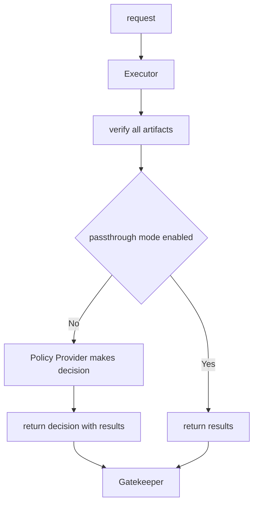
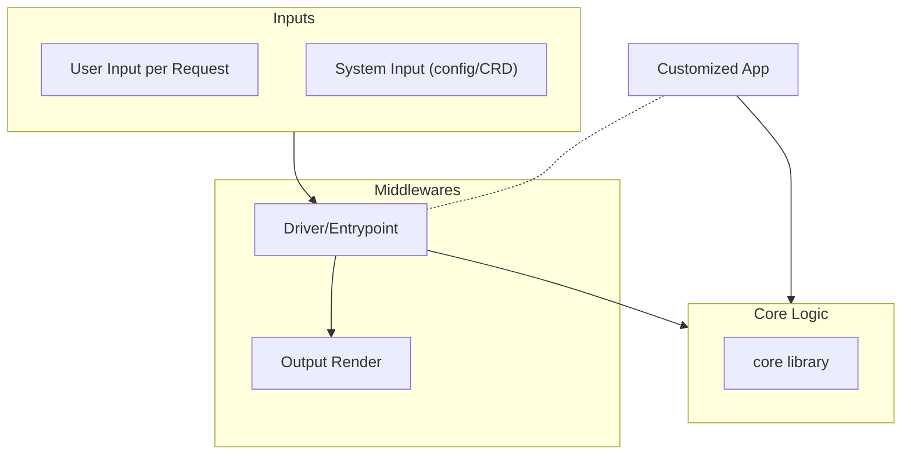

<a id="doc-12e0a48d6c5f2a58f4caa284"></a>

# ratify-project/ratify / ADOPTERS.md

Upstream: https://github.com/ratify-project/ratify/blob/44db7c05fa184303b2365ccee6f644f69422c745/ADOPTERS.md

Commit: `44db7c05fa184303b2365ccee6f644f69422c745`

Retrieved: 2026-10-01T15:27:24.397055+00:00

Kind: official-document

Raw SHA256: `7dd316ebb7f22060335e2ac0275471410cb8fbe3cbcfcbbb49adf8e45f799a72`

Source text below is untrusted reference content. Acquisition does not verify technical claims.

License status: UPSTREAM_NOTICES_CAPTURED_PER_FILE_REVIEW_REQUIRED. See this repository's captured license files.

---

The following organizations are known adopters who use Ratify in production or integrate Ratify into their products and services.

We are happy and proud to have you all as part of the Ratify community! To add your use case and organization to this list, please raise a pull request.

All organizations are sorted alphabetically below.

| Adopter name        | Adopter Type     |  Scenario                            |
|---------------------|------------------|-------------------------------------------|
| Alibaba Cloud | Service provider | [Alibaba Cloud Container Service for Kubernetes (ACK)](https://www.alibabacloud.com/help/en/ack/ack-managed-and-ack-dedicated/security-and-compliance/use-notation-and-ratify-to-sign-and-verify-oci-artifacts) uses Ratify to validate image signatures before deploying them to cluster. |
| Amazon    | Service provider | [AWS Signer](https://ratify.dev/docs/quickstarts/ratify-with-aws-signer) uses Ratify to verify signature |
| Microsoft    | Service Provider | [Image Integrity](https://learn.microsoft.com/en-us/azure/aks/image-integrity) is built on Ratify to enable users to validate image signature and supply chain attestations before deploying them to your Azure Kubernetes Service (AKS)  |
|  Venafi | Service Provider |  [CodeSign Protect](https://venafi.com/codesign-protect/) uses Ratify to help developers maintain visibility into enterprise code signing operations |


<a id="doc-9630329cb405d05b7b4d4072"></a>

# ratify-project/ratify / BREAKING_CHANGE_AND_DEPRECATION.md

Upstream: https://github.com/ratify-project/ratify/blob/44db7c05fa184303b2365ccee6f644f69422c745/BREAKING_CHANGE_AND_DEPRECATION.md

Commit: `44db7c05fa184303b2365ccee6f644f69422c745`

Retrieved: 2026-10-01T15:27:24.397055+00:00

Kind: official-document

Raw SHA256: `07348527fa9d40f800108ec07600e40075d05da7d7e24fbd6e8e536e43576f88`

Source text below is untrusted reference content. Acquisition does not verify technical claims.

License status: UPSTREAM_NOTICES_CAPTURED_PER_FILE_REVIEW_REQUIRED. See this repository's captured license files.

---

# Breaking changes and deprecations

Breaking changes are defined as a change to any of the following that causes installation errors or 
unexpected runtime behavior after upgrading to the next stable minor version of Ratify:
- Verification API
- Verification result and schema
- Default configuration value
- User facing plugin interfaces

## Stability levels
- Generally available features should not be removed from that version or have its behavior significantly changed to avoid breaking existing users.
- Beta or pre-release versions may introduce breaking changes without deprecation notice.
- Alpha or experimental API versions may change in runtime behaviour without prior change and deprecation notice.

The following features are currently in experimental:
- [Dynamic plugin](https://ratify.dev/docs/reference/dynamic-plugins)
- [High Availability](https://ratify.dev/docs/quickstarts/ratify-high-availability)

## Process for applying breaking changes
- A deprecation notice must be posted as part of a release.
- The PR containing the breaking changes should contain a "!" to indicate this is breaking change. E.g. feat! , fix!
- Breaking changes should be listed before new features in the release notes
- Create a issue to help customer to mitigate the change
 
## Deprecations
Deprecations can apply to:
 - CRDs
 - Experimental Features
 - Plugins
 - User facing Interfaces
 - Configuration Values
 - Cli Usage and Configuration
 - Verification Schema
 
## Process for deprecation

 - A deprecation notice must be posted as part of the release notes.
 - Documentation should mark the feature as deprecated and redirect user to the alternative implementation.

## Attribution

The specification release process was created using content and verbiage from the following specifications:
- [Kubernetes Deprecation Policy](https://kubernetes.io/docs/reference/using-api/deprecation-policy/)
- [Dapr reference](https://docs.dapr.io/operations/support/breaking-changes-and-deprecations/)


<a id="doc-ffdbe3a1e7ee93cacfc080b6"></a>

# ratify-project/ratify / CODE_OF_CONDUCT.md

Upstream: https://github.com/ratify-project/ratify/blob/44db7c05fa184303b2365ccee6f644f69422c745/CODE_OF_CONDUCT.md

Commit: `44db7c05fa184303b2365ccee6f644f69422c745`

Retrieved: 2026-10-01T15:27:24.397055+00:00

Kind: official-document

Raw SHA256: `c682c7ae4f679218a6166e929986d7f2ca534b172ed0b2d265aeca9b2b0c5b3b`

Source text below is untrusted reference content. Acquisition does not verify technical claims.

License status: UPSTREAM_NOTICES_CAPTURED_PER_FILE_REVIEW_REQUIRED. See this repository's captured license files.

---

# Code of Conduct

Ratify follows the [CNCF Code of Conduct](https://github.com/cncf/foundation/blob/master/code-of-conduct.md).


<a id="doc-eca12c0a30e25b4b46522ebf"></a>

# ratify-project/ratify / CONTRIBUTING.md

Upstream: https://github.com/ratify-project/ratify/blob/44db7c05fa184303b2365ccee6f644f69422c745/CONTRIBUTING.md

Commit: `44db7c05fa184303b2365ccee6f644f69422c745`

Retrieved: 2026-10-01T15:27:24.397055+00:00

Kind: official-document

Raw SHA256: `7f62a6d8c5f15326ada6c24903bc3fd85a2de5e0c1812cead68b17f07dfe85c0`

Source text below is untrusted reference content. Acquisition does not verify technical claims.

License status: UPSTREAM_NOTICES_CAPTURED_PER_FILE_REVIEW_REQUIRED. See this repository's captured license files.

---

# Contributing to Ratify

Welcome! We are very happy to accept community contributions to Ratify, whether those are [Pull Requests](#pull-requests), [Plugins](#plugins), [Feature Suggestions](#feature-suggestions) or [Bug Reports](#bug-reports)! Please note that by participating in this project, you agree to abide by the [Code of Conduct](./CODE_OF_CONDUCT.md), as well as the terms of the [CLA](#cla).

## Table of Contents
- [Getting Started](#getting-started)
- [Feature Areas](#feature-areas)
- [Feature Enhancements](#feature-enhancements)
- [Feature Suggestions](#feature-suggestions)
- [Bug Reports](#bug-reports)
- [Developing](#developing)
- [Pull Requests](#pull-requests)

## Getting Started

* If you don't already have it, you will need [go](https://golang.org/dl/) v1.16+ installed locally to build the project.
* You can work on Ratify using any platform using any editor, but you may find it quickest to get started using [VSCode](https://code.visualstudio.com/Download) with the [Go extension](https://marketplace.visualstudio.com/items?itemName=golang.Go).
* Fork this repo (see [this forking guide](https://guides.github.com/activities/forking/) for more information).
* Checkout the repo locally with `git clone git@github.com:{your_username}/ratify.git`.
* Build the Ratify CLI with `go build -o ./bin/ratify ./cmd/ratify` or if on Mac/Linux/WSL `make build-cli`.

## Feature Enhancements
For non-trivial enhancements or bug fixes, please start by raising a document PR. You can refer to the example [here](https://github.com/notaryproject/ratify/blame/dev/docs/proposals/Release-Supply-Chain-Metadata.md).
Major user experience updates should be documented in [/doc/proposals](https://github.com/notaryproject/ratify/tree/dev/docs/proposals). Changes to technical implementation should be added to [/doc/design](https://github.com/notaryproject/ratify/tree/dev/docs/design).  

Consider adding the following section where applicable:
- Proposed changes
- Proposed feature flag
- Impacted code paths
- Required test coverage
- Backward compatibility
- Performance impact
- Security consideration
- Open questions
  
This approach ensures that the changes are well-documented and reviewed before implementation.

## Pull Requests

If you'd like to start contributing to Ratify, you can search for issues tagged as "good first issue" [here](https://github.com/notaryproject/ratify/labels/good%20first%20issue).

We use the `dev` branch as our default branch. PRs passing the basic set of validation can be merged to the `dev` branch, we then run the full suite of validation including cloud-specific tests on `dev` before changes can be merged into `main`. All ratify releases are cut from the `main` branch. A sample PR process is outlined below:
1. Fork this repo and create your dev branch from the default `dev` branch.
2. Create a PR against the default branch.
3. Add new unit test and [e2e test](https://github.com/notaryproject/ratify/tree/dev/test/bats) where appropriate.
4. Maintainer approval and e2e test validation is required for completing the PR.
5. On PR complete, the `push` event will trigger an automated PR targeting the `main` branch where we run a full suite validation including cloud-specific tests.
6. Manual merge is required to complete the PR. (**Please keep individual commits to maintain commit history**)

If the PR contains a regression that could not pass the full validation, please revert the change to unblock others:
1. Create a new dev branch based off `dev`.
2. Open a revert PR against `dev`.
3. Follow the same process to get this PR gets merged into `dev`.
4. Work on the fix and follow the above PR process.

### Commit

You should follow [conventional commits](https://www.conventionalcommits.org/en/v1.0.0/) to write commit message. As the Ratify Project repositories enforce the [DCO (Developer Certificate of Origin)](https://github.com/apps/dco) on Pull Requests, contributors are required to sign off that they adhere to those requirements by adding a `Signed-off-by` line to the commit messages. Git has even provided a `-s` command line option to append that automatically to your commit messages, please use it when you commit your changes. 

The Ratify Project repositories require signed commits, please refer to [SSH commit signature verification](https://docs.github.com/en/authentication/managing-commit-signature-verification/about-commit-signature-verification#ssh-commit-signature-verification) on signing commits using SSH as it is easy to set up. You can find other methods to sign commits in the document [commit signature verification](https://docs.github.com/en/authentication/managing-commit-signature-verification/about-commit-signature-verification). Git has provided a `-S` flag to create a signed commit.

An example of `git commit` command:

```shell
git commit -s -S -m <commit_message>
```

## Developing

### Components

The Ratify project is composed of the following main components:

* **Ratify CLI** (`cmd/ratify`): the `ratify` CLI executable.
* **Config** (`config`): an example configuration file for `ratify`.
* **Deploy** (`deploy`): the deployment files for using ratify in a Kubernetes cluster.
* **Ratify Internals** (`pkg`): the internal modules containing the majority of the Ratify code.
* **Plugins** (`plugins`): the referrer store and verifier plugins for the Ratify Framework.

### Running the tests

* You can use the following command to run the full Ratify test suite:
  * `go test -v ./cmd/ratify` on Windows
  * `make test` on Mac/Linux/WSL

### Running the Ratify CLI

* Once built run Ratify from the bin directory `./bin/ratify` for a list of the available commands.
* For any command the `--help` argument can be passed for more information and a list of possible arguments.

### Debugging Ratify with VS Code

Ratify can run through cli command or run as a http server. Create a [launch.json](https://code.visualstudio.com/docs/editor/debugging#_launch-configurations) file in the .vscode directory, then hit F5 to debug. Note the first debug session may take a few minutes to load, subsequent session will be much faster.
A demo of VS Code debugging experience is available from ratify community meeting [recording](https://youtu.be/o5ufkZRDiIg?si=mzSw5XHPxBJmgq8i&t=2793) min 46:33. 

Here is a sample json for cli. Note that for the following sample json to successfully work, you need to make sure that `verificationCerts` attribute of the verifier in your config file points to the notation verifier's certificate file. In order to do that, you can download the cert file with the following command:
`curl -sSLO https://raw.githubusercontent.com/deislabs/ratify/main/test/testdata/notation.crt`, 
and then modify the config file by setting the `verificationCerts` attribute in the notation verifier to the downloaded cert file path.

```json
{
    "version": "0.2.0",
    "configurations": [{
      "name": "Debug Ratify cli ",
      "type": "go",
      "request": "launch",
      "mode": "debug",
      "program": "${workspaceFolder}/cmd/ratify",
      "args": [
                "verify", 
                "-s", "ghcr.io/deislabs/ratify/notary-image:signed", 
                "-c", "${workspaceFolder}/test/bats/tests/config/config_cli.json"
      ]
    }]
}
```

Sample launch json for http server:

```json
{
    "version": "0.2.0",
    "configurations": [{
      "name": "Debug Ratify ",
      "type": "go",
      "request": "launch",
      "mode": "debug",
      "program": "${workspaceFolder}/cmd/ratify",
      "args": ["serve", "--http", ":6001", "-c", "/home/azureuser/.ratify/config.json"]
    }]
}
```

Sample curl request to invoke Ratify endpoint:

```bash
curl -X POST http://127.0.0.1:6001/ratify/gatekeeper/v1/verify -H "Content-Type: application/json" -d '{"apiVersion":"externaldata.gatekeeper.sh/v1alpha1","kind":"ProviderRequest","request":{"keys":["localhost:5000/net-monitor:v1"]}}'
```

#### Debug external plugins

External plugin processes must be attached in a separate debug session. Certain environment variables and `stdin` must be configured

Sample launch json for debugging a plugin:
```json
{
  "version": "0.2.0",
  "configurations": [{
    "name": "Debug SBOM Plugin",
    "type": "go",
    "request": "launch",
    "mode": "auto",
    "program": "${workspaceFolder}/plugins/verifier/sbom",
    "env": {
      "RATIFY_EXPERIMENTAL_DYNAMIC_PLUGINS": "1",
      "RATIFY_LOG_LEVEL": "debug",
      "RATIFY_VERIFIER_COMMAND": "VERIFY",
      "RATIFY_VERIFIER_SUBJECT": "wabbitnetworks.azurecr.io/test/image:sbom",
      "RATIFY_VERIFIER_VERSION": "1.0.0",
    },
    "console": "integratedTerminal"
  }]
}
```
Once session has started, paste the `json` formatted input config into the integrate terminal prompt.
Note: You can extract the exact JSON for the image/config you are testing with Ratify by starting a regular Ratify debug session. Inspect the `stdinData` parameter of the `ExecutePlugin` function [here](pkg/common/plugin/exec.go)

Sample JSON stdin 
```json
{
  "config": {
    "artifactTypes":"application/spdx+json",
    "name":"sbom",
    "disallowedLicenses":["AGPL"],
    "disallowedPackages":[{"name":"log4j-core","versionInfo":"2.13.0"}]
  },
  "storeConfig": {
    "version":"1.0.0",
    "pluginBinDirs":null,
    "store": {
      "name":"oras",
      "useHttp":true
    }
  },
  "referenceDesc": {
    "mediaType":"application/vnd.oci.image.manifest.v1+json",
    "digest":"sha256:...",
    "size":558,
    "artifactType":"application/spdx+json"
  }
}
```

Press `Ctrl+D` to send EOF character to terminate the stdin input. (Note: you may have to press `Ctrl+D` twice)

View more plugin debugging information [here](https://github.com/notaryproject/ratify-verifier-plugin#debugging-in-vs-code)

### Test local changes in the k8s cluster scenario

There are some changes that should be validated in a cluster scenario.
Follow the steps below to build and deploy a Ratify image with your private changes:

#### build an image with your local changes

```bash
export REGISTRY=yourregistry
docker buildx create --use

docker buildx build -f httpserver/Dockerfile --platform linux/amd64 --build-arg build_sbom=true --build-arg build_licensechecker=true --build-arg build_schemavalidator=true --build-arg build_vulnerabilityreport=true -t ${REGISTRY}/ratify-project/ratify:yourtag .
docker build --progress=plain --build-arg KUBE_VERSION="1.30.6" --build-arg TARGETOS="linux" --build-arg TARGETARCH="amd64" -f crd.Dockerfile -t ${REGISTRY}/localbuildcrd:yourtag ./charts/ratify/crds
```

#### [Authenticate](https://docs.docker.com/engine/reference/commandline/login/#usage) with your registry,  and push the newly built image

```bash
docker push ${REGISTRY}/ratify-project/ratify:yourtag
docker push ${REGISTRY}/localbuildcrd:yourtag
```

#### Update dev.helmfile.yaml
Replace Ratify `chart` and `version` with local values:
```yaml
...
chart: chart/ratify
version: <INSERT VERSION> # ATTENTION: Needs to match latest in Chart.yaml
...
```
Replace `repository`, `crdRepository`, and `tag` with previously built images:
```yaml
- name: image.repository 
  value: <YOUR RATIFY IMAGE REPOSITORY NAME>
- name: image.crdRepository
  value: <YOUR RATIFY CRD IMAGE REPOSITORY NAME>
- name: image.tag
  value: <YOUR IMAGES TAG NAME>
```

### Deploy using Dev Helmfile

Development charts + images are published weekly and latest versions are tagged with rolling tags referenced in dev helmfile.

Deploy to cluster:
```bash
helmfile sync -f git::https://github.com/notaryproject/ratify.git@dev.helmfile.yaml
```

### Deploy from local helm chart

#### Update [values.yaml](https://github.com/notaryproject/ratify/blob/main/charts/ratify/values.yaml) to pull from your registry, when reusing image tag, setting pull policy to "Always" ensures we are pull the new changes

```json
image:
  repository: yourregistry/ratify-project/ratify
  tag: yourtag
  pullPolicy: Always
```

Deploy using one of the following deployments.
Note: Ratify is compatible with Gatekeeper supported versions. Server auth is required to be enabled.

**Option 1**
Client auth disabled and server auth enabled using self signed certificate

```bash
helm install ratify ./charts/ratify --atomic
```

**Option 2**
Client auth disabled and server auth enabled using your own certificate

Deploy using a certificate

```bash
helm install ratify ./charts/ratify \
    --set provider.tls.cabundle="$(cat certs/ca.crt | base64 | tr -d '\n\r')" \
    --set provider.tls.key="$(cat certs/tls.key)" \
    --set provider.tls.crt="$(cat certs/tls.crt)" \
    --atomic
```

**Option 3**
Client / Server auth enabled (mTLS)  

>Note: Ratify and Gatekeeper must be installed in the same namespace which allows Ratify access to Gatekeepers CA certificate. The Ratify certificate must have a CN and subjectAltName name which matches the namespace of Gatekeeper and Ratify. For example, if installed to the namespace 'gatekeeper-system', the CN and subjectAltName should be 'ratify.gatekeeper-system'*

```bash
helm install ratify ./charts/ratify \
    --namespace gatekeeper-system \
    --set provider.tls.cabundle="$(cat certs/ca.crt | base64 | tr -d '\n\r')" \
    --set provider.tls.key="$(cat certs/tls.key)" \
    --set provider.tls.crt="$(cat certs/tls.crt)" \
    --atomic
```

### Test/debug local changes in k8s cluster using Bridge to Kubernetes

Bridge to Kubernetes is an [open source project](https://github.com/Azure/Bridge-To-Kubernetes) to enable local tunneling of a kubernetes service to a user's development environment. It operates by forwarding all requests going to a specified service to the configured local instance running. This guide will focus on VSCode with the Bridge to Kubernetes extension.

Prerequisites:
- Install [Kubernetes Toosl](https://marketplace.visualstudio.com/items?itemName=ms-kubernetes-tools.vscode-kubernetes-tools) plugin for VSCode
- Install [Bridge to Kubernetes](https://marketplace.visualstudio.com/items?itemName=mindaro.mindaro) plugin for VSCode
- Connect to K8s cluster
- Namespace context set to Ratify's installation namespace (default is `gatekeeper-system`)

Gatekeeper requires TLS for external data provider interactions. As such ratify must run with TLS cert and key configured on server startup. The current helm chart will automatically generate the cabundle, cert, and key if none are manually specified. For ease of use in starting the local ratify server on our development environment, we should pre generate the TLS ca bundle, cert, and key and instead provide them during helm installation. 

1. Generate TLS cabundle, cert, and key. By default this will place the tls/cert folder in the $WORKSPACE_DIRECTORY
    ```
    make generate-certs
    ```
1. Rename files server.crt and server.key to tls.crt and tls.key
1. Updated helm install command
    ```
    helm install ratify \
      ./charts/ratify --atomic \
      --namespace gatekeeper-system \
      --set logger.level=debug \
      --set-file notationCerts[0]=./test/testdata/notation.crt \
      --set-file provider.tls.crt=./tls/certs/tls.crt \
      --set-file provider.tls.key=./tls/certs/tls.key \
      --set provider.tls.cabundle="$(cat ./tls/certs/ca.crt | base64 | tr -d '\n\r')" \
      --set-file provider.tls.caCert=./tls/certs/ca.crt \
      --set-file provider.tls.caKey=./tls/certs/ca.key
    ```
Update the `KubernetesLocalProcessConfig.yaml` with updated directory/file paths:
- In the file, set the `<INSERT WORKLOAD IDENTITY TOKEN LOCAL PATH>` to an absolute directory accessible on local environment. This is the directory where Bridge to K8s will download the Azure Workload Identity JWT token. 
- In the file, set the `<INSERT CLIENT CA CERT LOCAL PATH>` to an absolute directory accessible on local environment. This is the directory where Bridge to K8s will download the `client-ca-cert` volume (Gatekeeper's `ca.crt`). 

Configure Bridge to Kubernetes (Comprehensive guide [here](https://learn.microsoft.com/en-us/visualstudio/bridge/bridge-to-kubernetes-vs-code))
1. Open the `Command Palette` in VSCode `CTRL-SHIFT-P`
2. Select `Bridge to Kubernetes: Configure`
3. Select `Ratify` from the list as the service to redirect to
4. Set port to be 6001
5. Select `Serve w/ CRD manager and TLS enabled` as the launch config
6. Select 'No' for request isolation

This should automatically append a new Bridge to Kubernetes configuration to the launch.json file and add a new tasks.json file. 

NOTE: If you are using a remote development environment, set the `useKubernetesServiceEnvironmentVariables` field to `true` in the tasks.json file. 

Start the debug session with the generated Bridge to Kubernetes launch config selected. This will start up the local Ratify server and forward all requests from the Ratify service to the local instance. The http server logs in the debug console will show new requests being processed locally.

## Feature Areas
### Plugins

If you'd like to contribute to the collection of plugins:

#### Referrer Store

* A referrer store should implement the `ReferrerStore` interface (`pkg/referrerstore/api.go`).
* This should provide a mechanism to list referrers, and retrieve manifests and blob content.
* A sample referrer store is provided at `plugins/reffererstore/sample/sample.go`.

#### Verifier

* A verifier should implement the `ReferenceVerifier` interface (`pkg/verifier/api.go`).
* This should provide a mechanism to perform verification against blobs and manifests from a referrer store.
* A sample verifier is provided at `plugins/verifier/sample/sample.go`.

## Feature Suggestions

* Please first search [Open Ratify Issues](https://github.com/notaryproject/ratify/issues) before opening an issue to check whether your feature has already been suggested. If it has, feel free to add your own comments to the existing issue.
* Ensure you have included a "What?" - what your feature entails, being as specific as possible, and giving mocked-up syntax examples where possible.
* Ensure you have included a "Why?" - what the benefit of including this feature will be.

## Bug Reports

* Please first search [Open Ratify Issues](https://github.com/notaryproject/ratify/issues) before opening an issue, to see if it has already been reported.
* Try to be as specific as possible, including the version of the Ratify CLI used to reproduce the issue, and any example arguments needed to reproduce it.


<a id="doc-c693279643b8cd5d248172d9"></a>

# ratify-project/ratify / LICENSE

Upstream: https://github.com/ratify-project/ratify/blob/44db7c05fa184303b2365ccee6f644f69422c745/LICENSE

Commit: `44db7c05fa184303b2365ccee6f644f69422c745`

Retrieved: 2026-10-01T15:27:24.397055+00:00

Kind: license

Raw SHA256: `6ce952915f51d5808d29deec989c5f227331a8d15855c92464fde4e621fe1992`

Source text below is untrusted reference content. Acquisition does not verify technical claims.

License status: UPSTREAM_NOTICES_CAPTURED_PER_FILE_REVIEW_REQUIRED. See this repository's captured license files.

---

````text
                                 Apache License
                           Version 2.0, January 2004
                        http://www.apache.org/licenses/

   TERMS AND CONDITIONS FOR USE, REPRODUCTION, AND DISTRIBUTION

   1. Definitions.

      "License" shall mean the terms and conditions for use, reproduction,
      and distribution as defined by Sections 1 through 9 of this document.

      "Licensor" shall mean the copyright owner or entity authorized by
      the copyright owner that is granting the License.

      "Legal Entity" shall mean the union of the acting entity and all
      other entities that control, are controlled by, or are under common
      control with that entity. For the purposes of this definition,
      "control" means (i) the power, direct or indirect, to cause the
      direction or management of such entity, whether by contract or
      otherwise, or (ii) ownership of fifty percent (50%) or more of the
      outstanding shares, or (iii) beneficial ownership of such entity.

      "You" (or "Your") shall mean an individual or Legal Entity
      exercising permissions granted by this License.

      "Source" form shall mean the preferred form for making modifications,
      including but not limited to software source code, documentation
      source, and configuration files.

      "Object" form shall mean any form resulting from mechanical
      transformation or translation of a Source form, including but
      not limited to compiled object code, generated documentation,
      and conversions to other media types.

      "Work" shall mean the work of authorship, whether in Source or
      Object form, made available under the License, as indicated by a
      copyright notice that is included in or attached to the work
      (an example is provided in the Appendix below).

      "Derivative Works" shall mean any work, whether in Source or Object
      form, that is based on (or derived from) the Work and for which the
      editorial revisions, annotations, elaborations, or other modifications
      represent, as a whole, an original work of authorship. For the purposes
      of this License, Derivative Works shall not include works that remain
      separable from, or merely link (or bind by name) to the interfaces of,
      the Work and Derivative Works thereof.

      "Contribution" shall mean any work of authorship, including
      the original version of the Work and any modifications or additions
      to that Work or Derivative Works thereof, that is intentionally
      submitted to Licensor for inclusion in the Work by the copyright owner
      or by an individual or Legal Entity authorized to submit on behalf of
      the copyright owner. For the purposes of this definition, "submitted"
      means any form of electronic, verbal, or written communication sent
      to the Licensor or its representatives, including but not limited to
      communication on electronic mailing lists, source code control systems,
      and issue tracking systems that are managed by, or on behalf of, the
      Licensor for the purpose of discussing and improving the Work, but
      excluding communication that is conspicuously marked or otherwise
      designated in writing by the copyright owner as "Not a Contribution."

      "Contributor" shall mean Licensor and any individual or Legal Entity
      on behalf of whom a Contribution has been received by Licensor and
      subsequently incorporated within the Work.

   2. Grant of Copyright License. Subject to the terms and conditions of
      this License, each Contributor hereby grants to You a perpetual,
      worldwide, non-exclusive, no-charge, royalty-free, irrevocable
      copyright license to reproduce, prepare Derivative Works of,
      publicly display, publicly perform, sublicense, and distribute the
      Work and such Derivative Works in Source or Object form.

   3. Grant of Patent License. Subject to the terms and conditions of
      this License, each Contributor hereby grants to You a perpetual,
      worldwide, non-exclusive, no-charge, royalty-free, irrevocable
      (except as stated in this section) patent license to make, have made,
      use, offer to sell, sell, import, and otherwise transfer the Work,
      where such license applies only to those patent claims licensable
      by such Contributor that are necessarily infringed by their
      Contribution(s) alone or by combination of their Contribution(s)
      with the Work to which such Contribution(s) was submitted. If You
      institute patent litigation against any entity (including a
      cross-claim or counterclaim in a lawsuit) alleging that the Work
      or a Contribution incorporated within the Work constitutes direct
      or contributory patent infringement, then any patent licenses
      granted to You under this License for that Work shall terminate
      as of the date such litigation is filed.

   4. Redistribution. You may reproduce and distribute copies of the
      Work or Derivative Works thereof in any medium, with or without
      modifications, and in Source or Object form, provided that You
      meet the following conditions:

      (a) You must give any other recipients of the Work or
          Derivative Works a copy of this License; and

      (b) You must cause any modified files to carry prominent notices
          stating that You changed the files; and

      (c) You must retain, in the Source form of any Derivative Works
          that You distribute, all copyright, patent, trademark, and
          attribution notices from the Source form of the Work,
          excluding those notices that do not pertain to any part of
          the Derivative Works; and

      (d) If the Work includes a "NOTICE" text file as part of its
          distribution, then any Derivative Works that You distribute must
          include a readable copy of the attribution notices contained
          within such NOTICE file, excluding those notices that do not
          pertain to any part of the Derivative Works, in at least one
          of the following places: within a NOTICE text file distributed
          as part of the Derivative Works; within the Source form or
          documentation, if provided along with the Derivative Works; or,
          within a display generated by the Derivative Works, if and
          wherever such third-party notices normally appear. The contents
          of the NOTICE file are for informational purposes only and
          do not modify the License. You may add Your own attribution
          notices within Derivative Works that You distribute, alongside
          or as an addendum to the NOTICE text from the Work, provided
          that such additional attribution notices cannot be construed
          as modifying the License.

      You may add Your own copyright statement to Your modifications and
      may provide additional or different license terms and conditions
      for use, reproduction, or distribution of Your modifications, or
      for any such Derivative Works as a whole, provided Your use,
      reproduction, and distribution of the Work otherwise complies with
      the conditions stated in this License.

   5. Submission of Contributions. Unless You explicitly state otherwise,
      any Contribution intentionally submitted for inclusion in the Work
      by You to the Licensor shall be under the terms and conditions of
      this License, without any additional terms or conditions.
      Notwithstanding the above, nothing herein shall supersede or modify
      the terms of any separate license agreement you may have executed
      with Licensor regarding such Contributions.

   6. Trademarks. This License does not grant permission to use the trade
      names, trademarks, service marks, or product names of the Licensor,
      except as required for reasonable and customary use in describing the
      origin of the Work and reproducing the content of the NOTICE file.

   7. Disclaimer of Warranty. Unless required by applicable law or
      agreed to in writing, Licensor provides the Work (and each
      Contributor provides its Contributions) on an "AS IS" BASIS,
      WITHOUT WARRANTIES OR CONDITIONS OF ANY KIND, either express or
      implied, including, without limitation, any warranties or conditions
      of TITLE, NON-INFRINGEMENT, MERCHANTABILITY, or FITNESS FOR A
      PARTICULAR PURPOSE. You are solely responsible for determining the
      appropriateness of using or redistributing the Work and assume any
      risks associated with Your exercise of permissions under this License.

   8. Limitation of Liability. In no event and under no legal theory,
      whether in tort (including negligence), contract, or otherwise,
      unless required by applicable law (such as deliberate and grossly
      negligent acts) or agreed to in writing, shall any Contributor be
      liable to You for damages, including any direct, indirect, special,
      incidental, or consequential damages of any character arising as a
      result of this License or out of the use or inability to use the
      Work (including but not limited to damages for loss of goodwill,
      work stoppage, computer failure or malfunction, or any and all
      other commercial damages or losses), even if such Contributor
      has been advised of the possibility of such damages.

   9. Accepting Warranty or Additional Liability. While redistributing
      the Work or Derivative Works thereof, You may choose to offer,
      and charge a fee for, acceptance of support, warranty, indemnity,
      or other liability obligations and/or rights consistent with this
      License. However, in accepting such obligations, You may act only
      on Your own behalf and on Your sole responsibility, not on behalf
      of any other Contributor, and only if You agree to indemnify,
      defend, and hold each Contributor harmless for any liability
      incurred by, or claims asserted against, such Contributor by reason
      of your accepting any such warranty or additional liability.

   END OF TERMS AND CONDITIONS

   APPENDIX: How to apply the Apache License to your work.

      To apply the Apache License to your work, attach the following
      boilerplate notice, with the fields enclosed by brackets "[]"
      replaced with your own identifying information. (Don't include
      the brackets!)  The text should be enclosed in the appropriate
      comment syntax for the file format. We also recommend that a
      file or class name and description of purpose be included on the
      same "printed page" as the copyright notice for easier
      identification within third-party archives.

   Copyright 2021 Ratify Authors.

   Licensed under the Apache License, Version 2.0 (the "License");
   you may not use this file except in compliance with the License.
   You may obtain a copy of the License at

       http://www.apache.org/licenses/LICENSE-2.0

   Unless required by applicable law or agreed to in writing, software
   distributed under the License is distributed on an "AS IS" BASIS,
   WITHOUT WARRANTIES OR CONDITIONS OF ANY KIND, either express or implied.
   See the License for the specific language governing permissions and
   limitations under the License.

````


<a id="doc-dfb14fbb9e7d095209ec4cfd"></a>

# ratify-project/ratify / NOTICE

Upstream: https://github.com/ratify-project/ratify/blob/44db7c05fa184303b2365ccee6f644f69422c745/NOTICE

Commit: `44db7c05fa184303b2365ccee6f644f69422c745`

Retrieved: 2026-10-01T15:27:24.397055+00:00

Kind: license

Raw SHA256: `2d8a57fb8f61e62e6899bec7c5d578c05b8895ab51da21991b2aba0dbea869ba`

Source text below is untrusted reference content. Acquisition does not verify technical claims.

License status: UPSTREAM_NOTICES_CAPTURED_PER_FILE_REVIEW_REQUIRED. See this repository's captured license files.

---

````text
NOTICES

This repository incorporates material as listed below or described in the code.

The initial concepts and development of some of the framework's plugin common modules under pkg/common/plugin are derived from, or
inspired by the project Container Network Interface - networking for Linux containers (https://github.com/containernetworking/cni).
It is licensed under the Apache License, Version 2.0.

The loading of framework's configuration from a home directory is derived from or inspired by the project Docker CLI (https://github.com/docker/cli)
It is licensed under the Apache License, Version 2.0.

We thank everyone who has contributed to the above projects and enabled this project to build on those concepts and models.
````


<a id="doc-b335630551682c19a781afeb"></a>

# ratify-project/ratify / README.md

Upstream: https://github.com/ratify-project/ratify/blob/44db7c05fa184303b2365ccee6f644f69422c745/README.md

Commit: `44db7c05fa184303b2365ccee6f644f69422c745`

Retrieved: 2026-10-01T15:27:24.397055+00:00

Kind: official-document

Raw SHA256: `e751988830fcf978f8ad5623b6126d8717c047f702ea13e2150e0b64efef25c5`

Source text below is untrusted reference content. Acquisition does not verify technical claims.

License status: UPSTREAM_NOTICES_CAPTURED_PER_FILE_REVIEW_REQUIRED. See this repository's captured license files.

---

<div align="center">

</div>

# Ratify

Is a verification engine as a binary executable and on Kubernetes which enables verification of artifact security metadata and admits for deployment only those that comply with policies you create.

[](https://goreportcard.com/report/github.com/notaryproject/ratify)
[](https://github.com/notaryproject/ratify/actions/workflows/build-pr.yml)
[](https://api.securityscorecards.dev/projects/github.com/notaryproject/ratify)
[](https://www.bestpractices.dev/projects/9334)
[](https://pkg.go.dev/github.com/notaryproject/ratify)
[](https://codecov.io/gh/notaryproject/ratify)


## ⚠️ Development Notice: Main Branch Under Active v2 Development

> [!IMPORTANT]
> The `main` branch is currently under **active development for Ratify v2**.

> [!CAUTION]
> During this period, it may be **unstable or broken**.

If you are:
- Contributing new features
- Fixing bugs
- Building against a v1 version of Ratify

Please use the [`v1-dev` branch](https://github.com/notaryproject/ratify/tree/v1-dev).

We appreciate your patience as we work toward a more powerful and flexible Ratify v2! 🚀
Stay tuned for updates and migration guides.

## Table of Contents

- [Ratify](#ratify)
  - [Table of Contents](#table-of-contents)
  - [Quick Start](#quick-start)
  - [Community meetings](#community-meetings)
  - [Pull Request Review Series](#pull-request-review-series)
  - [Documents](#documents)
  - [Code of Conduct](#code-of-conduct)
  - [Project Governance](#project-governance)
  - [Release Management](#release-management)
  - [Licensing](#licensing)

## Quick Start

Please see [Ratify website](https://ratify.dev/docs/quick-start) for a quick start demo.

## Community meetings

Add the schedule to your calendar via the link https://zoom-lfx.platform.linuxfoundation.org/meetings/ratify?view=week.

- Agenda: <https://hackmd.io/ABueHjizRz2iFQpWnQrnNA>
- First series: the 2nd Wednesday of each month at 11:00 PM UTC
- Second series: the 4th Thursday of each month at 01:30 AM UTC
- We meet regularly to discuss and prioritize issues. The meeting may get cancelled due to holidays, all cancellation will be posted to meeting notes prior to the meeting.
- Reach out on Slack at [cloud-native.slack.com#ratify](https://cloud-native.slack.com/archives/C03T3PEKVA9). If you're not already a member of cloud-native slack channel, first add [yourself here](https://communityinviter.com/apps/cloud-native/cncf).

## Documents

Please see the [Ratify website](https://ratify.dev/docs/what-is-ratify) for more in-depth information.

Meeting notes for weekly project syncs can be found [here](https://hackmd.io/ABueHjizRz2iFQpWnQrnNA?both).

The Ratify community documents can be found in the repository [`.github`](https://github.com/notaryproject/.github).

## Code of Conduct

Ratify follows the [CNCF Code of Conduct](https://github.com/cncf/foundation/blob/master/code-of-conduct.md).

## Project Governance

The Ratify project governance can be found [here](https://github.com/notaryproject/.github/blob/main/GOVERNANCE.md).

## Release Management

The Ratify release process is defined in [RELEASES.md](./RELEASES.md).

## Licensing

This project is released under the [Apache-2.0 License](./LICENSE).

<hr>
<div align="center">
    
    <p>Ratify is a <a href="https://cncf.io">Cloud Native Computing Foundation</a> Sandbox project.</p>
</div>


<a id="doc-4a00447b47c36ebd3ded7732"></a>

# ratify-project/ratify / RELEASES.md

Upstream: https://github.com/ratify-project/ratify/blob/44db7c05fa184303b2365ccee6f644f69422c745/RELEASES.md

Commit: `44db7c05fa184303b2365ccee6f644f69422c745`

Retrieved: 2026-10-01T15:27:24.397055+00:00

Kind: official-document

Raw SHA256: `154c0a9efe6e38fcd1eaa773a929cd6107e89b05ffd9396cc278d0d1fe19139c`

Source text below is untrusted reference content. Acquisition does not verify technical claims.

License status: UPSTREAM_NOTICES_CAPTURED_PER_FILE_REVIEW_REQUIRED. See this repository's captured license files.

---

# Ratify Release Process

This document describes the versioning scheme and release processes for Ratify.

## Attribution

The specification release process was created using content and verbiage from the following specifications:

* [ORAS Artifact Specification Releases](https://github.com/oras-project/artifacts-spec/blob/main/RELEASES.md)
* [ORAS Developer Guide](https://github.com/oras-project/oras-www/blob/main/docs/CLI/5_developer_guide.md)
* [Mystikos Release Management](https://github.com/deislabs/mystikos/blob/main/doc/releasing.md)
* [Gatekeeper Release Management](https://github.com/open-policy-agent/gatekeeper/blob/8f5201f0f48d50cc14153d100172689f03aa5f39/docs/Release_Management.md)

## Versioning

The Ratify project follows [semantic versioning](https://semver.org/) beginning with version `v0.1.0`.  Pre-release versions may be specified with a dash after the patch version and the following specifiers (in the order of release readiness):

* `alpha1`, `alpha2`, etc.
* `beta1`, `beta2`, etc.
* `rc1`, `rc2`, `rc3`, etc.

Example pre-release versions include `v0.1.0-alpha1`, `v0.1.0-beta2`, `v0.1.0-rc3`.  Pre-release versions are not required and stages can be bypassed (i.e. an `alpha` release does not require a `beta` release).  Pre-releases must be in order and gaps are not allowed (i.e. the only releases that can follow `rc1` are the full release or `rc2`).

## Pre Release Activity

1. Most e2e-scenarios for cli, K8s, and Azure are covered by the Ratify e2e tests. Please refer to this [document](test/validation.md) for the current supported and unsupported tests. Please perform manual prerelease validations for the unsupported tests list [here](test/validation.md#unsupported-tests)

2. If the format of the data returned for [external data calls](docs/reference/verification-result-version.md) has changed, validate change is also reflected in [`httpserver/types.go`](httpserver/types.go).

3. Delete all dev images generated since the previous release under the `ratify-dev` and `ratify-crds-dev` [packages](https://github.com/orgs/ratify-project/packages?repo_name=ratify). Each dev image tag is prefixed with `dev` followed by the date of creation and then the abbreviated 7 character commit SHA (e.g a build generated on March 8, 2023 from main branch with commit SHA `4cf98388ef33c587ef86b82e05cb0f7de2da2ea8` would be tagged `dev.20230308.4cf9838`). The most recent images are also tagged with a rolling tag `latest`.

4. Delete all dev helm charts since the previous release under the `ratify-chart-dev/ratify` [packages](https://github.com/orgs/ratify-project/packages?repo_name=ratify). Each helm chart is published with a semantic version compatible tag `0-dev` followed by the date of creation and then the abbreviated 7 character commit SHA (e.g a chart generated on March 8, 2023 from main branch with commit SHA `4cf98388ef33c587ef86b82e05cb0f7de2da2ea8` would be tagged `0-dev.20230308.4cf9838`). The most recent dev chart is also tagged with the rolling tag `0-dev`.

5. Copy contents from [`dev.helmfile.yaml`](dev.helmfile.yaml) to [`helmfile.yaml`](helmfile.yaml) & [`dev.high-availability.helmfile.yaml`](dev.high-availability.helmfile.yaml) to [`high-availability.helmfile.yaml`](high-availability.helmfile.yaml). You MUST update/remove values marked by comments in the files. The `dev` prefixed helmfiles are treated as staging files that are up to date with new changes on main branch. The primary `helmfile.yaml` and `high-availability.helmfile.yaml` MUST stay pinned to the current release since they are used by the quickstarts. Update `dev.helmfile.yaml` & `dev.high-availability.helmfile.yaml` ratify chart version to new release version.

## Git Release Flow

This section deals with the practical considerations of versioning in Git, this repo's version control system.  See the semantic versioning specification for the scope of changes allowed for each release type.

All releases will be of the form _vX.Y.Z_ where X is the major version, Y is the minor version and Z is the patch version.

### Patch releases

Applicable fixes, including security fixes, may be backported to supported releases, depending on severity and feasibility. Patch release are cut from branch `release-X.Y`. Commits can be cherry-picked from `main`, changes should be merged into latest supported minor release-X.Y branches once required PR requirements are met.

### Minor releases

When a minor release is required, the release commits should be merged with the `main` branch when ready.

* Alpha and Beta releases will be cut from the main branch.
* For RC and stable releases, a new branch `release-X.Y` will be created from `main`.
* Required changes for the minor release should be PRed to the `dev` branch, the change will then be cherry picked to `release-X.Y` from `main`.

### Major releases

When a major release is required, the release commits should be merged with the `main` branch when ready.  Major versions will usually require multiple pre-release versions. Similar to minor releases, the new branch should be created for the RC and stable release.

### Tag and Release

**X.Y.Z** refers to the version (git tag) of Ratify that is released.

1. Prepare the release with a [PR](https://github.com/ratify-project/ratify/pull/1801/files) to update the chart value.
2. When the `release-X.Y` branch is ready, a tag **X.Y.Z** should be pushed. e.g. `git tag v1.1.1` and `git push --tags`. This will trigger a [Goreleaser](https://goreleaser.com/) action that will build the binaries and creates a [GitHub release](https://help.github.com/articles/creating-releases/):

* The release will be marked as a draft to allow an final editing before publishing.
* The release notes and other fields can edited after the action completes.  The description can be in Markdown.
* The pre-release flag will be set for any release with a pre-release specifier.
* The pre-built binaries are built from commit at the head of the release branch.
  * The files are named `ratify_<major>-<minor>-<patch>_<OS>_<ARCH>` with `.zip` files for Windows and `.tar.gz` for all others.

## Supported Releases

Applicable fixes, including security fixes, may be cherry-picked into the release branch, depending on severity and feasibility. Patch releases are cut from that branch as needed.

We expect to "support" n (current). "Support" means we expect users to be running that version in production. For example, when v1.2 comes out, v1.1 will no longer be supported for patches, and we encourage users to upgrade to a supported version as soon as possible.

## Supported Kubernetes and Gatekeeper Versions

Ratify is assumed to be compatible with [GateKeeper Supported Versions](https://github.com/open-policy-agent/gatekeeper/blob/master/docs/Release_Management.md#supported-releases) and the [current Kubernetes Supported Versions](https://kubernetes.io/releases/patch-releases/#detailed-release-history-for-active-branches) per [Kubernetes Supported Versions policy](https://kubernetes.io/releases/version-skew-policy/).

For example, if Gatekeeper _supported_ versions are v3.13 and v3.14, and Kubernetes _supported_ versions are v1.28, v1.29, then current version of Ratify (v1.2) are assumed to be compatible with all supported Kubernetes versions (v1.28, v1.29) and Gatekeeper version(v3.13, v3.14).

## Post Release Activity

After a successful release, please prepare a [PR](https://github.com/ratify-project/ratify/pull/1805/files) to update the chart value in `dev` branch. After PR gets merged, manually trigger [quick start action](.github/quick-start.yml) to validate the quick start test is passing. Validate in the run logs that the version of ratify matches the latest released version.

### Weekly Dev Release

#### Publishing Guidelines

* Ratify is configured to generate and publish dev build images based on the schedule [here](https://github.com/ratify-project/ratify/blob/main/.github/workflows/publish-package.yml#L8).
* Contributors MUST select the `Helm Chart Change` option under the `Type of Change` section if there is ANY update to the helm chart that is required for proposed changes in PR.
* Maintainers MUST manually trigger the "Publish Package" workflow after merging any PR that indicates `Helm Chart Change`
  * Go to the `Actions` tab for the Ratify repository
  * Select `publish-dev-assets` option from list of workflows on left pane
  * Select the `Run workflow` drop down on the right side above the list of action runs
  * Choose `Branch: dev`
  * Select `Run workflow`
* Process to Request an off-schedule dev build be published
  * Submit a new feature request issue prefixed with `[Dev Build Request]`
  * In the the `What would you like to be added?` section, briefly explain why an off schedule build is needed
  * Once issue is created, post in the `#ratify` slack channel and tag the maintainers
  * Maintainers should acknowledge request by approving/denying request as a follow up comment

#### How to use a dev build

1. The `ratify` image and `ratify-crds` image for dev builds exist as separate packages on Github [here](https://github.com/ratify-project/ratify/pkgs/container/ratify-dev) and [here](https://github.com/ratify-project/ratify/pkgs/container/ratify-crds-dev).
2. the `repository` `crdRepository` and `tag` fields must be updated in the helm chart to point to dev build instead of last released build. Please set the tag to be latest tag found at the corresponding `-dev` suffixed package. An example install command scaffold:

```bash
helm install ratify \
    ./charts/ratify --atomic \
    --namespace gatekeeper-system \
    --set image.repository=ghcr.io/ratify-project/ratify-dev
    --set image.crdRepository=ghcr.io/ratify-project/ratify-crds-dev
    --set image.tag=dev.<YYYYMMDD>.<ABBREVIATED_GIT_HASH_COMMIT>
    --set-file notationCerts[0]=./test/testdata/notation.crt
```

NOTE: the tag field is the only value that will change when updating to newer dev build images


<a id="doc-6ede816b9072cf1712936bac"></a>

# ratify-project/ratify / REVIEWING.md

Upstream: https://github.com/ratify-project/ratify/blob/44db7c05fa184303b2365ccee6f644f69422c745/REVIEWING.md

Commit: `44db7c05fa184303b2365ccee6f644f69422c745`

Retrieved: 2026-10-01T15:27:24.397055+00:00

Kind: official-document

Raw SHA256: `00acf01272fa0ffabe02d65173d5ae544c287649a0d9e962a40f1ea8de6bfea6`

Source text below is untrusted reference content. Acquisition does not verify technical claims.

License status: UPSTREAM_NOTICES_CAPTURED_PER_FILE_REVIEW_REQUIRED. See this repository's captured license files.

---

# Reviewing Guide

This document covers who may review pull requests for this project, and provides guidance on how to perform code reviews that meet our community standards and code of conduct. All reviewers must read this document and agree to follow the project review guidelines. Reviewers who do not follow these guidelines may have their privileges revoked.

## Attribution

The reviewing guide was created using content and verbiage from [CNCF reviewing guide]( https://contribute.cncf.io/maintainers/github/templates/recommended/reviewing/)

## Values

All reviewers must abide by the [Code of Conduct](CODE_OF_CONDUCT.md) and are also protected by it. A reviewer should not tolerate poor behavior and is encouraged to report any behavior that violates the Code of Conduct. All of our values listed above are distilled from our Code of Conduct.

Below are concrete examples of how it applies to code review specifically:

### Inclusion

Be welcoming and inclusive. You should proactively ensure that the author is successful. While any particular pull request may not ultimately be merged, overall we want people to have a great experience and be willing to contribute again. Answer the questions they didn't know to ask or offer concrete help when they appear stuck.

### Sustainability

Avoid burnout by enforcing healthy boundaries. Here are some examples of how a reviewer is encouraged to act to take care of themselves:

* Authors should meet baseline expectations when submitting a pull request, such as writing tests.
* If your availability changes, you can step down from a pull request and have someone else assigned.
* If interactions with an author are not following code of conduct, close the PR and raise it up with your Code of Conduct committee or point of contact. It's not your job to coax people into behaving.

### Trust

Be trustworthy. During a review, your actions both build and help maintain the trust that the community has placed in this project. Below are examples of ways that we build trust:

* **Transparency** - If a pull request won't be merged, clearly say why and close it. If a pull request won't be reviewed for a while, let the author know so they can set expectations and understand why it's blocked.
* **Integrity** - Put the project's best interests ahead of personal relationships or company affiliations when deciding if a change should be merged.
* **Stability** - Only merge when the change won't negatively impact project stability. It can be tempting to merge a pull request that doesn't meet our quality standards, for example when the review has been delayed, or because we are trying to deliver new features quickly, but regressions can significantly hurt trust in our project.

## Process

### PR Lifecycle

#### 1. PR creation

* Ensure that an issue has been created to track the feature enhancement or bug that is being fixed.
* In the PR description, make sure you've included "Fixes #{issue_number}" e.g. "Fixes #242" so that GitHub knows to link it to an issue.
* To avoid multiple contributors working on the same issue, please add a comment to the issue to let us know you plan to work on it.
* If a significant amount of design is required, please include a proposal in the issue and wait for approval before working on code. If there's anything you're not sure about, please feel free to discuss this in the issue. We'd much rather all be on the same page at the start, so that there's less chance that drastic changes will be needed when your pull request is reviewed.

#### 2. Reviewing/Discussion

* Everyone is encouraged to participate in code reviews.
* It is best to get approval from contributors with knowledge about the code paths being modified. You can identify an appropriate reviewer by looking through the file history to find frequent contributor. Contributors can not be directly added as reviews but can be notified via a comment.
* When you provide feedback, make it clear if the change must be made for the pull request to be approved, or if it is just a suggestion. Mark suggestions with `nit`.
* If your code review has had no activity for 7 days, a maintainer should assist in reassigning the review.  If a maintainer has not updated your review, please reach out to @project maintainers.
* Reviewers are welcome to suggest changes through [applying a suggested change](https://docs.github.com/en/pull-requests/collaborating-with-pull-requests/reviewing-changes-in-pull-requests/incorporating-feedback-in-your-pull-request#applying-a-suggested-change) workflow.

#### 3. Merge or close

* Maintainers are responsible for handling final approval and merging of pull requests. Contributors can approve pull requests and provide input.
* Maintainers can merge their own pull requests after being approved by other maintainers.

## Checklist

Below are a set of common questions that apply to all pull requests:

* [ ] Does the affected code have corresponding tests?
* [ ] Are the changes documented, not just with inline documentation, but also with conceptual documentation such as an overview of a new feature, or task-based documentation like a tutorial? Consider if this change should be announced on your project blog.
* [ ] Does this introduce breaking changes that would require an announcement or bumping the major version?
* [ ] Does all new files have appropriate license header?

## Reading List

Reviewers are encouraged to read the following articles for help with common reviewer tasks:

* [The Art of Closing: How to closing an unfinished or rejected pull request](https://blog.jessfraz.com/post/the-art-of-closing/)
* [Kindness and Code Reviews: Improving the Way We Give Feedback](https://product.voxmedia.com/2018/8/21/17549400/kindness-and-code-reviews-improving-the-way-we-give-feedback)
* [Code Review Guidelines for Humans: Examples of good and back feedback](https://phauer.com/2018/code-review-guidelines/#code-reviews-guidelines-for-the-reviewer)


<a id="doc-683343bdf93f55ed3cada861"></a>

# ratify-project/ratify / ROADMAP.md

Upstream: https://github.com/ratify-project/ratify/blob/44db7c05fa184303b2365ccee6f644f69422c745/ROADMAP.md

Commit: `44db7c05fa184303b2365ccee6f644f69422c745`

Retrieved: 2026-10-01T15:27:24.397055+00:00

Kind: official-document

Raw SHA256: `f0d443d55a95ce74d783732e4d55f770e52a402a6e6bb91a3f86b25cc96b4d51`

Source text below is untrusted reference content. Acquisition does not verify technical claims.

License status: UPSTREAM_NOTICES_CAPTURED_PER_FILE_REVIEW_REQUIRED. See this repository's captured license files.

---

# Roadmap

## Overview

At Ratify, our mission is to safeguard the container supply chain by ratifying trustworthy and compliant artifacts. We achieve this through a robust and pluggable verification engine that includes built-in verifiers. These verifiers can be customized to validate supply chain metadata associated with artifacts, covering essential aspects such as signatures and attestations (including vulnerability reports, SBOM, provenance data, and VEX documents). As the landscape of supply chain security evolves, we actively develop new verifiers, which can be seamlessly integrated into our verification engine. Additionally, if you have a specific use case, you can create your own verifier following our comprehensive guidance. Each verifier will generate detailed verification reports, which can be consumed by various policy controllers to enforce policies.

Ratify is designed to address several critical scenarios. It seamlessly integrates with OPA Gatekeeper, acting as the Kubernetes policy controller that shields your cluster from untrustworthy and non-compliant container images. As an external data provider for Gatekeeper, Ratify delivers artifact verification results that are in alignment with defined policies. Additionally, Ratify enhances security at the Kubernetes node level by extending its capabilities to container runtime through its plugin interface, which allows for detailed policy evaluations based on artifact verification outcomes. Lastly, incorporating Ratify into your CI/CD pipeline ensures the trustworthiness and compliance of container images prior to their usage.

This document presents the roadmap of Ratify that translates our strategy into practical steps.

## Milestones

The Ratify roadmap is divided into milestones, each with a set of features (high level) and timeline. The milestones marked as `Tentative` are subject to change based on the project’s priorities and the community’s feedback. We will prioritize releases for security or urgent fixes, so the roadmap may be adjusted and new features may be postponed to the next milestone. Any dates and features listed below in a given milestone are subject to change. See the [GitHub milestones](https://github.com/notaryproject/ratify/milestones?state=open) for the most up-to-date issues and their status. We are targeting to release a new Ratify version every 3 or 4 months.

### v1.0

**Status**: Completed

**Released date**: Sep 27, 2023

**Release link**: [v1.0.0 Release Notes](https://github.com/notaryproject/ratify/releases/tag/v1.0.0)

**Major features**

- Ratify as an external Data Provider for Gatekeeper
- Plugin framework for extensibility
- Policies for Notary Project signatures verification at admission control in kubernetes
- Policies for Cosign keyless verification at admission control in kubernetes
- High Availability support in Kubernetes (Experimental)

### v1.1

**Status**: Completed

**Release date**: Dec 12, 2023

**Release link**: [v1.1.0 Release Notes](https://github.com/notaryproject/ratify/releases/tag/v1.1.0)

**Major features**

- Policies for assessing vulnerability reports at admission control in kubernetes
- Policies for assessing software license at admission control in kubernetes
- New diagnostic logs

### v1.2

**Status**: Completed

**Target date**: May 31, 2024

**Release link**: [v1.2.0 Release Notes](https://github.com/notaryproject/ratify/releases/tag/v1.2.0)

**major features**

- Kubernetes multi-tenancy support (Namespace-specific policies)
- OCI v1.1 compliance
- Cosign signatures verification using keys in AKV

See details in [GitHub milestone v1.2.0](https://github.com/notaryproject/ratify/issues?q=is%3Aopen+is%3Aissue+milestone%3Av1.2.0).

### v1.3

**Status**: Completed

**Target date**: Sep 16, 2024

**Release link**: [v1.3.0 Release Notes](https://github.com/notaryproject/ratify/releases/tag/v1.3.0)

**Major features**

- Support of validating Notary Project signatures with timestamping
- Support of periodic retrieval of keys and certificates stored in a Key Management System
- Introducing trust policy configuration for Cosign keyless verification
- Error logs improvements for artifact verification

See details in [GitHub milestone v1.3.0](https://github.com/notaryproject/ratify/issues?q=is%3Aopen+is%3Aissue+milestone%3Av1.3.0).

### v1.4

**Status**: Completed

**Target date**: Nov 30, 2024

**Major features**

- Enable revocation checking using CRL (Certificate Revocation List) for Notary Project signatures
- Add Trusted Signing as a Key Management Provider
- Support retaining multiple previous versions of certificates/keys in Key Management Provider
- Artifact filtering based on annotations

See details in [GitHub milestone v1.4.0](https://github.com/notaryproject/ratify/issues?q=is%3Aopen+is%3Aissue+milestone%3Av1.4.0).

### v2.0.0-alpha.1
**Status**: In procoess  
**Target date**: May 15, 2025  
**Major features**

- Decouple Ratify core functionalities into a separate library([ratify-go](https://github.com/notaryproject/ratify-go)), which could be easily integrated into different projects.
- Design new interfaces for `Verifier`, `Store`, and `PolicyEnforcer` to make them more extensible and flexible.
- Support `notation-verifier` under [ratify-verifier-go](https://github.com/ratify-project/ratify-verifier-go) in terms of the new `Verifier` interface.
- Support Registry Store and local OCI layout in terms of the new `Store` interface.
- Support config based policy in terms of the new `PolicyEnforcer` interface.
- Create new external data provider for Gatekeeper based on the new framework.

#### Note
- V2 milestones will cover a few sub-projects including libraries, CLI tools and external data provider.

### v2.0.0-alpha.2
**Status**: Tentative  
**Target date**: June 30, 2025  
**Major features**
- Support authentication with remote OCI registries.
- Support key/certificate management for verifiers.

### v2.0.0-beta.1
**Status**: Tentative  
**Target date**: TBD  
**Major features**
- Support cache management, considering file system, in-memory and remote cache.
- Improve performance of executor by supporting parallel execution of verifiers.

### v2.0.0-beta.2
**Status**: Tentative  
**Target date**: TBD  
**Major features**
- Support more built-in verifiers to verify different artifact types, including SBOM verifier, vulnerability report verifier, and schema validator.
- Support CRDs for K8s users to configure Ratify add-on natively.
- Support multi-tenancy.


### v2.0.0-beta.3
**Status**: Tentative  
**Target date**: TBD  
**Major features**
- Build new ratify CLI tool with the basic functionalities.
- Support instrumentation and telemetry by exposing pod's metrics to monitoring tools.

### v2.0.0-rc.x
**Status**: Tentative  
**Target date**: TBD  
**Major features**
- Support multiple cloud providers in v1, including Azure, AWS, and Alibaba.
- Add any missing features from v1 to v2.
- Fix any bugs or issues found in the previous versions.

### v2.0.0
**Status**: Tentative  
**Target date**: TBD  
**Major features**
- Make features listed above stable and production-ready. 
- Publish user documentation for v2.0.0.

### v2.x
**Status**: Tentative  
**Target date**: TBD  
**Major features**
- Attestations support
- Kubernetes multi-tenancy support - Verifying Common images across namespaces
- Use Ratify at container runtime
- Use Ratify in CI/CD pipelines
- Support CEL as additional policy language

<a id="doc-f6ed156e4bf5c79168066246"></a>

# ratify-project/ratify / SECURITY.md

Upstream: https://github.com/ratify-project/ratify/blob/44db7c05fa184303b2365ccee6f644f69422c745/SECURITY.md

Commit: `44db7c05fa184303b2365ccee6f644f69422c745`

Retrieved: 2026-10-01T15:27:24.397055+00:00

Kind: official-document

Raw SHA256: `ee82fbc03a097a3971ea6d8ec3bd595f50bd437a224e50d652a6f42c3b48f192`

Source text below is untrusted reference content. Acquisition does not verify technical claims.

License status: UPSTREAM_NOTICES_CAPTURED_PER_FILE_REVIEW_REQUIRED. See this repository's captured license files.

---

# Ratify Project Security Process and Policy
This document provide details on the Ratify Project security policy and details the process on how to report a security vulnerability within the Ratify Project organization. 

## Reporting a Vulnerability

We're extremely grateful for security researchers and users who report vulnerabilities to the Ratify Project community. All reports are thouroughly investigated by a set of Project maintainers.

To make a report plese use the GitHub Security Vulnerability Disclosure process for each one of the Ratify Project repositories.
- [Ratify Vulnerability Report](https://github.com/notaryproject/ratify/security/advisories/new)

## Credits
We would like to give credit to the [Helm Community](https://github.com/helm/community) for using their security process and policy as an example.


<a id="doc-7f748092a298ec491f00f4d2"></a>

# ratify-project/ratify / deployments/ratify-gatekeeper-provider/README.md

Upstream: https://github.com/ratify-project/ratify/blob/44db7c05fa184303b2365ccee6f644f69422c745/deployments/ratify-gatekeeper-provider/README.md

Commit: `44db7c05fa184303b2365ccee6f644f69422c745`

Retrieved: 2026-10-01T15:27:24.397055+00:00

Kind: official-document

Raw SHA256: `cc24e6697c7745105636d8695e99f9fb286fe040d966c73d503a4fc9d507e259`

Source text below is untrusted reference content. Acquisition does not verify technical claims.

License status: UPSTREAM_NOTICES_CAPTURED_PER_FILE_REVIEW_REQUIRED. See this repository's captured license files.

---

# Ratify Helm Chart

## Get Repo Info

```console
helm repo add ratify https://notaryproject.github.io/ratify
helm repo update
```

_See [helm repo](https://helm.sh/docs/helm/helm_repo/) for command documentation._

## Install Chart

```console
# Helm install with gatekeeper-system namespace already created
$ helm install [RELEASE_NAME] ratify/ratify-gatekeeper-provider --atomic --namespace gatekeeper-system --set image.tag=<RELEASE_TAG>

# Helm install and create namespace
$ helm install [RELEASE_NAME] ratify/ratify-gatekeeper-provider --atomic --namespace gatekeeper-system --create-namespace --set image.tag=<RELEASE_TAG>
```

_See [parameters](#parameters) below._

_See [helm install](https://helm.sh/docs/helm/helm_install/) for command documentation._

## Upgrade Chart

```console
$ helm upgrade -n gatekeeper-system [RELEASE_NAME] ratify/ratify-gatekeeper-provider --set image.tag=<RELEASE_TAG>
```

### Upgrading CRDs

> [!IMPORTANT]
> Helm intentionally does **not** update CRDs that ship in a chart's `crds/`
> directory during `helm upgrade` — it only installs them on the first
> `helm install`. See
> [Helm's CRD limitations](https://helm.sh/docs/chart_best_practices/custom_resource_definitions/#some-caveats-and-explanations).

When a release of this chart changes the `config.ratify.sh` CRDs (for example
adding the `v2beta1` version of `Executor` / `NamespacedExecutor`), a plain
`helm upgrade` will keep the **old** CRDs. Because the Ratify controllers watch
the new storage version and the bundled `Executor` hook object uses it, running
against stale CRDs can cause the controller to fail to start or the pre-upgrade
hook to be rejected by the API server.

While Ratify v2 is in the `beta` phase, CRD changes are delivered by
**reinstalling** the chart rather than through an automated in-place upgrade:

```console
# 1. Uninstall the existing release (custom resources you created are preserved;
#    only the release's templated objects are removed).
$ helm uninstall -n gatekeeper-system [RELEASE_NAME]

# 2. Apply the updated CRDs shipped with the new chart version.
$ helm pull ratify/ratify-gatekeeper-provider --version <NEW_CHART_VERSION> --untar
$ kubectl apply -f ratify-gatekeeper-provider/crds/

# 3. Reinstall the chart at the new version.
$ helm install [RELEASE_NAME] ratify/ratify-gatekeeper-provider \
    --atomic --namespace gatekeeper-system --set image.tag=<RELEASE_TAG>
```

Alternatively, apply the CRDs directly from the tag before upgrading:

```console
$ kubectl apply -f https://raw.githubusercontent.com/notaryproject/ratify/<RELEASE_TAG>/deployments/ratify-gatekeeper-provider/crds/executors.config.ratify.sh.yaml
$ kubectl apply -f https://raw.githubusercontent.com/notaryproject/ratify/<RELEASE_TAG>/deployments/ratify-gatekeeper-provider/crds/namespacedexecutors.config.ratify.sh.yaml
```

The `v2alpha1` version is retained as a served, deprecated version alongside the
new `v2beta1` storage version, and both share an identical schema (conversion
strategy `None`), so existing `v2alpha1` objects continue to be readable once the
updated CRDs are applied.

## Deprecation Policy

Values marked `# DEPRECATED` in the `values.yaml` as well as **DEPRECATED** in the below parameters will NOT be supported in the next major version release. Existing functionality will remain backwards compatible until the next major version release.

## Parameters
| Parameter                                 | Description                                                                                                                                                                                                                                  | Default                                         |
|--------------------------------------------|----------------------------------------------------------------------------------------------------------------------------------------------------------------------------------------------------------------------------------------------|-------------------------------------------------|
| `image.repository`                        | Ratify app image                                                                                                                                                                                                                            | `ghcr.io/notaryproject/ratify-gatekeeper-provider` |
| `image.tag`                               | Image tag                                                                                                                                                                                                                                   | `<INSERT THE LATEST RELEASE TAG>`               |
| `image.pullPolicy`                        | Image pull policy                                                                                                                                                                                                                           | `IfNotPresent`                                  |
| `replicaCount`                            | Number of replicas to run                                                                                                                                                                                                                   | `1`                                             |
| `logger.level`                            | Log level for the provider (`panic`, `fatal`, `error`, `warning`, `info`, `debug`, `trace`).                                                                                                         | `info`                                          |
| `resources.requests.cpu`                  | CPU request for the provider container. Required for CPU-based autoscaling (HPA).                                                                                                                     | `600m`                                          |
| `resources.requests.memory`               | Memory request for the provider container.                                                                                                                                                           | `512Mi`                                         |
| `resources.limits.cpu`                    | CPU limit for the provider container.                                                                                                                                                                | `1000m`                                         |
| `resources.limits.memory`                 | Memory limit for the provider container.                                                                                                                                                              | `512Mi`                                         |
| `metrics.enabled`                         | Expose the Prometheus `/metrics` endpoint (adds the container port and pod scrape annotations).                                                                                                      | `true`                                          |
| `metrics.port`                            | Port for the `/metrics` endpoint.                                                                                                                                                                    | `8888`                                          |
| `notation.scopes`                         | Scopes that Notation verifier is applicable for. See [Notation trust policy](https://github.com/notaryproject/specifications/blob/main/specs/trust-store-trust-policy.md#trust-policy).                 | `[]`                                            |
| `notation.trustedIdentities`              | List of trusted identities for Notation verifier. See [Notation trust policy](https://github.com/notaryproject/specifications/blob/main/specs/trust-store-trust-policy.md#trust-policy).                | `[]`                                            |
| `notation.certs`                          | List of trusted root certificates for Notation verifier.                                                                                                                                              | `[]`                                            |
| `stores[0].scopes`                        | Scopes that the store is applicable for. If it's not set, it will be overridden by the executor's scopes.                                                                                                                                                             | `[]`                                            |
| `stores[0].username`                      | Username to authenticate to the store.                                                                                                                                                               | `""`                                            |
| `executor.scopes`                         | Scopes that the executor is applicable for. And it MUST NOT be empty for the executor to be valid.                                                                                                                                                              | `[]`                                            |
| `executor.concurrency`                    | The maximum number of concurrent execution per validation request.                                                                                                                                  | `3`                                            |
| `stores[0].password`                      | Password to authenticate to the store.                                                                                                                                                               | `""`                                            |
| `provider.tls.crt`                        | Ratify Gatekeeper Provider's TLS public certificate.                                                                                                                                                 | `""`                                            |
| `provider.tls.key`                        | Ratify Gatekeeper Provider's TLS private key.                                                                                                                                                        | `""`                                            |
| `provider.tls.caCert`                     | CA certificate to verify the TLS certificate.                                                                                                                                                        | `""`                                            |
| `provider.tls.disableCertRotation`        | Disable automatic TLS certificate rotation. When cert rotation is enabled, tls.crt, tls.key and tls.caCert are not required.                                                                         | `false`                                         |
| `provider.disableCRDManager`              | Disable CRD manager to manage the executor CRDs. This is useful when you want to configure executors through mounted config.json.                                                                | `false`                                         |
| `provider.disableMutation`                | Enables/disables tag-to-digest mutation for all admission resource creations. It is highly recommended to enable mutation since the verified digest may be different from the one run.                | `false`                                         |
| `provider.mutationExcludedNamespaces`     | Additional namespaces to exclude from the mutation webhook `Assign` objects, beyond the hardcoded defaults (`gatekeeper-system`, `kube-system`, release namespace). Use this to exclude critical infrastructure namespaces (e.g. CNI DaemonSet namespaces) that must not be blocked when Ratify is temporarily unavailable. | `[]`                                            |
| `provider.timeout.validationTimeoutSeconds`| Verify request handler timeout in seconds. This MUST match the configured Gatekeeper `validatingWebhookTimeoutSeconds`.                                                                              | `5`                                             |
| `provider.timeout.mutationTimeoutSeconds` | Mutate request handler timeout in seconds. This MUST match the configured Gatekeeper `mutatingWebhookTimeoutSeconds`.                                                                                | `2`                                             |
| `gatekeeper.namespace`                    | Namespace where Gatekeeper is installed. This MUST match the configured Gatekeeper `namespace`.                                                                                                      | `gatekeeper-system`                             |
| `serviceAccount.create`                   | Create new dedicated Ratify service account                                                                                                                                                          | `true`                                          |
| `serviceAccount.name`                     | Name of Ratify Gatekeeper Provider service account to create                                                                                                                                         | `ratify-gatekeeper-provider-admin`              |
| `serviceAccount.annotations`              | Annotations to add to the service account                                                                                                                                                            | `{}`                                            |
| `cosign.scopes` | Scopes that Cosign verifier is applicable for. If it's not set, it will be overridden by the executor's scopes.                                                                                                                              | `[]`                                            |
| `cosign.certificateIdentity`              | The expected certificate identity in the Cosign signature. |                                                                                                                                               | `""`                                            |
| `cosign.certificateIdentityRegex`       | The expected certificate identity Regex in the Cosign signature. |                                                                                                                                               | `""`                                            |
| `cosign.certificateOIDCIssuer`              | The expected OIDC issuer in the Cosign signature. |                                                                                                                                               | `""`                                            |
| `cosign.certificateOIDCIssuerRegex`       | The expected OIDC issuer Regex in the Cosign signature. |                                                                                                                                               | `""`                                            |
| `cosign.ignoreTLog`                     | Whether to ignore transparency log verification in Cosign verifier.                                                                                                                                   | `false`                                         |
| `cosign.ignoreCTLog`                    | Whether to ignore certificate transparency log verification in Cosign verifier. Only applies to keyless verification; it has no effect on key-based verification, which never involves the certificate transparency log.                  | `false`                                         |
| `cosign.ignoreObserverTimestamps`       | Whether to skip observer timestamp verification (RFC3161 timestamp or transparency-log SignedEntryTimestamp) for key-based verification, allowing offline key-signed images with no timestamp. Only applies to key-based verification. Combine with `cosign.ignoreTLog=true` to verify fully offline images signed with `--tlog-upload=false`. | `false`                                         |
| `cosign.keys.provider`                    | The provider type of the public keys. Supported values include `inline`, `azurekeyvault`.                                                                                                                                         | `inline`                                        |
| `cosign.keys.key`                         | The public keys used to verify the Cosign signature. This field is required when `cosign.keys.provider` is `inline`.                                                                                                                | `""`                                            |
| `cosign.keys.vaultURL`                   | The URL of the Azure Key Vault. This field is required when `cosign.keys.provider` is `azurekeyvault`.                                                                                               | `""`                                            |
| `cosign.keys.clientID`                   | The client ID for Azure Key Vault authentication. This field is optional when `cosign.keys.provider` is `azurekeyvault`.                                                                              | `""`                                            |
| `cosign.keys.tenantID`                   | The tenant ID for Azure Key Vault authentication. This field is optional when `cosign.keys.provider` is `azurekeyvault`.                                                                              | `""`                                            |
| `cosign.keys.keys`                       | List of keys to retrieve from Azure Key Vault. Each key should have `name` and optional `version`. This field is required when `cosign.keys.provider` is `azurekeyvault`.                          | `[]`                                            |

<a id="doc-0b5ca119d2be595aa307d345"></a>

# ratify-project/ratify / docs/README.md

Upstream: https://github.com/ratify-project/ratify/blob/44db7c05fa184303b2365ccee6f644f69422c745/docs/README.md

Commit: `44db7c05fa184303b2365ccee6f644f69422c745`

Retrieved: 2026-10-01T15:27:24.397055+00:00

Kind: official-document

Raw SHA256: `eafc640a6718f382fc13e4d0a1396da7cb3b5dc4aba37c17aa21cde8840e9115`

Source text below is untrusted reference content. Acquisition does not verify technical claims.

License status: UPSTREAM_NOTICES_CAPTURED_PER_FILE_REVIEW_REQUIRED. See this repository's captured license files.

---

Please see the [Ratify website](https://ratify.dev/docs/what-is-ratify)  for more in-depth information.

## Design Docs

List of implemented design and discussion documents. Please open a PR to update this README and add a proposed design doc.

### Implemented

* [Cosign Upgrade 2024](design/Cosign%20Upgrade%202024.md)
* [Vulnerability Report Verifier](design/Ratify%20Vulnerability%20Report%20Verifier.md)
* [Load Testing Pipeline](design/Load%20Testing%20Pipeline.md)
* [TLS Certificate Rotation](design/TLS%20Certificate%20Rotation.md)
* [Registry Credential Caching](design/Registry%20Credential%20Caching.md)
* [Cache Unification](design/Cache%20Unification.md)
* [Tag to Digest Mutation](design/Tag%20to%20Digest%20Mutation.md)
* [Metrics](design/Metrics.md)
* [Concurrency](design/Concurrency.md)
* [Cosign Refactor](design/Cosign%20Refactor.md)
* [Policy Provider refactor (deprecated)](design/Policy%20Provider%20refactor%20(deprecated).md)
* [Azure Kubernetes Workload Identity Support](design/Azure%20Kubernetes%20Workload%20Identity%20AuthProvider.md)
* [K8s Authentication Provider](design/K8s%20Secrets%20AuthProvider.md)
* [Authentication Provider Framework](design/Authentication%20Provider%20Support%20For%20ORAS%20Store.md)
* [Ratify Error Refactor](design/Ratify%20Error%20Refactor.md)
* [Config Policy Provider Refactor](design/Config%20Policy%20Provider%20Refactor.md)
* [Verification Result Cache at Executor Level](design/Verification%20Result%20Cache%20at%20Executor%20Level.md)
### Discussion

* [Cosign Upgrade Discussion 2024](discussion/Cosign%20Upgrade%20Discussion%202024.md)
* [Gatekeeper Timeout Constraint](discussion/Gatekeeper%20Timeout%20Constraint.md)
* [Image Platform Selection](discussion/Image%20Platform%20Selection.md)
* [Negative Test Cases v1.0.0](discussion/Negative%20test%20cases%20for%20Ratify.md)


<a id="doc-29100c9de44591399d98d6a1"></a>

# ratify-project/ratify / docs/design/Authentication Provider Support For ORAS Store.md

Upstream: https://github.com/ratify-project/ratify/blob/44db7c05fa184303b2365ccee6f644f69422c745/docs/design/Authentication Provider Support For ORAS Store.md

Commit: `44db7c05fa184303b2365ccee6f644f69422c745`

Retrieved: 2026-10-01T15:27:24.397055+00:00

Kind: official-document

Raw SHA256: `54f3f066f92d6752a773f803734dcfddf6a71e348bce3730c910cb3d86ffa6e8`

Source text below is untrusted reference content. Acquisition does not verify technical claims.

License status: UPSTREAM_NOTICES_CAPTURED_PER_FILE_REVIEW_REQUIRED. See this repository's captured license files.

---

# Add Authentication Provider Support For ORAS Store

Author: Akash Singhal (@akashsinghal)

General Design Document for [Ratify Auth](https://hackmd.io/LFWPWM7wT_icfIPZbuax0Q#Auth-using-metadata-service-endpoint-in-k8s)

Linked PR: https://github.com/notaryproject/ratify/pull/123


## Goals
1. Add AuthProvider extensible interface with AuthConfig spec mirroring Docker AuthConfig. Used only for ORAS store.
2. Modify ORAS Store to consume AuthConfig for authentication. AuthConfig provided by AuthProvider specificied in config for ORAS plugin

Each Referrer store is likely to have different authentication requirements (e.g. a SQL DB referrer store doesn't use Docker Auth and instead relies on secure connection strings). Therefore, the Authentication Provider interface will be specific to each referrer store. In this case the `AuthProvider` will be specific to ORAS. 

Currently, ORAS is undergoing a major refactor which will culminate in a v2 release that alters the way credentials are handled by a remote registry. Prior to that release, we must rely upon traditional `AuthConfig` to provide credentials to registry. Once we decide to transition to the v2 API, the ratify refactor will include switching to using the ORAS [Credential object](https://github.com/oras-project/oras-go/blob/6dfff48efc4fd0c3b13ae202d505093426137554/registry/remote/auth/credential.go#L22). Since we don't want to specifically block on a stable v2 version release for ORAS we will rely upon `AuthConfig` in the mean time. The switch over should not be that involved. 

## ORAS Store Authentication Interfaces

### Sample Ratify Config File

```
{
    "stores": {
        "version": "1.0.0",
        "plugins": [
            {
                "name": "oras",
                "localCachePath": "./local_oras_cache",
                "auth-provider": {
                    "name": "<auth provider name>",
                    <other provider specific fields>
                }
            }
        ]
    },
    "verifiers": {
        "version": "1.0.0",
        "plugins": [
            {
                "name":"notaryv2",
                "artifactTypes" : "application/vnd.cncf.notary.v2.signature",
                "verificationCerts": [
                    "<cert folder>"
                  ]
            }  
        ]
    }
}
```
### AuthProvider Interface

Based on [DockerConfigProvider](https://github.com/kubernetes/kubernetes/blob/2cd8ceb2694ef30d93cccb53445e9add6cbd9f7f/pkg/credentialprovider/provider.go#L30)

```
type AuthProvider interface {
    // Enabled returns true if the config provider is properly enabled
    // It will verify necessary values provided in config file to
    // create the AuthProvider
    Enabled() bool 
    // Provide returns AuthConfig for registry.
    Provide(artifact string) (AuthConfig, error)
}
```

### AuthConfig Object

Based on [DockerConfig](https://github.com/kubernetes/kubernetes/blob/2cd8ceb2694ef30d93cccb53445e9add6cbd9f7f/pkg/credentialprovider/config.go#L50)

```
// This config that represents the credentials that should be used
// when pulling artifacts from specific repositories.
type AuthConfig struct {
	Username string
	Password string

	Provider AuthProvider
    
    // Add more fields if necessary such as access tokens
}
```

### Files Added
- Create AuthProvider file with default docker config provider implementation like [K8s](https://github.com/kubernetes/kubernetes/blob/2cd8ceb2694ef30d93cccb53445e9add6cbd9f7f/pkg/credentialprovider/provider.go).

```
type AuthProvider interface {
    // Enabled returns true if the config provider is properly enabled
    // It will verify necessary values provided in config file to
    // create the AuthProvider
    Enabled() bool 
    // Provide returns AuthConfig for registry.
    Provide(artifact string) (AuthConfig, error)
}


type defaultProviderFactory struct{}
type defaultAuthProvider struct{}

// init calls Register for our default provider, which simply reads the .dockercfg file.
func init() {
    AuthProviderFactory.Register("default", &defaultProviderFactory)
}

// Create defaultAuthProvider
func (s *defaultProviderFactory) Create(authProviderConfig AuthProviderConfig) (AuthProvider, error)

// Enabled implements AuthProvider; Always returns true for the default provider
func (d *defaultAuthProvider) Enabled() bool

// Provide implements AuthProvider; reads docker config file and returns corresponding credentials from file if exists
func (d *defaultAuthProvider) Provide(artifact string) (AuthConfig, error) 

```
- Create AuthProviderFactory  which will register new AuthProviderFactory for a new AuthProvider and return the correct AuthProvider given the AuthProviderConfig 
```
var builtInAuthProviders = make(map[string]AuthProviderFactory)

// AuthProviderFactory is an interface that defines methods to create an AuthProvider
type AuthProviderFactory interface {
	Create(authProviderConfig AuthProviderConfig) (AuthProvider, error)
}

// Add the factory to the built in providers map
func Register(name string, factory AuthProviderFactory)

// CreateAuthProviderFromConfig creates AuthProvider from the provided configuration
// If the AuthProviderConfig isn't specified, use default auth provider
func CreateAuthProviderFromConfig(authProviderConfig AuthProviderConfig) (AuthProvider, error)

func validateAuthProviderConfig(authProviderConfig AuthProviderConfig) error

```
- AuthProviderConfig definition is simply a map to the provided AuthProviderConfig 

```
// AuthProviderConfig represents the configuration of an AuthProvider
type AuthProviderConfig map[string]interface{}
```

## ORAS Store Modification

### Changes to Accept New AuthProvider Config

Add AuthProviderConfig object in OrasConfig:
```
type OrasStoreConf struct {
	Name           string             `json:"name"`
	UseHttp        bool               `json:"useHttp,omitempty"`
	CosignEnabled  bool               `json:"cosign-enabled,omitempty"`
	AuthProvider   AuthProviderConfig `json:"auth-provider,omitempty"`
	LocalCachePath String             `json:"localCachePath,omitempty"`
}
```

Update `Create` [method](https://github.com/notaryproject/ratify/blob/6edd4ceedc21cf704857eae56b2197e0e28f0f93/pkg/referrerstore/oras/oras.go#L68) in oras.go

```
func (s *orasStoreFactory) Create(version string, storeConfig config.StorePluginConfig) (referrerstore.ReferrerStore, error) {
    ...
    
    // Call the AuthProviderFactory CreateAuthProvidersFromConfig method with the AuthProviderConfig parameter
    
    ...
}
```

### Changes to use new AuthProvider

```
func (store *orasStore) createRegistryClient(targetRef common.Reference) (*content.Registry, error) {
    ...
    
    // Use AuthProvider's Provide method to get repository's AuthConfig
    // Specify the Username and Password in the RegistryOptions
    
    ...
    
    return content.NewRegistryWithDiscover(targetRef.Original, registryOpts)
}
```
**NOTE: We need to migrate ORAS store to new ORAS-go v2 library

# Questions

1. For each store, should we support multiple auth providers or just one?
    - No. We currently can't think of a scenario where multiple AuthProviders would be needed for a single store
2. ORAS store relies upon the artifacts implementation of ORAS in v1 while the new ORAS auth is in v2. Do we stick with current version of ORAS and build AuthCredentials integration with ORAS v1?
    - We will eventually migrate to the v2 oras-go library once released. For now all implementations will work with v1


<a id="doc-2b039040add12767c730a46a"></a>

# ratify-project/ratify / docs/design/Azure Kubernetes Workload Identity AuthProvider.md

Upstream: https://github.com/ratify-project/ratify/blob/44db7c05fa184303b2365ccee6f644f69422c745/docs/design/Azure Kubernetes Workload Identity AuthProvider.md

Commit: `44db7c05fa184303b2365ccee6f644f69422c745`

Retrieved: 2026-10-01T15:27:24.397055+00:00

Kind: official-document

Raw SHA256: `c625bca8025b7ae8ef6c5391da69c8337f5c8e34f7e18ef5f8e35620d89015f9`

Source text below is untrusted reference content. Acquisition does not verify technical claims.

License status: UPSTREAM_NOTICES_CAPTURED_PER_FILE_REVIEW_REQUIRED. See this repository's captured license files.

---

# Azure Kubernetes Workload Identity AuthProvider
Author: Akash Singhal (@akashsinghal)

Pod Identity will be deprecated in the future and the industry standard moving forward for accessing cloud services from an application is [Workload Identity](https://azure.github.io/azure-workload-identity/docs/introduction.html).

User would need to follow instructions [here](https://azure.github.io/azure-workload-identity/docs/quick-start.html) to enable workload identity for their cluster. To access a specific ACR, the AAD Application created for Workload Identity would need to be assigned an ACRpull role to the ACR. 

## High Level Auth Flow using Workload Identity

1. The Kubernetes Service Account, which is provided federated identity, injects the tenant_id, authority_host, client_id, and token_file path as environment variables in the pod. The token file is also mounted at the token_file path.
2. Token file is used to generate a confidential client (msal-go library)
3. Confidential Client is used to request an AAD token with the `https://containerregistry.azure.com/` scope. This returns a valid containerregistry scoped access token.
4. Artifact login server is challenged and a directive is returned for token exchange.
5. ARM token is exchanged for a registry refresh token
6. Registry username is simply the default docker GUID (`00000000-0000-0000-0000-000000000000`) and the password is the registry refresh token


## User steps to setup an AKS cluster and delegate access to specific private ACR
The official steps for setting up Workload Identity on AKS can be found [here](https://azure.github.io/azure-workload-identity/docs/quick-start.html).  

1. Create ACR
2. Create OIDC enabled AKS cluster by follow steps [here](https://learn.microsoft.com/en-us/azure/aks/use-oidc-issuer#create-an-aks-cluster-with-oidc-issuer)
3. Save the cluster's OIDC URL: `az aks show --resource-group <resource_group> --name <cluster_name> --query "oidcIssuerProfile.issuerUrl" -otsv`
4. Install Mutating Admission Webhook onto AKS cluster by following steps [here](https://azure.github.io/azure-workload-identity/docs/installation/mutating-admission-webhook.html)
5. As the guide linked above shows, it's possible to use the AZ workload identity CLI or the regular az CLI to perform remaining setup. Following steps follow the AZ CLI.
6. Create ACR AAD application: `az ad sp create-for-rbac --name "<APPLICATION_NAME>"`
7. On Portal or AZ CLI, enable acrpull role to the AAD application for the ACR resource
8. Use kubectl to add service account to cluster: 
```
cat <<EOF | kubectl apply -f -
apiVersion: v1
kind: ServiceAccount
metadata:
  annotations:
    azure.workload.identity/client-id: ${APPLICATION_CLIENT_ID}
  labels:
    azure.workload.identity/use: "true"
  name: ${SERVICE_ACCOUNT_NAME}
  namespace: ${SERVICE_ACCOUNT_NAMESPACE}
EOF
```
9. From Azure Cloud Shell: 
```
export APPLICATION_OBJECT_ID="$(az ad app show --id ${APPLICATION_CLIENT_ID} --query objectId -otsv)"
cat <<EOF > body.json
{
  "name": "kubernetes-federated-credential",
  "issuer": "${SERVICE_ACCOUNT_ISSUER}",
  "subject": "system:serviceaccount:${SERVICE_ACCOUNT_NAMESPACE}:${SERVICE_ACCOUNT_NAME}",
  "description": "Kubernetes service account federated credential",
  "audiences": [
    "api://AzureADTokenExchange"
  ]
}
EOF

az rest --method POST --uri "https://graph.microsoft.com/beta/applications/${APPLICATION_OBJECT_ID}/federatedIdentityCredentials" --body @body.json
```
10. In the Pod spec, add the `serviceAccountName` property. Example Pod spec:
```
cat <<EOF | kubectl apply -f -
apiVersion: v1
kind: Pod
metadata:
  name: quick-start
  namespace: <SERVICE_ACCOUNT_NAMESPACE>
spec:
  serviceAccountName: <SERVICE_ACCOUNT_NAME>
  containers:
    - image: ghcr.io/azure/azure-workload-identity/msal-go:latest
      name: oidc
      env:
      - name: KEYVAULT_NAME
        value: ${KEYVAULT_NAME}
      - name: SECRET_NAME
        value: ${KEYVAULT_SECRET_NAME}
  nodeSelector:
    kubernetes.io/os: linux
EOF
```

## AzureWIAuthProvider Implementation
```
// AzureK8Conf describes the configuration of Azure K8s Auth Provider
type AzureWIConf struct {
    Name           string     `json:"name"`
}

type AzureWIAuthProviderFactory struct{}

type AzureWIAuthProvider struct {}

// init calls Register for our Azure WI provider
func init() {
    AuthProviderFactory.Register("azure-wi", &AzureWIAuthProviderFactory)
}

// create returns the AzureK8AuthProvider
func (s *AzureWIAuthProviderFactory) Create(authProviderConfig AuthProviderConfig) (AuthProvider, error)

// Enabled implements AuthProvider; Can be used to verify all fields for WI exist
func (d *AzureK8AuthProvider) Enabled() bool

// Provide implements AuthProvider; follows auth flow outlined above
func (d *AzureWIAuthProvider) Provide(artifact string) (AuthConfig, error) 
```
## Questions
1. The Gatekeeper timeout of 3 seconds leads to a premature timeout of the deployment. The authentication requires many roundtrips. Currently, a basic registry client cache is implemented such that a retry of the deployment will succeed in the next attempt. Is there a way to increase Gatekeeper timeout? Or frontload Auth before the webhook starts?

<a id="doc-71e43114db99ad8a77bb3d2b"></a>

# ratify-project/ratify / docs/design/Cache Unification.md

Upstream: https://github.com/ratify-project/ratify/blob/44db7c05fa184303b2365ccee6f644f69422c745/docs/design/Cache Unification.md

Commit: `44db7c05fa184303b2365ccee6f644f69422c745`

Retrieved: 2026-10-01T15:27:24.397055+00:00

Kind: official-document

Raw SHA256: `524241f2cae803d6421f5f4a3e35599cfae168bedf31705e3cfe45146e592f6b`

Source text below is untrusted reference content. Acquisition does not verify technical claims.

License status: UPSTREAM_NOTICES_CAPTURED_PER_FILE_REVIEW_REQUIRED. See this repository's captured license files.

---

# Cache Unification in Ratify
Author: Akash Singhal (@akashsinghal)

## Goals

- Define a generic Cache interface
- Implement default cache implementation using redis (distributed) and/or Ristretto (in memory)
- Remove all existing cache implementation
- Migrate existing cache implementation to use interface
    - This will require some refactoring of auth cache and subject descriptor cache
- Update caching documentation

## Non Goals
- Metrics support for new cache
- Persistent blob caching for ORAS OCI Store
- Certificate store cert caching

## Brief Aside about High Availability Goals for Ratify

Ratify is at risk as being a single point of failure in the admission process in K8s. Gatekeeper by default fails open so failures in reconciling the admission result of a particular resource will not block resource creation. However, this provides a weak security guarantee which is directly dependent on the availability for Ratify. For large clusters with constant resource creation, a single Ratify pod could be more susceptible to failure. The goal is for Ratify to be deployed as a replicaset. 

Many in-memory resources including all in-memory caching, file-based blob stores, and certificate files must be shared between the replicas to avoid very expensive network operations to the same resources. Remote resources like registries have throttling limits. Replicas that don't share common resources will almost certainly trigger throttling.

Ratify must:
1. Unify all of the memory based caches
2. Implement a distributed cache provider to be shared by multiple ratify processes and plugins
3. Add a persisent file storage for blob storage

## Overview

Please reference this [doc](https://ratify.dev/docs/reference/cache) for overview of current caching state in Ratify

Ratify has two primary cache categories: in memory caches & blob store cache.
There are 4 separate in-memory caches backed by 3 different cache types. This makes it very difficult to standardize cache interactions and emit uniform metrics. Furthermore, supporting multiple cache types will make it difficult to easily switch between in-memory and distributed caching for high availability scenarios.

Each of these levels of caching is integral to nearly every operation for ratify. All verification operations, all registry operations, and all auth-related operations rely on caching to provide performant execution.

During the design process, we discovered that the existing in memory caching strategy will not be suitable for external verifier/store plugins. Ratify invokes each external plugin as a separate process and as a result any shared in memory caches during the main ratify execution process cannot be shared with the sub plugin processes. <b>This particularly affects external verifier plugins which instantiate and interact directly with the ORAS store to perform registry operations as required.</b> Without a shared global cache with the main process, there could be potentially many redundant and expensive auth and descriptor requests to a remote registry.

<b>Should we use a distributed redis cache with a persistent OCI blob store?</b>

- Pros
    - External verifiers can share ORAS store cached info (Note: this is regardless of replicas or not)
        - Auth operations are time intensive and every invocation of an external verifier will trigger the auth flow
    - Blobs for manifest and layers will be downloaded once across all replicas
        - blob downloads are time and memory intensive. Each replica will have it's own duplicate copy of the blob if it's not shared
    - Duplicate requests to ratify could land on different replicas leading to extra operation overhead. Ratify's http server cache was created to avoid this but if it's not shared across replicas, then each replica will redo the first redundant operation it encounters.
- Cons
    - Redis will require either a pod singleton or a stateful set backed by a PVC which adds complexity and more dependencies. A pod singleton will itself be a potential single point of failure.
    - Blob store PVC will require a cloud-specific PV based on the CSI drivers available in cluster.
        - For Azure, we should use an Azure Blob CSI with azure-blob-nfs storage class. This is not enabled by default on the cluster and will require the user to manually enable on their AKS cluster. See [here](https://learn.microsoft.com/en-us/azure/aks/azure-csi-blob-storage-provision?tabs=mount-nfs%2Csecret) for more info.

<b>Should we change the verifier's responsibility so it does not interact with Referrer Store?</b>
Every verifier implementation would only have access to a byte array to validate against. It would be up to the executor to extract the blob content and invoke the verifier after.

- Pros
    - Would allow for ORAS store caching operations to be backed by cache
    - Would allow for easier metric emission
    - Avoid constant ORAS store recreaction for external verifiers
- Cons
    - Pretty big breaking change. All existing external and internal verifier would have to be rewritten
    - Some verifiers have multiple layers in a single artifact. And the composition of the results from each of those layers determines the overall result. For example, cosign will have multiple sigs as layers in the Image manifest but the overall verification result for cosign verifier is if at least one sig was found to be valid.


## Proposed Design

### Cache Interface
```
type Cache interface {
    // Get returns the value linked to key. Returns true/false for existence
    Get(ctx context.Context, key string) (interface{}, bool)
    
    // Set adds value based on key to cache. Assume there will be no ttl
    Set(ctx context.Context, key string, value interface{}) bool
    
    // SetWithTTL adds value base on key to cache. Ties ttl of entry to ttl provided
    SetWithTTL(ctx context.Context, string, value interface{}, ttl time.Duration) bool
    
    // Delete removes the specified key/value from the cache
    Delete(ctx context.Context, key string) bool
    
    // Clear removes all key/value pairs from the cache (mainly helpful for testing)
    Clear(ctx context.Context) bool
}
```

### Cache Factory Interface
```
type CacheFactory interface {
    // Create instantiates a cache provider implementation. It returns the prvoider and returns if creation was successful.
    Create(ctx context.Context, cacheEndpoint string) (CacheProvider, bool)
}
```

### Cache Implementation

Each cache implementation will follow the factory/provider paradigm of other ratify components: A cache implementation will register a factory `Create` method with the global factory provider map. The cache-specific factory will be responsible for creating an instance of the cache and returning it. The `NewCacheProvider` function will be responsible for calling the corresponding `Create` function for the cache implementation name specified. Finally, the static `memoryCache` variable will be set to the created cache instance. An accessor method will be used throughout ratify packages to retrieve the global cache reference.

The intialization of the cache will be done only for the `serve` CLI command. New flags for `cache-type` and `cache-endpoint` can be specified to override the default values of ('redis', and 'localhost:6379'). Cache initialization is a blocking operation that will stall Ratify startup if not successful.

The cache interface returns whether each operation was successful or not rather than the error. All cache operations should be non-blocking and will fall-back to a non cache implementation if any errors occur. It is left to the cache implementation to log any errors so users are informed.

A well known cache key schema must be defined for each caching purpose. This will avoid Key conflicts. 
```
"cache_ratify_subject_descriptor_{SUBJECT_REFERENCE_DIGEST}"
"cache_ratify_list_referrers_{SUBJECT_REFERENCE_STRING}" // not guaranteed to be digest
"cache_ratify_verify_handler_{SUBJECT_REFERENCE_STRING}"
"cache_ratify_oras_auth_{SUBJECT_REGISTRY_HOST_NAME}"
```

### Redis Cache Implementation

The `Create` method will initialize a new `go-redis` client with with the provided `cacheEndpoint`. Each of the interface methods will implement the corresponding Redis accessor, writer, deleter, and clear methods.

Redis is key/value string typed. Any values passed will be JSON marshaled into string form before being written to cache. This requires all value types to be marshalable. Similarly, all values returned from the cache will be generic string typed. Since the redis cache implementation is agnostic of the value passed in, it is left to the invoker to unmarshal the `interface{}` into the desired type.

### Ratify with Redis Setup

- Http Server (non K8s)
    - By default the cache will be optional and not enabled. If the user decides to enable it, they are responsible for standing up a redis instance and providing the correct cache endpoint
- K8s: Redis will be a part of the ratify helm chart. A ClusterIP Service will expose redis inside the cluster at a well known endpoint.

### Redis security concerns

Please refer to [this document](https://hackmd.io/@akashsinghal/S1tcdavvh) for detailed Redis security analysis

## Open Questions
1. Is it worth defaulting to redis or should we just focus on in memory cache behind ristretto? 
    - The tradeoffs are listed in the Overview section
    - [UPDATE]: We have decided to default to ristretto and move redis cache behind an feature fla
3. What type of Redis installation should ratify support in helm chart?
    - Redis Pod singleton: Stand up a single Redis Pod shared between all replicas. Simpler but will not be persistent beyond pod lifespan. Lower availability since it's singleton.
    - Redis Cluster: A stateful set which will be more robust but has more dependencies. Adds complexity and may be unnecessary at this point
    - [UPDATE]: We will ship with a basic Redis Pod. NOTE: It's up to user to configure a production ready redis instance
4. Which Redis image should we use? GHCR? Dockerhub? MCR?
    - [UPDATE]: redis image from docker hub pinned to specific digest
6. How do we handle memory requirements for Redis pod? 
    - [UPDATE]: we will ship with a single redis pod with default 256 Mb requested
8. Show we also support Ristretto for an in-memory solution if a user is only going to use built in verifier/store? (ORAS + notation)
    - [UPDATE]: we will ship with both ristretto and redis

<hr/>

## ADDENDUM 6/21/23 Dapr Exploration

[Dapr](https://docs.dapr.io/) (Distributed Application Runtime) is a portable runtime that allows applications to easily integrate with many resources and services. It's built for distributed applications which adopt a micro-service architecture. The centralized control of the various integration points allows users to build platform agnostics microservices.

Dapr in K8s is deployed as a sidecar container on each pod. It intercepts all requests made through the Dapr client. The Dapr Operator Pod is reponsible for managing the various Dapr Integration Resource CRDS generated. Each CR represents a 3rd party supported integration. Dapr Sentry Pod is responsible for injecting the trusted certs used by the side car for all requests (mTLS). The Dapr Side-Car Injector watches for new pod creations and injects Daprd side containers as necessary. 

Dapr has robust [state-store support](https://docs.dapr.io/developing-applications/building-blocks/state-management/state-management-overview/). This shim allows the application to be state-store agnostic. There's support for many many different state stores including Redis. The application initiates a Dapr client using the sdk. A state-store specific resource is applied on the cluster to point configure Dapr. 


Pros:
- Resiliency
    - Automatic detection of request failures to state store
    - built in retry policies with customizable circuit breakers
    - self heals if problem mitigates on its own
- Secure communication
    - mTLS communication with State store by default
    - automatic cert creation/rotation
- Data encryption at rest
    - AES Cipher with Galois Counter Mode
    - Automatic encryption/Decryption of all cache values for set/get ops
    - This is critical for securely caching registry credentials. Please see [this document](https://hackmd.io/@akashsinghal/S1tcdavvh) for more details.
- Health Reporting
    - Metrics are reported for Dapr control plane and sidecar components
    - Integration with Prometheus and Grafana
- Works with any state store
    - Ratify will recommend Redis but any state store can be used including cloud provider specific ones
- Works in self hosted scenarios
    - Ratify has maintained feature parity with running Ratify as a standalone HTTP Server
    - Dapr has a non-K8s self-hosted mode which could be used in stand-alone Ratify scenarios
- Large open source community with great documentation and support

Cons:
- Dapr must be installed on cluster
    - New prereq for ratify to work in replica set mode
    - Each pod will have a side car container which has increase resource consumption
    - Gatekeeper's pub/sub integration also requires Dapr/Redis to be preinstalled
- Multi-Tenancy is not supported out of the box
    - This is not a Dapr exclusive problem
    - Multi tenancy design will need to consider using an isolated Dapr instance per tenant

### Proposal

Cache unification design will remain: all 4 in memory caches will be unified behind a single `CacheProvider` implementation. The were will only be two cache providers:
    1. Ristretto: An in-memory cache provider. This will provide feature parity with Ratify's current capabilitiy. This will be the default mode used and should ONLY be used for Ratify single pod usage.
    2. Dapr: distributed state store shim. Equivalent Dapr sdk methods will be used in the `CacheProvider` interface implementation. NOTE: Installing Dapr and Redis will be documented pre requisities but the Ratify chart will NOT handle automatic installation (Gatekeeper is taking the same approach). Dapr will live behind a feature flag and be turned off by default.

<hr />

## ADDENDUM 5/24/23 Sharing Redis with GK

Gatekeeper is introducing support for publishing constraint violations to external sources via pub-sub providers. The first provider they have added is Dapr. The message broker selected with Dapr is Redis. Ratify's should plan to share the same Redis instance as GK's pub-sub integration. 

### Follow-up questions
1. What is redis perf/mem consumption at 2 million pub-sub message plus Ratify in 10k pod cluster?


### Action Items
- Conduct perf/mem testing with GK when redis cache provider is merged to main in mid June
<hr />

## Following portion of the doc is out of date and will not be updated

Further investigation revealed that there's a hard requirement for caches to be shared across processes. External plugins for verifiers/referrer stores are invoked as separate processes by Ratify. This means an in memory cache cannot be accessed by external plugin processes.

Assumptions:
- There are 3 scenarios that require caches: ratify as a replica set in K8s, ratify as a single pod in K8s, ratify as an independent http server
- CLI commands don't need a cache. 
    - If there every becomes a scenario where a single verification via `verify` command on Ratify CLI requires caching, user can point ratify to a preconfigured Redis instance like the `serve` command

## Proposal

Ratify does not enable a cache by default. All cache references to a unified cache would check to make sure cache is initialized or not. If not initialized it will skip any cache interaction and treat it as a cache miss. 

- Http Server
    - The user will be responsible for standing up a redis instance, specifying the Redis cache type and Redis port/IP as flags to the `serve` command. (Note: we could potentially explore having the `serve` command start up a docker container with redis on it but don't think this is ideal). 
- K8s: We could treat the single pod Ratify to be a base case of the replica set case. This would mean there's always a single Ratify Redis pod deployed regardless of replica count. Note: Cache interactions will be slower than using localhost. 
- K8s with side car container: If we want to special case the Ratify single pod scenario, we could have redis deployed as a separate container on the same Ratify pod. (Personally not in favor of this special casing)


<a id="doc-b07e4b21cf368536584cda6c"></a>

# ratify-project/ratify / docs/design/Certificate Revocation Lists.md

Upstream: https://github.com/ratify-project/ratify/blob/44db7c05fa184303b2365ccee6f644f69422c745/docs/design/Certificate Revocation Lists.md

Commit: `44db7c05fa184303b2365ccee6f644f69422c745`

Retrieved: 2026-10-01T15:27:24.397055+00:00

Kind: official-document

Raw SHA256: `7853d1e316f402760adafe6ae719d008557c2730c740ced7154a0bc6b91754d3`

Source text below is untrusted reference content. Acquisition does not verify technical claims.

License status: UPSTREAM_NOTICES_CAPTURED_PER_FILE_REVIEW_REQUIRED. See this repository's captured license files.

---

# CRL and CRL Cache Design

## Intro

Certificate validation is an essential step during signature validation. Currently Ratify supports checking for revoked certificates through OCSP supported by notation-go library. However, OCSP validation requires internet connection for each validation while CRL could be cached for better performance. As notary-project is adding the CRL support for notation signature validation, Ratify could utilize it.

OCSP URLs can be obtained from the certificate's authority information access (AIA) extension as defined in RFC 6960. If the certificate contains multiple OCSP URLs, then each URL is invoked in sequential order, until a 2xx response is received for any of the URL. For each OCSP URL, wait for a default threshold of 2 seconds to receive an OCSP response. The user may be able to configure this threshold. If OCSP response is not available within the timeout threshold the revocation result will be "revocation unavailable".

If both OCSP URLs and CDP URLs are present, then OCSP is preferred over CRLs. If revocation status cannot be determined using OCSP because of any reason such as unavailability then fallback to using CRLs for revocation check.

## Goals

CRL support, including CRL downloading, validation, and revocation list checks.

- Define a cache provider interface for CRL
- Implement default file-based cache implementation for both CLI and K8S
- Implement preload CRL when cert added from KMP
- Test plan for the CRL feature and performance test between CRL w/o cache.
- Update CRL and CRL caching related documentation

## Design Points

**How to Get CRL**

With no extra configuration, CRL download location (URL) can be obtained from the certificate's CRL Distribution Point (CDP) extension. If the CRL cannot be downloaded within the timeout threshold the revocation result will be "revocation unavailable". More details are showing in the Download CRL section

**Why Caching**

Preload CRL can help improve the performance verifier from download CRLs when a single CRL can be up to 32MiB. Prefer ratify cache for reuse the cache provider [interface](https://github.com/notaryproject/ratify/blob/dev/pkg/cache/api.go). Reusing interfaces reduces redundant expressions, helps you easily maintain application objects.

This design prefer file-based cache over memory-based one to ensure cache would still be available after service restarted. And in CLI scenario memory-based cache would not be applied.
Besides, by using memory-based cache, memory consumption and further cache expiring would increase the design complexity.

**Why Refresh CRL Cache**

A CRL is considered expired if the current date is after the `NextUpdate` field in the CRL. Verify that the CRL is valid (not expired) is necessary for revocation check. Monitoring and refreshing CRL on a regular basis can help avoid CRL download timetaken when doing verification by ensure the CRL is valid.

## Proposed Design


**Ratify Verification Request Path**:

Step 1: Apply the CRs including certs and CRL config

Step 2: Load CRLs from cert provided URLs // Implement CanCacheCRL() with GetCertificates() which includes all scenarios that introduce a new cert: KMP, KMP refresher and Verifer Config

Step 3: Trigger Refresh Monitor and set up refresh schedule // Refresher is based on build-in ticker

Step 4: Start verify task // Revocation list check is handled by notation verifier.

Step 5: Load trust policy // Get `Opt.Fetcher`

Step 6: Load CRL cache

**CRL Handler**:

Step 1: Load cert URLs from `[]*x509.Certificate`

Step 2: Download CRL

Step 3: Trigger Refresh Monitor, refresh monitor is [`time`](https://pkg.go.dev/time#example-NewTicker) pkg based.

### Cache Content Design

Key: 
- `uri` in type `string`

Value: 
- `*Bundle`
    - `NextUpdate` // nextUpdate can be get from bundle.BaseCRL.NextUpdate

Reference: [revocation/crl/bundle.go](https://github.com/notaryproject/notation-core-go/blob/main/revocation/crl/bundle.go)

Check CRL Cache Validity
```
// directly checks CRL validity
now := time.Now()
if !crl.NextUpdate.IsZero() && now.After(crl.NextUpdate) {
	// perform refresh
}
```

### Load CRL Cache

Load cache is triggerred after cert loaded from the either configurations.

#### Download CRL


Download is implemented by CRL `fetcher`, which can be done in parallel via start tasks in separate go routines.

CRL download location (URL) can be obtained from the certificate's CRL Distribution Point (CDP) extension.
`notation-core-go` will download all CDP URLs because each CDP URL may belong to a different scope, and we cannot distinguish them.

For each CDP location, Notary Project verification workflow will try to download the CRL for the default threshold of 5 seconds. Ratify is able to configure this threshold. If the CRL cannot be downloaded within the timeout threshold the revocation result will be "revocation unavailable".

#### Save CRL to Cache

```
// Set stores the CRL bundle in the file system
// Check closest expired date and set to `CRLCacheProvider`.
// Save to temp file and avoid concurrency issue with atomic write operation
// `rename()` is atomic on UNIX-like platforms


// notation-go FScache

type fileCacheContent struct {
	// BaseCRL is the ASN.1 encoded base CRL
	BaseCRL []byte `json:"baseCRL"`

	// DeltaCRL is the ASN.1 encoded delta CRL
	DeltaCRL []byte `json:"deltaCRL,omitempty"`
}

// This cache builds on top of the UNIX file system to leverage the file system's
// atomic operations. The `rename` and `remove` operations will unlink the old
// file but keep the inode and file descriptor for existing processes to access
// the file. The old inode will be dereferenced when all processes close the old
// file descriptor. Additionally, the operations are proven to be atomic on
// UNIX-like platforms, so there is no need to handle file locking.
//
// NOTE: For Windows, the `open`, `rename` and `remove` operations need file
// locking to ensure atomicity. The current implementation does not handle
// file locking, so the concurrent write from multiple processes may be failed.
// Please do not use this cache in a multi-process environment on Windows.
```

### Provide CRL Cache

#### Get Cache from Provider

```
// Get retrieves the CRL bundle from the file system
// If the CRL is expired, return ErrCacheMiss


// Policy that uses custom verification level to relax the strict verification.
// It logs expiry and skips the revocation check.
"name": "use-expired-blobs",
    "signatureVerification": {
        "level" : "strict",
        "override" : {
            "expiry" : "log",
            "revocation" : "skip"
        }
    },

```
Reference: https://github.com/notaryproject/specifications/blob/main/specs/trust-store-trust-policy.md#signatureverification-details:~:text=Notary%20Project%20defines,scope%20(*).

#### Refresh Cache

Cache Data Structure: Store data along with expiration timestamps.

Monitor Scheduler: Use a scheduler (e.g., time.Ticker) to check the cache at regular intervals.

Concurrency: Use synchronization mechanisms like mutexes for thread-safe access to shared data.

Expiration Handling: When setting cache, check closest expired date that set to `CRLCacheProvider`. Compare the current time with the cache item's expiration. If expired, trigger the fetch process to update the data.

Error Handling and Retries: Implement error handling with retry logic in case of failed refresh operations.

Use synchronization primitives like mutexes to ensure thread safety during cache updates.

# Dev Work Items

- Implement CRL Fetcher based on notation-go library (~ 1-2 weeks)
- Implement file-based CRL Cache Provider (~ 2-3 weeks)
- Support loading CRLs from cert provided URLs, engage PM discussion (~ 1-2 weeks)
- Verifier performance test and Cache r/w performance test (~ 2-3 weeks)
- New e2e tests for different scenarios (~ 1 week)


# More details

**Brief Aside about CRL and CRL Cache**

X.509 defines one method of certificate revocation. This method involves each CA periodically issuing a signed data structure called a certificate revocation list (CRL).

A CRL is a time stamped list identifying revoked certificates which is signed by a CA or CRL issuer and made freely available in a public repository. Each revoked certificate is identified in a CRL by its certificate serial number.

When a certificate-using system uses a certificate (e.g., for verifying a remote user's digital signature), that system not only checks the certificate signature and validity but also acquires a suitably-recent CRL and checks that the certificate serial number is not on that CRL.
The meaning of "suitably-recent" may vary with local policy, but it usually means the most recently-issued CRL.

A new CRL is issued on a regular periodic basis (e.g., hourly, daily, or weekly).
An entry is added to the CRL as part of the next update following notification of revocation. An entry MUST NOT be removed from the CRL until it appears on one regularly scheduled CRL issued beyond the revoked certificate's validity period.

Implementations of the Notary Project verification specification support only HTTP CRL URLs.

**Revocation Checking with CRL**

To check the revocation status of a certificate against CRL, the following steps must be performed:

1. Verify the CRL signature.
1. Verify that the CRL is valid (not expired).
   A CRL is considered expired if the current date is after the `NextUpdate` field in the CRL.
1. Look up the certificate’s serial number in the CRL.
    1. If the certificate’s serial number is listed in the CRL, look for `InvalidityDate`.
       If CRL has an invalidity date and artifact signature is timestamped then compare the invalidity date with the timestamping date.
       1. If the invalidity date is before the timestamping date, the certificate is considered revoked.
       1. If the invalidity date is not present in CRL, the certificate is considered revoked.
    1. If the CRL is expired and the certificate is listed in the CRL for any reason other than `certificate hold`, the certificate is considered revoked.
    1. If the certificate is not listed in the CRL or the revocation reason is `certificate hold`, a new CRL is retrieved if the current time is past the time in the `NextPublish` field in the current CRL.
       The new CRL is then checked to determine if the certificate is revoked.
       If the original reason was `certificate hold`, the CRL is checked to determine if the certificate is unrevoked by looking for the `RemoveFromCRL` revocation code.


**rfc3280** 

REF: [Internet X.509 Public Key Infrastructure](https://www.rfc-editor.org/rfc/rfc3280#section-1)

Q: Does the Notary Project trust policy support overriding of revocation endpoints to support signature verification in disconnected environments?

A: TODO: Update after verification extensibility spec is ready. Not natively supported but a user can configure revocationValidations to skip and then use extended validations to check for revocation.

<a id="doc-9a41c81f63a030c5462ddad2"></a>

# ratify-project/ratify / docs/design/Concurrency.md

Upstream: https://github.com/ratify-project/ratify/blob/44db7c05fa184303b2365ccee6f644f69422c745/docs/design/Concurrency.md

Commit: `44db7c05fa184303b2365ccee6f644f69422c745`

Retrieved: 2026-10-01T15:27:24.397055+00:00

Kind: official-document

Raw SHA256: `64a4dcb4453860dd060ca8cd76ae5b6e1af3f3f7a6bee52679bd98f472910530`

Source text below is untrusted reference content. Acquisition does not verify technical claims.

License status: UPSTREAM_NOTICES_CAPTURED_PER_FILE_REVIEW_REQUIRED. See this repository's captured license files.

---

# Ratify Concurrency Implementation
Author: Akash Singhal (@akashsinghal)

Currently, Ratify is not concurrent. It cannot verify multiple subjects, multiple stores, or multiple artifacts in parallel. This will lead to serious performance degradation for complicated scenarios eventually hitting the validating webhook timeout. Ratify will begin by implementing go routines at the subject, store, and artifact level. Furthermore, some update and cache operations will be refactored to use locks.

## Adding Go Routines

- Multiple Subjects
    - The http server handler is responsible for invoking the executor's verify function for each subject reference provided in the External Data request. This inner loop will be converted to it's own go routine.
- Multiple Stores / Multiple Artifacts
    - The Executors core execution loop iterates through all configured stores, extracts all artifacts for the subject, and then runs the corresponding verifier for each artifact. These nested operations will be changed to a series of nested go routines (go routines that spawn other go routines). 

## Adding Locks
### ORAS Authentication Cache
- Switch auth cache from regular cache to `sync.Map` to guarantee atomic write updates

## Addendum 10/6/22

After initial implementation, we see significant performance improvements.

### Testing Scenario
Deployment with 4 containers each with 5 notary signatures attached. This means ratify will have to verify 20 signatures.

After multiple runs, the entire ratify execution is taking between 2.7 - 3.3 seconds to complete.

Sample Deployment YAML:

```
apiVersion: apps/v1
kind: Deployment
metadata:
  name: test-deployment
  labels:
    app: test-deployment
spec:
  replicas: 1 # testing purposes only
  selector:
    matchLabels:
      app: test-deployment
  template:
    metadata:
      labels:
        app: test-deployment
    spec:
      containers:
      - name: nginx1
        image: artifactstest.azurecr.io/notary/subjects/nginx:signed
      - name: nginx2
        image: generaltest.azurecr.io/notary/subjects/nginx:signed
      - name: alpine1
        image: artifactstest.azurecr.io/notary/subjects/alpine:signed
      - name: alpine2
        image: generaltest.azurecr.io/notary/subjects/alpine:signed
        
```

### ORAS throttling


<a id="doc-1b7a3066bf82024f7e5e3802"></a>

# ratify-project/ratify / docs/design/Config Policy Provider Refactor.md

Upstream: https://github.com/ratify-project/ratify/blob/44db7c05fa184303b2365ccee6f644f69422c745/docs/design/Config Policy Provider Refactor.md

Commit: `44db7c05fa184303b2365ccee6f644f69422c745`

Retrieved: 2026-10-01T15:27:24.397055+00:00

Kind: official-document

Raw SHA256: `6f97a413e07d2f427203acf819d952ceef2d64974ef880fdb74bd4e5d2b9730c`

Source text below is untrusted reference content. Acquisition does not verify technical claims.

License status: UPSTREAM_NOTICES_CAPTURED_PER_FILE_REVIEW_REQUIRED. See this repository's captured license files.

---

Config Policy Provider Refactor
===
Author: Binbin Li (@binbin-li)


# Introduction

Policy provider is an important component in Ratify execution. The current built-in policy provider is a configuration based provider which named as `configPolicy`. It supports the very basic use case that evaluates policies against given list of artifacts.

This primitive policy provider works well in the early stage of Ratify. However, the limitation on the policy evaluation prevented Ratify from supporting more features and resulted to some bugs at the same time.

We'd like to redesign the `configPolicy` provider to enhance the Ratify while addressing existing issues.


# Design Considerations
The new policy provider should cover but not limited to address these issues: [#351](https://github.com/notaryproject/ratify/issues/351), [#528](https://github.com/notaryproject/ratify/issues/528), [#448](https://github.com/notaryproject/ratify/issues/448), [35](https://github.com/notaryproject/ratify/issues/35)

## Targets
1. Avoid introducing breaking changes to existing interfaces.
2. Support evaluating multiple verifiers for the same artifact type.
3. Support nested verification.
4. Easy to support new use cases.
5. Support concurrent processing.
6. Bring back passthrough mode

## Use Cases
1. An image has multiple artifacts attached, it could be multiple notation signatures(multiple artifacts of the same type) or signatures of different types(artifacts of different types).
2. 2 different images require different policies even though they might have the same artifact graph.
3. One artifact is verified by multiple verifiers.
  a. They could be different verifier kinds, like notation-verifier and cosign-verifier.
  b. They could be the same verifier kinds, like multiple cosign-verifiers against keyless/keyed signatures.
4. Users want to specify a rule for each artifact in the graph.
5. Users want to specify a uniform rule for each artifactType.

# Architecture

## Current Architecture
The current `configPolicy` is pretty straightforward, which looks like:
```json
{
  "application/vnd.cncf.notary.signature": "any"
}
```

Ratify would iterate through artifacts and evaluate each based on the policy at the same time. The overall result will be returned with all verification results.

## New Architecture



The new `configPolicy` would be converted to a policy in Rego which is used for making decisions based on verification results. This policy can be used by both Ratify and Gatekeeper since they're evaluating the same verification results in fact.

To support nested verification, firstly we need to have a limit on the nested depth to avoid unlimited verifications. To save the computing resources, we could even add a limit on total number of verification happened for each image.

Secondly Ratify should be able to recoginize the nested artifactType structure. There could be 2 options accomplishing this goal.

1. Ratify just verifies all artifacts along the nested path, offloads the decision to OPA with verification results returned. It doesn't require executor have knowledge on the artifact graph but requires Ratify go through all artifacts and configured verifiers even though some of them are unnecessary.
3. Add a config to Ratify, probably an Executor Config. It specifies the allowed artifactTypes at each layer for given registries. For artifactTypes not specified in the config, Ratify will skip verification on them. This option requires an additional config besides the Rego policy config but saves resources used for the verification workflow.

Executor Config Example:
```json
[
  {
    "registryScopes": [ "*" ],
    "artifactTypes": [
      {
        "artifactType": "application/vnd.dev.cosign.artifact.sig.v1+json"
      },
      {
        "artifactType": "org.example.sbom.v0",
        "artifactTypes": [
          {
            "artifactType": "application/vnd.cncf.notary.signature",
          }
        ]
      }
    ],
  },
  {
    "registryScopes": [
      "registry.acme-rockets.io/software/net-monitor",
      "registry.acme-rockets.io/software/net-logger"
    ],
    "artifactTypes": [
      {
        "artifactType": "application/vnd.dev.cosign.artifact.sig.v1+json"
      }
    ],
  }
]
```


# Detailed Design

## Execution Mode

We used to support passthrough mode which was removed recently as it didn't make a real change to the validation behavior. As the new policy is getting more complicated, we're considering to integrate OPA as the policy engine, which makes it possible to support the passthrough mode in a natural way.

If the passthrough mode is enabled, Ratify would only return verification results from all verifiers against corresponding artifacts. Gatekeeper will make decisions based on the user-provided policy.

And if the passthrough mode is disabled, Ratify would make the decision via embeded OPA library. Then Ratify returns the decision along with the verification results to Gatekeeper.

## Verification Results

An example verification result for a single image:
```json
{
  "isSuccess": true,
  "verifierReports": [
    {
      "artifactType": "application/vnd.dev.cosign.artifact.sig.v1+json",
      "referenceDigest": "test.azurecr.io/test/hello-world@sha256:11111", # TBD
      "subject": "test.azurecr.io/test/hello-world:v1",
      "verifierReports": [
        {
          "verifierName": "cosign1",
          "verifierType": "verifier-cosign", # TBD
          "isSuccess": true,
          "message": "",
          "extensions": {}
        },
        {
          "verifierName": "cosign2",
          "verfierType": "verifier-cosign",
          "isSuccess": false,
          "message": "error msg",
          "extensions": {}
        }
      ],
      "nestedReports": []
    },
    {
      "artifactType": "org.example.sbom.v0",
      "subject": "test.azurecr.io/test/hello-world:v1",
      "referenceDigest": "test.azurecr.io/test/hello-world@sha256:22222",
      "verifierReports": [
        {
          "verifierName": "sbom",
          "verifierType": "sbom-verifier",
          "isSuccess": false,
          "message": "error msg",
          "extensions": {}
        },
        {
          "verifierName": "schemavalidator",
          "verifierType": "verifier-schemavalidator",
          "isSuccess": true,
          "message": "",
          "extensions": {}
        }
      ],
      "nestedReports": [
        {
          "artifactType": "application/vnd.cncf.notary.signature",
          "subject": "test.azurecr.io/test/hello-world@sha256:123",
          "referenceDigest": "test.azurecr.io/test/hello-world@sha256:33333",
          "verifierReports": [
            {
              "verifierName": "notaryv2",
              "verifierType": "verifier-notary",
              "isSuccess": true,
              "message": "",
              "extensions": {
                "Issuer": "testIssuer",
                "SN": "testSN"
              }
            }
          ],
          "nestedReports": []
        }
      ]
    }
  ]
}


```
The new report are very similar to the original one. But there are some key differences:
1. Old workflow only supports one verifier of the same type. Since it supports multiple verifiers now, the `verifierReports` fields will include reports from all qualified verifiers where each report introduces a `verifierType` field.
2. Move `artifactType` and `subject` out of `verifierReport` as they're shared for the same artifact.
3. The `isSuccess` only stands for the result for each verifier, it's not based on any policy now.
4. Add a `referenceDigest` to each artifact to distinguish between artifacts of the same type. But it's to be determined, we can also add it to the `extensions` field.
5. The `extensions` field could add any related info to be extended to support results not following the given format.
6. The `IsSuccess` field resides only at the root level which stands for the overall result of the verification when `passthrough` mode disabled.


## Rego Policy
Take the above verification results as an example, we'll give some Rego policy examples.

Example policy constraint template that enforces all verifier results succeeded.

```yaml
apiVersion: templates.gatekeeper.sh/v1beta1
kind: ConstraintTemplate
metadata:
  name: ratifyallvalidartifacts
spec:
  crd:
    spec:
      names:
        kind: RatifyAllValidArtifacts
  targets:
    - target: admission.k8s.gatekeeper.sh
      rego: |
        package ratifyallvalidartifacts

        import data.lib.image_verifier.failed_verify
        
        # Get data from Ratify
        remote_data := response {
          images := [img | img = input.review.object.spec.containers[_].image]
          response := external_data({"provider": "ratify-provider", "keys": images})
        }

        # Base Gatekeeper violation
        violation[{"msg": msg}] {
          general_violation[{"result": msg}]
        }
        
        # Check if there are any system errors
        general_violation[{"result": result}] {
          err := remote_data.system_error
          err != ""
          result := sprintf("System error calling external data provider: %s", [err])
        }
        
        # Check if there are errors for any of the images
        general_violation[{"result": result}] {
          count(remote_data.errors) > 0
          result := sprintf("Error validating one or more images: %s", remote_data.errors)
        }
        
        # Check if the success criteria is true
        general_violation[{"result": result}] {
          subject_validation := remote_data.responses[_]
          failed_verify(subject_validation[1].nestedReports)
          result := sprintf("Failed to verify the artifact: %s", [subject_validation[0]])
        }
      libs:
        - |
          package lib.image_verifier

          # Check if any report is false
          failed_verify(reports) {
            [path, value] := walk(reports)
            value == false
            path[count(path) - 1] == "isSuccess"
          }
```

Example policy that enforces：
1. At least one artifact per artifactType is verified for each subject.
2. At least one verifier per verifierType passes for each artifact.


```yaml
apiVersion: templates.gatekeeper.sh/v1beta1
kind: ConstraintTemplate
metadata:
  name: ratifyallvalidartifacts
spec:
  crd:
    spec:
      names:
        kind: RatifyAllValidArtifacts
  targets:
    - target: admission.k8s.gatekeeper.sh
      rego: |
        package ratifyallvalidartifacts

        import data.lib.image_verifier.failed_verify
        
        # Get data from Ratify
        remote_data := response {
          images := [img | img = input.review.object.spec.containers[_].image]
          response := external_data({"provider": "ratify-provider", "keys": images})
        }

        # Base Gatekeeper violation
        violation[{"msg": msg}] {
          general_violation[{"result": msg}]
        }
        
        # Check if there are any system errors
        general_violation[{"result": result}] {
          err := remote_data.system_error
          err != ""
          result := sprintf("System error calling external data provider: %s", [err])
        }
        
        # Check if there are errors for any of the images
        general_violation[{"result": result}] {
          count(remote_data.errors) > 0
          result := sprintf("Error validating one or more images: %s", remote_data.errors)
        }
        
        # Check if the success criteria is true
        general_violation[{"result": result}] {
          subject_validation := remote_data.responses[_]
          failed_verify(subject_validation[1].nestedReports)
          result := sprintf("Failed to verify the artifact: %s", [subject_validation[0]])
        }
      libs:
        - |
          package lib.image_verifier

          # Check if any report is false
          failed_verify(reports) {
            [path, value] := walk(reports)
            value == false
            path[count(path) - 1] == "isSuccess"
          }


apiVersion: templates.gatekeeper.sh/v1beta1
kind: ConstraintTemplate
metadata:
  name: ratifyallvalidartifacttypes
spec:
  crd:
    spec:
      names:
        kind: RatifyAllValidArtifactTypes
  targets:
    - target: admission.k8s.gatekeeper.sh
      rego: |
        package ratifyallvalidartifacttypes
        
        import data.lib.image_verifier.failed_verify

        # Get data from Ratify
        remote_data := response {
          images := [img | img = input.review.object.spec.containers[_].image]
          response := external_data({"provider": "ratify-provider", "keys": images})
        }

        # Base Gatekeeper violation
        violation[{"msg": msg}] {
          general_violation[{"result": msg}]
        }
        
        # Check if there are any system errors
        ge2neral_violation[{"result": result}] {
          err := remote_data.system_error
          err != ""
          result := sprintf("System error calling external data provider: %s", [err])
        }
        
        # Check if there are errors for any of the images
        general_violation[{"result": result}] {
          count(remote_data.errors) > 0
          result := sprintf("Error validating one or more images: %s", remote_data.errors)
        }
        
        # Check if the success criteria is true
        general_violation[{"result": result}] {
          subject_validation := remote_data.responses[_]
          failed_verify(subject_validate[1])
          result := sprintf("Failed to verify the artifact: %s", [subject_validation[0]])
        }
      libs:
        - |
          package lib.image_verifier

          failed_verify(reports) {
            [path, val] := walk(reports)
            path[count(path) - 1] == "nestedReports"
            not valid_reports(val)
          }

          # check if each artifactType has a valid artifact
          valid_reports(reports) {
            artifact_type_count := count_artifact_type(reports)
            valid_artifact_type_count := count_valid_artifact_type(reports)
            artifact_type_count == valid_artifact_type_count
          }

          count_artifact_type(nestedReports) = number {
            types := { type | type := nestedReports[_].artifactType}
            number := count(types)
          }

          count_valid_artifact_type(nestedReports) = number {
            types := { type | 
              type := nestedReports[i].artifactType
              verify_at_least_one_verfier_type_pass(nestedReports[i].verifierReports)
            }
            number := count(types)
          }

          # check if at least one verifier of each type passed verification
          verify_at_least_one_verfier_type_pass(reports) {
            verifier_type_count := count_verifier_type(reports)
            successful_verification_count := count_successful_verification(reports)
            verifier_type_count == successful_verification_count
          }

          count_verifier_type(reports) = number {
            types := { type | type := reports[_].verifierType}
            number := count(types)
          }

          count_successful_verification(reports) = number {
            types := { type | type := reports[_].verifierType; reports[_].isSuccess }
            number := count(types)
          }
```

Example policy that enforces：
1. At least one artifact is verified for each subject.
2. At least one verifier per verifierType passes for each artifact.

```yaml
apiVersion: templates.gatekeeper.sh/v1beta1
kind: ConstraintTemplate
metadata:
  name: ratifyanyvalidartifact
spec:
  crd:
    spec:
      names:
        kind: RatifyAnyValidArtifact
  targets:
    - target: admission.k8s.gatekeeper.sh
      rego: |
        package ratifyanyvalidartifact
        
        import data.lib.image_verifier.failed_verify

        # Get data from Ratify
        remote_data := response {
          images := [img | img = input.review.object.spec.containers[_].image]
          response := external_data({"provider": "ratify-provider", "keys": images})
        }

        # Base Gatekeeper violation
        violation[{"msg": msg}] {
          general_violation[{"result": msg}]
        }
        
        # Check if there are any system errors
        ge2neral_violation[{"result": result}] {
          err := remote_data.system_error
          err != ""
          result := sprintf("System error calling external data provider: %s", [err])
        }
        
        # Check if there are errors for any of the images
        general_violation[{"result": result}] {
          count(remote_data.errors) > 0
          result := sprintf("Error validating one or more images: %s", remote_data.errors)
        }
        
        # Check if the success criteria is true
        general_violation[{"result": result}] {
          subject_validation := remote_data.responses[_]
          failed_verify(subject_validate[1])
          result := sprintf("Failed to verify the artifact: %s", [subject_validation[0]])
        }

        # check if there is an invalid subject
        failed_verify(reports) {
          [path, val] := walk(reports)
          path[count(path) - 1] == "nestedReports"
          not is_valid_artifact(val)
        }

        # an empty nestedReports implies a valid subject
        is_valid_subject(reports) {
          count(reports) == 0
        }

        # a valid subject should have at least one valid artifact
        is_valid_subject(reports) {
          verify_at_least_one_verfier_type_pass(reports[_].verifierReports)
        }

        # check if at least one verifier of each type passed verification
        verify_at_least_one_verfier_type_pass(reports) {
          verifier_type_count := count_verifier_type(reports)
          successful_verification_count := count_successful_verification(reports)
          verifier_type_count == successful_verification_count
        }

        count_verifier_type(reports) = number {
          types := { type | type := reports[_].verifierType}
          number := count(types)
        }

        count_successful_verification(reports) = number {
          types := { type | type := reports[_].verifierType; reports[_].isSuccess }
          number := count(types)
        }
```

## Policy Enforcement

Since we're offloading decisions to OPA engine, the exisiting ConfigPolicy implementation does not fit new use case anymore. We have to update the `ConfigPolicy` implementation to support the new policy evaluation workflow and minimize changes to `PolicyProvider` interface.

- `VerifyNeeded()`: There is no change to this API. But if we do not adopt Executor Config and let Ratify just verify all artifacts, then this API could be deprecated.
- `ContinueVerifyOnFailure()`: This api is no longer needed as Executor only evaluates the overall result after all artifacts are verified.
- `ErrorToVerifyResult()`: No change to this API.
- `OverallVerifyResult()`: The implementation should be updated to use OPA libarary for making decisions.


# Explanation

1. There is an assumption behind the fact that the new config policy is much more complicated. As cluster operator, users should know what types of artifacts will be available as well as the expected basic artifact tree or relationship structure.
2. The new design introduces Rego language into the Ratify Policy. On the one hand, it makes the policy interchangeable between Ratify and Gatekeeper and leaves all policy evaluation work to OPA engine. On the other hand, it requires users learn Rego language to add new policies. And since Ratify makes the decision after all verification is done, it requires more computing resources without ability to fail early.
3. To be backward compatible, we could let both old and new policies coexist before cutting stable release. We could rename the Rego Policy which dominates the previous Json Policy. Then users could use both polices, Ratify will pick the provided one. If both of them are given, the Rego one is adopted. However, the response to GK ED request has to be updated as verification results changed.


# Work Item Breakdown
## Work Items
1. [TBD] Add VerifierType to Verifier CRD and Verifier interface so that reports can add VerifierType field.
1. New policy evaluation workflow that uses OPA libarary to make decisions based on verification results and given policy.
2. [TBD] Add executor config specifying artifact graph. Update the executor worklow to follow the artifact graph. 
4. New controller fetches Rego policies from constraint template CRD.
5. Add passthrough mode support.

# Open questions
1. Should `maxNestedDepth` and `maxVerificationCount` have a fixed limit in Ratify or be adjustable by users' settings?
2. Per Susan's concern on the max size of the response, I didn't find a size limit provided by Gatekeeper, so I assume there is no techinial limit on it.

# Future Work
1. Currently verifier config could include `nestedReferences` indicating a nested relationship. e.g.
    ```
    {
        "name": "sbom",
        "artifactTypes": "org.example.sbom.v0",
        "nestedReferences": "application/vnd.cncf.notary.signature"
    }
    ```
    In the future, we might remove this field or combine it to the policy.

2. Since an artifact can be verified by multiple verifiers of the same type, we might add new rules to filter results from desired verifiers instead of any/all of them which could be handled by Rego Policy.


<a id="doc-dd3376fab312f6541b212b49"></a>

# ratify-project/ratify / docs/design/Cosign Refactor.md

Upstream: https://github.com/ratify-project/ratify/blob/44db7c05fa184303b2365ccee6f644f69422c745/docs/design/Cosign Refactor.md

Commit: `44db7c05fa184303b2365ccee6f644f69422c745`

Retrieved: 2026-10-01T15:27:24.397055+00:00

Kind: official-document

Raw SHA256: `f561914ad3d7c165359b0bc287448cc4c7673fe51a9e26d29d7133e6f1a643b2`

Source text below is untrusted reference content. Acquisition does not verify technical claims.

License status: UPSTREAM_NOTICES_CAPTURED_PER_FILE_REVIEW_REQUIRED. See this repository's captured license files.

---

# Cosign Support in Ratify 
Author: Akash Singhal (@akashsinghal)

Currently, only public registries are supported for cosign verification in Ratify. This is due to how Cosign was initially implemented and the inherent limitations with the current Ratify design on working with non-OCI Artifact manifest types. Furthermore, enabling cosign requires a flag to be set in the ORAS store. This is confusing and counter intuitive since Cosign is simply a verifier and a user should not need to interact with the Store to support a specific verifier. Even if a cosign verifier is not specified in the config, the validation process will fail for any private registry scenario if the `cosignEnabled` flag is set to true.

The goal is to redesign and implement a new Cosign integration which will remove the opt in flag from the ORAS store as well as support private registry scenarios for Cosign.

## Current Implementation

There are two main components critical to cosign verification:
- A special subroutine is added in the `ListReferrers` method that checks if the `cosignEnabled` field is set in the ORAS Store config. If cosign is enabled, an existence check for the cosign-specific tag schema manifest is performed using CRANE as the client. Currently this operation does not support any credentials to be passed in and thus fails in any auth enabled registry.
- The cosign verifier leverages cosign's online verification function to handle all pulling of image and the signature blobs and the subsequent verification operations. This violates the Referrer Store and Verifier interaction of Ratify. As a result, the cosign verifier does not have access to credentials from the ORAS auth provider. Thus, Ratify cosign verifier currently only supports public registries. 

## Goals
- Enable private registries with cosign verification
- Remove the `cosignEnabled` flag from ORAS store

The first stage will be to add support for auth enabled registries. This will involve rewriting the cosign verifier. We will need to use granular cosign verification functions with referrer store operations to verify and download the signatures instead of relying on Cosign to perform online verification. On the ORAS store side, we will switch from CRANE to ORAS for the manifest existence check that way we get auth support for "free".

The second stage will be removed the cosignEnabled flag. We'll need to stage this after since the existence manifest checks adds an extra network call that can degrade performance for notation-exclusive Ratify scenarios. Cosing recently added [support for OCI 1.1 spec](https://github.com/sigstore/cosign/pull/2684). With this cosign signatures will be discoverable via the existing `ListReferrers` funciton removing the need for the initial tag-based existence check. **However, this is an unreleased experimental feature for Cosign and thus we would need to wait before switching exclusively to this?** Once we decide to switch exclusively, we can remove the flag. For now, we can set `cosignEnabled` to true by default since now it will no longer cause errors with private registries (however it will add an extra network call and users will need to disable if performance is a concern in their scenario)

## Considerations

Previously, discussions focused on separating Cosign into a separate store. With new OCI 1.1 support, I don't believe this is worth the effort in the long run. Furthermore, even if a Cosign store was created, the credentials betwen ORAS and Cosign store would need to be shared to avoid extra overhead of rededundant authentication operations. The current auth provider implementation is used specifically with the ORAS store and the credential caching is implementd in the ORAS store too. We would need to do a fair bit of refactoring to extract the credential caching and implement a mechanism for a single auth provider to be shared between stores.

<a id="doc-8877dcf09bff6215515b35ac"></a>

# ratify-project/ratify / docs/design/Cosign Upgrade 2024.md

Upstream: https://github.com/ratify-project/ratify/blob/44db7c05fa184303b2365ccee6f644f69422c745/docs/design/Cosign Upgrade 2024.md

Commit: `44db7c05fa184303b2365ccee6f644f69422c745`

Retrieved: 2026-10-01T15:27:24.397055+00:00

Kind: official-document

Raw SHA256: `423c0a37386eb9a6d8fa952f8279ab7d7f3237874103b6a933bedcabeb81ca90`

Source text below is untrusted reference content. Acquisition does not verify technical claims.

License status: UPSTREAM_NOTICES_CAPTURED_PER_FILE_REVIEW_REQUIRED. See this repository's captured license files.

---

# Cosign Upgrade 2024
Author: Akash Singhal (@akashsinghal)

Tracked issues in scope:
- [Support Cosign verification with multiple keys](https://github.com/notaryproject/ratify/issues/1191)
- [Support for Cosign verification with keys managed in KMS](https://github.com/notaryproject/ratify/issues/1190)
- [Support Cosign verification with RSA key](https://github.com/notaryproject/ratify/issues/1189)

Ratify currently supports keyless cosign verification which includes an optional custom Rekor server specification. Transparency log verification only occurs for keyless scenarios. Keyed verification is limited to a single public key specified as a value provided in the helm chart. The chart creates a `Secret` for the cosign key and mounts it at a well-known path in the Ratify container. Users must manually update the `Secret` to update the key. There is no support for multiple keys. There is no support for keys stored KMS. There is only support for ECDSA keys, and not RSA or ED25519. There is no support for certificates.

## Support key configuration as K8s resource

Currently, cosign verifier looks for a single key that already exists at a specified path in the Ratify container. Ratify helm chart contains a `Secret` which is mounted at the specified mount point. Ratify's key management experience should be decoupled from secrets and mount paths. Instead, it should be a first class key management experience similar to how certificates are managed via `CertificateStore`.

### User Experience

A new resource `KeyManagementProvider` will be introduced and the `CertificateStore` will be deprecated. `CertificateStore` will be maintained until Ratify v2.0.0. Only one resource type can be enabled at the same time. If a user attempts to apply the opposite type resource when one already exists for the opposing type, then a warning message will be shown in the Ratify logs.

Compared to the `CertificateStore`, the `KeyManagementProvider` (KMP) config spec will be updated to be more flexible. A new `name` field will be used only in CLI scenarios to mirror CRD name functionality as a unique identifier. This enables multiple KMP of same type to be used. The `type` field corresponds to the existing `provider` field in the `CertificateStore`.

Inline Key Management Provider with keys
```yaml
apiVersion: config.ratify.deislabs.io/v1beta1
kind: KeyManagementProvider
metadata:
  name: ratify-cosign-inline-key
  annotations:
    helm.sh/hook: pre-install,pre-upgrade
    helm.sh/hook-weight: "5"
spec:
  type: inline
  parameters:
    contentType: key
    value: |
    ---------- BEGIN RSA KEY ------------
    ******
    ---------- END RSA KEY ------------
    
```

Azure Key Vault KeyManagementProvider with keys
```yaml
apiVersion: config.ratify.deislabs.io/v1beta1
kind: KeyManagementProvider
metadata:
  name: kmp-akv
  annotations:
    helm.sh/hook: pre-install,pre-upgrade
    helm.sh/hook-weight: "5"
spec:
  type: azurekeyvault
  parameters:
    vaultURI: VAULT_URI
    keys:
      - name: KEY_NAME
        version: KEY_VERSION
    tenantID: TENANT_ID  
    clientID: CLIENT_ID
```

Azure Key Vault Key Management Provider with keys + certificates
```yaml
apiVersion: config.ratify.deislabs.io/v1beta1
kind: KeyManagementProvider
metadata:
  name: kmp-akv
  annotations:
    helm.sh/hook: pre-install,pre-upgrade
    helm.sh/hook-weight: "5"
spec:
  type: azurekeyvault
  parameters:
    vaultURI: VAULT_URI
    keys:
      - name: KEY_NAME
        version: KEY_VERSION
    certificates:
      - name: CERTIFICATE_NAME
        version: CERTIFICATE_VERSION
    tenantID: TENANT_ID  
    clientID: CLIENT_ID
```

CLI Config additions: The `keyManagementProviders` would be a new top level section in the `config.json`.
```json
{
  ...
  "keyManagementProviders": {
    {
      "name": "ratify-notation-inline-cert-kmprovider",
      "type": "inline",
      "contentType": "key",
      "value": "---------- BEGIN RSA KEY ------------
      ******
      ---------- END RSA KEY ------------"
    },
    {
      "name": "ratify-notation-inline-cert-kmprovider-2",
      "type": "inline",
      "contentType": "key",
      "value": "---------- BEGIN RSA KEY ------------
      ******
      ---------- END RSA KEY ------------"
    },
  }
  ...
}
```

### Implementation Details

- New API `GetKeys`
  - based on the existing `CertificateStore` API
  - return an a new map from `KMPMapKey` (`name` & `version`) to `PublicKey` which contains `crypto.PublicKey` & `ProviderType`. 
    - makes querying for keys by `name` and `version` much easier in cosign implementation
    - `ProviderType` is useful for special AKV consideration in cosign implementation.
- Global `Key`s map
  - follow same pattern as `Certificates` map which is updated on reconcile of the `CertificateStore` K8s resource.
  - how do we store the certificates so they are partioned by namespace, resource unique name, and optionally certificate/key name + version?
    - `Certificates` map will map `<namespace>/<name>` to a map of certificates for that particular resource
    - map will be keyed by a special struct `KMPMapKey` which contains a `Name` and `Version` field
    - each unique map key will map to a `PublicKey` which contains `crypto.PublicKey` and `ProviderType`.
    - Inline provider will store a single key mapped to a single map entry
    - AKV provider
      - If only certificate/key name provided. Fetch the latest version and only populate the `Name` field for the map key
      - If both name and version provided. Fetch specific version and populate both `Name` and `Version`. 
      - Note: A generic `Name` based fetched content will be considered uniquely different than a `Name` + `Version` content EVEN if the unversioned 'latest` is equal to a specified matching version.
- Cosign will be promoted to a built-in verifier and the plugin version will be removed
  - MUST maintain complete feature experience parity
  - Need to maintain legacy config and functionality
- Repurpose Inline Certificate Provider
  - add new `contentType` field to spec: "key" or "certificate". If not provided, default to "certificate" for backwards compatability. 
- Repurpose Azure Key Vault Certificate Provider
  - use `GetKeys` API to fetch keys from configured key vault
  - add new `keys` field to spec
- Multitenancy: supported by namespaced keys in the global `Keys` map

### How do we support CLI scenario?
  - CLI mode should support specification of a list of keys within the cosign verifier. Cosign plugin will handle directory configuration and key reading within implementation. Currently, one a single `key` path can be provided. This will be updated to support a `file` parameter in the trust Policy `keys` section (see trust policy details [here](#trust-policy)). The `provider` field is NOT required and is not allowed to be configured when the `file` is specified. For backward compatability, the existing `key` field will also be honored but that will default to previous legacy verification implementation.
    - example:
      ```json
      {
        ...
        "verifier": {
          "version": "1.0.0",
          "plugins": [
              {
                  "type": "cosign",
                  "name": "cosign-wabbit-networks",
                  "artifactTypes": "application/vnd.dev.cosign.artifact.sig.v1+json",
                  "trustPolicies": [
                    {
                      "name": "wabbit-networks-images",
                      "keys": [
                        {
                          "file": "/path/to/key1.pub"
                        },
                        {
                          "file": "/path/to/key2.pub"
                        }
                      ]
                    }
                  ]
              },
        }
        ...
      }    
      ```
  - `KeyManagementProvider` should be able to be configured via section in the `config.json`. This includes inline + any existing or future providers
  - The current AKV integration relies on workload identity. The CLI scenario will use a non-Workload Identity scheme for authentication to managed identity. The AzureKeyVault provider must be updated to support a generic `DefaultAzureCredential` which has built in keychain support for many different types of authentication schemes.

## Support Multiple keys for cosign verification

Currently, there is only support for a single key per cosign verifier. 

- Goals:
  - Cosign verifier should be updated to trust a set of keys and perform verification using that trusted key set
  - Cosign verifier MUST match the verification logic of Cosign CLI for a single Key
  - Cosign verifier should be able to operate a loose ('All keys are equally trusted and ONLY one is requred to be used in validation') or strict (ALL keys are trusted and ALL keys must be used in validation) enforcement.

### How does Cosign CLI verification work today?

- Image manifest pushed to same repository as subject (tag schema: `sha256-abc123.sig`)
- Image manifest is updated every time new signature is added. Each layer is a different signature (possibly from different signing keys)
```json
# Sample Cosign OCI Image Manifest
{
  "schemaVersion": 2,
  "mediaType": "application/vnd.oci.image.manifest.v1+json",
  "config": {
    "mediaType": "application/vnd.oci.image.config.v1+json",
    "size": 451,
    "digest": "sha256:bbacdc3dc4b33c868c6c27192cb1d1bda619c1454abb57ebea806eac13250d3c"
  },
  "layers": [
    {
      "mediaType": "application/vnd.dev.cosign.simplesigning.v1+json",
      "size": 254,
      "digest": "sha256:75a45fb043a8abfe52f256cb1a424d8808e886a3f40886228cdfa9b8d75c805d",
      "annotations": {
        "dev.cosignproject.cosign/signature": "MEQCIGoZazNt1/eEBc08AmcqXY+yNQQJY2ziZPiIopDjHnU5AiAUgeWBy90GgqDdnWpxd1b3lbqzgr2UV2ZyR59eDOyxVg=="
      }
    },
    {
      "mediaType": "application/vnd.dev.cosign.simplesigning.v1+json",
      "size": 254,
      "digest": "sha256:75a45fb043a8abfe52f256cb1a424d8808e886a3f40886228cdfa9b8d75c805d",
      "annotations": {
        "dev.cosignproject.cosign/signature": "MEUCIBVcGGZR6pvJ2SQ8KI0TZY02SLFSSOFJuJph2Qcm8cWZAiEArL+BF5BGRGxELVBeJtAUy8i7L1uuBeUT9fF6TrFYVLQ="
      }
    },
    {
      "mediaType": "application/vnd.dev.cosign.simplesigning.v1+json",
      "size": 254,
      "digest": "sha256:75a45fb043a8abfe52f256cb1a424d8808e886a3f40886228cdfa9b8d75c805d",
      "annotations": {
        "dev.cosignproject.cosign/signature": "MEQCIEIsK5yr1kGS1dgRmbudT55oghADdyAOfUwlnayPKAmmAiBTdZkhgHkZdw11tullz7HNOg5O1r5U/j4m2RE39b92Vg=="
      }
    }
  ]
}
```
- Image signature succeeds if AT LEAST one of the signatures verifies true with the corresponding key
  - Validation occurs on each signature in the manifest against the SAME key
  - Cosign only supports validation against a SINGLE key at a time

### Trust Policy
Cosign verifier should support multiple trust policies based on the KeyManagementProviders (KMP) enabled and the desired verification scenario. Please refer to [this](#user-scenarios) section for common user scenarios. At a high level users must be able to have:
  - multiple KMP `inline` key resources (each `inline` will have a single key)
  - multiple keys defined in a single AKV KMP
  - multiple KMP `inline` certificate resources (each `inline` may have a single cert or a cert chain)
  - multiple certificates definine in a single AKV KMP
  - mix of keys + certificates in a single AKV KMP
  - a way to specify specific keys/certificates within a KMP by name and version
  - a way to scope a trust policy to a particular registry/repo/image an wildcard characters '*'
  - multiple trust policies
  - a way to specify enforcement for that specific trust policy
    - skip: don't perform any verification for an image reference that matches this policy
    - any: at least one of the keys/certificates trusted in the policy must result in a successful verification for overall cosign verification to be true
    - all: ALL keys/certificates trusted in the policy must result in a successful verification for overall cosign verification to be true
  - a way to define certificates to be used in a trust policy for Trusted Timestamp verification `tsaCertificates`
  - a way to define options per trust policy for transparency log verification `tLogVerify`
  - a way to define options per trust policy for keyless verification under a section called `keyless`
    - certificate transparency log lookup `ctLogVerify`
    - `rekorURL` for custom rekor instances
    - `certificateIdentity`: certificate identity verifier should be configured to trust (OPTIONAL iff certificateIdentityExp is defined)
    - `certificateIdentityExp`: wildcard expressions mapping to certificate identitie(s) verifier should be configured to trust (OPTIONAL iff certificateIdentity is defined. Overrides certificateIdentity if also specified)
    - `certificateOIDCIssuer`: certificate OIDC Issuer verifier should be configured to trust (OPTIONAL iff certificateOIDCIssuerExp is defined)
    - `certificateOIDCIssuerExp`: wildcard expressions mapping to certificate OIDC Issuer(s) verifier should be configured to trust (OPTIONAL iff certificateOIDCIssuer is defined. Overrides certificateOIDCIssuer if also specified)
  - a way to scope the policy based on `artifactType` if we have nested verification `artifactTypeScopes`
    - if the user defines `artifactTypeScopes`, then the `scopes` are applied first and then `artifactTypeScopes`. `artifactTypeScopes` are only enforced if the subject image manifest being verified contains a `subject` field (basically is a referrer).
  - a way to specify local path keys using a `file` (Consider adding support for external URL and env variables to load file)

> NOTE: The sample below is an experience goal and not all configurations will be implemented initially

Sample
```yaml
apiVersion: config.ratify.deislabs.io/v1beta1
kind: Verifier
metadata:
  name: verifier-cosign
  annotations:
    helm.sh/hook: pre-install,pre-upgrade
    helm.sh/hook-weight: "5"
spec:
  name: cosign
  artifactTypes: application/vnd.dev.cosign.artifact.sig.v1+json
  parameters:
    trustPolicies:
      - name: wabbit-networks-images
        scopes:
          - wabbitnetworks.myregistry.io/carrots/*
          - wabbitnetworks.myregistry.io/beets/*
        artifactTypeScopes: # OPTIONAL: applied after scopes; only considered for nested verification scenarios. 
          - application/sarif+json
          - application/spdx+json
        keys: # list of keys that are trusted. Only the keys in KMS are considered
          - provider: inline-keys-1 # REQUIRED: if name is not provided, all keys are assumed to be trusted in KeyManagementProvider resource specified
          - provider: inline-keys-2
          - provider: akv-wabbit-networks
            name: wabbit-networks-io # OPTIONAL: key name (inline will not support name since each inline has only one key/certificate)
            version: 1234567890 # OPTIONAL: key version (inline will not support version)
          - file: /path/to/key.pub # absolute file path to local key path. Useful for CLI scenarios
        certificates: # list of certificates that are trusted. Only the certificates in KMS are considered
          - provider: nline-certs-1
        tsaCertificates:
          - provider: inline-certs-tsa-1
        tLogVerify: true # transparency log verification (default to false)
        keyless:
          ctLogVerify: false # certificate transparency log verification boolean (default to true)
          rekorURL: customrekor.io # rekor URL for transparency log verification (default to sigstore's public-good endpoint)
          certificateIdentity: wabbit-identity # certificate identity verifier should be configured to trust (OPTIONAL iff certificateIdentityExp is defined)
          certificateIdentityExp: # wildcard expressions mapping to certificate identitie(s) verifier should be configured to trust (OPTIONAL iff certificateIdentity is defined. Overrides certificateIdentity if also specified)
          certificateOIDCIssuer: wabbit-issuer # certificate OIDC Issuer verifier should be configured to trust (OPTIONAL iff certificateOIDCIssuerExp is defined)
          certificateOIDCIssuerExp: # wild card expressions mapping to certificate OIDC Issuer(s) verifier should be configured to trust (OPTIONAL iff certificateOIDCIssuer is defined. Overrides certificateOIDCIssuer if also specified)
        enforcement: any # skip (don't perform any verification and auto pass), any (at least one key/cert used in successfull verification is overall success), all (all keys/certs must be used for overall success)
      - name: verification-bypass
        scopes:
          - wabbitnetworks.myregistry.io/golden
        enforcement: skip
```

To start, support will include multiple `trustPolicies` with `keys` list specified. Each `key` entry can provider a `provider`, `name`, `version` OR a `file` path. Trust policies will support `scopes`. The behavior will match an equivalent `enforcement` of `any`. Future work will add support for remainig configs.

The `provider` field, where the name of the `KeyManagementProvider` (KMP) can be specified, is assumed to be referencing a `KMP` in the same namespace as the cosign verifier. If the user would like to specify a `provider` in a different namespace, the user must append `<namespace>/` to the front of the `KMP` name.

#### Scopes
The `scopes` section determines which trust policy will apply given an image reference. A global `*` wildcard character can be used as the default fallback of all other trust policies with `scopes` that do not match. Only a single trust policy can have a `*` scope. Wild card support is limited to suffix of a scope and denoted by '*' as the final character in the scope. Scopes with absolute or wild cards CANNOT overlap. On verifier creation, cosign will enforce that all scopes are deterministically exclusive. This is important so users cannot accidentally match multiple scopes depending on the image reference.

### User Scenarios

#### 1 Signature, 2 trusted keys
Bob has a container image he built. His trusted pool contains 2 self-managed keys to sign the image using `cosign`. Only ONE of the keys is used for signing at a time. There is only ONE signature. Bob's organization utilizes and trusts both keys. Bob wants to ensure all container images entering his K8s cluster are verified to have a valid cosign signature using AT LEAST one key from a trusted pool.

- Bob installs Ratify on the cluster
- Bob applies 2 new inline `KeyManagementProvider` CR onto the cluster, `inline-key-1` & `inline-key-2`. Each CR will have a key Bob's organization trusts.
```yaml
apiVersion: config.ratify.deislabs.io/v1alpha1
kind: KeyManagementProvider
metadata:
  name: inline-key-1
  annotations:
    helm.sh/hook: pre-install,pre-upgrade
    helm.sh/hook-weight: "5"
spec:
  type: inline
  parameters:
    contentType: key
    value: |
    ---------- BEGIN RSA KEY ------------
    ******
    ---------- END RSA KEY ------------
    
```
```yaml
apiVersion: config.ratify.deislabs.io/v1alpha1
kind: KeyManagementProvider
metadata:
  name: inline-key-2
  annotations:
    helm.sh/hook: pre-install,pre-upgrade
    helm.sh/hook-weight: "5"
spec:
  type: inline
  parameters:
    contentType: key
    value: |
    ---------- BEGIN RSA KEY ------------
    ******
    ---------- END RSA KEY ------------
    
```
- Bob applies the cosign verifier CR
```yaml
apiVersion: config.ratify.deislabs.io/v1beta1
kind: Verifier
metadata:
  name: verifier-cosign
  annotations:
    helm.sh/hook: pre-install,pre-upgrade
    helm.sh/hook-weight: "5"
spec:
  name: cosign
  artifactTypes: application/vnd.dev.cosign.artifact.sig.v1+json
  parameters:
    trustPolicies:
      - name: multiple-trusted-keys
        keys:
          - provider: inline-key-1
          - provider: inline-key-2
```
- Bob attempts to deploy a pod from an image that has cosign signature signed with key in KeyManagementProvider `inline-key-1`. Pod is verified and created successfully.
- Bob attempts to deploy a pod from an image that has cosign signature signed with key in KeyManagementProvider `inline-key-2`. Pod is verified and created successfully.
- Bob attempts to deploy a pod from an image that has cosign signature signed with key NOT in `inline-key-1` or `inline-key-2`. Pod FAILS verification and blocked.

#### 2 Signatures but only 1 is from a key that he trusts

Bob has a container image that he imported from another registry. An existing cosign signature, signed by an entity he doesn't trust, is already associated with the image. After vetting the image, he utilizes 1 self-managed key to sign the image using `cosign`. Now the image has 2 cosign signatures. Bob only trusts his key. Bob wants to ensure all container images entering his K8s cluster are verified to have a valid cosign signature using only HIS key that he trusts.

- Bob installs Ratify on the cluster
- Bob applies a new inline `KeyManagementProvider` CR onto the cluster, `inline-key`
```yaml
apiVersion: config.ratify.deislabs.io/v1alpha1
kind: KeyManagementProvider
metadata:
  name: inline-key
  annotations:
    helm.sh/hook: pre-install,pre-upgrade
    helm.sh/hook-weight: "5"
spec:
  type: inline
  parameters:
    contentType: key
    value: |
    ---------- BEGIN RSA KEY ------------
    ******
    ---------- END RSA KEY ------------
    
```

- Bob applies the cosign verifier CR
```yaml
apiVersion: config.ratify.deislabs.io/v1beta1
kind: Verifier
metadata:
  name: verifier-cosign
  annotations:
    helm.sh/hook: pre-install,pre-upgrade
    helm.sh/hook-weight: "5"
spec:
  name: cosign
  artifactTypes: application/vnd.dev.cosign.artifact.sig.v1+json
  parameters:
    trustPolicies:
      - name: single-trusted-key
        keys:
          - provider: inline-key
```
- Bob attempts to deploy a pod from the vetted image that has 2 cosign signatures, one of which is signed with key in KeyManagementProvider `inline-key`. Pod is verified and created successfully.
- Bob attempts to deploy a pod from an image that has cosign signature(s) signed with a different key in `inline-key`. Pod FAILS verification and blocked.

#### 2 Signatures 2 Keys: both keys must be used

Bob has a container image that is produced from a build pipeline and tested via a testing pipeline. After each pipeline, the image is signed with cosign using a SEPARATE key. Now the image has 2 cosign signatures. Bob trusts both keys and requires BOTH keys to be used. Bob wants to ensure all container images entering his K8s cluster are verified to have a valid cosign signature from his build AND test pipeline.

- Bob installs Ratify on the cluster
- Bob applies a new inline `KeyManagementProvider` CR onto the cluster, `inline-key-build` & `inline-key-test`
```yaml
apiVersion: config.ratify.deislabs.io/v1alpha1
kind: KeyManagementProvider
metadata:
  name: inline-key-build
  annotations:
    helm.sh/hook: pre-install,pre-upgrade
    helm.sh/hook-weight: "5"
spec:
  type: inline
  parameters:
    contentType: key
    value: |
    ---------- BEGIN RSA KEY ------------
    ******
    ---------- END RSA KEY ------------
    
```
```yaml
apiVersion: config.ratify.deislabs.io/v1alpha1
kind: KeyManagementProvider
metadata:
  name: inline-key-test
  annotations:
    helm.sh/hook: pre-install,pre-upgrade
    helm.sh/hook-weight: "5"
spec:
  provider: inline
  parameters:
    type: key
    value: |
    ---------- BEGIN RSA KEY ------------
    ******
    ---------- END RSA KEY ------------
    
```

- Bob applies the cosign verifier CR
```yaml
apiVersion: config.ratify.deislabs.io/v1beta1
kind: Verifier
metadata:
  name: verifier-cosign
  annotations:
    helm.sh/hook: pre-install,pre-upgrade
    helm.sh/hook-weight: "5"
spec:
  name: cosign
  artifactTypes: application/vnd.dev.cosign.artifact.sig.v1+json
  parameters:
    trustPolicies:
      - name: build-test-verification
        keys:
          - provider: inline-key-build
          - provider: inline-key-test
        enforcement: all
```
- Bob attempts to deploy a pod from the vetted image that has 1 cosign signature, which is signed with key in KeyManagementProvider `inline-key-build`. Pod FAILS verification and blocked.
- Bob attempts to deploy a pod from the vetted image that has 2 cosign signatures, which is signed with keys in KeyManagementProvider `inline-key-build` & `inline-key-test`. Pod passes verification and is created.

> **NOTE**: Based on Cosign's own verification implementation, there does not seem to be a way to enforce that ALL signatures found are valid. This behavior is unchartered as far as we can tell and would require Ratify to determine if we want to support this directly. For that reason, the strict ALL signature scenario is not yet included.

#### Extra Considerations
- How does Kyverno handle multiple Keys?
  - Each key specified is a separate cosign verification operation
  - User specifies enforcement type by specifying `count` of verification operations that must succeed.
    - e.g 2 keys specified and 2 signatures on the image. each verification is against both signatures for a single key
    - If count is 2, then 2 verifications must return true
- How will this work with OCI 1.1 enabled cosign?
  - Cosign OCI 1.1 support is experimental
  - Currently, an arbitrary signature from list of referrers is chosen to perform verifications on IF multiple cosign artifacts are found.
  - This logic will be updated in the future once 1.1 is GA but for now it's left as a TODO in the Cosign code base.

### Implementation Details

#### Handling multiple verifications at once
- Ratify will largely mirror how cosign performs multi-signature verification
  - cannot invoke cosign's multi signature verification API since the API exposed also includes the registry content fetch which is independent in Ratify

## Support RSA, EC, and ED25519 keys for verification

Each key specified will encapsulate a single verification context for all signatures found in the artifact that the verifier is running for.

Verification flow per key:
- Take raw key content (byte array) and [`LoadPublicKeyRaw()`](https://github.com/sigstore/cosign/blob/daf1eeb5ff2022d11466b8eccda25768b2dd2992/pkg/signature/keys.go#L91C1-L91C1)
- The `LoadPublicKeyRaw()` method in the cosign keys library will automatically detect which key type (based on the key header) and return the appropriate signature verifier
- Verifier is then passed to cosign's `VerifySignature()` method as a verification option

## Support keyless verification with OIDC identities
Newer versions of Cosign require that the user defines which identities and OIDC issuers they trust for keyless verifications. Ratify's Cosign verifier should `certificate-identity`, `certificate-identity-exp`, `certificate-oidc-issuer`, `certificate-oidc-issuer-regexp` to match Cosign cli behavior. The identity and issuer specification is REQUIRED and will be enforced during config validation.

### Implementation
- add 4 parameters to the `keyless` section of the trust policy config
- add new config validation logic to make sure at least the issuer & identity is defined or accompanying regexp
- pass through issuer & identity parameters as options to the cosign verifier `VerifyImage` function.

## Dev Work Items
- Introduce new `KeyManagementProvider` CRD to replace `CertificateStore` (~ 2 weeks)
  - maintain old `CertificateStore` controllers and source code for backwards compat
  - define new `KeyManagementProvider` CRD + controllers
  - port certificate providers implementation to new `KMP` object
  - refactor to factory paradigm
  - refactor to define rigid config schema (currently, only a generic map of attributes passed)
  - add enforcement so only `KeyManagementProvider` OR `CertificateStore` can be enabled at a time
  - add id support for certificates in the global `Certificates` map
- Add Key support to `KeyManagementProvider` (~ 2-3 weeks)
  - update API
  - update Inline provider with `type` field
  - update AKV provider for `key` fetching logic
  - update controllers to add new key maps for global + namespaced keys
  - update controllers to add new certs maps for namespaced certs
- Cosign Verifier: migrate to a built in verifier (~ 1-2 weeks)
- Cosign verifier multi key support (~ 3 weeks)
  - add `trustPolicies`
    - support multiple `keys` each with `provider`, and optional `name`, `version`
    - support `scopes`
  - add multi key verification logic
  - preserve existing file path based key support for backwards compatability
- Add more robust Cosign Keyless support (~1.5 weeks)
  - add new section to Trust Policy
  - add support for Trust policy to use keyless vs key when both are specified?
  - add new support for `ctLogVerify` configuration
- Add RSA and ED25519 key support (~ 0.5 week)
  - auto detect key type based on parsing library
  - pick cosign verifier according to format
- Add docs and walkthroughs (~ 1 week)
  - redo cosign walk through
  - update all walkthroughs and samples to use `KeyManagementProvider`
  - add reference docs for `KeyManagementProvider`
  - mark `CertificateStore` docs as deprecated
- New e2e tests for different scenarios (~ 1 week)

## Future Considerations
- Add `KeyManagementProvider` support to CLI
  - Update  `verify` command group to create `KeyManagementProvider` from config
  - Update AKV provider for non Workload Identity auth
- Add Plugin support to `KeyManagementProvider`
- Add deprecation headers and warnings to `CertificateStore` CRD and code files
- Support `enforcement` with `skip`, `any`, and `all`
- Support attestations with cosign signature embedded
- Support certificate based verification of cosign signatures
- Verify image annotations
- Custom signature repository
- Transparency log and SCT verification options
- Keyless signature verification options
  - Custom Rekor server
  - Github workflows

<a id="doc-2eedc4d239ab75b81d2399f4"></a>

# ratify-project/ratify / docs/design/K8s Secrets AuthProvider.md

Upstream: https://github.com/ratify-project/ratify/blob/44db7c05fa184303b2365ccee6f644f69422c745/docs/design/K8s Secrets AuthProvider.md

Commit: `44db7c05fa184303b2365ccee6f644f69422c745`

Retrieved: 2026-10-01T15:27:24.397055+00:00

Kind: official-document

Raw SHA256: `07350449bd5645df8a5dd557bd3c87363a55a7033f55c6ea5429abb70bd8d0b3`

Source text below is untrusted reference content. Acquisition does not verify technical claims.

License status: UPSTREAM_NOTICES_CAPTURED_PER_FILE_REVIEW_REQUIRED. See this repository's captured license files.

---

# K8s Secrets AuthProvider
Author: Akash Singhal (@akashsinghal)

Goal: Create a Kubernetes Secret Authentication Provider which will use K8s secrets to resolve registry credentials for an artifact. In the `auth-provider` section of the ORAS plugin configuration, the `k8s-secrets` auth-provider contains a list of `secrets` where each specifies the K8s secret name along with optional `namespace` where the secret resides (the namespace ratify is deployed in will be used as the default value). Along with named secrets being used from the config, the service account linked to the Ratify pod will be queried for associated imagePullSecrets and considered during credential resolution. 

The provider will support 2 types of k8s secrets: kubernetes.io/dockercfg, kubernetes.io/dockerconfigjson

- Legacy .dockercfg Secret: kubernetes.io/dockercfg
    - Secret contains the serialized .dockercfg file
    - Extract the AuthConfigs from the serializied data (slighly different legacy format)
    - Return the corresponding registry credentials if exists
- Docker config.json Secret: kubernetes.io/dockerconfigjson
    - Secret contains the serialized config.json file
    - Extract the AuthConfigs from serialized data
    - Return the corresponding registry credentials if exists

If the user has docker config json secrets that they volume mount, then the default `docker-config` auth provider can be used instead.


NOTE: The user/service account linked to the Ratify pod must have a role binding for a get secrets Role in order for Ratify to access secrets. If secrets are across multiple namespaces, there must be role bindings for each namespace specified. Also, the ratify pod service account must have read access to the namespace service accounts in order to get the imagePullSecrets associated with the service account. 

```
apiVersion: rbac.authorization.k8s.io/v1
kind: ClusterRole
metadata:
  name: secret-reader
rules:
- apiGroups: [""] # "" indicates the core API group
  resources: ["secrets", "serviceaccounts"]
  verbs: ["get"]

---

apiVersion: rbac.authorization.k8s.io/v1
kind: RoleBinding
metadata:
  name: read-secrets
  namespace: default
subjects:
# You can specify more than one "subject"
- kind: ServiceAccount
  name: <Service Account name> # "name" is case sensitive
  namespace: default
roleRef:
  # "roleRef" specifies the binding to a Role / ClusterRole
  kind: ClusterRole #this must be Role or ClusterRole
  name: secret-reader # this must match the name of the Role or ClusterRole you wish to bind to
  apiGroup: rbac.authorization.k8s.io
```


## Sample Ratify Config File
```
{
    "stores": {
        "version": "1.0.0",
        "plugins": [
            {
                "name": "oras",
                "localCachePath": "./local_oras_cache",
                "auth-provider": {
                    "name": "k8s-secrets",
                    "serviceAccountName": "ratify-sa", // will be 'default' if not specified
                    "secrets" : [
                        {
                            "secretName": "test.ghcr.io" // ratify namespace used by default
                        },
                        {
                            "secretName": "test2.ghcr.io",
                            "namespace": "test"
                        }
                    ]
                }
            }
        ]
    },
    "verifiers": {
        "version": "1.0.0",
        "plugins": [
            {
                "name":"notaryv2",
                "artifactTypes" : "application/vnd.cncf.notary.v2.signature",
                "verificationCerts": [
                    "<cert folder>"
                  ]
            }  
        ]
    }
}
```

## Implementation Pseudocode

```
type k8SecretProviderFactory struct{}
type k8SecretAuthProvider struct {
	secrets map[string]loadedSecret
}

type secretConfig struct {
	SecretName   string `json:"secretName"`
	Namespace    string `json:"namespace,omitempty"`
}

type k8SecretAuthProviderConf struct {
	Name               string         `json:"name"`
	ServiceAccountName string         `json:"serviceAccountName,omitempty"`
	Secrets            []secretConfig `json:"secrets,omitempty"`
}

func init() // init calls Register for our k8s-secrets provider

// Create returns a k8AuthProvider instance after parsing auth config and resolving
// named K8s secrets
func (s *k8SecretProviderFactory) Create(authProviderConfig AuthProviderConfig) (AuthProvider, error) {
    // unmarshal the json config for auth provider
    
    // initialize a cluster client set to access REST API
    
    // iterate through configuration secrets,resolve each secret, and store in list
        // verify each secret type is dockercfg or docker config.json

    // get service account by config name
    // get secrets listed in attached imagePullSecret in SA
    
    // return auth provider with secrets list as parameter
}

// Enabled checks if secrets list is not nil or empty
func (d *k8SecretAuthProvider) Enabled() bool

// Provide finds the secret corresponding to artifact's registryhost,
// extracts the authentication credentials from K8s secret, and
// returns AuthConfig
func (d *k8SecretAuthProvider) Provide(artifact string) (AuthConfig, error) {
    // check provider is properly Enabled
    
    // get the registry host name from the artifact string
    
    // iterate through each secret in secret list
        // if .dockercfg secret, deserialize .dockercfg data, see if matching registry host credential exists, extract auth configs and return matching AuthConfig if it exists
        // if config.json secret do same as above except using non legacy format

}

```


## Questions
1. Should we support credentials at the repo level?
    - This would require us to modify how the AuthProvider interface's Provide method functions. This would also require other credential cache changes to be scoped at the repo level instead. 
2. How does AKS/EKS use imagePullSecrets?s

<a id="doc-db0a27687dbaeddeb45fc22f"></a>

# ratify-project/ratify / docs/design/Load Testing Pipeline.md

Upstream: https://github.com/ratify-project/ratify/blob/44db7c05fa184303b2365ccee6f644f69422c745/docs/design/Load Testing Pipeline.md

Commit: `44db7c05fa184303b2365ccee6f644f69422c745`

Retrieved: 2026-10-01T15:27:24.397055+00:00

Kind: official-document

Raw SHA256: `9386a844a5035c555b256c86ba3adc5cac81db2e1bf855d83c9f806a538b3fe3`

Source text below is untrusted reference content. Acquisition does not verify technical claims.

License status: UPSTREAM_NOTICES_CAPTURED_PER_FILE_REVIEW_REQUIRED. See this repository's captured license files.

---

# Ratify Performance Load Testing for Azure
Author: Akash Singhal (@akashsinghal)

Ratify's security guarantees rely on having a clear understanding of the performance limitations. Previous iterations of performance testing have largely been adhoc and lack any real automation. This document outlines a performance pipeline and framework for Ratify performance testing. For now the pipeline, will target the Azure e2e scenario; however, it can be adapted for other cloud providers in the future. 

## Current State
The previous performance testing work can be found in the repository [here](https://github.com/anlandu/ratify-perf). This project largely contains loose K8s templates (pods, jobs, deployments) to mimic various loads. There is a small Go binary to generate k8s resouce templates based on the # of containers, # of pods. There is also a script to generate images and signatures based on type of resources, # of resources, registry name, # of signatures. This script pushes all the generated artifacts to a target registry. It is very rudimentary/manual and thus cannot be relied upon in a standardized framework.

## Goals
* Create an Azure Devops Pipeline for Ratify performance tests
* Create a `csscgen` tool to generate k8s resource templates + necessary images + referrers and push to registry. 
* Collect metrics from Ratify's prometheus endpoint and collate
* Collect diagnostic logs from Ratify's pods
* Run Ratify in various configurations to benchmark performance

## Measurements
* Ratify pod memory usage
* Ratify pod cpu usage
* \# of 429s from ACR
* \# of system failures from Ratify due to timeout
* Request duration for both verification and mutation

## Test Dimensions
* Ratify installation type (regular vs HA)
* K8s workload type (deployment vs Job)
    - \# of deployments / # of jobs
    - \# of replicas (pod count)
    - \# of images per resource
    - \# of signatures per image
* ACR
    - Region Size (This affects the request per second rate)
        - We will be testing XS, S, M, L regions
            - eastus2: L
            - central us (Availability Zone enabled): M
            - eastus2 (Availability Zone enabled): S
            - eastus2euap: XS
        - Our AKS cluster will be in eastus2. To minimize region latency from ACR to AKS, we have tried to pick nearby/same regions.

## Test Scenarios
- Singular Deployment (S)
    - 1 Deployment
    - 200 replicas
    - 10 containers (10 unique images)
    - 5 signatures per image
    - Nodes Required ~ 11
- Singular Deployment (M)
    - 1 Deployment
    - 2,000 replicas
    - 10 containers (10 unique images)
    - 5 signatures per image
    - Nodes Required ~ 62
- Singular Deployment (L)
    - 1 Deployment
    - 10,000 replicas
    - 10 containers (10 unique images)
    - 5 signatures per image
    - Nodes Required ~ 307
- Singular Deployment (XL)
    - 1 Deployment
    - 20,000 replicas
    - 10 containers (10 unique images)
    - 5 signatures per image
    - Nodes Required ~ 702
- Sharded Jobs: Same sizes as above but split parallel containers across 5 different jobs

## Azure Dev Ops Pipeline

The pipeline will be set up using an ADO Pipeline to leverage some existing gatekeeper templates for perf testing.
### Prerequisites (needs to be done once per subscription)
* Set correct environment variables that are configurable
    - Each configurable aspect of the pipeline will surface an environment variable that can be configured at runtime
* Set subscription
* Assign Identity and Roles
    * Upstream ADO runner identity assigned Owner access to target subscription
        * Owner required for role assignment creation for access to centralized AKV and ACR that are persistent between runs

    * Create resource group
        * Create premium ACRs for regions of different sizes
        * Create AKV
* Setup AKV & Push Artifacts to ACR
    * Setup Notation Azure signing following directions [here](https://learn.microsoft.com/en-us/azure/container-registry/container-registry-tutorial-sign-build-push)
    * docker login to ACR
    * Use `csscgen` project's` genArtifacts.sh` script to push artifacts to registry (see below)
        * currently only support notation but can be modified to generate arbitrary types of artifacts in future

### Pipeline Execution
* Runner login using identity
* Update the az cli version and aks-preview cli version
* Generate load test resource group (this is where Workload identity and AKS cluster will live)
* Generate AKS Cluster, generate Ratify MI
    * AKS
        * options: (these are configured via env variables)
            * node pool size
            * workload identity enabled
            * region
            * kubernetes version
            * max pods per node
            * vm sku
        * OIDC & workload identity enable the AKS cluster
        * Attach ACR to AKS cluster
    * AKV
        * Grant get secret role to MI
    * MI
        * Create Ratify MI
        * Create federated credential based on Ratify MI and service account
        * Grant ACRPull role to MI
* Install Gatekeeper
    * options:
        * replicas
        * audit interval
        * emit events
        * enable external data
        * audit cache
        * GK version
    * Apply GK config for excluding namespaces
        * exclude: kube-\*, gatekeeper-\*, cluster-loader, monitoring
* Apply constraint template and constraint
* Generate resource templates:
    * Create cluster-loader's config template by substituting env variables in the tepmlate file
    * Clone `csscgen` repo and build the binary
        * use `csscgen genk8s` to create deployment/job template based on registry host name, number of replicas, number of images, number of signatures
* Install Ratify
    * workload identity enabled
    * AKV cert settings
    * replicas?
    * HA mode?
    * Ratify version
* Use cluster loader (see below for more info)
* Scrape metrics and download logs
    * port forward to localhost the prometheus endpoint for ratify
    * parse scraped metrics to look for
    * upload ratify + GK logs as artifacts
* Tear down cluster and delete resource group for test

## `csscgen` tool
https://github.com/akashsinghal/csscgen

This repository combines the initial work done in the first round of perf testing for ratify. It creates a new CLI tool called `csscgen` that can be used to generate k8s resource templates for deployments/jobs based on the # of containers, # of replicas, # of referrers. It adds list of containers and populates each with the registry reference that is generated when the same tool is used to generate the artifacts to push to registry.

This tool is not related to Ratify and thus could be used in the future for other use cases.

The `genArtifacts.sh` script takes in the registry host name, # of images, & # of referrers and generates unique container image and referrers attached to it. These are then pushed to the registry. The naming of the images follow same convention used by the `cssgen genk8s` cli tool to generate the accompanying templates. TODO: in the future we can incorporate script into the `csscgen` tool.

## Cluster Loader v2

https://github.com/kubernetes/perf-tests/tree/master/clusterloader2

This tool helps with generating and then loading arbitrary resources into a target cluster. It generates new namespaces and the specified copies of the target resource at different rates (QPS). It collects logs from the api server and watches for resource creation success/failure. Finally, a report is generated with resource consumption across the cluster during the cluster-loader process.

## ACR Testing

The load ACR can handle is dependent on the size of the registry's region. Size refers to the number of compute resources ACR service has allocated for that region. As a result, smaller regions MAY result in 429 http response status for requests from ratify due to the burst nature on initial resource deployment. 

We are working with ACR to determine if it is safe to perform large load tests on smaller regions. We need to guarantee we don't affect customer workloads in the region.


<a id="doc-083fa2f7ea5de4ed8e6314fb"></a>

# ratify-project/ratify / docs/design/Metrics.md

Upstream: https://github.com/ratify-project/ratify/blob/44db7c05fa184303b2365ccee6f644f69422c745/docs/design/Metrics.md

Commit: `44db7c05fa184303b2365ccee6f644f69422c745`

Retrieved: 2026-10-01T15:27:24.397055+00:00

Kind: official-document

Raw SHA256: `0e1cae70439b8cd923c838d2c04c57f275694502df548e6d390fdb961f029f38`

Source text below is untrusted reference content. Acquisition does not verify technical claims.

License status: UPSTREAM_NOTICES_CAPTURED_PER_FILE_REVIEW_REQUIRED. See this repository's captured license files.

---

# Metrics in Ratify
Author: Akash Singhal (@akashsinghal)

Apart from pod metrics, Ratify does not emit any application-specific metrics. This proposal aims to outline the design and implementation of an extensible metrics interface.

## Goals

- Add latency metrics for executor and verifiers
- Add request metrics for all registry, KMS (Key Management System), and identity network operations
- Add load metrics for number of External Data requests Ratify pod is processing
- Metrics implementation should be metrics provider agnostic
- Documentation on how to add new metrics provider
- Documentation for every metric implemented
- Dashboard (Nice to have)
- Instructions/helm chart updates for installing each metric provider

## Non Goals

-  Tracing support
-  Monitors

## Kubernetes metrics overview

Ratify will need to leverage a vendor-agnostic instrumentation library to report metrics and export them to a configured metrics ingester on the cluster. Many kubernetes projects, such as OPA Gatekeeper, rely on [OpenTelemetry](https://opentelemetry.io/). OpenTelemetry provides both metrics and tracing support leaving us the option to implement tracing in the future. (Note: OpenTelemetry is the result of the merger of two CNCF projects, OpenCensus and OpenTrace. OPA Gatekeeper's metrics implementation relies on OpenCensus and they will eventually need to upgrade to OpenTelemetry. This Ratify metrics design is loosely based on Gatekeeper's implementation)

With OpenTelemetry Ratify can easily support multiple metric consumer vendors. The most popular choice, and Ratify's first provider, is Prometheus.

### Open Telemetry workflow
OpenTelemetry exposes configurable providers throughout the metrics workflow:

- Instrument: The actual metric being emitted. OpenTelemetry support three types of instruments for collecting data (See more [here](https://opentelemetry.io/docs/concepts/signals/metrics))
    1. Counter: Value that accumulates over time. (e.g request count, signatures verified)
    2. Gauge: Point-in-time value of a continuous data stream (e.g speed, pressure)
    3. Histogram: Ratify-side aggregation of measurements. Bascially a complex aggregation of Counters where each bin is bounded from the min value (0) to the upper bin boundary. For example if we had bin boundaries [0, 1, 2, 3, 4, 5] and the measured value is 3.5, then the resulting histogram would be [0, 0, 0, 1, 1]. 
- Meter: Wraps a collection of instruments related to a specific scope. In Ratify's case, we'd have a single Meter with all of our instruments. The scope would be the Ratify application (`github.com/notaryproject/ratify`)
- Exporter: The vendor-specific metric reader implementation. Each exporter is responsible for consuming the metrics published to the data stream according to their vendor specification. The first provider we would support is Prometheus.
- View: Defines/overrides the behavior for how metrics should be collected (e.g changing the name of the instrument, changing the bin values of histogram instrument)
- Meter Provider: Creates the Meter and binds to the specified metric Exporter. It also is resonsible for mutating the metric data stream according to the Views specified in the options.

### Prometheus
Prometheus is a very popular metrics, monitoring, and database tool. It is time series based and is widely used in K8s. Prometheus metrics collection is pull-based. A prometheus instance is installed in the cluster. This instance is responsible for periodically "scraping" the metrics from the `/metrics` endpoint for each resource. Ratify's prometheus metrics provider implementation will be responsible for creating a new http server which will bind the `/metrics` endpoint to a prometheus handler. Once the OpenTelemetry Prometheus exporter is created, the handler will take care of publishing the correct Prometheus-formatted metrics. 


Scraping is achieved via annotations on the resources that expose metrics on the `/metrics` endpoint. There's two parts to this: First, how does prometheus know which resources to consider and what annotations to look for? The prometheus config is responsible for this. The configuration contains instructions on which annotations to look for to determine if a resource is eligible for scraping and which resources it should check. See an example config entry for a Pod spec [here](https://github.com/techiescamp/kubernetes-prometheus/blob/c318567cdb45597c29ebca600e5134a444a14e60/config-map.yaml#L78). For ratify, the metrics will be published by the Ratify pod. Second, how do we tell Prometheus to look for Ratify metrics specifically from the `/metrics` endpoint on the Ratify pod? We add annotations to the Ratify Deployment spec to indicate scraping and which port the metrics server is running on the pod.
```
annotations:
    prometheus.io/scrape: 'true'
    prometheus.io/port: '8888'
```

See example [here](https://github.com/techiescamp/kubernetes-prometheus/blob/c318567cdb45597c29ebca600e5134a444a14e60/prometheus-service.yaml#L6).

---

Ratify will initialize the Prometheus exporter server on startup and report metrics to the `/metrics` endpoint using OpenTelemetry. However, it is not responsible for installing prometheus on the actual cluster and providing the config. There's widely published prometheus charts for this purpose. We will provide an additional scraping config specifically for pod scraping. User can reference the sample scraping config to add to their prometheus deployment if they have not already enabled pod scraping.

## User Experience

Prometheus installation will be a recommended pre requesite. By default, Ratify will export metrics to the `/metrics` endpoint. However, it's up to the user if they choose to set up Prometheus on the cluster.

New Helm values:
- `metricsType`: string, default: "prometheus"
- `metricsPort`: int, default: 8888

Corresponding flags for exporter and port will be added to the ratify `serve` command to enable metrics emission in non K8s scenarios. 


## Proposed Metrics

Gatekeeper emits mutation and verification request metrics, however it seems they cannot be scoped to the external data and provider level.

Each histogram instrument by default wraps a counter which can then be used during dashboard creation to create other synthetic metrics such as rate of change. Furthermore, we can use the histogram to calculate a particular quantile of the histogram. The histogram metric inherently is an increasing aggregation of the past measurements, thus to understand the quantile value at a particular point of time, we must measure the rate of change of the histogram over a specified period of time. Once we have the rate of change, we can find the quantile according to the specified percentile. P95 is a standard choice. 

- Verification Request Duration
    - Instrument type: Histogram
    - Also contains Verification Request Count
    - Attributes:
        - subject count
- Mutation Request Duration
    - Instrument type: Histogram
    - Also contains Mutation Request Count
    - Attributes:
        - subject count
- Count of each request to the registry
    - Instrument type: Counter
    - Also contains registry request 
    - Attributes: registry, status code
    - Will be used for 429 count
- KeyVault Request Duration
    - Do we really care about this??
        - The Cert fetching operations happen independent of the external data request so timing isn't a concern
    - Instrument type: Histogram
    - Also contains keyvault request count
    - Attributes: keyvault name, certificate name
- Size of ORAS OCI cache folder
    - Do we really care about this?
        - The real concern here is OOM for the pod so then shouldn't we just use the pod memory metric here?
    - Instrument type: Gauge
    - checks the folder size of the ORAS OCI Store to see if pod will reach OOM
- Verifier Duration
    - Instrument type: Histogram
    - Attributes: verifier artifact type
- GetAADToken Duration (Azure Workload Identity)
    - Instrument type: Histogram
    - Attributes:
        - KeyVault vs ACR
- RefreshToken Duration (Azure Workload Identity)
    - Instrument type: Histogram
    - Attributes: registry name
- Verification Artifact Count per ED
    - Instrument type: Counter
    - Attributes:
- System Error count
    - Instrument type: Counter
    - Attributes: Maybe error type (Ratify doesn't have great error type standardization right now so this might not be very helpful initially)
    - Considerations:
        - Which errors should trigger this?

## Phase 1

- Implement open telemetry metrics reporter
- Define metrics exporter interfaces
- Add documentation for how to add new exporter implementation and where to specify exporter type
- Implement Prometheus metrics exporter
- Implement Prometheus metrics server
- Support small initial set of metrices:
    - Verification Request Duration
    - Mutation Request Duration
    - Verifier Duration
    - System Error count
- Add documentation for each metric

## Phase 2

- Switch ORAS store to use ORAS go's retryable http client instead of Hashicorps
- Add custom `RoundTripper` to ORAS http client to capture each request status code and duration
- Add accompanying metric for registry request duration

## Phase 3
- Implement remaining metrics


## Dashboard and Monitors
We should provide documentation on recommended prometheus monitors to add for specific metrics. We should also add links to dashboard tools that can integrate with the current set of metric exporters.

Sample Dashboard:


### Grafana
Grafana is the most popular open source metrics dashboard. It works with many data sources including Prometheus. Ratify can build its own dashboard and publish it on Grafana's marketplace. This will make it easier for user's to discover the dashboard and quickly interact with Ratify metrics. We can also commit a sample Grafana dashboard code into Ratify for those looking to set up a dashboard in their own environment. 


<a id="doc-9d2d6a2c435cae5e696a100d"></a>

# ratify-project/ratify / docs/design/Policy Provider refactor (deprecated).md

Upstream: https://github.com/ratify-project/ratify/blob/44db7c05fa184303b2365ccee6f644f69422c745/docs/design/Policy Provider refactor (deprecated).md

Commit: `44db7c05fa184303b2365ccee6f644f69422c745`

Retrieved: 2026-10-01T15:27:24.397055+00:00

Kind: official-document

Raw SHA256: `67b20d16bf6554e5ae6700330c443894210569b47e1ec4c0761ed33659c293c9`

Source text below is untrusted reference content. Acquisition does not verify technical claims.

License status: UPSTREAM_NOTICES_CAPTURED_PER_FILE_REVIEW_REQUIRED. See this repository's captured license files.

---

# Ratify Policy Provider
Author: Akash Singhal (@akashsinghal)

Prerequisite: Read through the Executor Policy design section of this [doc](https://github.com/notaryproject/ratify/tree/main/docs#executor-policy-specification) for more information on approaches to policy provider.

Currently there's no scaffolding for multiple policy providers. The default config policy provider is built in. We need to add support for a policy plugin to be specified and selected. We also need to expand the policy provider plugin 

## Policy Provider Scaffolding

- Add policy provider factory to allow providers to be created and registered
- Add factory Create method to be implemented by each provider
    - Add Create method to existing configpolicy provider
- Add provider specific config to require provider specific fields
    - add `name` field to configpolicy provider config
- Add tests for factory

## Policy Provider API

Add a OverallVerifySuccess method to the interface. This will allow the policy provider implementation to interpret the verifier reports and make an overall determination. This method will accept the verifier reports list, which are one per reference verified. We will adapt the current `Verifier.VerifyResult` struct to include a `ArtifactType` field so we can easily filter and compare the artifact type of the reference verified in an individual verifier report.

```
type VerifierResult struct {
	Subject       string           `json:"subject,omitempty"`
	IsSuccess     bool             `json:"isSuccess,omitempty"`
	Name          string           `json:"name,omitempty"`
	Results       []string         `json:"results,omitempty"`
	NestedResults []VerifierResult `json:"nestedResults,omitempty"`
	ArtifactType  string           `json:"artifactType,omitempty"`
}
```

## Config Based Policy Provider

This is the current built in provider the executor uses. The config only supports ArtifactVerificationPolicies (a string map of artifact type to any/all policy defined)

```
...
    "policies": {
        "version": "1.0.0",
        "artifactVerificationPolicies": {
            "application/vnd.cncf.notary.v2.signature": "any",
            "org.example.sbom.v0": "all",
            "application/vnd.ratify.spdx.v0": "any"
        }
    }
...
```

'any' = check that at least one of the artifacts of the specified type verifies successfully
'all' = all artifacts of the specified type must verify successfully

### Current Supported Methods

- `VerifyNeeded(ctx context.Context, subjectReference common.Reference, referenceDesc ocispecs.ReferenceDescriptor)`
    - Can be used to verify that a subject should be verified
    - Can be used to verify that a reference to a subject should be verified
    - Currently returns true by default

- `ContinueVerifyOnFailure(ctx context.Context, subjectReference common.Reference, referenceDesc ocispecs.ReferenceDescriptor, partialVerifyResult types.VerifyResult)`
    - determines if executor should continue to verify if a reference artifact's verifier report is false
    - utilizes the `artifactVerificationPolicies` to determine continuation

- `ErrorToVerifyResult(ctx context.Context, subjectRefString string, verifyError error)`
    - returns a verifier result based on error provided

### Proposed Additions
- `OverallVerifyResult(ctx context.Context, verifierReports []interface{})`
    - returns an overall success value based on all verifier reports and the `artifactVerificationPolicies`

### New Config Sample

```
...
    "policies": {
        "version": "1.0.0",
        "policyPlugin": {
            "name": "configPolicy",
            "artifactVerificationPolicies": {
                "application/vnd.cncf.notary.v2.signature": "any",
                "org.example.sbom.v0": "all",
                "application/vnd.ratify.spdx.v0": "any"
            }
        }
    }
...
```

## OPA Policy Provider

The OPA Policy Provider implementation will require an OPA rego file to be specified. For each of the API methods, it will make a specific query to OPA with the function parameters as input. OPA will evaluate the query using the input json and the rego to return a boolean. 

### Sample Config file
```
...
    "policies": {
        "version": "1.0.0",
        "policyPlugin": {
            "name": "OPAPolicy",
            "regoFilePath": "path/to/rego"
        }
    }
...
```

          


<a id="doc-c7fe6b93d39b44b071002313"></a>

# ratify-project/ratify / docs/design/Ratify Error Refactor.md

Upstream: https://github.com/ratify-project/ratify/blob/44db7c05fa184303b2365ccee6f644f69422c745/docs/design/Ratify Error Refactor.md

Commit: `44db7c05fa184303b2365ccee6f644f69422c745`

Retrieved: 2026-10-01T15:27:24.397055+00:00

Kind: official-document

Raw SHA256: `986bf5aa21e5e881dc17b7d27243031d110a0fd98ae528432322faf8b7cfb3e9`

Source text below is untrusted reference content. Acquisition does not verify technical claims.

License status: UPSTREAM_NOTICES_CAPTURED_PER_FILE_REVIEW_REQUIRED. See this repository's captured license files.

---

Ratify Error Refactor
==
Author: Binbin Li (@binbin-li)

# Background
Ratify can generate various errors, either from its core workflow or from external plugins. Currently, these errors are simply returned with or without explanations, making it difficult for developers and users to understand the details and root cause of the errors. This results in slow debugging. To facilitate easier development and debugging, it is necessary to refactor the existing error handling system.

# Error Analysis
In Ratify, errors can originate from various components or sources. These include:

1. Plugins: Both built-in and external plugins can generate errors. Additionally, communication with upstream services, such as remote registries and Key Vaults, can also cause plugin errors.
2. Executor: Errors can occur while processing the executor workflow.
3. Servce/component init: During service start-up, many components are initialized, which can result in errors. Additionally, when users apply a new CR resource, errors may arise.

Currently users could check errors via 4 approaches.
1. Check the external data response from Ratify to Gatekeeper, include `verify` and `mutate` APIs.
2. Check the logs in the Ratify container.
3. If a new CR resource applied, check the CR description or details.
4. If Ratify is used as command line tool, errors would be printed out directly.

# Requirement
1. Provide more detailed information for most errors.
2. Make errors easier to locate within the codebase or documentation.
3. Make it easier to identify the component or source of an error.
4. For errors originating from plugins, support the identification of the specific plugin name.
5. Simplify the manipulation of error groups.
6. For errors originating from different cloud providers, include links to the corresponding provider’s website.


# Refactor Design
1. Wrap/convert most existing errors to custom errors.
2. For each plugin API that returns error, create a custom error.
3. Add error code and brief message to custom errors.
4. [optional] Add error details to custom errors to help users understand and fix errors. For the errors from cloud providers, attach links to corresponding documents.
5. Export custom errors so that users could check on Godoc.
6. Add component or source field to custom errors.
7. Add `PluginName` field to custom plugin errors.
8. For built-in plugins, add some fine-grained custom errors. For external plugins, add a general custom error.


## Error Definition
A custom error would be defined as below:
```go
type ErrorCode int
type Error struct {
	OriginalError error         `json:"originalError,omitempty"`
	Code          ErrorCode     `json:"code"`
	Message       string        `json:"message"`
	Detail        interface{}   `json:"detail,omitempty"`
	ComponentType ComponentType `json:"componentType,omitempty"`
	PluginName    string        `json:"pluginName,omitempty"`
	LinkToDoc     string        `json:"linkToDoc,omitempty"`
}
```
- OriginalError: the nested error that are wrapped by the current error. 
- Code: unique identifier of the error. It can be in the form of an integer or a string. e.g. 1001 or BAD_REQUEST
- Message: message describing the error.
- Details: detailed information about the error.
- ComponentType: the component that this error comes from. e.g. verifier
- PluginName: the name of the plugin. e.g. notary-verifier, cosign-verifier.
- LinkToDoc: a link to the documentation if this error is from a cloud provider.

Error functions:
```go
func (e Error) Is(target error) bool
func (e Error) ErrorCode() ErrorCode
func (e Error) Unwrap() error
func (e Error) Error() string
func (e Error) WithDetail(detail interface{}) Error
func (e Error) WithPluginName(pluginName string) Error
func (e Error) WithComponentType(componentType ComponentType) Error
func (e Error) WithError(err error) Error
func (e Error) WithLinkToDoc(link string) Error
func (e Error) IsEmpty() bool
```

The functions that prefixed with `With` adds a corresponding field to the error. e.g.
```go
err := Error{}.WithDetail("detail")
  .WithComponentType("verifier")
  .WithPluginName("notary-verifier")
  .WithLinkToDoc("link")
```

## Error classification
Most errors in Ratify can be divided into two categories. The first category includes errors related to plugins, whether external or built-in. The second category includes generic errors that occur within Ratify itself. 

### Plugin errors
Here are some common plugin errors:
#### Verifier errors
- ErrorCodeVerifyReferenceFailure
- ErrorCodeVerifySignatureFailure
- ErrorCodeSignatureNotFound
#### Referrer Store errors
- ErrorCodeListReferrersFailure
- ErrorCodeGetSubjectDescriptorFailure
- ErrorCodeGetReferenceManifestFailure
- ErrorCodeGetBlobContentFailure
- ErrorCodeReferrerStoreFailure
- ErrorCodeCreateRepositoryFailure
- ErrorCodeRepositoryOperationFailure
- ErrorCodeManifestInvalid
- ErrorCodeReferrersNotFound
#### Generic plugin errors
- ErrorCodePluginInitFailure
- ErrorCodePluginNotFound
- ErrorCodeDownloadPluginFailure
- ErrorCodeCertInvalid
- ErrorCodeProviderNotFound
- ErrorCodeKeyVaultOperationFailure

### Generic Ratify errors
Here are some common Ratify errors:
- ErrorCodeUnknown
- ErrorCodeExecutorFailure
- ErrorCodeBadRequest
- ErrorCodeReferenceInvalid
- ErrorCodeCacheNotSet
- ErrorCodeConfigInvalid
- ErrorCodeAuthDenied
- ErrorCodeEnvNotSet
- ErrorCodeClusterOperationFailure
- ErrorCodeHostNameInvalid
- ErrorCodeNoMatchingCredential
- ErrorCodeDataDecodingFailure
- ErrorCodeDataEncodingFailure

# Discussion
## Questions
1. Do we define too many errors? Should we remove some uncommon errors? `uncommon` means it's invoked less than 3 times.
  Discussed in PR review meeting. We'll keep errors but add a doc to describing all of them.
3. Is there a better way to compose a new error with different fields? The current way has to invoke `With` functions one by one, which seems a bit complex.

<a id="doc-0b1f148afde0e262cb0515f7"></a>

# ratify-project/ratify / docs/design/Ratify Vulnerability Report Verifier.md

Upstream: https://github.com/ratify-project/ratify/blob/44db7c05fa184303b2365ccee6f644f69422c745/docs/design/Ratify Vulnerability Report Verifier.md

Commit: `44db7c05fa184303b2365ccee6f644f69422c745`

Retrieved: 2026-10-01T15:27:24.397055+00:00

Kind: official-document

Raw SHA256: `d7cd0872bf4fa95e2cdf10623bf28a800a5aa93e661bccd49d4203323f734573`

Source text below is untrusted reference content. Acquisition does not verify technical claims.

License status: UPSTREAM_NOTICES_CAPTURED_PER_FILE_REVIEW_REQUIRED. See this repository's captured license files.

---

# Ratify Vulnerability Report Verifier
Author: Akash Singhal (@akashsinghal)

**PRD doc [here](https://hackmd.io/VlhTy7Q7TM2gTMXdfujowQ)**

Vulnerability reports are JSON documents attached to the subject as a referrer. What and how they are verified surfaces different considerations:
* Which tools will generate these reports?
    * Trivy, Grype, Syft
    * We will focus on Trivy and Grype initially
* What report format will we support?
    * For now, we will focus on SARIF reports.
    * Should implementation be extensible to support non-SARIF in the future?
* Does it matter which tool generates the report if it's a common standard?
    * Vulnerability reports generated by each tool in SARIF format vary a lot in how critical information is surfaced. See [below](#sarif-format) for more details.
    * Parsing logic will need to be tool-specific
* How is the creation date attached to a report?
    * OCI annotation is one option
* How do we add flexibility so it's easy to add new custom policies on the reports?
    * certain pre-canned policies are built-in and controlled via CRD config.
    * add passthrough flag which will dump all SARIF contents into verifier report so rego and parse and apply custom policy.

## SARIF Format

SARIF documents provide a schema framework for static analysis reporting. In a nut shell, a set of rules configured on a tool's driver are applied to a subject. The results of each rule are outputted in a list with details on violations. There are many optional and custom fields that can be added to rules and results. Official specification [here](https://docs.oasis-open.org/sarif/sarif/v2.0/sarif-v2.0.html)

**There is no standardization between SARIF reports generated by scanning tools**

Here are sample SARIF reports generated by Trivy and Grype for the same image.


#### Trivy
```json
"rules": [
            {
              "id": "CVE-2023-2253",
              "name": "LanguageSpecificPackageVulnerability",
              "shortDescription": {
                "text": "DoS from malicious API request"
              },
              "fullDescription": {
                "text": "A flaw was found in the `/v2/_catalog` endpoint in distribution/distribution, which accepts a parameter to control the maximum number of records returned (query string: `n`). This vulnerability allows a malicious user to submit an unreasonably large value for `n,` causing the allocation of a massive string array, possibly causing a denial of service through excessive use of memory."
              },
              "defaultConfiguration": {
                "level": "error"
              },
              "helpUri": "https://avd.aquasec.com/nvd/cve-2023-2253",
              "help": {
                "text": "Vulnerability CVE-2023-2253\nSeverity: HIGH\nPackage: github.com/docker/distribution\nFixed Version: 2.8.2-beta.1\nLink: [CVE-2023-2253](https://avd.aquasec.com/nvd/cve-2023-2253)\nA flaw was found in the `/v2/_catalog` endpoint in distribution/distribution, which accepts a parameter to control the maximum number of records returned (query string: `n`). This vulnerability allows a malicious user to submit an unreasonably large value for `n,` causing the allocation of a massive string array, possibly causing a denial of service through excessive use of memory.",
                "markdown": "**Vulnerability CVE-2023-2253**\n| Severity | Package | Fixed Version | Link |\n| --- | --- | --- | --- |\n|HIGH|github.com/docker/distribution|2.8.2-beta.1|[CVE-2023-2253](https://avd.aquasec.com/nvd/cve-2023-2253)|\n\nA flaw was found in the `/v2/_catalog` endpoint in distribution/distribution, which accepts a parameter to control the maximum number of records returned (query string: `n`). This vulnerability allows a malicious user to submit an unreasonably large value for `n,` causing the allocation of a massive string array, possibly causing a denial of service through excessive use of memory."
              },
              "properties": {
                "precision": "very-high",
                "security-severity": "7.5",
                "tags": [
                  "vulnerability",
                  "security",
                  "HIGH"
                ]
              }
            },
.
.
.
"results": [
        {
          "ruleId": "CVE-2023-2253",
          "ruleIndex": 0,
          "level": "error",
          "message": {
            "text": "Package: github.com/docker/distribution\nInstalled Version: v2.8.1+incompatible\nVulnerability CVE-2023-2253\nSeverity: HIGH\nFixed Version: 2.8.2-beta.1\nLink: [CVE-2023-2253](https://avd.aquasec.com/nvd/cve-2023-2253)"
          },
          "locations": [
            {
              "physicalLocation": {
                "artifactLocation": {
                  "uri": "kubectl",
                  "uriBaseId": "ROOTPATH"
                },
                "region": {
                  "startLine": 1,
                  "startColumn": 1,
                  "endLine": 1,
                  "endColumn": 1
                }
              },
              "message": {
                "text": "kubectl: github.com/docker/distribution@v2.8.1+incompatible"
              }
            }
          ]
        },
```
Full report [here](https://gist.github.com/akashsinghal/d06451f7d9a1b3d91e9b12cc02887f5f)

#### Grype
```json
"rules": [
            {
              "id": "GHSA-69cg-p879-7622-golang.org/x/net",
              "name": "GoModuleMatcherExactDirectMatch",
              "shortDescription": {
                "text": "GHSA-69cg-p879-7622 high vulnerability for golang.org/x/net package"
              },
              "fullDescription": {
                "text": "golang.org/x/net/http2 Denial of Service vulnerability"
              },
              "helpUri": "https://github.com/anchore/grype",
              "help": {
                "text": "Vulnerability GHSA-69cg-p879-7622\nSeverity: high\nPackage: golang.org/x/net\nVersion: v0.0.0-20220722155237-a158d28d115b\nFix Version: 0.0.0-20220906165146-f3363e06e74c\nType: go-module\nLocation: /kubectl\nData Namespace: github:language:go\nLink: [GHSA-69cg-p879-7622](https://github.com/advisories/GHSA-69cg-p879-7622)",
                "markdown": "**Vulnerability GHSA-69cg-p879-7622**\n| Severity | Package | Version | Fix Version | Type | Location | Data Namespace | Link |\n| --- | --- | --- | --- | --- | --- | --- | --- |\n| high  | golang.org/x/net  | v0.0.0-20220722155237-a158d28d115b  | 0.0.0-20220906165146-f3363e06e74c  | go-module  | /kubectl  | github:language:go  | [GHSA-69cg-p879-7622](https://github.com/advisories/GHSA-69cg-p879-7622)  |\n"
              },
              "properties": {
                "security-severity": "7.5"
              }
            },

.
.
.
"results": [
        {
          "ruleId": "GHSA-69cg-p879-7622-golang.org/x/net",
          "message": {
            "text": "The path /kubectl reports golang.org/x/net at version v0.0.0-20220722155237-a158d28d115b  which is a vulnerable (go-module) package installed in the container"
          },
          "locations": [
            {
              "physicalLocation": {
                "artifactLocation": {
                  "uri": "image//kubectl"
                },
                "region": {
                  "startLine": 1,
                  "startColumn": 1,
                  "endLine": 1,
                  "endColumn": 1
                }
              },
              "logicalLocations": [
                {
                  "name": "/kubectl",
                  "fullyQualifiedName": "generaltest.azurecr.io/deislabs/ratify-crds:v1@sha256:0a2263a8aa28d86a795c2789b6548c7a1f520fb7ddab042050a3a1a8e5c84752:/kubectl"
                }
              ]
            }
          ]
        },   

```
Full report [here](https://gist.github.com/akashsinghal/68ae4daa1dd681e35a48eec3f9b9a678)

Let's take `severity` as an example field to extract. From the `results` objects, the severity is buried in the `message.text` field of the object and in Grype it doesn't even exist. If we instead inspect the corresponding `rule` object associated with the `result` then we have more information and overlap. However, for Trivy the `severity` is also stored as a custom `tag` field but that doesn't exist in Grype. The only commonality is to manually parse the `help.text` field for the `severity: \w` substring using regex and extract it that way. This is currently the way the way the prototype does it. Other information like `fixed-version` has the same requirement. Having standard fields beyond the SARIF defined ones would be ideal. In the future, there's no guarantee other scans produced by other tools like syft/clair will have the same format. 

We will need to consider versioning the parsing of the reports too. Report formats may change leading to parsing issues.


## Policies to enforce

1. Only consider reports produced with in the last x duration
2. Only reports with [x, y, z...] severity levels with less than [x_count, y_count, z_count...] count are allowed
3. Denylist certain CVEs (e.g curl, http2 vuln)
4. Support Vex document filtering 

## Filtering Reports based on creation date

Creation metadata is not embedded inside the SARIF report generated by Trivy and Grype. We would need to rely on upon annotating the referrer manifest.

The OCI spec defines the standard `org.opencontainers.image.created` annotation with and RFC 3339 date. This annotation can be used for filtering in the vuln verifier. Each verifier, when invoked, is provided a descriptor of the referrer manifest. This descriptor includes the annotations on the manifest. An initial date check based on the `maxAge` defined in the verifier config can be performed. `isSuccess` can be set to false if the report is beyond the `maxAge`.

If we decide, to delegate all evaluation to the rego template, the report SARIF embedded in the verifier report can have the creation annotation date appended to it at a well-known location.


## Verifier vs Rego Policy

Policies can be implemented at either the rego policy level or built-in to the vulnerability verifier.

TLDR:
* Built-in is better for:
    * Maintain separation of decision making between rego and ratify. Ratify = per artifact decision; rego = multi-report aggregate decision
        * Keeps rego much simpler
        * No user input required in the template
            * Rego is hard to understand and complicated. It's not user friendly at all.
    * Easier user config experience: only need to interact with CRD
    * More complex verifier checks can be done. Rego has a limited set of functions for filtering/parsing. Rego is also a declarative languange.
* Rego is better for:
    * filtering/validation of artifacts that rely on other artifacts
        * ex: vex filtering for vulnerability reports
        * Ratify's verifiers are designed to be isolated based on a single artifact. It is possible to discover and download other artifacts. But each artifact is still verified independently.
    * Errors are propogated to users directly
        * CT violation message is outputted in k8s events and in cli with `kubectl run`

### Built-in policies
Common policies such as age enforcement and severity filtering can be implemented inside the verifier. Configuration will be done via the verifier config. 

* Pros: 
    * This will make policy updates simple and straightforward
    * Rego policy is far less complex and can focus on applying aggregate policies on the list of report rather than parsing individual report. (e.g rego would enforce at least one verifier report is valid and each report has a valid signature)

* Cons:
    * Not as flexible
    * Each new policy requires updates to the verifier logic
    * vex filtering is tougher

#### Prototype

Currently supports date filtering based on OCI annotation image creation and a list of disallowed severities.

PR can be found [here](https://github.com/notaryproject/ratify/pull/1123)

[](https://asciinema.org/a/622368)

### Rego-based policies

A new Artifact Loader verifier is introduced that returns the entire blob content of the referrer in the report as a `payload` extension field. The only processing is an options `maximumAge`. 

The `artifactloader` verifier can be multipurpose. SBOM verifier can also leverage it to download SBOM and then Rego will be specific to each scenario. The verifier's `isSuccess` indicates if blob was fetched successfuly and/or the creation date is within the maximum age.

Different Constraint Templates (CT) can be used in tandem to achieve the intended policy: ALL vuln reports must pass validation and each report must have at least one notary signature. This can be achieved by applying both a nested notary signature CT and a vuln report CT. 

During CT evaluation:

1. Collect all reports with a matching artifact type of `application/sarif+json` from the `artifactloader` verifier
2. Verify json schema is SARIF
3. Each report must be produced by trivy or grype only 
4. Each report evaluated must be true
5. Check if Vex filtering enabled?
    - Verify vex schema
    - Extract cve and add to whitelist
    - Use whitelist to filter out reports in SARIF.
7. Search for denylist CVE
8. Extract Severity based on matching rule in report. Check for threshold count violation per severity level

* Pros:
    * Much more flexible. Allows for adding custom filtering/querying based on future fields. 
    * Consolidates all policy at the same level. Report aggregation policy as well as invidual report validation. 
    * Violation message in CT can be very targeted. Violation message is currently very generic as the published Ratify library templates are not artifact specific. Rego policy can emit violation message with verbose errors to indicate exactly where violations occurred.
    * Single verifier that can be shared between SBOM/vuln scan/provenance/lifecycle etc. 

* Cons:
    * Extremely messy and convoluted rego policy. Each report will have to be manually parsed in rego and evaulated. This will make it hard for any user to understand how to update/manage it.
    * A comprehensive library of rego will need to be published with comprehensive unit testing. 
    * The size of the external data response may be very large. TODO investigate if any size limits during CT evaluation
#### Prototype

Capabilities:
* Introduces `artifactloader` verifier that only does filtering by `maximumAge` based on `org.opencontainers.image.created` annotation. 
* Adds entire blob content of the first layer in referrer to the verifier report as a new `payload` extension field. 
* New rego template for requiring at least one valid notary signature for each artifact in the referrer tree.
* New rego template for vuln report filtering:
    * SARIF schema check based on remote schema file (URL)
    * Report only generated by Trivy/Grype
    * Every valid report must be true
    * Extract severity and check it is not part of `disallowedSeverity` list

**Artifact Loader Verifier**
```
apiVersion: config.ratify.deislabs.io/v1beta1
kind: Verifier
metadata:
  name: verifier-artifactloader
spec:
  name: artifactloader
  artifactTypes: application/sarif+json
  parameters: 
    nestedReferences: application/vnd.cncf.notary.signature
    maxiumumAge: 24h
```
**Vuln Report REGO**
```
apiVersion: templates.gatekeeper.sh/v1beta1
kind: ConstraintTemplate
metadata:
  name: vulnerabilityreportvalidation
spec:
  crd:
    spec:
      names:
        kind: VulnerabilityReportValidation
      validation:
        openAPIV3Schema:
          type: object
          properties:
            issuer:
              type: string
  targets:
    - target: admission.k8s.gatekeeper.sh
      rego: |
        package vulnerabilityreportvalidation

        # TODO: add support for custom reason message propagating to user
        import future.keywords.if
        import future.keywords.in
        import future.keywords.every

        default supported_types := {"trivy", "grype"}
        default disallowed_severity := set()
        default severity_regex := `Severity:\s*(\w+)`

        # Get data from Ratify
        remote_data := response {
          images := [img | img = input.review.object.spec.containers[_].image]
          images_init := [img | img = input.review.object.spec.initContainers[_].image]
          images_ephemeral := [img | img = input.review.object.spec.ephemeralContainers[_].image]
          other_images := array.concat(images_init, images_ephemeral)
          all_images := array.concat(other_images, images)
          response := external_data({"provider": "ratify-provider", "keys": all_images})
        }

        violation[{"msg": msg}] {
          general_violation[{"result": msg}]
        }

        # Check if there are any system errors
        general_violation[{"result": result}] {
          err := remote_data.system_error
          err != ""
          result := sprintf("System error calling external data provider: %s", [err])
        }
        # Check if there are errors for any of the images
        general_violation[{"result": result}] {
          count(remote_data.errors) > 0
          result := sprintf("Error validating one or more images: %s", remote_data.errors)
        }

        # Check if the success criteria is true
        general_violation[{"result": result}] {
          reason := ""
          subject_validation := remote_data.responses[_]
          subject_result := subject_validation[1]
          vuln_results := [res | subject_result.verifierReports[i].artifactType == "application/sarif+json"; res := subject_result.verifierReports[i]]
          not process_vuln_reports(vuln_results)
          result := sprintf("vulnerability report validation failed for subject: %s, reason: %s", [subject_validation[0], reason])
        }

        process_vuln_reports(reports) if {
          # download SARIF json schema
          response := http.send({"method": "get", "url": "https://json.schemastore.org/sarif-2.1.0.json"})
          response.status == "200 OK"
          sarif_schema := response.body
          # ALL reports must be valid
          every vuln_report in reports {
            vuln_report.isSuccess == true
            raw_report := vuln_report.extensions.payload
            json_report := json.unmarshal(raw_report)
            is_report_valid(sarif_schema, json_report)
            # find matching rule per result
            every result in json_report.runs[0].results {
              some i
              json_report.runs[0].tool.driver.rules[i].id == result.ruleId
              json_report.runs[0].tool.driver.rules[i].help.text
              # extract severity
              severity := lower(regex.find_all_string_submatch_n(severity_regex, json_report.runs[0].tool.driver.rules[i].help.text, 1)[0][1])
              severity
              # severity should not exist in disallowed list
              count({severity} & disallowed_severity) == 0
            }
          }
          # there MUST be at least one vulnerability report
          count(reports) > 0 
        }

        is_report_valid(schema, report) if {
          # check valid json_report in SARIF based on scanner type
          output := json.match_schema(report, schema)
          output[0]
          # check scanner name exists
          report.runs[0].tool.driver.name
          # check report is from a support scanner
          count({lower(report.runs[0].tool.driver.name)} & supported_types) > 0
          # check results field exist (0 length ok)
          report.runs[0].results
        }
```
**Nested Notary Validation REGO**
```
apiVersion: templates.gatekeeper.sh/v1beta1
kind: ConstraintTemplate
metadata:
  name: notationnestedvalidation
spec:
  crd:
    spec:
      names:
        kind: NotationNestedValidation
      validation:
        openAPIV3Schema:
          type: object
          properties:
            issuer:
              type: string
  targets:
    - target: admission.k8s.gatekeeper.sh
      rego: |
        package notationnestedvalidation
        import future.keywords.if

        remote_data := response {
          images := [img | img = input.review.object.spec.containers[_].image]
          images_init := [img | img = input.review.object.spec.initContainers[_].image]
          images_ephemeral := [img | img = input.review.object.spec.ephemeralContainers[_].image]
          other_images := array.concat(images_init, images_ephemeral)
          all_images := array.concat(other_images, images)
          response := external_data({"provider": "ratify-provider", "keys": all_images})
        }

        violation[{"msg": msg}] {
          general_violation[{"result": msg}]
        }

        # Check if there are any system errors
        general_violation[{"result": result}] {
          err := remote_data.system_error
          err != ""
          result := sprintf("System error calling external data provider: %s", [err])
        }
        # Check if there are errors for any of the images
        general_violation[{"result": result}] {
          count(remote_data.errors) > 0
          result := sprintf("Error validating one or more images: %s", remote_data.errors)
        }

        # Check if the success criteria is true
        general_violation[{"result": result}] {
          subject_validation := remote_data.responses[_]
          subject_result := subject_validation[1]
          failed_verify(subject_result)
          result := sprintf("notation signature validation failed: at least one valid signature must exist for all artifacts attached to subject: %s", [subject_validation[0]])
        }

        failed_verify(reports) if {
          newReports := {"nestedResults": reports.verifierReports}
          has_subject_failed_verify(newReports)
        }

        has_subject_failed_verify(nestedReports) if {
          [path, value] := walk(nestedReports)
          path[count(path) - 1] == "nestedResults"
          not notary_signature_pass_verify(value)
        }

        notary_signature_pass_verify(nestedReports) if {
          count_with_success := notary_signature_signature_count(nestedReports)
          count_with_success > 0
        }

        notary_signature_signature_count(nestedReports) := number if {
          sigs := [x |
              some i
              nestedReports[i].isSuccess == true
              nestedReports[i].artifactType == "application/vnd.cncf.notary.signature"
              x := nestedReports[i].subject
          ]
          number := count(sigs)
        }
        
```

### Support both verifiers
Some common policies can be implemented in the verifier. For custom policies that need more access to the full report, a verifier `passthrough` flag can be used to pass the entire report. Then, rego policy can apply custom logic.

This could potentially make it very difficult for the user to understand where policy/rules are configured if we have configurability at both rego and CRD level. 

## Open Questions

1. How do we handle multi-arch images since reports will be arch specific?
2. For schema validation, how do we load the schema?
    * URL based can be tricky for clusters that have locked down ingres/egress
    * Also external URL is a single point of failure
3. How do we handle if the underlying report schema changes?
4. How does versioning work? If some reports are old and some are newer schema, how do verifiers simultaneously verify both types? 

<a id="doc-027af5f21c0af135e6bb8f47"></a>

# ratify-project/ratify / docs/design/Ratify v2 Architecture Proposal.md

Upstream: https://github.com/ratify-project/ratify/blob/44db7c05fa184303b2365ccee6f644f69422c745/docs/design/Ratify v2 Architecture Proposal.md

Commit: `44db7c05fa184303b2365ccee6f644f69422c745`

Retrieved: 2026-10-01T15:27:24.397055+00:00

Kind: official-document

Raw SHA256: `7ec14f485b68df876f6d8dd6b78f219d0992f5db1bee622abe75fd14e762d944`

Source text below is untrusted reference content. Acquisition does not verify technical claims.

License status: UPSTREAM_NOTICES_CAPTURED_PER_FILE_REVIEW_REQUIRED. See this repository's captured license files.

---

Ratify v2 Architecture Proposal
===============================
Author: Binbin Li

## Table of Contents
- [Ratify v2 Architecture Proposal](#ratify-v2-architecture-proposal)
  - [Table of Contents](#table-of-contents)
  - [Background](#background)
  - [Previous Discussions](#previous-discussions)
  - [Goals](#goals)
  - [Current Architecture of Ratify v1](#current-architecture-of-ratify-v1)
    - [Limitations](#limitations)
  - [Proposed Architecture of Ratify v2](#proposed-architecture-of-ratify-v2)
    - [High Level Design](#high-level-design)
      - [Architecture Components](#architecture-components)
    - [Design Details](#design-details)
      - [Design considerations](#design-considerations)
      - [Plugin Framework](#plugin-framework)
        - [Difference between v1 and v2](#difference-between-v1-and-v2)
        - [Example](#example)
    - [Proposed Repository Layout](#proposed-repository-layout)
    - [Proposed Milestones](#proposed-milestones)
    - [Q\&A](#qa)

## Background
Ratify has reached its first major release in over a year and has been widely adopted by users at scale. However, there are some know limitations in the current design and implementations of Ratify v1 that make it difficult to support more user scenarios/new features and enhance performance. These constraints make it challenging to attract more users and contributors. This is a proposal to address these limitations and improve the overall architecture of Ratify in the next major release, Ratify v2.

## Previous Discussions
In a previous [discussion](https://github.com/notaryproject/ratify/pull/1905), we have identified some areas that need to be improved in Ratify v2, which includes but not limited to: system refactoring, deprecations, document update and unit test improvement. This proposal will focus on the system refactoring part, specifically the overall architecture of Ratify v2 including new plugin framework and decoupling of core components.

## Goals
The goal of this proposal aligns with the goal in the previous discussion, specifically:
1. Refactor the code to make it more modular and maintainable.
2. Improve the performance of Ratify by optimizing the core components and making it easier to scale.
3. Reduce the dependencies of Ratify so that it is easier to maintain and upgrade.
4. Make it easier for contributors to develop and test new features.

## Current Architecture of Ratify v1


### Limitations
1. Ratify only supports CLI and K8s scenarios. But actually current Ratify is only well implemented/designed for K8s scenarios. There are some feature gaps between CLI and K8s implementations. To support more scenarios, like containerd plugins or docker plugins, or just a library for downstream services, we need to make Ratify to be more extensible.
2. Ratify was designed to validate security metadata of any given artifacts. But right now Ratify is mainly focusing on the K8s scenarios with images being verified.
3. The plugin framework was designed to separate built-in and external plugins. Built-in plugins run in the same process of Ratify while each external plugin would be executed in a new subprocess. Therefore, external plugins cannot share the in-memory cache with the main process, which may result to performance degradation, data inconsistency, race condition and security vulnerabilities.
4. The built-in plugins and authentication for different cloud providers are part of the main Ratify repository, which introduces a significant number of dependencies. This issue will become even more pronounced as additional cloud provider and new plugin implementation are added in the future.
5. Even though the current executor has been optimized for performance, it will be a bottleneck when the number of security artifacts increased significantly.
6. The configuration applied in CLI and K8s scenarios are not exactly same, which makes it difficult for users to maintain and switch between different scenarios.

## Proposed Architecture of Ratify v2

### High Level Design


#### Architecture Components
1. **Core Logic**: The core logic of Ratify v2 will be implemented as a separate library, which can be used by different scenarios. The core logic will be responsible for the validation of security metadata of any given artifacts. It will be designed to be extensible so that it can be easily integrated with different scenarios. And it will be optimized for performance and scalability.
2. **User Input per Request**: The user input is the validation request from the user to validate the security metadata of the artifacts. The user input will be handled by the driver/entrypoint and passed to the core logic for validation.
3. **System Input (config/CRD)**: The system input defines configurations of the Ratify application. It can be a configuration file or a custom resource definition (CRD) in Kubernetes. The system input can be configured during startup or runtime.
4. **Driver/Entrypoint**: The driver/entrypoint will be responsible for handling user input and system input, and invoking the core logic to validate the security metadata of the artifacts. It will also be responsible for invoking the output render to render the validation results. It will have different implementations in terms of the user scenario.
5. **Output Render**: The output render will be responsible for rendering the validation results.
6. **Middlewares**: The middleware consists of `Driver/Entrypoint` and `Output Render`. Each user scenario will have its own middleware implementation.
7. **Customized App**: The customized app can be any application behaves in a similar was as the middleware. It will be responsible for handling its own input and invoking the core logic to validate the security metadata of the artifacts and rendering its own output.

### Design Details
Below is a more detailed design of the proposed architecture of Ratify v2. Note that text in red indicates a repository under `ratify-project` organization.


#### Design considerations
1. Extract the Ratify core library(ratify-go) to focus solely on its primary functionality: validating the security metadata of artifacts in an efficient way. Consequently, the mutation API will be removed from the core library. The Ratify core will define required interfaces including Verifier, Store, and PolicyEnforcer but contains no implementation in the repo to minimize the dependencies in the core library. The core library should be designed to be highly scalable and performant. And it should be easy to integrate with different scenarios.
2. Move the Ratify CLI to a separate repository (ratify-cli) that uses the Ratify core library. `ratify` repo will keep serving for the K8s scenarios. For other entrypoint/usage scenarios, such as standalone service or github action, we can create separate repos for each in the future.
3. To implement different plugins for each interface, we can create monorepo for each interface(e.g. `ratify-verifier-go`). Therefore the dependencies from plugins would just reside in plugin repos. And since store and policyEnforcer interfaces have limited implementations and much less dependencies, we can keep them in the `ratify-go` repo for now and move out if necessary.
4. In the new plugin framework, oras store and verifiers will run in the same process as Ratify main process, which will improve the performance and security of Ratify. As part of the Oras store implementation, Oras store cache will be safely shared by all verifiers without race condition.
5. We already have a [design](https://github.com/notaryproject/ratify/pull/1940) for unifying the auth provider for Oras and KMP/Verifier. In ratify v2, ratify-go will define the auth provider interface. And implementations for different stores and cloud providers will reside in the entrypoint repos, e.g. `ratify-cli` and `ratify`.
6. Each entrypoint repo will own the responsibility to select appropriate plugin implementations to build the image or binaries. Through injecting the dependency at build time, entrypoint repos will NOT introduce new dependencies from those plugin implementations. Additionally, plugins will run in the same process as Ratify main process to achieve the best performance and security.
7. The configuration CRD needs to be redesigned to allow seamless conversion to config.json for other use cases.

#### Plugin Framework

##### Difference between v1 and v2
1. In v1, except for built-in verifiers, Ratify needs to build external verifiers and stores as separate binaries under `/plugins` directory during docker build. In v2, all verifiers and stores implementations are libraries that can be imported by the main application. The main application will select appropriate implementations based on the need during docker build time.
2. In v2, users don't need to build the plugins to binaries. For customized plugins, user can create a new repo and implement the interfaces defined in the core library. The main application will automatically register the plugins during docker build time if the plugins are imported in the main application.
3. In v1, verifiers are shipped with the main Ratify repo, therefore the Ratify version and verifier version are coupled. In v2, the core library only defines plugin interfaces and the plugin implementations are in separate repos. The version compatibility between the core library and plugin repos will be handled by `go mod tidy` based on semantic versioning. Users can use different versions of a specific plugin implementation as long as it's compatible with the core library.

##### Example
Below is an example of how the plugin framework can be implemented in Ratify v2.

In this example, the core library defines interfaces and Register functions for verifier/store plugins. Each plugin implementation will register itself with the core library during initialization. The Executor will use the registered plugins to validate the security metadata of the artifacts. The main application only has to import the core library, and the appropriate plugins will be automatically registered during docker build time.

```go
// core
type ReferrerStore interface {
	ListReferrers() string
}
type ReferenceVerifier interface {
	VerifyReference(store ReferrerStore) bool
}
type Executor struct {
	verifiers map[string]ReferenceVerifier
	stores    map[string]ReferrerStore
}
var verifierTypes map[string]ReferenceVerifier
var storeTypes map[string]ReferrerStore

func RegisterStore(name string, store ReferrerStore) {
	fmt.Printf("Registering store %s\n", name)
	if storeTypes == nil {
		storeTypes = make(map[string]ReferrerStore)
	}
	storeTypes[name] = store
}

func RegisterVerifier(name string, verifier ReferenceVerifier) {
	fmt.Printf("Registering verifier %s\n", name)
	if verifierTypes == nil {
		verifierTypes = make(map[string]ReferenceVerifier)
	}
	verifierTypes[name] = verifier
}

func (r *Executor) Verify() {
	r.verifiers["cosign"].VerifyReference(r.stores["oras"])
}

func NewExecutor() *Executor {
	return &Executor{
		verifiers: verifierTypes,
		stores:    storeTypes,
	}
}
/*----------------------------------------------------------*/
// notation verifier
type Verifier struct{}

func (v *Verifier) VerifyReference(store core.ReferrerStore) bool {
	fmt.Println("Notation verifier")
	fmt.Println(store.ListReferrers())
	return true
}

func init() {
	core.RegisterVerifier("notation", &Verifier{})
}
/*----------------------------------------------------------*/
// cosign verifier
type Verifier struct{}

func (v *Verifier) VerifyReference(store core.ReferrerStore) bool {
	fmt.Println("Cosign verifier")
	fmt.Println(store.ListReferrers())
	return true
}

func init() {
	core.RegisterVerifier("cosign", &Verifier{})
}

/*----------------------------------------------------------*/
// oras store
type Store struct{}

func (s *Store) ListReferrers() string {
	fmt.Println("oras")
	return "oras"
}

func init() {
	core.RegisterStore("oras", &Store{})
}

/*----------------------------------------------------------*/
// Ratify main application
package main

import (
	"github.com/binbin-li/ratify-test/core"
)

func main() {
	manager := core.NewExecutor()
	manager.Verify()
}
```
```Dockerfile
# Dockerfile
# Use the official Golang image as the base image
FROM golang:1.21-alpine

# Set the working directory inside the container
WORKDIR /app

# Copy the Go modules files
COPY go.mod ./

# Download the Go modules
# RUN go mod download

# Copy the source code
COPY . .

# Add appropriate verifier/store implementation
RUN sed -i '2i\import _ "github.com/binbin-li/ratify-test/cosign"' main.go && \
    sed -i '2i\import _ "github.com/binbin-li/ratify-test/notation"' main.go && \
    sed -i '2i\import _ "github.com/binbin-li/ratify-test/oras"' main.go

RUN go mod tidy

# Build the Go application
RUN go build -o main .

# Command to run the executable
CMD ["./main"]
```
In the above example, the only dependency of Ratify repo is the Ratify core library. And users could select appropriate interface implementations by adding `import _` lines in the Dockerfile.

For `ratify-cli` repo, we'll have a script to build the CLI binary. The script will behave like the Dockerfile in the above example to enable CLI implementation to select appropriate plugins.

For `ratify-cli` and `ratify` repos, we will ship one or a few images with default verifiers like Notation and Cosign to cover common user scenarios. Users can create their own images with customized plugins by adding `import _` lines in the Dockerfile or scripts.

### Proposed Repository Layout
- Keep the `ratify` repo for K8s scenario as an external data provider for Gatekeeper.
- `ratify-go` (serves as the Ratify core library)
- `ratify-verifier-go` (monorepo for different implementations of verifiers)
- [optional] `ratify-store-go` (monorepo for different implementations of stores)
- [optional] `ratify-policy-go` (monorepo for different implementations of policy enforcers)
- `ratify-cli` (for CLI user scenario)
- more repos for other user scenarios in the future.

### Proposed Milestones
- Alpha.1: Create and implement ratify core library(`ratify-go`)
- Alpha.2: Create v2 branch in ratify repo, switch the Executor to use the new Ratify core.
- Beta.1: Implement Oras store and Notation verifier
- Beta.2: Implement Oras store cache and Cosign verifier
- Beta.3: Implement the CLI entrypoint(`ratify-cli`)
- RC.1: Add missing features from ratify v1
- GA for Ratify v2 refactoring:
  - ratify: v2.0.0
  - ratify-go: v1.0.0
  - ratify-cli: v0.1.0 or v1.0.0 based on the priority
  - ratify-verifier-go:
    - Notation: v1.0.0
    - Cosign: v1.0.0

### Q&A
1. **Q**: How does the version compatibility between the core library and the plugin repos?
   
   **A**: Since core library and plugin repos are all imported by main application as direct dependencies, `go mod tidy` will ensure the highest compatible version of conflict dependency is used based on semantic versioning. Theoretically, the core library defines interfaces for the plugin implementation, as long as there is no breaking change in the interface, the plugin implementation don't need to bump up version along with the core library.
2. **Q**: Does the plugin framework support customized plugins in different languages?
   
   **A**: No.  The plugin framework is designed to support Go plugins only. If we need to support plugins in different languages, we need to find alternative solutions, like gRPC plugin, io.pipe or Wasm. Due to the performance and security concerns, we do not support those solutions in the early stage of Ratify v2, but probably will be added in the future as an extended feature.
3. **Q**: Are there any other options for the plugin framework? What's the reason to choose this one?
   
   **A**: There are a new options have been considered, like gRPC plugin([hashicorp/go-plugin](https://github.com/hashicorp/go-plugin)), plugin as [WASM binaries](https://github.com/knqyf263/go-plugin), or using an embedded Go interpreter([`raefik/yaegi](https://github.com/traefik/yaegi)). However, Ratify v2 is designed to be a lightweight and high performance tool, so we choose the simplest and most efficient way to implement the plugin framework. Those options will impact the performance, which is not the best choice for Ratify v2. And for the [golang plugin](https://pkg.go.dev/plugin) library, it will achieve good performance but has arch limitations and requires dependencies of the main application and plugins to be the same.
4. **Q**: How to handle the multi-tenancy in the new architecture?
   
   **A**: Since the core library only focuses on artifact validation, the multi-tenancy should be handled by the entrypoint, specifically the Gatekeeper add-on in the K8s scenario. The entrypoint should be responsible for handling the multi-tenancy or seeking for other solutions without multi-tenancy support from Ratify.

<a id="doc-d8dbce1c0cd21d38e6d825f5"></a>

# ratify-project/ratify / docs/design/Registry Credential Caching.md

Upstream: https://github.com/ratify-project/ratify/blob/44db7c05fa184303b2365ccee6f644f69422c745/docs/design/Registry Credential Caching.md

Commit: `44db7c05fa184303b2365ccee6f644f69422c745`

Retrieved: 2026-10-01T15:27:24.397055+00:00

Kind: official-document

Raw SHA256: `5353c2a75a28e6a4e75db88acc2cd6b31d09e41bc8a81a691c80f4c33da6b3d8`

Source text below is untrusted reference content. Acquisition does not verify technical claims.

License status: UPSTREAM_NOTICES_CAPTURED_PER_FILE_REVIEW_REQUIRED. See this repository's captured license files.

---

# Registry Credential Caching
Author: Akash Singhal (@akashsinghal)

Ratify stores the auth credentials for a registry in an in-memory map as part of the ORAS store. We want to unify the caches across Ratify so that we can introduce new cache providers such as Redis to support HA scenarios.

> Is storing registry credentials in a centralized cache a security risk?

During investigation of cache unification, we found that the external plugins cannot share in-memory caches with the main Ratify process since they are invoked as separate processes. This includes registry credentials. If we don't address this problem, external plugins will invoke authentication flow every time they are invoked which will be a huge performance bottleneck. 

> How do we make auth credentials accessible to external plugins?


## What is the security boundary?
Ratify will be deployed inside a user K8s cluster. Only users with correct RBAC can access the cluster but there's no guarantee how a centralized cache instance will be secured. For Redis, Ratify will store the registry credentials in a well-known cache key pattern which will allow any application with an authorized client (via a password) to read registry credentials. Redis has a concept of "Databases" but in reality they are only logical "namespace" separators and do not inherently provide data isolation. We cannot rely on "Database" partitioning to provide security guarantees. (See [this](https://github.com/redis/redis/issues/8099#issuecomment-741868975) discussion) Other applicatons are within the cluster boundary but can we assume those application fall into the trusted boundary?

Azure Redis Cache multitenancy [guidance](https://learn.microsoft.com/en-us/azure/architecture/guide/multitenant/service/cache-redis#isolation-models) shows that the only way to guarantee high data isolation, multiple cache instances must be used. 


## Potential Solutions

### 1. Do not use a central cache for registry credentials

* Each Ratify instance (pod) would continue to use an in-memory cache map for ORAS registry credential cache
* This cache would be separate from the other unified cache implementation.
- The cache lifespan would be tied to lifecyle of the process that creates it

- Pros:
    - This will provide the highest security guarantee as credentials do not leave the ratify container
    - Future auth providers may have dependence on registry credentials originating from the pod that fetched it. Other pods wouldn't be able to share these credentials in this case. There is no known scenario yet that requires this.
- Cons:
    - No support for external plugins
        - External plugins are separate processes and thus cache will be recreated in the process context.
        - Built-in verifiers like Notation will not be affected but all others will be
    - Dual cache strategy will complicate management and metric emission
    - Performance hit in replica set scenario (this might be minor and isolated to first auth flow for a new registry per pod)

### 2. Encrypt the credential cache values in Redis

* Implement data encryption functions for registry credentials
- Use AES Cipher in Galois/Counter Mode for inflight encrypt/decrypt for cache read/write. (Symmetric encryption)
* Store encryption key in a K8s secret

- Pros:
    - Centralized cache model
    - Credentials can be shared between pods
    - Security guarantee regardless of security of the centralized cache instance
- Cons:
    - Performance overhead for encryption/decryption operations
    - Key Rotation with cache invalidation?

- NOTE: Dapr provides built in encryption and key rotation capabilities out of the box that will work with Redis

### 3. Leverage K8s secrets and associated RBAC to enforce access policies

* Each unique registry host will have a K8s secret
* RBAC will be set so only Ratify can read from the secrets.
* K8s secret pusher and fetcher functions will handle equivalent cache push and evict operations

- Pros:
    - Relies on native K8s RBAC to provide security boundary
- Cons: 
    - K8s specific implementation
        - We have maintained relative parity with running Ratify in non-k8s. How do we handle non K8s caching of the creds?
    - Limited perf hit due to fetching resources using API server
    - Dual cache strategy will complicate management and metric emission


<a id="doc-56aad08c021dd58dde820b1b"></a>

# ratify-project/ratify / docs/design/TLS Certificate Rotation.md

Upstream: https://github.com/ratify-project/ratify/blob/44db7c05fa184303b2365ccee6f644f69422c745/docs/design/TLS Certificate Rotation.md

Commit: `44db7c05fa184303b2365ccee6f644f69422c745`

Retrieved: 2026-10-01T15:27:24.397055+00:00

Kind: official-document

Raw SHA256: `b8e5b6ed38c5a135739747d78959cad81482a0edf8f1d0b237bf5d4cc4bc7dc1`

Source text below is untrusted reference content. Acquisition does not verify technical claims.

License status: UPSTREAM_NOTICES_CAPTURED_PER_FILE_REVIEW_REQUIRED. See this repository's captured license files.

---

# TLS Certificate Rotation in Ratify
Author: Akash Singhal (@akashsinghal)

Ratify supports TLS and mTLS communication with Gatekeeper when handling external data provider requests. Certificates and keys managed by Gatekeeper/Ratify can be rotated independently.

The Ratify server should be able to:
1. Identify changes to any of these certificates
2. Replace TLS certs with new versions
3. Reduce request dropping due to TLS cert mismatch (ideally none)

## How it works currently

mTLS guarantees communication integrity from both sides. Client and server must verify the other parties respective certificates. Gatekeeper generates it's own TLS public certificate and key which are derived from a (new or existing) CA certificate and key. Ratify is provided the CA public key during startup. 

Similarly, Gatekeeper needs access to Ratify's CA public key to perform verification. This is provided via Gatekeeper's `Provider` CRD. On startup, Ratify takes in a CA cert/key and tls cert/key. If not provided in the helm chart, this bundle is automatically generated during Ratify installation. The TLS certificate and key are configured in Golang's `http.server` TLS config for all responses sent back to Gatekeeper. 

Gatekeeper's CA cert can be rotated at any time AND Ratify's CA along with TLS cert/key can also be rotated. Currently, these 3 files are loaded once from disk on Ratify startup. Thus, any changes to these files, even if they are updated on disk, will not be picked up by Ratify's server instance without a <b>manual</b> pod restart. A pod restart will also result in potential requests being dropped and cache being reset. 

Gatekeeper's CA public key is stored as a K8s `Secret`. GK enables a certificate controller that automatically rotates certificates and updates this secret. Ratify mounts the secret as a volume in the pod, thus changes to the secret will get updated in the container file system. Ratify's CA cert/key & TLS cert/key are also stored as a K8s secret and mounted in a similar fashion. 

There is an unfortunate side effect to relying on K8s secret volume mount. K8s secret in general have a 60-90 second delay in updating the volume mount. See [this article](https://ahmet.im/blog/kubernetes-secret-volumes-delay/) for more detailed explanation. This means that even if Ratify always uses the current certificate mounted in the container, the GK CA cert may be out of date for the sync duration. In that time, any request will result in TLS error from Ratify. Other projects such as Eraser project have circumvented this issue by forcing an immediate trigger of the pod sync operation. This is achieved by a controller applying a dummy annotation to the Ratify pod. See [here](https://github.com/Azure/eraser/blob/5b96b5cfabb95671db7aff588b73662fbfcdacbc/controllers/configmap/configmap.go#L155-L164)

## Proposed Solution

~~- Implement a custom TLS config reload function for `http.server`
    - Each new TLS connection will call this function first
    - Function will reload 3 certs from disk every time. This will increase the file read operations. Not sure if this will cause issues in the future for very large scale scenarios
    - Pros: 
        - Relatively simple to implement
        - Will avoid manual restart of pod currently required
    - Cons: 
        - Expensive read ops which potentially could pose a problem in the future~~

- Implement a custom TLS config reload function for `http.server` and use a file watcher client and server cert file paths
    - Similar to the solution above but relies on a file watcher to watch for updates instead of reading from disk every time
    - Base implementation off of K8s cert watcher [here](https://github.com/kubernetes-sigs/controller-runtime/blob/main/pkg/certwatcher/certwatcher.go) but also need to support clientCA update.
    - Pros:
        - Avoid manual pod restart
        - Avoid cert file reading for each TLS connection
    - Cons:
        - more complex: will require implementing custom watcher and update functionality (potentially more prone to error)
- If we need to address the 60-90 second delay, we need to implement a controller to watch the secrets.
    - Controller will update the ratify pods with a dummy annotation if GK or ratify secret changes
    - Pro:
        - Will reduce chance of request dropping due to cert rotation to almost 0
    - Cons:
        - Will take longer to implement and more involved 
        - Is this a good design pattern to own a controller for a resource not managed by Ratify?

I believe we should start with updating the Ratify server. This will mitigate the immediate issue. Follow up work can be done to implement a new controller.


## Open Questions
1. Is an initial 60-90 second downtime manageable initially?

## How to test this is working correctly?

- Generate a new cert bundle for GK and manually update GK webhook cert. Wait 2 minutes and then check that subsequent requests to ratify are still successful. 
- Generate a new cert bundle for Ratify. Update GK `Provider` CR with new CA bundle. Wait 2 minutes and check that subsequent requests to ratify are still successful.

<a id="doc-21054895e2e0a56fc5f2cb3c"></a>

# ratify-project/ratify / docs/design/Tag to Digest Mutation.md

Upstream: https://github.com/ratify-project/ratify/blob/44db7c05fa184303b2365ccee6f644f69422c745/docs/design/Tag to Digest Mutation.md

Commit: `44db7c05fa184303b2365ccee6f644f69422c745`

Retrieved: 2026-10-01T15:27:24.397055+00:00

Kind: official-document

Raw SHA256: `5eefb5e874af5ae9e870ee907b77453a82565b4a5789ec845c3fc6a62cfaca7c`

Source text below is untrusted reference content. Acquisition does not verify technical claims.

License status: UPSTREAM_NOTICES_CAPTURED_PER_FILE_REVIEW_REQUIRED. See this repository's captured license files.

---

# Ratify Tag to Digest Mutation
Author: Akash Singhal (@akashsinghal)

Currently, Ratify allows subject image references to be specified via tag or digest. Tags are mutable and thus not guaranteed to be referencing the same/correct image every time. Ratify should:
- Require all subject references to be specified via digest
- Implement a new tag-to-digest mutation endpoint for the ratify `httpserver` which will return the full digest reference string of a tag-specified reference input. This endpoint can be leveraged by a new External mutating data provider defined for Ratify which will be invoked by Gatekeeper's mutation webhook. 


## Add Mutation endpoint

Add a new endpoint `/ratify/gatekeeper/v1/mutate`. We will also add the accompanying handler which will utilize the referrer store to fetch the subject descriptor which will have the digest in it.

The ORAS auth provider already handles all registry authentication exchanges. As a result, no special authentication logic will need to be handled for this endpoint. However, the first authentication exchange, which is the longest, will now happen during the mutation since mutation occurs before admission. It is possible that the request could time out since the default mutation webhook timeout is 1 second (not 3 seconds).

### Add new Kubernetes templates
There doesn't seem to be GK funcitonality to have a single Provider CRD with multiple endpoints. Therefore, we must define a new provider. We will also rename the current provider to `ratify-admission-provider`

```
apiVersion: externaldata.gatekeeper.sh/v1alpha1
kind: Provider
metadata:
  name: ratify-mutation-provider
spec:
  url: {{ if .Values.provider.auth }}https{{ else }}http{{ end }}://{{ include "ratify.fullname" .}}.{{ .Release.Namespace }}:6001/ratify/gatekeeper/v1/mutation
  timeout: 7
  {{- if .Values.provider.tls.skipVerify }} # allow gatekeeper with version < 3.9.x
  insecureTLSSkipVerify: true # enable this if the provider uses HTTP so that Gatekeeper can skip TLS verification.
  {{- end }}
  {{- if .Values.provider.auth }}
  caBundle: {{ required "You must provide .Values.provider.tls.cabundle when .Values.provider.auth is set" .Values.provider.tls.cabundle }}
  {{- end }}
```

We also must define the Assign resource definition which GK uses to perform the mutation on the correct resource.

```
apiVersion: mutations.gatekeeper.sh/v1beta1
kind: Assign
metadata:
  name: mutate-subject-reference
spec:
  match:
    scope: Namespaced
    kinds:
    - apiGroups: ["apps"]
      kinds: ["Deployment", "Pod"]
    excludedNamespaces: ["gatekeeper-system"]
  applyTo:
  - groups: ["apps"]
    kinds: ["Deployment", "Pod"]
    versions: ["v1"]
  location: "spec.template.spec.containers[name:*].image"
  parameters:
    assign:
      externalData:
        provider: ratify-mutation-provider
```

## Support only digest

We have to add reference checking logic at CLI and server level so error is thrown at propogated early on.

We also need to remove the first call to registry to resolve the subject descriptor. This will require slightly altering the code to create the descriptor instead of using the one returned by registry. 

## Questions
1. Can there be multiple references provided in a single mutation request from GK?
2. Will the 1 second timeout pose an issue?


<a id="doc-af8c23ec7c4350a5803c549e"></a>

# ratify-project/ratify / docs/design/Verification Result Cache at Executor Level.md

Upstream: https://github.com/ratify-project/ratify/blob/44db7c05fa184303b2365ccee6f644f69422c745/docs/design/Verification Result Cache at Executor Level.md

Commit: `44db7c05fa184303b2365ccee6f644f69422c745`

Retrieved: 2026-10-01T15:27:24.397055+00:00

Kind: official-document

Raw SHA256: `bdeb80ded1ad91e18d92cb3bfab4e81f36c4a72b6c1779f8da4d839d53a30a98`

Source text below is untrusted reference content. Acquisition does not verify technical claims.

License status: UPSTREAM_NOTICES_CAPTURED_PER_FILE_REVIEW_REQUIRED. See this repository's captured license files.

---

Verification Result Cache at Executor Level
===
Author: Binbin Li (@binbin-li)

## Background

Jimmy noticed that Gatekeeper audit could trigger tons of requests to Ratify if there are many pods deployed, which might overwhelm the upstream services like remote registries. Related issue: [201](https://github.com/notaryproject/ratify/issues/201) However, as the discussion happened offline, the audit result can be cached in api server chache. And we could also configure a new CRD to batch evaluation requests in a single ED request.

Since the discussion is not finished yet, we'll just focus on how to implement the cache instead of whether we need to have it.

## Requirements

1. Cache stores the verification result for each validated images.
2. Cache can be invalidated in time to avoid incorrect validations.
3. Cache is thread-safe.


## Potential Issues

1. Since an image tag could be changed, for the cache key, it's better to use the image digest.
2. Even though the cache is thread-safe, there could be multiple read/write/update operations to the same cache entry. Cache should have a consistent behavior on it. To make it easier, we could just have get/add/delete operations without update operation.
3. Cache invalidation.
    a. Invalidate by TTL. This is a straightforward solution. But the verification result might be changed before the expiration time. On the other hand, if the TTL is too short, the cache would lose its performance value. A related question is that if we do care about the rare inconsistency result within a TTL duration as the invalidation operation does not happen so frequently.
    b. Invalidate by triggers. Since the verfication involves a lot of resources and configurations, any change to them would make the result changed and evict the cache. On the one hand, it ensures the cached result always contain the correct value. On the other hand, there are so many components and configs that could influence the result, it requires a mechanism to capture their changes and evict the result.
4. Do we really need cache on the executor level? Probably we can add more lower-level cache like registry APIs and verifier plugin results which is easier to control the invalidation.

## Design
There could be a few options to design the cache, this proposal will just focus on 2 options as mentioned above. One is TTL-based invalidation, the other is event-triggered invalidation.

### TTL-based invalidation
As mentioned above, this solution is much easier to manipulate the cache and avoids watching updates on the components involved in the verification workflow. 

However, we have to set a reasonable TTL for the cache entry. A good way is to let users config the TTL for each pod/image. As different pods may have different requirement on the result validity.
e.g. A long running pod, say 1 month, can ignore an incorrect result in a 30-second duration.

#### Follow-up
As we have discussed in the community meeting, the TTL-based option better fits the current use case and easier for implementation. However, executor-level cache is much higher granularity. We could firstly add some caches to time-consuming steps, like signature verification computing and requests to upstream services. Once we have those lower-level caches, we could do some experiments to see if it meets the requirement or find the areas that could be improved.

### Invalidate by event triggers
In an ideal system, each component in the verification could push an event per change, and Ratify would evict the cache upon receiving the event.

However, there are no such event-system available to Ratify. And there are a lot of different components that may change, including remote registry, plugin configs, certificates, trust policy of notary verifier and ratify policy. Furthermore, there could be many kinds of changes that happen to the given image, e.g. adding a new signature to it.

Therefore, this option looks more complicated than the first one. But if do need executor level cache and strong consistency with the actual verification result, we would have to find ways to solve it.


## Conclusion

As a short conclusion, if we do not have a strong consistency requirement on the verification cache, we could just adopt TTL-based invalidation. However, if we do need accurate cache all the time, then I would investigate into the event-triggered invalidation option.

## Follow-up

Since we have decided to adpot TTL-based invalidation as the first option, there are a few stages to accomplish the executor-level cache.

In this proposal, we'll focus on the verifier and store APIs.

### Store API
There are a few of APIs provided by Store interface, but only 4 of them are concerning to the verification performance.
- ListReferrers
- GetBlobContent (cache is already supported in Oras store)
- GetReferenceManifest (cache is already supported in Oras store)
- GetSubjectDescriptor
Therefore, Ratify needs to build cache for the above APIs in external store plugin and built-in plugin(Oras has 2 remaining). But there are a few issues need to be discussed.

Firstly, the `ListReferrers` API takes in a `nextToken` parameter to work with pagination. Fortunately Oras store doesn't need to take it so it can be ignored. But there could be other store plugin taking this parameter. And the `nextToken` is changeable as the pagination changes. But if we take the assumption that signature number of each image is always small, then Ratify could just cache the first page of the referrers, and fetch the next pages without cache.

Secondly, to configure the Store API cache, Ratify would need users to configure the TTL for the cache. And Ratify should support multiple levels of TTL config, which could be executor level, registry level or even repo level(repo level is to be determined as it may result in too many configuration set-up for users).

Another point we should consider is what's the default behavior if users don't set up the cache expiration time. There could be 2 options in general:
1. Disable the Cache for the unset level.
2. Enable the Cache for the unset level with a default TTL value.
    a. Since there is a default TTL value, we would need to do some experiments to get a reasonable value.


### Verifier API
Compared with Store plugin, Verifier plugin only needs to cache a single API(Verify) result. However, verifiers might invoke Store APIs to get required data. So we can regard the `verify` result as aggregation of store API responses and signature computation.

Store API cache would benefit Verifier operation. At the same Verifier cache could avoid invokation to Store APIs.

The granularity of `Verify` cache is between executor level and bottom request level. And since the most expensive remote requests are cached on Store side, there is doubt whether we need the verify cache. We could test the performance improvement once we have both store and verifier cache ready.

### Stage 1
Implement the Store API cache. Actually this stage could be divided into 2 steps. The first step is for Oras store specifically. The second step is for general store plugin though the code change would be very similar.

Components that Ratify would change/add:
1. Store config. (TBD)
    a. A new field to enable cache: enableCache bool
    b. A map field that maps overall/registry/repo to a TTL value.
    c. We also need to determine the default behavior/TTL value if it's not specified.
2. A cache interface and implementation that supports adding and evicting entries automatically.
3. As proposed by Akash in this [issue](https://github.com/notaryproject/ratify/issues/507), we can possibly add a cache lock to API cache as well.
4. Test on them.

### Stage 2
Implement the Verifier API cache. This stage could be skipped if there is no performance improvement once we test it compared with Store API cache only.

The components that Ratify needs to change/add are same to Store cache:
1. Verifier config.
2. A cache interface and implementation.
3. Test on them.

### Stage 3
The last stage is mainly for the executor level cache. At this level, cache would save a lot of invocation to both Store and Verifier APIs. But it will lose the bottom-level granularity of TTL control. We would need to see if this stage is necessary after stage 1 is done.

<a id="doc-f985bfa6aeb0ddd477012511"></a>

# ratify-project/ratify / docs/design/kmp-nversions.md

Upstream: https://github.com/ratify-project/ratify/blob/44db7c05fa184303b2365ccee6f644f69422c745/docs/design/kmp-nversions.md

Commit: `44db7c05fa184303b2365ccee6f644f69422c745`

Retrieved: 2026-10-01T15:27:24.397055+00:00

Kind: official-document

Raw SHA256: `0788246f6c825a18bf577869208ae403117ad734ba9fe498bc0afea194521092`

Source text below is untrusted reference content. Acquisition does not verify technical claims.

License status: UPSTREAM_NOTICES_CAPTURED_PER_FILE_REVIEW_REQUIRED. See this repository's captured license files.

---

# nVersionCount support for Key Management Provider

Author: Josh Duffney (@duffney)

Tracked issues in scope:

- https://github.com/notaryproject/ratify/issues/1751

Proposal ref:

- https://github.com/notaryproject/ratify/blob/dev/docs/proposals/Automated-Certificate-and-Key-Updates.md

## Problem Statement

In version 1.3.0 and earlier, Ratify does not support the nVersionCount parameter for Key Management Provider (KMP) resources. This means that when a certificate or key is rotated, Ratify updates the cache with the new version and removes the previous one, which may not suit all use cases.

For instance, if a user needs to retain the last three versions of a certificate or key in the cache, Ratify cannot meet this requirement without manually adjusting the KMP resource for each new version.

By supporting nVersionCount, Ratify would allow users to specify how many versions of a certificate or key should be kept in the cache, eliminating the need for manual updates to the KMP resource.

## Proposed Solution

To address this challenge, this proposal suggests adding support for the `versionHistory` parameter to the KMP resource in Ratify. This parameter will allow users to specify the number of versions of a certificate or key that should be retained in the cache.

When a new version of a certificate or key is created, Ratify will check the `versionHistory` parameter to determine how many versions should be retained in the cache. If the number of versions exceeds the specified count, Ratify will remove the oldest version from the cache.

If a version is disabled, Ratify will remove it from the cache. This ensures that disabled versions are not retained in the cache, reducing the risk of using compromised keys or certificates being passed to the verifiers.

Example: AKV KMP resource with `versionHistory` parameter

```yaml
apiVersion: config.ratify.deislabs.io/v1beta1
kind: KeyManagementProvider
metadata:
  name: keymanagementprovider-akv
spec:
  type: azurekeyvault
  refreshInterval: 1m
  parameters:
    vaultURI: https://yourkeyvault.vault.azure.net/
    certificates:
      - name: yourCertName
        versionHistory: 2
    tenantID:
    clientID:
```

Example: AKV KMP resource status with multiple versions retained in the cache

```yaml
Status:
  Issuccess:        true
  Lastfetchedtime:  2024-10-02T14:58:54Z
  Properties:
    Certificates:
      Last Refreshed:  2024-10-02T14:58:54Z
      Name:            yourCertName
      Version:         a1b2c3d4e5f67890abcdef1234567890
      Enabled:         true
      Last Refreshed:  2024-10-02T14:58:54Z
      Name:            yourCertName
      Version:         0ff373a9259c4578a247cfd7861a8805
      Enabled:         false
```

## Implementation Details

- Modify the KMP data structure to include the status of the version.
  ```go
  type KMPMapKey struct {
  Name    string
  Version string
  Enabled string // true or false
  Created time.Time // Time the version was created used for determining the oldest version
  }
  ```
- Add the `versionHistory` parameter to the KMP resource in Ratify.
  - ensure the value cannot be less than 0 or a negative number
  - default to 2 if not specified by passing an empty value
  - maximum value should be (TBD)
  - specify the value at the object level within the parameters of the KMP resource.
- Changes to `azurekeyvault` provider:
  - support for the `versionHistory` parameter.
  - allowing retrieval of multiple versions of certificates or keys.
  - remove the oldest version from the cache when the number of versions exceeds the `versionHistory` parameter.
  - update disabled certs status in the cache & remove the certData from the cache.
- Log when the status of a version changes.
- Log when a conflict between the `versionHistory` and the number of specified certificate versions occurs.

## Dev Work Items

## Open Questions

- If a version is disabled, should it be removed from the cache or retained based on the nVersionCount and marked as inactive\disabled?
  - [x] Keep the disabled version in the cache and mark it as disabled.
- If a version is disabled, does that count towards the nVersionCount? For example, if nVersionCount is set to 3 and one of the versions is disabled, should Ratify retain the last three active versions or the last three versions, regardless of their status?
  - [x] Yes, disabled versions should count towards the nVersionCount. The reason for this is that disabled versions may be re-enabled in the future, and it is important to retain them in the cache.
- Should the existing KMP data structure be changed to group versions by key or certificate name?
  - [x] No, a flat list of versions is sufficient. At this time, there is no need to group versions by key or certificate name because the verifiers do not need to know the history of the versions.
- Should the KMP status return a flat list of versions?
  - [x] Yes, the status should return a flat list of versions.

## Future Considerations

- What should the maximum value for nVersionCount be?
  - [ ] TBD


<a id="doc-d068234988899d6dde50fcb0"></a>

# ratify-project/ratify / docs/design/kmp-periodic-retrieval.md

Upstream: https://github.com/ratify-project/ratify/blob/44db7c05fa184303b2365ccee6f644f69422c745/docs/design/kmp-periodic-retrieval.md

Commit: `44db7c05fa184303b2365ccee6f644f69422c745`

Retrieved: 2026-10-01T15:27:24.397055+00:00

Kind: official-document

Raw SHA256: `d22f996f5fdebf82691851f20c9ae154db34eb21200ad31d96792dbe3f7628da`

Source text below is untrusted reference content. Acquisition does not verify technical claims.

License status: UPSTREAM_NOTICES_CAPTURED_PER_FILE_REVIEW_REQUIRED. See this repository's captured license files.

---

# Periodic Key & Certificate Retrieval for KMP

Author: Josh Duffney (@duffney)

Tracked issues in scope:

- https://github.com/notaryproject/ratify/issues/1131

Proposal ref:

- https://github.com/notaryproject/ratify/blob/dev/docs/proposals/Automated-Certificate-and-Key-Updates.md

## Problem Statement

In v1.2.0 and earlier, Ratify does not support automatic refreshing, requiring manual updates to the KMP resource to accommodate key and certificate changes. This also means that Ratify continues to use the cached versions of keys or certificates, leading to potential issues such as:

**Signature Verification Failures**: When images are signed with a newly rotated key version, Ratify’s cached key version fails to verify these signatures.

**Persisting Old Images**: Signature verification may fail for older images if Ratify only caches the latest key version.

**Usage of Disabled Keys**: Disabled keys, perhaps due to compromise, may still be used by Ratify from its cache, posing security risks.

Manual updates to KMP resources to accommodate key rotation are cumbersome and prone to misconfigurations, potentially causing image verification failures and service downtime.

## Proposed Solution

To address these challenges, this proposal suggests automating the update process of KMP resources in Ratify. This can be achieved by implementing a requeue mechanism on the KMP resource at a user defined interval.

## Implementation Details

Kubernetes has a built-in feature that allows the controller's reconcile methods to be requeued, which is responsible for populating the certificate and key values from the providers in Ratify's KMP resources. This is achieved by passing {Requeue: true, RequeueAfter: interval} to the ctrl.Request returned by the KMP controller's reconcile method.

However, not all providers support being refreshed. For example, an Inline provider would not benefit from being requeued after the resource is created. To address this, the KMP interface will be updated with an isRefreshable method. This allows the provider author to indicate whether the provider supports refreshing the certificates and keys for the resource.

A new spec field called interval will be added to the keymanagementprovider_types.go file to determine when the refresh will occur. The interval can be specified as Xs, Xm, Xh, etc., indicating how often the KMP resource should refresh its certificates and keys.

Refreshing the resources involves calling the getCertificate and getKeys methods of the provider configured for each resource. If a resource is not refreshable, these methods will only be called once to set up the resource and populate the in-memory maps containing the provider's keys and certificates. If the provider is refreshable, the get methods will be called again each time the interval triggers.

An example of this implementation can be found below:

```go
// keymanagementprovider_controller.go
func (r *KeyManagementProviderReconciler) Reconcile(ctx context.Context, req ctrl.Request) (ctrl.Result, error) {
    //Do not requeue
    return ctrl.Result{}
    //Requeue
    return ctrl.Result{Requeue: true, RequeueAfter: time.Second * 10}, nil
}
```

```go
type KeyManagementProvider interface {
	// Returns an array of certificates and the provider specific cert attributes
	GetCertificates(ctx context.Context) (map[KMPMapKey][]*x509.Certificate, KeyManagementProviderStatus, error)
	// Returns an array of keys and the provider specific key attributes
	GetKeys(ctx context.Context) (map[KMPMapKey]crypto.PublicKey, KeyManagementProviderStatus, error)
	// Returns if the provider supports refreshing of certificates & keys
	IsRefreshable() bool
}
```

```yml
## Example KMP Resource
apiVersion: config.ratify.deislabs.io/v1beta1
kind: KeyManagementProvider
metadata:
name: keymanagementprovider-akv
spec:
  type: azurekeyvault
  interval: "1m" # defines the requeue interval of the resource. Aslo supports 1s,1m,1h formats.
  parameters:
    vaultURI: https://${AKV_NAME}.vault.azure.net/
    keys:
      - name: ${KEY_NAME}
    tenantID: ${TENANT_ID}
    clientID: ${IDENTITY_CLIENT_ID}
---
apiVersion: config.ratify.deislabs.io/v1beta1
kind: KeyManagementProvider
metadata:
name: keymanagementprovider-inline
spec:
  type: inline
  parameters:
    contentType: key
    value: ${Public_Key}
```

## Dev Work Items

Suggested steps to implement the proposed solution:

- Add `isRefreshable` method to the KMP interface
- Implement a `refresh` interface that encapsulates the reconcile logic
- Add an `Interval` field to the KMP CRD spec that supports the format "Xs,Xm,Xh"

## Open Questions

- How frequently should Ratify fetch the latest key or certificate versions from the KMS?
- How should Ratify support manual updates to the KMP cache?

## Future Considerations

- Event-Driven Key & Certificate Retrieval: Implementing an event-driven mechanism to fetch the latest key or certificate versions from the KMS based on specific triggers or events.


<a id="doc-54db9439a757cbae6fc99e97"></a>

# ratify-project/ratify / docs/discussion/Cosign Upgrade Discussion 2024.md

Upstream: https://github.com/ratify-project/ratify/blob/44db7c05fa184303b2365ccee6f644f69422c745/docs/discussion/Cosign Upgrade Discussion 2024.md

Commit: `44db7c05fa184303b2365ccee6f644f69422c745`

Retrieved: 2026-10-01T15:27:24.397055+00:00

Kind: official-document

Raw SHA256: `5356b8010f54c60b46ffe067e081f76f1060e929a7c29f895298864b6e12ac9f`

Source text below is untrusted reference content. Acquisition does not verify technical claims.

License status: UPSTREAM_NOTICES_CAPTURED_PER_FILE_REVIEW_REQUIRED. See this repository's captured license files.

---

# Cosign Upgrade 2024
Author: Akash Singhal (@akashsinghal)

Tracked issues in scope:
- [Support Cosign verification with multiple keys](https://github.com/notaryproject/ratify/issues/1191)
- [Support for Cosign verification with keys managed in KMS](https://github.com/notaryproject/ratify/issues/1190)
- [Support Cosign verification with RSA key](https://github.com/notaryproject/ratify/issues/1189)
- [Support keyless verification with OIDC identities](https://github.com/notaryproject/ratify/issues/1323)

Ratify currently supports keyless cosign verification which includes an optional custom Rekor server specification. Transparency log verification only occurs for keyless scenarios. Keyed verification is limited to a single public key specified as a value provided in the helm chart. The chart creates a `Secret` for the cosign key and mounts it at a well-known path in the Ratify container. Users must manually update the `Secret` to update the key. There is no support for multiple keys. There is no support for keys stored KMS. There is only support for ECDSA keys, and not RSA or ED25519. There is no support for certificates.

## Support key configuration as K8s resource

Currently, cosign verifier looks for a single key that already exists at a specified path in the Ratify container. Ratify helm chart contains a `Secret` which is mounted at the specified mount point. Ratify's key management experience should be decoupled from secrets and mount paths. Instead, it should be a first class key management experience similar to how certificates are managed via `CertificateStore`.

### Option 1: Extend existing Certificate Store

#### User Experience

Inline certificate provider with key
```yaml
apiVersion: config.ratify.deislabs.io/v1beta1
kind: CertificateStore
metadata:
  name: ratify-cosign-inline-key
  annotations:
    helm.sh/hook: pre-install,pre-upgrade
    helm.sh/hook-weight: "5"
spec:
  provider: inline
  parameters:
    type: key
    value: |
    ---------- BEGIN RSA KEY ------------
    ******
    ---------- END RSA KEY ------------
    
```

Azure Key Vault certificate provider with keys
```yaml
apiVersion: config.ratify.deislabs.io/v1beta1
kind: CertificateStore
metadata:
  name: certstore-akv
  annotations:
    helm.sh/hook: pre-install,pre-upgrade
    helm.sh/hook-weight: "5"
spec:
  provider: azurekeyvault
  parameters:
    vaultURI: VAULT_URI
    keys:
      - name: KEY_NAME
        version: KEY_VERSION
    tenantID: TENANT_ID  
    clientID: CLIENT_ID
```

Azure Key Vault certificate provider with keys + certificates
```yaml
apiVersion: config.ratify.deislabs.io/v1beta1
kind: CertificateStore
metadata:
  name: certstore-akv
  annotations:
    helm.sh/hook: pre-install,pre-upgrade
    helm.sh/hook-weight: "5"
spec:
  provider: azurekeyvault
  parameters:
    vaultURI: VAULT_URI
    keys:
      - name: KEY_NAME
        version: KEY_VERSION
    certificates:
      - name: CERTIFICATE_NAME
        version: CERTIFICATE_VERSION
    tenantID: TENANT_ID  
    clientID: CLIENT_ID
```
#### Implementation Details

- New API `GetKeys`
  - added to the `CertificateStore` API
  - return an array of `Key`s. 
    - contains `byte` array content
- Global `Key`s map
  - follow same pattern as `Certificates` map which is updated on reconcile of the `CertificateStore` K8s resource.
  - how do we store the certificates so they are partioned by namespace, resource unique name, and optionally certificate/key name + version?
    - `Certificates` map will map `<namespace>/<name>` to a map of certificates for that particular resource
    - map will be keyed by a special struct `KMPMapKey` which contains a `Name` and `Version` field
    - each unique map key will map to an array x.509 certificates
    - Inline provider will store all certs in a single map entry
    - AKV provider
      - If only certificate/key name provided. Fetch the latest version and only populate the `Name` field for the map key
      - If both name and version provided. Fetch specific version and populate both `Name` and `Version`. 
      - Note: A generic `Name` based fetched content will be considered uniquely different than a `Name` + `Version` content EVEN if the unversioned 'latest` is equal to a specified matching version. 
- Can we promote Cosign to be a built-in verifier like Notation is?
  - This would allow us to use `CertificateStore` without having to build support for external plugins accessing certificates.
  - It will also be slightly more performant if it can share the in-memory ORAS store cache.
  - **UPDATE 1/18/24: Cosign verifier will be built-in**
- ~~How do we share certificates and keys with external plugins?~~
  - ~~All certs are loaded in an in-memory map currently. The map cannot be shared with external processes.~~
  - ~~External plugins should NOT be pulling certificates/keys per invocation (external KMS would be stressed. result in very expensive calls)~~
  - ~~Option 1: Serialize and add `Certificates` & `Keys` map into the external plugin json input~~
    - ~~Embed each map during plugin invocation~~
      - ~~namespace context aware for multi-tenancy~~
      - ~~Is security a concern for embedding certs + keys to invoke plugins not related to signature verification?~~
    - ~~Cosign verifier will be updated to deserialize and consume the maps~~
  - ~~Option 2: Store certs + keys on disk at well-known path~~
    -  ~~`CertificateStore` will be refactored to store fetched certs from providers in a directory on disk~~
      ```diff
      - .ratify/certificate_store/
      - <provider_name>-<namespace>/
      -   keys/
      -     key1.rsa
      -   certificates/
      -     cert1.pem
      -     cert2.pem
      ```
    - ~~Configuration loading from JSON (CLI) or CRD reconcile loop will be responsible for deleting the directories of cert providers as they are removed~~
    - ~~External plugins will have to have the `CertificateStore` config passed in as JSON input in order to create instance of the cert provider objects~~
    - ~~External plugins will need to be namespace aware in order to know which directory to access~~
    - ~~Pros:~~
      - ~~Cosign plugin can manage accessing its own keys + certificates without executor having to coordinate~~
      - ~~Other external plugins will not get unnecessary keys + certs provided in json input~~ 
    - ~~Cons:~~
      - ~~Keys + certs must be added/deleted off disk~~
        - ~~What happens if keys + certs are left on disk due to Ratify failure?~~
        - ~~Keys + certs will be able to be accessed by any process with filesystem access~~
        - ~~CLI scenario will require fetching + deleting certs + keys off disk per invocation~~
      - ~~Existing cert providers used by notation will need to be updated to read/write certs from disk~~
      - ~~External plugins will need to be aware of namespace context in order to only access resources in namespaced directory~~
  - ~~Option 3 (NOT recommended): Add certificates + keys to shared cache~~
    - ~~Define two new cache keys partitioned by namespace~~
    - ~~CANNOT use the ristretto in-memory cache as it is since external cosign process must be able to access it~~
      - ~~This would require hard dependency on HA mode which is a bad experience. Why should a user need HA distributed cache just for Cosign?~~
      - ~~Implement a new cache provider for cache sharing between processes on same host~~
        - ~~NOT trivial~~
        - ~~Require a new http cache server and clients~~
    - ~~Cache provider initialization in cosign plugin implementation~~
    - ~~One advantage is that not only will cert + key sharing be solved but also oras store credentials can easily shared which is currently not possible for external plugins~~
- Extend Inline Certificate Provider
  - add new `type` field to spec: "key" or "certificate". If not provided, default to "certificate" for backwards compatability. 
- Extend Azure Key Vault Certificate Provider
  - use `GetKeys` API to fetch keys from configured key vault
  - add new `keys` field to spec
- Multitenancy considerations
  - Need a separate keys map for namespaced and global certificate store keys

### **Option 2: Renaming CertificateStore to KeyManagementProvider** SELECTED IMPLEMENTATION
- Same as Option 1 except we introduce a new CRD that will replace `CertificateStore` due to potential naming confusion
- Is the existing name confusing enough to warrant changing to KeyManagementProvider?
- How would we support CRD name change?
  - Introduce new `KeyManagementProvider` CRD resource and then deprecate `CertificateStore`

#### Proposed Config Changes

Compared to the `CertificateStore`, the `KeyManagementProvider` config spec could be updated to be more flexible. A new `name`` field will be used only in CLI scenarios to mirror CRD name functionality as a unique identifier. This enables multiple KMS of same type to be used.

```yaml
apiVersion: config.ratify.deislabs.io/v1beta1
kind: KeyManagementProvider
metadata:
  name: ratify-notation-inline-cert-kmprovider
  annotations:
    helm.sh/hook: pre-install,pre-upgrade
    helm.sh/hook-weight: "5"
spec:
  type: inline
  parameters:
    contentType: key
    value: |
      ---------- BEGIN RSA KEY ------------
      ******
      ---------- END RSA KEY ------------
```

CLI Config additions: The `keyManagementSystems` would be a new top level section in the `config.json`.
```json
{
  ...
  "keyManagementSystems": {
    {
      "name": "ratify-notation-inline-cert-kmprovider",
      "type": "inline",
      "contentType": "key",
      "value": "---------- BEGIN RSA KEY ------------
      ******
      ---------- END RSA KEY ------------"
    },
    {
      "name": "ratify-notation-inline-cert-kmprovider-2",
      "type": "inline",
      "contentType": "key",
      "value": "---------- BEGIN RSA KEY ------------
      ******
      ---------- END RSA KEY ------------"
    },
  }
  ...
}
```

**Do we want to consider making the inline provider accept an array of content?**

### Option 3: Introduce new CRD `KeyStore` separate from `CertificateStore`

All of the same considerations as Option 1. It will be a completely new CRD with an inline and AKV provider equivalent.

Pros: 
- More intuitive naming: embedding 'key' specification in cert store might be confusing
- No breaking changes or backwards compatability requirements
Cons:
- Yet one more resource type user must be concerned to configure
- Providers will share almost the exact same implementation as certificate stores

### How do we support CLI scenario?
  - CLI mode should support specification of a list of keys within the cosign verifier. Cosign plugin will handle directory configuration and key reading within implementation. Currently, one a single `key` path can be provided. This will be updated to support an absolute `filePath` to a key per entry in the `keys` field of the Cosign trust policy (see trust policy details [here](#trust-policy)). The `provider` field is NOT required and is ignored if provided when the `filePath` is specified. For backward compatability, the existing `key` field will also be honored.
    - example `config.json`:
      ```json
      {
        ...
        "verifier": {
          "version": "1.0.0",
          "plugins": [
              {
                  "type": "cosign",
                  "name": "cosign-wabbit-networks",
                  "artifactTypes": "application/vnd.dev.cosign.artifact.sig.v1+json",
                  "trustPolicies": [
                    {
                      "name": "wabbit-networks-images",
                      "keys": [
                        {
                          "filePath": "/path/to/key1.pub"
                        },
                        {
                          "filePath": "/path/to/key2.pub"
                        }
                      ]
                    }
                  ]
              },
        }
        ...
      }    
      ```
  - Should we have a separate local directory cert store provider that gets configured like other cert stores or should we scope it only to the cosign plugin?
    - In K8s scenarios, it will not be an encouraged pattern to specify local directory. This is why implementing directory cert reading as a cert store provider may not make  sense.
    - However, if a user decides to do a mixture of cert stores + local directory then they would need to specify in 2 different sections (cosign plugin config + cert store)
    - **UPDATE 3/11/24**: We will provide a local `filePath` for configuring local public keys
  - The current AKV integration relies on workload identity. The CLI scenario will use a non-WI scheme for authentication to managed identity

## Support Multiple keys for cosign verification

Currently, there is only support for a single key per cosign verifier. 

- Goals:
  - Cosign verifier should be updated to trust a set of keys and perform verification using that trusted key set
  - Cosign verifier MUST match the verification logic of Cosign CLI for a single Key
  - Cosign verifier should be able to operate a loose ('All keys are equally trusted and ONLY one is requred to be used in validation') or strict (ALL keys are trusted and ALL keys must be used in validation) enforcement.

### How does Cosign CLI verification work today?

- Image manifest pushed to same repository as subject (tag schema: `sha256-abc123.sig`)
- Image manifest is updated every time new signature is added. Each layer is a different signature (possibly from different signing keys)
```json
# Sample Cosign OCI Image Manifest
{
  "schemaVersion": 2,
  "mediaType": "application/vnd.oci.image.manifest.v1+json",
  "config": {
    "mediaType": "application/vnd.oci.image.config.v1+json",
    "size": 451,
    "digest": "sha256:bbacdc3dc4b33c868c6c27192cb1d1bda619c1454abb57ebea806eac13250d3c"
  },
  "layers": [
    {
      "mediaType": "application/vnd.dev.cosign.simplesigning.v1+json",
      "size": 254,
      "digest": "sha256:75a45fb043a8abfe52f256cb1a424d8808e886a3f40886228cdfa9b8d75c805d",
      "annotations": {
        "dev.cosignproject.cosign/signature": "MEQCIGoZazNt1/eEBc08AmcqXY+yNQQJY2ziZPiIopDjHnU5AiAUgeWBy90GgqDdnWpxd1b3lbqzgr2UV2ZyR59eDOyxVg=="
      }
    },
    {
      "mediaType": "application/vnd.dev.cosign.simplesigning.v1+json",
      "size": 254,
      "digest": "sha256:75a45fb043a8abfe52f256cb1a424d8808e886a3f40886228cdfa9b8d75c805d",
      "annotations": {
        "dev.cosignproject.cosign/signature": "MEUCIBVcGGZR6pvJ2SQ8KI0TZY02SLFSSOFJuJph2Qcm8cWZAiEArL+BF5BGRGxELVBeJtAUy8i7L1uuBeUT9fF6TrFYVLQ="
      }
    },
    {
      "mediaType": "application/vnd.dev.cosign.simplesigning.v1+json",
      "size": 254,
      "digest": "sha256:75a45fb043a8abfe52f256cb1a424d8808e886a3f40886228cdfa9b8d75c805d",
      "annotations": {
        "dev.cosignproject.cosign/signature": "MEQCIEIsK5yr1kGS1dgRmbudT55oghADdyAOfUwlnayPKAmmAiBTdZkhgHkZdw11tullz7HNOg5O1r5U/j4m2RE39b92Vg=="
      }
    }
  ]
}
```
- Image signature succeeds if AT LEAST one of the signatures verifies true with the corresponding key
  - Validation occurs on each signature in the manifest in parallel against the SAME key
  - Cosign only supports validation against a SINGLE key at a time

### Trust Policy
Cosign verifier should support multiple trust policies based on the KeyManagementProviders (KMP) enabled and the desired verification scenario. Please refer to [this](#user-scenarios) section for common user scenarios. At a high level users must be able to have:
  - multiple KMP `inline` key resources (each `inline` will have a single key)
  - multiple keys defined in a single AKV KMP
  - multiple KMP `inline` certificate resources (each `inline` may have a single cert or a cert chain)
  - multiple certificates definine in a single AKV KMP
  - mix of keys + certificates in a single AKV KMP
  - a way to specify specific keys/certificates within a KMP by name and version
  - a way to specify specific AKV keys/certificate by `Certificate ID` or `Key ID` URL.
  - a way to scope a trust policy to a particular registry/repo/image
  - multiple trust policies
  - a way to specify enforcement for that specific trust policy
    - skip: don't perform any verification for an image reference that matches this policy
    - any: at least one of the keys/certificates trusted in the policy must result in a successful verification for overall cosign verification to be true
    - all: ALL keys/certificates trusted in the policy must result in a successful verification for overall cosign verification to be true
  - a way to define certificates to be used in a trust policy for Trusted Timestamp verification `tsaCertificates`
  - a way to define options per trust policy for transparency log verification `tLogVerify`
  - a way to define options per trust policy for keyless verification under a section called `keyless`
    - certificate transparency log lookup `ctLogVerify`
    - `rekorURL` for custom rekor instances
    - `certificateIdentity`: certificate identity verifier should be configured to trust (OPTIONAL iff certificateIdentityExp is defined)
    - `certificateIdentityExp`: wildcard expressions mapping to certificate identitie(s) verifier should be configured to trust (OPTIONAL iff certificateIdentity is defined. Overrides certificateIdentity if also specified)
    - `certificateOIDCIssuer`: certificate OIDC Issuer verifier should be configured to trust (OPTIONAL iff certificateOIDCIssuerExp is defined)
    - `certificateOIDCIssuerExp`: wildcard expressions mapping to certificate OIDC Issuer(s) verifier should be configured to trust (OPTIONAL iff certificateOIDCIssuer is defined. Overrides certificateOIDCIssuer if also specified)
  - a way to scope the policy based on `artifactType` if we have nested verification `artifactTypeScopes`
    - if the user defines `artifactTypeScopes`, then the `scopes` are applied first and then `artifactTypeScopes`. `artifactTypeScopes` are only enforced if the subject image manifest being verified contains a `subject` field (basically is a referrer).
  -  a way to specify local path keys using a `filePath`

> NOTE: The sample below is an experience goal and not all configurations will be implemented initially

Sample
```yaml
apiVersion: config.ratify.deislabs.io/v1beta1
kind: Verifier
metadata:
  name: verifier-cosign
  annotations:
    helm.sh/hook: pre-install,pre-upgrade
    helm.sh/hook-weight: "5"
spec:
  name: cosign
  artifactTypes: application/vnd.dev.cosign.artifact.sig.v1+json
  parameters:
    trustPolicies:
      - name: wabbit-networks-images
        scopes:
          - wabbitnetworks.myregistry.io/carrots
          - wabbitnetworks.myregistry.io/beets
        artifactTypeScopes: # OPTIONAL: applied after scopes; only considered for nested verification scenarios. 
          - application/sarif+json
          - application/spdx+json
        keys: # list of keys that are trusted. Only the keys in KMS are considered
          - provider: inline/inline-keys-1 # REQUIRED: if name is not provided, all keys are assumed to be trusted in KeyManagementProvider resource specified
          - provider: inline/inline-keys-2
          - provider: azurekeyvault/akv-wabbit-networks
            name: wabbit-networks-io # OPTIONAL: key name (inline will not support name since each inline has only one key/certificate)
            version: 1234567890 # OPTIONAL: key version (inline will not support version)
          - provider: wabbit-local-key # REQUIRED: can be any name if filePath is specified
            filePath: /path/to/key.pub # absolute file path to local key path. Useful for CLI scenarios
        certificates: # list of certificates that are trusted. Only the certificates in KMS are considered
          - provider: inline/inline-certs-1
        tsaCertificates:
          - provider: inline/inline-certs-tsa-1
        tLogVerify: true # transparency log verification (default to false)
        keyless:
          ctLogVerify: false # certificate transparency log verification boolean (default to true)
          rekorURL: customrekor.io # rekor URL for transparency log verification (default to sigstore's public-good endpoint)
          certificateIdentity: wabbit-identity # certificate identity verifier should be configured to trust (OPTIONAL iff certificateIdentityExp is defined)
          certificateIdentityExp: # wildcard expressions mapping to certificate identitie(s) verifier should be configured to trust (OPTIONAL iff certificateIdentity is defined. Overrides certificateIdentity if also specified)
          certificateOIDCIssuer: wabbit-issuer # certificate OIDC Issuer verifier should be configured to trust (OPTIONAL iff certificateOIDCIssuerExp is defined)
          certificateOIDCIssuerExp: # wild card expressions mapping to certificate OIDC Issuer(s) verifier should be configured to trust (OPTIONAL iff certificateOIDCIssuer is defined. Overrides certificateOIDCIssuer if also specified)
        enforcement: any # skip (don't perform any verification and auto pass), any (at least one key/cert used in successfull verification is overall success), all (all keys/certs must be used for overall success)
      - name: verification-bypass
        scopes:
          - wabbitnetworks.myregistry.io/golden
        enforcement: skip
```

To start, only a single `trustPolicies` entry + `keys` with `provider`, `name`, `version`, `filePath`, and `scopes` will be supported. The behavior will match an equivalent `enforcement` of `any`. Future, work will add support for remainig configs.

The `provider` field, where the name of the `KeyManagementProvider` (KMP) can be specified, is assumed to be referencing a `KMP` in the ratify installatio namespace (currently the Verifier is a cluster scoped resource). If the user would like to specify a `provider` in the cluster scope, the user must append `cluster/` to the front of the `KMP` name. If the user would like to specify a a `KMP` in a different namespace, the user must append the namespace to the front of the name reference using a `/` delimiter. For example, a KMP, `test-kmp` in the `test` namespace would be referenced `test/test-kmp`.
### User Scenarios

#### 1 Signature, 2 trusted keys
Bob has a container image he built. His trusted pool contains 2 self-managed keys to sign the image using `cosign`. Only ONE of the keys is used for signing at a time. There is only ONE signature. Bob's organization utilizes and trusts both keys. Bob wants to ensure all container images entering his K8s cluster are verified to have a valid cosign signature using AT LEAST one key from a trusted pool.

- Bob installs Ratify on the cluster
- Bob applies 2 new inline `KeyManagementProvider` CR onto the cluster, `inline-key-1` & `inline-key-2`. Each CR will have a key Bob's organization trusts.
```yaml
apiVersion: config.ratify.deislabs.io/v1alpha1
kind: KeyManagementProvider
metadata:
  name: inline-key-1
  annotations:
    helm.sh/hook: pre-install,pre-upgrade
    helm.sh/hook-weight: "5"
spec:
  type: inline
  parameters:
    contentType: key
    value: |
    ---------- BEGIN RSA KEY ------------
    ******
    ---------- END RSA KEY ------------
    
```
```yaml
apiVersion: config.ratify.deislabs.io/v1alpha1
kind: KeyManagementProvider
metadata:
  name: inline-key-2
  annotations:
    helm.sh/hook: pre-install,pre-upgrade
    helm.sh/hook-weight: "5"
spec:
  type: inline
  parameters:
    contentType: key
    value: |
    ---------- BEGIN RSA KEY ------------
    ******
    ---------- END RSA KEY ------------
    
```
- Bob applies the cosign verifier CR
```yaml
apiVersion: config.ratify.deislabs.io/v1beta1
kind: Verifier
metadata:
  name: verifier-cosign
  annotations:
    helm.sh/hook: pre-install,pre-upgrade
    helm.sh/hook-weight: "5"
spec:
  name: cosign
  artifactTypes: application/vnd.dev.cosign.artifact.sig.v1+json
  parameters:
    trustPolicies:
      - name: multiple-trusted-keys
        keys:
          - provider: inline/inline-key-1
          - provider: inline/inline-key-2
```
- Bob attempts to deploy a pod from an image that has cosign signature signed with key in KeyManagementProvider `inline-key-1`. Pod is verified and created successfully.
- Bob attempts to deploy a pod from an image that has cosign signature signed with key in KeyManagementProvider `inline-key-2`. Pod is verified and created successfully.
- Bob attempts to deploy a pod from an image that has cosign signature signed with key NOT in `inline-key-1` or `inline-key-2`. Pod FAILS verification and blocked.

#### 2 Signatures but only 1 is from a key that he trusts

Bob has a container image that he imported from another registry. An existing cosign signature, signed by an entity he doesn't trust, is already associated with the image. After vetting the image, he utilizes 1 self-managed key to sign the image using `cosign`. Now the image has 2 cosign signatures. Bob only trusts his key. Bob wants to ensure all container images entering his K8s cluster are verified to have a valid cosign signature using only HIS key that he trusts.

- Bob installs Ratify on the cluster
- Bob applies a new inline `KeyManagementProvider` CR onto the cluster, `inline-key`
```yaml
apiVersion: config.ratify.deislabs.io/v1alpha1
kind: KeyManagementProvider
metadata:
  name: inline-key
  annotations:
    helm.sh/hook: pre-install,pre-upgrade
    helm.sh/hook-weight: "5"
spec:
  type: inline
  parameters:
    contentType: key
    value: |
    ---------- BEGIN RSA KEY ------------
    ******
    ---------- END RSA KEY ------------
    
```

- Bob applies the cosign verifier CR
```yaml
apiVersion: config.ratify.deislabs.io/v1beta1
kind: Verifier
metadata:
  name: verifier-cosign
  annotations:
    helm.sh/hook: pre-install,pre-upgrade
    helm.sh/hook-weight: "5"
spec:
  name: cosign
  artifactTypes: application/vnd.dev.cosign.artifact.sig.v1+json
  parameters:
    trustPolicies:
      - name: single-trusted-key
        keys:
          - provider: inline/inline-key
```
- Bob attempts to deploy a pod from the vetted image that has 2 cosign signatures, one of which is signed with key in KeyManagementProvider `inline-key`. Pod is verified and created successfully.
- Bob attempts to deploy a pod from an image that has cosign signature(s) signed with a different key in `inline-key`. Pod FAILS verification and blocked.

#### 2 Signatures 2 Keys: both keys must be used

Bob has a container image that is produced from a build pipeline and tested via a testing pipeline. After each pipeline, the image is signed with cosign using a SEPARATE key. Now the image has 2 cosign signatures. Bob trusts both keys and requires BOTH keys to be used. Bob wants to ensure all container images entering his K8s cluster are verified to have a valid cosign signature from his build AND test pipeline.

- Bob installs Ratify on the cluster
- Bob applies a new inline `KeyManagementProvider` CR onto the cluster, `inline-key-build` & `inline-key-test`
```yaml
apiVersion: config.ratify.deislabs.io/v1alpha1
kind: KeyManagementProvider
metadata:
  name: inline-key-build
  annotations:
    helm.sh/hook: pre-install,pre-upgrade
    helm.sh/hook-weight: "5"
spec:
  type: inline
  parameters:
    contentType: key
    value: |
    ---------- BEGIN RSA KEY ------------
    ******
    ---------- END RSA KEY ------------
    
```
```yaml
apiVersion: config.ratify.deislabs.io/v1alpha1
kind: KeyManagementProvider
metadata:
  name: inline-key-test
  annotations:
    helm.sh/hook: pre-install,pre-upgrade
    helm.sh/hook-weight: "5"
spec:
  provider: inline
  parameters:
    type: key
    value: |
    ---------- BEGIN RSA KEY ------------
    ******
    ---------- END RSA KEY ------------
    
```

- Bob applies the cosign verifier CR
```yaml
apiVersion: config.ratify.deislabs.io/v1beta1
kind: Verifier
metadata:
  name: verifier-cosign
  annotations:
    helm.sh/hook: pre-install,pre-upgrade
    helm.sh/hook-weight: "5"
spec:
  name: cosign
  artifactTypes: application/vnd.dev.cosign.artifact.sig.v1+json
  parameters:
    trustPolicies:
      - name: build-test-verification
        keys:
          - provider: inline/inline-key-build
          - provider: inline/inline-key-test
        enforcement: all
```
- Bob attempts to deploy a pod from the vetted image that has 1 cosign signature, which is signed with key in KeyManagementProvider `inline-key-build`. Pod FAILS verification and blocked.
- Bob attempts to deploy a pod from the vetted image that has 2 cosign signatures, which is signed with keys in KeyManagementProvider `inline-key-build` & `inline-key-test`. Pod passes verification and is created.

> **NOTE**: Based on Cosign's own verification implementation, there does not seem to be a way to enforce that ALL signatures found are valid. This behavior is unchartered as far as we can tell and would require Ratify to determine if we want to support this directly. For that reason, the strict ALL signature scenario is not yet included.

#### Extra Considerations
- How does Kyverno handle multiple Keys?
  - Each key specified is a separate cosign verification operation
  - User specifies enforcement type by specifying `count` of verification operations that must succeed.
    - e.g 2 keys specified and 2 signatures on the image. each verification is against both signatures for a single key
    - If count is 2, then 2 verifications must return true
- How will this work with OCI 1.1 enabled cosign?
  - Cosign OCI 1.1 support is experimental
  - Currently, an arbitrary signature from list of referrers is chosen to perform verifications on IF multiple cosign artifacts are found.
  - This logic will be updated in the future once 1.1 is GA but for now it's left as a TODO in the Cosign code base.

### How does `scopes` matching work?

`scopes` are associated per `trustPolicy`. They function to apply on top of a validation image reference and match a SINGLE trust policy to use for verification. Ratify needs to decide how to implement scope matching based on the scenarios to support. Scopes could support regular expressions however they are not as user friendly. Ratify could also define its own domain/repository pattern syntax. Or, Ratify could support both side-by-side; however, this would require having behavior to rectify if both are used at once or used for different policies. The other concern is if multiple trust policies are defined each with scopes that can apply. For example, let's take Trust Policy A which has scope `*` (any image reference works). Then, let's define Trust Policy B with scope `ghcr.io`. Finally, define Trust Policy C with scope `ghcr.io/ratify-project/ratify`. If our image to validate has reference: `ghcr.io/ratify-project/ratify:v1.2.0`, which Trust Policy should apply? Ideally, we should match to he policy that is most specific first, so Trust Policy C would be selected.

#### Scenarios to Support
1. Wildcard: `*`
2. Registry wide scope: `ghcr.io`
3. Wildcard registry domain scope: `*.azurecr.io`
4. Intermediate repository paths (repository path may reference a subpath but not an absolute path): `ghcr.io/ratify-project/*`

#### How does notation do this?

Notation's Trust Policy supports a generic `*` wildcard OR a an absolute repository path `ghcr.io/absolute/path`. There is no support for registry or wildcard registry domains. Furthermore, since only absolute repository paths are supported, there is no concern of a trust policy whose scope is a super set of another more tightly scoped trust policy.

#### Regex based matching
- Every element in `scopes` is a string regular expression. How do we figure out which policy has the tighest scope if multiple trust policies have regex that match the entire image reference?
- Regex is the most flexible and can satisfy all other requirements. However, it does require user has general understanding of regex and how to format expressions.

#### Custom pattern syntax
- Use pure sub string matching: give a string scope `s` and image reference `r`, a trust policy matches if all of `s` is a substring of `r`. This would support scope from domain all the way to tags. It could also work for partial path patterns like image reference whose path contains `/somepath/`. The tightest scope would be the longest string scope that still has a full matching substring. The trust policy selected would be the policy with a matching scope that is character-wise the longest.
- Sub-string matching does not allow for specifying positional matching behavior like "regex" does. Let's say our goal is to match image references which end with repository `/test`. In pure sub string matching if there's an intermediate repo named `test`, it will consider that a match which is NOT correct. 

#### Potential Solution
Introduce a hybrid solution that is based on substring matching:
- "tighest scope" is defined as a scope string that is longest AND has a matching substring in the image reference.
- `*` is a wildcard reserved for a trust policy that matches everything. It will have the loosest scope and will only be used iff there is NOT a tighter scope found.
- Partial path patterns like `/somepath/` are NOT supported or recommended
- wild card registry domain scope can be achieved by specifying the domain string as a scope string (example: use only ACRs --> `.azurecr.io`)
- Regex is NOT supported
- String scope will be used as an exact substring matching pattern. If there are multiple policies whose scopes match, then the policy with the longer submatch string will win.

- Problems:
  - Scope A: '.azurecr.io' and Scope B: 'test/happy/test2'. Which scope is "tighter"? Scope A scopes to a particular registry domain but Scope B works for any registry domain

#### 3/27/24 CC discussion
- Overlapping scopes is a security risk since users can inadvertently create overlapping scopes with wildcards when adding a new trust policy
- We need to enforce non overlapping scopes on verifier creation and fail if there is
- We will support:
  - `*` global scope will have least precedence and will not be considered an overlapping scope
  - multiple policies cannot define a `*` global scope. This must be validated
  - support all the way down to image level. 
  - wildcard `*` character will denote if there is a set of 0+ characters in that section of the pattern. Wildcard characters can only be used after the pattern defined. You can only specify 1 wild card character per scope.
    - example: `ghcr.io/namspace/*` will consider a scope match if there is any image reference which starts with this pattern.
  - Why can't we support multiple wild card characters? Short answer is that scope conflicts are guaranteed.
    - wildcard character before and after a pattern can lead to unintendend conflicts. Say we have 2 scopes in 2 different policies, `*/namespace/*` and `*/reponame/*`. Let's take our image reference: ghcr.io/namespace/reponame:v1. Here, both policies could match. This is NOT allowed.
  - Why can't we support wild card characters before or after the scope?
    - Scopes that support wildcards before or after CANNOT be mixed. There's always a possibility for overlap between `ghcr.io/namespace/*` & `*/reponame:v1`.
  - The main restriction is that determining scope conflicts is happening on verifier create at which point we need an ABSOLUTE way to determine if scopes are overlapping, since the image ref is not known
  - How do we support registries with unique domains (ACR, ECR, Jfrog)? You want to allows for refs with `*.azurecr.io` which is technically same as `*.azurecr.io*`.

### Implementation Details

#### Handling multiple verifications at once
- Ratify will largely mirror how cosign performs multi-signature verification
  - cannot invoke cosign's multi signature verification API since the API exposed also includes the registry content fetch which is independent in Ratify
- separate go routines per signature and collect all results PER KEY 

## Support RSA and ED25519 keys for verification

Each key specified will encapsulate a single verification context for all signatures found in the artifact that the verifier is running for.

Verification flow per key:
- Take raw key content (byte array) and [`LoadPublicKeyRaw()`](https://github.com/sigstore/cosign/blob/daf1eeb5ff2022d11466b8eccda25768b2dd2992/pkg/signature/keys.go#L91C1-L91C1)
- The `LoadPublicKeyRaw()` method in the cosign keys library will automatically detect which key type (based on the key header) and return the appropriate signature verifier
- Verifier is then passed to cosign's `VerifySignature()` method as a verification option

## Support keyless verification with OIDC identities
Newer versions of Cosign require that the user defines which identities and OIDC issuers they trust for keyless verifications. Ratify's Cosign verifier should `certificate-identity`, `certificate-identity-exp`, `certificate-oidc-issuer`, `certificate-oidc-issuer-regexp` to match Cosign cli behavior. The identity and issuer specification is REQUIRED and will be enforced during config validation.

### Implementation
- add 4 parameters to the `keyless` section of the trust policy config
- add new config validation logic to make sure at least the issuer & identity is defined or accompanying regexp
- pass through issuer & identity parameters as options to the cosign verifier `VerifyImage` function.

## Dev Work Items (WIP)
- Introduce new `KeyManagementProvider` CRD to replace `CertificateStore` (~ 2 weeks)
  - maintain old `CertificateStore` controllers and source code for backwards compat
  - define new `KeyManagementProvider` CRD + controllers
  - port certificate providers implementation to new `KMP` object
  - refactor to factory paradigm
  - refactor to define rigid config schema (currently, only a generic map of attributes passed)
  - add enforcement so only `KeyManagementProvider` OR `CertificateStore` can be enabled at a time
  - add id support for certificates in the global `Certificates` map
- Add Plugin support to `KeyManagementProvider` (~ 1 week)
- Add deprecation headers and warnings to `CertificateStore` CRD and code files (~ 0.5 weeks)
- Add Key support to `KeyManagementProvider` (~ 2-3 weeks)
  - update API
  - update Inline provider with `type` field
  - update AKV provider for `key` fetching logic
  - update controllers to add new key maps for global + namespaced keys
  - update controllers to add new certs maps for namespaced certs
- ~~Update key/certificate store logic to provide cert + key access to external plugins (see [above](#implementation-details))~~
  - ~~Option 1 or 2 depending on what's decided~~
  - ~~NOTE: If we make cosign a built-in verifier, we will NOT have to do this.~~
- Cosign Verifier: migrate to a built in verifier (~ 1-2 weeks)
- Cosign verifier multi key support (~ 3 weeks)
  - add `trustPolicies`
    - support multiple `keys` each with `provider`, and optional `name`, `version`
  - add multi key verification logic including concurrent signature verification using routines
  - preserve existing file path based key support for backwards compatability
- Add more robust Cosign Keyless support (~1.5 weeks)
  - add new section to Trust Policy
  - add support for Trust policy to use keyless vs key when both are specified?
  - add new support for `ctLogVerify` configuration
- Add RSA and ED25519 key support (~ 0.5 week)
  - auto detect key type based on parsing library
  - pick cosign verifier according to format
- Add docs and walkthroughs (~ 1 week)
  - redo cosign walk through
  - update all walkthroughs and samples to use `KeyManagementProvider`
  - add reference docs for `KeyManagementProvider`
  - mark `CertificateStore` docs as deprecated
- New e2e tests for different scenarios (~ 1 week)
- Add `KeyManagementProvider` support to CLI (~ 2 weeks)
  - Update  `verify` command group to create `KeyManagementProvider` from config
  - Update AKV provider for non Workload Identity auth

## Future Considerations
- Support `scopes` for repo based `trustPolicies` (this includes wildcard regex support)
- Support `enforcement` with `skip`, `any`, and `all`
- Support attestations with cosign signature embedded
- Support certificate based verification of cosign signatures
- Verify image annotations
- Custom signature repository
- Transparency log and SCT verification options
- Keyless signature verification options
  - Custom Rekor server
  - Github workflows

<a id="doc-7860b7884bfea1da67fbf88b"></a>

# ratify-project/ratify / docs/discussion/Gatekeeper Timeout Constraint.md

Upstream: https://github.com/ratify-project/ratify/blob/44db7c05fa184303b2365ccee6f644f69422c745/docs/discussion/Gatekeeper Timeout Constraint.md

Commit: `44db7c05fa184303b2365ccee6f644f69422c745`

Retrieved: 2026-10-01T15:27:24.397055+00:00

Kind: official-document

Raw SHA256: `07d6099fab31ff240e9aa521b922c216d92c58bdb5105fed81fae07f6ef8fde8`

Source text below is untrusted reference content. Acquisition does not verify technical claims.

License status: UPSTREAM_NOTICES_CAPTURED_PER_FILE_REVIEW_REQUIRED. See this repository's captured license files.

---

# Gatekeeper Timeout Constraint
Author: Akash Singhal (@akashsinghal)

Ratify leverage's OPA Gatekeeper's external data provider for admission control into the cluster. When an admission request arrives, Gatekeeper queries a validating webhook to determine pass/fail. Ratify responds with a verbose success/fail payload back to Gatekeeper via webhook upon which pre-defined policies are executed on Ratify's response. Ratify's verification process requires various operations that when aggregated sometimes exceed the 3 second validating webhook time limit. We added a 200ms buffer (2.8 second limit) so Gatekeeper fails gracefully.

## Ratify Validation Operations with Azure Workload Identity
1. **Gatekeeper sends a request to verify an image**
2. Verify Handler processes this request and calls Executor to verify subject
3. Executor calls ORAS to resolve the subject desciptor
4. ORAS calls Auth Provider's Provide function to get credentials for registry
    -NOTE: **Send request for new AAD token if token has expired**
6. **Provide sends request to ACR to exchange AAD token**
7. **ACR sends refresh token** 
8. Create new ORAS registry client using credentials from Provide
9. **ORAS sends request to ACR to resolve subject descriptor**
10. **ACR sends resolved subject descriptor to ORAS**
11. ORAS returns to Executor resolved subject descriptor
12. Executor calls ORAS to return referrers to subject
13. **ORAS sends ACR request(s) to return referrers to subject (ORAS discover)**
14. **ACR sends back referrers to ORAS**
15. ORAS returns referrers to Executor
16. Executor calls on Notary to verify referrers
17. Notary calls ORAS to get Reference Manifest
18. **ORAS sends request(s) to get reference Manifest (ORAS Graph walk)**
19. **ACR sends ORAS matching reference Manifest**
20. ORAS returns reference manifest to Notary
21. Notary calls ORAS to get blob content
22. **ORAS sends request to ACR for blob content**
23. **ACR sends blob content to ORAS**
24. ORAS returns blob content to Notary
25. Notary returns blob content verification result to Executor
26. Executor returns blob content verification result to Verify Handler
27. **Handler sends verification payload to Gatekeeper** 

**BOLD** = incoming/outgoing http request operation(s)

## Ratify Pod Startup Operations
1. Config file is loaded
2. Azure Workload Identity Auth Provider is registered
3. Azure specific environment variables are read and verified
4. JWT token file is loaded and read
5. MSAL confidential client created with JWT token
6. **JWT Token exchanged for AAD token** (~600-1300ms)
7. ORAS store configuration is loaded and initialized
8. Notaryv2 verifier configuration is loaded and initialized
9. Policies are created for policy enforcer
10. Ratify server started and listening for requests

**BOLD** = incoming/outgoing http request operation(s)
## Benchmarks

ACR in SouthCentralUS. AKS in EastUS.

### FAILURE CASE


### SUCCESS CASE

Total Duration: 2417ms

And here's a sense of the timeline when we don't use Workload Identity and instead rely on local docker config:


Total Duration: 2232ms

## Analysis

ORAS involves multiple serial operations each of which requires request(s) sent to ACR. The timing between runs varies and all it takes is one slower operation or extra universal network latency to hit the timeout. Without adding the extra authentication overhead, we can see that in the slower cases Ratify can take ~2.4 seconds to complete. The added auth token exchange operation on average takes ~0.5 seconds to complete. This is why we see intermittent timeouts.

If the first attempt fails with a timeout error, a user retry currently succeeds because we cache the registry credentials, eliminating the need for the ACR token exchange the second time. 

However, the demo scenario we are basing benchmarks off of is the most basic Ratify scenario with a single signature blob, a single referrer, a single verifier, and a single referrer store. A heavier artifact tree with, for example, multiple SBOMS will cause a non-auth scenario to fail as well.

The longest operations are the Reference Artifact Manifest GET and the blob content download. Getting the reference Artifact Manifest involves using the ORAS Graph function to traverse the entire artifact tree until the matching artifact is found. The current version of ORAS that Ratify relies upon serially traverses the tree. Migrating to ORAS v2 should help with heavier trees since it implements a concurrent recursive graph walker. Furthermore, the current version of ORAS used relies on the docker resolver for resolving the referrer manifest descriptor. By default, containerd tries to call the /v2/manifest path even though a referrer artifact manifest should be treated as a blob during resolution. If the first v2/manifest fails, then containerd attempts to resolve reference as a blob descriptor. There are extra roundtrips involved here which makes this operation longer. 

Currently, each blob in the reference manifest is sequentially loaded and verified using the get blob operation to ORAS. We could add concurrent validation to reduce impact as blob count increases. Similarly, we could add concurrency at the referrer store, referrer, and verifier levels. 

# Addendum 3/21/22

After noticing most of the latency was due to ORAS operations, we migrated Ratify to ORAS v2.

## New Benchmarks

ACR in SouthCentralUS. AKS in EastUS.

### Timing without Auth

Total Duration: 965ms

### Timing with Azure Workload ID

Total Duration: 1568ms

### Analysis

The ORAS v1 API has many overlapping operations between functions. Ratify calls multipe ORAS v1 functions in succession leading to many redundancies. In Ratify `GetReferenceDescriptor` is first called to resolve the subject's descriptor. In subsequent ORAS API calls, the same reference resolution by default occurs since the API operates at the reference level and not at the descriptor. This adds latency in the list referrers, reference manifest, and blob content operations. 

The largest improvement can be seen in list referrers and get reference manifest operations
- List Referrers: Latency improves by nearly 4x. Previously, ORAS relied on the `Discover` function to return a list of references **and** the corresponding manifests. The extra manifest fetch operation is unnecessary since the referrer list only returns manifest descriptors. Fetching the manifest adds a large overhead. Now, only the referrer descriptors are queried from referrer API.
- Get Reference Manifest: Latency improves by nearly 3x. Previously, the `Graph` method was used to find the reference manifest. It starts from the root subject descriptor, finds the referrer descriptors, and then returns the manifest only if the provided reference descriptor digest matches the found manifest digest. This operation calls `Discover` which redundantly resolves the subject reference, fetches the list of referrers, and downloads each of their manifests. Now, using the provided reference manifest descriptor, ORAS v2 simply downloads the manifest contents by making a single API call to registry. This greatly reduces latency.


Now in the simple case of a single image signature verification, Ratify completes within the timeout constraint. Concurrency optimization strategies specified in the original Analysis section should be added so Ratify duration doesn't increase with more verfiers, referrer stores, and artifacts. 


## Questions
1. Can we extend the timeout?
Gatekeeper team has advised that this is not feasible since the 3 second timeout is in place to mitigate a K8s leader election issue that occures with a higher timeout. https://github.com/open-policy-agent/gatekeeper/issues/870
3. Can we add a retry? Where would we add the retry?
    - kubectl doesn't seem to have retry abilities built in
    - Helm might have something we can leverage? (/cc: Sajay)


<a id="doc-0e5401962da096528ee5fb4e"></a>

# ratify-project/ratify / docs/discussion/Image Platform Selection.md

Upstream: https://github.com/ratify-project/ratify/blob/44db7c05fa184303b2365ccee6f644f69422c745/docs/discussion/Image Platform Selection.md

Commit: `44db7c05fa184303b2365ccee6f644f69422c745`

Retrieved: 2026-10-01T15:27:24.397055+00:00

Kind: official-document

Raw SHA256: `6855be77b9f5ddfd33ce5b54bf62e1e444da4bc2de3d3e4e3931a2ddb47ece68`

Source text below is untrusted reference content. Acquisition does not verify technical claims.

License status: UPSTREAM_NOTICES_CAPTURED_PER_FILE_REVIEW_REQUIRED. See this repository's captured license files.

---

# Ratify Image Platform Selection
Author: Akash Singhal (@akashsinghal)

## Problem

Currently, Ratify is not aware of the host OS/Architecture that a container should be used with. As a result, any subject reference that is an OCI Index is validated at the Index level instead of the platform-specific manifest that the container will use. This leads to two main questions:

1. How should Ratify treat an OCI Index?
    - Should the OCI Index be kept as an ordinary artifact with signatures verified ONLY at the index level?
    - Should the OCI Index be further resolved to the platform-specific manifest and the validation occurrs ONLY on the platform-specific manifest?
    - Should the OCI Index be validated AND it's platform-specific manifest be validated? 
2. How does Ratify retrieve the target host OS/Architecture of the container?
    - The OS/Arch that ratify runs on may not be the target os/arch of the container if there are mixed nodepools
    - The Kube scheduler determines which node the pod is assigned to. However, at admission time, the kubescheduler has not been called thus we have no node assigned at that point to extract OS/Arch.

## Proposed Solution

Ratify MUST special case the OCI Index and Docker Manifest List. The subject reference should resolve to the descriptor of the index/list and the platform-specific manifest in the index/list. We will change the behavior of the `GetSubjectDescriptor` method to return a list of descriptors which will all be treated as subjects to be verified. We will leverage the existing ORAS store `Resolve` function to provide a platform specific hint that can be used to return the correct descriptor. 

At admission time of the Pod resource, the `AdmissionRequest` resource that Gatekeeper receives as input, contains the full PodSpec. Since the Pod is yet to be created, the kube scheduler has not matched the pod to a node to run on in the cluster. Thus we can ONLY rely upon the information in the PodSpec. During policy evaluation, the rego has access to the entire PodSpec `input`. This spec can be used to find specific node selection labels such as `kubernetes.io/arch` and `kubernetes.io/os`. If found, we can provide the target OS/arch combination in the external data provider request to Ratify. Since the current data Provider request only accepts a list of strings, we propose to define a new string based ratify request that will encode the subject reference and the target OS/Arch information. Ratify will be able to interpret this string request and provide the OS/Arch hint to the referrer store's `GetSubjectDescriptor` method. If the external data provider request does not contain the OS/Arch for reference, Ratify will default to inferring the OS/Arch based on the node the Ratify pod is running on. 

Typically, user can specify the node os/arch a pod must run on using Node Selectors, Affinity, and Tolerations. The rego templates we provide should handle each scenario.

#### Node Selectors

This is the most common way to define OS/Arch in the pod spec. 

Example: 

```
apiVersion: v1
kind: Pod
metadata:
  name: nginx
  labels:
    env: test
spec:
  containers:
  - name: nginx
    image: nginx
    imagePullPolicy: IfNotPresent
  nodeSelector:
    kubernetes.io/arch: arm64
    kubernetes.io/os: linux
    
```

#### Affinity

Example:
```
apiVersion: v1
kind: Pod
metadata:
  name: nginx
  labels:
    env: test
spec:
  containers:
  - name: nginx
    image: nginx
    imagePullPolicy: IfNotPresent
  affinity:
    nodeAffinity:
      requiredDuringSchedulingIgnoredDuringExecution:
        nodeSelectorTerms:
          - matchExpressions:
            - key: "kubernetes.io/arch"
              operator: In
              values: ["amd64"]
```
#### Taints and Tolerations

Example: Set a taint on the Nodes with `key: kubernetes.io/arch` and `NoSchedule` effect for "arm64".
```
apiVersion: v1
kind: Pod
metadata:
  name: nginx
  labels:
    env: test
spec:
  containers:
  - name: nginx
    image: nginx
    imagePullPolicy: IfNotPresent
  tolerations:
  - key: "kubernetes.io/arch"
    operator: "Equal"
    value: "arm64"
    effect: "NoSchedule"
```

### New External Data Ratify Contract

```
{
    "reference": "ratify.azurecr.io/testimage:signed",
    "os": "linux",
    "arch": "arm64"
}
```

Payload would be JSON serialized and converted to string. Each entry in the list of parameters in external data provider request would a serialized string.
### Concerns

- Can we depend on the PodSpec to define the OS/Arch?
    - Are there instances where only one of the OS/Arch is defined? If so how do we handle this scenario?
- Are the built-in `kubernetes.io/arch` and `kubernetes.io/os` labels enough to rely upon? What happens when user has custom label names instead?
    - Possible solution: Sample rego template will enclude rego functions to extract OS/Arch ONLY using these labels. User will have to adapt rego if using custom labels. 
- NodeSelector is quite straightforward to write rego. Affinity is much more flexible which means there are multiple ways to define the `nodeSelectorTerms`.
    - How would we write flexible rego for Affinity and Tolerations?
        - Possible Solution: Offer a template function for Affinity and Toleration that handles the common scenarios provided above for each. If user has a different Affinity/Toleration, they will be required to alter it.


<a id="doc-57dc0d292ed6bac6925c3c64"></a>

# ratify-project/ratify / docs/discussion/Multi-Tenancy Support.md

Upstream: https://github.com/ratify-project/ratify/blob/44db7c05fa184303b2365ccee6f644f69422c745/docs/discussion/Multi-Tenancy Support.md

Commit: `44db7c05fa184303b2365ccee6f644f69422c745`

Retrieved: 2026-10-01T15:27:24.397055+00:00

Kind: official-document

Raw SHA256: `ea6f58e9e281c282a1f070b9e96352daac0d6d016ab83d8b3b51fe9c04e943fc`

Source text below is untrusted reference content. Acquisition does not verify technical claims.

License status: UPSTREAM_NOTICES_CAPTURED_PER_FILE_REVIEW_REQUIRED. See this repository's captured license files.

---

Multi-Tenancy Support
==
Author: Binbin Li (@binbin-li)

# Background
Ratify’s first stable version for production has been officially released, and more customers are adopting it as an external data provider for Gatekeeper. In production environments, numerous clients will enable multi-tenant architecture to enhance resource efficiency within their clusters. To support this scenario, Ratify needs to make some essential refactoring. This document lists some possible designs and corresponding code changes that need to be compared and discussed further.

# Multi-tenancy category
Firstly, the concept of multi-tenancy within a Kubernetes cluster can be broadly categorized into two distinct classifications: [multi-team and multi-customer](https://kubernetes.io/docs/concepts/security/multi-tenancy/#use-cases).
## Multiple teams
In this case, cluster resources are shared between teams within the same organization. And it's usually scoped to a single cluster.
## Multiple customers
In this scenario, multi-tenancy support is usually provided by the service vendor. Customers do not have access to the cluster. And it may consume more resouces to support multiple customers.
## Summary
Given that Ratify primarily operates within a singular cluster, the chosen model for fostering multi-tenancy is the multi-team paradigm. In this framework, the responsibility for managing namespaces and allocating them to respective teams lays with the organization.

# User Scenarios
The overarching use case involves facilitating diverse cluster users in employing Ratify for the application of validation to target images using their individual configurations. However, to enhance the overall user experience, it is imperative to take into account several sub-scenarios.

## User Group
There could be several user groups/roles that have different access to the cluster in an [enterprise environment](https://cloud.google.com/kubernetes-engine/docs/concepts/multitenancy-overview#enterprise_multi-tenancy).
- **Cluster admin**: This role is for administrator of the entire cluster. Cluster admins could CRUD all resources and create namespace and assign to teams.
- **Team admin**: This role is intended for team-specific administrators. A team admin has the authority to manage users within their team. Additionaly team admin can CRUD resources under its namespace. It's possible for a team to be associated with multiple namespaces.
- **Team dev**: Developers in each team. They have the ability to CRUD workloads within their assigned namespaces. But they have no access to Ratify-specific resources, like Ratify CRs.

## Scenarios
1. Cluster administrators have the access to create or delete namespaces and manage team roles.
2. Different teams should not have direct access to resources belonging to other teams.
3. Cluster administrators can oversee and manage access permissions for different teams.
4. Users should find it convenient to deploy and manage the Ratify service in a multi-tenancy scenario.
5. Isolation level: this is a topic that could be explored in a separate section.
6. Resource quota: this is similar to isolation level, which requires a separate section for discussion.
7. In a single cluster, there could be numerous teams collaborating on it, potentially numbering in the hundreds.


# Design Considerations
In addressing the above user scenarios, the design of multi-tenancy support necessitates careful consideration of various aspects.

## Access Control
When considering responsibilities, Ratify should not delve into specifics of role permissions and assignments. Fortunately, there are already some open-source projects available to handle the resource control for the multi-tenancy experience, such as [kiosk](https://github.com/loft-sh/kiosk), [capsule](https://github.com/projectcapsule/capsule). Therefore, Ratify can offload access control to other services. Additionally, various cloud providers offer their own permission controls at namespace level.
- **Azure**: Users can configure Microsoft Entra ID(formerly known as Azure AD) and integrate their AKS cluster with Azure RBAC to [grant access at namespace level](https://learn.microsoft.com/en-us/azure/aks/access-control-managed-azure-ad#apply-just-in-time-access-at-the-namespace-level).
- **AWS**: Users can manage permissions across namespaces in EKS with IAM roles and RBAC. You can refer to this [reference](https://repost.aws/knowledge-center/eks-iam-permissions-namespaces) for details.
- **GCP**: GCP utilize Google Groups and IAM roles to control namespace access. For further information, you can consult this [reference](https://cloud.google.com/kubernetes-engine/docs/best-practices/enterprise-multitenancy).

### User Scenario
1. A cluster admin installs Ratify on the cluster and creates 2 namespaces (namespaceA and namespaceB) for 2 teams (teamA and teamB) respectively.
2. The cluster admin also creates 2 roles and assigns them to the 2 teams, giving each team the permission to create, read, update, and delete resources in their own namespace.
3. Now cluster admin could manage all cluster-wide and namespaced resources.
4. Each team can only access resouces in their own namespace, such as Ratify CRs.
5. Each team can deploy workloads to their namespace according to the relevant policy.

## Data Isolation
### Isolation Level
Data isolation in Kubernetes can be categorized into 2 [types](https://kubernetes.io/docs/concepts/security/multi-tenancy/#isolation):
- **Hard Multi-Tenancy**: It implies a scenario in which tenants have no trust in each other. In this case, different tenants should not have access to namespaces owned by others. Furthermore, the configurations and operations of one tenant should not affect or make a difference to other namespaces.
- **Soft Multi-Tenancy**: It fits the case when tenants could be trusted so that tenants could share a cluster within an organization.

In terms of the Ratify use case, soft multi-tenancy would be more suitable since hard multi-tenancy usually requires a dedicated cluster for each tenant.

### Control Plane Isolation
To ensure control plane isolation, Ratify will implement namespace and Role-Based Access Control (RBAC), as detailed in the preceding section, to segregate access to API resources among different users.

### Data Plane Isolation
Firstly we need to consider what kind of data needs to be isolated or shared.
#### Custom Resource
Ratify has 4 CRDs defined, each of them is crucial to validation workflow. Different teams should have their own CRs generated and cannot alter other teams' CRs.

##### User Scenario
1. Team admin can CRUD Ratify CRs in their namespace and cannot access CRs in other namespaces.
2. Cluster admin can CRUD Ratify CRs across all namespaces.

#### Cache
In the current configuration, Ratify offers support for both in-memory cache and distributed cache.

Concerning in-memory cache, neither the cluster admin nor the team admin possesses direct access. The key focus here is on Ratify's ability to effectively partition the cache for distinct teams, mitigating concerns regarding cache isolation.

In the case of distributed cache, exemplified by Redis, team admins and developers lack direct access to the Redis cluster unless explicitly granted permissions. Notably, cluster admins retain the capability to access Redis pods for manual data retrieval or updates—an occurrence often encountered during debugging tasks. It is crucial to acknowledge a specific scenario where granting a team admin access to Redis pods may inadvertently expose data from other teams within those pods, warranting careful consideration.

##### User Scenario
1. The in-memory cache is inaccessible to both the team admin and the cluster admin, even though they can access the Ratify pods.
2. The cluster admin can read and update the data in the distributed cache, such as Redis.
3. The team admin cannot access the data in the distributed cache without the proper permission.
4. Once the team admin is granted the permission to the Redis cluster and the secret for the encryption key, they can access the data in the distributed cache.
5. Different teams can store data with the same key in the distributed cache without any conflict.
6. The scope of the data that the team admin can access depends on how the Redis cluster is deployed. If there is a single Redis cluster for all the namespaces, the team admin can read data from other namespaces. If there is a separate Redis cluster for each namespace, the team admin can only access data in their own namespace.

##### Cache Partition
1. If each namespace has its own Redis instance, there is no need for cache partitioning, because the data is already separated by namespace.
2. If there is a single Redis cluster for the whole cluster, cache partitioning is necessary, because different teams might have data with the same key. In this case, we can use the namespace as a prefix for the key to avoid conflict.

##### Redis Deployment and Ratify Deployment
The deployment strategy affects the Cache Isolation, as shown above.

Ratify can be deployed either per namespace or per cluster. Redis can also be deployed either per namespace or per cluster. The table below shows the different deployment combinations and their approaches to cache isolation.

|  | Ratify per Namespace | Ratify per Cluster |
|--|--|--|
| Redis per Namespace | Data Isolated | It requires Ratify route requests to Redis instances in different namespaces |
| Redis per Cluster | Prefix keys and restrict access via [ACL](https://redis.io/docs/latest/operate/oss_and_stack/management/security/acl/) | Prefix keys and restrict access via [ACL](https://redis.io/docs/latest/operate/oss_and_stack/management/security/acl/) |

#### Log
Ratify saves logs to the standard output and then handled by container runtime. Whatever path does container runtime save logs, those logs may include data from different teams. This situation mirrors the challenges observed with cache isolation.

##### User Scenario
1. Cluster admin could inspect logs from all namespaces via `kubectl logs` command.
2. Team admin could inspect logs from its own namespace  via `kubectl logs` command but has no access to logs from other teams.
3. If users have set up log pipeline on Ratify such as ELK, they can forbid `kubectl logs` and enforce log inspection through Kibana.

##### Isolation
1. If Ratify is deployed per namespace, then logs are isolated by design.
2. If Ratify is deployed once in cluster, there should be some mechanism to partition logs.
    * One solution is adding a namespace field to all Ratify logs. Although this option cannot avoid cross-tenant access without disabling `kubectl logs`, it can be used to filter logs in Kibana.
    * The other solution is to let Ratify partition logs by path. For example, logs from namespaceA are saved to `/var/log/namespaceA` and logs from namespaceB are saved to `/var/log/namespaceB`. This solution can avoid cross-tenant access without disabling `kubectl logs`. However, it requires Ratify to configure logrus output paths for each team explicitly. However, Ratify has to dynamically configure paths for all namespaces, including creating and deleting directories.

#### File system/PVC
The storage and handling of data by Ratify, particularly with considerations for sharing or isolating specific data across teams, introduce additional nuances. Let's explore some scenarios:

##### User Scenario
1. Team admin may need to configure their own verification keys for cosign verifiers.
2. Team admin may need to configure their own plugins for notation verifiers.
3. Only cluster admin has permission to set up static external plugins, such as cosign/sbom verifiers. This is done by deploying a Ratify image with external plugins built. Team admin can apply CRs under their own namespace to use configured external plugins.
4. Cluster admin has permission to apply CRs to download dynamic external plugins.
5. [optional] Team admins can download them via applying CRs as well. And different teams could download their own plugins of the same name without conflicts.

##### Key Points
1. Nature of Data Sharing:
    - Certain data, such as TLS certs, may be permissible and intended for shared use across teams. Conversely, team-specific data like cosign certs, plugin directories, and local_oras_cache require careful isolation to maintain team autonomy.
2. Ratify Deployment and Data Isolation:
    - If Ratify is deployed per namespace, the data isolation is achieved by the RBAC and namespace settings. Only the team members in that namespace can access the data shared within it.
    - If Ratify is deployed across multiple namespaces, Ratify has to enforce data isolation for certain data types. This is important for data that belongs to specific teams and should not be shared with others.
3. Cosign Key Isolation:
    - Currently, cosign keys are configured by mounting volumes, which requires manual steps during Ratify installation. If a new namespace is created or an existing one is deleted, users have to redeploy or upgrade Ratify with the updated volume configuration, which is inconvenient.
    - We can also refactor the cosign verifier to make it similar to the notation verifier. In this case, users can configure cosign keys through Ratify CRs when they create or delete namespaces without restarting Ratify.
4. Plugin Directory Isolation:
    - The downloaded dynamic plugins should also be isolated by namespace. In this case, we can store plugins in different directories where the path is identified by namespace. However, since Ratify does not listen to namespace events, Ratify cannot delete the directory for a deleted namespace. 
5. Local_oras_cache
    - Theoretically, it's impossible for different tenants to access different blobs with the same descriptor. But if we really want to isolate oras_cache between tenants, there are 2 options.
    - In local_oras_cache, the descriptor acts as cache key. If we divide a single cache by namespace, then Ratify has to add a namespace annotation to the descriptor.
    - On the other hand, if we make a new store for each namespace, then we do not need to split the cache or modify the descriptor.
6. Potential Consideration for PVC (Persistent Volume Claim):
    - The introduction of PVCs could enhance the management of data storage by providing a more structured and scalable approach. However, this also necessitates careful design considerations to align with the desired level of data isolation.

#### Remote Data Isolation
Ratify supports remote data sources, such as registry and key vault. In this case, Ratify has to be authorized to fetch data from the remote service, which introduced another layer of data isolation.

##### User Scenario
1. Cluster admin configures Ratify with correct permissions to access data from remote registry and key vault. After that, all teams could validate images with configured remote registry and key vault.
2. [Optional] Team admin can also configure their own remote registry and key vault. Notably, different teams cannot access remote services across namespaces.

##### Isolation
Firstly we need to consider if the data isolation is required for remote service as Ratify just fetches data without modification and tenants cannot access those data directly. 

If we decide to isolate remote service, Ratify would reply on cluster's access control to support this layer of isolation. Ratify itself does not own the auth with remote service. And Ratify has no context on the identity of a validation operator. This might be a limitation of Ratify.

#### Metrics
Ratify exports metrics at pod level. There are multiple metrics set up for users to instrument the service. However, it's possible that different teams may want to collect metrics at team level for more detailed instrumentation.

If Ratify is deployed per namespace, the metrics are partitioned automatically by namespace.

If Ratify is deployed per cluster, we can add namespace as a label to all metrics for filtering.

#### Mutation
Ratify utilizes Gatekeeper's mutation feature to resolve image tag to image reference for better security. Currently Ratify enables it by default. In multi-tenancy scenario, we need to consider if we should enable it for all tenants.

##### User Scenario
1. Cluster admin enables tag mutation for all namespaces. Team admins cannot override this feature to disable it.
2. Cluster admin disables tag mutation for all namespaces. 
    * Team admin can override this feature to enable it for better security.
    * Team admin cannot override this feature to enable it.

##### Isolation
Mutation policies are defined using mutation-specific [CRDs](https://open-policy-agent.github.io/gatekeeper/website/docs/mutation/). Specifically Ratify use `Assign` CRs to configure image tag mutation. However, `Assign` CR is clustered resource, we cannot apply `Assign` CRs in different namespaces. In the multi-tenancy scenario, there could be 2 options to configure image tag mutation.

1. Only allow cluster admin to enable/disable image tag mutation.
2. We could utilize the `namespaces` and `excludedNamespaces`
criteria under `match` section in `Assign` CR. Upon configuration change for a namespace, this namespace should be added/deleted to corresponding criteria.

## Resource Quota
Resouce Quota is not as critical as data isolation. In most cases and current implementation, Ratify only has resource quota of CPU/Memory on a pod. However, in certain cases, some tenants may consume too much computing or storage resources which may harm the overall service performance.
Same as previous topics, the implementation depends on how we deploy Ratify. If Ratify is deployed per namespace, we can configure ResourceQuota and LimitRange to assign limits for Ratify pods per namepsace. On the contrary, a single Ratify deployment cannot utilize ResourceQuota and LimitRange to pre-define the allocation of resources for each namespace, which will offload responsibility to Ratify itself.

## Cluster-wide Image Validation
Even though tenants could validate their own images in corresponding namespaces, there could be requirement to support a cluster-wide policy for image validation. There are 2 potential user scenarios for cluster-wide validation:

1. Cluster-wide policy only works for images that are missing namespaced policies.
2. Cluster-wide policy dominates the decision making even though the namespaced policies exist.

Notes: the conclusion from recent discussion is to adopt option 1. So the namespaced policy has higher priority than cluster-wide policy.

There could be 2 options to support cluster-wide validation.
1. Have separate namespaced and clustered Ratify CRs. Cluster admin has the access to configure both cluster-wide and namespaced CRs. Team admins can only access namespaced CRs. Both CRs would look almost the same except for the scope. Users would have to maintain 2 sets of CRs but don't need to reserve a namespace for cluster-wide CRs.
2. Have only namespaced Ratify CRs. For the cluster-wide CRs, we reserve a namespace for it, such as gatekeeper-system. And only cluster admin could access resources in reserved namespace. In this option, users only need to maintain a single CRD but have to keep a reserved namespace.

## User Experience
We've discussed several aspects concerning functionalities and implementation. However, we also need to consider the user experience when enabling multi-tenancy support.

From the perspective of user experience, it makes a great difference between 2 deployment strategy.

### Deployment per Namespace
1. Cluster admin or team admin must deploy a Ratify service in each required namespace.
2. Upon a new namespace created, cluster admin or team admin must deploy a Ratify service for it. Otherwise there should be some mechanism to automate it. Additionally, admin needs to apply new `Provider` CRs and update `Assign` CRs if individual control on tag mutation is required.
3. And if customers want to have a different Redis instance for each namespace, they have to maintain the Redis deployment as well.
4. Data isolation is more strict following this strategy. And customers have more granular control over Ratify configurations, such as cache config and log config.
5. Users need to maintain their own TLS certificates for mTLS between Gatekeeper and Ratify.

### Deployment per Cluster
1. Cluster admin must deploy a Ratify service in the cluster.
2. There is no need to deploy new Ratify service upon namespace creation. Admin only needs to update `Assign` CRs if individual control on tag mutation is required.
3. If customers want to have a different Redis instance for each namespace, they have to maintain the Redis deployment as well.
4. Data isolation is weaker following this strategy. And it has some limitation on the granularity of Ratify configurations, such as cache config and log config.
5. Users don't need to manually maintain TLS certificates.

# Proposed Solutions
As we already discussed a few areas that needs to be considered for multi-tenancy, there are 2 general options to Ratify's use case. These 2 options are different in terms of how we deploy Ratify service in the cluster.


## Ratify Deployment per Namespace or Cluster
Current Ratify is deployed under gatekeeper-system namespace by default. In the multi-tenancy case, users could either deploy a Ratify service in each namespace or in a specific namespace, such as gatekeeper-system.

Notes: a Ratify service includes all dependency service, such as Redis.

An overview of deployment per namespace:


An overview of deployment per cluster:


Both options can support multi-tenancy model, each one has its pros and cons, here is a brief comparison of 2 option, and details can be explored in the following sections.

| | Deployment per Namespace | Deployment per Cluster |
|--|---|---|
| Core workflow refactoring | easy | hard |
| Helm templates refactoring | hard | easy |
| ED request struct | no change | add namespace |
| ED request number | 1 request per Ratify deployment | 1 request |
| Resouce Quota | easy | hard |
| Log isolation | easy | hard |
| Cache isolation | easy | hard |
| Metrics isolation | easy | hard |
| Resouce efficiency | low | high |
| User Experience | hard | easy |
| Ratify configuration control | fine-grained control | limited |

### Deployment per Namespace
#### Pros
1. Minimal refacotring on Ratify. Since Ratify is deployed to each required namespace, Ratify itself doesn't need to care too much about the data isolation across namespaces. Instead it can offload multi-tenancy responsibility to the control plane.
2. Distributed cache service can be deployed per namespace as well to support cache isoaltion easily.
3. No need to add namespace to the external data request from GK to Ratify. We can keep the same request struct.
4. Users could easily set up ResourceQuota and LimitRange to assign appropriate resources.
5. As Ratify pods are isolated by namespace, each team can only access its own logs.
6. Fine-grained control over Ratify configurations, such as cache config and log config.
7. Metrics ioslation is easily achieved automatically.

#### Cons
1. Consume more resources. Each Ratify service requires at least one pod, and if HA enabled, Redis cluster is deployed to each namespace as well. In the case of hundreds of tenants, it requires hundreds of Ratify deployment even though there might be few workload being used.
2. For each Ratify in a namespace, Gatekeeper regards each as a separate external data provider. Therefore, for each admission review to Gatekeeper, GK will send out validation requests to all Ratify services across all namespaces.
3. More manual work for deployment. Once a new namespace created, a new Ratify deployment is required on it.
4. How does Ratify trust Gatekeeper(mTLS)? Current Ratify follows the first [approach](https://open-policy-agent.github.io/gatekeeper/website/docs/externaldata/#how-the-external-data-provider-trusts-gatekeeper-mtls) recommended by GK. However, it requires Ratify deployed in the same namespace as GK. Therefore, we have to maintain a cluster-wide, well-known CA cert for GK so that Ratify services in all namespaces could trust it.

#### Implementation Detail
This option requires minimal code changes to Ratify core workflow as Ratify itself doesn't handle the multi-tenancy scenario. However, we have to make a lot of changes to the helm templates/helmfile, making each Ratify service deployed in each namespace. And all Custom Resources should be namespaced instead of clustered.

### Deployment per Cluster
#### Pros
1. More resource efficent. Since there is only one Ratify deployment in the cluster, all tenants share the same Ratify pods and dependency resources. If the load traffic increases, admin could easily scale out the Ratify service accordingly.
2. GK will work in the current way that sends out one ED request to Ratify for each admission review.
3. Users only need to deploye once when enabling Ratify feature in the cluster. Afterwards, admins can configure CRs in their own namespaces.
4. Since GK and Ratify can be deployed to the same namespace, we can enable `cert-controller` of GK to set up mTLS automatically.

#### Cons
1. As current Ratify framework was designed for single tenant use case, we need to make corresponding updates to most components, like verifier/store/certStore/policy.
2. For distributed cache, take Redis as an example, we should consider if Redis is deployed per namespace or cluster.
3. For Ratify logs, we can either save logs to the same path or different paths per namespace depending on the decision of isolation level. Same to the filesystem(specifically oras_local_cache).
4. Unable to configure ResourceQuota and LimitRange for each namespace.
5. In the external data request from GK to Ratify, it has to add `namespace` besides the existing `images` field though it can be a backward compatible change.
6. Coarse-grained control over Ratify configurations.
7. There is limitation to isolate metrics by namespace. But we can add namespace as a label to all metrics for filtering.

#### Implementation Detail
This option requires minimal updates to the helm templates as Ratify is only deployed to single namespace like before. However, Ratify itself needs to handle the multi-tenancy model. Besides making Custom Resources namespaced, we also need to maintain a mapping from namespace to their own resources, such as verifiers/stores/certStores/policies in Ratify core workflow. Furthermore, depending on how we decide the isolation level of cache/file system/logs, we may partition those data by namespace.

# Conclusion
The comprehensive exploration of various aspects related to the multi-tenancy model in this document has laid the groundwork for informed decision-making. The proposed options, each with its set of advantages and considerations, provide a basis for further discussion and consensus-building.

# Open for Discussion
1. Which approach should we choose for deploying Ratify? Should we go with deployment per cluster or per namespace? [reference](#ratify-deployment-per-namespace-or-cluster)
    - After some recent discussions, we are currently favoring deployment per cluster.
2. When deciding between cluster-wide policy and namespaced policy, which one should take precedence? [reference](#cluster-wide-image-validation)
    - After recent discussions, we are currently inclined towards favoring namespaced policy.
3. Which approach should we take for Redis deployment? Deploy per cluster or per namespace? [reference](#redis-deployment-and-ratify-deployment)
    - After recent discussions, we are currently leaning towards deploying a centralized Redis cluster.
4. For cluster-wide CRs, should we consider making it clustered resource or namespaced resource under a reserved namespace, such as gatekeeper-system? [reference](#cluster-wide-image-validation)
    - Clustered CR means users need to maintain 2 sets of CRs which is the same as Kyverno. But it requires Ratify support 2 sets of CRs and corresponding controllers.
    - Namespaced CR requires a reserved namespace. And it might be confusing to users to distinguish between namespaced CRs and cluster-wide CRs.
5. Should we allow team admins download external plugins via applying CRs? [reference](#user-scenario-4)
    - Cluster admin has permission to download plugins for all teams.
    - We could support global download firstly.
6. Should we allow team admins switch tag mutation feature? [reference](#mutation)
    - Cluster admin is able to enable/disable image tag mutation.
    - We could support global image tag mutation firstly. And if there is a strong requirement for individual control, we could add it later.

<a id="doc-307dcc246f9774fa743ac563"></a>

# ratify-project/ratify / docs/discussion/Negative test cases for Ratify.md

Upstream: https://github.com/ratify-project/ratify/blob/44db7c05fa184303b2365ccee6f644f69422c745/docs/discussion/Negative test cases for Ratify.md

Commit: `44db7c05fa184303b2365ccee6f644f69422c745`

Retrieved: 2026-10-01T15:27:24.397055+00:00

Kind: official-document

Raw SHA256: `18c9214fc3c69d5a11a76e18b7028c0bc2e4e298562b43571dede679f9bce747`

Source text below is untrusted reference content. Acquisition does not verify technical claims.

License status: UPSTREAM_NOTICES_CAPTURED_PER_FILE_REVIEW_REQUIRED. See this repository's captured license files.

---

# Negative test cases for Ratify

Author: Feynman Zhou (@FeynmanZhou)

## Overview

The purpose of [negative testing](https://en.wikipedia.org/wiki/Negative_testing#:~:text=Negative%20testing%20is%20also%20known,incorrect%20values%20or%20system%20failure.) is to ensure that Ratify can gracefully handle invalid input or unexpected user behavior. It also ensures Ratify can provide useful error logs for users when handling invalid inputs or unexpected server responses. Negative test cases can also help to improve the overall quality of Ratify.

This document summarizes necessary negative test cases for Ratify.

### Areas

1. Registry (Assignee: Susan)
2. Verifier - Notation (Assignee: Binbin )
3. Certificate store (Assignee: Juncheng)
4. Policy (Assignee: @Feynman )
5. HA (Assignee: @akashsinghal  )

### OS Arch

Linux OS

- AMD x86-64 (Major)
- ARM64

## Test cases

| No  | Category     |    Description                                                                | Results |
| ------- | ------------ |  -------------------------------------------------------------------------- | ---- |
|    TC-1 | Registry     |     Users provide an mismatched registry credential in Ratify store CRD (authProvider)   | pass|
|    TC-2 | Registry     |  Registry connection timeout              | pass|
|  TC-3   | Registry     | Interact with insecure registry without the right flag (useHTTP)     | pass |
| TC-4   | Registry     | Verify a image signature without read permission to the registry.                 | pass |
|  TC-5   | Verifier | Trust Policy is not set                                     | pass |
|  TC-6   | Verifier | `registryScope` is not set or misconfigured in Trust policy                    | pass |
|  TC-7   | Verifier | Trust policy matches incorrectly and fails due to wrong certificate        | pass |
|  TC-8   | Verifier | The image signed by an untrusted identities or `trustedIdentities` was misconfigured    | pass |
|  TC-9   | Cert Store | Certificate expired  | pass |                                                |
|  TC-10   | Cert Store | Certificate revoked                                                  | pass |
| TC-11 | Cert Store | Ratify can't access AKV | pass |
| TC-12 | Cert Store | An invalid certificate is filled out in the cert store CRD (inline) | failed |
| TC-13 | Cert Store | Certificate format/type is not supported by Ratify | pass |
| TC-14 | Policy | `policyPath` is not existed | pass  |
| TC-15 | Policy | Syntax problems or misconfiguration in the REGO policy | pass |
| TC-16 | Policy | Syntax problems or misconfiguration in the Config policy  | failed |
| TC-17 | HA | A Kubernetes node that Ratify instances are running on top of it is crashed | pass|
| TC-18 | HA | Redis Pod is crashed or in outage | pass |
| TC-19 | HA | Gatekeeper instance is crashed or disconnected | N/A|
| TC-20 | HA | Dapr sidecar is not available | pass|
| TC-21 | HA | Dapr is not configured on cluster properly | pass|

## Test results

Gather the Ratify logs for each test case.

### Registry

#### TC1

```stdout
Error from server: admission webhook "mutation.gatekeeper.sh" denied the request: failed to resolve external data placeholders: failed to retrieve external data item from provider ratify-mutation-provider: Original Error: (Original Error: (HEAD "http://registry:5000/v2/notation/manifests/signed": response status code 401: Unauthorized), Error: repository operation failure, Code: REPOSITORY_OPERATION_FAILURE, Plugin Name: oras), Error: get subject descriptor failure, Code: GET_SUBJECT_DESCRIPTOR_FAILURE, Plugin Name: oras, Component Type: referrerStore, Detail: failed to get subject descriptor for image registry:5000/notation:signed
```

#### TC2

```stdout
Error from server: admission webhook "mutation.gatekeeper.sh" denied the request: failed to resolve external data placeholders: failed to retrieve external data item from provider ratify-mutation-provider: Original Error: (Original Error: (Head "https://huishwabbit2.azurecr.io/v2/net-monitor/manifests/v1": dial tcp: lookup huishwabbit2.azurecr.io on 10.0.0.10:53: no such host), Error: repository operation failure, Code: REPOSITORY_OPERATION_FAILURE, Plugin Name: oras), Error: get subject descriptor failure, Code: GET_SUBJECT_DESCRIPTOR_FAILURE, Plugin Name: oras, Component Type: referrerStore, Detail: failed to get subject descriptor for image huishwabbit2.azurecr.io/net-monitor:v1
```

#### TC3

```stdout
Error from server: admission webhook "mutation.gatekeeper.sh" denied the request: failed to resolve external data placeholders: failed to retrieve external data item from provider ratify-mutation-provider: Original Error: (Original Error: (Head "https://registry:5000/v2/notation/manifests/signed": http: server gave HTTP response to HTTPS client), Error: repository operation failure, Code: REPOSITORY_OPERATION_FAILURE, Plugin Name: oras), Error: get subject descriptor failure, Code: GET_SUBJECT_DESCRIPTOR_FAILURE, Plugin Name: oras, Component Type: referrerStore, Detail: failed to get subject descriptor for image registry:5000/notation:signed
```

#### TC4

```stdout
Error from server: admission webhook "mutation.gatekeeper.sh" denied the request: failed to resolve external data placeholders: failed to retrieve external data item from provider ratify-mutation-provider: Original Error: (Original Error: (HEAD "https://huishwabbit1.azurecr.io/v2/net-monitor/manifests/v1": response status code 401: Unauthorized), Error: repository operation failure, Code: REPOSITORY_OPERATION_FAILURE, Plugin Name: oras), Error: get subject descriptor failure, Code: GET_SUBJECT_DESCRIPTOR_FAILURE, Plugin Name: oras, Component Type: referrerStore, Detail: failed to get subject descriptor for image huishwabbit1.azurecr.io/net-monitor:v1
```

#### TC5

1.If users applied a CR without the trustPolicy, Ratify will log an error while reconciling it:

```stdout
time=2023-09-20T12:47:29.879027432Z level=error msg=Error: plugin init failure, Code: PLUGIN_INIT_FAILURE, Plugin Name: notation, Component Type: verifierunable to create verifier from verifier crd
```

2.If the trustPolicy is not set in ConfigMap of charts, Ratify will fail deployment.

#### TC6

1.If users applied a CR without registryScope, Ratify will log an error while reconciling it:

```stdout
time=2023-09-20T13:08:43.696147959Z level=error msg=Error: plugin init failure, Code: PLUGIN_INIT_FAILURE, Plugin Name: notation, Component Type: verifierunable to create verifier from verifier crd
```

2.If the registryScope is not set in ConfigMap of charts, Ratify will fail deployment.

3.If users applied a CR with misconfigured registryScope, the verification would fail:

```stdout
"verifierReports": [
    {
      "subject": "ghcr.io/ratify-project/ratify/notary-image@sha256:8e3d01113285a0e4aa574da8eb9c0f112a1eb979d72f73399d7175ba3cdb1c1b",
      "referenceDigest": "sha256:57be2c1c3d9c23ef7c964bba05c7aa23b525732e9c9af9652654ccc3f4babb0e",
      "artifactType": "application/vnd.cncf.notary.signature",
      "verifierReports": [
        {
          "isSuccess": false,
          "message": "Original Error: (Original Error: (artifact \"ghcr.io/ratify-project/ratify/notary-image@sha256:8e3d01113285a0e4aa574da8eb9c0f112a1eb979d72f73399d7175ba3cdb1c1b\" has no applicable trust policy. Trust policy applicability for a given artifact is determined by registryScopes. To create a trust policy, see: https://notaryproject.dev/docs/quickstart/#create-a-trust-policy), Error: verify signature failure, Code: VERIFY_SIGNATURE_FAILURE, Plugin Name: verifier-notation, Component Type: verifier, Documentation: https://github.com/notaryproject/notaryproject/tree/main/specs, Detail: failed to verify signature of digest), Error: verify reference failure, Code: VERIFY_REFERENCE_FAILURE, Plugin Name: verifier-notation, Component Type: verifier",
          "name": "verifier-notation",
          "type": "notation",
          "extensions": null
        }
      ],
      "nestedReports": []
    }
  ]
}
```

#### TC7

The image verification fails.

```stdout
"verifierReports": [
    {
      "subject": "ghcr.io/ratify-project/ratify/notary-image@sha256:8e3d01113285a0e4aa574da8eb9c0f112a1eb979d72f73399d7175ba3cdb1c1b",
      "referenceDigest": "sha256:57be2c1c3d9c23ef7c964bba05c7aa23b525732e9c9af9652654ccc3f4babb0e",
      "artifactType": "application/vnd.cncf.notary.signature",
      "verifierReports": [
        {
          "isSuccess": false,
          "message": "Original Error: (Original Error: (error while loading the trust store, valid certificates must be provided, only CA certificates or self-signed signing certificates are supported), Error: verify signature failure, Code: VERIFY_SIGNATURE_FAILURE, Plugin Name: verifier-notation, Component Type: verifier, Documentation: https://github.com/notaryproject/notaryproject/tree/main/specs, Detail: failed to verify signature of digest), Error: verify reference failure, Code: VERIFY_REFERENCE_FAILURE, Plugin Name: verifier-notation, Component Type: verifier",
          "name": "verifier-notation",
          "type": "notation",
          "extensions": null
        }
      ],
      "nestedReports": []
    }
  ]
```

#### TC8

The image verification fails:

```stdout
time=2023-09-22T13:50:40.440640495Z level=info msg=verify result for subject ghcr.io/ratify-project/ratify/notary-image@sha256:8e3d01113285a0e4aa574da8eb9c0f112a1eb979d72f73399d7175ba3cdb1c1b: {
  "verifierReports": [
    {
      "isSuccess": false,
      "name": "verifier-notation",
      "type": "notation",
      "message": "Original Error: (Original Error: (error while parsing the certificate subject from the digital signature. error : \"distinguished name (DN) \\\"CN=ratify.default\\\" has no mandatory RDN attribute for \\\"C\\\", it must contain 'C', 'ST', and 'O' RDN attributes at a minimum\"), Error: verify signature failure, Code: VERIFY_SIGNATURE_FAILURE, Plugin Name: verifier-notation, Component Type: verifier, Documentation: https://github.com/notaryproject/notaryproject/tree/main/specs, Detail: failed to verify signature of digest), Error: verify reference failure, Code: VERIFY_REFERENCE_FAILURE, Plugin Name: verifier-notation, Component Type: verifier",
      "artifactType": "application/vnd.cncf.notary.signature"
    }
  ]
}
```

#### TC10

```stdout
time=2023-09-22T08:58:54.288013215Z level=error msg=Reconciler error CertificateStore=gatekeeper-system/certstore-akv controller=certificatestore controllerGroup=config.ratify.deislabs.io controllerKind=CertificateStore error=Error fetching certificates in store certstore-akv with azurekeyvault provider, error: failed to get secret objectName:wabbit-network-io, objectVersion:, error: keyvault.BaseClient#GetSecret: Failure responding to request: StatusCode=404 -- Original Error: autorest/azure: Service returned an error. Status=404 Code="SecretNotFound" Message="A secret with (name/id) wabbit-network-io was not found in this key vault. If you recently deleted this secret you may be able to recover it using the correct recovery command. For help resolving this issue, please see https://go.microsoft.com/fwlink/?linkid=2125182" name=certstore-akv namespace=gatekeeper-system reconcileID=28eac175-4f3b-4353-88df-df5bdc3ae6de
```

#### TC12

The inline cert is invalid and has an error but Ratify logs doesn't mentioned the root cause.

```stdout
time=2023-09-21T17:11:38.097617136Z level=info msg=received request POST /ratify/gatekeeper/v1/verify
time=2023-09-21T17:11:38.097677237Z level=info msg=start request POST /ratify/gatekeeper/v1/verify component-type=server go.version=go1.20.8 trace-id=8c82c679-037d-4973-9d3b-ba955c8a73a0
time=2023-09-21T17:11:38.097999243Z level=info msg=verifying subject ghcr.io/feynmanzhou/net-monitor@sha256:27c0290c485140c3c998e92c6ef23fba2bd9f09c8a1c7adb24a1d2d274ce3e8e component-type=server go.version=go1.20.8 trace-id=8c82c679-037d-4973-9d3b-ba955c8a73a0
time=2023-09-21T17:11:38.098228648Z level=info msg=Resolve of the image completed successfully the digest is sha256:27c0290c485140c3c998e92c6ef23fba2bd9f09c8a1c7adb24a1d2d274ce3e8e component-type=executor go.version=go1.20.8 trace-id=8c82c679-037d-4973-9d3b-ba955c8a73a0
time=2023-09-21T17:11:38.098545355Z level=warning msg=Error: cache not set, Code: CACHE_NOT_SET, Component Type: cache, Detail: failed to set auth cache for ghcr.io component-type=referrerStore go.version=go1.20.8 trace-id=8c82c679-037d-4973-9d3b-ba955c8a73a0
time=2023-09-21T17:11:38.625152926Z level=info msg=Resolve of the image completed successfully the digest is sha256:f4c1e923d1f2a7b76513c889a0db548a093f422d06ac6b83ce7243e0c8fa7805 component-type=executor go.version=go1.20.8 trace-id=8c82c679-037d-4973-9d3b-ba955c8a73a0
time=2023-09-21T17:11:38.625312829Z level=warning msg=Error: cache not set, Code: CACHE_NOT_SET, Component Type: cache, Detail: failed to set auth cache for ghcr.io component-type=referrerStore go.version=go1.20.8 trace-id=8c82c679-037d-4973-9d3b-ba955c8a73a0
time=2023-09-21T17:11:38.625165626Z level=warning msg=Error: cache not set, Code: CACHE_NOT_SET, Component Type: cache, Detail: failed to set auth cache for ghcr.io component-type=referrerStore go.version=go1.20.8 trace-id=8c82c679-037d-4973-9d3b-ba955c8a73a0
time=2023-09-21T17:11:38.625883641Z level=warning msg=Error: cache not set, Code: CACHE_NOT_SET, Component Type: cache, Detail: failed to set auth cache for ghcr.io component-type=referrerStore go.version=go1.20.8 trace-id=8c82c679-037d-4973-9d3b-ba955c8a73a0
time=2023-09-21T17:11:38.904404237Z level=info msg=verify result for subject ghcr.io/feynmanzhou/net-monitor@sha256:27c0290c485140c3c998e92c6ef23fba2bd9f09c8a1c7adb24a1d2d274ce3e8e: {
  "verifierReports": [
    {
      "subject": "ghcr.io/feynmanzhou/net-monitor@sha256:27c0290c485140c3c998e92c6ef23fba2bd9f09c8a1c7adb24a1d2d274ce3e8e",
      "referenceDigest": "sha256:f4c1e923d1f2a7b76513c889a0db548a093f422d06ac6b83ce7243e0c8fa7805",
      "artifactType": "application/vnd.cncf.notary.signature",
      "verifierReports": [
        {
          "isSuccess": false,
          "message": "Original Error: (Original Error: (signature is not produced by a trusted signer), Error: verify signature failure, Code: VERIFY_SIGNATURE_FAILURE, Plugin Name: verifier-notation, Component Type: verifier, Documentation: https://github.com/notaryproject/notaryproject/tree/main/specs, Detail: failed to verify signature of digest), Error: verify reference failure, Code: VERIFY_REFERENCE_FAILURE, Plugin Name: verifier-notation, Component Type: verifier",
          "name": "verifier-notation",
          "type": "notation",
          "extensions": null
        }
      ],
      "nestedReports": []
    }
  ]
} component-type=server go.version=go1.20.8 trace-id=8c82c679-037d-4973-9d3b-ba955c8a73a0
```

#### TC13

```stdout
 Error: plugin init failure, Code: PLUGIN_INIT_FAILURE, Plugin Name: azurekeyvault, Component Type: certProvider, Documentation: https://learn.microsoft.com/en-us/azure/key-vault/general/overview, Detail: failed to get keyvault client name=certstore-akv namespace=default reconcileID=a68577aa-af1f-4e87-8f3a-2296d6680934
 ```

#### TC14

```stdout
time=2023-09-21T16:49:39.101904574Z level=info msg=verify result for subject ghcr.io/feynmanzhou/net-monitor@sha256:27c0290c485140c3c998e92c6ef23fba2bd9f09c8a1c7adb24a1d2d274ce3e8e: {
  "verifierReports": [
    {
      "isSuccess": false,
      "name": "verifier-notation",
      "type": "notation",
      "message": "Original Error: (Original Error: (signature is not produced by a trusted signer), Error: verify signature failure, Code: VERIFY_SIGNATURE_FAILURE, Plugin Name: verifier-notation, Component Type: verifier, Documentation: https://github.com/notaryproject/notaryproject/tree/main/specs, Detail: failed to verify signature of digest), Error: verify reference failure, Code: VERIFY_REFERENCE_FAILURE, Plugin Name: verifier-notation, Component Type: verifier",
      "artifactType": "application/vnd.cncf.notary.signature"
    }
  ]
} component-type=server go.version=go1.20.8 trace-id=871c479e-4d1a-413b-b6b5-a4332873afc7
time=2023-09-21T16:49:39.649743359Z level=info msg=Reconciling Policy regopolicy
time=2023-09-21T16:49:39.652539916Z level=info msg=selected policy provider: regopolicy
time=2023-09-21T16:49:39.65272052Z level=info msg=Deleting policy configpolicy
time=2023-09-21T16:49:39.660718083Z level=info msg=Deleted policynameconfigpolicy
time=2023-09-21T16:49:39.660797685Z level=info msg=Reconciling Policy configpolicy
time=2023-09-21T16:49:39.660900987Z level=error msg=failed to get Policy: Policy.config.ratify.deislabs.io "configpolicy" not found
time=2023-09-21T16:49:49.266265821Z level=info msg=received request POST /ratify/gatekeeper/v1/mutate
time=2023-09-21T16:49:49.266514626Z level=info msg=start request POST /ratify/gatekeeper/v1/mutate component-type=server go.version=go1.20.8 trace-id=acb4f156-8132-4cfb-9df6-e73266c5c6c7
time=2023-09-21T16:49:49.26667593Z level=info msg=mutating image ghcr.io/ratify-project/ratify/notary-image:signed component-type=server go.version=go1.20.8 trace-id=acb4f156-8132-4cfb-9df6-e73266c5c6c7
time=2023-09-21T16:49:49.266880934Z level=warning msg=Error: cache not set, Code: CACHE_NOT_SET, Component Type: cache, Detail: failed to set auth cache for ghcr.io component-type=referrerStore go.version=go1.20.8 trace-id=acb4f156-8132-4cfb-9df6-e73266c5c6c7
```

#### TC15

```stdout
time=2023-09-21T16:24:03.422952769Z level=error msg=Reconciler error Policy=regopolicy controller=policy controllerGroup=config.ratify.deislabs.io controllerKind=Policy error=failed to create policy enforcer: failed to create policy provider: Original Error: (Original Error: (failed to create policy engine: failed to create policy query, err: failed to prepare rego query, err: 1 error occurred: policy.rego:13: rego_unsafe_var_error: var fals is unsafe), Error: plugin init failure, Code: PLUGIN_INIT_FAILURE, Plugin Name: regopolicy, Component Type: policyProvider, Documentation: https://github.com/notaryproject/ratify/blob/main/docs/reference/providers.md#policy-providers, Detail: failed to create OPA engine), Error: plugin init failure, Code: PLUGIN_INIT_FAILURE, Plugin Name: regopolicy, Component Type: policyProvider, Documentation: https://github.com/notaryproject/ratify/blob/main/docs/reference/providers.md#policy-providers, Detail: failed to create policy provider name=regopolicy namespace= reconcileID=71adeaf9-a6f0-4974-88cf-34bd2be47a99
```

#### TC16

I misconfigured the config policy but the Ratify logs don't point this root cause out.

```stdout
time=2023-09-21T16:42:38.410494337Z level=info msg=received request POST /ratify/gatekeeper/v1/verify
time=2023-09-21T16:42:38.410757342Z level=info msg=start request POST /ratify/gatekeeper/v1/verify component-type=server go.version=go1.20.8 trace-id=96f67e50-2bbe-42c6-98ac-fb0c7e41be96
time=2023-09-21T16:42:38.411028347Z level=info msg=verifying subject ghcr.io/feynmanzhou/net-monitor@sha256:27c0290c485140c3c998e92c6ef23fba2bd9f09c8a1c7adb24a1d2d274ce3e8e component-type=server go.version=go1.20.8 trace-id=96f67e50-2bbe-42c6-98ac-fb0c7e41be96
time=2023-09-21T16:42:38.411223651Z level=info msg=Resolve of the image completed successfully the digest is sha256:27c0290c485140c3c998e92c6ef23fba2bd9f09c8a1c7adb24a1d2d274ce3e8e component-type=executor go.version=go1.20.8 trace-id=96f67e50-2bbe-42c6-98ac-fb0c7e41be96
time=2023-09-21T16:42:38.411495657Z level=warning msg=Error: cache not set, Code: CACHE_NOT_SET, Component Type: cache, Detail: failed to set auth cache for ghcr.io component-type=referrerStore go.version=go1.20.8 trace-id=96f67e50-2bbe-42c6-98ac-fb0c7e41be96
time=2023-09-21T16:42:38.876979537Z level=warning msg=Error: cache not set, Code: CACHE_NOT_SET, Component Type: cache, Detail: failed to set auth cache for ghcr.io component-type=referrerStore go.version=go1.20.8 trace-id=96f67e50-2bbe-42c6-98ac-fb0c7e41be96
time=2023-09-21T16:42:38.877157441Z level=warning msg=Error: cache not set, Code: CACHE_NOT_SET, Component Type: cache, Detail: failed to set auth cache for ghcr.io component-type=referrerStore go.version=go1.20.8 trace-id=96f67e50-2bbe-42c6-98ac-fb0c7e41be96
time=2023-09-21T16:42:38.878372465Z level=info msg=verify result for subject ghcr.io/feynmanzhou/net-monitor@sha256:27c0290c485140c3c998e92c6ef23fba2bd9f09c8a1c7adb24a1d2d274ce3e8e: {
  "verifierReports": [
    {
      "isSuccess": false,
      "name": "verifier-notation",
      "type": "notation",
      "message": "Original Error: (Original Error: (signature is not produced by a trusted signer), Error: verify signature failure, Code: VERIFY_SIGNATURE_FAILURE, Plugin Name: verifier-notation, Component Type: verifier, Documentation: https://github.com/notaryproject/notaryproject/tree/main/specs, Detail: failed to verify signature of digest), Error: verify reference failure, Code: VERIFY_REFERENCE_FAILURE, Plugin Name: verifier-notation, Component Type: verifier",
      "artifactType": "application/vnd.cncf.notary.signature"
    }
  ]
} component-type=server go.version=go1.20.8 trace-id=96f67e50-2bbe-42c6-98ac-fb0c7e41be96
```

#### TC17

SSH into one of the nodes that has a ratify replica scheduled on it. Manually `reboot` the node. Immediately execute pod creation commands.

```stdout
Error from server: admission webhook "mutation.gatekeeper.sh" denied the request: failed to resolve external data placeholders: failed to send external data request to provider ratify-mutation-provider: failed to send external data request: Post "https://ratify.gatekeeper-system:6001/ratify/gatekeeper/v1/mutate": dial tcp 10.0.254.84:6001: connect: no route to host
```

There's a short period of time when the node health is not known to be degraded yet. During this service will continue to route requests to dead pods. Once node health is degraded, the requests seem to all route to healthy instance.

#### TC18

The Redis stateful sets (master + replica) were drained to 0

Error from `kubectl run` output:

```stdout
Error from server: admission webhook "mutation.gatekeeper.sh" denied the request: failed to resolve external data placeholders: failed to validate external data response from provider ratify-mutation-provider: non-empty system error: operation failed with error operation timed out after duration 1.95s
```

Ratify Logs:

```stdout
time=2023-09-21T20:49:55.965807677Z level=info msg=received request POST /ratify/gatekeeper/v1/mutate 
time=2023-09-21T20:49:55.965917879Z level=info msg=start request POST /ratify/gatekeeper/v1/mutate component-type=server go.version=go1.20.8 trace-id=084fab3d-0f0d-4f32-9a9b-03db3c3df5fa
time=2023-09-21T20:49:55.966001082Z level=info msg=mutating image ghcr.io/ratify-project/ratify/notary-image:signed component-type=server go.version=go1.20.8 trace-id=084fab3d-0f0d-4f32-9a9b-03db3c3df5fa
time=2023-09-21T20:49:57.916645653Z level=debug msg=subject descriptor cache miss for value: ghcr.io/ratify-project/ratify/notary-image:signed component-type=referrerStore go.version=go1.20.8 trace-id=084fab3d-0f0d-4f32-9a9b-03db3c3df5fa
time=2023-09-21T20:49:57.916739655Z level=debug msg=auth cache miss component-type=referrerStore go.version=go1.20.8 trace-id=084fab3d-0f0d-4f32-9a9b-03db3c3df5fa
time=2023-09-21T20:49:57.917014862Z level=error msg=Error saving value to redis: error saving state: rpc error: code = DeadlineExceeded desc = context deadline exceeded component-type=cache go.version=go1.20.8 trace-id=084fab3d-0f0d-4f32-9a9b-03db3c3df5fa
time=2023-09-21T20:49:57.917058964Z level=warning msg=Error: cache not set, Code: CACHE_NOT_SET, Component Type: cache, Detail: failed to set auth cache for ghcr.io component-type=referrerStore go.version=go1.20.8 trace-id=084fab3d-0f0d-4f32-9a9b-03db3c3df5fa
time=2023-09-21T20:49:57.917228968Z level=debug msg=mutation: execution time for request: 1951ms component-type=server go.version=go1.20.8 trace-id=084fab3d-0f0d-4f32-9a9b-03db3c3df5fa
```

Audit also begins to fail with timeout of 4.9 second.

```stdout
time=2023-09-21T20:52:45.703791311Z level=info msg=received request POST /ratify/gatekeeper/v1/verify 
time=2023-09-21T20:52:45.703840611Z level=info msg=start request POST /ratify/gatekeeper/v1/verify component-type=server go.version=go1.20.8 trace-id=384a4c5e-6654-47a8-bdaa-16823df527ac
time=2023-09-21T20:52:45.703937712Z level=info msg=verifying subject ghcr.io/ratify-project/ratify/notary-image@sha256:8e3d01113285a0e4aa574da8eb9c0f112a1eb979d72f73399d7175ba3cdb1c1b component-type=server go.version=go1.20.8 trace-id=384a4c5e-6654-47a8-bdaa-16823df527ac
time=2023-09-21T20:52:50.604600679Z level=debug msg=subject descriptor cache miss for value: ghcr.io/ratify-project/ratify/notary-image@sha256:8e3d01113285a0e4aa574da8eb9c0f112a1eb979d72f73399d7175ba3cdb1c1b component-type=referrerStore go.version=go1.20.8 trace-id=384a4c5e-6654-47a8-bdaa-16823df527ac
time=2023-09-21T20:52:50.604668279Z level=debug msg=auth cache miss component-type=referrerStore go.version=go1.20.8 trace-id=384a4c5e-6654-47a8-bdaa-16823df527ac
time=2023-09-21T20:52:50.60472728Z level=error msg=Error saving value to redis: error saving state: rpc error: code = DeadlineExceeded desc = context deadline exceeded component-type=cache go.version=go1.20.8 trace-id=384a4c5e-6654-47a8-bdaa-16823df527ac
time=2023-09-21T20:52:50.60474728Z level=warning msg=Error: cache not set, Code: CACHE_NOT_SET, Component Type: cache, Detail: failed to set auth cache for ghcr.io component-type=referrerStore go.version=go1.20.8 trace-id=384a4c5e-6654-47a8-bdaa-16823df527ac
time=2023-09-21T20:52:50.60483898Z level=warning msg=Original Error: (Original Error: (Head "https://ghcr.io/v2/ratify-project/ratify/notary-image/manifests/sha256:8e3d01113285a0e4aa574da8eb9c0f112a1eb979d72f73399d7175ba3cdb1c1b": context deadline exceeded), Error: repository operation failure, Code: REPOSITORY_OPERATION_FAILURE, Plugin Name: oras), Error: get subject descriptor failure, Code: GET_SUBJECT_DESCRIPTOR_FAILURE, Plugin Name: oras, Component Type: referrerStore, Detail: failed to resolve the subject descriptor component-type=referrerStore go.version=go1.20.8 trace-id=384a4c5e-6654-47a8-bdaa-16823df527ac
time=2023-09-21T20:52:50.60485408Z level=debug msg=cache miss for subject ghcr.io/ratify-project/ratify/notary-image@sha256:8e3d01113285a0e4aa574da8eb9c0f112a1eb979d72f73399d7175ba3cdb1c1b component-type=server go.version=go1.20.8 trace-id=384a4c5e-6654-47a8-bdaa-16823df527ac
time=2023-09-21T20:52:50.60487278Z level=error msg=Error saving value to redis: error saving state: rpc error: code = DeadlineExceeded desc = context deadline exceeded component-type=cache go.version=go1.20.8 trace-id=384a4c5e-6654-47a8-bdaa-16823df527ac
time=2023-09-21T20:52:50.60488398Z level=warning msg=unable to insert cache entry for subject ghcr.io/ratify-project/ratify/notary-image@sha256:8e3d01113285a0e4aa574da8eb9c0f112a1eb979d72f73399d7175ba3cdb1c1b component-type=server go.version=go1.20.8 trace-id=384a4c5e-6654-47a8-bdaa-16823df527ac
time=2023-09-21T20:52:50.60490018Z level=info msg=verify result for subject ghcr.io/ratify-project/ratify/notary-image@sha256:8e3d01113285a0e4aa574da8eb9c0f112a1eb979d72f73399d7175ba3cdb1c1b: {
  "verifierReports": [
    {
      "subject": "ghcr.io/ratify-project/ratify/notary-image@sha256:8e3d01113285a0e4aa574da8eb9c0f112a1eb979d72f73399d7175ba3cdb1c1b",
      "isSuccess": false,
      "message": "verification failed: Error: referrer store failure, Code: REFERRER_STORE_FAILURE, Component Type: referrerStore, Detail: could not resolve descriptor for a subject from any stores"
    }
  ]
} component-type=server go.version=go1.20.8 trace-id=384a4c5e-6654-47a8-bdaa-16823df527ac
```

The original `mutation exceeded 1.95s` error does not immediately point to what the root cause. Scanning through logs, you eventually see `context deadline exceeded` errors for cache writes which points to underlying cache being unavailable.

#### TC19

N/A

#### TC20

Scale dapr-side-car inject deployment to 0. Scale ratify deployment to 0. Scale ratify deployment back up to 2. Now the daprd sidecar containers will not be present on each pod.

Ratify pod will fail to startup if no daprd pod is enabled. This is due to cache intialization failure which is currently a blocking error.

Logs

```stdout
dapr client initializing for: 127.0.0.1:50001
Error: error initializing cache of type dapr: error creating default client: error creating connection to '127.0.0.1:50001': context deadline exceeded
```

#### TC21

Force a Dapr installation misconfiguration by not applying the redis StateStore CR.

User will not see any errors when applying pods/deployment. Perf will be degraded an may lead to more timeouts.

From logs, cache errors:

```stdout
time=2023-09-21T22:17:50.216846963Z level=error msg=Error saving value to redis: error saving state: rpc error: code = FailedPrecondition desc = state store is not configured component-type=cache go.version=go1.20.8 trace-id=99e8aed9-e944-4e6f-8588-d7be7d16f940
```

### From Xinhe

```stdout
level=error msg=Reconciler error CertificateStore=default/certstore-incorrect-cert controller=certificatestore controllerGroup=config.ratify.deislabs.io controllerKind=CertificateStore error=Error fetching certificates in store certstore-incorrect-cert with inline provider, error: Error: cert invalid, Code: CERT_INVALID, Component Type: certProvider name=certstore-incorrect-cert namespace=default reconcileID=6a444f61-fed0-4d0a-b6e1-08bedbe90712
time=2023-09-22T01:55:54.866028606Z level=warning msg=no certificate fetched for certStore certstore-incorrect-cert component-type=verifier go.version=go1.20.8 trace-id=4b6580f6-8b08-4c0b-a1ab-d4264298a6c9
time=2023-09-22T01:55:54.866327608Z level=info msg=verify result for subject ghcr.io/ratify-project/ratify/notary-image@sha256:8e3d01113285a0e4aa574da8eb9c0f112a1eb979d72f73399d7175ba3cdb1c1b: {
  "verifierReports": [
    {
      "isSuccess": false,
      "name": "verifier-notation",
      "type": "notation",
      "message": "Original Error: (Original Error: (error while loading the trust store, unable to fetch certificates for namedStore: certs), Error: verify signature failure, Code: VERIFY_SIGNATURE_FAILURE, Plugin Name: verifier-notation, Component Type: verifier, Documentation: https://github.com/notaryproject/notaryproject/tree/main/specs, Detail: failed to verify signature of digest), Error: verify reference failure, Code: VERIFY_REFERENCE_FAILURE, Plugin Name: verifier-notation, Component Type: verifier",
      "artifactType": "application/vnd.cncf.notary.signature"
    }
  ]
}
```


<a id="doc-20b786a7c674c1c6a7a6bea7"></a>

# ratify-project/ratify / docs/discussion/Ratify Error Handling Scenarios.md

Upstream: https://github.com/ratify-project/ratify/blob/44db7c05fa184303b2365ccee6f644f69422c745/docs/discussion/Ratify Error Handling Scenarios.md

Commit: `44db7c05fa184303b2365ccee6f644f69422c745`

Retrieved: 2026-10-01T15:27:24.397055+00:00

Kind: official-document

Raw SHA256: `c29289b7d2a86623c51f8a91d22cd84ecb747950bcbdc1ad4da7061fed6739b5`

Source text below is untrusted reference content. Acquisition does not verify technical claims.

License status: UPSTREAM_NOTICES_CAPTURED_PER_FILE_REVIEW_REQUIRED. See this repository's captured license files.

---

Ratify Error Handling Scenarios
===
Author: Binbin Li

Table of Contents
=================

- [Ratify Error Handling Scenarios](#ratify-error-handling-scenarios)
- [Table of Contents](#table-of-contents)
- [Overview](#overview)
- [Objective](#objective)
  - [Areas for Enhancement](#areas-for-enhancement)
- [Stages](#stages)
  - [Diagnostic Review](#diagnostic-review)
  - [Error Message Clarification](#error-message-clarification)
  - [Nested Error Refactoring](#nested-error-refactoring)
- [User Scenarios](#user-scenarios)
  - [Configuration](#configuration)
    - [KMP](#kmp)
      - [Invalid spec.type | Juncheng](#invalid-spectype--juncheng)
        - [Current Error](#current-error)
        - [Improvements](#improvements)
      - [Invalid spec.parameters.contentType | Juncheng](#invalid-specparameterscontenttype--juncheng)
        - [Current Error](#current-error-1)
        - [Improvement](#improvement)
      - [Invalid certificate provided for inline provider | Juncheng](#invalid-certificate-provided-for-inline-provider--juncheng)
        - [Current Error](#current-error-2)
        - [Improvement](#improvement-1)
      - [Invalid key provided for inline provider | Juncheng](#invalid-key-provided-for-inline-provider--juncheng)
        - [Current Error](#current-error-3)
      - [Wrong vaultURI for AKV provider | Juncheng](#wrong-vaulturi-for-akv-provider--juncheng)
        - [Current Error](#current-error-4)
      - [Wrong certificate name for AKV provider | Juncheng](#wrong-certificate-name-for-akv-provider--juncheng)
        - [Current Error](#current-error-5)
      - [Invalid certificate version for AKV provider | Juncheng](#invalid-certificate-version-for-akv-provider--juncheng)
        - [Current Error](#current-error-6)
      - [Wrong tenantID or clientID for AKV provider | Juncheng](#wrong-tenantid-or-clientid-for-akv-provider--juncheng)
        - [Current Error](#current-error-7)
    - [Store](#store)
      - [useHttp is enabled for public registry | Binbin](#usehttp-is-enabled-for-public-registry--binbin)
        - [Current Error](#current-error-8)
      - [Invalid authProvider(we support multiple providers, probably docker/Azure/AWS are main use case), e.g. wrong clientID for azureWorkloadIdentity](#invalid-authproviderwe-support-multiple-providers-probably-dockerazureaws-are-main-use-case-eg-wrong-clientid-for-azureworkloadidentity)
    - [Verifier](#verifier)
      - [Notation verifier references invalid certStore | Susan](#notation-verifier-references-invalid-certstore--susan)
        - [Current Error](#current-error-9)
        - [Improvement](#improvement-2)
      - [Invalid artifactTypes in notation verifier | Susan](#invalid-artifacttypes-in-notation-verifier--susan)
        - [Current Error](#current-error-10)
        - [Improvement](#improvement-3)
      - [invalid(non-existing) trustStores | Susan](#invalidnon-existing-truststores--susan)
        - [Current Error](#current-error-11)
        - [Improvement](#improvement-4)
      - [Unsupported registryScope | Susan](#unsupported-registryscope--susan)
        - [Current Error](#current-error-12)
        - [Improvement](#improvement-5)
      - [Invalid trustedIdentity | Susan](#invalid-trustedidentity--susan)
        - [Current Error](#current-error-13)
      - [Certificate has no matching trusted identity | Susan](#certificate-has-no-matching-trusted-identity--susan)
        - [Current Error](#current-error-14)
      - [Cosign verifier references invalid key provider | Binbin](#cosign-verifier-references-invalid-key-provider--binbin)
        - [Current Error](#current-error-15)
      - [Invalid artifactTypes in cosign verifier(same question) | Binbin](#invalid-artifacttypes-in-cosign-verifiersame-question--binbin)
        - [Current Error](#current-error-16)
        - [Improvement](#improvement-6)
      - [Unsupported scope is provided in cosign verifier | Binbin](#unsupported-scope-is-provided-in-cosign-verifier--binbin)
        - [Current Error](#current-error-17)
      - [Conflict scopes from multiple policies in cosign verifier | Binbin](#conflict-scopes-from-multiple-policies-in-cosign-verifier--binbin)
        - [Current Error](#current-error-18)
      - [Invalid cert identity/cert OIDC issuer for keyless cosign verifier | Binbin](#invalid-cert-identitycert-oidc-issuer-for-keyless-cosign-verifier--binbin)
        - [Current Error](#current-error-19)
      - [Configured keyless cosign verifier to verify a keyed signature | Binbin](#configured-keyless-cosign-verifier-to-verify-a-keyed-signature--binbin)
        - [Current Error](#current-error-20)
      - [Cosign verifier configured a wrong public key | Binbin](#cosign-verifier-configured-a-wrong-public-key--binbin)
        - [Current Error](#current-error-21)
      - [Cosign verifier references non-existent kmp | Binbin](#cosign-verifier-references-non-existent-kmp--binbin)
        - [Current Error](#current-error-22)
    - [Policy](#policy)
      - [`metadata.name` is changed other than ratify-policy | Binbin](#metadataname-is-changed-other-than-ratify-policy--binbin)
        - [Current Error](#current-error-23)
      - [Invalid spec.type | Binbin](#invalid-spectype--binbin)
        - [Current Error](#current-error-24)
      - [Invalid policy value except `all` and `or` in config policy | Binbin](#invalid-policy-value-except-all-and-or-in-config-policy--binbin)
        - [Current Error](#current-error-25)
      - [Invalid policy string is provided in rego policy | Binbin](#invalid-policy-string-is-provided-in-rego-policy--binbin)
        - [Current Error](#current-error-26)
  - [Access Control](#access-control)
    - [ACR](#acr)
      - [`AcrPull` role is not assigned | Juncheng](#acrpull-role-is-not-assigned--juncheng)
        - [Current Error](#current-error-27)
        - [Improvement](#improvement-7)
    - [AKV](#akv)
      - [`Key Vault Secrets User` role is not assigned for notation signature | Juncheng](#key-vault-secrets-user-role-is-not-assigned-for-notation-signature--juncheng)
        - [Current Error](#current-error-28)
        - [Improvement](#improvement-8)
      - [`Key Vault Crypto User` role is not assigned for cosign signature | Juncheng](#key-vault-crypto-user-role-is-not-assigned-for-cosign-signature--juncheng)
        - [Current Error](#current-error-29)
        - [Improvement](#improvement-9)
  - [Signature Verification](#signature-verification)
      - [No matching verifier for notation signature | Akash](#no-matching-verifier-for-notation-signature--akash)
        - [Test Error](#test-error)
        - [Improvment](#improvment)
      - [No matching verifier for cosign signature | Akash](#no-matching-verifier-for-cosign-signature--akash)
        - [Test Error](#test-error-1)
      - [Image is not signed | Akash](#image-is-not-signed--akash)
        - [Current Error](#current-error-30)
        - [Improvement](#improvement-10)
      - [Image is signed with notation signature, but KMP provides a different certificate resulting to verification failure | Akash](#image-is-signed-with-notation-signature-but-kmp-provides-a-different-certificate-resulting-to-verification-failure--akash)
        - [Current Error](#current-error-31)
        - [Improvement](#improvement-11)
      - [Image is signed with cosign signature, but KMP provides a different key resulting to verification failure | Akash](#image-is-signed-with-cosign-signature-but-kmp-provides-a-different-key-resulting-to-verification-failure--akash)
        - [Current Error](#current-error-32)
      - [Images are signed by unknown identities so that verification should fail. (Notary Project signatures) | Akash](#images-are-signed-by-unknown-identities-so-that-verification-should-fail-notary-project-signatures--akash)
        - [Current Error](#current-error-33)
        - [Improvement](#improvement-12)
      - [Images are signed by unknown keys so that verification should fail (Cosign key-pair signatures) | Akash](#images-are-signed-by-unknown-keys-so-that-verification-should-fail-cosign-key-pair-signatures--akash)
        - [Current Error](#current-error-34)
      - [Revocation: Images are signed with revoked certificates](#revocation-images-are-signed-with-revoked-certificates)
      - [Timestamp: Images are signed before certificate expired but cert is expired now (Time-stamp support is required and users specify TSA root certificate)](#timestamp-images-are-signed-before-certificate-expired-but-cert-is-expired-now-time-stamp-support-is-required-and-users-specify-tsa-root-certificate)
      - [Images are signed with multiple signatures, but some signature is missing matching verifier | Binbin](#images-are-signed-with-multiple-signatures-but-some-signature-is-missing-matching-verifier--binbin)
        - [Current Error](#current-error-35)
      - [Images are signed with multiple signatures, and policy requires all signatures pass. | Binbin](#images-are-signed-with-multiple-signatures-and-policy-requires-all-signatures-pass--binbin)
        - [Current Error](#current-error-36)
      - [Images are signed with multiple signatures, and no matching verifiers configured | Binbin](#images-are-signed-with-multiple-signatures-and-no-matching-verifiers-configured--binbin)
        - [Current Error](#current-error-37)
      - [Images are signed with multiple signatures, and policy requires at least one signature pass | Binbin](#images-are-signed-with-multiple-signatures-and-policy-requires-at-least-one-signature-pass--binbin)
        - [Current Error](#current-error-38)
        - [Improvement](#improvement-13)
      - [certificate is rotated, but Ratify didn't refresh it and previous cert is expired | Binbin](#certificate-is-rotated-but-ratify-didnt-refresh-it-and-previous-cert-is-expired--binbin)
        - [Current Error](#current-error-39)
      - [key is rotated, but Ratify didn't refresh it | Binbin](#key-is-rotated-but-ratify-didnt-refresh-it--binbin)
        - [Current Error](#current-error-40)
      - [Timeout during keyless cosign verification](#timeout-during-keyless-cosign-verification)
      - [Timeout from requests to remote registry](#timeout-from-requests-to-remote-registry)
      - [Timeout during cert revocation evaluation for notation signature](#timeout-during-cert-revocation-evaluation-for-notation-signature)

# Overview

Ratify has received a lot of valuable feedback on the error handling. Recognizing that the current errors are either too cryptic or excessively detailed, we are now committed to refining our error handling processes to improve overall user satisfaction.

# Objective

The target of this improvement is mainly focusing on the user expericence. So we'll start from current behavior in different user scenarios. Then we could compare the current behaivor and expected behavior to assess areas/directions we could improve.

Our enhancement efforts are aimed at elevating the user experience. We will begin by examining the existing error responses across various user scenarios. By contrasting the present and ideal outcomes, we will identify and prioritize improvements.

## Areas for Enhancement
We have pinpointed several key areas for potential enhancement:
1. Error message or detail for each specific scenario. Currently different issues could result to identical error, leading to user confusion. We aim to differentiate the error feedback more clearly.
2. How to wrap up the nested error. While nested error offer comprehensive details, they can overwhelm users and are often too lengthy for practical disolay.
3. How to handle the error originating from dependencies?

# Stages
I plan to complete the error handling improvement in 3 stages.
## Diagnostic Review
Initially, we will conduct a thorough review of the most common error-generating scenarios. We’ll evaluate the clarity of the errors for both customers and Ratify developers.
## Error Message Clarification
We will ensure that each scenario yields a precise error message that pinpoints the root cause, including those stemming from dependencies.
## Nested Error Refactoring
We will restructure the nested error framework to maintain clarity and retain essential information for the users.

# User Scenarios

In general, there are 3 major scenarios could produce errors.
- Configration Error(excluding certificate)
- Access Controll Error
- Signature Verififcation Failures(including policy evaluation failure)

Feel free to add more test cases under each section.

## Configuration

### KMP

#### Invalid spec.type | Juncheng
##### Current Error
Error log: 
```
time=2024-07-15T23:43:55.170100941Z level=error msg=Reconciler error KeyManagementProvider=keymanagementprovider-akv controller=keymanagementprovider controllerGroup=config.ratify.deislabs.io controllerKind=KeyManagementProvider error=failed to create key management provider provider: key management provider factory with name notazurekeyvault not found name=keymanagementprovider-akv namespace= reconcileID=baff8d41-5889-4a39-85ff-efd9d02c8372
```

##### Improvements
KMP does not support type of ...

#### Invalid spec.parameters.contentType | Juncheng
##### Current Error
Error log 1: 
```
time=2024-07-17T12:54:37.380991457Z level=error msg=Reconciler error KeyManagementProvider=keymanagementprovider-inline controller=keymanagementprovider controllerGroup=config.ratify.deislabs.io controllerKind=KeyManagementProvider error=failed to create key management provider provider: Error: config invalid, Code: CONFIG_INVALID, Component Type: keyManagementProvider, Detail: content type notcertificate is not supported name=keymanagementprovider-inline namespace= reconcileID=4bbc444a-3326-45fb-b1fd-5fb09c6aa563
```
Error log 2: 
```
time=2024-07-17T14:14:29.313249456Z level=error msg=Reconciler error KeyManagementProvider=keymanagementprovider-inline controller=keymanagementprovider controllerGroup=config.ratify.deislabs.io controllerKind=KeyManagementProvider error=failed to create key management provider provider: Error: config invalid, Code: CONFIG_INVALID, Component Type: keyManagementProvider, Detail: contentType parameter is not set name=keymanagementprovider-inline namespace= reconcileID=f1340181-e790-45e2-9c46-30ddb85441d1
```

##### Improvement

#### Invalid certificate provided for inline provider | Juncheng
##### Current Error

Error log: 
```
time=2024-07-17T12:57:02.094428327Z level=error msg=Reconciler error KeyManagementProvider=keymanagementprovider-inline controller=keymanagementprovider controllerGroup=config.ratify.deislabs.io controllerKind=KeyManagementProvider error=failed to create key management provider provider: Error: cert invalid, Code: CERT_INVALID, Component Type: certProvider, Detail: failed to decode pem block name=keymanagementprovider-inline namespace= reconcileID=bfe6ded8-21de-4a10-9a24-72bed094e682
```

##### Improvement
Report error while parsing the public certificate

#### Invalid key provided for inline provider | Juncheng
##### Current Error
Error log: 
```
time=2024-07-17T13:06:39.146768643Z level=error msg=Reconciler error KeyManagementProvider=keymanagementprovider-inline controller=keymanagementprovider controllerGroup=config.ratify.deislabs.io controllerKind=KeyManagementProvider error=failed to create key management provider provider: Original Error: (PEM decoding failed), Error: key invalid, Code: KEY_INVALID, Component Type: keyManagementProvider, Detail: error parsing public key name=keymanagementprovider-inline namespace= reconcileID=1a5d7e8f-5fc0-4b22-a371-fe871218ec1e
```

#### Wrong vaultURI for AKV provider | Juncheng
##### Current Error
Error log for valid URL: 
```
time=2024-07-16T07:56:11.14480023Z level=error msg=Reconciler error KeyManagementProvider=keymanagementprovider-akv controller=keymanagementprovider controllerGroup=config.ratify.deislabs.io controllerKind=KeyManagementProvider error=Error fetching certificates in KMProvider keymanagementprovider-akv with azurekeyvault provider, error: failed to get secret objectName:wabbit-networks-io, objectVersion:, error: keyvault.BaseClient#GetSecret: Failure sending request: StatusCode=0 -- Original Error: Get "https://notroakv.vault.azure.net/secrets/wabbit-networks-io/?api-version=7.1": dial tcp: lookup notroakv.vault.azure.net on 10.0.0.10:53: no such host name=keymanagementprovider-akv namespace= reconcileID=ec30a479-d739-438f-a5a8-49e8394f4ae4` <br/> Error log for invalid URL: `time=2024-07-16T08:05:33.552739275Z level=error msg=Reconciler error KeyManagementProvider=keymanagementprovider-akv controller=keymanagementprovider controllerGroup=config.ratify.deislabs.io controllerKind=KeyManagementProvider error=Error fetching certificates in KMProvider keymanagementprovider-akv with azurekeyvault provider, error: failed to get secret objectName:wabbit-networks-io, objectVersion:, error: keyvault.BaseClient#GetSecret: Failure preparing request: StatusCode=0 -- Original Error: autorest: No scheme detected in URL .net/ name=keymanagementprovider-akv namespace= reconcileID=47f71684-2730-4545-979f-cc1598c6b88f
```

#### Wrong certificate name for AKV provider | Juncheng
##### Current Error
```
time=2024-07-16T08:38:40.583971705Z level=error msg=Reconciler error KeyManagementProvider=keymanagementprovider-akv controller=keymanagementprovider controllerGroup=config.ratify.deislabs.io controllerKind=KeyManagementProvider error=Error fetching certificates in KMProvider keymanagementprovider-akv with azurekeyvault provider, error: failed to get secret objectName:notwabbit-networks-io, objectVersion:, error: keyvault.BaseClient#GetSecret: Failure responding to request: StatusCode=404 -- Original Error: autorest/azure: Service returned an error. Status=404 Code="SecretNotFound" Message="A secret with (name/id) notwabbit-networks-io was not found in this key vault. If you recently deleted this secret you may be able to recover it using the correct recovery command. For help resolving this issue, please see https://go.microsoft.com/fwlink/?linkid=2125182" name=keymanagementprovider-akv namespace= reconcileID=358953da-30a6-419c-8628-5583637e17c3
```

#### Invalid certificate version for AKV provider | Juncheng
##### Current Error
Error log: 
```
time=2024-07-15T23:52:33.66317963Z level=error msg=Reconciler error KeyManagementProvider=keymanagementprovider-akv controller=keymanagementprovider controllerGroup=config.ratify.deislabs.io controllerKind=KeyManagementProvider error=Error fetching certificates in KMProvider keymanagementprovider-akv with azurekeyvault provider, error: failed to get secret objectName:wabbit-networks-io, objectVersion:invalidVersion, error: keyvault.BaseClient#GetSecret: Failure responding to request: StatusCode=400 -- Original Error: autorest/azure: Service returned an error. Status=400 Code="BadParameter" Message="Method GET does not allow operation 'invalidVersion'" name=keymanagementprovider-akv namespace= reconcileID=481b14c6-0990-4413-9563-38d0ad0e180d
```

#### Wrong tenantID or clientID for AKV provider | Juncheng

##### Current Error 
Wrong tenantID Error log: 
```
time=2024-07-16T08:41:45.101552175Z level=error msg=Reconciler error KeyManagementProvider=keymanagementprovider-akv controller=keymanagementprovider controllerGroup=config.ratify.deislabs.io controllerKind=KeyManagementProvider error=failed to create key management provider provider: Original Error: (Original Error: (failed to acquire token: failed to acquire AAD token: unable to resolve an endpoint: http call(https://login.microsoftonline.com/<omit_invalidTenantID>/v2.0/.well-known/openid-configuration)(GET) error: reply status code was 400:{"error":"invalid_tenant","error_description":"AADSTS90002: Tenant '<omit_invalidTenantID>' not found. Check to make sure you have the correct tenant ID and are signing into the correct cloud. Check with your subscription administrator, this may happen if there are no active subscriptions for the tenant. Trace ID: 5dd3d897-77ec-454b-907d-fca043f35600 Correlation ID: 2e2eacc0-4b67-43e0-8218-22de0a18a1eb Timestamp: 2024-07-16 08:41:45Z","error_codes":[90002],"timestamp":"2024-07-16 08:41:45Z","trace_id":"5dd3d897-77ec-454b-907d-fca043f35600","correlation_id":"2e2eacc0-4b67-43e0-8218-22de0a18a1eb","error_uri":"https://login.microsoftonline.com/error?code=90002"}), Error: auth denied, Code: AUTH_DENIED, Plugin Name: azurekeyvault, Component Type: keyManagementProvider, Documentation: https://learn.microsoft.com/en-us/azure/key-vault/general/overview, Detail: failed to get authorizer for keyvault client, Stack trace: goroutine 311 [running] ... Error: plugin init failure, Code: PLUGIN_INIT_FAILURE, Plugin Name: azurekeyvault, Component Type: keyManagementProvider, Documentation: https://learn.microsoft.com/en-us/azure/key-vault/general/overview, Detail: failed to create keyvault client name=keymanagementprovider-akv namespace= reconcileID=8cb1dd6a-0e92-4f84-bd04-ccc32e98906d` </br> Wrong clientID Error log:`time=2024-07-16T08:50:37.655092495Z level=error msg=Reconciler error KeyManagementProvider=keymanagementprovider-akv controller=keymanagementprovider controllerGroup=config.ratify.deislabs.io controllerKind=KeyManagementProvider error=failed to create key management provider provider: Original Error: (Original Error: (failed to acquire token: failed to acquire AAD token: FromAssertion(): http call(https://login.microsoftonline.com/<omit-tenantId>/oauth2/v2.0/token)(POST) error: reply status code was 400: {"error":"unauthorized_client","error_description":"AADSTS700016: Application with identifier '<omit-invalid_clientID>' was not found in the directory 'Microsoft'. This can happen if the application has not been installed by the administrator of the tenant or consented to by any user in the tenant. You may have sent your authentication request to the wrong tenant. Trace ID: bd8356e9-e3a1-4604-bee8-f11e6a4f4200 Correlation ID: 5daee285-5a95-4f61-85b4-2f5332996b62 Timestamp: 2024-07-16 08:50:22Z","error_codes":[700016],"timestamp":"2024-07-16 08:50:22Z","trace_id":"bd8356e9-e3a1-4604-bee8-f11e6a4f4200","correlation_id":"5daee285-5a95-4f61-85b4-2f5332996b62","error_uri":"https://login.microsoftonline.com/error?code=700016"}), Error: auth denied, Code: AUTH_DENIED, Plugin Name: azurekeyvault, Component Type: keyManagementProvider, Documentation: https://learn.microsoft.com/en-us/azure/key-vault/general/overview, Detail: failed to get authorizer for keyvault client, Stack trace: goroutine 311 [running] ..., Error: plugin init failure, Code: PLUGIN_INIT_FAILURE, Plugin Name: azurekeyvault, Component Type: keyManagementProvider, Documentation: https://learn.microsoft.com/en-us/azure/key-vault/general/overview, Detail: failed to create keyvault client name=keymanagementprovider-akv namespace= reconcileID=0676c027-9dda-44c5-8769-c49f18f8d5b5
```

### Store
#### useHttp is enabled for public registry | Binbin
##### Current Error
Mutation failure: 
```
Error from server: admission webhook "mutation.gatekeeper.sh" denied the request: failed to resolve external data placeholders: failed to validate external data response from provider ratify-mutation-provider: non-empty system error: operation failed with error operation timed out after duration 1.95s` and no error log. Validation failure: `Error from server (Forbidden): admission webhook "validation.gatekeeper.sh" denied the request: [ratify-constraint] System error calling external data provider: operation failed with error operation timed out after duration 4.9s` error log: `"message": "verification failed: Original Error: (Get \"https://azure.microsoft.com/services/container-registry/\": context deadline exceeded), Error: list referrers failure, Code: LIST_REFERRERS_FAILURE, Plugin Name: oras, Component Type: referrerStore"
```

#### Invalid authProvider(we support multiple providers, probably docker/Azure/AWS are main use case), e.g. wrong clientID for azureWorkloadIdentity

### Verifier
#### Notation verifier references invalid certStore | Susan
##### Current Error
```
"verifierReports": [
    {
      "isSuccess": false,
      "name": "verifier-notation",
      "type": "notation",
      "message": "Original Error: (Original Error: (unable to fetch certificates for namedStore: certs), Error: verify plugin failure, Code: VERIFY_PLUGIN_FAILURE, Plugin Name: verifier-notation, Component Type: verifier, Documentation: https://ratify.dev/docs/troubleshoot/verifier/notation, Detail: failed to verify signature of digest), Error: verify reference failure, Code: VERIFY_REFERENCE_FAILURE, Plugin Name: verifier-notation, Component Type: verifier",
      "artifactType": "application/vnd.cncf.notary.signature"
    }
  ]
```

##### Improvement
Keep:
This error is useful unable to fetch certificates for namedStore: certs
ToImprove:

1. Message maybe too verbose ( will get fixed if we remove nesting)
2. Message ideally should include action item like please validate your cert store name
3. Would a more specific error code help?

#### Invalid artifactTypes in notation verifier | Susan

##### Current Error
```
"verifierReports": [
    {
      "subject": "ghcr.io/deislabs/ratify/notary-image@sha256:8e3d01113285a0e4aa574da8eb9c0f112a1eb979d72f73399d7175ba3cdb1c1b",
      "isSuccess": false,
      "message": "verification failed: Error: no verifier report, Code: NO_VERIFIER_REPORT, Component Type: executor, Description: No verifier report was generated. This might be due to various factors, such as lack of artifacts attached to the image, a misconfiguration in the Referrer Store preventing access to the registry, or the absence of appropriate verifiers corresponding to the referenced image artifacts."
    }
  ]
```

##### Improvement
We should link to a TSG with potential root cause and fix.

#### invalid(non-existing) trustStores | Susan

##### Current Error
```
 "verifierReports": [
    {
      "isSuccess": false,
      "name": "verifier-notation",
      "type": "notation",
      "message": "Original Error: (Original Error: (valid certificates must be provided, only CA certificates or self-signed signing certificates are supported), Error: verify plugin failure, Code: VERIFY_PLUGIN_FAILURE, Plugin Name: verifier-notation, Component Type: verifier, Documentation: https://ratify.dev/docs/troubleshoot/verifier/notation, Detail: failed to verify signature of digest), Error: verify reference failure, Code: VERIFY_REFERENCE_FAILURE, Plugin Name: verifier-notation, Component Type: verifier",
      "artifactType": "application/vnd.cncf.notary.signature"
    }
  ]
```

##### Improvement
Wondering if we could have trust store missing error.

#### Unsupported registryScope | Susan
##### Current Error
```
"verifierReports": [
    {
      "isSuccess": false,
      "name": "verifier-notation",
      "type": "notation",
      "message": "Original Error: (Original Error: (artifact \"ghcr.io/deislabs/ratify/notary-image@sha256:8e3d01113285a0e4aa574da8eb9c0f112a1eb979d72f73399d7175ba3cdb1c1b\" has no applicable trust policy. Trust policy applicability for a given artifact is determined by registryScopes. To create a trust policy, see: https://notaryproject.dev/docs/quickstart/#create-a-trust-policy), Error: verify plugin failure, Code: VERIFY_PLUGIN_FAILURE, Plugin Name: verifier-notation, Component Type: verifier, Documentation: https://ratify.dev/docs/troubleshoot/verifier/notation, Detail: failed to verify signature of digest), Error: verify reference failure, Code: VERIFY_REFERENCE_FAILURE, Plugin Name: verifier-notation, Component Type: verifier",
      "artifactType": "application/vnd.cncf.notary.signature"
    }
  ]
```

##### Improvement
The error has `no applicable trust policy.` is helpful.

#### Invalid trustedIdentity | Susan

##### Current Error
```
  time=2024-07-17T01:47:19.106388964Z level=error msg=Original Error: (trust policy statement "default" has trusted identity "ratifytest, test" missing separator), Error: plugin init failure, Code: PLUGIN_INIT_FAILURE, Plugin Name: verifier-notation, Component Type: verifierunable to create verifier from verifier crd
```

#### Certificate has no matching trusted identity | Susan
##### Current Error

```
 "verifierReports": [
    {
      "isSuccess": false,
      "name": "verifier-notation",
      "type": "notation",
      "message": "Original Error: (Original Error: (error while parsing the certificate subject from the digital signature. error : \"distinguished name (DN) \\\"CN=ratify.default\\\" has no mandatory RDN attribute for \\\"C\\\", it must contain 'C', 'ST', and 'O' RDN attributes at a minimum\"), Error: verify plugin failure, Code: VERIFY_PLUGIN_FAILURE, Plugin Name: verifier-notation, Component Type: verifier, Documentation: https://ratify.dev/docs/troubleshoot/verifier/notation, Detail: failed to verify signature of digest), Error: verify reference failure, Code: VERIFY_REFERENCE_FAILURE, Plugin Name: verifier-notation, Component Type: verifier",
      "artifactType": "application/vnd.cncf.notary.signature"
    }
  ]
```

#### Cosign verifier references invalid key provider | Binbin

##### Current Error
Terminal response: 
```
Error from server (Forbidden): admission webhook "validation.gatekeeper.sh" denied the request: [ratify-constraint] Subject failed verification: huishwabbit1.azurecr.io/test8may24@sha256:c780036bc8a6f577910bf01151013aaa18e255057a1653c76d8f3572aa3f6ff6
``` 
Error log: 
```
cosign verification failed: Error: config invalid, Code: CONFIG_INVALID, Plugin Name: verifier-cosign, Component Type: verifier, Detail: trust policy [default] failed to access key management provider ratify-cosign-inline-key-1, err: failed to access non-existent key management provider: ratify-cosign-inline-key-1
```

#### Invalid artifactTypes in cosign verifier(same question) | Binbin

##### Current Error
Terminal reponse:
```
Error from server (Forbidden): admission webhook "validation.gatekeeper.sh" denied the request: [ratify-constraint] Subject failed verification: huishwabbit1.azurecr.io/test8may24@sha256:c780036bc8a6f577910bf01151013aaa18e255057a1653c76d8f3572aa3f6ff6
```  
Error log: 
```
verification failed: Error: no verifier report, Code: NO_VERIFIER_REPORT, Component Type: executor, Description: No verifier report was generated. This might be due to various factors, such as lack of artifacts attached to the image, a misconfiguration in the Referrer Store preventing access to the registry, or the absence of appropriate verifiers corresponding to the referenced image artifacts.
```

##### Improvement
Consider validating the artifactType when applying CR

#### Unsupported scope is provided in cosign verifier | Binbin
##### Current Error
Failed to create cosign verifier. Error log: 


#### Conflict scopes from multiple policies in cosign verifier | Binbin

##### Current Error
Failed to create cosign verifier. Error log: 


#### Invalid cert identity/cert OIDC issuer for keyless cosign verifier | Binbin

##### Current Error
Terminal response: 
```
Error from server (Forbidden): admission webhook "validation.gatekeeper.sh" denied the request: [ratify-constraint] Subject failed verification: libinbinacr.azurecr.io/testcosign@sha256:f2502800f0663995420b13214a0d20eae1ec9a3c072f99c462cef0132a684556
``` 
Error log: 

#### Configured keyless cosign verifier to verify a keyed signature | Binbin

##### Current Error
Terminal response: 
```
Error from server (Forbidden): admission webhook "validation.gatekeeper.sh" denied the request: [ratify-constraint] Subject failed verification: libinbinacr.azurecr.io/testimage@sha256:f2502800f0663995420b13214a0d20eae1ec9a3c072f99c462cef0132a684556
``` 
Error log: 

#### Cosign verifier configured a wrong public key | Binbin

##### Current Error
Terminal response: 
```
Error from server (Forbidden): admission webhook "validation.gatekeeper.sh" denied the request: [ratify-constraint] Subject failed verification: libinbinacr.azurecr.io/testimage@sha256:f2502800f0663995420b13214a0d20eae1ec9a3c072f99c462cef0132a684556
```
Error log: 

#### Cosign verifier references non-existent kmp | Binbin

##### Current Error
Error log: 
```
cosign verification failed: Error: config invalid, Code: CONFIG_INVALID, Plugin Name: verifier-cosign, Component Type: verifier, Detail: trust policy [default] failed to access key management provider ratify-cosign-inline-key-1, err: failed to access non-existent key management provider: ratify-cosign-inline-key-1
```

### Policy

#### `metadata.name` is changed other than ratify-policy | Binbin

##### Current Error
Error log while applying the CR:
```
metadata.name must be ratify-policy, got ratify-policy2
```
It will keep using the previous policy.

#### Invalid spec.type | Binbin

##### Current Error
Error log after applying CR: 
```
time=2024-07-18T06:58:03.394537164Z level=error msg=unable to create policy from policy crd: failed to create policy enforcer: failed to create policy provider: Error: policy provider not found, Code: POLICY_PROVIDER_NOT_FOUND, Plugin Name: configpolicy2, Component Type: policyProvider, Documentation: https://ratify.dev/docs/reference/crds/policies, Detail: policy type: configpolicy2 is not registered policy provider
``` 
And it will keep using the previous policy

#### Invalid policy value except `all` and `or` in config policy | Binbin

##### Current Error

No error log upon applying CR. 
Terminal response on deployment: 
```
Error from server (Forbidden): admission webhook "validation.gatekeeper.sh" denied the request: [ratify-constraint] Subject failed verification: libinbinacr.azurecr.io/testimage2@sha256:f2502800f0663995420b13214a0d20eae1ec9a3c072f99c462cef0132a684556
``` 
No error log.

#### Invalid policy string is provided in rego policy | Binbin

##### Current Error
Error log during applying CR: 
```
time=2024-07-18T08:11:13.480990932Z level=error msg=unable to create policy from policy crd: failed to create policy enforcer: failed to create policy provider: Original Error: (Original Error: (failed to create policy engine: failed to create policy query, err: failed to prepare rego query, err: 1 error occurred: policy.rego:4: rego_parse_error: var cannot be used for rule name), Error: plugin init failure, Code: PLUGIN_INIT_FAILURE, Plugin Name: regopolicy, Component Type: policyProvider, Documentation: https://ratify.dev/docs/reference/providers, Detail: failed to create OPA engine), Error: plugin init failure, Code: PLUGIN_INIT_FAILURE, Plugin Name: regopolicy, Component Type: policyProvider, Documentation: https://ratify.dev/docs/reference/providers, Detail: failed to create policy provider
```

## Access Control
### ACR
#### `AcrPull` role is not assigned | Juncheng
##### Current Error
Error log: 
```
time=2024-07-17T16:28:16.939576441Z level=warning msg=Original Error: (Original Error: (HEAD "https://roacr.azurecr.io/v2/net-monitor/manifests/v2": GET "https://roacr.azurecr.io/oauth2/token?scope=repository%3Anet-monitor%3Apull&service=roacr.azurecr.io": response status code 401: unauthorized: authentication required, visit https://aka.ms/acr/authorization for more information.), Error: repository operation failure, Code: REPOSITORY_OPERATION_FAILURE, Plugin Name: oras), Error: get subject descriptor failure, Code: GET_SUBJECT_DESCRIPTOR_FAILURE, Plugin Name: oras, Component Type: referrerStore, Detail: failed to resolve the subject descriptor component-type=referrerStore go.version=go1.21.10 namespace= trace-id=34b27888-5402-443e-9836-77124c840561
```


##### Improvement

1. Users just need to know 401 error. 
2. VerifierReports.Message should contain info including 401, repository operation failure and getSubject(optional) 
3. probably different logs for each nested error

### AKV
#### `Key Vault Secrets User` role is not assigned for notation signature | Juncheng

##### Current Error
Error logs:
```
time=2024-07-17T17:40:22.299403863Z level=error msg=authenticity validation failed. Failure reason: unable to fetch certificates for namedStore: certs component-type=verifier go.version=go1.21.10 namespace= trace-id=af227387-267c-4abc-b536-1ad423918726
``` 


##### Improvement
Reverse error msg and failure reason. Failure during akv fetching. Potential reason: no certs/invalid auth. List all possible reason. **Important: Add error field in KMP to return to verifier.**

#### `Key Vault Crypto User` role is not assigned for cosign signature | Juncheng

##### Current Error
Error log: 
```
time=2024-07-17T19:01:24.928790514Z level=error msg=Reconciler error KeyManagementProvider=keymanagementprovider-akv controller=keymanagementprovider controllerGroup=config.ratify.deislabs.io controllerKind=KeyManagementProvider error=failed to create key management provider provider: Original Error: (Original Error: (failed to acquire token: failed to acquire AAD token: FromAssertion(): http call(https://login.microsoftonline.com/72f988bf-86f1-41af-91ab-2d7cd011db47/oauth2/v2.0/token)(POST) error: reply status code was 401:{"error":"invalid_client","error_description":"AADSTS70025: Client application has no configured federated identity credentials. Trace ID: 479893ff-f447-44d8-abbe-da02e9897300 Correlation ID: fa4c8a02-7d90-4858-9951-e485843c66e1 Timestamp: 2024-07-17 19:01:24Z","error_codes":[70025],"timestamp":"2024-07-17 19:01:24Z","trace_id":"479893ff-f447-44d8-abbe-da02e9897300","correlation_id":"fa4c8a02-7d90-4858-9951-e485843c66e1"}), Error: auth denied, Code: AUTH_DENIED, Plugin Name: azurekeyvault, Component Type: keyManagementProvider, Documentation: https://learn.microsoft.com/en-us/azure/key-vault/general/overview, Detail: failed to get authorizer for keyvault client, Stack trace:(omit_stack_trace)), Error: plugin init failure, Code: PLUGIN_INIT_FAILURE, Plugin Name: azurekeyvault, Component Type: keyManagementProvider, Documentation: https://learn.microsoft.com/en-us/azure/key-vault/general/overview, Detail: failed to create keyvault client name=keymanagementprovider-akv namespace= reconcileID=28f52896-543a-48de-8770-9820d9d6b063
```

##### Improvement
KMP state is invalid/KMP cached certs/keys

## Signature Verification

#### No matching verifier for notation signature | Akash
##### Test Error
Terminal Response: 
```
Error from server (Forbidden): admission webhook "validation.gatekeeper.sh" denied the request: [ratify-constraint] Subject failed verification: ghcr.io/ratify-project/ratify/notary-image@sha256:8e3d01113285a0e4aa574da8eb9c0f112a1eb979d72f73399d7175ba3cdb1c1b
```  

Rego policy will not show any message simply shows:`{"verifierReports": []}`

##### Improvment
1. Provide artifactType. 
2. Message: failed to verify the artifact of type ... 
3. Reason: no matching verifier configured for ...

#### No matching verifier for cosign signature | Akash
##### Test Error
Same behavior as previous test case. 
Terminal Response: 
```
Error from server (Forbidden): admission webhook "validation.gatekeeper.sh" denied the request: [ratify-constraint] Subject failed verification:
``` 
Rego policy will not show any message simply shows:`{"verifierReports": []}`

#### Image is not signed | Akash

##### Current Error
Terminal Response: 
```
Error from server (Forbidden): admission webhook "validation.gatekeeper.sh" denied the request: [ratify-constraint] Subject failed verification: docker.io/library/hello-world@sha256:1408fec50309afee38f3535383f5b09419e6dc0925bc69891e79d84cc4cdcec6
``` 

Rego policy will not show any message simply shows:`{"verifierReports": []}`

##### Improvement
Reason: artifact is not signed or signature is found

#### Image is signed with notation signature, but KMP provides a different certificate resulting to verification failure | Akash

##### Current Error
Terminal response: 
```
Error from server (Forbidden): admission webhook "validation.gatekeeper.sh" denied the request: [ratify-constraint] Subject failed verification: ghcr.io/ratify-project/ratify/notary-image@sha256:8e3d01113285a0e4aa574da8eb9c0f112a1eb979d72f73399d7175ba3cdb1c1b
``` 


##### Improvement
Probably need more accurate or descriptive msg from notation-go

#### Image is signed with cosign signature, but KMP provides a different key resulting to verification failure | Akash
##### Current Error
Terminal Response: 
```
Error from server (Forbidden): admission webhook "validation.gatekeeper.sh" denied the request: [ratify-constraint] Subject failed verification: generaltest.azurecr.io/cosign/hello-world@sha256:d37ada95d47ad12224c205a938129df7a3e52345828b4fa27b03a98825d1e2e7
``` 


#### Images are signed by unknown identities so that verification should fail. (Notary Project signatures) | Akash

##### Current Error
Terminal Response: 
```
Error from server (Forbidden): admission webhook "validation.gatekeeper.sh" denied the request: [ratify-constraint] Subject failed verification: ghcr.io/ratify-project/ratify/notary-image@sha256:8e3d01113285a0e4aa574da8eb9c0f112a1eb979d72f73399d7175ba3cdb1c1b
``` 


##### Improvement
same as prev case that uses different cert

#### Images are signed by unknown keys so that verification should fail (Cosign key-pair signatures) | Akash
##### Current Error

Terminal Response: 
```
Error from server (Forbidden): admission webhook "validation.gatekeeper.sh" denied the request: [ratify-constraint] Subject failed verification: generaltest.azurecr.io/cosign/hello-world@sha256:d37ada95d47ad12224c205a938129df7a3e52345828b4fa27b03a98825d1e2e7
```


#### Revocation: Images are signed with revoked certificates
#### Timestamp: Images are signed before certificate expired but cert is expired now (Time-stamp support is required and users specify TSA root certificate)
#### Images are signed with multiple signatures, but some signature is missing matching verifier | Binbin
##### Current Error
It passes using config-policy, but can fail using rego-policy. 
Terminal response: 
```
Error from server (Forbidden): admission webhook "validation.gatekeeper.sh" denied the request: [ratify-constraint] Subject failed verification: libinbinacr.azurecr.io/testimage@sha256:f2502800f0663995420b13214a0d20eae1ec9a3c072f99c462cef0132a684556
```


#### Images are signed with multiple signatures, and policy requires all signatures pass. | Binbin
##### Current Error
Terminal response: 
```
Error from server (Forbidden): admission webhook "validation.gatekeeper.sh" denied the request: [ratify-constraint] Subject failed verification: libinbinacr.azurecr.io/testimage@sha256:f2502800f0663995420b13214a0d20eae1ec9a3c072f99c462cef0132a684556
```
Error log: 

#### Images are signed with multiple signatures, and no matching verifiers configured | Binbin
##### Current Error
Terminal response: 
```
Error from server (Forbidden): admission webhook "validation.gatekeeper.sh" denied the request: [ratify-constraint] Error validating one or more images: ["libinbinacr.azurecr.io/testimage@sha256:f2502800f0663995420b13214a0d20eae1ec9a3c072f99c462cef0132a684556", "Error: config invalid, Code: CONFIG_INVALID, Component Type: verifier, Detail: verifiers config should have at least one verifier"]
``` 
 
#### Images are signed with multiple signatures, and policy requires at least one signature pass | Binbin
##### Current Error
Terminal response: 
```
Error from server (Forbidden): admission webhook "validation.gatekeeper.sh" denied the request: [ratify-constraint] Subject failed verification: libinbinacr.azurecr.io/testimage@sha256:f2502800f0663995420b13214a0d20eae1ec9a3c072f99c462cef0132a684556
```
Error log: 

##### Improvement
print notation signature digest

#### certificate is rotated, but Ratify didn't refresh it and previous cert is expired | Binbin
##### Current Error
Terminal Response: 
```
Error from server (Forbidden): admission webhook "validation.gatekeeper.sh" denied the request: [ratify-constraint] Subject failed verification: libinbinacr.azurecr.io/testimage@sha256:f2502800f0663995420b13214a0d20eae1ec9a3c072f99c462cef0132a684556
```
Error Log: 

#### key is rotated, but Ratify didn't refresh it | Binbin
##### Current Error
Terminal response:
```
Error from server (Forbidden): admission webhook "validation.gatekeeper.sh" denied the request: [ratify-constraint] Subject failed verification: libinbinacr.azurecr.io/testimage@sha256:f2502800f0663995420b13214a0d20eae1ec9a3c072f99c462cef0132a684556
```
Error log: 

#### Timeout during keyless cosign verification
#### Timeout from requests to remote registry
#### Timeout during cert revocation evaluation for notation signature
Reference: https://github.com/notaryproject/specifications/blob/main/specs/trust-store-trust-policy.md#certificate-revocation-evaluation

<a id="doc-d8662d8ac3de65a6cf874cfb"></a>

# ratify-project/ratify / docs/discussion/Ratify v2 design scope.md

Upstream: https://github.com/ratify-project/ratify/blob/44db7c05fa184303b2365ccee6f644f69422c745/docs/discussion/Ratify v2 design scope.md

Commit: `44db7c05fa184303b2365ccee6f644f69422c745`

Retrieved: 2026-10-01T15:27:24.397055+00:00

Kind: official-document

Raw SHA256: `363af010074d6cc28c6007470a8864304e581ea492e84b47b15d95c8dbc381ae`

Source text below is untrusted reference content. Acquisition does not verify technical claims.

License status: UPSTREAM_NOTICES_CAPTURED_PER_FILE_REVIEW_REQUIRED. See this repository's captured license files.

---

Proposal: A more lightweight and extensible framework for Ratify v2
=======================
Author: Binbin Li

## Table of Contents
- [Proposal: A more lightweight and extensible framework for Ratify v2](#proposal-a-more-lightweight-and-extensible-framework-for-ratify-v2)
  - [Table of Contents](#table-of-contents)
  - [Background](#background)
  - [Goal](#goal)
  - [Scope](#scope)
    - [Refactoring](#refactoring)
      - [Plugin Framework Refactoring](#plugin-framework-refactoring)
      - [Policy Provider Refactoring](#policy-provider-refactoring)
      - [Configuration Refactoring](#configuration-refactoring)
      - [Reorganize the Codebase](#reorganize-the-codebase)
    - [Deprecations](#deprecations)
      - [CertificateStore](#certificatestore)
      - [Legacy Cosign Verifier](#legacy-cosign-verifier)
      - [License Checker Verifier](#license-checker-verifier)
      - [`Name` and `Type` fields in verifierReport/configuration](#name-and-type-fields-in-verifierreportconfiguration)
    - [Documentation Update](#documentation-update)
    - [Unit Test Improvement](#unit-test-improvement)

## Background
Ratify has reached its first major release in over a year and has been widely adopted by users at scale. However, there are known limitations in the current design and implementation of Ratify v1 make it challenging to extend functionality. This document outlines these known limitations and proposes solutions for a more lightweight and extensible framework.

## Goal

The goal of the v2 design is to improve the current design and implementation to better meet the requirements of the customers.

1. Streamline our offerings by phasing out outdated features, ensuring customers have a clear view of all actively supported features.
2. Refactor the code to make it more maintainable and extensible for new features.
3. Improve the performance of the system.
4. Improve the usability of the system.
5. Reduce the dependencies of the system.

## Scope

Overall, the scope of the v2 design includes the following aspects: system refactoring, deprecations, document update and unit test improvement. We'll discuss each aspect in detail.

Notes: The priority of each task is scored from 1 to 5, with 1 being the highest priority.

### Refactoring

#### Plugin Framework Refactoring
**Current Limitation**:
1. External and internal verifiers are not sharing the same in-memory cache. Each external verifier will have a separate ReferrerStore while created. This could lead to data inconsistency and performance issues.
2. The OCI store behind the ORAS store is not process-safe. This could lead to race conditions when multiple external/interval verifiers are running in parallel. We already have a tracking [issue](https://github.com/notaryproject/ratify/issues/1110).
3. The built-in plugins are tightly coupled with the Ratify core. Plugin version upgrade requires a new Ratify release. And built-in plugins also add dependencies to the Ratify core which makes it hard to maintain.

**Proposed Solution**:
1. We need to refactor the whole plugin framework to make it more lightweight and concurrent-safe. Specifically, we have 2 options:
   1. Make all plugins as external plugins. Plugins can communicate between each other through IPC mechanism such as RPC and pipe. This can make the plugins decoupled from the Ratify core logic and make it easier to maintain and extend. However, this may introduce some overhead of IPC communication and data serialization/deserialization. e.g. [HashiCorp go-plugin](https://github.com/hashicorp/go-plugin)
   2. Make plugins run in the same process as Ratify main process. There are 2 options, one is to use `plugin` package in Go to build .so files and load them dynamically. The other is to make plugins as libraries and import them dynamically during build time. This can make the plugins behave like built-in plugins but with less dependencies in the Ratify main repo.
2. We may need to create separate repos for plugins to decouple the dependencies from the Ratify core.
**Priority**: The plugin framework refactoring is priority 1 as it's the fundamental part of the project.

#### Policy Provider Refactoring
**Current Limitation**:
1. The Policy evaluation workflow is coupled within the executor. Updating or adding a new policy provider requires changes to the executor which makes it hard to maintain and extend.
2. Rego policy provider and Config policy provider return different types of results. This could lead to confusion when users are switching between different policy providers.
3. There are a few limitations/bugs in config policy that were addressed by the Rego policy provider. And if we want to keep supporting the config policy provider, we need to make sure it is consistent with the Rego policy provider. [issue-351](https://github.com/notaryproject/ratify/issues/351), [issue-737](https://github.com/notaryproject/ratify/issues/737), [issue-528](https://github.com/notaryproject/ratify/issues/528)

**Proposed Solution**:
1. Decouple the policy evaluation workflow from the executor. This will make it easier to maintain and extend the policy providers.
2. Standardize the result format of the policy providers. This will make it easier for users to switch between different policy providers.
3. Make the rego policy provider as the default policy provider and provide some templates covering most user scenarios.
4. [optional] Remove the config policy provider or fix the limitations/bugs in the config policy provider.

**Priority**: The overall policy provider refactoring is priority 2. But if we want to fix the limitations/bugs in the config policy provider, it can be a task of priority 3.

#### Configuration Refactoring
**Current Limitation**:
1. Ratify CLI does not support all features that are available in the Ratify service. One of the reasons is that the CLI configuration does not support new options, e.g. KeyManagementProvider.
2. The K8s ratify service configuration consists of multiple different CRDs, where Verifiers will also reference KMPs. This makes it hard for beginners to configure and troubleshoot the system. And some users also reported that they just need to ConfigMap to configure the service without touching CRDs.
3. It's not straightforward to convert configurations between CLI and service. Users may need extra effort to learn the difference between CLI and service configurations.
4. Oras store only supports one auth provider. One of the reasons is that the Oras store configuration does not support multiple auth providers. Related issue: [issue-974](https://github.com/notaryproject/ratify/issues/974).

**Proposed Solution**:
1. Refactor both CLI and service configurations to make them consistent and convertible. We can have a common configuration format that can be used by both CLI and service. We hope to make the new configuration format extensible to standalone service and GRPC service.
2. Simplify the configuration options. Remove the unnecessary options and make the configuration more user-friendly.
3. Update the Oras store configuration format so that it can support multiple auth providers in the future.

**Priority**: Ratify CLI config refactoring can be priority 1 as it's the fundamental part for CLI. Oras store config refactoring can be priority 2 or 3 as it's not a common scenario to have multiple auth providers.

#### Reorganize the Codebase
**Current Limitation**:
1. Currently Ratify only supports CLI and Gatekeeper add-on user scenarios. In the future, we may also supports other scenarios including standalone service, containerD plugin, and github action. But the current codebase have everything in the same repo which makes it hard to maintain and extend.
2. We have everything in the same repo which adds the dependencies of the project. e.g. we have external plugins' implementation in the Ratify repo. 
3. The overall codebase is not well organized. We exposed some internal packages to customers and it's difficult to understand the functionality/difference of each package.

**Proposed Solution**:
1. Move plugins to separate repos. This will reduce the dependencies of the project.
2. Reorganize the codebase. Follow the best practices of Go project layout.
3. Extract out the Ratify core and different user scenarios to different repos, e.g. ratify-cli, ratify, ratify-containerd.

**Priority**: Creating different repos is the first step while refactoring the codebase, therefore it's priority 1. Reorganize the codebase can be done later with priority 2.

### Deprecations
#### CertificateStore
**Current Limitation**:
1. `CertificateStore` is a previous version of `KeyManagementProvider`. It's incompatible with multi-tenancy scenario and does not support the latest features of the `KeyManagementProvider`, such as key rotation.

**Proposed Solution**:
1. Deprecate `CertificateStore` and recommend customers to use `KeyManagementProvider` instead.

**Priority**: 1

#### Legacy Cosign Verifier
**Current Limitation**:
1. The legacy Cosign verifier does not support referencing multiple keys and KeyManagementProvider.
2. The legacy Cosign verifier does not support trust policy for cosign verification.

**Proposed Solution**:
1. Deprecate the legacy Cosign verifier and recommend customers to use the new Cosign verifier.

**Priority**: 1

#### License Checker Verifier
**Current Limitation**:
1. The primitive implementation of the licensechecker verifier to support basic verification of license compliance (allowed license list).

**Proposed Solution**:
1. Deprecate the licensechecker verifier and recommend customers to use the new SBOM verifier.

**Priority**: 1

#### `Name` and `Type` fields in verifierReport/configuration
**Current Limitation**:
1. `Name` and `Type` fields in VerifierReport refer to the name and type of the verifier that generated the report. But we got feedback that they're ambiguous and can be misleading.
2. `Name` and `Type` fields in plugin configuration are misused due to historical reasons. It makes the configuration hard to understand.

**Proposed Solution**:
1. Deprecate `Name` and `Type` fields in VerifierReport and recommend customers to use `VerifierName` and `VerifierType` instead.
2. Correct the usage of `Name` and `Type` fields in plugin configuration.

**Priority**: 1

### Documentation Update
Post or along with the v2 release, we should update the documentation to reflect the changes in the v2 design. The documentation update should include the following aspects:
1. Announce deprecations and provide migration guides.
2. Update the architecture and design documents.
3. Update the user guide and CLI reference.
4. Update the developer guide and plugin development guide.

**Priority**: As we have received a few feedback that the current documentation is not up-to-date, the documentation update should be priority 1.

### Unit Test Improvement
We should improve the unit test coverage and quality to ensure the stability of the system. The current test coverage of Ratify repo is around 72%, and we noticed that it's quite difficult for contributors to add/update unit tests that cover some legacy code. We should improve the test coverage and quality by:
1. Refactor the legacy code to make it more testable.
2. Add more unit tests to cover the new features.

Actually the refactoring tasks mentioned above can be considered as the unit test improvement tasks as well.

**Priority**: 2

<a id="doc-14b0a2b1c21e8a60b686182a"></a>

# ratify-project/ratify / docs/proposals/Automated-Certificate-and-Key-Updates.md

Upstream: https://github.com/ratify-project/ratify/blob/44db7c05fa184303b2365ccee6f644f69422c745/docs/proposals/Automated-Certificate-and-Key-Updates.md

Commit: `44db7c05fa184303b2365ccee6f644f69422c745`

Retrieved: 2026-10-01T15:27:24.397055+00:00

Kind: official-document

Raw SHA256: `64f3144fb4d85bf2ee6eb26728abb2d3ab5f36afeed3046b103180ad5575b35f`

Source text below is untrusted reference content. Acquisition does not verify technical claims.

License status: UPSTREAM_NOTICES_CAPTURED_PER_FILE_REVIEW_REQUIRED. See this repository's captured license files.

---

# Automated Certificate and Key Updates

## Problem/Motivation

When ensuring the integrity and authenticity of images, you can sign images using Notation with code-signing certificates in Azure Key Vault (AKV) or Cosign with key pairs stored in AKV. To verify these signed images with Ratify in K8s, users typically configure the corresponding certificates or keys using a custom resource called `KeyManagementProvider` (referred to as `KMP` for short). This configuration allows Ratify to retrieve the correct certificates or keys for verification.

In most cases, certificates and keys are securely managed within a Key Management System (KMS), such as AWS KMS, Azure Key Vault (AKV), HashiCorp Vault, or GCP KMS. As a proactive security best practice, both certificates and keys are regularly rotated within a KMS. This rotation can occur automatically or manually (On-demand) - For example, when certificates or keys are compromised. For most of KMS, after rotation, the cryptographic material associated with the key or certificate is updated while maintaining the same references (i.e., the key name or certificate name). This ensures compatibility with existing applications and services that rely on that certificate or key. For instance, if a certificate is rotated in AKV, the certificate name remains unchanged, but a new version of the certificate is created. The cryptographic key identifier in the new version differs from the previous version. Applications can continue referencing the certificate using the same name without breaking compatibility. 

In the current Ratify version (v1.2.0 or earlier), AKV is the only supported KMS provider. Consider AKV key configuration as an example: users can specify either the key name or a specific version of the key. If only the key name is configured, Ratify fetches the latest version of the configured key and caches it. When a specific version is configured, Ratify retrieves that precise version and caches it. However, unless users update the existing `KMP` resource to use a different key or key version, or delete the existing `KMP` and reapply it, the cached key versions remain unchanged. Consequently, when key rotation occurs or the key’s operational status changes, Ratify continues to rely on the cached version. This can lead to several issues:

- **Signature Verification Failures**
  - When images are signed with the latest version of the key, signature verification fails because the cached key is not updated.
  - Images signed with previous versions may persist for an extended period, but Ratify only caches the latest version. Consequently, signature verification may fail for images signed using older versions.
- **Disabled Keys Should Not Be Used**
  - If a key is disabled (due to compromise, for example), Ratify can still use the cached version for image verification. This poses significant security risks, as disabled keys should not be employed in any cryptographic operations.

To address these challenges, users need to manually update or reapply the `KMP` resource to trigger Ratify to retrieve the latest/specific versions of keys or certificates. This step can be cumbersome, especially considering automated key rotation. Additionally, users must keep the previous versions of keys configured for some time, as not all images are signed with the latest/specific versions. In practice, keeping up with these changes manually can be challenging, and misconfigurations may lead to image verification failures and unnecessary service downtime. 

Certificate rotation in AKV follows a similar process to key rotation, as described earlier, but its impact is less significant. According to the Notary Project specification, only root CA certificates are required for trust stores. The root CA certificate typically has a long validity and is unlikely to change during certificate rotation unless users switch to a different CA for issuing code-signing certificates. As a result, the cached root CA certificate can be used for quite a long period normally.

To address these problems, this document begins by comparing various key management providers. It then outlines scenarios, proposal and user experiences.

## Key Management Providers comparison

This section compares various KMPs that can be integrated with Ratify for signature verification scenarios:
- AWS KMS: https://docs.aws.amazon.com/kms/
- Azure Key Vault: https://learn.microsoft.com/en-us/azure/key-vault/ (already supported by Ratify)
- HCP Vault: https://developer.hashicorp.com/vault/docs/what-is-vault
- GCP KMS: https://cloud.google.com/kms/docs/key-management-service
- AWS Signer: https://docs.aws.amazon.com/signer/latest/developerguide/Welcome.html
- Azure Trusted Signing: https://learn.microsoft.com/en-us/azure/trusted-signing/overview

Here’s a comparison of various KMSs used for creating and managing keys/certificates for signing and verification:

|                            | **AWS KMS** | **Azure Key Vault** | **HCP Vault** | **GCP KMS** |
|----------------------------|-------------|---------------------|---------------|-------------|
| **Key Operations**         | Enable, Disable, Delete, Versioning, Rotate | Enable, Disable, Delete, Versioning, Rotate | Enable, Disable, Delete, Versioning, Rotate | Enable, Disable, Delete, Versioning, Rotate |
| **Key Rotation**           | Manual for asymmetric keys | Automatic/Manual | Automatic/Manual | Manual for asymmetric keys |
| **Rotation Result**        | New version created, old version remains valid | New version created, old version remains valid | New version created, old version remains valid | New version created, old version remains valid |
| **Events**                 | CloudWatch Events for key state changes | Azure Event Grid for key state changes | Custom implementation (e.g., using Vault's audit logs) | Cloud Pub/Sub for key state changes |
| **Certificate management** | Not supported | Supported | Supported | Not supported |

Additionally, here’s a comparison of fully managed code-signing services related to Ratify signature verification scenarios. The difference from KMS in previous table is that fully managed code-signing services do not require users to create keys/certificates, instead they managed the key/certificates for users and normally these key/certificates have short validity. For fully managed code-signing, normally users set up a profile for signing purpose. The profile identifier is similar to the key identifier that used by KMS in previous table. Users can revoke the profile, so that it cannot be used for signing an verification. 

|                        | **AWS Signer**                                   | **Azure Trusted Signing**             |
|------------------------|--------------------------------------------------|---------------------------------------|
| **Configuration**      | Signing profile                                  | Certificate profile                   | 
| **Revocation**         | Signature revocation, signing profile revocation | Certificate profile revocation        |
| **Signature Type**     | Notary Project signature                         | Notary Project signature              |

Lastly, here’s `KMP` resource availability in Ratify v1.2.0:

|                                       | **AWS KMS** | **Azure KV** | **HCP Vault** | **GCP KMS** | **AWS Signer** | **Azure Trusted Signing** |
|---------------------------------------|-------------|---------------------|---------------|-------------|------------------|---------------------------|
| Notary Project signature verification | N/A   | `azurekeyvault KMP` | N/A | N/A | N/A | N/A |
| Cosign signature verification         | N/A    | `azurekeyvault KMP` | N/A | N/A| N/A | N/A |

If users have keys or certificates stored in a KMS, which does not have a corresponding `KMP` resource in Ratify, user can download the key or certificate from the KMS and configure a `inline KMP` for verification.

## Scenarios

### Certificate rotation

Alice, an application engineer at Contoso LLC, focuses on securing containerized applications. She sets up the build pipeline to sign container images using certificates stored in a KMS. To ensure that only trusted images are deployed in Kubernetes clusters, she deploys Gatekeeper and Ratify. Ratify is configured to validate signatures using certificates in a KMS. Alice applies the security best practice that the certificate expires after certain periods, and automatic rotation is enabled before expiry. Alice wants Ratify to sync multiple versions of the certificate in AKV including latest version and previous versions. This way, Ratify can successfully verify images signed by different versions without requiring manual configuration adjustments. Additionally, she sets up the pipeline to update the signing certificate to the latest version for signing container images. By doing so, she ensures that container images are consistently signed with up-to-date certificates. The automatic handling of certificate updates enhances security and reduces the risk of service disruptions.

### Certificate revocation

A malicious user compromised specific versions of certificate. Alice promptly reported this incident to the Certificate Authority (CA). The CA added the compromised versions to the Certificate Revocation List (CRL) and responded to Online Certificate Status Protocol (OCSP) queries with the revoked status. As Alice expects, Ratify denies the deployment of images that were signed with revoked versions. Alice rotated the certificate manually resulting a new version of the certificate with new cryptographic materials. Alice wants Ratify to sync multiple versions of a certificate including latest version and previous versions, This way, it ensures successful verification of images signed with the latest version without requiring manual configuration adjustments. Additionally, the build pipeline was triggered to build and sign all the images with the new version of the certificate. By following these actions, Alice maintains security while seamlessly transitioning to the new certificate version.

### Key rotation

Bob, an application engineer at Wabbit Network LLC, focuses on securing containerized applications. He sets up the build pipeline to sign container images using key pairs in a KMS. To ensure that only trusted images are deployed in Kubernetes clusters, he deploys Gatekeeper and Ratify. Ratify is configured to validate signatures using public keys in the KMS. As a security best practice, Bob configured automated key rotation for keys in the KMS, resulting a new version of the key created before key expiry. Bob wants Ratify to sync multiple versions of a key including latest version and previous versions, allowing successful verification of images signed by different key versions without any manual configuration adjustments. Additionally, Bob sets up the pipeline to update the signing key to the latest version for signing container images. Bob knows that images are not allowed to be signed using keys that have expired in the KMS, but verification using expired key is allowed for verifying images that were signed at the time the key was valid. By following these actions, Bob maintains security while seamlessly supporting verification with the new version of key.

### Key disabling

A malicious user compromised the private key used for signing images. Bob promptly rotated the key manually, obtaining a new version, and disabled the compromised version. Bob wants Ratify to sync multiple versions of a key including latest version and previous versions, and excluding any disabled versions without requiring manual configuration adjustments, as a result, images signed with the disabled version fail signature verification and images signed with new version can be verified successfully. Additionally, the build pipeline was triggered to build and sign all the images with the new version of key. By following these actions, Bob maintains security while seamlessly transitioning to the new version of key.

### Update certificates and keys manually

In some scenarios, such as when the private key is compromised, both Alice and Bob prefer Ratify update cached keys or certificates immediately. They expect that images signed with compromised keys will fail validation immediately to avoid potential security attacks, and images signed with the rotated version can be validated successfully to prevent potential service downtime. To achieve this, they want to trigger Ratify to sync latest versions of the certificate and key promptly, ensuring that the necessary updates are applied. This way, images can be verified with the correct keys/certificates.

## Proposed solutions

There are two methods to update keys or certificate automatically:
- **Periodic retrieval of enabled keys or certificates**: Ratify periodically retrieve multiple enabled keys or certificates from the KMS.
  - Pros:
    - Simplicity (no need for real-time event handling).
    - Predictable resource usage.
    - Works well for less time-sensitive use cases
  - Cons:
    - May lead to delays of updates.
    - Frequent queries can impact performance.
- **Event-Driven Notification**: Ratify subscribes to KMS events, when a relevant event occurs, Ratify receives an event notification. Then Ratify can retrieve the latest enabled keys or certificates from the KMS.
    - Pros:
      - Real-time responsiveness.
      - Efficient use of resources (only fetches when needed).
      - Minimizes downtime for key or certificates changes.
    - Cons:
      - Requires adapting to different event infrastructure (webhooks, message queues).
      - Complexity in handling event delivery and retries.

The proposed solution is **Periodic retrieval of enabled keys or certificates** because it is simpler and the update is not a time-sensitive action. Users can manual update keys or certificates as a complementary if required.

As users may require previous versions for verification, so Ratify can allow users to specify how many previous versions to be synced up. Ratify's default setting is to sync two versions starting from the latest version and the previous enabled version.

## User experiences

This section describes the experience that users interact with Ratify using the proposed solution. In summary, the proposed solution maintains the existing user experience for configuring `KMP` resources. Automatic updates of keys or certificates occur seamlessly in the background. However, if users utilize inline `KMP` resources, they will still need to manually update the keys or certificates. Importantly, the automatic updates do not prevent users from making manual updates when necessary.

### Automatically update keys and certificates

If users specify key or certificate versions in the `KMP` resource, then only specific versions are updated automatically. For example, if specific versions are disabled or deleted in KMS, then they cannot be used for signature verification after updates. See an example of `KMP` configuration with the version `${KEY_VER}` specified for a key `${KEY_NAME}`:

```yaml
apiVersion: config.ratify.deislabs.io/v1beta1
kind: KeyManagementProvider
metadata:
  name: keymanagementprovider-akv
spec:
  type: azurekeyvault
  parameters:
    vaultURI: https://${AKV_NAME}.vault.azure.net/
    keys:
    - name: ${KEY_NAME}
        version: ${KEY_VER1}
    tenantID: ${TENANT_ID}
    clientID: ${IDENTITY_CLIENT_ID}
```

If users configure key or certificate names or aliases or IDs, no version are specified, then Ratify will sync the latest version and multiple previous versions. Ratify's default setting is to sync the latest version and one previous version. You can specify a parameter named `previousVersionCount` for multiple previous versions. The default value is `1`. If you specify the parameter value `0`, which means only latest version is synced. Disabled versions are not synced. See an example of `KMP` configuration, no versions specified for the key `${KEY_NAME}`. Ratify will fetches two versions `${KEY_VER_LATEST}` and `${KEY_VER_1}`.

```yaml
apiVersion: config.ratify.deislabs.io/v1beta1
kind: KeyManagementProvider
metadata:
  name: keymanagementprovider-akv
spec:
  type: azurekeyvault
  parameters:
    vaultURI: https://${AKV_NAME}.vault.azure.net/
    keys:
    - name: ${KEY_NAME}
    tenantID: ${TENANT_ID}
    clientID: ${IDENTITY_CLIENT_ID}
```

If your want to sync two previous versions, you can specify `previousVersionCount` to value `2`, for example,

```yaml
apiVersion: config.ratify.deislabs.io/v1beta1
kind: KeyManagementProvider
metadata:
  name: keymanagementprovider-akv
spec:
  type: azurekeyvault
  parameters:
    vaultURI: https://${AKV_NAME}.vault.azure.net/
    keys:
    - name: ${KEY_NAME}
    tenantID: ${TENANT_ID}
    clientID: ${IDENTITY_CLIENT_ID}
    previousVersionCount: 2
```

The following is an example of `KMP` configuration, no versions specified for the certificate `${CERT_NAME}`. Ratify will sync two certificate versions `${CERT_VER_LATEST}` and `${CERT_VER_1}`。

```yaml
apiVersion: config.ratify.deislabs.io/v1beta1
kind: KeyManagementProvider
metadata:
  name: keymanagementprovider-akv
spec:
  type: azurekeyvault
  parameters:
    vaultURI: https://${AKV_NAME}.vault.azure.net/
    certificates:
    - name: ${CERT_NAME}
    tenantID: ${TENANT_ID}
    clientID: ${IDENTITY_CLIENT_ID}
```

### Configure update interval

Users should have the ability to customize the time interval at which the retrieval process occurs, allowing them to override the default interval (e.g., 24 hours). A new parameter named `updateInterval` is introduced for a `KMP` resource using a KMS as provider, such as AKV.

The default value for `updateInterval` determines how long the updated versions of keys or certificates will be available for verifying images. For Notary Project signatures, it is the root CA certificate retrieved and configured in trust store. In most cases, root CA certificates have a long validity period. Normally certificate rotation will not result in a change on root CA certificate. For Cosign signatures with key pairs in AKV, it depends on how quickly the pipeline switching to use the latest version for signing. The update interval should also consider the impact on normal verification traffic and rotation frequency in AKV. The current recommendation for default value is 24 hours, and users can configure a proper value based on their own situations.

Below is an example to override the default retrieval interval:

```yaml
apiVersion: config.ratify.deislabs.io/v1beta1
kind: KeyManagementProvider
metadata:
  name: keymanagementprovider-akv
spec:
  type: azurekeyvault
  parameters:
    vaultURI: https://${AKV_NAME}.vault.azure.net/
    keys:
    - name: ${KEY_NAME}
    tenantID: ${TENANT_ID}
    clientID: ${IDENTITY_CLIENT_ID}
    updateInterval: 4h
```

### Error handling during automatic update

Some possible causes of the automated update failure are: Ratify cannot access the KMS due to permission changes, or there was a network issue during the update. If this happens, the cached keys and certificates will not be updated, and the `KMP` resource will remain the same as before. It is recommended generating warning logs for the failures and reasons, and producing failure metrics for monitoring, for example, `kmpAutoUpdateFailureCount`. The failure will not affect the next automated update. The cause of the failure could be a configuration problem on Ratify, a KMS issue, or something else. Once it is fixed, users have the option to manually update their keys and certificates instead of waiting for the next scheduled update.

### Manually update certificates and keys

You can always update existing `KMP` resources with new configuration without waiting for the automated update. To do it, you just update the existing resource file and then use `kubectl apply` command to apply the changes. For example, after you update the key name in the `KMP` resource file `my_akv_kmp.yaml`, you can execute the following command:

```shell
kubectl apply -f my_akv_kmp.yaml
```

If you do not have any updates of keys/certificates parameters in existing `KMP` resource, but you want to trigger an immediate update of keys/certificates without waiting for the next round of automated update, you can update a specific annotation in the `KMP` resource to trigger an immediate update. For example, to trigger Ratify fetches the latest version right after key rotation, the annotation `metadata.annotations.forceUpdate` is added and set to `1`. The annotation name and value are for inspiring. We can choose a better name and value handling during design.

```yaml
apiVersion: config.ratify.deislabs.io/v1beta1
kind: KeyManagementProvider
metadata:
  name: keymanagementprovider-akv
  annotations:
    forceUpdate: 1
spec:
  type: azurekeyvault
  parameters:
    vaultURI: https://${AKV_NAME}.vault.azure.net/
    keys:
    - name: ${KEY_NAME}
    tenantID: ${TENANT_ID}
    clientID: ${IDENTITY_CLIENT_ID}
```

> You can delete and recreate the resource to trigger an update. But this may cause service down time as the resource will be deleted first, then no keys or certificates can be used for verification before a new resource is created.


<a id="doc-b8d54544d5fc9a1cb90e9503"></a>

# ratify-project/ratify / docs/proposals/Enhancement-Proposal-Template.md

Upstream: https://github.com/ratify-project/ratify/blob/44db7c05fa184303b2365ccee6f644f69422c745/docs/proposals/Enhancement-Proposal-Template.md

Commit: `44db7c05fa184303b2365ccee6f644f69422c745`

Retrieved: 2026-10-01T15:27:24.397055+00:00

Kind: official-document

Raw SHA256: `308ff6d14055bdd23ab1d400f3fca5917384943b27e9a976dc5627f19d787a35`

Source text below is untrusted reference content. Acquisition does not verify technical claims.

License status: UPSTREAM_NOTICES_CAPTURED_PER_FILE_REVIEW_REQUIRED. See this repository's captured license files.

---

# Ratify Enhancement Proposal Template

A Ratify Enhancement Proposal (REP) is a way to propose, communicate and coordinate on new features and enhancements for the Ratify project. It aims to provide a consistent format for proposing new features and improvements, ensures contributors follow a structured approach, making it easier for maintainers to review proposals.

REPs are suggested for most non-trivial changes. Specifically:

- Anything that may be controversial
- Most new features (except the small changes to existing flags or parameters)
- Changes that are wide ranging or impact most of the project and users

## Overview 

> 1 – 2 sentences of what this document will outline.

## Problem Statement & Motivation 

> State the problem or challenge in a way that ties back to the target user. What are the goals and non-goals? Why does this matter to them? Make the problem real & relevant. We can link to an existing GitHub issue for clarification or justification.

## Background & Context (Optional)

> Clarify the background and context of this feature for users. Describes the broader landscape, including prior solutions and constraints.

## Scenarios 

> 3-4 sentences about what are the common user scenarios related to this feature.

## Impact to Users and Ecosystem (Optional)

> Provide data or insights with respect to the Problem Statement. Clarify how it benefits target users and the ecosystem.

## Existing Solutions or Expectations (Optional) 

> List the various ways in which a user may currently tackle this problem/challenge, or how is this feature supported by other tools in the industry. With what expectations will user approach our solution.

## Proposal 

> Proposed solution and alternative options. The desired user experience and CLI command operation can be included.

<a id="doc-6d61669d4d7157099f27afb9"></a>

# ratify-project/ratify / docs/proposals/Error-Messages-Improvements.md

Upstream: https://github.com/ratify-project/ratify/blob/44db7c05fa184303b2365ccee6f644f69422c745/docs/proposals/Error-Messages-Improvements.md

Commit: `44db7c05fa184303b2365ccee6f644f69422c745`

Retrieved: 2026-10-01T15:27:24.397055+00:00

Kind: official-document

Raw SHA256: `bbddb7b4546c4c04f567d5b2ed790e4d6bc93dea2ef774352ae5e7cebd77e32a`

Source text below is untrusted reference content. Acquisition does not verify technical claims.

License status: UPSTREAM_NOTICES_CAPTURED_PER_FILE_REVIEW_REQUIRED. See this repository's captured license files.

---

# Error messages improvements

## Problem/Motivation

Error messages are crucial because they provide specific information about what went wrong, helping users quickly identify and resolve issues. Detailed error messages can pinpoint the exact part of the configuration or code that caused the problem. Error messages can include links or references to documentation, guiding users on how to fix the issue promptly. While testing the Ratify policy for signature verification, we noticed that some error messages were difficult to comprehend from the user perspective.

Error message example 1:

```text
time=2024-07-17T16:28:16.939576441Z level=warning msg=Original Error: (Original Error: (HEAD "https:/
roacr.azurecr.io/v2/net-monitor/manifests/v2": GET "https://roacr.azurecr.io/oauth2/token?
scope=repository%3Anet-monitor%3Apull&service=roacr.azurecr.io": response status code 401: unauthorized: 
authentication required, visit https://aka.ms/acr/authorization for more information.), Error: repository 
operation failure, Code: REPOSITORY_OPERATION_FAILURE, Plugin Name: oras), Error: get subject descriptor 
failure, Code: GET_SUBJECT_DESCRIPTOR_FAILURE, Plugin Name: oras, Component Type: referrerStore, Detail: 
failed to resolve the subject descriptor component-type=referrerStore go.version=go1.21.10 namespace= 
trace-id=34b27888-5402-443e-9836-77124c840561
```

The above example indicated the an error happened, however, a warning level was set for the log. The error message was set to the field `msg`. It contained nested errors. The first original error message correctly described the source of the problem "401 unauthorized" and pointed to a document for resolution, however, errors following the original error were redundant and not well formatted, thus complicated the overall message. The overall message failed to describe the context of the error, although "401 unauthorized" explained the reason, but did this error happen during signature verification or else? What does the `subject` mean?

Error message example 2:

```text
"verifierReports": [
  {
        "subject": "docker.io/library/hello-world@sha256:1408fec50309afee38f3535383f5b09419e6dc0925bc69891e79d84cc4cdce6",
        "isSuccess": false,
        "message": "verification failed: Error: no verifier report, Code: NO_VERIFIER _REPORT, Component Type: 
        executor, Description: No verifier report was generatec preventing access to the registry, or the absence 
        of appropriate verifiers corresponding to the referenced image artifacts."
  }
]
```

When Ratify completes artifact verification, the result is returned to the policy engine in the format of the json object `verifierReports`. The `verifierReports` is also recorded in an INFO log of Ratify. If `isSuccess` field is set to `false`, the `message` field is set to error messages. In above example, the message is not well formatted and lacked clarity on the problem, its cause, and remediation methods. It's hard for users to understand in what context the error happened and what users need to do. For example, is it an error for signature verification? What does "no verifier report" mean? We also observed that the `verifierReports` contains different supported fields when compared with the Ratify Config policy and Ratify Rego policy, which is inconsistent.

Error message example 3:

```text
Error from server (Forbidden): admission webhook "validation.gatekeeper.sh" denied the request: 
[ratify-constraint] Subject failed verification: huishwabbit1.azurecr.io/
test8may24@sha256:c780036bc8a6f577910bf01151013aaa18e255057a1653c76d8f3572aa3f6ff6
```

The policy engine, for instance, Gatekeeper, has produced the above error message using a constraint template supplied by Ratify. It is the responsibility of the policy engine to tailor the constraint template for proper error messages to their requirements, however, it requires Ratify to provided useful verification reports as data inputs. In this example, the error message is not clear to users regarding the meaning of the term `Subject`, and fails to specify the context of failure, such as whether it was related to signature verification or SBOM verification or other verifications. Additionally, reasons behind the error were not provided. Furthermore, users may not be able to locate this error in the complete K8s logs to view more logs during error happened, because only artifact digest was shown and it is not enough to pinpoint the exact error in K8s logs.

Further findings covering a range of cases such as Key Management Provider (KMP), Store, Verifier, Policy configuration, access control, and signature verification issues are recorded at [Ratify Error Handling Scenarios.md](../discussion/Ratify%20Error%20Handling%20Scenarios.md)

In summary, the areas that need enhancement include:

- Error messages similar to the first example will appear in Ratify logs. These may be found in the logs of Ratify Pods if Ratify is set up as a Kubernetes service, or they might be output by the Ratify CLI. The primary concerns include excessive nested errors, lacking error context, and not user-friendly error descriptions.
- Error messages contained within `verifierReports` that are sent back to the policy engine, as seen in the second example. These error messages share issues similar to those mentioned for the first example. The policy engine can customize their Rego policies using the messages inside the `verifierReports` to return to users in the logs or UI of the policy engine.
- Ratify failed to provide sufficient information for the policy engine to generate error messages, which is demonstrated in the third example.

The document aims to provide solutions and guidelines to improve error messages.

## Scenarios

### Error messages displayed in the Ratify logs

Alice works as a DevOps engineer at Contoso. She set up tasks to deploy containerized apps into Kubernetes clusters. The cluster is assigned with the policy to deny the deployment of images that don't pass policy evaluation including verification of signature, SBOM, vulnerability reports and other image metadata. Alice knows that behind the scene, it is the Ratify conduct the verification and returned results as reports to the policy engine. When policy evaluation fails, Alice sees clear and actionable error messages in Ratify logs. The error messages contain concise error descriptions, error reasons and error recommendations, allowing her to act on errors promptly.

### Error messages displayed in verification reports used by the policy engine

Bob is a software engineer on Contoso's Policy team, writing policies used during admissions in Kubernetes clusters. These policies evaluate images based on verifier reports generated by Ratify. If policy evaluation fails, Ratify sends back the reports with error messages to the policy engine. The reports, in JSON format, provide structured error messages that Bob utilizes to create clear and actionable error messages for the policy engine. These messages include concise error descriptions, error reasons, and error recommendations, allowing policy users to act on errors promptly.

### Error messages returned by Ratify CLI commands

Gina is a software engineer on the CI/CD team at Contoso, where she creates pipeline tasks incorporating Ratify CLI commands to assess artifacts according to policies. Should a policy check not pass, the corresponding artifacts are prevented from progressing in the pipeline. When policy evaluation fails, Gina sees concise, clear and actionable error messages returned by Ratify CLI commands. The error messages contain concise error descriptions, error reasons and error recommendations, allowing her to act on errors promptly.

## Proposed solutions

We won’t create new error message guidelines; instead, we’ll refer to the existing ones. [Azure CLI Error Handling Guidelines](https://github.com/Azure/azure-cli/blob/dev/doc/error_handling_guidelines.md#error-message) outlined a general pattern for error messages, consisting of:

1. __What the error is.__
2. __Why it happens.__
3. __What users need to do to fix it.__

The proposed improvements for Ratify error messages adhere to this general pattern and the detailed DOs and DON'Ts provided in the guidelines. The error message will also include an error code. Since Ratify already supports a list of error codes, these can be used to search for remediation in the troubleshooting guide. For example, search error code `CERT_INVALID` in [the troubleshooting guide](https://ratify.dev/docs/troubleshoot/key-management-provider/kmp-tsg#cert_invalid).

The recommended format for an error message in the Ratify log is as following.

```text
"<Error Code>: <Error Description>: <Error Reason>: <Remediation>"
```

For the error messages displayed in `verifierReports`, it is recommended to add two new optional fields `errorReason` and `remediation`, which will be used when the field `isSuccess` is set to `false`:

```text
"verifierReports": [
  {
        "subject": "<Digest of the Artifact>"
        "isSuccess": false,
        "message": "<Error Description>",
        "errorReason": "<Error Reason>",
        "remediation": "<Remediation>"
  }
]
```

## Examples

### Error messages displayed in the Ratify logs or returned by Ratify CLI commands

For the above first example, the error message in the Ratify log can be improved to:

```text
REPOSITORY_OPERATION_FAILURE: Failed to resolve the artifact descriptor: HEAD "https://roacr.azurecr.io/v2/net-monitor/manifests/v2": GET "https://roacr.azurecr.io/oauth2/token?
scope=repository%3Anet-monitor%3Apull&service=roacr.azurecr.io": response status code 401: unauthorized: 
authentication required, visit https://aka.ms/acr/authorization for more information.
```

### Error messages displayed in `verifierReports`

For the second example, the error message can be improved to:

```text
"verifierReports": [
  {
        "subject": "docker.io/library/hello-world@sha256:1408fec50309afee38f3535383f5b09419e6dc0925bc69891e79d84cc4cdce6",
        "isSuccess": false,
        "message": "NO_VERIFIER_REPORT: Failed to verify artifact docker.io/library/hello-world@sha256:1408fec50309afee38f3535383f5b09419e6dc0925bc69891e79d84cc4cdce6: 
        "errorReason": "No signature is found or wrong configuration"
        "remediation": "Please either sign the artifact or configure verifiers for signature verification. Learn more at https://ratify.dev/docs/plugins/verifier/notation."
  }
]
```

> This link https://ratify.dev/docs/plugins/verifier/notation is used as an example to illustrate the improvements. The link should vary depending on the particular error encountered.

## References

- [Azure CLI Error Handling Guidelines](https://github.com/Azure/azure-cli/blob/dev/doc/error_handling_guidelines.md)
- [ORAS CLI Error Handling and Message Guideline](https://github.com/oras-project/oras/blob/v1.2.0/docs/proposals/error-handling-guideline.md)


<a id="doc-827ba3c0f2435e8983e80f50"></a>

# ratify-project/ratify / docs/proposals/Release-Supply-Chain-Metadata.md

Upstream: https://github.com/ratify-project/ratify/blob/44db7c05fa184303b2365ccee6f644f69422c745/docs/proposals/Release-Supply-Chain-Metadata.md

Commit: `44db7c05fa184303b2365ccee6f644f69422c745`

Retrieved: 2026-10-01T15:27:24.397055+00:00

Kind: official-document

Raw SHA256: `7c040b244eabf8bf089aefc6c3940d1ae8e3234e3760211f0462b218a9885300`

Source text below is untrusted reference content. Acquisition does not verify technical claims.

License status: UPSTREAM_NOTICES_CAPTURED_PER_FILE_REVIEW_REQUIRED. See this repository's captured license files.

---

# Supply Chain Metadata for Ratify Assets

Ratify currently publishes multiple forms of release assets both for production and development uses. Currently, these assets are not published with accompanying supply chain metadata including signatures, SBOMs, and provenance. Shipping each of these forms of metadata with all binaries and container images produced by Ratify will provide consumers a verifiable way to guarantee integrity of Ratify assets. Furthermore, this will improve Ratify's OSSF scorecard. In general, Ratify will prioritize addressing HIGH, MEDIUM risks surfaced by OSSF scorecard. Learn more about the OSSF checks performed [here](https://github.com/ossf/scorecard/blob/main/docs/checks.md)

## What does Ratify currently publish?

Ratify publishes two types: release and development. Release assets accompany official Ratify Github releases. Development assets are published weekly (or adhoc as needed).

Each publish type includes the following group of assets:

* CRD container image to `ghcr.io/ratify-project`
* Base container image to `ghcr.io/ratify-project`
* Base + plugins container image to `ghcr.io/ratify-project`
* Ratify binaries as a single bundle per OS/arch which includes:
  * ratify binary
  * sbom-verifier plugin binary
  * vulernability-report verifier plugin binary
* `checksums.txt` which contains list of checksum for each binary bundle
* Helm chart
  * Release ONLY: published packaged helm chart to `ratify-project.github.io`
  * Dev ONLY: published packaged helm chart to `ghcr.io/ratify-project`
* Source code (zip + tar ball)

## Signatures

Ratify should support signing all container images and binaries with both Sigstore Cosign and Notary Project.

### Notary Project Image Signatures

Ratify can utilize Notary Project's install and sign github actions published.
Notation requires a KMS to store the signing certificate. There is no support for Github Encrypted Secrets for storing the certificate.

1. Configure Notation action to sign using certificate's associated key stored in AKV.
2. Sign CRD, base, plugin images

#### Certificate Lifecycle Management

Ratify will use a self-signed certificate stored in Azure Key Vault. This certificate is valid for 1 year. A new version is auto-generated after 9.5 months.
The notation signing action will be configured to always use the latest certificate version.

The verification certificate will be published in 2 different directories:

* Ratify website @ `ratify.dev/.well-known/pki-validation/...`
* Root of Ratify github repository @ `https://github.com/notaryproject/ratify/main/.well-known/pki-validation/...`

The verification steps in the security section of Ratify website will recommend downloading certificates from the ratify website.

The latest certificate can always be found at `ratify.dev/.well-known/pki-validation/ratify-verification.crt`. When a new version of the certificate is generated, the `./ratify-verification.crt` content MUST be updated to contain the new certificate. The previous version will be preserved as a separate file following convention: `./ratify-verification_<YYYYMMDD>.crt` where `<YYYYMMDD>` is the last date where that particular certificate version was valid. Ratify will NOT re-sign any dev release assets so older versions of certificates must be published so users can continue to validate those.

NOTE: certificate update operations will be a MANUAL process and maintainers must track certificate regeneration date and make updates accordingly as specified by convention above.

### Cosign Image Signatures

Ratify can utilize Cosign's installer github action to install cosign on the runner. There is no accompanying sign action so the CLI must be directly used. Cosign will be used to generate keyless signatures. Signature will be uploaded to the Sigstore public-good transparency log. Cosign will use Ratify's workflow OIDC identity for signing. This will guarantee that the trusted identity is the Ratify workflow that published the images.

1. Sign CRD, base, plugin images with cosign keyless

### Sign binaries

Notary Project is about to release support for blob signing which allows for all binaries to be signed using the same signing certificate used for container image signing. The public certificate can be appended to the release assets.

Cosign has support for binary signing and Ratify can leverage the built-in GoReleaser support to achieve this. The keyless support will automatically append the `.sig` files as well as `.pem` to use for verification to the release.

## SBOM

There are multiple tools for generating SBOMS such as Syft, Trivy, Microsoft SBOM tool, etc.

### Docker Buildx Attestations

Recently, Ratify added support for generating SBOM in-toto attestations via buildx. Buildx supports generating SBOM via Syft and attaching the attestation as an OCI Image part of the top level image index. Read more [here](https://ratify.dev/docs/next/reference/security#build-attestations).

Other OSS projects such as Gatekeeper publish attestations in a similar fashion. It's very simple to add such support making adoption more widespread.

These attestations produced via buildx adhere to a docker-specific standard for discoverability and verification.

Here's an example image index with an SBOM attestation:

```bash
$ docker buildx imagetools inspect ghcr.io/ratify-project/ratify:v1.3.0
Name:      ghcr.io/ratify-project/ratify:latest
MediaType: application/vnd.oci.image.index.v1+json
Digest:    sha256:f261f5076b8a1fd3f53cfbd10f647899d5875e4fcd40b1854598a18f580b422d
           
Manifests: 
  Name:        ghcr.io/ratify-project/ratify:v1.3.0@sha256:c99c9b5edfe005e0454c4160388a70520844d1856c1fcc3f8557532d6a034f32
  MediaType:   application/vnd.oci.image.manifest.v1+json
  Platform:    linux/amd64
               
  Name:        ghcr.io/ratify-project/ratify:v1.3.0@sha256:f1b520af44d5e22b9b8702cbbcd651092df8672ed7822851266b17947c2a0962
  MediaType:   application/vnd.oci.image.manifest.v1+json
  Platform:    linux/arm64
               
  Name:        ghcr.io/ratify-project/ratify:v1.3.0@sha256:6105d973c1c672379abfdb63486a0327d612c4fe67bb62e4d20cb910c0008aa9
  MediaType:   application/vnd.oci.image.manifest.v1+json
  Platform:    linux/arm/v7
               
  Name:        ghcr.io/ratify-project/ratify:v1.3.0@sha256:836450813252daf7854b0aec1ccafe486bbb1352ec234b9adf105ddc24b0cb37
  MediaType:   application/vnd.oci.image.manifest.v1+json
  Platform:    unknown/unknown
  Annotations: 
    vnd.docker.reference.digest: sha256:c99c9b5edfe005e0454c4160388a70520844d1856c1fcc3f8557532d6a034f32
    vnd.docker.reference.type:   attestation-manifest
               
  Name:        ghcr.io/ratify-project/ratify:v1.3.0@sha256:dcfa5faf20c916c9a41dd4636939594d8164f467ebb00d73570ae13cbcbf59ad
  MediaType:   application/vnd.oci.image.manifest.v1+json
  Platform:    unknown/unknown
  Annotations: 
    vnd.docker.reference.digest: sha256:f1b520af44d5e22b9b8702cbbcd651092df8672ed7822851266b17947c2a0962
    vnd.docker.reference.type:   attestation-manifest
               
  Name:        ghcr.io/ratify-project/ratify:v1.3.0@sha256:c936d0ed115975ee7fc8196fbc5baff8100e92bff3d401c60df6396b9451e773
  MediaType:   application/vnd.oci.image.manifest.v1+json
  Platform:    unknown/unknown
  Annotations: 
    vnd.docker.reference.type:   attestation-manifest
    vnd.docker.reference.digest: sha256:6105d973c1c672379abfdb63486a0327d612c4fe67bb62e4d20cb910c0008aa9
```

You can see the `attestation-manifest` reference-type.

To inspect, it's recommended to use docker's image inspection tool:

```shell
docker buildx imagetools inspect ghcr.io/ratify-project/ratify:v1.3.0 --format '{{ json .SBOM }}'
```

### Referrer Artifacts

Ratify should support generating SBOMs via an OSS tool and attach to the published container images via ORAS. This would be in line with the Ratify verification capabilities supported by the project.

### SBOM Binary Artifacts

Ratify should support publishing an SBOM in a common format like SPDX as a release artifact published next to each OS/arch specific binary.

GoRelease already support automatic SBOM generation and Ratify should update GoReleaser to take advantage of this support. Example [here](https://github.com/goreleaser/goreleaser-example-supply-chain/blob/d6d60f6320dbe97bda24b6351d9afa2035b3a23a/.goreleaser.yaml#L48). 

Ratify should also sign the SBOM using both notation and cosign.

## Provenance

### Docker Buildx Attestation

Please refer to SBOM section for format [details](#docker-buildx-attestations).

Ratify also added SLSA provenance attestation generation support as part of docker buildx. Similar to SBOM support, this adds a SLSA provenance attestation to the image index during image build.

### Referrer Artifacts (TBD)

As a future improvement, Ratify can look into attaching the SLSA build provenance metadata as a referrer artifact attached to the image. This might be in the form of a standalone artifact or packaged in an in-toto attestation.

### Provenance Binary Artifacts

Ratify should support publishing an provenance file for each OS/arch binary. The OSSF scorecard also recommends (and looks for) a provenance file in the release.

This would involve adding an extra workflow to generate the SLSA provenance for each output binary after GoReleaser has finished. Example [here](https://github.com/slsa-framework/slsa-github-generator/blob/main/.github/workflows/generator_generic_slsa3.yml).

Ratify should also sign each Provenance release file with notation and cosign.

## Proposed Dev Implementation

### Questions

1. Is it ok to use a self-signed certificate for Ratify's signing purposes? Yes, we are ok with this.
2. How do we handle certificate revocation scenarios? Is it Ratify's responsibility to resign all the release and dev images? Ratify will follow the supportability promise and only resign the **latest** minor release assets.
3. For binary signing, should Ratify only sign the `checksums.txt` or should Ratify sign all the assets individually? All assets should be signed.
4. Do we need to publish the same artifacts as referrers as well or is it sufficient to use docker buildx attestations? Ratify will consider this in the future as need arises. Right now, other OSS projects, like OPA Gatekeeper. have adopted buildx attestations.

### Stage 1

* Generate SBOM buildx attestations and publish for release and dev images
* Generate SLSA provenance buildx attestation and publish for release and dev images
* Add verification guidance to Ratify website under `Security` section

### Stage 2

* Container image signing using Notation for dev images and chart
  * Generate and store self signed certificate in Azure Key vault
  * AKV is in same subscription used for azure e2e tests
  * Publish verification public cert in the root of the Ratify repo
* Container image signing using Cosign for dev images
  * Keyless support only
  * Publish to rekor public good transparency log
* Signing support only introduced for dev images to test if workflow and approach is what Ratify should adopt long term
* Add SBOM generation to GoReleaser
* Add verification guidance to Ratify website under `Security` section

### Future (TBD)

* Attach SBOMs to release and dev images using Syft (not as in-toto attestations)
* Add Provenance generation after GoReleaser
* Introduce binary signing using Notation and Cosign
* Attach SLSA provenance to release and dev images as referrers


<a id="doc-2076c1bc45bd609a9391d98c"></a>

# ratify-project/ratify / docs/proposals/Tag-Digest-CoExist.md

Upstream: https://github.com/ratify-project/ratify/blob/44db7c05fa184303b2365ccee6f644f69422c745/docs/proposals/Tag-Digest-CoExist.md

Commit: `44db7c05fa184303b2365ccee6f644f69422c745`

Retrieved: 2026-10-01T15:27:24.397055+00:00

Kind: official-document

Raw SHA256: `e49cfe4c00c61248a18042a3c8d094559cd7419733b9224ee2b4573a2717511c`

Source text below is untrusted reference content. Acquisition does not verify technical claims.

License status: UPSTREAM_NOTICES_CAPTURED_PER_FILE_REVIEW_REQUIRED. See this repository's captured license files.

---

# Ratify Mutation: mutual existence of tags and digest.

## Problems

Current User scenarios:
1. I want to see which version of my image is deployed but I can only see the digest in the pod image.
   1. This results in the engineer’s time being wasted on manually mapping between the image digest and the version from the image repository.
   1. All my observability dashboards rely on tags but now I need to manually know which tags belong to which digests and somehow also make my dashboards map between those. This is a big hassle.

## Solution Overview

The current solution has been chosen on the basis that Ratify is only meant to mutate from tags to digest as tags are mutable and digests are the ultimate source of truth. This solution is also prepared with the community recommendation of using digests instead of tags in mind with digests being the ultimate source of truth for artifact verification. 

However with the digest-only approach having altercations with broader software engineers NOT focused towards security, embedding digests alongside pre-existing tags in the K8s object spec during mutation as a debug-friendly and engineer friendly way forward seems feasible. As the end container orchestration framework such as `containerd` and ultimately `runc` still continue to rely on only the mutated digest to create containers, engineers on the other hand can rely on the pre-existing and untouched tag in the deployed object (Deployment, Pod, StatefulSet etc)’s image spec to know their source of truth for debugging purposes. 

As discussed in the corresponding [Github issue](https://github.com/notaryproject/ratify/issues/1657),  having both tag & digest (`<image>:<tag>@<digest>`) is NOT a recommended option but retains status for backward compatibility, new options with default configuration adhering to this shall be discussed in the design section.

## Solution Design and Configurations / Proposed Changes

This section discusses the various additions to the current Ratify Mutator and the corresponding Helm configuration that can help resolve this problem. We also discuss features that the mutator could incorporate to facilitate other additional problems but is a topic of further discussion and debate not within the realm and scope of the problem at hand.

The solution proposes tweaks to the following sections to fix the problem at hand:
1. The helm chart shall be changed to add the corresponding new configs facilitating these new features for mutation.
1. The new configs shall be respectively passed to `/app/ratify serve` called through the `deployment.yaml` file to then handle the additional configs.
1. These configs then trickle down to the corresponding mutation code block to handle the mutations according to those config.

### Configurations

A new config block shall be added in the helm chart’s `values.yaml` which will be used respectively. 

This feature will be available through the new `provider.mutation` config block which will make the `provider.enableMutation` option obsolete. A new boolean sub-config of `provider.mutation.enable` will be added to facilitate this existing feature.

A new sub config `mutationStyle` will be added to facilitate the type of mutation the user owuld want.
The following sub-options will be added to incorporate additional configuration during mutation.

| `mutationStyle` | Implemented / Designed in the current solution? | Summary | Incoming Spec Condition | Upstream calls for Subject Descriptor? | Default Option |
| ----------- | ----------------------------------------------- | ------- | ----------------------- | -------------------------------------- | -------------- |
| `retain-mutated-tag` | Y | Retain the pre-existing tag during mutation / Do not strip the tag away if both tag & digest pre-exists |Contains Tag, Does not contain Digest / Contains Tag, Contains Digest | Y / N | false |
| `digest-only` | Y | Mutate tag to digest, stripping the tag away | Contains Tag, Does not contain Digest / Contains Tag, Contains Digest | Y / N | true |

The options can work in conjunction to provide the required mutation output.
Here, 

`Latest` tag’s digest = `xxxx`

`v1.2.4` tag’s digest = `yyyy`


| Config | Input | Output |
| ------ | ----- | ------ |
| `mutationStyle: "digest-only"` | docker.io/nginx | docker.io/nginx@sha256:xxxx |
| | docker.io/nginx:latest | docker.io/nginx@sha256:xxxx |
| | docker.io/nginx:v1.2.4 | docker.io/nginx@sha256:yyyy |
| | docker.io/nginx:latest@sha256:xxxx | docker.io/nginx@sha256:xxxx |
| | docker.io/nginx:v1.2.4@sha256:yyyy | docker.io/nginx@sha256:yyyy |
| | docker.io/nginx@sha256:xxxx | docker.io/nginx@sha256:xxxx |
| `mutationStyle: "retain-mutated-tag"` | docker.io/nginx | docker.io/nginx:latest@sha256:xxxx |
| | docker.io/nginx:v1.2.4 | docker.io/nginx:v1.2.4@sha256:yyyy |
| | docker.io/nginx:latest@sha256:xxxx | docker.io/nginx:latest@sha256:xxxx |
| | docker.io/nginx:v1.2.4@sha256:yyyy | docker.io/nginx:v1.2.4@sha256:yyyy | 
| | docker.io/nginx@sha256:xxxx | docker.io/nginx@sha256:xxxx |

An enum style config has been proposed so it does not overcrowd the `provider.mutation` block. Both, addition of new mutation styles as well as parsing on the code side will be easier with this approach.

### Implementation

The `mutationStyle` config will be implemented to retain the tag in the resulting spec image. The default option for this config will be `digest-only` to keep supporting the existing config parameter.

Options of provider.mutation.enable and provider.mutation.retainMutatedTag shall be added into Helm.
Example:

```
provider:
  tls:
    crt: ""
...
  mutation:
    // enable: true
    mutationStyle: "digest-only" // (default), other options are "retain-mutated-tag"
  enableMutation: true // deprecated, enable and use mutation.enabled instead. If both are used, `mutation.enable` will be preferred
```

The `retain-mutated-tag` option will be available for anyone wanting to control if they want to completely remove tags (the default) or have both tags + digest in the resulting output.

## Performance Impact
The solution should have very little performance impact considering addition of code will not have any network connectivity related feature. Addition of code mostly should adhere to if-else clauses and other small regex additions.

## Security Considerations
As the change is purely beautification in nature, no security impact could be thought of.
As long as research suggests all major container orchestration frameworks (docker, podman, etc) support the `tag@digest`, however it’s not guaranteed that it’ll work with other smaller frameworks where this hasn’t yet been implemented.

## Backward Compatibility
The added config won’t be backward compatible if mutation has been disabled, i.e `enableMutation:false` in the helm chart. This means that a new `provider.mutation.enable` will need to be added in the updated helm charts.


<a id="doc-27564d73857c8814a702502e"></a>

# ratify-project/ratify / docs/proposals/Verify-Latest-N-Artifacts.md

Upstream: https://github.com/ratify-project/ratify/blob/44db7c05fa184303b2365ccee6f644f69422c745/docs/proposals/Verify-Latest-N-Artifacts.md

Commit: `44db7c05fa184303b2365ccee6f644f69422c745`

Retrieved: 2026-10-01T15:27:24.397055+00:00

Kind: official-document

Raw SHA256: `474482060ede9a1c0567f108e7af394f79ce9f6ac30bb12d7407d7259ded81c4`

Source text below is untrusted reference content. Acquisition does not verify technical claims.

License status: UPSTREAM_NOTICES_CAPTURED_PER_FILE_REVIEW_REQUIRED. See this repository's captured license files.

---

# Verify only the latest N artifacts 

## Problem/Motivation

When configuring a verifier in Ratify, we set the artifact type the verifier should work on. In such case, Ratify will verify all referrers of a given subject that have a matching artifact type using the verifier.
In some cases, this could lead to a wrong behavior. For instance, Vulnerability Artifacts are outdated once a new artifact is written to the repository, as such there is no use for verifying both the new one and the old one.

The issue with verifying all the matching artifacts could also lead to performance issues, each "verification" process hides within a request to pull the artifcat manifest, and the blobs containing the actual data.
In previous studies made by the ratify team, it was observed that opverloading the registry with requests could lead to errors and throtteling. (see: https://ratify.dev/docs/reference/performance)

Given the performance study listed above, in order to provide the best experience for Ratify's users ratify would reduce the load it generates on an the registry, thus reducing the chance for throtteling.

# Proposed Solution

Ratify uses the Referrer API (see: https://github.com/opencontainers/distribution-spec/blob/main/spec.md#listing-referrers) in order to obtain the list of attached artifacts of a given subject artifact. The response body for this request is a generated OCI image index, that looks like this:

```json
{
  "schemaVersion": 2,
  "mediaType": "application/vnd.oci.image.index.v1+json",
  "manifests": [
    {
      "mediaType": "application/vnd.oci.image.manifest.v1+json",
      "size": 1234,
      "digest": "sha256:a1a1a1...",
      "artifactType": "application/vnd.example.sbom.v1",
      "annotations": {
        "org.opencontainers.image.created": "2022-01-01T14:42:55Z",
        "org.example.sbom.format": "json"
      }
    },
    {
      "mediaType": "application/vnd.oci.image.manifest.v1+json",
      "size": 1234,
      "digest": "sha256:a2a2a2...",
      "artifactType": "application/vnd.example.signature.v1",
      "annotations": {
        "org.opencontainers.image.created": "2022-01-01T07:21:33Z",
        "org.example.signature.fingerprint": "abcd"
      }
    },
    {
      "mediaType": "application/vnd.oci.image.index.v1+json",
      "size": 1234,
      "digest": "sha256:a3a3a3...",
      "annotations": {
        "org.opencontainers.image.created": "2023-01-01T07:21:33Z",
      }
    }
  ]
}
```

The image index response is requried by API to include the image annotations, which gives Ratify to oprrotunity to perform some basic filtration before invoking the verifier on the listed artifacts. The exact mechanism for requiring the filtration should be specific to each verifier as the behavior and logic differs based on is actually being attested, as such, it will be part of the verifier configuration.

## Latest N artifacts only verification

Assuming artifacts are generated by ORAS, they all have a `org.opencontainers.image.created` annotation, that markes the creation date of the artifact. Based on it, Ratify could filter out stale artifacts and only evaluate the latest image. To achieve this, Ratify would have to read all the referrers, ordering them based on the artifact age, and only pass the latest one to the corresponding verifier.

This kind of filtering strategy is best used on artifacts that are rapidly changing, for example Vulnerability Assessment artifacts that are immedietly oudated once a new artifact is pushed to the registry.

* An artifact without the creation annotation is considered to be the oldest.
* The annotation value should be a date time string in RFC 3339 format, any other value will result is invalid, and should be treated as the oldest artifact. 

## User experiences

This section describes the experience that users interact with Ratify using the proposed solution. In summary, the propsed solution suggest we should allow for filtering of artifact based on annotations, and as such the following section describes how the customer would configure the filtration.

Seeing that filteration is unique to each verifier, it should be configured in the verifier itself, as such, in order to maintain backwards compatability, it is important to note that if no filteration is configured the default behavior would be to evaluate all artifacts.

### Defining artifact age based filtering

To support artifact age based filtering, we would add an additional field to the verifier configuration:

```yaml
apiVersion: config.ratify.deislabs.io/v1beta1
kind: Verifier # NamespacedVerifier has the same spec.
metadata:
  name: test-verifier
spec:
  name: # REQUIRED: [string], the unique type of the verifier (notation, cosign)
  artifactType: # REQUIRED: [string], comma separated list, artifact type this verifier handles
  verifyLastNArtifacts: # Optional: [int], denote the number of attached artfacts that should be verified. only the Last n will be verified. if not defined, all artifacts will be verified.
  address: # OPTIONAL: [string], Plugin path, defaults to value of env "RATIFY_CONFIG" or "~/.ratify/plugins"
  version: # OPTIONAL: [string], Version of the external plugin, defaults to 1.0.0. On ratify initialization, the specified version will be validated against the supported plugin version.
  source:
    artifact: # OPTIONAL: [string], Source location to download the plugin binary, learn more at docs/reference/dynamic-plugins.md e.g. wabbitnetworks.azurecr.io/test sample-verifier-plugin:v1
  parameters: # OPTIONAL: [object] Parameters specific to this verifier
```

### Implementation Considerations
To implmenet "Last N" verification only, Ratify has to be aware of all the attached artifacts of a givan kind before handing them to the verifier that wishes to attest only the latest artifact. In order to implement such behavior some modification has to be made to the executor of Ratify and the verifier implementation.

Below are two proposals which are currently being considered for implemetation.
| Approach | Pros | Cons| Notes |
| -------- | ---- | ----| ----- |
| 1. Obtain and store all the referrer list <br/> 2. Sort it in descending order. <br/> 3. Use the CanVerify method of the referrer to make sure a verifier <br/>that only wants the latest artifact is invoked once. | Naive implementation.<br/><br/>Does not make a huge change in the executor, other than fetching the list before hand.<br/><br/>Transparent change for verifiers that do not wish to use verify the latest image only. | The referrer list can be of any arbitrary size, therefore fetching the entire list may cause Ratify to hit a hard memory limit and crash.<br/>To implement the feature with this kind of behavior, Ratify would have to limit the number of attached artifacts it supports to some constant number which will be determined during the implementation.<br/><br/>Additional latency for sorting the artifacts. | A test index list, with ~1000 artifacts within and two annotations (created timestamp, and another text field) weighs around ~400K, default ratify installation has 512MB of ram, so we're well within the limits of 'normal' use. 
| 1. Split verifiers into two groups, those which require only latest artifact, and those which operate on all artifacts.<br/>2. For verifiers that work on all artifacts, no change will be made.<br/>3. For verifiers that require only the last N artifacts, the executor will manage a map between the verifier and an artifact descriptor list that is the "current candidates" for being the latest.<br/>4. As we iterate all the referrer, the cadndiate list is constantly being updated, if a new artifact is discovered.<br/>Once the executor had finished iterating over the referrer list, it would execute all the verifiers that required the latest N artifact against the "current candidate" list for each verifier, which are promised to be latest artifacts. | Does not modify Ratify's current scalability.| Requires the executor to be aware of verifier type, possibly by an interface change on the verifier API<br/><br/>Requires changes in multiple places in the executor, performing the verifier loop another time for the second list of verifiers that only require latest artifact. | The benefit of not pulling all the referrers, from the standpoint of keeping the same 'memory footprint' is not clear.

# References

* [Ratify Performance at Scale Study](https://ratify.dev/docs/reference/performance)
* [Referrer API in Distribution Spec](https://github.com/opencontainers/distribution-spec/blob/main/spec.md#listing-referrers)

<a id="doc-86695a167906c51111cc4147"></a>

# ratify-project/ratify / library/rego/README.md

Upstream: https://github.com/ratify-project/ratify/blob/44db7c05fa184303b2365ccee6f644f69422c745/library/rego/README.md

Commit: `44db7c05fa184303b2365ccee6f644f69422c745`

Retrieved: 2026-10-01T15:27:24.397055+00:00

Kind: official-document

Raw SHA256: `26c623a5d81c4ae95a321992930591b06f8bffda7fb7cd7ad7655ad3fd52ec06`

Source text below is untrusted reference content. Acquisition does not verify technical claims.

License status: UPSTREAM_NOTICES_CAPTURED_PER_FILE_REVIEW_REQUIRED. See this repository's captured license files.

---

# Ratify Rego Policies

This folder contains `.rego` files that contain rego policies to be used ONLY with Ratify's [Rego Policy Provider](https://ratify.dev/docs/reference/crds/policies#regopolicy)

<a id="doc-20cf853b8fd88aee7de57017"></a>

# ratify-project/ratify / terraform/azure/README.md

Upstream: https://github.com/ratify-project/ratify/blob/44db7c05fa184303b2365ccee6f644f69422c745/terraform/azure/README.md

Commit: `44db7c05fa184303b2365ccee6f644f69422c745`

Retrieved: 2026-10-01T15:27:24.397055+00:00

Kind: official-document

Raw SHA256: `a3465179814819bfc8a0bade71a91f8eb4442c19d84b5b64f8e86178c7c6bec2`

Source text below is untrusted reference content. Acquisition does not verify technical claims.

License status: UPSTREAM_NOTICES_CAPTURED_PER_FILE_REVIEW_REQUIRED. See this repository's captured license files.

---

# Automating Ratify on AKS and Azure Workload Identity with Terraform

This guide will walk you through the process of setting up and deploying the necessary Azure resources for Ratify using Terraform.

The deployment process involves the creation of various Azure resources, including a resource group, an Azure Key Vault instance, an Azure Container Registry, an Azure Kubernetes Service Cluster, and the configuration of Workload Identity for Kubernetes to authenticate with Azure resources. 

Once these resources are set up, you can deploy Ratify to Azure using Helm or other alternative installation methods.

```bash
                      +-------------------------+
                      |   Resource Group        |
                      +-------------------------+
                                |
            +----------------------------------------+
            |               |                        |
  +-----------------+   +-----------------+    +-------------------+
  | Azure Key Vault |   | Azure Container |    | Azure Kubernetes |
  |                 |   |   Registry      |    |      Service      |
  +-----------------+   +-----------------+    +-------------------+
                                                        |
                        +----------------------------------+
                        |                                  |
            +-------------------------+    +-----------------------------+
            | Azure User Assigned     |    |     Azure Federated         |
            | Managed Identity        |    |         Credential          |
            +-------------------------+    +-----------------------------+
```

## Prerequisites

| | |
|----------------------|------------------------------------------------------|
| GitHub account       | [Get a free GitHub account](https://github.com/join) |
| Azure account        | [Get a free Azure account](https://azure.microsoft.com/free) |
| Azure CLI            | [Install Azure CLI](https://docs.microsoft.com/en-us/cli/azure/install-azure-cli) |
| Terraform            | [Install Terraform](https://developer.hashicorp.com/terraform/tutorials/azure-get-started/install-cli) |

<div class="info" data-title="Note">

> The `terraform.tfvars` file that's provided contains example resource group names. Before continuing, please update the values with your desired Azure resource names.

</div>

## Log into Azure with the Azure CLI.

First, log into Azure with the Azure CLI.

```bash
az login
```

## Create a Service Principal

Next, create a Service Principal for Terraform to use to authenticate to Azure.

```bash
subscription_id=$(az account show --query id -o tsv)

az ad sp create-for-rbac --role="Contributor" --scopes="/subscriptions/$subscription_id"
```

<details>
<summary>Example Output</summary>

```output
{
  "appId": "00000000-0000-0000-0000-000000000000",
  "displayName": "azure-cli-2024-04-19-19-38-16",
  "name": "http://azure-cli-2024-04-19-19-38-16",
  "password": "QVexZdqvcPxx%4HJ^ZY",
  "tenant": "00000000-0000-0000-0000-000000000000"
}
```

</details>

Take note of the `appId`, `password`, and `tenant` values and store them in a secure location. You'll need them later.

## Assign the User Access Administrator role to the Service Principal

Next, assign the User Access Administrator role to the Service Principal. This role will allow Terraform to create the federated identity credential used by the workload identity.

```bash
az role assignment create --role "User Access Administrator" --assignee  "00000000-0000-0000-0000-000000000000" --scope "/subscriptions/$subscription_id"
```

Replace `00000000-0000-0000-0000-000000000000` with the `appId` value from the previous step.

## Export the Service Principal credentials as environment variables

Next, export the Service Principal credentials as environment variables. These variables will be used by Terraform to authenticate to Azure.

```bash
export ARM_CLIENT_ID="00000000-0000-0000-0000-000000000000"
export ARM_CLIENT_SECRET="QVexZdqvcPxx%4HJ^ZY"
export ARM_SUBSCRIPTION_ID=$subscription_id
export ARM_TENANT_ID="00000000-0000-0000-0000-000000000000"
```

Replace `00000000-0000-0000-0000-000000000000` with the `appId`, `password`, and `tenant` values from the previous step.

## Sign into Azure CLI with the Service Principal

Change the Azure CLI login from your user to the service principal you just created. This allows Terraform to consistently configure access polices to Azure Key Vault for the current user.

```bash
az login --service-principal -u $ARM_CLIENT_ID -p $ARM_CLIENT_SECRET --tenant $ARM_TENANT_ID
```

## Deploy the Terraform configuration

Next, deploy the Terraform configuration. This will create the Azure resources needed for this workshop.

```bash
cd terraform;
terraform init;
terraform apply
```

<details>
<summary>Example Output</summary>

```output
azurerm_resource_group.rg: Creating...
azurerm_resource_group.rg: Creation complete after 1s [id=/subscriptions/00000000-0000-0000-0000-000000000000/resourceGroups/rg]
azurerm_key_vault.kv: Creating...
azurerm_key_vault.kv: Creation complete after 4s [id=https://kv.vault.azure.net]
azurerm_user_assigned_identity.ua: Creating...
azurerm_user_assigned_identity.ua: Creation complete after 1s [id=/subscriptions/00000000-0000-0000-0000-000000000000/resourcegroups/rg/providers/Microsoft.ManagedIdentity/userAssignedIdentities/ua]
azurerm_container_registry.acr: Creating...
```

</details>


<div class="info" data-title="warning">

> Certain Azure resources need to be globally unique. If you receive an error that a resource already exists, you may need to change the name of the resource in the `terraform.tfvars` file.

</div>

## Export Terraform output as environment variables

As part of the Terraform deployment, several output variables were created. These variables will be used to configure the Ratify environment. 

Run the following command to export the Terraform output as environment variables:

<details>
<summary>Bash</summary>

```bash
export VAULT_URI="$(terraform output -raw key_vault_uri)"
export CERT_NAME="$(terraform output -raw ratify_certificate_name)"
export TENANT_ID="$(terraform output -raw tenant_id)"
export CLIENT_ID="$(terraform output -raw workload_identity_client_id)"
```

</details>

<details>

<summary>PowerShell</summary>

```pwsh
$VAULT_URI="$(terraform output -raw key_vault_uri)"
$CERT_NAME="$(terraform output -raw ratify_certificate_name)"
$TENANT_ID="$(terraform output -raw tenant_id)"
$CLIENT_ID="$(terraform output -raw workload_identity_client_id)"
```

</details>
