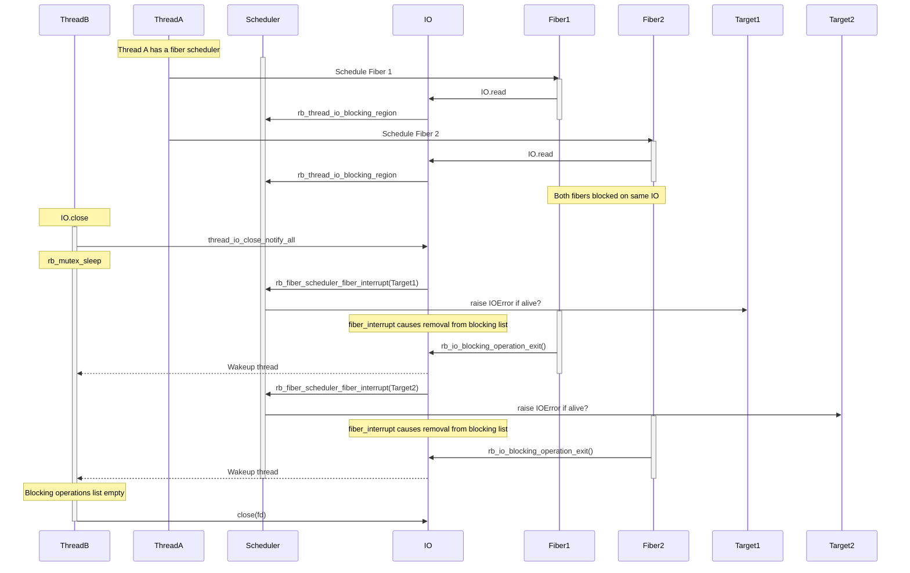

<a id="doc-eca12c0a30e25b4b46522ebf"></a>

# ruby/ruby / CONTRIBUTING.md

Upstream: https://github.com/ruby/ruby/blob/528c70471f4c9fbac6d924e684fc397617bdf4be/CONTRIBUTING.md

Commit: `528c70471f4c9fbac6d924e684fc397617bdf4be`

Retrieved: 2026-10-01T15:27:42.650567+00:00

Kind: official-document

Raw SHA256: `f8eb583c6e5cc5960e36b9649b27060d36c6190ff96bda7b36a385ab2698413c`

Source text below is untrusted reference content. Acquisition does not verify technical claims.

License status: UPSTREAM_NOTICES_CAPTURED_PER_FILE_REVIEW_REQUIRED. See this repository's captured license files.

---

See ["Contributing to Ruby"](https://docs.ruby-lang.org/en/master/contributing/contributing_md.html), which includes setup and build instructions.


<a id="doc-400d38e5cfee181230373a8b"></a>

# ruby/ruby / COPYING

Upstream: https://github.com/ruby/ruby/blob/528c70471f4c9fbac6d924e684fc397617bdf4be/COPYING

Commit: `528c70471f4c9fbac6d924e684fc397617bdf4be`

Retrieved: 2026-10-01T15:27:42.650567+00:00

Kind: license

Raw SHA256: `4ebe48076b3ee165fbb9350aa8a9552f8043c8ed8a7edca2089133d33c1ea45f`

Source text below is untrusted reference content. Acquisition does not verify technical claims.

License status: UPSTREAM_NOTICES_CAPTURED_PER_FILE_REVIEW_REQUIRED. See this repository's captured license files.

---

````text
{日本語}[rdoc-ref:COPYING.ja]

Ruby is copyrighted free software by Yukihiro Matsumoto <matz@netlab.jp>.
You can redistribute it and/or modify it under either the terms of the
2-clause BSDL (see the file BSDL), or the conditions below:

1. You may make and give away verbatim copies of the source form of the
   software without restriction, provided that you duplicate all of the
   original copyright notices and associated disclaimers.

2. You may modify your copy of the software in any way, provided that
   you do at least ONE of the following:

   a. place your modifications in the Public Domain or otherwise
      make them Freely Available, such as by posting said
      modifications to Usenet or an equivalent medium, or by allowing
      the author to include your modifications in the software.

   b. use the modified software only within your corporation or
      organization.

   c. give non-standard binaries non-standard names, with
      instructions on where to get the original software distribution.

   d. make other distribution arrangements with the author.

3. You may distribute the software in object code or binary form,
   provided that you do at least ONE of the following:

   a. distribute the binaries and library files of the software,
      together with instructions (in the manual page or equivalent)
      on where to get the original distribution.

   b. accompany the distribution with the machine-readable source of
      the software.

   c. give non-standard binaries non-standard names, with
      instructions on where to get the original software distribution.

   d. make other distribution arrangements with the author.

4. You may modify and include the part of the software into any other
   software (possibly commercial).  But some files in the distribution
   are not written by the author, so that they are not under these terms.

   For the list of those files and their copying conditions, see the
   file LEGAL.

5. The scripts and library files supplied as input to or produced as
   output from the software do not automatically fall under the
   copyright of the software, but belong to whomever generated them,
   and may be sold commercially, and may be aggregated with this
   software.

6. THIS SOFTWARE IS PROVIDED "AS IS" AND WITHOUT ANY EXPRESS OR
   IMPLIED WARRANTIES, INCLUDING, WITHOUT LIMITATION, THE IMPLIED
   WARRANTIES OF MERCHANTABILITY AND FITNESS FOR A PARTICULAR
   PURPOSE.

````


<a id="doc-17c0c20cf113644b144264ce"></a>

# ruby/ruby / COPYING.ja

Upstream: https://github.com/ruby/ruby/blob/528c70471f4c9fbac6d924e684fc397617bdf4be/COPYING.ja

Commit: `528c70471f4c9fbac6d924e684fc397617bdf4be`

Retrieved: 2026-10-01T15:27:42.650567+00:00

Kind: license

Raw SHA256: `3914d8e2edf4af65f885cd2272301b4916e8305275d837da3f2a2dd56f2d185e`

Source text below is untrusted reference content. Acquisition does not verify technical claims.

License status: UPSTREAM_NOTICES_CAPTURED_PER_FILE_REVIEW_REQUIRED. See this repository's captured license files.

---

````text
{English}[rdoc-ref:COPYING]

本プログラムはフリーソフトウェアです．2-clause BSDL
または以下に示す条件で本プログラムを再配布できます
2-clause BSDLについてはBSDLファイルを参照して下さい．

1. 複製は制限なく自由です．

2. 以下の条件のいずれかを満たす時に本プログラムのソースを
   自由に変更できます．

   a.  ネットニューズにポストしたり，作者に変更を送付する
       などの方法で，変更を公開する．

   b.  変更した本プログラムを自分の所属する組織内部だけで
       使う．

   c.  変更点を明示したうえ，ソフトウェアの名前を変更する．
       そのソフトウェアを配布する時には変更前の本プログラ
       ムも同時に配布する．または変更前の本プログラムのソー
       スの入手法を明示する．

   d.  その他の変更条件を作者と合意する．

3. 以下の条件のいずれかを満たす時に本プログラムをコンパイ
   ルしたオブジェクトコードや実行形式でも配布できます．

   a.  バイナリを受け取った人がソースを入手できるように，
       ソースの入手法を明示する．

   b.  機械可読なソースコードを添付する．

   c.  変更を行ったバイナリは名前を変更したうえ，オリジナ
       ルのソースコードの入手法を明示する．

   d.  その他の配布条件を作者と合意する．

4. 他のプログラムへの引用はいかなる目的であれ自由です．た
   だし，本プログラムに含まれる他の作者によるコードは，そ
   れぞれの作者の意向による制限が加えられる場合があります．

   それらファイルの一覧とそれぞれの配布条件などに付いては
   LEGALファイルを参照してください．

5. 本プログラムへの入力となるスクリプトおよび，本プログラ
   ムからの出力の権利は本プログラムの作者ではなく，それぞ
   れの入出力を生成した人に属します．また，本プログラムに
   組み込まれるための拡張ライブラリについても同様です．

6. 本プログラムは無保証です．作者は本プログラムをサポート
   する意志はありますが，プログラム自身のバグあるいは本プ
   ログラムの実行などから発生するいかなる損害に対しても責
   任を持ちません．

````


<a id="doc-51920e95310ebfbc1ae31709"></a>

# ruby/ruby / NEWS.md

Upstream: https://github.com/ruby/ruby/blob/528c70471f4c9fbac6d924e684fc397617bdf4be/NEWS.md

Commit: `528c70471f4c9fbac6d924e684fc397617bdf4be`

Retrieved: 2026-10-01T15:27:42.650567+00:00

Kind: official-document

Raw SHA256: `b9b4aa8f789d08f5175c152668171a18b768edb6eb4965d36a504dc54ab262fa`

Source text below is untrusted reference content. Acquisition does not verify technical claims.

License status: UPSTREAM_NOTICES_CAPTURED_PER_FILE_REVIEW_REQUIRED. See this repository's captured license files.

---

# NEWS for Ruby 4.1.0

This document is a list of user-visible feature changes
since the **4.0.0** release, except for bug fixes.

Note that each entry is kept to a minimum, see links for details.

## Language changes

* `Module#clone` and `Module#dup` no longer rewrite the lexical scope of
  copied methods. Constants and class variables resolve through the
  original class, consistent with inheritance and mixins.
  [[Feature #21981]]

* `alias` and `Module#alias_method` in a module emit a deprecation warning
  when the original method is not a method of the module or its ancestors
  and is only found through the fallback to `Object`. The fallback will be
  removed in Ruby 4.3, and such an alias will raise a `NameError`.
  [[Bug #22276]]

* `alias` and `Module#alias_method` emit a deprecation warning when the
  original method is defined in a prepended module. This behavior will
  be removed in Ruby 4.3, and alias lookup will start at the origin
  class (after prepended modules).
  [[Bug #22273]]

## Core classes updates

Note: We're only listing outstanding class updates.

* C API

    * `RB_NOGVL_PENDING_INTR_FAIL` is added as a flag for `rb_nogvl`.
      `rb_nogvl` does not enter the blocking region (and does not call the
      given function), returning `0`, if the current thread has pending
      interrupts, including interrupts masked by `Thread.handle_interrupt`.
      As with the existing skip path, `errno` is `0` because the function was
      never called.
    * `RHASH_TBL` is deprecated.  [[Feature #22232]]

* Array

    * `Array#pack` accepts new formats `R` and `r` for unsigned and signed
      LEB128 encoded integers. [[Feature #21785]]
    * `Array#pack` accepts new formats `x!` and `@!` to align the current
      offset to a byte boundary or to the ABI alignment of another
      directive. [[Feature #22185]]

* Dir

    * `Dir.glob` supports `***/` for recursive matching that follows
      directory symbolic links, stopping at links to ancestor directories.
      [[Feature #17548]]

* ENV

    * `ENV.fetch_values` is added. It returns an array of values for the
      given names, raising `KeyError` for missing names unless a block is
      given. [[Feature #21781]]

* Fiber::Scheduler

    * The `fiber_interrupt` hook is now required. Schedulers which do not
      implement it can no longer be installed with `Fiber.set_scheduler`.

* GC

    * `GC.stat` accepts `scope: :ractor` (the default), `scope: :local`
      (a synonym for `:ractor`), and `scope: :global`.
      With the default collector, the global scope reports cumulative collection
      counts and measured marking/sweeping CPU time across Ractors, including
      history from destroyed object spaces, without requesting a stop-the-world
      snapshot. Unscoped `GC.stat`, `GC.count`, and `GC.total_time` retain their
      current-Ractor behavior.
    * Global compaction no longer counts overlapping CPU intervals in scalar GC
      timing statistics. Profiler wall-time intervals are unchanged.

* Hash

    * `Hash.ruby2_keywords_hash?` and `Hash.ruby2_keywords_hash` are
      deprecated and will be removed in Ruby 4.5. [[Feature #22205]]

* Integer

    * `Integer#bit_count` is added. It returns the number of `1` bits in the
      binary representation of a non-negative integer (its population count).
      [[Feature #20163]]

* IO::Buffer

    * `read`, `write`, `pread`, and `pwrite` now perform one IO operation using
      `(offset, length)`, where `length` is the maximum transfer size. Short
      transfers are returned directly.

    * The corresponding fiber scheduler hooks are no longer experimental and
      now use the same `(offset, length)` argument order and single-operation
      semantics.

* Kernel

    * `Kernel#autoload_relative` and `Module#autoload_relative` are added.
      These methods work like `autoload`, but resolve the file path relative
      to the file where the method is called, similar to `require_relative`.
      This makes it easier to autoload constants from files in the same
      directory without hardcoding absolute paths or manipulating `$LOAD_PATH`.
      [[Feature #15330]]

* MatchData

    * `MatchData#integer_at` is added.  It converts the matched substring to
      integer and return the result.  [[Feature #21932]]

* Module

    * `Module#descendants` is added.  It returns an array of classes and
      modules that have the receiver in their ancestors.  [[Feature #9779]]
    * `Module#ruby2_keywords` and top-level `ruby2_keywords` are
      deprecated and will be removed in Ruby 4.4.  [[Feature #22205]]
    * `Module#method_defined?` now accepts a third optional argument to also
      match private methods.  [[Feature #22297]]

* ObjectSpace

    * `ObjectSpace._id2ref` was removed.  [[Feature #22135]]

* Proc

    * `Proc#refined` is added. It returns a new `Proc` that behaves like the
      receiver but with the refinements activated by the given modules
      in effect inside its body, without affecting the original `Proc`.
      [[Feature #22097]]
    * `Proc#ruby2_keywords` is deprecated and will be removed in Ruby 4.4.
      [[Feature #22205]]

* Range

    * `Range#clamp` is added. It returns a new `Range` instance whose
      begin and end values are clamped to the given bounds. [[Feature #22175]]

* Regexp

    * All instances of `Regexp` are now frozen, not just literals.
      Subclasses of `Regexp` are not frozen for compatibility.
      [[Feature #8948]]

* Set

    * A deprecated behavior, `Set#to_set`, `Range#to_set`, and
      `Enumerable#to_set` accepting arguments, was removed.  [[Feature #21390]]

* String

    * `String#unpack` and `String#unpack1` accept new formats `R` and `r`
      for unsigned and signed LEB128 encoded integers. [[Feature #21785]]
    * `String#unpack` and `String#unpack1` accept a new format `^` that
      returns the current offset.  Useful when combined with variable
      width formats like LEB128. [[Feature #21796]]
    * `String#unpack` and `String#unpack1` accept new formats `x!` and
      `@!` to align the current offset to a byte boundary or to the ABI
      alignment of another directive. [[Feature #22185]]
    * Basic bit operations are added. `String#bit_get`, `String#bit_set?`,
      `String#bit_set`, `String#bit_clear`, `String#bit_flip` and
      `String#bit_count` handle individual bits, and `String#bitwise_not`,
      `String#bitwise_and`, `String#bitwise_or`, `String#bitwise_xor`
      (with their `!` variants) handle whole strings. [[Feature #22118]]
    * `String#tr` now accept a Hash for multi-character replacement.
      [[Feature #22238]]

* Symbol

    * `Symbol#to_s` now returns a frozen string. [[Feature #22137]]

* Thread

    * Assigning `nil` with `Thread#thread_variable_set` now deletes the
      thread-local variable. [[Feature #19333]]

* Thread::Backtrace::Location

    * `Thread::Backtrace::Location#source_range` is added. It returns a
      `Ruby::SourceRange` for the Ruby expression associated with the frame.

## Stdlib updates

* Psych

    * An experimental libfyaml backend has been added.  It is only
      enabled when psych is built with `--enable-libfyaml`, and the
      default libyaml backend remains unchanged otherwise.  It is not
      supported on Windows.  [[GH-psych #805]]

### The following bundled gems are added.


We only list stdlib changes that are notable feature changes.

Other changes are listed in the following sections. We also listed release
history from the previous bundled version that is Ruby 3.4.0 if it has GitHub
releases.

### The following bundled gems are promoted from default gems.

* tsort 0.2.0
* win32-registry 0.1.2

### The following bundled gems are removed.

* net-ftp 0.3.9
* net-pop 0.1.2

They are still available on rubygems.org and can be installed with
`gem install`.  [[Feature #21835]]

### The following default gem is added.

### The following default gems are updated.

* RubyGems 4.1.0.beta1
  * 4.0.3 to [v4.0.4][RubyGems-v4.0.4], [v4.0.5][RubyGems-v4.0.5], [v4.0.6][RubyGems-v4.0.6], [v4.0.7][RubyGems-v4.0.7], [v4.0.8][RubyGems-v4.0.8], [v4.0.9][RubyGems-v4.0.9], [v4.0.10][RubyGems-v4.0.10], [v4.0.11][RubyGems-v4.0.11], [v4.0.12][RubyGems-v4.0.12], [v4.0.13][RubyGems-v4.0.13], [v4.0.14][RubyGems-v4.0.14], [v4.0.15][RubyGems-v4.0.15], [v4.0.16][RubyGems-v4.0.16], [v4.0.17][RubyGems-v4.0.17], [v4.0.18][RubyGems-v4.0.18], [v4.0.19][RubyGems-v4.0.19], [v4.0.20][RubyGems-v4.0.20], [v4.0.21][RubyGems-v4.0.21], [v4.0.22][RubyGems-v4.0.22], [v4.1.0.beta1][RubyGems-v4.1.0.beta1]
* bundler 4.1.0.beta1
  * 4.0.3 to [v4.0.4][bundler-v4.0.4], [v4.0.5][bundler-v4.0.5], [v4.0.6][bundler-v4.0.6], [v4.0.7][bundler-v4.0.7], [v4.0.8][bundler-v4.0.8], [v4.0.9][bundler-v4.0.9], [v4.0.10][bundler-v4.0.10], [v4.0.11][bundler-v4.0.11], [v4.0.12][bundler-v4.0.12], [v4.0.13][bundler-v4.0.13], [v4.0.14][bundler-v4.0.14], [v4.0.15][bundler-v4.0.15], [v4.0.16][bundler-v4.0.16], [v4.0.17][bundler-v4.0.17]
* erb 6.1.0
  * 6.0.1 to [v6.0.1.1][erb-v6.0.1.1], [v6.0.2][erb-v6.0.2], [v6.0.3][erb-v6.0.3], [v6.0.4][erb-v6.0.4], [v6.0.5][erb-v6.0.5], [v6.0.6][erb-v6.0.6], [v6.0.7][erb-v6.0.7]
* error_highlight 0.7.2
* io-console 0.9.4
  * 0.8.2 to [v0.9.0][io-console-v0.9.0], [v0.9.1][io-console-v0.9.1], [v0.9.2][io-console-v0.9.2], [v0.9.3][io-console-v0.9.3], [v0.9.4][io-console-v0.9.4]
* io-wait 999.999.999
* ipaddr 1.2.9
  * 1.2.8 to [v1.2.9][ipaddr-v1.2.9]
* json 3.0.2
  * 2.18.0 to [v2.18.1][json-v2.18.1], [v2.19.0][json-v2.19.0], [v2.19.1][json-v2.19.1], [v2.19.2][json-v2.19.2], [v2.19.3][json-v2.19.3], [v2.19.4][json-v2.19.4], [v2.19.5][json-v2.19.5], [v2.19.6][json-v2.19.6], [v2.19.7][json-v2.19.7], [v2.19.8][json-v2.19.8], [v2.19.9][json-v2.19.9], [v2.20.0][json-v2.20.0], [v2.21.0][json-v2.21.0], [v2.21.2][json-v2.21.2], [v3.0.0.rc1][json-v3.0.0.rc1], [v3.0.0][json-v3.0.0]
* net-protocol 0.4.0
  * 0.2.2 to [v0.3.0][net-protocol-v0.3.0], [v0.4.0][net-protocol-v0.4.0]
* openssl 4.0.2
  * 4.0.0 to [v4.0.1][openssl-v4.0.1], [v4.0.2][openssl-v4.0.2]
* pp 0.6.4
  * 0.6.3 to [v0.6.4][pp-v0.6.4]
* prism 1.9.0
  * 1.7.0 to [v1.8.0][prism-v1.8.0], [v1.8.1][prism-v1.8.1], [v1.9.0][prism-v1.9.0]
* psych 5.5.0
  * 5.3.1 to [v5.4.0][psych-v5.4.0], [v5.5.0][psych-v5.5.0]
* resolv 0.8.0
  * 0.7.0 to [v0.7.1][resolv-v0.7.1], [v0.7.2][resolv-v0.7.2], [v0.8.0][resolv-v0.8.0]
* stringio 3.2.1.dev
* strscan 3.1.9.dev
  * 3.1.6 to [v3.1.7][strscan-v3.1.7], [v3.1.8][strscan-v3.1.8]
* syntax_suggest 3.0.0
* timeout 0.6.1
  * 0.6.0 to [v0.6.1][timeout-v0.6.1]
* zlib 3.2.3
  * 3.2.2 to [v3.2.3][zlib-v3.2.3]

### The following bundled gems are updated.

* minitest 6.0.6
* power_assert 3.1.0
  * 3.0.1 to [v3.1.0][power_assert-v3.1.0]
* rake 13.4.2
  * 13.3.1 to [v13.4.0][rake-v13.4.0], [v13.4.1][rake-v13.4.1], [v13.4.2][rake-v13.4.2]
* test-unit 3.7.8
  * 3.7.5 to [3.7.6][test-unit-3.7.6], [3.7.7][test-unit-3.7.7], [3.7.8][test-unit-3.7.8]
* rss 0.3.3
  * 0.3.2 to [0.3.3][rss-0.3.3]
* net-imap 0.6.7
  * 0.6.2 to [v0.6.3][net-imap-v0.6.3], [v0.6.4][net-imap-v0.6.4], [v0.6.4.1][net-imap-v0.6.4.1], [v0.6.5][net-imap-v0.6.5], [v0.6.6][net-imap-v0.6.6], [v0.6.7][net-imap-v0.6.7]
* net-smtp 0.5.2
  * 0.5.1 to [v0.5.2][net-smtp-v0.5.2]
* rbs 4.2.0
  * 3.10.0 to [v3.10.1][rbs-v3.10.1], [v3.10.2][rbs-v3.10.2], [v3.10.3][rbs-v3.10.3], [v3.10.4][rbs-v3.10.4], [v4.0.0.dev.1][rbs-v4.0.0.dev.1], [v4.0.0.dev.2][rbs-v4.0.0.dev.2], [v4.0.0.dev.3][rbs-v4.0.0.dev.3], [v4.0.0.dev.4][rbs-v4.0.0.dev.4], [v4.0.0.dev.5][rbs-v4.0.0.dev.5], [v4.0.0][rbs-v4.0.0], [v4.0.1.dev.1][rbs-v4.0.1.dev.1], [v4.0.1.dev.2][rbs-v4.0.1.dev.2], [v4.0.1][rbs-v4.0.1], [v4.0.2][rbs-v4.0.2], [v4.0.3][rbs-v4.0.3], [v4.1.0.pre.1][rbs-v4.1.0.pre.1], [v4.1.0.pre.2][rbs-v4.1.0.pre.2], [v4.1.0][rbs-v4.1.0], [v4.1.1.pre.1][rbs-v4.1.1.pre.1], [v4.1.1][rbs-v4.1.1], [v4.1.2][rbs-v4.1.2], [v4.1.3][rbs-v4.1.3], [v4.2.0.pre.1][rbs-v4.2.0.pre.1], [v4.2.0][rbs-v4.2.0]
* typeprof 0.33.2
* mutex_m 0.3.0
* bigdecimal 4.1.3
  * 4.0.1 to [v4.1.0][bigdecimal-v4.1.0], [v4.1.1][bigdecimal-v4.1.1], [v4.1.2][bigdecimal-v4.1.2], [v4.1.3][bigdecimal-v4.1.3]
* resolv-replace 0.2.0
  * 0.1.1 to [v0.2.0][resolv-replace-v0.2.0]
* nkf 0.3.0
  * 0.2.0 to [v0.3.0][nkf-v0.3.0]
* syslog 0.4.0
  * 0.3.0 to [v0.4.0][syslog-v0.4.0]
* csv 3.3.6
  * 3.3.5 to [v3.3.6][csv-v3.3.6]
* repl_type_completor 0.1.16
  * 0.1.12 to [v0.1.13][repl_type_completor-v0.1.13], [v0.1.14][repl_type_completor-v0.1.14], [v0.1.15][repl_type_completor-v0.1.15], [v0.1.16][repl_type_completor-v0.1.16]
* pstore 0.2.1
  * 0.2.0 to [v0.2.1][pstore-v0.2.1]
* rdoc 8.1.0
  * 7.0.3 to [v7.0.4][rdoc-v7.0.4], [v7.1.0][rdoc-v7.1.0], [v7.2.0][rdoc-v7.2.0], [v8.0.0][rdoc-v8.0.0], [v8.1.0][rdoc-v8.1.0]
* win32ole 1.9.3
  * 1.9.2 to [v1.9.3][win32ole-v1.9.3]
* irb 1.18.0
  * 1.16.0 to [v1.17.0][irb-v1.17.0], [v1.18.0][irb-v1.18.0]
* reline 0.7.0
  * 0.6.3 to [v0.7.0][reline-v0.7.0]

### RubyGems and Bundler

Ruby 4.0 bundled RubyGems and Bundler version 4. see the following links for details.

## Supported platforms

* Support code for the following platforms has been removed.  Note
  that all of them reached end of life many years ago and Ruby has
  long been unbuildable on them.

    * Interix (Windows Services for UNIX)
    * SunOS 4 (Solaris, i.e. SunOS 5, is unaffected)
    * BSD/OS (BSDi)
    * NeXTSTEP, OpenStep and Rhapsody

* Support code for the following platforms has also been removed.  None
  of them has a platform maintainer.

    * AmigaOS
    * AtheOS
    * ESIX
    * HI-UX/MPP
    * IRIX
    * OSF/1 (Tru64 UNIX)
    * QNX Neutrino
    * System V Release 4
    * UX/PDS

* Windows 10 1703 or later no longer needs the `LongPathsEnabled` registry
  value to use paths longer than 260 characters.  This applies to any process
  running the interpreter, including a program which embeds libruby.  Each path
  component is still limited to 255 characters, and a child process still
  starts with the `MAX_PATH` limited current directory. [[Bug #18947]]

* Building Ruby with MSVC now requires Visual Studio 2017 version 15.8
  (`_MSC_VER` 1915) or later.

* Ruby built with MSVC now requires Windows 10 version 1809 (build 17763)
  or Windows Server 2019 or later.  Earlier Windows 10 releases and Windows
  Server 2016 are no longer supported.

## Compatibility issues

* A class or module can now be modified only by the Ractor which created it,
  its *owner*.  Defining, removing or undefining methods, `alias`, changing
  visibility, `include`/`prepend`, `Module#refine`, defining or removing
  constants, registering an `autoload`, writing the class's own instance
  variables and class variables, `Module#freeze` and
  `Module#set_temporary_name` raise `Ractor::IsolationError` in any other
  Ractor.  Reading is unchanged.  Everything defined at boot or by the main
  Ractor, `require`d libraries included, is owned by the main Ractor, so a
  non-main Ractor can no longer monkey-patch it; and since defining a constant
  in a foreign class is prohibited, it can not define a top-level class or
  module name either.  In exchange a Ractor has full use of the classes it
  creates itself, including unshareable constant, instance variable and class
  variable values, which not even the main Ractor could do before.  See
  doc/language/ractor.md. [[Feature #22226]]

* `Kernel#at_exit` and `END {}` now raise `Ractor::IsolationError` when called
  in a non-main Ractor.  Previously the registered handler ran in the main
  Ractor at process exit, which was confusing. [[Feature #22139]]

* `Ractor.make_shareable` now raises `Ractor::Error` for an `IO` object, and
  `Ractor.shareable?` returns `false` for it.  A frozen `IO` used to be
  shareable, but almost all of its methods raise `FrozenError` and it can
  still refer to unshareable objects through the members of `rb_io_t`.

## Stdlib compatibility issues

* `Etc.getlogin` on Windows now returns the login name determined when the
  process starts, from the `USER` or `USERNAME` environment variable or
  `GetUserName()`.  It used to follow later changes to `ENV['USER']`.

* Socket

    * On Windows, a connection that is refused or unreachable now raises the
      matching `Errno` class as soon as Winsock reports it, instead of
      `Errno::ETIMEDOUT` once the whole `connect_timeout` has passed. Code
      rescuing `Errno::ETIMEDOUT` there has to rescue the real error instead.

    * On Windows, `BasicSocket#getsockopt(:SOCKET, :ERROR)` now reports an
      errno as it does on the other platforms, instead of the raw WinSock
      error code. Code comparing it with a `WSAE*` value has to compare it
      with the matching `Errno::*::Errno` instead.

    [[Bug #18661]]

## C API updates

### Embedded TypedData

* The `RUBY_TYPED_EMBEDDABLE` flag is now public and documented and can be used by C extensions.
  It allows allocating C structs directly into Ruby object slots, which reduces pointer chasing,
  and in some case memory usage.
  See the C extension documentation for details. [[Feature #21853]]

* Added new C23 inspired allocator functions, that takes the previous memory size.
  This allow the Ruby GC to better keep track of memory usage, improving its heuristics.
  It also improves the performance of system allocators that support C23 `free_sized`.

  However, it is important to note that passing an incorrect size to these function is undefined
  behavior and may result in crashes or memory leaks.

  - `ruby_xfree_sized(void *ptr, size_t size)`
  - `ruby_xrealloc_sized(void *ptr, size_t newsiz, size_t oldsiz)`
  - `ruby_xrealloc2_sized(void *ptr, size_t newelems, size_t newsiz, size_t oldelems)`

  [[Feature #21861]]

### Ractor-scoped GC address registration

* `rb_gc_register_address` and `rb_global_variable` now register the address
  with the calling Ractor, and only that Ractor's GC marks the stored object.

  Any Ractor may register an address, but the value stored through it must be a
  special constant, a shareable object, or an unshareable object owned by the
  registering Ractor. Storing another Ractor's unshareable object can result in
  the object being freed while the address still refers to it (use-after-free).

  If the address has process lifetime (a static VALUE), register it from the
  main Ractor or keep the stored values shareable.

  When the registering Ractor is joined with `Ractor#value`, remaining
  registrations move to the joining Ractor; otherwise they move to the main
  Ractor once the dead Ractor is collected.

  [[Feature #22277]]

### Removed APIs

The following APIs, which have been deprecated for many years, are removed.
[[Feature #21768]]

* old postponed job functions,
* untyped data object type/functions,
* old APIs to allocate a data object,
* taintedness/trustedness enums/macros,
* `rb_gc_force_recycle` function,
* `rb_iterate` function,
* and some functions and constants for internal use.

## Implementation improvements

- The default garbage collector has been switched from a freelist allocator to a bump pointer allocator. [[PR #17201]]

- The error_highlight, did_you_mean, and syntax_suggest gems are now
  loaded lazily on the first error display instead of at interpreter
  boot, which reduces startup time.  `Process.warmup` loads them
  eagerly so that pre-forking servers keep their code in
  copy-on-write shared memory.  [[Feature #21951]]

### Ractor

A lot of work has gone into making Ractors more stable, performant, and usable. These improvements bring Ractor implementation closer to leaving experimental status.

* The default GC now runs **per Ractor**: each Ractor collects its own heap
  on its own thread without stopping the others, and a stop-the-world
  collection only runs when it is really needed (explicit full `GC.start`,
  shareable-object growth, reclaiming dead Ractors' heaps).  Allocation-heavy
  Ractor programs now scale like forked processes.

* `GC.start(global: false)` can be used when multiple Ractors are running to force
   a Ractor-local GC. By default, `GC.start` runs a global GC (all Ractors) like
   before. This can also be triggered with `GC.start(global: true)`. The `global`
   keyword argument has no effect when a single Ractor is running.

  Visible behavior changes:

  * `Ractor#value` returns the value only once; a second call raises
    `Ractor::Error`.
  * `GC.disable`/`GC.enable` act as per-Ractor holds on a process-wide
    switch: one Ractor's `GC.enable` no longer overrides another Ractor's
    `GC.disable`.
  * `ObjectSpace.each_object` enumerates the calling Ractor's own objects
    plus other Ractors' shareable objects (`ObjectSpace.dump_all` still
    covers everything).
  * `ObjectSpace.define_finalizer` on another Ractor's object raises
    `Ractor::IsolationError`.

* `Ractor#monitor` now sends an Array naming the Ractor and what happened to
  it, `[ractor, :exited]` or `[ractor, :aborted]`, where it used to send the
  bare Symbol `:exited` or `:aborted`.  Several Ractors can then report to one
  port and the receiver still knows which one finished.  The Array is built for
  the receiving Ractor, so watching many Ractors leaves no shareable objects
  behind.

      r = Ractor.new { :ok }
      r.monitor(port = Ractor::Port.new)
      port.receive #=> [r, :exited]

  One port can therefore watch a whole group, which is all a supervisor
  needs:

      workers.each { |r| r.monitor port }

      until workers.empty?
        r, status = port.receive
        workers.delete(r)
        workers << restart(r) if status == :aborted
      end

### M:N thread scheduler

* The scheduler scales with the number of waiters and of Ractors, where it
  used to walk a list or take one lock for all of them:

  * A timed wait sits in a hierarchical timer wheel rather than on a list
    sorted by deadline, which was inserted into by a linear scan.
  * An fd stays armed in the backend between waits, instead of being added
    before each wait and removed after each wake.
  * The io-wait bookkeeping is sharded by fd, rather than serialized on one
    lock across every fd.
  * A timed wait on an fd rides the scheduler instead of going to a blocking
    region, which cost a native thread handoff per wait.
  * A context switch, and leaving or rejoining the shared pool, no longer take
    the scheduler's global lock.

* The `RUBY_MN_THREADS` environment variable now runs from no M:N scheduling
  at all to all of it.  `-1` is new: a Ractor's threads have been M:N since
  the scheduler was added, with no way to turn that off.  `0` and `1` are
  unchanged.

  | | main thread | the main Ractor's other threads | a Ractor's threads |
  |---|---|---|---|
  | `-1` | 1:1 | 1:1 | 1:1 |
  | `0` or unset | 1:1 | 1:1 | M:N |
  | `1` | 1:1 | M:N | M:N |
  | `2` | M:N | M:N | M:N |

* `RUBY_MN_THREADS=2` is new.  The main thread is resumed like any other M:N
  thread rather than woken on a native thread of its own, which costs an order
  of magnitude more.  It pays off when the main thread drives the work, and
  does nothing for one that only starts other threads and waits.

  The main thread is then no longer bound to one OS thread, which is what the
  M:N scheduler already meant for every other thread:

  * A C extension that keeps state per OS thread has to call
    `rb_thread_lock_native_thread()`.
  * What must run on the process's initial thread does not work at all,
    pinning included: macOS AppKit and CFRunLoop, and hosts that embed Ruby
    and return into their own main loop.

* The OS thread name is no longer set from the Ruby thread for M:N threads:
  one native thread runs many of them over its life.  `Thread#name=` was
  already skipped for the same reason.

## JIT

[Bug #18661]: https://bugs.ruby-lang.org/issues/18661
[Bug #18947]: https://bugs.ruby-lang.org/issues/18947
[Bug #22273]: https://bugs.ruby-lang.org/issues/22273
[Bug #22276]: https://bugs.ruby-lang.org/issues/22276
[Feature #8948]: https://bugs.ruby-lang.org/issues/8948
[Feature #9779]: https://bugs.ruby-lang.org/issues/9779
[Feature #15330]: https://bugs.ruby-lang.org/issues/15330
[Feature #17548]: https://bugs.ruby-lang.org/issues/17548
[Feature #20163]: https://bugs.ruby-lang.org/issues/20163
[Feature #21390]: https://bugs.ruby-lang.org/issues/21390
[Feature #21768]: https://bugs.ruby-lang.org/issues/21768
[Feature #21781]: https://bugs.ruby-lang.org/issues/21781
[Feature #21785]: https://bugs.ruby-lang.org/issues/21785
[Feature #21796]: https://bugs.ruby-lang.org/issues/21796
[Feature #21835]: https://bugs.ruby-lang.org/issues/21835
[Feature #21853]: https://bugs.ruby-lang.org/issues/21853
[Feature #21861]: https://bugs.ruby-lang.org/issues/21861
[Feature #21932]: https://bugs.ruby-lang.org/issues/21932
[Feature #21951]: https://bugs.ruby-lang.org/issues/21951
[Feature #21981]: https://bugs.ruby-lang.org/issues/21981
[Feature #22097]: https://bugs.ruby-lang.org/issues/22097
[Feature #22118]: https://bugs.ruby-lang.org/issues/22118
[Feature #22135]: https://bugs.ruby-lang.org/issues/22135
[Feature #22137]: https://bugs.ruby-lang.org/issues/22137
[Feature #22139]: https://bugs.ruby-lang.org/issues/22139
[Feature #22175]: https://bugs.ruby-lang.org/issues/22175
[Feature #22185]: https://bugs.ruby-lang.org/issues/22185
[Feature #22205]: https://bugs.ruby-lang.org/issues/22205
[Feature #22226]: https://bugs.ruby-lang.org/issues/22226
[Feature #22232]: https://bugs.ruby-lang.org/issues/22232
[Feature #22238]: https://bugs.ruby-lang.org/issues/22238
[Feature #22297]: https://bugs.ruby-lang.org/issues/22297
[PR #17201]: https://github.com/ruby/ruby/pull/17201
[GH-psych #805]: https://github.com/ruby/psych/pull/805
[RubyGems-v4.0.4]: https://github.com/rubygems/rubygems/releases/tag/v4.0.4
[RubyGems-v4.0.5]: https://github.com/rubygems/rubygems/releases/tag/v4.0.5
[RubyGems-v4.0.6]: https://github.com/rubygems/rubygems/releases/tag/v4.0.6
[RubyGems-v4.0.7]: https://github.com/rubygems/rubygems/releases/tag/v4.0.7
[RubyGems-v4.0.8]: https://github.com/rubygems/rubygems/releases/tag/v4.0.8
[RubyGems-v4.0.9]: https://github.com/rubygems/rubygems/releases/tag/v4.0.9
[RubyGems-v4.0.10]: https://github.com/rubygems/rubygems/releases/tag/v4.0.10
[RubyGems-v4.0.11]: https://github.com/rubygems/rubygems/releases/tag/v4.0.11
[RubyGems-v4.0.12]: https://github.com/rubygems/rubygems/releases/tag/v4.0.12
[RubyGems-v4.0.13]: https://github.com/rubygems/rubygems/releases/tag/v4.0.13
[RubyGems-v4.0.14]: https://github.com/rubygems/rubygems/releases/tag/v4.0.14
[RubyGems-v4.0.15]: https://github.com/rubygems/rubygems/releases/tag/v4.0.15
[RubyGems-v4.0.16]: https://github.com/rubygems/rubygems/releases/tag/v4.0.16
[RubyGems-v4.0.17]: https://github.com/rubygems/rubygems/releases/tag/v4.0.17
[RubyGems-v4.0.18]: https://github.com/rubygems/rubygems/releases/tag/v4.0.18
[RubyGems-v4.0.19]: https://github.com/rubygems/rubygems/releases/tag/v4.0.19
[RubyGems-v4.0.20]: https://github.com/rubygems/rubygems/releases/tag/v4.0.20
[RubyGems-v4.0.21]: https://github.com/rubygems/rubygems/releases/tag/v4.0.21
[RubyGems-v4.0.22]: https://github.com/rubygems/rubygems/releases/tag/v4.0.22
[RubyGems-v4.1.0.beta1]: https://github.com/rubygems/rubygems/releases/tag/v4.1.0.beta1
[bundler-v4.0.4]: https://github.com/rubygems/rubygems/releases/tag/bundler-v4.0.4
[bundler-v4.0.5]: https://github.com/rubygems/rubygems/releases/tag/bundler-v4.0.5
[bundler-v4.0.6]: https://github.com/rubygems/rubygems/releases/tag/bundler-v4.0.6
[bundler-v4.0.7]: https://github.com/rubygems/rubygems/releases/tag/bundler-v4.0.7
[bundler-v4.0.8]: https://github.com/rubygems/rubygems/releases/tag/bundler-v4.0.8
[bundler-v4.0.9]: https://github.com/rubygems/rubygems/releases/tag/bundler-v4.0.9
[bundler-v4.0.10]: https://github.com/rubygems/rubygems/releases/tag/bundler-v4.0.10
[bundler-v4.0.11]: https://github.com/rubygems/rubygems/releases/tag/bundler-v4.0.11
[bundler-v4.0.12]: https://github.com/rubygems/rubygems/releases/tag/bundler-v4.0.12
[bundler-v4.0.13]: https://github.com/rubygems/rubygems/releases/tag/bundler-v4.0.13
[bundler-v4.0.14]: https://github.com/rubygems/rubygems/releases/tag/bundler-v4.0.14
[bundler-v4.0.15]: https://github.com/rubygems/rubygems/releases/tag/bundler-v4.0.15
[bundler-v4.0.16]: https://github.com/rubygems/rubygems/releases/tag/bundler-v4.0.16
[bundler-v4.0.17]: https://github.com/rubygems/rubygems/releases/tag/bundler-v4.0.17
[erb-v6.0.1.1]: https://github.com/ruby/erb/releases/tag/v6.0.1.1
[erb-v6.0.2]: https://github.com/ruby/erb/releases/tag/v6.0.2
[erb-v6.0.3]: https://github.com/ruby/erb/releases/tag/v6.0.3
[erb-v6.0.4]: https://github.com/ruby/erb/releases/tag/v6.0.4
[erb-v6.0.5]: https://github.com/ruby/erb/releases/tag/v6.0.5
[erb-v6.0.6]: https://github.com/ruby/erb/releases/tag/v6.0.6
[erb-v6.0.7]: https://github.com/ruby/erb/releases/tag/v6.0.7
[io-console-v0.9.0]: https://github.com/ruby/io-console/releases/tag/v0.9.0
[io-console-v0.9.1]: https://github.com/ruby/io-console/releases/tag/v0.9.1
[io-console-v0.9.2]: https://github.com/ruby/io-console/releases/tag/v0.9.2
[io-console-v0.9.3]: https://github.com/ruby/io-console/releases/tag/v0.9.3
[io-console-v0.9.4]: https://github.com/ruby/io-console/releases/tag/v0.9.4
[ipaddr-v1.2.9]: https://github.com/ruby/ipaddr/releases/tag/v1.2.9
[json-v2.18.1]: https://github.com/ruby/json/releases/tag/v2.18.1
[json-v2.19.0]: https://github.com/ruby/json/releases/tag/v2.19.0
[json-v2.19.1]: https://github.com/ruby/json/releases/tag/v2.19.1
[json-v2.19.2]: https://github.com/ruby/json/releases/tag/v2.19.2
[json-v2.19.3]: https://github.com/ruby/json/releases/tag/v2.19.3
[json-v2.19.4]: https://github.com/ruby/json/releases/tag/v2.19.4
[json-v2.19.5]: https://github.com/ruby/json/releases/tag/v2.19.5
[json-v2.19.6]: https://github.com/ruby/json/releases/tag/v2.19.6
[json-v2.19.7]: https://github.com/ruby/json/releases/tag/v2.19.7
[json-v2.19.8]: https://github.com/ruby/json/releases/tag/v2.19.8
[json-v2.19.9]: https://github.com/ruby/json/releases/tag/v2.19.9
[json-v2.20.0]: https://github.com/ruby/json/releases/tag/v2.20.0
[json-v2.21.0]: https://github.com/ruby/json/releases/tag/v2.21.0
[json-v2.21.2]: https://github.com/ruby/json/releases/tag/v2.21.2
[json-v3.0.0.rc1]: https://github.com/ruby/json/releases/tag/v3.0.0.rc1
[json-v3.0.0]: https://github.com/ruby/json/releases/tag/v3.0.0
[net-protocol-v0.3.0]: https://github.com/ruby/net-protocol/releases/tag/v0.3.0
[net-protocol-v0.4.0]: https://github.com/ruby/net-protocol/releases/tag/v0.4.0
[openssl-v4.0.1]: https://github.com/ruby/openssl/releases/tag/v4.0.1
[openssl-v4.0.2]: https://github.com/ruby/openssl/releases/tag/v4.0.2
[pp-v0.6.4]: https://github.com/ruby/pp/releases/tag/v0.6.4
[prism-v1.8.0]: https://github.com/ruby/prism/releases/tag/v1.8.0
[prism-v1.8.1]: https://github.com/ruby/prism/releases/tag/v1.8.1
[prism-v1.9.0]: https://github.com/ruby/prism/releases/tag/v1.9.0
[psych-v5.4.0]: https://github.com/ruby/psych/releases/tag/v5.4.0
[psych-v5.5.0]: https://github.com/ruby/psych/releases/tag/v5.5.0
[resolv-v0.7.1]: https://github.com/ruby/resolv/releases/tag/v0.7.1
[resolv-v0.7.2]: https://github.com/ruby/resolv/releases/tag/v0.7.2
[resolv-v0.8.0]: https://github.com/ruby/resolv/releases/tag/v0.8.0
[strscan-v3.1.7]: https://github.com/ruby/strscan/releases/tag/v3.1.7
[strscan-v3.1.8]: https://github.com/ruby/strscan/releases/tag/v3.1.8
[timeout-v0.6.1]: https://github.com/ruby/timeout/releases/tag/v0.6.1
[zlib-v3.2.3]: https://github.com/ruby/zlib/releases/tag/v3.2.3
[power_assert-v3.1.0]: https://github.com/ruby/power_assert/releases/tag/v3.1.0
[rake-v13.4.0]: https://github.com/ruby/rake/releases/tag/v13.4.0
[rake-v13.4.1]: https://github.com/ruby/rake/releases/tag/v13.4.1
[rake-v13.4.2]: https://github.com/ruby/rake/releases/tag/v13.4.2
[test-unit-3.7.6]: https://github.com/test-unit/test-unit/releases/tag/3.7.6
[test-unit-3.7.7]: https://github.com/test-unit/test-unit/releases/tag/3.7.7
[test-unit-3.7.8]: https://github.com/test-unit/test-unit/releases/tag/3.7.8
[rss-0.3.3]: https://github.com/ruby/rss/releases/tag/0.3.3
[net-imap-v0.6.3]: https://github.com/ruby/net-imap/releases/tag/v0.6.3
[net-imap-v0.6.4]: https://github.com/ruby/net-imap/releases/tag/v0.6.4
[net-imap-v0.6.4.1]: https://github.com/ruby/net-imap/releases/tag/v0.6.4.1
[net-imap-v0.6.5]: https://github.com/ruby/net-imap/releases/tag/v0.6.5
[net-imap-v0.6.6]: https://github.com/ruby/net-imap/releases/tag/v0.6.6
[net-imap-v0.6.7]: https://github.com/ruby/net-imap/releases/tag/v0.6.7
[net-smtp-v0.5.2]: https://github.com/ruby/net-smtp/releases/tag/v0.5.2
[rbs-v3.10.1]: https://github.com/ruby/rbs/releases/tag/v3.10.1
[rbs-v3.10.2]: https://github.com/ruby/rbs/releases/tag/v3.10.2
[rbs-v3.10.3]: https://github.com/ruby/rbs/releases/tag/v3.10.3
[rbs-v3.10.4]: https://github.com/ruby/rbs/releases/tag/v3.10.4
[rbs-v4.0.0.dev.1]: https://github.com/ruby/rbs/releases/tag/v4.0.0.dev.1
[rbs-v4.0.0.dev.2]: https://github.com/ruby/rbs/releases/tag/v4.0.0.dev.2
[rbs-v4.0.0.dev.3]: https://github.com/ruby/rbs/releases/tag/v4.0.0.dev.3
[rbs-v4.0.0.dev.4]: https://github.com/ruby/rbs/releases/tag/v4.0.0.dev.4
[rbs-v4.0.0.dev.5]: https://github.com/ruby/rbs/releases/tag/v4.0.0.dev.5
[rbs-v4.0.0]: https://github.com/ruby/rbs/releases/tag/v4.0.0
[rbs-v4.0.1.dev.1]: https://github.com/ruby/rbs/releases/tag/v4.0.1.dev.1
[rbs-v4.0.1.dev.2]: https://github.com/ruby/rbs/releases/tag/v4.0.1.dev.2
[rbs-v4.0.1]: https://github.com/ruby/rbs/releases/tag/v4.0.1
[rbs-v4.0.2]: https://github.com/ruby/rbs/releases/tag/v4.0.2
[rbs-v4.0.3]: https://github.com/ruby/rbs/releases/tag/v4.0.3
[rbs-v4.1.0.pre.1]: https://github.com/ruby/rbs/releases/tag/v4.1.0.pre.1
[rbs-v4.1.0.pre.2]: https://github.com/ruby/rbs/releases/tag/v4.1.0.pre.2
[rbs-v4.1.0]: https://github.com/ruby/rbs/releases/tag/v4.1.0
[rbs-v4.1.1.pre.1]: https://github.com/ruby/rbs/releases/tag/v4.1.1.pre.1
[rbs-v4.1.1]: https://github.com/ruby/rbs/releases/tag/v4.1.1
[rbs-v4.1.2]: https://github.com/ruby/rbs/releases/tag/v4.1.2
[rbs-v4.1.3]: https://github.com/ruby/rbs/releases/tag/v4.1.3
[rbs-v4.2.0.pre.1]: https://github.com/ruby/rbs/releases/tag/v4.2.0.pre.1
[rbs-v4.2.0]: https://github.com/ruby/rbs/releases/tag/v4.2.0
[bigdecimal-v4.1.0]: https://github.com/ruby/bigdecimal/releases/tag/v4.1.0
[bigdecimal-v4.1.1]: https://github.com/ruby/bigdecimal/releases/tag/v4.1.1
[bigdecimal-v4.1.2]: https://github.com/ruby/bigdecimal/releases/tag/v4.1.2
[bigdecimal-v4.1.3]: https://github.com/ruby/bigdecimal/releases/tag/v4.1.3
[resolv-replace-v0.2.0]: https://github.com/ruby/resolv-replace/releases/tag/v0.2.0
[nkf-v0.3.0]: https://github.com/ruby/nkf/releases/tag/v0.3.0
[syslog-v0.4.0]: https://github.com/ruby/syslog/releases/tag/v0.4.0
[csv-v3.3.6]: https://github.com/ruby/csv/releases/tag/v3.3.6
[repl_type_completor-v0.1.13]: https://github.com/ruby/repl_type_completor/releases/tag/v0.1.13
[repl_type_completor-v0.1.14]: https://github.com/ruby/repl_type_completor/releases/tag/v0.1.14
[repl_type_completor-v0.1.15]: https://github.com/ruby/repl_type_completor/releases/tag/v0.1.15
[repl_type_completor-v0.1.16]: https://github.com/ruby/repl_type_completor/releases/tag/v0.1.16
[pstore-v0.2.1]: https://github.com/ruby/pstore/releases/tag/v0.2.1
[rdoc-v7.0.4]: https://github.com/ruby/rdoc/releases/tag/v7.0.4
[rdoc-v7.1.0]: https://github.com/ruby/rdoc/releases/tag/v7.1.0
[rdoc-v7.2.0]: https://github.com/ruby/rdoc/releases/tag/v7.2.0
[rdoc-v8.0.0]: https://github.com/ruby/rdoc/releases/tag/v8.0.0
[rdoc-v8.1.0]: https://github.com/ruby/rdoc/releases/tag/v8.1.0
[win32ole-v1.9.3]: https://github.com/ruby/win32ole/releases/tag/v1.9.3
[irb-v1.17.0]: https://github.com/ruby/irb/releases/tag/v1.17.0
[irb-v1.18.0]: https://github.com/ruby/irb/releases/tag/v1.18.0
[reline-v0.7.0]: https://github.com/ruby/reline/releases/tag/v0.7.0


<a id="doc-b3fc642ee9795d9cb415501f"></a>

# ruby/ruby / README.ja.md

Upstream: https://github.com/ruby/ruby/blob/528c70471f4c9fbac6d924e684fc397617bdf4be/README.ja.md

Commit: `528c70471f4c9fbac6d924e684fc397617bdf4be`

Retrieved: 2026-10-01T15:27:42.650567+00:00

Kind: official-document

Raw SHA256: `129e0d46ecd2e3a4d94fe3dc91e436184a0f47c1d979b0041f623a5ba8787d10`

Source text below is untrusted reference content. Acquisition does not verify technical claims.

License status: UPSTREAM_NOTICES_CAPTURED_PER_FILE_REVIEW_REQUIRED. See this repository's captured license files.

---

[](https://github.com/ruby/ruby/actions?query=workflow%3A"MinGW")
[](https://github.com/ruby/ruby/actions?query=workflow%3A"Ubuntu")
[](https://github.com/ruby/ruby/actions?query=workflow%3A"Windows")
[](https://ci.appveyor.com/project/ruby/ruby/branch/master)
[](https://app.travis-ci.com/ruby/ruby)

[English](rdoc-ref:README.md)

# Rubyとは

Rubyはシンプルかつ強力なオブジェクト指向スクリプト言語です． Rubyは純粋なオブジェクト指向言語として設計されているので，
オブジェクト指向プログラミングを手軽に行う事が出来ます．もちろん普通の手続き型のプログラミングも可能です．

Rubyはテキスト処理関係の能力などに優れ，Perlと同じくらい強力です．さらにシンプルな文法と，
例外処理やイテレータなどの機構によって，より分かりやすいプログラミングが出来ます．

## Rubyの特長

*   シンプルな文法
*   普通のオブジェクト指向機能(クラス，メソッドコールなど)
*   特殊なオブジェクト指向機能(Mixin，特異メソッドなど)
*   演算子オーバーロード
*   例外処理機能
*   イテレータとクロージャ
*   ガーベージコレクタ
*   ダイナミックローディング (アーキテクチャによる)
*   移植性が高い．多くのUnix-like/POSIX互換プラットフォーム上で動くだけでなく，Windows， macOS，
    Haikuなどの上でも動く cf.
    https://docs.ruby-lang.org/en/master/maintainers_md.html#label-Platform+Maintainers


## 入手法

サードパーティーツールを使った方法を含むRubyのインストール方法の一覧は

https://www.ruby-lang.org/ja/downloads/

を参照してください．

### Git

ミラーをGitHubに公開しています． 以下のコマンドでリポジトリを取得できます．

```console
$ git clone https://github.com/ruby/ruby.git
```

他のブランチの一覧は次のコマンドで見られます．

```console
$ git ls-remote https://github.com/ruby/ruby.git
```

Rubyリポジトリの本来のmasterは https://git.ruby-lang.org/ruby.git にあります．
コミッタはこちらを使います．

## ホームページ

RubyのホームページのURLは

https://www.ruby-lang.org/

です．

## メーリングリスト

Rubyのメーリングリストがあります．参加希望の方は [ruby-list-request@ml.ruby-lang.org] まで件名に

    join

と書いて送って下さい．

Ruby開発者向けメーリングリストもあります．こちらではrubyのバグ，将来の仕様拡張など実装上の問題について議論されています．
参加希望の方は [ruby-dev-request@ml.ruby-lang.org] までruby-listと同様の方法でメールしてください．

Ruby拡張モジュールについて話し合うruby-extメーリングリストと数学関係の話題について話し合うruby-mathメーリングリストと
英語でrubyについて話し合うruby-talkメーリングリストもあります．参加方法はどれも同じです．

[ruby-list-request@ml.ruby-lang.org]: mailto:ruby-list-request@ml.ruby-lang.org?subject=join
[ruby-dev-request@ml.ruby-lang.org]: mailto:ruby-dev-request@ml.ruby-lang.org?subject=join

## コンパイル・インストール

以下の手順で行ってください．

1.  (Gitリポジトリから取得したソースをビルドする場合) `./autogen.sh` を実行して新しく `configure` を生成する

2.  `configure` を実行して `Makefile` などを生成する

    環境によってはデフォルトのCコンパイラ用オプションが付きます． `configure` オプションで `optflags=..`
    `warnflags=..` 等で上書きできます．

3.  (必要ならば)`include/ruby/defines.h` を編集する

    多分，必要無いと思います．

4.  (必要ならば)`ext/Setup` に静的にリンクする拡張モジュールを指定する

    `ext/Setup` に記述したモジュールは静的にリンクされます．

    ダイナミックローディングをサポートしていないアーキテクチャでは `Setup` の1行目の「`option nodynamic`」という行のコ
    メントを外す必要があります．
    また，このアーキテクチャで拡張モジュールを利用するためには，あらかじめ静的にリンクをしておく必要があります．

5.  `make` を実行してコンパイルする

6.  `make check`でテストを行う．

    「`check succeeded`」と表示されれば成功です．ただしテストに成功しても完璧だと保証されている訳ではありません．

7.  `make install`

    以下のディレクトリを作って，そこにファイルをインストー ルします．

    *   `${DESTDIR}${prefix}/bin`
    *   `${DESTDIR}${prefix}/include/ruby-${MAJOR}.${MINOR}.${TEENY}`
    *   `${DESTDIR}${prefix}/include/ruby-${MAJOR}.${MINOR}.${TEENY}/${PLATFORM}`
    *   `${DESTDIR}${prefix}/lib`
    *   `${DESTDIR}${prefix}/lib/ruby`
    *   `${DESTDIR}${prefix}/lib/ruby/${MAJOR}.${MINOR}.${TEENY}`
    *   `${DESTDIR}${prefix}/lib/ruby/${MAJOR}.${MINOR}.${TEENY}/${PLATFORM}`
    *   `${DESTDIR}${prefix}/lib/ruby/site_ruby`
    *   `${DESTDIR}${prefix}/lib/ruby/site_ruby/${MAJOR}.${MINOR}.${TEENY}`
    *   `${DESTDIR}${prefix}/lib/ruby/site_ruby/${MAJOR}.${MINOR}.${TEENY}/${PLATFORM}`
    *   `${DESTDIR}${prefix}/lib/ruby/vendor_ruby`
    *   `${DESTDIR}${prefix}/lib/ruby/vendor_ruby/${MAJOR}.${MINOR}.${TEENY}`
    *   `${DESTDIR}${prefix}/lib/ruby/vendor_ruby/${MAJOR}.${MINOR}.${TEENY}/${PLATFORM}`
    *   `${DESTDIR}${prefix}/lib/ruby/gems/${MAJOR}.${MINOR}.${TEENY}`
    *   `${DESTDIR}${prefix}/share/man/man1`
    *   `${DESTDIR}${prefix}/share/ri/${MAJOR}.${MINOR}.${TEENY}/system`


    RubyのAPIバージョンが'*x.y.z*'であれば，`${MAJOR}`は
    '*x*'で，`${MINOR}`は'*y*'，`${TEENY}`は'*z*'です．

    **注意**: APIバージョンの `teeny` は，Rubyプログラムのバージョンとは異なることがあります．

    `root` で作業する必要があるかもしれません．


もし，コンパイル時にエラーが発生した場合にはエラーのログとマシン，OSの種類を含むできるだけ詳しいレポートを作者に送って下さると他の方のためにもなります．

## 移植

UNIXであれば `configure` がほとんどの差異を吸収してくれるはずですが，思わぬ見落としがあった場合(ある事が多い)，作者にその
ことを報告すれば，解決できる可能性があります．

アーキテクチャにもっとも依存するのはGC部です．RubyのGCは対象
のアーキテクチャが`setjmp()`または`getcontext()`によって全てのレジスタを `jmp_buf` や `ucontext_t`
に格納することと， `jmp_buf` や `ucontext_t` とスタックが32bitアラインメントされていることを仮定
しています．特に前者が成立しない場合の対応は非常に困難でしょう． 後者の解決は比較的簡単で， `gc.c` でスタックをマークしている
部分にアラインメントのバイト数だけずらしてマークするコードを追加するだけで済みます．`defined(__mc68000__)`で括られてい
る部分を参考にしてください．

レジスタウィンドウを持つCPUでは，レジスタウィンドウをスタックにフラッシュするアセンブラコードを追加する必要があるかもしれません．

## 配布条件

[COPYING.ja](https://docs.ruby-lang.org/en/master/COPYING_ja.html) ファイルを参照してください．

## フィードバック

Rubyに関する質問は [Ruby-Talk]（英語）や [Ruby-List]（日本語）や，
[stackoverflow] などのWebサイトに投稿してください．

バグ報告は https://bugs.ruby-lang.org で受け付けています．

[Ruby-Talk]: https://www.ruby-lang.org/en/community/mailing-lists
[Ruby-List]: https://www.ruby-lang.org/ja/community/mailing-lists
[stackoverflow]: https://ja.stackoverflow.com/

## 著者

Rubyのオリジナル版は，1995年にまつもとゆきひろ氏によって設計・開発されました．

<mailto:matz@ruby-lang.org>


<a id="doc-b335630551682c19a781afeb"></a>

# ruby/ruby / README.md

Upstream: https://github.com/ruby/ruby/blob/528c70471f4c9fbac6d924e684fc397617bdf4be/README.md

Commit: `528c70471f4c9fbac6d924e684fc397617bdf4be`

Retrieved: 2026-10-01T15:27:42.650567+00:00

Kind: official-document

Raw SHA256: `837fbf3df2573376cc43705c3085e52fe99f5e0cdeb2f1810c4ed001069640c4`

Source text below is untrusted reference content. Acquisition does not verify technical claims.

License status: UPSTREAM_NOTICES_CAPTURED_PER_FILE_REVIEW_REQUIRED. See this repository's captured license files.

---

[](https://github.com/ruby/ruby/actions?query=workflow%3A"MinGW")
[](https://github.com/ruby/ruby/actions?query=workflow%3A"Ubuntu")
[](https://github.com/ruby/ruby/actions?query=workflow%3A"Windows")
[](https://app.travis-ci.com/ruby/ruby)

[日本語](rdoc-ref:README.ja.md)

# What is Ruby?

Ruby is an interpreted object-oriented programming language often
used for web development. It also offers many scripting features
to process plain text and serialized files, or manage system tasks.
It is simple, straightforward, and extensible.

## Features of Ruby

* Simple Syntax
* **Normal** Object-oriented Features (e.g. class, method calls)
* **Advanced** Object-oriented Features (e.g. mix-in, singleton-method)
* Operator Overloading
* Exception Handling
* Iterators and Closures
* Garbage Collection
* Dynamic Loading of Object Files (on some architectures)
* Highly Portable (works on many Unix-like/POSIX compatible platforms as
  well as Windows, macOS, etc.) cf.
    https://docs.ruby-lang.org/en/master/maintainers_md.html#label-Platform+Maintainers

## How to get Ruby

For a complete list of ways to install Ruby, including using third-party tools
like rvm, see:

https://www.ruby-lang.org/en/downloads/

You can download release packages and the snapshot of the repository. If you want to
download whole versions of Ruby, please visit https://www.ruby-lang.org/en/downloads/releases/.

### Download with Git

The mirror of the Ruby source tree can be checked out with the following command:

    $ git clone https://github.com/ruby/ruby.git

There are some other branches under development. Try the following command
to see the list of branches:

    $ git ls-remote https://github.com/ruby/ruby.git

You may also want to use https://git.ruby-lang.org/ruby.git (actual master of Ruby source)
if you are a committer.

## How to build

See [Building Ruby](https://docs.ruby-lang.org/en/master/contributing/building_ruby_md.html)

## Ruby home page

https://www.ruby-lang.org/

## Documentation

- [English](https://docs.ruby-lang.org/en/master/index.html)
- [Japanese](https://docs.ruby-lang.org/ja/master/index.html)

## Mailing list

There is a mailing list to discuss Ruby. To subscribe to this list, please
send the following phrase:

    join

in the mail subject (not body) to the address [ruby-talk-request@ml.ruby-lang.org].

[ruby-talk-request@ml.ruby-lang.org]: mailto:ruby-talk-request@ml.ruby-lang.org?subject=join

## Copying

See the file [COPYING](rdoc-ref:COPYING).

## Feedback

Questions about the Ruby language can be asked on the [Ruby-Talk](https://www.ruby-lang.org/en/community/mailing-lists) mailing list
or on websites like https://stackoverflow.com.

Bugs should be reported at https://bugs.ruby-lang.org. Read ["Reporting Issues"](https://docs.ruby-lang.org/en/master/contributing/reporting_issues_md.html) for more information.

## Contributing

See ["Contributing to Ruby"](https://docs.ruby-lang.org/en/master/contributing/contributing_md.html), which includes setup and build instructions.

## The Author

Ruby was originally designed and developed by Yukihiro Matsumoto (Matz) in 1995.

<matz@ruby-lang.org>


<a id="doc-3c14f5eff103b401e91a9b13"></a>

# ruby/ruby / array.c

Upstream: https://github.com/ruby/ruby/blob/528c70471f4c9fbac6d924e684fc397617bdf4be/array.c

Commit: `528c70471f4c9fbac6d924e684fc397617bdf4be`

Retrieved: 2026-10-01T15:27:42.650567+00:00

Kind: representative-code

Raw SHA256: `7b47268031c8ce95422416b263ab36d3f4ebff68b3ccf0d9645c0c303590bf10`

Source text below is untrusted reference content. Acquisition does not verify technical claims.

License status: UPSTREAM_NOTICES_CAPTURED_PER_FILE_REVIEW_REQUIRED. See this repository's captured license files.

---

````text
/**********************************************************************

  array.c -

  $Author$
  created at: Fri Aug  6 09:46:12 JST 1993

  Copyright (C) 1993-2007 Yukihiro Matsumoto
  Copyright (C) 2000  Network Applied Communication Laboratory, Inc.
  Copyright (C) 2000  Information-technology Promotion Agency, Japan

**********************************************************************/

#include "debug_counter.h"
#include "id.h"
#include "internal.h"
#include "internal/array.h"
#include "internal/compar.h"
#include "internal/enum.h"
#include "internal/gc.h"
#include "internal/hash.h"
#include "internal/numeric.h"
#include "internal/object.h"
#include "internal/proc.h"
#include "internal/rational.h"
#include "internal/set.h"
#include "internal/string.h"
#include "internal/vm.h"
#include "probes.h"
#include "ruby/encoding.h"
#include "ruby/st.h"
#include "ruby/thread.h"
#include "ruby/util.h"
#include "ruby/ractor.h"
#include "shape.h"
#include "vm_core.h"
#include "builtin.h"
#include "zjit.h"

#if !ARRAY_DEBUG
# undef NDEBUG
# define NDEBUG
#endif
#include "ruby_assert.h"

VALUE rb_cArray;
VALUE rb_cArray_empty_frozen;

/* Flags of RArray
 *
 * 0:   RARRAY_SHARED_FLAG (equal to ELTS_SHARED)
 *          The array is shared. The buffer this array points to is owned by
 *          another array (the shared root).
 * 1:   RARRAY_EMBED_FLAG
 *          The array is embedded (its contents follow the header, rather than
 *          being on a separately allocated buffer).
 * 3-9: RARRAY_EMBED_LEN
 *          The length of the array when RARRAY_EMBED_FLAG is set.
 * 12:  RARRAY_SHARED_ROOT_FLAG
 *          The array is a shared root that does reference counting. The buffer
 *          this array points to is owned by this array but may be pointed to
 *          by other arrays.
 *          Note: Frozen arrays may be a shared root without this flag being
 *                set. Frozen arrays do not have reference counting because
 *                they cannot be modified. Not updating the reference count
 *                improves copy-on-write performance. Their reference count is
 *                assumed to be infinity.
 * 14:  RARRAY_PTR_IN_USE_FLAG
 *          The buffer of the array is in use. This is only used during
 *          debugging.
 * 19:  RARRAY_FAKEARY
 *            The array is not allocated or managed by the garbage collector.
 *            Typically, the array object header (struct RString) is temporarily
 *            allocated on C stack.
 */

/* for OPTIMIZED_CMP: */
#define id_cmp idCmp

#define ARY_DEFAULT_SIZE 16
#define ARY_MAX_SIZE (LONG_MAX / (int)sizeof(VALUE))
#define SMALL_ARRAY_LEN 16

RBIMPL_ATTR_MAYBE_UNUSED()
static int
should_be_T_ARRAY(VALUE ary)
{
    return RB_TYPE_P(ary, T_ARRAY);
}

#define ARY_HEAP_PTR(a) (RUBY_ASSERT(!ARY_EMBED_P(a)), RARRAY(a)->as.heap.ptr)
#define ARY_HEAP_LEN(a) (RUBY_ASSERT(!ARY_EMBED_P(a)), RARRAY(a)->as.heap.len)
#define ARY_HEAP_CAPA(a) (RUBY_ASSERT(!ARY_EMBED_P(a)), RUBY_ASSERT(!ARY_SHARED_ROOT_P(a)), \
                          RARRAY(a)->as.heap.aux.capa)

#define ARY_EMBED_PTR(a) (RUBY_ASSERT(ARY_EMBED_P(a)), RARRAY(a)->as.ary)
#define ARY_EMBED_LEN(a) \
    (RUBY_ASSERT(ARY_EMBED_P(a)), \
     (long)((RBASIC(a)->flags >> RARRAY_EMBED_LEN_SHIFT) & \
         (RARRAY_EMBED_LEN_MASK >> RARRAY_EMBED_LEN_SHIFT)))
#define ARY_HEAP_SIZE(a) (RUBY_ASSERT(!ARY_EMBED_P(a)), RUBY_ASSERT(ARY_OWNS_HEAP_P(a)), ARY_CAPA(a) * sizeof(VALUE))

#define ARY_OWNS_HEAP_P(a) (RUBY_ASSERT(should_be_T_ARRAY((VALUE)(a))), \
                            !FL_TEST_RAW((a), RARRAY_SHARED_FLAG|RARRAY_EMBED_FLAG))

#define FL_SET_EMBED(a) do { \
    RUBY_ASSERT(!ARY_SHARED_P(a)); \
    FL_SET((a), RARRAY_EMBED_FLAG); \
    ary_verify(a); \
} while (0)

#define FL_UNSET_EMBED(ary) FL_UNSET((ary), RARRAY_EMBED_FLAG|RARRAY_EMBED_LEN_MASK)
#define FL_SET_SHARED(ary) do { \
    RUBY_ASSERT(!ARY_EMBED_P(ary)); \
    FL_SET((ary), RARRAY_SHARED_FLAG); \
} while (0)
#define FL_UNSET_SHARED(ary) FL_UNSET((ary), RARRAY_SHARED_FLAG)

#define ARY_SET_PTR_FORCE(ary, p) \
    (RARRAY(ary)->as.heap.ptr = (p))
#define ARY_SET_PTR(ary, p) do { \
    RUBY_ASSERT(!ARY_EMBED_P(ary)); \
    RUBY_ASSERT(!OBJ_FROZEN(ary)); \
    ARY_SET_PTR_FORCE(ary, p); \
} while (0)
#define ARY_SET_EMBED_LEN(ary, n) do { \
    long tmp_n = (n); \
    RUBY_ASSERT(ARY_EMBED_P(ary)); \
    RBASIC(ary)->flags &= ~RARRAY_EMBED_LEN_MASK; \
    RBASIC(ary)->flags |= (tmp_n) << RARRAY_EMBED_LEN_SHIFT; \
} while (0)
#define ARY_SET_HEAP_LEN(ary, n) do { \
    RUBY_ASSERT(!ARY_EMBED_P(ary)); \
    RARRAY(ary)->as.heap.len = (n); \
} while (0)
#define ARY_SET_LEN(ary, n) do { \
    if (ARY_EMBED_P(ary)) { \
        ARY_SET_EMBED_LEN((ary), (n)); \
    } \
    else { \
        ARY_SET_HEAP_LEN((ary), (n)); \
    } \
    RUBY_ASSERT(RARRAY_LEN(ary) == (n)); \
} while (0)
#define ARY_INCREASE_PTR(ary, n) do  { \
    RUBY_ASSERT(!ARY_EMBED_P(ary)); \
    RUBY_ASSERT(!OBJ_FROZEN(ary)); \
    RARRAY(ary)->as.heap.ptr += (n); \
} while (0)
#define ARY_INCREASE_LEN(ary, n) do  { \
    RUBY_ASSERT(!OBJ_FROZEN(ary)); \
    if (ARY_EMBED_P(ary)) { \
        ARY_SET_EMBED_LEN((ary), RARRAY_LEN(ary)+(n)); \
    } \
    else { \
        RARRAY(ary)->as.heap.len += (n); \
    } \
} while (0)

#define ARY_CAPA(ary) (ARY_EMBED_P(ary) ? ary_embed_capa(ary) : \
                       ARY_SHARED_ROOT_P(ary) ? RARRAY_LEN(ary) : ARY_HEAP_CAPA(ary))
#define ARY_SET_CAPA_FORCE(ary, n) \
    RARRAY(ary)->as.heap.aux.capa = (n);
#define ARY_SET_CAPA(ary, n) do { \
    RUBY_ASSERT(!ARY_EMBED_P(ary)); \
    RUBY_ASSERT(!ARY_SHARED_P(ary)); \
    RUBY_ASSERT(!OBJ_FROZEN(ary)); \
    ARY_SET_CAPA_FORCE(ary, n); \
} while (0)

#define ARY_SHARED_ROOT_OCCUPIED(ary) (!OBJ_FROZEN(ary) && ARY_SHARED_ROOT_REFCNT(ary) == 1)
#define ARY_SET_SHARED_ROOT_REFCNT(ary, value) do { \
    RUBY_ASSERT(ARY_SHARED_ROOT_P(ary)); \
    RUBY_ASSERT(!OBJ_FROZEN(ary)); \
    RUBY_ASSERT((value) >= 0); \
    RARRAY(ary)->as.heap.aux.capa = (value); \
} while (0)
#define FL_SET_SHARED_ROOT(ary) do { \
    RUBY_ASSERT(!OBJ_FROZEN(ary)); \
    RUBY_ASSERT(!ARY_EMBED_P(ary)); \
    FL_SET((ary), RARRAY_SHARED_ROOT_FLAG); \
} while (0)

static inline void
ARY_SET(VALUE a, long i, VALUE v)
{
    RUBY_ASSERT(!ARY_SHARED_P(a));
    RUBY_ASSERT(!OBJ_FROZEN(a));

    RARRAY_ASET(a, i, v);
}
#undef RARRAY_ASET

static long
ary_embed_capa(VALUE ary)
{
    size_t size = rb_obj_shape_slot_size(ary) - offsetof(struct RArray, as.ary);
    RUBY_ASSERT(size % sizeof(VALUE) == 0);
    return size / sizeof(VALUE);
}

static size_t
ary_embed_size(long capa)
{
    size_t size = offsetof(struct RArray, as.ary) + (sizeof(VALUE) * capa);
    if (size < sizeof(struct RArray)) size = sizeof(struct RArray);
    return size;
}

static bool
ary_embeddable_p(long capa)
{
    const long embed_len_max = RARRAY_EMBED_LEN_MASK >> RARRAY_EMBED_LEN_SHIFT;

    return capa <= embed_len_max && rb_gc_size_allocatable_p(ary_embed_size(capa));
}

bool
rb_ary_embeddable_p(VALUE ary)
{
    /* An array cannot be turned embeddable when the array is:
     *  - Shared root: other objects may point to the buffer of this array
     *    so we cannot make it embedded.
     *  - Frozen: this array may also be a shared root without the shared root
     *    flag.
     *  - Shared: we don't want to re-embed an array that points to a shared
     *    root (to save memory).
     */
    return !(ARY_SHARED_ROOT_P(ary) || OBJ_FROZEN(ary) || ARY_SHARED_P(ary));
}

/* True when other arrays may read this array's elements out of its own slot, so the
 * slot contents must stay valid for as long as the object does.  A frozen array is
 * handed out as a shared root as it is, without the shared root flag. */
bool
rb_ary_embedded_shared_root_p(VALUE ary)
{
    return ARY_EMBED_P(ary) && OBJ_FROZEN(ary);
}

size_t
rb_ary_size_as_embedded(VALUE ary)
{
    size_t real_size;

    if (ARY_EMBED_P(ary)) {
        real_size = ary_embed_size(ARY_EMBED_LEN(ary));
    }
    else if (rb_ary_embeddable_p(ary)) {
        real_size = ary_embed_size(ARY_HEAP_CAPA(ary));
    }
    else {
        real_size = sizeof(struct RArray);
    }
    return real_size;
}


#if ARRAY_DEBUG
#define ary_verify(ary) ary_verify_(ary, __FILE__, __LINE__)

static VALUE
ary_verify_(VALUE ary, const char *file, int line)
{
    RUBY_ASSERT(RB_TYPE_P(ary, T_ARRAY));

    if (ARY_SHARED_P(ary)) {
        VALUE root = ARY_SHARED_ROOT(ary);
        const VALUE *ptr = ARY_HEAP_PTR(ary);
        const VALUE *root_ptr = RARRAY_CONST_PTR(root);
        long len = ARY_HEAP_LEN(ary), root_len = RARRAY_LEN(root);
        RUBY_ASSERT(ARY_SHARED_ROOT_P(root) || OBJ_FROZEN(root));
        RUBY_ASSERT(root_ptr <= ptr && ptr + len <= root_ptr + root_len);
        ary_verify(root);
    }
    else if (ARY_EMBED_P(ary)) {
        RUBY_ASSERT(!ARY_SHARED_P(ary));
        RUBY_ASSERT(RARRAY_LEN(ary) <= ary_embed_capa(ary));
    }
    else {
        const VALUE *ptr = RARRAY_CONST_PTR(ary);
        long i, len = RARRAY_LEN(ary);
        volatile VALUE v;
        if (len > 1) len = 1; /* check only HEAD */
        for (i=0; i<len; i++) {
            v = ptr[i]; /* access check */
        }
        v = v;
    }

    return ary;
}
#else
#define ary_verify(ary) ((void)0)
#endif

VALUE *
rb_ary_ptr_use_start(VALUE ary)
{
#if ARRAY_DEBUG
    FL_SET_RAW(ary, RARRAY_PTR_IN_USE_FLAG);
#endif
    return (VALUE *)RARRAY_CONST_PTR(ary);
}

void
rb_ary_ptr_use_end(VALUE ary)
{
#if ARRAY_DEBUG
    FL_UNSET_RAW(ary, RARRAY_PTR_IN_USE_FLAG);
#endif
}

void
rb_mem_clear(VALUE *mem, long size)
{
    while (size--) {
        *mem++ = Qnil;
    }
}

static void
ary_mem_clear(VALUE ary, long beg, long size)
{
    RARRAY_PTR_USE(ary, ptr, {
        rb_mem_clear(ptr + beg, size);
    });
}

static inline void
memfill(register VALUE *mem, register long size, register VALUE val)
{
    while (size--) {
        *mem++ = val;
    }
}

static void
ary_memfill(VALUE ary, long beg, long size, VALUE val)
{
    RARRAY_PTR_USE(ary, ptr, {
        memfill(ptr + beg, size, val);
        RB_OBJ_WRITTEN(ary, Qundef, val);
    });
}

static void
ary_memcpy0(VALUE ary, long beg, long argc, const VALUE *argv, VALUE buff_owner_ary)
{
    RUBY_ASSERT(!ARY_SHARED_P(buff_owner_ary));

    if (argc > (int)(128/sizeof(VALUE)) /* is magic number (cache line size) */) {
        rb_gc_writebarrier_remember(buff_owner_ary);
        RARRAY_PTR_USE(ary, ptr, {
            MEMCPY(ptr+beg, argv, VALUE, argc);
        });
    }
    else {
        int i;
        RARRAY_PTR_USE(ary, ptr, {
            for (i=0; i<argc; i++) {
                RB_OBJ_WRITE(buff_owner_ary, &ptr[i+beg], argv[i]);
            }
        });
    }
}

static void
ary_memcpy(VALUE ary, long beg, long argc, const VALUE *argv)
{
    ary_memcpy0(ary, beg, argc, argv, ary);
}

static VALUE *
ary_heap_alloc_buffer(size_t capa)
{
    return ALLOC_N(VALUE, capa);
}

static void
ary_heap_free_ptr(VALUE ary, const VALUE *ptr, long size)
{
    ruby_xfree_sized((void *)ptr, size);
}

static void
ary_heap_free(VALUE ary)
{
    ary_heap_free_ptr(ary, ARY_HEAP_PTR(ary), ARY_HEAP_SIZE(ary));
}

static size_t
ary_heap_realloc(VALUE ary, size_t new_capa)
{
    RUBY_ASSERT(!OBJ_FROZEN(ary));
    SIZED_REALLOC_N(RARRAY(ary)->as.heap.ptr, VALUE, new_capa, ARY_HEAP_CAPA(ary));
    ary_verify(ary);

    return new_capa;
}

void
rb_ary_make_embedded(VALUE ary)
{
    RUBY_ASSERT(rb_ary_embeddable_p(ary));
    if (!ARY_EMBED_P(ary)) {
        const VALUE *buf = ARY_HEAP_PTR(ary);
        long len = ARY_HEAP_LEN(ary);
        long capa = ARY_HEAP_CAPA(ary);

        FL_SET_EMBED(ary);
        ARY_SET_EMBED_LEN(ary, len);

        MEMCPY((void *)ARY_EMBED_PTR(ary), (void *)buf, VALUE, len);

        ary_heap_free_ptr(ary, buf, capa * sizeof(VALUE));
    }
}

static void
ary_resize_capa(VALUE ary, long capacity)
{
    RUBY_ASSERT(RARRAY_LEN(ary) <= capacity);
    RUBY_ASSERT(!OBJ_FROZEN(ary));
    RUBY_ASSERT(!ARY_SHARED_P(ary));

    if (capacity > ary_embed_capa(ary)) {
        size_t new_capa = capacity;
        if (ARY_EMBED_P(ary)) {
            long len = ARY_EMBED_LEN(ary);
            VALUE *ptr = ary_heap_alloc_buffer(capacity);

            MEMCPY(ptr, ARY_EMBED_PTR(ary), VALUE, len);
            FL_UNSET_EMBED(ary);
            ARY_SET_PTR(ary, ptr);
            ARY_SET_HEAP_LEN(ary, len);
        }
        else {
            new_capa = ary_heap_realloc(ary, capacity);
        }
        ARY_SET_CAPA(ary, new_capa);
    }
    else {
        if (!ARY_EMBED_P(ary)) {
            long len = ARY_HEAP_LEN(ary);
            long old_capa = ARY_HEAP_CAPA(ary);
            const VALUE *ptr = ARY_HEAP_PTR(ary);

            if (len > capacity) len = capacity;
            MEMCPY((VALUE *)RARRAY(ary)->as.ary, ptr, VALUE, len);
            ary_heap_free_ptr(ary, ptr, old_capa * sizeof(VALUE));

            FL_SET_EMBED(ary);
            ARY_SET_LEN(ary, len);
        }
    }

    ary_verify(ary);
}

static inline void
ary_shrink_capa(VALUE ary)
{
    long capacity = ARY_HEAP_LEN(ary);
    long old_capa = ARY_HEAP_CAPA(ary);
    RUBY_ASSERT(!ARY_SHARED_P(ary));
    RUBY_ASSERT(old_capa >= capacity);
    if (old_capa > capacity) {
        size_t new_capa = ary_heap_realloc(ary, capacity);
        ARY_SET_CAPA(ary, new_capa);
    }

    ary_verify(ary);
}

static void
ary_double_capa(VALUE ary, long min)
{
    long new_capa = ARY_CAPA(ary) / 2;

    if (new_capa < ARY_DEFAULT_SIZE) {
        new_capa = ARY_DEFAULT_SIZE;
    }
    if (new_capa >= ARY_MAX_SIZE - min) {
        new_capa = (ARY_MAX_SIZE - min) / 2;
    }
    new_capa += min;
    ary_resize_capa(ary, new_capa);

    ary_verify(ary);
}

static void
rb_ary_decrement_share(VALUE shared_root)
{
    if (!OBJ_FROZEN(shared_root)) {
        long num = ARY_SHARED_ROOT_REFCNT(shared_root);
        ARY_SET_SHARED_ROOT_REFCNT(shared_root, num - 1);
    }
}

static void
rb_ary_unshare(VALUE ary)
{
    VALUE shared_root = ARY_SHARED_ROOT(ary);
    rb_ary_decrement_share(shared_root);
    FL_UNSET_SHARED(ary);
}

static void
rb_ary_reset(VALUE ary)
{
    if (ARY_OWNS_HEAP_P(ary)) {
        ary_heap_free(ary);
    }
    else if (ARY_SHARED_P(ary)) {
        rb_ary_unshare(ary);
    }

    FL_SET_EMBED(ary);
    ARY_SET_EMBED_LEN(ary, 0);
}

static VALUE
rb_ary_increment_share(VALUE shared_root)
{
    if (!OBJ_FROZEN(shared_root)) {
        long num = ARY_SHARED_ROOT_REFCNT(shared_root);
        RUBY_ASSERT(num >= 0);
        ARY_SET_SHARED_ROOT_REFCNT(shared_root, num + 1);
    }
    return shared_root;
}

static void
rb_ary_set_shared(VALUE ary, VALUE shared_root)
{
    RUBY_ASSERT(!ARY_EMBED_P(ary));
    RUBY_ASSERT(!OBJ_FROZEN(ary));
    RUBY_ASSERT(ARY_SHARED_ROOT_P(shared_root) || OBJ_FROZEN(shared_root));

    rb_ary_increment_share(shared_root);
    FL_SET_SHARED(ary);
    RB_OBJ_WRITE(ary, &RARRAY(ary)->as.heap.aux.shared_root, shared_root);

    RB_DEBUG_COUNTER_INC(obj_ary_shared_create);
}

static inline void
rb_ary_modify_check(VALUE ary)
{
    RUBY_ASSERT(ruby_thread_has_gvl_p());

    rb_check_frozen(ary);
    ary_verify(ary);
}

void
rb_ary_cancel_sharing(VALUE ary)
{
    if (ARY_SHARED_P(ary)) {
        long shared_len, len = RARRAY_LEN(ary);
        VALUE shared_root = ARY_SHARED_ROOT(ary);

        ary_verify(shared_root);

        if (len <= ary_embed_capa(ary)) {
            const VALUE *ptr = ARY_HEAP_PTR(ary);
            FL_UNSET_SHARED(ary);
            FL_SET_EMBED(ary);
            MEMCPY((VALUE *)ARY_EMBED_PTR(ary), ptr, VALUE, len);
            rb_ary_decrement_share(shared_root);
            ARY_SET_EMBED_LEN(ary, len);
        }
        else if (ARY_SHARED_ROOT_OCCUPIED(shared_root) && len > ((shared_len = RARRAY_LEN(shared_root))>>1)) {
            long shift = RARRAY_CONST_PTR(ary) - RARRAY_CONST_PTR(shared_root);
            FL_UNSET_SHARED(ary);
            ARY_SET_PTR(ary, RARRAY_CONST_PTR(shared_root));
            ARY_SET_CAPA(ary, shared_len);
            RARRAY_PTR_USE(ary, ptr, {
                MEMMOVE(ptr, ptr+shift, VALUE, len);
            });
            FL_SET_EMBED(shared_root);
            rb_ary_decrement_share(shared_root);
        }
        else {
            VALUE *ptr = ary_heap_alloc_buffer(len);
            MEMCPY(ptr, ARY_HEAP_PTR(ary), VALUE, len);
            rb_ary_unshare(ary);
            ARY_SET_CAPA_FORCE(ary, len);
            ARY_SET_PTR_FORCE(ary, ptr);
        }

        rb_gc_writebarrier_remember(ary);
    }
    ary_verify(ary);
}

void
rb_ary_modify(VALUE ary)
{
    rb_ary_modify_check(ary);
    rb_ary_cancel_sharing(ary);
}

static VALUE
ary_ensure_room_for_push(VALUE ary, long add_len)
{
    long old_len = RARRAY_LEN(ary);
    long new_len = old_len + add_len;
    long capa;

    if (old_len > ARY_MAX_SIZE - add_len) {
        rb_raise(rb_eIndexError, "index %ld too big", new_len);
    }
    if (ARY_SHARED_P(ary)) {
        if (new_len > ary_embed_capa(ary)) {
            VALUE shared_root = ARY_SHARED_ROOT(ary);
            if (ARY_SHARED_ROOT_OCCUPIED(shared_root)) {
                if (ARY_HEAP_PTR(ary) - RARRAY_CONST_PTR(shared_root) + new_len <= RARRAY_LEN(shared_root)) {
                    rb_ary_modify_check(ary);

                    ary_verify(ary);
                    ary_verify(shared_root);
                    return shared_root;
                }
                else {
                    /* if array is shared, then it is likely it participate in push/shift pattern */
                    rb_ary_modify(ary);
                    capa = ARY_CAPA(ary);
                    if (new_len > capa - (capa >> 6)) {
                        ary_double_capa(ary, new_len);
                    }
                    ary_verify(ary);
                    return ary;
                }
            }
        }
        ary_verify(ary);
        rb_ary_modify(ary);
    }
    else {
        rb_ary_modify_check(ary);
    }
    capa = ARY_CAPA(ary);
    if (new_len > capa) {
        ary_double_capa(ary, new_len);
    }

    ary_verify(ary);
    return ary;
}

/*
 *  call-seq:
 *    freeze -> self
 *
 *  Freezes +self+, preventing further modifications;
 *  see {Frozen Objects}[rdoc-ref:frozen_objects.md].
 */

VALUE
rb_ary_freeze(VALUE ary)
{
    RUBY_ASSERT(RB_TYPE_P(ary, T_ARRAY));

    if (OBJ_FROZEN(ary)) return ary;

    if (!ARY_EMBED_P(ary) && !ARY_SHARED_P(ary) && !ARY_SHARED_ROOT_P(ary)) {
        ary_shrink_capa(ary);
    }

    return rb_obj_freeze(ary);
}

/* This can be used to take a snapshot of an array (with
   e.g. rb_ary_replace) and check later whether the array has been
   modified from the snapshot.  The snapshot is cheap, though if
   something does modify the array it will pay the cost of copying
   it.  If Array#pop or Array#shift has been called, the array will
   be still shared with the snapshot, but the array length will
   differ. */
VALUE
rb_ary_shared_with_p(VALUE ary1, VALUE ary2)
{
    if (!ARY_EMBED_P(ary1) && ARY_SHARED_P(ary1) &&
            !ARY_EMBED_P(ary2) && ARY_SHARED_P(ary2) &&
            ARY_SHARED_ROOT(ary1) == ARY_SHARED_ROOT(ary2) &&
            ARY_HEAP_LEN(ary1) == ARY_HEAP_LEN(ary2)) {
        return Qtrue;
    }
    return Qfalse;
}

static VALUE
ary_alloc_embed(VALUE klass, long capa)
{
    size_t size = ary_embed_size(capa);
    RUBY_ASSERT(rb_gc_size_allocatable_p(size));
   /* Created array is:
    *   FL_SET_EMBED((VALUE)ary);
    *   ARY_SET_EMBED_LEN((VALUE)ary, 0);
    */
    return rb_newobj_of(klass, T_ARRAY | RARRAY_EMBED_FLAG, size);
}

static VALUE
ary_alloc_heap(VALUE klass)
{
    NEWOBJ_OF(ary, struct RArray, klass, T_ARRAY, sizeof(struct RArray));

    ary->as.heap.len = 0;
    ary->as.heap.aux.capa = 0;
    ary->as.heap.ptr = NULL;

    return (VALUE)ary;
}

static VALUE
empty_ary_alloc(VALUE klass)
{
    RUBY_DTRACE_CREATE_HOOK(ARRAY, 0);
    return ary_alloc_embed(klass, 0);
}

static VALUE
ary_new(VALUE klass, long capa)
{
    RUBY_ASSERT(ruby_thread_has_gvl_p());

    VALUE ary;

    if (capa < 0) {
        rb_raise(rb_eArgError, "negative array size (or size too big)");
    }
    if (capa > ARY_MAX_SIZE) {
        rb_raise(rb_eArgError, "array size too big");
    }

    RUBY_DTRACE_CREATE_HOOK(ARRAY, capa);

    if (ary_embeddable_p(capa)) {
        ary = ary_alloc_embed(klass, capa);
    }
    else {
        ary = ary_alloc_heap(klass);
        ARY_SET_CAPA(ary, capa);
        RUBY_ASSERT(!ARY_EMBED_P(ary));

        ARY_SET_PTR(ary, ary_heap_alloc_buffer(capa));
        ARY_SET_HEAP_LEN(ary, 0);
    }

    return ary;
}

VALUE
rb_ary_new_capa(long capa)
{
    return ary_new(rb_cArray, capa);
}

VALUE
rb_ary_new(void)
{
    return rb_ary_new_capa(0);
}

VALUE
(rb_ary_new_from_args)(long n, ...)
{
    va_list ar;
    VALUE ary;
    long i;

    ary = rb_ary_new2(n);

    va_start(ar, n);
    for (i=0; i<n; i++) {
        ARY_SET(ary, i, va_arg(ar, VALUE));
    }
    va_end(ar);

    ARY_SET_LEN(ary, n);
    return ary;
}

VALUE
rb_ary_tmp_new_from_values(VALUE klass, long n, const VALUE *elts)
{
    VALUE ary;

    ary = ary_new(klass, n);
    if (n > 0 && elts) {
        ary_memcpy(ary, 0, n, elts);
        ARY_SET_LEN(ary, n);
    }

    return ary;
}

VALUE
rb_ary_new_from_values(long n, const VALUE *elts)
{
    return rb_ary_tmp_new_from_values(rb_cArray, n, elts);
}

static VALUE
ec_ary_alloc_embed(rb_execution_context_t *ec, VALUE klass, long capa)
{
    size_t size = ary_embed_size(capa);
    RUBY_ASSERT(rb_gc_size_allocatable_p(size));
   /* Created array is:
    *   FL_SET_EMBED((VALUE)ary);
    *   ARY_SET_EMBED_LEN((VALUE)ary, 0);
    */
    return rb_ec_newobj_of(ec, klass, T_ARRAY | RARRAY_EMBED_FLAG, size);
}

static VALUE
ec_ary_alloc_heap(rb_execution_context_t *ec, VALUE klass)
{
    VALUE ary = rb_ec_newobj_of(ec, klass, T_ARRAY, sizeof(struct RArray));
    RARRAY(ary)->as.heap.len = 0;
    RARRAY(ary)->as.heap.aux.capa = 0;
    RARRAY(ary)->as.heap.ptr = NULL;
    return ary;
}

static VALUE
ec_ary_new(rb_execution_context_t *ec, VALUE klass, long capa)
{
    VALUE ary;

    if (capa < 0) {
        rb_raise(rb_eArgError, "negative array size (or size too big)");
    }
    if (capa > ARY_MAX_SIZE) {
        rb_raise(rb_eArgError, "array size too big");
    }

    RUBY_DTRACE_CREATE_HOOK(ARRAY, capa);

    if (ary_embeddable_p(capa)) {
        ary = ec_ary_alloc_embed(ec, klass, capa);
    }
    else {
        ary = ec_ary_alloc_heap(ec, klass);
        ARY_SET_CAPA(ary, capa);
        RUBY_ASSERT(!ARY_EMBED_P(ary));

        ARY_SET_PTR(ary, ary_heap_alloc_buffer(capa));
        ARY_SET_HEAP_LEN(ary, 0);
    }

    return ary;
}

VALUE
rb_ec_ary_new_from_values(rb_execution_context_t *ec, long n, const VALUE *elts)
{
    VALUE ary;

    ary = ec_ary_new(ec, rb_cArray, n);
    if (n > 0 && elts) {
        ary_memcpy(ary, 0, n, elts);
        ARY_SET_LEN(ary, n);
    }

    return ary;
}

VALUE
rb_ary_hidden_new(long capa)
{
    VALUE ary = ary_new(0, capa);
    return ary;
}

VALUE
rb_ary_hidden_new_fill(long capa)
{
    VALUE ary = rb_ary_hidden_new(capa);
    ary_memfill(ary, 0, capa, Qnil);
    ARY_SET_LEN(ary, capa);
    return ary;
}

void
rb_ary_free(VALUE ary)
{
    if (ARY_OWNS_HEAP_P(ary)) {
        if (USE_DEBUG_COUNTER &&
            !ARY_SHARED_ROOT_P(ary) &&
            ARY_HEAP_CAPA(ary) > RARRAY_LEN(ary)) {
            RB_DEBUG_COUNTER_INC(obj_ary_extracapa);
        }

        RB_DEBUG_COUNTER_INC(obj_ary_ptr);
        ary_heap_free(ary);
    }
    else {
        RB_DEBUG_COUNTER_INC(obj_ary_embed);
    }

    if (ARY_SHARED_P(ary)) {
        RB_DEBUG_COUNTER_INC(obj_ary_shared);
    }
    if (ARY_SHARED_ROOT_P(ary) && ARY_SHARED_ROOT_OCCUPIED(ary)) {
        RB_DEBUG_COUNTER_INC(obj_ary_shared_root_occupied);
    }
}

static VALUE fake_ary_flags;

static VALUE
init_fake_ary_flags(void)
{
    struct RArray fake_ary = {0};
    fake_ary.basic.flags = T_ARRAY | RARRAY_FAKEARY;
    VALUE ary = (VALUE)&fake_ary;
    RBASIC_SET_FULL_SHAPE_ID(ary, ROOT_SHAPE_ID | SHAPE_ID_LAYOUT_OTHER);
    rb_ary_freeze(ary);
    return fake_ary.basic.flags;
}

VALUE
rb_setup_fake_ary(struct RArray *fake_ary, const VALUE *list, long len)
{
    fake_ary->basic.flags = fake_ary_flags;
    RBASIC_CLEAR_CLASS((VALUE)fake_ary);

    // bypass frozen checks
    fake_ary->as.heap.ptr = list;
    fake_ary->as.heap.len = len;
    fake_ary->as.heap.aux.capa = len;
    return (VALUE)fake_ary;
}

size_t
rb_ary_memsize(VALUE ary)
{
    if (ARY_OWNS_HEAP_P(ary)) {
        return ARY_CAPA(ary) * sizeof(VALUE);
    }
    else {
        return 0;
    }
}

static VALUE
ary_make_shared(VALUE ary)
{
    ary_verify(ary);

    if (ARY_SHARED_P(ary)) {
        return ARY_SHARED_ROOT(ary);
    }
    else if (ARY_SHARED_ROOT_P(ary)) {
        return ary;
    }
    else if (OBJ_FROZEN(ary)) {
        return ary;
    }
    else {
        long capa = ARY_CAPA(ary);
        long len = RARRAY_LEN(ary);

        /* Shared roots cannot be embedded because the reference count
         * (refcnt) is stored in as.heap.aux.capa. */
        VALUE shared = ary_alloc_heap(0);
        FL_SET_SHARED_ROOT(shared);

        if (ARY_EMBED_P(ary)) {
            VALUE *ptr = ary_heap_alloc_buffer(capa);
            ARY_SET_PTR(shared, ptr);
            ary_memcpy(shared, 0, len, RARRAY_CONST_PTR(ary));

            FL_UNSET_EMBED(ary);
            ARY_SET_HEAP_LEN(ary, len);
            ARY_SET_PTR(ary, ptr);
        }
        else {
            ARY_SET_PTR(shared, RARRAY_CONST_PTR(ary));
        }

        ARY_SET_LEN(shared, capa);
        ary_mem_clear(shared, len, capa - len);
        rb_ary_set_shared(ary, shared);

        ary_verify(shared);
        ary_verify(ary);

        return shared;
    }
}

static VALUE
ary_make_substitution(VALUE ary)
{
    long len = RARRAY_LEN(ary);

    if (ary_embeddable_p(len)) {
        VALUE subst = rb_ary_new_capa(len);
        RUBY_ASSERT(ARY_EMBED_P(subst));

        ary_memcpy(subst, 0, len, RARRAY_CONST_PTR(ary));
        ARY_SET_EMBED_LEN(subst, len);
        return subst;
    }
    else {
        return rb_ary_increment_share(ary_make_shared(ary));
    }
}

VALUE
rb_assoc_new(VALUE car, VALUE cdr)
{
    return rb_ary_new3(2, car, cdr);
}

VALUE
rb_to_array_type(VALUE ary)
{
    return rb_convert_type_with_id(ary, T_ARRAY, "Array", idTo_ary);
}
#define to_ary rb_to_array_type

VALUE
rb_check_array_type(VALUE ary)
{
    return rb_check_convert_type_with_id(ary, T_ARRAY, "Array", idTo_ary);
}

VALUE
rb_check_to_array(VALUE ary)
{
    return rb_check_convert_type_with_id(ary, T_ARRAY, "Array", idTo_a);
}

VALUE
rb_to_array(VALUE ary)
{
    return rb_convert_type_with_id(ary, T_ARRAY, "Array", idTo_a);
}

/*
 *  call-seq:
 *    Array.try_convert(object) -> object, new_array, or nil
 *
 *  Attempts to return an array, based on the given +object+.
 *
 *  If +object+ is an array, returns +object+.
 *
 *  Otherwise if +object+ responds to <tt>:to_ary</tt>.
 *  calls <tt>object.to_ary</tt>:
 *  if the return value is an array or +nil+, returns that value;
 *  if not, raises TypeError.
 *
 *  Otherwise returns +nil+.
 *
 *  Related: see {Methods for Creating an Array}[rdoc-ref:Array@Methods+for+Creating+an+Array].
 */

static VALUE
rb_ary_s_try_convert(VALUE dummy, VALUE ary)
{
    return rb_check_array_type(ary);
}

/* :nodoc: */
static VALUE
rb_ary_s_new(int argc, VALUE *argv, VALUE klass)
{
    VALUE ary;

    if (klass == rb_cArray) {
        long size = 0;
        if (argc > 0 && FIXNUM_P(argv[0])) {
            size = FIX2LONG(argv[0]);
            if (size < 0) size = 0;
        }

        ary = ary_new(klass, size);

        rb_obj_call_init_kw(ary, argc, argv, RB_PASS_CALLED_KEYWORDS);
    }
    else {
        ary = rb_class_new_instance_pass_kw(argc, argv, klass);
    }

    return ary;
}

/*
 *  call-seq:
 *    Array.new -> new_empty_array
 *    Array.new(array) -> new_array
 *    Array.new(size, default_value = nil) -> new_array
 *    Array.new(size = 0) {|index| ... } -> new_array
 *
 *  Returns a new array.
 *
 *  With no block and no argument given, returns a new empty array:
 *
 *    Array.new # => []
 *
 *  With no block and array argument given, returns a new array with the same elements:
 *
 *    Array.new([:foo, 'bar', 2]) # => [:foo, "bar", 2]
 *
 *  With no block and integer argument given, returns a new array containing
 *  that many instances of the given +default_value+:
 *
 *    Array.new(0)    # => []
 *    Array.new(3)    # => [nil, nil, nil]
 *    Array.new(2, 3) # => [3, 3]
 *
 *  With a block given, returns an array of the given +size+;
 *  calls the block with each +index+ in the range <tt>(0...size)</tt>;
 *  the element at that +index+ in the returned array is the blocks return value:
 *
 *    Array.new(3)  {|index| "Element #{index}" } # => ["Element 0", "Element 1", "Element 2"]
 *
 *  A common pitfall for new Rubyists is providing an expression as +default_value+:
 *
 *    array = Array.new(2, {})
 *    array # => [{}, {}]
 *    array[0][:a] = 1
 *    array # => [{a: 1}, {a: 1}], as array[0] and array[1] are same object
 *
 *  If you want the elements of the array to be distinct, you should pass a block:
 *
 *    array = Array.new(2) { {} }
 *    array # => [{}, {}]
 *    array[0][:a] = 1
 *    array # => [{a: 1}, {}], as array[0] and array[1] are different objects
 *
 *  Raises TypeError if the first argument is not either an array
 *  or an {integer-convertible object}[rdoc-ref:implicit_conversion.rdoc@Integer-Convertible+Objects]).
 *  Raises ArgumentError if the first argument is a negative integer.
 *
 *  Related: see {Methods for Creating an Array}[rdoc-ref:Array@Methods+for+Creating+an+Array].
 */

static VALUE
rb_ary_initialize(int argc, VALUE *argv, VALUE ary)
{
    long len;
    VALUE size, val;

    rb_ary_modify(ary);
    if (argc == 0) {
        rb_ary_reset(ary);
        RUBY_ASSERT(ARY_EMBED_P(ary));
        RUBY_ASSERT(ARY_EMBED_LEN(ary) == 0);
        if (rb_block_given_p()) {
            rb_warning("given block not used");
        }
        return ary;
    }
    rb_scan_args(argc, argv, "02", &size, &val);
    if (argc == 1 && !FIXNUM_P(size)) {
        val = rb_check_array_type(size);
        if (!NIL_P(val)) {
            rb_ary_replace(ary, val);
            return ary;
        }
    }

    len = NUM2LONG(size);
    /* NUM2LONG() may call size.to_int, ary can be frozen, modified, etc */
    if (len < 0) {
        rb_raise(rb_eArgError, "negative array size");
    }
    if (len > ARY_MAX_SIZE) {
        rb_raise(rb_eArgError, "array size too big");
    }
    /* recheck after argument conversion */
    rb_ary_modify(ary);
    ARY_SET_LEN(ary, 0);
    ary_resize_capa(ary, len);
    if (rb_block_given_p()) {
        long i;

        if (argc == 2) {
            rb_warn("block supersedes default value argument");
        }
        for (i=0; i<len; i++) {
            rb_ary_store(ary, i, rb_yield(LONG2NUM(i)));
            ARY_SET_LEN(ary, i + 1);
        }
    }
    else {
        ary_memfill(ary, 0, len, val);
        ARY_SET_LEN(ary, len);
    }
    return ary;
}

/*
 * Returns a new array, populated with the given objects:
 *
 *   Array[1, 'a', /^A/]    # => [1, "a", /^A/]
 *   Array[]                # => []
 *   Array.[](1, 'a', /^A/) # => [1, "a", /^A/]
 *
 * Related: see {Methods for Creating an Array}[rdoc-ref:Array@Methods+for+Creating+an+Array].
 */

static VALUE
rb_ary_s_create(int argc, VALUE *argv, VALUE klass)
{
    VALUE ary = ary_new(klass, argc);
    if (argc > 0 && argv) {
        ary_memcpy(ary, 0, argc, argv);
        ARY_SET_LEN(ary, argc);
    }

    return ary;
}

void
rb_ary_store(VALUE ary, long idx, VALUE val)
{
    long len = RARRAY_LEN(ary);

    if (idx < 0) {
        idx += len;
        if (idx < 0) {
            rb_raise(rb_eIndexError, "index %ld too small for array; minimum: %ld",
                     idx - len, -len);
        }
    }
    else if (idx >= ARY_MAX_SIZE) {
        rb_raise(rb_eIndexError, "index %ld too big", idx);
    }

    rb_ary_modify(ary);
    if (idx >= ARY_CAPA(ary)) {
        ary_double_capa(ary, idx);
    }
    if (idx > len) {
        ary_mem_clear(ary, len, idx - len + 1);
    }

    if (idx >= len) {
        ARY_SET_LEN(ary, idx + 1);
    }
    ARY_SET(ary, idx, val);
}

static VALUE
ary_make_partial(VALUE ary, VALUE klass, long offset, long len)
{
    RUBY_ASSERT(offset >= 0);
    RUBY_ASSERT(len >= 0);
    RUBY_ASSERT(offset+len <= RARRAY_LEN(ary));

    VALUE result = ary_alloc_heap(klass);
    size_t embed_capa = ary_embed_capa(result);
    if ((size_t)len <= embed_capa) {
        FL_SET_EMBED(result);
        ary_memcpy(result, 0, len, RARRAY_CONST_PTR(ary) + offset);
        ARY_SET_EMBED_LEN(result, len);
    }
    else {
        VALUE shared = ary_make_shared(ary);

        /* The ary_make_shared call may allocate, which can trigger a GC
         * compaction. This can cause the array to be embedded because it has
         * a length of 0. */
        FL_UNSET_EMBED(result);

        ARY_SET_PTR(result, RARRAY_CONST_PTR(ary));
        ARY_SET_LEN(result, RARRAY_LEN(ary));
        rb_ary_set_shared(result, shared);

        ARY_INCREASE_PTR(result, offset);
        ARY_SET_LEN(result, len);

        ary_verify(shared);
    }

    ary_verify(result);
    return result;
}

static VALUE
ary_make_partial_step(VALUE ary, VALUE klass, long offset, long len, long step)
{
    RUBY_ASSERT(offset >= 0);
    RUBY_ASSERT(len >= 0);
    RUBY_ASSERT(offset+len <= RARRAY_LEN(ary));
    RUBY_ASSERT(step != 0);

    const long orig_len = len;

    if (step > 0 && step >= len) {
        VALUE result = ary_new(klass, 1);
        VALUE *ptr = (VALUE *)ARY_EMBED_PTR(result);
        const VALUE *values = RARRAY_CONST_PTR(ary);

        RB_OBJ_WRITE(result, ptr, values[offset]);
        ARY_SET_EMBED_LEN(result, 1);
        return result;
    }
    else if (step < 0 && step < -len) {
        step = -len;
    }

    long ustep = (step < 0) ? -step : step;
    len = roomof(len, ustep);

    long i;
    long j = offset + ((step > 0) ? 0 : (orig_len - 1));

    VALUE result = ary_new(klass, len);
    if (ARY_EMBED_P(result)) {
        VALUE *ptr = (VALUE *)ARY_EMBED_PTR(result);
        const VALUE *values = RARRAY_CONST_PTR(ary);

        for (i = 0; i < len; ++i) {
            RB_OBJ_WRITE(result, ptr+i, values[j]);
            j += step;
        }
        ARY_SET_EMBED_LEN(result, len);
    }
    else {
        const VALUE *values = RARRAY_CONST_PTR(ary);

        RARRAY_PTR_USE(result, ptr, {
            for (i = 0; i < len; ++i) {
                RB_OBJ_WRITE(result, ptr+i, values[j]);
                j += step;
            }
        });
        ARY_SET_LEN(result, len);
    }

    return result;
}

static VALUE
ary_make_shared_copy(VALUE ary)
{
    return ary_make_partial(ary, rb_cArray, 0, RARRAY_LEN(ary));
}

static VALUE
ary_make_hidden_shared_copy(VALUE ary)
{
    return ary_make_partial(ary, 0, 0, RARRAY_LEN(ary));
}

enum ary_take_pos_flags
{
    ARY_TAKE_FIRST = 0,
    ARY_TAKE_LAST = 1
};

static VALUE
ary_take_first_or_last_n(VALUE ary, long n, enum ary_take_pos_flags last)
{
    long len = RARRAY_LEN(ary);
    long offset = 0;

    if (n > len) {
        n = len;
    }
    else if (n < 0) {
        rb_raise(rb_eArgError, "negative array size");
    }
    if (last) {
        offset = len - n;
    }
    return ary_make_partial(ary, rb_cArray, offset, n);
}

static VALUE
ary_take_first_or_last(int argc, const VALUE *argv, VALUE ary, enum ary_take_pos_flags last)
{
    argc = rb_check_arity(argc, 0, 1);
    /* the case optional argument is omitted should be handled in
     * callers of this function.  if another arity case is added,
     * this arity check needs to rewrite. */
    RUBY_ASSERT_ALWAYS(argc == 1);
    return ary_take_first_or_last_n(ary, NUM2LONG(argv[0]), last);
}

/*
 *  call-seq:
 *    self << object -> self
 *
 *  Appends +object+ as the last element in +self+; returns +self+:
 *
 *    [:foo, 'bar', 2] << :baz # => [:foo, "bar", 2, :baz]
 *
 *  Appends +object+ as a single element, even if it is another array:
 *
 *    [:foo, 'bar', 2] << [3, 4] # => [:foo, "bar", 2, [3, 4]]
 *
 *  Related: see {Methods for Assigning}[rdoc-ref:Array@Methods+for+Assigning].
 */

VALUE
rb_ary_push(VALUE ary, VALUE item)
{
    long idx = RARRAY_LEN((ary_verify(ary), ary));
    VALUE target_ary = ary_ensure_room_for_push(ary, 1);
    RARRAY_PTR_USE(ary, ptr, {
        RB_OBJ_WRITE(target_ary, &ptr[idx], item);
    });
    ARY_SET_LEN(ary, idx + 1);
    ary_verify(ary);
    return ary;
}

VALUE
rb_ary_cat(VALUE ary, const VALUE *argv, long len)
{
    long oldlen = RARRAY_LEN(ary);
    VALUE target_ary = ary_ensure_room_for_push(ary, len);
    ary_memcpy0(ary, oldlen, len, argv, target_ary);
    ARY_SET_LEN(ary, oldlen + len);
    return ary;
}

/*
 *  call-seq:
 *    push(*objects) -> self
 *    append(*objects) -> self
 *
 *  Appends each argument in +objects+ to +self+; returns +self+:
 *
 *    a = [:foo, 'bar', 2] # => [:foo, "bar", 2]
 *    a.push(:baz, :bat)   # => [:foo, "bar", 2, :baz, :bat]
 *
 *  Appends each argument as a single element, even if it is another array:
 *
 *    a = [:foo, 'bar', 2]               # => [:foo, "bar", 2]
      a.push([:baz, :bat], [:bam, :bad]) # => [:foo, "bar", 2, [:baz, :bat], [:bam, :bad]]
 *
 *  Related: see {Methods for Assigning}[rdoc-ref:Array@Methods+for+Assigning].
 */

static VALUE
rb_ary_push_m(int argc, VALUE *argv, VALUE ary)
{
    return rb_ary_cat(ary, argv, argc);
}

VALUE
rb_ary_pop(VALUE ary)
{
    long n;
    rb_ary_modify_check(ary);
    n = RARRAY_LEN(ary);
    if (n == 0) return Qnil;
    if (ARY_OWNS_HEAP_P(ary) &&
        n * 3 < ARY_CAPA(ary) &&
        ARY_CAPA(ary) > ARY_DEFAULT_SIZE)
    {
        ary_resize_capa(ary, n * 2);
    }

    VALUE obj = RARRAY_AREF(ary, n - 1);

    ARY_SET_LEN(ary, n - 1);
    ary_verify(ary);
    return obj;
}

/*
 *  call-seq:
 *    pop -> object or nil
 *    pop(count) -> new_array
 *
 *  Removes and returns trailing elements of +self+.
 *
 *  With no argument given, removes and returns the last element, if available;
 *  otherwise returns +nil+:
 *
 *    a = [:foo, 'bar', 2]
 *    a.pop  # => 2
 *    a      # => [:foo, "bar"]
 *    [].pop # => nil
 *
 *  With non-negative integer argument +count+ given,
 *  returns a new array containing the trailing +count+ elements of +self+, as available:
 *
 *    a = [:foo, 'bar', 2]
 *    a.pop(2) # => ["bar", 2]
 *    a        # => [:foo]
 *
 *    a = [:foo, 'bar', 2]
 *    a.pop(50) # => [:foo, "bar", 2]
 *    a         # => []
 *
 *  Related: Array#push;
 *  see also {Methods for Deleting}[rdoc-ref:Array@Methods+for+Deleting].
 */

static VALUE
rb_ary_pop_m(int argc, VALUE *argv, VALUE ary)
{
    VALUE result;

    if (argc == 0) {
        return rb_ary_pop(ary);
    }

    rb_ary_modify_check(ary);
    result = ary_take_first_or_last(argc, argv, ary, ARY_TAKE_LAST);
    ARY_INCREASE_LEN(ary, -RARRAY_LEN(result));
    ary_verify(ary);
    return result;
}

VALUE
rb_ary_shift(VALUE ary)
{
    VALUE top;
    long len = RARRAY_LEN(ary);

    if (len == 0) {
        rb_ary_modify_check(ary);
        return Qnil;
    }

    top = RARRAY_AREF(ary, 0);

    rb_ary_behead(ary, 1);

    return top;
}

/*
 *  call-seq:
 *    shift -> object or nil
 *    shift(count) -> new_array or nil
 *
 *  Removes and returns leading elements from +self+.
 *
 *  With no argument, removes and returns one element, if available,
 *  or +nil+ otherwise:
 *
 *    a = [0, 1, 2, 3]
 *    a.shift  # => 0
 *    a        # => [1, 2, 3]
 *    [].shift # => nil
 *
 *  With non-negative numeric argument +count+ given,
 *  removes and returns the first +count+ elements:
 *
 *    a = [0, 1, 2, 3]
 *    a.shift(2)   # => [0, 1]
 *    a            # => [2, 3]
 *    a.shift(1.1) # => [2]
 *    a            # => [3]
 *    a.shift(0)   # => []
 *    a            # => [3]
 *
 *  If +count+ is large,
 *  removes and returns all elements:
 *
 *    a = [0, 1, 2, 3]
 *    a.shift(50) # => [0, 1, 2, 3]
 *    a           # => []
 *
 *  If +self+ is empty, returns a new empty array.
 *
 *  Related: see {Methods for Deleting}[rdoc-ref:Array@Methods+for+Deleting].
 */

static VALUE
rb_ary_shift_m(int argc, VALUE *argv, VALUE ary)
{
    VALUE result;
    long n;

    if (argc == 0) {
        return rb_ary_shift(ary);
    }

    rb_ary_modify_check(ary);
    result = ary_take_first_or_last(argc, argv, ary, ARY_TAKE_FIRST);
    n = RARRAY_LEN(result);
    rb_ary_behead(ary,n);

    return result;
}

VALUE
rb_ary_behead(VALUE ary, long n)
{
    if (n <= 0) {
        return ary;
    }

    rb_ary_modify_check(ary);

    if (!ARY_SHARED_P(ary)) {
        if (ARY_EMBED_P(ary) || RARRAY_LEN(ary) < ARY_DEFAULT_SIZE) {
            RARRAY_PTR_USE(ary, ptr, {
                MEMMOVE(ptr, ptr + n, VALUE, RARRAY_LEN(ary) - n);
            }); /* WB: no new reference */
            ARY_INCREASE_LEN(ary, -n);
            ary_verify(ary);
            return ary;
        }

        ary_mem_clear(ary, 0, n);
        ary_make_shared(ary);
    }
    else if (ARY_SHARED_ROOT_OCCUPIED(ARY_SHARED_ROOT(ary))) {
        ary_mem_clear(ary, 0, n);
    }

    ARY_INCREASE_PTR(ary, n);
    ARY_INCREASE_LEN(ary, -n);
    ary_verify(ary);

    return ary;
}

static VALUE
make_room_for_unshift(VALUE ary, const VALUE *head, VALUE *sharedp, int argc, long capa, long len)
{
    if (head - sharedp < argc) {
        long room = capa - len - argc;

        room -= room >> 4;
        MEMMOVE((VALUE *)sharedp + argc + room, head, VALUE, len);
        head = sharedp + argc + room;
    }
    ARY_SET_PTR(ary, head - argc);
    RUBY_ASSERT(ARY_SHARED_ROOT_OCCUPIED(ARY_SHARED_ROOT(ary)));

    ary_verify(ary);
    return ARY_SHARED_ROOT(ary);
}

static VALUE
ary_modify_for_unshift(VALUE ary, int argc)
{
    long len = RARRAY_LEN(ary);
    long new_len = len + argc;
    long capa;
    const VALUE *head, *sharedp;

    rb_ary_modify(ary);
    capa = ARY_CAPA(ary);
    if (capa - (capa >> 6) <= new_len) {
        ary_double_capa(ary, new_len);
    }

    /* use shared array for big "queues" */
    if (new_len > ARY_DEFAULT_SIZE * 4 && !ARY_EMBED_P(ary)) {
        ary_verify(ary);

        /* make a room for unshifted items */
        capa = ARY_CAPA(ary);
        ary_make_shared(ary);

        head = sharedp = RARRAY_CONST_PTR(ary);
        return make_room_for_unshift(ary, head, (void *)sharedp, argc, capa, len);
    }
    else {
        /* sliding items */
        RARRAY_PTR_USE(ary, ptr, {
            MEMMOVE(ptr + argc, ptr, VALUE, len);
        });

        ary_verify(ary);
        return ary;
    }
}

static VALUE
ary_ensure_room_for_unshift(VALUE ary, int argc)
{
    long len = RARRAY_LEN(ary);
    long new_len = len + argc;

    if (len > ARY_MAX_SIZE - argc) {
        rb_raise(rb_eIndexError, "index %ld too big", new_len);
    }
    else if (! ARY_SHARED_P(ary)) {
        return ary_modify_for_unshift(ary, argc);
    }
    else {
        VALUE shared_root = ARY_SHARED_ROOT(ary);
        long capa = RARRAY_LEN(shared_root);

        if (! ARY_SHARED_ROOT_OCCUPIED(shared_root)) {
            return ary_modify_for_unshift(ary, argc);
        }
        else if (new_len > capa) {
            return ary_modify_for_unshift(ary, argc);
        }
        else {
            const VALUE * head = RARRAY_CONST_PTR(ary);
            void *sharedp = (void *)RARRAY_CONST_PTR(shared_root);

            rb_ary_modify_check(ary);
            return make_room_for_unshift(ary, head, sharedp, argc, capa, len);
        }
    }
}

/*
 *  call-seq:
 *    unshift(*objects) -> self
 *    prepend(*objects) -> self
 *
 *  Prepends the given +objects+ to +self+:
 *
 *    a = [:foo, 'bar', 2]
 *    a.unshift(:bam, :bat) # => [:bam, :bat, :foo, "bar", 2]
 *
 *  Related: Array#shift;
 *  see also {Methods for Assigning}[rdoc-ref:Array@Methods+for+Assigning].
 */

VALUE
rb_ary_unshift_m(int argc, VALUE *argv, VALUE ary)
{
    long len = RARRAY_LEN(ary);
    VALUE target_ary;

    if (argc == 0) {
        rb_ary_modify_check(ary);
        return ary;
    }

    target_ary = ary_ensure_room_for_unshift(ary, argc);
    ary_memcpy0(ary, 0, argc, argv, target_ary);
    ARY_SET_LEN(ary, len + argc);
    return ary;
}

VALUE
rb_ary_unshift(VALUE ary, VALUE item)
{
    return rb_ary_unshift_m(1, &item, ary);
}

/* faster version - use this if you don't need to treat negative offset */
static inline VALUE
rb_ary_elt(VALUE ary, long offset)
{
    long len = RARRAY_LEN(ary);
    if (len == 0) return Qnil;
    if (offset < 0 || len <= offset) {
        return Qnil;
    }
    return RARRAY_AREF(ary, offset);
}

VALUE
rb_ary_entry(VALUE ary, long offset)
{
    return rb_ary_entry_internal(ary, offset);
}

static long
ary_subseq_len(VALUE ary, long beg, long len)
{
    long alen = RARRAY_LEN(ary);

    if (beg > alen) return -1;
    if (beg < 0 || len < 0) return -1;

    if (alen < len || alen < beg + len) {
        len = alen - beg;
    }
    ASSUME(len >= 0);
    return len;
}

VALUE
rb_ary_subseq(VALUE ary, long beg, long len)
{
    const VALUE klass = rb_cArray;
    len = ary_subseq_len(ary, beg, len);
    if (len < 0) return Qnil;
    if (len == 0) return ary_new(klass, 0);
    return ary_make_partial(ary, klass, beg, len);
}

static VALUE rb_ary_aref2(VALUE ary, VALUE b, VALUE e);

/*
 *  call-seq:
 *    self[offset] -> object or nil
 *    self[offset, size] -> object or nil
 *    self[range] -> object or nil
 *    self[aseq] -> object or nil
 *
 *  Returns elements from +self+; does not modify +self+.
 *
 *  In brief:
 *
 *    a = [:foo, 'bar', 2]
 *
 *    # Single argument offset: returns one element.
 *    a[0]     # => :foo          # Zero-based index.
 *    a[-1]    # => 2             # Negative index counts backwards from end.
 *
 *    # Arguments offset and size: returns an array.
 *    a[1, 2]  # => ["bar", 2]
 *    a[-2, 2] # => ["bar", 2]    # Negative offset counts backwards from end.
 *
 *    # Single argument range: returns an array.
 *    a[0..1]  # => [:foo, "bar"]
 *    a[0..-2] # => [:foo, "bar"] # Negative range-begin counts backwards from end.
 *    a[-2..2] # => ["bar", 2]    # Negative range-end counts backwards from end.
 *
 *  When a single integer argument +offset+ is given, returns the element at offset +offset+:
 *
 *    a = [:foo, 'bar', 2]
 *    a[0] # => :foo
 *    a[2] # => 2
 *    a # => [:foo, "bar", 2]
 *
 *  If +offset+ is negative, counts backwards from the end of +self+:
 *
 *    a = [:foo, 'bar', 2]
 *    a[-1] # => 2
 *    a[-2] # => "bar"
 *
 *  If +index+ is out of range, returns +nil+.
 *
 *  When two Integer arguments +offset+ and +size+ are given,
 *  returns a new array of size +size+ containing successive elements beginning at offset +offset+:
 *
 *    a = [:foo, 'bar', 2]
 *    a[0, 2] # => [:foo, "bar"]
 *    a[1, 2] # => ["bar", 2]
 *
 *  If <tt>offset + size</tt> is greater than <tt>self.size</tt>,
 *  returns all elements from offset +offset+ to the end:
 *
 *    a = [:foo, 'bar', 2]
 *    a[0, 4] # => [:foo, "bar", 2]
 *    a[1, 3] # => ["bar", 2]
 *    a[2, 2] # => [2]
 *
 *  If <tt>offset == self.size</tt> and <tt>size >= 0</tt>,
 *  returns a new empty array.
 *
 *  If +size+ is negative, returns +nil+.
 *
 *  When a single Range argument +range+ is given,
 *  treats <tt>range.min</tt> as +offset+ above
 *  and <tt>range.size</tt> as +size+ above:
 *
 *    a = [:foo, 'bar', 2]
 *    a[0..1] # => [:foo, "bar"]
 *    a[1..2] # => ["bar", 2]
 *
 *  Special case: If <tt>range.start == a.size</tt>, returns a new empty array.
 *
 *  If <tt>range.end</tt> is negative, calculates the end index from the end:
 *
 *    a = [:foo, 'bar', 2]
 *    a[0..-1] # => [:foo, "bar", 2]
 *    a[0..-2] # => [:foo, "bar"]
 *    a[0..-3] # => [:foo]
 *
 *  If <tt>range.start</tt> is negative, calculates the start index from the end:
 *
 *    a = [:foo, 'bar', 2]
 *    a[-1..2] # => [2]
 *    a[-2..2] # => ["bar", 2]
 *    a[-3..2] # => [:foo, "bar", 2]
 *
 *  If <tt>range.start</tt> is larger than the array size, returns +nil+.
 *
 *    a = [:foo, 'bar', 2]
 *    a[4..1] # => nil
 *    a[4..0] # => nil
 *    a[4..-1] # => nil
 *
 *  When a single Enumerator::ArithmeticSequence argument +aseq+ is given,
 *  returns an array of elements corresponding to the indexes produced by
 *  the sequence.
 *
 *    a = ['--', 'data1', '--', 'data2', '--', 'data3']
 *    a[(1..).step(2)] # => ["data1", "data2", "data3"]
 *
 *  Unlike slicing with range, if the start or the end of the arithmetic sequence
 *  is larger than array size, throws RangeError.
 *
 *    a = ['--', 'data1', '--', 'data2', '--', 'data3']
 *    a[(1..11).step(2)]
 *    # RangeError (((1..11).step(2)) out of range)
 *    a[(7..).step(2)]
 *    # RangeError (((7..).step(2)) out of range)
 *
 *  If given a single argument, and its type is not one of the listed, tries to
 *  convert it to Integer, and raises if it is impossible:
 *
 *    a = [:foo, 'bar', 2]
 *    # Raises TypeError (no implicit conversion of Symbol into Integer):
 *    a[:foo]
 *
 *  Related: see {Methods for Fetching}[rdoc-ref:Array@Methods+for+Fetching].
 */

VALUE
rb_ary_aref(int argc, const VALUE *argv, VALUE ary)
{
    rb_check_arity(argc, 1, 2);
    if (argc == 2) {
        return rb_ary_aref2(ary, argv[0], argv[1]);
    }
    return rb_ary_aref1(ary, argv[0]);
}

static VALUE
rb_ary_aref2(VALUE ary, VALUE b, VALUE e)
{
    long beg = NUM2LONG(b);
    long len = NUM2LONG(e);
    if (beg < 0) {
        beg += RARRAY_LEN(ary);
    }
    return rb_ary_subseq(ary, beg, len);
}

VALUE
rb_ary_aref1(VALUE ary, VALUE arg)
{
    long beg, len, step;
    const VALUE klass = rb_cArray;

    /* special case - speeding up */
    if (FIXNUM_P(arg)) {
        return rb_ary_entry(ary, FIX2LONG(arg));
    }
    /* check if idx is Range or ArithmeticSequence */
    switch (rb_arithmetic_sequence_beg_len_step(arg, &beg, &len, &step, RARRAY_LEN(ary), 0)) {
      case Qfalse:
        break;
      case Qnil:
        return Qnil;
      default:
        if (step == 0) rb_raise(rb_eArgError, "slice step cannot be zero");
        len = ary_subseq_len(ary, beg, len);
        if (len <= 0) return ary_new(klass, 0);
        if (step == 1) return ary_make_partial(ary, klass, beg, len);
        return ary_make_partial_step(ary, klass, beg, len, step);
    }

    return rb_ary_entry(ary, NUM2LONG(arg));
}

/*
 *  call-seq:
 *    at(index) -> object or nil
 *
 *  Returns the element of +self+ specified by the given +index+
 *  or +nil+ if there is no such element;
 *  +index+ must be an
 *  {integer-convertible object}[rdoc-ref:implicit_conversion.rdoc@Integer-Convertible+Objects].
 *
 *  For non-negative +index+, returns the element of +self+ at offset +index+:
 *
 *    a = [:foo, 'bar', 2]
 *    a.at(0)   # => :foo
 *    a.at(2)   # => 2
 *    a.at(2.0) # => 2
 *
 *  For negative +index+, counts backwards from the end of +self+:
 *
 *    a.at(-2) # => "bar"
 *
 *  Related: Array#[];
 *  see also {Methods for Fetching}[rdoc-ref:Array@Methods+for+Fetching].
 */

VALUE
rb_ary_at(VALUE ary, VALUE pos)
{
    return rb_ary_entry(ary, NUM2LONG(pos));
}

#if 0
static VALUE
rb_ary_first(int argc, VALUE *argv, VALUE ary)
{
    if (argc == 0) {
        if (RARRAY_LEN(ary) == 0) return Qnil;
        return RARRAY_AREF(ary, 0);
    }
    else {
        return ary_take_first_or_last(argc, argv, ary, ARY_TAKE_FIRST);
    }
}
#endif

static VALUE
ary_first(VALUE self)
{
    return (RARRAY_LEN(self) == 0) ? Qnil : RARRAY_AREF(self, 0);
}

static VALUE
ary_last(VALUE self)
{
    long len = RARRAY_LEN(self);
    return (len == 0) ? Qnil : RARRAY_AREF(self, len-1);
}

VALUE
rb_ary_last(int argc, const VALUE *argv, VALUE ary) // used by parse.y
{
    if (argc == 0) {
        return ary_last(ary);
    }
    else {
        return ary_take_first_or_last(argc, argv, ary, ARY_TAKE_LAST);
    }
}

/*
 *  call-seq:
 *    fetch(index) -> element
 *    fetch(index, default_value) -> element or default_value
 *    fetch(index) {|index| ... } -> element or block_return_value
 *
 *  Returns the element of +self+ at offset +index+ if +index+ is in range; +index+ must be an
 *  {integer-convertible object}[rdoc-ref:implicit_conversion.rdoc@Integer-Convertible+Objects].
 *
 *  With the single argument +index+ and no block,
 *  returns the element at offset +index+:
 *
 *    a = [:foo, 'bar', 2]
 *    a.fetch(1)   # => "bar"
 *    a.fetch(1.1) # => "bar"
 *
 *  If +index+ is negative, counts from the end of the array:
 *
 *    a = [:foo, 'bar', 2]
 *    a.fetch(-1) # => 2
 *    a.fetch(-2) # => "bar"
 *
 *  With arguments +index+ and +default_value+ (which may be any object) and no block,
 *  returns +default_value+ if +index+ is out-of-range:
 *
 *    a = [:foo, 'bar', 2]
 *    a.fetch(1, nil)  # => "bar"
 *    a.fetch(3, :foo) # => :foo
 *
 *  With argument +index+ and a block,
 *  returns the element at offset +index+ if index is in range
 *  (and the block is not called); otherwise calls the block with index and returns its return value:
 *
 *    a = [:foo, 'bar', 2]
 *    a.fetch(1) {|index| raise 'Cannot happen' } # => "bar"
 *    a.fetch(50) {|index| "Value for #{index}" } # => "Value for 50"
 *
 *  Related: see {Methods for Fetching}[rdoc-ref:Array@Methods+for+Fetching].
 */

static VALUE
rb_ary_fetch(int argc, VALUE *argv, VALUE ary)
{
    VALUE pos, ifnone;
    long block_given;
    long idx;

    rb_scan_args(argc, argv, "11", &pos, &ifnone);
    block_given = rb_block_given_p();
    if (block_given && argc == 2) {
        rb_warn("block supersedes default value argument");
    }
    idx = NUM2LONG(pos);

    if (idx < 0) {
        idx +=  RARRAY_LEN(ary);
    }
    if (idx < 0 || RARRAY_LEN(ary) <= idx) {
        if (block_given) return rb_yield(pos);
        if (argc == 1) {
            rb_raise(rb_eIndexError, "index %ld outside of array bounds: %ld...%ld",
                        idx - (idx < 0 ? RARRAY_LEN(ary) : 0), -RARRAY_LEN(ary), RARRAY_LEN(ary));
        }
        return ifnone;
    }
    return RARRAY_AREF(ary, idx);
}

/*
 * call-seq:
 *   find(if_none_proc = nil) {|element| ... } -> object or nil
 *   find(if_none_proc = nil) -> enumerator
 *
 * Returns the first element for which the block returns a truthy value.
 *
 * With a block given, calls the block with successive elements of the array;
 * returns the first element for which the block returns a truthy value:
 *
 *   [1, 3, 5].find {|element| element > 2}                # => 3
 *
 * If no such element is found, calls +if_none_proc+ and returns its return value.
 *
 *   [1, 3, 5].find(proc {-1}) {|element| element > 12} # => -1
 *
 * With no block given, returns an Enumerator.
 *
 */

static VALUE
rb_ary_find(int argc, VALUE *argv, VALUE ary)
{
    VALUE if_none;
    long idx;

    RETURN_ENUMERATOR(ary, argc, argv);
    if_none = rb_check_arity(argc, 0, 1) ? argv[0] : Qnil;

    for (idx = 0; idx < RARRAY_LEN(ary); idx++) {
        VALUE elem = RARRAY_AREF(ary, idx);
        if (RTEST(rb_yield(elem))) {
            return elem;
        }
    }

    if (!NIL_P(if_none)) {
        return rb_funcallv(if_none, idCall, 0, 0);
    }
    return Qnil;
}

/*
 * call-seq:
 *   rfind(if_none_proc = nil) {|element| ... } -> object or nil
 *   rfind(if_none_proc = nil) -> enumerator
 *
 * Returns the last element for which the block returns a truthy value.
 *
 * With a block given, calls the block with successive elements of the array in
 * reverse order; returns the first element for which the block returns a truthy
 * value:
 *
 *   [1, 2, 3, 4, 5, 6].rfind {|element| element < 5}       # => 4
 *
 * If no such element is found, calls +if_none_proc+ and returns its return value.
 *
 *   [1, 2, 3, 4].rfind(proc {0}) {|element| element < -2}  # => 0
 *
 * With no block given, returns an Enumerator.
 *
 */

static VALUE
rb_ary_rfind(int argc, VALUE *argv, VALUE ary)
{
    VALUE if_none;
    long len, idx;

    RETURN_ENUMERATOR(ary, argc, argv);
    if_none = rb_check_arity(argc, 0, 1) ? argv[0] : Qnil;

    idx = RARRAY_LEN(ary);
    while (idx--) {
        VALUE elem = RARRAY_AREF(ary, idx);
        if (RTEST(rb_yield(elem))) {
            return elem;
        }

        len = RARRAY_LEN(ary);
        idx = (idx >= len) ? len : idx;
    }

    if (!NIL_P(if_none)) {
        return rb_funcallv(if_none, idCall, 0, 0);
    }
    return Qnil;
}

/*
 *  call-seq:
 *    find_index(object) -> integer or nil
 *    find_index {|element| ... } -> integer or nil
 *    find_index -> new_enumerator
 *    index(object) -> integer or nil
 *    index {|element| ... } -> integer or nil
 *    index -> new_enumerator
 *
 *  Returns the zero-based integer index of a specified element, or +nil+.
 *
 *  With only argument +object+ given,
 *  returns the index of the first element +element+
 *  for which <tt>object == element</tt>:
 *
 *    a = [:foo, 'bar', 2, 'bar']
 *    a.index('bar') # => 1
 *
 *  Returns +nil+ if no such element found.
 *
 *  With only a block given,
 *  calls the block with each successive element;
 *  returns the index of the first element for which the block returns a truthy value:
 *
 *    a = [:foo, 'bar', 2, 'bar']
 *    a.index {|element| element == 'bar' } # => 1
 *
 *  Returns +nil+ if the block never returns a truthy value.
 *
 *  With neither an argument nor a block given, returns a new Enumerator.
 *
 *  Related: see {Methods for Querying}[rdoc-ref:Array@Methods+for+Querying].
 */

static VALUE
rb_ary_index(int argc, VALUE *argv, VALUE ary)
{
    VALUE val;
    long i;

    if (argc == 0) {
        RETURN_ENUMERATOR(ary, 0, 0);
        for (i=0; i<RARRAY_LEN(ary); i++) {
            if (RTEST(rb_yield(RARRAY_AREF(ary, i)))) {
                return LONG2NUM(i);
            }
        }
        return Qnil;
    }
    rb_check_arity(argc, 0, 1);
    val = argv[0];
    if (rb_block_given_p())
        rb_warn("given block not used");
    for (i=0; i<RARRAY_LEN(ary); i++) {
        VALUE e = RARRAY_AREF(ary, i);
        if (rb_equal(e, val)) {
            return LONG2NUM(i);
        }
    }
    return Qnil;
}

/*
 *  call-seq:
 *    rindex(object) -> integer or nil
 *    rindex {|element| ... } -> integer or nil
 *    rindex -> new_enumerator
 *
 *  Returns the index of the last element for which <tt>object == element</tt>.
 *
 *  With argument +object+ given, returns the index of the last such element found:
 *
 *    a = [:foo, 'bar', 2, 'bar']
 *    a.rindex('bar') # => 3
 *
 *  Returns +nil+ if no such object found.
 *
 *  With a block given, calls the block with each successive element;
 *  returns the index of the last element for which the block returns a truthy value:
 *
 *    a = [:foo, 'bar', 2, 'bar']
 *    a.rindex {|element| element == 'bar' } # => 3
 *
 *  Returns +nil+ if the block never returns a truthy value.
 *
 *  When neither an argument nor a block is given, returns a new Enumerator.
 *
 *  Related: see {Methods for Querying}[rdoc-ref:Array@Methods+for+Querying].
 */

static VALUE
rb_ary_rindex(int argc, VALUE *argv, VALUE ary)
{
    VALUE val;
    long i = RARRAY_LEN(ary), len;

    if (argc == 0) {
        RETURN_ENUMERATOR(ary, 0, 0);
        while (i--) {
            if (RTEST(rb_yield(RARRAY_AREF(ary, i))))
                return LONG2NUM(i);
            if (i > (len = RARRAY_LEN(ary))) {
                i = len;
            }
        }
        return Qnil;
    }
    rb_check_arity(argc, 0, 1);
    val = argv[0];
    if (rb_block_given_p())
        rb_warn("given block not used");
    while (i--) {
        VALUE e = RARRAY_AREF(ary, i);
        if (rb_equal(e, val)) {
            return LONG2NUM(i);
        }
        if (i > RARRAY_LEN(ary)) {
            break;
        }
    }
    return Qnil;
}

VALUE
rb_ary_to_ary(VALUE obj)
{
    VALUE tmp = rb_check_array_type(obj);

    if (!NIL_P(tmp)) return tmp;
    return rb_ary_new3(1, obj);
}

static void
ary_splice(VALUE ary, long beg, long len, const VALUE *rptr, long rlen, int self_insert)
{
    long olen;

    if (len < 0) rb_raise(rb_eIndexError, "negative length (%ld)", len);
    olen = RARRAY_LEN(ary);
    if (beg < 0) {
        beg += olen;
        if (beg < 0) {
            rb_raise(rb_eIndexError, "index %ld too small for array; minimum: %ld",
                     beg - olen, -olen);
        }
    }
    if (olen < len || olen < beg + len) {
        len = olen - beg;
    }

    if (beg >= olen) {
        VALUE target_ary;
        if (beg > ARY_MAX_SIZE - rlen) {
            rb_raise(rb_eIndexError, "index %ld too big", beg);
        }
        target_ary = ary_ensure_room_for_push(ary, rlen-len); /* len is 0 or negative */
        len = beg + rlen;
        ary_mem_clear(ary, olen, beg - olen);
        if (rlen > 0) {
            /* ary's storage may have moved; only ary itself needs re-deriving. */
            if (self_insert) rptr = RARRAY_CONST_PTR(ary);
            ary_memcpy0(ary, beg, rlen, rptr, target_ary);
        }
        ARY_SET_LEN(ary, len);
    }
    else {
        long alen;

        if (olen - len > ARY_MAX_SIZE - rlen) {
            rb_raise(rb_eIndexError, "index %ld too big", olen + rlen - len);
        }
        rb_ary_modify(ary);
        alen = olen + rlen - len;
        if (alen >= ARY_CAPA(ary)) {
            ary_double_capa(ary, alen);
        }

        if (len != rlen) {
            RARRAY_PTR_USE(ary, ptr,
                                     MEMMOVE(ptr + beg + rlen, ptr + beg + len,
                                             VALUE, olen - (beg + len)));
            ARY_SET_LEN(ary, alen);
        }
        if (rlen > 0) {
            if (!self_insert) {
                rb_gc_writebarrier_remember(ary);
            }
            else {
                /* In this case, we're copying from a region in this array, so
                 * we don't need to fire the write barrier. */
                rptr = RARRAY_CONST_PTR(ary);
            }

            /* do not use RARRAY_PTR() because it can causes GC.
             * ary can contain T_NONE object because it is not cleared.
             */
            RARRAY_PTR_USE(ary, ptr,
                                     MEMMOVE(ptr + beg, rptr, VALUE, rlen));
        }
    }
}

static void
rb_ary_splice(VALUE ary, long beg, long len, VALUE rpl)
{
    ary_splice(ary, beg, len, RARRAY_CONST_PTR(rpl), RARRAY_LEN(rpl), rpl == ary);
    RB_GC_GUARD(rpl);
}

void
rb_ary_set_len(VALUE ary, long len)
{
    long capa;

    rb_ary_modify_check(ary);
    if (ARY_SHARED_P(ary)) {
        rb_raise(rb_eRuntimeError, "can't set length of shared ");
    }
    if (len > (capa = (long)ARY_CAPA(ary))) {
        rb_bug("probable buffer overflow: %ld for %ld", len, capa);
    }
    ARY_SET_LEN(ary, len);
}

VALUE
rb_ary_modify_expand(VALUE ary, long expand)
{
    long len = RARRAY_LEN(ary);

    if (expand < 0) {
        rb_raise(rb_eArgError, "negative expanding array size");
    }
    if (expand >= ARY_MAX_SIZE - len) {
        rb_raise(rb_eArgError, " size too big");
    }
    rb_ary_modify_check(ary);
    if (len + expand > ARY_CAPA(ary)) {
        ary_resize_capa(ary, len + expand);
    }
    return ary;
}

VALUE
rb_ary_resize(VALUE ary, long len)
{
    long olen;

    rb_ary_modify(ary);
    olen = RARRAY_LEN(ary);
    if (len == olen) return ary;
    if (len > ARY_MAX_SIZE) {
        rb_raise(rb_eIndexError, "index %ld too big", len);
    }
    if (len > olen) {
        if (len > ARY_CAPA(ary)) {
            ary_double_capa(ary, len);
        }
        ary_mem_clear(ary, olen, len - olen);
        ARY_SET_LEN(ary, len);
    }
    else if (ARY_EMBED_P(ary)) {
        ARY_SET_EMBED_LEN(ary, len);
    }
    else if (len <= ary_embed_capa(ary)) {
        const VALUE *ptr = ARY_HEAP_PTR(ary);
        long ptr_capa = ARY_HEAP_SIZE(ary);
        bool is_malloc_ptr = !ARY_SHARED_P(ary);

        FL_SET_EMBED(ary);

        MEMCPY((VALUE *)ARY_EMBED_PTR(ary), ptr, VALUE, len); /* WB: no new reference */
        ARY_SET_EMBED_LEN(ary, len);

        if (is_malloc_ptr) ruby_xfree_sized((void *)ptr, ptr_capa);
    }
    else {
        if (olen > len + ARY_DEFAULT_SIZE) {
            size_t new_capa = ary_heap_realloc(ary, len);
            ARY_SET_CAPA(ary, new_capa);
        }
        ARY_SET_HEAP_LEN(ary, len);
    }
    ary_verify(ary);
    return ary;
}

static VALUE
ary_aset_by_rb_ary_store(VALUE ary, long key, VALUE val)
{
    rb_ary_store(ary, key, val);
    return val;
}

static VALUE
ary_aset_by_rb_ary_splice(VALUE ary, long beg, long len, VALUE val)
{
    rb_ary_splice(ary, beg, len, rb_ary_to_ary(val));
    return val;
}

/*
 *  call-seq:
 *    self[index] = object -> object
 *    self[start, length] = object -> object
 *    self[range] = object -> object
 *
 *  Assigns elements in +self+, based on the given +object+; returns +object+.
 *
 *  In brief:
 *
 *      a_orig = [:foo, 'bar', 2]
 *
 *      # With argument index.
 *      a = a_orig.dup
 *      a[0] = 'foo' # => "foo"
 *      a # => ["foo", "bar", 2]
 *      a = a_orig.dup
 *      a[7] = 'foo' # => "foo"
 *      a # => [:foo, "bar", 2, nil, nil, nil, nil, "foo"]
 *
 *      # With arguments start and length.
 *      a = a_orig.dup
 *      a[0, 2] = 'foo' # => "foo"
 *      a # => ["foo", 2]
 *      a = a_orig.dup
 *      a[6, 50] = 'foo' # => "foo"
 *      a # => [:foo, "bar", 2, nil, nil, nil, "foo"]
 *
 *      # With argument range.
 *      a = a_orig.dup
 *      a[0..1] = 'foo' # => "foo"
 *      a # => ["foo", 2]
 *      a = a_orig.dup
 *      a[6..50] = 'foo' # => "foo"
 *      a # => [:foo, "bar", 2, nil, nil, nil, "foo"]
 *
 *  When Integer argument +index+ is given, assigns +object+ to an element in +self+.
 *
 *  If +index+ is non-negative, assigns +object+ the element at offset +index+:
 *
 *    a = [:foo, 'bar', 2]
 *    a[0] = 'foo' # => "foo"
 *    a # => ["foo", "bar", 2]
 *
 *  If +index+ is greater than <tt>self.length</tt>, extends the array:
 *
 *    a = [:foo, 'bar', 2]
 *    a[7] = 'foo' # => "foo"
 *    a # => [:foo, "bar", 2, nil, nil, nil, nil, "foo"]
 *
 *  If +index+ is negative, counts backwards from the end of the array:
 *
 *    a = [:foo, 'bar', 2]
 *    a[-1] = 'two' # => "two"
 *    a # => [:foo, "bar", "two"]
 *
 *  When Integer arguments +start+ and +length+ are given and +object+ is not an array,
 *  removes <tt>length - 1</tt> elements beginning at offset +start+,
 *  and assigns +object+ at offset +start+:
 *
 *    a = [:foo, 'bar', 2]
 *    a[0, 2] = 'foo' # => "foo"
 *    a # => ["foo", 2]
 *
 *  If +start+ is negative, counts backwards from the end of the array:
 *
 *    a = [:foo, 'bar', 2]
 *    a[-2, 2] = 'foo' # => "foo"
 *    a # => [:foo, "foo"]
 *
 *  If +start+ is non-negative and outside the array (<tt> >= self.size</tt>),
 *  extends the array with +nil+, assigns +object+ at offset +start+,
 *  and ignores +length+:
 *
 *    a = [:foo, 'bar', 2]
 *    a[6, 50] = 'foo' # => "foo"
 *    a # => [:foo, "bar", 2, nil, nil, nil, "foo"]
 *
 *  If +length+ is zero, shifts elements at and following offset +start+
 *  and assigns +object+ at offset +start+:
 *
 *    a = [:foo, 'bar', 2]
 *    a[1, 0] = 'foo' # => "foo"
 *    a # => [:foo, "foo", "bar", 2]
 *
 *  If +length+ is too large for the existing array, does not extend the array:
 *
 *    a = [:foo, 'bar', 2]
 *    a[1, 5] = 'foo' # => "foo"
 *    a # => [:foo, "foo"]
 *
 *  When Range argument +range+ is given and +object+ is not an array,
 *  removes <tt>length - 1</tt> elements beginning at offset +start+,
 *  and assigns +object+ at offset +start+:
 *
 *    a = [:foo, 'bar', 2]
 *    a[0..1] = 'foo' # => "foo"
 *    a # => ["foo", 2]
 *
 *  if <tt>range.begin</tt> is negative, counts backwards from the end of the array:
 *
 *    a = [:foo, 'bar', 2]
 *    a[-2..2] = 'foo' # => "foo"
 *    a # => [:foo, "foo"]
 *
 *  If the array length is less than <tt>range.begin</tt>,
 *  extends the array with +nil+, assigns +object+ at offset <tt>range.begin</tt>,
 *  and ignores +length+:
 *
 *    a = [:foo, 'bar', 2]
 *    a[6..50] = 'foo' # => "foo"
 *    a # => [:foo, "bar", 2, nil, nil, nil, "foo"]
 *
 *  If <tt>range.end</tt> is zero, shifts elements at and following offset +start+
 *  and assigns +object+ at offset +start+:
 *
 *    a = [:foo, 'bar', 2]
 *    a[1..0] = 'foo' # => "foo"
 *    a # => [:foo, "foo", "bar", 2]
 *
 *  If <tt>range.end</tt> is negative, assigns +object+ at offset +start+,
 *  retains <tt>range.end.abs -1</tt> elements past that, and removes those beyond:
 *
 *    a = [:foo, 'bar', 2]
 *    a[1..-1] = 'foo' # => "foo"
 *    a # => [:foo, "foo"]
 *    a = [:foo, 'bar', 2]
 *    a[1..-2] = 'foo' # => "foo"
 *    a # => [:foo, "foo", 2]
 *    a = [:foo, 'bar', 2]
 *    a[1..-3] = 'foo' # => "foo"
 *    a # => [:foo, "foo", "bar", 2]
 *    a = [:foo, 'bar', 2]
 *
 *  If <tt>range.end</tt> is too large for the existing array,
 *  replaces array elements, but does not extend the array with +nil+ values:
 *
 *    a = [:foo, 'bar', 2]
 *    a[1..5] = 'foo' # => "foo"
 *    a # => [:foo, "foo"]
 *
 *  Related: see {Methods for Assigning}[rdoc-ref:Array@Methods+for+Assigning].
 */

static VALUE
rb_ary_aset(int argc, VALUE *argv, VALUE ary)
{
    long offset, beg, len;

    rb_check_arity(argc, 2, 3);
    rb_ary_modify_check(ary);
    if (argc == 3) {
        beg = NUM2LONG(argv[0]);
        len = NUM2LONG(argv[1]);
        return ary_aset_by_rb_ary_splice(ary, beg, len, argv[2]);
    }
    if (FIXNUM_P(argv[0])) {
        offset = FIX2LONG(argv[0]);
        return ary_aset_by_rb_ary_store(ary, offset, argv[1]);
    }
    if (rb_range_beg_len(argv[0], &beg, &len, RARRAY_LEN(ary), 1)) {
        /* check if idx is Range */
        return ary_aset_by_rb_ary_splice(ary, beg, len, argv[1]);
    }

    offset = NUM2LONG(argv[0]);
    return ary_aset_by_rb_ary_store(ary, offset, argv[1]);
}

/*
 *  call-seq:
 *    insert(index, *objects) -> self
 *
 *  Inserts the given +objects+ as elements of +self+;
 *  returns +self+.
 *
 *  When +index+ is non-negative, inserts +objects+
 *  _before_ the element at offset +index+:
 *
 *    a = ['a', 'b', 'c']     # => ["a", "b", "c"]
 *    a.insert(1, :x, :y, :z) # => ["a", :x, :y, :z, "b", "c"]
 *
 *  Extends the array if +index+ is beyond the array (<tt>index >= self.size</tt>):
 *
 *    a = ['a', 'b', 'c']     # => ["a", "b", "c"]
 *    a.insert(5, :x, :y, :z) # => ["a", "b", "c", nil, nil, :x, :y, :z]
 *
 *  When +index+ is negative, inserts +objects+
 *  _after_ the element at offset <tt>index + self.size</tt>:
 *
 *    a = ['a', 'b', 'c']      # => ["a", "b", "c"]
 *    a.insert(-2, :x, :y, :z) # => ["a", "b", :x, :y, :z, "c"]
 *
 *  With no +objects+ given, does nothing:
 *
 *    a = ['a', 'b', 'c'] # => ["a", "b", "c"]
 *    a.insert(1)         # => ["a", "b", "c"]
 *    a.insert(50)        # => ["a", "b", "c"]
 *    a.insert(-50)       # => ["a", "b", "c"]
 *
 *  Raises IndexError if +objects+ are given and +index+ is negative and out of range.
 *
 *  Related: see {Methods for Assigning}[rdoc-ref:Array@Methods+for+Assigning].
 */

static VALUE
rb_ary_insert(int argc, VALUE *argv, VALUE ary)
{
    long pos;

    rb_check_arity(argc, 1, UNLIMITED_ARGUMENTS);
    rb_ary_modify_check(ary);
    pos = NUM2LONG(argv[0]);
    if (argc == 1) return ary;
    if (pos == -1) {
        pos = RARRAY_LEN(ary);
    }
    else if (pos < 0) {
        long minpos = -RARRAY_LEN(ary) - 1;
        if (pos < minpos) {
            rb_raise(rb_eIndexError, "index %ld too small for array; minimum: %ld",
                     pos, minpos);
        }
        pos++;
    }
    ary_splice(ary, pos, 0, argv + 1, argc - 1, FALSE);
    return ary;
}

static VALUE
rb_ary_length(VALUE ary);

static VALUE
ary_enum_length(VALUE ary, VALUE args, VALUE eobj)
{
    return rb_ary_length(ary);
}

// These array primitives enable tight compatibility with the C implementation
// in terms of what method calls happen. They can use unchecked utilities such as
// FIX2LONG since unlike userland Ruby code, these methods cannot be traced with
// TracePoint (or ruby/debug.h APIs) and have their local variables changed from
// underneath them.

// Return true if the index is at or past the end of the array.
VALUE
rb_builtin_ary_at_end(rb_execution_context_t *ec, VALUE self, VALUE index)
{
    return FIX2LONG(index) >= RARRAY_LEN(self) ? Qtrue : Qfalse;
}

// Return the element at the given fixnum index.
VALUE
rb_builtin_ary_at(rb_execution_context_t *ec, VALUE self, VALUE index)
{
    return RARRAY_AREF(self, FIX2LONG(index));
}

// Increment a fixnum by 1.
VALUE
rb_builtin_fixnum_inc(rb_execution_context_t *ec, VALUE self, VALUE num)
{
    return LONG2FIX(FIX2LONG(num) + 1);
}

// Push a value onto an array and return the value.
static VALUE
rb_jit_ary_push(rb_execution_context_t *ec, VALUE self, VALUE ary, VALUE val)
{
    rb_ary_push(ary, val);
    return val;
}

/*
 *  call-seq:
 *    each {|element| ... } -> self
 *    each -> new_enumerator
 *
 *  With a block given, iterates over the elements of +self+,
 *  passing each element to the block;
 *  returns +self+:
 *
 *    a = [:foo, 'bar', 2]
 *    a.each {|element|  puts "#{element.class} #{element}" }
 *
 *  Output:
 *
 *    Symbol foo
 *    String bar
 *    Integer 2
 *
 *  Allows the array to be modified during iteration:
 *
 *    a = [:foo, 'bar', 2]
 *    a.each {|element| puts element; a.clear if element.to_s.start_with?('b') }
 *
 *  Output:
 *
 *    foo
 *    bar
 *
 *  With no block given, returns a new Enumerator.
 *
 *  Related: see {Methods for Iterating}[rdoc-ref:Array@Methods+for+Iterating].
 */

VALUE
rb_ary_each(VALUE ary)
{
    long i;
    ary_verify(ary);
    RETURN_SIZED_ENUMERATOR(ary, 0, 0, ary_enum_length);
    rb_execution_context_t *ec = GET_EC();
    for (i=0; i<RARRAY_LEN(ary); i++) {
        rb_ec_yield(ec, RARRAY_AREF(ary, i));
    }
    return ary;
}

/*
 *  call-seq:
 *    each_index {|index| ... } -> self
 *    each_index -> new_enumerator
 *
 *  With a block given, iterates over the elements of +self+,
 *  passing each <i>array index</i> to the block;
 *  returns +self+:
 *
 *    a = [:foo, 'bar', 2]
 *    a.each_index {|index|  puts "#{index} #{a[index]}" }
 *
 *  Output:
 *
 *    0 foo
 *    1 bar
 *    2 2
 *
 *  Allows the array to be modified during iteration:
 *
 *    a = [:foo, 'bar', 2]
 *    a.each_index {|index| puts index; a.clear if index > 0 }
 *    a # => []
 *
 *  Output:
 *
 *    0
 *    1
 *
 *  With no block given, returns a new Enumerator.
 *
 *  Related: see {Methods for Iterating}[rdoc-ref:Array@Methods+for+Iterating].
 */

static VALUE
rb_ary_each_index(VALUE ary)
{
    long i;
    RETURN_SIZED_ENUMERATOR(ary, 0, 0, ary_enum_length);

    for (i=0; i<RARRAY_LEN(ary); i++) {
        rb_yield(LONG2NUM(i));
    }
    return ary;
}

/*
 *  call-seq:
 *    reverse_each {|element| ... } -> self
 *    reverse_each -> Enumerator
 *
 *  When a block given, iterates backwards over the elements of +self+,
 *  passing, in reverse order, each element to the block;
 *  returns +self+:
 *
 *    a = []
 *    [0, 1, 2].reverse_each {|element| a.push(element) }
 *    a # => [2, 1, 0]
 *
 *  Allows the array to be modified during iteration:
 *
 *    a = ['a', 'b', 'c']
 *    a.reverse_each {|element| a.clear if element.start_with?('b') }
 *    a # => []
 *
 *  When no block given, returns a new Enumerator.
 *
 *  Related: see {Methods for Iterating}[rdoc-ref:Array@Methods+for+Iterating].
 */

static VALUE
rb_ary_reverse_each(VALUE ary)
{
    long len;

    RETURN_SIZED_ENUMERATOR(ary, 0, 0, ary_enum_length);
    len = RARRAY_LEN(ary);
    while (len--) {
        long nlen;
        rb_yield(RARRAY_AREF(ary, len));
        nlen = RARRAY_LEN(ary);
        if (nlen < len) {
            len = nlen;
        }
    }
    return ary;
}

/*
 *  call-seq:
 *    length -> integer
 *    size -> integer
 *
 *  Returns the count of elements in +self+:
 *
 *    [0, 1, 2].length # => 3
 *    [].length        # => 0
 *
 *  Related: see {Methods for Querying}[rdoc-ref:Array@Methods+for+Querying].
 */

static VALUE
rb_ary_length(VALUE ary)
{
    long len = RARRAY_LEN(ary);
    return LONG2NUM(len);
}

/*
 *  call-seq:
 *    empty?  -> true or false
 *
 *  Returns +true+ if the count of elements in +self+ is zero,
 *  +false+ otherwise.
 *
 *  Related: see {Methods for Querying}[rdoc-ref:Array@Methods+for+Querying].
 */

static VALUE
rb_ary_empty_p(VALUE ary)
{
    return RBOOL(RARRAY_LEN(ary) == 0);
}

VALUE
rb_ary_dup(VALUE ary)
{
    long len = RARRAY_LEN(ary);
    VALUE dup = rb_ary_new2(len);
    ary_memcpy(dup, 0, len, RARRAY_CONST_PTR(ary));
    ARY_SET_LEN(dup, len);

    ary_verify(ary);
    ary_verify(dup);
    return dup;
}

VALUE
rb_ary_resurrect(VALUE ary)
{
    return ary_make_partial(ary, rb_cArray, 0, RARRAY_LEN(ary));
}

#if USE_ZJIT
bool
rb_zjit_array_new_can_fastpath(long len, size_t *alloc_size_out, VALUE *flags_out)
{
    if (!ary_embeddable_p(len)) {
        return false;
    }
    long embed_size = ary_embed_size(len);

    *alloc_size_out = embed_size;
    *flags_out = T_ARRAY | RARRAY_EMBED_FLAG | ((VALUE)len << RARRAY_EMBED_LEN_SHIFT);
    return true;
}

bool
rb_zjit_array_dup_can_fastpath(VALUE ary, size_t *alloc_size_out, VALUE *flags_out, long *len_out)
{
    long len = RARRAY_LEN(ary);
    if (!rb_zjit_array_new_can_fastpath(len, alloc_size_out, flags_out)) {
        return false;
    }
    else {
        *len_out = len;
        return true;
    }
}
#endif

extern VALUE rb_output_fs;

static void ary_join_1(VALUE obj, VALUE ary, VALUE sep, long i, VALUE result, int *first);

static VALUE
recursive_join(VALUE obj, VALUE argp, int recur)
{
    VALUE *arg = (VALUE *)argp;
    VALUE ary = arg[0];
    VALUE sep = arg[1];
    VALUE result = arg[2];
    int *first = (int *)arg[3];

    if (recur) {
        rb_raise(rb_eArgError, "recursive array join");
    }
    else {
        ary_join_1(obj, ary, sep, 0, result, first);
    }
    return Qnil;
}

static long
ary_join_0(VALUE ary, VALUE sep, long max, VALUE result)
{
    long i;
    VALUE val;

    if (max > 0) rb_enc_copy(result, RARRAY_AREF(ary, 0));
    for (i=0; i<max; i++) {
        val = RARRAY_AREF(ary, i);
        if (!RB_TYPE_P(val, T_STRING)) break;
        if (i > 0 && !NIL_P(sep))
            rb_str_buf_append(result, sep);
        rb_str_buf_append(result, val);
    }
    return i;
}

static void
ary_join_1_str(VALUE dst, VALUE src, int *first)
{
    rb_str_buf_append(dst, src);
    if (*first) {
        rb_enc_copy(dst, src);
        *first = FALSE;
    }
}

static void
ary_join_1_ary(VALUE obj, VALUE ary, VALUE sep, VALUE result, VALUE val, int *first)
{
    if (val == ary) {
        rb_raise(rb_eArgError, "recursive array join");
    }
    else {
        VALUE args[4];

        *first = FALSE;
        args[0] = val;
        args[1] = sep;
        args[2] = result;
        args[3] = (VALUE)first;
        rb_exec_recursive(recursive_join, obj, (VALUE)args);
    }
}

static void
ary_join_1(VALUE obj, VALUE ary, VALUE sep, long i, VALUE result, int *first)
{
    VALUE val, tmp;

    for (; i<RARRAY_LEN(ary); i++) {
        if (i > 0 && !NIL_P(sep))
            rb_str_buf_append(result, sep);

        val = RARRAY_AREF(ary, i);
        if (RB_TYPE_P(val, T_STRING)) {
            ary_join_1_str(result, val, first);
        }
        else if (RB_TYPE_P(val, T_ARRAY)) {
            ary_join_1_ary(val, ary, sep, result, val, first);
        }
        else if (!NIL_P(tmp = rb_check_string_type(val))) {
            ary_join_1_str(result, tmp, first);
        }
        else if (!NIL_P(tmp = rb_check_array_type(val))) {
            ary_join_1_ary(val, ary, sep, result, tmp, first);
        }
        else {
            ary_join_1_str(result, rb_obj_as_string(val), first);
        }
    }
}

/* Fast path for Array#join: when every element is a String in one fast-path encoding
 * (UTF-8 / US-ASCII / ASCII-8BIT) and the separator is byte-compatible, the result can
 * be produced with a single memcpy pass instead of appending each element through
 * rb_str_buf_append. Returns the joined String, or Qundef when any of those invariants
 * does not hold -- the caller then uses the general path. No user code runs here, so
 * the array cannot be mutated underneath us. */
static VALUE
ary_join_fast(VALUE ary, VALUE sep)
{
    long n = RARRAY_LEN(ary);
    if (n == 0) return Qundef;

    VALUE first = RARRAY_AREF(ary, 0);
    if (!RB_TYPE_P(first, T_STRING)) return Qundef;
    int encidx = ENCODING_GET(first);
    if (!rb_str_encindex_fastpath(encidx)) return Qundef;

    /* cr accumulates the result code range exactly as rb_str_buf_append would. */
    enum ruby_coderange_type cr = ENC_CODERANGE_7BIT;
    long sep_len = 0;
    const char *sep_ptr = NULL;
    if (!NIL_P(sep)) {
        int sep_cr = rb_enc_str_coderange(sep);
        /* The separator must share the element encoding, or be 7-bit (encidx is
           ASCII-compatible, so a 7-bit separator concatenates without negotiation). */
        if (ENCODING_GET(sep) != encidx && sep_cr != ENC_CODERANGE_7BIT) return Qundef;
        sep_ptr = RSTRING_PTR(sep);
        sep_len = RSTRING_LEN(sep);
        if (n > 1) cr = ENC_CODERANGE_AND(cr, sep_cr);
    }

    /* One pass: confirm the shared encoding, measure the length, merge code ranges. */
    long len = 1 + sep_len * (n - 1);
    for (long i = 0; i < n; i++) {
        VALUE s = RARRAY_AREF(ary, i);
        if (!RB_TYPE_P(s, T_STRING) || ENCODING_GET(s) != encidx) return Qundef;
        len += RSTRING_LEN(s);
        cr = ENC_CODERANGE_AND(cr, rb_enc_str_coderange(s));
    }

    VALUE result = rb_str_buf_new(len);
    rb_enc_associate_index(result, encidx);
    char *const buf = RSTRING_PTR(result);
    char *p = buf;
    for (long i = 0; i < n; i++) {
        VALUE s = RARRAY_AREF(ary, i);
        long slen = RSTRING_LEN(s);
        if (i > 0 && sep_len) {
            memcpy(p, sep_ptr, sep_len);
            p += sep_len;
        }
        memcpy(p, RSTRING_PTR(s), slen);
        p += slen;
    }

    ENC_CODERANGE_CLEAR(result);  /* keep rb_str_set_len from rescanning the bytes */
    rb_str_set_len(result, p - buf);
    ENC_CODERANGE_SET(result, cr);
    return result;
}

VALUE
rb_ary_join(VALUE ary, VALUE sep)
{
    long len = 1, i;
    VALUE val, tmp, result;

    if (RARRAY_LEN(ary) == 0) return rb_usascii_str_new(0, 0);

    if (!NIL_P(sep)) StringValue(sep);

    result = ary_join_fast(ary, sep);
    if (!UNDEF_P(result)) return result;

    if (!NIL_P(sep)) {
        len += RSTRING_LEN(sep) * (RARRAY_LEN(ary) - 1);
    }
    long len_memo = RARRAY_LEN(ary);
    for (i=0; i < len_memo; i++) {
        val = RARRAY_AREF(ary, i);
        if (RB_UNLIKELY(!RB_TYPE_P(val, T_STRING))) {
            tmp = rb_check_string_type(val);
            if (NIL_P(tmp) || tmp != val) {
                int first;
                long n = RARRAY_LEN(ary);
                if (i > n) i = n;
                result = rb_str_buf_new(len + (n-i)*10);
                rb_enc_associate(result, rb_usascii_encoding());
                i = ary_join_0(ary, sep, i, result);
                first = i == 0;
                ary_join_1(ary, ary, sep, i, result, &first);
                return result;
            }
            len += RSTRING_LEN(tmp);
            len_memo = RARRAY_LEN(ary);
        }
        else {
            len += RSTRING_LEN(val);
        }
    }

    result = rb_str_new(0, len);
    rb_str_set_len(result, 0);

    ary_join_0(ary, sep, RARRAY_LEN(ary), result);

    return result;
}

/*
 *  call-seq:
 *    join(separator = $,) -> new_string
 *
 *  Returns the new string formed by joining the string-converted elements of +self+
 *  with the given +separator+ (defaults to <tt>$,</tt>):
 *
 *    $,                  # => nil
 *    %w[].join           # => ""
 *    %w[foo].join        # => "foo"
 *    a = %w[foo bar baz] # => ["foo", "bar", "baz"]
 *    a.join              # => "foobarbaz"
 *    a.join('|')         # => "foo|bar|baz"
 *    a.join(' :|: ')     # => "foo :|: bar :|: baz"
 *
 *  Flattens and joins nested arrays:
 *
 *    [:foo, [:bar, [:baz, :bat]]].join # => "foobarbazbat"
 *
 *  Related: see {Methods for Converting}[rdoc-ref:Array@Methods+for+Converting].
 */
static VALUE
rb_ary_join_m(int argc, VALUE *argv, VALUE ary)
{
    VALUE sep;

    if (rb_check_arity(argc, 0, 1) == 0 || NIL_P(sep = argv[0])) {
        sep = rb_output_fs;
        if (!NIL_P(sep)) {
            rb_category_warn(RB_WARN_CATEGORY_DEPRECATED, "$, is set to non-nil value");
        }
    }

    return rb_ary_join(ary, sep);
}

static VALUE
inspect_ary(VALUE ary, VALUE dummy, int recur)
{
    long i;
    VALUE s, str;

    if (recur) return rb_usascii_str_new_cstr("[...]");
    str = rb_str_buf_new2("[");
    for (i=0; i<RARRAY_LEN(ary); i++) {
        s = rb_inspect(RARRAY_AREF(ary, i));
        if (i > 0) rb_str_buf_cat2(str, ", ");
        else rb_enc_copy(str, s);
        rb_str_buf_append(str, s);
    }
    rb_str_buf_cat2(str, "]");
    return str;
}

/*
 *  call-seq:
 *    inspect -> new_string
 *    to_s -> new_string
 *
 *  Returns the new string formed by calling method <tt>#inspect</tt>
 *  on each array element:
 *
 *    a = [:foo, 'bar', 2]
 *    a.inspect # => "[:foo, \"bar\", 2]"
 *
 *  Related: see {Methods for Converting}[rdoc-ref:Array@Methods+for+Converting].
 */

static VALUE
rb_ary_inspect(VALUE ary)
{
    if (RARRAY_LEN(ary) == 0) return rb_usascii_str_new2("[]");
    return rb_exec_recursive(inspect_ary, ary, 0);
}

VALUE
rb_ary_to_s(VALUE ary)
{
    return rb_ary_inspect(ary);
}

/*
 *  call-seq:
 *    to_a -> self or new_array
 *
 *  When +self+ is an instance of \Array, returns +self+.
 *
 *  Otherwise, returns a new array containing the elements of +self+:
 *
 *    class MyArray < Array; end
 *    my_a = MyArray.new(['foo', 'bar', 'two'])
 *    a = my_a.to_a
 *    a # => ["foo", "bar", "two"]
 *    a.class # => Array # Not MyArray.
 *
 *  Related: see {Methods for Converting}[rdoc-ref:Array@Methods+for+Converting].
 */

static VALUE
rb_ary_to_a(VALUE ary)
{
    if (rb_obj_class(ary) != rb_cArray) {
        VALUE dup = rb_ary_new2(RARRAY_LEN(ary));
        rb_ary_replace(dup, ary);
        return dup;
    }
    return ary;
}

/*
 *  call-seq:
 *    to_h -> new_hash
 *    to_h {|element| ... } -> new_hash
 *
 *  Returns a new hash formed from +self+.
 *
 *  With no block given, each element of +self+ must be a 2-element sub-array;
 *  forms each sub-array into a key-value pair in the new hash:
 *
 *    a = [['foo', 'zero'], ['bar', 'one'], ['baz', 'two']]
 *    a.to_h # => {"foo" => "zero", "bar" => "one", "baz" => "two"}
 *    [].to_h # => {}
 *
 *  With a block given, the block must return a 2-element array;
 *  calls the block with each element of +self+;
 *  forms each returned array into a key-value pair in the returned hash:
 *
 *    a = ['foo', :bar, 1, [2, 3], {baz: 4}]
 *    a.to_h {|element| [element, element.class] }
 *    # => {"foo" => String, bar: Symbol, 1 => Integer, [2, 3] => Array, {baz: 4} => Hash}
 *
 *  Related: see {Methods for Converting}[rdoc-ref:Array@Methods+for+Converting].
 */

static VALUE
rb_ary_to_h(VALUE ary)
{
    long i;
    VALUE hash = rb_hash_new_capa(RARRAY_LEN(ary));
    int block_given = rb_block_given_p();

    for (i=0; i<RARRAY_LEN(ary); i++) {
        const VALUE e = rb_ary_elt(ary, i);
        const VALUE elt = block_given ? rb_yield_force_blockarg(e) : e;
        const VALUE key_value_pair = rb_check_array_type(elt);
        if (NIL_P(key_value_pair)) {
            rb_raise(rb_eTypeError, "wrong element type %"PRIsVALUE" at %ld (expected array)",
                     rb_obj_class(elt), i);
        }
        if (RARRAY_LEN(key_value_pair) != 2) {
            rb_raise(rb_eArgError, "wrong array length at %ld (expected 2, was %ld)",
                i, RARRAY_LEN(key_value_pair));
        }
        rb_hash_aset(hash, RARRAY_AREF(key_value_pair, 0), RARRAY_AREF(key_value_pair, 1));
    }
    return hash;
}

/*
 *  call-seq:
 *    to_ary -> self
 *
 *  Returns +self+.
 */

static VALUE
rb_ary_to_ary_m(VALUE ary)
{
    return ary;
}

static void
ary_reverse(VALUE *p1, VALUE *p2)
{
    while (p1 < p2) {
        VALUE tmp = *p1;
        *p1++ = *p2;
        *p2-- = tmp;
    }
}

VALUE
rb_ary_reverse(VALUE ary)
{
    VALUE *p2;
    long len = RARRAY_LEN(ary);

    rb_ary_modify(ary);
    if (len > 1) {
        RARRAY_PTR_USE(ary, p1, {
            p2 = p1 + len - 1;	/* points last item */
            ary_reverse(p1, p2);
        }); /* WB: no new reference */
    }
    return ary;
}

/*
 *  call-seq:
 *    reverse! -> self
 *
 *  Reverses the order of the elements of +self+;
 *  returns +self+:
 *
 *    a = [0, 1, 2]
 *    a.reverse! # => [2, 1, 0]
 *    a          # => [2, 1, 0]
 *
 *  Related: see {Methods for Assigning}[rdoc-ref:Array@Methods+for+Assigning].
 */

static VALUE
rb_ary_reverse_bang(VALUE ary)
{
    return rb_ary_reverse(ary);
}

/*
 *  call-seq:
 *    reverse -> new_array
 *
 *  Returns a new array containing the elements of +self+ in reverse order:
 *
 *    [0, 1, 2].reverse # => [2, 1, 0]
 *
 *  Related: see {Methods for Combining}[rdoc-ref:Array@Methods+for+Combining].
 */

static VALUE
rb_ary_reverse_m(VALUE ary)
{
    long len = RARRAY_LEN(ary);
    VALUE dup = rb_ary_new2(len);

    if (len > 0) {
        const VALUE *p1 = RARRAY_CONST_PTR(ary);
        VALUE *p2 = (VALUE *)RARRAY_CONST_PTR(dup) + len - 1;
        do *p2-- = *p1++; while (--len > 0);
        rb_gc_writebarrier_remember(dup);
    }
    ARY_SET_LEN(dup, RARRAY_LEN(ary));
    return dup;
}

static inline long
rotate_count(long cnt, long len)
{
    return (cnt < 0) ? (len - (~cnt % len) - 1) : (cnt % len);
}

static void
ary_rotate_ptr(VALUE *ptr, long len, long cnt)
{
    if (cnt == 1) {
        VALUE tmp = *ptr;
        memmove(ptr, ptr + 1, sizeof(VALUE)*(len - 1));
        *(ptr + len - 1) = tmp;
    }
    else if (cnt == len - 1) {
        VALUE tmp = *(ptr + len - 1);
        memmove(ptr + 1, ptr, sizeof(VALUE)*(len - 1));
        *ptr = tmp;
    }
    else {
        --len;
        if (cnt < len) ary_reverse(ptr + cnt, ptr + len);
        if (--cnt > 0) ary_reverse(ptr, ptr + cnt);
        if (len > 0) ary_reverse(ptr, ptr + len);
    }
}

VALUE
rb_ary_rotate(VALUE ary, long cnt)
{
    rb_ary_modify(ary);

    if (cnt != 0) {
        long len = RARRAY_LEN(ary);
        if (len > 1 && (cnt = rotate_count(cnt, len)) > 0) {
            RARRAY_PTR_USE(ary, ptr, ary_rotate_ptr(ptr, len, cnt));
            return ary;
        }
    }
    return Qnil;
}

/*
 *  call-seq:
 *    rotate!(count = 1) -> self
 *
 *  Rotates +self+ in place by moving elements from one end to the other; returns +self+.
 *
 *  With non-negative numeric +count+,
 *  rotates +count+ elements from the beginning to the end:
 *
 *    [0, 1, 2, 3].rotate!(2)   # => [2, 3, 0, 1]
      [0, 1, 2, 3].rotate!(2.1) # => [2, 3, 0, 1]
 *
 *  If +count+ is large, uses <tt>count % array.size</tt> as the count:
 *
 *    [0, 1, 2, 3].rotate!(21) # => [1, 2, 3, 0]
 *
 *  If +count+ is zero, rotates no elements:
 *
 *    [0, 1, 2, 3].rotate!(0) # => [0, 1, 2, 3]
 *
 *  With a negative numeric +count+, rotates in the opposite direction,
 *  from end to beginning:
 *
 *    [0, 1, 2, 3].rotate!(-1) # => [3, 0, 1, 2]
 *
 *  If +count+ is small (far from zero), uses <tt>count % array.size</tt> as the count:
 *
 *    [0, 1, 2, 3].rotate!(-21) # => [3, 0, 1, 2]
 *
 *  Related: see {Methods for Assigning}[rdoc-ref:Array@Methods+for+Assigning].
 */

static VALUE
rb_ary_rotate_bang(int argc, VALUE *argv, VALUE ary)
{
    long n = (rb_check_arity(argc, 0, 1) ? NUM2LONG(argv[0]) : 1);
    rb_ary_rotate(ary, n);
    return ary;
}

/*
 *  call-seq:
 *    rotate(count = 1) -> new_array
 *
 *  Returns a new array formed from +self+ with elements
 *  rotated from one end to the other.
 *
 *  With non-negative numeric +count+,
 *  rotates elements from the beginning to the end:
 *
 *    [0, 1, 2, 3].rotate(2)   # => [2, 3, 0, 1]
 *    [0, 1, 2, 3].rotate(2.1) # => [2, 3, 0, 1]
 *
 *  If +count+ is large, uses <tt>count % array.size</tt> as the count:
 *
 *    [0, 1, 2, 3].rotate(22) # => [2, 3, 0, 1]
 *
 *  With a +count+ of zero, rotates no elements:
 *
 *    [0, 1, 2, 3].rotate(0) # => [0, 1, 2, 3]
 *
 *  With negative numeric +count+, rotates in the opposite direction,
 *  from the end to the beginning:
 *
 *    [0, 1, 2, 3].rotate(-1) # => [3, 0, 1, 2]
 *
 *  If +count+ is small (far from zero), uses <tt>count % array.size</tt> as the count:
 *
 *    [0, 1, 2, 3].rotate(-21) # => [3, 0, 1, 2]
 *
 *  Related: see {Methods for Fetching}[rdoc-ref:Array@Methods+for+Fetching].
 */

static VALUE
rb_ary_rotate_m(int argc, VALUE *argv, VALUE ary)
{
    VALUE rotated;
    const VALUE *ptr;
    long len;
    long cnt = (rb_check_arity(argc, 0, 1) ? NUM2LONG(argv[0]) : 1);

    len = RARRAY_LEN(ary);
    rotated = rb_ary_new2(len);
    if (len > 0) {
        cnt = rotate_count(cnt, len);
        ptr = RARRAY_CONST_PTR(ary);
        len -= cnt;
        ary_memcpy(rotated, 0, len, ptr + cnt);
        ary_memcpy(rotated, len, cnt, ptr);
    }
    ARY_SET_LEN(rotated, RARRAY_LEN(ary));
    return rotated;
}

struct ary_sort_data {
    VALUE ary;
    VALUE receiver;
};

static VALUE
sort_reentered(VALUE ary)
{
    if (RBASIC(ary)->klass) {
        rb_raise(rb_eRuntimeError, "sort reentered");
    }
    return Qnil;
}

static void
sort_returned(struct ary_sort_data *data)
{
    if (rb_obj_frozen_p(data->receiver)) {
        rb_raise(rb_eFrozenError, "array frozen during sort");
    }
    sort_reentered(data->ary);
}

static int
sort_1(const void *ap, const void *bp, void *dummy)
{
    struct ary_sort_data *data = dummy;
    VALUE retval = sort_reentered(data->ary);
    VALUE a = *(const VALUE *)ap, b = *(const VALUE *)bp;
    VALUE args[2];
    int n;

    args[0] = a;
    args[1] = b;
    retval = rb_yield_values2(2, args);
    n = rb_cmpint(retval, a, b);
    sort_returned(data);
    return n;
}

static int
sort_2(const void *ap, const void *bp, void *dummy)
{
    struct ary_sort_data *data = dummy;
    VALUE retval = sort_reentered(data->ary);
    VALUE a = *(const VALUE *)ap, b = *(const VALUE *)bp;
    int n;

    if (FIXNUM_P(a) && FIXNUM_P(b) && CMP_OPTIMIZABLE(INTEGER)) {
        if ((long)a > (long)b) return 1;
        if ((long)a < (long)b) return -1;
        return 0;
    }
    if (STRING_P(a) && STRING_P(b) && CMP_OPTIMIZABLE(STRING)) {
        return rb_str_cmp(a, b);
    }
    if (RB_FLOAT_TYPE_P(a) && CMP_OPTIMIZABLE(FLOAT)) {
        return rb_float_cmp(a, b);
    }

    retval = rb_funcallv(a, id_cmp, 1, &b);
    n = rb_cmpint(retval, a, b);
    sort_returned(data);

    return n;
}

/*
 *  call-seq:
 *    sort! -> self
 *    sort! {|a, b| ... } -> self
 *
 *  Like Array#sort, but returns +self+ with its elements sorted in place.
 *
 *  Related: see {Methods for Assigning}[rdoc-ref:Array@Methods+for+Assigning].
 */

VALUE
rb_ary_sort_bang(VALUE ary)
{
    rb_ary_modify(ary);
    RUBY_ASSERT(!ARY_SHARED_P(ary));
    if (RARRAY_LEN(ary) > 1) {
        VALUE tmp = ary_make_substitution(ary); /* only ary refers tmp */
        struct ary_sort_data data;
        long len = RARRAY_LEN(ary);
        RBASIC_CLEAR_CLASS(tmp);
        data.ary = tmp;
        data.receiver = ary;
        RARRAY_PTR_USE(tmp, ptr, {
            ruby_qsort(ptr, len, sizeof(VALUE),
                       rb_block_given_p()?sort_1:sort_2, &data);
        }); /* WB: no new reference */
        rb_ary_modify(ary);
        if (ARY_EMBED_P(tmp)) {
            if (ARY_SHARED_P(ary)) { /* ary might be destructively operated in the given block */
                rb_ary_unshare(ary);
                FL_SET_EMBED(ary);
            }
            if (ARY_EMBED_LEN(tmp) > ARY_CAPA(ary)) {
                ary_resize_capa(ary, ARY_EMBED_LEN(tmp));
            }
            ary_memcpy(ary, 0, ARY_EMBED_LEN(tmp), ARY_EMBED_PTR(tmp));
            ARY_SET_LEN(ary, ARY_EMBED_LEN(tmp));
        }
        else {
            if (!ARY_EMBED_P(ary) && ARY_HEAP_PTR(ary) == ARY_HEAP_PTR(tmp)) {
                FL_UNSET_SHARED(ary);
                ARY_SET_CAPA(ary, RARRAY_LEN(tmp));
            }
            else {
                RUBY_ASSERT(!ARY_SHARED_P(tmp));
                if (ARY_EMBED_P(ary)) {
                    FL_UNSET_EMBED(ary);
                }
                else if (ARY_SHARED_P(ary)) {
                    /* ary might be destructively operated in the given block */
                    rb_ary_unshare(ary);
                }
                else {
                    ary_heap_free(ary);
                }
                ARY_SET_PTR(ary, ARY_HEAP_PTR(tmp));
                ARY_SET_HEAP_LEN(ary, len);
                ARY_SET_CAPA(ary, ARY_HEAP_LEN(tmp));
            }
            /* tmp was lost ownership for the ptr */
            FL_SET_EMBED(tmp);
            ARY_SET_EMBED_LEN(tmp, 0);
            OBJ_FREEZE(tmp);
        }
        /* tmp will be GC'ed. */
        RBASIC_SET_CLASS_RAW(tmp, rb_cArray); /* rb_cArray must be marked */
    }
    ary_verify(ary);
    return ary;
}

/*
 *  call-seq:
 *    sort -> new_array
 *    sort {|a, b| ... } -> new_array
 *
 *  Returns a new array containing the elements of +self+, sorted.
 *
 *  With no block given, compares elements using operator <tt>#<=></tt>
 *  (see Object#<=>):
 *
 *    [0, 2, 3, 1].sort # => [0, 1, 2, 3]
 *
 *  With a block given, calls the block with each combination of pairs of elements from +self+;
 *  for each pair +a+ and +b+, the block should return a numeric:
 *
 *  - Negative when +b+ is to follow +a+.
 *  - Zero when +a+ and +b+ are equivalent.
 *  - Positive when +a+ is to follow +b+.
 *
 *  Example:
 *
 *    a = [3, 2, 0, 1]
 *    a.sort {|a, b| a <=> b } # => [0, 1, 2, 3]
 *    a.sort {|a, b| b <=> a } # => [3, 2, 1, 0]
 *
 *  When the block returns zero, the order for +a+ and +b+ is indeterminate,
 *  and may be unstable.
 *
 *  See an example in Numeric#nonzero? for the idiom to sort more
 *  complex structure.
 *
 *  Related: see {Methods for Fetching}[rdoc-ref:Array@Methods+for+Fetching].
 */

VALUE
rb_ary_sort(VALUE ary)
{
    ary = rb_ary_dup(ary);
    rb_ary_sort_bang(ary);
    return ary;
}

static VALUE rb_ary_bsearch_index(VALUE ary);

/*
 *  call-seq:
 *    bsearch {|element| ... } -> found_element or nil
 *    bsearch -> new_enumerator
 *
 *  Returns the element from +self+ found by a binary search,
 *  or +nil+ if the search found no suitable element.
 *
 *  See {Binary Searching}[rdoc-ref:language/bsearch.rdoc].
 *
 *  Related: see {Methods for Fetching}[rdoc-ref:Array@Methods+for+Fetching].
 */

static VALUE
rb_ary_bsearch(VALUE ary)
{
    VALUE index_result = rb_ary_bsearch_index(ary);

    if (FIXNUM_P(index_result)) {
        return rb_ary_entry(ary, FIX2LONG(index_result));
    }
    return index_result;
}

/*
 *  call-seq:
 *    bsearch_index {|element| ... } -> integer or nil
 *    bsearch_index -> new_enumerator
 *
 *  Returns the integer index of the element from +self+ found by a binary search,
 *  or +nil+ if the search found no suitable element.
 *
 *  See {Binary Searching}[rdoc-ref:language/bsearch.rdoc].
 *
 *  Related: see {Methods for Fetching}[rdoc-ref:Array@Methods+for+Fetching].
 */

static VALUE
rb_ary_bsearch_index(VALUE ary)
{
    long low = 0, high = RARRAY_LEN(ary), mid;
    int smaller = 0, satisfied = 0;
    VALUE v, val;

    RETURN_ENUMERATOR(ary, 0, 0);
    while (low < high) {
        mid = low + ((high - low) / 2);
        val = rb_ary_entry(ary, mid);
        v = rb_yield(val);
        if (FIXNUM_P(v)) {
            if (v == INT2FIX(0)) return INT2FIX(mid);
            smaller = (SIGNED_VALUE)v < 0; /* Fixnum preserves its sign-bit */
        }
        else if (v == Qtrue) {
            satisfied = 1;
            smaller = 1;
        }
        else if (!RTEST(v)) {
            smaller = 0;
        }
        else if (rb_obj_is_kind_of(v, rb_cNumeric)) {
            const VALUE zero = INT2FIX(0);
            switch (rb_cmpint(rb_funcallv(v, id_cmp, 1, &zero), v, zero)) {
              case 0: return INT2FIX(mid);
              case 1: smaller = 0; break;
              case -1: smaller = 1;
            }
        }
        else {
            rb_raise(rb_eTypeError, "wrong argument type %"PRIsVALUE
                     " (must be numeric, true, false or nil)",
                     rb_obj_class(v));
        }
        if (smaller) {
            high = mid;
        }
        else {
            low = mid + 1;
        }
    }
    if (!satisfied) return Qnil;
    return INT2FIX(low);
}


static VALUE
sort_by_i(RB_BLOCK_CALL_FUNC_ARGLIST(i, dummy))
{
    return rb_yield(i);
}

/*
 *  call-seq:
 *    sort_by! {|element| ... } -> self
 *    sort_by! -> new_enumerator
 *
 *  With a block given, sorts the elements of +self+ in place;
 *  returns self.
 *
 *  Calls the block with each successive element;
 *  sorts elements based on the values returned from the block:
 *
 *    a = ['aaaa', 'bbb', 'cc', 'd']
 *    a.sort_by! {|element| element.size }
 *    a # => ["d", "cc", "bbb", "aaaa"]
 *
 *  For duplicate values returned by the block, the ordering is indeterminate, and may be unstable.
 *
 *  With no block given, returns a new Enumerator.
 *
 *  Related: see {Methods for Assigning}[rdoc-ref:Array@Methods+for+Assigning].
 */

static VALUE
rb_ary_sort_by_bang(VALUE ary)
{
    VALUE sorted;

    RETURN_SIZED_ENUMERATOR(ary, 0, 0, ary_enum_length);
    rb_ary_modify(ary);
    if (RARRAY_LEN(ary) > 1) {
        sorted = rb_block_call(ary, rb_intern("sort_by"), 0, 0, sort_by_i, 0);
        rb_ary_replace(ary, sorted);
    }
    return ary;
}


/*
 *  call-seq:
 *    collect {|element| ... } -> new_array
 *    collect -> new_enumerator
 *    map {|element| ... } -> new_array
 *    map -> new_enumerator
 *
 *  With a block given, calls the block with each element of +self+;
 *  returns a new array whose elements are the return values from the block:
 *
 *    a = [:foo, 'bar', 2]
 *    a1 = a.map {|element| element.class }
 *    a1 # => [Symbol, String, Integer]
 *
 *  With no block given, returns a new Enumerator.
 *
 *  Related: #collect!;
 *  see also {Methods for Converting}[rdoc-ref:Array@Methods+for+Converting].
 */

static VALUE
rb_ary_collect(VALUE ary)
{
    long i;
    VALUE collect;

    RETURN_SIZED_ENUMERATOR(ary, 0, 0, ary_enum_length);
    collect = rb_ary_new2(RARRAY_LEN(ary));
    for (i = 0; i < RARRAY_LEN(ary); i++) {
        rb_ary_push(collect, rb_yield(RARRAY_AREF(ary, i)));
    }
    return collect;
}


/*
 *  call-seq:
 *    collect! {|element| ... } -> self
 *    collect! -> new_enumerator
 *    map! {|element| ... } -> self
 *    map! -> new_enumerator
 *
 *  With a block given, calls the block with each element of +self+
 *  and replaces the element with the block's return value;
 *  returns +self+:
 *
 *    a = [:foo, 'bar', 2]
 *    a.map! { |element| element.class } # => [Symbol, String, Integer]
 *
 *  With no block given, returns a new Enumerator.
 *
 *  Related: #collect;
 *  see also {Methods for Converting}[rdoc-ref:Array@Methods+for+Converting].
 */

static VALUE
rb_ary_collect_bang(VALUE ary)
{
    long i;

    RETURN_SIZED_ENUMERATOR(ary, 0, 0, ary_enum_length);
    rb_ary_modify(ary);
    for (i = 0; i < RARRAY_LEN(ary); i++) {
        rb_ary_store(ary, i, rb_yield(RARRAY_AREF(ary, i)));
    }
    return ary;
}

VALUE
rb_get_values_at(VALUE obj, long olen, int argc, const VALUE *argv, VALUE (*func) (VALUE, long))
{
    VALUE result = rb_ary_new2(argc);
    long beg, len, i, j;

    for (i=0; i<argc; i++) {
        if (FIXNUM_P(argv[i])) {
            rb_ary_push(result, (*func)(obj, FIX2LONG(argv[i])));
            continue;
        }
        /* check if idx is Range */
        if (rb_range_beg_len(argv[i], &beg, &len, olen, 1)) {
            long end = olen < beg+len ? olen : beg+len;
            for (j = beg; j < end; j++) {
                rb_ary_push(result, (*func)(obj, j));
            }
            if (beg + len > j)
                rb_ary_resize(result, RARRAY_LEN(result) + (beg + len) - j);
            continue;
        }
        rb_ary_push(result, (*func)(obj, NUM2LONG(argv[i])));
    }
    return result;
}

static VALUE
append_values_at_single(VALUE result, VALUE ary, long olen, VALUE idx)
{
    long beg, len;
    if (FIXNUM_P(idx)) {
        beg = FIX2LONG(idx);
    }
    /* check if idx is Range */
    else if (rb_range_beg_len(idx, &beg, &len, olen, 1)) {
        if (len > 0) {
            // rb_range_beg_len may run arbitrary code that modifies ary, so we
            // need to re-calculate olen
            const long olen = RARRAY_LEN(ary);
            const VALUE *const src = RARRAY_CONST_PTR(ary);
            const long end = beg + len;
            const long prevlen = RARRAY_LEN(result);
            if (beg < olen) {
                rb_ary_cat(result, src + beg, end > olen ? olen-beg : len);
            }
            if (end > olen) {
                rb_ary_store(result, prevlen + len - 1, Qnil);
            }
        }
        return result;
    }
    else {
        beg = NUM2LONG(idx);
    }
    return rb_ary_push(result, rb_ary_entry(ary, beg));
}

/*
 *  call-seq:
 *    values_at(*specifiers) -> new_array
 *
 *  Returns elements from +self+ in a new array; does not modify +self+.
 *
 *  The objects included in the returned array are the elements of +self+
 *  selected by the given +specifiers+,
 *  each of which must be a numeric index or a Range.
 *
 *  In brief:
 *
 *    a = ['a', 'b', 'c', 'd']
 *
 *    # Index specifiers.
 *    a.values_at(2, 0, 2, 0)     # => ["c", "a", "c", "a"] # May repeat.
 *    a.values_at(-4, -3, -2, -1) # => ["a", "b", "c", "d"] # Counts backwards if negative.
 *    a.values_at(-50, 50)        # => [nil, nil]           # Outside of self.
 *
 *    # Range specifiers.
 *    a.values_at(1..3)       # => ["b", "c", "d"] # From range.begin to range.end.
 *    a.values_at(1...3)      # => ["b", "c"]      # End excluded.
 *    a.values_at(3..1)       # => []              # No such elements.
 *
 *    a.values_at(-3..3)  # => ["b", "c", "d"]     # Negative range.begin counts backwards.
 *    a.values_at(-50..3)                          # Raises RangeError.
 *
 *    a.values_at(1..-2)  # => ["b", "c"]          # Negative range.end counts backwards.
 *    a.values_at(1..-50) # => []                  # No such elements.
 *
 *    # Mixture of specifiers.
 *    a.values_at(2..3, 3, 0..1, 0) # => ["c", "d", "d", "a", "b", "a"]
 *
 *  With no +specifiers+ given, returns a new empty array:
 *
 *    a = ['a', 'b', 'c', 'd']
 *    a.values_at # => []
 *
 *  For each numeric specifier +index+, includes an element:
 *
 *  - For each non-negative numeric specifier +index+ that is in-range (less than <tt>self.size</tt>),
 *    includes the element at offset +index+:
 *
 *      a.values_at(0, 2)     # => ["a", "c"]
 *      a.values_at(0.1, 2.9) # => ["a", "c"]
 *
 *  - For each negative numeric +index+ that is in-range (greater than or equal to <tt>- self.size</tt>),
 *    counts backwards from the end of +self+:
 *
 *      a.values_at(-1, -4) # => ["d", "a"]
 *
 *  The given indexes may be in any order, and may repeat:
 *
 *    a.values_at(2, 0, 1, 0, 2) # => ["c", "a", "b", "a", "c"]
 *
 *  For each +index+ that is out-of-range, includes +nil+:
 *
 *    a.values_at(4, -5) # => [nil, nil]
 *
 *  For each Range specifier +range+, includes elements
 *  according to <tt>range.begin</tt> and <tt>range.end</tt>:
 *
 *  - If both <tt>range.begin</tt> and <tt>range.end</tt>
 *    are non-negative and in-range (less than <tt>self.size</tt>),
 *    includes elements from index <tt>range.begin</tt>
 *    through <tt>range.end - 1</tt> (if <tt>range.exclude_end?</tt>),
 *    or through <tt>range.end</tt> (otherwise):
 *
 *      a.values_at(1..2)  # => ["b", "c"]
 *      a.values_at(1...2) # => ["b"]
 *
 *  - If <tt>range.begin</tt> is negative and in-range (greater than or equal to <tt>- self.size</tt>),
 *    counts backwards from the end of +self+:
 *
 *      a.values_at(-2..3) # => ["c", "d"]
 *
 *  - If <tt>range.begin</tt> is negative and out-of-range, raises an exception:
 *
 *      a.values_at(-5..3) # Raises RangeError.
 *
 *  - If <tt>range.end</tt> is positive and out-of-range,
 *    extends the returned array with +nil+ elements:
 *
 *      a.values_at(1..5) # => ["b", "c", "d", nil, nil]
 *
 *  - If <tt>range.end</tt> is negative and in-range,
 *    counts backwards from the end of +self+:
 *
 *      a.values_at(1..-2) # => ["b", "c"]
 *
 *  - If <tt>range.end</tt> is negative and out-of-range,
 *    returns an empty array:
 *
 *      a.values_at(1..-5) # => []
 *
 *  The given ranges may be in any order and may repeat:
 *
 *    a.values_at(2..3, 0..1, 2..3) # => ["c", "d", "a", "b", "c", "d"]
 *
 *  The given specifiers may be any mixture of indexes and ranges:
 *
 *    a.values_at(3, 1..2, 0, 2..3) # => ["d", "b", "c", "a", "c", "d"]
 *
 *  Related: see {Methods for Fetching}[rdoc-ref:Array@Methods+for+Fetching].
 */

static VALUE
rb_ary_values_at(int argc, VALUE *argv, VALUE ary)
{
    long i, olen = RARRAY_LEN(ary);
    VALUE result = rb_ary_new_capa(argc);
    for (i = 0; i < argc; ++i) {
        append_values_at_single(result, ary, olen, argv[i]);
    }
    RB_GC_GUARD(ary);
    return result;
}


/*
 *  call-seq:
 *    select {|element| ... } -> new_array
 *    select -> new_enumerator
 *    filter {|element| ... } -> new_array
 *    filter -> new_enumerator
 *
 *  With a block given, calls the block with each element of +self+;
 *  returns a new array containing those elements of +self+
 *  for which the block returns a truthy value:
 *
 *    a = [:foo, 'bar', 2, :bam]
 *    a.select {|element| element.to_s.start_with?('b') }
 *    # => ["bar", :bam]
 *
 *  With no block given, returns a new Enumerator.
 *
 *  Related: see {Methods for Fetching}[rdoc-ref:Array@Methods+for+Fetching].
 */

static VALUE
rb_ary_select(VALUE ary)
{
    VALUE result;
    long i;

    RETURN_SIZED_ENUMERATOR(ary, 0, 0, ary_enum_length);
    result = rb_ary_new2(RARRAY_LEN(ary));
    for (i = 0; i < RARRAY_LEN(ary); i++) {
        if (RTEST(rb_yield(RARRAY_AREF(ary, i)))) {
            rb_ary_push(result, rb_ary_elt(ary, i));
        }
    }
    return result;
}

struct select_bang_arg {
    VALUE ary;
    long len[2];
};

static VALUE
select_bang_i(VALUE a)
{
    volatile struct select_bang_arg *arg = (void *)a;
    VALUE ary = arg->ary;
    long i1, i2;

    for (i1 = i2 = 0; i1 < RARRAY_LEN(ary); arg->len[0] = ++i1) {
        VALUE v = RARRAY_AREF(ary, i1);
        if (!RTEST(rb_yield(v))) continue;
        if (i1 != i2) {
            rb_ary_store(ary, i2, v);
        }
        arg->len[1] = ++i2;
    }
    return (i1 == i2) ? Qnil : ary;
}

static VALUE
select_bang_ensure(VALUE a)
{
    volatile struct select_bang_arg *arg = (void *)a;
    VALUE ary = arg->ary;
    long len = RARRAY_LEN(ary);
    long i1 = arg->len[0], i2 = arg->len[1];

    if (i2 < len && i2 < i1) {
        long tail = 0;
        rb_ary_modify(ary);
        if (i1 < len) {
            tail = len - i1;
            RARRAY_PTR_USE(ary, ptr, {
                    MEMMOVE(ptr + i2, ptr + i1, VALUE, tail);
                });
        }
        ARY_SET_LEN(ary, i2 + tail);
    }
    return ary;
}

/*
 *  call-seq:
 *    select! {|element| ... } -> self or nil
 *    select! -> new_enumerator
 *    filter! {|element| ... } -> self or nil
 *    filter! -> new_enumerator
 *
 *  With a block given, calls the block with each element of +self+;
 *  removes from +self+ those elements for which the block returns +false+ or +nil+.
 *
 *  Returns +self+ if any elements were removed:
 *
 *    a = [:foo, 'bar', 2, :bam]
 *    a.select! {|element| element.to_s.start_with?('b') } # => ["bar", :bam]
 *
 *  Returns +nil+ if no elements were removed.
 *
 *  With no block given, returns a new Enumerator.
 *
 *  Related: see {Methods for Deleting}[rdoc-ref:Array@Methods+for+Deleting].
 */

static VALUE
rb_ary_select_bang(VALUE ary)
{
    struct select_bang_arg args;

    RETURN_SIZED_ENUMERATOR(ary, 0, 0, ary_enum_length);
    rb_ary_modify(ary);

    args.ary = ary;
    args.len[0] = args.len[1] = 0;
    return rb_ensure(select_bang_i, (VALUE)&args, select_bang_ensure, (VALUE)&args);
}

/*
 *  call-seq:
 *    keep_if {|element| ... } -> self
 *    keep_if -> new_enumerator
 *
 *  With a block given, calls the block with each element of +self+;
 *  removes the element from +self+ if the block does not return a truthy value:
 *
 *    a = [:foo, 'bar', 2, :bam]
 *    a.keep_if {|element| element.to_s.start_with?('b') } # => ["bar", :bam]
 *
 *  With no block given, returns a new Enumerator.
 *
 *  Related: see {Methods for Deleting}[rdoc-ref:Array@Methods+for+Deleting].
 */

static VALUE
rb_ary_keep_if(VALUE ary)
{
    RETURN_SIZED_ENUMERATOR(ary, 0, 0, ary_enum_length);
    rb_ary_select_bang(ary);
    return ary;
}

static void
ary_resize_smaller(VALUE ary, long len)
{
    rb_ary_modify(ary);
    if (RARRAY_LEN(ary) > len) {
        ARY_SET_LEN(ary, len);
        if (len * 2 < ARY_CAPA(ary) &&
            ARY_CAPA(ary) > ARY_DEFAULT_SIZE) {
            ary_resize_capa(ary, len * 2);
        }
    }
}

/*
 *  call-seq:
 *    delete(object) -> last_removed_object
 *    delete(object) {|element| ... } -> last_removed_object or block_return
 *
 *  Removes zero or more elements from +self+.
 *
 *  With no block given,
 *  removes from +self+ each element +ele+ such that <tt>ele == object</tt>;
 *  returns the last removed element:
 *
 *    a = [0, 1, 2, 2.0]
 *    a.delete(2) # => 2.0
 *    a           # => [0, 1]
 *
 *  Returns +nil+ if no elements removed:
 *
 *    a.delete(2) # => nil
 *
 *  With a block given,
 *  removes from +self+ each element +ele+ such that <tt>ele == object</tt>.
 *
 *  If any such elements are found, ignores the block
 *  and returns the last removed element:
 *
 *    a = [0, 1, 2, 2.0]
 *    a.delete(2) {|element| fail 'Cannot happen' } # => 2.0
 *    a                                             # => [0, 1]
 *
 *  If no such element is found, returns the block's return value:
 *
 *    a.delete(2) {|element| "Element #{element} not found." }
 *    # => "Element 2 not found."
 *
 *  Related: see {Methods for Deleting}[rdoc-ref:Array@Methods+for+Deleting].
 */

VALUE
rb_ary_delete(VALUE ary, VALUE item)
{
    VALUE v = item;
    long i1, i2;

    for (i1 = i2 = 0; i1 < RARRAY_LEN(ary); i1++) {
        VALUE e = RARRAY_AREF(ary, i1);

        if (rb_equal(e, item)) {
            v = e;
            continue;
        }
        if (i1 != i2) {
            rb_ary_store(ary, i2, e);
        }
        i2++;
    }
    if (RARRAY_LEN(ary) == i2) {
        if (rb_block_given_p()) {
            return rb_yield(item);
        }
        return Qnil;
    }

    ary_resize_smaller(ary, i2);

    ary_verify(ary);
    return v;
}

void
rb_ary_delete_same(VALUE ary, VALUE item)
{
    long i1, i2;

    for (i1 = i2 = 0; i1 < RARRAY_LEN(ary); i1++) {
        VALUE e = RARRAY_AREF(ary, i1);

        if (e == item) {
            continue;
        }
        if (i1 != i2) {
            rb_ary_store(ary, i2, e);
        }
        i2++;
    }
    if (RARRAY_LEN(ary) == i2) {
        return;
    }

    ary_resize_smaller(ary, i2);
}

VALUE
rb_ary_delete_at(VALUE ary, long pos)
{
    long len = RARRAY_LEN(ary);
    VALUE del;

    if (pos >= len) return Qnil;
    if (pos < 0) {
        pos += len;
        if (pos < 0) return Qnil;
    }

    rb_ary_modify(ary);
    del = RARRAY_AREF(ary, pos);
    RARRAY_PTR_USE(ary, ptr, {
        MEMMOVE(ptr+pos, ptr+pos+1, VALUE, len-pos-1);
    });
    ARY_INCREASE_LEN(ary, -1);
    ary_verify(ary);
    return del;
}

/*
 *  call-seq:
 *    delete_at(index) -> removed_object or nil
 *
 *  Removes the element of +self+ at the given +index+, which must be an
 *  {integer-convertible object}[rdoc-ref:implicit_conversion.rdoc@Integer-Convertible+Objects].
 *
 *  When +index+ is non-negative, deletes the element at offset +index+:
 *
 *    a = [:foo, 'bar', 2]
 *    a.delete_at(1) # => "bar"
 *    a # => [:foo, 2]
 *
 *  When +index+ is negative, counts backward from the end of the array:
 *
 *    a = [:foo, 'bar', 2]
 *    a.delete_at(-2) # => "bar"
 *    a # => [:foo, 2]
 *
 *  When +index+ is out of range, returns +nil+.
 *
 *    a = [:foo, 'bar', 2]
 *    a.delete_at(3)  # => nil
 *    a.delete_at(-4) # => nil
 *
 *  Related: see {Methods for Deleting}[rdoc-ref:Array@Methods+for+Deleting].
 */

static VALUE
rb_ary_delete_at_m(VALUE ary, VALUE pos)
{
    return rb_ary_delete_at(ary, NUM2LONG(pos));
}

static VALUE
ary_slice_bang_by_rb_ary_splice(VALUE ary, long pos, long len)
{
    const long orig_len = RARRAY_LEN(ary);

    if (len < 0) {
        return Qnil;
    }
    else if (pos < -orig_len) {
        return Qnil;
    }
    else if (pos < 0) {
        pos += orig_len;
    }
    else if (orig_len < pos) {
        return Qnil;
    }
    if (orig_len < pos + len) {
        len = orig_len - pos;
    }
    if (len == 0) {
        return rb_ary_new2(0);
    }
    else {
        VALUE arg2 = rb_ary_new4(len, RARRAY_CONST_PTR(ary)+pos);
        ary_splice(ary, pos, len, 0, 0, FALSE);
        return arg2;
    }
}

/*
 *  call-seq:
 *    slice!(index) -> object or nil
 *    slice!(start, length) -> new_array or nil
 *    slice!(range) -> new_array or nil
 *
 *  Removes and returns elements from +self+.
 *
 *  With numeric argument +index+ given,
 *  removes and returns the element at offset +index+:
 *
 *    a = ['a', 'b', 'c', 'd']
 *    a.slice!(2)   # => "c"
 *    a             # => ["a", "b", "d"]
 *    a.slice!(2.1) # => "d"
 *    a             # => ["a", "b"]
 *
 *  If +index+ is negative, counts backwards from the end of +self+:
 *
 *    a = ['a', 'b', 'c', 'd']
 *    a.slice!(-2) # => "c"
 *    a            # => ["a", "b", "d"]
 *
 *  If +index+ is out of range, returns +nil+.
 *
 *  With numeric arguments +start+ and +length+ given,
 *  removes +length+ elements from +self+ beginning at zero-based offset +start+;
 *  returns the removed objects in a new array:
 *
 *    a = ['a', 'b', 'c', 'd']
 *    a.slice!(1, 2)     # => ["b", "c"]
 *    a                  # => ["a", "d"]
 *    a.slice!(0.1, 1.1) # => ["a"]
 *    a                  # => ["d"]
 *
 *  If +start+ is negative, counts backwards from the end of +self+:
 *
 *    a = ['a', 'b', 'c', 'd']
 *    a.slice!(-2, 1) # => ["c"]
 *    a               # => ["a", "b", "d"]
 *
 *  If +start+ is out-of-range, returns +nil+:
 *
 *    a = ['a', 'b', 'c', 'd']
 *    a.slice!(5, 1)  # => nil
 *    a.slice!(-5, 1) # => nil
 *
 *  If <tt>start + length</tt> exceeds the array size,
 *  removes and returns all elements from offset +start+ to the end:
 *
 *    a = ['a', 'b', 'c', 'd']
 *    a.slice!(2, 50) # => ["c", "d"]
 *    a               # => ["a", "b"]
 *
 *  If <tt>start == a.size</tt> and +length+ is non-negative,
 *  returns a new empty array.
 *
 *  If +length+ is negative, returns +nil+.
 *
 *  With Range argument +range+ given,
 *  treats <tt>range.min</tt> as +start+ (as above)
 *  and <tt>range.size</tt> as +length+ (as above):
 *
 *    a = ['a', 'b', 'c', 'd']
 *    a.slice!(1..2) # => ["b", "c"]
 *    a              # => ["a", "d"]
 *
 *  If <tt>range.start == a.size</tt>, returns a new empty array:
 *
 *    a = ['a', 'b', 'c', 'd']
 *    a.slice!(4..5) # => []
 *
 *  If <tt>range.start</tt> is larger than the array size, returns +nil+:
 *
 *    a = ['a', 'b', 'c', 'd']
      a.slice!(5..6) # => nil
 *
 *  If <tt>range.start</tt> is negative,
 *  calculates the start index by counting backwards from the end of +self+:
 *
 *    a = ['a', 'b', 'c', 'd']
 *    a.slice!(-2..2) # => ["c"]
 *
 *  If <tt>range.end</tt> is negative,
 *  calculates the end index by counting backwards from the end of +self+:
 *
 *    a = ['a', 'b', 'c', 'd']
 *    a.slice!(0..-2) # => ["a", "b", "c"]
 *
 *  Related: see {Methods for Deleting}[rdoc-ref:Array@Methods+for+Deleting].
 */

static VALUE
rb_ary_slice_bang(int argc, VALUE *argv, VALUE ary)
{
    VALUE arg1;
    long pos, len;

    rb_ary_modify_check(ary);
    rb_check_arity(argc, 1, 2);
    arg1 = argv[0];

    if (argc == 2) {
        pos = NUM2LONG(argv[0]);
        len = NUM2LONG(argv[1]);
        return ary_slice_bang_by_rb_ary_splice(ary, pos, len);
    }

    if (!FIXNUM_P(arg1)) {
        switch (rb_range_beg_len(arg1, &pos, &len, RARRAY_LEN(ary), 0)) {
          case Qtrue:
            /* valid range */
            return ary_slice_bang_by_rb_ary_splice(ary, pos, len);
          case Qnil:
            /* invalid range */
            return Qnil;
          default:
            /* not a range */
            break;
        }
    }

    return rb_ary_delete_at(ary, NUM2LONG(arg1));
}

static VALUE
ary_reject(VALUE orig, VALUE result)
{
    long i;

    for (i = 0; i < RARRAY_LEN(orig); i++) {
        VALUE v = RARRAY_AREF(orig, i);

        if (!RTEST(rb_yield(v))) {
            rb_ary_push(result, v);
        }
    }
    return result;
}

static VALUE
reject_bang_i(VALUE a)
{
    volatile struct select_bang_arg *arg = (void *)a;
    VALUE ary = arg->ary;
    long i1, i2;

    for (i1 = i2 = 0; i1 < RARRAY_LEN(ary); arg->len[0] = ++i1) {
        VALUE v = RARRAY_AREF(ary, i1);
        if (RTEST(rb_yield(v))) continue;
        if (i1 != i2) {
            rb_ary_store(ary, i2, v);
        }
        arg->len[1] = ++i2;
    }
    return (i1 == i2) ? Qnil : ary;
}

static VALUE
ary_reject_bang(VALUE ary)
{
    struct select_bang_arg args;
    rb_ary_modify_check(ary);
    args.ary = ary;
    args.len[0] = args.len[1] = 0;
    return rb_ensure(reject_bang_i, (VALUE)&args, select_bang_ensure, (VALUE)&args);
}

/*
 *  call-seq:
 *    reject! {|element| ... } -> self or nil
 *    reject! -> new_enumerator
 *
 *  With a block given, calls the block with each element of +self+;
 *  removes each element for which the block returns a truthy value.
 *
 *  Returns +self+ if any elements removed:
 *
 *    a = [:foo, 'bar', 2, 'bat']
 *    a.reject! {|element| element.to_s.start_with?('b') } # => [:foo, 2]
 *
 *  Returns +nil+ if no elements removed.
 *
 *  With no block given, returns a new Enumerator.
 *
 *  Related: see {Methods for Deleting}[rdoc-ref:Array@Methods+for+Deleting].
 */

static VALUE
rb_ary_reject_bang(VALUE ary)
{
    RETURN_SIZED_ENUMERATOR(ary, 0, 0, ary_enum_length);
    rb_ary_modify(ary);
    return ary_reject_bang(ary);
}

/*
 *  call-seq:
 *    reject {|element| ... } -> new_array
 *    reject -> new_enumerator
 *
 *  With a block given, returns a new array whose elements are all those from +self+
 *  for which the block returns +false+ or +nil+:
 *
 *    a = [:foo, 'bar', 2, 'bat']
 *    a1 = a.reject {|element| element.to_s.start_with?('b') }
 *    a1 # => [:foo, 2]
 *
 *  With no block given, returns a new Enumerator.
 *
 *  Related: {Methods for Fetching}[rdoc-ref:Array@Methods+for+Fetching].
 */

static VALUE
rb_ary_reject(VALUE ary)
{
    VALUE rejected_ary;

    RETURN_SIZED_ENUMERATOR(ary, 0, 0, ary_enum_length);
    rejected_ary = rb_ary_new();
    ary_reject(ary, rejected_ary);
    return rejected_ary;
}

/*
 *  call-seq:
 *    delete_if {|element| ... } -> self
 *    delete_if -> new_numerator
 *
 *  With a block given, calls the block with each element of +self+;
 *  removes the element if the block returns a truthy value;
 *  returns +self+:
 *
 *    a = [:foo, 'bar', 2, 'bat']
 *    a.delete_if {|element| element.to_s.start_with?('b') } # => [:foo, 2]
 *
 *  With no block given, returns a new Enumerator.
 *
 *  Related: see {Methods for Deleting}[rdoc-ref:Array@Methods+for+Deleting].
 */

static VALUE
rb_ary_delete_if(VALUE ary)
{
    ary_verify(ary);
    RETURN_SIZED_ENUMERATOR(ary, 0, 0, ary_enum_length);
    ary_reject_bang(ary);
    return ary;
}

static VALUE
take_i(RB_BLOCK_CALL_FUNC_ARGLIST(val, cbarg))
{
    VALUE *args = (VALUE *)cbarg;
    if (argc > 1) val = rb_ary_new4(argc, argv);
    rb_ary_push(args[0], val);
    if (--args[1] == 0) rb_iter_break();
    return Qnil;
}

static VALUE
take_items(VALUE obj, long n)
{
    VALUE result = rb_check_array_type(obj);
    VALUE args[2];

    if (n == 0) return result;
    if (!NIL_P(result)) return rb_ary_subseq(result, 0, n);
    result = rb_ary_new2(n);
    args[0] = result; args[1] = (VALUE)n;
    if (UNDEF_P(rb_check_block_call(obj, idEach, 0, 0, take_i, (VALUE)args)))
        rb_raise(rb_eTypeError, "wrong argument type %"PRIsVALUE" (must respond to :each)",
                 rb_obj_class(obj));
    return result;
}


/*
 *  call-seq:
 *    zip(*other_arrays) -> new_array
 *    zip(*other_arrays) {|sub_array| ... } -> nil
 *
 *  With no block given, combines +self+ with the collection of +other_arrays+;
 *  returns a new array of sub-arrays:
 *
 *    [0, 1].zip(['zero', 'one'], [:zero, :one])
 *    # => [[0, "zero", :zero], [1, "one", :one]]
 *
 *  Returned:
 *
 *  - The outer array is of size <tt>self.size</tt>.
 *  - Each sub-array is of size <tt>other_arrays.size + 1</tt>.
 *  - The _nth_ sub-array contains (in order):
 *
 *    - The _nth_ element of +self+.
 *    - The _nth_ element of each of the other arrays, as available.
 *
 *  Example:
 *
 *    a = [0, 1]
 *    zipped = a.zip(['zero', 'one'], [:zero, :one])
 *    # => [[0, "zero", :zero], [1, "one", :one]]
 *    zipped.size       # => 2 # Same size as a.
 *    zipped.first.size # => 3 # Size of other arrays plus 1.
 *
 *  When the other arrays are all the same size as +self+,
 *  the returned sub-arrays are a rearrangement containing exactly elements of all the arrays
 *  (including +self+), with no omissions or additions:
 *
 *    a = [:a0, :a1, :a2, :a3]
 *    b = [:b0, :b1, :b2, :b3]
 *    c = [:c0, :c1, :c2, :c3]
 *    d = a.zip(b, c)
 *    pp d
 *    # =>
 *    [[:a0, :b0, :c0],
 *     [:a1, :b1, :c1],
 *     [:a2, :b2, :c2],
 *     [:a3, :b3, :c3]]
 *
 *  When one of the other arrays is smaller than +self+,
 *  pads the corresponding sub-array with +nil+ elements:
 *
 *    a = [:a0, :a1, :a2, :a3]
 *    b = [:b0, :b1, :b2]
 *    c = [:c0, :c1]
 *    d = a.zip(b, c)
 *    pp d
 *    # =>
 *    [[:a0, :b0, :c0],
 *     [:a1, :b1, :c1],
 *     [:a2, :b2, nil],
 *     [:a3, nil, nil]]
 *
 *  When one of the other arrays is larger than +self+,
 *  _ignores_ its trailing elements:
 *
 *    a = [:a0, :a1, :a2, :a3]
 *    b = [:b0, :b1, :b2, :b3, :b4]
 *    c = [:c0, :c1, :c2, :c3, :c4, :c5]
 *    d = a.zip(b, c)
 *    pp d
 *    # =>
 *    [[:a0, :b0, :c0],
 *     [:a1, :b1, :c1],
 *     [:a2, :b2, :c2],
 *     [:a3, :b3, :c3]]
 *
 *  With a block given, calls the block with each of the other arrays;
 *  returns +nil+:
 *
 *    d = []
 *    a = [:a0, :a1, :a2, :a3]
 *    b = [:b0, :b1, :b2, :b3]
 *    c = [:c0, :c1, :c2, :c3]
 *    a.zip(b, c) {|sub_array| d.push(sub_array.reverse) } # => nil
 *    pp d
 *    # =>
 *    [[:c0, :b0, :a0],
 *     [:c1, :b1, :a1],
 *     [:c2, :b2, :a2],
 *     [:c3, :b3, :a3]]
 *
 *  For an *object* in *other_arrays* that is not actually an array,
 *  forms the "other array" as <tt>object.to_ary</tt>, if defined,
 *  or as <tt>object.each.to_a</tt> otherwise.
 *
 *  Related: see {Methods for Converting}[rdoc-ref:Array@Methods+for+Converting].
 */

static VALUE
rb_ary_zip(int argc, VALUE *argv, VALUE ary)
{
    int i, j;
    long len = RARRAY_LEN(ary);
    VALUE result = Qnil;

    for (i=0; i<argc; i++) {
        argv[i] = take_items(argv[i], len);
    }

    if (rb_block_given_p()) {
        int arity = rb_block_arity();

        if (arity > 1) {
            VALUE work, *tmp;

            tmp = ALLOCV_N(VALUE, work, argc+1);

            for (i=0; i<RARRAY_LEN(ary); i++) {
                tmp[0] = RARRAY_AREF(ary, i);
                for (j=0; j<argc; j++) {
                    tmp[j+1] = rb_ary_elt(argv[j], i);
                }
                rb_yield_values2(argc+1, tmp);
            }

            if (work) ALLOCV_END(work);
        }
        else {
            for (i=0; i<RARRAY_LEN(ary); i++) {
                VALUE tmp = rb_ary_new2(argc+1);

                rb_ary_push(tmp, RARRAY_AREF(ary, i));
                for (j=0; j<argc; j++) {
                    rb_ary_push(tmp, rb_ary_elt(argv[j], i));
                }
                rb_yield(tmp);
            }
        }
    }
    else {
        result = rb_ary_new_capa(len);

        for (i=0; i<RARRAY_LEN(ary); i++) {
            VALUE tmp = rb_ary_new_capa(argc+1);

            rb_ary_push(tmp, RARRAY_AREF(ary, i));
            for (j=0; j<argc; j++) {
                rb_ary_push(tmp, rb_ary_elt(argv[j], i));
            }
            rb_ary_push(result, tmp);
        }
    }

    return result;
}

/*
 *  call-seq:
 *    transpose -> new_array
 *
 *  Returns a new array that is +self+
 *  as a {transposed matrix}[https://en.wikipedia.org/wiki/Transpose]:
 *
 *    a = [[:a0, :a1], [:b0, :b1], [:c0, :c1]]
 *    a.transpose # => [[:a0, :b0, :c0], [:a1, :b1, :c1]]
 *
 *  The elements of +self+ must all be the same size.
 *
 *  Related: see {Methods for Converting}[rdoc-ref:Array@Methods+for+Converting].
 */

static VALUE
rb_ary_transpose(VALUE ary)
{
    long elen = -1, alen, i, j;
    VALUE tmp, result = 0;

    alen = RARRAY_LEN(ary);
    if (alen == 0) return rb_ary_dup(ary);
    for (i=0; i<alen; i++) {
        tmp = to_ary(rb_ary_elt(ary, i));
        if (elen < 0) {		/* first element */
            elen = RARRAY_LEN(tmp);
            result = rb_ary_new2(elen);
            for (j=0; j<elen; j++) {
                rb_ary_store(result, j, rb_ary_new2(alen));
            }
        }
        else if (elen != RARRAY_LEN(tmp)) {
            rb_raise(rb_eIndexError, "element size differs (%ld should be %ld)",
                     RARRAY_LEN(tmp), elen);
        }
        for (j=0; j<elen; j++) {
            rb_ary_store(rb_ary_elt(result, j), i, rb_ary_elt(tmp, j));
        }
    }
    return result;
}

/*
 *  call-seq:
 *    initialize_copy(other_array) -> self
 *    replace(other_array) -> self
 *
 *  Replaces the elements of +self+ with the elements of +other_array+, which must be an
 *  {array-convertible object}[rdoc-ref:implicit_conversion.rdoc@Array-Convertible+Objects];
 *  returns +self+:
 *
 *    a = ['a', 'b', 'c']   # => ["a", "b", "c"]
 *    a.replace(['d', 'e']) # => ["d", "e"]
 *
 *  Related: see {Methods for Assigning}[rdoc-ref:Array@Methods+for+Assigning].
 */

VALUE
rb_ary_replace(VALUE copy, VALUE orig)
{
    rb_ary_modify_check(copy);
    orig = to_ary(orig);
    if (copy == orig) return copy;

    rb_ary_reset(copy);

    /* orig has enough space to embed the contents of orig. */
    if (RARRAY_LEN(orig) <= ary_embed_capa(copy)) {
        RUBY_ASSERT(ARY_EMBED_P(copy));
        ary_memcpy(copy, 0, RARRAY_LEN(orig), RARRAY_CONST_PTR(orig));
        ARY_SET_EMBED_LEN(copy, RARRAY_LEN(orig));
    }
    /* orig is embedded but copy does not have enough space to embed the
     * contents of orig. */
    else if (ARY_EMBED_P(orig)) {
        long len = ARY_EMBED_LEN(orig);
        VALUE *ptr = ary_heap_alloc_buffer(len);

        FL_UNSET_EMBED(copy);
        ARY_SET_PTR(copy, ptr);
        ARY_SET_LEN(copy, len);
        ARY_SET_CAPA(copy, len);

        // No allocation and exception expected that could leave `copy` in a
        // bad state from the edits above.
        ary_memcpy(copy, 0, len, RARRAY_CONST_PTR(orig));
    }
    /* Otherwise, orig is on heap and copy does not have enough space to embed
     * the contents of orig. */
    else {
        VALUE shared_root = ary_make_shared(orig);
        FL_UNSET_EMBED(copy);
        ARY_SET_PTR(copy, ARY_HEAP_PTR(orig));
        ARY_SET_LEN(copy, ARY_HEAP_LEN(orig));
        rb_ary_set_shared(copy, shared_root);

        RUBY_ASSERT(RB_OBJ_SHAREABLE_P(copy) ? RB_OBJ_SHAREABLE_P(shared_root) : 1);
    }
    ary_verify(copy);
    return copy;
}

/*
 *  call-seq:
 *    clear -> self
 *
 *  Removes all elements from +self+; returns +self+:
 *
 *    a = [:foo, 'bar', 2]
 *    a.clear # => []
 *
 *  Related: see {Methods for Deleting}[rdoc-ref:Array@Methods+for+Deleting].
 */

VALUE
rb_ary_clear(VALUE ary)
{
    rb_ary_modify_check(ary);
    if (ARY_SHARED_P(ary)) {
        rb_ary_unshare(ary);
        FL_SET_EMBED(ary);
        ARY_SET_EMBED_LEN(ary, 0);
    }
    else {
        ARY_SET_LEN(ary, 0);
        if (ARY_DEFAULT_SIZE * 2 < ARY_CAPA(ary)) {
            ary_resize_capa(ary, ARY_DEFAULT_SIZE * 2);
        }
    }
    ary_verify(ary);
    return ary;
}

/*
 *  call-seq:
 *    fill(object, start = nil, count = nil) -> self
 *    fill(object, range) -> self
 *    fill(start = nil, count = nil) {|element| ... } -> self
 *    fill(range) {|element| ... } -> self
 *
 *  Replaces selected elements in +self+;
 *  may add elements to +self+;
 *  always returns +self+ (never a new array).
 *
 *  In brief:
 *
 *    # Non-negative start.
 *    ['a', 'b', 'c', 'd'].fill('-', 1, 2)          # => ["a", "-", "-", "d"]
 *    ['a', 'b', 'c', 'd'].fill(1, 2) {|e| e.to_s } # => ["a", "1", "2", "d"]
 *
 *    # Extends with specified values if necessary.
 *    ['a', 'b', 'c', 'd'].fill('-', 3, 2)          # => ["a", "b", "c", "-", "-"]
 *    ['a', 'b', 'c', 'd'].fill(3, 2) {|e| e.to_s } # => ["a", "b", "c", "3", "4"]
 *
 *    # Fills with nils if necessary.
 *    ['a', 'b', 'c', 'd'].fill('-', 6, 2)          # => ["a", "b", "c", "d", nil, nil, "-", "-"]
 *    ['a', 'b', 'c', 'd'].fill(6, 2) {|e| e.to_s } # => ["a", "b", "c", "d", nil, nil, "6", "7"]
 *
 *    # For negative start, counts backwards from the end.
 *    ['a', 'b', 'c', 'd'].fill('-', -3, 3)          # => ["a", "-", "-", "-"]
 *    ['a', 'b', 'c', 'd'].fill(-3, 3) {|e| e.to_s } # => ["a", "1", "2", "3"]
 *
 *    # Range.
 *    ['a', 'b', 'c', 'd'].fill('-', 1..2)          # => ["a", "-", "-", "d"]
 *    ['a', 'b', 'c', 'd'].fill(1..2) {|e| e.to_s } # => ["a", "1", "2", "d"]
 *
 *  When arguments +start+ and +count+ are given,
 *  they select the elements of +self+ to be replaced;
 *  each must be an
 *  {integer-convertible object}[rdoc-ref:implicit_conversion.rdoc@Integer-Convertible+Objects]
 *  (or +nil+):
 *
 *  - +start+ specifies the zero-based offset of the first element to be replaced;
 *    +nil+ means zero.
 *  - +count+ is the number of consecutive elements to be replaced;
 *    +nil+ means "all the rest."
 *
 *  With argument +object+ given,
 *  that one object is used for all replacements:
 *
 *    o = Object.new           # => #<Object:0x0000014e7bff7600>
 *    a = ['a', 'b', 'c', 'd'] # => ["a", "b", "c", "d"]
 *    a.fill(o, 1, 2)
 *    # => ["a", #<Object:0x0000014e7bff7600>, #<Object:0x0000014e7bff7600>, "d"]
 *
 *  With a block given, the block is called once for each element to be replaced;
 *  the value passed to the block is the _index_ of the element to be replaced
 *  (not the element itself);
 *  the block's return value replaces the element:
 *
 *    a = ['a', 'b', 'c', 'd']               # => ["a", "b", "c", "d"]
 *    a.fill(1, 2) {|element| element.to_s } # => ["a", "1", "2", "d"]
 *
 *  For arguments +start+ and +count+:
 *
 *  - If +start+ is non-negative,
 *    replaces +count+ elements beginning at offset +start+:
 *
 *      ['a', 'b', 'c', 'd'].fill('-', 0, 2) # => ["-", "-", "c", "d"]
 *      ['a', 'b', 'c', 'd'].fill('-', 1, 2) # => ["a", "-", "-", "d"]
 *      ['a', 'b', 'c', 'd'].fill('-', 2, 2) # => ["a", "b", "-", "-"]
 *
 *      ['a', 'b', 'c', 'd'].fill(0, 2) {|e| e.to_s } # => ["0", "1", "c", "d"]
 *      ['a', 'b', 'c', 'd'].fill(1, 2) {|e| e.to_s } # => ["a", "1", "2", "d"]
 *      ['a', 'b', 'c', 'd'].fill(2, 2) {|e| e.to_s } # => ["a", "b", "2", "3"]
 *
 *    Extends +self+ if necessary:
 *
 *      ['a', 'b', 'c', 'd'].fill('-', 3, 2) # => ["a", "b", "c", "-", "-"]
 *      ['a', 'b', 'c', 'd'].fill('-', 4, 2) # => ["a", "b", "c", "d", "-", "-"]
 *
 *      ['a', 'b', 'c', 'd'].fill(3, 2) {|e| e.to_s } # => ["a", "b", "c", "3", "4"]
 *      ['a', 'b', 'c', 'd'].fill(4, 2) {|e| e.to_s } # => ["a", "b", "c", "d", "4", "5"]
 *
 *    Fills with +nil+ if necessary:
 *
 *      ['a', 'b', 'c', 'd'].fill('-', 5, 2) # => ["a", "b", "c", "d", nil, "-", "-"]
 *      ['a', 'b', 'c', 'd'].fill('-', 6, 2) # => ["a", "b", "c", "d", nil, nil, "-", "-"]
 *
 *      ['a', 'b', 'c', 'd'].fill(5, 2) {|e| e.to_s } # => ["a", "b", "c", "d", nil, "5", "6"]
 *      ['a', 'b', 'c', 'd'].fill(6, 2) {|e| e.to_s } # => ["a", "b", "c", "d", nil, nil, "6", "7"]
 *
 *    Does nothing if +count+ is non-positive:
 *
 *      ['a', 'b', 'c', 'd'].fill('-', 2, 0)    # => ["a", "b", "c", "d"]
 *      ['a', 'b', 'c', 'd'].fill('-', 2, -100) # => ["a", "b", "c", "d"]
 *      ['a', 'b', 'c', 'd'].fill('-', 6, -100) # => ["a", "b", "c", "d"]
 *
 *      ['a', 'b', 'c', 'd'].fill(2, 0) {|e| fail 'Cannot happen' }    # => ["a", "b", "c", "d"]
 *      ['a', 'b', 'c', 'd'].fill(2, -100) {|e| fail 'Cannot happen' } # => ["a", "b", "c", "d"]
 *      ['a', 'b', 'c', 'd'].fill(6, -100) {|e| fail 'Cannot happen' } # => ["a", "b", "c", "d"]
 *
 *  - If +start+ is negative, counts backwards from the end of +self+:
 *
 *      ['a', 'b', 'c', 'd'].fill('-', -4, 3) # => ["-", "-", "-", "d"]
 *      ['a', 'b', 'c', 'd'].fill('-', -3, 3) # => ["a", "-", "-", "-"]
 *
 *      ['a', 'b', 'c', 'd'].fill(-4, 3) {|e| e.to_s } # => ["0", "1", "2", "d"]
 *      ['a', 'b', 'c', 'd'].fill(-3, 3) {|e| e.to_s } # => ["a", "1", "2", "3"]
 *
 *    Extends +self+ if necessary:
 *
 *      ['a', 'b', 'c', 'd'].fill('-', -2, 3) # => ["a", "b", "-", "-", "-"]
 *      ['a', 'b', 'c', 'd'].fill('-', -1, 3) # => ["a", "b", "c", "-", "-", "-"]
 *
 *      ['a', 'b', 'c', 'd'].fill(-2, 3) {|e| e.to_s } # => ["a", "b", "2", "3", "4"]
 *      ['a', 'b', 'c', 'd'].fill(-1, 3) {|e| e.to_s } # => ["a", "b", "c", "3", "4", "5"]
 *
 *    Starts at the beginning of +self+ if +start+ is negative and out-of-range:
 *
 *      ['a', 'b', 'c', 'd'].fill('-', -5, 2) # => ["-", "-", "c", "d"]
 *      ['a', 'b', 'c', 'd'].fill('-', -6, 2) # => ["-", "-", "c", "d"]
 *
 *      ['a', 'b', 'c', 'd'].fill(-5, 2) {|e| e.to_s } # => ["0", "1", "c", "d"]
 *      ['a', 'b', 'c', 'd'].fill(-6, 2) {|e| e.to_s } # => ["0", "1", "c", "d"]
 *
 *    Does nothing if +count+ is non-positive:
 *
 *      ['a', 'b', 'c', 'd'].fill('-', -2, 0)  # => ["a", "b", "c", "d"]
 *      ['a', 'b', 'c', 'd'].fill('-', -2, -1) # => ["a", "b", "c", "d"]
 *
 *      ['a', 'b', 'c', 'd'].fill(-2, 0) {|e| fail 'Cannot happen' }  # => ["a", "b", "c", "d"]
 *      ['a', 'b', 'c', 'd'].fill(-2, -1) {|e| fail 'Cannot happen' } # => ["a", "b", "c", "d"]
 *
 *  When argument +range+ is given,
 *  it must be a Range object whose members are numeric;
 *  its +begin+ and +end+ values determine the elements of +self+
 *  to be replaced:
 *
 *  - If both +begin+ and +end+ are positive, they specify the first and last elements
 *    to be replaced:
 *
 *      ['a', 'b', 'c', 'd'].fill('-', 1..2)          # => ["a", "-", "-", "d"]
 *      ['a', 'b', 'c', 'd'].fill(1..2) {|e| e.to_s } # => ["a", "1", "2", "d"]
 *
 *    If +end+ is smaller than +begin+, replaces no elements:
 *
 *      ['a', 'b', 'c', 'd'].fill('-', 2..1)          # => ["a", "b", "c", "d"]
 *      ['a', 'b', 'c', 'd'].fill(2..1) {|e| e.to_s } # => ["a", "b", "c", "d"]
 *
 *  - If either is negative (or both are negative), counts backwards from the end of +self+:
 *
 *      ['a', 'b', 'c', 'd'].fill('-', -3..2)  # => ["a", "-", "-", "d"]
 *      ['a', 'b', 'c', 'd'].fill('-', 1..-2)  # => ["a", "-", "-", "d"]
 *      ['a', 'b', 'c', 'd'].fill('-', -3..-2) # => ["a", "-", "-", "d"]
 *
 *      ['a', 'b', 'c', 'd'].fill(-3..2) {|e| e.to_s }  # => ["a", "1", "2", "d"]
 *      ['a', 'b', 'c', 'd'].fill(1..-2) {|e| e.to_s }  # => ["a", "1", "2", "d"]
 *      ['a', 'b', 'c', 'd'].fill(-3..-2) {|e| e.to_s } # => ["a", "1", "2", "d"]
 *
 *  - If the +end+ value is excluded (see Range#exclude_end?), omits the last replacement:
 *
 *      ['a', 'b', 'c', 'd'].fill('-', 1...2)  # => ["a", "-", "c", "d"]
 *      ['a', 'b', 'c', 'd'].fill('-', 1...-2) # => ["a", "-", "c", "d"]
 *
 *      ['a', 'b', 'c', 'd'].fill(1...2) {|e| e.to_s }  # => ["a", "1", "c", "d"]
 *      ['a', 'b', 'c', 'd'].fill(1...-2) {|e| e.to_s } # => ["a", "1", "c", "d"]
 *
 *  - If the range is endless (see {Endless Ranges}[rdoc-ref:Range@Endless+Ranges]),
 *    replaces elements to the end of +self+:
 *
 *      ['a', 'b', 'c', 'd'].fill('-', 1..)          # => ["a", "-", "-", "-"]
 *      ['a', 'b', 'c', 'd'].fill(1..) {|e| e.to_s } # => ["a", "1", "2", "3"]
 *
 *  - If the range is beginless (see {Beginless Ranges}[rdoc-ref:Range@Beginless+Ranges]),
 *    replaces elements from the beginning of +self+:
 *
 *      ['a', 'b', 'c', 'd'].fill('-', ..2)          # => ["-", "-", "-", "d"]
 *      ['a', 'b', 'c', 'd'].fill(..2) {|e| e.to_s } # => ["0", "1", "2", "d"]
 *
 *  Related: see {Methods for Assigning}[rdoc-ref:Array@Methods+for+Assigning].
 */

static VALUE
rb_ary_fill(int argc, VALUE *argv, VALUE ary)
{
    VALUE item = Qundef, arg1, arg2;
    long beg = 0, end = 0, len = 0;

    if (rb_block_given_p()) {
        rb_scan_args(argc, argv, "02", &arg1, &arg2);
        argc += 1;		/* hackish */
    }
    else {
        rb_scan_args(argc, argv, "12", &item, &arg1, &arg2);
    }
    switch (argc) {
      case 1:
        beg = 0;
        len = RARRAY_LEN(ary);
        break;
      case 2:
        if (rb_range_beg_len(arg1, &beg, &len, RARRAY_LEN(ary), 1)) {
            break;
        }
        /* fall through */
      case 3:
        beg = NIL_P(arg1) ? 0 : NUM2LONG(arg1);
        if (beg < 0) {
            beg = RARRAY_LEN(ary) + beg;
            if (beg < 0) beg = 0;
        }
        len = NIL_P(arg2) ? RARRAY_LEN(ary) - beg : NUM2LONG(arg2);
        break;
    }
    rb_ary_modify(ary);
    if (len < 0) {
        return ary;
    }
    if (beg >= ARY_MAX_SIZE || len > ARY_MAX_SIZE - beg) {
        rb_raise(rb_eArgError, "argument too big");
    }
    end = beg + len;
    if (RARRAY_LEN(ary) < end) {
        if (end >= ARY_CAPA(ary)) {
            ary_resize_capa(ary, end);
        }
        ary_mem_clear(ary, RARRAY_LEN(ary), end - RARRAY_LEN(ary));
        ARY_SET_LEN(ary, end);
    }

    if (UNDEF_P(item)) {
        VALUE v;
        long i;

        for (i=beg; i<end; i++) {
            v = rb_yield(LONG2NUM(i));
            if (i>=RARRAY_LEN(ary)) break;
            ARY_SET(ary, i, v);
        }
    }
    else {
        ary_memfill(ary, beg, len, item);
    }
    return ary;
}

/*
 *  call-seq:
 *    self + other_array -> new_array
 *
 *  Returns a new array containing all elements of +self+
 *  followed by all elements of +other_array+:
 *
 *    a = [0, 1] + [2, 3]
 *    a # => [0, 1, 2, 3]
 *
 *  Related: see {Methods for Combining}[rdoc-ref:Array@Methods+for+Combining].
 */

VALUE
rb_ary_plus(VALUE x, VALUE y)
{
    VALUE z;
    long len, xlen, ylen;

    y = to_ary(y);
    xlen = RARRAY_LEN(x);
    ylen = RARRAY_LEN(y);
    len = xlen + ylen;
    z = rb_ary_new2(len);

    ary_memcpy(z, 0, xlen, RARRAY_CONST_PTR(x));
    ary_memcpy(z, xlen, ylen, RARRAY_CONST_PTR(y));
    ARY_SET_LEN(z, len);
    return z;
}

static VALUE
ary_append(VALUE x, VALUE y)
{
    if (RARRAY_LEN(y) > 0) {
        rb_ary_splice(x, RARRAY_LEN(x), 0, y);
    }
    return x;
}

/*
 *  call-seq:
 *    concat(*other_arrays) -> self
 *
 *  Adds to +self+ all elements from each array in +other_arrays+; returns +self+:
 *
 *    a = [0, 1]
 *    a.concat(['two', 'three'], [:four, :five], a)
 *    # => [0, 1, "two", "three", :four, :five, 0, 1]
 *
 *  Related: see {Methods for Assigning}[rdoc-ref:Array@Methods+for+Assigning].
 */

static VALUE
rb_ary_concat_multi(int argc, VALUE *argv, VALUE ary)
{
    rb_ary_modify_check(ary);

    if (argc == 1) {
        rb_ary_concat(ary, argv[0]);
    }
    else if (argc > 1) {
        int i;
        VALUE args = rb_ary_hidden_new(argc);
        for (i = 0; i < argc; i++) {
            rb_ary_concat(args, argv[i]);
        }
        ary_append(ary, args);
    }

    ary_verify(ary);
    return ary;
}

VALUE
rb_ary_concat(VALUE x, VALUE y)
{
    return ary_append(x, to_ary(y));
}

/*
 *  call-seq:
 *    self * n -> new_array
 *    self * string_separator -> new_string
 *
 *  When non-negative integer argument +n+ is given,
 *  returns a new array built by concatenating +n+ copies of +self+:
 *
 *    a = ['x', 'y']
 *    a * 3 # => ["x", "y", "x", "y", "x", "y"]
 *
 *  When string argument +string_separator+ is given,
 *  equivalent to <tt>self.join(string_separator)</tt>:
 *
 *    [0, [0, 1], {foo: 0}] * ', ' # => "0, 0, 1, {foo: 0}"
 *
 */

static VALUE
rb_ary_times(VALUE ary, VALUE times)
{
    VALUE ary2, tmp;
    const VALUE *ptr;
    long t, len;

    tmp = rb_check_string_type(times);
    if (!NIL_P(tmp)) {
        return rb_ary_join(ary, tmp);
    }

    len = NUM2LONG(times);
    if (len == 0) {
        ary2 = ary_new(rb_cArray, 0);
        goto out;
    }
    if (len < 0) {
        rb_raise(rb_eArgError, "negative argument");
    }
    if (ARY_MAX_SIZE/len < RARRAY_LEN(ary)) {
        rb_raise(rb_eArgError, "argument too big");
    }
    len *= RARRAY_LEN(ary);

    ary2 = ary_new(rb_cArray, len);
    ARY_SET_LEN(ary2, len);

    ptr = RARRAY_CONST_PTR(ary);
    t = RARRAY_LEN(ary);
    if (0 < t) {
        ary_memcpy(ary2, 0, t, ptr);
        while (t <= len/2) {
            ary_memcpy(ary2, t, t, RARRAY_CONST_PTR(ary2));
            t *= 2;
        }
        if (t < len) {
            ary_memcpy(ary2, t, len-t, RARRAY_CONST_PTR(ary2));
        }
    }
  out:
    return ary2;
}

/*
 *  call-seq:
 *    assoc(object) -> found_array or nil
 *
 *  Returns the first element +ele+ in +self+ such that +ele+ is an array
 *  and <tt>ele[0] == object</tt>:
 *
 *    a = [{foo: 0}, [2, 4], [4, 5, 6], [4, 5]]
 *    a.assoc(4) # => [4, 5, 6]
 *
 *  Returns +nil+ if no such element is found.
 *
 *  Related: Array#rassoc;
 *  see also {Methods for Fetching}[rdoc-ref:Array@Methods+for+Fetching].
 */

VALUE
rb_ary_assoc(VALUE ary, VALUE key)
{
    long i;
    VALUE v;

    for (i = 0; i < RARRAY_LEN(ary); ++i) {
        v = rb_check_array_type(RARRAY_AREF(ary, i));
        if (!NIL_P(v) && RARRAY_LEN(v) > 0 &&
            rb_equal(RARRAY_AREF(v, 0), key))
            return v;
    }
    return Qnil;
}

/*
 *  call-seq:
 *    rassoc(object) -> found_array or nil
 *
 *  Returns the first element +ele+ in +self+ such that +ele+ is an array
 *  and <tt>ele[1] == object</tt>:
 *
 *    a = [{foo: 0}, [2, 4], [4, 5, 6], [4, 5]]
 *    a.rassoc(4) # => [2, 4]
 *    a.rassoc(5) # => [4, 5, 6]
 *
 *  Returns +nil+ if no such element is found.
 *
 *  Related: Array#assoc;
 *  see also {Methods for Fetching}[rdoc-ref:Array@Methods+for+Fetching].
 */

VALUE
rb_ary_rassoc(VALUE ary, VALUE value)
{
    long i;
    VALUE v;

    for (i = 0; i < RARRAY_LEN(ary); ++i) {
        v = rb_check_array_type(RARRAY_AREF(ary, i));
        if (RB_TYPE_P(v, T_ARRAY) &&
            RARRAY_LEN(v) > 1 &&
            rb_equal(RARRAY_AREF(v, 1), value))
            return v;
    }
    return Qnil;
}

static VALUE
recursive_equal(VALUE ary1, VALUE ary2, int recur)
{
    long i, len1;
    const VALUE *p1, *p2;

    if (recur) return Qtrue; /* Subtle! */

    /* rb_equal() can evacuate ptrs */
    p1 = RARRAY_CONST_PTR(ary1);
    p2 = RARRAY_CONST_PTR(ary2);
    len1 = RARRAY_LEN(ary1);

    for (i = 0; i < len1; i++) {
        if (*p1 != *p2) {
            if (rb_equal(*p1, *p2)) {
                len1 = RARRAY_LEN(ary1);
                if (len1 != RARRAY_LEN(ary2))
                    return Qfalse;
                if (len1 < i)
                    return Qtrue;
                p1 = RARRAY_CONST_PTR(ary1) + i;
                p2 = RARRAY_CONST_PTR(ary2) + i;
            }
            else {
                return Qfalse;
            }
        }
        p1++;
        p2++;
    }
    return Qtrue;
}

/*
 *  call-seq:
 *    self == other_array -> true or false
 *
 *  Returns whether both:
 *
 *  - +self+ and +other_array+ are the same size.
 *  - Their corresponding elements are the same;
 *    that is, for each index +i+ in <tt>(0...self.size)</tt>,
 *    <tt>self[i] == other_array[i]</tt>.
 *
 *  Examples:
 *
 *    [:foo, 'bar', 2] == [:foo, 'bar', 2]   # => true
 *    [:foo, 'bar', 2] == [:foo, 'bar', 2.0] # => true
 *    [:foo, 'bar', 2] == [:foo, 'bar']      # => false # Different sizes.
 *    [:foo, 'bar', 2] == [:foo, 'bar', 3]   # => false # Different elements.
 *
 *  This method is different from method Array#eql?,
 *  which compares elements using <tt>Object#eql?</tt>.
 *
 *  Related: see {Methods for Comparing}[rdoc-ref:Array@Methods+for+Comparing].
 */

static VALUE
rb_ary_equal(VALUE ary1, VALUE ary2)
{
    if (ary1 == ary2) return Qtrue;
    if (!RB_TYPE_P(ary2, T_ARRAY)) {
        if (!rb_respond_to(ary2, idTo_ary)) {
            return Qfalse;
        }
        return rb_equal(ary2, ary1);
    }
    if (RARRAY_LEN(ary1) != RARRAY_LEN(ary2)) return Qfalse;
    if (RARRAY_CONST_PTR(ary1) == RARRAY_CONST_PTR(ary2)) return Qtrue;
    return rb_exec_recursive_paired(recursive_equal, ary1, ary2, ary2);
}

static VALUE
recursive_eql(VALUE ary1, VALUE ary2, int recur)
{
    long i;

    if (recur) return Qtrue; /* Subtle! */
    for (i=0; i<RARRAY_LEN(ary1); i++) {
        if (!rb_eql(rb_ary_elt(ary1, i), rb_ary_elt(ary2, i)))
            return Qfalse;
    }
    return Qtrue;
}

/*
 *  call-seq:
 *    eql?(other_array) -> true or false
 *
 *  Returns +true+ if +self+ and +other_array+ are the same size,
 *  and if, for each index +i+ in +self+, <tt>self[i].eql?(other_array[i])</tt>:
 *
 *    a0 = [:foo, 'bar', 2]
 *    a1 = [:foo, 'bar', 2]
 *    a1.eql?(a0) # => true
 *
 *  Otherwise, returns +false+.
 *
 *  This method is different from method Array#==,
 *  which compares using method <tt>Object#==</tt>.
 *
 *  Related: see {Methods for Querying}[rdoc-ref:Array@Methods+for+Querying].
 */

static VALUE
rb_ary_eql(VALUE ary1, VALUE ary2)
{
    if (ary1 == ary2) return Qtrue;
    if (!RB_TYPE_P(ary2, T_ARRAY)) return Qfalse;
    if (RARRAY_LEN(ary1) != RARRAY_LEN(ary2)) return Qfalse;
    if (RARRAY_CONST_PTR(ary1) == RARRAY_CONST_PTR(ary2)) return Qtrue;
    return rb_exec_recursive_paired(recursive_eql, ary1, ary2, ary2);
}

static VALUE
ary_hash_values(long len, const VALUE *elements, const VALUE ary)
{
    long i;
    st_index_t h;
    VALUE n;

    h = rb_hash_start(len);
    h = rb_hash_uint(h, (st_index_t)rb_ary_hash_values);
    for (i=0; i<len; i++) {
        n = rb_hash(elements[i]);
        h = rb_hash_uint(h, NUM2LONG(n));
        if (ary) {
            len = RARRAY_LEN(ary);
            elements = RARRAY_CONST_PTR(ary);
        }
    }
    h = rb_hash_end(h);
    return ST2FIX(h);
}

VALUE
rb_ary_hash_values(long len, const VALUE *elements)
{
    return ary_hash_values(len, elements, 0);
}

/*
 *  call-seq:
 *    hash -> integer
 *
 *  Returns the integer hash value for +self+.
 *
 *  Two arrays with the same content will have the same hash value
 *  (and will compare using eql?):
 *
 *    ['a', 'b'].hash == ['a', 'b'].hash # => true
 *    ['a', 'b'].hash == ['a', 'c'].hash # => false
 *    ['a', 'b'].hash == ['a'].hash      # => false
 *
 */

static VALUE
rb_ary_hash(VALUE ary)
{
    RBIMPL_ASSERT_OR_ASSUME(ary);
    return ary_hash_values(RARRAY_LEN(ary), RARRAY_CONST_PTR(ary), ary);
}

/*
 *  call-seq:
 *    include?(object) -> true or false
 *
 *  Returns whether for some element +element+ in +self+,
 *  <tt>object == element</tt>:
 *
 *    [0, 1, 2].include?(2)   # => true
 *    [0, 1, 2].include?(2.0) # => true
 *    [0, 1, 2].include?(2.1) # => false
 *
 *  Related: see {Methods for Querying}[rdoc-ref:Array@Methods+for+Querying].
 */

VALUE
rb_ary_includes(VALUE ary, VALUE item)
{
    long i;
    VALUE e;

    for (i=0; i<RARRAY_LEN(ary); i++) {
        e = RARRAY_AREF(ary, i);
        if (rb_equal(e, item)) {
            return Qtrue;
        }
    }
    return Qfalse;
}

static VALUE
rb_ary_includes_by_eql(VALUE ary, VALUE item)
{
    long i;
    VALUE e;

    for (i=0; i<RARRAY_LEN(ary); i++) {
        e = RARRAY_AREF(ary, i);
        if (rb_eql(item, e)) {
            return Qtrue;
        }
    }
    return Qfalse;
}

static VALUE
recursive_cmp(VALUE ary1, VALUE ary2, int recur)
{
    long i, len;

    if (recur) return Qundef;	/* Subtle! */
    len = RARRAY_LEN(ary1);
    if (len > RARRAY_LEN(ary2)) {
        len = RARRAY_LEN(ary2);
    }
    for (i=0; i<len; i++) {
        VALUE e1 = rb_ary_elt(ary1, i), e2 = rb_ary_elt(ary2, i);
        VALUE v = rb_funcallv(e1, id_cmp, 1, &e2);
        if (v != INT2FIX(0)) {
            return v;
        }
    }
    return Qundef;
}

/*
 *  call-seq:
 *    self <=> other_array -> -1, 0, or 1
 *
 *  Returns -1, 0, or 1 as +self+ is determined
 *  to be less than, equal to, or greater than +other_array+.
 *
 *  Iterates over each index +i+ in <tt>(0...self.size)</tt>:
 *
 *  - Computes <tt>result[i]</tt> as <tt>self[i] <=> other_array[i]</tt>.
 *  - Immediately returns 1 if <tt>result[i]</tt> is 1:
 *
 *      [0, 1, 2] <=> [0, 0, 2] # => 1
 *
 *  - Immediately returns -1 if <tt>result[i]</tt> is -1:
 *
 *      [0, 1, 2] <=> [0, 2, 2] # => -1
 *
 *  - Continues if <tt>result[i]</tt> is 0.
 *
 *  When every +result+ is 0,
 *  returns <tt>self.size <=> other_array.size</tt>
 *  (see Integer#<=>):
 *
 *    [0, 1, 2] <=> [0, 1]        # => 1
 *    [0, 1, 2] <=> [0, 1, 2]     # => 0
 *    [0, 1, 2] <=> [0, 1, 2, 3]  # => -1
 *
 *  Note that when +other_array+ is larger than +self+,
 *  its trailing elements do not affect the result:
 *
 *    [0, 1, 2] <=> [0, 1, 2, -3] # => -1
 *    [0, 1, 2] <=> [0, 1, 2, 0]  # => -1
 *    [0, 1, 2] <=> [0, 1, 2, 3]  # => -1
 *
 *  Related: see {Methods for Comparing}[rdoc-ref:Array@Methods+for+Comparing].
 */

VALUE
rb_ary_cmp(VALUE ary1, VALUE ary2)
{
    long len;
    VALUE v;

    ary2 = rb_check_array_type(ary2);
    if (NIL_P(ary2)) return Qnil;
    if (ary1 == ary2) return INT2FIX(0);
    v = rb_exec_recursive_paired(recursive_cmp, ary1, ary2, ary2);
    if (!UNDEF_P(v)) return v;
    len = RARRAY_LEN(ary1) - RARRAY_LEN(ary2);
    if (len == 0) return INT2FIX(0);
    if (len > 0) return INT2FIX(1);
    return INT2FIX(-1);
}

static void
rb_ary_union_set(VALUE set, VALUE ary)
{
    for (long i = 0; i < RARRAY_LEN(ary); i++) {
        rb_set_add_no_check(set, RARRAY_AREF(ary, i));
    }
}

static VALUE
ary_to_set(VALUE ary)
{
    VALUE set = rb_obj_hide(rb_set_new_capa(RARRAY_LEN(ary)));
    rb_ary_union_set(set, ary);
    return set;
}

/*
 *  call-seq:
 *    self - other_array -> new_array
 *
 *  Returns a new array containing only those elements of +self+
 *  that are not found in +other_array+;
 *  the order from +self+ is preserved:
 *
 *    [0, 1, 1, 2, 1, 1, 3, 1, 1] - [1]             # => [0, 2, 3]
 *    [0, 1, 1, 2, 1, 1, 3, 1, 1] - [3, 2, 0, :foo] # => [1, 1, 1, 1, 1, 1]
 *    [0, 1, 2] - [:foo]                            # => [0, 1, 2]
 *
 *  Element are compared using method <tt>#eql?</tt>
 *  (as defined in each element of +self+).
 *
 *  Related: see {Methods for Combining}[rdoc-ref:Array@Methods+for+Combining].
 */

VALUE
rb_ary_diff(VALUE ary1, VALUE ary2)
{
    ary2 = to_ary(ary2);
    if (RARRAY_LEN(ary2) == 0) { return ary_make_shared_copy(ary1); }
    VALUE ary3 = rb_ary_new();

    if (RARRAY_LEN(ary1) <= SMALL_ARRAY_LEN || RARRAY_LEN(ary2) <= SMALL_ARRAY_LEN) {
        for (long i = 0; i < RARRAY_LEN(ary1); i++) {
            VALUE elt = rb_ary_elt(ary1, i);
            if (rb_ary_includes_by_eql(ary2, elt)) continue;
            rb_ary_push(ary3, elt);
        }
        return ary3;
    }

    VALUE set = ary_to_set(ary2);
    for (long i = 0; i < RARRAY_LEN(ary1); i++) {
        if (rb_set_lookup(set, RARRAY_AREF(ary1, i))) continue;
        rb_ary_push(ary3, rb_ary_elt(ary1, i));
    }

    return ary3;
}

/*
 *  call-seq:
 *    difference(*other_arrays = []) -> new_array
 *
 *  Returns a new array containing only those elements from +self+
 *  that are not found in any of the given +other_arrays+;
 *  items are compared using <tt>eql?</tt>;  order from +self+ is preserved:
 *
 *    [0, 1, 1, 2, 1, 1, 3, 1, 1].difference([1]) # => [0, 2, 3]
 *    [0, 1, 2, 3].difference([3, 0], [1, 3])     # => [2]
 *    [0, 1, 2].difference([4])                   # => [0, 1, 2]
 *    [0, 1, 2].difference                        # => [0, 1, 2]
 *
 *  Returns a copy of +self+ if no arguments are given.
 *
 *  Related: Array#-;
 *  see also {Methods for Combining}[rdoc-ref:Array@Methods+for+Combining].
 */

static VALUE
rb_ary_difference_multi(int argc, VALUE *argv, VALUE ary)
{
    volatile VALUE t0;
    bool *is_set = ALLOCV_N(bool, t0, argc);
    VALUE ary_diff = rb_ary_new();
    long length = RARRAY_LEN(ary);

    for (long i = 0; i < argc; i++) {
        argv[i] = to_ary(argv[i]);
        is_set[i] = (length > SMALL_ARRAY_LEN && RARRAY_LEN(argv[i]) > SMALL_ARRAY_LEN);
        if (is_set[i]) {
            argv[i] = ary_to_set(argv[i]);
        }
    }

    for (long i = 0; i < RARRAY_LEN(ary); i++) {
        int j;
        VALUE elt = rb_ary_elt(ary, i);
        for (j = 0; j < argc; j++) {
            if (is_set[j]) {
                if (rb_set_lookup(argv[j], elt))
                    break;
            }
            else {
                if (rb_ary_includes_by_eql(argv[j], elt)) break;
            }
        }
        if (j == argc) rb_ary_push(ary_diff, elt);
    }

    ALLOCV_END(t0);

    return ary_diff;
}


/*
 *  call-seq:
 *    self & other_array -> new_array
 *
 *  Returns a new array containing the _intersection_ of +self+ and +other_array+;
 *  that is, containing those elements found in both +self+ and +other_array+:
 *
 *    [0, 1, 2, 3] & [1, 2] # => [1, 2]
 *
 *  Omits duplicates:
 *
 *    [0, 1, 1, 0] & [0, 1] # => [0, 1]
 *
 *  Preserves order from +self+:
 *
 *    [0, 1, 2] & [3, 2, 1, 0] # => [0, 1, 2]
 *
 *  Identifies common elements using method <tt>#eql?</tt>
 *  (as defined in each element of +self+).
 *
 *  Related: see {Methods for Combining}[rdoc-ref:Array@Methods+for+Combining].
 */


static VALUE
rb_ary_and(VALUE ary1, VALUE ary2)
{
    ary2 = to_ary(ary2);
    VALUE ary3 = rb_ary_new();
    if (RARRAY_LEN(ary1) == 0 || RARRAY_LEN(ary2) == 0) return ary3;

    if (RARRAY_LEN(ary1) <= SMALL_ARRAY_LEN && RARRAY_LEN(ary2) <= SMALL_ARRAY_LEN) {
        for (long i = 0; i < RARRAY_LEN(ary1); i++) {
            VALUE v = RARRAY_AREF(ary1, i);
            if (!rb_ary_includes_by_eql(ary2, v)) continue;
            if (rb_ary_includes_by_eql(ary3, v)) continue;
            rb_ary_push(ary3, v);
        }
        return ary3;
    }

    VALUE set = ary_to_set(ary2);

    for (long i = 0; i < RARRAY_LEN(ary1); i++) {
        VALUE v = RARRAY_AREF(ary1, i);
        if (rb_set_delete_no_check(set, v)) {
            rb_ary_push(ary3, v);
        }
    }

    return ary3;
}

/*
 *  call-seq:
 *    intersection(*other_arrays) -> new_array
 *
 *  Returns a new array containing each element in +self+ that is +#eql?+
 *  to at least one element in each of the given +other_arrays+;
 *  duplicates are omitted:
 *
 *    [0, 0, 1, 1, 2, 3].intersection([0, 1, 2], [0, 1, 3]) # => [0, 1]
 *
 *  Each element must correctly implement method <tt>#hash</tt>.
 *
 *  Order from +self+ is preserved:
 *
 *    [0, 1, 2].intersection([2, 1, 0]) # => [0, 1, 2]
 *
 *  Returns a copy of +self+ if no arguments are given.
 *
 *  Related: see {Methods for Combining}[rdoc-ref:Array@Methods+for+Combining].
 */

static VALUE
rb_ary_intersection_multi(int argc, VALUE *argv, VALUE ary)
{
    VALUE result = rb_ary_dup(ary);
    int i;

    for (i = 0; i < argc; i++) {
        result = rb_ary_and(result, argv[i]);
    }

    return result;
}

static void
rb_ary_union(VALUE ary_union, VALUE ary)
{
    long i;
    for (i = 0; i < RARRAY_LEN(ary); i++) {
        VALUE elt = rb_ary_elt(ary, i);
        if (rb_ary_includes_by_eql(ary_union, elt)) continue;
        rb_ary_push(ary_union, elt);
    }
}

/*
 *  call-seq:
 *    self | other_array -> new_array
 *
 *  Returns the union of +self+ and +other_array+;
 *  duplicates are removed; order is preserved;
 *  items are compared using <tt>eql?</tt> and <tt>hash</tt>:
 *
 *    [0, 1] | [2, 3] # => [0, 1, 2, 3]
 *    [0, 1, 1] | [2, 2, 3] # => [0, 1, 2, 3]
 *    [0, 1, 2] | [3, 2, 1, 0] # => [0, 1, 2, 3]
 *
 *  Related: see {Methods for Combining}[rdoc-ref:Array@Methods+for+Combining].
 */

static VALUE
rb_ary_or(VALUE ary1, VALUE ary2)
{
    ary2 = to_ary(ary2);
    if (RARRAY_LEN(ary1) + RARRAY_LEN(ary2) <= SMALL_ARRAY_LEN) {
        VALUE ary3 = rb_ary_new();
        rb_ary_union(ary3, ary1);
        rb_ary_union(ary3, ary2);
        return ary3;
    }

    VALUE set = rb_obj_hide(rb_set_new_capa(RARRAY_LEN(ary1) + RARRAY_LEN(ary2)));
    rb_ary_union_set(set, ary1);
    rb_ary_union_set(set, ary2);

    return rb_set_to_a(set);
}

/*
 *  call-seq:
 *    union(*other_arrays) -> new_array
 *
 *  Returns a new array that is the union of the elements of +self+
 *  and all given arrays +other_arrays+;
 *  items are compared using <tt>eql?</tt> and <tt>hash</tt>:
 *
 *    [0, 1, 2, 3].union([4, 5], [6, 7]) # => [0, 1, 2, 3, 4, 5, 6, 7]
 *
 *  Removes duplicates (preserving the first found):
 *
 *    [0, 1, 1].union([2, 1], [3, 1]) # => [0, 1, 2, 3]
 *
 *  Preserves order (preserving the position of the first found):
 *
 *    [3, 2, 1, 0].union([5, 3], [4, 2]) # => [3, 2, 1, 0, 5, 4]
 *
 *  With no arguments given, returns a copy of +self+.
 *
 *  Related: see {Methods for Combining}[rdoc-ref:Array@Methods+for+Combining].
 */

static VALUE
rb_ary_union_multi(int argc, VALUE *argv, VALUE ary)
{
    long sum = RARRAY_LEN(ary);
    for (int i = 0; i < argc; i++) {
        argv[i] = to_ary(argv[i]);
        sum += RARRAY_LEN(argv[i]);
    }

    if (sum <= SMALL_ARRAY_LEN) {
        VALUE ary_union = rb_ary_new();

        rb_ary_union(ary_union, ary);
        for (int i = 0; i < argc; i++) rb_ary_union(ary_union, argv[i]);

        return ary_union;
    }

    VALUE set = rb_obj_hide(rb_set_new_capa(sum));
    rb_ary_union_set(set, ary);
    for (int i = 0; i < argc; i++) rb_ary_union_set(set, argv[i]);

    return rb_set_to_a(set);
}

/*
 *  call-seq:
 *    intersect?(other_array) -> true or false
 *
 *  Returns whether +other_array+ has at least one element that is +#eql?+ to some element of +self+:
 *
 *    [1, 2, 3].intersect?([3, 4, 5]) # => true
 *    [1, 2, 3].intersect?([4, 5, 6]) # => false
 *
 *  Each element must correctly implement method <tt>#hash</tt>.
 *
 *  Related: see {Methods for Querying}[rdoc-ref:Array@Methods+for+Querying].
 */

static VALUE
rb_ary_intersect_p(VALUE ary1, VALUE ary2)
{
    ary2 = to_ary(ary2);
    if (RARRAY_LEN(ary1) == 0 || RARRAY_LEN(ary2) == 0) return Qfalse;

    if (RARRAY_LEN(ary1) <= SMALL_ARRAY_LEN && RARRAY_LEN(ary2) <= SMALL_ARRAY_LEN) {
        for (long i = 0; i < RARRAY_LEN(ary1); i++) {
            VALUE v = RARRAY_AREF(ary1, i);
            if (rb_ary_includes_by_eql(ary2, v)) return Qtrue;
        }
        return Qfalse;
    }

    VALUE shorter = ary1;
    VALUE longer = ary2;
    if (RARRAY_LEN(ary1) > RARRAY_LEN(ary2)) {
        longer = ary1;
        shorter = ary2;
    }

    VALUE set = ary_to_set(shorter);
    VALUE result = Qfalse;

    for (long i = 0; i < RARRAY_LEN(longer); i++) {
        VALUE v = RARRAY_AREF(longer, i);
        if (rb_set_lookup(set, v)) {
            result = Qtrue;
            break;
        }
    }

    return result;
}

static VALUE
ary_max_generic(VALUE ary, long i, VALUE vmax)
{
    RUBY_ASSERT(i > 0 && i < RARRAY_LEN(ary));

    VALUE v;
    for (; i < RARRAY_LEN(ary); ++i) {
        v = RARRAY_AREF(ary, i);

        if (rb_cmpint(rb_funcallv(vmax, id_cmp, 1, &v), vmax, v) < 0) {
            vmax = v;
        }
    }

    return vmax;
}

static VALUE
ary_max_opt_fixnum(VALUE ary, long i, VALUE vmax)
{
    const long n = RARRAY_LEN(ary);
    RUBY_ASSERT(i > 0 && i < n);
    RUBY_ASSERT(FIXNUM_P(vmax));

    VALUE v;
    for (; i < n; ++i) {
        v = RARRAY_AREF(ary, i);

        if (FIXNUM_P(v)) {
            if ((long)vmax < (long)v) {
                vmax = v;
            }
        }
        else {
            return ary_max_generic(ary, i, vmax);
        }
    }

    return vmax;
}

static VALUE
ary_max_opt_float(VALUE ary, long i, VALUE vmax)
{
    const long n = RARRAY_LEN(ary);
    RUBY_ASSERT(i > 0 && i < n);
    RUBY_ASSERT(RB_FLOAT_TYPE_P(vmax));

    VALUE v;
    for (; i < n; ++i) {
        v = RARRAY_AREF(ary, i);

        if (RB_FLOAT_TYPE_P(v)) {
            if (rb_float_cmp(vmax, v) < 0) {
                vmax = v;
            }
        }
        else {
            return ary_max_generic(ary, i, vmax);
        }
    }

    return vmax;
}

static VALUE
ary_max_opt_string(VALUE ary, long i, VALUE vmax)
{
    const long n = RARRAY_LEN(ary);
    RUBY_ASSERT(i > 0 && i < n);
    RUBY_ASSERT(STRING_P(vmax));

    VALUE v;
    for (; i < n; ++i) {
        v = RARRAY_AREF(ary, i);

        if (STRING_P(v)) {
            if (rb_str_cmp(vmax, v) < 0) {
                vmax = v;
            }
        }
        else {
            return ary_max_generic(ary, i, vmax);
        }
    }

    return vmax;
}

/*
 *  call-seq:
 *    max -> element
 *    max(count) -> new_array
 *    max {|a, b| ... } -> element
 *    max(count) {|a, b| ... } -> new_array
 *
 *  Returns one of the following:
 *
 *  - The maximum-valued element from +self+.
 *  - A new array of maximum-valued elements from +self+.
 *
 *  Does not modify +self+.
 *
 *  With no block given, each element in +self+ must respond to method <tt>#<=></tt>
 *  with a numeric.
 *
 *  With no argument and no block, returns the element in +self+
 *  having the maximum value per method <tt>#<=></tt>:
 *
 *    [1, 0, 3, 2].max # => 3
 *
 *  With non-negative numeric argument +count+ and no block,
 *  returns a new array with at most +count+ elements,
 *  in descending order, per method <tt>#<=></tt>:
 *
 *    [1, 0, 3, 2].max(3)   # => [3, 2, 1]
 *    [1, 0, 3, 2].max(3.0) # => [3, 2, 1]
 *    [1, 0, 3, 2].max(9)   # => [3, 2, 1, 0]
 *    [1, 0, 3, 2].max(0)   # => []
 *
 *  With a block given, the block must return a numeric.
 *
 *  With a block and no argument, calls the block <tt>self.size - 1</tt> times to compare elements;
 *  returns the element having the maximum value per the block:
 *
 *    ['0', '', '000', '00'].max {|a, b| a.size <=> b.size }
 *    # => "000"
 *
 *  With non-negative numeric argument +count+ and a block,
 *  returns a new array with at most +count+ elements,
 *  in descending order, per the block:
 *
 *    ['0', '', '000', '00'].max(2) {|a, b| a.size <=> b.size }
 *    # => ["000", "00"]
 *
 *  Related: see {Methods for Fetching}[rdoc-ref:Array@Methods+for+Fetching].
 */
static VALUE
rb_ary_max(int argc, VALUE *argv, VALUE ary)
{
    VALUE result = Qundef, v;
    VALUE num;
    long i;

    if (rb_check_arity(argc, 0, 1) && !NIL_P(num = argv[0]))
       return rb_nmin_run(ary, num, 0, 1, 1);

    const long n = RARRAY_LEN(ary);
    if (rb_block_given_p()) {
        for (i = 0; i < RARRAY_LEN(ary); i++) {
           v = RARRAY_AREF(ary, i);
           if (UNDEF_P(result) || rb_cmpint(rb_yield_values(2, v, result), v, result) > 0) {
               result = v;
           }
        }
    }
    else if (n > 0) {
        result = RARRAY_AREF(ary, 0);
        if (n > 1) {
            if (FIXNUM_P(result) && CMP_OPTIMIZABLE(INTEGER)) {
                return ary_max_opt_fixnum(ary, 1, result);
            }
            else if (STRING_P(result) && CMP_OPTIMIZABLE(STRING)) {
                return ary_max_opt_string(ary, 1, result);
            }
            else if (RB_FLOAT_TYPE_P(result) && CMP_OPTIMIZABLE(FLOAT)) {
                return ary_max_opt_float(ary, 1, result);
            }
            else {
                return ary_max_generic(ary, 1, result);
            }
        }
    }
    if (UNDEF_P(result)) return Qnil;
    return result;
}

static VALUE
ary_min_generic(VALUE ary, long i, VALUE vmin)
{
    RUBY_ASSERT(i > 0 && i < RARRAY_LEN(ary));

    VALUE v;
    for (; i < RARRAY_LEN(ary); ++i) {
        v = RARRAY_AREF(ary, i);

        if (rb_cmpint(rb_funcallv(vmin, id_cmp, 1, &v), vmin, v) > 0) {
            vmin = v;
        }
    }

    return vmin;
}

static VALUE
ary_min_opt_fixnum(VALUE ary, long i, VALUE vmin)
{
    const long n = RARRAY_LEN(ary);
    RUBY_ASSERT(i > 0 && i < n);
    RUBY_ASSERT(FIXNUM_P(vmin));

    VALUE a;
    for (; i < n; ++i) {
        a = RARRAY_AREF(ary, i);

        if (FIXNUM_P(a)) {
            if ((long)vmin > (long)a) {
                vmin = a;
            }
        }
        else {
            return ary_min_generic(ary, i, vmin);
        }
    }

    return vmin;
}

static VALUE
ary_min_opt_float(VALUE ary, long i, VALUE vmin)
{
    const long n = RARRAY_LEN(ary);
    RUBY_ASSERT(i > 0 && i < n);
    RUBY_ASSERT(RB_FLOAT_TYPE_P(vmin));

    VALUE a;
    for (; i < n; ++i) {
        a = RARRAY_AREF(ary, i);

        if (RB_FLOAT_TYPE_P(a)) {
            if (rb_float_cmp(vmin, a) > 0) {
                vmin = a;
            }
        }
        else {
            return ary_min_generic(ary, i, vmin);
        }
    }

    return vmin;
}

static VALUE
ary_min_opt_string(VALUE ary, long i, VALUE vmin)
{
    const long n = RARRAY_LEN(ary);
    RUBY_ASSERT(i > 0 && i < n);
    RUBY_ASSERT(STRING_P(vmin));

    VALUE a;
    for (; i < n; ++i) {
        a = RARRAY_AREF(ary, i);

        if (STRING_P(a)) {
            if (rb_str_cmp(vmin, a) > 0) {
                vmin = a;
            }
        }
        else {
            return ary_min_generic(ary, i, vmin);
        }
    }

    return vmin;
}

/*
 *  call-seq:
 *    min -> element
 *    min(count) -> new_array
 *    min {|a, b| ... } -> element
 *    min(count) {|a, b| ... } -> new_array
 *
 *  Returns one of the following:
 *
 *  - The minimum-valued element from +self+.
 *  - A new array of minimum-valued elements from +self+.
 *
 *  Does not modify +self+.
 *
 *  With no block given, each element in +self+ must respond to method <tt>#<=></tt>
 *  with a numeric.
 *
 *  With no argument and no block, returns the element in +self+
 *  having the minimum value per method <tt>#<=></tt>:
 *
 *    [1, 0, 3, 2].min # => 0
 *
 *  With non-negative numeric argument +count+ and no block,
 *  returns a new array with at most +count+ elements,
 *  in ascending order, per method <tt>#<=></tt>:
 *
 *    [1, 0, 3, 2].min(3)   # => [0, 1, 2]
 *    [1, 0, 3, 2].min(3.0) # => [0, 1, 2]
 *    [1, 0, 3, 2].min(9)   # => [0, 1, 2, 3]
 *    [1, 0, 3, 2].min(0)   # => []
 *
 *  With a block given, the block must return a numeric.
 *
 *  With a block and no argument, calls the block <tt>self.size - 1</tt> times to compare elements;
 *  returns the element having the minimum value per the block:
 *
 *    ['0', '', '000', '00'].min {|a, b| a.size <=> b.size }
 *    # => ""
 *
 *  With non-negative numeric argument +count+ and a block,
 *  returns a new array with at most +count+ elements,
 *  in ascending order, per the block:
 *
 *    ['0', '', '000', '00'].min(2) {|a, b| a.size <=> b.size }
 *    # => ["", "0"]
 *
 *  Related: see {Methods for Fetching}[rdoc-ref:Array@Methods+for+Fetching].
 */
static VALUE
rb_ary_min(int argc, VALUE *argv, VALUE ary)
{
    VALUE result = Qundef, v;
    VALUE num;
    long i;

    if (rb_check_arity(argc, 0, 1) && !NIL_P(num = argv[0]))
       return rb_nmin_run(ary, num, 0, 0, 1);

    const long n = RARRAY_LEN(ary);
    if (rb_block_given_p()) {
        for (i = 0; i < RARRAY_LEN(ary); i++) {
           v = RARRAY_AREF(ary, i);
           if (UNDEF_P(result) || rb_cmpint(rb_yield_values(2, v, result), v, result) < 0) {
               result = v;
           }
        }
    }
    else if (n > 0) {
        result = RARRAY_AREF(ary, 0);
        if (n > 1) {
            if (FIXNUM_P(result) && CMP_OPTIMIZABLE(INTEGER)) {
                return ary_min_opt_fixnum(ary, 1, result);
            }
            else if (STRING_P(result) && CMP_OPTIMIZABLE(STRING)) {
                return ary_min_opt_string(ary, 1, result);
            }
            else if (RB_FLOAT_TYPE_P(result) && CMP_OPTIMIZABLE(FLOAT)) {
                return ary_min_opt_float(ary, 1, result);
            }
            else {
                return ary_min_generic(ary, 1, result);
            }
        }
    }
    if (UNDEF_P(result)) return Qnil;
    return result;
}

/*
 *  call-seq:
 *    minmax -> array
 *    minmax {|a, b| ... } -> array
 *
 *  Returns a 2-element array containing the minimum-valued and maximum-valued
 *  elements from +self+;
 *  does not modify +self+.
 *
 *  With no block given, the minimum and maximum values are determined using method <tt>#<=></tt>:
 *
 *    [1, 0, 3, 2].minmax # => [0, 3]
 *
 *  With a block given, the block must return a numeric;
 *  the block is called <tt>self.size - 1</tt> times to compare elements;
 *  returns the elements having the minimum and maximum values per the block:
 *
 *    ['0', '', '000', '00'].minmax {|a, b| a.size <=> b.size }
 *    # => ["", "000"]
 *
 *  Related: see {Methods for Fetching}[rdoc-ref:Array@Methods+for+Fetching].
 */
static VALUE
rb_ary_minmax(VALUE ary)
{
    if (rb_block_given_p()) {
        return rb_call_super(0, NULL);
    }
    return rb_assoc_new(rb_ary_min(0, 0, ary), rb_ary_max(0, 0, ary));
}

static int
push_value_i(VALUE elt, VALUE ary)
{
    rb_ary_push(ary, elt);
    return ST_CONTINUE;
}

/*
 *  call-seq:
 *    uniq! -> self or nil
 *    uniq! {|element| ... } -> self or nil
 *
 *  Removes duplicate elements from +self+, the first occurrence always being retained;
 *  returns +self+ if any elements removed, +nil+ otherwise.
 *
 *  With no block given, identifies and removes elements using method <tt>eql?</tt>
 *  and <tt>hash</tt> to compare elements:
 *
 *    a = [0, 0, 1, 1, 2, 2]
 *    a.uniq! # => [0, 1, 2]
 *    a.uniq! # => nil
 *
 *  With a block given, calls the block for each element;
 *  identifies and omits "duplicate" elements using method <tt>eql?</tt>
 *  and <tt>hash</tt> to compare <i>block return values</i>;
 *  that is, an element is a duplicate if its block return value
 *  is the same as that of a previous element:
 *
 *    a = ['a', 'aa', 'aaa', 'b', 'bb', 'bbb']
 *    a.uniq! {|element| element.size } # => ["a", "aa", "aaa"]
 *    a.uniq! {|element| element.size } # => nil
 *
 *  Related: see {Methods for Deleting}[rdoc-ref:Array@Methods+for+Deleting].
 */
static VALUE
rb_ary_uniq_bang(VALUE ary)
{
    rb_ary_modify_check(ary);
    if (RARRAY_LEN(ary) <= 1)
        return Qnil;

    if (rb_block_given_p()) {
        VALUE set = rb_obj_hide(rb_set_new_capa(RARRAY_LEN(ary)));
        VALUE uniq = rb_ary_new_capa(RARRAY_LEN(ary));
        for (long i = 0; i < RARRAY_LEN(ary); i++) {
            VALUE elt = rb_ary_elt(ary, i);
            if (rb_set_add_no_check(set, rb_yield(elt)))
                rb_ary_push(uniq, elt);
        }
        if (RARRAY_LEN(ary) == RARRAY_LEN(uniq))
            return Qnil;
        rb_ary_replace(ary, uniq);
        return ary;
    }

    VALUE set = ary_to_set(ary);
    long size = (long)rb_set_size(set);
    if (RARRAY_LEN(ary) == size) {
        return Qnil;
    }
    rb_ary_modify_check(ary);
    ARY_SET_LEN(ary, 0);
    if (ARY_SHARED_P(ary)) {
        rb_ary_unshare(ary);
        FL_SET_EMBED(ary);
    }
    ary_resize_capa(ary, size);
    rb_set_foreach(set, push_value_i, ary);

    return ary;
}

/*
 *  call-seq:
 *    uniq -> new_array
 *    uniq {|element| ... } -> new_array
 *
 *  Returns a new array containing those elements from +self+ that are not duplicates,
 *  the first occurrence always being retained.
 *
 *  With no block given, identifies and omits duplicate elements using method <tt>eql?</tt>
 *  and <tt>hash</tt> to compare elements:
 *
 *    a = [0, 0, 1, 1, 2, 2]
 *    a.uniq # => [0, 1, 2]
 *
 *  With a block given, calls the block for each element;
 *  identifies and omits "duplicate" elements using method <tt>eql?</tt>
 *  and <tt>hash</tt> to compare <i>block return values</i>;
 *  that is, an element is a duplicate if its block return value
 *  is the same as that of a previous element:
 *
 *    a = ['a', 'aa', 'aaa', 'b', 'bb', 'bbb']
 *    a.uniq {|element| element.size } # => ["a", "aa", "aaa"]
 *
 *  Related: {Methods for Fetching}[rdoc-ref:Array@Methods+for+Fetching].
 */

static VALUE
rb_ary_uniq(VALUE ary)
{
    if (RARRAY_LEN(ary) <= 1) {
        return rb_ary_dup(ary);
    }

    VALUE set = rb_obj_hide(rb_set_new_capa(RARRAY_LEN(ary)));

    if (rb_block_given_p()) {
        VALUE uniq = rb_ary_new_capa(RARRAY_LEN(ary));
        for (long i = 0; i < RARRAY_LEN(ary); i++) {
            VALUE elt = rb_ary_elt(ary, i);
            if (rb_set_add_no_check(set, rb_yield(elt)))
                rb_ary_push(uniq, elt);
        }
        return uniq;
    }
    else {
        rb_ary_union_set(set, ary);
        return rb_set_to_a(set);
    }
}

/*
 *  call-seq:
 *    compact! -> self or nil
 *
 *  Removes all +nil+ elements from +self+;
 *  Returns +self+ if any elements are removed, +nil+ otherwise:
 *
 *    a = [nil, 0, nil, false, nil, '', nil, [], nil, {}]
 *    a.compact! # => [0, false, "", [], {}]
 *    a          # => [0, false, "", [], {}]
 *    a.compact! # => nil
 *
 *  Related: Array#compact;
 *  see also {Methods for Deleting}[rdoc-ref:Array@Methods+for+Deleting].
 */

VALUE
rb_ary_compact_bang(VALUE ary)
{
    VALUE *p, *t, *end;
    long n;

    rb_ary_modify(ary);
    p = t = (VALUE *)RARRAY_CONST_PTR(ary); /* WB: no new reference */
    end = p + RARRAY_LEN(ary);

    while (t < end) {
        if (NIL_P(*t)) t++;
        else *p++ = *t++;
    }
    n = p - RARRAY_CONST_PTR(ary);
    if (RARRAY_LEN(ary) == n) {
        return Qnil;
    }
    ary_resize_smaller(ary, n);

    return ary;
}

/*
 *  call-seq:
 *    compact -> new_array
 *
 *  Returns a new array containing only the non-+nil+ elements from +self+;
 *  element order is preserved:
 *
 *    a = [nil, 0, nil, false, nil, '', nil, [], nil, {}]
 *    a.compact # => [0, false, "", [], {}]
 *
 *  Related: Array#compact!;
 *  see also {Methods for Deleting}[rdoc-ref:Array@Methods+for+Deleting].
 */

static VALUE
rb_ary_compact(VALUE ary)
{
    ary = rb_ary_dup(ary);
    rb_ary_compact_bang(ary);
    return ary;
}

/*
 *  call-seq:
 *    count -> integer
 *    count(object) -> integer
 *    count {|element| ... } -> integer
 *
 *  Returns a count of specified elements.
 *
 *  With no argument and no block, returns the count of all elements:
 *
 *    [0, :one, 'two', 3, 3.0].count # => 5
 *
 *  With argument +object+ given, returns the count of elements <tt>==</tt> to +object+:
 *
 *    [0, :one, 'two', 3, 3.0].count(3) # => 2
 *
 *  With no argument and a block given, calls the block with each element;
 *  returns the count of elements for which the block returns a truthy value:
 *
 *    [0, 1, 2, 3].count {|element| element > 1 } # => 2
 *
 *  With argument +object+ and a block given, issues a warning, ignores the block,
 *  and returns the count of elements <tt>==</tt> to +object+.
 *
 *  Related: see {Methods for Querying}[rdoc-ref:Array@Methods+for+Querying].
 */

static VALUE
rb_ary_count(int argc, VALUE *argv, VALUE ary)
{
    long i, n = 0;

    if (rb_check_arity(argc, 0, 1) == 0) {
        VALUE v;

        if (!rb_block_given_p())
            return LONG2NUM(RARRAY_LEN(ary));

        for (i = 0; i < RARRAY_LEN(ary); i++) {
            v = RARRAY_AREF(ary, i);
            if (RTEST(rb_yield(v))) n++;
        }
    }
    else {
        VALUE obj = argv[0];

        if (rb_block_given_p()) {
            rb_warn("given block not used");
        }
        for (i = 0; i < RARRAY_LEN(ary); i++) {
            if (rb_equal(RARRAY_AREF(ary, i), obj)) n++;
        }
    }

    return LONG2NUM(n);
}

static VALUE
flatten(VALUE ary, int level)
{
    long i;
    VALUE stack, result, tmp = Qnil, elt;
    VALUE memo = Qfalse;

    for (i = 0; i < RARRAY_LEN(ary); i++) {
        elt = RARRAY_AREF(ary, i);
        tmp = rb_check_array_type(elt);
        if (!NIL_P(tmp)) {
            break;
        }
    }
    if (NIL_P(tmp)) {
        return ary;
    }
    if (i > RARRAY_LEN(ary)) {
        /* ary was shrunk while converting an element with #to_ary, so
           the scanned elements may no longer exist in ary */
        i = RARRAY_LEN(ary);
    }

    result = ary_new(0, RARRAY_LEN(ary));
    ary_memcpy(result, 0, i, RARRAY_CONST_PTR(ary));
    ARY_SET_LEN(result, i);

    stack = ary_new(0, ARY_DEFAULT_SIZE);
    rb_ary_push(stack, ary);
    rb_ary_push(stack, LONG2NUM(i + 1));

    if (level < 0) {
        memo = rb_obj_hide(rb_ident_set_new());
        rb_set_add(memo, ary);
        rb_set_add(memo, tmp);
    }

    ary = tmp;
    i = 0;

    while (1) {
        while (i < RARRAY_LEN(ary)) {
            elt = RARRAY_AREF(ary, i++);
            if (level >= 0 && RARRAY_LEN(stack) / 2 >= level) {
                rb_ary_push(result, elt);
                continue;
            }
            tmp = rb_check_array_type(elt);
            if (RBASIC(result)->klass) {
                if (RTEST(memo)) {
                    rb_set_clear(memo);
                }
                rb_raise(rb_eRuntimeError, "flatten reentered");
            }
            if (NIL_P(tmp)) {
                rb_ary_push(result, elt);
            }
            else {
                if (memo) {
                    if (rb_set_lookup(memo, tmp)) {
                        rb_set_clear(memo);
                        rb_raise(rb_eArgError, "tried to flatten recursive array");
                    }
                    rb_set_add(memo, tmp);
                }
                rb_ary_push(stack, ary);
                rb_ary_push(stack, LONG2NUM(i));
                ary = tmp;
                i = 0;
            }
        }
        if (RARRAY_LEN(stack) == 0) {
            break;
        }
        if (memo) {
            rb_set_delete(memo, ary);
        }
        tmp = rb_ary_pop(stack);
        i = NUM2LONG(tmp);
        ary = rb_ary_pop(stack);
    }

    if (memo) {
        rb_set_clear(memo);
    }

    RBASIC_SET_CLASS(result, rb_cArray);
    return result;
}

static inline VALUE
single_nested_array(VALUE ary)
{
    // Fast path for the common variadic argument pattern:
    // def foo(*args)
    //   args.flatten!
    //   ...
    if (RARRAY_LEN(ary) == 1) {
        VALUE first = RARRAY_AREF(ary, 0);
        if (RB_TYPE_P(first, T_ARRAY) && CLASS_OF(first) == rb_cArray) {
            return first;
        }
    }
    return 0;
}

/*
 *  call-seq:
 *    flatten!(depth = nil) -> self or nil
 *
 *  Returns +self+ as a recursively flattening of +self+ to +depth+ levels of recursion;
 *  +depth+ must be an
 *  {integer-convertible object}[rdoc-ref:implicit_conversion.rdoc@Integer-Convertible+Objects],
 *  or +nil+.
 *  At each level of recursion:
 *
 *  - Each element that is an array is "flattened"
 *    (that is, replaced by its individual array elements).
 *  - Each element that is not an array is unchanged
 *    (even if the element is an object that has instance method +flatten+).
 *
 *  Returns +nil+ if no elements were flattened.
 *
 *  With non-negative integer argument +depth+, flattens recursively through +depth+ levels:
 *
 *    a = [ 0, [ 1, [2, 3], 4 ], 5, {foo: 0}, Set.new([6, 7]) ]
 *    a                   # => [0, [1, [2, 3], 4], 5, {foo: 0}, #<Set: {6, 7}>]
 *    a.dup.flatten!(1)   # => [0, 1, [2, 3], 4, 5, {foo: 0}, #<Set: {6, 7}>]
 *    a.dup.flatten!(1.1) # => [0, 1, [2, 3], 4, 5, {foo: 0}, #<Set: {6, 7}>]
 *    a.dup.flatten!(2)   # => [0, 1, 2, 3, 4, 5, {foo: 0}, #<Set: {6, 7}>]
 *    a.dup.flatten!(3)   # => [0, 1, 2, 3, 4, 5, {foo: 0}, #<Set: {6, 7}>]
 *
 *  With +nil+ or negative argument +depth+, flattens all levels:
 *
 *    a.dup.flatten!     # => [0, 1, 2, 3, 4, 5, {foo: 0}, #<Set: {6, 7}>]
 *    a.dup.flatten!(-1) # => [0, 1, 2, 3, 4, 5, {foo: 0}, #<Set: {6, 7}>]
 *
 *  Related: Array#flatten;
 *  see also {Methods for Assigning}[rdoc-ref:Array@Methods+for+Assigning].
 */

static VALUE
rb_ary_flatten_bang(int argc, VALUE *argv, VALUE ary)
{
    int mod = 0, level = -1;
    VALUE result, lv;

    lv = (rb_check_arity(argc, 0, 1) ? argv[0] : Qnil);
    rb_ary_modify_check(ary);
    if (!NIL_P(lv)) level = NUM2INT(lv);
    if (level == 0) return Qnil;

    VALUE child = single_nested_array(ary);
    if (child) {
        if (level == 1) {
            result = child;
        }
        else {
            if (level > 1) level--;
            result = flatten(child, level);
        }
    }
    else {
        result = flatten(ary, level);
        if (result == ary) {
            return Qnil;
        }
    }

    if (result != child && !(mod = ARY_EMBED_P(result))) rb_ary_freeze(result);
    rb_ary_replace(ary, result);
    if (mod) ARY_SET_EMBED_LEN(result, 0);

    return ary;
}

/*
 *  call-seq:
 *    flatten(depth = nil) -> new_array
 *
 *  Returns a new array that is a recursive flattening of +self+
 *  to +depth+ levels of recursion;
 *  +depth+ must be an
 *  {integer-convertible object}[rdoc-ref:implicit_conversion.rdoc@Integer-Convertible+Objects]
 *  or +nil+.
 *  At each level of recursion:
 *
 *  - Each element that is an array is "flattened"
 *    (that is, replaced by its individual array elements).
 *  - Each element that is not an array is unchanged
 *    (even if the element is an object that has instance method +flatten+).
 *
 *  With non-negative integer argument +depth+, flattens recursively through +depth+ levels:
 *
 *    a = [ 0, [ 1, [2, 3], 4 ], 5, {foo: 0}, Set.new([6, 7]) ]
 *    a              # => [0, [1, [2, 3], 4], 5, {foo: 0}, #<Set: {6, 7}>]
 *    a.flatten(0)   # => [0, [1, [2, 3], 4], 5, {foo: 0}, #<Set: {6, 7}>]
 *    a.flatten(1  ) # => [0, 1, [2, 3], 4, 5, {foo: 0}, #<Set: {6, 7}>]
 *    a.flatten(1.1) # => [0, 1, [2, 3], 4, 5, {foo: 0}, #<Set: {6, 7}>]
 *    a.flatten(2)   # => [0, 1, 2, 3, 4, 5, {foo: 0}, #<Set: {6, 7}>]
 *    a.flatten(3)   # => [0, 1, 2, 3, 4, 5, {foo: 0}, #<Set: {6, 7}>]
 *
 *  With +nil+ or negative +depth+, flattens all levels.
 *
 *    a.flatten     # => [0, 1, 2, 3, 4, 5, {foo: 0}, #<Set: {6, 7}>]
 *    a.flatten(-1) # => [0, 1, 2, 3, 4, 5, {foo: 0}, #<Set: {6, 7}>]
 *
 *  Related: Array#flatten!;
 *  see also {Methods for Converting}[rdoc-ref:Array@Methods+for+Converting].
 */

static VALUE
rb_ary_flatten(int argc, VALUE *argv, VALUE ary)
{
    int level = -1;
    VALUE result;

    if (rb_check_arity(argc, 0, 1) && !NIL_P(argv[0])) {
        level = NUM2INT(argv[0]);
        if (level == 0) return ary_make_shared_copy(ary);
    }

    VALUE child = single_nested_array(ary);
    if (child) {
        if (level == 1) {
            result = child;
        }
        else {
            level--;
            result = flatten(child, level);
        }
    }
    else {
        result = flatten(ary, level);
    }

    if (result == ary || result == child) {
        return ary_make_shared_copy(result);
    }

    return result;
}

#define RAND_UPTO(max) (long)rb_random_ulong_limited((randgen), (max)-1)

static VALUE
rb_ary_shuffle_bang(rb_execution_context_t *ec, VALUE ary, VALUE randgen)
{
    long i, len;

    rb_ary_modify(ary);
    i = len = RARRAY_LEN(ary);
    RARRAY_PTR_USE(ary, ptr, {
        while (i > 1) {
            long j = RAND_UPTO(i);
            VALUE tmp;
            if (len != RARRAY_LEN(ary) || ptr != RARRAY_CONST_PTR(ary)) {
                rb_raise(rb_eRuntimeError, "modified during shuffle");
            }
            tmp = ptr[--i];
            ptr[i] = ptr[j];
            ptr[j] = tmp;
        }
    }); /* WB: no new reference */
    return ary;
}

static VALUE
rb_ary_shuffle(rb_execution_context_t *ec, VALUE ary, VALUE randgen)
{
    ary = rb_ary_dup(ary);
    rb_ary_shuffle_bang(ec, ary, randgen);
    return ary;
}

static const rb_data_type_t ary_sample_memo_type = {
    .wrap_struct_name = "ary_sample_memo",
    .function = {
        .dfree = (RUBY_DATA_FUNC)st_free_table,
    },
    .flags = RUBY_TYPED_WB_PROTECTED | RUBY_TYPED_THREAD_SAFE_FREE
};

static VALUE
ary_sample(rb_execution_context_t *ec, VALUE ary, VALUE randgen, VALUE nv, VALUE to_array)
{
    VALUE result;
    long n, len, i, j, k, idx[10];
    long rnds[numberof(idx)];
    long memo_threshold;

    len = RARRAY_LEN(ary);
    if (!to_array) {
        if (len < 2)
            i = 0;
        else
            i = RAND_UPTO(len);

        return rb_ary_elt(ary, i);
    }
    n = NUM2LONG(nv);
    if (n < 0) rb_raise(rb_eArgError, "negative sample number");
    if (n > len) n = len;
    if (n <= numberof(idx)) {
        for (i = 0; i < n; ++i) {
            rnds[i] = RAND_UPTO(len - i);
        }
    }
    k = len;
    len = RARRAY_LEN(ary);
    if (len < k && n <= numberof(idx)) {
        for (i = 0; i < n; ++i) {
            if (rnds[i] >= len - i) return rb_ary_new_capa(0);
        }
    }
    if (n > len) n = len;
    switch (n) {
      case 0:
        return rb_ary_new_capa(0);
      case 1:
        i = rnds[0];
        return rb_ary_new_from_args(1, RARRAY_AREF(ary, i));
      case 2:
        i = rnds[0];
        j = rnds[1];
        if (j >= i) j++;
        return rb_ary_new_from_args(2, RARRAY_AREF(ary, i), RARRAY_AREF(ary, j));
      case 3:
        i = rnds[0];
        j = rnds[1];
        k = rnds[2];
        {
            long l = j, g = i;
            if (j >= i) l = i, g = ++j;
            if (k >= l && (++k >= g)) ++k;
        }
        return rb_ary_new_from_args(3, RARRAY_AREF(ary, i), RARRAY_AREF(ary, j), RARRAY_AREF(ary, k));
    }
    memo_threshold =
        len < 2560 ? len / 128 :
        len < 5120 ? len / 64 :
        len < 10240 ? len / 32 :
        len / 16;
    if (n <= numberof(idx)) {
        long sorted[numberof(idx)];
        sorted[0] = idx[0] = rnds[0];
        for (i=1; i<n; i++) {
            k = rnds[i];
            for (j = 0; j < i; ++j) {
                if (k < sorted[j]) break;
                ++k;
            }
            memmove(&sorted[j+1], &sorted[j], sizeof(sorted[0])*(i-j));
            sorted[j] = idx[i] = k;
        }
        result = rb_ary_new_capa(n);
        RARRAY_PTR_USE(result, ptr_result, {
            for (i=0; i<n; i++) {
                ptr_result[i] = RARRAY_AREF(ary, idx[i]);
            }
        });
    }
    else if (n <= memo_threshold / 2) {
        long max_idx = 0;
        VALUE vmemo = TypedData_Wrap_Struct(0, &ary_sample_memo_type, 0);
        st_table *memo = st_init_numtable_with_size(n);
        RTYPEDDATA_DATA(vmemo) = memo;
        result = rb_ary_new_capa(n);
        RARRAY_PTR_USE(result, ptr_result, {
            for (i=0; i<n; i++) {
                long r = RAND_UPTO(len-i) + i;
                ptr_result[i] = r;
                if (r > max_idx) max_idx = r;
            }
            len = RARRAY_LEN(ary);
            if (len <= max_idx) n = 0;
            else if (n > len) n = len;
            RARRAY_PTR_USE(ary, ptr_ary, {
                for (i=0; i<n; i++) {
                    long j2 = j = ptr_result[i];
                    long i2 = i;
                    st_data_t value;
                    if (st_lookup(memo, (st_data_t)i, &value)) i2 = (long)value;
                    if (st_lookup(memo, (st_data_t)j, &value)) j2 = (long)value;
                    st_insert(memo, (st_data_t)j, (st_data_t)i2);
                    ptr_result[i] = ptr_ary[j2];
                }
            });
        });
        RTYPEDDATA_DATA(vmemo) = 0;
        st_free_table(memo);
        RB_GC_GUARD(vmemo);
    }
    else {
        result = rb_ary_dup(ary);
        RBASIC_CLEAR_CLASS(result);
        RB_GC_GUARD(ary);
        RARRAY_PTR_USE(result, ptr_result, {
            for (i=0; i<n; i++) {
                j = RAND_UPTO(len-i) + i;
                nv = ptr_result[j];
                ptr_result[j] = ptr_result[i];
                ptr_result[i] = nv;
            }
        });
        RBASIC_SET_CLASS_RAW(result, rb_cArray);
    }
    ARY_SET_LEN(result, n);

    return result;
}

static VALUE
ary_sized_alloc(rb_execution_context_t *ec, VALUE self)
{
    return rb_ary_new2(RARRAY_LEN(self));
}

static VALUE
ary_sample0(rb_execution_context_t *ec, VALUE ary)
{
    return ary_sample(ec, ary, rb_cRandom, Qfalse, Qfalse);
}

static VALUE
rb_ary_cycle_size(VALUE self, VALUE args, VALUE eobj)
{
    long mul;
    VALUE n = Qnil;
    if (args && (RARRAY_LEN(args) > 0)) {
        n = RARRAY_AREF(args, 0);
    }
    if (RARRAY_LEN(self) == 0) return INT2FIX(0);
    if (NIL_P(n)) return DBL2NUM(HUGE_VAL);
    mul = NUM2LONG(n);
    if (mul <= 0) return INT2FIX(0);
    n = LONG2NUM(mul);
    return rb_int_mul(rb_ary_length(self), n);
}

/*
 *  call-seq:
 *    cycle(count = nil) {|element| ... } -> nil
 *    cycle(count = nil) -> new_enumerator
 *
 *  With a block given, may call the block, depending on the value of argument +count+;
 *  +count+ must be an
 *  {integer-convertible object}[rdoc-ref:implicit_conversion.rdoc@Integer-Convertible+Objects],
 *  or +nil+.
 *
 *  When +count+ is positive,
 *  calls the block with each element, then does so repeatedly,
 *  until it has done so +count+ times; returns +nil+:
 *
 *    output = []
 *    [0, 1].cycle(2) {|element| output.push(element) } # => nil
 *    output # => [0, 1, 0, 1]
 *
 *  When +count+ is zero or negative, does not call the block:
 *
 *    [0, 1].cycle(0) {|element| fail 'Cannot happen' }  # => nil
 *    [0, 1].cycle(-1) {|element| fail 'Cannot happen' } # => nil
 *
 *  When +count+ is +nil+, cycles forever:
 *
 *    # Prints 0 and 1 forever.
 *    [0, 1].cycle {|element| puts element }
 *    [0, 1].cycle(nil) {|element| puts element }
 *
 *  With no block given, returns a new Enumerator.
 *
 *  Related: see {Methods for Iterating}[rdoc-ref:Array@Methods+for+Iterating].
 */
static VALUE
rb_ary_cycle(int argc, VALUE *argv, VALUE ary)
{
    long n, i;

    rb_check_arity(argc, 0, 1);

    RETURN_SIZED_ENUMERATOR(ary, argc, argv, rb_ary_cycle_size);
    if (argc == 0 || NIL_P(argv[0])) {
        n = -1;
    }
    else {
        n = NUM2LONG(argv[0]);
        if (n <= 0) return Qnil;
    }

    while (RARRAY_LEN(ary) > 0 && (n < 0 || 0 < n--)) {
        for (i=0; i<RARRAY_LEN(ary); i++) {
            rb_yield(RARRAY_AREF(ary, i));
        }
    }
    return Qnil;
}

/*
 * Build a ruby array of the corresponding values and yield it to the
 * associated block.
 * Return the class of +values+ for reentry check.
 */
static int
yield_indexed_values(const VALUE values, const long r, const long *const p)
{
    const VALUE result = rb_ary_new2(r);
    long i;

    for (i = 0; i < r; i++) ARY_SET(result, i, RARRAY_AREF(values, p[i]));
    ARY_SET_LEN(result, r);
    rb_yield(result);
    return !RBASIC(values)->klass;
}

/*
 * Compute permutations of +r+ elements of the set <code>[0..n-1]</code>.
 *
 * When we have a complete permutation of array indices, copy the values
 * at those indices into a new array and yield that array.
 *
 * n: the size of the set
 * r: the number of elements in each permutation
 * p: the array (of size r) that we're filling in
 * used: an array of booleans: whether a given index is already used
 * values: the Ruby array that holds the actual values to permute
 */
static void
permute0(const long n, const long r, long *const p, char *const used, const VALUE values)
{
    long i = 0, index = 0;

    for (;;) {
        const char *const unused = memchr(&used[i], 0, n-i);
        if (!unused) {
            if (!index) break;
            i = p[--index];                /* pop index */
            used[i++] = 0;                 /* index unused */
        }
        else {
            i = unused - used;
            p[index] = i;
            used[i] = 1;                   /* mark index used */
            ++index;
            if (index < r-1) {             /* if not done yet */
                p[index] = i = 0;
                continue;
            }
            for (i = 0; i < n; ++i) {
                if (used[i]) continue;
                p[index] = i;
                if (!yield_indexed_values(values, r, p)) {
                    rb_raise(rb_eRuntimeError, "permute reentered");
                }
            }
            i = p[--index];                /* pop index */
            used[i] = 0;                   /* index unused */
            p[index] = ++i;
        }
    }
}

/*
 * Returns the product of from, from-1, ..., from - how_many + 1.
 * https://en.wikipedia.org/wiki/Pochhammer_symbol
 */
static VALUE
descending_factorial(long from, long how_many)
{
    VALUE cnt;
    if (how_many > 0) {
        cnt = LONG2FIX(from);
        while (--how_many > 0) {
            long v = --from;
            cnt = rb_int_mul(cnt, LONG2FIX(v));
        }
    }
    else {
        cnt = LONG2FIX(how_many == 0);
    }
    return cnt;
}

static VALUE
binomial_coefficient(long comb, long size)
{
    VALUE r;
    long i;
    if (comb > size-comb) {
        comb = size-comb;
    }
    if (comb < 0) {
        return LONG2FIX(0);
    }
    else if (comb == 0) {
        return LONG2FIX(1);
    }
    r = LONG2FIX(size);
    for (i = 1; i < comb; ++i) {
        r = rb_int_mul(r, LONG2FIX(size - i));
        r = rb_int_idiv(r, LONG2FIX(i + 1));
    }
    return r;
}

static VALUE
rb_ary_permutation_size(VALUE ary, VALUE args, VALUE eobj)
{
    long n = RARRAY_LEN(ary);
    long k = (args && (RARRAY_LEN(args) > 0)) ? NUM2LONG(RARRAY_AREF(args, 0)) : n;

    return descending_factorial(n, k);
}

/*
 *  call-seq:
 *    permutation(count = self.size) {|permutation| ... } -> self
 *    permutation(count = self.size) -> new_enumerator
 *
 *  Iterates over permutations of the elements of +self+;
 *  the order of permutations is indeterminate.
 *
 *  With a block and an in-range positive integer argument +count+ (<tt>0 < count <= self.size</tt>) given,
 *  calls the block with each permutation of +self+ of size +count+;
 *  returns +self+:
 *
 *    a = [0, 1, 2]
 *    perms = []
 *    a.permutation(1) {|perm| perms.push(perm) }
 *    perms # => [[0], [1], [2]]
 *
 *    perms = []
 *    a.permutation(2) {|perm| perms.push(perm) }
 *    perms # => [[0, 1], [0, 2], [1, 0], [1, 2], [2, 0], [2, 1]]
 *
 *    perms = []
 *    a.permutation(3) {|perm| perms.push(perm) }
 *    perms # => [[0, 1, 2], [0, 2, 1], [1, 0, 2], [1, 2, 0], [2, 0, 1], [2, 1, 0]]
 *
 *  When +count+ is zero, calls the block once with a new empty array:
 *
 *    perms = []
 *    a.permutation(0) {|perm| perms.push(perm) }
 *    perms # => [[]]
 *
 *  When +count+ is out of range (negative or larger than <tt>self.size</tt>),
 *  does not call the block:
 *
 *    a.permutation(-1) {|permutation| fail 'Cannot happen' }
 *    a.permutation(4) {|permutation| fail 'Cannot happen' }
 *
 *  With no block given, returns a new Enumerator.
 *
 *  Related: {Methods for Iterating}[rdoc-ref:Array@Methods+for+Iterating].
 */

static VALUE
rb_ary_permutation(int argc, VALUE *argv, VALUE ary)
{
    long r, i;

    RETURN_SIZED_ENUMERATOR(ary, argc, argv, rb_ary_permutation_size);   /* Return enumerator if no block */
    if (rb_check_arity(argc, 0, 1) && !NIL_P(argv[0])) {
        r = NUM2LONG(argv[0]);            /* Permutation size from argument */
    }
    else {
        r = RARRAY_LEN(ary);
    }

    long n = RARRAY_LEN(ary);

    if (r < 0 || n < r) {
        /* no permutations: yield nothing */
    }
    else if (r == 0) { /* exactly one permutation: the zero-length array */
        rb_yield(rb_ary_new2(0));
    }
    else if (r == 1) { /* this is a special, easy case */
        for (i = 0; i < RARRAY_LEN(ary); i++) {
            rb_yield(rb_ary_new3(1, RARRAY_AREF(ary, i)));
        }
    }
    else {             /* this is the general case */
        volatile VALUE t0;
        long *p = ALLOCV_N(long, t0, r+roomof(n, sizeof(long)));
        char *used = (char*)(p + r);
        VALUE ary0 = ary_make_hidden_shared_copy(ary); /* private defensive copy of ary */

        MEMZERO(used, char, n); /* initialize array */

        permute0(n, r, p, used, ary0); /* compute and yield permutations */
        ALLOCV_END(t0);
        RBASIC_SET_CLASS_RAW(ary0, rb_cArray);
    }
    return ary;
}

static void
combinate0(const long len, const long n, long *const stack, const VALUE values)
{
    long lev = 0;

    MEMZERO(stack+1, long, n);
    stack[0] = -1;
    for (;;) {
        for (lev++; lev < n; lev++) {
            stack[lev+1] = stack[lev]+1;
        }
        if (!yield_indexed_values(values, n, stack+1)) {
            rb_raise(rb_eRuntimeError, "combination reentered");
        }
        do {
            if (lev == 0) return;
            stack[lev--]++;
        } while (stack[lev+1]+n == len+lev+1);
    }
}

static VALUE
rb_ary_combination_size(VALUE ary, VALUE args, VALUE eobj)
{
    long n = RARRAY_LEN(ary);
    long k = NUM2LONG(RARRAY_AREF(args, 0));

    return binomial_coefficient(k, n);
}

/*
 *  call-seq:
 *    combination(count) {|element| ... } -> self
 *    combination(count) -> new_enumerator
 *
 *  When a block and a positive
 *  {integer-convertible object}[rdoc-ref:implicit_conversion.rdoc@Integer-Convertible+Objects]
 *  argument +count+ (<tt>0 < count <= self.size</tt>)
 *  are given, calls the block with each combination of +self+ of size +count+;
 *  returns +self+:
 *
 *    a = %w[a b c]                                   # => ["a", "b", "c"]
 *    a.combination(2) {|combination| p combination } # => ["a", "b", "c"]
 *
 *  Output:
 *
 *    ["a", "b"]
 *    ["a", "c"]
 *    ["b", "c"]
 *
 *  The order of the yielded combinations is not guaranteed.
 *
 *  When +count+ is zero, calls the block once with a new empty array:
 *
 *    a.combination(0) {|combination| p combination }
 *    [].combination(0) {|combination| p combination }
 *
 *  Output:
 *
 *    []
 *    []
 *
 *  When +count+ is negative or larger than +self.size+ and +self+ is non-empty,
 *  does not call the block:
 *
 *    a.combination(-1) {|combination| fail 'Cannot happen' } # => ["a", "b", "c"]
 *    a.combination(4)  {|combination| fail 'Cannot happen' } # => ["a", "b", "c"]
 *
 *  With no block given, returns a new Enumerator.
 *
 *  Related: Array#permutation;
 *  see also {Methods for Iterating}[rdoc-ref:Array@Methods+for+Iterating].
 */

static VALUE
rb_ary_combination(VALUE ary, VALUE num)
{
    long i, n, len;

    n = NUM2LONG(num);
    RETURN_SIZED_ENUMERATOR(ary, 1, &num, rb_ary_combination_size);
    len = RARRAY_LEN(ary);
    if (n < 0 || len < n) {
        /* yield nothing */
    }
    else if (n == 0) {
        rb_yield(rb_ary_new2(0));
    }
    else if (n == 1) {
        for (i = 0; i < RARRAY_LEN(ary); i++) {
            rb_yield(rb_ary_new3(1, RARRAY_AREF(ary, i)));
        }
    }
    else {
        VALUE ary0 = ary_make_hidden_shared_copy(ary); /* private defensive copy of ary */
        volatile VALUE t0;
        long *stack = ALLOCV_N(long, t0, n+1);

        combinate0(len, n, stack, ary0);
        ALLOCV_END(t0);
        RBASIC_SET_CLASS_RAW(ary0, rb_cArray);
    }
    return ary;
}

/*
 * Compute repeated permutations of +r+ elements of the set
 * <code>[0..n-1]</code>.
 *
 * When we have a complete repeated permutation of array indices, copy the
 * values at those indices into a new array and yield that array.
 *
 * n: the size of the set
 * r: the number of elements in each permutation
 * p: the array (of size r) that we're filling in
 * values: the Ruby array that holds the actual values to permute
 */
static void
rpermute0(const long n, const long r, long *const p, const VALUE values)
{
    long i = 0, index = 0;

    p[index] = i;
    for (;;) {
        if (++index < r-1) {
            p[index] = i = 0;
            continue;
        }
        for (i = 0; i < n; ++i) {
            p[index] = i;
            if (!yield_indexed_values(values, r, p)) {
                rb_raise(rb_eRuntimeError, "repeated permute reentered");
            }
        }
        do {
            if (index <= 0) return;
        } while ((i = ++p[--index]) >= n);
    }
}

static VALUE
rb_ary_repeated_permutation_size(VALUE ary, VALUE args, VALUE eobj)
{
    long n = RARRAY_LEN(ary);
    long k = NUM2LONG(RARRAY_AREF(args, 0));

    if (k < 0) {
        return LONG2FIX(0);
    }
    if (n <= 0) {
        return LONG2FIX(!k);
    }
    return rb_int_positive_pow(n, (unsigned long)k);
}

/*
 *  call-seq:
 *    repeated_permutation(size) {|permutation| ... } -> self
 *    repeated_permutation(size) -> new_enumerator
 *
 *  With a block given, calls the block with each repeated permutation of length +size+
 *  of the elements of +self+;
 *  each permutation is an array;
 *  returns +self+. The order of the permutations is indeterminate.
 *
 *  If a positive integer argument +size+ is given,
 *  calls the block with each +size+-tuple repeated permutation of the elements of +self+.
 *  The number of permutations is <tt>self.size**size</tt>.
 *
 *  Examples:
 *
 *  - +size+ is 1:
 *
 *      p = []
 *      [0, 1, 2].repeated_permutation(1) {|permutation| p.push(permutation) }
 *      p # => [[0], [1], [2]]
 *
 *  - +size+ is 2:
 *
 *      p = []
 *      [0, 1, 2].repeated_permutation(2) {|permutation| p.push(permutation) }
 *      p # => [[0, 0], [0, 1], [0, 2], [1, 0], [1, 1], [1, 2], [2, 0], [2, 1], [2, 2]]
 *
 *  If +size+ is zero, calls the block once with an empty array.
 *
 *  If +size+ is negative, does not call the block:
 *
 *    [0, 1, 2].repeated_permutation(-1) {|permutation| fail 'Cannot happen' }
 *
 *  With no block given, returns a new Enumerator.
 *
 *  Related: see {Methods for Combining}[rdoc-ref:Array@Methods+for+Combining].
 */
static VALUE
rb_ary_repeated_permutation(VALUE ary, VALUE num)
{
    RETURN_SIZED_ENUMERATOR(ary, 1, &num, rb_ary_repeated_permutation_size);      /* Return Enumerator if no block */
    long r = NUM2LONG(num);                    /* Permutation size from argument */
    long n = RARRAY_LEN(ary);

    if (r < 0) {
        /* no permutations: yield nothing */
    }
    else if (r == 0) { /* exactly one permutation: the zero-length array */
        rb_yield(rb_ary_new2(0));
    }
    else if (r == 1) { /* this is a special, easy case */
        for (long i = 0; i < RARRAY_LEN(ary); i++) {
            rb_yield(rb_ary_new3(1, RARRAY_AREF(ary, i)));
        }
    }
    else {             /* this is the general case */
        volatile VALUE t0;
        long *p = ALLOCV_N(long, t0, r);
        VALUE ary0 = ary_make_hidden_shared_copy(ary); /* private defensive copy of ary */

        rpermute0(n, r, p, ary0); /* compute and yield repeated permutations */
        ALLOCV_END(t0);
        RBASIC_SET_CLASS_RAW(ary0, rb_cArray);
    }
    return ary;
}

static void
rcombinate0(const long n, const long r, long *const p, const long rest, const VALUE values)
{
    long i = 0, index = 0;

    p[index] = i;
    for (;;) {
        if (++index < r-1) {
            p[index] = i;
            continue;
        }
        for (; i < n; ++i) {
            p[index] = i;
            if (!yield_indexed_values(values, r, p)) {
                rb_raise(rb_eRuntimeError, "repeated combination reentered");
            }
        }
        do {
            if (index <= 0) return;
        } while ((i = ++p[--index]) >= n);
    }
}

static VALUE
rb_ary_repeated_combination_size(VALUE ary, VALUE args, VALUE eobj)
{
    long n = RARRAY_LEN(ary);
    long k = NUM2LONG(RARRAY_AREF(args, 0));
    if (k == 0) {
        return LONG2FIX(1);
    }
    return binomial_coefficient(k, n + k - 1);
}

/*
 *  call-seq:
 *    repeated_combination(size) {|combination| ... } -> self
 *    repeated_combination(size) -> new_enumerator
 *
 *  With a block given, calls the block with each repeated combination of length +size+
 *  of the elements of +self+;
 *  each combination is an array;
 *  returns +self+. The order of the combinations is indeterminate.
 *
 *  If a positive integer argument +size+ is given,
 *  calls the block with each +size+-tuple repeated combination of the elements of +self+.
 *  The number of combinations is <tt>(size+1)(size+2)/2</tt>.
 *
 *  Examples:
 *
 *  - +size+ is 1:
 *
 *      c = []
 *      [0, 1, 2].repeated_combination(1) {|combination| c.push(combination) }
 *      c # => [[0], [1], [2]]
 *
 *  - +size+ is 2:
 *
 *      c = []
 *      [0, 1, 2].repeated_combination(2) {|combination| c.push(combination) }
 *      c # => [[0, 0], [0, 1], [0, 2], [1, 1], [1, 2], [2, 2]]
 *
 *  If +size+ is zero, calls the block once with an empty array.
 *
 *  If +size+ is negative, does not call the block:
 *
 *    [0, 1, 2].repeated_combination(-1) {|combination| fail 'Cannot happen' }
 *
 *  With no block given, returns a new Enumerator.
 *
 *  Related: see {Methods for Combining}[rdoc-ref:Array@Methods+for+Combining].
 */

static VALUE
rb_ary_repeated_combination(VALUE ary, VALUE num)
{
    long n, i, len;

    n = NUM2LONG(num);                 /* Combination size from argument */
    RETURN_SIZED_ENUMERATOR(ary, 1, &num, rb_ary_repeated_combination_size);   /* Return enumerator if no block */
    len = RARRAY_LEN(ary);
    if (n < 0) {
        /* yield nothing */
    }
    else if (n == 0) {
        rb_yield(rb_ary_new2(0));
    }
    else if (n == 1) {
        for (i = 0; i < RARRAY_LEN(ary); i++) {
            rb_yield(rb_ary_new3(1, RARRAY_AREF(ary, i)));
        }
    }
    else if (len == 0) {
        /* yield nothing */
    }
    else {
        volatile VALUE t0;
        long *p = ALLOCV_N(long, t0, n);
        VALUE ary0 = ary_make_hidden_shared_copy(ary); /* private defensive copy of ary */

        rcombinate0(len, n, p, n, ary0); /* compute and yield repeated combinations */
        ALLOCV_END(t0);
        RBASIC_SET_CLASS_RAW(ary0, rb_cArray);
    }
    return ary;
}

/*
 *  call-seq:
 *    product(*other_arrays) -> new_array
 *    product(*other_arrays) {|combination| ... } -> self
 *
 *  Computes all combinations of elements from all the arrays,
 *  including both +self+ and +other_arrays+:
 *
 *  - The number of combinations is the product of the sizes of all the arrays,
 *    including both +self+ and +other_arrays+.
 *  - The order of the returned combinations is indeterminate.
 *
 *  With no block given, returns the combinations as an array of arrays:
 *
 *    p = [0, 1].product([2, 3])
 *    # => [[0, 2], [0, 3], [1, 2], [1, 3]]
 *    p.size # => 4
 *    p = [0, 1].product([2, 3], [4, 5])
 *    # => [[0, 2, 4], [0, 2, 5], [0, 3, 4], [0, 3, 5], [1, 2, 4], [1, 2, 5], [1, 3, 4], [1, 3,...
 *    p.size # => 8
 *
 *  If +self+ or any argument is empty, returns an empty array:
 *
 *    [].product([2, 3], [4, 5]) # => []
 *    [0, 1].product([2, 3], []) # => []
 *
 *  If no argument is given, returns an array of 1-element arrays,
 *  each containing an element of +self+:
 *
 *    [0, 1, 2].product # => [[0], [1], [2]]
 *
 *  With a block given, calls the block with each combination; returns +self+:
 *
 *    p = []
 *    [0, 1].product([2, 3]) {|combination| p.push(combination) }
 *    p # => [[0, 2], [0, 3], [1, 2], [1, 3]]
 *
 *  If +self+ or any argument is empty, does not call the block:
 *
 *    [].product([2, 3], [4, 5]) {|combination| fail 'Cannot happen' }
 *    # => []
 *    [0, 1].product([2, 3], []) {|combination| fail 'Cannot happen' }
 *    # => [0, 1]
 *
 *  If no argument is given, calls the block with each element of +self+ as a 1-element array:
 *
 *    p = []
 *    [0, 1].product {|combination| p.push(combination) }
 *    p # => [[0], [1]]
 *
 *  Related: see {Methods for Combining}[rdoc-ref:Array@Methods+for+Combining].
 */

static VALUE
rb_ary_product(int argc, VALUE *argv, VALUE ary)
{
    int n = argc+1;    /* How many arrays we're operating on */
    volatile VALUE t0 = rb_ary_hidden_new(n);
    volatile VALUE t1 = Qundef;
    VALUE *arrays = RARRAY_PTR(t0); /* The arrays we're computing the product of */
    int *counters = ALLOCV_N(int, t1, n); /* The current position in each one */
    VALUE result = Qnil;      /* The array we'll be returning, when no block given */
    long i,j;
    long resultlen = 1;

    /* initialize the arrays of arrays */
    ARY_SET_LEN(t0, n);
    arrays[0] = ary;
    for (i = 1; i < n; i++) arrays[i] = Qnil;
    for (i = 1; i < n; i++) arrays[i] = to_ary(argv[i-1]);

    /* initialize the counters for the arrays */
    for (i = 0; i < n; i++) counters[i] = 0;

    /* Otherwise, allocate and fill in an array of results */
    if (rb_block_given_p()) {
        /* Make defensive copies of arrays; exit if any is empty */
        for (i = 0; i < n; i++) {
            if (RARRAY_LEN(arrays[i]) == 0) goto done;
            arrays[i] = ary_make_shared_copy(arrays[i]);
        }
    }
    else {
        /* Compute the length of the result array; return [] if any is empty */
        for (i = 0; i < n; i++) {
            long k = RARRAY_LEN(arrays[i]);
            if (k == 0) {
                result = rb_ary_new2(0);
                goto done;
            }
            if (MUL_OVERFLOW_LONG_P(resultlen, k))
                rb_raise(rb_eRangeError, "too big to product");
            resultlen *= k;
        }
        result = rb_ary_new2(resultlen);
    }
    for (;;) {
        int m;
        /* fill in one subarray */
        VALUE subarray = rb_ary_new2(n);
        for (j = 0; j < n; j++) {
            rb_ary_push(subarray, rb_ary_entry(arrays[j], counters[j]));
        }

        /* put it on the result array */
        if (NIL_P(result)) {
            FL_SET(t0, RARRAY_SHARED_ROOT_FLAG);
            rb_yield(subarray);
            if (!FL_TEST(t0, RARRAY_SHARED_ROOT_FLAG)) {
                rb_raise(rb_eRuntimeError, "product reentered");
            }
            else {
                FL_UNSET(t0, RARRAY_SHARED_ROOT_FLAG);
            }
        }
        else {
            rb_ary_push(result, subarray);
        }

        /*
         * Increment the last counter.  If it overflows, reset to 0
         * and increment the one before it.
         */
        m = n-1;
        counters[m]++;
        while (counters[m] == RARRAY_LEN(arrays[m])) {
            counters[m] = 0;
            /* If the first counter overflows, we are done */
            if (--m < 0) goto done;
            counters[m]++;
        }
    }

done:
    ALLOCV_END(t1);

    return NIL_P(result) ? ary : result;
}

/*
 *  call-seq:
 *    take(count) -> new_array
 *
 *  Returns a new array containing the first +count+ element of +self+
 *  (as available);
 *  +count+ must be a non-negative numeric;
 *  does not modify +self+:
 *
 *    a = ['a', 'b', 'c', 'd']
 *    a.take(2)   # => ["a", "b"]
 *    a.take(2.1) # => ["a", "b"]
 *    a.take(50)  # => ["a", "b", "c", "d"]
 *    a.take(0)   # => []
 *
 *  Related: see {Methods for Fetching}[rdoc-ref:Array@Methods+for+Fetching].
 */

static VALUE
rb_ary_take(VALUE obj, VALUE n)
{
    long len = NUM2LONG(n);
    if (len < 0) {
        rb_raise(rb_eArgError, "attempt to take negative size");
    }
    return rb_ary_subseq(obj, 0, len);
}

/*
 *  call-seq:
 *    take_while {|element| ... } -> new_array
 *    take_while -> new_enumerator
 *
 *  With a block given, calls the block with each successive element of +self+;
 *  stops iterating if the block returns +false+ or +nil+;
 *  returns a new array containing those elements for which the block returned a truthy value:
 *
 *    a = [0, 1, 2, 3, 4, 5]
 *    a.take_while {|element| element < 3 } # => [0, 1, 2]
 *    a.take_while {|element| true }        # => [0, 1, 2, 3, 4, 5]
 *    a.take_while {|element| false }       # => []
 *
 *  With no block given, returns a new Enumerator.
 *
 *  Does not modify +self+.
 *
 *  Related: see {Methods for Fetching}[rdoc-ref:Array@Methods+for+Fetching].
 */

static VALUE
rb_ary_take_while(VALUE ary)
{
    long i;

    RETURN_ENUMERATOR(ary, 0, 0);
    for (i = 0; i < RARRAY_LEN(ary); i++) {
        if (!RTEST(rb_yield(RARRAY_AREF(ary, i)))) break;
    }
    return rb_ary_take(ary, LONG2FIX(i));
}

/*
 *  call-seq:
 *    drop(count) -> new_array
 *
 *  Returns a new array containing all but the first +count+ element of +self+,
 *  where +count+ is a non-negative integer;
 *  does not modify +self+.
 *
 *  Examples:
 *
 *    a = [0, 1, 2, 3, 4, 5]
 *    a.drop(0) # => [0, 1, 2, 3, 4, 5]
 *    a.drop(1) # => [1, 2, 3, 4, 5]
 *    a.drop(2) # => [2, 3, 4, 5]
 *    a.drop(9) # => []
 *
 *  Related: see {Methods for Fetching}[rdoc-ref:Array@Methods+for+Fetching].
 */

static VALUE
rb_ary_drop(VALUE ary, VALUE n)
{
    VALUE result;
    long pos = NUM2LONG(n);
    if (pos < 0) {
        rb_raise(rb_eArgError, "attempt to drop negative size");
    }

    result = rb_ary_subseq(ary, pos, RARRAY_LEN(ary));
    if (NIL_P(result)) result = rb_ary_new();
    return result;
}

/*
 *  call-seq:
 *    drop_while {|element| ... } -> new_array
 *    drop_while -> new_enumerator
 *
 *  With a block given, calls the block with each successive element of +self+;
 *  stops if the block returns +false+ or +nil+;
 *  returns a new array _omitting_ those elements for which the block returned a truthy value;
 *  does not modify +self+:
 *
 *    a = [0, 1, 2, 3, 4, 5]
 *    a.drop_while {|element| element < 3 } # => [3, 4, 5]
 *
 *  With no block given, returns a new Enumerator.
 *
 *  Related: see {Methods for Fetching}[rdoc-ref:Array@Methods+for+Fetching].
 */

static VALUE
rb_ary_drop_while(VALUE ary)
{
    long i;

    RETURN_ENUMERATOR(ary, 0, 0);
    for (i = 0; i < RARRAY_LEN(ary); i++) {
        if (!RTEST(rb_yield(RARRAY_AREF(ary, i)))) break;
    }
    return rb_ary_drop(ary, LONG2FIX(i));
}

/*
 *  call-seq:
 *    any? -> true or false
 *    any?(object) -> true or false
 *    any? {|element| ... } -> true or false
 *
 *  Returns whether for any element of +self+, a given criterion is satisfied.
 *
 *  With no block and no argument, returns whether any element of +self+ is truthy:
 *
 *    [nil, false, []].any? # => true  # Array object is truthy.
 *    [nil, false, {}].any? # => true  # Hash object is truthy.
 *    [nil, false, ''].any? # => true  # String object is truthy.
 *    [nil, false].any?     # => false # Nil and false are not truthy.
 *
 *  With argument +object+ given,
 *  returns whether <tt>object === ele</tt> for any element +ele+ in +self+:
 *
 *    [nil, false, 0].any?(0)          # => true
 *    [nil, false, 1].any?(0)          # => false
 *    [nil, false, 'food'].any?(/foo/) # => true
 *    [nil, false, 'food'].any?(/bar/) # => false
 *
 *  With a block given,
 *  calls the block with each element in +self+;
 *  returns whether the block returns any truthy value:
 *
 *    [0, 1, 2].any? {|ele| ele < 1 } # => true
 *    [0, 1, 2].any? {|ele| ele < 0 } # => false
 *
 *  With both a block and argument +object+ given,
 *  ignores the block and uses +object+ as above.
 *
 *  <b>Special case</b>: returns +false+ if +self+ is empty
 *  (regardless of any given argument or block).
 *
 *  Related: see {Methods for Querying}[rdoc-ref:Array@Methods+for+Querying].
 */

static VALUE
rb_ary_any_p(int argc, VALUE *argv, VALUE ary)
{
    long i, len = RARRAY_LEN(ary);

    rb_check_arity(argc, 0, 1);
    if (!len) return Qfalse;
    if (argc) {
        if (rb_block_given_p()) {
            rb_warn("given block not used");
        }
        for (i = 0; i < RARRAY_LEN(ary); ++i) {
            if (RTEST(rb_funcall(argv[0], idEqq, 1, RARRAY_AREF(ary, i)))) return Qtrue;
        }
    }
    else if (!rb_block_given_p()) {
        for (i = 0; i < len; ++i) {
            if (RTEST(RARRAY_AREF(ary, i))) return Qtrue;
        }
    }
    else {
        for (i = 0; i < RARRAY_LEN(ary); ++i) {
            if (RTEST(rb_yield(RARRAY_AREF(ary, i)))) return Qtrue;
        }
    }
    return Qfalse;
}

/*
 *  call-seq:
 *    all? -> true or false
 *    all?(object) -> true or false
 *    all? {|element| ... } -> true or false
 *
 *  Returns whether for every element of +self+,
 *  a given criterion is satisfied.
 *
 *  With no block and no argument,
 *  returns whether every element of +self+ is truthy:
 *
 *    [[], {}, '', 0, 0.0, Object.new].all? # => true  # All truthy objects.
 *    [[], {}, '', 0, 0.0, nil].all?        # => false # nil is not truthy.
 *    [[], {}, '', 0, 0.0, false].all?      # => false # false is not truthy.
 *
 *  With argument +object+ given, returns whether <tt>object === ele</tt>
 *  for every element +ele+ in +self+:
 *
 *    [0, 0, 0].all?(0)                    # => true
 *    [0, 1, 2].all?(1)                    # => false
 *    ['food', 'fool', 'foot'].all?(/foo/) # => true
 *    ['food', 'drink'].all?(/foo/)        # => false
 *
 *  With a block given, calls the block with each element in +self+;
 *  returns whether the block returns only truthy values:
 *
 *    [0, 1, 2].all? { |ele| ele < 3 } # => true
 *    [0, 1, 2].all? { |ele| ele < 2 } # => false
 *
 *  With both a block and argument +object+ given,
 *  ignores the block and uses +object+ as above.
 *
 *  <b>Special case</b>: returns +true+ if +self+ is empty
 *  (regardless of any given argument or block).
 *
 *  Related: see {Methods for Querying}[rdoc-ref:Array@Methods+for+Querying].
 */

static VALUE
rb_ary_all_p(int argc, VALUE *argv, VALUE ary)
{
    long i, len = RARRAY_LEN(ary);

    rb_check_arity(argc, 0, 1);
    if (!len) return Qtrue;
    if (argc) {
        if (rb_block_given_p()) {
            rb_warn("given block not used");
        }
        for (i = 0; i < RARRAY_LEN(ary); ++i) {
            if (!RTEST(rb_funcall(argv[0], idEqq, 1, RARRAY_AREF(ary, i)))) return Qfalse;
        }
    }
    else if (!rb_block_given_p()) {
        for (i = 0; i < len; ++i) {
            if (!RTEST(RARRAY_AREF(ary, i))) return Qfalse;
        }
    }
    else {
        for (i = 0; i < RARRAY_LEN(ary); ++i) {
            if (!RTEST(rb_yield(RARRAY_AREF(ary, i)))) return Qfalse;
        }
    }
    return Qtrue;
}

/*
 *  call-seq:
 *    none? -> true or false
 *    none?(object) -> true or false
 *    none? {|element| ... } -> true or false
 *
 *  Returns +true+ if no element of +self+ meets a given criterion, +false+ otherwise.
 *
 *  With no block given and no argument, returns +true+ if +self+ has no truthy elements,
 *  +false+ otherwise:
 *
 *    [nil, false].none?    # => true
 *    [nil, 0, false].none? # => false
 *    [].none?              # => true
 *
 *  With argument +object+ given, returns +false+ if for any element +element+,
 *  <tt>object === element</tt>; +true+ otherwise:
 *
 *    ['food', 'drink'].none?(/bar/) # => true
 *    ['food', 'drink'].none?(/foo/) # => false
 *    [].none?(/foo/)                # => true
 *    [0, 1, 2].none?(3)             # => true
 *    [0, 1, 2].none?(1)             # => false
 *
 *  With a block given, calls the block with each element in +self+;
 *  returns +true+ if the block returns no truthy value, +false+ otherwise:
 *
 *    [0, 1, 2].none? {|element| element > 3 } # => true
 *    [0, 1, 2].none? {|element| element > 1 } # => false
 *
 *  Related: see {Methods for Querying}[rdoc-ref:Array@Methods+for+Querying].
 */

static VALUE
rb_ary_none_p(int argc, VALUE *argv, VALUE ary)
{
    long i, len = RARRAY_LEN(ary);

    rb_check_arity(argc, 0, 1);
    if (!len) return Qtrue;
    if (argc) {
        if (rb_block_given_p()) {
            rb_warn("given block not used");
        }
        for (i = 0; i < RARRAY_LEN(ary); ++i) {
            if (RTEST(rb_funcall(argv[0], idEqq, 1, RARRAY_AREF(ary, i)))) return Qfalse;
        }
    }
    else if (!rb_block_given_p()) {
        for (i = 0; i < len; ++i) {
            if (RTEST(RARRAY_AREF(ary, i))) return Qfalse;
        }
    }
    else {
        for (i = 0; i < RARRAY_LEN(ary); ++i) {
            if (RTEST(rb_yield(RARRAY_AREF(ary, i)))) return Qfalse;
        }
    }
    return Qtrue;
}

/*
 *  call-seq:
 *    one? -> true or false
 *    one? {|element| ... } -> true or false
 *    one?(object) -> true or false
 *
 *  Returns +true+ if exactly one element of +self+ meets a given criterion.
 *
 *  With no block given and no argument, returns +true+ if +self+ has exactly one truthy element,
 *  +false+ otherwise:
 *
 *    [nil, 0].one? # => true
 *    [0, 0].one? # => false
 *    [nil, nil].one? # => false
 *    [].one? # => false
 *
 *  With a block given, calls the block with each element in +self+;
 *  returns +true+ if the block a truthy value for exactly one element, +false+ otherwise:
 *
 *    [0, 1, 2].one? {|element| element > 0 } # => false
 *    [0, 1, 2].one? {|element| element > 1 } # => true
 *    [0, 1, 2].one? {|element| element > 2 } # => false
 *
 *  With argument +object+ given, returns +true+ if for exactly one element +element+, <tt>object === element</tt>;
 *  +false+ otherwise:
 *
 *    [0, 1, 2].one?(0) # => true
 *    [0, 0, 1].one?(0) # => false
 *    [1, 1, 2].one?(0) # => false
 *    ['food', 'drink'].one?(/bar/) # => false
 *    ['food', 'drink'].one?(/foo/) # => true
 *    [].one?(/foo/) # => false
 *
 *  Related: see {Methods for Querying}[rdoc-ref:Array@Methods+for+Querying].
 */

static VALUE
rb_ary_one_p(int argc, VALUE *argv, VALUE ary)
{
    long i, len = RARRAY_LEN(ary);
    VALUE result = Qfalse;

    rb_check_arity(argc, 0, 1);
    if (!len) return Qfalse;
    if (argc) {
        if (rb_block_given_p()) {
            rb_warn("given block not used");
        }
        for (i = 0; i < RARRAY_LEN(ary); ++i) {
            if (RTEST(rb_funcall(argv[0], idEqq, 1, RARRAY_AREF(ary, i)))) {
                if (result) return Qfalse;
                result = Qtrue;
            }
        }
    }
    else if (!rb_block_given_p()) {
        for (i = 0; i < len; ++i) {
            if (RTEST(RARRAY_AREF(ary, i))) {
                if (result) return Qfalse;
                result = Qtrue;
            }
        }
    }
    else {
        for (i = 0; i < RARRAY_LEN(ary); ++i) {
            if (RTEST(rb_yield(RARRAY_AREF(ary, i)))) {
                if (result) return Qfalse;
                result = Qtrue;
            }
        }
    }
    return result;
}

/*
 *  call-seq:
 *    dig(index, *identifiers) -> object
 *
 *  Finds and returns the object in nested object
 *  specified by +index+ and +identifiers+;
 *  the nested objects may be instances of various classes.
 *  See {Dig Methods}[rdoc-ref:dig_methods.rdoc].
 *
 *  Examples:
 *
 *    a = [:foo, [:bar, :baz, [:bat, :bam]]]
 *    a.dig(1) # => [:bar, :baz, [:bat, :bam]]
 *    a.dig(1, 2) # => [:bat, :bam]
 *    a.dig(1, 2, 0) # => :bat
 *    a.dig(1, 2, 3) # => nil
 *
 *  Related: see {Methods for Fetching}[rdoc-ref:Array@Methods+for+Fetching].
 */

static VALUE
rb_ary_dig(int argc, VALUE *argv, VALUE self)
{
    rb_check_arity(argc, 1, UNLIMITED_ARGUMENTS);
    self = rb_ary_at(self, *argv);
    if (!--argc) return self;
    ++argv;
    return rb_obj_dig(argc, argv, self, Qnil);
}

static inline VALUE
finish_exact_sum(long n, VALUE r, VALUE v, int z)
{
    if (n != 0)
        v = rb_fix_plus(LONG2FIX(n), v);
    if (!UNDEF_P(r)) {
        v = rb_rational_plus(r, v);
    }
    else if (!n && z) {
        v = rb_fix_plus(LONG2FIX(0), v);
    }
    return v;
}

/*
 * call-seq:
 *   sum(init = 0) -> object
 *   sum(init = 0) {|element| ... } -> object
 *
 *  With no block given, returns the sum of +init+ and all elements of +self+;
 *  for array +array+ and value +init+, equivalent to:
 *
 *    sum = init
 *    array.each {|element| sum += element }
 *    sum
 *
 *  For example, <tt>[e0, e1, e2].sum</tt> returns <tt>init + e0 + e1 + e2</tt>.
 *
 *  Examples:
 *
 *    [0, 1, 2, 3].sum                 # => 6
 *    [0, 1, 2, 3].sum(100)            # => 106
 *    ['abc', 'def', 'ghi'].sum('jkl') # => "jklabcdefghi"
 *    [[:foo, :bar], ['foo', 'bar']].sum([2, 3])
 *    # => [2, 3, :foo, :bar, "foo", "bar"]
 *
 *  The +init+ value and elements need not be numeric, but must all be <tt>+</tt>-compatible:
 *
 *    # Raises TypeError: Array can't be coerced into Integer.
 *    [[:foo, :bar], ['foo', 'bar']].sum(2)
 *
 *  With a block given, calls the block with each element of +self+;
 *  the block's return value (instead of the element itself) is used as the addend:
 *
 *    ['zero', 1, :two].sum('Coerced and concatenated: ') {|element| element.to_s }
 *    # => "Coerced and concatenated: zero1two"
 *
 *  Notes:
 *
 *  - Array#join and Array#flatten may be faster than Array#sum
 *    for an array of strings or an array of arrays.
 *  - Array#sum method may not respect method redefinition of "+" methods such as Integer#+.
 *
 */

static VALUE
rb_ary_sum(int argc, VALUE *argv, VALUE ary)
{
    VALUE e, v, r;
    long i, n;
    int block_given;

    v = (rb_check_arity(argc, 0, 1) ? argv[0] : LONG2FIX(0));

    block_given = rb_block_given_p();

    if (RARRAY_LEN(ary) == 0)
        return v;

    n = 0;
    r = Qundef;

    bool init_is_float = RB_FLOAT_TYPE_P(v);
    if (init_is_float) {
        v = LONG2FIX(0);
    }
    else if (!RB_INTEGER_TYPE_P(v) && !RB_TYPE_P(v, T_RATIONAL)) {
        i = 0;
        goto init_is_a_value;
    }

    for (i = 0; i < RARRAY_LEN(ary); i++) {
        e = RARRAY_AREF(ary, i);
        if (block_given)
            e = rb_yield(e);
        if (FIXNUM_P(e)) {
            n += FIX2LONG(e); /* should not overflow long type */
            if (!FIXABLE(n)) {
                v = rb_big_plus(LONG2NUM(n), v);
                n = 0;
            }
        }
        else if (RB_BIGNUM_TYPE_P(e))
            v = rb_big_plus(e, v);
        else if (RB_TYPE_P(e, T_RATIONAL)) {
            if (UNDEF_P(r))
                r = e;
            else
                r = rb_rational_plus(r, e);
        }
        else
            goto not_exact;
    }
    v = finish_exact_sum(n, r, v, argc!=0);
    if (init_is_float) v = rb_float_plus(argv[0], v);
    return v;

  not_exact:
    v = finish_exact_sum(n, r, v, i!=0);

    if (init_is_float || RB_FLOAT_TYPE_P(e)) {
        /*
         * Kahan-Babuska balancing compensated summation algorithm
         * See https://link.springer.com/article/10.1007/s00607-005-0139-x
         */
        double f, c;
        double x, t;

        f = NUM2DBL(v);
        c = 0.0;
        goto has_float_value;
        for (; i < RARRAY_LEN(ary); i++) {
            e = RARRAY_AREF(ary, i);
            if (block_given)
                e = rb_yield(e);
            if (RB_FLOAT_TYPE_P(e))
              has_float_value:
                x = RFLOAT_VALUE(e);
            else if (FIXNUM_P(e))
                x = FIX2LONG(e);
            else if (RB_BIGNUM_TYPE_P(e))
                x = rb_big2dbl(e);
            else if (RB_TYPE_P(e, T_RATIONAL))
                x = rb_num2dbl(e);
            else
                goto not_float;

            if (isnan(f)) continue;
            if (isnan(x)) {
                f = x;
                continue;
            }
            if (isinf(x)) {
                if (isinf(f) && signbit(x) != signbit(f))
                    f = NAN;
                else
                    f = x;
                continue;
            }
            if (isinf(f)) continue;

            t = f + x;
            if (fabs(f) >= fabs(x))
                c += ((f - t) + x);
            else
                c += ((x - t) + f);
            f = t;
        }
        f += c;
        return DBL2NUM(f);

      not_float:
        v = DBL2NUM(f);
    }

    goto has_some_value;
    init_is_a_value:
    for (; i < RARRAY_LEN(ary); i++) {
        e = RARRAY_AREF(ary, i);
        if (block_given)
            e = rb_yield(e);
      has_some_value:
        v = rb_funcall(v, idPLUS, 1, e);
    }
    return v;
}

/* :nodoc: */
static VALUE
rb_ary_deconstruct(VALUE ary)
{
    return ary;
}

/*
 *  An \Array object is an ordered, integer-indexed collection of objects,
 *  called _elements_;
 *  the object represents
 *  an {array data structure}[https://en.wikipedia.org/wiki/Array_(data_structure)].
 *
 *  An element may be any object (even another array);
 *  elements may be any mixture of objects of different types.
 *
 *  Important data structures that use arrays include:
 *
 *  - {Coordinate vector}[https://en.wikipedia.org/wiki/Coordinate_vector].
 *  - {Matrix}[https://en.wikipedia.org/wiki/Matrix_(mathematics)].
 *  - {Heap}[https://en.wikipedia.org/wiki/Heap_(data_structure)].
 *  - {Hash table}[https://en.wikipedia.org/wiki/Hash_table].
 *  - {Deque (double-ended queue)}[https://en.wikipedia.org/wiki/Double-ended_queue].
 *  - {Queue}[https://en.wikipedia.org/wiki/Queue_(abstract_data_type)].
 *  - {Stack}[https://en.wikipedia.org/wiki/Stack_(abstract_data_type)].
 *
 *  There are also array-like data structures:
 *
 *  - {Associative array}[https://en.wikipedia.org/wiki/Associative_array] (see Hash).
 *  - {Directory}[https://en.wikipedia.org/wiki/Directory_(computing)] (see Dir).
 *  - {Environment}[https://en.wikipedia.org/wiki/Environment_variable] (see ENV).
 *  - {Set}[https://en.wikipedia.org/wiki/Set_(abstract_data_type)] (see Set).
 *  - {String}[https://en.wikipedia.org/wiki/String_(computer_science)] (see String).
 *
 *  == \Array Indexes
 *
 *  \Array indexing starts at 0, as in C or Java.
 *
 *  A non-negative index is an offset from the first element:
 *
 *  - Index 0 indicates the first element.
 *  - Index 1 indicates the second element.
 *  - ...
 *
 *  A negative index is an offset, backwards, from the end of the array:
 *
 *  - Index -1 indicates the last element.
 *  - Index -2 indicates the next-to-last element.
 *  - ...
 *
 *
 *  === In-Range and Out-of-Range Indexes
 *
 *  A non-negative index is <i>in range</i> if and only if it is smaller than
 *  the size of the array.  For a 3-element array:
 *
 *  - Indexes 0 through 2 are in range.
 *  - Index 3 is out of range.
 *
 *  A negative index is <i>in range</i> if and only if its absolute value is
 *  not larger than the size of the array.  For a 3-element array:
 *
 *  - Indexes -1 through -3 are in range.
 *  - Index -4 is out of range.
 *
 *  === Effective Index
 *
 *  Although the effective index into an array is always an integer,
 *  some methods (both within class \Array and elsewhere)
 *  accept one or more non-integer arguments that are
 *  {integer-convertible objects}[rdoc-ref:implicit_conversion.rdoc@Integer-Convertible+Objects].
 *
 *  == Creating Arrays
 *
 *  You can create an \Array object explicitly with:
 *
 *  - An {array literal}[rdoc-ref:syntax/literals.rdoc@Array+Literals]:
 *
 *      [1, 'one', :one, [2, 'two', :two]]
 *
 *  - A {%w or %W string-array Literal}[rdoc-ref:syntax/literals.rdoc@w-and-w-String-Array-Literals]:
 *
 *      %w[foo bar baz] # => ["foo", "bar", "baz"]
 *      %w[1 % *]       # => ["1", "%", "*"]
 *
 *  - A {%i or %I symbol-array Literal}[rdoc-ref:syntax/literals.rdoc@i+and-I-Symbol-Array+Literals]:
 *
 *      %i[foo bar baz] # => [:foo, :bar, :baz]
 *      %i[1 % *]       # => [:"1", :%, :*]
 *
 *  - Method Kernel#Array:
 *
 *      Array(["a", "b"])             # => ["a", "b"]
 *      Array(1..5)                   # => [1, 2, 3, 4, 5]
 *      Array(key: :value)            # => [[:key, :value]]
 *      Array(nil)                    # => []
 *      Array(1)                      # => [1]
 *      Array({:a => "a", :b => "b"}) # => [[:a, "a"], [:b, "b"]]
 *
 *  - Method Array.new:
 *
 *      Array.new               # => []
 *      Array.new(3)            # => [nil, nil, nil]
 *      Array.new(4) {Hash.new} # => [{}, {}, {}, {}]
 *      Array.new(3, true)      # => [true, true, true]
 *
 *    Note that the last example above populates the array
 *    with references to the same object.
 *    This is recommended only in cases where that object is a natively immutable object
 *    such as a symbol, a numeric, +nil+, +true+, or +false+.
 *
 *    Another way to create an array with various objects, using a block;
 *    this usage is safe for mutable objects such as hashes, strings or
 *    other arrays:
 *
 *      Array.new(4) {|i| i.to_s } # => ["0", "1", "2", "3"]
 *
 *    Here is a way to create a multi-dimensional array:
 *
 *      Array.new(3) {Array.new(3)}
 *      # => [[nil, nil, nil], [nil, nil, nil], [nil, nil, nil]]
 *
 *  A number of Ruby methods, both in the core and in the standard library,
 *  provide instance method +to_a+, which converts an object to an array.
 *
 *  - ARGF#to_a
 *  - Array#to_a
 *  - Enumerable#to_a
 *  - Hash#to_a
 *  - MatchData#to_a
 *  - NilClass#to_a
 *  - OptionParser#to_a
 *  - Range#to_a
 *  - Set#to_a
 *  - Struct#to_a
 *  - Time#to_a
 *  - Benchmark::Tms#to_a
 *  - CSV::Table#to_a
 *  - Enumerator::Lazy#to_a
 *  - Gem::List#to_a
 *  - Gem::NameTuple#to_a
 *  - Gem::Platform#to_a
 *  - Gem::RequestSet::Lockfile::Tokenizer#to_a
 *  - Gem::SourceList#to_a
 *  - OpenSSL::X509::Extension#to_a
 *  - OpenSSL::X509::Name#to_a
 *  - Racc::ISet#to_a
 *  - Rinda::RingFinger#to_a
 *  - Ripper::Lexer::Elem#to_a
 *  - RubyVM::InstructionSequence#to_a
 *  - YAML::DBM#to_a
 *
 *  == Example Usage
 *
 *  In addition to the methods it mixes in through the Enumerable module,
 *  class \Array has proprietary methods for accessing, searching and otherwise
 *  manipulating arrays.
 *
 *  Some of the more common ones are illustrated below.
 *
 *  == Accessing Elements
 *
 *  Elements in an array can be retrieved using the Array#[] method.  It can
 *  take a single integer argument (a numeric index), a pair of arguments
 *  (start and length) or a range. Negative indices start counting from the end,
 *  with -1 being the last element.
 *
 *     arr = [1, 2, 3, 4, 5, 6]
 *     arr[2]    #=> 3
 *     arr[100]  #=> nil
 *     arr[-3]   #=> 4
 *     arr[2, 3] #=> [3, 4, 5]
 *     arr[1..4] #=> [2, 3, 4, 5]
 *     arr[1..-3] #=> [2, 3, 4]
 *
 *  Another way to access a particular array element is by using the #at method
 *
 *     arr.at(0) #=> 1
 *
 *  The #slice method works in an identical manner to Array#[].
 *
 *  To raise an error for indices outside of the array bounds or else to
 *  provide a default value when that happens, you can use #fetch.
 *
 *     arr = ['a', 'b', 'c', 'd', 'e', 'f']
 *     arr.fetch(100) #=> IndexError: index 100 outside of array bounds: -6...6
 *     arr.fetch(100, "oops") #=> "oops"
 *
 *  The special methods #first and #last will return the first and last
 *  elements of an array, respectively.
 *
 *     arr.first #=> 1
 *     arr.last  #=> 6
 *
 *  To return the first +n+ elements of an array, use #take
 *
 *     arr.take(3) #=> [1, 2, 3]
 *
 *  #drop does the opposite of #take, by returning the elements after +n+
 *  elements have been dropped:
 *
 *     arr.drop(3) #=> [4, 5, 6]
 *
 *  == Obtaining Information about an \Array
 *
 *  An array keeps track of its own length at all times.  To query an array
 *  about the number of elements it contains, use #length, #count or #size.
 *
 *    browsers = ['Chrome', 'Firefox', 'Safari', 'Opera', 'IE']
 *    browsers.length #=> 5
 *    browsers.count #=> 5
 *
 *  To check whether an array contains any elements at all
 *
 *    browsers.empty? #=> false
 *
 *  To check whether a particular item is included in the array
 *
 *    browsers.include?('Konqueror') #=> false
 *
 *  == Adding Items to an \Array
 *
 *  Items can be added to the end of an array by using either #push or #<<
 *
 *    arr = [1, 2, 3, 4]
 *    arr.push(5) #=> [1, 2, 3, 4, 5]
 *    arr << 6    #=> [1, 2, 3, 4, 5, 6]
 *
 *  #unshift will add a new item to the beginning of an array.
 *
 *     arr.unshift(0) #=> [0, 1, 2, 3, 4, 5, 6]
 *
 *  With #insert you can add a new element to an array at any position.
 *
 *     arr.insert(3, 'apple')  #=> [0, 1, 2, 'apple', 3, 4, 5, 6]
 *
 *  Using the #insert method, you can also insert multiple values at once:
 *
 *     arr.insert(3, 'orange', 'pear', 'grapefruit')
 *     #=> [0, 1, 2, "orange", "pear", "grapefruit", "apple", 3, 4, 5, 6]
 *
 *  == Removing Items from an \Array
 *
 *  The method #pop removes the last element in an array and returns it:
 *
 *     arr =  [1, 2, 3, 4, 5, 6]
 *     arr.pop #=> 6
 *     arr #=> [1, 2, 3, 4, 5]
 *
 *  To retrieve and at the same time remove the first item, use #shift:
 *
 *     arr.shift #=> 1
 *     arr #=> [2, 3, 4, 5]
 *
 *  To delete an element at a particular index:
 *
 *     arr.delete_at(2) #=> 4
 *     arr #=> [2, 3, 5]
 *
 *  To delete a particular element anywhere in an array, use #delete:
 *
 *     arr = [1, 2, 2, 3]
 *     arr.delete(2) #=> 2
 *     arr #=> [1,3]
 *
 *  A useful method if you need to remove +nil+ values from an array is
 *  #compact:
 *
 *     arr = ['foo', 0, nil, 'bar', 7, 'baz', nil]
 *     arr.compact  #=> ['foo', 0, 'bar', 7, 'baz']
 *     arr          #=> ['foo', 0, nil, 'bar', 7, 'baz', nil]
 *     arr.compact! #=> ['foo', 0, 'bar', 7, 'baz']
 *     arr          #=> ['foo', 0, 'bar', 7, 'baz']
 *
 *  Another common need is to remove duplicate elements from an array.
 *
 *  It has the non-destructive #uniq, and destructive method #uniq!
 *
 *     arr = [2, 5, 6, 556, 6, 6, 8, 9, 0, 123, 556]
 *     arr.uniq #=> [2, 5, 6, 556, 8, 9, 0, 123]
 *
 *  == Iterating over an \Array
 *
 *  Like all classes that include the Enumerable module, class \Array has an each
 *  method, which defines what elements should be iterated over and how.  In
 *  case of Array#each, all elements in +self+ are yielded to
 *  the supplied block in sequence.
 *
 *  Note that this operation leaves the array unchanged.
 *
 *     arr = [1, 2, 3, 4, 5]
 *     arr.each {|a| print a -= 10, " "}
 *     # prints: -9 -8 -7 -6 -5
 *     #=> [1, 2, 3, 4, 5]
 *
 *  Another sometimes useful iterator is #reverse_each which will iterate over
 *  the elements in the array in reverse order.
 *
 *     words = %w[first second third fourth fifth sixth]
 *     str = ""
 *     words.reverse_each {|word| str += "#{word} "}
 *     p str #=> "sixth fifth fourth third second first "
 *
 *  The #map method can be used to create a new array based on the original
 *  array, but with the values modified by the supplied block:
 *
 *     arr.map {|a| 2*a}     #=> [2, 4, 6, 8, 10]
 *     arr                   #=> [1, 2, 3, 4, 5]
 *     arr.map! {|a| a**2}   #=> [1, 4, 9, 16, 25]
 *     arr                   #=> [1, 4, 9, 16, 25]
 *
 *
 *  == Selecting Items from an \Array
 *
 *  Elements can be selected from an array according to criteria defined in a
 *  block.  The selection can happen in a destructive or a non-destructive
 *  manner.  While the destructive operations will modify the array they were
 *  called on, the non-destructive methods usually return a new array with the
 *  selected elements, but leave the original array unchanged.
 *
 *  === Non-destructive Selection
 *
 *     arr = [1, 2, 3, 4, 5, 6]
 *     arr.select {|a| a > 3}       #=> [4, 5, 6]
 *     arr.reject {|a| a < 3}       #=> [3, 4, 5, 6]
 *     arr.drop_while {|a| a < 4}   #=> [4, 5, 6]
 *     arr                          #=> [1, 2, 3, 4, 5, 6]
 *
 *  === Destructive Selection
 *
 *  #select! and #reject! are the corresponding destructive methods to #select
 *  and #reject
 *
 *  Similar to #select vs. #reject, #delete_if and #keep_if have the exact
 *  opposite result when supplied with the same block:
 *
 *     arr.delete_if {|a| a < 4}   #=> [4, 5, 6]
 *     arr                         #=> [4, 5, 6]
 *
 *     arr = [1, 2, 3, 4, 5, 6]
 *     arr.keep_if {|a| a < 4}   #=> [1, 2, 3]
 *     arr                       #=> [1, 2, 3]
 *
 *  == What's Here
 *
 *  First, what's elsewhere. Class \Array:
 *
 *  - Inherits from {class Object}[rdoc-ref:Object@Whats-Here].
 *  - Includes {module Enumerable}[rdoc-ref:Enumerable@Whats-Here],
 *    which provides dozens of additional methods.
 *
 *  Here, class \Array provides methods that are useful for:
 *
 *  - {Creating an Array}[rdoc-ref:Array@Methods+for+Creating+an+Array]
 *  - {Querying}[rdoc-ref:Array@Methods+for+Querying]
 *  - {Comparing}[rdoc-ref:Array@Methods+for+Comparing]
 *  - {Fetching}[rdoc-ref:Array@Methods+for+Fetching]
 *  - {Assigning}[rdoc-ref:Array@Methods+for+Assigning]
 *  - {Deleting}[rdoc-ref:Array@Methods+for+Deleting]
 *  - {Combining}[rdoc-ref:Array@Methods+for+Combining]
 *  - {Iterating}[rdoc-ref:Array@Methods+for+Iterating]
 *  - {Converting}[rdoc-ref:Array@Methods+for+Converting]
 *  - {And more....}[rdoc-ref:Array@Other+Methods]
 *
 *  === Methods for Creating an \Array
 *
 *  - ::[]: Returns a new array populated with given objects.
 *  - ::new: Returns a new array.
 *  - ::try_convert: Returns a new array created from a given object.
 *
 *  See also {Creating Arrays}[rdoc-ref:Array@Creating+Arrays].
 *
 *  === Methods for Querying
 *
 *  - #all?: Returns whether all elements meet a given criterion.
 *  - #any?: Returns whether any element meets a given criterion.
 *  - #count: Returns the count of elements that meet a given criterion.
 *  - #empty?: Returns whether there are no elements.
 *  - #find_index (aliased as #index): Returns the index of the first element that meets a given criterion.
 *  - #hash: Returns the integer hash code.
 *  - #include?: Returns whether any element <tt>==</tt> a given object.
 *  - #length (aliased as #size): Returns the count of elements.
 *  - #none?: Returns whether no element <tt>==</tt> a given object.
 *  - #one?: Returns whether exactly one element <tt>==</tt> a given object.
 *  - #rindex: Returns the index of the last element that meets a given criterion.
 *
 *  === Methods for Comparing
 *
 *  - #<=>: Returns -1, 0, or 1, as +self+ is less than, equal to, or greater than a given object.
 *  - #==: Returns whether each element in +self+ is <tt>==</tt> to the corresponding element in a given object.
 *  - #eql?: Returns whether each element in +self+ is <tt>eql?</tt> to the corresponding element in a given object.

 *  === Methods for Fetching
 *
 *  These methods do not modify +self+.
 *
 *  - #[] (aliased as #slice): Returns consecutive elements as determined by a given argument.
 *  - #assoc: Returns the first element that is an array whose first element <tt>==</tt> a given object.
 *  - #at: Returns the element at a given offset.
 *  - #bsearch: Returns an element selected via a binary search as determined by a given block.
 *  - #bsearch_index: Returns the index of an element selected via a binary search as determined by a given block.
 *  - #compact: Returns an array containing all non-+nil+ elements.
 *  - #dig: Returns the object in nested objects that is specified by a given index and additional arguments.
 *  - #drop: Returns trailing elements as determined by a given index.
 *  - #drop_while: Returns trailing elements as determined by a given block.
 *  - #fetch: Returns the element at a given offset.
 *  - #fetch_values: Returns elements at given offsets.
 *  - #first: Returns one or more leading elements.
 *  - #last: Returns one or more trailing elements.
 *  - #max: Returns one or more maximum-valued elements, as determined by <tt>#<=></tt> or a given block.
 *  - #min: Returns one or more minimum-valued elements, as determined by <tt>#<=></tt> or a given block.
 *  - #minmax: Returns the minimum-valued and maximum-valued elements, as determined by <tt>#<=></tt> or a given block.
 *  - #rassoc: Returns the first element that is an array whose second element <tt>==</tt> a given object.
 *  - #reject: Returns an array containing elements not rejected by a given block.
 *  - #reverse: Returns all elements in reverse order.
 *  - #rotate: Returns all elements with some rotated from one end to the other.
 *  - #sample: Returns one or more random elements.
 *  - #select (aliased as #filter): Returns an array containing elements selected by a given block.
 *  - #shuffle: Returns elements in a random order.
 *  - #sort: Returns all elements in an order determined by <tt>#<=></tt> or a given block.
 *  - #take: Returns leading elements as determined by a given index.
 *  - #take_while: Returns leading elements as determined by a given block.
 *  - #uniq: Returns an array containing non-duplicate elements.
 *  - #values_at: Returns the elements at given offsets.
 *
 *  === Methods for Assigning
 *
 *  These methods add, replace, or reorder elements in +self+.
 *
 *  - #<<: Appends an element.
 *  - #[]=: Assigns specified elements with a given object.
 *  - #concat: Appends all elements from given arrays.
 *  - #fill: Replaces specified elements with specified objects.
 *  - #flatten!: Replaces each nested array in +self+ with the elements from that array.
 *  - #initialize_copy (aliased as #replace): Replaces the content of +self+ with the content of a given array.
 *  - #insert: Inserts given objects at a given offset; does not replace elements.
 *  - #push (aliased as #append): Appends elements.
 *  - #reverse!: Replaces +self+ with its elements reversed.
 *  - #rotate!: Replaces +self+ with its elements rotated.
 *  - #shuffle!: Replaces +self+ with its elements in random order.
 *  - #sort!: Replaces +self+ with its elements sorted, as determined by <tt>#<=></tt> or a given block.
 *  - #sort_by!: Replaces +self+ with its elements sorted, as determined by a given block.
 *  - #unshift (aliased as #prepend): Prepends leading elements.
 *
 *  === Methods for Deleting
 *
 *  Each of these methods removes elements from +self+:
 *
 *  - #clear: Removes all elements.
 *  - #compact!: Removes all +nil+ elements.
 *  - #delete: Removes elements equal to a given object.
 *  - #delete_at: Removes the element at a given offset.
 *  - #delete_if: Removes elements specified by a given block.
 *  - #keep_if: Removes elements not specified by a given block.
 *  - #pop: Removes and returns the last element.
 *  - #reject!: Removes elements specified by a given block.
 *  - #select! (aliased as #filter!): Removes elements not specified by a given block.
 *  - #shift:  Removes and returns the first element.
 *  - #slice!: Removes and returns a sequence of elements.
 *  - #uniq!: Removes duplicates.
 *
 *  === Methods for Combining
 *
 *  - #&: Returns an array containing elements found both in +self+ and a given array.
 *  - #+: Returns an array containing all elements of +self+ followed by all elements of a given array.
 *  - #-: Returns an array containing all elements of +self+ that are not found in a given array.
 *  - #|: Returns an array containing all element of +self+ and all elements of a given array, duplicates removed.
 *  - #difference: Returns an array containing all elements of +self+ that are not found in any of the given arrays..
 *  - #intersection: Returns an array containing elements found both in +self+ and in each given array.
 *  - #product: Returns or yields all combinations of elements from +self+ and given arrays.
 *  - #reverse: Returns an array containing all elements of +self+ in reverse order.
 *  - #union: Returns an array containing all elements of +self+ and all elements of given arrays, duplicates removed.
 *
 *  === Methods for Iterating
 *
 *  - #combination: Calls a given block with combinations of elements of +self+; a combination does not use the same element more than once.
 *  - #cycle: Calls a given block with each element, then does so again, for a specified number of times, or forever.
 *  - #each: Passes each element to a given block.
 *  - #each_index: Passes each element index to a given block.
 *  - #permutation: Calls a given block with permutations of elements of +self+; a permutation does not use the same element more than once.
 *  - #repeated_combination: Calls a given block with combinations of elements of +self+; a combination may use the same element more than once.
 *  - #repeated_permutation: Calls a given block with permutations of elements of +self+; a permutation may use the same element more than once.
 *  - #reverse_each:  Passes each element, in reverse order, to a given block.
 *
 *  === Methods for Converting
 *
 *  - #collect (aliased as #map): Returns an array containing the block return-value for each element.
 *  - #collect! (aliased as #map!): Replaces each element with a block return-value.
 *  - #flatten: Returns an array that is a recursive flattening of +self+.
 *  - #inspect (aliased as #to_s): Returns a new String containing the elements.
 *  - #join: Returns a new String containing the elements joined by the field separator.
 *  - #to_a: Returns +self+ or a new array containing all elements.
 *  - #to_ary: Returns +self+.
 *  - #to_h: Returns a new hash formed from the elements.
 *  - #transpose: Transposes +self+, which must be an array of arrays.
 *  - #zip: Returns a new array of arrays containing +self+ and given arrays.
 *
 *  === Other Methods
 *
 *  - #*: Returns one of the following:
 *
 *    - With integer argument +n+, a new array that is the concatenation
 *      of +n+ copies of +self+.
 *    - With string argument +field_separator+, a new string that is equivalent to
 *      <tt>join(field_separator)</tt>.
 *
 *  - #pack: Packs the elements into a binary sequence.
 *  - #sum: Returns a sum of elements according to either <tt>+</tt> or a given block.
 */

void
Init_Array(void)
{
    fake_ary_flags = init_fake_ary_flags();

    rb_cArray  = rb_define_class("Array", rb_cObject);
    rb_include_module(rb_cArray, rb_mEnumerable);

    rb_define_alloc_func(rb_cArray, empty_ary_alloc);
    rb_define_singleton_method(rb_cArray, "new", rb_ary_s_new, -1);
    rb_define_singleton_method(rb_cArray, "[]", rb_ary_s_create, -1);
    rb_define_singleton_method(rb_cArray, "try_convert", rb_ary_s_try_convert, 1);
    rb_define_method(rb_cArray, "initialize", rb_ary_initialize, -1);
    rb_define_method(rb_cArray, "initialize_copy", rb_ary_replace, 1);

    rb_define_method(rb_cArray, "inspect", rb_ary_inspect, 0);
    rb_define_alias(rb_cArray,  "to_s", "inspect");
    rb_define_method(rb_cArray, "to_a", rb_ary_to_a, 0);
    rb_define_method(rb_cArray, "to_h", rb_ary_to_h, 0);
    rb_define_method(rb_cArray, "to_ary", rb_ary_to_ary_m, 0);

    rb_define_method(rb_cArray, "==", rb_ary_equal, 1);
    rb_define_method(rb_cArray, "eql?", rb_ary_eql, 1);
    rb_define_method(rb_cArray, "hash", rb_ary_hash, 0);

    rb_define_method(rb_cArray, "[]", rb_ary_aref, -1);
    rb_define_method(rb_cArray, "[]=", rb_ary_aset, -1);
    rb_define_method(rb_cArray, "at", rb_ary_at, 1);
    rb_define_method(rb_cArray, "fetch", rb_ary_fetch, -1);
    rb_define_method(rb_cArray, "concat", rb_ary_concat_multi, -1);
    rb_define_method(rb_cArray, "union", rb_ary_union_multi, -1);
    rb_define_method(rb_cArray, "difference", rb_ary_difference_multi, -1);
    rb_define_method(rb_cArray, "intersection", rb_ary_intersection_multi, -1);
    rb_define_method(rb_cArray, "intersect?", rb_ary_intersect_p, 1);
    rb_define_method(rb_cArray, "<<", rb_ary_push, 1);
    rb_define_method(rb_cArray, "push", rb_ary_push_m, -1);
    rb_define_alias(rb_cArray,  "append", "push");
    rb_define_method(rb_cArray, "pop", rb_ary_pop_m, -1);
    rb_define_method(rb_cArray, "shift", rb_ary_shift_m, -1);
    rb_define_method(rb_cArray, "unshift", rb_ary_unshift_m, -1);
    rb_define_alias(rb_cArray,  "prepend", "unshift");
    rb_define_method(rb_cArray, "insert", rb_ary_insert, -1);
    rb_define_method(rb_cArray, "each", rb_ary_each, 0);
    rb_define_method(rb_cArray, "each_index", rb_ary_each_index, 0);
    rb_define_method(rb_cArray, "reverse_each", rb_ary_reverse_each, 0);
    rb_define_method(rb_cArray, "length", rb_ary_length, 0);
    rb_define_method(rb_cArray, "size", rb_ary_length, 0);
    rb_define_method(rb_cArray, "empty?", rb_ary_empty_p, 0);
    rb_define_method(rb_cArray, "find", rb_ary_find, -1);
    rb_define_method(rb_cArray, "detect", rb_ary_find, -1);
    rb_define_method(rb_cArray, "rfind", rb_ary_rfind, -1);
    rb_define_method(rb_cArray, "find_index", rb_ary_index, -1);
    rb_define_method(rb_cArray, "index", rb_ary_index, -1);
    rb_define_method(rb_cArray, "rindex", rb_ary_rindex, -1);
    rb_define_method(rb_cArray, "join", rb_ary_join_m, -1);
    rb_define_method(rb_cArray, "reverse", rb_ary_reverse_m, 0);
    rb_define_method(rb_cArray, "reverse!", rb_ary_reverse_bang, 0);
    rb_define_method(rb_cArray, "rotate", rb_ary_rotate_m, -1);
    rb_define_method(rb_cArray, "rotate!", rb_ary_rotate_bang, -1);
    rb_define_method(rb_cArray, "sort", rb_ary_sort, 0);
    rb_define_method(rb_cArray, "sort!", rb_ary_sort_bang, 0);
    rb_define_method(rb_cArray, "sort_by!", rb_ary_sort_by_bang, 0);
    rb_define_method(rb_cArray, "collect", rb_ary_collect, 0);
    rb_define_method(rb_cArray, "collect!", rb_ary_collect_bang, 0);
    rb_define_method(rb_cArray, "map", rb_ary_collect, 0);
    rb_define_method(rb_cArray, "map!", rb_ary_collect_bang, 0);
    rb_define_method(rb_cArray, "select", rb_ary_select, 0);
    rb_define_method(rb_cArray, "select!", rb_ary_select_bang, 0);
    rb_define_method(rb_cArray, "filter", rb_ary_select, 0);
    rb_define_method(rb_cArray, "filter!", rb_ary_select_bang, 0);
    rb_define_method(rb_cArray, "keep_if", rb_ary_keep_if, 0);
    rb_define_method(rb_cArray, "values_at", rb_ary_values_at, -1);
    rb_define_method(rb_cArray, "delete", rb_ary_delete, 1);
    rb_define_method(rb_cArray, "delete_at", rb_ary_delete_at_m, 1);
    rb_define_method(rb_cArray, "delete_if", rb_ary_delete_if, 0);
    rb_define_method(rb_cArray, "reject", rb_ary_reject, 0);
    rb_define_method(rb_cArray, "reject!", rb_ary_reject_bang, 0);
    rb_define_method(rb_cArray, "zip", rb_ary_zip, -1);
    rb_define_method(rb_cArray, "transpose", rb_ary_transpose, 0);
    rb_define_method(rb_cArray, "replace", rb_ary_replace, 1);
    rb_define_method(rb_cArray, "clear", rb_ary_clear, 0);
    rb_define_method(rb_cArray, "fill", rb_ary_fill, -1);
    rb_define_method(rb_cArray, "include?", rb_ary_includes, 1);
    rb_define_method(rb_cArray, "<=>", rb_ary_cmp, 1);

    rb_define_method(rb_cArray, "slice", rb_ary_aref, -1);
    rb_define_method(rb_cArray, "slice!", rb_ary_slice_bang, -1);

    rb_define_method(rb_cArray, "assoc", rb_ary_assoc, 1);
    rb_define_method(rb_cArray, "rassoc", rb_ary_rassoc, 1);

    rb_define_method(rb_cArray, "+", rb_ary_plus, 1);
    rb_define_method(rb_cArray, "*", rb_ary_times, 1);

    rb_define_method(rb_cArray, "-", rb_ary_diff, 1);
    rb_define_method(rb_cArray, "&", rb_ary_and, 1);
    rb_define_method(rb_cArray, "|", rb_ary_or, 1);

    rb_define_method(rb_cArray, "max", rb_ary_max, -1);
    rb_define_method(rb_cArray, "min", rb_ary_min, -1);
    rb_define_method(rb_cArray, "minmax", rb_ary_minmax, 0);

    rb_define_method(rb_cArray, "uniq", rb_ary_uniq, 0);
    rb_define_method(rb_cArray, "uniq!", rb_ary_uniq_bang, 0);
    rb_define_method(rb_cArray, "compact", rb_ary_compact, 0);
    rb_define_method(rb_cArray, "compact!", rb_ary_compact_bang, 0);
    rb_define_method(rb_cArray, "flatten", rb_ary_flatten, -1);
    rb_define_method(rb_cArray, "flatten!", rb_ary_flatten_bang, -1);
    rb_define_method(rb_cArray, "count", rb_ary_count, -1);
    rb_define_method(rb_cArray, "cycle", rb_ary_cycle, -1);
    rb_define_method(rb_cArray, "permutation", rb_ary_permutation, -1);
    rb_define_method(rb_cArray, "combination", rb_ary_combination, 1);
    rb_define_method(rb_cArray, "repeated_permutation", rb_ary_repeated_permutation, 1);
    rb_define_method(rb_cArray, "repeated_combination", rb_ary_repeated_combination, 1);
    rb_define_method(rb_cArray, "product", rb_ary_product, -1);

    rb_define_method(rb_cArray, "take", rb_ary_take, 1);
    rb_define_method(rb_cArray, "take_while", rb_ary_take_while, 0);
    rb_define_method(rb_cArray, "drop", rb_ary_drop, 1);
    rb_define_method(rb_cArray, "drop_while", rb_ary_drop_while, 0);
    rb_define_method(rb_cArray, "bsearch", rb_ary_bsearch, 0);
    rb_define_method(rb_cArray, "bsearch_index", rb_ary_bsearch_index, 0);
    rb_define_method(rb_cArray, "any?", rb_ary_any_p, -1);
    rb_define_method(rb_cArray, "all?", rb_ary_all_p, -1);
    rb_define_method(rb_cArray, "none?", rb_ary_none_p, -1);
    rb_define_method(rb_cArray, "one?", rb_ary_one_p, -1);
    rb_define_method(rb_cArray, "dig", rb_ary_dig, -1);
    rb_define_method(rb_cArray, "sum", rb_ary_sum, -1);
    rb_define_method(rb_cArray, "freeze", rb_ary_freeze, 0);

    rb_define_method(rb_cArray, "deconstruct", rb_ary_deconstruct, 0);

    rb_cArray_empty_frozen = RB_OBJ_SET_SHAREABLE(rb_ary_freeze(rb_ary_new()));
    rb_vm_register_global_object(rb_cArray_empty_frozen);
}

#include "array.rbinc"

````


<a id="doc-7fe6b01752be42136da1c4bf"></a>

# ruby/ruby / benchmark/README.md

Upstream: https://github.com/ruby/ruby/blob/528c70471f4c9fbac6d924e684fc397617bdf4be/benchmark/README.md

Commit: `528c70471f4c9fbac6d924e684fc397617bdf4be`

Retrieved: 2026-10-01T15:27:42.650567+00:00

Kind: official-document

Raw SHA256: `135ed1a528c9c21db23d3c6ddbc1fcf0d18fb3c9c81d3ae42d404da8e0dcafce`

Source text below is untrusted reference content. Acquisition does not verify technical claims.

License status: UPSTREAM_NOTICES_CAPTURED_PER_FILE_REVIEW_REQUIRED. See this repository's captured license files.

---

# ruby/benchmark

This directory has benchmark definitions to be run with
[benchmark\_driver.gem](https://github.com/benchmark-driver/benchmark-driver).

## Normal usage

Execute `gem install benchmark_driver` and run a command like:

```bash
# Run a benchmark script with the ruby in the $PATH
benchmark-driver benchmark/app_fib.rb

# Run benchmark scripts with multiple Ruby executables or options
benchmark-driver benchmark/*.rb -e /path/to/ruby -e '/path/to/ruby --jit'

# Or compare Ruby versions managed by rbenv
benchmark-driver benchmark/*.rb --rbenv '2.5.1;2.6.0-preview2 --jit'

# You can collect many metrics in many ways
benchmark-driver benchmark/*.rb --runner memory --output markdown

# Some are defined with YAML for complex setup or accurate measurement
benchmark-driver benchmark/*.yml
```

See also:

```console
benchmark-driver --help
Usage: benchmark-driver [options] RUBY|YAML...
    -r, --runner TYPE                Specify runner type: ips, time, memory, once, block (default: ips)
    -o, --output TYPE                Specify output type: compare, simple, markdown, record, all (default: compare)
    -e, --executables EXECS          Ruby executables (e1::path1 arg1; e2::path2 arg2;...)
        --rbenv VERSIONS             Ruby executables in rbenv (x.x.x arg1;y.y.y arg2;...)
        --repeat-count NUM           Try benchmark NUM times and use the fastest result or the worst memory usage
        --repeat-result TYPE         Yield "best", "average" or "worst" result with --repeat-count (default: best)
        --alternate                  Alternate executables instead of running the same executable in a row with --repeat-count
        --bundler                    Install and use gems specified in Gemfile
        --filter REGEXP              Filter out benchmarks with given regexp
        --run-duration SECONDS       Warmup estimates loop_count to run for this duration (default: 3)
        --timeout SECONDS            Timeout ruby command execution with timeout(1)
    -v, --verbose                    Verbose mode. Multiple -v options increase visibility (max: 2)
```

## make benchmark

Using `make benchmark`, `make update-benchmark-driver` automatically downloads
the supported version of benchmark\_driver, and it runs benchmarks with the downloaded
benchmark\_driver.

```bash
# Run all benchmarks with the ruby in the $PATH and the built ruby
make benchmark

# Or compare with specific ruby binary
make benchmark COMPARE_RUBY="/path/to/ruby --jit"

# Run vm benchmarks
make benchmark ITEM=vm

# Run some limited benchmarks in ITEM-matched files
make benchmark ITEM=vm OPTS=--filter=block

# You can specify the benchmark by exact filenames instead of matching ITEM:
make benchmark ARGS=benchmark/erb_render.yml

# You can specify any option via $OPTS
make benchmark OPTS="--help"

# With `make benchmark`, some special runner plugins are available:
#   -r peak, -r size, -r total, -r utime, -r stime, -r cutime, -r cstime
make benchmark ITEM=vm_bigarray OPTS="-r peak"
```


<a id="doc-eda7c07469dcb943c501f6f4"></a>

# ruby/ruby / ccan/licenses/BSD-MIT

Upstream: https://github.com/ruby/ruby/blob/528c70471f4c9fbac6d924e684fc397617bdf4be/ccan/licenses/BSD-MIT

Commit: `528c70471f4c9fbac6d924e684fc397617bdf4be`

Retrieved: 2026-10-01T15:27:42.650567+00:00

Kind: license

Raw SHA256: `89807acf2309bd285f033404ee78581602f3cd9b819a16ac2f0e5f60ff4a473e`

Source text below is untrusted reference content. Acquisition does not verify technical claims.

License status: UPSTREAM_NOTICES_CAPTURED_PER_FILE_REVIEW_REQUIRED. See this repository's captured license files.

---

````text
Permission is hereby granted, free of charge, to any person obtaining a copy
of this software and associated documentation files (the "Software"), to deal
in the Software without restriction, including without limitation the rights
to use, copy, modify, merge, publish, distribute, sublicense, and/or sell
copies of the Software, and to permit persons to whom the Software is
furnished to do so, subject to the following conditions:

The above copyright notice and this permission notice shall be included in
all copies or substantial portions of the Software.

THE SOFTWARE IS PROVIDED "AS IS", WITHOUT WARRANTY OF ANY KIND, EXPRESS OR
IMPLIED, INCLUDING BUT NOT LIMITED TO THE WARRANTIES OF MERCHANTABILITY,
FITNESS FOR A PARTICULAR PURPOSE AND NONINFRINGEMENT. IN NO EVENT SHALL THE
AUTHORS OR COPYRIGHT HOLDERS BE LIABLE FOR ANY CLAIM, DAMAGES OR OTHER
LIABILITY, WHETHER IN AN ACTION OF CONTRACT, TORT OR OTHERWISE, ARISING FROM,
OUT OF OR IN CONNECTION WITH THE SOFTWARE OR THE USE OR OTHER DEALINGS IN
THE SOFTWARE.

````


<a id="doc-a5b2ff5055a68df26b2c3125"></a>

# ruby/ruby / ccan/licenses/CC0

Upstream: https://github.com/ruby/ruby/blob/528c70471f4c9fbac6d924e684fc397617bdf4be/ccan/licenses/CC0

Commit: `528c70471f4c9fbac6d924e684fc397617bdf4be`

Retrieved: 2026-10-01T15:27:42.650567+00:00

Kind: license

Raw SHA256: `5c37e41135091a39821cfb306ad8516625b0bb49510ce56ad85c347bbc46df29`

Source text below is untrusted reference content. Acquisition does not verify technical claims.

License status: UPSTREAM_NOTICES_CAPTURED_PER_FILE_REVIEW_REQUIRED. See this repository's captured license files.

---

````text
Statement of Purpose

The laws of most jurisdictions throughout the world automatically confer exclusive Copyright and Related Rights (defined below) upon the creator and subsequent owner(s) (each and all, an "owner") of an original work of authorship and/or a database (each, a "Work").

Certain owners wish to permanently relinquish those rights to a Work for the purpose of contributing to a commons of creative, cultural and scientific works ("Commons") that the public can reliably and without fear of later claims of infringement build upon, modify, incorporate in other works, reuse and redistribute as freely as possible in any form whatsoever and for any purposes, including without limitation commercial purposes. These owners may contribute to the Commons to promote the ideal of a free culture and the further production of creative, cultural and scientific works, or to gain reputation or greater distribution for their Work in part through the use and efforts of others.

For these and/or other purposes and motivations, and without any expectation of additional consideration or compensation, the person associating CC0 with a Work (the "Affirmer"), to the extent that he or she is an owner of Copyright and Related Rights in the Work, voluntarily elects to apply CC0 to the Work and publicly distribute the Work under its terms, with knowledge of his or her Copyright and Related Rights in the Work and the meaning and intended legal effect of CC0 on those rights.

1. Copyright and Related Rights. A Work made available under CC0 may be protected by copyright and related or neighboring rights ("Copyright and Related Rights"). Copyright and Related Rights include, but are not limited to, the following:

    the right to reproduce, adapt, distribute, perform, display, communicate, and translate a Work;
    moral rights retained by the original author(s) and/or performer(s);
    publicity and privacy rights pertaining to a person's image or likeness depicted in a Work;
    rights protecting against unfair competition in regards to a Work, subject to the limitations in paragraph 4(a), below;
    rights protecting the extraction, dissemination, use and reuse of data in a Work;
    database rights (such as those arising under Directive 96/9/EC of the European Parliament and of the Council of 11 March 1996 on the legal protection of databases, and under any national implementation thereof, including any amended or successor version of such directive); and
    other similar, equivalent or corresponding rights throughout the world based on applicable law or treaty, and any national implementations thereof.

2. Waiver. To the greatest extent permitted by, but not in contravention of, applicable law, Affirmer hereby overtly, fully, permanently, irrevocably and unconditionally waives, abandons, and surrenders all of Affirmer's Copyright and Related Rights and associated claims and causes of action, whether now known or unknown (including existing as well as future claims and causes of action), in the Work (i) in all territories worldwide, (ii) for the maximum duration provided by applicable law or treaty (including future time extensions), (iii) in any current or future medium and for any number of copies, and (iv) for any purpose whatsoever, including without limitation commercial, advertising or promotional purposes (the "Waiver"). Affirmer makes the Waiver for the benefit of each member of the public at large and to the detriment of Affirmer's heirs and successors, fully intending that such Waiver shall not be subject to revocation, rescission, cancellation, termination, or any other legal or equitable action to disrupt the quiet enjoyment of the Work by the public as contemplated by Affirmer's express Statement of Purpose.

3. Public License Fallback. Should any part of the Waiver for any reason be judged legally invalid or ineffective under applicable law, then the Waiver shall be preserved to the maximum extent permitted taking into account Affirmer's express Statement of Purpose. In addition, to the extent the Waiver is so judged Affirmer hereby grants to each affected person a royalty-free, non transferable, non sublicensable, non exclusive, irrevocable and unconditional license to exercise Affirmer's Copyright and Related Rights in the Work (i) in all territories worldwide, (ii) for the maximum duration provided by applicable law or treaty (including future time extensions), (iii) in any current or future medium and for any number of copies, and (iv) for any purpose whatsoever, including without limitation commercial, advertising or promotional purposes (the "License"). The License shall be deemed effective as of the date CC0 was applied by Affirmer to the Work. Should any part of the License for any reason be judged legally invalid or ineffective under applicable law, such partial invalidity or ineffectiveness shall not invalidate the remainder of the License, and in such case Affirmer hereby affirms that he or she will not (i) exercise any of his or her remaining Copyright and Related Rights in the Work or (ii) assert any associated claims and causes of action with respect to the Work, in either case contrary to Affirmer's express Statement of Purpose.

4. Limitations and Disclaimers.

    No trademark or patent rights held by Affirmer are waived, abandoned, surrendered, licensed or otherwise affected by this document.
    Affirmer offers the Work as-is and makes no representations or warranties of any kind concerning the Work, express, implied, statutory or otherwise, including without limitation warranties of title, merchantability, fitness for a particular purpose, non infringement, or the absence of latent or other defects, accuracy, or the present or absence of errors, whether or not discoverable, all to the greatest extent permissible under applicable law.
    Affirmer disclaims responsibility for clearing rights of other persons that may apply to the Work or any use thereof, including without limitation any person's Copyright and Related Rights in the Work. Further, Affirmer disclaims responsibility for obtaining any necessary consents, permissions or other rights required for any use of the Work.
    Affirmer understands and acknowledges that Creative Commons is not a party to this document and has no duty or obligation with respect to this CC0 or use of the Work.

````


<a id="doc-b730531f632cd836dc42fb92"></a>

# ruby/ruby / doc/NEWS/NEWS-3.0.0.md

Upstream: https://github.com/ruby/ruby/blob/528c70471f4c9fbac6d924e684fc397617bdf4be/doc/NEWS/NEWS-3.0.0.md

Commit: `528c70471f4c9fbac6d924e684fc397617bdf4be`

Retrieved: 2026-10-01T15:27:42.650567+00:00

Kind: official-document

Raw SHA256: `35c5c11ed6814b402359acfe3e146a3f889094e36584c3c2b6925e1578bbd913`

Source text below is untrusted reference content. Acquisition does not verify technical claims.

License status: UPSTREAM_NOTICES_CAPTURED_PER_FILE_REVIEW_REQUIRED. See this repository's captured license files.

---

# NEWS for Ruby 3.0.0

This document is a list of user visible feature changes
since the **2.7.0** release, except for bug fixes.

Note that each entry is kept to a minimum, see links for details.

## Language changes

* Keyword arguments are now separated from positional arguments.
  Code that resulted in deprecation warnings in Ruby 2.7 will now
  result in ArgumentError or different behavior. [[Feature #14183]]

* Procs accepting a single rest argument and keywords are no longer
  subject to autosplatting.  This now matches the behavior of Procs
  accepting a single rest argument and no keywords.
  [[Feature #16166]]

    ```ruby
    pr = proc{|*a, **kw| [a, kw]}

    pr.call([1])
    # 2.7 => [[1], {}]
    # 3.0 => [[[1]], {}]

    pr.call([1, {a: 1}])
    # 2.7 => [[1], {:a=>1}] # and deprecation warning
    # 3.0 => [[[1, {:a=>1}]], {}]
    ```

* Arguments forwarding (`...`) now supports leading arguments.
  [[Feature #16378]]

    ```ruby
    def method_missing(meth, ...)
      send(:"do_#{meth}", ...)
    end
    ```

* Pattern matching (`case/in`) is no longer experimental. [[Feature #17260]]

* One-line pattern matching is redesigned.  [EXPERIMENTAL]

    * `=>` is added. It can be used like a rightward assignment.
      [[Feature #17260]]

        ```ruby
        0 => a
        p a #=> 0

        {b: 0, c: 1} => {b:}
        p b #=> 0
        ```

    * `in` is changed to return `true` or `false`. [[Feature #17371]]

        ```ruby
        # version 3.0
        0 in 1 #=> false

        # version 2.7
        0 in 1 #=> raise NoMatchingPatternError
        ```

* Find-pattern is added.  [EXPERIMENTAL]
  [[Feature #16828]]

    ```ruby
    case ["a", 1, "b", "c", 2, "d", "e", "f", 3]
    in [*pre, String => x, String => y, *post]
      p pre  #=> ["a", 1]
      p x    #=> "b"
      p y    #=> "c"
      p post #=> [2, "d", "e", "f", 3]
    end
    ```

* Endless method definition is added.  [EXPERIMENTAL]
  [[Feature #16746]]

    ```ruby
    def square(x) = x * x
    ```

* Interpolated String literals are no longer frozen when
  `# frozen-string-literal: true` is used. [[Feature #17104]]

* Magic comment `shareable_constant_value` added to freeze constants.
  See {Magic Comments}[rdoc-ref:syntax/comments.rdoc@Magic+Comments] for more details.
  [[Feature #17273]]

* A {static analysis}[rdoc-label:label-Static+analysis] foundation is
  introduced.
    * {RBS}[rdoc-label:label-RBS] is introduced. It is a type definition
      language for Ruby programs.
    * {TypeProf}[rdoc-label:label-TypeProf] is experimentally bundled. It is a
      type analysis tool for Ruby programs.

* Deprecation warnings are no longer shown by default (since Ruby 2.7.2).
  Turn them on with `-W:deprecated` (or with `-w` to show other warnings too).
  [[Feature #16345]]

* `$SAFE` and `$KCODE` are now normal global variables with no special behavior.
  C-API methods related to `$SAFE` have been removed.
  [[Feature #16131]] [[Feature #17136]]

* yield in singleton class definitions in methods is now a SyntaxError
  instead of a warning. yield in a class definition outside of a method
  is now a SyntaxError instead of a LocalJumpError.  [[Feature #15575]]

* When a class variable is overtaken by the same definition in an
  ancestor class/module, a RuntimeError is now raised (previously,
  it only issued a warning in verbose mode).  Additionally, accessing a
  class variable from the toplevel scope is now a RuntimeError.
  [[Bug #14541]]

* Assigning to a numbered parameter is now a SyntaxError instead of
  a warning.

## Command line options

### `--help` option

When the environment variable `RUBY_PAGER` or `PAGER` is present and has
a non-empty value, and the standard input and output are tty, the `--help`
option shows the help message via the pager designated by the value.
[[Feature #16754]]

### `--backtrace-limit` option

The `--backtrace-limit` option limits the maximum length of a backtrace.
[[Feature #8661]]

## Core classes updates

Outstanding ones only.

* Array

    * The following methods now return Array instances instead of
      subclass instances when called on subclass instances:
      [[Bug #6087]]

        * Array#drop
        * Array#drop_while
        * Array#flatten
        * Array#slice!
        * Array#slice / Array#[]
        * Array#take
        * Array#take_while
        * Array#uniq
        * Array#*

    * Can be sliced with Enumerator::ArithmeticSequence

        ```ruby
        dirty_data = ['--', 'data1', '--', 'data2', '--', 'data3']
        dirty_data[(1..).step(2)] # take each second element
        # => ["data1", "data2", "data3"]
        ```

* Binding

    * Binding#eval when called with one argument will use `"(eval)"`
      for `__FILE__` and `1` for `__LINE__` in the evaluated code.
      [[Bug #4352]] [[Bug #17419]]

* ConditionVariable

    * ConditionVariable#wait may now invoke the `block`/`unblock` scheduler
      hooks in a non-blocking context. [[Feature #16786]]

* Dir

    * Dir.glob and Dir.[] now sort the results by default, and
      accept the `sort:` keyword option.  [[Feature #8709]]

* ENV

    * ENV.except has been added, which returns a hash excluding the
      given keys and their values.  [[Feature #15822]]

    * Windows: Read ENV names and values as UTF-8 encoded Strings
      [[Feature #12650]]

* Encoding

    * Added new encoding IBM720.  [[Feature #16233]]

    * Changed default for Encoding.default_external to UTF-8 on Windows
      [[Feature #16604]]

* Fiber

    * Fiber.new(blocking: true/false) allows you to create non-blocking
      execution contexts. [[Feature #16786]]

    * Fiber#blocking? tells whether the fiber is non-blocking. [[Feature #16786]]

    * Fiber#backtrace and Fiber#backtrace_locations provide per-fiber backtrace.
      [[Feature #16815]]

    * The limitation of Fiber#transfer is relaxed. [[Bug #17221]]

* GC

    * GC.auto_compact= and GC.auto_compact have been added to control
      when compaction runs.  Setting `auto_compact=` to `true` will cause
      compaction to occur during major collections.  At the moment,
      compaction adds significant overhead to major collections, so please
      test first!  [[Feature #17176]]

* Hash

    * Hash#transform_keys and Hash#transform_keys! now accept a hash that maps
      keys to new keys.  [[Feature #16274]]

    * Hash#except has been added, which returns a hash excluding the
      given keys and their values.  [[Feature #15822]]

* IO

    * IO#nonblock? now defaults to `true`. [[Feature #16786]]

    * IO#wait_readable, IO#wait_writable, IO#read, IO#write and other
      related methods (e.g. IO#puts, IO#gets) may invoke the scheduler hook
      `#io_wait(io, events, timeout)` in a non-blocking execution context.
      [[Feature #16786]]

* Kernel

    * Kernel#clone when called with the `freeze: false` keyword will call
      `#initialize_clone` with the `freeze: false` keyword.
      [[Bug #14266]]

    * Kernel#clone when called with the `freeze: true` keyword will call
      `#initialize_clone` with the `freeze: true` keyword, and will
      return a frozen copy even if the receiver is unfrozen.
      [[Feature #16175]]

    * Kernel#eval when called with two arguments will use `"(eval)"`
      for `__FILE__` and `1` for `__LINE__` in the evaluated code.
      [[Bug #4352]]

    * Kernel#lambda now warns if called without a literal block.
      [[Feature #15973]]

    * Kernel.sleep invokes the scheduler hook `#kernel_sleep(...)` in a
      non-blocking execution context. [[Feature #16786]]

* Module

    * Module#include and Module#prepend now affect classes and modules
      that have already included or prepended the receiver, mirroring the
      behavior if the arguments were included in the receiver before
      the other modules and classes included or prepended the receiver.
      [[Feature #9573]]

        ```ruby
        class C; end
        module M1; end
        module M2; end
        C.include M1
        M1.include M2
        p C.ancestors #=> [C, M1, M2, Object, Kernel, BasicObject]
        ```

    * Module#public, Module#protected, Module#private, Module#public_class_method,
      Module#private_class_method, toplevel "private" and "public" methods
      now accept single array argument with a list of method names. [[Feature #17314]]

    * Module#attr_accessor, Module#attr_reader, Module#attr_writer and Module#attr
      methods now return an array of defined method names as symbols.
      [[Feature #17314]]

    * Module#alias_method now returns the defined alias as a symbol.
      [[Feature #17314]]

* Mutex

    * `Mutex` is now acquired per-`Fiber` instead of per-`Thread`. This change
      should be compatible for essentially all usages and avoids blocking when
      using a scheduler. [[Feature #16792]]

* Proc

    * Proc#== and Proc#eql? are now defined and will return true for
      separate Proc instances if the procs were created from the same block.
      [[Feature #14267]]

* Queue / SizedQueue

    * Queue#pop, SizedQueue#push and related methods may now invoke the
      `block`/`unblock` scheduler hooks in a non-blocking context.
      [[Feature #16786]]

* Ractor

    * New class added to enable parallel execution. See rdoc-ref:ractor.md for
      more details.

* Random

    * `Random::DEFAULT` now refers to the `Random` class instead of being a `Random` instance,
      so it can work with `Ractor`.
      [[Feature #17322]]

    * `Random::DEFAULT` is deprecated since its value is now confusing and it is no longer global,
      use `Kernel.rand`/`Random.rand` directly, or create a `Random` instance with `Random.new` instead.
      [[Feature #17351]]


* String

    * The following methods now return or yield String instances
      instead of subclass instances when called on subclass instances:
      [[Bug #10845]]

        * String#*
        * String#capitalize
        * String#center
        * String#chomp
        * String#chop
        * String#delete
        * String#delete_prefix
        * String#delete_suffix
        * String#downcase
        * String#dump
        * String#each_char
        * String#each_grapheme_cluster
        * String#each_line
        * String#gsub
        * String#ljust
        * String#lstrip
        * String#partition
        * String#reverse
        * String#rjust
        * String#rpartition
        * String#rstrip
        * String#scrub
        * String#slice!
        * String#slice / String#[]
        * String#split
        * String#squeeze
        * String#strip
        * String#sub
        * String#succ / String#next
        * String#swapcase
        * String#tr
        * String#tr_s
        * String#upcase

* Symbol

    * Symbol#to_proc now returns a lambda Proc.  [[Feature #16260]]

    * Symbol#name has been added, which returns the name of the symbol
      if it is named.  The returned string is frozen.  [[Feature #16150]]

* Fiber

    * Introduce Fiber.set_scheduler for intercepting blocking operations and
      Fiber.scheduler for accessing the current scheduler. See
      rdoc-ref:fiber.md for more details about what operations are supported and
      how to implement the scheduler hooks. [[Feature #16786]]

    * Fiber.blocking? tells whether the current execution context is
      blocking. [[Feature #16786]]

* Thread

    * Thread#join invokes the scheduler hooks `block`/`unblock` in a
      non-blocking execution context. [[Feature #16786]]

    * Thread.ignore_deadlock accessor has been added for disabling the
      default deadlock detection, allowing the use of signal handlers to
      break deadlock. [[Bug #13768]]

* Warning

    * Warning#warn now supports a category keyword argument.
      [[Feature #17122]]

## Stdlib updates

Outstanding ones only.

* BigDecimal

    * Update to BigDecimal 3.0.0

    * This version is Ractor compatible.

* Bundler

    * Update to Bundler 2.2.3

* CGI

    * Update to 0.2.0

    * This version is Ractor compatible.

* CSV

    * Update to CSV 3.1.9

* Date

    * Update to Date 3.1.1

    * This version is Ractor compatible.

* Digest

    * Update to Digest 3.0.0

    * This version is Ractor compatible.

* Etc

    * Update to Etc 1.2.0

    * This version is Ractor compatible.

* Fiddle

    * Update to Fiddle 1.0.5

* IRB

    * Update to IRB 1.2.6

* JSON

    * Update to JSON 2.5.0

    * This version is Ractor compatible.

* Set

    * Update to set 1.0.0

    * SortedSet has been removed for dependency and performance reasons.

    * Set#join is added as a shorthand for `.to_a.join`.

    * Set#<=> is added.

* Socket

    * Add :connect_timeout to TCPSocket.new [[Feature #17187]]

* Net::HTTP

    * Net::HTTP#verify_hostname= and Net::HTTP#verify_hostname have been
      added to skip hostname verification.  [[Feature #16555]]

    * Net::HTTP.get, Net::HTTP.get_response, and Net::HTTP.get_print
      can take the request headers as a Hash in the second argument when the
      first argument is a URI.  [[Feature #16686]]

* Net::SMTP

    * Add SNI support.

    * Net::SMTP.start arguments are keyword arguments.

    * TLS should not check the host name by default.

* OpenStruct

    * Initialization is no longer lazy. [[Bug #12136]]

    * Builtin methods can now be overridden safely. [[Bug #15409]]

    * Implementation uses only methods ending with `!`.

    * Ractor compatible.

    * Improved support for YAML. [[Bug #8382]]

    * Use officially discouraged. Read OpenStruct@Caveats section.

* Pathname

    * Ractor compatible.

* Psych

    * Update to Psych 3.3.0

    * This version is Ractor compatible.

* Reline

    * Update to Reline 0.1.5

* RubyGems

    * Update to RubyGems 3.2.3

* StringIO

    * Update to StringIO 3.0.0

    * This version is Ractor compatible.

* StringScanner

    * Update to StringScanner 3.0.0

    * This version is Ractor compatible.

* URI

    * URI.escape and URI.unescape have been removed.
      Instead, use the following methods depending on your specific use case.

        * CGI.escape
        * URI.encode_www_form
        * URI.encode_www_form_component
        * CGI.unescape
        * URI.decode_www_form
        * URI.decode_www_form_component

## Compatibility issues

Excluding feature bug fixes.

* Regexp literals and all Range objects are frozen. [[Feature #8948]] [[Feature #16377]] [[Feature #15504]]

    ```ruby
    /foo/.frozen? #=> true
    (42...).frozen? # => true
    ```

* EXPERIMENTAL: Hash#each consistently yields a 2-element array. [[Bug #12706]]

    * Now `{ a: 1 }.each(&->(k, v) { })` raises an ArgumentError
      due to lambda's arity check.

* When writing to STDOUT redirected to a closed pipe, no broken pipe
  error message will be shown now.  [[Feature #14413]]

* `TRUE`/`FALSE`/`NIL` constants are no longer defined.

* Integer#zero? overrides Numeric#zero? for optimization.  [[Misc #16961]]

* Enumerable#grep and Enumerable#grep_v when passed a Regexp and no block no longer modify
  Regexp.last_match. [[Bug #17030]]

* Requiring 'open-uri' no longer redefines `Kernel#open`.
  Call `URI.open` directly or `use URI#open` instead. [[Misc #15893]]

* SortedSet has been removed for dependency and performance reasons.

## Stdlib compatibility issues

* Default gems

    * The following libraries are promoted to default gems from stdlib.

        * English
        * abbrev
        * base64
        * drb
        * debug
        * erb
        * find
        * net-ftp
        * net-http
        * net-imap
        * net-protocol
        * open-uri
        * optparse
        * pp
        * prettyprint
        * resolv-replace
        * resolv
        * rinda
        * set
        * securerandom
        * shellwords
        * tempfile
        * tmpdir
        * time
        * tsort
        * un
        * weakref

    * The following extensions are promoted to default gems from stdlib.

        * digest
        * io-nonblock
        * io-wait
        * nkf
        * pathname
        * syslog
        * win32ole

* Bundled gems

    * net-telnet and xmlrpc have been removed from the bundled gems.
      If you are interested in maintaining them, please comment on
      your plan to https://github.com/ruby/xmlrpc
      or https://github.com/ruby/net-telnet.

* SDBM has been removed from the Ruby standard library. [[Bug #8446]]

    * The issues of sdbm will be handled at https://github.com/ruby/sdbm

* WEBrick has been removed from the Ruby standard library. [[Feature #17303]]

    * The issues of WEBrick will be handled at https://github.com/ruby/webrick

## C API updates

* C API functions related to `$SAFE` have been removed.
  [[Feature #16131]]

* C API header file `ruby/ruby.h` was split. [[GH-2991]]

    This should have no impact on extension libraries,
    but users might experience slow compilations.

* Memory view interface [EXPERIMENTAL]

    * The memory view interface is a C-API set to exchange a raw memory area,
      such as a numeric array or a bitmap image, between extension libraries.
      The extension libraries can share also the metadata of the memory area
      that consists of the shape, the element format, and so on.
      Using these kinds of metadata, the extension libraries can share even
      a multidimensional array appropriately.
      This feature is designed by referring to Python's buffer protocol.
      [[Feature #13767]] [[Feature #14722]]

* Ractor related C APIs are introduced (experimental) in "include/ruby/ractor.h".

## Implementation improvements

* New method cache mechanism for Ractor. [[Feature #16614]]

    * Inline method caches pointed from ISeq can be accessed by multiple Ractors
      in parallel and synchronization is needed even for method caches. However,
      such synchronization can be overhead so introducing new inline method cache
      mechanisms, (1) Disposable inline method cache (2) per-Class method cache
      and (3) new invalidation mechanism. (1) can avoid per-method call
      synchronization because it only uses atomic operations.
      See the ticket for more details.

* The number of hashes allocated when using a keyword splat in
  a method call has been reduced to a maximum of 1, and passing
  a keyword splat to a method that accepts specific keywords
  does not allocate a hash.

* `super` is optimized when the same type of method is called in the previous call
  if it's not refinements or an attr reader or writer.

### JIT

* Performance improvements of JIT-ed code

    * Microarchitectural optimizations

        * Native functions shared by multiple methods are deduplicated on JIT compaction.

        * Decrease code size of hot paths by some optimizations and partitioning cold paths.

    * Instance variables

        * Eliminate some redundant checks.

        * Skip checking a class and a object multiple times in a method when possible.

        * Optimize accesses in some core classes like Hash and their subclasses.

    * Method inlining support for some C methods

        * `Kernel`: `#class`, `#frozen?`

        * `Integer`: `#-@`, `#~`, `#abs`, `#bit_length`, `#even?`, `#integer?`, `#magnitude`,
          `#odd?`, `#ord`, `#to_i`, `#to_int`, `#zero?`

        * `Struct`: reader methods for 10th or later members

    * Constant references are inlined.

    * Always generate appropriate code for `==`, `nil?`, and `!` calls depending on
      a receiver class.

    * Reduce the number of PC accesses on branches and method returns.

    * Optimize C method calls a little.

* Compilation process improvements

    * It does not keep temporary files in /tmp anymore.

    * Throttle GC and compaction of JIT-ed code.

    * Avoid GC-ing JIT-ed code when not necessary.

    * GC-ing JIT-ed code is executed in a background thread.

    * Reduce the number of locks between Ruby and JIT threads.

## Static analysis

### RBS

* RBS is a new language for type definition of Ruby programs.
  It allows writing types of classes and modules with advanced
  types including union types, overloading, generics, and
  _interface types_ for duck typing.

* Ruby ships with type definitions for core/stdlib classes.

* `rbs` gem is bundled to load and process RBS files.

### TypeProf

* TypeProf is a type analysis tool for Ruby code based on abstract interpretation.

    * It reads non-annotated Ruby code, tries inferring its type signature, and prints
      the analysis result in RBS format.

    * Though it supports only a subset of the Ruby language yet, we will continuously
      improve the coverage of language features, analysis performance, and usability.

```ruby
# test.rb
def foo(x)
  if x > 10
    x.to_s
  else
    nil
  end
end

foo(42)
```

```console
$ typeprof test.rb
# Classes
class Object
  def foo : (Integer) -> String?
end
```

## Miscellaneous changes

* Methods using `ruby2_keywords` will no longer keep empty keyword
  splats, those are now removed just as they are for methods not
  using `ruby2_keywords`.

* When an exception is caught in the default handler, the error
  message and backtrace are printed in order from the innermost.
  [[Feature #8661]]

* Accessing an uninitialized instance variable no longer emits a
  warning in verbose mode. [[Feature #17055]]

[Bug #4352]:      https://bugs.ruby-lang.org/issues/4352
[Bug #6087]:      https://bugs.ruby-lang.org/issues/6087
[Bug #8382]:      https://bugs.ruby-lang.org/issues/8382
[Bug #8446]:      https://bugs.ruby-lang.org/issues/8446
[Feature #8661]:  https://bugs.ruby-lang.org/issues/8661
[Feature #8709]:  https://bugs.ruby-lang.org/issues/8709
[Feature #8948]:  https://bugs.ruby-lang.org/issues/8948
[Feature #9573]:  https://bugs.ruby-lang.org/issues/9573
[Bug #10845]:     https://bugs.ruby-lang.org/issues/10845
[Bug #12136]:     https://bugs.ruby-lang.org/issues/12136
[Feature #12650]: https://bugs.ruby-lang.org/issues/12650
[Bug #12706]:     https://bugs.ruby-lang.org/issues/12706
[Feature #13767]: https://bugs.ruby-lang.org/issues/13767
[Bug #13768]:     https://bugs.ruby-lang.org/issues/13768
[Feature #14183]: https://bugs.ruby-lang.org/issues/14183
[Bug #14266]:     https://bugs.ruby-lang.org/issues/14266
[Feature #14267]: https://bugs.ruby-lang.org/issues/14267
[Feature #14413]: https://bugs.ruby-lang.org/issues/14413
[Bug #14541]:     https://bugs.ruby-lang.org/issues/14541
[Feature #14722]: https://bugs.ruby-lang.org/issues/14722
[Bug #15409]:     https://bugs.ruby-lang.org/issues/15409
[Feature #15504]: https://bugs.ruby-lang.org/issues/15504
[Feature #15575]: https://bugs.ruby-lang.org/issues/15575
[Feature #15822]: https://bugs.ruby-lang.org/issues/15822
[Misc #15893]:    https://bugs.ruby-lang.org/issues/15893
[Feature #15921]: https://bugs.ruby-lang.org/issues/15921
[Feature #15973]: https://bugs.ruby-lang.org/issues/15973
[Feature #16131]: https://bugs.ruby-lang.org/issues/16131
[Feature #16150]: https://bugs.ruby-lang.org/issues/16150
[Feature #16166]: https://bugs.ruby-lang.org/issues/16166
[Feature #16175]: https://bugs.ruby-lang.org/issues/16175
[Feature #16233]: https://bugs.ruby-lang.org/issues/16233
[Feature #16260]: https://bugs.ruby-lang.org/issues/16260
[Feature #16274]: https://bugs.ruby-lang.org/issues/16274
[Feature #16345]: https://bugs.ruby-lang.org/issues/16345
[Feature #16377]: https://bugs.ruby-lang.org/issues/16377
[Feature #16378]: https://bugs.ruby-lang.org/issues/16378
[Feature #16555]: https://bugs.ruby-lang.org/issues/16555
[Feature #16604]: https://bugs.ruby-lang.org/issues/16604
[Feature #16614]: https://bugs.ruby-lang.org/issues/16614
[Feature #16686]: https://bugs.ruby-lang.org/issues/16686
[Feature #16746]: https://bugs.ruby-lang.org/issues/16746
[Feature #16754]: https://bugs.ruby-lang.org/issues/16754
[Feature #16786]: https://bugs.ruby-lang.org/issues/16786
[Feature #16792]: https://bugs.ruby-lang.org/issues/16792
[Feature #16815]: https://bugs.ruby-lang.org/issues/16815
[Feature #16828]: https://bugs.ruby-lang.org/issues/16828
[Misc #16961]:    https://bugs.ruby-lang.org/issues/16961
[Bug #17030]:     https://bugs.ruby-lang.org/issues/17030
[Feature #17055]: https://bugs.ruby-lang.org/issues/17055
[Feature #17104]: https://bugs.ruby-lang.org/issues/17104
[Feature #17122]: https://bugs.ruby-lang.org/issues/17122
[Feature #17136]: https://bugs.ruby-lang.org/issues/17136
[Feature #17176]: https://bugs.ruby-lang.org/issues/17176
[Feature #17187]: https://bugs.ruby-lang.org/issues/17187
[Bug #17221]:     https://bugs.ruby-lang.org/issues/17221
[Feature #17260]: https://bugs.ruby-lang.org/issues/17260
[Feature #17273]: https://bugs.ruby-lang.org/issues/17273
[Feature #17303]: https://bugs.ruby-lang.org/issues/17303
[Feature #17314]: https://bugs.ruby-lang.org/issues/17314
[Feature #17322]: https://bugs.ruby-lang.org/issues/17322
[Feature #17351]: https://bugs.ruby-lang.org/issues/17351
[Feature #17371]: https://bugs.ruby-lang.org/issues/17371
[Bug #17419]:     https://bugs.ruby-lang.org/issues/17419
[GH-2991]:        https://github.com/ruby/ruby/pull/2991


<a id="doc-ab313feefab3a344dd077f7b"></a>

# ruby/ruby / doc/NEWS/NEWS-3.1.0.md

Upstream: https://github.com/ruby/ruby/blob/528c70471f4c9fbac6d924e684fc397617bdf4be/doc/NEWS/NEWS-3.1.0.md

Commit: `528c70471f4c9fbac6d924e684fc397617bdf4be`

Retrieved: 2026-10-01T15:27:42.650567+00:00

Kind: official-document

Raw SHA256: `156c6efb5187bf214101cbc40c46fd4529f1cce1e0dacfa37a8bfd91c3bb4106`

Source text below is untrusted reference content. Acquisition does not verify technical claims.

License status: UPSTREAM_NOTICES_CAPTURED_PER_FILE_REVIEW_REQUIRED. See this repository's captured license files.

---

# NEWS for Ruby 3.1.0

This document is a list of user-visible feature changes
since the **3.0.0** release, except for bug fixes.

Note that each entry is kept to a minimum, see links for details.

## Language changes

*   The block argument can now be anonymous if the block will
    only be passed to another method. [[Feature #11256]]

    ```ruby
    def foo(&)
      bar(&)
    end
    ```

*   Pin operator now takes an expression. [[Feature #17411]]

    ```ruby
    Prime.each_cons(2).lazy.find_all{_1 in [n, ^(n + 2)]}.take(3).to_a
    #=> [[3, 5], [5, 7], [11, 13]]
    ```

*   Pin operator now supports instance, class, and global variables.
    [[Feature #17724]]

    ```ruby
    @n = 5
    Prime.each_cons(2).lazy.find{_1 in [n, ^@n]}
    #=> [3, 5]
    ```

*   One-line pattern matching is no longer experimental.

*   Parentheses can be omitted in one-line pattern matching.
    [[Feature #16182]]

    ```ruby
    [0, 1] => _, x
    {y: 2} => y:
    x #=> 1
    y #=> 2
    ```

*   Multiple assignment evaluation order has been made consistent with
    single assignment evaluation order.  With single assignment, Ruby
    uses a left-to-right evaluation order.  With this code:

    ```ruby
    foo[0] = bar
    ```

    The following evaluation order is used:

    1. `foo`
    2. `bar`
    3. `[]=` called on the result of `foo`

    In Ruby before 3.1.0, multiple assignment did not follow this
    evaluation order.  With this code:

    ```ruby
    foo[0], bar.baz = a, b
    ```

    Versions of Ruby before 3.1.0 would evaluate in the following
    order

    1. `a`
    2. `b`
    3. `foo`
    4. `[]=` called on the result of `foo`
    5. `bar`
    6. `baz=` called on the result of `bar`

    Starting in Ruby 3.1.0, the evaluation order is now consistent with
    single assignment, with the left-hand side being evaluated before
    the right-hand side:

    1. `foo`
    2. `bar`
    3. `a`
    4. `b`
    5. `[]=` called on the result of `foo`
    6. `baz=` called on the result of `bar`

    [[Bug #4443]]

*   Values in Hash literals and keyword arguments can be omitted.
    [[Feature #14579]]

    For example,

    * `{x:, y:}` is a syntax sugar of `{x: x, y: y}`.
    * `foo(x:, y:)` is a syntax sugar of `foo(x: x, y: y)`.

    Constant names, local variable names, and method names are allowed as
    key names.  Note that a reserved word is considered as a local
    variable or method name even if it's a pseudo variable name such as
    `self`.

*   Non main-Ractors can get instance variables (ivars) of classes/modules
    if ivars refer to shareable objects.
    [[Feature #17592]]

*   A command syntax is allowed in endless method definitions, i.e.,
    you can now write `def foo = puts "Hello"`.
    Note that `private def foo = puts "Hello"` does not parse.
    [[Feature #17398]]

## Command line options

* `--disable-gems` is now explicitly declared as "just for debugging".
  Never use it in any real-world codebase.
  [[Feature #17684]]

## Core classes updates

Note: We're only listing outstanding class updates.

* Array

    * Array#intersect? is added. [[Feature #15198]]

* Class

    *   Class#subclasses, which returns an array of classes
        directly inheriting from the receiver, not
        including singleton classes.
        [[Feature #18273]]

        ```ruby
        class A; end
        class B < A; end
        class C < B; end
        class D < A; end
        A.subclasses    #=> [D, B]
        B.subclasses    #=> [C]
        C.subclasses    #=> []
        ```

* Enumerable

    *   Enumerable#compact is added. [[Feature #17312]]

    *   Enumerable#tally now accepts an optional hash to count. [[Feature #17744]]

    *   Enumerable#each_cons and each_slice to return a receiver. [[GH-1509]]

        ```ruby
        [1, 2, 3].each_cons(2){}
        # 3.0 => nil
        # 3.1 => [1, 2, 3]

        [1, 2, 3].each_slice(2){}
        # 3.0 => nil
        # 3.1 => [1, 2, 3]
        ```

* Enumerator::Lazy

    *   Enumerator::Lazy#compact is added. [[Feature #17312]]

* File

    *   File.dirname now accepts an optional argument for the level to
        strip path components. [[Feature #12194]]

* GC

    *   "GC.measure_total_time = true" enables the measurement of GC.
        Measurement can introduce overhead. It is enabled by default.
        GC.measure_total_time returns the current setting.
        GC.stat[:time] or GC.stat(:time) returns measured time
        in milli-seconds. [[[Feature #10917]]]

    *   GC.total_time returns measured time in nano-seconds. [[[Feature #10917]]]

* Integer

    *   Integer.try_convert is added. [[Feature #15211]]

* Kernel

    *   Kernel#load now accepts a module as the second argument,
        and will load the file using the given module as the
        top-level module. [[Feature #6210]]

* Marshal

    *   Marshal.load now accepts a `freeze: true` option.
        All returned objects are frozen except for `Class` and
        `Module` instances. Strings are deduplicated. [[Feature #18148]]

* MatchData

    *   MatchData#match is added [[Feature #18172]]

    *   MatchData#match_length is added [[Feature #18172]]

* Method / UnboundMethod

    *   Method#public?, Method#private?, Method#protected?,
        UnboundMethod#public?, UnboundMethod#private?,
        UnboundMethod#protected? have been added. [[Feature #11689]]

* Module

    *   Module#prepend now modifies the ancestor chain if the receiver
        already includes the argument. Module#prepend still does not
        modify the ancestor chain if the receiver has already prepended
        the argument. [[Bug #17423]]

    *   Module#private, #public, #protected, and #module_function will
        now return their arguments.  If a single argument is given, it
        is returned. If no arguments are given, nil is returned.  If
        multiple arguments are given, they are returned as an array.
        [[Feature #12495]]

* Process

    *   Process.\_fork is added. This is a core method for fork(2).
        Do not call this method directly; it is called by existing
        fork methods: Kernel.#fork, Process.fork, and IO.popen("-").
        Application monitoring libraries can overwrite this method to
        hook fork events. [[Feature #17795]]

* Struct

    *   Passing only keyword arguments to Struct#initialize is warned.
        You need to use a Hash literal to set a Hash to a first member.
        [[Feature #16806]]

    *   StructClass#keyword_init? is added [[Feature #18008]]

* String

    *   Update Unicode version to 13.0.0 [[Feature #17750]]
        and Emoji version to 13.0 [[Feature #18029]]

    *   String#unpack and String#unpack1 now accept an `offset:` keyword
        argument to start the unpacking after an arbitrary number of bytes
        have been skipped. If `offset` is outside of the string bounds
        `ArgumentError` is raised. [[Feature #18254]]

* Thread

    *   Thread#native_thread_id is added. [[Feature #17853]]

* Thread::Backtrace

    *   Thread::Backtrace.limit, which returns the value to limit backtrace
        length set by `--backtrace-limit` command line option, is added.
        [[Feature #17479]]

* Thread::Queue

    *   Thread::Queue.new now accepts an Enumerable of initial values.
        [[Feature #17327]]

* Time

    *   Time.new now accepts optional `in:` keyword argument for the
        timezone, as well as `Time.at` and `Time.now`, so that is now
        you can omit minor arguments to `Time.new`. [[Feature #17485]]

        ```ruby
        Time.new(2021, 12, 25, in: "+07:00")
        #=> 2021-12-25 00:00:00 +0700
        ```

        At the same time, time component strings are converted to
        integers more strictly now.

        ```ruby
        Time.new(2021, 12, 25, "+07:30")
        #=> invalid value for Integer(): "+07:30" (ArgumentError)
        ```

        Ruby 3.0 or earlier returned probably unexpected result
        `2021-12-25 07:00:00`, not `2021-12-25 07:30:00` nor
        `2021-12-25 00:00:00 +07:30`.

    *   Time#strftime supports RFC 3339 UTC for unknown offset local
        time, `-0000`, as `%-z`. [[Feature #17544]]

* TracePoint

    *   TracePoint.allow_reentry is added to allow reenter while TracePoint
        callback.
        [[Feature #15912]]

* $LOAD_PATH

    *   $LOAD_PATH.resolve_feature_path does not raise. [[Feature #16043]]

* Fiber Scheduler

    *   Add support for `Addrinfo.getaddrinfo` using `address_resolve` hook.
        [[Feature #17370]]

    *   Introduce non-blocking `Timeout.timeout` using `timeout_after` hook.
        [[Feature #17470]]

    *   Introduce new scheduler hooks `io_read` and `io_write` along with a
        low level `IO::Buffer` for zero-copy read/write. [[Feature #18020]]

    *   IO hooks `io_wait`, `io_read`, `io_write`, receive the original IO object
        where possible. [[Bug #18003]]

    *   Make `Monitor` fiber-safe. [[Bug #17827]]

    *   Replace copy coroutine with pthread implementation. [[Feature #18015]]

* Refinement

    *   New class which represents a module created by Module#refine.
        `include` and `prepend` are deprecated, and `import_methods` is added
        instead. [[Bug #17429]]

## Stdlib updates

*   The following default gem are updated.
    * RubyGems 3.3.3
    * base64 0.1.1
    * benchmark 0.2.0
    * bigdecimal 3.1.1
    * bundler 2.3.3
    * cgi 0.3.1
    * csv 3.2.2
    * date 3.2.2
    * did_you_mean 1.6.1
    * digest 3.1.0
    * drb 2.1.0
    * erb 2.2.3
    * error_highlight 0.3.0
    * etc 1.3.0
    * fcntl 1.0.1
    * fiddle 1.1.0
    * fileutils 1.6.0
    * find 0.1.1
    * io-console 0.5.10
    * io-wait 0.2.1
    * ipaddr 1.2.3
    * irb 1.4.1
    * json 2.6.1
    * logger 1.5.0
    * net-http 0.2.0
    * net-protocol 0.1.2
    * nkf 0.1.1
    * open-uri 0.2.0
    * openssl 3.0.0
    * optparse 0.2.0
    * ostruct 0.5.2
    * pathname 0.2.0
    * pp 0.3.0
    * prettyprint 0.1.1
    * psych 4.0.3
    * racc 1.6.0
    * rdoc 6.4.0
    * readline 0.0.3
    * readline-ext 0.1.4
    * reline 0.3.0
    * resolv 0.2.1
    * rinda 0.1.1
    * ruby2_keywords 0.0.5
    * securerandom 0.1.1
    * set 1.0.2
    * stringio 3.0.1
    * strscan 3.0.1
    * tempfile 0.1.2
    * time 0.2.0
    * timeout 0.2.0
    * tmpdir 0.1.2
    * un 0.2.0
    * uri 0.11.0
    * yaml 0.2.0
    * zlib 2.1.1
*   The following bundled gems are updated.
    * minitest 5.15.0
    * power_assert 2.0.1
    * rake 13.0.6
    * test-unit 3.5.3
    * rexml 3.2.5
    * rbs 2.0.0
    * typeprof 0.21.1
*   The following default gems are now bundled gems.
    * net-ftp 0.1.3
    * net-imap 0.2.2
    * net-pop 0.1.1
    * net-smtp 0.3.1
    * matrix 0.4.2
    * prime 0.1.2
    * debug 1.4.0
*   The following gems has been removed from the Ruby standard library.
    * dbm
    * gdbm
    * tracer

* Coverage measurement now supports suspension. You can use `Coverage.suspend`
  to stop the measurement temporarily, and `Coverage.resume` to restart it.
  See [[Feature #18176]] in detail.

* Random::Formatter is moved to random/formatter.rb, so that you can
  use `Random#hex`, `Random#base64`, and so on without SecureRandom.
  [[Feature #18190]]

## Compatibility issues

Note: Excluding feature bug fixes.

* `rb_io_wait_readable`, `rb_io_wait_writable` and `rb_wait_for_single_fd` are
  deprecated in favour of `rb_io_maybe_wait_readable`,
  `rb_io_maybe_wait_writable` and `rb_io_maybe_wait` respectively.
  `rb_thread_wait_fd` and `rb_thread_fd_writable` are deprecated. [[Bug #18003]]

## Stdlib compatibility issues

* `ERB#initialize` warns `safe_level` and later arguments even without -w.
  [[Feature #14256]]

* `lib/debug.rb` is replaced with `debug.gem`

* `Kernel#pp` in `lib/pp.rb` uses the width of `IO#winsize` by default.
  This means that the output width is automatically changed depending on
  your terminal size. [[Feature #12913]]

* Psych 4.0 changes `Psych.load` as `safe_load` by the default.
  You may need to use Psych 3.3.2 for migrating to this behavior.
  [[Bug #17866]]

## C API updates

* Documented. [[GH-4815]]

* `rb_gc_force_recycle` is deprecated and has been changed to a no-op.
  [[Feature #18290]]

## Implementation improvements

* Inline cache mechanism is introduced for reading class variables.
  [[Feature #17763]]

* `instance_eval` and `instance_exec` now only allocate a singleton class when
  required, avoiding extra objects and improving performance. [[GH-5146]]

* The performance of `Struct` accessors is improved. [[GH-5131]]

* `mandatory_only?` builtin special form to improve performance on
  builtin methods. [[GH-5112]]

* Experimental feature Variable Width Allocation in the garbage collector.
  This feature is turned off by default and can be enabled by compiling Ruby
  with flag `USE_RVARGC=1` set. [[Feature #18045]] [[Feature #18239]]

## JIT

* Rename Ruby 3.0's `--jit` to `--mjit`, and alias `--jit` to `--yjit`
  on non-Windows x86-64 platforms and to `--mjit` on others.

### MJIT

* The default `--mjit-max-cache` is changed from 100 to 10000.

* JIT-ed code is no longer cancelled when a TracePoint for class events
  is enabled.

* The JIT compiler no longer skips compilation of methods longer than
  1000 instructions.

* `--mjit-verbose` and `--mjit-warning` output "JIT cancel" when JIT-ed
  code is disabled because TracePoint or GC.compact is used.

### YJIT: New experimental in-process JIT compiler

New JIT compiler available as an experimental feature. [[Feature #18229]]

See [this blog post](https://shopify.engineering/yjit-just-in-time-compiler-cruby
) introducing the project.

* Disabled by default, use `--yjit` command-line option to enable YJIT.

* Performance improvements on benchmarks based on real-world software,
  up to 22% on railsbench, 39% on liquid-render.

* Fast warm-up times.

* Limited to Unix-like x86-64 platforms for now.

## Static analysis

### RBS

*   Generics type parameters can be bounded ([PR](https://github.com/ruby/rbs/pull/844)).

    ```rbs
    # `T` must be compatible with the `_Output` interface.
    # `PrettyPrint[String]` is ok, but `PrettyPrint[Integer]` is a type error.
    class PrettyPrint[T < _Output]
      interface _Output
        def <<: (String) -> void
      end

      attr_reader output: T

      def initialize: (T output) -> void
    end
    ```

*   Type aliases can be generic. ([PR](https://github.com/ruby/rbs/pull/823))

    ```rbs
    # Defines a generic type `list`.
    type list[T] = [ T, list[T] ]
                 | nil

    type str_list = list[String]
    type int_list = list[Integer]
    ```

* [rbs collection](https://github.com/ruby/rbs/blob/cdd6a3a896001e25bd1feda3eab7f470bae935c1/docs/collection.md) has been introduced to manage gems’ RBSs.

* Many signatures for built-in and standard libraries have been added/updated.

* It includes many bug fixes and performance improvements too.

See the [CHANGELOG.md](https://github.com/ruby/rbs/blob/cdd6a3a896001e25bd1feda3eab7f470bae935c1/CHANGELOG.md) for more information.

### TypeProf

* [Experimental IDE support](https://github.com/ruby/typeprof/blob/ca15c5dae9bd62668463165f8409bd66ce7de223/doc/ide.md) has been implemented.
* Many bug fixes and performance improvements since Ruby 3.0.0.

## Debugger

* A new debugger [debug.gem](https://github.com/ruby/debug) is bundled.
  debug.gem is a fast debugger implementation, and it provides many features
  like remote debugging, colorful REPL, IDE (VSCode) integration, and more.
  It replaces `lib/debug.rb` standard library.

* `rdbg` command is also installed into `bin/` directory to start and control
  debugging execution.

## error_highlight

A built-in gem called error_highlight has been introduced.
It shows fine-grained error locations in the backtrace.

Example: `title = json[:article][:title]`

If `json` is nil, it shows:

```console
$ ruby test.rb
test.rb:2:in `<main>': undefined method `[]' for nil:NilClass (NoMethodError)

title = json[:article][:title]
            ^^^^^^^^^^
```

If `json[:article]` returns nil, it shows:

```console
$ ruby test.rb
test.rb:2:in `<main>': undefined method `[]' for nil:NilClass (NoMethodError)

title = json[:article][:title]
                      ^^^^^^^^
```

This feature is enabled by default.
You can disable it by using a command-line option `--disable-error_highlight`.
See [the repository](https://github.com/ruby/error_highlight) in detail.

## IRB Autocomplete and Document Display

The IRB now has an autocomplete feature, where you can just type in the code, and the completion candidates dialog will appear. You can use Tab and Shift+Tab to move up and down.

If documents are installed when you select a completion candidate, the documentation dialog will appear next to the completion candidates dialog, showing part of the content. You can read the full document by pressing Alt+d.

## Miscellaneous changes

* lib/objspace/trace.rb is added, which is a tool for tracing the object
  allocation. Just by requiring this file, tracing is started *immediately*.
  Just by `Kernel#p`, you can investigate where an object was created.
  Note that just requiring this file brings a large performance overhead.
  This is only for debugging purposes. Do not use this in production.
  [[Feature #17762]]

* Now exceptions raised in finalizers will be printed to `STDERR`, unless
  `$VERBOSE` is `nil`.  [[Feature #17798]]

* `ruby -run -e httpd` displays URLs to access.  [[Feature #17847]]

* Add `ruby -run -e colorize` to colorize Ruby code using
  `IRB::Color.colorize_code`.

[Bug #4443]:      https://bugs.ruby-lang.org/issues/4443
[Feature #6210]:  https://bugs.ruby-lang.org/issues/6210
[Feature #10917]: https://bugs.ruby-lang.org/issues/10917
[Feature #11256]: https://bugs.ruby-lang.org/issues/11256
[Feature #11689]: https://bugs.ruby-lang.org/issues/11689
[Feature #12194]: https://bugs.ruby-lang.org/issues/12194
[Feature #12495]: https://bugs.ruby-lang.org/issues/12495
[Feature #12913]: https://bugs.ruby-lang.org/issues/12913
[Feature #14256]: https://bugs.ruby-lang.org/issues/14256
[Feature #14579]: https://bugs.ruby-lang.org/issues/14579
[Feature #15198]: https://bugs.ruby-lang.org/issues/15198
[Feature #15211]: https://bugs.ruby-lang.org/issues/15211
[Feature #15912]: https://bugs.ruby-lang.org/issues/15912
[Feature #16043]: https://bugs.ruby-lang.org/issues/16043
[Feature #16182]: https://bugs.ruby-lang.org/issues/16182
[Feature #16806]: https://bugs.ruby-lang.org/issues/16806
[Feature #17312]: https://bugs.ruby-lang.org/issues/17312
[Feature #17327]: https://bugs.ruby-lang.org/issues/17327
[Feature #17370]: https://bugs.ruby-lang.org/issues/17370
[Feature #17398]: https://bugs.ruby-lang.org/issues/17398
[Feature #17411]: https://bugs.ruby-lang.org/issues/17411
[Bug #17423]:     https://bugs.ruby-lang.org/issues/17423
[Bug #17429]:     https://bugs.ruby-lang.org/issues/17429
[Feature #17470]: https://bugs.ruby-lang.org/issues/17470
[Feature #17479]: https://bugs.ruby-lang.org/issues/17479
[Feature #17485]: https://bugs.ruby-lang.org/issues/17485
[Feature #17544]: https://bugs.ruby-lang.org/issues/17544
[Feature #17592]: https://bugs.ruby-lang.org/issues/17592
[Feature #17684]: https://bugs.ruby-lang.org/issues/17684
[Feature #17724]: https://bugs.ruby-lang.org/issues/17724
[Feature #17744]: https://bugs.ruby-lang.org/issues/17744
[Feature #17750]: https://bugs.ruby-lang.org/issues/17750
[Feature #17762]: https://bugs.ruby-lang.org/issues/17762
[Feature #17763]: https://bugs.ruby-lang.org/issues/17763
[Feature #17795]: https://bugs.ruby-lang.org/issues/17795
[Feature #17798]: https://bugs.ruby-lang.org/issues/17798
[Bug #17827]:     https://bugs.ruby-lang.org/issues/17827
[Feature #17847]: https://bugs.ruby-lang.org/issues/17847
[Feature #17853]: https://bugs.ruby-lang.org/issues/17853
[Bug #17866]:     https://bugs.ruby-lang.org/issues/17866
[Bug #18003]:     https://bugs.ruby-lang.org/issues/18003
[Feature #18008]: https://bugs.ruby-lang.org/issues/18008
[Feature #18015]: https://bugs.ruby-lang.org/issues/18015
[Feature #18020]: https://bugs.ruby-lang.org/issues/18020
[Feature #18029]: https://bugs.ruby-lang.org/issues/18029
[Feature #18045]: https://bugs.ruby-lang.org/issues/18045
[Feature #18148]: https://bugs.ruby-lang.org/issues/18148
[Feature #18172]: https://bugs.ruby-lang.org/issues/18172
[Feature #18176]: https://bugs.ruby-lang.org/issues/18176
[Feature #18190]: https://bugs.ruby-lang.org/issues/18190
[Feature #18229]: https://bugs.ruby-lang.org/issues/18229
[Feature #18239]: https://bugs.ruby-lang.org/issues/18239
[Feature #18254]: https://bugs.ruby-lang.org/issues/18254
[Feature #18273]: https://bugs.ruby-lang.org/issues/18273
[Feature #18290]: https://bugs.ruby-lang.org/issues/18290

[GH-1509]: https://github.com/ruby/ruby/pull/1509
[GH-4815]: https://github.com/ruby/ruby/pull/4815
[GH-5112]: https://github.com/ruby/ruby/pull/5112
[GH-5131]: https://github.com/ruby/ruby/pull/5131
[GH-5146]: https://github.com/ruby/ruby/pull/5146


<a id="doc-e7cc785108d74887283bad11"></a>

# ruby/ruby / doc/NEWS/NEWS-3.2.0.md

Upstream: https://github.com/ruby/ruby/blob/528c70471f4c9fbac6d924e684fc397617bdf4be/doc/NEWS/NEWS-3.2.0.md

Commit: `528c70471f4c9fbac6d924e684fc397617bdf4be`

Retrieved: 2026-10-01T15:27:42.650567+00:00

Kind: official-document

Raw SHA256: `d1cd74c00af344cbde8af487033f33088b99c31d36701ee8c2455305066732ec`

Source text below is untrusted reference content. Acquisition does not verify technical claims.

License status: UPSTREAM_NOTICES_CAPTURED_PER_FILE_REVIEW_REQUIRED. See this repository's captured license files.

---

# NEWS for Ruby 3.2.0

This document is a list of user-visible feature changes
since the **3.1.0** release, except for bug fixes.

Note that each entry is kept to a minimum, see links for details.

## Language changes

* Anonymous rest and keyword rest arguments can now be passed as
  arguments, instead of just used in method parameters.
  [[Feature #18351]]

    ```ruby
    def foo(*)
      bar(*)
    end
    def baz(**)
      quux(**)
    end
    ```

* A proc that accepts a single positional argument and keywords will
  no longer autosplat. [[Bug #18633]]

    ```ruby
    proc{|a, **k| a}.call([1, 2])
    # Ruby 3.1 and before
    # => 1
    # Ruby 3.2 and after
    # => [1, 2]
    ```

* Constant assignment evaluation order for constants set on explicit
  objects has been made consistent with single attribute assignment
  evaluation order. With this code:

    ```ruby
    foo::BAR = baz
    ```

    `foo` is now called before `baz`. Similarly, for multiple assignments
    to constants,  left-to-right evaluation order is used. With this
    code:

    ```ruby
    foo1::BAR1, foo2::BAR2 = baz1, baz2
    ```

    The following evaluation order is now used:

    1. `foo1`
    2. `foo2`
    3. `baz1`
    4. `baz2`

    [[Bug #15928]]

* "Find pattern" is no longer experimental.
  [[Feature #18585]]

* Methods taking a rest parameter (like `*args`) and wishing to delegate keyword
  arguments through `foo(*args)` must now be marked with `ruby2_keywords`
  (if not already the case). In other words, all methods wishing to delegate
  keyword arguments through `*args` must now be marked with `ruby2_keywords`,
  with no exception. This will make it easier to transition to other ways of
  delegation once a library can require Ruby 3+. Previously, the `ruby2_keywords`
  flag was kept if the receiving method took `*args`, but this was a bug and an
  inconsistency. A good technique to find the potentially-missing `ruby2_keywords`
  is to run the test suite, for where it fails find the last method which must
  receive keyword arguments, use `puts nil, caller, nil` there, and check each
  method/block on the call chain which must delegate keywords is correctly marked
  as `ruby2_keywords`. [[Bug #18625]] [[Bug #16466]]

    ```ruby
    def target(**kw)
    end

    # Accidentally worked without ruby2_keywords in Ruby 2.7-3.1, ruby2_keywords
    # needed in 3.2+. Just like (*args, **kwargs) or (...) would be needed on
    # both #foo and #bar when migrating away from ruby2_keywords.
    ruby2_keywords def bar(*args)
      target(*args)
    end

    ruby2_keywords def foo(*args)
      bar(*args)
    end

    foo(k: 1)
    ```

## Core classes updates

Note: We're only listing outstanding class updates.

* Fiber

    * Introduce Fiber.[] and Fiber.[]= for inheritable fiber storage.
      Introduce Fiber#storage and Fiber#storage= (experimental) for
      getting and resetting the current storage.  Introduce
      `Fiber.new(storage:)` for setting the storage when creating a
      fiber. [[Feature #19078]]

        Existing Thread and Fiber local variables can be tricky to use.
        Thread-local variables are shared between all fibers, making it
        hard to isolate, while Fiber-local variables can be hard to
        share.  It is often desirable to define unit of execution
        ("execution context") such that some state is shared between all
        fibers and threads created in that context.  This is what Fiber
        storage provides.

        ```ruby
        def log(message)
          puts "#{Fiber[:request_id]}: #{message}"
        end

        def handle_requests
          while request = read_request
            Fiber.schedule do
              Fiber[:request_id] = SecureRandom.uuid

              request.messages.each do |message|
                Fiber.schedule do
                  log("Handling #{message}") # Log includes inherited request_id.
                end
              end
            end
          end
        end
        ```

        You should generally consider Fiber storage for any state which
        you want to be shared implicitly between all fibers and threads
        created in a given context, e.g. a connection pool, a request
        id, a logger level, environment variables, configuration, etc.

* Fiber::Scheduler

    * Introduce `Fiber::Scheduler#io_select` for non-blocking IO.select.
      [[Feature #19060]]

* IO

    * Introduce IO#timeout= and IO#timeout which can cause
      IO::TimeoutError to be raised if a blocking operation exceeds the
      specified timeout. [[Feature #18630]]

        ```ruby
        STDIN.timeout = 1
        STDIN.read # => Blocking operation timed out! (IO::TimeoutError)
        ```

    * Introduce `IO.new(..., path:)` and promote `File#path` to `IO#path`.
      [[Feature #19036]]

* Class

    * Class#attached_object, which returns the object for which
      the receiver is the singleton class. Raises TypeError if the
      receiver is not a singleton class.
      [[Feature #12084]]

        ```ruby
        class Foo; end

        Foo.singleton_class.attached_object        #=> Foo
        Foo.new.singleton_class.attached_object    #=> #<Foo:0x000000010491a370>
        Foo.attached_object                        #=> TypeError: `Foo' is not a singleton class
        nil.singleton_class.attached_object        #=> TypeError: `NilClass' is not a singleton class
        ```

* Data

    * New core class to represent simple immutable value object. The class is
      similar to Struct and partially shares an implementation, but has more
      lean and strict API. [[Feature #16122]]

        ```ruby
        Measure = Data.define(:amount, :unit)
        distance = Measure.new(100, 'km')            #=> #<data Measure amount=100, unit="km">
        weight = Measure.new(amount: 50, unit: 'kg') #=> #<data Measure amount=50, unit="kg">
        weight.with(amount: 40)                      #=> #<data Measure amount=40, unit="kg">
        weight.amount                                #=> 50
        weight.amount = 40                           #=> NoMethodError: undefined method `amount='
        ```

* Encoding

    * Encoding#replicate has been deprecated and will be removed in 3.3. [[Feature #18949]]
    * The dummy `Encoding::UTF_16` and `Encoding::UTF_32` encodings no longer
      try to dynamically guess the endian based on a byte order mark.
      Use `Encoding::UTF_16BE`/`UTF_16LE` and `Encoding::UTF_32BE`/`UTF_32LE` instead.
      This change speeds up getting the encoding of a String. [[Feature #18949]]
    * Limit maximum encoding set size by 256.
      If exceeding maximum size, `EncodingError` will be raised. [[Feature #18949]]

* Enumerator

    * Enumerator.product has been added.  Enumerator::Product is the implementation. [[Feature #18685]]

* Exception

    * Exception#detailed_message has been added.
      The default error printer calls this method on the Exception object
      instead of #message. [[Feature #18564]]

* Hash

    * Hash#shift now always returns nil if the hash is
      empty, instead of returning the default value or
      calling the default proc. [[Bug #16908]]

* Integer

    * Integer#ceildiv has been added. [[Feature #18809]]

* Kernel

    * Kernel#binding raises RuntimeError if called from a non-Ruby frame
      (such as a method defined in C). [[Bug #18487]]

* MatchData

    * MatchData#byteoffset has been added. [[Feature #13110]]
    * MatchData#deconstruct has been added. [[Feature #18821]]
    * MatchData#deconstruct_keys has been added. [[Feature #18821]]

* Module

    * Module.used_refinements has been added. [[Feature #14332]]
    * Module#refinements has been added. [[Feature #12737]]
    * Module#const_added has been added. [[Feature #17881]]
    * Module#undefined_instance_methods has been added. [[Feature #12655]]

* Proc

    * Proc#dup returns an instance of subclass. [[Bug #17545]]
    * Proc#parameters now accepts lambda keyword. [[Feature #15357]]

* Process
    * Added `RLIMIT_NPTS` constant to FreeBSD platform

* Regexp

    * The cache-based optimization is introduced.
      Many (but not all) Regexp matching is now in linear time, which
      will prevent regular expression denial of service (ReDoS)
      vulnerability. [[Feature #19104]]

    * Regexp.linear_time? is introduced. [[Feature #19194]]

    * Regexp.new now supports passing the regexp flags not only as an Integer,
      but also as a String.  Unknown flags raise ArgumentError.
      Otherwise, anything other than `true`, `false`, `nil` or Integer will be warned.
      [[Feature #18788]]

    * Regexp.timeout= has been added. Also, Regexp.new new supports timeout keyword.
      See [[Feature #17837]]

* Refinement

    * Refinement#refined_class has been added. [[Feature #12737]]

* RubyVM::AbstractSyntaxTree

    * Add `error_tolerant` option for `parse`, `parse_file` and `of`. [[Feature #19013]]
      With this option

        1. SyntaxError is suppressed
        2. AST is returned for invalid input
        3. `end` is complemented when a parser reaches to the end of input but `end` is insufficient
        4. `end` is treated as keyword based on indent

        ```ruby
        # Without error_tolerant option
        root = RubyVM::AbstractSyntaxTree.parse(<<~RUBY)
        def m
          a = 10
          if
        end
        RUBY
        # => <internal:ast>:33:in `parse': syntax error, unexpected `end' (SyntaxError)

        # With error_tolerant option
        root = RubyVM::AbstractSyntaxTree.parse(<<~RUBY, error_tolerant: true)
        def m
          a = 10
          if
        end
        RUBY
        p root # => #<RubyVM::AbstractSyntaxTree::Node:SCOPE@1:0-4:3>

        # `end` is treated as keyword based on indent
        root = RubyVM::AbstractSyntaxTree.parse(<<~RUBY, error_tolerant: true)
        module Z
          class Foo
            foo.
          end

          def bar
          end
        end
        RUBY
        p root.children[-1].children[-1].children[-1].children[-2..-1]
        # => [#<RubyVM::AbstractSyntaxTree::Node:CLASS@2:2-4:5>, #<RubyVM::AbstractSyntaxTree::Node:DEFN@6:2-7:5>]
        ```

    * Add `keep_tokens` option for `parse`, `parse_file` and `of`. Add `#tokens` and `#all_tokens`
      for RubyVM::AbstractSyntaxTree::Node [[Feature #19070]]

        ```ruby
        root = RubyVM::AbstractSyntaxTree.parse("x = 1 + 2", keep_tokens: true)
        root.tokens # => [[0, :tIDENTIFIER, "x", [1, 0, 1, 1]], [1, :tSP, " ", [1, 1, 1, 2]], ...]
        root.tokens.map{_1[2]}.join # => "x = 1 + 2"
        ```

* Set

    * Set is now available as a built-in class without the need for `require "set"`. [[Feature #16989]]
      It is currently autoloaded via the Set constant or a call to Enumerable#to_set.

* String

    * String#byteindex and String#byterindex have been added. [[Feature #13110]]
    * Update Unicode to Version 15.0.0 and Emoji Version 15.0. [[Feature #18639]]
      (also applies to Regexp)
    * String#bytesplice has been added.  [[Feature #18598]]
    * String#dedup has been added as an alias to String#-@.  [[Feature #18595]]

* Struct

    * A Struct class can also be initialized with keyword arguments
      without `keyword_init: true` on Struct.new [[Feature #16806]]

        ```ruby
        Post = Struct.new(:id, :name)
        Post.new(1, "hello") #=> #<struct Post id=1, name="hello">
        # From Ruby 3.2, the following code also works without keyword_init: true.
        Post.new(id: 1, name: "hello") #=> #<struct Post id=1, name="hello">
        ```

* Thread

    * Thread.each_caller_location is added. [[Feature #16663]]

* Thread::Queue

    * Thread::Queue#pop(timeout: sec) is added. [[Feature #18774]]

* Thread::SizedQueue

    * Thread::SizedQueue#pop(timeout: sec) is added. [[Feature #18774]]
    * Thread::SizedQueue#push(timeout: sec) is added. [[Feature #18944]]

* Time

    * Time#deconstruct_keys is added, allowing to use Time instances
      in pattern-matching expressions [[Feature #19071]]

    * Time.new now can parse a string like generated by Time#inspect
      and return a Time instance based on the given argument.
      [[Feature #18033]]

* SyntaxError
    * SyntaxError#path has been added.  [[Feature #19138]]

* TracePoint

    * TracePoint#binding now returns `nil` for `c_call`/`c_return` TracePoints.
      [[Bug #18487]]
    * TracePoint#enable `target_thread` keyword argument now defaults to the
      current thread if a block is given and `target` and `target_line` keyword
      arguments are not passed. [[Bug #16889]]

* UnboundMethod

    * `UnboundMethod#==` returns `true` if the actual method is same. For example,
      `String.instance_method(:object_id) == Array.instance_method(:object_id)`
      returns `true`. [[Feature #18798]]

    * `UnboundMethod#inspect` does not show the receiver of `instance_method`.
      For example `String.instance_method(:object_id).inspect` returns
      `"#<UnboundMethod: Kernel#object_id()>"`
      (was `"#<UnboundMethod: String(Kernel)#object_id()>"`).

* GC

    * Expose `need_major_gc` via `GC.latest_gc_info`. [GH-6791]

* ObjectSpace

    * `ObjectSpace.dump_all` dump shapes as well. [GH-6868]

## Stdlib updates

* Bundler

    * Bundler now uses [PubGrub] resolver instead of [Molinillo] for performance improvement.
    * Add --ext=rust support to bundle gem for creating simple gems with Rust extensions.
      [[GH-rubygems-6149]]
    * Make cloning git repos faster [[GH-rubygems-4475]]

* RubyGems

    * Add mswin support for cargo builder. [[GH-rubygems-6167]]

* CGI

    * `CGI.escapeURIComponent` and `CGI.unescapeURIComponent` are added.
      [[Feature #18822]]

* Coverage

    * `Coverage.setup` now accepts `eval: true`. By this, `eval` and related methods are
      able to generate code coverage. [[Feature #19008]]

    * `Coverage.supported?(mode)` enables detection of what coverage modes are
      supported. [[Feature #19026]]

* Date

    * Added `Date#deconstruct_keys` and `DateTime#deconstruct_keys` same as [[Feature #19071]]

* ERB

    * `ERB::Util.html_escape` is made faster than `CGI.escapeHTML`.
        * It no longer allocates a String object when no character needs to be escaped.
        * It skips calling `#to_s` method when an argument is already a String.
        * `ERB::Escape.html_escape` is added as an alias to `ERB::Util.html_escape`,
          which has not been monkey-patched by Rails.
    * `ERB::Util.url_encode` is made faster using `CGI.escapeURIComponent`.
    * `-S` option is removed from `erb` command.

* FileUtils

    * Add FileUtils.ln_sr method and `relative:` option to FileUtils.ln_s.
      [[Feature #18925]]

* IRB

    * debug.gem integration commands have been added: `debug`, `break`, `catch`,
      `next`, `delete`, `step`, `continue`, `finish`, `backtrace`, `info`
        * They work even if you don't have `gem "debug"` in your Gemfile.
        * See also: [What's new in Ruby 3.2's IRB?](https://st0012.dev/whats-new-in-ruby-3-2-irb)
    * More Pry-like commands and features have been added.
        * `edit` and `show_cmds` (like Pry's `help`) are added.
        * `ls` takes `-g` or `-G` option to filter out outputs.
        * `show_source` is aliased from `$` and accepts unquoted inputs.
        * `whereami` is aliased from `@`.

* Net::Protocol

    * Improve `Net::BufferedIO` performance. [[GH-net-protocol-14]]

* Pathname

    * Added `Pathname#lutime`. [[GH-pathname-20]]

* Socket

    * Added the following constants for supported platforms.
        * `SO_INCOMING_CPU`
        * `SO_INCOMING_NAPI_ID`
        * `SO_RTABLE`
        * `SO_SETFIB`
        * `SO_USER_COOKIE`
        * `TCP_KEEPALIVE`
        * `TCP_CONNECTION_INFO`

* SyntaxSuggest

    * The feature of `syntax_suggest` formerly `dead_end` is integrated in Ruby.
      [[Feature #18159]]

* UNIXSocket

    * Add support for UNIXSocket on Windows. Emulate anonymous sockets. Add
      support for File.socket? and File::Stat#socket? where possible.
      [[Feature #19135]]

*   The following default gems are updated.

    * RubyGems 3.4.1
    * abbrev 0.1.1
    * benchmark 0.2.1
    * bigdecimal 3.1.3
    * bundler 2.4.1
    * cgi 0.3.6
    * csv 3.2.6
    * date 3.3.3
    * delegate 0.3.0
    * did_you_mean 1.6.3
    * digest 3.1.1
    * drb 2.1.1
    * english 0.7.2
    * erb 4.0.2
    * error_highlight 0.5.1
    * etc 1.4.2
    * fcntl 1.0.2
    * fiddle 1.1.1
    * fileutils 1.7.0
    * forwardable 1.3.3
    * getoptlong 0.2.0
    * io-console 0.6.0
    * io-nonblock 0.2.0
    * io-wait 0.3.0
    * ipaddr 1.2.5
    * irb 1.6.2
    * json 2.6.3
    * logger 1.5.3
    * mutex_m 0.1.2
    * net-http 0.3.2
    * net-protocol 0.2.1
    * nkf 0.1.2
    * open-uri 0.3.0
    * open3 0.1.2
    * openssl 3.1.0
    * optparse 0.3.1
    * ostruct 0.5.5
    * pathname 0.2.1
    * pp 0.4.0
    * pstore 0.1.2
    * psych 5.0.1
    * racc 1.6.2
    * rdoc 6.5.0
    * readline-ext 0.1.5
    * reline 0.3.2
    * resolv 0.2.2
    * resolv-replace 0.1.1
    * securerandom 0.2.2
    * set 1.0.3
    * stringio 3.0.4
    * strscan 3.0.5
    * syntax_suggest 1.0.2
    * syslog 0.1.1
    * tempfile 0.1.3
    * time 0.2.1
    * timeout 0.3.1
    * tmpdir 0.1.3
    * tsort 0.1.1
    * un 0.2.1
    * uri 0.12.0
    * weakref 0.1.2
    * win32ole 1.8.9
    * yaml 0.2.1
    * zlib 3.0.0

*   The following bundled gems are updated.

    * minitest 5.16.3
    * power_assert 2.0.3
    * test-unit 3.5.7
    * net-ftp 0.2.0
    * net-imap 0.3.4
    * net-pop 0.1.2
    * net-smtp 0.3.3
    * rbs 2.8.2
    * typeprof 0.21.3
    * debug 1.7.1

See GitHub releases like [GitHub Releases of Logger](https://github.com/ruby/logger/releases) or changelog for details of the default gems or bundled gems.

## Supported platforms

* WebAssembly/WASI is added. See [wasm/README.md] and [ruby.wasm] for more details. [[Feature #18462]]

## Compatibility issues

* `String#to_c` currently treat a sequence of underscores as an end of Complex
  string. [[Bug #19087]]

* Now `ENV.clone` raises `TypeError` as well as `ENV.dup` [[Bug #17767]]

### Removed constants

The following deprecated constants are removed.

* `Fixnum` and `Bignum` [[Feature #12005]]
* `Random::DEFAULT` [[Feature #17351]]
* `Struct::Group`
* `Struct::Passwd`

### Removed methods

The following deprecated methods are removed.

* `Dir.exists?` [[Feature #17391]]
* `File.exists?` [[Feature #17391]]
* `Kernel#=~` [[Feature #15231]]
* `Kernel#taint`, `Kernel#untaint`, `Kernel#tainted?`
  [[Feature #16131]]
* `Kernel#trust`, `Kernel#untrust`, `Kernel#untrusted?`
  [[Feature #16131]]
* `Method#public?`, `Method#private?`, `Method#protected?`,
  `UnboundMethod#public?`, `UnboundMethod#private?`, `UnboundMethod#protected?`
  [[Bug #18729]] [[Bug #18751]] [[Bug #18435]]

### Source code incompatibility of extension libraries

* Extension libraries provide PRNG, subclasses of Random, need updates.
  See [PRNG update] below for more information. [[Bug #19100]]

### Error printer

* Ruby no longer escapes control characters and backslashes in an
  error message. [[Feature #18367]]

### Constant lookup when defining a class/module

* When defining a class/module directly under the Object class by class/module
  statement, if there is already a class/module defined by `Module#include`
  with the same name, the statement was handled as "open class" in Ruby 3.1 or before.
  Since Ruby 3.2, a new class is defined instead. [[Feature #18832]]

## Stdlib compatibility issues

* Psych no longer bundles libyaml sources.
  And also Fiddle no longer bundles libffi sources.
  Users need to install the libyaml/libffi library themselves via the package
  manager like apt, yum, brew, etc.

    Psych and fiddle supported the static build with specific version of libyaml
    and libffi sources. You can build psych with libyaml-0.2.5 like this.

    ```console
    $ ./configure --with-libyaml-source-dir=/path/to/libyaml-0.2.5
    ```

    And you can build fiddle with libffi-3.4.4 like this.

    ```console
    $ ./configure --with-libffi-source-dir=/path/to/libffi-3.4.4
    ```

    [[Feature #18571]]

* Check cookie name/path/domain characters in `CGI::Cookie`. [[CVE-2021-33621]]

* `URI.parse` return empty string in host instead of nil. [[sec-156615]]

## C API updates

### Updated C APIs

The following APIs are updated.

* PRNG update

    `rb_random_interface_t` in ruby/random.h updated and versioned.
    Extension libraries which use this interface and built for older
    versions need to rebuild with adding `init_int32` function.

### Added C APIs

* `VALUE rb_hash_new_capa(long capa)` was added to created hashes with the desired capacity.
* `rb_internal_thread_add_event_hook` and `rb_internal_thread_add_event_hook` were added to instrument threads scheduling.
  The following events are available:
    * `RUBY_INTERNAL_THREAD_EVENT_STARTED`
    * `RUBY_INTERNAL_THREAD_EVENT_READY`
    * `RUBY_INTERNAL_THREAD_EVENT_RESUMED`
    * `RUBY_INTERNAL_THREAD_EVENT_SUSPENDED`
    * `RUBY_INTERNAL_THREAD_EVENT_EXITED`
* `rb_debug_inspector_current_depth` and `rb_debug_inspector_frame_depth` are added for debuggers.

### Removed C APIs

The following deprecated APIs are removed.

* `rb_cData` variable.
* "taintedness" and "trustedness" functions. [[Feature #16131]]

## Implementation improvements

* Fixed several race conditions in Kernel#autoload. [[Bug #18782]]
* Cache invalidation for expressions referencing constants is now
  more fine-grained. `RubyVM.stat(:global_constant_state)` was
  removed because it was closely tied to the previous caching scheme
  where setting any constant invalidates all caches in the system.
  New keys, `:constant_cache_invalidations` and `:constant_cache_misses`,
  were introduced to help with use cases for `:global_constant_state`.
  [[Feature #18589]]
* The cache-based optimization for Regexp matching is introduced.
  [[Feature #19104]]
* [Variable Width Allocation](https://shopify.engineering/ruby-variable-width-allocation)
  is now enabled by default. [[Feature #18239]]
* Added a new instance variable caching mechanism, called object shapes, which
  improves inline cache hits for most objects and allows us to generate very
  efficient JIT code. Objects whose instance variables are defined in a
  consistent order will see the most performance benefits.
  [[Feature #18776]]
* Speed up marking instruction sequences by using a bitmap to find "markable"
  objects.  This change results in faster major collections.
  [[Feature #18875]]

## JIT

### YJIT

* YJIT is no longer experimental
    * Has been tested on production workloads for over a year and proven to be quite stable.
* YJIT now supports both x86-64 and arm64/aarch64 CPUs on Linux, MacOS, BSD and other UNIX platforms.
    * This release brings support for Mac M1/M2, AWS Graviton and Raspberry Pi 4.
* Building YJIT now requires Rust 1.58.0+. [[Feature #18481]]
    * In order to ensure that CRuby is built with YJIT, please install `rustc` >= 1.58.0
      before running `./configure`
    * Please reach out to the YJIT team should you run into any issues.
* Physical memory for JIT code is lazily allocated. Unlike Ruby 3.1,
  the RSS of a Ruby process is minimized because virtual memory pages
  allocated by `--yjit-exec-mem-size` will not be mapped to physical
  memory pages until actually utilized by JIT code.
* Introduce Code GC that frees all code pages when the memory consumption
  by JIT code reaches `--yjit-exec-mem-size`.
    * `RubyVM::YJIT.runtime_stats` returns Code GC metrics in addition to
      existing `inline_code_size` and `outlined_code_size` keys:
      `code_gc_count`, `live_page_count`, `freed_page_count`, and `freed_code_size`.
* Most of the statistics produced by `RubyVM::YJIT.runtime_stats` are now available in release builds.
    * Simply run ruby with `--yjit-stats` to compute and dump stats (incurs some run-time overhead).
* YJIT is now optimized to take advantage of object shapes. [[Feature #18776]]
* Take advantage of finer-grained constant invalidation to invalidate less code when defining new constants. [[Feature #18589]]
* The default `--yjit-exec-mem-size` is changed to 64 (MiB).
* The default `--yjit-call-threshold` is changed to 30.

### MJIT

* The MJIT compiler is re-implemented in Ruby as `ruby_vm/mjit/compiler`.
* MJIT compiler is executed under a forked Ruby process instead of
  doing it in a native thread called MJIT worker. [[Feature #18968]]
    * As a result, Microsoft Visual Studio (MSWIN) is no longer supported.
* MinGW is no longer supported. [[Feature #18824]]
* Rename `--mjit-min-calls` to `--mjit-call-threshold`.
* Change default `--mjit-max-cache` back from 10000 to 100.

[Feature #12005]:     https://bugs.ruby-lang.org/issues/12005
[Feature #12084]:     https://bugs.ruby-lang.org/issues/12084
[Feature #12655]:     https://bugs.ruby-lang.org/issues/12655
[Feature #12737]:     https://bugs.ruby-lang.org/issues/12737
[Feature #13110]:     https://bugs.ruby-lang.org/issues/13110
[Feature #14332]:     https://bugs.ruby-lang.org/issues/14332
[Feature #15231]:     https://bugs.ruby-lang.org/issues/15231
[Feature #15357]:     https://bugs.ruby-lang.org/issues/15357
[Bug #15928]:         https://bugs.ruby-lang.org/issues/15928
[Feature #16122]:     https://bugs.ruby-lang.org/issues/16122
[Feature #16131]:     https://bugs.ruby-lang.org/issues/16131
[Bug #16466]:         https://bugs.ruby-lang.org/issues/16466
[Feature #16663]:     https://bugs.ruby-lang.org/issues/16663
[Feature #16806]:     https://bugs.ruby-lang.org/issues/16806
[Bug #16889]:         https://bugs.ruby-lang.org/issues/16889
[Bug #16908]:         https://bugs.ruby-lang.org/issues/16908
[Feature #16989]:     https://bugs.ruby-lang.org/issues/16989
[Feature #17351]:     https://bugs.ruby-lang.org/issues/17351
[Feature #17391]:     https://bugs.ruby-lang.org/issues/17391
[Bug #17545]:         https://bugs.ruby-lang.org/issues/17545
[Bug #17767]:         https://bugs.ruby-lang.org/issues/17767
[Feature #17837]:     https://bugs.ruby-lang.org/issues/17837
[Feature #17881]:     https://bugs.ruby-lang.org/issues/17881
[Feature #18033]:     https://bugs.ruby-lang.org/issues/18033
[Feature #18159]:     https://bugs.ruby-lang.org/issues/18159
[Feature #18239]:     https://bugs.ruby-lang.org/issues/18239#note-17
[Feature #18351]:     https://bugs.ruby-lang.org/issues/18351
[Feature #18367]:     https://bugs.ruby-lang.org/issues/18367
[Bug #18435]:         https://bugs.ruby-lang.org/issues/18435
[Feature #18462]:     https://bugs.ruby-lang.org/issues/18462
[Feature #18481]:     https://bugs.ruby-lang.org/issues/18481
[Bug #18487]:         https://bugs.ruby-lang.org/issues/18487
[Feature #18564]:     https://bugs.ruby-lang.org/issues/18564
[Feature #18571]:     https://bugs.ruby-lang.org/issues/18571
[Feature #18585]:     https://bugs.ruby-lang.org/issues/18585
[Feature #18589]:     https://bugs.ruby-lang.org/issues/18589
[Feature #18595]:     https://bugs.ruby-lang.org/issues/18595
[Feature #18598]:     https://bugs.ruby-lang.org/issues/18598
[Bug #18625]:         https://bugs.ruby-lang.org/issues/18625
[Feature #18630]:     https://bugs.ruby-lang.org/issues/18630
[Bug #18633]:         https://bugs.ruby-lang.org/issues/18633
[Feature #18639]:     https://bugs.ruby-lang.org/issues/18639
[Feature #18685]:     https://bugs.ruby-lang.org/issues/18685
[Bug #18729]:         https://bugs.ruby-lang.org/issues/18729
[Bug #18751]:         https://bugs.ruby-lang.org/issues/18751
[Feature #18774]:     https://bugs.ruby-lang.org/issues/18774
[Feature #18776]:     https://bugs.ruby-lang.org/issues/18776
[Bug #18782]:         https://bugs.ruby-lang.org/issues/18782
[Feature #18788]:     https://bugs.ruby-lang.org/issues/18788
[Feature #18798]:     https://bugs.ruby-lang.org/issues/18798
[Feature #18809]:     https://bugs.ruby-lang.org/issues/18809
[Feature #18821]:     https://bugs.ruby-lang.org/issues/18821
[Feature #18822]:     https://bugs.ruby-lang.org/issues/18822
[Feature #18824]:     https://bugs.ruby-lang.org/issues/18824
[Feature #18832]:     https://bugs.ruby-lang.org/issues/18832
[Feature #18875]:     https://bugs.ruby-lang.org/issues/18875
[Feature #18925]:     https://bugs.ruby-lang.org/issues/18925
[Feature #18944]:     https://bugs.ruby-lang.org/issues/18944
[Feature #18949]:     https://bugs.ruby-lang.org/issues/18949
[Feature #18968]:     https://bugs.ruby-lang.org/issues/18968
[Feature #19008]:     https://bugs.ruby-lang.org/issues/19008
[Feature #19013]:     https://bugs.ruby-lang.org/issues/19013
[Feature #19026]:     https://bugs.ruby-lang.org/issues/19026
[Feature #19036]:     https://bugs.ruby-lang.org/issues/19036
[Feature #19060]:     https://bugs.ruby-lang.org/issues/19060
[Feature #19070]:     https://bugs.ruby-lang.org/issues/19070
[Feature #19071]:     https://bugs.ruby-lang.org/issues/19071
[Feature #19078]:     https://bugs.ruby-lang.org/issues/19078
[Bug #19087]:         https://bugs.ruby-lang.org/issues/19087
[Bug #19100]:         https://bugs.ruby-lang.org/issues/19100
[Feature #19104]:     https://bugs.ruby-lang.org/issues/19104
[Feature #19135]:     https://bugs.ruby-lang.org/issues/19135
[Feature #19138]:     https://bugs.ruby-lang.org/issues/19138
[Feature #19194]:     https://bugs.ruby-lang.org/issues/19194
[Molinillo]:          https://github.com/CocoaPods/Molinillo
[PubGrub]:            https://github.com/jhawthorn/pub_grub
[GH-net-protocol-14]: https://github.com/ruby/net-protocol/pull/14
[GH-pathname-20]:     https://github.com/ruby/pathname/pull/20
[GH-6791]:            https://github.com/ruby/ruby/pull/6791
[GH-6868]:            https://github.com/ruby/ruby/pull/6868
[GH-rubygems-4475]:   https://github.com/rubygems/rubygems/pull/4475
[GH-rubygems-6149]:   https://github.com/rubygems/rubygems/pull/6149
[GH-rubygems-6167]:   https://github.com/rubygems/rubygems/pull/6167
[sec-156615]:         https://hackerone.com/reports/156615
[CVE-2021-33621]:     https://www.ruby-lang.org/en/news/2022/11/22/http-response-splitting-in-cgi-cve-2021-33621/
[wasm/README.md]:     https://github.com/ruby/ruby/blob/master/wasm/README.md
[ruby.wasm]:          https://github.com/ruby/ruby.wasm


<a id="doc-81d15440b501b73d3dc8022b"></a>

# ruby/ruby / doc/NEWS/NEWS-3.3.0.md

Upstream: https://github.com/ruby/ruby/blob/528c70471f4c9fbac6d924e684fc397617bdf4be/doc/NEWS/NEWS-3.3.0.md

Commit: `528c70471f4c9fbac6d924e684fc397617bdf4be`

Retrieved: 2026-10-01T15:27:42.650567+00:00

Kind: official-document

Raw SHA256: `068500b15655292e05809c93deea6f2bfd862318cb053f33530e9ee0475685fd`

Source text below is untrusted reference content. Acquisition does not verify technical claims.

License status: UPSTREAM_NOTICES_CAPTURED_PER_FILE_REVIEW_REQUIRED. See this repository's captured license files.

---

# NEWS for Ruby 3.3.0

This document is a list of user-visible feature changes
since the **3.2.0** release, except for bug fixes.

Note that each entry is kept to a minimum, see links for details.

## Command line options

* A new `performance` warning category was introduced.
  They are not displayed by default even in verbose mode.
  Turn them on with `-W:performance` or `Warning[:performance] = true`. [[Feature #19538]]

* A new `RUBY_CRASH_REPORT` environment variable was introduced to allow
  redirecting Ruby crash reports to a file or sub command. See the `BUG REPORT ENVIRONMENT`
  section of the ruby manpage for further details. [[Feature #19790]]

## Core classes updates

Note: We're only listing outstanding class updates.

* Array

    * Array#pack now raises ArgumentError for unknown directives. [[Bug #19150]]

* Dir

    * Dir.for_fd added for returning a Dir object for the directory specified
      by the provided directory file descriptor. [[Feature #19347]]
    * Dir.fchdir added for changing the directory to the directory specified
      by the provided directory file descriptor. [[Feature #19347]]
    * Dir#chdir added for changing the directory to the directory specified by
      the provided `Dir` object. [[Feature #19347]]

* Encoding

    * `Encoding#replicate` has been removed, it was already deprecated.  [[Feature #18949]]

* Fiber

    * Introduce Fiber#kill. [[Bug #595]]

        ```ruby
        fiber = Fiber.new do
          while true
            puts "Yielding..."
            Fiber.yield
          end
        ensure
          puts "Exiting..."
        end

        fiber.resume
        # Yielding...
        fiber.kill
        # Exiting...
        ```

* MatchData

    * MatchData#named_captures now accepts optional `symbolize_names`
      keyword. [[Feature #19591]]

* Module

    * Module#set_temporary_name added for setting a temporary name for a
      module. [[Feature #19521]]

* ObjectSpace::WeakKeyMap

    * New core class to build collections with weak references.
      The class use equality semantic to lookup keys like a regular hash,
      but it doesn't hold strong references on the keys. [[Feature #18498]]

* ObjectSpace::WeakMap

    * ObjectSpace::WeakMap#delete was added to eagerly clear weak map
      entries. [[Feature #19561]]

* Proc
    * Now Proc#dup and Proc#clone call `#initialize_dup` and `#initialize_clone`
      hooks respectively.  [[Feature #19362]]

* Process

    * New Process.warmup method that notify the Ruby virtual machine that the boot sequence is finished,
      and that now is a good time to optimize the application. This is useful
      for long-running applications. The actual optimizations performed are entirely
      implementation-specific and may change in the future without notice. [[Feature #18885]]

* Process::Status

    * Process::Status#& and Process::Status#>> are deprecated. [[Bug #19868]]

* Range

    * Range#reverse_each can now process beginless ranges with an Integer endpoint. [[Feature #18515]]
    * Range#reverse_each now raises TypeError for endless ranges. [[Feature #18551]]
    * Range#overlap? added for checking if two ranges overlap. [[Feature #19839]]

* Refinement

    * Add Refinement#target as an alternative of Refinement#refined_class.
      Refinement#refined_class is deprecated and will be removed in Ruby
      3.4.  [[Feature #19714]]

* Regexp

    * The cache-based optimization now supports lookarounds and atomic groupings. That is, match
      for Regexp containing these extensions can now also be performed in linear time to the length
      of the input string. However, these cannot contain captures and cannot be nested. [[Feature #19725]]

* String

    * String#unpack now raises ArgumentError for unknown directives. [[Bug #19150]]
    * String#bytesplice now accepts new arguments index/length or range of the
      source string to be copied.  [[Feature #19314]]

* Thread::Queue

    * Thread::Queue#freeze now raises TypeError. [[Bug #17146]]

* Thread::SizedQueue

    * Thread::SizedQueue#freeze now raises TypeError. [[Bug #17146]]

* Time

    * Time.new with a string argument became stricter. [[Bug #19293]]

        ```ruby
        Time.new('2023-12-20')
        #  no time information (ArgumentError)
        ```

* TracePoint

    * TracePoint supports `rescue` event. When the raised exception was rescued,
      the TracePoint will fire the hook. `rescue` event only supports Ruby-level
      `rescue`. [[Feature #19572]]

## Stdlib updates

* RubyGems and Bundler warn if users do `require` the following gems without adding them to Gemfile or gemspec.
  This is because they will become the bundled gems in the future version of Ruby. This warning is suppressed
  if you use bootsnap gem. We recommend to run your application with `DISABLE_BOOTSNAP=1` environmental variable
  at least once. This is limitation of this version.
  [[Feature #19351]] [[Feature #19776]] [[Feature #19843]]
    * abbrev
    * base64
    * bigdecimal
    * csv
    * drb
    * getoptlong
    * mutex_m
    * nkf
    * observer
    * racc
    * resolv-replace
    * rinda
    * syslog

* Socket#recv and Socket#recv_nonblock returns `nil` instead of an empty string on closed
  connections. Socket#recvmsg and Socket#recvmsg_nonblock returns `nil` instead of an empty packet on closed
  connections. [[Bug #19012]]

* Name resolution such as Socket.getaddrinfo, Socket.getnameinfo, Addrinfo.getaddrinfo, etc.
  can now be interrupted. [[Feature #19965]]

* Random::Formatter#alphanumeric is extended to accept optional `chars`
  keyword argument. [[Feature #18183]]

The following default gem is added.

* prism 0.19.0

The following default gems are updated.

* RubyGems 3.5.3
* abbrev 0.1.2
* base64 0.2.0
* benchmark 0.3.0
* bigdecimal 3.1.5
* bundler 2.5.3
* cgi 0.4.1
* csv 3.2.8
* date 3.3.4
* delegate 0.3.1
* drb 2.2.0
* english 0.8.0
* erb 4.0.3
* error_highlight 0.6.0
* etc 1.4.3
* fcntl 1.1.0
* fiddle 1.1.2
* fileutils 1.7.2
* find 0.2.0
* getoptlong 0.2.1
* io-console 0.7.1
* io-nonblock 0.3.0
* io-wait 0.3.1
* ipaddr 1.2.6
* irb 1.11.0
* json 2.7.1
* logger 1.6.0
* mutex_m 0.2.0
* net-http 0.4.0
* net-protocol 0.2.2
* nkf 0.1.3
* observer 0.1.2
* open-uri 0.4.1
* open3 0.2.1
* openssl 3.2.0
* optparse 0.4.0
* ostruct 0.6.0
* pathname 0.3.0
* pp 0.5.0
* prettyprint 0.2.0
* pstore 0.1.3
* psych 5.1.2
* rdoc 6.6.2
* readline 0.0.4
* reline 0.4.1
* resolv 0.3.0
* rinda 0.2.0
* securerandom 0.3.1
* set 1.1.0
* shellwords 0.2.0
* singleton 0.2.0
* stringio 3.1.0
* strscan 3.0.7
* syntax_suggest 2.0.0
* syslog 0.1.2
* tempfile 0.2.1
* time 0.3.0
* timeout 0.4.1
* tmpdir 0.2.0
* tsort 0.2.0
* un 0.3.0
* uri 0.13.0
* weakref 0.1.3
* win32ole 1.8.10
* yaml 0.3.0
* zlib 3.1.0

The following bundled gem is promoted from default gems.

* racc 1.7.3

The following bundled gems are updated.

* minitest 5.20.0
* rake 13.1.0
* test-unit 3.6.1
* rexml 3.2.6
* rss 0.3.0
* net-ftp 0.3.3
* net-imap 0.4.9
* net-smtp 0.4.0
* rbs 3.4.0
* typeprof 0.21.9
* debug 1.9.1

See GitHub releases like [Logger](https://github.com/ruby/logger/releases) or
changelog for details of the default gems or bundled gems.

### Prism

* Introduced [the Prism parser](https://github.com/ruby/prism) as a default gem
    * Prism is a portable, error tolerant, and maintainable recursive descent parser for the Ruby language
* Prism is production ready and actively maintained, you can use it in place of Ripper
    * There is [extensive documentation](https://ruby.github.io/prism/) on how to use Prism
    * Prism is both a C library that will be used internally by CRuby and a Ruby gem that can be used by any tooling which needs to parse Ruby code
    * Notable methods in the Prism API are:
        * `Prism.parse(source)` which returns the AST as part of a parse result object
        * `Prism.parse_comments(source)` which returns the comments
        * `Prism.parse_success?(source)` which returns true if there are no errors
* You can make pull requests or issues directly on [the Prism repository](https://github.com/ruby/prism) if you are interested in contributing
* You can now use `ruby --parser=prism` or `RUBYOPT="--parser=prism"` to experiment with the Prism compiler. Please note that this flag is for debugging only.

## Compatibility issues

* Subprocess creation/forking via the following file open methods is deprecated. [[Feature #19630]]
    * Kernel#open
    * URI.open
    * IO.binread
    * IO.foreach
    * IO.readlines
    * IO.read
    * IO.write

* When given a non-lambda, non-literal block, Kernel#lambda with now raises
  ArgumentError instead of returning it unmodified. These usages have been
  issuing warnings under the `Warning[:deprecated]` category since Ruby 3.0.0.
  [[Feature #19777]]

* The `RUBY_GC_HEAP_INIT_SLOTS` environment variable has been deprecated and
  removed. Environment variables `RUBY_GC_HEAP_%d_INIT_SLOTS` should be
  used instead.  [[Feature #19785]]

* `it` calls without arguments in a block with no ordinary parameters are
  deprecated. `it` will be a reference to the first block parameter in Ruby 3.4.
  [[Feature #18980]]

* Error message for NoMethodError have changed to not use the target object's `#inspect`
  for efficiency, and says "instance of ClassName" instead. [[Feature #18285]]

    ```ruby
    ([1] * 100).nonexisting
    # undefined method `nonexisting' for an instance of Array (NoMethodError)
    ```

* Now anonymous parameters forwarding is disallowed inside a block
  that uses anonymous parameters.  [[Feature #19370]]

## Stdlib compatibility issues

* `racc` is promoted to bundled gems.
    * You need to add `racc` to your `Gemfile` if you use `racc` under bundler environment.
* `ext/readline` is retired
    * We have `reline` that is pure Ruby implementation compatible with `ext/readline` API.
      We rely on `reline` in the future. If you need to use `ext/readline`, you can install
      `ext/readline` via rubygems.org with `gem install readline-ext`.
    * We no longer need to install libraries like `libreadline` or `libedit`.

## C API updates

* `rb_postponed_job` updates
  * New APIs and deprecated APIs (see comments for details)
    * added: `rb_postponed_job_preregister()`
    * added: `rb_postponed_job_trigger()`
    * deprecated: `rb_postponed_job_register()` (and semantic change. see below)
    * deprecated: `rb_postponed_job_register_one()`
  * The postponed job APIs have been changed to address some rare crashes.
    To solve the issue, we introduced new two APIs and deprecated current APIs.
    The semantics of these functions have also changed slightly; `rb_postponed_job_register`
    now behaves like the `once` variant in that multiple calls with the same
    `func` might be coalesced into a single execution of the `func`
    [[Feature #20057]]

* Some updates for internal thread event hook APIs
  * `rb_internal_thread_event_data_t` with a target Ruby thread (VALUE)
    and callback functions (`rb_internal_thread_event_callback`) receive it.
    https://github.com/ruby/ruby/pull/8885
  * The following functions are introduced to manipulate Ruby thread local data
    from internal thread event hook APIs (they are introduced since Ruby 3.2).
    https://github.com/ruby/ruby/pull/8936
    * `rb_internal_thread_specific_key_create()`
    * `rb_internal_thread_specific_get()`
    * `rb_internal_thread_specific_set()`

* `rb_profile_thread_frames()` is introduced to get a frames from
  a specific thread.
  [[Feature #10602]]

* `rb_data_define()` is introduced to define `Data`. [[Feature #19757]]

* `rb_ext_resolve_symbol()` is introduced to search a function from
  extension libraries. [[Feature #20005]]

* IO related updates:
  * The details of `rb_io_t` will be hidden and deprecated attributes
    are added for each members. [[Feature #19057]]
  * `rb_io_path(VALUE io)` is introduced to get a path of `io`.
  * `rb_io_closed_p(VALUE io)` to get opening or closing of `io`.
  * `rb_io_mode(VALUE io)` to get the mode of `io`.
  * `rb_io_open_descriptor()` is introduced to make an IO object from a file
    descriptor.

## Implementation improvements

### Parser

* Replace Bison with [Lrama LALR parser generator](https://github.com/ruby/lrama).
  No need to install Bison to build Ruby from source code anymore.
  We will no longer suffer bison compatibility issues and we can use new features by just implementing it to Lrama. [[Feature #19637]]
  * See [The future vision of Ruby Parser](https://rubykaigi.org/2023/presentations/spikeolaf.html) for detail.
  * Lrama internal parser is a LR parser generated by Racc for maintainability.
  * Parameterizing Rules `(?, *, +)` are supported, it will be used in Ruby parse.y.

### GC / Memory management

* Major performance improvements over Ruby 3.2
    * Young objects referenced by old objects are no longer immediately
      promoted to the old generation. This significantly reduces the frequency of
      major GC collections. [[Feature #19678]]
    * A new `REMEMBERED_WB_UNPROTECTED_OBJECTS_LIMIT_RATIO` tuning variable was
      introduced to control the number of unprotected objects cause a major GC
      collection to trigger. The default is set to `0.01` (1%). This significantly
      reduces the frequency of major GC collection. [[Feature #19571]]
    * Write Barriers were implemented for many core types that were missing them,
      notably `Time`, `Enumerator`, `MatchData`, `Method`, `File::Stat`, `BigDecimal`
      and several others. This significantly reduces minor GC collection time and major
      GC collection frequency.
    * Most core classes are now using Variable Width Allocation, notably `Hash`, `Time`,
      `Thread::Backtrace`, `Thread::Backtrace::Location`, `File::Stat`, `Method`.
      This makes these classes faster to allocate and free, use less memory and reduce
      heap fragmentation.
* `defined?(@ivar)` is optimized with Object Shapes.

### YJIT

* Major performance improvements over Ruby 3.2
  * Support for splat and rest arguments has been improved.
  * Registers are allocated for stack operations of the virtual machine.
  * More calls with optional arguments are compiled. Exception handlers are also compiled.
  * Unsupported call types and megamorphic call sites no longer exit to the interpreter.
  * Basic methods like Rails `#blank?` and
    [specialized `#present?`](https://github.com/rails/rails/pull/49909) are inlined.
  * `Integer#*`, `Integer#!=`, `String#!=`, `String#getbyte`,
    `Kernel#block_given?`, `Kernel#is_a?`, `Kernel#instance_of?`, and `Module#===`
    are specially optimized.
  * Compilation speed is now slightly faster than Ruby 3.2.
  * Now more than 3x faster than the interpreter on Optcarrot!
* Significantly improved memory usage over Ruby 3.2
    * Metadata for compiled code uses a lot less memory.
    * `--yjit-call-threshold` is automatically raised from 30 to 120
      when the application has more than 40,000 ISEQs.
    * `--yjit-cold-threshold` is added to skip compiling cold ISEQs.
    * More compact code is generated on Arm64.
* Code GC is now disabled by default
  * `--yjit-exec-mem-size` is treated as a hard limit where compilation of new code stops.
  * No sudden drops in performance due to code GC.
    Better copy-on-write behavior on servers reforking with
    [Pitchfork](https://github.com/shopify/pitchfork).
  * You can still enable code GC if desired with `--yjit-code-gc`
* Add `RubyVM::YJIT.enable` that can enable YJIT at run-time
  * You can start YJIT without modifying command-line arguments or environment variables.
    Rails 7.2 will [enable YJIT by default](https://github.com/rails/rails/pull/49947)
    using this method.
  * This can also be used to enable YJIT only once your application is
    done booting. `--yjit-disable` can be used if you want to use other
    YJIT options while disabling YJIT at boot.
* More YJIT stats are available by default
  * `yjit_alloc_size` and several more metadata-related stats are now available by default.
  * `ratio_in_yjit` stat produced by `--yjit-stats` is now available in release builds,
    a special stats or dev build is no longer required to access most stats.
* Add more profiling capabilities
  * `--yjit-perf` is added to facilitate profiling with Linux perf.
  * `--yjit-trace-exits` now supports sampling with `--yjit-trace-exits-sample-rate=N`
* More thorough testing and multiple bug fixes
* `--yjit-stats=quiet` is added to avoid printing stats on exit.

### MJIT

* MJIT is removed.
    * `--disable-jit-support` is removed. Consider using `--disable-yjit --disable-rjit` instead.

### RJIT

* Introduced a pure-Ruby JIT compiler RJIT.
    * RJIT supports only x86\_64 architecture on Unix platforms.
    * Unlike MJIT, it doesn't require a C compiler at runtime.
* RJIT exists only for experimental purposes.
    * You should keep using YJIT in production.

### M:N Thread scheduler

* M:N Thread scheduler is introduced. [[Feature #19842]]
    * Background: Ruby 1.8 and before, M:1 thread scheduler (M Ruby threads
      with 1 native thread. Called as User level threads or Green threads)
      is used. Ruby 1.9 and later, 1:1 thread scheduler (1 Ruby thread with
      1 native thread). M:1 threads takes lower resources compare with 1:1
      threads because it needs only 1 native threads. However it is difficult
      to support context switching for all of blocking operation so 1:1
      threads are employed from Ruby 1.9. M:N thread scheduler uses N native
      threads for M Ruby threads (N is small number in general). It doesn't
      need same number of native threads as Ruby threads (similar to the M:1
      thread scheduler). Also our M:N threads supports blocking operations
      well same as 1:1 threads. See the ticket for more details.
      Our M:N thread scheduler refers on the goroutine scheduler in the
      Go language.
    * In a ractor, only 1 thread can run in a same time because of
      implementation. Therefore, applications that use only one Ractor
      (most applications) M:N thread scheduler works as M:1 thread scheduler
      with further extension from Ruby 1.8.
    * M:N thread scheduler can introduce incompatibility for C-extensions,
      so it is disabled by default on the main Ractors.
      `RUBY_MN_THREADS=1` environment variable will enable it.
      On non-main Ractors, M:N thread scheduler is enabled (and can not
      disable it now).
    * `N` (the number of native threads) can be specified with `RUBY_MAX_CPU`
      environment variable. The default is 8.
      Note that more than `N` native threads are used to support many kind of
      blocking operations.

[Bug #595]:       https://bugs.ruby-lang.org/issues/595
[Feature #10602]: https://bugs.ruby-lang.org/issues/10602
[Bug #17146]:     https://bugs.ruby-lang.org/issues/17146
[Feature #18183]: https://bugs.ruby-lang.org/issues/18183
[Feature #18285]: https://bugs.ruby-lang.org/issues/18285
[Feature #18498]: https://bugs.ruby-lang.org/issues/18498
[Feature #18515]: https://bugs.ruby-lang.org/issues/18515
[Feature #18551]: https://bugs.ruby-lang.org/issues/18551
[Feature #18885]: https://bugs.ruby-lang.org/issues/18885
[Feature #18949]: https://bugs.ruby-lang.org/issues/18949
[Feature #18980]: https://bugs.ruby-lang.org/issues/18980
[Bug #19012]:     https://bugs.ruby-lang.org/issues/19012
[Feature #19057]: https://bugs.ruby-lang.org/issues/19057
[Bug #19150]:     https://bugs.ruby-lang.org/issues/19150
[Bug #19293]:     https://bugs.ruby-lang.org/issues/19293
[Feature #19314]: https://bugs.ruby-lang.org/issues/19314
[Feature #19347]: https://bugs.ruby-lang.org/issues/19347
[Feature #19351]: https://bugs.ruby-lang.org/issues/19351
[Feature #19362]: https://bugs.ruby-lang.org/issues/19362
[Feature #19370]: https://bugs.ruby-lang.org/issues/19370
[Feature #19521]: https://bugs.ruby-lang.org/issues/19521
[Feature #19538]: https://bugs.ruby-lang.org/issues/19538
[Feature #19561]: https://bugs.ruby-lang.org/issues/19561
[Feature #19571]: https://bugs.ruby-lang.org/issues/19571
[Feature #19572]: https://bugs.ruby-lang.org/issues/19572
[Feature #19591]: https://bugs.ruby-lang.org/issues/19591
[Feature #19630]: https://bugs.ruby-lang.org/issues/19630
[Feature #19637]: https://bugs.ruby-lang.org/issues/19637
[Feature #19678]: https://bugs.ruby-lang.org/issues/19678
[Feature #19714]: https://bugs.ruby-lang.org/issues/19714
[Feature #19725]: https://bugs.ruby-lang.org/issues/19725
[Feature #19757]: https://bugs.ruby-lang.org/issues/19757
[Feature #19776]: https://bugs.ruby-lang.org/issues/19776
[Feature #19777]: https://bugs.ruby-lang.org/issues/19777
[Feature #19785]: https://bugs.ruby-lang.org/issues/19785
[Feature #19790]: https://bugs.ruby-lang.org/issues/19790
[Feature #19839]: https://bugs.ruby-lang.org/issues/19839
[Feature #19842]: https://bugs.ruby-lang.org/issues/19842
[Feature #19843]: https://bugs.ruby-lang.org/issues/19843
[Bug #19868]:     https://bugs.ruby-lang.org/issues/19868
[Feature #19965]: https://bugs.ruby-lang.org/issues/19965
[Feature #20005]: https://bugs.ruby-lang.org/issues/20005
[Feature #20057]: https://bugs.ruby-lang.org/issues/20057


<a id="doc-71e138e65b6b092a2f8d0ce3"></a>

# ruby/ruby / doc/NEWS/NEWS-3.4.0.md

Upstream: https://github.com/ruby/ruby/blob/528c70471f4c9fbac6d924e684fc397617bdf4be/doc/NEWS/NEWS-3.4.0.md

Commit: `528c70471f4c9fbac6d924e684fc397617bdf4be`

Retrieved: 2026-10-01T15:27:42.650567+00:00

Kind: official-document

Raw SHA256: `12aeaf574366a51dbbfe109a61e09896626785b7fb6f0fa621f0084fb2ede077`

Source text below is untrusted reference content. Acquisition does not verify technical claims.

License status: UPSTREAM_NOTICES_CAPTURED_PER_FILE_REVIEW_REQUIRED. See this repository's captured license files.

---

# NEWS for Ruby 3.4.0

This document is a list of user-visible feature changes
since the **3.3.0** release, except for bug fixes.

Note that each entry is kept to a minimum, see links for details.

## Language changes

* `it` is added to reference a block parameter. [[Feature #18980]]

* String literals in files without a `frozen_string_literal` comment now emit a deprecation warning
  when they are mutated.
  These warnings can be enabled with `-W:deprecated` or by setting `Warning[:deprecated] = true`.
  To disable this change, you can run Ruby with the `--disable-frozen-string-literal`
  command line argument. [[Feature #20205]]

    * `String#+@` now duplicates when mutating the string would emit
      a deprecation warning, offered as a replacement for the
      `str.dup if str.frozen?` pattern.

* Keyword splatting `nil` when calling methods is now supported.
  `**nil` is treated similarly to `**{}`, passing no keywords,
  and not calling any conversion methods.  [[Bug #20064]]

* Block passing is no longer allowed in index assignment
  (e.g. `a[0, &b] = 1`).  [[Bug #19918]]

* Keyword arguments are no longer allowed in index assignment
  (e.g. `a[0, kw: 1] = 2`).  [[Bug #20218]]

* The toplevel name `::Ruby` is reserved now, and the definition will be warned
  when `Warning[:deprecated]`.  [[Feature #20884]]

## Core classes updates

Note: We're only listing outstanding class updates.


* Array

    * `Array#fetch_values` was added. [[Feature #20702]]

* Exception

    * `Exception#set_backtrace` now accepts arrays of `Thread::Backtrace::Location`.
      `Kernel#raise`, `Thread#raise` and `Fiber#raise` also accept this new format. [[Feature #13557]]

* Fiber::Scheduler

    * An optional `Fiber::Scheduler#blocking_operation_wait` hook allows blocking operations to be moved out of the
      event loop in order to reduce latency and improve multi-core processor utilization. [[Feature #20876]]

* GC

    * `GC.config` added to allow setting configuration variables on the Garbage
      Collector. [[Feature #20443]]

    * GC configuration parameter `rgengc_allow_full_mark` introduced.  When `false`
      GC will only mark young objects. Default is `true`.  [[Feature #20443]]

* Hash

    * `Hash.new` now accepts an optional `capacity:` argument, to preallocate the hash with a given capacity.
      This can improve performance when building large hashes incrementally by saving on reallocation and
      rehashing of keys. [[Feature #19236]]

* IO::Buffer

    * `IO::Buffer#copy` can release the GVL, allowing other threads to run while copying data. [[Feature #20902]]

* Integer

    * `Integer#**` used to return `Float::INFINITY` when the return value is large, but now returns an `Integer`.
      If the return value is extremely large, it raises an exception.
      [[Feature #20811]]

* MatchData

    * `MatchData#bytebegin` and `MatchData#byteend` have been added. [[Feature #20576]]

* Object

    * `Object#singleton_method` now returns methods in modules prepended to or included in the
      receiver's singleton class. [[Bug #20620]]

        ```rb
        o = Object.new
        o.extend(Module.new{def a = 1})
        o.singleton_method(:a).call #=> 1
        ```

* Ractor

    * `require` in Ractor is allowed. The requiring process will be run on
      the main Ractor.
      `Ractor._require(feature)` is added to run requiring process on the
      main Ractor.
      [[Feature #20627]]

    * `Ractor.main?` is added. [[Feature #20627]]

    * `Ractor.[]` and `Ractor.[]=` are added to access the ractor local storage
      of the current Ractor. [[Feature #20715]]

    * `Ractor.store_if_absent(key){ init }` is added to initialize ractor local
      variables in thread-safety. [[Feature #20875]]

* Range

    * `Range#size` now raises `TypeError` if the range is not iterable. [[Misc #18984]]
    * `Range#step` now consistently has a semantics of iterating by using `+` operator
      for all types, not only numerics. [[Feature #18368]]

        ```ruby
        (Time.utc(2022, 2, 24)..).step(24*60*60).take(3)
        #=> [2022-02-24 00:00:00 UTC, 2022-02-25 00:00:00 UTC, 2022-02-26 00:00:00 UTC]
        ```

* Rational

    * `Rational#**` used to return `Float::INFINITY` or `Float::NAN`
      when the numerator of the return value is large, but now returns an `Rational`.
      If it is extremely large, it raises an exception. [[Feature #20811]]

* RubyVM::AbstractSyntaxTree

    * Add `RubyVM::AbstractSyntaxTree::Node#locations` method which returns location objects
      associated with the AST node. [[Feature #20624]]
    * Add `RubyVM::AbstractSyntaxTree::Location` class which holds location information. [[Feature #20624]]


* String

    * `String#append_as_bytes` was added to more easily and efficiently work with binary buffers and protocols.
      It directly concatenate the arguments into the string without any encoding validation or conversion.
      [[Feature #20594]]

* Symbol

    * The string returned by `Symbol#to_s` now emits a deprecation warning when mutated, and will be
      frozen in a future version of Ruby.
      These warnings can be enabled with `-W:deprecated` or by setting `Warning[:deprecated] = true`.
      [[Feature #20350]]

* Time

    * On Windows, now `Time#zone` encodes the system timezone name in UTF-8
      instead of the active code page, if it contains non-ASCII characters.
      [[Bug #20929]]

    * `Time#xmlschema`, and its `Time#iso8601` alias have been moved into the core Time
      class while previously it was an extension provided by the `time` gem. [[Feature #20707]]

* Warning

    * Add `Warning.categories` method which returns a list of possible warning categories.
      [[Feature #20293]]

## Stdlib updates

We only list stdlib changes that are notable feature changes.

* RubyGems
    * Add `--attestation` option to gem push. It enabled to store signature of build artifact to sigstore.dev.

* Bundler
    * Add a `lockfile_checksums` configuration to include checksums in fresh lockfiles.
    * Add bundle lock `--add-checksums` to add checksums to an existing lockfile.

* JSON

    * Performance improvements `JSON.parse` about 1.5 times faster than json-2.7.x.

* Tempfile

    * The keyword argument `anonymous: true` is implemented for Tempfile.create.
      `Tempfile.create(anonymous: true)` removes the created temporary file immediately.
      So applications don't need to remove the file.
      [[Feature #20497]]

* win32/sspi.rb

    * This library is now extracted from the Ruby repository to [ruby/net-http-sspi].
      [[Feature #20775]]

* Socket

    * `Socket::ResolutionError` and `Socket::ResolutionError#error_code` was added.
      [[Feature #20018]]

* IRB

    * Interactive method completion is now improved with type information by default.
      [[Feature #20778]]

Other changes are listed in the following sections. we also listed release history from the previous bundled version that is Ruby 3.3.0 if it has GitHub releases.

The following default gem is added.

* win32-registry 0.1.0

The following default gems are updated.

* [RubyGems][RubyGems] 3.6.2
    * 3.5.3 to [v3.5.4][RubyGems-v3.5.4], [v3.5.5][RubyGems-v3.5.5], [v3.5.6][RubyGems-v3.5.6], [v3.5.7][RubyGems-v3.5.7], [v3.5.8][RubyGems-v3.5.8], [v3.5.9][RubyGems-v3.5.9], [v3.5.10][RubyGems-v3.5.10], [v3.5.11][RubyGems-v3.5.11], [v3.5.12][RubyGems-v3.5.12], [v3.5.13][RubyGems-v3.5.13], [v3.5.14][RubyGems-v3.5.14], [v3.5.15][RubyGems-v3.5.15], [v3.5.16][RubyGems-v3.5.16], [v3.5.17][RubyGems-v3.5.17], [v3.5.18][RubyGems-v3.5.18], [v3.5.19][RubyGems-v3.5.19], [v3.5.20][RubyGems-v3.5.20], [v3.5.21][RubyGems-v3.5.21], [v3.5.22][RubyGems-v3.5.22], [v3.5.23][RubyGems-v3.5.23], [v3.6.0][RubyGems-v3.6.0], [v3.6.1][RubyGems-v3.6.1], [v3.6.2][RubyGems-v3.6.2]
* [benchmark][benchmark] 0.4.0
    * 0.3.0 to [v0.4.0][benchmark-v0.4.0]
* [bundler][bundler] 2.6.2
    * 2.5.3 to [v2.5.4][bundler-v2.5.4], [v2.5.5][bundler-v2.5.5], [v2.5.6][bundler-v2.5.6], [v2.5.7][bundler-v2.5.7], [v2.5.8][bundler-v2.5.8], [v2.5.9][bundler-v2.5.9], [v2.5.10][bundler-v2.5.10], [v2.5.11][bundler-v2.5.11], [v2.5.12][bundler-v2.5.12], [v2.5.13][bundler-v2.5.13], [v2.5.14][bundler-v2.5.14], [v2.5.15][bundler-v2.5.15], [v2.5.16][bundler-v2.5.16], [v2.5.17][bundler-v2.5.17], [v2.5.18][bundler-v2.5.18], [v2.5.19][bundler-v2.5.19], [v2.5.20][bundler-v2.5.20], [v2.5.21][bundler-v2.5.21], [v2.5.22][bundler-v2.5.22], [v2.5.23][bundler-v2.5.23], [v2.6.0][bundler-v2.6.0], [v2.6.1][bundler-v2.6.1], [v2.6.2][bundler-v2.6.2]
* [date][date] 3.4.1
    * 3.3.4 to [v3.4.0][date-v3.4.0], [v3.4.1][date-v3.4.1]
* [delegate][delegate] 0.4.0
    * 0.3.1 to [v0.4.0][delegate-v0.4.0]
* [did_you_mean][did_you_mean] 2.0.0
    * 1.6.3 to [v2.0.0][did_you_mean-v2.0.0]
* [digest][digest] 3.2.0
    * 3.1.1 to [v3.2.0.pre0][digest-v3.2.0.pre0], [v3.2.0][digest-v3.2.0]
* [erb][erb] 4.0.4
    * 4.0.3 to [v4.0.4][erb-v4.0.4]
* [error_highlight][error_highlight] 0.7.0
    * 0.6.0 to [v0.7.0][error_highlight-v0.7.0]
* [etc][etc] 1.4.5
    * 1.4.3 to [v1.4.4][etc-v1.4.4], [v1.4.5][etc-v1.4.5]
* [fcntl][fcntl] 1.2.0
    * 1.1.0 to [v1.2.0][fcntl-v1.2.0]
* [fiddle][fiddle] 1.1.6
    * 1.1.2 to [v1.1.3][fiddle-v1.1.3], [v1.1.4][fiddle-v1.1.4], [v1.1.5][fiddle-v1.1.5], [v1.1.6][fiddle-v1.1.6]
* [fileutils][fileutils] 1.7.3
    * 1.7.2 to [v1.7.3][fileutils-v1.7.3]
* [io-console][io-console] 0.8.0
    * 0.7.1 to [v0.7.2][io-console-v0.7.2], [v0.8.0.beta1][io-console-v0.8.0.beta1], [v0.8.0][io-console-v0.8.0]
* [io-nonblock][io-nonblock] 0.3.1
    * 0.3.0 to [v0.3.1][io-nonblock-v0.3.1]
* [ipaddr][ipaddr] 1.2.7
    * 1.2.6 to [v1.2.7][ipaddr-v1.2.7]
* [irb][irb] 1.14.3
    * 1.11.0 to [v1.11.1][irb-v1.11.1], [v1.11.2][irb-v1.11.2], [v1.12.0][irb-v1.12.0], [v1.13.0][irb-v1.13.0], [v1.13.1][irb-v1.13.1], [v1.13.2][irb-v1.13.2], [v1.14.0][irb-v1.14.0], [v1.14.1][irb-v1.14.1], [v1.14.2][irb-v1.14.2], [v1.14.3][irb-v1.14.3]
* [json][json] 2.9.1
    * 2.7.1 to [v2.7.2][json-v2.7.2], [v2.7.3.rc1][json-v2.7.3.rc1], [v2.7.3][json-v2.7.3], [v2.7.4][json-v2.7.4], [v2.7.5][json-v2.7.5], [v2.7.6][json-v2.7.6], [v2.8.0][json-v2.8.0], [v2.8.1][json-v2.8.1], [v2.8.2][json-v2.8.2], [v2.9.0][json-v2.9.0], [v2.9.1][json-v2.9.1]
* [logger][logger] 1.6.4
    * 1.6.0 to [v1.6.1][logger-v1.6.1], [v1.6.2][logger-v1.6.2], [v1.6.3][logger-v1.6.3], [v1.6.4][logger-v1.6.4]
* [net-http][net-http] 0.6.0
    * 0.4.0 to [v0.4.1][net-http-v0.4.1], [v0.5.0][net-http-v0.5.0], [v0.6.0][net-http-v0.6.0]
* [open-uri][open-uri] 0.5.0
    * 0.4.1 to [v0.5.0][open-uri-v0.5.0]
* [optparse][optparse] 0.6.0
    * 0.4.0 to [v0.5.0][optparse-v0.5.0], [v0.6.0][optparse-v0.6.0]
* [ostruct][ostruct] 0.6.1
    * 0.6.0 to [v0.6.1][ostruct-v0.6.1]
* [pathname][pathname] 0.4.0
    * 0.3.0 to [v0.4.0][pathname-v0.4.0]
* [pp][pp] 0.6.2
    * 0.5.0 to [v0.6.0][pp-v0.6.0], [v0.6.1][pp-v0.6.1], [v0.6.2][pp-v0.6.2]
* [prism][prism] 1.2.0
    * 0.19.0 to [v0.20.0][prism-v0.20.0], [v0.21.0][prism-v0.21.0], [v0.22.0][prism-v0.22.0], [v0.23.0][prism-v0.23.0], [v0.24.0][prism-v0.24.0], [v0.25.0][prism-v0.25.0], [v0.26.0][prism-v0.26.0], [v0.27.0][prism-v0.27.0], [v0.28.0][prism-v0.28.0], [v0.29.0][prism-v0.29.0], [v0.30.0][prism-v0.30.0], [v1.0.0][prism-v1.0.0], [v1.1.0][prism-v1.1.0], [v1.2.0][prism-v1.2.0]
* [pstore][pstore] 0.1.4
    * 0.1.3 to [v0.1.4][pstore-v0.1.4]
* [psych][psych] 5.2.2
    * 5.1.2 to [v5.2.0.beta1][psych-v5.2.0.beta1], [v5.2.0.beta2][psych-v5.2.0.beta2], [v5.2.0.beta3][psych-v5.2.0.beta3], [v5.2.0.beta4][psych-v5.2.0.beta4], [v5.2.0.beta5][psych-v5.2.0.beta5], [v5.2.0.beta6][psych-v5.2.0.beta6], [v5.2.0.beta7][psych-v5.2.0.beta7], [v5.2.0][psych-v5.2.0], [v5.2.1][psych-v5.2.1], [v5.2.2][psych-v5.2.2]
* [rdoc][rdoc] 6.10.0
    * 6.6.2 to [v6.7.0][rdoc-v6.7.0], [v6.8.0][rdoc-v6.8.0], [v6.8.1][rdoc-v6.8.1], [v6.9.0][rdoc-v6.9.0], [v6.9.1][rdoc-v6.9.1], [v6.10.0][rdoc-v6.10.0]
* [reline][reline] 0.6.0
    * 0.4.1 to [v0.4.2][reline-v0.4.2], [v0.4.3][reline-v0.4.3], [v0.5.0.pre.1][reline-v0.5.0.pre.1], [v0.5.0][reline-v0.5.0], [v0.5.1][reline-v0.5.1], [v0.5.2][reline-v0.5.2], [v0.5.3][reline-v0.5.3], [v0.5.4][reline-v0.5.4], [v0.5.5][reline-v0.5.5], [v0.5.6][reline-v0.5.6], [v0.5.7][reline-v0.5.7], [v0.5.8][reline-v0.5.8], [v0.5.9][reline-v0.5.9], [v0.5.10][reline-v0.5.10], [v0.5.11][reline-v0.5.11], [v0.5.12][reline-v0.5.12], [v0.6.0][reline-v0.6.0]
* [resolv][resolv] 0.6.0
    * 0.3.0 to [v0.4.0][resolv-v0.4.0], [v0.5.0][resolv-v0.5.0], [v0.6.0][resolv-v0.6.0]
* [securerandom][securerandom] 0.4.1
    * 0.3.1 to [v0.3.2][securerandom-v0.3.2], [v0.4.0][securerandom-v0.4.0], [v0.4.1][securerandom-v0.4.1]
* [set][set] 1.1.1
    * 1.1.0 to [v1.1.1][set-v1.1.1]
* [shellwords][shellwords] 0.2.2
    * 0.2.0 to [v0.2.1][shellwords-v0.2.1], [v0.2.2][shellwords-v0.2.2]
* [singleton][singleton] 0.3.0
    * 0.2.0 to [v0.3.0][singleton-v0.3.0]
* [stringio][stringio] 3.1.2
    * 3.1.0 to [v3.1.1][stringio-v3.1.1], [v3.1.2][stringio-v3.1.2]
* [strscan][strscan] 3.1.2
    * 3.0.7 to [v3.0.8][strscan-v3.0.8], [v3.0.9][strscan-v3.0.9], [v3.1.0][strscan-v3.1.0], [v3.1.1][strscan-v3.1.1], [v3.1.2][strscan-v3.1.2]
* [syntax_suggest][syntax_suggest] 2.0.2
    * 2.0.0 to [v2.0.1][syntax_suggest-v2.0.1], [v2.0.2][syntax_suggest-v2.0.2]
* [tempfile][tempfile] 0.3.1
    * 0.2.1 to [v0.3.0][tempfile-v0.3.0], [v0.3.1][tempfile-v0.3.1]
* [time][time] 0.4.1
    * 0.3.0 to [v0.4.0][time-v0.4.0], [v0.4.1][time-v0.4.1]
* [timeout][timeout] 0.4.3
    * 0.4.1 to [v0.4.2][timeout-v0.4.2], [v0.4.3][timeout-v0.4.3]
* [tmpdir][tmpdir] 0.3.1
    * 0.2.0 to [v0.3.0][tmpdir-v0.3.0], [v0.3.1][tmpdir-v0.3.1]
* [uri][uri] 1.0.2
    * 0.13.0 to [v0.13.1][uri-v0.13.1], [v1.0.0][uri-v1.0.0], [v1.0.1][uri-v1.0.1], [v1.0.2][uri-v1.0.2]
* [win32ole][win32ole] 1.9.1
    * 1.8.10 to [v1.9.0][win32ole-v1.9.0], [v1.9.1][win32ole-v1.9.1]
* [yaml][yaml] 0.4.0
    * 0.3.0 to [v0.4.0][yaml-v0.4.0]
* [zlib][zlib] 3.2.1
    * 3.1.0 to [v3.1.1][zlib-v3.1.1], [v3.2.0][zlib-v3.2.0], [v3.2.1][zlib-v3.2.1]

The following bundled gem is added.

* [repl_type_completor][repl_type_completor] 0.1.9

The following bundled gems are updated.

* [minitest][minitest] 5.25.4
    * 5.20.0 to [v5.25.4][minitest-v5.25.4]
* [power_assert][power_assert] 2.0.5
    * 2.0.3 to [v2.0.4][power_assert-v2.0.4], [v2.0.5][power_assert-v2.0.5]
* [rake][rake] 13.2.1
    * 13.1.0 to [v13.2.0][rake-v13.2.0], [v13.2.1][rake-v13.2.1]
* [test-unit][test-unit] 3.6.7
    * 3.6.1 to [3.6.2][test-unit-3.6.2], [3.6.3][test-unit-3.6.3], [3.6.4][test-unit-3.6.4], [3.6.5][test-unit-3.6.5], [3.6.6][test-unit-3.6.6], [3.6.7][test-unit-3.6.7]
* [rexml][rexml] 3.4.0
    * 3.2.6 to [v3.2.7][rexml-v3.2.7], [v3.2.8][rexml-v3.2.8], [v3.2.9][rexml-v3.2.9], [v3.3.0][rexml-v3.3.0], [v3.3.1][rexml-v3.3.1], [v3.3.2][rexml-v3.3.2], [v3.3.3][rexml-v3.3.3], [v3.3.4][rexml-v3.3.4], [v3.3.5][rexml-v3.3.5], [v3.3.6][rexml-v3.3.6], [v3.3.7][rexml-v3.3.7], [v3.3.8][rexml-v3.3.8], [v3.3.9][rexml-v3.3.9], [v3.4.0][rexml-v3.4.0]
* [rss][rss] 0.3.1
    * 0.3.0 to [0.3.1][rss-0.3.1]
* [net-ftp][net-ftp] 0.3.8
    * 0.3.3 to [v0.3.4][net-ftp-v0.3.4], [v0.3.5][net-ftp-v0.3.5], [v0.3.6][net-ftp-v0.3.6], [v0.3.7][net-ftp-v0.3.7], [v0.3.8][net-ftp-v0.3.8]
* [net-imap][net-imap] 0.5.4
    * 0.4.9 to [v0.4.9.1][net-imap-v0.4.9.1], [v0.4.10][net-imap-v0.4.10], [v0.4.11][net-imap-v0.4.11], [v0.4.12][net-imap-v0.4.12], [v0.4.13][net-imap-v0.4.13], [v0.4.14][net-imap-v0.4.14], [v0.4.15][net-imap-v0.4.15], [v0.4.16][net-imap-v0.4.16], [v0.4.17][net-imap-v0.4.17], [v0.5.0][net-imap-v0.5.0], [v0.4.18][net-imap-v0.4.18], [v0.5.1][net-imap-v0.5.1], [v0.5.2][net-imap-v0.5.2], [v0.5.3][net-imap-v0.5.3], [v0.5.4][net-imap-v0.5.4]
* [net-smtp][net-smtp] 0.5.0
    * 0.4.0 to [v0.4.0.1][net-smtp-v0.4.0.1], [v0.5.0][net-smtp-v0.5.0]
* [prime][prime] 0.1.3
    * 0.1.2 to [v0.1.3][prime-v0.1.3]
* [rbs][rbs] 3.8.0
    * 3.4.0 to [v3.4.1][rbs-v3.4.1], [v3.4.2][rbs-v3.4.2], [v3.4.3][rbs-v3.4.3], [v3.4.4][rbs-v3.4.4], [v3.5.0.pre.1][rbs-v3.5.0.pre.1], [v3.5.0.pre.2][rbs-v3.5.0.pre.2], [v3.5.0][rbs-v3.5.0], [v3.5.1][rbs-v3.5.1], [v3.5.2][rbs-v3.5.2], [v3.5.3][rbs-v3.5.3], [v3.6.0.dev.1][rbs-v3.6.0.dev.1], [v3.6.0.pre.1][rbs-v3.6.0.pre.1], [v3.6.0.pre.2][rbs-v3.6.0.pre.2], [v3.6.0.pre.3][rbs-v3.6.0.pre.3], [v3.6.0][rbs-v3.6.0], [v3.6.1][rbs-v3.6.1], [v3.7.0.dev.1][rbs-v3.7.0.dev.1], [v3.7.0.pre.1][rbs-v3.7.0.pre.1], [v3.7.0][rbs-v3.7.0], [v3.8.0.pre.1][rbs-v3.8.0.pre.1] [v3.8.0][rbs-v3.8.0]
* [typeprof][typeprof] 0.30.1
    * 0.21.9 to [v0.30.1][typeprof-v0.30.1]
* [debug][debug] 1.10.0
    * 1.9.1 to [v1.9.2][debug-v1.9.2], [v1.10.0][debug-v1.10.0]
* [racc][racc] 1.8.1
    * 1.7.3 to [v1.8.0][racc-v1.8.0], [v1.8.1][racc-v1.8.1]

The following bundled gems are promoted from default gems.

* [mutex_m][mutex_m] 0.3.0
    * 0.2.0 to [v0.3.0][mutex_m-v0.3.0]
* [getoptlong][getoptlong] 0.2.1
* [base64][base64] 0.2.0
* [bigdecimal][bigdecimal] 3.1.8
    * 3.1.5 to [v3.1.6][bigdecimal-v3.1.6], [v3.1.7][bigdecimal-v3.1.7], [v3.1.8][bigdecimal-v3.1.8]
* [observer][observer] 0.1.2
* [abbrev][abbrev] 0.1.2
* [resolv-replace][resolv-replace] 0.1.1
* [rinda][rinda] 0.2.0
* [drb][drb] 2.2.1
    * 2.2.0 to [v2.2.1][drb-v2.2.1]
* [nkf][nkf] 0.2.0
    * 0.1.3 to [v0.2.0][nkf-v0.2.0]
* [syslog][syslog] 0.2.0
    * 0.1.2 to [v0.2.0][syslog-v0.2.0]
* [csv][csv] 3.3.2
    * 3.2.8 to [v3.2.9][csv-v3.2.9], [v3.3.0][csv-v3.3.0], [v3.3.1][csv-v3.3.1], [v3.3.2][csv-v3.3.2]

## Supported platforms

## Compatibility issues

* Error messages and backtrace displays have been changed.

    * Use a single quote instead of a backtick as an opening quote. [[Feature #16495]]
    * Display a class name before a method name (only when the class has a permanent name). [[Feature #19117]]
    * Extra `rescue`/`ensure` frames are no longer available on the backtrace. [[Feature #20275]]
    * `Kernel#caller`, `Thread::Backtrace::Location`’s methods, etc. are also changed accordingly.

        Old:
        ```
        test.rb:1:in `foo': undefined method `time' for an instance of Integer
                from test.rb:2:in `<main>'
        ```

        New:
        ```
        test.rb:1:in 'Object#foo': undefined method 'time' for an instance of Integer
                from test.rb:2:in '<main>'
        ```

* `Hash#inspect` rendering have been changed. [[Bug #20433]]

    * Symbol keys are displayed using the modern symbol key syntax: `"{user: 1}"`
    * Other keys now have spaces around `=>`: `'{"user" => 1}'`, while previously they didn't: `'{"user"=>1}'`

* `Kernel#Float()` now accepts a decimal string with decimal part omitted. [[Feature #20705]]

    ```rb
    Float("1.")    #=> 1.0 (previously, an ArgumentError was raised)
    Float("1.E-1") #=> 0.1 (previously, an ArgumentError was raised)
    ```

* `String#to_f` now accepts a decimal string with decimal part omitted. [[Feature #20705]]
  Note that the result changes when an exponent is specified.

    ```rb
    "1.".to_f    #=> 1.0
    "1.E-1".to_f #=> 0.1 (previously, 1.0 was returned)
    ```

* `Refinement#refined_class` has been removed. [[Feature #19714]]

## Stdlib compatibility issues

* DidYouMean

    * `DidYouMean::SPELL_CHECKERS[]=` and `DidYouMean::SPELL_CHECKERS.merge!` are removed.

* Net::HTTP

    * Removed the following deprecated constants:
        * `Net::HTTP::ProxyMod`
        * `Net::NetPrivate::HTTPRequest`
        * `Net::HTTPInformationCode`
        * `Net::HTTPSuccessCode`
        * `Net::HTTPRedirectionCode`
        * `Net::HTTPRetriableCode`
        * `Net::HTTPClientErrorCode`
        * `Net::HTTPFatalErrorCode`
        * `Net::HTTPServerErrorCode`
        * `Net::HTTPResponseReceiver`
        * `Net::HTTPResponceReceiver`

      These constants were deprecated from 2012.

* Timeout

    * Reject negative values for `Timeout.timeout`. [[Bug #20795]]

* URI

    * Switched default parser to RFC 3986 compliant from RFC 2396 compliant.
      [[Bug #19266]]

## C API updates

* `rb_newobj` and `rb_newobj_of` (and corresponding macros `RB_NEWOBJ`, `RB_NEWOBJ_OF`, `NEWOBJ`, `NEWOBJ_OF`) have been removed. [[Feature #20265]]
* Removed deprecated function `rb_gc_force_recycle`. [[Feature #18290]]

## Implementation improvements

* The default parser is now Prism.
  To use the conventional parser, use the command-line argument `--parser=parse.y`.
  [[Feature #20564]]

* Happy Eyeballs version 2 (RFC8305), an algorithm that ensures faster and more reliable connections
  by attempting IPv6 and IPv4 concurrently, is used in `Socket.tcp` and `TCPSocket.new`.
  To disable it globally, set the environment variable `RUBY_TCP_NO_FAST_FALLBACK=1` or
  call `Socket.tcp_fast_fallback=false`.
  Or to disable it on a per-method basis, use the keyword argument `fast_fallback: false`.
  [[Feature #20108]] [[Feature #20782]]

* Alternative garbage collector (GC) implementations can be loaded dynamically
  through the modular garbage collector feature. To enable this feature,
  configure Ruby with `--with-modular-gc` at build time. GC libraries can be
  loaded at runtime using the environment variable `RUBY_GC_LIBRARY`.
  [[Feature #20351]]

* Ruby's built-in garbage collector has been split into a separate file at
  `gc/default/default.c` and interacts with Ruby using an API defined in
  `gc/gc_impl.h`. The built-in garbage collector can now also be built as a
  library using `make modular-gc MODULAR_GC=default` and enabled using the
  environment variable `RUBY_GC_LIBRARY=default`. [[Feature #20470]]

* An experimental GC library is provided based on [MMTk](https://www.mmtk.io/).
  This GC library can be built using `make modular-gc MODULAR_GC=mmtk` and
  enabled using the environment variable `RUBY_GC_LIBRARY=mmtk`. This requires
  the Rust toolchain on the build machine. [[Feature #20860]]

### YJIT

#### New features

* Command-line options
    * `--yjit-mem-size` introduces a unified memory limit (default 128MiB) to track total YJIT memory usage,
      providing a more intuitive alternative to the old `--yjit-exec-mem-size` option.
    * `--yjit-trace-exits=COUNTER` allows tracing of counted exits and fallbacks.
    * `--yjit-perf=codegen` allows profiling of JIT code based on YJIT's codegen functions.
    * `--yjit-log` enables a compilation log to track what gets compiled.
* Ruby API
    * `RubyVM::YJIT.enable(log: true)` also enables a compilation log.
    * `RubyVM::YJIT.log` provides access to the tail of the compilation log at run-time.
* YJIT stats
    * `RubyVM::YJIT.runtime_stats` now always provides additional statistics on
      invalidation, inlining, and metadata encoding.
    * `RubyVM::YJIT.runtime_stats[:iseq_calls]` is added to profile non-inlined Ruby method calls.
    * `RubyVM::YJIT.runtime_stats[:cfunc_calls]` is truncated to the top 20 entries for better performance.

#### New optimizations

* Compressed context reduces memory needed to store YJIT metadata
* Allocate registers for local variables and Ruby method arguments
* When YJIT is enabled, use more Core primitives written in Ruby:
    * `Array#each`, `Array#select`, `Array#map` rewritten in Ruby for better performance [[Feature #20182]].
* Ability to inline small/trivial methods such as:
    * Empty methods
    * Methods returning a constant
    * Methods returning `self`
    * Methods directly returning an argument
* Specialized codegen for many more runtime methods
* Optimize `String#getbyte`, `String#setbyte` and other string methods
* Optimize bitwise operations to speed up low-level bit/byte manipulation
* Support shareable constants in multi-ractor mode
* Various other incremental optimizations

## Miscellaneous changes

* Passing a block to a method which doesn't use the passed block will show
  a warning on verbose mode (`-w`).
  In connection with this, a new `strict_unused_block` warning category was introduced.
  Turn them on with `-W:strict_unused_block` or `Warning[:strict_unused_block] = true`.
  [[Feature #15554]]

* Redefining some core methods that are specially optimized by the interpreter
  and JIT like `String#freeze` or `Integer#+` now emits a performance class
  warning (`-W:performance` or `Warning[:performance] = true`).
  [[Feature #20429]]

[Feature #13557]: https://bugs.ruby-lang.org/issues/13557
[Feature #15554]: https://bugs.ruby-lang.org/issues/15554
[Feature #16495]: https://bugs.ruby-lang.org/issues/16495
[Feature #18290]: https://bugs.ruby-lang.org/issues/18290
[Feature #18368]: https://bugs.ruby-lang.org/issues/18368
[Feature #18980]: https://bugs.ruby-lang.org/issues/18980
[Misc #18984]:    https://bugs.ruby-lang.org/issues/18984
[Feature #19117]: https://bugs.ruby-lang.org/issues/19117
[Feature #19236]: https://bugs.ruby-lang.org/issues/19236
[Bug #19266]:     https://bugs.ruby-lang.org/issues/19266
[Feature #19714]: https://bugs.ruby-lang.org/issues/19714
[Bug #19918]:     https://bugs.ruby-lang.org/issues/19918
[Feature #20018]: https://bugs.ruby-lang.org/issues/20018
[Bug #20064]:     https://bugs.ruby-lang.org/issues/20064
[Feature #20108]: https://bugs.ruby-lang.org/issues/20108
[Feature #20182]: https://bugs.ruby-lang.org/issues/20182
[Feature #20205]: https://bugs.ruby-lang.org/issues/20205
[Bug #20218]:     https://bugs.ruby-lang.org/issues/20218
[Feature #20265]: https://bugs.ruby-lang.org/issues/20265
[Feature #20275]: https://bugs.ruby-lang.org/issues/20275
[Feature #20293]: https://bugs.ruby-lang.org/issues/20293
[Feature #20350]: https://bugs.ruby-lang.org/issues/20350
[Feature #20351]: https://bugs.ruby-lang.org/issues/20351
[Feature #20429]: https://bugs.ruby-lang.org/issues/20429
[Bug #20433]:     https://bugs.ruby-lang.org/issues/20433
[Feature #20443]: https://bugs.ruby-lang.org/issues/20443
[Feature #20470]: https://bugs.ruby-lang.org/issues/20470
[Feature #20497]: https://bugs.ruby-lang.org/issues/20497
[Feature #20564]: https://bugs.ruby-lang.org/issues/20564
[Feature #20576]: https://bugs.ruby-lang.org/issues/20576
[Feature #20594]: https://bugs.ruby-lang.org/issues/20594
[Bug #20620]:     https://bugs.ruby-lang.org/issues/20620
[Feature #20624]: https://bugs.ruby-lang.org/issues/20624
[Feature #20627]: https://bugs.ruby-lang.org/issues/20627
[Feature #20702]: https://bugs.ruby-lang.org/issues/20702
[Feature #20705]: https://bugs.ruby-lang.org/issues/20705
[Feature #20707]: https://bugs.ruby-lang.org/issues/20707
[Feature #20715]: https://bugs.ruby-lang.org/issues/20715
[Feature #20775]: https://bugs.ruby-lang.org/issues/20775
[Feature #20778]: https://bugs.ruby-lang.org/issues/20778
[Feature #20782]: https://bugs.ruby-lang.org/issues/20782
[Bug #20795]:     https://bugs.ruby-lang.org/issues/20795
[Feature #20811]: https://bugs.ruby-lang.org/issues/20811
[Feature #20860]: https://bugs.ruby-lang.org/issues/20860
[Feature #20875]: https://bugs.ruby-lang.org/issues/20875
[Feature #20876]: https://bugs.ruby-lang.org/issues/20876
[Feature #20884]: https://bugs.ruby-lang.org/issues/20884
[Feature #20902]: https://bugs.ruby-lang.org/issues/20902
[Bug #20929]:     https://bugs.ruby-lang.org/issues/20929
[RubyGems-v3.5.4]: https://github.com/rubygems/rubygems/releases/tag/v3.5.4
[RubyGems-v3.5.5]: https://github.com/rubygems/rubygems/releases/tag/v3.5.5
[RubyGems-v3.5.6]: https://github.com/rubygems/rubygems/releases/tag/v3.5.6
[RubyGems-v3.5.7]: https://github.com/rubygems/rubygems/releases/tag/v3.5.7
[RubyGems-v3.5.8]: https://github.com/rubygems/rubygems/releases/tag/v3.5.8
[RubyGems-v3.5.9]: https://github.com/rubygems/rubygems/releases/tag/v3.5.9
[RubyGems-v3.5.10]: https://github.com/rubygems/rubygems/releases/tag/v3.5.10
[RubyGems-v3.5.11]: https://github.com/rubygems/rubygems/releases/tag/v3.5.11
[RubyGems-v3.5.12]: https://github.com/rubygems/rubygems/releases/tag/v3.5.12
[RubyGems-v3.5.13]: https://github.com/rubygems/rubygems/releases/tag/v3.5.13
[RubyGems-v3.5.14]: https://github.com/rubygems/rubygems/releases/tag/v3.5.14
[RubyGems-v3.5.15]: https://github.com/rubygems/rubygems/releases/tag/v3.5.15
[RubyGems-v3.5.16]: https://github.com/rubygems/rubygems/releases/tag/v3.5.16
[RubyGems-v3.5.17]: https://github.com/rubygems/rubygems/releases/tag/v3.5.17
[RubyGems-v3.5.18]: https://github.com/rubygems/rubygems/releases/tag/v3.5.18
[RubyGems-v3.5.19]: https://github.com/rubygems/rubygems/releases/tag/v3.5.19
[RubyGems-v3.5.20]: https://github.com/rubygems/rubygems/releases/tag/v3.5.20
[RubyGems-v3.5.21]: https://github.com/rubygems/rubygems/releases/tag/v3.5.21
[RubyGems-v3.5.22]: https://github.com/rubygems/rubygems/releases/tag/v3.5.22
[RubyGems-v3.5.23]: https://github.com/rubygems/rubygems/releases/tag/v3.5.23
[RubyGems-v3.6.0]: https://github.com/rubygems/rubygems/releases/tag/v3.6.0
[RubyGems-v3.6.1]: https://github.com/rubygems/rubygems/releases/tag/v3.6.1
[RubyGems-v3.6.2]: https://github.com/rubygems/rubygems/releases/tag/v3.6.2
[benchmark-v0.4.0]: https://github.com/ruby/benchmark/releases/tag/v0.4.0
[bundler-v2.5.4]: https://github.com/rubygems/rubygems/releases/tag/bundler-v2.5.4
[bundler-v2.5.5]: https://github.com/rubygems/rubygems/releases/tag/bundler-v2.5.5
[bundler-v2.5.6]: https://github.com/rubygems/rubygems/releases/tag/bundler-v2.5.6
[bundler-v2.5.7]: https://github.com/rubygems/rubygems/releases/tag/bundler-v2.5.7
[bundler-v2.5.8]: https://github.com/rubygems/rubygems/releases/tag/bundler-v2.5.8
[bundler-v2.5.9]: https://github.com/rubygems/rubygems/releases/tag/bundler-v2.5.9
[bundler-v2.5.10]: https://github.com/rubygems/rubygems/releases/tag/bundler-v2.5.10
[bundler-v2.5.11]: https://github.com/rubygems/rubygems/releases/tag/bundler-v2.5.11
[bundler-v2.5.12]: https://github.com/rubygems/rubygems/releases/tag/bundler-v2.5.12
[bundler-v2.5.13]: https://github.com/rubygems/rubygems/releases/tag/bundler-v2.5.13
[bundler-v2.5.14]: https://github.com/rubygems/rubygems/releases/tag/bundler-v2.5.14
[bundler-v2.5.15]: https://github.com/rubygems/rubygems/releases/tag/bundler-v2.5.15
[bundler-v2.5.16]: https://github.com/rubygems/rubygems/releases/tag/bundler-v2.5.16
[bundler-v2.5.17]: https://github.com/rubygems/rubygems/releases/tag/bundler-v2.5.17
[bundler-v2.5.18]: https://github.com/rubygems/rubygems/releases/tag/bundler-v2.5.18
[bundler-v2.5.19]: https://github.com/rubygems/rubygems/releases/tag/bundler-v2.5.19
[bundler-v2.5.20]: https://github.com/rubygems/rubygems/releases/tag/bundler-v2.5.20
[bundler-v2.5.21]: https://github.com/rubygems/rubygems/releases/tag/bundler-v2.5.21
[bundler-v2.5.22]: https://github.com/rubygems/rubygems/releases/tag/bundler-v2.5.22
[bundler-v2.5.23]: https://github.com/rubygems/rubygems/releases/tag/bundler-v2.5.23
[bundler-v2.6.0]: https://github.com/rubygems/rubygems/releases/tag/bundler-v2.6.0
[bundler-v2.6.1]: https://github.com/rubygems/rubygems/releases/tag/bundler-v2.6.1
[bundler-v2.6.2]: https://github.com/rubygems/rubygems/releases/tag/bundler-v2.6.2
[date-v3.4.0]: https://github.com/ruby/date/releases/tag/v3.4.0
[date-v3.4.1]: https://github.com/ruby/date/releases/tag/v3.4.1
[delegate-v0.4.0]: https://github.com/ruby/delegate/releases/tag/v0.4.0
[did_you_mean-v2.0.0]: https://github.com/ruby/did_you_mean/releases/tag/v2.0.0
[digest-v3.2.0.pre0]: https://github.com/ruby/digest/releases/tag/v3.2.0.pre0
[digest-v3.2.0]: https://github.com/ruby/digest/releases/tag/v3.2.0
[erb-v4.0.4]: https://github.com/ruby/erb/releases/tag/v4.0.4
[etc-v1.4.4]: https://github.com/ruby/etc/releases/tag/v1.4.4
[etc-v1.4.5]: https://github.com/ruby/etc/releases/tag/v1.4.5
[fcntl-v1.2.0]: https://github.com/ruby/fcntl/releases/tag/v1.2.0
[fiddle-v1.1.3]: https://github.com/ruby/fiddle/releases/tag/v1.1.3
[fiddle-v1.1.4]: https://github.com/ruby/fiddle/releases/tag/v1.1.4
[fiddle-v1.1.5]: https://github.com/ruby/fiddle/releases/tag/v1.1.5
[fiddle-v1.1.6]: https://github.com/ruby/fiddle/releases/tag/v1.1.6
[fileutils-v1.7.3]: https://github.com/ruby/fileutils/releases/tag/v1.7.3
[io-console-v0.7.2]: https://github.com/ruby/io-console/releases/tag/v0.7.2
[io-console-v0.8.0.beta1]: https://github.com/ruby/io-console/releases/tag/v0.8.0.beta1
[io-console-v0.8.0]: https://github.com/ruby/io-console/releases/tag/v0.8.0
[io-nonblock-v0.3.1]: https://github.com/ruby/io-nonblock/releases/tag/v0.3.1
[ipaddr-v1.2.7]: https://github.com/ruby/ipaddr/releases/tag/v1.2.7
[irb-v1.11.1]: https://github.com/ruby/irb/releases/tag/v1.11.1
[irb-v1.11.2]: https://github.com/ruby/irb/releases/tag/v1.11.2
[irb-v1.12.0]: https://github.com/ruby/irb/releases/tag/v1.12.0
[irb-v1.13.0]: https://github.com/ruby/irb/releases/tag/v1.13.0
[irb-v1.13.1]: https://github.com/ruby/irb/releases/tag/v1.13.1
[irb-v1.13.2]: https://github.com/ruby/irb/releases/tag/v1.13.2
[irb-v1.14.0]: https://github.com/ruby/irb/releases/tag/v1.14.0
[irb-v1.14.1]: https://github.com/ruby/irb/releases/tag/v1.14.1
[irb-v1.14.2]: https://github.com/ruby/irb/releases/tag/v1.14.2
[irb-v1.14.3]: https://github.com/ruby/irb/releases/tag/v1.14.3
[json-v2.7.2]: https://github.com/ruby/json/releases/tag/v2.7.2
[json-v2.7.3.rc1]: https://github.com/ruby/json/releases/tag/v2.7.3.rc1
[json-v2.7.3]: https://github.com/ruby/json/releases/tag/v2.7.3
[json-v2.7.4]: https://github.com/ruby/json/releases/tag/v2.7.4
[json-v2.7.5]: https://github.com/ruby/json/releases/tag/v2.7.5
[json-v2.7.6]: https://github.com/ruby/json/releases/tag/v2.7.6
[json-v2.8.0]: https://github.com/ruby/json/releases/tag/v2.8.0
[json-v2.8.1]: https://github.com/ruby/json/releases/tag/v2.8.1
[json-v2.8.2]: https://github.com/ruby/json/releases/tag/v2.8.2
[json-v2.9.0]: https://github.com/ruby/json/releases/tag/v2.9.0
[json-v2.9.1]: https://github.com/ruby/json/releases/tag/v2.9.1
[logger-v1.6.1]: https://github.com/ruby/logger/releases/tag/v1.6.1
[logger-v1.6.2]: https://github.com/ruby/logger/releases/tag/v1.6.2
[logger-v1.6.3]: https://github.com/ruby/logger/releases/tag/v1.6.3
[logger-v1.6.4]: https://github.com/ruby/logger/releases/tag/v1.6.4
[net-http-v0.4.1]: https://github.com/ruby/net-http/releases/tag/v0.4.1
[net-http-v0.5.0]: https://github.com/ruby/net-http/releases/tag/v0.5.0
[net-http-v0.6.0]: https://github.com/ruby/net-http/releases/tag/v0.6.0
[open-uri-v0.5.0]: https://github.com/ruby/open-uri/releases/tag/v0.5.0
[optparse-v0.5.0]: https://github.com/ruby/optparse/releases/tag/v0.5.0
[optparse-v0.6.0]: https://github.com/ruby/optparse/releases/tag/v0.6.0
[ostruct-v0.6.1]: https://github.com/ruby/ostruct/releases/tag/v0.6.1
[pathname-v0.4.0]: https://github.com/ruby/pathname/releases/tag/v0.4.0
[pp-v0.6.0]: https://github.com/ruby/pp/releases/tag/v0.6.0
[pp-v0.6.1]: https://github.com/ruby/pp/releases/tag/v0.6.1
[pp-v0.6.2]: https://github.com/ruby/pp/releases/tag/v0.6.2
[prism-v0.20.0]: https://github.com/ruby/prism/releases/tag/v0.20.0
[prism-v0.21.0]: https://github.com/ruby/prism/releases/tag/v0.21.0
[prism-v0.22.0]: https://github.com/ruby/prism/releases/tag/v0.22.0
[prism-v0.23.0]: https://github.com/ruby/prism/releases/tag/v0.23.0
[prism-v0.24.0]: https://github.com/ruby/prism/releases/tag/v0.24.0
[prism-v0.25.0]: https://github.com/ruby/prism/releases/tag/v0.25.0
[prism-v0.26.0]: https://github.com/ruby/prism/releases/tag/v0.26.0
[prism-v0.27.0]: https://github.com/ruby/prism/releases/tag/v0.27.0
[prism-v0.28.0]: https://github.com/ruby/prism/releases/tag/v0.28.0
[prism-v0.29.0]: https://github.com/ruby/prism/releases/tag/v0.29.0
[prism-v0.30.0]: https://github.com/ruby/prism/releases/tag/v0.30.0
[prism-v1.0.0]: https://github.com/ruby/prism/releases/tag/v1.0.0
[prism-v1.1.0]: https://github.com/ruby/prism/releases/tag/v1.1.0
[prism-v1.2.0]: https://github.com/ruby/prism/releases/tag/v1.2.0
[pstore-v0.1.4]: https://github.com/ruby/pstore/releases/tag/v0.1.4
[psych-v5.2.0.beta1]: https://github.com/ruby/psych/releases/tag/v5.2.0.beta1
[psych-v5.2.0]: https://github.com/ruby/psych/releases/tag/v5.2.0
[psych-v5.2.0.beta2]: https://github.com/ruby/psych/releases/tag/v5.2.0.beta2
[psych-v5.2.0.beta3]: https://github.com/ruby/psych/releases/tag/v5.2.0.beta3
[psych-v5.2.0.beta4]: https://github.com/ruby/psych/releases/tag/v5.2.0.beta4
[psych-v5.2.0.beta5]: https://github.com/ruby/psych/releases/tag/v5.2.0.beta5
[psych-v5.2.0.beta6]: https://github.com/ruby/psych/releases/tag/v5.2.0.beta6
[psych-v5.2.0.beta7]: https://github.com/ruby/psych/releases/tag/v5.2.0.beta7
[psych-v5.2.1]: https://github.com/ruby/psych/releases/tag/v5.2.1
[psych-v5.2.2]: https://github.com/ruby/psych/releases/tag/v5.2.2
[rdoc-v6.7.0]: https://github.com/ruby/rdoc/releases/tag/v6.7.0
[rdoc-v6.8.0]: https://github.com/ruby/rdoc/releases/tag/v6.8.0
[rdoc-v6.8.1]: https://github.com/ruby/rdoc/releases/tag/v6.8.1
[rdoc-v6.9.0]: https://github.com/ruby/rdoc/releases/tag/v6.9.0
[rdoc-v6.9.1]: https://github.com/ruby/rdoc/releases/tag/v6.9.1
[rdoc-v6.10.0]: https://github.com/ruby/rdoc/releases/tag/v6.10.0
[reline-v0.5.0.pre.1]: https://github.com/ruby/reline/releases/tag/v0.5.0.pre.1
[reline-v0.4.2]: https://github.com/ruby/reline/releases/tag/v0.4.2
[reline-v0.4.3]: https://github.com/ruby/reline/releases/tag/v0.4.3
[reline-v0.5.0]: https://github.com/ruby/reline/releases/tag/v0.5.0
[reline-v0.5.1]: https://github.com/ruby/reline/releases/tag/v0.5.1
[reline-v0.5.2]: https://github.com/ruby/reline/releases/tag/v0.5.2
[reline-v0.5.3]: https://github.com/ruby/reline/releases/tag/v0.5.3
[reline-v0.5.4]: https://github.com/ruby/reline/releases/tag/v0.5.4
[reline-v0.5.5]: https://github.com/ruby/reline/releases/tag/v0.5.5
[reline-v0.5.6]: https://github.com/ruby/reline/releases/tag/v0.5.6
[reline-v0.5.7]: https://github.com/ruby/reline/releases/tag/v0.5.7
[reline-v0.5.8]: https://github.com/ruby/reline/releases/tag/v0.5.8
[reline-v0.5.9]: https://github.com/ruby/reline/releases/tag/v0.5.9
[reline-v0.5.10]: https://github.com/ruby/reline/releases/tag/v0.5.10
[reline-v0.5.11]: https://github.com/ruby/reline/releases/tag/v0.5.11
[reline-v0.5.12]: https://github.com/ruby/reline/releases/tag/v0.5.12
[reline-v0.6.0]: https://github.com/ruby/reline/releases/tag/v0.6.0
[resolv-v0.4.0]: https://github.com/ruby/resolv/releases/tag/v0.4.0
[resolv-v0.5.0]: https://github.com/ruby/resolv/releases/tag/v0.5.0
[resolv-v0.6.0]: https://github.com/ruby/resolv/releases/tag/v0.6.0
[securerandom-v0.3.2]: https://github.com/ruby/securerandom/releases/tag/v0.3.2
[securerandom-v0.4.0]: https://github.com/ruby/securerandom/releases/tag/v0.4.0
[securerandom-v0.4.1]: https://github.com/ruby/securerandom/releases/tag/v0.4.1
[set-v1.1.1]: https://github.com/ruby/set/releases/tag/v1.1.1
[shellwords-v0.2.1]: https://github.com/ruby/shellwords/releases/tag/v0.2.1
[shellwords-v0.2.2]: https://github.com/ruby/shellwords/releases/tag/v0.2.2
[singleton-v0.3.0]: https://github.com/ruby/singleton/releases/tag/v0.3.0
[stringio-v3.1.1]: https://github.com/ruby/stringio/releases/tag/v3.1.1
[stringio-v3.1.2]: https://github.com/ruby/stringio/releases/tag/v3.1.2
[strscan-v3.0.8]: https://github.com/ruby/strscan/releases/tag/v3.0.8
[strscan-v3.0.9]: https://github.com/ruby/strscan/releases/tag/v3.0.9
[strscan-v3.1.0]: https://github.com/ruby/strscan/releases/tag/v3.1.0
[strscan-v3.1.1]: https://github.com/ruby/strscan/releases/tag/v3.1.1
[strscan-v3.1.2]: https://github.com/ruby/strscan/releases/tag/v3.1.2
[syntax_suggest-v2.0.1]: https://github.com/ruby/syntax_suggest/releases/tag/v2.0.1
[syntax_suggest-v2.0.2]: https://github.com/ruby/syntax_suggest/releases/tag/v2.0.2
[tempfile-v0.3.0]: https://github.com/ruby/tempfile/releases/tag/v0.3.0
[tempfile-v0.3.1]: https://github.com/ruby/tempfile/releases/tag/v0.3.1
[time-v0.4.0]: https://github.com/ruby/time/releases/tag/v0.4.0
[time-v0.4.1]: https://github.com/ruby/time/releases/tag/v0.4.1
[timeout-v0.4.2]: https://github.com/ruby/timeout/releases/tag/v0.4.2
[timeout-v0.4.3]: https://github.com/ruby/timeout/releases/tag/v0.4.3
[tmpdir-v0.3.0]: https://github.com/ruby/tmpdir/releases/tag/v0.3.0
[tmpdir-v0.3.1]: https://github.com/ruby/tmpdir/releases/tag/v0.3.1
[uri-v0.13.1]: https://github.com/ruby/uri/releases/tag/v0.13.1
[uri-v1.0.0]: https://github.com/ruby/uri/releases/tag/v1.0.0
[uri-v1.0.1]: https://github.com/ruby/uri/releases/tag/v1.0.1
[uri-v1.0.2]: https://github.com/ruby/uri/releases/tag/v1.0.2
[win32ole-v1.9.0]: https://github.com/ruby/win32ole/releases/tag/v1.9.0
[win32ole-v1.9.1]: https://github.com/ruby/win32ole/releases/tag/v1.9.1
[yaml-v0.4.0]: https://github.com/ruby/yaml/releases/tag/v0.4.0
[zlib-v3.1.1]: https://github.com/ruby/zlib/releases/tag/v3.1.1
[zlib-v3.2.0]: https://github.com/ruby/zlib/releases/tag/v3.2.0
[zlib-v3.2.1]: https://github.com/ruby/zlib/releases/tag/v3.2.1
[minitest-v5.25.4]: https://github.com/seattlerb/minitest/releases/tag/v5.25.4
[power_assert-v2.0.4]:  https://github.com/ruby/power_assert/releases/tag/v2.0.4
[power_assert-v2.0.5]:  https://github.com/ruby/power_assert/releases/tag/v2.0.5
[rake-v13.2.0]: https://github.com/ruby/rake/releases/tag/v13.2.0
[rake-v13.2.1]: https://github.com/ruby/rake/releases/tag/v13.2.1
[test-unit-3.6.2]: https://github.com/test-unit/test-unit/releases/tag/3.6.2
[test-unit-3.6.3]: https://github.com/test-unit/test-unit/releases/tag/3.6.3
[test-unit-3.6.4]: https://github.com/test-unit/test-unit/releases/tag/3.6.4
[test-unit-3.6.5]: https://github.com/test-unit/test-unit/releases/tag/3.6.5
[test-unit-3.6.6]: https://github.com/test-unit/test-unit/releases/tag/3.6.6
[test-unit-3.6.7]: https://github.com/test-unit/test-unit/releases/tag/3.6.7
[rexml-v3.2.7]: https://github.com/ruby/rexml/releases/tag/v3.2.7
[rexml-v3.2.8]: https://github.com/ruby/rexml/releases/tag/v3.2.8
[rexml-v3.2.9]: https://github.com/ruby/rexml/releases/tag/v3.2.9
[rexml-v3.3.0]: https://github.com/ruby/rexml/releases/tag/v3.3.0
[rexml-v3.3.1]: https://github.com/ruby/rexml/releases/tag/v3.3.1
[rexml-v3.3.2]: https://github.com/ruby/rexml/releases/tag/v3.3.2
[rexml-v3.3.3]: https://github.com/ruby/rexml/releases/tag/v3.3.3
[rexml-v3.3.4]: https://github.com/ruby/rexml/releases/tag/v3.3.4
[rexml-v3.3.5]: https://github.com/ruby/rexml/releases/tag/v3.3.5
[rexml-v3.3.6]: https://github.com/ruby/rexml/releases/tag/v3.3.6
[rexml-v3.3.7]: https://github.com/ruby/rexml/releases/tag/v3.3.7
[rexml-v3.3.8]: https://github.com/ruby/rexml/releases/tag/v3.3.8
[rexml-v3.3.9]: https://github.com/ruby/rexml/releases/tag/v3.3.9
[rexml-v3.4.0]: https://github.com/ruby/rexml/releases/tag/v3.4.0
[rss-0.3.1]: https://github.com/ruby/rss/releases/tag/0.3.1
[net-ftp-v0.3.4]: https://github.com/ruby/net-ftp/releases/tag/v0.3.4
[net-ftp-v0.3.5]: https://github.com/ruby/net-ftp/releases/tag/v0.3.5
[net-ftp-v0.3.6]: https://github.com/ruby/net-ftp/releases/tag/v0.3.6
[net-ftp-v0.3.7]: https://github.com/ruby/net-ftp/releases/tag/v0.3.7
[net-ftp-v0.3.8]: https://github.com/ruby/net-ftp/releases/tag/v0.3.8
[net-imap-v0.4.9.1]: https://github.com/ruby/net-imap/releases/tag/v0.4.9.1
[net-imap-v0.4.10]: https://github.com/ruby/net-imap/releases/tag/v0.4.10
[net-imap-v0.4.11]: https://github.com/ruby/net-imap/releases/tag/v0.4.11
[net-imap-v0.4.12]: https://github.com/ruby/net-imap/releases/tag/v0.4.12
[net-imap-v0.4.13]: https://github.com/ruby/net-imap/releases/tag/v0.4.13
[net-imap-v0.4.14]: https://github.com/ruby/net-imap/releases/tag/v0.4.14
[net-imap-v0.4.15]: https://github.com/ruby/net-imap/releases/tag/v0.4.15
[net-imap-v0.4.16]: https://github.com/ruby/net-imap/releases/tag/v0.4.16
[net-imap-v0.4.17]: https://github.com/ruby/net-imap/releases/tag/v0.4.17
[net-imap-v0.5.0]: https://github.com/ruby/net-imap/releases/tag/v0.5.0
[net-imap-v0.4.18]: https://github.com/ruby/net-imap/releases/tag/v0.4.18
[net-imap-v0.5.1]: https://github.com/ruby/net-imap/releases/tag/v0.5.1
[net-imap-v0.5.2]: https://github.com/ruby/net-imap/releases/tag/v0.5.2
[net-imap-v0.5.3]: https://github.com/ruby/net-imap/releases/tag/v0.5.3
[net-imap-v0.5.4]: https://github.com/ruby/net-imap/releases/tag/v0.5.4
[net-smtp-v0.4.0.1]: https://github.com/ruby/net-smtp/releases/tag/v0.4.0.1
[net-smtp-v0.5.0]: https://github.com/ruby/net-smtp/releases/tag/v0.5.0
[prime-v0.1.3]: https://github.com/ruby/prime/releases/tag/v0.1.3
[rbs-v3.4.1]: https://github.com/ruby/rbs/releases/tag/v3.4.1
[rbs-v3.4.2]: https://github.com/ruby/rbs/releases/tag/v3.4.2
[rbs-v3.4.3]: https://github.com/ruby/rbs/releases/tag/v3.4.3
[rbs-v3.4.4]: https://github.com/ruby/rbs/releases/tag/v3.4.4
[rbs-v3.5.0.pre.1]: https://github.com/ruby/rbs/releases/tag/v3.5.0.pre.1
[rbs-v3.5.0.pre.2]: https://github.com/ruby/rbs/releases/tag/v3.5.0.pre.2
[rbs-v3.5.0]: https://github.com/ruby/rbs/releases/tag/v3.5.0
[rbs-v3.5.1]: https://github.com/ruby/rbs/releases/tag/v3.5.1
[rbs-v3.5.2]: https://github.com/ruby/rbs/releases/tag/v3.5.2
[rbs-v3.5.3]: https://github.com/ruby/rbs/releases/tag/v3.5.3
[rbs-v3.6.0.dev.1]: https://github.com/ruby/rbs/releases/tag/v3.6.0.dev.1
[rbs-v3.6.0.pre.1]: https://github.com/ruby/rbs/releases/tag/v3.6.0.pre.1
[rbs-v3.6.0.pre.2]: https://github.com/ruby/rbs/releases/tag/v3.6.0.pre.2
[rbs-v3.6.0.pre.3]: https://github.com/ruby/rbs/releases/tag/v3.6.0.pre.3
[rbs-v3.6.0]: https://github.com/ruby/rbs/releases/tag/v3.6.0
[rbs-v3.6.1]: https://github.com/ruby/rbs/releases/tag/v3.6.1
[rbs-v3.7.0.dev.1]: https://github.com/ruby/rbs/releases/tag/v3.7.0.dev.1
[rbs-v3.7.0.pre.1]: https://github.com/ruby/rbs/releases/tag/v3.7.0.pre.1
[rbs-v3.7.0]: https://github.com/ruby/rbs/releases/tag/v3.7.0
[rbs-v3.8.0.pre.1]: https://github.com/ruby/rbs/releases/tag/v3.8.0.pre.1
[rbs-v3.8.0]: https://github.com/ruby/rbs/releases/tag/v3.8.0
[debug-v1.9.2]: https://github.com/ruby/debug/releases/tag/v1.9.2
[debug-v1.10.0]: https://github.com/ruby/debug/releases/tag/v1.10.0
[racc-v1.8.0]: https://github.com/ruby/racc/releases/tag/v1.8.0
[racc-v1.8.1]: https://github.com/ruby/racc/releases/tag/v1.8.1
[mutex_m-v0.3.0]: https://github.com/ruby/mutex_m/releases/tag/v0.3.0
[bigdecimal-v3.1.6]: https://github.com/ruby/bigdecimal/releases/tag/v3.1.6
[bigdecimal-v3.1.7]: https://github.com/ruby/bigdecimal/releases/tag/v3.1.7
[bigdecimal-v3.1.8]: https://github.com/ruby/bigdecimal/releases/tag/v3.1.8
[drb-v2.2.1]: https://github.com/ruby/drb/releases/tag/v2.2.1
[nkf-v0.2.0]: https://github.com/ruby/nkf/releases/tag/v0.2.0
[syslog-v0.2.0]: https://github.com/ruby/syslog/releases/tag/v0.2.0
[csv-v3.2.9]: https://github.com/ruby/csv/releases/tag/v3.2.9
[csv-v3.3.0]: https://github.com/ruby/csv/releases/tag/v3.3.0
[csv-v3.3.1]: https://github.com/ruby/csv/releases/tag/v3.3.1
[csv-v3.3.2]: https://github.com/ruby/csv/releases/tag/v3.3.2
[ruby/net-http-sspi]: https://github.com/ruby/net-http-sspi
[typeprof-v0.30.1]: https://github.com/ruby/typeprof/releases/tag/v0.30.1

[RubyGems]: https://github.com/rubygems/rubygems
[benchmark]: https://github.com/ruby/benchmark
[bundler]: https://github.com/rubygems/rubygems
[date]: https://github.com/ruby/date
[delegate]: https://github.com/ruby/delegate
[did_you_mean]: https://github.com/ruby/did_you_mean
[digest]: https://github.com/ruby/digest
[erb]: https://github.com/ruby/erb
[error_highlight]: https://github.com/ruby/error_highlight
[etc]: https://github.com/ruby/etc
[fcntl]: https://github.com/ruby/fcntl
[fiddle]: https://github.com/ruby/fiddle
[fileutils]: https://github.com/ruby/fileutils
[io-console]: https://github.com/ruby/io-console
[io-nonblock]: https://github.com/ruby/io-nonblock
[ipaddr]: https://github.com/ruby/ipaddr
[irb]: https://github.com/ruby/irb
[json]: https://github.com/ruby/json
[logger]: https://github.com/ruby/logger
[net-http]: https://github.com/ruby/net-http
[open-uri]: https://github.com/ruby/open-uri
[optparse]: https://github.com/ruby/optparse
[ostruct]: https://github.com/ruby/ostruct
[pathname]: https://github.com/ruby/pathname
[pp]: https://github.com/ruby/pp
[prism]: https://github.com/ruby/prism
[pstore]: https://github.com/ruby/pstore
[psych]: https://github.com/ruby/psych
[rdoc]: https://github.com/ruby/rdoc
[reline]: https://github.com/ruby/reline
[resolv]: https://github.com/ruby/resolv
[securerandom]: https://github.com/ruby/securerandom
[set]: https://github.com/ruby/set
[shellwords]: https://github.com/ruby/shellwords
[singleton]: https://github.com/ruby/singleton
[stringio]: https://github.com/ruby/stringio
[strscan]: https://github.com/ruby/strscan
[syntax_suggest]: https://github.com/ruby/syntax_suggest
[tempfile]: https://github.com/ruby/tempfile
[time]: https://github.com/ruby/time
[timeout]: https://github.com/ruby/timeout
[tmpdir]: https://github.com/ruby/tmpdir
[uri]: https://github.com/ruby/uri
[win32ole]: https://github.com/ruby/win32ole
[yaml]: https://github.com/ruby/yaml
[zlib]: https://github.com/ruby/zlib

[repl_type_completor]: https://github.com/ruby/repl_type_completor
[minitest]: https://github.com/seattlerb/minitest
[power_assert]: https://github.com/ruby/power_assert
[rake]: https://github.com/ruby/rake
[test-unit]: https://github.com/test-unit/test-unit
[rexml]: https://github.com/ruby/rexml
[rss]: https://github.com/ruby/rss
[net-ftp]: https://github.com/ruby/net-ftp
[net-imap]: https://github.com/ruby/net-imap
[net-smtp]: https://github.com/ruby/net-smtp
[prime]: https://github.com/ruby/prime
[rbs]: https://github.com/ruby/rbs
[typeprof]: https://github.com/ruby/typeprof
[debug]: https://github.com/ruby/debug
[racc]: https://github.com/ruby/racc
[mutex_m]: https://github.com/ruby/mutex_m
[getoptlong]: https://github.com/ruby/getoptlong
[base64]: https://github.com/ruby/base64
[bigdecimal]: https://github.com/ruby/bigdecimal
[observer]: https://github.com/ruby/observer
[abbrev]: https://github.com/ruby/abbrev
[resolv-replace]: https://github.com/ruby/resolv-replace
[rinda]: https://github.com/ruby/rinda
[drb]: https://github.com/ruby/drb
[nkf]: https://github.com/ruby/nkf
[syslog]: https://github.com/ruby/syslog
[csv]: https://github.com/ruby/csv


<a id="doc-e04a53fe7feec005686c6523"></a>

# ruby/ruby / doc/NEWS/NEWS-4.0.0.md

Upstream: https://github.com/ruby/ruby/blob/528c70471f4c9fbac6d924e684fc397617bdf4be/doc/NEWS/NEWS-4.0.0.md

Commit: `528c70471f4c9fbac6d924e684fc397617bdf4be`

Retrieved: 2026-10-01T15:27:42.650567+00:00

Kind: official-document

Raw SHA256: `a78512fcdfa3926c21a6f9e46537e3aecd44642ccdc1c951c623b3e97ffc66e1`

Source text below is untrusted reference content. Acquisition does not verify technical claims.

License status: UPSTREAM_NOTICES_CAPTURED_PER_FILE_REVIEW_REQUIRED. See this repository's captured license files.

---

# NEWS for Ruby 4.0.0

This document is a list of user-visible feature changes
since the **3.4.0** release, except for bug fixes.

Note that each entry is kept to a minimum, see links for details.

## Language changes

* `*nil` no longer calls `nil.to_a`, similar to how `**nil` does
  not call `nil.to_hash`.  [[Feature #21047]]

* Logical binary operators (`||`, `&&`, `and` and `or`) at the
  beginning of a line continue the previous line, like fluent dot.
  The following code examples are equal:

    ```ruby
    if condition1
       && condition2
      ...
    end
    ```

    Previously:

    ```ruby
    if condition1 && condition2
      ...
    end
    ```

    ```ruby
    if condition1 &&
       condition2
      ...
    end
    ```

    [[Feature #20925]]

## Core classes updates

Note: We're only listing outstanding class updates.

* Array

    * `Array#rfind` has been added as a more efficient alternative to `array.reverse_each.find` [[Feature #21678]]
    * `Array#find` has been added as a more efficient override of `Enumerable#find` [[Feature #21678]]
* Binding

    * `Binding#local_variables` does no longer include numbered parameters.
      Also, `Binding#local_variable_get`, `Binding#local_variable_set`, and
      `Binding#local_variable_defined?` reject to handle numbered parameters.
      [[Bug #21049]]

    * `Binding#implicit_parameters`, `Binding#implicit_parameter_get`, and
      `Binding#implicit_parameter_defined?` have been added to access
      numbered parameters and "it" parameter. [[Bug #21049]]

* Enumerator

    * `Enumerator.produce` now accepts an optional `size` keyword argument
      to specify the size of the enumerator.  It can be an integer,
      `Float::INFINITY`, a callable object (such as a lambda), or `nil` to
      indicate unknown size.  When not specified, the size defaults to
      `Float::INFINITY`.

        ```ruby
        # Infinite enumerator
        enum = Enumerator.produce(1, size: Float::INFINITY, &:succ)
        enum.size  # => Float::INFINITY

        # Finite enumerator with known/computable size
        abs_dir = File.expand_path("./baz") # => "/foo/bar/baz"
        traverser = Enumerator.produce(abs_dir, size: -> { abs_dir.count("/") + 1 }) {
          raise StopIteration if it == "/"
          File.dirname(it)
        }
        traverser.size  # => 4
        ```

      [[Feature #21701]]

* ErrorHighlight

    * When an ArgumentError is raised, it now displays code snippets for
      both the method call (caller) and the method definition (callee).
      [[Feature #21543]]

      ```
      test.rb:1:in 'Object#add': wrong number of arguments (given 1, expected 2) (ArgumentError)

          caller: test.rb:3
          | add(1)
            ^^^
          callee: test.rb:1
          | def add(x, y) = x + y
                ^^^
              from test.rb:3:in '<main>'
      ```

* Fiber

    * Introduce support for `Fiber#raise(cause:)` argument similar to
      `Kernel#raise`. [[Feature #21360]]

* Fiber::Scheduler

    * Introduce `Fiber::Scheduler#fiber_interrupt` to interrupt a fiber with a
      given exception. The initial use case is to interrupt a fiber that is
      waiting on a blocking IO operation when the IO operation is closed.
      [[Feature #21166]]

    * Introduce `Fiber::Scheduler#yield` to allow the fiber scheduler to
      continue processing when signal exceptions are disabled.
      [[Bug #21633]]

    * Reintroduce the `Fiber::Scheduler#io_close` hook for asynchronous `IO#close`.

    * Invoke `Fiber::Scheduler#io_write` when flushing the IO write buffer.
      [[Bug #21789]]

* File

    * `File::Stat#birthtime` is now available on Linux via the statx
      system call when supported by the kernel and filesystem.
      [[Feature #21205]]

* IO

    * `IO.select` accepts `Float::INFINITY` as a timeout argument.
      [[Feature #20610]]

    * A deprecated behavior, process creation by `IO` class methods
      with a leading `|`, was removed.  [[Feature #19630]]

* Kernel

    * `Kernel#inspect` now checks for the existence of a `#instance_variables_to_inspect` method,
      allowing control over which instance variables are displayed in the `#inspect` string:

        ```ruby
        class DatabaseConfig
          def initialize(host, user, password)
            @host = host
            @user = user
            @password = password
          end

          private def instance_variables_to_inspect = [:@host, :@user]
        end

        conf = DatabaseConfig.new("localhost", "root", "hunter2")
        conf.inspect #=> #<DatabaseConfig:0x0000000104def350 @host="localhost", @user="root">
        ```

        [[Feature #21219]]

    * A deprecated behavior, process creation by `Kernel#open` with a
      leading `|`, was removed.  [[Feature #19630]]

* Math

    * `Math.log1p` and `Math.expm1` are added. [[Feature #21527]]

* Pathname

    * Pathname has been promoted from a default gem to a core class of Ruby.
      [[Feature #17473]]

* Proc

    * `Proc#parameters` now shows anonymous optional parameters as `[:opt]`
      instead of `[:opt, nil]`, making the output consistent with when the
      anonymous parameter is required. [[Bug #20974]]

* Ractor

    * `Ractor::Port` class was added for a new synchronization mechanism
      to communicate between Ractors. [[Feature #21262]]

        ```ruby
        port1 = Ractor::Port.new
        port2 = Ractor::Port.new
        Ractor.new port1, port2 do |port1, port2|
          port1 << 1
          port2 << 11
          port1 << 2
          port2 << 12
        end
        2.times{ p port1.receive } #=> 1, 2
        2.times{ p port2.receive } #=> 11, 12
        ```

        `Ractor::Port` provides the following methods:

        * `Ractor::Port#receive`
        * `Ractor::Port#send` (or `Ractor::Port#<<`)
        * `Ractor::Port#close`
        * `Ractor::Port#closed?`

        As a result, `Ractor.yield` and `Ractor#take` were removed.

    * `Ractor#join` and `Ractor#value` were added to wait for the
      termination of a Ractor. These are similar to `Thread#join`
      and `Thread#value`.

    * `Ractor#monitor` and `Ractor#unmonitor` were added as low-level
      interfaces used internally to implement `Ractor#join`.

    * `Ractor.select` now only accepts Ractors and Ports. If Ractors are given,
      it returns when a Ractor terminates.

    * `Ractor#default_port` was added. Each `Ractor` has a default port,
      which is used by `Ractor#send`, `Ractor.receive`.

    * `Ractor#close_incoming` and `Ractor#close_outgoing` were removed.

    * `Ractor.shareable_proc` and `Ractor.shareable_lambda` are introduced
      to make shareable Proc or lambda.
      [[Feature #21550]], [[Feature #21557]]

* Range

    * `Range#to_set` now performs size checks to prevent issues with
      endless ranges. [[Bug #21654]]

    * `Range#overlap?` now correctly handles infinite (unbounded) ranges.
      [[Bug #21185]]

    * `Range#max` behavior on beginless integer ranges has been fixed.
      [[Bug #21174]] [[Bug #21175]]

* Ruby

    * A new toplevel module `Ruby` has been defined, which contains
      Ruby-related constants. This module was reserved in Ruby 3.4
      and is now officially defined. [[Feature #20884]]

* Ruby::Box

    * A new (experimental) feature to provide separation about definitions.
      For the detail of "Ruby Box", see [box.md](rdoc-ref:language/box.md).
      [[Feature #21311]] [[Misc #21385]]

* Set

    * `Set` is now a core class, instead of an autoloaded stdlib class.
      [[Feature #21216]]

    * `Set#inspect` now uses a simpler display, similar to literal arrays.
      (e.g., `Set[1, 2, 3]` instead of `#<Set: {1, 2, 3}>`). [[Feature #21389]]

    * Passing arguments to `Set#to_set` and `Enumerable#to_set` is now deprecated.
      [[Feature #21390]]

* Socket

    * `Socket.tcp` & `TCPSocket.new` accepts an `open_timeout` keyword argument to specify
      the timeout for the initial connection. [[Feature #21347]]
    * When a user-specified timeout occurred in `TCPSocket.new`, either `Errno::ETIMEDOUT`
      or `IO::TimeoutError` could previously be raised depending on the situation.
      This behavior has been unified so that `IO::TimeoutError` is now consistently raised.
      (Please note that, in `Socket.tcp`, there are still cases where `Errno::ETIMEDOUT`
      may be raised in similar situations, and that in both cases `Errno::ETIMEDOUT` may be
      raised when the timeout occurs at the OS level.)

* String

    * Update Unicode to Version 17.0.0 and Emoji Version 17.0.
      [[Feature #19908]][[Feature #20724]][[Feature #21275]] (also applies to Regexp)

    * `String#strip`, `strip!`, `lstrip`, `lstrip!`, `rstrip`, and `rstrip!`
       are extended to accept `*selectors` arguments. [[Feature #21552]]

* Thread

    * Introduce support for `Thread#raise(cause:)` argument similar to
      `Kernel#raise`. [[Feature #21360]]

## Stdlib updates

We only list stdlib changes that are notable feature changes.

Other changes are listed in the following sections. We also listed release
history from the previous bundled version that is Ruby 3.4.0 if it has GitHub
releases.

The following bundled gems are promoted from default gems.

* ostruct 0.6.3
  * 0.6.1 to [v0.6.2][ostruct-v0.6.2], [v0.6.3][ostruct-v0.6.3]
* pstore 0.2.0
  * 0.1.4 to [v0.2.0][pstore-v0.2.0]
* benchmark 0.5.0
  * 0.4.0 to [v0.4.1][benchmark-v0.4.1], [v0.5.0][benchmark-v0.5.0]
* logger 1.7.0
  * 1.6.4 to [v1.6.5][logger-v1.6.5], [v1.6.6][logger-v1.6.6], [v1.7.0][logger-v1.7.0]
* rdoc 7.0.3
  * 6.14.0 to [v6.14.1][rdoc-v6.14.1], [v6.14.2][rdoc-v6.14.2], [v6.15.0][rdoc-v6.15.0], [v6.15.1][rdoc-v6.15.1], [v6.16.0][rdoc-v6.16.0], [v6.16.1][rdoc-v6.16.1], [v6.17.0][rdoc-v6.17.0], [v7.0.0][rdoc-v7.0.0], [v7.0.1][rdoc-v7.0.1], [v7.0.2][rdoc-v7.0.2], [v7.0.3][rdoc-v7.0.3]
* win32ole 1.9.2
  * 1.9.1 to [v1.9.2][win32ole-v1.9.2]
* irb 1.16.0
  * 1.14.3 to [v1.15.0][irb-v1.15.0], [v1.15.1][irb-v1.15.1], [v1.15.2][irb-v1.15.2], [v1.15.3][irb-v1.15.3], [v1.16.0][irb-v1.16.0]
* reline 0.6.3
  * 0.6.0 to [v0.6.1][reline-v0.6.1], [v0.6.2][reline-v0.6.2], [v0.6.3][reline-v0.6.3]
* readline 0.0.4
* fiddle 1.1.8
  * 1.1.6 to [v1.1.7][fiddle-v1.1.7], [v1.1.8][fiddle-v1.1.8]

The following default gem is added.

* win32-registry 0.1.2

The following default gems are updated.

* RubyGems 4.0.3
* bundler 4.0.3
* date 3.5.1
  * 3.4.1 to [v3.5.0][date-v3.5.0], [v3.5.1][date-v3.5.1]
* delegate 0.6.1
  * 0.4.0 to [v0.5.0][delegate-v0.5.0], [v0.6.0][delegate-v0.6.0], [v0.6.1][delegate-v0.6.1]
* digest 3.2.1
  * 3.2.0 to [v3.2.1][digest-v3.2.1]
* english 0.8.1
  * 0.8.0 to [v0.8.1][english-v0.8.1]
* erb 6.0.1
  * 4.0.4 to [v5.1.2][erb-v5.1.2], [v5.1.3][erb-v5.1.3], [v6.0.0][erb-v6.0.0], [v6.0.1][erb-v6.0.1]
* error_highlight 0.7.1
* etc 1.4.6
* fcntl 1.3.0
  * 1.2.0 to [v1.3.0][fcntl-v1.3.0]
* fileutils 1.8.0
  * 1.7.3 to [v1.8.0][fileutils-v1.8.0]
* forwardable 1.4.0
  * 1.3.3 to [v1.4.0][forwardable-v1.4.0]
* io-console 0.8.2
  * 0.8.1 to [v0.8.2][io-console-v0.8.2]
* io-nonblock 0.3.2
* io-wait 0.4.0
  * 0.3.2 to [v0.3.3][io-wait-v0.3.3], [v0.3.5.test1][io-wait-v0.3.5.test1], [v0.3.5][io-wait-v0.3.5], [v0.3.6][io-wait-v0.3.6], [v0.4.0][io-wait-v0.4.0]
* ipaddr 1.2.8
* json 2.18.0
  * 2.9.1 to [v2.10.0][json-v2.10.0], [v2.10.1][json-v2.10.1], [v2.10.2][json-v2.10.2], [v2.11.0][json-v2.11.0], [v2.11.1][json-v2.11.1], [v2.11.2][json-v2.11.2], [v2.11.3][json-v2.11.3], [v2.12.0][json-v2.12.0], [v2.12.1][json-v2.12.1], [v2.12.2][json-v2.12.2], [v2.13.0][json-v2.13.0], [v2.13.1][json-v2.13.1], [v2.13.2][json-v2.13.2], [v2.14.0][json-v2.14.0], [v2.14.1][json-v2.14.1], [v2.15.0][json-v2.15.0], [v2.15.1][json-v2.15.1], [v2.15.2][json-v2.15.2], [v2.16.0][json-v2.16.0], [v2.17.0][json-v2.17.0], [v2.17.1][json-v2.17.1], [v2.18.0][json-v2.18.0]
* net-http 0.9.1
  * 0.6.0 to [v0.7.0][net-http-v0.7.0], [v0.8.0][net-http-v0.8.0], [v0.9.0][net-http-v0.9.0], [v0.9.1][net-http-v0.9.1]
* openssl 4.0.0
  * 3.3.1 to [v3.3.2][openssl-v3.3.2], [v4.0.0][openssl-v4.0.0]
* optparse 0.8.1
  * 0.6.0 to [v0.7.0][optparse-v0.7.0], [v0.8.0][optparse-v0.8.0], [v0.8.1][optparse-v0.8.1]
* pp 0.6.3
  * 0.6.2 to [v0.6.3][pp-v0.6.3]
* prism 1.7.0
  * 1.5.2 to [v1.6.0][prism-v1.6.0], [v1.7.0][prism-v1.7.0]
* psych 5.3.1
  * 5.2.2 to [v5.2.3][psych-v5.2.3], [v5.2.4][psych-v5.2.4], [v5.2.5][psych-v5.2.5], [v5.2.6][psych-v5.2.6], [v5.3.0][psych-v5.3.0], [v5.3.1][psych-v5.3.1]
* resolv 0.7.0
  * 0.6.2 to [v0.6.3][resolv-v0.6.3], [v0.7.0][resolv-v0.7.0]
* stringio 3.2.0
  * 3.1.2 to [v3.1.3][stringio-v3.1.3], [v3.1.4][stringio-v3.1.4], [v3.1.5][stringio-v3.1.5], [v3.1.6][stringio-v3.1.6], [v3.1.7][stringio-v3.1.7], [v3.1.8][stringio-v3.1.8], [v3.1.9][stringio-v3.1.9], [v3.2.0][stringio-v3.2.0]
* strscan 3.1.6
  * 3.1.2 to [v3.1.3][strscan-v3.1.3], [v3.1.4][strscan-v3.1.4], [v3.1.5][strscan-v3.1.5], [v3.1.6][strscan-v3.1.6]
* time 0.4.2
  * 0.4.1 to [v0.4.2][time-v0.4.2]
* timeout 0.6.0
  * 0.4.3 to [v0.4.4][timeout-v0.4.4], [v0.5.0][timeout-v0.5.0], [v0.6.0][timeout-v0.6.0]
* uri 1.1.1
  * 1.0.4 to [v1.1.0][uri-v1.1.0], [v1.1.1][uri-v1.1.1]
* weakref 0.1.4
  * 0.1.3 to [v0.1.4][weakref-v0.1.4]
* zlib 3.2.2
  * 3.2.1 to [v3.2.2][zlib-v3.2.2]

The following bundled gems are updated.

* minitest 6.0.0
* power_assert 3.0.1
  * 2.0.5 to [v3.0.0][power_assert-v3.0.0], [v3.0.1][power_assert-v3.0.1]
* rake 13.3.1
  * 13.2.1 to [v13.3.0][rake-v13.3.0], [v13.3.1][rake-v13.3.1]
* test-unit 3.7.5
  * 3.6.7 to [3.6.8][test-unit-3.6.8], [3.6.9][test-unit-3.6.9], [3.7.0][test-unit-3.7.0], [3.7.1][test-unit-3.7.1], [3.7.2][test-unit-3.7.2], [3.7.3][test-unit-3.7.3], [3.7.4][test-unit-3.7.4], [3.7.5][test-unit-3.7.5]
* rexml 3.4.4
* rss 0.3.2
  * 0.3.1 to [0.3.2][rss-0.3.2]
* net-ftp 0.3.9
  * 0.3.8 to [v0.3.9][net-ftp-v0.3.9]
* net-imap 0.6.2
  * 0.5.8 to [v0.5.9][net-imap-v0.5.9], [v0.5.10][net-imap-v0.5.10], [v0.5.11][net-imap-v0.5.11], [v0.5.12][net-imap-v0.5.12], [v0.5.13][net-imap-v0.5.13], [v0.6.0][net-imap-v0.6.0], [v0.6.1][net-imap-v0.6.1], [v0.6.2][net-imap-v0.6.2]
* net-smtp 0.5.1
  * 0.5.0 to [v0.5.1][net-smtp-v0.5.1]
* matrix 0.4.3
  * 0.4.2 to [v0.4.3][matrix-v0.4.3]
* prime 0.1.4
  * 0.1.3 to [v0.1.4][prime-v0.1.4]
* rbs 3.10.0
  * 3.8.0 to [v3.8.1][rbs-v3.8.1], [v3.9.0.dev.1][rbs-v3.9.0.dev.1], [v3.9.0.pre.1][rbs-v3.9.0.pre.1], [v3.9.0.pre.2][rbs-v3.9.0.pre.2], [v3.9.0][rbs-v3.9.0], [v3.9.1][rbs-v3.9.1], [v3.9.2][rbs-v3.9.2], [v3.9.3][rbs-v3.9.3], [v3.9.4][rbs-v3.9.4], [v3.9.5][rbs-v3.9.5], [v3.10.0.pre.1][rbs-v3.10.0.pre.1], [v3.10.0.pre.2][rbs-v3.10.0.pre.2], [v3.10.0][rbs-v3.10.0]
* typeprof 0.31.1
* debug 1.11.1
  * 1.11.0 to [v1.11.1][debug-v1.11.1]
* base64 0.3.0
  * 0.2.0 to [v0.3.0][base64-v0.3.0]
* bigdecimal 4.0.1
  * 3.1.8 to [v3.2.0][bigdecimal-v3.2.0], [v3.2.1][bigdecimal-v3.2.1], [v3.2.2][bigdecimal-v3.2.2], [v3.2.3][bigdecimal-v3.2.3], [v3.3.0][bigdecimal-v3.3.0], [v3.3.1][bigdecimal-v3.3.1], [v4.0.0][bigdecimal-v4.0.0], [v4.0.1][bigdecimal-v4.0.1]
* drb 2.2.3
  * 2.2.1 to [v2.2.3][drb-v2.2.3]
* syslog 0.3.0
  * 0.2.0 to [v0.3.0][syslog-v0.3.0]
* csv 3.3.5
  * 3.3.2 to [v3.3.3][csv-v3.3.3], [v3.3.4][csv-v3.3.4], [v3.3.5][csv-v3.3.5]
* repl_type_completor 0.1.12

### RubyGems and Bundler

Ruby 4.0 bundled RubyGems and Bundler version 4. see the following links for details.

* [Upgrading to RubyGems/Bundler 4 - RubyGems Blog](https://blog.rubygems.org/2025/12/03/upgrade-to-rubygems-bundler-4.html)
* [4.0.0 Released - RubyGems Blog](https://blog.rubygems.org/2025/12/03/4.0.0-released.html)
* [4.0.1 Released - RubyGems Blog](https://blog.rubygems.org/2025/12/09/4.0.1-released.html)
* [4.0.2 Released - RubyGems Blog](https://blog.rubygems.org/2025/12/17/4.0.2-released.html)
* [4.0.3 Released - RubyGems Blog](https://blog.rubygems.org/2025/12/23/4.0.3-released.html)

## Supported platforms

* Windows

    * Dropped support for MSVC versions older than 14.0 (_MSC_VER 1900).
      This means Visual Studio 2015 or later is now required.

## Compatibility issues

* The following methods were removed from Ractor due to the addition of `Ractor::Port`:

    * `Ractor.yield`
    * `Ractor#take`
    * `Ractor#close_incoming`
    * `Ractor#close_outgoing`

    [[Feature #21262]]

* `ObjectSpace._id2ref` is deprecated. [[Feature #15408]]

* `Process::Status#&` and `Process::Status#>>` have been removed.
  They were deprecated in Ruby 3.3. [[Bug #19868]]

* `rb_path_check` has been removed. This function was used for
  `$SAFE` path checking which was removed in Ruby 2.7,
  and was already deprecated.
  [[Feature #20971]]

* A backtrace for `ArgumentError` of "wrong number of arguments" now
  include the receiver's class or module name (e.g., in `Foo#bar`
  instead of in `bar`). [[Bug #21698]]

* Backtraces no longer display `internal` frames.
  These methods now appear as if it is in the Ruby source file,
  consistent with other C-implemented methods. [[Bug #20968]]

  Before:
  ```
  ruby -e '[1].fetch_values(42)'
  <internal:array>:211:in 'Array#fetch': index 42 outside of array bounds: -1...1 (IndexError)
          from <internal:array>:211:in 'block in Array#fetch_values'
          from <internal:array>:211:in 'Array#map!'
          from <internal:array>:211:in 'Array#fetch_values'
          from -e:1:in '<main>'
  ```

  After:
  ```
  $ ruby -e '[1].fetch_values(42)'
  -e:1:in 'Array#fetch_values': index 42 outside of array bounds: -1...1 (IndexError)
          from -e:1:in '<main>'
  ```

## Stdlib compatibility issues

* CGI library is removed from the default gems. Now we only provide `cgi/escape` for
  the following methods:

    * `CGI.escape` and `CGI.unescape`
    * `CGI.escapeHTML` and `CGI.unescapeHTML`
    * `CGI.escapeURIComponent` and `CGI.unescapeURIComponent`
    * `CGI.escapeElement` and `CGI.unescapeElement`

    [[Feature #21258]]

* With the move of `Set` from stdlib to core class, `set/sorted_set.rb` has
  been removed, and `SortedSet` is no longer an autoloaded constant. Please
  install the `sorted_set` gem and `require 'sorted_set'` to use `SortedSet`.
  [[Feature #21287]]

* Net::HTTP

    * The default behavior of automatically setting the `Content-Type` header
      to `application/x-www-form-urlencoded` for requests with a body
      (e.g., `POST`, `PUT`) when the header was not explicitly set has been
      removed. If your application relied on this automatic default, your
      requests will now be sent without a Content-Type header, potentially
      breaking compatibility with certain servers.
      [[GH-net-http #205]]

## C API updates

* IO

    * `rb_thread_fd_close` is deprecated and now a no-op. If you need to expose
      file descriptors from C extensions to Ruby code, create an `IO` instance
      using `RUBY_IO_MODE_EXTERNAL` and use `rb_io_close(io)` to close it (this
      also interrupts and waits for all pending operations on the `IO`
      instance). Directly closing file descriptors does not interrupt pending
      operations, and may lead to undefined behaviour. In other words, if two
      `IO` objects share the same file descriptor, closing one does not affect
      the other. [[Feature #18455]]

* GVL

    * `rb_thread_call_with_gvl` now works with or without the GVL.
      This allows gems to avoid checking `ruby_thread_has_gvl_p`.
      Please still be diligent about the GVL. [[Feature #20750]]

* Set

    * A C API for `Set` has been added. The following methods are supported:
      [[Feature #21459]]

        * `rb_set_foreach`
        * `rb_set_new`
        * `rb_set_new_capa`
        * `rb_set_lookup`
        * `rb_set_add`
        * `rb_set_clear`
        * `rb_set_delete`
        * `rb_set_size`

## Implementation improvements

* `Class#new` (ex. `Object.new`) is faster in all cases, but especially when passing keyword arguments. This has also been integrated into YJIT and ZJIT. [[Feature #21254]]
* GC heaps of different size pools now grow independently, reducing memory usage when only some pools contain long-lived objects
* GC sweeping is faster on pages of large objects
* "Generic ivar" objects (String, Array, `TypedData`, etc.) now use a new internal "fields" object for faster instance variable access
* The GC avoids maintaining an internal `id2ref` table until it is first used, making `object_id` allocation and GC sweeping faster
* `object_id` and `hash` are faster on Class and Module objects
* Larger bignum Integers can remain embedded using variable width allocation
* `Random`, `Enumerator::Product`, `Enumerator::Chain`, `Addrinfo`,
  `StringScanner`, and some internal objects are now write-barrier protected,
  which reduces GC overhead.

### Ractor

A lot of work has gone into making Ractors more stable, performant, and usable. These improvements bring Ractor implementation closer to leaving experimental status.

* Performance improvements
    * Frozen strings and the symbol table internally use a lock-free hash set [[Feature #21268]]
    * Method cache lookups avoid locking in most cases
    * Class (and generic ivar) instance variable access is faster and avoids locking
    * CPU cache contention is avoided in object allocation by using a per-ractor counter
    * CPU cache contention is avoided in xmalloc/xfree by using a thread-local counter
    * `object_id` avoids locking in most cases
* Bug fixes and stability
    * Fixed possible deadlocks when combining Ractors and Threads
    * Fixed issues with require and autoload in a Ractor
    * Fixed encoding/transcoding issues across Ractors
    * Fixed race conditions in GC operations and method invalidation
    * Fixed issues with processes forking after starting a Ractor
    * GC allocation counts are now accurate under Ractors
    * Fixed TracePoints not working after GC [[Bug #19112]]

## JIT

* ZJIT
    * Introduce an [experimental method-based JIT compiler](https://docs.ruby-lang.org/en/master/jit/zjit_md.html).
      Where available, ZJIT can be enabled at runtime with the `--zjit` option or by calling `RubyVM::ZJIT.enable`.
      When building Ruby, Rust 1.85.0 or later is required to include ZJIT support.
    * As of Ruby 4.0.0, ZJIT is faster than the interpreter, but not yet as fast as YJIT.
      We encourage experimentation with ZJIT, but advise against deploying it in production for now.
    * Our goal is to make ZJIT faster than YJIT and production-ready in Ruby 4.1.
* YJIT
    * `RubyVM::YJIT.runtime_stats`
        * `ratio_in_yjit` no longer works in the default build.
          Use `--enable-yjit=stats` on `configure` to enable it on `--yjit-stats`.
        * Add `invalidate_everything` to default stats, which is
          incremented when every code is invalidated by TracePoint.
    * Add `mem_size:` and `call_threshold:` options to `RubyVM::YJIT.enable`.
* RJIT
    * `--rjit` is removed. We will move the implementation of the third-party JIT API
      to the [ruby/rjit](https://github.com/ruby/rjit) repository.

[Feature #15408]: https://bugs.ruby-lang.org/issues/15408
[Feature #17473]: https://bugs.ruby-lang.org/issues/17473
[Feature #18455]: https://bugs.ruby-lang.org/issues/18455
[Bug #19112]:     https://bugs.ruby-lang.org/issues/19112
[Feature #19630]: https://bugs.ruby-lang.org/issues/19630
[Bug #19868]:     https://bugs.ruby-lang.org/issues/19868
[Feature #19908]: https://bugs.ruby-lang.org/issues/19908
[Feature #20610]: https://bugs.ruby-lang.org/issues/20610
[Feature #20724]: https://bugs.ruby-lang.org/issues/20724
[Feature #20750]: https://bugs.ruby-lang.org/issues/20750
[Feature #20884]: https://bugs.ruby-lang.org/issues/20884
[Feature #20925]: https://bugs.ruby-lang.org/issues/20925
[Bug #20968]:     https://bugs.ruby-lang.org/issues/20968
[Feature #20971]: https://bugs.ruby-lang.org/issues/20971
[Bug #20974]:     https://bugs.ruby-lang.org/issues/20974
[Feature #21047]: https://bugs.ruby-lang.org/issues/21047
[Bug #21049]:     https://bugs.ruby-lang.org/issues/21049
[Feature #21166]: https://bugs.ruby-lang.org/issues/21166
[Bug #21174]:     https://bugs.ruby-lang.org/issues/21174
[Bug #21175]:     https://bugs.ruby-lang.org/issues/21175
[Bug #21185]:     https://bugs.ruby-lang.org/issues/21185
[Feature #21205]: https://bugs.ruby-lang.org/issues/21205
[Feature #21216]: https://bugs.ruby-lang.org/issues/21216
[Feature #21219]: https://bugs.ruby-lang.org/issues/21219
[Feature #21254]: https://bugs.ruby-lang.org/issues/21254
[Feature #21258]: https://bugs.ruby-lang.org/issues/21258
[Feature #21268]: https://bugs.ruby-lang.org/issues/21268
[Feature #21262]: https://bugs.ruby-lang.org/issues/21262
[Feature #21275]: https://bugs.ruby-lang.org/issues/21275
[Feature #21287]: https://bugs.ruby-lang.org/issues/21287
[Feature #21311]: https://bugs.ruby-lang.org/issues/21311
[Feature #21347]: https://bugs.ruby-lang.org/issues/21347
[Feature #21360]: https://bugs.ruby-lang.org/issues/21360
[Misc #21385]:    https://bugs.ruby-lang.org/issues/21385
[Feature #21389]: https://bugs.ruby-lang.org/issues/21389
[Feature #21390]: https://bugs.ruby-lang.org/issues/21390
[Feature #21459]: https://bugs.ruby-lang.org/issues/21459
[Feature #21527]: https://bugs.ruby-lang.org/issues/21527
[Feature #21543]: https://bugs.ruby-lang.org/issues/21543
[Feature #21550]: https://bugs.ruby-lang.org/issues/21550
[Feature #21552]: https://bugs.ruby-lang.org/issues/21552
[Feature #21557]: https://bugs.ruby-lang.org/issues/21557
[Bug #21633]:     https://bugs.ruby-lang.org/issues/21633
[Bug #21654]:     https://bugs.ruby-lang.org/issues/21654
[Feature #21678]: https://bugs.ruby-lang.org/issues/21678
[Bug #21698]:     https://bugs.ruby-lang.org/issues/21698
[Feature #21701]: https://bugs.ruby-lang.org/issues/21701
[Bug #21789]:     https://bugs.ruby-lang.org/issues/21789
[GH-net-http #205]: https://github.com/ruby/net-http/issues/205
[ostruct-v0.6.2]: https://github.com/ruby/ostruct/releases/tag/v0.6.2
[ostruct-v0.6.3]: https://github.com/ruby/ostruct/releases/tag/v0.6.3
[pstore-v0.2.0]: https://github.com/ruby/pstore/releases/tag/v0.2.0
[benchmark-v0.4.1]: https://github.com/ruby/benchmark/releases/tag/v0.4.1
[benchmark-v0.5.0]: https://github.com/ruby/benchmark/releases/tag/v0.5.0
[logger-v1.6.5]: https://github.com/ruby/logger/releases/tag/v1.6.5
[logger-v1.6.6]: https://github.com/ruby/logger/releases/tag/v1.6.6
[logger-v1.7.0]: https://github.com/ruby/logger/releases/tag/v1.7.0
[rdoc-v6.14.1]: https://github.com/ruby/rdoc/releases/tag/v6.14.1
[rdoc-v6.14.2]: https://github.com/ruby/rdoc/releases/tag/v6.14.2
[rdoc-v6.15.0]: https://github.com/ruby/rdoc/releases/tag/v6.15.0
[rdoc-v6.15.1]: https://github.com/ruby/rdoc/releases/tag/v6.15.1
[rdoc-v6.16.0]: https://github.com/ruby/rdoc/releases/tag/v6.16.0
[rdoc-v6.16.1]: https://github.com/ruby/rdoc/releases/tag/v6.16.1
[rdoc-v6.17.0]: https://github.com/ruby/rdoc/releases/tag/v6.17.0
[rdoc-v7.0.0]: https://github.com/ruby/rdoc/releases/tag/v7.0.0
[rdoc-v7.0.1]: https://github.com/ruby/rdoc/releases/tag/v7.0.1
[rdoc-v7.0.2]: https://github.com/ruby/rdoc/releases/tag/v7.0.2
[rdoc-v7.0.3]: https://github.com/ruby/rdoc/releases/tag/v7.0.3
[win32ole-v1.9.2]: https://github.com/ruby/win32ole/releases/tag/v1.9.2
[irb-v1.15.0]: https://github.com/ruby/irb/releases/tag/v1.15.0
[irb-v1.15.1]: https://github.com/ruby/irb/releases/tag/v1.15.1
[irb-v1.15.2]: https://github.com/ruby/irb/releases/tag/v1.15.2
[irb-v1.15.3]: https://github.com/ruby/irb/releases/tag/v1.15.3
[irb-v1.16.0]: https://github.com/ruby/irb/releases/tag/v1.16.0
[reline-v0.6.1]: https://github.com/ruby/reline/releases/tag/v0.6.1
[reline-v0.6.2]: https://github.com/ruby/reline/releases/tag/v0.6.2
[reline-v0.6.3]: https://github.com/ruby/reline/releases/tag/v0.6.3
[fiddle-v1.1.7]: https://github.com/ruby/fiddle/releases/tag/v1.1.7
[fiddle-v1.1.8]: https://github.com/ruby/fiddle/releases/tag/v1.1.8
[date-v3.5.0]: https://github.com/ruby/date/releases/tag/v3.5.0
[date-v3.5.1]: https://github.com/ruby/date/releases/tag/v3.5.1
[delegate-v0.5.0]: https://github.com/ruby/delegate/releases/tag/v0.5.0
[delegate-v0.6.0]: https://github.com/ruby/delegate/releases/tag/v0.6.0
[delegate-v0.6.1]: https://github.com/ruby/delegate/releases/tag/v0.6.1
[digest-v3.2.1]: https://github.com/ruby/digest/releases/tag/v3.2.1
[english-v0.8.1]: https://github.com/ruby/english/releases/tag/v0.8.1
[erb-v5.1.2]: https://github.com/ruby/erb/releases/tag/v5.1.2
[erb-v5.1.3]: https://github.com/ruby/erb/releases/tag/v5.1.3
[erb-v6.0.0]: https://github.com/ruby/erb/releases/tag/v6.0.0
[erb-v6.0.1]: https://github.com/ruby/erb/releases/tag/v6.0.1
[fcntl-v1.3.0]: https://github.com/ruby/fcntl/releases/tag/v1.3.0
[fileutils-v1.8.0]: https://github.com/ruby/fileutils/releases/tag/v1.8.0
[forwardable-v1.4.0]: https://github.com/ruby/forwardable/releases/tag/v1.4.0
[io-console-v0.8.2]: https://github.com/ruby/io-console/releases/tag/v0.8.2
[io-wait-v0.3.3]: https://github.com/ruby/io-wait/releases/tag/v0.3.3
[io-wait-v0.3.5.test1]: https://github.com/ruby/io-wait/releases/tag/v0.3.5.test1
[io-wait-v0.3.5]: https://github.com/ruby/io-wait/releases/tag/v0.3.5
[io-wait-v0.3.6]: https://github.com/ruby/io-wait/releases/tag/v0.3.6
[io-wait-v0.4.0]: https://github.com/ruby/io-wait/releases/tag/v0.4.0
[json-v2.10.0]: https://github.com/ruby/json/releases/tag/v2.10.0
[json-v2.10.1]: https://github.com/ruby/json/releases/tag/v2.10.1
[json-v2.10.2]: https://github.com/ruby/json/releases/tag/v2.10.2
[json-v2.11.0]: https://github.com/ruby/json/releases/tag/v2.11.0
[json-v2.11.1]: https://github.com/ruby/json/releases/tag/v2.11.1
[json-v2.11.2]: https://github.com/ruby/json/releases/tag/v2.11.2
[json-v2.11.3]: https://github.com/ruby/json/releases/tag/v2.11.3
[json-v2.12.0]: https://github.com/ruby/json/releases/tag/v2.12.0
[json-v2.12.1]: https://github.com/ruby/json/releases/tag/v2.12.1
[json-v2.12.2]: https://github.com/ruby/json/releases/tag/v2.12.2
[json-v2.13.0]: https://github.com/ruby/json/releases/tag/v2.13.0
[json-v2.13.1]: https://github.com/ruby/json/releases/tag/v2.13.1
[json-v2.13.2]: https://github.com/ruby/json/releases/tag/v2.13.2
[json-v2.14.0]: https://github.com/ruby/json/releases/tag/v2.14.0
[json-v2.14.1]: https://github.com/ruby/json/releases/tag/v2.14.1
[json-v2.15.0]: https://github.com/ruby/json/releases/tag/v2.15.0
[json-v2.15.1]: https://github.com/ruby/json/releases/tag/v2.15.1
[json-v2.15.2]: https://github.com/ruby/json/releases/tag/v2.15.2
[json-v2.16.0]: https://github.com/ruby/json/releases/tag/v2.16.0
[json-v2.17.0]: https://github.com/ruby/json/releases/tag/v2.17.0
[json-v2.17.1]: https://github.com/ruby/json/releases/tag/v2.17.1
[json-v2.18.0]: https://github.com/ruby/json/releases/tag/v2.18.0
[net-http-v0.7.0]: https://github.com/ruby/net-http/releases/tag/v0.7.0
[net-http-v0.8.0]: https://github.com/ruby/net-http/releases/tag/v0.8.0
[net-http-v0.9.0]: https://github.com/ruby/net-http/releases/tag/v0.9.0
[net-http-v0.9.1]: https://github.com/ruby/net-http/releases/tag/v0.9.1
[openssl-v3.3.2]: https://github.com/ruby/openssl/releases/tag/v3.3.2
[openssl-v4.0.0]: https://github.com/ruby/openssl/releases/tag/v4.0.0
[optparse-v0.7.0]: https://github.com/ruby/optparse/releases/tag/v0.7.0
[optparse-v0.8.0]: https://github.com/ruby/optparse/releases/tag/v0.8.0
[optparse-v0.8.1]: https://github.com/ruby/optparse/releases/tag/v0.8.1
[pp-v0.6.3]: https://github.com/ruby/pp/releases/tag/v0.6.3
[prism-v1.6.0]: https://github.com/ruby/prism/releases/tag/v1.6.0
[prism-v1.7.0]: https://github.com/ruby/prism/releases/tag/v1.7.0
[psych-v5.2.3]: https://github.com/ruby/psych/releases/tag/v5.2.3
[psych-v5.2.4]: https://github.com/ruby/psych/releases/tag/v5.2.4
[psych-v5.2.5]: https://github.com/ruby/psych/releases/tag/v5.2.5
[psych-v5.2.6]: https://github.com/ruby/psych/releases/tag/v5.2.6
[psych-v5.3.0]: https://github.com/ruby/psych/releases/tag/v5.3.0
[psych-v5.3.1]: https://github.com/ruby/psych/releases/tag/v5.3.1
[resolv-v0.6.3]: https://github.com/ruby/resolv/releases/tag/v0.6.3
[resolv-v0.7.0]: https://github.com/ruby/resolv/releases/tag/v0.7.0
[stringio-v3.1.3]: https://github.com/ruby/stringio/releases/tag/v3.1.3
[stringio-v3.1.4]: https://github.com/ruby/stringio/releases/tag/v3.1.4
[stringio-v3.1.5]: https://github.com/ruby/stringio/releases/tag/v3.1.5
[stringio-v3.1.6]: https://github.com/ruby/stringio/releases/tag/v3.1.6
[stringio-v3.1.7]: https://github.com/ruby/stringio/releases/tag/v3.1.7
[stringio-v3.1.8]: https://github.com/ruby/stringio/releases/tag/v3.1.8
[stringio-v3.1.9]: https://github.com/ruby/stringio/releases/tag/v3.1.9
[stringio-v3.2.0]: https://github.com/ruby/stringio/releases/tag/v3.2.0
[strscan-v3.1.3]: https://github.com/ruby/strscan/releases/tag/v3.1.3
[strscan-v3.1.4]: https://github.com/ruby/strscan/releases/tag/v3.1.4
[strscan-v3.1.5]: https://github.com/ruby/strscan/releases/tag/v3.1.5
[strscan-v3.1.6]: https://github.com/ruby/strscan/releases/tag/v3.1.6
[time-v0.4.2]: https://github.com/ruby/time/releases/tag/v0.4.2
[timeout-v0.4.4]: https://github.com/ruby/timeout/releases/tag/v0.4.4
[timeout-v0.5.0]: https://github.com/ruby/timeout/releases/tag/v0.5.0
[timeout-v0.6.0]: https://github.com/ruby/timeout/releases/tag/v0.6.0
[uri-v1.1.0]: https://github.com/ruby/uri/releases/tag/v1.1.0
[uri-v1.1.1]: https://github.com/ruby/uri/releases/tag/v1.1.1
[weakref-v0.1.4]: https://github.com/ruby/weakref/releases/tag/v0.1.4
[zlib-v3.2.2]: https://github.com/ruby/zlib/releases/tag/v3.2.2
[power_assert-v3.0.0]: https://github.com/ruby/power_assert/releases/tag/v3.0.0
[power_assert-v3.0.1]: https://github.com/ruby/power_assert/releases/tag/v3.0.1
[rake-v13.3.0]: https://github.com/ruby/rake/releases/tag/v13.3.0
[rake-v13.3.1]: https://github.com/ruby/rake/releases/tag/v13.3.1
[test-unit-3.6.8]: https://github.com/test-unit/test-unit/releases/tag/3.6.8
[test-unit-3.6.9]: https://github.com/test-unit/test-unit/releases/tag/3.6.9
[test-unit-3.7.0]: https://github.com/test-unit/test-unit/releases/tag/3.7.0
[test-unit-3.7.1]: https://github.com/test-unit/test-unit/releases/tag/3.7.1
[test-unit-3.7.2]: https://github.com/test-unit/test-unit/releases/tag/3.7.2
[test-unit-3.7.3]: https://github.com/test-unit/test-unit/releases/tag/3.7.3
[test-unit-3.7.4]: https://github.com/test-unit/test-unit/releases/tag/3.7.4
[test-unit-3.7.5]: https://github.com/test-unit/test-unit/releases/tag/3.7.5
[rss-0.3.2]: https://github.com/ruby/rss/releases/tag/0.3.2
[net-ftp-v0.3.9]: https://github.com/ruby/net-ftp/releases/tag/v0.3.9
[net-imap-v0.5.9]: https://github.com/ruby/net-imap/releases/tag/v0.5.9
[net-imap-v0.5.10]: https://github.com/ruby/net-imap/releases/tag/v0.5.10
[net-imap-v0.5.11]: https://github.com/ruby/net-imap/releases/tag/v0.5.11
[net-imap-v0.5.12]: https://github.com/ruby/net-imap/releases/tag/v0.5.12
[net-imap-v0.5.13]: https://github.com/ruby/net-imap/releases/tag/v0.5.13
[net-imap-v0.6.0]: https://github.com/ruby/net-imap/releases/tag/v0.6.0
[net-imap-v0.6.1]: https://github.com/ruby/net-imap/releases/tag/v0.6.1
[net-imap-v0.6.2]: https://github.com/ruby/net-imap/releases/tag/v0.6.2
[net-smtp-v0.5.1]: https://github.com/ruby/net-smtp/releases/tag/v0.5.1
[matrix-v0.4.3]: https://github.com/ruby/matrix/releases/tag/v0.4.3
[prime-v0.1.4]: https://github.com/ruby/prime/releases/tag/v0.1.4
[rbs-v3.8.1]: https://github.com/ruby/rbs/releases/tag/v3.8.1
[rbs-v3.9.0.dev.1]: https://github.com/ruby/rbs/releases/tag/v3.9.0.dev.1
[rbs-v3.9.0.pre.1]: https://github.com/ruby/rbs/releases/tag/v3.9.0.pre.1
[rbs-v3.9.0.pre.2]: https://github.com/ruby/rbs/releases/tag/v3.9.0.pre.2
[rbs-v3.9.0]: https://github.com/ruby/rbs/releases/tag/v3.9.0
[rbs-v3.9.1]: https://github.com/ruby/rbs/releases/tag/v3.9.1
[rbs-v3.9.2]: https://github.com/ruby/rbs/releases/tag/v3.9.2
[rbs-v3.9.3]: https://github.com/ruby/rbs/releases/tag/v3.9.3
[rbs-v3.9.4]: https://github.com/ruby/rbs/releases/tag/v3.9.4
[rbs-v3.9.5]: https://github.com/ruby/rbs/releases/tag/v3.9.5
[rbs-v3.10.0.pre.1]: https://github.com/ruby/rbs/releases/tag/v3.10.0.pre.1
[rbs-v3.10.0.pre.2]: https://github.com/ruby/rbs/releases/tag/v3.10.0.pre.2
[rbs-v3.10.0]: https://github.com/ruby/rbs/releases/tag/v3.10.0
[debug-v1.11.1]: https://github.com/ruby/debug/releases/tag/v1.11.1
[base64-v0.3.0]: https://github.com/ruby/base64/releases/tag/v0.3.0
[bigdecimal-v3.2.0]: https://github.com/ruby/bigdecimal/releases/tag/v3.2.0
[bigdecimal-v3.2.1]: https://github.com/ruby/bigdecimal/releases/tag/v3.2.1
[bigdecimal-v3.2.2]: https://github.com/ruby/bigdecimal/releases/tag/v3.2.2
[bigdecimal-v3.2.3]: https://github.com/ruby/bigdecimal/releases/tag/v3.2.3
[bigdecimal-v3.3.0]: https://github.com/ruby/bigdecimal/releases/tag/v3.3.0
[bigdecimal-v3.3.1]: https://github.com/ruby/bigdecimal/releases/tag/v3.3.1
[bigdecimal-v4.0.0]: https://github.com/ruby/bigdecimal/releases/tag/v4.0.0
[bigdecimal-v4.0.1]: https://github.com/ruby/bigdecimal/releases/tag/v4.0.1
[drb-v2.2.3]: https://github.com/ruby/drb/releases/tag/v2.2.3
[syslog-v0.3.0]: https://github.com/ruby/syslog/releases/tag/v0.3.0
[csv-v3.3.3]: https://github.com/ruby/csv/releases/tag/v3.3.3
[csv-v3.3.4]: https://github.com/ruby/csv/releases/tag/v3.3.4
[csv-v3.3.5]: https://github.com/ruby/csv/releases/tag/v3.3.5


<a id="doc-61e5db1d25875370380b3ab7"></a>

# ruby/ruby / doc/contributing/building_ruby.md

Upstream: https://github.com/ruby/ruby/blob/528c70471f4c9fbac6d924e684fc397617bdf4be/doc/contributing/building_ruby.md

Commit: `528c70471f4c9fbac6d924e684fc397617bdf4be`

Retrieved: 2026-10-01T15:27:42.650567+00:00

Kind: official-document

Raw SHA256: `38f2b405c842842dc98ef3efeff5ea4271f9535668f62c4e3930320003071dfe`

Source text below is untrusted reference content. Acquisition does not verify technical claims.

License status: UPSTREAM_NOTICES_CAPTURED_PER_FILE_REVIEW_REQUIRED. See this repository's captured license files.

---

# Building Ruby

## Dependencies

1. Install the prerequisite dependencies for building the CRuby interpreter:

    * C compiler

    For RubyGems, you will also need:

    * [OpenSSL] 1.1.x or 3.0.x / [LibreSSL]
    * [libyaml] 0.1.7 or later
    * [zlib]

    If you want to build from the git repository, you will also need:

    * [autoconf] - 2.67 or later
    * [gperf] - 3.1 or later
        * Usually unneeded; only if you edit some source files using gperf
    * ruby - 3.1 or later
        * We can upgrade this version to system ruby version of the latest
          Ubuntu LTS.
    * git - 2.32 or later
        * Earlier versions may work; 2.32 or later will prevent build
          errors in case your system `.gitconfig` uses `$HOME` paths.

2. Install optional, recommended dependencies:

    * [libffi] (to build fiddle)
    * [gmp] (if you wish to accelerate Bignum operations)
    * [rustc] - 1.58.0 or later, if you wish to build
      [YJIT](rdoc-ref:RubyVM::YJIT).

    If you want to link the libraries (e.g., gmp) installed into other than
    the OS default place, typically using Homebrew on macOS, pass the
    `--with-opt-dir` (or `--with-gmp-dir` for gmp) option to `configure`.

    ```sh
    configure --with-opt-dir=$(brew --prefix gmp):$(brew --prefix jemalloc)
    ```

    As for the libraries needed for particular extensions only and not for
    Ruby (openssl, readline, libyaml, zlib), you can add `--with-EXTLIB-dir`
    options to the command line or to `CONFIGURE_ARGS` environment variable.
    The command line options will be embedded in `rbconfig.rb`, while the
    latter environment variable is not embedded and is only used when
    building the extension libraries.

    ```sh
    export CONFIGURE_ARGS=""
    for ext in openssl readline libyaml zlib; do
      CONFIGURE_ARGS="${CONFIGURE_ARGS} --with-$ext-dir=$(brew --prefix $ext)"
    done
    ```

[OpenSSL]: https://www.openssl.org
[LibreSSL]: https://www.libressl.org
[libyaml]: https://github.com/yaml/libyaml/
[zlib]: https://www.zlib.net
[autoconf]: https://www.gnu.org/software/autoconf/
[gperf]: https://www.gnu.org/software/gperf/
[libffi]: https://sourceware.org/libffi/
[gmp]: https://gmplib.org
[rustc]: https://www.rust-lang.org

## Quick start guide

1. Download ruby source code:

    Select one of the below.

    1. Build from the tarball:

        Download the latest tarball from [Download Ruby] page and extract
        it. Example for Ruby 3.0.2:

        ```sh
        tar -xzf ruby-3.0.2.tar.gz
        cd ruby-3.0.2
        ```

    2. Build from the git repository:

        Checkout the CRuby source code:

        ```sh
        git clone https://github.com/ruby/ruby.git
        cd ruby
        ```

        Run the GNU Autoconf script (which generates the `configure` script):

        ```sh
        ./autogen.sh
        ```

2. Create a `build` directory inside the repository directory:

    ```sh
    mkdir build && cd build
    ```

    While it's not necessary to build in a dedicated directory like this, it's good
    practice to do so.

3. We'll eventually install our new Ruby in `~/.rubies/ruby-master`, so we'll create that directory:

    ```sh
    mkdir ~/.rubies
    ```

4. Run the `configure` script (which generates the `Makefile`):

    ```sh
    ../configure --prefix="${HOME}/.rubies/ruby-master"
    ```

    - Also `-C` (or `--config-cache`) would reduce time to configure from the
      next time.

5. Build Ruby:

    ```sh
    make
    ```

6. [Run tests](testing_ruby.md) to confirm your build succeeded.

7. Install our newly-compiled Ruby into `~/.rubies/ruby-master`:

    ```sh
    make install
    ```

    - If you need to run `make install` with `sudo` and want to avoid document
      generation with different permissions, you can use `make SUDO=sudo
      install`.

8. You can then try your new Ruby out, for example:

    ```sh
    ~/.rubies/ruby-master/bin/ruby -e "puts 'Hello, World!'"
    ```

By the end, your repo will look like this:

```text
ruby
├── autogen.sh      # Pre-existing Autoconf script, used in step 1
├── configure       # Generated in step 1, which generates the `Makefile` in step 4
├── build           # Created in step 2 and populated in step 4
│   ├── GNUmakefile # Generated by `../configure`
│   ├── Makefile    # Generated by `../configure`
│   ├── object.o    # Compiled object file, built by `make`
│   └── ... other compiled `.o` object files
│
│ # Other interesting files:
├── include
│   └── ruby.h      # The main public header
├── internal
│   ├── object.h
│   └── ... other header files used by the `.c` files in the repo root.
├── lib
│   └── # Default gems, like `bundler`, `erb`, `set`, `yaml`, etc.
├── spec
│   └── # A mirror of the Ruby specification from github.com/ruby/spec
├── test
│   ├── ruby
│   └── ...
├── object.c
└── ... other `.c` files
```

[Download Ruby]: https://www.ruby-lang.org/en/downloads/

### Unexplainable Build Errors

If you are having unexplainable build errors, after saving all your work, try
running `git clean -xfd` in the source root to remove all git ignored local
files. If you are working from a source directory that's been updated several
times, you may have temporary build artifacts from previous releases which can
cause build failures.

## Building on Windows

The documentation for building on Windows can be found in [the separated
file](../distribution/windows.md).

## More details

If you're interested in continuing development on Ruby, here are more details
about Ruby's build to help out.

### Running make scripts in parallel

In GNU make[^caution-gmake-3] and BSD make implementations, to run a specific make script in
parallel, pass the flag `-j<number of processes>`. For instance, to run tests
on 8 processes, use:

```sh
make test-all -j8
```

We can also set `MAKEFLAGS` to run _all_ `make` commands in parallel.

Having the right `--jobs` flag will ensure all processors are utilized when
building software projects. To do this effectively, you can set `MAKEFLAGS` in
your shell configuration/profile:

```sh
# On macOS with Fish shell:
export MAKEFLAGS="--jobs "(sysctl -n hw.ncpu)

# On macOS with Bash/ZSH shell:
export MAKEFLAGS="--jobs $(sysctl -n hw.ncpu)"

# On Linux with Fish shell:
export MAKEFLAGS="--jobs "(nproc)

# On Linux with Bash/ZSH shell:
export MAKEFLAGS="--jobs $(nproc)"
```

[^caution-gmake-3]: **CAUTION**: GNU make 3 is missing some features for parallel execution, we
recommend to upgrade to GNU make 4 or later.

### Miniruby vs Ruby

Miniruby is a version of Ruby which has no external dependencies and lacks
certain features.  It can be useful in Ruby development because it allows for
faster build times. Miniruby is built before Ruby. A functional Miniruby is
required to build Ruby. To build Miniruby:

```sh
make miniruby
```

### Statically linking extensions

`configure --with-static-linked-ext` links the extension libraries under `ext/`
into the `ruby` binary instead of building them as separate `.so`/`.bundle`
files, and makes `RbConfig::CONFIG["EXTSTATIC"]` `"static"`. Bundled gems that
have C extensions, such as `bigdecimal` and `fiddle`, are unaffected and are
still built as loadable objects.

The external libraries the extensions need are then linked into `ruby` itself,
so pass `--with-EXTLIB-dir` to `configure` rather than putting the paths in
`LDFLAGS` by hand. On macOS with Homebrew:

```sh
./configure --with-static-linked-ext --with-openssl-dir=$(brew --prefix openssl@3)
```

`brew --prefix LIB` prints a path even for a formula that is not installed, so
generating `LDFLAGS` from it can yield `-L` options for directories that do not
exist, which `configure` rejects. Use `brew --prefix --installed LIB`, which
fails instead of printing a path for an uninstalled formula.

## Debugging

See [Debugging Ruby](debugging_ruby.md).

## How to measure coverage of C and Ruby code

You need to be able to use gcc (gcov) and lcov visualizer.

```sh
./autogen.sh
./configure --enable-gcov
make
make update-coverage
rm -f test-coverage.dat
make test-all COVERAGE=true
make lcov
open lcov-out/index.html
```

If you need only C code coverage, you can remove `COVERAGE=true` from the
above process.  You can also use `gcov` command directly to get per-file
coverage.

If you need only Ruby code coverage, you can remove `--enable-gcov`.  Note
that `test-coverage.dat` accumulates all runs of `make test-all`.  Make sure
that you remove the file if you want to measure one test run.

You can see the coverage result of CI: https://rubyci.org/coverage


<a id="doc-c82e6e322024034f8d90402e"></a>

# ruby/ruby / doc/contributing/concurrency_guide.md

Upstream: https://github.com/ruby/ruby/blob/528c70471f4c9fbac6d924e684fc397617bdf4be/doc/contributing/concurrency_guide.md

Commit: `528c70471f4c9fbac6d924e684fc397617bdf4be`

Retrieved: 2026-10-01T15:27:42.650567+00:00

Kind: official-document

Raw SHA256: `63802f798d764e5a1ef94569bb52d9e42d3bb75e167ce5025f9c14d054e012bb`

Source text below is untrusted reference content. Acquisition does not verify technical claims.

License status: UPSTREAM_NOTICES_CAPTURED_PER_FILE_REVIEW_REQUIRED. See this repository's captured license files.

---

# Concurrency Guide

This is a guide to thinking about concurrency in the cruby source code, whether that's contributing to Ruby
by writing C or by contributing to one of the JITs. This does not touch on native extensions, only the core
language. It will go over:

* What needs synchronizing?
* How to use the VM lock, and what you can and can't do when you've acquired this lock.
* What you can and can't do when you've acquired other native locks.
* The difference between the VM lock and the GVL.
* What a VM barrier is and when to use it.
* The lock ordering of some important locks.
* How ruby interrupt handling works.
* The timer thread and what it's responsible for.

## What needs synchronizing?

Before ractors, only one ruby thread could run at once. That didn't mean you could forget about concurrency issues, though. The timer thread
is a native thread that interacts with other ruby threads and changes some VM internals, so if these changes can be done in parallel by both the timer
thread and a ruby thread, they need to be synchronized.

When you add ractors to the mix, it gets more complicated. However, ractors allow you to forget about synchronization for non-shareable objects because
they aren't used across ractors. Only one ruby thread can touch the object at once. For shareable objects, they are deeply frozen so there isn't any
mutation on the objects themselves. However, something like reading/writing constants across ractors does need to be synchronized. In this case, ruby threads need to
see a consistent view of the VM. If publishing the update takes 2 steps or even two separate instructions, like in this case, synchronization is required.

Most synchronization is to protect VM internals. These internals include structures for the thread scheduler on each ractor, the global ractor scheduler, the
coordination between ruby threads and ractors, global tables (for `fstrings`, encodings, symbols and global vars), etc. Anything that can be mutated by a ractor
that can also be read or mutated by another ractor at the same time requires proper synchronization.

## The VM Lock

There's only one VM lock and it is for critical sections that can only be entered by one ractor at a time.
Without ractors, the VM lock is useless. It does not stop all ractors from running, as ractors can run
without trying to acquire this lock. If you're updating global (shared) data between ractors and aren't using
atomics, you need to use a lock and this is a convenient one to use. Unlike other locks, you can allocate ruby-managed
memory with it held. When you take the VM lock, there are things you can and can't do during your critical section:

You can (as long as no other locks are also held before the VM lock):

* Create ruby objects, call `ruby_xmalloc`, etc.

You can't:

* Context switch to another ruby thread or ractor. This is important, as many things can cause ruby-level context switches including:

    * Calling any ruby method through, for example, `rb_funcall`. If you execute ruby code, a context switch could happen.
    This also applies to ruby methods defined in C, as they can be redefined in Ruby. Things that call ruby methods such as
    `rb_obj_respond_to` are also disallowed.

    * Calling `rb_raise`. This will call `initialize` on the new exception object. With the VM lock
      held, nothing you call should be able to raise an exception. `NoMemoryError` is allowed, however.

    * Calling `rb_nogvl` or a ruby-level mechanism that can context switch like `rb_mutex_lock`.

    * Enter any blocking operation managed by ruby. This will context switch to another ruby thread using `rb_nogvl` or
    something equivalent. A blocking operation is one that blocks the thread's progress, such as `sleep` or `IO#read`.

Internally, the VM lock is the `vm->ractor.sync.lock`.

You need to be on a ruby thread to take the VM lock. You also can't take it inside any functions that could be called during sweeping, as MMTK sweeps
on another thread and you need a valid `ec` to grab the lock. For this same reason (among others), you can't take it from the timer thread either.

## Other Locks

All native locks that aren't the VM lock share a more strict set of rules for what's allowed during the critical section. By native locks, we mean
anything that uses `rb_native_mutex_lock`. Some important locks include the `interrupt_lock`, the ractor scheduling lock (protects global scheduling data structures),
the thread scheduling lock (local to each ractor, protects per-ractor scheduling data structures) and the ractor lock (local to each ractor, protects ractor data structures).

When you acquire one of these locks,

You can:

* Allocate memory though non-ruby allocation such as raw `malloc` or the standard library. But be careful, some functions like `strdup` use
ruby allocation through the use of macros!

* Use `ccan` lists, as they don't allocate.

* Do the usual things like set variables or struct fields, manipulate linked lists, signal condition variables etc.

You can't:

* Allocate ruby-managed memory. This includes creating ruby objects or using `ruby_xmalloc` or `st_insert`. The reason this
is disallowed is if that allocation causes a GC, then all other ruby threads must join a VM barrier as soon as possible
(when they next check interrupts or acquire the VM lock). This is so that no other ractors are running during GC. If a ruby thread
is waiting (blocked) on this same native lock, it can't join the barrier and a deadlock occurs because the barrier will never finish.

* Raise exceptions. You also can't use `EC_JUMP_TAG` if it jumps out of the critical section.

* Context switch. See the `VM Lock` section for more info.

## Difference Between VM Lock and GVL

The VM Lock is a particular lock in the source code. There is only one VM Lock. The GVL, on the other hand, is more of a combination of locks.
It is "acquired" when a ruby thread is about to run or is running. Since many ruby threads can run at the same time if they're in different ractors,
there are many GVLs (1 per `SNT` + 1 for the main ractor). It can no longer be thought of as a "Global VM Lock" like it once was before ractors.

## VM Barriers

Sometimes, taking the VM Lock isn't enough and you need a guarantee that all ractors have stopped. This happens when running `GC`, for instance.
To get a barrier, you take the VM Lock and call `rb_vm_barrier()`. For the duration that the VM lock is held, no other ractors will be running. It's not used
often as taking a barrier slows ractor performance down considerably, but it's useful to know about and is sometimes the only solution.

## Lock Orderings

It's a good idea to not hold more than 2 locks at once on the same thread. Locking multiple locks can introduce deadlocks, so do it with care. When locking
multiple locks at once, follow an ordering that is consistent across the program, otherwise you can introduce deadlocks. Here are the orderings of some important locks:

* VM lock before ractor_sched_lock
* thread_sched_lock before ractor_sched_lock
* interrupt_lock before timer_th.waiting_lock
* timer_th.waiting_lock before ractor_sched_lock

These orderings are subject to change, so check the source if you're not sure. On top of this:

* During each `ubf` (unblock) function, the VM lock can be taken around it in some circumstances. This happens during VM shutdown, for example.
See the "Interrupt Handling" section for more details.

## Ruby Interrupt Handling

When the VM runs ruby code, ruby's threads intermittently check ruby-level interrupts. These software interrupts
are for various things in ruby and they can be set by other ruby threads or the timer thread.

* Ruby threads check when they should give up their timeslice. The native thread switches to another ruby thread when their time is up.
* The timer thread sends a "trap" interrupt to the main thread if any ruby-level signal handlers are pending.
* Ruby threads can have other ruby threads run tasks for them by sending them an interrupt. For instance, ractors send
the main thread an interrupt when they need to `require` a file so that it's done on the main thread. They wait for the
main thread's result.
* During VM shutdown, a "terminate" interrupt is sent to all ractor main threads top stop them asap.
* When calling `Thread#raise`, the caller sends an interrupt to that thread telling it which exception to raise.
* Unlocking a mutex sends the next waiter (if any) an interrupt telling it to grab the lock.
* Signalling or broadcasting on a condition variable tells the waiter(s) to wake up.

This isn't a complete list.

When sending an interrupt to a ruby thread, the ruby thread can be blocked. For example, it could be in the middle of a `TCPSocket#read` call. If so,
the receiving thread's `ubf` (unblock function) gets called from the thread (ruby thread or timer thread) that sent the interrupt.
Each ruby thread has a `ubf` that is set when it enters a blocking operation and is unset after returning from it. By default, this `ubf` function sends a
`SIGVTALRM` to the receiving thread to try to unblock it from the kernel so it can check its interrupts. There are other `ubfs` that
aren't associated with a syscall, such as when calling `Ractor#join` or `sleep`. All `ubfs` are called with the `interrupt_lock` held,
so take that into account when using locks inside `ubfs`.

Remember, `ubfs` can be called from the timer thread so you cannot assume an `ec` inside them. The `ec` (execution context) is only set on ruby threads.

## The Timer Thread

The timer thread has a few functions. They are:

* Send interrupts to ruby threads that have run for their whole timeslice.
* Wake up M:N ruby threads (threads in non-main ractors) blocked on IO or after a specified timeout. This
uses `kqueue` or `epoll`, depending on the OS, to receive IO events on behalf of the threads.
* Continue calling  the `SIGVTARLM` signal if a thread is still blocked on a syscall after the first `ubf` call.
* Signal native threads (`SNT`) waiting on a ractor if there are ractors waiting in the global run queue.
* Create more `SNT`s if some are blocked, like on IO or on `Ractor#join`.


<a id="doc-af436d089f550006faf186d2"></a>

# ruby/ruby / doc/contributing/contributing.md

Upstream: https://github.com/ruby/ruby/blob/528c70471f4c9fbac6d924e684fc397617bdf4be/doc/contributing/contributing.md

Commit: `528c70471f4c9fbac6d924e684fc397617bdf4be`

Retrieved: 2026-10-01T15:27:42.650567+00:00

Kind: official-document

Raw SHA256: `d2601c1013f530b5eda94707c5ef2352ce5ffe2c326f5c11c06d98b0389596d7`

Source text below is untrusted reference content. Acquisition does not verify technical claims.

License status: UPSTREAM_NOTICES_CAPTURED_PER_FILE_REVIEW_REQUIRED. See this repository's captured license files.

---

# Contributing to Ruby

## Ruby Issues

To report an issue in the Ruby core:

* [Report issues](reporting_issues.md).

## Ruby Core

To contribute to the Ruby core functionality,
you'll need initially to:

* [Build Ruby](building_ruby.md) on your system.
* [Test Ruby](testing_ruby.md), to make sure the build is correct.

Then:

* [Make changes to Ruby](making_changes_to_ruby.md).

And possibly:

* [Debug Ruby](debugging_ruby.md).
* [Benchmark Ruby](https://github.com/ruby/ruby/tree/master/benchmark#make-benchmark).

## Ruby Documentation

To contribute to the Ruby core documentation, see:

* [Making changes to the Ruby documentation](documentation_guide.md).

## Ruby Standard Library

To contribute to the Ruby Standard Library, see:

* [Making changes to the Ruby Standard Library](making_changes_to_stdlibs.md).


<a id="doc-9311f66bca7bb750ddb9a4e1"></a>

# ruby/ruby / doc/contributing/debugging_ruby.md

Upstream: https://github.com/ruby/ruby/blob/528c70471f4c9fbac6d924e684fc397617bdf4be/doc/contributing/debugging_ruby.md

Commit: `528c70471f4c9fbac6d924e684fc397617bdf4be`

Retrieved: 2026-10-01T15:27:42.650567+00:00

Kind: official-document

Raw SHA256: `dbf144a2fd24c110ffd5576fbdef86d68b8dc91b99c9964b5e0bca91c8842850`

Source text below is untrusted reference content. Acquisition does not verify technical claims.

License status: UPSTREAM_NOTICES_CAPTURED_PER_FILE_REVIEW_REQUIRED. See this repository's captured license files.

---

# Debugging Ruby

You can use either lldb or gdb for debugging. Before debugging, you need to
create a `test.rb` with the Ruby script you'd like to run. You can use the
following make targets:

* `make run`: Runs `test.rb` using Miniruby
* `make lldb`: Runs `test.rb` using Miniruby in lldb
* `make gdb`: Runs `test.rb` using Miniruby in gdb
* `make runruby`: Runs `test.rb` using Ruby
* `make lldb-ruby`: Runs `test.rb` using Ruby in lldb
* `make gdb-ruby`: Runs `test.rb` using Ruby in gdb

For VS Code users, you can set up editor-based debugging experience by running:

```shell
cp -r misc/.vscode .vscode
```

This will add launch configurations for debugging Ruby itself by running `test.rb` with `lldb`.

**Note**: if you build Ruby under the `./build` folder, you'll need to update `.vscode/launch.json`'s program entry accordingly to: `"${workspaceFolder}/build/ruby"`

## Compiling for Debugging

You can compile Ruby with the `RUBY_DEBUG` macro to enable debugging on some
features. One example is debugging object shapes in Ruby with
`RubyVM::Shape.of(object)`.

Additionally Ruby can be compiled to support the `RUBY_DEBUG` environment
variable to enable debugging on some features. An example is using
`RUBY_DEBUG=gc_stress` to debug GC-related issues.

There is also support for the `RUBY_DEBUG_LOG` environment variable to log a
lot of information about what the VM is doing, via the `USE_RUBY_DEBUG_LOG`
macro.

You should also configure Ruby without optimization and other flags that may
interfere with debugging by changing the optimization flags.

Bringing it all together:

```sh
./configure cppflags="-DRUBY_DEBUG=1 -DUSE_RUBY_DEBUG_LOG=1" --enable-debug-env optflags="-O0 -fno-omit-frame-pointer"
```

## Building with Address Sanitizer

Using the address sanitizer (ASAN) is a great way to detect memory issues. It
can detect memory safety issues in Ruby itself, and also in any C extensions
compiled with and loaded into a Ruby compiled with ASAN.

```sh
./autogen.sh
mkdir build && cd build
../configure CC=clang-18 cflags="-fsanitize=address -fno-omit-frame-pointer -DUSE_MN_THREADS=0" # and any other options you might like
make
```

The compiled Ruby will now automatically crash with a report and a backtrace
if ASAN detects a memory safety issue. To run Ruby's test suite under ASAN,
issue the following command. Note that this will take quite a long time (over
two hours on my laptop); the `RUBY_TEST_TIMEOUT_SCALE` and
`SYNTAX_SUGGEST_TIMEOUT` variables are required to make sure tests don't
spuriously fail with timeouts when in fact they're just slow.

```sh
RUBY_TEST_TIMEOUT_SCALE=5 SYNTAX_SUGGEST_TIMEOUT=600 make check
```

Please note, however, the following caveats!

* Due to [Bug #20243], Clang generates code for threadlocal variables which
  doesn't work with M:N threading. Thus, it's necessary to disable M:N
  threading support at build time for now (with the `-DUSE_MN_THREADS=0`
  configure argument).
* ASAN will only work when using Clang version 18 or later - it requires
  [llvm/llvm-project#75290] related to multithreaded `fork`.
* ASAN has only been tested so far with Clang on Linux. It may or may not work
  with other compilers or on other platforms - please file an issue on
  [Ruby Issue Tracking System] if you run into problems with such configurations
  (or, to report that they actually work properly!)
* In particular, although I have not yet tried it, I have reason to believe
  ASAN will _not_ work properly on macOS yet - the fix for the multithreaded
  fork issue was actually reverted for macOS (see [llvm/llvm-project#75659]).
  Please open an issue on [Ruby Issue Tracking System] if this is a problem for
  you.

[Revision 9d0a5148]: https://bugs.ruby-lang.org/projects/ruby-master/repository/git/revisions/9d0a5148ae062a0481a4a18fbeb9cfd01dc10428
[Bug #20243]: https://bugs.ruby-lang.org/issues/20243
[llvm/llvm-project#75290]: https://github.com/llvm/llvm-project/pull/75290
[llvm/llvm-project#75659]: https://github.com/llvm/llvm-project/pull/75659#issuecomment-1861584777
[Ruby Issue Tracking System]: https://bugs.ruby-lang.org

## Crash dumps

A `[BUG]` report shows the backtrace of the crashing thread, but not the other threads or the memory, and some crashes leave no report at all, such as one in a thread other than the main one on Windows. A crash dump keeps that state for a debugger.

### Getting a dump

#### Locally

On Linux, the `abort()` after a `[BUG]` report writes a core file when `ulimit -c` allows. `/proc/sys/kernel/core_pattern` decides where it goes, and `coredumpctl` retrieves it if the pattern pipes to systemd-coredump. To write it into the current directory, as the CI does:

```sh
ulimit -c unlimited
echo "$PWD/core.%p" | sudo tee /proc/sys/kernel/core_pattern
```

On macOS, the kernel writes no core for the ad-hoc signed `ruby`. Instead, lldb can attach and save one through `RUBY_ON_BUG`, a command that Ruby runs with its pid appended when it reaches `[BUG]` (`make runruby` uses it for gdb):

```sh
RUBY_ON_BUG='lldb --batch -o "process save-core -s modified-memory /tmp/ruby.core" -p' ./ruby test.rb
```

On Windows, `RUBY_DEBUG=wer` leaves the crashes that bypass the `[BUG]` report to Windows Error Reporting, which writes a dump once `LocalDumps` is set in the registry as an administrator. `RUBY_DEBUG` needs `--enable-debug-env` at configure:

```
reg add "HKLM\SOFTWARE\Microsoft\Windows\Windows Error Reporting\LocalDumps" /v DumpFolder /t REG_EXPAND_SZ /d C:\dumps /f
set RUBY_DEBUG=wer
```

#### From CI

When a Ruby process crashes in the tests on GitHub Actions, these workflows upload an artifact with the dumps and what is needed to read them:

* Windows (`windows.yml`), as `crashdumps-OS-TASK`, or `crashdumps-OS-x86-TASK` for the x86 job
* Ubuntu (`ubuntu.yml`, except the ppc64le and s390x jobs), YJIT Ubuntu (`yjit-ubuntu.yml`) and ZJIT Ubuntu (`zjit-ubuntu.yml`), as `crashdumps-JOB-INDEX`
* macOS (`macos.yml`), YJIT macOS (`yjit-macos.yml`) and ZJIT macOS (`zjit-macos.yml`), as `crashdumps-JOB-INDEX`

`JOB-INDEX` is the job name and its position in the matrix, such as `crashdumps-make-3`. The other workflows collect no dumps. The artifact is listed under "Artifacts" on the run's summary page for 7 days, and each dump is named after the pid in the `pid N killed by SIG...` line of the test output.

```sh
gh run download RUN_ID -R ruby/ruby -n ARTIFACT_NAME -D artifact
cd artifact
```

### Reading a dump

Below, `~/src/ruby` is a checkout of the commit that crashed.

#### Linux and macOS

A local dump opens with the binary that wrote it, as in `gdb ./ruby core.PID` or `lldb -c /tmp/ruby.core ./ruby`.

For a Linux dump from CI, `file core.PID` tells which executable crashed, and every file the process mapped is under `sysroot/` at its original path. gdb finds the libraries there by their sonames:

```sh
gdb -q -ex 'set sysroot sysroot' -ex "set solib-search-path $(find sysroot/usr -name libc.so.6 -printf '%h')" -ex 'set substitute-path /home/runner/work/ruby/ruby/src ~/src/ruby' -ex 'file sysroot/home/runner/work/ruby/ruby/build/ruby' -ex 'core-file core.PID'
```

lldb on macOS reads these cores too, with `target.exec-search-paths` set before `target create` (`aarch64-linux-gnu` for an arm64 job):

```sh
lldb -o 'settings set target.exec-search-paths sysroot/usr/lib/x86_64-linux-gnu' -o 'platform select remote-linux --sysroot sysroot' -o 'target create --core core.PID sysroot/home/runner/work/ruby/ruby/build/ruby'
```

A macOS dump from CI comes with `core.PID.lldb`, which loads the binaries and dSYMs under `sysroot/` first. If a dump is missing, see `lldb.PID.log`.

```sh
lldb -s core.PID.lldb -o 'settings set target.source-map /Users/runner/work/ruby/ruby/src ~/src/ruby' -o 'bt all'
```

The backtrace starts in the signal handler. The faulting instruction is found from the `sigsegv` frame, with `__rip` for `__pc` on x86_64:

```
image lookup -a `((ucontext_t *)ctx)->uc_mcontext->__ss.__pc`
```

#### Windows

In an artifact from CI, the dumps `ruby.exe.PID.dmp` are under `crashdumps/`, the binaries and PDBs under `build/` (those of extension libraries under `build/ext/NAME/`), and the vcpkg libraries under `src/vcpkg_installed/TRIPLET/bin/`. WinDbg reads a dump with these directories in the symbol path.

Elsewhere, lldb prints the frames as module offsets, which `llvm-symbolizer` resolves with the PDB:

```sh
lldb --batch -c crashdumps/ruby.exe.PID.dmp -o 'image list' -o 'bt all'
llvm-symbolizer --obj=build/arm64-vcruntime140-ruby410.dll --relative-address --inlining 0x15d7c
```

The offset is the frame address minus the module base in `image list`. `llvm-symbolizer` looks for a PDB only next to the binary, so link those of extension and vcpkg libraries there first.


<a id="doc-c082eef06b9f320c52fa55ce"></a>

# ruby/ruby / doc/contributing/documentation_guide.md

Upstream: https://github.com/ruby/ruby/blob/528c70471f4c9fbac6d924e684fc397617bdf4be/doc/contributing/documentation_guide.md

Commit: `528c70471f4c9fbac6d924e684fc397617bdf4be`

Retrieved: 2026-10-01T15:27:42.650567+00:00

Kind: official-document

Raw SHA256: `670b8c699002fa7ba3c0a0fea617e4f7fb6e3c15b954e6883bbf6481fec10d13`

Source text below is untrusted reference content. Acquisition does not verify technical claims.

License status: UPSTREAM_NOTICES_CAPTURED_PER_FILE_REVIEW_REQUIRED. See this repository's captured license files.

---

# Documentation Guide

This guide discusses recommendations for documenting
classes, modules, and methods
in the Ruby core and in the Ruby standard library.

## Generating Documentation

Most Ruby documentation lives in the source files, and is written in RDoc format
(described in the [RDoc Markup Reference]).

Some pages live under the `doc` folder and can be written in either
`.rdoc` or `.md` format, determined by the file extension.

To generate the output of documentation changes in HTML in the
`{build folder}/.ext/html` directory, run the following inside your
build directory:

```sh
make html
```

Or, to start a live-reloading server that automatically refreshes
the browser when you edit source files:

```sh
make html-server
```

Then visit `http://localhost:4000` in your browser.
To use a different port: `make html-server RDOC_SERVER_PORT=8080`.

If you don't have a build directory, follow the [quick start
guide](building_ruby.md#label-Quick+start+guide) up to step 4.

## Goal

The goal of Ruby documentation is to impart the most important
and relevant information in the shortest time.
The reader should be able to quickly understand the usefulness
of the subject code and how to use it.

Providing too little information is bad, but providing unimportant
information or unnecessary examples is not good either.
Use your judgment about what the user needs to know.

## General Guidelines

- Keep in mind that the reader may not be fluent in \English.
- Write short declarative or imperative sentences.
- Group sentences into (ideally short) paragraphs,
  each covering a single topic.
- Organize material with [headings].
- Refer to authoritative and relevant sources using [links].
- Use simple verb tenses: simple present, simple past, simple future.
- Use simple sentence structure, not compound or complex structure.
- Avoid:
    - Excessive comma-separated phrases; consider a [list][lists].
    - Idioms and culture-specific references.
    - Overuse of headings.
    - Using US-ASCII-incompatible characters in C source files;
      see [Characters](#label-Characters) below.

### Examples

#### Output from `irb`

For code examples, consider using interactive Ruby,
[irb].

For a code example that includes `irb` output,
consider aligning `# => ...` in successive lines.
Alignment may sometimes aid readability:

```ruby
a = [1, 2, 3] # => [1, 2, 3]
a.shuffle!    # => [2, 3, 1]
a             # => [2, 3, 1]
```

#### Languages in Examples

For symbols and strings in documentation examples:

- Prefer \English in \English documentation:  <tt>'Hello'</tt>.
- Prefer Japanese in Japanese documentation:  <tt>'こんにちは'</tt>.
- If a second language is needed (as, for example, characters with different byte-sizes),
  prefer Japanese in \English documentation and \English in Japanese documentation.
- Use other languages examples only as necessary:  see String#capitalize.

#### Cleaning Up

An example that appropriates system resources should "clean up"
by releasing those resources.
Let's show good work habits.

Resources that may need to be deleted/unlinked:

- Files
- Directories
- Symbolic links
- UNIX sockets
- Block-special devices
- Character-special devices
- Named pipes

Objects that may need to be closed:

- Dir
- IO
- Tempfile

### Characters

Use only US-ASCII-compatible characters in a C source file.
(If you use other characters, the Ruby CI will gently let you know.)

If you want to put ASCII-incompatible characters into the documentation
for a C-coded class, module, or method, there are workarounds
involving new files `doc/*.rdoc`:

- For class `Foo` (defined in file `foo.c`),
  create file `doc/foo.rdoc`, declare `class Foo; end`,
  and place the class documentation above that declaration:

    ```ruby
    # Documentation for class Foo goes here.
    class Foo; end
    ```

- Similarly, for module `Bar` (defined in file `bar.c`),
  create file `doc/bar.rdoc`, declare `module Bar; end`,
  and place the module documentation above that declaration:

    ```ruby
    # Documentation for module Bar goes here.
    module Bar; end
    ```

- For a method, things are different.
  Documenting a method as above disables the "click to toggle source" feature
  in the rendered documentation.

    Therefore it's best to use file inclusion:

    - Retain the `call-seq` in the C code.
    - Use file inclusion (`:include:`) to include text from an .rdoc file.

    Example:

    ```c
    /*
     *  call-seq:
     *    each_byte {|byte| ... } -> self
     *    each_byte               -> enumerator
     *
     *  :include: doc/string/each_byte.rdoc
     *
     */
    ```

### RDoc

Ruby is documented using RDoc.
For information on RDoc syntax and features,
see the [RDoc Markup Reference].

### Headings

Organize a long discussion for a class or module with [headings].

Do not use formal headings in the documentation for a method or constant.

In the rare case where heading-like structures are needed
within the documentation for a method or constant,
use [bold text] as pseudo-headings.

### Blank Lines

A blank line begins a new paragraph.

A [code block][code blocks]
or [list][lists] should be preceded by and followed by a blank line.
This is unnecessary for the HTML output, but helps in the `ri` output.

### \Method Names

For a method name in text:

- For a method in the current class or module,
  use a double-colon for a singleton method,
  or a hash mark for an instance method:
  <tt>::bar</tt>, <tt>#baz</tt>.
- Otherwise, include the class or module name
  and use a dot for a singleton method,
  or a hash mark for an instance method:
  <tt>Foo.bar</tt>, <tt>Foo#baz</tt>.

### Embedded Code and Commands

Code or commands embedded in running text (i.e., not in a code block)
should be marked up as
[monofont].

Code that is a simple string should include the quote marks.

### Auto-Linking

Most often, the name of a class, module, or method
is auto-linked:

```rdoc
- Float.
- Enumerable.
- File.new
- File#read.
```

renders as:

> - Float.
> - Enumerable.
> - File.new
> - File#read.

In general, RDoc's auto-linking should not be suppressed.
For example, we should write just plain _Float_ (which is auto-linked):

```rdoc
Returns a Float.
```

which renders as:

> Returns a Float.

However, _do_ suppress auto-linking when the word in question
does not refer to a Ruby entity (e.g., some uses of _Class_ or _English_):

```rdoc
Class variables can be tricky.
```

renders as:

> Class variables can be tricky.

Also, _do_ suppress auto-linking when the word in question
refers to the current document
(e.g., _Float_ in the documentation for class Float).

In this case you may consider forcing the name to
[monofont],
which suppresses auto-linking, and also emphasizes that the word is a class name:

```rdoc
A +Float+ object represents ....
```

renders as:

> A `Float` object represents ....

For a _very_ few, _very_ often-discussed classes,
you might consider avoiding the capitalized class name altogether.
For example, for some mentions of arrays,
you might write simply the lowercase _array_.

Instead of:

```rdoc
For an empty Array, ....
```

which renders as:

> For an empty Array, ....

you might write:

```rdoc
For an empty array, ....
```

which renders as:

> For an empty array, ....

This more casual usage avoids both auto-linking and distracting font changes,
and is unlikely to cause confusion.

This principle may be usefully applied, in particular, for:

- An array.
- An integer.
- A hash.
- A string.

However, it should be applied _only_ when referring to an _instance_ of the class,
and _never_ when referring to the class itself.

### Explicit Links

When writing an explicit link, follow these guidelines.

#### `rdoc-ref` Scheme

Use the `rdoc-ref` scheme for:

- A link in core documentation to other core documentation.
- A link in core documentation to documentation in a standard library package.
- A link in a standard library package to other documentation in that same
  standard library package.

See section "`rdoc-ref` Scheme" in [links].

#### URL-Based Link

Use a full URL-based link for:

- A link in standard library documentation to documentation in the core.
- A link in standard library documentation to documentation in a different
  standard library package.

Doing so ensures that the link will be valid even when the package documentation
is built independently (separately from the core documentation).

The link should lead to a target in https://docs.ruby-lang.org/en/master/.

Also use a full URL-based link for a link to an off-site document.

#### Fragments

In general, a link that includes a [fragment][fragment]
must cite the exact identifier on the target page;
otherwise, the browser finds no suitable identifier,
and does not scroll to the desired part of the page.

However, certain pages on `github.com` and `github.io`
support "fuzzy" identifier matching, so that URL
https://github.com/rdp/ruby_tutorials_core/wiki/Ruby-Talk-FAQ#-why-are-rubys-floats-imprecise,
(whose fragment is `-why-are-rubys-floats-imprecise`)
scrolls to heading "Why are ruby’s floats imprecise?"
even though the identifier there actually is the longer
`#user-content--why-are-rubys-floats-imprecise`.

Ruby documentation should avoid using these shortened fragments, for two reasons:

- The GitHub pages that do this implement it using Javascript;
  if the user's browser has Javascript disabled
  (which some employers actually require),
  the shortened fragment is ineffective and the desired scrolling does not occur.
- A program that checks links in Ruby documentation will find no suitable identifier,
  and therefore will report the fragment as not found.

### Variable Names

The name of a variable (as specified in its call-seq) should be marked up as
[monofont].

Also, use monofont text for the name of a transient variable
(i.e., one defined and used only in the discussion, such as `n`).

### HTML Tags

In general, avoid using HTML tags (even in formats where it's allowed)
because `ri` (the Ruby Interactive reference tool)
may not render them properly.

### Tables

In particular, avoid building tables with HTML tags
(<tt><table></tt>, etc.).

Alternatives:

- A [verbatim text block][verbatim text blocks],
  using spaces and punctuation to format the text;
  note that [text markup][text markup] will not be honored:

    - Example {source}[https://github.com/ruby/ruby/blob/34d802f32f00df1ac0220b62f72605827c16bad8/file.c#L6570-L6596].
    - Corresponding {output}[rdoc-ref:File@ReadWrite+Mode].

- (Markdown format only): A {GitHub Flavored Markdown (GFM) table}[https://github.github.com/gfm/#tables-extension-],
  using special formatting for the text:

    - Example {source}[https://github.com/ruby/ruby/blob/34d802f32f00df1ac0220b62f72605827c16bad8/doc/contributing/glossary.md?plain=1].
    - Corresponding {output}[https://docs.ruby-lang.org/en/master/contributing/glossary_md.html].

## Documenting Classes and Modules

The general structure of the class or module documentation should be:

- Synopsis
- Common uses, with examples
- "What's Here" summary (optional)

### Synopsis

The synopsis is a short description of what the class or module does
and why the reader might want to use it.
Avoid details in the synopsis.

### Common Uses

Show common uses of the class or module.
Depending on the class or module, this section may vary greatly
in both length and complexity.

### What's Here Summary

The documentation for a class or module may include a "What's Here" section.

Guidelines:

- The section title is `What's Here`.
- Consider listing the parent class and any included modules; consider
  [links] to their "What's Here" sections if those exist.
- All methods mentioned in the left-pane table of contents
  should be listed (including any methods extended from another class).
- Attributes (which are not included in the TOC) may also be listed.
- Display methods as items in one or more bullet lists:

    - Begin each item with the method name, followed by a colon
      and a short description.
    - If the method has aliases, mention them in parentheses before the colon
      (and do not list the aliases separately).
    - Check the rendered documentation to determine whether RDoc has recognized
      the method and linked to it;  if not, manually insert a
      [link][links].

- If there are numerous entries, consider grouping them into subsections with headings.
- If there are more than a few such subsections,
  consider adding a table of contents just below the main section title.

## Documenting Methods

### General Structure

The general structure of the method documentation should be:

- Calling sequence (for methods written in C).
- Synopsis (short description).
- In-brief examples (optional)
- Details and examples.
- Argument description (if necessary).
- Corner cases and exceptions.
- Related methods (optional).

### Calling Sequence (for methods written in C)

For methods written in Ruby, RDoc documents the calling sequence automatically.

For methods written in C, RDoc cannot determine what arguments
the method accepts, so those need to be documented using RDoc directive
[`call-seq:`][call-seq]

For a singleton method, use the form:

```rdoc
class_name.method_name(method_args) {|block_args| ... } -> return_type
```

Example:

```rdoc
*  call-seq:
*    Hash.new(default_value = nil) -> new_hash
*    Hash.new {|hash, key| ... } -> new_hash
```

For an instance method, use the form
(omitting any prefix, just as RDoc does for a Ruby-coded method):

```rdoc
method_name(method_args) {|block_args| ... } -> return_type
```

For example, in Array, use:

```rdoc
*  call-seq:
*    count -> integer
*    count(obj) -> integer
*    count {|element| ... } -> integer
```

```rdoc
*  call-seq:
*    <=> other -> -1, 0, 1, or nil
```

For a binary-operator style method (e.g., Array#&),
cite `self` in the call-seq (not, e.g., `array` or `receiver`):

```rdoc
*  call-seq:
*    self & other_array -> new_array
```

Arguments:

- If the method does not accept arguments, omit the parentheses.
- If the method accepts optional arguments:

    - Separate each argument name and its default value with ` = `
      (equal-sign with surrounding spaces).
    - If the method has the same behavior with either an omitted
      or an explicit argument, use a `call-seq` with optional arguments.
      For example, use:

        ```rdoc
        *  call-seq:
        *    respond_to?(symbol, include_all = false) -> true or false
        ```

    - If the behavior is different with an omitted or an explicit argument,
      use a `call-seq` with separate lines.
      For example, in Enumerable, use:

        ```rdoc
        *  call-seq:
        *    max    -> element
        *    max(n) -> array
        ```

Block:

- If the method does not accept a block, omit the block.
- If the method accepts a block, the `call-seq` should have `{|args| ... }`,
  not `{|args| block }` or `{|args| code }`.
- If the method accepts a block, but returns an Enumerator when the block is omitted,
  the `call-seq` should show both forms:

    ```rdoc
    *  call-seq:
    *    array.select {|element| ... } -> new_array
    *    array.select -> new_enumerator
    ```

Return types:

- If the method can return multiple different types,
  separate the types with "or" and, if necessary, commas.
- If the method can return multiple types, use `object`.
- If the method returns the receiver, use `self`.
- If the method returns an object of the same class,
  prefix `new_` if and only if the object is not `self`;
  example: `new_array`.

Aliases:

- Omit aliases from the `call-seq`, unless the alias is an
  operator method. If listing both a regular method and an
  operator method in the `call-seq`, explain in the details and
  examples section when it is recommended to use the regular method
  and when it is recommended to use the operator method.

### Synopsis

The synopsis comes next, and is a short description of what the
method does and why you would want to use it.  Ideally, this
is a single sentence, but for more complex methods it may require
an entire paragraph.

For `Array#count`, the synopsis is:

> Returns a count of specified elements.

This is great as it is short and descriptive.  Avoid documenting
too much in the synopsis, stick to the most important information
for the benefit of the reader.

### In-Brief Examples

For a method whose documentation is lengthy,
consider adding an "in-brief" passage,
showing examples that summarize the method's uses.

The passage may answer some users' questions
(without their having to read long documentation);
see Array#[] and Array#[]=.

### Details and Examples

Most non-trivial methods benefit from examples, as well as details
beyond what is given in the synopsis.  In the details and examples
section, you can document how the method handles different types
of arguments, and provides examples on proper usage.  In this
section, focus on how to use the method properly, not on how the
method handles improper arguments or corner cases.

Not every behavior of a method requires an example.  If the method
is documented to return `self`, you don't need to provide an example
showing the return value is the same as the receiver.  If the method
is documented to return `nil`, you don't need to provide an example
showing that it returns `nil`.  If the details mention that for a
certain argument type, an empty array is returned, you don't need
to provide an example for that.

Only add an example if it provides the user additional information,
do not add an example if it provides the same information given
in the synopsis or details.  The purpose of examples is not to prove
what the details are stating.

Many methods that can take an optional block call the block if it is given,
but return a new Enumerator if the block is not given;
in that case, do not provide an example,
but do state the fact (with the auto-linking uppercase Enumerator):

```rdoc
*  With no block given, returns a new Enumerator.
```

### Argument Description (if necessary)

For methods that require arguments, if not obvious and not explicitly
mentioned in the details or implicitly shown in the examples, you can
provide details about the types of arguments supported.  When discussing
the types of arguments, use simple language even if less-precise, such
as "level must be an integer", not "level must be an Integer-convertible
object".  The vast majority of use will be with the expected type, not an
argument that is explicitly convertible to the expected type, and
documenting the difference is not important.

For methods that take blocks, it can be useful to document the type of
argument passed if it is not obvious, not explicitly mentioned in the
details, and not implicitly shown in the examples.

If there is more than one argument or block argument, use a
[labeled list][lists].

### Corner Cases and Exceptions

For corner cases of methods, such as atypical usage, briefly mention
the behavior, but do not provide any examples.

Only document exceptions raised if they are not obvious.  For example,
if you have stated earlier that an argument type must be an integer,
you do not need to document that a `TypeError` is raised if a non-integer
is passed.  Do not provide examples of exceptions being raised unless
that is a common case, such as `Hash#fetch` raising a `KeyError`.

### Related Methods (optional)

In some cases, it is useful to document which methods are related to
the current method.  For example, documentation for `Hash#[]` might
mention `Hash#fetch` as a related method, and `Hash#merge` might mention
`Hash#merge!` as a related method.

- Consider which methods may be related
  to the current method, and if you think the reader would benefit from it,
  at the end of the method documentation, add a line starting with
  "Related: " (e.g. "Related: #fetch.").
- Don't list more than three related methods.
  If you think more than three methods are related,
  list the three you think are most important.
- Consider adding:

    - A phrase suggesting how the related method is similar to,
      or different from, the current method.
      See an example at Time#getutc.
    - Example code that illustrates the similarities and differences.
      See examples at Time#ctime, Time#inspect, Time#to_s.

### Methods Accepting Multiple Argument Types

For methods that accept multiple argument types, in some cases it can
be useful to document the different argument types separately.  It's
best to use a separate paragraph for each case you are discussing.

[bold text]:             https://ruby.github.io/rdoc/doc/markup_reference/rdoc_rdoc.html#bold
[call-seq]:              https://ruby.github.io/rdoc/doc/markup_reference/rdoc_rdoc.html#directive-for-specifying-rdoc-source-format
[code blocks]:           https://ruby.github.io/rdoc/doc/markup_reference/rdoc_rdoc.html#code-blocks
[fragment]:              https://developer.mozilla.org/en-US/docs/Web/URI/Reference/Fragment
[headings]:              https://ruby.github.io/rdoc/doc/markup_reference/rdoc_rdoc.html#headings
[irb]:                   https://ruby.github.io/irb/index.html
[links]:                 https://ruby.github.io/rdoc/doc/markup_reference/rdoc_rdoc.html#links
[lists]:                 https://ruby.github.io/rdoc/doc/markup_reference/rdoc_rdoc.html#lists
[monofont]:              https://ruby.github.io/rdoc/doc/markup_reference/rdoc_rdoc.html#monofont
[RDoc Markup Reference]: https://ruby.github.io/rdoc/doc/markup_reference/rdoc_rdoc.html
[text markup]:           https://ruby.github.io/rdoc/doc/markup_reference/rdoc_rdoc.html#text-markup
[verbatim text blocks]:  https://ruby.github.io/rdoc/doc/markup_reference/rdoc_rdoc.html#verbatim-text-blocks


<a id="doc-2e6e395de587985fd8e1b160"></a>

# ruby/ruby / doc/contributing/efficient_extensions.md

Upstream: https://github.com/ruby/ruby/blob/528c70471f4c9fbac6d924e684fc397617bdf4be/doc/contributing/efficient_extensions.md

Commit: `528c70471f4c9fbac6d924e684fc397617bdf4be`

Retrieved: 2026-10-01T15:27:42.650567+00:00

Kind: official-document

Raw SHA256: `ae8427ccc390ceb34838b2f363552538393f16de0ee0a4978235f24426f94d7f`

Source text below is untrusted reference content. Acquisition does not verify technical claims.

License status: UPSTREAM_NOTICES_CAPTURED_PER_FILE_REVIEW_REQUIRED. See this repository's captured license files.

---

# Tips for updating Ruby C extensions for efficiently using Ruby 4 VM APIs

## Why?

The Ruby VM has evolved a lot from Ruby 2 to Ruby 4. While this evolution was reflected in Ruby's C APIs, great care was taken to provide backwards compatibility. Old gems work with little change on Ruby 4, ensuring apps don't get stuck on old versions just because some dependency has not been updated.

Yet, C extensions that keep using old APIs and design patterns are leaving performance and safety advances "on the table" not only for the extensions themselves, but also silently disabling or hindering major Ruby VM optimizations, getting in the way of GC, Ractors, observability, etc.

As much as possible, C extensions should have "mechanical sympathy" for the Ruby VM.
When C extensions use old APIs or do things incorrectly, Ruby needs to fall back to safer behaviors, which means the whole application runs more slowly because of those C extensions.

## The "elephant" in the room

### Tip: 🟧 _Avoid native extensions if you can_

Can you avoid doing the thing in native code at all? See <https://railsatscale.com/2023-08-29-ruby-outperforms-c/> and <https://jpcamara.com/2024/12/01/speeding-up-ruby.html>. Can you use [ffi](https://github.com/ffi/ffi) instead?

## Arrays

### Tip: 🟥 _Never use `RARRAY_PTR`_

Impact: _Slows down GC forever (while the object lives)_

Why:
1. It "wb unprotects" the object forever. Aka object is permanently in young generation, GC always needs to scan it forever even if it's not changing
2. The impact applies even if you only read from the array once; Ruby doesn't know it and is conservative forever
3. You can accidentally write to a frozen array
4. No bounds checking, you can accidentally corrupt memory

Do instead:
1. Use `rb_ary_entry` to read
2. Use `rb_ary_store` to write
3. If an API requires a contiguous `VALUE` pointer, use `RARRAY_PTR_USE` to keep raw-pointer access scoped

### Tip: 🟧 _Avoid using `RARRAY_AREF` to read an array_

Impact: _No bounds checking (unsafe)_

Why:
1. Using `RARRAY_AREF(array, 12345)` will always try to read, even if array is not that long, potentially leading to subtle bugs
2. If you call back into Ruby code while operating on an array, it's possible a different thread will get to run and update the array, so the length may change unexpectedly

Do instead:
1. Use `rb_ary_entry`, it checks the array is long enough to contain the entry requested

### Tip: 🟩 _Use `rb_ary_store` to write to an array_

Impact: _GC faster, and respects frozen_

Why:
1. It checks if an array is frozen before writing to it
2. It does not "write barrier unprotect" the object
3. It correctly implements the (very cheap) write barrier only if needed -- and this only affects the next GC, not all GC forever

## Hashes

### Tip: 🟥 _Never use `RHASH_TBL`_

Impact: _Slows down GC forever (while the object lives), no bounds/frozen checking_

Why:
1. It "wb unprotects" the object forever. Aka object is permanently in young generation, GC always needs to scan it forever even if it's not changing
2. The impact applies even if you only read from the hash once; Ruby doesn't know it and is conservative forever

(You might recognize the points above as "same downsides as `RARRAY_PTR`", but for hashes)

3. Forces "ar table" to "st table" conversion => Ruby has a special compact representation for small hashes and this forces the non-compact representation always

Do instead:
* Use `rb_hash_...` functions

## Strings

### Tip: 🟩 _Use fstrings for repeated/long-lived strings_

Impact: _Lower app memory use, faster hash lookups, slightly slower creation_

Quick detour: What are fstrings?
* TL;DR Global deduplicated frozen strings
* Same as `String#dedup`/`String#-@` but directly from C

```
VALUE v1 = rb_interned_str_cstr("hello");
VALUE v2 = rb_interned_str_cstr("hello");
```

`v1 == v2` in C (same object!)

(Very similar behavior to symbols!)

Why:
1. It lowers memory use since only one copy of string data is kept
2. It speeds up hash inserts with string keys, since a non-frozen String key gets fstring-deduplicated on insert anyway -- passing an fstring avoids that extra work

## Memory

### Tip: 🟩 _Use `ruby_xmalloc`/`ruby_xfree`/`ruby_x`... to manage memory_

Impact: _Improved low memory handling, improved GC behavior, safer_

Why:
1. Ruby will automatically GC if the app runs out of memory to try to recover
2. Ruby will trigger GC after some amount of allocations to avoid fragmentation and high memory usage
3. No need to error check -- it always returns memory or raises an exception directly
4. Maybe MMTk will be able to optimize it further in the future? ;)

(mmtk.c)

```c
// Malloc
void *
rb_gc_impl_malloc(void *objspace_ptr, size_t size, bool gc_allowed)
{
    // TODO: don't use system malloc
    return malloc(size);
}
```

### Tip: 🟧 _Be careful about making objects "immortal"_

Impact: _Higher memory use_

Why:
1. APIs such as `rb_gc_register_mark_object` and `rb_define_class`/`rb_define_module` cause objects to become immortal -- they can never be garbage collected nor can the garbage collector move them during compaction

Do instead (*sometimes?):
1. `rb_global_variable` prevents an object referenced from being garbage collected and moved, but once the variable stops pointing at the object the effect disappears

### Tip: 🟩 _Use sized/bulk APIs to avoid unnecessary resizing of Arrays, Hashes, Strings_

When creating Arrays, Hashes, and Strings, you can often provide sizes and perform operations in bulk.

Look for APIs such as:

* Arrays: `rb_ary_new_capa(size)` / `rb_ary_new_from_args(size, ...)` / `rb_ary_new_from_values(size, ...)` / `rb_ary_cat(...)`
* Hashes: `rb_hash_new_capa` / `rb_hash_bulk_insert`
* Strings: `rb_str_buf_new(capa)`

Impact: _Faster performance, reduced memory usage_

Why:
1. When Ruby knows the size of objects, it can take advantage of Variable Width Allocation to find a size pool that can contain the entire object, keeping all the data together in memory and saving the overhead of extra allocations
2. When performing mutations in bulk, Ruby can resize the object once to fit all the changes, rather than needing to incrementally grow
3. Calling into Ruby once with all the changes is often faster than calling many times to feed each change (as there are checks that need to be done on every call, for instance)

## Ractors

### Tip: 🟩 _If your extension is Ractor-safe, remember to tell Ruby about it with `rb_ext_ractor_safe`_

Impact: _Faster performance! (Even very slightly with a single Ractor)_

Why:
1. Allow Ruby app to take advantage of true parallelism
2. When an extension doesn't declare itself Ractor-safe, Ruby wraps every method call with the equivalent of

```c
VALUE call_cfunc(...) {
    if (!rb_ractor_main_p()) {
        rb_raise(rb_eRactorUnsafeError, "ractor unsafe method called from not main ractor");
    }
    return call_original_function(...)
}
```

Note: `rb_ext_ractor_safe(true)` must be called **before** the `rb_define_method` calls for the methods you want optimized.
It changes the invoker used for methods defined *afterward*; calling it later does not retrofit already-defined methods.
Whenever possible, consider doing it in the extension's `Init_...` function.

## TypedData

What is TypedData? It allows a Ruby object to wrap a C struct or similar native memory.

```c
struct SimpleSomeStruct {
    int internal_info;
};
VALUE obj = TypedData_Make_Struct(klass, struct SimpleSomeStruct, &some_typed_data_type, ptr); // <-- Wraps struct with Ruby object
```

But a TypedData object has one key very powerful feature -- it can hold **references** to Ruby objects. That is, you can use it to implement your own custom instance variables, arrays, hashes, etc that reference Ruby objects.

```c
struct SomeStruct {
    int internal_info;
    VALUE some_reference; // <-- Here we can keep a reference to another ruby object! Like a C "instance variable"
};
VALUE obj = ...;
```

BUT holding references to Ruby objects means TypedData must coordinate with the Ruby garbage collector.
And the Ruby garbage collector has evolved quite a bit from Ruby 2 to 4 to get the most performance out of your applications, and this evolution often cannot be hidden/abstracted away from TypedData objects.
TypedData + Ruby references is the ultimate in "mechanical sympathy".

**Running example.** We'll use this `SomeStruct` as the basis for a `SomeClass` that we'll carry through the rest of the section.

```c
static void some_struct_mark(void *ptr) {
    struct SomeStruct *data = ptr;
    rb_gc_mark(data->some_reference);   // pins the reference, see tip on `dcompact` below
}

static const rb_data_type_t some_typed_data_type = {
    .wrap_struct_name = "SomeStruct",
    .function = {
        .dmark = some_struct_mark,
        .dfree = RUBY_TYPED_DEFAULT_FREE,   // = ruby_xfree
        // .dsize omitted -- see tip on `dsize` below
        // .dcompact omitted -- see tip on `dcompact` below
    },
    // .flags omitted -- see tips below
};

static VALUE some_class_set_some_reference(VALUE self, VALUE reference) {
    struct SomeStruct *data;
    TypedData_Get_Struct(self, struct SomeStruct, &some_typed_data_type, data);
    data->some_reference = reference;    // no write barrier -- see tip on it below
    return reference;
}
```

### Tip: 🟧 _Avoid using TypedData, especially for referencing Ruby objects if you can!_

Impact: _Simplicity and correctness (sanity?)_

Why:
1. As we'll see, implementing all of the TypedData features is quite complex
2. If you can store your extension's data in a regular Ruby array or Ruby hash, consider doing that! Those are extremely optimized already!
3. You'll be able to ignore ALL of the tips that follow!

### Tip: 🟩 _Use declarative marking_

Impact: _Lower memory usage, and easier to maintain_

Why:
1. GC compaction enables Ruby to move objects together, improving performance and reducing memory usage (including across forks)
2. Declarative marking avoids having separate mark and compact functions that need to be kept in-sync

Applied to the running example -- delete the hand-written `some_struct_mark`, declare the offsets, flip the flag:

```c
RUBY_REFERENCES(some_struct_refs) = {
    RUBY_REF_EDGE(struct SomeStruct, some_reference),
    RUBY_REF_END,
};

static const rb_data_type_t some_typed_data_type = {
    .wrap_struct_name = "SomeStruct",
    .function = {
        .dmark = RUBY_REFS_LIST_PTR(some_struct_refs), // refs go in dmark, not data!
        .dfree = RUBY_TYPED_DEFAULT_FREE,
    },
    .flags = RUBY_TYPED_DECL_MARKING,
};
```

No `dmark` function, no `dcompact` function -- the GC walks the offset list for both marking and compaction.
If you later add a new `VALUE` member to `struct SomeStruct`, remember to add a matching `RUBY_REF_EDGE` and that's it!

### Tip: 🟥 _Always provide a dcompact function when referencing Ruby objects_

(*UNLESS you're using declarative marking)

Impact: _Pins referenced objects, preventing them from being compacted_

Why:
1. A dcompact allows Ruby to still do GC compaction, even when not using declarative marking
2. Without it, objects referenced by a TypedData object are "pinned" in place, unable to ever move

Applied to the running example -- change `rb_gc_mark` to `rb_gc_mark_movable` and add a compact callback:

```c
static void some_struct_mark(void *ptr) {
    struct SomeStruct *data = ptr;
    rb_gc_mark_movable(data->some_reference);   // was rb_gc_mark -> pinned
}

static void some_struct_compact(void *ptr) {
    struct SomeStruct *data = ptr;
    VALUE ref = rb_gc_location(data->some_reference);
    if (ref != data->some_reference) { // Copy-on-write friendly check, don't rewrite unless it changed
        data->some_reference = ref;
    }
}

static const rb_data_type_t some_typed_data_type = {
    .wrap_struct_name = "SomeStruct",
    .function = {
        .dmark    = some_struct_mark,
        .dfree    = RUBY_TYPED_DEFAULT_FREE,
        .dcompact = some_struct_compact,        // NEW
    },
};
```

`rb_gc_location` returns the (possibly new) address of an object that was marked movable.
If the object wasn't moved, it returns the same `VALUE` unchanged -- so it's always safe to assign back.

### Tip: 🟥 _Do not use TypedData without `RUBY_TYPED_WB_PROTECTED`_

Impact: _Slows down GC_

Why:
1. It "wb unprotects" the object forever. Aka object is permanently in young generation, GC always needs to scan it forever even if it's not changing

Do instead:
1. Declare TypedData as `RUBY_TYPED_WB_PROTECTED`
2. Whenever a reference is written, you must use `RB_OBJ_WRITE` -- don't forget!

Applied to the running example -- set the flag AND route every `VALUE` store through `RB_OBJ_WRITE`:

```c
static VALUE some_class_set_some_reference(VALUE self, VALUE reference) {
    struct SomeStruct *data;
    TypedData_Get_Struct(self, struct SomeStruct, &some_typed_data_type, data);
    RB_OBJ_WRITE(self, &data->some_reference, reference);   // was: data->some_reference = reference;
    return reference;
}

static const rb_data_type_t some_typed_data_type = {
    .wrap_struct_name = "SomeStruct",
    .function = { ... },
    .flags = RUBY_TYPED_WB_PROTECTED,   // NEW
};
```

### Tip: 🟩 _Implement dsize_

Impact: _Accurate memory information_

Why:
1. This exposes correct memory accounting to `ObjectSpace` APIs (`memsize_of`, `count_objects_size`, `dump`, `dump_all`)
2. Otherwise Ruby will only count the Ruby size of the object, not the C size

Do:
1. Write a dsize! ;)

Applied to the running example -- add a size reporter:

```c
static size_t some_struct_dsize(const void *ptr) {
    return sizeof(struct SomeStruct);
}

static const rb_data_type_t some_typed_data_type = {
    .wrap_struct_name = "SomeStruct",
    .function = {
        .dmark = some_struct_mark,
        .dfree = RUBY_TYPED_DEFAULT_FREE,
        .dsize = some_struct_dsize,   // NEW
    },
    ...
};
```

If `struct SomeStruct` later owns heap-allocated memory (e.g. malloc and the like), include their sizes in the return value too.

### Tip: 🟧 _If possible, use `RUBY_TYPED_FREE_IMMEDIATELY`_

Impact: _Faster garbage collection and earlier memory reclamation_

Why:
1. When `RUBY_TYPED_FREE_IMMEDIATELY` is set, you are "promising" to Ruby that it's safe to call dfree immediately, during GC. To make your function safe, you should never call into Ruby APIs (like trying to release the GVL) and ideally avoid any kind of blocking or I/O. A function that just calls xfree/free on things is one example of something free to call immediately. With this "promise", Ruby is able to call the dfree immediately during object sweeping, thus freeing up the memory immediately.
2. Without it -- that is, for a custom `dfree` callback that hasn't opted in -- Ruby keeps the object as a "zombie", then needs to add it to a list of pages to finalize, then needs to do extra work to go through the page, etc... Hard to avoid in some situations. This deferred handling applies specifically to custom `dfree` functions; `RUBY_TYPED_DEFAULT_FREE` (used in our example) is already recognized and safely executed immediately during sweeping regardless of this flag, since Ruby knows in advance that it's just a plain `xfree`.

Applied to the running example -- our `dfree` is just `ruby_xfree` (never touches the GVL, never blocks), so the flag is safe to add:

```c
static const rb_data_type_t some_typed_data_type = {
    ...
    .flags = RUBY_TYPED_WB_PROTECTED | RUBY_TYPED_FREE_IMMEDIATELY,   // + FREE_IMMEDIATELY
};
```

### Tip: 🟧 _Consider using `RUBY_TYPED_THREAD_SAFE_FREE`_

Impact: _Faster GC when multiple Ractors are running_

Why:
1. `RUBY_TYPED_THREAD_SAFE_FREE` (new in Ruby 4.1) tells Ruby it's safe to call your `dfree` function from multiple Ractors in parallel, letting Ractor-local GC sweep objects of this type without deferring
2. Without it, once more than one Ractor is running, Ruby doesn't know if it's safe to call `dfree` concurrently, so it defers freeing those objects to a later time
3. Having no `dfree` function, or using `RUBY_TYPED_DEFAULT_FREE` (as in our running example), is already automatically safe to sweep in parallel -- this flag only matters if you have a custom `dfree`

Do make sure your `dfree` is genuinely thread-safe (doesn't mutate global/shared state) before adding this flag.

### Tip: 🟧 _Consider using `RUBY_TYPED_EMBEDDABLE`_

Impact: _Faster GC, fewer memory allocations, better code performance (trade off with complexity)_

Why:
1. By embedding the struct directly inside the Ruby object, we avoid having the classic split of TypedData objects into two parts
2. Which means the second part does not need a separate malloc -> less work AND means the second part does not need a separate free -> less work
3. Which means less pointer chasing by the cpu, and better cache use (reading the object will bring the rest into the cache)
4. Proven track record of improving performance for core types

But be careful -- see the latest Ruby docs on <https://docs.ruby-lang.org/en/master/extension_rdoc.html#appendix-g-embedded-typeddata> and the discussion on <https://bugs.ruby-lang.org/issues/21853>, especially around the use of `RB_GC_GUARD`, not storing pointers to/into the C structure, how `dfree`/`dsize` need to be changed, and `RUBY_TYPED_FREE_IMMEDIATELY` being required.

This is kind-of an advanced use case, so I recommend it only as an optimization for objects accessed very often, or created in large numbers. "With great power comes great responsibility" kinda feature.

As per <https://bugs.ruby-lang.org/issues/21853>, this is a Ruby 4.1+ feature "officially", but you can use it as far back as Ruby 3.3...
I think? I didn't find any reason _not_ to use it, do let me know if I missed it.

Applied to the running example -- `struct SomeStruct` is tiny (one int + one `VALUE`), so it's a strong candidate for embedding directly in the Ruby object slot:

```c
static size_t some_struct_dsize(const void *ptr) {
    return 0; // struct now embedded in the Ruby object slot, so Ruby
              // already accounts for its size -- report only auxiliary
              // heap allocations here
}

static const rb_data_type_t some_typed_data_type = {
    ...
    .function = {
        ...
        .dsize = some_struct_dsize,   // CHANGED: no longer counts sizeof(struct SomeStruct)
    },
    .flags = RUBY_TYPED_WB_PROTECTED | RUBY_TYPED_FREE_IMMEDIATELY | RUBY_TYPED_EMBEDDABLE,
};
```

Note that it requires `RUBY_TYPED_FREE_IMMEDIATELY`.

Also note that `dsize` must be revisited: once the struct is embedded, its memory is already part of the Ruby object slot, so `dsize` returning `sizeof(struct SomeStruct)` (as in the earlier tip) would double-count it in `ObjectSpace` accounting. `dsize` should report only auxiliary heap allocations owned by the struct (e.g. malloc'd buffers) -- zero if there are none, as here.

### Tip: 🟧 _Consider using mass marking/compacting functions_

Ruby provides a number of "mark all/compact all" reference functions:

* `rb_gc_mark_locations(const VALUE *start, const VALUE *end)`
    * Conservatively (maybe) mark + pin everything between two pointers
* `rb_mark_hash(struct st_table *tbl)`
    * For an `st_table` with `VALUE` keys and values
    * Exact mark + pin every key and value
* `rb_mark_set(struct st_table *tbl)`
    * For an `st_table` with `VALUE` keys
    * Exact mark + pin every key
* `rb_mark_tbl(struct st_table *tbl)`
    * For an `st_table` with `VALUE` values
    * Exact mark + pin every value
    * (Doesn't do anything with the keys)
* `rb_mark_tbl_no_pin(struct st_table *tbl)`
    * For an `st_table` with `VALUE` values
    * Exact mark + **does not pin** every value
    * (Doesn't do anything with the keys)
    * During `dcompact`, you need to update values with `rb_gc_location`
    * I advise against using `rb_gc_update_tbl_refs` as the documentation is incorrect -- see <https://bugs.ruby-lang.org/issues/21993>

And there's a few more variants that are available but hidden:
* `rb_gc_mark_values(long n, const VALUE *values)`
    * Similar in spirit to `rb_gc_mark_locations` but exact mark + **no pin**
    * `rb_gc_update_values(long n, VALUE *values)` should be used in `dcompact`
* `rb_gc_mark_vm_stack_values(long n, const VALUE *values)`
    * Similar in spirit to `rb_gc_mark_locations` but exact mark + **pin**

In practice, there's a combination of:
* Kind/shape of data structure (st_table, begin/end pointers, beginning + length)
* Conservative (maybe) mark vs exact mark
* Pin vs no-pin
* Availability of `dcompact` counterpart

that aren't available. Would it be useful for gems to support more?

Impact: _Maybe (?) faster GC, simplification_

Why:
1. As with any low-level vs high-level API, it's much better if you can tell Ruby "I want to mark all of this" vs going one by one
2. ...Although Ruby right now maps this to "one-by-one" so... the gain is more on expressiveness than speed (and maybe future MMTk optimization?)

### Tip: 🟩 _Prefer `TypedData_Make_Struct` over `TypedData_Wrap_Struct`_

Impact: _Avoids memory leaks on the error path_

Why:
1. `TypedData_Wrap_Struct` takes a struct pointer you allocated yourself. If wrapping raises (e.g. out-of-memory when allocating the Ruby object), the struct leaks.
2. `TypedData_Make_Struct` allocates both the Ruby object and the struct as a single operation -- nothing to clean up on failure.

Sharp edge: if struct allocation inside `Make_Struct` fails, you can end up with a Ruby object whose data pointer is `NULL`. Still usually better than the leak. Reach for `Wrap_Struct` only when you already have a pre-existing struct pointer you can't recreate.

### Tip: 🟧 _Set `RUBY_TYPED_FROZEN_SHAREABLE` if you want frozen TypedData to cross Ractors_

Impact: _Allows frozen instances to be shared across Ractors without copying_

Why:
1. Without the flag, `Ractor.make_shareable(obj)` raises for your type.
2. With the flag (plus freezing + `Ractor.make_shareable`), the object can be read from any Ractor.

Do make sure that your object and C code are able to correctly run across many Ractors with no thread safety issues.


<a id="doc-35cc05609ef3beabce14758a"></a>

# ruby/ruby / doc/contributing/glossary.md

Upstream: https://github.com/ruby/ruby/blob/528c70471f4c9fbac6d924e684fc397617bdf4be/doc/contributing/glossary.md

Commit: `528c70471f4c9fbac6d924e684fc397617bdf4be`

Retrieved: 2026-10-01T15:27:42.650567+00:00

Kind: official-document

Raw SHA256: `a9d0df6c461d8016cef63568fc8a13613b7123cdeacc6673e3f2d8036e647157`

Source text below is untrusted reference content. Acquisition does not verify technical claims.

License status: UPSTREAM_NOTICES_CAPTURED_PER_FILE_REVIEW_REQUIRED. See this repository's captured license files.

---

# Ruby Internals Glossary

Just a list of acronyms I've run across in the Ruby source code and their meanings.

| Term | Definition |
| ---  | -----------|
| `bmethod` | Method defined by `define_method() {}` (a Block that runs as a Method). |
| `BIN` | Basic Instruction Name. Used as a macro to reference the YARV instruction. Converts pop into YARVINSN_pop. |
| `bop` | Basic Operator. Relates to methods like `Integer` plus and minus which can be optimized as long as they haven't been redefined. |
| `cc` | Call Cache.  An inline cache structure for the call site. Stored in the `cd` |
| `cd` | Call Data. A data structure that points at the `ci` and the `cc`.  `iseq` objects points at the `cd`, and access call information and call caches via this structure |
| CFG | Control Flow Graph. Representation of the program where all control-flow and data dependencies have been made explicit by unrolling the stack and local variables. |
| `cfp`| Control Frame Pointer. Represents a Ruby stack frame.  Calling a method pushes a new frame (cfp), returning pops a frame. Points at  the `pc`, `sp`, `ep`, and the corresponding `iseq`|
| `ci` | Call Information.  Refers to an `rb_callinfo` struct. Contains call information about the call site, including number of parameters to be passed, whether they are keyword arguments or not, etc. Used in conjunction with the `cc` and `cd`. |
| `cme` | Callable Method Entry. Refers to the `rb_callable_method_entry_t` struct, the internal representation of a Ruby method that has `defined_class` and `owner` set and is ready for dispatch. |
| `cref` | Class reference. A structure pointing to the class reference where `klass_or_self`, visibility scope, and refinements are stored. It also stores a pointer to the next class in the hierarchy referenced by `rb_cref_struct * next`. The Class reference is lexically scoped. |
| CRuby | Reference implementation of Ruby written in C |
| `cvar` | Class Variable. Refers to a Ruby class variable like `@@foo` |
| `dvar` | Dynamic Variable. Used by the parser to refer to local variables that are defined outside of the current lexical scope. For example `def foo; bar = 1; -> { p bar }; end` the "bar" inside the block is a `dvar` |
| `ec` | Execution Context. The top level VM context, points at the current `cfp` |
| `ep` | Environment Pointer. Local variables, including method parameters are stored in the `ep` array. The `ep` is pointed to by the `cfp` |
| GC | Garbage Collector |
| `gvar` | Global Variable. Refers to a Ruby global variable like `$$`, etc |
| `ICLASS` | Internal Class. When a module is included, the target class gets a new superclass which is an instance of an `ICLASS`. The `ICLASS` represents the module in the inheritance chain. |
| `ifunc` | Internal FUNCtion. A block implemented in C. |
| `iseq` | Instruction Sequence.  Usually "iseq" in the C code will refer to an `rb_iseq_t` object that holds a reference to the actual instruction sequences which are executed by the VM. The object also holds information about the code, like the method name associated with the code. |
| `insn` | Instruction. Refers to a YARV instruction. |
| `insns` | Instructions. Usually an array of YARV instructions. |
| `ivar` | Instance Variable. Refers to a Ruby instance variable like `@foo` |
| `imemo` | Internal Memo.  A tagged struct whose memory is managed by Ruby's GC, but contains internal information and isn't meant to be exposed to Ruby programs. Contains various information depending on the type.  See the `imemo_type` enum for different types. |
| `IVC` | Instance Variable Cache. Cache specifically for instance variable access |
| JIT | Just In Time compiler |
| `lep` | Local Environment Pointer. An `ep` which is tagged `VM_ENV_FLAG_LOCAL`. Usually this is the `ep` of a method (rather than a block, whose `ep` isn't "local") |
| `local` | Local. Refers to a local variable. |
| `me` | Method Entry. Refers to an `rb_method_entry_t` struct, the internal representation of a Ruby method. |
| MRI | Matz's Ruby Implementation |
| `pc` | Program Counter. Usually the instruction that will be executed _next_ by the VM. Pointed to by the `cfp` and incremented by the VM |
| `snt` | Shared Native Thread. OS thread on which many ruby threads can run. Ruby threads from different ractors can even run on the same SNT. Ruby threads can switch SNTs when they context switch. SNTs are used in the M:N threading model. By default, non-main ractors use this model.
| `dnt` | Dedicated Native Thread. OS thread on which only one ruby thread can run. The ruby thread always runs on that same OS thread. DNTs are used in the 1:1 threading model. By default, the main ractor uses this model.
| `sp` | Stack Pointer. The top of the stack. The VM executes instructions in the `iseq` and instructions will push and pop values on the stack. The VM updates the `sp` on the `cfp` to point at the top of the stack|
| ST table | ST table is the main C implementation of a hash (smaller Ruby hashes may be backed by AR tables). |
| `svar` | Special Variable. Refers to special local variables like `$~` and `$_`. See the `getspecial` instruction in `insns.def` |
| `VALUE` | VALUE is a pointer to a ruby object from the Ruby C code. |
| VM | Virtual Machine. In MRI's case YARV (Yet Another Ruby VM)
| WB | Write Barrier.  To do with GC write barriers |
| WC | Wild Card. As seen in instructions like `getlocal_WC_0`.  It means this instruction takes a "wild card" for the parameter (in this case an index for a local) |
| YARV | Yet Another Ruby VM.  The virtual machine that CRuby uses |
| ZOMBIE | A zombie object. An object that has a finalizer which hasn't been executed yet. The object has been collected, so is "dead", but the finalizer hasn't run yet so it's still somewhat alive. |


<a id="doc-267538dd0974ce7e8d661e68"></a>

# ruby/ruby / doc/contributing/making_changes_to_ruby.md

Upstream: https://github.com/ruby/ruby/blob/528c70471f4c9fbac6d924e684fc397617bdf4be/doc/contributing/making_changes_to_ruby.md

Commit: `528c70471f4c9fbac6d924e684fc397617bdf4be`

Retrieved: 2026-10-01T15:27:42.650567+00:00

Kind: official-document

Raw SHA256: `66cd6d3c0a1f04bc83376f6470bdb47e097bcf529395e515e6eaf552961c797b`

Source text below is untrusted reference content. Acquisition does not verify technical claims.

License status: UPSTREAM_NOTICES_CAPTURED_PER_FILE_REVIEW_REQUIRED. See this repository's captured license files.

---

# Contributing a pull request

## Code style

Here are some general rules to follow when writing Ruby and C code for CRuby:

* Do not change code unrelated to your pull request (including style fixes)
* Indent 4 spaces for C without tabs (tabs are two levels of indentation, equivalent to 8 spaces)
* Indent 2 spaces for Ruby without tabs
* ANSI C style for function declarations
* Follow C99 Standard
* PascalStyle for class/module names
* UNDERSCORE_SEPARATED_UPPER_CASE for other constants
* Abbreviations should be all upper case

## Commit messages

Use the following style for commit messages:

* Use a succinct subject line
* Include reasoning behind the change in the commit message, focusing on why the change is being made
* Refer to  issue (such as `Fixes [Bug #1234]` or `Implements [Feature #3456]`), or discussion on the mailing list (such as [ruby-core:12345])

## CI

GitHub Actions will run on each pull request.

There is [a CI that runs on master](https://rubyci.org/). It has broad coverage of different systems and architectures, such as Solaris SPARC and macOS.


<a id="doc-db0b00d56756b65fa583727d"></a>

# ruby/ruby / doc/contributing/making_changes_to_stdlibs.md

Upstream: https://github.com/ruby/ruby/blob/528c70471f4c9fbac6d924e684fc397617bdf4be/doc/contributing/making_changes_to_stdlibs.md

Commit: `528c70471f4c9fbac6d924e684fc397617bdf4be`

Retrieved: 2026-10-01T15:27:42.650567+00:00

Kind: official-document

Raw SHA256: `9b67da936dd2bb848b3c6a625a1af07dcb6f2f3348967c86866e55075dc8ad7d`

Source text below is untrusted reference content. Acquisition does not verify technical claims.

License status: UPSTREAM_NOTICES_CAPTURED_PER_FILE_REVIEW_REQUIRED. See this repository's captured license files.

---

# Making Changes To Standard Libraries

Everything in the [lib](https://github.com/ruby/ruby/tree/master/lib) directory is mirrored from a standalone repository into the Ruby repository.
If you'd like to make contributions to standard libraries, do so in the standalone repositories, and the
changes will be automatically mirrored into the Ruby repository.

For example, ERB lives in [a separate repository](https://github.com/ruby/erb) and is mirrored into [Ruby](https://github.com/ruby/ruby/tree/master/lib/erb).

## Maintainers

You can find the list of maintainers [here](https://docs.ruby-lang.org/en/master/maintainers_md.html#label-Maintainers).

## Build

First, install its dependencies using:

```shell
bundle install
```

### Libraries with C-extension

If the library has a `/ext` directory, it has C files that you need to compile with:

```shell
bundle exec rake compile
```

## Running tests

All standard libraries use [test-unit](https://github.com/test-unit/test-unit) as the test framework.

To run all tests:

```shell
bundle exec rake test
```

To run a single test file:

```shell
bundle exec rake test TEST="test/test_foo.rb"
```

To run a single test case:

```shell
bundle exec rake test TEST="test/test_foo.rb" TESTOPTS="--name=/test_mytest/"
```


<a id="doc-d7dc027e23257dbacc804de2"></a>

# ruby/ruby / doc/contributing/memory_view.md

Upstream: https://github.com/ruby/ruby/blob/528c70471f4c9fbac6d924e684fc397617bdf4be/doc/contributing/memory_view.md

Commit: `528c70471f4c9fbac6d924e684fc397617bdf4be`

Retrieved: 2026-10-01T15:27:42.650567+00:00

Kind: official-document

Raw SHA256: `9e870a5ad85acc3f772a490e1159275a28514a02066164921f1d72a0a87cd7e0`

Source text below is untrusted reference content. Acquisition does not verify technical claims.

License status: UPSTREAM_NOTICES_CAPTURED_PER_FILE_REVIEW_REQUIRED. See this repository's captured license files.

---

# MemoryView

MemoryView provides the features to share multidimensional homogeneous arrays of
fixed-size element on memory among extension libraries.

## Disclaimer

* This feature is still experimental.  The specification described here can be changed in the future.

* This document is under construction.  Please refer the master branch of ruby for the latest version of this document.

## Overview

We sometimes deal with certain kinds of objects that have arrays of the same typed fixed-size elements on a contiguous memory area as its internal representation.
Numo::NArray in numo-narray and Magick::Image in rmagick are typical examples of such objects.
MemoryView plays the role of the hub to share the internal data of such objects without copy among such libraries.

Copy-less sharing of data is very important in some field such as data analysis, machine learning, and image processing.  In these field, people need to handle large amount of on-memory data with several libraries.  If we are forced to copy to exchange large data among libraries, a large amount of the data processing time must be occupied by copying data.  You can avoid such wasting time by using MemoryView.

MemoryView has two categories of APIs:

1. Producer API

    Classes can register own MemoryView entry which allows objects of that classes to expose their MemoryView

2. Consumer API

    Consumer API allows us to obtain and manage the MemoryView of an object

## MemoryView structure

A MemoryView structure, `rb_memory_view_t`, is used for exporting objects' MemoryView.
This structure contains the reference of the object, which is the owner of the MemoryView, the pointer to the head of exported memory, and the metadata that describes the structure of the memory.  The metadata can describe multidimensional arrays with strides.

### The member of MemoryView structure

The MemoryView structure consists of the following members.

- `VALUE obj`

    The reference to the original object that has the memory exported via the MemoryView.

    RubyVM manages the reference count of the MemoryView-exported objects to guard them from the garbage collection.  The consumers do not have to struggle to guard this object from GC.

- `void *data`

    The pointer to the head of the exported memory.

- `ssize_t byte_size`

    The number of bytes in the memory pointed by `data`.

- `bool readonly`

    `true` for readonly memory, `false` for writable memory.

- `const char *format`

    A string to describe the format of an element, or NULL for unsigned byte.

- `ssize_t item_size`

    The number of bytes in each element.

- `const rb_memory_view_item_component_t *item_desc.components`

    The array of the metadata of the component in an element.

- `size_t item_desc.length`

    The number of items in `item_desc.components`.

- `ssize_t ndim`

    The number of dimensions.

- `const ssize_t *shape`

    A `ndim` size array indicating the number of elements in each dimension.
    This can be `NULL` when `ndim` is 1.

- `const ssize_t *strides`

    A `ndim` size array indicating the number of bytes to skip to go to the next element in each dimension.
    This can be `NULL` when `ndim` is 1.

- `const ssize_t *sub_offsets`

    A `ndim` size array consisting of the offsets in each dimension when the MemoryView exposes a nested array.
    This can be `NULL` when the MemoryView exposes a flat array.

- `void *private_data`

    The private data that MemoryView provider uses internally.
    This can be `NULL` when any private data is unnecessary.

## MemoryView APIs

### For consumers

- `bool rb_memory_view_available_p(VALUE obj)`

    Return `true` if `obj` supports to export a MemoryView.  Return `false` otherwise.

    If this function returns `true`, it doesn't mean the function `rb_memory_view_get` will succeed.

- `bool rb_memory_view_get(VALUE obj, rb_memory_view_t *view, int flags)`

    If the given `obj` supports to export a MemoryView that conforms the given `flags`, this function fills `view` by the information of the MemoryView and returns `true`.  In this case, the reference count of `obj` is increased.

    If the given combination of `obj` and `flags` cannot export a MemoryView, this function returns `false`. The content of `view` is not touched in this case.

    The exported MemoryView must be released by `rb_memory_view_release` when the MemoryView is no longer needed.

- `bool rb_memory_view_release(rb_memory_view_t *view)`

    Release the given MemoryView `view` and decrement the reference count of `view->obj`.

    Consumers must call this function when the MemoryView is no longer needed.  Missing to call this function leads memory leak.

- `ssize_t rb_memory_view_item_size_from_format(const char *format, const char **err)`

    Calculate the number of bytes occupied by an element.

    When the calculation fails, the failed location in `format` is stored into `err`, and returns `-1`.

- `void *rb_memory_view_get_item_pointer(rb_memory_view_t *view, const ssize_t *indices)`

    Calculate the location of the item indicated by the given `indices`.
    The length of `indices` must equal to `view->ndim`.
    This function initializes `view->item_desc` if needed.

- `VALUE rb_memory_view_get_item(rb_memory_view_t *view, const ssize_t *indices)`

    Return the Ruby object representation of the item indicated by the given `indices`.
    The length of `indices` must equal to `view->ndim`.
    This function uses `rb_memory_view_get_item_pointer`.

- `rb_memory_view_init_as_byte_array(rb_memory_view_t *view, VALUE obj, void *data, const ssize_t len, const bool readonly)`

  Fill the members of `view` as an 1-dimensional byte array.

- `void rb_memory_view_fill_contiguous_strides(const ssize_t ndim, const ssize_t item_size, const ssize_t *const shape, const bool row_major_p, ssize_t *const strides)`

  Fill the `strides` array with byte-Strides of a contiguous array of the given shape with the given element size.

- `void rb_memory_view_prepare_item_desc(rb_memory_view_t *view)`

  Fill the `item_desc` member of `view`.

- `bool rb_memory_view_is_contiguous(const rb_memory_view_t *view)`

  Return `true` if the data in the MemoryView `view` is row-major or column-major contiguous.

  Return `false` otherwise.

- `bool rb_memory_view_is_row_major_contiguous(const rb_memory_view_t *view)`

  Return `true` if the data in the MemoryView `view` is row-major contiguous.

  Return `false` otherwise.

- `bool rb_memory_view_is_column_major_contiguous(const rb_memory_view_t *view)`

  Return `true` if the data in the MemoryView `view` is column-major contiguous.

  Return `false` otherwise.


<a id="doc-ff53c5a3274a372e02f35cbe"></a>

# ruby/ruby / doc/contributing/reporting_issues.md

Upstream: https://github.com/ruby/ruby/blob/528c70471f4c9fbac6d924e684fc397617bdf4be/doc/contributing/reporting_issues.md

Commit: `528c70471f4c9fbac6d924e684fc397617bdf4be`

Retrieved: 2026-10-01T15:27:42.650567+00:00

Kind: official-document

Raw SHA256: `c9dbb0576ebc97c8d50ad0c084d3b384b0ebb086f5a4d90f5a4b256910a77982`

Source text below is untrusted reference content. Acquisition does not verify technical claims.

License status: UPSTREAM_NOTICES_CAPTURED_PER_FILE_REVIEW_REQUIRED. See this repository's captured license files.

---

# Reporting Issues
## Reporting security issues

If you've found a security vulnerability, please follow
[these instructions](https://www.ruby-lang.org/en/security/).

## Reporting bugs

If you've encountered a bug in Ruby, please report it to the Redmine issue
tracker available at [bugs.ruby-lang.org](https://bugs.ruby-lang.org/), by
following these steps:

* Check if anyone has already reported your issue by
  searching [the Redmine issue tracker](https://bugs.ruby-lang.org/projects/ruby-master/issues).
* If you haven't already,
  [sign up for an account](https://bugs.ruby-lang.org/account/register) on the
  Redmine issue tracker.
* If you can't find a ticket addressing your issue, please [create a new issue](https://bugs.ruby-lang.org/projects/ruby-master/issues/new). You will need to fill in the subject, description and Ruby version.

    * Ensure the issue exists on Ruby master by trying to replicate your bug on
      the head of master (see ["making changes to Ruby"](making_changes_to_ruby.md)).
    * Write a concise subject and briefly describe your problem in the description section. If
      your issue affects [a released version of Ruby](#label-Backport+requests), please say so.
    * Fill in the Ruby version you're using when experiencing this issue
      (the output of running `ruby -v`).
    * Attach any logs or reproducible programs to provide additional information.
      Any scripts should be as small as possible.
* If the ticket doesn't have any replies after 10 days, you can send a
  reminder.
* Please reply to feedback requests. If a bug report doesn't get any feedback,
  it'll eventually get rejected.

### Reporting website issues

If you're having an issue with the bug tracker or the mailing list, you can
contact the webmaster, Hiroshi SHIBATA (hsbt@ruby-lang.org).

You can report issues with ruby-lang.org on the
[repo's issue tracker](https://github.com/ruby/www.ruby-lang.org/issues).

## Requesting features

If there's a new feature that you want to see added to Ruby, you will need to
write a proposal on [the Redmine issue tracker](https://bugs.ruby-lang.org/projects/ruby-master/issues/new).
When you open the issue, select `Feature` in the Tracker dropdown.

When writing a proposal, be sure to check for previous discussions on the
topic and have a solid use case. You should also consider the potential
compatibility issues that this new feature might raise. Consider making
your feature into a gem, and if there are enough people who benefit from
your feature it could help persuade Ruby core.

Here is a template you can use for a feature proposal:

```markdown
# Abstract

Briefly summarize your feature

# Background

Describe current behavior

# Proposal

Describe your feature in detail

# Use cases

Give specific example uses of your feature

# Discussion

Describe why this feature is necessary and better than using existing features

# See also

Link to other related resources (such as implementations in other languages)
```

## Backport requests

If a bug exists in a released version of Ruby, please report this in the issue.
Once this bug is fixed, the fix can be backported if deemed necessary. Only Ruby
committers can request backporting, and backporting is done by the backport manager.
New patch versions are released at the discretion of the backport manager.

[Ruby versions](https://www.ruby-lang.org/en/downloads/) can be in one of three maintenance states:

* Stable releases: backport any bug fixes
* Security maintenance: only backport security fixes
* End of life: no backports, please upgrade your Ruby version

## Add context to existing issues

There are several ways you can help with a bug that aren't directly
resolving it. These include:

* Verifying or reproducing the existing issue and reporting it
* Adding more specific reproduction instructions
* Contributing a failing test as a patch (see ["making changes to Ruby"](making_changes_to_ruby.md))
* Testing patches that others have submitted (see ["making changes to Ruby"](making_changes_to_ruby.md))


<a id="doc-e93ff1cf8f199ed9cd75d089"></a>

# ruby/ruby / doc/contributing/testing_ruby.md

Upstream: https://github.com/ruby/ruby/blob/528c70471f4c9fbac6d924e684fc397617bdf4be/doc/contributing/testing_ruby.md

Commit: `528c70471f4c9fbac6d924e684fc397617bdf4be`

Retrieved: 2026-10-01T15:27:42.650567+00:00

Kind: official-document

Raw SHA256: `40455c5025e6e41378f235bfbe8f593e15f9cfef5d1f15c8b2f0a49f3ed8a115`

Source text below is untrusted reference content. Acquisition does not verify technical claims.

License status: UPSTREAM_NOTICES_CAPTURED_PER_FILE_REVIEW_REQUIRED. See this repository's captured license files.

---

# Testing Ruby

All the commands below assume that you're running them from the `build/` directory made during [Building Ruby](building_ruby.md).

Most commands below should work with [GNU make](https://www.gnu.org/software/make/) (the default on Linux and macOS), [BSD make](https://man.freebsd.org/cgi/man.cgi?make(1)) and [NMAKE](https://learn.microsoft.com/en-us/cpp/build/reference/nmake-reference), except where indicated otherwise.

## Test suites

There are several test suites in the Ruby codebase:

We can run any of the make scripts [in parallel](building_ruby.md#label-Running+make+scripts+in+parallel) to speed them up.

1. [bootstraptest/](https://github.com/ruby/ruby/tree/master/bootstraptest)

    This is a small test suite that runs on [Miniruby](building_ruby.md#label-Miniruby+vs+Ruby). We can run it with:

    ```sh
    make btest
    ```

    To run individual bootstrap tests, we can either specify a list of filenames or use the `--sets` flag in the variable `BTESTS`:

    ```sh
    make btest BTESTS="../bootstraptest/test_string.rb ../bootstraptest/test_class.rb"
    make btest BTESTS="--sets=string,class"
    ```

    To run these tests with verbose logging, we can add `-v` to the `OPTS`:

    ```sh
    make btest OPTS="--sets=string,class -v"
    ```

    If we want to run the bootstrap test suite on Ruby (not Miniruby), we can use:

    ```sh
    make test
    ```

    To run these tests with verbose logging, we can add `-v` to the `OPTS`:

    ```sh
    make test OPTS=-v
    ```

    (GNU make only) To run a specific file, we can use:

    ```sh
    make ../test/ruby/test_string.rb
    ```

    You can use the `-n` test option to run a specific test with a regex:

    ```sh
    make ../test/ruby/test_string.rb TESTOPTS="-n /test_.*_to_s/"
    ```

2. [test/](https://github.com/ruby/ruby/tree/master/test)

    This is a more comprehensive test suite that runs on Ruby. We can run it with:

    ```sh
    make test-all
    ```

    We can run a specific test file or directory in this suite using the `TESTS` option, for example:

    ```sh
    make test-all TESTS="../test/ruby/"
    make test-all TESTS="../test/ruby/test_string.rb"
    ```

    We can run a specific test in this suite using the `TESTS` option, specifying
    first the file name, and then the test name, prefixed with `--name`. For example:

    ```sh
    make test-all TESTS="../test/ruby/test_string.rb --name=TestString#test_to_s"
    ```

    To run these tests with verbose logging, we can add `-v` to `TESTS`:

    ```sh
    make test-all TESTS=-v
    ```

    We can display the help of the `TESTS` option:

    ```sh
    make test-all TESTS=--help
    ```

    We can run all the tests in `test/`, `bootstraptest/` and `spec/` (the `spec/` is explained in a later section) all together with:

    ```sh
    make check
    ```

3. [spec/ruby](https://github.com/ruby/ruby/tree/master/spec/ruby)

    This is a test suite defined in [the Ruby spec repository](https://github.com/ruby/spec), and is periodically mirrored into the `spec/ruby` directory of this repository. It tests the behavior of the Ruby programming language. We can run this using:

    ```sh
    make test-spec
    ```

    We can run a specific test file or directory in this suite using the `SPECOPTS` option, for example:

    ```sh
    make test-spec SPECOPTS="../spec/ruby/core/string/"
    make test-spec SPECOPTS="../spec/ruby/core/string/to_s_spec.rb"
    ```

    To run a specific test, we can use the `--example` flag to match against the test name:

    ```sh
    make test-spec SPECOPTS="../spec/ruby/core/string/to_s_spec.rb --example='returns self when self.class == String'"
    ```

    To run these specs with verbose logging, we can add `-v` to the `SPECOPTS`:

    ```sh
    make test-spec SPECOPTS="../spec/ruby/core/string/to_s_spec.rb -Vfs"
    ```

    (GNU make only) To run a ruby-spec file or directory, we can use

    ```sh
    make ../spec/ruby/core/string/to_s_spec.rb
    ```

4. [spec/bundler](https://github.com/ruby/ruby/tree/master/spec/bundler)

    The bundler test suite is defined in [the RubyGems repository](https://github.com/rubygems/rubygems/tree/master/bundler/spec), and is periodically mirrored into the `spec/ruby` directory of this repository. We can run this using:

    ```sh
    make test-bundler
    ```

    To run a specific bundler spec file, we can use `BUNDLER_SPECS` as follows:

    ```sh
    make test-bundler BUNDLER_SPECS=commands/exec_spec.rb
    ```

## Troubleshooting

### Running test suites on s390x CPU Architecture

If we see failing tests related to the zlib library on s390x CPU architecture, we can run the test suites with `DFLTCC=0` to pass:

```sh
DFLTCC=0 make check
```

The failures can happen with the zlib library applying the patch [madler/zlib#410](https://github.com/madler/zlib/pull/410) to enable the deflate algorithm producing a different compressed byte stream. We manage this issue at [[ruby-core:114942][Bug #19909]](https://bugs.ruby-lang.org/issues/19909).


<a id="doc-ed6ae0f612941d7c8732d6e0"></a>

# ruby/ruby / doc/contributing/vm_stack_and_frames.md

Upstream: https://github.com/ruby/ruby/blob/528c70471f4c9fbac6d924e684fc397617bdf4be/doc/contributing/vm_stack_and_frames.md

Commit: `528c70471f4c9fbac6d924e684fc397617bdf4be`

Retrieved: 2026-10-01T15:27:42.650567+00:00

Kind: official-document

Raw SHA256: `f12013b873be801084465422174c609f0ad67b13ba282c03b56a60a07ecdedbd`

Source text below is untrusted reference content. Acquisition does not verify technical claims.

License status: UPSTREAM_NOTICES_CAPTURED_PER_FILE_REVIEW_REQUIRED. See this repository's captured license files.

---

# Ruby VM Stack and Frame Layout

This document explains the Ruby VM stack architecture, including how the value
stack (SP) and control frames (CFP) share a single contiguous memory region,
and how individual frames are structured.

## VM Stack Architecture

The Ruby VM uses a single contiguous stack (`ec->vm_stack`) with two different
regions growing toward each other. Understanding this requires distinguishing
the overall architecture (how CFPs and values share one stack) from individual
frame internals (how values are organized for one single frame).

```text
High addresses (ec->vm_stack + ec->vm_stack_size)
    ↓
    [CFP region starts here] ← RUBY_VM_END_CONTROL_FRAME(ec)
    [CFP - 1]                  New frame pushed here (grows downward)
    [CFP - 2]                  Another frame
    ...

    (Unused space - stack overflow when they meet)

    ...                        Value stack grows UP toward higher addresses
    [SP + n]                   Values pushed here
    [ec->cfp->sp]              Current executing frame's stack pointer
    ↑
Low addresses (ec->vm_stack)
```

The "unused space" represents free space available for new frames and values. When this gap closes (CFP meets SP), stack overflow occurs.

### Stack Growth Directions

**Control Frames (CFP):**

- Start at `ec->vm_stack + ec->vm_stack_size` (high addresses)
- Grow **downward** toward lower addresses as frames are pushed
- Each new frame is allocated at `cfp - 1` (lower address)
- The `rb_control_frame_t` structure itself moves downward

**Value Stack (SP):**

- Starts at `ec->vm_stack` (low addresses)
- Grows **upward** toward higher addresses as values are pushed
- Each frame's `cfp->sp` points to the top of its value stack

### Stack Overflow

When recursive calls push too many frames, CFP grows downward until it collides
with SP growing upward. The VM detects this with `CHECK_VM_STACK_OVERFLOW0`,
which computes `const rb_control_frame_struct *bound = (void *)&sp[margin];`
and raises if `cfp <= &bound[1]`.

## Understanding Individual Frame Value Stacks

Each frame has its own portion of the overall VM stack, called its "VM value stack"
or simply "value stack". This space is pre-allocated when the frame is created,
with size determined by:

- `local_size` - space for local variables
- `stack_max` - maximum depth for temporary values during execution

The frame's value stack grows upward from its base (where self/arguments/locals
live) toward `cfp->sp` (the current top of temporary values).

## Visualizing How Frames Fit in the VM Stack

The left side shows the overall VM stack with CFP metadata separated from frame
values. The right side zooms into one frame's value region, revealing its internal
structure.

```text
Overall VM Stack (ec->vm_stack):          Zooming into Frame 2's value stack:

High addr (vm_stack + vm_stack_size)      High addr (cfp->sp)
    ↓                                   ┌
    [CFP 1 metadata]                    │ [Temporaries]
    [CFP 2 metadata] ─────────┐         │ [Env: Flags/Block/CME] ← cfp->ep
    [CFP 3 metadata]          │         │ [Locals]
    ────────────────          │       ┌─┤ [Arguments]
     (unused space)           │       │ │ [self]
    ────────────────          │       │ └
    [Frame 3 values]          │       │   Low addr (frame base)
    [Frame 2 values] <────────┴───────┘
    [Frame 1 values]
    ↑
Low addr (vm_stack)
```

## Examining a Single Frame's Value Stack

Now let's walk through a concrete Ruby program to see how a single frame's
value stack is structured internally:

```ruby
def foo(x, y)
  z = x.casecmp(y)
end

foo(:one, :two)
```

First, after arguments are evaluated and right before the `send` to `foo`:

```text
                                ┌────────────┐
  putself                       │    :two    │
  putobject :one            0x2 ├────────────┤
  putobject :two                │    :one    │
► send <:foo, argc:2>       0x1 ├────────────┤
  leave                         │    self    │
                            0x0 └────────────┘
```

The `put*` instructions have pushed 3 items onto the stack. It's now time to
add a new control frame for `foo`. The following is the shape of the stack
after one instruction in `foo`:

```text
                                                cfp->sp=0x8 at this point.
                           0x8 ┌────────────┐◄──Stack space for temporaries
                               │    :one    │   live above the environment.
                           0x7 ├────────────┤
  getlocal      x@0            │ < flags  > │   foo's rb_control_frame_t
► getlocal      y@1        0x6 ├────────────┤◄──has cfp->ep=0x6
  send <:casecmp, argc:1>      │ <no block> │
  dup                      0x5 ├────────────┤  The flags, block, and CME triple
  setlocal      z@2            │ <CME: foo> │  (VM_ENV_DATA_SIZE) form an
  leave                    0x4 ├────────────┤  environment. They can be used to
                               │   z (nil)  │  figure out what local variables
                           0x3 ├────────────┤  are below them.
                               │    :two    │
                           0x2 ├────────────┤  Notice how the arguments, now
                               │    :one    │  locals, never moved. This layout
                           0x1 ├────────────┤  allows for argument transfer
                               │    self    │  without copying.
                           0x0 └────────────┘
```

Given that locals have lower address than `cfp->ep`, it makes sense then that
`getlocal` in `insns.def` has `val = *(vm_get_ep(GET_EP(), level) - idx);`.
When accessing variables in the immediate scope, where `level=0`, it's
essentially `val = cfp->ep[-idx];`.

Note that this EP-relative index has a different basis than the index that comes
after "@" in disassembly listings. The "@" index is relative to the 0th local
(`x` in this case).

### Q&A

Q: It seems that the receiver is always at an offset relative to EP,
   like locals. Couldn't we use EP to access it instead of using `cfp->self`?

A: Not all calls put the `self` in the callee on the stack. Two
   examples are `Proc#call`, where the receiver is the Proc object, but `self`
   inside the callee is `Proc#receiver`, and `yield`, where the receiver isn't
   pushed onto the stack before the arguments.

Q: Why have `cfp->ep` when it seems that everything is below `cfp->sp`?

A: In the example, `cfp->ep` points to the stack, but it can also point to the
   GC heap. Blocks can capture and evacuate their environment to the heap.


<a id="doc-de19f288f736cc628d327d2d"></a>

# ruby/ruby / doc/distribution/distribution.md

Upstream: https://github.com/ruby/ruby/blob/528c70471f4c9fbac6d924e684fc397617bdf4be/doc/distribution/distribution.md

Commit: `528c70471f4c9fbac6d924e684fc397617bdf4be`

Retrieved: 2026-10-01T15:27:42.650567+00:00

Kind: official-document

Raw SHA256: `e267955b2d5b41642a1c99f2e3adfd321ba24ad8131de0e8baac91d7133bb601`

Source text below is untrusted reference content. Acquisition does not verify technical claims.

License status: UPSTREAM_NOTICES_CAPTURED_PER_FILE_REVIEW_REQUIRED. See this repository's captured license files.

---

# Distribution

This document outlines the expected way to distribute Ruby, with a specific focus on building Ruby packages.

## Getting the Ruby Tarball

### Official Releases

The tarball for official releases is created by the release manager. The release manager uploads the tarball to the [Ruby website](https://www.ruby-lang.org/en/downloads/).

Downstream distributors should use the official release tarballs as part of their build process. This ensures that the tarball is created in a consistent way, and that the tarball is cryptographically verified.

### Using the nightly tarball for testing

See the Snapshots section of the [Ruby website](https://www.ruby-lang.org/en/downloads/).

### Building a manual snapshot tarball for testing

This can be useful if the nightly tarball does not have all changes yet.

At Ruby source tree cloned using git:

```console
$ ./autogen.sh
$ ./configure -C
$ make
$ make dist
```

This will create several tarball in the `tmp` directory. The tarball will be named e.g. `ruby-<version>.tar.gz` (several different compression formats will be generated).

## Building the Tarball

See [Building Ruby](../contributing/building_ruby.md).

## Updating the Ruby Standard Library

The Ruby standard library is a collection of Ruby files that are included with Ruby. These files are used to provide the basic functionality of Ruby. The standard library is located in the `lib` directory and is distributed as part of the Ruby tarball.

Occasionally, the standard library needs to be updated, for example a security issue might be found in a default gem or standard gem. There are two main ways that Ruby would update this code.

### Releasing an Updated Ruby Gem

Normally, the Ruby gem maintainer will release an updated gem. This gem can be installed alongside the default gem. This allows the user to update the gem without having to update Ruby.

### Releasing a New Ruby Version

If the update is critical, then the Ruby maintainers may decide to release a new version of Ruby. This new version will include the updated standard library.


<a id="doc-3d2597341813bb77614a913c"></a>

# ruby/ruby / doc/distribution/windows.md

Upstream: https://github.com/ruby/ruby/blob/528c70471f4c9fbac6d924e684fc397617bdf4be/doc/distribution/windows.md

Commit: `528c70471f4c9fbac6d924e684fc397617bdf4be`

Retrieved: 2026-10-01T15:27:42.650567+00:00

Kind: official-document

Raw SHA256: `1cbdb4d081ad0d786e397b3fdcdeff96d12002d1925e3799f46abcc0928baf5e`

Source text below is untrusted reference content. Acquisition does not verify technical claims.

License status: UPSTREAM_NOTICES_CAPTURED_PER_FILE_REVIEW_REQUIRED. See this repository's captured license files.

---

# Windows

Ruby supports a few native build platforms for Windows.

* mswin: Build using Microsoft Visual C++ compiler with vcruntimeXXX.dll
* mingw-msvcrt: Build using compiler for Mingw with msvcrtXX.dll
* mingw-ucrt: Build using compiler for Mingw with Windows Universal CRT

## Building Ruby using Mingw with UCRT

The easiest build environment is just a standard [RubyInstaller-Devkit]
installation and [git-for-windows]. You might like to use [VSCode] as an
editor.

### Build examples

Ruby core development can be done either in Windows `cmd` like:

```batch
ridk install
ridk enable ucrt64

pacman -S --needed %MINGW_PACKAGE_PREFIX%-openssl %MINGW_PACKAGE_PREFIX%-libyaml %MINGW_PACKAGE_PREFIX%-libffi

mkdir c:\work\ruby
cd /d c:\work\ruby

git clone https://github.com/ruby/ruby src

sh ./src/autogen.sh

mkdir build
cd build
sh ../src/configure -C --disable-install-doc
make
```

or in MSYS2 `bash` like:

```bash
ridk install
ridk enable ucrt64
bash

pacman -S --needed $MINGW_PACKAGE_PREFIX-openssl $MINGW_PACKAGE_PREFIX-libyaml $MINGW_PACKAGE_PREFIX-libffi

mkdir /c/work/ruby
cd /c/work/ruby

git clone https://github.com/ruby/ruby src

./src/autogen.sh
cd build
../src/configure -C --disable-install-doc
make
```

If you have other MSYS2 environment via other package manager like `scoop`, you need to specify `$MINGW_PACKAGE_PREFIX` is `mingw-w64-ucrt-x86_64`.
And you need to add `--with-opt-dir` option to `configure` command like:

```batch
sh ../../ruby/configure -C --disable-install-doc --with-opt-dir=C:\Users\username\scoop\apps\msys2\current\ucrt64
```

[RubyInstaller-Devkit]: https://rubyinstaller.org/
[git-for-windows]: https://gitforwindows.org/
[VSCode]: https://code.visualstudio.com/

## Building Ruby using Visual C++

### Requirement

1.  Windows 10 version 1809 (build 17763)/Windows Server 2019 or later.

2.  Visual C++ 14.15 (Visual Studio 2017 version 15.8) or later.

    **Note** if you want to build x64 version, use native compiler for
    x64.

    The minimum requirement is here:
      * VC++/MSVC build tools on VS 2017 version 15.8 or later.
      * Windows 10/11 SDK

    You can install Visual Studio Build Tools with `winget`.
    `win32\install-buildtools.cmd` is a batch file to install the
    minimum requirements excluding the IDE etc.

3.  Please set environment variable `INCLUDE`, `LIB`, `PATH` to run
    required commands properly from the command line.  These are set
    properly by `vsdevcmd.bat` or `vcvarall*.bat` usually. You can run
    the following command to set them in your command line.

    To native build:

    ```
    cmd /k win32\vssetup.cmd
    ```

    To cross build arm64 binary:

    ```
    cmd /k win32\vssetup.cmd -arch=arm64
    ```

    To cross build x64 binary:

    ```
    cmd /k win32\vssetup.cmd -arch=x64
    ```

    This batch file is a wrapper of `vsdevcmd.bat` and options are
    passed to it as-is.  `win32\vssetup.cmd -help` for other command
    line options.

    **Note** building ruby requires following commands.

    * `nmake`
    * `cl`
    * `ml`
    * `lib`
    * `dumpbin`

4.  If you want to build from GIT source, following commands are required.
    * `git`
    * `ruby` 3.1 or later

    You can use [scoop](https://scoop.sh/) to install them like:

    ```batch
    scoop install git ruby
    ```

    The windows version of `git` configured with `autocrlf` is `true`. The Ruby
    test suite may fail with `autocrlf` set to `true`. You can set it to `false`
    like:

    ```batch
    git config --global core.autocrlf false
    ```

5.  You need to install required libraries using [vcpkg](https://vcpkg.io/) on
    directory of ruby repository like:

    ```batch
    vcpkg --triplet x64-windows install
    ```

6.  Enable Command Extension of your command line.  It's the default behavior
    of `cmd.exe`.  If you want to enable it explicitly, run `cmd.exe` with
    `/E:ON` option.

7.  Some tests in `nmake check` create symbolic links.  Enable
    [Developer Mode](https://learn.microsoft.com/windows/apps/get-started/developer-mode-features-and-debugging)
    (Settings > System > For developers) so that they do not fail with
    `Permission denied @ rb_file_s_symlink`.

### How to compile and install

1.  Execute `win32\configure.bat` on your build directory.
    You can specify the target platform as an argument.
    For example, run `configure --target=i686-mswin32`.
    You can also specify the install directory.
    For example, run `configure --prefix=<install_directory>`.
    Default of the install directory is `/usr` .

2.  If you want to append to the executable and DLL file names,
    specify `--program-prefix` and `--program-suffix`, like
    `win32\configure.bat --program-suffix=-$(MAJOR)$(MINOR)`.

    Also, the `--install-name` and `--so-name` options specify the
    exact base names of the executable and DLL files, respectively,
    like `win32\configure.bat --install-name=$(RUBY_BASE_NAME)-$(MAJOR)$(MINOR)`.

    By default, the name for the executable without a console window
    is generated from the _RUBY_INSTALL_NAME_ specified as above by
    replacing `ruby` with `rubyw`.  If you want to make it different
    more, modify _RUBYW_INSTALL_NAME_ directly in the Makefile.

3.  You need specify vcpkg directory to use `--with-opt-dir`
    option like `win32\configure.bat --with-opt-dir=C:/vcpkg_installed/x64-windows`

4.  Run `nmake up` if you are building from GIT source.

5.  Run `nmake`

6.  Run `nmake prepare-vcpkg` with administrator privilege if you need to
    copy vcpkg installed libraries like `libssl-3-x64.dll` to the build directory.

7.  Run `nmake check`

8.  Run `nmake install`

### Build examples

* Build on the ruby source directory.

    ```
    ruby source directory:  C:\ruby
    build directory:        C:\ruby
    install directory:      C:\usr\local
    ```

    ```batch
    C:
    cd \ruby
    win32\configure --prefix=/usr/local
    nmake
    nmake check
    nmake install
    ```

* Build on the relative directory from the ruby source directory.

    ```
    ruby source directory:  C:\ruby
    build directory:        C:\ruby\mswin32
    install directory:      C:\usr\local
    ```

    ```batch
    C:
    cd \ruby
    mkdir mswin32
    cd mswin32
    ..\win32\configure --prefix=/usr/local
    nmake
    nmake check
    nmake install
    ```

* Build on the different drive.

    ```
    ruby source directory:  C:\src\ruby
    build directory:        D:\build\ruby
    install directory:      C:\usr\local
    ```

    ```batch
    D:
    cd D:\build\ruby
    C:\src\ruby\win32\configure --prefix=/usr/local
    nmake
    nmake check
    nmake install DESTDIR=C:
    ```

* Build x64 version (requires native x64 VC++ compiler)

    ```
    ruby source directory:  C:\ruby
    build directory:        C:\ruby
    install directory:      C:\usr\local
    ```

    ```batch
    C:
    cd \ruby
    win32\configure --prefix=/usr/local --target=x64-mswin64
    nmake
    nmake check
    nmake install
    ```

### Bugs

You can **NOT** use a path name that contains any white space characters
as the ruby source directory, this restriction comes from the behavior
of `!INCLUDE` directives of `NMAKE`.

You can build ruby in any directory including the source directory,
except `win32` directory in the source directory.
This is restriction originating in the path search method of `NMAKE`.

### Dependency management

Ruby uses [vcpkg](https://vcpkg.io/) to manage dependencies on mswin platform.

You can update and install it under the build directory like:

```batch
nmake update-vcpkg # Update baseline version of vcpkg
nmake install-vcpkg # Install vcpkg from build directory
```


## Icons

Any icon files(`*.ico`) in the build directory, directories specified with
_icondirs_ make variable and `win32` directory under the ruby
source directory will be included in DLL or executable files, according
to their base names.

    $(RUBY_INSTALL_NAME).ico or ruby.ico   --> $(RUBY_INSTALL_NAME).exe
    $(RUBYW_INSTALL_NAME).ico or rubyw.ico --> $(RUBYW_INSTALL_NAME).exe
    the others                             --> $(RUBY_SO_NAME).dll

Although no icons are distributed with the ruby source, you can use
anything you like. You will be able to find many images by search engines.
For example, the following are made from [Ruby logo kit]:

* Small [favicon] in the official site

* [vit-ruby.ico] or [icon itself]

[Ruby logo kit]: https://cache.ruby-lang.org/pub/misc/logo/ruby-logo-kit.zip
[favicon]: https://www.ruby-lang.org/favicon.ico
[vit-ruby.ico]: http://ruby.morphball.net/vit-ruby-ico_en.html
[icon itself]: http://ruby.morphball.net/icon/vit-ruby.ico


<a id="doc-891d3ffdf22032a7f915e25b"></a>

# ruby/ruby / doc/file/filename_globbing.md

Upstream: https://github.com/ruby/ruby/blob/528c70471f4c9fbac6d924e684fc397617bdf4be/doc/file/filename_globbing.md

Commit: `528c70471f4c9fbac6d924e684fc397617bdf4be`

Retrieved: 2026-10-01T15:27:42.650567+00:00

Kind: official-document

Raw SHA256: `940ec9b6337d139e15d2f74640f844bc2519d1117deae62898635963e5173acc`

Source text below is untrusted reference content. Acquisition does not verify technical claims.

License status: UPSTREAM_NOTICES_CAPTURED_PER_FILE_REVIEW_REQUIRED. See this repository's captured license files.

---

# Filename Globbing

Filename globbing is a pattern-matching feature implemented in certain Ruby methods:

- Dir.glob.
- Pathname#glob.
- [`Dir[]`](../Dir.html#method-c-5B-5D),
  which is like Dir.glob except that it does not accept keyword argument `flags`.

Each `glob` method selects filesystem entries (file and directory names)
that match certain patterns,
under the control of keyword arguments `base` and `flags`;
the selected entries may be sorted, according to keyword argument `sort`.

These filename-globbing methods are quite different
from [filename-matching](rdoc-ref:filename_matching.md) methods,
which match patterns against string paths, and do not access the filesystem.

Inputs to the filename-globbing methods:

- The argument `patterns` is a string or an array of strings,
  which are _not_ Regexp objects;
  see [Patterns](#patterns).
- Keyword argument `base` specifies the entry in the filesystem where searching is to begin;
  see [base](#base).
- Keyword argument `flags` specifies an integer value that may be defined by constants;
  see [flags](#flags).
  This argument is not available
  in method [`Dir[]`](https://docs.ruby-lang.org/en/master/Dir.html#method-c-5B-5D),
  for which the flags value is zero.
- Keyword argument `sort` specifies whether the returned array is to be sorted.
  see [sort](#sort).

Their return values:

- \Method `Dir[]` returns an array of the selected string entries.
- \Method Dir.glob with no block returns an array of the selected string entries.
- \Method Dir.glob with a block calls the block with each selected string entry
  and returns `nil`.
- \Method Pathname#glob with no block returns an array of Pathname objects
  each based on a selected string entry.
- \Method Pathname#glob with a block calls the block with each pathname
  based on a selected string entry.

Examples:

```ruby
Dir['*'].take(3)
# => ["BSDL", "CONTRIBUTING.md", "COPYING"]
Dir['*.rb', '*.h'].take(3)
# => ["KNOWNBUGS.rb", "array.rb", "ast.rb"]
Dir.glob('*').take(3)
# => ["BSDL", "CONTRIBUTING.md", "COPYING"]
Dir.glob(['*.rb', '*.h']).take(3)
# => ["KNOWNBUGS.rb", "array.rb", "ast.rb"]
Dir.glob('*.rb') {|entry_name| puts entry_name } # => nil
Pathname('.').glob('*').take(3)
# => [#<Pathname:BSDL>, #<Pathname:CONTRIBUTING.md>, #<Pathname:COPYING>]
a = []
Pathname('.').glob('*') {|pn| a << pn if pn.to_s.end_with?('.c') } # => nil
a.take(3) # => [#<Pathname:addr2line.c>, #<Pathname:array.c>, #<Pathname:ast.c>]
```

The examples below for Pathname#glob do not give blocks.

## Patterns

These are the basic elements of filename-globbing patterns;
see the sections below for details:

|         Pattern          | Meaning                                  | Examples                     |
|:------------------------:|------------------------------------------|------------------------------|
|      Simple string.      | Matches itself.                          | `'LEGAL'`                    |
|          `'*'`           | Matches any sequence of characters.      | `'*.txt'`                    |
|          `'?'`           | Matches any single character.            | `'?.txt'`                    |
| `'[abc]'`,<br>`'[^abc]'` | Matches a single character from a set.   | `'x[abc]y'`,<br>`'x[^abc]y'` |
| `'[a-z]`',<br>`'[^a-z]'` | Matches a single character from a range. | `'x[0-9]y'`,<br>`'x[^0-9]y'` |
|        `'{ , }'`         | Matches alternatives.                    | `'{abc,def}'`                |
|          `'**'`          | Matches directories recursively.         | `'**/test.rb'`               |
|          `'***'`         | Matches recursively, following directory symlinks. | `'***/test.rb'` |
|          `'\'`           | Escapes the next character.              | `'\\*'`, `'\?'`              |

## Patterns

### Simple \String

A "simple string" is one that does not contain special filename-globbing patterns;
see the table above.

A simple string matches itself:

```ruby
Dir.glob('LEGAL')           # => ["LEGAL"]
Dir.glob('LEGA')            # => []  # Must be exact.
Dir.glob('legal')           # => []  # Case-sensitive.
Pathname('.').glob('LEGAL') # => [#<Pathname:LEGAL>]
Pathname('.').glob('LEGA')  # => []  # Must be exact.
Pathname('.').glob('legal') # => []  # Case-sensitive.
```

Note that case-sensitivity may _not_ be modified by flags.

By default, the Windows short name pattern is disabled:

```ruby
Dir.glob('PROGRAM~1')           # => []
Pathname('.').glob('PROGRAM~1') # => []
```

It may be enabled by flag [`File::FNM_SHORTNAME`](#constant-filefnmshortname).

### Any Sequence of Characters (`'*'`)

The asterisk pattern (`'*'`) matches any sequence of characters:

```ruby
Dir.glob('*').take(3) # => ["BSDL", "CONTRIBUTING.md", "COPYING"]
Pathname('.').glob('*').take(3)
# =>
# #<Pathname:BSDL>,
#     #<Pathname:CONTRIBUTING.md>,
#     #<Pathname:COPYING>]
```

The pattern may be escaped:

```ruby
Dir.glob('\*')           # => []
Pathname('.').glob('\*') # => []
```

By default, the asterisk pattern does not match a leading period (as in a dot-file):

```ruby
Dir.glob('*').select {|entry| entry.start_with?('.') }           # => []
Pathname('.').glob('*') .select {|pn| pn.to_s.start_with?('.') } # => []
```

That matching may be enabled by flag [`File::FNM_DOTMATCH`](#constant-filefnmdotmatch).

The asterisk pattern does not match across file separators:

```ruby
Dir.glob('*.rb').select {|entry| entry.include?('/') }           # => []
Pathname('.').glob('*.rb') .select {|pn| pn.to_s.include?('/') } # => []
```

Therefore flag File::FNM_PATHNAME does not affect the pattern.

### Single Character (`'?'`)

The question-mark pattern (`'?'`) matches any single character:

```ruby
Dir.glob('???') # => ["GPL", "bin", "doc", "enc", "ext", "jit", "lib", "man"]
Dir.glob('??')  # => ["gc"]                     # Only one entry with a 2-character name.
Dir.glob('?')   # => []                         # No entries with a 1-character name.
Dir.glob('\?')  # => []                         # No entries containing character '?'.
Pathname('.').glob('???').take(3) # => [#<Pathname:GPL>, #<Pathname:bin>, #<Pathname:doc>]
Pathname('.').glob('??') # => [#<Pathname:gc>]  # Only one entry with a 2-character name.
Pathname('.').glob('?')  # => []                # No entries with a 1-character name.
Pathname('.').glob('\?') # => []                # No entries containing character '?'.
```

By default, the question-mark pattern does not match a leading period (as in a dot-file):

```ruby
Dir.glob(".???")                                                   # => [".git"]
Dir.glob("????").select {|entry| entry.start_with?('.') }          # => []
Pathname('.').glob('.???')                                         # => [#<Pathname:.git>]
Pathname('.').glob('????').select {|pn| pn.to_s.start_with?('.') } # => []
```

That matching may be enabled by flag [`File::FNM_DOTMATCH`](#constant-filefnmdotmatch).

### Single Character from a Set (`'[abc]'`, `'[^abc]'`)

Characters enclosed in square brackets define a set of characters,
any of which matches a single character:

```ruby
Dir.glob('[efgh][abcd]')           # => ["gc"]
Pathname('.').glob('[efgh][abcd]') # => [#<Pathname:gc>]
```

The pattern may be escaped:

```ruby
Dir.glob('\[efgh][abcd]')           # => []
Pathname('.').glob('\[efgh][abcd]') # => []
```

The character set may be negated:

```ruby
Dir.glob('[^abcd][^efgh]')           # => ["gc"]
Pathname('.').glob('[^abcd][^efgh]') # => [#<Pathname:gc>]
```

### Single Character from a \Range (`'[a-c]'`, `'[^a-c]'`)

A range of characters enclosed in square brackets defines a set of characters,
any of which matches a single character:

```ruby
Dir.glob('[k-m][h-j][a-c]')           # => ["lib"]
Pathname('.').glob('[k-m][h-j][a-c]') # => [#<Pathname:lib>]
```

The pattern may be escaped:

```ruby
Dir.glob('\[k-m][h-j][a-c]')           # => []
Pathname('.').glob('\[k-m][h-j][a-c]') # => []
```

The range may be negated:

```ruby
Dir.glob('[^k-m][h-j][a-c]')           # => []
Dir.glob('[^a-c][^k-m][^h-j]').take(3) # => ["GPL", "doc", "enc"]
Pathname('.').glob('[^k-m][h-j][a-c]') # => []
Pathname('.').glob('[^a-c][^k-m][^h-j]').take(3)
# => [#<Pathname:GPL>, #<Pathname:doc>, #<Pathname:enc>]

```

### Alternatives (`'{ , }'`)

The alternatives pattern consists of comma-separated strings
enclosed in curly braces:

```ruby
Dir.glob('{k,L,R}*').take(3)  # => ["kernel.rb", "LEGAL", "README.ja.md"]
Dir.glob('{R,L,k}*').take(3)  # => ["README.ja.md", "README.md", "LEGAL"]
Pathname('.').glob('{k,L,R}*').take(3)
# # =>
# [#<Pathname:kernel.rb>,
#     #<Pathname:LEGAL>,
#     #<Pathname:README.ja.md>]
Pathname('.').glob('{R,L,k}*').take(3)
# # =>
# [#<Pathname:README.ja.md>,
#     #<Pathname:README.md>,
#     #<Pathname:LEGAL>]
```

Whitespace matters:

```ruby
Dir.glob('{k ,L,R}*') # => ["LEGAL", "README.ja.md", "README.md"]
Pathname('.').glob('{k ,L,R}*')
# # =>
# [#<Pathname:LEGAL>,
#     #<Pathname:README.ja.md>,
#     #<Pathname:README.md>]
```

### Recursive Directory Matching (`'**'`)

The double-asterisk pattern (`'**'`) matches directories recursively:

```ruby
# Find all entries everywhere ending with '.ja'.
Dir.glob('**/*.ja') # => ["COPYING.ja", "doc/pty/README.expect.ja", "doc/pty/README.ja"]
Pathname('.').glob('**/*.ja')
# # =>
# [#<Pathname:COPYING.ja>,
#     #<Pathname:doc/pty/README.expect.ja>,
#     #<Pathname:doc/pty/README.ja>]

# Find all entries everywhere ending with '.rb'.
Dir.glob('**/*.rb').size           # => 7527
Dir.glob('**/*.rb').take(3)        # => ["KNOWNBUGS.rb", "array.rb", "ast.rb"]
Pathname('.').glob('**/*.rb').size # => 7527
Pathname('.').glob('**/*.rb').take(3)
# # =>
# [#<Pathname:KNOWNBUGS.rb>,
#     #<Pathname:array.rb>,
#     #<Pathname:ast.rb>]

# Find all entries in directory 'lib' ending with `.rb'.
Dir.glob('lib/**/*.rb').size           # => 621
Dir.glob('lib/**/*.rb').take(3)
# # =>
# ["lib/English.rb",
#  "lib/bundled_gems.rb",
#  "lib/bundler/build_metadata.rb"]
Pathname('.').glob('lib/**/*.rb').size # => 621
Pathname('.').glob('lib/**/*.rb').take(3)
# # =>
# [#<Pathname:lib/English.rb>,
#     #<Pathname:lib/bundled_gems.rb>,
#     #<Pathname:lib/bundler/build_metadata.rb>]

# Find all entries in directory 'test/ruby' ending with '.rb'.
Dir.glob('test/ruby/**/*.rb').size           # => 200
Dir.glob('test/ruby/**/*.rb').take(3)
# # =>
# ["test/ruby/allpairs.rb",
#  "test/ruby/beginmainend.rb",
#  "test/ruby/box/a.1_1_0.rb"]
Pathname('.').glob('test/ruby/**/*.rb').size # => 200
Pathname('.').glob('test/ruby/**/*.rb').take(3)
# # =>
# [#<Pathname:test/ruby/allpairs.rb>,
#     #<Pathname:test/ruby/beginmainend.rb>,
#     #<Pathname:test/ruby/box/a.1_1_0.rb>]
```

The double-asterisk pattern matches directories recursively
only when followed by the slash character `'/'`;
otherwise it is equivalent to pattern `'*'`:

```ruby
Dir.glob('**') == Dir.glob('*') # => true
```

The triple-asterisk pattern (`'***'`) also matches directories recursively,
following symbolic links to directories without limiting their number.
To avoid cycles, recursive traversal stops at a symbolic link to an ancestor
directory in the current traversal path.  The link itself can still match.
Different paths to the same directory are searched independently.
The double-asterisk pattern does not follow symbolic links during recursive
matching.

Like `'**'`, `'***'` is recursive only when it is an entire path component
followed by `'/'`.  Otherwise, its asterisks are ordinary wildcards:

````ruby
Dir.glob('***/test.rb') # Also searches through directory symlinks.
Dir.glob('***') == Dir.glob('*') # => true
Dir.glob('foo***/bar') == Dir.glob('foo*/bar') # => true
````

A pattern ending with `'/'` matches directory names only;
each matched name ends with `'/'`:

```ruby
# Find the directories at the top level.
Dir.glob('*/').take(3)  # => ["basictest/", "benchmark/", "bin/"]

# Find all directories everywhere.
Dir.glob('**/').take(3) # => ["basictest/", "benchmark/", "benchmark/gc/"]
```

The pattern may be escaped:

```ruby
Dir.glob('\**/*.rb')           # => []
Pathname('.').glob('\**/*.rb') # => []
```


### Escape (`'\'`)

The backslash character (`'\'`) may be used to escape any of the characters
that filename globbing treats as special:

```ruby
Dir.glob('\*')                         # => []
Dir.glob('\?')                         # => []
Dir.glob('\[efgh][abcd]')              # => []
Dir.glob('\[k-m][h-j][a-c]')           # => []
Dir.glob('\**/*.rb')                   # => []
Pathname('.').glob('\*')               # => []
Pathname('.').glob('\?')               # => []
Pathname('.').glob('\[efgh][abcd]')    # => []
Pathname('.').glob('\[k-m][h-j][a-c]') # => []
Pathname('.').glob('\**/*.rb')         # => []
```

Note that the backslash escapes the following character on Windows as well,
and therefore cannot be used as a path separator in the pattern;
`Dir.glob('C:\Users\*')` matches nothing.
Write the pattern with forward slashes instead:

```ruby
Dir.glob('C:/Users/*')
```

A Windows path taken from an external source (such as an environment variable)
may be converted for use as a pattern:

```ruby
pattern = path.tr('\\', '/')
```

## Keyword Arguments

| Keyword           | Value                    | Default | Meaning                                 |
|-------------------|--------------------------|:-------:|-----------------------------------------|
| [`base`](#base)   | \String path.            |  `'.'`  | Root for searching.                     |
| [`flags`](#flags) | Logical OR of constants. |   `0`   | Modify globbing behavior.               |
| [`sort`](#sort)   | `true` or `false`        | `true`  | Whether returned array is to be sorted. |

### `base`

Optional keyword argument `base` (defaults to `'.'`)
specifies (for `Dir.glob`) where in the filesystem the searching is to begin;
the argument is ignored for `Pathname#glob`, whose "base" is its string path:

```ruby
# Default base '.'.
Dir.glob('*').take(3)
# => ["BSDL", "CONTRIBUTING.md", "COPYING"]
Dir.glob('*', base: 'lib').take(3)
# => ["English.gemspec", "English.rb", "bundled_gems.rb"]
Dir.glob('*', base: 'lib/net').take(3)
# => ["http", "http.rb", "https.rb"]
Pathname('.').glob('*').take(3)
# => [#<Pathname:BSDL>, #<Pathname:CONTRIBUTING.md>, #<Pathname:COPYING>]
Pathname('lib').glob('*').take(3)
# => [#<Pathname:lib/English.gemspec>, #<Pathname:lib/English.rb>, #<Pathname:lib/bundled_gems.rb>]
Pathname('lib/net').glob('*').take(3)
# => [#<Pathname:lib/net/http>, #<Pathname:lib/net/http.rb>, #<Pathname:lib/net/https.rb>]
```

Note that the base directory is not prepended to the entry names in the result.

### `flags`

Optional keyword argument `flags` (defaults to `0`) may be the bitwise OR
of the constants `File::FNM*`:

```ruby
Dir.glob('*', flags: File::FNM_DOTMATCH | File::FNM_NOESCAPE)
```

These are the constants for filename-globbing patterns;
see the sections below for details:


| Constant                                            | Meaning                                    |
|-----------------------------------------------------|--------------------------------------------|
| [`File::FNM_DOTMATCH`](#constant-filefnmdotmatch)   | Make pattern `'*'` match a leading period. |
| [`File::FNM_NOESCAPE`](#constant-filefnmnoescape)   | Disable escaping.                          |
| [`File::FNM_SHORTNAME`](#constant-filefnmshortname) | Enable short-name matching (Windows only). |

These constants do not affect filename globbing:

- File::FNM_CASEFOLD.
- File::FNM_EXTGLOB.
- File::FNM_PATHNAME.
- File::FNM_SYSCASE.

#### Constant File::FNM_DOTMATCH

By default, filename globbing does not allow patterns `'*'` and `'?'`
to match a dotfile name
(i.e, an entry name beginning with a dot);
use constant [`File::FNM_DOTMATCH`](#constant-filefnmdotmatch)
to enable the match:

```ruby
Dir.glob('*').size                                      # => 241
Dir.glob('*', flags: File::FNM_DOTMATCH).size           # => 256
Dir.glob('*', flags: File::FNM_DOTMATCH).take(3)
# => [".", ".dir-locals.el", ".document"]
Pathname('.').glob('*').size                            # => 241
Pathname('.').glob('*', flags: File::FNM_DOTMATCH).size # => 256
Pathname('.').glob('*', flags: File::FNM_DOTMATCH).take(3)
# => [#<Pathname:.>, #<Pathname:.dir-locals.el>, #<Pathname:.document>]
```

#### Constant File::FNM_NOESCAPE

By default filename globbing has escaping enabled;
use constant [`File::FNM_NOESCAPE`](#constant-filefnmnoescape)
to disable it:

```ruby
Dir.glob('*').size                                # => 241
Dir.glob('\*').size                               # => 0
Dir.glob('\*', File::FNM_NOESCAPE).size           # => 0
Pathname('.').glob('*').size                      # => 241
Pathname('.').glob('\*').size                     # => 0
Pathname('.').glob('\*', File::FNM_NOESCAPE).size # => 0
```

Note that on Windows this flag does not make the backslash usable
as a path separator in the pattern;
the backslash is then matched as an ordinary character,
which cannot occur in an entry name.

#### Constant File::FNM_SHORTNAME

By default, Windows shortname matching is disabled;
use constant [`File::FNM_SHORTNAME`](#constant-filefnmshortname)
to enable it (on Windows only).

Using that constant allows patterns to match short names
in filename globbing on Windows,
which can be useful for compatibility with legacy applications
that rely on these short names;
see [8.3 filename](https://en.wikipedia.org/wiki/8.3_filename).
This feature helps ensure that file operations work correctly
even when dealing with files that have long names.

### `sort`

Optional keyword argument `sort` (defaults to `'true'`)
specifies whether the returned array is to be sorted:

```ruby
Dir.glob('*').take(3)              # => ["BSDL", "CONTRIBUTING.md", "COPYING"]
Dir.glob('*', sort: false).take(3) # => ["gc.rb", "yjit.rb", "iseq.h"]
Pathname('.').glob('*').take(3)
# => [#<Pathname:BSDL>, #<Pathname:CONTRIBUTING.md>, #<Pathname:COPYING>]
Pathname('.').glob('*', sort: false).take(3)
# => [#<Pathname:gc.rb>, #<Pathname:yjit.rb>, #<Pathname:iseq.h>]
```


<a id="doc-38f21907fc0484e3a583b305"></a>

# ruby/ruby / doc/file/filename_matching.md

Upstream: https://github.com/ruby/ruby/blob/528c70471f4c9fbac6d924e684fc397617bdf4be/doc/file/filename_matching.md

Commit: `528c70471f4c9fbac6d924e684fc397617bdf4be`

Retrieved: 2026-10-01T15:27:42.650567+00:00

Kind: official-document

Raw SHA256: `70cf145b4253407de674170113e6cca92b0d4ae8c0feaa02bf0d732d7d67bb46`

Source text below is untrusted reference content. Acquisition does not verify technical claims.

License status: UPSTREAM_NOTICES_CAPTURED_PER_FILE_REVIEW_REQUIRED. See this repository's captured license files.

---

# Filename Matching

Filename matching is a pattern-matching feature implemented in certain Ruby methods.
Each `fnmatch` method matches a string _pattern_ against another string _path_,
under the control of specified _flags_.

These methods operate only on strings, and do not access the file system;
they are quite different from [filename-globbing](rdoc-ref:filename_globbing.md) methods,
which match patterns against string paths found in the actual file system.

Inputs to the methods:

- The string argument `pattern` is _not_ a Regexp;
  see [Patterns](#patterns).
- For singleton method File.fnmatch, the _path_ is the string argument `path`;
  for instance method Pathname#fnmatch, the _path_ is the string `self`.to_s.
- The `flags` argument is an integer value that may be defined by constants;
  see [Flags](#flags).

## Patterns

These are the basic elements of filename matching patterns;
see the sections below for details:

|         Pattern          | Meaning                                    | Examples                     |
|:------------------------:|--------------------------------------------|------------------------------|
|      Simple string.      | Matches itself.                            | `'Rakefile'`, `'LEGAL'`      |
|          `'*'`           | Matches any sequence of characters.        | `'*.txt'`                    |
|           `'?'`          | Matches any single character.              | `'?.txt'`                    |
| `'[abc]'`,<br>`'[^abc]'` | Matches a single character from a set.     | `'x[abc]y'`,<br>`'x[^abc]y'` |
| `'[a-z]`',<br>`'[^a-z]'` | Matches a single character from a range.   | `'x[0-9]y'`,<br>`'x[^0-9]y'` |
|          `'\'`           | Escapes the next character.                | `'\\*'`, `'\?'`              |

There are two other patterns that are disabled by default:

- Directory-like substring (`'**'`);
  see [`File::FNM_PATHNAME`](#constant-filefnmpathname) below.
- Alternatives (`'{ , }'`);
  see [`File::FNM_EXTGLOB`](#constant-filefnmextglob) below.

### Simple \String

A "simple string" is one that does not contain special filename-matching patterns;
see the table above.

A simple string matches itself:

```ruby
File.fnmatch('xyzzy', 'xyzzy')                     # => true
File.fnmatch('one_two_three', 'one_two_three')     # => true
File.fnmatch('123', '123')                         # => true
File.fnmatch('Form 27B/6', 'Form 27B/6')           # => true
Pathname('xyzzy').fnmatch('xyzzy')                 # => true
Pathname('one_two_three').fnmatch('one_two_three') # => true
Pathname('123').fnmatch('123')                     # => true
Pathname('Form 27B/6').fnmatch('Form 27B/6')       # => true
# Must be exact.
pattern = 'abcde'
path = 'abc'
File.fnmatch(pattern, path)                        # => false
Pathname(path).fnmatch(pattern)                    # => false
```

By default, the matching is case-sensitive:

```ruby
pattern = 'abc'
path = 'ABC'
File.fnmatch(pattern, path)     # => false
Pathname(path).fnmatch(pattern) # => false
```

Case-sensitivity may be modified by flags:

- [`File::FNM_CASEFOLD`](#constant-filefnmcasefold).
- [`File::FNM_SYSCASE`](#constant-filefnmsyscase).

By default, the alternatives pattern is disabled:

```ruby
pattern = 'R{ub,foo}y'
path = 'Ruby'
File.fnmatch(pattern, path)     # => false
Pathname(path).fnmatch(pattern) # => false
```

It may be enabled by flag [`File::FNM_EXTGLOB`](#constant-filefnmextglob).

By default, the Windows short name pattern is disabled:

```ruby
pattern ='PROGRAM~1'
path = 'Program Files'
File.fnmatch(pattern, path)     # => false
Pathname(path).fnmatch(pattern) # => false
```

It may be enabled by flag [`File::FNM_SHORTNAME`](#constant-filefnmshortname).

### Any Sequence of Characters (`'*'`)

The asterisk pattern (`'*'`) matches any sequence of characters:

```ruby
pattern = '*'
File.fnmatch(pattern, 'foo')     # => true
File.fnmatch(pattern, '')        # => true
File.fnmatch(pattern, 'foo')     # => true
Pathname('foo').fnmatch(pattern) # => true
Pathname('').fnmatch(pattern)    # => true
Pathname('*').fnmatch(pattern)   # => true
```

The pattern may be escaped:

```ruby
pattern = '\*'
File.fnmatch(pattern, 'foo')     # => false
Pathname('foo').fnmatch(pattern) # => false
```

By default, the asterisk pattern does not match a leading period (as in a dot-file):

```ruby
pattern = '*'
path = '.document'
File.fnmatch(pattern, path)     # => false
Pathname(path).fnmatch(pattern) # => false
```

That matching may be enabled by flag [`File::FNM_DOTMATCH`](#constant-filefnmdotmatch).

By default, the asterisk pattern matches across file separators:

```ruby
pattern = '*.rb'
path = 'lib/test.rb'
File.fnmatch(pattern, path)     # => true
Pathname(path).fnmatch(pattern) # => true
```

That matching may be disabled by flag [`File::FNM_PATHNAME`](#constant-filefnmpathname).

### Single Character (`'?'`)

The question-mark pattern (`'?'`) matches any single character:

```ruby
pattern = '?'
File.fnmatch(pattern, 'f')             # => true
File.fnmatch(pattern, '')              # => false
File.fnmatch(pattern, 'foo')           # => false
Pathname('f').fnmatch(pattern)         # => true
Pathname('').fnmatch(pattern)          # => false
Pathname('foo').fnmatch(pattern)       # => false

pattern = 'foo-?.txt'
path = 'foo-1.txt'
File.fnmatch(pattern, path)     # => true
Pathname(path).fnmatch(pattern) # => true
```

The pattern may be escaped:

```ruby
pattern = '\?'
path = 'f'
File.fnmatch(pattern, path)             # => false
Pathname(path).fnmatch(pattern)         # => false
```

By default, pattern `'?'` matches the file separator:

```ruby
pattern = 'foo?bar'
path = 'foo/bar'
File.fnmatch(pattern, path)     # => true
Pathname(path).fnmatch(pattern) # => true
```

That matching may be disabled by flag [`File::FNM_PATHNAME`](#constant-filefnmpathname).

### Single Character from a Set (`'[abc]'`, `'[^abc]'`)

Characters enclosed in square brackets define a set of characters,
any of which matches a single character:

```ruby
pattern = '[ruby]'
File.fnmatch(pattern, 'r')        # => true
File.fnmatch(pattern, 'u')        # => true
File.fnmatch(pattern, 'y')        # => true
Pathname('r').fnmatch(pattern)    # => true
Pathname('u').fnmatch(pattern)    # => true
Pathname('y').fnmatch(pattern)    # => true

# Matches a single character.
pattern = '[ruby]'
path = 'ruby'
File.fnmatch(pattern, path)     # => false
Pathname(path).fnmatch(pattern) # => false
```

The pattern may be escaped:

```ruby
pattern = '\[ruby]'
path = 'r'
File.fnmatch(pattern, path)        # => false
Pathname(path).fnmatch(pattern)    # => false
```

The character set may be negated:

```ruby
pattern = '[^ruby]'
File.fnmatch(pattern, 'r')     # => false
File.fnmatch(pattern, 'u')     # => false
Pathname('r').fnmatch(pattern) # => false
Pathname('u').fnmatch(pattern) # => false
```

### Single Character from a \Range (`'[a-c]'`, `'[^a-c]'`)

A range of characters enclosed in square brackets defines a set of characters,
any of which matches a single character:

```ruby
pattern = '[a-c]'
File.fnmatch(pattern, 'b')       # => true
File.fnmatch(pattern, 'd')       # => false
File.fnmatch(pattern, 'abc')     # => false
Pathname('b').fnmatch(pattern)   # => true
Pathname('d').fnmatch(pattern)   # => false
Pathname('abc').fnmatch(pattern) # => false
```

The pattern may be escaped:

```ruby
pattern = '\[a-c]'
path = 'b'
File.fnmatch(pattern, path)       # => false
Pathname(path).fnmatch(pattern)   # => false

```

Multiple ranges are allowed:

```ruby
pattern = 'R[t-v][a-c]y'
path = 'Ruby'
File.fnmatch(pattern, path)     # => true
Pathname(path).fnmatch(pattern) # => true
```

The range may be negated:

```ruby
pattern = '[^a-c]'
path = 'b'
File.fnmatch(pattern, path)     # => false
Pathname(path).fnmatch(pattern) # => false
```

### Escape (`'\'`)

The backslash character (`'\'`) may be used to escape any of the characters
that filename matching treats as special:

```ruby
path = 'b'
File.fnmatch('[a-c]', path)                         # => true
File.fnmatch('\[a-c]', path)                        # => false
File.fnmatch('[a-c\]', path)                        # => false
File.fnmatch('[a\-c]', path)                        # => false
Pathname(path).fnmatch('[a-c]')                     # => true
Pathname(path).fnmatch('\[a-c]')                    # => false
Pathname(path).fnmatch('[a-c\]')                    # => false
Pathname(path).fnmatch('[a\-c]')                    # => false

File.fnmatch('{a,b}', path, File::FNM_EXTGLOB)      # => true
File.fnmatch('\{a,b}', path, File::FNM_EXTGLOB)     # => false
File.fnmatch('{a\,b}', path, File::FNM_EXTGLOB)     # => false
File.fnmatch('{a,b\}', path, File::FNM_EXTGLOB)     # => false
Pathname(path).fnmatch('{a,b}', File::FNM_EXTGLOB)  # => true
Pathname(path).fnmatch('\{a,b}', File::FNM_EXTGLOB) # => false
Pathname(path).fnmatch('{a,b\}', File::FNM_EXTGLOB) # => false
Pathname(path).fnmatch('{a\,b}', File::FNM_EXTGLOB) # => false

```

Use a double-backslash to represent an ordinary backslash:

```ruby
pattern = '\\\\'
path = '\\'
File.fnmatch(pattern, path)     # => true
Pathname(path).fnmatch(pattern) # => true
```

By default escape pattern `'\'` is enabled;
it may be disabled by flag [`File::FNM_NOESCAPE`](#constant-filefnmnoescape).

## Flags

Optional argument `flags` (defaults to `0`) may be the bitwise OR
of the constants `File::FNM*`.

These are the constants for filename-matching patterns;
see the sections below for details:

| Constant                                            | Meaning                                                     |
|-----------------------------------------------------|-------------------------------------------------------------|
| [`File::FNM_CASEFOLD`](#constant-filefnmcasefold)   | Make the pattern case-insensitive.                          |
| [`File::FNM_DOTMATCH`](#constant-filefnmdotmatch)   | Make pattern `*` match a leading period..                   |
| [`File::FNM_EXTGLOB`](#constant-filefnmextglob)     | Enable alternatives in pattern.                             |
| [`File::FNM_NOESCAPE`](#constant-filefnmnoescape)   | Disable escaping.                                           |
| [`File::FNM_PATHNAME`](#constant-filefnmpathname)   | Make patterns `'*'` and `'?'` not match the file separator. |
| [`File::FNM_SHORTNAME`](#constant-filefnmshortname) | Enable short-name matching (Windows only).                  |
| [`File::FNM_SYSCASE`](#constant-filefnmsyscase)     | Make the pattern use OS's case sensitivity.                 |


### Constant File::FNM_CASEFOLD

By default, filename matching is case-sensitive;
use constant [`File::FNM_CASEFOLD`](#constant-filefnmcasefold)
to make the matching case-insensitive:

```ruby
pattern = 'abc'
path = 'ABC'
File.fnmatch(pattern, path)                         # => false
File.fnmatch(pattern, path, File::FNM_CASEFOLD)     # => true
Pathname(path).fnmatch(pattern)                     # => false
Pathname(path).fnmatch(pattern, File::FNM_CASEFOLD) # => true
```

### Constant File::FNM_DOTMATCH

By default, filename matching does not allow pattern `'*'` to match a dotfile name
(i.e, a filename beginning with a dot);
use constant [`File::FNM_DOTMATCH`](#constant-filefnmdotmatch)
to enable the match:

```ruby
pattern = '*'
path = '.document'
File.fnmatch(pattern, path)                         # => false
File.fnmatch(pattern, path, File::FNM_DOTMATCH)     # => true
Pathname(path).fnmatch(pattern)                     # => false
Pathname(path).fnmatch(pattern, File::FNM_DOTMATCH) # => true
```
### Constant File::FNM_EXTGLOB

By default, filename matching has the alternative notation disabled;
use constant [`File::FNM_EXTGLOB`](#constant-filefnmextglob)
to enable it:

```ruby
pattern = 'R{ub,foo}y'
path = 'Ruby'
File.fnmatch(pattern, path)                        # => false
Pathname(path).fnmatch(pattern, File::FNM_EXTGLOB) # => true
Pathname(path).fnmatch(pattern)                    # => false
Pathname(path).fnmatch(pattern, File::FNM_EXTGLOB) # => true
```

The alternatives pattern consists of zero or more unquoted strings,
separated by commas, and enclosed in curly braces:

```ruby
pattern = 'R{ub,foo,bar}y'
path = 'Ruby'
File.fnmatch(pattern, path)                        # => false
File.fnmatch(pattern, path, File::FNM_EXTGLOB)     # => true
Pathname(path).fnmatch(pattern)                    # => false
Pathname(path).fnmatch(pattern, File::FNM_EXTGLOB) # => true
```

Whitespace matters:

```ruby
path = 'Ruby'
pattern = 'R{ub ,foo,bar}y'
File.fnmatch(pattern, path, File::FNM_EXTGLOB)     # => false
Pathname(path).fnmatch(pattern, File::FNM_EXTGLOB) # => false
pattern = 'R{ ub,foo,bar}y'
File.fnmatch(pattern, path, File::FNM_EXTGLOB)     # => false
Pathname(path).fnmatch(pattern, File::FNM_EXTGLOB) # => false
```

Special characters remain in force:

```ruby
path = 'hello'
File.fnmatch('{*,?}', path, File::FNM_EXTGLOB)             # => true
File.fnmatch('{*ello,?}', path, File::FNM_EXTGLOB)         # => true
File.fnmatch('{*ELLO,?}', path, File::FNM_EXTGLOB)         # => false
File.fnmatch('{*ELLO,?????}', path, File::FNM_EXTGLOB)     # => true
Pathname(path).fnmatch('{*,?}', File::FNM_EXTGLOB)         # => true
Pathname(path).fnmatch('{*ello,?}', File::FNM_EXTGLOB)     # => true
Pathname(path).fnmatch('{*ELLO,?}', File::FNM_EXTGLOB)     # => false
Pathname(path).fnmatch('{*ELLO,?????}', File::FNM_EXTGLOB) # => true
```

### Constant File::FNM_NOESCAPE

By default filename matching has escaping enabled;
use constant [`File::FNM_NOESCAPE`](#constant-filefnmnoescape)
to disable it:

```ruby
pattern = '\*\?\*\*'
path = '*?**'
File.fnmatch(pattern, path)                         # => true
File.fnmatch(pattern, path, File::FNM_NOESCAPE)     # => false
Pathname(path).fnmatch(pattern)                     # => true
Pathname(path).fnmatch(pattern, File::FNM_NOESCAPE) # => false
```

### Constant File::FNM_PATHNAME

Flag [`File::FNM_PATHNAME`](#constant-filefnmpathname) affects
patterns `'**'`, `'*'`, and `'?'`.

By default, the double-asterisk pattern (`'**'`) is equivalent to pattern `'*'`,
and matches any sequence of directory-like substrings:

```ruby
path = 'a/b/c'
File.fnmatch('**', path)     # => true
File.fnmatch('*', path)      # => true
Pathname(path).fnmatch('**') # => true
Pathname(path).fnmatch('*')  # => true
```

When flag [`File::FNM_PATHNAME`](#constant-filefnmpathname) is given,
the pattern matches only one component of a file path:

```ruby
path = 'a/b/c'
File.fnmatch('**', path)                           # => true   # Matches 'a/b/c'.
File.fnmatch('**', path, File::FNM_PATHNAME)       # => false  # Matches only 'a'.
File.fnmatch('*/*', path, File::FNM_PATHNAME)      # => false  # Matches only 'a/b'.
File.fnmatch('**/*', path, File::FNM_PATHNAME)     # => true   # Matches 'a/b', then 'c'.
Pathname(path).fnmatch('**')                       # => true   # Matches 'a/b/c'.
Pathname(path).fnmatch('**', File::FNM_PATHNAME)   # => false  # Matches only 'a'.
Pathname(path).fnmatch('*/*', File::FNM_PATHNAME)  # => false  # Matches only 'a/b'.
Pathname(path).fnmatch('**/*', File::FNM_PATHNAME) # => true   # Matches 'a/b', then 'c'.
```

By default, filename matching enables pattern `'*'` to match
at or across the file separator (`File::SEPARATOR`);
use constant [`File::FNM_PATHNAME`](#constant-filefnmpathname)
to disable such matching:

```ruby
File::SEPARATOR                                          # => "/"
pattern = '*.rb'
path = 'lib/test.rb'
File.fnmatch(pattern, path)                         # => true
File.fnmatch(pattern, path, File::FNM_PATHNAME)     # => false
Pathname(path).fnmatch(pattern)                     # => true
Pathname(path).fnmatch(pattern, File::FNM_PATHNAME) # => false
```

By default, filename matching enables pattern `'?'` to match
at or across the file separator (`File::SEPARATOR`);
use constant [`File::FNM_PATHNAME`](#constant-filefnmpathname)
to disable such matching:

```ruby
pattern = 'foo?boo'
path = 'foo/boo'
File.fnmatch(pattern, path)                         # => true
File.fnmatch(pattern, path, File::FNM_PATHNAME)     # => false
Pathname(path).fnmatch(pattern)                     # => true
Pathname(path).fnmatch(pattern, File::FNM_PATHNAME) # => false
```

### Constant File::FNM_SHORTNAME

By default, Windows shortname matching is disabled;
use constant [`File::FNM_SHORTNAME`](#constant-filefnmshortname)
to enable it (on Windows only).

Using that constant allows patterns to match short names
in filename matching on Windows,
which can be useful for compatibility with legacy applications
that rely on these short names;
see [8.3 filename](https://en.wikipedia.org/wiki/8.3_filename).
This feature helps ensure that file operations work correctly
even when dealing with files that have long names.

```ruby
File::FNM_SHORTNAME.zero? # => false  # On Windows, not zero; may be enabled.
File::FNM_SHORTNAME.zero? # => true   # Elsewhere, always zero; may not be enabled.
pattern = 'PROGRAM~1'
path = 'Program Files'
File.fnmatch(pattern, path)                          # => false
Pathname(path).fnmatch(pattern)                      # => false
# These will return true if and only if on Windows and short name 'PROGRAM~1' exists.
File.fnmatch(pattern, path, File::FNM_SHORTNAME)     # => true
Pathname(path).fnmatch(pattern, File::FNM_SHORTNAME) # => true
```

### Constant File::FNM_SYSCASE

By default, filename matching uses Ruby's own case-sensitivity rules;
use constant [`File::FNM_SYSCASE`](#constant-filefnmsyscase)
to use the case-sensitivity rules of the underlying file system:

```ruby
File::FNM_SYSCASE.zero? # => false  # On Windows, not zero; may be enabled.
File::FNM_SYSCASE.zero? # => true   # Elsewhere, always zero; may not be enabled.
pattern = 'abc'
path = 'ABC'
File.fnmatch(pattern, path)                        # => false  # Ruby; case-sensitive.
File.fnmatch(pattern, path, File::FNM_SYSCASE)     # => true   # Windows; case-insensitive.
File.fnmatch(pattern, path, File::FNM_SYSCASE)     # => false  # Linux; case-sensitive.
Pathname(path).fnmatch(pattern)                    # => false  # Ruby; case-sensitive.
Pathname(path).fnmatch(pattern, File::FNM_SYSCASE) # => true   # Windows; case-insensitive.
Pathname(path).fnmatch(pattern, File::FNM_SYSCASE) # => false  # Linux; case-sensitive.
```


<a id="doc-7e018f8ef5912691a12dc38b"></a>

# ruby/ruby / doc/file/filesystem_modes.md

Upstream: https://github.com/ruby/ruby/blob/528c70471f4c9fbac6d924e684fc397617bdf4be/doc/file/filesystem_modes.md

Commit: `528c70471f4c9fbac6d924e684fc397617bdf4be`

Retrieved: 2026-10-01T15:27:42.650567+00:00

Kind: official-document

Raw SHA256: `c657d84af451b9f6b6294e229318c298d95cb2ec5b4aef1a420e2077f6527207`

Source text below is untrusted reference content. Acquisition does not verify technical claims.

License status: UPSTREAM_NOTICES_CAPTURED_PER_FILE_REVIEW_REQUIRED. See this repository's captured license files.

---

# Filesystem Modes

A filesystem entry has an integer _mode_ that specifies:

- [Permissions][permissions].
- [Special bits][special bits].
- [File type][file type].

## Getting a Mode

You can use method File::Stat#mode to get the mode of a filesystem entry.

Each of these methods returns a File::Stat object for a given filesystem entry.
The first three follow symbolic links; the others don't:

- File::stat.
- IO#stat.
- Pathname#stat.
- File::lstat.
- File#lstat.
- Pathname#lstat.

Once you have the File::Stat object, you can fetch the mode for the entry:

```ruby
File.stat('README.md').mode.to_s(8) # => "100664"
File.stat('doc/').mode.to_s(8)      # => "40775"
```

On this page, we use a helper method to display a mode
in a convenient form, showing the mode both as an octal integer and a string.
If you're new to this page, it may be helpful
to read about the [helper method][helper method] now.

## Setting a Mode

The mode for an entry is initialized when the entry is created:

```ruby
filepath = '/tmp/t.txt'
File.write(filepath, 'foo')
mode(filepath) # => "100664 -rw-rw-r--"
dirpath = '/tmp/bar'
Dir.mkdir(dirpath)
mode(dirpath)  # => "040775 drwxrwxr-x"
File.unlink(filepath)
Dir.rmdir(dirpath)
```

You can use one of these methods to change the [permissions][permissions]
and [special bits][special bits] (but not the [file type][file type]):

- File#chmod.
- File::chmod.
- File::lchmod (does not follow symbolic links).
- FileUtils#chmod.
- FileUtils#chmod_R.
- FileUtils::chmod.
- FileUtils::chmod_R.
- Pathname#chmod.
- Pathname#lchmod (does not follow symbolic links).

The actual effects of these methods is filesystem-dependent.

## Permissions

A filesystem entry has permissions:

- Read: whether the file or directory may be read, and by what processes.
- Write: whether the file of directory may be written, and by what processes.
- Execute/search:

    - File: whether the file may be _executed_, and by what processes.
    - Directory: whether the directory may be _searched_, and by what processes.

For a method that actually creates a file in the underlying filesystem
(as opposed to merely creating a File object), permissions may be specified;
the permissions may also be changed:

```ruby
filepath = '/tmp/t.tmp'
File.new(filepath, 'w', 0755)
mode(filepath) # => "100755 -rwxr-xr-x"
File.chmod(0644, filepath)
mode(filepath) # => "100644 -rw-r--r--"
```

For a method that actually creates a directory in the underlying filesystem
(as opposed to merely creating a Dir object), permissions may be specified;
the permissions may also be changed:

```ruby
dirpath = '/tmp/dir'
Dir.mkdir(dirpath, 0755)
mode(dirpath) # => "040755 drwxr-xr-x"
File.chmod(0644, dirpath)
mode(dirpath) # => "040644 drw-r--r--"
```

On non-Posix operating systems, permissions may include only read-only or read-write,
in which case, the remaining permission will resemble typical values.
On Windows, for instance, the default permissions are `0644`;
The only change that can be made is to make the file
read-only, which is reported as `0444`.

### Directory and \File Permissions

Permissions for directories and files include read and write permissions.

The permissions in this table do not involve execute/search,
and so apply similarly to a directory or a file.

| Octal | \String       | Permissions                              |
|:-----:|---------------|------------------------------------------|
| `000` | `'---------'` | No permissions.                          |
| `400` | `'r--------'` | Owner read-only.                         |
| `600` | `'rw-------'` | Owner read-write.                        |
| `644` | `'rw-r--r--'` | Owner read-write; group/world read-only. |
| `664` | `'rw-rw-r--'` | Owner/group read-write; world read-only. |
| `666` | `'rw-rw-rw-'` | Owner/group/world read-write.            |

### \File Permissions

Permissions for a file include execute permissions,
in addition to the read and write permissions seen above.

The permissions in this table, applied to a file, specify execute permissions.

| Octal    | \String       | Permissions                                                  |
|:--------:|---------------|--------------------------------------------------------------|
|  `700`   | `'rwx------'` | Owner read-write-execute.                                    |
|  `750`   | `'rwxr-x---'` | Owner read-write-execute; group read-execute.                |
|  `755`   | `'rwxr-xr-x'` | Owner read-write-execute; group read-execute; world execute. |
|  `775`   | `'rwxrwxr-x'` | Owner/group read-write-execute; world read-execute.          |
|  `777`   | `'rwxrwxrwx'` | Owner/group/world read-write-execute.                        |

### Directory Permissions

Permissions for a directory include search permissions,
in addition to the read and write permissions seen above.

The permissions in this table, applied to a directory, specify search permissions.

| Octal  | \String       | Permissions                                               |
|:------:|---------------|-----------------------------------------------------------|
| `700`  | `'rwx------'` | Owner read-write-search.                                  |
| `750`  | `'rwxr-x---'` | Owner read-write-search; group read-search.               |
| `755`  | `'rwxr-xr-x'` | Owner read-write-search; group read-search; world search. |
| `775`  | `'rwxrwxr-x'` | Owner/group read-write-search; world read-search.         |
| `777`  | `'rwxrwxrwx'` | Owner/group/world read-write-search.                      |

## Special Bits

The fourth octal digit in a mode represents its special bits:

- Its low-order bit (`1000`) shows whether the [sticky bit][sticky bit]  is set.
- The next bit (`2000`) shows whether the [setuid bit][setuid bit] is set.
- The next bit (`4000`) shows whether the [setgid bit][setgid bit] is set.

| Octal   | Meaning                   |
|:-------:|---------------------------|
| `0000`  | None.                     |
| `1000`  | Sticky.                   |
| `2000`  | Setgid.                   |
| `3000`  | Setgid + sticky.          |
| `4000`  | Setuid.                   |
| `5000`  | Setuid + sticky.          |
| `6000`  | Setuid + setgid.          |
| `7000`  | Setuid + setgid + sticky. |

Examples:

```ruby
File.write(filepath, '')
File.chmod(00644, filepath)
mode(filepath) # => "100644 -rw-r--r--"  # No special bits set.
File.chmod(01644, filepath)
mode(filepath) # => "101644 -rw-r--r-T"  # 'T' shows that sticky bit is set.
File.chmod(02644, filepath)
mode(filepath) # => "102644 -rw-r-Sr--"  # 'S' shows that setuid bit is set.
File.chmod(04644, filepath)
mode(filepath) # => "104644 -rwSr--r--"  # 'S' shows that setgid bit is set.
File.chmod(07644, filepath)
mode(filepath) # => "107644 -rwSr-Sr-T"  # All set.
```

In each case, if the execute bit is also set,
lowercase letters `'t'` and `'s'` are displayed instead of uppercase `'T'` and `'S'`:

```ruby
File.chmod(00755, filepath)
mode(filepath) # => "100755 -rwxr-xr-x"
File.chmod(01755, filepath)
mode(filepath) # => "101755 -rwxr-xr-t"
File.chmod(02755, filepath)
mode(filepath) # => "102755 -rwxr-sr-x"
File.chmod(04755, filepath)
mode(filepath) # => "104755 -rwsr-xr-x"
File.chmod(07755, filepath)
mode(filepath) # => "107755 -rwsr-sr-t"
```

## \File Type

The fifth and sixth octal digits in a mode represent a file type:

| Octal    | Character | \File Type        |
|----------|:---------:|-------------------|
| `010000` |   `'p'`   | Pipe.             |
| `020000` |   `'c'`   | Character device. |
| `040000` |   `'d'`   | Directory.        |
| `060000` |   `'b'`   | Block device.     |
| `100000` |   `'-'`   | Regular file.     |
| `120000` |   `'l'`   | Symbolic link.    |
| `140000` |   `'s'`   | \Socket.          |

Examples:

```ruby
File.mkfifo('/tmp/pipe', 0666)
mode('/tmp/pipe')   # => "010664 prw-rw-r--"  # 01; pipe.
mode('/dev/tty')    # => "020666 crw-rw-rw-"  # 02; character device.
mode('doc/')        # => "040775 drwxrwxr-x"  # 04; directory.
mode('/dev/loop0')  # => "060660 brw-rw----"  # 06; block device.
mode('README.md')   # => "100664 -rw-rw-r--"  # 10; regular file.
File.symlink('lib', '/tmp/link')
mode('/tmp/link')   # => "120777 lrwxrwxrwx"  # 12; symbolic link.
require 'socket'
UNIXServer.new('/tmp/socket')
mode('/tmp/socket') # => "140775 srwxrwxr-x"  # 14; socket.
File.unlink('/tmp/pipe', '/tmp/link' ,'/tmp/socket')
```

## Helper Method

On this page, we use a helper method, `mode`, to show the mode information for a given path:

```ruby
mode('README.md') # => "0100664 -rw-rw-r--"
mode('/etc')      # => "0040755 drwxr-xr-x"
```

The [permissions][permissions] are expressed both in:

- The trailing three digits of the octal value (e.g., `755`, `644`).

    - Left digit: owner permissions.
    - Middle digit: group permissions.
    - Right digit: world permissions.

- The trailing nine characters of the string string value
  (e.g., `'rwxr-xr-x'`, `'rw-r--r--'`).

    - Left three characters: owner permissions.
    - Middle three characters: group permissions.
    - Right three characters: world permissions.

The [special bits][special bits] are expressed in the fourth digit.

The [file type][file type] is expressed the fifth and sixth digits.

For the code-curious:

```ruby
# Return a string containing the mode (octal digits and character string)
# for the given path.
def mode(path)
  # Get mode digits from File.lstat.
  mode_digits = File.lstat(path).inspect.split(', ').select {|s| s.match('mode')}.first.split('=').last
  # Format to size.
  formatted_digits = "%06o" % mode_digits
  # Get mode characters from ls command.
  mode_characters = `ls -ld #{path}`.split(' ').first
  # Return both.
  "#{formatted_digits} #{mode_characters}"
end
```

[permissions]:   #permissions
[special bits]:  #special-bits
[file type]:     #file-type
[helper method]: #helper-method

[sticky bit]: https://en.wikipedia.org/wiki/Sticky_bit
[setuid bit]: https://en.wikipedia.org/wiki/Setuid
[setgid bit]: https://en.wikipedia.org/wiki/Setuid


<a id="doc-7858bfadbfc73f70e4bd9b71"></a>

# ruby/ruby / doc/file/hard_links.md

Upstream: https://github.com/ruby/ruby/blob/528c70471f4c9fbac6d924e684fc397617bdf4be/doc/file/hard_links.md

Commit: `528c70471f4c9fbac6d924e684fc397617bdf4be`

Retrieved: 2026-10-01T15:27:42.650567+00:00

Kind: official-document

Raw SHA256: `eba31682c780b83b4ef763c47eca77ddac435a1f491b8740f32c9d4d2d21d940`

Source text below is untrusted reference content. Acquisition does not verify technical claims.

License status: UPSTREAM_NOTICES_CAPTURED_PER_FILE_REVIEW_REQUIRED. See this repository's captured license files.

---

# Hard Links

A _hard link_ is a filesystem entry pointing to
an [inode](https://en.wikipedia.org/wiki/Inode) in the filesystem;
in effect, the hard link is a name for the inode.

An inode is one of these types (see File.ftype):

- Regular file.
- Directory.
- Symbolic link.
- FIFO.
- \Socket.
- Block-special device.
- Character-special device.

When an inode is created, it initially has one hard link -- its original "name":

```ruby
path0 = '/tmp/t0.tmp'
File.write(path0, 'foo')
stat0 = File.stat(path0)
stat0.ino   # => 26345482  # Inode identifier; unique within filesystem.
stat0.nlink # => 1         # Count of hard link to the inode.
```

## Multiple Hard Links

The inode may have more than one hard link:

```ruby
path1 = '/tmp/t1.tmp'
File.link(path0, path1)
stat1 = File.stat(path1)
stat1.ino   # => 26345482
stat1.nlink # => 2
```

Multiple hard links to the same inode are in effect multiple names for that inode:

```ruby
File.read(path0) # => "foo"
File.read(path1) # => "foo"
```

When an inode has more than one hard link, all its hard links are "equal";
the original hard link is no more "valid" or "important" than the others.

## Unlinking

Unlinking (removing) one hard link does not remove the inode:

```ruby
File.unlink(path1)
File.exist?(path1)     # => false  # Hard link path1 was removed.
File.exist?(path0)     # => true   # Hard link path0 still exists.
File.stat(path0).nlink # => 1      # Now has only one hard link.
```

But removing the last hard link does remove the inode:

```ruby
File.unlink(path0)
File.exist?(path0) # => false  # And the inode was removed.
```


<a id="doc-a7b4faf2f106691bf2fad4d0"></a>

# ruby/ruby / doc/file/symbolic_links.md

Upstream: https://github.com/ruby/ruby/blob/528c70471f4c9fbac6d924e684fc397617bdf4be/doc/file/symbolic_links.md

Commit: `528c70471f4c9fbac6d924e684fc397617bdf4be`

Retrieved: 2026-10-01T15:27:42.650567+00:00

Kind: official-document

Raw SHA256: `38bff497606a9650520ff483dbbbf747261204a7d22e516126d366c6ec63275d`

Source text below is untrusted reference content. Acquisition does not verify technical claims.

License status: UPSTREAM_NOTICES_CAPTURED_PER_FILE_REVIEW_REQUIRED. See this repository's captured license files.

---

# Symbolic Links

A [symbolic link][symbolic link] (sometimes called a _symlink_ or _soft link_)
is a filesystem entry that stores a filesystem path.
The stored path refers to a _target_ filesystem entry, which may or may not exist.
Further, the stored path need not even be a valid path.

## Methods That Follow Symlinks

Most Ruby methods that deal with filesystem paths "follow" symbolic links;
that is, if the path refers to a symlink, the method does not operate on the entry
at that path, but instead operates on the path stored in the symlink:

```ruby
File.symlink('README.md', 'foo')
File.read('foo').size # => 3463  # Size of README.md, not foo.
File.delete('foo')
```

## Creating Symlinks

Each of these methods creates a symlink:

- File::symlink
- FileUtils::ln_s
- Pathname#make_symlink

If the target path is itself a symlink, that symlink is not followed.

Examples:

```ruby
# Symlink for a file.
File.symlink('README.md', 'foo')
# Symlink for another symlink.
File.symlink('foo', 'bar')
File.read('README.md').size      # => 3463
File.read('foo').size            # => 3463
File.read('bar').size            # => 3463
# Symlink for a directory.
File.symlink('doc/', 'baz')
Dir.entries('doc/').size         # => 33
Dir.entries('baz').size          # => 33
File.unlink('foo', 'bar', 'baz') # Clean up.
```

## Querying Symlinks

### `lstat`

Each of these methods creates a File::Stat object for a filesystem entry:

- File::lstat
- Pathname#lstat

The object contains information for the entry at the given path,
even if that entry is a symlink;
i.e., symlinks are not followed.

By contrast, each of the methods File::stat and Pathname#stat
_do_ follow symlinks.

Examples:

```ruby
linkpath = 'foo'
File.symlink('README.md', linkpath)
File::stat(linkpath).size  # => 3469  # Size of file README.md.
File::lstat(linkpath).size # => 9     # Size of symlink linkpath.
File.unlink(linkpath)      # Clean up.
```

### `symlink?`

Each of these methods returns whether the entry at a given path is a symlink:

- File::symlink?
- File::Stat#symlink?
- Pathname#symlink?

If the entry is a symlink, it is not followed.

Examples:

```ruby
linkpath = 'foo'
File.symlink('README.md', 'foo')
File.symlink?(linkpath)    # => true
File.symlink?('README.md') # => false
File.symlink?('nosuch')    # => false
File.delete(linkpath)      # Clean up.
```

### `readlink`

Each of these methods returns the path stored in a symlink:

- File::readlink
- Pathname#readlink

Examples:

```ruby
linkpath = 'foo'
File.symlink('README.md', 'foo')
File.readlink(linkpath)     # => "README.md"
File.delete(linkpath)       # Clean up.
```

## Modifying Symlinks

### `lchmod`

Each of these methods changes the mode of the symlink entry:

- File::lchmod
- Pathname#lchmod

These methods are not supported on Windows or Linux (raise NotImplementedError).

### `lchown`

Each of these methods changes the ownership of a symlink entry:

- File::lchown
- Pathname#lchown

Example:

```ruby
# Super user; all privileges.
Process.uid # => 0
Process.gid # => 0
# Create regular file and symlink to it.
filepath = 't.tmp'
linkpath = 'foo'
File.write(filepath, '')
File.symlink(filepath, linkpath)
# Capture original statuses.
fstat0 = File.stat(filepath)
lstat0 = File.lstat(linkpath)
fstat0.uid # => 0
fstat0.gid # => 0
lstat0.uid # => 0
lstat0.gid # => 0
# Change owner for the symlink.
File.lchown(1000, 1000, linkpath)
# Capture new statuses.
fstat1 = File.stat(filepath)
lstat1 = File.lstat(linkpath)
# User id and group id for file not changed.
fstat1.uid # => 0
fstat1.gid # => 0
# User id and group id for link changed.
lstat1.uid # => 1000
lstat1.gid # => 1000
# Clean up.
File.delete(filepath, linkpath)
```

### `lutime`

Each of these methods updates timestamps for a symlink entry:

- File::lutime
- Pathname#lutime

Example:

```ruby
filepath = 'README.md'
linkpath = 'foo'
File.symlink(filepath, linkpath)
# Take snapshots of both.
fstat0 = File.stat(filepath)
lstat0 = File.lstat(linkpath)
# Fetch access times and modification times of both.
fstat0.atime    # => 2026-09-03 07:46:04.940377552 -0500
fstat0.mtime    # => 2026-09-01 09:09:28.378987388 -0500
lstat0.atime    # => 2026-09-03 09:14:13.753865727 -0500
lstat0.mtime    # => 2026-09-03 09:14:13.753865727 -0500
# Update access time and modification time of the symlink.
time = Time.now # => 2026-09-03 09:16:42.619702232 -0500
File.lutime(time, time, linkpath)
# Take fresh snapshots of both.
fstat1 = File.stat(filepath)
lstat1 = File.lstat(linkpath)
# Fetch access time and modification time of file (not changed).
fstat1.atime    # => 2026-09-03 07:46:04.940377552 -0500
fstat1.mtime    # => 2026-09-01 09:09:28.378987388 -0500
# Fetch access time and modification time of link (changed).
lstat1.atime    # => 2026-09-03 09:16:52.77029217 -0500
lstat1.mtime    # => 2026-09-03 09:16:42.619702232 -0500
# Clean up.
File.delete(linkpath)
```

### `rename`

Each of these methods changes the name of an entry (which may be a symlink):

- File::rename
- Pathname#rename

Examples:

```ruby
File.symlink('README.md', 'foo')
File.rename('foo', 'bar')
File.symlink?('bar') # => true
File.rename('bar', 'baz')
File.symlink?('baz') # => true
File.delete('baz')   # Clean up.
```

## Removing Symlinks

### `unlink`

Each of these methods removes an entry (which need not be a symlink):

- File::delete
- File::unlink
- Pathname#unlink (aliased as Pathname#delete)

Example:

```ruby
linkpath = 'foo'
File.symlink('README.md', linkpath)
File.unlink(linkpath)
```

## Methods That Don't Follow Symlinks

Sometimes it's necessary to query, modify, or delete a symlink;
therefore certain Ruby methods do not follow symlinks,
but instead operate directly on the symlinks.

### Symlink-Specific Methods

Each method in the table below has a symlink-specific purpose.

| Method Name           | Effect                                              |
|-----------------------|-----------------------------------------------------|
| File::Stat#symlink?   | Returns whether a path is a symlink.                |
| File::lchmod          | Changes the mode of the symlink. See Note 1.        |
| File::lchown          | Changes the ownership of the symlink. See Note 2.   |
| File::lstat           | Creates a File::Stat object for a link. See Note 3. |
| File::lutime          | Updates timestamps for the symlink. See Note 4.     |
| File::readlink        | Returns the path stored in a symlink.               |
| File::symlink         | Creates a symlink.                                  |
| File::symlink?        | Returns whether a path is a symlink.                |
| FileUtils::ln_s       | Creates a symlink.                                  |
| FileUtils::ln_sf      | Creates a symlink.                                  |
| FileUtils::ln_sr      | Creates a symlink.                                  |
| Pathname#lchmod       | Changes the mode of the symlink. See Note 1.        |
| Pathname#lchown       | Changes the ownership of the symlink. See Note 2.   |
| Pathname#lstat        | Creates a File::Stat object for a link. See Note 3. |
| Pathname#lutime       | Updates timestamps for the symlink. See Note 4.     |
| Pathname#make_symlink | Creates a symlink.                                  |
| Pathname#readlink     | Returns the path stored in a symlink.               |
| Pathname#symlink?     | Returns whether a path is a symlink.                |

Notes:

1. File::chmod and Pathname#chmod follow symlinks before changing the mode.
1. File::chown and Pathname#chown follow symlinks before changing the ownership.
1. File::stat and Pathname#stat follow symlinks before creating the File::Stat object.
1. File::utime and Pathname#utime follow symlinks before updating timestamps.

### Other Non-Following Methods

The methods in the table below do not follow symlinks,
but instead operate directly on the entry at the path
(which may or may not be a symlink).

| Method                                       | Effect                           |
|----------------------------------------------|----------------------------------|
| File::delete                                 | Removes the entry.               |
| File::link                                   | Creates a hard link.             |
| File::rename                                 | Changes the name of the entry.   |
| File::unlink                                 | Removes the entry.               |
| FileUtils::link_entry                        | Creates a hard link.             |
| FileUtils::ln (aliased as FileUtils.link)    | Creates a hard link.             |
| Pathname#rename                              | Changes the name of the entry.   |
| Pathname#unlink (aliased as Pathname#delete) | Removes the entry.               |

[symbolic link]: https://en.wikipedia.org/wiki/Symbolic_link


<a id="doc-f7e105d0a99ef0e85b595a8f"></a>

# ruby/ruby / doc/file/timestamps.md

Upstream: https://github.com/ruby/ruby/blob/528c70471f4c9fbac6d924e684fc397617bdf4be/doc/file/timestamps.md

Commit: `528c70471f4c9fbac6d924e684fc397617bdf4be`

Retrieved: 2026-10-01T15:27:42.650567+00:00

Kind: official-document

Raw SHA256: `01634c78d34d2876d3c4123909d3ea0761b29bbdde99282bedbecd906a99aafa`

Source text below is untrusted reference content. Acquisition does not verify technical claims.

License status: UPSTREAM_NOTICES_CAPTURED_PER_FILE_REVIEW_REQUIRED. See this repository's captured license files.

---

# \Filesystem Timestamps

A filesystem entry (the name of a file or directory)
has several associated times, called timestamps.

A Ruby method that returns a filesystem timestamp (as a Time object)
is actually returning "whatever the filesystem says";
the returned times may vary among filesystems, even on the same machine.

Each of these methods returns a Time object:

|               Name               | Meaning                                | Changes                               |
|:--------------------------------:|----------------------------------------|---------------------------------------|
|    [`birthtime`](#birth-time)    | Create time.                           | Never.                                |
|  [`mtime`](#modification-time)   | Modification time.                     | When written; see Note 1.             |
|     [`atime`](#access-time)      | Access time.                           | When read; see Note 2.                |
| [`ctime`](#metadata-change-time) | Metadata-change time (or create time). | See [`ctime`](#metadata-change-time). |

Notes:

1. Modification time update may be delayed by the filesystem.
2. Access time may occur immediately, later, or never, depending on filesystem settings.

Each of these methods updates the access time and modification time for an entry:

- File::utime, Pathname#utime: follow symbolic links.
- File::lutime, Pathname#lutime: do not follow symbolic links.

## \File Timestamps

|     Operation      | Affects<br>birthtime  | Affects<br>ctime | Affects<br>mtime |      Affects<br>atime      |
|:------------------:|:---------------------:|:----------------:|:----------------:|:--------------------------:|
|       Create       |        **Yes**        |     **Yes**      |     **Yes**      |          **Yes**           |
|   Write content    |          No           |        No        |       **Yes**    |             No             |
|    Read content    |          No           |        No        |        No        | *Filesystem-<br>dependent* |
|      Rename/Move   |          No           |     **Yes**      |        No        |             No             |
| Change permissions |          No           |     **Yes**      |        No        |             No             |
|  Change ownership  |          No           |     **Yes**      |        No        |             No             |


## Directory Timestamps

|     Operation      | Affects<br>birthtime | Affects<br>ctime | Affects<br>mtime |      Affects<br>atime      |
|:------------------:|:--------------------:|:----------------:|:----------------:|:--------------------------:|
|       Create       |       **Yes**        |     **Yes**      |   **Yes**        |          **Yes**           |
|   Write entries    |          No          |        No        |     **Yes**      |             No             |
|    Read entries    |          No          |        No        |        No        | *Filesystem-<br>dependent* |
|     Rename/Move    |          No          |     **Yes**      |        No        |             No             |
| Change permissions |          No          |     **Yes**      |        No        |             No             |
|  Change ownership  |          No          |     **Yes**      |        No        |             No             |


## Birth \Time

The birth time for an entry is the time the entry was created.
The birth time does not change, although if the entry is deleted and re-created,
the birth time will be different.

Each of these methods returns the birth time for an entry as a Time object:

- File::birthtime.
- File#birthtime.
- File::Stat#birthtime.
- Pathname#birthtime.

On Windows, each of these methods also returns the birth time:

- File::ctime.
- File#ctime.
- File::Stat#ctime.
- Pathname#ctime.

## Modification \Time

The modification time for an entry is the time the entry was last modified.
The modification time is updated when the entry is written,
though some filesystems may delay the update.

Each of these methods returns the modification time for an entry as a Time object:

- File::mtime.
- File#mtime.
- File::Stat#mtime.
- Pathname#mtime.

The modification time (along with the access time) may also be updated explicitly:

- File::lutime.
- File::utime.
- Pathname#lutime.
- Pathname#utime.

## Access \Time

The access time for an entry is the time of the most recent read for the entry,
as reported by the underlying filesystem.

Depending on a filesystem's settings, reading an entry may cause the access time
to be updated immediately, later, or never.

The access time for a file is commonly the most recent time the file was read,
or if never read, the time it was created.

The access time for a directory is commonly the most recent time its entries were read,
or if never read, the time it was created.

Each of these methods returns the access time for an entry as a Time object:

- File::atime.
- File#atime.
- File::Stat#atime.
- Pathname#atime.

The access time (along with the modification time) may also be updated explicitly:

- File::lutime.
- File::utime.
- Pathname#lutime.
- Pathname#utime.

## Metadata-Change \Time

The metadata-change time for an entry is the time the entry last read.
The metadata-change time is updated when the entry's metadata is changed;
changing access mode or permissions may update the metadata-change time,
though some filesystems may delay the update.

On non-Windows systems,
each of these methods returns the metadata-change time for an entry:

- File::ctime.
- File#ctime.
- File::Stat#ctime.
- Pathname#ctime.

On Windows, each `ctime` method returns the birth time,
not the metadata-change time.


<a id="doc-47c5f70f455a0039334dd042"></a>

# ruby/ruby / doc/index.md

Upstream: https://github.com/ruby/ruby/blob/528c70471f4c9fbac6d924e684fc397617bdf4be/doc/index.md

Commit: `528c70471f4c9fbac6d924e684fc397617bdf4be`

Retrieved: 2026-10-01T15:27:42.650567+00:00

Kind: official-document

Raw SHA256: `aa22a3a9b902ae6a3377b780485cb319b9c0a09b11331d6eb2af47feebe681fe`

Source text below is untrusted reference content. Acquisition does not verify technical claims.

License status: UPSTREAM_NOTICES_CAPTURED_PER_FILE_REVIEW_REQUIRED. See this repository's captured license files.

---

# Ruby Documentation

Welcome to the official Ruby programming language documentation.

## Getting Started

New to Ruby? Start with our [Getting Started Guide](https://www.ruby-lang.org/en/documentation/quickstart/).

## Core Classes and Modules

Explore the essential classes and modules:

- [String](String.html) - Text manipulation and string utilities.
- [Symbol](Symbol.html) - Named identifiers inside the Ruby interpreter.
- [Array](Array.html) - Ordered collections of objects.
- [Hash](Hash.html) - Key-value pairs for efficient data retrieval.
- [Integer](Integer.html) - \Integer number class.
- [Float](Float.html) - Floating-point number class.
- [Enumerable](Enumerable.html) - Collection traversal and searching.
- [File](File.html) - \File operations and handling.
- [IO](IO.html) - Input/output functionality.
- [Time](Time.html) - \Time representation.
- [Regexp](Regexp.html) - Regular expressions for pattern matching.
- [Range](Range.html) - Representing a range of values.
- [Exception](Exception.html) - Base class for all exceptions.
- [Thread](Thread.html) - Multithreading and concurrency.

## Language Reference

Deep dive into Ruby's syntax and features:

- [Ruby Syntax](rdoc-ref:syntax.rdoc)
- [Exceptions](rdoc-ref:exceptions.md)
- [Implicit Conversions](rdoc-ref:implicit_conversion.rdoc)

## Standard Libraries

There are some standard libraries included in Ruby that are also commonly used, such as:

- [Date](Date.html) - \Date representation.
- [JSON](JSON.html) - \JSON encoding and decoding.
- [ERB](ERB.html) - Embedded Ruby for templating.
- [Net::HTTP](Net/HTTP.html) - HTTP client library.

Use the following links to access the comprehensive set of libraries included with Ruby:

- [Standard Library Documentation](rdoc-ref:standard_library.md)
- [Maintainers](rdoc-ref:maintainers.md)

## Contribute to Ruby

Get involved with the Ruby community:

- [Contribution Guide](rdoc-ref:contributing/contributing.md)
- [Documentation Guide](rdoc-ref:contributing/documentation_guide.md)
- [Reporting Issues](rdoc-ref:contributing/reporting_issues.md)
- [Building Ruby](rdoc-ref:contributing/building_ruby.md)
- [Testing Ruby](rdoc-ref:contributing/testing_ruby.md)
- [Debugging Ruby](rdoc-ref:contributing/debugging_ruby.md)
- [Issue Tracker](https://bugs.ruby-lang.org/projects/ruby-master/issues)

## Additional Resources

- [Ruby Homepage](https://www.ruby-lang.org/)
- [RubyGems](https://rubygems.org/)
- [Ruby Community](https://www.ruby-lang.org/en/community/)


<a id="doc-c288cce77a7b250d3282f8e5"></a>

# ruby/ruby / doc/jit/yjit.md

Upstream: https://github.com/ruby/ruby/blob/528c70471f4c9fbac6d924e684fc397617bdf4be/doc/jit/yjit.md

Commit: `528c70471f4c9fbac6d924e684fc397617bdf4be`

Retrieved: 2026-10-01T15:27:42.650567+00:00

Kind: official-document

Raw SHA256: `e8e77a30b15ae8daa8cf9295d2a42c51c3f64c1830d62fdb5285816ed27ea00c`

Source text below is untrusted reference content. Acquisition does not verify technical claims.

License status: UPSTREAM_NOTICES_CAPTURED_PER_FILE_REVIEW_REQUIRED. See this repository's captured license files.

---

<p align="center">
  <a href="https://yjit.org/" target="_blank" rel="noopener noreferrer">
    
  </a>
</p>

YJIT - Yet Another Ruby JIT
===========================

YJIT is a lightweight, minimalistic Ruby JIT built inside CRuby.
It lazily compiles code using a Basic Block Versioning (BBV) architecture.
YJIT is currently supported for macOS, Linux and BSD on x86-64 and arm64/aarch64 CPUs.
This project is open source and falls under the same license as CRuby.

<p align="center"><b>
    If you're using YJIT in production, please
    <a href="mailto:ruby@shopify.com">share your success stories with us!</a>
</b></p>

If you wish to learn more about the approach taken, here are some conference talks and publications:

- MPLR 2023 talk: [Evaluating YJIT’s Performance in a Production Context: A Pragmatic Approach](https://www.youtube.com/watch?v=pVRmPZcNUhc)
- RubyKaigi 2023 keynote: [Optimizing YJIT’s Performance, from Inception to Production](https://www.youtube.com/watch?v=X0JRhh8w_4I)
- RubyKaigi 2023 keynote: [Fitting Rust YJIT into CRuby](https://www.youtube.com/watch?v=GI7vvAgP_Qs)
- RubyKaigi 2022 keynote: [Stories from developing YJIT](https://www.youtube.com/watch?v=EMchdR9C8XM)
- RubyKaigi 2022 talk: [Building a Lightweight IR and Backend for YJIT](https://www.youtube.com/watch?v=BbLGqTxTRp0)
- RubyKaigi 2021 talk: [YJIT: Building a New JIT Compiler Inside CRuby](https://www.youtube.com/watch?v=PBVLf3yfMs8)
- Blog post: [YJIT: Building a New JIT Compiler Inside CRuby](https://pointersgonewild.com/2021/06/02/yjit-building-a-new-jit-compiler-inside-cruby/)
- MPLR 2023 paper: [Evaluating YJIT’s Performance in a Production Context: A Pragmatic Approach](https://dl.acm.org/doi/10.1145/3617651.3622982)
- VMIL 2021 paper: [YJIT: A Basic Block Versioning JIT Compiler for CRuby](https://dl.acm.org/doi/10.1145/3486606.3486781)
- MoreVMs 2021 talk: [YJIT: Building a New JIT Compiler Inside CRuby](https://www.youtube.com/watch?v=vucLAqv7qpc)
- ECOOP 2016 talk: [Interprocedural Type Specialization of JavaScript Programs Without Type Analysis](https://www.youtube.com/watch?v=sRNBY7Ss97A)
- ECOOP 2016 paper: [Interprocedural Type Specialization of JavaScript Programs Without Type Analysis](https://drops.dagstuhl.de/opus/volltexte/2016/6101/pdf/LIPIcs-ECOOP-2016-7.pdf)
- ECOOP 2015 talk: [Simple and Effective Type Check Removal through Lazy Basic Block Versioning](https://www.youtube.com/watch?v=S-aHBuoiYE0)
- ECOOP 2015 paper: [Simple and Effective Type Check Removal through Lazy Basic Block Versioning](https://arxiv.org/pdf/1411.0352.pdf)

To cite YJIT in your publications, please cite the MPLR 2023 paper:

```BibTeX
@inproceedings{yjit_mplr_2023,
author = {Chevalier-Boisvert, Maxime and Kokubun, Takashi and Gibbs, Noah and Wu, Si Xing (Alan) and Patterson, Aaron and Issroff, Jemma},
title = {Evaluating YJIT’s Performance in a Production Context: A Pragmatic Approach},
year = {2023},
isbn = {9798400703805},
publisher = {Association for Computing Machinery},
address = {New York, NY, USA},
url = {https://doi.org/10.1145/3617651.3622982},
doi = {10.1145/3617651.3622982},
booktitle = {Proceedings of the 20th ACM SIGPLAN International Conference on Managed Programming Languages and Runtimes},
pages = {20–33},
numpages = {14},
keywords = {dynamically typed, optimization, just-in-time, virtual machine, ruby, compiler, bytecode},
location = {Cascais, Portugal},
series = {MPLR 2023}
}
```

## Current Limitations

YJIT may not be suitable for certain applications. It currently only supports macOS, Linux and BSD on x86-64 and arm64/aarch64 CPUs. YJIT will use more memory than the Ruby interpreter because the JIT compiler needs to generate machine code in memory and maintain additional state information.
You can change how much executable memory is allocated using [YJIT's command-line options](#command-line-options).

## Installation

### Requirements

You will need to install:

 - All the usual build tools for Ruby. See [Building Ruby](../contributing/building_ruby.md)
 - The Rust compiler `rustc`
    - The Rust version must be [>= 1.58.0](../../yjit/Cargo.toml).
 - Optionally, only if you wish to build in dev/debug mode, Rust's `cargo`

If you don't intend on making code changes to YJIT itself, we recommend
obtaining `rustc` through your OS's package manager since that
likely reuses the same vendor which provides the C toolchain.

If you will be changing YJIT's Rust code, we suggest using the
[first-party installation method][rust-install] for Rust. Rust also provides
first class [support][editor-tools] for many source code editors.

[rust-install]: https://www.rust-lang.org/tools/install
[editor-tools]: https://www.rust-lang.org/tools

### Building YJIT

Start by cloning the `ruby/ruby` repository:

```sh
git clone https://github.com/ruby/ruby yjit
cd yjit
```

The YJIT `ruby` binary can be built with either GCC or Clang.
It can be built either in dev (debug) mode or in release mode.
For maximum performance, compile YJIT in release mode with GCC.
See [Building Ruby](rdoc-ref:contributing/building_ruby.md@building-ruby).

```sh
# Configure in release mode for maximum performance, build and install
./autogen.sh
./configure --enable-yjit --prefix=$HOME/.rubies/ruby-yjit --disable-install-doc
make -j && make install
```

or

```sh
# Configure in lower-performance dev (debug) mode for development, build and install
./autogen.sh
./configure --enable-yjit=dev --prefix=$HOME/.rubies/ruby-yjit --disable-install-doc
make -j && make install
```

Dev mode includes extended YJIT statistics, but can be slow. For only statistics you can configure in stats mode:

```sh
# Configure in extended-stats mode without slow runtime checks, build and install
./autogen.sh
./configure --enable-yjit=stats --prefix=$HOME/.rubies/ruby-yjit --disable-install-doc
make -j && make install
```

On macOS, you may need to specify where to find some libraries:

```sh
# Install dependencies
brew install openssl libyaml

# Configure in dev (debug) mode for development, build and install
./autogen.sh
./configure --enable-yjit=dev --prefix=$HOME/.rubies/ruby-yjit --disable-install-doc --with-opt-dir="$(brew --prefix openssl):$(brew --prefix readline):$(brew --prefix libyaml)"
make -j && make install
```

Typically configure will choose the default C compiler. To specify the C compiler, use

```sh
# Choosing a specific c compiler
export CC=/path/to/my/chosen/c/compiler
```

before running `./configure`.

You can test that YJIT works correctly by running:

```sh
# Quick tests found in /bootstraptest
make btest

# Complete set of tests
make -j test-all
```

## Usage

### Examples

Once YJIT is built, you can either use `./miniruby` from within your build directory, or switch to the YJIT version of `ruby`
by using the `chruby` tool:

```sh
chruby ruby-yjit
ruby myscript.rb
```

You can dump statistics about compilation and execution by running YJIT with the `--yjit-stats` command-line option:

```sh
./miniruby --yjit-stats myscript.rb
```

You can see what YJIT has compiled by running YJIT with the `--yjit-log` command-line option:

```sh
./miniruby --yjit-log myscript.rb
```

The machine code generated for a given method can be printed by adding `puts RubyVM::YJIT.disasm(method(:method_name))` to a Ruby script. Note that no code will be generated if the method is not compiled.

<h3 id="command-line-options">Command-Line Options</h3>

YJIT supports all command-line options supported by upstream CRuby, but also adds a few YJIT-specific options:

- `--yjit`: enable YJIT (disabled by default)
- `--yjit-mem-size=N`: soft limit on YJIT memory usage in MiB (default: 128). Tries to limit `code_region_size + yjit_alloc_size`
- `--yjit-exec-mem-size=N`: hard limit on executable memory block in MiB. Limits `code_region_size`
- `--yjit-call-threshold=N`: number of calls after which YJIT begins to compile a function.
  It defaults to 30, and it's then increased to 120 when the number of ISEQs in the process reaches 40,000.
- `--yjit-cold-threshold=N`: number of global calls after which an ISEQ is considered cold and not
  compiled, lower values mean less code is compiled (default 200K)
- `--yjit-stats`: print statistics after the execution of a program (incurs a run-time cost)
- `--yjit-stats=quiet`: gather statistics while running a program but don't print them. Stats are accessible through `RubyVM::YJIT.runtime_stats`. (incurs a run-time cost)
- `--yjit-log[=file|dir]`: log all compilation events to the specified file or directory. If no name is supplied, the last 1024 log entries will be printed to stderr when the application exits.
- `--yjit-log=quiet`: gather a circular buffer of recent YJIT compilations. The compilation log entries are accessible through `RubyVM::YJIT.log` and old entries will be discarded if the buffer is not drained quickly. (incurs a run-time cost)
- `--yjit-disable`: disable YJIT despite other `--yjit*` flags for lazily enabling it with `RubyVM::YJIT.enable`
- `--yjit-code-gc`: enable code GC (disabled by default as of Ruby 3.3).
  It will cause all machine code to be discarded when the executable memory size limit is hit, meaning JIT compilation will then start over.
  This can allow you to use a lower executable memory size limit, but may cause a slight drop in performance when the limit is hit.
- `--yjit-perf`: enable frame pointers and profiling with the `perf` tool
- `--yjit-trace-exits`: produce a Marshal dump of backtraces from all exits. Automatically enables `--yjit-stats`
- `--yjit-trace-exits=COUNTER`: produce a Marshal dump of backtraces from a counted exit or a fallback. Automatically enables `--yjit-stats`
- `--yjit-trace-exits-sample-rate=N`: trace exit locations only every Nth occurrence. Automatically enables `--yjit-trace-exits`

Note that there is also an environment variable `RUBY_YJIT_ENABLE` which can be used to enable YJIT.
This can be useful for some deployment scripts where specifying an extra command-line option to Ruby is not practical.

You can also enable YJIT at run-time using `RubyVM::YJIT.enable`. This can allow you to enable YJIT after your application is done
booting, which makes it possible to avoid compiling any initialization code.

You can verify that YJIT is enabled using `RubyVM::YJIT.enabled?` or by checking that `ruby --yjit -v` includes the string `+YJIT`:

```sh
ruby --yjit -v
ruby 3.3.0dev (2023-01-31T15:11:10Z master 2a0bf269c9) +YJIT dev [x86_64-darwin22]

ruby --yjit -e "p RubyVM::YJIT.enabled?"
true

ruby -e "RubyVM::YJIT.enable; p RubyVM::YJIT.enabled?"
true
```

### Benchmarking

We have collected a set of benchmarks and implemented a simple benchmarking harness in the [yjit-bench](https://github.com/Shopify/yjit-bench) repository. This benchmarking harness is designed to disable CPU frequency scaling, set process affinity and disable address space randomization so that the variance between benchmarking runs will be as small as possible.

## Performance Tips for Production Deployments

While YJIT options default to what we think would work well for most workloads,
they might not necessarily be the best configuration for your application.
This section covers tips on improving YJIT performance in case YJIT does not
speed up your application in production.

### Increasing --yjit-mem-size

The `--yjit-mem-size` value can be used to set the maximum amount of memory that YJIT
is allowed to use. This corresponds to the total of `RubyVM::YJIT.runtime_stats[:code_region_size]`
and `RubyVM::YJIT.runtime_stats[:yjit_alloc_size]`
Increasing the `--yjit-mem-size` value means more code
can be optimized by YJIT, at the cost of more memory usage.

If you start Ruby with `--yjit-stats`, e.g. using an environment variable `RUBYOPT=--yjit-stats`,
`RubyVM::YJIT.runtime_stats[:ratio_in_yjit]` shows the percentage of total YARV instructions
executed by YJIT as opposed to the CRuby interpreter.
Ideally, `ratio_in_yjit` should be as large as 99%, and increasing `--yjit-mem-size` often
helps improving `ratio_in_yjit`.

### Running workers as long as possible

It's helpful to call the same code as many times as possible before a process restarts.
If a process is killed too frequently, the time taken for compiling methods may outweigh
the speedup obtained by compiling them.

You should monitor the number of requests each process has served.
If you're periodically killing worker processes, e.g. with `unicorn-worker-killer` or `puma_worker_killer`,
you may want to reduce the killing frequency or increase the limit.

## Reducing YJIT Memory Usage

YJIT allocates memory for JIT code and metadata. Enabling YJIT generally results in more memory usage.
This section goes over tips on minimizing YJIT memory usage in case it uses more than your capacity.

### Decreasing --yjit-mem-size

YJIT uses memory for compiled code and metadata. You can change the maximum amount of memory
that YJIT can use by specifying a different `--yjit-mem-size` command-line option. The default value
is currently `128`.
When changing this value, you may want to monitor `RubyVM::YJIT.runtime_stats[:ratio_in_yjit]`
as explained above.

### Enabling YJIT lazily

If you enable YJIT by `--yjit` options or `RUBY_YJIT_ENABLE=1`, YJIT may compile code that is
used only during the application boot. `RubyVM::YJIT.enable` allows you to enable YJIT from Ruby code,
and you can call this after your application is initialized, e.g. on Unicorn's `after_fork` hook.
If you use any YJIT options (`--yjit-*`), YJIT will start at boot by default, but `--yjit-disable`
allows you to start Ruby with the YJIT-disabled mode while passing YJIT tuning options.

## Code Optimization Tips

This section contains tips on writing Ruby code that will run as fast as possible on YJIT. Some of this advice is based on current limitations of YJIT, while other advice is broadly applicable. It probably won't be practical to apply these tips everywhere in your codebase. You should ideally start by profiling your application using a tool such as [stackprof](https://github.com/tmm1/stackprof) so that you can determine which methods make up most of the execution time. You can then refactor the specific methods that make up the largest fractions of the execution time. We do not recommend modifying your entire codebase based on the current limitations of YJIT.

- Avoid using `OpenStruct`
- Avoid redefining basic integer operations (i.e. +, -, <, >, etc.)
- Avoid redefining the meaning of `nil`, equality, etc.
- Avoid allocating objects in the hot parts of your code
- Minimize layers of indirection
  - Avoid writing wrapper classes if you can (e.g. a class that only wraps a Ruby hash)
  - Avoid methods that just call another method
- Ruby method calls are costly. Avoid things such as methods that only return a value from a hash
- Try to write code so that the same variables and method arguments always have the same type
- Avoid using `TracePoint` as it can cause YJIT to deoptimize code
- Avoid using `binding` as it can cause YJIT to deoptimize code

You can also use the `--yjit-stats` command-line option to see which bytecodes cause YJIT to exit, and refactor your code to avoid using these instructions in the hottest methods of your code.

### Other Statistics

If you run `ruby` with `--yjit-stats`, YJIT will track and return performance statistics in `RubyVM::YJIT.runtime_stats`.

```rb
$ RUBYOPT="--yjit-stats" irb
irb(main):001:0> RubyVM::YJIT.runtime_stats
=>
{:inline_code_size=>340745,
 :outlined_code_size=>297664,
 :all_stats=>true,
 :yjit_insns_count=>1547816,
 :send_callsite_not_simple=>7267,
 :send_kw_splat=>7,
 :send_ivar_set_method=>72,
...
```

Some of the counters include:

* `:yjit_insns_count` - how many Ruby bytecode instructions have been executed
* `:binding_allocations` - number of bindings allocated
* `:binding_set` - number of variables set via a binding
* `:code_gc_count` - number of garbage collections of compiled code since process start
* `:vm_insns_count` - number of instructions executed by the Ruby interpreter
* `:compiled_iseq_count` - number of bytecode sequences compiled
* `:inline_code_size` - size in bytes of main-line machine code
* `:outlined_code_size` - size in bytes of relatively uncommonly executed machine code
* `:side_exit_count` - number of side exits taken at runtime
* `:total_exit_count` - number of exits, including side exits, taken at runtime
* `:avg_len_in_yjit` - avg. number of instructions in compiled blocks before exiting to interpreter

Counters starting with "exit_" show reasons for YJIT code taking a side exit (return to the interpreter.)

Performance counter names are not guaranteed to remain the same between Ruby versions. If you're curious what each counter means,
it's usually best to search the source code for it &mdash; but it may change in a later Ruby version.

The printed text after a `--yjit-stats` run includes other information that may be named differently than the information in `RubyVM::YJIT.runtime_stats`.

## Contributing

We welcome open source contributions. You should feel free to open new issues to report bugs or just to ask questions.
Suggestions on how to make this readme file more helpful for new contributors are most welcome.

Bug fixes and bug reports are very valuable to us. If you find a bug in YJIT, it's very possible be that nobody has reported it before,
or that we don't have a good reproduction for it, so please open an issue and provide as much information as you can about your configuration and a description of how you encountered the problem. List the commands you used to run YJIT so that we can easily reproduce the issue on our end and investigate it. If you are able to produce a small program reproducing the error to help us track it down, that is very much appreciated as well.

If you would like to contribute a large patch to YJIT, we suggest opening an issue or a discussion on the [Shopify/ruby repository](https://github.com/Shopify/ruby/issues) so that
we can have an active discussion. A common problem is that sometimes people submit large pull requests to open source projects
without prior communication, and we have to reject them because the work they implemented does not fit within the design of the
project. We want to save you time and frustration, so please reach out so we can have a productive discussion as to how
you can contribute patches we will want to merge into YJIT.

### Source Code Organization

The YJIT source code is divided between:

- `yjit.c`: code YJIT uses to interface with the rest of CRuby
- `yjit.h`: C definitions YJIT exposes to the rest of the CRuby
- `yjit.rb`: `YJIT` Ruby module that is exposed to Ruby
- `yjit/src/asm/*`: in-memory assembler we use to generate machine code
- `yjit/src/codegen.rs`: logic for translating Ruby bytecode to machine code
- `yjit/src/core.rb`: basic block versioning logic, core structure of YJIT
- `yjit/src/stats.rs`: gathering of run-time statistics
- `yjit/src/options.rs`: handling of command-line options
- `yjit/src/cruby.rs`: C bindings manually exposed to the Rust codebase
- `yjit/bindgen/src/main.rs`: C bindings exposed to the Rust codebase through bindgen

The core of CRuby's interpreter logic is found in:

- `insns.def`: defines Ruby's bytecode instructions (gets compiled into `vm.inc`)
- `vm_insnshelper.c`: logic used by Ruby's bytecode instructions
- `vm_exec.c`: Ruby interpreter loop

### Generating C bindings with bindgen

In order to expose C functions to the Rust codebase, you will need to generate C bindings:

```sh
CC=clang ./configure --enable-yjit=dev
make -j yjit-bindgen
```

This uses the bindgen tools to generate/update `yjit/src/cruby_bindings.inc.rs` based on the
bindings listed in `yjit/bindgen/src/main.rs`. Avoid manually editing this file
as it could be automatically regenerated at a later time. If you need to manually add C bindings,
add them to `yjit/cruby.rs` instead.

### Coding & Debugging Protips

There are multiple test suites:

- `make btest` (see `/bootstraptest`)
- `make test-all`
- `make test-spec`
- `make check` runs all of the above
- `make yjit-check` runs quick checks to see that YJIT is working correctly

The tests can be run in parallel like this:

```sh
make -j test-all RUN_OPTS="--yjit-call-threshold=1"
```

Or single-threaded like this, to more easily identify which specific test is failing:

```sh
make test-all TESTOPTS=--verbose RUN_OPTS="--yjit-call-threshold=1"
```

To run a single test file with `test-all`:

```sh
make test-all TESTS='test/-ext-/marshal/test_usrmarshal.rb' RUNRUBYOPT=--debugger=lldb RUN_OPTS="--yjit-call-threshold=1"
```

It's also possible to filter tests by name to run a single test:

```sh
make test-all TESTS='-n /test_float_plus/' RUN_OPTS="--yjit-call-threshold=1"
```

You can also run one specific test in `btest`:

```sh
make btest BTESTS=bootstraptest/test_ractor.rb RUN_OPTS="--yjit-call-threshold=1"
```

There are shortcuts to run/debug your own test/repro in `test.rb`:

```sh
make run  # runs ./miniruby test.rb
make lldb # launches ./miniruby test.rb in lldb
```

You can use the Intel syntax for disassembly in LLDB, keeping it consistent with YJIT's disassembly:

```sh
echo "settings set target.x86-disassembly-flavor intel" >> ~/.lldbinit
```

## Running x86 YJIT on Apple's Rosetta

For development purposes, it is possible to run x86 YJIT on an Apple M1 via Rosetta.  You can find basic
instructions below, but there are a few caveats listed further down.

First, install Rosetta:

```console
$ softwareupdate --install-rosetta
```

Now any command can be run with Rosetta via the `arch` command line tool.

Then you can start your shell in an x86 environment:

```console
$ arch -x86_64 zsh
```

You can double check your current architecture via the `arch` command:

```console
$ arch -x86_64 zsh
$ arch
i386
```

You may need to set the default target for `rustc` to x86-64, e.g.

```console
$ rustup default stable-x86_64-apple-darwin
```

While in your i386 shell, install Cargo and Homebrew, then hack away!

### Rosetta Caveats

1. You must install a version of Homebrew for each architecture
2. Cargo will install in $HOME/.cargo by default, and I don't know a good way to change architectures after install

If you use Fish shell you can [read this link](https://tenderlovemaking.com/2022/01/07/homebrew-rosetta-and-ruby.html) for information on making the dev environment easier.

## Profiling with Linux perf

`--yjit-perf` allows you to profile JIT-ed methods along with other native functions using Linux perf.
When you run Ruby with `perf record`, perf looks up `/tmp/perf-{pid}.map` to resolve symbols in JIT code,
and this option lets YJIT write method symbols into that file as well as enabling frame pointers.

### Call graph

Here's an example way to use this option with [Firefox Profiler](https://profiler.firefox.com)
(See also: [Profiling with Linux perf](https://profiler.firefox.com/docs/#/./guide-perf-profiling)):

```bash
# Compile the interpreter with frame pointers enabled
./configure --enable-yjit --prefix=$HOME/.rubies/ruby-yjit --disable-install-doc cflags=-fno-omit-frame-pointer
make -j && make install

# [Optional] Allow running perf without sudo
echo 0 | sudo tee /proc/sys/kernel/kptr_restrict
echo -1 | sudo tee /proc/sys/kernel/perf_event_paranoid

# Profile Ruby with --yjit-perf
cd ../yjit-bench
PERF="record --call-graph fp" ruby --yjit-perf -Iharness-perf benchmarks/liquid-render/benchmark.rb

# View results on Firefox Profiler https://profiler.firefox.com.
# Create /tmp/test.perf as below and upload it using "Load a profile from file".
perf script --fields +pid > /tmp/test.perf
```

### YJIT codegen

You can also profile the number of cycles consumed by code generated by each YJIT function.

```bash
# Install perf
apt-get install linux-tools-common linux-tools-generic linux-tools-`uname -r`

# [Optional] Allow running perf without sudo
echo 0 | sudo tee /proc/sys/kernel/kptr_restrict
echo -1 | sudo tee /proc/sys/kernel/perf_event_paranoid

# Profile Ruby with --yjit-perf=codegen
cd ../yjit-bench
PERF=record ruby --yjit-perf=codegen -Iharness-perf benchmarks/lobsters/benchmark.rb

# Aggregate results
perf script > /tmp/perf.txt
../ruby/misc/jit_perf.rb /tmp/perf.txt
```

This aggregation script reads the text output from `perf script`, so it does not require `perf`
to be built with scripting support.


<a id="doc-e129db0c558d959474b06f04"></a>

# ruby/ruby / doc/jit/zjit.md

Upstream: https://github.com/ruby/ruby/blob/528c70471f4c9fbac6d924e684fc397617bdf4be/doc/jit/zjit.md

Commit: `528c70471f4c9fbac6d924e684fc397617bdf4be`

Retrieved: 2026-10-01T15:27:42.650567+00:00

Kind: official-document

Raw SHA256: `bf4c3a9e58a3ddc28de9bfcaba44c9491cf89f7f78f7037ee256031cd48ef048`

Source text below is untrusted reference content. Acquisition does not verify technical claims.

License status: UPSTREAM_NOTICES_CAPTURED_PER_FILE_REVIEW_REQUIRED. See this repository's captured license files.

---

<p align="center">
  
</p>

# ZJIT: ADVANCED RUBY JIT PROTOTYPE

ZJIT is a method-based just-in-time (JIT) compiler for Ruby. It uses profile
information from the interpreter to guide optimization in the compiler.

ZJIT is currently supported for macOS, Linux and BSD on x86-64 and arm64/aarch64 CPUs.
This project is open source and falls under the same license as CRuby.

## Current Limitations

ZJIT may not be suitable for certain applications. It currently only supports macOS, Linux and BSD on x86-64 and arm64/aarch64 CPUs. ZJIT will use more memory than the Ruby interpreter because the JIT compiler needs to generate machine code in memory and maintain additional state information.
You can change how much executable memory is allocated using [ZJIT's command-line options](rdoc-ref:@Command-Line+Options).

## Contributing

We welcome open source contributions. Feel free to open new issues to report
bugs or just to ask questions. Suggestions on how to make this document more
helpful for new contributors are most welcome.

Bug fixes and bug reports are very valuable to us. If you find a bug in ZJIT,
it's very possible that nobody has reported it before, or that we don't have
a good reproduction for it, so please open a ticket on [the official Ruby bug
tracker][rubybugs] (or, if you don't want to make an account, [on
Shopify/ruby][shopifyruby]) and provide as much information as you can about
your configuration and a description of how you encountered the problem. List
the commands you used to run ZJIT so that we can easily reproduce the issue on
our end and investigate it. If you are able to produce a small program
reproducing the error to help us track it down, that is very much appreciated
as well.

[rubybugs]: https://bugs.ruby-lang.org/projects/ruby-master
[shopifyruby]: https://github.com/Shopify/ruby/issues

If you would like to contribute a large patch to ZJIT, we suggest [chatting on
Zulip][zulip] for a casual chat and then opening an issue on the [Shopify/ruby
repository][shopifyruby] so that we can have a technical discussion. A common
problem is that sometimes people submit large pull requests to open source
projects without prior communication, and we have to reject them because the
work they implemented does not fit within the design of the project. We want to
save you time and frustration, so please reach out so we can have a productive
discussion as to how you can contribute patches we will want to merge into
ZJIT.

[zulip]: https://zjit.zulipchat.com/

## Build Instructions

Refer to [Building Ruby](rdoc-ref:contributing/building_ruby.md) for general build prerequisites.
Additionally, ZJIT requires Rust 1.85.0 or later. Release builds need only `rustc`. Development
builds require `cargo` and may download dependencies. GNU Make is required.

### For normal use

To build ZJIT on macOS:

```bash
./autogen.sh

./configure \
    --enable-zjit \
    --prefix="$HOME"/.rubies/ruby-zjit \
    --disable-install-doc \
    --with-opt-dir="$(brew --prefix openssl):$(brew --prefix readline):$(brew --prefix libyaml)"

make -j miniruby
```

To build ZJIT on Linux:

```bash
./autogen.sh

./configure \
    --enable-zjit \
    --prefix="$HOME"/.rubies/ruby-zjit \
    --disable-install-doc

make -j miniruby
```

### For development

To build ZJIT on macOS:

```bash
./autogen.sh

./configure \
    --enable-zjit=dev \
    --prefix="$HOME"/.rubies/ruby-zjit \
    --disable-install-doc \
    --with-opt-dir="$(brew --prefix openssl):$(brew --prefix readline):$(brew --prefix libyaml)"

make -j miniruby
```

To build ZJIT on Linux:

```bash
./autogen.sh

./configure \
    --enable-zjit=dev \
    --prefix="$HOME"/.rubies/ruby-zjit \
    --disable-install-doc

make -j miniruby
```

Note that `--enable-zjit=dev` does a lot of IR validation, which will help to catch errors early but mean compilation and warmup are significantly slower.

The valid values for `--enable-zjit` are, from fastest to slowest:
* `--enable-zjit`: enable ZJIT in release mode for maximum performance
* `--enable-zjit=stats`: enable ZJIT in extended-stats mode
* `--enable-zjit=dev_nodebug`: enable ZJIT in development mode but without slow runtime checks
* `--enable-zjit=dev`: enable ZJIT in debug mode for development, also enables `RUBY_DEBUG`

### Regenerate bindings

When modifying `zjit/bindgen/src/main.rs` you need to regenerate bindings in `zjit/src/cruby_bindings.inc.rs` with:

```bash
make zjit-bindgen
```

## Documentation

### Command-Line Options

See `ruby --help` for ZJIT-specific command-line options:

```
$ ruby --help
...
ZJIT options:
  --zjit-mem-size=num
                  Max amount of memory that ZJIT can use in MiB (default: 128).
  --zjit-call-threshold=num
                  Number of calls to trigger JIT (default: 30).
  --zjit-num-profiles=num
                  Number of profiled calls before JIT (default: 5).
  --zjit-stats[=quiet]
                  Enable collecting ZJIT statistics (=quiet to suppress output).
  --zjit-disable  Disable ZJIT for lazily enabling it with RubyVM::ZJIT.enable.
  --zjit-perf[=iseq|hir]
                  Dump symbols for Linux perf /tmp/perf-{}.map (default: iseq).
  --zjit-log-compiled-iseqs=path
                  Log compiled ISEQs to the file. The file will be truncated.
  --zjit-trace-exits[=counter]
                  Record source on side-exit. `Counter` picks specific counter.
  --zjit-trace-exits-sample-rate=num
                  Frequency at which to record side exits. Must be `usize`.
$
```

### Profiling with Linux perf

`--zjit-perf` allows you to profile JIT-ed methods along with other native functions using Linux perf.
When you run Ruby with `perf record`, perf looks up `/tmp/perf-{pid}.map` to resolve symbols in JIT code,
and this option lets ZJIT write ISEQ symbols into that file.

#### Call graph

Here's an example way to use this option with [Firefox Profiler](https://profiler.firefox.com)
(See also: [Profiling with Linux perf](https://profiler.firefox.com/docs/#/./guide-perf-profiling)):

```bash
# Compile the interpreter with frame pointers enabled
./configure --enable-zjit --prefix=$HOME/.rubies/ruby-zjit --disable-install-doc cflags=-fno-omit-frame-pointer
make -j && make install

# [Optional] Allow running perf without sudo
echo 0 | sudo tee /proc/sys/kernel/kptr_restrict
echo -1 | sudo tee /proc/sys/kernel/perf_event_paranoid

# Profile Ruby with --zjit-perf
cd ../ruby-bench
PERF="record --call-graph fp" ruby --zjit-perf -Iharness-perf benchmarks/liquid-render/benchmark.rb

# View results on Firefox Profiler https://profiler.firefox.com.
# Create /tmp/test.perf as below and upload it using "Load a profile from file".
perf script --fields +pid > /tmp/test.perf
```

#### ZJIT HIR

You can also profile the number of cycles consumed by code generated from each kind of HIR instruction.

```bash
# Install perf
apt-get install linux-tools-common linux-tools-generic linux-tools-`uname -r`

# [Optional] Allow running perf without sudo
echo 0 | sudo tee /proc/sys/kernel/kptr_restrict
echo -1 | sudo tee /proc/sys/kernel/perf_event_paranoid

# Profile Ruby with --zjit-perf=hir
cd ../ruby-bench
PERF=record ruby --zjit-perf=hir -Iharness-perf benchmarks/lobsters/benchmark.rb

# Aggregate results
perf script > /tmp/perf.txt
../ruby/misc/jit_perf.rb /tmp/perf.txt
```

This aggregation script reads the text output from `perf script`, so it does not require `perf`
to be built with scripting support.

### Source level documentation

You can generate and open the source level documentation in your browser using:

```bash
cargo doc --document-private-items -p zjit --open
```

### Graph of the Type System

You can generate a graph of the ZJIT type hierarchy using:

```bash
ruby zjit/src/hir_type/gen_hir_type.rb > zjit/src/hir_type/hir_type.inc.rs
dot -O -Tpdf zjit_types.dot
open zjit_types.dot.pdf
```

## Testing

Note that tests link against CRuby, so directly calling `cargo test`, or `cargo nextest` should not build. All tests are instead accessed through `make`.

### Setup

First, ensure you have `cargo` installed. If you do not already have it, you can use [rustup.rs](https://rustup.rs/).

Also install cargo-binstall with:

```bash
cargo install cargo-binstall
```

Make sure to add `--enable-zjit=dev` when you run `configure`, then install the following tools:

```bash
cargo binstall --secure cargo-nextest
cargo binstall --secure cargo-insta
```

`cargo-insta` is used for updating snapshots. `cargo-nextest` runs each test in its own process, which is valuable since CRuby only supports booting once per process, and most APIs are not thread safe.

### Running unit tests

For testing functionality within ZJIT, use:

```bash
make zjit-test
```

You can also run a single test case by specifying the function name:

```bash
make zjit-test ZJIT_TESTS=test_putobject
```

#### Snapshot Testing

ZJIT uses [insta](https://insta.rs/) for snapshot testing within unit tests. When tests fail due to snapshot mismatches, pending snapshots are created. The test command will notify you if there are pending snapshots:

```
Pending snapshots found. Accept with: make zjit-test-update
```

To update/accept all the snapshot changes:

```bash
make zjit-test-update
```

You can also review snapshot changes interactively one by one:

```bash
cd zjit && cargo insta review
```

Test changes will be reviewed alongside code changes.

### Running smoke tests

Runs both `make zjit-test` and `test/ruby/test_zjit_cli.rb`:

```bash
make zjit-check
```

### Integration testing

A thorough test run will want to enable ZJIT on Ruby workloads. Some
test suites written in Ruby in this repository accepts the `RUN_OPTS`
Make macro for passing ruby(1) command-line arguments:

```bash
make test-all RUN_OPTS='--zjit-call-threshold=2'
make btest RUN_OPTS='--zjit-call-threshold=1'
```

See [Testing Ruby](rdoc-ref:contributing/testing_ruby.md) for a list of
test suites.

## Statistics Collection

ZJIT provides detailed statistics about JIT compilation and execution behavior.

### Basic Stats

Run with basic statistics printed on exit:

```bash
./miniruby --zjit-stats script.rb
```

Collect stats without printing (access via `RubyVM::ZJIT.stats` in Ruby):

```bash
./miniruby --zjit-stats=quiet script.rb
```

Dump stats to a file. Name the file with a `.json` extension to write the
stats as pretty-printed JSON instead of the human-readable text format:

```bash
ruby --zjit-stats=stats.json script.rb
```

### Accessing Stats in Ruby

```ruby
# Check if stats are enabled
if RubyVM::ZJIT.stats_enabled?
  stats = RubyVM::ZJIT.stats
  puts "Compiled ISEQs: #{stats[:compiled_iseq_count]}"
  puts "Failed ISEQs: #{stats[:failed_iseq_count]}"

  # You can also reset stats during execution
  RubyVM::ZJIT.reset_stats!
end
```

### Performance Ratio

The `ratio_in_zjit` stat shows the percentage of Ruby instructions executed in JIT code vs interpreter.
This metric only appears when ZJIT is built with `--enable-zjit=stats` [or more](#build-instructions) (which enables `rb_vm_insn_count` tracking) and represents a key performance indicator for ZJIT effectiveness.

### Tracing side exits

`--zjit-trace-exits` records a backtrace every time compiled code takes a
side exit.  The output is a [Fuchsia Trace Format](https://fuchsia.dev/fuchsia-src/reference/tracing/trace-format)
(`.fxt`) file written to `/tmp/perfetto-{pid}.fxt`, which can be opened
directly in [Perfetto UI](https://ui.perfetto.dev/) or queried with the
[Perfetto trace processor](https://perfetto.dev/docs/quickstart/trace-analysis).

```bash
$ ./miniruby --zjit-trace-exits -e '
def poly(x)
  x.to_s
end

30.times { poly(1) }
30.times { poly("hello") }
30.times { poly(:sym) }
'
ZJIT: writing trace exits to /tmp/perfetto-123456.fxt
```

To find the hottest side-exit locations, open the `.fxt` file in
[Perfetto UI](https://ui.perfetto.dev/) and run an SQL query via the
"Query (SQL)" tab in the bottom panel. Alternatively, download
`trace_processor_shell` to query from the command line:

```bash
curl -Lo /tmp/trace_processor_shell https://get.perfetto.dev/trace_processor
chmod +x /tmp/trace_processor_shell

/tmp/trace_processor_shell /tmp/perfetto-123456.fxt -Q "
SELECT reason, backtrace, count(*) AS exits FROM (
  SELECT
    s.id,
    s.name AS reason,
    group_concat(a.display_value, ' <- ') AS backtrace
  FROM slice s
  JOIN args a USING(arg_set_id)
  WHERE s.category = 'side_exit'
  GROUP BY s.id
)
GROUP BY reason, backtrace
ORDER BY exits DESC
LIMIT 30
"
```

Example output:

```
"reason","backtrace","exits"
"GuardType(Fixnum)","Object#poly (-e) <- block in <main> (-e) <- Integer#times (<internal:numeric>) <- <main> (-e)",60
```

You can also trace a specific counter with `--zjit-trace-exits=<counter_name>`
(e.g. `--zjit-trace-exits=exit_compile_error`), or downsample with
`--zjit-trace-exits-sample-rate=N` to record every N-th exit.
Enabling `--zjit-trace-exits-sample-rate=N` will automatically enable
`--zjit-trace-exits`.

### Viewing HIR as text

The compiled ZJIT HIR can be viewed as text using the `--zjit-dump-hir` option. However, HIR will only be generated if the call threshold is reached (default 30). By setting the threshold to 1 you can easily view the HIR for code snippets such as `1 + 1`:

```bash
./miniruby --zjit --zjit-dump-hir --zjit-call-threshold=1 -e "1 + 1"
```

Note that this disables profiling. To inject interpreter profiles into ZJIT, consider running your sample code 30 times:

```bash
./miniruby --zjit --zjit-dump-hir -e "30.times { 1 + 1 }"
```

To write the dump to a file instead of stdout, pass an existing directory as the option value. Any value other than `all` or `debug` is treated as a directory name, and it composes with those format variants:

```bash
./miniruby --zjit --zjit-dump-hir=/tmp --zjit-call-threshold=1 -e "1 + 1"
./miniruby --zjit --zjit-dump-hir=all --zjit-dump-hir=/tmp --zjit-call-threshold=1 -e "1 + 1"
```

The file `/tmp/hir-$PID` is truncated at startup and appended to as each method compiles.

### Viewing HIR in Iongraph

Using `--zjit-dump-hir-iongraph` will dump all compiled functions into a directory named `/tmp/zjit-iongraph-{PROCESS_PID}`. Each file will be named `func_{ZJIT_FUNC_NAME}.json`. In order to use them in the Iongraph viewer, you'll need to use `jq` to collate them to a single file. An example invocation of `jq` is shown below for reference.

`jq --slurp --null-input '.functions=inputs | .version=1' /tmp/zjit-iongraph-{PROCESS_PID}/func*.json > ~/Downloads/ion.json`

From there, you can use https://mozilla-spidermonkey.github.io/iongraph/ to view your trace.

### Printing ZJIT Errors

`--zjit-debug` prints ZJIT compilation errors and other diagnostics:

```bash
./miniruby --zjit-debug script.rb
```

As you might guess from the name, this option is intended mostly for ZJIT developers.

## Useful dev commands

To view YARV output for code snippets:

```bash
./miniruby --dump=insns -e0
```

To run code snippets with ZJIT:

```bash
./miniruby --zjit -e0
```

You can also try https://www.rubyexplorer.xyz/ to view Ruby YARV disasm output with syntax highlighting
in a way that can be easily shared with other team members.

## Understanding Ruby Stacks

Ruby execution involves three distinct stacks and understanding them will help you understand ZJIT's implementation:

### 1. Native Stack

- **Purpose**: Return addresses and saved registers. ZJIT also uses it for some C functions' argument arrays
- **Management**: OS-managed, one per native thread
- **Growth**: Downward from high addresses
- **Constants**: `NATIVE_STACK_PTR`, `NATIVE_BASE_PTR`

### 2. Ruby VM Stack

The Ruby VM uses a single contiguous memory region (`ec->vm_stack`) containing two sub-stacks that grow toward each other. When they meet, stack overflow occurs.

See [doc/contributing/vm_stack_and_frames.md](rdoc-ref:contributing/vm_stack_and_frames.md) for detailed architecture and frame layout.

**Control Frame Stack:**

- **Stores**: Frame metadata (`rb_control_frame_t` structures)
- **Growth**: Downward from `vm_stack + size` (high addresses)
- **Constants**: `CFP`

**Value Stack:**

- **Stores**: YARV bytecode operands (self, arguments, locals, temporaries)
- **Growth**: Upward from `vm_stack` (low addresses)
- **Constants**: `SP`

## ZJIT Glossary

This glossary contains terms that are helpful for understanding ZJIT.

Please note that some terms may appear in CRuby internals too but with different meanings.

| Term              | Definition                                                                                                                      |
| ----------------- | ------------------------------------------------------------------------------------------------------------------------------- |
| HIR               | High-level Intermediate Representation. High-level (Ruby semantics) graph representation in static single-assignment (SSA) form |
| LIR               | Low-level Intermediate Representation. Low-level IR used in the backend for assembly generation                                 |
| SSA               | Static Single Assignment. A form where each variable is assigned exactly once                                                   |
| `opnd`            | Operand. An operand to an IR instruction (can be register, memory, immediate, etc.)                                             |
| `dst`             | Destination. The output operand of an instruction where the result is stored                                                    |
| VReg              | Virtual Register. A virtual register that gets lowered to physical register or memory                                           |
| `insn_id`         | Instruction ID. An index of an instruction in a function                                                                        |
| `block_id`        | The index of a basic block, which effectively acts like a pointer                                                               |
| `branch`          | Control flow edge between basic blocks in the compiled code                                                                     |
| `cb`              | Code Block. Memory region for generated machine code                                                                            |
| `entry`           | The starting address of compiled code for an ISEQ                                                                               |
| Patch Point       | Location in generated code that can be modified later in case assumptions get invalidated                                       |
| Frame State       | Captured state of the Ruby stack frame at a specific point for deoptimization                                                   |
| Guard             | A run-time check that ensures assumptions are still valid                                                                       |
| `invariant`       | An assumption that JIT code relies on, requiring invalidation if broken                                                         |
| Deopt             | Deoptimization. Process of falling back from JIT code to interpreter                                                            |
| Side Exit         | Exit from JIT code back to interpreter                                                                                          |
| Type Lattice      | Hierarchy of types used for type inference and optimization                                                                     |
| Constant Folding  | Optimization that evaluates constant expressions at compile time                                                                |
| RSP               | x86-64 stack pointer register used for native stack operations                                                                  |
| Register Spilling | Process of moving register values to memory when running out of physical registers                                              |


<a id="doc-91afdcc608163d7e503d8498"></a>

# ruby/ruby / doc/language/box.md

Upstream: https://github.com/ruby/ruby/blob/528c70471f4c9fbac6d924e684fc397617bdf4be/doc/language/box.md

Commit: `528c70471f4c9fbac6d924e684fc397617bdf4be`

Retrieved: 2026-10-01T15:27:42.650567+00:00

Kind: official-document

Raw SHA256: `3fe9d75adcbbd188d27c2dfd694171eca7a214f6689792f9fab65ec9b5caec52`

Source text below is untrusted reference content. Acquisition does not verify technical claims.

License status: UPSTREAM_NOTICES_CAPTURED_PER_FILE_REVIEW_REQUIRED. See this repository's captured license files.

---

# Ruby Box - Ruby's in-process separation of Classes and Modules

Ruby Box is designed to provide separated spaces in a Ruby process, to isolate application code, libraries and monkey patches.

## Known issues

* Experimental warning is shown when ruby starts with `RUBY_BOX=1` (specify `-W:no-experimental` option to hide it)
* Installing native extensions may fail under `RUBY_BOX=1` because of stack level too deep in extconf.rb
* `require 'active_support/core_ext'` may fail under `RUBY_BOX=1`
* Defined methods in a box may not be referred by built-in methods written in Ruby

## TODOs

* Add the loaded box on iseq to check if another box tries running the iseq (add a field only when VM_CHECK_MODE?)
* Assign its own TOPLEVEL_BINDING in boxes
* Fix calling `warn` in boxes to refer `$VERBOSE` and `Warning.warn` in the box
* Make an internal data container class `Ruby::Box::Entry` invisible
* More test cases about `$LOAD_PATH` and `$LOADED_FEATURES`

## How to use

### Enabling Ruby Box

First, an environment variable should be set at the ruby process bootup: `RUBY_BOX=1`.
The only valid value is `1` to enable Ruby Box. Other values (or unset `RUBY_BOX`) means disabling Ruby Box. And setting the value after Ruby program starts doesn't work.

### Using Ruby Box

`Ruby::Box` class is the entrypoint of Ruby Box.

```ruby
box = Ruby::Box.new
box.require('something') # or require_relative, load
```

The required file (either .rb or .so/.dll/.bundle) is loaded in the box (`box` here). The required/loaded files from `something` will be loaded in the box recursively.

```ruby
# something.rb

X = 1

class Something
  def self.x = X
  def x = ::X
end
```

Classes/modules, those methods and constants defined in the box can be accessed via `box` object.

```ruby
X = 2
p X                 # 2
p ::X               # 2
p box::Something.x  # 1
p box::X            # 1
```

Instance methods defined in the box also run with definitions in the box.

```ruby
s = box::Something.new

p s.x  # 1
```

## Specifications

### Ruby Box types

There are three box types:

* Master box
* Root box
* User boxes

Ruby bootstrap runs in the root box, and a

There is the root box, just a single box in a Ruby process. All builtin classes/modules are defined and run in the root box. (See "Builtin classes and modules".)

User boxes are to run user-written programs and libraries loaded from user programs. The user's main program (specified by the `ruby` command line argument) is executed in the "main" box, which is a user box automatically created at the end of Ruby's bootstrap. The files specified with `-r` command line option will be required in the main box.

Calling `Ruby::Box.new` creates an "optional" box (a user, non-main box), technically equal to the main box.

Ruby also has the master box. The master box is the "master copy" of all boxes. Boxes will be created as a copy of the master box. The master box is only for the source of box copies, and no code runs in the master box.


```
[master]
 |
 |----[root]
 |
 |----[main]
 |
 |----[user box 1]
 |
 |----[user box 2]
 ...
```

### Ruby Box class and instances

`Ruby::Box` is a class, as a subclass of `Module`. `Ruby::Box` instances are a kind of `Module`.

### Classes and modules defined in boxes

The classes and modules, newly defined in a box `box`, are accessible via `box`. For example, if a class `A` is defined in `box`, it is accessible as `box::A` from outside of the box.

In the box `box`, `A` can be referred to as `A` (and `::A`).

### Built-in classes and modules reopened in boxes

In boxes, builtin classes/modules are visible and can be reopened. Those classes/modules can be reopened using `class` or `module` clauses, and class/module definitions can be changed.

The changed definitions are visible only in the box. In other boxes, builtin classes/modules and those instances work without changed definitions.

```ruby
# in foo.rb
class String
  BLANK_PATTERN = /\A\s*\z/
  def blank?
    self.match?(BLANK_PATTERN)
  end
end

module Foo
  def self.foo = "foo"

  def self.foo_is_blank?
    foo.blank?
  end
end

Foo.foo.blank? #=> false
"foo".blank?   #=> false

# in main.rb
box = Ruby::Box.new
box.require_relative('foo')

box::Foo.foo_is_blank? #=> false   (#blank? called in box)

"foo".blank?          # NoMethodError
String::BLANK_PATTERN # NameError
```

The main box and `box` above are different boxes, so monkey patches in main are also invisible in `box`.

### Builtin classes and modules

In the box context, "builtin" classes and modules are classes and modules:

* Accessible without any `require` calls in user scripts
* Defined before any user program start running

Hereafter, "builtin classes and modules" will be referred to as just "builtin classes".

Builtin classes and modules are loaded in all boxes, and run in the root box.

### Exceptional non-built-in classes/modules

There are some exceptional classes/modules that are enabled in default, but aren't built-in classes. Those classes/modules are:

* `RubyGems`
* `ErrorHighlight`
* `DidYouMean`
* `SyntaxSuggest`

Those classes/modules (part of default gems) are loaded in each boxes independently. If a user box's code calls RubyGems, it calls the RubyGems inside the box itself, instead of the root box's one.

### Builtin classes referred via box objects

Builtin classes in a box `box` can be referred from other boxes. For example, `box::String` is a valid reference, and `String` and `box::String` are identical (`String == box::String`, `String.object_id == box::String.object_id`).

`box::String`-like reference returns just a `String` in the current box, so its definition is `String` in the box, not in `box`.

```ruby
# foo.rb
class String
  def self.foo = "foo"
end

# main.rb
box = Ruby::Box.new
box.require_relative('foo')

box::String.foo  # NoMethodError
```

### Class instance variables, class variables, constants

Builtin classes can have different sets of class instance variables, class variables and constants between boxes.

```ruby
# foo.rb
class Array
  @v = "foo"
  @@v = "_foo_"
  V = "FOO"
end

Array.instance_variable_get(:@v) #=> "foo"
Array.class_variable_get(:@@v)   #=> "_foo_"
Array.const_get(:V)              #=> "FOO"

# main.rb
box = Ruby::Box.new
box.require_relative('foo')

Array.instance_variable_get(:@v) #=> nil
Array.class_variable_get(:@@v)   # NameError
Array.const_get(:V)              # NameError
```

### Global variables

In boxes, changes on global variables are also isolated in the boxes. Changes on global variables in a box are visible/applied only in the box.

```ruby
# foo.rb
$foo = "foo"
$VERBOSE = nil

puts "This appears: '#{$foo}'"

# main.rb
p $foo      #=> nil
p $VERBOSE  #=> false

box = Ruby::Box.new
box.require_relative('foo')  # "This appears: 'foo'"

p $foo      #=> nil
p $VERBOSE  #=> false
```

### Top level constants

Usually, top level constants are defined as constants of `Object`. In boxes, top level constants are constants of `Object` in the box. And the box object `box`'s constants are strictly equal to constants of `Object`.

```ruby
# foo.rb
FOO = 100

FOO         #=> 100
Object::FOO #=> 100

# main.rb
box = Ruby::Box.new
box.require_relative('foo')

box::FOO      #=> 100

FOO          # NameError
Object::FOO  # NameError
```

### Top level methods

Top level methods are private instance methods of `Object`, in each box.

```ruby
# foo.rb
def yay = "foo"

class Foo
  def self.say = yay
end

Foo.say #=> "foo"
yay     #=> "foo"

# main.rb
box = Ruby::Box.new
box.require_relative('foo')

box::Foo.say  #=> "foo"

yay  # NoMethodError
```

There is no way to expose top level methods in boxes to others.
(See "Expose top level methods as a method of the box object" in "Discussions" section below)

### Ruby Box scopes

Ruby Box works in file scope. One `.rb` file runs in a single box.

Once a file is loaded in a box `box`, all methods/procs defined/created in the file run in `box`.

### Utility methods

Several methods are available for trying/testing Ruby Box.

* `Ruby::Box.current` returns the current box
* `Ruby::Box.enabled?` returns true/false to represent `RUBY_BOX=1` is specified or not
* `Ruby::Box.root` returns the root box
* `Ruby::Box.main` returns the main box
* `Ruby::Box#eval` evaluates a Ruby code (String) in the receiver box, just like calling `#load` with a file

## Implementation details

#### ISeq inline method/constant cache

As described above in "Ruby Box scopes", an ".rb" file runs in a box. So method/constant resolution will be done in a box consistently.

That means ISeq inline caches work well even with boxes. Otherwise, it's a bug.

#### Method call global cache (gccct)

`rb_funcall()` C function refers to the global cc cache table (gccct), and the cache key is calculated with the current box.

So, `rb_funcall()` calls have a performance penalty when Ruby Box is enabled.

#### Current box and loading box

The current box is the box that the executing code is in. `Ruby::Box.current` returns the current box object.

The loading box is an internally managed box to determine the box to load newly required/loaded files. For example, `box` is the loading box when `box.require("foo")` is called.

## Discussions

#### More builtin methods written in Ruby

If Ruby Box is enabled by default, builtin methods can be written in Ruby because it can't be overridden by users' monkey patches. Builtin Ruby methods can be JIT-ed, and it could bring performance reward.

#### Monkey patching methods called by builtin methods

Builtin methods sometimes call other builtin methods. For example, `Hash#map` calls `Hash#each` to retrieve entries to be mapped. Without Ruby Box, Ruby users can overwrite `Hash#each` and expect the behavior change of `Hash#map` as a result.

But with boxes, `Hash#map` runs in the root box. Ruby users can define `Hash#each` only in user boxes, so users cannot change `Hash#map`'s behavior in this case. To achieve it, users should override both`Hash#map` and `Hash#each` (or only `Hash#map`).

It is a breaking change.

Users can define methods using `Ruby::Box.root.eval(...)`, but it's clearly not ideal API.

#### Assigning values to global variables used by builtin methods

Similar to monkey patching methods, global variables assigned in a box is separated from the root box. Methods defined in the root box referring a global variable can't find the re-assigned one.

#### Context of `$LOAD_PATH` and `$LOADED_FEATURES`

Global variables `$LOAD_PATH` and `$LOADED_FEATURES` control `require` method behaviors. So those variables are determined by the loading box instead of the current box.

This could potentially conflict with the user's expectations. We should find the solution.

#### Expose top level methods as a method of the box object

Currently, top level methods in boxes are not accessible from outside of the box. But there might be a use case to call other box's top level methods.

#### Separate `cc_tbl` and `callable_m_tbl`, `cvc_tbl` for less classext CoW

The fields of `rb_classext_t` contains several cache(-like) data, `cc_tbl`(callcache table), `callable_m_tbl`(table of resolved complemented methods) and `cvc_tbl`(class variable cache table).

The classext CoW is triggered when the contents of `rb_classext_t` are changed, including `cc_tbl`, `callable_m_tbl`, and `cvc_tbl`. But those three tables are changed by just calling methods or referring class variables. So, currently, classext CoW is triggered much more times than the original expectation.

If we can move those three tables outside of `rb_classext_t`, the number of copied `rb_classext_t` will be much less than the current implementation.


<a id="doc-a33b63284fdd399b7846d00b"></a>

# ruby/ruby / doc/language/exceptions.md

Upstream: https://github.com/ruby/ruby/blob/528c70471f4c9fbac6d924e684fc397617bdf4be/doc/language/exceptions.md

Commit: `528c70471f4c9fbac6d924e684fc397617bdf4be`

Retrieved: 2026-10-01T15:27:42.650567+00:00

Kind: official-document

Raw SHA256: `d80f6c9248562dae6f1895b861e7361d161c65a4f83e369e166fa9d20bfca087`

Source text below is untrusted reference content. Acquisition does not verify technical claims.

License status: UPSTREAM_NOTICES_CAPTURED_PER_FILE_REVIEW_REQUIRED. See this repository's captured license files.

---

# Exceptions

Ruby code can raise exceptions.

Most often, a raised exception is meant to alert the running program
that an unusual (i.e., _exceptional_) situation has arisen,
and may need to be handled.

Code throughout the Ruby core, Ruby standard library, and Ruby gems generates exceptions
in certain circumstances:

```rb
File.open('nope.txt') # Raises Errno::ENOENT: "No such file or directory"
```

## Raised Exceptions

A raised exception transfers program execution, one way or another.

### Unrescued Exceptions

If an exception is not _rescued_
(see [Rescued Exceptions](#label-Rescued+Exceptions) below),
execution transfers to code in the Ruby interpreter
that prints a message and exits the program (or thread):

```console
$ ruby -e "raise"
-e:1:in '<main>': unhandled exception
```

### Rescued Exceptions

An <i>exception handler</i> may determine what is to happen
when an exception is raised;
the handler may _rescue_ an exception,
and may prevent the program from exiting.

A simple example:

```rb
begin
  raise 'Boom!'                # Raises an exception, transfers control.
  puts 'Will not get here.'
rescue
  puts 'Rescued an exception.' # Control transferred to here; program does not exit.
end
puts 'Got here.'
```

Output:

```
Rescued an exception.
Got here.
```

An exception handler has several elements:

| Element                     | Use                                                                                      |
|-----------------------------|------------------------------------------------------------------------------------------|
| Begin clause.               | Begins the handler and contains the code whose raised exception, if any, may be rescued. |
| One or more rescue clauses. | Each contains "rescuing" code, which is to be executed for certain exceptions.           |
| Else clause (optional).     | Contains code to be executed if no exception is raised.                                  |
| Ensure clause (optional).   | Contains code to be executed whether or not an exception is raised, or is rescued.       |
| <tt>end</tt> statement.     | Ends the handler.                                        |

#### Begin Clause

The begin clause begins the exception handler:

- May start with a `begin` statement;
  see also [Begin-Less Exception Handlers](#label-Begin-Less+Exception+Handlers).
- Contains code whose raised exception (if any) is covered
  by the handler.
- Ends with the first following `rescue` statement.

#### Rescue Clauses

A rescue clause:

- Starts with a `rescue` statement.
- Contains code that is to be executed for certain raised exceptions.
- Ends with the first following `rescue`,
  `else`, `ensure`, or `end` statement.

##### Rescued Exceptions

A `rescue` statement may include one or more classes
that are to be rescued;
if none is given, StandardError is assumed.

The rescue clause rescues both the specified class
(or StandardError if none given) or any of its subclasses;
see [Built-In Exception Class Hierarchy](rdoc-ref:Exception@Built-In+Exception+Class+Hierarchy).

```rb
begin
  1 / 0 # Raises ZeroDivisionError, a subclass of StandardError.
rescue
  puts "Rescued #{$!.class}"
end
```

Output:

```
Rescued ZeroDivisionError
```

If the `rescue` statement specifies an exception class,
only that class (or one of its subclasses) is rescued;
this example exits with a ZeroDivisionError,
which was not rescued because it is not ArgumentError or one of its subclasses:

```rb
begin
  1 / 0
rescue ArgumentError
  puts "Rescued #{$!.class}"
end
```

A `rescue` statement may specify multiple classes,
which means that its code rescues an exception
of any of the given classes (or their subclasses):

```rb
begin
  1 / 0
rescue FloatDomainError, ZeroDivisionError
  puts "Rescued #{$!.class}"
end
```

##### Multiple Rescue Clauses

An exception handler may contain multiple rescue clauses;
in that case, the first clause that rescues the exception does so,
and those before and after are ignored:

```rb
begin
  Dir.open('nosuch')
rescue Errno::ENOTDIR
  puts "Rescued #{$!.class}"
rescue Errno::ENOENT
  puts "Rescued #{$!.class}"
end
```

Output:

```
Rescued Errno::ENOENT
```

##### Capturing the Rescued \Exception

A `rescue` statement may specify a variable
whose value becomes the rescued exception
(an instance of Exception or one of its subclasses):

```rb
begin
  1 / 0
rescue => x
  puts x.class
  puts x.message
end
```

Output:

```
ZeroDivisionError
divided by 0
```

##### Global Variables

Two read-only global variables always have `nil` value
except in a rescue clause;
they're:

- `$!`: contains the rescued exception.
- `$@`: contains its backtrace.

Example:

```rb
begin
  1 / 0
rescue
  p $!
  p $@
end
```

Output:

```
#<ZeroDivisionError: divided by 0>
["t.rb:2:in 'Integer#/'", "t.rb:2:in '<main>'"]
```

##### Cause

In a rescue clause, the method Exception#cause returns the previous value of `$!`,
which may be `nil`;
elsewhere, the method returns `nil`.

Example:

```rb
begin
  raise('Boom 0')
rescue => x0
  puts "Exception: #{x0.inspect};  $!: #{$!.inspect};  cause: #{x0.cause.inspect}."
  begin
    raise('Boom 1')
  rescue => x1
    puts "Exception: #{x1.inspect};  $!: #{$!.inspect};  cause: #{x1.cause.inspect}."
    begin
      raise('Boom 2')
    rescue => x2
      puts "Exception: #{x2.inspect};  $!: #{$!.inspect};  cause: #{x2.cause.inspect}."
    end
  end
end
```

Output:

```
Exception: #<RuntimeError: Boom 0>;  $!: #<RuntimeError: Boom 0>;  cause: nil.
Exception: #<RuntimeError: Boom 1>;  $!: #<RuntimeError: Boom 1>;  cause: #<RuntimeError: Boom 0>.
Exception: #<RuntimeError: Boom 2>;  $!: #<RuntimeError: Boom 2>;  cause: #<RuntimeError: Boom 1>.
```

#### Else Clause

The `else` clause:

- Starts with an `else` statement.
- Contains code that is to be executed if no exception is raised in the begin clause.
- Ends with the first following `ensure` or `end` statement.

```rb
begin
  puts 'Begin.'
rescue
  puts 'Rescued an exception!'
else
  puts 'No exception raised.'
end
```

Output:

```
Begin.
No exception raised.
```

#### Ensure Clause

The ensure clause:

- Starts with an `ensure` statement.
- Contains code that is to be executed
  regardless of whether an exception is raised,
  and regardless of whether a raised exception is handled.
- Ends with the first following `end` statement.

```rb
def foo(boom: false)
  puts 'Begin.'
  raise 'Boom!' if boom
rescue
  puts 'Rescued an exception!'
else
  puts 'No exception raised.'
ensure
  puts 'Always do this.'
end

foo(boom: true)
foo(boom: false)
```

Output:

```
Begin.
Rescued an exception!
Always do this.
Begin.
No exception raised.
Always do this.
```

#### End Statement

The `end` statement ends the handler.

Code following it is reached only if any raised exception is rescued.

#### Begin-Less \Exception Handlers

As seen above, an exception handler may be implemented with `begin` and `end`.

An exception handler may also be implemented as:

- A method body:

    ```rb
    def foo(boom: false) # Serves as beginning of exception handler.
      puts 'Begin.'
      raise 'Boom!' if boom
    rescue
      puts 'Rescued an exception!'
    else
      puts 'No exception raised.'
    end                  # Serves as end of exception handler.
    ```

- A block:

    ```rb
    Dir.chdir('.') do |dir| # Serves as beginning of exception handler.
      raise 'Boom!'
    rescue
      puts 'Rescued an exception!'
    end                     # Serves as end of exception handler.
    ```

#### Re-Raising an \Exception

It can be useful to rescue an exception, but allow its eventual effect;
for example, a program can rescue an exception, log data about it,
and then "reinstate" the exception.

This may be done via the `raise` method, but in a special way;
a rescuing clause:

  - Captures an exception.
  - Does whatever is needed concerning the exception (such as logging it).
  - Calls method `raise` with no argument,
    which raises the rescued exception:

```rb
begin
  1 / 0
rescue ZeroDivisionError
  # Do needful things (like logging).
  raise # Raised exception will be ZeroDivisionError, not RuntimeError.
end
```

Output:

```
ruby t.rb
t.rb:2:in 'Integer#/': divided by 0 (ZeroDivisionError)
    from t.rb:2:in '<main>'
```

#### Retrying

It can be useful to retry a begin clause;
for example, if it must access a possibly-volatile resource
(such as a web page),
it can be useful to try the access more than once
(in the hope that it may become available):

```rb
retries = 0
begin
  puts "Try ##{retries}."
  raise 'Boom'
rescue
  puts "Rescued retry ##{retries}."
  if (retries += 1) < 3
    puts 'Retrying'
    retry
  else
    puts 'Giving up.'
    raise
  end
end
```

```
Try #0.
Rescued retry #0.
Retrying
Try #1.
Rescued retry #1.
Retrying
Try #2.
Rescued retry #2.
Giving up.
# RuntimeError ('Boom') raised.
```

Note that the retry re-executes the entire begin clause,
not just the part after the point of failure.

## Raising an \Exception

Method Kernel#raise raises an exception.

## Custom Exceptions

To provide additional or alternate information,
you may create custom exception classes.
Each should be a subclass of one of the built-in exception classes
(commonly StandardError or RuntimeError);
see [Built-In Exception Class Hierarchy](rdoc-ref:Exception@Built-In+Exception+Class+Hierarchy).

```rb
class MyException < StandardError; end
```

## Messages

Every `Exception` object has a message,
which is a string that is set at the time the object is created;
see Exception.new.

The message cannot be changed, but you can create a similar object with a different message;
see Exception#exception.

This method returns the message as defined:

- Exception#message.

Two other methods return enhanced versions of the message:

- Exception#detailed_message: adds exception class name, with optional highlighting.
- Exception#full_message: adds exception class name and backtrace, with optional highlighting.

Each of the two methods above accepts keyword argument `highlight`;
if the value of keyword `highlight` is `true`,
the returned string includes bolding and underlining ANSI codes (see below)
to enhance the appearance of the message.

Any exception class (Ruby or custom) may choose to override either of these methods,
and may choose to interpret keyword argument <tt>highlight: true</tt>
to mean that the returned message should contain
[ANSI codes](https://en.wikipedia.org/wiki/ANSI_escape_code)
that specify color, bolding, and underlining.

Because the enhanced message may be written to a non-terminal device
(e.g., into an HTML page),
it is best to limit the ANSI codes to these widely-supported codes:

- Begin font color:

    | Color   | ANSI Code        |
    |---------|------------------|
    | Red     | <tt>\\e[31m</tt> |
    | Green   | <tt>\\e[32m</tt> |
    | Yellow  | <tt>\\e[33m</tt> |
    | Blue    | <tt>\\e[34m</tt> |
    | Magenta | <tt>\\e[35m</tt> |
    | Cyan    | <tt>\\e[36m</tt> |

<br>

- Begin font attribute:

    | Attribute | ANSI Code       |
    |-----------|-----------------|
    | Bold      | <tt>\\e[1m</tt> |
    | Underline | <tt>\\e[4m</tt> |

<br>

- End all of the above:

    | Color | ANSI Code       |
    |-------|-----------------|
    | Reset | <tt>\\e[0m</tt> |

It's also best to craft a message that is conveniently human-readable,
even if the ANSI codes are included "as-is"
(rather than interpreted as font directives).

## Backtraces

A _backtrace_ is a record of the methods currently
in the [call stack](https://en.wikipedia.org/wiki/Call_stack);
each such method has been called, but has not yet returned.

These methods return backtrace information:

- Exception#backtrace: returns the backtrace as an array of strings or `nil`.
- Exception#backtrace_locations: returns the backtrace as an array
  of Thread::Backtrace::Location objects or `nil`.
  Each Thread::Backtrace::Location object gives detailed information about a called method.

By default, Ruby sets the backtrace of the exception to the location where it
was raised.

The developer might adjust this by either providing `backtrace` argument
to Kernel#raise, or using Exception#set_backtrace.

Note that:

- by default, both `backtrace` and `backtrace_locations` represent the same backtrace;
- if the developer sets the backtrace by one of the above methods to an array of
  Thread::Backtrace::Location, they still represent the same backtrace;
- if the developer sets the backtrace to a string or an array of strings:
  - by Kernel#raise: `backtrace_locations` become `nil`;
  - by Exception#set_backtrace: `backtrace_locations` preserve the original
    value;
- if the developer sets the backtrace to `nil` by Exception#set_backtrace,
  `backtrace_locations` preserve the original value; but if the exception is then
  reraised, both `backtrace` and `backtrace_locations` become the location of reraise.


<a id="doc-59818b3370514e81bb4d366f"></a>

# ruby/ruby / doc/language/fiber.md

Upstream: https://github.com/ruby/ruby/blob/528c70471f4c9fbac6d924e684fc397617bdf4be/doc/language/fiber.md

Commit: `528c70471f4c9fbac6d924e684fc397617bdf4be`

Retrieved: 2026-10-01T15:27:42.650567+00:00

Kind: official-document

Raw SHA256: `3c42986ae4341f52e78e919935b672c1daac0685a60de49a698fd7fb39faa8cf`

Source text below is untrusted reference content. Acquisition does not verify technical claims.

License status: UPSTREAM_NOTICES_CAPTURED_PER_FILE_REVIEW_REQUIRED. See this repository's captured license files.

---

# Fiber

Fibers provide a mechanism for cooperative concurrency.

## Context Switching

Fibers execute a user-provided block. During the execution, the block may call `Fiber.yield` or `Fiber.transfer` to switch to another fiber. `Fiber#resume` is used to continue execution from the point where `Fiber.yield` was called.

```rb
#!/usr/bin/env ruby

puts "1: Start program."

f = Fiber.new do
  puts "3: Entered fiber."
  Fiber.yield
  puts "5: Resumed fiber."
end

puts "2: Resume fiber first time."
f.resume

puts "4: Resume fiber second time."
f.resume

puts "6: Finished."
```

This program demonstrates the flow control of fibers.

## Scheduler

The scheduler interface is used to intercept blocking operations. A typical
implementation would be a wrapper for a gem like `EventMachine` or `Async`. This
design provides separation of concerns between the event loop implementation
and application code. It also allows for layered schedulers which can perform
instrumentation.

To set the scheduler for the current thread:

```rb
Fiber.set_scheduler(MyScheduler.new)
```

When the thread exits, there is an implicit call to `set_scheduler`:

```rb
Fiber.set_scheduler(nil)
```

### Design

The scheduler interface is designed to be a un-opinionated light-weight layer
between user code and blocking operations. The scheduler hooks should avoid
translating or converting arguments or return values. Ideally, the exact same
arguments from the user code are provided directly to the scheduler hook with
no changes.

### Interface

This is the interface you need to implement.

```rb
class Scheduler
  # Wait for the specified process ID to exit.
  # This hook is optional.
  # @parameter pid [Integer] The process ID to wait for.
  # @parameter flags [Integer] A bit-mask of flags suitable for `Process::Status.wait`.
  # @returns [Process::Status] A process status instance.
  def process_wait(pid, flags)
    Thread.new do
      Process::Status.wait(pid, flags)
    end.value
  end

  # Wait for the given io readiness to match the specified events within
  # the specified timeout.
  # @parameter event [Integer] A bit mask of `IO::READABLE`,
  #   `IO::WRITABLE` and `IO::PRIORITY`.
  # @parameter timeout [Numeric] The amount of time to wait for the event in seconds.
  # @returns [Integer] The subset of events that are ready.
  def io_wait(io, events, timeout)
  end

  # Read from the given io into the specified buffer.
  # @parameter io [IO] The io to read from.
  # @parameter buffer [IO::Buffer] The buffer to read into.
  # @parameter offset [Integer] The offset in the buffer to read to.
  # @parameter length [Integer] The maximum amount to read in one operation.
  def io_read(io, buffer, offset, length)
  end

  # Read from the given io at the specified position into the specified buffer.
  # @parameter io [IO] The io to read from.
  # @parameter buffer [IO::Buffer] The buffer to read into.
  # @parameter from [Integer] The position in the io to read from.
  # @parameter offset [Integer] The offset in the buffer to read to.
  # @parameter length [Integer] The maximum amount to read in one operation.
  def io_pread(io, buffer, from, offset, length)
  end

  # Write from the given buffer into the specified IO.
  # @parameter io [IO] The io to write to.
  # @parameter buffer [IO::Buffer] The buffer to write from.
  # @parameter offset [Integer] The offset in the buffer to write from.
  # @parameter length [Integer] The maximum amount to write in one operation.
  def io_write(io, buffer, offset, length)
  end

  # Write from the given buffer to the specified position in the given io.
  # @parameter io [IO] The io to write to.
  # @parameter buffer [IO::Buffer] The buffer to write from.
  # @parameter from [Integer] The position in the io to write to.
  # @parameter offset [Integer] The offset in the buffer to write from.
  # @parameter length [Integer] The maximum amount to write in one operation.
  def io_pwrite(io, buffer, from, offset, length)
  end

  # Sleep the current task for the specified duration, or forever if not
  # specified.
  # @parameter duration [Numeric] The amount of time to sleep in seconds.
  def kernel_sleep(duration = nil)
  end

  # Execute the given block. If the block execution exceeds the given timeout,
  # the specified exception `klass` will be raised. Typically, only non-blocking
  # methods which enter the scheduler will raise such exceptions.
  # @parameter duration [Integer] The amount of time to wait, after which an exception will be raised.
  # @parameter klass [Class] The exception class to raise.
  # @parameter *arguments [Array] The arguments to send to the constructor of the exception.
  # @yields {...} The user code to execute.
  def timeout_after(duration, klass, *arguments, &block)
  end

  # Resolve hostname to an array of IP addresses.
  # This hook is optional.
  # @parameter hostname [String] Example: "www.ruby-lang.org".
  # @returns [Array] An array of IPv4 and/or IPv6 address strings that the hostname resolves to.
  def address_resolve(hostname)
  end

  # Block the calling fiber.
  # @parameter blocker [Object] What we are waiting on, informational only.
  # @parameter timeout [Numeric | Nil] The amount of time to wait for in seconds.
  # @returns [Boolean] Whether the blocking operation was successful or not.
  def block(blocker, timeout = nil)
  end

  # Unblock the specified fiber.
  # @parameter blocker [Object] What we are waiting on, informational only.
  # @parameter fiber [Fiber] The fiber to unblock.
  # @reentrant Thread safe.
  def unblock(blocker, fiber)
  end

  # Intercept the creation of a non-blocking fiber.
  # @returns [Fiber]
  def fiber(&block)
    Fiber.new(blocking: false, &block)
  end

  # Invoked when the thread exits.
  def close
    self.run
  end

  def run
    # Implement event loop here.
  end
end
```

Additional hooks may be introduced in the future, we will use feature detection
in order to enable these hooks.

### Non-blocking Execution

The scheduler hooks will only be used in special non-blocking execution
contexts. Non-blocking execution contexts introduce non-determinism because the
execution of scheduler hooks may introduce context switching points into your
program.

#### Fibers

Fibers can be used to create non-blocking execution contexts.

```rb
Fiber.new do
  puts Fiber.current.blocking? # false

  # May invoke `Fiber.scheduler&.io_wait`.
  io.read(...)

  # May invoke `Fiber.scheduler&.io_wait`.
  io.write(...)

  # Will invoke `Fiber.scheduler&.kernel_sleep`.
  sleep(n)
end.resume
```

We also introduce a new method which simplifies the creation of these
non-blocking fibers:

```rb
Fiber.schedule do
  puts Fiber.current.blocking? # false
end
```

The purpose of this method is to allow the scheduler to internally decide the
policy for when to start the fiber, and whether to use symmetric or asymmetric
fibers.

You can also create blocking execution contexts:

```rb
Fiber.new(blocking: true) do
  # Won't use the scheduler:
  sleep(n)
end
```

However you should generally avoid this unless you are implementing a scheduler.

#### IO

By default, I/O is non-blocking. Not all operating systems support non-blocking
I/O. Windows is a notable example where socket I/O can be non-blocking but pipe
I/O is blocking. Provided that there *is* a scheduler and the current thread *is
non-blocking*, the operation will invoke the scheduler.

##### `IO#close`

Closing an IO interrupts all blocking operations on that IO. When a thread calls `IO#close`, it first attempts to interrupt any threads or fibers that are blocked on that IO. The closing thread waits until all blocked threads and fibers have been properly interrupted and removed from the IO's blocking list. Each interrupted thread or fiber receives an `IOError` and is cleanly removed from the blocking operation. Only after all blocking operations have been interrupted and cleaned up will the actual file descriptor be closed, ensuring proper resource cleanup and preventing potential race conditions.

For fibers managed by a scheduler, the interruption process involves calling `rb_fiber_scheduler_fiber_interrupt` on the scheduler. The corresponding `Fiber::Scheduler#fiber_interrupt` hook is required. For IO operations, the first argument is an operation-scoped proxy which responds to `alive?`, `raise`, and `transfer`, matching the subset of the Fiber interface needed to deliver an interruption. The scheduler can raise the supplied exception on the target, or enqueue the target directly and later call `transfer` to raise its stored exception. If the operation completes before the queued interruption is processed, `alive?` returns false and both `raise` and `transfer` have no effect. This prevents a delayed exception from escaping the operation which caused it and interrupting a later operation on the same fiber.



#### Mutex

The `Mutex` class can be used in a non-blocking context and is fiber specific.

#### ConditionVariable

The `ConditionVariable` class can be used in a non-blocking context and is
fiber-specific.

#### Queue / SizedQueue

The `Queue` and `SizedQueue` classes can be used in a non-blocking context and
are fiber-specific.

#### Thread

The `Thread#join` operation can be used in a non-blocking context and is
fiber-specific.


<a id="doc-4643089646908ea91e920a88"></a>

# ruby/ruby / doc/language/frozen_objects.md

Upstream: https://github.com/ruby/ruby/blob/528c70471f4c9fbac6d924e684fc397617bdf4be/doc/language/frozen_objects.md

Commit: `528c70471f4c9fbac6d924e684fc397617bdf4be`

Retrieved: 2026-10-01T15:27:42.650567+00:00

Kind: official-document

Raw SHA256: `c5f2c12794345e368c787062a54365af8969440941988e782de223db23779718`

Source text below is untrusted reference content. Acquisition does not verify technical claims.

License status: UPSTREAM_NOTICES_CAPTURED_PER_FILE_REVIEW_REQUIRED. See this repository's captured license files.

---

# Frozen Objects

A Ruby object may be made immutable by freezing it with method `#freeze`,
which returns `self`;
method Kernel#frozen? returns whether an object is frozen:

```ruby
a = %w[foo bar] # => ["foo", "bar"]
a.frozen?       # => false
a << 'baz'      # => ["foo", "bar", "baz"]
a.freeze        # => ["foo", "bar", "baz"]
a.frozen?       # => true
a << 'bat'      # Raises FrozenError; can't modify frozen Array
```

A frozen object may not be unfrozen.

In general, an object should be frozen if it should not be modified;
such objects may include:

- Constants.
- Configuration objects.
- Lookup tables.
- Value objects.
- Objects shared across threads/Ractors.
- Strings in libraries.

## Frozen Objects in Ruby

Instances of these Ruby classes are always frozen:

- `Symbol`.
- `Integer`.
- `Float`.
- `Rational`.
- `Complex`.
- `TrueClass`; has one instance: `true`.
- `FalseClass`; has one instance: `false`.
- `NilClass`; has one instance: `nil`.

Other Ruby classes, including container classes (such as Array, Hash, and Set)
are by default not frozen.

\String objects are by default not frozen,
but many Ruby libraries freeze their string objects,
commonly by placing a "magic comment" at the top of source files:

```ruby
# frozen_string_literal: true
```

## Frozen User Objects

Almost any object may be frozen:

```ruby
KEYWORDS = %w[foo bar baz].freeze
# => ["foo", "bar", "baz"]
CONFIG = {foo: 0, bar: 1}.freeze
# => {foo: 0, bar: 1}
```

Freezing string objects enables deduplication, which can save memory and improve performance:

```ruby
'foo'.object_id == 'foo'.object_id               # => false  # Two objects are stored.
'foo'.freeze.object_id == 'foo'.freeze.object_id # => true   # Only one object is stored.
```

\String objects for an entire Ruby source file may be frozen via a "magic comment"
(which must be at the top of the file):

```ruby
# frozen_string_literal: true

'foo'.object_id == 'foo'.object_id # => true
```


<a id="doc-1b939d52f5d65526635ab3ff"></a>

# ruby/ruby / doc/language/globals.md

Upstream: https://github.com/ruby/ruby/blob/528c70471f4c9fbac6d924e684fc397617bdf4be/doc/language/globals.md

Commit: `528c70471f4c9fbac6d924e684fc397617bdf4be`

Retrieved: 2026-10-01T15:27:42.650567+00:00

Kind: official-document

Raw SHA256: `8b6f9d8a9f19ba44e71d083222b42b860734fb9c1ae645dae6c33316386444c5`

Source text below is untrusted reference content. Acquisition does not verify technical claims.

License status: UPSTREAM_NOTICES_CAPTURED_PER_FILE_REVIEW_REQUIRED. See this repository's captured license files.

---

# Pre-Defined Global Variables

Some of the pre-defined global variables have synonyms
that are available via module English.
For each of those, the \English synonym is given.

To use the module:

```ruby
require 'English'
```

## In Brief

### Exceptions

| Variable |     \English      | Contains                               | Initially | Read-Only | Reset By     |
|:--------:|:-----------------:|----------------------------------------|:---------:|:---------:|--------------|
|   `$!`   |   `$ERROR_INFO`   | \Exception object or `nil`             |   `nil`   |    Yes    | Kernel#raise |
|   `$@`   | `$ERROR_POSITION` | \Array of backtrace positions or `nil` |   `nil`   |    Yes    | Kernel#raise |

### Matched \Data

| Variable  |      \English       | Contains                          | Initially | Read-Only | Reset By        |
|:---------:|:-------------------:|-----------------------------------|:---------:|:---------:|-----------------|
|   `$~`    | `$LAST_MATCH_INFO`  | \MatchData object or `nil`        |   `nil`   |    No     | Matcher methods |
|   `$&`    |      `$MATCH`       | Matched substring or `nil`        |   `nil`   |    No     | Matcher methods |
| `` $` ``  |    `$PRE_MATCH`     | Substring left of match or `nil`  |   `nil`   |    No     | Matcher methods |
|   `$'`    |    `$POST_MATCH`    | Substring right of match or `nil` |   `nil`   |    No     | Matcher methods |
|   `$+`    | `$LAST_PAREN_MATCH` | Last group matched or `nil`       |   `nil`   |    No     | Matcher methods |
|   `$1`    |                     | First group matched or `nil`      |   `nil`   |   Yes     | Matcher methods |
|   `$2`    |                     | Second group matched or `nil`     |   `nil`   |   Yes     | Matcher methods |
|   `$n`    |                     | <i>n</i>th group matched or `nil` |   `nil`   |   Yes     | Matcher methods |

### Separators

|  Variable   |          \English           | Contains                | Initially | Read-Only | Reset By |
|:-----------:|:---------------------------:|-------------------------|:---------:|:---------:|----------|
| `$/`, `$-0` | `$INPUT_RECORD_SEPARATOR`   | Input record separator  |  Newline  |    No     |          |
|  `$\`       | `$OUTPUT_RECORD_SEPARATOR`  | Output record separator |   `nil`   |   No      |          |

### Streams

| Variable  |           \English           | Contains                                    | Initially | Read-Only | Reset By             |
|:---------:|:----------------------------:|---------------------------------------------|:---------:|:---------:|----------------------|
| `$stdin`  |                              | Standard input stream                       |  `STDIN`  |    No     |                      |
| `$stdout` |                              | Standard output stream                      | `STDOUT`  |    No     |                      |
| `$stderr` |                              | Standard error stream                       | `STDERR`  |    No     |                      |
|   `$<`    |       `$DEFAULT_INPUT`       | Default standard input                      |  `ARGF`   |    Yes    |                      |
|   `$>`    |      `$DEFAULT_OUTPUT`       | Default standard output                     | `STDOUT`  |    No     |                      |
|   `$.`    | `$INPUT_LINE_NUMBER`, `$NR`  | Input position of most recently read stream |     0     |    No     | Certain read methods |
|   `$_`    |      `$LAST_READ_LINE`       | String from most recently read stream       |   `nil`   |    No     | Certain read methods |

### Processes

|         Variable          |        \English        | Contains                        |   Initially   | Read-Only | Reset By |
|:-------------------------:|:----------------------:|---------------------------------|:-------------:|:---------:|----------|
|   `$0`, `$PROGRAM_NAME`   |                        | Program name                    | Program name  |   No      |          |
|           `$*`            |        `$ARGV`         | \ARGV array                     |    `ARGV`     |   Yes     |          |
|           `$$`            | `$PROCESS_ID`, `$PID`  | Process id                      | Process PID   |   Yes     |          |
|           `$?`            |    `$CHILD_STATUS`     | Status of recently exited child |     `nil`     |   Yes     |          |
| `$LOAD_PATH`, `$:`, `$-I` |                        | \Array of search paths          | Ruby defaults |   Yes     |          |
| `$LOADED_FEATURES`, `$"`  |                        | \Array of load paths            | Ruby defaults |   Yes     |          |

### Debugging

|  Variable   | \English | Contains                                   |          Initially           | Read-Only | Reset By |
|:-----------:|:--------:|--------------------------------------------|:----------------------------:|:---------:|----------|
| `$FILENAME` |          | Value returned by method `ARGF.filename`   | Command-line argument or '-' |    Yes    |          |
|  `$DEBUG`   |          | Whether option `-d` or `--debug` was given |     Command-line option      |    No     |          |
| `$VERBOSE`  |          | Whether option `-V` or `-W` was given      |     Command-line option      |    No     |          |

### Other Variables

|  Variable   | \English | Contains                                      | Initially | Read-Only | Reset By |
|:-----------:|:--------:|-----------------------------------------------|:---------:|:---------:|----------|
| `$-F`, `$;` |          | Separator given with command-line option `-F` |           |           |          |
|    `$-a`    |          | Whether option `-a` was given                 |           |   Yes     |          |
|    `$-i`    |          | Extension given with command-line option `-i` |           |    No     |          |
|    `$-l`    |          | Whether option `-l` was given                 |           |   Yes     |          |
|    `$-p`    |          | Whether option `-p` was given                 |           |   Yes     |          |
|    `$F`     |          | \Array of `$_` split by `$-F`                 |           |           |          |

## Exceptions

### `$!` (\Exception)

Contains the Exception object set by Kernel#raise:

```ruby
begin
  raise RuntimeError.new('Boo!')
rescue RuntimeError
  p $!
end
```

Output:

```
#<RuntimeError: Boo!>
```

English - `$ERROR_INFO`

### `$@` (Backtrace)

Same as `$!.backtrace`;
returns an array of backtrace positions:

```ruby
begin
  raise RuntimeError.new('Boo!')
rescue RuntimeError
  pp $@.take(4)
end
```

Output:

```
["(irb):338:in `<top (required)>'",
 "/snap/ruby/317/lib/ruby/3.2.0/irb/workspace.rb:119:in `eval'",
 "/snap/ruby/317/lib/ruby/3.2.0/irb/workspace.rb:119:in `evaluate'",
 "/snap/ruby/317/lib/ruby/3.2.0/irb/context.rb:502:in `evaluate'"]
```

English - `$ERROR_POSITION`.

## Matched \Data

These global variables store information about the most recent
successful match in the current scope.

For details and examples,
see [Regexp Global Variables].

### `$~` (\MatchData)

MatchData object created from the match;
thread-local and frame-local.

English - `$LAST_MATCH_INFO`.

### `$&` (Matched Substring)

The matched string.

English - `$MATCH`.

### `` $` `` (Pre-Match Substring)
The string to the left of the match.

English - `$PREMATCH`.

### `$'` (Post-Match Substring)

The string to the right of the match.

English - `$POSTMATCH`.

### `$+` (Last Matched Group)

The last group matched.

English - `$LAST_PAREN_MATCH`.

### `$1`, `$2`, \Etc. (Matched Group)

For <tt>$n</tt> the <i>n</i>th group of the match.

No \English.

## Separators

### `$/` (Input Record Separator)

An input record separator, initially newline.
Set by the [command-line option `-0`].

Setting to non-nil value by other than the command-line option is
deprecated.

English - `$INPUT_RECORD_SEPARATOR`, `$RS`.

Aliased as `$-0`.

### `$\` (Output Record Separator)

An output record separator, initially `nil`.

Copied from `$/` when the [command-line option `-l`] is
given.

Setting to non-nil value by other than the command-line option is
deprecated.

English - `$OUTPUT_RECORD_SEPARATOR`, `$ORS`.

## Streams

### `$stdin` (Standard Input)

The current standard input stream; initially:

```ruby
$stdin # => #<IO:<STDIN>>
```

### `$stdout` (Standard Output)

The current standard output stream; initially:

```ruby
$stdout # => #<IO:<STDOUT>>
```

### `$stderr` (Standard Error)

The current standard error stream; initially:

```ruby
$stderr # => #<IO:<STDERR>>
```

### `$<` (\ARGF or $stdin)

Points to stream ARGF if not empty, else to stream $stdin; read-only.

English - `$DEFAULT_INPUT`.

### `$>` (Default Standard Output)

An output stream, initially `$stdout`.

English - `$DEFAULT_OUTPUT`

### `$.` (Input Position)

The input position (line number) in the most recently read stream.

English - `$INPUT_LINE_NUMBER`, `$NR`

### `$_` (Last Read Line)

The line (string) from the most recently read stream.

English - `$LAST_READ_LINE`.

## Processes

### `$0`

Initially, contains the name of the script being executed;
may be reassigned.

### `$*` (\ARGV)

Points to ARGV.

English - `$ARGV`.

### `$$` (Process ID)

The process ID of the current process. Same as Process.pid.

English - `$PROCESS_ID`, `$PID`.

### `$?` (Child Status)

Initially `nil`, otherwise the Process::Status object
created for the most-recently exited child process;
thread-local.

English - `$CHILD_STATUS`.

### `$LOAD_PATH` (Load Path)

Contains the array of paths to be searched
by Kernel#load and Kernel#require.

Singleton method `$LOAD_PATH.resolve_feature_path(feature)`
returns:

- <tt>[:rb, path]</tt>, where `path` is the path to the Ruby file to be
  loaded for the given `feature`.
- <tt>[:so, path]</tt>, where `path` is the path to the shared object file
  to be loaded for the given `feature`.
- `nil` if there is no such `feature` and `path`.

Examples:

```ruby
$LOAD_PATH.resolve_feature_path('timeout')
# => [:rb, "/snap/ruby/317/lib/ruby/3.2.0/timeout.rb"]
$LOAD_PATH.resolve_feature_path('date_core')
# => [:so, "/snap/ruby/317/lib/ruby/3.2.0/x86_64-linux/date_core.so"]
$LOAD_PATH.resolve_feature_path('foo')
# => nil
```

Aliased as `$:` and `$-I`.

### `$LOADED_FEATURES`

Contains an array of the paths to the loaded files:

```ruby
$LOADED_FEATURES.take(10)
# =>
["enumerator.so",
 "thread.rb",
 "fiber.so",
 "rational.so",
 "complex.so",
 "ruby2_keywords.rb",
 "/snap/ruby/317/lib/ruby/3.2.0/x86_64-linux/enc/encdb.so",
 "/snap/ruby/317/lib/ruby/3.2.0/x86_64-linux/enc/trans/transdb.so",
 "/snap/ruby/317/lib/ruby/3.2.0/x86_64-linux/rbconfig.rb",
 "/snap/ruby/317/lib/ruby/3.2.0/rubygems/compatibility.rb"]
```

Aliased as `$"`.

## Debugging

### `$FILENAME`

The value returned by method ARGF.filename.

### `$DEBUG`

Initially `true` if [command-line option `-d`] or
[`--debug`][command-line option `-d`] is given, otherwise initially `false`;
may be set to either value in the running program.

When `true`, prints each raised exception to `$stderr`.

Aliased as `$-d`.

### `$VERBOSE`

Initially `true` if [command-line option `-v`] or
[command-line option `-w`] is given, otherwise initially `false`;
may be set to either value, or to `nil`, in the running program.

When `true`, enables Ruby warnings.

When `nil`, disables warnings, including those from Kernel#warn.

Aliased as `$-v` and `$-w`.

## Other Variables

### `$-F`

The default field separator in String#split; must be a String or a
Regexp, and can be set with [command-line option `-F`].

Setting to non-nil value by other than the command-line option is
deprecated.

Aliased as `$;`.

### `$-a`

Whether [command-line option `-a`] was given; read-only.

### `$-i`

Contains the extension given with [command-line option `-i`],
or `nil` if none.

An alias of ARGF.inplace_mode.

### `$-l`

Whether [command-line option `-l`] was set; read-only.

### `$-p`

Whether [command-line option `-p`] was given; read-only.

### `$F`

If the [command-line option `-a`] is given, the array
obtained by splitting `$_` by `$-F` is assigned at the start of each
`-l`/`-p` loop.

## Deprecated

### `$=`

### `$,`

# Pre-Defined Global Constants

## Summary

### Streams

| Constant | Contains                |
|:--------:|-------------------------|
| `STDIN`  | Standard input stream.  |
| `STDOUT` | Standard output stream. |
| `STDERR` | Standard error stream.  |

### Environment

| Constant              | Contains                                                                      |
|-----------------------|-------------------------------------------------------------------------------|
| `ENV`                 | Hash of current environment variable names and values.                        |
| `ARGF`                | String concatenation of files given on the command line, or `$stdin` if none. |
| `ARGV`                | Array of the given command-line arguments.                                    |
| `TOPLEVEL_BINDING`    | Binding of the top level scope.                                               |
| `RUBY_VERSION`        | String Ruby version.                                                          |
| `RUBY_RELEASE_DATE`   | String Ruby release date.                                                     |
| `RUBY_PLATFORM`       | String Ruby platform.                                                         |
| `RUBY_PATCH_LEVEL`    | String Ruby patch level.                                                      |
| `RUBY_REVISION`       | String Ruby revision.                                                         |
| `RUBY_COPYRIGHT`      | String Ruby copyright.                                                        |
| `RUBY_ENGINE`         | String Ruby engine.                                                           |
| `RUBY_ENGINE_VERSION` | String Ruby engine version.                                                   |
| `RUBY_DESCRIPTION`    | String Ruby description.                                                      |

### Embedded \Data

|      Constant         | Contains                                                                      |
|:---------------------:|-------------------------------------------------------------------------------|
|        `DATA`         | File containing embedded data (lines following `__END__`, if any).            |

## Streams

### `STDIN`

The standard input stream (the default value for `$stdin`):

```ruby
STDIN # => #<IO:<STDIN>>
```

### `STDOUT`

The standard output stream (the default value for `$stdout`):

```ruby
STDOUT # => #<IO:<STDOUT>>
```

### `STDERR`

The standard error stream (the default value for `$stderr`):

```ruby
STDERR # => #<IO:<STDERR>>
```

## Environment

### `ENV`

A hash of the contains current environment variables names and values:

```ruby
ENV.take(5)
# =>
[["COLORTERM", "truecolor"],
 ["DBUS_SESSION_BUS_ADDRESS", "unix:path=/run/user/1000/bus"],
 ["DESKTOP_SESSION", "ubuntu"],
 ["DISPLAY", ":0"],
 ["GDMSESSION", "ubuntu"]]
```

### `ARGF`

The virtual concatenation of the files given on the command line, or from
`$stdin` if no files were given, `"-"` is given, or after
all files have been read.

### `ARGV`

An array of the given command-line arguments.

### `TOPLEVEL_BINDING`

The Binding of the top level scope:

```ruby
TOPLEVEL_BINDING # => #<Binding:0x00007f58da0da7c0>
```

### `RUBY_VERSION`

The Ruby version:

```ruby
RUBY_VERSION # => "3.2.2"
```

### `RUBY_RELEASE_DATE`

The release date string:

```ruby
RUBY_RELEASE_DATE # => "2023-03-30"
```

### `RUBY_PLATFORM`

The platform identifier:

```ruby
RUBY_PLATFORM # => "x86_64-linux"
```

### `RUBY_PATCHLEVEL`

The integer patch level for this Ruby:

```ruby
RUBY_PATCHLEVEL # => 53
```

For a development build the patch level will be -1.

### `RUBY_REVISION`

The git commit hash for this Ruby:

```ruby
RUBY_REVISION # => "e51014f9c05aa65cbf203442d37fef7c12390015"
```

### `RUBY_COPYRIGHT`

The copyright string:

```ruby
RUBY_COPYRIGHT
# => "ruby - Copyright (C) 1993-2023 Yukihiro Matsumoto"
```

### `RUBY_ENGINE`

The name of the Ruby implementation:

```ruby
RUBY_ENGINE # => "ruby"
```

### `RUBY_ENGINE_VERSION`

The version of the Ruby implementation:

```ruby
RUBY_ENGINE_VERSION # => "3.2.2"
```

### `RUBY_DESCRIPTION`

The description of the Ruby implementation:

```ruby
RUBY_DESCRIPTION
# => "ruby 3.2.2 (2023-03-30 revision e51014f9c0) [x86_64-linux]"
```

## Embedded \Data

### `DATA`

Defined if and only if the program has this line:

```ruby
__END__
```

When defined, `DATA` is a File object
containing the lines following the `__END__`,
positioned at the first of those lines:

```ruby
p DATA
DATA.each_line { |line| p line }
__END__
Foo
Bar
Baz
```

Output:

```
#<File:t.rb>
"Foo\n"
"Bar\n"
"Baz\n"
```

[command-line option `-0`]: rdoc-ref:language/options.md@-0-set--input-record-separator
[command-line option `-F`]: rdoc-ref:language/options.md@-f-set-input-field-separator
[command-line option `-a`]: rdoc-ref:language/options.md@-a-split-input-lines-into-fields
[command-line option `-d`]: rdoc-ref:language/options.md@-d-set-debug-to-true
[command-line option `-i`]: rdoc-ref:language/options.md@-i-set-argf-in-place-mode
[command-line option `-l`]: rdoc-ref:language/options.md@-l-set-output-record-separator-chop-lines
[command-line option `-p`]: rdoc-ref:language/options.md@-p--n-with-printing
[command-line option `-v`]: rdoc-ref:language/options.md@-v-print-version-set-verbose
[command-line option `-w`]: rdoc-ref:language/options.md@-w-synonym-for--w1

[Regexp Global Variables]: rdoc-ref:Regexp@Global+Variables


<a id="doc-3bd1099ce138a0411ddc83a6"></a>

# ruby/ruby / doc/language/option_dump.md

Upstream: https://github.com/ruby/ruby/blob/528c70471f4c9fbac6d924e684fc397617bdf4be/doc/language/option_dump.md

Commit: `528c70471f4c9fbac6d924e684fc397617bdf4be`

Retrieved: 2026-10-01T15:27:42.650567+00:00

Kind: official-document

Raw SHA256: `8b6000c731e267bb8bcc481a3c3a1e2f03b65aad82ae83e303fe7b1ca574546b`

Source text below is untrusted reference content. Acquisition does not verify technical claims.

License status: UPSTREAM_NOTICES_CAPTURED_PER_FILE_REVIEW_REQUIRED. See this repository's captured license files.

---

# Option `--dump`

For other argument values,
see {Option `--dump`}[rdoc-ref:options.md@--dump+Dump+Items].

For the examples here, we use this program:

```console
$ cat t.rb
puts 'Foo'
```

The supported dump items:

- `insns`: Instruction sequences:

    ```sh
    $ ruby --dump=insns t.rb
    == disasm: #<ISeq:<main>@t.rb:1 (1,0)-(1,10)> (catch: FALSE)
    0000 putself                                                          (   1)[Li]
    0001 dupstring                              "Foo"
    0003 opt_send_without_block                 <calldata!mid:puts, argc:1, FCALL|ARGS_SIMPLE>
    0005 leave
    ```

- `parsetree`: {Abstract syntax tree}[https://en.wikipedia.org/wiki/Abstract_syntax_tree]
  (AST):

    ```console
    $ ruby --dump=parsetree t.rb
    ###########################################################
    ## Do NOT use this node dump for any purpose other than  ##
    ## debug and research.  Compatibility is not guaranteed. ##
    ###########################################################

    # @ NODE_SCOPE (line: 1, location: (1,0)-(1,10))
    # +- nd_tbl: (empty)
    # +- nd_args:
    # |   (null node)
    # +- nd_body:
    #     @ NODE_FCALL (line: 1, location: (1,0)-(1,10))*
    #     +- nd_mid: :puts
    #     +- nd_args:
    #         @ NODE_LIST (line: 1, location: (1,5)-(1,10))
    #         +- nd_alen: 1
    #         +- nd_head:
    #         |   @ NODE_STR (line: 1, location: (1,5)-(1,10))
    #         |   +- nd_lit: "Foo"
    #         +- nd_next:
    #             (null node)
    ```

- `yydebug`: Debugging information from yacc parser generator:

    ```
    $ ruby --dump=yydebug t.rb
    Starting parse
    Entering state 0
    Reducing stack by rule 1 (line 1295):
    lex_state: NONE -> BEG at line 1296
    vtable_alloc:12392: 0x0000558453df1a00
    vtable_alloc:12393: 0x0000558453df1a60
    cmdarg_stack(push): 0 at line 12406
    cond_stack(push): 0 at line 12407
    -> $$ = nterm $@1 (1.0-1.0: )
    Stack now 0
    Entering state 2
    Reading a token:
    lex_state: BEG -> CMDARG at line 9049
    Next token is token "local variable or method" (1.0-1.4: puts)
    Shifting token "local variable or method" (1.0-1.4: puts)
    Entering state 35
    Reading a token: Next token is token "string literal" (1.5-1.6: )
    Reducing stack by rule 742 (line 5567):
    $1 = token "local variable or method" (1.0-1.4: puts)
    -> $$ = nterm operation (1.0-1.4: )
    Stack now 0 2
    Entering state 126
    Reducing stack by rule 78 (line 1794):
    $1 = nterm operation (1.0-1.4: )
    -> $$ = nterm fcall (1.0-1.4: )
    Stack now 0 2
    Entering state 80
    Next token is token "string literal" (1.5-1.6: )
    Reducing stack by rule 292 (line 2723):
    cmdarg_stack(push): 1 at line 2737
    -> $$ = nterm $@16 (1.4-1.4: )
    Stack now 0 2 80
    Entering state 235
    Next token is token "string literal" (1.5-1.6: )
    Shifting token "string literal" (1.5-1.6: )
    Entering state 216
    Reducing stack by rule 607 (line 4706):
    -> $$ = nterm string_contents (1.6-1.6: )
    Stack now 0 2 80 235 216
    Entering state 437
    Reading a token: Next token is token "literal content" (1.6-1.9: "Foo")
    Shifting token "literal content" (1.6-1.9: "Foo")
    Entering state 503
    Reducing stack by rule 613 (line 4802):
    $1 = token "literal content" (1.6-1.9: "Foo")
    -> $$ = nterm string_content (1.6-1.9: )
    Stack now 0 2 80 235 216 437
    Entering state 507
    Reducing stack by rule 608 (line 4716):
    $1 = nterm string_contents (1.6-1.6: )
    $2 = nterm string_content (1.6-1.9: )
    -> $$ = nterm string_contents (1.6-1.9: )
    Stack now 0 2 80 235 216
    Entering state 437
    Reading a token:
    lex_state: CMDARG -> END at line 7276
    Next token is token "terminator" (1.9-1.10: )
    Shifting token "terminator" (1.9-1.10: )
    Entering state 508
    Reducing stack by rule 590 (line 4569):
    $1 = token "string literal" (1.5-1.6: )
    $2 = nterm string_contents (1.6-1.9: )
    $3 = token "terminator" (1.9-1.10: )
    -> $$ = nterm string1 (1.5-1.10: )
    Stack now 0 2 80 235
    Entering state 109
    Reducing stack by rule 588 (line 4559):
    $1 = nterm string1 (1.5-1.10: )
    -> $$ = nterm string (1.5-1.10: )
    Stack now 0 2 80 235
    Entering state 108
    Reading a token:
    lex_state: END -> BEG at line 9200
    Next token is token '\n' (1.10-1.10: )
    Reducing stack by rule 586 (line 4541):
    $1 = nterm string (1.5-1.10: )
    -> $$ = nterm strings (1.5-1.10: )
    Stack now 0 2 80 235
    Entering state 107
    Reducing stack by rule 307 (line 2837):
    $1 = nterm strings (1.5-1.10: )
    -> $$ = nterm primary (1.5-1.10: )
    Stack now 0 2 80 235
    Entering state 90
    Next token is token '\n' (1.10-1.10: )
    Reducing stack by rule 261 (line 2553):
    $1 = nterm primary (1.5-1.10: )
    -> $$ = nterm arg (1.5-1.10: )
    Stack now 0 2 80 235
    Entering state 220
    Next token is token '\n' (1.10-1.10: )
    Reducing stack by rule 270 (line 2586):
    $1 = nterm arg (1.5-1.10: )
    -> $$ = nterm arg_value (1.5-1.10: )
    Stack now 0 2 80 235
    Entering state 221
    Next token is token '\n' (1.10-1.10: )
    Reducing stack by rule 297 (line 2779):
    $1 = nterm arg_value (1.5-1.10: )
    -> $$ = nterm args (1.5-1.10: )
    Stack now 0 2 80 235
    Entering state 224
    Next token is token '\n' (1.10-1.10: )
    Reducing stack by rule 772 (line 5626):
    -> $$ = nterm none (1.10-1.10: )
    Stack now 0 2 80 235 224
    Entering state 442
    Reducing stack by rule 296 (line 2773):
    $1 = nterm none (1.10-1.10: )

    -> $$ = nterm opt_block_arg (1.10-1.10: )
    Stack now 0 2 80 235 224
    Entering state 441
    Reducing stack by rule 288 (line 2696):
    $1 = nterm args (1.5-1.10: )
    $2 = nterm opt_block_arg (1.10-1.10: )
    -> $$ = nterm call_args (1.5-1.10: )
    Stack now 0 2 80 235
    Entering state 453
    Reducing stack by rule 293 (line 2723):
    $1 = nterm $@16 (1.4-1.4: )
    $2 = nterm call_args (1.5-1.10: )
    cmdarg_stack(pop): 0 at line 2754
    -> $$ = nterm command_args (1.4-1.10: )
    Stack now 0 2 80
    Entering state 333
    Next token is token '\n' (1.10-1.10: )
    Reducing stack by rule 79 (line 1804):
    $1 = nterm fcall (1.0-1.4: )
    $2 = nterm command_args (1.4-1.10: )
    -> $$ = nterm command (1.0-1.10: )
    Stack now 0 2
    Entering state 81
    Next token is token '\n' (1.10-1.10: )
    Reducing stack by rule 73 (line 1770):
    $1 = nterm command (1.0-1.10: )
    -> $$ = nterm command_call (1.0-1.10: )
    Stack now 0 2
    Entering state 78
    Reducing stack by rule 51 (line 1659):
    $1 = nterm command_call (1.0-1.10: )
    -> $$ = nterm expr (1.0-1.10: )
    Stack now 0 2
    Entering state 75
    Next token is token '\n' (1.10-1.10: )
    Reducing stack by rule 39 (line 1578):
    $1 = nterm expr (1.0-1.10: )
    -> $$ = nterm stmt (1.0-1.10: )
    Stack now 0 2
    Entering state 73
    Next token is token '\n' (1.10-1.10: )
    Reducing stack by rule 8 (line 1354):
    $1 = nterm stmt (1.0-1.10: )
    -> $$ = nterm top_stmt (1.0-1.10: )
    Stack now 0 2
    Entering state 72
    Reducing stack by rule 5 (line 1334):
    $1 = nterm top_stmt (1.0-1.10: )
    -> $$ = nterm top_stmts (1.0-1.10: )
    Stack now 0 2
    Entering state 71
    Next token is token '\n' (1.10-1.10: )
    Shifting token '\n' (1.10-1.10: )
    Entering state 311
    Reducing stack by rule 769 (line 5618):
    $1 = token '\n' (1.10-1.10: )
    -> $$ = nterm term (1.10-1.10: )
    Stack now 0 2 71
    Entering state 313
    Reducing stack by rule 770 (line 5621):
    $1 = nterm term (1.10-1.10: )
    -> $$ = nterm terms (1.10-1.10: )
    Stack now 0 2 71
    Entering state 314
    Reading a token: Now at end of input.
    Reducing stack by rule 759 (line 5596):
    $1 = nterm terms (1.10-1.10: )
    -> $$ = nterm opt_terms (1.10-1.10: )
    Stack now 0 2 71
    Entering state 312
    Reducing stack by rule 3 (line 1321):
    $1 = nterm top_stmts (1.0-1.10: )
    $2 = nterm opt_terms (1.10-1.10: )
    -> $$ = nterm top_compstmt (1.0-1.10: )
    Stack now 0 2
    Entering state 70
    Reducing stack by rule 2 (line 1295):
    $1 = nterm $@1 (1.0-1.0: )
    $2 = nterm top_compstmt (1.0-1.10: )
    vtable_free:12426: p->lvtbl->args(0x0000558453df1a00)
    vtable_free:12427: p->lvtbl->vars(0x0000558453df1a60)
    cmdarg_stack(pop): 0 at line 12428
    cond_stack(pop): 0 at line 12429
    -> $$ = nterm program (1.0-1.10: )
    Stack now 0
    Entering state 1
    Now at end of input.
    Shifting token "end-of-input" (1.10-1.10: )
    Entering state 3
    Stack now 0 1 3
    Cleanup: popping token "end-of-input" (1.10-1.10: )
    Cleanup: popping nterm program (1.0-1.10: )
    ```

Additional flags can follow dump items.

- `+comment`: Add comments to AST.
- `+error-tolerant`: Parse in error-tolerant mode.
- `-optimize`: Disable optimizations for instruction sequences.


<a id="doc-88e05e0724088744c436e04d"></a>

# ruby/ruby / doc/language/options.md

Upstream: https://github.com/ruby/ruby/blob/528c70471f4c9fbac6d924e684fc397617bdf4be/doc/language/options.md

Commit: `528c70471f4c9fbac6d924e684fc397617bdf4be`

Retrieved: 2026-10-01T15:27:42.650567+00:00

Kind: official-document

Raw SHA256: `35d979632af5d3ba1acd6c4045bd1ce32341a986d4ea073501fcbda4cb8734fb`

Source text below is untrusted reference content. Acquisition does not verify technical claims.

License status: UPSTREAM_NOTICES_CAPTURED_PER_FILE_REVIEW_REQUIRED. See this repository's captured license files.

---

# Ruby Command-Line Options

## About the Examples

Some examples here use command-line option `-e`,
which passes the Ruby code to be executed on the command line itself:

```console
$ ruby -e 'puts "Hello, World."'
```

Some examples here assume that file `desiderata.txt` exists:

```console
$ cat desiderata.txt
Go placidly amid the noise and the haste,
and remember what peace there may be in silence.
As far as possible, without surrender,
be on good terms with all persons.
```

## Options

### `-0`: Set `$/` (Input Record Separator)

Option `-0` defines the input record separator `$/`
for the invoked Ruby program.

The optional argument to the option must be octal digits,
each in the range `0..7`;
these digits are prefixed with digit `0` to form an octal value.

If no argument is given, the input record separator is `0x00`.

If an argument is given, it must immediately follow the option
(no intervening whitespace or equal-sign character `'='`);
argument values:

- `0`: the input record separator is `''`;
  see {Special Line Separator Values}[rdoc-ref:IO@Special+Line+Separator+Values].
- In range `(1..0377)`:
  the input record separator `$/` is set to the character value of the argument.
- Any other octal value: the input record separator is `nil`.

Examples:

```console
$ ruby -0 -e 'p $/'
"\x00"
ruby -00 -e 'p $/'
""
$ ruby -012 -e 'p $/'
"\n"
$ ruby -015 -e 'p $/'
"\r"
$ ruby -0377 -e 'p $/'
"\xFF"
$ ruby -0400 -e 'p $/'
nil
```

See also:

- [Option `-a`][-a]:
  Split input lines into fields.
- [Option `-F`][-F]:
  Set input field separator.
- [Option `-l`][-l]:
  Set output record separator; chop lines.
- [Option `-n`][-n]:
  Run program in `gets` loop.
- [Option `-p`][-p]:
  `-n`, with printing.

### `-a`: Split Input Lines into Fields

Option `-a`, when given with either of options `-n` or `-p`,
splits the string at `$_` into an array of strings at `$F`:

```console
$ ruby -an -e 'p $F' desiderata.txt
["Go", "placidly", "amid", "the", "noise", "and", "the", "haste,"]
["and", "remember", "what", "peace", "there", "may", "be", "in", "silence."]
["As", "far", "as", "possible,", "without", "surrender,"]
["be", "on", "good", "terms", "with", "all", "persons."]
```

For the splitting,
the default record separator is `$/`,
and the default field separator  is `$;`.

See also:

- [Option `-0`][-0]:
  Set `$/` (input record separator).
- [Option `-F`][-F]:
  Set input field separator.
- [Option `-l`][-l]:
  Set output record separator; chop lines.
- [Option `-n`][-n]:
  Run program in `gets` loop.
- [Option `-p`][-p]:
  `-n`, with printing.

### `-c`: Check Syntax

Option `-c` specifies that the specified Ruby program
should be checked for syntax, but not actually executed:

```console
$ ruby -e 'puts "Foo"'
Foo
$ ruby -c -e 'puts "Foo"'
Syntax OK
```

### `-C`: Set Working Directory

The argument to option `-C` specifies a working directory
for the invoked Ruby program;
does not change the working directory for the current process:

```console
$ basename `pwd`
ruby
$ ruby -C lib -e 'puts File.basename(Dir.pwd)'
lib
$ basename `pwd`
ruby
```

This option is accumulative; relative paths are solved from the
previous working directory.

```console
$ ruby -C / -C usr -e 'puts Dir.pwd'
/usr
```

If the argument is not an existing directory, a fatal error will
occur:

```console
$ ruby -C /nonexistent
ruby: Can't chdir to /nonexistent (fatal)
$ ruby -C /dev/null
ruby: Can't chdir to /dev/null (fatal)
```

Whitespace between the option and its argument may be omitted.

### `-d`: Set `$DEBUG` to `true`

Some code in (or called by) the Ruby program may include statements or blocks
conditioned by the global variable `$DEBUG` (e.g., `if $DEBUG`);
these commonly write to `$stdout` or `$stderr`.

The default value for `$DEBUG` is `false`;
option `-d` sets it to `true`:

```console
$ ruby -e 'p $DEBUG'
false
$ ruby -d -e 'p $DEBUG'
true
```

[Option `--debug`][--debug] is an alias for option `-d`.

### `-e`: Execute Given Ruby Code

Option `-e` requires an argument, which is Ruby code to be executed;
the option may be given more than once:

```console
$ ruby -e 'puts "Foo"' -e 'puts "Bar"'
Foo
Bar
```

Whitespace between the option and its argument may be omitted.

The command may include other options,
but should not include arguments (which, if given, are ignored).

### `-E`: Set Default Encodings

Option `-E` requires an argument, which specifies either the default external encoding,
or both the default external and internal encodings for the invoked Ruby program:

```console
# No option -E.
$ ruby -e 'p [Encoding::default_external, Encoding::default_internal]'
[#<Encoding:UTF-8>, nil]
# Option -E with default external encoding.
$ ruby -E cesu-8 -e 'p [Encoding::default_external, Encoding::default_internal]'
[#<Encoding:CESU-8>, nil]
# Option -E with default external and internal encodings.
$ ruby -E utf-8:cesu-8 -e 'p [Encoding::default_external, Encoding::default_internal]'
[#<Encoding:UTF-8>, #<Encoding:CESU-8>]
```

Whitespace between the option and its argument may be omitted.

See also:

- [Option `--external-encoding`][--external-encoding]:
  Set default external encoding.
- [Option `--internal-encoding`][--internal-encoding]:
  Set default internal encoding.

Option `--encoding` is an alias for option `-E`.

### `-F`: Set Input Field Separator

Option `-F`, when given with option `-a`,
specifies that its argument is to be the input field separator to be used for splitting:

```console
$ ruby -an -Fs -e 'p $F' desiderata.txt
["Go placidly amid the noi", "e and the ha", "te,\n"]
["and remember what peace there may be in ", "ilence.\n"]
["A", " far a", " po", "", "ible, without ", "urrender,\n"]
["be on good term", " with all per", "on", ".\n"]
```

The argument may be a regular expression:

```console
$ ruby -an -F'[.,]\s*' -e 'p $F' desiderata.txt
["Go placidly amid the noise and the haste"]
["and remember what peace there may be in silence"]
["As far as possible", "without surrender"]
["be on good terms with all persons"]
```

The argument must immediately follow the option
(no intervening whitespace or equal-sign character `'='`).

See also:

- [Option `-0`][-0]:
  Set `$/` (input record separator).
- [Option `-a`][-a]:
  Split input lines into fields.
- [Option `-l`][-l]:
  Set output record separator; chop lines.
- [Option `-n`][-n]:
  Run program in `gets` loop.
- [Option `-p`][-p]:
  `-n`, with printing.

### `-h`: Print Short Help Message

Option `-h` prints a short help message
that includes single-hyphen options (e.g. `-I`),
and largely omits double-hyphen options (e.g., `--version`).

Arguments and additional options are ignored.

For a longer help message, use option `--help`.

### `-i`: Set \ARGF In-Place Mode

Option `-i` sets the \ARGF in-place mode for the invoked Ruby program;
see ARGF#inplace_mode=:

```console
$ ruby -e 'p ARGF.inplace_mode'
nil
$ ruby -i -e 'p ARGF.inplace_mode'
""
$ ruby -i.bak -e 'p ARGF.inplace_mode'
".bak"
```

### `-I`: Add to `$LOAD_PATH`

The argument to option `-I` specifies a directory
to be added to the array in global variable `$LOAD_PATH`;
the option may be given more than once:

```console
$ pushd /tmp
$ ruby -e 'p $LOAD_PATH.size'
8
$ ruby -I my_lib -I some_lib -e 'p $LOAD_PATH.size'
10
$ ruby -I my_lib -I some_lib -e 'p $LOAD_PATH.take(2)'
["/tmp/my_lib", "/tmp/some_lib"]
$ popd
```

This option and [option `-C`][-C] will
be applied in the order in the command line; expansion of `-I` options
are affected by preceding `-C` options.

```console
$ ruby -C / -Ilib -C usr -Ilib -e 'puts $:[0, 2]'
/lib
/usr/lib
```

Whitespace between the option and its argument may be omitted.

### `-l`: Set Output Record Separator; Chop Lines

Option `-l`, when given with option `-n` or `-p`,
modifies line-ending processing by:

- Setting global variable output record separator `$\`
  to the current value of input record separator `$/`;
  this affects line-oriented output (such a the output from Kernel#puts).
- Calling String#chop! on each line read.

Without option `-l` (unchopped):

```console
$ ruby -n -e 'p $_' desiderata.txt
"Go placidly amid the noise and the haste,\n"
"and remember what peace there may be in silence.\n"
"As far as possible, without surrender,\n"
"be on good terms with all persons.\n"
```

With option `-l` (chopped):

```console
$ ruby -ln -e 'p $_' desiderata.txt
"Go placidly amid the noise and the haste,"
"and remember what peace there may be in silence."
"As far as possible, without surrender,"
"be on good terms with all persons."
```

See also:

- [Option `-0`][-0]:
  Set `$/` (input record separator).
- [Option `-a`][-a]:
  Split input lines into fields.
- [Option `-F`][-F]:
  Set input field separator.
- [Option `-n`][-n]:
  Run program in `gets` loop.
- [Option `-p`][-p]:
  `-n`, with printing.

### `-n`: Run Program in `gets` Loop

Option `-n` runs your program in a `Kernel#gets` loop:

```ruby
while gets
  # Your Ruby code.
end
```

Note that `gets` reads the next line and sets global variable `$_`
to the last read line:

```console
$ ruby -n -e 'puts $_' desiderata.txt
Go placidly amid the noise and the haste,
and remember what peace there may be in silence.
As far as possible, without surrender,
be on good terms with all persons.
```

See also:

- [Option `-0`][-0]:
  Set `$/` (input record separator).
- [Option `-a`][-a]:
  Split input lines into fields.
- [Option `-F`][-F]:
  Set input field separator.
- [Option `-l`][-l]:
  Set output record separator; chop lines.
- [Option `-p`][-p]:
  `-n`, with printing.

### `-p`: `-n`, with Printing

Option `-p` is like option `-n`, but also prints each line:

```console
$ ruby -p -e 'puts $_.size' desiderata.txt
42
Go placidly amid the noise and the haste,
49
and remember what peace there may be in silence.
39
As far as possible, without surrender,
35
be on good terms with all persons.
```

See also:

- [Option `-0`][-0]:
  Set `$/` (input record separator).
- [Option `-a`][-a]:
  Split input lines into fields.
- [Option `-F`][-F]:
  Set input field separator.
- [Option `-l`][-l]:
  Set output record separator; chop lines.
- [Option `-n`][-n]:
  Run program in `gets` loop.

### `-r`: Require Library

The argument to option `-r` specifies a library to be required
before executing the Ruby program;
the option may be given more than once:

```console
$ ruby -e 'p defined?(JSON); p defined?(CSV)'
nil
nil
$ ruby -r csv -r json -e 'p defined?(JSON); p defined?(CSV)'
"constant"
"constant"
```

The library is loaded with the `Kernel#require` method, after the
other options such as [`-C`][-C], [`-I`][-I], and "custom options" by
[`-s`][-s], are applied:

Whitespace between the option and its argument may be omitted.

### `-s`: Define Global Variable

Option `-s` specifies that a "custom option" is to define a global variable
in the invoked Ruby program:

- The custom option must appear _after_ the program name.
- If there is no script name in the command line (using {option
  -e}[rdoc-ref:@-e+Execute+Given+Ruby+Code] or implicit reading from
  `$stdin`), the custom options must be separated from the other
  interpreter options with a `--`.
- The custom option must begin with single hyphen (e.g., `-foo`),
  not two hyphens (e.g., `--foo`).
- The name of the global variable is based on the option name:
  global variable `$foo` for custom option`-foo`.
- The value of the global variable is the string option argument if given,
  `true` otherwise.

More than one custom option may be given:

```console
$ cat t.rb
p [$foo, $bar]
$ ruby t.rb
[nil, nil]
$ ruby -s t.rb -foo=baz
["baz", nil]
$ ruby -s t.rb -foo
[true, nil]
$ ruby -s t.rb -foo=baz -bar=bat
["baz", "bat"]
```

### `-S`: Search Directories in `ENV['PATH']`

Option `-S` specifies that the Ruby interpreter
is to search (if necessary) the directories whose paths are in the program's
`PATH` environment variable;
the program is executed in the shell's current working directory
(not necessarily in the directory where the program is found).

This example uses adds path `'tmp/'` to the `PATH` environment variable:

```console
$ export PATH=/tmp:$PATH
$ echo "puts File.basename(Dir.pwd)" > /tmp/t.rb
$ ruby -S t.rb
ruby
```

### `-v`: Print Version; Set `$VERBOSE`

Options `-v` prints the Ruby version and sets global variable `$VERBOSE`:

```console
$ ruby -e 'p $VERBOSE'
false
$ ruby -v -e 'p $VERBOSE'
ruby 3.3.0 (2023-12-25 revision 5124f9ac75) [x64-mingw-ucrt]
true
```

### `-w`: Synonym for `-W1`

Option `-w` (lowercase letter) is equivalent to option `-W1` (uppercase letter).

### `-W`: Set \Warning Policy

Any Ruby code can create a <i>warning message</i> by calling method Kernel#warn;
methods in the Ruby core and standard libraries can also create warning messages.
Such a message may be printed on `$stderr`
(or not, depending on certain settings).

Option `-W` helps determine whether a particular warning message
will be written,
by setting the initial value of global variable `$-W`:

- `-W0`: Sets `$-W` to `0` (silent; no warnings).
- `-W1`: Sets `$-W` to `1` (moderate verbosity).
- `-W2`: Sets `$-W` to `2` (high verbosity).
- `-W`: Same as `-W2` (high verbosity).
- Option not given: Same as `-W1` (moderate verbosity).

The value of `$-W`, in turn, determines which warning messages (if any)
are to be printed to `$stdout` (see Kernel#warn):

```console
$ ruby -W1 -e 'p $foo'
nil
$ ruby -W2 -e 'p $foo'
-e:1: warning: global variable '$foo' not initialized
nil
```

Ruby code may also define warnings for certain categories;
these are the default settings for the defined categories:

```rb
Warning[:experimental] # => true
Warning[:deprecated]   # => false
Warning[:performance]  # => false
```

They may also be set:

```rb
Warning[:experimental] = false
Warning[:deprecated]   = true
Warning[:performance]  = true
```

You can suppress a category by prefixing `no-` to the category name:

```console
$ ruby -W:no-experimental -e 'p IO::Buffer.new'
#<IO::Buffer>
```

### `-x`: Execute Ruby Code Found in Text

Option `-x` executes a Ruby program whose code is embedded
in other, non-code, text:

The ruby code:

- Begins after the first line beginning with `'#!` and containing string `'ruby'`.
- Ends before any one of:

    - End-of-file.
    - A line consisting of `'__END__'`,
    - Character `Ctrl-D` or `Ctrl-Z`.

Example:

```console
$ cat t.txt
Leading garbage.
#!ruby
puts File.basename(Dir.pwd)
__END__
Trailing garbage.

$ ruby -x t.txt
ruby
```

The optional argument specifies the directory where the text file
is to be found;
the Ruby code is executed in that directory:

```console
$ cp t.txt /tmp/
$ ruby -x/tmp t.txt
tmp
$

```

If an argument is given, it must immediately follow the option
(no intervening whitespace or equal-sign character `'='`).

### `--backtrace-limit`: Set Backtrace Limit

Option `--backtrace-limit` sets a limit on the number of entries
to be displayed in a backtrace.

See Thread::Backtrace.limit.

### `--copyright`: Print Ruby Copyright

Option `--copyright` prints a copyright message:

```console
$ ruby --copyright
ruby - Copyright (C) 1993-2024 Yukihiro Matsumoto
```

### `--debug`: Alias for `-d`

Option `--debug` is an alias for
[option `-d`][-d].

### `--disable`: Disable Features

Option `--disable` specifies features to be disabled;
the argument is a comma-separated list of the features to be disabled:

```sh
ruby --disable=gems,rubyopt t.rb
```

The supported features:

- `gems`: Rubygems (default: enabled).
- `did_you_mean`: [`did_you_mean`](https://github.com/ruby/did_you_mean) (default: enabled).
- `rubyopt`: `RUBYOPT` environment variable (default: enabled).
- `frozen-string-literal`: Freeze all string literals (default: disabled).
- `jit`: JIT compiler (default: disabled).

See also [option `--enable`][--enable].

### `--dump`: Dump Items

Option `--dump` specifies items to be dumped;
the argument is a comma-separated list of the items.

Some of the argument values cause the command to behave as if a different
option was given:

- `--dump=copyright`:
  Same as [option `--copyright`][--copyright].
- `--dump=help`:
  Same as [option `--help`][--help].
- `--dump=syntax`:
  Same as [option `-c`][-c].
- `--dump=usage`:
  Same as [option `-h`][-h].
- `--dump=version`:
  Same as [option `--version`][--version].

For other argument values and examples,
see {Option `--dump`}[rdoc-ref:option_dump.md].

### `--enable`: Enable Features

Option `--enable` specifies features to be enabled;
the argument is a comma-separated list of the features to be enabled.

```sh
ruby --enable=gems,rubyopt t.rb
```

For the features,
see [option `--disable`][--disable].

### `--encoding`: Alias for `-E`.

Option `--encoding` is an alias for
[option `-E`][-E].

### `--external-encoding`: Set Default External \Encoding

Option `--external-encoding`
sets the default external encoding for the invoked Ruby program;
for values of `encoding`,
see [Encoding: Names and Aliases].

```console
$ ruby -e 'puts Encoding::default_external'
UTF-8
$ ruby --external-encoding=cesu-8 -e 'puts Encoding::default_external'
CESU-8
```

### `--help`: Print Help Message

Option `--help` prints a long help message.

Arguments and additional options are ignored.

For a shorter help message, use option `-h`.

### `--internal-encoding`: Set Default Internal \Encoding

Option `--internal-encoding`
sets the default internal encoding for the invoked Ruby program;
for values of `encoding`,
see [Encoding: Names and Aliases].

```console
$ ruby -e 'puts Encoding::default_internal.nil?'
true
$ ruby --internal-encoding=cesu-8 -e 'puts Encoding::default_internal'
CESU-8
```

### `--jit`

Option `--jit` is an alias for option `--yjit`, which enables YJIT;
see additional YJIT options in the [YJIT documentation](rdoc-ref:jit/yjit.md).

### `--verbose`: Set `$VERBOSE`

Option `--verbose` sets global variable `$VERBOSE` to `true`
and disables input from `$stdin`.

### `--version`: Print Ruby Version

Option `--version` prints the version of the Ruby interpreter, then exits.

[-0]: rdoc-ref:@-0+Set++Input+Record+Separator
[-C]: rdoc-ref:@-C+Set+Working+Directory
[-E]: rdoc-ref:@-E+Set+Default+Encodings
[-F]: rdoc-ref:@-F+Set+Input+Field+Separator
[-I]: rdoc-ref:@-I+Add+to+LOADPATH
[-a]: rdoc-ref:@-a+Split+Input+Lines+into+Fields
[-c]: rdoc-ref:@-c+Check+Syntax
[-d]: rdoc-ref:@-d+Set+DEBUG+to+true
[-e]: rdoc-ref:@-e+Execute+Given+Ruby+Code
[-h]: rdoc-ref:@-h+Print+Short+Help+Message
[-l]: rdoc-ref:@-l+Set+Output+Record+Separator+Chop+Lines
[-n]: rdoc-ref:@-n+Run+Program+in+gets+Loop
[-p]: rdoc-ref:@-p+-n+with+Printing
[-s]: rdoc-ref:@-s+Define+Global+Variable
[--copyright]: rdoc-ref:@--copyright+Print+Ruby+Copyright
[--debug]: rdoc-ref:@--debug+Alias+for+-d
[--disable]: rdoc-ref:@--disable+Disable+Features
[--enable]: rdoc-ref:@--enable+Enable+Features
[--external-encoding]: rdoc-ref:@--external+encoding+Set+Default+External+Encoding
[--internal-encoding]: rdoc-ref:@--internal+encoding+Set+Default+Internal+Encoding
[--help]: rdoc-ref:@--help+Print+Help+Message
[--version]: rdoc-ref:@--version+Print+Ruby+Version
[Encoding: Names and Aliases]: rdoc-ref:encodings.rdoc@Names+and+Aliases


<a id="doc-14767bc34113c0794216b391"></a>

# ruby/ruby / doc/language/packed_data.md

Upstream: https://github.com/ruby/ruby/blob/528c70471f4c9fbac6d924e684fc397617bdf4be/doc/language/packed_data.md

Commit: `528c70471f4c9fbac6d924e684fc397617bdf4be`

Retrieved: 2026-10-01T15:27:42.650567+00:00

Kind: official-document

Raw SHA256: `bcb88212dc7dd5683a13dba3249de3bb862206268cef32ac8879c1916baa92f5`

Source text below is untrusted reference content. Acquisition does not verify technical claims.

License status: UPSTREAM_NOTICES_CAPTURED_PER_FILE_REVIEW_REQUIRED. See this repository's captured license files.

---

# Packed \Data

## Quick Reference

These tables summarize the directives for packing and unpacking.

### For Integers

| Directive             | Meaning                                                                                             |
|-----------------------|-----------------------------------------------------------------------------------------------------|
| `C`                   | 8-bit unsigned (`unsigned char`)                                                                    |
| `S`                   | 16-bit unsigned, native endian (`uint16_t`)                                                         |
| `L`                   | 32-bit unsigned, native endian (`uint32_t`)                                                         |
| `Q`                   | 64-bit unsigned, native endian (`uint64_t`)                                                         |
| `J`                   | pointer width unsigned, native endian (`uintptr_t`)                                                 |
|                       |                                                                                                     |
| `c`                   | 8-bit signed (`signed char`)                                                                        |
| `s`                   | 16-bit signed, native endian (`int16_t`)                                                            |
| `l`                   | 32-bit signed, native endian (`int32_t`)                                                            |
| `q`                   | 64-bit signed, native endian (`int64_t`)                                                            |
| `j`                   | pointer width signed, native endian (`intptr_t`)                                                    |
|                       |                                                                                                     |
| `S_` `S!`             | `unsigned short`, native endian                                                                     |
| `I` `I_` `I!`         | `unsigned int`, native endian                                                                       |
| `L_` `L!`             | `unsigned long`, native endian                                                                      |
| `Q_` `Q!`             | `unsigned long long`, native endian; (raises ArgumentError if the platform has no `long long` type) |
| `J!`                  | `uintptr_t`, native endian (same with `J`)                                                          |
|                       |                                                                                                     |
| `s_` `s!`             | `signed short`, native endian                                                                       |
| `i` `i_` `i!`         | `signed int`, native endian                                                                         |
| `l_` `l!`             | `signed long`, native endian                                                                        |
| `q_` `q!`             | `signed long long`, native endian; (raises ArgumentError if the platform has no `long long` type)   |
| `j!`                  | `intptr_t`, native endian (same with `j`)                                                           |
|                       |                                                                                                     |
| `S>` `s>` `S!>` `s!>` | each the same as the directive without `>`, but big endian; `S>` is the same as `n`                 |
| `L>` `l>` `L!>` `l!>` | `L>` is the same as `N`                                                                             |
| `I!>` `i!>`           |                                                                                                     |
| `Q>` `q>` `Q!>` `q!>` |                                                                                                     |
| `J>` `j>` `J!>` `j!>` |                                                                                                     |
|                       |                                                                                                     |
| `S<` `s<` `S!<` `s!<` | each the same as the directive without `<`, but little endian; `S<` is the same as `v`              |
| `L<` `l<` `L!<` `l!<` | `L<` is the same as `V`                                                                             |
| `I!<` `i!<`           |                                                                                                     |
| `Q<` `q<` `Q!<` `q!<` |                                                                                                     |
| `J<` `j<` `J!<` `j!<` |                                                                                                     |
|                       |                                                                                                     |
| `n`                   | 16-bit unsigned, network (big-endian) byte order                                                    |
| `N`                   | 32-bit unsigned, network (big-endian) byte order                                                    |
| `v`                   | 16-bit unsigned, VAX (little-endian) byte order                                                     |
| `V`                   | 32-bit unsigned, VAX (little-endian) byte order                                                     |
|                       |                                                                                                     |
| `U`                   | UTF-8 character                                                                                     |
| `w`                   | BER-compressed integer                                                                              |
| `R`                   | LEB128 encoded unsigned integer                                                                     |
| `r`                   | LEB128 encoded signed integer                                                                       |

### For Floats

| Directive | Meaning                                           |
|-----------|---------------------------------------------------|
| `D` `d`   | double-precision, native format                   |
| `F` `f`   | single-precision, native format                   |
| `E`       | double-precision, little-endian byte order        |
| `e`       | single-precision, little-endian byte order        |
| `G`       | double-precision, network (big-endian) byte order |
| `g`       | single-precision, network (big-endian) byte order |

### For Strings

| Directive | Meaning                                                                                        |
|-----------|------------------------------------------------------------------------------------------------|
| `A`       | arbitrary binary string (remove trailing nulls and ASCII spaces)                               |
| `a`       | arbitrary binary string                                                                        |
| `Z`       | null-terminated string                                                                         |
| `B`       | bit string (MSB first)                                                                         |
| `b`       | bit string (LSB first)                                                                         |
| `H`       | hex string (high nibble first)                                                                 |
| `h`       | hex string (low nibble first)                                                                  |
| `u`       | UU-encoded string                                                                              |
| `M`       | quoted-printable, MIME encoding (see RFC2045)                                                  |
| `m`       | base64 encoded string (RFC 2045) (default) (base64 encoded string (RFC 4648) if followed by 0) |
| `P`       | pointer to a structure (fixed-length string)                                                   |
| `p`       | pointer to a null-terminated string                                                            |

### Additional Directives for Packing

| Directive | Meaning                    |
|-----------|----------------------------|
| `@`       | moves to absolute position |
| `X`       | back up a byte             |
| `x`       | null byte                  |

### Additional Directives for Unpacking

| Directive | Meaning                                         |
|-----------|-------------------------------------------------|
| `@`       | skip to the offset given by the length argument |
| `X`       | skip backward one byte                          |
| `x`       | skip forward one byte                           |
| `^`       | return the current offset                       |

## Packing and Unpacking

Certain Ruby core methods deal with packing and unpacking data:

- Method Array#pack:
  Formats each element in array `self` into a binary string;
  returns that string.
- Method String#unpack:
  Extracts data from string `self`,
  forming objects that become the elements of a new array;
  returns that array.
- Method String#unpack1:
  Does the same, but unpacks and returns only the first extracted object.

Each of these methods accepts a string `template`,
consisting of zero or more _directive_ characters,
each followed by zero or more _modifier_ characters.

Examples (directive `'C'` specifies '`unsigned character`'):

```ruby
[65].pack('C')      # => "A"  # One element, one directive.
[65, 66].pack('CC') # => "AB" # Two elements, two directives.
[65, 66].pack('C')  # => "A"  # Extra element is ignored.
[65].pack('')       # => ""   # No directives.
[65].pack('CC')               # Extra directive raises ArgumentError.
```

```ruby
'A'.unpack('C')   # => [65]      # One character, one directive.
'AB'.unpack('CC') # => [65, 66]  # Two characters, two directives.
'AB'.unpack('C')  # => [65]      # Extra character is ignored.
'A'.unpack('CC')  # => [65, nil] # Extra directive generates nil.
'AB'.unpack('')   # => []        # No directives.
```

The string `template` may contain any mixture of valid directives
(directive `'c'` specifies 'signed character'):

```ruby
[65, -1].pack('cC')  # => "A\xFF"
"A\xFF".unpack('cC') # => [65, 255]
```

The string `template` may contain whitespace (which is ignored)
and comments, each of which begins with character `'#'`
and continues up to and including the next following newline:

```ruby
[0,1].pack("  C  #foo \n  C  ")    # => "\x00\x01"
"\0\1".unpack("  C  #foo \n  C  ") # => [0, 1]
```

Any directive may be followed by either of these modifiers:

- `'*'` - The directive is to be applied as many times as needed:

    ```ruby
    [65, 66].pack('C*') # => "AB"
    'AB'.unpack('C*')   # => [65, 66]
    ```

- \Integer `count` - The directive is to be applied `count` times:

    ```ruby
    [65, 66].pack('C2') # => "AB"
    [65, 66].pack('C3') # Raises ArgumentError.
    'AB'.unpack('C2')   # => [65, 66]
    'AB'.unpack('C3')   # => [65, 66, nil]
    ```

    Note: Directives in `%w[A a Z m]` use `count` differently;
    see [\String Directives][rdoc-ref:@String+Directives].

If elements don't fit the provided directive, only least significant bits are encoded:

```ruby
[257].pack("C").unpack("C") # => [1]
```

## Packing Method

Method Array#pack accepts optional keyword argument
`buffer` that specifies the target string (instead of a new string):

```ruby
[65, 66].pack('C*', buffer: 'foo') # => "fooAB"
```

The method can accept a block:

```ruby
# Packed string is passed to the block.
[65, 66].pack('C*') {|s| p s }    # => "AB"
```

## Unpacking Methods

Methods String#unpack and String#unpack1 each accept
an optional keyword argument `offset` that specifies an offset
into the string:

```ruby
'ABC'.unpack('C*', offset: 1)  # => [66, 67]
'ABC'.unpack1('C*', offset: 1) # => 66
```

Both methods can accept a block:

```ruby
# Each unpacked object is passed to the block.
ret = []
"ABCD".unpack("C*") {|c| ret << c }
ret # => [65, 66, 67, 68]
```

```ruby
# The single unpacked object is passed to the block.
'AB'.unpack1('C*') {|ele| p ele } # => 65
```

## \Integer Directives

Each integer directive specifies the packing or unpacking
for one element in the input or output array.

### 8-Bit \Integer Directives

- `'c'` - 8-bit signed integer
  (like C `signed char`):

    ```ruby
    [0, 1, 255].pack('c*')  # => "\x00\x01\xFF"
    s = [0, 1, -1].pack('c*') # => "\x00\x01\xFF"
    s.unpack('c*') # => [0, 1, -1]
    ```

- `'C'` - 8-bit unsigned integer
  (like C `unsigned char`):

    ```ruby
    [0, 1, 255].pack('C*')    # => "\x00\x01\xFF"
    s = [0, 1, -1].pack('C*') # => "\x00\x01\xFF"
    s.unpack('C*')            # => [0, 1, 255]
    ```

### 16-Bit \Integer Directives

- `'s'` - 16-bit signed integer, native-endian
  (like C `int16_t`):

    ```ruby
    [513, -514].pack('s*')      # => "\x01\x02\xFE\xFD"
    s = [513, 65022].pack('s*') # => "\x01\x02\xFE\xFD"
    s.unpack('s*')              # => [513, -514]
    ```

- `'S'` - 16-bit unsigned integer, native-endian
  (like C `uint16_t`):

    ```ruby
    [513, -514].pack('S*')      # => "\x01\x02\xFE\xFD"
    s = [513, 65022].pack('S*') # => "\x01\x02\xFE\xFD"
    s.unpack('S*')              # => [513, 65022]
    ```

- `'n'` - 16-bit network integer, big-endian:

    ```ruby
    s = [0, 1, -1, 32767, -32768, 65535].pack('n*')
    # => "\x00\x00\x00\x01\xFF\xFF\x7F\xFF\x80\x00\xFF\xFF"
    s.unpack('n*')
    # => [0, 1, 65535, 32767, 32768, 65535]
    ```

- `'v'` - 16-bit VAX integer, little-endian:

    ```ruby
    s = [0, 1, -1, 32767, -32768, 65535].pack('v*')
    # => "\x00\x00\x01\x00\xFF\xFF\xFF\x7F\x00\x80\xFF\xFF"
    s.unpack('v*')
    # => [0, 1, 65535, 32767, 32768, 65535]
    ```

### 32-Bit \Integer Directives

- `'l'` - 32-bit signed integer, native-endian
  (like C `int32_t`):

    ```ruby
    s = [67305985, -50462977].pack('l*')
    # => "\x01\x02\x03\x04\xFF\xFE\xFD\xFC"
    s.unpack('l*')
    # => [67305985, -50462977]
    ```

- `'L'` - 32-bit unsigned integer, native-endian
  (like C `uint32_t`):

    ```ruby
    s = [67305985, 4244504319].pack('L*')
    # => "\x01\x02\x03\x04\xFF\xFE\xFD\xFC"
    s.unpack('L*')
    # => [67305985, 4244504319]
    ```

- `'N'` - 32-bit network integer, big-endian:

    ```ruby
    s = [0,1,-1].pack('N*')
    # => "\x00\x00\x00\x00\x00\x00\x00\x01\xFF\xFF\xFF\xFF"
    s.unpack('N*')
    # => [0, 1, 4294967295]
    ```

- `'V'` - 32-bit VAX integer, little-endian:

    ```ruby
    s = [0,1,-1].pack('V*')
    # => "\x00\x00\x00\x00\x01\x00\x00\x00\xFF\xFF\xFF\xFF"
    s.unpack('v*')
    # => [0, 0, 1, 0, 65535, 65535]
    ```

### 64-Bit \Integer Directives

- `'q'` - 64-bit signed integer, native-endian
  (like C `int64_t`):

    ```ruby
    s = [578437695752307201, -506097522914230529].pack('q*')
    # => "\x01\x02\x03\x04\x05\x06\a\b\xFF\xFE\xFD\xFC\xFB\xFA\xF9\xF8"
    s.unpack('q*')
    # => [578437695752307201, -506097522914230529]
    ```

- `'Q'` - 64-bit unsigned integer, native-endian
  (like C `uint64_t`):

    ```ruby
    s = [578437695752307201, 17940646550795321087].pack('Q*')
    # => "\x01\x02\x03\x04\x05\x06\a\b\xFF\xFE\xFD\xFC\xFB\xFA\xF9\xF8"
    s.unpack('Q*')
    # => [578437695752307201, 17940646550795321087]
    ```

### Platform-Dependent \Integer Directives

- `'i'` - Platform-dependent width signed integer,
  native-endian (like C `int`):

    ```ruby
    s = [67305985, -50462977].pack('i*')
    # => "\x01\x02\x03\x04\xFF\xFE\xFD\xFC"
    s.unpack('i*')
    # => [67305985, -50462977]
    ```

- `'I'` - Platform-dependent width unsigned integer,
  native-endian (like C `unsigned int`):

    ```ruby
    s = [67305985, -50462977].pack('I*')
    # => "\x01\x02\x03\x04\xFF\xFE\xFD\xFC"
    s.unpack('I*')
    # => [67305985, 4244504319]
    ```

- `'j'` - Pointer-width signed integer, native-endian
  (like C `intptr_t`):

    ```ruby
    s = [67305985, -50462977].pack('j*')
    # => "\x01\x02\x03\x04\x00\x00\x00\x00\xFF\xFE\xFD\xFC\xFF\xFF\xFF\xFF"
    s.unpack('j*')
    # => [67305985, -50462977]
    ```

- `'J'` - Pointer-width unsigned integer, native-endian
  (like C `uintptr_t`):

    ```ruby
    s = [67305985, 4244504319].pack('J*')
    # => "\x01\x02\x03\x04\x00\x00\x00\x00\xFF\xFE\xFD\xFC\x00\x00\x00\x00"
    s.unpack('J*')
    # => [67305985, 4244504319]
    ```

### Other \Integer Directives

- `'U'` - UTF-8 character:

    ```ruby
    s = [4194304].pack('U*')
    # => "\xF8\x90\x80\x80\x80"
    s.unpack('U*')
    # => [4194304]
    ```

- `'r'` - Signed LEB128-encoded integer
  (see [Signed LEB128](https://en.wikipedia.org/wiki/LEB128#Signed_LEB128))

    ```ruby
    s = [1, 127, -128, 16383, -16384].pack("r*")
    # => "\x01\xFF\x00\x80\x7F\xFF\xFF\x00\x80\x80\x7F"
    s.unpack('r*')
    # => [1, 127, -128, 16383, -16384]
    ```

- `'R'` - Unsigned LEB128-encoded integer
  (see [Unsigned LEB128](https://en.wikipedia.org/wiki/LEB128#Unsigned_LEB128))

    ```ruby
    s = [1, 127, 128, 16383, 16384].pack("R*")
    # => "\x01\x7F\x80\x01\xFF\x7F\x80\x80\x01"
    s.unpack('R*')
    # => [1, 127, 128, 16383, 16384]
    ```

- `'w'` - BER-encoded integer
  (see [BER encoding](https://en.wikipedia.org/wiki/X.690#BER_encoding)):

    ```ruby
    s = [1073741823].pack('w*')
    # => "\x83\xFF\xFF\xFF\x7F"
    s.unpack('w*')
    # => [1073741823]
    ```

### Modifiers for \Integer Directives

For the following directives, `'!'` or `'_'` modifiers may be
suffixed as underlying platform’s native size.

- `'i'`, `'I'` - C `int`, always native size.
- `'s'`, `'S'` - C `short`.
- `'l'`, `'L'` - C `long`.
- `'q'`, `'Q'` - C `long long`, if available.
- `'j'`, `'J'` - C `intptr_t`, always native size.

Native size modifiers are silently ignored for always native size directives.

The endian modifiers also may be suffixed in the directives above:

- `'>'` - Big-endian.
- `'<'` - Little-endian.

## \Float Directives

Each float directive specifies the packing or unpacking
for one element in the input or output array.

### Single-Precision \Float Directives

- `'F'` or `'f'` - Native format:

    ```ruby
    s = [3.0].pack('F') # => "\x00\x00@@"
    s.unpack('F')       # => [3.0]
    ```

- `'e'` - Little-endian:

    ```ruby
    s = [3.0].pack('e') # => "\x00\x00@@"
    s.unpack('e')       # => [3.0]
    ```

- `'g'` - Big-endian:

    ```ruby
    s = [3.0].pack('g') # => "@@\x00\x00"
    s.unpack('g')       # => [3.0]
    ```

### Double-Precision \Float Directives

- `'D'` or `'d'` - Native format:

    ```ruby
    s = [3.0].pack('D') # => "\x00\x00\x00\x00\x00\x00\b@"
    s.unpack('D')       # => [3.0]
    ```

- `'E'` - Little-endian:

    ```ruby
    s = [3.0].pack('E') # => "\x00\x00\x00\x00\x00\x00\b@"
    s.unpack('E')       # => [3.0]
    ```

- `'G'` - Big-endian:

    ```ruby
    s = [3.0].pack('G') # => "@\b\x00\x00\x00\x00\x00\x00"
    s.unpack('G')       # => [3.0]
    ```

A float directive may be infinity or not-a-number:

```ruby
inf = 1.0/0.0                  # => Infinity
[inf].pack('f')                # => "\x00\x00\x80\x7F"
"\x00\x00\x80\x7F".unpack('f') # => [Infinity]

nan = inf/inf                  # => NaN
[nan].pack('f')                # => "\x00\x00\xC0\x7F"
"\x00\x00\xC0\x7F".unpack('f') # => [NaN]
```

## \String Directives

Each string directive specifies the packing or unpacking
for one byte in the input or output string.

### Binary \String Directives

- `'A'` - Arbitrary binary string (space padded; count is width);
  `nil` is treated as the empty string:

    ```ruby
    ['foo'].pack('A')    # => "f"
    ['foo'].pack('A*')   # => "foo"
    ['foo'].pack('A2')   # => "fo"
    ['foo'].pack('A4')   # => "foo "
    [nil].pack('A')      # => " "
    [nil].pack('A*')     # => ""
    [nil].pack('A2')     # => "  "
    [nil].pack('A4')     # => "    "
    ```

    ```ruby
    "foo\0".unpack('A')      # => ["f"]
    "foo\0".unpack('A4')     # => ["foo"]
    "foo\0bar".unpack('A10') # => ["foo\x00bar"] # Reads past "\0".
    "foo ".unpack('A')       # => ["f"]
    "foo ".unpack('A4')      # => ["foo"]
    "foo".unpack('A4')       # => ["foo"]
    ```

    ```ruby
    japanese = 'こんにちは'
    japanese.size         # => 5
    japanese.bytesize     # => 15
    [japanese].pack('A')  # => "\xE3"
    [japanese].pack('A*') # => "\xE3\x81\x93\xE3\x82\x93\xE3\x81\xAB\xE3\x81\xA1\xE3\x81\xAF"
    japanese.unpack('A')  # => ["\xE3"]
    japanese.unpack('A2') # => ["\xE3\x81"]
    japanese.unpack('A4') # => ["\xE3\x81\x93\xE3"]
    japanese.unpack('A*') # => ["\xE3\x81\x93\xE3\x82\x93\xE3\x81\xAB\xE3\x81\xA1\xE3\x81\xAF"]
    ```

- `'a'` - Arbitrary binary string (null padded; count is width):

    ```ruby
    ["foo"].pack('a')    # => "f"
    ["foo"].pack('a*')   # => "foo"
    ["foo"].pack('a2')   # => "fo"
    ["foo\0"].pack('a4') # => "foo\x00"
    [nil].pack('a')      # => "\x00"
    [nil].pack('a*')     # => ""
    [nil].pack('a2')     # => "\x00\x00"
    [nil].pack('a4')     # => "\x00\x00\x00\x00"
    ```

    ```ruby
    "foo\0".unpack('a')     # => ["f"]
    "foo\0".unpack('a4')    # => ["foo\x00"]
    "foo ".unpack('a4')     # => ["foo "]
    "foo".unpack('a4')      # => ["foo"]
    "foo\0bar".unpack('a4') # => ["foo\x00"] # Reads past "\0".
    ```

- `'Z'` - Same as `'a'`,
  except that null is added or ignored with `'*'`:

    ```ruby
    ["foo"].pack('Z*')   # => "foo\x00"
    [nil].pack('Z*')     # => "\x00"
    ```

    ```ruby
    "foo\0".unpack('Z*')    # => ["foo"]
    "foo".unpack('Z*')      # => ["foo"]
    "foo\0bar".unpack('Z*') # => ["foo"] # Does not read past "\0".
    ```

### Bit \String Directives

- `'B'` - Bit string (high byte first):

    ```ruby
    ['11111111' + '00000000'].pack('B*') # => "\xFF\x00"
    ['10000000' + '01000000'].pack('B*') # => "\x80@"
    ```

    ```ruby
    ['1'].pack('B0') # => ""
    ['1'].pack('B1') # => "\x80"
    ['1'].pack('B2') # => "\x80\x00"
    ['1'].pack('B3') # => "\x80\x00"
    ['1'].pack('B4') # => "\x80\x00\x00"
    ['1'].pack('B5') # => "\x80\x00\x00"
    ['1'].pack('B6') # => "\x80\x00\x00\x00"
    ```

    ```ruby
    "\xff\x00".unpack("B*") # => ["1111111100000000"]
    "\x01\x02".unpack("B*") # => ["0000000100000010"]
    ```

    ```ruby
    "".unpack("B0")     # => [""]
    "\x80".unpack("B1") # => ["1"]
    "\x80".unpack("B2") # => ["10"]
    "\x80".unpack("B3") # => ["100"]
    ```

- `'b'` - Bit string (low byte first):

    ```ruby
    ['11111111' + '00000000'].pack('b*') # => "\xFF\x00"
    ['10000000' + '01000000'].pack('b*') # => "\x01\x02"
    ```

    ```ruby
    ['1'].pack('b0') # => ""
    ['1'].pack('b1') # => "\x01"
    ['1'].pack('b2') # => "\x01\x00"
    ['1'].pack('b3') # => "\x01\x00"
    ['1'].pack('b4') # => "\x01\x00\x00"
    ['1'].pack('b5') # => "\x01\x00\x00"
    ['1'].pack('b6') # => "\x01\x00\x00\x00"
    ```

    ```ruby
    "\xff\x00".unpack("b*") # => ["1111111100000000"]
    "\x01\x02".unpack("b*") # => ["1000000001000000"]
    ```

    ```ruby
    "".unpack("b0")     # => [""]
    "\x01".unpack("b1") # => ["1"]
    "\x01".unpack("b2") # => ["10"]
    "\x01".unpack("b3") # => ["100"]
    ```

### Hex \String Directives

- `'H'` - Hex string (high nibble first):

    ```ruby
    ['10ef'].pack('H*')    # => "\x10\xEF"
    ['10ef'].pack('H0')    # => ""
    ['10ef'].pack('H3')    # => "\x10\xE0"
    ['10ef'].pack('H5')    # => "\x10\xEF\x00"
    ```

    ```ruby
    ['fff'].pack('H3')    # => "\xFF\xF0"
    ['fff'].pack('H4')    # => "\xFF\xF0"
    ['fff'].pack('H5')    # => "\xFF\xF0\x00"
    ['fff'].pack('H6')    # => "\xFF\xF0\x00"
    ['fff'].pack('H7')    # => "\xFF\xF0\x00\x00"
    ['fff'].pack('H8')    # => "\xFF\xF0\x00\x00"
    ```

    ```ruby
    "\x10\xef".unpack('H*')    # => ["10ef"]
    "\x10\xef".unpack('H0')    # => [""]
    "\x10\xef".unpack('H1')    # => ["1"]
    "\x10\xef".unpack('H2')    # => ["10"]
    "\x10\xef".unpack('H3')    # => ["10e"]
    "\x10\xef".unpack('H4')    # => ["10ef"]
    "\x10\xef".unpack('H5')    # => ["10ef"]
    ```

- `'h'` - Hex string (low nibble first):

    ```ruby
    ['10ef'].pack('h*') # => "\x01\xFE"
    ['10ef'].pack('h0') # => ""
    ['10ef'].pack('h3') # => "\x01\x0E"
    ['10ef'].pack('h5') # => "\x01\xFE\x00"
    ```

    ```ruby
    ['fff'].pack('h3') # => "\xFF\x0F"
    ['fff'].pack('h4') # => "\xFF\x0F"
    ['fff'].pack('h5') # => "\xFF\x0F\x00"
    ['fff'].pack('h6') # => "\xFF\x0F\x00"
    ['fff'].pack('h7') # => "\xFF\x0F\x00\x00"
    ['fff'].pack('h8') # => "\xFF\x0F\x00\x00"
    ```

    ```ruby
    "\x01\xfe".unpack('h*') # => ["10ef"]
    "\x01\xfe".unpack('h0') # => [""]
    "\x01\xfe".unpack('h1') # => ["1"]
    "\x01\xfe".unpack('h2') # => ["10"]
    "\x01\xfe".unpack('h3') # => ["10e"]
    "\x01\xfe".unpack('h4') # => ["10ef"]
    "\x01\xfe".unpack('h5') # => ["10ef"]
    ```

### Pointer \String Directives

- `'P'` - Pointer to a structure (fixed-length string):

    ```ruby
    s = ['abc'].pack('P')  # => "\xE0O\x7F\xE5\xA1\x01\x00\x00"
    s.unpack('P*')         # => ["abc"]
    ".".unpack("P")        # => []
    ("\0" * 8).unpack("P") # => [nil]
    [nil].pack("P")        # => "\x00\x00\x00\x00\x00\x00\x00\x00"
    ```

- `'p'` - Pointer to a null-terminated string:

    ```ruby
    s = ['abc'].pack('p')  # => "(\xE4u\xE5\xA1\x01\x00\x00"
    s.unpack('p*')         # => ["abc"]
    ".".unpack("p")        # => []
    ("\0" * 8).unpack("p") # => [nil]
    [nil].pack("p")        # => "\x00\x00\x00\x00\x00\x00\x00\x00"
    ```

### Other \String Directives

- `'M'` - Quoted printable, MIME encoding;
  text mode, but input must use LF and output LF;
  (see [RFC 2045](https://www.ietf.org/rfc/rfc2045.txt)):

    ```ruby
    ["a b c\td \ne"].pack('M') # => "a b c\td =\n\ne=\n"
    ["\0"].pack('M')           # => "=00=\n"
    ```

    ```ruby
    ["a"*1023].pack('M') == ("a"*73+"=\n")*14+"a=\n"     # => true
    ("a"*73+"=\na=\n").unpack('M') == ["a"*74]           # => true
    (("a"*73+"=\n")*14+"a=\n").unpack('M') == ["a"*1023] # => true
    ```

    ```ruby
    "a b c\td =\n\ne=\n".unpack('M')    # => ["a b c\td \ne"]
    "=00=\n".unpack('M')    # => ["\x00"]
    ```

    ```ruby
    "pre=31=32=33after".unpack('M') # => ["pre123after"]
    "pre=\nafter".unpack('M')       # => ["preafter"]
    "pre=\r\nafter".unpack('M')     # => ["preafter"]
    "pre=".unpack('M')              # => ["pre="]
    "pre=\r".unpack('M')            # => ["pre=\r"]
    "pre=hoge".unpack('M')          # => ["pre=hoge"]
    "pre==31after".unpack('M')      # => ["pre==31after"]
    "pre===31after".unpack('M')     # => ["pre===31after"]
    ```

- `'m'` - Base64 encoded string;
  count specifies input bytes between each newline,
  rounded down to nearest multiple of 3;
  if count is zero, no newlines are added;
  (see [RFC 4648](https://www.ietf.org/rfc/rfc4648.txt)):

    ```ruby
    [""].pack('m')             # => ""
    ["\0"].pack('m')           # => "AA==\n"
    ["\0\0"].pack('m')         # => "AAA=\n"
    ["\0\0\0"].pack('m')       # => "AAAA\n"
    ["\377"].pack('m')         # => "/w==\n"
    ["\377\377"].pack('m')     # => "//8=\n"
    ["\377\377\377"].pack('m') # => "////\n"
    ```

    ```ruby
    "".unpack('m')       # => [""]
    "AA==\n".unpack('m') # => ["\x00"]
    "AAA=\n".unpack('m') # => ["\x00\x00"]
    "AAAA\n".unpack('m') # => ["\x00\x00\x00"]
    "/w==\n".unpack('m') # => ["\xFF"]
    "//8=\n".unpack('m') # => ["\xFF\xFF"]
    "////\n".unpack('m') # => ["\xFF\xFF\xFF"]
    "A\n".unpack('m')    # => [""]
    "AA\n".unpack('m')   # => ["\x00"]
    "AA=\n".unpack('m')  # => ["\x00"]
    "AAA\n".unpack('m')  # => ["\x00\x00"]
    ```

    ```ruby
    [""].pack('m0')             # => ""
    ["\0"].pack('m0')           # => "AA=="
    ["\0\0"].pack('m0')         # => "AAA="
    ["\0\0\0"].pack('m0')       # => "AAAA"
    ["\377"].pack('m0')         # => "/w=="
    ["\377\377"].pack('m0')     # => "//8="
    ["\377\377\377"].pack('m0') # => "////"
    ```

    ```ruby
    "".unpack('m0')     # => [""]
    "AA==".unpack('m0') # => ["\x00"]
    "AAA=".unpack('m0') # => ["\x00\x00"]
    "AAAA".unpack('m0') # => ["\x00\x00\x00"]
    "/w==".unpack('m0') # => ["\xFF"]
    "//8=".unpack('m0') # => ["\xFF\xFF"]
    "////".unpack('m0') # => ["\xFF\xFF\xFF"]
    ```

- `'u'` - UU-encoded string:

    ```ruby
    [""].pack("u")        # => ""
    ["a"].pack("u")       # => "!80``\n"
    ["aaa"].pack("u")     # => "#86%A\n"
    ```

    ```ruby
    "".unpack("u")        # => [""]
    "#86)C\n".unpack("u") # => ["abc"]
    ```

## Offset Directives

- `'@'` - Begin packing at the given byte offset;
  for packing, null fill or shrink if necessary:

    ```ruby
    [1, 2].pack("C@0C")     # => "\x02"
    [1, 2].pack("C@1C")     # => "\x01\x02"
    [1, 2].pack("C@5C")     # => "\x01\x00\x00\x00\x00\x02"
    [*1..5].pack("CCCC@2C") # => "\x01\x02\x05"
    ```

    For unpacking, cannot to move to outside the string:

    ```ruby
    "\x01\x00\x00\x02".unpack("C@3C") # => [1, 2]
    "\x00".unpack("@1C")              # => [nil]
    "\x00".unpack("@2C")              # Raises ArgumentError.
    ```

- `'X'` - For packing, shrink for the given byte offset:

    ```ruby
    [0, 1, 2].pack("CCXC")    # => "\x00\x02"
    [0, 1, 2].pack("CCX2C")   # => "\x02"
    ```

    For unpacking; rewind unpacking position for the given byte offset:

    ```ruby
    "\x00\x02".unpack("CCXC") # => [0, 2, 2]
    ```

  Cannot to move to outside the string:

    ```ruby
    [0, 1, 2].pack("CCX3C")   # Raises ArgumentError.
    "\x00\x02".unpack("CX3C") # Raises ArgumentError.
    ```

- `'x'` - Begin packing at after the given byte offset;
  for packing, null fill if necessary:

    ```ruby
    [].pack("x0")                # => ""
    [].pack("x")                 # => "\x00"
    [].pack("x8")                # => "\x00\x00\x00\x00\x00\x00\x00\x00"
    ```

    For unpacking, cannot to move to outside the string:

    ```ruby
    "\x00\x00\x02".unpack("CxC") # => [0, 2]
    "\x00\x00\x02".unpack("x3C") # => [nil]
    "\x00\x00\x02".unpack("x4C") # Raises ArgumentError
    ```

- `'x!'` - Align to the given byte boundary or directive alignment;
  for packing, null fill if necessary.  With `buffer:` or `offset:`,
  alignment is relative to the starting position:

    ```ruby
    [1, 2].pack("C x!4 C") # => "\x01\x00\x00\x00\x02"
    [1, 2].pack("C x!i i") # Aligns to the native int alignment.
    ```

    For unpacking, skip forward to the aligned offset:

    ```ruby
    "\x01\x00\x00\x00\x02".unpack("C x!4 C") # => [1, 2]
    ```

- `'@!'` - Align to the given byte boundary or directive alignment
  from the beginning of the output or input string:

    ```ruby
    buffer = +"z"
    [1, 2].pack("C @!4 C", buffer: buffer)
    buffer # => "z\x01\x00\x00\x02"

    "z\x01\x00\x00\x02".unpack("C @!4 C", offset: 1) # => [1, 2]
    ```

- `'^'` - Only for unpacking; the current position:

    ```ruby
    "foo\0\0\0".unpack("Z*^")    # => ["foo", 4]
    ```


<a id="doc-7499668f39164714506a50fe"></a>

# ruby/ruby / doc/language/ractor.md

Upstream: https://github.com/ruby/ruby/blob/528c70471f4c9fbac6d924e684fc397617bdf4be/doc/language/ractor.md

Commit: `528c70471f4c9fbac6d924e684fc397617bdf4be`

Retrieved: 2026-10-01T15:27:42.650567+00:00

Kind: official-document

Raw SHA256: `e2044b931f988624f147c6070ffad191579a4db38daceabaa88a5c0e5fa215a7`

Source text below is untrusted reference content. Acquisition does not verify technical claims.

License status: UPSTREAM_NOTICES_CAPTURED_PER_FILE_REVIEW_REQUIRED. See this repository's captured license files.

---

# Ractor - Ruby's Actor-like concurrency abstraction

Ractors are designed to provide parallel execution of Ruby code without thread-safety concerns.

## Summary

### Multiple Ractors in a ruby process

You can create multiple Ractors which can run ruby code in parallel with each other.

* `Ractor.new{ expr }` creates a new Ractor and `expr` can run in parallel with other ractors on a multi-core computer.
* Ruby processes start with one ractor (called the *main ractor*).
* If the main ractor terminates, all other ractors receive termination requests, similar to how threads behave.
* Each Ractor contains one or more `Thread`s.
  * Threads within the same ractor share a ractor-wide global lock (GVL in MRI terminology), so they can't run in parallel with each other (without releasing the GVL explicitly in C extensions). Threads in different ractors can run in parallel.
  * The overhead of creating a ractor is slightly above the overhead of creating a thread.

### Limited sharing between Ractors

Ractors don't share all objects, unlike threads which can access any object other than objects stored in another thread's thread-locals.

* Most objects are *unshareable objects*. Unshareable objects can only be used by the ractor that instantiated them, so you don't need to worry about thread-safety issues resulting from using the object concurrently across ractors.
* Some objects are *shareable objects*. Here is an incomplete list to give you an idea:
  * `i = 123`: All `Integer`s are shareable.
  * `s = "str".freeze`: Frozen strings are shareable if they have no instance variables that refer to unshareable objects.
  * `a = [1, [2], 3].freeze`: `a` is not a shareable object because `a` refers to the unshareable object `[2]` (this Array is not frozen).
  * `h = {c: Object}.freeze`: `h` is shareable because `Symbol`s and `Class`es are shareable, and the Hash is frozen.
  * Class/Module objects are always shareable, even if they refer to unshareable objects.
  * Special shareable objects
    * Ractor objects themselves are shareable.
    * And more...

### Communication between Ractors with `Ractor::Port`

Ractors communicate with each other and synchronize their execution by exchanging messages. The `Ractor::Port` class provides this communication mechanism.

```ruby
port = Ractor::Port.new

Ractor.new port do |port|
  # Other ractors can send to the port
  port << 42
end

port.receive # get a message from the port. Only the ractor that created the Port can receive from it.
#=> 42
```

All Ractors have a default port, which `Ractor#send`, `Ractor.receive` (etc) will use.

### Copy & Move semantics when sending objects

To send unshareable objects to another ractor, objects are either copied or moved.

* Copy: deep-copies the object to the other ractor. All unshareable objects will be `Kernel#clone`ed.
* Move: moves membership to another ractor.
  * The sending ractor can not access the moved object after it moves.
  * There is a guarantee that only one ractor can access an unshareable object at once.

### Thread-safety

Ractors help to write thread-safe, concurrent programs. They allow sharing of data only through explicit message passing for
unshareable objects. Shareable objects are guaranteed to work correctly across ractors, even if the ractors are running in parallel.
This guarantee, however, only applies across ractors. You still need to use `Mutex`es and other thread-safety tools within a ractor if
you're using multiple ruby `Thread`s.

  * Most objects are unshareable. You can't create data-races across ractors due to the inability to use these objects across ractors.
  * Shareable objects are protected by locks (or otherwise don't need to be) so they can be used by more than one ractor at once.

## Creation and termination

### `Ractor.new`

* `Ractor.new { expr }` creates a Ractor.

```ruby
# Ractor.new with a block creates a new Ractor
r = Ractor.new do
  # This block can run in parallel with other ractors
end

# You can name a Ractor with a `name:` argument.
r = Ractor.new name: 'my-first-ractor' do
end

r.name #=> 'my-first-ractor'
```

### Block isolation

The Ractor executes `expr` in the given block.
The given block will be isolated from its outer scope. To prevent sharing objects between ractors, outer variables, `self` and other information is isolated from the block.

This isolation occurs at Ractor creation time (when `Ractor.new` is called). If the given block is not able to be isolated because of outer variables or `self`, an error will be raised.

```ruby
begin
  a = true
  r = Ractor.new do
    a #=> Ractor::IsolationError because this block accesses outer variable `a`.
  end
  r.join # wait for ractor to finish
rescue Ractor::IsolationError
end
```

* The `self` of the given block is the `Ractor` object itself.

```ruby
r = Ractor.new do
  p self.class #=> Ractor
  self.object_id
end
r.value == self.object_id #=> false
```

Arguments passed to `Ractor.new()` become block parameters for the given block. However, Ruby does not pass the objects themselves, but sends them as messages (see below for details).

```ruby
r = Ractor.new 'ok' do |msg|
  msg #=> 'ok'
end
r.value #=> 'ok'
```

```ruby
# similar to the last example
r = Ractor.new do
  msg = Ractor.receive
  msg
end
r.send 'ok'
r.value #=> 'ok'
```

### The execution result of the given block

The return value of the given block becomes an outgoing message (see below for details).

```ruby
r = Ractor.new do
  'ok'
end
r.value #=> `ok`
```

An error in the given block will be propagated to the consumer of the outgoing message.

```ruby
r = Ractor.new do
  raise 'ok' # exception will be transferred to the consumer
end

begin
  r.value
rescue Ractor::RemoteError => e
  e.cause.class   #=> RuntimeError
  e.cause.message #=> 'ok'
  e.ractor        #=> r
end
```

## Communication between Ractors

Communication between ractors is achieved by sending and receiving messages. There are two ways to communicate:

* (1) Sending and receiving messages via `Ractor::Port`
* (2) Using shareable container objects. For example, the Ractor::TVar gem ([ko1/ractor-tvar](https://github.com/ko1/ractor-tvar))

Users can control program execution timing with (1), but should not control with (2) (only perform critical sections).

For sending and receiving messages, these are the fundamental APIs:

* send/receive via `Ractor::Port`.
    * `Ractor::Port#send(obj)` (`Ractor::Port#<<(obj)` is an alias) sends a message to the port. Ports are connected to an infinite size incoming queue so sending will never block the caller.
    * `Ractor::Port#receive` dequeues a message from its own incoming queue. If the incoming queue is empty, `Ractor::Port#receive` will block the execution of the current Thread until a message is sent.
    * `Ractor#send` and `Ractor.receive` use ports (their default port) internally, so are conceptually similar to the above.
* You can close a `Ractor::Port` by `Ractor::Port#close`. A port can only be closed by the ractor that created it.
    * If a port is closed, you can't `send` to it. Doing so raises an exception.
    * When a ractor is terminated, the ractor's ports are automatically closed.
* You can wait for a ractor's termination and receive its return value with `Ractor#value`. This is similar to `Thread#value`.

There are 3 ways to send an object as a message:

1) Send a reference: sending a shareable object sends only a reference to the object (fast).

2) Copy an object: sending an unshareable object through copying it deeply (can be slow). Note that you can not send an object this way which does not support deep copy. Some `T_DATA` objects (objects whose class is defined in a C extension, such as `StringIO`) are not supported.

3) Move an object: sending an unshareable object across ractors with a membership change. The sending Ractor can not access the moved object after moving it, otherwise an exception will be raised. Implementation note: `T_DATA` objects are not supported.

You can choose between "Copy" and "Move" by the `move:` keyword, `Ractor#send(obj, move: true/false)`. The default is `false` ("Copy"). However, if the object is shareable it will automatically use `move`.

### Wait for multiple Ractors with `Ractor.select`

You can wait for messages on multiple ports at once.
The return value of `Ractor.select()` is `[port, msg]` where `port` is a ready port and `msg` is the received message.

To make it convenient, `Ractor.select` can also accept ractors. In this case, it waits for their termination.
The return value of `Ractor.select()` is `[r, msg]` where `r` is a terminated Ractor and `msg` is the value of the ractor's block.

Wait for a single ractor (same as `Ractor#value`):

```ruby
r1 = Ractor.new{'r1'}

r, obj = Ractor.select(r1)
r == r1 and obj == 'r1' #=> true
```

Wait for two ractors:

```ruby
r1 = Ractor.new{'r1'}
r2 = Ractor.new{'r2'}
rs = [r1, r2]
values = []

while rs.any?
  r, obj = Ractor.select(*rs)
  rs.delete(r)
  values << obj
end

values.sort == ['r1', 'r2'] #=> true
```

NOTE: Using `Ractor.select()` on a very large number of ractors has the same issue as `select(2)` currently.

### Closing ports

* `Ractor::Port#close` closes the port (similar to `Queue#close`).
  * `port.send(obj)` will raise an exception when the port is closed.
  * When the queue connected to the port is empty and port is closed, `Ractor::Port#receive` raises an exception. If the queue is not empty, it dequeues an object without exceptions.
* When a Ractor terminates, the ports are closed automatically.

Example (try to get a result from closed ractor):

```ruby
r = Ractor.new do
  'finish'
end
r.join # success (wait for the termination)
r.value # success (will return 'finish')

# The ractor's termination value has already been given to another ractor
Ractor.new r do |r|
  r.value #=> Ractor::Error
end.join
```

Example (try to send to closed port):

```ruby
r = Ractor.new do
end

r.join # wait for termination, closes default port

begin
  r.send(1)
rescue Ractor::ClosedError
  'ok'
end
```

### Send a message by copying

`Ractor::Port#send(obj)` copies `obj` deeply if `obj` is an unshareable object.

```ruby
obj = 'str'.dup
r = Ractor.new obj do |msg|
  # return received msg's object_id
  msg.object_id
end

obj.object_id == r.value #=> false
```

Some objects do not support copying, and raise an exception.

```ruby
obj = Thread.new{}
begin
  Ractor.new obj do |msg|
    msg
  end
rescue TypeError => e
  e.message #=> #<TypeError: allocator undefined for Thread>
end
```

### Send a message by moving

`Ractor::Port#send(obj, move: true)` moves `obj` to the destination Ractor.
If the source ractor uses the moved object (for example, calls a method like `obj.foo()`), it will raise an error.

```ruby
r = Ractor.new do
  obj = Ractor.receive
  obj << ' world'
end

str = 'hello'.dup
r.send str, move: true
# str is now moved, and accessing str from this ractor is prohibited
modified = r.value #=> 'hello world'


begin
  # Error because it uses moved str.
  str << ' exception' # raise Ractor::MovedError
rescue Ractor::MovedError
  modified #=> 'hello world'
end
```

Some objects do not support moving, and an exception will be raised.

```ruby
r = Ractor.new do
  Ractor.receive
end

r.send(Thread.new{}, move: true) #=> allocator undefined for Thread (TypeError)
```

Once an object has been moved, the source object's class is changed to `Ractor::MovedObject`.

### Shareable objects

The following is an inexhaustive list of shareable objects:

* `Integer`, `Float`, `Complex`, `Rational`
* `Symbol`, frozen `String` objects that don't refer to unshareables, `true`, `false`, `nil`
* `Regexp` objects, if they have no instance variables or their instance variables refer only to shareables
* `Class` and `Module` objects
* `Ractor` and other special objects which deal with synchronization

To make objects shareable, `Ractor.make_shareable(obj)` is provided. It tries to make the object shareable by freezing `obj` and recursively traversing its references to freeze them all. This method accepts the `copy:` keyword (default value is false). `Ractor.make_shareable(obj, copy: true)` tries to make a deep copy of `obj` and make the copied object shareable. `Ractor.make_shareable(copy: false)` has no effect on an already shareable object. If the object cannot be made shareable, a `Ractor::Error` exception will be raised.

## Language changes to limit sharing between Ractors

To isolate unshareable objects across ractors, we introduced additional language semantics for multi-ractor Ruby programs.

Note that when not using ractors, these additional semantics are not needed (100% compatible with Ruby 2).

### Class and module ownership

Every class/module records the Ractor that created it as its *owner*. Only the owner Ractor can modify the class/module:

* defining, removing or undefining methods, `alias`, and changing method visibility
* `include`/`prepend` into the class/module, and refining it with `Module#refine`
* defining or removing constants, and registering `autoload`
* setting instance variables of the class/module object
* setting and removing class variables stored in the class/module
* `Module#freeze` and `Module#set_temporary_name`

Reading (calling methods, instantiating, reading constants and instance variables, subclassing, and so on) is allowed from any Ractor as before.

Ownership bounds *who may write* a class/module, not *what readers may see*. Reads are not synchronized and a class modification is not atomic, so a non-owner Ractor can still observe a class/module while its owner is modifying it: after the first `def` of a `class ... end` body but before the second, or while `include`/`prepend` is rewiring the ancestor chain. What ownership guarantees is a single writer per class/module, not a consistent view for readers.

That single writer is not always the class's own owner. `M.include(N)` and `M.prepend(N)` rewire the ancestor chain of every class that already includes `M`, whoever owns those classes: modifying `M` is `M`'s owner's right, and a class which includes a module created by another Ractor accepts that. So a class is written by its own owner and by the owners of the modules it includes.

All classes/modules defined at boot or by code run by the main Ractor (including `require`d libraries) are owned by the main Ractor, so non-main ractors can not monkey-patch them:

```ruby
r = Ractor.new do
  class String            # reopening itself is harmless, but...
    def foo; end          # ...defining a method on a class created by
  end                     # another Ractor raises
end
begin
  r.join
rescue Ractor::RemoteError => e
  e.cause.message #=> "can not modify String because it is created by another Ractor"
end
```

In exchange, a Ractor can fully use the classes/modules it created itself, including things which were previously allowed only on the main Ractor:

```ruby
Ractor.new do
  k = Class.new do
    def hello = "hello"
  end
  k.const_set(:CONST, [1, 2, 3])       # even unshareable constant values
  k.instance_variable_set(:@iv, [4, 5]) # even unshareable ivar values
  k.new.hello
end.value #=> "hello"
```

Notes:

* A singleton class (and a metaclass) is owned by the owner of the object it is attached to, not by the Ractor which happened to trigger its lazy creation. So `def C.foo` is allowed exactly for the owner of `C`. A shareable object belongs to no single Ractor, so the singleton class of one is owned by the main Ractor.
* Classes/modules whose owner Ractor has terminated become permanently read-only for every Ractor.
* Since defining a constant in a class/module created by another Ractor is prohibited, a non-main Ractor can not define a top-level class name (it would write a constant into `Object`). Define classes under your own namespace instead: `m = Module.new; m.const_set(:Foo, Class.new)`.
* Copying a class/module created by another Ractor with `Class#dup`/`Object#clone` creates a copy owned by the copying Ractor; it raises `Ractor::IsolationError` if the source's constants or instance variables refer to unshareable objects.
* `Ractor#send(obj, move: true)` hands a materialized singleton class over with its object, so the receiver can go on defining singleton methods on it. The move is refused if that singleton class holds unshareable constants or variables, which would stay reachable by the sender.
* `require` runs on the main Ractor whichever Ractor calls it, so a library defines its classes as the main Ractor's. `load` does not: loading a file which defines a top-level name from a non-main Ractor raises `Ractor::IsolationError`, like writing that constant directly.

### Global variables

Only the main Ractor can access global variables.

```ruby
$gv = 1
r = Ractor.new do
  $gv
end

begin
  r.join
rescue Ractor::RemoteError => e
  e.cause.message #=> 'can not access global variables from non-main Ractors'
end
```

Note that some special global variables, such as `$stdin`, `$stdout` and `$stderr` are local to each ractor. See [[Bug #17268]](https://bugs.ruby-lang.org/issues/17268) for more details.

### Instance variables of shareable objects

Instance variables of classes/modules can be accessed from non-owner ractors only if their values are shareable objects.

```ruby
class C
  @iv = 1
end

p Ractor.new do
  class C
     @iv
  end
end.value #=> 1
```

Otherwise, only the owner Ractor can access instance variables of classes/modules. Setting them is prohibited for non-owner ractors regardless of the value.

```ruby
class C
  @iv = [] # unshareable object
end

Ractor.new do
  class C
    begin
      p @iv
    rescue Ractor::IsolationError
      p $!.message
      #=> "can not get unshareable values from instance variables of classes/modules created by another Ractor (@iv from C)"
    end

    begin
      @iv = 42
    rescue Ractor::IsolationError
      p $!.message
      #=> "can not set instance variables of classes/modules created by another Ractor"
    end
  end
end.join
```

```ruby
shared = Ractor.new{}
shared.instance_variable_set(:@iv, 'str')

r = Ractor.new shared do |shared|
  p shared.instance_variable_get(:@iv)
end

begin
  r.join
rescue Ractor::RemoteError => e
  e.cause.message #=> can not access instance variables of shareable objects from non-main Ractors (Ractor::IsolationError)
end
```

### Class variables

A class variable is shared across the whole inheritance chain, and the class it is actually stored in can change over time (a subclass's definition can be taken over by an ancestor). The Ractor that decides access is therefore the owner of the class the variable is *stored in*, not of the receiver it was looked up through. Only that Ractor can write the variable, and only that Ractor can read a value which is not shareable.

```ruby
class C
  @@cv = 'str' # unshareable object
end

Ractor.new do
  class C
    begin
      p @@cv # stored in C, which is owned by the main Ractor
    rescue Ractor::IsolationError
      p $!.message
      #=> "can not read non-shareable class variable @@cv of C, which was created by another Ractor"
    end
  end
end.join
```

A Ractor has full use of the class variables of the classes it created itself:

```ruby
Ractor.new do
  k = Class.new
  k.class_variable_set(:@@count, 'not shareable')
  k.class_variable_get(:@@count)
end.value #=> "not shareable"
```

### Constants

Only the owner Ractor of the class/module the constant is defined in can read constants which refer to an unshareable object.

```ruby
class C
  CONST = 'str'.dup
end
r = Ractor.new do
  C::CONST
end
begin
  r.join
rescue => e
  e.class #=> Ractor::IsolationError
end
```

Defining constants in a class/module created by another Ractor is prohibited, regardless of the value. The owner can define constants with any values, but constants which refer to unshareable objects can only be read back by the owner.

```ruby
class C
end
r = Ractor.new do
  C::CONST = 'str'.dup
end
begin
  r.join
rescue => e
  e.class #=> Ractor::IsolationError
end
```

When creating/updating a library to support ractors, constants should only refer to shareable objects if they are to be used by non-main ractors.

```ruby
TABLE = {a: 'ko1', b: 'ko2', c: 'ko3'}
```

In this case, `TABLE` refers to an unshareable Hash object. In order for other ractors to use `TABLE`, we need to make it shareable. We can use `Ractor.make_shareable()` like so:

```ruby
TABLE = Ractor.make_shareable( {a: 'ko1', b: 'ko2', c: 'ko3'} )
```

To make it easy, Ruby 3.0 introduced a new `shareable_constant_value` file directive.

```ruby
# shareable_constant_value: literal

TABLE = {a: 'ko1', b: 'ko2', c: 'ko3'}
#=> Same as: TABLE = Ractor.make_shareable( {a: 'ko1', b: 'ko2', c: 'ko3'} )
```

The `shareable_constant_value` directive accepts the following modes (descriptions use the example: `CONST = expr`):

* none: Do nothing. Same as: `CONST = expr`
* literal:
  * if `expr` consists of literals, replaced to `CONST = Ractor.make_shareable(expr)`.
  * otherwise: replaced to `CONST = expr.tap{|o| raise unless Ractor.shareable?(o)}`.
* experimental_everything: replaced to `CONST = Ractor.make_shareable(expr)`.
* experimental_copy: replaced to `CONST = Ractor.make_shareable(expr, copy: true)`.

Except for the `none` mode (default), it is guaranteed that these constants refer only to shareable objects.

See [syntax/comments.rdoc](../syntax/comments.rdoc) for more details.

### Shareable procs

Procs and lambdas are unshareable objects, even when they are frozen. To create a shareable Proc, you must use `Ractor.shareable_proc { expr }`. Much like during Ractor creation, the proc's block is isolated from its outer environment, so it cannot access variables from the outside scope. `self` is also changed within the Proc to be `nil` by default, although a `self:` keyword can be provided if you want to customize the value to a different shareable object.

```ruby
p = Ractor.shareable_proc { p self }
p.call #=> nil
```

```ruby
begin
  a = 1
  pr = Ractor.shareable_proc { p a }
  pr.call # never gets here
rescue Ractor::IsolationError
end
```

In order to dynamically define a method with `Module#define_method` that can be used from different ractors, you must define it with a shareable proc. Alternatively, you can use `Module#class_eval` or `Module#module_eval` with a String. Even though the shareable proc's `self` is initially bound to `nil`, `define_method` will bind `self` to the correct value in the method.

```ruby
class A
  define_method(:testing, Ractor.shareable_proc { p self })
end
Ractor.new do
  a = A.new
  a.testing #=> #<A:0x0000000101acfe10>
end.join
```

This isolation must be done to prevent the method from accessing and assigning captured outer variables across ractors.

### Ractor-local storage

You can store any object (even unshareables) in ractor-local storage.

```ruby
r = Ractor.new do
  values = []
  Ractor[:threads] = []
  3.times do |i|
    Ractor[:threads] << Thread.new do
      values << [Ractor.receive, i+1] # Ractor.receive blocks the current thread in the current ractor until it receives a message
    end
  end
  Ractor[:threads].each(&:join)
  values
end

r << 1
r << 2
r << 3
r.value #=> [[1,1],[2,2],[3,3]] (the order can change with each run)
```

## Examples

### Traditional Ring example in Actor-model

```ruby
RN = 1_000
CR = Ractor.current

r = Ractor.new do
  p Ractor.receive
  CR << :fin
end

RN.times{
  r = Ractor.new r do |next_r|
    next_r << Ractor.receive
  end
}

p :setup_ok
r << 1
p Ractor.receive
```

### Fork-join

```ruby
def fib n
  if n < 2
    1
  else
    fib(n-2) + fib(n-1)
  end
end

RN = 10
rs = (1..RN).map do |i|
  Ractor.new i do |i|
    [i, fib(i)]
  end
end

until rs.empty?
  r, v = Ractor.select(*rs)
  rs.delete r
  p answer: v
end
```

### Worker pool

(1) One ractor has a pool

```ruby
require 'prime'

N = 1000
RN = 10

# make RN workers
workers = (1..RN).map do
  Ractor.new do |; result_port|
    loop do
      n, result_port = Ractor.receive
      result_port << [n, n.prime?, Ractor.current]
    end
  end
end

result_port = Ractor::Port.new
results = []

(1..N).each do |i|
  if workers.empty?
    # receive a result
    n, result, w = result_port.receive
    results << [n, result]
  else
    w = workers.pop
  end

  # send a task to the idle worker ractor
  w << [i, result_port]
end

# receive a result
while results.size != N
  n, result, _w = result_port.receive
  results << [n, result]
end

pp results.sort_by{|n, result| n}
```

### Pipeline

```ruby
# pipeline with send/receive

r3 = Ractor.new Ractor.current do |cr|
  cr.send Ractor.receive + 'r3'
end

r2 = Ractor.new r3 do |r3|
  r3.send Ractor.receive + 'r2'
end

r1 = Ractor.new r2 do |r2|
  r2.send Ractor.receive + 'r1'
end

r1 << 'r0'
p Ractor.receive #=> "r0r1r2r3"
```

### Supervise

```ruby
# ring example again

r = Ractor.current
(1..10).map{|i|
  r = Ractor.new r, i do |r, i|
    r.send Ractor.receive + "r#{i}"
  end
}

r.send "r0"
p Ractor.receive #=> "r0r10r9r8r7r6r5r4r3r2r1"
```

```ruby
# ring example with an error

r = Ractor.current
rs = (1..10).map{|i|
  r = Ractor.new r, i do |r, i|
    loop do
      msg = Ractor.receive
      raise if /e/ =~ msg
      r.send msg + "r#{i}"
    end
  end
}

r.send "r0"
p Ractor.receive #=> "r0r10r9r8r7r6r5r4r3r2r1"
r.send "r0"
p Ractor.select(*rs, Ractor.current) #=> [:receive, "r0r10r9r8r7r6r5r4r3r2r1"]
r.send "e0"
p Ractor.select(*rs, Ractor.current)
#=>
# <Thread:0x000056262de28bd8 run> terminated with exception (report_on_exception is true):
# Traceback (most recent call last):
#         2: from /home/ko1/src/ruby/trunk/test.rb:7:in `block (2 levels) in <main>'
#         1: from /home/ko1/src/ruby/trunk/test.rb:7:in `loop'
# /home/ko1/src/ruby/trunk/test.rb:9:in `block (3 levels) in <main>': unhandled exception
# Traceback (most recent call last):
#         2: from /home/ko1/src/ruby/trunk/test.rb:7:in `block (2 levels) in <main>'
#         1: from /home/ko1/src/ruby/trunk/test.rb:7:in `loop'
# /home/ko1/src/ruby/trunk/test.rb:9:in `block (3 levels) in <main>': unhandled exception
#         1: from /home/ko1/src/ruby/trunk/test.rb:21:in `<main>'
# <internal:ractor>:69:in `select': thrown by remote Ractor. (Ractor::RemoteError)
```

```ruby
# resend non-error message

r = Ractor.current
rs = (1..10).map{|i|
  r = Ractor.new r, i do |r, i|
    loop do
      msg = Ractor.receive
      raise if /e/ =~ msg
      r.send msg + "r#{i}"
    end
  end
}

r.send "r0"
p Ractor.receive #=> "r0r10r9r8r7r6r5r4r3r2r1"
r.send "r0"
p Ractor.select(*rs, Ractor.current)
[:receive, "r0r10r9r8r7r6r5r4r3r2r1"]
msg = 'e0'
begin
  r.send msg
  p Ractor.select(*rs, Ractor.current)
rescue Ractor::RemoteError
  msg = 'r0'
  retry
end

#=> <internal:ractor>:100:in `send': The incoming-port is already closed (Ractor::ClosedError)
# because r == r[-1] is terminated.
```

```ruby
# ring example with supervisor and re-start

def make_ractor r, i
  Ractor.new r, i do |r, i|
    loop do
      msg = Ractor.receive
      raise if /e/ =~ msg
      r.send msg + "r#{i}"
    end
  end
end

r = Ractor.current
rs = (1..10).map{|i|
  r = make_ractor(r, i)
}

msg = 'e0' # error causing message
begin
  r.send msg
  p Ractor.select(*rs, Ractor.current)
rescue Ractor::RemoteError
  r = rs[-1] = make_ractor(rs[-2], rs.size-1)
  msg = 'x0'
  retry
end

#=> [:receive, "x0r9r9r8r7r6r5r4r3r2r1"]
```


<a id="doc-fa67799d246c5dddef4ae820"></a>

# ruby/ruby / doc/maintainers.md

Upstream: https://github.com/ruby/ruby/blob/528c70471f4c9fbac6d924e684fc397617bdf4be/doc/maintainers.md

Commit: `528c70471f4c9fbac6d924e684fc397617bdf4be`

Retrieved: 2026-10-01T15:27:42.650567+00:00

Kind: official-document

Raw SHA256: `c6cbdb2883f8508cf75ac152475b9a8c0a2d2ff6ae37e6a8072cfeb65eaf977a`

Source text below is untrusted reference content. Acquisition does not verify technical claims.

License status: UPSTREAM_NOTICES_CAPTURED_PER_FILE_REVIEW_REQUIRED. See this repository's captured license files.

---

# Maintainers

This page describes the current branch, module, library, and extension maintainers of Ruby.

## Branch Maintainers

A branch maintainer is responsible for backporting commits into stable branches
and publishing Ruby patch releases.

[The list of current branch maintainers is available in the wiki](https://github.com/ruby/ruby/wiki/Release-Engineering).

## Module Maintainers

A module maintainer is responsible for a certain part of Ruby.

* The maintainer fixes bugs of the part. Particularly, they should fix
  security vulnerabilities as soon as possible.
* They handle issues related the module on the Redmine or ML.
* They may be discharged by the 3 months rule [[ruby-core:25764]](https://blade.ruby-lang.org/ruby-core/25764).
* They have commit right to Ruby's repository to modify their part in the
  repository.
* They have "developer" role on the Redmine to modify issues.
* They have authority to decide the feature of their part. But they should
  always respect discussions on ruby-core/ruby-dev.

A submaintainer of a module is like a maintainer. But the submaintainer does
not have authority to change/add a feature on his/her part. They need
consensus on ruby-core/ruby-dev before changing/adding. Some of submaintainers
have commit right, others don't.

No maintainer means that there is no specific maintainer for the part now.
The member of ruby core team can fix issues at anytime. But major changes need
consensus on ruby-core/ruby-dev.

### Language core features including security

* Yukihiro Matsumoto ([matz])

### Evaluator

* Koichi Sasada ([ko1])

### Core classes

* Yukihiro Matsumoto ([matz])

### Standard Library Maintainers

#### lib/mkmf.rb

* *No maintainer*

#### pathname_builtin.rb, lib/pathname.rb

* Tanaka Akira ([akr])

#### lib/rubygems.rb, lib/rubygems/*

* Hiroshi SHIBATA ([hsbt])
* https://github.com/ruby/rubygems

#### lib/unicode_normalize.rb, lib/unicode_normalize/*

* Martin J. Dürst ([duerst])

### Standard Library(Extensions) Maintainers

#### set.c

* Akinori MUSHA ([knu])

#### ext/continuation

* Koichi Sasada ([ko1])

#### ext/coverage

* Yusuke Endoh ([mame])

#### ext/fiber

* Koichi Sasada ([ko1])

#### ext/monitor

* Koichi Sasada ([ko1])

#### ext/objspace

* *No maintainer*

#### ext/pathname

* Tanaka Akira ([akr])

#### ext/pty

* *No maintainer*

#### ext/ripper

* *No maintainer*

#### ext/socket

* Tanaka Akira ([akr])
* API change needs matz's approval

#### ext/win32

* NAKAMURA Usaku ([unak])

### Default gems(Libraries) Maintainers

#### lib/bundler.rb, lib/bundler/*

* Hiroshi SHIBATA ([hsbt])
* https://github.com/ruby/rubygems
* https://rubygems.org/gems/bundler

#### lib/cgi/escape.rb

* *No maintainer*

#### lib/English.rb

* *No maintainer*
* https://github.com/ruby/English
* https://rubygems.org/gems/english

#### lib/delegate.rb

* *No maintainer*
* https://github.com/ruby/delegate
* https://rubygems.org/gems/delegate

#### lib/did_you_mean.rb

* Yuki Nishijima ([yuki24])
* https://github.com/ruby/did_you_mean
* https://rubygems.org/gems/did_you_mean

#### ext/digest, ext/digest/*

* Akinori MUSHA ([knu])
* https://github.com/ruby/digest
* https://rubygems.org/gems/digest

#### lib/erb.rb

* Takashi Kokubun ([k0kubun])
* Jean Boussier ([byroot])
* https://github.com/ruby/erb
* https://rubygems.org/gems/erb

#### lib/error_highlight.rb, lib/error_highlight/*

* Yusuke Endoh ([mame])
* https://github.com/ruby/error_highlight
* https://rubygems.org/gems/error_highlight

#### lib/fileutils.rb

* *No maintainer*
* https://github.com/ruby/fileutils
* https://rubygems.org/gems/fileutils

#### lib/find.rb

* Kazuki Tsujimoto ([k-tsj])
* https://github.com/ruby/find
* https://rubygems.org/gems/find

#### lib/forwardable.rb

* Keiju ISHITSUKA ([keiju])
* https://github.com/ruby/forwardable
* https://rubygems.org/gems/forwardable

#### lib/ipaddr.rb

* Akinori MUSHA ([knu])
* https://github.com/ruby/ipaddr
* https://rubygems.org/gems/ipaddr

#### lib/optparse.rb, lib/optparse/*

* Nobuyuki Nakada ([nobu])
* https://github.com/ruby/optparse
* https://rubygems.org/gems/optparse

#### lib/net/http.rb, lib/net/https.rb

* NARUSE, Yui ([nurse])
* https://github.com/ruby/net-http
* https://rubygems.org/gems/net-http

#### lib/net/protocol.rb

* *No maintainer*
* https://github.com/ruby/net-protocol
* https://rubygems.org/gems/net-protocol

#### lib/open3.rb

* *No maintainer*
* https://github.com/ruby/open3
* https://rubygems.org/gems/open3

#### lib/open-uri.rb

* Tanaka Akira ([akr])
* https://github.com/ruby/open-uri
* https://rubygems.org/gems/open-uri

#### lib/pp.rb

* Tanaka Akira ([akr])
* https://github.com/ruby/pp
* https://rubygems.org/gems/pp

#### lib/prettyprint.rb

* Tanaka Akira ([akr])
* https://github.com/ruby/prettyprint
* https://rubygems.org/gems/prettyprint

#### lib/prism.rb

* Kevin Newton ([kddnewton])
* Eileen Uchitelle ([eileencodes])
* Aaron Patterson ([tenderlove])
* Earlopain ([earlopain])
* https://github.com/ruby/prism
* https://rubygems.org/gems/prism

#### lib/resolv.rb

* Tanaka Akira ([akr])
* https://github.com/ruby/resolv
* https://rubygems.org/gems/resolv

#### lib/securerandom.rb

* Tanaka Akira ([akr])
* https://github.com/ruby/securerandom
* https://rubygems.org/gems/securerandom

#### lib/shellwords.rb

* Akinori MUSHA ([knu])
* https://github.com/ruby/shellwords
* https://rubygems.org/gems/shellwords

#### lib/singleton.rb

* Yukihiro Matsumoto ([matz])
* https://github.com/ruby/singleton
* https://rubygems.org/gems/singleton

#### lib/tempfile.rb

* *No maintainer*
* https://github.com/ruby/tempfile
* https://rubygems.org/gems/tempfile

#### lib/time.rb

* Tanaka Akira ([akr])
* https://github.com/ruby/time
* https://rubygems.org/gems/time

#### lib/timeout.rb

* Yukihiro Matsumoto ([matz])
* https://github.com/ruby/timeout
* https://rubygems.org/gems/timeout

#### lib/tmpdir.rb

* *No maintainer*
* https://github.com/ruby/tmpdir
* https://rubygems.org/gems/tmpdir

#### lib/un.rb

* WATANABE Hirofumi ([eban])
* https://github.com/ruby/un
* https://rubygems.org/gems/un

#### lib/uri.rb, lib/uri/*

* NARUSE, Yui ([nurse])
* https://github.com/ruby/uri
* https://rubygems.org/gems/uri

#### lib/yaml.rb, lib/yaml/*

* Aaron Patterson ([tenderlove])
* Hiroshi SHIBATA ([hsbt])
* https://github.com/ruby/yaml
* https://rubygems.org/gems/yaml

#### lib/weakref.rb

* *No maintainer*
* https://github.com/ruby/weakref
* https://rubygems.org/gems/weakref

### Default gems(Extensions) Maintainers

#### ext/cgi

* Nobuyoshi Nakada ([nobu])

#### ext/date

* *No maintainer*
* https://github.com/ruby/date
* https://rubygems.org/gems/date

#### ext/etc

* *No maintainer*
* https://github.com/ruby/etc
* https://rubygems.org/gems/etc

#### ext/fcntl

* *No maintainer*
* https://github.com/ruby/fcntl
* https://rubygems.org/gems/fcntl

#### ext/io/console

* Nobuyuki Nakada ([nobu])
* https://github.com/ruby/io-console
* https://rubygems.org/gems/io-console

#### ext/io/nonblock

* Nobuyuki Nakada ([nobu])
* https://github.com/ruby/io-nonblock
* https://rubygems.org/gems/io-nonblock

#### ext/io/wait

* Nobuyuki Nakada ([nobu])
* https://github.com/ruby/io-wait
* https://rubygems.org/gems/io-wait

#### ext/json

* NARUSE, Yui ([nurse])
* Hiroshi SHIBATA ([hsbt])
* Jean Boussier ([byroot])
* https://github.com/ruby/json
* https://rubygems.org/gems/json

#### ext/openssl

* Kazuki Yamaguchi ([rhenium])
* https://github.com/ruby/openssl
* https://rubygems.org/gems/openssl

#### ext/psych

* Aaron Patterson ([tenderlove])
* Hiroshi SHIBATA ([hsbt])
* https://github.com/ruby/psych
* https://rubygems.org/gems/psych

#### ext/stringio

* Nobuyuki Nakada ([nobu])
* https://github.com/ruby/stringio
* https://rubygems.org/gems/stringio

#### ext/strscan

* Kouhei Sutou ([kou])
* https://github.com/ruby/strscan
* https://rubygems.org/gems/strscan

#### ext/zlib

* NARUSE, Yui ([nurse])
* https://github.com/ruby/zlib
* https://rubygems.org/gems/zlib

## Bundled gems upstream repositories and maintainers

The maintenance policy of bundled gems is different from Module Maintainers above.
Please check the policies for each repository.

The ruby core team tries to maintain the repositories with no maintainers.
It may needs to make consensus on ruby-core/ruby-dev before making major changes.

### minitest

* Ryan Davis ([zenspider])
* https://github.com/minitest/minitest
* https://rubygems.org/gems/minitest

### power_assert

* Tsujimoto Kenta ([k-tsj])
* https://github.com/ruby/power_assert
* https://rubygems.org/gems/power_assert

### rake

* Hiroshi SHIBATA ([hsbt])
* https://github.com/ruby/rake
* https://rubygems.org/gems/rake

### test-unit

* Kouhei Sutou ([kou])
* https://github.com/test-unit/test-unit
* https://rubygems.org/gems/test-unit

### rexml

* Kouhei Sutou ([kou])
* https://github.com/ruby/rexml
* https://rubygems.org/gems/rexml

### rss

* Kouhei Sutou ([kou])
* https://github.com/ruby/rss
* https://rubygems.org/gems/rss

### net-imap

* Nicholas A. Evans ([nevans])
* https://github.com/ruby/net-imap
* https://rubygems.org/gems/net-imap

### net-smtp

* TOMITA Masahiro ([tmtm])
* https://github.com/ruby/net-smtp
* https://rubygems.org/gems/net-smtp

### matrix

* Marc-André Lafortune ([marcandre])
* https://github.com/ruby/matrix
* https://rubygems.org/gems/matrix

### prime

* https://github.com/ruby/prime
* https://rubygems.org/gems/prime

### rbs

* Soutaro Matsumoto ([soutaro])
* https://github.com/ruby/rbs
* https://rubygems.org/gems/rbs

### typeprof

* Yusuke Endoh ([mame])
* https://github.com/ruby/typeprof
* https://rubygems.org/gems/typeprof

### debug

* Koichi Sasada ([ko1])
* https://github.com/ruby/debug
* https://rubygems.org/gems/debug

### racc

* Yuichi Kaneko ([yui-knk])
* https://github.com/ruby/racc
* https://rubygems.org/gems/racc

#### mutex_m

* https://github.com/ruby/mutex_m
* https://rubygems.org/gems/mutex_m

#### getoptlong

* https://github.com/ruby/getoptlong
* https://rubygems.org/gems/getoptlong

#### base64

* Yusuke Endoh ([mame])
* https://github.com/ruby/base64
* https://rubygems.org/gems/base64

#### bigdecimal

* Kenta Murata ([mrkn])
* https://github.com/ruby/bigdecimal
* https://rubygems.org/gems/bigdecimal

#### observer

* https://github.com/ruby/observer
* https://rubygems.org/gems/observer

#### abbrev

* Akinori MUSHA ([knu])
* https://github.com/ruby/abbrev
* https://rubygems.org/gems/abbrev

#### resolv-replace

* Akira TANAKA ([akr])
* https://github.com/ruby/resolv-replace
* https://rubygems.org/gems/resolv-replace

#### rinda

* Masatoshi SEKI ([seki])
* https://github.com/ruby/rinda
* https://rubygems.org/gems/rinda

#### drb

* Masatoshi SEKI ([seki])
* https://github.com/ruby/drb
* https://rubygems.org/gems/drb

#### nkf

* Naruse Yusuke ([nurse])
* https://github.com/ruby/nkf
* https://rubygems.org/gems/nkf

#### syslog

* Akinori Musha ([knu])
* https://github.com/ruby/syslog
* https://rubygems.org/gems/syslog

#### csv

* Kouhei Sutou ([kou])
* https://github.com/ruby/csv
* https://rubygems.org/gems/csv

#### ostruct

* Marc-André Lafortune ([marcandre])
* https://github.com/ruby/ostruct
* https://rubygems.org/gems/ostruct

#### pstore

* https://github.com/ruby/pstore
* https://rubygems.org/gems/pstore

#### benchmark

* Benoit Daloze ([eregon])
* https://github.com/ruby/benchmark
* https://rubygems.org/gems/benchmark

#### logger

* Naotoshi Seo ([sonots])
* https://github.com/ruby/logger
* https://rubygems.org/gems/logger

#### rdoc

* Stan Lo ([st0012])
* Nobuyoshi Nakada ([nobu])
* https://github.com/ruby/rdoc
* https://rubygems.org/gems/rdoc

#### win32ole

* Masaki Suketa ([suketa])
* https://github.com/ruby/win32ole
* https://rubygems.org/gems/win32ole

#### irb

* Tomoya Ishida ([tompng])
* Stan Lo ([st0012])
* Mari Imaizumi ([ima1zumi])
* HASUMI Hitoshi ([hasumikin])
* https://github.com/ruby/irb
* https://rubygems.org/gems/irb

#### reline

* Tomoya Ishida ([tompng])
* Stan Lo ([st0012])
* Mari Imaizumi ([ima1zumi])
* HASUMI Hitoshi ([hasumikin])
* https://github.com/ruby/reline
* https://rubygems.org/gems/reline

#### readline

* https://github.com/ruby/readline
* https://rubygems.org/gems/readline

#### fiddle

* Kouhei Sutou ([kou])
* https://github.com/ruby/fiddle
* https://rubygems.org/gems/fiddle

#### repl_type_completor

* Tomoya Ishida ([tompng])
* https://github.com/ruby/repl_type_completor
* https://rubygems.org/gems/repl_type_completor

#### tsort

* Tanaka Akira ([akr])
* https://github.com/ruby/tsort
* https://rubygems.org/gems/tsort

#### win32-registry

* Nakamura Usaku ([unak])
* https://github.com/ruby/win32-registry
* https://rubygems.org/gems/win32-registry

## Platform Maintainers

### mswin64 (Microsoft Windows)

* NAKAMURA Usaku ([unak])

### mingw32 (Minimalist GNU for Windows)

* Nobuyoshi Nakada ([nobu])

### AIX

* Yutaka Kanemoto ([kanemoto])

### FreeBSD

* Akinori MUSHA ([knu])

### Solaris

* Naohisa Goto ([ngoto])

### RHEL, CentOS

* KOSAKI Motohiro ([kosaki])

### macOS

* Kenta Murata ([mrkn])

### OpenBSD

* Jeremy Evans ([jeremyevans])

### cygwin, ...

* **No maintainer**

### WebAssembly/WASI

* Yuta Saito ([kateinoigakukun])

[akr]: https://github.com/akr
[byroot]: https://github.com/byroot
[colby-swandale]: https://github.com/colby-swandale
[drbrain]: https://github.com/drbrain
[duerst]: https://github.com/duerst
[earlopain]: https://github.com/earlopain
[eban]: https://github.com/eban
[eileencodes]: https://github.com/eileencodes
[eregon]: https://github.com/eregon
[hasumikin]: https://github.com/hasumikin
[hsbt]: https://github.com/hsbt
[ima1zumi]: https://github.com/ima1zumi
[jeremyevans]: https://github.com/jeremyevans
[k-tsj]: https://github.com/k-tsj
[k0kubun]: https://github.com/k0kubun
[kanemoto]: https://github.com/kanemoto
[kateinoigakukun]: https://github.com/kateinoigakukun
[kddnewton]: https://github.com/kddnewton
[keiju]: https://github.com/keiju
[knu]: https://github.com/knu
[ko1]: https://github.com/ko1
[kosaki]: https://github.com/kosaki
[kou]: https://github.com/kou
[mame]: https://github.com/mame
[marcandre]: https://github.com/marcandre
[matz]: https://github.com/matz
[mrkn]: https://github.com/mrkn
[ngoto]: https://github.com/ngoto
[nobu]: https://github.com/nobu
[nurse]: https://github.com/nurse
[rhenium]: https://github.com/rhenium
[seki]: https://github.com/seki
[suketa]: https://github.com/suketa
[sonots]: https://github.com/sonots
[st0012]: https://github.com/st0012
[tenderlove]: https://github.com/tenderlove
[tompng]: https://github.com/tompng
[unak]: https://github.com/unak
[yuki24]: https://github.com/yuki24
[zenspider]: https://github.com/zenspider
[k-tsj]: https://github.com/k-tsj
[nevans]: https://github.com/nevans
[tmtm]: https://github.com/tmtm
[soutaro]: https://github.com/soutaro
[yui-knk]: https://github.com/yui-knk
[hasumikin]: https://github.com/hasumikin
[suketa]: https://github.com/suketa


<a id="doc-8a157e43de8054c9ced660f4"></a>

# ruby/ruby / doc/standard_library.md

Upstream: https://github.com/ruby/ruby/blob/528c70471f4c9fbac6d924e684fc397617bdf4be/doc/standard_library.md

Commit: `528c70471f4c9fbac6d924e684fc397617bdf4be`

Retrieved: 2026-10-01T15:27:42.650567+00:00

Kind: official-document

Raw SHA256: `f9f51c159f0fd1be569d5ba44863f6db00ba22bfa3d89ae4b098d98be47fbcd8`

Source text below is untrusted reference content. Acquisition does not verify technical claims.

License status: UPSTREAM_NOTICES_CAPTURED_PER_FILE_REVIEW_REQUIRED. See this repository's captured license files.

---

# Ruby Standard Library

The Ruby Standard Library is a large collection of classes and modules you can
require in your code to gain additional features.

Below is an overview of the libraries and extensions, followed by a brief description
of each.

## Libraries

- `MakeMakefile`: A module used to generate a Makefile for C extensions
- `RbConfig`: Information about your Ruby configuration and build
- `Gem`: A package management framework for Ruby
- `Pathname`: Representation of the name of a file or directory on the filesystem. Pathname is a core class, but only methods that depend on other libraries are provided as a library.

## Extensions

- `Coverage`: Provides coverage measurement for Ruby
- `Monitor`: Provides a reentrant mutex
- `objspace`: Extends the ObjectSpace module to add methods for internal statistics
- `PTY`: Creates and manages pseudo-terminals
- `Ripper`: Provides an interface for parsing Ruby programs into S-expressions
- `Socket`: Accesses underlying OS socket implementations

# Default gems

- Default gems are shipped with Ruby releases and also available as rubygems.
- Default gems are not uninstallable from the Ruby installation.
- Default gems can be updated using rubygems.
    - e.g. `gem update json`
- Default gems can be used with bundler environments like `unbundled_env`.
- Default gems can be used at any version in a Gemfile.
    - e.g. `gem "json", ">= 2.6"`

## Libraries

- Bundler ([GitHub][bundler]): Manage your Ruby application's gem dependencies
- Delegator ([GitHub][delegate]): Provides three abilities to delegate method calls to an object
- DidYouMean ([GitHub][did_you_mean]): "Did you mean?" experience in Ruby
- English ([GitHub][English]): Provides references to special global variables with less cryptic names
- ERB ([GitHub][erb]): An easy-to-use but powerful templating system for Ruby
- ErrorHighlight ([GitHub][error_highlight]): Highlight error locations in your code
- FileUtils ([GitHub][fileutils]): Several file utility methods for copying, moving, removing, etc.
- Find ([GitHub][find]): This module supports top-down traversal of a set of file paths
- Forwardable ([GitHub][forwardable]): Provides delegation of specified methods to a designated object
- IPAddr ([GitHub][ipaddr]): Provides methods to manipulate IPv4 and IPv6 IP addresses
- OptionParser ([GitHub][optparse]): Ruby-oriented class for command-line option analysis
- Net::HTTP ([GitHub][net-http]): HTTP client API for Ruby
- Open3 ([GitHub][open3]): Provides access to stdin, stdout, and stderr when running other programs
- OpenURI ([GitHub][open-uri]): An easy-to-use wrapper for URI::HTTP, URI::HTTPS, and URI::FTP
- PP ([GitHub][pp]): Provides a PrettyPrinter for Ruby objects
- PrettyPrint ([GitHub][prettyprint]): Implements a pretty printing algorithm for readable structure
- Prism ([GitHub][prism]): A portable, error-tolerant Ruby parser
- Resolv ([GitHub][resolv]): Thread-aware DNS resolver library in Ruby
- SecureRandom ([GitHub][securerandom]): Interface for a secure random number generator
- Shellwords ([GitHub][shellwords]): Manipulates strings with the word parsing rules of the UNIX Bourne shell
- Singleton ([GitHub][singleton]): Implementation of the Singleton pattern for Ruby
- Tempfile ([GitHub][tempfile]): A utility class for managing temporary files
- Time ([GitHub][time]): Extends the Time class with methods for parsing and conversion
- Timeout ([GitHub][timeout]): Auto-terminate potentially long-running operations in Ruby
- TmpDir ([GitHub][tmpdir]): Extends the Dir class to manage the OS temporary file path
- UN ([GitHub][un]): Utilities to replace common UNIX commands
- URI ([GitHub][uri]): A Ruby module providing support for Uniform Resource Identifiers
- YAML ([GitHub][yaml]): The Ruby client library for the Psych YAML implementation
- WeakRef ([GitHub][weakref]): Allows a referenced object to be garbage-collected

## Extensions

- Date ([GitHub][date]): Represents dates, with a subclass for dates with time and timezones
- Digest ([GitHub][digest]): Provides a framework for message digest libraries
- Etc ([GitHub][etc]): Provides access to information typically stored in the UNIX /etc directory
- Fcntl ([GitHub][fcntl]): Loads constants defined in the OS fcntl.h C header file
- IO.console ([GitHub][io-console]): Extensions for the IO class, including `IO.console`, `IO.winsize`, etc.
- IO#nonblock ([GitHub][io-nonblock]): Enable non-blocking mode with IO class.
- IO#wait ([GitHub][io-wait]): Provides the feature for waiting until IO is readable or writable without blocking.
- JSON ([GitHub][json]): Implements JavaScript Object Notation for Ruby
- OpenSSL ([GitHub][openssl]): Provides SSL, TLS, and general-purpose cryptography for Ruby
- Psych ([GitHub][psych]): A YAML parser and emitter for Ruby
- StringIO ([GitHub][stringio]): Pseudo-I/O on String objects
- StringScanner ([GitHub][strscan]): Provides lexical scanning operations on a String
- Zlib ([GitHub][zlib]): Ruby interface for the zlib compression/decompression library

# Bundled gems

- Bundled gems are shipped with Ruby releases and also available as rubygems.
    - They are only bundled with Ruby releases.
    - They can be uninstalled from the Ruby installation.
    - They need to be declared in a Gemfile when used with bundler.

## Libraries

- [minitest]: A test library supporting TDD, BDD, mocking, and benchmarking
- [power_assert]: Power Assert for Ruby
- [rake][rake-doc] ([GitHub][rake]): Ruby build program with capabilities similar to make
- [test-unit]: A compatibility layer for MiniTest
- [rexml][rexml-doc] ([GitHub][rexml]): An XML toolkit for Ruby
- [rss]: A family of libraries supporting various XML-based "feeds"
- [net-imap]: Ruby client API for the Internet Message Access Protocol
- [net-smtp]: Simple Mail Transfer Protocol client library for Ruby
- [matrix]: Represents a mathematical matrix
- [prime]: Prime numbers and factorization library
- [rbs]: RBS is a language to describe the structure of Ruby programs
- [typeprof]: A type analysis tool for Ruby code based on abstract interpretation
- [debug]: Debugging functionality for Ruby
- [racc][racc-doc] ([GitHub][racc]): A LALR(1) parser generator written in Ruby
- [mutex_m]: Mixin to extend objects to be handled like a Mutex
- [getoptlong]: Parse command line options similar to the GNU C getopt_long()
- [base64]: Support for encoding and decoding binary data using a Base64 representation
- [bigdecimal]: Provides arbitrary-precision floating point decimal arithmetic
- [observer]: Provides a mechanism for the publish/subscribe pattern in Ruby
- [abbrev]: Calculates a set of unique abbreviations for a given set of strings
- [resolv-replace]: Replace Socket DNS with Resolv
- [rinda]: The Linda distributed computing paradigm in Ruby
- [drb]: Distributed object system for Ruby
- [nkf]: Ruby extension for the Network Kanji Filter
- [syslog]: Ruby interface for the POSIX system logging facility
- [csv][csv-doc] ([GitHub][csv]): Provides an interface to read and write CSV files and data
- [ostruct]: A class to build custom data structures, similar to a Hash
- [benchmark]: Provides methods to measure and report the time used to execute code
- [logger][logger-doc] ([GitHub][logger]): Provides a simple logging utility for outputting messages
- [pstore]: Implements a file-based persistence mechanism based on a Hash
- [win32ole]: Provides an interface for OLE Automation in Ruby
- [reline][reline-doc] ([GitHub][reline]): GNU Readline and Editline in a pure Ruby implementation
- [readline]: Wrapper for the Readline extension and Reline
- [fiddle]: A libffi wrapper for Ruby
- [tsort]: Topological sorting using Tarjan's algorithm
- [win32-registry]: Registry accessor library for the Windows platform.

## Tools

- [IRB][irb-doc] ([GitHub][irb]): Interactive Ruby command-line tool for REPL (Read Eval Print Loop)
- [RDoc][rdoc-doc] ([GitHub][rdoc]): Documentation generator for Ruby

[abbrev]: https://github.com/ruby/abbrev
[base64]: https://github.com/ruby/base64
[benchmark]: https://github.com/ruby/benchmark
[bigdecimal]: https://github.com/ruby/bigdecimal
[bundler]: https://github.com/rubygems/rubygems
[csv]: https://github.com/ruby/csv
[date]: https://github.com/ruby/date
[debug]: https://github.com/ruby/debug
[delegate]: https://github.com/ruby/delegate
[did_you_mean]: https://github.com/ruby/did_you_mean
[digest]: https://github.com/ruby/digest
[drb]: https://github.com/ruby/drb
[English]: https://github.com/ruby/English
[erb]: https://github.com/ruby/erb
[error_highlight]: https://github.com/ruby/error_highlight
[etc]: https://github.com/ruby/etc
[fcntl]: https://github.com/ruby/fcntl
[fiddle]: https://github.com/ruby/fiddle
[fileutils]: https://github.com/ruby/fileutils
[find]: https://github.com/ruby/find
[forwardable]: https://github.com/ruby/forwardable
[getoptlong]: https://github.com/ruby/getoptlong
[io-console]: https://github.com/ruby/io-console
[io-nonblock]: https://github.com/ruby/io-nonblock
[io-wait]: https://github.com/ruby/io-wait
[ipaddr]: https://github.com/ruby/ipaddr
[irb]: https://github.com/ruby/irb
[json]: https://github.com/ruby/json
[logger]: https://github.com/ruby/logger
[matrix]: https://github.com/ruby/matrix
[minitest]: https://github.com/seattlerb/minitest
[mutex_m]: https://github.com/ruby/mutex_m
[net-http]: https://github.com/ruby/net-http
[net-imap]: https://github.com/ruby/net-imap
[net-smtp]: https://github.com/ruby/net-smtp
[nkf]: https://github.com/ruby/nkf
[observer]: https://github.com/ruby/observer
[open-uri]: https://github.com/ruby/open-uri
[open3]: https://github.com/ruby/open3
[openssl]: https://github.com/ruby/openssl
[optparse]: https://github.com/ruby/optparse
[ostruct]: https://github.com/ruby/ostruct
[pathname]: https://github.com/ruby/pathname
[power_assert]: https://github.com/ruby/power_assert
[pp]: https://github.com/ruby/pp
[prettyprint]: https://github.com/ruby/prettyprint
[prime]: https://github.com/ruby/prime
[prism]: https://github.com/ruby/prism
[pstore]: https://github.com/ruby/pstore
[psych]: https://github.com/ruby/psych
[racc]: https://github.com/ruby/racc
[rake]: https://github.com/ruby/rake
[rbs]: https://github.com/ruby/rbs
[rdoc]: https://github.com/ruby/rdoc
[readline]: https://github.com/ruby/readline
[reline]: https://github.com/ruby/reline
[resolv-replace]: https://github.com/ruby/resolv-replace
[resolv]: https://github.com/ruby/resolv
[rexml]: https://github.com/ruby/rexml
[rinda]: https://github.com/ruby/rinda
[rss]: https://github.com/ruby/rss
[securerandom]: https://github.com/ruby/securerandom
[shellwords]: https://github.com/ruby/shellwords
[singleton]: https://github.com/ruby/singleton
[stringio]: https://github.com/ruby/stringio
[strscan]: https://github.com/ruby/strscan
[syslog]: https://github.com/ruby/syslog
[tempfile]: https://github.com/ruby/tempfile
[test-unit]: https://github.com/test-unit/test-unit
[time]: https://github.com/ruby/time
[timeout]: https://github.com/ruby/timeout
[tmpdir]: https://github.com/ruby/tmpdir
[tsort]: https://github.com/ruby/tsort
[typeprof]: https://github.com/ruby/typeprof
[un]: https://github.com/ruby/un
[uri]: https://github.com/ruby/uri
[weakref]: https://github.com/ruby/weakref
[win32ole]: https://github.com/ruby/win32ole
[win32-registry]: https://github.com/ruby/win32-registry
[yaml]: https://github.com/ruby/yaml
[zlib]: https://github.com/ruby/zlib

[reline-doc]: https://ruby.github.io/reline/
[rake-doc]: https://ruby.github.io/rake/
[irb-doc]: https://ruby.github.io/irb/
[rdoc-doc]: https://ruby.github.io/rdoc/
[logger-doc]: https://ruby.github.io/logger/
[racc-doc]: https://ruby.github.io/racc/
[csv-doc]: https://ruby.github.io/csv/
[rexml-doc]: https://ruby.github.io/rexml/


<a id="doc-179fab1127ae3bd404bcccb7"></a>

# ruby/ruby / doc/stringio/each_line.md

Upstream: https://github.com/ruby/ruby/blob/528c70471f4c9fbac6d924e684fc397617bdf4be/doc/stringio/each_line.md

Commit: `528c70471f4c9fbac6d924e684fc397617bdf4be`

Retrieved: 2026-10-01T15:27:42.650567+00:00

Kind: official-document

Raw SHA256: `971fcb5c3bb9594f7151c3a0a7869ea1c06da3dc0614ab884d989dc3019ba327`

Source text below is untrusted reference content. Acquisition does not verify technical claims.

License status: UPSTREAM_NOTICES_CAPTURED_PER_FILE_REVIEW_REQUIRED. See this repository's captured license files.

---

With a block given calls the block with each remaining line (see "Position" below) in the stream;
returns `self`.

Leaves stream position at end-of-stream.

**No Arguments**

With no arguments given,
reads lines using the default record separator
(global variable `$/`, whose initial value is `"\n"`).

```ruby
strio = StringIO.new(TEXT)
strio.each_line {|line| p line }
strio.eof? # => true
```

Output:

```
"First line\n"
"Second line\n"
"\n"
"Fourth line\n"
"Fifth line\n"
```

**Argument `sep`**

With only string argument `sep` given,
reads lines using that string as the record separator:

```ruby
strio = StringIO.new(TEXT)
strio.each_line(' ') {|line| p line }
```

Output:

```
"First "
"line\nSecond "
"line\n\nFourth "
"line\nFifth "
"line\n"
```

**Argument `limit`**

With only integer argument `limit` given,
reads lines using the default record separator;
also limits the size (in characters) of each line to the given limit:

```ruby
strio = StringIO.new(TEXT)
strio.each_line(10) {|line| p line }
```

Output:

```
"First line"
"\n"
"Second lin"
"e\n"
"\n"
"Fourth lin"
"e\n"
"Fifth line"
"\n"
```

**Arguments `sep` and `limit`**

With arguments `sep` and `limit` both given,
honors both:

```ruby
strio = StringIO.new(TEXT)
strio.each_line(' ', 10) {|line| p line }
```

Output:

```
"First "
"line\nSecon"
"d "
"line\n\nFour"
"th "
"line\nFifth"
" "
"line\n"
```

**Position**

As stated above, method `each` _remaining_ line in the stream.

In the examples above each `strio` object starts with its position at beginning-of-stream;
but in other cases the position may be anywhere (see StringIO#pos):

```ruby
strio = StringIO.new(TEXT)
strio.pos = 30 # Set stream position to character 30.
strio.each_line {|line| p line }
```

Output:

```
" line\n"
"Fifth line\n"
```

In all the examples above, the stream position is at the beginning of a character;
in other cases, that need not be so:

```ruby
s = 'こんにちは'  # Five 3-byte characters.
strio = StringIO.new(s)
strio.pos = 3   # At beginning of second character.
strio.each_line {|line| p line }
strio.pos = 4   # At second byte of second character.
strio.each_line {|line| p line }
strio.pos = 5   # At third byte of second character.
strio.each_line {|line| p line }
```

Output:

```
"んにちは"
"\x82\x93にちは"
"\x93にちは"
```

**Special Record Separators**

Like some methods in class `IO`, StringIO.each honors two special record separators;
see {Special Line Separators}[https://docs.ruby-lang.org/en/master/IO.html#class-IO-label-Special+Line+Separator+Values].

```ruby
strio = StringIO.new(TEXT)
strio.each_line('') {|line| p line } # Read as paragraphs (separated by blank lines).
```

Output:

```
"First line\nSecond line\n\n"
"Fourth line\nFifth line\n"
```

```ruby
strio = StringIO.new(TEXT)
strio.each_line(nil) {|line| p line } # "Slurp"; read it all.
```

Output:

```
"First line\nSecond line\n\nFourth line\nFifth line\n"
```

**Keyword Argument `chomp`**

With keyword argument `chomp` given as `true` (the default is `false`),
removes trailing newline (if any) from each line:

```ruby
strio = StringIO.new(TEXT)
strio.each_line(chomp: true) {|line| p line }
```

Output:

```
"First line"
"Second line"
""
"Fourth line"
"Fifth line"
```

With no block given, returns a new {Enumerator}[https://docs.ruby-lang.org/en/master/Enumerator.html].


Related: StringIO.each_byte, StringIO.each_char, StringIO.each_codepoint.


<a id="doc-99ea2dd7002d0af651011beb"></a>

# ruby/ruby / doc/stringio/stringio.md

Upstream: https://github.com/ruby/ruby/blob/528c70471f4c9fbac6d924e684fc397617bdf4be/doc/stringio/stringio.md

Commit: `528c70471f4c9fbac6d924e684fc397617bdf4be`

Retrieved: 2026-10-01T15:27:42.650567+00:00

Kind: official-document

Raw SHA256: `232852533e06d14e218cece3209fc755ba6d5d7be198fe7603085e620d85d5c8`

Source text below is untrusted reference content. Acquisition does not verify technical claims.

License status: UPSTREAM_NOTICES_CAPTURED_PER_FILE_REVIEW_REQUIRED. See this repository's captured license files.

---

\Class \StringIO supports accessing a string as a stream,
similar in some ways to [class IO][io class].

You can create a \StringIO instance using:

- StringIO.new: returns a new \StringIO object containing the given string.
- StringIO.open: passes a new \StringIO object to the given block.

Like an \IO stream, a \StringIO stream has certain properties:

- **Read/write mode**: whether the stream may be read, written, appended to, etc.;
  see [Read/Write Mode][read/write mode].
- **Data mode**: text-only or binary;
  see [Data Mode][data mode].
- **Encodings**: internal and external encodings;
  see [Encodings][encodings].
- **Position**: where in the stream the next read or write is to occur;
  see [Position][position].
- **Line number**: a special, line-oriented, "position" (different from the position mentioned above);
  see [Line Number][line number].
- **Open/closed**: whether the stream is open or closed, for reading or writing.
  see [Open/Closed Streams][open/closed streams].
- **BOM**: byte mark order;
  see [Byte Order Mark][bom (byte order mark)].

## About the Examples

Examples on this page assume that \StringIO has been required:

```ruby
require 'stringio'
```

And that this constant has been defined:

```ruby
TEXT = <<EOT
First line
Second line

Fourth line
Fifth line
EOT
```

## Stream Properties

### Read/Write Mode

#### Summary

|            Mode            | Initial Clear? |   Read   |  Write   |
|:--------------------------:|:--------------:|:--------:|:--------:|
|  <tt>'r'</tt>: read-only   |       No       | Anywhere |  Error   |
|  <tt>'w'</tt>: write-only  |      Yes       |  Error   | Anywhere |
| <tt>'a'</tt>: append-only  |       No       |  Error   | End only |
| <tt>'r+'</tt>: read/write  |       No       | Anywhere | Anywhere |
| <tt>'w+'</tt>: read-write  |      Yes       | Anywhere | Anywhere |
| <tt>'a+'</tt>: read/append |       No       | Anywhere | End only |

Each section below describes a read/write mode.

Any of the modes may be given as a string or as file constants;
example:

```ruby
strio = StringIO.new('foo', 'a')
strio = StringIO.new('foo', File::WRONLY | File::APPEND)
```

#### `'r'`: Read-Only

Mode specified as one of:

- String: `'r'`.
- Constant: `File::RDONLY`.

Initial state:

```ruby
strio = StringIO.new('foobarbaz', 'r')
strio.pos    # => 0            # Beginning-of-stream.
strio.string # => "foobarbaz"  # Not cleared.
```

May be read anywhere:

```ruby
strio.gets(3) # => "foo"
strio.gets(3) # => "bar"
strio.pos = 9
strio.gets(3) # => nil
```

May not be written:

```ruby
strio.write('foo')  # Raises IOError: not opened for writing
```

#### `'w'`: Write-Only

Mode specified as one of:

- String: `'w'`.
- Constant: `File::WRONLY`.

Initial state:

```ruby
strio = StringIO.new('foo', 'w')
strio.pos    # => 0   # Beginning of stream.
strio.string # => ""  # Initially cleared.
```

May be written anywhere (even past end-of-stream):

```ruby
strio.write('foobar')
strio.string # => "foobar"
strio.rewind
strio.write('FOO')
strio.string # => "FOObar"
strio.pos = 3
strio.write('BAR')
strio.string # => "FOOBAR"
strio.pos = 9
strio.write('baz')
strio.string # => "FOOBAR\u0000\u0000\u0000baz"  # Null-padded.
```

May not be read:

```ruby
strio.read  # Raises IOError: not opened for reading
```

#### `'a'`: Append-Only

Mode specified as one of:

- String: `'a'`.
- Constant: `File::WRONLY | File::APPEND`.

Initial state:

```ruby
strio = StringIO.new('foo', 'a')
strio.pos    # => 0      # Beginning-of-stream.
strio.string # => "foo"  # Not cleared.
```

May be written only at the end; position does not affect writing:

```ruby
strio.write('bar')
strio.string # => "foobar"
strio.write('baz')
strio.string # => "foobarbaz"
strio.pos = 400
strio.write('bat')
strio.string # => "foobarbazbat"
```

May not be read:

```ruby
strio.gets  # Raises IOError: not opened for reading
```

#### `'r+'`: Read/Write

Mode specified as one of:

- String: `'r+'`.
- Constant: `File::RDWR`.

Initial state:

```ruby
strio = StringIO.new('foobar', 'r+')
strio.pos    # => 0         # Beginning-of-stream.
strio.string # => "foobar"  # Not cleared.
```

May be written anywhere (even past end-of-stream):

```ruby
strio.write('FOO')
strio.string # => "FOObar"
strio.write('BAR')
strio.string # => "FOOBAR"
strio.write('BAZ')
strio.string # => "FOOBARBAZ"
strio.pos = 12
strio.write('BAT')
strio.string # => "FOOBARBAZ\u0000\u0000\u0000BAT"  # Null padded.
```

May be read anywhere:

```ruby
strio.pos = 0
strio.gets(3) # => "FOO"
strio.pos = 6
strio.gets(3) # => "BAZ"
strio.pos = 400
strio.gets(3) # => nil
```

#### `'w+'`: Read/Write (Initially Clear)

Mode specified as one of:

- String: `'w+'`.
- Constant: `File::RDWR | File::TRUNC`.

Initial state:

```ruby
strio = StringIO.new('foo', 'w+')
strio.pos    # => 0   # Beginning-of-stream.
strio.string # => ""  # Truncated.
```

May be written anywhere (even past end-of-stream):

```ruby
strio.write('foobar')
strio.string # => "foobar"
strio.rewind
strio.write('FOO')
strio.string # => "FOObar"
strio.write('BAR')
strio.string # => "FOOBAR"
strio.write('BAZ')
strio.string # => "FOOBARBAZ"
strio.pos = 12
strio.write('BAT')
strio.string # => "FOOBARBAZ\u0000\u0000\u0000BAT"  # Null-padded.
```

May be read anywhere:

```ruby
strio.rewind
strio.gets(3) # => "FOO"
strio.gets(3) # => "BAR"
strio.pos = 12
strio.gets(3) # => "BAT"
strio.pos = 400
strio.gets(3) # => nil
```

#### `'a+'`: Read/Append

Mode specified as one of:

- String: `'a+'`.
- Constant: `File::RDWR | File::APPEND`.

Initial state:

```ruby
strio = StringIO.new('foo', 'a+')
strio.pos    # => 0      # Beginning-of-stream.
strio.string # => "foo"  # Not cleared.
```

May be written only at the end; #rewind; position does not affect writing:

```ruby
strio.write('bar')
strio.string # => "foobar"
strio.write('baz')
strio.string # => "foobarbaz"
strio.pos = 400
strio.write('bat')
strio.string # => "foobarbazbat"
```

May be read anywhere:

```ruby
strio.rewind
strio.gets(3) # => "foo"
strio.gets(3) # => "bar"
strio.pos = 9
strio.gets(3) # => "bat"
strio.pos = 400
strio.gets(3) # => nil
```

### Data Mode

To specify whether the stream is to be treated as text or as binary data,
either of the following may be suffixed to any of the string read/write modes above:

- `'t'`: Text;
  initializes the encoding as Encoding::UTF_8.
- `'b'`: Binary;
  initializes the encoding as Encoding::ASCII_8BIT.

If neither is given, the stream defaults to text data.

Examples:

```ruby
strio = StringIO.new('foo', 'rt')
strio.external_encoding # => #<Encoding:UTF-8>
data = "\u9990\u9991\u9992\u9993\u9994"
strio = StringIO.new(data, 'rb')
strio.external_encoding # => #<Encoding:BINARY (ASCII-8BIT)>
```

When the data mode is specified, the read/write mode may not be omitted:

```ruby
StringIO.new(data, 'b')  # Raises ArgumentError: invalid access mode b
```

A text stream may be changed to binary by calling instance method #binmode;
a binary stream may not be changed to text.

### Encodings

A stream has an encoding; see [Encodings][encodings document].

The initial encoding for a new or re-opened stream depends on its [data mode][data mode]:

- Text: `Encoding::UTF_8`.
- Binary: `Encoding::ASCII_8BIT`.

These instance methods are relevant:

- #external_encoding: returns the current encoding of the stream as an `Encoding` object.
- #internal_encoding: returns +nil+; a stream does not have an internal encoding.
- #set_encoding: sets the encoding for the stream.
- #set_encoding_by_bom: sets the encoding for the stream to the stream's BOM (byte order mark).

Examples:

```ruby
strio = StringIO.new('foo', 'rt')  # Text mode.
strio.external_encoding # => #<Encoding:UTF-8>
data = "\u9990\u9991\u9992\u9993\u9994"
strio = StringIO.new(data, 'rb') # Binary mode.
strio.external_encoding # => #<Encoding:BINARY (ASCII-8BIT)>
strio = StringIO.new('foo')
strio.external_encoding # => #<Encoding:UTF-8>
strio.set_encoding('US-ASCII')
strio.external_encoding # => #<Encoding:US-ASCII>
```

### Position

A stream has a _position_, and integer offset (in bytes) into the stream.
The initial position of a stream is zero.

#### Getting and Setting the Position

Each of these methods initializes (to zero) the position of a new or re-opened stream:

- ::new: returns a new stream.
- ::open: passes a new stream to the block.
- #reopen: re-initializes the stream.

Each of these methods queries, gets, or sets the position, without otherwise changing the stream:

- #eof?: returns whether the position is at end-of-stream.
- #pos: returns the position.
- #pos=: sets the position.
- #rewind: sets the position to zero.
- #seek: sets the position.

Examples:

```ruby
strio = StringIO.new('foobar')
strio.pos  # => 0
strio.pos = 3
strio.pos  # => 3
strio.eof? # => false
strio.rewind
strio.pos  # => 0
strio.seek(0, IO::SEEK_END)
strio.pos  # => 6
strio.eof? # => true
```

#### Position Before and After Reading

Except for #pread, a stream reading method (see [Basic Reading][basic reading])
begins reading at the current position.

Except for #pread, a read method advances the position past the read substring.

Examples:

```ruby
strio = StringIO.new(TEXT)
strio.string # => "First line\nSecond line\n\nFourth line\nFifth line\n"
strio.pos    # => 0
strio.getc   # => "F"
strio.pos    # => 1
strio.gets   # => "irst line\n"
strio.pos    # => 11
strio.pos = 24
strio.gets   # => "Fourth line\n"
strio.pos    # => 36

strio = StringIO.new('こんにちは')  # Five 3-byte characters.
strio.pos = 0  # At first byte of first character.
strio.read     # => "こんにちは"
strio.pos = 1  # At second byte of first character.
strio.read     # => "\x81\x93んにちは"
strio.pos = 2  # At third byte of first character.
strio.read     # => "\x93んにちは"
strio.pos = 3  # At first byte of second character.
strio.read     # => "んにちは"

strio = StringIO.new(TEXT)
strio.pos = 15
a = []
strio.each_line {|line| a.push(line) }
a         # => ["nd line\n", "\n", "Fourth line\n", "Fifth line\n"]
strio.pos # => 47  ## End-of-stream.
```

#### Position Before and After Writing

Each of these methods begins writing at the current position,
and advances the position to the end of the written substring:

- #putc: writes the given character.
- #write: writes the given objects as strings.
- [Kernel#puts][kernel#puts]: writes given objects as strings, each followed by newline.

Examples:

```ruby
strio = StringIO.new('foo')
strio.pos    # => 0
strio.putc('b')
strio.string # => "boo"
strio.pos    # => 1
strio.write('r')
strio.string # => "bro"
strio.pos    # => 2
strio.puts('ew')
strio.string # => "brew\n"
strio.pos    # => 5
strio.pos = 8
strio.write('foo')
strio.string # => "brew\n\u0000\u0000\u0000foo"
strio.pos    # => 11
```

Each of these methods writes _before_ the current position, and decrements the position
so that the written data is next to be read:

- #ungetbyte: unshifts the given byte.
- #ungetc: unshifts the given character.

Examples:

```ruby
strio = StringIO.new('foo')
strio.pos = 2
strio.ungetc('x')
strio.pos    # => 1
strio.string # => "fxo"
strio.ungetc('x')
strio.pos    # => 0
strio.string # => "xxo"
```

This method does not affect the position:

- #truncate: truncates the stream's string to the given size.

Examples:

```ruby
strio = StringIO.new('foobar')
strio.pos    # => 0
strio.truncate(3)
strio.string # => "foo"
strio.pos    # => 0
strio.pos = 500
strio.truncate(0)
strio.string # => ""
strio.pos    # => 500
```

### Line Number

A stream has a line number, which initially is zero:

- Method #lineno returns the line number.
- Method #lineno= sets the line number.

The line number can be affected by reading (but never by writing);
in general, the line number is incremented each time the record separator (default: `"\n"`) is read.

Examples:

```ruby
strio = StringIO.new(TEXT)
strio.string # => "First line\nSecond line\n\nFourth line\nFifth line\n"
strio.lineno # => 0
strio.gets   # => "First line\n"
strio.lineno # => 1
strio.getc   # => "S"
strio.lineno # => 1
strio.gets   # => "econd line\n"
strio.lineno # => 2
strio.gets   # => "\n"
strio.lineno # => 3
strio.gets   # => "Fourth line\n"
strio.lineno # => 4
```

Setting the position does not affect the line number:

```ruby
strio.pos = 0
strio.lineno # => 4
strio.gets   # => "First line\n"
strio.pos    # => 11
strio.lineno # => 5
```

And setting the line number does not affect the position:

```ruby
strio.lineno = 10
strio.pos    # => 11
strio.gets   # => "Second line\n"
strio.lineno # => 11
strio.pos    # => 23
```

### Open/Closed Streams

A new stream is open for either reading or writing, and may be open for both;
see [Read/Write Mode][read/write mode].

Each of these methods initializes the read/write mode for a new or re-opened stream:

- ::new: returns a new stream.
- ::open: passes a new stream to the block.
- #reopen: re-initializes the stream.

Other relevant methods:

- #close: closes the stream for both reading and writing.
- #close_read: closes the stream for reading.
- #close_write: closes the stream for writing.
- #closed?: returns whether the stream is closed for both reading and writing.
- #closed_read?: returns whether the stream is closed for reading.
- #closed_write?: returns whether the stream is closed for writing.

### BOM (Byte Order Mark)

The string provided for ::new, ::open, or #reopen
may contain an optional [BOM][bom] (byte order mark) at the beginning of the string;
the BOM can affect the stream's encoding.

The BOM (if provided):

- Is stored as part of the stream's string.
- Does _not_ immediately affect the encoding.
- Is _initially_ considered part of the stream.

```ruby
utf8_bom = "\xEF\xBB\xBF"
string = utf8_bom + 'foo'
string.bytes               # => [239, 187, 191, 102, 111, 111]
strio.string.bytes.take(3) # => [239, 187, 191]                  # The BOM.
strio = StringIO.new(string, 'rb')
strio.string.bytes         # => [239, 187, 191, 102, 111, 111]   # BOM is part of the stored string.
strio.external_encoding    # => #<Encoding:BINARY (ASCII-8BIT)>  # Default for a binary stream.
strio.gets                 # => "\xEF\xBB\xBFfoo"                # BOM is part of the stream.
```

You can call instance method #set_encoding_by_bom to "activate" the stored BOM;
after doing so the BOM:

- Is _still_ stored as part of the stream's string.
- _Determines_ (and may have changed) the stream's encoding.
- Is _no longer_ considered part of the stream.

```ruby
strio.set_encoding_by_bom
strio.string.bytes      # => [239, 187, 191, 102, 111, 111]  # BOM is still part of the stored string.
strio.external_encoding # => #<Encoding:UTF-8>               # The new encoding.
strio.rewind            # => 0
strio.gets              # => "foo"                           # BOM is not part of the stream.
```

## Basic Stream \IO

### Basic Reading

You can read from the stream using these instance methods:

- #getbyte: reads and returns the next byte.
- #getc: reads and returns the next character.
- #gets: reads and returns all or part of the next line.
- #read: reads and returns all or part of the remaining data in the stream.
- #readlines: reads the remaining data the stream and returns an array of its lines.
- [Kernel#readline][kernel#readline]: like #gets, but raises an exception if at end-of-stream.

You can iterate over the stream using these instance methods:

- #each_byte: reads each remaining byte, passing it to the block.
- #each_char: reads each remaining character, passing it to the block.
- #each_codepoint: reads each remaining codepoint, passing it to the block.
- #each_line: reads all or part of each remaining line, passing the read string to the block

This instance method is useful in a multi-threaded application:

- #pread: reads and returns all or part of the stream.
 
### Basic Writing

You can write to the stream, advancing the position, using these instance methods:

- #putc: writes a given character.
- #write: writes the given objects as strings.
- [Kernel#puts][kernel#puts] writes given objects as strings, each followed by newline.

You can "unshift" to the stream using these instance methods;
each  writes _before_ the current position, and decrements the position
so that the written data is next to be read.

- #ungetbyte: unshifts the given byte.
- #ungetc: unshifts the given character.

One more writing method:

- #truncate: truncates the stream's string to the given size.

## Line \IO

Reading:

- #gets: reads and returns the next line.
- [Kernel#readline][kernel#readline]: like #gets, but raises an exception if at end-of-stream.
- #readlines: reads the remaining data the stream and returns an array of its lines.
- #each_line: reads each remaining line, passing it to the block

Writing:

- [Kernel#puts][kernel#puts]: writes given objects, each followed by newline.

## Character \IO

Reading:

- #each_char: reads each remaining character, passing it to the block.
- #getc: reads and returns the next character.

Writing:

- #putc: writes the given character.
- #ungetc.: unshifts the given character.

## Byte \IO

Reading:

- #each_byte: reads each remaining byte, passing it to the block.
- #getbyte: reads and returns the next byte.

Writing:

- #ungetbyte: unshifts the given byte.

## Codepoint \IO

Reading:

- #each_codepoint: reads each remaining codepoint, passing it to the block.

[bom]:                https://en.wikipedia.org/wiki/Byte_order_mark
[encodings document]: https://docs.ruby-lang.org/en/master/language/encodings_rdoc.html
[io class]:           https://docs.ruby-lang.org/en/master/IO.html
[kernel#puts]:        https://docs.ruby-lang.org/en/master/Kernel.html#method-i-puts
[kernel#readline]:    https://docs.ruby-lang.org/en/master/Kernel.html#method-i-readline

[basic reading]:         rdoc-ref:StringIO@Basic+Reading
[basic writing]:         rdoc-ref:StringIO@Basic+Writing
[bom (byte order mark)]: rdoc-ref:StringIO@BOM+Byte+Order+Mark
[data mode]:             rdoc-ref:StringIO@Data+Mode
[encodings]:             rdoc-ref:StringIO@Encodings
[end-of-stream]:         rdoc-ref:StringIO@End-of-Stream
[line number]:           rdoc-ref:StringIO@Line+Number
[open/closed streams]:   rdoc-ref:StringIO@OpenClosed+Streams
[position]:              rdoc-ref:StringIO@Position
[read/write mode]:       rdoc-ref:StringIO@ReadWrite+Mode


<a id="doc-1ceee46d470b9aedbbcfc928"></a>

# ruby/ruby / doc/strscan/helper_methods.md

Upstream: https://github.com/ruby/ruby/blob/528c70471f4c9fbac6d924e684fc397617bdf4be/doc/strscan/helper_methods.md

Commit: `528c70471f4c9fbac6d924e684fc397617bdf4be`

Retrieved: 2026-10-01T15:27:42.650567+00:00

Kind: official-document

Raw SHA256: `93f88e1488c57f4fc8c3e2002d426cff074474c4246825a5a3bfe06abf76fad8`

Source text below is untrusted reference content. Acquisition does not verify technical claims.

License status: UPSTREAM_NOTICES_CAPTURED_PER_FILE_REVIEW_REQUIRED. See this repository's captured license files.

---

## Helper Methods

These helper methods display values returned by scanner's methods.

### `put_situation(scanner)`

Display scanner's situation:

- Byte position (`#pos`).
- Character position (`#charpos`)
- Target string (`#rest`) and size (`#rest_size`).

```rb
scanner = StringScanner.new('foobarbaz')
scanner.scan(/foo/)
put_situation(scanner)
# Situation:
#   pos:       3
#   charpos:   3
#   rest:      "barbaz"
#   rest_size: 6
```

### `put_match_values(scanner)`

Display the scanner's match values:

```rb
scanner = StringScanner.new('Fri Dec 12 1975 14:39')
pattern = /(?<wday>\w+) (?<month>\w+) (?<day>\d+) /
scanner.match?(pattern)
put_match_values(scanner)
# Basic match values:
#   matched?:       true
#   matched_size:   11
#   pre_match:      ""
#   matched  :      "Fri Dec 12 "
#   post_match:     "1975 14:39"
# Captured match values:
#   size:           4
#   captures:       ["Fri", "Dec", "12"]
#   named_captures: {"wday"=>"Fri", "month"=>"Dec", "day"=>"12"}
#   values_at:      ["Fri Dec 12 ", "Fri", "Dec", "12", nil]
#   []:
#     [0]:          "Fri Dec 12 "
#     [1]:          "Fri"
#     [2]:          "Dec"
#     [3]:          "12"
#     [4]:          nil
```

### `match_values_cleared?(scanner)`

Returns whether the scanner's match values are all properly cleared:

```rb
scanner = StringScanner.new('foobarbaz')
match_values_cleared?(scanner) # => true
put_match_values(scanner)
# Basic match values:
#   matched?:       false
#   matched_size:   nil
#   pre_match:      nil
#   matched  :      nil
#   post_match:     nil
# Captured match values:
#   size:           nil
#   captures:       nil
#   named_captures: {}
#   values_at:      nil
#   [0]:            nil
scanner.scan(/foo/)
match_values_cleared?(scanner) # => false
```

## The Code

```rb
def put_situation(scanner)
  puts '# Situation:'
  puts "#   pos:       #{scanner.pos}"
  puts "#   charpos:   #{scanner.charpos}"
  puts "#   rest:      #{scanner.rest.inspect}"
  puts "#   rest_size: #{scanner.rest_size}"
end

def put_match_values(scanner)
  puts '# Basic match values:'
  puts "#   matched?:       #{scanner.matched?}"
  value = scanner.matched_size || 'nil'
  puts "#   matched_size:   #{value}"
  puts "#   pre_match:      #{scanner.pre_match.inspect}"
  puts "#   matched  :      #{scanner.matched.inspect}"
  puts "#   post_match:     #{scanner.post_match.inspect}"
  puts '# Captured match values:'
  puts "#   size:           #{scanner.size}"
  puts "#   captures:       #{scanner.captures}"
  puts "#   named_captures: #{scanner.named_captures}"
  if scanner.size.nil?
    puts "#   values_at:      #{scanner.values_at(0)}"
    puts "#   [0]:            #{scanner[0]}"
  else
    puts "#   values_at:      #{scanner.values_at(*(0..scanner.size))}"
    puts "#   []:"
    scanner.size.times do |i|
      puts "#     [#{i}]:          #{scanner[i].inspect}"
    end
  end
end

def match_values_cleared?(scanner)
  scanner.matched? == false &&
    scanner.matched_size.nil? &&
    scanner.matched.nil? &&
    scanner.pre_match.nil? &&
    scanner.post_match.nil? &&
    scanner.size.nil? &&
    scanner[0].nil? &&
    scanner.captures.nil? &&
    scanner.values_at(0..1).nil? &&
    scanner.named_captures == {}
end
```


<a id="doc-2f52a9193d8eb3005162b7e0"></a>

# ruby/ruby / doc/strscan/link_refs.txt

Upstream: https://github.com/ruby/ruby/blob/528c70471f4c9fbac6d924e684fc397617bdf4be/doc/strscan/link_refs.txt

Commit: `528c70471f4c9fbac6d924e684fc397617bdf4be`

Retrieved: 2026-10-01T15:27:42.650567+00:00

Kind: official-document

Raw SHA256: `54b905cf77227ac2b1983ea70ad956667f719d737344da5a81715d994dce711d`

Source text below is untrusted reference content. Acquisition does not verify technical claims.

License status: UPSTREAM_NOTICES_CAPTURED_PER_FILE_REVIEW_REQUIRED. See this repository's captured license files.

---

[1]: rdoc-ref:StringScanner@Stored+String
[2]: rdoc-ref:StringScanner@Byte+Position+Position
[3]: rdoc-ref:StringScanner@Target+Substring
[4]: rdoc-ref:StringScanner@Setting+the+Target+Substring
[5]: rdoc-ref:StringScanner@Traversing+the+Target+Substring
[6]: https://docs.ruby-lang.org/en/master/Regexp.html
[7]: rdoc-ref:StringScanner@Character+Position
[8]: https://docs.ruby-lang.org/en/master/String.html#method-i-5B-5D
[9]: rdoc-ref:StringScanner@Match+Values
[10]: rdoc-ref:StringScanner@Fixed-Anchor+Property
[11]: rdoc-ref:StringScanner@Positions
[13]: rdoc-ref:StringScanner@Captured+Match+Values
[14]: rdoc-ref:StringScanner@Querying+the+Target+Substring
[15]: rdoc-ref:StringScanner@Searching+the+Target+Substring
[16]: https://docs.ruby-lang.org/en/master/Regexp.html#class-Regexp-label-Groups+and+Captures
[17]: rdoc-ref:StringScanner@Matching
[18]: rdoc-ref:StringScanner@Basic+Match+Values


<a id="doc-f75b374335446238f8e2d66c"></a>

# ruby/ruby / doc/strscan/methods/get_byte.md

Upstream: https://github.com/ruby/ruby/blob/528c70471f4c9fbac6d924e684fc397617bdf4be/doc/strscan/methods/get_byte.md

Commit: `528c70471f4c9fbac6d924e684fc397617bdf4be`

Retrieved: 2026-10-01T15:27:42.650567+00:00

Kind: official-document

Raw SHA256: `94cfab39b48c6b517f8e6d7eff0e76bf06b638604e6abe701f8ea706d0b73ce9`

Source text below is untrusted reference content. Acquisition does not verify technical claims.

License status: UPSTREAM_NOTICES_CAPTURED_PER_FILE_REVIEW_REQUIRED. See this repository's captured license files.

---

Returns the next byte, if available:

- If the [position][2]
  is not at the end of the [stored string][1]:

    - Returns the next byte.
    - Increments the [byte position][2].
    - Adjusts the [character position][7].

    ```rb
    scanner = StringScanner.new(HIRAGANA_TEXT)
    # => #<StringScanner 0/15 @ "\xE3\x81\x93\xE3\x82...">
    scanner.string                                   # => "こんにちは"
    [scanner.get_byte, scanner.pos, scanner.charpos] # => ["\xE3", 1, 1]
    [scanner.get_byte, scanner.pos, scanner.charpos] # => ["\x81", 2, 2]
    [scanner.get_byte, scanner.pos, scanner.charpos] # => ["\x93", 3, 1]
    [scanner.get_byte, scanner.pos, scanner.charpos] # => ["\xE3", 4, 2]
    [scanner.get_byte, scanner.pos, scanner.charpos] # => ["\x82", 5, 3]
    [scanner.get_byte, scanner.pos, scanner.charpos] # => ["\x93", 6, 2]
    ```

- Otherwise, returns `nil`, and does not change the positions.

    ```rb
    scanner.terminate
    [scanner.get_byte, scanner.pos, scanner.charpos] # => [nil, 15, 5]
    ```


<a id="doc-dab3220a94ea715d8ecedaca"></a>

# ruby/ruby / doc/strscan/methods/get_charpos.md

Upstream: https://github.com/ruby/ruby/blob/528c70471f4c9fbac6d924e684fc397617bdf4be/doc/strscan/methods/get_charpos.md

Commit: `528c70471f4c9fbac6d924e684fc397617bdf4be`

Retrieved: 2026-10-01T15:27:42.650567+00:00

Kind: official-document

Raw SHA256: `97f86c65a881f27e5e93bdbccba29b1820d2811c9d2bebdd11bf7ca005bbe3e9`

Source text below is untrusted reference content. Acquisition does not verify technical claims.

License status: UPSTREAM_NOTICES_CAPTURED_PER_FILE_REVIEW_REQUIRED. See this repository's captured license files.

---

Returns the [character position][7] (initially zero),
which may be different from the [byte position][2]
given by method #pos:

```rb
scanner = StringScanner.new(HIRAGANA_TEXT)
scanner.string # => "こんにちは"
scanner.getch  # => "こ" # 3-byte character.
scanner.getch  # => "ん" # 3-byte character.
put_situation(scanner)
# Situation:
#   pos:       6
#   charpos:   2
#   rest:      "にちは"
#   rest_size: 9
```


<a id="doc-e9278f47e676dc17fbbe4ba8"></a>

# ruby/ruby / doc/strscan/methods/get_pos.md

Upstream: https://github.com/ruby/ruby/blob/528c70471f4c9fbac6d924e684fc397617bdf4be/doc/strscan/methods/get_pos.md

Commit: `528c70471f4c9fbac6d924e684fc397617bdf4be`

Retrieved: 2026-10-01T15:27:42.650567+00:00

Kind: official-document

Raw SHA256: `18dd1711224e2f491259b187c7260503bda89a9efbef8c6e93553daf1bae0b42`

Source text below is untrusted reference content. Acquisition does not verify technical claims.

License status: UPSTREAM_NOTICES_CAPTURED_PER_FILE_REVIEW_REQUIRED. See this repository's captured license files.

---

Returns the integer [byte position][2],
which may be different from the [character position][7]:

```rb
scanner = StringScanner.new(HIRAGANA_TEXT)
scanner.string  # => "こんにちは"
scanner.pos     # => 0
scanner.getch   # => "こ" # 3-byte character.
scanner.charpos # => 1
scanner.pos     # => 3
```


<a id="doc-63f8cb9d4fcfe5ded8a5c706"></a>

# ruby/ruby / doc/strscan/methods/getch.md

Upstream: https://github.com/ruby/ruby/blob/528c70471f4c9fbac6d924e684fc397617bdf4be/doc/strscan/methods/getch.md

Commit: `528c70471f4c9fbac6d924e684fc397617bdf4be`

Retrieved: 2026-10-01T15:27:42.650567+00:00

Kind: official-document

Raw SHA256: `8448d98e33c932225ddfc09aed542f6dd27d3526097153a9adf4b9e9c98262fe`

Source text below is untrusted reference content. Acquisition does not verify technical claims.

License status: UPSTREAM_NOTICES_CAPTURED_PER_FILE_REVIEW_REQUIRED. See this repository's captured license files.

---

Returns the next (possibly multibyte) character,
if available:

- If the [position][2]
  is at the beginning of a character:

    - Returns the character.
    - Increments the [character position][7] by 1.
    - Increments the [byte position][2]
      by the size (in bytes) of the character.

    ```rb
    scanner = StringScanner.new(HIRAGANA_TEXT)
    scanner.string                                # => "こんにちは"
    [scanner.getch, scanner.pos, scanner.charpos] # => ["こ", 3, 1]
    [scanner.getch, scanner.pos, scanner.charpos] # => ["ん", 6, 2]
    [scanner.getch, scanner.pos, scanner.charpos] # => ["に", 9, 3]
    [scanner.getch, scanner.pos, scanner.charpos] # => ["ち", 12, 4]
    [scanner.getch, scanner.pos, scanner.charpos] # => ["は", 15, 5]
    [scanner.getch, scanner.pos, scanner.charpos] # => [nil, 15, 5]
    ```

- If the [position][2] is within a multi-byte character
  (that is, not at its beginning),
  behaves like #get_byte (returns a 1-byte character):

    ```rb
    scanner.pos = 1
    [scanner.getch, scanner.pos, scanner.charpos] # => ["\x81", 2, 2]
    [scanner.getch, scanner.pos, scanner.charpos] # => ["\x93", 3, 1]
    [scanner.getch, scanner.pos, scanner.charpos] # => ["ん", 6, 2]
    ```

- If the [position][2] is at the end of the [stored string][1],
  returns `nil` and does not modify the positions:

    ```rb
    scanner.terminate
    [scanner.getch, scanner.pos, scanner.charpos] # => [nil, 15, 5]
    ```


<a id="doc-bf2765cfc1732f4416c64f49"></a>

# ruby/ruby / doc/strscan/methods/scan.md

Upstream: https://github.com/ruby/ruby/blob/528c70471f4c9fbac6d924e684fc397617bdf4be/doc/strscan/methods/scan.md

Commit: `528c70471f4c9fbac6d924e684fc397617bdf4be`

Retrieved: 2026-10-01T15:27:42.650567+00:00

Kind: official-document

Raw SHA256: `ddf3f73b452937110f2f8401c1aab5783a9de7e8bf0e66b6b5f531913da217c2`

Source text below is untrusted reference content. Acquisition does not verify technical claims.

License status: UPSTREAM_NOTICES_CAPTURED_PER_FILE_REVIEW_REQUIRED. See this repository's captured license files.

---

Attempts to [match][17] the given `pattern`
at the beginning of the [target substring][3].

If the match succeeds:

- Returns the matched substring.
- Increments the [byte position][2] by <tt>substring.bytesize</tt>,
  and may increment the [character position][7].
- Sets [match values][9].

```rb
scanner = StringScanner.new(HIRAGANA_TEXT)
scanner.string     # => "こんにちは"
scanner.pos = 6
scanner.scan(/に/) # => "に"
put_match_values(scanner)
# Basic match values:
#   matched?:       true
#   matched_size:   3
#   pre_match:      "こん"
#   matched  :      "に"
#   post_match:     "ちは"
# Captured match values:
#   size:           1
#   captures:       []
#   named_captures: {}
#   values_at:      ["に", nil]
#   []:
#     [0]:          "に"
#     [1]:          nil
put_situation(scanner)
# Situation:
#   pos:       9
#   charpos:   3
#   rest:      "ちは"
#   rest_size: 6
```

If the match fails:

- Returns `nil`.
- Does not increment byte and character positions.
- Clears match values.

```rb
scanner.scan(/nope/)           # => nil
match_values_cleared?(scanner) # => true
```


<a id="doc-f1c54e8cf33529434c25804f"></a>

# ruby/ruby / doc/strscan/methods/scan_until.md

Upstream: https://github.com/ruby/ruby/blob/528c70471f4c9fbac6d924e684fc397617bdf4be/doc/strscan/methods/scan_until.md

Commit: `528c70471f4c9fbac6d924e684fc397617bdf4be`

Retrieved: 2026-10-01T15:27:42.650567+00:00

Kind: official-document

Raw SHA256: `614156fc9bf84faebbeab5503d75484d71e308e6b9c464be2a26603b1e07ee8d`

Source text below is untrusted reference content. Acquisition does not verify technical claims.

License status: UPSTREAM_NOTICES_CAPTURED_PER_FILE_REVIEW_REQUIRED. See this repository's captured license files.

---

Attempts to [match][17] the given `pattern`
anywhere (at any [position][2]) in the [target substring][3].

If the match attempt succeeds:

- Sets [match values][9].
- Sets the [byte position][2] to the end of the matched substring;
  may adjust the [character position][7].
- Returns the matched substring.


```rb
scanner = StringScanner.new(HIRAGANA_TEXT)
scanner.string           # => "こんにちは"
scanner.pos = 6
scanner.scan_until(/ち/) # => "にち"
put_match_values(scanner)
# Basic match values:
#   matched?:       true
#   matched_size:   3
#   pre_match:      "こんに"
#   matched  :      "ち"
#   post_match:     "は"
# Captured match values:
#   size:           1
#   captures:       []
#   named_captures: {}
#   values_at:      ["ち", nil]
#   []:
#     [0]:          "ち"
#     [1]:          nil
put_situation(scanner)
# Situation:
#   pos:       12
#   charpos:   4
#   rest:      "は"
#   rest_size: 3
```

If the match attempt fails:

- Clears match data.
- Returns `nil`.
- Does not update positions.

```rb
scanner.scan_until(/nope/)     # => nil
match_values_cleared?(scanner) # => true
```


<a id="doc-294af2f336f6a2fdd0fb1209"></a>

# ruby/ruby / doc/strscan/methods/set_pos.md

Upstream: https://github.com/ruby/ruby/blob/528c70471f4c9fbac6d924e684fc397617bdf4be/doc/strscan/methods/set_pos.md

Commit: `528c70471f4c9fbac6d924e684fc397617bdf4be`

Retrieved: 2026-10-01T15:27:42.650567+00:00

Kind: official-document

Raw SHA256: `d3595d3625a882b120ca51966d12b6e56691ca63946293217ff04f38d3d03529`

Source text below is untrusted reference content. Acquisition does not verify technical claims.

License status: UPSTREAM_NOTICES_CAPTURED_PER_FILE_REVIEW_REQUIRED. See this repository's captured license files.

---

Sets the [byte position][2] and the [character position][11];
returns `n`.

Does not affect [match values][9].

For non-negative `n`, sets the position to `n`:

```rb
scanner = StringScanner.new(HIRAGANA_TEXT)
scanner.string  # => "こんにちは"
scanner.pos = 3 # => 3
scanner.rest    # => "んにちは"
scanner.charpos # => 1
```

For negative `n`, counts from the end of the [stored string][1]:

```rb
scanner.pos = -9 # => -9
scanner.pos      # => 6
scanner.rest     # => "にちは"
scanner.charpos  # => 2
```


<a id="doc-f4612779909d4f956b0a5b80"></a>

# ruby/ruby / doc/strscan/methods/skip.md

Upstream: https://github.com/ruby/ruby/blob/528c70471f4c9fbac6d924e684fc397617bdf4be/doc/strscan/methods/skip.md

Commit: `528c70471f4c9fbac6d924e684fc397617bdf4be`

Retrieved: 2026-10-01T15:27:42.650567+00:00

Kind: official-document

Raw SHA256: `3c94dd13f3a4e3fcabc964c209c704d93ffef36a784d3103fc994a68808d5775`

Source text below is untrusted reference content. Acquisition does not verify technical claims.

License status: UPSTREAM_NOTICES_CAPTURED_PER_FILE_REVIEW_REQUIRED. See this repository's captured license files.

---

Attempts to [match][17] the given `pattern`
at the beginning of the [target substring][3];

If the match succeeds:

- Increments the [byte position][2] by substring.bytesize,
  and may increment the [character position][7].
- Sets [match values][9].
- Returns the size (bytes) of the matched substring.

```rb
scanner = StringScanner.new(HIRAGANA_TEXT)
scanner.string                  # => "こんにちは"
scanner.pos = 6
scanner.skip(/に/)              # => 3
put_match_values(scanner)
# Basic match values:
#   matched?:       true
#   matched_size:   3
#   pre_match:      "こん"
#   matched  :      "に"
#   post_match:     "ちは"
# Captured match values:
#   size:           1
#   captures:       []
#   named_captures: {}
#   values_at:      ["に", nil]
#   []:
#     [0]:          "に"
#     [1]:          nil
put_situation(scanner)
# Situation:
#   pos:       9
#   charpos:   3
#   rest:      "ちは"
#   rest_size: 6

scanner.skip(/nope/)            # => nil
match_values_cleared?(scanner)  # => true
```


<a id="doc-009deb3ea5fff003baa46d84"></a>

# ruby/ruby / doc/strscan/methods/skip_until.md

Upstream: https://github.com/ruby/ruby/blob/528c70471f4c9fbac6d924e684fc397617bdf4be/doc/strscan/methods/skip_until.md

Commit: `528c70471f4c9fbac6d924e684fc397617bdf4be`

Retrieved: 2026-10-01T15:27:42.650567+00:00

Kind: official-document

Raw SHA256: `f73102fdbf835e497fc0b4d72af88e2e220e5b0cb143ea3ecdca9ab4cbdfd48b`

Source text below is untrusted reference content. Acquisition does not verify technical claims.

License status: UPSTREAM_NOTICES_CAPTURED_PER_FILE_REVIEW_REQUIRED. See this repository's captured license files.

---

Attempts to [match][17] the given `pattern`
anywhere (at any [position][2]) in the [target substring][3].

If the match attempt succeeds:

- Sets [match values][9].
- Sets the [byte position][2] to the end of the matched substring;
  may adjust the [character position][7].
- Returns the size of the matched substring.

```rb
scanner = StringScanner.new(HIRAGANA_TEXT)
scanner.string           # => "こんにちは"
scanner.pos = 6
scanner.skip_until(/ち/) # => 6
put_match_values(scanner)
# Basic match values:
#   matched?:       true
#   matched_size:   3
#   pre_match:      "こんに"
#   matched  :      "ち"
#   post_match:     "は"
# Captured match values:
#   size:           1
#   captures:       []
#   named_captures: {}
#   values_at:      ["ち", nil]
#   []:
#     [0]:          "ち"
#     [1]:          nil
put_situation(scanner)
# Situation:
#   pos:       12
#   charpos:   4
#   rest:      "は"
#   rest_size: 3
```

If the match attempt fails:

- Clears match values.
- Returns `nil`.
- Does not update positions.

```rb
scanner.skip_until(/nope/)     # => nil
match_values_cleared?(scanner) # => true
```


<a id="doc-a0c793c244ee1bc01733e1bc"></a>

# ruby/ruby / doc/strscan/methods/terminate.md

Upstream: https://github.com/ruby/ruby/blob/528c70471f4c9fbac6d924e684fc397617bdf4be/doc/strscan/methods/terminate.md

Commit: `528c70471f4c9fbac6d924e684fc397617bdf4be`

Retrieved: 2026-10-01T15:27:42.650567+00:00

Kind: official-document

Raw SHA256: `fff52b09c9183f39cde7c09c951bf2456e371f78c681a7aaf361d64bf6d50068`

Source text below is untrusted reference content. Acquisition does not verify technical claims.

License status: UPSTREAM_NOTICES_CAPTURED_PER_FILE_REVIEW_REQUIRED. See this repository's captured license files.

---

Sets the scanner to end-of-string;
returns +self+:

- Sets both [positions][11] to end-of-stream.
- Clears [match values][9].

```rb
scanner = StringScanner.new(HIRAGANA_TEXT)
scanner.string                 # => "こんにちは"
scanner.scan_until(/に/)
put_situation(scanner)
# Situation:
#   pos:       9
#   charpos:   3
#   rest:      "ちは"
#   rest_size: 6
match_values_cleared?(scanner) # => false

scanner.terminate              # => #<StringScanner fin>
put_situation(scanner)
# Situation:
#   pos:       15
#   charpos:   5
#   rest:      ""
#   rest_size: 0
match_values_cleared?(scanner) # => true
```


<a id="doc-dcfb6ab72df8621ea5ee8ecd"></a>

# ruby/ruby / doc/strscan/strscan.md

Upstream: https://github.com/ruby/ruby/blob/528c70471f4c9fbac6d924e684fc397617bdf4be/doc/strscan/strscan.md

Commit: `528c70471f4c9fbac6d924e684fc397617bdf4be`

Retrieved: 2026-10-01T15:27:42.650567+00:00

Kind: official-document

Raw SHA256: `86a43bab728cb3fc089bd44045335f93c70fb514dba60a916e3dfdc6fab82b4c`

Source text below is untrusted reference content. Acquisition does not verify technical claims.

License status: UPSTREAM_NOTICES_CAPTURED_PER_FILE_REVIEW_REQUIRED. See this repository's captured license files.

---

\Class `StringScanner` supports processing a stored string as a stream;
this code creates a new `StringScanner` object with string `'foobarbaz'`:

```rb
require 'strscan'
scanner = StringScanner.new('foobarbaz')
```

## About the Examples

All examples here assume that `StringScanner` has been required:

```rb
require 'strscan'
```

Some examples here assume that these constants are defined:

```rb
MULTILINE_TEXT = <<~EOT
Go placidly amid the noise and haste,
and remember what peace there may be in silence.
EOT

HIRAGANA_TEXT = 'こんにちは'

ENGLISH_TEXT = 'Hello'
```

Some examples here assume that certain helper methods are defined:

- `put_situation(scanner)`:
  Displays the values of the scanner's
  methods #pos, #charpos, #rest, and #rest_size.
- `put_match_values(scanner)`:
  Displays the scanner's [match values][9].
- `match_values_cleared?(scanner)`:
  Returns whether the scanner's [match values][9] are cleared.

See examples at [helper methods](doc/strscan/helper_methods.md).

## The `StringScanner` \Object

This code creates a `StringScanner` object
(we'll call it simply a _scanner_),
and shows some of its basic properties:

```rb
scanner = StringScanner.new('foobarbaz')
scanner.string # => "foobarbaz"
put_situation(scanner)
# Situation:
#   pos:       0
#   charpos:   0
#   rest:      "foobarbaz"
#   rest_size: 9
```

The scanner has:

* A <i>stored string</i>, which is:

    * Initially set by StringScanner.new(string) to the given `string`
      (`'foobarbaz'` in the example above).
    * Modifiable by methods #string=(new_string) and #concat(more_string).
    * Returned by method #string.

    More at [Stored String][1] below.

* A _position_;
  a zero-based index into the bytes of the stored string (_not_ into its characters):

    * Initially set by StringScanner.new to `0`.
    * Returned by method #pos.
    * Modifiable explicitly by methods #reset, #terminate, and #pos=(new_pos).
    * Modifiable implicitly (various traversing methods, among others).

    More at [Byte Position][2] below.

* A <i>target substring</i>,
  which is a trailing substring of the stored string;
  it extends from the current position to the end of the stored string:

    * Initially set by StringScanner.new(string) to the given `string`
      (`'foobarbaz'` in the example above).
    * Returned by method #rest.
    * Modified by any modification to either the stored string or the position.

    <b>Most importantly</b>:
    the searching and traversing methods operate on the target substring,
    which may be (and often is) less than the entire stored string.

    More at [Target Substring][3] below.

## Stored \String

The <i>stored string</i> is the string stored in the `StringScanner` object.

Each of these methods sets, modifies, or returns the stored string:

| Method               | Effect                                          |
|----------------------|-------------------------------------------------|
| ::new(string)        | Creates a new scanner for the given string.     |
| #string=(new_string) | Replaces the existing stored string.            |
| #concat(more_string) | Appends a string to the existing stored string. |
| #string              | Returns the stored string.                      |

## Positions

A `StringScanner` object maintains a zero-based <i>byte position</i>
and a zero-based <i>character position</i>.

Each of these methods explicitly sets positions:

| Method                   | Effect                                                    |
|--------------------------|-----------------------------------------------------------|
| #reset                   | Sets both positions to zero (beginning of stored string). |
| #terminate               | Sets both positions to the end of the stored string.      |
| #pos=(new_byte_position) | Sets byte position; adjusts character position.           |

### Byte Position (Position)

The byte position (or simply _position_)
is a zero-based index into the bytes in the scanner's stored string;
for a new `StringScanner` object, the byte position is zero.

When the byte position is:

* Zero (at the beginning), the target substring is the entire stored string.
* Equal to the size of the stored string (at the end),
  the target substring is the empty string `''`.

To get or set the byte position:

* \#pos: returns the byte position.
* \#pos=(new_pos): sets the byte position.

Many methods use the byte position as the basis for finding matches;
many others set, increment, or decrement the byte position:

```rb
scanner = StringScanner.new('foobar')
scanner.pos # => 0
scanner.scan(/foo/) # => "foo" # Match found.
scanner.pos         # => 3     # Byte position incremented.
scanner.scan(/foo/) # => nil   # Match not found.
scanner.pos # => 3             # Byte position not changed.
```

Some methods implicitly modify the byte position;
see:

* [Setting the Target Substring][4].
* [Traversing the Target Substring][5].

The values of these methods are derived directly from the values of #pos and #string:

- \#charpos: the [character position][7].
- \#rest: the [target substring][3].
- \#rest_size: `rest.size`.

### Character Position

The character position is a zero-based index into the _characters_
in the stored string;
for a new `StringScanner` object, the character position is zero.

\Method #charpos returns the character position;
its value may not be reset explicitly.

Some methods change (increment or reset) the character position;
see:

* [Setting the Target Substring][4].
* [Traversing the Target Substring][5].

Example (string includes multi-byte characters):

```rb
scanner = StringScanner.new(ENGLISH_TEXT) # Five 1-byte characters.
scanner.concat(HIRAGANA_TEXT)             # Five 3-byte characters
scanner.string # => "Helloこんにちは"       # Twenty bytes in all.
put_situation(scanner)
# Situation:
#   pos:       0
#   charpos:   0
#   rest:      "Helloこんにちは"
#   rest_size: 20
scanner.scan(/Hello/) # => "Hello" # Five 1-byte characters.
put_situation(scanner)
# Situation:
#   pos:       5
#   charpos:   5
#   rest:      "こんにちは"
#   rest_size: 15
scanner.getch         # => "こ"    # One 3-byte character.
put_situation(scanner)
# Situation:
#   pos:       8
#   charpos:   6
#   rest:      "んにちは"
#   rest_size: 12
```

## Target Substring

The target substring is the part of the [stored string][1]
that extends from the current [byte position][2] to the end of the stored string;
it is always either:

- The entire stored string (byte position is zero).
- A trailing substring of the stored string (byte position positive).

The target substring is returned by method #rest,
and its size is returned by method #rest_size.

Examples:

```rb
scanner = StringScanner.new('foobarbaz')
put_situation(scanner)
# Situation:
#   pos:       0
#   charpos:   0
#   rest:      "foobarbaz"
#   rest_size: 9
scanner.pos = 3
put_situation(scanner)
# Situation:
#   pos:       3
#   charpos:   3
#   rest:      "barbaz"
#   rest_size: 6
scanner.pos = 9
put_situation(scanner)
# Situation:
#   pos:       9
#   charpos:   9
#   rest:      ""
#   rest_size: 0
```

### Setting the Target Substring

The target substring is set whenever:

* The [stored string][1] is set (position reset to zero; target substring set to stored string).
* The [byte position][2] is set (target substring adjusted accordingly).

### Querying the Target Substring

This table summarizes (details and examples at the links):

| Method     | Returns                           |
|------------|-----------------------------------|
| #rest      | Target substring.                 |
| #rest_size | Size (bytes) of target substring. |

### Searching the Target Substring

A _search_ method examines the target substring,
but does not advance the [positions][11]
or (by implication) shorten the target substring.

This table summarizes (details and examples at the links):

| Method                | Returns                                       | Sets Match Values? |
|-----------------------|-----------------------------------------------|--------------------|
| #check(pattern)       | Matched leading substring or +nil+.           | Yes.               |
| #check_until(pattern) | Matched substring (anywhere) or +nil+.        | Yes.               |
| #exist?(pattern)      | Matched substring (anywhere) end index.       | Yes.               |
| #match?(pattern)      | Size of matched leading substring or +nil+.   | Yes.               |
| #peek(size)           | Leading substring of given length (bytes).    | No.                |
| #peek_byte            | Integer leading byte or +nil+.                | No.                |
| #rest                 | Target substring (from byte position to end). | No.                |

### Traversing the Target Substring

A _traversal_ method examines the target substring,
and, if successful:

- Advances the [positions][11].
- Shortens the target substring.


This table summarizes (details and examples at links):

| Method               | Returns                                              | Sets Match Values? |
|----------------------|------------------------------------------------------|--------------------|
| #get_byte            | Leading byte or +nil+.                               | No.                |
| #getch               | Leading character or +nil+.                          | No.                |
| #scan(pattern)       | Matched leading substring or +nil+.                  | Yes.               |
| #scan_byte           | Integer leading byte or +nil+.                       | No.                |
| #scan_until(pattern) | Matched substring (anywhere) or +nil+.               | Yes.               |
| #skip(pattern)       | Matched leading substring size or +nil+.             | Yes.               |
| #skip_until(pattern) | Position delta to end-of-matched-substring or +nil+. | Yes.               |
| #unscan              | +self+.                                              | No.                |

## Querying the Scanner

Each of these methods queries the scanner object
without modifying it (details and examples at links)

| Method              | Returns                          |
|---------------------|----------------------------------|
| #beginning_of_line? | +true+ or +false+.               |
| #charpos            | Character position.              |
| #eos?               | +true+ or +false+.               |
| #fixed_anchor?      | +true+ or +false+.               |
| #inspect            | String representation of +self+. |
| #pos                | Byte position.                   |
| #rest               | Target substring.                |
| #rest_size          | Size of target substring.        |
| #string             | Stored string.                   |

## Matching

`StringScanner` implements pattern matching via Ruby class [Regexp][6],
and its matching behaviors are the same as Ruby's
except for the [fixed-anchor property][10].

### Matcher Methods

Each <i>matcher method</i> takes a single argument `pattern`,
and attempts to find a matching substring in the [target substring][3].

| Method       | Pattern Type      | Matches Target Substring | Success Return     | May Update Positions? |
|--------------|-------------------|--------------------------|--------------------|-----------------------|
| #check       | Regexp or String. | At beginning.            | Matched substring. | No.                   |
| #check_until | Regexp or String. | Anywhere.                | Substring.         | No.                   |
| #match?      | Regexp or String. | At beginning.            | Match size.        | No.                   |
| #exist?      | Regexp or String. | Anywhere.                | Substring size.    | No.                   |
| #scan        | Regexp or String. | At beginning.            | Matched substring. | Yes.                  |
| #scan_until  | Regexp or String. | Anywhere.                | Substring.         | Yes.                  |
| #skip        | Regexp or String. | At beginning.            | Match size.        | Yes.                  |
| #skip_until  | Regexp or String. | Anywhere.                | Substring size.    | Yes.                  |

<br>

Which matcher you choose will depend on:

- Where you want to find a match:

    - Only at the beginning of the target substring:
      #check, #match?, #scan, #skip.
    - Anywhere in the target substring:
      #check_until, #exist?, #scan_until, #skip_until.

- Whether you want to:

    - Traverse, by advancing the positions:
      #scan, #scan_until, #skip, #skip_until.
    - Keep the positions unchanged:
      #check, #check_until, #match?, #exist?.

- What you want for the return value:

    - The matched substring: #check, #scan.
    - The substring: #check_until, #scan_until.
    - The match size: #match?, #skip.
    - The substring size: #exist?, #skip_until.

### Match Values

The <i>match values</i> in a `StringScanner` object
generally contain the results of the most recent attempted match.

Each match value may be thought of as:

* _Clear_: Initially, or after an unsuccessful match attempt:
  usually, `false`, `nil`, or `{}`.
* _Set_: After a successful match attempt:
  `true`, string, array, or hash.

Each of these methods clears match values:

- ::new(string).
- \#reset.
- \#terminate.

Each of these methods attempts a match based on a pattern,
and either sets match values (if successful) or clears them (if not);

- \#check(pattern)
- \#check_until(pattern)
- \#exist?(pattern)
- \#match?(pattern)
- \#scan(pattern)
- \#scan_until(pattern)
- \#skip(pattern)
- \#skip_until(pattern)

#### Basic Match Values

Basic match values are those not related to captures.

Each of these methods returns a basic match value:

| Method          | Return After Match                     | Return After No Match |
|-----------------|----------------------------------------|-----------------------|
| #matched?       | +true+.                                | +false+.              |
| #matched_size   | Size of matched substring.             | +nil+.                |
| #matched        | Matched substring.                     | +nil+.                |
| #pre_match      | Substring preceding matched substring. | +nil+.                |
| #post_match     | Substring following matched substring. | +nil+.                |

<br>

See examples below.

#### Captured Match Values

Captured match values are those related to [captures][16].

Each of these methods returns a captured match value:

| Method          | Return After Match                      | Return After No Match |
|-----------------|-----------------------------------------|-----------------------|
| #size           | Count of captured substrings.           | +nil+.                |
| #\[\](n)        | <tt>n</tt>th captured substring.        | +nil+.                |
| #captures       | Array of all captured substrings.       | +nil+.                |
| #values_at(*n)  | Array of specified captured substrings. | +nil+.                |
| #named_captures | Hash of named captures.                 | <tt>{}</tt>.          |

<br>

See examples below.

#### Match Values Examples

Successful basic match attempt (no captures):

```rb
scanner = StringScanner.new('foobarbaz')
scanner.exist?(/bar/)
put_match_values(scanner)
# Basic match values:
#   matched?:       true
#   matched_size:   3
#   pre_match:      "foo"
#   matched  :      "bar"
#   post_match:     "baz"
# Captured match values:
#   size:           1
#   captures:       []
#   named_captures: {}
#   values_at:      ["bar", nil]
#   []:
#     [0]:          "bar"
#     [1]:          nil
```

Failed basic match attempt (no captures);

```rb
scanner = StringScanner.new('foobarbaz')
scanner.exist?(/nope/)
match_values_cleared?(scanner) # => true
```

Successful unnamed capture match attempt:

```rb
scanner = StringScanner.new('foobarbazbatbam')
scanner.exist?(/(foo)bar(baz)bat(bam)/)
put_match_values(scanner)
# Basic match values:
#   matched?:       true
#   matched_size:   15
#   pre_match:      ""
#   matched  :      "foobarbazbatbam"
#   post_match:     ""
# Captured match values:
#   size:           4
#   captures:       ["foo", "baz", "bam"]
#   named_captures: {}
#   values_at:      ["foobarbazbatbam", "foo", "baz", "bam", nil]
#   []:
#     [0]:          "foobarbazbatbam"
#     [1]:          "foo"
#     [2]:          "baz"
#     [3]:          "bam"
#     [4]:          nil
```

Successful named capture match attempt;
same as unnamed above, except for #named_captures:

```rb
scanner = StringScanner.new('foobarbazbatbam')
scanner.exist?(/(?<x>foo)bar(?<y>baz)bat(?<z>bam)/)
scanner.named_captures # => {"x"=>"foo", "y"=>"baz", "z"=>"bam"}
```

Failed unnamed capture match attempt:

```rb
scanner = StringScanner.new('somestring')
scanner.exist?(/(foo)bar(baz)bat(bam)/)
match_values_cleared?(scanner) # => true
```

Failed named capture match attempt;
same as unnamed above, except for #named_captures:

```rb
scanner = StringScanner.new('somestring')
scanner.exist?(/(?<x>foo)bar(?<y>baz)bat(?<z>bam)/)
match_values_cleared?(scanner) # => false
scanner.named_captures # => {"x"=>nil, "y"=>nil, "z"=>nil}
```

## Fixed-Anchor Property

Pattern matching in `StringScanner` is the same as in Ruby's,
except for its fixed-anchor property,
which determines the meaning of `'\A'`:

* `false` (the default): matches the current byte position.

    ```rb
    scanner = StringScanner.new('foobar')
    scanner.scan(/\A./) # => "f"
    scanner.scan(/\A./) # => "o"
    scanner.scan(/\A./) # => "o"
    scanner.scan(/\A./) # => "b"
    ```

* `true`: matches the beginning of the target substring;
  never matches unless the byte position is zero:

    ```rb
    scanner = StringScanner.new('foobar', fixed_anchor: true)
    scanner.scan(/\A./) # => "f"
    scanner.scan(/\A./) # => nil
    scanner.reset
    scanner.scan(/\A./) # => "f"
    ```

The fixed-anchor property is set when the `StringScanner` object is created,
and may not be modified
(see StringScanner.new);
method #fixed_anchor? returns the setting.


<a id="doc-78029f8112d343d3b5db8a44"></a>

# ruby/ruby / ext/digest/blake3/LICENSE_A2

Upstream: https://github.com/ruby/ruby/blob/528c70471f4c9fbac6d924e684fc397617bdf4be/ext/digest/blake3/LICENSE_A2

Commit: `528c70471f4c9fbac6d924e684fc397617bdf4be`

Retrieved: 2026-10-01T15:27:42.650567+00:00

Kind: license

Raw SHA256: `00fcc7a934ddbc9ece2a7cc063ac788e284b703b1d705ccbba72d462aa97921e`

Source text below is untrusted reference content. Acquisition does not verify technical claims.

License status: UPSTREAM_NOTICES_CAPTURED_PER_FILE_REVIEW_REQUIRED. See this repository's captured license files.

---

````text

                                 Apache License
                           Version 2.0, January 2004
                        http://www.apache.org/licenses/

   TERMS AND CONDITIONS FOR USE, REPRODUCTION, AND DISTRIBUTION

   1. Definitions.

      "License" shall mean the terms and conditions for use, reproduction,
      and distribution as defined by Sections 1 through 9 of this document.

      "Licensor" shall mean the copyright owner or entity authorized by
      the copyright owner that is granting the License.

      "Legal Entity" shall mean the union of the acting entity and all
      other entities that control, are controlled by, or are under common
      control with that entity. For the purposes of this definition,
      "control" means (i) the power, direct or indirect, to cause the
      direction or management of such entity, whether by contract or
      otherwise, or (ii) ownership of fifty percent (50%) or more of the
      outstanding shares, or (iii) beneficial ownership of such entity.

      "You" (or "Your") shall mean an individual or Legal Entity
      exercising permissions granted by this License.

      "Source" form shall mean the preferred form for making modifications,
      including but not limited to software source code, documentation
      source, and configuration files.

      "Object" form shall mean any form resulting from mechanical
      transformation or translation of a Source form, including but
      not limited to compiled object code, generated documentation,
      and conversions to other media types.

      "Work" shall mean the work of authorship, whether in Source or
      Object form, made available under the License, as indicated by a
      copyright notice that is included in or attached to the work
      (an example is provided in the Appendix below).

      "Derivative Works" shall mean any work, whether in Source or Object
      form, that is based on (or derived from) the Work and for which the
      editorial revisions, annotations, elaborations, or other modifications
      represent, as a whole, an original work of authorship. For the purposes
      of this License, Derivative Works shall not include works that remain
      separable from, or merely link (or bind by name) to the interfaces of,
      the Work and Derivative Works thereof.

      "Contribution" shall mean any work of authorship, including
      the original version of the Work and any modifications or additions
      to that Work or Derivative Works thereof, that is intentionally
      submitted to Licensor for inclusion in the Work by the copyright owner
      or by an individual or Legal Entity authorized to submit on behalf of
      the copyright owner. For the purposes of this definition, "submitted"
      means any form of electronic, verbal, or written communication sent
      to the Licensor or its representatives, including but not limited to
      communication on electronic mailing lists, source code control systems,
      and issue tracking systems that are managed by, or on behalf of, the
      Licensor for the purpose of discussing and improving the Work, but
      excluding communication that is conspicuously marked or otherwise
      designated in writing by the copyright owner as "Not a Contribution."

      "Contributor" shall mean Licensor and any individual or Legal Entity
      on behalf of whom a Contribution has been received by Licensor and
      subsequently incorporated within the Work.

   2. Grant of Copyright License. Subject to the terms and conditions of
      this License, each Contributor hereby grants to You a perpetual,
      worldwide, non-exclusive, no-charge, royalty-free, irrevocable
      copyright license to reproduce, prepare Derivative Works of,
      publicly display, publicly perform, sublicense, and distribute the
      Work and such Derivative Works in Source or Object form.

   3. Grant of Patent License. Subject to the terms and conditions of
      this License, each Contributor hereby grants to You a perpetual,
      worldwide, non-exclusive, no-charge, royalty-free, irrevocable
      (except as stated in this section) patent license to make, have made,
      use, offer to sell, sell, import, and otherwise transfer the Work,
      where such license applies only to those patent claims licensable
      by such Contributor that are necessarily infringed by their
      Contribution(s) alone or by combination of their Contribution(s)
      with the Work to which such Contribution(s) was submitted. If You
      institute patent litigation against any entity (including a
      cross-claim or counterclaim in a lawsuit) alleging that the Work
      or a Contribution incorporated within the Work constitutes direct
      or contributory patent infringement, then any patent licenses
      granted to You under this License for that Work shall terminate
      as of the date such litigation is filed.

   4. Redistribution. You may reproduce and distribute copies of the
      Work or Derivative Works thereof in any medium, with or without
      modifications, and in Source or Object form, provided that You
      meet the following conditions:

      (a) You must give any other recipients of the Work or
          Derivative Works a copy of this License; and

      (b) You must cause any modified files to carry prominent notices
          stating that You changed the files; and

      (c) You must retain, in the Source form of any Derivative Works
          that You distribute, all copyright, patent, trademark, and
          attribution notices from the Source form of the Work,
          excluding those notices that do not pertain to any part of
          the Derivative Works; and

      (d) If the Work includes a "NOTICE" text file as part of its
          distribution, then any Derivative Works that You distribute must
          include a readable copy of the attribution notices contained
          within such NOTICE file, excluding those notices that do not
          pertain to any part of the Derivative Works, in at least one
          of the following places: within a NOTICE text file distributed
          as part of the Derivative Works; within the Source form or
          documentation, if provided along with the Derivative Works; or,
          within a display generated by the Derivative Works, if and
          wherever such third-party notices normally appear. The contents
          of the NOTICE file are for informational purposes only and
          do not modify the License. You may add Your own attribution
          notices within Derivative Works that You distribute, alongside
          or as an addendum to the NOTICE text from the Work, provided
          that such additional attribution notices cannot be construed
          as modifying the License.

      You may add Your own copyright statement to Your modifications and
      may provide additional or different license terms and conditions
      for use, reproduction, or distribution of Your modifications, or
      for any such Derivative Works as a whole, provided Your use,
      reproduction, and distribution of the Work otherwise complies with
      the conditions stated in this License.

   5. Submission of Contributions. Unless You explicitly state otherwise,
      any Contribution intentionally submitted for inclusion in the Work
      by You to the Licensor shall be under the terms and conditions of
      this License, without any additional terms or conditions.
      Notwithstanding the above, nothing herein shall supersede or modify
      the terms of any separate license agreement you may have executed
      with Licensor regarding such Contributions.

   6. Trademarks. This License does not grant permission to use the trade
      names, trademarks, service marks, or product names of the Licensor,
      except as required for reasonable and customary use in describing the
      origin of the Work and reproducing the content of the NOTICE file.

   7. Disclaimer of Warranty. Unless required by applicable law or
      agreed to in writing, Licensor provides the Work (and each
      Contributor provides its Contributions) on an "AS IS" BASIS,
      WITHOUT WARRANTIES OR CONDITIONS OF ANY KIND, either express or
      implied, including, without limitation, any warranties or conditions
      of TITLE, NON-INFRINGEMENT, MERCHANTABILITY, or FITNESS FOR A
      PARTICULAR PURPOSE. You are solely responsible for determining the
      appropriateness of using or redistributing the Work and assume any
      risks associated with Your exercise of permissions under this License.

   8. Limitation of Liability. In no event and under no legal theory,
      whether in tort (including negligence), contract, or otherwise,
      unless required by applicable law (such as deliberate and grossly
      negligent acts) or agreed to in writing, shall any Contributor be
      liable to You for damages, including any direct, indirect, special,
      incidental, or consequential damages of any character arising as a
      result of this License or out of the use or inability to use the
      Work (including but not limited to damages for loss of goodwill,
      work stoppage, computer failure or malfunction, or any and all
      other commercial damages or losses), even if such Contributor
      has been advised of the possibility of such damages.

   9. Accepting Warranty or Additional Liability. While redistributing
      the Work or Derivative Works thereof, You may choose to offer,
      and charge a fee for, acceptance of support, warranty, indemnity,
      or other liability obligations and/or rights consistent with this
      License. However, in accepting such obligations, You may act only
      on Your own behalf and on Your sole responsibility, not on behalf
      of any other Contributor, and only if You agree to indemnify,
      defend, and hold each Contributor harmless for any liability
      incurred by, or claims asserted against, such Contributor by reason
      of your accepting any such warranty or additional liability.

   END OF TERMS AND CONDITIONS

   APPENDIX: How to apply the Apache License to your work.

      To apply the Apache License to your work, attach the following
      boilerplate notice, with the fields enclosed by brackets "[]"
      replaced with your own identifying information. (Don't include
      the brackets!)  The text should be enclosed in the appropriate
      comment syntax for the file format. We also recommend that a
      file or class name and description of purpose be included on the
      same "printed page" as the copyright notice for easier
      identification within third-party archives.

   Copyright 2019 Jack O'Connor and Samuel Neves

   Licensed under the Apache License, Version 2.0 (the "License");
   you may not use this file except in compliance with the License.
   You may obtain a copy of the License at

       http://www.apache.org/licenses/LICENSE-2.0

   Unless required by applicable law or agreed to in writing, software
   distributed under the License is distributed on an "AS IS" BASIS,
   WITHOUT WARRANTIES OR CONDITIONS OF ANY KIND, either express or implied.
   See the License for the specific language governing permissions and
   limitations under the License.

````


<a id="doc-d3405f047436f8d23c3b88fa"></a>

# ruby/ruby / ext/digest/blake3/LICENSE_A2LLVM

Upstream: https://github.com/ruby/ruby/blob/528c70471f4c9fbac6d924e684fc397617bdf4be/ext/digest/blake3/LICENSE_A2LLVM

Commit: `528c70471f4c9fbac6d924e684fc397617bdf4be`

Retrieved: 2026-10-01T15:27:42.650567+00:00

Kind: license

Raw SHA256: `a5695f57ea0c221e0e8b7d784ff774c35e88c3d3270353646a925880bb3492cc`

Source text below is untrusted reference content. Acquisition does not verify technical claims.

License status: UPSTREAM_NOTICES_CAPTURED_PER_FILE_REVIEW_REQUIRED. See this repository's captured license files.

---

````text
                                 Apache License
                           Version 2.0, January 2004
                        http://www.apache.org/licenses/

    TERMS AND CONDITIONS FOR USE, REPRODUCTION, AND DISTRIBUTION

    1. Definitions.

      "License" shall mean the terms and conditions for use, reproduction,
      and distribution as defined by Sections 1 through 9 of this document.

      "Licensor" shall mean the copyright owner or entity authorized by
      the copyright owner that is granting the License.

      "Legal Entity" shall mean the union of the acting entity and all
      other entities that control, are controlled by, or are under common
      control with that entity. For the purposes of this definition,
      "control" means (i) the power, direct or indirect, to cause the
      direction or management of such entity, whether by contract or
      otherwise, or (ii) ownership of fifty percent (50%) or more of the
      outstanding shares, or (iii) beneficial ownership of such entity.

      "You" (or "Your") shall mean an individual or Legal Entity
      exercising permissions granted by this License.

      "Source" form shall mean the preferred form for making modifications,
      including but not limited to software source code, documentation
      source, and configuration files.

      "Object" form shall mean any form resulting from mechanical
      transformation or translation of a Source form, including but
      not limited to compiled object code, generated documentation,
      and conversions to other media types.

      "Work" shall mean the work of authorship, whether in Source or
      Object form, made available under the License, as indicated by a
      copyright notice that is included in or attached to the work
      (an example is provided in the Appendix below).

      "Derivative Works" shall mean any work, whether in Source or Object
      form, that is based on (or derived from) the Work and for which the
      editorial revisions, annotations, elaborations, or other modifications
      represent, as a whole, an original work of authorship. For the purposes
      of this License, Derivative Works shall not include works that remain
      separable from, or merely link (or bind by name) to the interfaces of,
      the Work and Derivative Works thereof.

      "Contribution" shall mean any work of authorship, including
      the original version of the Work and any modifications or additions
      to that Work or Derivative Works thereof, that is intentionally
      submitted to Licensor for inclusion in the Work by the copyright owner
      or by an individual or Legal Entity authorized to submit on behalf of
      the copyright owner. For the purposes of this definition, "submitted"
      means any form of electronic, verbal, or written communication sent
      to the Licensor or its representatives, including but not limited to
      communication on electronic mailing lists, source code control systems,
      and issue tracking systems that are managed by, or on behalf of, the
      Licensor for the purpose of discussing and improving the Work, but
      excluding communication that is conspicuously marked or otherwise
      designated in writing by the copyright owner as "Not a Contribution."

      "Contributor" shall mean Licensor and any individual or Legal Entity
      on behalf of whom a Contribution has been received by Licensor and
      subsequently incorporated within the Work.

    2. Grant of Copyright License. Subject to the terms and conditions of
      this License, each Contributor hereby grants to You a perpetual,
      worldwide, non-exclusive, no-charge, royalty-free, irrevocable
      copyright license to reproduce, prepare Derivative Works of,
      publicly display, publicly perform, sublicense, and distribute the
      Work and such Derivative Works in Source or Object form.

    3. Grant of Patent License. Subject to the terms and conditions of
      this License, each Contributor hereby grants to You a perpetual,
      worldwide, non-exclusive, no-charge, royalty-free, irrevocable
      (except as stated in this section) patent license to make, have made,
      use, offer to sell, sell, import, and otherwise transfer the Work,
      where such license applies only to those patent claims licensable
      by such Contributor that are necessarily infringed by their
      Contribution(s) alone or by combination of their Contribution(s)
      with the Work to which such Contribution(s) was submitted. If You
      institute patent litigation against any entity (including a
      cross-claim or counterclaim in a lawsuit) alleging that the Work
      or a Contribution incorporated within the Work constitutes direct
      or contributory patent infringement, then any patent licenses
      granted to You under this License for that Work shall terminate
      as of the date such litigation is filed.

    4. Redistribution. You may reproduce and distribute copies of the
      Work or Derivative Works thereof in any medium, with or without
      modifications, and in Source or Object form, provided that You
      meet the following conditions:

      (a) You must give any other recipients of the Work or
          Derivative Works a copy of this License; and

      (b) You must cause any modified files to carry prominent notices
          stating that You changed the files; and

      (c) You must retain, in the Source form of any Derivative Works
          that You distribute, all copyright, patent, trademark, and
          attribution notices from the Source form of the Work,
          excluding those notices that do not pertain to any part of
          the Derivative Works; and

      (d) If the Work includes a "NOTICE" text file as part of its
          distribution, then any Derivative Works that You distribute must
          include a readable copy of the attribution notices contained
          within such NOTICE file, excluding those notices that do not
          pertain to any part of the Derivative Works, in at least one
          of the following places: within a NOTICE text file distributed
          as part of the Derivative Works; within the Source form or
          documentation, if provided along with the Derivative Works; or,
          within a display generated by the Derivative Works, if and
          wherever such third-party notices normally appear. The contents
          of the NOTICE file are for informational purposes only and
          do not modify the License. You may add Your own attribution
          notices within Derivative Works that You distribute, alongside
          or as an addendum to the NOTICE text from the Work, provided
          that such additional attribution notices cannot be construed
          as modifying the License.

      You may add Your own copyright statement to Your modifications and
      may provide additional or different license terms and conditions
      for use, reproduction, or distribution of Your modifications, or
      for any such Derivative Works as a whole, provided Your use,
      reproduction, and distribution of the Work otherwise complies with
      the conditions stated in this License.

    5. Submission of Contributions. Unless You explicitly state otherwise,
      any Contribution intentionally submitted for inclusion in the Work
      by You to the Licensor shall be under the terms and conditions of
      this License, without any additional terms or conditions.
      Notwithstanding the above, nothing herein shall supersede or modify
      the terms of any separate license agreement you may have executed
      with Licensor regarding such Contributions.

    6. Trademarks. This License does not grant permission to use the trade
      names, trademarks, service marks, or product names of the Licensor,
      except as required for reasonable and customary use in describing the
      origin of the Work and reproducing the content of the NOTICE file.

    7. Disclaimer of Warranty. Unless required by applicable law or
      agreed to in writing, Licensor provides the Work (and each
      Contributor provides its Contributions) on an "AS IS" BASIS,
      WITHOUT WARRANTIES OR CONDITIONS OF ANY KIND, either express or
      implied, including, without limitation, any warranties or conditions
      of TITLE, NON-INFRINGEMENT, MERCHANTABILITY, or FITNESS FOR A
      PARTICULAR PURPOSE. You are solely responsible for determining the
      appropriateness of using or redistributing the Work and assume any
      risks associated with Your exercise of permissions under this License.

    8. Limitation of Liability. In no event and under no legal theory,
      whether in tort (including negligence), contract, or otherwise,
      unless required by applicable law (such as deliberate and grossly
      negligent acts) or agreed to in writing, shall any Contributor be
      liable to You for damages, including any direct, indirect, special,
      incidental, or consequential damages of any character arising as a
      result of this License or out of the use or inability to use the
      Work (including but not limited to damages for loss of goodwill,
      work stoppage, computer failure or malfunction, or any and all
      other commercial damages or losses), even if such Contributor
      has been advised of the possibility of such damages.

    9. Accepting Warranty or Additional Liability. While redistributing
      the Work or Derivative Works thereof, You may choose to offer,
      and charge a fee for, acceptance of support, warranty, indemnity,
      or other liability obligations and/or rights consistent with this
      License. However, in accepting such obligations, You may act only
      on Your own behalf and on Your sole responsibility, not on behalf
      of any other Contributor, and only if You agree to indemnify,
      defend, and hold each Contributor harmless for any liability
      incurred by, or claims asserted against, such Contributor by reason
      of your accepting any such warranty or additional liability.

    END OF TERMS AND CONDITIONS

    APPENDIX: How to apply the Apache License to your work.

      To apply the Apache License to your work, attach the following
      boilerplate notice, with the fields enclosed by brackets "[]"
      replaced with your own identifying information. (Don't include
      the brackets!)  The text should be enclosed in the appropriate
      comment syntax for the file format. We also recommend that a
      file or class name and description of purpose be included on the
      same "printed page" as the copyright notice for easier
      identification within third-party archives.

    Copyright 2019 Jack O'Connor and Samuel Neves

    Licensed under the Apache License, Version 2.0 (the "License");
    you may not use this file except in compliance with the License.
    You may obtain a copy of the License at

       http://www.apache.org/licenses/LICENSE-2.0

    Unless required by applicable law or agreed to in writing, software
    distributed under the License is distributed on an "AS IS" BASIS,
    WITHOUT WARRANTIES OR CONDITIONS OF ANY KIND, either express or implied.
    See the License for the specific language governing permissions and
    limitations under the License.


---- LLVM Exceptions to the Apache 2.0 License ----

As an exception, if, as a result of your compiling your source code, portions
of this Software are embedded into an Object form of such source code, you
may redistribute such embedded portions in such Object form without complying
with the conditions of Sections 4(a), 4(b) and 4(d) of the License.

In addition, if you combine or link compiled forms of this Software with
software that is licensed under the GPLv2 ("Combined Software") and if a
court of competent jurisdiction determines that the patent provision (Section
3), the indemnity provision (Section 9) or other Section of the License
conflicts with the conditions of the GPLv2, you may retroactively and
prospectively choose to deem waived or otherwise exclude such Section(s) of
the License, but only in their entirety and only with respect to the Combined
Software.


````


<a id="doc-bdb7c3ca05de2c90e44cf2e7"></a>

# ruby/ruby / ext/digest/blake3/LICENSE_CC0

Upstream: https://github.com/ruby/ruby/blob/528c70471f4c9fbac6d924e684fc397617bdf4be/ext/digest/blake3/LICENSE_CC0

Commit: `528c70471f4c9fbac6d924e684fc397617bdf4be`

Retrieved: 2026-10-01T15:27:42.650567+00:00

Kind: license

Raw SHA256: `a2010f343487d3f7618affe54f789f5487602331c0a8d03f49e9a7c547cf0499`

Source text below is untrusted reference content. Acquisition does not verify technical claims.

License status: UPSTREAM_NOTICES_CAPTURED_PER_FILE_REVIEW_REQUIRED. See this repository's captured license files.

---

````text
Creative Commons Legal Code

CC0 1.0 Universal

    CREATIVE COMMONS CORPORATION IS NOT A LAW FIRM AND DOES NOT PROVIDE
    LEGAL SERVICES. DISTRIBUTION OF THIS DOCUMENT DOES NOT CREATE AN
    ATTORNEY-CLIENT RELATIONSHIP. CREATIVE COMMONS PROVIDES THIS
    INFORMATION ON AN "AS-IS" BASIS. CREATIVE COMMONS MAKES NO WARRANTIES
    REGARDING THE USE OF THIS DOCUMENT OR THE INFORMATION OR WORKS
    PROVIDED HEREUNDER, AND DISCLAIMS LIABILITY FOR DAMAGES RESULTING FROM
    THE USE OF THIS DOCUMENT OR THE INFORMATION OR WORKS PROVIDED
    HEREUNDER.

Statement of Purpose

The laws of most jurisdictions throughout the world automatically confer
exclusive Copyright and Related Rights (defined below) upon the creator
and subsequent owner(s) (each and all, an "owner") of an original work of
authorship and/or a database (each, a "Work").

Certain owners wish to permanently relinquish those rights to a Work for
the purpose of contributing to a commons of creative, cultural and
scientific works ("Commons") that the public can reliably and without fear
of later claims of infringement build upon, modify, incorporate in other
works, reuse and redistribute as freely as possible in any form whatsoever
and for any purposes, including without limitation commercial purposes.
These owners may contribute to the Commons to promote the ideal of a free
culture and the further production of creative, cultural and scientific
works, or to gain reputation or greater distribution for their Work in
part through the use and efforts of others.

For these and/or other purposes and motivations, and without any
expectation of additional consideration or compensation, the person
associating CC0 with a Work (the "Affirmer"), to the extent that he or she
is an owner of Copyright and Related Rights in the Work, voluntarily
elects to apply CC0 to the Work and publicly distribute the Work under its
terms, with knowledge of his or her Copyright and Related Rights in the
Work and the meaning and intended legal effect of CC0 on those rights.

1. Copyright and Related Rights. A Work made available under CC0 may be
protected by copyright and related or neighboring rights ("Copyright and
Related Rights"). Copyright and Related Rights include, but are not
limited to, the following:

  i. the right to reproduce, adapt, distribute, perform, display,
     communicate, and translate a Work;
 ii. moral rights retained by the original author(s) and/or performer(s);
iii. publicity and privacy rights pertaining to a person's image or
     likeness depicted in a Work;
 iv. rights protecting against unfair competition in regards to a Work,
     subject to the limitations in paragraph 4(a), below;
  v. rights protecting the extraction, dissemination, use and reuse of data
     in a Work;
 vi. database rights (such as those arising under Directive 96/9/EC of the
     European Parliament and of the Council of 11 March 1996 on the legal
     protection of databases, and under any national implementation
     thereof, including any amended or successor version of such
     directive); and
vii. other similar, equivalent or corresponding rights throughout the
     world based on applicable law or treaty, and any national
     implementations thereof.

2. Waiver. To the greatest extent permitted by, but not in contravention
of, applicable law, Affirmer hereby overtly, fully, permanently,
irrevocably and unconditionally waives, abandons, and surrenders all of
Affirmer's Copyright and Related Rights and associated claims and causes
of action, whether now known or unknown (including existing as well as
future claims and causes of action), in the Work (i) in all territories
worldwide, (ii) for the maximum duration provided by applicable law or
treaty (including future time extensions), (iii) in any current or future
medium and for any number of copies, and (iv) for any purpose whatsoever,
including without limitation commercial, advertising or promotional
purposes (the "Waiver"). Affirmer makes the Waiver for the benefit of each
member of the public at large and to the detriment of Affirmer's heirs and
successors, fully intending that such Waiver shall not be subject to
revocation, rescission, cancellation, termination, or any other legal or
equitable action to disrupt the quiet enjoyment of the Work by the public
as contemplated by Affirmer's express Statement of Purpose.

3. Public License Fallback. Should any part of the Waiver for any reason
be judged legally invalid or ineffective under applicable law, then the
Waiver shall be preserved to the maximum extent permitted taking into
account Affirmer's express Statement of Purpose. In addition, to the
extent the Waiver is so judged Affirmer hereby grants to each affected
person a royalty-free, non transferable, non sublicensable, non exclusive,
irrevocable and unconditional license to exercise Affirmer's Copyright and
Related Rights in the Work (i) in all territories worldwide, (ii) for the
maximum duration provided by applicable law or treaty (including future
time extensions), (iii) in any current or future medium and for any number
of copies, and (iv) for any purpose whatsoever, including without
limitation commercial, advertising or promotional purposes (the
"License"). The License shall be deemed effective as of the date CC0 was
applied by Affirmer to the Work. Should any part of the License for any
reason be judged legally invalid or ineffective under applicable law, such
partial invalidity or ineffectiveness shall not invalidate the remainder
of the License, and in such case Affirmer hereby affirms that he or she
will not (i) exercise any of his or her remaining Copyright and Related
Rights in the Work or (ii) assert any associated claims and causes of
action with respect to the Work, in either case contrary to Affirmer's
express Statement of Purpose.

4. Limitations and Disclaimers.

 a. No trademark or patent rights held by Affirmer are waived, abandoned,
    surrendered, licensed or otherwise affected by this document.
 b. Affirmer offers the Work as-is and makes no representations or
    warranties of any kind concerning the Work, express, implied,
    statutory or otherwise, including without limitation warranties of
    title, merchantability, fitness for a particular purpose, non
    infringement, or the absence of latent or other defects, accuracy, or
    the present or absence of errors, whether or not discoverable, all to
    the greatest extent permissible under applicable law.
 c. Affirmer disclaims responsibility for clearing rights of other persons
    that may apply to the Work or any use thereof, including without
    limitation any person's Copyright and Related Rights in the Work.
    Further, Affirmer disclaims responsibility for obtaining any necessary
    consents, permissions or other rights required for any use of the
    Work.
 d. Affirmer understands and acknowledges that Creative Commons is not a
    party to this document and has no duty or obligation with respect to
    this CC0 or use of the Work.

````


<a id="doc-cead79d765f190dd7bb9bdbc"></a>

# ruby/ruby / ext/stringio/README.md

Upstream: https://github.com/ruby/ruby/blob/528c70471f4c9fbac6d924e684fc397617bdf4be/ext/stringio/README.md

Commit: `528c70471f4c9fbac6d924e684fc397617bdf4be`

Retrieved: 2026-10-01T15:27:42.650567+00:00

Kind: official-document

Raw SHA256: `a786db395d95492d21a44fdb06614907eb4ccffdb313e00263efc356a289eac7`

Source text below is untrusted reference content. Acquisition does not verify technical claims.

License status: UPSTREAM_NOTICES_CAPTURED_PER_FILE_REVIEW_REQUIRED. See this repository's captured license files.

---

# StringIO

Pseudo `IO` class from/to `String`.

This library is based on MoonWolf version written in Ruby.  Thanks a lot.

## Differences to `IO`

* `fileno` raises `NotImplementedError`.
* encoding conversion is not implemented, and ignored silently.


<a id="doc-564fdfc12025200f4146e5d7"></a>

# ruby/ruby / gc/README.md

Upstream: https://github.com/ruby/ruby/blob/528c70471f4c9fbac6d924e684fc397617bdf4be/gc/README.md

Commit: `528c70471f4c9fbac6d924e684fc397617bdf4be`

Retrieved: 2026-10-01T15:27:42.650567+00:00

Kind: official-document

Raw SHA256: `757636f651c4f4996707a9a308b158f6f0e33e239db710f7433bbbef1216af30`

Source text below is untrusted reference content. Acquisition does not verify technical claims.

License status: UPSTREAM_NOTICES_CAPTURED_PER_FILE_REVIEW_REQUIRED. See this repository's captured license files.

---

# Ruby's Garbage Collectors

This directory contains implementations for Ruby's garbage collector (GC). The GC implementations use the Modular GC API to interact with Ruby. For more details about this API, see the [Modular GC API](#modular-gc-api) section.

Two GC implementations are included in Ruby:

- Default: The GC implementation that is used by default in Ruby. This GC is stable and production ready. The implementation uses a mark-sweep-compact algorithm.
- MMTk: An experimental implementation using the [MMTk](https://www.mmtk.io/) framework. The code lives in the [ruby/mmtk](https://github.com/ruby/mmtk) repository and is synchronized here. MMTk provides a [wide variety of GC algorithms](https://www.mmtk.io/status#implemented-collectors) to choose from. For usage instructions and current progress, refer to the [ruby/mmtk](https://github.com/ruby/mmtk) repository.

## Building guide

> [!TIP]
> If you are not sure how to build Ruby, follow the [Building Ruby](https://docs.ruby-lang.org/en/master/contributing/building_ruby_md.html) guide.

> [!IMPORTANT]
> Ruby's modular GC feature is experimental and subject to change. There may be bugs or performance impacts. Use at your own risk.

### Building Ruby with Modular GC

1. Configure Ruby with the `--with-modular-gc=<dir>` option, where `dir` is the directory you want to place the built GC libraries into.
2. Build Ruby as usual.

### Building GC implementations shipped with Ruby

1. Build your desired GC implementation with `make install-modular-gc MODULAR_GC=<impl>`. This will build the GC implementation and place the built library into the `dir` specified in step 1. `impl` can be one of:
    - `default`: The default GC that Ruby ships with.
    - `mmtk`: The GC that uses [MMTk](https://www.mmtk.io/) as the back-end. See Ruby-specific details in the [ruby/mmtk](https://github.com/ruby/mmtk) repository.
2. Run your desired GC implementation by setting the `RUBY_GC_LIBRARY=<lib>` environment variable, where `lib` could be `default`, `mmtk`, or your own implementation (as long as you place it in the `dir` specified in step 1).

## Modular GC API

> [!WARNING]
> The Modular GC API is experimental and subject to change without notice.

GC implementations interact with Ruby via the Modular GC API. All implementations must provide the functions in [gc/gc_impl.h](https://github.com/ruby/ruby/blob/master/gc/gc_impl.h) for Ruby to hook into. GC implementations can use any public C API in Ruby, along with additional APIs defined in [gc/gc.h](https://github.com/ruby/ruby/blob/master/gc/gc.h).

Additionally, create an extconf.rb file to build the GC library. This file must use [gc/extconf_base.rb](https://github.com/ruby/ruby/blob/master/gc/extconf_base.rb) and the `create_gc_makefile` method.


<a id="doc-2894a90fd17590e4f7afd08d"></a>

# ruby/ruby / hash.c

Upstream: https://github.com/ruby/ruby/blob/528c70471f4c9fbac6d924e684fc397617bdf4be/hash.c

Commit: `528c70471f4c9fbac6d924e684fc397617bdf4be`

Retrieved: 2026-10-01T15:27:42.650567+00:00

Kind: representative-code

Raw SHA256: `ba3a65b261ca8e3f7c7d2110f478c225d31d0520375d2351cc8979263a44883f`

Source text below is untrusted reference content. Acquisition does not verify technical claims.

License status: UPSTREAM_NOTICES_CAPTURED_PER_FILE_REVIEW_REQUIRED. See this repository's captured license files.

---

````text
/**********************************************************************

  hash.c -

  $Author$
  created at: Mon Nov 22 18:51:18 JST 1993

  Copyright (C) 1993-2007 Yukihiro Matsumoto
  Copyright (C) 2000  Network Applied Communication Laboratory, Inc.
  Copyright (C) 2000  Information-technology Promotion Agency, Japan

**********************************************************************/

#include "ruby/internal/config.h"

#include <errno.h>

#ifdef __APPLE__
# ifdef HAVE_CRT_EXTERNS_H
#  include <crt_externs.h>
# else
#  include "missing/crt_externs.h"
# endif
#endif

#include "debug_counter.h"
#include "id.h"
#include "internal.h"
#include "internal/array.h"
#include "internal/bignum.h"
#include "internal/basic_operators.h"
#include "internal/class.h"
#include "internal/cont.h"
#include "internal/error.h"
#include "internal/gc.h"
#include "internal/hash.h"
#include "internal/object.h"
#include "internal/proc.h"
#include "internal/ractor.h"
#include "internal/st.h"
#include "internal/symbol.h"
#include "internal/thread.h"
#include "internal/time.h"
#include "internal/vm.h"
#include "probes.h"
#include "ruby/st.h"
#include "ruby/util.h"
#include "ruby_assert.h"
#include "shape.h"
#include "symbol.h"
#include "ruby/thread_native.h"
#include "ruby/ractor.h"
#include "vm_sync.h"
#include "builtin.h"
#include "zjit.h"

/* Flags of RHash
 *
 * 1:     RHASH_PASS_AS_KEYWORDS
 *            The hash is flagged as Ruby 2 keywords hash.
 * 2:     RHASH_PROC_DEFAULT
 *            The hash has a default proc (rather than a default value).
 * 3:     RHASH_ST_TABLE_FLAG
 *            The hash uses a ST table (rather than an AR table).
 * 4-7:   RHASH_AR_TABLE_SIZE_MASK
 *            The size of the AR table.
 * 8-11:  RHASH_AR_TABLE_BOUND_MASK
 *            The bounds of the AR table.
 * 12:    RHASH_COMPARE_BY_IDENTITY
 *            The hash compares keys by identity (compare_by_identity).
 *            ST tables also store this in the type of the st_table.
 * 13-19: RHASH_LEV_MASK
 *            The iterational level of the hash. Used to prevent modifications
 *            to the hash during iteration.
 */

#ifndef HASH_DEBUG
#define HASH_DEBUG 0
#endif

#define SET_DEFAULT(hash, ifnone) ( \
    FL_UNSET_RAW(hash, RHASH_PROC_DEFAULT), \
    RHASH_SET_IFNONE(hash, ifnone))

#define SET_PROC_DEFAULT(hash, proc) set_proc_default(hash, proc)

#define COPY_DEFAULT(hash, hash2) copy_default(RHASH(hash), RHASH(hash2))

#define RHASH_TYPE(hash) (FL_TEST_RAW(hash, RHASH_COMPARE_BY_IDENTITY) ? &identhash : &objhash)

static inline void
copy_default(struct RHash *hash, const struct RHash *hash2)
{
    hash->basic.flags &= ~RHASH_PROC_DEFAULT;
    hash->basic.flags |= hash2->basic.flags & RHASH_PROC_DEFAULT;
    RHASH_SET_IFNONE(hash, RHASH_IFNONE((VALUE)hash2));
}

static VALUE rb_hash_s_try_convert(VALUE, VALUE);

/*
 * Hash WB strategy:
 *  1. Check mutate st_* functions
 *     * st_insert()
 *     * st_insert2()
 *     * st_update()
 *     * st_add_direct()
 *  2. Insert WBs
 */

static int ar_compact_table(VALUE hash);

/* :nodoc: */
VALUE
rb_hash_freeze(VALUE hash)
{
    if (!OBJ_FROZEN(hash) && RHASH_AR_TABLE_P(hash)) {
        ar_compact_table(hash);
    }
    return rb_obj_freeze(hash);
}

VALUE rb_cHash;
VALUE rb_cHash_empty_frozen;

static VALUE envtbl;
static ID id_hash, id_flatten_bang;
static ID id_hash_iter_lev;

#define id_default idDefault

VALUE
rb_hash_set_ifnone(VALUE hash, VALUE ifnone)
{
    RB_OBJ_WRITE(hash, (&RHASH(hash)->ifnone), ifnone);
    return hash;
}

int
rb_any_cmp(VALUE a, VALUE b)
{
    if (a == b) return 0;
    if (RB_TYPE_P(a, T_STRING) && RBASIC(a)->klass == rb_cString &&
        RB_TYPE_P(b, T_STRING) && RBASIC(b)->klass == rb_cString) {
        return rb_str_hash_cmp(a, b);
    }
    if (UNDEF_P(a) || UNDEF_P(b)) return -1;
    if (SYMBOL_P(a) && SYMBOL_P(b)) {
        return a != b;
    }

    return !rb_eql(a, b);
}

static VALUE
hash_recursive(VALUE obj, VALUE arg, int recurse)
{
    if (recurse) return INT2FIX(0);
    return rb_funcallv(obj, id_hash, 0, 0);
}

static long rb_objid_hash(st_index_t index);

static st_index_t
dbl_to_index(double d)
{
    union {double d; st_index_t i;} u;
    u.d = d;
    return u.i;
}

long
rb_dbl_long_hash(double d)
{
    /* normalize -0.0 to 0.0 */
    if (d == 0.0) d = 0.0;
#if SIZEOF_INT == SIZEOF_VOIDP
    return rb_memhash(&d, sizeof(d));
#else
    return rb_objid_hash(dbl_to_index(d));
#endif
}

static inline long
any_hash(VALUE a, st_index_t (*other_func)(VALUE))
{
    VALUE hval;
    st_index_t hnum;

    switch (TYPE(a)) {
      case T_SYMBOL:
        if (STATIC_SYM_P(a)) {
            hnum = a >> (RUBY_SPECIAL_SHIFT + ID_SCOPE_SHIFT);
            hnum = rb_hash_start(hnum);
        }
        else {
            hnum = RSHIFT(RSYMBOL(a)->hashval, 1);
        }
        break;
      case T_FIXNUM:
      case T_TRUE:
      case T_FALSE:
      case T_NIL:
        hnum = rb_objid_hash((st_index_t)a);
        break;
      case T_STRING:
        hnum = rb_str_hash(a);
        break;
      case T_BIGNUM:
        hval = rb_big_hash(a);
        hnum = FIX2LONG(hval);
        break;
      case T_FLOAT: /* prevent pathological behavior: [Bug #10761] */
        hnum = rb_dbl_long_hash(rb_float_value(a));
        break;
      default:
        hnum = other_func(a);
    }
    if ((SIGNED_VALUE)hnum > 0)
        hnum &= FIXNUM_MAX;
    else
        hnum |= FIXNUM_MIN;
    return (long)hnum;
}

VALUE rb_obj_hash(VALUE obj);
VALUE rb_vm_call0(rb_execution_context_t *ec, VALUE recv, ID id, int argc, const VALUE *argv, const rb_callable_method_entry_t *cme, int kw_splat);

static st_index_t
obj_any_hash(VALUE obj)
{
    VALUE hval = Qundef;
    VALUE klass = CLASS_OF(obj);
    if (klass) {
        const rb_callable_method_entry_t *cme = rb_callable_method_entry(klass, id_hash);
        if (cme && METHOD_ENTRY_BASIC(cme)) {
            // Optimize away the frame push overhead if it's the default Kernel#hash
            if (cme->def->type == VM_METHOD_TYPE_CFUNC && cme->def->body.cfunc.func == (rb_cfunc_t)rb_obj_hash) {
                hval = rb_obj_hash(obj);
            }
            else if (RBASIC_CLASS(cme->defined_class) == rb_mKernel) {
                hval = rb_vm_call0(GET_EC(), obj, id_hash, 0, 0, cme, 0);
            }
        }
    }

    if (UNDEF_P(hval)) {
        hval = rb_exec_recursive_outer_mid(hash_recursive, obj, 0, id_hash);
    }

    while (!FIXNUM_P(hval)) {
        if (RB_TYPE_P(hval, T_BIGNUM)) {
            int sign;
            unsigned long ul;
            sign = rb_integer_pack(hval, &ul, 1, sizeof(ul), 0,
                    INTEGER_PACK_NATIVE_BYTE_ORDER);
            if (sign < 0) {
                hval = LONG2FIX(ul | FIXNUM_MIN);
            }
            else {
                hval = LONG2FIX(ul & FIXNUM_MAX);
            }
        }
        hval = rb_to_int(hval);
    }

    return FIX2LONG(hval);
}

st_index_t
rb_any_hash(VALUE a)
{
    return any_hash(a, obj_any_hash);
}

VALUE
rb_hash(VALUE obj)
{
    return LONG2FIX(any_hash(obj, obj_any_hash));
}


/* Here is a hash function for 64-bit key.  It is about 5 times faster
   (2 times faster when uint128 type is absent) on Haswell than
   tailored Spooky or City hash function can be.  */

/* Here we two primes with random bit generation.  */
static const uint64_t prime1 = ((uint64_t)0x2e0bb864 << 32) | 0xe9ea7df5;
static const uint32_t prime2 = 0x830fcab9;


static inline uint64_t
mult_and_mix(uint64_t m1, uint64_t m2)
{
#if defined HAVE_UINT128_T
    uint128_t r = (uint128_t) m1 * (uint128_t) m2;
    return (uint64_t) (r >> 64) ^ (uint64_t) r;
#else
    uint64_t hm1 = m1 >> 32, hm2 = m2 >> 32;
    uint64_t lm1 = m1, lm2 = m2;
    uint64_t v64_128 = hm1 * hm2;
    uint64_t v32_96 = hm1 * lm2 + lm1 * hm2;
    uint64_t v1_32 = lm1 * lm2;

    return (v64_128 + (v32_96 >> 32)) ^ ((v32_96 << 32) + v1_32);
#endif
}

static inline uint64_t
key64_hash(uint64_t key, uint32_t seed)
{
    return mult_and_mix(key + seed, prime1);
}

/* Should cast down the result for each purpose */
#define st_index_hash(index) key64_hash(rb_hash_start(index), prime2)

static long
rb_objid_hash(st_index_t index)
{
    return (long)st_index_hash(index);
}

static st_index_t
objid_hash(VALUE obj)
{
    VALUE object_id = rb_obj_id(obj);
    if (!FIXNUM_P(object_id))
        object_id = rb_big_hash(object_id);

#if SIZEOF_LONG == SIZEOF_VOIDP
    return (st_index_t)st_index_hash((st_index_t)NUM2LONG(object_id));
#elif SIZEOF_LONG_LONG == SIZEOF_VOIDP
    return (st_index_t)st_index_hash((st_index_t)NUM2LL(object_id));
#endif
}

/*
 * call-seq:
 *   hash -> integer
 *
 * Returns the integer hash value for +self+;
 * has the property that if <tt>foo.eql?(bar)</tt>
 * then <tt>foo.hash == bar.hash</tt>.
 *
 * \Class Hash uses both #hash and #eql? to determine whether two objects
 * used as hash keys are to be treated as the same key.
 * A hash value that exceeds the capacity of an Integer is truncated before being used.
 *
 * Many core classes override method Object#hash;
 * other core classes (e.g., Integer) calculate the hash internally,
 * and do not call the #hash method when used as a hash key.
 *
 * When implementing #hash for a user-defined class,
 * best practice is to use Array#hash with the class name and the values
 * that are important in the instance;
 * this takes advantage of that method's logic for safely and efficiently
 * generating a hash value:
 *
 *   def hash
 *     [self.class, a, b, c].hash
 *   end
 *
 * The hash value may differ among invocations or implementations of Ruby.
 * If you need stable hash-like identifiers across Ruby invocations and implementations,
 * use a custom method to generate them.
 */
VALUE
rb_obj_hash(VALUE obj)
{
    long hnum = any_hash(obj, objid_hash);
    return ST2FIX(hnum);
}

static const struct st_hash_type objhash = {
    rb_any_cmp,
    rb_any_hash,
};

#define rb_ident_cmp st_numcmp

static st_index_t
rb_ident_hash(st_data_t n)
{
#ifdef USE_FLONUM /* RUBY */
    /*
     * - flonum (on 64-bit) is pathologically bad, mix the actual
     *   float value in, but do not use the float value as-is since
     *   many integers get interpreted as 2.0 or -2.0 [Bug #10761]
     */
    if (FLONUM_P(n)) {
        n ^= dbl_to_index(rb_float_value(n));
    }
#endif

    return (st_index_t)st_index_hash((st_index_t)n);
}

#define identhash rb_hashtype_ident
static const struct st_hash_type rb_hashtype_ident = {
    rb_ident_cmp,
    rb_ident_hash,
};

#define RHASH_IDENTHASH_P(hash) FL_TEST_RAW(hash, RHASH_COMPARE_BY_IDENTITY)
#define RHASH_STRING_KEY_P(hash, key) (!RHASH_IDENTHASH_P(hash) && (rb_obj_class(key) == rb_cString))

typedef st_index_t st_hash_t;

/*
 * RHASH_AR_TABLE_P(h):
 *   RHASH_AR_TABLE points to ar_table.
 *
 * !RHASH_AR_TABLE_P(h):
 *   RHASH_ST_TABLE points st_table.
 */

static inline unsigned int
RHASH_AR_TABLE_MAX_BOUND(VALUE h)
{
    size_t usable_space = rb_obj_shape_slot_size(h) - sizeof(struct RHash) - offsetof(ar_table, pairs);
    usable_space /= sizeof(ar_table_pair);
#if SIZEOF_VALUE == 8
    RBIMPL_ASSERT_OR_ASSUME(usable_space <= RHASH_AR_TABLE_MAX_SIZE);
    return (unsigned)usable_space;
#else
    return usable_space <= RHASH_AR_TABLE_MAX_SIZE ? (unsigned)usable_space : RHASH_AR_TABLE_MAX_SIZE;
#endif
}

#define RHASH_AR_TABLE_CONVERTED_TO_ST_TABLE (RHASH_AR_TABLE_MAX_SIZE + 1)
#define RHASH_AR_TABLE_MISS RHASH_AR_TABLE_MAX_SIZE

#define RHASH_AR_TABLE_REF(hash, n) (&RHASH_AR_TABLE(hash)->pairs[n])
#define RHASH_AR_CLEARED_HINT 0x00
#define RHASH_AR_SUBSTITUTION_HINT 0x01

static inline st_hash_t
ar_do_hash(VALUE hash, st_data_t key)
{
    if (RHASH_IDENTHASH_P(hash)) {
        return (st_hash_t)rb_ident_hash(key);
    }
    return (st_hash_t)rb_any_hash(key);
}

static inline ar_hint_t
ar_do_hash_hint(st_hash_t hash_value)
{
    ar_hint_t hint = (ar_hint_t)hash_value;
    return hint == RHASH_AR_CLEARED_HINT ? RHASH_AR_SUBSTITUTION_HINT : hint;
}

static inline ar_hint_t
ar_hint(VALUE hash, unsigned int index)
{
    return RHASH_AR_TABLE(hash)->ar_hint.ary[index];
}

static inline void
ar_hint_set_hint(VALUE hash, unsigned int index, ar_hint_t hint)
{
    RHASH_AR_TABLE(hash)->ar_hint.ary[index] = hint;
}

static inline void
ar_hint_set(VALUE hash, unsigned int index, st_hash_t hash_value)
{
    ar_hint_set_hint(hash, index, ar_do_hash_hint(hash_value));
}

static inline void
ar_clear_entry(VALUE hash, unsigned int index)
{
    ar_table_pair *pair = RHASH_AR_TABLE_REF(hash, index);
    pair->key = Qundef;
    ar_hint_set_hint(hash, index, RHASH_AR_CLEARED_HINT);
}

static inline bool
ar_cleared_entry(VALUE hash, unsigned int index)
{
    return ar_hint(hash, index) == RHASH_AR_CLEARED_HINT;
}

static inline void
ar_set_entry(VALUE hash, unsigned int index, st_data_t key, st_data_t val, st_hash_t hash_value)
{
    ar_table_pair *pair = RHASH_AR_TABLE_REF(hash, index);
    pair->key = key;
    pair->val = val;
    ar_hint_set(hash, index, hash_value);
}

#define RHASH_AR_TABLE_SIZE(h) (HASH_ASSERT(RHASH_AR_TABLE_P(h)), \
                                RHASH_AR_TABLE_SIZE_RAW(h))

#define HASH_ASSERT(expr) RUBY_ASSERT_MESG_WHEN(HASH_DEBUG, expr, #expr)

#if HASH_DEBUG
#define hash_verify(hash) hash_verify_(hash, __FILE__, __LINE__)

static VALUE
hash_verify_(VALUE hash, const char *file, int line)
{
    HASH_ASSERT(RB_TYPE_P(hash, T_HASH));

    if (RHASH_AR_TABLE_P(hash)) {
        unsigned i, n = 0, bound = RHASH_AR_TABLE_BOUND(hash);

        for (i=0; i<bound; i++) {
            st_data_t k, v;
            if (!ar_cleared_entry(hash, i)) {
                ar_table_pair *pair = RHASH_AR_TABLE_REF(hash, i);
                k = pair->key;
                v = pair->val;
                HASH_ASSERT(!UNDEF_P(k));
                HASH_ASSERT(!UNDEF_P(v));
                n++;
            }
        }
        if (n != RHASH_AR_TABLE_SIZE(hash)) {
            rb_bug("n:%u, RHASH_AR_TABLE_SIZE:%u", n, RHASH_AR_TABLE_SIZE(hash));
        }
    }
    else {
        HASH_ASSERT(RHASH_ST_TABLE(hash) != NULL);
        HASH_ASSERT(RHASH_AR_TABLE_SIZE_RAW(hash) == 0);
        HASH_ASSERT(RHASH_AR_TABLE_BOUND_RAW(hash) == 0);
        HASH_ASSERT(!!RHASH_IDENTHASH_P(hash) == (RHASH_ST_TABLE(hash)->type == &identhash));
    }

    return hash;
}

#else
#define hash_verify(h) ((void)0)
#endif

static inline int
RHASH_TABLE_EMPTY_P(VALUE hash)
{
    return RHASH_SIZE(hash) == 0;
}

#define RHASH_SET_ST_FLAG(h)          FL_SET_RAW(h, RHASH_ST_TABLE_FLAG)
#define RHASH_UNSET_ST_FLAG(h)        FL_UNSET_RAW(h, RHASH_ST_TABLE_FLAG)

static void
hash_st_table_init(VALUE hash, st_index_t size)
{
    RUBY_ASSERT(rb_gc_obj_slot_size(hash) >= sizeof(struct RHash) + sizeof(st_table));
    st_init_existing_table_with_size(RHASH_ST_TABLE(hash), RHASH_TYPE(hash), size);
    RHASH_SET_ST_FLAG(hash);
}

static void
rb_hash_st_table_set(VALUE hash, st_table *st)
{
    HASH_ASSERT(st != NULL);
    RHASH_SET_ST_FLAG(hash);

    *RHASH_ST_TABLE(hash) = *st;
}

static inline void
RHASH_AR_TABLE_BOUND_SET(VALUE h, st_index_t n)
{
    HASH_ASSERT(RHASH_AR_TABLE_P(h));
    HASH_ASSERT(n <= RHASH_AR_TABLE_MAX_BOUND(h));

    RBASIC(h)->flags &= ~RHASH_AR_TABLE_BOUND_MASK;
    RBASIC(h)->flags |= n << RHASH_AR_TABLE_BOUND_SHIFT;
}

static inline void
RHASH_AR_TABLE_SIZE_SET(VALUE h, st_index_t n)
{
    HASH_ASSERT(RHASH_AR_TABLE_P(h));
    HASH_ASSERT(n <= RHASH_AR_TABLE_MAX_BOUND(h));

    RBASIC(h)->flags &= ~RHASH_AR_TABLE_SIZE_MASK;
    RBASIC(h)->flags |= n << RHASH_AR_TABLE_SIZE_SHIFT;
}

static inline void
HASH_AR_TABLE_SIZE_ADD(VALUE h, st_index_t n)
{
    HASH_ASSERT(RHASH_AR_TABLE_P(h));

    RHASH_AR_TABLE_SIZE_SET(h, RHASH_AR_TABLE_SIZE(h) + n);

    hash_verify(h);
}

#define RHASH_AR_TABLE_SIZE_INC(h) HASH_AR_TABLE_SIZE_ADD(h, 1)

static inline void
RHASH_AR_TABLE_SIZE_DEC(VALUE h)
{
    HASH_ASSERT(RHASH_AR_TABLE_P(h));
    int new_size = RHASH_AR_TABLE_SIZE(h) - 1;

    if (new_size != 0) {
        RHASH_AR_TABLE_SIZE_SET(h, new_size);
    }
    else {
        RHASH_AR_TABLE_SIZE_SET(h, 0);
        RHASH_AR_TABLE_BOUND_SET(h, 0);
    }
    hash_verify(h);
}

static inline void
RHASH_AR_TABLE_CLEAR(VALUE h)
{
    RBASIC(h)->flags &= ~RHASH_AR_TABLE_SIZE_MASK;
    RBASIC(h)->flags &= ~RHASH_AR_TABLE_BOUND_MASK;

    memset(RHASH_AR_TABLE(h), 0, rb_obj_shape_slot_size(h) - sizeof(struct RHash));
}

NOINLINE(static int ar_equal(VALUE hash, VALUE x, VALUE y));

static int
ar_equal(VALUE hash, VALUE x, VALUE y)
{
    if (RHASH_IDENTHASH_P(hash)) {
        return x == y;
    }
    return rb_any_cmp(x, y) == 0;
}


#if SIZEOF_VALUE == 8
#define AR_HINT_BASE_MASK 0x101010101010101
#define AR_HINT_NORMALIZE_MASK 0x7F7F7F7F7F7F7F7F
#ifdef WORDS_BIGENDIAN
#define AR_HINT_FIND_FIRST_ZERO_BYTE(x) (nlz_int64(x) / CHAR_BIT)
#else
#define AR_HINT_FIND_FIRST_ZERO_BYTE(x) (ntz_int64(x) / CHAR_BIT)
#endif
#else
#define AR_HINT_BASE_MASK 0x1010101
#define AR_HINT_NORMALIZE_MASK 0x7F7F7F7F
#ifdef WORDS_BIGENDIAN
#define AR_HINT_FIND_FIRST_ZERO_BYTE(x) (nlz_int32(x) / CHAR_BIT)
#else
#define AR_HINT_FIND_FIRST_ZERO_BYTE(x) (ntz_int32(x) / CHAR_BIT)
#endif
#endif

static inline unsigned int
ar_hint_first_match(ar_hint_t needle, VALUE haystack)
{
    // Common SWAR technique.
    // First XOR all bytes so that matching ones are set to 0x00.
    VALUE search_mask = (VALUE)AR_HINT_BASE_MASK * needle;
    VALUE matches = haystack ^ search_mask;

    // Then turns 0x00 into 0x80, and any other bytes into 0x00.
    matches = ~((((matches & AR_HINT_NORMALIZE_MASK) + AR_HINT_NORMALIZE_MASK) | matches) | AR_HINT_NORMALIZE_MASK);
    unsigned index = AR_HINT_FIND_FIRST_ZERO_BYTE(matches);
    RBIMPL_ASSERT_OR_ASSUME(index <= RHASH_AR_TABLE_MAX_SIZE);
    return index;
}

// Returns the bin index if found, RHASH_AR_TABLE_MISS if not found,
// or RHASH_AR_TABLE_CONVERTED_TO_ST_TABLE if #eql? or a Thread converted the hash to st_table.
static unsigned
ar_find_entry_hint(VALUE hash, ar_hint_t hint, st_data_t key)
{
    unsigned first_match = ar_hint_first_match(hint, RHASH_AR_TABLE(hash)->ar_hint.word);

    if (LIKELY(first_match >= RHASH_AR_TABLE_BOUND(hash))) {
        RB_DEBUG_COUNTER_INC(artable_hint_notfound);
        return RHASH_AR_TABLE_MISS;
    }

    RUBY_ASSERT(RHASH_AR_TABLE(hash)->ar_hint.ary[first_match] == hint);
    int eq = ar_equal(hash, key, RHASH_AR_TABLE_REF(hash, first_match)->key);
    if (UNLIKELY(!RHASH_AR_TABLE_P(hash))) {
        return RHASH_AR_TABLE_CONVERTED_TO_ST_TABLE;
    }
    if (LIKELY(eq)) {
        RB_DEBUG_COUNTER_INC(artable_hint_hit);
        return first_match;
    }
    else {
        // In theory we could extract all the matching indexes in `ar_hint_first_match`,
        // and avoid this loop, but sine `ar_equal` may call back into arbitrary code,
        // the `ar_hint` may have changed.
        for (unsigned i = first_match + 1; i < RHASH_AR_TABLE_BOUND(hash); i++) {
            const ar_hint_t *hints = RHASH_AR_TABLE(hash)->ar_hint.ary;
            if (UNLIKELY(hints[i] == hint)) {
                eq = ar_equal(hash, key, RHASH_AR_TABLE_REF(hash, i)->key);
                if (UNLIKELY(!RHASH_AR_TABLE_P(hash))) {
                    return RHASH_AR_TABLE_CONVERTED_TO_ST_TABLE;
                }
                if (eq) {
                    RB_DEBUG_COUNTER_INC(artable_hint_hit);
                    return i;
                }
                else {
                    RB_DEBUG_COUNTER_INC(artable_hint_miss);
                }
            }
        }
    }

    RB_DEBUG_COUNTER_INC(artable_hint_notfound);
    return RHASH_AR_TABLE_MISS;
}

static unsigned
ar_find_entry(VALUE hash, st_hash_t hash_value, st_data_t key)
{
    ar_hint_t hint = ar_do_hash_hint(hash_value);
    return ar_find_entry_hint(hash, hint, key);
}

static inline void
hash_ar_free_and_clear_table(VALUE hash)
{
    RHASH_AR_TABLE_CLEAR(hash);

    HASH_ASSERT(RHASH_AR_TABLE_SIZE(hash) == 0);
    HASH_ASSERT(RHASH_AR_TABLE_BOUND(hash) == 0);
}

void rb_st_add_direct_with_hash(st_table *tab, st_data_t key, st_data_t value, st_hash_t hash); // st.c

enum ar_each_key_type {
    ar_each_key_copy,
    ar_each_key_cmp,
    ar_each_key_insert,
};

static inline int
ar_each_key(ar_table *ar, int max, enum ar_each_key_type type, st_data_t *dst_keys, st_table *new_tab, st_hash_t *hashes)
{
    for (int i = 0; i < max; i++) {
        ar_table_pair *pair = &ar->pairs[i];

        switch (type) {
          case ar_each_key_copy:
            dst_keys[i] = pair->key;
            break;
          case ar_each_key_cmp:
            if (dst_keys[i] != pair->key) return 1;
            break;
          case ar_each_key_insert:
            if (UNDEF_P(pair->key)) continue; // deleted entry
            rb_st_add_direct_with_hash(new_tab, pair->key, pair->val, hashes[i]);
            break;
        }
    }

    return 0;
}

static st_table *
ar_force_convert_table(VALUE hash)
{
    if (RHASH_ST_TABLE_P(hash)) {
        return RHASH_ST_TABLE(hash);
    }
    else {
        ar_table *ar = RHASH_AR_TABLE(hash);
        st_hash_t hashes[RHASH_AR_TABLE_MAX_SIZE];
        unsigned int bound, size;
        const struct st_hash_type *type = RHASH_TYPE(hash);

        RUBY_ASSERT(rb_gc_obj_slot_size(hash) >= sizeof(struct RHash) + sizeof(st_table));

        // prepare hash values
        while (1) {
            st_data_t keys[RHASH_AR_TABLE_MAX_SIZE];
            bound = RHASH_AR_TABLE_BOUND(hash);
            size = RHASH_AR_TABLE_SIZE(hash);
            ar_each_key(ar, bound, ar_each_key_copy, keys, NULL, NULL);

            for (unsigned int i = 0; i < bound; i++) {
                // do_hash calls #hash method and it can modify hash object
                hashes[i] = UNDEF_P(keys[i]) ? 0 : ar_do_hash(hash, keys[i]);
            }

            // check if modified
            if (UNLIKELY(!RHASH_AR_TABLE_P(hash))) return RHASH_ST_TABLE(hash);
            if (UNLIKELY(RHASH_AR_TABLE_BOUND(hash) != bound)) continue;
            if (UNLIKELY(ar_each_key(ar, bound, ar_each_key_cmp, keys, NULL, NULL))) continue;

            break;
        }

        // make st
        st_table tab;
        st_table *new_tab = &tab;
        st_init_existing_table_with_size(new_tab, type, size);
        ar_each_key(ar, bound, ar_each_key_insert, NULL, new_tab, hashes);
        hash_ar_free_and_clear_table(hash);
        rb_hash_st_table_set(hash, new_tab);
        return RHASH_ST_TABLE(hash);
    }
}

static void
ar_compact_into(VALUE dst, VALUE src)
{
    ar_table_pair *dst_pairs = RHASH_AR_TABLE(dst)->pairs;
    ar_table_pair *src_pairs = RHASH_AR_TABLE(src)->pairs;

    const unsigned src_bound = RHASH_AR_TABLE_BOUND(src);
    const unsigned src_size = RHASH_AR_TABLE_SIZE(src);

    unsigned j=0;
    for (unsigned i = 0; i < src_bound; i++) {
        if (!ar_cleared_entry(src, i)) {
            dst_pairs[j] = src_pairs[i];
            ar_hint_set_hint(dst, j, (st_hash_t)ar_hint(src, i));
            j++;
        }
    }
    RHASH_AR_TABLE_BOUND_SET(dst, src_size);
    RHASH_AR_TABLE_SIZE_SET(dst, src_size);
    hash_verify(dst);
}

static int
ar_compact_table(VALUE hash)
{
    const unsigned bound = RHASH_AR_TABLE_BOUND(hash);
    const unsigned size = RHASH_AR_TABLE_SIZE(hash);

    if (size == bound) {
        return size;
    }
    else {
        unsigned i, j=0;
        ar_table_pair *pairs = RHASH_AR_TABLE(hash)->pairs;

        for (i=0; i<bound; i++) {
            if (ar_cleared_entry(hash, i)) {
                if (j <= i) j = i+1;
                for (; j<bound; j++) {
                    if (!ar_cleared_entry(hash, j)) {
                        pairs[i] = pairs[j];
                        ar_hint_set_hint(hash, i, (st_hash_t)ar_hint(hash, j));
                        ar_clear_entry(hash, j);
                        j++;
                        goto found;
                    }
                }
                /* non-empty is not found */
                goto done;
              found:;
            }
        }
      done:
        HASH_ASSERT(i<=bound);

        RHASH_AR_TABLE_BOUND_SET(hash, size);
        hash_verify(hash);
        return size;
    }
}

static int
ar_add_direct_with_hash(VALUE hash, st_data_t key, st_data_t val, st_hash_t hash_value)
{
    unsigned bin = RHASH_AR_TABLE_BOUND(hash);

    if (RHASH_AR_TABLE_SIZE(hash) >= RHASH_AR_TABLE_MAX_BOUND(hash)) {
        return 1;
    }
    else {
        if (UNLIKELY(bin >= RHASH_AR_TABLE_MAX_BOUND(hash))) {
            bin = ar_compact_table(hash);
        }
        HASH_ASSERT(bin < RHASH_AR_TABLE_MAX_BOUND(hash));

        ar_set_entry(hash, bin, key, val, hash_value);
        RHASH_AR_TABLE_BOUND_SET(hash, bin+1);
        RHASH_AR_TABLE_SIZE_INC(hash);
        return 0;
    }
}

static void
ensure_ar_table(VALUE hash)
{
    if (!RHASH_AR_TABLE_P(hash)) {
        rb_raise(rb_eRuntimeError, "hash representation was changed during iteration");
    }
}

static int
ar_general_foreach(VALUE hash, st_foreach_check_callback_func *func, st_update_callback_func *replace, st_data_t arg)
{
    if (RHASH_AR_TABLE_SIZE(hash) > 0) {
        unsigned i, bound = RHASH_AR_TABLE_BOUND(hash);

        for (i = 0; i < bound; i++) {
            if (ar_cleared_entry(hash, i)) continue;

            ar_table_pair *pair = RHASH_AR_TABLE_REF(hash, i);
            st_data_t key = (st_data_t)pair->key;
            st_data_t val = (st_data_t)pair->val;
            enum st_retval retval = (*func)(key, val, arg, 0);
            ensure_ar_table(hash);
            /* pair may be not valid here because of theap */

            switch (retval) {
              case ST_CONTINUE:
                break;
              case ST_CHECK:
              case ST_STOP:
                return 0;
              case ST_REPLACE:
                if (replace) {
                    (*replace)(&key, &val, arg, TRUE);

                    // Pair should not have moved
                    HASH_ASSERT(pair == RHASH_AR_TABLE_REF(hash, i));

                    pair->key = (VALUE)key;
                    pair->val = (VALUE)val;
                }
                break;
              case ST_DELETE:
                ar_clear_entry(hash, i);
                RHASH_AR_TABLE_SIZE_DEC(hash);
                break;
            }
        }
    }
    return 0;
}

static int
ar_foreach_with_replace(VALUE hash, st_foreach_check_callback_func *func, st_update_callback_func *replace, st_data_t arg)
{
    return ar_general_foreach(hash, func, replace, arg);
}

struct functor {
    st_foreach_callback_func *func;
    st_data_t arg;
};

static int
apply_functor(st_data_t k, st_data_t v, st_data_t d, int _)
{
    const struct functor *f = (void *)d;
    return f->func(k, v, f->arg);
}

static int
ar_foreach(VALUE hash, st_foreach_callback_func *func, st_data_t arg)
{
    const struct functor f = { func, arg };
    return ar_general_foreach(hash, apply_functor, NULL, (st_data_t)&f);
}

static int
ar_foreach_check(VALUE hash, st_foreach_check_callback_func *func, st_data_t arg,
                 st_data_t never)
{
    if (RHASH_AR_TABLE_SIZE(hash) > 0) {
        unsigned i, ret = 0, bound = RHASH_AR_TABLE_BOUND(hash);
        enum st_retval retval;
        st_data_t key;
        ar_table_pair *pair;
        ar_hint_t hint;

        for (i = 0; i < bound; i++) {
            if (ar_cleared_entry(hash, i)) continue;

            pair = RHASH_AR_TABLE_REF(hash, i);
            key = pair->key;
            hint = ar_hint(hash, i);

            retval = (*func)(key, pair->val, arg, 0);
            ensure_ar_table(hash);
            hash_verify(hash);

            switch (retval) {
              case ST_CHECK: {
                pair = RHASH_AR_TABLE_REF(hash, i);
                if (pair->key == never) break;
                ret = ar_find_entry_hint(hash, hint, key);
                if (UNLIKELY(ret == RHASH_AR_TABLE_CONVERTED_TO_ST_TABLE)) {
                    ensure_ar_table(hash);
                }
                if (ret == RHASH_AR_TABLE_MISS) {
                    (*func)(0, 0, arg, 1);
                    return 2;
                }
              }
              case ST_CONTINUE:
                break;
              case ST_STOP:
              case ST_REPLACE:
                return 0;
              case ST_DELETE: {
                if (!ar_cleared_entry(hash, i)) {
                    ar_clear_entry(hash, i);
                    RHASH_AR_TABLE_SIZE_DEC(hash);
                }
                break;
              }
            }
        }
    }
    return 0;
}

static int
ar_update(VALUE hash, st_data_t key,
              st_update_callback_func *func, st_data_t arg)
{
    int retval, existing;
    unsigned bin = RHASH_AR_TABLE_MISS;
    st_data_t value = 0, old_key;
    st_hash_t hash_value = ar_do_hash(hash, key);

    if (UNLIKELY(!RHASH_AR_TABLE_P(hash))) {
        // `#hash` changes ar_table -> st_table
        return -1;
    }

    if (RHASH_AR_TABLE_SIZE(hash) > 0) {
        bin = ar_find_entry(hash, hash_value, key);
        if (UNLIKELY(bin == RHASH_AR_TABLE_CONVERTED_TO_ST_TABLE)) {
            return -1;
        }
        existing = (bin != RHASH_AR_TABLE_MISS);
    }
    else {
        existing = FALSE;
    }

    if (existing) {
        ar_table_pair *pair = RHASH_AR_TABLE_REF(hash, bin);
        key = pair->key;
        value = pair->val;
    }
    old_key = key;
    retval = (*func)(&key, &value, arg, existing);
    /* pair can be invalid here because of theap */
    ensure_ar_table(hash);

    switch (retval) {
      case ST_CONTINUE:
        if (!existing) {
            if (ar_add_direct_with_hash(hash, key, value, hash_value)) {
                return -1;
            }
        }
        else {
            ar_table_pair *pair = RHASH_AR_TABLE_REF(hash, bin);
            if (old_key != key) {
                pair->key = key;
            }
            pair->val = value;
        }
        break;
      case ST_DELETE:
        if (existing) {
            ar_clear_entry(hash, bin);
            RHASH_AR_TABLE_SIZE_DEC(hash);
        }
        break;
    }
    return existing;
}

static int
ar_insert_direct(VALUE hash, st_data_t key, st_data_t value, st_hash_t hash_value)
{
    unsigned bin = RHASH_AR_TABLE_BOUND(hash);
    if (UNLIKELY(!RHASH_AR_TABLE_P(hash))) {
        // `#hash` changes ar_table -> st_table
        return -1;
    }

    bin = ar_find_entry(hash, hash_value, key);
    if (UNLIKELY(bin == RHASH_AR_TABLE_CONVERTED_TO_ST_TABLE)) {
        return -1;
    }

    if (bin == RHASH_AR_TABLE_MISS) {
        if (RHASH_AR_TABLE_SIZE(hash) == RHASH_AR_TABLE_MAX_BOUND(hash)) {
          return -1;
        }

        bin = ar_compact_table(hash);
        HASH_ASSERT(bin < RHASH_AR_TABLE_MAX_BOUND(hash));

        ar_set_entry(hash, bin, key, value, hash_value);
        RHASH_AR_TABLE_BOUND_SET(hash, bin+1);
        RHASH_AR_TABLE_SIZE_INC(hash);
        return 0;
    }
    else {
        RHASH_AR_TABLE_REF(hash, bin)->val = value;
        return 1;
    }
}

static int
ar_insert(VALUE hash, st_data_t key, st_data_t value)
{
    st_hash_t hash_value = ar_do_hash(hash, key);
    return ar_insert_direct(hash, key, value, hash_value);
}

static int
ar_lookup(VALUE hash, st_data_t key, st_data_t *value)
{
    if (RHASH_AR_TABLE_SIZE(hash) == 0) {
        return 0;
    }
    else {
        st_hash_t hash_value = ar_do_hash(hash, key);
        if (UNLIKELY(!RHASH_AR_TABLE_P(hash))) {
            // `#hash` changes ar_table -> st_table
            return st_lookup(RHASH_ST_TABLE(hash), key, value);
        }
        unsigned bin = ar_find_entry(hash, hash_value, key);

        if (UNLIKELY(bin == RHASH_AR_TABLE_CONVERTED_TO_ST_TABLE)) {
            return st_lookup(RHASH_ST_TABLE(hash), key, value);
        }

        if (bin == RHASH_AR_TABLE_MISS) {
            return 0;
        }

        HASH_ASSERT(bin < RHASH_AR_TABLE_MAX_BOUND(hash));
        if (value != NULL) {
            *value = RHASH_AR_TABLE_REF(hash, bin)->val;
        }
        return 1;
    }
}

static int
ar_delete(VALUE hash, st_data_t *key, st_data_t *value)
{
    unsigned bin;
    st_hash_t hash_value = ar_do_hash(hash, *key);

    if (UNLIKELY(!RHASH_AR_TABLE_P(hash))) {
        // `#hash` changes ar_table -> st_table
        return st_delete(RHASH_ST_TABLE(hash), key, value);
    }

    bin = ar_find_entry(hash, hash_value, *key);
    if (UNLIKELY(bin == RHASH_AR_TABLE_CONVERTED_TO_ST_TABLE)) {
        return st_delete(RHASH_ST_TABLE(hash), key, value);
    }

    if (bin == RHASH_AR_TABLE_MISS) {
        if (value != 0) *value = 0;
        return 0;
    }
    else {
        if (value != 0) {
            ar_table_pair *pair = RHASH_AR_TABLE_REF(hash, bin);
            *value = pair->val;
        }
        ar_clear_entry(hash, bin);
        RHASH_AR_TABLE_SIZE_DEC(hash);
        return 1;
    }
}

static int
ar_shift(VALUE hash, st_data_t *key, st_data_t *value)
{
    if (RHASH_AR_TABLE_SIZE(hash) > 0) {
        unsigned i, bound = RHASH_AR_TABLE_BOUND(hash);

        for (i = 0; i < bound; i++) {
            if (!ar_cleared_entry(hash, i)) {
                ar_table_pair *pair = RHASH_AR_TABLE_REF(hash, i);
                if (value != 0) *value = pair->val;
                *key = pair->key;
                ar_clear_entry(hash, i);
                RHASH_AR_TABLE_SIZE_DEC(hash);
                return 1;
            }
        }
    }
    if (value != NULL) *value = 0;
    return 0;
}

static long
ar_keys(VALUE hash, st_data_t *keys, st_index_t size)
{
    unsigned i, bound = RHASH_AR_TABLE_BOUND(hash);
    st_data_t *keys_start = keys, *keys_end = keys + size;

    for (i = 0; i < bound; i++) {
        if (keys == keys_end) {
          break;
        }
        else {
            if (!ar_cleared_entry(hash, i)) {
                *keys++ = RHASH_AR_TABLE_REF(hash, i)->key;
            }
        }
    }

    return keys - keys_start;
}

static long
ar_values(VALUE hash, st_data_t *values, st_index_t size)
{
    unsigned i, bound = RHASH_AR_TABLE_BOUND(hash);
    st_data_t *values_start = values, *values_end = values + size;

    for (i = 0; i < bound; i++) {
        if (values == values_end) {
          break;
        }
        else {
            if (!ar_cleared_entry(hash, i)) {
                *values++ = RHASH_AR_TABLE_REF(hash, i)->val;
            }
        }
    }

    return values - values_start;
}

static ar_table*
ar_copy(VALUE hash1, VALUE hash2)
{
    RUBY_ASSERT(rb_gc_obj_slot_size(hash1) >= RHASH_AR_SLOT_SIZE(RHASH_SIZE(hash2)));
    ar_table *new_tab = RHASH_AR_TABLE(hash1);

    unsigned int bound = RHASH_AR_TABLE_BOUND(hash2);
    unsigned int size = RHASH_AR_TABLE_SIZE(hash2);
    if (UNLIKELY(bound != size)) {
        ar_compact_into(hash1, hash2);
        return new_tab;
    }

    ar_table *old_tab = RHASH_AR_TABLE(hash2);
    new_tab->ar_hint.word = old_tab->ar_hint.word;
    MEMCPY(&new_tab->pairs, &old_tab->pairs, ar_table_pair, bound);
    RHASH_AR_TABLE_BOUND_SET(hash1, bound);
    RHASH_AR_TABLE_SIZE_SET(hash1, RHASH_AR_TABLE_SIZE(hash2));
    rb_gc_writebarrier_remember(hash1);

    return new_tab;
}

static void
ar_clear(VALUE hash)
{
    if (RHASH_AR_TABLE(hash) != NULL) {
        RHASH_AR_TABLE_SIZE_SET(hash, 0);
        RHASH_AR_TABLE_BOUND_SET(hash, 0);
    }
    else {
        HASH_ASSERT(RHASH_AR_TABLE_SIZE(hash) == 0);
        HASH_ASSERT(RHASH_AR_TABLE_BOUND(hash) == 0);
    }
}

static void
hash_st_free(VALUE hash)
{
    HASH_ASSERT(RHASH_ST_TABLE_P(hash));

    rb_st_free_embedded_table(RHASH_ST_TABLE(hash));
}

static void
hash_st_free_and_clear_table(VALUE hash)
{
    hash_st_free(hash);
    RHASH_ST_CLEAR(hash);
}

void
rb_hash_free(VALUE hash)
{
    if (RHASH_ST_TABLE_P(hash)) {
        hash_st_free(hash);
    }
}

typedef int st_foreach_func(st_data_t, st_data_t, st_data_t);

struct foreach_safe_arg {
    st_table *tbl;
    st_foreach_func *func;
    st_data_t arg;
};

static int
foreach_safe_i(st_data_t key, st_data_t value, st_data_t args, int error)
{
    int status;
    struct foreach_safe_arg *arg = (void *)args;

    if (error) return ST_STOP;
    status = (*arg->func)(key, value, arg->arg);
    if (status == ST_CONTINUE) {
        return ST_CHECK;
    }
    return status;
}

void
st_foreach_safe(st_table *table, st_foreach_func *func, st_data_t a)
{
    struct foreach_safe_arg arg;

    arg.tbl = table;
    arg.func = (st_foreach_func *)func;
    arg.arg = a;
    if (st_foreach_check(table, foreach_safe_i, (st_data_t)&arg, 0)) {
        rb_raise(rb_eRuntimeError, "hash modified during iteration");
    }
}

typedef int rb_foreach_func(VALUE, VALUE, VALUE);

struct hash_foreach_arg {
    VALUE hash;
    rb_foreach_func *func;
    VALUE arg;
};

static int
hash_iter_status_check(int status)
{
    switch (status) {
      case ST_DELETE:
        return ST_DELETE;
      case ST_CONTINUE:
        break;
      case ST_STOP:
        return ST_STOP;
    }

    return ST_CHECK;
}

static int
hash_ar_foreach_iter(st_data_t key, st_data_t value, st_data_t argp, int error)
{
    struct hash_foreach_arg *arg = (struct hash_foreach_arg *)argp;

    if (error) return ST_STOP;

    int status = (*arg->func)((VALUE)key, (VALUE)value, arg->arg);

    return hash_iter_status_check(status);
}

static int
hash_foreach_iter(st_data_t key, st_data_t value, st_data_t argp, int error)
{
    struct hash_foreach_arg *arg = (struct hash_foreach_arg *)argp;

    if (error) return ST_STOP;

    int status = (*arg->func)((VALUE)key, (VALUE)value, arg->arg);

    return hash_iter_status_check(status);
}

static unsigned long
iter_lev_in_ivar(VALUE hash)
{
    VALUE levval = rb_ivar_get(hash, id_hash_iter_lev);
    HASH_ASSERT(FIXNUM_P(levval));
    long lev = FIX2LONG(levval);
    HASH_ASSERT(lev >= 0);
    return (unsigned long)lev;
}

void rb_ivar_set_internal(VALUE obj, ID id, VALUE val);

static void
iter_lev_in_ivar_set(VALUE hash, unsigned long lev)
{
    HASH_ASSERT(lev >= RHASH_LEV_MAX);
    HASH_ASSERT(POSFIXABLE(lev)); /* POSFIXABLE means fitting to long */
    rb_ivar_set_internal(hash, id_hash_iter_lev, LONG2FIX((long)lev));
}

static inline unsigned long
iter_lev_in_flags(VALUE hash)
{
    return (unsigned long)((RBASIC(hash)->flags >> RHASH_LEV_SHIFT) & RHASH_LEV_MAX);
}

static inline void
iter_lev_in_flags_set(VALUE hash, unsigned long lev)
{
    HASH_ASSERT(lev <= RHASH_LEV_MAX);
    RBASIC(hash)->flags = ((RBASIC(hash)->flags & ~RHASH_LEV_MASK) | ((VALUE)lev << RHASH_LEV_SHIFT));
}

static inline bool
hash_iterating_p(VALUE hash)
{
    return iter_lev_in_flags(hash) > 0;
}

static void
hash_iter_lev_inc(VALUE hash)
{
    unsigned long lev = iter_lev_in_flags(hash);
    if (lev == RHASH_LEV_MAX) {
        lev = iter_lev_in_ivar(hash) + 1;
        if (!POSFIXABLE(lev)) { /* paranoiac check */
            rb_raise(rb_eRuntimeError, "too much nested iterations");
        }
    }
    else {
        lev += 1;
        iter_lev_in_flags_set(hash, lev);
        if (lev < RHASH_LEV_MAX) return;
    }
    iter_lev_in_ivar_set(hash, lev);
}

static void
hash_iter_lev_dec(VALUE hash)
{
    unsigned long lev = iter_lev_in_flags(hash);
    if (lev == RHASH_LEV_MAX) {
        lev = iter_lev_in_ivar(hash);
        if (lev > RHASH_LEV_MAX) {
            iter_lev_in_ivar_set(hash, lev-1);
            return;
        }
        rb_attr_delete(hash, id_hash_iter_lev);
    }
    else if (lev == 0) {
        rb_raise(rb_eRuntimeError, "iteration level underflow");
    }
    iter_lev_in_flags_set(hash, lev - 1);
}

static VALUE
hash_foreach_ensure(VALUE hash)
{
    hash_iter_lev_dec(hash);
    return 0;
}

/* This does not manage iteration level */
int
rb_hash_stlike_foreach(VALUE hash, st_foreach_callback_func *func, st_data_t arg)
{
    if (RHASH_AR_TABLE_P(hash)) {
        return ar_foreach(hash, func, arg);
    }
    else {
        return st_foreach(RHASH_ST_TABLE(hash), func, arg);
    }
}

/* This does not manage iteration level */
int
rb_hash_stlike_foreach_with_replace(VALUE hash, st_foreach_check_callback_func *func, st_update_callback_func *replace, st_data_t arg)
{
    if (RHASH_AR_TABLE_P(hash)) {
        return ar_foreach_with_replace(hash, func, replace, arg);
    }
    else {
        return st_foreach_with_replace(RHASH_ST_TABLE(hash), func, replace, arg);
    }
}

static VALUE
hash_foreach_call(VALUE arg)
{
    VALUE hash = ((struct hash_foreach_arg *)arg)->hash;
    int ret = 0;
    if (RHASH_AR_TABLE_P(hash)) {
        ret = ar_foreach_check(hash, hash_ar_foreach_iter,
                                   (st_data_t)arg, (st_data_t)Qundef);
    }
    else if (RHASH_ST_TABLE_P(hash)) {
        ret = st_foreach_check(RHASH_ST_TABLE(hash), hash_foreach_iter,
                               (st_data_t)arg, (st_data_t)Qundef);
    }
    if (ret) {
        rb_raise(rb_eRuntimeError, "ret: %d, hash modified during iteration", ret);
    }
    return Qnil;
}

void
rb_hash_foreach(VALUE hash, rb_foreach_func *func, VALUE farg)
{
    struct hash_foreach_arg arg;

    if (RHASH_TABLE_EMPTY_P(hash))
        return;
    arg.hash = hash;
    arg.func = (rb_foreach_func *)func;
    arg.arg  = farg;
    if (RB_OBJ_FROZEN(hash)) {
        hash_foreach_call((VALUE)&arg);
    }
    else {
        hash_iter_lev_inc(hash);
        rb_ensure(hash_foreach_call, (VALUE)&arg, hash_foreach_ensure, hash);
    }
    hash_verify(hash);
}

void rb_st_compact_table(st_table *tab);

static void
compact_after_delete(VALUE hash)
{
    if (!hash_iterating_p(hash) && RHASH_ST_TABLE_P(hash)) {
        rb_st_compact_table(RHASH_ST_TABLE(hash));
    }
}

static inline size_t
hash_slot_size(size_t capa, bool frozen)
{
    if (capa <= RHASH_AR_TABLE_MAX_SIZE) {
        const size_t ar_size = RHASH_AR_SLOT_SIZE(capa);
        // If the hash is immutable, we can allocate a slot with exactly as much space as needed.
        // But if mutable, we must ensure we have enough space to transition to an st_table.
        if (frozen || ar_size >= RHASH_ST_SLOT_SIZE) {
            return ar_size;
        }
    }

    return RHASH_ST_SLOT_SIZE;
}

static VALUE
hash_alloc(VALUE klass, VALUE flags, VALUE ifnone, size_t size, bool frozen)
{
    VALUE hash = rb_newobj_of(klass, T_HASH | flags, hash_slot_size(size, frozen));
    rb_hash_set_ifnone(hash, ifnone);

    RHASH_AR_TABLE(hash)->ar_hint.word = 0;

#if RUBY_DEBUG
    if (hash_slot_size(size, frozen) >= sizeof(struct RHash) + sizeof(st_table)) {
        RHASH_ST_TABLE(hash)->num_entries = 0;
        RHASH_ST_TABLE(hash)->entries = NULL;
    }
#endif

    return hash;
}

static VALUE
hash_init_capa(VALUE hash, size_t size)
{
    if (size > RHASH_AR_TABLE_MAX_SIZE) {
        hash_st_table_init(hash, size);
    }
    else {
        RUBY_ASSERT(RHASH_AR_TABLE_MAX_BOUND(hash) >= size);
    }
    return hash;
}

static VALUE
hash_hidden_new(size_t size)
{
    return hash_init_capa(hash_alloc(0, 0, Qnil, size, false), size);
}

static VALUE
hash_alloc_capa(VALUE klass, size_t size)
{
    return hash_alloc(klass, 0, Qnil, size, false);
}

VALUE
rb_hash_alloc_copy(VALUE klass, VALUE src)
{
    return hash_alloc_capa(klass, RHASH_SIZE(src));
}

static VALUE
empty_hash_alloc(VALUE klass)
{
    RUBY_DTRACE_CREATE_HOOK(HASH, 0);

    return hash_alloc_capa(klass, 0);
}

static VALUE
copy_compare_by_id(VALUE hash, VALUE basis)
{
    if (rb_hash_compare_by_id_p(basis)) {
        return rb_hash_compare_by_id(hash);
    }
    return hash;
}

static VALUE
hash_new_capa(VALUE klass, size_t capa)
{
    return hash_init_capa(hash_alloc_capa(klass, capa), capa);
}

VALUE
rb_hash_new_capa(long capa)
{
    if (capa < 0) {
        rb_raise(rb_eArgError, "negative hash size (or size too big)");
    }
    return hash_new_capa(rb_cHash, capa);
}

VALUE
rb_hash_new(void)
{
    return rb_hash_new_capa(0);
}

VALUE
rb_hash_alloc_fixed_size(VALUE klass, st_index_t size)
{
    return hash_init_capa(hash_alloc(klass, 0, Qnil, size, true), size);
}

static int
ar_add_direct_i(st_data_t key, st_data_t value, st_data_t hash_value, st_data_t arg)
{
    VALUE ret = (VALUE)arg;
    ar_insert_direct(ret, key, value, hash_value);
    return ST_CONTINUE;
}

static VALUE
hash_copy(VALUE ret, VALUE hash)
{
    RUBY_ASSERT(RHASH_SIZE(ret) == 0);
    if (RHASH_ST_TABLE_P(ret)) {
        RUBY_ASSERT(RHASH_ST_TABLE(ret)->entries == NULL);
        RHASH_UNSET_ST_FLAG(ret);
    }

    bool compare_by_id = RHASH_IDENTHASH_P(hash);

    if (compare_by_id) {
        rb_gc_register_pinning_obj(ret);
        FL_SET_RAW(ret, RHASH_COMPARE_BY_IDENTITY);
    }
    else {
        FL_UNSET_RAW(ret, RHASH_COMPARE_BY_IDENTITY);
    }

    if (RHASH_AR_TABLE_MAX_BOUND(ret) < RHASH_SIZE(hash)) {
        RHASH_SET_ST_FLAG(ret);
    }

    if (RHASH_AR_TABLE_P(hash)) {
        if (RHASH_AR_TABLE_P(ret)) {
            ar_copy(ret, hash);
        }
        else {
            st_table *tab = RHASH_ST_TABLE(ret);

            st_init_existing_table_with_size(RHASH_ST_TABLE(ret),
                                             compare_by_id ? &identhash : &objhash,
                                             RHASH_SIZE(hash));

            int bound = RHASH_AR_TABLE_BOUND(hash);
            for (int i = 0; i < bound; i++) {
                if (ar_cleared_entry(hash, i)) continue;

                ar_table_pair *pair = RHASH_AR_TABLE_REF(hash, i);
                st_add_direct(tab, pair->key, pair->val);
                RB_OBJ_WRITTEN(ret, Qundef, pair->key);
                RB_OBJ_WRITTEN(ret, Qundef, pair->val);
            }
        }
    }
    else {
        if (RHASH_AR_TABLE_P(ret)) {
            rb_st_foreach_with_hash(RHASH_ST_TABLE(hash), ar_add_direct_i, (st_data_t)ret);
        }
        else {
            st_replace(RHASH_ST_TABLE(ret), RHASH_ST_TABLE(hash));
            rb_gc_writebarrier_remember(ret);
        }
    }
    return ret;
}

static VALUE
hash_dup_with_compare_by_id(VALUE hash)
{
    VALUE dup = hash_alloc_capa(rb_cHash, RHASH_SIZE(hash));
    if (RHASH_ST_TABLE_P(hash)) {
        RHASH_SET_ST_FLAG(dup);
    }

    return hash_copy(dup, hash);
}

static VALUE
hash_dup(VALUE hash, VALUE klass, VALUE flags, size_t capa)
{
    VALUE dup = hash_alloc(klass, flags, RHASH_IFNONE(hash), capa, false);
    return hash_copy(dup, hash);
}

static VALUE
hash_dup_capa(VALUE hash, size_t capa)
{
    VALUE ret = hash_alloc_capa(rb_cHash, capa);
    if (capa > RHASH_AR_TABLE_MAX_SIZE) {
        RHASH_SET_ST_FLAG(ret);
        RHASH_ST_CLEAR(ret); // Ensure the hash can be marked.
    }
    else {
        RUBY_ASSERT(RHASH_AR_TABLE_MAX_BOUND(ret) >= capa);
    }
    hash_copy(ret, hash);
    return ret;
}

static VALUE
rb_hash_dup_capa(VALUE hash, size_t capa)
{
    const VALUE flags = RBASIC(hash)->flags;
    VALUE ret = hash_dup(hash, rb_obj_class(hash), flags & RHASH_PROC_DEFAULT, capa);

    rb_copy_generic_ivar(ret, hash);

    return ret;
}

VALUE
rb_hash_dup(VALUE hash)
{
    return rb_hash_dup_capa(hash, RHASH_SIZE(hash));
}

VALUE
rb_hash_resurrect(VALUE hash)
{
    return hash_dup(hash, rb_cHash, 0, RHASH_SIZE(hash));
}

#if USE_ZJIT
size_t
rb_zjit_hash_new_size(VALUE *flags_out, size_t size)
{
    RUBY_ASSERT(size <= RHASH_AR_TABLE_MAX_SIZE);
    *flags_out = T_HASH;
    return hash_slot_size(size, false);
}

bool
rb_zjit_hash_dup_can_fastpath(VALUE hash, size_t *alloc_size_out, VALUE *flags_out, VALUE *ifnone_out, long *bound_out)
{
    if (!RHASH_AR_TABLE_P(hash)) return false;
    if (rb_hash_compare_by_id_p(hash)) return false;

    const unsigned int bound = RHASH_AR_TABLE_BOUND(hash);

    *alloc_size_out = hash_slot_size(bound, false);
    *flags_out = T_HASH
        | ((VALUE)RHASH_AR_TABLE_SIZE(hash) << RHASH_AR_TABLE_SIZE_SHIFT)
        | ((VALUE)bound << RHASH_AR_TABLE_BOUND_SHIFT);
    *ifnone_out = RHASH_IFNONE(hash);
    *bound_out = (long)bound;
    return true;
}
#endif

static void
rb_hash_modify_check(VALUE hash)
{
    rb_check_frozen(hash);
}

struct st_table *
rb_hash_tbl_raw(VALUE hash)
{
    return ar_force_convert_table(hash);
}

struct st_table *
rb_hash_tbl(VALUE hash)
{
    OBJ_WB_UNPROTECT(hash);
    return rb_hash_tbl_raw(hash);
}

static void
rb_hash_modify(VALUE hash)
{
    rb_hash_modify_check(hash);
}

NORETURN(static void no_new_key(void));
static void
no_new_key(void)
{
    rb_raise(rb_eRuntimeError, "can't add a new key into hash during iteration");
}

struct update_callback_arg {
    VALUE hash;
    st_data_t arg;
};

#define NOINSERT_UPDATE_CALLBACK(func)                                       \
static int                                                                   \
func##_noinsert(st_data_t *key, st_data_t *val, st_data_t arg, int existing) \
{                                                                            \
    if (!existing) no_new_key();                                             \
    return func(key, val, (struct update_arg *)arg, existing);               \
}                                                                            \
                                                                             \
static int                                                                   \
func##_insert(st_data_t *key, st_data_t *val, st_data_t arg, int existing)   \
{                                                                            \
    return func(key, val, (struct update_arg *)arg, existing);               \
}

struct update_arg {
    st_data_t arg;
    st_update_callback_func *func;
    VALUE hash;
    VALUE key;
    VALUE value;
};

typedef int (*tbl_update_func)(st_data_t *, st_data_t *, st_data_t, int);

int
rb_hash_stlike_update(VALUE hash, st_data_t key, st_update_callback_func *func, st_data_t arg)
{
    if (RHASH_AR_TABLE_P(hash)) {
        int result = ar_update(hash, key, func, arg);
        if (result == -1) {
            ar_force_convert_table(hash);
        }
        else {
            return result;
        }
    }

    return st_update(RHASH_ST_TABLE(hash), key, func, arg);
}

static int
tbl_update_modify(st_data_t *key, st_data_t *val, st_data_t arg, int existing)
{
    struct update_arg *p = (struct update_arg *)arg;
    st_data_t old_key = *key;
    st_data_t old_value = *val;
    VALUE hash = p->hash;
    int ret = (p->func)(key, val, arg, existing);
    switch (ret) {
      default:
        break;
      case ST_CONTINUE:
        if (!existing || *key != old_key || *val != old_value) {
            rb_hash_modify(hash);
            p->key = *key;
            p->value = *val;
        }
        break;
      case ST_DELETE:
        if (existing)
            rb_hash_modify(hash);
        break;
    }

    return ret;
}

static int
tbl_update(VALUE hash, VALUE key, tbl_update_func func, st_data_t optional_arg)
{
    struct update_arg arg = {
        .arg = optional_arg,
        .func = func,
        .hash = hash,
        .key  = key,
        .value = 0
    };

    int ret = rb_hash_stlike_update(hash, key, tbl_update_modify, (st_data_t)&arg);

    /* write barrier */
    RB_OBJ_WRITTEN(hash, Qundef, arg.key);
    if (arg.value) RB_OBJ_WRITTEN(hash, Qundef, arg.value);

    return ret;
}

#define UPDATE_CALLBACK(iter_p, func) ((iter_p) ? func##_noinsert : func##_insert)

#define RHASH_UPDATE_ITER(h, iter_p, key, func, a) do { \
    tbl_update((h), (key), UPDATE_CALLBACK(iter_p, func), (st_data_t)(a)); \
} while (0)

#define RHASH_UPDATE(hash, key, func, arg) \
    RHASH_UPDATE_ITER(hash, hash_iterating_p(hash), key, func, arg)

static void
set_proc_default(VALUE hash, VALUE proc)
{
    if (rb_proc_lambda_p(proc)) {
        int n = rb_proc_arity(proc);

        if (n != 2 && (n >= 0 || n < -3)) {
            if (n < 0) n = -n-1;
            rb_raise(rb_eTypeError, "default_proc takes two arguments (2 for %d)", n);
        }
    }

    FL_SET_RAW(hash, RHASH_PROC_DEFAULT);
    RHASH_SET_IFNONE(hash, proc);
}

static VALUE
rb_hash_init(rb_execution_context_t *ec, VALUE hash, VALUE capa_value, VALUE ifnone_unset, VALUE ifnone, VALUE block)
{
    rb_hash_modify(hash);

    if (capa_value != INT2FIX(0)) {
        long capa = NUM2LONG(capa_value);
        if (capa > 0 && RHASH_AR_TABLE_P(hash) && RHASH_SIZE(hash) == 0 &&
            (unsigned long)capa > RHASH_AR_TABLE_MAX_BOUND(hash)) {
            hash_st_table_init(hash, capa);
        }
    }

    if (!NIL_P(block)) {
        if (ifnone_unset != Qtrue) {
            rb_check_arity(1, 0, 0);
        }
        else {
            SET_PROC_DEFAULT(hash, block);
        }
    }
    else {
        RHASH_SET_IFNONE(hash, ifnone_unset == Qtrue ? Qnil : ifnone);
    }

    hash_verify(hash);
    return hash;
}

static VALUE rb_hash_to_a(VALUE hash);
static VALUE hash_new_with_bulk_insert(VALUE klass, long argc, const VALUE *argv);

/*
 *  call-seq:
 *    Hash[] -> new_empty_hash
 *    Hash[other_hash] -> new_hash
 *    Hash[ [*2_element_arrays] ] -> new_hash
 *    Hash[*objects] -> new_hash
 *
 *  Returns a new \Hash object populated with the given objects, if any.
 *  See Hash::new.
 *
 *  With no argument given, returns a new empty hash.
 *
 *  With a single argument +other_hash+ given that is a hash,
 *  returns a new hash initialized with the entries from that hash
 *  (but not with its +default+ or +default_proc+):
 *
 *    h = {foo: 0, bar: 1, baz: 2}
 *    Hash[h] # => {foo: 0, bar: 1, baz: 2}
 *
 *  With a single argument +2_element_arrays+ given that is an array of 2-element arrays,
 *  returns a new hash wherein each given 2-element array forms a
 *  key-value entry:
 *
 *    Hash[ [ [:foo, 0], [:bar, 1] ] ] # => {foo: 0, bar: 1}
 *
 *  With an even number of arguments +objects+ given,
 *  returns a new hash wherein each successive pair of arguments
 *  is a key-value entry:
 *
 *    Hash[:foo, 0, :bar, 1] # => {foo: 0, bar: 1}
 *
 *  Raises ArgumentError if the argument list does not conform to any
 *  of the above.
 *
 *  See also {Methods for Creating a Hash}[rdoc-ref:Hash@Methods+for+Creating+a+Hash].
 */

static VALUE
rb_hash_s_create(int argc, VALUE *argv, VALUE klass)
{
    VALUE hash, tmp;

    if (argc == 1) {
        tmp = rb_hash_s_try_convert(Qnil, argv[0]);
        if (!NIL_P(tmp)) {
            if (RHASH_EMPTY_P(tmp)) {
                return hash_new_capa(klass, 0);
            }

            if (rb_hash_compare_by_id_p(tmp)) {
                /* hash_copy for non-empty hash will copy compare_by_identity
                   flag, but we don't want it copied. Work around by
                   converting hash to flattened array and using that. */
                tmp = rb_hash_to_a(tmp);
            }
            else {
                hash = hash_alloc_capa(klass, RHASH_SIZE(tmp));
                return hash_copy(hash, tmp);
            }
        }
        else {
            tmp = rb_check_array_type(argv[0]);
        }

        if (!NIL_P(tmp)) {
            if (RARRAY_LEN(tmp) == 0) {
                return hash_new_capa(klass, 0);
            }

            hash = 0;
            long i;
            for (i = 0; i < RARRAY_LEN(tmp); ++i) {
                VALUE e = RARRAY_AREF(tmp, i);
                VALUE v = rb_check_array_type(e);
                VALUE key, val = Qnil;

                if (NIL_P(v)) {
                    rb_raise(rb_eArgError, "wrong element type %s at %ld (expected array)",
                             rb_builtin_class_name(e), i);
                }

                if (i == 0) {
                    switch (RARRAY_LEN(v)) {
                      case 2:
                        hash = hash_new_capa(klass, RARRAY_LEN(tmp));
                        break;
                      case 1:
                        hash = hash_new_capa(klass, RARRAY_LEN(tmp) / 1);
                        break;
                    }
                }

                switch (RARRAY_LEN(v)) {
                  default:
                    rb_raise(rb_eArgError, "invalid number of elements (%ld for 1..2)",
                             RARRAY_LEN(v));
                  case 2:
                    val = RARRAY_AREF(v, 1);
                  case 1:
                    key = RARRAY_AREF(v, 0);
                    ASSUME(hash);
                    rb_hash_aset(hash, key, val);
                }
            }
            return hash;
        }
    }
    if (argc % 2 != 0) {
        rb_raise(rb_eArgError, "odd number of arguments for Hash");
    }

    hash = hash_new_with_bulk_insert(klass, argc, argv);
    hash_verify(hash);
    return hash;
}

VALUE
rb_to_hash_type(VALUE hash)
{
    return rb_convert_type_with_id(hash, T_HASH, "Hash", idTo_hash);
}
#define to_hash rb_to_hash_type

VALUE
rb_check_hash_type(VALUE hash)
{
    return rb_check_convert_type_with_id(hash, T_HASH, "Hash", idTo_hash);
}

/*
 *  call-seq:
 *    Hash.try_convert(object) -> object, new_hash, or nil
 *
 *  If +object+ is a hash, returns +object+.
 *
 *  Otherwise if +object+ responds to +:to_hash+,
 *  calls <tt>object.to_hash</tt>;
 *  returns the result if it is a hash, or raises TypeError if not.
 *
 *  Otherwise if +object+ does not respond to +:to_hash+, returns +nil+.
 */
static VALUE
rb_hash_s_try_convert(VALUE dummy, VALUE hash)
{
    return rb_check_hash_type(hash);
}

/*
 *  call-seq:
 *     Hash.ruby2_keywords_hash?(hash) -> true or false
 *
 *  Deprecated: will be removed in Ruby 4.5, one version after the
 *  removal of the ruby2_keywords mechanism.  See
 *  https://bugs.ruby-lang.org/issues/22205 for the schedule.
 *
 *  Checks if a given hash is flagged by Module#ruby2_keywords (or
 *  Proc#ruby2_keywords).
 *  This method is not for casual use; debugging, researching, and
 *  some truly necessary cases like serialization of arguments.
 *
 *     ruby2_keywords def foo(*args)
 *       Hash.ruby2_keywords_hash?(args.last)
 *     end
 *     foo(k: 1)   #=> true
 *     foo({k: 1}) #=> false
 */
static VALUE
rb_hash_s_ruby2_keywords_hash_p(VALUE dummy, VALUE hash)
{
    Check_Type(hash, T_HASH);
    return RBOOL(RHASH(hash)->basic.flags & RHASH_PASS_AS_KEYWORDS);
}

/*
 *  call-seq:
 *     Hash.ruby2_keywords_hash(hash) -> hash
 *
 *  Deprecated: will be removed in Ruby 4.5, one version after the
 *  removal of the ruby2_keywords mechanism.  See
 *  https://bugs.ruby-lang.org/issues/22205 for the schedule.
 *
 *  Duplicates a given hash and adds a ruby2_keywords flag.
 *  This method is not for casual use; debugging, researching, and
 *  some truly necessary cases like deserialization of arguments.
 *
 *     h = {k: 1}
 *     h = Hash.ruby2_keywords_hash(h)
 *     def foo(k: 42)
 *       k
 *     end
 *     foo(*[h]) #=> 1 with neither a warning or an error
 */
static VALUE
rb_hash_s_ruby2_keywords_hash(VALUE dummy, VALUE hash)
{
    Check_Type(hash, T_HASH);
    VALUE tmp = rb_hash_dup(hash);
    if (RHASH_EMPTY_P(hash) && rb_hash_compare_by_id_p(hash)) {
        rb_hash_compare_by_id(tmp);
    }
    RHASH(tmp)->basic.flags |= RHASH_PASS_AS_KEYWORDS;
    return tmp;
}

struct rehash_arg {
    VALUE hash;
    st_table *tbl;
};

static int
rb_hash_rehash_i(VALUE key, VALUE value, VALUE arg)
{
    if (RHASH_AR_TABLE_P(arg)) {
        ar_insert(arg, (st_data_t)key, (st_data_t)value);
    }
    else {
        st_insert(RHASH_ST_TABLE(arg), (st_data_t)key, (st_data_t)value);
    }

    RB_OBJ_WRITTEN(arg, Qundef, key);
    RB_OBJ_WRITTEN(arg, Qundef, value);
    return ST_CONTINUE;
}

/*
 *  call-seq:
 *     rehash -> self
 *
 *  Rebuilds the hash table for +self+ by recomputing the hash index for each key;
 *  returns <tt>self</tt>.
 *  Calling this method ensures that the hash table is valid.
 *
 *  The hash table becomes invalid if the hash value of a key
 *  has changed after the entry was created.
 *  See {Modifying an Active Hash Key}[rdoc-ref:Hash@Modifying+an+Active+Hash+Key].
 */

VALUE
rb_hash_rehash(VALUE hash)
{
    VALUE tmp;
    st_table *tbl;

    if (hash_iterating_p(hash)) {
        rb_raise(rb_eRuntimeError, "rehash during iteration");
    }
    rb_hash_modify_check(hash);
    if (RHASH_AR_TABLE_P(hash)) {
        tmp = hash_alloc_capa(0, RHASH_SIZE(hash));
        if (RHASH_IDENTHASH_P(hash)) {
            FL_SET_RAW(tmp, RHASH_COMPARE_BY_IDENTITY);
        }
        rb_hash_foreach(hash, rb_hash_rehash_i, (VALUE)tmp);

        hash_ar_free_and_clear_table(hash);
        ar_copy(hash, tmp);
    }
    else if (RHASH_ST_TABLE_P(hash)) {
        st_table *old_tab = RHASH_ST_TABLE(hash);
        tmp = hash_alloc_capa(0, 0);
        if (old_tab->type == &identhash) {
            FL_SET_RAW(tmp, RHASH_COMPARE_BY_IDENTITY);
        }

        hash_st_table_init(tmp, old_tab->num_entries);
        RHASH_ST_TABLE(tmp)->type = old_tab->type;
        tbl = RHASH_ST_TABLE(tmp);

        rb_hash_foreach(hash, rb_hash_rehash_i, (VALUE)tmp);

        hash_st_free(hash);
        rb_hash_st_table_set(hash, tbl);
        RHASH_ST_CLEAR(tmp);
    }
    hash_verify(hash);
    return hash;
}

static VALUE
call_default_proc(VALUE proc, VALUE hash, VALUE key)
{
    VALUE args[2] = {hash, key};
    return rb_proc_call_with_block(proc, 2, args, Qnil);
}

bool
rb_hash_default_unredefined(VALUE hash)
{
    VALUE klass = RBASIC_CLASS(hash);
    if (LIKELY(klass == rb_cHash)) {
        return !!BASIC_OP_UNREDEFINED_P(BOP_DEFAULT, HASH_REDEFINED_OP_FLAG);
    }
    else {
        return LIKELY(rb_method_basic_definition_p(klass, id_default));
    }
}

VALUE
rb_hash_default_value(VALUE hash, VALUE key)
{
    RUBY_ASSERT(RB_TYPE_P(hash, T_HASH));

    if (LIKELY(rb_hash_default_unredefined(hash))) {
        VALUE ifnone = RHASH_IFNONE(hash);
        if (LIKELY(!FL_TEST_RAW(hash, RHASH_PROC_DEFAULT))) return ifnone;
        if (UNDEF_P(key)) return Qnil;
        return call_default_proc(ifnone, hash, key);
    }
    else {
        return rb_funcall(hash, id_default, 1, key);
    }
}

static inline int
hash_stlike_lookup(VALUE hash, st_data_t key, st_data_t *pval)
{
    hash_verify(hash);

    if (RHASH_AR_TABLE_P(hash)) {
        return ar_lookup(hash, key, pval);
    }
    else {
        extern st_index_t rb_iseq_cdhash_hash(VALUE);
        RUBY_ASSERT(RHASH_ST_TABLE(hash)->type->hash == rb_any_hash ||
                    RHASH_ST_TABLE(hash)->type->hash == rb_ident_hash ||
                    RHASH_ST_TABLE(hash)->type->hash == rb_iseq_cdhash_hash);
        return st_lookup(RHASH_ST_TABLE(hash), key, pval);
    }
}

int
rb_hash_stlike_lookup(VALUE hash, st_data_t key, st_data_t *pval)
{
    return hash_stlike_lookup(hash, key, pval);
}

/*
 *  call-seq:
 *    self[key] -> object
 *
 *  Searches for a hash key equivalent to the given +key+;
 *  see {Hash Key Equivalence}[rdoc-ref:Hash@Hash+Key+Equivalence].
 *
 *  If the key is found, returns its value:
 *
 *    h = {foo: 0, bar: 1, baz: 2}
 *    h[:bar] # => 1
 *
 *  Otherwise, returns a default value (see {Hash Default}[rdoc-ref:Hash@Hash+Default]).
 *
 *  Related: #[]=; see also {Methods for Fetching}[rdoc-ref:Hash@Methods+for+Fetching].
 */

VALUE
rb_hash_aref(VALUE hash, VALUE key)
{
    st_data_t val;

    if (hash_stlike_lookup(hash, key, &val)) {
        return (VALUE)val;
    }
    else {
        return rb_hash_default_value(hash, key);
    }
}

VALUE
rb_hash_lookup2(VALUE hash, VALUE key, VALUE def)
{
    st_data_t val;

    if (hash_stlike_lookup(hash, key, &val)) {
        return (VALUE)val;
    }
    else {
        return def; /* without Hash#default */
    }
}

VALUE
rb_hash_lookup(VALUE hash, VALUE key)
{
    return rb_hash_lookup2(hash, key, Qnil);
}

/*
 *  call-seq:
 *    fetch(key) -> object
 *    fetch(key, default_value) -> object
 *    fetch(key) {|key| ... } -> object
 *
 *  With no block given, returns the value for the given +key+, if found;
 *
 *    h = {foo: 0, bar: 1, baz: 2}
 *    h.fetch(:bar)  # => 1
 *
 *  If the key is not found, returns +default_value+, if given,
 *  or raises KeyError otherwise:
 *
 *    h.fetch(:nosuch, :default) # => :default
 *    h.fetch(:nosuch)           # Raises KeyError.
 *
 *  With a block given, calls the block with +key+ and returns the block's return value:
 *
 *    {}.fetch(:nosuch) {|key| "No key #{key}"} # => "No key nosuch"
 *
 *  Note that this method does not use the values of either #default or #default_proc.
 *
 *  Related: see {Methods for Fetching}[rdoc-ref:Hash@Methods+for+Fetching].
 */

static VALUE
rb_hash_fetch_m(int argc, VALUE *argv, VALUE hash)
{
    VALUE key;
    st_data_t val;
    long block_given;

    rb_check_arity(argc, 1, 2);
    key = argv[0];

    block_given = rb_block_given_p();
    if (block_given && argc == 2) {
        rb_warn("block supersedes default value argument");
    }

    if (hash_stlike_lookup(hash, key, &val)) {
        return (VALUE)val;
    }
    else {
        if (block_given) {
            return rb_yield(key);
        }
        else if (argc == 1) {
            VALUE desc = rb_protect(rb_inspect, key, 0);
            if (NIL_P(desc)) {
                desc = rb_any_to_s(key);
            }
            desc = rb_str_ellipsize(desc, 65);
            rb_key_err_raise(rb_sprintf("key not found: %"PRIsVALUE, desc), hash, key);
        }
        else {
            return argv[1];
        }
    }
}

VALUE
rb_hash_fetch(VALUE hash, VALUE key)
{
    return rb_hash_fetch_m(1, &key, hash);
}

/*
 *  call-seq:
 *    default -> object
 *    default(key) -> object
 *
 *  Returns the default value for the given +key+.
 *  The returned value will be determined either by the default proc or by the default value.
 *  See {Hash Default}[rdoc-ref:Hash@Hash+Default].
 *
 *  With no argument, returns the current default value:
 *    h = {}
 *    h.default # => nil
 *
 *  If +key+ is given, returns the default value for +key+,
 *  regardless of whether that key exists:
 *    h = Hash.new { |hash, key| hash[key] = "No key #{key}"}
 *    h[:foo] = "Hello"
 *    h.default(:foo) # => "No key foo"
 */

static VALUE
rb_hash_default(int argc, VALUE *argv, VALUE hash)
{
    VALUE ifnone;

    rb_check_arity(argc, 0, 1);
    ifnone = RHASH_IFNONE(hash);
    if (FL_TEST(hash, RHASH_PROC_DEFAULT)) {
        if (argc == 0) return Qnil;
        return call_default_proc(ifnone, hash, argv[0]);
    }
    return ifnone;
}

/*
 *  call-seq:
 *    default = value -> object
 *
 *  Sets the default value to +value+; returns +value+:
 *    h = {}
 *    h.default # => nil
 *    h.default = false # => false
 *    h.default # => false
 *
 *  See {Hash Default}[rdoc-ref:Hash@Hash+Default].
 */

VALUE
rb_hash_set_default(VALUE hash, VALUE ifnone)
{
    rb_hash_modify_check(hash);
    SET_DEFAULT(hash, ifnone);
    return ifnone;
}

/*
 *  call-seq:
 *    default_proc -> proc or nil
 *
 *  Returns the default proc for +self+
 *  (see {Hash Default}[rdoc-ref:Hash@Hash+Default]):
 *    h = {}
 *    h.default_proc # => nil
 *    h.default_proc = proc {|hash, key| "Default value for #{key}" }
 *    h.default_proc.class # => Proc
 */

static VALUE
rb_hash_default_proc(VALUE hash)
{
    if (FL_TEST(hash, RHASH_PROC_DEFAULT)) {
        return RHASH_IFNONE(hash);
    }
    return Qnil;
}

/*
 *  call-seq:
 *    default_proc = proc -> proc
 *
 *  Sets the default proc for +self+ to +proc+
 *  (see {Hash Default}[rdoc-ref:Hash@Hash+Default]):
 *    h = {}
 *    h.default_proc # => nil
 *    h.default_proc = proc { |hash, key| "Default value for #{key}" }
 *    h.default_proc.class # => Proc
 *    h.default_proc = nil
 *    h.default_proc # => nil
 */

VALUE
rb_hash_set_default_proc(VALUE hash, VALUE proc)
{
    VALUE b;

    rb_hash_modify_check(hash);
    if (NIL_P(proc)) {
        SET_DEFAULT(hash, proc);
        return proc;
    }
    b = rb_check_convert_type_with_id(proc, T_DATA, "Proc", idTo_proc);
    if (NIL_P(b) || !rb_obj_is_proc(b)) {
        rb_raise(rb_eTypeError,
                 "wrong default_proc type %s (expected Proc)",
                 rb_obj_classname(proc));
    }
    proc = b;
    SET_PROC_DEFAULT(hash, proc);
    return proc;
}

static int
key_i(VALUE key, VALUE value, VALUE arg)
{
    VALUE *args = (VALUE *)arg;

    if (rb_equal(value, args[0])) {
        args[1] = key;
        return ST_STOP;
    }
    return ST_CONTINUE;
}

/*
 *  call-seq:
 *    key(value) -> key or nil
 *
 *  Returns the key for the first-found entry with the given +value+
 *  (see {Entry Order}[rdoc-ref:Hash@Entry+Order]):
 *
 *    h = {foo: 0, bar: 2, baz: 2}
 *    h.key(0) # => :foo
 *    h.key(2) # => :bar
 *
 *  Returns +nil+ if no such value is found.
 *
 *  Related: see {Methods for Fetching}[rdoc-ref:Hash@Methods+for+Fetching].
 */

static VALUE
rb_hash_key(VALUE hash, VALUE value)
{
    VALUE args[2];

    args[0] = value;
    args[1] = Qnil;

    rb_hash_foreach(hash, key_i, (VALUE)args);

    return args[1];
}

int
rb_hash_stlike_delete(VALUE hash, st_data_t *pkey, st_data_t *pval)
{
    if (RHASH_AR_TABLE_P(hash)) {
        return ar_delete(hash, pkey, pval);
    }
    else {
        return st_delete(RHASH_ST_TABLE(hash), pkey, pval);
    }
}

/*
 * delete a specified entry by a given key.
 * if there is the corresponding entry, return a value of the entry.
 * if there is no corresponding entry, return Qundef.
 */
VALUE
rb_hash_delete_entry(VALUE hash, VALUE key)
{
    st_data_t ktmp = (st_data_t)key, val;

    if (rb_hash_stlike_delete(hash, &ktmp, &val)) {
        return (VALUE)val;
    }
    else {
        return Qundef;
    }
}

/*
 * delete a specified entry by a given key.
 * if there is the corresponding entry, return a value of the entry.
 * if there is no corresponding entry, return Qnil.
 */
VALUE
rb_hash_delete(VALUE hash, VALUE key)
{
    VALUE deleted_value = rb_hash_delete_entry(hash, key);

    if (!UNDEF_P(deleted_value)) { /* likely pass */
        return deleted_value;
    }
    else {
        return Qnil;
    }
}

/*
 *  call-seq:
 *    delete(key) -> value or nil
 *    delete(key) {|key| ... } -> object
 *
 *  If an entry for the given +key+ is found,
 *  deletes the entry and returns its associated value;
 *  otherwise returns +nil+ or calls the given block.
 *
 *  With no block given and +key+ found, deletes the entry and returns its value:
 *
 *    h = {foo: 0, bar: 1, baz: 2}
 *    h.delete(:bar) # => 1
 *    h # => {foo: 0, baz: 2}
 *
 *  With no block given and +key+ not found, returns +nil+.
 *
 *  With a block given and +key+ found, ignores the block,
 *  deletes the entry, and returns its value:
 *
 *    h = {foo: 0, bar: 1, baz: 2}
 *    h.delete(:baz) { |key| raise 'Will never happen'} # => 2
 *    h # => {foo: 0, bar: 1}
 *
 *  With a block given and +key+ not found,
 *  calls the block and returns the block's return value:
 *
 *    h = {foo: 0, bar: 1, baz: 2}
 *    h.delete(:nosuch) { |key| "Key #{key} not found" } # => "Key nosuch not found"
 *    h # => {foo: 0, bar: 1, baz: 2}
 *
 *  Related: see {Methods for Deleting}[rdoc-ref:Hash@Methods+for+Deleting].
 */

static VALUE
rb_hash_delete_m(VALUE hash, VALUE key)
{
    VALUE val;

    rb_hash_modify_check(hash);
    val = rb_hash_delete_entry(hash, key);

    if (!UNDEF_P(val)) {
        compact_after_delete(hash);
        return val;
    }
    else {
        if (rb_block_given_p()) {
            return rb_yield(key);
        }
        else {
            return Qnil;
        }
    }
}

struct shift_var {
    VALUE key;
    VALUE val;
};

static int
shift_i_safe(VALUE key, VALUE value, VALUE arg)
{
    struct shift_var *var = (struct shift_var *)arg;

    var->key = key;
    var->val = value;
    return ST_STOP;
}

/*
 *  call-seq:
 *    shift -> [key, value] or nil
 *
 *  Removes and returns the first entry of +self+ as a 2-element array;
 *  see {Entry Order}[rdoc-ref:Hash@Entry+Order]:
 *
 *    h = {foo: 0, bar: 1, baz: 2}
 *    h.shift # => [:foo, 0]
 *    h       # => {bar: 1, baz: 2}
 *
 *  Returns +nil+ if +self+ is empty.
 *
 *  Related: see {Methods for Deleting}[rdoc-ref:Hash@Methods+for+Deleting].
 */

static VALUE
rb_hash_shift(VALUE hash)
{
    struct shift_var var;

    rb_hash_modify_check(hash);
    if (RHASH_AR_TABLE_P(hash)) {
        var.key = Qundef;
        if (!hash_iterating_p(hash)) {
            if (ar_shift(hash, &var.key, &var.val)) {
                return rb_assoc_new(var.key, var.val);
            }
        }
        else {
            rb_hash_foreach(hash, shift_i_safe, (VALUE)&var);
            if (!UNDEF_P(var.key)) {
                rb_hash_delete_entry(hash, var.key);
                return rb_assoc_new(var.key, var.val);
            }
        }
    }
    if (RHASH_ST_TABLE_P(hash)) {
        var.key = Qundef;
        if (!hash_iterating_p(hash)) {
            if (st_shift(RHASH_ST_TABLE(hash), &var.key, &var.val)) {
                return rb_assoc_new(var.key, var.val);
            }
        }
        else {
            rb_hash_foreach(hash, shift_i_safe, (VALUE)&var);
            if (!UNDEF_P(var.key)) {
                rb_hash_delete_entry(hash, var.key);
                return rb_assoc_new(var.key, var.val);
            }
        }
    }
    return Qnil;
}

static int
delete_if_i(VALUE key, VALUE value, VALUE hash)
{
    if (RTEST(rb_yield_values(2, key, value))) {
        rb_hash_modify(hash);
        return ST_DELETE;
    }
    return ST_CONTINUE;
}

static VALUE
hash_enum_size(VALUE hash, VALUE args, VALUE eobj)
{
    return rb_hash_size(hash);
}

/*
 *  call-seq:
 *    delete_if {|key, value| ... } -> self
 *    delete_if -> new_enumerator
 *
 *  With a block given, calls the block with each key-value pair,
 *  deletes each entry for which the block returns a truthy value,
 *  and returns +self+:
 *
 *    h = {foo: 0, bar: 1, baz: 2}
 *    h.delete_if {|key, value| value > 0 } # => {foo: 0}
 *
 *  With no block given, returns a new Enumerator.
 *
 *  Related: see {Methods for Deleting}[rdoc-ref:Hash@Methods+for+Deleting].
 */

VALUE
rb_hash_delete_if(VALUE hash)
{
    RETURN_SIZED_ENUMERATOR(hash, 0, 0, hash_enum_size);
    rb_hash_modify_check(hash);
    if (!RHASH_TABLE_EMPTY_P(hash)) {
        rb_hash_foreach(hash, delete_if_i, hash);
        compact_after_delete(hash);
    }
    return hash;
}

/*
 *  call-seq:
 *    reject! {|key, value| ... } -> self or nil
 *    reject! -> new_enumerator
 *
 *  With a block given, calls the block with each entry's key and value;
 *  removes the entry from +self+ if the block returns a truthy value.
 *
 *  Return +self+ if any entries were removed, +nil+ otherwise:
 *
 *    h = {foo: 0, bar: 1, baz: 2}
 *    h.reject! {|key, value| value < 2 } # => {baz: 2}
 *    h.reject! {|key, value| value < 2 } # => nil
 *
 *  With no block given, returns a new Enumerator.
 *
 *  Related: see {Methods for Deleting}[rdoc-ref:Hash@Methods+for+Deleting].
 */

static VALUE
rb_hash_reject_bang(VALUE hash)
{
    st_index_t n;

    RETURN_SIZED_ENUMERATOR(hash, 0, 0, hash_enum_size);
    rb_hash_modify(hash);
    n = RHASH_SIZE(hash);
    if (!n) return Qnil;
    rb_hash_foreach(hash, delete_if_i, hash);
    if (n == RHASH_SIZE(hash)) return Qnil;
    return hash;
}

/*
 *  call-seq:
 *    reject {|key, value| ... } -> new_hash
 *    reject -> new_enumerator
 *
 *  With a block given, returns a copy of +self+ with zero or more entries removed;
 *  calls the block with each key-value pair;
 *  excludes the entry in the copy if the block returns a truthy value,
 *  includes it otherwise:
 *
 *    h = {foo: 0, bar: 1, baz: 2}
 *    h.reject {|key, value| key.start_with?('b') }
 *    # => {foo: 0}
 *
 *  With no block given, returns a new Enumerator.
 *
 *  Related: see {Methods for Deleting}[rdoc-ref:Hash@Methods+for+Deleting].
 */

static VALUE
rb_hash_reject(VALUE hash)
{
    VALUE result;

    RETURN_SIZED_ENUMERATOR(hash, 0, 0, hash_enum_size);
    result = hash_dup_with_compare_by_id(hash);
    if (!RHASH_EMPTY_P(hash)) {
        rb_hash_foreach(result, delete_if_i, result);
        compact_after_delete(result);
    }
    return result;
}

/*
 *  call-seq:
 *    slice(*keys) -> new_hash
 *
 *  Returns a new hash containing the entries from +self+ for the given +keys+;
 *  ignores any keys that are not found:
 *
 *    h = {foo: 0, bar: 1, baz: 2}
 *    h.slice(:baz, :foo, :nosuch) # => {baz: 2, foo: 0}
 *
 *  Related: see {Methods for Deleting}[rdoc-ref:Hash@Methods+for+Deleting].
 */

static VALUE
rb_hash_slice(int argc, VALUE *argv, VALUE hash)
{
    int i;
    VALUE key, value, result;

    if (argc == 0 || RHASH_EMPTY_P(hash)) {
        return copy_compare_by_id(rb_hash_new_capa(0), hash);
    }
    result = copy_compare_by_id(rb_hash_new_capa(argc), hash);

    for (i = 0; i < argc; i++) {
        key = argv[i];
        value = rb_hash_lookup2(hash, key, Qundef);
        if (!UNDEF_P(value))
            rb_hash_aset(result, key, value);
    }

    return result;
}

/*
 *  call-seq:
 *    except(*keys) -> new_hash
 *
 *  Returns a copy of +self+ that excludes entries for the given +keys+;
 *  any +keys+ that are not found are ignored:
 *
 *    h = {foo:0, bar: 1, baz: 2} # => {foo: 0, bar: 1, baz: 2}
 *    h.except(:baz, :foo)        # => {bar: 1}
 *    h.except(:bar, :nosuch)     # => {foo: 0, baz: 2}
 *
 *  Related: see {Methods for Deleting}[rdoc-ref:Hash@Methods+for+Deleting].
 */

static VALUE
rb_hash_except(int argc, VALUE *argv, VALUE hash)
{
    int i;
    VALUE key, result;

    result = hash_dup_with_compare_by_id(hash);

    for (i = 0; i < argc; i++) {
        key = argv[i];
        rb_hash_delete(result, key);
    }
    compact_after_delete(result);

    return result;
}

/*
 *  call-seq:
 *    values_at(*keys) -> new_array
 *
 *  Returns a new array containing values for the given +keys+:
 *
 *    h = {foo: 0, bar: 1, baz: 2}
 *    h.values_at(:baz, :foo) # => [2, 0]
 *
 *  The {hash default}[rdoc-ref:Hash@Hash+Default] is returned
 *  for each key that is not found:
 *
 *    h.values_at(:hello, :foo) # => [nil, 0]
 *
 *  Related: see {Methods for Fetching}[rdoc-ref:Hash@Methods+for+Fetching].
 */

static VALUE
rb_hash_values_at(int argc, VALUE *argv, VALUE hash)
{
    VALUE result = rb_ary_new2(argc);
    long i;

    for (i=0; i<argc; i++) {
        rb_ary_push(result, rb_hash_aref(hash, argv[i]));
    }
    return result;
}

/*
 *  call-seq:
 *    fetch_values(*keys) -> new_array
 *    fetch_values(*keys) {|key| ... } -> new_array
 *
 *  When all given +keys+ are found,
 *  returns a new array containing the values associated with the given +keys+:
 *
 *    h = {foo: 0, bar: 1, baz: 2}
 *    h.fetch_values(:baz, :foo) # => [2, 0]
 *
 *  When any given +keys+ are not found and a block is given,
 *  calls the block with each unfound key and uses the block's return value
 *  as the value for that key:
 *
 *    h.fetch_values(:bar, :foo, :bad, :bam) {|key| key.to_s}
 *    # => [1, 0, "bad", "bam"]
 *
 *  When any given +keys+ are not found and no block is given,
 *  raises KeyError.
 *
 *  Related: see {Methods for Fetching}[rdoc-ref:Hash@Methods+for+Fetching].
 */

static VALUE
rb_hash_fetch_values(int argc, VALUE *argv, VALUE hash)
{
    VALUE result = rb_ary_new2(argc);
    long i;

    for (i=0; i<argc; i++) {
        rb_ary_push(result, rb_hash_fetch(hash, argv[i]));
    }
    return result;
}

static int
keep_if_i(VALUE key, VALUE value, VALUE hash)
{
    if (!RTEST(rb_yield_values(2, key, value))) {
        rb_hash_modify(hash);
        return ST_DELETE;
    }
    return ST_CONTINUE;
}

/*
 *  call-seq:
 *    select {|key, value| ... } -> new_hash
 *    select -> new_enumerator
 *
 *  With a block given, calls the block with each entry's key and value;
 *  returns a new hash whose entries are those for which the block returns a truthy value:
 *
 *    h = {foo: 0, bar: 1, baz: 2}
 *    h.select {|key, value| value < 2 } # => {foo: 0, bar: 1}
 *
 *  With no block given, returns a new Enumerator.
 *
 *  Related: see {Methods for Deleting}[rdoc-ref:Hash@Methods+for+Deleting].
 */

static VALUE
rb_hash_select(VALUE hash)
{
    VALUE result;

    RETURN_SIZED_ENUMERATOR(hash, 0, 0, hash_enum_size);
    result = hash_dup_with_compare_by_id(hash);
    if (!RHASH_EMPTY_P(hash)) {
        rb_hash_foreach(result, keep_if_i, result);
        compact_after_delete(result);
    }
    return result;
}

/*
 *  call-seq:
 *    select! {|key, value| ... } -> self or nil
 *    select! -> new_enumerator
 *
 *  With a block given, calls the block with each entry's key and value;
 *  removes from +self+ each entry for which the block returns +false+ or +nil+.
 *
 *  Returns +self+ if any entries were removed, +nil+ otherwise:
 *
 *    h = {foo: 0, bar: 1, baz: 2}
 *    h.select! {|key, value| value < 2 } # => {foo: 0, bar: 1}
 *    h.select! {|key, value| value < 2 } # => nil
 *
 *
 *  With no block given, returns a new Enumerator.
 *
 *  Related: see {Methods for Deleting}[rdoc-ref:Hash@Methods+for+Deleting].
 */

static VALUE
rb_hash_select_bang(VALUE hash)
{
    st_index_t n;

    RETURN_SIZED_ENUMERATOR(hash, 0, 0, hash_enum_size);
    rb_hash_modify_check(hash);
    n = RHASH_SIZE(hash);
    if (!n) return Qnil;
    rb_hash_foreach(hash, keep_if_i, hash);
    if (n == RHASH_SIZE(hash)) return Qnil;
    return hash;
}

/*
 *  call-seq:
 *    keep_if {|key, value| ... } -> self
 *    keep_if -> new_enumerator
 *
 *  With a block given, calls the block for each key-value pair;
 *  retains the entry if the block returns a truthy value;
 *  otherwise deletes the entry; returns +self+:
 *
 *    h = {foo: 0, bar: 1, baz: 2}
 *    h.keep_if { |key, value| key.start_with?('b') } # => {bar: 1, baz: 2}
 *
 *  With no block given, returns a new Enumerator.
 *
 *  Related: see {Methods for Deleting}[rdoc-ref:Hash@Methods+for+Deleting].
 */

static VALUE
rb_hash_keep_if(VALUE hash)
{
    RETURN_SIZED_ENUMERATOR(hash, 0, 0, hash_enum_size);
    rb_hash_modify_check(hash);
    if (!RHASH_TABLE_EMPTY_P(hash)) {
        rb_hash_foreach(hash, keep_if_i, hash);
    }
    return hash;
}

static int
clear_i(VALUE key, VALUE value, VALUE dummy)
{
    return ST_DELETE;
}

/*
 *  call-seq:
 *    clear -> self
 *
 *  Removes all entries from +self+; returns emptied +self+.
 *
 *  Related: see {Methods for Deleting}[rdoc-ref:Hash@Methods+for+Deleting].
 */

VALUE
rb_hash_clear(VALUE hash)
{
    rb_hash_modify_check(hash);

    if (hash_iterating_p(hash)) {
        rb_hash_foreach(hash, clear_i, 0);
    }
    else if (RHASH_AR_TABLE_P(hash)) {
        ar_clear(hash);
    }
    else {
        st_clear(RHASH_ST_TABLE(hash));
        compact_after_delete(hash);
    }

    return hash;
}

static int
hash_aset(st_data_t *key, st_data_t *val, struct update_arg *arg, int existing)
{
    *val = arg->arg;
    return ST_CONTINUE;
}

VALUE
rb_hash_key_str(VALUE key)
{
    if (!rb_obj_gen_fields_p(key) && RBASIC_CLASS(key) == rb_cString) {
        return rb_fstring(key);
    }
    else {
        return rb_str_new_frozen(key);
    }
}

static int
hash_aset_str(st_data_t *key, st_data_t *val, struct update_arg *arg, int existing)
{
    if (!existing && !RB_OBJ_FROZEN(*key)) {
        *key = rb_hash_key_str(*key);
    }
    return hash_aset(key, val, arg, existing);
}

NOINSERT_UPDATE_CALLBACK(hash_aset)
NOINSERT_UPDATE_CALLBACK(hash_aset_str)

/*
 *  call-seq:
 *    self[key] = object -> object
 *
 *  Associates the given +object+ with the given +key+; returns +object+.
 *
 *  Searches for a hash key equivalent to the given +key+;
 *  see {Hash Key Equivalence}[rdoc-ref:Hash@Hash+Key+Equivalence].
 *
 *  If the key is found, replaces its value with the given +object+;
 *  the ordering is not affected
 *  (see {Entry Order}[rdoc-ref:Hash@Entry+Order]):
 *
 *    h = {foo: 0, bar: 1}
 *    h[:foo] = 2 # => 2
 *    h[:foo]     # => 2
 *
 *  If +key+ is not found, creates a new entry for the given +key+ and +object+;
 *  the new entry is last in the order
 *  (see {Entry Order}[rdoc-ref:Hash@Entry+Order]):
 *
 *    h = {foo: 0, bar: 1}
 *    h[:baz] = 2 # => 2
 *    h[:baz]     # => 2
 *    h           # => {foo: 0, bar: 1, baz: 2}
 *
 *  Related: #[]; see also {Methods for Assigning}[rdoc-ref:Hash@Methods+for+Assigning].
 */

VALUE
rb_hash_aset(VALUE hash, VALUE key, VALUE val)
{
    bool iter_p = hash_iterating_p(hash);

    rb_hash_modify(hash);

    if (!RHASH_STRING_KEY_P(hash, key)) {
        RHASH_UPDATE_ITER(hash, iter_p, key, hash_aset, val);
    }
    else {
        RHASH_UPDATE_ITER(hash, iter_p, key, hash_aset_str, val);
    }
    return val;
}

/*
 *  call-seq:
 *    replace(other_hash) -> self
 *
 *  Replaces the entire contents of +self+ with the contents of +other_hash+;
 *  returns +self+:
 *
 *    h = {foo: 0, bar: 1, baz: 2}
 *    h.replace({bat: 3, bam: 4}) # => {bat: 3, bam: 4}
 *
 *  Also replaces the default value or proc of +self+ with the default value
 *  or proc of +other_hash+.
 *
 *    h = {}
 *    other = Hash.new(:ok)
 *    h.replace(other)
 *    h.default # => :ok
 *
 *  Related: see {Methods for Assigning}[rdoc-ref:Hash@Methods+for+Assigning].
 */

static VALUE
rb_hash_replace(VALUE hash, VALUE hash2)
{
    rb_hash_modify_check(hash);
    if (hash == hash2) return hash;
    if (hash_iterating_p(hash)) {
        rb_raise(rb_eRuntimeError, "can't replace hash during iteration");
    }
    hash2 = to_hash(hash2);

    COPY_DEFAULT(hash, hash2);

    if (RHASH_AR_TABLE_P(hash)) {
        hash_ar_free_and_clear_table(hash);
    }
    else {
        hash_st_free_and_clear_table(hash);
    }

    hash_copy(hash, hash2);

    return hash;
}

/*
 *  call-seq:
 *     size -> integer
 *
 *  Returns the count of entries in +self+:
 *
 *    {foo: 0, bar: 1, baz: 2}.size # => 3
 *
 *  Related: see {Methods for Querying}[rdoc-ref:Hash@Methods+for+Querying].
 */

VALUE
rb_hash_size(VALUE hash)
{
    return INT2FIX(RHASH_SIZE(hash));
}

size_t
rb_hash_size_num(VALUE hash)
{
    return (long)RHASH_SIZE(hash);
}

/*
 *  call-seq:
 *    empty? -> true or false
 *
 *  Returns +true+ if there are no hash entries, +false+ otherwise:
 *
 *    {}.empty? # => true
 *    {foo: 0}.empty? # => false
 *
 *  Related: see {Methods for Querying}[rdoc-ref:Hash@Methods+for+Querying].
 */

VALUE
rb_hash_empty_p(VALUE hash)
{
    return RBOOL(RHASH_EMPTY_P(hash));
}

static int
each_value_i(VALUE key, VALUE value, VALUE _)
{
    rb_yield(value);
    return ST_CONTINUE;
}

/*
 *  call-seq:
 *    each_value {|value| ... } -> self
 *    each_value -> new_enumerator
 *
 *  With a block given, calls the block with each value; returns +self+:
 *
 *    h = {foo: 0, bar: 1, baz: 2}
 *    h.each_value {|value| puts value } # => {foo: 0, bar: 1, baz: 2}
 *
 *  Output:
 *    0
 *    1
 *    2
 *
 *  With no block given, returns a new Enumerator.
 *
 *  Related: see {Methods for Iterating}[rdoc-ref:Hash@Methods+for+Iterating].
 */

static VALUE
rb_hash_each_value(VALUE hash)
{
    RETURN_SIZED_ENUMERATOR(hash, 0, 0, hash_enum_size);
    rb_hash_foreach(hash, each_value_i, 0);
    return hash;
}

static int
each_key_i(VALUE key, VALUE value, VALUE _)
{
    rb_yield(key);
    return ST_CONTINUE;
}

/*
 *  call-seq:
 *    each_key {|key| ... } -> self
 *    each_key -> new_enumerator
 *
 *  With a block given, calls the block with each key; returns +self+:
 *
 *    h = {foo: 0, bar: 1, baz: 2}
 *    h.each_key {|key| puts key }  # => {foo: 0, bar: 1, baz: 2}
 *
 *  Output:
 *    foo
 *    bar
 *    baz
 *
 *  With no block given, returns a new Enumerator.
 *
 *  Related: see {Methods for Iterating}[rdoc-ref:Hash@Methods+for+Iterating].
 */
static VALUE
rb_hash_each_key(VALUE hash)
{
    RETURN_SIZED_ENUMERATOR(hash, 0, 0, hash_enum_size);
    rb_hash_foreach(hash, each_key_i, 0);
    return hash;
}

static int
each_pair_i(VALUE key, VALUE value, VALUE _)
{
    rb_yield(rb_assoc_new(key, value));
    return ST_CONTINUE;
}

static int
each_pair_i_fast(VALUE key, VALUE value, VALUE _)
{
    VALUE argv[2];
    argv[0] = key;
    argv[1] = value;
    rb_yield_values2(2, argv);
    return ST_CONTINUE;
}

/*
 *  call-seq:
 *    each_pair {|key, value| ... } -> self
 *    each_pair -> new_enumerator
 *
 *  With a block given, calls the block with each key-value pair; returns +self+:
 *
 *    h = {foo: 0, bar: 1, baz: 2}
 *    h.each_pair {|key, value| puts "#{key}: #{value}"} # => {foo: 0, bar: 1, baz: 2}
 *
 *  Output:
 *
 *    foo: 0
 *    bar: 1
 *    baz: 2
 *
 *  With no block given, returns a new Enumerator.
 *
 *  Related: see {Methods for Iterating}[rdoc-ref:Hash@Methods+for+Iterating].
 */

static VALUE
rb_hash_each_pair(VALUE hash)
{
    RETURN_SIZED_ENUMERATOR(hash, 0, 0, hash_enum_size);
    if (rb_block_pair_yield_optimizable())
        rb_hash_foreach(hash, each_pair_i_fast, 0);
    else
        rb_hash_foreach(hash, each_pair_i, 0);
    return hash;
}

struct transform_keys_args{
    VALUE trans;
    VALUE result;
    int block_given;
};

static int
transform_keys_hash_i(VALUE key, VALUE value, VALUE transarg)
{
    struct transform_keys_args *p = (void *)transarg;
    VALUE trans = p->trans, result = p->result;
    VALUE new_key = rb_hash_lookup2(trans, key, Qundef);
    if (UNDEF_P(new_key)) {
        if (p->block_given)
            new_key = rb_yield(key);
        else
            new_key = key;
    }
    rb_hash_aset(result, new_key, value);
    return ST_CONTINUE;
}

static int
transform_keys_i(VALUE key, VALUE value, VALUE result)
{
    VALUE new_key = rb_yield(key);
    rb_hash_aset(result, new_key, value);
    return ST_CONTINUE;
}

/*
 *  call-seq:
 *    transform_keys {|old_key| ... } -> new_hash
 *    transform_keys(other_hash) -> new_hash
 *    transform_keys(other_hash) {|old_key| ...} -> new_hash
 *    transform_keys -> new_enumerator
 *
 *  With an argument, a block, or both given,
 *  derives a new hash +new_hash+ from +self+, the argument, and/or the block;
 *  all, some, or none of its keys may be different from those in +self+.
 *
 *  With a block given and no argument,
 *  +new_hash+ has keys determined only by the block.
 *
 *  For each key/value pair <tt>old_key/value</tt> in +self+, calls the block with +old_key+;
 *  the block's return value becomes +new_key+;
 *  sets <tt>new_hash[new_key] = value</tt>;
 *  a duplicate key overwrites:
 *
 *      h = {foo: 0, bar: 1, baz: 2}
 *      h.transform_keys {|old_key| old_key.to_s }
 *      # => {"foo" => 0, "bar" => 1, "baz" => 2}
 *      h.transform_keys {|old_key| 'xxx' }
 *      # => {"xxx" => 2}
 *
 *  With argument +other_hash+ given and no block,
 *  +new_hash+ may have new keys provided by +other_hash+
 *  and unchanged keys provided by +self+.
 *
 *  For each key/value pair <tt>old_key/old_value</tt> in +self+,
 *  looks for key +old_key+ in +other_hash+:
 *
 *  - If +old_key+ is found, its value <tt>other_hash[old_key]</tt> is taken as +new_key+;
 *    sets <tt>new_hash[new_key] = value</tt>;
 *    a duplicate key overwrites:
 *
 *      h = {foo: 0, bar: 1, baz: 2}
 *      h.transform_keys(baz: :BAZ, bar: :BAR, foo: :FOO)
 *      # => {FOO: 0, BAR: 1, BAZ: 2}
 *      h.transform_keys(baz: :FOO, bar: :FOO, foo: :FOO)
 *      # => {FOO: 2}
 *
 *  - If +old_key+ is not found,
 *    sets <tt>new_hash[old_key] = value</tt>;
 *    a duplicate key overwrites:
 *
 *      h = {foo: 0, bar: 1, baz: 2}
 *      h.transform_keys({})
 *      # => {foo: 0, bar: 1, baz: 2}
 *      h.transform_keys(baz: :foo)
 *      # => {foo: 2, bar: 1}
 *
 *  Unused keys in +other_hash+ are ignored:
 *
 *    h = {foo: 0, bar: 1, baz: 2}
 *    h.transform_keys(bat: 3)
 *    # => {foo: 0, bar: 1, baz: 2}
 *
 *  With both argument +other_hash+ and a block given,
 *  +new_hash+ has new keys specified by +other_hash+ or by the block,
 *  and unchanged keys provided by +self+.
 *
 *  For each pair +old_key+ and +value+ in +self+:
 *
 *  - If +other_hash+ has key +old_key+ (with value +new_key+),
 *    does not call the block for that key;
 *    sets <tt>new_hash[new_key] = value</tt>;
 *    a duplicate key overwrites:
 *
 *      h = {foo: 0, bar: 1, baz: 2}
 *      h.transform_keys(baz: :BAZ, bar: :BAR, foo: :FOO) {|key| fail 'Not called' }
 *      # => {FOO: 0, BAR: 1, BAZ: 2}
 *
 *  - If +other_hash+ does not have key +old_key+,
 *    calls the block with +old_key+ and takes its return value as +new_key+;
 *    sets <tt>new_hash[new_key] = value</tt>;
 *    a duplicate key overwrites:
 *
 *      h = {foo: 0, bar: 1, baz: 2}
 *      h.transform_keys(baz: :BAZ) {|key| key.to_s.reverse }
 *      # => {"oof" => 0, "rab" => 1, BAZ: 2}
 *      h.transform_keys(baz: :BAZ) {|key| 'ook' }
 *      # => {"ook" => 1, BAZ: 2}
 *
 *  With no argument and no block given, returns a new Enumerator.
 *
 *  Related: see {Methods for Transforming Keys and Values}[rdoc-ref:Hash@Methods+for+Transforming+Keys+and+Values].
 */
static VALUE
rb_hash_transform_keys(int argc, VALUE *argv, VALUE hash)
{
    VALUE result;
    struct transform_keys_args transarg = {0};

    argc = rb_check_arity(argc, 0, 1);
    if (argc > 0) {
        transarg.trans = to_hash(argv[0]);
        transarg.block_given = rb_block_given_p();
    }
    else {
        RETURN_SIZED_ENUMERATOR(hash, 0, 0, hash_enum_size);
    }
    result = rb_hash_new_capa(RHASH_SIZE(hash));
    if (!RHASH_EMPTY_P(hash)) {
        if (transarg.trans) {
            transarg.result = result;
            rb_hash_foreach(hash, transform_keys_hash_i, (VALUE)&transarg);
        }
        else {
            rb_hash_foreach(hash, transform_keys_i, result);
        }
    }

    return result;
}

static int flatten_i(VALUE key, VALUE val, VALUE ary);

/*
 *  call-seq:
 *    transform_keys! {|old_key| ... } -> self
 *    transform_keys!(other_hash) -> self
 *    transform_keys!(other_hash) {|old_key| ...} -> self
 *    transform_keys! -> new_enumerator
 *
 *  With an argument, a block, or both given,
 *  derives keys from the argument, the block, and +self+;
 *  all, some, or none of the keys in +self+ may be changed.
 *
 *  With a block given and no argument,
 *  derives keys only from the block;
 *  all, some, or none of the keys in +self+ may be changed.
 *
 *  For each key/value pair <tt>old_key/value</tt> in +self+, calls the block with +old_key+;
 *  the block's return value becomes +new_key+;
 *  removes the entry for +old_key+: <tt>self.delete(old_key)</tt>;
 *  sets <tt>self[new_key] = value</tt>;
 *  a duplicate key overwrites:
 *
 *      h = {foo: 0, bar: 1, baz: 2}
 *      h.transform_keys! {|old_key| old_key.to_s }
 *      # => {"foo" => 0, "bar" => 1, "baz" => 2}
 *      h = {foo: 0, bar: 1, baz: 2}
 *      h.transform_keys! {|old_key| 'xxx' }
 *      # => {"xxx" => 2}
 *
 *  With argument +other_hash+ given and no block,
 *  derives keys for +self+ from +other_hash+ and +self+;
 *  all, some, or none of the keys in +self+ may be changed.
 *
 *  For each key/value pair <tt>old_key/old_value</tt> in +self+,
 *  looks for key +old_key+ in +other_hash+:
 *
 *  - If +old_key+ is found, takes value <tt>other_hash[old_key]</tt> as +new_key+;
 *    removes the entry for +old_key+: <tt>self.delete(old_key)</tt>;
 *    sets <tt>self[new_key] = value</tt>;
 *    a duplicate key overwrites:
 *
 *      h = {foo: 0, bar: 1, baz: 2}
 *      h.transform_keys!(baz: :BAZ, bar: :BAR, foo: :FOO)
 *      # => {FOO: 0, BAR: 1, BAZ: 2}
 *      h = {foo: 0, bar: 1, baz: 2}
 *      h.transform_keys!(baz: :FOO, bar: :FOO, foo: :FOO)
 *      # => {FOO: 2}
 *
 *  - If +old_key+ is not found, does nothing:
 *
 *      h = {foo: 0, bar: 1, baz: 2}
 *      h.transform_keys!({})
 *      # => {foo: 0, bar: 1, baz: 2}
 *      h.transform_keys!(baz: :foo)
 *      # => {foo: 2, bar: 1}
 *
 *  Unused keys in +other_hash+ are ignored:
 *
 *    h = {foo: 0, bar: 1, baz: 2}
 *    h.transform_keys!(bat: 3)
 *    # => {foo: 0, bar: 1, baz: 2}
 *
 *  With both argument +other_hash+ and a block given,
 *  derives keys from +other_hash+, the block, and +self+;
 *  all, some, or none of the keys in +self+ may be changed.
 *
 *  For each pair +old_key+ and +value+ in +self+:
 *
 *  - If +other_hash+ has key +old_key+ (with value +new_key+),
 *    does not call the block for that key;
 *    removes the entry for +old_key+: <tt>self.delete(old_key)</tt>;
 *    sets <tt>self[new_key] = value</tt>;
 *    a duplicate key overwrites:
 *
 *      h = {foo: 0, bar: 1, baz: 2}
 *      h.transform_keys!(baz: :BAZ, bar: :BAR, foo: :FOO) {|key| fail 'Not called' }
 *      # => {FOO: 0, BAR: 1, BAZ: 2}
 *
 *  - If +other_hash+ does not have key +old_key+,
 *    calls the block with +old_key+ and takes its return value as +new_key+;
 *    removes the entry for +old_key+: <tt>self.delete(old_key)</tt>;
 *    sets <tt>self[new_key] = value</tt>;
 *    a duplicate key overwrites:
 *
 *      h = {foo: 0, bar: 1, baz: 2}
 *      h.transform_keys!(baz: :BAZ) {|key| key.to_s.reverse }
 *      # => {"oof" => 0, "rab" => 1, BAZ: 2}
 *      h = {foo: 0, bar: 1, baz: 2}
 *      h.transform_keys!(baz: :BAZ) {|key| 'ook' }
 *      # => {"ook" => 1, BAZ: 2}
 *
 *  With no argument and no block given, returns a new Enumerator.
 *
 *  Related: see {Methods for Transforming Keys and Values}[rdoc-ref:Hash@Methods+for+Transforming+Keys+and+Values].
 */
static VALUE
rb_hash_transform_keys_bang(int argc, VALUE *argv, VALUE hash)
{
    VALUE trans = 0;
    int block_given = 0;

    argc = rb_check_arity(argc, 0, 1);
    if (argc > 0) {
        trans = to_hash(argv[0]);
        block_given = rb_block_given_p();
    }
    else {
        RETURN_SIZED_ENUMERATOR(hash, 0, 0, hash_enum_size);
    }
    rb_hash_modify_check(hash);
    if (!RHASH_TABLE_EMPTY_P(hash)) {
        long i;
        VALUE new_keys = hash_hidden_new(RHASH_SIZE(hash));
        VALUE pairs = rb_ary_hidden_new(RHASH_SIZE(hash) * 2);
        rb_hash_foreach(hash, flatten_i, pairs);
        for (i = 0; i < RARRAY_LEN(pairs); i += 2) {
            VALUE key = RARRAY_AREF(pairs, i), new_key, val;

            if (!trans) {
                new_key = rb_yield(key);
            }
            else if (!UNDEF_P(new_key = rb_hash_lookup2(trans, key, Qundef))) {
                /* use the transformed key */
            }
            else if (block_given) {
                new_key = rb_yield(key);
            }
            else {
                new_key = key;
            }
            val = RARRAY_AREF(pairs, i+1);
            if (!hash_stlike_lookup(new_keys, key, NULL)) {
                rb_hash_stlike_delete(hash, &key, NULL);
            }
            rb_hash_aset(hash, new_key, val);
            rb_hash_aset(new_keys, new_key, Qnil);
        }
        rb_ary_clear(pairs);
    }
    compact_after_delete(hash);
    return hash;
}

static int
transform_values_foreach_func(st_data_t key, st_data_t value, st_data_t argp, int error)
{
    return ST_REPLACE;
}

static int
transform_values_foreach_replace(st_data_t *key, st_data_t *value, st_data_t argp, int existing)
{
    VALUE new_value = rb_yield((VALUE)*value);
    VALUE hash = (VALUE)argp;
    rb_hash_modify(hash);
    RB_OBJ_WRITE(hash, value, new_value);
    return ST_CONTINUE;
}

static VALUE
transform_values_call(VALUE hash)
{
    rb_hash_stlike_foreach_with_replace(hash, transform_values_foreach_func, transform_values_foreach_replace, hash);
    return hash;
}

static void
transform_values(VALUE hash)
{
    hash_iter_lev_inc(hash);
    rb_ensure(transform_values_call, hash, hash_foreach_ensure, hash);
}

/*
 *  call-seq:
 *    transform_values {|value| ... } -> new_hash
 *    transform_values -> new_enumerator
 *
 *  With a block given, returns a new hash +new_hash+;
 *  for each pair +key+/+value+ in +self+,
 *  calls the block with +value+ and captures its return as +new_value+;
 *  adds to +new_hash+ the entry +key+/+new_value+:
 *
 *    h = {foo: 0, bar: 1, baz: 2}
 *    h1 = h.transform_values {|value| value * 100}
 *    h1 # => {foo: 0, bar: 100, baz: 200}
 *
 *  With no block given, returns a new Enumerator.
 *
 *  Related: see {Methods for Transforming Keys and Values}[rdoc-ref:Hash@Methods+for+Transforming+Keys+and+Values].
 */
static VALUE
rb_hash_transform_values(VALUE hash)
{
    VALUE result;

    RETURN_SIZED_ENUMERATOR(hash, 0, 0, hash_enum_size);
    result = hash_dup_with_compare_by_id(hash);
    SET_DEFAULT(result, Qnil);

    if (!RHASH_EMPTY_P(hash)) {
        transform_values(result);
        compact_after_delete(result);
    }

    return result;
}

/*
 *  call-seq:
 *    transform_values! {|old_value| ... } -> self
 *    transform_values! -> new_enumerator
 *
 *
 *  With a block given, changes the values of +self+ as determined by the block;
 *  returns +self+.
 *
 *  For each entry +key+/+old_value+ in +self+,
 *  calls the block with +old_value+,
 *  captures its return value as +new_value+,
 *  and sets <tt>self[key] = new_value</tt>:
 *
 *    h = {foo: 0, bar: 1, baz: 2}
 *    h.transform_values! {|value| value * 100} # => {foo: 0, bar: 100, baz: 200}
 *
 *  With no block given, returns a new Enumerator.
 *
 *  Related: see {Methods for Transforming Keys and Values}[rdoc-ref:Hash@Methods+for+Transforming+Keys+and+Values].
 */
static VALUE
rb_hash_transform_values_bang(VALUE hash)
{
    RETURN_SIZED_ENUMERATOR(hash, 0, 0, hash_enum_size);
    rb_hash_modify_check(hash);

    if (!RHASH_TABLE_EMPTY_P(hash)) {
        transform_values(hash);
    }

    return hash;
}

static int
to_a_i(VALUE key, VALUE value, VALUE ary)
{
    rb_ary_push(ary, rb_assoc_new(key, value));
    return ST_CONTINUE;
}

/*
 *  call-seq:
 *    to_a -> new_array
 *
 *  Returns all elements of +self+ as an array of 2-element arrays;
 *  each nested array contains a key-value pair from +self+:
 *
 *    h = {foo: 0, bar: 1, baz: 2}
 *    h.to_a # => [[:foo, 0], [:bar, 1], [:baz, 2]]
 *
 *  Related: see {Methods for Converting}[rdoc-ref:Hash@Methods+for+Converting].
 */

static VALUE
rb_hash_to_a(VALUE hash)
{
    VALUE ary;

    ary = rb_ary_new_capa(RHASH_SIZE(hash));
    rb_hash_foreach(hash, to_a_i, ary);

    return ary;
}

static bool
symbol_key_needs_quote(VALUE str)
{
    long len = RSTRING_LEN(str);
    if (len == 0 || !rb_str_symname_p(str)) return true;
    const char *s = RSTRING_PTR(str);
    char first = s[0];
    if (first == '@' || first == '$' || first == '!') return true;
    if (!at_char_boundary(s, s + len - 1, RSTRING_END(str), rb_enc_get(str))) return false;
    switch (s[len - 1]) {
      case '+':
      case '-':
      case '*':
      case '/':
      case '`':
      case '%':
      case '^':
      case '&':
      case '|':
      case ']':
      case '<':
      case '=':
      case '>':
      case '~':
      case '@':
        return true;
      default:
        return false;
    }
}

static int
inspect_i(VALUE key, VALUE value, VALUE str)
{
    VALUE str2;

    bool is_symbol = SYMBOL_P(key);
    bool quote = false;
    if (is_symbol) {
        str2 = rb_sym2str(key);
        quote = symbol_key_needs_quote(str2);
    }
    else {
        str2 = rb_inspect(key);
    }
    if (RSTRING_LEN(str) > 1) {
        rb_str_buf_cat_ascii(str, ", ");
    }
    else {
        rb_enc_copy(str, str2);
    }
    if (quote) {
        rb_str_buf_append(str, rb_str_inspect(str2));
    }
    else {
        rb_str_buf_append(str, str2);
    }

    rb_str_buf_cat_ascii(str, is_symbol ? ": " : " => ");
    str2 = rb_inspect(value);
    rb_str_buf_append(str, str2);

    return ST_CONTINUE;
}

static VALUE
inspect_hash(VALUE hash, VALUE dummy, int recur)
{
    VALUE str;

    if (recur) return rb_usascii_str_new2("{...}");
    str = rb_str_buf_new2("{");
    rb_hash_foreach(hash, inspect_i, str);
    rb_str_buf_cat2(str, "}");

    return str;
}

/*
 *  call-seq:
 *    inspect -> new_string
 *
 *  Returns a new string containing the hash entries:
 *
 *    h = {foo: 0, bar: 1, baz: 2}
 *    h.inspect # => "{foo: 0, bar: 1, baz: 2}"
 *
 *  Related: see {Methods for Converting}[rdoc-ref:Hash@Methods+for+Converting].
 */

static VALUE
rb_hash_inspect(VALUE hash)
{
    if (RHASH_EMPTY_P(hash))
        return rb_usascii_str_new2("{}");
    return rb_exec_recursive(inspect_hash, hash, 0);
}

/*
 *  call-seq:
 *    to_hash -> self
 *
 *  Returns +self+.
 *
 *  Related: see {Methods for Converting}[rdoc-ref:Hash@Methods+for+Converting].
 */
static VALUE
rb_hash_to_hash(VALUE hash)
{
    return hash;
}

VALUE
rb_hash_set_pair(VALUE hash, VALUE arg)
{
    VALUE pair;

    pair = rb_check_array_type(arg);
    if (NIL_P(pair)) {
        rb_raise(rb_eTypeError, "wrong element type %s (expected array)",
                 rb_builtin_class_name(arg));
    }
    if (RARRAY_LEN(pair) != 2) {
        rb_raise(rb_eArgError, "element has wrong array length (expected 2, was %ld)",
                 RARRAY_LEN(pair));
    }
    rb_hash_aset(hash, RARRAY_AREF(pair, 0), RARRAY_AREF(pair, 1));
    return hash;
}

static int
to_h_i(VALUE key, VALUE value, VALUE hash)
{
    rb_hash_set_pair(hash, rb_yield_values(2, key, value));
    return ST_CONTINUE;
}

static VALUE
rb_hash_to_h_block(VALUE hash)
{
    VALUE h = rb_hash_new_capa(RHASH_SIZE(hash));
    rb_hash_foreach(hash, to_h_i, h);
    return h;
}

/*
 *  call-seq:
 *    to_h {|key, value| ... } -> new_hash
 *    to_h -> self or new_hash
 *
 *  With a block given, returns a new hash whose content is based on the block;
 *  the block is called with each entry's key and value;
 *  the block should return a 2-element array
 *  containing the key and value to be included in the returned array:
 *
 *    h = {foo: 0, bar: 1, baz: 2}
 *    h.to_h {|key, value| [value, key] }
 *    # => {0 => :foo, 1 => :bar, 2 => :baz}
 *
 *  With no block given, returns +self+ if +self+ is an instance of +Hash+;
 *  if +self+ is a subclass of +Hash+, returns a new hash containing the content of +self+.
 *
 *  Related: see {Methods for Converting}[rdoc-ref:Hash@Methods+for+Converting].
 */

static VALUE
rb_hash_to_h(VALUE hash)
{
    if (rb_block_given_p()) {
        return rb_hash_to_h_block(hash);
    }
    if (rb_obj_class(hash) != rb_cHash) {
        const VALUE flags = RBASIC(hash)->flags;
        hash = hash_dup(hash, rb_cHash, flags & RHASH_PROC_DEFAULT, RHASH_SIZE(hash));
    }
    return hash;
}

static int
keys_i(VALUE key, VALUE value, VALUE ary)
{
    rb_ary_push(ary, key);
    return ST_CONTINUE;
}

/*
 *  call-seq:
 *    keys -> new_array
 *
 *  Returns a new array containing all keys in +self+:
 *
 *    h = {foo: 0, bar: 1, baz: 2}
 *    h.keys # => [:foo, :bar, :baz]
 *
 *  Related: see {Methods for Fetching}[rdoc-ref:Hash@Methods+for+Fetching].
 */

VALUE
rb_hash_keys(VALUE hash)
{
    st_index_t size = RHASH_SIZE(hash);
    VALUE keys =  rb_ary_new_capa(size);

    if (size == 0) return keys;

    if (ST_DATA_COMPATIBLE_P(VALUE)) {
        RARRAY_PTR_USE(keys, ptr, {
            if (RHASH_AR_TABLE_P(hash)) {
                size = ar_keys(hash, ptr, size);
            }
            else {
                st_table *table = RHASH_ST_TABLE(hash);
                size = st_keys(table, ptr, size);
            }
        });
        rb_gc_writebarrier_remember(keys);
        rb_ary_set_len(keys, size);
    }
    else {
        rb_hash_foreach(hash, keys_i, keys);
    }

    return keys;
}

static int
values_i(VALUE key, VALUE value, VALUE ary)
{
    rb_ary_push(ary, value);
    return ST_CONTINUE;
}

/*
 *  call-seq:
 *    values -> new_array
 *
 *  Returns a new array containing all values in +self+:
 *
 *    h = {foo: 0, bar: 1, baz: 2}
 *    h.values # => [0, 1, 2]
 *
 *  Related: see {Methods for Fetching}[rdoc-ref:Hash@Methods+for+Fetching].
 */

VALUE
rb_hash_values(VALUE hash)
{
    VALUE values;
    st_index_t size = RHASH_SIZE(hash);

    values = rb_ary_new_capa(size);
    if (size == 0) return values;

    if (ST_DATA_COMPATIBLE_P(VALUE)) {
        if (RHASH_AR_TABLE_P(hash)) {
            rb_gc_writebarrier_remember(values);
            RARRAY_PTR_USE(values, ptr, {
                size = ar_values(hash, ptr, size);
            });
        }
        else if (RHASH_ST_TABLE_P(hash)) {
            st_table *table = RHASH_ST_TABLE(hash);
            rb_gc_writebarrier_remember(values);
            RARRAY_PTR_USE(values, ptr, {
                size = st_values(table, ptr, size);
            });
        }
        rb_ary_set_len(values, size);
    }
    else {
        rb_hash_foreach(hash, values_i, values);
    }

    return values;
}

/*
 *  call-seq:
 *    include?(key) -> true or false
 *
 *  Returns whether +key+ is a key in +self+:
 *
 *    h = {foo: 0, bar: 1, baz: 2}
 *    h.include?(:bar) # => true
 *    h.include?(:BAR) # => false
 *
 *  Related: {Methods for Querying}[rdoc-ref:Hash@Methods+for+Querying].
 */

VALUE
rb_hash_has_key(VALUE hash, VALUE key)
{
    return RBOOL(hash_stlike_lookup(hash, key, NULL));
}

static int
rb_hash_search_value(VALUE key, VALUE value, VALUE arg)
{
    VALUE *data = (VALUE *)arg;

    if (rb_equal(value, data[1])) {
        data[0] = Qtrue;
        return ST_STOP;
    }
    return ST_CONTINUE;
}

/*
 *  call-seq:
 *    has_value?(value) -> true or false
 *
 *  Returns whether +value+ is a value in +self+.
 *
 *  Related: {Methods for Querying}[rdoc-ref:Hash@Methods+for+Querying].
 */

static VALUE
rb_hash_has_value(VALUE hash, VALUE val)
{
    VALUE data[2];

    data[0] = Qfalse;
    data[1] = val;
    rb_hash_foreach(hash, rb_hash_search_value, (VALUE)data);
    return data[0];
}

struct equal_data {
    VALUE result;
    VALUE hash;
    int eql;
};

static int
eql_i(VALUE key, VALUE val1, VALUE arg)
{
    struct equal_data *data = (struct equal_data *)arg;
    st_data_t val2;

    if (!hash_stlike_lookup(data->hash, key, &val2)) {
        data->result = Qfalse;
        return ST_STOP;
    }
    else {
        if (!(data->eql ? rb_eql(val1, (VALUE)val2) : (int)rb_equal(val1, (VALUE)val2))) {
            data->result = Qfalse;
            return ST_STOP;
        }
        return ST_CONTINUE;
    }
}

static VALUE
recursive_eql(VALUE hash, VALUE dt, int recur)
{
    struct equal_data *data;

    if (recur) return Qtrue;	/* Subtle! */
    data = (struct equal_data*)dt;
    data->result = Qtrue;
    rb_hash_foreach(hash, eql_i, dt);

    return data->result;
}

static VALUE
hash_equal(VALUE hash1, VALUE hash2, int eql)
{
    struct equal_data data;

    if (hash1 == hash2) return Qtrue;
    if (!RB_TYPE_P(hash2, T_HASH)) {
        if (!rb_respond_to(hash2, idTo_hash)) {
            return Qfalse;
        }
        if (eql) {
            if (rb_eql(hash2, hash1)) {
                return Qtrue;
            }
            else {
                return Qfalse;
            }
        }
        else {
            return rb_equal(hash2, hash1);
        }
    }
    if (RHASH_SIZE(hash1) != RHASH_SIZE(hash2))
        return Qfalse;
    if (!RHASH_TABLE_EMPTY_P(hash1) && !RHASH_TABLE_EMPTY_P(hash2)) {
        if (RHASH_TYPE(hash1) != RHASH_TYPE(hash2)) {
            return Qfalse;
        }
        else {
            data.hash = hash2;
            data.eql = eql;
            return rb_exec_recursive_paired(recursive_eql, hash1, hash2, (VALUE)&data);
        }
    }

#if 0
    if (!(rb_equal(RHASH_IFNONE(hash1), RHASH_IFNONE(hash2)) &&
          FL_TEST(hash1, RHASH_PROC_DEFAULT) == FL_TEST(hash2, RHASH_PROC_DEFAULT)))
        return Qfalse;
#endif
    return Qtrue;
}

/*
 *  call-seq:
 *    self == other -> true or false
 *
 *  Returns whether all of the following are true:
 *
 *  - +other+ is a +Hash+ object (or can be converted to one).
 *  - +self+ and +other+ have the same keys (regardless of order).
 *  - For each key +key+, <tt>self[key] == other[key]</tt>.
 *
 *  Examples:
 *
 *    h =  {foo: 0, bar: 1}
 *    h == {foo: 0, bar: 1} # => true   # Equal entries (same order)
 *    h == {bar: 1, foo: 0} # => true   # Equal entries (different order).
 *    h == 1                            # => false  # Object not a hash.
 *    h == {}                           # => false  # Different number of entries.
 *    h == {foo: 0, bat: 1} # => false  # Different key.
 *    h == {foo: 0, bar: 2} # => false  # Different value.
 *
 *  Related: see {Methods for Comparing}[rdoc-ref:Hash@Methods+for+Comparing].
 */

static VALUE
rb_hash_equal(VALUE hash1, VALUE hash2)
{
    return hash_equal(hash1, hash2, FALSE);
}

/*
 *  call-seq:
 *    eql?(object) -> true or false
 *
 *  Returns +true+ if all of the following are true:
 *
 *  - The given +object+ is a +Hash+ object.
 *  - +self+ and +object+ have the same keys (regardless of order).
 *  - For each key +key+, <tt>self[key].eql?(object[key])</tt>.
 *
 *  Otherwise, returns +false+.
 *
 *    h1 = {foo: 0, bar: 1, baz: 2}
 *    h2 = {foo: 0, bar: 1, baz: 2}
 *    h1.eql? h2 # => true
 *    h3 = {baz: 2, bar: 1, foo: 0}
 *    h1.eql? h3 # => true
 *
 *  Related: see {Methods for Querying}[rdoc-ref:Hash@Methods+for+Querying].
 */

static VALUE
rb_hash_eql(VALUE hash1, VALUE hash2)
{
    return hash_equal(hash1, hash2, TRUE);
}

static int
hash_i(VALUE key, VALUE val, VALUE arg)
{
    st_index_t *hval = (st_index_t *)arg;
    st_index_t hdata[2];

    hdata[0] = rb_hash(key);
    hdata[1] = rb_hash(val);
    *hval ^= st_hash(hdata, sizeof(hdata), 0);
    return ST_CONTINUE;
}

/*
 *  call-seq:
 *    hash -> an_integer
 *
 *  Returns the integer hash-code for the hash.
 *
 *  Two hashes have the same hash-code if their content is the same
 *  (regardless of order):
 *
 *    h1 = {foo: 0, bar: 1, baz: 2}
 *    h2 = {baz: 2, bar: 1, foo: 0}
 *    h2.hash == h1.hash # => true
 *    h2.eql? h1 # => true
 *
 *  Related: see {Methods for Querying}[rdoc-ref:Hash@Methods+for+Querying].
 */

static VALUE
rb_hash_hash(VALUE hash)
{
    st_index_t size = RHASH_SIZE(hash);
    st_index_t hval = rb_hash_start(size);
    hval = rb_hash_uint(hval, (st_index_t)rb_hash_hash);
    if (size) {
        rb_hash_foreach(hash, hash_i, (VALUE)&hval);
    }
    hval = rb_hash_end(hval);
    return ST2FIX(hval);
}

static int
rb_hash_invert_i(VALUE key, VALUE value, VALUE hash)
{
    rb_hash_aset(hash, value, key);
    return ST_CONTINUE;
}

/*
 *  call-seq:
 *    invert -> new_hash
 *
 *  Returns a new hash with each key-value pair inverted:
 *
 *    h = {foo: 0, bar: 1, baz: 2}
 *    h1 = h.invert
 *    h1 # => {0=>:foo, 1=>:bar, 2=>:baz}
 *
 *  Overwrites any repeated new keys
 *  (see {Entry Order}[rdoc-ref:Hash@Entry+Order]):
 *
 *    h = {foo: 0, bar: 0, baz: 0}
 *    h.invert # => {0=>:baz}
 *
 *  Related: see {Methods for Transforming Keys and Values}[rdoc-ref:Hash@Methods+for+Transforming+Keys+and+Values].
 */

static VALUE
rb_hash_invert(VALUE hash)
{
    VALUE h = rb_hash_new_capa(RHASH_SIZE(hash));

    rb_hash_foreach(hash, rb_hash_invert_i, h);
    return h;
}

static int
rb_hash_update_i(VALUE key, VALUE value, VALUE hash)
{
    rb_hash_aset(hash, key, value);
    return ST_CONTINUE;
}

struct update_call_args {
    VALUE hash, newvalue, *argv;
    int argc;
    bool block_given;
    bool iterating;
};

static int
rb_hash_update_block_callback(st_data_t *key, st_data_t *value, struct update_arg *arg, int existing)
{
    VALUE k = (VALUE)*key, v = (VALUE)*value;
    struct update_call_args *ua = (void *)arg->arg;
    VALUE newvalue = ua->newvalue, hash = arg->hash;

    if (existing) {
        hash_iter_lev_inc(hash);
        ua->iterating = true;
        newvalue = rb_yield_values(3, k, v, newvalue);
        hash_iter_lev_dec(hash);
        ua->iterating = false;
    }
    else if (RHASH_STRING_KEY_P(hash, k) && !RB_OBJ_FROZEN(k)) {
        *key = (st_data_t)rb_hash_key_str(k);
    }
    *value = (st_data_t)newvalue;
    return ST_CONTINUE;
}

NOINSERT_UPDATE_CALLBACK(rb_hash_update_block_callback)

static int
rb_hash_update_block_i(VALUE key, VALUE value, VALUE args)
{
    struct update_call_args *ua = (void *)args;
    ua->newvalue = value;
    RHASH_UPDATE(ua->hash, key, rb_hash_update_block_callback, args);
    return ST_CONTINUE;
}

static VALUE
rb_hash_update_call(VALUE args)
{
    struct update_call_args *arg = (void *)args;

    for (int i = 0; i < arg->argc; i++){
        VALUE hash = to_hash(arg->argv[i]);
        if (arg->block_given) {
            rb_hash_foreach(hash, rb_hash_update_block_i, args);
        }
        else {
            rb_hash_foreach(hash, rb_hash_update_i, arg->hash);
        }
    }
    return arg->hash;
}

static VALUE
rb_hash_update_ensure(VALUE args)
{
    struct update_call_args *ua = (void *)args;
    if (ua->iterating) hash_iter_lev_dec(ua->hash);
    return Qnil;
}

/*
 *  call-seq:
 *    update(*other_hashes) -> self
 *    update(*other_hashes) { |key, old_value, new_value| ... } -> self
 *
 *  Updates values and/or adds entries to +self+; returns +self+.
 *
 *  Each argument +other_hash+ in +other_hashes+ must be a hash.
 *
 *  With no block given, for each successive entry +key+/+new_value+ in each successive +other_hash+:
 *
 *  - If +key+ is in +self+, sets <tt>self[key] = new_value</tt>, whose position is unchanged:
 *
 *      h0 = {foo: 0, bar: 1, baz: 2}
 *      h1 = {bar: 3, foo: -1}
 *      h0.update(h1) # => {foo: -1, bar: 3, baz: 2}
 *
 *  - If +key+ is not in +self+, adds the entry at the end of +self+:
 *
 *      h = {foo: 0, bar: 1, baz: 2}
 *      h.update({bam: 3, bah: 4}) # => {foo: 0, bar: 1, baz: 2, bam: 3, bah: 4}
 *
 *  With a block given, for each successive entry +key+/+new_value+ in each successive +other_hash+:
 *
 *  - If +key+ is in +self+, fetches +old_value+ from <tt>self[key]</tt>,
 *    calls the block with +key+, +old_value+, and +new_value+,
 *    and sets <tt>self[key]</tt> to the return value of the block,
 *    whose position is unchanged:
 *
 *      season = {AB: 75, H: 20, HR: 3, SO: 17, W: 11, HBP: 3}
 *      today = {AB: 3, H: 1, W: 1}
 *      yesterday = {AB: 4, H: 2, HR: 1}
 *      season.update(yesterday, today) {|key, old_value, new_value| old_value + new_value }
 *      # => {AB: 82, H: 23, HR: 4, SO: 17, W: 12, HBP: 3}
 *
 *  - If +key+ is not in +self+, adds the entry at the end of +self+:
 *
 *      h = {foo: 0, bar: 1, baz: 2}
 *      h.update({bat: 3}) { fail 'Cannot happen' }
 *      # => {foo: 0, bar: 1, baz: 2, bat: 3}
 *
 *  Related: see {Methods for Assigning}[rdoc-ref:Hash@Methods+for+Assigning].
 */

static VALUE
rb_hash_update(int argc, VALUE *argv, VALUE self)
{
    struct update_call_args args = {
        .hash = self,
        .argv = argv,
        .argc = argc,
        .block_given = rb_block_given_p(),
        .iterating = false,
    };
    VALUE arg = (VALUE)&args;

    rb_hash_modify(self);
    return rb_ensure(rb_hash_update_call, arg, rb_hash_update_ensure, arg);
}

struct update_func_arg {
    VALUE hash;
    VALUE value;
    rb_hash_update_func *func;
};

static int
rb_hash_update_func_callback(st_data_t *key, st_data_t *value, struct update_arg *arg, int existing)
{
    struct update_func_arg *uf_arg = (struct update_func_arg *)arg->arg;
    VALUE newvalue = uf_arg->value;

    if (existing) {
        newvalue = (*uf_arg->func)((VALUE)*key, (VALUE)*value, newvalue);
    }
    *value = newvalue;
    return ST_CONTINUE;
}

NOINSERT_UPDATE_CALLBACK(rb_hash_update_func_callback)

static int
rb_hash_update_func_i(VALUE key, VALUE value, VALUE arg0)
{
    struct update_func_arg *arg = (struct update_func_arg *)arg0;
    VALUE hash = arg->hash;

    arg->value = value;
    RHASH_UPDATE(hash, key, rb_hash_update_func_callback, (VALUE)arg);
    return ST_CONTINUE;
}

VALUE
rb_hash_update_by(VALUE hash1, VALUE hash2, rb_hash_update_func *func)
{
    rb_hash_modify(hash1);
    hash2 = to_hash(hash2);
    if (func) {
        struct update_func_arg arg;
        arg.hash = hash1;
        arg.func = func;
        rb_hash_foreach(hash2, rb_hash_update_func_i, (VALUE)&arg);
    }
    else {
        rb_hash_foreach(hash2, rb_hash_update_i, hash1);
    }
    return hash1;
}

static size_t
hash_merge_guess_size(int argc, VALUE *argv, VALUE self)
{
    // Merging small symbol keyed hashes together is common enough that
    // it's worth specializing for it.
    // Since symbols never call back into Ruby, we can safely look them
    // up without fear for side effects.
    if (argc != 1) {
        return 0;
    }

    VALUE other = argv[0];
    if (!RB_TYPE_P(other, T_HASH) || !RHASH_AR_TABLE_P(other)) {
        return 0;
    }

    size_t size = RHASH_SIZE(self);
    unsigned bound = RHASH_AR_TABLE_BOUND(other);
    for (unsigned i = 0; i < bound; i++) {
        VALUE key = RHASH_AR_TABLE_REF(other, i)->key;
        if (UNDEF_P(key)) {
            continue;
        }

        if (!SYMBOL_P(key)) {
            return 0;
        }

        if (!hash_stlike_lookup(self, key, NULL)) {
            size++;
        }
    }

    return size;
}

/*
 *  call-seq:
 *    merge(*other_hashes) -> new_hash
 *    merge(*other_hashes) { |key, old_value, new_value| ... } -> new_hash
 *
 *  Each argument +other_hash+ in +other_hashes+ must be a hash.
 *
 *  With arguments +other_hashes+ given and no block,
 *  returns the new hash formed by merging each successive +other_hash+
 *  into a copy of +self+;
 *  returns that copy;
 *  for each successive entry in +other_hash+:
 *
 *  - For a new key, the entry is added at the end of +self+.
 *  - For duplicate key, the entry overwrites the entry in +self+,
 *    whose position is unchanged.
 *
 *  Example:
 *
 *    h = {foo: 0, bar: 1, baz: 2}
 *    h1 = {bat: 3, bar: 4}
 *    h2 = {bam: 5, bat:6}
 *    h.merge(h1, h2) # => {foo: 0, bar: 4, baz: 2, bat: 6, bam: 5}
 *
 *  With arguments +other_hashes+ and a block given, behaves as above
 *  except that for a duplicate key
 *  the overwriting entry takes it value not from the entry in +other_hash+,
 *  but instead from the block:
 *
 *  - The block is called with the duplicate key and the values
 *    from both +self+ and +other_hash+.
 *  - The block's return value becomes the new value for the entry in +self+.
 *
 *  Example:
 *
 *    h = {foo: 0, bar: 1, baz: 2}
 *    h1 = {bat: 3, bar: 4}
 *    h2 = {bam: 5, bat:6}
 *    h.merge(h1, h2) { |key, old_value, new_value| old_value + new_value }
 *    # => {foo: 0, bar: 5, baz: 2, bat: 9, bam: 5}
 *
 *  With no arguments, returns a copy of +self+; the block, if given, is ignored.
 *
 *  Related: see {Methods for Assigning}[rdoc-ref:Hash@Methods+for+Assigning].
 */

static VALUE
rb_hash_merge(int argc, VALUE *argv, VALUE self)
{
    size_t guessed_size = hash_merge_guess_size(argc, argv, self);
    VALUE ret = guessed_size ? rb_hash_dup_capa(self, guessed_size) : rb_hash_dup(self);
    return rb_hash_update(argc, argv, copy_compare_by_id(ret, self));
}

static int
assoc_cmp(VALUE a, VALUE b)
{
    return !RTEST(rb_equal(a, b));
}

struct assoc_arg {
    st_table *tbl;
    st_data_t key;
};

static VALUE
assoc_lookup(VALUE arg)
{
    struct assoc_arg *p = (struct assoc_arg*)arg;
    st_data_t data;
    if (st_lookup(p->tbl, p->key, &data)) return (VALUE)data;
    return Qundef;
}

static int
assoc_i(VALUE key, VALUE val, VALUE arg)
{
    VALUE *args = (VALUE *)arg;

    if (RTEST(rb_equal(args[0], key))) {
        args[1] = rb_assoc_new(key, val);
        return ST_STOP;
    }
    return ST_CONTINUE;
}

/*
 *  call-seq:
 *    assoc(key) -> entry or nil
 *
 *  If the given +key+ is found, returns its entry as a 2-element array
 *  containing that key and its value:
 *
 *    h = {foo: 0, bar: 1, baz: 2}
 *    h.assoc(:bar) # => [:bar, 1]
 *
 *  Returns +nil+ if the key is not found.
 *
 *  Related: see {Methods for Fetching}[rdoc-ref:Hash@Methods+for+Fetching].
 */

static VALUE
rb_hash_assoc(VALUE hash, VALUE key)
{
    VALUE args[2];

    if (RHASH_EMPTY_P(hash)) return Qnil;

    if (RHASH_ST_TABLE_P(hash) && !RHASH_IDENTHASH_P(hash)) {
        VALUE value = Qundef;
        st_table assoctable = *RHASH_ST_TABLE(hash);
        assoctable.type = &(struct st_hash_type){
            .compare = assoc_cmp,
            .hash = assoctable.type->hash,
        };
        VALUE arg = (VALUE)&(struct assoc_arg){
            .tbl = &assoctable,
            .key = (st_data_t)key,
        };

        if (RB_OBJ_FROZEN(hash)) {
            value = assoc_lookup(arg);
        }
        else {
            hash_iter_lev_inc(hash);
            value = rb_ensure(assoc_lookup, arg, hash_foreach_ensure, hash);
        }
        hash_verify(hash);
        if (!UNDEF_P(value)) return rb_assoc_new(key, value);
    }

    args[0] = key;
    args[1] = Qnil;
    rb_hash_foreach(hash, assoc_i, (VALUE)args);
    return args[1];
}

static int
rassoc_i(VALUE key, VALUE val, VALUE arg)
{
    VALUE *args = (VALUE *)arg;

    if (RTEST(rb_equal(args[0], val))) {
        args[1] = rb_assoc_new(key, val);
        return ST_STOP;
    }
    return ST_CONTINUE;
}

/*
 *  call-seq:
 *    rassoc(value) -> new_array or nil
 *
 *  Searches +self+ for the first entry whose value is <tt>==</tt> to the given +value+;
 *  see {Entry Order}[rdoc-ref:Hash@Entry+Order].
 *
 *  If the entry is found, returns its key and value as a 2-element array;
 *  returns +nil+ if not found:
 *
 *    h = {foo: 0, bar: 1, baz: 1}
 *    h.rassoc(1) # => [:bar, 1]
 *
 *  Related: see {Methods for Fetching}[rdoc-ref:Hash@Methods+for+Fetching].
 */

static VALUE
rb_hash_rassoc(VALUE hash, VALUE obj)
{
    VALUE args[2];

    args[0] = obj;
    args[1] = Qnil;
    rb_hash_foreach(hash, rassoc_i, (VALUE)args);
    return args[1];
}

static int
flatten_i(VALUE key, VALUE val, VALUE ary)
{
    VALUE pair[2];

    pair[0] = key;
    pair[1] = val;
    rb_ary_cat(ary, pair, 2);

    return ST_CONTINUE;
}

/*
 *  call-seq:
 *    flatten(depth = 1) -> new_array
 *
 *  With positive integer +depth+,
 *  returns a new array that is a recursive flattening of +self+ to the given +depth+.
 *
 *  At each level of recursion:
 *
 *  - Each element whose value is an array is "flattened" (that is, replaced by its individual array elements);
 *    see Array#flatten.
 *  - Each element whose value is not an array is unchanged.
 *    even if the value is an object that has instance method flatten (such as a hash).
 *
 *  Examples; note that entry <tt>foo: {bar: 1, baz: 2}</tt> is never flattened.
 *
 *   h = {foo: {bar: 1, baz: 2}, bat: [:bam, [:bap, [:bah]]]}
 *   h.flatten(1) # => [:foo, {bar: 1, baz: 2}, :bat, [:bam, [:bap, [:bah]]]]
 *   h.flatten(2) # => [:foo, {bar: 1, baz: 2}, :bat, :bam, [:bap, [:bah]]]
 *   h.flatten(3) # => [:foo, {bar: 1, baz: 2}, :bat, :bam, :bap, [:bah]]
 *   h.flatten(4) # => [:foo, {bar: 1, baz: 2}, :bat, :bam, :bap, :bah]
 *   h.flatten(5) # => [:foo, {bar: 1, baz: 2}, :bat, :bam, :bap, :bah]
 *
 *  With negative integer +depth+,
 *  flattens all levels:
 *
 *    h.flatten(-1) # => [:foo, {bar: 1, baz: 2}, :bat, :bam, :bap, :bah]
 *
 *  With +depth+ zero,
 *  returns the equivalent of #to_a:
 *
 *    h.flatten(0) # => [[:foo, {bar: 1, baz: 2}], [:bat, [:bam, [:bap, [:bah]]]]]
 *
 *  Related: see {Methods for Converting}[rdoc-ref:Hash@Methods+for+Converting].
 */

static VALUE
rb_hash_flatten(int argc, VALUE *argv, VALUE hash)
{
    VALUE ary;

    rb_check_arity(argc, 0, 1);

    if (argc) {
        int level = NUM2INT(argv[0]);

        if (level == 0) return rb_hash_to_a(hash);

        ary = rb_ary_new_capa(RHASH_SIZE(hash) * 2);
        rb_hash_foreach(hash, flatten_i, ary);
        level--;

        if (level > 0) {
            VALUE ary_flatten_level = INT2FIX(level);
            rb_funcallv(ary, id_flatten_bang, 1, &ary_flatten_level);
        }
        else if (level < 0) {
            /* flatten recursively */
            rb_funcallv(ary, id_flatten_bang, 0, 0);
        }
    }
    else {
        ary = rb_ary_new_capa(RHASH_SIZE(hash) * 2);
        rb_hash_foreach(hash, flatten_i, ary);
    }

    return ary;
}

static int
delete_if_nil(VALUE key, VALUE value, VALUE hash)
{
    if (NIL_P(value)) {
        return ST_DELETE;
    }
    return ST_CONTINUE;
}

/*
 *  call-seq:
 *    compact -> new_hash
 *
 *  Returns a copy of +self+ with all +nil+-valued entries removed:
 *
 *    h = {foo: 0, bar: nil, baz: 2, bat: nil}
 *    h.compact # => {foo: 0, baz: 2}
 *
 *  Related: see {Methods for Deleting}[rdoc-ref:Hash@Methods+for+Deleting].
 */

static VALUE
rb_hash_compact(VALUE hash)
{
    VALUE result = rb_hash_dup(hash);
    if (!RHASH_EMPTY_P(hash)) {
        rb_hash_foreach(result, delete_if_nil, result);
        compact_after_delete(result);
    }
    else if (rb_hash_compare_by_id_p(hash)) {
        result = rb_hash_compare_by_id(result);
    }
    return result;
}

/*
 *  call-seq:
 *    compact! -> self or nil
 *
 *  If +self+ contains any +nil+-valued entries,
 *  returns +self+ with all +nil+-valued entries removed;
 *  returns +nil+ otherwise:
 *
 *    h = {foo: 0, bar: nil, baz: 2, bat: nil}
 *    h.compact!
 *    h          # => {foo: 0, baz: 2}
 *    h.compact! # => nil
 *
 *  Related: see {Methods for Deleting}[rdoc-ref:Hash@Methods+for+Deleting].
 */

static VALUE
rb_hash_compact_bang(VALUE hash)
{
    st_index_t n;
    rb_hash_modify_check(hash);
    n = RHASH_SIZE(hash);
    if (n) {
        rb_hash_foreach(hash, delete_if_nil, hash);
        if (n != RHASH_SIZE(hash))
            return hash;
    }
    return Qnil;
}

/*
 *  call-seq:
 *    compare_by_identity -> self
 *
 *  Sets +self+ to compare keys using _identity_ (rather than mere _equality_);
 *  returns +self+:
 *
 *  By default, two keys are considered to be the same key
 *  if and only if they are _equal_ objects (per method #eql?):
 *
 *    h = {}
 *    h['x'] = 0
 *    h['x'] = 1 # Overwrites.
 *    h # => {"x"=>1}
 *
 *  When this method has been called, two keys are considered to be the same key
 *  if and only if they are the _same_ object:
 *
 *    h.compare_by_identity
 *    h['x'] = 2 # Does not overwrite.
 *    h # => {"x"=>1, "x"=>2}
 *
 *  Related: #compare_by_identity?;
 *  see also {Methods for Comparing}[rdoc-ref:Hash@Methods+for+Comparing].
 */

VALUE
rb_hash_compare_by_id(VALUE hash)
{
    VALUE tmp;
    st_table *identtable;

    if (rb_hash_compare_by_id_p(hash)) return hash;

    rb_hash_modify_check(hash);
    if (hash_iterating_p(hash)) {
        rb_raise(rb_eRuntimeError, "compare_by_identity during iteration");
    }

    if (RHASH_AR_TABLE_P(hash)) {
        unsigned int bound = RHASH_AR_TABLE_BOUND(hash);
        for (unsigned int i = 0; i < bound; i++) {
            if (ar_cleared_entry(hash, i)) continue;

            ar_table_pair *pair = RHASH_AR_TABLE_REF(hash, i);
            ar_hint_set(hash, i, (st_hash_t)rb_ident_hash(pair->key));
        }
    }
    else if (RHASH_TABLE_EMPTY_P(hash)) {
        // Fast path: There's nothing to rehash, so we don't need a `tmp` table.
        HASH_ASSERT(RHASH_ST_TABLE_P(hash));

        RHASH_ST_TABLE(hash)->type = &identhash;
    }
    else {
        // Slow path: Need to rehash the members of `self` into a new
        // `tmp` table using the new `identhash` compare/hash functions.
        tmp = hash_alloc_capa(0, 0);
        FL_SET_RAW(tmp, RHASH_COMPARE_BY_IDENTITY);
        hash_st_table_init(tmp, RHASH_SIZE(hash));
        identtable = RHASH_ST_TABLE(tmp);

        rb_hash_foreach(hash, rb_hash_rehash_i, (VALUE)tmp);
        rb_hash_free(hash);

        // We know for sure `identtable` is an st table,
        // so we can skip `ar_force_convert_table` here.
        rb_hash_st_table_set(hash, identtable);
        RHASH_ST_CLEAR(tmp);
    }

    FL_SET_RAW(hash, RHASH_COMPARE_BY_IDENTITY);

    rb_gc_register_pinning_obj(hash);

    return hash;
}

/*
 *  call-seq:
 *    compare_by_identity? -> true or false
 *
 *  Returns whether #compare_by_identity has been called:
 *
 *    h = {}
 *    h.compare_by_identity? # => false
 *    h.compare_by_identity
 *    h.compare_by_identity? # => true
 *
 *  Related: #compare_by_identity;
 *  see also {Methods for Comparing}[rdoc-ref:Hash@Methods+for+Comparing].
 */

VALUE
rb_hash_compare_by_id_p(VALUE hash)
{
    return RBOOL(RHASH_IDENTHASH_P(hash));
}

VALUE
rb_ident_hash_new(void)
{
    VALUE hash = rb_hash_new_capa(0);
    FL_SET_RAW(hash, RHASH_COMPARE_BY_IDENTITY);
    hash_st_table_init(hash, 0);
    rb_gc_register_pinning_obj(hash);
    return hash;
}

VALUE
rb_ident_hash_new_capa(long size)
{
    VALUE hash = rb_hash_new_capa(0);
    FL_SET_RAW(hash, RHASH_COMPARE_BY_IDENTITY);
    hash_st_table_init(hash, size);
    rb_gc_register_pinning_obj(hash);
    return hash;
}

st_table *
rb_init_identtable(void)
{
    return st_init_table(&identhash);
}

void
rb_init_existing_identtable_with_size(st_table *tbl, st_index_t size)
{
    st_init_existing_table_with_size(tbl, &identhash, size);
}

static int
any_p_i(VALUE key, VALUE value, VALUE arg)
{
    VALUE ret = rb_yield(rb_assoc_new(key, value));
    if (RTEST(ret)) {
        *(VALUE *)arg = Qtrue;
        return ST_STOP;
    }
    return ST_CONTINUE;
}

static int
any_p_i_fast(VALUE key, VALUE value, VALUE arg)
{
    VALUE ret = rb_yield_values(2, key, value);
    if (RTEST(ret)) {
        *(VALUE *)arg = Qtrue;
        return ST_STOP;
    }
    return ST_CONTINUE;
}

static int
any_p_i_pattern(VALUE key, VALUE value, VALUE arg)
{
    VALUE ret = rb_funcall(((VALUE *)arg)[1], idEqq, 1, rb_assoc_new(key, value));
    if (RTEST(ret)) {
        *(VALUE *)arg = Qtrue;
        return ST_STOP;
    }
    return ST_CONTINUE;
}

/*
 *  call-seq:
 *    any? -> true or false
 *    any?(entry) -> true or false
 *    any? {|key, value| ... } -> true or false
 *
 *  Returns +true+ if any element satisfies a given criterion;
 *  +false+ otherwise.
 *
 *  If +self+ has no element, returns +false+ and argument or block are not used;
 *  otherwise behaves as below.
 *
 *  With no argument and no block,
 *  returns +true+ if +self+ is non-empty, +false+ otherwise.
 *
 *  With argument +entry+ and no block,
 *  returns +true+ if for any key +key+
 *  <tt>self.assoc(key) == entry</tt>, +false+ otherwise:
 *
 *   h = {foo: 0, bar: 1, baz: 2}
 *   h.assoc(:bar)     # => [:bar, 1]
 *   h.any?([:bar, 1]) # => true
 *   h.any?([:bar, 0]) # => false
 *
 *  With no argument and a block given,
 *  calls the block with each key-value pair;
 *  returns +true+ if the block returns a truthy value,
 *  +false+ otherwise:
 *
 *    h = {foo: 0, bar: 1, baz: 2}
 *    h.any? {|key, value| value < 3 } # => true
 *    h.any? {|key, value| value > 3 } # => false
 *
 *  With both argument +entry+ and a block given,
 *  issues a warning and ignores the block.
 *
 *  Related: Enumerable#any? (which this method overrides);
 *  see also {Methods for Fetching}[rdoc-ref:Hash@Methods+for+Fetching].
 */

static VALUE
rb_hash_any_p(int argc, VALUE *argv, VALUE hash)
{
    VALUE args[2];
    args[0] = Qfalse;

    rb_check_arity(argc, 0, 1);
    if (RHASH_EMPTY_P(hash)) return Qfalse;
    if (argc) {
        if (rb_block_given_p()) {
            rb_warn("given block not used");
        }
        args[1] = argv[0];

        rb_hash_foreach(hash, any_p_i_pattern, (VALUE)args);
    }
    else {
        if (!rb_block_given_p()) {
            /* yields pairs, never false */
            return Qtrue;
        }
        if (rb_block_pair_yield_optimizable())
            rb_hash_foreach(hash, any_p_i_fast, (VALUE)args);
        else
            rb_hash_foreach(hash, any_p_i, (VALUE)args);
    }
    return args[0];
}

/*
 *  call-seq:
 *    dig(key, *identifiers) -> object
 *
 *  Finds and returns an object found in nested objects,
 *  as specified by +key+ and +identifiers+.
 *
 *  The nested objects may be instances of various classes.
 *  See {Dig Methods}[rdoc-ref:dig_methods.rdoc].
 *
 *  Nested hashes:
 *
 *    h = {foo: {bar: {baz: 2}}}
 *    h.dig(:foo) # => {bar: {baz: 2}}
 *    h.dig(:foo, :bar) # => {baz: 2}
 *    h.dig(:foo, :bar, :baz) # => 2
 *    h.dig(:foo, :bar, :BAZ) # => nil
 *
 *  Nested hashes and arrays:
 *
 *    h = {foo: {bar: [:a, :b, :c]}}
 *    h.dig(:foo, :bar, 2) # => :c
 *
 *  If no such object is found,
 *  returns the {hash default}[rdoc-ref:Hash@Hash+Default]:
 *
 *    h = {foo: {bar: [:a, :b, :c]}}
 *    h.dig(:hello) # => nil
 *    h.default_proc = -> (hash, _key) { hash }
 *    h.dig(:hello, :world)
 *    # => {foo: {bar: [:a, :b, :c]}}
 *
 *  Related: {Methods for Fetching}[rdoc-ref:Hash@Methods+for+Fetching].
 */

static VALUE
rb_hash_dig(int argc, VALUE *argv, VALUE self)
{
    rb_check_arity(argc, 1, UNLIMITED_ARGUMENTS);
    self = rb_hash_aref(self, *argv);
    if (!--argc) return self;
    ++argv;
    return rb_obj_dig(argc, argv, self, Qnil);
}

static int
hash_le_i(VALUE key, VALUE value, VALUE arg)
{
    VALUE *args = (VALUE *)arg;
    VALUE v = rb_hash_lookup2(args[0], key, Qundef);
    if (!UNDEF_P(v) && rb_equal(value, v)) return ST_CONTINUE;
    args[1] = Qfalse;
    return ST_STOP;
}

static VALUE
hash_le(VALUE hash1, VALUE hash2)
{
    VALUE args[2];
    args[0] = hash2;
    args[1] = Qtrue;
    rb_hash_foreach(hash1, hash_le_i, (VALUE)args);
    return args[1];
}

/*
 *  call-seq:
 *    self <= other -> true or false
 *
 *  Returns whether the entries of +self+ are a subset of the entries of +other+:
 *
 *    h0 = {foo: 0, bar: 1}
 *    h1 = {foo: 0, bar: 1, baz: 2}
 *    h0 <= h0 # => true
 *    h0 <= h1 # => true
 *    h1 <= h0 # => false
 *
 *  See {Hash Inclusion}[rdoc-ref:language/hash_inclusion.rdoc].
 *
 *  Raises TypeError if +other_hash+ is not a hash and cannot be converted to a hash.
 *
 *  Related: see {Methods for Comparing}[rdoc-ref:Hash@Methods+for+Comparing].
 */
static VALUE
rb_hash_le(VALUE hash, VALUE other)
{
    other = to_hash(other);
    if (RHASH_SIZE(hash) > RHASH_SIZE(other)) return Qfalse;
    return hash_le(hash, other);
}

/*
 *  call-seq:
 *    self < other -> true or false
 *
 *  Returns whether the entries of +self+ are a proper subset of the entries of +other+:
 *
 *    h = {foo: 0, bar: 1}
 *    h < {foo: 0, bar: 1, baz: 2} # => true   # Proper subset.
 *    h < {baz: 2, bar: 1, foo: 0} # => true   # Order may differ.
 *    h < h                        # => false  # Not a proper subset.
 *    h < {bar: 1, foo: 0}         # => false  # Not a proper subset.
 *    h < {foo: 0, bat: 1, baz: 2} # => false  # Different key.
 *    h < {foo: 0, bar: 3, baz: 2} # => false  # Different value.
 *
 *  See {Hash Inclusion}[rdoc-ref:language/hash_inclusion.rdoc].
 *
 *  Raises TypeError if +other_hash+ is not a hash and cannot be converted to a hash.
 *
 *  Related: see {Methods for Comparing}[rdoc-ref:Hash@Methods+for+Comparing].
 */
static VALUE
rb_hash_lt(VALUE hash, VALUE other)
{
    other = to_hash(other);
    if (RHASH_SIZE(hash) >= RHASH_SIZE(other)) return Qfalse;
    return hash_le(hash, other);
}

/*
 *  call-seq:
 *    self >= other -> true or false
 *
 *  Returns whether the entries of +self+ are a superset of the entries of +other+:
 *
 *    h0 = {foo: 0, bar: 1, baz: 2}
 *    h1 = {foo: 0, bar: 1}
 *    h0 >= h1 # => true
 *    h0 >= h0 # => true
 *    h1 >= h0 # => false
 *
 *  See {Hash Inclusion}[rdoc-ref:language/hash_inclusion.rdoc].
 *
 *  Raises TypeError if +other_hash+ is not a hash and cannot be converted to a hash.
 *
 *  Related: see {Methods for Comparing}[rdoc-ref:Hash@Methods+for+Comparing].
 */
static VALUE
rb_hash_ge(VALUE hash, VALUE other)
{
    other = to_hash(other);
    if (RHASH_SIZE(hash) < RHASH_SIZE(other)) return Qfalse;
    return hash_le(other, hash);
}

/*
 *  call-seq:
 *    self > other -> true or false
 *
 *  Returns whether the entries of +self+ are a proper superset of the entries of +other+:
 *
 *    h = {foo: 0, bar: 1, baz: 2}
 *    h > {foo: 0, bar: 1}         # => true   # Proper superset.
 *    h > {bar: 1, foo: 0}         # => true   # Order may differ.
 *    h > h                        # => false  # Not a proper superset.
 *    h > {baz: 2, bar: 1, foo: 0} # => false  # Not a proper superset.
 *    h > {foo: 0, bat: 1}         # => false  # Different key.
 *    h > {foo: 0, bar: 3}         # => false  # Different value.
 *
 *  See {Hash Inclusion}[rdoc-ref:language/hash_inclusion.rdoc].
 *
 *  Raises TypeError if +other_hash+ is not a hash and cannot be converted to a hash.
 *
 *  Related: see {Methods for Comparing}[rdoc-ref:Hash@Methods+for+Comparing].
 */
static VALUE
rb_hash_gt(VALUE hash, VALUE other)
{
    other = to_hash(other);
    if (RHASH_SIZE(hash) <= RHASH_SIZE(other)) return Qfalse;
    return hash_le(other, hash);
}

static VALUE
hash_proc_call(RB_BLOCK_CALL_FUNC_ARGLIST(key, hash))
{
    rb_check_arity(argc, 1, 1);
    return rb_hash_aref(hash, *argv);
}

/*
 *  call-seq:
 *    to_proc -> proc
 *
 *  Returns a Proc object that maps a key to its value:
 *
 *    h = {foo: 0, bar: 1, baz: 2}
 *    proc = h.to_proc
 *    proc.class # => Proc
 *    proc.call(:foo) # => 0
 *    proc.call(:bar) # => 1
 *    proc.call(:nosuch) # => nil
 *    h.default_proc = proc { |hash, key| "Missing key: #{key}" } # This affect the existing proc object
 *    proc.call(:nosuch) # => "Missing key: #{nosuch}"
 *
 *  Related: see {Methods for Converting}[rdoc-ref:Hash@Methods+for+Converting].
 */
static VALUE
rb_hash_to_proc(VALUE hash)
{
    return rb_func_lambda_new(hash_proc_call, hash, 1, 1);
}

/* :nodoc: */
static VALUE
rb_hash_deconstruct_keys(VALUE hash, VALUE keys)
{
    return hash;
}

static int
add_new_i(st_data_t *key, st_data_t *val, st_data_t arg, int existing)
{
    if (existing) return ST_STOP;
    *val = arg;
    return ST_CONTINUE;
}

/*
 * add +key+ to +val+ pair if +hash+ does not contain +key+.
 * returns non-zero if +key+ was contained.
 */
int
rb_hash_add_new_element(VALUE hash, VALUE key, VALUE val)
{
    int ret = rb_hash_stlike_update(hash, key, add_new_i, val);
    if (!ret) {
        // Newly inserted
        RB_OBJ_WRITTEN(hash, Qundef, key);
        RB_OBJ_WRITTEN(hash, Qundef, val);
    }
    return ret;
}

static st_data_t
key_stringify(VALUE hash, VALUE key)
{
    return (RHASH_STRING_KEY_P(hash, key) && !RB_OBJ_FROZEN(key)) ?
        rb_hash_key_str(key) : key;
}

static void
ar_bulk_insert(VALUE hash, long argc, const VALUE *argv)
{
    long i;
    for (i = 0; i < argc; ) {
        st_data_t k = key_stringify(hash, argv[i++]);
        st_data_t v = argv[i++];
        ar_insert(hash, k, v);
        RB_OBJ_WRITTEN(hash, Qundef, k);
        RB_OBJ_WRITTEN(hash, Qundef, v);
    }
}

void
rb_hash_bulk_insert(long argc, const VALUE *argv, VALUE hash)
{
    HASH_ASSERT(argc % 2 == 0);
    if (argc > 0) {
        st_index_t size = argc / 2;

        if (RHASH_AR_TABLE_P(hash) &&
            (RHASH_AR_TABLE_SIZE(hash) + size <= RHASH_AR_TABLE_MAX_BOUND(hash))) {
            ar_bulk_insert(hash, argc, argv);
        }
        else {
            rb_hash_bulk_insert_into_st_table(argc, argv, hash);
        }
    }
}

static VALUE
hash_new_with_bulk_insert(VALUE klass, long argc, const VALUE *argv)
{
    VALUE val = hash_new_capa(klass, argc / 2);
    rb_hash_bulk_insert(argc, argv, val);
    return val;
}

VALUE
rb_hash_new_with_bulk_insert(long argc, const VALUE *argv)
{
    return hash_new_with_bulk_insert(rb_cHash, argc, argv);
}

VALUE
rb_hash_merge2_bulk(VALUE hash, long argc, const VALUE *argv, bool dup)
{
    VALUE val = hash;
    if (dup) {
        // This is used to build literal hashes and keyword arguments,
        // we can assume duplicate keys are very rare.
        val = hash_dup_capa(val, RHASH_SIZE(val) + argc / 2);
    }
    rb_hash_bulk_insert(argc, argv, val);
    return val;
}

VALUE
rb_hash_merge2(VALUE h1, VALUE h2, bool dup)
{
    VALUE val = h1;
    if (dup) {
        // This is used to build literal hashes and keyword arguments,
        // we can assume duplicate keys are very rare.
        val = hash_dup_capa(val, RHASH_SIZE(val) + RHASH_SIZE(h2));
    }
    rb_hash_foreach(h2, rb_hash_update_i, val);
    return val;
}

#undef USE_ORIGENVIRON
#if !defined(_WIN32) && !(defined(HAVE_SETENV) && defined(HAVE_UNSETENV))
# define USE_ORIGENVIRON 1
static char **origenviron;
#endif
#ifdef _WIN32
#define GET_ENVIRON(e) ((e) = rb_w32_get_environ())
#define FREE_ENVIRON(e) rb_w32_free_environ(e)
static char **my_environ;
#undef environ
#define environ my_environ
#elif defined(__APPLE__)
#undef environ
#define environ (*_NSGetEnviron())
#define GET_ENVIRON(e) (e)
#define FREE_ENVIRON(e)
#else
extern char **environ;
#define GET_ENVIRON(e) (e)
#define FREE_ENVIRON(e)
#endif
#ifdef ENV_IGNORECASE
#define ENVMATCH(s1, s2) (STRCASECMP((s1), (s2)) == 0)
#define ENVNMATCH(s1, s2, n) (STRNCASECMP((s1), (s2), (n)) == 0)
#else
#define ENVMATCH(n1, n2) (strcmp((n1), (n2)) == 0)
#define ENVNMATCH(s1, s2, n) (memcmp((s1), (s2), (n)) == 0)
#endif

#define ENV_LOCKING() RB_VM_LOCKING()

static inline rb_encoding *
env_encoding(void)
{
#ifdef _WIN32
    return rb_utf8_encoding();
#else
    return rb_locale_encoding();
#endif
}

static VALUE
env_enc_str_new(const char *ptr, long len, rb_encoding *enc)
{
    VALUE str = rb_external_str_new_with_enc(ptr, len, enc);

    rb_obj_freeze(str);
    return str;
}

static VALUE
env_str_new(const char *ptr, long len, rb_encoding *enc)
{
    return env_enc_str_new(ptr, len, enc);
}

static VALUE
env_str_new2(const char *ptr, rb_encoding *enc)
{
    if (!ptr) return Qnil;
    return env_str_new(ptr, strlen(ptr), enc);
}

static VALUE
getenv_with_lock(const char *name)
{
    VALUE ret;
    rb_encoding *enc = env_encoding();
    ENV_LOCKING() {
        const char *val = getenv(name);
        ret = env_str_new2(val, enc);
    }
    return ret;
}

static bool
has_env_with_lock(const char *name)
{
    const char *val;

    ENV_LOCKING() {
        val = getenv(name);
    }

    return val ? true : false;
}

static const char TZ_ENV[] = "TZ";

static void *
get_env_cstr(VALUE str, const char *name)
{
    char *var;
    rb_encoding *enc = rb_enc_get(str);
    if (!rb_enc_asciicompat(enc)) {
        rb_raise(rb_eArgError, "bad environment variable %s: ASCII incompatible encoding: %s",
                 name, rb_enc_name(enc));
    }
    var = RSTRING_PTR(str);
    if (memchr(var, '\0', RSTRING_LEN(str))) {
        rb_raise(rb_eArgError, "bad environment variable %s: contains null byte", name);
    }
    return rb_str_fill_terminator(str, 1); /* ASCII compatible */
}

#define get_env_ptr(var, val) \
    (var = get_env_cstr(val, #var))

static inline const char *
env_name(volatile VALUE *s)
{
    const char *name;
    StringValue(*s);
    get_env_ptr(name, *s);
    return name;
}

#define env_name(s) env_name(&(s))

static VALUE env_aset(VALUE nm, VALUE val);

static void
reset_by_modified_env(const char *nam, const char *val)
{
    /*
     * ENV['TZ'] = nil has a special meaning.
     * TZ is no longer considered up-to-date and ruby call tzset() as needed.
     * It could be useful if sysadmin change /etc/localtime.
     * This hack might works only on Linux glibc.
     */
    if (ENVMATCH(nam, TZ_ENV)) {
        ruby_reset_timezone(val);
    }
}

static VALUE
env_delete(VALUE name)
{
    const char *nam = env_name(name);
    reset_by_modified_env(nam, NULL);
    VALUE val = getenv_with_lock(nam);

    if (!NIL_P(val)) {
        ruby_setenv(nam, 0);
    }
    return val;
}

/*
 * call-seq:
 *   ENV.delete(name)                           -> value
 *   ENV.delete(name) { |name| block }          -> value
 *   ENV.delete(missing_name)                   -> nil
 *   ENV.delete(missing_name) { |name| block }  -> block_value
 *
 * Deletes the environment variable with +name+ if it exists and returns its value:
 *   ENV['foo'] = '0'
 *   ENV.delete('foo') # => '0'
 *
 * If a block is not given and the named environment variable does not exist, returns +nil+.
 *
 * If a block given and the environment variable does not exist,
 * yields +name+ to the block and returns the value of the block:
 *   ENV.delete('foo') { |name| name * 2 } # => "foofoo"
 *
 * If a block given and the environment variable exists,
 * deletes the environment variable and returns its value (ignoring the block):
 *   ENV['foo'] = '0'
 *   ENV.delete('foo') { |name| raise 'ignored' } # => "0"
 *
 * Raises an exception if +name+ is invalid.
 * See {Invalid Names and Values}[rdoc-ref:ENV@Invalid+Names+and+Values].
 */
static VALUE
env_delete_m(VALUE obj, VALUE name)
{
    VALUE val;

    val = env_delete(name);
    if (NIL_P(val) && rb_block_given_p()) val = rb_yield(name);
    return val;
}

/*
 * call-seq:
 *   ENV[name] -> value
 *
 * Returns the value for the environment variable +name+ if it exists:
 *   ENV['foo'] = '0'
 *   ENV['foo'] # => "0"
 * Returns +nil+ if the named variable does not exist.
 *
 * Raises an exception if +name+ is invalid.
 * See {Invalid Names and Values}[rdoc-ref:ENV@Invalid+Names+and+Values].
 */
static VALUE
rb_f_getenv(VALUE obj, VALUE name)
{
    const char *nam = env_name(name);
    VALUE env = getenv_with_lock(nam);
    return env;
}

/*
 * call-seq:
 *   ENV.fetch(name)                  -> value
 *   ENV.fetch(name, default)         -> value
 *   ENV.fetch(name) { |name| block } -> value
 *
 * If +name+ is the name of an environment variable, returns its value:
 *   ENV['foo'] = '0'
 *   ENV.fetch('foo') # => '0'
 * Otherwise if a block is given (but not a default value),
 * yields +name+ to the block and returns the block's return value:
 *   ENV.fetch('foo') { |name| :need_not_return_a_string } # => :need_not_return_a_string
 * Otherwise if a default value is given (but not a block), returns the default value:
 *   ENV.delete('foo')
 *   ENV.fetch('foo', :default_need_not_be_a_string) # => :default_need_not_be_a_string
 * If the environment variable does not exist and both default and block are given,
 * issues a warning ("warning: block supersedes default value argument"),
 * yields +name+ to the block, and returns the block's return value:
 *   ENV.fetch('foo', :default) { |name| :block_return } # => :block_return
 * Raises KeyError if +name+ is valid, but not found,
 * and neither default value nor block is given:
 *   ENV.fetch('foo') # Raises KeyError (key not found: "foo")
 * Raises an exception if +name+ is invalid.
 * See {Invalid Names and Values}[rdoc-ref:ENV@Invalid+Names+and+Values].
 */
static VALUE
env_fetch(int argc, VALUE *argv, VALUE _)
{
    VALUE key;
    int block_given;
    const char *nam;
    VALUE env;

    rb_check_arity(argc, 1, 2);
    key = argv[0];
    block_given = rb_block_given_p();
    if (block_given && argc == 2) {
        rb_warn("block supersedes default value argument");
    }
    nam = env_name(key);
    env = getenv_with_lock(nam);

    if (NIL_P(env)) {
        if (block_given) return rb_yield(key);
        if (argc == 1) {
            rb_key_err_raise(rb_sprintf("key not found: \"%"PRIsVALUE"\"", key), envtbl, key);
        }
        return argv[1];
    }
    return env;
}

/*
 * call-seq:
 *   ENV.fetch_values(*names) -> array of values
 *   ENV.fetch_values(*names) {|name| ... } -> array of values
 *
 * Returns an Array containing the environment variable values associated with
 * the given names:
 *   ENV.replace('foo' => '0', 'bar' => '1', 'baz' => '2')
 *   ENV.fetch_values('foo', 'baz') # => ["0", "2"]
 *
 * Otherwise if a block is given yields +name+ to
 * the block and returns the block's return value:
 *   ENV.fetch_values('foo', 'bam') {|key| key.to_s} # => ["0", "bam"]
 *
 * Raises KeyError if +name+ is valid, but not found and block is not given:
 *   ENV.fetch_values('foo', 'bam') # Raises KeyError (key not found: "bam")
 *
 * Returns an empty Array if no names given.
 *
 * Raises an exception if any name is invalid.
 * See {Invalid Names and Values}[rdoc-ref:ENV@Invalid+Names+and+Values].
 */

static VALUE
env_fetch_values(int argc, VALUE *argv, VALUE ehash)
{
    VALUE result = rb_ary_new2(argc);
    long i;

    for (i=0; i<argc; i++) {
        rb_ary_push(result, env_fetch(1, &argv[i], ehash));
    }

    return result;
}

#if defined(_WIN32) || (defined(HAVE_SETENV) && defined(HAVE_UNSETENV))
#elif defined __sun
static int
in_origenv(const char *str)
{
    char **env;
    for (env = origenviron; *env; ++env) {
        if (*env == str) return 1;
    }
    return 0;
}
#else
static int
envix(const char *nam)
{
    // should be locked

    register int i, len = strlen(nam);
    char **env;

    env = GET_ENVIRON(environ);
    for (i = 0; env[i]; i++) {
        if (ENVNMATCH(env[i],nam,len) && env[i][len] == '=')
            break;			/* memcmp must come first to avoid */
    }					/* potential SEGV's */
    FREE_ENVIRON(environ);
    return i;
}
#endif

#if defined(_WIN32) || \
  (defined(__sun) && !(defined(HAVE_SETENV) && defined(HAVE_UNSETENV)))

NORETURN(static void invalid_envname(const char *name));

static void
invalid_envname(const char *name)
{
    rb_syserr_fail_str(EINVAL, rb_sprintf("ruby_setenv(%s)", name));
}

static const char *
check_envname(const char *name)
{
    if (strchr(name, '=')) {
        invalid_envname(name);
    }
    return name;
}
#endif

void
ruby_setenv(const char *name, const char *value)
{
#if defined(_WIN32)
    VALUE buf;
    WCHAR *wname;
    WCHAR *wvalue = 0;
    int failed = 0;
    int len;
    check_envname(name);
    len = MultiByteToWideChar(CP_UTF8, 0, name, -1, NULL, 0);
    if (value) {
        int len2;
        len2 = MultiByteToWideChar(CP_UTF8, 0, value, -1, NULL, 0);
        wname = ALLOCV_N(WCHAR, buf, len + len2);
        wvalue = wname + len;
        MultiByteToWideChar(CP_UTF8, 0, name, -1, wname, len);
        MultiByteToWideChar(CP_UTF8, 0, value, -1, wvalue, len2);
    }
    else {
        wname = ALLOCV_N(WCHAR, buf, len + 1);
        MultiByteToWideChar(CP_UTF8, 0, name, -1, wname, len);
        wvalue = wname + len;
        *wvalue = L'\0';
    }

    ENV_LOCKING() {
        /* Use _wputenv_s() instead of SetEnvironmentVariableW() to make sure
         * special variables like "TZ" are interpret by libc. */
        failed = _wputenv_s(wname, wvalue);
    }

    ALLOCV_END(buf);
    /* even if putenv() failed, clean up and try to delete the
     * variable from the system area. */
    if (!value || !*value) {
        /* putenv() doesn't handle empty value */
        if (!SetEnvironmentVariableW(wname, value ? wvalue : NULL) &&
            GetLastError() != ERROR_ENVVAR_NOT_FOUND) goto fail;
    }
    if (failed) {
      fail:
        invalid_envname(name);
    }
#elif defined(HAVE_SETENV) && defined(HAVE_UNSETENV)
    if (value) {
        int ret;
        ENV_LOCKING() {
            ret = setenv(name, value, 1);
        }

        if (ret) rb_sys_fail_sprintf("setenv(%s)", name);
    }
    else {
#ifdef VOID_UNSETENV
        ENV_LOCKING() {
            unsetenv(name);
        }
#else
        int ret;
        ENV_LOCKING() {
            ret = unsetenv(name);
        }

        if (ret) rb_sys_fail_sprintf("unsetenv(%s)", name);
#endif
    }
#elif defined __sun
    /* Solaris 9 (or earlier) does not have setenv(3C) and unsetenv(3C). */
    /* The below code was tested on Solaris 10 by:
         % ./configure ac_cv_func_setenv=no ac_cv_func_unsetenv=no
    */
    size_t len, mem_size;
    char **env_ptr, *str, *mem_ptr;

    check_envname(name);
    len = strlen(name);
    if (value) {
        mem_size = len + strlen(value) + 2;
        mem_ptr = malloc(mem_size);
        if (mem_ptr == NULL)
            rb_sys_fail_sprintf("malloc(%"PRIuSIZE")", mem_size);
        snprintf(mem_ptr, mem_size, "%s=%s", name, value);
    }

    ENV_LOCKING() {
        for (env_ptr = GET_ENVIRON(environ); (str = *env_ptr) != 0; ++env_ptr) {
            if (!strncmp(str, name, len) && str[len] == '=') {
                if (!in_origenv(str)) free(str);
                while ((env_ptr[0] = env_ptr[1]) != 0) env_ptr++;
                break;
            }
        }
    }

    if (value) {
        int ret;
        ENV_LOCKING() {
            ret = putenv(mem_ptr);
        }

        if (ret) {
            free(mem_ptr);
            rb_sys_fail_sprintf("putenv(%s)", name);
        }
    }
#else  /* WIN32 */
    size_t len;
    int i;

    ENV_LOCKING() {
        i = envix(name);		/* where does it go? */

        if (environ == origenviron) {	/* need we copy environment? */
            int j;
            int max;
            char **tmpenv;

            for (max = i; environ[max]; max++) ;
            tmpenv = ALLOC_N(char*, max+2);
            for (j=0; j<max; j++)		/* copy environment */
                tmpenv[j] = ruby_strdup(environ[j]);
            tmpenv[max] = 0;
            environ = tmpenv;		/* tell exec where it is now */
        }

        if (environ[i]) {
            char **envp = origenviron;
            while (*envp && *envp != environ[i]) envp++;
            if (!*envp)
                xfree(environ[i]);
            if (!value) {
                while (environ[i]) {
                    environ[i] = environ[i+1];
                    i++;
                }
                goto finish;
            }
        }
        else {			/* does not exist yet */
            if (!value) goto finish;
            REALLOC_N(environ, char*, i+2);	/* just expand it a bit */
            environ[i+1] = 0;	/* make sure it's null terminated */
        }

        len = strlen(name) + strlen(value) + 2;
        environ[i] = ALLOC_N(char, len);
        snprintf(environ[i],len,"%s=%s",name,value); /* all that work just for this */

      finish:;
    }
#endif /* WIN32 */
}

void
ruby_unsetenv(const char *name)
{
    ruby_setenv(name, 0);
}

/*
 * call-seq:
 *   ENV[name] = value      -> value
 *   ENV.store(name, value) -> value
 *
 * Creates, updates, or deletes the named environment variable, returning the value.
 * Both +name+ and +value+ may be instances of String.
 * See {Valid Names and Values}[rdoc-ref:ENV@Valid+Names+and+Values].
 *
 * - If the named environment variable does not exist:
 *   - If +value+ is +nil+, does nothing.
 *       ENV.clear
 *       ENV['foo'] = nil # => nil
 *       ENV.include?('foo') # => false
 *       ENV.store('bar', nil) # => nil
 *       ENV.include?('bar') # => false
 *   - If +value+ is not +nil+, creates the environment variable with +name+ and +value+:
 *       # Create 'foo' using ENV.[]=.
 *       ENV['foo'] = '0' # => '0'
 *       ENV['foo'] # => '0'
 *       # Create 'bar' using ENV.store.
 *       ENV.store('bar', '1') # => '1'
 *       ENV['bar'] # => '1'
 * - If the named environment variable exists:
 *   - If +value+ is not +nil+, updates the environment variable with value +value+:
 *       # Update 'foo' using ENV.[]=.
 *       ENV['foo'] = '2' # => '2'
 *       ENV['foo'] # => '2'
 *       # Update 'bar' using ENV.store.
 *       ENV.store('bar', '3') # => '3'
 *       ENV['bar'] # => '3'
 *   - If +value+ is +nil+, deletes the environment variable:
 *       # Delete 'foo' using ENV.[]=.
 *       ENV['foo'] = nil # => nil
 *       ENV.include?('foo') # => false
 *       # Delete 'bar' using ENV.store.
 *       ENV.store('bar', nil) # => nil
 *       ENV.include?('bar') # => false
 *
 * Raises an exception if +name+ or +value+ is invalid.
 * See {Invalid Names and Values}[rdoc-ref:ENV@Invalid+Names+and+Values].
 */
static VALUE
env_aset_m(VALUE obj, VALUE nm, VALUE val)
{
    return env_aset(nm, val);
}

static VALUE
env_aset(VALUE nm, VALUE val)
{
    char *name, *value;

    if (NIL_P(val)) {
        env_delete(nm);
        return Qnil;
    }
    StringValue(nm);
    StringValue(val);
    /* nm can be modified in `val.to_str`, don't get `name` before
     * check for `val` */
    get_env_ptr(name, nm);
    get_env_ptr(value, val);

    ruby_setenv(name, value);
    reset_by_modified_env(name, value);
    return val;
}

static VALUE
env_keys(int raw)
{
    rb_encoding *enc = raw ? 0 : env_encoding();
    VALUE ary = rb_ary_new();

    ENV_LOCKING() {
        char **env = GET_ENVIRON(environ);
        while (*env) {
            char *s = strchr(*env, '=');
            if (s) {
                const char *p = *env;
                size_t l = s - p;
                VALUE e = raw ? rb_utf8_str_new(p, l) : env_enc_str_new(p, l, enc);
                rb_ary_push(ary, e);
            }
            env++;
        }
        FREE_ENVIRON(environ);
    }

    return ary;
}

/*
 * call-seq:
 *   ENV.keys -> array of names
 *
 * Returns all variable names in an Array:
 *   ENV.replace('foo' => '0', 'bar' => '1')
 *   ENV.keys # => ['bar', 'foo']
 * The order of the names is OS-dependent.
 * See {About Ordering}[rdoc-ref:ENV@About+Ordering].
 *
 * Returns the empty Array if ENV is empty.
 */

static VALUE
env_f_keys(VALUE _)
{
    return env_keys(FALSE);
}

static VALUE
rb_env_size(VALUE ehash, VALUE args, VALUE eobj)
{
    char **env;
    long cnt = 0;

    ENV_LOCKING() {
        env = GET_ENVIRON(environ);
        for (; *env ; ++env) {
            if (strchr(*env, '=')) {
                cnt++;
            }
        }
        FREE_ENVIRON(environ);
    }

    return LONG2FIX(cnt);
}

/*
 * call-seq:
 *   ENV.each_key { |name| block } -> ENV
 *   ENV.each_key                  -> an_enumerator
 *
 * Yields each environment variable name:
 *   ENV.replace('foo' => '0', 'bar' => '1') # => ENV
 *   names = []
 *   ENV.each_key { |name| names.push(name) } # => ENV
 *   names # => ["bar", "foo"]
 *
 * Returns an Enumerator if no block given:
 *   e = ENV.each_key # => #<Enumerator: {"bar"=>"1", "foo"=>"0"}:each_key>
 *   names = []
 *   e.each { |name| names.push(name) } # => ENV
 *   names # => ["bar", "foo"]
 */
static VALUE
env_each_key(VALUE ehash)
{
    VALUE keys;
    long i;

    RETURN_SIZED_ENUMERATOR(ehash, 0, 0, rb_env_size);
    keys = env_keys(FALSE);
    for (i=0; i<RARRAY_LEN(keys); i++) {
        rb_yield(RARRAY_AREF(keys, i));
    }
    return ehash;
}

static VALUE
env_values(void)
{
    VALUE ary = rb_ary_new();

    rb_encoding *enc = env_encoding();
    ENV_LOCKING() {
        char **env = GET_ENVIRON(environ);

        while (*env) {
            char *s = strchr(*env, '=');
            if (s) {
                rb_ary_push(ary, env_str_new2(s+1, enc));
            }
            env++;
        }
        FREE_ENVIRON(environ);
    }

    return ary;
}

/*
 * call-seq:
 *   ENV.values -> array of values
 *
 * Returns all environment variable values in an Array:
 *   ENV.replace('foo' => '0', 'bar' => '1')
 *   ENV.values # => ['1', '0']
 * The order of the values is OS-dependent.
 * See {About Ordering}[rdoc-ref:ENV@About+Ordering].
 *
 * Returns the empty Array if ENV is empty.
 */
static VALUE
env_f_values(VALUE _)
{
    return env_values();
}

/*
 * call-seq:
 *   ENV.each_value { |value| block } -> ENV
 *   ENV.each_value                   -> an_enumerator
 *
 * Yields each environment variable value:
 *   ENV.replace('foo' => '0', 'bar' => '1') # => ENV
 *   values = []
 *   ENV.each_value { |value| values.push(value) } # => ENV
 *   values # => ["1", "0"]
 *
 * Returns an Enumerator if no block given:
 *   e = ENV.each_value # => #<Enumerator: {"bar"=>"1", "foo"=>"0"}:each_value>
 *   values = []
 *   e.each { |value| values.push(value) } # => ENV
 *   values # => ["1", "0"]
 */
static VALUE
env_each_value(VALUE ehash)
{
    VALUE values;
    long i;

    RETURN_SIZED_ENUMERATOR(ehash, 0, 0, rb_env_size);
    values = env_values();
    for (i=0; i<RARRAY_LEN(values); i++) {
        rb_yield(RARRAY_AREF(values, i));
    }
    return ehash;
}

/*
 * call-seq:
 *   ENV.each      { |name, value| block } -> ENV
 *   ENV.each                              -> an_enumerator
 *   ENV.each_pair { |name, value| block } -> ENV
 *   ENV.each_pair                         -> an_enumerator
 *
 * Yields each environment variable name and its value as a 2-element Array:
 *   h = {}
 *   ENV.each_pair { |name, value| h[name] = value } # => ENV
 *   h # => {"bar"=>"1", "foo"=>"0"}
 *
 * Returns an Enumerator if no block given:
 *   h = {}
 *   e = ENV.each_pair # => #<Enumerator: {"bar"=>"1", "foo"=>"0"}:each_pair>
 *   e.each { |name, value| h[name] = value } # => ENV
 *   h # => {"bar"=>"1", "foo"=>"0"}
 */
static VALUE
env_each_pair(VALUE ehash)
{
    long i;

    RETURN_SIZED_ENUMERATOR(ehash, 0, 0, rb_env_size);

    VALUE ary = rb_ary_new();

    rb_encoding *enc = env_encoding();
    ENV_LOCKING() {
        char **env = GET_ENVIRON(environ);

        while (*env) {
            char *s = strchr(*env, '=');
            if (s) {
                rb_ary_push(ary, env_str_new(*env, s-*env, enc));
                rb_ary_push(ary, env_str_new2(s+1, enc));
            }
            env++;
        }
        FREE_ENVIRON(environ);
    }

    if (rb_block_pair_yield_optimizable()) {
        for (i=0; i<RARRAY_LEN(ary); i+=2) {
            rb_yield_values(2, RARRAY_AREF(ary, i), RARRAY_AREF(ary, i+1));
        }
    }
    else {
        for (i=0; i<RARRAY_LEN(ary); i+=2) {
            rb_yield(rb_assoc_new(RARRAY_AREF(ary, i), RARRAY_AREF(ary, i+1)));
        }
    }

    return ehash;
}

/*
 * call-seq:
 *   ENV.reject! { |name, value| block } -> ENV or nil
 *   ENV.reject!                         -> an_enumerator
 *
 * Similar to ENV.delete_if, but returns +nil+ if no changes were made.
 *
 * Calls the block with each environment variable name and value,
 * deleting each environment variable for which the block returns a truthy value,
 * and returning ENV (if any deletions) or +nil+ (if not):
 *   ENV.replace('foo' => '0', 'bar' => '1', 'baz' => '2')
 *   ENV.reject! { |name, value| name.start_with?('b') } # => ENV
 *   ENV # => {"foo"=>"0"}
 *   ENV.reject! { |name, value| name.start_with?('b') } # => nil
 *
 * Returns an Enumerator if no block given:
 *   ENV.replace('foo' => '0', 'bar' => '1', 'baz' => '2')
 *   e = ENV.reject! # => #<Enumerator: {"bar"=>"1", "baz"=>"2", "foo"=>"0"}:reject!>
 *   e.each { |name, value| name.start_with?('b') } # => ENV
 *   ENV # => {"foo"=>"0"}
 *   e.each { |name, value| name.start_with?('b') } # => nil
 */
static VALUE
env_reject_bang(VALUE ehash)
{
    VALUE keys;
    long i;
    int del = 0;

    RETURN_SIZED_ENUMERATOR(ehash, 0, 0, rb_env_size);
    keys = env_keys(FALSE);
    RBASIC_CLEAR_CLASS(keys);
    for (i=0; i<RARRAY_LEN(keys); i++) {
        VALUE val = rb_f_getenv(Qnil, RARRAY_AREF(keys, i));
        if (!NIL_P(val)) {
            if (RTEST(rb_yield_values(2, RARRAY_AREF(keys, i), val))) {
                env_delete(RARRAY_AREF(keys, i));
                del++;
            }
        }
    }
    RB_GC_GUARD(keys);
    if (del == 0) return Qnil;
    return envtbl;
}

/*
 * call-seq:
 *   ENV.delete_if {|name, value| ... }    -> ENV
 *   ENV.delete_if                         -> an_enumerator
 *
 * Calls the block with each environment variable name and value,
 * deleting each environment variable for which the block returns a truthy value,
 * and returning ENV (regardless of whether any deletions):
 *   ENV.replace('foo' => '0', 'bar' => '1', 'baz' => '2')
 *   ENV.delete_if { |name, value| name.start_with?('b') } # => ENV
 *   ENV # => {"foo"=>"0"}
 *   ENV.delete_if { |name, value| name.start_with?('b') } # => ENV
 *
 * With no block given, returns a new Enumerator.
 */
static VALUE
env_delete_if(VALUE ehash)
{
    RETURN_SIZED_ENUMERATOR(ehash, 0, 0, rb_env_size);
    env_reject_bang(ehash);
    return envtbl;
}

/*
 * call-seq:
 *   ENV.values_at(*names) -> array of values
 *
 * Returns an Array containing the environment variable values associated with
 * the given names:
 *   ENV.replace('foo' => '0', 'bar' => '1', 'baz' => '2')
 *   ENV.values_at('foo', 'baz') # => ["0", "2"]
 *
 * Returns +nil+ in the Array for each name that is not an ENV name:
 *   ENV.values_at('foo', 'bat', 'bar', 'bam') # => ["0", nil, "1", nil]
 *
 * Returns an empty Array if no names given.
 *
 * Raises an exception if any name is invalid.
 * See {Invalid Names and Values}[rdoc-ref:ENV@Invalid+Names+and+Values].
 */
static VALUE
env_values_at(int argc, VALUE *argv, VALUE _)
{
    VALUE result;
    long i;

    result = rb_ary_new();
    for (i=0; i<argc; i++) {
        rb_ary_push(result, rb_f_getenv(Qnil, argv[i]));
    }
    return result;
}

/*
 * call-seq:
 *   ENV.select {|name, value| ... }    -> hash of name/value pairs
 *   ENV.select                         -> an_enumerator
 *   ENV.filter {|name, value| ... }    -> hash of name/value pairs
 *   ENV.filter                         -> an_enumerator
 *
 * Calls the block with each environment variable name and value,
 * returning a Hash of the names and values for which the block returns a truthy value:
 *   ENV.replace('foo' => '0', 'bar' => '1', 'baz' => '2')
 *   ENV.select { |name, value| name.start_with?('b') } # => {"bar"=>"1", "baz"=>"2"}
 *   ENV.filter { |name, value| name.start_with?('b') } # => {"bar"=>"1", "baz"=>"2"}
 *
 * With no block given, returns a new Enumerator.
 */
static VALUE
env_select(VALUE ehash)
{
    VALUE result;
    VALUE keys;
    long i;

    RETURN_SIZED_ENUMERATOR(ehash, 0, 0, rb_env_size);
    result = rb_hash_new();
    keys = env_keys(FALSE);
    for (i = 0; i < RARRAY_LEN(keys); ++i) {
        VALUE key = RARRAY_AREF(keys, i);
        VALUE val = rb_f_getenv(Qnil, key);
        if (!NIL_P(val)) {
            if (RTEST(rb_yield_values(2, key, val))) {
                rb_hash_aset(result, key, val);
            }
        }
    }
    RB_GC_GUARD(keys);

    return result;
}

/*
 * call-seq:
 *   ENV.select! {|name, value| ... }    -> ENV or nil
 *   ENV.select!                         -> an_enumerator
 *   ENV.filter! {|name, value| ... }    -> ENV or nil
 *   ENV.filter!                         -> an_enumerator
 *
 * Calls the block with each environment variable name and value,
 * deleting each entry for which the block returns +false+ or +nil+,
 * and returning ENV if any deletions made, or +nil+ otherwise:
 *
 *   ENV.replace('foo' => '0', 'bar' => '1', 'baz' => '2')
 *   ENV.select! { |name, value| name.start_with?('b') } # => ENV
 *   ENV # => {"bar"=>"1", "baz"=>"2"}
 *   ENV.select! { |name, value| true } # => nil
 *
 *   ENV.replace('foo' => '0', 'bar' => '1', 'baz' => '2')
 *   ENV.filter! { |name, value| name.start_with?('b') } # => ENV
 *   ENV # => {"bar"=>"1", "baz"=>"2"}
 *   ENV.filter! { |name, value| true } # => nil
 *
 * With no block given, returns a new Enumerator.
 */
static VALUE
env_select_bang(VALUE ehash)
{
    VALUE keys;
    long i;
    int del = 0;

    RETURN_SIZED_ENUMERATOR(ehash, 0, 0, rb_env_size);
    keys = env_keys(FALSE);
    RBASIC_CLEAR_CLASS(keys);
    for (i=0; i<RARRAY_LEN(keys); i++) {
        VALUE val = rb_f_getenv(Qnil, RARRAY_AREF(keys, i));
        if (!NIL_P(val)) {
            if (!RTEST(rb_yield_values(2, RARRAY_AREF(keys, i), val))) {
                env_delete(RARRAY_AREF(keys, i));
                del++;
            }
        }
    }
    RB_GC_GUARD(keys);
    if (del == 0) return Qnil;
    return envtbl;
}

/*
 * call-seq:
 *   ENV.keep_if {|name, value| ... }    -> ENV
 *   ENV.keep_if                         -> an_enumerator
 *
 * Calls the block with each environment variable name and value,
 * deleting each environment variable for which the block returns +false+ or +nil+,
 * and returning ENV:
 *   ENV.replace('foo' => '0', 'bar' => '1', 'baz' => '2')
 *   ENV.keep_if { |name, value| name.start_with?('b') } # => ENV
 *   ENV # => {"bar"=>"1", "baz"=>"2"}
 *
 * With no block given, returns a new Enumerator.
 */
static VALUE
env_keep_if(VALUE ehash)
{
    RETURN_SIZED_ENUMERATOR(ehash, 0, 0, rb_env_size);
    env_select_bang(ehash);
    return envtbl;
}

/*
 * call-seq:
 *   ENV.slice(*names) -> hash of name/value pairs
 *
 * Returns a Hash of the given ENV names and their corresponding values:
 *   ENV.replace('foo' => '0', 'bar' => '1', 'baz' => '2', 'bat' => '3')
 *   ENV.slice('foo', 'baz') # => {"foo"=>"0", "baz"=>"2"}
 *   ENV.slice('baz', 'foo') # => {"baz"=>"2", "foo"=>"0"}
 * Raises an exception if any of the +names+ is invalid
 * (see {Invalid Names and Values}[rdoc-ref:ENV@Invalid+Names+and+Values]):
 *   ENV.slice('foo', 'bar', :bat) # Raises TypeError (no implicit conversion of Symbol into String)
 */
static VALUE
env_slice(int argc, VALUE *argv, VALUE _)
{
    int i;
    VALUE key, value, result;

    result = rb_hash_new_capa(argc);

    for (i = 0; i < argc; i++) {
        key = argv[i];
        value = rb_f_getenv(Qnil, key);
        if (value != Qnil)
            rb_hash_aset(result, key, value);
    }

    return result;
}

VALUE
rb_env_clear(void)
{
    VALUE keys;
    long i;

    keys = env_keys(TRUE);
    for (i=0; i<RARRAY_LEN(keys); i++) {
        VALUE key = RARRAY_AREF(keys, i);
        const char *nam = RSTRING_PTR(key);
        ruby_setenv(nam, 0);
    }
    RB_GC_GUARD(keys);
    return envtbl;
}

/*
 * call-seq:
 *   ENV.clear -> ENV
 *
 * Removes every environment variable; returns ENV:
 *   ENV.replace('foo' => '0', 'bar' => '1')
 *   ENV.size # => 2
 *   ENV.clear # => ENV
 *   ENV.size # => 0
 */
static VALUE
env_clear(VALUE _)
{
    return rb_env_clear();
}

/*
 * call-seq:
 *   ENV.to_s -> "ENV"
 *
 * Returns String 'ENV':
 *   ENV.to_s # => "ENV"
 */
static VALUE
env_to_s(VALUE _)
{
    return rb_usascii_str_new2("ENV");
}

/*
 * call-seq:
 *   ENV.inspect -> a_string
 *
 * Returns the contents of the environment as a String:
 *   ENV.replace('foo' => '0', 'bar' => '1')
 *   ENV.inspect # => "{\"bar\"=>\"1\", \"foo\"=>\"0\"}"
 */
static VALUE
env_inspect(VALUE _)
{
    VALUE str = rb_str_buf_new2("{");
    rb_encoding *enc = env_encoding();

    ENV_LOCKING() {
        char **env = GET_ENVIRON(environ);
        while (*env) {
            const char *s = strchr(*env, '=');

            if (env != environ) {
                rb_str_buf_cat2(str, ", ");
            }
            if (s) {
                rb_str_buf_append(str, rb_str_inspect(env_enc_str_new(*env, s-*env, enc)));
                rb_str_buf_cat2(str, " => ");
                s++;
                rb_str_buf_append(str, rb_str_inspect(env_enc_str_new(s, strlen(s), enc)));
            }
            env++;
        }
        FREE_ENVIRON(environ);
    }

    rb_str_buf_cat2(str, "}");

    return str;
}

/*
 * call-seq:
 *   ENV.to_a -> array of 2-element arrays
 *
 * Returns the contents of ENV as an Array of 2-element Arrays,
 * each of which is a name/value pair:
 *   ENV.replace('foo' => '0', 'bar' => '1')
 *   ENV.to_a # => [["bar", "1"], ["foo", "0"]]
 */
static VALUE
env_to_a(VALUE _)
{
    VALUE ary = rb_ary_new();

    rb_encoding *enc = env_encoding();
    ENV_LOCKING() {
        char **env = GET_ENVIRON(environ);
        while (*env) {
            char *s = strchr(*env, '=');
            if (s) {
                rb_ary_push(ary, rb_assoc_new(env_str_new(*env, s-*env, enc),
                                              env_str_new2(s+1, enc)));
            }
            env++;
        }
        FREE_ENVIRON(environ);
    }

    return ary;
}

/*
 * call-seq:
 *   ENV.rehash -> nil
 *
 * (Provided for compatibility with Hash.)
 *
 * Does not modify ENV; returns +nil+.
 */
static VALUE
env_none(VALUE _)
{
    return Qnil;
}

static int
env_size_with_lock(void)
{
    int i = 0;

    ENV_LOCKING() {
        char **env = GET_ENVIRON(environ);
        while (env[i]) i++;
        FREE_ENVIRON(environ);
    }

    return i;
}

/*
 * call-seq:
 *   ENV.length -> an_integer
 *   ENV.size   -> an_integer
 *
 * Returns the count of environment variables:
 *   ENV.replace('foo' => '0', 'bar' => '1')
 *   ENV.length # => 2
 *   ENV.size # => 2
 */
static VALUE
env_size(VALUE _)
{
    return INT2FIX(env_size_with_lock());
}

/*
 * call-seq:
 *   ENV.empty? -> true or false
 *
 * Returns +true+ when there are no environment variables, +false+ otherwise:
 *   ENV.clear
 *   ENV.empty? # => true
 *   ENV['foo'] = '0'
 *   ENV.empty? # => false
 */
static VALUE
env_empty_p(VALUE _)
{
    bool empty = true;

    ENV_LOCKING() {
        char **env = GET_ENVIRON(environ);
        if (env[0] != 0) {
            empty = false;
        }
        FREE_ENVIRON(environ);
    }

    return RBOOL(empty);
}

/*
 * call-seq:
 *   ENV.include?(name) -> true or false
 *   ENV.has_key?(name) -> true or false
 *   ENV.member?(name)  -> true or false
 *   ENV.key?(name)     -> true or false
 *
 * Returns +true+ if there is an environment variable with the given +name+:
 *   ENV.replace('foo' => '0', 'bar' => '1')
 *   ENV.include?('foo') # => true
 * Returns +false+ if +name+ is a valid String and there is no such environment variable:
 *   ENV.include?('baz') # => false
 * Returns +false+ if +name+ is the empty String or is a String containing character <code>'='</code>:
 *   ENV.include?('') # => false
 *   ENV.include?('=') # => false
 * Raises an exception if +name+ is a String containing the NUL character <code>"\0"</code>:
 *   ENV.include?("\0") # Raises ArgumentError (bad environment variable name: contains null byte)
 * Raises an exception if +name+ has an encoding that is not ASCII-compatible:
 *   ENV.include?("\xa1\xa1".force_encoding(Encoding::UTF_16LE))
 *   # Raises ArgumentError (bad environment variable name: ASCII incompatible encoding: UTF-16LE)
 * Raises an exception if +name+ is not a String:
 *   ENV.include?(Object.new) # TypeError (no implicit conversion of Object into String)
 */
static VALUE
env_has_key(VALUE env, VALUE key)
{
    const char *s = env_name(key);
    return RBOOL(has_env_with_lock(s));
}

/*
 * call-seq:
 *   ENV.assoc(name) -> [name, value] or nil
 *
 * Returns a 2-element Array containing the name and value of the environment variable
 * for +name+ if it exists:
 *   ENV.replace('foo' => '0', 'bar' => '1')
 *   ENV.assoc('foo') # => ['foo', '0']
 * Returns +nil+ if +name+ is a valid String and there is no such environment variable.
 *
 * Returns +nil+ if +name+ is the empty String or is a String containing character <code>'='</code>.
 *
 * Raises an exception if +name+ is a String containing the NUL character <code>"\0"</code>:
 *   ENV.assoc("\0") # Raises ArgumentError (bad environment variable name: contains null byte)
 * Raises an exception if +name+ has an encoding that is not ASCII-compatible:
 *   ENV.assoc("\xa1\xa1".force_encoding(Encoding::UTF_16LE))
 *   # Raises ArgumentError (bad environment variable name: ASCII incompatible encoding: UTF-16LE)
 * Raises an exception if +name+ is not a String:
 *   ENV.assoc(Object.new) # TypeError (no implicit conversion of Object into String)
 */
static VALUE
env_assoc(VALUE env, VALUE key)
{
    const char *s = env_name(key);
    VALUE e = getenv_with_lock(s);

    if (!NIL_P(e)) {
        return rb_assoc_new(key, e);
    }
    else {
        return Qnil;
    }
}

/*
 * call-seq:
 *   ENV.value?(value)     -> true or false
 *   ENV.has_value?(value) -> true or false
 *
 * Returns +true+ if +value+ is the value for some environment variable name, +false+ otherwise:
 *   ENV.replace('foo' => '0', 'bar' => '1')
 *   ENV.value?('0') # => true
 *   ENV.has_value?('0') # => true
 *   ENV.value?('2') # => false
 *   ENV.has_value?('2') # => false
 */
static VALUE
env_has_value(VALUE dmy, VALUE obj)
{
    obj = rb_check_string_type(obj);
    if (NIL_P(obj)) return Qnil;

    VALUE ret = Qfalse;

    ENV_LOCKING() {
        char **env = GET_ENVIRON(environ);
        while (*env) {
            char *s = strchr(*env, '=');
            if (s++) {
                long len = strlen(s);
                if (RSTRING_LEN(obj) == len && strncmp(s, RSTRING_PTR(obj), len) == 0) {
                    ret = Qtrue;
                    break;
                }
            }
            env++;
        }
        FREE_ENVIRON(environ);
    }

    return ret;
}

/*
 * call-seq:
 *   ENV.rassoc(value) -> [name, value] or nil
 *
 * Returns a 2-element Array containing the name and value of the
 * *first* *found* environment variable that has value +value+, if one
 * exists:
 *   ENV.replace('foo' => '0', 'bar' => '0')
 *   ENV.rassoc('0') # => ["bar", "0"]
 * The order in which environment variables are examined is OS-dependent.
 * See {About Ordering}[rdoc-ref:ENV@About+Ordering].
 *
 * Returns +nil+ if there is no such environment variable.
 */
static VALUE
env_rassoc(VALUE dmy, VALUE obj)
{
    obj = rb_check_string_type(obj);
    if (NIL_P(obj)) return Qnil;

    VALUE result = Qnil;

    ENV_LOCKING() {
        char **env = GET_ENVIRON(environ);

        while (*env) {
            const char *p = *env;
            const char *s = strchr(p, '=');
            if (s++) {
                long len = strlen(s);
                if (RSTRING_LEN(obj) == len && strncmp(s, RSTRING_PTR(obj), len) == 0) {
                    result = rb_assoc_new(rb_str_new(p, s-p-1), obj);
                    break;
                }
            }
            env++;
        }
        FREE_ENVIRON(environ);
    }

    return result;
}

/*
 * call-seq:
 *   ENV.key(value) -> name or nil
 *
 * Returns the name of the first environment variable with +value+, if it exists:
 *   ENV.replace('foo' => '0', 'bar' => '0')
 *   ENV.key('0') # => "foo"
 * The order in which environment variables are examined is OS-dependent.
 * See {About Ordering}[rdoc-ref:ENV@About+Ordering].
 *
 * Returns +nil+ if there is no such value.
 *
 * Raises an exception if +value+ is invalid:
 *   ENV.key(Object.new) # raises TypeError (no implicit conversion of Object into String)
 * See {Invalid Names and Values}[rdoc-ref:ENV@Invalid+Names+and+Values].
 */
static VALUE
env_key(VALUE dmy, VALUE value)
{
    StringValue(value);
    VALUE str = Qnil;

    rb_encoding *enc = env_encoding();
    ENV_LOCKING() {
        char **env = GET_ENVIRON(environ);
        while (*env) {
            char *s = strchr(*env, '=');
            if (s++) {
                long len = strlen(s);
                if (RSTRING_LEN(value) == len && strncmp(s, RSTRING_PTR(value), len) == 0) {
                    str = env_str_new(*env, s-*env-1, enc);
                    break;
                }
            }
            env++;
        }
        FREE_ENVIRON(environ);
    }

    return str;
}

static inline size_t
environ_size(char **env)
{
    size_t size = 0;
    while (*env) {
        size += 1;
        env++;
    }
    return size;
}

static VALUE
env_to_hash(void)
{
    VALUE hash;

    rb_encoding *enc = env_encoding();
    ENV_LOCKING() {
        char **env = GET_ENVIRON(environ);
        hash = rb_hash_new_capa(environ_size(env));
        while (*env) {
            char *s = strchr(*env, '=');
            if (s) {
                rb_hash_aset(hash, env_str_new(*env, s-*env, enc),
                             env_str_new2(s+1, enc));
            }
            env++;
        }
        FREE_ENVIRON(environ);
    }

    return hash;
}

VALUE
rb_envtbl(void)
{
    return envtbl;
}

VALUE
rb_env_to_hash(void)
{
    return env_to_hash();
}

/*
 * call-seq:
 *   ENV.to_hash -> hash of name/value pairs
 *
 * Returns a Hash containing all name/value pairs from ENV:
 *   ENV.replace('foo' => '0', 'bar' => '1')
 *   ENV.to_hash # => {"bar"=>"1", "foo"=>"0"}
 */

static VALUE
env_f_to_hash(VALUE _)
{
    return env_to_hash();
}

/*
 * call-seq:
 *   ENV.to_h                        -> hash of name/value pairs
 *   ENV.to_h {|name, value| block } -> hash of name/value pairs
 *
 * With no block, returns a Hash containing all name/value pairs from ENV:
 *   ENV.replace('foo' => '0', 'bar' => '1')
 *   ENV.to_h # => {"bar"=>"1", "foo"=>"0"}
 * With a block, returns a Hash whose items are determined by the block.
 * Each name/value pair in ENV is yielded to the block.
 * The block must return a 2-element Array (name/value pair)
 * that is added to the return Hash as a key and value:
 *   ENV.to_h { |name, value| [name.to_sym, value.to_i] } # => {bar: 1, foo: 0}
 * Raises an exception if the block does not return an Array:
 *   ENV.to_h { |name, value| name } # Raises TypeError (wrong element type String (expected array))
 * Raises an exception if the block returns an Array of the wrong size:
 *   ENV.to_h { |name, value| [name] } # Raises ArgumentError (element has wrong array length (expected 2, was 1))
 */
static VALUE
env_to_h(VALUE _)
{
    VALUE hash = env_to_hash();
    if (rb_block_given_p()) {
        hash = rb_hash_to_h_block(hash);
    }
    return hash;
}

/*
 *  call-seq:
 *     ENV.except(*keys) -> a_hash
 *
 *  Returns a hash except the given keys from ENV and their values.
 *
 *     ENV                       #=> {"LANG"=>"en_US.UTF-8", "TERM"=>"xterm-256color", "HOME"=>"/Users/rhc"}
 *     ENV.except("TERM","HOME") #=> {"LANG"=>"en_US.UTF-8"}
 */
static VALUE
env_except(int argc, VALUE *argv, VALUE _)
{
    int i;
    VALUE key, hash = env_to_hash();

    for (i = 0; i < argc; i++) {
        key = argv[i];
        rb_hash_delete(hash, key);
    }

    return hash;
}

/*
 *  call-seq:
 *    ENV.reject {|name, value| ... } -> hash
 *    ENV.reject                      -> new_enumerator
 *
 *  Calls the block with each environment variable name and value.
 *  Returns a Hash whose items are determined by the block.
 *  When the block returns a truthy value, the name/value pair is ignored;
 *  otherwise the pair is added to the return Hash:
 *
 *    ENV.replace('foo' => '0', 'bar' => '1', 'baz' => '2')
 *    ENV.reject { |name, value| name.start_with?('b') } # => {"foo"=>"0"}
 *
 *  Returns a new Enumerator if no block is given.
 */
static VALUE
env_reject(VALUE _)
{
    return rb_hash_delete_if(env_to_hash());
}

NORETURN(static VALUE env_freeze(VALUE self));
/*
 * call-seq:
 *   ENV.freeze
 *
 * Raises an exception:
 *   ENV.freeze # Raises TypeError (cannot freeze ENV)
 */
static VALUE
env_freeze(VALUE self)
{
    rb_raise(rb_eTypeError, "cannot freeze ENV");
    UNREACHABLE_RETURN(self);
}

/*
 * call-seq:
 *   ENV.shift -> [name, value] or nil
 *
 * Removes the first environment variable from ENV and returns
 * a 2-element Array containing its name and value:
 *   ENV.replace('foo' => '0', 'bar' => '1')
 *   ENV.to_hash # => {'bar' => '1', 'foo' => '0'}
 *   ENV.shift # => ['bar', '1']
 *   ENV.to_hash # => {'foo' => '0'}
 * Exactly which environment variable is "first" is OS-dependent.
 * See {About Ordering}[rdoc-ref:ENV@About+Ordering].
 *
 * Returns +nil+ if the environment is empty.
 */
static VALUE
env_shift(VALUE _)
{
    VALUE result = Qnil;
    VALUE key = Qnil;

    rb_encoding *enc = env_encoding();
    ENV_LOCKING() {
        char **env = GET_ENVIRON(environ);
        if (*env) {
            const char *p = *env;
            const char *s = strchr(p, '=');
            if (s) {
                key = env_str_new(p, s-p, enc);
                VALUE val = env_str_new2(getenv(RSTRING_PTR(key)), enc);
                result = rb_assoc_new(key, val);
            }
        }
        FREE_ENVIRON(environ);
    }

    if (!NIL_P(key)) {
        env_delete(key);
    }

    return result;
}

/*
 * call-seq:
 *   ENV.invert -> hash of value/name pairs
 *
 * Returns a Hash whose keys are the ENV values,
 * and whose values are the corresponding ENV names:
 *   ENV.replace('foo' => '0', 'bar' => '1')
 *   ENV.invert # => {"1"=>"bar", "0"=>"foo"}
 * For a duplicate ENV value, overwrites the hash entry:
 *   ENV.replace('foo' => '0', 'bar' => '0')
 *   ENV.invert # => {"0"=>"foo"}
 * Note that the order of the ENV processing is OS-dependent,
 * which means that the order of overwriting is also OS-dependent.
 * See {About Ordering}[rdoc-ref:ENV@About+Ordering].
 */
static VALUE
env_invert(VALUE _)
{
    return rb_hash_invert(env_to_hash());
}

static void
keylist_delete(VALUE keys, VALUE key)
{
    long keylen, elen;
    const char *keyptr, *eptr;
    RSTRING_GETMEM(key, keyptr, keylen);
    /* Don't stop at first key, as it is possible to have
       multiple environment values with the same key.
    */
    for (long i=0; i<RARRAY_LEN(keys); i++) {
        VALUE e = RARRAY_AREF(keys, i);
        RSTRING_GETMEM(e, eptr, elen);
        if (elen != keylen) continue;
        if (!ENVNMATCH(keyptr, eptr, elen)) continue;
        rb_ary_delete_at(keys, i);
        i--;
    }
}

static int
env_replace_i(VALUE key, VALUE val, VALUE keys)
{
    env_name(key);
    env_aset(key, val);

    keylist_delete(keys, key);
    return ST_CONTINUE;
}

/*
 * call-seq:
 *   ENV.replace(hash) -> ENV
 *
 * Replaces the entire content of the environment variables
 * with the name/value pairs in the given +hash+;
 * returns ENV.
 *
 * Replaces the content of ENV with the given pairs:
 *   ENV.replace('foo' => '0', 'bar' => '1') # => ENV
 *   ENV.to_hash # => {"bar"=>"1", "foo"=>"0"}
 *
 * Raises an exception if a name or value is invalid
 * (see {Invalid Names and Values}[rdoc-ref:ENV@Invalid+Names+and+Values]):
 *   ENV.replace('foo' => '0', :bar => '1') # Raises TypeError (no implicit conversion of Symbol into String)
 *   ENV.replace('foo' => '0', 'bar' => 1) # Raises TypeError (no implicit conversion of Integer into String)
 *   ENV.to_hash # => {"bar"=>"1", "foo"=>"0"}
 */
static VALUE
env_replace(VALUE env, VALUE hash)
{
    VALUE keys;
    long i;

    keys = env_keys(TRUE);
    if (env == hash) return env;
    hash = to_hash(hash);
    rb_hash_foreach(hash, env_replace_i, keys);

    for (i=0; i<RARRAY_LEN(keys); i++) {
        env_delete(RARRAY_AREF(keys, i));
    }
    RB_GC_GUARD(keys);
    return env;
}

static int
env_update_i(VALUE key, VALUE val, VALUE _)
{
    env_aset(key, val);
    return ST_CONTINUE;
}

static int
env_update_block_i(VALUE key, VALUE val, VALUE _)
{
    VALUE oldval = rb_f_getenv(Qnil, key);
    if (!NIL_P(oldval)) {
        val = rb_yield_values(3, key, oldval, val);
    }
    env_aset(key, val);
    return ST_CONTINUE;
}

/*
 * call-seq:
 *   ENV.update                                              -> ENV
 *   ENV.update(*hashes)                                     -> ENV
 *   ENV.update(*hashes) { |name, env_val, hash_val| block } -> ENV
 *   ENV.merge!                                              -> ENV
 *   ENV.merge!(*hashes)                                     -> ENV
 *   ENV.merge!(*hashes) { |name, env_val, hash_val| block } -> ENV
 *
 * Adds to ENV each key/value pair in the given +hash+; returns ENV:
 *   ENV.replace('foo' => '0', 'bar' => '1')
 *   ENV.merge!('baz' => '2', 'bat' => '3') # => {"bar"=>"1", "bat"=>"3", "baz"=>"2", "foo"=>"0"}
 * Deletes the ENV entry for a hash value that is +nil+:
 *   ENV.merge!('baz' => nil, 'bat' => nil) # => {"bar"=>"1", "foo"=>"0"}
 * For an already-existing name, if no block given, overwrites the ENV value:
 *   ENV.merge!('foo' => '4') # => {"bar"=>"1", "foo"=>"4"}
 * For an already-existing name, if block given,
 * yields the name, its ENV value, and its hash value;
 * the block's return value becomes the new name:
 *   ENV.merge!('foo' => '5') { |name, env_val, hash_val | env_val + hash_val } # => {"bar"=>"1", "foo"=>"45"}
 * Raises an exception if a name or value is invalid
 * (see {Invalid Names and Values}[rdoc-ref:ENV@Invalid+Names+and+Values]);
 *   ENV.replace('foo' => '0', 'bar' => '1')
 *   ENV.merge!('foo' => '6', :bar => '7', 'baz' => '9') # Raises TypeError (no implicit conversion of Symbol into String)
 *   ENV # => {"bar"=>"1", "foo"=>"6"}
 *   ENV.merge!('foo' => '7', 'bar' => 8, 'baz' => '9') # Raises TypeError (no implicit conversion of Integer into String)
 *   ENV # => {"bar"=>"1", "foo"=>"7"}
 * Raises an exception if the block returns an invalid name:
 * (see {Invalid Names and Values}[rdoc-ref:ENV@Invalid+Names+and+Values]):
 *   ENV.merge!('bat' => '8', 'foo' => '9') { |name, env_val, hash_val | 10 } # Raises TypeError (no implicit conversion of Integer into String)
 *   ENV # => {"bar"=>"1", "bat"=>"8", "foo"=>"7"}
 *
 * Note that for the exceptions above,
 * hash pairs preceding an invalid name or value are processed normally;
 * those following are ignored.
 */
static VALUE
env_update(int argc, VALUE *argv, VALUE env)
{
    rb_foreach_func *func = rb_block_given_p() ?
        env_update_block_i : env_update_i;
    for (int i = 0; i < argc; ++i) {
        VALUE hash = argv[i];
        if (env == hash) continue;
        hash = to_hash(hash);
        rb_hash_foreach(hash, func, 0);
    }
    return env;
}

NORETURN(static VALUE env_clone(int, VALUE *, VALUE));
/*
 * call-seq:
 *   ENV.clone(freeze: nil) # raises TypeError
 *
 * Raises TypeError, because ENV is a wrapper for the process-wide
 * environment variables and a clone is useless.
 * Use #to_h to get a copy of ENV data as a hash.
 */
static VALUE
env_clone(int argc, VALUE *argv, VALUE obj)
{
    if (argc) {
        VALUE opt;
        if (rb_scan_args(argc, argv, "0:", &opt) < argc) {
            rb_get_freeze_opt(1, &opt);
        }
    }

    rb_raise(rb_eTypeError, "Cannot clone ENV, use ENV.to_h to get a copy of ENV as a hash");
}

NORETURN(static VALUE env_dup(VALUE));
/*
 * call-seq:
 *   ENV.dup # raises TypeError
 *
 * Raises TypeError, because ENV is a singleton object.
 * Use #to_h to get a copy of ENV data as a hash.
 */
static VALUE
env_dup(VALUE obj)
{
    rb_raise(rb_eTypeError, "Cannot dup ENV, use ENV.to_h to get a copy of ENV as a hash");
}

static const rb_data_type_t env_data_type = {
    "ENV",
    {
        NULL,
        NULL,
        NULL,
        NULL,
    },
    0, 0, RUBY_TYPED_THREAD_SAFE_FREE | RUBY_TYPED_WB_PROTECTED,
};

/*
 *  A \Hash object maps each of its unique keys to a specific value.
 *
 *  A hash has certain similarities to an Array, but:
 *
 *  - An array index is always an integer.
 *  - A hash key can be (almost) any object.
 *
 *  === \Hash \Data Syntax
 *
 *  The original syntax for a hash entry uses the "hash rocket," <tt>=></tt>:
 *
 *    h = {:foo => 0, :bar => 1, :baz => 2}
 *    h # => {foo: 0, bar: 1, baz: 2}
 *
 *  Alternatively, but only for a key that's a symbol,
 *  you can use a newer JSON-style syntax,
 *  where each bareword becomes a symbol:
 *
 *    h = {foo: 0, bar: 1, baz: 2}
 *    h # => {foo: 0, bar: 1, baz: 2}
 *
 *  You can also use a string in place of a bareword:
 *
 *    h = {'foo': 0, 'bar': 1, 'baz': 2}
 *    h # => {foo: 0, bar: 1, baz: 2}
 *
 *  And you can mix the styles:
 *
 *    h = {foo: 0, :bar => 1, 'baz': 2}
 *    h # => {foo: 0, bar: 1, baz: 2}
 *
 *  But it's an error to try the JSON-style syntax
 *  for a key that's not a bareword or a string:
 *
 *    # Raises SyntaxError (syntax error, unexpected ':', expecting =>):
 *    h = {0: 'zero'}
 *
 *  The value can be omitted, meaning that value will be fetched from the context
 *  by the name of the key:
 *
 *    x = 0
 *    y = 100
 *    h = {x:, y:}
 *    h # => {x: 0, y: 100}
 *
 *  === Common Uses
 *
 *  You can use a hash to give names to objects:
 *
 *    person = {name: 'Matz', language: 'Ruby'}
 *    person # => {name: "Matz", language: "Ruby"}
 *
 *  You can use a hash to give names to method arguments:
 *
 *    def some_method(hash)
 *      p hash
 *    end
 *    some_method({foo: 0, bar: 1, baz: 2}) # => {foo: 0, bar: 1, baz: 2}
 *
 *  Note: when the last argument in a method call is a hash,
 *  the curly braces may be omitted:
 *
 *    some_method(foo: 0, bar: 1, baz: 2) # => {foo: 0, bar: 1, baz: 2}
 *
 *  You can use a hash to initialize an object:
 *
 *    class Dev
 *      attr_accessor :name, :language
 *      def initialize(hash)
 *        self.name = hash[:name]
 *        self.language = hash[:language]
 *      end
 *    end
 *    matz = Dev.new(name: 'Matz', language: 'Ruby')
 *    matz # => #<Dev: @name="Matz", @language="Ruby">
 *
 *  === Creating a \Hash
 *
 *  You can create a \Hash object explicitly with:
 *
 *  - A {hash literal}[rdoc-ref:syntax/literals.rdoc@Hash+Literals].
 *
 *  You can convert certain objects to hashes with:
 *
 *  - Method Kernel#Hash.
 *
 *  You can create a hash by calling method Hash.new:
 *
 *    # Create an empty hash.
 *    h = Hash.new
 *    h # => {}
 *    h.class # => Hash
 *
 *  You can create a hash by calling method Hash.[]:
 *
 *    # Create an empty hash.
 *    h = Hash[]
 *    h # => {}
 *    # Create a hash with initial entries.
 *    h = Hash[foo: 0, bar: 1, baz: 2]
 *    h # => {foo: 0, bar: 1, baz: 2}
 *
 *  You can create a hash by using its literal form (curly braces):
 *
 *    # Create an empty hash.
 *    h = {}
 *    h # => {}
 *    # Create a +Hash+ with initial entries.
 *    h = {foo: 0, bar: 1, baz: 2}
 *    h # => {foo: 0, bar: 1, baz: 2}
 *
 *  === \Hash Value Basics
 *
 *  The simplest way to retrieve a hash value (instance method #[]):
 *
 *    h = {foo: 0, bar: 1, baz: 2}
 *    h[:foo] # => 0
 *
 *  The simplest way to create or update a hash value (instance method #[]=):
 *
 *    h = {foo: 0, bar: 1, baz: 2}
 *    h[:bat] = 3 # => 3
 *    h # => {foo: 0, bar: 1, baz: 2, bat: 3}
 *    h[:foo] = 4 # => 4
 *    h # => {foo: 4, bar: 1, baz: 2, bat: 3}
 *
 *  The simplest way to delete a hash entry (instance method #delete):
 *
 *    h = {foo: 0, bar: 1, baz: 2}
 *    h.delete(:bar) # => 1
 *    h # => {foo: 0, baz: 2}
 *
 *  === Entry Order
 *
 *  A \Hash object presents its entries in the order of their creation. This is seen in:
 *
 *  - Iterative methods such as <tt>each</tt>, <tt>each_key</tt>, <tt>each_pair</tt>, <tt>each_value</tt>.
 *  - Other order-sensitive methods such as <tt>shift</tt>, <tt>keys</tt>, <tt>values</tt>.
 *  - The string returned by method <tt>inspect</tt>.
 *
 *  A new hash has its initial ordering per the given entries:
 *
 *    h = Hash[foo: 0, bar: 1]
 *    h # => {foo: 0, bar: 1}
 *
 *  New entries are added at the end:
 *
 *    h[:baz] = 2
 *    h # => {foo: 0, bar: 1, baz: 2}
 *
 *  Updating a value does not affect the order:
 *
 *    h[:baz] = 3
 *    h # => {foo: 0, bar: 1, baz: 3}
 *
 *  But re-creating a deleted entry can affect the order:
 *
 *    h.delete(:foo)
 *    h[:foo] = 5
 *    h # => {bar: 1, baz: 3, foo: 5}
 *
 *  === +Hash+ Keys
 *
 *  ==== +Hash+ Key Equivalence
 *
 *  Two objects are treated as the same \hash key when their <code>hash</code> value
 *  is identical and the two objects are <code>eql?</code> to each other.
 *
 *  ==== Modifying an Active +Hash+ Key
 *
 *  Modifying a +Hash+ key while it is in use damages the hash's index.
 *
 *  This +Hash+ has keys that are Arrays:
 *
 *    a0 = [ :foo, :bar ]
 *    a1 = [ :baz, :bat ]
 *    h = {a0 => 0, a1 => 1}
 *    h.include?(a0) # => true
 *    h[a0] # => 0
 *    a0.hash # => 110002110
 *
 *  Modifying array element <tt>a0[0]</tt> changes its hash value:
 *
 *    a0[0] = :bam
 *    a0.hash # => 1069447059
 *
 *  And damages the +Hash+ index:
 *
 *    h.include?(a0) # => false
 *    h[a0] # => nil
 *
 *  You can repair the hash index using method +rehash+:
 *
 *    h.rehash # => {[:bam, :bar]=>0, [:baz, :bat]=>1}
 *    h.include?(a0) # => true
 *    h[a0] # => 0
 *
 *  A String key is always safe.
 *  That's because an unfrozen String
 *  passed as a key will be replaced by a duplicated and frozen String:
 *
 *    s = 'foo'
 *    s.frozen? # => false
 *    h = {s => 0}
 *    first_key = h.keys.first
 *    first_key.frozen? # => true
 *
 *  ==== User-Defined +Hash+ Keys
 *
 *  To be usable as a +Hash+ key, objects must implement the methods <code>hash</code> and <code>eql?</code>.
 *  Note: this requirement does not apply if the +Hash+ uses #compare_by_identity since comparison will then
 *  rely on the keys' object id instead of <code>hash</code> and <code>eql?</code>.
 *
 *  Object defines basic implementation for <code>hash</code> and <code>eq?</code> that makes each object
 *  a distinct key. Typically, user-defined classes will want to override these methods to provide meaningful
 *  behavior, or for example inherit Struct that has useful definitions for these.
 *
 *  A typical implementation of <code>hash</code> is based on the
 *  object's data while <code>eql?</code> is usually aliased to the overridden
 *  <code>==</code> method:
 *
 *    class Book
 *      attr_reader :author, :title
 *
 *      def initialize(author, title)
 *        @author = author
 *        @title = title
 *      end
 *
 *      def ==(other)
 *        self.class === other &&
 *          other.author == @author &&
 *          other.title == @title
 *      end
 *
 *      alias eql? ==
 *
 *      def hash
 *        [self.class, @author, @title].hash
 *      end
 *    end
 *
 *    book1 = Book.new 'matz', 'Ruby in a Nutshell'
 *    book2 = Book.new 'matz', 'Ruby in a Nutshell'
 *
 *    reviews = {}
 *
 *    reviews[book1] = 'Great reference!'
 *    reviews[book2] = 'Nice and compact!'
 *
 *    reviews.length #=> 1
 *
 *  === Key Not Found?
 *
 *  When a method tries to retrieve and return the value for a key and that key <i>is found</i>,
 *  the returned value is the value associated with the key.
 *
 *  But what if the key <i>is not found</i>?
 *  In that case, certain methods will return a default value while other will raise a \KeyError.
 *
 *  ==== Nil Return Value
 *
 *  If you want +nil+ returned for a not-found key, you can call:
 *
 *  - #[](key) (usually written as <tt>#[key]</tt>.
 *  - #assoc(key).
 *  - #dig(key, *identifiers).
 *  - #values_at(*keys).
 *
 *  You can override these behaviors for #[], #dig, and #values_at (but not #assoc);
 *  see {Hash Default}[rdoc-ref:Hash@Hash+Default].
 *
 *  ==== \KeyError
 *
 *  If you want KeyError raised for a not-found key, you can call:
 *
 *  - #fetch(key).
 *  - #fetch_values(*keys).
 *
 *  ==== \Hash Default
 *
 *  For certain methods (#[], #dig, and #values_at),
 *  the return value for a not-found key is determined by two hash properties:
 *
 *  - <i>default value</i>: returned by method #default.
 *  - <i>default proc</i>: returned by method #default_proc.
 *
 *  In the simple case, both values are +nil+,
 *  and the methods return +nil+ for a not-found key;
 *  see {Nil Return Value}[rdoc-ref:Hash@Nil+Return+Value] above.
 *
 *  Note that this entire section ("Hash Default"):
 *
 *  - Applies _only_ to methods #[], #dig, and #values_at.
 *  - Does _not_ apply to methods #assoc, #fetch, or #fetch_values,
 *    which are not affected by the default value or default proc.
 *
 *  ===== Any-Key Default
 *
 *  You can define an any-key default for a hash;
 *  that is, a value that will be returned for _any_ not-found key:
 *
 *  - The value of #default_proc <i>must be</i> +nil+.
 *  - The value of #default (which may be any object, including +nil+)
 *    will be returned for a not-found key.
 *
 *  You can set the default value when the hash is created with Hash.new and option +default_value+,
 *  or later with method #default=.
 *
 *  Note: although the value of #default may be any object,
 *  it may not be a good idea to use a mutable object.
 *
 *  ===== Per-Key Defaults
 *
 *  You can define a per-key default for a hash;
 *  that is, a Proc that will return a value based on the key itself.
 *
 *  You can set the default proc when the hash is created with Hash.new and a block,
 *  or later with method #default_proc=.
 *
 *  Note that the proc can modify +self+,
 *  but modifying +self+ in this way is not thread-safe;
 *  multiple threads can concurrently call into the default proc
 *  for the same key.
 *
 *  ==== \Method Default
 *
 *  For two methods, you can specify a default value for a not-found key
 *  that has effect only for a single method call
 *  (and not for any subsequent calls):
 *
 *  - For method #fetch, you can specify an any-key default:
 *  - For either method #fetch or method #fetch_values,
 *    you can specify a per-key default via a block.
 *
 *  === What's Here
 *
 *  First, what's elsewhere. Class +Hash+:
 *
 *  - Inherits from {class Object}[rdoc-ref:Object@Whats+Here].
 *  - Includes {module Enumerable}[rdoc-ref:Enumerable@Whats+Here],
 *    which provides dozens of additional methods.
 *
 *  Here, class +Hash+ provides methods that are useful for:
 *
 *  - {Creating a Hash}[rdoc-ref:Hash@Methods+for+Creating+a+Hash]
 *  - {Setting Hash State}[rdoc-ref:Hash@Methods+for+Setting+Hash+State]
 *  - {Querying}[rdoc-ref:Hash@Methods+for+Querying]
 *  - {Comparing}[rdoc-ref:Hash@Methods+for+Comparing]
 *  - {Fetching}[rdoc-ref:Hash@Methods+for+Fetching]
 *  - {Assigning}[rdoc-ref:Hash@Methods+for+Assigning]
 *  - {Deleting}[rdoc-ref:Hash@Methods+for+Deleting]
 *  - {Iterating}[rdoc-ref:Hash@Methods+for+Iterating]
 *  - {Converting}[rdoc-ref:Hash@Methods+for+Converting]
 *  - {Transforming Keys and Values}[rdoc-ref:Hash@Methods+for+Transforming+Keys+and+Values]
 *
 *  Class +Hash+ also includes methods from module Enumerable.
 *
 *  ==== Methods for Creating a +Hash+
 *
 *  - ::[]: Returns a new hash populated with given objects.
 *  - ::new: Returns a new empty hash.
 *  - ::try_convert: Returns a new hash created from a given object.
 *
 *  ==== Methods for Setting +Hash+ State
 *
 *  - #compare_by_identity: Sets +self+ to consider only identity in comparing keys.
 *  - #default=: Sets the default to a given value.
 *  - #default_proc=: Sets the default proc to a given proc.
 *  - #rehash: Rebuilds the hash table by recomputing the hash index for each key.
 *
 *  ==== Methods for Querying
 *
 *  - #any?: Returns whether any element satisfies a given criterion.
 *  - #compare_by_identity?: Returns whether the hash considers only identity when comparing keys.
 *  - #default: Returns the default value, or the default value for a given key.
 *  - #default_proc: Returns the default proc.
 *  - #empty?: Returns whether there are no entries.
 *  - #eql?: Returns whether a given object is equal to +self+.
 *  - #hash: Returns the integer hash code.
 *  - #has_value? (aliased as #value?): Returns whether a given object is a value in +self+.
 *  - #include? (aliased as #has_key?, #member?, #key?): Returns whether a given object is a key in +self+.
 *  - #size (aliased as #length): Returns the count of entries.
 *
 *  ==== Methods for Comparing
 *
 *  - #<: Returns whether +self+ is a proper subset of a given object.
 *  - #<=: Returns whether +self+ is a subset of a given object.
 *  - #==: Returns whether a given object is equal to +self+.
 *  - #>: Returns whether +self+ is a proper superset of a given object
 *  - #>=: Returns whether +self+ is a superset of a given object.
 *
 *  ==== Methods for Fetching
 *
 *  - #[]: Returns the value associated with a given key.
 *  - #assoc: Returns a 2-element array containing a given key and its value.
 *  - #dig: Returns the object in nested objects that is specified
 *    by a given key and additional arguments.
 *  - #fetch: Returns the value for a given key.
 *  - #fetch_values: Returns array containing the values associated with given keys.
 *  - #key: Returns the key for the first-found entry with a given value.
 *  - #keys: Returns an array containing all keys in +self+.
 *  - #rassoc: Returns a 2-element array consisting of the key and value
 *    of the first-found entry having a given value.
 *  - #values: Returns an array containing all values in +self+.
 *  - #values_at: Returns an array containing values for given keys.
 *
 *  ==== Methods for Assigning
 *
 *  - #[]= (aliased as #store): Associates a given key with a given value.
 *  - #merge: Returns the hash formed by merging each given hash into a copy of +self+.
 *  - #update (aliased as #merge!): Merges each given hash into +self+.
 *  - #replace (aliased as #initialize_copy): Replaces the entire contents of +self+ with the contents of a given hash.
 *
 *  ==== Methods for Deleting
 *
 *  These methods remove entries from +self+:
 *
 *  - #clear: Removes all entries from +self+.
 *  - #compact!: Removes all +nil+-valued entries from +self+.
 *  - #delete: Removes the entry for a given key.
 *  - #delete_if: Removes entries selected by a given block.
 *  - #select! (aliased as #filter!): Keep only those entries selected by a given block.
 *  - #keep_if: Keep only those entries selected by a given block.
 *  - #reject!: Removes entries selected by a given block.
 *  - #shift: Removes and returns the first entry.
 *
 *  These methods return a copy of +self+ with some entries removed:
 *
 *  - #compact: Returns a copy of +self+ with all +nil+-valued entries removed.
 *  - #except: Returns a copy of +self+ with entries removed for specified keys.
 *  - #select (aliased as #filter): Returns a copy of +self+ with only those entries selected by a given block.
 *  - #reject: Returns a copy of +self+ with entries removed as specified by a given block.
 *  - #slice: Returns a hash containing the entries for given keys.
 *
 *  ==== Methods for Iterating
 *  - #each_pair (aliased as #each): Calls a given block with each key-value pair.
 *  - #each_key: Calls a given block with each key.
 *  - #each_value: Calls a given block with each value.
 *
 *  ==== Methods for Converting
 *
 *  - #flatten: Returns an array that is a 1-dimensional flattening of +self+.
 *  - #inspect (aliased as #to_s): Returns a new String containing the hash entries.
 *  - #to_a: Returns a new array of 2-element arrays;
 *    each nested array contains a key-value pair from +self+.
 *  - #to_h: Returns +self+ if a +Hash+;
 *    if a subclass of +Hash+, returns a +Hash+ containing the entries from +self+.
 *  - #to_hash: Returns +self+.
 *  - #to_proc: Returns a proc that maps a given key to its value.
 *
 *  ==== Methods for Transforming Keys and Values
 *
 *  - #invert: Returns a hash with the each key-value pair inverted.
 *  - #transform_keys: Returns a copy of +self+ with modified keys.
 *  - #transform_keys!: Modifies keys in +self+
 *  - #transform_values: Returns a copy of +self+ with modified values.
 *  - #transform_values!: Modifies values in +self+.
 *
 */

void
Init_Hash(void)
{
    id_hash = rb_intern_const("hash");
    id_flatten_bang = rb_intern_const("flatten!");
    id_hash_iter_lev = rb_make_internal_id();

    rb_cHash = rb_define_class("Hash", rb_cObject);

    rb_include_module(rb_cHash, rb_mEnumerable);

    rb_define_alloc_func(rb_cHash, empty_hash_alloc);
    rb_define_singleton_method(rb_cHash, "[]", rb_hash_s_create, -1);
    rb_define_singleton_method(rb_cHash, "try_convert", rb_hash_s_try_convert, 1);
    rb_define_method(rb_cHash, "initialize_copy", rb_hash_replace, 1);
    rb_define_method(rb_cHash, "rehash", rb_hash_rehash, 0);
    rb_define_method(rb_cHash, "freeze", rb_hash_freeze, 0);

    rb_define_method(rb_cHash, "to_hash", rb_hash_to_hash, 0);
    rb_define_method(rb_cHash, "to_h", rb_hash_to_h, 0);
    rb_define_method(rb_cHash, "to_a", rb_hash_to_a, 0);
    rb_define_method(rb_cHash, "inspect", rb_hash_inspect, 0);
    rb_define_alias(rb_cHash, "to_s", "inspect");
    rb_define_method(rb_cHash, "to_proc", rb_hash_to_proc, 0);

    rb_define_method(rb_cHash, "==", rb_hash_equal, 1);
    rb_define_method(rb_cHash, "[]", rb_hash_aref, 1);
    rb_define_method(rb_cHash, "hash", rb_hash_hash, 0);
    rb_define_method(rb_cHash, "eql?", rb_hash_eql, 1);
    rb_define_method(rb_cHash, "fetch", rb_hash_fetch_m, -1);
    rb_define_method(rb_cHash, "[]=", rb_hash_aset, 2);
    rb_define_method(rb_cHash, "store", rb_hash_aset, 2);
    rb_define_method(rb_cHash, "default", rb_hash_default, -1);
    rb_define_method(rb_cHash, "default=", rb_hash_set_default, 1);
    rb_define_method(rb_cHash, "default_proc", rb_hash_default_proc, 0);
    rb_define_method(rb_cHash, "default_proc=", rb_hash_set_default_proc, 1);
    rb_define_method(rb_cHash, "key", rb_hash_key, 1);
    rb_define_method(rb_cHash, "size", rb_hash_size, 0);
    rb_define_method(rb_cHash, "length", rb_hash_size, 0);
    rb_define_method(rb_cHash, "empty?", rb_hash_empty_p, 0);

    rb_define_method(rb_cHash, "each_value", rb_hash_each_value, 0);
    rb_define_method(rb_cHash, "each_key", rb_hash_each_key, 0);
    rb_define_method(rb_cHash, "each_pair", rb_hash_each_pair, 0);
    rb_define_method(rb_cHash, "each", rb_hash_each_pair, 0);

    rb_define_method(rb_cHash, "transform_keys", rb_hash_transform_keys, -1);
    rb_define_method(rb_cHash, "transform_keys!", rb_hash_transform_keys_bang, -1);
    rb_define_method(rb_cHash, "transform_values", rb_hash_transform_values, 0);
    rb_define_method(rb_cHash, "transform_values!", rb_hash_transform_values_bang, 0);

    rb_define_method(rb_cHash, "keys", rb_hash_keys, 0);
    rb_define_method(rb_cHash, "values", rb_hash_values, 0);
    rb_define_method(rb_cHash, "values_at", rb_hash_values_at, -1);
    rb_define_method(rb_cHash, "fetch_values", rb_hash_fetch_values, -1);

    rb_define_method(rb_cHash, "shift", rb_hash_shift, 0);
    rb_define_method(rb_cHash, "delete", rb_hash_delete_m, 1);
    rb_define_method(rb_cHash, "delete_if", rb_hash_delete_if, 0);
    rb_define_method(rb_cHash, "keep_if", rb_hash_keep_if, 0);
    rb_define_method(rb_cHash, "select", rb_hash_select, 0);
    rb_define_method(rb_cHash, "select!", rb_hash_select_bang, 0);
    rb_define_method(rb_cHash, "filter", rb_hash_select, 0);
    rb_define_method(rb_cHash, "filter!", rb_hash_select_bang, 0);
    rb_define_method(rb_cHash, "reject", rb_hash_reject, 0);
    rb_define_method(rb_cHash, "reject!", rb_hash_reject_bang, 0);
    rb_define_method(rb_cHash, "slice", rb_hash_slice, -1);
    rb_define_method(rb_cHash, "except", rb_hash_except, -1);
    rb_define_method(rb_cHash, "clear", rb_hash_clear, 0);
    rb_define_method(rb_cHash, "invert", rb_hash_invert, 0);
    rb_define_method(rb_cHash, "update", rb_hash_update, -1);
    rb_define_method(rb_cHash, "replace", rb_hash_replace, 1);
    rb_define_method(rb_cHash, "merge!", rb_hash_update, -1);
    rb_define_method(rb_cHash, "merge", rb_hash_merge, -1);
    rb_define_method(rb_cHash, "assoc", rb_hash_assoc, 1);
    rb_define_method(rb_cHash, "rassoc", rb_hash_rassoc, 1);
    rb_define_method(rb_cHash, "flatten", rb_hash_flatten, -1);
    rb_define_method(rb_cHash, "compact", rb_hash_compact, 0);
    rb_define_method(rb_cHash, "compact!", rb_hash_compact_bang, 0);

    rb_define_method(rb_cHash, "include?", rb_hash_has_key, 1);
    rb_define_method(rb_cHash, "member?", rb_hash_has_key, 1);
    rb_define_method(rb_cHash, "has_key?", rb_hash_has_key, 1);
    rb_define_method(rb_cHash, "has_value?", rb_hash_has_value, 1);
    rb_define_method(rb_cHash, "key?", rb_hash_has_key, 1);
    rb_define_method(rb_cHash, "value?", rb_hash_has_value, 1);

    rb_define_method(rb_cHash, "compare_by_identity", rb_hash_compare_by_id, 0);
    rb_define_method(rb_cHash, "compare_by_identity?", rb_hash_compare_by_id_p, 0);

    rb_define_method(rb_cHash, "any?", rb_hash_any_p, -1);
    rb_define_method(rb_cHash, "dig", rb_hash_dig, -1);

    rb_define_method(rb_cHash, "<=", rb_hash_le, 1);
    rb_define_method(rb_cHash, "<", rb_hash_lt, 1);
    rb_define_method(rb_cHash, ">=", rb_hash_ge, 1);
    rb_define_method(rb_cHash, ">", rb_hash_gt, 1);

    rb_define_method(rb_cHash, "deconstruct_keys", rb_hash_deconstruct_keys, 1);

    rb_define_singleton_method(rb_cHash, "ruby2_keywords_hash?", rb_hash_s_ruby2_keywords_hash_p, 1);
    rb_define_singleton_method(rb_cHash, "ruby2_keywords_hash", rb_hash_s_ruby2_keywords_hash, 1);

    rb_cHash_empty_frozen = rb_hash_freeze(rb_hash_alloc_fixed_size(rb_cHash, 0));
    RB_OBJ_SET_SHAREABLE(rb_cHash_empty_frozen);
    rb_vm_register_global_object(rb_cHash_empty_frozen);

    /* Document-class: ENV
     *
     * +ENV+ is a hash-like accessor for environment variables.
     *
     * === Interaction with the Operating System
     *
     * The +ENV+ object interacts with the operating system's environment variables:
     *
     * - When you get the value for a name in +ENV+, the value is retrieved from among the current environment variables.
     * - When you create or set a name-value pair in +ENV+, the name and value are immediately set in the environment variables.
     * - When you delete a name-value pair in +ENV+, it is immediately deleted from the environment variables.
     *
     * === Names and Values
     *
     * Generally, a name or value is a String.
     *
     * ==== Valid Names and Values
     *
     * Each name or value must be one of the following:
     *
     * - A String.
     * - An object that responds to \#to_str by returning a String, in which case that String will be used as the name or value.
     *
     * ==== Invalid Names and Values
     *
     * A new name:
     *
     * - May not be the empty string:
     *     ENV[''] = '0'
     *     # Raises Errno::EINVAL (Invalid argument - ruby_setenv())
     *
     * - May not contain character <code>"="</code>:
     *     ENV['='] = '0'
     *     # Raises Errno::EINVAL (Invalid argument - ruby_setenv(=))
     *
     * A new name or value:
     *
     * - May not be a non-String that does not respond to \#to_str:
     *
     *     ENV['foo'] = Object.new
     *     # Raises TypeError (no implicit conversion of Object into String)
     *     ENV[Object.new] = '0'
     *     # Raises TypeError (no implicit conversion of Object into String)
     *
     * - May not contain the NUL character <code>"\0"</code>:
     *
     *     ENV['foo'] = "\0"
     *     # Raises ArgumentError (bad environment variable value: contains null byte)
     *     ENV["\0"] == '0'
     *     # Raises ArgumentError (bad environment variable name: contains null byte)
     *
     * - May not have an ASCII-incompatible encoding such as UTF-16LE or ISO-2022-JP:
     *
     *     ENV['foo'] = '0'.force_encoding(Encoding::ISO_2022_JP)
     *     # Raises ArgumentError (bad environment variable name: ASCII incompatible encoding: ISO-2022-JP)
     *     ENV["foo".force_encoding(Encoding::ISO_2022_JP)] = '0'
     *     # Raises ArgumentError (bad environment variable name: ASCII incompatible encoding: ISO-2022-JP)
     *
     * === About Ordering
     *
     * +ENV+ enumerates its name/value pairs in the order found
     * in the operating system's environment variables.
     * Therefore the ordering of +ENV+ content is OS-dependent, and may be indeterminate.
     *
     * This will be seen in:
     * - A Hash returned by an +ENV+ method.
     * - An Enumerator returned by an +ENV+ method.
     * - An Array returned by ENV.keys, ENV.values, or ENV.to_a.
     * - The String returned by ENV.inspect.
     * - The Array returned by ENV.shift.
     * - The name returned by ENV.key.
     *
     * === About the Examples
     * Some methods in +ENV+ return +ENV+ itself. Typically, there are many environment variables.
     * It's not useful to display a large +ENV+ in the examples here,
     * so most example snippets begin by resetting the contents of +ENV+:
     * - ENV.replace replaces +ENV+ with a new collection of entries.
     * - ENV.clear empties +ENV+.
     *
     * === What's Here
     *
     * First, what's elsewhere. Class +ENV+:
     *
     * - Inherits from {class Object}[rdoc-ref:Object@Whats+Here].
     * - Extends {module Enumerable}[rdoc-ref:Enumerable@Whats+Here],
     *
     * Here, class +ENV+ provides methods that are useful for:
     *
     * - {Querying}[rdoc-ref:ENV@Methods+for+Querying]
     * - {Assigning}[rdoc-ref:ENV@Methods+for+Assigning]
     * - {Deleting}[rdoc-ref:ENV@Methods+for+Deleting]
     * - {Iterating}[rdoc-ref:ENV@Methods+for+Iterating]
     * - {Converting}[rdoc-ref:ENV@Methods+for+Converting]
     * - {And more ....}[rdoc-ref:ENV@More+Methods]
     *
     * ==== Methods for Querying
     *
     * - ::[]: Returns the value for the given environment variable name if it exists:
     * - ::empty?: Returns whether +ENV+ is empty.
     * - ::has_value?, ::value?: Returns whether the given value is in +ENV+.
     * - ::include?, ::has_key?, ::key?, ::member?: Returns whether the given name
         is in +ENV+.
     * - ::key: Returns the name of the first entry with the given value.
     * - ::size, ::length: Returns the number of entries.
     * - ::value?: Returns whether any entry has the given value.
     *
     * ==== Methods for Assigning
     *
     * - ::[]=, ::store: Creates, updates, or deletes the named environment variable.
     * - ::clear: Removes every environment variable; returns +ENV+:
     * - ::update, ::merge!: Adds to +ENV+ each key/value pair in the given hash.
     * - ::replace: Replaces the entire content of the +ENV+
     *   with the name/value pairs in the given hash.
     *
     * ==== Methods for Deleting
     *
     * - ::delete: Deletes the named environment variable name if it exists.
     * - ::delete_if: Deletes entries selected by the block.
     * - ::keep_if: Deletes entries not selected by the block.
     * - ::reject!: Similar to #delete_if, but returns +nil+ if no change was made.
     * - ::select!, ::filter!: Deletes entries not selected by the block.
     * - ::shift: Removes and returns the first entry.
     *
     * ==== Methods for Iterating
     *
     * - ::each, ::each_pair: Calls the block with each name/value pair.
     * - ::each_key: Calls the block with each name.
     * - ::each_value: Calls the block with each value.
     *
     * ==== Methods for Converting
     *
     * - ::assoc: Returns a 2-element array containing the name and value
     *   of the named environment variable if it exists:
     * - ::clone: Raises an exception.
     * - ::except: Returns a hash of all name/value pairs except those given.
     * - ::fetch: Returns the value for the given name.
     * - ::fetch_values: Returns array containing the values associated with given names.
     * - ::inspect: Returns the contents of +ENV+ as a string.
     * - ::invert: Returns a hash whose keys are the +ENV+ values,
         and whose values are the corresponding +ENV+ names.
     * - ::keys: Returns an array of all names.
     * - ::rassoc: Returns the name and value of the first found entry
     *   that has the given value.
     * - ::reject: Returns a hash of those entries not rejected by the block.
     * - ::select, ::filter: Returns a hash of name/value pairs selected by the block.
     * - ::slice: Returns a hash of the given names and their corresponding values.
     * - ::to_a: Returns the entries as an array of 2-element Arrays.
     * - ::to_h: Returns a hash of entries selected by the block.
     * - ::to_hash: Returns a hash of all entries.
     * - ::to_s: Returns the string <tt>'ENV'</tt>.
     * - ::values: Returns all values as an array.
     * - ::values_at: Returns an array of the values for the given name.
     *
     * ==== More Methods
     *
     * - ::dup: Raises an exception.
     * - ::freeze: Raises an exception.
     * - ::rehash: Returns +nil+, without modifying +ENV+.
     *
     */

    /*
     * Hack to get RDoc to regard ENV as a class:
     * envtbl = rb_define_class("ENV", rb_cObject);
     */
#ifdef USE_ORIGENVIRON
    origenviron = environ;
#endif
    envtbl = TypedData_Wrap_Struct(rb_cObject, &env_data_type, NULL);
    rb_extend_object(envtbl, rb_mEnumerable);
    RB_OBJ_SET_SHAREABLE(envtbl);

    rb_define_singleton_method(envtbl, "[]", rb_f_getenv, 1);
    rb_define_singleton_method(envtbl, "fetch", env_fetch, -1);
    rb_define_singleton_method(envtbl, "fetch_values", env_fetch_values, -1);
    rb_define_singleton_method(envtbl, "[]=", env_aset_m, 2);
    rb_define_singleton_method(envtbl, "store", env_aset_m, 2);
    rb_define_singleton_method(envtbl, "each", env_each_pair, 0);
    rb_define_singleton_method(envtbl, "each_pair", env_each_pair, 0);
    rb_define_singleton_method(envtbl, "each_key", env_each_key, 0);
    rb_define_singleton_method(envtbl, "each_value", env_each_value, 0);
    rb_define_singleton_method(envtbl, "delete", env_delete_m, 1);
    rb_define_singleton_method(envtbl, "delete_if", env_delete_if, 0);
    rb_define_singleton_method(envtbl, "keep_if", env_keep_if, 0);
    rb_define_singleton_method(envtbl, "slice", env_slice, -1);
    rb_define_singleton_method(envtbl, "except", env_except, -1);
    rb_define_singleton_method(envtbl, "clear", env_clear, 0);
    rb_define_singleton_method(envtbl, "reject", env_reject, 0);
    rb_define_singleton_method(envtbl, "reject!", env_reject_bang, 0);
    rb_define_singleton_method(envtbl, "select", env_select, 0);
    rb_define_singleton_method(envtbl, "select!", env_select_bang, 0);
    rb_define_singleton_method(envtbl, "filter", env_select, 0);
    rb_define_singleton_method(envtbl, "filter!", env_select_bang, 0);
    rb_define_singleton_method(envtbl, "shift", env_shift, 0);
    rb_define_singleton_method(envtbl, "freeze", env_freeze, 0);
    rb_define_singleton_method(envtbl, "invert", env_invert, 0);
    rb_define_singleton_method(envtbl, "replace", env_replace, 1);
    rb_define_singleton_method(envtbl, "update", env_update, -1);
    rb_define_singleton_method(envtbl, "merge!", env_update, -1);
    rb_define_singleton_method(envtbl, "inspect", env_inspect, 0);
    rb_define_singleton_method(envtbl, "rehash", env_none, 0);
    rb_define_singleton_method(envtbl, "to_a", env_to_a, 0);
    rb_define_singleton_method(envtbl, "to_s", env_to_s, 0);
    rb_define_singleton_method(envtbl, "key", env_key, 1);
    rb_define_singleton_method(envtbl, "size", env_size, 0);
    rb_define_singleton_method(envtbl, "length", env_size, 0);
    rb_define_singleton_method(envtbl, "empty?", env_empty_p, 0);
    rb_define_singleton_method(envtbl, "keys", env_f_keys, 0);
    rb_define_singleton_method(envtbl, "values", env_f_values, 0);
    rb_define_singleton_method(envtbl, "values_at", env_values_at, -1);
    rb_define_singleton_method(envtbl, "include?", env_has_key, 1);
    rb_define_singleton_method(envtbl, "member?", env_has_key, 1);
    rb_define_singleton_method(envtbl, "has_key?", env_has_key, 1);
    rb_define_singleton_method(envtbl, "has_value?", env_has_value, 1);
    rb_define_singleton_method(envtbl, "key?", env_has_key, 1);
    rb_define_singleton_method(envtbl, "value?", env_has_value, 1);
    rb_define_singleton_method(envtbl, "to_hash", env_f_to_hash, 0);
    rb_define_singleton_method(envtbl, "to_h", env_to_h, 0);
    rb_define_singleton_method(envtbl, "assoc", env_assoc, 1);
    rb_define_singleton_method(envtbl, "rassoc", env_rassoc, 1);
    rb_define_singleton_method(envtbl, "clone", env_clone, -1);
    rb_define_singleton_method(envtbl, "dup", env_dup, 0);

    VALUE envtbl_class = rb_singleton_class(envtbl);
    rb_undef_method(envtbl_class, "initialize");
    rb_undef_method(envtbl_class, "initialize_clone");
    rb_undef_method(envtbl_class, "initialize_copy");
    rb_undef_method(envtbl_class, "initialize_dup");

    /*
     * +ENV+ is a Hash-like accessor for environment variables.
     *
     * See ENV (the class) for more details.
     */
    rb_define_global_const("ENV", envtbl);

    HASH_ASSERT(sizeof(ar_hint_t) * RHASH_AR_TABLE_MAX_SIZE == sizeof(VALUE));
}

#include "hash.rbinc"

````


<a id="doc-4f26be8977921391b3e449bd"></a>

# ruby/ruby / lib/bundler/templates/newgem/LICENSE.txt.tt

Upstream: https://github.com/ruby/ruby/blob/528c70471f4c9fbac6d924e684fc397617bdf4be/lib/bundler/templates/newgem/LICENSE.txt.tt

Commit: `528c70471f4c9fbac6d924e684fc397617bdf4be`

Retrieved: 2026-10-01T15:27:42.650567+00:00

Kind: license

Raw SHA256: `b587390e87dc1a8a3ee5bba7c5841b9b2c0c51521ba09ccd862863d45fdd3a1d`

Source text below is untrusted reference content. Acquisition does not verify technical claims.

License status: UPSTREAM_NOTICES_CAPTURED_PER_FILE_REVIEW_REQUIRED. See this repository's captured license files.

---

````text
The MIT License (MIT)

Copyright (c) <%= Time.now.year %> <%= config[:author] %>

Permission is hereby granted, free of charge, to any person obtaining a copy
of this software and associated documentation files (the "Software"), to deal
in the Software without restriction, including without limitation the rights
to use, copy, modify, merge, publish, distribute, sublicense, and/or sell
copies of the Software, and to permit persons to whom the Software is
furnished to do so, subject to the following conditions:

The above copyright notice and this permission notice shall be included in
all copies or substantial portions of the Software.

THE SOFTWARE IS PROVIDED "AS IS", WITHOUT WARRANTY OF ANY KIND, EXPRESS OR
IMPLIED, INCLUDING BUT NOT LIMITED TO THE WARRANTIES OF MERCHANTABILITY,
FITNESS FOR A PARTICULAR PURPOSE AND NONINFRINGEMENT. IN NO EVENT SHALL THE
AUTHORS OR COPYRIGHT HOLDERS BE LIABLE FOR ANY CLAIM, DAMAGES OR OTHER
LIABILITY, WHETHER IN AN ACTION OF CONTRACT, TORT OR OTHERWISE, ARISING FROM,
OUT OF OR IN CONNECTION WITH THE SOFTWARE OR THE USE OR OTHER DEALINGS IN
THE SOFTWARE.

````


<a id="doc-de3fe5bb8fd967944a3cb072"></a>

# ruby/ruby / sample/trick2013/README.md

Upstream: https://github.com/ruby/ruby/blob/528c70471f4c9fbac6d924e684fc397617bdf4be/sample/trick2013/README.md

Commit: `528c70471f4c9fbac6d924e684fc397617bdf4be`

Retrieved: 2026-10-01T15:27:42.650567+00:00

Kind: official-document

Raw SHA256: `29e787874543f9586cb714e66c604bb51a1405587243e0ed43aeaa0c20b05a39`

Source text below is untrusted reference content. Acquisition does not verify technical claims.

License status: UPSTREAM_NOTICES_CAPTURED_PER_FILE_REVIEW_REQUIRED. See this repository's captured license files.

---

This directory contains the award-winning entries of
the 1st Transcendental Ruby Imbroglio Contest for rubyKaigi (TRICK 2013).

THESE ARE BAD EXAMPLES!  You must NOT use them as a sample code.

* kinaba/entry.rb: "Best pangram" - Gold award
* mame/entry.rb: "Most classic" - Bronze award
* shinh/entry.rb: "Most Readable" - Silver award
* yhara/entry.rb: "Worst abuse of constants" - Dishonorable mention

These files are licensed under MIT license.

For the contest outline and other winning entries, see:

https://github.com/tric/trick2013


<a id="doc-632924496a56866c892b9d1f"></a>

# ruby/ruby / sample/trick2015/README.md

Upstream: https://github.com/ruby/ruby/blob/528c70471f4c9fbac6d924e684fc397617bdf4be/sample/trick2015/README.md

Commit: `528c70471f4c9fbac6d924e684fc397617bdf4be`

Retrieved: 2026-10-01T15:27:42.650567+00:00

Kind: official-document

Raw SHA256: `63ee4f02bb5c61b191e97bb16c17f1cfc2013ef4e19f3730e7c7fe3fdf9da8e7`

Source text below is untrusted reference content. Acquisition does not verify technical claims.

License status: UPSTREAM_NOTICES_CAPTURED_PER_FILE_REVIEW_REQUIRED. See this repository's captured license files.

---

This directory contains the award-winning entries of
the 2nd Transcendental Ruby Imbroglio Contest for rubyKaigi (TRICK 2015).

THESE ARE BAD EXAMPLES!  You must NOT use them as a sample code.

* kinaba/entry.rb: "Best piphilology" - **Gold award**
* ksk\_1/entry.rb: "Most unreadable ALU" - **Silver award**
* monae/entry.rb: "Doubling amphisbaena award" - **Bronze award**
* eregon/entry.rb: "Least general solver" - 4th prize
* ksk\_2/entry.rb: "Most general solver" - 5th prize

These files are licensed under MIT license.

For the contest outline and other winning entries, see:

https://github.com/tric/trick2015


<a id="doc-06429b382ea3a8a4d7dc979c"></a>

# ruby/ruby / sample/trick2018/README.md

Upstream: https://github.com/ruby/ruby/blob/528c70471f4c9fbac6d924e684fc397617bdf4be/sample/trick2018/README.md

Commit: `528c70471f4c9fbac6d924e684fc397617bdf4be`

Retrieved: 2026-10-01T15:27:42.650567+00:00

Kind: official-document

Raw SHA256: `4429fb677b0845d0002ed3b02d56707def39c4f30ce4df010686a559637799d3`

Source text below is untrusted reference content. Acquisition does not verify technical claims.

License status: UPSTREAM_NOTICES_CAPTURED_PER_FILE_REVIEW_REQUIRED. See this repository's captured license files.

---

This directory contains the award-winning entries of
the 3rd Transcendental Ruby Imbroglio Contest for rubyKaigi (TRICK 2018).

THESE ARE BAD EXAMPLES!  You must NOT use them as a sample code.

* 01-kinaba/entry.rb: "Most reserved" - **Gold award**
* 02-mame/entry.rb: "Best spiral" - **Silver award**
* 03-tompng/entry.rb: "Best png viewer" - **Bronze award**
* 04-colin/entry.rb: "Best one-liner" - 4th prize
* 05-tompng/entry.rb: "Most three-dimensional" - 5th prize

These files are licensed under MIT license.

For the contest outline and other winning entries, see:

https://github.com/tric/trick2018


<a id="doc-efc0689e3189b56024ce6cd2"></a>

# ruby/ruby / sample/trick2022/README.md

Upstream: https://github.com/ruby/ruby/blob/528c70471f4c9fbac6d924e684fc397617bdf4be/sample/trick2022/README.md

Commit: `528c70471f4c9fbac6d924e684fc397617bdf4be`

Retrieved: 2026-10-01T15:27:42.650567+00:00

Kind: official-document

Raw SHA256: `6b7d60f08fabd95d8f4edea5bb40541d678ed0253001b4be802a75dfc1621d89`

Source text below is untrusted reference content. Acquisition does not verify technical claims.

License status: UPSTREAM_NOTICES_CAPTURED_PER_FILE_REVIEW_REQUIRED. See this repository's captured license files.

---

This directory contains the award-winning entries of
the 4th Transcendental Ruby Imbroglio Contest for rubyKaigi (TRICK 2022).

THESE ARE BAD EXAMPLES!  You must NOT use them as a sample code.

* 01-tompng/entry.rb: "Best fishbowl" -- Tomoya Ishida (tompng)
* 02-tompng/entry.rb: "Most interactive code" -- Tomoya Ishida (tompng)
* 03-mame/entry.rb: "Most anti-gravity" -- Yusuke Endoh

These files are licensed under MIT license.

For the contest outline and other winning entries, see:

https://github.com/tric/trick2022


<a id="doc-a61c26e2b1c1d4e222eb2d29"></a>

# ruby/ruby / sample/trick2025/README.md

Upstream: https://github.com/ruby/ruby/blob/528c70471f4c9fbac6d924e684fc397617bdf4be/sample/trick2025/README.md

Commit: `528c70471f4c9fbac6d924e684fc397617bdf4be`

Retrieved: 2026-10-01T15:27:42.650567+00:00

Kind: official-document

Raw SHA256: `6ef61f79517eb7a9ee3746542b41cbf0eeb5b11e729aeb0d318b4bb724732964`

Source text below is untrusted reference content. Acquisition does not verify technical claims.

License status: UPSTREAM_NOTICES_CAPTURED_PER_FILE_REVIEW_REQUIRED. See this repository's captured license files.

---

This directory contains the top-five entries of
the 5th Transcendental Ruby Imbroglio Contest for rubyKaigi (TRICK 2025).

THESE ARE BAD EXAMPLES!  You must NOT use them as a sample code.

* 1st: "Most Revolutionary" - Don Yang
* 2nd: "Most Useful" - Yusuke Endoh
* 3rd: "Most Arithmetic" - Tomoya Ishida
* 4th: "Best ASMR" - Tomoya Ishida
* 5th: "Most Maintainable" - Tomoya Ishida

These files are licensed under MIT license.

For the contest outline and other winning entries, see:

https://github.com/tric/trick2025


<a id="doc-4a5c2f67987bb0937e194ebf"></a>

# ruby/ruby / spec/README.md

Upstream: https://github.com/ruby/ruby/blob/528c70471f4c9fbac6d924e684fc397617bdf4be/spec/README.md

Commit: `528c70471f4c9fbac6d924e684fc397617bdf4be`

Retrieved: 2026-10-01T15:27:42.650567+00:00

Kind: official-document

Raw SHA256: `56cf58c2f3d6dac9f24e8a7f5e35fafa17cffbb1aeb7979c2ec5df40b5010bdf`

Source text below is untrusted reference content. Acquisition does not verify technical claims.

License status: UPSTREAM_NOTICES_CAPTURED_PER_FILE_REVIEW_REQUIRED. See this repository's captured license files.

---

# spec/bundler

spec/bundler is rspec examples for bundler library (`lib/bundler.rb`, `lib/bundler/*`).

## Running spec/bundler

To run rspec for bundler:

```bash
make test-bundler
```

or run rspec with parallel execution:

```bash
make test-bundler-parallel
```

If you specify `BUNDLER_SPECS=foo/bar_spec.rb` then only `spec/bundler/foo/bar_spec.rb` will be run.

# spec/ruby

ruby/spec (https://github.com/ruby/spec/) is
a test suite for the Ruby language.

Once a month, @eregon merges the in-tree copy under spec/ruby
with the upstream repository, preserving the commits and history.
The same happens for other implementations such as JRuby and TruffleRuby.

Feel welcome to modify the in-tree spec/ruby.
This is the purpose of the in-tree copy,
to facilitate contributions to ruby/spec for MRI developers.

New features, additional tests for existing features and
regressions tests are all welcome in ruby/spec.
There is very little behavior that is implementation-specific,
as in the end user programs tend to rely on every behavior MRI exhibits.
In other words: If adding a spec might reveal a bug in
another implementation, then it is worth adding it.
Currently, the only module which is MRI-specific is `RubyVM`.

## Changing behavior and versions guards

Version guards (`ruby_version_is`) must be added for new features or features
which change behavior or are removed. This is necessary for other Ruby implementations
to still be able to run the specs and contribute new specs.

For example, change:

```ruby
describe "Some spec" do
  it "some example" do
    # Old behavior for Ruby < 2.7
  end
end
```

to:

```ruby
describe "Some spec" do
  ruby_version_is ""..."2.7" do
    it "some example" do
      # Old behavior for Ruby < 2.7
    end
  end

  ruby_version_is "2.7" do
    it "some example" do
      # New behavior for Ruby >= 2.7
    end
  end
end
```

See `spec/ruby/CONTRIBUTING.md` for more documentation about guards.

To verify specs are compatible with older Ruby versions:

```bash
cd spec/ruby
$RUBY_MANAGER use 2.4.9
../mspec/bin/mspec -j
```

## Running ruby/spec

To run all specs:

```bash
make test-spec
```

Extra arguments can be added via `SPECOPTS`.
For instance, to show the help:

```bash
make test-spec SPECOPTS=-h
```

You can also run the specs in parallel, which is currently experimental.
It takes around 10s instead of 60s on a quad-core laptop.

```bash
make test-spec SPECOPTS=-j
```

To run a specific test, add its path to the command:

```bash
make test-spec SPECOPTS=spec/ruby/language/for_spec.rb
```

If ruby trunk is your current `ruby` in `$PATH`, you can also run `mspec` directly:

```bash
# change ruby to trunk
ruby -v # => trunk
spec/mspec/bin/mspec spec/ruby/language/for_spec.rb
```

## ruby/spec and test/

The main difference between a "spec" under `spec/ruby/` and
a test under `test/` is that specs are documenting what they test.
This is extremely valuable when reading these tests, as it
helps to quickly understand what specific behavior is tested,
and how a method should behave. Basic English is fine for spec descriptions.
Specs also tend to have few expectations (assertions) per spec,
as they specify one aspect of the behavior and not everything at once.
Beyond that, the syntax is slightly different but it does the same thing:
`assert_equal 3, 1+2` is just `(1+2).should == 3`.

Example:

```ruby
describe "The for expression" do
  it "iterates over an Enumerable passing each element to the block" do
    j = 0
    for i in 1..3
      j += i
    end
    j.should == 6
  end
end
```

For more details, see `spec/ruby/CONTRIBUTING.md`.

# spec/syntax_suggest

## Running spec/syntax_suggest

To run rspec for syntax_suggest:

```bash
make test-syntax-suggest
```

If you specify `SYNTAX_SUGGEST_SPECS=foo/bar_spec.rb` then only `spec/syntax_suggest/foo/bar_spec.rb` will be run.


<a id="doc-097496a49078371c8a294a53"></a>

# ruby/ruby / spec/mspec/LICENSE

Upstream: https://github.com/ruby/ruby/blob/528c70471f4c9fbac6d924e684fc397617bdf4be/spec/mspec/LICENSE

Commit: `528c70471f4c9fbac6d924e684fc397617bdf4be`

Retrieved: 2026-10-01T15:27:42.650567+00:00

Kind: license

Raw SHA256: `3212f621e565866d91392e605a2509976c17990c8eaf8db34684d246bd9bdd4b`

Source text below is untrusted reference content. Acquisition does not verify technical claims.

License status: UPSTREAM_NOTICES_CAPTURED_PER_FILE_REVIEW_REQUIRED. See this repository's captured license files.

---

````text
Copyright (c) 2008 Engine Yard, Inc. All rights reserved.

Permission is hereby granted, free of charge, to any person
obtaining a copy of this software and associated documentation
files (the "Software"), to deal in the Software without
restriction, including without limitation the rights to use,
copy, modify, merge, publish, distribute, sublicense, and/or sell
copies of the Software, and to permit persons to whom the
Software is furnished to do so, subject to the following
conditions:

The above copyright notice and this permission notice shall be
included in all copies or substantial portions of the Software.

THE SOFTWARE IS PROVIDED "AS IS", WITHOUT WARRANTY OF ANY KIND,
EXPRESS OR IMPLIED, INCLUDING BUT NOT LIMITED TO THE WARRANTIES
OF MERCHANTABILITY, FITNESS FOR A PARTICULAR PURPOSE AND
NONINFRINGEMENT. IN NO EVENT SHALL THE AUTHORS OR COPYRIGHT
HOLDERS BE LIABLE FOR ANY CLAIM, DAMAGES OR OTHER LIABILITY,
WHETHER IN AN ACTION OF CONTRACT, TORT OR OTHERWISE, ARISING
FROM, OUT OF OR IN CONNECTION WITH THE SOFTWARE OR THE USE OR
OTHER DEALINGS IN THE SOFTWARE.

````


<a id="doc-86a2d6c82e19e1f81f9f35da"></a>

# ruby/ruby / spec/mspec/README.md

Upstream: https://github.com/ruby/ruby/blob/528c70471f4c9fbac6d924e684fc397617bdf4be/spec/mspec/README.md

Commit: `528c70471f4c9fbac6d924e684fc397617bdf4be`

Retrieved: 2026-10-01T15:27:42.650567+00:00

Kind: official-document

Raw SHA256: `4857ae2449ea734f406af35ebf2e755578c20fee3f8c98b2020fd1475edeefaf`

Source text below is untrusted reference content. Acquisition does not verify technical claims.

License status: UPSTREAM_NOTICES_CAPTURED_PER_FILE_REVIEW_REQUIRED. See this repository's captured license files.

---

## Overview

MSpec is a specialized framework that is syntax-compatible with RSpec 2 for
basic things like `describe`, `it` blocks and `before`, `after` actions.
MSpec contains additional features that assist in writing specs for
Ruby implementations in [ruby/spec](https://github.com/ruby/spec).

MSpec attempts to use the simplest Ruby language features so that beginning
Ruby implementations can run the Ruby specs. For example, no file from the
standard library or RubyGems is necessary to run MSpec.

MSpec is not intended as a replacement for RSpec. MSpec attempts to provide a
subset of RSpec's features in some cases and a superset in others. It does not
provide all the matchers, for instance.

However, MSpec provides several extensions to facilitate writing the Ruby
specs in a manner compatible with multiple Ruby implementations.

  1. MSpec offers a set of guards to control execution of the specs. These
     guards not only enable or disable execution but also annotate the specs
     with additional information about why they are run or not run.

  2. MSpec provides a different shared spec implementation specifically
     designed to ease writing specs for the numerous aliased methods in Ruby.

  3. MSpec provides various helper methods to simplify some specs, for
     example, creating temporary file names.

  4. MSpec has several specialized runner scripts that includes a
     configuration facility with a default project file and user-specific
     overrides.

  5. MSpec support "tagging", that is excluding specs known as failing on
     a particular Ruby implementation, and automatically adding and removing tags
     while running the specs.

## Requirements

MSpec requires Ruby 2.6 or more recent.

## Bundler

A Gemfile is provided. Use Bundler to install gem dependencies. To install
Bundler, run the following:

```bash
gem install bundler
```

To install the gem dependencies with Bundler, run the following:

```bash
ruby -S bundle install
```

## Development

Use RSpec to run the MSpec specs. There are no plans currently to make the
MSpec specs runnable by MSpec: https://github.com/ruby/mspec/issues/19.

After installing the gem dependencies, the specs can be run as follows:

```bash
ruby -S bundle exec rspec
```

To run an individual spec file, use the following example:

```bash
ruby -S bundle exec rspec spec/helpers/ruby_exe_spec.rb
```

## Documentation

See [CONTRIBUTING.md](https://github.com/ruby/spec/blob/master/CONTRIBUTING.md) in ruby/spec
for a list of matchers and how to use `mspec`.

## Source Code

See https://github.com/ruby/mspec

## License

See the LICENSE in the source code.


<a id="doc-08eddde33db1eaba68dace21"></a>

# ruby/ruby / spec/ruby/LICENSE

Upstream: https://github.com/ruby/ruby/blob/528c70471f4c9fbac6d924e684fc397617bdf4be/spec/ruby/LICENSE

Commit: `528c70471f4c9fbac6d924e684fc397617bdf4be`

Retrieved: 2026-10-01T15:27:42.650567+00:00

Kind: license

Raw SHA256: `3212f621e565866d91392e605a2509976c17990c8eaf8db34684d246bd9bdd4b`

Source text below is untrusted reference content. Acquisition does not verify technical claims.

License status: UPSTREAM_NOTICES_CAPTURED_PER_FILE_REVIEW_REQUIRED. See this repository's captured license files.

---

````text
Copyright (c) 2008 Engine Yard, Inc. All rights reserved.

Permission is hereby granted, free of charge, to any person
obtaining a copy of this software and associated documentation
files (the "Software"), to deal in the Software without
restriction, including without limitation the rights to use,
copy, modify, merge, publish, distribute, sublicense, and/or sell
copies of the Software, and to permit persons to whom the
Software is furnished to do so, subject to the following
conditions:

The above copyright notice and this permission notice shall be
included in all copies or substantial portions of the Software.

THE SOFTWARE IS PROVIDED "AS IS", WITHOUT WARRANTY OF ANY KIND,
EXPRESS OR IMPLIED, INCLUDING BUT NOT LIMITED TO THE WARRANTIES
OF MERCHANTABILITY, FITNESS FOR A PARTICULAR PURPOSE AND
NONINFRINGEMENT. IN NO EVENT SHALL THE AUTHORS OR COPYRIGHT
HOLDERS BE LIABLE FOR ANY CLAIM, DAMAGES OR OTHER LIABILITY,
WHETHER IN AN ACTION OF CONTRACT, TORT OR OTHERWISE, ARISING
FROM, OUT OF OR IN CONNECTION WITH THE SOFTWARE OR THE USE OR
OTHER DEALINGS IN THE SOFTWARE.

````


<a id="doc-221431ab3c840eb2bd76141d"></a>

# ruby/ruby / spec/ruby/README.md

Upstream: https://github.com/ruby/ruby/blob/528c70471f4c9fbac6d924e684fc397617bdf4be/spec/ruby/README.md

Commit: `528c70471f4c9fbac6d924e684fc397617bdf4be`

Retrieved: 2026-10-01T15:27:42.650567+00:00

Kind: official-document

Raw SHA256: `6ca1d1b864dde91f31bae81a6912a1055364dd3c35d1637071cbb7305fda3250`

Source text below is untrusted reference content. Acquisition does not verify technical claims.

License status: UPSTREAM_NOTICES_CAPTURED_PER_FILE_REVIEW_REQUIRED. See this repository's captured license files.

---

# The Ruby Spec Suite

[](https://github.com/ruby/spec/actions)

The Ruby Spec Suite, abbreviated `ruby/spec`, is a test suite for the behavior of the Ruby programming language.

### Description and Motivation

It is not a standardized specification like the ISO one, and does not aim to become one.
Instead, it is a practical tool to describe and test the behavior of Ruby with code.

Every example code has a textual description, which presents several advantages:

* It is easier to understand the intent of the author
* It documents how recent versions of Ruby should behave
* It helps Ruby implementations to agree on a common behavior

The specs are written with syntax similar to RSpec 2.
They are run with MSpec, the purpose-built framework for running the Ruby Spec Suite.
For more information, see the [MSpec](https://github.com/ruby/mspec) project.

The specs describe the [language syntax](language/), the [core library](core/), the [standard library](library/), the [C API for extensions](optional/capi) and the [command line flags](command_line/).
The language specs are grouped by keyword while the core and standard library specs are grouped by class and method.

ruby/spec is known to be tested in these implementations for every commit:

* [MRI](https://rubyci.org/) on 30 platforms and 4 versions
* [JRuby](https://github.com/jruby/jruby/tree/master/spec/ruby) for both 1.7 and 9.x
* [TruffleRuby](https://github.com/truffleruby/truffleruby/tree/master/spec/ruby)
* [Opal](https://github.com/opal/opal/tree/master/spec)
* [Artichoke](https://github.com/artichoke/spec/tree/artichoke-vendor)

ruby/spec describes the behavior of Ruby 3.3 and more recent Ruby versions.
More precisely, every latest stable MRI release should [pass](https://github.com/ruby/spec/actions/workflows/ci.yml) all specs of ruby/spec (3.3.x, 3.4.x, etc), and those are tested in CI.

### Synchronization with Ruby Implementations

The specs are synchronized both ways around once a month by @andrykonchin between ruby/spec, MRI, JRuby and TruffleRuby,
using [this script](https://github.com/ruby/mspec/blob/master/tool/sync/sync-rubyspec.rb).
Each of these repositories has a full copy of the specs under `spec/ruby` to ease editing specs.
Any of these repositories can be used to add or edit specs, use what is most convenient for you.

For *testing* the development version of a Ruby implementation, one should always test against that implementation's copy of the specs under `spec/ruby`, as that's what the Ruby implementation tests against in their CI.
Also, this repository doesn't always contain the latest spec changes from MRI (it's synchronized monthly), and does not contain tags (specs marked as failing on that Ruby implementation).
Running specs on a Ruby implementation can be done with:

```console
$ cd ruby_implementation/spec/ruby
# Add ../ruby_implementation/bin in PATH, or pass -t /path/to/bin/ruby
$ ../mspec/bin/mspec
```

### Specs for old Ruby versions

For older specs try these commits:

* Ruby 2.0.0-p647 - [Suite](https://github.com/ruby/spec/commit/245862558761d5abc676843ef74f86c9bcc8ea8d) using [MSpec](https://github.com/ruby/mspec/commit/f90efa068791064f955de7a843e96e2d7d3041c2) (may encounter 2 failures)
* Ruby 2.1.9 - [Suite](https://github.com/ruby/spec/commit/f029e65241374386077ac500add557ae65069b55) using [MSpec](https://github.com/ruby/mspec/commit/55568ea3918c6380e64db8c567d732fa5781efed)
* Ruby 2.2.10 - [Suite](https://github.com/ruby/spec/commit/cbaa0e412270c944df0c2532fc500c920dba0e92) using [MSpec](https://github.com/ruby/mspec/commit/d84d7668449e96856c5f6bac8cb1526b6d357ce3)
* Ruby 2.3.8 - [Suite](https://github.com/ruby/spec/commit/dc733114d8ae66a3368ba3a98422c50147a76ba5) using [MSpec](https://github.com/ruby/mspec/commit/4599bc195fb109f2a482a01c32a7d659518369ea)
* Ruby 2.4.10 - [Suite](https://github.com/ruby/spec/commit/bce4f2b81d6c31db67cf4d023a0625ceadde59bd) using [MSpec](https://github.com/ruby/mspec/commit/e7eb8aa4c26495b7b461e687d950b96eb08b3ff2)
* Ruby 2.5.9 - [Suite](https://github.com/ruby/spec/commit/c503335d3d9f6ec6ef24de60a0716c34af69b64f) using [MSpec](https://github.com/ruby/mspec/commit/0091e8a62e954717cd54641f935eaf1403692041)
* Ruby 2.6.10 - [Suite](https://github.com/ruby/spec/commit/aaf998fb8c92c4e63ad423a2e7ca6e6921818c6e) using [MSpec](https://github.com/ruby/mspec/commit/5e36c684e9e2b92b1187589bba1df22c640a8661)
* Ruby 2.7.8 - [Suite](https://github.com/ruby/spec/commit/93787e6035c925b593a9c0c6fb0e7e07a6f1df1f) using [MSpec](https://github.com/ruby/mspec/commit/1d8cf64722d8a7529f7cd205be5f16a89b7a67fd)
* Ruby 3.0.7 - [Suite](https://github.com/ruby/spec/commit/affef93d9940f615e4836f64b011da211f570913) using [MSpec](https://github.com/ruby/mspec/commit/0aabb3e548eb5ea6cad0125f8f46cee34542b6b7)
* Ruby 3.1.6 - [Suite](https://github.com/ruby/spec/commit/ec960f2389d1c2265d32397fa8afa6d462014efc) using [MSpec](https://github.com/ruby/mspec/commit/484310dbed35b84c74484fd674602f88c42d063a)
* Ruby 3.2.9 - [Suite](https://github.com/ruby/spec/commit/97f076242b7fc6e60703e6a6053365065cd6fc30) using [MSpec](https://github.com/ruby/mspec/commit/54704795e21128a930af2021c72c49cb87065134)

### Running the specs

First, clone this repository:

    $ git clone https://github.com/ruby/spec.git

Then move to it:

    $ cd spec

Clone [MSpec](https://github.com/ruby/mspec):

    $ git clone https://github.com/ruby/mspec.git ../mspec

And run the spec suite:

    $ ../mspec/bin/mspec

This will execute all the specs using the executable named `ruby` on your current PATH.

### Running Specs with a Specific Ruby Implementation

Use the `-t` option to specify the Ruby implementation with which to run the specs.
The argument is either a full path to the Ruby binary, or an executable in `$PATH`.

    $ ../mspec/bin/mspec -t /path/to/some/bin/ruby

### Running Selected Specs

To run a single spec file, pass the filename to `mspec`:

    $ ../mspec/bin/mspec core/kernel/kind_of_spec.rb

You can also pass a directory, in which case all specs in that directories will be run:

    $ ../mspec/bin/mspec core/kernel

Finally, you can also run them per group as defined in `default.mspec`.
The following command will run all language specs:

    $ ../mspec/bin/mspec :language

In similar fashion, the following commands run the respective specs:

    $ ../mspec/bin/mspec :core
    $ ../mspec/bin/mspec :library
    $ ../mspec/bin/mspec :capi

### Sanity Checks When Running Specs

A number of checks for various kind of "leaks" (file descriptors, temporary files,
threads, subprocesses, `ENV`, `ARGV`, global encodings, top-level constants) can be
enabled with `CHECK_LEAKS=true`:

    $ CHECK_LEAKS=true ../mspec/bin/mspec

New top-level constants should only be introduced when needed or follow the
pattern `<ClassBeingTested>Specs` such as `module StringSpecs`.
Other constants used for testing should be nested under such a module.

Exceptions to these rules are contained in the file `.mspec.constants`.
MSpec can automatically add new top-level constants in this file with:

    $ CHECK_LEAKS=save mspec ../mspec/bin/mspec file

### Running Specs on S390x CPU Architecture

Run the specs with `DFLTCC=0` if you see failing specs related to the zlib library on s390x CPU architecture. The failures can happen with the zlib library applying the patch madler/zlib#410 to enable the deflate algorithm producing a different compressed byte stream.

    $ DFLTCC=0 ../mspec/bin/mspec

### Contributing and Writing Specs

See [CONTRIBUTING.md](https://github.com/ruby/spec/blob/master/CONTRIBUTING.md) for documentation about contributing and writing specs (guards, matchers, etc).

### Dependencies

These command-line executables are needed to run the specs.

* `echo`
* `stat` for `core/file/*time_spec.rb`
* `find` for `core/file/fixtures/file_types.rb` (package `findutils`, not needed on Windows)

The file `/etc/services` is required for socket specs (package `netbase` on Debian, not needed on Windows).

### Socket specs from rubysl-socket

Most specs under `library/socket` were imported from the rubysl-socket project (which is no longer on GitHub).
The 3 copyright holders of rubysl-socket, Yorick Peterse, Chuck Remes and
Brian Shirai, agreed to relicense those specs under the MIT license in ruby/spec.

### History and RubySpec

This project was originally born from [Rubinius](https://github.com/rubinius/rubinius) tests being converted to the spec style.
The revision history of these specs is available [here](https://github.com/ruby/spec/blob/2b886623/CHANGES.before-2008-05-10).
These specs were later extracted to their own project, RubySpec, with a specific vision and principles.
At the end of 2014, Brian Shirai, the creator of RubySpec, decided to [end RubySpec](http://rubinius.com/2014/12/31/matz-s-ruby-developers-don-t-use-rubyspec/).
A couple months later, the different repositories were merged and [the project was revived](https://eregon.github.io/rubyspec/2015/07/29/rubyspec-is-reborn.html).
On 12 January 2016, the name was changed to "The Ruby Spec Suite" for clarity and to let the RubySpec ideology rest in peace.


<a id="doc-3d4f037bc007eb940e909683"></a>

# ruby/ruby / spec/ruby/library/syslog/notice_spec.rb

Upstream: https://github.com/ruby/ruby/blob/528c70471f4c9fbac6d924e684fc397617bdf4be/spec/ruby/library/syslog/notice_spec.rb

Commit: `528c70471f4c9fbac6d924e684fc397617bdf4be`

Retrieved: 2026-10-01T15:27:42.650567+00:00

Kind: license

Raw SHA256: `213bd5b8c36b05e2901c0acba6366b31f7c72a7e66c7e894eb9ddb7de326e53b`

Source text below is untrusted reference content. Acquisition does not verify technical claims.

License status: UPSTREAM_NOTICES_CAPTURED_PER_FILE_REVIEW_REQUIRED. See this repository's captured license files.

---

````text
require_relative '../../spec_helper'

platform_is_not :windows do
  require_relative 'shared/log'
  require 'syslog'

  describe "Syslog.notice" do
    it_behaves_like :syslog_log, :notice
  end
end

````


<a id="doc-7881067cc9d86c280b03a140"></a>

# ruby/ruby / tool/timeline/README.md

Upstream: https://github.com/ruby/ruby/blob/528c70471f4c9fbac6d924e684fc397617bdf4be/tool/timeline/README.md

Commit: `528c70471f4c9fbac6d924e684fc397617bdf4be`

Retrieved: 2026-10-01T15:27:42.650567+00:00

Kind: official-document

Raw SHA256: `61f03efa6b14cb67a3eecb5fbb06a1946da5a3e343cba5ba37df735d1c4a5ee2`

Source text below is untrusted reference content. Acquisition does not verify technical claims.

License status: UPSTREAM_NOTICES_CAPTURED_PER_FILE_REVIEW_REQUIRED. See this repository's captured license files.

---

# eBPF-based timeline visualization tool

This directory contains timeline visualization tool based on [eBPF] and [bpftrace].  It sets up
probes that attach to the Userspace Statically Defined Tracepoints (USDT) in the Ruby executable or
library, records events during the execution of a Ruby program, and outputs a log file in the [Trace
Event Format] which can be visualized on a timeline in the [Perfetto UI] web frontend.

This tool is primarily intended for analyzing garbage collection performance, but it can also
visualize other events, such as the acquisition of the global VM lock, and can be extended.

[eBPF]: https://ebpf.io/what-is-ebpf/
[bpftrace]: https://bpftrace.org/
[Trace Event Format]: https://docs.google.com/document/d/1CvAClvFfyA5R-PhYUmn5OOQtYMH4h6I0nSsKchNAySU/edit?usp=sharing
[Perfetto UI]: https://www.ui.perfetto.dev/

## How to use?

### Prepare and build

You need to run the tool on a Linux distribution, and you need the following command line tools.

-   `bpftrace`: The `capture.rb` script uses `bpftrace` to capture events.
-   `dtrace` from [SystemTap]: CRuby uses the `dtrace` command line tool during build time to
    generate USDT trace points.  Because `bpftrace` can only work with SystemTap's USDT format, you
    need to install the `dtrace` command line tool from SystemTap, not the [`dtrace` tool from
    Oracle][dtrace-oracle]

    CAUTION: Ubuntu 26.04 provides both the `dtrace` from SystemTap (package name is
    `systemtap-sdt-dev`) and the `dtrace` from Oracle (package name is `dtrace`), and they can
    coexist (installed as `/usr/bin/dtrace` and `/usr/sbin/dtrace`, respectively). Make sure CRuby
    is using the one from SystemTap.

[SystemTap]: https://sourceware.org/systemtap/
[dtrace-oracle]: https://github.com/oracle/dtrace

On Ubuntu, you can use the following commands:

```shell
sudo apt install bpftrace systemtap-sdt-dev
sudo apt remove dtrace
```

Build the `ruby` executable.  Make sure the `ruby` executable is built with USDT trace points.  If
the `configure` command detectes the `dtrace` command line tool, it should be enabled by default. If
not, add `--with-dtrace` to the `configure` command.  You can use the `readelf -n` command to check
if the trace points exist. It should show `stapstd` entries with `Provider: ruby`.

```shell
$ readelf -n /path/to/ruby
Displaying notes found in: .note.stapsdt
  Owner                Data size        Description
  stapsdt              0x00000045       NT_STAPSDT (SystemTap probe descriptors)
    Provider: ruby
    Name: array__create
    Location: 0x000000000006ba92, Base: 0x00000000007abe48, Semaphore: 0x000000000090a658
    Arguments: -4@$0 8@-16(%rbp) -4@%eax
...
```

### Capture and visualize

Open one terminal and run

```shell
/path/to/capture.rb -r /path/to/ruby
```

The `-r` option points to the `ruby` executable.  You will be prompted to enter the sudo password.
Then you will see output on the terminal:

```
Attaching 'begin' probe
Trying to attach probe: usdt:/path/to/ruby:ruby:gc__exit
Trying to attach probe: usdt:/path/to/ruby:ruby:gc__enter
Trying to attach probe: usdt:/path/to/ruby:ruby:gc__sweep__end
Trying to attach probe: usdt:/path/to/ruby:ruby:gc__sweep__begin
Trying to attach probe: usdt:/path/to/ruby:ruby:gc__mark__end
Trying to attach probe: usdt:/path/to/ruby:ruby:gc__mark__begin
Attached 7 probes
====RUBY_TRACING_LOG_START====
```

Then open another terminal and run a Ruby program using *the same* `ruby` executable specified
above.  Be careful if you have multiple Ruby builds in your filesystem.

```shell
/path/to/ruby some_script.rb
```

Go back to the first terminal.  If everything goes well, you should see output from `capture.rb` in
the CSV format like this:

```
...
GCEnterExit,B,18498,2093498438581,1
gc_sweep,B,18498,2093498439826
gc_sweep,E,18498,2093498444465
GCEnterExit,E,18498,2093498445798,1
GCEnterExit,B,18498,2093498629067,1
gc_sweep,B,18498,2093498630379
gc_sweep,E,18498,2093498682380
GCEnterExit,E,18498,2093498683848,1
GCEnterExit,B,18498,2093501215787,3
GCEnterExit,E,18498,2093501641157,3
```

Then press CTRL+C to interrupt the `capture.rb` script.  (More precisely, it interrupts the
underlying `bpftrace` program which `capture.rb` invoked.)

If everything went as expected, we repeat the `capture.rb`, but pipe the output into a log file.

```shell
/path/to/capture.rb -r /path/to/ruby > running_some_script.log
```

Then use the other terminal to run the script again

```shell
/path/to/ruby some_script.rb
```

Go back to the first terminal and use CTRL+C to interrupt `capture.rb`.  You should see the standard
output captured in the `running_some_script.log` file.

Then use the `visualize.rb` script to convert the log file into a JSON file.

```shell
/path/to/visualize.rb running_some_script.log
```

It should generate a file named `running_some_script.log.json.gz`.

Open a browser and go to <https://www.ui.perfetto.dev/>.  Click "open trace file" and select the
`running_some_script.log.json.gz` file.  Then you will be able to see the timeline.  Duration
events, such as `GCEnterExit`, `gc_mark` and `gc_sweep`, are displayed as bars, and instant events
are displayed as arrows.  Some events, such as `GCEnterExit` and `gc_mark`, have arguments.  If you
click an event, the arguments will be shown on the bottom part of the window.

### Enabling additional probes

The supported USDT trace points are organized into groups, and the default group is enabled by
default.  To enable additional groups of trace points, use the `-g` option of `capture.rb`.  For
example, if you want to monitor the number of objects swept during sweeping, you can enable the
`sweep_details` group.

```shell
/path/to/capture.rb -r /path/to/ruby -g sweep_details > running_some_script_with_sweep_details.log
```

There is no additional options needed for the `visualize.rb` script.  Just run it as usual.

See `lib/tracepoint_defs.rb` for a complete list of groups and their trace points.

### Working with GC modules

The default GC in CRuby can be compiled as a GC module.  If DTrace support is enabled when building
`ruby`, the USDT trace points will be automatically built into the GC module of the default GC.

When capturing, add the `-m` option to specify the path of the GC module.

```shell
/path/to/capture.rb -r /path/to/ruby -m /path/to/librubygc.default.so > running_some_script.log
```

Then run `ruby` with the GC module.

```shell
RUBY_GC_LIBRARY=default /path/to/ruby some_script.rb
```

Then visualize in the usual way.

## How to extend?

You can introduce more trace points by editing the `probes.d` file.

Then you can insert the trace points into the program in the form of

```c
RUBY_DTRACE_XXX_XXX_XXX(/* parameters */)
```

To capture and visualize those events, you need to edit the script `lib/tracepoint_defs.rb`.  It
will be read by both the `capture.rb` and the `visualize.rb` scripts.  After adding the definition
of your added trace points, the events and the arguments will be displayed on the timeline.

In rare cases, you can hack `visualize.rb` directly to do post-processing on each event.  For
example, you can combine the numbers of objects marked in multiple invocations of
`gc_mark_stacked_objects` and add it as one argument of the currnet `GCEnterExit` event in the
timeline.

### Performance concerns

USDT trace points are no-op instructions and have negligible overhead when not attached.  Therefore,
it is safe to insert the trace points even in the hot paths of hot functions.

However, when a trace point is attached by `bpftrace` (and therefore our capturing tool), it will
introduce an overhead whenever it is fired.  Different trace points are also fired at different
frequencies.  For example, `gc_enter` and `gc_exit` events are much less frequent than `obj_new` and
`obj_free`.  So you should avoid enabling high-frequency trace points which you are not interested
in in order not to reduce the fidelity of the measurement.  You can do this by grouping the trace
points by freqneucy in `lib/tracepoint_defs.rb` so that you can selectively enable the trace points
you are interested in with the `-g` option of `capture.rb`.

## Acknowledgement

This timeline tracing tool is inspired by [a similar tracing tool][mmtk-timeline] from the [Memory
Management Toolkit (MMTK)][mmtk] project.  The methodology was developed by Claire Huang, Steve
Blackburn, and Zixian Cai, and is described in details in the paper *[Improving Garbage Collection
Observability with Performance Tracing][HBC23]*.

[mmtk-timeline]: https://github.com/mmtk/mmtk-core/tree/master/tools/tracing/timeline
[mmtk]: https://www.mmtk.io/
[HBC23]: https://doi.org/10.1145/3617651.3622986


<a id="doc-17f1b5f7ed7a50269b760d3c"></a>

# ruby/ruby / wasm/README.md

Upstream: https://github.com/ruby/ruby/blob/528c70471f4c9fbac6d924e684fc397617bdf4be/wasm/README.md

Commit: `528c70471f4c9fbac6d924e684fc397617bdf4be`

Retrieved: 2026-10-01T15:27:42.650567+00:00

Kind: official-document

Raw SHA256: `dee87eb19f3e4920660f935cc88e69c9aebea886acfa729fd379eb9093fc0771`

Source text below is untrusted reference content. Acquisition does not verify technical claims.

License status: UPSTREAM_NOTICES_CAPTURED_PER_FILE_REVIEW_REQUIRED. See this repository's captured license files.

---

# WebAssembly / WASI port of Ruby

## How to cross-build

### Requirement

- Ruby (the same version as the building target version) (baseruby)
- GNU make
- [WASI SDK](https://github.com/WebAssembly/wasi-sdk) 14.0 or later
- [Binaryen](https://github.com/WebAssembly/binaryen) version 106 or later
- Linux or macOS build machine

### Steps

1. Download a prebuilt WASI SDK package from [WASI SDK release page](https://github.com/WebAssembly/wasi-sdk/releases).

2. Set `WASI_SDK_PATH` environment variable to the root directory of the WASI SDK package.

    ```console
    $ export WASI_SDK_PATH=/path/to/wasi-sdk-X.Y
    ```

3. Download a prebuilt binaryen from [Binaryen release page](https://github.com/WebAssembly/binaryen/releases)

4. Set PATH environment variable to lookup binaryen tools

    ```console
    $ export PATH=path/to/binaryen:$PATH
    ```

5. Download the latest `config.guess` with WASI support, and run `./autogen.sh` to generate configure when you are building from the source checked out from Git repository

    ```console
    $ ruby tool/downloader.rb -d tool -e gnu config.guess config.sub
    $ ./autogen.sh
    ```

6. Configure
    - You can select which extensions you want to build.
    - If you got `Out of bounds memory access` while running the produced ruby, you may need to increase the maximum size of stack.

        ```console
        $ ./configure LDFLAGS="-Xlinker -zstack-size=16777216" \
          --host wasm32-unknown-wasi \
          --with-destdir=./ruby-wasm32-wasi \
          --with-static-linked-ext \
          --with-ext=ripper,monitor
        ```

7. Make

    ```console
    $ make install
    ```

Now you have a WASI compatible ruby binary. You can run it by any WebAssembly runtime like [`wasmtime`](https://github.com/bytecodealliance/wasmtime), [`wasmer`](https://github.com/wasmerio/wasmer), [Node.js](https://nodejs.org/api/wasi.html), or browser with [WASI polyfill](https://www.npmjs.com/package/@wasmer/wasi).

Note: it may take a long time (~20 sec) for the first time for JIT compilation

```console
$ wasmtime ruby-wasm32-wasi/usr/local/bin/ruby --mapdir /::./ruby-wasm32-wasi/ -- -e 'puts RUBY_PLATFORM'
wasm32-wasi
```

Note: you cannot run the built ruby without a WebAssembly runtime, because of the difference of the binary file type.

```console
$ ruby-wasm32-wasi/usr/local/bin/ruby -e 'puts "a"'
bash: ruby-wasm32-wasi/usr/local/bin/ruby: cannot execute binary file: Exec format error

$ file ruby-wasm32-wasi/usr/local/bin/ruby
ruby-wasm32-wasi/usr/local/bin/ruby: WebAssembly (wasm) binary module version 0x1 (MVP)
```

## Current Limitation

- No `Thread` support for now.
- Spawning a new process is not supported. e.g. `Kernel.spawn` and `Kernel.system`


<a id="doc-0319e56cf0bbf4e6c6002107"></a>

# ruby/ruby / yjit/src/asm/arm64/README.md

Upstream: https://github.com/ruby/ruby/blob/528c70471f4c9fbac6d924e684fc397617bdf4be/yjit/src/asm/arm64/README.md

Commit: `528c70471f4c9fbac6d924e684fc397617bdf4be`

Retrieved: 2026-10-01T15:27:42.650567+00:00

Kind: official-document

Raw SHA256: `fe93aa0677569f44c3904418fcad0e349aceae89d9f21f661cb724ebbbba8e3e`

Source text below is untrusted reference content. Acquisition does not verify technical claims.

License status: UPSTREAM_NOTICES_CAPTURED_PER_FILE_REVIEW_REQUIRED. See this repository's captured license files.

---

# Arm64

This module is responsible for encoding YJIT operands into an appropriate Arm64 encoding.

## Architecture

Every instruction in the Arm64 instruction set is 32 bits wide and is represented in little-endian order. Because they're all going to the same size, we represent each instruction by a struct that implements `From<T> for u32`, which contains the mechanism for encoding each instruction. The encoding for each instruction is shown in the documentation for the struct that ends up being created.

In general each set of bytes inside of the struct has either a direct value (usually a `u8`/`u16`) or some kind of `enum` that can be converted directly into a `u32`. For more complicated pieces of encoding (e.g., bitmask immediates) a corresponding module under the `arg` namespace is available.

## Helpful links

* [Arm A64 Instruction Set Architecture](https://developer.arm.com/documentation/ddi0596/2021-12?lang=en) Official documentation
* [armconverter.com](https://armconverter.com/) A website that encodes Arm assembly syntax
* [hatstone](https://github.com/tenderlove/hatstone) A wrapper around the Capstone disassembler written in Ruby
* [onlinedisassembler.com](https://onlinedisassembler.com/odaweb/) A web-based disassembler


<a id="doc-9eb5a7f918ee053ea0c584cd"></a>

# ruby/ruby / zjit/src/asm/arm64/README.md

Upstream: https://github.com/ruby/ruby/blob/528c70471f4c9fbac6d924e684fc397617bdf4be/zjit/src/asm/arm64/README.md

Commit: `528c70471f4c9fbac6d924e684fc397617bdf4be`

Retrieved: 2026-10-01T15:27:42.650567+00:00

Kind: official-document

Raw SHA256: `d74681ec75c54a0a5bcc249386188308c61248d8dcf185fa01bfe12de5b47917`

Source text below is untrusted reference content. Acquisition does not verify technical claims.

License status: UPSTREAM_NOTICES_CAPTURED_PER_FILE_REVIEW_REQUIRED. See this repository's captured license files.

---

# Arm64

This module is responsible for encoding ZJIT operands into an appropriate Arm64 encoding.

## Architecture

Every instruction in the Arm64 instruction set is 32 bits wide and is represented in little-endian order. Because they're all going to the same size, we represent each instruction by a struct that implements `From<T> for u32`, which contains the mechanism for encoding each instruction. The encoding for each instruction is shown in the documentation for the struct that ends up being created.

In general each set of bytes inside of the struct has either a direct value (usually a `u8`/`u16`) or some kind of `enum` that can be converted directly into a `u32`. For more complicated pieces of encoding (e.g., bitmask immediates) a corresponding module under the `arg` namespace is available.

## Helpful links

* [Arm A64 Instruction Set Architecture](https://developer.arm.com/documentation/ddi0596/2021-12?lang=en) Official documentation
* [armconverter.com](https://armconverter.com/) A website that encodes Arm assembly syntax
* [hatstone](https://github.com/tenderlove/hatstone) A wrapper around the Capstone disassembler written in Ruby
* [onlinedisassembler.com](https://onlinedisassembler.com/odaweb/) A web-based disassembler
