<a id="doc-a54ff182c7e8acf56acfd6e4"></a>

# SlimPlanet/SlimFaas / AGENTS.md

Upstream: https://github.com/SlimPlanet/SlimFaas/blob/4c9f2e8dea58f18db18ec6498b0dcc2734be6565/AGENTS.md

Commit: `4c9f2e8dea58f18db18ec6498b0dcc2734be6565`

Retrieved: 2026-10-01T15:29:13.746340+00:00

Kind: official-document

Raw SHA256: `c142ee5e012bf817de5c10bd2b0a8f44d89cb38148a22dea949e94216808cfbd`

Source text below is untrusted reference content. Acquisition does not verify technical claims.

License status: UPSTREAM_NOTICES_CAPTURED_PER_FILE_REVIEW_REQUIRED. See this repository's captured license files.

---

# Agent Guidelines for SlimFaas Development

## 🎯 Overview

This document provides essential guidelines for AI agents (like GitHub Copilot) working on the **SlimFaas**, **SlimData**, **SlimFaasMcp**, and client packages. It covers compilation strategies, execution commands, testing procedures, and documentation requirements.

---

## 🗂️ Repository layout

- `src/`: the products only — `SlimFaas`, `SlimData`, `SlimFaasMcp`, `SlimFaasKafka`, plus the `SlimFaasPlanetSaver` npm package and the `SlimFaasSite` documentation site.
- `samples/`: demo and non-regression workloads used by the docs, the Docker Compose tours, the local demos and the CI images — `Fibonacci`, `FibonacciBatch`, `FibonacciKafkaListener`, `FibonacciKafkaProducer`, `FibonacciReact`, `CalculatorApi`, `GmailMailerApi`, `ConsoleApp1`.
- `benchmarks/`: `SlimFaasBenchmark` (the HTTP load and comparison runner used by `.bin/slimfaas-local-*.sh` and the perf-regression tests) and `SlimFaas.Benchmarks` (BenchmarkDotNet micro-benchmarks).
- `tests/`, `tools/`, `client/`, `docs/`, `demo/`: test projects, developer tools, client SDKs, documentation and Compose demos.
- Every .NET Docker image is built with the repository root as build context (`docker build -f <path>/Dockerfile .`), so `Directory.Build.props`, `Directory.Packages.props`, `.editorconfig` and `eng/` apply inside the image build exactly as on a developer machine.

## 📦 Core Technologies

### SlimFaas, SlimData & SlimFaasMcp: AOT Compilation

**SlimFaas, SlimData, and SlimFaasMcp are compiled using Ahead-of-Time (AOT) compilation**, a .NET feature that compiles IL code directly to native machine code at build time.

#### Why AOT?

- **Slim Footprint**: Reduced binary size and memory usage
- **Faster Startup**: No JIT compilation overhead
- **Production Ready**: Ideal for containerized FaaS workloads
- **Cold-start Optimization**: Functions wake up instantly from scale-to-zero

#### AOT Configuration

The native .NET services below have `<PublishAot>true</PublishAot>` in their `.csproj` files:

- **SlimFaas** (`src/SlimFaas/SlimFaas.csproj`):
  - Target Framework: `.NET 10.0`
  - Full trimming enabled
  - Symbols stripped
  - Unsafe blocks allowed for performance

- **SlimData** (`src/SlimData/SlimData.csproj`):
  - Target Framework: `.NET 10.0`
  - Optimization preference: Size
  - Full trimming enabled

- **SlimFaasMcp** (`src/SlimFaasMcp/SlimFaasMcp.csproj`):
  - Target Framework: `.NET 10.0`
  - Full trimming enabled
  - Symbols stripped
  - Builds `ClientApp` with `npm ci` and `npm run build` before build/publish

#### Important AOT Considerations

- **Reflection Limitations**: Minimize runtime reflection; use code generation where needed
- **Type Safety**: Ensure all types used in serialization are discoverable at compile time
- **Native Dependencies**: Be careful with P/Invoke calls; verify they work across platforms
- **Dependencies**: Only use NuGet packages with AOT support (e.g., `KubernetesClient.Aot`, `MemoryPack`, `prometheus-net`)
- **Source-generated serialization**: Add new JSON payloads to existing `JsonSerializerContext` partials (for example `src/SlimFaasMcp/AppJsonContext.cs` or `src/SlimFaas/Local/ProcessControlContracts.cs`) and keep SlimData command payloads `MemoryPackable`.

### Build quality: warnings are errors, all analyzers are on

`Directory.Build.props` at the repository root applies to every project (including `client/dotnet/SlimFaasClient`, `tools/` and `benchmarks/`):

- `TreatWarningsAsErrors=true` and `CodeAnalysisTreatWarningsAsErrors=true`: any compiler, NuGet restore, analyzer or trim/AOT warning fails the build.
- `AnalysisLevel=latest-all` and `EnforceCodeStyleInBuild=true`: every .NET code-quality rule of the current SDK plus the `.editorconfig` code-style rules run at build time.
- `Directory.Build.targets` turns on `IsAotCompatible` and the trim/AOT/single-file analyzers for every project that publishes with `PublishAot` or `PublishTrimmed`, so IL2xxx/IL3xxx diagnostics show up at `dotnet build`, not only at publish.
- `Directory.Packages.props` holds every NuGet version (Central Package Management, `ManagePackageVersionsCentrally=true`). A csproj declares `<PackageReference Include="X" />` with no `Version` attribute; restore fails on a version left in a csproj (NU1008) or on a package with no central entry (NU1010). `CentralPackageTransitivePinningEnabled=true` lets a vulnerable transitive package be pinned from the central file without adding a direct reference.
- `NuGetAuditMode=all` with `NuGetAuditLevel=low`: restore audits direct and transitive packages against the NuGet vulnerability database and any hit (NU1901-NU1904) is an error. Fix it by bumping the package in `Directory.Packages.props`, or by adding a `PackageVersion` entry for the transitive package that pins a patched version.

Two files decide which rules apply:

- `.editorconfig` (root): the repository-wide policy. Every rule set to `none` there is a deliberate decision with a one-line reason. Add a rule there only with a justification.
- `eng/tests.globalconfig`: extra rules switched off for test projects only (`IsTestProject=true`).

Rules for new or modified code:

- New code must be clean under every rule.
- Do not use a project-wide `<NoWarn>`. A justified exception is scoped: `#pragma warning disable XXXX // reason` around the smallest block, `[SuppressMessage("...", "XXXX", Justification = "...")]` on the member, or a `.editorconfig` section for a folder.
- Per-project csproj files keep only what is specific to them (target framework, output type, package references, AOT switches). `Nullable`, `ImplicitUsings`, `LangVersion`, `TreatWarningsAsErrors` and the analyzer settings are inherited and must not be redeclared.
- Adding a NuGet package means one `<PackageVersion Include="X" Version="..." />` line in the matching group of `Directory.Packages.props` plus `<PackageReference Include="X" />` in the csproj. Never write a `Version` attribute on a `PackageReference`, and never use `VersionOverride`; every project shares one version of a package. Dependabot updates `Directory.Packages.props` only.
- Logging goes through `[LoggerMessage]` source-generated methods (CA1848). Each `Foo.cs` that logs has a `Foo.Log.cs` companion declaring `internal static partial class FooLog` with one extension method per message; add new messages there instead of calling `LogInformation("...", args)` directly, and wrap calls whose arguments are expensive to compute in `if (logger.IsEnabled(LogLevel.X))` (CA1873).

### Web UI styling: BEM is required

All web interfaces in this repository, including SlimFaasSite, the SlimFaas and SlimFaasMcp dashboards, Planet Saver and demo applications, must use BEM for new or modified application styles:

- Use `block`, `block__element`, `block--modifier` and `block__element--modifier`; keep the base class when applying a modifier.
- Use component-owned classes and explicit state modifiers. Update JSX, generated HTML, CSS/SCSS and JavaScript selectors together.
- Organize SCSS by component. Keep presentation out of inline styles and avoid styling by IDs or unrelated ancestor structure.
- Global resets/tokens, typography scoped to a Markdown content block, and classes generated by third-party renderers (Mermaid, Highlight.js, etc.) are exceptions. Keep these exceptions narrowly scoped; do not rename library-owned classes.
- Preserve SlimFaas branding: the primary blue is `#0000ff`. Reuse the application's central color token.
- Verify responsive layout, keyboard navigation and dynamic content after class changes. Existing interfaces are migrated as they are changed; unrelated screens do not require a wholesale rewrite.

### Dependency License Compliance (CNCF/FOSSA)

Every dependency or lockfile change must comply with the [CNCF third-party license policy](https://github.com/cncf/foundation/blob/main/policies-guidance/allowed-third-party-license-policy.md) and pass the repository's FOSSA License Compliance check.

- Check direct and transitive dependencies after every upgrade. Do not rely only on the package's declared SPDX license: FOSSA can detect differently licensed vendored, generated, example, or test files inside a distribution.
- Do not add or upgrade to a version that FOSSA flags with a license outside the CNCF allowlist, including `GPL-2.0-only` or `GPL-3.0-only`, unless the CNCF Governing Board has granted an explicit exception.
- Prefer replacing a non-compliant dependency. When no suitable replacement exists, pin the highest version already validated by FOSSA with an explicit direct constraint and an explanatory comment so a future lockfile refresh cannot silently reintroduce the rejected release.
- Regenerate every affected lockfile, run the relevant build and test commands, and confirm the FOSSA License Compliance check passes on the pull request before merging.
- Record every temporary license-related version hold and its reason in the pull request summary so maintainers know when and why it may be revisited.

---

## 🚀 Running the Project

### Prerequisites

- **.NET SDK**: Version `10.0.103` or later (see `global.json`)
- **Node.js**: Version `24` or later (for UI/dashboard builds)
- **pnpm**: Version `10.14.0` is used by CI for `src/SlimFaasSite` and `src/SlimFaasPlanetSaver`
- **Python/UV**: Python `>=3.10` with `uv` for `client/python/slimfaas-client`
- **Docker** or **Podman** (optional, for containerized deployments)

### Building

```bash
# Build the entire solution
dotnet build

# Fast backend-only build (skip the embedded SlimFaas and SlimFaasMcp ClientApp builds)
dotnet build -p:SkipClientAppBuild=true

# Build with AOT compilation (creates native executable)
dotnet publish -c Release

# Build a specific project
dotnet build src/SlimFaas/SlimFaas.csproj

# Build the documentation site
(cd src/SlimFaasSite && pnpm install --frozen-lockfile && pnpm build)
```

### Running Locally

```bash
# Run SlimFaas in development mode
dotnet run --project src/SlimFaas/SlimFaas.csproj

# Run with Kubernetes integration (requires k8s cluster)
dotnet run --project src/SlimFaas/SlimFaas.csproj

# Run examples
dotnet run --project samples/Fibonacci/Fibonacci.csproj
dotnet run --project samples/FibonacciBatch/FibonacciBatch.csproj

# Validate and run the native local demo (paths are relative to the src/SlimFaas launch profile)
dotnet run --project src/SlimFaas -- local validate -f ../../slimfaas.local.yaml
dotnet run --project src/SlimFaas -- local up -f ../../slimfaas.local.yaml
```

Use repeatable `-f` overlays such as `slimfaas.local.dev.yaml` or `slimfaas.local.debug.yaml`; `debugUrl` routes a function to an IDE process in native local mode.

### Standalone local demo release bundles

The precompiled tutorial bundles are built from the current checkout, keeping the
standard SlimFaas runtime archives available separately. Build prerequisites are
.NET 10, Node 24 and Python 3.11+; end users need none of those tools.

```bash
python3 .bin/package-local-demo.py --rid osx-arm64 --version local-check
python3 .bin/test-local-bundle.py artifacts/local-demo/SlimFaas-Local-osx-arm64.zip
python3 .bin/test-local-bundle-helpers.py
python3 .bin/test-install-local-demo.py
```

Use the RID matching the build host. The native release workflow builds and tests
all five supported RIDs. Bundle smoke tests run the native runtime and packaged
functions/jobs with an empty PATH. Changes to local manifests or sample workloads
must preserve the bundle overlay and its guided-tour/Bruno fixtures.
The readiness probe tolerates temporary connection failures during startup within
a bounded deadline; requests exercising functions and job mutations are not retried.
Cleanup tolerates HTTP 404 only after the smoke job's successful completion has
been observed, since demo retention and per-node job views can make it absent.

### Docker

```bash
# Build Docker image
docker build -t slimfaas:latest .

# Run local Compose demo
docker-compose up

# Podman Compose on macOS
chmod +x ./run-podman-compose.sh
./run-podman-compose.sh up -d
```

---

## 🧪 Unit Tests

SlimFaas maintains comprehensive test coverage across multiple test projects.

### Test Projects

- **SlimFaas.Tests** (`tests/SlimFaas.Tests/`)
  - Core SlimFaas functionality: HTTP proxy, workers, scaling logic
  - Metrics, replicas synchronization, history
  - Data handling and endpoints

- **SlimData.Tests** (`tests/SlimData.Tests/`)
  - Raft-based cluster consensus
  - Key-value operations
  - File-based persistence
  - Command serialization

- **SlimFaasMcp.Tests** (`tests/SlimFaasMcp.Tests/`)
  - MCP (Model Context Protocol) integration tests

- **SlimFaasKafka.Tests** (`tests/SlimFaasKafka.Tests/`)
  - Kafka connector and lag monitoring

- **SlimFaasClient.Tests** (`client/dotnet/SlimFaasClient/tests/`)
  - .NET WebSocket client registration, async handling, sync streaming

- **Python slimfaas-client tests** (`client/python/slimfaas-client/tests/`)
  - Python WebSocket client behavior with `uv run pytest`

- **SlimFaasPlanetSaver tests** (`src/SlimFaasPlanetSaver/src/*.spec.jsx`)
  - JavaScript frontend helper behavior and coverage via Vitest

### Running Tests

```bash
# Run all unit tests
dotnet test

# Run with code coverage
dotnet test --collect "Code Coverage;Format=cobertura"

# Run specific test project
dotnet test tests/SlimFaas.Tests/SlimFaas.Tests.csproj

# Run specific test with verbose output
dotnet test --filter "ClassName=YourTestClass" --verbosity detailed

# Run .NET client tests
dotnet test client/dotnet/SlimFaasClient/tests/SlimFaasClient.Tests/SlimFaasClient.Tests.csproj

# Run Python client tests
(cd client/python/slimfaas-client && uv sync --extra dev && uv run pytest)

# Run SlimFaasPlanetSaver coverage (same package checked by CI)
(cd src/SlimFaasPlanetSaver && pnpm i --frozen-lockfile && pnpm run coverage)

# Watch mode (re-run on file changes)
dotnet watch test
```

### Code Coverage

Code coverage reports are generated during CI/CD and stored in `TestResults/` directories:

```bash
# View coverage (after test run)
open coveragereport/index.html
```

### Testing Best Practices

✅ **Always**:
- Write tests for new features or bug fixes
- Use meaningful test names (e.g., `WhenScalingUpWith_TenRequests_ShouldCreateNewReplicas()`)
- Mock external dependencies (Kubernetes API, HTTP calls)
- Test both success and failure paths
- Ensure tests are AOT-compatible (avoid reflection where possible)

❌ **Never**:
- Leave failing tests in the codebase
- Ignore test failures in CI/CD
- Write tests that depend on external services
- Use hardcoded delays instead of proper async/await patterns

---

## 📚 Documentation Requirements

### Golden Rule: Always Update Documentation

**Every code change that affects user-facing behavior, configuration, or architecture MUST be accompanied by documentation updates.**

### Documentation Files to Update

#### 1. **README.md** (Root)
Located at `/README.md`, this is the first impression:
- Update project description if scope changes
- Keep feature list current with new capabilities
- Update performance benchmarks if AOT compilation improves metrics
- Add/remove links to documentation sections as needed

#### 2. **Documentation Folder** (`./docs/`)
Public files registered in
`src/SlimFaasSite/src/lib/documentation-catalog.ts` are automatically
published to [slimfaas.dev](https://slimfaas.dev). Other files remain
technical references on GitHub.

- **`get-started.md`** – Deployment instructions
  - Add new deployment methods if available
  - Update prerequisites when SDK versions change
  - Include new environment variables

- **`native-local-mode.md`** – Native local CLI and process orchestration
  - Document `slimfaas local validate` / `slimfaas local up` behavior
  - Explain manifest overlays, `--env-file`, `--clean`, and `debugUrl`
  - Keep examples aligned with `slimfaas.local*.yaml`

- **`autoscaling.md`** – Scaling mechanisms
  - Document new PromQL trigger types
  - Explain scale-up/scale-down policies
  - Add examples of advanced scaling scenarios

- **`functions.md`** – Function definition and calling
  - Describe sync/async invocation changes
  - Document new function annotations
  - Explain timeout and retry behaviors

- **`clients.md`** – Official WebSocket clients
  - Document .NET and Python client registration/configuration changes
  - Keep sync streaming, async callbacks, and publish/subscribe examples current
  - Update `client/dotnet/SlimFaasClient/README.md` or `client/python/slimfaas-client/README.md` when package APIs change

- **`jobs.md`** – Job scheduling and execution
  - Document cron schedule syntax
  - Explain concurrency and retry configuration
  - Add job examples

- **`events.md`** – Internal publish/subscribe
  - Document event types and payloads
  - Show integration examples
  - Explain reliability guarantees

- **`data-files.md`** – Temporary binary artifact storage
  - Explain upload/download API
  - Document TTL and lifecycle
  - Show agentic workflow examples

- **`data-sets.md`** – Redis-like KV store
  - Document commands and consistency model
  - Explain replication and failover
  - Show use cases

- **`kafka.md`** – Kafka lag-based scaling
  - Document consumer lag monitoring
  - Explain wake-up from Kafka events
  - Provide integration examples

- **`planet-saver.md`** – JavaScript frontend wake-up helper
  - Document behavior modes such as `WakeUp`, `WakeUp+BlockUI`, and `None`
  - Keep examples aligned with `src/SlimFaasPlanetSaver/README.md`

- **`how-it-works.md`** – Architecture deep-dive
  - Document internal workers and components
  - Explain request flow for sync/async/jobs
  - Update diagrams if design changes

- **`opentelemetry.md`** – Observability
  - Document metrics, traces, and logs integration
  - Provide configuration examples
  - Explain sampling strategies

- **`user-interface.md`** – Built-in dashboard
  - Document UI features and navigation
  - Explain real-time message streaming
  - Add screenshots if UI changes

- **`mcp.md`** – Model Context Protocol
  - Document OpenAPI to MCP conversion
  - Explain tool generation
  - Provide integration examples

### Documentation Format & Style

- **Markdown (.md)** – Use standard GitHub-flavored Markdown
- **Language** – Write short descriptions and documentation updates in English only
- **Code Examples** – Always include executable examples with language markers:
  ```bash
  # Shell commands
  dotnet test
  ```
  ```csharp
  // C# code
  var result = await function.InvokeAsync();
  ```
  ```json
  // JSON payloads
  {"function": "myFunc"}
  ```
- **Sections** – Use clear hierarchy: `# Title`, `## Section`, `### Subsection`
- **Cross-links** – Link to related documentation files
- **Images & Diagrams** – Store in `docs/` and use paths relative to the Markdown file

### Documentation Site Build

The documentation site is **automatically built and deployed** from `src/SlimFaasSite`:

- Sources: The checked-out `docs/` files and `README.md`
- Build Tool: Node.js + pnpm (see `.github/workflows/SiteBuild.yml` and the `deploy_website` job in `.github/workflows/main.yml`)
- Deployment: Published to https://slimfaas.dev
- No manual intervention needed; changes appear automatically
- Validate locally with `(cd src/SlimFaasSite && pnpm install --frozen-lockfile && pnpm build)`; a missing source in `src/SlimFaasSite/src/lib/documentation-catalog.ts` fails the build.

### Documentation Checklist

Before committing code changes:

- [ ] Did I modify user-facing behavior? → Update `README.md` if it's a major feature
- [ ] Did I add/change configuration options? → Update `get-started.md` or `how-it-works.md`
- [ ] Did I modify API endpoints? → Update `functions.md`, `jobs.md`, or `data-*.md`
- [ ] Did I change scaling behavior? → Update `autoscaling.md`
- [ ] Did I change demo-facing behavior? → Update `demo/deployment-*.yml`, `docker-compose.yml`, and `slimfaas.local*.yaml`
- [ ] Did I change data or performance-sensitive paths? → Run the relevant `.bin/*benchmark*.sh` or memory-lab command
- [ ] Are there new dependencies or AOT concerns? → Update `how-it-works.md`
- [ ] Did dependencies or lockfiles change? → Confirm the pull request passes FOSSA License Compliance
- [ ] Did I test the documentation examples? → Ensure they still work
- [ ] Did I fix a bug that affects deployment? → Document the workaround or fix

---

## 🔄 CI/CD Pipeline

### Workflows

All workflows live in `.github/workflows/`:

1. **main.yml** – Primary CI/CD:
   - SonarCloud code quality analysis
   - Unit tests with code coverage
   - Automated versioning and tagging
   - Docker image builds and pushes
   - Native AOT release artifacts for SlimFaas and SlimFaasMcp
   - SlimFaasPlanetSaver npm publish and documentation site deployment on `main`

2. **SiteBuild.yml** – Reusable documentation site build:
   - Builds Markdown documentation to static site
   - Used by external-contributor checks; deployment happens in `main.yml`

3. **Docker.yml** – Container builds:
   - Creates multi-platform Docker images
   - Publishes to Docker Hub

4. **main-external-contrib.yml** – External contributor CI:
   - Defines unit tests, SlimFaasPlanetSaver coverage, Docker builds without push, and site build checks

5. **publish-dotnet-nuget.yml** – .NET client package:
   - Builds, tests, packs, and publishes `client/dotnet/SlimFaasClient`

6. **publish-python-pypi.yml** – Python client package:
   - Uses `uv`, builds, tests, and publishes `client/python/slimfaas-client`

7. **scorecard.yml** – Supply-chain security:
   - Runs OpenSSF Scorecard analysis and uploads SARIF results

### Running Locally Before Commit

```bash
# Run SonarCloud analysis (requires setup)
dotnet sonarscanner begin ...
dotnet build
dotnet sonarscanner end ...

# Run unit tests with coverage
dotnet test --collect "Code Coverage;Format=cobertura"

# Build UI components
(cd src/SlimFaasPlanetSaver && pnpm i --frozen-lockfile && pnpm run coverage)

# Build documentation site
(cd src/SlimFaasSite && pnpm install --frozen-lockfile && pnpm build)

# Validate the native local end-to-end demo before runtime/config changes are considered done
dotnet run --project src/SlimFaas -- local validate -f ../../slimfaas.local.yaml
dotnet run --project src/SlimFaas -- local up -f ../../slimfaas.local.yaml

# While local up is running, smoke-test the whole chain from another terminal
curl http://127.0.0.1:30020/status-functions
curl http://127.0.0.1:30020/function/fibonacci1/hello/local

# Quick performance smoke tests for data/performance-sensitive changes
WARMUP_SECONDS=2 DURATION_SECONDS=5 REPETITIONS=1 .bin/slimdata-benchmark.sh
BENCHMARK_PHASE=screening SCREENING_DURATION_SECONDS=10 SCREENING_WARMUP_SECONDS=5 .bin/slimdata-batch-modes-benchmark.sh
```

---

## 🛠️ Development Tips for Agents

### When Making Code Changes

1. **Preserve AOT Compatibility**
   - Avoid `Type.GetType()` and reflection-based lookups
   - Use dependency injection instead of service locators
   - Ensure serialization libraries support AOT (e.g., `MemoryPack`, not `Newtonsoft.Json`)

2. **Run Full Test Suite**
   - Always: `dotnet test`
   - Verify no regressions in existing tests

3. **Update Documentation in Parallel**
   - Don't create orphaned documentation
   - Link new docs from `README.md` or related files
   - Test documentation examples

4. **Keep Demos Working**
   - If code changes affect user-facing configuration, sample workloads, ports, images, or annotations, update the matching demo files: `demo/deployment-*.yml`, `docker-compose.yml`, and `slimfaas.local*.yaml`.
   - After runtime, configuration, function routing, data, queue, job, or UI changes, run the native local chain with `dotnet run --project src/SlimFaas -- local up -f ../../slimfaas.local.yaml` and verify `http://127.0.0.1:30020/status-functions` plus a demo function path such as `/function/fibonacci1/hello/local`.

5. **Consider Performance**
   - SlimFaas is designed for **slim footprint and fast execution**
   - Avoid large allocations; use pooling/streaming where possible
   - Profile impact on memory and startup time
   - For changes touching `src/SlimData/`, `src/SlimFaas/Data/`, batching, queues, metrics cardinality, HTTP client pooling, or high-throughput request paths, run the relevant performance tests: `.bin/slimdata-benchmark.sh`, `.bin/slimdata-batch-modes-benchmark.sh`, `.bin/memory-lab.sh`, or `dotnet run --project benchmarks/SlimFaasBenchmark/SlimFaasBenchmark.csproj`.

6. **Kubernetes-First Mindset**
   - Test with proper Kubernetes API interactions
   - Use annotations for configuration
   - Consider multi-pod scenarios (leader election, state sync)

7. **Keep WebSocket Clients and Runtime in Sync**
   - Runtime WebSocket code lives in `src/SlimFaas/WebSocket/`; official clients live in `client/dotnet/SlimFaasClient/` and `client/python/slimfaas-client/`.
   - If registration payloads, callbacks, or sync streaming change, update `docs/clients.md`, both client READMEs, and the relevant client tests.
   - `FunctionName` / `function_name` must not match an existing Kubernetes Deployment, and clients sharing the same name must use identical configuration.

8. **Validate Native Local Mode Changes**
   - CLI and manifest orchestration live under `src/SlimFaas/Local/`.
   - Validate with `dotnet run --project src/SlimFaas -- local validate -f ../../slimfaas.local.yaml` and use `slimfaas.local.debug.yaml` for `debugUrl` IDE routing scenarios.

### File Organization

```
SlimFaas/
├── src/
│   ├── SlimFaas/              # Main FaaS runtime (AOT-compiled)
│   ├── SlimData/              # Embedded Raft-based KV store (AOT-compiled)
│   ├── SlimFaasKafka/         # Kafka connector
│   ├── SlimFaasMcp/           # MCP runtime (AOT-compiled) + ClientApp
│   ├── SlimFaasSite/          # Next.js documentation site
│   ├── SlimFaasPlanetSaver/   # JS wake-up UX helper package
│   └── Fibonacci*/CalculatorApi/GmailMailerApi/... # Demo applications
├── client/
│   ├── dotnet/SlimFaasClient/ # .NET WebSocket client package + tests
│   └── python/slimfaas-client/ # Python WebSocket client package + tests
├── .bin/                       # Benchmark and release helper scripts
├── tests/
│   ├── SlimFaas.Tests/
│   ├── SlimData.Tests/
│   └── ...
├── tools/SlimFaas.MemoryLab/   # Memory/performance workload tool
├── docs/                      # Markdown docs and assets → published to web
├── demo/                      # Kubernetes/Compose deployment manifests
├── README.md                   # Project overview
├── AGENTS.md                   # This file
└── global.json                 # .NET SDK version
```

---

## 📋 Summary

| Aspect | Details |
|--------|---------|
| **Compilation** | AOT-first; SlimFaas, SlimData & SlimFaasMcp use `.NET 10.0` with `PublishAot: true` |
| **Build** | `dotnet build` or `dotnet publish -c Release` for native executable |
| **Test** | `dotnet test --collect "Code Coverage;Format=cobertura"`; run client/JS tests when those packages change |
| **Run** | `dotnet run --project src/SlimFaas/`, `slimfaas local up`, or Docker/Podman Compose |
| **Docs** | Update `README.md` + relevant `docs/*.md` registered in `DOCUMENTATION_CATALOG`; auto-published to website |
| **AOT Tips** | Avoid reflection, use MemoryPack, test with `dotnet publish` |

---

## 📞 Questions?

- **Architecture**: See `docs/how-it-works.md`
- **Deployment**: See `docs/get-started.md`
- **Local Mode**: See `docs/native-local-mode.md`
- **Scaling**: See `docs/autoscaling.md`
- **Clients**: See `docs/clients.md`
- **Contributing**: See `CONTRIBUTING.md`

---

**Last Updated**: 2026-09-02
**Target Audience**: AI Agents, Contributors, Maintainers


<a id="doc-06572a96a58dc510037d5efa"></a>

# SlimPlanet/SlimFaas / CHANGELOG.md

Upstream: https://github.com/SlimPlanet/SlimFaas/blob/4c9f2e8dea58f18db18ec6498b0dcc2734be6565/CHANGELOG.md

Commit: `4c9f2e8dea58f18db18ec6498b0dcc2734be6565`

Retrieved: 2026-10-01T15:29:13.746340+00:00

Kind: official-document

Raw SHA256: `cd16746135c8467e7d89cbb650c1ddbd37d6c2873fc6028b02994b38b668e47c`

Source text below is untrusted reference content. Acquisition does not verify technical claims.

License status: UPSTREAM_NOTICES_CAPTURED_PER_FILE_REVIEW_REQUIRED. See this repository's captured license files.

---

# Changelog

## v0.84.16

- [bfbd344a](https://github.com/SlimPlanet/SlimFaas/commit/bfbd344a9cc0abd5e1911563f998e488274c6698) - fix: make the Windows guided tour repeatable (#444) (release), 2026-10-01 by *Guillaume Chervet*
- [36e33aa4](https://github.com/SlimPlanet/SlimFaas/commit/36e33aa4e37781e74adf23e6f82a0353b54d560b) - fix(doc): Podman Compose onboarding and validate the Get Started tours (#442), 2026-09-29 by *Guillaume Chervet*


## 0.84.15


## v0.84.15

- [28da9d23](https://github.com/SlimPlanet/SlimFaas/commit/28da9d23883e9b9d27450d267db1402d4665655c) - fix(SlimData): classify transient Raft endpoint failures as unavailable (#440) (release), 2026-09-29 by *Guillaume Chervet*


## 0.84.14


## v0.84.14

- [b3638d13](https://github.com/SlimPlanet/SlimFaas/commit/b3638d13d6fb25ac8b58a2b23d436a230a807c3e) - fix(SlimData): preserve Raft members during pod replacement (#434) (release), 2026-09-24 by *Guillaume Chervet*


## 0.84.13


## v0.84.13

- [ea888cfa](https://github.com/SlimPlanet/SlimFaas/commit/ea888cfa07052f9db8fc736f3992e7001de4e998) - chore(deps): refresh Docker images and .NET/JavaScript packages (#432) (release), 2026-09-23 by *Guillaume Chervet*


## 0.84.12


## v0.84.12

- [f5be9eb7](https://github.com/SlimPlanet/SlimFaas/commit/f5be9eb730528df1daa02b8fd7c1621d22db0aaa) - fix(SlimData): upgrade Raft and diagnose leaderless clusters (#403) (release), 2026-09-23 by *Guillaume Chervet*


## 0.84.11


## v0.84.11

- [b490a555](https://github.com/SlimPlanet/SlimFaas/commit/b490a555110df4f77f9825cd096b1fd440ca1fb1) - fix: remove false path visibility warnings (#428) (release), 2026-09-22 by *Guillaume Chervet*


## 0.84.10


## v0.84.10

- [8c47c685](https://github.com/SlimPlanet/SlimFaas/commit/8c47c6856e9f89518c48e5f29761b2b3031d3ee0) - fix(SlimData): recover command batching after idle worker failures (#425) (release), 2026-09-21 by *Guillaume Chervet*
- [c4f5bf62](https://github.com/SlimPlanet/SlimFaas/commit/c4f5bf625db36ef740a6efaf5545dbd6e3645574) - fix(security): classify callers by connection address only and verify the API-server certificate by default (#406, #407) (#415), 2026-09-18 by *Guillaume Delahaye*
- [b7cdd8b1](https://github.com/SlimPlanet/SlimFaas/commit/b7cdd8b1ee50f73aa754140a59f23ca5218e0a67) - build: NuGet Central Package Management (#395) (#400), 2026-09-15 by *Guillaume Delahaye*
- [fe3b08e7](https://github.com/SlimPlanet/SlimFaas/commit/fe3b08e779e3633a24e5f6ad6c7217a6e311341c) - test(SlimFaas): drive the SlimJobsWorker tests by mock signals instead of wall-clock delays (#397), 2026-09-14 by *Guillaume Delahaye*


## 0.84.9


## v0.84.9

- [3da11da0](https://github.com/SlimPlanet/SlimFaas/commit/3da11da0f2958720ee493ca3b84e9e6aa6dfe2d0) - build: analyzer remediation phases 2-4 (#358) (#394) (release), 2026-09-14 by *Guillaume Delahaye*


## 0.84.8


## v0.84.8

- [4da3d1de](https://github.com/SlimPlanet/SlimFaas/commit/4da3d1defc243c50353f620c0fdf590c983b8bdd) - build: enforce warnings-as-errors and all .NET analyzers repository-wide (#358, phases 0-1) (#361), 2026-09-13 by *Guillaume Delahaye*


## 0.84.7


## v0.84.7

- [da5a5723](https://github.com/SlimPlanet/SlimFaas/commit/da5a57234923394e210f07df124fb016cf900c5a) - fix(autoscaling): a wake-up no longer consumes the scale-up policy budget (#371) (release), 2026-09-13 by *Guillaume Delahaye*


## 0.84.6


## v0.84.6

- [5fde3b93](https://github.com/SlimPlanet/SlimFaas/commit/5fde3b9377cba35e11e711e1e38fa7aad64eb358) - perf(SlimData): single-pass queue dequeue (~3×), O(N + M) callbacks (~5×), reserved IP kept across snapshots (#343) (release), 2026-09-12 by *Guillaume Delahaye*
- [59e421ce](https://github.com/SlimPlanet/SlimFaas/commit/59e421ce5f093ae23bbd220c52bb8b40fdea8bef) - test(SlimFaas): give the child process tree test explicit deadlines (#360), 2026-09-11 by *Guillaume Delahaye*
- [1c8f7bf8](https://github.com/SlimPlanet/SlimFaas/commit/1c8f7bf812a3c84139f9794377ee2cd459615a79) - test(SlimData): make the dynamic timing batcher test deterministic (#357), 2026-09-11 by *Guillaume Delahaye*


## 0.84.5


## v0.84.5

- [b10640f0](https://github.com/SlimPlanet/SlimFaas/commit/b10640f036963f33af3702740254e921173cda42) - fix(dashboard): order request and publication animations (#355) (release), 2026-09-11 by *Guillaume Chervet*
- [9e1bf449](https://github.com/SlimPlanet/SlimFaas/commit/9e1bf44967d344ef2115ef09e046aee1147b42ba) - doc: Clarify AGENTS.md language requirement for short descriptions (#349), 2026-09-11 by *Copilot*


## 0.84.4


## v0.84.4

- [608bb6ca](https://github.com/SlimPlanet/SlimFaas/commit/608bb6ca995b6f54085831ff21d0283a5b02d62c) - fix: recover job dispatch after stalled SlimData operations (#353) (release), 2026-09-11 by *Guillaume Chervet*


## 0.84.3


## v0.84.3

- [96914ddf](https://github.com/SlimPlanet/SlimFaas/commit/96914ddf5bba855a70eda9a14e9a89ba52f9d1df) - fix: resume CPU rate limiting after idle recovery (#345) (release), 2026-09-10 by *Guillaume Chervet*


## 0.84.2


## v0.84.2

- [59a8bb73](https://github.com/SlimPlanet/SlimFaas/commit/59a8bb73bf876199cb9aad8a091f9f6321bbae58) - fix: enforce scale-down policy budgets (#350) (release), 2026-09-10 by *Guillaume Chervet*


## 0.84.1


## v0.84.1

- [a7116414](https://github.com/SlimPlanet/SlimFaas/commit/a711641435dbaac74f3ec6140f2ab956f6c030d7) - perf: event-driven Kubernetes sync via watch streams and jobs N+1 fix (#340) (release), 2026-09-10 by *Guillaume Delahaye*


## 0.84.0


## v0.84.0

- [f61f8c65](https://github.com/SlimPlanet/SlimFaas/commit/f61f8c65f2486b592b685ea2c5e649c58038dc31) - feat: add external autoscaling sources with opt-in wake-up (#341) (release), 2026-09-10 by *Guillaume Chervet*


## 0.83.0


## v0.83.0

- [ef2f8c58](https://github.com/SlimPlanet/SlimFaas/commit/ef2f8c58bb88a95f9c849fea9ef71334af087a72) - feat(SlimFaas): Modernize the dashboard with scalable traffic, data and instance logs (release) (#339), 2026-09-09 by *Guillaume Chervet*


## 0.82.7


## v0.82.7

- [ffff804f](https://github.com/SlimPlanet/SlimFaas/commit/ffff804f82f23bdb1cedca3211be9a63b7424084) - fix: release job concurrency slots before TTL cleanup (#337) (release), 2026-09-08 by *Guillaume Chervet*


## 0.82.6


## v0.82.6

- [b8a688ea](https://github.com/SlimPlanet/SlimFaas/commit/b8a688eadda28cb6e243ddb775fc990f9e398791) - docs: Restore CloMonitor Legal compliance detection (#336) (release), 2026-09-08 by *Copilot*


## 0.82.5


## v0.82.5

- [48b7fc86](https://github.com/SlimPlanet/SlimFaas/commit/48b7fc869de28f2ac6e23d208371bb000f5dc39f) - docs: add guided onboarding, feature diagrams and standalone local demos (#334) (release), 2026-09-08 by *Guillaume Chervet*


## 0.82.4


## v0.82.4

- [8a7fb497](https://github.com/SlimPlanet/SlimFaas/commit/8a7fb49773b8481d5bb6843d44875a510fe38909) - chore: update .NET and client dependencies (release) (#330), 2026-09-02 by *Guillaume Chervet*


## 0.82.3


## v0.82.3

- [aae3e8d8](https://github.com/SlimPlanet/SlimFaas/commit/aae3e8d88599914304aed584063a83257b2930b6) - fix(slimdata): make key-value reads linearizable (#329) (release), 2026-09-02 by *Guillaume Chervet*


## 0.82.2


## v0.82.2

- [19a3e5b7](https://github.com/SlimPlanet/SlimFaas/commit/19a3e5b7b539416fa11ed7991aa966772deef96c) - fix: planet-saver clean npm packages (release), 2026-09-01 by *Guillaume Chervet*


## 0.82.1


## v0.82.1

- [381f9b0c](https://github.com/SlimPlanet/SlimFaas/commit/381f9b0c6a65035d9a507df4a2a17ecb77e53573) - fix: npm pubish token via oidc (release), 2026-09-01 by *Guillaume Chervet*


## 0.82.0


## v0.82.0

- [78c7387d](https://github.com/SlimPlanet/SlimFaas/commit/78c7387d3a16e83dc49fd24baa4e27ff9dcbe802) - fix(slimplanet): Content-Length was set to 0 (#327) (release), 2026-08-28 by *antoinelrnld*
- [35a66252](https://github.com/SlimPlanet/SlimFaas/commit/35a662523fe83be3f184b00d81b14a59e69fe0e7) - feat: Improve SlimData/RAFT recovery under load (#317)(release), 2026-08-21 by *Copilot*
- [e357700e](https://github.com/SlimPlanet/SlimFaas/commit/e357700ec4e1202f27d0cce5a6a696078d377a7a) - doc: Elevate CNCF presence in README header and de-duplicate community content (#315), 2026-08-14 by *Copilot*


## 0.81.1


## v0.81.1

- [5d766c95](https://github.com/SlimPlanet/SlimFaas/commit/5d766c95aafaab9da2c280cea34585f687f65a09) - perf: hot-path reads with zero allocation (~89×), queue counts ~25×, schedule evaluation ~52× faster (release) (#313), 2026-08-14 by *Guillaume Delahaye*


## 0.81.0

- [3cb41f11](https://github.com/SlimPlanet/SlimFaas/commit/3cb41f1177b5217e132b12b286d74820f0fe6e40) - fix: Stabilize Raft cluster catch-up timeout in SlimData test (#312), 2026-08-07 by *Copilot*


## v0.81.0

- [8dc88d7a](https://github.com/SlimPlanet/SlimFaas/commit/8dc88d7a651df1c796d54e523bf47c5b7bce168c) - feat: optimize async (release) (#311), 2026-08-07 by *Guillaume Chervet*


## 0.80.0


## v0.80.0

- [780153dc](https://github.com/SlimPlanet/SlimFaas/commit/780153dc307eee841e3960a73d59dc065fd104e7) - fix: SyncFunction configurations (release), 2026-08-04 by *Guillaume Chervet*
- [309a2119](https://github.com/SlimPlanet/SlimFaas/commit/309a21194601a8334c1ab314552d3bb257477e48) - fix: SyncFunction configurations (release), 2026-08-04 by *Guillaume Chervet*
- [b9f9a9f3](https://github.com/SlimPlanet/SlimFaas/commit/b9f9a9f3e354dc5872b97d124f9b31a3be8b4e15) - feat: optimise sync request (#310), 2026-08-04 by *Guillaume Chervet*


## 0.79.4


## v0.79.4

- [bbe315ad](https://github.com/SlimPlanet/SlimFaas/commit/bbe315ad2270a3c03426490a1e756bfeed9adaa6) - fix: enhance scale (#309) (release), 2026-08-02 by *Guillaume Chervet*


<a id="doc-eca12c0a30e25b4b46522ebf"></a>

# SlimPlanet/SlimFaas / CONTRIBUTING.md

Upstream: https://github.com/SlimPlanet/SlimFaas/blob/4c9f2e8dea58f18db18ec6498b0dcc2734be6565/CONTRIBUTING.md

Commit: `4c9f2e8dea58f18db18ec6498b0dcc2734be6565`

Retrieved: 2026-10-01T15:29:13.746340+00:00

Kind: official-document

Raw SHA256: `7c870984ca41bdb2f47facaf7f5cbc5bc4636ca6877dfb56b928a55688ef5f51`

Source text below is untrusted reference content. Acquisition does not verify technical claims.

License status: UPSTREAM_NOTICES_CAPTURED_PER_FILE_REVIEW_REQUIRED. See this repository's captured license files.

---

# Contributing

To get started with the repository:

```sh
git clone https://github.com/SlimPlanet/SlimFaas.git

```
You are now ready to contribute!

## Build quality

Warnings are errors and every .NET analyzer is enabled for the whole repository (`Directory.Build.props`, `.editorconfig`, `eng/*.globalconfig`). New code must build clean; suppressions are scoped and justified. NuGet versions live only in `Directory.Packages.props`: a `PackageReference` in a csproj never carries a `Version` attribute, and adding a package means adding one `PackageVersion` line there. See the "Build quality" section of [AGENTS.md](./AGENTS.md) for the rules.

## Dependency updates

Update NuGet versions centrally and regenerate each affected JavaScript lockfile with its package manager: npm for the SlimFaas and MCP dashboards; pnpm for Planet Saver, the documentation site and FibonacciReact. Docker dashboard builds use `npm ci`, and pnpm builds use `--frozen-lockfile`, so commit the manifest and lockfile together.

Keep ESLint on 9 while `eslint-plugin-react` excludes ESLint 10 from its peer range. The documentation site keeps TypeScript 6 for its Next.js lint toolchain; the Vite dashboards use TypeScript 7. Vitest 5 and Mermaid 12 are separate major-version migrations. Recheck upstream peer requirements before lifting these constraints.

Use xUnit assertions in .NET client tests. FluentAssertions 8 requires a commercial license for commercial use and is not part of the CNCF license allowlist. Review direct and transitive package distributions and require a passing FOSSA License Compliance check before merging dependency updates; declared SPDX metadata alone is insufficient.

Validate updates with the full .NET suite, affected frontend checks and the native local demo. For example:

```bash
dotnet test -p:SkipClientAppBuild=true
(cd src/SlimFaas/ClientApp && npm ci && npm test && npm run build)
(cd src/SlimFaasMcp/ClientApp && npm ci && npm run build)
(cd src/SlimFaasPlanetSaver && pnpm install --frozen-lockfile && pnpm run coverage && pnpm build)
(cd src/SlimFaasSite && pnpm install --frozen-lockfile && pnpm test && pnpm build)
(cd samples/FibonacciReact && pnpm install --frozen-lockfile && pnpm lint && pnpm build)
```

See [How SlimFaas Works](docs/how-it-works.md#container-build-dependencies) for the container build baseline and [Native Local Mode](docs/native-local-mode.md) for the local smoke checks.

## Pull Request

Please respect the following [PULL_REQUEST_TEMPLATE.md](./PULL_REQUEST_TEMPLATE.md)

## Issue

Please respect the following [ISSUE_TEMPLATE.md](./ISSUE_TEMPLATE.md)


<a id="doc-b60c6a93e9f74ee52e71bf33"></a>

# SlimPlanet/SlimFaas / GOVERNANCE.md

Upstream: https://github.com/SlimPlanet/SlimFaas/blob/4c9f2e8dea58f18db18ec6498b0dcc2734be6565/GOVERNANCE.md

Commit: `4c9f2e8dea58f18db18ec6498b0dcc2734be6565`

Retrieved: 2026-10-01T15:29:13.746340+00:00

Kind: official-document

Raw SHA256: `ddb72bbf3b674abbcf6a44f898814025776e19d5e22396ae34c104b0d31ce489`

Source text below is untrusted reference content. Acquisition does not verify technical claims.

License status: UPSTREAM_NOTICES_CAPTURED_PER_FILE_REVIEW_REQUIRED. See this repository's captured license files.

---

# Governance of the SlimFaas Project

## Objectives

SlimFaas is a lightweight Functions-as-a-Service (FaaS) framework designed for efficient and extensible serverless execution, leveraging open standards and a modular approach.

This document defines the governance model of the SlimFaas project to ensure transparent and collaborative decision-making, aligned with the principles of the **Cloud Native Computing Foundation (CNCF)**.

---

## 1. Governance Model

SlimFaas follows an open governance model based on consensus, with a structure defined in three levels:

- **Contributors**: Anyone submitting code, documentation, or suggestions via issues and pull requests.
- **Maintainers**: A group of individuals with write access to the repository responsible for reviewing and approving contributions.
- **Technical Steering Committee (TSC)**: A set of experienced maintainers responsible for the project's strategic decisions.

---

## 2. Roles and Responsibilities

### 2.1 Contributors
Anyone can contribute to SlimFaas by submitting pull requests (PRs), issues, or participating in discussions. Contributors must adhere to the project's **Code of Conduct**.

**Version Publishing**:
- **Alpha Version**: A contributor can trigger an alpha version by including `(alpha)` in the commit message.
- **Beta Version**: A contributor can trigger a beta version by including `(beta)` in the commit message.

These versions will be generated and published automatically based on the active branch.

### 2.2 Maintainers
Maintainers are contributors who have demonstrated sustained commitment and technical expertise in SlimFaas. Their responsibilities include:
- Reviewing and approving PRs,
- Managing issues and technical discussions,
- Ensuring code quality and stability,
- Assisting new contributors.

**Release Versioning**:
- A **stable release** can only be published from the `main` branch.
- The commit must include the keyword `(release)`.
- Only maintainers can approve and merge a PR into `main`.

### 2.3 Technical Steering Committee (TSC)
The **Technical Steering Committee (TSC)** is responsible for strategic decisions, including:
- The vision and roadmap of the project,
- The integration of new features,
- Critical decisions (licenses, architecture, partnerships).

The TSC consists of at least three members and makes decisions by consensus. If no consensus is reached, a majority vote is conducted.

---

## 3. Automated Semantic Versioning

When a `(release)` commit is merged into `main`, the **tag versioning** is automatically incremented following **Semantic Versioning (SemVer)** rules:

- If the commit message **starts with `fix`**, the **patch version** is incremented (e.g., `1.0.1 → 1.0.2`).
- If the commit message **starts with `feat`**, the **minor version** is incremented (e.g., `1.0.1 → 1.1.0`).
- If the commit message **contains `BREAKING`**, the **major version** is incremented (e.g., `1.0.1 → 2.0.0`).
- If no rule matches, the commit is **considered a fix by default** and increments the patch version.

Additionally, a `CHANGELOG.md` is **automatically generated** from commit messages during a release.

---

## 4. Decision-Making Process

SlimFaas follows a **consensus-based governance model**:
- Discussions occur on **GitHub Issues**, **GitHub Discussions**, and the **community Slack**.
- Operational decisions (PR reviews, issue triage) are made by maintainers.
- Strategic decisions (architecture changes, major new features) are made by the **TSC**.

If a decision remains disputed for a long time, it may be subject to a **formal vote**, where each **TSC** member has one vote.

---

## 5. Security Restrictions on Pull Requests

- **PRs from a fork**:
    - For security reasons, a **pull request from a fork** can only run **unit tests**.
    - Workflows requiring sensitive secrets (e.g., deployment) will not be triggered.

- **PRs from a branch in the main repository**:
    - A PR from a branch in the main repository can execute the full CI/CD pipeline.
    - This includes unit tests, integration tests, and deployment conditioned on the defined rules above.

---

## 6. Membership and Removal

### 6.1 Adding a Maintainer
A contributor may become a maintainer if they meet the following criteria:
- Has actively contributed for several months (code, documentation, discussions),
- Has demonstrated a strong understanding of the project's architecture and principles,
- Is endorsed by at least two current maintainers.

A new maintainer is approved through a **TSC vote**.

### 6.2 Removing a Maintainer
A maintainer may be removed if:
- They have been inactive for more than six months without justification,
- They violate the Code of Conduct,
- They act against the project's interests.

The removal is validated through a **TSC vote** after discussion.

---

## 7. Code of Conduct

SlimFaas follows the **Contributor Covenant Code of Conduct**, ensuring an open and respectful environment for all contributors. Any violation can be reported to maintainers or the TSC.

---

## 8. Licensing and Intellectual Property

SlimFaas is released under the **Apache 2.0 License**, ensuring its openness and accessibility. All contributions must comply with this license.

---

## 9. Communication

Discussions about SlimFaas take place via:
- **GitHub Issues & Discussions**: For bug tracking and feature improvements.
- **Slack** (or another community platform): For real-time discussions.
- **TSC Meetings** (if necessary): For strategic decision-making.

TSC meetings are publicly announced and accessible to all contributors.

---

## 10. Governance Evolution

This document may be updated as needed. Any modification must be approved by the **TSC** and communicated to the community.

---


<a id="doc-e5aa817955e06f89b32731f4"></a>

# SlimPlanet/SlimFaas / ISSUE_TEMPLATE.md

Upstream: https://github.com/SlimPlanet/SlimFaas/blob/4c9f2e8dea58f18db18ec6498b0dcc2734be6565/ISSUE_TEMPLATE.md

Commit: `4c9f2e8dea58f18db18ec6498b0dcc2734be6565`

Retrieved: 2026-10-01T15:29:13.746340+00:00

Kind: official-document

Raw SHA256: `273976a090c5bb3a749c7a3b7e231ce15c6ac4d53e2a9d0ab100439b1dc1c129`

Source text below is untrusted reference content. Acquisition does not verify technical claims.

License status: UPSTREAM_NOTICES_CAPTURED_PER_FILE_REVIEW_REQUIRED. See this repository's captured license files.

---

### Issue and Steps to Reproduce

<!-- Describe your issue and tell us how to reproduce it (include any useful information). -->

### Versions

### Screenshots

#### Expected

#### Actual

### Additional Details

- Installed packages:


<a id="doc-4673a3aba01813b595de187a"></a>

# SlimPlanet/SlimFaas / LICENSE.md

Upstream: https://github.com/SlimPlanet/SlimFaas/blob/4c9f2e8dea58f18db18ec6498b0dcc2734be6565/LICENSE.md

Commit: `4c9f2e8dea58f18db18ec6498b0dcc2734be6565`

Retrieved: 2026-10-01T15:29:13.746340+00:00

Kind: license

Raw SHA256: `56531aa6d5a0ae8aae14b050f6aafe55a068b97c1f57728b547e55bcc0e29036`

Source text below is untrusted reference content. Acquisition does not verify technical claims.

License status: UPSTREAM_NOTICES_CAPTURED_PER_FILE_REVIEW_REQUIRED. See this repository's captured license files.

---

````text

                                 Apache License
                           Version 2.0, January 2004
                        http://www.apache.org/licenses/

   TERMS AND CONDITIONS FOR USE, REPRODUCTION, AND DISTRIBUTION

   1. Definitions.

      "License" shall mean the terms and conditions for use, reproduction,
      and distribution as defined by Sections 1 through 9 of this document.

      "Licensor" shall mean the copyright owner or entity authorized by
      the copyright owner that is granting the License.

      "Legal Entity" shall mean the union of the acting entity and all
      other entities that control, are controlled by, or are under common
      control with that entity. For the purposes of this definition,
      "control" means (i) the power, direct or indirect, to cause the
      direction or management of such entity, whether by contract or
      otherwise, or (ii) ownership of fifty percent (50%) or more of the
      outstanding shares, or (iii) beneficial ownership of such entity.

      "You" (or "Your") shall mean an individual or Legal Entity
      exercising permissions granted by this License.

      "Source" form shall mean the preferred form for making modifications,
      including but not limited to software source code, documentation
      source, and configuration files.

      "Object" form shall mean any form resulting from mechanical
      transformation or translation of a Source form, including but
      not limited to compiled object code, generated documentation,
      and conversions to other media types.

      "Work" shall mean the work of authorship, whether in Source or
      Object form, made available under the License, as indicated by a
      copyright notice that is included in or attached to the work
      (an example is provided in the Appendix below).

      "Derivative Works" shall mean any work, whether in Source or Object
      form, that is based on (or derived from) the Work and for which the
      editorial revisions, annotations, elaborations, or other modifications
      represent, as a whole, an original work of authorship. For the purposes
      of this License, Derivative Works shall not include works that remain
      separable from, or merely link (or bind by name) to the interfaces of,
      the Work and Derivative Works thereof.

      "Contribution" shall mean any work of authorship, including
      the original version of the Work and any modifications or additions
      to that Work or Derivative Works thereof, that is intentionally
      submitted to Licensor for inclusion in the Work by the copyright owner
      or by an individual or Legal Entity authorized to submit on behalf of
      the copyright owner. For the purposes of this definition, "submitted"
      means any form of electronic, verbal, or written communication sent
      to the Licensor or its representatives, including but not limited to
      communication on electronic mailing lists, source code control systems,
      and issue tracking systems that are managed by, or on behalf of, the
      Licensor for the purpose of discussing and improving the Work, but
      excluding communication that is conspicuously marked or otherwise
      designated in writing by the copyright owner as "Not a Contribution."

      "Contributor" shall mean Licensor and any individual or Legal Entity
      on behalf of whom a Contribution has been received by Licensor and
      subsequently incorporated within the Work.

   2. Grant of Copyright License. Subject to the terms and conditions of
      this License, each Contributor hereby grants to You a perpetual,
      worldwide, non-exclusive, no-charge, royalty-free, irrevocable
      copyright license to reproduce, prepare Derivative Works of,
      publicly display, publicly perform, sublicense, and distribute the
      Work and such Derivative Works in Source or Object form.

   3. Grant of Patent License. Subject to the terms and conditions of
      this License, each Contributor hereby grants to You a perpetual,
      worldwide, non-exclusive, no-charge, royalty-free, irrevocable
      (except as stated in this section) patent license to make, have made,
      use, offer to sell, sell, import, and otherwise transfer the Work,
      where such license applies only to those patent claims licensable
      by such Contributor that are necessarily infringed by their
      Contribution(s) alone or by combination of their Contribution(s)
      with the Work to which such Contribution(s) was submitted. If You
      institute patent litigation against any entity (including a
      cross-claim or counterclaim in a lawsuit) alleging that the Work
      or a Contribution incorporated within the Work constitutes direct
      or contributory patent infringement, then any patent licenses
      granted to You under this License for that Work shall terminate
      as of the date such litigation is filed.

   4. Redistribution. You may reproduce and distribute copies of the
      Work or Derivative Works thereof in any medium, with or without
      modifications, and in Source or Object form, provided that You
      meet the following conditions:

      (a) You must give any other recipients of the Work or
          Derivative Works a copy of this License; and

      (b) You must cause any modified files to carry prominent notices
          stating that You changed the files; and

      (c) You must retain, in the Source form of any Derivative Works
          that You distribute, all copyright, patent, trademark, and
          attribution notices from the Source form of the Work,
          excluding those notices that do not pertain to any part of
          the Derivative Works; and

      (d) If the Work includes a "NOTICE" text file as part of its
          distribution, then any Derivative Works that You distribute must
          include a readable copy of the attribution notices contained
          within such NOTICE file, excluding those notices that do not
          pertain to any part of the Derivative Works, in at least one
          of the following places: within a NOTICE text file distributed
          as part of the Derivative Works; within the Source form or
          documentation, if provided along with the Derivative Works; or,
          within a display generated by the Derivative Works, if and
          wherever such third-party notices normally appear. The contents
          of the NOTICE file are for informational purposes only and
          do not modify the License. You may add Your own attribution
          notices within Derivative Works that You distribute, alongside
          or as an addendum to the NOTICE text from the Work, provided
          that such additional attribution notices cannot be construed
          as modifying the License.

      You may add Your own copyright statement to Your modifications and
      may provide additional or different license terms and conditions
      for use, reproduction, or distribution of Your modifications, or
      for any such Derivative Works as a whole, provided Your use,
      reproduction, and distribution of the Work otherwise complies with
      the conditions stated in this License.

   5. Submission of Contributions. Unless You explicitly state otherwise,
      any Contribution intentionally submitted for inclusion in the Work
      by You to the Licensor shall be under the terms and conditions of
      this License, without any additional terms or conditions.
      Notwithstanding the above, nothing herein shall supersede or modify
      the terms of any separate license agreement you may have executed
      with Licensor regarding such Contributions.

   6. Trademarks. This License does not grant permission to use the trade
      names, trademarks, service marks, or product names of the Licensor,
      except as required for reasonable and customary use in describing the
      origin of the Work and reproducing the content of the NOTICE file.

   7. Disclaimer of Warranty. Unless required by applicable law or
      agreed to in writing, Licensor provides the Work (and each
      Contributor provides its Contributions) on an "AS IS" BASIS,
      WITHOUT WARRANTIES OR CONDITIONS OF ANY KIND, either express or
      implied, including, without limitation, any warranties or conditions
      of TITLE, NON-INFRINGEMENT, MERCHANTABILITY, or FITNESS FOR A
      PARTICULAR PURPOSE. You are solely responsible for determining the
      appropriateness of using or redistributing the Work and assume any
      risks associated with Your exercise of permissions under this License.

   8. Limitation of Liability. In no event and under no legal theory,
      whether in tort (including negligence), contract, or otherwise,
      unless required by applicable law (such as deliberate and grossly
      negligent acts) or agreed to in writing, shall any Contributor be
      liable to You for damages, including any direct, indirect, special,
      incidental, or consequential damages of any character arising as a
      result of this License or out of the use or inability to use the
      Work (including but not limited to damages for loss of goodwill,
      work stoppage, computer failure or malfunction, or any and all
      other commercial damages or losses), even if such Contributor
      has been advised of the possibility of such damages.

   9. Accepting Warranty or Additional Liability. While redistributing
      the Work or Derivative Works thereof, You may choose to offer,
      and charge a fee for, acceptance of support, warranty, indemnity,
      or other liability obligations and/or rights consistent with this
      License. However, in accepting such obligations, You may act only
      on Your own behalf and on Your sole responsibility, not on behalf
      of any other Contributor, and only if You agree to indemnify,
      defend, and hold each Contributor harmless for any liability
      incurred by, or claims asserted against, such Contributor by reason
      of your accepting any such warranty or additional liability.

   END OF TERMS AND CONDITIONS

   APPENDIX: How to apply the Apache License to your work.

      To apply the Apache License to your work, attach the following
      boilerplate notice, with the fields enclosed by brackets "[]"
      replaced with your own identifying information. (Don't include
      the brackets!)  The text should be enclosed in the appropriate
      comment syntax for the file format. We also recommend that a
      file or class name and description of purpose be included on the
      same "printed page" as the copyright notice for easier
      identification within third-party archives.

   Copyright 2020 The KEDA Authors.

   and others that have contributed code to the public domain.

   Licensed under the Apache License, Version 2.0 (the "License");
   you may not use this file except in compliance with the License.
   You may obtain a copy of the License at

       http://www.apache.org/licenses/LICENSE-2.0

   Unless required by applicable law or agreed to in writing, software
   distributed under the License is distributed on an "AS IS" BASIS,
   WITHOUT WARRANTIES OR CONDITIONS OF ANY KIND, either express or implied.
   See the License for the specific language governing permissions and
   limitations under the License.

````


<a id="doc-39da3bd6270d44ea37b6ed50"></a>

# SlimPlanet/SlimFaas / MAINTAINERS.md

Upstream: https://github.com/SlimPlanet/SlimFaas/blob/4c9f2e8dea58f18db18ec6498b0dcc2734be6565/MAINTAINERS.md

Commit: `4c9f2e8dea58f18db18ec6498b0dcc2734be6565`

Retrieved: 2026-10-01T15:29:13.746340+00:00

Kind: official-document

Raw SHA256: `b4eec2a38ac0d9d421f874adfe2952a3553ff9397b8a96cfa7c5681eb4ffd8a9`

Source text below is untrusted reference content. Acquisition does not verify technical claims.

License status: UPSTREAM_NOTICES_CAPTURED_PER_FILE_REVIEW_REQUIRED. See this repository's captured license files.

---

# Maintainers

- Guillaume Chervet: guillaume.chervet@axa.fr, @guillaume-chervet
- Guillaume Delahaye: guillaume.delahaye@axa.fr, @g7ed6e
- Lilian Delouvy: lilian.delouvy@axa.fr, @lilian-delouvy
- Antoine Blancke: antoine.blancke@axa.fr, @antoineblancke


<a id="doc-b335630551682c19a781afeb"></a>

# SlimPlanet/SlimFaas / README.md

Upstream: https://github.com/SlimPlanet/SlimFaas/blob/4c9f2e8dea58f18db18ec6498b0dcc2734be6565/README.md

Commit: `4c9f2e8dea58f18db18ec6498b0dcc2734be6565`

Retrieved: 2026-10-01T15:29:13.746340+00:00

Kind: official-document

Raw SHA256: `585e59b9fc2066b5f10e7d8a91ead26e782b9bc7371ce2335c8e3766b99dea4b`

Source text below is untrusted reference content. Acquisition does not verify technical claims.

License status: UPSTREAM_NOTICES_CAPTURED_PER_FILE_REVIEW_REQUIRED. See this repository's captured license files.

---

<div align="center">
  
</div>

<div align="center">
  <h1>
    <a href="https://slimfaas.dev">Go to SlimFaas website</a>
  </h1>
</div>

# SlimFaas: The Slimmest, Simplest & Autoscaling-First Function-as-a-Service

<div align="center">

### Start exploring

Choose [Kubernetes](docs/get-started-kubernetes.md), [native local processes](docs/get-started-local.md), or [Docker Compose](docs/get-started-docker-compose.md). Open the built-in dashboard and follow the [Guided Tour](docs/guided-tour.md) with cURL or the [Bruno collection](demo/bruno-slimfaas-demo). Find all runtime routes in the [API Reference](docs/api-reference.md).

The [precompiled local demo](docs/get-started-local.md) packages the dashboard, functions and jobs without requiring a .NET or Node installation. It requires a release containing the new `SlimFaas-Local-*` bundles; source-based development remains available in [Local Mode](docs/native-local-mode.md).

## 🌥️ Proud CNCF Landscape Project

SlimFaas is part of the [Cloud Native Computing Foundation (CNCF) landscape](https://landscape.cncf.io).


[Join us on CNCF Slack](https://cloud-native.slack.com/archives/C08CRC77VDE) · [Community Meeting Calendar](https://calendar.google.com/calendar/embed?src=be1dd72d18650490580a7d5d96a45a6eebe0fc4c9fe8adce630754cbb6121cca%40group.calendar.google.com&ctz=Europe%2FParis) · [Code of Conduct](https://github.com/cncf/foundation/blob/main/code-of-conduct.md)

</div>

[](https://github.com/SlimPlanet/SlimFaas/actions/workflows/main.yml)
[](https://sonarcloud.io/dashboard?id=SlimPlanet_SlimFaas)
[](https://sonarcloud.io/component_measures?id=SlimPlanet_SlimFaas&metric=reliability_rating)
[](https://sonarcloud.io/component_measures?id=SlimPlanet_SlimFaas&metric=security_rating)
[](https://sonarcloud.io/component_measures?id=SlimPlanet_SlimFaas&metric=Coverage)
[](https://hub.docker.com/r/axaguildev/slimfaas/builds)
[](https://hub.docker.com/r/axaguildev/slimfaas/builds)
[](https://hub.docker.com/r/axaguildev/slimfaas/builds)
[](https://artifacthub.io/packages/search?repo=slimfaas)
[](https://app.fossa.com/projects/git%2Bgithub.com%2FSlimPlanet%2FSlimFaas?ref=badge_shield&issueType=license)
[](https://app.fossa.com/projects/git%2Bgithub.com%2FSlimPlanet%2FSlimFaas?ref=badge_shield&issueType=security)
[](https://scorecard.dev/viewer/?uri=github.com/SlimPlanet/SlimFaas)
[](https://www.bestpractices.dev/projects/10016)

SlimFaas is a lightweight, plug-and-play Function-as-a-Service (FaaS) platform for Kubernetes, native local processes, Docker Compose and Podman Compose.
It’s designed to be **fast**, **simple**, and **extremely slim** — with a very opinionated, **autoscaling-first** design:
- `0 → N` wake-up from HTTP history & schedules,
- `0 → N` wake-up from **Kafka lag** via the companion **SlimFaas Kafka** service,
- `N → M` scaling powered by PromQL, plus opt-in `0 → N` wake-up from independent OpenMetrics exporters,
- internal metrics store, debug endpoints, and scale-to-zero out of the box.
- built-in **User Interface** at the SlimFaas root address to see functions, jobs, queues, and real-time messages.
- **[Scaling diagnostics and playground](docs/user-interface.md#scaling-diagnostics-and-playground)** to explain live decisions and preview changes without modifying production.
- temporary **Data Files** endpoints to ingest and stage binaries (from tiny to very large) with TTL-friendly storage — perfect for caching & agentic workflows.
- temporary **Data Sets** endpoints (`/data/sets`) to store small, Redis-like KV payloads (cache, JSON state, flags) with optional TTL — replicated through the cluster via a robust consensus layer.


---

## Why Use SlimFaas?

### 🚀 Autoscaling that actually understands your traffic

- **Scale-to-zero & wake-up**
    - Scale down to `0` after inactivity with configurable timeouts.
    - Wake up from `0 → N` based on real HTTP traffic and/or cron-like schedules.
    - Wake up from `0 → N` based on **Kafka topic activity**, using **SlimFaas Kafka** to monitor consumer lag and call the SlimFaas wake-up API.
    - Control initial capacity with `ReplicasAtStart` to reduce cold-start impact.

- **Two-phase scaling model**
    - **`0 → N`**: driven by HTTP history, schedules, **and Kafka lag (SlimFaas Kafka)** to bring functions online only when they’re needed.
    - **`N → M`**: driven by a built-in PromQL mini-evaluator on top of an internal metrics store.
    - Existing local-metric configurations run while pods exist; independent external sources can opt into wake-up with `ScaleFromZero: true`.

- **PromQL-driven autoscaler**
    - Express scaling rules with PromQL-style queries, for example:
        - `sum(rate(http_server_requests_seconds_count{namespace="...",job="..."}[1m]))`
        - `max_over_time(slimfaas_function_queue_ready_items{function="my-func"}[30s])`
        - `histogram_quantile(0.95, sum by (le) ( rate(http_server_requests_seconds_bucket{...}[1m]) ))`
    - Choose whether thresholds are **per pod** (`AverageValue`) or **global** (`Value`).
    - Configure scale-up/scale-down policies and stabilization windows inspired by HPA/KEDA.

- **Integrated metrics scraping**
    - SlimFaas scrapes annotated pod endpoints and explicitly configured external HTTP/HTTPS OpenMetrics sources.
    - It stores only the **metric keys that are requested** in autoscaling triggers or debug queries.
    - A single designated node scrapes and persists metrics; all other nodes read from the same store.

- **Debug-friendly**
    - `POST /debug/promql/eval` – evaluate a PromQL expression against the internal store and see the scalar result.
    - `GET /debug/store` – inspect what metrics are being scraped, how many series exist, and retention size.
    - Designed so you can easily answer: *“What does SlimFaas see when it decides to scale?”*

- **FinOps-minded**
    - 30-minute metrics retention window for predictable memory usage.
    - Native scale-to-zero and schedules to keep non-critical workloads cold when they’re not needed.
    - Slim control-plane footprint to avoid burning resources in your autoscaling logic itself.

### 🧵 Synchronous and Asynchronous Functions

- Simple HTTP endpoints for both **sync** and **async** calls.
- Async mode:
    - Limit the number of concurrent requests per function.
    - Configure retry behaviors and backoff strategies.
    - Drive autoscaling decisions from queue metrics.

### ⏱ Jobs

- Run **one-off**, **batch**, and **scheduled (cron)** jobs via HTTP calls.
- Configure:
    - concurrency,
    - visibility (public/private),
    - retry behavior.

### 🔐 Private/Public Functions and Jobs

- Mark functions as **public** or **private**:
    - Private: only accessible from within the cluster or from trusted pods.
    - Public: fronted by Ingress / API Gateways as usual.

### 📣 Publish/Subscribe Internal Events

- Synchronously send events to **every replica** of selected functions.
- No additional event bus required — ideal for cluster-local fan-out, cache invalidation, configuration refresh, etc.

### 🧰 Data Files & Data Sets (real-time ingestion + ephemeral caching + robust KV)

SlimFaas includes two complementary “data” APIs:

#### 📁 Data Files (temporary binary artifacts)

**Data Files** endpoints are designed to **stream, store, and serve temporary files** — from tiny payloads to *very large* binaries.
Ideal for **agentic workflows** and **real-time ingestion**: upload once, get an `id`, then let tools/functions consume it when they’re ready.

- Stream-first uploads (without buffering in memory or disk)
- **Agentic-ready** attachments & multi-step flows
- **Ephemeral caching** for intermediate artifacts
- **TTL-based** lifecycle (auto-expiration)

#### 🧠 Data Sets (Redis-like KV for small state)

**Data Sets** endpoints provide a **small, Redis-like KV store** (raw bytes) replicated across the SlimFaas cluster.

- Stream-first uploads
- Store **anything small**: JSON, strings, flags, lightweight cache entries
- Optional `ttl` in **milliseconds** (auto-expiration)
- Hard limit: **1 MiB per value**

### 🧠 “Mind Changer” (Status & Wake-up API)

- Built-in REST APIs to:
    - monitor function and replica status,
    - wake functions up on demand,
    - integrate autoscaling state into your own tools/dashboards.

### 🔌 Plug and Play

- Deploy SlimFaas as a standard pod/StatefulSet with minimal configuration.
- Onboard existing workloads simply by adding annotations:
    - let SlimFaas manage their scaling without rewriting your applications.

### ⚡ Slim & Fast

- Written in .NET with:
    - focus on performance and low memory footprint,
    - AOT-friendly design,
    - minimal dependency surface.

<div align="center">
  
</div>

---

## Ready to Get Started?

Check out:

- [Get Started](docs/get-started.md) – Choose Kubernetes, native local processes or Docker Compose.
- [Local Mode](docs/native-local-mode.md) – Run functions, Jobs, development processes, and a supervised SlimFaas cluster directly on your machine.
- Scaling
    - [Autoscaling](docs/autoscaling.md) – Configure `0 → N` / `N → M` autoscaling, PromQL triggers, metrics scraping, and debug endpoints.
    - [Kafka Connector](docs/kafka.md) – Use Kafka topic lag to wake functions and keep workers alive while messages are flowing.
    - [Planet Saver](docs/planet-saver.md) – Start and monitor replicas from a JavaScript frontend.
- Functions & Workloads
    - [Functions](docs/functions.md) – Call functions synchronously or asynchronously.
    - [User Interface](docs/user-interface.md) – Monitor functions, queues, jobs, and real-time messages.
    - [Clients](docs/clients.md) – Integrate SlimFaas with .NET and Python applications.
    - [Events](docs/events.md) – Use internal publish/subscribe events.
    - [Jobs](docs/jobs.md) – Define, schedule, and run one-off jobs.
    - [OpenTelemetry](docs/opentelemetry.md) – Enable distributed tracing, metrics, and logs.
    - [Benchmarks](docs/benchmarking.md) – Measure sync overhead, async delivery latency, and native-local scaling speed.
- Data & Files
    - [Data Files](docs/data-files.md) – Ingest, store, and serve temporary binary artifacts.
    - [Data Sets](docs/data-sets.md) – Store replicated, Redis-like key-value payloads with optional TTL.
- [How It Works](docs/how-it-works.md) – Understand SlimFaas architecture and request flows.

### Technical references

- [Local three-node orchestrator](docs/local-orchestrator.md)
- [Memory profiling](docs/memory-profiling.md)
- [Unified SlimData mutation batching](docs/slimdata-unified-batching.md)
- [SlimData batch modes](docs/slimdata-batch-modes.md)
- [Environment-variable breaking changes](docs/BREAKING_CHANGES_ENVIRONMENT_VARIABLES.md)

We hope SlimFaas helps you **simplify autoscaling**, **reduce costs**, and **keep your serverless workloads slim**.

---

### Community & Governance

- **Community Meeting**
  Join us through our [Community Meeting Calendar](https://calendar.google.com/calendar/embed?src=be1dd72d18650490580a7d5d96a45a6eebe0fc4c9fe8adce630754cbb6121cca%40group.calendar.google.com&ctz=Europe%2FParis)
    - [ICS file](https://calendar.google.com/calendar/ical/be1dd72d18650490580a7d5d96a45a6eebe0fc4c9fe8adce630754cbb6121cca%40group.calendar.google.com/public/basic.ics)

- **Slack Channel**
  Join our channel on the [CNCF Slack](https://cloud-native.slack.com/archives/C08CRC77VDE) to connect with other SlimFaas users.

- **Code of Conduct**
  SlimFaas follows the [CNCF Code of Conduct](https://github.com/cncf/foundation/blob/main/code-of-conduct.md).

Enjoy SlimFaas!

---

## Adopters

List of organizations using this project in production or at stages of testing.

<div align="center">
  
</div>

---

Add your logo via a pull request:

- Logo must be in PNG format, 100 px wide and 100 px high.
- Add your logo to the `docs/adopters_logo` folder.

### Live operational dashboard

The embedded [SlimFaas dashboard](docs/user-interface.md) pairs a compact infrastructure overview with a zoomable canvas traffic map for jobs, replicas and functions. Its Data tab streams keys, TTL and file sizes without reading stored contents. Traffic identifies the Raft leader and each visible replica destination; an opt-in log viewer follows managed functions, jobs and SlimFaas nodes with bounded, filterable output.


### External metrics autoscaling

Scale running functions from independent Prometheus/OpenMetrics exporters and optionally
wake them from zero with `SlimFaas/Scale.ScaleFromZero: true`. Existing annotations keep
their behavior. See [configuration and rollout](docs/autoscaling.md#external-metrics-and-opt-in-wake-up)
and the [native/Kubernetes exporter demo](demo/external-autoscaling/README.md).


<a id="doc-f6ed156e4bf5c79168066246"></a>

# SlimPlanet/SlimFaas / SECURITY.md

Upstream: https://github.com/SlimPlanet/SlimFaas/blob/4c9f2e8dea58f18db18ec6498b0dcc2734be6565/SECURITY.md

Commit: `4c9f2e8dea58f18db18ec6498b0dcc2734be6565`

Retrieved: 2026-10-01T15:29:13.746340+00:00

Kind: official-document

Raw SHA256: `bc6952c233ce6ee208b975d8db0bf4b3aa3bdf90a75c6f90b2ebce5d28bf818d`

Source text below is untrusted reference content. Acquisition does not verify technical claims.

License status: UPSTREAM_NOTICES_CAPTURED_PER_FILE_REVIEW_REQUIRED. See this repository's captured license files.

---

# Security Policy

## Supported Versions

Use this section to tell people about which versions of your project are
currently being supported with security updates.

| Version | Supported          |
| ------- | ------------------ |
| 5.1.x   | :white_check_mark: |
| 5.0.x   | :x:                |
| 4.0.x   | :white_check_mark: |
| < 4.0   | :x:                |

## Reporting a Vulnerability

If you find a vulnerability please contact: guillaume.chervet@axa.fr


<a id="doc-54f93fe46c2bf474c4e493cf"></a>

# SlimPlanet/SlimFaas / client/dotnet/SlimFaasClient/README.md

Upstream: https://github.com/SlimPlanet/SlimFaas/blob/4c9f2e8dea58f18db18ec6498b0dcc2734be6565/client/dotnet/SlimFaasClient/README.md

Commit: `4c9f2e8dea58f18db18ec6498b0dcc2734be6565`

Retrieved: 2026-10-01T15:29:13.746340+00:00

Kind: official-document

Raw SHA256: `a62b503427d9fd38e77467ab1504eed25a9fe297bf0518bd677b739c0db4a230`

Source text below is untrusted reference content. Acquisition does not verify technical claims.

License status: UPSTREAM_NOTICES_CAPTURED_PER_FILE_REVIEW_REQUIRED. See this repository's captured license files.

---

<div align="center">
  <a href="https://slimfaas.dev/">
    
  </a>
</div>

# SlimFaasClient

C# library to connect Jobs or virtual functions to **SlimFaas** via WebSocket.
Lets any process receive async requests and publish/subscribe events without exposing an HTTP port.

[](https://www.nuget.org/packages/SlimFaasClient)
[](https://www.nuget.org/packages/SlimFaasClient)
[](https://github.com/SlimPlanet/SlimFaas)
[](https://slimfaas.dev/)

Links:

- NuGet package: <https://www.nuget.org/packages/SlimFaasClient>
- GitHub repository: <https://github.com/SlimPlanet/SlimFaas>
- SlimFaas website: <https://slimfaas.dev/>

## Installation

```bash
dotnet add package SlimFaasClient
```

## Quick start

```csharp
using SlimFaasClient;

var config = new SlimFaasClientConfig
{
    FunctionName = "my-job",
    SubscribeEvents = [new SubscribeEventConfig { Name = "order-created" }],
    DefaultVisibility = FunctionVisibility.Public,
    NumberParallelRequest = 5,
};

await using var client = new SlimFaasClient.SlimFaasClient(
    new Uri("ws://slimfaas:5003/ws"), config);

// Async request handler — return the HTTP status code SlimFaas should record
client.OnAsyncRequest = async req =>
{
    Console.WriteLine($"Request: {req.Method} {req.Path}{req.Query}");
    // Body is available as a byte[]? decoded from base64
    return 200;
};

// Publish/subscribe event handler
client.OnPublishEvent = async evt =>
    Console.WriteLine($"Event: {evt.EventName}");

// Sync streaming handler (HTTP-over-WebSocket)
client.OnSyncRequest = async req =>
{
    await req.Response.StartAsync(200, new() { ["Content-Type"] = ["text/plain"] });
    await req.Response.WriteAsync(System.Text.Encoding.UTF8.GetBytes("Hello"));
    await req.Response.CompleteAsync();
};

using var cts = new CancellationTokenSource();
Console.CancelKeyPress += (_, e) => { e.Cancel = true; cts.Cancel(); };
await client.RunForeverAsync(cts.Token);
```

## Full configuration

| Property | Kubernetes annotation | Description |
|---|---|---|
| `FunctionName` | Deployment name | Unique name — must **not** match an existing K8s Deployment |
| `DependsOn` | `SlimFaas/DependsOn` | Functions this one depends on |
| `SubscribeEvents` | `SlimFaas/SubscribeEvents` | Events to subscribe to (each with optional visibility override) |
| `DefaultVisibility` | `SlimFaas/DefaultVisibility` | `FunctionVisibility.Public` or `FunctionVisibility.Private` |
| `PathsStartWithVisibility` | `SlimFaas/PathsStartWithVisibility` | Visibility per path prefix |
| `Configuration` | `SlimFaas/Configuration` | Free-form JSON configuration |
| `ReplicasStartAsSoonAsOneFunctionRetrieveARequest` | `SlimFaas/ReplicasStartAsSoonAsOneFunctionRetrieveARequest` | Global scale trigger |
| `NumberParallelRequest` | `SlimFaas/NumberParallelRequest` | Max concurrent requests across all replicas |
| `NumberParallelRequestPerPod` | `SlimFaas/NumberParallelRequestPerPod` | Max concurrent requests per replica |
| `DefaultTrust` | `SlimFaas/DefaultTrust` | `FunctionTrust.Trusted` or `FunctionTrust.Untrusted` |

## Connection options

| Property | Default | Description |
|---|---:|---|
| `ReconnectDelay` | `5.0` | Seconds to wait before reconnecting after a disconnection |
| `PingInterval` | `30.0` | Keepalive ping interval in seconds, `0` disables pings |
| `ReceiveBufferSize` | `65536` | WebSocket receive buffer size in bytes |

```csharp
var options = new SlimFaasClientOptions
{
    ReconnectDelay = 5.0,
    PingInterval = 30.0,
    ReceiveBufferSize = 64 * 1024,
};

await using var client = new SlimFaasClient.SlimFaasClient(
    new Uri("ws://slimfaas:5003/ws"), config, options);
```

### Connection lifecycle

`RunForeverAsync(ct)` owns the connection until `ct` is cancelled:

- After a clean close by the server it reconnects immediately; after a network error or an unreachable server it waits `ReconnectDelay` seconds and retries, forever.
- It **returns normally** when `ct` is cancelled, whether the cancellation happens while connected, while connecting or during the reconnect delay. It never surfaces an `OperationCanceledException` for its own token.
- It **throws** `SlimFaasRegistrationException` when SlimFaas refuses the registration (name already used by a Kubernetes function, configuration mismatch): this is fatal and is not retried.
- `IsConnected` is `true` only between a successful registration and the next disconnection; `ConnectionId` is `null` outside that window. `SendCallbackAsync` and the sync response methods throw `InvalidOperationException` while disconnected.

## Long-running requests (status 202)

Return `202` from the handler to acknowledge the request without completing it yet,
then call `SendCallbackAsync` when the work is done:

```csharp
client.OnAsyncRequest = async req =>
{
    _ = Task.Run(async () =>
    {
        await LongProcessAsync(req);
        await client.SendCallbackAsync(req.ElementId, 200);
    });
    return 202; // "I'll handle it — will call back"
};
```

## Dependency injection

```csharp
// Register in your DI container (e.g. ASP.NET Core)
builder.Services.AddSingleton(sp =>
{
    var logger = sp.GetRequiredService<ILogger<SlimFaasClient.SlimFaasClient>>();
    var config = new SlimFaasClientConfig { FunctionName = "my-job" };
    return new SlimFaasClient.SlimFaasClient(
        new Uri("ws://slimfaas:5003/ws"), config, logger: logger);
});

// Access other services inside handlers via a scoped service provider
client.OnAsyncRequest = async req =>
{
    using var scope = app.Services.CreateScope();
    var db = scope.ServiceProvider.GetRequiredService<IMyDatabase>();
    await db.SaveAsync(req.Body);
    return 200;
};
```

## Important rules

1. `FunctionName` must **not** match an existing Kubernetes Deployment name.
   SlimFaas will reject the registration with a `SlimFaasRegistrationException`.

2. All clients sharing the same `FunctionName` must use the **exact same configuration**.
   Mismatches are rejected on connection.

## Running the tests

```bash
dotnet test
```

The suite in `tests/SlimFaasClient.Tests` contains unit tests for the models and serialization, plus end-to-end protocol tests: `SlimFaasClientWebSocketTests` starts an in-process Kestrel WebSocket server (`FakeSlimFaasServer`) that speaks the SlimFaas protocol and drives a real `SlimFaasClient` through registration, async requests and callbacks, publish events, streamed sync requests, keepalive pings, malformed frames and reconnection. No running SlimFaas instance is needed.


<a id="doc-a39c1f42bb1614add8ca7f3f"></a>

# SlimPlanet/SlimFaas / client/dotnet/SlimFaasClient/examples/JobExample/Program.cs

Upstream: https://github.com/SlimPlanet/SlimFaas/blob/4c9f2e8dea58f18db18ec6498b0dcc2734be6565/client/dotnet/SlimFaasClient/examples/JobExample/Program.cs

Commit: `4c9f2e8dea58f18db18ec6498b0dcc2734be6565`

Retrieved: 2026-10-01T15:29:13.746340+00:00

Kind: upstream-example-code

Raw SHA256: `613b3015f8d76a6b6a69201ca93a2e5c635a2d8ca308d329a0884e73467c03b5`

Source text below is untrusted reference content. Acquisition does not verify technical claims.

License status: UPSTREAM_NOTICES_CAPTURED_PER_FILE_REVIEW_REQUIRED. See this repository's captured license files.

---

````text
// Example usage of SlimFaasClient in C#.
// This program shows how to connect a .NET Job to SlimFaas via WebSocket.

using Microsoft.Extensions.Logging;
using SlimFaasClient;
using System.Text.Json;

// --- Logging ---
using var loggerFactory = LoggerFactory.Create(b => b.AddConsole().SetMinimumLevel(LogLevel.Debug));
var logger = loggerFactory.CreateLogger<SlimFaasClient.SlimFaasClient>();

// --- Configuration ---
var config = new SlimFaasClientConfig
{
    // Job name (must NOT be the name of an existing Kubernetes Deployment)
    FunctionName = "my-dotnet-job",

    // SlimFaas/SubscribeEvents: listen to these publish-event events
    SubscribeEvents =
    [
        new SubscribeEventConfig { Name = "order-created" },
        new SubscribeEventConfig { Name = "order-updated" },
    ],

    // SlimFaas/DefaultVisibility
    DefaultVisibility = FunctionVisibility.Public,

    // SlimFaas/NumberParallelRequest
    NumberParallelRequest = 5,

    // SlimFaas/DefaultTrust
    DefaultTrust = FunctionTrust.Trusted,
};

var options = new SlimFaasClientOptions
{
    ReconnectDelay = 5.0,
    PingInterval = 30.0,
};

// --- Client ---
var uri = new Uri("ws://localhost:5003/ws");
Console.WriteLine($"Connecting to SlimFaas at {uri} with function '{config.FunctionName}'…");

using var cts = new CancellationTokenSource();
Console.CancelKeyPress += (_, e) =>
{
    e.Cancel = true;
    cts.Cancel();
};

await using var client = new SlimFaasClient.SlimFaasClient(uri, config, options, logger);

// --- Async request handler ---
client.OnAsyncRequest = async req =>
{
    Console.WriteLine($"[AsyncRequest] {req.Method} {req.Path}{req.Query} | elementId={req.ElementId}");
    Console.WriteLine($"  Headers: {req.Headers.Count}");
    Console.WriteLine($"  Body: {req.Body?.Length ?? 0} bytes");

    if (req.Body != null)
    {
        try
        {
            var text = System.Text.Encoding.UTF8.GetString(req.Body);
            var doc = JsonDocument.Parse(text);
            Console.WriteLine($"  Payload: {doc.RootElement}");
        }
        catch { /* not JSON */ }
    }

    // Simulated processing
    await Task.Delay(100);
    return 200; // Success
};

// --- Publish/subscribe event handler ---
client.OnPublishEvent = async evt =>
{
    Console.WriteLine($"[PublishEvent] '{evt.EventName}' | {evt.Method} {evt.Path}");
    Console.WriteLine($"  Body: {evt.Body?.Length ?? 0} bytes");
    await Task.CompletedTask;
};

Console.WriteLine("Client ready. Waiting for messages… (Ctrl+C to stop)");

try
{
    await client.RunForeverAsync(cts.Token);
}
catch (SlimFaasRegistrationException ex)
{
    await Console.Error.WriteLineAsync($"Registration failed: {ex.Message}");
    Environment.Exit(1);
}

Console.WriteLine("Disconnected cleanly.");


````


<a id="doc-1ff7d5312fe8906172793615"></a>

# SlimPlanet/SlimFaas / client/dotnet/SlimFaasClient/examples/SimpleExample/Program.cs

Upstream: https://github.com/SlimPlanet/SlimFaas/blob/4c9f2e8dea58f18db18ec6498b0dcc2734be6565/client/dotnet/SlimFaasClient/examples/SimpleExample/Program.cs

Commit: `4c9f2e8dea58f18db18ec6498b0dcc2734be6565`

Retrieved: 2026-10-01T15:29:13.746340+00:00

Kind: upstream-example-code

Raw SHA256: `a564c0edc04f85e6b78c614dec0a3e696d8aa841a0080e1b26eac8411ff3111b`

Source text below is untrusted reference content. Acquisition does not verify technical claims.

License status: UPSTREAM_NOTICES_CAPTURED_PER_FILE_REVIEW_REQUIRED. See this repository's captured license files.

---

````text
// Ultra-simple SlimFaasClient example in C#.
//
// Connects to SlimFaas via WebSocket, subscribes to "my-event"
// and prints every async request / event / sync request received.
//
// Run:
//   dotnet run

using System.Text;
using SlimFaasClient;

var config = new SlimFaasClientConfig
{
    FunctionName = "simple-dotnet",
    SubscribeEvents = [new SubscribeEventConfig { Name = "my-event" }],
};

await using var client = new SlimFaasClient.SlimFaasClient(
    new Uri("ws://localhost:5003/ws"), config);

// Async request → print and return 200
client.OnAsyncRequest = async req =>
{
    Console.WriteLine($"[Async] {req.Method} {req.Path} — {req.Body?.Length ?? 0} bytes");
    await Task.CompletedTask;
    return 200;
};

// Publish/subscribe event → print
client.OnPublishEvent = async evt =>
{
    Console.WriteLine($"[Event] {evt.EventName} — {evt.Body?.Length ?? 0} bytes");
    await Task.CompletedTask;
};

// Sync request → respond with JSON "ok"
client.OnSyncRequest = async req =>
{
    var body = Encoding.UTF8.GetBytes("""{"status":"ok"}""");
    await req.Response.StartAsync(200, new() { ["Content-Type"] = ["application/json"] });
    await req.Response.WriteAsync(body);
    await req.Response.CompleteAsync();
};

Console.WriteLine("Listening… (Ctrl+C to stop)");
using var cts = new CancellationTokenSource();
Console.CancelKeyPress += (_, e) => { e.Cancel = true; cts.Cancel(); };
await client.RunForeverAsync(cts.Token);


````


<a id="doc-48b15978f6a5ad70974a6d0d"></a>

# SlimPlanet/SlimFaas / client/python/slimfaas-client/README.md

Upstream: https://github.com/SlimPlanet/SlimFaas/blob/4c9f2e8dea58f18db18ec6498b0dcc2734be6565/client/python/slimfaas-client/README.md

Commit: `4c9f2e8dea58f18db18ec6498b0dcc2734be6565`

Retrieved: 2026-10-01T15:29:13.746340+00:00

Kind: official-document

Raw SHA256: `7562b08c1cdf9cc379ff3316f236836db910b5f461d85847d9989ac10800b7ad`

Source text below is untrusted reference content. Acquisition does not verify technical claims.

License status: UPSTREAM_NOTICES_CAPTURED_PER_FILE_REVIEW_REQUIRED. See this repository's captured license files.

---

<div align="center">
  <a href="https://slimfaas.dev/">
    
  </a>
</div>

# slimfaas-client

Python client to connect Jobs or virtual functions to **SlimFaas** via WebSocket.
Lets any process receive async requests and publish/subscribe events without exposing an HTTP port.

[](https://pypi.org/project/slimfaas-client)
[](https://pypi.org/project/slimfaas-client)
[](https://pypi.org/project/slimfaas-client)
[](https://github.com/SlimPlanet/SlimFaas)
[](https://slimfaas.dev/)

Links:

- PyPI package: <https://pypi.org/project/slimfaas-client>
- GitHub repository: <https://github.com/SlimPlanet/SlimFaas>
- SlimFaas website: <https://slimfaas.dev/>

## Requirements

- Python ≥ 3.10
- [UV](https://docs.astral.sh/uv/) as package manager

## Installation

```bash
uv add slimfaas-client
# or from source
uv pip install -e .
```

## Quick start

```python
import asyncio
from slimfaas_client import (
    SlimFaasClient, SlimFaasClientConfig,
    SubscribeEventConfig, FunctionVisibility,
    AsyncRequest, PublishEvent,
)

async def handle_request(req: AsyncRequest) -> int:
    """Called when SlimFaas sends an async-function request.
    Return an HTTP status code (200 = success, 500 = error, 202 = long processing)."""
    print(f"{req.method} {req.path}{req.query}")
    print(f"Body: {req.body}")
    return 200

async def handle_event(evt: PublishEvent) -> None:
    """Called when SlimFaas publishes a publish-event."""
    print(f"Event '{evt.event_name}': {evt.body}")

async def main():
    config = SlimFaasClientConfig(
        function_name="my-job",
        subscribe_events=[
            SubscribeEventConfig(name="order-created"),
            SubscribeEventConfig(name="order-updated"),
        ],
        default_visibility=FunctionVisibility.PUBLIC,
        number_parallel_request=5,
    )

    async with SlimFaasClient("ws://slimfaas:5003/ws", config) as client:
        client.on_async_request(handle_request)
        client.on_publish_event(handle_event)
        await client.run_forever()

asyncio.run(main())
```

## Full configuration

```python
from slimfaas_client import (
    SlimFaasClientConfig, SubscribeEventConfig, PathVisibilityConfig,
    FunctionVisibility, FunctionTrust,
)

config = SlimFaasClientConfig(
    function_name="my-job",

    # SlimFaas/DependsOn
    depends_on=["other-function"],

    # SlimFaas/SubscribeEvents — each entry may override visibility individually
    subscribe_events=[
        SubscribeEventConfig(name="my-event", visibility=FunctionVisibility.PUBLIC),
        SubscribeEventConfig(name="internal-event"),  # inherits default_visibility
    ],

    # SlimFaas/DefaultVisibility
    default_visibility=FunctionVisibility.PUBLIC,  # or PRIVATE

    # SlimFaas/PathsStartWithVisibility
    paths_start_with_visibility=[
        PathVisibilityConfig(path="/admin", visibility=FunctionVisibility.PRIVATE),
    ],

    # SlimFaas/Configuration
    configuration='{"key": "value"}',

    # SlimFaas/ReplicasStartAsSoonAsOneFunctionRetrieveARequest
    replicas_start_as_soon_as_one_function_retrieve_a_request=True,

    # SlimFaas/NumberParallelRequest
    number_parallel_request=10,

    # SlimFaas/NumberParallelRequestPerPod
    number_parallel_request_per_pod=5,

    # SlimFaas/DefaultTrust
    default_trust=FunctionTrust.TRUSTED,  # or UNTRUSTED
)
```

## Sync streaming (HTTP-over-WebSocket)

```python
from slimfaas_client import SyncRequest

async def handle_sync(req: SyncRequest) -> None:
    body = b'{"status": "ok"}'
    await req.response.start(200, {"Content-Type": ["application/json"]})
    await req.response.write(body)
    await req.response.complete()

client.on_sync_request(handle_sync)
```

## Long-running requests (status 202)

Return `202` to acknowledge the request without completing it yet,
then call `send_callback` when done:

```python
async def handle_long(req: AsyncRequest) -> int:
    asyncio.create_task(process_in_background(req))
    return 202  # "I'll handle it — will call back"

async def process_in_background(req: AsyncRequest) -> None:
    await asyncio.sleep(10)
    await client.send_callback(req.element_id, 200)
```

## Dependency injection

The handlers are plain async functions, so you can close over any dependency
you resolved from your DI framework:

```python
# Example with a database session from SQLAlchemy
from sqlalchemy.ext.asyncio import AsyncSession

async def make_handler(session: AsyncSession):
    async def handle_request(req: AsyncRequest) -> int:
        await session.execute(...)  # use the injected session
        return 200
    return handle_request

client.on_async_request(await make_handler(db_session))
```

## Automatic reconnection

The client reconnects automatically after a disconnection.
Configure the delay between attempts and the keepalive ping interval:

```python
client = SlimFaasClient(
    "ws://...",
    config,
    reconnect_delay=10.0,
    ping_interval=30.0,  # use 0 to disable keepalive pings
)
```

## Important rules

1. **`function_name` must not match an existing Kubernetes Deployment name.**
   SlimFaas will reject the registration with a `SlimFaasRegistrationError`.

2. **All clients sharing the same `function_name` must have the exact same configuration.**
   Mismatches are rejected on connection.

## Development

```bash
uv sync --extra dev
uv run pytest
```


<a id="doc-39c4f4a9eeaee3bfb6874351"></a>

# SlimPlanet/SlimFaas / client/python/slimfaas-client/examples/job_example.py

Upstream: https://github.com/SlimPlanet/SlimFaas/blob/4c9f2e8dea58f18db18ec6498b0dcc2734be6565/client/python/slimfaas-client/examples/job_example.py

Commit: `4c9f2e8dea58f18db18ec6498b0dcc2734be6565`

Retrieved: 2026-10-01T15:29:13.746340+00:00

Kind: upstream-example-code

Raw SHA256: `7f797f604a5a9abb891d6f038eb7c3b403b6553d5197acee05c0d5dbe7756047`

Source text below is untrusted reference content. Acquisition does not verify technical claims.

License status: UPSTREAM_NOTICES_CAPTURED_PER_FILE_REVIEW_REQUIRED. See this repository's captured license files.

---

````text
"""
Example usage of slimfaas-client.

This script shows how to connect a Python Job to SlimFaas via WebSocket
to receive async-function requests and publish-event events.

Run:
    uv run examples/job_example.py
"""

from __future__ import annotations

import asyncio
import json
import logging

from slimfaas_client import (
    SlimFaasClient, SlimFaasClientConfig,
    SubscribeEventConfig,
    FunctionVisibility, FunctionTrust,
    AsyncRequest, PublishEvent,
)

logging.basicConfig(level=logging.INFO, format="%(asctime)s %(levelname)-8s %(message)s")
logger = logging.getLogger(__name__)


# ---------------------------------------------------------------------------
# Handlers
# ---------------------------------------------------------------------------

async def handle_request(req: AsyncRequest) -> int:
    """
    Handle an asynchronous request sent by SlimFaas.

    Return 200 = success (SlimFaas acknowledges the queue entry).
    Return 500 = error (SlimFaas will retry if configured).
    Return 202 = long processing (the client must call send_callback() later).
    """
    logger.info(
        "AsyncRequest: %s %s%s | elementId=%s | body=%s bytes",
        req.method,
        req.path,
        req.query,
        req.element_id,
        len(req.body) if req.body else 0,
    )

    # Example: parse JSON body
    if req.body:
        try:
            data = json.loads(req.body)
            logger.info("Body payload: %s", data)
        except json.JSONDecodeError:
            logger.warning("Body is not JSON")

    # Simulated processing
    await asyncio.sleep(0.1)

    return 200  # Success


async def handle_event(evt: PublishEvent) -> None:
    """Handle a publish/subscribe event."""
    logger.info(
        "PublishEvent: '%s' | %s %s%s | body=%s bytes",
        evt.event_name,
        evt.method,
        evt.path,
        evt.query,
        len(evt.body) if evt.body else 0,
    )


# ---------------------------------------------------------------------------
# Entry point
# ---------------------------------------------------------------------------

async def main() -> None:
    config = SlimFaasClientConfig(
        # Job name (must NOT be the name of an existing Kubernetes Deployment)
        function_name="my-python-job",

        # SlimFaas/SubscribeEvents: listen to these publish-event events
        subscribe_events=[
            SubscribeEventConfig(name="order-created"),
            SubscribeEventConfig(name="order-updated"),
        ],

        # SlimFaas/DefaultVisibility
        default_visibility=FunctionVisibility.PUBLIC,

        # SlimFaas/NumberParallelRequest
        number_parallel_request=5,

        # SlimFaas/DefaultTrust
        default_trust=FunctionTrust.TRUSTED,
    )

    # WebSocket port of SlimFaas (default 5003)
    ws_url = "ws://localhost:5003/ws"

    logger.info("Connecting to SlimFaas at %s with function '%s'…", ws_url, config.function_name)

    async with SlimFaasClient(ws_url, config, reconnect_delay=5.0) as client:
        client.on_async_request(handle_request)
        client.on_publish_event(handle_event)

        logger.info("Client ready. Waiting for messages…")
        await client.run_forever()


if __name__ == "__main__":
    asyncio.run(main())

````


<a id="doc-29c625ccbbd55068d12885fa"></a>

# SlimPlanet/SlimFaas / client/python/slimfaas-client/examples/simple_example.py

Upstream: https://github.com/SlimPlanet/SlimFaas/blob/4c9f2e8dea58f18db18ec6498b0dcc2734be6565/client/python/slimfaas-client/examples/simple_example.py

Commit: `4c9f2e8dea58f18db18ec6498b0dcc2734be6565`

Retrieved: 2026-10-01T15:29:13.746340+00:00

Kind: upstream-example-code

Raw SHA256: `b4f0901e90443c77bb571cd8bcfbd1a72c48bf64cce47b378e3990284f3f920e`

Source text below is untrusted reference content. Acquisition does not verify technical claims.

License status: UPSTREAM_NOTICES_CAPTURED_PER_FILE_REVIEW_REQUIRED. See this repository's captured license files.

---

````text
"""
Ultra-simple slimfaas-client example in Python.

Connects to SlimFaas via WebSocket, subscribes to "my-event"
and prints every async request / event / sync request received.

Run:
    uv run examples/simple_example.py
"""

import asyncio
from slimfaas_client import (
    SlimFaasClient,
    SlimFaasClientConfig,
    SubscribeEventConfig,
    AsyncRequest,
    PublishEvent,
    SyncRequest,
)


async def handle_async(req: AsyncRequest) -> int:
    print(f"[Async] {req.method} {req.path} — {len(req.body) if req.body else 0} bytes")
    return 200


async def handle_event(evt: PublishEvent) -> None:
    print(f"[Event] {evt.event_name} — {len(evt.body) if evt.body else 0} bytes")


async def handle_sync(req: SyncRequest) -> None:
    body = b'{"status": "ok"}'
    await req.response.start(200, {"Content-Type": ["application/json"]})
    await req.response.write(body)
    await req.response.complete()


async def main() -> None:
    config = SlimFaasClientConfig(
        function_name="simple-python",
        subscribe_events=[SubscribeEventConfig(name="my-event")],
    )

    async with SlimFaasClient("ws://localhost:5003/ws", config) as client:
        client.on_async_request(handle_async)
        client.on_publish_event(handle_event)
        client.on_sync_request(handle_sync)

        print("Listening… (Ctrl+C to stop)")
        await client.run_forever()


if __name__ == "__main__":
    asyncio.run(main())

````


<a id="doc-1381a08a1bb302a156fbb589"></a>

# SlimPlanet/SlimFaas / demo/bruno-slimfaas-demo/README.md

Upstream: https://github.com/SlimPlanet/SlimFaas/blob/4c9f2e8dea58f18db18ec6498b0dcc2734be6565/demo/bruno-slimfaas-demo/README.md

Commit: `4c9f2e8dea58f18db18ec6498b0dcc2734be6565`

Retrieved: 2026-10-01T15:29:13.746340+00:00

Kind: official-document

Raw SHA256: `230dc48e66ad5409ce84b6d6cf8bd31fb535094cd469bc8998f9f32ae074d7d0`

Source text below is untrusted reference content. Acquisition does not verify technical claims.

License status: UPSTREAM_NOTICES_CAPTURED_PER_FILE_REVIEW_REQUIRED. See this repository's captured license files.

---

# SlimFaas guided tour for Bruno

Open this directory as a collection, select Local, Kubernetes or Compose, then run **Tour** in order. Set up the matching demo first: https://slimfaas.dev/get-started. Follow the UI observations at https://slimfaas.dev/guided-tour.

```bash
bru run Tour -r --env Local
```

The Tour folder uses runtime variables, captures IDs from responses and deletes only the resources it creates. Read assertions poll transient follower visibility for at most ten seconds, leaving the original response visible. Writes are never retried automatically. Run the whole folder again for a fresh run. A failed run may leave resources until their TTL; inspect captured IDs before manual cleanup. No environment secrets are required. The fixture is `fixtures/hello.txt`, relative to the collection root.

**Manual** requests must be run individually: SSE stays open until cancelled; callbacks require a real outstanding element ID; error requests can leave retries in queues. Native local callers can be classified as trusted because they share loopback addresses. The WebSocket HTTP request only demonstrates the upgrade requirement; use the official clients to establish a full session. For Kubernetes, port-forward port 5003 separately when using WebSocket clients; the core Compose tour does not publish it.

The automated schedule uses an annual cron expression and is deleted immediately. Use the every-minute schedule in the written guide to observe cron execution interactively. The Tour includes callback submission; the terminal smoke test additionally polls for queue completion and TTL expiry.

For a longer autoscaling experiment, run **Manual / Autoscaling** in order on a dedicated tutorial demo with no other producers. It establishes one ready replica, submits 800 async calls using 16 producers, asserts growth to more than one ready replica, then waits for queue drain and scale-down. Keep the dashboard open. The burst's test script sends 799 additional requests after the visible request; allow scripts to run. A failed submission is not retried automatically. Accepted work must drain, even after cancellation. Compose's default stabilization adds approximately five minutes.

```bash
bru run Manual/Autoscaling -r --env Local --bail
```

This folder is deliberately excluded from `Tour`. For continuous console observations alongside the UI, use `bash demo/async-scale-tour.sh` from the repository root or an updated local bundle. Follow https://slimfaas.dev/guided-tour#scale-from-n-to-m-with-an-async-backlog.

This collection replaces `demo/bruno-slimfaas-demo.json` and the nonportable personal paths in the supplied archive. Downloadable ZIPs are generated by the site build from these files.


<a id="doc-e61c9260dd121caed48c1694"></a>

# SlimPlanet/SlimFaas / demo/external-autoscaling/README.md

Upstream: https://github.com/SlimPlanet/SlimFaas/blob/4c9f2e8dea58f18db18ec6498b0dcc2734be6565/demo/external-autoscaling/README.md

Commit: `4c9f2e8dea58f18db18ec6498b0dcc2734be6565`

Retrieved: 2026-10-01T15:29:13.746340+00:00

Kind: official-document

Raw SHA256: `2aa7a8d132bdade13fb74dd6a5dd8e5890689393395f008637c6ebd84c3976fd`

Source text below is untrusted reference content. Acquisition does not verify technical claims.

License status: UPSTREAM_NOTICES_CAPTURED_PER_FILE_REVIEW_REQUIRED. See this repository's captured license files.

---

# External metrics autoscaling demo

An always-running Python standard-library exporter controls `jobs_pending`.
Workers expose `/health` and `/hello/{name}`. They do not consume a real queue:
you control the backlog explicitly so wake-up, draining and telemetry failure are repeatable.

## Native local mode

Requires Python 3.10+ and the normal SlimFaas development prerequisites.
From the repository root, run this standalone manifest separately from the main demo:

```bash
dotnet run --project src/SlimFaas -- local validate -f ../../slimfaas.local.external-metrics.yaml
dotnet run --project src/SlimFaas -- local up -f ../../slimfaas.local.external-metrics.yaml
```

In another terminal:

```bash
# Observe zero replicas without calling the worker.
curl http://127.0.0.1:30020/status-functions
curl -X PUT 'http://127.0.0.1:9090/pending?value=73'
# The external signal now requests eight replicas, without an HTTP wake-up.
curl http://127.0.0.1:30020/status-functions
curl http://127.0.0.1:30020/function/worker/hello/local

# A telemetry failure holds capacity even if the last observation was zero.
curl -X PUT 'http://127.0.0.1:9090/available?value=false'
curl http://127.0.0.1:30020/status-functions
curl -X PUT 'http://127.0.0.1:9090/pending?value=0'
curl -X PUT 'http://127.0.0.1:9090/available?value=true'
# Once HTTP inactivity and the 20-second stabilization window allow it: eight -> zero.
curl http://127.0.0.1:30020/status-functions
```

The state changes are asynchronous; poll status until the expected count appears.
Do not call the worker while checking scale-to-zero: that would create HTTP activity.
The short intervals here are for the demo; use a longer scale-down stabilization window in production.

The complete scenario can also be checked automatically against the running local demo:

```bash
python3 .bin/test-external-metrics-demo.py
```

For `/debug/promql/eval` with `source`, query the leader's direct HTTP port: external
health belongs to the collector on the leader. Followers report `Unavailable` until
they become leader and complete a scrape.

## Kubernetes

Install the newly built SlimFaas image in `slimfaas-demo`, then:

```bash
kubectl -n slimfaas-demo create configmap external-metrics-demo \
  --from-file=exporter.py=demo/external-autoscaling/exporter.py \
  --dry-run=client -o yaml | kubectl apply -f -
kubectl apply -f demo/deployment-external-metrics.yml
kubectl -n slimfaas-demo port-forward service/jobs-exporter 9090:9090
```

Use the same exporter `curl` commands in another terminal and observe:

```bash
kubectl -n slimfaas-demo get deployment worker --watch
```

The exporter has no `SlimFaas/Function` annotation and stays running at zero worker replicas.
Its control endpoints are only demo fixtures; keep the exporter inside the demo network.

See [the autoscaling guide](../../docs/autoscaling.md#external-metrics-and-opt-in-wake-up)
for syntax, failure behavior and production rollout/rollback steps.


### Inspect and simulate in the dashboard

Open `http://127.0.0.1:30020/#/live/scaling?function=worker` during the demo. The live view explains the exporter signal, policies, inactivity and replica application. Use **Simulate next decision** with a hypothetical value of `73` to preview wake-up without changing the exporter or waking the real worker. Changing the threshold from `10` to `20` previews a raw target of four instead of eight.

With the exporter at zero and the worker asleep, run the read-only multi-viewer smoke check:

```bash
python3 .bin/test-scaling-dashboard.py --viewers 6 --seconds 15
```

Then run `.bin/test-external-metrics-demo.py` for the actual exporter-driven `0 → 8 → 0` sequence. The new dashboard routes resolve the leader automatically, including through a follower’s HTTP port.


<a id="doc-90703de3ddc3359e780e217a"></a>

# SlimPlanet/SlimFaas / demo/local-bundle/README.md

Upstream: https://github.com/SlimPlanet/SlimFaas/blob/4c9f2e8dea58f18db18ec6498b0dcc2734be6565/demo/local-bundle/README.md

Commit: `4c9f2e8dea58f18db18ec6498b0dcc2734be6565`

Retrieved: 2026-10-01T15:29:13.746340+00:00

Kind: official-document

Raw SHA256: `469e393d73546ba14c05fd35e0755a09612fdbd05a8bdecffc498a7d06707785`

Source text below is untrusted reference content. Acquisition does not verify technical claims.

License status: UPSTREAM_NOTICES_CAPTURED_PER_FILE_REVIEW_REQUIRED. See this repository's captured license files.

---

# SlimFaas local demo

This bundle includes SlimFaas with its dashboard, four Fibonacci HTTP functions,
two job configurations and the Bruno collection. No .NET SDK, .NET installation,
Node.js, Docker or Kubernetes is needed. The sample applications include their
own .NET runtime; normal operating-system libraries are still required.

On Linux/macOS or a Windows Bash terminal:

```bash
./start.sh --validate
./start.sh
```

On Windows in PowerShell:

```powershell
.\start.ps1 -Validate
.\start.ps1
```

Open http://127.0.0.1:30020/ once `/ready` returns `200 READY`.
Keep ports 30020–30023, 3262–3264 and 5000–5999 available.
Press Ctrl+C in the launcher terminal to stop all managed processes. Logs and
state are in `.slimfaas/slimfaas-demo`. Restarting preserves state.
Use `./start.sh --clean` (PowerShell: `.\start.ps1 -Clean`) only to reset this demo.
Stop the demo before moving its directory or removing it.

Follow https://slimfaas.dev/guided-tour from this directory. Open
`demo/bruno-slimfaas-demo` in Bruno Desktop and select **Local**. Bruno Desktop
requires no Node installation; running its optional CLI requires Node.
For the Bash smoke script, install cURL and jq.

On Windows, use Git Bash and check `command -v curl jq` first. Git Bash includes
cURL; install jq separately and add its directory to `PATH`. WSL is not required.

```bash
BASE_URL=http://127.0.0.1:30020 bash demo/smoke-tour.sh
```

To observe scaling from one to several ready replicas with 800 async requests,
keep the dashboard open and run the optional bounded workload separately:

```bash
BASE_URL=http://127.0.0.1:30020 bash demo/async-scale-tour.sh
```

It waits for an idle baseline, checks every submission, then verifies scale-out,
queue drain and scale-down. Do not run another producer at the same time.
The tutorial uses one async request per replica and a function-wide limit of ten;
additional ready replicas can increase async processing capacity up to that limit.
Bruno provides the equivalent **Manual / Autoscaling** folder. Cancelling
submission leaves already accepted work queued; let it finish before stopping.

The source manifest is paired with `slimfaas.local.prebuilt.yaml`, which selects
the packaged executables and disables automatic sample schedules. The tour
creates its own schedules. Pass further `-f` overlays to the launcher to customize
the demo. Manifest paths are resolved relative to the base manifest. If an overlay
changes the entrypoint port or state location, use the dashboard URL and state
directory printed by SlimFaas at startup.

Linux bundles target glibc, not Alpine/musl. See the local installation guide
for platform prerequisites and troubleshooting:
https://slimfaas.dev/get-started/local


<a id="doc-4290a8af124fff8375843913"></a>

# SlimPlanet/SlimFaas / docs/BREAKING_CHANGES_ENVIRONMENT_VARIABLES.md

Upstream: https://github.com/SlimPlanet/SlimFaas/blob/4c9f2e8dea58f18db18ec6498b0dcc2734be6565/docs/BREAKING_CHANGES_ENVIRONMENT_VARIABLES.md

Commit: `4c9f2e8dea58f18db18ec6498b0dcc2734be6565`

Retrieved: 2026-10-01T15:29:13.746340+00:00

Kind: official-document

Raw SHA256: `1885f7a9aaabaa3105bd45a4821fd504dde9e3d35cd7210ddbd6b986152123dd`

Source text below is untrusted reference content. Acquisition does not verify technical claims.

License status: UPSTREAM_NOTICES_CAPTURED_PER_FILE_REVIEW_REQUIRED. See this repository's captured license files.

---

# ⚠️ Breaking Changes: Environment Variables Migration to appsettings.json

## Overview

All environment variables have been migrated to the strongly-typed .NET options system (`IOptions<T>`).
Old environment variables are **no longer supported**.

---

## 📊 Migration Table

### SlimFaas Configuration

| Old Environment Variable | New Configuration (appsettings.json) | New Env. Variable (.NET format) | Type | Default |
|-----------------------------------|-------------------------------------------|---------------------------------------|------|--------|
| `SLIMFAAS_ALLOW_UNSECURE_SSL` | `SlimFaas:AllowUnsecureSsl` | `SlimFaas__AllowUnsecureSsl` | `bool` | `false` |
| `SLIMFAAS_JOBS_CONFIGURATION` | `SlimFaas:JobsConfiguration` | `SlimFaas__JobsConfiguration` | `string?` | `null` |
| `SLIMFAAS_CORS_ALLOW_ORIGIN` | `SlimFaas:CorsAllowOrigin` | `SlimFaas__CorsAllowOrigin` | `string` | `"*"` |
| `BASE_SLIMDATA_URL` | `SlimFaas:BaseSlimDataUrl` | `SlimFaas__BaseSlimDataUrl` | `string` | `"http://{pod_name}.{service_name}.{namespace}.svc:3262"` |
| `BASE_FUNCTION_URL` | `SlimFaas:BaseFunctionUrl` | `SlimFaas__BaseFunctionUrl` | `string` | `"http://{pod_ip}:{pod_port}"` |
| `BASE_FUNCTION_POD_URL` | `SlimFaas:BaseFunctionPodUrl` | `SlimFaas__BaseFunctionPodUrl` | `string` | `"http://{pod_ip}:{pod_port}"` |
| `NAMESPACE` | `SlimFaas:Namespace` | `SlimFaas__Namespace` | `string` | `"default"` |
| `SLIMFAAS_ORCHESTRATOR` | `SlimFaas:Orchestrator` | `SlimFaas__Orchestrator` | `string` | `"Kubernetes"` |
| `MOCK_KUBERNETES_FUNCTIONS` | `SlimFaas:MockKubernetesFunctions` | `SlimFaas__MockKubernetesFunctions` | `string?` | `null` |
| `HOSTNAME` | `SlimFaas:Hostname` | `SlimFaas__Hostname` | `string` | `"slimfaas-1"` |
| `SLIMFAAS_PORTS` | `SlimFaas:Ports` | `SlimFaas__Ports__0`, `SlimFaas__Ports__1`, etc. | `int[]` | `[]` |
| `POD_SCALED_UP_BY_DEFAULT_WHEN_INFRASTRUCTURE_HAS_NEVER_CALLED` | `SlimFaas:PodScaledUpByDefaultWhenInfrastructureHasNeverCalled` | `SlimFaas__PodScaledUpByDefaultWhenInfrastructureHasNeverCalled` | `bool` | `false` |

### Workers Configuration

| Old Environment Variable | New Configuration (appsettings.json) | New Env. Variable (.NET format)              | Type | Default |
|-----------------------------------|-------------------------------------------|-----------------------------------------------------|------|--------|
| `SLIM_WORKER_DELAY_MILLISECONDS` | `Workers:DelayMilliseconds` | `Workers__QueuesDelayMilliseconds`                  | `int` | `10` |
| `SLIM_JOBS_WORKER_DELAY_MILLISECONDS` | `Workers:JobsDelayMilliseconds` | `Workers__JobsDelayMilliseconds`                    | `int` | `1000` |
| `REPLICAS_SYNCHRONISATION_WORKER_DELAY_MILLISECONDS` | `Workers:ReplicasSynchronizationDelayMilliseconds` | `Workers__ReplicasSynchronizationDelayMilliseconds` | `int` | `3000` |
| `HISTORY_SYNCHRONISATION_WORKER_DELAY_MILLISECONDS` | `Workers:HistorySynchronizationDelayMilliseconds` | `Workers__HistorySynchronizationDelayMilliseconds`  | `int` | `500` |
| `SCALE_REPLICAS_WORKER_DELAY_MILLISECONDS` | `Workers:ScaleReplicasDelayMilliseconds` | `Workers__ScaleReplicasDelayMilliseconds`           | `int` | `1000` |
| `HEALTH_WORKER_DELAY_MILLISECONDS` | `Workers:HealthDelayMilliseconds` | `Workers__HealthDelayMilliseconds`                  | `int` | `1000` |
| `HEALTH_WORKER_DELAY_TO_EXIT_SECONDS` | `Workers:HealthDelayToExitSeconds` | `Workers__HealthDelayToExitSeconds`                 | `int` | `60` |
| `HEALTH_WORKER_DELAY_TO_START_HEALTH_CHECK_SECONDS` | `Workers:HealthDelayToStartHealthCheckSeconds` | `Workers__HealthDelayToStartHealthCheckSeconds`     | `int` | `20` |

### SlimData Configuration

| Old Environment Variable | New Configuration (appsettings.json) | New Env. Variable (.NET format) | Type | Default |
|-----------------------------------|-------------------------------------------|---------------------------------------|------|--------|
| `SLIMDATA_DIRECTORY` | `SlimData:Directory` | `SlimData__Directory` | `string?` | `null` |
| `SLIMDATA_CONFIGURATION` | `SlimData:Configuration` | `SlimData__Configuration` | `string?` | `null` |
| *(implicit)* | `SlimData:AllowColdStart` | `SlimData__AllowColdStart` | `bool` | `false` |
| *(new)* | `SlimData:WarmupRounds` | `SlimData__WarmupRounds` | `int` | `10000` |
| *(new)* | `SlimData:WalMemoryManagement` | `SlimData__WalMemoryManagement` | `PrivateMemory \| SharedMemory` | `SharedMemory` |
| *(new)* | `SlimData:SnapshotIntervalEntries` | `SlimData__SnapshotIntervalEntries` | `int` | `500` |
| *(new)* | `SlimData:SnapshotIntervalBytes` | `SlimData__SnapshotIntervalBytes` | `long` | `33554432` |
| *(new)* | `SlimData:Membership:ChangeTimeoutSeconds` | `SlimData__Membership__ChangeTimeoutSeconds` | `int` | `60` |
| *(new)* | `SlimData:Membership:AnnouncementTimeoutSeconds` | `SlimData__Membership__AnnouncementTimeoutSeconds` | `int` | `70` |
| *(new)* | `SlimData:Membership:RemovalMissingCycles` | `SlimData__Membership__RemovalMissingCycles` | `int` | `3` |

### RaftClientHandler Configuration (new)

| Old Environment Variable | New Configuration (appsettings.json) | New Env. Variable (.NET format) | Type | Default |
|-----------------------------------|-------------------------------------------|---------------------------------------|------|--------|
| `SLIMDATA_SOCKETS_HTTP_HANDLER_TIMEOUT` | `RaftClientHandler:ConnectTimeoutMilliseconds` | `RaftClientHandler__ConnectTimeoutMilliseconds` | `int` | `2000` |
| *(new)* | `RaftClientHandler:PooledConnectionLifetimeMinutes` | `RaftClientHandler__PooledConnectionLifetimeMinutes` | `int` | `5` |
| *(new)* | `RaftClientHandler:PooledConnectionIdleTimeoutSeconds` | `RaftClientHandler__PooledConnectionIdleTimeoutSeconds` | `int` | `30` |
| *(new)* | `RaftClientHandler:MaxConnectionsPerServer` | `RaftClientHandler__MaxConnectionsPerServer` | `int` | `100` |

---

## 📝 Configuration Examples

### Before (docker-compose.yml / Kubernetes Deployment)

```yaml
environment:
  - SLIMFAAS_ALLOW_UNSECURE_SSL=false
  - SLIMFAAS_CORS_ALLOW_ORIGIN=*
  - BASE_SLIMDATA_URL=http://{pod_name}.{service_name}.{namespace}.svc:3262
  - BASE_FUNCTION_URL=http://{pod_ip}:{pod_port}
  - NAMESPACE=default
  - SLIMFAAS_ORCHESTRATOR=Kubernetes
  - SLIM_WORKER_DELAY_MILLISECONDS=10
  - SLIM_JOBS_WORKER_DELAY_MILLISECONDS=1000
  - REPLICAS_SYNCHRONISATION_WORKER_DELAY_MILLISECONDS=3000
  - HISTORY_SYNCHRONISATION_WORKER_DELAY_MILLISECONDS=500
  - SCALE_REPLICAS_WORKER_DELAY_MILLISECONDS=1000
  - HEALTH_WORKER_DELAY_MILLISECONDS=1000
  - HEALTH_WORKER_DELAY_TO_EXIT_SECONDS=60
  - HEALTH_WORKER_DELAY_TO_START_HEALTH_CHECK_SECONDS=20
  - POD_SCALED_UP_BY_DEFAULT_WHEN_INFRASTRUCTURE_HAS_NEVER_CALLED=false
  - SLIMDATA_DIRECTORY=/data
  - SLIMDATA_CONFIGURATION={"coldStart":"true"}
  - SLIMDATA_SOCKETS_HTTP_HANDLER_TIMEOUT=2000
```

### After - Option 1: appsettings.json (recommended)

```json
{
  "SlimFaas": {
    "AllowUnsecureSsl": false,
    "CorsAllowOrigin": "*",
    "BaseSlimDataUrl": "http://{pod_name}.{service_name}.{namespace}.svc:3262",
    "BaseFunctionUrl": "http://{pod_ip}:{pod_port}",
    "BaseFunctionPodUrl": "http://{pod_ip}:{pod_port}",
    "Namespace": "default",
    "Orchestrator": "Kubernetes",
    "Hostname": "slimfaas-1",
    "Ports": [],
    "PodScaledUpByDefaultWhenInfrastructureHasNeverCalled": false
  },
  "Workers": {
    "DelayMilliseconds": 10,
    "JobsDelayMilliseconds": 1000,
    "ReplicasSynchronizationDelayMilliseconds": 3000,
    "HistorySynchronizationDelayMilliseconds": 500,
    "ScaleReplicasDelayMilliseconds": 1000,
    "HealthDelayMilliseconds": 1000,
    "HealthDelayToExitSeconds": 60,
    "HealthDelayToStartHealthCheckSeconds": 20
  },
  "SlimData": {
    "Directory": "/data",
    "Configuration": "{\"coldStart\":\"true\"}",
    "AllowColdStart": false,
    "WalMemoryManagement": "SharedMemory",
    "SnapshotIntervalEntries": 500,
    "SnapshotIntervalBytes": 33554432
  },
  "RaftClientHandler": {
    "ConnectTimeoutMilliseconds": 2000,
    "PooledConnectionLifetimeMinutes": 5,
    "PooledConnectionIdleTimeoutSeconds": 30,
    "MaxConnectionsPerServer": 100
  }
}
```

### After - Option 2: Environment Variables (.NET format)

```yaml
environment:
  # SlimFaas
  - SlimFaas__AllowUnsecureSsl=false
  - SlimFaas__CorsAllowOrigin=*
  - SlimFaas__BaseSlimDataUrl=http://{pod_name}.{service_name}.{namespace}.svc:3262
  - SlimFaas__BaseFunctionUrl=http://{pod_ip}:{pod_port}
  - SlimFaas__BaseFunctionPodUrl=http://{pod_ip}:{pod_port}
  - SlimFaas__Namespace=default
  - SlimFaas__Orchestrator=Kubernetes
  - SlimFaas__Hostname=slimfaas-1
  - SlimFaas__Ports__0=5000
  - SlimFaas__Ports__1=5001
  - SlimFaas__PodScaledUpByDefaultWhenInfrastructureHasNeverCalled=false

  # Workers
  - Workers__DelayMilliseconds=10
  - Workers__JobsDelayMilliseconds=1000
  - Workers__ReplicasSynchronizationDelayMilliseconds=3000
  - Workers__HistorySynchronizationDelayMilliseconds=500
  - Workers__ScaleReplicasDelayMilliseconds=1000
  - Workers__HealthDelayMilliseconds=1000
  - Workers__HealthDelayToExitSeconds=60
  - Workers__HealthDelayToStartHealthCheckSeconds=20

  # SlimData
  - SlimData__Directory=/data
  - SlimData__Configuration={"coldStart":"true"}
  - SlimData__AllowColdStart=false
  - SlimData__WalMemoryManagement=SharedMemory
  - SlimData__SnapshotIntervalEntries=500
  - SlimData__SnapshotIntervalBytes=33554432

  # RaftClientHandler
  - RaftClientHandler__ConnectTimeoutMilliseconds=2000
  - RaftClientHandler__PooledConnectionLifetimeMinutes=5
  - RaftClientHandler__PooledConnectionIdleTimeoutSeconds=30
  - RaftClientHandler__MaxConnectionsPerServer=100
```

---

## 🔧 Kubernetes ConfigMap/Secrets Migration

### Before

```yaml
apiVersion: v1
kind: ConfigMap
metadata:
  name: slimfaas-config
data:
  SLIMFAAS_ORCHESTRATOR: "Kubernetes"
  NAMESPACE: "default"
  BASE_SLIMDATA_URL: "http://{pod_name}.{service_name}.{namespace}.svc:3262"
  SLIM_WORKER_DELAY_MILLISECONDS: "10"
  SCALE_REPLICAS_WORKER_DELAY_MILLISECONDS: "1000"
  SLIMDATA_SOCKETS_HTTP_HANDLER_TIMEOUT: "2000"
```

### After

```yaml
apiVersion: v1
kind: ConfigMap
metadata:
  name: slimfaas-config
data:
  appsettings.json: |
    {
      "SlimFaas": {
        "Orchestrator": "Kubernetes",
        "Namespace": "default",
        "BaseSlimDataUrl": "http://{pod_name}.{service_name}.{namespace}.svc:3262"
      },
      "Workers": {
        "DelayMilliseconds": 10,
        "ScaleReplicasDelayMilliseconds": 1000
      },
      "RaftClientHandler": {
        "ConnectTimeoutMilliseconds": 2000
      }
    }
```

**OR** use the .NET format with double underscores:

```yaml
apiVersion: v1
kind: ConfigMap
metadata:
  name: slimfaas-config
data:
  SlimFaas__Orchestrator: "Kubernetes"
  SlimFaas__Namespace: "default"
  SlimFaas__BaseSlimDataUrl: "http://{pod_name}.{service_name}.{namespace}.svc:3262"
  Workers__DelayMilliseconds: "10"
  Workers__ScaleReplicasDelayMilliseconds: "1000"
  RaftClientHandler__ConnectTimeoutMilliseconds: "2000"
```

---

## 📂 Options Classes Structure

### SlimFaasOptions
**File**: `/src/SlimFaas/Options/SlimFaasOptions.cs`
**Section**: `"SlimFaas"`

| Property | Type | Default | Description |
|-----------|------|--------|-------------|
| `AllowUnsecureSsl` | `bool` | `false` | Allow unsecure SSL connections |
| `KubernetesSkipTlsVerify` | `bool` | `false` | Skip TLS verification of the Kubernetes API server certificate (unsafe; logs a warning at startup) |
| `TrustedProxies` | `string[]` | `[]` | Reverse proxies (IPs or proxy-only CIDR networks, never the pod CIDR) allowed to set `X-Forwarded-For`; empty means the header is ignored |
| `JobsConfiguration` | `string?` | `null` | Jobs configuration in JSON format |
| `CorsAllowOrigin` | `string` | `"*"` | Allowed CORS origins |
| `BaseSlimDataUrl` | `string` | `"http://{pod_name}.{service_name}.{namespace}.svc:3262"` | Base URL for SlimData |
| `BaseFunctionUrl` | `string` | `"http://{pod_ip}:{pod_port}"` | Base URL for functions |
| `BaseFunctionPodUrl` | `string` | `"http://{pod_ip}:{pod_port}"` | Base URL for function pods |
| `Namespace` | `string` | `"default"` | Kubernetes namespace |
| `Orchestrator` | `string` | `"Kubernetes"` | Orchestrator type (Kubernetes, Docker, Mock) |
| `MockKubernetesFunctions` | `string?` | `null` | Mocked functions (comma-separated) |
| `Hostname` | `string` | `"slimfaas-1"` | Pod hostname |
| `Ports` | `int[]` | `[]` | Listening ports |
| `PodScaledUpByDefaultWhenInfrastructureHasNeverCalled` | `bool` | `false` | Start pods by default |

### WorkersOptions
**File**: `/src/SlimFaas/Options/WorkersOptions.cs`
**Section**: `"Workers"`

| Property | Type | Default | Description |
|-----------|------|--------|-------------|
| `DelayMilliseconds` | `int` | `10` | Main worker delay (ms) |
| `JobsDelayMilliseconds` | `int` | `1000` | Jobs worker delay (ms) |
| `ReplicasSynchronizationDelayMilliseconds` | `int` | `3000` | Replicas synchronization delay (ms) |
| `HistorySynchronizationDelayMilliseconds` | `int` | `500` | History synchronization delay (ms) |
| `ScaleReplicasDelayMilliseconds` | `int` | `1000` | Replicas scaling delay (ms) |
| `HealthDelayMilliseconds` | `int` | `1000` | Health checks delay (ms) |
| `HealthDelayToExitSeconds` | `int` | `60` | Delay before exit after health issue (s) |
| `HealthDelayToStartHealthCheckSeconds` | `int` | `20` | Delay before starting health checks (s) |

### SlimDataOptions
**File**: `/src/SlimFaas/Options/SlimDataOptions.cs`
**Section**: `"SlimData"`

| Property | Type | Default | Description |
|-----------|------|--------|-------------|
| `Directory` | `string?` | `null` | Persistent storage directory |
| `Configuration` | `string?` | `null` | JSON configuration for SlimData |
| `AllowColdStart` | `bool` | `false` | Allow cold start |

### RaftClientHandlerOptions (new)
**File**: `/src/SlimData/Options/RaftClientHandlerOptions.cs`
**Section**: `"RaftClientHandler"`

| Property | Type | Default | Description |
|-----------|------|--------|-------------|
| `ConnectTimeoutMilliseconds` | `int` | `2000` | TCP+TLS connection timeout (ms) |
| `PooledConnectionLifetimeMinutes` | `int` | `5` | Pooled connection lifetime (min) |
| `PooledConnectionIdleTimeoutSeconds` | `int` | `30` | Connection idle timeout (s) |
| `MaxConnectionsPerServer` | `int` | `100` | Max connections per server |

---

## 🔄 Migration Examples

### Example 1: Simple configuration

**Before**:
```bash
export NAMESPACE=production
export SLIMFAAS_ORCHESTRATOR=Kubernetes
export SLIM_WORKER_DELAY_MILLISECONDS=50
```

**After**:
```bash
export SlimFaas__Namespace=production
export SlimFaas__Orchestrator=Kubernetes
export Workers__DelayMilliseconds=50
```

### Example 2: Configuration with array

**Before**:
```bash
export SLIMFAAS_PORTS=5000,5001,5002
```

**After**:
```bash
export SlimFaas__Ports__0=5000
export SlimFaas__Ports__1=5001
export SlimFaas__Ports__2=5002
```

**OR** in appsettings.json:
```json
{
  "SlimFaas": {
    "Ports": [5000, 5001, 5002]
  }
}
```

### Example 3: Complex JSON configuration

**Before**:
```bash
export SLIMDATA_CONFIGURATION='{"coldStart":"true","replica":3}'
```

**After**:
```bash
export SlimData__Configuration='{"coldStart":"true","replica":3}'
```

**OR** in appsettings.json:
```json
{
  "SlimData": {
    "Configuration": "{\"coldStart\":\"true\",\"replica\":3}"
  }
}
```

---

## 🎯 Advantages of the New Approach

### 1. **Type Safety**
```csharp
// BEFORE: Manual parsing with runtime error risk
int delay = int.Parse(Environment.GetEnvironmentVariable("DELAY") ?? "1000");

// AFTER: Type-safe at compile time
int delay = workersOptions.Value.DelayMilliseconds;
```

### 2. **Startup Validation**
```csharp
services.AddOptions<WorkersOptions>()
    .Bind(configuration.GetSection(WorkersOptions.SectionName))
    .ValidateDataAnnotations()
    .ValidateOnStart();  // ⚠️ Fails at startup if config is invalid
```

### 3. **IntelliSense and documentation**
- Auto-completion in IDE
- XML comments on each property
- No need to search in code to find variable names

### 4. **Testability**
```csharp
// Create mock options for tests
var mockOptions = Microsoft.Extensions.Options.Options.Create(new WorkersOptions
{
    DelayMilliseconds = 100
});
```

### 5. **Hierarchical configuration**
- Better organization of configuration
- Logical sections grouped together
- Support for multiple sources (JSON, XML, YAML, etc.)

### 6. **Hot Reload** (if needed)
```csharp
// IOptions<T>: frozen value
// IOptionsSnapshot<T>: value per request
// IOptionsMonitor<T>: value with change notification
```

---

## 🚨 Important Notes

### ⚠️ Environment variable format

**Double underscore** (`__`) is used for hierarchy:

```bash
# Correct ✅
SlimFaas__Namespace=default

# Incorrect ❌
SlimFaas_Namespace=default
SLIMFAAS_NAMESPACE=default
```

### ⚠️ Arrays in environment variables

```bash
# Indexed format
SlimFaas__Ports__0=5000
SlimFaas__Ports__1=5001

# OR in appsettings.json
"Ports": [5000, 5001]
```

### ⚠️ Configuration priority

.NET applies configuration in this order (last one wins):

1. `appsettings.json`
2. `appsettings.{Environment}.json`
3. Environment variables
4. Command-line arguments

---

## 📚 Deleted Files

- ❌ `/src/SlimData/EnvironmentVariables.cs` - **DELETED** (obsolete)
- ⚠️ `/src/SlimFaas/EnvironmentVariables.cs` - **CAN BE DELETED** (no longer used in code, only constants remain for historical reference)

---

## ✅ Migration Checklist for Deployments

- [ ] Update `docker-compose.yml` files
- [ ] Update Kubernetes Deployments/StatefulSets
- [ ] Update ConfigMaps
- [ ] Update Secrets (if applicable)
- [ ] Update documentation
- [ ] Test in development environment
- [ ] Test in staging environment
- [ ] Deploy to production with rollback plan

---

## 🆘 Support

If you encounter issues during the migration:

1. Check that variable names follow the .NET format (`Section__Property`)
2. Check startup logs for configuration errors
3. Use `dotnet run --environment Development` to enable detailed logs
4. Refer to the official documentation: https://learn.microsoft.com/en-us/aspnet/core/fundamentals/configuration/

---

**Refactoring Date**: February 2026
**Version**: .NET 10
**Status**: ✅ Production Ready


<a id="doc-b1e6394ff90bfe7ea652fe50"></a>

# SlimPlanet/SlimFaas / docs/api-reference.md

Upstream: https://github.com/SlimPlanet/SlimFaas/blob/4c9f2e8dea58f18db18ec6498b0dcc2734be6565/docs/api-reference.md

Commit: `4c9f2e8dea58f18db18ec6498b0dcc2734be6565`

Retrieved: 2026-10-01T15:29:13.746340+00:00

Kind: official-document

Raw SHA256: `dae411f3f0ec71e0988d4d535f2a7dfc89c5827c7287c845a0365a8e564a58b1`

Source text below is untrusted reference content. Acquisition does not verify technical claims.

License status: UPSTREAM_NOTICES_CAPTURED_PER_FILE_REVIEW_REQUIRED. See this repository's captured license files.

---

# SlimFaas API Reference

This inventory describes the routes registered by the SlimFaas runtime in this checkout. Use the [Guided Tour](guided-tour.md) for executable cURL examples and the [Bruno collection](https://slimfaas.dev/downloads/slimfaas-demo.zip) for ordered requests with assertions.

## Addresses and response conventions

Use `http://127.0.0.1:30020` for the native-local entrypoint, or `http://127.0.0.1:30021` for the tutorial's Kubernetes port-forward and Docker Compose. WebSockets use `/ws` on the entrypoint in native local mode and a dedicated port, `5003` by default, in the other orchestrators.

HTTP function, event, job and dashboard endpoints check the configured SlimFaas ports. Visibility and trust are evaluated by the relevant endpoint; there is no universal bearer-token authentication scheme supplied by these routes. Private functions return `404` to untrusted callers. Callers are classified by their connection address; `X-Forwarded-For` is honoured only from the proxies declared in `SlimFaas:TrustedProxies` (see [Functions](functions.md#how-callers-are-classified)). Native local mode shares the host network.

JSON property names below preserve the server's casing. In particular, generated data IDs are JSON strings for sets/hashsets, plain text for files, and `{"Id":"..."}` for jobs/schedules. A `202` means acceptance, not completion. CPU load shedding can produce `429` with `Retry-After`; storage capacity or availability can also produce `429`, `413` or `503` on data/queue paths.

## Dashboard, health and wake-up

See [tour steps 1–2](guided-tour.md#1-read-the-cluster-state).

| Method | Route | Contract / response |
|---|---|---|
| GET | `/` | Embedded HTML dashboard and its static assets. |
| GET | `/health` | Liveness: `200`, body `OK`. |
| GET | `/ready` | Raft readiness: `200 READY` or `503 NOT_READY`. |
| GET | `/status-functions` | `200`, array of function statuses. |
| GET | `/status-function/{functionName}` | `200`, one status; `404` if unknown. |
| POST | `/wake-function/{functionName}` | `204`, request a wake-up; `404` if unknown. Does not wait for readiness. |
| POST | `/wake-functions` | `204`, request wake-up for all discovered functions. |
| GET | `/status-data-stream` | SSE metadata inventory. `kind=sets/files`, `prefix`, exclusive `after`, `limit=1..500` (default 100). Emits keys, Unix-ms expiry and file sizes only. `404` for disallowed access/port, `400` for invalid queries, `429` for the shared SSE client limit. See [Data inventory](user-interface.md#data-inventory). |
| GET | `/status-log-sources` | Discover a managed instance’s log sources with `kind=function/job/slimfaas`, `name` and `replica`. Requires `EnableFront` and `ExposeLogs`. Returns `Id`, `Name`, `Container`; no paths or network addresses. |
| GET | `/status-logs-stream` | SSE `log_state` and `log_batch` for a discovered `source`, with `tail=1..10000` (default 10000). Shared SSE quota and four source readers per node. `403` for disabled/denied access, `404` for an unavailable source/port, `400` for invalid queries, `429` for limits. See [instance logs](user-interface.md#instance-logs). |
| GET | `/status-functions-stream` | SSE snapshots and activity with opaque address tokens instead of replica/caller IPs in `Pods[].Identity` and activity references. `429` when the configured subscriber limit is reached. |
| GET | `/jobs/status` | `200`, job configurations and running-job status. |
| GET | `/status-jobs` | Alias of `/jobs/status`. |

The health middleware matches paths without restricting the HTTP method; use GET for probes. SSE event names are `state`, `activity` and `activity_batch`. `state` includes functions, jobs, queue lengths, nodes and front status. Keep connections open or impose a deliberate timeout when exploring with cURL. See [UI configuration](user-interface.md).

## Function calls and callbacks

See [synchronous calls](guided-tour.md#3-call-functions-synchronously) and [async calls](guided-tour.md#4-queue-work-retry-and-complete-callbacks).

| Methods | Route | Contract / response |
|---|---|---|
| GET, POST, PUT, DELETE, PATCH, HEAD, OPTIONS | `/function/{functionName}/{**functionPath}` | Proxy path, query, body and response to a function; wait for readiness. Unknown or inaccessible function: `404`. Application response otherwise. |
| GET, POST, PUT, DELETE, PATCH, HEAD, OPTIONS | `/function/{functionName}` | Same behavior, with an empty forwarded path. |
| GET, POST, PUT, DELETE, PATCH, HEAD, OPTIONS | `/async-function/{functionName}/{**functionPath}` | Persist request for later dispatch; `202`. Unknown or inaccessible function: `404`. |
| GET, POST, PUT, DELETE, PATCH, HEAD, OPTIONS | `/async-function/{functionName}` | Same behavior, with an empty forwarded path. |
| POST | `/async-function-callback/{functionName}/{elementId}/{status}` | Worker completion callback: `200`; invalid input `400`, unknown/inaccessible function `404`. |

The wildcard represents the application's path; it is not a literal part of the URL. The registered HTTP methods do not guarantee that the downstream application supports them. For example, the demo exposes GET `/hello/{name}` and POST `/fibonacci`; calling an unsupported application method can return `405`.

An async worker sends `SlimFaas-Element-Id` to the function. If the function returns `202`, it must later call the completion route with that ID. `success` (case-insensitive) maps to successful completion; other nonempty status strings map to failure. Use the documented `success` or `error` values. The callback does not publish a queryable result resource. See [Functions](functions.md) for headers, retry configuration and idempotency.

## Events

See [publishing an event](guided-tour.md#5-publish-an-event).

| Methods | Route | Contract / response |
|---|---|---|
| GET, POST, PUT, DELETE, PATCH, HEAD, OPTIONS | `/publish-event/{eventName}/{**functionPath}` | Forward the method, body and application path to eligible subscribers. `204`; `404` when no allowed subscriber is configured. |
| GET, POST, PUT, DELETE, PATCH, HEAD, OPTIONS | `/publish-event/{eventName}` | Same operation with an empty application path. |

HTTP delivery targets ready replicas. Sleeping replicas are skipped and the publication does not wake or durably queue work for them. A configured subscriber can exist while having no ready replicas, so `204` alone does not establish delivery. Per-target send failures are logged; the publisher does not receive each function's result. Connected WebSocket subscribers are handled through the WebSocket transport. See [Events](events.md).

## Jobs and schedules

See [jobs in the tour](guided-tour.md#6-run-jobs-and-manage-schedules).

| Method | Route | Contract / response |
|---|---|---|
| POST | `/job/{functionName}` | JSON job request, e.g. `{"Args":["10"]}`. `202 {"Id":"..."}`; invalid/disallowed input `400`. |
| GET | `/job/{functionName}` | `200`, execution list for the configuration. |
| DELETE | `/job/{functionName}/{elementId}` | `200` when deleted, `404` if absent, `400` for invalid/disallowed input. |
| PUT, PATCH | `/job/{functionName}` | Explicitly rejected: `405`. |
| POST | `/job-schedules/{functionName}` | JSON, e.g. `{"Schedule":"*/1 * * * *","Args":["10"]}`. `201 {"Id":"..."}`; invalid/disallowed input `400`. |
| GET | `/job-schedules/{functionName}` | `200`, dynamically stored schedules. |
| DELETE | `/job-schedules/{functionName}/{elementId}` | `204` when deleted, `404` if absent, `400` for invalid/disallowed input. |
| PUT, PATCH | `/job-schedules/{functionName}` | Explicitly rejected: `405`. |

Creation/deletion validate a configuration name of 3–30 lowercase letters, digits, underscores or hyphens (names are normalized to lowercase). Configuration visibility and image allowlists govern which jobs callers may request. Optional job fields include image, environment, dependencies, resources, restart policy, backoff and retention; see the full [Jobs reference](jobs.md). Schedule endpoints return `404` if the schedule service is unavailable. Capture the returned ID; a completed execution may disappear before a subsequent deletion.

### Reading after a write

The entrypoint can route consecutive requests to different nodes. On a newly started cluster, a follower can briefly return `404` for a just-created ID, or still show a just-deleted value. Retry the read with a deadline; do not blindly repeat writes, increments or job submissions. The terminal smoke test and Bruno read assertions allow up to ten seconds for visibility. Bruno keeps the original HTTP response visible while its assertion polls for the expected state. Persistent `404` responses still require checking the ID, TTL and access configuration.

## Data sets and counters

See [data exercises](guided-tour.md#7-store-values-counters-hashsets-and-files) and [Data Sets](data-sets.md).

| Method | Route | Contract / response |
|---|---|---|
| POST | `/data/sets` | Raw body; optional `id` and `ttl` query parameters. `200`, JSON string ID. |
| POST | `/data/sets/{id}` | Create/overwrite raw value; optional `ttl`. `200`, JSON string ID. |
| GET | `/data/sets` | `200`, array of IDs and expiration metadata. |
| GET | `/data/sets/{id}` | `200`, original bytes as `application/octet-stream`; `404` if absent/expired. |
| DELETE | `/data/sets/{id}` | `204`, remove value. |
| POST | `/data/sets/{id}/incr` | Add 1; `200`, new integer as text. |
| POST | `/data/sets/{id}/incrby` | Required integer `by` query parameter; `200`, new integer as text. |
| POST | `/data/sets/{id}/incrbyfloat` | Required decimal `by`; `200`, new decimal as text. |
| POST | `/data/sets/{id}/decr` | Subtract 1; `200`, new integer as text. |
| POST | `/data/sets/{id}/decrby` | Required integer `by`; `200`, new integer as text. |

IDs must contain 1–200 letters, digits, `.`, `_` or `-`. Bodies are limited to 1 MiB (`413` on overflow). Invalid IDs/parameters return `400`. TTL is milliseconds; numeric mutations accept an optional positive `ttl`, otherwise preserve the existing expiration. Missing or expired counters start at zero. Invalid stored numeric contents and overflow return `409` without changing the value.

Sets and files use `Data:DefaultVisibility` (`Data__DefaultVisibility` in the environment), which defaults to `Private`. An untrusted caller receives `404`. The tutorial explicitly uses public access for these APIs.

## Hashsets

| Method | Route | Contract / response |
|---|---|---|
| POST | `/data/hashsets` | Raw body, optional `id` and `ttl` query parameters. `200`, JSON string ID. |
| GET | `/data/hashsets` | `200`, array of IDs and expiration metadata. |
| GET | `/data/hashsets/{id}` | `200`, stored bytes; `404` if absent/expired. |
| DELETE | `/data/hashsets/{id}` | `204`, delete the whole stored hashset. |

The HTTP facade stores the body in one `value` field. It is not an arbitrary hash-field manipulation API. The same ID and 1 MiB body constraints apply. The current hashset route registrations do **not** attach `DataVisibilityEndpointFilter`; `Data__DefaultVisibility` does not control this route family. Review exposure at your gateway. The [tour](guided-tour.md#hashsets) demonstrates create/read/list/delete.

## Files

| Method | Route | Contract / response |
|---|---|---|
| POST | `/data/files` | Raw file body; optional `id`, `ttl` (milliseconds). `200`, plain text ID. |
| GET | `/data/files` | `200`, file metadata list; internal async-offload artifacts are excluded. |
| GET | `/data/files/{elementId}` | `200`, streamed content with stored media type/filename; `404` if missing, expired or unavailable. |
| DELETE | `/data/files/{elementId}` | `204`, remove metadata and attempt local file cleanup. |

Set `Content-Type` and optionally `Content-Disposition` when uploading. Send the raw file, not a multipart envelope. cURL `--data-binary @file` sends its length. Invalid/reserved IDs are rejected; downloads of reserved internal IDs return `404`. The [Files guide](data-files.md) explains disk storage, peer retrieval, upload concurrency limits and the distinction between temporary artifacts and durable application storage.

## Metrics and diagnostics

See [tour diagnostics](guided-tour.md#8-inspect-metrics-and-live-updates) and [Autoscaling](autoscaling.md#debug-http-endpoints).

| Method | Route | Contract / response |
|---|---|---|
| GET | `/metrics` | Prometheus exposition text. |
| POST | `/debug/promql/eval` | JSON with `Query`, optional `NowUnixSeconds`, `Deployment` and `Source`. `Source` requires a configured source and `Deployment`; query the leader for trusted external-source health. `200 {"value":2}` for the scalar query `1 + 1`; `400` for invalid/no-data/nonfinite result; evaluation failure can return `500`. |
| POST | `/debug/scaling/simulate` | Read-only next-decision preview for a configured function; see the request example below. Requires the front and an allowed port. |
| GET | `/status-scaling-stream` (`?function=worker`) | Leader-backed `scaling_state` SSE frames, with incremental recent events and session resets; shares the dashboard SSE quota. |
| GET | `/debug/store` | `200`, requested metric names and sample-store counts. |

`/debug/promql/eval` registers referenced metrics for scraping. A query over a new series may need samples before it returns a finite result. The scaling playground only reads collected observations and does not register metrics. These are diagnostic routes and do not apply the data or function visibility policies.

## WebSocket transport

`GET /ws` upgrades an HTTP connection to WebSocket. A non-upgrade request returns `400`; on the wrong configured port it returns `404`. Native local mode shares the entrypoint; Kubernetes exposes service port `5003`. The basic Compose tour does not publish that dedicated port.

Clients register function configuration, receive sync/async/event messages, and send response frames or acknowledgments. HTTP requests to virtual functions still use the normal function routes. Use the official [.NET and Python clients](clients.md), which implement registration and streaming. This protocol is kept in the collection's **Manual** reference rather than treated as a finite HTTP test.

## Internal interfaces

These routes are documented for architecture and operations. They are not introductory API calls and are excluded from the automated tour.

| Interface | Routes | Purpose and access |
|---|---|---|
| Peer UI activity | GET `/internal/activity-events` with `since={unix_ms}` | Recent node-local events. Checks an internal caller; otherwise `403`. |
| SlimData leader | GET `/SlimData/leader` | Leader discovery/redirect on the internal SlimData listener. |
| SlimData health | GET `/health` on the SlimData listener | Internal liveness; distinct from public Raft readiness. |
| SlimData protocol | GET `/SlimData/protocol` | Protocol compatibility information. |
| SlimData writes | POST `/SlimData/CommandBatch` | Serialized internal command batches; not a JSON application API. |
| Membership | POST `/SlimData/members/announce` | Node announcement and membership handling. |
| Peer file transfer | GET `/cluster/files/{id}` | Internal file retrieval, including range reads. |
| Local supervisor topology | GET `/v1/topology` | Optional `namespace` query; process topology snapshot. |
| Local supervisor scaling | PUT `/v1/functions/{name}/scale` | Process replica command. |
| Local supervisor configuration | GET `/v1/jobs/configuration` | Native job configuration. |
| Local supervisor jobs | GET, POST `/v1/jobs`; DELETE `/v1/jobs/{name}` | Inspect/create/delete managed native executions. |

Raft consensus additionally uses DotNext's protocol handler on the internal listener. `/SlimData/ListLength` appears in redirect configuration but is not registered as an application handler; do not treat it as a supported public command. Keep SlimData listeners private to the cluster. The native supervisor binds loopback and requires its per-session token header; let `slimfaas local` manage it.

## Application routes versus SlimFaas routes

`/hello`, `/fibonacci`, `/download`, `/error`, `/compute` and `/computeWithCallback` belong to the Fibonacci demo. They become accessible through `/function/{name}/...` or `/async-function/{name}/...`. Kafka producer `/send/{value}` similarly belongs to an optional example application. These are examples of forwarding, not additional SlimFaas API route families.


## Scaling simulation request

```bash
curl -X POST http://localhost:30020/debug/scaling/simulate \
  -H 'Content-Type: application/json' \
  -d '{"Function":"worker","CurrentReplicas":0,"ScaleFromZero":true,"Triggers":[{"Index":0,"Query":"sum(jobs_pending)","Source":"jobs","MetricType":"AverageValue","Threshold":20,"Value":73}]}'
```

`Function` is required. Optional overrides are `CurrentReplicas`, `ReplicaMax`, `ClearReplicaMax`, `ScaleFromZero`, `Behavior` and `Triggers`. Each trigger override identifies a configured zero-based `Index` and supplies `Query`, `Source` (null for the historical scope), `MetricType`, `Threshold` and optional `Value`. Omitting/null `Value` uses collected observations. `ClearReplicaMax: true` removes the maximum only in the preview; it cannot accompany a numeric `ReplicaMax`. Source definitions and URLs are never accepted as overrides.

The `200` response contains `CapturedAtMs`, `Current`, `Simulated` and `Limitations`. Each decision includes raw/policy/stabilized/final targets, reasons, source/trigger states and the frozen activity/dependency context. Preview application status is `Preview`; no orchestrator request is sent. Invalid input returns `400`, disabled front/disallowed ports/unknown function `404`, an oversized request `413`, non-JSON content `415`, exhausted simulation slots `429`, and leader/data-budget unavailability `503`.

The scaling SSE emits `scaling_state` with `Session`, `Status`, `ServerTimeMs`, `Function`, `Decision`, `Configuration`, observed requested/ready counts, `Events`, `Truncated` and `RefreshIntervalMs`. The first frame includes retained history; subsequent frames include only newer events. Event IDs are ordered within a session. Reset the client history when `Session` changes. A `scaling_error` event terminates a started stream on leader failure so the client can reconnect. Public SSE failures before the first frame use the corresponding HTTP status; exhausted viewer slots return `429`.

`/internal/scaling/state` and `/internal/scaling/simulate` are leader-only peer routes, additionally restricted to direct SlimFaas member connections matched by IP. They do not forward recursively. See [the UI guide](user-interface.md#scaling-diagnostics-and-playground) for retention, limits and deployment behavior.


<a id="doc-49c22f96d12f8b3391c9493b"></a>

# SlimPlanet/SlimFaas / docs/autoscaling.md

Upstream: https://github.com/SlimPlanet/SlimFaas/blob/4c9f2e8dea58f18db18ec6498b0dcc2734be6565/docs/autoscaling.md

Commit: `4c9f2e8dea58f18db18ec6498b0dcc2734be6565`

Retrieved: 2026-10-01T15:29:13.746340+00:00

Kind: official-document

Raw SHA256: `3884e6f39f8dd79f6f72d33acca8460de35e66e1eea0daf7e946c2b415293323`

Source text below is untrusted reference content. Acquisition does not verify technical claims.

License status: UPSTREAM_NOTICES_CAPTURED_PER_FILE_REVIEW_REQUIRED. See this repository's captured license files.

---

# SlimFaas Autoscaling Guide

> End-to-end autoscaling for SlimFaas functions:
> **HTTP activity & schedules + PromQL metrics, with opt-in external-metric wake-up**

---

## Table of contents

1. [Overview](#overview)
2. [Core concepts](#core-concepts)
3. [Autoscaling architecture](#autoscaling-architecture)
4. [Configuring `0 → N` scale (HTTP history + schedule)](#configuring-0--n-scale-http-history--schedule)
5. [Configuring `N → M` scale (Prometheus AutoScaler)](#configuring-n--m-scale-prometheus-autoscaler)
6. [PromQL support & current limitations](#promql-support--current-limitations)
7. [Metrics scraping internals](#metrics-scraping-internals)
8. [Debug HTTP endpoints](#debug-http-endpoints)
9. [Decision algorithm details](#decision-algorithm-details)
10. [Configuration examples](#configuration-examples)
11. [Best practices](#best-practices)
12. [Observability & debugging](#observability--debugging)
13. [FAQ](#faq)
14. [External metrics and opt-in wake-up](#external-metrics-and-opt-in-wake-up)

---

## Overview

SlimFaas combines **two complementary autoscaling systems**:

1. **`0 → N` scaling (wake-up from zero)**
   Driven by:
    - HTTP call history (in-memory + database),
    - optional **schedule configuration** (wake-up times, scale-down timeouts),
    - **function dependencies** (`DependsOn`).

   This remains the default wake-up mechanism. External sources can also wake a function when `ScaleFromZero: true` is explicitly configured.

2. **`N → M` scaling (Prometheus AutoScaler)**
   Driven by:
    - a Prometheus metrics scraping worker,
    - a small PromQL evaluator,
    - an `AutoScaler` that computes the desired number of replicas based on metrics.

   Existing triggers run when `replicas > 0`. Triggers referencing an external source can also run at zero when `ScaleFromZero: true`.

When the Prometheus-based AutoScaler is enabled for a function (`SlimFaas/Scale` has at least one trigger), **scale-to-zero is allowed only if both systems agree**: the HTTP/schedule logic must decide that the function can go down to `ReplicasMin = 0`, *and* the metrics-based AutoScaler must also compute a desired replica count of `0`. If metrics still indicate that capacity is needed (`desired > 0`), SlimFaas keeps at least one replica running even if HTTP activity is idle. An empty `Triggers` list disables this metric veto.

Both systems are orchestrated by:

- `ReplicasService.CheckScaleAsync(namespace)`
- `ScaleReplicasWorker`, a background worker that calls `CheckScaleAsync` periodically on the master node.

---

## Core concepts

In SlimFaas, each function is represented by a Kubernetes `Deployment` and a set of **annotations** that drive autoscaling.

### Key properties (conceptual)

For each function (deployment):

- **Current replicas**
  The current number of pods, as seen by SlimFaas.

- **`ReplicasMin`**
  Minimal number of pods allowed after scale-down. This can be `0` if you want **scale-to-zero**, or a positive value if you want to avoid full cold starts.

- **`ReplicasAtStart`**
  Number of pods to start when waking up a function from `0` (or from below minimum) via the `0 → N` system.

- **`TimeoutSecondBeforeSetReplicasMin`**
  Inactivity duration (based on HTTP history and schedule) before SlimFaas scales down the function to `ReplicasMin`.

- **`DependsOn`**
  List of other functions that this function depends on. SlimFaas can ensure dependencies are ready before waking up a function.

- **`Schedule`**
  Time-based configuration for:
    - **wake-up times** (treated as synthetic HTTP activity),
    - **time-dependent scale-down timeouts**.

- **`Scale`**
  Metrics-based autoscaling configuration, powered by Prometheus & PromQL, used for `N → M` scaling.

### How this is exposed in Kubernetes

Many of these properties are configured via **annotations** on your function `Deployment`, for example:

```yaml
apiVersion: apps/v1
kind: Deployment
metadata:
  name: fibonacci
  namespace: default
  annotations:
    SlimFaas/ReplicasMin: "0"
    SlimFaas/ReplicasAtStart: "1"
    SlimFaas/TimeoutSecondBeforeSetReplicasMin: "300"
    SlimFaas/DependsOn: '["another-func-a","another-func-b"]'
    SlimFaas/Schedule: >
      {
        "TimeZoneID": "Europe/Paris",
        "Default": {
          "WakeUp": [ "08:00", "13:30" ],
          "ScaleDownTimeout": [
            { "Time": "08:00", "Value": 1800 },
            { "Time": "19:00", "Value": 300 }
          ]
        }
      }
    SlimFaas/Scale: >
      {
        "ReplicaMax": 10,
        "Triggers": [],
        "Behavior": {}
      }
spec:
  replicas: 1
  # ...
```

> Note: when the `SlimFaas/Scale` annotation is not present (or is invalid), the Prometheus-based AutoScaler is simply disabled for that function.

---

## Autoscaling architecture

### High-level diagram

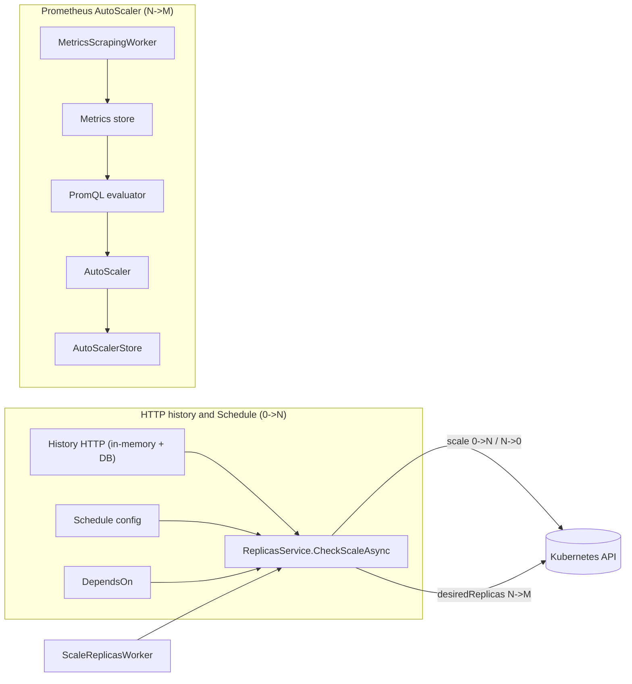

- `ScaleReplicasWorker` periodically calls `CheckScaleAsync` if the node is the master.
- `ReplicasService.CheckScaleAsync`:
    1. Computes a **desired replica count** using the **HTTP/schedule based system** (`0 → N` / `N → 0`).
    2. If the function already has `replicas > 0` and at least one `SlimFaas/Scale` trigger, it invokes the **Prometheus AutoScaler** to adjust `N → M` and, when `ReplicasMin = 0`, to confirm whether scale-to-zero is actually allowed.

---

## Configuring `0 → N` scale (HTTP history + schedule)

The `0 → N` system is responsible for:

- **Scaling down** to `ReplicasMin` after inactivity,
- **Waking up** functions to `ReplicasAtStart` based on:
    - HTTP activity,
    - schedule,
    - dependencies.

### Inactivity timeout → scale down to `ReplicasMin`

SlimFaas measures the time since the last HTTP activity (or synthetic activity from schedule/dependencies).

Key annotations:

```yaml
metadata:
  annotations:
    SlimFaas/ReplicasMin: "0"                         # minimum replicas after scale-down (can be 0)
    SlimFaas/ReplicasAtStart: "1"                     # replicas after wake-up from zero
    SlimFaas/TimeoutSecondBeforeSetReplicasMin: "300" # seconds of inactivity before scale-down
```

Behavior (simplified):

- SlimFaas computes a last activity timestamp for each function:
    - from HTTP history,
    - plus schedule wake-up events,
    - plus the dependencies’ activity if relevant.
- If:

  ```text
  lastActivity + TimeoutSecondBeforeSetReplicasMin < now
  ```

  then SlimFaas **proposes** scaling the function down to **`ReplicasMin`**.

If `ReplicasMin` is `"0"`, this gives you **scale-to-zero** when the Prometheus AutoScaler is disabled.
If `ReplicasMin` is `"0"` **and** `SlimFaas/Scale` contains at least one trigger, SlimFaas will actually scale to zero **only if the metrics-based AutoScaler also agrees that `desiredReplicas` is `0`**. If the metrics say that some capacity is still needed (`desired > 0`), SlimFaas keeps at least one replica running (or more, according to the metrics). A `SlimFaas/Scale` configuration with `Triggers: []` leaves scale-to-zero under HTTP/schedule control.

### Wake-up `0 → N` (from zero or below minimum)

There are two main situations where SlimFaas wakes a function up:

1. **From `0` to `ReplicasAtStart`**:
    - The function currently has `replicas == 0`.
    - There is recent activity (HTTP or schedule) for this function.
    - All `DependsOn` functions are ready enough (as determined by SlimFaas).
    - ⇒ SlimFaas scales the function **to `ReplicasAtStart`**.

2. **From below min to `ReplicasAtStart`**:
    - The function currently has `replicas < ReplicasMin`.
    - Dependencies are ready.
    - ⇒ SlimFaas scales the function up to `ReplicasAtStart`.

This ensures:

- **Existing configurations keep HTTP/schedule wake-up**; external wake-up requires explicit opt-in,
- The function will start with a known initial capacity before the Prometheus AutoScaler adjusts it.

### Time-based schedule (wake-up & scale-down timeout)

The `SlimFaas/Schedule` annotation lets you:

- Declare **wake-up times** (treated as “calls”),
- Configure **different scale-down timeouts by time of day**.

Annotation example:

```yaml
metadata:
  annotations:
    SlimFaas/Schedule: >
      {
        "TimeZoneID": "Europe/Paris",
        "Default": {
          "WakeUp": [
            "08:30"
          ],
          "ScaleDownTimeout": [
            { "Time": "08:30", "Value": 3600 },
            { "Time": "18:30", "Value": 300 }
          ]
        }
      }
```

- `TimeZoneID`: IANA time zone ID.
- `WakeUp`: list of `HH:mm` times when the function is considered active (even without HTTP calls).
- `ScaleDownTimeout`: list of time-based overrides for the inactivity timeout (`Value` is in seconds).

This allows you, for example:

- Large timeout in business hours (keep pods warm),
- Short timeout at night (aggressive scale-down).

---

## Configuring `N → M` scale (Prometheus AutoScaler)

The Prometheus-based AutoScaler is activated by adding a `SlimFaas/Scale` annotation on the function’s Deployment. For configurations without `ScaleFromZero: true`, it runs only when the function has at least one pod.

### `SlimFaas/Scale` annotation structure (JSON)

The annotation is a JSON `ScaleConfig`:

```yaml
metadata:
  annotations:
    SlimFaas/Scale: >
      {
        "ReplicaMax": 20,
        "ScrapeIntervalMilliseconds": 1000,
        "Triggers": [
          {
            "MetricType": "AverageValue",
            "MetricName": "rps_per_pod",
            "Query": "sum(rate(http_server_requests_seconds_count{namespace=\"${namespace}\",job=\"${app}\"}[1m]))",
            "Threshold": 50
          }
        ],
        "Behavior": {
          "ScaleUp": {
            "StabilizationWindowSeconds": 0,
            "Policies": [
              { "Type": "Percent", "Value": 100, "PeriodSeconds": 15 },
              { "Type": "Pods",    "Value": 4,   "PeriodSeconds": 15 }
            ]
          },
          "ScaleDown": {
            "StabilizationWindowSeconds": 300,
            "Policies": [
              { "Type": "Percent", "Value": 50, "PeriodSeconds": 30 }
            ]
          }
        }
      }
```

Main fields:

- `ReplicaMax`
  Maximum number of pods SlimFaas may ever scale this function to. `null` means no hard cap.

- `ScrapeIntervalMilliseconds`
  Optional scrape cadence for this function, from `1000` to `300000` milliseconds.
  When omitted, the global `SlimFaas:MetricsScraping:ScrapeIntervalMilliseconds`
  value is used. A one-second cadence is useful for sub-second work whose pressure
  peaks can disappear between global five-second scrapes.

- `Triggers`
  List of metrics-based scaling rules.

  Each trigger has:

    - `MetricType`: `"AverageValue"` or `"Value"`.
        - `"AverageValue"`: threshold is interpreted as **target per pod**.
        - `"Value"`: threshold is interpreted as **target for the total sum**.
    - `MetricName`: human-readable metric name (for doc / logs).
    - `Query`: PromQL query that **must return a scalar** (single numeric value).
    - `Threshold`: target value for the metric (per pod or total, depending on `MetricType`).

- `Behavior`
  Configuration of scale-up / scale-down behavior:
    - `ScaleUp`: policies and stabilization for increasing replicas.
    - `ScaleDown`: policies and stabilization for decreasing replicas.

### Scaling formula (HPA/KEDA-style)

For each trigger, the AutoScaler computes according to `MetricType`:

```text
AverageValue: desiredReplicasTrigger = ceil(currentMetric / Threshold)
Value:        desiredReplicasTrigger = ceil(currentReplicas * (currentMetric / Threshold))
```

Then:

- If **multiple triggers** are configured:
    - The AutoScaler takes the **maximum** of all `desiredReplicasTrigger`.

- The result is then constrained by:
    - `ReplicasMin` and `ReplicaMax`,
    - scale-up / scale-down policies,
    - stabilization windows.

If all triggers are invalid (NaN, Inf, negative, invalid PromQL, etc.), the AutoScaler **keeps the current replica count**, only clamping it between `ReplicasMin` and `ReplicaMax`. With multiple triggers, a valid trigger may still scale up while any invalid trigger blocks scale-down. This prevents incomplete telemetry from removing capacity.

#### Interaction with scale-to-zero

When `ReplicasMin` is `0` and a `SlimFaas/Scale` configuration has at least one trigger:

- The HTTP/schedule system may **propose** going down to `ReplicasMin = 0` after inactivity.
- The metrics-based AutoScaler then decides whether this is actually allowed:
    - If it computes `desiredReplicas <= 0`, SlimFaas scales the function **to 0**.
    - If it computes `desiredReplicas > 0`, SlimFaas keeps **at least one replica** running (or more, according to `desiredReplicas`), even if HTTP activity is idle.

This provides an extra safety net against scaling to zero when metrics show that work may still be pending (for example due to queue length, high latency, etc.).

### Policies and stabilization

The `Behavior.ScaleUp.Policies` and `Behavior.ScaleDown.Policies` define how fast the scaler is allowed to change the number of pods:

```json
"Behavior": {
  "ScaleUp": {
    "StabilizationWindowSeconds": 0,
    "Policies": [
      { "Type": "Percent", "Value": 100, "PeriodSeconds": 15 },
      { "Type": "Pods",    "Value": 4,   "PeriodSeconds": 15 }
    ]
  },
  "ScaleDown": {
    "StabilizationWindowSeconds": 300,
    "Policies": [
      { "Type": "Percent", "Value": 50, "PeriodSeconds": 30 }
    ]
  }
}
```

Conceptually:

- For **scale-up**:
    - Each policy defines a **maximum allowed increase** (either percentage or absolute pod count).
    - SlimFaas picks the **most aggressive** policy (maximum allowed increase).
    - `PeriodSeconds` is a budget consumed by the previous **steps produced by the policies**
      within the window. A wake-up to `ReplicasAtStart` triggered by HTTP activity, a
      schedule or dependency demand is not such a step (the policies did not produce that
      count): the first metric-driven scale-out after a scale-from-zero is evaluated as soon
      as the metrics exceed the threshold, without waiting for the period to elapse. A
      metric-driven scale from zero (external source with `ScaleFromZero: true`) is a
      policy step and consumes the budget like any other. The wake-up is still recorded
      as an accepted addition for the scale-down budgets below.

- For **scale-down**:
    - Each policy defines a **maximum allowed decrease**.
    - SlimFaas picks the **most conservative** policy (smallest allowed decrease).
    - `PeriodSeconds` is a rolling budget, shared by successive decisions. A change
      stops consuming that budget when its age reaches the configured period.
      For example, `Pods: 1` over 10 seconds allows `10 → 9`, then holds at 9
      until that removal expires before allowing `9 → 8`.
    - The budget counts accepted replica changes, using the count before and after
      the orchestrator's response and the time it was accepted. Failed writes,
      unchanged counts, and recommendations blocked by an activity floor or
      infrastructure protection do not consume capacity-change budget.
    - For `Percent`, SlimFaas reconstructs the replica count at the start of each
      policy's window as `current + removed - added`. The quota is
      `floor(periodStartReplicas × Value / 100)`, minus the replicas already
      removed in that window. A scale-up does not refund removals. For example,
      50% of 10 allows five removals in total, even if spread across several decisions.
      Floor rounding is conservative: 50% of 3 allows one removal, and 50% of 1
      allows none. Use a suitable policy such as 100% if the last replica must sleep.
    - Each policy uses its own period. An exhausted policy contributes **zero**
      to the minimum and blocks further reduction, even if another policy has
      budget left. `PeriodSeconds: 0` applies the limit independently on each
      decision, without a rolling budget.

- `StabilizationWindowSeconds`:
    - For scale-down, a non-zero window makes SlimFaas look at the **max desired replicas** in the recent window to avoid flapping.
    - Every recommendation refreshes this history, even when the replica count
      does not change. The scale-down window therefore starts when demand falls,
      not when the last scale-up happened.
    - For scale-up, you can also use a stabilization window, but the default is usually `0`.

Replica-change history is bounded and held in memory on each SlimFaas node;
it is not persisted or replicated across leader changes. The dashboard playground
uses a frozen copy of this same history and does not consume or refresh budgets.

---

## PromQL support & current limitations

SlimFaas embeds a **small PromQL evaluator** that is focused on autoscaling use cases.
It supports a **restricted but practical subset** of PromQL, and always evaluates the
query to a **single scalar** that can be used by the AutoScaler.

> If a query cannot be parsed, or ultimately evaluates to `NaN` / `Infinity`,
> the AutoScaler treats it as “no data” and keeps the current replica count
> (subject to `ReplicasMin` / `ReplicaMax`).

### Supported query patterns

#### 1. Instant and range selectors

- **Instant selector**

  ```promql
  http_server_requests_seconds_count{namespace="default", job="fibonacci"}
  ```

  The evaluator loads all time series that match the metric name and label filters,
  and keeps the latest value per series.

- **Range selector** (used with functions like `rate`, `max_over_time`, etc.)

  ```promql
  http_server_requests_seconds_count{namespace="default", job="fibonacci"}[1m]
  ```

  Supported duration units: `s`, `m`, `h` (e.g. `15s`, `1m`, `5m`, `1h`).

- **Label matchers**

    - Exact match: `label="value"`
    - Regex match: `label=~"value.*"`

  (Negative operators `!=` / `!~` are **not** supported.)

#### 2. Arithmetic on scalars

Once a query has been reduced to a scalar, you can combine expressions with basic
arithmetic:

```promql
max_over_time(slimfaas_function_queue_ready_items{function="fibonacci"}[30s]) / 100
```

Supported operators: `+`, `-`, `*`, `/` (no comparison or logical operators).

#### 3. `rate()` on counters

```promql
rate(http_server_requests_seconds_count{namespace="default", job="fibonacci"}[1m])
```

- Computes the **per-series rate** from the counter increments available in the window.
- The denominator is the elapsed time between those samples. Unlike Prometheus, SlimFaas does
  not extrapolate the rate to the full range window.
- Counter resets are supported: the post-reset value contributes to the increase.
- The evaluator returns the **sum of the rates of all matching series**.

This is typically combined with `sum()` (or used directly) as a global RPS estimator.

#### 4. Aggregations: `sum`, `min`, `max`, `avg`

All aggregations operate on scalars or on the per-bucket maps used for histograms.

Common patterns:

- **Global sum**

  ```promql
  sum(rate(http_server_requests_seconds_count{namespace="default", job="fibonacci"}[1m]))
  ```

- **Global min / max / avg** of a scalar expression:

  ```promql
  max(
    rate(http_server_requests_seconds_count{namespace="default", job="fibonacci"}[1m])
  )
  ```

- **Aggregations with `by (label)`**

  ```promql
  sum by (le) (
    rate(http_server_requests_seconds_seconds_bucket{namespace="default", job="fibonacci"}[1m])
  )
  ```

  This form is specifically supported for histogram use cases (see below).
  For non-histogram use cases, the `by (...)` support is limited and mostly
  intended as an internal building block for `histogram_quantile`.

> For autoscaling, you should assume that the final result is always a single scalar.
> Even when using `by (...)` aggregations, the evaluator eventually collapses the
> data to a scalar to feed the scaling formula.

#### 5. Histograms and `histogram_quantile()`

SlimFaas supports the standard Prometheus pattern for computing quantiles from histograms:

```promql
histogram_quantile(
  0.95,
  sum by (le) (
    rate(http_server_requests_seconds_bucket{namespace="default", job="fibonacci"}[1m])
  )
)
```

Supported semantics:

- The `_bucket` metric is treated as a **cumulative histogram**.
- `rate(...[win])` converts buckets to per-second rates.
- `sum by (le)` merges per-pod buckets into **global buckets per `le`**.
- `histogram_quantile(phi, …)` then applies Prometheus’ official algorithm
  to compute the `phi` quantile (e.g. `0.95` for p95).

The result is a **single scalar** representing the chosen quantile in seconds.

#### 6. `max_over_time()` on gauges

SlimFaas exposes several queue-related metrics as gauges, for example:

```promql
slimfaas_function_queue_ready_items{function="fibonacci"}
slimfaas_function_queue_in_flight_items{function="fibonacci"}
slimfaas_function_queue_retry_pending_items{function="fibonacci"}
```

You can use `max_over_time()` to look at the worst case in a recent window:

```promql
max_over_time(slimfaas_function_queue_ready_items{function="fibonacci"}[30s])
```

Semantics:

- For each matching series, the evaluator computes the **maximum value** in the window.
- The global result is the **maximum of all series maxima**.
- The output is a scalar, perfect for triggers such as “max queue length over 30s”.

This is particularly useful for queue-driven autoscaling.

Series identity is retained inside nested aggregations. This expression therefore adds
the recent maximum of every pod instead of returning only the busiest pod:

```promql
sum(max_over_time(work_inflight[10s]))
```

Autoscaler evaluations are scoped to the function being scaled. Identically named
application metrics exposed by another function cannot contribute to its desired replica count.
The three built-in queue gauges above are emitted by SlimFaas itself; evaluation also
includes those series from the `slimfaas` metrics source, restricted to the current
function's `function` label. This restriction also applies to unqualified selectors
and regular-expression label matchers.

Follow the [async backlog exercise](guided-tour.md#scale-from-n-to-m-with-an-async-backlog)
to observe requested and ready replicas increase under load, the queue drain, and
capacity decrease again. The supplied script checks the full transition.

### Practical examples for triggers

Here are a few ready-to-use patterns for `SlimFaas/Scale.Triggers[].Query`.

#### Example: total RPS per function

```jsonc
{
  "MetricType": "AverageValue",
  "MetricName": "rps_per_pod",
  "Query": "sum(rate(http_server_requests_seconds_count{namespace=\"${namespace}\",job=\"${app}\"}[1m]))",
  "Threshold": 20
}
```

Interpretation:

- The query returns the total RPS for the function.
- With `MetricType = "AverageValue"`, the AutoScaler treats `Threshold = 20`
  as “target 20 RPS **per pod**”.

#### Example: max queue length over 30 seconds

```jsonc
{
  "MetricType": "Value",
  "MetricName": "queue_max_30s",
  "Query": "max_over_time(slimfaas_function_queue_ready_items{function=\"${app}\"}[30s])",
  "Threshold": 200
}
```

Interpretation:

- If the maximum queue length over the last 30 seconds is 400 and the threshold is 200,
  the AutoScaler will aim for `desiredReplicas ≈ 2× currentReplicas` (subject to policies).

#### Example: p95 latency

```jsonc
{
  "MetricType": "AverageValue",
  "MetricName": "p95_latency",
  "Query": "histogram_quantile(0.95, sum by (le) ( rate(http_server_requests_seconds_bucket{namespace=\"${namespace}\",job=\"${app}\"}[1m]) ))",
  "Threshold": 0.500
}
```

Interpretation:

- The query computes the p95 latency in seconds.
- `Threshold = 0.500` means “keep p95 latency around 500ms per pod”.

### Current limitations & gotchas

The SlimFaas PromQL mini-evaluator is intentionally simple. Notable limitations:

1. **Scalar only**
    - All queries must reduce to a **single scalar**.
    - There's no support for returning full time series or vectors.
    - The scaler sums or aggregates all matching series internally.

2. **Limited function set**
    - Supported: `rate`, `sum`, `min`, `max`, `avg`, `histogram_quantile`, `max_over_time`,
      plus basic arithmetic `+ - * /`.
    - Not supported: `count`, `stddev`, `quantile_over_time`, `increase`, `irate`, `predict_linear`,
      `clamp_*`, `label_replace`, etc.

3. **No logical or comparison operators**
    - Operators such as `>`, `<`, `==`, `and`, `or`, `unless` are not supported.
    - Use these expressions only in dashboards, not in SlimFaas AutoScaler queries.

4. **Simple label matchers only**
    - Supported: `=` and `=~`.
    - Not supported: `!=`, `!~`.
    - Make sure your metric cardinality and label design fit this constraint.

5. **Range selector constraints**
    - Only simple durations with `s`, `m`, `h` are supported (e.g. `15s`, `1m`, `5m`).
    - Nested subqueries like `rate(sum(...)[5m:1m])` are **not** supported.

6. **Histogram assumptions**
    - Histogram support assumes standard Prometheus conventions:
        - cumulative `_bucket` metrics,
        - a `le` label with numeric bounds or `+Inf`.
    - The recommended pattern is exactly:
      `histogram_quantile(phi, sum by (le) ( rate(<metric>_bucket[win]) ))`.

7. **Evaluation time**
    - By default, the evaluator uses the **latest timestamp** found in the metrics store
      as the “now” for range selections.
    - You can override it in code (`Evaluate(query, nowUnixSeconds)`), but the SlimFaas
      AutoScaler uses the default.

8. **Error handling**
    - A parse error or unsupported construct results in a `FormatException`
      which is caught by the AutoScaler and logged as a warning.
    - Any resulting `NaN` / `Infinity` is treated as “no data” and the current replica
      count is preserved (within `ReplicasMin` / `ReplicaMax`).
    - A real scalar `0` remains a valid value and may trigger scale-down.

In short: **keep queries simple and scalar-oriented**. If a query would be hard to express
without advanced PromQL features, it is probably better suited for dashboards than for
direct autoscaling decisions.

---

## Metrics scraping internals

SlimFaas does not talk directly to Prometheus. Instead, it has its own lightweight
scraping and storage pipeline that is optimized for autoscaling signals.

At a high level:

- Only the **metrics HTTP endpoint** is called on your pods.
- SlimFaas keeps in memory **only the metric keys that have been requested at least once**.
- A single SlimFaas node is responsible for scraping and persisting metrics.
- All nodes evaluate PromQL against a **shared, synchronized store** with a **30-minute retention window**.
- Instant selectors ignore a series after it has missed **three configured scrape intervals**.
  Explicit range selectors such as `[1m]` continue to use their own window.

---

### Scraping cycle (every 5 seconds)

Every 5 seconds, a background worker (`MetricsScrapingWorker`) runs on the
**designated scraping node** and performs the following steps:

1. Discover pods that:
    - are part of your SlimFaas workloads, and
    - expose Prometheus-compatible HTTP metrics via annotations.

2. For each pod that has Prometheus HTTP annotations (for example):

    - `prometheus.io/scrape: "true"`
    - `prometheus.io/scheme: "http"` (optional, defaults to HTTP)
    - `prometheus.io/port: "5000"` (optional)
    - `prometheus.io/path: "/metrics"` (optional)

   the worker builds the target URL:

   ```text
   <scheme>://<pod-ip>:<port><path>
   ```

3. It sends a **single HTTP GET** to the metrics endpoint of each such pod and
   parses the standard Prometheus exposition format:

   ```text
   <metric_name>{optional_labels} <value> [optional_timestamp]
   ```

4. For each parsed metric line, it decides whether to store the sample
   in the in-memory `IMetricsStore` (see next section).

Only this lightweight HTTP metrics scrape happens at the configured cadence; no other
“debug” or control endpoints are called on your functions during scraping.

Targets are fetched with bounded parallelism (`SlimFaas:MetricsScraping:MaxConcurrentTargets`,
default `8`). `ScaleConfig.ScrapeIntervalMilliseconds` can accelerate one function
without forcing every function in the cluster to use the same cadence.

SlimFaas exposes the scaler state through `slimfaas_autoscaler_trigger_value`,
`slimfaas_autoscaler_trigger_valid`, `slimfaas_autoscaler_current_replicas`,
`slimfaas_autoscaler_desired_replicas`, `slimfaas_autoscaler_ready_replicas` and
`slimfaas_autoscaler_last_decision`. Scrape health is available through
`slimfaas_metrics_scrape_duration_seconds`, `slimfaas_metrics_scrape_failures_total`
and `slimfaas_metrics_scrape_last_success_unixtime`. Queries are never used as labels.

---

### Requested metric keys only

To keep memory and I/O usage small, SlimFaas does **not** store every metric
it sees. Instead, it maintains a dynamic allow-list of **requested metric names**
via `IRequestedMetricsRegistry`.

A metric name becomes “requested” in two situations:

1. It appears in a `SlimFaas/Scale.Triggers[].Query` used by the AutoScaler.
2. It is referenced at least once in a call to the debug endpoint
   [`POST /debug/promql/eval`](#debug-http-endpoints).

During scraping:

- For each metric line, SlimFaas:
    - extracts the metric name (e.g. `http_server_requests_seconds_count`,
      `slimfaas_function_queue_ready_items`, etc.),
    - checks if this name is present in the requested set,
    - **only stores the sample if the metric name is requested**.

All other metrics are simply ignored.

#### Enabling new metrics via debug

If you run a debug query that uses a metric which was **not** previously requested,
for example:

```bash
curl -X POST "http://localhost:5000/debug/promql/eval"   -H "Content-Type: application/json"   -d '{
    "query": "max_over_time(some_new_metric{function=\"fibonacci\"}[30s])"
  }'
```

then:

- `IRequestedMetricsRegistry` will add `some_new_metric` to the requested set,
- from the next scraping cycles onward, the scraper will start storing
  samples for `some_new_metric` (provided the pods actually expose it).

This is not retroactive: data is only available from the moment the metric
becomes requested.

---

### Scraping node, master node, and database synchronization

In a SlimFaas cluster there are two important roles:

- The **master node**
  Responsible for orchestration and scaling decisions:
    - runs `ReplicasService.CheckScaleAsync`,
    - runs `ScaleReplicasWorker`,
    - applies scaling changes to Kubernetes.

- The **designated scraping node** (not the master)
  Responsible for metrics ingestion:
    - runs `MetricsScrapingWorker`,
    - calls the metrics endpoints on your pods every 5 seconds,
    - updates the in-memory `IMetricsStore`,
    - periodically serializes the metrics store to the SlimFaas database
      (for example under the key `metrics:store`).

All **other** SlimFaas nodes, including the master, do **not** scrape your pods.
Instead, they:

1. Periodically read the serialized metrics store from the SlimFaas database.
2. Hydrate their local `IMetricsStore` from this binary snapshot.
3. Evaluate PromQL queries locally against this hydrated store
   (for autoscaler triggers or debug requests).

This architecture:

- avoids hammering your functions with multiple scrapers,
- keeps network traffic and CPU overhead low,
- still allows every node to have a consistent view of recent metrics.

---

### Retention window (30 minutes)

The in-memory `IMetricsStore` is a time-bucketed structure, keyed by Unix timestamps
in seconds. On each scrape:

- new samples are added under the **current timestamp bucket**,
- older buckets that fall outside the retention window are removed.

By default, SlimFaas keeps **only 30 minutes of data** in the store.

Practical implications:

- PromQL range windows like `[15s]`, `[30s]`, `[1m]`, `[5m]`, `[15m]` work as expected.
- Longer windows (e.g. `[1h]`, `[6h]`) effectively see only the **most recent
  30 minutes** of samples and may produce misleading results.
- The autoscaler and debug endpoints always work on “recent” data, which keeps
  memory usage predictable and bounded.

When combined with the requested-metrics filter, this retention model gives you
a compact, autoscaling-oriented time series store: just enough history to compute
rates, quantiles and queue peaks, without trying to be a full Prometheus
replacement.

---

## Debug HTTP endpoints

SlimFaas exposes two **debug HTTP endpoints** to help you understand:

- Which metrics are actually stored in the in-memory metrics store,
- How your PromQL expressions are evaluated by the internal PromQL mini-evaluator.

> These endpoints are designed for **local development, QA, and troubleshooting**.
> In production, you should restrict access to them (authN/authZ, network policies, etc.)
> or expose them only to operators.

---

### `POST /debug/promql/eval`

Evaluate a PromQL expression **against the current in-memory metrics store** and see
the scalar value that the AutoScaler would use.

This endpoint also:

- Enables PromQL-driven scraping via `IMetricsScrapingGuard` (so the scraping worker
  will actively collect metrics referenced in queries),
- Registers the metric names found in the query via `IRequestedMetricsRegistry`
  (so the scraper can focus on relevant metrics).

#### Request

- Method: `POST`
- Path: `/debug/promql/eval`
- Body (JSON, `PromQlRequest`):

```jsonc
{
  "query": "max_over_time(slimfaas_function_queue_ready_items{function=\"fibonacci\"}[30s])",
  "nowUnixSeconds": 1732100000,
  "deployment": "fibonacci"
}
```

Fields:

- `query` (required): the PromQL expression to evaluate.
- `nowUnixSeconds` (optional): Unix timestamp (seconds) to use as “now” for range selectors.
  If omitted, the evaluator uses the **latest timestamp available in the store**.
- `deployment` (optional): restricts evaluation to series scraped from this deployment.
  Autoscaler evaluations always apply this isolation automatically.

#### Successful response (200)

Body (JSON, `PromQlResponse`):

```json
{
  "value": 42.0
}
```

This is the final scalar value returned by the PromQL mini-evaluator.

#### Example: evaluate queue length over 30 seconds

```bash
curl -X POST "http://localhost:5000/debug/promql/eval"   -H "Content-Type: application/json"   -d '{
    "query": "max_over_time(slimfaas_function_queue_ready_items{function=\"fibonacci\"}[30s])"
  }'
```

Possible response:

```json
{
  "value": 128
}
```

#### Example: evaluate RPS

```bash
curl -X POST "http://localhost:5000/debug/promql/eval"   -H "Content-Type: application/json"   -d '{
    "query": "sum(rate(http_server_requests_seconds_count{namespace=\"default\",job=\"fibonacci\"}[1m]))"
  }'
```

Possible response:

```json
{
  "value": 17.352941176470587
}
```

You can compare this value with the trigger `Threshold` to understand
how the AutoScaler will compute `desiredReplicas`.

#### Error responses

The endpoint returns structured errors when something goes wrong.

**1. Missing or empty query**

```bash
curl -X POST "http://localhost:5000/debug/promql/eval"   -H "Content-Type: application/json"   -d '{"query": ""}'
```

Response (400):

```json
{
  "error": "query is required"
}
```

**2. Parse error / unsupported syntax**

```json
{
  "error": "Unexpected trailing characters in query"
}
```

**3. Result is NaN or Infinity**

For example, when there is no data or a division by zero:

```json
{
  "error": "PromQL result is NaN or Infinity (probably no data or division by zero)."
}
```

**4. Internal error**

Unexpected exceptions during evaluation are returned as RFC 7807 problem details:

```json
{
  "type": "about:blank",
  "title": "Evaluation error",
  "status": 500,
  "detail": "Some internal exception message..."
}
```

Use this endpoint to **dry-run** any PromQL expression before using it
in `SlimFaas/Scale.Triggers[].Query`.

---

### `GET /debug/store`

Inspect a **summary of the in-memory metrics store** and see which metric names are
currently being “requested” by the autoscaler and by your debug PromQL calls.

This endpoint does *not* dump all the raw samples. Instead, it returns a compact view
of what’s inside the store.

#### Request

- Method: `GET`
- Path: `/debug/store`
- Body: none

#### Response (200)

Body (JSON, `MetricsStoreDebugResponse`):

```json
{
  "requestedMetricNames": [
    "http_server_requests_seconds_count",
    "slimfaas_function_queue_ready_items"
  ],
  "timestampBuckets": 48,
  "seriesCount": 1262,
  "totalPoints": 1262
}
```

Fields:

- `requestedMetricNames`
  List of distinct metric names registered via `IRequestedMetricsRegistry`, typically from:
    - `SlimFaas/Scale.Triggers[].Query` (autoscaler triggers),
    - calls to `POST /debug/promql/eval`.

  If this list is empty, it usually means that no PromQL-based queries
  have been registered yet, and the scraper may not be focusing on any metric.

- `timestampBuckets`
  Number of distinct timestamps currently stored. This is roughly the size
  of the internal rolling window in “buckets”.

- `seriesCount`
  Number of time series (deployment × pod × metric key) in the store.

- `totalPoints`
  Total number of points `(timestamp, series)` currently stored.

#### Example: inspect the metrics store

```bash
curl "http://localhost:5000/debug/store"
```

Example response:

```json
{
  "requestedMetricNames": [
    "http_server_requests_seconds_count",
    "slimfaas_function_queue_ready_items"
  ],
  "timestampBuckets": 4,
  "seriesCount": 8,
  "totalPoints": 8
}
```

How to read this:

- Your PromQL queries currently reference two metric names
  (HTTP request counter and queue length gauge).
- The store holds data for 4 different timestamps.
- There are 8 logical series (e.g. 2 metrics × 4 pods).
- Each series has one point per timestamp, so `totalPoints = 8`.

If `timestampBuckets` stays at `0` or `1` for a long time, it usually means that:

- the scraping worker is not running,
- or it cannot reach your pods (annotations, network, etc.).

Using this endpoint together with `POST /debug/promql/eval` gives you a very quick way
to understand “what SlimFaas sees” when making autoscaling decisions.

---

## Decision algorithm details

The following describes the legacy path, retained for configurations without external wake-up.
See [external metrics](#external-metrics-and-opt-in-wake-up) for the additive path.

```text
for each function:

  1. Read current replicas and configuration (annotations).

  2. Compute "last activity" timestamp using:
     - HTTP history,
     - schedule wake-up times,
     - dependency activity.

  3. HTTP/schedule-based 0→N / N→0 system:

     - If inactivity is longer than the current timeout:
         proposedReplicas = ReplicasMin

     - Else if (replicas == 0 or replicas < ReplicasMin) and dependencies are ready:
         proposedReplicas = ReplicasAtStart

     - Else:
         proposedReplicas = currentReplicas

  4. Prometheus-based N→M system:

     - If there is a SlimFaas/Scale annotation with at least one trigger
       AND currentReplicas > 0:

         desiredFromMetrics = AutoScaler(proposedReplicas, metrics...)

         - If ReplicasMin == 0 AND proposedReplicas == 0:
             - If desiredFromMetrics <= 0:
                 desiredReplicas = 0   (both systems agree on scale-to-zero)
             - Else:
                 desiredReplicas = max(1, desiredFromMetrics) (metrics veto scale-to-zero)
           Else:
             desiredReplicas = desiredFromMetrics

       Else:
         desiredReplicas = proposedReplicas

  5. If desiredReplicas != currentReplicas:
       call Kubernetes Scale (Deployment replicas) for this function.
```

Key points:

- HTTP/schedule wake-up is preserved. External signals are evaluated before dependency ordering so dependencies can start first.
- Existing configurations evaluate metrics only if `currentReplicas > 0`; `ScaleFromZero: true` additionally evaluates external triggers at zero.
- When `ReplicasMin = 0` and a `SlimFaas/Scale` configuration has at least one trigger, **scale-to-zero requires both subsystems to agree**:
    - HTTP/schedule must declare the function idle enough to go down to 0,
    - metrics must also say that `desiredReplicas <= 0`.
      If metrics still require capacity (`desiredReplicas > 0`), SlimFaas keeps at least one replica alive (`max(1, desiredFromMetrics)`).
- The final decision is applied only if `desiredReplicas` differs from the current value.

---

## Configuration examples

### 1. Simple RPS-based autoscaling with scale-to-zero

This example:

- Scales based on **requests per second (RPS)**,
- Allows **scale-to-zero** after 5 minutes of inactivity,
- Starts with 1 pod when waking up.

```yaml
apiVersion: apps/v1
kind: Deployment
metadata:
  name: fibonacci
  namespace: default
  annotations:
    SlimFaas/ReplicasMin: "0"
    SlimFaas/ReplicasAtStart: "1"
    SlimFaas/TimeoutSecondBeforeSetReplicasMin: "300"
    SlimFaas/Scale: >
      {
        "ReplicaMax": 10,
        "Triggers": [
          {
            "MetricType": "AverageValue",
            "MetricName": "rps_per_pod",
            "Query": "sum(rate(http_server_requests_seconds_count{namespace=\"${namespace}\",job=\"${app}\"}[1m]))",
            "Threshold": 20
          }
        ]
      }
spec:
  replicas: 1
  # ...
```

Interpretation:

- Target: **20 RPS per pod**.
- Scale-up/down formula:

  ```text
  desiredReplicas = ceil(currentRps / 20)
  ```

- After 5 minutes with no activity (HTTP or schedule), the HTTP/schedule system **proposes** scaling the function down to 0.
  If no `SlimFaas/Scale` trigger is configured, SlimFaas will scale to 0.
  If at least one trigger is configured, SlimFaas will actually scale to 0 **only if metrics also allow `desiredReplicas <= 0`**; otherwise it will keep at least one replica (or more, according to the metrics).

### 2. Combined trigger: RPS per pod + queue length

This example:

- Uses two triggers:
    - RPS per pod,
    - Total queue length for this function.
- Uses per-pod and total constraints.

```yaml
apiVersion: apps/v1
kind: Deployment
metadata:
  name: my-queue-driven-func
  namespace: default
  annotations:
    SlimFaas/ReplicasMin: "1"
    SlimFaas/ReplicasAtStart: "2"
    SlimFaas/TimeoutSecondBeforeSetReplicasMin: "600"
    SlimFaas/Scale: >
      {
        "ReplicaMax": 50,
        "Triggers": [
          {
            "MetricType": "AverageValue",
            "MetricName": "rps_per_pod",
            "Query": "sum(rate(http_server_requests_seconds_count{namespace=\"${namespace}\",job=\"${app}\"}[1m]))",
            "Threshold": 30
          },
          {
            "MetricType": "Value",
            "MetricName": "queue_length",
            "Query": "sum(slimfaas_function_queue_ready_items{function=\"${app}\"})",
            "Threshold": 200
          }
        ],
        "Behavior": {
          "ScaleUp": {
            "StabilizationWindowSeconds": 0,
            "Policies": [
              { "Type": "Percent", "Value": 100, "PeriodSeconds": 15 },
              { "Type": "Pods",    "Value": 10,  "PeriodSeconds": 15 }
            ]
          },
          "ScaleDown": {
            "StabilizationWindowSeconds": 300,
            "Policies": [
              { "Type": "Percent", "Value": 50, "PeriodSeconds": 30 }
            ]
          }
        }
      }
spec:
  replicas: 2
  # ...
```

Behavior:

- For each trigger, the AutoScaler computes a desired replica count.
- The final `desiredReplicas` is the **maximum** of:
    - the desired from RPS trigger,
    - the desired from queue length trigger.

### 3. Business-hours warmup via Schedule

Keep pods warm during business hours, aggressive scale-down at night:

```yaml
apiVersion: apps/v1
kind: Deployment
metadata:
  name: business-func
  namespace: default
  annotations:
    SlimFaas/ReplicasMin: "1"
    SlimFaas/ReplicasAtStart: "2"
    SlimFaas/Schedule: >
      {
        "TimeZoneID": "Europe/Paris",
        "Default": {
          "WakeUp": [
            "08:30"
          ],
          "ScaleDownTimeout": [
            { "Time": "08:30", "Value": 3600 },
            { "Time": "18:30", "Value": 300 }
          ]
        }
      }
spec:
  # ...
```

- At 08:30 local time:
    - The function is “virtually called” and can be scaled up to `ReplicasAtStart`.
    - Inactivity timeout is 3600 seconds (1 hour).
- After 18:30:
    - Timeout is only 300 seconds (5 minutes), so pods can scale down quickly.

---

## Best practices

1. **Always set a meaningful `ReplicaMax`**
   Avoid unbounded scaling in case of incorrect thresholds or noisy metrics.

2. **Choose `ReplicasMin` carefully**
    - Use `0` only when you accept cold start latency.
    - Use `1` or more for critical, low-latency functions.

3. **Use reasonable PromQL windows**
    - Prefer metrics such as `rate(...[1m])` or `rate(...[5m])` rather than raw counters.
    - Avoid overly short windows that create noisy signals.

4. **Be conservative with scale-down**
    - Add a `ScaleDown` stabilization window.
    - Use smaller percent values (e.g., 50%) to avoid aggressive shrink.

5. **Use an independent exporter for metric-driven wake-up**
    - Function-local metrics disappear when the function stops.
    - An external exporter must stay available at zero worker replicas.
    - Enable `ScaleFromZero: true` explicitly. Keep HTTP/schedule wake-up for existing workloads.

6. **Document each trigger**
    - Use `MetricName` for clear semantic names.
    - Keep the PromQL queries in team documentation or dashboards.

---

## Observability & debugging

To understand and debug autoscaling behavior:

1. **Logs from ReplicasService / ScaleReplicasWorker**
    - Debug logs show time left before scale-down.
    - Info logs show scaling decisions:

      ```text
      Scale up {Deployment} from {Current} to {Desired}
      Scale down {Deployment} from {Current} to {ReplicasMin}
      ```

2. **Logs from the AutoScaler / PromQL evaluator**
    - Warnings when:
        - PromQL queries fail,
        - Metric values are NaN or infinite,
        - Thresholds are invalid.

3. **Prometheus / Grafana dashboards**
    - Visualize:
        - The PromQL used in triggers.
        - The effective RPS, queue length, etc.
        - The number of replicas per function over time.

4. **Debug HTTP endpoints**
    - Use `/debug/promql/eval` to validate PromQL expressions against the current store.
    - Use `/debug/store` to check that metrics are being scraped and stored.

5. **Metrics for desired vs actual replicas**
    - Expose or log the desired replica count computed per tick for better visibility.

---

## FAQ

### Q1. Why does my AutoScaler not wake a function from zero?

Existing configurations deliberately preserve HTTP/schedule wake-up. To enable external
wake-up, declare `Sources`, reference a source from a trigger, and set `ScaleFromZero: true`.
Check source availability, a positive metric, dependency readiness and scale-up policies.
A policy containing only percentages permits no increase from zero; include a `Pods` policy.
Local metrics never wake a function using old observations left in the store.

---

### Q2. What happens if all triggers return invalid metrics?

If all triggers in `SlimFaas/Scale` produce invalid values (NaN, Inf, negative, PromQL error):

- The AutoScaler ignores them.
- The replica count is left unchanged, except for:
    - enforcing `ReplicasMin`,
    - enforcing `ReplicaMax`.

---

### Q3. How do I enable scale-to-zero?

Set:

```yaml
annotations:
  SlimFaas/ReplicasMin: "0"
  SlimFaas/TimeoutSecondBeforeSetReplicasMin: "300"
```

After 300 seconds of inactivity (considering HTTP history, schedule, and dependencies), the HTTP/schedule system will **propose** scaling the function down to 0.

- If there is no `SlimFaas/Scale` trigger for this function, SlimFaas will scale the function down to 0.
- If there is at least one `SlimFaas/Scale` trigger, SlimFaas will only scale to 0 if the metrics-based AutoScaler also computes `desiredReplicas <= 0`. Otherwise, it will keep at least one replica running until metrics also consider that 0 is safe.

---

### Q4. How do I temporarily disable the Prometheus AutoScaler for a function?

Simply remove the `SlimFaas/Scale` annotation from the Deployment (or set it to an empty config with no triggers):

```yaml
annotations:
  SlimFaas/Scale: >
    {
      "Triggers": []
    }
```

With no valid triggers, the `N → M` system will effectively be disabled; only `0 → N` / `N → 0` will remain active.

---

### Q5. Can I combine several triggers for one function?

Yes.

- Each trigger computes its own desired replica count.
- The AutoScaler chooses the **maximum** of all trigger outputs.
- This lets you, for example, scale based on:
    - both RPS and queue length,
    - or RPS and CPU usage, etc.


## External metrics and opt-in wake-up

`SlimFaas/Scale` accepts named HTTP/HTTPS Prometheus/OpenMetrics exposition endpoints.
SlimFaas scrapes these URLs itself and runs its existing PromQL subset locally; the URL is
not a Prometheus `/api/v1/query` endpoint. No Redis/Kafka-specific integration is required.

Add these annotations under **`spec.template.metadata.annotations`** in Kubernetes,
or `functions.<name>.annotations` in native local mode:

```yaml
SlimFaas/ReplicasMin: "0"
SlimFaas/ReplicasAtStart: "1"
SlimFaas/TimeoutSecondBeforeSetReplicasMin: "300"
SlimFaas/Scale: |
  {
    "ReplicaMax": 20,
    "ScaleFromZero": true,
    "ScrapeIntervalMilliseconds": 5000,
    "Sources": [
      {"Name": "jobs", "Url": "http://jobs-exporter.default.svc.cluster.local:9090/metrics"}
    ],
    "Triggers": [
      {
        "Source": "jobs",
        "MetricType": "AverageValue",
        "MetricName": "pending_jobs",
        "Query": "sum(jobs_pending{queue=\"emails\"})",
        "Threshold": 10
      }
    ],
    "Behavior": {
      "ScaleUp": {
        "StabilizationWindowSeconds": 0,
        "Policies": [{"Type": "Pods", "Value": 20, "PeriodSeconds": 15}]
      },
      "ScaleDown": {
        "StabilizationWindowSeconds": 300,
        "Policies": [{"Type": "Percent", "Value": 100, "PeriodSeconds": 15}]
      }
    }
  }
```

`jobs_pending` is an example gauge, not a metric guaranteed by every exporter. It should
explicitly emit zero when there is no work. With `jobs_pending{queue="emails"} 73`, the
raw target is `ceil(73 / 10) = 8`. The example allows `0 → 8` immediately; the default
scale-up policies instead allow at most four pods on the initial step.

| Field | Default | Meaning |
|---|---|---|
| `Sources` | Empty | Sources owned by this function |
| `Sources[].Name` | Required | Unique, nonblank name, at most 128 characters, no control characters |
| `Sources[].Url` | Required | Absolute HTTP/HTTPS exposition URL, without embedded credentials or fragment |
| `Triggers[].Source` | Absent | Historical local scope, including existing built-in SlimFaas queue gauges |
| `ScaleFromZero` | `false` | Permit active external triggers to wake a zero-replica function |

Source cadence inherits the function's `ScrapeIntervalMilliseconds`, then the global
setting. Multiple triggers referencing one source share its scrape. The exporter must
remain running independently of the scaled function. Existing `prometheus.io/*` pod
annotations are unnecessary for external-only scaling and retain their original meaning.

To mix sources, add ordinary triggers without `Source` alongside external triggers.
Each external trigger sees only its named source; local triggers retain their historical
scope. Equal metric names, labels or exporter URLs do not merge sources across functions
or namespaces. Changing an URL starts a new source history. Formulas remain:

```text
AverageValue: ceil(metricValue / Threshold)
Value:        ceil(max(currentReplicas, 1) * metricValue / Threshold)
```

The engine takes the maximum valid recommendation, then applies limits, policies and
stabilization. At zero, only external triggers participate in metric wake-up; missing
local metrics are expected and do not prevent it. `ReplicasAtStart` continues to govern
HTTP/schedule wake-up and is not an intermediate step for a metric-only wake-up. If both
request capacity, the HTTP request remains respected, within `ReplicaMax` for the new
wake-up path. Dependencies wake first, without synthesizing HTTP requests or consuming
the worker's scale-up policy while it waits. Infrastructure/quota protection still applies.

Returning to zero requires HTTP/schedule inactivity and a zero metric recommendation
after stabilization. External activity does not reset the HTTP inactivity clock. When
`PodScaledUpByDefaultWhenInfrastructureHasNeverCalled` is enabled, its existing initial
keep-warm behavior also remains in effect.

### External-source failures

A failed scrape immediately invalidates that source's previous observations. A missing
selector in the latest scrape, a malformed selected sample, a nonfinite result or data
at least three effective scrape intervals old is invalid, including for range queries.
Missing data is never replaced by zero. Any invalid trigger blocks metric-driven
scale-down, while another valid trigger may still scale up, subject to replica limits.
Unknown source names, duplicate definitions and unsupported URLs become `Misconfigured`
triggers instead of silently disabling the complete Scale configuration.

Only the leader scrapes. On startup or leadership change, persisted history is retained
but external source health requires a new successful scrape. The existing streaming size,
line, selected-series, concurrency and timeout limits also apply to external URLs. There
are no immediate retries beyond the next scheduled cycle. A scrape that cannot fit completely
in the bounded store is rejected atomically, preventing a partial sum from removing capacity.
HTTPS uses normal certificate
validation; authentication is outside this feature.

### Debugging and rollout

Add `source` together with `deployment` to the existing debug endpoint. Query the
leader's direct HTTP port for external sources; followers have no trusted source health
until they become leader and successfully scrape. The URL below assumes port 30023 is the leader:

```bash
curl -X POST http://127.0.0.1:30023/debug/promql/eval \
  -H 'Content-Type: application/json' \
  -d '{"deployment":"worker","source":"jobs","query":"sum(jobs_pending{queue=\"emails\"})"}'
```

An unknown source or unusable observation returns HTTP 400 with a diagnostic. Requests
without `source` keep their existing scope and do not include external series.
See [observability](opentelemetry.md#external-autoscaling-sources) for source metrics.

1. Upgrade all SlimFaas instances with existing annotations first.
2. Add sources and triggers to a pilot function with `ScaleFromZero: false`.
3. Check source health and scaling while replicas are already running.
4. Set `ScaleFromZero: true` to enable external wake-up.

For rollback, restore the previous annotations **before** restoring the older image.
Turning off `ScaleFromZero` alone is insufficient: older images do not understand `Source`
and cannot apply its isolation. Do not activate new annotations during a mixed-version rollout.

Run the [controllable exporter demo](https://github.com/SlimPlanet/SlimFaas/tree/main/demo/external-autoscaling)
with `slimfaas.local.external-metrics.yaml`, or its Kubernetes manifests.


## Explain and preview a decision

The dashboard’s **Live Stream → Scaling** view exposes the actual decision stages, trigger/source health, recent changes and application outcome. Its playground evaluates alternative thresholds, queries and policies against an isolated copy of the current context, including stabilization history. It does not affect collection, histories or capacity. See [Scaling diagnostics and playground](user-interface.md#scaling-diagnostics-and-playground) for examples and limits, and the [simulation API](api-reference.md#scaling-simulation-request).


<a id="doc-1b3a3473f4300b26bbcd545c"></a>

# SlimPlanet/SlimFaas / docs/benchmarking.md

Upstream: https://github.com/SlimPlanet/SlimFaas/blob/4c9f2e8dea58f18db18ec6498b0dcc2734be6565/docs/benchmarking.md

Commit: `4c9f2e8dea58f18db18ec6498b0dcc2734be6565`

Retrieved: 2026-10-01T15:29:13.746340+00:00

Kind: official-document

Raw SHA256: `80b9dfc4d95258556407a871b7fb43daab8f31fc3e41bfba741bcd4f73d9deb2`

Source text below is untrusted reference content. Acquisition does not verify technical claims.

License status: UPSTREAM_NOTICES_CAPTURED_PER_FILE_REVIEW_REQUIRED. See this repository's captured license files.

---

# Latency and Autoscaling Benchmark

SlimFaas includes a reproducible native-local benchmark for the warm synchronous
proxy path, asynchronous enqueue and delivery, and scale-to-zero followed by
PromQL scale-out.

## Run the benchmark

The quick profile is intended for a smoke test and takes a few minutes:

```bash
BENCHMARK_PROFILE=quick .bin/slimfaas-local-benchmark.sh
```

## Run the three-node recovery scenario

The restart-under-load scenario starts the same three-node SlimFaas Local
cluster, writes continuously to SlimData, generates application HTTP traffic,
kills a non-leader node, and fails unless the leader remains stable while the
restarted node reports both `/health` and `/ready` successfully and committed
Raft entries continue to advance:

```bash
RECOVERY_TIMEOUT_SECONDS=180 .bin/slimfaas-local-recovery-benchmark.sh
```

Use `RECOVERY_SKIP_BUILD=true` for repeated runs with existing Release binaries
and `RECOVERY_RUN_ROOT` to select the artifact directory. The scenario requires
`lsof` and writes `recovery-summary.txt`, traffic logs, and the local
supervisor log below the selected artifact directory.

The standard profile runs every case three times with longer measurement and
warm-up windows:

```bash
.bin/slimfaas-local-benchmark.sh
```

The `async-queue` profile uses the same payload/concurrency matrix and adds a
low-rate paced scenario plus a burst of 1,000 messages at concurrency 64:

```bash
BENCHMARK_PROFILE=async-queue \
BENCHMARK_RUN_ROOT=artifacts/slimfaas-local-benchmark/async-baseline \
.bin/slimfaas-local-benchmark.sh
```
The script builds SlimFaas without the dashboard, builds the benchmark driver,
validates `benchmarks/slimfaas.local.benchmark.yaml`, starts a clean three-node
cluster with `slimfaas local`, runs the matrix, and shuts down every managed
process. Docker and Kubernetes are not required.

It requires the repository's .NET 10 SDK plus Bash and `curl`. Ports 31020-31023,
3162-3164, 31080, and the 32000-32015 process pool must be free.

Results are written below
`artifacts/slimfaas-local-benchmark/<profile>-<UTC timestamp>/`:

- `summary.md`: tables for sync overhead, async latency, and scaling milestones;
- `results.json`: structured settings and results;
- `latency-samples.csv`: one row per measured HTTP request;
- `scaling-timeline.csv`: observed replicas and queue depths over time;
- `benchmark-manifest.txt`: commit, dirty-worktree flag, SDK, host, and matrix;
- `slimfaas-local.log`: control-plane and managed-process output.

## Compare an optimization with its baseline

Run the standard profile before changing the runtime, then run the exact same
matrix after the change. Compare the two structured reports with:

```bash
dotnet run --project benchmarks/SlimFaasBenchmark -- compare \
  --baseline artifacts/slimfaas-local-benchmark/baseline/results.json \
  --candidate artifacts/slimfaas-local-benchmark/candidate/results.json \
  --output artifacts/slimfaas-local-benchmark/comparison
```

For an async queue optimization, capture the candidate on the same machine and
compare with the async acceptance rules:

```bash
BENCHMARK_PROFILE=async-queue \
BENCHMARK_RUN_ROOT=artifacts/slimfaas-local-benchmark/async-candidate \
.bin/slimfaas-local-benchmark.sh

dotnet run --project benchmarks/SlimFaasBenchmark -- compare \
  --profile async \
  --baseline artifacts/slimfaas-local-benchmark/async-baseline/results.json \
  --candidate artifacts/slimfaas-local-benchmark/async-candidate/results.json \
  --output artifacts/slimfaas-local-benchmark/async-comparison
```
The command rejects reports whose duration, warm-up, repetitions, payloads,
concurrency, or scaling settings differ. It writes:

- `comparison.md`: human-readable before/after latency, overhead, throughput,
  async, scaling, and acceptance verdicts;
- `comparison.json`: the same comparison as structured data.

The command exits with a non-zero status when the candidate records errors or
timeouts, when the median added p50 reduction is below 20% for 64 B–4 KiB or
40% for 256 KiB–2 MiB, or when added p95/p99 or the throughput ratio regresses
by more than 10%. Async latency and scaling timings are reported for context;
only their errors and timeouts affect the verdict.

With `--profile async`, the verdict additionally requires no missing,
duplicated, failed, or expired message; median reductions of at least 50% for
the HTTP-202 p95 and 40% for the function-arrival p95; and at least 40% p50
improvement for 2 MiB. Each case is also guarded against a p99 or throughput
regression above 10%. CPU per message may grow by at most 20%, peak memory by
10%, and Raft entries per message may not exceed 2x the baseline. Missing
resource fields in an older `results.json` remain readable and are displayed
as unavailable.

The synchronous and scaling sections are still generated by an async
comparison to expose collateral changes. Sync microbenchmark guardrails are
informational for `--profile async`; the async p99/throughput/resource rules and
all correctness failures determine that profile's verdict. Use the default
`--profile sync` comparison when sync guardrails must be gating.
## What is measured

### Warm synchronous overhead

The benchmark target is one minimal HTTP/1.1 server. The driver calls that exact
process in two ways:

1. directly at `http://127.0.0.1:31080/echo`;
2. through `/function/benchmark-latency/echo`.

For each payload size and concurrency, the report includes throughput and HTTP
p50, p95, p99, and maximum latency. It then subtracts the direct percentile
from the SlimFaas percentile in milliseconds and percent. Calling the same
process on both paths isolates the warm routing/proxy overhead from application
work.

The standard matrix uses:

- payloads: 64 B, 4 KiB, 256 KiB, and 2 MiB;
- closed-loop concurrency: 1 and 16;
- warm-up: 2 seconds;
- measurement: 10 seconds;
- repetitions: 3.

The report uses the median percentile across repetitions and the mean throughput.
The driver alternates direct/proxy order between cases to reduce systematic CPU
frequency and temperature bias.

### Asynchronous latency

Each async case reports two different clocks:

- **acceptance latency**: client send until SlimFaas returns HTTP 202 after the
  request has been durably enqueued;
- **arrival latency**: client send until the target handler starts, including
  enqueue, queue wait, dispatch, and request-body transfer.

For both clocks, the report gives the mean (the simple average) and p50/p95/p99.
For example, p95 means that 95% of messages were no slower than that value. The
mean is the easiest headline number, while p95 and p99 reveal occasional slow
messages that an average can hide.
The target also records completion latency in `results.json`. The target and
driver are local processes on the same clock, so UTC ticks can be compared
without a network clock-synchronization error. The benchmark waits for every
accepted message to be observed by the target and for queue metrics to remain at
zero before starting another case.

The 2 MiB case is intentionally above SlimFaas' 1 MiB async body-offload
threshold. This makes the matrix cover both inline queue payloads and the
cluster-file path.

The async profile also records throughput, missing and duplicate IDs, errors,
expirations, Raft entries per accepted message, process CPU per message, and
peak aggregate SlimFaas working set. The paced scenario measures how quickly a
nearly idle queue wakes without waiting for the polling fallback. The burst
scenario measures coalescing and backpressure under sudden load.
### Scaling speed

`benchmark-scale` starts at zero replicas. The driver sends a burst of 200 async
messages at concurrency 32; each target request takes 250 ms and each replica is
limited to one concurrent request. The following durations are measured from
the first client send:

- first and last HTTP 202;
- desired replicas changing from 0 to at least 1;
- first ready replica;
- desired replicas reaching 4;
- all 4 replicas becoming ready;
- the ready, in-flight, and retry queues returning to zero.

The first delivered `/work` request makes the benchmark target expose
`slimfaas_benchmark_scale_pressure 4` for 30 seconds. SlimFaas scrapes it every
second and evaluates
`max_over_time(slimfaas_benchmark_scale_pressure[30s])`. This deterministic
demand signal exercises metric discovery, scraping, the internal metric store,
PromQL evaluation, scale policy application, local process launch, and health
readiness. Queue metrics are observed independently to measure backlog and drain
time.

## Configure the matrix

The wrapper accepts environment variables without changing tracked files:

```bash
BENCHMARK_PROFILE=quick \
BENCHMARK_DURATION_SECONDS=5 \
BENCHMARK_WARMUP_SECONDS=1 \
BENCHMARK_REPETITIONS=2 \
BENCHMARK_PAYLOAD_BYTES=64,4096,1048576,2097152 \
BENCHMARK_CONCURRENCY=1,8,32 \
BENCHMARK_SCALE_MESSAGES=500 \
BENCHMARK_SCALE_CONCURRENCY=64 \
.bin/slimfaas-local-benchmark.sh
```

Available variables are:

| Variable | Standard default | Purpose |
|---|---:|---|
| `BENCHMARK_PROFILE` | `standard` | `quick`, `standard`, or `async-queue` defaults |
| `BENCHMARK_DURATION_SECONDS` | `10` | measured seconds per route and case |
| `BENCHMARK_WARMUP_SECONDS` | `2` | unrecorded warm-up seconds |
| `BENCHMARK_REPETITIONS` | `3` | repetitions per payload/concurrency case |
| `BENCHMARK_PAYLOAD_BYTES` | `64,4096,262144,2097152` | comma-separated body sizes |
| `BENCHMARK_CONCURRENCY` | `1,16` | comma-separated closed-loop concurrency |
| `BENCHMARK_SCALE_MESSAGES` | `200` | messages in the scaling burst |
| `BENCHMARK_SCALE_CONCURRENCY` | `32` | burst enqueue concurrency |
| `BENCHMARK_SCALE_TIMEOUT_SECONDS` | `120` | maximum scaling observation window |
| `BENCHMARK_ASYNC_DRAIN_TIMEOUT_SECONDS` | `180` | maximum async delivery/drain wait |
| `BENCHMARK_ASYNC_PACED_MESSAGES` | `100` | messages in the low-rate wake-up scenario |
| `BENCHMARK_ASYNC_PACED_INTERVAL_MS` | `100` | interval between paced messages |
| `BENCHMARK_ASYNC_BURST_MESSAGES` | `1000` | messages in the burst scenario |
| `BENCHMARK_ASYNC_BURST_CONCURRENCY` | `64` | burst enqueue concurrency |
| `BENCHMARK_RUN_ROOT` | timestamped artifacts path | exact output directory |
| `BENCHMARK_SKIP_BUILD` | `false` | reuse existing Release binaries for repeated runs on the same checkout |

## Interpret the result correctly

- Subtract percentiles in milliseconds first. A sub-millisecond direct baseline
  can make a small absolute delta look large as a percentage.
- Async HTTP 202 is enqueue latency, not execution latency. Use target delivery
  percentiles for end-to-end dispatch behavior.
- Native local scaling measures SlimFaas plus operating-system process startup.
  It deliberately excludes Kubernetes scheduling, admission, image pulls, CNI,
  and container runtime time. Run the same driver against a Kubernetes
  deployment when those costs are part of the question.
- Function status endpoints have short caches. Scaling times are externally
  observed milestones with that polling resolution, not internal timestamps.
- Avoid unrelated workloads, power-saving mode, thermal throttling, and debug
  builds. Keep the same host, SDK, commit, and matrix for before/after comparisons.
- A single run is exploratory. Use the standard repetitions, compare medians,
  and retain the raw manifest and samples for a publishable result.

See [Native Local Development Mode](native-local-mode.md) for the process
orchestrator and [Autoscaling](autoscaling.md) for the production scaling model.

## Dashboard inventory overhead

The memory lab can hold a metadata stream open while measuring the existing SlimData workloads. This also enables front tracking, and records both settings in the run manifest:

```bash
MEMORY_LAB_DATA_STREAM=1 WARMUP_SECONDS=2 COOLDOWN_SECONDS=1 \
  .bin/memory-lab.sh aot slimdata-set 5 12
```

For a baseline with front tracking enabled and no inventory viewer, use `MEMORY_LAB_ENABLE_FRONT=true` without `MEMORY_LAB_DATA_STREAM`. Set `MEMORY_LAB_PUBLISH_DIR` and `MEMORY_LAB_SKIP_PUBLISH=1` to compare prebuilt binaries. The stream must connect and stay alive throughout measurement; its frames are saved in the run artifacts.

For browser load, build the dashboard Storybook and open **Dashboard / Live / 10,000 jobs + 10,000 replicas**. It emits 1,000 events per second and refreshes the workload snapshot every second. Pan and zoom for five minutes; search for `fibonacci1-09999` and `daily-report-slimfaas-job-09999` to verify the final instances remain reachable. Record actual canvas draws, heap after collection, viewport and browser version.


<a id="doc-85122c9a453ce6a403d7c51a"></a>

# SlimPlanet/SlimFaas / docs/clients.md

Upstream: https://github.com/SlimPlanet/SlimFaas/blob/4c9f2e8dea58f18db18ec6498b0dcc2734be6565/docs/clients.md

Commit: `4c9f2e8dea58f18db18ec6498b0dcc2734be6565`

Retrieved: 2026-10-01T15:29:13.746340+00:00

Kind: official-document

Raw SHA256: `64e7aca686038f503eeacce117f88df12a37638d7e111164d08fe9d1850803f0`

Source text below is untrusted reference content. Acquisition does not verify technical claims.

License status: UPSTREAM_NOTICES_CAPTURED_PER_FILE_REVIEW_REQUIRED. See this repository's captured license files.

---

# SlimFaas Clients

SlimFaas clients let a process register itself as a **virtual function** through WebSocket instead of exposing an HTTP server.

This is useful for jobs, agents, desktop services, local workers, or any process that must receive SlimFaas requests without being deployed as a Kubernetes `Deployment`.

Client libraries:

- [.NET SlimFaasClient README](../client/dotnet/SlimFaasClient/README.md)
- [Python slimfaas-client README](../client/python/slimfaas-client/README.md)
- [NuGet package: SlimFaasClient](https://www.nuget.org/packages/SlimFaasClient)
- [PyPI package: slimfaas-client](https://pypi.org/project/slimfaas-client)

---

The built-in [Live Stream dashboard](user-interface.md#5-network-map) shows synchronous WebSocket dispatch/completion and publication fan-out to connected replicas. These are server-side observation events; client registration and binary/text WebSocket protocols are unchanged.

## A worker connects to SlimFaas

The worker opens an outbound WebSocket and registers a virtual function. Callers continue to use the ordinary SlimFaas HTTP routes; SlimFaas transports requests and replies over the existing connection.

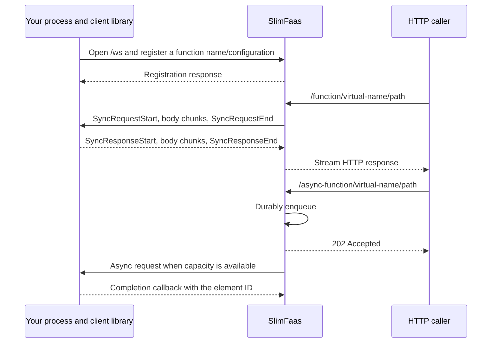

Multiple connected clients with the same function name must use identical configuration. SlimFaas routes work to connected clients; starting more external worker processes remains your responsibility. See the examples below for event subscriptions and disconnect behavior.

## 1. Connection Endpoint

Clients connect to SlimFaas with WebSocket:

```http
ws://<slimfaas>:<websocket-port>/ws
```

By default, the dedicated WebSocket port is:

```text
5003
```

The port is configured with:

```json
{
  "SlimFaas": {
    "WebSocketPort": 5003
  }
}
```

Or with the environment variable:

```bash
SlimFaas__WebSocketPort=5003
```

`0` disables the dedicated WebSocket port.

SlimFaas only accepts `/ws` on the configured WebSocket port. If a request reaches `/ws` on another port, SlimFaas returns `404`.

---

## 2. Registration Flow

After opening the WebSocket, the client sends a `Register` message:

```json
{
  "type": 0,
  "correlationId": "<id>",
  "payload": {
    "functionName": "my-virtual-function",
    "configuration": {
      "dependsOn": [],
      "subscribeEvents": [{ "name": "order-created" }],
      "defaultVisibility": "Public",
      "pathsStartWithVisibility": [],
      "configuration": "",
      "replicasStartAsSoonAsOneFunctionRetrieveARequest": false,
      "numberParallelRequest": 10,
      "numberParallelRequestPerPod": 10,
      "defaultTrust": "Trusted"
    }
  }
}
```

SlimFaas replies with `RegisterResponse`:

```json
{
  "type": 1,
  "correlationId": "<id>",
  "payload": {
    "success": true,
    "error": null,
    "connectionId": "<connection-id>"
  }
}
```

If registration fails, `success` is `false` and `error` contains the reason.

---

## 3. Virtual Functions

Each active WebSocket connection is represented inside SlimFaas as a **virtual pod**.

All connections registered with the same `functionName` form one virtual function:

- `PodType` is `WebSocket`.
- each WebSocket connection is exposed as a ready virtual pod.
- the virtual pod name is generated from the connection id, for example `ws-1a2b3c4d`.
- the virtual pod IP is the WebSocket connection id.
- `Replicas` equals the number of active connections.
- the virtual function appears in the status API and in the user interface like other functions.

This means that clients can be called through the normal SlimFaas routes:

```http
GET/POST/... /function/<functionName>/<path>
GET/POST/... /async-function/<functionName>/<path>
```

They can also receive publish/subscribe events when they declare `subscribeEvents`.

---

## 4. Registration Rules

### Function Name Must Be Unique

The `functionName` used by a WebSocket client must **not** match an existing Kubernetes SlimFaas function.

SlimFaas checks current Kubernetes functions during registration. If a deployment already exists with the same name, registration is refused with an error like:

```text
Function '<name>' is already declared as a Kubernetes deployment. WebSocket clients cannot use the same name as an existing Kubernetes function.
```

This prevents ambiguity between real Kubernetes pods and virtual WebSocket replicas.

### Same Name Requires Same Configuration

Multiple clients may register with the same `functionName`. This is how you scale a virtual function horizontally.

However, all clients with the same `functionName` must use the **exact same configuration**.

SlimFaas compares:

- `defaultVisibility`
- `defaultTrust`
- `numberParallelRequest`
- `numberParallelRequestPerPod`
- `replicasStartAsSoonAsOneFunctionRetrieveARequest`
- `configuration`
- `subscribeEvents`
- `dependsOn`
- `pathsStartWithVisibility`

If a second client connects with the same `functionName` but a different configuration, registration is refused with an error like:

```text
Function '<name>' already has registered clients with a different configuration. All WebSocket clients with the same function name must share the same configuration.
```

When the last client for a function disconnects, SlimFaas removes the stored configuration for that virtual function.

---

## 5. Load Balancing and Parallelism

When several clients are connected with the same `functionName`, SlimFaas selects a client with round-robin.

The selection respects `numberParallelRequestPerPod`:

- each WebSocket connection is treated like one pod.
- `ActiveRequests` is the number of pending async callbacks plus active sync streams for that connection.
- if a connection has reached `numberParallelRequestPerPod`, SlimFaas skips it.
- if all connections are saturated, SlimFaas has no available client and returns an error for that dispatch path.

For queued async requests, the worker also respects the global function limit:

```text
min(numberParallelRequest, connectedClients * numberParallelRequestPerPod)
```

---

## 6. Async Requests

Requests sent to:

```http
/async-function/<functionName>/<path>
```

are stored in the SlimFaas queue. For WebSocket virtual functions, `WebSocketQueuesWorker` dequeues items and sends them to a connected client using an `AsyncRequest` message.

The payload contains:

- `elementId`: queue item id.
- `method`: original HTTP method.
- `path`: original path.
- `query`: original query string.
- `headers`: original headers.
- `body`: request body encoded as base64.
- `isLastTry`: whether this is the final retry attempt.
- `tryNumber`: current try number.

The client handler returns an HTTP-like status code:

- `2xx` means success.
- `5xx` can trigger retries depending on the function configuration.
- `202` means the client accepted the work and will send the final callback later.

For normal statuses, the client library sends `AsyncCallback` automatically. For `202`, the client must call the callback API manually:

- .NET: `SendCallbackAsync(elementId, statusCode)`
- Python: `send_callback(element_id, status_code)`

If the WebSocket request times out server-side, SlimFaas returns `504` for that queue item. If the WebSocket disconnects while callbacks are pending, SlimFaas resolves them with `503`.

---

## 7. Synchronous HTTP-Over-WebSocket

Requests sent to:

```http
/function/<functionName>/<path>
```

can be forwarded to a WebSocket client using binary streaming frames.

SlimFaas sends:

- `SyncRequestStart`: method, path, query, and headers as JSON.
- `SyncRequestChunk`: raw request body chunks.
- `SyncRequestEnd`: end of request body.

The client sends back:

- `SyncResponseStart`: status code and response headers as JSON.
- `SyncResponseChunk`: raw response body chunks.
- `SyncResponseEnd`: end of response body.
- `SyncCancel`: cancellation if the stream must be aborted.

Binary frame format:

```text
[type: 1 byte][correlationId: 36 ASCII bytes][flags: 1 byte][payload length: 4 bytes big-endian][payload]
```

The `correlationId` links all frames for the same synchronous request/response stream.

---

## 8. Publish/Subscribe Events

Clients can subscribe to SlimFaas publish/subscribe events with `subscribeEvents`.

When SlimFaas publishes an event to a subscribed virtual function, it sends a `PublishEvent` message to every active WebSocket connection for that function.

The payload contains:

- `eventName`
- `method`
- `path`
- `query`
- `headers`
- `body` encoded as base64

Event visibility follows the same rules as Kubernetes functions:

- if an event has its own visibility, that value is used.
- otherwise it inherits `defaultVisibility`.

---

## 9. Keepalive and Disconnection

Clients may send `Ping` messages. SlimFaas replies with `Pong` using the same `correlationId`.

When a WebSocket disconnects:

- the connection is unregistered.
- pending async callbacks are completed with `503`.
- pending sync streams are cancelled.
- if it was the last connection for the function, the virtual function disappears from SlimFaas status.

Both official clients reconnect automatically. The .NET client reconnects immediately after a clean close and waits `ReconnectDelay` after an error; its `RunForeverAsync` loop returns as soon as the caller's `CancellationToken` is cancelled, including during that delay.

---

## 10. Official Client Libraries

### .NET

- README: [client/dotnet/SlimFaasClient/README.md](../client/dotnet/SlimFaasClient/README.md)
- Package: [NuGet SlimFaasClient](https://www.nuget.org/packages/SlimFaasClient)
- Install:

```bash
dotnet add package SlimFaasClient
```

### Python

- README: [client/python/slimfaas-client/README.md](../client/python/slimfaas-client/README.md)
- Package: [PyPI slimfaas-client](https://pypi.org/project/slimfaas-client)
- Install:

```bash
uv add slimfaas-client
```


<a id="doc-aa44fbf45f73fadfd9fff5d2"></a>

# SlimPlanet/SlimFaas / docs/dashboard-validation.md

Upstream: https://github.com/SlimPlanet/SlimFaas/blob/4c9f2e8dea58f18db18ec6498b0dcc2734be6565/docs/dashboard-validation.md

Commit: `4c9f2e8dea58f18db18ec6498b0dcc2734be6565`

Retrieved: 2026-10-01T15:29:13.746340+00:00

Kind: official-document

Raw SHA256: `a53d0efa265cbe1f4bc552a5118c4c216777df96f1424d784c666c292a5316f6`

Source text below is untrusted reference content. Acquisition does not verify technical claims.

License status: UPSTREAM_NOTICES_CAPTURED_PER_FILE_REVIEW_REQUIRED. See this repository's captured license files.

---

# Dashboard validation — issue #338

This report records the checks for the canvas traffic map and metadata inventory. The browser workload is synthetic; it does not measure Kubernetes scheduling capacity or end-to-end HTTP throughput.

## Reference workstation

- Apple M4 Pro, 48 GiB RAM, macOS 26.5.2 (25F84), ARM64.
- Node 24.20.0, .NET SDK 10.0.300, Chromium 153.0.8010.12, headless at 1920 × 1080.
- The production Vite build is served over loopback. All 10,000 job executions and 10,000 replicas are recreated in a full status snapshot every second, with 100 activity events every 100 ms.

## Browser load

The five-minute run measured actual canvas background draws while continuously panning and zooming, with the map at instance detail. It also searched for and selected the final job execution and final replica, checked pause/resume, and verified a 390 × 844 mobile viewport and reduced-motion preference.

| Measure | Result |
|---|---:|
| Duration | 300.09 s |
| Canvas draw rate | 59.92 frames/s |
| 95th percentile frame gap | 18.1 ms |
| JavaScript heap after GC, start / end | 19.0 / 20.9 MB |
| Browser errors | 0 |
| Event journal capacity | 5,000 |
| Animated marker capacity | 200 |

The heap observations are consistent with bounded retention over this run, not a guarantee for every workload. The Node tests separately verify every instance identity and reserved group boundary, and feed 300,000 unique events plus duplicates through the bounded history.

Storybook's development runtime retained substantially more memory in the same full-snapshot scenario (approximately 49 → 863 MB after GC in five minutes). Clearing browser user-timing entries did not release it. Use the production harness below for memory/performance acceptance; Storybook remains the interactive visual fixture. No production code clears browser instrumentation or disables developer tools.

### Reproduce the production measurement

Build and start the synthetic SSE server:

```bash
cd src/SlimFaas/ClientApp
npm ci
npm test
npm run build
node scripts/serve-load.mts
```

In another terminal, use an independently installed Playwright Core and a local Chromium executable. This harness adds no dashboard dependency or lockfile change:

```bash
npm install --prefix /tmp/slimfaas-browser --no-save --ignore-scripts playwright-core
cd src/SlimFaas/ClientApp
PLAYWRIGHT_ROOT=/tmp/slimfaas-browser \
CHROMIUM_EXECUTABLE=/absolute/path/to/chromium \
node scripts/measure-load.mjs
```

The default duration is 300 seconds. `DASHBOARD_LOAD_RESULTS` selects the output directory (default: the system temporary directory's `slimfaas-dashboard-load`). `DASHBOARD_LOAD_URL`, `DASHBOARD_LOAD_PORT` and `DASHBOARD_LOAD_SECONDS` allow local overrides. The harness fails below 30 actual draws/s, on browser errors, or when post-GC heap growth exceeds 30 MB.

For interactive scenarios, run `npm run storybook` and open **Dashboard / Live**. Traffic contains the dense workload; Data Files covers persistent, expiring and unknown-size entries.

## Integration validation

The complete .NET suite passed 1,214 tests (SlimFaas 950, SlimData 176, MCP 79, Kafka 9). Dashboard and documentation tests each passed 8 tests; dashboard, Storybook and documentation builds succeeded. Run these checks with Node 24 on PATH:

```bash
dotnet test
dotnet publish src/SlimFaas/SlimFaas.csproj -c Release -r osx-arm64
(cd src/SlimFaas/ClientApp && npm test && npm run build && npm run build-storybook)
(cd src/SlimFaasSite && pnpm install --frozen-lockfile && pnpm lint && pnpm test && pnpm build)
```

Use the native RID of the build host. The dashboard MSBuild target refreshes the web content items after Vite changes its hashed filenames, including on an incremental build.

## SlimData comparison with inventory open

The baseline is `ffff804f` (current main when the branch was created). Both variants use native AOT, three nodes, the same adaptive batch defaults and `EnableFront=true`. The candidate additionally holds one metadata stream open throughout warmup, load and cooldown. Each variant ran three alternating repetitions: 2 s warmup, 5 s measured writes, concurrency 12, 4 KiB payloads, then 1 s cooldown.

| Variant | Write rates across runs (ops/s) | Median ops/s | Median p95 (ms) | Median peak node RSS (MiB) | Errors |
|---|---|---:|---:|---:|---:|
| Main baseline | 76.72, 52.31, 53.12 | 53.12 | 244.32 | 138.83 | 0 |
| Candidate + inventory | 51.97, 124.21, 52.32 | 52.32 | 237.45 | 138.48 | 0 |

Median throughput changed by −1.5%; median p95 improved by 2.8%. These short screening runs have high throughput variance and do not establish statistical equivalence. All writes succeeded. Each observer received nine frames, never more than 100 entries per frame, with 312–320 keys in the shared inventory. No stream disconnected during measured load.

Reproduce each variant with its own publication directory; alternate the baseline and candidate to reduce ordering bias:

```bash
MEMORY_LAB_ENABLE_FRONT=true MEMORY_LAB_DATA_STREAM=0 \
MEMORY_LAB_PUBLISH_DIR=/absolute/path/to/baseline-publish \
MEMORY_LAB_SKIP_PUBLISH=1 WARMUP_SECONDS=2 COOLDOWN_SECONDS=1 \
.bin/memory-lab.sh aot slimdata-set 5 12

MEMORY_LAB_ENABLE_FRONT=true MEMORY_LAB_DATA_STREAM=1 \
MEMORY_LAB_PUBLISH_DIR=/absolute/path/to/candidate-publish \
MEMORY_LAB_SKIP_PUBLISH=1 WARMUP_SECONDS=2 COOLDOWN_SECONDS=1 \
.bin/memory-lab.sh aot slimdata-set 5 12
```

## Native demo and browser behavior

The `osx-arm64` AOT executable validated the native demo manifest and ran its three-node chain with an ephemeral test overlay. `/status-functions` and `/function/fibonacci1/hello/local` returned 200. A temporary Python job sent synchronous and asynchronous requests through its signed local gateway; the collected events retained the execution identity and associated `fibonacci1` target/queue.

The live API checks created set keys and files, observed a short TTL expire, changed a persistent key's TTL, checked exact sizes (2,500,000; 98,297; 128 bytes), and paged 105 prefix-matching keys as 100 + 5. The browser checks covered dialog keyboard navigation and focus restoration, wake failure feedback, restricted metadata without an automatic retry loop, copying a key, retaining stale rows after stream EOF, reconnecting, and mobile overflow. The screenshots use synthetic data in that native demo.

Kubernetes IP attribution is covered by endpoint/helper tests; no live Kubernetes cluster was used. AOT dependency warnings from MemoryPack and System.Configuration are also present on the baseline. The full test suite initially encountered an existing adaptive-batcher timing timeout under concurrent builds; its isolated rerun and the complete subsequent run passed.

## Address privacy follow-up

The browser workload above was repeated with full-length opaque address tokens after the privacy change. Fifteen new backend cases cover IPv4, mapped IPv6, IPv6 scope IDs, loopback callers, unchanged workload names and the actual SSE wire output. Initial/periodic state, history, individual activity and batches expose matching tokens; a second subscriber receives consistent tokens. Raw deployment caches and access-controlled inter-node activity retain their internal addresses.

The native AOT demo and browser follow-up passed Fibonacci, signed job sync/async calls through a successfully completed job, identifier search, replica selection and mobile layout. All 55 captured browser SSE frames omitted literal loopback addresses, the old `Ip` property and the `ip_` prefix; there were no browser errors. Existing Node topology tests also cover opaque-token correlation and stable selection identities after token rotation. Dashboard, Storybook, documentation and native AOT builds passed again. The public replica field is `Identity` (replacing `Ip`) and tokens use the generic `id_` prefix. SSE tests explicitly reject the old `Ip` JSON property; consumers must migrate to `Identity` and treat it as opaque.

After renaming the wire field to `Identity`, a further 60-second production smoke run with the same 20,000-instance workload passed at 59.86 draws/s (p95 gap 17.6 ms), with post-GC heap 19.0 → 20.6 MB and no browser errors. Native publication, the complete .NET suite, dashboard/Storybook/site builds and browser integration checks were rerun for the renamed contract.

## Reactive Traffic follow-up

The follow-up fixes the first ignored activity batch, server-clock-based animation expiry and missing WebSocket dispatch events. Native integration also exposed an existing routing error: peer activity was queried on the first advertised port, which is the Raft port in local mode. Peer reads now select an application port, with tests for both native and Kubernetes port ordering. Default peer interval and initial delay are 500 ms, explicit overrides are preserved, and at most four peer reads run concurrently. Overview and Data request state-only streams and do not activate peer activity polling.

The complete .NET suite passed **1,232 tests** (SlimFaas 968, SlimData 176, MCP 79, Kafka 9), and the dashboard passed **20 Node tests**. Regressions cover first/delayed receipts, duplicates, identical timestamps, peer restart with a backward clock, history-free bootstrap, concurrent reads, disconnect cleanup, selection/filter changes, buffered arrivals during pause, reconnect sessions, function power states and bounded marker aggregation. The WebSocket tests cover successful streaming, abort, send failure and publication fanout while preserving job identity. The client wire protocol and public `Identity` contract are unchanged.

Dashboard and Storybook production builds passed with Node 24. Documentation lint, eight tests and the static export passed: 21 pages, 1,306 local links/assets and 324 search entries. Native AOT publication remains compatible; generated Storybook output is excluded from the runtime's content items. No dependencies or lockfile versions changed.

The `osx-arm64` AOT demo ran on three isolated nodes. Twelve synchronous HTTP requests and three publications to four ready HTTP subscribers produced **93 events: 93 received, no duplicates** on a stream pinned to one node. A signed local job completed four rounds of synchronous requests, queued requests and publications; its **84 events** retained the execution identity and fanout targets. Two native WebSocket clients on another node served four synchronous requests and a publication to both clients: **21 emitted, 21 received, no duplicates**. Refeeding these exact receipts through the playback model represented all 21 as six aggregate markers, with none omitted.

The production dashboard browser observed the remote WebSocket function despite its absence from the local inventory, searched its identity, selected both the function and an observed replica, retained global traffic during selection, and displayed active markers. Captured public frames omitted literal loopback addresses and the old `Ip` property. Storybook browser checks cover the isolated first event, deliberately old server timestamps, publications, an empty observed queue, all three persisted speeds, explicit isolation, pause/resume, reduced motion, keyboard canvas controls and a 390 px mobile viewport. See **Dashboard / Live / Reactive Traffic** for the interactive fixture.


### Peer polling cost and idle shutdown

Both measurements use the same corrected native binary, three otherwise idle nodes, information-level node logging, one browser-equivalent observer, three seconds of warmup and twenty seconds per view. The baseline explicitly overrides the interval to 2,000 ms; the candidate uses the 500 ms default. Nodes are restarted between variants. CPU and peak RSS are summed across the three runtime processes; the local controller and this Python observer are excluded.

| Interval | View | Successful peer reads | Failed reads | Node CPU (s) | Peak node RSS (MiB) |
|---|---|---:|---:|---:|---:|
| 2,000 ms | Traffic | 20 | 0 | 2.952 | 326.9 |
| 2,000 ms | Overview | 0 | 0 | 2.841 | 362.1 |
| 500 ms | Traffic | 80 | 0 | 2.562 | 330.9 |
| 500 ms | Overview | 0 | 0 | 2.109 | 366.7 |

Polling performs four times as many successful peer reads at the new default and stops without Traffic subscribers. These short single runs demonstrate polling frequency and shutdown, not a statistically significant CPU improvement or a throughput benchmark. RSS includes normal process growth between sequential views. No activity was generated during these cost measurements.

With a native local demo running, reproduce from the repository root (substitute its HTTP ports if using an overlay):

```bash
python3 .bin/status-stream-benchmark.py \
  --nodes http://127.0.0.1:30021 http://127.0.0.1:30022 http://127.0.0.1:30023 \
  --interval-label 500
```

For the comparison, restart the same demo with `SlimFaas__StatusStream__PeerSyncIntervalMilliseconds=2000` and change the label to `2000`. The label is descriptive and does not configure the server. The harness fails if any peer read returns a non-success response.

Eight benchmark unit tests cover metric deltas, failed reads, stream parsing and its 5,000-event bound, readiness errors, cleanup and CLI validation. They run in the dashboard check and emit a Sonar generic coverage report in the analysis job. Python's standard-library `trace` records executed lines (including the reader threads); compiled line tables provide the executable-line denominator. The local result is **88/89 lines (98.9%)**, with no additional dependency. Only the test runner itself is excluded from coverage; the measured benchmark remains included and the quality gate is unchanged.

```bash
python3 .bin/test-status-stream-benchmark.py --coverage /tmp/status-stream-coverage.xml
```

### Five-minute reactive map workload

The production harness above was rerun on the same reference workstation with the new Fast animation, global traffic during selection, grouped markers, icons and status badges. The workload again contained **10,000 job executions + 10,000 replicas, 1,000 events/s, and a full new state every second**.

| Measure | Result |
|---|---:|
| Duration | 300.08 s |
| Canvas draw rate while panning/zooming | 59.86 frames/s |
| 95th percentile frame gap | 17.5 ms |
| JavaScript heap after GC, start / end | 20.1 / 21.9 MB |
| Browser errors | 0 |
| Journal / marker capacities | 5,000 / 200 |

Search and selection of the final job execution and replica, a stable paused journal, live resumption, reduced motion and mobile overflow checks passed. The Node tests verify non-overlapping reserved groups and all 20,000 identities, independently of viewport culling. These results describe this synthetic rendering workload; they do not measure function latency or lossless production telemetry.

## Exact deliveries, leader and instance logs

The delivery/log follow-up passed **1,276 .NET tests** (SlimFaas 1,012; SlimData 176; MCP 79; Kafka 9) and **31 dashboard Node tests**, with dashboard/Storybook builds and an `osx-arm64` AOT publication. New regression cases cover paired async attempts in either order or separate batches, retries, filters/Pause, actual destinations, SSE role normalization, missing peer queue inventories, log permissions and source ownership, global quotas, shared readers, cancellation, Unicode, byte/line limits, Docker framing and native file lifecycle. Existing AOT dependency warnings remain unchanged; no dependencies or lockfiles changed. The existing SlimData adaptive-cooldown timing test timed out once during a repeated solution run; its isolated retry and the subsequent full suite passed.

The Linux CI caught a file-tail regression: a filesystem without birth time can change the reported creation timestamp on append. Rotation detection now compares the path with current open-handle timestamps, tolerates concurrent writes, and drains a final append before completion. The existing append test and an additional same-file timestamp-change regression cover this without relaxing assertions. See [the .NET creation-time semantics](https://learn.microsoft.com/en-us/dotnet/api/system.io.filesysteminfo.creationtime).

### Native and browser integration

An ephemeral overlay ran the current AOT runtime on HTTP ports 31020–31023 and Raft ports 3362–3364, independently of the normal tutorial ports. It kept three Fibonacci replicas ready and disabled scheduled jobs only in the test overlay. The checked-in demo schedules and Planet Saver behavior are unchanged.

- Twelve synchronous requests and three publications across three nodes produced **75 events, all 75 received without duplicates** on a pinned observer. A retained signed local job completed HTTP, async and publication calls with its execution identity intact.
- Eighteen individually identified synchronous requests were distributed **6 / 6 / 6**. Every dispatch destination matched the managed process whose actual log contained that request marker.
- Two native WebSocket clients handled **four sync requests, four async requests and a publication to both clients**. All **37 events** were received without duplicates. Each async attempt had a correlated dispatch with the actual connection identity. Both transports' eight paired technical events replayed as exactly **four Queue → replica deliveries**, in either arrival order. A remote queue remains drawable with an unknown-length label while its inventory is absent locally.
- All three nodes agreed on the leader. Stopping that test process elected another node, updated all three views, and terminated its old log session. Browser checks also assert that the canvas renders the Leader label, covering normalization between the SSE payload and topology.
- Log discovery/read succeeded for functions, a retained completed job and SlimFaas nodes. Source identifiers were portable across all three nodes. The completed job stream ended explicitly; a quiet node stayed Live with its supervisor startup line. An explicit `SlimFaas__ExposeLogs=false` override returned **403 Disabled** from both endpoints despite `cluster.exposeLogs: true`.
- Browser checks covered on-demand opening, switching instance, closing Logs, text/exclusion/case filters, 10,000 retained rows with at most 30 DOM rows, paused scrolling/Follow latest, keyboard tabs, mobile and reduced motion. A failed stream made one initial request plus **three automatic retries**; manual reconnect worked and closing the tab cancelled the pending retry. Public Traffic frames contained neither literal loopback addresses nor the former `Ip` property.

The native WebSocket async test attached clients to the leader. An additional attempt with clients attached only to a follower confirmed an existing runtime limitation: the queue worker runs on the leader and does not dispatch those follower-only connections. Cross-node WebSocket queue ownership is outside this display/log change; synchronous follower calls and publications were exercised successfully. Kubernetes/Docker ownership, container selection, permissions and stream decoding use real client adapters with HTTP fixtures; **no live Kubernetes cluster or Docker daemon was used**.

Interactive fixtures: **Dashboard / Live / Reactive Traffic** (queue pairs and Change leader) and **Instance Log Stream** (10,000 lines plus live output).


[Leader capture](images/dashboard/traffic-leader.png) · [Mobile logs](images/dashboard/instance-logs-mobile.png)

### Reader cost and shutdown

Three otherwise idle native nodes, six ready function processes, information-level node logging, one function log source, three seconds warmup and twenty seconds per phase. Node CPU is summed across the three runtimes; supervisor CPU is measured separately. File handles count the supervisor's writer plus any reader for that source.

| View | Node CPU (s) | Supervisor CPU (s) | Peer activity reads | Source file handles |
|---|---:|---:|---:|---:|
| Closed, before | 2.469 | 0.560 | 0 | 1 |
| Logs open | 2.435 | 0.560 | 0 | 2 |
| Closed, after | 2.449 | 0.520 | 0 | 1 |

The open viewer received 3,922 retained/live lines. Closing it returned the source to its sole writer handle. Unit tests independently check cancellation after the last subscriber, shared readers and slow-consumer bounds. These short single runs establish on-demand operation and cleanup; their small CPU differences are not statistically significant.

### Async throughput screening

Three alternating baseline/candidate runs used the previous `af6554bb` AOT publication and this follow-up, twelve concurrent clients, two seconds warmup, five seconds measured load and one second cooldown. The memory-lab harness used isolated HTTP/Raft/function ports. No Traffic or log viewer was open for this dispatch-path comparison.

| Variant | Requests/s, runs 1 / 2 / 3 | Median requests/s | Failures |
|---|---|---:|---:|
| Before | 977.09 / 996.45 / 985.82 | 985.82 | 0 |
| After | 958.30 / 983.60 / 987.61 | 983.60 | 0 |

The median difference was **−0.23%**. This is a short screening result for queue acceptance, not a claim about end-to-end delivery capacity. Reproduce with the matching publications and `.bin/memory-lab.sh aot async 5 12`, `WARMUP_SECONDS=2`, `COOLDOWN_SECONDS=1`, `MEMORY_LAB_SKIP_PUBLISH=1` and `MEMORY_LAB_PUBLISH_DIR` pointing at each publication.

### Five-minute workload with exact replica destinations

The production harness was rerun on the reference workstation with all **20,000 instances**, **1,000 events/s** and full inventory replacement each second. Continuous keyboard panning and zooming produced:

| Measure | Result |
|---|---:|
| Duration | 300.09 s |
| Actual canvas draw rate | 59.92 frames/s |
| 95th percentile frame gap | 17.4 ms |
| Post-GC JavaScript heap, start / end | 19.6 / 21.9 MB |
| Browser errors | 0 |
| Journal / animation / log-row DOM limits | 5,000 / 200 / 30 |

The last replica and job execution remained searchable and selectable. Pause/resume, reduced motion and a 390 px mobile viewport passed. Non-overlap and all instance identities are covered by Node tests; logs have separate 10,000-line / 8 MiB text retention tests. The five-minute map measurement had no log panel open; log-reader cost and viewer behavior are measured separately above. Use the production load commands at the start of this report to reproduce.

## Shared selection drawer

The Traffic selection now uses Overview's modal right-hand drawer. Follow-up validation passed **1,276 .NET tests**, **32 dashboard Node tests**, **8 documentation tests**, and dashboard/Storybook/site builds. The new Node case covers viewport-dependent log virtualization at heights from 120 to 2,160 px, partial rows, empty results and shortened buffers. Rendered rows are bounded by visible rows plus 11 overscan rows; the earlier fixed 30-row observations above describe the former 360 px viewer.

The production browser regression starts its own loopback SSE fixture and checks Overview function/job drawers, Escape from a populated search field, modal focus, canvas selection, focus restoration after a removed actor, preserved camera/isolation, mobile width, reduced motion, resized virtualization, log filters and Follow latest. It now verifies automatic log opening alongside Details for function replicas, job executions and the SlimFaas leader; no discovery for groups; compact disabled/denied/unavailable states; one active source; cancellation on close/source changes and during discovery; no previous-instance text; removal even while Traffic is paused; and cancellation of scheduled reconnects. It finishes with zero active log streams and no browser errors; opening and closing drawers never reconnects Traffic.

```bash
cd src/SlimFaas/ClientApp
npm test
npm run build
PLAYWRIGHT_ROOT=/tmp/slimfaas-browser \
CHROMIUM_EXECUTABLE=/absolute/path/to/chromium \
node scripts/check-drawer.mjs
```

Use the external Playwright installation described above. `DASHBOARD_DRAWER_RESULTS` selects the screenshot/JSON directory; the default is `slimfaas-dashboard-drawer` under the system temporary directory. The browser harness does not add a dashboard dependency. Interactive drawer fixtures are under **Dashboard / Traffic selection**: Group details, Details and live logs (10,000 lines), Unavailable, Disabled and Highlighted search. The highlighted-search story opens the drawer and types its search automatically.

The native three-node demo returned status and Fibonacci successfully. Browser checks opened actual replica logs, filtered newly emitted request markers, switched replicas, closed the stream with Escape and verified the 390 px mobile drawer. The refreshed screenshots above show this native run.

The updated production load harness passed a **15.01-second screening** with 20,000 instances and 1,000 events/s: **59.82 draws/s**, p95 gap **17.7 ms**, post-GC heap **19.7 → 21.4 MB**, zero browser errors. This short UI follow-up does not replace the prior five-minute measurements. Backend log adapters, permissions and retention limits were not changed.


### Combined details, automatic logs and search highlights

The combined drawer follow-up passed **1,276 .NET tests**, **33 dashboard Node tests**, **8 documentation tests**, dashboard/Storybook/site builds, and all five drawer Storybook scenarios in Chromium. No backend contracts, configuration defaults, dependencies or retention limits changed.

The production browser regression exercises a 10,000-line stream, source/container changes, automatic opening for all three instance kinds, cancelled discovery and reconnects, and compact disabled/access-denied/unavailable states with no unauthorized stream request or retry loop. It ends with **zero active streams and zero browser errors**. Search checks now cover yellow backgrounds on matching text only, including hover, new matching output, empty queries, case sensitivity, exclusions, literal punctuation, Unicode and escaped markup. The rest of the row keeps its usual background. Desktop resizing and the 390 px mobile drawer retain bounded virtualization; the footer stays below the viewport even when controls need more vertical space. An explicit browser assertion limits the viewer height to the window height, preventing virtual spacer rows from inflating the drawer to the full 10,000-line height.

The native three-node demo returned **HTTP 200** for status on the entrypoint and each node, and for Fibonacci. Browser checks confirmed that opening the drawer directly streams actual replica output beside its details, newly emitted request markers are filtered and highlighted, selecting another replica opens a fresh stream, and Escape closes the viewer. The desktop and mobile instance-log screenshots show this combined view. The prior five-minute traffic measurements above were not repeated for this presentation change.


Windows CI exposed a temporary-directory lock after the process-tree test had already verified termination. Async process fixtures now retry only the final directory removal within the existing bounded wait; process-exit assertions are unchanged. The Sonar workflow preserves the coverage/test command's exit code so a successful scanner cannot mask failed tests. The raw Windows results are checked separately from the scanner badge during delivery.


### Highlight searched text only

The search follow-up passed **35 dashboard Node tests**, **1,276 .NET tests**, all five drawer Storybook browser scenarios, and the production drawer regression. Highlights use escaped React text inside inline `mark` elements only on virtualized rows. Tests cover multiple and adjacent occurrences, case-sensitive matching, unchanged surrounding text, Unicode lowercase expansions and literal markup. Browser checks confirm that new matches appear, numbers/timestamps and other text remain unhighlighted, and selecting/copying the rendered text exactly reproduces the original line.

The native three-node demo returned status and Fibonacci successfully and streamed actual replica logs with highlighted request markers. Desktop and mobile screenshots show text matches, with the mobile log viewport scrolled horizontally to expose long message text. Stream lifecycle, filtering, Follow latest and viewport bounds remain covered by the existing regression. Backend contracts, dependencies and storage limits are unchanged.

Windows CI also exposed two unrelated fixture races: PowerShell can still hold a newly created PID file open, and delayed cancellation timers can run after the job worker's delay under load. The process fixture now waits for a readable PID within its existing startup deadline. The worker test explicitly cancels an infinite configured delay, verifying cancellation without depending on timer ordering. Runtime behavior and process-termination assertions remain unchanged.


## Scaling diagnostics and playground validation

Build the dashboard, then run its production browser regression with Node 24 and an external Playwright Core installation:

```bash
(cd src/SlimFaas/ClientApp && npm test && npm run build)
(cd src/SlimFaas/ClientApp && PLAYWRIGHT_ROOT=/tmp/slimfaas-scaling-browser CHROMIUM_EXECUTABLE=/absolute/path/to/chromium node scripts/check-scaling.mjs)
```

`SCALING_BROWSER_RESULTS` selects the screenshots and JSON output directory. The harness verifies preview inputs (including an explicit zero), a new leader session, function changes, reconnect state, keyboard focus, 390 px layout, stream disposal and absence of a Traffic subscription. It uses the production bundle and introduces no repository dependency.

For the real native runtime, start the external-metrics demo with the exporter at zero, then run:

```bash
python3 .bin/test-scaling-dashboard.py --viewers 6 --seconds 20
python3 .bin/test-external-metrics-demo.py
```

The first script opens viewers across all three node HTTP ports and sends read-only simulations through each node. It checks that the worker stays at zero while every preview requests eight replicas. Pass `--pids` with comma-separated node process IDs to include RSS samples in `artifacts/scaling-dashboard-smoke.json`. These are short observations, not a comparative leak or performance benchmark. The second script drives the actual exporter through wake-up, failure retention and return to zero.

Use `--nodes` for alternative HTTP ports in the viewer script. The exporter smoke supports `--slimfaas` and `--node-http-port-base`; both can run against native manifest overlays without interrupting another local cluster.

The implementation passed **1,337 .NET tests**, **40 dashboard tests**, the documentation site build and a native `osx-arm64` AOT publication. The native three-node run served 126 frames to six viewers with no stream errors; previews requested eight replicas while the real worker stayed at zero. The exporter smoke then verified real `0 → 8 → 0` scaling and retained eight replicas during an exporter failure. The standard native demo also returned function status and `Hello local!` successfully.

The mixed memory-lab smoke completed 3,740 operations without failures over ten seconds at concurrency four. Both memory observations are short smoke checks, without a comparative baseline. Native screenshots show the [desktop view](images/dashboard/scaling-desktop.png) and [390 px mobile view](images/dashboard/scaling-mobile.png); the production browser regression also verifies stream lifecycle and keyboard focus.


## Ordered traffic end-to-end tests (issue #352)

Playwright runs the production dashboard served by three real native SlimFaas nodes and real Fibonacci processes. Tests use a temporary manifest and state directory, with no scheduled jobs or unrelated functions. They send each POST exactly once and poll only readiness or observations.

The cold-start test holds Fibonacci startup behind a test-owned HTTP gate until both the receiving node's browser and a peer browser have drawn the wait on SlimFaas. It then verifies all four physical hops, their order, and the different reply color. The publication test checks one incoming diamond followed by exactly one delivery to each of two ready replicas. Canvas drawing calls and real SSE frames are observed without replacing the renderer or mocking responses.

Three additional scenarios observe both the receiving node and a peer. The recursive
POST uses `{"input":12}`, verifies result 144 and 287 invocations, and checks that only
one request and one response involve External. Internal requests and their replies
retain the known caller pod. Canvas counters are observed too, so aggregation cannot
hide extra external responses. The two asynchronous cases verify exactly one return
from the executing replica to its queue. The callback case uses the real Fibonacci
`/computeWithCallback` endpoint and holds its outgoing callback in a test HTTP proxy;
no reply may be drawn before the test releases it. Square queue markers and outlined
responses are checked at their actual canvas positions.

```bash
# Run only the follow-up scenarios after publishing the runtime and Fibonacci.
(cd src/SlimFaas/ClientApp && npm run test:e2e -- --grep 'recursive|async')
```

Use Node 24 and .NET 10. Build the runtime for the host RID (`osx-arm64` below; CI uses `linux-x64`):

```bash
(cd src/SlimFaas/ClientApp && npm ci --ignore-scripts && ./node_modules/.bin/playwright install chromium)
dotnet publish src/SlimFaas/SlimFaas.csproj -c Release -r osx-arm64 -o artifacts/traffic-e2e/runtime
dotnet publish samples/Fibonacci/Fibonacci.csproj -c Release -o artifacts/traffic-e2e/fibonacci
(cd src/SlimFaas/ClientApp && npm run test:e2e)
```

`SLIMFAAS_E2E_RUNTIME` overrides the native executable. `SLIMFAAS_E2E_PORT_BASE` defaults to 38020: the entrypoint uses that port, HTTP nodes use +1 through +3, Raft uses +100 through +102, and function processes use +200 through +299. Use an unused range when running beside another local cluster.

The dashboard workflow runs this suite on pull requests. Reports, screenshots, canvas/SSE observations and runtime logs are saved under `artifacts/traffic-e2e/`; Playwright traces are retained on failure. The fixture stops the native supervisor and its child processes after each test. Backend correlation tests and dashboard model tests additionally cover batch order, duplicate delivery records, concurrent calls, delayed inventories, missing parents, cancellation, pause and reconnection.

Local validation used macOS ARM64, Node 24.21.0 and Chromium 153.0.8010.12. Both native Playwright scenarios passed, along with 50 dashboard model tests, the full .NET suite and dashboard/Storybook/documentation builds. A 30-second production-canvas smoke with 10,000 replicas, 10,000 job executions and 1,000 events/s measured 59.95 draws/s, a 17.6 ms p95 frame gap and zero browser errors; post-GC heap changed from 20.1 to 26.4 MB. This short run validates bounded-load behavior, not a long-duration memory guarantee.

The recursive and asynchronous follow-up passed all five native Playwright scenarios,
54 dashboard tests and 1,465 .NET tests. Both viewers verified the exact external
request/response count and the single logical queue return. Dashboard, Storybook
and native AOT builds passed. Kubernetes caller attribution is covered by tests
using known pod addresses; no live Kubernetes cluster was used for this follow-up.

The documentation build checked 21 pages and 1,376 local links/assets. The native
local demo passed manifest validation, `/status-functions` and
`/function/fibonacci1/hello/local`. A five-second AOT async memory-lab smoke with
12 concurrent callers and the dashboard enabled completed 4,292 requests with no
failures (858 requests/s, p95 18.9 ms). This is a short functional load check, not
a comparative performance claim.


<a id="doc-7da50722f4c60fa0f986dfa7"></a>

# SlimPlanet/SlimFaas / docs/data-files.md

Upstream: https://github.com/SlimPlanet/SlimFaas/blob/4c9f2e8dea58f18db18ec6498b0dcc2734be6565/docs/data-files.md

Commit: `4c9f2e8dea58f18db18ec6498b0dcc2734be6565`

Retrieved: 2026-10-01T15:29:13.746340+00:00

Kind: official-document

Raw SHA256: `8f0ed07a051acfccc22351c1337cef37e77f80e759d8a76f792c81517bd6bb50`

Source text below is untrusted reference content. Acquisition does not verify technical claims.

License status: UPSTREAM_NOTICES_CAPTURED_PER_FILE_REVIEW_REQUIRED. See this repository's captured license files.

---

# Data temporary binary API

SlimFaas provides **temporary binary storage** through the **`/data/files`** endpoints.
This feature is designed for internal workflows (functions, jobs, agents, pipelines) that need to store and retrieve **binary artifacts** (PDF, ZIP, audio, PPTX, etc.) for a limited time.

This page explains:
- how to use the `/data/files` API,
- how it works internally (cluster behavior, safety limits),
- how to configure **Public vs Private** access and override it via **environment variables**.

---

## What is `/data/files` for?

Use `/data/files` when you need:

- a simple temporary store for binary artifacts
- a way to retrieve an artifact from any node in a SlimFaas cluster
- a solution that avoids shipping large binaries through the cluster’s consensus layer

**Core idea**
- The **binary content** is stored on **disk**.
- The **metadata** (checksum, size, content type, filename, TTL) is stored in a **cluster-consistent store** so every node knows “what exists”.

---

## Follow a temporary artifact

An upload returns an ID you can pass to a function or job. Consumers use that ID through the API; metadata is replicated through Raft, while binary bytes travel directly between nodes when needed.

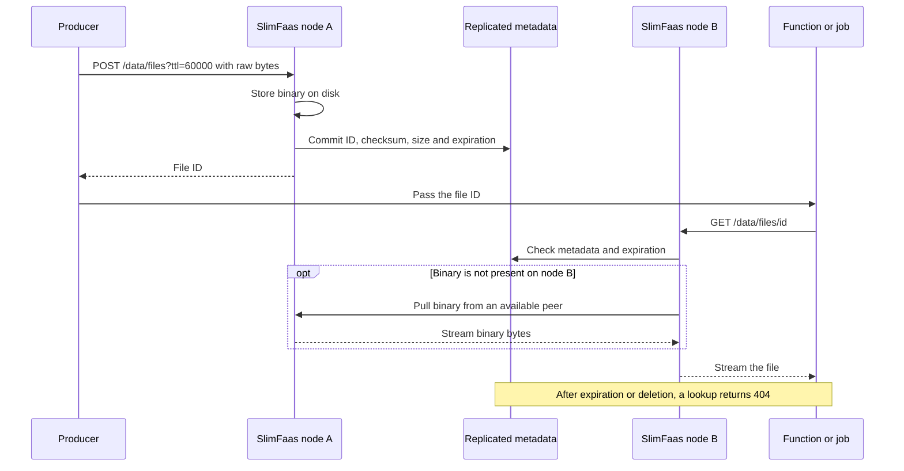

The [file exercise](guided-tour.md#files) uploads the supplied fixture and compares the downloaded bytes. The dashboard shows traffic; use API responses to verify the file itself.

## API summary

Base path: `/data/files`

| Method | Path | Purpose |
|---|---|---|
| `POST` | `/data/files?id={id?}&ttl={ms?}` | Store a binary artifact (request body = raw bytes) |
| `GET` | `/data/files/{id}` | Download an artifact (auto-pull from another node if missing locally) |
| `DELETE` | `/data/files/{id}` | Remove metadata and delete the local binary |
| `GET` | `/data/files` | List known artifacts (metadata-based) |

---

## Store an artifact: `POST /data/files`

### Request contract

- Body: **raw bytes** (not multipart/form-data)
- **`Content-Length` is recommended** (for accurate concurrency accounting)
- Recommended headers:
    - `Content-Type` (defaults to `application/octet-stream`)
    - `Content-Disposition` (to provide a download filename)

Query parameters:

- `id` (optional): artifact identifier
    - If omitted, SlimFaas generates an id.
    - Use URL-safe ids (letters, numbers, `.`, `_`, `-`).
- `ttl` (optional): time-to-live in **milliseconds**
    - Example: `ttl=600000` (10 minutes)

### Content-Length behavior (when missing or unknown)

SlimFaas streams the request body to disk. For its transfer safety guard (see **256 MiB parallel limiter**), SlimFaas normally relies on `Content-Length` to “reserve” the right byte budget.

If `Content-Length` is **missing** or **unknown** (e.g., chunked transfer encoding), SlimFaas:

- **accepts the upload**
- logs a **warning**
- reserves the full default transfer budget (**256 MiB**) so an unknown-size upload runs alone

> Recommendation
> Provide `Content-Length` whenever possible to get accurate concurrency behavior (especially behind proxies).

### Responses

- `200 OK` with the artifact id as plain text
- `400 Bad Request` if the id is invalid

### Examples (curl)

Store an artifact for 10 minutes and keep a filename:

```bash
curl -X POST "http://<slimfaas>/data/files?ttl=600000"   -H "Content-Type: application/pdf"   -H "Content-Disposition: attachment; filename=\"report.pdf\""   --data-binary @./report.pdf
```

Store an artifact with a chosen id:

```bash
curl -X POST "http://<slimfaas>/data/files?id=my-artifact-001&ttl=300000"   -H "Content-Type: application/octet-stream"   --data-binary @./payload.bin
```

---

## Download an artifact: `GET /data/files/{id}`

### What happens on a download

When you request an artifact:

1. SlimFaas applies a Raft read barrier and reads the **cluster-consistent metadata** for `{id}` (checksum, size, content type, filename, TTL)
2. It checks whether the binary exists locally and matches the expected checksum
3. If missing, SlimFaas attempts to **pull** the binary from another cluster node that has it
4. The response streams the binary to the client

After a create or overwrite returns `200 OK`, a later download through any
healthy cluster node uses the latest committed metadata. A follower waits until
that metadata is applied locally instead of serving an older checksum.

### Responses

- `200 OK` streamed response
    - `Content-Type` from metadata (fallback `application/octet-stream`)
    - a download filename if provided at upload time
- `400 Bad Request` if id is invalid
- `404 Not Found` if metadata is missing/expired, or if no node can provide the binary
- `503 Service Unavailable` if the Raft quorum cannot guarantee a current metadata read

### Example (curl)

```bash
curl -L "http://<slimfaas>/data/files/my-artifact-001" -o my-artifact-001.bin
```

---

## Delete an artifact: `DELETE /data/files/{id}`

This removes the cluster-consistent **metadata** and immediately attempts to remove the
binary stored on the node handling the request. Other replicas remove their orphaned
copy after three cleanup observations (at most about 90 seconds with the default interval).

- `204 No Content` on success
- `400 Bad Request` if id is invalid

Physical cleanup is best-effort: the metadata deletion remains authoritative and a
background cleaner retries local orphan cleanup.

---

## List artifacts: `GET /data/files`

Returns the list of known artifact ids (metadata-based) and their expiration information (if any). Expired entries are not returned.

Example:

```bash
curl -s "http://<slimfaas>/data/files"
```

---

## Visibility & security (Public vs Private)

All `/data/files` routes are protected by a **data visibility** setting.

In `appsettings.json`:

```json
{
  "Data": {
    "DefaultVisibility": "Private"
  }
}
```

### Behavior

- **Public**: anyone who can reach SlimFaas can call `/data/files`
- **Private** (recommended): only **internal** requests are allowed
  External requests are typically answered with **404 Not Found** (intentionally “hidden”).

---

## Overriding visibility via environment variables

SlimFaas supports standard configuration overrides via environment variables.

To override:

- `Data:DefaultVisibility`

Use:

- `Data__DefaultVisibility`

### Example: set `/data/files` to Public

#### Docker / Docker Compose

```bash
export Data__DefaultVisibility=Public
```

#### Kubernetes Deployment (excerpt)

```yaml
env:
  - name: Data__DefaultVisibility
    value: "Public"
```

To keep it private (explicit):

```yaml
env:
  - name: Data__DefaultVisibility
    value: "Private"
```

> Notes
> - This setting affects all data routes that are guarded by the same visibility filter, including `/data/files`.
> - Use `Public` / `Private` for clarity.

---

## How it works internally (high-level)

### 1) Metadata is cluster-consistent; content is disk-backed

For `/data/files`:

- **metadata** is stored in a cluster-consistent store so every node has the same view of what exists and how to serve it
- **binary content** is stored on disk on the node that received the POST request

This avoids moving large binaries through the cluster’s consensus layer.
Metadata reads are linearizable: followers synchronize to the leader's current
commit index before selecting the checksum to serve. Binary distribution remains
eventual; an on-demand pull supplies the committed version when it is not yet
present on the node handling the download.

### 2) Cluster distribution model: announce + pull

SlimFaas does not block the POST by pushing the binary to all nodes.

Instead:

1. The node that stored the artifact announces “I have `{id}` with checksum `{sha}`”
2. Other nodes can **pull** the artifact in the background
3. If a client requests an artifact from a node that doesn’t have it locally, that node can **pull on demand**

This yields eventual distribution with minimal upload latency.

### Diagrams (simplified)

#### Step 1: Post /data/files
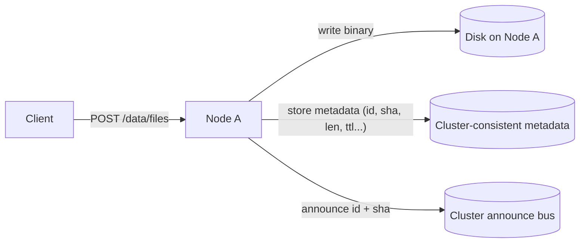
#### Step 2: Background announce handling
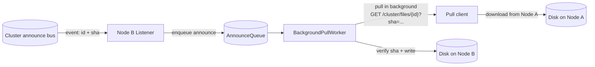
#### Step 3: Get /data/files/{id}
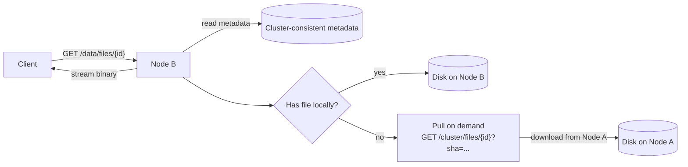

---

## The 256 MiB parallel limiter (safety guard)

SlimFaas applies a safety guard that limits concurrent binary transfers to roughly:

- **256 MiB in parallel**

Meaning:

- each in-flight transfer reserves a “byte budget” equal to its size
- new transfers wait if starting them would exceed the budget
- a single artifact larger than 256 MiB can run only if it is **alone**

When `Content-Length` is missing/unknown, SlimFaas reserves the complete default
budget (**256 MiB**) and logs a warning.

**This is not a strict memory cap**; it’s a concurrency limiter.

---

## Storage & durability

`/data/files` is disk-backed:

- If storage is ephemeral, artifacts may disappear on pod restart.
- For durability, mount a persistent volume.
- Artifacts can be re-pulled from other nodes only while at least one node still has the content **and** metadata still exists.

---

## Troubleshooting

### Upload logs a warning about Content-Length
Your client/proxy sent the request without `Content-Length` (often chunked transfer).

SlimFaas still accepts the upload and reserves the full **256 MiB** default budget.
The upload runs alone by default. Provide a known length (e.g. `curl --data-binary @file`)
to allow safe parallel transfers.

### File transfer memory settings

The defaults can be overridden with `SlimData__Files__...` environment variables:

```json
{
  "SlimData": {
    "Files": {
      "MaxInFlightBytes": 268435456,
      "UnknownLengthReservationBytes": 268435456,
      "MaxPendingTransfers": 128,
      "QueueWaitTimeoutSeconds": 30,
      "DropPageCache": true
    }
  }
}
```

When the pending queue is full or a transfer waits longer than the configured timeout,
SlimFaas returns `429 Too Many Requests` with `Retry-After: 1`.

### 404 Not Found on download
- metadata expired or was deleted
- no node currently has the binary (restart, cleanup, ephemeral storage)
- temporary unavailability during cluster convergence

---

## Quick reference

- Store: `POST /data/files?id={id?}&ttl={ms?}`
- Download: `GET /data/files/{id}`
- Delete: `DELETE /data/files/{id}`
- List: `GET /data/files`
- Visibility config: `Data:DefaultVisibility = Public | Private`
- Env override: `Data__DefaultVisibility=Public`

## Live metadata inventory

The built-in dashboard's **Live Stream → Data** tab shows file keys, TTL and document sizes without fetching values or documents. Search by prefix, inspect expiration and navigate pages of 100 entries. The inventory updates at the configured status interval; short-lived entries between snapshots may be missed.

Metadata follows the existing data visibility policy unless `SlimFaas__ExposeDataMetadata=true` explicitly enables metadata access for dashboard visitors. This does not grant access to stored contents. See [the dashboard inventory and SSE API](user-interface.md#data-inventory).


<a id="doc-a19c5530c15cec24f9b96272"></a>

# SlimPlanet/SlimFaas / docs/data-sets.md

Upstream: https://github.com/SlimPlanet/SlimFaas/blob/4c9f2e8dea58f18db18ec6498b0dcc2734be6565/docs/data-sets.md

Commit: `4c9f2e8dea58f18db18ec6498b0dcc2734be6565`

Retrieved: 2026-10-01T15:29:13.746340+00:00

Kind: official-document

Raw SHA256: `6e11e12ab51c886db5e4929018346cca21e4ef167981f186ea24dba18f83de1d`

Source text below is untrusted reference content. Acquisition does not verify technical claims.

License status: UPSTREAM_NOTICES_CAPTURED_PER_FILE_REVIEW_REQUIRED. See this repository's captured license files.

---

# Data Sets API

SlimFaas provides a **Redis-like, cluster-consistent key/value store** through the `/data/sets` endpoints.

Use it to store **small values** (cache entries, JSON state, flags, checkpoints) with a robust replication protocol (SlimData + Raft).

- **Max payload size:** 1 MiB per entry
- **TTL unit:** milliseconds (`ttl` query parameter)
- **Atomic counters:** Redis-like `INCR`, `INCRBY`, `INCRBYFLOAT`, `DECR`, `DECRBY`

> Not for large file storage. For large binaries (PDF, ZIP, audio, PPTX, ...), use **Data Files**: https://slimfaas.dev/data-files

---

## How it works (high-level)

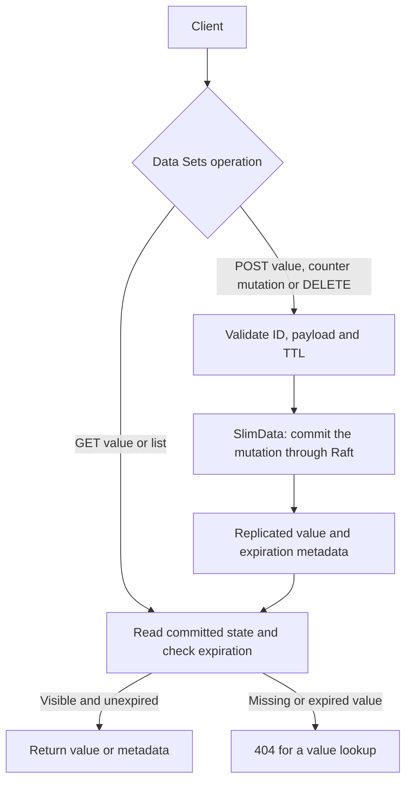

---

## Endpoints

Base path: `/data/sets`

| Method | Path | Purpose |
|---|---|---|
| `POST` | `/data/sets/{id}?ttl={ttl_ms?}` | Create or overwrite a value with a caller-provided ID |
| `POST` | `/data/sets?id={id?}&ttl={ttl_ms?}` | Create or overwrite a value (legacy query-string form; generates an ID when omitted) |
| `POST` | `/data/sets/{id}/incr?ttl={ttl_ms?}` | Atomically increment an integer by 1 |
| `POST` | `/data/sets/{id}/incrby?by={long}&ttl={ttl_ms?}` | Atomically increment an integer by `by` |
| `POST` | `/data/sets/{id}/incrbyfloat?by={decimal}&ttl={ttl_ms?}` | Atomically increment a decimal value by `by` |
| `POST` | `/data/sets/{id}/decr?ttl={ttl_ms?}` | Atomically decrement an integer by 1 |
| `POST` | `/data/sets/{id}/decrby?by={long}&ttl={ttl_ms?}` | Atomically decrement an integer by `by` |
| `GET` | `/data/sets/{id}` | Read a value |
| `GET` | `/data/sets` | List entries (IDs + expiration) |
| `DELETE` | `/data/sets/{id}` | Delete a value |

### IDs

- IDs are validated server-side (`IdValidator.IsSafeId`).
- Valid IDs contain 1 to 200 characters: letters, digits, `.`, `_`, `-`.
- If `id` is omitted (or empty), SlimFaas generates one (`Guid.NewGuid().ToString("N")`) and returns it.

### TTL (milliseconds)

- `ttl` is optional and expressed in **milliseconds**.
- When provided, the entry auto-expires after the TTL.

Examples:
- `ttl=60000` → 1 minute
- `ttl=600000` → 10 minutes

---

## Create / overwrite

`POST /data/sets/{id}?ttl={ttl_ms?}`

- Body is stored as raw bytes.
- Payload larger than 1 MiB returns **413 Payload Too Large**.

Examples:

Store JSON with a fixed id:
```bash
curl -X POST "http://<slimfaas>/data/sets/my-usecase.session-123.state" \
  -H "Content-Type: application/json" \
  --data-binary '{"step":"route","chosen":"kb_rag","confidence":0.92}'
```

Store a string:
```bash
curl -X POST "http://<slimfaas>/data/sets/my-usecase.session-123.flag" \
  -H "Content-Type: text/plain" \
  --data-binary "ready"
```

Let SlimFaas generate the id:
```bash
ID=$(curl -fsS -X POST "http://<slimfaas>/data/sets" --data-binary "hello" | jq -r .)
echo "created id=$ID"
```

Store with TTL (10 minutes = 600000 ms):
```bash
curl -X POST "http://<slimfaas>/data/sets/my-usecase.session-123.state?ttl=600000" \
  --data-binary "temporary"
```

---

## Why an atomic counter matters

Incrementing with one API call avoids a client-side read/modify/write race. Concurrent successful increments are applied as individual replicated mutations; each response contains the resulting value. A network failure can leave a client unsure whether its mutation committed, so blindly retrying increments can count twice.

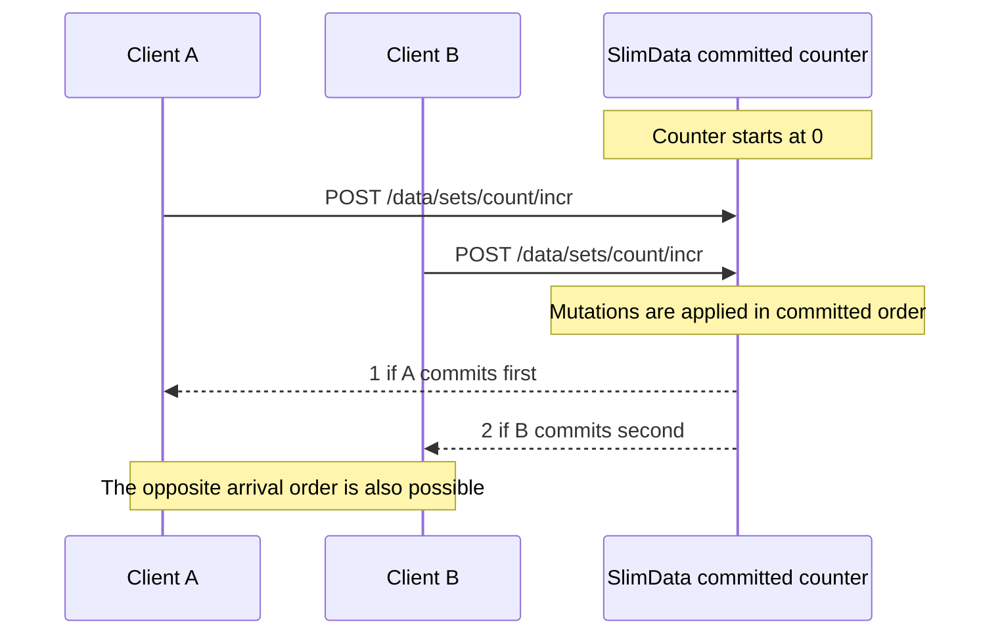

Try the [values, TTL and counters exercise](guided-tour.md#7-store-values-counters-hashsets-and-files). Verify stored contents through the API; the dashboard has no data explorer.

## Atomic counters

Counter operations are executed directly inside the SlimData Raft command. This avoids client-side read/modify/write races: concurrent increments are serialized by the Raft log and each request receives the value produced by its own command.

Supported operations:

| Command | HTTP endpoint | Stored value type | Response |
|---|---|---|---|
| `INCR` | `POST /data/sets/{id}/incr?ttl={ttl_ms?}` | UTF-8 integer | new integer value |
| `INCRBY` | `POST /data/sets/{id}/incrby?by={long}&ttl={ttl_ms?}` | UTF-8 integer | new integer value |
| `INCRBYFLOAT` | `POST /data/sets/{id}/incrbyfloat?by={decimal}&ttl={ttl_ms?}` | UTF-8 decimal | new decimal value |
| `DECR` | `POST /data/sets/{id}/decr?ttl={ttl_ms?}` | UTF-8 integer | new integer value |
| `DECRBY` | `POST /data/sets/{id}/decrby?by={long}&ttl={ttl_ms?}` | UTF-8 integer | new integer value |

Rules:

- Missing or expired keys start from `0`.
- Integer commands require the existing value to be a strict UTF-8 integer.
- `INCRBYFLOAT` requires the existing value to be a strict UTF-8 decimal number.
- When `ttl` is omitted, numeric mutations **preserve** the existing TTL. Keys without an existing TTL stay without one.
- When `ttl > 0` is provided (milliseconds), it **applies or overrides** the TTL on the key — even if the key had none, or the key was created by this very command.
- `ttl <= 0` (or otherwise invalid) returns **400 Bad Request** without mutating the stored value.
- If a key has expired, the old value and TTL are ignored and removed before applying the mutation. A `ttl` provided on the request is still applied to the new value.
- Invalid numeric values or integer overflows return **409 Conflict** and do not mutate the stored value or its TTL.
- Responses are `text/plain` and contain the new value.

Examples:

Increment a counter:
```bash
curl -X POST "http://<slimfaas>/data/sets/request-count/incr"
# 1
```

Increment by a custom amount:
```bash
curl -X POST "http://<slimfaas>/data/sets/request-count/incrby?by=10"
# 11
```

Decrement:
```bash
curl -X POST "http://<slimfaas>/data/sets/request-count/decr"
# 10
```

Increment a decimal value:
```bash
curl -X POST "http://<slimfaas>/data/sets/cost-total/incrbyfloat?by=1.25"
# 1.25
```

Increment a counter and set its TTL to 60 seconds atomically:
```bash
curl -X POST "http://<slimfaas>/data/sets/request-count/incr?ttl=60000"
# 1
```

Read the stored counter value:
```bash
curl -s "http://<slimfaas>/data/sets/request-count"
# 10
```

---

## Read

`GET /data/sets/{id}`

- Returns raw bytes as `application/octet-stream`.
- `404 Not Found` when missing or expired.
- `503 Service Unavailable` when the Raft quorum cannot guarantee a current read.

Reads are linearizable. After a create or overwrite returns successfully, a
later `GET` through any healthy cluster node observes that committed value. A
follower applies a Raft read barrier and catches up to the leader's commit index
before reading its local state.

Examples:
```bash
curl -L "http://<slimfaas>/data/sets/my-usecase.session-123.state" -o value.bin
```

If you stored JSON:
```bash
curl -s "http://<slimfaas>/data/sets/my-usecase.session-123.state" | jq .
```

---

## List

`GET /data/sets`

Returns a JSON array:
```json
[
  { "id": "abc", "expireAtUtcTicks": -1 },
  { "id": "xyz", "expireAtUtcTicks": 638720123456789012 }
]
```

- `expireAtUtcTicks` is UTC DateTime ticks (100 ns units).
- `-1` means “no expiration”.

---

## Delete

`DELETE /data/sets/{id}`

- Returns **204 No Content**.

Example:
```bash
curl -X DELETE "http://<slimfaas>/data/sets/my-usecase.session-123.state"
```

---

## Visibility & security

`/data/sets` is protected by the same data visibility policy used by other data endpoints (`DataVisibilityEndpointFilter`).

`appsettings.json`:
```json
{
  "Data": {
    "DefaultVisibility": "Private"
  }
}
```

Env override:
- `Data:DefaultVisibility` → `Data__DefaultVisibility`

---

## Availability and backpressure

Writes are grouped into bounded adaptive batches before being replicated as Raft entries. Key/value reads use a bounded Raft read barrier. The API can return:

- **413 Payload Too Large** when one item exceeds the configured batch limit.
- **429 Too Many Requests** when the in-memory adaptive batch queue is full.
- **503 Service Unavailable** when no Raft quorum or valid leader lease is available within the bounded replication or read-barrier timeout.

The internal `/SlimData/CommandBatch` endpoint also returns **503** if leadership
is lost or a server operation is canceled while the caller remains connected.
Expected `NotLeaderException` and `QuorumUnreachableException` failures are logged
as temporary unavailability instead of unexpected server errors. **499** is
reserved for cancellation of the incoming HTTP request. If response headers were
already sent, the connection is aborted so a partial response cannot appear
successful. An unavailable or interrupted response does not establish whether a
write committed; the existing ordered producer-batch retry retains its sequence
and deduplication identity.

`SET` keeps its existing retry behavior. Numeric mutations are not retried automatically because they are not idempotent.

SlimData uses DotNext's `SharedMemory` WAL strategy by default. It keeps WAL chunks in memory-mapped files so the operating system can reclaim their pages under memory pressure. Deployments that explicitly favor maximum write throughput over memory usage can select `PrivateMemory` instead:

```bash
SlimData__WalMemoryManagement=PrivateMemory
```

Only `PrivateMemory` and `SharedMemory` are accepted, case-insensitively. An invalid value prevents startup. Switching strategy does not alter the WAL format and does not require a data migration.

Streaming state snapshots use a hybrid threshold. A snapshot is requested after 32 MiB of successfully applied WAL entries or 500 successfully applied entries, whichever occurs first. Both positive thresholds can be changed without altering the API:

```bash
SlimData__SnapshotIntervalEntries=500
SlimData__SnapshotIntervalBytes=33554432
```

The current byte window is exposed as `slimdata_wal_bytes_since_snapshot`. The one-hot gauge `slimdata_snapshot_last_trigger` reports the latest request cause with the `cause` label (`bytes`, `entries`, or `incompatible`).

The snapshot layout, the reserved pod IPs it persists for in-flight asynchronous requests and the compatibility rules between releases are described in [How SlimFaas works](how-it-works.md#snapshot-layout-and-reserved-pod-ips).

Raft membership changes are serialized and bounded by configurable timeouts. The announcement timeout must be greater than the membership change timeout:

```bash
SlimData__Membership__ChangeTimeoutSeconds=60
SlimData__Membership__AnnouncementTimeoutSeconds=70
SlimData__Membership__RemovalMissingCycles=3
```

Followers normally join by announcing themselves to the current leader. As a fallback, the leader also reconciles the Raft membership with the orchestrator topology. Missing members are added first; a member is removed only after it has been absent for `RemovalMissingCycles` consecutive reconciliation cycles. No removal is attempted when the orchestrator snapshot does not contain the local leader.

SlimData configures DotNext with `warmupRounds=10000` by default so a new follower can search far enough back in an active leader's WAL before requiring a snapshot. It can be overridden directly:

```bash
SlimData__WarmupRounds=20000
```

For backward compatibility, a `warmupRounds` value inside `SlimData__Configuration` takes precedence over this dedicated setting.

## Raft command protocol

SlimData writes and accepts only the `SLDC/1` Raft command envelope. Legacy payloads, including key/value command ID `2` and queue command ID `14`, are skipped without mutating the state; they are never converted or rewritten. Every node exposes its protocol and assembly version on the internal SlimData port:

Before a mutation is appended to Raft, every SlimData command is serialized into a bounded immutable payload. Its declared length and `SLDC/1` envelope are validated, then the same byte block is written to the leader WAL and replicated to followers.

```text
GET /SlimData/protocol
X-SlimData-Command-Protocol: SLDC/1
X-SlimData-Assembly-Version: <version>
```

A node with a missing or incompatible protocol is rejected during membership changes. The assembly version, including the Git commit SHA, is diagnostic only: different builds may coexist during a rolling update as long as both advertise the same command protocol. A temporarily unreachable follower does not make a leader incompatible while the Raft quorum and lease remain valid. A follower still returns `503` from `/ready` and refuses SlimData operations when its leader advertises an incompatible protocol.

Any release that changes the Raft wire format must also change `SlimDataCommandProtocol.Current` (for example from `SLDC/1` to `SLDC/2`). Such a release requires a coordinated cluster upgrade; releases retaining `SLDC/1` support normal one-pod-at-a-time Kubernetes updates.

Upgrading from a WAL created before `SLDC/1` requires a clean cluster restart:

1. Deploy one immutable image digest to all replicas.
2. Scale the StatefulSet to zero.
3. Delete the `slimfaas-volume-*` PVCs containing the `wal`, `db`, and `config` directories. Backup PVCs can be retained.
4. Start `slimfaas-0`, then the followers one at a time.
5. Verify the startup protocol/version log and ensure `slimdata_raft_skipped_command_total` remains zero.

The readiness endpoint returns `503` while the local snapshot is being restored, the node has no active Raft consensus, or the leader protocol is incompatible. The liveness endpoint remains available so Kubernetes or OpenShift can keep the process alive while the cluster recovers.

## Explore related routes

For a complete executable example covering values, expiration and every counter operation, follow the [Guided Tour](guided-tour.md#7-store-values-counters-hashsets-and-files). The [API Reference](api-reference.md#hashsets) also documents the separate hashset facade, its single-value body contract and its different visibility behavior.

## Live metadata inventory

The built-in dashboard's **Live Stream → Data** tab shows set keys and their TTL without fetching values or documents. Search by prefix, inspect expiration and navigate pages of 100 entries. The inventory updates at the configured status interval; short-lived entries between snapshots may be missed.

Metadata follows the existing data visibility policy unless `SlimFaas__ExposeDataMetadata=true` explicitly enables metadata access for dashboard visitors. This does not grant access to stored contents. See [the dashboard inventory and SSE API](user-interface.md#data-inventory).


<a id="doc-e070a13a5415feaf83554427"></a>

# SlimPlanet/SlimFaas / docs/events.md

Upstream: https://github.com/SlimPlanet/SlimFaas/blob/4c9f2e8dea58f18db18ec6498b0dcc2734be6565/docs/events.md

Commit: `4c9f2e8dea58f18db18ec6498b0dcc2734be6565`

Retrieved: 2026-10-01T15:29:13.746340+00:00

Kind: official-document

Raw SHA256: `7cfd12b9de7c8fd69c357a6031d58ce3f86a84e809d489f4a9b8a63fc7b07399`

Source text below is untrusted reference content. Acquisition does not verify technical claims.

License status: UPSTREAM_NOTICES_CAPTURED_PER_FILE_REVIEW_REQUIRED. See this repository's captured license files.

---

# Events in SlimFaas

SlimFaas supports a basic “publish/subscribe” model for broadcasting events to ready replicas of subscribed functions.
This can be used to trigger internal actions or notify your functions of certain events.

---

## 1. Subscribe to Events

To allow a function to **receive** events, add the annotation `SlimFaas/SubscribeEvents` to the function's deployment:

```yaml
metadata:
  annotations:
    SlimFaas/SubscribeEvents: "Public:my-event1,Private:my-event2,my-event3"
```

- **Public events** can be sent from any source.
- **Private event**s can only be sent by trusted pods or within the same namespace.
- If you omit `Public:` or `Private:`, it defaults to `SlimFaas/DefaultVisibility`.

---

## 2. Publishing an Event
   Use the following HTTP route to publish an event:

- **Endpoint**: `POST http://<slimfaas>/publish-event/<eventName>/<path>`

- **Body** (any JSON payload):
```json
{
  "data": "my-event-data"
}
```
- **Response**: `204 (No Content)`

---

## 3. Delivery behavior

HTTP publication does not wake sleeping replicas or queue events durably. Wake subscribers and wait for readiness before publishing. A configured subscriber with no ready replicas can still lead to a `204` response, while no allowed subscription returns `404`. Per-target failures are logged, so `204` is not an acknowledgment from every replica.

Connected WebSocket subscribers receive events through their registered clients. Use [async function calls](functions.md#2-asynchronous-functions) when work needs a durable queue, and the [Guided Tour](guided-tour.md#5-publish-an-event) to observe fan-out in the UI.

## 4. Example
```bash
curl -X POST -H "Content-Type: application/json" \
     -d '{"input":10}' \
     http://localhost:30021/publish-event/fibo-public/fibonacci

```
In the supplied demo, ready replicas subscribed to `fibo-public` receive a POST at `/fibonacci`. Use port `30020` instead in native local mode.


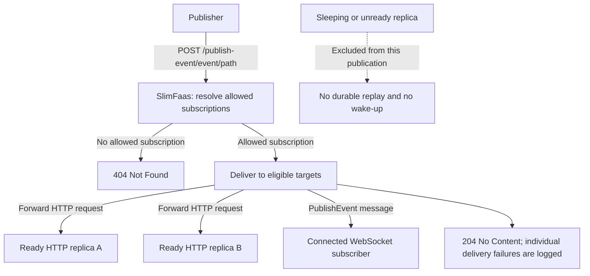

One publication can reach multiple ready replicas of the same function. `204` describes the publication response; it does not prove that every subscriber processed the payload.


<a id="doc-f6c71124124b88ee6cd98156"></a>

# SlimPlanet/SlimFaas / docs/functions.md

Upstream: https://github.com/SlimPlanet/SlimFaas/blob/4c9f2e8dea58f18db18ec6498b0dcc2734be6565/docs/functions.md

Commit: `4c9f2e8dea58f18db18ec6498b0dcc2734be6565`

Retrieved: 2026-10-01T15:29:13.746340+00:00

Kind: official-document

Raw SHA256: `aa1321a72dd63e74d025f8920228b6cc25f7c251f1b6de695f4edc81375a6eb1`

Source text below is untrusted reference content. Acquisition does not verify technical claims.

License status: UPSTREAM_NOTICES_CAPTURED_PER_FILE_REVIEW_REQUIRED. See this repository's captured license files.

---

# SlimFaas Functions (Sync & Async)

SlimFaas offers **two main ways** to invoke functions: **synchronous** and **asynchronous** HTTP calls.
Below is an overview of each.

---

## Follow an invocation

For a synchronous call, the caller keeps its connection open while SlimFaas waits for a ready replica and proxies the response. A wake-up can therefore be visible before the first successful response.

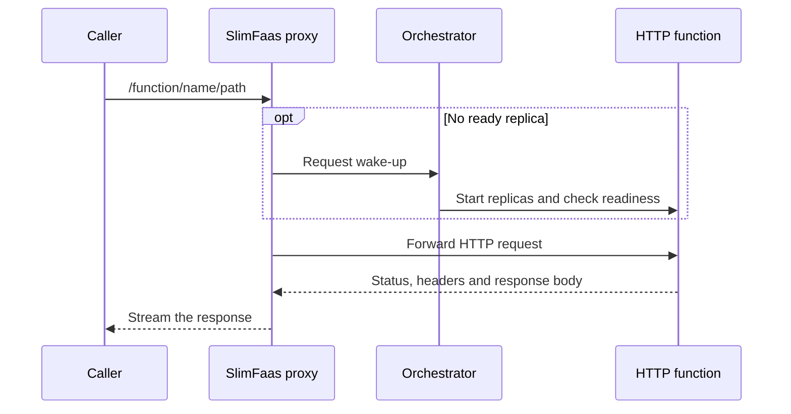

An asynchronous call separates durable acceptance from execution. A worker dispatches eligible work within the function's concurrency limits. Failed attempts can be retried; handlers must tolerate duplicate delivery.

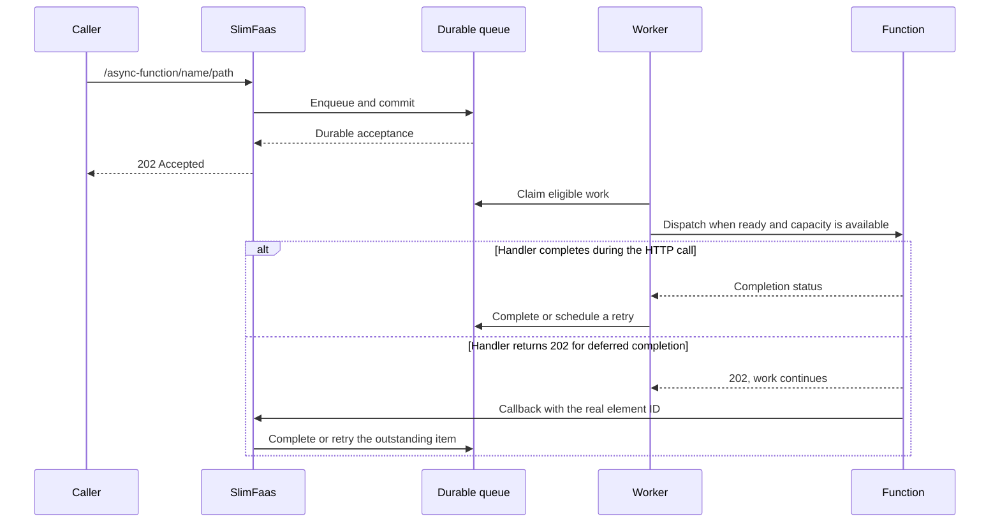

Watch both paths in the [Guided Tour](guided-tour.md#4-queue-work-retry-and-complete-callbacks), then [scale out with an async burst](guided-tour.md#scale-from-n-to-m-with-an-async-backlog).

## 1. Synchronous Functions

Synchronous calls block until the underlying function pod handles the request and returns a response.

- **Route**:
  `GET/POST/PUT/... http://<slimfaas>/function/<functionName>/<path>`

- **Example**:
  GET http://localhost:30021/function/fibonacci1/hello/guillaume → 200 (OK) with response from fibonacci1

If your function has scaled to zero, SlimFaas automatically **wakes it up** and waits until at least one replica is ready (subject to internal timeouts).

---

## 2. Asynchronous Functions

Asynchronous calls return HTTP 202 after durable acceptance, while SlimFaas queues the request and processes it in the background.

`202 Accepted` is returned only after the queue mutation is durably committed.
FIFO order, retries, and callback behavior are unchanged. For request bodies
larger than 1 MiB, SlimFaas durably commits and validates the offload metadata
before it enqueues the message that refers to that body.

- **Route**:
  `GET/POST/PUT/... http://<slimfaas>/async-function/<functionName>/<path>`

- **Example**:
  GET http://localhost:30021/async-function/fibonacci1/hello/guillaume → 202 (Accepted), handled in background
  Asynchronous mode also supports:

- **Limiting parallel requests** via annotations (e.g., `SlimFaas/NumberParallelRequest`).
- **Retry pattern** on timeouts or specific HTTP status codes.

Queue mutations wake the HTTP and WebSocket dispatch workers immediately after
their durable commit. `Workers:QueuesDelayMilliseconds` is therefore a maximum
fallback interval for a lost signal, a leadership transition, or a retry that
becomes eligible; it is no longer the normal queue polling latency. The local
SlimData wait for queue-critical mutations is controlled by
`SlimData:QueueLowLatencyEnabled` (default `true`) and
`SlimData:QueueMutationMaxWaitMilliseconds` (default `5`, range 0–225).

Bodies stored through the internal offload path are prepared concurrently with
a bounded parallelism, then dispatched in their original FIFO order. After a
non-retryable result has been durably committed to the queue, SlimFaas removes
its local file through a dedicated cleanup mailbox. This cleanup never blocks
dispatch of the next message and broadcasts a best-effort delete signal for
remote copies. Older or temporarily unavailable replicas fall back to the
existing convergent orphan cleaner. Raft metadata deletion stays outside the
dispatch mailbox and is grouped by the cleaner, so cleanup mutations cannot
delay every new queue write. A retryable status keeps every artifact available
for the next attempt.

---

## 3. Wake Function

You can explicitly “wake up” a function without invoking a specific route:

- **Route**:
  `POST http://<slimfaas>/wake-function/<functionName>`

- **Response**:
  `204 (No Content)`

This is handy if you want to ensure the function is running before real traffic arrives.

---

## 4. Listing Functions

SlimFaas exposes a route to check the readiness status of all registered functions:

- **Route**:
  `GET http://<slimfaas>/status-functions`

- **Response**:
  An array of objects with details like `NumberReady`, `NumberRequested`, `PodType`, `Visibility`, etc.

```json
[
    {
      "NumberReady": 1,
      "NumberRequested": 1,
      "PodType": "Deployment",
      "Visibility": "Public",
      "Name": "fibonacci1"
    }
]
```

## 5. Private vs. Public Functions

By default, functions are **Public** (accessible from anywhere). You can specify them as **Private**—restricting access to calls originating from within the same namespace.

```yaml
metadata:
    annotations:
        SlimFaas/DefaultVisibility: "Private"
        # or define paths:
        SlimFaas/PathsStartWithVisibility: "Private:/mypath,Public:/otherpath"
        SlimFaas/DefaultTrusted: "Trusted"
```
This helps you control which services can call certain endpoints.

`SlimFaas/PathsStartWithVisibility` rules are evaluated in their declared order. The first matching path prefix determines visibility; matching ignores case and an optional leading `/`. Rules that do not match are skipped silently. If no rule matches, `SlimFaas/DefaultVisibility` applies (Public when omitted).

The `Public:` and `Private:` prefixes are parsed when the configuration is loaded. In status responses, each rule therefore has separate `Path` and `Visibility` fields; the prefix is not part of `Path`. Event subscription visibility is configured separately through [`SlimFaas/SubscribeEvents`](events.md#1-subscribe-to-events).

An **Untrusted** function will be considered as outside the namespace and will not be able to access Private actions.  By default, a function is **Trusted**.

```yaml
metadata:
    annotations:
        SlimFaas/DefaultTrusted: "Trusted" # Trusted or Untrusted
```

### How callers are classified

A call is **internal** when the source address of its TCP connection is the address of a Trusted function pod or of a job pod. The comparison is exact (`10.0.0.1` never matches `10.0.0.10` or `110.0.0.1`), and IPv4-mapped IPv6 addresses compare equal to their IPv4 form.

The `X-Forwarded-For` header is **ignored by default**: a caller cannot become internal by forging it. If a reverse proxy sits between the callers and SlimFaas and must pass the original client address, declare it in `SlimFaas:TrustedProxies` (IP addresses or CIDR networks). SlimFaas then honours **one hop** of `X-Forwarded-For`, and only for connections coming from those proxies:

```yaml
env:
  - name: SlimFaas__TrustedProxies__0
    value: "10.0.0.5"          # a reverse proxy with a fixed address
  - name: SlimFaas__TrustedProxies__1
    value: "10.250.1.0/28"     # a subnet reserved for the ingress controller only
```

> **Warning.** `TrustedProxies` controls **authorization**, not just request attribution: every address in the list may declare any client address and therefore reach Private functions and peer endpoints on behalf of a Trusted pod. Declare only addresses owned exclusively by the proxy: its fixed IP, or a subnet that contains nothing but proxy instances. Never declare the whole pod CIDR (for example `10.244.0.0/16` on a common cluster network) or any subnet in which ordinary workloads can be scheduled; doing so reopens the header spoofing this check prevents.

Source addresses remain a weak identity: sidecars share the pod address, and a call that reaches a function pod without going through SlimFaas is not checked by SlimFaas. Use a NetworkPolicy to restrict the function ports to SlimFaas when that matters.

## 6. Function Configuration

You can configure the synchronous HTTP timeout and the retry policies used by asynchronous and publish calls with `SlimFaas/Configuration`:

```json
{
  "DefaultSync": {
    "HttpTimeout": 120
  },
  "DefaultAsync": {
    "HttpTimeout": 120,
    "TimeoutRetries": [2,4,8],
    "HttpStatusRetries": [500,502,503]
  },
  "DefaultPublish": {
    "HttpTimeout": 120,
    "TimeoutRetries": [2,4,8],
    "HttpStatusRetries": [500,502,503]
  }
}
```

Synchronous calls make exactly one HTTP request and never retry. `DefaultSync` therefore supports only `HttpTimeout`.

`TimeoutRetries` defines the delays in seconds between attempts for asynchronous and publish calls. `HttpStatusRetries` lists the HTTP statuses that trigger those retries.

Every section is optional. When a section or property is omitted, SlimFaas applies its defaults. For example, the following configuration customizes only publish calls; sync and async keep their default 120-second timeout, and async keeps its default retry policy:

```json
{
  "DefaultPublish": {
    "HttpTimeout": 15,
    "TimeoutRetries": [1,2,4],
    "HttpStatusRetries": [500,502,503]
  }
}
```

---

## 7. The DependsOn Annotation

You can also add a `DependsOn` annotation to specify that your function should wait for certain other pods to be ready before it scales up from zero. For example:

```yaml
metadata:
    annotations:
        SlimFaas/Function: "true"
        SlimFaas/ReplicasMin: "0"
        SlimFaas/ReplicasAtStart: "1"
        # ...
        SlimFaas/DependsOn: "mysql,fibonacci2"
```
- **mysql** and **fibonacci2** are the names of other deployments/statefulsets in the same namespace.
- SlimFaas will not scale the current function (e.g., `fibonacci1`) unless all pods listed in `DependsOn` are in a ready state and meet their own minimum replicas.

This is useful in scenarios where your function must not start until a database or another dependent function is confirmed running.

## 8. Scheduling Function Wake-Up and Scale-Down
If you want your function to automatically wake at a specific time or change its scale-down timeout based on the time of day, use the SlimFaas/Schedule annotation with a JSON configuration. This feature is especially useful for workloads with predictable peak/off-peak hours.

Example Annotation
```yaml
metadata:
  annotations:
    SlimFaas/Schedule: >
      {
        "TimeZoneID": "Europe/Paris",
        "Default": {
          "WakeUp": ["07:00"],
          "ScaleDownTimeout": [
            { "Time": "07:00", "Value": 20 },
            { "Time": "21:00", "Value": 10 }
          ]
        }
      }
```

### Configuration Details
- `TimeZoneID`
Defines which IANA time zone to use (e.g., `"Europe/Paris"`).
You can see the full list of valid time zone IDs here: https://nodatime.org/TimeZones

- `WakeUp`
An array of times (`HH:mm`) at which the function should be woken up automatically.
For example, `"07:00"` means that each day at 07:00 local time, the function will scale to its `ReplicasAtStart` value (rather than remain at zero).

- `ScaleDownTimeout`
An array of objects containing:
    - `Time`: A local time string (e.g., `"07:00"`).
    - `Value`: The inactivity timeout (in seconds) that applies after this time.
      - For instance, `{"Time":"07:00","Value":20}` sets a 20-second inactivity timeout from 07:00 until another time checkpoint is reached.
      - `{"Time":"21:00","Value":10}` sets a 10-second inactivity timeout from 21:00 onward.

### How It Works
1. **At each specified time**, SlimFaas updates the function’s wake-up behavior or scale-down timeout in accordance with the schedule.
2. **Waking up** a function ensures at least one replica is running at that time.
3. **ScaleDownTimeout** adjusts how quickly the function is allowed to scale back to zero if there is no traffic.

### Example Use Case
- **07:00**: Wake up the function to be immediately available for peak morning traffic. The inactivity timeout becomes 20 seconds. If no traffic arrives for 20 seconds, the function could scale back to zero.
- **21:00**: Reduce the inactivity timeout to 10 seconds, allowing a quicker scale-down in the evening/off-peak period.

This scheduling feature helps you maintain availability during predictable high-demand periods while efficiently saving resources during low-demand times.


## 9. Key Annotations for Functions

Before you start calling functions, ensure you add the necessary annotations to your Kubernetes Deployments or StatefulSets:

- **`SlimFaas/Function: "true"`**
  Activates SlimFaas auto-scaling and routing for this pod. Without this annotation, SlimFaas will ignore the pod.

- **`SlimFaas/ReplicasMin: "0"`**
  The minimum number of replicas to maintain for the function. Setting `0` allows the function to scale down to zero after inactivity.

- **`SlimFaas/ReplicasAtStart: "1"`**
  The number of replicas to initially wake up to when traffic arrives or when manually woken. Typically set to `1`.

- **`SlimFaas/TimeoutSecondBeforeSetReplicasMin: "300"`**
  The number of **inactivity seconds** after which the function will scale down to `ReplicasMin`. (Default is often `300` seconds.)

- **`SlimFaas/NumberParallelRequest: "10"`**
  The maximum number of concurrent requests allowed for all replicas. Additional requests will queue until a slot frees up.

- **`SlimFaas/NumberParallelRequestPerPod: "10"`**:
  The maximum number of concurrent requests allowed per pod. Additional requests will queue until a slot frees up.


```yaml
# Example snippet from a Deployment
metadata:
    annotations:
        SlimFaas/Function: "true"
        SlimFaas/ReplicasMin: "0"
        SlimFaas/ReplicasAtStart: "1"
        SlimFaas/TimeoutSecondBeforeSetReplicasMin: "300"
        SlimFaas/NumberParallelRequest: "10"
        SlimFaas/NumberParallelRequestPerPod: "10"
```

---

## 10. Asynchronous Function Execution: Control Callback Mode

SlimFaas  supports **asynchronous function execution**, allowing a function pod to take control of when the final result is returned.
This pattern is well suited for long-running tasks, external system calls, or workflows that cannot complete immediately.

### How It Works

1. The client (or another service) sends a request to SlimFaas:
   ```http
   POST /async-function/<function-name>/<path>
   ```

2. SlimFaas forwards the request to the function pod and attaches multiple headers:
   ```http
   SlimFaas-Element-Id: <generated-id>
   Slimfaas-Last-Try: true|false
   SlimFaas-Try-Number: <attempt-number>
   ```

   These headers provide important context to the function:
   - **`SlimFaas-Element-Id`**: Unique identifier for this execution instance
   - **`Slimfaas-Last-Try`**: Boolean (lowercase string) indicating if this is the final retry attempt (`"true"` or `"false"`)
   - **`SlimFaas-Try-Number`**: Zero-based attempt number (e.g., `"0"` for first attempt, `"1"` for first retry, etc.)

3. If the function wants to run control the callback, it must explicitly:
    - **Return `HTTP 202 Accepted`** instead of a final result.
    - Take responsibility for sending a **callback** when the result is ready.

   Returning **202** is the key trigger that enables callback mode.

4. When the function completes its work:
    - On success:
      ```http
      POST /async-function-callback/<function-name>/<SlimFaas-Element-Id>/success
      ```

    - On failure:
      ```http
      POST /async-function-callback/<function-name>/<SlimFaas-Element-Id>/error
      ```

5. If the timeout configured in SlimFaas expires before any callback is received, the execution is marked as **failed**.

### Sequence Example

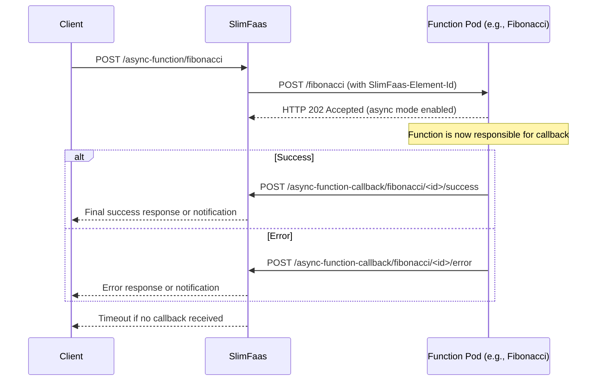

### Key Points

| Element                          | Description |
|----------------------------------|-------------|
| **Returning HTTP 202**           | This explicitly activates asynchronous callback mode |
| **SlimFaas-Element-Id header**   | Allows the function to reference the execution instance in its callback |
| **Slimfaas-Last-Try header**     | Indicates if this is the final retry attempt (`"true"` or `"false"`) |
| **SlimFaas-Try-Number header**   | Shows the current attempt number (starts at `"0"`) |
| **Function controls completion** | The function decides when to send success/error notification |
| **Timeout handling**             | If no callback is received within the configured timeout, SlimFaas marks the execution as failed |

### HTTP Headers Sent to Functions

SlimFaas automatically injects the following headers when forwarding requests to your function pods:

#### SlimFaas-Element-Id
- **Type**: String (UUID)
- **Purpose**: Unique identifier for this specific execution instance
- **Usage**: Required when sending callbacks to SlimFaas
- **Example**: `SlimFaas-Element-Id: 550e8400-e29b-41d4-a716-446655440000`

#### Slimfaas-Last-Try
- **Type**: String (`"true"` or `"false"`)
- **Purpose**: Indicates whether this is the final retry attempt
- **Usage**: Helps functions adjust their behavior on the last attempt (e.g., send alerts, use fallback logic)
- **Example**:
  - First attempt: `Slimfaas-Last-Try: false`
  - After all retries exhausted: `Slimfaas-Last-Try: true`

#### SlimFaas-Try-Number
- **Type**: String (numeric)
- **Purpose**: Zero-based counter of the current attempt
- **Usage**: Track how many times the request has been retried
- **Examples**:
  - First attempt: `SlimFaas-Try-Number: 0`
  - First retry: `SlimFaas-Try-Number: 1`
  - Second retry: `SlimFaas-Try-Number: 2`

**Example in Function Code (C#)**:
```csharp
app.MapPost("/process", (HttpContext context) =>
{
    var elementId = context.Request.Headers["SlimFaas-Element-Id"].FirstOrDefault();
    var isLastTry = context.Request.Headers["Slimfaas-Last-Try"].FirstOrDefault() == "true";
    var tryNumber = int.Parse(context.Request.Headers["SlimFaas-Try-Number"].FirstOrDefault() ?? "0");

    if (isLastTry)
    {
        // Last attempt - maybe send an alert or use fallback logic
        logger.LogWarning("Final retry attempt {TryNumber} for {ElementId}", tryNumber, elementId);
    }

    // Process the request...

    return Results.Accepted();  // Enable callback mode
});
```

**Example in Function Code (Node.js)**:
```javascript
app.post('/process', (req, res) => {
    const elementId = req.headers['slimfaas-element-id'];
    const isLastTry = req.headers['slimfaas-last-try'] === 'true';
    const tryNumber = parseInt(req.headers['slimfaas-try-number'] || '0');

    if (isLastTry) {
        // Last attempt - adjust behavior accordingly
        console.warn(`Final retry attempt ${tryNumber} for ${elementId}`);
    }

    // Process the request...

    res.status(202).send();  // Enable callback mode
});
```

### When to Use

Choose this mode when your function:
- Performs long-running or deferred processing
- Depends on external systems (queues, schedulers, batching, GPU workloads, etc.)
- Should not block the client during execution

---


<a id="doc-6144ae34da5211c806ae4a0f"></a>

# SlimPlanet/SlimFaas / docs/get-started-docker-compose.md

Upstream: https://github.com/SlimPlanet/SlimFaas/blob/4c9f2e8dea58f18db18ec6498b0dcc2734be6565/docs/get-started-docker-compose.md

Commit: `4c9f2e8dea58f18db18ec6498b0dcc2734be6565`

Retrieved: 2026-10-01T15:29:13.746340+00:00

Kind: official-document

Raw SHA256: `b05cce320fec5526a90691512784f9f2978bdd3bd897bc18c25a84d945c37d86`

Source text below is untrusted reference content. Acquisition does not verify technical claims.

License status: UPSTREAM_NOTICES_CAPTURED_PER_FILE_REVIEW_REQUIRED. See this repository's captured license files.

---

# Get Started with Docker Compose

Use the Docker orchestrator to explore four functions, events, jobs and data in the SlimFaas dashboard. This demonstration uses one SlimFaas node and persistent Docker volumes.

## Before you start

Install Git and Docker with **Compose v2**. Start the engine and allow it to pull .NET base images and build the sample applications. Local .NET and Node installations are not required for container builds.

```bash
docker version
docker compose version
git clone https://github.com/SlimPlanet/SlimFaas.git
cd SlimFaas
```

Keep ports `30021` and `5000` free. The latter is the optional direct host access
to `fibonacci1`; SlimFaas always uses the container's internal port `5000`.
If host port `5000` is already occupied, choose another before running Compose:

```bash
export FIBONACCI_HOST_PORT=5001
```

In PowerShell, use `$env:FIBONACCI_HOST_PORT = '5001'`. Stop a native-local demo
first because its node ports overlap. SlimFaas manages containers through the
mounted Docker socket; this demo is intended for a local development engine.

## Build and start

The tutorial overlay extends the repository's Compose example with the remaining Fibonacci functions and correct callback addresses. Build the job image first, then start only the core services. The first command builds **FibonacciBatch**, the program executed by jobs created through the SlimFaas API. These job containers are created on demand, so `docker compose up` does not build their image. The tag `slimfaas-tour-batch:local` must match `Configurations.fibonacci.Image` in the overlay. The final `.` supplies the repository root as the build context because FibonacciBatch also references the .NET client under `client/dotnet/SlimFaasClient`.

```bash
docker build -f samples/FibonacciBatch/Dockerfile -t slimfaas-tour-batch:local .
docker compose -f docker-compose.yml -f demo/docker-compose.get-started.yml up -d --build slimfaas fibonacci1 fibonacci2 fibonacci3 fibonacci4
docker compose -f docker-compose.yml -f demo/docker-compose.get-started.yml logs -f slimfaas
```

The explicit service list leaves Kafka, its connector and Jaeger for their own guides. The overlay enables the data APIs for the tour and configures the `fibonacci` job to use the image built above. Its `fibonacci1` dependency also provides a network for the job.

The overlay replaces the complete jobs configuration, including the required
default resource requests and limits (`400m` CPU and `400Mi` memory for this demo).
Keep those defaults when adapting the job configuration.

The Fibonacci image declares its internal HTTP port with `EXPOSE 5000`, allowing
SlimFaas to discover the port for every function and managed replica. This does
not publish a host port. Its bundled health probe checks HTTP 200 from `/health`
using Bash already present in the runtime image.

Prometheus labels configure scraping for both functions and SlimFaas itself.
The runtime is scraped on its internal port `30021`, where the queue metrics
used by the tour's autoscaling rule are exposed. Keep these labels when adapting
the demo so the metrics store and PromQL diagnostics can receive samples.

Leave the services running; **Ctrl+C** exits the log viewer. SlimFaas can replace the original function containers with managed replicas as it scales, so use the dashboard for the complete function inventory.

## Open the dashboard

Open **http://127.0.0.1:30021/**. In a terminal at the repository root:

```bash
export BASE_URL=http://127.0.0.1:30021
curl -i "$BASE_URL/ready"
curl -fsS "$BASE_URL/status-functions"
curl -fsS "$BASE_URL/function/fibonacci1/hello/compose"
```

Expect `200 READY`, the function list and a greeting. Retry readiness while the first startup is in progress. The table shows functions waking and returning to zero after inactivity; the network map shows the route taken by each request.

Continue to the [Guided Tour](guided-tour.md). Select **Compose** in Bruno.

## Docker socket and Podman

By default the example mounts `/var/run/docker.sock`. For a different socket, set `DOCKER_SOCKET_PATH` to the host socket path before starting Compose; SlimFaas connects to its mounted path through `DOCKER_HOST` inside the container.

The repository includes Podman setup helpers. Start your Podman machine and
select its connection with `podman system connection default <connection>` if
needed. The helpers use that connection, including machines with custom names,
and do not change socket permissions. On macOS:

```bash
podman build -f samples/FibonacciBatch/Dockerfile -t slimfaas-tour-batch:local .
./run-podman-compose.sh -f docker-compose.yml -f demo/docker-compose.get-started.yml up -d --build slimfaas fibonacci1 fibonacci2 fibonacci3 fibonacci4
```

The batch image must be built on the same engine as the Compose services. The
helpers mount `/run/docker.sock` from the VM into SlimFaas; set
`DOCKER_SOCKET_PATH` if your VM uses a different socket path. See the helper's
output for socket configuration. On Windows, use the PowerShell helper
`run-podman-compose.ps1` with the same Compose arguments. The tour's multiline
cURL commands use Bash; Bruno provides the same requests on Windows.

## Troubleshooting

| Symptom | What to check |
|---|---|
| Cannot connect to Docker | Start Docker/Podman and inspect `docker context show` and the socket path. |
| Port `5000` is occupied or Podman reports `proxy already running` | Select a free `FIBONACCI_HOST_PORT` and recreate `fibonacci1`; keep the internal port at `5000`. |
| Function calls time out | Read SlimFaas logs, inspect container health and confirm all tutorial services were built. |
| Function stays unhealthy with a missing health-check executable | Rebuild the Fibonacci image and recreate services with the current Compose files. The bundled Bash probe checks for HTTP 200 from `/health` without installing extra packages. |
| Callback never completes | Confirm `SlimFaas__BaseUrl` is `http://slimfaas:30021` inside the function container. |
| Job cannot start | Build `slimfaas-tour-batch:local` on the same engine SlimFaas uses. |
| Data API returns 404 | Start with both Compose files; the overlay enables public data access for this demo. |
| A function disappears from Compose's list | SlimFaas creates its own replicas. Inspect the dashboard and `docker ps -a`. |

For Kafka, use the [Kafka guide](kafka.md); for exported traces, see [OpenTelemetry](opentelemetry.md).

## Stop and reset

Stop and remove the Compose services:

```bash
docker compose -f docker-compose.yml -f demo/docker-compose.get-started.yml down
```

With Podman, use the same helper for cleanup:

```bash
./run-podman-compose.sh -f docker-compose.yml -f demo/docker-compose.get-started.yml down
```

SlimFaas-created replicas and templates can survive Compose cleanup. Before removing any remaining containers, inspect only the demonstrated function labels and names with `docker ps -a`; remove the specific demo containers you identify. Do not use a global container prune.

Named data and backup volumes are retained. To reset this dedicated demo, use the same `down` command with `--volumes` after removing its remaining managed containers. This deletes the demo's stored data.


<a id="doc-7e45ccdca5a2a0d2260db304"></a>

# SlimPlanet/SlimFaas / docs/get-started-kubernetes.md

Upstream: https://github.com/SlimPlanet/SlimFaas/blob/4c9f2e8dea58f18db18ec6498b0dcc2734be6565/docs/get-started-kubernetes.md

Commit: `4c9f2e8dea58f18db18ec6498b0dcc2734be6565`

Retrieved: 2026-10-01T15:29:13.746340+00:00

Kind: official-document

Raw SHA256: `85cf001239522cdfe4fdc65ee1b997ad7f76a0a5926ce6dc98389d7403bedf4c`

Source text below is untrusted reference content. Acquisition does not verify technical claims.

License status: UPSTREAM_NOTICES_CAPTURED_PER_FILE_REVIEW_REQUIRED. See this repository's captured license files.

---

# Get Started with Kubernetes

Deploy a persistent three-node SlimFaas cluster and example workloads, then explore them through the SlimFaas dashboard on your computer.

## Before you start

You need Git, kubectl, a running Kubernetes cluster, and permission to create resources in a demonstration namespace. A local cluster from kind, minikube or Docker Desktop works; the manifests require a **default StorageClass** capable of provisioning ReadWriteOnce volumes. SlimFaas requests a 2 GiB data volume and a 1 GiB backup volume per replica; the MySQL dependency also needs storage.

```bash
kubectl config current-context
kubectl get nodes
kubectl get storageclass
git clone https://github.com/SlimPlanet/SlimFaas.git
cd SlimFaas
```

All commands below run from the repository root. Check the selected context before applying the demo.

## Deploy the demo

```bash
kubectl apply -f demo/service-account-slimfaas.yml
kubectl apply -f demo/deployment-slimfaas.yml
kubectl apply -f demo/deployment-mysql.yml
kubectl apply -f demo/deployment-functions.yml
kubectl apply -f demo/deployment-cron.yaml
kubectl -n slimfaas-demo rollout status statefulset/slimfaas --timeout=300s
kubectl -n slimfaas-demo get pods,pvc
```

> **Note — Kubernetes watch:** SlimFaas keeps its view of the cluster up to date
> through Kubernetes **watch** streams on pods, deployments, statefulsets, jobs and
> cronjobs (the `watch` verb granted by `demo/service-account-slimfaas.yml` is
> required). Synchronization is event-driven: full LIST calls only run when
> something actually changed, with a periodic safety-net resync. The design — and
> how it stays Native AOT compatible without the client's `Watcher<T>` — is
> described in [How SlimFaas Works](how-it-works.md#event-driven-kubernetes-synchronization-watch-as-signal).
> The behavior is configurable under `SlimFaas:KubernetesWatch`:
>
> | Key | Default | Description |
> |---|---|---|
> | `Enabled` | `true` | Set to `false` to restore the legacy fixed-cadence polling |
> | `FunctionsResyncSeconds` | `30` | Safety-net resync for deployments/pods/statefulsets |
> | `JobsResyncSeconds` | `30` | Safety-net resync for jobs |
> | `JobsConfigurationResyncSeconds` | `60` | Safety-net resync for CronJob configurations |
> | `DebounceMilliseconds` | `300` | Event burst coalescing window |
> | `WatchTimeoutSeconds` | `60` | Watch stream rotation (server-side close) |
> | `WatchReadDeadlineMarginSeconds` | `30` | Client-side margin over `WatchTimeoutSeconds` after which a stalled connection is abandoned |
>
> If a watch stream cannot be established (for example the ServiceAccount lacks the
> `watch` verb, or the API server is temporarily unreachable), SlimFaas logs a warning
> once and automatically falls back to the legacy polling cadence for the affected
> resources until the stream is restored, so an outdated RBAC never slows
> synchronization down.
>
> **Services are not watched** (the RBAC does not grant it): a change that only
> touches a Service — such as re-pointing the selector of the Service in front of
> the SlimFaas StatefulSet or of a function — is only picked up by the periodic
> resync, so it can take up to `FunctionsResyncSeconds` (30 s by default) to
> propagate instead of a few hundred milliseconds. Lower that value if Service
> objects change frequently in your cluster.

The first manifest creates the namespace, ServiceAccount and RBAC. The SlimFaas manifest creates its configuration, StatefulSet, discovery Service and application Service. Functions carry annotations for visibility, inactivity, concurrency, dependencies and scaling. `fibonacci2` depends on `fibonacci1` and MySQL; MySQL is included to demonstrate orchestration dependencies. The sample API itself does not query it.

The `fibonacci` job is configured by SlimFaas. The additional `fibonacci5` CronJob is suspended in Kubernetes and discovered by SlimFaas through its annotations. Functions can scale to zero before you finish these steps, so their absence from the pod list alone is not a startup failure.

Keep `podManagementPolicy: OrderedReady`: one healthy Raft member starts before the next. Image downloads and volume provisioning can make the initial startup take several minutes. The demo exposes data APIs publicly; review this choice when adapting it to your own environment.

## Open the dashboard

Start the port-forward in a terminal and leave it running:

```bash
kubectl -n slimfaas-demo port-forward service/slimfaas-http 30021:5000
```

Open **http://127.0.0.1:30021/**. In a second terminal:

```bash
export BASE_URL=http://127.0.0.1:30021
curl -i "$BASE_URL/ready"
curl -fsS "$BASE_URL/status-functions"
curl -fsS "$BASE_URL/function/fibonacci1/hello/kubernetes"
```

Expect `200 READY`, a function list and a greeting. Keep the network map visible during the next steps. Port-forward selects a pod; restart it if that pod is replaced. It is a convenient local access method, not a production ingress.

## Readiness and Raft discovery

Use `/ready` on port 5000 for the readiness probe and `/health` for the liveness
probe, as in the demo. `/ready` returns 503 while the node lacks a leader,
consensus, protocol compatibility or completed snapshot restoration. `/health`
can still return 200: the process must remain alive to participate in recovery.

The two Services have different purposes:

| Service | Configuration | Use |
|---|---|---|
| `slimfaas` | Headless, `publishNotReadyAddresses: true` | Stable per-pod DNS for Raft, including unready members. |
| `slimfaas-http` | ClusterIP, `publishNotReadyAddresses: false` | Application HTTP/WebSocket traffic; Ingress and Route backends. |

Keep the StatefulSet's `serviceName` and the Raft URL template tied to the
discovery Service. The demo pins `SlimFaas__BaseSlimDataUrl` explicitly so adding
an application Service cannot change member identities. Do not point application
traffic at the discovery Service: publishing unready addresses deliberately
bypasses readiness filtering there. Port-forward is also a direct diagnostic
connection and does not demonstrate normal Service routing.

When adapting an existing deployment, preserve its Raft DNS names and PVCs.
Prepare discovery independently of readiness before switching the readiness
probe. Changing an existing Service's `clusterIP` to `None` requires a planned
Service replacement; it is not an in-place patch. For a full restart of an
existing multi-member cluster, `OrderedReady` can wait for quorum before creating
the other members. Plan quorum restoration explicitly; the demo's initial
one-member bootstrap does not validate that recovery procedure.

Validate in a disposable cluster that Raft DNS resolves for unready pods while
the application Service excludes them, then confirm recovery and application
traffic after quorum returns. See [Raft diagnostics](opentelemetry.md#slimdata-raft-progress).

### Pod replacement and membership

Keep the requested StatefulSet replica count unchanged during a pod replacement.
SlimFaas defers Raft member removal until its snapshot contains exactly the
requested positive number of distinct, started endpoints with an IP, including
the local endpoint. Missing pods and pods waiting for startup or networking do
not count as a scale-down. Readiness is not required for membership additions.
An intentional scale-down still removes stale members after the configured
number of consecutive complete observations; see [membership reconciliation](how-it-works.md#components-and-responsibilities).

### Recovering a leaderless cluster

This is an operator-controlled procedure, not an automatic repair. A membership
guard prevents premature exclusions during future replacements; it does not prove
why an existing cluster stopped making progress. A timeout in a replication stack
alone is not evidence of disk corruption or a command-protocol mismatch.

1. Pause further rollout actions and preserve the PVCs, Raft identities, image
   version and configuration. Capture private logs and per-node metrics before
   restarting anything; obtain recoverable volume snapshots through your storage
   platform. Keep these artifacts private: logs, metrics and configuration can
   contain application data and internal addresses. Do not attach them to a public
   issue. Never delete the WAL, edit membership files, or force a cold bootstrap
   to recover an existing cluster.
2. Check requested replicas, started pods, discovery and per-node `/health` and
   `/ready`. Reachability of `/health` only establishes HTTP liveness. Check
   `slimdata_raft_has_leader`, `slimdata_raft_has_consensus`, membership counts,
   committed/applied indexes and their progression. Compare the persisted member
   identities using read-only diagnostics; equal counts alone do not establish
   that nodes share the same configuration. If no recoverable voting majority can
   be established, stop and investigate rather than guessing a new membership.
3. When a voting majority with matching configuration is identified and one of
   those members has stopped making progress, restart only that stalled member,
   retaining its PVCs and DNS identity. Keep the other voters running. Do not
   restart all pods or scale to zero as a shortcut. The following command is an
   example for a disposable demo after selecting the member, not a prescribed
   ordinal for an existing deployment:

   ```bash
   namespace=slimfaas-demo
   restart_pod=slimfaas-2
   kubectl -n "$namespace" delete pod "$restart_pod" --wait=true
   ```

4. Allow the replacement to start, then observe election and replication for up
   to two minutes. Verify a common leader and consensus on the voting majority,
   successful `/ready` responses, and committed/applied progress. Stop if these
   checks fail; do not enter a restart loop. Once quorum is stable, let an excluded
   member rejoin through normal reconciliation. If it also needs a restart, perform
   that separately and repeat the checks. Confirm all expected members and verify
   application data before resuming normal rollout actions. Passing `/health` or
   an unchanged applied index on an idle cluster is not sufficient validation.

Use direct per-pod diagnostics so a Service cannot hide an unhealthy member. For
example, in separate terminals:

```bash
kubectl -n slimfaas-demo port-forward pod/slimfaas-0 30021:5000
```

```bash
curl --fail http://127.0.0.1:30021/health
curl --fail http://127.0.0.1:30021/ready
curl --fail --silent http://127.0.0.1:30021/metrics |
  grep -E '^slimdata_raft_(has_leader|has_consensus|member_count|last_log_index|committed_log_index|applied_log_index) '
```

Repeat for each pod, restarting port-forward after a pod replacement. Prepare the
discovery Service and application Service separation described above before
changing an existing readiness probe to `/ready`. Preserve existing Raft DNS
names; a Service replacement or a full restart under `OrderedReady` requires its
own maintenance procedure. Validate those changes in a disposable cluster first.

## Discover the features

Follow the [Guided Tour](guided-tour.md) and select **Kubernetes** in Bruno. The default HTTP base URL is the port-forward above. The source IP seen by SlimFaas depends on the access method; the tour explains how that can affect the private-function example.

The core tour does not require Kafka. To explore lag-based wake-up later, follow the [Kafka guide](kafka.md) and its demonstration manifests.

## Other access methods

For clusters exposing NodePort to the host:

```bash
kubectl apply -f demo/slimfaas-nodeport.yml
```

SlimFaas is exposed on node port `30021`. With kind or a remote cluster, the node address and host port mappings may differ from localhost. This Service uses `externalTrafficPolicy: Local` to preserve source IP; send requests to a node with a serving SlimFaas pod.

For Ingress, adapt `demo/slimfaas-ingress.yml` to your ingress controller and hostname, then apply it. Configure TLS and streaming support, including unbuffered SSE. WebSocket clients use the separate `5003` service port by default; see [Clients](clients.md).

## Adapt the installation

Use the demo as an executable starting point. For your own namespace, update every manifest's namespace, ServiceAccount bindings, service addresses and job environment URLs together. Keep the Raft port internal and preserve durable storage when restarting nodes.

SlimFaas verifies the API server certificate with the CA projected into its pod. If your API server presents a certificate that cannot be validated, `SlimFaas__KubernetesSkipTlsVerify=true` restores the unverified connection and logs a warning at startup; prefer fixing the certificate. If an ingress controller or reverse proxy must pass the original client address for Private functions, declare its own address in `SlimFaas__TrustedProxies__0` (a fixed IP or a proxy-only subnet, never the pod CIDR: every address in that list may claim any client address); otherwise `X-Forwarded-For` is ignored. See [Functions](functions.md#how-callers-are-classified).

Add `SlimFaas/Function: "true"` and the desired scaling annotations to your workload's pod-template metadata. Ensure its Service, HTTP port and health probes match the application. See [Functions](functions.md), [Autoscaling](autoscaling.md), [Jobs](jobs.md) and [How It Works](how-it-works.md) for complete configuration details.

## Troubleshooting

| Symptom | What to check |
|---|---|
| PVC stays Pending | Default StorageClass, provisioner, available capacity and PVC events. |
| Pod stays Pending or fails | `kubectl -n slimfaas-demo describe pod <pod>` and `kubectl -n slimfaas-demo get events --sort-by=.lastTimestamp`. |
| No cluster readiness | `kubectl -n slimfaas-demo logs slimfaas-0`; inspect storage, service discovery and RBAC. |
| Connection refused locally | Leave the port-forward running and check port `30021` is free. |
| Function does not wake | Inspect its annotations, dependencies and readiness probes; check SlimFaas logs. |
| Data API returns 404 | Check `Data__DefaultVisibility`, the caller's visibility and the actual stored ID. |

## Stop and remove

Stop port-forward with **Ctrl+C**. To remove only the demonstrated workloads:

```bash
kubectl delete -f demo/deployment-cron.yaml
kubectl delete -f demo/deployment-functions.yml
kubectl delete -f demo/deployment-mysql.yml
kubectl delete -f demo/deployment-slimfaas.yml
```

The last manifest also declares the demo namespace: deleting it removes the namespace and its remaining resources, including PVCs. Use this cleanup only for the dedicated `slimfaas-demo` environment. To preserve data while pausing SlimFaas, scale its StatefulSet to zero instead and keep the namespace and volumes.


<a id="doc-fe6297081219a8ca041734fc"></a>

# SlimPlanet/SlimFaas / docs/get-started-local.md

Upstream: https://github.com/SlimPlanet/SlimFaas/blob/4c9f2e8dea58f18db18ec6498b0dcc2734be6565/docs/get-started-local.md

Commit: `4c9f2e8dea58f18db18ec6498b0dcc2734be6565`

Retrieved: 2026-10-01T15:29:13.746340+00:00

Kind: official-document

Raw SHA256: `3a037a5d19f714abf995155de1bd7c14515aae9cb62a5d646780e92b82dd304f`

Source text below is untrusted reference content. Acquisition does not verify technical claims.

License status: UPSTREAM_NOTICES_CAPTURED_PER_FILE_REVIEW_REQUIRED. See this repository's captured license files.

---

# Get Started in Local

Run three SlimFaas nodes, four HTTP functions and jobs directly on your computer, then explore them in the dashboard. Choose how to start:

- [Run from a release bundle](#run-from-a-release-bundle): download the precompiled demo; no .NET or Node.js installation is required.
- [Run from a Git clone](#run-from-a-git-clone): build with npm and dotnet to test `main`, a feature branch or your own changes.

Both paths open the same dashboard and lead into the [Guided Tour](guided-tour.md). Docker and Kubernetes are not required.

## Run from a release bundle

The bundle includes SlimFaas and the sample applications, ready to execute.

> **Release availability:** this installation path requires a release containing `SlimFaas-Local-<rid>.zip` assets and their `.sha256` files. It becomes available when the first release with these new bundles is published. Older `SlimFaas-<rid>.zip` archives contain the server alone. Until the complete bundles are published, [run from a Git clone](#run-from-a-git-clone).

### Before you start

Use a Bash-compatible terminal with `curl`, `unzip`, and either `sha256sum` or `shasum`. On macOS these tools are normally present. On Linux, install missing tools through your distribution's package manager. On Windows, use Git Bash or WSL for installation; the extracted bundle also includes a PowerShell launcher.

For a native Windows demo, use **Git Bash** and select `win-x64`; you do not need WSL. Git Bash includes the installer tools, but the terminal guided tour also needs `jq` installed separately and available on `PATH`. Check with `command -v curl unzip sha256sum jq`. Download `jq` from its [official releases](https://github.com/jqlang/jq/releases) if it is missing, or use Bruno Desktop for the tour.

| System | Bundle | Notes |
|---|---|---|
| Linux x64 | `linux-x64` | glibc distribution; Alpine/musl is not supported |
| Linux ARM64 | `linux-arm64` | glibc distribution, for example Ubuntu on ARM |
| macOS Intel | `osx-x64` | Use an Intel terminal/process architecture |
| macOS Apple Silicon | `osx-arm64` | Use a native ARM64 terminal to avoid selecting the Intel archive under Rosetta |
| Windows x64 | `win-x64` | Git Bash installer, then Bash or PowerShell launcher |
| Windows with WSL | Linux bundle matching WSL | Run the complete demo inside WSL |

The bundled sample applications include their own .NET runtime. Standard OS libraries are still needed (including ICU, OpenSSL and the C/C++ runtime on Linux); a missing-library error identifies what to install. Linux release builds use Ubuntu 24.04. The installer does not install system packages or request administrator privileges.

Keep ports `30020–30023`, `3262–3264` and `5000–5999` available. Stop other SlimFaas demos first because their ports overlap. Git, Docker and Kubernetes are not required.

### Download and validate

Run these commands in the directory where you want the demo installed:

```bash
curl -fsSLo install-local-demo.sh https://slimfaas.dev/downloads/install-local-demo.sh
sh install-local-demo.sh
cd slimfaas-demo
./start.sh --validate
```

The installer detects your OS and architecture, resolves the latest stable release once, verifies its SHA-256 checksum, and validates the extracted manifest. It installs into `./slimfaas-demo` without changing your shell profile or system tools. The archive and its checksum come from the same pinned release.

To choose a particular release or installation directory:

```bash
# Replace the tag with one listed on the Releases page and containing local bundles.
sh install-local-demo.sh --version YOUR_RELEASE_TAG --directory "./my SlimFaas demo"
```

Find available bundles on [GitHub Releases](https://github.com/SlimPlanet/SlimFaas/releases). Reinstalling the same version/platform preserves all existing files and state. To try another version, stop the old demo and choose a new directory; the installer refuses to overwrite an existing different installation.

Alternatively, download the ZIP and its matching `.sha256` file directly from the release, verify the checksum, and extract them into a new directory. On macOS/Linux, restore executable permissions if your extraction tool did not preserve them:

```bash
chmod +x start.sh runtime/SlimFaas functions/fibonacci/Fibonacci jobs/fibonacci-batch/FibonacciBatch
```

### Start the demo

From the extracted demo directory:

```bash
./start.sh
```

On Windows in PowerShell:

```powershell
.\start.ps1 -Validate
.\start.ps1
```

Leave this terminal running. The launcher validates the base manifest and its precompiled overlay, then starts three SlimFaas nodes. The four functions wake on demand and can scale to zero. No package restore or application compilation happens at startup.

The bundle contains `runtime/`, `functions/fibonacci/`, `jobs/fibonacci-batch/`, `demo/bruno-slimfaas-demo/`, and the two manifests. The overlay replaces source-build commands with packaged executables, configures a longer job retention for observation and disables automatic sample schedules; the tour creates its own schedules.

## Run from a Git clone

Use this path to try a branch before it has a release, or to develop the dashboard and runtime together. Install **Git**, the **.NET 10 SDK** (`10.0.103` or a newer .NET 10 SDK, as selected by `global.json`), and **Node.js 24 or later with npm**. Keep ports `30020–30023`, `3262–3264` and `5000–5999` available.

On Windows, run `dotnet --version` and `node --version` in the Git Bash terminal used for the build. Older Node versions cannot run all dashboard and documentation checks. Install `jq` separately for the terminal tour; using the precompiled bundle does not require Node or the .NET SDK.

Clone the branch you want to test. Replace `main` with its name to build a feature branch:

```bash
git clone --branch main https://github.com/SlimPlanet/SlimFaas.git
cd SlimFaas
```

From the repository root, install the dashboard dependencies, build its assets and build SlimFaas:

```bash
npm ci --ignore-scripts --prefix src/SlimFaas/ClientApp
npm run build --prefix src/SlimFaas/ClientApp
dotnet build src/SlimFaas -p:SkipClientAppBuild=true
```

The npm build writes the dashboard to `src/SlimFaas/wwwroot`. `SkipClientAppBuild=true` avoids rebuilding those assets during the .NET build. No global SlimFaas installation is needed: the following commands run the runtime from this checkout.

Validate the manifest, then start the demo:

```bash
dotnet run --project src/SlimFaas --no-build -- local validate -f ../../slimfaas.local.yaml
dotnet run --project src/SlimFaas --no-build -- local up -f ../../slimfaas.local.yaml
```

These single-line commands also work in PowerShell. Run them from the repository root; the manifest path is relative to the `src/SlimFaas` working directory used by `dotnet run`. Leave `local up` running. The source manifest starts three nodes and builds sample functions and jobs with dotnet when they launch, so the first request can take longer. It also enables the sample job schedules configured in `slimfaas.local.yaml`.

Open the dashboard and run the checks below. To test a different branch or new edits, stop the demo with **Ctrl+C**, switch branches if needed, rerun the npm/.NET build commands, and start it again. `--no-build` uses the last build, so restart after rebuilding to see your changes. For overlays and IDE debugging, see the [Local Mode reference](native-local-mode.md).

## Open the dashboard

Open **http://127.0.0.1:30020/**. This is the shared entrypoint for the dashboard, application requests and WebSocket connections. Ports `30021–30023` belong to individual nodes.

In another terminal:

```bash
export BASE_URL=http://127.0.0.1:30020
curl -i "$BASE_URL/ready"
curl -fsS "$BASE_URL/status-functions"
curl -fsS "$BASE_URL/function/fibonacci1/hello/local"
```

Expect `200 READY`, four functions in the JSON list, and `Hello local!`. Retry readiness while the cluster starts. In **Overview**, find `fibonacci1` through `fibonacci4`. A successful synchronous request wakes its target and waits for readiness.

The demo exposes the data APIs for local exploration and includes the `fibonacci` and `fibonacci5` job configurations. Local processes share the host network and have no container resource isolation.

## Discover the features

Continue to the [Guided Tour](guided-tour.md), keeping the dashboard open. Run its commands from the extracted demo directory or the repository root: both contain the same `demo/` paths.

Open `demo/bruno-slimfaas-demo` in **Bruno Desktop** and select **Local**. This does not require Node.js. Alternatively, use the cURL commands with `jq`. The optional automated Bruno CLI requires Node on the machine running that test tool, independently of SlimFaas.

For developing your own functions, source builds, overlays and IDE debugging, use the [Local Mode reference](native-local-mode.md).

## Troubleshooting

| Symptom | What to check |
|---|---|
| Release has no downloadable local bundle | Choose a release containing `SlimFaas-Local-*` and its checksum. The server-only archive cannot supply the demo functions. |
| SHA-256 mismatch | Retry the download from the selected release. The installer stops before installing anything. |
| Destination already exists | Reuse the same installed version, or choose a new `--directory` for another release. |
| Address already in use | Stop the conflicting demo, or supply a manifest overlay with different ports. Update callback URLs if changing the entrypoint. |
| Function cannot start | Read its log in `.slimfaas/slimfaas-demo/logs`; verify executable permissions, platform and OS libraries. |
| macOS blocks an executable | Use the normal macOS Privacy & Security approval for a release you trust. The installer does not disable OS protection. |
| UI fails to load | Use the entrypoint port. A bundle must include `runtime/wwwroot`; in a Git checkout, rerun the npm build and the .NET build before restarting. |
| Some replicas are down | Idle scale-to-zero is expected. Click **Wake Up** or send a synchronous request. |
| `404` for `fibonacci4` | This function is private; caller classification differs on a shared host network. See the tour's private-access exercise. |

## Stop and reset

Press **Ctrl+C** in the terminal running the demo. SlimFaas stops its managed processes. Logs and persistent state remain below `.slimfaas/slimfaas-demo` inside the bundle directory or Git checkout. Restart with the same command to keep that state.

With a release bundle, to deliberately discard this demo's state and start again:

```bash
./start.sh --clean
```

PowerShell equivalent for a bundle: `.\start.ps1 -Clean`. From a Git checkout, use:

```bash
dotnet run --project src/SlimFaas --no-build -- local up -f ../../slimfaas.local.yaml --clean
```

To remove the demo, stop it and remove only its installation directory or checkout; no system service or global runtime was installed by these commands.


<a id="doc-2d3d8ee68708090d5b74e84d"></a>

# SlimPlanet/SlimFaas / docs/get-started.md

Upstream: https://github.com/SlimPlanet/SlimFaas/blob/4c9f2e8dea58f18db18ec6498b0dcc2734be6565/docs/get-started.md

Commit: `4c9f2e8dea58f18db18ec6498b0dcc2734be6565`

Retrieved: 2026-10-01T15:29:13.746340+00:00

Kind: official-document

Raw SHA256: `b2388f956f12e2954d990cd3c8edeed9d2591039ac60d8a800cd2ca62a21afc4`

Source text below is untrusted reference content. Acquisition does not verify technical claims.

License status: UPSTREAM_NOTICES_CAPTURED_PER_FILE_REVIEW_REQUIRED. See this repository's captured license files.

---

# Get Started with SlimFaas

Choose where your functions will run. Each guide opens the same live dashboard and leads into a shared, hands-on tour of functions, queues, events, jobs and data.

- [Get Started with **Kubernetes**](get-started-kubernetes.md)
  Deploy SlimFaas alongside your workloads. Start here to evaluate Kubernetes operations and a persistent three-node cluster.
- [Get Started **in Local**](get-started-local.md)
  Download the complete local demo, or build a Git branch with npm and dotnet. Run real processes without Docker or Kubernetes.
- [Get Started with **Docker Compose**](get-started-docker-compose.md)
  Run a container-based demonstration with the Docker orchestrator.

## Choose your environment

| | Kubernetes | Local | Docker Compose |
|---|---|---|---|
| You need | A cluster, kubectl, a default StorageClass | Bundle and extraction tools, or Git + .NET 10 SDK + Node.js 24/npm | Docker Engine and Compose v2, or Podman with Compose |
| Functions run as | Kubernetes workloads | Native processes | Containers managed through the Docker API |
| SlimFaas nodes in this demo | 3, persistent volumes | 3, persistent local directory | 1, persistent Docker volumes |
| Dashboard | `http://127.0.0.1:30021` with port-forward | `http://127.0.0.1:30020` | `http://127.0.0.1:30021` |
| Typical use | Cluster evaluation and deployment | Application development and debugging | Container-based local evaluation |

Use one demo at a time: the local cluster's direct node ports overlap with the other demos. The local entrypoint distributes requests among real SlimFaas/Raft nodes; it is not a simulated Kubernetes cluster.

## What you will discover

After installation, keep the SlimFaas UI open while following the [Guided Tour](guided-tour.md). Send requests with cURL or the [downloadable Bruno collection](https://slimfaas.dev/downloads/slimfaas-demo.zip). Watch functions wake, traffic move through queues, and jobs appear.

The tour includes API responses and cleanup commands. It explains which effects are visible in the dashboard and which must be checked through the API. Find every route, including aliases and internal interfaces, in the [API Reference](api-reference.md).

## Bring your own application

A function is an HTTP application. On Kubernetes, add SlimFaas annotations to its workload; locally, declare its command and health check in a manifest; with Docker, use container labels. See [Functions](functions.md) for routing and visibility, [Local Mode](native-local-mode.md) for manifests and IDE routing, and [How It Works](how-it-works.md) for the architecture.

## Go further

Explore [WebSocket clients](clients.md), the [Kafka connector](kafka.md), and [Planet Saver](planet-saver.md) when your application needs them. These integrations have their own prerequisites and are not required for the introductory tour.

### Dashboard metadata visibility

The dashboard uses the SlimFaasSite visual theme and provides **Overview** plus **Live Stream → Traffic / Data**. Data metadata follows the data API's visibility policy by default. Operators may set `SlimFaas__ExposeDataMetadata=true` to expose only keys, expiry and file sizes to dashboard visitors while leaving the values private. The native local demo already exposes `/data` for its tutorial. See [the user interface](user-interface.md#data-inventory).

The demo configurations also enable `SlimFaas__ExposeLogs=true` for the dashboard's instance log viewer. Production defaults keep log exposure disabled. Enabling it permits dashboard visitors to read application output as written; see [instance logs](user-interface.md#instance-logs). Native manifests use `cluster.exposeLogs`, with an explicit `SlimFaas__ExposeLogs` environment value taking precedence.


<a id="doc-9fa1d5ca34cafccb06d19857"></a>

# SlimPlanet/SlimFaas / docs/guided-tour.md

Upstream: https://github.com/SlimPlanet/SlimFaas/blob/4c9f2e8dea58f18db18ec6498b0dcc2734be6565/docs/guided-tour.md

Commit: `4c9f2e8dea58f18db18ec6498b0dcc2734be6565`

Retrieved: 2026-10-01T15:29:13.746340+00:00

Kind: official-document

Raw SHA256: `43fa72548a8216fae906c41c59ca6c31d2a07ed1960009006073e294a62c28a3`

Source text below is untrusted reference content. Acquisition does not verify technical claims.

License status: UPSTREAM_NOTICES_CAPTURED_PER_FILE_REVIEW_REQUIRED. See this repository's captured license files.

---

# Discover SlimFaas Step by Step

Keep the SlimFaas dashboard open while sending requests from a second terminal or Bruno. Follow a request from the caller to a function, through a queue, or into a job, then explore the data APIs.

In **Live Stream → Traffic**, blue circles represent requests, purple diamonds publications and amber squares queue messages. Power icons show sleeping, starting and ready functions. Selecting an actor highlights its traffic; enable **Isolate selection** to hide other connections. Use **Animation speed** to slow the visual trip for inspection; it does not change request processing speed.

## Prepare your workspace

Complete one of the [three installation guides](get-started.md) first. This tour uses the supplied Fibonacci demos, including the tutorial overlay for Compose. Run commands in Bash from the cloned repository root, or from the extracted precompiled local demo directory. Both contain the same `demo/` paths. Install `curl` and `jq`; Bruno is an alternative to the terminal examples.

On Windows, use **Git Bash** for the commands and scripts below; WSL is not required. Git Bash includes cURL, but `jq` is a separate prerequisite. Run `command -v curl jq` and `jq --version` before starting. If either tool is missing, install it and add its directory to this terminal's `PATH`. PowerShell can start the local bundle with `start.ps1`; its syntax is different from these Bash examples.

```bash
# Native local mode:
export BASE_URL=http://127.0.0.1:30020
# Kubernetes port-forward or Docker Compose: use this instead:
# export BASE_URL=http://127.0.0.1:30021

# Unique identifiers keep each run independent.
export TOUR_ID="tour-$(date +%s)-$$"
```

Open `$BASE_URL/` in your browser. **Overview** contains the Functions and Jobs tables; **Live Stream → Traffic** opens the live network map. Animations are live: open the page before running the requests. Replica state may take a few updates to appear.

### Use Bruno

[Download the Bruno collection](https://slimfaas.dev/downloads/slimfaas-demo.zip) and extract it, or open `demo/bruno-slimfaas-demo` from the checkout or local bundle as a collection. Select **Local**, **Kubernetes** or **Compose**. Run the **Tour** folder in sequence. Its requests capture generated IDs and contain assertions; do not run dependent requests in parallel.

With the [Bruno CLI](https://docs.usebruno.com/bru-cli/runCollection) installed:

```bash
cd demo/bruno-slimfaas-demo
bru run Tour -r --env Local
cd ../..
```

The **Manual** folder contains persistent connections, callback diagnostics and operations whose result depends on the environment. Run those individually, following their request documentation. The collection contains only portable sample content; it does not need files from the original author's machine.

For a repeatable terminal check after exploring the steps:

```bash
BASE_URL="$BASE_URL" bash demo/smoke-tour.sh
```

The script checks readiness, executes the core operations, waits for its Fibonacci
job to succeed, and cleans up only the IDs it creates. The smoke job requests
60 seconds of retention so its completion remains observable. Run the script
again to verify that the demonstration is repeatable. It reports skipped
environment-dependent checks explicitly.

The callback check waits for pending work to become visible in the queue, then
waits for completion. An initial SSE snapshot can still show the empty queue
from before submission, especially across Kubernetes nodes. These bounded
read-only checks never resubmit the callback request.

## 1. Read the cluster state

**Bruno:** `Tour / 01 Status`.

```bash
curl -i "$BASE_URL/health"
curl -i "$BASE_URL/ready"
curl -fsS "$BASE_URL/status-functions" | jq .
curl -fsS "$BASE_URL/status-function/fibonacci1" | jq .
```

`/health` returns `200 OK` when the application responds. `/ready` returns `200 READY` when the node has completed its Raft readiness checks, or `503 NOT_READY` during recovery/startup. Readiness is stronger than liveness.

**In the UI:** locate `fibonacci1`–`fibonacci4`, requested and ready replicas, concurrency settings and dependencies. Down functions can be healthy workloads scaled to zero. A three-node demo also shows SlimFaas nodes; the Compose tour uses one.

## 2. Wake functions and observe scale-to-zero

**Bruno:** `Tour / 02 Functions`.

```bash
curl -i -X POST "$BASE_URL/wake-function/fibonacci1"
curl -i -X POST "$BASE_URL/wake-functions"
```

Both return `204 No Content` for this configured demo. A wake-up requests activity; it does not wait for a ready application response. A nonexistent function returns `404` for the individual wake route.

**In the UI:** click **Wake up** on a down function or **Wake all functions**. Watch requested replicas rise, followed by ready replicas. Stop invoking `fibonacci1`; its inactivity timeout is 10 seconds, followed by the worker's reconciliation time. Dependencies or running work can keep it awake. Observing the dashboard itself is not a function invocation.

## 3. Call functions synchronously

**Bruno:** `Tour / 02 Functions`; private-access diagnostics are in `Manual`.

```bash
curl -fsS "$BASE_URL/function/fibonacci1/hello/tour"
curl -fsS -X POST "$BASE_URL/function/fibonacci1/fibonacci" \
  -H 'Content-Type: application/json' --data '{"input":10}'
curl -fsS "$BASE_URL/function/fibonacci2/download" -o "/tmp/$TOUR_ID-dog.png"
curl -fsS "$BASE_URL/function/fibonacci3/hello/tour"
curl -fsS -X POST "$BASE_URL/function/fibonacci3/fibonacci-recursive" \
  -H 'Content-Type: application/json' --data '{"input":5}'
```

Expect a greeting, a Fibonacci result (`55` for input `10`), a PNG download and a recursive calculation. Use small inputs: this intentionally simple demo computes Fibonacci recursively. Avoid the expensive `42` input from older examples for introductory requests.

**In the UI:** observe the caller → SlimFaas → function path. Recursive requests also create function-to-function traffic. In native local mode, processes share loopback addresses, so caller attribution cannot reproduce every distinction available between Kubernetes pods.

### Understand private access

```bash
curl -i "$BASE_URL/function/fibonacci4/hello/tour"
curl -i -X POST "$BASE_URL/function/fibonacci1/fibonacci4" \
  -H 'Content-Type: application/json' --data '{"input":10}'
```

`fibonacci4` is private. An external caller normally receives `404`; a trusted function can call it through the second route. In native local mode, local callers can share the same trusted loopback address as function processes and be classified as internal. Kubernetes port-forward can also change the source identity. Treat this as a demonstration of configuration, not a test of network isolation. Use Kubernetes with the intended ingress/source-IP configuration to validate access boundaries.

Delete the downloaded sample when finished:

```bash
rm -f "/tmp/$TOUR_ID-dog.png"
```

## 4. Queue work, retry and complete callbacks

**Bruno:** `Tour / 03 Async`; failure and callback diagnostics are in `Manual`.

```bash
curl -i -X POST "$BASE_URL/async-function/fibonacci1/fibonacci" \
  -H 'Content-Type: application/json' --data '{"input":10}'

# A small burst to make the queue visible.
for i in $(seq 1 30); do
  curl -fsS -X POST "$BASE_URL/async-function/fibonacci1/compute" \
    -H 'Content-Type: application/json' --data '{"input":10}' > /dev/null &
done
wait
```

The submission returns `202 Accepted` after durable enqueueing. It does not contain the function's computed result. Dispatch follows readiness and concurrency limits; configured retry policies govern failed attempts. Delivery can repeat, so design handlers to tolerate duplicate work.

**In the UI:** watch caller → queue → function traffic and queue counts. Small jobs can finish between dashboard snapshots; keep the page open and repeat the bounded burst if needed. See [Autoscaling](autoscaling.md) for how queue metrics can increase replicas beyond the initial count.

The sample callback handler returns `202` to the worker, then reports completion after approximately ten seconds:

```bash
curl -i -X POST "$BASE_URL/async-function/fibonacci1/computeWithCallback" \
  -H 'Content-Type: application/json' --data '{"input":10}'
```

The function receives `SlimFaas-Element-Id` and calls `/async-function-callback/fibonacci1/{elementId}/success`. Do not invent an element ID or copy an ID from a previous run. The sample's `/operations/.../status` Location is not a SlimFaas API endpoint. Use queue state, function logs and the [callback contract](functions.md) to inspect completion.

To deliberately exercise an error:

```bash
curl -i "$BASE_URL/function/fibonacci1/error"
```

Expect `500` from the demo handler. Async errors and an empty `{}` callback payload deliberately trigger failure/retry behavior; those requests are manual so a normal tour run does not leave retrying work behind.

### Scale from N to M with an async backlog

**Objective:** start with **N = 1 ready replica**, enqueue enough work to exceed its processing capacity, observe **M > N ready replicas**, and watch the queue drain before capacity shrinks again. This demonstrates metric-driven scale-out after wake-up.

**Prerequisites:** use the supplied `fibonacci1` demo and stop other producers. Finish the callback exercise first. Keep **Overview** and the network map open. The longer workload is optional and lives in **Bruno: `Manual / Autoscaling`**; it is excluded from the ordinary `Tour` run.

The existing `SlimFaas/Scale` trigger evaluates:

```promql
max_over_time(slimfaas_function_queue_ready_items{function="fibonacci1"}[30s])
```

Its `MetricType` is `Value`, its threshold is `10`, and the sample allows one in-flight async request per pod, with a function-wide concurrency limit of `10`. These are **configuration values**, not settings applied by the commands below.

Additional ready replicas can increase async processing capacity up to ten simultaneous requests across the function. Keep the per-pod limit appropriate for your application when changing `SlimFaas/NumberParallelRequest` for throughput experiments.

| Tutorial environment | Replica ceiling | Scale-up behavior | Scale-down stabilization |
|---|---|---|---|
| Kubernetes | 10 | At most one additional pod per 10 seconds | 20 seconds, then at most one pod removed per 10 seconds |
| Local, including the precompiled bundle | 10 | At most one additional process per 10 seconds | 20 seconds, then at most one process removed per 10 seconds |
| Docker Compose tutorial overlay | 4 | Default policies: up to 4 pods or 100% per 15 seconds | Default 300-second stabilization |

For this `Value` trigger, the initial recommendation is `ceil(current replicas × metric / 10)`, then bounded by the replica ceiling, policies and stabilization. For example, a metric of `80` with one current replica recommends `8` before those limits. This is not a promise that eight replicas immediately become ready.

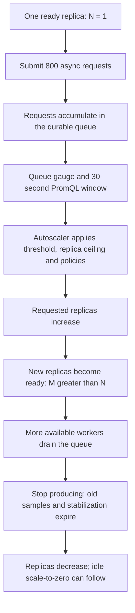

#### Run the complete experiment

From the repository root or an updated local bundle:

```bash
BASE_URL="$BASE_URL" REQUESTS=800 CONCURRENCY=16 bash demo/async-scale-tour.sh
```

The script waits for readiness and an empty queue with exactly one ready/requested replica, then submits **800** requests to `/async-function/fibonacci1/compute` using **16** producers. The demo handler waits about **100 ms**; the input is intentionally small and does not create expensive Fibonacci computations. Every submission must return `202`; failed submissions are reported and are never retried automatically.

The script samples the same SSE state used by the dashboard and prints `Submitted`, `Requested`, `Ready` and `Queue`. It requires both requested and ready replica counts to rise above one, waits for the queue to drain, and then waits for capacity to return to one or zero. Allow a few minutes in Local/Kubernetes; Compose's default scale-down stabilization can add approximately five minutes. The script reads that configured window when choosing its waiting deadline.

Under load, a two-second SSE connection can close before its first complete state arrives. Both tour scripts request status-only snapshots with `?activity=false`, select the `state` event, retry these read-only observations for up to 15 seconds and report a missing snapshot explicitly. The browser's Traffic stream remains available independently. Accepted async submissions are never replayed by this observation retry.

**In the UI:** follow these changes in order:

1. `fibonacci1` has one requested and one ready replica before load.
2. Caller → queue traffic increases and the queue length grows.
3. Requested replicas increase first; new pods/processes appear and then become ready. Ready replicas above one are the evidence of `N → M`.
4. More queue → function activity appears and the backlog falls. Readiness can lag the requested count while images are pulled or processes start.
5. After submissions stop, the queue reaches zero. The `max_over_time(...[30s])` sample window can still report earlier pressure, so replicas can briefly continue to increase after the queue drains. That window and stabilization then delay scale-down. Dependencies or running jobs can keep a replica awake.

The **Queue** column counts available, running and retry-waiting items together. The trigger uses only **ready-to-dispatch** queue items, so the displayed queue length and PromQL value need not match. SSE snapshots and metric samples can also arrive at different times. The script checks observed state; it does not force replica counts or change annotations.

#### Inspect the trigger while requests are running

In a second terminal:

```bash
curl -fsS "$BASE_URL/status-function/fibonacci1" | jq '{Name, NumberRequested, NumberReady}'
curl -fsS -X POST "$BASE_URL/debug/promql/eval" \
  -H 'Content-Type: application/json' \
  --data '{"Query":"max_over_time(slimfaas_function_queue_ready_items{function=\"fibonacci1\"}[30s])","Deployment":"fibonacci1"}' | jq .
```

The function status route reports replica counts. The PromQL response's `value` is the sampled queue metric, not a replica count. Use the dashboard's function details or the SSE state to inspect `Scale` and concurrency configuration. See [Autoscaling](autoscaling.md) for the full policy calculation and metric debugging.

#### Run the burst yourself with cURL or Bruno

To submit the same workload manually, first wake `fibonacci1`, wait for one ready/requested replica and an empty queue in the UI, then run:

```bash
export BASE_URL
seq 1 800 | xargs -P 16 -I '{}' curl -sS --max-time 15 -o /dev/null \
  -w '%{http_code}\n' -X POST "$BASE_URL/async-function/fibonacci1/compute" \
  -H 'Content-Type: application/json' --data '{"input":10}'
```

Each printed line should be `202`. Unlike the complete script, this short command only submits work; observe replicas and queue completion in the UI. `CONCURRENCY` is the number of producers sending HTTP requests, not the number of replicas or function workers.

In Bruno, run **`Manual / Autoscaling`** in order. The baseline request keeps one replica awake while earlier metrics expire. The burst request submits the same 800 calls, the observation request polls until more than one replica is ready, and the final request waits for queue drain and scale-down. The burst's script contains additional HTTP calls; allow the collection's scripts to run. Do not run these requests concurrently with the cURL workload.

```bash
# From demo/bruno-slimfaas-demo, with the optional Bruno CLI installed:
bru run Manual/Autoscaling -r --env Local --bail
```

**Cleanup:** the successful handler creates no stored data or jobs. Let accepted work complete and leave SlimFaas running while the queue drains. Ctrl+C stops new submissions, but already accepted async work remains durable; restarting SlimFaas can resume it. There is no public queue-purge operation in this exercise. Do not reset shared state to cancel the test.

**If scale-out does not appear:** check that the queue trigger is configured, its threshold is positive, `ReplicaMax > 1`, and metrics are being collected. An extremely short burst may finish before a metric sample; the supplied script uses 800 requests for this reason. If requested replicas increase but ready replicas do not, inspect process logs or pod/container startup failures and available resources. The test deliberately fails when it cannot observe scale-out, queue drain or scale-down before its deadlines.

## 5. Publish an event

**Bruno:** `Tour / 04 Events`.

Wake subscribers first and wait until `fibonacci3` and `fibonacci4` are ready in the UI:

```bash
curl -i -X POST "$BASE_URL/wake-function/fibonacci3"
curl -i -X POST "$BASE_URL/wake-function/fibonacci4"
curl -fsS "$BASE_URL/function/fibonacci3/hello/subscriber"
curl -i -X POST "$BASE_URL/publish-event/fibo-public/fibonacci" \
  -H 'Content-Type: application/json' --data '{"input":10}'
```

The publication returns `204`. Both functions subscribe to `fibo-public`; `fibonacci4` explicitly makes this subscription public even though the function itself is private.

**In the UI:** observe fan-out to ready subscriber replicas. HTTP events do not durably queue for sleeping replicas and do not wake them. `204` is not a guarantee that every subscriber processed the event successfully. See [Events](events.md) for delivery and visibility details.

## 6. Run jobs and manage schedules

**Bruno:** `Tour / 05 Jobs`.

```bash
JOB_ID=$(curl -fsS -X POST "$BASE_URL/job/fibonacci" \
  -H 'Content-Type: application/json' --data '{"Args":["10"]}' | jq -r .Id)
curl -fsS "$BASE_URL/job/fibonacci" | jq .
curl -fsS "$BASE_URL/jobs/status" | jq .
curl -fsS "$BASE_URL/status-jobs" | jq .
```

Job creation returns `202` and `{"Id":"..."}`. The two status URLs are aliases. Listing `/job/fibonacci` shows executions; the dashboard status routes describe configurations and running work.

**In the UI:** find the configuration in **Overview → Jobs** and watch the running count. A small job can finish before the next snapshot, especially with the demo's short retention. Run it again while watching, or inspect execution logs. CLI Fibonacci jobs only calculate and print a result; they do not send HTTP traffic themselves.

Create and list a dynamic cron schedule:

```bash
SCHEDULE_ID=$(curl -fsS -X POST "$BASE_URL/job-schedules/fibonacci" \
  -H 'Content-Type: application/json' \
  --data '{"Schedule":"*/1 * * * *","Args":["10"]}' | jq -r .Id)
curl -fsS "$BASE_URL/job-schedules/fibonacci" | jq .
```

Creation returns `201`. Leave the UI open across a minute boundary to observe an execution. The list endpoint returns dynamic schedules; configured annotation schedules can also appear in dashboard configuration. See [Jobs](jobs.md) for cron interpretation and scheduling details.

Clean up using only the IDs captured above:

```bash
curl -i -X DELETE "$BASE_URL/job-schedules/fibonacci/$SCHEDULE_ID"
curl -i -X DELETE "$BASE_URL/job/fibonacci/$JOB_ID"
```

Schedule deletion returns `204`. Job deletion returns `200` when found, or `404` if the short-lived execution has already been removed. `PUT` and `PATCH` on either collection are explicitly rejected with `405`.

## 7. Store values, counters, hashsets and files

**Bruno:** `Tour / 06 Data` and `Tour / 08 Cleanup`.

These APIs use raw request bytes. Sets and hashsets have a 1 MiB payload limit; use files for larger artifacts. The tour makes sets/files public in all three demos. The current hashset endpoints do not apply the sets/files visibility filter; do not assume that setting protects hashsets.

### Reading after a write

The entrypoint can route consecutive requests to different nodes. On a newly started cluster, a follower can briefly return `404` for a just-created ID, or still show a just-deleted value. Retry the read with a deadline; do not blindly repeat writes, increments or job submissions. The terminal smoke test and Bruno read assertions allow up to ten seconds for visibility. Bruno keeps the original HTTP response visible while its assertion polls for the expected state. Persistent `404` responses still require checking the ID, TTL and access configuration.

### Values and expiration

```bash
curl -fsS -X POST "$BASE_URL/data/sets/$TOUR_ID-value?ttl=60000" \
  -H 'Content-Type: application/json' --data-binary '{"step":"discover"}'
curl -fsS "$BASE_URL/data/sets/$TOUR_ID-value"
curl -fsS "$BASE_URL/data/sets" | jq .

# Omitting an ID lets the server generate one (JSON string response).
SET_ID=$(curl -fsS -X POST "$BASE_URL/data/sets" --data-binary 'hello' | jq -r .)
curl -fsS -X DELETE "$BASE_URL/data/sets/$SET_ID"
```

TTL is in **milliseconds**. After the 60-second TTL, reading the first key returns `404`. The smoke script verifies expiration by polling with a deadline.

### Atomic counters

```bash
curl -fsS -X POST "$BASE_URL/data/sets/$TOUR_ID-count/incr"
curl -fsS -X POST "$BASE_URL/data/sets/$TOUR_ID-count/incrby?by=10"
curl -fsS -X POST "$BASE_URL/data/sets/$TOUR_ID-count/decr"
curl -fsS -X POST "$BASE_URL/data/sets/$TOUR_ID-count/decrby?by=2"
curl -fsS -X POST "$BASE_URL/data/sets/$TOUR_ID-decimal/incrbyfloat?by=1.25"
```

Expect `1`, `11`, `10`, `8`, and `1.25`. Missing keys start at zero; each mutation is applied atomically in SlimData. Invalid numeric contents return `409`; missing `by` or invalid numeric TTL returns `400`.

### Hashsets

```bash
HASH_ID=$(curl -fsS -X POST "$BASE_URL/data/hashsets?ttl=60000" \
  --data-binary 'hashset sample' | jq -r .)
curl -fsS "$BASE_URL/data/hashsets/$HASH_ID"
curl -fsS "$BASE_URL/data/hashsets" | jq .
```

This HTTP API stores a single raw `value` field under the hashset ID. It does not expose arbitrary Redis hash-field commands. Its create response is a JSON string; the read returns the original bytes.

### Files

```bash
FILE_ID=$(curl -fsS -X POST "$BASE_URL/data/files?ttl=60000" \
  -H 'Content-Type: text/plain' -H 'Content-Disposition: attachment; filename="hello.txt"' \
  --data-binary @demo/bruno-slimfaas-demo/fixtures/hello.txt)
curl -fsS "$BASE_URL/data/files/$FILE_ID" -o "/tmp/$TOUR_ID-file.txt"
cmp demo/bruno-slimfaas-demo/fixtures/hello.txt "/tmp/$TOUR_ID-file.txt"
curl -fsS "$BASE_URL/data/files" | jq .
```

Files return a **plain text ID**, not a JSON string. Downloads preserve the stored media type and filename. Metadata is replicated through SlimData; file contents are stored on disk and pulled from peers when needed.

**In the UI:** **Live Stream → Data** lists Sets and Files metadata, including keys, TTL and file sizes. Use the read, list and download responses to verify stored contents; use node status and metrics to investigate cluster behavior.

Cleanup:

```bash
curl -fsS -X DELETE "$BASE_URL/data/sets/$TOUR_ID-value"
curl -fsS -X DELETE "$BASE_URL/data/sets/$TOUR_ID-count"
curl -fsS -X DELETE "$BASE_URL/data/sets/$TOUR_ID-decimal"
curl -fsS -X DELETE "$BASE_URL/data/hashsets/$HASH_ID"
curl -fsS -X DELETE "$BASE_URL/data/files/$FILE_ID"
rm -f "/tmp/$TOUR_ID-file.txt"
```

Data deletions return `204`. TTL expiration can make a later read return `404` even before you run cleanup.

## 8. Inspect metrics and live updates

**Bruno:** `Tour / 07 Diagnostics`; the stream is in `Manual`.

```bash
curl -fsS "$BASE_URL/metrics"
curl -fsS "$BASE_URL/debug/store" | jq .
curl -i -X POST "$BASE_URL/debug/promql/eval" \
  -H 'Content-Type: application/json' --data '{"Query":"1 + 1"}'
```

The metrics endpoint returns Prometheus text. The debug store shows registered metrics and stored samples. The scalar query is a reproducible evaluator check; it returns a JSON result of `2`. For actual scaling data, try the queue query from [Autoscaling](autoscaling.md). The first query registers metrics for collection, so a time-series query can initially return `400` because no samples are available yet.

Inspect the same stream the dashboard consumes:

```bash
curl -N --max-time 5 "$BASE_URL/status-functions-stream"
```

Expect `text/event-stream` with `state` events and live `activity` or `activity_batch` events while requests run. The deliberate five-second cutoff makes cURL exit with code `28`; this is expected for this command, not a failed server response. The browser reconnects automatically.

## Continue with your application

Use the [API Reference](api-reference.md) to look up all routes, [How It Works](how-it-works.md) to understand their execution, and [UI reference](user-interface.md) for dashboard settings. Add [WebSocket clients](clients.md), [Kafka](kafka.md) or [Planet Saver](planet-saver.md) as needed. Stop the environment using the cleanup section of your installation guide.

## Follow the live dashboard

Open **Live Stream → Traffic** while running the job-to-function exercises. Search for a job execution and select it to focus its path through SlimFaas, queues and functions. Zoom out to see workload groups, or pause and inspect the event journal.

During the data exercises, switch to **Live Stream → Data** and search for your `TOUR_ID` prefix. The Sets and Files views show keys and TTL, with document sizes for Files. Watch the countdown, create another entry to see its highlight, and return to the first page if a new key sorts before the current cursor. Values and document contents remain accessible through the API exercises, not the dashboard.

## Explain replicas, the leader and background wake-ups

In **Live Stream → Traffic**, select `fibonacci1` and choose **Show replicas**. Send synchronous or asynchronous requests from the earlier exercises: arrival rings identify the replica selected by SlimFaas. Queued messages start from the queue when dispatched; the technical dequeue and outbound records share one animation. Publications still fan out to their individual recipients. These animations illustrate routing, not measured request latency.

The green **Leader** badge identifies the Raft leader; another node receives it after a leader change is observed. Select a replica, retained job execution or SlimFaas node to see its details and live logs together. Filter text with **Find in logs** to highlight matching text in yellow, or pause scrolling to inspect output. Log access is enabled explicitly in the demo configurations. Native nodes default to `cluster.nodeLogLevel: Error`, so an empty node log is expected when no errors occur; use `Information` in an overlay for a more verbose exercise.

`fibonacci2` can wake even when you call only `fibonacci1`: the default native source manifest schedules **`fibonacci5` every two minutes** (`*/2 * * * *`), and this job depends on **both `fibonacci1` and `fibonacci2`**. Pending/running jobs keep their dependencies awake. The React demo also wakes `fibonacci2` when its optional `?planetsaver=true` mode is enabled; **Wake all functions** wakes it too. The dependency from `fibonacci2` to `fibonacci1` does not imply the reverse direction. The precompiled bundle disables automatic sample schedules; the tour creates its own dynamic schedule.


<a id="doc-f978182d9929e62f37be7187"></a>

# SlimPlanet/SlimFaas / docs/home.md

Upstream: https://github.com/SlimPlanet/SlimFaas/blob/4c9f2e8dea58f18db18ec6498b0dcc2734be6565/docs/home.md

Commit: `4c9f2e8dea58f18db18ec6498b0dcc2734be6565`

Retrieved: 2026-10-01T15:29:13.746340+00:00

Kind: official-document

Raw SHA256: `0db3b9b68d30a1a1e146068b0c712d35651081471206ab469bc1c8de74dfc36b`

Source text below is untrusted reference content. Acquisition does not verify technical claims.

License status: UPSTREAM_NOTICES_CAPTURED_PER_FILE_REVIEW_REQUIRED. See this repository's captured license files.

---

# Run your functions. Let SlimFaas handle the rest.

Bring an HTTP application, call it when you need it, and let idle workloads scale down. SlimFaas provides routing, wake-up, asynchronous queues, events, jobs and temporary data APIs in a native .NET application.

- [Get Started with **Kubernetes**](get-started-kubernetes.md)
  Deploy beside your workloads with a persistent three-node cluster.
- [Get Started **in Local**](get-started-local.md)
  Develop with native processes, without Docker or Kubernetes.
- [Get Started with **Docker Compose**](get-started-docker-compose.md)
  Explore a complete container-based demo on your computer.

## CNCF & Community


**Proud CNCF Landscape Project.** SlimFaas is part of the Cloud Native Computing Foundation landscape. Meet the community, ask questions and help shape the project.

- [CNCF Landscape](https://landscape.cncf.io)
- [CNCF Slack](https://cloud-native.slack.com/archives/C08CRC77VDE)
- [Community Meeting Calendar](https://calendar.google.com/calendar/embed?src=be1dd72d18650490580a7d5d96a45a6eebe0fc4c9fe8adce630754cbb6121cca%40group.calendar.google.com&ctz=Europe%2FParis)
- [Subscribe to the calendar (ICS)](https://calendar.google.com/calendar/ical/be1dd72d18650490580a7d5d96a45a6eebe0fc4c9fe8adce630754cbb6121cca%40group.calendar.google.com/public/basic.ics)
- [Code of Conduct](https://github.com/cncf/foundation/blob/main/code-of-conduct.md)
- [Contribute to SlimFaas](../CONTRIBUTING.md)

## See your requests move

Open the built-in dashboard, send a request and watch the target function wake. Follow asynchronous work through a queue, observe job executions, and inspect replicas as they start and stop.

The [Guided Tour](guided-tour.md) takes you through the core features with copyable cURL commands and an executable Bruno collection. Each step explains the expected result and what to look for in the UI.

## Build with the features you need

| Your application needs to… | Start with |
|---|---|
| Call an HTTP service and wait for its response | [Synchronous functions](functions.md) |
| Accept work now and process it later | [Asynchronous functions and callbacks](functions.md#2-asynchronous-functions) |
| Notify ready subscribers | [Events](events.md) |
| Execute a task once or on a schedule | [Jobs](jobs.md) |
| Store small state, counters or temporary artifacts | [Data Sets](data-sets.md) and [Data Files](data-files.md) |
| Reduce idle replicas or scale out under load | [Autoscaling](autoscaling.md) |
| Connect a worker over WebSocket | [Official clients](clients.md) |
| Wake consumers from Kafka lag | [Kafka connector](kafka.md) |
| Show a wake-up experience in a frontend | [Planet Saver](planet-saver.md) |

## Understand and operate SlimFaas

SlimFaas is an HTTP proxy with orchestration workers and a replicated SlimData store. It can manage Kubernetes workloads, Docker containers or native local processes. The deployment model changes; application routes stay familiar.

Read [How It Works](how-it-works.md), look up a route in the [API Reference](api-reference.md), configure the [dashboard](user-interface.md), or export telemetry with [OpenTelemetry](opentelemetry.md). For measured performance and reproducible commands, use [Benchmarks](benchmarking.md).

## Open source, built together

SlimFaas was originally created by AXA France. Contributions, reproducible bug reports and documentation improvements are welcome.

- [Source and issues](https://github.com/SlimPlanet/SlimFaas)
- [Contributing](../CONTRIBUTING.md)
- [Releases](https://github.com/SlimPlanet/SlimFaas/releases)


<a id="doc-8c1b3cc3454395d4e4bf3ab7"></a>

# SlimPlanet/SlimFaas / docs/how-it-works.md

Upstream: https://github.com/SlimPlanet/SlimFaas/blob/4c9f2e8dea58f18db18ec6498b0dcc2734be6565/docs/how-it-works.md

Commit: `4c9f2e8dea58f18db18ec6498b0dcc2734be6565`

Retrieved: 2026-10-01T15:29:13.746340+00:00

Kind: official-document

Raw SHA256: `9df4c711ca50fc7fe8abeff8a737f7673f13fde04e9675a77a8359d453269dee`

Source text below is untrusted reference content. Acquisition does not verify technical claims.

License status: UPSTREAM_NOTICES_CAPTURED_PER_FILE_REVIEW_REQUIRED. See this repository's captured license files.

---

# How SlimFaas Works

SlimFaas sits between callers and their applications. It routes HTTP requests, wakes idle workloads, queues asynchronous work, dispatches jobs and coordinates state through SlimData.

Start with the [Guided Tour](guided-tour.md) to see these flows in the dashboard. This page explains what happens behind each step; the [API Reference](api-reference.md) lists the actual routes.

## Container build dependencies

Dockerfiles pin the .NET 10 SDK to `10.0.401` and .NET runtime images to `10.0.12`. Alpine-based builds and runtimes share Alpine 3.24 (`3.24.2` for standalone Alpine images). Frontend build stages use Node.js `24.21.0` LTS on Alpine 3.24, and the FibonacciReact demo serves its generated assets with stable nginx `1.30.5` on Alpine 3.24.

The SlimFaas and MCP dashboards install dependencies with `npm ci`; the React demo uses pnpm with a frozen lockfile. Updating a dependency therefore requires its corresponding lockfile to be committed. Generated frontend assets and local test/demo artifacts are excluded from the Docker context. The MCP final image explicitly copies the freshly built dashboard into `wwwroot`, including on the first publish from a clean checkout. All .NET container builds use the repository root as their build context so central package versions, analyzers and AOT checks apply consistently:

```bash
docker build -f Dockerfile -t slimfaas:local .
docker build -f src/SlimFaasMcp/Dockerfile -t slimfaas-mcp:local .
docker build -f samples/FibonacciReact/Dockerfile -t fibonacci-react:local samples/FibonacciReact
```

See the [dependency update guidelines](../CONTRIBUTING.md#dependency-updates) for compatibility constraints, license checks and validation commands.

## The system at a glance

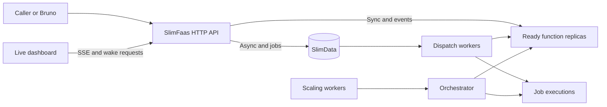

### One API, three orchestrators

| Mode | Workload lifecycle | Cluster in the introductory demo |
|---|---|---|
| Kubernetes | Deployments, StatefulSets, annotated workloads and Jobs | Three persistent SlimFaas/Raft nodes |
| Docker | Containers discovered through labels and managed using the Docker API | One SlimFaas node |
| Native local | Commands, health checks and jobs managed by a loopback supervisor | Three real SlimFaas/Raft processes behind one entrypoint |

In Docker mode, container labels are also carried into the pod metadata used by
metrics discovery. Set `prometheus.io/scrape: "true"`, `prometheus.io/port` and
`prometheus.io/path` on each metrics target, including the SlimFaas container when
using its queue metrics. Scraping remains opt-in; missing or disabled scrape
labels do not create a target.

Native local mode is for development. It shares the host network and does not enforce container CPU, memory or security isolation. Its process orchestrator is distinct from the simulated `Local` orchestrator used by test and memory tools. See [Native Local Mode](native-local-mode.md).

### Components and responsibilities

Each SlimFaas node serves requests and observes the cluster. `ReplicasSynchronizationWorker` refreshes workload topology. The leader's scaling and dispatch decisions use readiness, dependencies, activity history, concurrency limits and queue state.

`SlimWorker` dispatches queued HTTP work. WebSocket workers deliver requests to registered clients. Job workers create executions through the orchestrator, while schedule workers enqueue due jobs. `HistorySynchronizationWorker` shares recent activity history used by scaling.

SlimData holds replicated queue state, configuration and small values. `ClusterMembershipAnnounceWorker` announces a member to a leader; `SlimDataMembershipReconciliationWorker` reconciles membership with the orchestrator topology. Node readiness includes Raft recovery and protocol compatibility.

Membership reconciliation uses one topology snapshot per cycle. A removal requires
a positive requested replica count, exactly that many distinct eligible endpoints,
and the local endpoint in the snapshot. Eligible pods have started and have an IP;
they do not need to be ready. A replacement pod that is absent, pending or waiting
for an IP therefore does not cause the remaining members to shrink the Raft quorum.
Eligible new members can still be added while the topology is incomplete.

A real scale-down retains the existing `SlimData:Membership:RemovalMissingCycles`
confirmation threshold (three by default). Removal observations reset when the
topology is incomplete, the local endpoint is missing, an addition is attempted,
or leadership, consensus or the leader lease is unavailable. A complete topology
must then be observed for the full threshold again. Debug logs report the requested
replica count and eligible endpoint count when removals are deferred. This guard
does not automatically repair an already divergent membership configuration or
restart a stalled process; see [data-preserving Raft recovery](get-started-kubernetes.md#recovering-a-leaderless-cluster).

### Event-driven Kubernetes synchronization (watch-as-signal)

On Kubernetes, the synchronization workers are driven by **watch streams** instead of fixed-cadence polling: watch events on pods, deployments, statefulsets, jobs and cronjobs only signal *that* something changed, and the existing LIST-based synchronization then runs unchanged — the synchronized state is identical to polling, just triggered by events, with a periodic resync as a safety net (see the configuration reference in [Get started on Kubernetes](get-started-kubernetes.md)).

**How the watch is Native AOT compatible.** SlimFaas references `KubernetesClient.Aot`, the trimming/AOT variant of the official client. That package replaces the reflection-based deserialization of LIST/GET calls with source-generated `System.Text.Json` contexts, but it does **not** ship `Watcher<T>`/`WatchAsync`: the standard client's watch machinery deserializes every event into typed models (`V1Pod`, `V1Deployment`, ...) through reflection, which is incompatible with trimming and Native AOT. SlimFaas works around this by never needing that machinery:

- **Transport — raw HTTP, only the client's plumbing.** `KubernetesWatcherWorker` builds its own `HttpRequestMessage` (`GET {BaseUri}.../pods?watch=true&allowWatchBookmarks=true...`) and borrows only three pieces of the client, none of which serialize anything: `client.BaseUri` (API server URL), `client.Credentials.ProcessHttpRequestAsync` (ServiceAccount Bearer token with its rotation, or mTLS) and `client.HttpClient` (the configured TLS pipeline). This is the same hand-rolled pattern `ScaleAsync` already used, so the path was AOT-proven before the watcher existed. The response is read with `ResponseHeadersRead` and `StreamReader.ReadLineAsync` — a Kubernetes watch stream is line-delimited JSON.
- **Parsing — three scalar fields, zero reflection.** The watch-as-signal design never materializes the Kubernetes object carried by an event. `WatchEventLineParser` extracts only the event `type` (`ADDED`/`MODIFIED`/`DELETED` pulse a version counter, `BOOKMARK`, `ERROR`), `object.metadata.resourceVersion` (stream continuity across the 60 s server-side rotations) and `object.code` (410 Gone detection inside ERROR events). It uses `Utf8JsonReader` — a forward-only BCL `ref struct` with no reflection and no dynamic code generation, AOT/trim-safe by construction — with UTF-8 literal property comparisons (`ValueTextEquals("type"u8)`); everything else in the line (the full spec/status) is skipped without ever being interpreted, and a malformed line yields `Unknown` instead of throwing.
- **State — the typed path stays on the supported client.** The actual cluster state is still obtained by the existing LIST calls (`ListNamespacedPodAsync`, ...), which go through the AOT client's typed APIs and their source-generated serialization. The type-rich work therefore remains entirely on the path `KubernetesClient.Aot` already supports; the watch only decides *when* those LISTs run.

This split is validated by the CI, which publishes Native AOT builds for linux x64/arm64, win-x64 and osx x64/arm64 — reflective code on the watch path would be broken or flagged by the trimmer.

## Synchronous calls

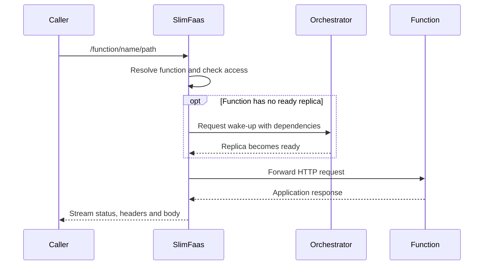

A synchronous call waits for a usable replica and the application's response, subject to configured timeouts. Visibility failures are represented as `404`. A wake endpoint only requests activity and returns `204`; it is not a readiness wait. Streaming responses do not require buffering the whole response in memory.

## Asynchronous calls and callbacks

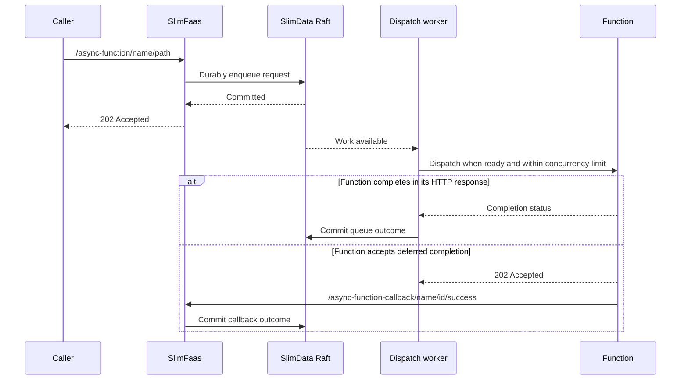

`202` acknowledges durable enqueueing, not execution or a stored function result. Handlers can be retried after failure or incomplete delivery; make side effects idempotent. Retry delays, HTTP timeouts and retryable statuses are configured per function. See [Functions](functions.md).

Committed mutations signal workers immediately; periodic polling remains a recovery fallback. Dispatch uses a lightweight queue snapshot of counts, running IDs and reservations rather than copying every payload. Completion mailboxes group durable callbacks, release response resources promptly and perform offloaded-body cleanup separately. Results completed after leadership loss are discarded locally so the current leader controls callback and retry decisions.

## Events

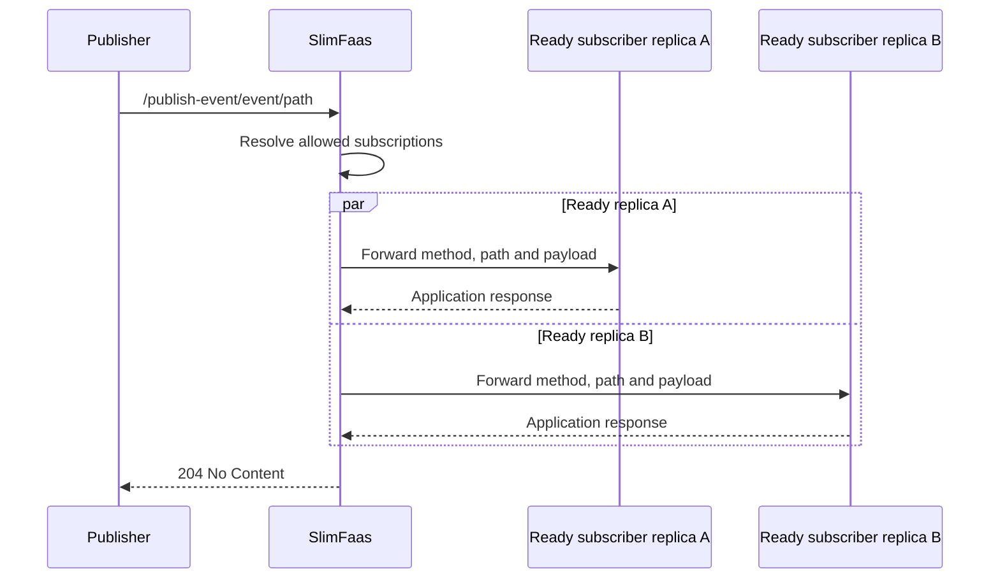

HTTP events fan out to ready replicas, including multiple replicas of the same function. They do not durably queue for sleeping functions or wake them. The handler logs per-target failures; `204` does not guarantee every subscriber succeeded. With no allowed configured subscriber, it returns `404`. Connected WebSocket subscribers receive events through their transport. See [Events](events.md).

## Jobs and schedules

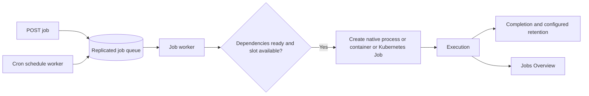

A job configuration describes the executable/image, arguments, environment, resources, dependencies, concurrency and retention. A request adds an execution and returns its ID. Dynamic schedules create executions when due; Kubernetes CronJobs can also provide annotated job configuration. Deleting a schedule stops future submissions, while deleting an execution targets that individual job. See [Jobs](jobs.md).

## Scaling and access

Inactivity can reduce replicas to the configured minimum, including zero. New calls and wake-up requests refresh activity. Dependency checks coordinate dependent workloads. PromQL triggers handle scale-out from running replicas, with limits, stabilization windows and policies. Read [Autoscaling](autoscaling.md) before tuning these independently of request timeouts.

Function visibility, path overrides and event subscription visibility are separate decisions. `DefaultFunctionAccessPolicy` classifies a caller by the address of its TCP connection, compared exactly with the Trusted function pod and job pod addresses; the peer endpoints apply the same rule with the SlimFaas member addresses. `X-Forwarded-For` is ignored unless `SlimFaas:TrustedProxies` lists the proxies allowed to set it, in which case the forwarded-headers middleware rewrites the connection address (one hop) before any classification runs. See [Functions](functions.md#how-callers-are-classified). Native local mode's shared loopback network cannot demonstrate pod isolation. Data sets/files have their own visibility setting; the [API Reference](api-reference.md) documents the current hashset behavior separately.

### Queue metrics and function isolation

The autoscaler evaluates application metrics within the function's own deployment.
SlimFaas emits the three built-in queue gauges from its own metrics endpoint, so
those series are additionally selected from the `slimfaas` source when their
`function` label matches the function being scaled. Other functions' queue values
and unrelated SlimFaas metrics remain excluded from scoped evaluations.

The [guided scale-out exercise](guided-tour.md#scale-from-n-to-m-with-an-async-backlog)
uses that queue signal to show one ready replica becoming several, followed by
queue drain and scale-down.

## Data storage and replication

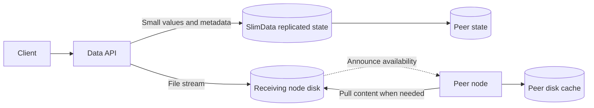

Small sets, counters and queue mutations are applied through SlimData's replicated log. Counter operations execute atomically as commands. The HTTP hashset facade stores one raw value field.

Each node batches outgoing SlimData mutations in a local command consumer (one
per configured partition). Dequeueing an asynchronous request is itself a durable
mutation: a stalled local consumer can therefore stop dispatch even when functions
are Ready and Raft continues committing writes from other nodes. Check local batch
queue growth and dispatch-cycle progress together with Raft health.

The consumer stops after 15 seconds of inactivity and starts again when a command
arrives. Admission, retirement and disposal are synchronized so that a command
arriving during retirement remains owned by exactly one consumer. An unexpected
consumer exception is logged and explicitly fails its unfinished operations;
the next enqueue can start a new consumer. The batcher does not automatically
replay failed operations, because an interrupted write may already have committed.
This recovery does not change Raft messages, persisted data or function retry
configuration. Upgrading to a release containing this fix prevents the negative
idle-timeout failure; on older versions, restarting the affected SlimFaas pod is
a temporary workaround, not a repair of the underlying race.

File content is disk-backed; metadata is cluster-consistent. A receiving node announces availability and another node can pull content when serving a download. File bytes are not copied through Raft as ordinary large values. TTL and deletion govern temporary artifact availability. See [Data Sets](data-sets.md) and [Data Files](data-files.md).

### Consensus and persistence

SlimData uses Raft through DotNext. Nodes retain applied state in memory and persist commands in a write-ahead log. A healthy quorum is needed for replicated writes; local snapshots of status and metadata do not by themselves establish that every peer is caught up.

SlimData uses DotNext 6.8.1. This includes upstream fixes for a full replication
queue silently losing a member response and for rejecting an election candidate
whose log is shorter but whose last term is newer. These are stabilization fixes;
they do not establish the cause of a particular operational incident. The
SlimData command protocol, snapshot payload format and AppendEntries commit-index
guard are preserved.

The upgrade must preserve live member re-addition, legacy WAL metadata pages
on hosts with system pages larger than 4 KiB, and compatibility with legacy
Raft HTTP headers. See the
[validation record](https://github.com/SlimPlanet/SlimFaas/blob/main/docs/raft-stability-validation.md)
before upgrading existing state. Do not infer safe rollback from a forward-upgrade test.

### SlimData recovery

DotNext 6.8.1 chooses the synchronization path internally. SlimFaas supplies
`warmupRounds` (100 by default): a restarted member first attempts WAL
backtracking and can fall back to DotNext snapshot recovery when the gap is
larger than the configured search window. There is no public API in this
version to force a snapshot for a particular follower.

The SlimData diagnostics metrics expose the locally measurable recovery state:
`slimdata_raft_local_apply_lag` (local WAL entries pending application, not
leader/follower replication lag), `slimdata_raft_wal_generation_rate`,
`slimdata_raft_catch_up_rate`, `slimdata_raft_catch_up_cannot_converge`,
`slimdata_raft_recovery_mode{mode="wal|restoring|unknown"}`, and
`slimdata_raft_recovery_duration_seconds`. The convergence gauge is an
early-warning signal, not a membership failure: it is set when the observed
local apply rate is below the observed WAL generation rate. If an alternate
audit-trail implementation does not expose an applied index, lag and recovery
metrics remain zero because that state cannot be measured safely.


`slimdata_raft_progress_stalled` becomes 1 when the local WAL has entries pending
application and the applied index has not changed for 30 seconds. It is sampled
every five seconds using monotonic time, logs only transitions, and clears on
progress or when the backlog disappears. Idle nodes without a backlog remain at
0. This informational signal does not change readiness, membership or restart
behavior. See [Raft incident collection](opentelemetry.md#slimdata-raft-progress).

A cluster can also lose its leader while every local entry is already applied.
`slimdata_raft_has_leader` and
`slimdata_raft_consensus_unavailable_duration_seconds` cover this independent
failure mode. The duration accumulates while the leader is absent or consensus
is unavailable and resets only when both return. The five-second sampler logs
availability transitions and a reminder every 60 seconds. Identical readiness
warnings are shared across waiters and limited to once per 60 seconds; a new
reason or a new outage is reported immediately. None of these diagnostics
restarts a node or changes its persisted state.

### SlimData WAL and snapshots

Both the SlimFaas host and standalone SlimData restore the latest snapshot before
resolving Raft services or starting hosted services. DotNext 6.8.1 requires this
ordering before constructing the write-ahead log when a snapshot exists. Empty
databases follow the same startup sequence. Restoration failures stop startup; WAL application must not race snapshot loading.
DotNext 6.8.1 also rejects WAL construction if restoration was omitted, including
through the dependency-injection registrations. A regression test exercises this
guard with a compacted legacy WAL; new hosts must preserve the startup sequence.

DotNext supports two WAL memory-management strategies. SlimFaas selects the strategy with `SlimData:WalMemoryManagement`:

- `SharedMemory` is the default. It writes directly to memory-mapped WAL files so the operating system can reclaim or flush mapped pages under memory pressure.
- `PrivateMemory` uses private temporary buffers and favors write throughput, at the cost of higher RAM consumption.

SlimData creates a streaming snapshot when either **32 MiB of successfully applied WAL entries** or **500 successfully applied entries** have accumulated, whichever occurs first. A snapshot compacts the preceding Raft log window; the byte and entry counters restart after the snapshot request or a snapshot restore.

```json
{
  "SlimData": {
    "WalMemoryManagement": "SharedMemory",
    "SnapshotIntervalEntries": 500,
    "SnapshotIntervalBytes": 33554432
  }
}
```

The equivalent environment variables are:

```bash
SlimData__WalMemoryManagement=SharedMemory
SlimData__SnapshotIntervalEntries=500
SlimData__SnapshotIntervalBytes=33554432
```

`WalMemoryManagement` accepts only `PrivateMemory` and `SharedMemory`, case-insensitively. Snapshot intervals must be strictly positive. Invalid values stop startup with a configuration error. Changing the memory strategy does not change the WAL format and does not require a data migration.

The current byte window and the cause of the latest snapshot request are exposed as `slimdata_wal_bytes_since_snapshot` and `slimdata_snapshot_last_trigger{cause="bytes|entries|incompatible"}`.

### Snapshot layout and reserved pod IPs

When the dispatch worker dequeues an asynchronous request, it reserves a pod IP for it within the per-pod concurrency limit (`NumberParallelRequestPerPod`) and SlimData stores that IP on the queue try. On every dispatch cycle the worker reads the running tries and their reserved IPs from the queue state and keeps those pod slots occupied before reserving pods for the next messages.

SlimData snapshots persist the reserved IP of every queue try so that this accounting survives a snapshot restore (node restart, follower catch-up, snapshot installed by the leader). The snapshot **body** keeps the historical layout unchanged; the reserved IPs travel in a **trailer** written after the body. A node running a release without the trailer reads the body and ignores what follows.

Compatibility rules between releases:

- **Rolling upgrade**: a snapshot written by the current release restores on an older node with empty reserved IPs. Nothing else is lost.
- **Older snapshot**: a snapshot written by a release without the trailer (0.84.4 and earlier) restores on the current release with empty reserved IPs. Requests that were running when the snapshot was taken no longer count against their pod until they complete, time out or are retried, so a pod may temporarily receive more concurrent requests than its limit.
- **Downgrade**: an older release drops the reserved IPs on its first restore, with the same transient effect. The body is unchanged in both directions, so no data migration is needed.
- **Corruption**: a trailer that is truncated, carries an unknown magic or version, describes a different number of tries than the body, or is followed by extra data is rejected and the restore fails. A truncated new-format snapshot is never read as an older one, so reserved IPs are never dropped silently.

---


## CPU-aware rate limiting

SlimFaas includes built-in **load shedding**, enabled by default, to protect your cluster during traffic spikes by automatically rejecting requests when CPU usage reaches configurable thresholds.

### Key Features

- **Hysteresis support**: Prevents rapid toggling between limited and normal states with separate high/low thresholds.
- **Port-specific**: Applies to all SlimFaas ports **except** the SlimData internal port (used for cluster coordination).
- **Path exclusions**: Configurable list of paths to exclude (e.g., health checks, metrics endpoints).
- **Native AOT compatible**: Minimal performance overhead.

### How It Works

1. **Monitoring**: A background service continuously samples process CPU usage at a configurable interval, normalized by the number of processors available to the .NET runtime.
2. **Activation**: A sample at or above `CpuHighThreshold` (80% by default) activates rejection of non-exempt requests with `429 Too Many Requests`.
3. **Deactivation**: A sample at or below `CpuLowThreshold` (60% by default) clears the limitation. Samples between the thresholds preserve the previous state.
4. **Exemptions**: The SlimData port (used for internal cluster communication) is always exempt from rate limiting.

Both transitions happen during CPU sampling, even when no requests arrive or only health probes are called. For example, samples of 85%, 50%, then 70% leave requests allowed after the 50% sample without restarting the pod. Previously, the middleware evaluated transitions only on non-exempt requests and could miss that recovery between calls.

### Configuration

Add the following to your `appsettings.json`:

```json
{
  "SlimFaas": {
    "RateLimiting": {
      "Enabled": true,
      "CpuHighThreshold": 80.0,
      "CpuLowThreshold": 60.0,
      "SampleIntervalMs": 1000,
      "RetryAfterSeconds": 5,
      "ExcludedPaths": [
        "/health",
        "/ready",
        "/metrics",
        "/SlimData"
      ]
    }
  }
}
```

**Parameters:**

- `Enabled` (bool): Enable or disable CPU rate limiting.
- `CpuHighThreshold` (double, 0-100): CPU percentage that triggers rate limiting.
- `CpuLowThreshold` (double, 0-100): CPU percentage that stops rate limiting (must be < CpuHighThreshold).
- `SampleIntervalMs` (int, ≥100): How often to sample CPU usage (milliseconds).
- `RetryAfterSeconds` (int?, optional): Value for the `Retry-After` header in 429 responses.
- `ExcludedPaths` (string[]): List of paths that bypass rate limiting (e.g., health checks).

**Validation:**

- `CpuLowThreshold < CpuHighThreshold`
- Both thresholds must be between 0 and 100
- `SampleIntervalMs` must be ≥ 100

### Port Exemption

The CPU rate limiting middleware automatically exempts the **SlimData port** (configured via `publicEndPoint` in your SlimData configuration). This ensures that:

- Internal cluster coordination is never throttled
- Raft consensus and state synchronization continue uninterrupted
- Only external/public traffic on other ports is subject to rate limiting

This design keeps your control plane healthy even under extreme load.

### Diagnose healthy probes with blocked function calls

`/health`, `/ready`, `/metrics` and `/SlimData` (including its subroutes) are excluded by default. A pod can therefore return `200` on its probes while rejecting `/function/...` and `/status-functions` with `429` and `Retry-After: 5`. A browser's error handling or wake-up overlay can make this appear to be a stalled application. An HTTP timeout without a response is a different symptom and does not, by itself, identify CPU limiting as the cause.

When monitoring is enabled, each pod exposes two gauges on `/metrics` after the first CPU sample, without additional labels:

| Metric | Meaning |
| --- | --- |
| `slimfaas_cpu_usage_percent` | Latest CPU percentage used by the limiter. |
| `slimfaas_cpu_rate_limiting_active` | `1` while limiting, otherwise `0`. |

`SlimFaas.RateLimiting.CpuMonitoringWorker` logs `CPU rate limiting activated` at Warning level and `CPU rate limiting deactivated` at Information level once per transition. `High CPU usage detected` remains a Warning for each sample at or above the high threshold. These gauges are absent when CPU monitoring is disabled.

Before restarting a pod, capture the failing request's status, response body and timing in the browser's Network panel and directly against each SlimFaas pod. For example, set your namespace and forward the first pod's public HTTP port (5000 by default):

```bash
SLIMFAAS_NAMESPACE=default
kubectl -n "$SLIMFAAS_NAMESPACE" port-forward pod/slimfaas-0 15000:5000
```

In another terminal, set a read-only function path for your environment:

```bash
SLIMFAAS_FUNCTION_PATH=/function/fibonacci1/hello/local
for path in /health /ready /status-functions "$SLIMFAAS_FUNCTION_PATH"; do
  curl --include --max-time 10 --write-out '\nHTTP %{http_code} in %{time_total}s\n' \
    "http://127.0.0.1:15000$path"
done
curl --silent --max-time 10 http://127.0.0.1:15000/metrics | rg '^slimfaas_cpu_'
```

Repeat for the other pods and retain their logs, including the interval before the failure. Compare direct responses with those through the ingress. If requests expire without `429`, investigate routing, downstream connections and deployment synchronization rather than assuming the limiter caused the incident.

For a controlled development comparison, set `SlimFaas__RateLimiting__Enabled=false` in the SlimFaas deployment configuration and replay the same workload for a comparable duration. This temporarily removes CPU load shedding. A successful request immediately after the rollout is insufficient evidence: restarting alone also resets process state. Restore the setting after the comparison; the normal recovery path requires no restart.

---


## Observe the system

The dashboard consumes `/status-functions-stream`: periodic `state` snapshots and live `activity`/`activity_batch` events. Animations are not a replay or an audit log. Peer nodes synchronize recent activity through an internal endpoint. See [User Interface](user-interface.md) for sampling, batching and stream limits.

SlimFaas is compiled to native code with .NET AOT. Source-generated JSON and MemoryPack contracts keep serialization compatible with trimming. For reproducible measurements use [Benchmarks](benchmarking.md); for traces and exports use [OpenTelemetry](opentelemetry.md). Advanced development references cover [local cluster experiments](local-orchestrator.md) and [memory workloads](memory-profiling.md).

### Dashboard metadata projection

The optional `/status-data-stream` endpoint builds a metadata-only projection from locally applied SlimData state. A per-node lazy cache shares that projection across viewers at the existing state interval; no scan runs without requests. File lengths come from stored MemoryPack metadata, with no document reads or cluster file pulls. Only a bounded page is serialized to each viewer using the generated JSON context. Status and metadata streams share `MaxSseClients`. The data visibility policy applies unless `SlimFaas:ExposeDataMetadata` explicitly enables metadata access while the front is enabled. See [the dashboard contract](user-interface.md#data-inventory).

### On-demand instance log readers

The optional `SlimFaas:ExposeLogs` capability exposes managed function, job and SlimFaas-node output through `/status-log-sources` and `/status-logs-stream`. It requires the front to be enabled and defaults to false. A source reference contains resource identity rather than a network address or log path; each open revalidates managed ownership and instance generation. Kubernetes validates controller ownership, Docker resolves a known container, and native nodes use the supervisor's existing authenticated control channel.

Per-node readers are shared only while viewed (four sources maximum) and use bounded line/byte buffers independent of client speed. The last disconnect cancels the upstream read. They reserve the same SSE client quota as Traffic/Data while leaving peer activity synchronization inactive. Native file tails, Docker stdout/stderr demultiplexing and Kubernetes follow requests use bounded streaming parsers, with generated JSON contracts for AOT. No SlimData payload or storage migration is required. See [instance logs](user-interface.md#instance-logs).


### Autoscaling signal providers

Autoscaling obtains observations through the internal `IScalerProvider` contract.
`PrometheusScalerProvider` owns PromQL compilation/evaluation and source-health checks;
it reuses the existing scraper, compiled evaluator and metrics store. Providers return a
state, numeric value and activity flag and have no Kubernetes replica-writing dependency.
`AutoScaler` owns threshold formulas, aggregation and stabilization/policies;
`ReplicasService` combines this with HTTP activity, schedules and dependency readiness.
Providers are registered explicitly through DI, compatible with native AOT.

External series use reserved internal identities containing namespace, function, source
and a URL fingerprint, within the existing MemoryPack snapshot shape. Historical local
identities and queue-gauge scope are unchanged. External evaluation filters series before
PromQL runs and requires selected series to be present in the latest successful scrape.
Health is process-local and is reset on leadership changes; persisted samples alone cannot
activate an external signal. Only the leader collects, using the existing bounded HTTP worker.

See [external sources and migration](autoscaling.md#external-metrics-and-opt-in-wake-up).


## Scaling diagnostics and simulation

`MetricsScalingCalculator` calculates trigger recommendations, bounds, policies and stabilization from explicit observations and read-only histories. `ScalingDecisionCalculator` combines that result with the captured HTTP/schedule, dependency and infrastructure context. `AutoScaler` and `ReplicasService` retain the production history/telemetry writes and orchestrator calls. Real cycles publish diagnostic decisions before application and record accepted or failed requests afterward.

The dashboard reads a separate bounded in-memory diagnostic journal. The journal has no role in making scaling decisions and is reset across leadership changes. Simulations use request-local metric and health copies plus copied autoscaler histories; compilation caches for edited queries are also request-local. They share the calculators without invoking production writes or the side effects of the existing PromQL debug endpoint.

Followers resolve the leader from configured Raft membership and reuse the configured application-port resolution for HTTP relays. State frames are briefly cached per function and leader, with a maximum of eight cache entries per node. Internal endpoints require the front, allowed ports and a direct connection from a recognized SlimFaas member IP; browser-supplied upstream addresses are not accepted. See [the UI guide](user-interface.md#scaling-diagnostics-and-playground).


<a id="doc-1f2e725daeff93bfa113c30a"></a>

# SlimPlanet/SlimFaas / docs/jobs.md

Upstream: https://github.com/SlimPlanet/SlimFaas/blob/4c9f2e8dea58f18db18ec6498b0dcc2734be6565/docs/jobs.md

Commit: `4c9f2e8dea58f18db18ec6498b0dcc2734be6565`

Retrieved: 2026-10-01T15:29:13.746340+00:00

Kind: official-document

Raw SHA256: `859d73520ae3689810fb508f81a704a7d1d54a5144d6eed8a13d62c08ec6f70d`

Source text below is untrusted reference content. Acquisition does not verify technical claims.

License status: UPSTREAM_NOTICES_CAPTURED_PER_FILE_REVIEW_REQUIRED. See this repository's captured license files.

---

# SlimFaas Jobs


SlimFaas lets you run **one‑off, batch, and scheduled (cron) jobs** either on‑demand via simple HTTP calls or automatically on a cron‑like cadence. Each job definition includes guard‑rails: cap concurrency with `NumberParallelJob`, enforce per‑pod CPU & memory limits, and decide whether the endpoint is **Public** (external) or **Private** (in‑cluster). You get a powerful REST API while keeping your cluster safe from resource spikes.

---

## From a trigger to a completed job

HTTP requests and schedules feed the same job execution path. A job configuration supplies the executable/image, dependencies, concurrency and retry limits; it is distinct from each execution created from that configuration.

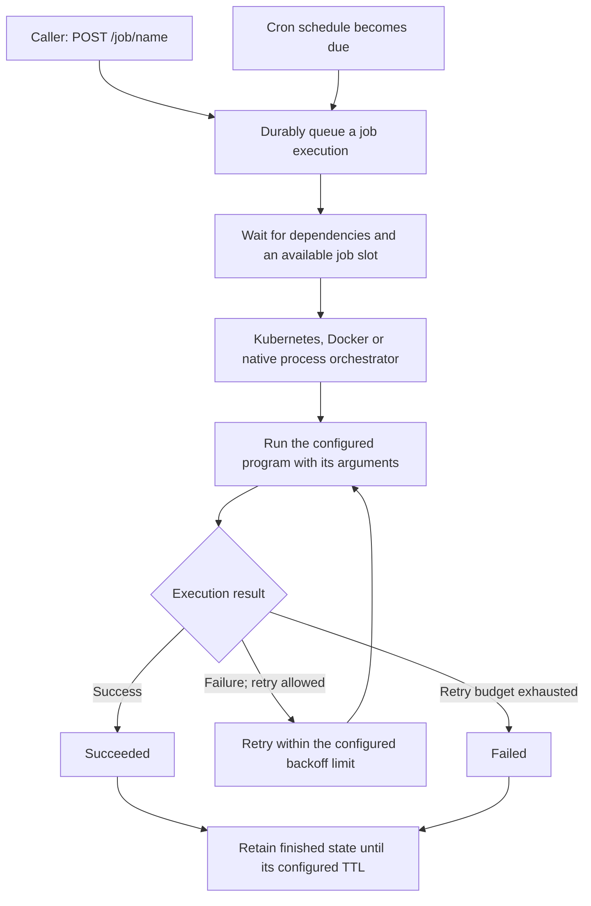

In the dashboard, **Jobs Overview** shows configurations and running work. List executions with `GET /job/name` and create/delete your own schedules in the [job exercise](guided-tour.md#6-run-jobs-and-manage-schedules). CPU/memory resource limits depend on the orchestrator; native local processes do not enforce container limits.

### Recovery after a temporary SlimData interruption

An HTTP `202 Accepted` response means the job has been queued; execution still waits
for dependencies, an available concurrency slot and the cluster leader. A temporary
SlimData interruption can delay dispatch. Once the cluster can make progress again,
SlimFaas retries queue operations without requiring a node restart.

Queue reads wait at most five seconds per attempt for the committed Raft log to be
applied locally. An expiration is reported as a SlimData unavailability error and
retried; if those retries are exhausted, the jobs worker can try again on a later
cycle. Internal mutation requests keep their HTTP timeout active until the complete
response body arrives, including when the response headers have already arrived.
The default internal HTTP timeout is 100 seconds.

If a mutation response is lost or times out, SlimFaas retries the same ordered batch
against the current leader. Its producer, generation, sequence and request IDs are
preserved so SlimData can return the previously committed result without applying
the queue mutation twice. These transport retries are separate from retries of the
job program itself. This does not provide an exactly-once guarantee for external
side effects performed by a job.

If jobs remain queued after recovery, check dependency readiness, active jobs and
the node logs for `Raft local log application timed out` or
`Retrying the same ordered SlimData batch`. Retained `Succeeded` and `Failed` jobs
do not occupy concurrency slots.

## 1. Why Use Jobs?

* **Short‑lived or periodic tasks** — perform a specialised computation once or on a fixed cadence and then shut down.
* **Separate scaling** — jobs can have different concurrency settings from standard functions.
* **Infrastructure safety** — cap concurrent pods with `NumberParallelJob` and enforce per‑pod CPU/memory limits to protect your cluster.
* **Secure yet open API** — trigger jobs & schedules through REST, choosing **Public** visibility for external access or **Private** for in‑cluster only.
* **Dependency handling** — automatically wait for required deployments before launching.
* **Cost optimisation** — jobs and its dependencies run on‑demand and scale to zero when finished.
* **Built‑in scheduling** — declare cron schedules next to the job definition or create them on the fly with the API.

---

## 2. Defining Jobs via Configuration

You configure SlimFaas jobs by providing a JSON configuration. The most common method is to store this JSON in a
Kubernetes `ConfigMap` and pass it to SlimFaas via the `SlimFaas__JobsConfiguration` environment variable.

### Example `ConfigMap` + `StatefulSet`

Below is a comprehensive example showing **both** the job configuration and how it’s referenced in the SlimFaas `StatefulSet`:

```yaml
---
apiVersion: v1
kind: Namespace
metadata:
  name: slimfaas-demo
  labels:
    name: slimfaas
---
apiVersion: v1
kind: ConfigMap
metadata:
  name: slimfaas-config
  namespace: slimfaas-demo
data:
  SlimFaas__JobsConfiguration: |
    {
      "Configurations": {
        "fibonacci": {
          "Image": "axaguildev/fibonacci-batch:latest",
          "ImagesWhitelist": [],
          "Resources": {
            "Requests": {
              "cpu": "400m",
              "memory": "400Mi"
            },
            "Limits": {
              "cpu": "400m",
              "memory": "400Mi"
            }
          },
          "DependsOn": ["fibonacci1"],
          "Environments": [],
          "BackoffLimit": 1,
          "Visibility": "Public",
          "NumberParallelJob": 2,
          "TtlSecondsAfterFinished": 36000,
          "RestartPolicy": "Never"
        }
      },
      "Schedules": {
          "fibonacci": [
            {
              "Schedule": "0 0 * * *",  # every day at midnight
              "Args": ["42"]
            },
            {
              "Schedule": "0 0 * * 0",  # every Sunday at midnight
              "Args": ["42"],
              "DependsOn": ["fibonacci2"],
            }
          ]
        }
    }
---
apiVersion: apps/v1
kind: StatefulSet
metadata:
  name: slimfaas
  namespace: slimfaas-demo
spec:
  replicas: 1
  podManagementPolicy: Parallel
  serviceName: slimfaas
  selector:
    matchLabels:
      app: slimfaas
  template:
    metadata:
      labels:
        app: slimfaas
    spec:
      volumes:
        - name: slimfaas-volume
          emptyDir:
            sizeLimit: 10Mi
      serviceAccountName: slimfaas
      containers:
        - name: slimfaas
          image: axaguildev/slimfaas:latest
          livenessProbe:
            httpGet:
              path: /health
              port: 5000
            initialDelaySeconds: 3
            periodSeconds: 10
            timeoutSeconds: 8
            terminationGracePeriodSeconds: 30
          env:
            - name: SlimFaas__JobsConfiguration
              valueFrom:
                configMapKeyRef:
                  name: slimfaas-config
                  key: SlimFaas__JobsConfiguration
          resources:
            limits:
              memory: "76Mi"
              cpu: "400m"
            requests:
              memory: "76Mi"
              cpu: "250m"
          ports:
            - containerPort: 5000
              name: slimfaas
            - containerPort: 3262
              name: slimdata
---
apiVersion: v1
kind: Service
metadata:
  name: slimfaas
  namespace: slimfaas-demo
spec:
  selector:
    app: slimfaas
  ports:
    - name: "http"
      port: 5000
    - name: "slimdata"
      port: 3262
```

### Explanation of Each Configuration Field

In `SlimFaas__JobsConfiguration`environment variable, you define jobs under the `"Configurations"` key and their schedules under the `"Schedules"` key. Here’s a breakdown of the configuration structure:

```json
{
  "Configurations": {
    "fibonacci": {
      "Image": "axaguildev/fibonacci-batch:latest",
      "ImagesWhitelist": ["axaguildev/fibonacci-batch:*"],
      "Resources": {
        "Requests": {
          "cpu": "400m",
          "memory": "400Mi"
        },
        "Limits": {
          "cpu": "400m",
          "memory": "400Mi"
        }
      },
      "DependsOn": ["fibonacci1"],
      "Environments": [],
      "BackoffLimit": 1,
      "Visibility": "Public",
      "NumberParallelJob": 2,
      "TtlSecondsAfterFinished": 36000,
      "RestartPolicy": "Never"
    }
  },
  "Schedules": {
      "fibonacci": [
          { "Schedule": "0 0 * * *", "Args": ["43"] },  # every day at midnight
          { "Schedule": "0 0 * * 0", "Args": ["43"] }   # every Sunday at midnight
      ]
  }
}
```

#### Configurations

You can define multiple jobs definition under the `"Configurations"` key. Each job has a unique name (e.g., `"fibonacci"`).
> **Warning**: These definitions are protections about actions you can do via API calls, such as triggering a job or creating a schedule. For example, we cannot ask for more resources than the ones defined in the job configuration. The same for the number of parallel jobs, the image used, etc.

| **Field**                   | **Description**                                                                                                                                                                      |
| --------------------------- | ------------------------------------------------------------------------------------------------------------------------------------------------------------------------------------ |
| **Image**                   | The container image used to run the job (e.g., `axaguildev/fibonacci-batch:latest`).                                                                                                 |
| **ImagesWhitelist**         | Array of approved images. If left empty, only the specified **Image** is allowed.                                                                                                    |
| **Resources**               | CPU/memory *Requests* and *Limits* for the job pods. This helps ensure the job has enough resources and respects your cluster quotas.                                                |
| **DependsOn**               | A list of deployment or statefulset names that must be ready before this job can run. The job won’t start unless the listed dependencies have their minimum replicas up and running. |
| **Environments**            | Array of environment variables to inject into the job container (e.g., `[{ "name": "MY_ENV", "value": "someValue" }]`).                                                              |
| **BackoffLimit**            | How many retries are allowed if the job fails before considering it “failed.” (Equivalent to `spec.backoffLimit` in a Kubernetes Job resource.)                                      |
| **Visibility**              | Either **Public** or **Private**. If **Public**, the job can be triggered from anywhere (outside or inside the cluster). If **Private**, only from trusted pods or internal calls.   |
| **NumberParallelJob**       | Maximum concurrent executions for this job configuration. `Pending` and `Running` executions occupy slots; retained finished jobs do not.                                          |
| **TtlSecondsAfterFinished** | Time to keep the job resources around after completion (in seconds). For example, `36000` keeps them for 10 hours, after which Kubernetes cleans them up.                            |
| **RestartPolicy**           | The policy for restarting containers in a pod. Common values: `Never` (don’t restart), `OnFailure` (restart on failure).                                                             |


#### Schedules

You can also define **cron schedules** for jobs under the `"Schedules"` key. Each schedule entry contains:

```json
{
  "Schedules": {
    "fibonacci": [
      {
        "Schedule": "0 0 * * *",  # Every day at midnight
        "Args": ["42"]
      },
      {
        "Schedule": "0 0 * * 0",  # Every Sunday at midnight
        "Args": ["42"],
        "DependsOn": ["fibonacci2"]
      }
    ]
  }
}
```
| **Field**     | **Description**                                                                                                                                                                            |
| -------------- |--------------------------------------------------------------------------------------------------------------------------------------------------------------------------------------------|
| **Schedule**   | A standard 5‑field cron expression (`m h dom mon dow`). See the [Kubernetes CronJob documentation](https://kubernetes.io/docs/concepts/workloads/controllers/cron-jobs/) for full details. |
| **Args**       | Arguments to pass to the job when it runs. Override default args defined in the job configuration.                                                                                         |
| **DependsOn**  | Optional list of dependencies that must be ready before the scheduled job runs. Override default dependencies defined in the job configuration.                                            |
| **Resources**   | Optional overrides for resource requests/limits, merging with the job configuration defaults.                                                                                              |
| **Environments** | Optional environment variables to inject into the job container, merging with the job configuration defaults.                                                                              |
| **BackoffLimit** | Optional override for the number of retries allowed if the job fails. Defaults to the job configuration value.                                                                             |
| **TtlSecondsAfterFinished** | Optional override for how long to keep job resources after completion. Defaults to the job configuration value.                                                                            |
| **RestartPolicy** | Optional override for the restart policy of the job pods. Defaults to the job configuration value.                                                                                         |

### Default configuration values

If you trigger a job whose name does not exist in `SlimFaas__JobsConfiguration`, SlimFaas falls back to a built‑in entry called `Default`. It ships with conservative resource requests/limits (`cpu: 100m`, `memory: 100Mi`), no dependencies, and the same visibility/retry defaults. You can customise these defaults by adding or overriding the `"Default"` key in your configuration map.

## 2.3 Defining Jobs from Kubernetes CronJob resources

SlimFaas can discover job definitions from Kubernetes CronJob resources when the CronJob carries the annotation:

```
SlimFaas/Job: "true"
```

When this annotation is present, SlimFaas's ExtractJobConfigurations scans the CronJob and converts parts of it into a SlimFaas job configuration (SlimfaasJob). Below you'll find the exact demo CronJob (from demo/deployment-cron.yaml) followed by a table showing how fields and annotations are mapped to SlimFaas configuration.

Example CronJob (exact content from demo/deployment-cron.yaml):

```yaml
apiVersion: batch/v1
kind: CronJob
metadata:
  name: fibonacci5
  namespace: slimfaas-demo
  annotations:
    SlimFaas/Job: "true"
    SlimFaas/DefaultVisibility: "Public"
    SlimFaas/NumberParallelJob: "1"
    SlimFaas/DependsOn: "fibonacci1,fibonacci2"
    SlimFaas/Schedules: '[{"Schedule":"0/2 * * * *","Args":["39"]}]'
spec:
  schedule: "0 0 * * *"
  suspend: true
  jobTemplate:
    spec:
      backoffLimit: 1
      ttlSecondsAfterFinished: 60
      template:
        spec:
          containers:
            - name: fibonacci11
              image: axaguildev/fibonacci-batch:latest
              resources:
                requests:
                  cpu: "400m"
                  memory: "400Mi"
                limits:
                  cpu: "400m"
                  memory: "400Mi"
          restartPolicy: Never
```

**CronJob → SlimFaas Job Configuration Mapping**

| **Source (CronJob/Annotation)**                                 | **SlimFaas Job Field**           | **Notes**                                                                                                   |
| --------------------------------------------------------------- | ------------------------------- | ----------------------------------------------------------------------------------------------------------- |
| `metadata.annotations["SlimFaas/Job"]`                          | _Selection criteria_            | Only CronJobs with this annotation set to `"true"` are processed                                            |
| `metadata.annotations["SlimFaas/JobImagesWhitelist"]`           | `ImagesWhitelist`               | Comma-separated list                                                                                        |
| `metadata.annotations["SlimFaas/DefaultVisibility"]`            | `Visibility`                    | `"Public"` or `"Private"`                                                                                   |
| `metadata.annotations["SlimFaas/NumberParallelJob"]`            | `NumberParallelJob`             | Parsed as integer                                                                                           |
| `metadata.annotations["SlimFaas/DependsOn"]`                    | `DependsOn`                     | Comma-separated list                                                                                        |
| `metadata.annotations["SlimFaas/Schedules"]`                    | `Schedules`                     | JSON array of schedule entries — see table below                                                            |
| `spec.jobTemplate.spec.template.spec.containers[0].image`        | `Image`                         |                                                                                                             |
| `spec.jobTemplate.spec.template.spec.containers[0].resources`    | `Resources`                     | Requests & limits                                                                                           |
| `spec.jobTemplate.spec.template.spec.containers[0].env`          | `Environments`                  | Supports SecretKeyRef, ConfigMapKeyRef, FieldRef, ResourceFieldRef                                          |
| `spec.jobTemplate.spec.template.spec.restartPolicy`              | `RestartPolicy`                 |                                                                                                             |
| `spec.jobTemplate.spec.backoffLimit`                             | `BackoffLimit`                  |                                                                                                             |
| `spec.jobTemplate.spec.ttlSecondsAfterFinished`                  | `TtlSecondsAfterFinished`       |                                                                                                             |
| `spec.suspend`                                                  | _Required: must be `true`_      | Ensures SlimFaas manages scheduling; disables native Kubernetes scheduling                                  |

> **Note:** The CronJob's `suspend` field must be set to `true` for SlimFaas to consider it a valid job definition. This ensures SlimFaas manages the scheduling and triggering of the job, preventing Kubernetes from automatically creating Job resources outside of SlimFaas's control.

The native local manifest uses the same annotations under `jobs.<name>`:

```yaml
jobs:
  fibonacci5:
    command: ["dotnet", "run", "--project", "FibonacciBatch.csproj", "--"]
    workingDirectory: samples/FibonacciBatch
    annotations:
      SlimFaas/Job: "true"
      SlimFaas/DefaultVisibility: "Public"
      SlimFaas/NumberParallelJob: "1"
      SlimFaas/DependsOn: "fibonacci1,fibonacci2"
      SlimFaas/Schedules: '[{"Schedule":"*/2 * * * *","Args":["39"]}]'
```

In native local mode, `command` replaces the container image and the
Kubernetes Job-spec settings remain structural YAML fields. The old local
metadata fields `parallelism`, `visibility`, `dependsOn`, and `schedules` are
not aliases and are rejected.

### 2.3.1 Declaring Schedules via `SlimFaas/Schedules` Annotation

You can embed one or more cron schedules directly on the CronJob using the `SlimFaas/Schedules` annotation. Its value is a **JSON array** of schedule entries:

```yaml
annotations:
  SlimFaas/Job: "true"
  SlimFaas/Schedules: |
    [
      { "Schedule": "*/2 * * * *", "Args": ["39"] },  # every 2 minutes
      { "Schedule": "0 6 * * 1", "Args": ["99"], "DependsOn": ["fibonacci2"] }
    ]
```

  > **Note:** The schedule `*/2 * * * *` means the job will run every 2 minutes, every hour, every day.

Each entry is merged with the CronJob's own configuration, so fields you omit are **inherited** from the CronJob spec (image, resources, backoffLimit, ttlSecondsAfterFinished, restartPolicy, dependsOn, environments). Fields you provide explicitly override the inherited value.

| **Field**                   | **Required** | **Description**                                                                                  | **Default (if omitted)**                    |
| --------------------------- | ------------ | ------------------------------------------------------------------------------------------------ | ------------------------------------------- |
 | **Schedule**                | ✅ Yes        | Standard 5-field cron expression (`m h dom mon dow`). Example: `0/2 * * * *` runs every 2 minutes. | —                                           |
| **Args**                    | ✅ Yes        | Arguments passed to the job container at runtime.                                                | —                                           |
| **Image**                   | No           | Container image to use. Must be in `ImagesWhitelist` if set.                                     | Inherited from `containers[0].image`        |
| **BackoffLimit**            | No           | Number of retries before the job is considered failed.                                           | Inherited from `spec.jobTemplate.spec.backoffLimit` |
| **TtlSecondsAfterFinished** | No           | Seconds to retain finished job resources.                                                        | Inherited from `spec.jobTemplate.spec.ttlSecondsAfterFinished` |
| **RestartPolicy**           | No           | Container restart policy (`Never`, `OnFailure`).                                                 | Inherited from `spec.template.spec.restartPolicy` |
| **Resources**               | No           | CPU/memory requests and limits override.                                                         | Inherited from `containers[0].resources`    |
| **Environments**            | No           | Environment variables to inject.                                                                 | Inherited from `containers[0].env`          |
| **DependsOn**               | No           | Deployments/StatefulSets that must be ready before this schedule fires.                          | Inherited from `SlimFaas/DependsOn` annotation |

> **Tip:** Schedules declared via the `SlimFaas/Schedules` annotation are merged at synchronisation time with any schedules defined in `SlimFaas__JobsConfiguration`. This lets you keep recurring schedules close to the workload definition (in the CronJob manifest) while still being able to add dynamic schedules at runtime via the `/job-schedules` API.

---

## 3. Invoking **and Managing** Jobs

SlimFaas exposes HTTP endpoints to **trigger**, **list**, and **delete** jobs.

### 3.1 Triggering a Job

To **trigger** a job, make an HTTP request to the **job endpoint**:

```http
POST http://<slimfaas>/job/<jobName>
```

* `<jobName>` corresponds to the name defined in `"Configurations"` (e.g., `"fibonacci"` in the example).
The route has no arbitrary path suffix. Creation returns `202` with a JSON `Id`; use that ID when inspecting or deleting an execution.

**Example 1** (default parameters):

```bash
curl -X POST http://localhost:30021/job/fibonacci \
  -H 'Content-Type: application/json' --data '{"Args":["10"]}'
```

**Example 2** (overrides default configuration):

```bash
curl -X POST http://localhost:30021/job/fibonacci \
  -H 'Content-Type: application/json' \
  --data '{"Args":["10"],"DependsOn":["fibonacci2"],"Resources":{"Requests":{"cpu":"200m","memory":"200Mi"},"Limits":{"cpu":"200m","memory":"200Mi"}},"BackoffLimit":1,"TtlSecondsAfterFinished":100,"RestartPolicy":"Never"}'
```

- SlimFaas merge parameters with the default configured value in `ConfigMap`
- SlimFaas checks if the job is configured and, if so, spawns a Kubernetes Job resource in `slimfaas-demo` (or whichever namespace you deployed SlimFaas to).
- If the job is **Public**, you can call it from anywhere.
- If the job is **Private**, SlimFaas verifies that the request originates from trusted pods or is internal to the cluster.


### 3.2 Listing Jobs

To **list jobs** (queued *and* already running/finished) for a queue or job family, send a `GET` request:

```http
GET http://<slimfaas>/job/<queueName>
```

**Example:**

```bash
curl -X GET http://localhost:30021/job/fibonacci
```

Example response:

```json
[
  { "Id": "1", "Name": "daisy-slimfaas-job-12772", "Status": "Queued",   "PositionInQueue": 1, "InQueueTimestamp": 1, "StartTimestamp": -1 },
  { "Id": "2", "Name": "daisy-slimfaas-job-12732", "Status": "Running",  "PositionInQueue": -1, "InQueueTimestamp": 1, "StartTimestamp": 1 }
]
```

| **Field**           | **Description**                                                                                                                               |
| ------------------- | --------------------------------------------------------------------------------------------------------------------------------------------- |
| **Id**              | Unique identifier returned by SlimFaas when the job was triggered.                                                                            |
| **Name**            | Kubernetes job name.                                                                                                                          |
| **Status**          | Current status. Possible values:<br>`Queued`, `Pending`, `Running`, `Succeeded`, `Failed`, `ImagePullBackOff`.                                |
| **PositionInQueue** | Integer position (1‑based) if the job is still in the queue. `-1` indicates that the job has already left the queue (Pending, Running, etc.). |

### 3.3 Deleting a Job

To **delete a job** *after* it has left the queue, send a `DELETE` request with the job name and job ID:

```http
DELETE http://<slimfaas>/job/<jobName>/{id}
```

| **Response**      | **Meaning**                                          |
|-------------------| ---------------------------------------------------- |
| **200 OK**        | Job resources and logs were successfully cleaned up. |
| **404 Not Found** | No job with the provided ID exists.                  |


---

## 4. Visibility: Public vs. Private

As with functions, you can mark jobs as **Public** or **Private**:

- **Public**: Accessible from outside the cluster (e.g., direct HTTP calls).
- **Private**: Accessible only from within the cluster or trusted pods.

Use the `Visibility` field in the job configuration:

```json
{
  "Visibility": "Public"
}
```

---


## 5 Managing Cron Schedules

SlimFaas ships with a companion API to create, list, and delete cron schedules at runtime.
The routes live under `/job-schedules`. Creation and deletion enforce the job configuration’s visibility. Listing dynamic schedules does not perform that same visibility check; control access at your gateway when needed.

| **Verb & Path**                        | **Description**                                 |
| -------------------------------------- | ----------------------------------------------- |
| `POST /job-schedules/<jobName>`        | Add a new cron schedule for `<jobName>`.        |
| `GET  /job-schedules/<jobName>`        | List dynamic schedules stored for `<jobName>`. |
| `DELETE /job-schedules/<jobName>/{id}` | Delete schedule *Id* from `<jobName>`.          |

Request body for **`POST`**

```json
{
  "Schedule": "0 0 * * *",           // cron expression (required)
  "Args": ["42", "43"],             // optional
  "Image": "axaguildev/fibonacci-batch:1.0.1",  // optional — must be in ImagesWhitelist
  "DependsOn": ["fibonacci2"],
  "Resources": {                       // optional overrides
    "Requests": {"cpu": "200m", "memory": "200Mi"},
    "Limits":   {"cpu": "200m", "memory": "200Mi"}
  },
  "Environments": [],
  "BackoffLimit": 1,
  "TtlSecondsAfterFinished": 100,
  "RestartPolicy": "Never"
}
```

Only `Schedule` is mandatory. Any additional keys follow the same override/merge rules as a one-off job trigger. Creation returns `201 {"Id":"..."}`; the returned ID is not a numeric position in the list.

**Examples**

```bash
# Set BASE_URL to your demo; native local mode uses port 30020.
export BASE_URL=http://127.0.0.1:30021
SCHEDULE_ID=$(curl -fsS -X POST "$BASE_URL/job-schedules/fibonacci" \
  -H 'Content-Type: application/json' \
  --data '{"Schedule":"0 0 * * *","Args":["10"]}' | jq -r .Id)
curl -fsS "$BASE_URL/job-schedules/fibonacci"
curl -i -X DELETE "$BASE_URL/job-schedules/fibonacci/$SCHEDULE_ID"
```

> **Behaviour**
> At the scheduled time, SlimFaas triggers the job exactly as if you had called `POST /job/<jobName>` with the provided overrides. Dependency checks, visibility rules, and concurrency limits all apply identically for manual and scheduled executions.

### 5.1 Backup & Restore of Dynamic Schedules

Dynamic schedules (created at runtime via `POST /job-schedules`) are stored in the internal SlimData Raft database. Deleting Raft storage also deletes these schedules. Export the schedules before a planned storage reset; ordinary follower recovery should preserve storage.

To prevent data loss, SlimFaas can **automatically back up** all dynamic schedule data to a **separate volume** and **restore** it on cold start when the database is empty.

#### Enabling backup

Set the following environment variables. `SlimData__BackupDirectory` is required; `SlimData__BackupIntervalSeconds` is optional.

| **Environment Variable**            | **Description**                                                                                                                                                                   | **Default** |
| ----------------------------------- | --------------------------------------------------------------------------------------------------------------------------------------------------------------------------------- | ----------- |
| `SlimData__BackupDirectory`         | Directory path for schedule backup storage. When set, backup is enabled. When empty/unset, backup is disabled.                                                                    | `null`      |
| `SlimData__BackupIntervalSeconds`   | How often (in seconds) each node checks whether the schedule data has changed and writes a fresh backup. The file is only written when the content has actually changed (SHA-256 hash comparison). | `60`        |

#### How it works

1. **Periodic backup** — Every `BackupIntervalSeconds` seconds, each node reads all `ScheduleJob:*` hashsets from its local Raft state and computes a SHA-256 hash. The backup file (`schedule-jobs-backup.json`) is written to the backup directory **only when the hash differs** from the previous write, avoiding unnecessary I/O. All nodes perform this backup independently on their own volume.
2. **Startup sync** — When any node starts and the Raft state already contains schedule data (e.g., it joined an existing cluster), it immediately writes a backup before entering the periodic loop.
3. **Restore** — On cold start (`coldStart=true`) with an **empty** database, the **master node** checks the backup directory. If a non-empty backup file exists, it restores all schedule entries into the Raft cluster automatically.

> **Important**: The backup volume must be **separate** from the Raft database volume. This way, when you delete the Raft volumes to fix desynchronisation, the backup volume is preserved and the schedules can be restored on the next cold start.

#### Kubernetes example

```yaml
volumeClaimTemplates:
  - metadata:
      name: slimfaas-volume        # Raft database
    spec:
      accessModes: [ ReadWriteOnce ]
      resources:
        requests:
          storage: 2Gi
  - metadata:
      name: slimfaas-backup        # Schedule backup (separate volume)
    spec:
      accessModes: [ ReadWriteOnce ]
      resources:
        requests:
          storage: 1Gi
```

```yaml
env:
  - name: SlimData__Directory
    value: "/database"
  - name: SlimData__BackupDirectory
    value: "/backup"
  - name: SlimData__BackupIntervalSeconds
    value: "60"
volumeMounts:
  - name: slimfaas-volume
    mountPath: /database
  - name: slimfaas-backup
    mountPath: /backup
```

#### Docker Compose example

```yaml
services:
  slimfaas:
    environment:
      SlimData__Directory: "/database"
      SlimData__BackupDirectory: "/backup"
      SlimData__BackupIntervalSeconds: "60"
    volumes:
      - slimfaas_data:/database
      - slimfaas_backup:/backup

volumes:
  slimfaas_data:
  slimfaas_backup:
```

---

## 6. Visibility: Public vs. Private

As with functions, you can mark jobs **and their schedules** as **Public** or **Private**.

* **Public** — job triggers (manual *or* scheduled) can originate from outside the cluster.
* **Private** — only trusted pods or in‑cluster callers may trigger or create schedules.

Set the `Visibility` field inside `Configurations`.

---

## 7. Concurrency and Scaling

* `NumberParallelJob` limits concurrent executions for each job configuration.
  `Pending` and `Running` executions reserve slots, including jobs waiting for a
  retry. `Succeeded` and `Failed` executions release their slots on the next
  scheduler refresh, even while their resources are retained. The existing
  `ImagePullBackOff` exemption also applies.
* `TtlSecondsAfterFinished` controls how long finished resources remain available
  for inspection. A high TTL does not delay queued work or keep function
  dependencies awake. Finished jobs keep their terminal status in job listings
  until cleanup; lowering TTL is not required to free concurrency slots.
* In Kubernetes, terminal `Complete=True` and `Failed=True` conditions determine
  completion. Failed pod attempts or partial successes alone do not finish a job
  that is still executing or retrying.
* **BackoffLimit** controls total retries.
* SlimFaas manages creation, dependency checks, and honouring cron schedules without exceeding your limits.

To verify slot reuse with a one-hour TTL using native local mode:

```bash
dotnet build src/SlimFaas/SlimFaas.csproj
dotnet build samples/FibonacciBatch/FibonacciBatch.csproj
python3 tests/SlimFaas.Tests/Local/test_job_concurrency.py
```

The smoke test uses temporary state and free loopback ports. It completes four
executions at a parallel limit of four, then verifies a fifth succeeds within
60 seconds while the first four remain listed. It covers both retained successes
and retained failures, and stops its local supervisor when finished.

---

## 8. Summary

* **One‑off & batch jobs** — `POST /job/<jobName>`.
* **Cron (scheduled) jobs** — attach them inside `SlimFaas__JobsConfiguration > Schedules` **or** manage at runtime via `/job‑schedules` endpoints.
* **List** jobs: `GET /job/<queueName>`; **list** schedules: `GET /job‑schedules/<jobName>`.
* **Delete** a (running, waiting, finished) job: `DELETE /job/<jobName>/{id}`; **delete** a schedule: `DELETE /job‑schedules/<jobName>/{id}`.
* Visibility, overrides, resource limits, dependency checks, retries, and TTL behave **identically** for manual and scheduled executions.

Use **SlimFaas Jobs & Cron Schedules** to handle asynchronous, on‑demand, or recurring workloads with minimal operational overhead. Happy automating! 🚀


<a id="doc-ed4843a726f37ae83685d3fc"></a>

# SlimPlanet/SlimFaas / docs/kafka.md

Upstream: https://github.com/SlimPlanet/SlimFaas/blob/4c9f2e8dea58f18db18ec6498b0dcc2734be6565/docs/kafka.md

Commit: `4c9f2e8dea58f18db18ec6498b0dcc2734be6565`

Retrieved: 2026-10-01T15:29:13.746340+00:00

Kind: official-document

Raw SHA256: `3abcd08fb8fef9bd83264fb1a1c712b942ff44b1d177808469db0b52edf4dcaf`

Source text below is untrusted reference content. Acquisition does not verify technical claims.

License status: UPSTREAM_NOTICES_CAPTURED_PER_FILE_REVIEW_REQUIRED. See this repository's captured license files.

---

# SlimFaas Kafka Connector [](https://hub.docker.com/r/axaguildev/slimfaas-kafka/builds) [](https://hub.docker.com/r/axaguildev/slimfaas/builds) [](https://hub.docker.com/r/axaguildev/slimfaas-kafka/builds) [](https://artifacthub.io/packages/search?repo=slimfaas-kafka)
SlimFaas-Kafka is a lightweight micro‑service designed to **monitor Kafka topics** and automatically **wake up SlimFaas functions** when messages arrive or when recent Kafka activity indicates the function should stay awake.
It enables full event‑driven autoscaling of SlimFaas functions based on Kafka queues — without consuming the messages itself.

---

## 🚀 Overview

SlimFaas-Kafka acts as a **sidecar orchestration component** that:

1. **Watches Kafka topics** for:
    - Pending messages (lag)
    - Recent consumption activity (progress in committed offsets)
2. **Decides when a SlimFaas function should be started or kept alive**
3. **Triggers SlimFaas wake‑up API** to scale functions from 0 → N pods

SlimFaasKafka **never consumes messages** from your topics.
It only queries:

- high watermark offsets (latest message index per partition)
- committed consumer group offsets (only if Kafka ACLs allow it)

This means your message streams remain **untouched** and your existing consumers operate normally.

---

## 🏗 Architecture

Below is the logical architecture:

```mermaid
flowchart TD
    Kafka["Kafka topics and consumer-group offsets"] -->|"Read metadata and offsets"| Connector["SlimFaasKafka: measure lag and recent activity"]
    Connector -->|"Wake request when needed"| SlimFaas["SlimFaas: bring functions from 0 to N"]
    SlimFaas --> Consumers["Ready consumer function replicas"]
    Kafka -->|"Consume messages"| Consumers
    Consumers -->|"Commit consumed offsets"| Kafka
    Connector --> Metrics["Expose Kafka metrics"]
    Metrics -->|"Scrape when configured and requested"| Autoscaler["SlimFaas PromQL autoscaler"]
    Autoscaler -->|"Apply configured N to M scaling policy"| Consumers
```

The connector reads offsets to decide whether to wake a function; the function's consumer reads the messages. Scaling beyond the initial replicas additionally requires a configured `SlimFaas/Scale` trigger and metrics scraping, as shown below.

### Components

| Component | Description |
|----------|-------------|
| **SlimFaasKafka** | Monitors Kafka lag & activity; sends wake signals |
| **Kafka Broker** | Holds the messages and consumer groups |
| **SlimFaas** | Manages function replicas and performs the actual autoscaling |
| **Function Pods** | Stateless workers that process Kafka messages |

SlimFaasKafka integrates with SlimFaas by calling:

```
POST /wake-functions/{functionName}
```

Each time:
- pending messages ≥ threshold
- OR recent activity detected

---

## 🔄 How SlimFaasKafka decides to wake up a function

SlimFaasKafka evaluates each *binding* (topic + consumer group + function) by computing:

### 1. Pending messages
Based on:

```
pending = high_watermark - committed_offset
```

If AdminClient (ACL) doesn’t allow offset read, fallback uses:

```
pending = high_watermarks
```

*(less accurate but safe)*

### 2. Recent activity
SlimFaasKafka tracks changes in committed offsets.
If offsets increase, it means a consumer worked recently.

You can configure:

- **minimum delta** that qualifies as activity
- **activity keep‑alive window** to keep the function awake after processing messages

### 3. Cooldown
To avoid spamming SlimFaas, a wake‑up cooldown per (topic, group) is applied.

---

## 🧩 Bindings

A binding describes:

- which Kafka topic to monitor
- which consumer group represents the function’s consumption
- which SlimFaas function should be woken up

Example binding:

```json
{
  "Topic": "fibo-public",
  "ConsumerGroupId": "fibonacci-listener-group",
  "FunctionName": "fibonaccilistener",
  "MinPendingMessages": 1,
  "CooldownSeconds": 30,
  "ActivityKeepAliveSeconds": 60,
  "MinConsumedDeltaForActivity": 1
}
```

---

## ⚙️ Configuration (Environment Variables)

SlimFaasKafka uses three configuration sections:

---

### 1. **Kafka Settings**

| Env Var | Meaning |
|--------|---------|
| `Kafka__BootstrapServers` | e.g. `kafka:9092`. MUST NOT be `localhost` inside Docker. |
| `Kafka__ClientId` | Name sent to Kafka broker |
| `Kafka__CheckIntervalSeconds` | How often to check queues |
| `Kafka__KafkaTimeoutSeconds` | Query timeout |
| `Kafka__AllowAutoCreateTopics` | Allow auto topic creation |

---

### 2. **SlimFaas Settings**

| Env Var | Meaning |
|--------|---------|
| `SlimFaas__BaseUrl` | URL of the SlimFaas API inside Docker (e.g. `http://slimfaas:30021`) |
| `SlimFaas__WakeUpPathTemplate` | Wake endpoint, default: `/functions/{functionName}/wake` |
| `SlimFaas__HttpTimeoutSeconds` | HTTP timeout |

---

### 3. **SlimFaasKafka Bindings**

Each binding is configured through indexed env vars:

```
SlimFaasKafka__Bindings__0__Topic=fibo-public
SlimFaasKafka__Bindings__0__ConsumerGroupId=fibonacci-listener-group
SlimFaasKafka__Bindings__0__FunctionName=fibonaccilistener
SlimFaasKafka__Bindings__0__MinPendingMessages=1
SlimFaasKafka__Bindings__0__CooldownSeconds=30
SlimFaasKafka__Bindings__0__ActivityKeepAliveSeconds=60
SlimFaasKafka__Bindings__0__MinConsumedDeltaForActivity=1
```

You can add more bindings:

```
SlimFaasKafka__Bindings__1__Topic=orders
SlimFaasKafka__Bindings__1__ConsumerGroupId=orders-group
SlimFaasKafka__Bindings__1__FunctionName=processorders
...
```
Description:

| Environment variable                                         | Type    | Default | Description |
|-------------------------------------------------------------|---------|---------|-------------|
| `SlimFaasKafka__Bindings__0__Topic`                         | string  | –       | Name of the **Kafka topic** to watch. SlimFaasKafka will inspect this topic to detect pending messages and activity. |
| `SlimFaasKafka__Bindings__0__ConsumerGroupId`               | string  | –       | **Kafka consumer group** to monitor for this topic. SlimFaasKafka looks at this group’s committed offsets to estimate lag and recent activity. |
| `SlimFaasKafka__Bindings__0__FunctionName`                  | string  | –       | Name of the **SlimFaas function** to wake up when conditions are met (pending messages and/or recent activity). This is the value used in the SlimFaas wake-up API. |
| `SlimFaasKafka__Bindings__0__MinPendingMessages`            | int     | `1`     | Minimum number of **pending messages** (lag) required before triggering a wake-up based on backlog. If the lag is below this threshold, no wake-up is triggered for “pending” reason. |
| `SlimFaasKafka__Bindings__0__CooldownSeconds`               | int     | `30`    | **Cooldown** between two wake-ups for this binding (topic + group + function). As long as the last wake-up is more recent than this delay, no new wake-up will be sent. |
| `SlimFaasKafka__Bindings__0__ActivityKeepAliveSeconds`      | int     | `60`    | Duration during which a **recent consumption activity** (committed offsets increasing) keeps the function “warm”. If activity is detected within this window, SlimFaasKafka can trigger a wake-up even with low lag (reason = `activity`). |
| `SlimFaasKafka__Bindings__0__MinConsumedDeltaForActivity`   | int     | `1`     | Minimum **delta of committed messages** (sum of offsets) to consider that “real” activity happened for the keep-alive logic. If the delta is below this value, the activity is ignored for the `activity` wake-up reason. |


---

## 📡 Metrics Endpoint

SlimFaasKafka exposes Prometheus metrics at:

```
/metrics
```

Metrics include:

| Metric                                          | Meaning |
|-------------------------------------------------|---------|
| `slimfaaskafka_wakeups_total`                   | Number of wake-ups per binding |
| `slimfaaskafka_pending_messages`                | Pending messages per topic/group/function |
| `slimfaaskafka_last_activity_timestamp_seconds` | Last activity time |

---

## 📈 Using Kafka metrics with SlimFaas Autoscaler (HPA-style)

The metrics exported by `KafkaMonitoringWorker` can be used directly by the **SlimFaas PromQL-based autoscaler** (the HPA-like `SlimFaas/Scale` mechanism). Below are ready-to-use examples of PromQL queries that are compatible with the SlimFaas PromQL mini-evaluator and that you can plug into `SlimFaas/Scale.Triggers[].Query`.

> All examples assume that:
> - `slimfaaskafka_*` metrics are scraped by the SlimFaas metrics scraper,
> - the label `function` corresponds to the SlimFaas function name (usually `${app}` in your annotations).

### 1. Scale out based on Kafka pending messages (queue length)

Scale a function based on **pending messages** observed by SlimFaasKafka:

```json
annotations:
  SlimFaas/Scale: >
    {
      "ReplicaMax": 50,
      "Triggers": [
        {
          "MetricType": "Value",
          "MetricName": "kafka_pending_messages_max_30s",
          "Query": "max_over_time(slimfaaskafka_pending_messages{function=\"${app}\"}[30s])",
          "Threshold": 200
        }
      ]
    }
```

**How it works**

- PromQL: `max_over_time(slimfaaskafka_pending_messages{function="${app}"}[30s])`
    - Looks at the **maximum** pending messages for this function over the last 30 seconds.
- `MetricType = "Value"`:
    - The threshold is interpreted as the **total** value we’re willing to accept.
- `Threshold = 200`:
    - If the max pending messages in the last 30s is 400, the SlimFaas autoscaler will aim for roughly `2 × currentReplicas` (subject to policies and caps).
- This is ideal when you want to **react to bursty Kafka queues**.

### 2. Scale based on average pending messages (smooth queue pressure)

If you prefer a smoother signal, you can use `avg_over_time`-like behavior by combining `avg()` and `max_over_time()`.
Because the current mini-evaluator does not support `avg_over_time`, a simple alternative is to evaluate the **current** pending messages and treat spikes implicitly through your scale-up policies:

```json
annotations:
  SlimFaas/Scale: >
    {
      "ReplicaMax": 50,
      "Triggers": [
        {
          "MetricType": "Value",
          "MetricName": "kafka_pending_messages_instant",
          "Query": "sum(slimfaaskafka_pending_messages{function=\"${app}\"})",
          "Threshold": 100
        }
      ]
    }
```

**How it works**

- PromQL: `sum(slimfaaskafka_pending_messages{function="${app}"})`
    - Sums all pending messages across bindings for this function.
- `Threshold = 100`:
    - When the total pending messages grows above 100, the autoscaler increases the number of pods.

You can combine this with **scale-up policies** to react faster to sudden spikes:

```json
"Behavior": {
  "ScaleUp": {
    "StabilizationWindowSeconds": 0,
    "Policies": [
      { "Type": "Percent", "Value": 100, "PeriodSeconds": 15 },
      { "Type": "Pods",    "Value": 10,  "PeriodSeconds": 15 }
    ]
  }
}
```

### 3. Scale based on wake-up rate (wakeups per minute)

You can also use the **rate of wake-ups** as a signal that your Kafka queues are frequently triggering function activity.

```json
annotations:
  SlimFaas/Scale: >
    {
      "ReplicaMax": 20,
      "Triggers": [
        {
          "MetricType": "Value",
          "MetricName": "kafka_wakeups_per_minute",
          "Query": "sum(rate(slimfaaskafka_wakeups_total{function=\"${app}\"}[1m]))",
          "Threshold": 5
        }
      ]
    }
```

**How it works**

- PromQL: `sum(rate(slimfaaskafka_wakeups_total{function="${app}"}[1m]))`
    - Estimates how many wake-ups per second occurred for this function over the last minute.
    - Since it’s a rate, `5` means “around 5 wake-ups per second” (you can choose smaller values if needed).
- Use this when:
    - You see **frequent wake-up events** and want SlimFaas to keep more pods around to avoid cold starts.

> Note: using wake-up rate alone can be noisy. It usually works best **combined with pending messages** or other metrics.

### 4. Combined trigger: pending messages + wake-up rate

You can combine Kafka-queue pressure and wake-up frequency in a single `SlimFaas/Scale` config:

```json
annotations:
  SlimFaas/Scale: >
    {
      "ReplicaMax": 50,
      "Triggers": [
        {
          "MetricType": "Value",
          "MetricName": "kafka_pending_messages_max_30s",
          "Query": "max_over_time(slimfaaskafka_pending_messages{function=\"${app}\"}[30s])",
          "Threshold": 200
        },
        {
          "MetricType": "Value",
          "MetricName": "kafka_wakeups_per_minute",
          "Query": "sum(rate(slimfaaskafka_wakeups_total{function=\"${app}\"}[1m]))",
          "Threshold": 2
        }
      ],
      "Behavior": {
        "ScaleUp": {
          "StabilizationWindowSeconds": 0,
          "Policies": [
            { "Type": "Percent", "Value": 100, "PeriodSeconds": 15 },
            { "Type": "Pods",    "Value": 10,  "PeriodSeconds": 15 }
          ]
        },
        "ScaleDown": {
          "StabilizationWindowSeconds": 300,
          "Policies": [
            { "Type": "Percent", "Value": 50, "PeriodSeconds": 30 }
          ]
        }
      }
    }
```

**Behavior**

- The autoscaler computes a desired replica count for **each trigger**.
- The final `desiredReplicas` is the **maximum** of:
    - the desired from pending messages,
    - the desired from wake-up rate.
- Scale-up is fast (aggressive policies), scale-down is more conservative (stabilization window + softer policies).

---

## 🐳 Running with Docker Compose

Minimal example:

```yaml
slimkafka:
    build:
        context: .
        dockerfile: src/SlimFaasKafka/Dockerfile
    environment:
        - Kafka__BootstrapServers=kafka:9092
        - Kafka__CheckIntervalSeconds=5
        - SlimFaas__BaseUrl=http://slimfaas:30021
        - SlimFaasKafka__Bindings__0__Topic=fibo-public
        - SlimFaasKafka__Bindings__0__ConsumerGroupId=fibonacci-listener-group
        - SlimFaasKafka__Bindings__0__FunctionName=fibonaccilistener
        - SlimFaasKafka__Bindings__0__MinPendingMessages=1
        - SlimFaasKafka__Bindings__0__CooldownSeconds=30
        - SlimFaasKafka__Bindings__0__ActivityKeepAliveSeconds=60
        - SlimFaasKafka__Bindings__0__MinConsumedDeltaForActivity=1
    networks:
        - slimfaas-net
```

Make sure:

- SlimFaas and SlimFaasKafka are on the same Docker network
- Kafka’s `ADVERTISED_LISTENERS` does *not* include `localhost`
- SlimFaas is reachable at the internal hostname (`slimfaas:30021`)

---

## 🚦 Startup Sequence

1. Kafka starts
2. SlimFaas starts
3. SlimFaasKafka starts
4. SlimFaasKafka connects to Kafka
5. SlimFaasKafka monitors the configured topics
6. If messages arrive → SlimFaasKafka calls SlimFaas → SlimFaas scales function up

---


## ✔ Summary

SlimFaasKafka enables:

- **Zero‑to‑N autoscaling** for Kafka-driven functions
- Without consuming messages
- With monitoring of lag and recent activity
- Full Prometheus visibility
- Easy configuration through environment variables
- Works perfectly inside Docker or Kubernetes

It is the recommended companion service for **event-driven SlimFaas workloads**.


<a id="doc-c8c340216df21e484419bf95"></a>

# SlimPlanet/SlimFaas / docs/local-orchestrator.md

Upstream: https://github.com/SlimPlanet/SlimFaas/blob/4c9f2e8dea58f18db18ec6498b0dcc2734be6565/docs/local-orchestrator.md

Commit: `4c9f2e8dea58f18db18ec6498b0dcc2734be6565`

Retrieved: 2026-10-01T15:29:13.746340+00:00

Kind: official-document

Raw SHA256: `7d9f79651703092e0cd5b3889133edf8d5f2ad4cd6139b4d77891a429f3272ed`

Source text below is untrusted reference content. Acquisition does not verify technical claims.

License status: UPSTREAM_NOTICES_CAPTURED_PER_FILE_REVIEW_REQUIRED. See this repository's captured license files.

---

# Running a three-node SlimFaas cluster locally

The `Local` orchestrator runs a real multi-process SlimFaas cluster without a
Kubernetes cluster, Docker daemon, or Podman daemon. It is intended for local
development, integration tests, diagnostics, and performance investigations.
It is not a production orchestrator.

## What is real and what is simulated?

Each SlimFaas process uses `LocalKubernetesService` to discover the same
deterministic topology:

```text
                              local function
                         http://127.0.0.1:5050
                          ^        ^        ^
                          |        |        |
client --> :30021 [slimfaas-0]     |     [slimfaas-2] :30023
                      :3262 <---- HTTP Raft ----> :3264
                                   |
                              [slimfaas-1]
                           :30022       :3263
```

The following behavior is real:

- three independent SlimFaas operating-system processes;
- DotNext HTTP Raft elections, replication, WAL, and snapshots;
- synchronous and asynchronous function routing;
- async queues and workers;
- SlimData sets, TTLs, and counters;
- file storage and cross-node file transfer;
- readiness and Prometheus metrics.

The following behavior is simulated:

- the Kubernetes discovery snapshot;
- one function pod advertised at `127.0.0.1:5050`;
- function scale state, limited to `0` or `1`.

`LocalKubernetesService` does not start the other SlimFaas processes or the
function. It does not create containers, Jobs, Deployments, or StatefulSets.
Its Job operations are no-ops, and scaling changes only the local discovery
metadata.

## Fastest option: use the memory laboratory

From the repository root, the supplied script publishes SlimFaas, starts the
function and all three nodes, waits for the Raft cluster, generates traffic,
collects RSS samples, and stops every process:

```bash
.bin/memory-lab.sh trimmed mixed 300 12
.bin/memory-lab.sh aot mixed 300 12
```

The arguments are:

1. publication mode: `trimmed` or `aot`;
2. scenario: `sync`, `async`, `set`, `files`, `mixed`, `slimdata-set`, or
   `slimdata-mixed`;
3. measured duration in seconds;
4. load-generator concurrency.

For the generated artifacts and memory-analysis workflow, see
[Reproducing SlimFaas memory workloads locally](memory-profiling.md).

## Start an interactive local cluster manually

Use this option when the cluster must remain available while developing a
function, exercising an API, inspecting metrics, or testing failover.

### Prerequisites

- the .NET 10 SDK;
- `curl`;
- ports `3262` to `3264`, `30021` to `30023`, and `5050` must be free.

The commands below use a new state directory for every run. Run them from the
repository root in the same Bash or Zsh session so the process ID variables
remain available for cleanup.

### 1. Build SlimFaas and the sample function

This creates a framework-dependent, untrimmed publication for a short local
development cycle:

```bash
repo_root="$PWD"
publish_dir="$repo_root/artifacts/local-cluster/publish"
run_dir="$repo_root/artifacts/local-cluster/run-$(date -u +%Y%m%dT%H%M%SZ)"
lab_project="$repo_root/tools/SlimFaas.MemoryLab/SlimFaas.MemoryLab.csproj"
lab_dll="$repo_root/tools/SlimFaas.MemoryLab/bin/Release/net10.0/SlimFaas.MemoryLab.dll"

mkdir -p "$publish_dir" "$run_dir"

dotnet build "$lab_project" -c Release --nologo
dotnet publish "$repo_root/src/SlimFaas/SlimFaas.csproj" \
  -c Release \
  -o "$publish_dir" \
  -p:PublishAot=false \
  -p:PublishTrimmed=false \
  -p:SkipClientAppBuild=true \
  --nologo
```

For a trimmed or Native AOT cluster, prefer `.bin/memory-lab.sh`; it selects the
correct runtime identifier and publication options for the current host.

### 2. Start a local function

The memory-lab function accepts common HTTP methods on every path, consumes the
request body, and returns `204 No Content`. It is sufficient for proxy and queue
tests:

```bash
dotnet "$lab_dll" function --port 5050 >"$run_dir/function.log" 2>&1 &
function_pid="$!"

curl --fail http://127.0.0.1:5050/health
```

A real development function can be used instead. Set
`SlimFaas__Local__FunctionHost`, `SlimFaas__Local__FunctionPort`, and
`SlimFaas__Local__FunctionName` consistently on all three nodes.

### 3. Start the three SlimFaas nodes

Every process must have a unique `HOSTNAME` matching the advertised node name.
All other topology settings must be identical:

```bash
node_pids=()

for index in 0 1 2; do
  (
    cd "$publish_dir"
    exec env \
      HOSTNAME="slimfaas-$index" \
      SlimFaas__Orchestrator="Local" \
      SlimFaas__Namespace="local" \
      SlimFaas__BaseSlimDataUrl='http://{pod_ip}:{pod_port_0}' \
      SlimFaas__BaseFunctionUrl='http://{pod_ip}:{pod_port}' \
      SlimFaas__BaseFunctionPodUrl='http://{pod_ip}:{pod_port}' \
      SlimFaas__EnableFront="false" \
      SlimFaas__WebSocketPort="0" \
      SlimFaas__Local__NodeCount="3" \
      SlimFaas__Local__NodeNamePrefix="slimfaas-" \
      SlimFaas__Local__SlimDataPortBase="3262" \
      SlimFaas__Local__HttpPortBase="30021" \
      SlimFaas__Local__FunctionName="memory-function" \
      SlimFaas__Local__FunctionHost="127.0.0.1" \
      SlimFaas__Local__FunctionPort="5050" \
      SlimFaas__Local__NumberParallelRequest="64" \
      SlimData__Directory="$run_dir/state" \
      SlimData__AllowColdStart="true" \
      Data__DefaultVisibility="Public" \
      Logging__LogLevel__Default="Warning" \
      dotnet "$publish_dir/SlimFaas.dll"
  ) >"$run_dir/slimfaas-$index.log" 2>&1 &

  node_pids+=("$!")
done
```

`SlimData__Directory` is a shared base path. SlimFaas automatically creates one
subdirectory per node, for example `state/slimfaas-0`.

### 4. Wait for the Raft cluster

Readiness is stricter than liveness: a node returns `200` only after it has
completed its initial synchronization and is compatible with the leader.

```bash
ready=0
for attempt in $(seq 1 120); do
  ready=0
  for port in 30021 30022 30023; do
    if curl --silent --fail "http://127.0.0.1:$port/ready" >/dev/null; then
      ready=$((ready + 1))
    fi
  done

  if [ "$ready" -eq 3 ]; then
    break
  fi

  sleep 1
done

test "$ready" -eq 3
```

The public node URLs are:

| Node | Public API | SlimData/Raft |
|---|---|---|
| `slimfaas-0` | `http://127.0.0.1:30021` | `http://127.0.0.1:3262` |
| `slimfaas-1` | `http://127.0.0.1:30022` | `http://127.0.0.1:3263` |
| `slimfaas-2` | `http://127.0.0.1:30023` | `http://127.0.0.1:3264` |

## Exercise the cluster

### Synchronous and asynchronous function calls

```bash
curl -i -X POST \
  --data-binary 'synchronous payload' \
  http://127.0.0.1:30021/function/memory-function/echo

curl -i -X POST \
  --data-binary 'asynchronous payload' \
  http://127.0.0.1:30022/async-function/memory-function/echo
```

The synchronous request is proxied immediately. The asynchronous endpoint
returns `202 Accepted`, persists the request in the distributed queue, and a
SlimFaas worker dispatches it to the function.

### Write a set on one node and read it from another

```bash
curl --fail -X POST \
  --data-binary '{"ready":true}' \
  'http://127.0.0.1:30021/data/sets/local-demo?ttl=60000'

curl --fail \
  http://127.0.0.1:30022/data/sets/local-demo
```

### Upload a file and pull it through another node

```bash
curl --fail -X POST \
  -H 'Content-Type: application/octet-stream' \
  --data-binary 'local file payload' \
  'http://127.0.0.1:30021/data/files?id=local-file&ttl=60000'

curl --fail \
  http://127.0.0.1:30023/data/files/local-file
```

Set metadata is replicated through Raft. File metadata is replicated, while the
binary is stored on disk and pulled from a peer on demand. A cross-node read
immediately after a write is eventually observable; retry briefly if it first
returns `404`.

### Generate repeatable load without restarting the cluster

```bash
dotnet "$lab_dll" load \
  --scenario mixed \
  --duration 60 \
  --concurrency 12 \
  --first-port 30021 \
  --nodes 3
```

Replace `mixed` with `sync`, `async`, `set`, `files`, `slimdata-set`, or
`slimdata-mixed` to isolate one path. The two SlimData scenarios also emit raw
latency files and can validate the bounded final state.

### Inspect health and metrics

```bash
curl --fail http://127.0.0.1:30021/health
curl --fail http://127.0.0.1:30021/ready
curl --silent http://127.0.0.1:30021/metrics
```

The manual example disables the dashboard activity synchronization and skips
the frontend build to reduce background noise. To develop the dashboard, build
the client assets, omit `-p:SkipClientAppBuild=true`, and set
`SlimFaas__EnableFront=true`.

## Configuration reference

Set `SlimFaas__Orchestrator=Local`. .NET configuration maps the double
underscore in environment variables to the colon used in configuration files.

| Configuration setting | Default | Purpose |
|---|---:|---|
| `SlimFaas:Local:NodeCount` | `3` | Number of advertised SlimFaas nodes |
| `SlimFaas:Local:NodeNamePrefix` | `slimfaas-` | Prefix used to create stable node identities |
| `SlimFaas:Local:SlimDataPortBase` | `3262` | Raft port of node 0; following nodes increment it |
| `SlimFaas:Local:HttpPortBase` | `30021` | public port of node 0; following nodes increment it |
| `SlimFaas:Local:FunctionName` | `memory-function` | Name of the single advertised function |
| `SlimFaas:Local:FunctionHost` | `127.0.0.1` | Host of the advertised function |
| `SlimFaas:Local:FunctionPort` | `5050` | Port of the advertised function |
| `SlimFaas:Local:NumberParallelRequest` | `64` | Maximum concurrent async dispatches to the function |

`SlimFaas:BaseSlimDataUrl` must be
`http://{pod_ip}:{pod_port_0}` for this topology. `{pod_port_0}` selects the
first port advertised for each node, which is its unique Raft port.

## Useful local use cases

The Local orchestrator is particularly useful for:

- reproducing Raft election, replication, WAL, snapshot, and memory issues;
- running API and integration tests without a container daemon;
- debugging synchronous proxying separately from asynchronous queue dispatch;
- validating set replication, TTL expiration, counters, and file transfer;
- testing client code against stable local node URLs;
- simulating leader loss by stopping one exact node process and observing a new
  election while the two remaining members preserve quorum;
- comparing framework-dependent, fully trimmed, and Native AOT behavior under
  the same deterministic traffic;
- testing restart and recovery with a dedicated persisted state directory;
- developing observability against real readiness and Prometheus endpoints.

It is not suitable for validating:

- Kubernetes annotations, RBAC, DNS, Services, network policies, or service
  meshes;
- real Deployment, StatefulSet, or Job creation;
- container startup latency and image-pull behavior;
- Kubernetes Horizontal Pod Autoscaler behavior;
- real function process creation or deletion during scale-to-zero.

Use Docker Compose or Kubernetes when the test depends on those
infrastructure-specific behaviors.

## Failover experiment

After all three nodes are ready, stop one node by its recorded process ID:

```bash
kill "${node_pids[0]}"
```

If that node was the leader, the other two members elect a replacement. Calls
through ports `30022` and `30023` should recover after the election timeout.
This tests SlimFaas and Raft failover, not Kubernetes pod replacement: the Local
orchestrator does not restart the stopped process.

Start a fresh three-node run to test clean recovery. Reusing `run_dir/state`
tests persisted WAL recovery; choosing a new `run_dir` creates a clean cluster.

## Stop the manual cluster

Stop only the processes recorded by the current shell:

```bash
kill "${node_pids[@]}" "$function_pid" 2>/dev/null || true
wait "${node_pids[@]}" "$function_pid" 2>/dev/null || true
```

Logs and node state remain under `$run_dir`, so the run can be inspected after
the processes stop.

## Troubleshooting

- **A node never becomes ready:** confirm that the three `HOSTNAME` values are
  exactly `slimfaas-0`, `slimfaas-1`, and `slimfaas-2`, and inspect
  `$run_dir/slimfaas-<index>.log`. A three-member cluster needs at least two
  live members for quorum.
- **A process reports an address already in use:** stop the exact process that
  owns the conflicting port or choose different, non-overlapping port bases for
  all nodes.
- **Function calls return `503`:** verify
  `http://127.0.0.1:5050/health` and keep the function name, host, and port
  identical on all nodes.
- **Data endpoints return `403`:** set
  `Data__DefaultVisibility=Public` for local command-line testing.
- **A cross-node set or file read briefly returns `404`:** retry after a short
  delay while Raft metadata propagation or the peer file pull completes.
- **A previous run affects the next one:** use a new `run_dir` to obtain
  isolated state rather than reusing the previous state directory.


<a id="doc-d0bed1175924e89cef2db358"></a>

# SlimPlanet/SlimFaas / docs/memory-profiling.md

Upstream: https://github.com/SlimPlanet/SlimFaas/blob/4c9f2e8dea58f18db18ec6498b0dcc2734be6565/docs/memory-profiling.md

Commit: `4c9f2e8dea58f18db18ec6498b0dcc2734be6565`

Retrieved: 2026-10-01T15:29:13.746340+00:00

Kind: official-document

Raw SHA256: `ceab6a9ae425262e977414673cf506f3dc6f7f6ea6faf2dd8d859322cc5c0f21`

Source text below is untrusted reference content. Acquisition does not verify technical claims.

License status: UPSTREAM_NOTICES_CAPTURED_PER_FILE_REVIEW_REQUIRED. See this repository's captured license files.

---

# Reproducing SlimFaas memory workloads locally

SlimFaas includes a deterministic local orchestrator and memory workload for
investigating retained memory without a Kubernetes or Docker dependency. It
starts three real SlimFaas processes. Their embedded SlimData instances form a
three-member HTTP Raft cluster; only the orchestrator discovery API is
implemented locally.

For interactive startup, configuration, limitations, and development use cases,
see [Running a three-node SlimFaas cluster locally](local-orchestrator.md).

## Run the complete laboratory

From the repository root:

```bash
# Fully trimmed, self-contained .NET runtime
.bin/memory-lab.sh trimmed mixed 300 12

# Native AOT
.bin/memory-lab.sh aot mixed 300 12
```

Arguments are build mode, scenario, measured duration in seconds, and
concurrency. Scenarios can be `sync`, `async`, `set`, `files`, `mixed`,
`slimdata-set`, or `slimdata-mixed`.
`mixed` uses a deterministic distribution of sync, async, set, and file
operations. `slimdata-set` measures 4 KiB key/value writes. `slimdata-mixed`
covers set, delete, increment, hashset, hash delete, and asynchronous calls
that exercise queue push, pop, and callback.

The script:

1. Publishes SlimFaas in the selected mode.
2. Starts `slimfaas-0`, `slimfaas-1`, and `slimfaas-2`.
3. Waits until all three Raft members report ready.
4. Warms up the selected scenario.
5. Generates load while sampling each process RSS and SlimData diagnostics
   every two seconds.
6. Marks load and idle-cooldown samples separately.
7. Writes logs, raw per-operation CSV/JSON, `memory.csv`, `diagnostics.csv`,
   before/after Prometheus snapshots, leader identities, WAL sizes, and a
   per-node load slope/cooldown report below `artifacts/memory-lab/`.

For the ordered command architecture and the complete alternating Native AOT
A/B matrix, see [Unified ordered SlimData mutation batching](slimdata-unified-batching.md).

The warm-up and cooldown default to 20 seconds and can be changed without
editing the script:

```bash
WARMUP_SECONDS=60 COOLDOWN_SECONDS=60 \
  .bin/memory-lab.sh aot files 600 8
```

After the first publication, it can be reused for another scenario:

```bash
MEMORY_LAB_SKIP_PUBLISH=1 \
  .bin/memory-lab.sh aot set 600 8
```

Do not reuse a publication after changing application source or dependencies.
On macOS, `MEMORY_LAB_MALLOC_STACKS=1` also enables native allocation
backtraces for short diagnostic runs with `heap` and `malloc_history`; it has
significant overhead and should not be used for the reference performance run.

## Reading the results

The report computes its slope from the final half of the load samples.
`cooldown_end_mb` is the median of the final samples. RSS includes
managed heap capacity, reusable pools, and memory-mapped WAL pages; it is not a
measurement of live objects by itself.

Correlate it with these existing `/metrics` gauges:

- `slimdata_process_managed_heap_bytes`
- `slimdata_state_payload_bytes`
- `slimdata_wal_bytes_since_snapshot`
- `slimdata_snapshot_in_progress`

With a fixed set of keys and queue items, a heap that oscillates while RSS
settles is normal pool/GC warm-up. A continuing RSS slope together with bounded
state and bounded WAL needs a managed dump or a native allocation backtrace.

## Simulate OpenShift pod churn

The normal three-node laboratory deliberately uses stable IP addresses. That is
useful for steady-state analysis, but it does not reproduce the cardinality
created when OpenShift replaces function or SlimFaas pods.

The `http-cardinality` command accelerates several days of pod turnover without
requiring a cluster. Each request uses a new destination host while an
in-memory HTTP handler avoids DNS and network noise:

```bash
dotnet run --project tools/SlimFaas.MemoryLab -c Release -- \
  http-cardinality --mode default --hosts 10000

dotnet run --project tools/SlimFaas.MemoryLab -c Release -- \
  http-cardinality --mode bounded --hosts 10000
```

The original global `prometheus-net` HttpClient instrumentation used the
destination `host` as a label. Its registry is append-only, and its two
histograms have 16 buckets. A historical pod IP therefore remained reachable
after the pod disappeared and added 40 exposition lines.

An accelerated run produced:

| Historical hosts | Original live managed delta | Original HTTP metric lines | Bounded live managed delta | Bounded HTTP metric lines |
|---:|---:|---:|---:|---:|
| 1,000 | 4.56 MiB | 40,000 | 0.34 MiB | 40 |
| 5,000 | 20.97 MiB | 200,000 | 0.35 MiB | 40 |
| 10,000 | 41.85 MiB | 400,000 | 0.35 MiB | 40 |
| 20,000 | 83.30 MiB | 800,000 | 0.34 MiB | 40 |

The measurements are taken after a forced compacting GC. This distinguishes
live collector children from temporary allocation and GC heap capacity.

A pre-deployment safety run with 100,000 rotating destinations in bounded mode
still produced one request series, zero `host` labels, 40 HTTP metric lines,
and only a 0.345 MiB live managed-memory delta after compacting GC.

SlimFaas now publishes the same `httpclient_*` metric families with only
bounded labels: `client`, plus `code` where the response status is known.
The ephemeral `host` and caller-controlled `method` labels are intentionally
omitted. Queries or dashboards that grouped `httpclient_*` metrics by `host` or
`method` must remove that grouping.

After deploying the fixed image, verify one pod:

```bash
curl --silent http://<slimfaas-pod>:<port>/metrics \
  | grep '^httpclient_' \
  | grep 'host="'
```

The command must return no line. A process running the old implementation
cannot release those label children with a GC; a rollout is required to start
with a new registry.

The default `prometheus-net` .NET Meter adapter also observes runtime-provided
HTTP instruments. Those instruments use destination pod addresses and HTTP
routes as labels, duplicating the bounded SlimFaas HTTP metrics and creating
thousands of additional histogram time series. SlimFaas excludes exactly the
`System.Net.Http` and `Microsoft.AspNetCore.Hosting` meters from its Prometheus
registry.

Use these bounded metric families instead:

| Removed automatic family | Bounded replacement |
|---|---|
| `system_net_http_http_client_request_duration_*` | `httpclient_request_duration_seconds_*` |
| `system_net_http_http_client_active_requests` | `httpclient_requests_in_progress` |
| `microsoft_aspnetcore_hosting_http_server_request_duration_*` | `http_request_duration_seconds_*` |
| `microsoft_aspnetcore_hosting_http_server_active_requests` | `http_requests_in_progress` |

The filter applies only to the Prometheus endpoint. OpenTelemetry keeps its
ASP.NET Core and HTTP client instrumentation and continues exporting the
detailed attributes through OTLP. Runtime, GC, DotNext, Kestrel, memory-pool,
and name-resolution meters also remain available in `/metrics`.

After deploying the filtered image, verify one newly started pod:

```bash
metrics="$(curl --silent http://<slimfaas-pod>:<port>/metrics)"

if grep -Eq \
  '^(system_net_http_|microsoft_aspnetcore_hosting_)' \
  <<<"$metrics"; then
  echo "unexpected automatic HTTP meter"
  exit 1
fi

grep -Eq '^httpclient_' <<<"$metrics"
grep -Eq '^http_request_' <<<"$metrics"
grep -Eq '^system_runtime_dotnet_gc_' <<<"$metrics"
```

A complete rollout is required because the default Meter adapter is configured
when the Prometheus registry is first collected; existing processes retain
their already initialized adapter until restart.

The fixed, fully trimmed build was also exercised with the three-node `mixed`
scenario for five measured minutes:

| Result | Value |
|---|---:|
| Operations | 42,019 |
| Failed operations | 0 |
| Throughput | 140.0/s |
| HTTP metric lines, node 0 | 120 before / 120 after |
| HTTP metric lines, nodes 1 and 2 | 199 before / 199 after |
| Destination `host` labels | 0 |
| Managed heap after 60 seconds idle | 44.4 / 53.8 / 49.1 MiB |

RSS can remain above its startup value even when the managed heap drops during
the idle phase. The .NET GC retains committed heap segments for reuse, and RSS
also includes pools and memory-mapped WAL pages. For that reason, a rising RSS
during a short load is not sufficient evidence of a live-object leak.

### Final Native AOT pre-deployment run

The current source was republished as Native AOT and exercised on three nodes
with concurrency 24, a three-minute warm-up, 30 measured minutes, and a
five-minute idle cooldown:

| Result | Value |
|---|---:|
| Operations | 1,181,502 |
| Failed operations | 0 |
| Throughput | 656.38/s |
| Latency p50 / p95 / p99 | 23.810 / 109.979 / 136.195 ms |
| Tail RSS slope, nodes 0 / 1 / 2 | -0.085 / +0.014 / +0.375 MiB/min |
| Cooldown RSS, nodes 0 / 1 / 2 | 373.70 / 403.09 / 367.45 MiB |
| Tail managed-heap slope, nodes 0 / 1 / 2 | -0.466 / +0.411 / +0.267 MiB/min |
| HTTP metric lines per node | 238 before / 238 after |
| Destination `host` labels | 0 |
| Queue items at cooldown end | 0 / 0 / 0 |

The small positive coefficients are not shared across nodes and are tiny
relative to the normal GC ranges. Node 2, for example, ended its measured load
at 372.42 MiB RSS and cooled down to 367.45 MiB despite its +0.375 MiB/min
regression coefficient. This run did not reproduce an unbounded memory trend.

On macOS, prevent laptop sleep during a reference run because the .NET timeout
uses a monotonic clock while the CSV contains wall-clock timestamps:

```bash
caffeinate -dimsu .bin/memory-lab.sh aot mixed 900 12
```

SlimFaas must remain on DotNext 6.4.1 or newer. DotNext 6.4.1 removed the
leader replication-loop allocation that occurred on every heartbeat timeout.
SlimFaas also bypasses the operating-system proxy for its internal SlimData,
function-pod, and cluster-file clients. This avoids per-request PAC evaluation;
on macOS that evaluation retained `CFRunLoopSource`/`CFError` objects under
sustained traffic.

## Local orchestrator configuration

Set `SlimFaas:Orchestrator` to `Local`. The following settings have deterministic
defaults:

| Setting | Default | Purpose |
|---|---:|---|
| `SlimFaas:Local:NodeCount` | `3` | Number of advertised SlimFaas nodes |
| `SlimFaas:Local:NodeNamePrefix` | `slimfaas-` | Stable node identity prefix |
| `SlimFaas:Local:SlimDataPortBase` | `3262` | First Raft/SlimData port |
| `SlimFaas:Local:HttpPortBase` | `30021` | First public SlimFaas port |
| `SlimFaas:Local:FunctionName` | `memory-function` | Advertised test function |
| `SlimFaas:Local:FunctionHost` | `127.0.0.1` | Test function host |
| `SlimFaas:Local:FunctionPort` | `5050` | Test function port |
| `SlimFaas:Local:NumberParallelRequest` | `64` | Maximum concurrent async dispatches |

Each process must receive a matching `HOSTNAME` (`slimfaas-0`, `slimfaas-1`,
or `slimfaas-2`). Use
`SlimFaas:BaseSlimDataUrl=http://{pod_ip}:{pod_port_0}` so each node resolves
the correct local Raft port.

The `Local` implementation is intended for diagnostics and integration tests.
It does not create workloads or jobs, and it must not be used as a production
orchestrator.


<a id="doc-66cdcc70915e34c184300fab"></a>

# SlimPlanet/SlimFaas / docs/native-local-mode.md

Upstream: https://github.com/SlimPlanet/SlimFaas/blob/4c9f2e8dea58f18db18ec6498b0dcc2734be6565/docs/native-local-mode.md

Commit: `4c9f2e8dea58f18db18ec6498b0dcc2734be6565`

Retrieved: 2026-10-01T15:29:13.746340+00:00

Kind: official-document

Raw SHA256: `7d5f32a5d3f3fc687a1a515db8dbb95c46ce2aa9b2e6c78da34a7c6adf81750d`

Source text below is untrusted reference content. Acquisition does not verify technical claims.

License status: UPSTREAM_NOTICES_CAPTURED_PER_FILE_REVIEW_REQUIRED. See this repository's captured license files.

---

# Native local development mode

`slimfaas local` starts functions, Jobs, auxiliary development processes, and
one to three real SlimFaas/Raft nodes directly as operating-system processes.
It is intended for development: processes share the host network and no CPU,
memory, or security isolation is applied.

Docker and Kubernetes are not required. Install the runtimes used by the
commands in your manifest, such as the .NET SDK or Node.js, and ensure the
configured port ranges are available.

The existing `Local` orchestrator remains available for deterministic tests.
The CLI uses the separate internal `Process` orchestrator and a single
loopback-only, token-authenticated supervisor.

For a ready-to-run demonstration without installing .NET or Node.js, use [Get Started in Local](get-started-local.md). That guide also provides the complete [Git clone, branch selection and npm/dotnet build workflow](get-started-local.md#run-from-a-git-clone). The commands below are a shorter path for development from a Git checkout.

## Quick start

The repository contains a complete [`slimfaas.local.yaml`](../slimfaas.local.yaml)
demo.

### Run the demo from a Git clone

With the .NET 10 SDK (`10.0.103` or later), Node.js 24 or later, and npm installed, clone the repository and
start the demo directly from its root:

```bash
git clone https://github.com/SlimPlanet/SlimFaas.git
cd SlimFaas

dotnet run --project src/SlimFaas -- \
  local validate -f ../../slimfaas.local.yaml

dotnet run --project src/SlimFaas -- \
  local up -f ../../slimfaas.local.yaml
```

In Windows PowerShell, keep each command on one line because `\` is not a
PowerShell line-continuation character:

```powershell
dotnet run --project src/SlimFaas -- local validate -f ../../slimfaas.local.yaml
dotnet run --project src/SlimFaas -- local up -f ../../slimfaas.local.yaml
```

The first `dotnet run` restores and builds SlimFaas and its web interface. The
`../../slimfaas.local.yaml` path is relative to the `src/SlimFaas` working
directory configured by the repository launch profile.

Keep `local up` running and, from another terminal in the cloned repository,
test the dashboard and a demo function:

```bash
curl http://127.0.0.1:30020/status-functions
curl http://127.0.0.1:30020/function/fibonacci1/hello/local
```

Open <http://127.0.0.1:30020/> to view the live interface. Press `Ctrl+C` in
the first terminal to stop the demo.

### Understanding the Fibonacci scaling demo

Enqueue work on `fibonacci1` and open **Live Stream → Scaling** at
<http://127.0.0.1:30020/#/live/scaling> to observe the decisions:

```bash
curl -i -X POST http://127.0.0.1:30020/async-function/fibonacci1/fibonacci \
  -H 'Content-Type: application/json' -d '{"input":10}'
```

Sustained queued work can scale the function up to its configured maximum of
10 replicas. The tutorial allows up to ten concurrent async requests across the
function, with one request per replica, so additional ready replicas can increase
processing capacity. Three settings explain the subsequent descent:

- The trigger uses `max_over_time(...[30s])`: a queue peak can remain visible
  for 30 seconds after work drains.
- `ScaleDown.StabilizationWindowSeconds: 20` holds recent high recommendations
  for another stabilization window after the recommendation falls.
- `Pods: 1`, `PeriodSeconds: 10` allows at most one replica removal per rolling
  10-second window, producing a gradual `10 → 9 → 8 → … → 0` descent.

These windows control different stages; the first reduction also depends on
metric collection, reconciliation timing, and the observed workload. The HTTP
inactivity timeout of 10 seconds releases the `ReplicasAtStart` activity floor;
it does not bypass the scaling policies. The graph shows requested replica
counts and final targets; process shutdown and readiness can lag those decisions.

Earlier versions could remove two replicas on consecutive decisions because
the first removal was missing from the period-budget calculation. That is a
scaler bug, not an intended effect of the 20-second stabilization window.
See [Policies and stabilization](autoscaling.md#policies-and-stabilization) for
the budget rules, percentage rounding, and in-memory history limits.

### Run with an installed SlimFaas executable

From a directory containing the manifest, run:

```bash
slimfaas local validate
slimfaas local up
```

When the cluster is ready, the console prints:

```text
Entrypoint: http://127.0.0.1:30020
```

Open that URL for the SlimFaas user interface, or use it as the base URL for
function, Job, event, and data requests. `30020` is the stable entrypoint in
the repository demo. Ports starting at `30021` are direct node ports and
should not be used as the application entrypoint in native local mode.

For example:

```bash
curl http://127.0.0.1:30020/status-functions
curl http://127.0.0.1:30020/function/fibonacci1/hello/local
```

## Manifests and overlays

Select another manifest with `-f` or `--file`. Repeat the option to apply
partial overlays from left to right:

```bash
slimfaas local validate \
  -f slimfaas.local.yaml \
  -f slimfaas.local.dev.yaml \
  --env-file .env.local

slimfaas local up \
  -f slimfaas.local.yaml \
  -f slimfaas.local.dev.yaml \
  --env-file .env.local
```

When no `-f` is present, only `slimfaas.local.yaml` is loaded. SlimFaas does
not discover an override or `.env` file automatically.

When using the framework-dependent build from this repository:

```bash
dotnet run --project src/SlimFaas -- local validate \
  -f ../../slimfaas.local.yaml
dotnet run --project src/SlimFaas -- local up \
  -f ../../slimfaas.local.yaml
```

The repository launch profile uses `src/SlimFaas` as its working directory,
which is why repository-root files use the `../../` prefix in these commands.

### Local secrets

YAML mappings are merged recursively, while scalars and sequences such as
`command`, `dependsOn`, and `schedules` are replaced by the last file that
defines them. An empty sequence clears an inherited sequence. Set a value to
`null` to remove an inherited field, annotation, environment variable,
function, Job, or auxiliary process:

```yaml
functions:
  fibonacci:
    environment:
      UNUSED_IN_DEV: null
    command: ["dotnet", "watch", "run", "--project", "samples/Fibonacci"]
```

Only the effective merged document must be complete. Runtime paths,
`workingDirectory`, and `state.directory` are always relative to the first
YAML file.

`--env-file` is repeatable and accepts dotenv entries (`KEY=VALUE`), comments,
quoted values, and an optional `export` prefix. Physical multiline values are
not supported. Later env-files override earlier ones, and the environment of
the `slimfaas` process has the highest priority. Values are only used when the
effective YAML references them:

```yaml
functions:
  fibonacci:
    environment:
      DATABASE_PASSWORD: "${FIBONACCI_DATABASE_PASSWORD}"
```

The merged YAML and env-file contents are not written to the state directory
or logs. Keep `.env.local` and secret overlays out of source control. Prefer
function, Job, or auxiliary-process `environment` entries for secrets: a
secret interpolated into `command` can be visible through operating-system
process inspection.

See [the development overlay](../slimfaas.local.dev.yaml) and
[the env-file example](../.env.local.example).

Use `--clean` to discard persistent local state:

```bash
slimfaas local up --clean
```

For safety, SlimFaas only deletes a directory containing its
`.slimfaas-local.json` ownership marker. Changing `cluster.nodes` for an
existing persistent state, or opening an unsupported marker schema, requires
`--clean`.

## Kubernetes-compatible function metadata

Everything under `functions.<name>.annotations` uses the exact Kubernetes
annotation names and value formats. In particular, JSON strings for
`SlimFaas/Configuration`, `SlimFaas/Schedule`, and `SlimFaas/Scale` can be
copied from `spec.template.metadata.annotations`. `SlimFaas/Function: "true"`
is required.

Structural YAML keys are case-insensitive, so both `environment` and
`Environment` work. Documentation uses camel case.

`SlimFaas/Scale.ReplicaMax` limits scale-out. Without that annotation, the
maximum is `max(ReplicasMin, ReplicasAtStart)`.

At local cluster startup, managed functions begin at `ReplicasMin`.
`ReplicasAtStart` remains the target used when an HTTP request, an event, or
`/wake-function/{name}` wakes a function from zero.

## Route a function to an IDE debugger

Set `functions.<name>.debugUrl` in a local, unversioned overlay to route the
function to a process started by an IDE:

```yaml
# slimfaas.local.debug.yaml
functions:
  fibonacci1:
    debugUrl: "http://127.0.0.1:5051"
```

Start the debug target with a fixed binding. For ASP.NET Core, set this in the
IDE launch profile or environment:

```text
ASPNETCORE_URLS=http://127.0.0.1:5051
```

Then apply the overlay after the normal manifest:

```bash
dotnet run --project src/SlimFaas -- local up \
  -f ../../slimfaas.local.yaml \
  -f ../../slimfaas.local.debug.yaml
```

Without the second `-f`, the function returns to its normal `command`. The
overlay is read only at startup; switching a target while the cluster is
running is not supported.

`debugUrl` must be an absolute `http` URL with an explicit port. A base path is
allowed, for example `http://127.0.0.1:5051/my-function`; query strings and
fragments are rejected. The port must not conflict with the entrypoint, node
HTTP, or Raft ports. A loopback or `localhost` debug port is also reserved from
`processPorts` and auxiliary processes.

While debug routing is enabled, SlimFaas does not start, restart, shut down, or
scale the function command. It advertises one virtual
`<function-name>-debug` replica and probes `debugUrl + health.path`. The
function is `Starting` until the IDE process answers successfully, becomes
`Running`, and returns to `Starting` if the process stops. Probes continue
without a fallback to the normal command. Synchronous calls keep their normal
HTTP timeout behavior, while asynchronous calls remain queued until the
endpoint is ready.

The URL can also be supplied from the existing `.env.local` mechanism:

```yaml
functions:
  fibonacci1:
    debugUrl: "${FIBONACCI1_DEBUG_URL}"
```

```dotenv
FIBONACCI1_DEBUG_URL=http://127.0.0.1:5051
```

Pass `--env-file ../../.env.local` together with both manifests. The repository
ignores `slimfaas.local.debug.yaml` and `.env.local` so developer-specific
ports are not committed accidentally.

## Dynamic ports

`processPorts` is one global pool shared by all functions and auxiliary
processes using `port: auto`. At scale-out, SlimFaas selects the first free
port, verifies it immediately before launch, and keeps it for the process or
replica identity across crash restarts. Function allocations are persisted in
persistent mode and released at scale-down.

The following placeholders are expanded independently for every replica in
command arguments, environment values, annotations, health checks, and
shutdown hooks:

- `{port}`: the allocated TCP port;
- `{replica}`: the zero-based replica index.

SlimFaas always sets `PORT`, `SLIMFAAS_PORT`, and
`SLIMFAAS_REPLICA_INDEX`. If `ASPNETCORE_URLS` is absent, it defaults to
`http://127.0.0.1:{port}`. For an explicit ASP.NET Core binding:

```yaml
environment:
  ASPNETCORE_ENVIRONMENT: Development
  ASPNETCORE_URLS: "http://127.0.0.1:{port}"
```

The real port is advertised in `PodInformation.Ports` and substituted into
annotations such as `prometheus.io/port`. If the pool is exhausted, the
desired replica remains visible with `StartFailureReason=PortRangeExhausted`
and is retried after a port becomes free.

## Auxiliary development processes

Use `processes` to launch frontends, file watchers, emulators, and other tools
alongside the SlimFaas cluster:

```yaml
processes:
  fibonacci-front:
    command: ["npm", "run", "dev", "--", "--host", "127.0.0.1", "--port", "{port}"]
    workingDirectory: samples/FibonacciReact
    environment:
      BROWSER: "none"
      VITE_SLIMFAAS_URL: "http://127.0.0.1:30020"
    port: auto
    restartPolicy: always
```

Each entry starts exactly one process and is deliberately absent from
`DeploymentInformation`, autoscaling, function readiness, routing, and the
public SlimFaas control API. Its running state can only participate in the
local dependency checks described below. Commands run without a shell. On
Windows, executable wrappers such as `npm.cmd` and `.bat` files are resolved
through `ComSpec`; the same `["npm", "run", "dev"]` command therefore remains
portable.

`workingDirectory` defaults to `.` and is relative to the first YAML file.
`environment` follows the same overlay, `${VARIABLE}`, and secret-handling
rules as functions. Names must use lowercase letters, digits, `.`, `_`, or
`-`, start with a letter or digit, and contain at most 63 characters.

`port` can be omitted, set to a fixed integer, or set to `auto`. An automatic
port comes from `processPorts`; a fixed port may be inside or outside that
range. Configured process ports are reserved before functions start. When a
port is configured, `{port}` is replaced in command arguments and environment
values and `PORT` is injected. Using `{port}` without configuring `port` is a
validation error.

`restartPolicy` is case-insensitive and supports:

- `always` (default): restart after any exit or launch failure;
- `onFailure`: restart only after a non-zero exit or launch failure;
- `never`: make one attempt, which is useful for one-off setup commands.

Retries use an exponential delay from 1 to 30 seconds, reset after 30 seconds
of stable execution. A process ending never terminates the cluster. During
shutdown, restarts are disabled and every remaining process tree is
terminated. Output is prefixed with `[process/<name>]` and also written to
`logs/process-<name>.log`.

### Local-only process dependencies

A function, Job, or scheduled Job can wait for an auxiliary process by using
`processes:<name>` in its normal `SlimFaas/DependsOn` annotation:

```yaml
functions:
  orders-api:
    annotations:
      SlimFaas/Function: "true"
      SlimFaas/DependsOn: "orders-database,processes:database-emulator"

processes:
  database-emulator:
    command: ["database-emulator", "--port", "{port}"]
    port: auto
    restartPolicy: always
```

In native local mode, `processes:database-emulator` is ready while that managed
operating-system process is running. A function waiting at zero is not scaled
up, and a Job remains queued, until all its process dependencies are running.
There is no health probe for auxiliary processes, and losing a dependency does
not scale down a function that is already running.

The referenced name must exist under `processes`; `slimfaas local validate`
rejects missing or empty process names. Docker and Kubernetes deliberately
ignore every `processes:` entry, so the same annotation can combine a deployed
dependency such as `orders-database` with its local development replacement.

For example, a one-off asset generator can be declared as:

```yaml
processes:
  generate-assets:
    command: ["npm", "run", "generate"]
    workingDirectory: samples/FibonacciReact
    restartPolicy: never
```

## Jobs

Local Jobs use the same `SlimFaas/*` annotations as suspended Kubernetes
CronJobs. For example:

```yaml
jobs:
  fibonacci5:
    command: ["dotnet", "run", "--project", "FibonacciBatch.csproj", "--"]
    workingDirectory: samples/FibonacciBatch
    annotations:
      SlimFaas/Job: "true"
      SlimFaas/DefaultVisibility: "Public"
      SlimFaas/NumberParallelJob: "1"
      SlimFaas/DependsOn: "fibonacci1,fibonacci2"
      SlimFaas/Schedules: '[{"Schedule":"*/2 * * * *","Args":["39"]}]'
    ttlSecondsAfterFinished: 60
    backoffLimit: 1
    restartPolicy: Never
```

`SlimFaas/Job: "true"` is required. `DefaultVisibility` defaults to `Private`,
`NumberParallelJob` defaults to `1`, `DependsOn` is comma-separated, and
`Schedules` uses the same JSON array format as the Kubernetes annotation.
The former local fields `parallelism`, `visibility`, `dependsOn`, and
`schedules` have been removed and are rejected rather than treated as aliases.

`SlimFaas/Function`, replica scaling, and event subscription annotations apply
to entries under `functions:`; Kubernetes Jobs are configured with
`SlimFaas/Job` and do not subscribe to function events.

Job commands run without a shell. Arguments from `/job/{name}` are appended to
the configured command; a request cannot replace that executable through
`Image`. CPU and memory fields remain accepted for API compatibility but are
not enforced in process mode.

The normal distributed queue, leader election, dependencies, parallelism, and
schedules decide when a Job is created. The supervisor makes creation
idempotent by `jobFullName`, tracks exit status and `backoffLimit`, and applies
the configured TTL.

Each execution also receives `SLIMFAAS_JOB_NAME` (the Job configuration name)
and `SLIMFAAS_JOB_RUN_NAME` (the generated execution name). Because native
processes share the host IP, the supervisor rewrites `http://` and `ws://`
URLs that target `cluster.entrypointPort` on `127.0.0.1`, `localhost`, or
`::1` in the Job command and environment. Those calls pass through a
per-execution loopback gateway so the network map can attribute synchronous
and asynchronous function calls to the exact Job execution.

Use the stable local entrypoint in Job environment variables rather than a
direct node port. URLs hard-coded inside the application cannot be rewritten
and remain displayed as external callers.

Managed function replicas also receive a per-replica loopback gateway for local
entrypoint URLs declared in their command or environment. SlimFaas signs the pod
identity and resolves it against its inventory, so recursive function calls appear
between the actual function pods and SlimFaas. Only the initial caller and final
response involve External. Use `cluster.entrypointPort` in application URLs to
retain this attribution. Processes launched independently through `debugUrl` do
not receive automatic environment rewriting.

## Entrypoint and load balancing

`cluster.entrypointPort` is the stable TCP entrypoint used by applications and
developers. Each new connection is sent round-robin to a node whose `/ready`
endpoint succeeds. `cluster.nodeHttpPortBase` is the first direct node HTTP
port; subsequent nodes use consecutive ports. Interrupted connections are
never replayed; a later connection selects from the current ready set.

## Logs and shutdown

`local up` stays in the foreground, prefixes and aggregates child output, and
writes the same output below `state.directory/logs`. Every emitted line keeps
its `[function/<name>/<replica>]`, `[job/<name>]`, `[process/<name>]`, or
`[node/slimfaas-<index>]` prefix.

SlimFaas node logs default to `Error` in native local mode so function, Job,
and auxiliary-process output remains prominent. Configure the node verbosity
independently when troubleshooting the local cluster:

```yaml
cluster:
  nodeLogLevel: Warning
```

Accepted values are `Trace`, `Debug`, `Information`, `Warning`, `Error`,
`Critical`, and `None`. The setting applies from the first node bootstrap log
and covers SlimFaas, SlimData, Raft, and ASP.NET Core. Function log levels
remain controlled by each function's `environment`, for example:

```yaml
functions:
  fibonacci1:
    environment:
      Logging__LogLevel__Default: Debug
```

Console OpenTelemetry exporters are disabled for the managed SlimFaas nodes;
functions retain their own telemetry configuration.

`Ctrl+C` and, on Unix, `SIGTERM` call configured function shutdown hooks, then
stop functions, Jobs, auxiliary processes, SlimFaas nodes, and their complete
descendant process trees. Forced termination such as `kill -9`, `SIGKILL`, or
`taskkill /F` does not let SlimFaas execute this cleanup and can leave child
processes running.

Processes targeted through `debugUrl` are launched by the IDE, are not managed
by SlimFaas, and are never stopped by it.

## Troubleshooting

- If `http://127.0.0.1:30021/` returns `404`, use the printed entrypoint,
  `http://127.0.0.1:30020/`, for the user interface and application traffic.
- If a function remains `Starting`, inspect its prefixed console output and
  `state.directory/logs`. For `debugUrl`, also check that the IDE process is
  listening on the configured address and that its health endpoint succeeds.
- Run `slimfaas local validate` with the same `-f` and `--env-file` options as
  `local up` to identify manifest, interpolation, and port-collision errors.
- Use `--clean` when an earlier state marker is incompatible with a changed
  node count or state schema.

The YAML is intentionally static during a run. Detached mode, supervisor high
availability, resource enforcement, and network isolation are outside this
development-mode scope.

## Stream managed instance logs in the dashboard

Select a managed instance in **Live Stream → Traffic** to see its details and live logs together in the drawer. When log exposure is enabled, the viewer connects automatically; closing the drawer stops it. **Find in logs** filters the retained output and highlights matching text in yellow.

The supervisor captures output from managed functions, jobs and SlimFaas nodes in its log directory. The dashboard reads an authorized instance through the authenticated supervisor channel; it does not receive a filesystem path. IDE `debugUrl` processes and external WebSocket clients have no captured log source.

The base configuration keeps `SlimFaas:ExposeLogs=false`. The tutorial manifest explicitly enables it for its nodes:

```yaml
cluster:
  exposeLogs: true
  nodeLogLevel: Error
```

An explicit environment setting takes precedence over the manifest, including disabling tutorial logs:

```bash
SlimFaas__ExposeLogs=false dotnet run --project src/SlimFaas -- local up -f ../../slimfaas.local.yaml
```

`cluster.exposeLogs` defaults to `false` for other manifests. Log level and log exposure are independent: `nodeLogLevel: Error` can leave only supervisor start/stop messages when there are no application errors. Log streaming follows the selected instance generation, detects file rotation/truncation, and stops when the viewer disconnects. See [instance logs](user-interface.md#instance-logs) for access semantics, filters and retention limits.


## External metrics demo

`slimfaas.local.external-metrics.yaml` runs a Python standard-library exporter as an
auxiliary process and scales independent workers from zero. It uses the same
`SlimFaas/Scale` JSON as Kubernetes, with a loopback exporter URL. Run it separately
from the main demo because their cluster ports overlap:

```bash
dotnet run --project src/SlimFaas -- local validate -f ../../slimfaas.local.external-metrics.yaml
dotnet run --project src/SlimFaas -- local up -f ../../slimfaas.local.external-metrics.yaml
curl -X PUT 'http://127.0.0.1:9090/pending?value=73'
curl http://127.0.0.1:30020/status-functions
```

See [external autoscaling](autoscaling.md#external-metrics-and-opt-in-wake-up) for the
opt-in flag, dependency behavior, rollout and rollback. This optional source-checkout
demo requires Python 3.10+; the standard precompiled tutorial bundle is unchanged.


<a id="doc-4b762b2b40ab16d864f13edb"></a>

# SlimPlanet/SlimFaas / docs/opentelemetry.md

Upstream: https://github.com/SlimPlanet/SlimFaas/blob/4c9f2e8dea58f18db18ec6498b0dcc2734be6565/docs/opentelemetry.md

Commit: `4c9f2e8dea58f18db18ec6498b0dcc2734be6565`

Retrieved: 2026-10-01T15:29:13.746340+00:00

Kind: official-document

Raw SHA256: `2af8abb5788a0996188cc86503379804ee0f2732a15f5f018768b24f2f2bcdf4`

Source text below is untrusted reference content. Acquisition does not verify technical claims.

License status: UPSTREAM_NOTICES_CAPTURED_PER_FILE_REVIEW_REQUIRED. See this repository's captured license files.

---

# OpenTelemetry Integration

SlimFaas provides built-in support for OpenTelemetry, enabling comprehensive observability of your serverless functions through distributed tracing, metrics, and logs.

---

## 🚀 Features

* **Automatic instrumentation** of ASP.NET Core and HTTP client calls
* **OTLP export** to any compatible backend (Jaeger, Tempo, Prometheus, etc.)
* **Traces, metrics, and logs** correlation
* **Console exporter** for local debugging
* **Minimal configuration** via `appsettings.json` or environment variables
* **Production-ready** with configurable endpoints and service names

---

## 📖 Configuration Parameters

> Configuration can be provided through `appsettings.json` or environment variables.

| Parameter | Required    | Type         | Purpose                                                                                   | Notes                                                | Example |
|-----------|-------------|--------------|-------------------------------------------------------------------------------------------|------------------------------------------------------|---------|
| `Enable` | ✅ Yes       |  Boolean     | Enable/disable OpenTelemetry instrumentation                                              | Set to `false` to completely disable telemetry       | `true` |
| `ServiceName` | Optional    | String       | Name of the service for tracing                                                           | Helps identify traces in your observability platform | `"SlimFaas"` |
| `Endpoint` | Conditional | String (URL) | OTLP exporter endpoint (gRPC)                                                             | Required if `Enable` is `true`                       | `"http://localhost:4317"` |
| `EnableConsoleExporter` | Optional    | Boolean      | Export to console for debugging                                                           | Useful for local development                         | `false` |
| `ExcludedUrls`        |  Optional   | string array | List of URL path prefixes to exclude from tracing |                | `["/health", "/metrics"]` |

**Configuration Priority (default behavior):**
1. The `OpenTelemetry` configuration section, including `OpenTelemetry__*` environment overrides of `appsettings.json`
2. Environment variables `OTEL_SERVICE_NAME` and `OTEL_EXPORTER_OTLP_ENDPOINT` (fallback if configuration values are not specified)
3. If `Enable` is `true` and no `Endpoint` is found in either configuration or environment variables, the OpenTelemetry default value will be used.

---

## 📦 Quick Start

### appsettings.json Configuration

```json
{
  "OpenTelemetry": {
    "Enable": true,
    "ServiceName": "SlimFaas",
    "Endpoint": "http://localhost:4317",
    "EnableConsoleExporter": false,
    "ExcludedUrls": ["/health", "/metrics", "/swagger"]
  }
}
```

### Environment Variables

```bat
:: Windows Command Prompt
set OpenTelemetry__Enable=true
set OpenTelemetry__ServiceName=SlimFaas
set OpenTelemetry__Endpoint=http://localhost:4317
set OpenTelemetry__EnableConsoleExporter=false
set OpenTelemetry__ExcludedUrls__0=/health
set OpenTelemetry__ExcludedUrls__1=/metrics

```

```bash
# Linux/macOS
export OpenTelemetry__Enable=true
export OpenTelemetry__ServiceName=SlimFaas
export OpenTelemetry__Endpoint=http://localhost:4317
export OpenTelemetry__EnableConsoleExporter=false
export OpenTelemetry__ExcludedUrls__0=/health
export OpenTelemetry__ExcludedUrls__1=/metrics
```

---

## 🔌 What is Collected

### Traces

SlimFaas automatically instruments:
- ✅ **HTTP requests** via ASP.NET Core instrumentation. URLs specified in `ExcludedUrls` are filtered from tracing based on **case-insensitive path prefix matching**. For example, `/health` will exclude `/health`, `/health/live`, `/health/ready`, etc.
- Empty or missing `ExcludedUrls` configuration will use the default values `["/health", "/metrics"]`
- ✅ **HTTP client calls** to functions and external services

### Logs

- ✅ **Application logs** exported via OTLP
- **Note**: URL filtering does **not** apply to logs; all logs are collected regardless of `ExcludedUrls`

### Metrics

Exported metrics include:
- ✅ **ASP.NET Core metrics**: request duration, request count, etc.
- ✅ **HTTP client metrics**: outbound request duration and count
- **Note**: URL filtering does **not** apply to metrics; all metrics are collected regardless of `ExcludedUrls`

---

## 🐛 Debugging with Console Exporter

For local development and debugging, enable the console exporter:

```json
{
  "OpenTelemetry": {
    "Enable": true,
    "ServiceName": "SlimFaas",
    "Endpoint": "http://localhost:4317",
    "EnableConsoleExporter": true,
    "ExcludedUrls": ["/health", "/metrics", "/swagger"]
  }
}
```

This will output telemetry data directly to the console alongside the OTLP export.

---

**Enjoy distributed tracing with SlimFaas!** 🚀


## External autoscaling sources

Existing `slimfaas_autoscaler_*` and `slimfaas_metrics_scrape_*` names and labels remain
unchanged. External sources additionally expose:

| Metric | Meaning |
|---|---|
| `slimfaas_scaler_source_available` | Last external scrape succeeded (1/0) |
| `slimfaas_scaler_source_last_success_unixtime` | Last successful scrape timestamp |
| `slimfaas_scaler_source_scrapes_total` | Scrape outcomes, with a bounded `state` label |
| `slimfaas_scaler_trigger_valid` | Latest trigger evaluation is usable (1/0), including freshness |
| `slimfaas_scaler_trigger_state` | One active state: Valid, Unavailable, Timeout, InvalidMetric, Stale or Misconfigured |
| `slimfaas_scaler_trigger_value` | Latest usable trigger value |
| `slimfaas_scaler_trigger_desired_replicas` | Recommendation before aggregate policies |

Source metrics carry `function`, `source`, `provider`; trigger metrics also carry `metric`.
Source/trigger series are removed when configuration removes them; a former leader marks
its sources unavailable. URLs and PromQL queries are never metric labels. An invalid trigger publishes value zero
alongside `valid=0`; zero in that diagnostic gauge is not a scaling instruction.
Use the existing function desired/current/ready replica gauges for final decisions.

See [configuration and failure behavior](autoscaling.md#external-metrics-and-opt-in-wake-up).


## Interactive scaling diagnostics

Open **Live Stream → Scaling** to inspect real trigger values, source health, policy/stabilization constraints and replica application outcomes. The view reads structured decisions from the leader; it does not scrape Prometheus supervision metrics to reconstruct decisions. Existing metric names and labels are preserved.

Playground previews emit no production scaling telemetry and do not extend real decision histories. Their results and capture time are returned directly to the browser. The bounded live journal is for recent troubleshooting rather than persistent audit storage; use your existing metrics/logs pipeline for longer retention. See [Scaling diagnostics and playground](user-interface.md#scaling-diagnostics-and-playground).


## SlimData Raft progress

Raft transition messages use the structured fields `LastLogIndex`,
`CommittedLogIndex` and `AppliedLogIndex`, consistent with membership diagnostics.
Each diagnostics pass reuses one sample of these indexes and batch statistics
for its gauges and log messages.

SlimFaas exposes `slimdata_raft_progress_stalled` on each node's `/metrics` endpoint,
independently of OTLP configuration. It is 1 if the local WAL contains unapplied
entries and the applied index has stayed unchanged for at least 30 seconds.
The existing five-second sampler uses a monotonic clock; detection can therefore
arrive one sampling interval after the threshold. It is 0 during inactivity
without pending entries, during shorter delays, and when the applied index is
unavailable. Progress, drained backlog, or a rewound log resets the observation.

A warning records the transition into a stall, including leader endpoint, term,
last/committed/applied indexes, queued batches and snapshot/restore activity. An
information log records when the indication clears. Enable `Information` for
`SlimFaas.Workers.SlimDataDiagnosticsWorker` to retain that second transition.
The gauge has no additional labels and does not trigger an automatic restart or
change `/ready`. Pending entries can be uncommitted during quorum loss, so this
signal alone does not establish data corruption or a root cause.

An idle journal does not establish cluster availability. The following gauges
have no additional labels and are sampled every five seconds:

| Metric | Meaning |
|---|---|
| `slimdata_raft_has_leader` | 1 when this node knows a leader, otherwise 0. |
| `slimdata_raft_consensus_unavailable_duration_seconds` | Monotonic duration since this node first observed a missing leader or unavailable consensus; resets when both recover. |

Unlike the local progress gauge, these signals detect consensus loss even when
last, committed and applied indexes are equal. A newly elected leader without
consensus does not reset the duration. Process restart resets the observation;
it does not prove recovery. Example PromQL alert condition:

```promql
slimdata_raft_consensus_unavailable_duration_seconds >= 30
```

Availability changes produce structured logs with leader, term and all three
indexes; persistent unavailability produces a reminder every 60 seconds.
Recovery is logged at `Information` in `SlimFaas.Workers.SlimDataDiagnosticsWorker`.
The readiness wait loop keeps its 500 ms polling interval but limits identical
warnings to once per 60 seconds across concurrent waiters. Changed protocol
reasons and new outages are reported immediately.

Use `/ready` for readiness and `/health` for liveness. A 200 response from
`/health` does not imply a working Raft cluster. Keep discovery available to
unready peers without sending application traffic to them; see
[Kubernetes probes and discovery](get-started-kubernetes.md#readiness-and-raft-discovery).

When pods remain alive but writes stop, collect the following **from every node**
before restarting anything:

1. Image version/digest, pod name, restart count and the incident time window.
2. The first exceptions preceding the stall, plus Raft election, snapshot, restore
   and progress-transition logs. Retain previous-container logs if available.
3. Leader endpoint and all Raft indexes, consensus/lease state, apply lag, snapshot
   state and batch queue depth. Take several samples to establish whether they move.
4. Pod events and CPU, memory, disk capacity/latency and network observations.

For a native local cluster, capture node metrics and leader responses with:

```bash
mkdir -p raft-diagnostics
for port in 30021 30022 30023; do
  curl --fail --max-time 5 "http://127.0.0.1:$port/metrics" \
    > "raft-diagnostics/metrics-$port.txt"
done
for port in 3262 3263 3264; do
  curl --fail --location --max-time 5 "http://127.0.0.1:$port/SlimData/leader" \
    > "raft-diagnostics/leader-$port.txt"
done
```

In Kubernetes, use your existing authenticated log/metrics collection or port
forwards for each pod. Do not rely solely on a load-balanced endpoint: one healthy
node can hide a peer's stalled applied index. See [SlimData recovery](how-it-works.md#slimdata-recovery).


<a id="doc-7c22b8020d1ffcae6dc53c78"></a>

# SlimPlanet/SlimFaas / docs/performance-benchmarks.md

Upstream: https://github.com/SlimPlanet/SlimFaas/blob/4c9f2e8dea58f18db18ec6498b0dcc2734be6565/docs/performance-benchmarks.md

Commit: `4c9f2e8dea58f18db18ec6498b0dcc2734be6565`

Retrieved: 2026-10-01T15:29:13.746340+00:00

Kind: official-document

Raw SHA256: `f8965b569d1a3b727f1aaea768ad2a9daded4f5519ea0bc71844049a31df9f37`

Source text below is untrusted reference content. Acquisition does not verify technical claims.

License status: UPSTREAM_NOTICES_CAPTURED_PER_FILE_REVIEW_REQUIRED. See this repository's captured license files.

---

# SlimFaas performance benchmarks

This document tracks the methodology and results of the micro-benchmarks used to
validate the performance commits of the `claude/performance-improvements-9h83ah` branch
(PR #313) and of its follow-ups (theme 6, branch `claude/slimdata-queue`).

## Infrastructure

- Project: `benchmarks/SlimFaas.Benchmarks` ([BenchmarkDotNet](https://benchmarkdotnet.org/)).
- Configuration: `Job.ShortRun` (3 warmups, 3 iterations) + in-process toolchain +
  `MemoryDiagnoser`. The goal is to compare a **before/after on the same machine in the
  same session**, not to produce publishable absolute numbers. Allocation gains
  (`Allocated` column) are exact; timings are indicative (a few % of variance).
- Running:

  ```bash
  dotnet run -c Release --project benchmarks/SlimFaas.Benchmarks -- --filter '*'
  dotnet run -c Release --project benchmarks/SlimFaas.Benchmarks -- --filter '*DeploymentsSnapshot*'
  ```

## Methodology

1. **Commit 0**: this infrastructure is introduced before any code change, and the
   full baseline is measured on the unmodified code.
2. For every performance commit:
   - non-regression tests are added whenever the existing suite does not cover the
     modified behavior (tests that document a behavior fix ship with the commit that
     fixes it);
   - the theme's benchmarks are run **before** (baseline) and **after** the change;
   - the commit is kept **only if a gain is measured**; the numbers are recorded here
     and in the commit message.

Two benchmark styles are used:

- **cross-commit before/after**: the benchmark calls the modified public API; the
  measurement at commit N-1 is compared with the one at commit N
  (e.g. `ReadDeployments`).
- **in-run A/B**: when the modified code cannot be reached in isolation (private path
  deep inside SlimDataService, dependent on a Raft cluster), the benchmark faithfully
  reproduces both strategies in the same run (e.g. `QueueCountBenchmarks`, which
  reproduces `DoListCountElementAsync` with and without materializing the message
  bodies).

## Coverage per theme

| Theme | Benchmark | Style |
|---|---|---|
| 1. Defensive snapshot copies (`ReplicasService.Deployments`, `JobService.Jobs`) | `DeploymentsSnapshotBenchmarks` | before/after |
| 2. Queue counting without body materialization | `QueueCountBenchmarks` | in-run A/B |
| 3. Per-HTTP-request allocations (port check, visibility, pod selection) | `HttpHotPathBenchmarks` | before/after (+ A/B for the port check) |
| 4. Recurring worker cost (NodaTime schedules, PromQL registry) | `SchedulingBenchmarks` | before/after |
| 5. Cost of one `PayloadBytes` evaluation (3× → 1× per snapshot) | `SlimDataStateBenchmarks` | unit cost × avoided calls |
| 6. SlimData queue commands applied by the Raft state machine (dequeue, HTTP callbacks, push) | `SlimDataQueueBenchmarks` | before/after |

## Results

_Machine: Linux x64 container, .NET SDK 10.0.1xx. Tables are copied from the
BenchmarkDotNet output of each step._

### Baseline (commit 0 — unmodified code)

Measurement environment:

```
BenchmarkDotNet v0.14.0, Ubuntu 24.04.4 LTS (Noble Numbat)
Intel Xeon Processor 2.80GHz, 1 CPU, 4 logical and 4 physical cores
.NET SDK 10.0.110 — Job=ShortRun, Toolchain=InProcess, IterationCount=3
```

#### DeploymentsSnapshotBenchmarks (theme 1)

| Method          | Mean     | Allocated |
|---------------- |---------:|----------:|
| ReadDeployments | 84.52 ns |     376 B |
| SearchFunction  | 88.48 ns |     376 B |
| ReadJobs        | 82.76 ns |     240 B |

#### QueueCountBenchmarks (theme 2, in-run A/B)

| Method               | QueueDepth | Mean         | Allocated | Alloc Ratio |
|--------------------- |----------- |-------------:|----------:|------------:|
| MaterializeThenCount | 50         |   9,517.2 ns |  108656 B |       1.000 |
| CountOnly            | 50         |     408.4 ns |     848 B |       0.008 |
| MaterializeThenCount | 500        | 109,454.3 ns | 1084257 B |       1.000 |
| CountOnly            | 500        |   3,888.6 ns |    8048 B |       0.007 |

The production path currently uses the `MaterializeThenCount` strategy (every message
body is copied only for the caller to read `.Count`).

#### HttpHotPathBenchmarks (theme 3)

| Method                      | Mean       | Allocated |
|---------------------------- |-----------:|----------:|
| PortCheck_WithArrays        |  34.265 ns |     152 B |
| PortCheck_AllocationFree    |   1.401 ns |         - |
| ResolveVisibility_PathRules | 301.730 ns |     528 B |
| ProxyAcquireReleaseSync     | 581.602 ns |     320 B |

The global middleware currently uses the `PortCheck_WithArrays` variant.

#### SchedulingBenchmarks (theme 4)

| Method                    | Mean      | Allocated |
|-------------------------- |----------:|----------:|
| ScheduleLastTicks         | 21.273 µs |  46.42 KB |
| RegisterAlreadyKnownQuery |  2.159 µs |   1.29 KB |

`ScheduleLastTicks` is dominated by the `TzdbDateTimeZoneSource.ForId` resolution
repeated on every evaluation; called for every scheduled function on every 1 s tick.

#### SlimDataStateBenchmarks (theme 5)

| Method       | Mean     | Allocated |
|------------- |---------:|----------:|
| PayloadBytes | 43.45 µs |   3.92 KB |

`PersistAsync` currently evaluates `PayloadBytes` 3 times per Raft snapshot
(≈ 87 µs of avoidable state walking per snapshot on this test state).

---

### Commit "perf: return atomic snapshots instead of deep-copying on every access" (theme 1)

Non-regression tests: `SnapshotAccessRegressionTests` (+ existing
ReplicasService/JobService/Proxy suites — 64 tests green).

| Method          | Before (baseline)  | After              | Gain |
|---------------- |-------------------:|-------------------:|------|
| ReadDeployments | 84.52 ns / 376 B   |  0.95 ns / 0 B     | ~89× faster, zero allocation |
| SearchFunction  | 88.48 ns / 376 B   | 12.23 ns / 0 B     | ~7× faster, zero allocation |
| ReadJobs        | 82.76 ns / 240 B   |  1.11 ns / 0 B     | ~74× faster, zero allocation |

These properties are read several times per proxied HTTP request and up to ~100×/s
by the queue workers: the allocation savings translate directly into GC pressure.
**Measured gain → commit kept.**

---

### Commit "perf: count queue elements without materializing message bodies" (theme 2)

Non-regression tests: `QueueCountRegressionTests` (+ MetricsWorker, SlimJobsWorker,
QueueDispatchState, WebSocket, StatusStream — 34 tests green).

The production path switches from the `MaterializeThenCount` strategy to
`CountOnly` (in-run A/B benchmark, 2 KB payloads):

| Strategy             | QueueDepth | Mean         | Allocated | Ratio |
|--------------------- |----------- |-------------:|----------:|------:|
| MaterializeThenCount | 50         |   9,646.9 ns |  108624 B | 1.000 |
| **CountOnly**        | 50         |     379.3 ns |     848 B | 0.008 |
| MaterializeThenCount | 500        |  96,237.3 ns | 1084224 B | 1.000 |
| **CountOnly**        | 500        |   3,756.3 ns |    8048 B | 0.007 |

That is ~25× faster and ~128× fewer allocations per count. Callers:
MetricsWorker (also went from 3 reads to 1 per function per second),
SlimJobsWorker (duplicated read removed), the SSE status cache, and
WebSocketQueuesWorker (no longer reads the store when no connection exists).
**Measured gain → commit kept.**

---

### Commit "perf: cut per-request allocations on the HTTP proxy hot path" (theme 3)

Tests: SendClient, SyncFunctionEndpoint, FunctionEndpointsHelpers, Proxy,
EventEndpoint + PerfRegression suites — 102 tests green. The uppercase visibility
rule test (behavior fix) ships with this commit.

| Method                      | Before (baseline)   | After               | Gain |
|---------------------------- |--------------------:|--------------------:|------|
| ProxyAcquireReleaseSync     | 581.60 ns / 320 B   | 531.57 ns / 280 B   | −9 % time, −40 B/request |
| ResolveVisibility_PathRules | 301.73 ns / 528 B   | 260.75 ns / 528 B   | −13 % time¹ |
| Port check (production)     | 35.42 ns / 152 B (WithArrays) | 1.32 ns / 0 B (AllocationFree) | ~27× faster, zero allocation |

¹ The test path is already lowercase, so `ToLowerInvariant` benefited from the
allocation-free .NET fast path; for mixed-case paths the allocation gain adds to
the time gain. The header copies (request/response) and the publish-event loop
(20 ms poll → `Task.WhenAll`) cannot be micro-benchmarked in isolation (private
paths tied to HttpContext); they are covered by the endpoint tests.
**Measured gain → commit kept.**

---

### Commit "perf: reduce recurring work in periodic background services" (theme 4)

Non-regression tests: `ScheduleEvaluationRegressionTests`,
`ScheduleJobBackupSkipRegressionTests` (+ AutoScaler, RequestedMetricsRegistry,
ScheduleJobBackup, ReplicasScale — 81 tests green).

| Method                    | Before (baseline)   | After             | Gain |
|-------------------------- |--------------------:|------------------:|------|
| ScheduleLastTicks         | 21.273 µs / 46.42 KB | 409.07 ns / 592 B | ~52× faster, ~80× fewer allocations |
| RegisterAlreadyKnownQuery |  2.159 µs / 1.29 KB  |  42.50 ns / 0 B   | ~51× faster, zero allocation |

`ScheduleLastTicks` is called for every scheduled function on every 1 s tick of
the ScaleReplicasWorker; `RegisterFromQuery` for every trigger every 3 s.
The schedule-jobs backup now only serializes (base64 + JSON + SHA-256) when the
incremental hash of the raw data actually changed, and the activity-sync HTTP
client is no longer created/disposed every 2 s (not micro-benchmarkable in
isolation; covered by the tests).
**Measured gain → commit kept.**

---

### Commit "perf: trim SlimDataService read-path and snapshot overheads" (theme 5)

Tests: SlimData.Tests (SlimPersistentState, CommandBatch, Snapshot — 35 green) +
SlimFaas.Tests (SlimDataBatchMode, Retry, PerfRegression — 23 green).

This theme reduces **operation counts** rather than an independently benchmarkable
path; the gain is quantified from the measured unit cost:

| Saved operation | Measured unit cost | Avoided frequency |
|---|---:|---|
| `PayloadBytes` evaluation (full state walk) | 41–43 µs (test state: 200 KV + 400 hashset fields + 500 queue elements) | 2 out of 3 evaluations removed **per Raft snapshot** (+ 2 `GC.GetTotalMemory` probes when Information logging is disabled) |
| `GetRequiredService<SlimPersistentState>()` DI resolution | — | 1 per store read → 1 per instance |
| `HttpClient` created/disposed | — | 1 per batch flush (up to 1 every ~3-5 ms under load) → 1 per instance |
| `[1,1,1]` array | 48 B | 1 per store read → 0 (shared static array) |

The unit cost of `PayloadBytes` is unchanged after the commit (41.35 µs vs the
43.45 µs baseline — within the variance): it is the **number of evaluations** that
drops from 3 to 1 per snapshot, i.e. ≈ 85 µs of state walking saved per snapshot on
the test state (more on larger real states).
**Measured gain (operation count reduction × unit cost) → commit kept.**

---

### Commit "perf: single-pass queue dequeue and O(N + M) callback application" (theme 6)

Follow-up of the "SlimData queue data structure" item listed as future work in PR #313
(branch `claude/slimdata-queue`). Benchmarks and non-regression tests were added in a
preceding commit and measured on the unmodified code.

Tests: SlimData.Tests **194 green** (176 existing + 18 new in `SlimDataQueueCommandTests`,
all green before and after the change), SlimFaas.Tests **1073 green**.

Measurement environment (a different machine from the sections above — only the
before/after pairs of this section are comparable with each other):

```
BenchmarkDotNet v0.15.8, Windows 11 (10.0.26200), .NET SDK 10.0.302, .NET 10.0.10 X64 RyuJIT x86-64-v3
Intel Core i7-10750H CPU 2.60GHz, 1 CPU, 12 logical and 6 physical cores
Job=ShortRunInProcess  InvocationCount=16  IterationCount=20  WarmupCount=5  DOTNET_TieredCompilation=0
```

The commands mutate queue elements in place, so every invocation consumes a pristine
state from a pool rebuilt in an unmeasured `[IterationSetup]`. A pool of 16 states keeps
the working set cache-resident (with 64+ fresh states per iteration the measurement was
dominated by cache misses and ±30 % variance). Tiered compilation is disabled because
each benchmark completes in ≈100 ms — before tier-1 code gets installed — so with
tiering on, the second benchmark of a run measured tier-0 code and the third tier-1.
Run with:

```bash
DOTNET_TieredCompilation=0 dotnet run -c Release --project benchmarks/SlimFaas.Benchmarks -- --filter '*SlimDataQueue*' --iterationCount 20 --warmupCount 5
```

**Design decision — the flat `ImmutableArray<QueueElement>` per key is kept.** A dequeue
has to visit every element anyway: whether an element is running, timed out or waiting
for a retry depends on the current time, so an id index or a tree structure would not
remove the O(N) scan, would slow down iteration, and would change the snapshot format.
What was wrong were the algorithms on top of the array, not the array.

| Method | QueueDepth | Before | After | Gain |
|---|---|---:|---:|---|
| ListRightPop (10 elements, mixed-state queue) | 50 | 3.10 µs / 3.97 KB | 1.88 µs / 1.95 KB | 1.6× faster, −51 % alloc |
| ListRightPop | 500 | 43.15 µs / 15.58 KB | 12.89 µs / 8.28 KB | **3.3× faster**, −47 % alloc |
| ListCallback (50 results) | 50 | 4.15 µs / 4.93 KB | 4.26 µs / 2.81 KB | time unchanged (within variance), −43 % alloc |
| ListCallback | 500 | 19.62 µs / 21.08 KB | 17.02 µs / 9.86 KB | −13 % time, −53 % alloc |
| ListCallbackBatch (50 results) | 50 | 9.44 µs / 23.82 KB | 3.43 µs / 2.81 KB | 2.8× faster, −88 % alloc |
| ListCallbackBatch | 500 | 93.19 µs / 375.41 KB | 16.84 µs / 9.86 KB | **5.5× faster, −97 % alloc** |
| ListLeftPushBatch (10 messages) | 50 | 9.24 µs / 10.03 KB | 7.54 µs / 9.65 KB | −18 % time |
| ListLeftPushBatch | 500 | 29.74 µs / 54.46 KB | 19.25 µs / 19.58 KB | 1.5× faster, −64 % alloc |

What changed:

- `QueueElementExtensions.GetState` classifies an element (Available / Running /
  WaitingForRetry / Finished) in **one evaluation**; the historical
  `IsFinished` → `IsRunning` → `IsWaitingForRetry` chain evaluated the timeout condition
  up to six times per element. `GetQueueAvailableElement` (the SlimFaas count path of
  theme 2) now relies on it.
- `DoListRightPopAsync`: **one pass** replaces five (timeout marking, finished selection,
  an O(N × F) reference-equality filter to drop the F finished elements, transaction-id
  scan, availability selection). The kept array is only rebuilt when an element is
  evicted, candidates are capped at `Count`, and the new try is appended with a single
  `ImmutableArray.Add` instead of a builder round-trip.
- `DoListCallbackAsync` / `DoListCallbackBatchAsync` share `ApplyCallbacks`: the M
  callbacks are indexed by identifier (allocation ∝ M, duplicates chained in command
  order) and the queue is walked once — **O(N + M)**. The batch command used to do a
  linear search per callback and a full `ToBuilder()` / `ToImmutable()` copy per
  eviction (O(N × M) time, one N-sized copy per evicted element — the 375 KB above).
- `DoListLeftPushBatchAsync`: new elements are appended with one `AddRange` instead of a
  builder copy followed by a `ToImmutable()` copy; the identifier set is pre-sized.

Side effect on theme 2 (`QueueCountBenchmarks.CountOnly`, the SlimFaas count path that
calls `GetQueueAvailableElement`), same environment and settings, `--filter '*QueueCount*'`:

| Method | QueueDepth | Before | After | Gain |
|---|---|---:|---:|---|
| CountOnly | 50 | 547.2 ns / 880 B | 329.8 ns / 880 B | 1.7× faster |
| CountOnly | 500 | 5,140.8 ns / 8080 B | 3,121.6 ns / 8080 B | 1.6× faster |

**Measured gain → commit kept.**


<a id="doc-f8fc9c0cbed86d1541363f43"></a>

# SlimPlanet/SlimFaas / docs/planet-saver.md

Upstream: https://github.com/SlimPlanet/SlimFaas/blob/4c9f2e8dea58f18db18ec6498b0dcc2734be6565/docs/planet-saver.md

Commit: `4c9f2e8dea58f18db18ec6498b0dcc2734be6565`

Retrieved: 2026-10-01T15:29:13.746340+00:00

Kind: official-document

Raw SHA256: `13917c117ce065470976f81a81b5af8faf4515d55511ef8bd80d21cdf180df37`

Source text below is untrusted reference content. Acquisition does not verify technical claims.

License status: UPSTREAM_NOTICES_CAPTURED_PER_FILE_REVIEW_REQUIRED. See this repository's captured license files.

---

# SlimFaas Planet Saver [](https://badge.fury.io/js/%40axa-fr%2Fslimfaas-planet-saver)

> **Important Note**: Starting from **0 replicas** to **1 replica** can be challenging because if no machine is available, the application must wait for a new machine to start. This startup process may exceed typical HTTP timeouts (for example, 7 minutes). **SlimPlanet** (via SlimFaas) solves this issue by providing a user-friendly interface that informs users the backend is starting, while the infrastructure wakes up in the background.


**@axa-fr/slimfaas-planet-saver** is a Vanilla JavaScript project to help “save the planet” by scaling your backends to zero when not in use, and waking them on demand. It is built around [SlimFaas](https://github.com/SlimPlanet/slimfaas), the slimmest and simplest Function-as-a-Service for Kubernetes.

SlimFaas provides an API to give your frontend detailed information about the state of your backend infrastructure. This makes **@axa-fr/slimfaas-planet-saver** a true **“mind changer”** — in production, you can have zero replicas running for your API backend, and display a friendly message in the UI that the backend is starting (instead of showing an error). When the backend is ready, the user seamlessly continues their journey.


---

## From a sleeping backend to a ready screen

Planet Saver polls SlimFaas and requests wake-up according to each configured function's behavior. With `WakeUp+BlockUI`, its overlay remains visible until the blocking functions are ready; `WakeUp` requests startup without blocking the page, and `None` does not request wake-up for that function.

```mermaid
flowchart TD
    Browser["User opens the frontend"] --> Helper["Planet Saver watches function status"]
    Helper --> Behavior{"Configured behavior"}
    Behavior -->|"None"| Observe["Observe without requesting wake-up"]
    Behavior -->|"WakeUp"| Wake["Request wake-up when needed"]
    Behavior -->|"WakeUp+BlockUI"| Overlay["Display the startup overlay"]
    Overlay --> Wake
    Wake --> SlimFaas["SlimFaas starts the function replicas"]
    SlimFaas --> Poll["Later status polls report ready replicas"]
    Poll --> Ready{"All blocking functions ready?"}
    Ready -->|"No"| Helper
    Ready -->|"Yes"| Continue["Remove the overlay and let the user continue"]
```

This helper improves the browser experience during `0 → N` startup. Queue-driven `N → M` scaling is performed by the SlimFaas autoscaler; try the [async backlog exercise](guided-tour.md#scale-from-n-to-m-with-an-async-backlog) to see that separate behavior.

## Why Use @axa-fr/slimfaas-planet-saver?

- **User-Friendly Zero-Replica**: Show users a “starting up” message instead of an error when your backend is scaling from zero.
- **Easy Integration**: A lightweight library that quickly plugs into your frontend code.
- **Real-Time Monitoring**: Continually checks your SlimFaas environment status and updates the UI when your services are ready.
- **Mind Changer**: Lets you remove always-on (idle) replicas. This can save costs and reduce carbon footprint.

---

## Installation

Install via npm:

```bash
npm install @axa-fr/slimfaas-planet-saver
```

---

## Basic Usage (Vanilla JS Example)

```js
import { SlimFaasPlanetSaver } from '@axa-fr/slimfaas-planet-saver';

const planetSaver = new SlimFaasPlanetSaver('http://slimfaas.mycompany.com', {
    interval: 2000,
    fetch: window.fetch, // or any fetch polyfill
    updateCallback: (data) => {
        console.log('Update callback data:', data);
    },
    errorCallback: (error) => {
        console.error('Error detected:', error);
    },
    overlayStartingMessage: '🌳 Starting the environment... 🌳',
    overlayNoActivityMessage: 'No activity yet — environment is sleeping.',
    overlayErrorMessage: 'An error occurred while starting the environment. Please try again later.',
});

// Initialize and begin polling
planetSaver.initialize();
planetSaver.startPolling();

// When you no longer need it:
planetSaver.cleanup();

```

This example:

1. Initializes a SlimFaasPlanetSaver instance with a base URL to your SlimFaas server.
2. Configures callbacks for status updates and errors.
3. Starts periodic polling to monitor environment readiness.

---
## React.js Example

Below is a simplified code snippet showing how you might wrap your React app in a `PlanetSaver` component that checks if your environment is ready before rendering children:

```javascript
import React, { useState, useEffect, useRef } from 'react';
import { SlimFaasPlanetSaver } from '@axa-fr/slimfaas-planet-saver';

const PlanetSaver = ({ children, baseUrl, fetch, noActivityTimeout=60000, behavior={} }) => {
    const [isFirstStart, setIsFirstStart] = useState(true);
    const environmentStarterRef = useRef(null);

    useEffect(() => {
        if (!baseUrl) return;

        if (environmentStarterRef.current) return;

        const instance = new SlimFaasPlanetSaver(baseUrl, {
            interval: 2000,
            fetch,
            behavior,
            updateCallback: (data) => {
                // Filter only the items that block the UI (WakeUp+BlockUI)
                const blockingItems = data.filter(
                    (item) => instance.getBehavior(item.Name) === 'WakeUp+BlockUI'
                );

                // If all blocking items are ready, set isFirstStart to false
                const allBlockingReady = blockingItems.every(
                    (item) => item.NumberReady >= 1
                );
                if (allBlockingReady && isFirstStart) {
                    setIsFirstStart(false);
                }
            },
            errorCallback: (error) => {
                console.error('Error detected :', error);
            },
            overlayStartingMessage: '🌳 Starting the environment.... 🌳',
            overlayNoActivityMessage: 'Waiting activity to start environment...',
            overlayErrorMessage: 'An error occurred when starting environment. Please contact an administrator.',
            overlaySecondaryMessage: 'Startup should be fast, but if no machines are available it can take several minutes.',
            overlayLoadingIcon: '🌍',
            overlayErrorSecondaryMessage: 'If the error persists, please contact an administrator.',
            noActivityTimeout
        });

        environmentStarterRef.current = instance;

        // Initialiser les effets de bord
        instance.initialize();
        instance.startPolling();

        return () => {
            instance.cleanup();
            environmentStarterRef.current = null;
        };
    }, [baseUrl]);

    if (isFirstStart) {
        return null;
    }

    return <>{children}</>;
};

export default PlanetSaver;

```

### Usage:

```jsx
const behavior: {
    "api-speech-to-text": "WakeUp",
    "heavy-pdf-service": "WakeUp+BlockUI",
    "deprecated-service": "None"
}

<PlanetSaver baseUrl="http://slimfaas.mycompany.com" fetch={window.fetch} behavior={behavior}>
  <App />
</PlanetSaver>
```

---

## Running the Demo Locally
To see @axa-fr/slimfaas-planet-saver in action:

```bash
git clone https://github.com/SlimPlanet/SlimFaas.git
cd SlimFaas/src/SlimFaasPlanetSaver
npm install
npm run dev
```

Then open your browser at the address shown in the console to view the demo.

---

## Configuration Options
When you create a `new SlimFaasPlanetSaver(baseUrl, options)`, you can provide the following optional properties in the `options` object:

| Property                  | Type                                                                 | Default                                                                                   | Description                                                                                                                                                                                                                     |
|---------------------------|----------------------------------------------------------------------|-------------------------------------------------------------------------------------------|---------------------------------------------------------------------------------------------------------------------------------------------------------------------------------------------------------------------------------|
| updateCallback            | `(data: any[]) => void`                                              | `() => {}`                                                                                | Function called after a successful fetch of the functions’ status. The array data includes objects with info about each function, for example: `[{ Name: 'myFunc', NumberReady: 1 }, ...]`.                                     |
| errorCallback             | `(errorMessage: string) => void`                                     | `() => {}`                                                                                | Function called if an error occurs during the status fetch (e.g., network error). Receives an errorMessage string.                                                                                                              |
| interval                  | `number`                                                             | `5000`                                                                                    | How frequently (in ms) the polling should run.                                                                                                                                                                                  |
| overlayStartingMessage    | `string`                                                             | `"🌳 Starting the environment.... 🌳"`                                                    | Main message shown on the overlay when the environment is waking up.                                                                                                                                                            |
| overlayNoActivityMessage  | `string`                                                             | `"Waiting activity to start environment..."`                                              | Message shown if there is no user activity (mouse movement) for too long, but the environment is not ready yet.                                                                                                                 |
| overlayErrorMessage       | `string`                                                             | `"An error occurred while starting the environment."`                                     | Main message shown on the overlay if an error occurs (e.g., network error).                                                                                                                                                     |
| overlaySecondaryMessage   | `string`                                                             | `"Startup should be fast, but if no machines are available it can take several minutes."` | Secondary message shown on the overlay when the environment is waking up.                                                                                                                                                       |
| overlayErrorSecondaryMessage | `string`                                                             | `"If the error persists, please contact an administrator."`                               | Secondary message shown on the overlay when an error occurs.                                                                                                                                                                    |
| overlayLoadingIcon        | `string`                                                             | `"🌍"`                                                                                    | Text or icon shown on the overlay. By default, it is animated to spin.                                                                                                                                                          |
| noActivityTimeout         | `number`                                                             | `60000`                                                                                   | How long (in ms) to wait for mouse movement before concluding there is no activity. If no activity is detected, a different overlay message is displayed.                                                                       |
| wakeUpTimeout             | `number`                                                             | `60000`                                                                                   | If a function was recently “woken up,” we’ll skip re-calling wake-up for that function within this timeout window (in ms).                                                                                                      |
| fetch                     | `typeof fetch`                                                       | Global fetch                                                                              | Custom fetch function if you want to provide your own (e.g., for SSR, or if your environment doesn't have a global fetch).                                                                                                      |
| behavior                  | `{ [functionName: string]: 'WakeUp+BlockUI' \| 'WakeUp' \| 'None' }` | *Not set; defaults each function to "WakeUp+BlockUI" if unspecified*                      | Allows you to override how each function is handled: 1. `"WakeUp+BlockUI"`: wakes the function and blocks the UI with the overlay until it’s ready. 2. `"WakeUp"`: wakes without blocking the UI. 3. `"None"`: no wake-up call. |

### Notes on Behavior
If a function is **not** specified in the behavior map, it defaults to `"WakeUp+BlockUI"`.

- `"WakeUp+BlockUI"` means the overlay will be shown until that function is `NumberReady >= 1`.
- `"WakeUp"` means we attempt to wake up the function, but do not keep the overlay shown specifically for that function.
- `"None"` means the function will neither be woken up nor block the UI.

### Lifecycle

1. **Initialize**
   Call `instance.initialize()` to create the overlay elements, inject styles, and bind event listeners (e.g., for mouse movement).

2. **Start Polling**
   Call `instance.startPolling()` to begin the periodic checks of the environment. If the environment is not ready, the overlay will appear.

3. **Stop Polling / Cleanup**
   When your component unmounts or you no longer need to monitor the environment, call `instance.cleanup()`. This removes the overlay, styles, and any timers or event listeners.


<a id="doc-d342fcf5c1294fc2845c5196"></a>

# SlimPlanet/SlimFaas / docs/raft-stability-validation.md

Upstream: https://github.com/SlimPlanet/SlimFaas/blob/4c9f2e8dea58f18db18ec6498b0dcc2734be6565/docs/raft-stability-validation.md

Commit: `4c9f2e8dea58f18db18ec6498b0dcc2734be6565`

Retrieved: 2026-10-01T15:29:13.746340+00:00

Kind: official-document

Raw SHA256: `0cffeb4569e51d5f8ee2b6bf239b3bf14df6f07b0e8c6784d6f38385e6597a21`

Source text below is untrusted reference content. Acquisition does not verify technical claims.

License status: UPSTREAM_NOTICES_CAPTURED_PER_FILE_REVIEW_REQUIRED. See this repository's captured license files.

---

# SlimData Raft stabilization validation

Tracking: [SlimFaas #402](https://github.com/SlimPlanet/SlimFaas/issues/402) and
[draft PR #403](https://github.com/SlimPlanet/SlimFaas/pull/403).

## Candidate and scope

The candidate uses the published `DotNext.AspNetCore.Cluster` and
`DotNext.Net.Cluster` 6.8.1 packages. Their core, IO, threading and unsafe
packages resolve to 6.8.0. Baseline main uses 6.6.0; the additional migration
baseline is SlimFaas 0.81.0 with DotNext 6.4.1.

These are synthetic regression and compatibility checks. They do not establish
the cause of an operational incident or prove integrity of an existing deployment.
No production logs, data, addresses or configuration are used in these fixtures.
The PR remains a draft until compatibility, performance, CI and license checks
pass. No deployment, forced bootstrap or state deletion is included.

The application command protocol and snapshot payload format are unchanged.
Snapshot restoration runs before resolving the WAL. The AppendEntries commit-index
guard remains enabled. Forward rolling-upgrade tests do not validate rollback.

## Diagnostics

The five-second sampler tracks two independent conditions:

- Local entries pending application with no progress for 30 seconds:
  `slimdata_raft_progress_stalled`.
- A missing leader or unavailable consensus, even with an empty local backlog:
  `slimdata_raft_has_leader` and
  `slimdata_raft_consensus_unavailable_duration_seconds`.

Availability logs include term and last/committed/applied indexes on transitions
and every 60 seconds while unavailable. A leader without consensus does not reset
the outage timer. Readiness polling remains at 500 ms; identical warnings share
one 60-second budget across waiters. Monotonic-clock unit tests cover recovery,
short elections, missing leader, missing consensus, reminders and concurrent waiters.

## Validation record

Host: macOS ARM64, .NET SDK 10.0.300, Node 24.

| Check | Result |
|---|---|
| Dependency regressions, live member re-addition, legacy 6.6.0 compacted WAL | 8 passed on official 6.8.1 |
| Progress, availability and readiness-warning tracking | 17 passed after removing the unreachable negative-index case |
| Readiness: leader, consensus, warmup and protocol | 6 passed |
| Full .NET suite | 1,621 passed on the final source; the preceding 1,616-test run also built both embedded UIs |
| Documentation site | 21 pages, 1,393 local links/assets, 351 search entries |
| Native AOT publication | SlimFaas and standalone SlimData pass; existing MemoryPack IL2104/IL3053 and ConfigurationManager IL2104 warnings remain unchanged |
| Native rolling upgrade from 6.4.1 and 6.6.0 | Initial runs passed. Review rerun: 6.6.0 passes; 6.4.1 passes mixed-version upgrade and short outages, then two native processes crash during prolonged outage recovery; see below |
| Native local demo | Manifest valid; `/status-functions` succeeds and `/function/fibonacci1/hello/local` returns `Hello local!` |
| Comparative throughput, p99 and memory | Controlled rerun: 24 successful runs and all-node validations; set/12 throughput -18.9% and set/48 -16.7% fail unchanged gates; all memory/p99 gates pass |
| Disposable Kubernetes Service/DNS validation | Blocked: local rootless provider lacks systemd Delegate=yes |
| CI and FOSSA | Linux unit tests, Windows SonarCloud/test job and FOSSA pass on review code c5eaea6b; final documentation-head checks remain required |

In the native experiments, a pending write resumes 1.635 seconds after quorum
returns for the 6.6.0 baseline and 4.046 seconds for the 6.4.1 baseline, within
the unchanged 30-second bound. The prolonged idle outage produces a leader
gauge of zero and more than 65 seconds of unavailability with equal last,
committed and applied indexes; the local progress-stall gauge remains zero.

The Kubernetes example separates the governing discovery Service (headless,
publishes unready peers) from the application Service (filters unready peers).
It pins Raft DNS explicitly, preserving membership identities when another Service
selects the same pods. Probe and Service behavior still requires validation in a
disposable Kubernetes cluster before operational adoption. No host configuration
was changed to work around the local container-provider limitation.

## Previous performance screening (not conclusive)

The comparison uses native main (`cc532ffe`, DotNext 6.6.0) and the 6.8.1
candidate, two repetitions per scenario, 5-second warm-up and 30-second measured
load, alternating execution order. Other host workloads were subsequently
reported during this matrix, so these results cannot isolate a candidate
regression. The old harness also counted the state-verification tail as load in
memory reports and CPU deltas. These are workstation screening results, not
production sizing. All 16 runs complete: **452,275 measured operations and zero
errors**. The mixed scenarios checked sets/hashsets/counters on every node;
set-only runs did not yet include a final all-node state check.

| Scenario / concurrency | Baseline ops/s | Candidate ops/s | Throughput change | p99 change | Peak RSS change | Result |
|---|---:|---:|---:|---:|---:|---|
| Mixed / 12 | 197.69 | 198.81 | +0.6% | -0.5% | -15.6% | Pass |
| Mixed / 48 | 3131.23 | 3124.70 | -0.2% | +2.4% | -0.6% | Pass |
| Set / 12 | 70.84 | 123.91 | +74.9% | -3.9% | +42.8% | Fail: RSS |
| Set / 48 | 403.19 | 281.52 | -30.2% | +0.6% | +4.9% | Fail: throughput |

The unchanged gates require throughput >=90% of baseline, p99 <=120%, and peak
RSS <=115%. The historical script verdict was **DO NOT ADOPT**, but these
measurements are not conclusive evidence of a regression or a memory leak.
A fresh controlled comparison is required before adopting this candidate. The thresholds are not
relaxed and no durability setting is disabled to obtain a passing result.

## Controlled performance rerun

The review rerun compares the same native main baseline (`cc532ffe`, DotNext
6.6.0) with runtime source `4a326c7a` (6.8.1). Later review changes affect only
cluster tests and this record. Both variants use the same corrected harness:
three repetitions, 5-second warm-up, 30-second measured load, 5-second cooldown,
and alternating execution order. No other build, test or demo was run locally
during the matrix. These remain workstation measurements, not an isolated-host
or production benchmark.

All **24 runs pass, with 665,645 completed operations, zero request errors and
successful final state checks on all three members in every run**. Verification
now covers set-only scenarios too and is excluded from load RSS/CPU accounting.

| Scenario / concurrency | Baseline ops/s | Candidate ops/s | Throughput change | p99 change | Peak RSS change | Result |
|---|---:|---:|---:|---:|---:|---|
| Mixed / 12 | 200.37 | 199.62 | -0.4% | -0.8% | +1.1% | Pass |
| Mixed / 48 | 3045.19 | 3064.80 | +0.6% | +11.4% | -0.8% | Pass |
| Set / 12 | 91.46 | 74.21 | -18.9% | +6.7% | -10.8% | Fail: throughput |
| Set / 48 | 330.66 | 275.30 | -16.7% | +4.2% | +2.9% | Fail: throughput |

The previous +42.8% memory result is not reproduced. All current memory and p99
gates pass, but both set-only throughput medians remain below 90% of baseline.
Individual set-only runs vary substantially: at concurrency 48, the baseline
ranges from 272.36 to 513.25 ops/s and the candidate from 272.53 to 478.41 ops/s.
This is not sufficient to attribute the throughput difference to DotNext alone;
the acceptance result nevertheless remains **FAIL / DO NOT ADOPT**, without
changing thresholds or selecting favourable repetitions.

Across 38 host observations, CPU idle ranges from 14.61% to 74.13% (median 53.55%).
The system records no additional swap-outs during the observations; swap-ins do
occur. This context is retained rather than claiming complete host isolation.

Reproduce after publishing both variants with identical AOT options:

```bash
BEFORE_REF=cc532ffe \
BEFORE_PUBLISH_DIR=/path/to/native-baseline \
AFTER_PUBLISH_DIR=/path/to/native-candidate \
BENCHMARK_SKIP_AFTER_PUBLISH=1 \
BENCHMARK_RUN_ROOT=/path/to/fresh-comparison \
WARMUP_SECONDS=5 DURATION_SECONDS=30 REPETITIONS=3 COOLDOWN_SECONDS=5 \
  .bin/slimdata-benchmark.sh
```

## Review follow-up

The review against the earlier 6.7.2 candidate is addressed as follows:

- Keep 6.8.1 and the live member re-addition assertions. Legacy WAL tests remain
  enabled on all page sizes; the fixture now awaits its committed suffix.
- Exercise the 6.8.1 dependency-injection guard that rejects WAL resolution before
  restoration. Standalone startup disposes the host once, including restore failure.
- Bound each native-harness verification phase to 60 seconds, cap individual
  reads at five seconds, and distinguish a rejected write from an unsafe minority
  acknowledgement. Deterministic Python tests cover these failure paths in CI.
- Share the worker's monotonic sample, previous applied index and rewind decision
  with the progress detector. Sample batch statistics and Raft indexes once and
  use `CommittedLogIndex`/`AppliedLogIndex` consistently. Both transition signatures
  allow an unknown applied index when observation is lost.
- Keep the fixed diagnostic threshold in one code constant. No new tuning option
  or broader dependency upgrade is introduced. The minimum logging-abstractions
  pin follows the repository-wide central-version policy and also affects the
  published client; a client-specific override would violate that policy.
- Give private DotNext reflection bindings explicit failure messages, so a changed
  upstream API can be distinguished from a failed Raft behaviour assertion.
- Sort expected values once and validate members concurrently, including set-only
  scenarios. A separate validation phase excludes that work from measured RSS
  and captures CPU counters before verification. CLI regression tests check that
  a synthetic validation-memory spike does not change the reported load peak.
- Add elapsed phase diagnostics to the Windows-sensitive cluster test, bound its
  initial election, and stop only surviving hosts concurrently after failover.
  The 120-second test timeout and all membership assertions remain unchanged.

The updated .NET suite passes 1,621 tests locally; six Python/CLI regression
checks, both native AOT builds, the native local demo and the documentation build
pass. Linux CI and FOSSA pass. The Windows rerun now identifies a stale-leader
`ForceReplicationAsync` call after a successful deduplication replay; membership
removal/re-addition completes successfully. That redundant call is removed while
retaining bounded application checks on every survivor. Linux and Windows CI
both pass on that follow-up (`c5eaea6b`).

The native review rerun from 6.6.0 passes all phases. The 6.4.1 rerun verifies all
185 expected values after upgrade and both short quorum interruptions, but two
candidate processes exit with `ArgumentException` in `IPEndPoint.Create` /
`SocketAsyncEventArgs.FinishOperationSyncSuccess` when recovering from the prolonged
idle outage. Recovery fails, so this run is **not accepted**, despite the earlier
passing run. State and logs are retained; no retries conceal the failure. A similar
macOS accept-path failure is tracked in [dotnet/runtime #121848](https://github.com/dotnet/runtime/issues/121848);
matching exception signatures are a lead, not proof of the cause of this run.
A small socket control, run after the benchmark without SlimFaas or DotNext,
also observes missing peer-address metadata when accepting a reset connection on
an IPv6 listener, while the IPv4 listener returns that metadata. This supports
investigating the host/runtime path; a passing fault-recovery qualification is
still required.

All 14 inline review findings have been addressed with fixes or explicit scope
rationale. The PR remains a draft while throughput, native fault recovery,
Kubernetes validation or another acceptance gate is open.

## Reproduction

```bash
dotnet test -p:SkipClientAppBuild=true --filter FullyQualifiedName~SlimData
dotnet test

dotnet publish src/SlimFaas/SlimFaas.csproj -c Release -r osx-arm64 \
  -p:SkipClientAppBuild=true -o artifacts/raft-candidate
dotnet publish src/SlimData/SlimData.csproj -c Release -r osx-arm64

# Publish the historical versions in separate checkouts. Use a fresh output
# directory for each run. Only processes owned by this harness are signalled.
python3 .bin/test-slimdata-raft-recovery.py \
  --baseline /path/to/baseline/SlimFaas \
  --candidate artifacts/raft-candidate/SlimFaas \
  --output artifacts/raft-upgrade-unique-run
```

The first 6.4.1 experiment stopped on an immediate follower read returning 404,
before any upgrade. The historical version exposes eventual local reads. The
harness now bounds catch-up for missing values, records these observations and
still fails wrong values or other HTTP errors; writes are never retried. The
completed 6.4.1 run records two initially missing read observations in the
baseline and two while an old member remains. All later phases record zero.
The 6.6.0 experiment passes with immediate reads as well.

The native harness writes 180 values, crosses snapshot boundaries, checks every
value on every node, replaces followers before the leader, pauses one and two
followers, and restarts the complete cluster using the same state directories.
It also holds an idle quorum outage long enough to observe the 60-second reminder,
verifies `/health` remains 200 while `/ready` is 503, and waits for the availability
duration to reset after recovery. Process pauses model unresponsive peers; they do
not cover every asymmetric network partition.

## Dependencies and release gates

The changed DotNext packages and Microsoft runtime dependencies declare MIT.
`Microsoft.Extensions.Logging.Abstractions` remains centrally pinned at 10.0.12
to meet the new dependency minimum. Restore audits direct and transitive packages;
the final PR must also pass FOSSA's distribution-level license check. No license
exception or compiler-warning suppression is introduced.

Earlier experiments with 6.7.2 and private patched packages are historical, not
acceptance evidence for 6.8.1. In particular, prior memory-gate failures must not
be treated as resolved without a new comparison. Keep the existing benchmark
thresholds unchanged. Update this record with final results and keep the PR a
draft while any acceptance gate remains open.


<a id="doc-8f7833d05ea97fb3e88e8a31"></a>

# SlimPlanet/SlimFaas / docs/slimdata-batch-modes.md

Upstream: https://github.com/SlimPlanet/SlimFaas/blob/4c9f2e8dea58f18db18ec6498b0dcc2734be6565/docs/slimdata-batch-modes.md

Commit: `4c9f2e8dea58f18db18ec6498b0dcc2734be6565`

Retrieved: 2026-10-01T15:29:13.746340+00:00

Kind: official-document

Raw SHA256: `ad0c5da57d666d3edc936498b07bc0510ecf7c00712791ede89316fc463eaf8b`

Source text below is untrusted reference content. Acquisition does not verify technical claims.

License status: UPSTREAM_NOTICES_CAPTURED_PER_FILE_REVIEW_REQUIRED. See this repository's captured license files.

---

# SlimData batch modes and LocalKubernetes benchmark

SlimData mutations still use the single `SlimData/CommandBatch` endpoint and the
same durable `ProducerId + GenerationId + Sequence + RequestId` deduplication
protocol. Reads remain outside the mutation queues.

## Configuration

```json
{
  "SlimData": {
    "BatchMode": "Global",
    "BatchPartitionCount": 8,
    "LowLoadFastPath": true,
    "LowLoadRequestsPerSecond": 10
  }
}
```

`BatchMode` accepts `Global` or `PartitionedByKey`. Partition counts are limited
to 2, 4, 8 or 16. The adopted default is `Global` with
`LowLoadFastPath=true`. Set it explicitly to `false` to retain the former
225/100 ms local cooldown behaviour under low load.

The fast path measures local mutation arrivals over a rolling five-second
window. At or below the configured threshold, local cooldown and local
coalescence are zero. Above it, the existing 225 ms cooldown is used; above
4,000 requests/minute, it becomes 100 ms. To prevent small scheduling bursts at
the threshold from disabling the fast path, hysteresis leaves low-load mode only
above 120% of the threshold and returns at or below the configured threshold.
The leader-side 2 ms coalescence and the RAFT commit are unchanged.

`PartitionedByKey` hashes each key to an independent local queue with its own
producer sequence. It preserves local order for a key, but deliberately does
not define a global order between different keys. The leader remains the
authority that orders batches arriving from different replicas.

## Metrics

The `/metrics` endpoint exposes:

- `slimdata_batch_mode`
- `slimdata_batch_partition_count`
- `slimdata_batch_local_requests_per_second`
- `slimdata_batch_low_load_fast_path_enabled`
- `slimdata_batch_low_load_fast_path_active`
- `slimdata_batch_local_delay_milliseconds`
- `slimdata_batch_local_coalesce_milliseconds`
- `slimdata_batch_queue_items` and `slimdata_batch_queue_bytes`, labelled by
  global queue or partition

The existing leader batch, RAFT, WAL, process CPU, heap and RSS metrics remain
available and are collected by the benchmark.

## Reproduction

Run the screening and official matrix with one Native AOT binary:

```bash
.bin/slimdata-batch-modes-benchmark.sh
```

The default run performs:

- screening of 2/4/8/16 partitions at c48/c96/c192;
- automatic selection of the safest partition count with the highest median
  throughput gain;
- paced `slimdata-set` runs at 1/3/10 op/s per replica (3/9/30 op/s for the
  three-node cluster);
- unpaced `slimdata-set` and `slimdata-mixed` runs at c12/c48/c192;
- three alternating repetitions, fresh three-node state per run, 30 seconds of
  warm-up and 120 seconds of measurement.

Useful scoped commands:

```bash
BENCHMARK_PHASE=screening .bin/slimdata-batch-modes-benchmark.sh

BENCHMARK_PHASE=official \
SELECTED_PARTITIONS=8 \
.bin/slimdata-batch-modes-benchmark.sh

BENCHMARK_PHASE=official \
OFFICIAL_SCOPE=low \
OFFICIAL_LOW_TARGETS="1 3 10" \
.bin/slimdata-batch-modes-benchmark.sh
```

For a repeatable quick smoke test:

```bash
BENCHMARK_PHASE=screening \
SCREENING_DURATION_SECONDS=10 \
SCREENING_WARMUP_SECONDS=5 \
.bin/slimdata-batch-modes-benchmark.sh
```

Each run stores its manifest, raw operation CSV/JSON, metrics before and after,
diagnostics time series, memory samples, WAL inventory, logs and leader identity.
`comparison.md` reports the automatic SLO and regression verdict. A partitioned
candidate is recommended only when it stays within all safety limits and adds at
least 10% median high-load throughput.

## LocalKubernetes result

The official Darwin arm64 run used one Native AOT binary, three SlimFaas
processes, fresh state per run, 30 seconds of warm-up, 120 seconds of
measurement and three alternating repetitions. Its report is stored in
`artifacts/slimdata-benchmark/batch-modes-final-20260726T130725Z/official/comparison.md`.

- `GlobalLowLatency`: **ADOPT**. Every low- and high-load point passes.
- `PartitionedLowLatency-p4`: **DO NOT ADOPT**. Its median high-load throughput
  gain is -19.7%, with large regressions at c12 and c48.
- At 1 op/s per replica, the adopted mode measures p50 6.9 ms, p95 11.2 ms and
  p99 22.9 ms.
- At 10 op/s per replica, it measures p50 6.2 ms, p95 10.8 ms and p99 17.3 ms.
- All HTTP and business validations passed. All collected duplicate and sequence
  gap counters remained zero.

The automatic overall result means “at least one candidate is adoptable”.
Individual rejected experiments remain visible as `FAIL` rows without turning a
successful adoption into a global failure.


<a id="doc-8f8f1f5fea1735f2735196de"></a>

# SlimPlanet/SlimFaas / docs/slimdata-unified-batching.md

Upstream: https://github.com/SlimPlanet/SlimFaas/blob/4c9f2e8dea58f18db18ec6498b0dcc2734be6565/docs/slimdata-unified-batching.md

Commit: `4c9f2e8dea58f18db18ec6498b0dcc2734be6565`

Retrieved: 2026-10-01T15:29:13.746340+00:00

Kind: official-document

Raw SHA256: `2ba799cddb1936dcde5b996d51134674c7693e554005d02b7ccf6f16b91f9e0c`

Source text below is untrusted reference content. Acquisition does not verify technical claims.

License status: UPSTREAM_NOTICES_CAPTURED_PER_FILE_REVIEW_REQUIRED. See this repository's captured license files.

---

# Unified ordered SlimData mutation batching

SlimData sends every mutation through one ordered path:

```text
public API request
  -> one FIFO adaptive batch queue per SlimFaas replica
  -> POST /SlimData/CommandBatch on the current leader
  -> one single-reader leader queue
  -> one composite ExecuteBatchCommand RAFT entry
  -> sequential state-machine application on every replica
```

The path covers key/value set and increments, key/value delete, hashset set and
delete, queue push and pop, callbacks, and TTL cleanup mutations. Reads stay
outside the batch and continue to wait for local application/leader lease where
required.

## Ordering model

Each SlimFaas process is a producer identified by its host name and SlimData
port. A process generation emits strictly increasing batch sequences. A batch
contains:

- `ProducerId`: stable replica identity;
- `GenerationId`: unique process lifetime;
- `Sequence`: monotonic producer-batch number;
- `RequestId`: stable identifier retained across transport retries;
- an ordered array of mutations, each with its own request ID.

The leader's single-reader queue determines the total RAFT log order. Several
producer batches can be coalesced into one composite log entry, but requests
and their mutations are applied in queue order.

The local FIFO uses a measured adaptive dequeue delay: 225 ms below 4,000
arrivals per minute and 100 ms above that threshold. This retains the low-load
memory profile while allowing the high-concurrency workload to form larger
composite batches. The delay changes batching cadence only; it never changes
the queue order.

Queue-critical mutations use a bounded-wait lane within that same FIFO. Queue
push, pop, callback, and async body-offload metadata default to a maximum local
wait of 5 ms. A critical operation can interrupt the adaptive cooldown and can
shorten the coalescing window, but it never overtakes normal operations already
in front of it: the complete FIFO prefix is flushed together. Durability,
producer sequencing, and the Raft format are unchanged.

Within a committed producer batch, adjacent queue pushes are applied with one
builder per queue key. Grouped callbacks index the queue once and rebuild it at
most once, avoiding repeated full-queue and payload scans without changing the
serialized command, deduplication, or FIFO semantics.

Dequeue responses reuse a queue payload's backing array when its
`ReadOnlyMemory<byte>` covers the complete buffer. Raft replicas therefore do
not allocate an additional large-object-heap copy before serializing the same
response; sliced memories retain the safe copy fallback.

Configure this behavior with:

```json
{
  "SlimData": {
    "QueueLowLatencyEnabled": true,
    "QueueMutationMaxWaitMilliseconds": 5
  }
}
```

`QueueMutationMaxWaitMilliseconds` accepts 0 through 225. Set
`QueueLowLatencyEnabled` to `false` to use the adaptive delay for every
mutation. Environment-variable equivalents are
`SlimData__QueueLowLatencyEnabled` and
`SlimData__QueueMutationMaxWaitMilliseconds`.

`DateTime.UtcNow.Ticks` remains mutation data for TTL and queue timeout
semantics. It is never used to sort commands. Wall clocks from three replicas
cannot provide a safe total order because they can drift, repeat, or arrive
late. The observable guarantee is therefore the order accepted by the RAFT
leader, with FIFO order preserved independently for each producer.

## Retry and deduplication

The local FIFO worker retries the exact same serialized producer batch while a
leader or quorum is temporarily unavailable. It does not dequeue a later batch
first.

The state machine stores the last sequence, request ID, and response for each
producer under a reserved internal key. This metadata is replicated and
included in snapshots. If the response is lost after commit, replaying the
same batch returns the cached response without applying an increment, push, or
pop twice. A missing or out-of-order sequence is rejected and counted instead
of being reordered.

The three-node integration test also covers response loss followed by leader
change: it commits an increment, discards the acknowledgement, stops the
leader, waits for election, replays the same producer batch, and verifies a
cached duplicate response and a final value of exactly one on both survivors.

Protocol `SLDC/2` introduces the composite command. Nodes using `SLDC/1` and
`SLDC/2` refuse mutation traffic while mixed, preventing an older node from
silently skipping the new RAFT command during a rolling deployment.

## Benefits and costs

The unified path provides:

- one ordering rule for every mutation type;
- no direct delete/hash/pop path racing a key/value or queue batch;
- exact retry semantics across response loss;
- fewer RAFT entries for heterogeneous workloads because local and leader-side
  batches are composite;
- common backpressure and diagnostics.

Its costs are:

- a global leader sequencer can become a throughput bottleneck;
- unrelated keys share queueing delay and head-of-line blocking;
- low traffic can wait for the measured 225 ms local dequeue cadence, in
  addition to a 3 ms coalescing window and up to 2 ms at the leader for normal
  mutations; queue-critical operations instead use their configured bounded
  local wait;
- the last response retained per producer adds bounded replicated state;
- an unresolved producer batch intentionally blocks later batches from that
  producer to preserve order;
- `SLDC/2` requires all RAFT members to run a compatible binary before writes
  resume.

If measurements show throughput below 90% of the reference or p99 regression
above 20%, keep the single endpoint and composite command but replace the local
global FIFO with key-partitioned FIFO queues. Operations for the same key must
remain on one partition; cross-key ordering would then be explicitly
unsupported. The single-reader leader queue is still needed to serialize the
resulting producer batches into RAFT.

## Metrics

The following Prometheus gauges/counters expose the path:

- `slimdata_batch_queue_items` and `slimdata_batch_queue_bytes`;
- `slimdata_batch_queue_low_latency_enabled` and
  `slimdata_batch_queue_max_wait_milliseconds`;
- `slimdata_batch_latency_sensitive_operations_total`,
  `slimdata_batch_forced_flush_total`, and
  `slimdata_batch_last_latency_sensitive_wait_milliseconds`;
- `slimdata_command_batch_queue_requests` and
  `slimdata_command_batch_queue_bytes`;
- `slimdata_command_batch_raft_total`;
- `slimdata_command_batch_producer_total`;
- `slimdata_command_batch_operations_total`;
- `slimdata_command_batch_duplicates_total`;
- `slimdata_command_batch_sequence_gaps_total`;
- `slimdata_command_batch_last_raft_latency_milliseconds`;
- `slimdata_command_batch_last_max_queue_wait_milliseconds`;
- `slimdata_command_batch_last_producer_batches`,
  `slimdata_command_batch_last_operations`, and
  `slimdata_command_batch_last_payload_bytes`.

Together with the existing committed/applied indices, WAL, snapshot, state,
RSS, managed-heap, and CPU metrics, these values allow calculation of RAFT
entries per mutation and batch wait/commit costs.

## Native AOT LocalKubernetes A/B benchmark

The benchmark uses the reference Native AOT binary from commit
`4d836f83c4e3c7df865cb2869c10a85108a6ed43` and the current Native AOT binary.
Both are driven by the same current `SlimFaas.MemoryLab` executable.

Run the complete matrix:

```bash
.bin/slimdata-benchmark.sh
```

Defaults are the official protocol: 30-second warm-up, 120-second measurement,
concurrency 12 and 48, scenarios `slimdata-set` and `slimdata-mixed`, and three
alternating before/after repetitions. Every run creates fresh state and
distributes requests uniformly over ports 30021 to 30023.

For a short validation of the automation:

```bash
WARMUP_SECONDS=2 DURATION_SECONDS=5 REPETITIONS=1 \
  .bin/slimdata-benchmark.sh
```

Each run writes:

- raw per-request `operations.csv` and `operations.json`;
- operation throughput and p50/p95/p99/maximum latency;
- `memory.csv` and `diagnostics.csv`;
- metrics and leader identity before/after load;
- WAL file sizes, state sizes, node logs, and queue validation;
- the exact run manifest.

The matrix root contains `comparison.md` with individual results, median A/B
ratios, and automatic evaluation of the throughput, latency, memory, and error
criteria.

WAL values in that report are net directory-size deltas. A negative value
means that snapshot compaction removed more WAL bytes than the run appended;
the raw before/after file listings and snapshot sizes remain in each run
directory.

## Official Darwin arm64 result (2026-07-25)

The complete 24-run matrix is stored under
`artifacts/slimdata-benchmark/official-final-20260725`. Binary identities:

- reference: `f9361766a527616ccd17f3ec2df9ec3bd4cc0a9de85973581359ca95fbb30461`;
- unified batch:
  `71dab88f61d942ffcc0e183e6fb06dad34a0b9dc925934486c214756f6ab3670`.

Median results:

| Scenario | C | Before ops/s | After ops/s | Throughput | Before/after p95 ms | Before/after p99 ms | Before/after RSS MiB | After errors |
|---|---:|---:|---:|---:|---:|---:|---:|---:|
| `slimdata-set` | 12 | 137.52 | 131.00 | 95.3% | 231.44 / 230.85 | 244.77 / 246.13 | 455.0 / 449.1 | 0 |
| `slimdata-set` | 48 | 366.25 | 744.55 | 203.3% | 259.45 / 108.58 | 276.67 / 236.74 | 399.8 / 322.4 | 0 |
| `slimdata-mixed` | 12 | 102.82 | 143.24 | 139.3% | 299.57 / 216.55 | 312.02 / 236.64 | 423.5 / 284.9 | 0 |
| `slimdata-mixed` | 48 | 359.10 | 1102.41 | 307.0% | 299.72 / 90.15 | 318.64 / 134.28 | 487.9 / 325.7 | 0 |

All twelve unified-batch runs completed with zero HTTP, RAFT, sequence, queue,
or business-validation error. The centralized queue was empty after drainage.
The set-only configurations pass every acceptance criterion.

The report's overall verdict is intentionally `FAIL`: the immutable reference
binary does not mount its public hashset routes, producing 17,176 errors at
concurrency 12 and 58,225 at concurrency 48. It also reports successful
deletes that are absent from the final replicated state. The unified-batch
variant has zero such failures. Changing the reference binary to make the
mixed baseline pass would invalidate the commit-exact A/B comparison.

Composite RAFT entries per mutation fall from a median 0.2016 to 0.0830
(-58.8%) for mixed concurrency 12 and from 0.0938 to 0.0222 (-76.3%) for mixed
concurrency 48. Set-only is already batched by the reference implementation,
so it does not show an entry-count reduction (approximately 0.0844 vs 0.0898
at concurrency 12 and 0.0313 vs 0.0319 at concurrency 48).


<a id="doc-ba1b07d8ed70014499a2ca22"></a>

# SlimPlanet/SlimFaas / docs/user-interface.md

Upstream: https://github.com/SlimPlanet/SlimFaas/blob/4c9f2e8dea58f18db18ec6498b0dcc2734be6565/docs/user-interface.md

Commit: `4c9f2e8dea58f18db18ec6498b0dcc2734be6565`

Retrieved: 2026-10-01T15:29:13.746340+00:00

Kind: official-document

Raw SHA256: `5856438106e4e275eb92d8c3fd9c6ee7552aaab4be05c7ebf22d157519739df5`

Source text below is untrusted reference content. Acquisition does not verify technical claims.

License status: UPSTREAM_NOTICES_CAPTURED_PER_FILE_REVIEW_REQUIRED. See this repository's captured license files.

---

# SlimFaas User Interface

SlimFaas includes a web user interface that gives operators a live view of functions, jobs, queues, and network activity.

The user interface is available at the SlimFaas root address, for example:

```http
http://<slimfaas>/
```

The UI is served by the SlimFaas application itself and uses the same backend endpoints as the API. It is intended for operational visibility and manual wake-up actions, not as a replacement for Kubernetes configuration.

---

## Follow a request in the dashboard

Start with [Get Started](get-started.md), then keep this UI open while following the [Guided Tour](guided-tour.md). Each exercise names the request to send from cURL or Bruno and the resulting state or traffic to observe. The UI provides visibility, wake actions and a metadata-only data inventory. Use cURL or Bruno to invoke APIs or inspect stored contents.

## 1. What the Page Shows

The dashboard follows the same visual language as slimfaas.dev: primary blue, light surfaces and compact component-owned controls.

- **Overview** presents function, replica, job and node counters, compact searchable tables, and wake-up actions.
- **Live Stream → Traffic** opens the zoomable live canvas and its searchable actor list or event journal.
- **Live Stream → Data** lists set keys and file metadata, with expiry and file sizes.
- **Live Stream → Scaling** explains each function’s scaling decisions and offers a read-only playground.

The views have stable links: `/#/overview`, `/#/live/traffic`, `/#/live/data` and `/#/live/scaling`. Select a function or job name in Overview to open its configuration and paginated instance details. Tables show 100 items per page; completed jobs stay available until their configured retention expires. Executions are attached by the complete configuration name, so configurations such as `fibonacci` and `fibonacci5` never share the same execution row.


---

## 2. Infrastructure Overview

Overview lists functions detected from deployments, statefulsets, daemonsets and WebSocket clients. Rows show visibility, ready/requested replicas and scale settings. Select a name to inspect configuration, resources, schedules, dependencies, retry settings and individual replicas in a side panel.

Replica and execution lists support search and pagination instead of expanding every instance into the main page. The side panel supports Escape to close and returns keyboard focus to its trigger.

---

## 3. Wake-Up Actions

The UI exposes two wake-up actions:

- **Wake Up** on one function calls `POST /wake-function/{functionName}`.
- **Wake Up All Functions** calls `POST /wake-functions`.

SlimFaas coalesces repeated wake-up calls while a wake-up is already in progress for the same function. The UI also applies a short local cooldown to avoid accidental repeated clicks.

---

## 4. Live Status Stream

The UI connects to:

```http
GET /status-functions-stream
```

This endpoint uses Server-Sent Events (SSE). It sends:

- **`state` events**: periodic full snapshots containing functions, queue lengths, jobs, SlimFaas replicas, SlimFaas nodes, front status, `LiveActivitySamplingRatio` and `MaxLiveEventsPerSecond`.
- **`activity` events**: single live network activity events.
- **`activity_batch` events**: grouped live network activity events during bursts.

Replica and caller IP addresses are never sent in the stream's network address fields. Before serializing `state` (including `RecentActivity`), `activity` and `activity_batch`, the server replaces literal IPv4/IPv6 addresses with opaque `id_…` tokens using HMAC-SHA-256 and a private random process key. Equivalent IPv4/mapped-IPv6 forms share a token. An unkeyed hash or public salt is not used because private address ranges can be enumerated.

`Functions[].Pods[].Identity` contains the opaque **identifier** shown by the dashboard. The former `Ip` field is no longer emitted. `SourcePod` and `TargetPod` carry the matching token or an existing pod/job execution name. The dashboard searches names and identifiers and retains replica selection by name. Loopback caller identities are omitted to avoid attributing local tools to a function sharing the same address.

Tokens are consistent across subscribers and peer events served by one process; they change after a restart or when reconnecting to another node. Treat them as transient correlation identifiers, not persistent replica IDs. Raw addresses remain internal to routing and the access-controlled peer activity endpoint. No storage migration or client-side hashing is needed. Stream consumers must migrate from `Pods[].Ip` to `Pods[].Identity` and treat the value as opaque.

The browser reconnects automatically if the stream disconnects. Overview and Data use `?activity=false` on this endpoint to receive status snapshots without an activity subscription. The default remains a full Traffic stream. Both modes share the SSE client quota; metadata streams and status-only views do not activate peer activity scraping.

Activity IDs are opaque and unique across process restarts. Peer activity uses an application HTTP port, excluding the Raft port even when it is listed first (as in native local mode). Peers are read with up to four requests concurrently while Traffic has subscribers, using a 500 ms interval by default. A relative bootstrap window avoids replaying older history and accommodates different host clocks. Subsequent reads overlap by one millisecond and deduplicate by event ID. The internal endpoint retains its array response and additionally supports `windowMs` (bounded to 60 seconds), `X-Activity-Watermark` and `X-Activity-Instance` response headers. Older peers without these headers are primed without replaying their history.

---

## 5. Network Map


When `SlimFaas:EnableFront` is enabled, Traffic draws a canvas map of external callers, managed jobs, SlimFaas nodes, queues and functions. The overview groups replicas and executions by workload. Zooming reveals individual instances with no fixed instance-count cap. Groups reserve space for their instances; offscreen points are omitted from drawing.

Scroll or use the zoom buttons, drag to pan and use **Fit map** to return to the overview. Keyboard users can focus the canvas and use arrow keys, `+`, `-` and Home. The searchable actor table provides another way to select every instance. Selection focuses the map and highlights its connections while retaining other traffic. Enable **Isolate selection** to filter the map and journal to that actor. Active event-type and isolation filters are displayed above the map; **Clear filters** restores the global view.

The journal retains at most 5,000 received events. **Pause** freezes the current view; **Resume live** returns to current traffic without replaying the paused interval. Markers are grouped by route and event type and independently limited to 200; the actor inventory is not sampled. Each grouped marker shows its event count. The canvas reports any events omitted by the visual limit separately from the retained journal. Reduced-motion preferences replace movement with static activity highlights.

**Animation speed** offers **Fast (450 ms)**, **Normal (800 ms)** and **Slow (1,400 ms)** for each hop between two actors and remembers the choice in this browser. Fast is the default. This duration is a visual convention, not measured function latency. New arrivals use the browser's monotonic receipt clock, so an older server timestamp does not hide a live event. Returning from Pause, reconnecting or restoring a background tab does not replay stale animations.

Requests use blue circles, publications purple diamonds, queue messages amber squares and replies grey outlined circles. Queue groups show a FIFO symbol, directional arrows and their exact current length; an observed queue remains visible when empty. External callers use a person and incoming-arrow symbol, covering people and external systems.

### Ordered request and publication paths


At low request volume, each synchronous call follows these steps:

1. The caller sends a message to the SlimFaas replica handling the request.
2. If the function is sleeping, the marker waits on SlimFaas with **Waiting for a ready replica**. Readiness notifications do not create additional trips.
3. An actual dispatch moves the message to the selected function replica. If its inventory snapshot is late, the map waits for its identifier instead of drawing to an empty function group.
4. The reply travels back to SlimFaas, then back to the original caller, using grey outlined circles.

Steps stay ordered even when the server finishes faster than the animation or delivers several events in one SSE batch. A managed job or known function caller retains its identity on the first and last hops. Waiting reflects observed server activity; the movement duration remains a visual convention.


A publication has one incoming trip, followed by one purple diamond from SlimFaas to each ready subscribed replica. The canvas merges publication and HTTP transport records for the same delivery and omits the publication's technical replies. All received records remain available in the journal.

`CorrelationId` links an activity to its preceding activity: dispatches to their ingress, publication deliveries to their publication, and completions to their corresponding start. The JSON shape is unchanged. Queue delivery correlations retain their existing meaning. Older uncorrelated events show their individual physical hop; incomplete correlated events never invent missing hops. Missing parents are discarded after five seconds; unfinished playback is bounded to 5,000 records and expires after five minutes. Pause, reconnect and background-tab restoration discard pending animations.

See [dashboard validation](dashboard-validation.md#ordered-traffic-end-to-end-tests-issue-352) for automated native-runtime browser tests and reproduction commands.

Functions absent from this node’s snapshot but present in received events appear as **Observed traffic · inventory unknown**. Their observed replica identifiers remain selectable; the UI does not infer a ready/requested count from events.

Function groups include a power icon and a textual state: **Sleeping** (zero ready and requested), **Starting** (requested but none ready), **Scaling** (some ready, below requested capacity), **Ready** (requested capacity available), or **Error** when a failed/error pod state is explicitly reported and none are ready. Sleeping is an expected scale-to-zero state, not an error.

Rates describe observed events, not guaranteed request throughput. The actual configured sampling percentage and per-node rate limit are displayed in the UI; network interruptions and bounded server channels can also lose activity. The map aggregates repeated links. Whenever instances are visible at detailed zoom, trajectories retain their actual replica destination even without a selection. **Show replicas** frames a selected function; a brief arrival ring identifies the recipient. Traffic never pans the camera automatically.

When a SlimFaas-managed job calls a function or publishes an event, the incoming activity is matched against
the IP addresses of running jobs. The message then starts from the exact job instance:

- synchronous HTTP and WebSocket calls are displayed as `Job -> SlimFaas -> Function`
- publications fan out from SlimFaas to each ready subscribed replica, retaining the job caller
- asynchronous calls are displayed as `Job -> SlimFaas -> Queue -> Function`

If the running instance disappears from the current status snapshot while the event is
being displayed, the map falls back to the job configuration group. Calls that
cannot be matched to a running job remain attached to the external caller node.

In native local mode, all processes share the host IP. SlimFaas therefore routes local
entrypoint URLs declared in managed function and Job commands or environments through
a per-replica or per-execution loopback gateway. Its signed identity identifies the
known function pod or Job execution without relying on a distinct process IP. Loopback addresses are not treated as
function replica identities, so requests sent from local tools such as `curl` or Bruno
remain attached to the external caller node.

For recursive function calls, the caller is the exact pod found in SlimFaas's inventory.
An internal exchange follows **caller pod → SlimFaas → destination pod**, with replies
returning along the reverse path. The caller and destination can be the same pod.
A single external POST to `fibonacci3/fibonacci-recursive` therefore produces exactly
one incoming message from External and one final response to External; recursive
calls and their replies stay between SlimFaas and the function pods.


The map is live-only for animations. Historical activity is not replayed into the animation stream when a new browser session starts.

SlimFaas nodes also synchronize recent local activity through the internal endpoint:

```http
GET /internal/activity-events?since=<unix-ms>
```

This endpoint is intended for peer SlimFaas nodes inside the namespace.

### Queue deliveries and the leader

A queued delivery produces correlated `dequeue` and `request_out` records. Both remain in the journal, but the canvas represents the attempt once, starting at **Queue → destination replica**. A retry has a new attempt identity and remains visible. This applies to HTTP and WebSocket deliveries without changing the WebSocket client protocol. A queue observed through peer activity also remains visible when its inventory is absent locally; its label is **Queue length unknown** until a snapshot supplies the count.

A queued HTTP attempt ends with one **destination replica → Queue** reply. The
transport response remains in the journal, while the worker's correlated logical
completion drives the animation. An HTTP `202` from the function does not finish
that attempt: for callback-based processing, the queue reply waits for completion.
Replies use the distinct outlined response marker, including when HTTP responses
arrive before the dispatch animation finishes.


`SlimFaasNodes[].Role` is an optional `Leader`, `Follower` or `Unknown` field, separate from readiness. The map marks the current Raft leader in green with a crown and **Leader** label. The collapsed group names it too. During an election or when the known leader cannot be mapped to a managed node, the role is **Unknown**. Endpoint matching stays server-side and includes ports, including the three native demo nodes sharing loopback.

### Instance logs

Select a function replica, job execution or SlimFaas node on the map or in the actor list. Its drawer shows compact **Details** above **Logs**, which automatically loads retained output and follows new lines when log access is enabled. Use **Find in logs**, **Exclude text** and **Case sensitive** to filter the retained buffer. A non-empty **Find in logs** search highlights each occurrence of the searched text in yellow, including newly received matches. The surrounding text, line numbers and timestamps keep their usual background. Only matching lines are shown; clearing the search removes the highlight. Search text is literal, including punctuation and Unicode. Select a container when a Kubernetes pod has more than one. Scroll upward or use **Pause scrolling** to inspect output; **Follow latest** returns to the latest lines. Reception continues while scrolling is paused.

Selection opens the same right-hand drawer as Overview, with details and live output together for individual instances. The drawer is at most 760 px wide and fills the screen on mobile. The map continues to receive traffic behind the modal drawer; close it to interact with the map. Escape, the close button or a click on the backdrop closes the drawer and returns keyboard focus to its trigger. Closing keeps the selected actor and **Isolate selection** filter; use **Open details** to reopen it or **Clear selection** to return to global traffic.

Log source discovery starts when an instance drawer opens; only an authorized, available source starts a log stream. Disabled, denied or unavailable sources show a compact status instead of an empty viewer. Groups, queues and external actors show details only. Closing the drawer, changing the selected instance or losing that instance stops the subscription and pending reconnect attempts immediately. Reopening the drawer loads the current tail and follows new output. The log viewport uses the available drawer height and renders only visible rows plus a small overscan, including when the window is resized.

The viewer retains at most **10,000 lines and 8 MiB of UTF-8 text**, with **16 KiB per line**. Long lines and discarded history are indicated. Only the visible rows are rendered. Log output is displayed as text and terminal control sequences are removed. Filters do not search older output on disk or in the orchestrator.

Reading logs requires both `SlimFaas:EnableFront` and the dedicated **`SlimFaas:ExposeLogs`** option. `ExposeLogs` defaults to `false`. Setting it to `true` grants dashboard visitors access to application output, which may contain addresses or sensitive text written by the application; it does not automatically redact that content. Traffic identities remain protected independently. Tutorial deployments enable logs explicitly.

```json
{
  "SlimFaas": {
    "EnableFront": true,
    "ExposeLogs": true
  }
}
```

Logs are available for native managed processes, Kubernetes containers and Docker containers. External WebSocket clients and IDE processes attached with `debugUrl` show **Logs unavailable**: SlimFaas does not capture their stdout/stderr. Completed job logs remain available while the execution is retained by its orchestrator. Sources are tied to an instance generation; after a restart, use **Reconnect** to discover the current source. Closing the drawer or selecting another instance stops the previous subscription.

The public discovery request requires an instance name:

```http
GET /status-log-sources?kind=function&name=fibonacci1&replica=fibonacci1-0
GET /status-logs-stream?source=<Id returned by discovery>&tail=10000
```

`kind` is `function`, `job` or `slimfaas`; `name` is the function/configuration name, or `slimfaas` for nodes. For jobs, `replica` is the full execution name. Discovery returns `Status` and `Sources` containing `Id`, `Name` and `Container`. Source references are portable across SlimFaas nodes and are revalidated against managed resources; they are not authorization tokens. Browser requests cannot supply a filesystem path or upstream URL.

The SSE stream emits `log_state` (`Status`, `Session`, `DroppedLines`, `MaxLines`, `MaxBytes`) and `log_batch` (`Lines`, each with `Id`, `Text`, nullable `TimestampMs`, and `Truncated`). IDs order lines within the session; identical text can occur on multiple distinct lines. The initial tail is bounded to 1–10,000 lines and defaults to 10,000. Retention and byte limits can return fewer lines. Each batch contains at most 200 lines and 256 KiB of text.

Each node shares at most four source readers across viewers. Logs also reserve the global `StatusStream.MaxSseClients` quota, without starting Traffic peer synchronization. Slow viewers do not block application logging; buffers discard old lines when needed. The UI shows disabled/access-denied, disconnected, ended and removed-source states. Failed connections retry automatically at most three times, then require **Reconnect**.

Kubernetes requires namespace-scoped `get` on `pods/log`; function ownership validation also requires `get` on `replicasets`. The demo service account includes these permissions. No central log storage is introduced.


[Mobile log viewer](images/dashboard/instance-logs-mobile.png) · [Leader identification](images/dashboard/traffic-leader.png)

---

## 6. Jobs Overview

The jobs section uses the same SSE state payload as the function dashboard.

It shows:

- number of job configurations
- number of currently running jobs
- number of configured schedules
- image, visibility, dependencies, resources, schedules, and running job details when available

If no job configuration is loaded, the section displays an empty state.

The **Running** count includes only executions whose status is `Running`.
Pending and finished executions remain visible in the details table; `Succeeded`
and `Failed` entries are retained until their configured TTL expires. Retaining
finished entries does not occupy parallel job slots or keep their dependencies
awake. See [job concurrency and retention](jobs.md#7-concurrency-and-scaling).

---

## Data inventory


Open **Live Stream → Data**, choose **Sets** or **Files**, and search by key prefix. The table shows stable key ordering, remaining TTL, exact expiration time and, for files, the size in bytes. **Persistent** means no expiration; **Expires soon** marks the next 60 seconds. New or changed metadata is briefly highlighted. The summary shows all visible set/file counts, known file volume and upcoming expirations; it is independent of the prefix filter.

Only keys, expiration and file sizes are transmitted. The dashboard never fetches set values, file contents, hashes or filenames. Internal offload files and technical TTL keys are excluded. An unreadable file size appears as **Unknown** and is excluded from the volume total.

```http
GET /status-data-stream?kind=files&prefix=report&limit=100
Accept: text/event-stream
```

The endpoint emits `data_state` snapshots with `Kind`, `ServerTimeMs`, `Entries`, `NextCursor`, `TotalCount`, `Summary` and `RefreshIntervalMs`. Each entry contains `Id`, nullable `ExpiresAtMs` (Unix milliseconds), and nullable `SizeBytes`. Use `after=<NextCursor>` for the next page; `limit` defaults to 100 and accepts 1–500. The cursor is an exclusive key boundary, so deleting its key does not invalidate it. Return to the first page to see new keys before that boundary.

Snapshots use the node's locally applied Raft state and share one lazily refreshed metadata projection at `StatusStream.StateIntervalMilliseconds`. A freshly committed change may take an additional replication interval to reach a follower. Short-lived keys created and removed between snapshots may never appear. This inventory is not an audit log. The browser computes TTL countdowns using the server clock and labels disconnected inventory as stale.

By default, metadata follows `Data:DefaultVisibility` and the existing internal-request policy. To let dashboard visitors inspect metadata while keeping `/data` private, explicitly enable:

```bash
SlimFaas__ExposeDataMetadata=true
```

This option grants access only to the metadata stream. Value/document read, write and delete permissions still follow `/data` configuration. `SlimFaas:EnableFront=false` disables the dashboard access override; the metadata API then follows the existing `/data` visibility and internal-request policy. Disallowed access or ports return 404; invalid queries return 400; the shared status/metadata SSE client limit returns 429. An open Data view uses two SSE slots (status and metadata); allow at least two per viewer when setting a client limit. Permanent metadata access failures stop automatic reconnection; transient failures use bounded exponential retries and offer a Retry action.

---

## 7. Main Backend Endpoints Used by the UI

| Endpoint | Method | Used for |
|---|---:|---|
| `/status-functions-stream` | `GET` | Main SSE stream for the live dashboard |
| `/status-data-stream` | `GET` | Paginated metadata-only SSE inventory |
| `/status-functions` | `GET` | Function status list API |
| `/status-function/{functionName}` | `GET` | Status for one function |
| `/wake-function/{functionName}` | `POST` | Wake one function |
| `/wake-functions` | `POST` | Wake all functions |
| `/internal/activity-events` | `GET` | Internal peer activity synchronization |

---

## 8. Configuration in `appsettings.json`

SlimFaas configuration is read from the `SlimFaas` section in `appsettings.json`.

The same values can be overridden with environment variables. For .NET configuration, use `__` to represent nested keys. For example:

```bash
SlimFaas__EnableFront=false
SlimFaas__StatusStream__StateIntervalMilliseconds=2000
```

### SlimFaas UI and Dashboard Settings

| appsettings.json key | Environment variable | Default value | Description |
|---|---|---:|---|
| `SlimFaas:ExposeLogs` | `SlimFaas__ExposeLogs` | `false` | Allow dashboard visitors to stream managed instance output when the front is enabled. |
| `SlimFaas:ExposeDataMetadata` | `SlimFaas__ExposeDataMetadata` | `false` | Allow dashboard visitors to view keys, expiry and sizes independently of data value access. |
| `SlimFaas:EnableFront` | `SlimFaas__EnableFront` | `true` | Enables dashboard/network front features. When disabled, activity tracking and peer sync are disabled and the UI shows a disabled-front message. |
| `SlimFaas:StatusStream:StateIntervalMilliseconds` | `SlimFaas__StatusStream__StateIntervalMilliseconds` | `1000` | Interval between periodic SSE state snapshots. Must be greater than `0`. |
| `SlimFaas:StatusStream:QueueLengthsCacheMilliseconds` | `SlimFaas__StatusStream__QueueLengthsCacheMilliseconds` | `1000` | Cache duration for queue length reads used by state snapshots. `0` disables this cache. |
| `SlimFaas:StatusStream:JobsCacheMilliseconds` | `SlimFaas__StatusStream__JobsCacheMilliseconds` | `1000` | Cache duration for job status snapshots. `0` disables this cache. |
| `SlimFaas:StatusStream:PeerSyncIntervalMilliseconds` | `SlimFaas__StatusStream__PeerSyncIntervalMilliseconds` | `500` | Interval between activity scrapes from peer SlimFaas nodes. Must be greater than `0`. |
| `SlimFaas:StatusStream:PeerSyncInitialDelayMilliseconds` | `SlimFaas__StatusStream__PeerSyncInitialDelayMilliseconds` | `500` | Initial delay before the first peer activity scrape. |
| `SlimFaas:StatusStream:MaxSseClients` | `SlimFaas__StatusStream__MaxSseClients` | `0` | Maximum concurrent SSE clients per SlimFaas pod. `0` means unlimited. |
| `SlimFaas:StatusStream:SubscriberChannelCapacity` | `SlimFaas__StatusStream__SubscriberChannelCapacity` | `10000` | Bounded channel capacity per SSE subscriber for live activity events. Must be greater than `0`. |
| `SlimFaas:StatusStream:RecentActivityLimit` | `SlimFaas__StatusStream__RecentActivityLimit` | `1000` | Maximum recent activity events retained in memory for snapshots and peer sync. Must be greater than `0`. |
| `SlimFaas:StatusStream:KnownIdsLimit` | `SlimFaas__StatusStream__KnownIdsLimit` | `10000` | Maximum event IDs retained for peer de-duplication. Must be greater than `0`. |
| `SlimFaas:StatusStream:MaxLiveEventsPerSecond` | `SlimFaas__StatusStream__MaxLiveEventsPerSecond` | `0` | Maximum live events broadcast per second per SlimFaas pod. `0` disables rate limiting. |
| `SlimFaas:StatusStream:LiveEventSamplingRatio` | `SlimFaas__StatusStream__LiveEventSamplingRatio` | `1.0` | Ratio of live activity events broadcast to SSE clients. `1.0` sends all, `0` sends none. Stored events and peer sync are not sampled. |
| `SlimFaas:StatusStream:LiveActivityBatchSize` | `SlimFaas__StatusStream__LiveActivityBatchSize` | `100` | Maximum live activity events grouped in one `activity_batch` SSE frame. Must be greater than `0`. |

`StatusStream` is optional in `appsettings.json`. If the section is missing, SlimFaas uses the default values above.

## 9. Example Kubernetes Environment Overrides

```yaml
env:
  - name: SlimFaas__EnableFront
    value: "true"
  - name: SlimFaas__StatusStream__StateIntervalMilliseconds
    value: "1000"
  - name: SlimFaas__StatusStream__PeerSyncIntervalMilliseconds
    value: "500"
  - name: SlimFaas__StatusStream__MaxSseClients
    value: "100"
  - name: SlimFaas__StatusStream__MaxLiveEventsPerSecond
    value: "500"
  - name: SlimFaas__StatusStream__LiveActivityBatchSize
    value: "100"
```

Use lower intervals for more reactive dashboards and higher intervals for lower backend load. In high-traffic clusters, prefer setting `MaxLiveEventsPerSecond`, `LiveEventSamplingRatio`, and `LiveActivityBatchSize` instead of disabling the front entirely.


## Scaling diagnostics and playground

Open **Live Stream → Scaling**, select a function, or use **Inspect scaling and open playground** in its Overview details. A direct link can select a function: `/#/live/scaling?function=worker`.


The live view distinguishes ready replicas, the orchestrator’s requested count, the raw metric target, policy/stabilization results and the final decision. For `jobs_pending = 73` and threshold `10`, the raw target is eight; the default first scale-up permits four. An accepted request means the orchestrator accepted the target, not that four replicas are ready.

Each trigger shows its source, query, value, threshold and state. An absent or invalid observation displays `—`, never zero. `NotEvaluated` identifies triggers intentionally skipped by the real cycle, including local metrics at zero. During dependency waits, observed triggers can show their raw target while policy and stabilization steps remain unevaluated. Reasons explain inactivity, HTTP/schedule demand, dependency readiness, disabled external wake-up, invalid signals, policies, stabilization and reported infrastructure blocks. The inactivity countdown alone is not a promise to scale down: other gates can retain capacity.

The journal records changes in target, application status, trigger/source state and decision reasons. It retains at most 15 minutes and 300 events per function, within a shared 8 MiB diagnostic budget. Large frames and older events can be omitted; the UI marks truncation. History is in memory, and a new leader session restarts it. It is separate from the histories used by the autoscaler.

### Try a scenario

The playground starts from the current configuration. Change the initial replica count, maximum, `ScaleFromZero`, trigger thresholds/types, configured source selection, PromQL queries or Behavior JSON, then select **Simulate next decision**. An empty simulated-value input uses collected data; entering `0` substitutes a valid zero. The result identifies substituted observations.

The server compares the current configuration and scenario using the same captured metric points, source health, HTTP/schedule context, dependency readiness and decision histories. For a value of 73, changing the threshold from 10 to 20 changes the raw target from eight to four; existing policy budgets may still hold the final target. Results show their capture time and stay fixed until another simulation. **Reset to current configuration** reloads the form without applying anything.

A simulation does not call exporters, register metrics, alter real histories or supervision metrics, wake dependencies, save annotations or send replica requests. It evaluates one decision, without predicting future dependency readiness or orchestrator success. Only already collected metrics are available: a new query cannot enable new collection. Sources must already exist in the function configuration. Existing annotations and `/debug/promql/eval` keep their behavior.

Simulation requests are limited to 64 KiB, 32 trigger overrides, 2,048 characters per query and bounded expression complexity. Two simulations can run concurrently per leader, with a five-second execution budget. Captured metric data is limited to 8 MiB per simulation; exceeding the budget returns an explicit error. Behavior overrides accept at most 16 policies per direction, with periods/stabilization up to one day. No new dashboard dependency is required.

### Streams and cluster behavior

Scaling opens the status stream with `activity=false` plus `/status-scaling-stream?function=worker`. These consume two slots in the existing SSE budget and do not activate Traffic collection. Changing the function or leaving the view cancels its stream; temporary failures reconnect with bounded retries, while permanent access errors stop reconnecting.

Diagnostics and simulations come from the leader. A follower relays requests through its configured cluster membership, using bounded HTTP responses and shared short-lived frame caching. The browser never supplies a peer URL. A leader change resets the displayed journal; unavailable data is marked and the last received decision remains visible during reconnects.

Both new public endpoints require the front to be enabled and use the existing allowed-port filter. Peer endpoints additionally require a direct connection from a SlimFaas member IP; forwarded headers do not grant peer access. Upgrade all nodes before using the new view; older peers can temporarily report that diagnostics are unavailable. No annotation migration is needed. WebSocket-only workers absent from the orchestrator’s scaling inventory have no scaling decision to inspect.


<a id="doc-b401823a5d053035feaa38b9"></a>

# SlimPlanet/SlimFaas / samples/CalculatorApi/Program.cs

Upstream: https://github.com/SlimPlanet/SlimFaas/blob/4c9f2e8dea58f18db18ec6498b0dcc2734be6565/samples/CalculatorApi/Program.cs

Commit: `4c9f2e8dea58f18db18ec6498b0dcc2734be6565`

Retrieved: 2026-10-01T15:29:13.746340+00:00

Kind: upstream-example-code

Raw SHA256: `6e4a22f2bddf6306a40a3cd09fd0ecd7614af35f26c4e2b95c38805189c6a155`

Source text below is untrusted reference content. Acquisition does not verify technical claims.

License status: UPSTREAM_NOTICES_CAPTURED_PER_FILE_REVIEW_REQUIRED. See this repository's captured license files.

---

````text
using System.Net.Mime;
using Microsoft.AspNetCore.Http.HttpResults;
using Microsoft.AspNetCore.Mvc;
using Microsoft.OpenApi;

var builder = WebApplication.CreateBuilder(args);

// Add OpenAPI/Swagger
builder.Services.AddEndpointsApiExplorer();
builder.Services.AddSwaggerGen(options =>
{
    options.SwaggerDoc("v1", new OpenApiInfo
    {
        Title = "Calculator API",
        Version = "v1",
        Description = "A tiny, well-documented Minimal API for basic arithmetic operations (add, multiply, divide).",
        Contact = new OpenApiContact
        {
            Name = "API Support",
            Email = "support@example.com"
        },
        License = new OpenApiLicense
        {
            Name = "MIT License"
        }
    });

    // Include XML comments if produced (helpful for DTOs)
    var xmlPath = Path.Combine(AppContext.BaseDirectory, $"{typeof(Program).Assembly.GetName().Name}.xml");
    if (File.Exists(xmlPath))
    {
        options.IncludeXmlComments(xmlPath, includeControllerXmlComments: true);
    }

    // Optional: nicer schema ids for records
    options.CustomSchemaIds(t => t.FullName!.Replace("+", ".", StringComparison.Ordinal));
});

var app = builder.Build();

// Enable Swagger by default (dev & prod)
app.UseSwagger();
app.UseSwaggerUI(c =>
{
    c.SwaggerEndpoint("/swagger/v1/swagger.json", "Calculator API v1");
    c.DocumentTitle = "Calculator API";
});

// Basic health route
app.MapGet("/", () => Results.Redirect("/swagger"))
   .ExcludeFromDescription();

// Endpoint metadata (WithSummary / WithDescription) replaces the deprecated WithOpenApi callbacks;
// Swashbuckle reads it to fill the operation summary and description.
var group = app.MapGroup("/api/v1/calculator")
    .WithTags("Calculator");


// ADD
group.MapPost("/add",
    Results<Ok<CalculationResult>, BadRequest<ProblemDetails>> (CalculationRequest body) =>
    {
        var result = body.A + body.B;
        return TypedResults.Ok(new CalculationResult("add", body.A, body.B, result));
    })
.WithName("Add")
.Accepts<CalculationRequest>("application/json")
.Produces<CalculationResult>(StatusCodes.Status200OK, "application/json")
.Produces<ProblemDetails>(StatusCodes.Status400BadRequest, "application/json")
.WithSummary("Add two numbers")
.WithDescription("Returns the sum of operands `A` and `B`. Uses IEEE 754 double-precision.");

// MULTIPLY
group.MapPost("/multiply",
    Results<Ok<CalculationResult>, BadRequest<ProblemDetails>> (CalculationRequest body) =>
    {
        var result = body.A * body.B;
        return TypedResults.Ok(new CalculationResult("multiply", body.A, body.B, result));
    })
.WithName("Multiply")
.Accepts<CalculationRequest>("application/json")
.Produces<CalculationResult>(StatusCodes.Status200OK, "application/json")
.Produces<ProblemDetails>(StatusCodes.Status400BadRequest, "application/json")
.WithSummary("Multiply two numbers")
.WithDescription("Returns the product of operands `A` and `B`. Uses IEEE 754 double-precision.");

// DIVIDE
group.MapPost("/divide",
    Results<Ok<CalculationResult>, BadRequest<ProblemDetails>> (CalculationRequest body) =>
    {
        if (body.B == 0)
        {
            return TypedResults.BadRequest(CreateProblem(
                title: "Division by zero",
                detail: "The divisor 'B' must be non-zero.",
                instance: "/api/v1/calculator/divide"));
        }
        var result = body.A / body.B;
        return TypedResults.Ok(new CalculationResult("divide", body.A, body.B, result,
            double.IsFinite(result) ? null : "Result is non-finite (Infinity or NaN)."));
    })
.WithName("Divide")
.Accepts<CalculationRequest>("application/json")
.Produces<CalculationResult>(StatusCodes.Status200OK, "application/json")
.Produces<ProblemDetails>(StatusCodes.Status400BadRequest, "application/json")
.WithSummary("Divide two numbers")
.WithDescription("Returns `A / B`. `B` must be non-zero. Uses IEEE 754 double-precision.");

app.Run();

static ProblemDetails CreateProblem(string title, string detail, string instance, int status = StatusCodes.Status400BadRequest)
    => new()
    {
        Title = title,
        Detail = detail,
        Instance = instance,
        Status = status,
        Type = "about:blank"
    };

// DTOs
/// <summary>
/// A simple arithmetic request with two operands.
/// </summary>
/// <param name="A">First operand.</param>
/// <param name="B">Second operand.</param>
public record CalculationRequest(double A, double B);

/// <summary>
/// Standard operation result.
/// </summary>
/// <param name="Operation">Name of the operation ("add", "multiply", "divide").</param>
/// <param name="A">First operand echoed back.</param>
/// <param name="B">Second operand echoed back.</param>
/// <param name="Result">Computed value.</param>
/// <param name="Note">Optional extra information (e.g., precision notes).</param>
public record CalculationResult(string Operation, double A, double B, double Result, string? Note = null);


// Helpers

````


<a id="doc-7e0370054cd7e51507fcd95a"></a>

# SlimPlanet/SlimFaas / samples/ConsoleApp1/Program.cs

Upstream: https://github.com/SlimPlanet/SlimFaas/blob/4c9f2e8dea58f18db18ec6498b0dcc2734be6565/samples/ConsoleApp1/Program.cs

Commit: `4c9f2e8dea58f18db18ec6498b0dcc2734be6565`

Retrieved: 2026-10-01T15:29:13.746340+00:00

Kind: upstream-example-code

Raw SHA256: `4e6cfabe693aaf3497d0e975903252826388e711874d122388d6f4c0d4734875`

Source text below is untrusted reference content. Acquisition does not verify technical claims.

License status: UPSTREAM_NOTICES_CAPTURED_PER_FILE_REVIEW_REQUIRED. See this repository's captured license files.

---

````text
// dotnet run
// .NET 7/8/9

using System.Net.Http;
using System.Text;
using System.Text.Json;

var baseAddress = "http://localhost:30021";
var fib1 = "/async-function/fibonacci1/compute";
var fib2 = "/async-function/fibonacci2/compute";

// Combien de paires (2 requêtes envoyées en même temps : fib1 + fib2)
int pairs = 10000;

// (Optionnel) délai entre paires pour bien voir les logs côté serveur
TimeSpan interPairDelay = TimeSpan.FromMilliseconds(10);

using var http = new HttpClient { BaseAddress = new Uri(baseAddress) };

for (int i = 0; i < pairs; i++)
{
    // Prépare 2 bodies différents
    var body1 = JsonSerializer.Serialize(new { seq = i, type = "fib1", n = 30, note = "pair-start" });
    var body2 = JsonSerializer.Serialize(new { seq = i, type = "fib2", n = 31, note = "pair-start" });

    // Crée les 2 requêtes
    using var req1 = new HttpRequestMessage(HttpMethod.Post, fib1)
    {
        Content = new StringContent(body1, Encoding.UTF8, "application/json")
    };
    using var req2 = new HttpRequestMessage(HttpMethod.Post, fib2)
    {
        Content = new StringContent(body2, Encoding.UTF8, "application/json")
    };

    Console.WriteLine($"[{i}] -> (parallel) POST {fib1} | {fib2}");

    // Lance vraiment en parallèle
    var send1 = http.SendAsync(req1);
    var send2 = http.SendAsync(req2);

    var responses = await Task.WhenAll(send1, send2);

    // (Optionnel) log des réponses
    for (int k = 0; k < responses.Length; k++)
    {
        var r = responses[k];
        var txt = await r.Content.ReadAsStringAsync();
        Console.WriteLine($"[{i}] <- {(k==0 ? "fib1" : "fib2")} {((int)r.StatusCode)} {r.ReasonPhrase} body={txt}");
    }

    await Task.Delay(interPairDelay);
}

Console.WriteLine("Done.");

````


<a id="doc-e8cac0fc7eb2a4bfc57b0a31"></a>

# SlimPlanet/SlimFaas / samples/Fibonacci/OpenTelemetryConfig.cs

Upstream: https://github.com/SlimPlanet/SlimFaas/blob/4c9f2e8dea58f18db18ec6498b0dcc2734be6565/samples/Fibonacci/OpenTelemetryConfig.cs

Commit: `4c9f2e8dea58f18db18ec6498b0dcc2734be6565`

Retrieved: 2026-10-01T15:29:13.746340+00:00

Kind: upstream-example-code

Raw SHA256: `32483e0fc686a5c7a92ebdc464fa97eecfe25d8b5b0d30a4612d52e9f1300bb3`

Source text below is untrusted reference content. Acquisition does not verify technical claims.

License status: UPSTREAM_NOTICES_CAPTURED_PER_FILE_REVIEW_REQUIRED. See this repository's captured license files.

---

````text
public class OpenTelemetryConfig
{
    public bool Enable { get; set; }
    public string? Endpoint { get; set; }
    public string? ServiceName { get; set; }
    public bool EnableConsoleExporter { get; set; }
    public string[]? ExcludedUrls { get; set; }
}

````


<a id="doc-915b59441210c89fb1c55e57"></a>

# SlimPlanet/SlimFaas / samples/Fibonacci/OpenTelemetryExtensions.cs

Upstream: https://github.com/SlimPlanet/SlimFaas/blob/4c9f2e8dea58f18db18ec6498b0dcc2734be6565/samples/Fibonacci/OpenTelemetryExtensions.cs

Commit: `4c9f2e8dea58f18db18ec6498b0dcc2734be6565`

Retrieved: 2026-10-01T15:29:13.746340+00:00

Kind: upstream-example-code

Raw SHA256: `1abe8b78efd1ff92a5f91e30ad976ef4337def581c39b1dffc46151e0f156f7c`

Source text below is untrusted reference content. Acquisition does not verify technical claims.

License status: UPSTREAM_NOTICES_CAPTURED_PER_FILE_REVIEW_REQUIRED. See this repository's captured license files.

---

````text
using OpenTelemetry.Logs;
using OpenTelemetry.Metrics;
using OpenTelemetry.Resources;
using OpenTelemetry.Trace;

public static class OpenTelemetryExtensions
{
    public static IServiceCollection AddOpenTelemetry(
        this IServiceCollection services,
        OpenTelemetryConfig config)
    {
        if (!config.Enable)
        {
            return services;
        }

        var resourceBuilder = CreateResourceBuilder(config.ServiceName);

        services.AddOpenTelemetry()
            .WithTracing(tracerProviderBuilder => ConfigureTracing(config, tracerProviderBuilder, resourceBuilder))
            .WithMetrics(meterProviderBuilder => ConfigureMetric(config, meterProviderBuilder, resourceBuilder))
            .WithLogging(loggerProviderBuilder => ConfigureLogging(config, loggerProviderBuilder, resourceBuilder));

        return services;
    }

    private static ResourceBuilder CreateResourceBuilder(string? serviceName)
    {
        var builder = ResourceBuilder.CreateDefault().AddTelemetrySdk();

        if (!string.IsNullOrWhiteSpace(serviceName))
        {
            builder.AddService(serviceName);
        }

        return builder;
    }

    private static void ConfigureTracing(OpenTelemetryConfig config, TracerProviderBuilder tracerProviderBuilder,
        ResourceBuilder resourceBuilder)
    {
        tracerProviderBuilder
            .AddAspNetCoreInstrumentation(options =>
            {
                if (config.ExcludedUrls is { Length: > 0 })
                {
                    options.Filter = httpContext =>
                    {
                        var path = httpContext.Request.Path.Value ?? string.Empty;
                        foreach (var excludedUrl in config.ExcludedUrls)
                        {
                            if (path.StartsWith(excludedUrl, StringComparison.OrdinalIgnoreCase))
                            {
                                return false;
                            }
                        }
                        return true;
                    };
                }
            })
            .AddHttpClientInstrumentation()
            .SetResourceBuilder(resourceBuilder);

        if (!string.IsNullOrWhiteSpace(config.ServiceName))
        {
            tracerProviderBuilder.AddSource(config.ServiceName);
        }

        tracerProviderBuilder.AddOtlpExporter(
            !string.IsNullOrWhiteSpace(config.Endpoint)
                ? options => options.Endpoint = new Uri(config.Endpoint)
                : _ => { }
        );

        if (config.EnableConsoleExporter)
        {
            tracerProviderBuilder.AddConsoleExporter();
        }
    }

    private static void ConfigureMetric(OpenTelemetryConfig config, MeterProviderBuilder meterProviderBuilder,
        ResourceBuilder resourceBuilder)
    {
        meterProviderBuilder
            .AddAspNetCoreInstrumentation()
            .AddHttpClientInstrumentation()
            .SetResourceBuilder(resourceBuilder);

        if (!string.IsNullOrWhiteSpace(config.ServiceName))
        {
            meterProviderBuilder.AddMeter(config.ServiceName);
        }

        meterProviderBuilder.AddOtlpExporter(
            !string.IsNullOrWhiteSpace(config.Endpoint)
                ? options => options.Endpoint = new Uri(config.Endpoint)
                : _ => { }
        );

        if (config.EnableConsoleExporter)
        {
            meterProviderBuilder.AddConsoleExporter();
        }
    }

    private static void ConfigureLogging(OpenTelemetryConfig config, LoggerProviderBuilder loggerProviderBuilder,
        ResourceBuilder resourceBuilder)
    {
        loggerProviderBuilder.SetResourceBuilder(resourceBuilder);
        loggerProviderBuilder.AddOtlpExporter(
            !string.IsNullOrWhiteSpace(config.Endpoint)
                ? options => options.Endpoint = new Uri(config.Endpoint)
                : _ => { }
        );

        if (config.EnableConsoleExporter)
        {
            loggerProviderBuilder.AddConsoleExporter();
        }
    }
}

````


<a id="doc-bd7539cebd47738e295fb320"></a>

# SlimPlanet/SlimFaas / samples/Fibonacci/Program.Log.cs

Upstream: https://github.com/SlimPlanet/SlimFaas/blob/4c9f2e8dea58f18db18ec6498b0dcc2734be6565/samples/Fibonacci/Program.Log.cs

Commit: `4c9f2e8dea58f18db18ec6498b0dcc2734be6565`

Retrieved: 2026-10-01T15:29:13.746340+00:00

Kind: upstream-example-code

Raw SHA256: `59ce91bc8b19f590a58db86c99df4614861c76a61fcc289850cea994bf814048`

Source text below is untrusted reference content. Acquisition does not verify technical claims.

License status: UPSTREAM_NOTICES_CAPTURED_PER_FILE_REVIEW_REQUIRED. See this repository's captured license files.

---

````text
// LogTool: [LoggerMessage] definitions for Program.cs (#358, phase 3).
internal static partial class ProgramLog
{
    [global::Microsoft.Extensions.Logging.LoggerMessage(Level = global::Microsoft.Extensions.Logging.LogLevel.Information, Message = "Hello Called with name: {Name}")]
    internal static partial void LogHelloCalledWithName(this global::Microsoft.Extensions.Logging.ILogger logger, string name);

    [global::Microsoft.Extensions.Logging.LoggerMessage(Level = global::Microsoft.Extensions.Logging.LogLevel.Information, Message = "Download Called")]
    internal static partial void LogDownloadCalled(this global::Microsoft.Extensions.Logging.ILogger logger);

    [global::Microsoft.Extensions.Logging.LoggerMessage(Level = global::Microsoft.Extensions.Logging.LogLevel.Information, Message = "Fibonacci Called with input: {Input}")]
    internal static partial void LogFibonacciCalledWithInput(this global::Microsoft.Extensions.Logging.ILogger logger, int input);

    [global::Microsoft.Extensions.Logging.LoggerMessage(Level = global::Microsoft.Extensions.Logging.LogLevel.Information, Message = "Authorization Header: {Auth}")]
    internal static partial void LogAuthorizationHeader(this global::Microsoft.Extensions.Logging.ILogger logger, string auth);

    [global::Microsoft.Extensions.Logging.LoggerMessage(Level = global::Microsoft.Extensions.Logging.LogLevel.Information, Message = "Fibonacci output: {Output}")]
    internal static partial void LogFibonacciOutput(this global::Microsoft.Extensions.Logging.ILogger logger, int output);

    [global::Microsoft.Extensions.Logging.LoggerMessage(Level = global::Microsoft.Extensions.Logging.LogLevel.Information, Message = "Fibonacci4 Internal Called: {Input}")]
    internal static partial void LogFibonacci4InternalCalled(this global::Microsoft.Extensions.Logging.ILogger logger, int input);

    [global::Microsoft.Extensions.Logging.LoggerMessage(Level = global::Microsoft.Extensions.Logging.LogLevel.Error, Message = "Error in Fibonacci Recursive Internal")]
    internal static partial void LogErrorInFibonacciRecursiveInternal(this global::Microsoft.Extensions.Logging.ILogger logger, global::System.Exception exception);

    [global::Microsoft.Extensions.Logging.LoggerMessage(Level = global::Microsoft.Extensions.Logging.LogLevel.Information, Message = "Fibonacci Private Event Called")]
    internal static partial void LogFibonacciPrivateEventCalled(this global::Microsoft.Extensions.Logging.ILogger logger);

    [global::Microsoft.Extensions.Logging.LoggerMessage(Level = global::Microsoft.Extensions.Logging.LogLevel.Information, Message = "Response status code: {StatusCode}")]
    internal static partial void LogResponseStatusCode(this global::Microsoft.Extensions.Logging.ILogger logger, global::System.Net.HttpStatusCode statusCode);

    [global::Microsoft.Extensions.Logging.LoggerMessage(Level = global::Microsoft.Extensions.Logging.LogLevel.Information, Message = "Fibonacci Internal Event End")]
    internal static partial void LogFibonacciInternalEventEnd(this global::Microsoft.Extensions.Logging.ILogger logger);

    [global::Microsoft.Extensions.Logging.LoggerMessage(Level = global::Microsoft.Extensions.Logging.LogLevel.Information, Message = "Fibonacci Recursive Internal Called: {Input}")]
    internal static partial void LogFibonacciRecursiveInternalCalled(this global::Microsoft.Extensions.Logging.ILogger logger, int input);

    [global::Microsoft.Extensions.Logging.LoggerMessage(Level = global::Microsoft.Extensions.Logging.LogLevel.Information, Message = "Current output: {Result}")]
    internal static partial void LogCurrentOutput(this global::Microsoft.Extensions.Logging.ILogger logger, int result);

    [global::Microsoft.Extensions.Logging.LoggerMessage(Level = global::Microsoft.Extensions.Logging.LogLevel.Error, Message = "Error in Fibonacci Recursive Internal")]
    internal static partial void LogErrorInFibonacciRecursiveInternal2(this global::Microsoft.Extensions.Logging.ILogger logger, global::System.Exception exception);

}

````


<a id="doc-a6744de0731f44a0c8254269"></a>

# SlimPlanet/SlimFaas / samples/Fibonacci/Program.cs

Upstream: https://github.com/SlimPlanet/SlimFaas/blob/4c9f2e8dea58f18db18ec6498b0dcc2734be6565/samples/Fibonacci/Program.cs

Commit: `4c9f2e8dea58f18db18ec6498b0dcc2734be6565`

Retrieved: 2026-10-01T15:29:13.746340+00:00

Kind: upstream-example-code

Raw SHA256: `e70100c97c38f2e7c35fd533f15ebc391061e3d2ebbb24612aefc8985d2f0280`

Source text below is untrusted reference content. Acquisition does not verify technical claims.

License status: UPSTREAM_NOTICES_CAPTURED_PER_FILE_REVIEW_REQUIRED. See this repository's captured license files.

---

````text
using System.Net;
using System.Text.Json;
using System.Text.Json.Serialization;
using System.Text.Json.Serialization.Metadata;
using Microsoft.AspNetCore.Mvc;
using Microsoft.Extensions.Primitives;
using Prometheus;

WebApplicationBuilder builder = WebApplication.CreateSlimBuilder(args);
IServiceCollection serviceCollection = builder.Services;
string slimFaasBaseUrl = (
    builder.Configuration["SlimFaas:BaseUrl"] ??
    "http://slimfaas.slimfaas-demo.svc.cluster.local:5000").TrimEnd('/');

var openTelemetryConfig = builder.Configuration
    .GetSection("OpenTelemetry")
    .Get<OpenTelemetryConfig>() ?? new OpenTelemetryConfig();

builder.Services.AddOpenTelemetry(openTelemetryConfig);

serviceCollection.AddSingleton<Fibonacci, Fibonacci>();
serviceCollection.AddCors();
builder.Services.AddHttpClient("internal", c =>
    {
        c.Timeout = TimeSpan.FromSeconds(60);
        c.DefaultRequestVersion = HttpVersion.Version11;
        c.DefaultVersionPolicy = HttpVersionPolicy.RequestVersionOrLower;
    })
    .ConfigurePrimaryHttpMessageHandler(() => new SocketsHttpHandler
    {
        AutomaticDecompression = System.Net.DecompressionMethods.All,
        PooledConnectionLifetime = TimeSpan.FromMinutes(2),
        KeepAlivePingDelay = TimeSpan.FromSeconds(30),
        KeepAlivePingTimeout = TimeSpan.FromSeconds(5),
        EnableMultipleHttp2Connections = true
    });
serviceCollection.AddSingleton<RequestCounter>();

serviceCollection.Configure<JsonOptions>(options =>
{
    options.JsonSerializerOptions.PropertyNamingPolicy = null;
    options.JsonSerializerOptions.TypeInfoResolver = JsonTypeInfoResolver.Combine(
        options.JsonSerializerOptions.TypeInfoResolver,
        FibonacciInputSerializerContext.Default,
        FibonacciOutputSerializerContext.Default,
        FibonacciRecursiveOutputSerializerContext.Default);
});

WebApplication app = builder.Build();
app.UseCors(builder => builder
    .AllowAnyOrigin()
    .AllowAnyMethod()
    .AllowAnyHeader()
);

// Collecte des métriques HTTP (latence, codes, etc.)
app.UseHttpMetrics();

// Expose le endpoint Prometheus
app.MapMetrics("/metrics");

app.MapGet("/health", () => "OK");


app.MapGet("/hello/{name}", ([FromServices] ILogger<Fibonacci> logger, string name) =>
{
    logger.LogHelloCalledWithName(name);
    return $"Hello {name}!";
});

app.MapGet("/download", ([FromServices] ILogger<Fibonacci> logger) =>
{
    logger.LogDownloadCalled();
    string path = Path.Combine(Directory.GetCurrentDirectory(), "dog.png");
    return Results.File(path, "image/png");
});


app.MapPost("/fibonacci", (
    HttpContext httpContext,
    [FromServices] ILogger<Fibonacci> logger,
    [FromServices] Fibonacci fibonacci,
    FibonacciInput input) =>
{
    logger.LogFibonacciCalledWithInput(input.Input);
    // Log Authorization header if present
    if (httpContext.Request.Headers.TryGetValue("Authorization", out var authHeader))
    {
        if (logger.IsEnabled(LogLevel.Information))
        {
            logger.LogAuthorizationHeader(authHeader.ToString());
        }
    }
    var output = new FibonacciOutput();
    output.Result = fibonacci.Run(input.Input);
    logger.LogFibonacciOutput(output.Result);
    return Results.Ok(output);
});

app.MapPost("/fibonacci4", async (
    [FromServices] ILogger<Fibonacci> logger,
    [FromServices] Fibonacci fibonacci,
    [FromServices] HttpClient client,
    FibonacciInput input) =>
{
    try
    {
        logger.LogFibonacci4InternalCalled(input.Input);

        using var resp = await client.PostAsJsonAsync(
            $"{slimFaasBaseUrl}/function/fibonacci4/fibonacci",
            new FibonacciInput { Input = input.Input - 1 },
            FibonacciInputSerializerContext.Default.FibonacciInput);

        resp.EnsureSuccessStatusCode(); // lève si 4xx/5xx

        var result1 = await resp.Content.ReadFromJsonAsync(
            FibonacciOutputSerializerContext.Default.FibonacciOutput);

        return Results.Ok(new FibonacciOutput { Result = result1!.Result });
    }
    catch (Exception ex)
    {
        logger.LogErrorInFibonacciRecursiveInternal(ex);
        return Results.BadRequest(new FibonacciRecursiveOutput());
    }
});

app.MapPost("/send-private-fibonacci-event", async (
    [FromServices] ILogger<Fibonacci> logger,
    [FromServices] Fibonacci fibonacci,
    [FromServices] HttpClient client,
    FibonacciInput input) =>
{
    logger.LogFibonacciPrivateEventCalled();

    using var response = await client.PostAsJsonAsync(
        $"{slimFaasBaseUrl}/publish-event/fibo-private/fibonacci",
        input, FibonacciInputSerializerContext.Default.FibonacciInput);

    logger.LogResponseStatusCode(response.StatusCode);
    logger.LogFibonacciInternalEventEnd();
    return Results.StatusCode((int)response.StatusCode);
});

app.MapPost("/fibonacci-recursive", async (
    [FromServices] IHttpClientFactory factory,
    [FromServices] ILogger<Fibonacci> logger,
    [FromServices] Fibonacci fibonacci,
    FibonacciInput input) =>
{
    try
    {
        var client = factory.CreateClient("internal");
        logger.LogFibonacciRecursiveInternalCalled(input.Input);

        if (input.Input <= 2)
            return Results.Ok(new FibonacciRecursiveOutput { Result = 1, NumberCall = 1 });

        var t1 = client.PostAsJsonAsync(
            $"{slimFaasBaseUrl}/function/fibonacci3/fibonacci-recursive",
            new FibonacciInput { Input = input.Input - 1 },
            FibonacciInputSerializerContext.Default.FibonacciInput);

        var t2 = client.PostAsJsonAsync(
            $"{slimFaasBaseUrl}/function/fibonacci3/fibonacci-recursive",
            new FibonacciInput { Input = input.Input - 2 },
            FibonacciInputSerializerContext.Default.FibonacciInput);

        using var r1 = await t1;
        using var r2 = await t2;

        r1.EnsureSuccessStatusCode();
        r2.EnsureSuccessStatusCode();

        var res1 = await r1.Content.ReadFromJsonAsync(
            FibonacciRecursiveOutputSerializerContext.Default.FibonacciRecursiveOutput);
        var res2 = await r2.Content.ReadFromJsonAsync(
            FibonacciRecursiveOutputSerializerContext.Default.FibonacciRecursiveOutput);

        var output = new FibonacciRecursiveOutput
        {
            Result = res1!.Result + res2!.Result,
            NumberCall = res1.NumberCall + res2.NumberCall + 1
        };
        logger.LogCurrentOutput(output.Result);
        return Results.Ok(output);
    }
    catch (Exception ex)
    {
        logger.LogErrorInFibonacciRecursiveInternal2(ex);
        return Results.BadRequest(new FibonacciRecursiveOutput());
    }
});

app.MapGet("/error", async () =>
{
    await Task.Delay(100);
    throw new InvalidOperationException("Error");
});


app.MapPost("/compute", async ([FromServices] RequestCounter counter, [FromBody] JsonElement body) =>
{
    counter.Begin();
    try
    {
        Console.WriteLine("[fib] body: " + body.GetRawText());
        Console.WriteLine($"InProgress: {counter.InProgress}");
        Console.WriteLine($"State: {counter.State}");
        Console.WriteLine($"Completed: {counter.Completed}");
        Console.WriteLine($"Total: {counter.Completed+counter.InProgress}");
        await Task.Delay(100);

        return Results.Ok(new
        {
            state            = counter.State,
            runningRequests  = counter.InProgress,
            finishedRequests = counter.Completed
        });
    }
    finally
    {
        counter.End();
    }
});

app.MapPost("/computeVerySlow", async ([FromServices] RequestCounter counter, [FromBody] JsonElement body) =>
{
    counter.Begin();
    try
    {
        Console.WriteLine("[fib] body: " + body.GetRawText());
        Console.WriteLine($"InProgress: {counter.InProgress}");
        Console.WriteLine($"State: {counter.State}");
        Console.WriteLine($"Completed: {counter.Completed}");
        Console.WriteLine($"Total: {counter.Completed+counter.InProgress}");
        await Task.Delay(1000 * 60 * 10); // 10 Minutes

        return Results.Ok(new
        {
            state            = counter.State,
            runningRequests  = counter.InProgress,
            finishedRequests = counter.Completed
        });
    }
    finally
    {
        counter.End();
    }
});


app.MapPost("/computeWithCallback", async (
    HttpContext ctx,
    [FromServices] IHttpClientFactory factory,
    [FromServices] RequestCounter counter,
    [FromBody] JsonElement body) =>
{
    counter.Begin();
    try
    {
        var elementId = ctx.Request.Headers.TryGetValue("SlimFaas-Element-Id", out StringValues hdr)
            && !StringValues.IsNullOrEmpty(hdr)
                ? hdr.ToString()
                : "";

        Console.WriteLine("[fib] body: " + body.GetRawText());
        Console.WriteLine($"InProgress: {counter.InProgress}");
        Console.WriteLine($"State: {counter.State}");
        Console.WriteLine($"Completed: {counter.Completed}");
        Console.WriteLine($"Total: {counter.Completed + counter.InProgress}");

        // 2) Lancer ton travail asynchrone (ex: appel interne) en arrière-plan
        _ = Task.Run(async () =>
        {
            await Task.Delay(10000);
            var client = factory.CreateClient("internal");
            var status = "success";
            if (body.GetRawText() == "{}")
            {
                status = "error";
            }

            using var req = new HttpRequestMessage(
                HttpMethod.Post,
                $"{slimFaasBaseUrl}/async-function-callback/fibonacci1/{elementId}/{status}")
            {
                Content = JsonContent.Create(new { })
            };
            await client.SendAsync(req);

        });
        var statusUrl = $"/operations/{elementId}/status";
        var payload = new
        {
            elementId,
            state            = counter.State,
            runningRequests  = counter.InProgress,
            finishedRequests = counter.Completed
        };

        ctx.Response.Headers.Append("slimfaas-element-id", elementId);
        return Results.Accepted(statusUrl, payload);
    }
    finally
    {
        counter.End();
    }
});


app.Run();

internal sealed class RequestCounter
{
    private int _inProgress;
    private int _completed;

    public void Begin() => Interlocked.Increment(ref _inProgress);

    public void End()
    {
        Interlocked.Decrement(ref _inProgress);
        Interlocked.Increment(ref _completed);
    }

    public int  InProgress => _inProgress;
    public int  Completed  => _completed;
    public string State    => _inProgress > 0 ? "processing" : "idle";
}

internal sealed class Fibonacci
{
    [System.Diagnostics.CodeAnalysis.SuppressMessage("Performance", "CA1822:Mark members as static",
        Justification = "Resolved from the DI container as an instance service by the endpoints.")]
    public int Run(int i)
    {
        if (i <= 2)
        {
            return 1;
        }

        return Run(i - 1) + Run(i - 2);
    }
}

public record FibonacciInput {
    public int Input { get; set; }
}


[JsonSerializable(typeof(FibonacciInput))]
[JsonSourceGenerationOptions(WriteIndented = false,
    DefaultIgnoreCondition = JsonIgnoreCondition.WhenWritingNull,
    PropertyNamingPolicy = JsonKnownNamingPolicy.CamelCase)]
public partial class FibonacciInputSerializerContext : JsonSerializerContext
{
}

public record FibonacciOutput {
    public int Result { get; set; }
}


[JsonSerializable(typeof(FibonacciOutput))]
[JsonSourceGenerationOptions(WriteIndented = false,
    DefaultIgnoreCondition = JsonIgnoreCondition.WhenWritingNull,
    PropertyNamingPolicy = JsonKnownNamingPolicy.CamelCase)]
public partial class FibonacciOutputSerializerContext : JsonSerializerContext
{
}

public record FibonacciRecursiveOutput {
    public int Result { get; set; }
    public int NumberCall { get; set; }
}

[JsonSerializable(typeof(FibonacciRecursiveOutput))]
[JsonSourceGenerationOptions(WriteIndented = false,
    DefaultIgnoreCondition = JsonIgnoreCondition.WhenWritingNull,
    PropertyNamingPolicy = JsonKnownNamingPolicy.CamelCase)]
public partial class FibonacciRecursiveOutputSerializerContext : JsonSerializerContext
{
}

````


<a id="doc-a5917cfbbf50dfa906227032"></a>

# SlimPlanet/SlimFaas / samples/Fibonacci/healthcheck.sh

Upstream: https://github.com/SlimPlanet/SlimFaas/blob/4c9f2e8dea58f18db18ec6498b0dcc2734be6565/samples/Fibonacci/healthcheck.sh

Commit: `4c9f2e8dea58f18db18ec6498b0dcc2734be6565`

Retrieved: 2026-10-01T15:29:13.746340+00:00

Kind: upstream-example-code

Raw SHA256: `c6549c6c6f7bb888a7a1965d7bf6ec16bb50f800f3a631eeed0179bbb2753069`

Source text below is untrusted reference content. Acquisition does not verify technical claims.

License status: UPSTREAM_NOTICES_CAPTURED_PER_FILE_REVIEW_REQUIRED. See this repository's captured license files.

---

````text
#!/usr/bin/env bash
# The Ubuntu ASP.NET image includes Bash, but neither curl nor wget.
set -euo pipefail

exec 3<>/dev/tcp/127.0.0.1/"${1:-5000}"
printf 'GET /health HTTP/1.1\r\nHost: localhost\r\nConnection: close\r\n\r\n' >&3
read -r -t 2 protocol status reason <&3
[[ "$protocol" == HTTP/1.* && "$status" == 200 ]]

````


<a id="doc-a9f6eeb0d39d80a4e11e79dc"></a>

# SlimPlanet/SlimFaas / samples/FibonacciBatch/Program.cs

Upstream: https://github.com/SlimPlanet/SlimFaas/blob/4c9f2e8dea58f18db18ec6498b0dcc2734be6565/samples/FibonacciBatch/Program.cs

Commit: `4c9f2e8dea58f18db18ec6498b0dcc2734be6565`

Retrieved: 2026-10-01T15:29:13.746340+00:00

Kind: upstream-example-code

Raw SHA256: `ec88b20177292c04b875710ac6353496e018e2735159511c905764addcfa127b`

Source text below is untrusted reference content. Acquisition does not verify technical claims.

License status: UPSTREAM_NOTICES_CAPTURED_PER_FILE_REVIEW_REQUIRED. See this repository's captured license files.

---

````text

using System.Text;
using System.Text.Json;
using System.Text.Json.Nodes;
using SlimFaasClient;

using System.Globalization;
// ─────────────────────────────────────────────────────────────────────────────
// Mode détection
// ─────────────────────────────────────────────────────────────────────────────

const string wsModeFlag = "--ws-mode";

if (args.Length > 0 && args[0] == wsModeFlag)
{
    await RunWebSocketModeAsync(args[1..]);
}
else
{
    RunFibonacciMode(args);
}

// ─────────────────────────────────────────────────────────────────────────────
// Mode classique : calcul Fibonacci en ligne de commande
// ─────────────────────────────────────────────────────────────────────────────

static void RunFibonacciMode(string[] args)
{
    foreach (string arg in args)
    {
        Console.WriteLine($"Calculating Fibonacci for {arg}");
        int i = int.Parse(arg, CultureInfo.InvariantCulture);
        var result = Fibonacci.Run(i);
        Console.WriteLine($"Fibonacci for {arg} is {result}");
    }
}

// ─────────────────────────────────────────────────────────────────────────────
// Mode WebSocket : le batch se connecte à SlimFaas et attend des évènements
//
// Usage : FibonacciBatch --ws-mode [options]
//
//   --ws-url <url>          URL WebSocket de SlimFaas
//                           (défaut : env SLIMFAAS_WS_URL ou ws://slimfaas:5003/ws)
//   --function-name <name>  Nom de la fonction virtuelle
//                           (défaut : env SLIMFAAS_FUNCTION_NAME ou "fibonacci-batch")
//   --subscribe <event>     Évènement(s) à écouter (répétable)
//                           (défaut : env SLIMFAAS_SUBSCRIBE_EVENTS, séparés par virgule)
// ─────────────────────────────────────────────────────────────────────────────

static async Task RunWebSocketModeAsync(string[] remainingArgs)
{
    // ── Parsing des arguments ──────────────────────────────────────────────
    string wsUrl = Environment.GetEnvironmentVariable("SLIMFAAS_WS_URL")
                   ?? "ws://slimfaas:5003/ws";
    string functionName = Environment.GetEnvironmentVariable("SLIMFAAS_FUNCTION_NAME")
                          ?? "fibonacci-batch";
    var subscribeEvents = new List<SubscribeEventConfig>();

    string? envEvents = Environment.GetEnvironmentVariable("SLIMFAAS_SUBSCRIBE_EVENTS");
    if (!string.IsNullOrWhiteSpace(envEvents))
    {
        foreach (var token in envEvents.Split(',', StringSplitOptions.RemoveEmptyEntries | StringSplitOptions.TrimEntries))
        {
            var parts = token.Split(':', 2, StringSplitOptions.TrimEntries);
            if (parts.Length == 2 &&
                Enum.TryParse<FunctionVisibility>(parts[0], ignoreCase: true, out var vis))
            {
                subscribeEvents.Add(new SubscribeEventConfig { Name = parts[1], Visibility = vis });
            }
            else
            {
                subscribeEvents.Add(new SubscribeEventConfig { Name = token });
            }
        }
    }

    for (int idx = 0; idx < remainingArgs.Length; idx++)
    {
        switch (remainingArgs[idx])
        {
            case "--ws-url" when idx + 1 < remainingArgs.Length:
                wsUrl = remainingArgs[++idx];
                break;
            case "--function-name" when idx + 1 < remainingArgs.Length:
                functionName = remainingArgs[++idx];
                break;
            case "--subscribe" when idx + 1 < remainingArgs.Length:
            {
                var token = remainingArgs[++idx];
                var parts = token.Split(':', 2, StringSplitOptions.TrimEntries);
                if (parts.Length == 2 &&
                    Enum.TryParse<FunctionVisibility>(parts[0], ignoreCase: true, out var vis))
                {
                    subscribeEvents.Add(new SubscribeEventConfig { Name = parts[1], Visibility = vis });
                }
                else
                {
                    subscribeEvents.Add(new SubscribeEventConfig { Name = token });
                }
                break;
            }
        }
    }

    Console.WriteLine("╔══════════════════════════════════════════════════════╗");
    Console.WriteLine("║       FibonacciBatch — mode WebSocket SlimFaas       ║");
    Console.WriteLine("╚══════════════════════════════════════════════════════╝");
    Console.WriteLine($"  SlimFaas URL    : {wsUrl}");
    Console.WriteLine($"  Fonction        : {functionName}");
    Console.WriteLine($"  SubscribeEvents : [{string.Join(", ", subscribeEvents.Select(e => e.Visibility != null ? $"{e.Visibility}:{e.Name}" : e.Name))}]");
    Console.WriteLine();

    // ── Configuration du client SlimFaas ─────────────────────────────────
    var config = new SlimFaasClientConfig
    {
        FunctionName = functionName,
        SubscribeEvents = subscribeEvents,
        DefaultVisibility = FunctionVisibility.Public,
        NumberParallelRequest = 5,
        NumberParallelRequestPerPod = 5,
    };

    using var cts = new CancellationTokenSource();
    Console.CancelKeyPress += (_, e) =>
    {
        e.Cancel = true;
        Console.WriteLine("\n[WS] Interruption demandée — fermeture en cours…");
        cts.Cancel();
    };

    await using var client = new SlimFaasClient.SlimFaasClient(new Uri(wsUrl), config);

    // ── Callback : requête asynchrone ─────────────────────────────────────
    client.OnAsyncRequest = async req =>
    {
        Console.WriteLine($"[WS] ── Requête asynchrone reçue ──────────────────────");
        Console.WriteLine($"[WS]   ElementId : {req.ElementId}");
        Console.WriteLine($"[WS]   Méthode   : {req.Method}");
        Console.WriteLine($"[WS]   Chemin    : {req.Path}");
        if (!string.IsNullOrEmpty(req.Query))
            Console.WriteLine($"[WS]   Query     : {req.Query}");
        if (req.Body is { Length: > 0 })
        {
            var body = Encoding.UTF8.GetString(req.Body);
            Console.WriteLine($"[WS]   Corps     : {body}");

            // Si le corps contient un nombre, on calcule Fibonacci
            if (int.TryParse(body.Trim(), out int n))
            {
                var result = Fibonacci.Run(n);
                Console.WriteLine($"[WS]   Fibonacci({n}) = {result}");
            }
        }
        Console.WriteLine($"[WS]   Essai     : {req.TryNumber} (dernier: {req.IsLastTry})");
        Console.WriteLine();
        await Task.CompletedTask;
        return 200;
    };

    // ── Callback : évènement publish/subscribe ────────────────────────────
    client.OnPublishEvent = async evt =>
    {
        Console.WriteLine($"[WS] ── Évènement publish/subscribe reçu ──────────────");
        Console.WriteLine($"[WS]   Événement : {evt.EventName}");
        Console.WriteLine($"[WS]   Méthode   : {evt.Method}");
        Console.WriteLine($"[WS]   Chemin    : {evt.Path}");
        if (!string.IsNullOrEmpty(evt.Query))
            Console.WriteLine($"[WS]   Query     : {evt.Query}");
        if (evt.Body is { Length: > 0 })
        {
            var body = Encoding.UTF8.GetString(evt.Body);
            Console.WriteLine($"[WS]   Corps     : {body}");
        }
        Console.WriteLine();
        await Task.CompletedTask;
    };

    // ── Callback : requête synchrone streamée ────────────────────────────
    client.OnSyncRequest = async req =>
    {
        Console.WriteLine($"[WS] ── Requête synchrone streamée reçue ──────────────");
        Console.WriteLine($"[WS]   CorrelationId : {req.CorrelationId}");
        Console.WriteLine($"[WS]   Méthode       : {req.Method}");
        Console.WriteLine($"[WS]   Chemin        : {req.Path}");
        if (!string.IsNullOrEmpty(req.Query))
            Console.WriteLine($"[WS]   Query         : {req.Query}");

        // ── Affichage des headers ────────────────────────────────────────
        if (req.Headers.Count > 0)
        {
            Console.WriteLine($"[WS]   Headers ({req.Headers.Count}) :");
            foreach (var (key, values) in req.Headers)
                Console.WriteLine($"[WS]     {key}: {string.Join(", ", values)}");
        }

        // ── Lecture complète du body depuis le stream ────────────────────
        using var bodyStream = new MemoryStream();
        await req.Body.CopyToAsync(bodyStream);
        if (bodyStream.Length > 0)
            Console.WriteLine($"[WS]   Body reçu — {bodyStream.Length} octet(s)");

        // ── Parse et affichage JSON du body ──────────────────────────────
        string responseJson;
        int httpStatus = 200;

        bodyStream.Position = 0;
        var rawBody = Encoding.UTF8.GetString(bodyStream.ToArray());

        if (!string.IsNullOrWhiteSpace(rawBody))
        {
            Console.WriteLine($"[WS]   Corps brut     : {rawBody}");
            try
            {
                var parsed = JsonNode.Parse(rawBody);
                var prettyBody = parsed?.ToJsonString(new JsonSerializerOptions { WriteIndented = true }) ?? rawBody;
                Console.WriteLine($"[WS]   Corps (JSON)  :\n{prettyBody}");

                // Calcul Fibonacci si le JSON contient un champ "n" ou si c'est un entier direct
                int? fibInput = null;
                if (parsed is JsonValue val && val.TryGetValue(out int directInt))
                    fibInput = directInt;
                else if (parsed is JsonObject obj)
                {
                    foreach (var candidate in new[] { "n", "value", "input", "number" })
                    {
                        if (obj.TryGetPropertyValue(candidate, out var node) && node is JsonValue jv && jv.TryGetValue(out int v))
                        {
                            fibInput = v;
                            break;
                        }
                    }
                }

                // Construction de la réponse JSON
                var resultObj = new JsonObject { ["request"] = JsonNode.Parse(rawBody) };
                if (fibInput.HasValue && fibInput.Value >= 0 && fibInput.Value <= 40)
                {
                    var fibResult = Fibonacci.Run(fibInput.Value);
                    resultObj["fibonacci"] = JsonValue.Create(fibResult);
                    resultObj["input"] = JsonValue.Create(fibInput.Value);
                    Console.WriteLine($"[WS]   Fibonacci({fibInput.Value}) = {fibResult}");
                }
                resultObj["correlationId"] = req.CorrelationId;
                resultObj["status"] = "processed";

                responseJson = resultObj.ToJsonString(new JsonSerializerOptions { WriteIndented = true });
            }
            catch (JsonException)
            {
                // Corps non-JSON : on le renvoie tel quel enveloppé
                Console.WriteLine($"[WS]   (Corps non-JSON — renvoi brut)");
                var fallback = new JsonObject
                {
                    ["correlationId"] = req.CorrelationId,
                    ["rawBody"] = rawBody,
                    ["status"] = "processed",
                };
                responseJson = fallback.ToJsonString(new JsonSerializerOptions { WriteIndented = true });
            }
        }
        else
        {
            Console.WriteLine($"[WS]   (Corps vide)");
            var empty = new JsonObject
            {
                ["correlationId"] = req.CorrelationId,
                ["status"] = "processed",
            };
            responseJson = empty.ToJsonString(new JsonSerializerOptions { WriteIndented = true });
        }

        Console.WriteLine($"[WS]   Réponse JSON  :\n{responseJson}");
        Console.WriteLine();

        // ── Envoi de la réponse streamée vers SlimFaas ───────────────────
        var responseBytes = Encoding.UTF8.GetBytes(responseJson);

        await req.Response.StartAsync(httpStatus, new Dictionary<string, string[]>
        {
            ["Content-Type"] = ["application/json; charset=utf-8"],
            ["Content-Length"] = [$"{responseBytes.Length}"],
            ["X-Processed-By"] = ["fibonacci-batch"],
        });

        // Envoi en un seul chunk (ou découper si voulu)
        await req.Response.WriteAsync(responseBytes);
        await req.Response.CompleteAsync();
    };

    Console.WriteLine("[WS] Connexion à SlimFaas… (Ctrl+C pour quitter)");
    Console.WriteLine();

    try
    {
        await client.RunForeverAsync(cts.Token);
    }
    catch (SlimFaasRegistrationException ex)
    {
        await Console.Error.WriteLineAsync($"[WS] ERREUR d'enregistrement (fatale) : {ex.Message}");
        Environment.Exit(1);
    }
    catch (OperationCanceledException)
    {
        Console.WriteLine("[WS] Client arrêté proprement.");
    }
}

// ─────────────────────────────────────────────────────────────────────────────
// Algorithme Fibonacci
// ─────────────────────────────────────────────────────────────────────────────

internal static class Fibonacci
{
    public static int Run(int i)
    {
        if (i <= 2)
        {
            return 1;
        }

        return Run(i - 1) + Run(i - 2);
    }
}

````


<a id="doc-8a5197210a1ec323fb4dce90"></a>

# SlimPlanet/SlimFaas / samples/FibonacciKafkaListener/FibonacciWorker.Log.cs

Upstream: https://github.com/SlimPlanet/SlimFaas/blob/4c9f2e8dea58f18db18ec6498b0dcc2734be6565/samples/FibonacciKafkaListener/FibonacciWorker.Log.cs

Commit: `4c9f2e8dea58f18db18ec6498b0dcc2734be6565`

Retrieved: 2026-10-01T15:29:13.746340+00:00

Kind: upstream-example-code

Raw SHA256: `2abdfdb8eec8499d46a49b8c26945a0c7936e8cc1a7bc5633d41974653f2aea7`

Source text below is untrusted reference content. Acquisition does not verify technical claims.

License status: UPSTREAM_NOTICES_CAPTURED_PER_FILE_REVIEW_REQUIRED. See this repository's captured license files.

---

````text
// LogTool: [LoggerMessage] definitions for FibonacciWorker.cs (#358, phase 3).
internal static partial class FibonacciKafkaListenerLog
{
    [global::Microsoft.Extensions.Logging.LoggerMessage(Level = global::Microsoft.Extensions.Logging.LogLevel.Information, Message = "FibonacciKafkaListener started. Topic={Topic}, GroupId={GroupId}")]
    internal static partial void LogFibonacciKafkaListenerStartedTopicGroupId(this global::Microsoft.Extensions.Logging.ILogger logger, string topic, string groupId);

    [global::Microsoft.Extensions.Logging.LoggerMessage(Level = global::Microsoft.Extensions.Logging.LogLevel.Information, Message = "Received message from Kafka: Topic={Topic}, Partition={Partition}, Offset={Offset}, Value={Value}")]
    internal static partial void LogReceivedMessageFromKafkaTopicPartition(this global::Microsoft.Extensions.Logging.ILogger logger, string topic, int partition, long offset, string value);

    [global::Microsoft.Extensions.Logging.LoggerMessage(Level = global::Microsoft.Extensions.Logging.LogLevel.Information, Message = "Computed Fibonacci({N}) = {Fib}")]
    internal static partial void LogComputedFibonacci(this global::Microsoft.Extensions.Logging.ILogger logger, int n, long fib);

    [global::Microsoft.Extensions.Logging.LoggerMessage(Level = global::Microsoft.Extensions.Logging.LogLevel.Error, Message = "Kafka consume error")]
    internal static partial void LogKafkaConsumeError(this global::Microsoft.Extensions.Logging.ILogger logger, global::Confluent.Kafka.ConsumeException exception);

    [global::Microsoft.Extensions.Logging.LoggerMessage(Level = global::Microsoft.Extensions.Logging.LogLevel.Information, Message = "FibonacciKafkaListener stopped.")]
    internal static partial void LogFibonacciKafkaListenerStopped(this global::Microsoft.Extensions.Logging.ILogger logger);

}

````


<a id="doc-f558b4a84e8f67599dd1ea0b"></a>

# SlimPlanet/SlimFaas / samples/FibonacciKafkaListener/FibonacciWorker.cs

Upstream: https://github.com/SlimPlanet/SlimFaas/blob/4c9f2e8dea58f18db18ec6498b0dcc2734be6565/samples/FibonacciKafkaListener/FibonacciWorker.cs

Commit: `4c9f2e8dea58f18db18ec6498b0dcc2734be6565`

Retrieved: 2026-10-01T15:29:13.746340+00:00

Kind: upstream-example-code

Raw SHA256: `b5944fd862bd9240ae0ee1b022b8e9420e2ea0d9a00040f78e70b51e9d545c67`

Source text below is untrusted reference content. Acquisition does not verify technical claims.

License status: UPSTREAM_NOTICES_CAPTURED_PER_FILE_REVIEW_REQUIRED. See this repository's captured license files.

---

````text
using Confluent.Kafka;

public sealed class FibonacciKafkaListener : BackgroundService
{
    private readonly ILogger<FibonacciKafkaListener> _logger;
    private readonly IConfiguration _configuration;

    public FibonacciKafkaListener(ILogger<FibonacciKafkaListener> logger, IConfiguration configuration)
    {
        _logger = logger;
        _configuration = configuration;
    }

    protected override async Task ExecuteAsync(CancellationToken stoppingToken)
    {
        var bootstrapServers = _configuration["Kafka:BootstrapServers"] ?? _configuration["Kafka__BootstrapServers"] ?? "kafka:9092";
        var topic = _configuration["Kafka:Topic"] ?? _configuration["Kafka__Topic"] ?? "fibo-public";
        var groupId = _configuration["Kafka:GroupId"] ?? _configuration["Kafka__GroupId"] ?? "fibonacci-listener-group";

        var config = new ConsumerConfig
        {
            BootstrapServers = bootstrapServers,
            GroupId = groupId,
            AutoOffsetReset = AutoOffsetReset.Earliest,
            EnableAutoCommit = true
        };

        using var consumer = new ConsumerBuilder<Null, string>(config).Build();
        consumer.Subscribe(topic);

        _logger.LogFibonacciKafkaListenerStartedTopicGroupId(topic, groupId);

        try
        {
            while (!stoppingToken.IsCancellationRequested)
            {
                try
                {
                    var cr = consumer.Consume(stoppingToken);
                    if (cr is null) continue;

                    _logger.LogReceivedMessageFromKafkaTopicPartition(cr.Topic, cr.Partition.Value, cr.Offset.Value, cr.Message.Value);

                    if (int.TryParse(cr.Message.Value, out var n))
                    {
                        var fib = Fibonacci(n);
                        _logger.LogComputedFibonacci(n, fib);
                    }
                }
                catch (ConsumeException ex)
                {
                    _logger.LogKafkaConsumeError(ex);
                }
            }
        }
        catch (OperationCanceledException)
        {
            // normal on shutdown
        }
        finally
        {
            consumer.Close();
            _logger.LogFibonacciKafkaListenerStopped();
        }
    }

    private static long Fibonacci(int n)
    {
        if (n <= 0) return 0;
        if (n == 1) return 1;
        long a = 0, b = 1;
        for (var i = 2; i <= n; i++)
        {
            var tmp = a + b;
            a = b;
            b = tmp;
        }
        return b;
    }
}

````


<a id="doc-a4077ef3cb89c6455b42f6da"></a>

# SlimPlanet/SlimFaas / samples/FibonacciKafkaListener/Program.cs

Upstream: https://github.com/SlimPlanet/SlimFaas/blob/4c9f2e8dea58f18db18ec6498b0dcc2734be6565/samples/FibonacciKafkaListener/Program.cs

Commit: `4c9f2e8dea58f18db18ec6498b0dcc2734be6565`

Retrieved: 2026-10-01T15:29:13.746340+00:00

Kind: upstream-example-code

Raw SHA256: `c82face8f50103f02701f12264e1ef9f83842f4d97d69b16698ee216934fe974`

Source text below is untrusted reference content. Acquisition does not verify technical claims.

License status: UPSTREAM_NOTICES_CAPTURED_PER_FILE_REVIEW_REQUIRED. See this repository's captured license files.

---

````text
var builder = WebApplication.CreateBuilder(args);

builder.Services.AddHostedService<FibonacciKafkaListener>();

var app = builder.Build();

app.MapGet("/health", () => Results.Ok(new { status = "ok" }));

app.Run("http://0.0.0.0:8080");

````


<a id="doc-cfce583682503aaee03629e7"></a>

# SlimPlanet/SlimFaas / samples/FibonacciKafkaProducer/Program.cs

Upstream: https://github.com/SlimPlanet/SlimFaas/blob/4c9f2e8dea58f18db18ec6498b0dcc2734be6565/samples/FibonacciKafkaProducer/Program.cs

Commit: `4c9f2e8dea58f18db18ec6498b0dcc2734be6565`

Retrieved: 2026-10-01T15:29:13.746340+00:00

Kind: upstream-example-code

Raw SHA256: `797248ff8f8bcfa9e68c5b26c0acb8fed70a9babd9d425e919e4f4f28463ecee`

Source text below is untrusted reference content. Acquisition does not verify technical claims.

License status: UPSTREAM_NOTICES_CAPTURED_PER_FILE_REVIEW_REQUIRED. See this repository's captured license files.

---

````text
using Confluent.Kafka;

using System.Globalization;
var builder = WebApplication.CreateBuilder(args);

builder.Configuration
    .AddEnvironmentVariables();

var app = builder.Build();

app.MapGet("/", () => Results.Ok("FibonacciSender up. Use /send/{n} to send a message to Kafka."));

app.MapPost("/send/{n:int}", async (int n, IConfiguration config) =>
{
    var bootstrapServers = config["Kafka:BootstrapServers"] ?? config["Kafka__BootstrapServers"] ?? "kafka:9092";
    var topic = config["Kafka:Topic"] ?? "fibo-public";

    var producerConfig = new ProducerConfig
    {
        BootstrapServers = bootstrapServers
    };

    using var producer = new ProducerBuilder<Null, string>(producerConfig).Build();
    var value = n.ToString(CultureInfo.InvariantCulture);

    var dr = await producer.ProduceAsync(topic, new Message<Null, string> { Value = value });
    return Results.Ok(new
    {
        Topic = topic,
        Partition = dr.Partition.Value,
        Offset = dr.Offset.Value,
        Value = value
    });
});

app.Run("http://0.0.0.0:8080");

````


<a id="doc-715e235d6bd71376022eb554"></a>

# SlimPlanet/SlimFaas / samples/FibonacciReact/README.md

Upstream: https://github.com/SlimPlanet/SlimFaas/blob/4c9f2e8dea58f18db18ec6498b0dcc2734be6565/samples/FibonacciReact/README.md

Commit: `4c9f2e8dea58f18db18ec6498b0dcc2734be6565`

Retrieved: 2026-10-01T15:29:13.746340+00:00

Kind: official-document

Raw SHA256: `22ac249d3674c2fe6663bb77aafd74502a0103b7fac45ef395dfd09974da7561`

Source text below is untrusted reference content. Acquisition does not verify technical claims.

License status: UPSTREAM_NOTICES_CAPTURED_PER_FILE_REVIEW_REQUIRED. See this repository's captured license files.

---

# React + Vite

This template provides a minimal setup to get React working in Vite with HMR and some ESLint rules.

Currently, two official plugins are available:

- [@vitejs/plugin-react](https://github.com/vitejs/vite-plugin-react/blob/main/packages/plugin-react/README.md) uses [Babel](https://babeljs.io/) for Fast Refresh
- [@vitejs/plugin-react-swc](https://github.com/vitejs/vite-plugin-react-swc) uses [SWC](https://swc.rs/) for Fast Refresh


<a id="doc-030894560a77f682bc229728"></a>

# SlimPlanet/SlimFaas / samples/FibonacciReact/eslint.config.js

Upstream: https://github.com/SlimPlanet/SlimFaas/blob/4c9f2e8dea58f18db18ec6498b0dcc2734be6565/samples/FibonacciReact/eslint.config.js

Commit: `4c9f2e8dea58f18db18ec6498b0dcc2734be6565`

Retrieved: 2026-10-01T15:29:13.746340+00:00

Kind: upstream-example-code

Raw SHA256: `bf834bc6d22aeb8ad06491b84df84a95129f9dab1aa95d15769a74ed245e3c94`

Source text below is untrusted reference content. Acquisition does not verify technical claims.

License status: UPSTREAM_NOTICES_CAPTURED_PER_FILE_REVIEW_REQUIRED. See this repository's captured license files.

---

````text
import js from '@eslint/js'
import globals from 'globals'
import react from 'eslint-plugin-react'
import reactHooks from 'eslint-plugin-react-hooks'
import reactRefresh from 'eslint-plugin-react-refresh'

export default [
  { ignores: ['dist'] },
  {
    files: ['**/*.{js,jsx}'],
    languageOptions: {
      ecmaVersion: 2020,
      globals: globals.browser,
      parserOptions: {
        ecmaVersion: 'latest',
        ecmaFeatures: { jsx: true },
        sourceType: 'module',
      },
    },
    settings: { react: { version: 'detect' } },
    plugins: {
      react,
      'react-hooks': reactHooks,
      'react-refresh': reactRefresh,
    },
    rules: {
      ...js.configs.recommended.rules,
      ...react.configs.recommended.rules,
      ...react.configs['jsx-runtime'].rules,
      ...reactHooks.configs.recommended.rules,
      'react/prop-types': 'off',
      'react/jsx-no-target-blank': 'off',
      'react-refresh/only-export-components': [
        'warn',
        { allowConstantExport: true },
      ],
    },
  },
]

````


<a id="doc-83efac029b76033b1bebf765"></a>

# SlimPlanet/SlimFaas / samples/FibonacciReact/src/App.jsx

Upstream: https://github.com/SlimPlanet/SlimFaas/blob/4c9f2e8dea58f18db18ec6498b0dcc2734be6565/samples/FibonacciReact/src/App.jsx

Commit: `4c9f2e8dea58f18db18ec6498b0dcc2734be6565`

Retrieved: 2026-10-01T15:29:13.746340+00:00

Kind: upstream-example-code

Raw SHA256: `edc3d43202a23f75fdd0be6bd2ac44fe89c52bbd722a8d0bdbd832a0e2215cea`

Source text below is untrusted reference content. Acquisition does not verify technical claims.

License status: UPSTREAM_NOTICES_CAPTURED_PER_FILE_REVIEW_REQUIRED. See this repository's captured license files.

---

````text
import { useState, useEffect, useRef } from 'react'
import './App.css'

// Logo SlimFaas (canonical raw GitHub URL)
const slimFaasLogoUrl =
    'https://raw.githubusercontent.com/SlimPlanet/SlimFaas/main/docs/SlimFaas.png';

/**
 * Hook personnalisé pour exécuter un callback à intervalle régulier
 */
function useInterval(callback, delay) {
    const savedCallback = useRef();

    useEffect(() => {
        savedCallback.current = callback;
    }, [callback]);

    useEffect(() => {
        if (delay === null) return;
        function tick() {
            if (savedCallback.current) {
                savedCallback.current();
            }
        }
        const id = setInterval(tick, delay);
        return () => clearInterval(id);
    }, [delay]);
}

function Main({ url }) {
    const [states, setStates] = useState([]);
    const [stateInterval, setInterval] = useState(true);

    // Contrôle l’affichage de l’overlay
    const [showOverlay, setShowOverlay] = useState(false);

    // On stocke la dernière requête dans lastRequest
    const [lastRequest, setLastRequest] = useState(null);
    // Indique si une requête est en cours
    const [isLoading, setIsLoading] = useState(false);

    // Pour calculer la durée en temps réel
    const [requestTimeMs, setRequestTimeMs] = useState(0);
    // On garde en mémoire le temps de départ
    const startTimeRef = useRef(null);

    // Met à jour requestTimeMs en continu (si isLoading = true)
    useInterval(() => {
        if (isLoading && startTimeRef.current !== null) {
            const now = performance.now();
            setRequestTimeMs(now - startTimeRef.current);
        }
    }, isLoading ? 50 : null); // Mise à jour toutes les 50 ms

    /**
     * Lance une requête et met à jour l'overlay :
     * - Montre l'overlay (showOverlay = true)
     * - Timer reset à 0 + démarrage
     * - On fetch
     * - On arrête le timer lorsque la requête est terminée
     */
    const doRequest = async ({ fullUrl, method = 'GET', body = null }) => {
        setShowOverlay(true);    // Ré-affiche l’overlay si l’utilisateur l’avait fermé
        setIsLoading(true);
        setRequestTimeMs(0);
        startTimeRef.current = performance.now(); // On mémorise l’instant de départ

        // On initialise lastRequest pour afficher immédiatement l'URL
        setLastRequest({
            url: fullUrl,
            method,
            status: null,
            responseData: null,
        });

        try {
            const headers = { 'Content-Type': 'application/json' };
            const fetchOptions = body
                ? { method, headers, body: JSON.stringify(body) }
                : { method };

            const res = await fetch(fullUrl, fetchOptions);
            const statusCode = res.status;

            let responseData;
            try {
                // On tente de parser la réponse en JSON
                responseData = await res.json();
            } catch {
                // Si la réponse n'est pas du JSON, on stocke juste le code HTTP
                responseData = { statusCode };
            }

            // On arrête le timer
            const endTime = performance.now();
            setRequestTimeMs(endTime - startTimeRef.current);
            setIsLoading(false);

            // Mise à jour finale de lastRequest
            setLastRequest({
                url: fullUrl,
                method,
                status: statusCode,
                responseData,
            });
        } catch (error) {
            // En cas d’erreur réseau ou autre
            const endTime = performance.now();
            setRequestTimeMs(endTime - startTimeRef.current);
            setIsLoading(false);

            setLastRequest({
                url: fullUrl,
                method,
                status: 'error',
                responseData: { error: error.message },
            });
        }
    };

    /**
     * Récupération régulière du status des fonctions SlimFaas
     */
    useInterval(() => {
        if (stateInterval) {
            setInterval(false);
            fetch(url + '/status-functions')
                .then((res) => res.json())
                .then((data) => {
                    const result = data.map((item) => {
                        const r = {
                            name: item.Name,
                            visibility: item.Visibility,
                            podType: item.PodType,
                            numberReady: item.NumberReady || 0,
                            numberRequested: item.NumberRequested || 0,
                        };
                        let status = r.numberReady === r.numberRequested ? 'ready' : 'loading';
                        if (r.numberRequested === 0) status = 'not_started';
                        r.status = status;
                        return r;
                    });
                    setStates(result);
                })
                .finally(() => {
                    setInterval(true);
                });
        }
    }, 100);

    return (
        <>
            {/* Header (barre d'en-tête) */}
            <header className="header-bar">
                
                <h1 className="header-title">SlimFaas Demo</h1>
                <nav className="header-nav">
                    <a
                        href="#"
                        onClick={(e) => {
                            e.preventDefault();
                            // Construit la nouvelle URL sans conserver d'autres params
                            const baseUrl = window.location.origin + window.location.pathname;
                            // Redirige l'utilisateur vers baseUrl + "?planetsaver=true"
                            window.location.href = `${baseUrl}?planetsaver=true`;
                        }}
                    >
                        Planet Saver
                    </a>
                </nav>
            </header>

            {/* Zone principale : cartes de déploiement + boutons "events" */}
            <div className="main">
                {states.map((state, idx) => (
                    <Deployment key={idx} data={state} url={url} doRequest={doRequest} />
                ))}
                <Buttons url={url} doRequest={doRequest} />
            </div>

            {/* Overlay (affiché uniquement si showOverlay == true) */}
            {showOverlay && (
                <OverlayRequest
                    lastRequest={lastRequest}
                    isLoading={isLoading}
                    requestTimeMs={requestTimeMs}
                    onClose={() => setShowOverlay(false)}  // Le bouton "Close"
                />
            )}
        </>
    );
}

/**
 * Composant qui représente un bloc de déploiement
 */
function Deployment({ data, url, doRequest }) {
    // Les différentes actions possibles
    const postFibonacciAsync = (method = 'fibonacci') => {
        doRequest({
            fullUrl: `${url}/function/${data.name}/${method}`,
            method: 'POST',
            body: { input: 10 },
        });
    };

    const postStartAsync = () => {
        doRequest({
            fullUrl: `${url}/wake-function/${data.name}`,
            method: 'POST',
        });
    };

    const privateEventFibonacciAsync = (method = 'send-private-fibonacci-event') => {
        doRequest({
            fullUrl: `${url}/function/${data.name}/${method}`,
            method: 'POST',
            body: { input: 10 },
        });
    };

    return (
        <div className="deployment-card">
            <h2>
                {data.name}
                <span className={`environment environment_${data.status}`}>
          {data.status}
        </span>
            </h2>
            <div className="actions">
                {data.name !== 'mysql' && (
                    <>
                        <button onClick={() => postFibonacciAsync()}>
                            Post /fibonacci 10
                        </button>
                        <button onClick={() => privateEventFibonacciAsync()}>
                            Post /send-private-fibonacci-event 10
                        </button>
                    </>
                )}
                {data.name !== 'mysql' && data.name !== 'fibonacci4' && (
                    <button onClick={() => postFibonacciAsync('fibonacci4')}>
                        Post /fibonacci4 10
                    </button>
                )}
                <button onClick={postStartAsync}>Wake up</button>
            </div>
        </div>
    );
}

/**
 * Composant pour les events globaux
 */
function Buttons({ url, doRequest }) {
    const eventFibonacciAsync = (method = 'fibonacci', eventName = 'fibo-public') => {
        doRequest({
            fullUrl: `${url}/publish-event/${eventName}/${method}`,
            method: 'POST',
            body: { input: 10 },
        });
    };

    return (
        <div className="buttons-card">
            <h2>Events</h2>
            <div className="actions">
                <button onClick={() => eventFibonacciAsync()}>
                    Send event: fibo-public
                </button>
                <button onClick={() => eventFibonacciAsync('fibonacci', 'fibo-private')}>
                    Send event: fibo-private
                </button>
            </div>
        </div>
    );
}

/**
 * OverlayRequest : n'affiche que la dernière requête + un timer
 * + un bouton "Close" pour masquer l'overlay
 */
function OverlayRequest({ lastRequest, isLoading, requestTimeMs, onClose }) {
    if (!lastRequest) return null;

    const { url, method, status, responseData } = lastRequest;

    // Calcul du temps écoulé en Xs Yms
    const seconds = Math.floor(requestTimeMs / 1000);
    const ms = Math.floor(requestTimeMs % 1000);

    return (
        <div className="overlay-requests">
            {/* Bouton Close en haut à droite */}
            <button className="overlay-close" onClick={onClose}>×</button>

            <div className="overlay-content">
                {isLoading && <span className="loader" />}
                <div className="overlay-line">
                    <strong>Requête :</strong> {method} {url}
                    {status !== null && !isLoading && (
                        <span className="overlay-status">({status})</span>
                    )}
                </div>
                <div className="overlay-line">
                    <strong>Temps écoulé : </strong> {seconds}s {ms}ms
                </div>
                {!isLoading && responseData && Object.keys(responseData).length > 0 && (
                    <div className="overlay-response">
                        <strong>Réponse :</strong> {JSON.stringify(responseData)}
                    </div>
                )}
            </div>
        </div>
    );
}

export default Main;

````


<a id="doc-29ba8ae12e1c59289d88c33f"></a>

# SlimPlanet/SlimFaas / samples/FibonacciReact/src/PlanetSaver.jsx

Upstream: https://github.com/SlimPlanet/SlimFaas/blob/4c9f2e8dea58f18db18ec6498b0dcc2734be6565/samples/FibonacciReact/src/PlanetSaver.jsx

Commit: `4c9f2e8dea58f18db18ec6498b0dcc2734be6565`

Retrieved: 2026-10-01T15:29:13.746340+00:00

Kind: upstream-example-code

Raw SHA256: `cd8d1d3cf4fb87d2501a49463a8d10b8ec4981f251653caf7577bd7904c346e3`

Source text below is untrusted reference content. Acquisition does not verify technical claims.

License status: UPSTREAM_NOTICES_CAPTURED_PER_FILE_REVIEW_REQUIRED. See this repository's captured license files.

---

````text
import { useState, useEffect, useRef } from 'react';
import SlimFaasPlanetSaver from '@axa-fr/slimfaas-planet-saver';

const PlanetSaver = ({ children, baseUrl, fetch, noActivityTimeout=10000, interval=2000, wakeUpTimeout=1000, behavior={} }) => {
    const [isFirstStart, setIsFirstStart] = useState(true);
    const instanceRef = useRef(null);

    useEffect(() => {
        if (!baseUrl) return;

        if (instanceRef.current) return;

        const instance = new SlimFaasPlanetSaver(baseUrl, {
            interval,
            fetch,
            behavior,
            updateCallback: (data) => {
                const inst = instanceRef.current;
                // Filter only the items that block the UI (WakeUp+BockUI)
                const blockingItems = data.filter(
                    (item) => inst?.getBehavior(item.Name) === 'WakeUp+BlockUI'
                );

                // If all blocking items are ready, set isFirstStart to false
                const allBlockingReady = blockingItems.every(
                    (item) => item.NumberReady >= 1
                );
                console.log(blockingItems)
                console.log(allBlockingReady)
                if (allBlockingReady && isFirstStart) {
                    setIsFirstStart(false);
                }
            },
            errorCallback: (error) => {
                console.error('Error detected :', error);
            },
            overlayStartingMessage: '🌳 Starting the environment.... 🌳',
            overlayNoActivityMessage: 'Waiting activity to start environment...',
            overlayErrorMessage: 'An error occurred when starting environment. Please contact an administrator.',
            overlaySecondaryMessage: 'Startup should be fast, but if no machines are available it can take several minutes.',
            overlayLoadingIcon: '🌍',
            overlayErrorSecondaryMessage: 'If the error persists, please contact an administrator.',
            noActivityTimeout,
            wakeUpTimeout,
        });

        instanceRef.current = instance;

        // Initialiser les effets de bord
        instance.initialize();
        instance.startPolling();

        return () => {
            try {
                instance.cleanup();
            } finally {
                instanceRef.current = null;
            }
        };
    // eslint-disable-next-line react-hooks/exhaustive-deps
    }, [baseUrl]);

    if (isFirstStart) {
        return null;
    }

    return <>{children}</>;
};

export default PlanetSaver;

````


<a id="doc-42ab17563581ed67eb552da0"></a>

# SlimPlanet/SlimFaas / samples/FibonacciReact/src/main.jsx

Upstream: https://github.com/SlimPlanet/SlimFaas/blob/4c9f2e8dea58f18db18ec6498b0dcc2734be6565/samples/FibonacciReact/src/main.jsx

Commit: `4c9f2e8dea58f18db18ec6498b0dcc2734be6565`

Retrieved: 2026-10-01T15:29:13.746340+00:00

Kind: upstream-example-code

Raw SHA256: `611f471cb82eb2aa4451fdcc3f8117b04d363329b9e423690bd4806755fd22ed`

Source text below is untrusted reference content. Acquisition does not verify technical claims.

License status: UPSTREAM_NOTICES_CAPTURED_PER_FILE_REVIEW_REQUIRED. See this repository's captured license files.

---

````text
import React from 'react'
import ReactDOM from 'react-dom/client'
import Main from './App.jsx'
import PlanetSaver from './PlanetSaver.jsx'
import './index.css'

const newFetch = (url, options) => {
    const headers = new Headers(options?.headers || {});
    headers.set('Accept', 'application/json');
    headers.set('Content-Type', 'application/json');
    const newOptions = {
        ...options,
        headers,
    };
    return fetch(url, newOptions);
}

const searchParams = new URLSearchParams(window.location.search);
const isPlanetSaver = searchParams.get("planetsaver") === "true";

ReactDOM.createRoot(document.getElementById('root')).render(
    <React.StrictMode>
        {isPlanetSaver ? <PlanetSaver baseUrl="http://localhost:30021"
                     fetch={newFetch}
                     noActivityTimeout={10000}
                     interval={2000}
                     wakeUpTimeout={1000}
                     behavior={{
                         'fibonacci1': 'WakeUp+BlockUI',
                         'fibonacci2': 'WakeUp',
                         'fibonacci3': 'WakeUp',
                         'fibonacci4': 'None',
                         'mysql': 'WakeUp+BlockUI'
        }}>
            <Main url="http://localhost:30021"/>
        </PlanetSaver> : <Main url="http://localhost:30021" />}
    </React.StrictMode>,
)


````


<a id="doc-c00b00d11aea5fdbb10e5c7a"></a>

# SlimPlanet/SlimFaas / samples/FibonacciReact/vite.config.js

Upstream: https://github.com/SlimPlanet/SlimFaas/blob/4c9f2e8dea58f18db18ec6498b0dcc2734be6565/samples/FibonacciReact/vite.config.js

Commit: `4c9f2e8dea58f18db18ec6498b0dcc2734be6565`

Retrieved: 2026-10-01T15:29:13.746340+00:00

Kind: upstream-example-code

Raw SHA256: `2d8b8a9c0291a6635f5efef200ae0fae8bfd0f5d57b3e456125e71aea661be6a`

Source text below is untrusted reference content. Acquisition does not verify technical claims.

License status: UPSTREAM_NOTICES_CAPTURED_PER_FILE_REVIEW_REQUIRED. See this repository's captured license files.

---

````text
import { defineConfig } from 'vite'
import react from '@vitejs/plugin-react'

// https://vitejs.dev/config/
export default defineConfig({
  plugins: [react()],
})

````


<a id="doc-9eeaff25ed25f1d09c9bb63d"></a>

# SlimPlanet/SlimFaas / samples/GmailMailerApi/Models/EmailRequestBase.cs

Upstream: https://github.com/SlimPlanet/SlimFaas/blob/4c9f2e8dea58f18db18ec6498b0dcc2734be6565/samples/GmailMailerApi/Models/EmailRequestBase.cs

Commit: `4c9f2e8dea58f18db18ec6498b0dcc2734be6565`

Retrieved: 2026-10-01T15:29:13.746340+00:00

Kind: upstream-example-code

Raw SHA256: `3a91f142d6f7d3d83a7ba48ebe25d3e32fae17dbd7e9b4861b9837ca70de3b03`

Source text below is untrusted reference content. Acquisition does not verify technical claims.

License status: UPSTREAM_NOTICES_CAPTURED_PER_FILE_REVIEW_REQUIRED. See this repository's captured license files.

---

````text
using System.ComponentModel.DataAnnotations;

namespace GmailMailerApi.Models;

/// <summary>
/// Base email request contract shared by JSON and Form endpoints.
/// </summary>
public class EmailRequestBase
{
    /// <summary>Primary recipients.</summary>
    [Required, MinLength(1)]
    public List<string> To { get; init; } = [];

    /// <summary>Carbon copy recipients.</summary>
    public List<string>? Cc { get; init; }

    /// <summary>Blind carbon copy recipients.</summary>
    public List<string>? Bcc { get; init; }

    /// <summary>Email subject.</summary>
    [Required]
    public string Subject { get; init; } = default!;

    /// <summary>Plain text body (optional if HTML is provided).</summary>
    public string? Text { get; init; }

    /// <summary>HTML body (optional if Text is provided).</summary>
    public string? Html { get; init; }

    /// <summary>Reply-To email address.</summary>
    [EmailAddress]
    public string? ReplyTo { get; init; }
}

````


<a id="doc-c647b437eee8c776eea878e1"></a>

# SlimPlanet/SlimFaas / samples/GmailMailerApi/Models/EmailRequestForm.cs

Upstream: https://github.com/SlimPlanet/SlimFaas/blob/4c9f2e8dea58f18db18ec6498b0dcc2734be6565/samples/GmailMailerApi/Models/EmailRequestForm.cs

Commit: `4c9f2e8dea58f18db18ec6498b0dcc2734be6565`

Retrieved: 2026-10-01T15:29:13.746340+00:00

Kind: upstream-example-code

Raw SHA256: `fb5e8a235940cafe7ff3a83c385b43a3d28f69591cef2300737ff0cdbeb54122`

Source text below is untrusted reference content. Acquisition does not verify technical claims.

License status: UPSTREAM_NOTICES_CAPTURED_PER_FILE_REVIEW_REQUIRED. See this repository's captured license files.

---

````text
using Microsoft.AspNetCore.Http;

namespace GmailMailerApi.Models;

/// <summary>
/// Form-data email request with attachments.
/// </summary>
public sealed class EmailRequestForm : EmailRequestBase
{
    /// <summary>Attachments uploaded as files in multipart/form-data.</summary>
    public IFormFileCollection? Attachments { get; init; }
}

````


<a id="doc-990ea5ae723a45ca4d911fe5"></a>

# SlimPlanet/SlimFaas / samples/GmailMailerApi/Models/EmailRequestJson.cs

Upstream: https://github.com/SlimPlanet/SlimFaas/blob/4c9f2e8dea58f18db18ec6498b0dcc2734be6565/samples/GmailMailerApi/Models/EmailRequestJson.cs

Commit: `4c9f2e8dea58f18db18ec6498b0dcc2734be6565`

Retrieved: 2026-10-01T15:29:13.746340+00:00

Kind: upstream-example-code

Raw SHA256: `5a4ca121028415653810c67a6c3ce58939b35f389f506539c5f0440743ede9f7`

Source text below is untrusted reference content. Acquisition does not verify technical claims.

License status: UPSTREAM_NOTICES_CAPTURED_PER_FILE_REVIEW_REQUIRED. See this repository's captured license files.

---

````text
namespace GmailMailerApi.Models;

/// <summary>
/// JSON email request (no attachments).
/// </summary>
public sealed class EmailRequestJson : EmailRequestBase
{
}

````


<a id="doc-d1566bb37401543f6e9d2a03"></a>

# SlimPlanet/SlimFaas / samples/GmailMailerApi/Models/SmtpOptions.cs

Upstream: https://github.com/SlimPlanet/SlimFaas/blob/4c9f2e8dea58f18db18ec6498b0dcc2734be6565/samples/GmailMailerApi/Models/SmtpOptions.cs

Commit: `4c9f2e8dea58f18db18ec6498b0dcc2734be6565`

Retrieved: 2026-10-01T15:29:13.746340+00:00

Kind: upstream-example-code

Raw SHA256: `1eff8046d251485f45e4c9c04c413c5c825ead03a401c53a5e8b91ea3395b839`

Source text below is untrusted reference content. Acquisition does not verify technical claims.

License status: UPSTREAM_NOTICES_CAPTURED_PER_FILE_REVIEW_REQUIRED. See this repository's captured license files.

---

````text
namespace GmailMailerApi.Models;

/// <summary>
/// SMTP configuration settings. For Gmail: Host=smtp.gmail.com, Port=587, UseStartTls=true.
/// Use a Google "App Password" (2FA enabled) for <see cref="Password"/>.
/// </summary>
public sealed class SmtpOptions
{
    /// <summary>SMTP server hostname (e.g., smtp.gmail.com).</summary>
    public string Host { get; init; } = "smtp.gmail.com";

    /// <summary>TCP port (e.g., 587 for STARTTLS).</summary>
    public int Port { get; init; } = 587;

    /// <summary>SMTP username (usually your full Gmail address).</summary>
    public string Username { get; init; } = default!;

    /// <summary>SMTP password (for Gmail: App Password, not your account password).</summary>
    public string Password { get; init; } = default!;

    /// <summary>Display name for the From header.</summary>
    public string? SenderDisplayName { get; init; }

    /// <summary>Whether to use STARTTLS (recommended for Gmail on port 587).</summary>
    public bool UseStartTls { get; init; } = true;
}

````


<a id="doc-bb1168cff5cae2f5b90f18a1"></a>

# SlimPlanet/SlimFaas / samples/GmailMailerApi/Program.cs

Upstream: https://github.com/SlimPlanet/SlimFaas/blob/4c9f2e8dea58f18db18ec6498b0dcc2734be6565/samples/GmailMailerApi/Program.cs

Commit: `4c9f2e8dea58f18db18ec6498b0dcc2734be6565`

Retrieved: 2026-10-01T15:29:13.746340+00:00

Kind: upstream-example-code

Raw SHA256: `4442ca127dc427f36c511a4da6357e299511b21645d6536a6d1b81f1a0ee94e3`

Source text below is untrusted reference content. Acquisition does not verify technical claims.

License status: UPSTREAM_NOTICES_CAPTURED_PER_FILE_REVIEW_REQUIRED. See this repository's captured license files.

---

````text
using System.Reflection;
using GmailMailerApi.Models;
using GmailMailerApi.Services;
using Microsoft.AspNetCore.Http.HttpResults;
using Microsoft.AspNetCore.Mvc;

var builder = WebApplication.CreateBuilder(args);

// Bind Smtp options
builder.Services.Configure<SmtpOptions>(builder.Configuration.GetSection("Smtp"));
builder.Services.AddSingleton(sp =>
{
    var opt = new SmtpOptions();
    builder.Configuration.GetSection("Smtp").Bind(opt);
    return opt;
});
builder.Services.AddSingleton<EmailService>();

// Swagger
builder.Services.AddEndpointsApiExplorer();
builder.Services.AddSwaggerGen(c =>
{
    var xmlName = $"{Assembly.GetExecutingAssembly().GetName().Name}.xml";
    var xmlPath = Path.Combine(AppContext.BaseDirectory, xmlName);
    if (File.Exists(xmlPath))
        c.IncludeXmlComments(xmlPath, includeControllerXmlComments: true);

    c.SwaggerDoc("v1", new()
    {
        Title = "Gmail Mailer API",
        Version = "v1",
        Description = "Send emails using Gmail SMTP (App Password). Two endpoints: JSON or multipart/form-data."
    });
});

var app = builder.Build();

// Swagger UI
app.UseSwagger();
app.UseSwaggerUI(c =>
{
    c.SwaggerEndpoint("/swagger/v1/swagger.json", "Gmail Mailer API v1");
    c.DocumentTitle = "Gmail Mailer API";
});

// Health
app.MapGet("/health", () => Results.Ok(new { status = "ok" }))
   .WithName("Health")
   .WithSummary("Liveness / readiness check.")
   .WithDescription("Returns a simple status payload to verify the service is running.")
   .Produces(StatusCodes.Status200OK);

// ------------------------------
// JSON route (no attachments)
// ------------------------------
app.MapPost("/mail/send-json",
    async Task<Results<Ok<string>, ValidationProblem>>(
        [FromServices] EmailService mailer,
        [FromBody] EmailRequestJson request,
        CancellationToken ct) =>
    {
        var problems = new Dictionary<string, string[]>();
        if (request.To is null || request.To.Count == 0)
            problems["To"] = ["At least one recipient is required."];
        if (string.IsNullOrWhiteSpace(request.Subject))
            problems["Subject"] = ["Subject is required."];
        if (string.IsNullOrWhiteSpace(request.Text) && string.IsNullOrWhiteSpace(request.Html))
            problems["Body"] = ["Provide 'Text' and/or 'Html'."];

        if (problems.Count > 0) return TypedResults.ValidationProblem(problems);

        await mailer.SendAsync(request, null, ct);
        return TypedResults.Ok("Email sent successfully.");
    })
   .WithName("SendEmailJson")
   .WithSummary("Send an email via Gmail SMTP using JSON.")
   .WithDescription("""
Accepts an application/json payload (no attachments).
Use this when you only need plain text and/or HTML bodies with recipients.
""")
   .Accepts<EmailRequestJson>("application/json")
   .Produces(StatusCodes.Status200OK)
   .ProducesValidationProblem()
   .DisableAntiforgery();

// -------------------------------------
// multipart/form-data route (attachments)
// -------------------------------------
app.MapPost("/mail/send-form",
    async Task<Results<Ok<string>, ValidationProblem>>(
        [FromServices] EmailService mailer,
        [FromForm] EmailRequestForm request,
        CancellationToken ct) =>
    {
        var problems = new Dictionary<string, string[]>();
        if (request.To is null || request.To.Count == 0)
            problems["To"] = ["At least one recipient is required."];
        if (string.IsNullOrWhiteSpace(request.Subject))
            problems["Subject"] = ["Subject is required."];
        if (string.IsNullOrWhiteSpace(request.Text) && string.IsNullOrWhiteSpace(request.Html))
            problems["Body"] = ["Provide 'Text' and/or 'Html'."];

        if (problems.Count > 0) return TypedResults.ValidationProblem(problems);

        await mailer.SendAsync(request, request.Attachments, ct);
        return TypedResults.Ok("Email sent successfully." );
    })
   .WithName("SendEmailForm")
   .WithSummary("Send an email via Gmail SMTP using multipart/form-data.")
   .WithDescription("""
Accepts multipart/form-data with optional file attachments.
Use this when you need to send files along with the email.
""")
   .Accepts<EmailRequestForm>("multipart/form-data")
   .Produces(StatusCodes.Status200OK)
   .ProducesValidationProblem()
   .DisableAntiforgery();

app.Run();

````


<a id="doc-69179037c6c901ea2fdcf216"></a>

# SlimPlanet/SlimFaas / samples/GmailMailerApi/Services/EmailService.Log.cs

Upstream: https://github.com/SlimPlanet/SlimFaas/blob/4c9f2e8dea58f18db18ec6498b0dcc2734be6565/samples/GmailMailerApi/Services/EmailService.Log.cs

Commit: `4c9f2e8dea58f18db18ec6498b0dcc2734be6565`

Retrieved: 2026-10-01T15:29:13.746340+00:00

Kind: upstream-example-code

Raw SHA256: `45ae4c1eaacd44af14ab47b89a6480bd04708dca23a36fe11d7087d67c8685eb`

Source text below is untrusted reference content. Acquisition does not verify technical claims.

License status: UPSTREAM_NOTICES_CAPTURED_PER_FILE_REVIEW_REQUIRED. See this repository's captured license files.

---

````text
// LogTool: [LoggerMessage] definitions for EmailService.cs (#358, phase 3).
namespace GmailMailerApi.Services
{
    internal static partial class EmailServiceLog
    {
        [global::Microsoft.Extensions.Logging.LoggerMessage(Level = global::Microsoft.Extensions.Logging.LogLevel.Error, Message = "Failed sending email via SMTP: {Message}")]
        internal static partial void LogFailedSendingEmailViaSMTP(this global::Microsoft.Extensions.Logging.ILogger logger, global::System.Exception exception, string message);

    }
}

````


<a id="doc-f4721c7fddade616c6abfa0b"></a>

# SlimPlanet/SlimFaas / samples/GmailMailerApi/Services/EmailService.cs

Upstream: https://github.com/SlimPlanet/SlimFaas/blob/4c9f2e8dea58f18db18ec6498b0dcc2734be6565/samples/GmailMailerApi/Services/EmailService.cs

Commit: `4c9f2e8dea58f18db18ec6498b0dcc2734be6565`

Retrieved: 2026-10-01T15:29:13.746340+00:00

Kind: upstream-example-code

Raw SHA256: `47cc11172e7bd7067dd3e084bf8856d9137960cc097db0ccb9790321801d02b7`

Source text below is untrusted reference content. Acquisition does not verify technical claims.

License status: UPSTREAM_NOTICES_CAPTURED_PER_FILE_REVIEW_REQUIRED. See this repository's captured license files.

---

````text
using GmailMailerApi.Models;
using MailKit.Net.Smtp;
using MailKit.Security;
using MimeKit;

namespace GmailMailerApi.Services;

/// <summary>
/// Sends emails using SMTP (MailKit). For Gmail, use App Password + STARTTLS on 587.
/// </summary>
public sealed class EmailService(SmtpOptions options, ILogger<EmailService> logger)
{
    private readonly SmtpOptions _opt = options;
    private readonly ILogger<EmailService> _log = logger;

    /// <summary>Sends an email with optional attachments.</summary>
    public async Task SendAsync(EmailRequestBase req, IFormFileCollection? attachments = null, CancellationToken ct = default)
    {
        if (string.IsNullOrWhiteSpace(_opt.Username) || string.IsNullOrWhiteSpace(_opt.Password))
            throw new InvalidOperationException("SMTP credentials are not configured.");

        if (string.IsNullOrWhiteSpace(req.Text) && string.IsNullOrWhiteSpace(req.Html))
            throw new ArgumentException("Provide at least 'Text' or 'Html' body.");

        using var message = new MimeMessage();

        // From
        var fromName = string.IsNullOrWhiteSpace(_opt.SenderDisplayName) ? _opt.Username : _opt.SenderDisplayName;
        message.From.Add(new MailboxAddress(fromName, _opt.Username));

        // To/Cc/Bcc
        foreach (var to in req.To) message.To.Add(MailboxAddress.Parse(to));
        if (req.Cc is { Count: > 0 })
            foreach (var cc in req.Cc) message.Cc.Add(MailboxAddress.Parse(cc));
        if (req.Bcc is { Count: > 0 })
            foreach (var bcc in req.Bcc) message.Bcc.Add(MailboxAddress.Parse(bcc));

        message.Subject = req.Subject;

        if (!string.IsNullOrWhiteSpace(req.ReplyTo))
            message.ReplyTo.Add(MailboxAddress.Parse(req.ReplyTo));

        var bodyBuilder = new BodyBuilder();

        if (!string.IsNullOrEmpty(req.Text)) bodyBuilder.TextBody = req.Text;
        if (!string.IsNullOrEmpty(req.Html)) bodyBuilder.HtmlBody = req.Html;

        if (attachments is { Count: > 0 })
        {
            foreach (var file in attachments)
            {
                if (file.Length <= 0) continue;
                using var ms = new MemoryStream();
                await file.CopyToAsync(ms, ct);
                ms.Position = 0;
                await bodyBuilder.Attachments.AddAsync(
                    file.FileName,
                    ms,
                    ContentType.Parse(file.ContentType ?? "application/octet-stream"),
                    ct);
            }
        }

        message.Body = bodyBuilder.ToMessageBody();

        using var smtp = new SmtpClient();
        try
        {
            await smtp.ConnectAsync(_opt.Host, _opt.Port, _opt.UseStartTls ? SecureSocketOptions.StartTls : SecureSocketOptions.Auto, ct);
            await smtp.AuthenticateAsync(_opt.Username, _opt.Password, ct);
            await smtp.SendAsync(message, ct);
        }
        catch (Exception ex)
        {
            _log.LogFailedSendingEmailViaSMTP(ex, ex.Message);
            throw;
        }
        finally
        {
            try { await smtp.DisconnectAsync(true, ct); } catch { /* ignore */ }
        }
    }
}

````


<a id="doc-e3361a7f664e56a9f9f41de2"></a>

# SlimPlanet/SlimFaas / src/SlimData/README.MD

Upstream: https://github.com/SlimPlanet/SlimFaas/blob/4c9f2e8dea58f18db18ec6498b0dcc2734be6565/src/SlimData/README.MD

Commit: `4c9f2e8dea58f18db18ec6498b0dcc2734be6565`

Retrieved: 2026-10-01T15:29:13.746340+00:00

Kind: official-document

Raw SHA256: `517c5442d9d00fee887a5c616328cd2919370db03399377c4dea95eca70911ba`

Source text below is untrusted reference content. Acquisition does not verify technical claims.

License status: UPSTREAM_NOTICES_CAPTURED_PER_FILE_REVIEW_REQUIRED. See this repository's captured license files.

---

dotnet run http 3262 c:/Demo1 --framework net8.0
dotnet run http 3263 c:/Demo2 --framework net8.0
dotnet run http 3264 c:/Demo3 --framework net8.0

<a id="doc-218f1efc2e5817236b847d78"></a>

# SlimPlanet/SlimFaas / src/SlimFaasPlanetSaver/README.md

Upstream: https://github.com/SlimPlanet/SlimFaas/blob/4c9f2e8dea58f18db18ec6498b0dcc2734be6565/src/SlimFaasPlanetSaver/README.md

Commit: `4c9f2e8dea58f18db18ec6498b0dcc2734be6565`

Retrieved: 2026-10-01T15:29:13.746340+00:00

Kind: official-document

Raw SHA256: `49718bf4124724bd3e49e6d1a5280088a47c9cb6588931e302089382d5d28c6e`

Source text below is untrusted reference content. Acquisition does not verify technical claims.

License status: UPSTREAM_NOTICES_CAPTURED_PER_FILE_REVIEW_REQUIRED. See this repository's captured license files.

---

# @axa-fr/slimfaas-planet-saver

[](https://badge.fury.io/js/%40axa-fr%2Fslimfaas-planet-saver)


A Vanilla JS project to save the planet. SlimFaas (https://github.com/SlimPlanet/slimfaas) is the slimmest and simplest Function As A Service on Kubernetes.
It works as a proxy that you can be deployed in your namespace.

SlimFaas API can give to the frontend information about the infrastructure state. **It is a mind changer !**

**Why?**

Because in production instead of setting up 2 replicas of your API backend, you can set up 0 replicas and use an UX that will show the user that the backend is down instead !
**@axa-fr/slimfaas-planet-saver** is here to for doing that easy.


## Getting Started

```javascript
npm install @axa-fr/slimfaas-planet-saver
```

Example usage with react :
```javascript
import React, { useState, useEffect, useRef } from 'react';
import { SlimFaasPlanetSaver } from '@axa-fr/slimfaas-planet-saver';

const PlanetSaver = ({ children, baseUrl, fetch, noActivityTimeout=60000, behavior={} }) => {
    const [isFirstStart, setIsFirstStart] = useState(true);
    const instanceRef = useRef(null);

    useEffect(() => {
        if (!baseUrl) return;

        if (instanceRef.current) return;

        const instance = new SlimFaasPlanetSaver(baseUrl, {
            interval: 2000,
            fetch,
            behavior,
            updateCallback: (data) => {
                const inst = instanceRef.current;
                // Filter only the items that block the UI (WakeUp+BlockUI)
                const blockingItems = data.filter(
                    (item) => inst?.getBehavior(item.Name) === 'WakeUp+BlockUI'
                );

                // If all blocking items are ready, set isFirstStart to false
                const allBlockingReady = blockingItems.every(
                    (item) => item.NumberReady >= 1
                );
                if (allBlockingReady && isFirstStart) {
                    setIsFirstStart(false);
                }
            },
            errorCallback: (error) => {
                console.error('Error detected :', error);
            },
            overlayStartingMessage: '🌳 Starting the environment.... 🌳',
            overlayNoActivityMessage: 'Waiting activity to start environment...',
            overlayErrorMessage: 'An error occurred when starting environment. Please contact an administrator.',
            overlaySecondaryMessage: 'Startup should be fast, but if no machines are available it can take several minutes.',
            overlayLoadingIcon: '🌍',
            overlayErrorSecondaryMessage: 'If the error persists, please contact an administrator.',
            noActivityTimeout
        });

        instanceRef.current = instance;

        // Initialiser les effets de bord
        instance.initialize();
        instance.startPolling();

        return () => {
            try {
                instance.cleanup();
            } finally {
                instanceRef.current = null;
            }
        };
    }, [baseUrl]);

    if (isFirstStart) {
        return null;
    }

    return <>{children}</>;
};

export default PlanetSaver;


```

### Usage:

```jsx
const behavior: {
    "api-speech-to-text": "WakeUp",
    "heavy-pdf-service": "WakeUp+BlockUI",
    "deprecated-service": "None"
}

<PlanetSaver baseUrl="http://slimfaas.mycompany.com" fetch={window.fetch} behavior={behavior}>
  <App />
</PlanetSaver>
```

---

## Run the demo

```javascript
git clone https://github.com/SlimPlanet/slimfaas.git
cd slimfaas/src/SlimFaasPlanetSaver
npm i
npm run dev
```
This will launch a local dev server, letting you see `SlimFaasPlanetSaver` in action.

---

## Configuration Options
When you create a `new SlimFaasPlanetSaver(baseUrl, options)`, you can provide the following optional properties in the `options` object:

| Property                  | Type                                                                 | Default                                                                                   | Description                                                                                                                                                                                                                     |
|---------------------------|----------------------------------------------------------------------|-------------------------------------------------------------------------------------------|---------------------------------------------------------------------------------------------------------------------------------------------------------------------------------------------------------------------------------|
| updateCallback            | `(data: any[]) => void`                                              | `() => {}`                                                                                | Function called after a successful fetch of the functions’ status. The array data includes objects with info about each function, for example: `[{ Name: 'myFunc', NumberReady: 1 }, ...]`.                                     |
| errorCallback             | `(errorMessage: string) => void`                                     | `() => {}`                                                                                | Function called if an error occurs during the status fetch (e.g., network error). Receives an errorMessage string.                                                                                                              |
| interval                  | `number`                                                             | `5000`                                                                                    | How frequently (in ms) the polling should run.                                                                                                                                                                                  |
| overlayStartingMessage    | `string`                                                             | `"🌳 Starting the environment.... 🌳"`                                                    | Main message shown on the overlay when the environment is waking up.                                                                                                                                                            |
| overlayNoActivityMessage  | `string`                                                             | `"Waiting activity to start environment..."`                                              | Message shown if there is no user activity (mouse movement) for too long, but the environment is not ready yet.                                                                                                                 |
| overlayErrorMessage       | `string`                                                             | `"An error occurred while starting the environment."`                                     | Main message shown on the overlay if an error occurs (e.g., network error).                                                                                                                                                     |
| overlaySecondaryMessage   | `string`                                                             | `"Startup should be fast, but if no machines are available it can take several minutes."` | Secondary message shown on the overlay when the environment is waking up.                                                                                                                                                       |
| overlayErrorSecondaryMessage | `string`                                                             | `"If the error persists, please contact an administrator."`                               | Secondary message shown on the overlay when an error occurs.                                                                                                                                                                    |
| overlayLoadingIcon        | `string`                                                             | `"🌍"`                                                                                    | Text or icon shown on the overlay. By default, it is animated to spin.                                                                                                                                                          |
| noActivityTimeout         | `number`                                                             | `60000`                                                                                   | How long (in ms) to wait for mouse movement before concluding there is no activity. If no activity is detected, a different overlay message is displayed.                                                                       |
| wakeUpTimeout             | `number`                                                             | `60000`                                                                                   | If a function was recently “woken up,” we’ll skip re-calling wake-up for that function within this timeout window (in ms).                                                                                                      |
| fetch                     | `typeof fetch`                                                       | Global fetch                                                                              | Custom fetch function if you want to provide your own (e.g., for SSR, or if your environment doesn't have a global fetch).                                                                                                      |
| behavior                  | `{ [functionName: string]: 'WakeUp+BlockUI' \| 'WakeUp' \| 'None' }` | *Not set; defaults each function to "WakeUp+BlockUI" if unspecified*                      | Allows you to override how each function is handled: 1. `"WakeUp+BlockUI"`: wakes the function and blocks the UI with the overlay until it’s ready. 2. `"WakeUp"`: wakes without blocking the UI. 3. `"None"`: no wake-up call. |

### Notes on Behavior
If a function is **not** specified in the behavior map, it defaults to `"WakeUp+BlockUI"`.

- `"WakeUp+BlockUI"` means the overlay will be shown until that function is `NumberReady >= 1`.
- `"WakeUp"` means we attempt to wake up the function, but do not keep the overlay shown specifically for that function.
- `"None"` means the function will neither be woken up nor block the UI.

### Lifecycle

1. **Initialize**
Call `instance.initialize()` to create the overlay elements, inject styles, and bind event listeners (e.g., for mouse movement).

2. **Start Polling**
Call `instance.startPolling()` to begin the periodic checks of the environment. If the environment is not ready, the overlay will appear.

3. **Stop Polling / Cleanup**
When your component unmounts or you no longer need to monitor the environment, call `instance.cleanup()`. This removes the overlay, styles, and any timers or event listeners.


<a id="doc-28b7f181872666c50d2dc9c3"></a>

# SlimPlanet/SlimFaas / src/SlimFaasSite/README.md

Upstream: https://github.com/SlimPlanet/SlimFaas/blob/4c9f2e8dea58f18db18ec6498b0dcc2734be6565/src/SlimFaasSite/README.md

Commit: `4c9f2e8dea58f18db18ec6498b0dcc2734be6565`

Retrieved: 2026-10-01T15:29:13.746340+00:00

Kind: official-document

Raw SHA256: `2dd3709c5ebce819e6364c6c705ee706dc1a65e71009ca268cd41b29954b0fcf`

Source text below is untrusted reference content. Acquisition does not verify technical claims.

License status: UPSTREAM_NOTICES_CAPTURED_PER_FILE_REVIEW_REQUIRED. See this repository's captured license files.

---

# SlimFaas documentation site

This Next.js application builds the static site published at
[slimfaas.dev](https://slimfaas.dev).

## Documentation sources

Public pages are rendered from the repository's `docs/*.md` files. The
route-to-file mapping, labels, titles, and descriptions are defined in
`src/lib/documentation-catalog.ts`. The static build reads the checked-out
files directly, so a branch or pull request always renders its own
documentation rather than the version from the default branch.

Relative links between public documents become site routes. Links to technical
references become GitHub links, and relative documentation assets are served
from the checked-out repository into the static export.

## Develop

From this directory:

```bash
pnpm install --frozen-lockfile
pnpm dev
```

Open [http://localhost:3000](http://localhost:3000).

## Validate and export

```bash
pnpm lint
pnpm typecheck
pnpm test
pnpm build
pnpm check:export
```

The static export is written to `out/`, including a generated `sitemap.xml`.
A missing documentation source fails the build instead of producing an empty
page.

## Navigation, search and downloads

Use Node.js 24 or later. The catalogue defines page sources and metadata; `DOCUMENTATION_GROUPS` defines navigation and previous/next order. Keep every public document except the homepage in exactly one group.

`dev` and `build` first run `scripts/prepare-assets.mts` to generate `public/search-index.json`, copy local documentation images, and package `demo/bruno-slimfaas-demo` into `/downloads/slimfaas-demo.zip`. These generated files are ignored by Git. Restart the dev server to refresh search/downloads after editing Markdown or Bruno files. The build uses Node's built-in APIs and existing dependencies, with no external search service or ZIP package.

Markdown headings receive deterministic unique anchors. The page loader exposes headings for the responsive table of contents. Mermaid retains source text before client rendering and renders each diagram independently after route changes. Code-copy buttons use the browser clipboard and announce success/failure.

Tests cover anchors, link rewriting, search behavior, navigation, ZIP integrity and route coverage against the actual C# route registrations. `check:export` validates local links, search destinations, assets and the absence of the retired MCP page in the output.

## Branding and CSS

The primary SlimFaas blue is `#0000ff`, centralized as `--color-primary`. Use BEM
for component styles and generated Markdown wrappers; see the repository's
[agent guidelines](../../AGENTS.md). Mermaid/Highlight.js own their generated
subtrees. The homepage community content lives in `docs/home.md`.

The build also copies `.bin/install-local-demo.sh` to
`/downloads/install-local-demo.sh`. Release bundles are built by
`.bin/package-local-demo.py`, tested by `.bin/test-local-bundle.py` and published
by the native release workflow. The site must retain the availability explanation
while the latest release has no `SlimFaas-Local-*` assets.


<a id="doc-a45bba1c04ad037b751e71cb"></a>

# SlimPlanet/SlimFaas / tests/SlimData.Tests/Snapshots/README.md

Upstream: https://github.com/SlimPlanet/SlimFaas/blob/4c9f2e8dea58f18db18ec6498b0dcc2734be6565/tests/SlimData.Tests/Snapshots/README.md

Commit: `4c9f2e8dea58f18db18ec6498b0dcc2734be6565`

Retrieved: 2026-10-01T15:29:13.746340+00:00

Kind: official-document

Raw SHA256: `d60050b792117b72e273ab6dca6ea234572d5c4fb91f7e17777288ca97c6eeb7`

Source text below is untrusted reference content. Acquisition does not verify technical claims.

License status: UPSTREAM_NOTICES_CAPTURED_PER_FILE_REVIEW_REQUIRED. See this repository's captured license files.

---

# Snapshot fixtures

`v0.84.0-6-0.snapshot` is the existing legacy snapshot payload fixture.

`dotnext-6.6.0-wal.zip` contains a snapshot and its compacted WAL produced by
SlimFaas at `fe3b08e7` with DotNext 6.6.0, Native AOT, macOS ARM64. It contains only
synthetic test data: 180 sets named `existing-0` through `existing-179`, with values
`value-for-existing-<number>`. Their internal keys have the `data:set:` prefix.
The snapshot is `151-1`; WAL data chunks are 16 KiB and metadata pages are 4 KiB.
No membership configuration file or deployment data is included.

The fixture came from the third node after the baseline phase of
[test-slimdata-raft-recovery.py](../../../.bin/test-slimdata-raft-recovery.py),
before that node had been opened by the candidate. The baseline executable's
SHA-256 is `11396a2fa8c7d33bbce37183a3d35c71a7721f0783aa89ad7e59c70c24016e6b`.
Extraction always targets a temporary directory; tests never mutate this archive.

The restoration test passes with 6.6.0 and the current 6.8.1 candidate, including
on a 16 KiB-page ARM64 host. The intervening 6.7.2 release failed on systems with
pages larger than 4 KiB; 6.8.1 carries the upstream compatibility fix. Keep this
test enabled on every architecture so that a future regression cannot be hidden
by a platform skip. Keep the explicit 16 KiB data chunk size when loading this
fixture on other hosts, and await application of the committed suffix before
checking keys beyond the snapshot.
